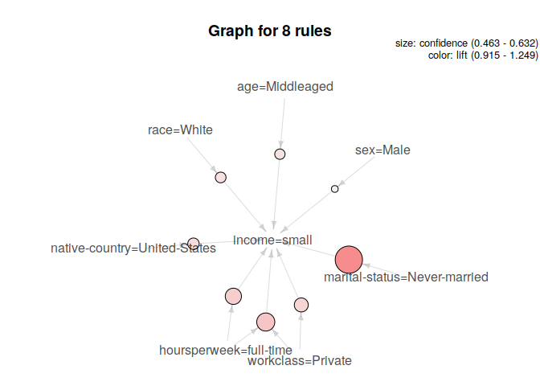
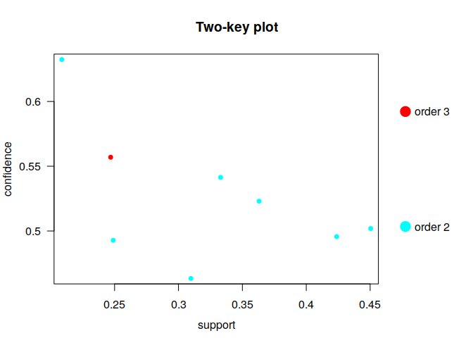

# Setup

First, we need to load in the necessary libraries:


```r
library(arules)
library(arulesViz)
library(dplyr)
```

Then we need to load our dataset, as well as examine it a bit


```r
data("AdultUCI")
dim(AdultUCI)
```

```
#> [1] 48842    15
```

```r
AdultUCI
```

<div data-pagedtable="false">
  <script data-pagedtable-source type="application/json">
{"columns":[{"label":[""],"name":["_rn_"],"type":[""],"align":["left"]},{"label":["age"],"name":[1],"type":["int"],"align":["right"]},{"label":["workclass"],"name":[2],"type":["fctr"],"align":["left"]},{"label":["fnlwgt"],"name":[3],"type":["int"],"align":["right"]},{"label":["education"],"name":[4],"type":["ord"],"align":["right"]},{"label":["education-num"],"name":[5],"type":["int"],"align":["right"]},{"label":["marital-status"],"name":[6],"type":["fctr"],"align":["left"]},{"label":["occupation"],"name":[7],"type":["fctr"],"align":["left"]},{"label":["relationship"],"name":[8],"type":["fctr"],"align":["left"]},{"label":["race"],"name":[9],"type":["fctr"],"align":["left"]},{"label":["sex"],"name":[10],"type":["fctr"],"align":["left"]},{"label":["capital-gain"],"name":[11],"type":["int"],"align":["right"]},{"label":["capital-loss"],"name":[12],"type":["int"],"align":["right"]},{"label":["hours-per-week"],"name":[13],"type":["int"],"align":["right"]},{"label":["native-country"],"name":[14],"type":["fctr"],"align":["left"]},{"label":["income"],"name":[15],"type":["ord"],"align":["right"]}],"data":[{"1":"39","2":"State-gov","3":"77516","4":"Bachelors","5":"13","6":"Never-married","7":"Adm-clerical","8":"Not-in-family","9":"White","10":"Male","11":"2174","12":"0","13":"40","14":"United-States","15":"small","_rn_":"1"},{"1":"50","2":"Self-emp-not-inc","3":"83311","4":"Bachelors","5":"13","6":"Married-civ-spouse","7":"Exec-managerial","8":"Husband","9":"White","10":"Male","11":"0","12":"0","13":"13","14":"United-States","15":"small","_rn_":"2"},{"1":"38","2":"Private","3":"215646","4":"HS-grad","5":"9","6":"Divorced","7":"Handlers-cleaners","8":"Not-in-family","9":"White","10":"Male","11":"0","12":"0","13":"40","14":"United-States","15":"small","_rn_":"3"},{"1":"53","2":"Private","3":"234721","4":"11th","5":"7","6":"Married-civ-spouse","7":"Handlers-cleaners","8":"Husband","9":"Black","10":"Male","11":"0","12":"0","13":"40","14":"United-States","15":"small","_rn_":"4"},{"1":"28","2":"Private","3":"338409","4":"Bachelors","5":"13","6":"Married-civ-spouse","7":"Prof-specialty","8":"Wife","9":"Black","10":"Female","11":"0","12":"0","13":"40","14":"Cuba","15":"small","_rn_":"5"},{"1":"37","2":"Private","3":"284582","4":"Masters","5":"14","6":"Married-civ-spouse","7":"Exec-managerial","8":"Wife","9":"White","10":"Female","11":"0","12":"0","13":"40","14":"United-States","15":"small","_rn_":"6"},{"1":"49","2":"Private","3":"160187","4":"9th","5":"5","6":"Married-spouse-absent","7":"Other-service","8":"Not-in-family","9":"Black","10":"Female","11":"0","12":"0","13":"16","14":"Jamaica","15":"small","_rn_":"7"},{"1":"52","2":"Self-emp-not-inc","3":"209642","4":"HS-grad","5":"9","6":"Married-civ-spouse","7":"Exec-managerial","8":"Husband","9":"White","10":"Male","11":"0","12":"0","13":"45","14":"United-States","15":"large","_rn_":"8"},{"1":"31","2":"Private","3":"45781","4":"Masters","5":"14","6":"Never-married","7":"Prof-specialty","8":"Not-in-family","9":"White","10":"Female","11":"14084","12":"0","13":"50","14":"United-States","15":"large","_rn_":"9"},{"1":"42","2":"Private","3":"159449","4":"Bachelors","5":"13","6":"Married-civ-spouse","7":"Exec-managerial","8":"Husband","9":"White","10":"Male","11":"5178","12":"0","13":"40","14":"United-States","15":"large","_rn_":"10"},{"1":"37","2":"Private","3":"280464","4":"Some-college","5":"10","6":"Married-civ-spouse","7":"Exec-managerial","8":"Husband","9":"Black","10":"Male","11":"0","12":"0","13":"80","14":"United-States","15":"large","_rn_":"11"},{"1":"30","2":"State-gov","3":"141297","4":"Bachelors","5":"13","6":"Married-civ-spouse","7":"Prof-specialty","8":"Husband","9":"Asian-Pac-Islander","10":"Male","11":"0","12":"0","13":"40","14":"India","15":"large","_rn_":"12"},{"1":"23","2":"Private","3":"122272","4":"Bachelors","5":"13","6":"Never-married","7":"Adm-clerical","8":"Own-child","9":"White","10":"Female","11":"0","12":"0","13":"30","14":"United-States","15":"small","_rn_":"13"},{"1":"32","2":"Private","3":"205019","4":"Assoc-acdm","5":"12","6":"Never-married","7":"Sales","8":"Not-in-family","9":"Black","10":"Male","11":"0","12":"0","13":"50","14":"United-States","15":"small","_rn_":"14"},{"1":"40","2":"Private","3":"121772","4":"Assoc-voc","5":"11","6":"Married-civ-spouse","7":"Craft-repair","8":"Husband","9":"Asian-Pac-Islander","10":"Male","11":"0","12":"0","13":"40","14":"NA","15":"large","_rn_":"15"},{"1":"34","2":"Private","3":"245487","4":"7th-8th","5":"4","6":"Married-civ-spouse","7":"Transport-moving","8":"Husband","9":"Amer-Indian-Eskimo","10":"Male","11":"0","12":"0","13":"45","14":"Mexico","15":"small","_rn_":"16"},{"1":"25","2":"Self-emp-not-inc","3":"176756","4":"HS-grad","5":"9","6":"Never-married","7":"Farming-fishing","8":"Own-child","9":"White","10":"Male","11":"0","12":"0","13":"35","14":"United-States","15":"small","_rn_":"17"},{"1":"32","2":"Private","3":"186824","4":"HS-grad","5":"9","6":"Never-married","7":"Machine-op-inspct","8":"Unmarried","9":"White","10":"Male","11":"0","12":"0","13":"40","14":"United-States","15":"small","_rn_":"18"},{"1":"38","2":"Private","3":"28887","4":"11th","5":"7","6":"Married-civ-spouse","7":"Sales","8":"Husband","9":"White","10":"Male","11":"0","12":"0","13":"50","14":"United-States","15":"small","_rn_":"19"},{"1":"43","2":"Self-emp-not-inc","3":"292175","4":"Masters","5":"14","6":"Divorced","7":"Exec-managerial","8":"Unmarried","9":"White","10":"Female","11":"0","12":"0","13":"45","14":"United-States","15":"large","_rn_":"20"},{"1":"40","2":"Private","3":"193524","4":"Doctorate","5":"16","6":"Married-civ-spouse","7":"Prof-specialty","8":"Husband","9":"White","10":"Male","11":"0","12":"0","13":"60","14":"United-States","15":"large","_rn_":"21"},{"1":"54","2":"Private","3":"302146","4":"HS-grad","5":"9","6":"Separated","7":"Other-service","8":"Unmarried","9":"Black","10":"Female","11":"0","12":"0","13":"20","14":"United-States","15":"small","_rn_":"22"},{"1":"35","2":"Federal-gov","3":"76845","4":"9th","5":"5","6":"Married-civ-spouse","7":"Farming-fishing","8":"Husband","9":"Black","10":"Male","11":"0","12":"0","13":"40","14":"United-States","15":"small","_rn_":"23"},{"1":"43","2":"Private","3":"117037","4":"11th","5":"7","6":"Married-civ-spouse","7":"Transport-moving","8":"Husband","9":"White","10":"Male","11":"0","12":"2042","13":"40","14":"United-States","15":"small","_rn_":"24"},{"1":"59","2":"Private","3":"109015","4":"HS-grad","5":"9","6":"Divorced","7":"Tech-support","8":"Unmarried","9":"White","10":"Female","11":"0","12":"0","13":"40","14":"United-States","15":"small","_rn_":"25"},{"1":"56","2":"Local-gov","3":"216851","4":"Bachelors","5":"13","6":"Married-civ-spouse","7":"Tech-support","8":"Husband","9":"White","10":"Male","11":"0","12":"0","13":"40","14":"United-States","15":"large","_rn_":"26"},{"1":"19","2":"Private","3":"168294","4":"HS-grad","5":"9","6":"Never-married","7":"Craft-repair","8":"Own-child","9":"White","10":"Male","11":"0","12":"0","13":"40","14":"United-States","15":"small","_rn_":"27"},{"1":"54","2":"NA","3":"180211","4":"Some-college","5":"10","6":"Married-civ-spouse","7":"NA","8":"Husband","9":"Asian-Pac-Islander","10":"Male","11":"0","12":"0","13":"60","14":"South","15":"large","_rn_":"28"},{"1":"39","2":"Private","3":"367260","4":"HS-grad","5":"9","6":"Divorced","7":"Exec-managerial","8":"Not-in-family","9":"White","10":"Male","11":"0","12":"0","13":"80","14":"United-States","15":"small","_rn_":"29"},{"1":"49","2":"Private","3":"193366","4":"HS-grad","5":"9","6":"Married-civ-spouse","7":"Craft-repair","8":"Husband","9":"White","10":"Male","11":"0","12":"0","13":"40","14":"United-States","15":"small","_rn_":"30"},{"1":"23","2":"Local-gov","3":"190709","4":"Assoc-acdm","5":"12","6":"Never-married","7":"Protective-serv","8":"Not-in-family","9":"White","10":"Male","11":"0","12":"0","13":"52","14":"United-States","15":"small","_rn_":"31"},{"1":"20","2":"Private","3":"266015","4":"Some-college","5":"10","6":"Never-married","7":"Sales","8":"Own-child","9":"Black","10":"Male","11":"0","12":"0","13":"44","14":"United-States","15":"small","_rn_":"32"},{"1":"45","2":"Private","3":"386940","4":"Bachelors","5":"13","6":"Divorced","7":"Exec-managerial","8":"Own-child","9":"White","10":"Male","11":"0","12":"1408","13":"40","14":"United-States","15":"small","_rn_":"33"},{"1":"30","2":"Federal-gov","3":"59951","4":"Some-college","5":"10","6":"Married-civ-spouse","7":"Adm-clerical","8":"Own-child","9":"White","10":"Male","11":"0","12":"0","13":"40","14":"United-States","15":"small","_rn_":"34"},{"1":"22","2":"State-gov","3":"311512","4":"Some-college","5":"10","6":"Married-civ-spouse","7":"Other-service","8":"Husband","9":"Black","10":"Male","11":"0","12":"0","13":"15","14":"United-States","15":"small","_rn_":"35"},{"1":"48","2":"Private","3":"242406","4":"11th","5":"7","6":"Never-married","7":"Machine-op-inspct","8":"Unmarried","9":"White","10":"Male","11":"0","12":"0","13":"40","14":"Puerto-Rico","15":"small","_rn_":"36"},{"1":"21","2":"Private","3":"197200","4":"Some-college","5":"10","6":"Never-married","7":"Machine-op-inspct","8":"Own-child","9":"White","10":"Male","11":"0","12":"0","13":"40","14":"United-States","15":"small","_rn_":"37"},{"1":"19","2":"Private","3":"544091","4":"HS-grad","5":"9","6":"Married-AF-spouse","7":"Adm-clerical","8":"Wife","9":"White","10":"Female","11":"0","12":"0","13":"25","14":"United-States","15":"small","_rn_":"38"},{"1":"31","2":"Private","3":"84154","4":"Some-college","5":"10","6":"Married-civ-spouse","7":"Sales","8":"Husband","9":"White","10":"Male","11":"0","12":"0","13":"38","14":"NA","15":"large","_rn_":"39"},{"1":"48","2":"Self-emp-not-inc","3":"265477","4":"Assoc-acdm","5":"12","6":"Married-civ-spouse","7":"Prof-specialty","8":"Husband","9":"White","10":"Male","11":"0","12":"0","13":"40","14":"United-States","15":"small","_rn_":"40"},{"1":"31","2":"Private","3":"507875","4":"9th","5":"5","6":"Married-civ-spouse","7":"Machine-op-inspct","8":"Husband","9":"White","10":"Male","11":"0","12":"0","13":"43","14":"United-States","15":"small","_rn_":"41"},{"1":"53","2":"Self-emp-not-inc","3":"88506","4":"Bachelors","5":"13","6":"Married-civ-spouse","7":"Prof-specialty","8":"Husband","9":"White","10":"Male","11":"0","12":"0","13":"40","14":"United-States","15":"small","_rn_":"42"},{"1":"24","2":"Private","3":"172987","4":"Bachelors","5":"13","6":"Married-civ-spouse","7":"Tech-support","8":"Husband","9":"White","10":"Male","11":"0","12":"0","13":"50","14":"United-States","15":"small","_rn_":"43"},{"1":"49","2":"Private","3":"94638","4":"HS-grad","5":"9","6":"Separated","7":"Adm-clerical","8":"Unmarried","9":"White","10":"Female","11":"0","12":"0","13":"40","14":"United-States","15":"small","_rn_":"44"},{"1":"25","2":"Private","3":"289980","4":"HS-grad","5":"9","6":"Never-married","7":"Handlers-cleaners","8":"Not-in-family","9":"White","10":"Male","11":"0","12":"0","13":"35","14":"United-States","15":"small","_rn_":"45"},{"1":"57","2":"Federal-gov","3":"337895","4":"Bachelors","5":"13","6":"Married-civ-spouse","7":"Prof-specialty","8":"Husband","9":"Black","10":"Male","11":"0","12":"0","13":"40","14":"United-States","15":"large","_rn_":"46"},{"1":"53","2":"Private","3":"144361","4":"HS-grad","5":"9","6":"Married-civ-spouse","7":"Machine-op-inspct","8":"Husband","9":"White","10":"Male","11":"0","12":"0","13":"38","14":"United-States","15":"small","_rn_":"47"},{"1":"44","2":"Private","3":"128354","4":"Masters","5":"14","6":"Divorced","7":"Exec-managerial","8":"Unmarried","9":"White","10":"Female","11":"0","12":"0","13":"40","14":"United-States","15":"small","_rn_":"48"},{"1":"41","2":"State-gov","3":"101603","4":"Assoc-voc","5":"11","6":"Married-civ-spouse","7":"Craft-repair","8":"Husband","9":"White","10":"Male","11":"0","12":"0","13":"40","14":"United-States","15":"small","_rn_":"49"},{"1":"29","2":"Private","3":"271466","4":"Assoc-voc","5":"11","6":"Never-married","7":"Prof-specialty","8":"Not-in-family","9":"White","10":"Male","11":"0","12":"0","13":"43","14":"United-States","15":"small","_rn_":"50"},{"1":"25","2":"Private","3":"32275","4":"Some-college","5":"10","6":"Married-civ-spouse","7":"Exec-managerial","8":"Wife","9":"Other","10":"Female","11":"0","12":"0","13":"40","14":"United-States","15":"small","_rn_":"51"},{"1":"18","2":"Private","3":"226956","4":"HS-grad","5":"9","6":"Never-married","7":"Other-service","8":"Own-child","9":"White","10":"Female","11":"0","12":"0","13":"30","14":"NA","15":"small","_rn_":"52"},{"1":"47","2":"Private","3":"51835","4":"Prof-school","5":"15","6":"Married-civ-spouse","7":"Prof-specialty","8":"Wife","9":"White","10":"Female","11":"0","12":"1902","13":"60","14":"Honduras","15":"large","_rn_":"53"},{"1":"50","2":"Federal-gov","3":"251585","4":"Bachelors","5":"13","6":"Divorced","7":"Exec-managerial","8":"Not-in-family","9":"White","10":"Male","11":"0","12":"0","13":"55","14":"United-States","15":"large","_rn_":"54"},{"1":"47","2":"Self-emp-inc","3":"109832","4":"HS-grad","5":"9","6":"Divorced","7":"Exec-managerial","8":"Not-in-family","9":"White","10":"Male","11":"0","12":"0","13":"60","14":"United-States","15":"small","_rn_":"55"},{"1":"43","2":"Private","3":"237993","4":"Some-college","5":"10","6":"Married-civ-spouse","7":"Tech-support","8":"Husband","9":"White","10":"Male","11":"0","12":"0","13":"40","14":"United-States","15":"large","_rn_":"56"},{"1":"46","2":"Private","3":"216666","4":"5th-6th","5":"3","6":"Married-civ-spouse","7":"Machine-op-inspct","8":"Husband","9":"White","10":"Male","11":"0","12":"0","13":"40","14":"Mexico","15":"small","_rn_":"57"},{"1":"35","2":"Private","3":"56352","4":"Assoc-voc","5":"11","6":"Married-civ-spouse","7":"Other-service","8":"Husband","9":"White","10":"Male","11":"0","12":"0","13":"40","14":"Puerto-Rico","15":"small","_rn_":"58"},{"1":"41","2":"Private","3":"147372","4":"HS-grad","5":"9","6":"Married-civ-spouse","7":"Adm-clerical","8":"Husband","9":"White","10":"Male","11":"0","12":"0","13":"48","14":"United-States","15":"small","_rn_":"59"},{"1":"30","2":"Private","3":"188146","4":"HS-grad","5":"9","6":"Married-civ-spouse","7":"Machine-op-inspct","8":"Husband","9":"White","10":"Male","11":"5013","12":"0","13":"40","14":"United-States","15":"small","_rn_":"60"},{"1":"30","2":"Private","3":"59496","4":"Bachelors","5":"13","6":"Married-civ-spouse","7":"Sales","8":"Husband","9":"White","10":"Male","11":"2407","12":"0","13":"40","14":"United-States","15":"small","_rn_":"61"},{"1":"32","2":"NA","3":"293936","4":"7th-8th","5":"4","6":"Married-spouse-absent","7":"NA","8":"Not-in-family","9":"White","10":"Male","11":"0","12":"0","13":"40","14":"NA","15":"small","_rn_":"62"},{"1":"48","2":"Private","3":"149640","4":"HS-grad","5":"9","6":"Married-civ-spouse","7":"Transport-moving","8":"Husband","9":"White","10":"Male","11":"0","12":"0","13":"40","14":"United-States","15":"small","_rn_":"63"},{"1":"42","2":"Private","3":"116632","4":"Doctorate","5":"16","6":"Married-civ-spouse","7":"Prof-specialty","8":"Husband","9":"White","10":"Male","11":"0","12":"0","13":"45","14":"United-States","15":"large","_rn_":"64"},{"1":"29","2":"Private","3":"105598","4":"Some-college","5":"10","6":"Divorced","7":"Tech-support","8":"Not-in-family","9":"White","10":"Male","11":"0","12":"0","13":"58","14":"United-States","15":"small","_rn_":"65"},{"1":"36","2":"Private","3":"155537","4":"HS-grad","5":"9","6":"Married-civ-spouse","7":"Craft-repair","8":"Husband","9":"White","10":"Male","11":"0","12":"0","13":"40","14":"United-States","15":"small","_rn_":"66"},{"1":"28","2":"Private","3":"183175","4":"Some-college","5":"10","6":"Divorced","7":"Adm-clerical","8":"Not-in-family","9":"White","10":"Female","11":"0","12":"0","13":"40","14":"United-States","15":"small","_rn_":"67"},{"1":"53","2":"Private","3":"169846","4":"HS-grad","5":"9","6":"Married-civ-spouse","7":"Adm-clerical","8":"Wife","9":"White","10":"Female","11":"0","12":"0","13":"40","14":"United-States","15":"large","_rn_":"68"},{"1":"49","2":"Self-emp-inc","3":"191681","4":"Some-college","5":"10","6":"Married-civ-spouse","7":"Exec-managerial","8":"Husband","9":"White","10":"Male","11":"0","12":"0","13":"50","14":"United-States","15":"large","_rn_":"69"},{"1":"25","2":"NA","3":"200681","4":"Some-college","5":"10","6":"Never-married","7":"NA","8":"Own-child","9":"White","10":"Male","11":"0","12":"0","13":"40","14":"United-States","15":"small","_rn_":"70"},{"1":"19","2":"Private","3":"101509","4":"Some-college","5":"10","6":"Never-married","7":"Prof-specialty","8":"Own-child","9":"White","10":"Male","11":"0","12":"0","13":"32","14":"United-States","15":"small","_rn_":"71"},{"1":"31","2":"Private","3":"309974","4":"Bachelors","5":"13","6":"Separated","7":"Sales","8":"Own-child","9":"Black","10":"Female","11":"0","12":"0","13":"40","14":"United-States","15":"small","_rn_":"72"},{"1":"29","2":"Self-emp-not-inc","3":"162298","4":"Bachelors","5":"13","6":"Married-civ-spouse","7":"Sales","8":"Husband","9":"White","10":"Male","11":"0","12":"0","13":"70","14":"United-States","15":"large","_rn_":"73"},{"1":"23","2":"Private","3":"211678","4":"Some-college","5":"10","6":"Never-married","7":"Machine-op-inspct","8":"Not-in-family","9":"White","10":"Male","11":"0","12":"0","13":"40","14":"United-States","15":"small","_rn_":"74"},{"1":"79","2":"Private","3":"124744","4":"Some-college","5":"10","6":"Married-civ-spouse","7":"Prof-specialty","8":"Other-relative","9":"White","10":"Male","11":"0","12":"0","13":"20","14":"United-States","15":"small","_rn_":"75"},{"1":"27","2":"Private","3":"213921","4":"HS-grad","5":"9","6":"Never-married","7":"Other-service","8":"Own-child","9":"White","10":"Male","11":"0","12":"0","13":"40","14":"Mexico","15":"small","_rn_":"76"},{"1":"40","2":"Private","3":"32214","4":"Assoc-acdm","5":"12","6":"Married-civ-spouse","7":"Adm-clerical","8":"Husband","9":"White","10":"Male","11":"0","12":"0","13":"40","14":"United-States","15":"small","_rn_":"77"},{"1":"67","2":"NA","3":"212759","4":"10th","5":"6","6":"Married-civ-spouse","7":"NA","8":"Husband","9":"White","10":"Male","11":"0","12":"0","13":"2","14":"United-States","15":"small","_rn_":"78"},{"1":"18","2":"Private","3":"309634","4":"11th","5":"7","6":"Never-married","7":"Other-service","8":"Own-child","9":"White","10":"Female","11":"0","12":"0","13":"22","14":"United-States","15":"small","_rn_":"79"},{"1":"31","2":"Local-gov","3":"125927","4":"7th-8th","5":"4","6":"Married-civ-spouse","7":"Farming-fishing","8":"Husband","9":"White","10":"Male","11":"0","12":"0","13":"40","14":"United-States","15":"small","_rn_":"80"},{"1":"18","2":"Private","3":"446839","4":"HS-grad","5":"9","6":"Never-married","7":"Sales","8":"Not-in-family","9":"White","10":"Male","11":"0","12":"0","13":"30","14":"United-States","15":"small","_rn_":"81"},{"1":"52","2":"Private","3":"276515","4":"Bachelors","5":"13","6":"Married-civ-spouse","7":"Other-service","8":"Husband","9":"White","10":"Male","11":"0","12":"0","13":"40","14":"Cuba","15":"small","_rn_":"82"},{"1":"46","2":"Private","3":"51618","4":"HS-grad","5":"9","6":"Married-civ-spouse","7":"Other-service","8":"Wife","9":"White","10":"Female","11":"0","12":"0","13":"40","14":"United-States","15":"small","_rn_":"83"},{"1":"59","2":"Private","3":"159937","4":"HS-grad","5":"9","6":"Married-civ-spouse","7":"Sales","8":"Husband","9":"White","10":"Male","11":"0","12":"0","13":"48","14":"United-States","15":"small","_rn_":"84"},{"1":"44","2":"Private","3":"343591","4":"HS-grad","5":"9","6":"Divorced","7":"Craft-repair","8":"Not-in-family","9":"White","10":"Female","11":"14344","12":"0","13":"40","14":"United-States","15":"large","_rn_":"85"},{"1":"53","2":"Private","3":"346253","4":"HS-grad","5":"9","6":"Divorced","7":"Sales","8":"Own-child","9":"White","10":"Female","11":"0","12":"0","13":"35","14":"United-States","15":"small","_rn_":"86"},{"1":"49","2":"Local-gov","3":"268234","4":"HS-grad","5":"9","6":"Married-civ-spouse","7":"Protective-serv","8":"Husband","9":"White","10":"Male","11":"0","12":"0","13":"40","14":"United-States","15":"large","_rn_":"87"},{"1":"33","2":"Private","3":"202051","4":"Masters","5":"14","6":"Married-civ-spouse","7":"Prof-specialty","8":"Husband","9":"White","10":"Male","11":"0","12":"0","13":"50","14":"United-States","15":"small","_rn_":"88"},{"1":"30","2":"Private","3":"54334","4":"9th","5":"5","6":"Never-married","7":"Sales","8":"Not-in-family","9":"White","10":"Male","11":"0","12":"0","13":"40","14":"United-States","15":"small","_rn_":"89"},{"1":"43","2":"Federal-gov","3":"410867","4":"Doctorate","5":"16","6":"Never-married","7":"Prof-specialty","8":"Not-in-family","9":"White","10":"Female","11":"0","12":"0","13":"50","14":"United-States","15":"large","_rn_":"90"},{"1":"57","2":"Private","3":"249977","4":"Assoc-voc","5":"11","6":"Married-civ-spouse","7":"Prof-specialty","8":"Husband","9":"White","10":"Male","11":"0","12":"0","13":"40","14":"United-States","15":"small","_rn_":"91"},{"1":"37","2":"Private","3":"286730","4":"Some-college","5":"10","6":"Divorced","7":"Craft-repair","8":"Unmarried","9":"White","10":"Female","11":"0","12":"0","13":"40","14":"United-States","15":"small","_rn_":"92"},{"1":"28","2":"Private","3":"212563","4":"Some-college","5":"10","6":"Divorced","7":"Machine-op-inspct","8":"Unmarried","9":"Black","10":"Female","11":"0","12":"0","13":"25","14":"United-States","15":"small","_rn_":"93"},{"1":"30","2":"Private","3":"117747","4":"HS-grad","5":"9","6":"Married-civ-spouse","7":"Sales","8":"Wife","9":"Asian-Pac-Islander","10":"Female","11":"0","12":"1573","13":"35","14":"NA","15":"small","_rn_":"94"},{"1":"34","2":"Local-gov","3":"226296","4":"Bachelors","5":"13","6":"Married-civ-spouse","7":"Protective-serv","8":"Husband","9":"White","10":"Male","11":"0","12":"0","13":"40","14":"United-States","15":"large","_rn_":"95"},{"1":"29","2":"Local-gov","3":"115585","4":"Some-college","5":"10","6":"Never-married","7":"Handlers-cleaners","8":"Not-in-family","9":"White","10":"Male","11":"0","12":"0","13":"50","14":"United-States","15":"small","_rn_":"96"},{"1":"48","2":"Self-emp-not-inc","3":"191277","4":"Doctorate","5":"16","6":"Married-civ-spouse","7":"Prof-specialty","8":"Husband","9":"White","10":"Male","11":"0","12":"1902","13":"60","14":"United-States","15":"large","_rn_":"97"},{"1":"37","2":"Private","3":"202683","4":"Some-college","5":"10","6":"Married-civ-spouse","7":"Sales","8":"Husband","9":"White","10":"Male","11":"0","12":"0","13":"48","14":"United-States","15":"large","_rn_":"98"},{"1":"48","2":"Private","3":"171095","4":"Assoc-acdm","5":"12","6":"Divorced","7":"Exec-managerial","8":"Unmarried","9":"White","10":"Female","11":"0","12":"0","13":"40","14":"England","15":"small","_rn_":"99"},{"1":"32","2":"Federal-gov","3":"249409","4":"HS-grad","5":"9","6":"Never-married","7":"Other-service","8":"Own-child","9":"Black","10":"Male","11":"0","12":"0","13":"40","14":"United-States","15":"small","_rn_":"100"},{"1":"76","2":"Private","3":"124191","4":"Masters","5":"14","6":"Married-civ-spouse","7":"Exec-managerial","8":"Husband","9":"White","10":"Male","11":"0","12":"0","13":"40","14":"United-States","15":"large","_rn_":"101"},{"1":"44","2":"Private","3":"198282","4":"Bachelors","5":"13","6":"Married-civ-spouse","7":"Exec-managerial","8":"Husband","9":"White","10":"Male","11":"15024","12":"0","13":"60","14":"United-States","15":"large","_rn_":"102"},{"1":"47","2":"Self-emp-not-inc","3":"149116","4":"Masters","5":"14","6":"Never-married","7":"Prof-specialty","8":"Not-in-family","9":"White","10":"Female","11":"0","12":"0","13":"50","14":"United-States","15":"small","_rn_":"103"},{"1":"20","2":"Private","3":"188300","4":"Some-college","5":"10","6":"Never-married","7":"Tech-support","8":"Own-child","9":"White","10":"Female","11":"0","12":"0","13":"40","14":"United-States","15":"small","_rn_":"104"},{"1":"29","2":"Private","3":"103432","4":"HS-grad","5":"9","6":"Never-married","7":"Craft-repair","8":"Not-in-family","9":"White","10":"Male","11":"0","12":"0","13":"40","14":"United-States","15":"small","_rn_":"105"},{"1":"32","2":"Self-emp-inc","3":"317660","4":"HS-grad","5":"9","6":"Married-civ-spouse","7":"Craft-repair","8":"Husband","9":"White","10":"Male","11":"7688","12":"0","13":"40","14":"United-States","15":"large","_rn_":"106"},{"1":"17","2":"NA","3":"304873","4":"10th","5":"6","6":"Never-married","7":"NA","8":"Own-child","9":"White","10":"Female","11":"34095","12":"0","13":"32","14":"United-States","15":"small","_rn_":"107"},{"1":"30","2":"Private","3":"194901","4":"11th","5":"7","6":"Never-married","7":"Handlers-cleaners","8":"Own-child","9":"White","10":"Male","11":"0","12":"0","13":"40","14":"United-States","15":"small","_rn_":"108"},{"1":"31","2":"Local-gov","3":"189265","4":"HS-grad","5":"9","6":"Never-married","7":"Adm-clerical","8":"Not-in-family","9":"White","10":"Female","11":"0","12":"0","13":"40","14":"United-States","15":"small","_rn_":"109"},{"1":"42","2":"Private","3":"124692","4":"HS-grad","5":"9","6":"Married-civ-spouse","7":"Handlers-cleaners","8":"Husband","9":"White","10":"Male","11":"0","12":"0","13":"40","14":"United-States","15":"small","_rn_":"110"},{"1":"24","2":"Private","3":"432376","4":"Bachelors","5":"13","6":"Never-married","7":"Sales","8":"Other-relative","9":"White","10":"Male","11":"0","12":"0","13":"40","14":"United-States","15":"small","_rn_":"111"},{"1":"38","2":"Private","3":"65324","4":"Prof-school","5":"15","6":"Married-civ-spouse","7":"Prof-specialty","8":"Husband","9":"White","10":"Male","11":"0","12":"0","13":"40","14":"United-States","15":"large","_rn_":"112"},{"1":"56","2":"Self-emp-not-inc","3":"335605","4":"HS-grad","5":"9","6":"Married-civ-spouse","7":"Other-service","8":"Husband","9":"White","10":"Male","11":"0","12":"1887","13":"50","14":"Canada","15":"large","_rn_":"113"},{"1":"28","2":"Private","3":"377869","4":"Some-college","5":"10","6":"Married-civ-spouse","7":"Sales","8":"Wife","9":"White","10":"Female","11":"4064","12":"0","13":"25","14":"United-States","15":"small","_rn_":"114"},{"1":"36","2":"Private","3":"102864","4":"HS-grad","5":"9","6":"Never-married","7":"Machine-op-inspct","8":"Own-child","9":"White","10":"Female","11":"0","12":"0","13":"40","14":"United-States","15":"small","_rn_":"115"},{"1":"53","2":"Private","3":"95647","4":"9th","5":"5","6":"Married-civ-spouse","7":"Handlers-cleaners","8":"Husband","9":"White","10":"Male","11":"0","12":"0","13":"50","14":"United-States","15":"small","_rn_":"116"},{"1":"56","2":"Self-emp-inc","3":"303090","4":"Some-college","5":"10","6":"Married-civ-spouse","7":"Sales","8":"Husband","9":"White","10":"Male","11":"0","12":"0","13":"50","14":"United-States","15":"small","_rn_":"117"},{"1":"49","2":"Local-gov","3":"197371","4":"Assoc-voc","5":"11","6":"Married-civ-spouse","7":"Craft-repair","8":"Husband","9":"Black","10":"Male","11":"0","12":"0","13":"40","14":"United-States","15":"large","_rn_":"118"},{"1":"55","2":"Private","3":"247552","4":"Some-college","5":"10","6":"Married-civ-spouse","7":"Sales","8":"Husband","9":"White","10":"Male","11":"0","12":"0","13":"56","14":"United-States","15":"small","_rn_":"119"},{"1":"22","2":"Private","3":"102632","4":"HS-grad","5":"9","6":"Never-married","7":"Craft-repair","8":"Not-in-family","9":"White","10":"Male","11":"0","12":"0","13":"41","14":"United-States","15":"small","_rn_":"120"},{"1":"21","2":"Private","3":"199915","4":"Some-college","5":"10","6":"Never-married","7":"Other-service","8":"Own-child","9":"White","10":"Female","11":"0","12":"0","13":"40","14":"United-States","15":"small","_rn_":"121"},{"1":"40","2":"Private","3":"118853","4":"Bachelors","5":"13","6":"Married-civ-spouse","7":"Exec-managerial","8":"Husband","9":"White","10":"Male","11":"0","12":"0","13":"60","14":"United-States","15":"small","_rn_":"122"},{"1":"30","2":"Private","3":"77143","4":"Bachelors","5":"13","6":"Never-married","7":"Exec-managerial","8":"Own-child","9":"Black","10":"Male","11":"0","12":"0","13":"40","14":"Germany","15":"small","_rn_":"123"},{"1":"29","2":"State-gov","3":"267989","4":"Bachelors","5":"13","6":"Married-civ-spouse","7":"Prof-specialty","8":"Husband","9":"White","10":"Male","11":"0","12":"0","13":"50","14":"United-States","15":"large","_rn_":"124"},{"1":"19","2":"Private","3":"301606","4":"Some-college","5":"10","6":"Never-married","7":"Other-service","8":"Own-child","9":"Black","10":"Male","11":"0","12":"0","13":"35","14":"United-States","15":"small","_rn_":"125"},{"1":"47","2":"Private","3":"287828","4":"Bachelors","5":"13","6":"Married-civ-spouse","7":"Exec-managerial","8":"Wife","9":"White","10":"Female","11":"0","12":"0","13":"40","14":"United-States","15":"large","_rn_":"126"},{"1":"20","2":"Private","3":"111697","4":"Some-college","5":"10","6":"Never-married","7":"Adm-clerical","8":"Own-child","9":"White","10":"Female","11":"0","12":"1719","13":"28","14":"United-States","15":"small","_rn_":"127"},{"1":"31","2":"Private","3":"114937","4":"Assoc-acdm","5":"12","6":"Married-civ-spouse","7":"Adm-clerical","8":"Husband","9":"White","10":"Male","11":"0","12":"0","13":"40","14":"United-States","15":"large","_rn_":"128"},{"1":"35","2":"NA","3":"129305","4":"HS-grad","5":"9","6":"Married-civ-spouse","7":"NA","8":"Husband","9":"White","10":"Male","11":"0","12":"0","13":"40","14":"United-States","15":"small","_rn_":"129"},{"1":"39","2":"Private","3":"365739","4":"Some-college","5":"10","6":"Divorced","7":"Craft-repair","8":"Not-in-family","9":"White","10":"Male","11":"0","12":"0","13":"40","14":"United-States","15":"small","_rn_":"130"},{"1":"28","2":"Private","3":"69621","4":"Assoc-acdm","5":"12","6":"Never-married","7":"Sales","8":"Not-in-family","9":"White","10":"Female","11":"0","12":"0","13":"60","14":"United-States","15":"small","_rn_":"131"},{"1":"24","2":"Private","3":"43323","4":"HS-grad","5":"9","6":"Never-married","7":"Other-service","8":"Not-in-family","9":"White","10":"Female","11":"0","12":"1762","13":"40","14":"United-States","15":"small","_rn_":"132"},{"1":"38","2":"Self-emp-not-inc","3":"120985","4":"HS-grad","5":"9","6":"Married-civ-spouse","7":"Craft-repair","8":"Husband","9":"White","10":"Male","11":"4386","12":"0","13":"35","14":"United-States","15":"small","_rn_":"133"},{"1":"37","2":"Private","3":"254202","4":"Bachelors","5":"13","6":"Married-civ-spouse","7":"Sales","8":"Husband","9":"White","10":"Male","11":"0","12":"0","13":"50","14":"United-States","15":"small","_rn_":"134"},{"1":"46","2":"Private","3":"146195","4":"Assoc-acdm","5":"12","6":"Divorced","7":"Tech-support","8":"Not-in-family","9":"Black","10":"Female","11":"0","12":"0","13":"36","14":"United-States","15":"small","_rn_":"135"},{"1":"38","2":"Federal-gov","3":"125933","4":"Masters","5":"14","6":"Married-civ-spouse","7":"Prof-specialty","8":"Husband","9":"White","10":"Male","11":"0","12":"0","13":"40","14":"Iran","15":"large","_rn_":"136"},{"1":"43","2":"Self-emp-not-inc","3":"56920","4":"HS-grad","5":"9","6":"Married-civ-spouse","7":"Craft-repair","8":"Husband","9":"White","10":"Male","11":"0","12":"0","13":"60","14":"United-States","15":"small","_rn_":"137"},{"1":"27","2":"Private","3":"163127","4":"Assoc-voc","5":"11","6":"Married-civ-spouse","7":"Adm-clerical","8":"Wife","9":"White","10":"Female","11":"0","12":"0","13":"35","14":"United-States","15":"small","_rn_":"138"},{"1":"20","2":"Private","3":"34310","4":"Some-college","5":"10","6":"Never-married","7":"Sales","8":"Own-child","9":"White","10":"Male","11":"0","12":"0","13":"20","14":"United-States","15":"small","_rn_":"139"},{"1":"49","2":"Private","3":"81973","4":"Some-college","5":"10","6":"Married-civ-spouse","7":"Craft-repair","8":"Husband","9":"Asian-Pac-Islander","10":"Male","11":"0","12":"0","13":"40","14":"United-States","15":"large","_rn_":"140"},{"1":"61","2":"Self-emp-inc","3":"66614","4":"HS-grad","5":"9","6":"Married-civ-spouse","7":"Craft-repair","8":"Husband","9":"White","10":"Male","11":"0","12":"0","13":"40","14":"United-States","15":"small","_rn_":"141"},{"1":"27","2":"Private","3":"232782","4":"Some-college","5":"10","6":"Never-married","7":"Sales","8":"Own-child","9":"White","10":"Female","11":"0","12":"0","13":"40","14":"United-States","15":"small","_rn_":"142"},{"1":"19","2":"Private","3":"316868","4":"Some-college","5":"10","6":"Never-married","7":"Other-service","8":"Own-child","9":"White","10":"Male","11":"0","12":"0","13":"30","14":"Mexico","15":"small","_rn_":"143"},{"1":"45","2":"Private","3":"196584","4":"Assoc-voc","5":"11","6":"Never-married","7":"Prof-specialty","8":"Not-in-family","9":"White","10":"Female","11":"0","12":"1564","13":"40","14":"United-States","15":"large","_rn_":"144"},{"1":"70","2":"Private","3":"105376","4":"Some-college","5":"10","6":"Never-married","7":"Tech-support","8":"Other-relative","9":"White","10":"Male","11":"0","12":"0","13":"40","14":"United-States","15":"small","_rn_":"145"},{"1":"31","2":"Private","3":"185814","4":"HS-grad","5":"9","6":"Never-married","7":"Transport-moving","8":"Unmarried","9":"Black","10":"Female","11":"0","12":"0","13":"30","14":"United-States","15":"small","_rn_":"146"},{"1":"22","2":"Private","3":"175374","4":"Some-college","5":"10","6":"Married-civ-spouse","7":"Other-service","8":"Husband","9":"White","10":"Male","11":"0","12":"0","13":"24","14":"United-States","15":"small","_rn_":"147"},{"1":"36","2":"Private","3":"108293","4":"HS-grad","5":"9","6":"Widowed","7":"Other-service","8":"Unmarried","9":"White","10":"Female","11":"0","12":"0","13":"24","14":"United-States","15":"small","_rn_":"148"},{"1":"64","2":"Private","3":"181232","4":"11th","5":"7","6":"Married-civ-spouse","7":"Craft-repair","8":"Husband","9":"White","10":"Male","11":"0","12":"2179","13":"40","14":"United-States","15":"small","_rn_":"149"},{"1":"43","2":"NA","3":"174662","4":"Some-college","5":"10","6":"Divorced","7":"NA","8":"Not-in-family","9":"White","10":"Female","11":"0","12":"0","13":"40","14":"United-States","15":"small","_rn_":"150"},{"1":"47","2":"Local-gov","3":"186009","4":"Some-college","5":"10","6":"Divorced","7":"Adm-clerical","8":"Unmarried","9":"White","10":"Female","11":"0","12":"0","13":"38","14":"Mexico","15":"small","_rn_":"151"},{"1":"34","2":"Private","3":"198183","4":"HS-grad","5":"9","6":"Never-married","7":"Adm-clerical","8":"Not-in-family","9":"White","10":"Female","11":"0","12":"0","13":"40","14":"United-States","15":"small","_rn_":"152"},{"1":"33","2":"Private","3":"163003","4":"Bachelors","5":"13","6":"Never-married","7":"Exec-managerial","8":"Other-relative","9":"Asian-Pac-Islander","10":"Female","11":"0","12":"0","13":"40","14":"Philippines","15":"small","_rn_":"153"},{"1":"21","2":"Private","3":"296158","4":"HS-grad","5":"9","6":"Never-married","7":"Craft-repair","8":"Own-child","9":"White","10":"Male","11":"0","12":"0","13":"35","14":"United-States","15":"small","_rn_":"154"},{"1":"52","2":"NA","3":"252903","4":"HS-grad","5":"9","6":"Divorced","7":"NA","8":"Not-in-family","9":"White","10":"Male","11":"0","12":"0","13":"45","14":"United-States","15":"large","_rn_":"155"},{"1":"48","2":"Private","3":"187715","4":"HS-grad","5":"9","6":"Married-civ-spouse","7":"Craft-repair","8":"Husband","9":"White","10":"Male","11":"0","12":"0","13":"46","14":"United-States","15":"small","_rn_":"156"},{"1":"23","2":"Private","3":"214542","4":"Bachelors","5":"13","6":"Never-married","7":"Handlers-cleaners","8":"Not-in-family","9":"White","10":"Male","11":"0","12":"0","13":"40","14":"United-States","15":"small","_rn_":"157"},{"1":"71","2":"Self-emp-not-inc","3":"494223","4":"Some-college","5":"10","6":"Separated","7":"Sales","8":"Unmarried","9":"Black","10":"Male","11":"0","12":"1816","13":"2","14":"United-States","15":"small","_rn_":"158"},{"1":"29","2":"Private","3":"191535","4":"HS-grad","5":"9","6":"Divorced","7":"Craft-repair","8":"Not-in-family","9":"White","10":"Male","11":"0","12":"0","13":"60","14":"United-States","15":"small","_rn_":"159"},{"1":"42","2":"Private","3":"228456","4":"Bachelors","5":"13","6":"Separated","7":"Other-service","8":"Other-relative","9":"Black","10":"Male","11":"0","12":"0","13":"50","14":"United-States","15":"small","_rn_":"160"},{"1":"68","2":"NA","3":"38317","4":"1st-4th","5":"2","6":"Divorced","7":"NA","8":"Not-in-family","9":"White","10":"Female","11":"0","12":"0","13":"20","14":"United-States","15":"small","_rn_":"161"},{"1":"25","2":"Private","3":"252752","4":"HS-grad","5":"9","6":"Never-married","7":"Other-service","8":"Unmarried","9":"White","10":"Female","11":"0","12":"0","13":"40","14":"United-States","15":"small","_rn_":"162"},{"1":"44","2":"Self-emp-inc","3":"78374","4":"Masters","5":"14","6":"Divorced","7":"Exec-managerial","8":"Unmarried","9":"Asian-Pac-Islander","10":"Female","11":"0","12":"0","13":"40","14":"United-States","15":"small","_rn_":"163"},{"1":"28","2":"Private","3":"88419","4":"HS-grad","5":"9","6":"Never-married","7":"Exec-managerial","8":"Not-in-family","9":"Asian-Pac-Islander","10":"Female","11":"0","12":"0","13":"40","14":"England","15":"small","_rn_":"164"},{"1":"45","2":"Self-emp-not-inc","3":"201080","4":"Masters","5":"14","6":"Married-civ-spouse","7":"Sales","8":"Husband","9":"White","10":"Male","11":"0","12":"0","13":"40","14":"United-States","15":"large","_rn_":"165"},{"1":"36","2":"Private","3":"207157","4":"Some-college","5":"10","6":"Divorced","7":"Other-service","8":"Unmarried","9":"White","10":"Female","11":"0","12":"0","13":"40","14":"Mexico","15":"small","_rn_":"166"},{"1":"39","2":"Federal-gov","3":"235485","4":"Assoc-acdm","5":"12","6":"Never-married","7":"Exec-managerial","8":"Not-in-family","9":"White","10":"Male","11":"0","12":"0","13":"42","14":"United-States","15":"small","_rn_":"167"},{"1":"46","2":"State-gov","3":"102628","4":"Masters","5":"14","6":"Widowed","7":"Protective-serv","8":"Unmarried","9":"White","10":"Male","11":"0","12":"0","13":"40","14":"United-States","15":"small","_rn_":"168"},{"1":"18","2":"Private","3":"25828","4":"11th","5":"7","6":"Never-married","7":"Handlers-cleaners","8":"Own-child","9":"White","10":"Male","11":"0","12":"0","13":"16","14":"United-States","15":"small","_rn_":"169"},{"1":"66","2":"Local-gov","3":"54826","4":"Assoc-voc","5":"11","6":"Widowed","7":"Prof-specialty","8":"Not-in-family","9":"White","10":"Female","11":"0","12":"0","13":"20","14":"United-States","15":"small","_rn_":"170"},{"1":"27","2":"Private","3":"124953","4":"HS-grad","5":"9","6":"Never-married","7":"Other-service","8":"Not-in-family","9":"White","10":"Male","11":"0","12":"1980","13":"40","14":"United-States","15":"small","_rn_":"171"},{"1":"28","2":"State-gov","3":"175325","4":"HS-grad","5":"9","6":"Married-civ-spouse","7":"Protective-serv","8":"Husband","9":"White","10":"Male","11":"0","12":"0","13":"40","14":"United-States","15":"small","_rn_":"172"},{"1":"51","2":"Private","3":"96062","4":"Some-college","5":"10","6":"Married-civ-spouse","7":"Sales","8":"Husband","9":"White","10":"Male","11":"0","12":"1977","13":"40","14":"United-States","15":"large","_rn_":"173"},{"1":"27","2":"Private","3":"428030","4":"Bachelors","5":"13","6":"Never-married","7":"Craft-repair","8":"Not-in-family","9":"White","10":"Male","11":"0","12":"0","13":"50","14":"United-States","15":"small","_rn_":"174"},{"1":"28","2":"State-gov","3":"149624","4":"Bachelors","5":"13","6":"Married-civ-spouse","7":"Prof-specialty","8":"Husband","9":"White","10":"Male","11":"0","12":"0","13":"40","14":"United-States","15":"large","_rn_":"175"},{"1":"27","2":"Private","3":"253814","4":"HS-grad","5":"9","6":"Married-spouse-absent","7":"Sales","8":"Unmarried","9":"White","10":"Female","11":"0","12":"0","13":"25","14":"United-States","15":"small","_rn_":"176"},{"1":"21","2":"Private","3":"312956","4":"HS-grad","5":"9","6":"Never-married","7":"Craft-repair","8":"Own-child","9":"Black","10":"Male","11":"0","12":"0","13":"40","14":"United-States","15":"small","_rn_":"177"},{"1":"34","2":"Private","3":"483777","4":"HS-grad","5":"9","6":"Never-married","7":"Handlers-cleaners","8":"Not-in-family","9":"Black","10":"Male","11":"0","12":"0","13":"40","14":"United-States","15":"small","_rn_":"178"},{"1":"18","2":"Private","3":"183930","4":"HS-grad","5":"9","6":"Never-married","7":"Other-service","8":"Own-child","9":"White","10":"Male","11":"0","12":"0","13":"12","14":"United-States","15":"small","_rn_":"179"},{"1":"33","2":"Private","3":"37274","4":"Bachelors","5":"13","6":"Married-civ-spouse","7":"Prof-specialty","8":"Husband","9":"White","10":"Male","11":"0","12":"0","13":"65","14":"United-States","15":"small","_rn_":"180"},{"1":"44","2":"Local-gov","3":"181344","4":"Some-college","5":"10","6":"Married-civ-spouse","7":"Exec-managerial","8":"Husband","9":"Black","10":"Male","11":"0","12":"0","13":"38","14":"United-States","15":"large","_rn_":"181"},{"1":"43","2":"Private","3":"114580","4":"Some-college","5":"10","6":"Divorced","7":"Adm-clerical","8":"Not-in-family","9":"White","10":"Female","11":"0","12":"0","13":"40","14":"United-States","15":"small","_rn_":"182"},{"1":"30","2":"Private","3":"633742","4":"Some-college","5":"10","6":"Never-married","7":"Craft-repair","8":"Not-in-family","9":"Black","10":"Male","11":"0","12":"0","13":"45","14":"United-States","15":"small","_rn_":"183"},{"1":"40","2":"Private","3":"286370","4":"7th-8th","5":"4","6":"Married-civ-spouse","7":"Machine-op-inspct","8":"Husband","9":"White","10":"Male","11":"0","12":"0","13":"40","14":"Mexico","15":"large","_rn_":"184"},{"1":"37","2":"Federal-gov","3":"29054","4":"Some-college","5":"10","6":"Married-civ-spouse","7":"Adm-clerical","8":"Husband","9":"White","10":"Male","11":"0","12":"0","13":"42","14":"United-States","15":"large","_rn_":"185"},{"1":"34","2":"Private","3":"304030","4":"HS-grad","5":"9","6":"Married-civ-spouse","7":"Adm-clerical","8":"Husband","9":"Black","10":"Male","11":"0","12":"0","13":"40","14":"United-States","15":"small","_rn_":"186"},{"1":"41","2":"Self-emp-not-inc","3":"143129","4":"Bachelors","5":"13","6":"Divorced","7":"Exec-managerial","8":"Not-in-family","9":"White","10":"Female","11":"0","12":"0","13":"40","14":"United-States","15":"small","_rn_":"187"},{"1":"53","2":"NA","3":"135105","4":"Bachelors","5":"13","6":"Divorced","7":"NA","8":"Not-in-family","9":"White","10":"Female","11":"0","12":"0","13":"50","14":"United-States","15":"small","_rn_":"188"},{"1":"31","2":"Private","3":"99928","4":"Masters","5":"14","6":"Married-civ-spouse","7":"Prof-specialty","8":"Wife","9":"White","10":"Female","11":"0","12":"0","13":"50","14":"United-States","15":"small","_rn_":"189"},{"1":"58","2":"State-gov","3":"109567","4":"Doctorate","5":"16","6":"Married-civ-spouse","7":"Prof-specialty","8":"Husband","9":"White","10":"Male","11":"0","12":"0","13":"1","14":"United-States","15":"large","_rn_":"190"},{"1":"38","2":"Private","3":"155222","4":"Some-college","5":"10","6":"Divorced","7":"Machine-op-inspct","8":"Not-in-family","9":"Black","10":"Female","11":"0","12":"0","13":"28","14":"United-States","15":"small","_rn_":"191"},{"1":"24","2":"Private","3":"159567","4":"Some-college","5":"10","6":"Married-civ-spouse","7":"Machine-op-inspct","8":"Husband","9":"White","10":"Male","11":"0","12":"0","13":"40","14":"United-States","15":"small","_rn_":"192"},{"1":"41","2":"Local-gov","3":"523910","4":"Bachelors","5":"13","6":"Married-civ-spouse","7":"Craft-repair","8":"Husband","9":"Black","10":"Male","11":"0","12":"0","13":"40","14":"United-States","15":"small","_rn_":"193"},{"1":"47","2":"Private","3":"120939","4":"Some-college","5":"10","6":"Married-civ-spouse","7":"Tech-support","8":"Husband","9":"White","10":"Male","11":"0","12":"0","13":"45","14":"United-States","15":"small","_rn_":"194"},{"1":"41","2":"Federal-gov","3":"130760","4":"Bachelors","5":"13","6":"Married-civ-spouse","7":"Tech-support","8":"Husband","9":"White","10":"Male","11":"0","12":"0","13":"24","14":"United-States","15":"small","_rn_":"195"},{"1":"23","2":"Private","3":"197387","4":"5th-6th","5":"3","6":"Married-civ-spouse","7":"Transport-moving","8":"Other-relative","9":"White","10":"Male","11":"0","12":"0","13":"40","14":"Mexico","15":"small","_rn_":"196"},{"1":"36","2":"Private","3":"99374","4":"Some-college","5":"10","6":"Divorced","7":"Craft-repair","8":"Not-in-family","9":"White","10":"Male","11":"0","12":"0","13":"40","14":"United-States","15":"small","_rn_":"197"},{"1":"40","2":"Federal-gov","3":"56795","4":"Masters","5":"14","6":"Never-married","7":"Exec-managerial","8":"Not-in-family","9":"White","10":"Female","11":"14084","12":"0","13":"55","14":"United-States","15":"large","_rn_":"198"},{"1":"35","2":"Private","3":"138992","4":"Masters","5":"14","6":"Married-civ-spouse","7":"Prof-specialty","8":"Other-relative","9":"White","10":"Male","11":"7298","12":"0","13":"40","14":"United-States","15":"large","_rn_":"199"},{"1":"24","2":"Self-emp-not-inc","3":"32921","4":"HS-grad","5":"9","6":"Never-married","7":"Sales","8":"Not-in-family","9":"White","10":"Male","11":"0","12":"0","13":"40","14":"United-States","15":"small","_rn_":"200"},{"1":"26","2":"Private","3":"397317","4":"Masters","5":"14","6":"Never-married","7":"Prof-specialty","8":"Not-in-family","9":"White","10":"Female","11":"0","12":"1876","13":"40","14":"United-States","15":"small","_rn_":"201"},{"1":"19","2":"NA","3":"170653","4":"HS-grad","5":"9","6":"Never-married","7":"NA","8":"Own-child","9":"White","10":"Male","11":"0","12":"0","13":"40","14":"Italy","15":"small","_rn_":"202"},{"1":"51","2":"Private","3":"259323","4":"Bachelors","5":"13","6":"Married-civ-spouse","7":"Exec-managerial","8":"Husband","9":"White","10":"Male","11":"0","12":"0","13":"50","14":"United-States","15":"large","_rn_":"203"},{"1":"42","2":"Local-gov","3":"254817","4":"Some-college","5":"10","6":"Never-married","7":"Prof-specialty","8":"Not-in-family","9":"White","10":"Female","11":"0","12":"1340","13":"40","14":"United-States","15":"small","_rn_":"204"},{"1":"37","2":"State-gov","3":"48211","4":"HS-grad","5":"9","6":"Divorced","7":"Adm-clerical","8":"Unmarried","9":"White","10":"Female","11":"0","12":"0","13":"35","14":"United-States","15":"small","_rn_":"205"},{"1":"18","2":"Private","3":"140164","4":"11th","5":"7","6":"Never-married","7":"Sales","8":"Own-child","9":"White","10":"Female","11":"0","12":"0","13":"40","14":"United-States","15":"small","_rn_":"206"},{"1":"36","2":"Private","3":"128757","4":"Bachelors","5":"13","6":"Married-civ-spouse","7":"Other-service","8":"Husband","9":"Black","10":"Male","11":"7298","12":"0","13":"36","14":"United-States","15":"large","_rn_":"207"},{"1":"35","2":"Private","3":"36270","4":"HS-grad","5":"9","6":"Divorced","7":"Craft-repair","8":"Not-in-family","9":"White","10":"Male","11":"0","12":"0","13":"60","14":"United-States","15":"small","_rn_":"208"},{"1":"58","2":"Self-emp-inc","3":"210563","4":"HS-grad","5":"9","6":"Married-civ-spouse","7":"Sales","8":"Wife","9":"White","10":"Female","11":"15024","12":"0","13":"35","14":"United-States","15":"large","_rn_":"209"},{"1":"17","2":"Private","3":"65368","4":"11th","5":"7","6":"Never-married","7":"Sales","8":"Own-child","9":"White","10":"Female","11":"0","12":"0","13":"12","14":"United-States","15":"small","_rn_":"210"},{"1":"44","2":"Local-gov","3":"160943","4":"HS-grad","5":"9","6":"Married-civ-spouse","7":"Transport-moving","8":"Husband","9":"Black","10":"Male","11":"0","12":"0","13":"40","14":"United-States","15":"small","_rn_":"211"},{"1":"37","2":"Private","3":"208358","4":"HS-grad","5":"9","6":"Married-civ-spouse","7":"Craft-repair","8":"Husband","9":"White","10":"Male","11":"0","12":"0","13":"40","14":"United-States","15":"large","_rn_":"212"},{"1":"35","2":"Private","3":"153790","4":"Some-college","5":"10","6":"Never-married","7":"Sales","8":"Not-in-family","9":"Amer-Indian-Eskimo","10":"Female","11":"0","12":"0","13":"40","14":"United-States","15":"small","_rn_":"213"},{"1":"60","2":"Private","3":"85815","4":"HS-grad","5":"9","6":"Married-civ-spouse","7":"Craft-repair","8":"Husband","9":"Asian-Pac-Islander","10":"Male","11":"0","12":"0","13":"40","14":"United-States","15":"small","_rn_":"214"},{"1":"54","2":"Self-emp-inc","3":"125417","4":"7th-8th","5":"4","6":"Married-civ-spouse","7":"Machine-op-inspct","8":"Husband","9":"White","10":"Male","11":"0","12":"0","13":"40","14":"United-States","15":"large","_rn_":"215"},{"1":"37","2":"Private","3":"635913","4":"Bachelors","5":"13","6":"Never-married","7":"Exec-managerial","8":"Not-in-family","9":"Black","10":"Male","11":"0","12":"0","13":"60","14":"United-States","15":"large","_rn_":"216"},{"1":"50","2":"Private","3":"313321","4":"Assoc-acdm","5":"12","6":"Divorced","7":"Sales","8":"Not-in-family","9":"White","10":"Female","11":"0","12":"0","13":"40","14":"United-States","15":"small","_rn_":"217"},{"1":"38","2":"Private","3":"182609","4":"Bachelors","5":"13","6":"Married-civ-spouse","7":"Sales","8":"Husband","9":"White","10":"Male","11":"0","12":"0","13":"50","14":"Poland","15":"small","_rn_":"218"},{"1":"45","2":"Private","3":"109434","4":"Bachelors","5":"13","6":"Married-civ-spouse","7":"Prof-specialty","8":"Husband","9":"White","10":"Male","11":"0","12":"0","13":"55","14":"United-States","15":"small","_rn_":"219"},{"1":"25","2":"Private","3":"255004","4":"10th","5":"6","6":"Never-married","7":"Craft-repair","8":"Not-in-family","9":"White","10":"Male","11":"0","12":"0","13":"40","14":"United-States","15":"small","_rn_":"220"},{"1":"31","2":"Private","3":"197860","4":"Some-college","5":"10","6":"Married-civ-spouse","7":"Handlers-cleaners","8":"Husband","9":"White","10":"Male","11":"0","12":"0","13":"40","14":"United-States","15":"small","_rn_":"221"},{"1":"64","2":"NA","3":"187656","4":"1st-4th","5":"2","6":"Divorced","7":"NA","8":"Not-in-family","9":"White","10":"Male","11":"0","12":"0","13":"40","14":"United-States","15":"small","_rn_":"222"},{"1":"90","2":"Private","3":"51744","4":"HS-grad","5":"9","6":"Never-married","7":"Other-service","8":"Not-in-family","9":"Black","10":"Male","11":"0","12":"2206","13":"40","14":"United-States","15":"small","_rn_":"223"},{"1":"54","2":"Private","3":"176681","4":"HS-grad","5":"9","6":"Married-civ-spouse","7":"Adm-clerical","8":"Husband","9":"Black","10":"Male","11":"0","12":"0","13":"20","14":"United-States","15":"small","_rn_":"224"},{"1":"53","2":"Local-gov","3":"140359","4":"Preschool","5":"1","6":"Never-married","7":"Machine-op-inspct","8":"Not-in-family","9":"White","10":"Female","11":"0","12":"0","13":"35","14":"United-States","15":"small","_rn_":"225"},{"1":"18","2":"Private","3":"243313","4":"HS-grad","5":"9","6":"Never-married","7":"Sales","8":"Own-child","9":"White","10":"Female","11":"0","12":"0","13":"40","14":"United-States","15":"small","_rn_":"226"},{"1":"60","2":"NA","3":"24215","4":"10th","5":"6","6":"Divorced","7":"NA","8":"Not-in-family","9":"Amer-Indian-Eskimo","10":"Female","11":"0","12":"0","13":"10","14":"United-States","15":"small","_rn_":"227"},{"1":"66","2":"Self-emp-not-inc","3":"167687","4":"HS-grad","5":"9","6":"Married-civ-spouse","7":"Farming-fishing","8":"Husband","9":"White","10":"Male","11":"1409","12":"0","13":"50","14":"United-States","15":"small","_rn_":"228"},{"1":"75","2":"Private","3":"314209","4":"Assoc-voc","5":"11","6":"Widowed","7":"Adm-clerical","8":"Not-in-family","9":"White","10":"Female","11":"0","12":"0","13":"20","14":"Columbia","15":"small","_rn_":"229"},{"1":"65","2":"Private","3":"176796","4":"HS-grad","5":"9","6":"Divorced","7":"Adm-clerical","8":"Not-in-family","9":"White","10":"Female","11":"0","12":"0","13":"40","14":"United-States","15":"small","_rn_":"230"},{"1":"35","2":"Private","3":"538583","4":"11th","5":"7","6":"Separated","7":"Transport-moving","8":"Not-in-family","9":"Black","10":"Male","11":"3674","12":"0","13":"40","14":"United-States","15":"small","_rn_":"231"},{"1":"41","2":"Private","3":"130408","4":"HS-grad","5":"9","6":"Divorced","7":"Sales","8":"Unmarried","9":"Black","10":"Female","11":"0","12":"0","13":"38","14":"United-States","15":"small","_rn_":"232"},{"1":"25","2":"Private","3":"159732","4":"Some-college","5":"10","6":"Never-married","7":"Adm-clerical","8":"Not-in-family","9":"White","10":"Male","11":"0","12":"0","13":"42","14":"United-States","15":"small","_rn_":"233"},{"1":"33","2":"Private","3":"110978","4":"Some-college","5":"10","6":"Divorced","7":"Craft-repair","8":"Other-relative","9":"Other","10":"Female","11":"0","12":"0","13":"40","14":"United-States","15":"small","_rn_":"234"},{"1":"28","2":"Private","3":"76714","4":"Prof-school","5":"15","6":"Never-married","7":"Prof-specialty","8":"Not-in-family","9":"White","10":"Male","11":"0","12":"0","13":"55","14":"United-States","15":"large","_rn_":"235"},{"1":"59","2":"State-gov","3":"268700","4":"HS-grad","5":"9","6":"Married-civ-spouse","7":"Other-service","8":"Husband","9":"White","10":"Male","11":"0","12":"0","13":"40","14":"United-States","15":"small","_rn_":"236"},{"1":"40","2":"State-gov","3":"170525","4":"Some-college","5":"10","6":"Never-married","7":"Adm-clerical","8":"Not-in-family","9":"White","10":"Female","11":"0","12":"0","13":"38","14":"United-States","15":"small","_rn_":"237"},{"1":"41","2":"Private","3":"180138","4":"Bachelors","5":"13","6":"Married-civ-spouse","7":"Exec-managerial","8":"Husband","9":"White","10":"Male","11":"0","12":"0","13":"50","14":"Iran","15":"large","_rn_":"238"},{"1":"38","2":"Local-gov","3":"115076","4":"Masters","5":"14","6":"Married-civ-spouse","7":"Exec-managerial","8":"Husband","9":"White","10":"Male","11":"0","12":"0","13":"70","14":"United-States","15":"large","_rn_":"239"},{"1":"23","2":"Private","3":"115458","4":"HS-grad","5":"9","6":"Never-married","7":"Transport-moving","8":"Own-child","9":"White","10":"Male","11":"0","12":"0","13":"40","14":"United-States","15":"small","_rn_":"240"},{"1":"40","2":"Private","3":"347890","4":"Bachelors","5":"13","6":"Married-civ-spouse","7":"Prof-specialty","8":"Husband","9":"White","10":"Male","11":"0","12":"0","13":"40","14":"United-States","15":"large","_rn_":"241"},{"1":"41","2":"Self-emp-not-inc","3":"196001","4":"HS-grad","5":"9","6":"Married-civ-spouse","7":"Other-service","8":"Wife","9":"White","10":"Female","11":"0","12":"0","13":"20","14":"United-States","15":"small","_rn_":"242"},{"1":"24","2":"State-gov","3":"273905","4":"Assoc-acdm","5":"12","6":"Married-civ-spouse","7":"Protective-serv","8":"Husband","9":"White","10":"Male","11":"0","12":"0","13":"50","14":"United-States","15":"small","_rn_":"243"},{"1":"20","2":"NA","3":"119156","4":"Some-college","5":"10","6":"Never-married","7":"NA","8":"Own-child","9":"White","10":"Male","11":"0","12":"0","13":"20","14":"United-States","15":"small","_rn_":"244"},{"1":"38","2":"Private","3":"179488","4":"Some-college","5":"10","6":"Divorced","7":"Craft-repair","8":"Not-in-family","9":"White","10":"Male","11":"0","12":"1741","13":"40","14":"United-States","15":"small","_rn_":"245"},{"1":"56","2":"Private","3":"203580","4":"HS-grad","5":"9","6":"Married-civ-spouse","7":"Adm-clerical","8":"Husband","9":"White","10":"Male","11":"0","12":"0","13":"35","14":"NA","15":"small","_rn_":"246"},{"1":"58","2":"Private","3":"236596","4":"HS-grad","5":"9","6":"Married-civ-spouse","7":"Adm-clerical","8":"Husband","9":"White","10":"Male","11":"0","12":"0","13":"45","14":"United-States","15":"large","_rn_":"247"},{"1":"32","2":"Private","3":"183916","4":"HS-grad","5":"9","6":"Never-married","7":"Other-service","8":"Not-in-family","9":"White","10":"Female","11":"0","12":"0","13":"34","14":"United-States","15":"small","_rn_":"248"},{"1":"40","2":"Private","3":"207578","4":"Assoc-acdm","5":"12","6":"Married-civ-spouse","7":"Tech-support","8":"Husband","9":"White","10":"Male","11":"0","12":"1977","13":"60","14":"United-States","15":"large","_rn_":"249"},{"1":"45","2":"Private","3":"153141","4":"HS-grad","5":"9","6":"Married-civ-spouse","7":"Adm-clerical","8":"Husband","9":"White","10":"Male","11":"0","12":"0","13":"40","14":"NA","15":"small","_rn_":"250"},{"1":"41","2":"Private","3":"112763","4":"Prof-school","5":"15","6":"Married-civ-spouse","7":"Prof-specialty","8":"Wife","9":"White","10":"Female","11":"0","12":"0","13":"40","14":"United-States","15":"large","_rn_":"251"},{"1":"42","2":"Private","3":"390781","4":"Bachelors","5":"13","6":"Married-civ-spouse","7":"Adm-clerical","8":"Wife","9":"Black","10":"Female","11":"0","12":"0","13":"40","14":"United-States","15":"small","_rn_":"252"},{"1":"59","2":"Local-gov","3":"171328","4":"10th","5":"6","6":"Widowed","7":"Other-service","8":"Unmarried","9":"Black","10":"Female","11":"0","12":"0","13":"30","14":"United-States","15":"small","_rn_":"253"},{"1":"19","2":"Local-gov","3":"27382","4":"Some-college","5":"10","6":"Never-married","7":"Adm-clerical","8":"Own-child","9":"White","10":"Male","11":"0","12":"0","13":"40","14":"United-States","15":"small","_rn_":"254"},{"1":"58","2":"Private","3":"259014","4":"Some-college","5":"10","6":"Never-married","7":"Transport-moving","8":"Not-in-family","9":"White","10":"Male","11":"0","12":"0","13":"20","14":"United-States","15":"small","_rn_":"255"},{"1":"42","2":"Self-emp-not-inc","3":"303044","4":"HS-grad","5":"9","6":"Married-civ-spouse","7":"Farming-fishing","8":"Husband","9":"Asian-Pac-Islander","10":"Male","11":"0","12":"0","13":"40","14":"Cambodia","15":"large","_rn_":"256"},{"1":"20","2":"Private","3":"117789","4":"HS-grad","5":"9","6":"Never-married","7":"Other-service","8":"Own-child","9":"White","10":"Female","11":"0","12":"0","13":"40","14":"United-States","15":"small","_rn_":"257"},{"1":"32","2":"Private","3":"172579","4":"HS-grad","5":"9","6":"Separated","7":"Other-service","8":"Not-in-family","9":"White","10":"Female","11":"0","12":"0","13":"30","14":"United-States","15":"small","_rn_":"258"},{"1":"45","2":"Private","3":"187666","4":"Assoc-voc","5":"11","6":"Widowed","7":"Exec-managerial","8":"Not-in-family","9":"White","10":"Female","11":"0","12":"0","13":"45","14":"United-States","15":"small","_rn_":"259"},{"1":"50","2":"Private","3":"204518","4":"7th-8th","5":"4","6":"Divorced","7":"Craft-repair","8":"Not-in-family","9":"White","10":"Male","11":"0","12":"0","13":"40","14":"United-States","15":"small","_rn_":"260"},{"1":"36","2":"Private","3":"150042","4":"Bachelors","5":"13","6":"Divorced","7":"Prof-specialty","8":"Own-child","9":"White","10":"Female","11":"0","12":"0","13":"40","14":"United-States","15":"small","_rn_":"261"},{"1":"45","2":"Private","3":"98092","4":"HS-grad","5":"9","6":"Married-civ-spouse","7":"Sales","8":"Husband","9":"White","10":"Male","11":"0","12":"0","13":"60","14":"United-States","15":"small","_rn_":"262"},{"1":"17","2":"Private","3":"245918","4":"11th","5":"7","6":"Never-married","7":"Other-service","8":"Own-child","9":"White","10":"Male","11":"0","12":"0","13":"12","14":"United-States","15":"small","_rn_":"263"},{"1":"59","2":"Private","3":"146013","4":"Some-college","5":"10","6":"Married-civ-spouse","7":"Sales","8":"Husband","9":"White","10":"Male","11":"4064","12":"0","13":"40","14":"United-States","15":"small","_rn_":"264"},{"1":"26","2":"Private","3":"378322","4":"11th","5":"7","6":"Married-civ-spouse","7":"Craft-repair","8":"Husband","9":"White","10":"Male","11":"0","12":"0","13":"40","14":"United-States","15":"small","_rn_":"265"},{"1":"37","2":"Self-emp-inc","3":"257295","4":"Some-college","5":"10","6":"Married-civ-spouse","7":"Exec-managerial","8":"Husband","9":"Asian-Pac-Islander","10":"Male","11":"0","12":"0","13":"75","14":"Thailand","15":"large","_rn_":"266"},{"1":"19","2":"NA","3":"218956","4":"Some-college","5":"10","6":"Never-married","7":"NA","8":"Own-child","9":"White","10":"Male","11":"0","12":"0","13":"24","14":"Canada","15":"small","_rn_":"267"},{"1":"64","2":"Private","3":"21174","4":"HS-grad","5":"9","6":"Married-civ-spouse","7":"Exec-managerial","8":"Husband","9":"White","10":"Male","11":"0","12":"0","13":"40","14":"United-States","15":"large","_rn_":"268"},{"1":"33","2":"Private","3":"185480","4":"Bachelors","5":"13","6":"Never-married","7":"Prof-specialty","8":"Not-in-family","9":"White","10":"Female","11":"0","12":"0","13":"45","14":"United-States","15":"small","_rn_":"269"},{"1":"33","2":"Private","3":"222205","4":"HS-grad","5":"9","6":"Married-civ-spouse","7":"Craft-repair","8":"Wife","9":"White","10":"Female","11":"0","12":"0","13":"40","14":"United-States","15":"large","_rn_":"270"},{"1":"61","2":"Private","3":"69867","4":"HS-grad","5":"9","6":"Married-civ-spouse","7":"Exec-managerial","8":"Husband","9":"White","10":"Male","11":"0","12":"0","13":"40","14":"United-States","15":"large","_rn_":"271"},{"1":"17","2":"Private","3":"191260","4":"9th","5":"5","6":"Never-married","7":"Other-service","8":"Own-child","9":"White","10":"Male","11":"1055","12":"0","13":"24","14":"United-States","15":"small","_rn_":"272"},{"1":"50","2":"Self-emp-not-inc","3":"30653","4":"Masters","5":"14","6":"Married-civ-spouse","7":"Farming-fishing","8":"Husband","9":"White","10":"Male","11":"2407","12":"0","13":"98","14":"United-States","15":"small","_rn_":"273"},{"1":"27","2":"Local-gov","3":"209109","4":"Masters","5":"14","6":"Never-married","7":"Prof-specialty","8":"Own-child","9":"White","10":"Male","11":"0","12":"0","13":"35","14":"United-States","15":"small","_rn_":"274"},{"1":"30","2":"Private","3":"70377","4":"HS-grad","5":"9","6":"Divorced","7":"Prof-specialty","8":"Own-child","9":"White","10":"Female","11":"0","12":"0","13":"40","14":"United-States","15":"small","_rn_":"275"},{"1":"43","2":"Private","3":"477983","4":"HS-grad","5":"9","6":"Married-civ-spouse","7":"Handlers-cleaners","8":"Husband","9":"Black","10":"Male","11":"0","12":"0","13":"40","14":"United-States","15":"small","_rn_":"276"},{"1":"44","2":"Private","3":"170924","4":"Some-college","5":"10","6":"Married-civ-spouse","7":"Craft-repair","8":"Husband","9":"White","10":"Male","11":"7298","12":"0","13":"40","14":"United-States","15":"large","_rn_":"277"},{"1":"35","2":"Private","3":"190174","4":"Some-college","5":"10","6":"Never-married","7":"Exec-managerial","8":"Not-in-family","9":"White","10":"Female","11":"0","12":"0","13":"40","14":"United-States","15":"small","_rn_":"278"},{"1":"25","2":"Private","3":"193787","4":"Some-college","5":"10","6":"Never-married","7":"Tech-support","8":"Own-child","9":"White","10":"Female","11":"0","12":"0","13":"40","14":"United-States","15":"small","_rn_":"279"},{"1":"24","2":"Private","3":"279472","4":"Some-college","5":"10","6":"Married-civ-spouse","7":"Machine-op-inspct","8":"Wife","9":"White","10":"Female","11":"7298","12":"0","13":"48","14":"United-States","15":"large","_rn_":"280"},{"1":"22","2":"Private","3":"34918","4":"Bachelors","5":"13","6":"Never-married","7":"Prof-specialty","8":"Not-in-family","9":"White","10":"Female","11":"0","12":"0","13":"15","14":"Germany","15":"small","_rn_":"281"},{"1":"42","2":"Local-gov","3":"97688","4":"Some-college","5":"10","6":"Married-civ-spouse","7":"Craft-repair","8":"Husband","9":"White","10":"Male","11":"5178","12":"0","13":"40","14":"United-States","15":"large","_rn_":"282"},{"1":"34","2":"Private","3":"175413","4":"Assoc-acdm","5":"12","6":"Divorced","7":"Sales","8":"Unmarried","9":"Black","10":"Female","11":"0","12":"0","13":"45","14":"United-States","15":"small","_rn_":"283"},{"1":"60","2":"Private","3":"173960","4":"Bachelors","5":"13","6":"Divorced","7":"Prof-specialty","8":"Not-in-family","9":"White","10":"Female","11":"0","12":"0","13":"42","14":"United-States","15":"small","_rn_":"284"},{"1":"21","2":"Private","3":"205759","4":"HS-grad","5":"9","6":"Never-married","7":"Handlers-cleaners","8":"Own-child","9":"White","10":"Male","11":"0","12":"0","13":"40","14":"United-States","15":"small","_rn_":"285"},{"1":"57","2":"Federal-gov","3":"425161","4":"Masters","5":"14","6":"Married-civ-spouse","7":"Sales","8":"Husband","9":"White","10":"Male","11":"15024","12":"0","13":"40","14":"United-States","15":"large","_rn_":"286"},{"1":"41","2":"Private","3":"220531","4":"Prof-school","5":"15","6":"Married-civ-spouse","7":"Prof-specialty","8":"Husband","9":"White","10":"Male","11":"0","12":"0","13":"60","14":"United-States","15":"large","_rn_":"287"},{"1":"50","2":"Private","3":"176609","4":"Some-college","5":"10","6":"Divorced","7":"Other-service","8":"Not-in-family","9":"White","10":"Male","11":"0","12":"0","13":"45","14":"United-States","15":"small","_rn_":"288"},{"1":"25","2":"Private","3":"371987","4":"Bachelors","5":"13","6":"Never-married","7":"Exec-managerial","8":"Not-in-family","9":"White","10":"Female","11":"0","12":"0","13":"40","14":"United-States","15":"small","_rn_":"289"},{"1":"50","2":"Private","3":"193884","4":"7th-8th","5":"4","6":"Married-civ-spouse","7":"Craft-repair","8":"Husband","9":"White","10":"Male","11":"0","12":"0","13":"40","14":"Ecuador","15":"small","_rn_":"290"},{"1":"36","2":"Private","3":"200352","4":"Bachelors","5":"13","6":"Married-civ-spouse","7":"Prof-specialty","8":"Husband","9":"White","10":"Male","11":"0","12":"0","13":"45","14":"United-States","15":"small","_rn_":"291"},{"1":"31","2":"Private","3":"127595","4":"HS-grad","5":"9","6":"Divorced","7":"Prof-specialty","8":"Not-in-family","9":"White","10":"Female","11":"0","12":"0","13":"40","14":"United-States","15":"small","_rn_":"292"},{"1":"29","2":"Local-gov","3":"220419","4":"Bachelors","5":"13","6":"Never-married","7":"Protective-serv","8":"Not-in-family","9":"White","10":"Male","11":"0","12":"0","13":"56","14":"United-States","15":"small","_rn_":"293"},{"1":"21","2":"Private","3":"231931","4":"Some-college","5":"10","6":"Never-married","7":"Sales","8":"Own-child","9":"White","10":"Male","11":"0","12":"0","13":"45","14":"United-States","15":"small","_rn_":"294"},{"1":"27","2":"Private","3":"248402","4":"Bachelors","5":"13","6":"Never-married","7":"Tech-support","8":"Unmarried","9":"Black","10":"Female","11":"0","12":"0","13":"40","14":"United-States","15":"small","_rn_":"295"},{"1":"65","2":"Private","3":"111095","4":"HS-grad","5":"9","6":"Married-civ-spouse","7":"Transport-moving","8":"Husband","9":"White","10":"Male","11":"0","12":"0","13":"16","14":"United-States","15":"small","_rn_":"296"},{"1":"37","2":"Self-emp-inc","3":"57424","4":"Bachelors","5":"13","6":"Divorced","7":"Sales","8":"Not-in-family","9":"White","10":"Female","11":"0","12":"0","13":"60","14":"United-States","15":"small","_rn_":"297"},{"1":"39","2":"NA","3":"157443","4":"Masters","5":"14","6":"Married-civ-spouse","7":"NA","8":"Wife","9":"Asian-Pac-Islander","10":"Female","11":"3464","12":"0","13":"40","14":"NA","15":"small","_rn_":"298"},{"1":"24","2":"Private","3":"278130","4":"HS-grad","5":"9","6":"Never-married","7":"Craft-repair","8":"Own-child","9":"White","10":"Male","11":"0","12":"0","13":"40","14":"United-States","15":"small","_rn_":"299"},{"1":"38","2":"Private","3":"169469","4":"HS-grad","5":"9","6":"Divorced","7":"Sales","8":"Not-in-family","9":"White","10":"Male","11":"0","12":"0","13":"80","14":"United-States","15":"small","_rn_":"300"},{"1":"48","2":"Private","3":"146268","4":"Bachelors","5":"13","6":"Married-civ-spouse","7":"Adm-clerical","8":"Husband","9":"White","10":"Male","11":"7688","12":"0","13":"40","14":"United-States","15":"large","_rn_":"301"},{"1":"21","2":"Private","3":"153718","4":"Some-college","5":"10","6":"Never-married","7":"Other-service","8":"Not-in-family","9":"Asian-Pac-Islander","10":"Female","11":"0","12":"0","13":"25","14":"United-States","15":"small","_rn_":"302"},{"1":"31","2":"Private","3":"217460","4":"HS-grad","5":"9","6":"Married-civ-spouse","7":"Transport-moving","8":"Husband","9":"White","10":"Male","11":"0","12":"0","13":"45","14":"United-States","15":"large","_rn_":"303"},{"1":"55","2":"Private","3":"238638","4":"HS-grad","5":"9","6":"Married-civ-spouse","7":"Sales","8":"Husband","9":"White","10":"Male","11":"4386","12":"0","13":"40","14":"United-States","15":"large","_rn_":"304"},{"1":"24","2":"Private","3":"303296","4":"Some-college","5":"10","6":"Married-civ-spouse","7":"Adm-clerical","8":"Wife","9":"Asian-Pac-Islander","10":"Female","11":"0","12":"0","13":"40","14":"Laos","15":"small","_rn_":"305"},{"1":"43","2":"Private","3":"173321","4":"HS-grad","5":"9","6":"Divorced","7":"Adm-clerical","8":"Not-in-family","9":"White","10":"Female","11":"0","12":"0","13":"40","14":"United-States","15":"small","_rn_":"306"},{"1":"26","2":"Private","3":"193945","4":"Assoc-acdm","5":"12","6":"Never-married","7":"Tech-support","8":"Not-in-family","9":"White","10":"Male","11":"0","12":"0","13":"45","14":"United-States","15":"small","_rn_":"307"},{"1":"46","2":"Private","3":"83082","4":"Assoc-acdm","5":"12","6":"Never-married","7":"Prof-specialty","8":"Not-in-family","9":"White","10":"Female","11":"0","12":"0","13":"33","14":"United-States","15":"small","_rn_":"308"},{"1":"35","2":"Private","3":"193815","4":"Assoc-acdm","5":"12","6":"Married-civ-spouse","7":"Adm-clerical","8":"Husband","9":"White","10":"Male","11":"0","12":"0","13":"40","14":"United-States","15":"large","_rn_":"309"},{"1":"41","2":"Self-emp-inc","3":"34987","4":"Some-college","5":"10","6":"Married-civ-spouse","7":"Farming-fishing","8":"Husband","9":"White","10":"Male","11":"0","12":"0","13":"54","14":"United-States","15":"large","_rn_":"310"},{"1":"26","2":"Private","3":"59306","4":"Bachelors","5":"13","6":"Never-married","7":"Sales","8":"Not-in-family","9":"White","10":"Male","11":"0","12":"0","13":"40","14":"United-States","15":"small","_rn_":"311"},{"1":"34","2":"Private","3":"142897","4":"Masters","5":"14","6":"Married-civ-spouse","7":"Exec-managerial","8":"Husband","9":"Asian-Pac-Islander","10":"Male","11":"7298","12":"0","13":"35","14":"Taiwan","15":"large","_rn_":"312"},{"1":"19","2":"NA","3":"860348","4":"Some-college","5":"10","6":"Never-married","7":"NA","8":"Own-child","9":"Black","10":"Female","11":"0","12":"0","13":"25","14":"United-States","15":"small","_rn_":"313"},{"1":"36","2":"Self-emp-not-inc","3":"205607","4":"Bachelors","5":"13","6":"Divorced","7":"Prof-specialty","8":"Not-in-family","9":"Black","10":"Female","11":"0","12":"0","13":"40","14":"United-States","15":"large","_rn_":"314"},{"1":"22","2":"Private","3":"199698","4":"Some-college","5":"10","6":"Never-married","7":"Sales","8":"Own-child","9":"White","10":"Male","11":"0","12":"0","13":"15","14":"United-States","15":"small","_rn_":"315"},{"1":"24","2":"Private","3":"191954","4":"Some-college","5":"10","6":"Never-married","7":"Machine-op-inspct","8":"Not-in-family","9":"White","10":"Male","11":"0","12":"0","13":"40","14":"United-States","15":"small","_rn_":"316"},{"1":"77","2":"Self-emp-not-inc","3":"138714","4":"Some-college","5":"10","6":"Married-civ-spouse","7":"Sales","8":"Husband","9":"White","10":"Male","11":"0","12":"0","13":"40","14":"United-States","15":"small","_rn_":"317"},{"1":"22","2":"Private","3":"399087","4":"5th-6th","5":"3","6":"Married-civ-spouse","7":"Machine-op-inspct","8":"Other-relative","9":"White","10":"Female","11":"0","12":"0","13":"40","14":"Mexico","15":"small","_rn_":"318"},{"1":"29","2":"Private","3":"423158","4":"Some-college","5":"10","6":"Never-married","7":"Tech-support","8":"Not-in-family","9":"White","10":"Female","11":"0","12":"0","13":"40","14":"United-States","15":"small","_rn_":"319"},{"1":"62","2":"Private","3":"159841","4":"HS-grad","5":"9","6":"Widowed","7":"Other-service","8":"Not-in-family","9":"White","10":"Female","11":"0","12":"0","13":"24","14":"United-States","15":"small","_rn_":"320"},{"1":"39","2":"Self-emp-not-inc","3":"174308","4":"HS-grad","5":"9","6":"Married-civ-spouse","7":"Exec-managerial","8":"Husband","9":"White","10":"Male","11":"0","12":"0","13":"40","14":"United-States","15":"small","_rn_":"321"},{"1":"43","2":"Private","3":"50356","4":"Some-college","5":"10","6":"Married-civ-spouse","7":"Craft-repair","8":"Husband","9":"White","10":"Male","11":"0","12":"1485","13":"50","14":"United-States","15":"small","_rn_":"322"},{"1":"35","2":"Private","3":"186110","4":"HS-grad","5":"9","6":"Divorced","7":"Transport-moving","8":"Not-in-family","9":"White","10":"Male","11":"0","12":"0","13":"45","14":"United-States","15":"small","_rn_":"323"},{"1":"29","2":"Private","3":"200381","4":"11th","5":"7","6":"Never-married","7":"Exec-managerial","8":"Not-in-family","9":"White","10":"Female","11":"0","12":"0","13":"40","14":"United-States","15":"small","_rn_":"324"},{"1":"76","2":"Self-emp-not-inc","3":"174309","4":"Masters","5":"14","6":"Married-civ-spouse","7":"Craft-repair","8":"Husband","9":"White","10":"Male","11":"0","12":"0","13":"10","14":"United-States","15":"small","_rn_":"325"},{"1":"63","2":"Self-emp-not-inc","3":"78383","4":"HS-grad","5":"9","6":"Married-civ-spouse","7":"Farming-fishing","8":"Husband","9":"White","10":"Male","11":"0","12":"0","13":"45","14":"United-States","15":"small","_rn_":"326"},{"1":"23","2":"NA","3":"211601","4":"Assoc-voc","5":"11","6":"Never-married","7":"NA","8":"Own-child","9":"Black","10":"Female","11":"0","12":"0","13":"15","14":"United-States","15":"small","_rn_":"327"},{"1":"43","2":"Private","3":"187728","4":"Some-college","5":"10","6":"Married-civ-spouse","7":"Prof-specialty","8":"Wife","9":"White","10":"Female","11":"0","12":"1887","13":"50","14":"United-States","15":"large","_rn_":"328"},{"1":"58","2":"Self-emp-not-inc","3":"321171","4":"HS-grad","5":"9","6":"Married-civ-spouse","7":"Handlers-cleaners","8":"Husband","9":"White","10":"Male","11":"0","12":"0","13":"40","14":"United-States","15":"small","_rn_":"329"},{"1":"66","2":"Private","3":"127921","4":"HS-grad","5":"9","6":"Never-married","7":"Transport-moving","8":"Not-in-family","9":"White","10":"Male","11":"2050","12":"0","13":"55","14":"United-States","15":"small","_rn_":"330"},{"1":"41","2":"Private","3":"206565","4":"Some-college","5":"10","6":"Never-married","7":"Craft-repair","8":"Not-in-family","9":"Black","10":"Male","11":"0","12":"0","13":"45","14":"United-States","15":"small","_rn_":"331"},{"1":"26","2":"Private","3":"224563","4":"Bachelors","5":"13","6":"Never-married","7":"Adm-clerical","8":"Not-in-family","9":"White","10":"Male","11":"0","12":"0","13":"40","14":"United-States","15":"small","_rn_":"332"},{"1":"47","2":"Private","3":"178686","4":"Assoc-voc","5":"11","6":"Never-married","7":"Other-service","8":"Not-in-family","9":"White","10":"Male","11":"0","12":"0","13":"40","14":"United-States","15":"small","_rn_":"333"},{"1":"55","2":"Local-gov","3":"98545","4":"10th","5":"6","6":"Married-civ-spouse","7":"Adm-clerical","8":"Husband","9":"White","10":"Male","11":"0","12":"0","13":"40","14":"United-States","15":"small","_rn_":"334"},{"1":"53","2":"Private","3":"242606","4":"HS-grad","5":"9","6":"Married-civ-spouse","7":"Transport-moving","8":"Husband","9":"White","10":"Male","11":"0","12":"0","13":"40","14":"United-States","15":"small","_rn_":"335"},{"1":"17","2":"Private","3":"270942","4":"5th-6th","5":"3","6":"Never-married","7":"Other-service","8":"Other-relative","9":"White","10":"Male","11":"0","12":"0","13":"48","14":"Mexico","15":"small","_rn_":"336"},{"1":"30","2":"Private","3":"94235","4":"HS-grad","5":"9","6":"Never-married","7":"Craft-repair","8":"Other-relative","9":"White","10":"Male","11":"0","12":"0","13":"40","14":"United-States","15":"small","_rn_":"337"},{"1":"49","2":"Private","3":"71195","4":"Masters","5":"14","6":"Never-married","7":"Prof-specialty","8":"Not-in-family","9":"White","10":"Male","11":"0","12":"0","13":"60","14":"United-States","15":"small","_rn_":"338"},{"1":"19","2":"Private","3":"104112","4":"HS-grad","5":"9","6":"Never-married","7":"Sales","8":"Unmarried","9":"Black","10":"Male","11":"0","12":"0","13":"30","14":"Haiti","15":"small","_rn_":"339"},{"1":"45","2":"Private","3":"261192","4":"HS-grad","5":"9","6":"Married-civ-spouse","7":"Other-service","8":"Husband","9":"Black","10":"Male","11":"0","12":"0","13":"40","14":"United-States","15":"small","_rn_":"340"},{"1":"26","2":"Private","3":"94936","4":"Assoc-acdm","5":"12","6":"Never-married","7":"Sales","8":"Not-in-family","9":"White","10":"Male","11":"0","12":"0","13":"40","14":"United-States","15":"small","_rn_":"341"},{"1":"38","2":"Private","3":"296478","4":"Assoc-voc","5":"11","6":"Married-civ-spouse","7":"Craft-repair","8":"Husband","9":"White","10":"Male","11":"7298","12":"0","13":"40","14":"United-States","15":"large","_rn_":"342"},{"1":"36","2":"State-gov","3":"119272","4":"HS-grad","5":"9","6":"Married-civ-spouse","7":"Protective-serv","8":"Husband","9":"White","10":"Male","11":"7298","12":"0","13":"40","14":"United-States","15":"large","_rn_":"343"},{"1":"33","2":"Private","3":"85043","4":"HS-grad","5":"9","6":"Never-married","7":"Farming-fishing","8":"Not-in-family","9":"White","10":"Male","11":"0","12":"0","13":"20","14":"United-States","15":"small","_rn_":"344"},{"1":"22","2":"State-gov","3":"293364","4":"Some-college","5":"10","6":"Never-married","7":"Protective-serv","8":"Own-child","9":"Black","10":"Female","11":"0","12":"0","13":"40","14":"United-States","15":"small","_rn_":"345"},{"1":"43","2":"Self-emp-not-inc","3":"241895","4":"Bachelors","5":"13","6":"Never-married","7":"Sales","8":"Not-in-family","9":"White","10":"Male","11":"0","12":"0","13":"42","14":"United-States","15":"small","_rn_":"346"},{"1":"67","2":"NA","3":"36135","4":"11th","5":"7","6":"Married-civ-spouse","7":"NA","8":"Husband","9":"White","10":"Male","11":"0","12":"0","13":"8","14":"United-States","15":"small","_rn_":"347"},{"1":"30","2":"NA","3":"151989","4":"Assoc-voc","5":"11","6":"Divorced","7":"NA","8":"Unmarried","9":"White","10":"Female","11":"0","12":"0","13":"40","14":"United-States","15":"small","_rn_":"348"},{"1":"56","2":"Private","3":"101128","4":"Assoc-acdm","5":"12","6":"Married-spouse-absent","7":"Other-service","8":"Not-in-family","9":"White","10":"Male","11":"0","12":"0","13":"25","14":"Iran","15":"small","_rn_":"349"},{"1":"31","2":"Private","3":"156464","4":"Bachelors","5":"13","6":"Never-married","7":"Prof-specialty","8":"Own-child","9":"White","10":"Male","11":"0","12":"0","13":"25","14":"United-States","15":"small","_rn_":"350"},{"1":"33","2":"Private","3":"117963","4":"Bachelors","5":"13","6":"Married-civ-spouse","7":"Exec-managerial","8":"Husband","9":"White","10":"Male","11":"0","12":"0","13":"40","14":"United-States","15":"large","_rn_":"351"},{"1":"26","2":"Private","3":"192262","4":"HS-grad","5":"9","6":"Married-civ-spouse","7":"Other-service","8":"Husband","9":"White","10":"Male","11":"0","12":"0","13":"40","14":"United-States","15":"small","_rn_":"352"},{"1":"33","2":"Private","3":"111363","4":"Bachelors","5":"13","6":"Married-civ-spouse","7":"Exec-managerial","8":"Husband","9":"White","10":"Male","11":"0","12":"0","13":"40","14":"United-States","15":"large","_rn_":"353"},{"1":"46","2":"Local-gov","3":"329752","4":"11th","5":"7","6":"Married-civ-spouse","7":"Transport-moving","8":"Husband","9":"White","10":"Male","11":"0","12":"0","13":"30","14":"United-States","15":"small","_rn_":"354"},{"1":"59","2":"NA","3":"372020","4":"Bachelors","5":"13","6":"Married-civ-spouse","7":"NA","8":"Husband","9":"White","10":"Male","11":"0","12":"0","13":"40","14":"United-States","15":"large","_rn_":"355"},{"1":"38","2":"Federal-gov","3":"95432","4":"HS-grad","5":"9","6":"Married-civ-spouse","7":"Adm-clerical","8":"Husband","9":"White","10":"Male","11":"0","12":"0","13":"40","14":"United-States","15":"large","_rn_":"356"},{"1":"65","2":"Private","3":"161400","4":"11th","5":"7","6":"Widowed","7":"Other-service","8":"Unmarried","9":"Other","10":"Male","11":"0","12":"0","13":"40","14":"United-States","15":"small","_rn_":"357"},{"1":"40","2":"Private","3":"96129","4":"Assoc-voc","5":"11","6":"Married-civ-spouse","7":"Tech-support","8":"Husband","9":"White","10":"Male","11":"0","12":"0","13":"40","14":"United-States","15":"large","_rn_":"358"},{"1":"42","2":"Private","3":"111949","4":"HS-grad","5":"9","6":"Married-civ-spouse","7":"Adm-clerical","8":"Wife","9":"White","10":"Female","11":"0","12":"0","13":"35","14":"United-States","15":"small","_rn_":"359"},{"1":"26","2":"Self-emp-not-inc","3":"117125","4":"9th","5":"5","6":"Married-civ-spouse","7":"Craft-repair","8":"Husband","9":"White","10":"Male","11":"0","12":"0","13":"40","14":"Portugal","15":"small","_rn_":"360"},{"1":"36","2":"Private","3":"348022","4":"10th","5":"6","6":"Married-civ-spouse","7":"Other-service","8":"Wife","9":"White","10":"Female","11":"0","12":"0","13":"24","14":"United-States","15":"small","_rn_":"361"},{"1":"62","2":"Private","3":"270092","4":"Masters","5":"14","6":"Married-civ-spouse","7":"Prof-specialty","8":"Husband","9":"White","10":"Male","11":"0","12":"0","13":"40","14":"United-States","15":"large","_rn_":"362"},{"1":"43","2":"Private","3":"180609","4":"Bachelors","5":"13","6":"Married-civ-spouse","7":"Transport-moving","8":"Husband","9":"White","10":"Male","11":"0","12":"0","13":"45","14":"United-States","15":"small","_rn_":"363"},{"1":"43","2":"Private","3":"174575","4":"Bachelors","5":"13","6":"Divorced","7":"Exec-managerial","8":"Not-in-family","9":"White","10":"Male","11":"0","12":"1564","13":"45","14":"United-States","15":"large","_rn_":"364"},{"1":"22","2":"Private","3":"410439","4":"HS-grad","5":"9","6":"Married-spouse-absent","7":"Sales","8":"Not-in-family","9":"White","10":"Male","11":"0","12":"0","13":"55","14":"United-States","15":"small","_rn_":"365"},{"1":"28","2":"Private","3":"92262","4":"HS-grad","5":"9","6":"Married-civ-spouse","7":"Craft-repair","8":"Husband","9":"White","10":"Male","11":"0","12":"0","13":"40","14":"United-States","15":"small","_rn_":"366"},{"1":"56","2":"Self-emp-not-inc","3":"183081","4":"Some-college","5":"10","6":"Married-civ-spouse","7":"Sales","8":"Husband","9":"White","10":"Male","11":"0","12":"0","13":"45","14":"United-States","15":"small","_rn_":"367"},{"1":"22","2":"Private","3":"362589","4":"Assoc-acdm","5":"12","6":"Never-married","7":"Sales","8":"Not-in-family","9":"White","10":"Female","11":"0","12":"0","13":"15","14":"United-States","15":"small","_rn_":"368"},{"1":"57","2":"Private","3":"212448","4":"Bachelors","5":"13","6":"Divorced","7":"Exec-managerial","8":"Not-in-family","9":"White","10":"Female","11":"0","12":"0","13":"45","14":"United-States","15":"large","_rn_":"369"},{"1":"39","2":"Private","3":"481060","4":"HS-grad","5":"9","6":"Divorced","7":"Sales","8":"Unmarried","9":"White","10":"Female","11":"0","12":"0","13":"40","14":"United-States","15":"small","_rn_":"370"},{"1":"26","2":"Federal-gov","3":"185885","4":"Some-college","5":"10","6":"Never-married","7":"Adm-clerical","8":"Unmarried","9":"White","10":"Female","11":"0","12":"0","13":"15","14":"United-States","15":"small","_rn_":"371"},{"1":"17","2":"Private","3":"89821","4":"11th","5":"7","6":"Never-married","7":"Other-service","8":"Own-child","9":"White","10":"Male","11":"0","12":"0","13":"10","14":"United-States","15":"small","_rn_":"372"},{"1":"40","2":"State-gov","3":"184018","4":"Assoc-voc","5":"11","6":"Married-civ-spouse","7":"Machine-op-inspct","8":"Husband","9":"White","10":"Male","11":"0","12":"0","13":"38","14":"United-States","15":"large","_rn_":"373"},{"1":"45","2":"Private","3":"256649","4":"HS-grad","5":"9","6":"Married-civ-spouse","7":"Machine-op-inspct","8":"Husband","9":"Black","10":"Male","11":"0","12":"0","13":"40","14":"United-States","15":"small","_rn_":"374"},{"1":"44","2":"Private","3":"160323","4":"HS-grad","5":"9","6":"Never-married","7":"Craft-repair","8":"Not-in-family","9":"Black","10":"Male","11":"0","12":"0","13":"40","14":"United-States","15":"small","_rn_":"375"},{"1":"20","2":"Local-gov","3":"350845","4":"Some-college","5":"10","6":"Never-married","7":"Adm-clerical","8":"Own-child","9":"White","10":"Female","11":"0","12":"0","13":"10","14":"United-States","15":"small","_rn_":"376"},{"1":"33","2":"Private","3":"267404","4":"HS-grad","5":"9","6":"Married-civ-spouse","7":"Craft-repair","8":"Wife","9":"White","10":"Female","11":"0","12":"0","13":"40","14":"United-States","15":"small","_rn_":"377"},{"1":"23","2":"Private","3":"35633","4":"Some-college","5":"10","6":"Never-married","7":"Sales","8":"Not-in-family","9":"White","10":"Male","11":"0","12":"0","13":"40","14":"United-States","15":"small","_rn_":"378"},{"1":"46","2":"Self-emp-not-inc","3":"80914","4":"Masters","5":"14","6":"Divorced","7":"Exec-managerial","8":"Not-in-family","9":"White","10":"Male","11":"0","12":"0","13":"30","14":"United-States","15":"small","_rn_":"379"},{"1":"38","2":"Private","3":"172927","4":"HS-grad","5":"9","6":"Married-civ-spouse","7":"Sales","8":"Husband","9":"White","10":"Male","11":"0","12":"0","13":"50","14":"United-States","15":"small","_rn_":"380"},{"1":"54","2":"Private","3":"174319","4":"HS-grad","5":"9","6":"Divorced","7":"Transport-moving","8":"Not-in-family","9":"White","10":"Male","11":"0","12":"0","13":"40","14":"United-States","15":"small","_rn_":"381"},{"1":"46","2":"Private","3":"214955","4":"5th-6th","5":"3","6":"Divorced","7":"Craft-repair","8":"Not-in-family","9":"White","10":"Female","11":"0","12":"2339","13":"45","14":"United-States","15":"small","_rn_":"382"},{"1":"25","2":"Private","3":"344991","4":"Some-college","5":"10","6":"Married-civ-spouse","7":"Craft-repair","8":"Husband","9":"White","10":"Male","11":"0","12":"0","13":"40","14":"United-States","15":"small","_rn_":"383"},{"1":"46","2":"Private","3":"108699","4":"Some-college","5":"10","6":"Divorced","7":"Sales","8":"Not-in-family","9":"White","10":"Female","11":"0","12":"0","13":"40","14":"United-States","15":"small","_rn_":"384"},{"1":"36","2":"Local-gov","3":"117312","4":"Some-college","5":"10","6":"Married-civ-spouse","7":"Transport-moving","8":"Wife","9":"White","10":"Female","11":"0","12":"0","13":"40","14":"United-States","15":"small","_rn_":"385"},{"1":"23","2":"Private","3":"396099","4":"HS-grad","5":"9","6":"Never-married","7":"Other-service","8":"Not-in-family","9":"White","10":"Female","11":"0","12":"0","13":"25","14":"United-States","15":"small","_rn_":"386"},{"1":"29","2":"Private","3":"134152","4":"HS-grad","5":"9","6":"Separated","7":"Machine-op-inspct","8":"Not-in-family","9":"White","10":"Male","11":"0","12":"0","13":"40","14":"United-States","15":"small","_rn_":"387"},{"1":"44","2":"Private","3":"162028","4":"Some-college","5":"10","6":"Married-civ-spouse","7":"Adm-clerical","8":"Wife","9":"White","10":"Female","11":"0","12":"2415","13":"6","14":"United-States","15":"large","_rn_":"388"},{"1":"19","2":"Private","3":"25429","4":"Some-college","5":"10","6":"Never-married","7":"Adm-clerical","8":"Own-child","9":"White","10":"Female","11":"0","12":"0","13":"16","14":"United-States","15":"small","_rn_":"389"},{"1":"19","2":"Private","3":"232392","4":"HS-grad","5":"9","6":"Never-married","7":"Other-service","8":"Other-relative","9":"White","10":"Female","11":"0","12":"0","13":"40","14":"United-States","15":"small","_rn_":"390"},{"1":"35","2":"Private","3":"220098","4":"HS-grad","5":"9","6":"Married-civ-spouse","7":"Other-service","8":"Wife","9":"White","10":"Female","11":"0","12":"0","13":"40","14":"United-States","15":"large","_rn_":"391"},{"1":"27","2":"Private","3":"301302","4":"Bachelors","5":"13","6":"Never-married","7":"Craft-repair","8":"Not-in-family","9":"White","10":"Male","11":"0","12":"0","13":"50","14":"United-States","15":"small","_rn_":"392"},{"1":"46","2":"Self-emp-not-inc","3":"277946","4":"Assoc-acdm","5":"12","6":"Separated","7":"Craft-repair","8":"Not-in-family","9":"White","10":"Male","11":"0","12":"0","13":"40","14":"United-States","15":"small","_rn_":"393"},{"1":"34","2":"State-gov","3":"98101","4":"Bachelors","5":"13","6":"Married-civ-spouse","7":"Exec-managerial","8":"Husband","9":"White","10":"Male","11":"7688","12":"0","13":"45","14":"NA","15":"large","_rn_":"394"},{"1":"34","2":"Private","3":"196164","4":"HS-grad","5":"9","6":"Never-married","7":"Other-service","8":"Not-in-family","9":"White","10":"Female","11":"0","12":"0","13":"35","14":"United-States","15":"small","_rn_":"395"},{"1":"44","2":"Private","3":"115562","4":"Some-college","5":"10","6":"Married-civ-spouse","7":"Tech-support","8":"Husband","9":"White","10":"Male","11":"0","12":"0","13":"40","14":"United-States","15":"small","_rn_":"396"},{"1":"45","2":"Private","3":"96975","4":"Some-college","5":"10","6":"Divorced","7":"Handlers-cleaners","8":"Unmarried","9":"White","10":"Female","11":"0","12":"0","13":"40","14":"United-States","15":"small","_rn_":"397"},{"1":"20","2":"NA","3":"137300","4":"HS-grad","5":"9","6":"Never-married","7":"NA","8":"Other-relative","9":"White","10":"Female","11":"0","12":"0","13":"35","14":"United-States","15":"small","_rn_":"398"},{"1":"25","2":"Private","3":"86872","4":"Bachelors","5":"13","6":"Married-civ-spouse","7":"Exec-managerial","8":"Husband","9":"White","10":"Male","11":"0","12":"0","13":"55","14":"United-States","15":"large","_rn_":"399"},{"1":"52","2":"Self-emp-inc","3":"132178","4":"Bachelors","5":"13","6":"Married-civ-spouse","7":"Exec-managerial","8":"Husband","9":"White","10":"Male","11":"0","12":"0","13":"50","14":"United-States","15":"large","_rn_":"400"},{"1":"20","2":"Private","3":"416103","4":"Some-college","5":"10","6":"Never-married","7":"Handlers-cleaners","8":"Own-child","9":"White","10":"Male","11":"0","12":"0","13":"40","14":"United-States","15":"small","_rn_":"401"},{"1":"28","2":"Private","3":"108574","4":"Some-college","5":"10","6":"Never-married","7":"Other-service","8":"Not-in-family","9":"White","10":"Female","11":"0","12":"0","13":"40","14":"United-States","15":"small","_rn_":"402"},{"1":"50","2":"State-gov","3":"288353","4":"Bachelors","5":"13","6":"Married-civ-spouse","7":"Protective-serv","8":"Husband","9":"White","10":"Male","11":"0","12":"0","13":"40","14":"United-States","15":"large","_rn_":"403"},{"1":"34","2":"Private","3":"227689","4":"Assoc-voc","5":"11","6":"Divorced","7":"Tech-support","8":"Not-in-family","9":"White","10":"Female","11":"0","12":"0","13":"64","14":"United-States","15":"small","_rn_":"404"},{"1":"28","2":"Private","3":"166481","4":"7th-8th","5":"4","6":"Married-civ-spouse","7":"Handlers-cleaners","8":"Husband","9":"Other","10":"Male","11":"0","12":"2179","13":"40","14":"Puerto-Rico","15":"small","_rn_":"405"},{"1":"41","2":"Private","3":"445382","4":"Masters","5":"14","6":"Married-civ-spouse","7":"Exec-managerial","8":"Husband","9":"White","10":"Male","11":"0","12":"1977","13":"65","14":"United-States","15":"large","_rn_":"406"},{"1":"28","2":"Private","3":"110145","4":"HS-grad","5":"9","6":"Married-civ-spouse","7":"Adm-clerical","8":"Husband","9":"White","10":"Male","11":"0","12":"0","13":"40","14":"United-States","15":"small","_rn_":"407"},{"1":"46","2":"Self-emp-not-inc","3":"317253","4":"HS-grad","5":"9","6":"Married-civ-spouse","7":"Craft-repair","8":"Husband","9":"White","10":"Male","11":"0","12":"0","13":"25","14":"United-States","15":"small","_rn_":"408"},{"1":"28","2":"NA","3":"123147","4":"Some-college","5":"10","6":"Married-civ-spouse","7":"NA","8":"Wife","9":"White","10":"Female","11":"0","12":"1887","13":"40","14":"United-States","15":"large","_rn_":"409"},{"1":"32","2":"Private","3":"364657","4":"Some-college","5":"10","6":"Married-civ-spouse","7":"Exec-managerial","8":"Husband","9":"White","10":"Male","11":"0","12":"0","13":"50","14":"United-States","15":"small","_rn_":"410"},{"1":"41","2":"Local-gov","3":"42346","4":"Some-college","5":"10","6":"Divorced","7":"Other-service","8":"Not-in-family","9":"Black","10":"Female","11":"0","12":"0","13":"24","14":"United-States","15":"small","_rn_":"411"},{"1":"24","2":"Private","3":"241951","4":"HS-grad","5":"9","6":"Never-married","7":"Handlers-cleaners","8":"Unmarried","9":"Black","10":"Female","11":"0","12":"0","13":"40","14":"United-States","15":"small","_rn_":"412"},{"1":"33","2":"Private","3":"118500","4":"Some-college","5":"10","6":"Divorced","7":"Exec-managerial","8":"Unmarried","9":"White","10":"Female","11":"0","12":"0","13":"40","14":"United-States","15":"small","_rn_":"413"},{"1":"46","2":"Private","3":"188386","4":"Doctorate","5":"16","6":"Married-civ-spouse","7":"Exec-managerial","8":"Husband","9":"White","10":"Male","11":"15024","12":"0","13":"60","14":"United-States","15":"large","_rn_":"414"},{"1":"31","2":"State-gov","3":"1033222","4":"Some-college","5":"10","6":"Married-civ-spouse","7":"Machine-op-inspct","8":"Husband","9":"White","10":"Male","11":"0","12":"0","13":"40","14":"United-States","15":"small","_rn_":"415"},{"1":"35","2":"Private","3":"92440","4":"12th","5":"8","6":"Divorced","7":"Craft-repair","8":"Not-in-family","9":"White","10":"Male","11":"0","12":"0","13":"50","14":"United-States","15":"large","_rn_":"416"},{"1":"52","2":"Private","3":"190762","4":"1st-4th","5":"2","6":"Married-civ-spouse","7":"Machine-op-inspct","8":"Husband","9":"White","10":"Male","11":"0","12":"0","13":"40","14":"Mexico","15":"small","_rn_":"417"},{"1":"30","2":"Private","3":"426017","4":"11th","5":"7","6":"Never-married","7":"Other-service","8":"Own-child","9":"White","10":"Female","11":"0","12":"0","13":"19","14":"United-States","15":"small","_rn_":"418"},{"1":"34","2":"Local-gov","3":"243867","4":"11th","5":"7","6":"Separated","7":"Machine-op-inspct","8":"Not-in-family","9":"Black","10":"Male","11":"0","12":"0","13":"40","14":"United-States","15":"small","_rn_":"419"},{"1":"34","2":"State-gov","3":"240283","4":"HS-grad","5":"9","6":"Divorced","7":"Transport-moving","8":"Unmarried","9":"White","10":"Female","11":"0","12":"0","13":"40","14":"United-States","15":"small","_rn_":"420"},{"1":"20","2":"Private","3":"61777","4":"Some-college","5":"10","6":"Married-civ-spouse","7":"Sales","8":"Husband","9":"White","10":"Male","11":"0","12":"0","13":"30","14":"United-States","15":"small","_rn_":"421"},{"1":"17","2":"Private","3":"175024","4":"11th","5":"7","6":"Never-married","7":"Handlers-cleaners","8":"Own-child","9":"White","10":"Male","11":"2176","12":"0","13":"18","14":"United-States","15":"small","_rn_":"422"},{"1":"32","2":"State-gov","3":"92003","4":"Bachelors","5":"13","6":"Married-civ-spouse","7":"Exec-managerial","8":"Wife","9":"White","10":"Female","11":"0","12":"0","13":"40","14":"United-States","15":"large","_rn_":"423"},{"1":"29","2":"Private","3":"188401","4":"HS-grad","5":"9","6":"Divorced","7":"Farming-fishing","8":"Not-in-family","9":"White","10":"Male","11":"0","12":"0","13":"40","14":"United-States","15":"small","_rn_":"424"},{"1":"33","2":"Private","3":"228528","4":"10th","5":"6","6":"Never-married","7":"Craft-repair","8":"Unmarried","9":"White","10":"Female","11":"0","12":"0","13":"35","14":"United-States","15":"small","_rn_":"425"},{"1":"25","2":"Private","3":"133373","4":"HS-grad","5":"9","6":"Married-civ-spouse","7":"Transport-moving","8":"Husband","9":"White","10":"Male","11":"0","12":"0","13":"60","14":"United-States","15":"small","_rn_":"426"},{"1":"36","2":"Federal-gov","3":"255191","4":"Masters","5":"14","6":"Never-married","7":"Prof-specialty","8":"Not-in-family","9":"White","10":"Male","11":"0","12":"1408","13":"40","14":"United-States","15":"small","_rn_":"427"},{"1":"23","2":"Private","3":"204653","4":"HS-grad","5":"9","6":"Never-married","7":"Handlers-cleaners","8":"Not-in-family","9":"White","10":"Male","11":"0","12":"0","13":"72","14":"Dominican-Republic","15":"small","_rn_":"428"},{"1":"63","2":"Self-emp-inc","3":"222289","4":"HS-grad","5":"9","6":"Married-civ-spouse","7":"Exec-managerial","8":"Husband","9":"White","10":"Male","11":"0","12":"0","13":"40","14":"United-States","15":"large","_rn_":"429"},{"1":"47","2":"Local-gov","3":"287480","4":"Masters","5":"14","6":"Married-civ-spouse","7":"Prof-specialty","8":"Husband","9":"White","10":"Male","11":"0","12":"0","13":"40","14":"United-States","15":"small","_rn_":"430"},{"1":"80","2":"NA","3":"107762","4":"HS-grad","5":"9","6":"Widowed","7":"NA","8":"Not-in-family","9":"White","10":"Male","11":"0","12":"0","13":"24","14":"United-States","15":"small","_rn_":"431"},{"1":"17","2":"NA","3":"202521","4":"11th","5":"7","6":"Never-married","7":"NA","8":"Own-child","9":"White","10":"Male","11":"0","12":"0","13":"40","14":"United-States","15":"small","_rn_":"432"},{"1":"40","2":"Self-emp-not-inc","3":"204116","4":"Bachelors","5":"13","6":"Married-spouse-absent","7":"Prof-specialty","8":"Not-in-family","9":"White","10":"Female","11":"2174","12":"0","13":"40","14":"United-States","15":"small","_rn_":"433"},{"1":"30","2":"Private","3":"29662","4":"Assoc-acdm","5":"12","6":"Married-civ-spouse","7":"Other-service","8":"Wife","9":"White","10":"Female","11":"0","12":"0","13":"25","14":"United-States","15":"large","_rn_":"434"},{"1":"27","2":"Private","3":"116358","4":"Some-college","5":"10","6":"Never-married","7":"Craft-repair","8":"Own-child","9":"Asian-Pac-Islander","10":"Male","11":"0","12":"1980","13":"40","14":"Philippines","15":"small","_rn_":"435"},{"1":"33","2":"Private","3":"208405","4":"Masters","5":"14","6":"Married-civ-spouse","7":"Prof-specialty","8":"Husband","9":"White","10":"Male","11":"0","12":"0","13":"50","14":"United-States","15":"large","_rn_":"436"},{"1":"34","2":"Local-gov","3":"284843","4":"HS-grad","5":"9","6":"Never-married","7":"Farming-fishing","8":"Not-in-family","9":"Black","10":"Male","11":"594","12":"0","13":"60","14":"United-States","15":"small","_rn_":"437"},{"1":"34","2":"Local-gov","3":"117018","4":"Some-college","5":"10","6":"Never-married","7":"Protective-serv","8":"Not-in-family","9":"White","10":"Female","11":"0","12":"0","13":"40","14":"United-States","15":"small","_rn_":"438"},{"1":"23","2":"Private","3":"81281","4":"Some-college","5":"10","6":"Married-civ-spouse","7":"Adm-clerical","8":"Husband","9":"White","10":"Male","11":"0","12":"0","13":"40","14":"United-States","15":"small","_rn_":"439"},{"1":"42","2":"Local-gov","3":"340148","4":"Some-college","5":"10","6":"Married-civ-spouse","7":"Adm-clerical","8":"Wife","9":"White","10":"Female","11":"0","12":"0","13":"40","14":"United-States","15":"small","_rn_":"440"},{"1":"29","2":"Private","3":"363425","4":"Bachelors","5":"13","6":"Never-married","7":"Prof-specialty","8":"Not-in-family","9":"White","10":"Male","11":"0","12":"0","13":"40","14":"United-States","15":"small","_rn_":"441"},{"1":"45","2":"Private","3":"45857","4":"HS-grad","5":"9","6":"Divorced","7":"Adm-clerical","8":"Not-in-family","9":"White","10":"Female","11":"0","12":"0","13":"28","14":"United-States","15":"small","_rn_":"442"},{"1":"24","2":"Federal-gov","3":"191073","4":"HS-grad","5":"9","6":"Never-married","7":"Armed-Forces","8":"Own-child","9":"White","10":"Male","11":"0","12":"0","13":"40","14":"United-States","15":"small","_rn_":"443"},{"1":"44","2":"Private","3":"116632","4":"Some-college","5":"10","6":"Married-civ-spouse","7":"Prof-specialty","8":"Husband","9":"White","10":"Male","11":"0","12":"0","13":"40","14":"United-States","15":"large","_rn_":"444"},{"1":"27","2":"Private","3":"405855","4":"9th","5":"5","6":"Never-married","7":"Craft-repair","8":"Other-relative","9":"White","10":"Male","11":"0","12":"0","13":"40","14":"Mexico","15":"small","_rn_":"445"},{"1":"20","2":"Private","3":"298227","4":"Some-college","5":"10","6":"Never-married","7":"Sales","8":"Not-in-family","9":"White","10":"Male","11":"0","12":"0","13":"35","14":"United-States","15":"small","_rn_":"446"},{"1":"44","2":"Private","3":"290521","4":"HS-grad","5":"9","6":"Widowed","7":"Exec-managerial","8":"Unmarried","9":"Black","10":"Female","11":"0","12":"0","13":"40","14":"United-States","15":"small","_rn_":"447"},{"1":"51","2":"Private","3":"56915","4":"HS-grad","5":"9","6":"Married-civ-spouse","7":"Craft-repair","8":"Husband","9":"Amer-Indian-Eskimo","10":"Male","11":"0","12":"0","13":"40","14":"United-States","15":"small","_rn_":"448"},{"1":"20","2":"Private","3":"146538","4":"HS-grad","5":"9","6":"Married-civ-spouse","7":"Machine-op-inspct","8":"Husband","9":"White","10":"Male","11":"0","12":"0","13":"40","14":"United-States","15":"small","_rn_":"449"},{"1":"17","2":"NA","3":"258872","4":"11th","5":"7","6":"Never-married","7":"NA","8":"Own-child","9":"White","10":"Female","11":"0","12":"0","13":"5","14":"United-States","15":"small","_rn_":"450"},{"1":"19","2":"Private","3":"206399","4":"HS-grad","5":"9","6":"Never-married","7":"Machine-op-inspct","8":"Own-child","9":"Black","10":"Female","11":"0","12":"0","13":"40","14":"United-States","15":"small","_rn_":"451"},{"1":"45","2":"Self-emp-inc","3":"197332","4":"Some-college","5":"10","6":"Married-civ-spouse","7":"Craft-repair","8":"Husband","9":"White","10":"Male","11":"0","12":"0","13":"55","14":"United-States","15":"large","_rn_":"452"},{"1":"60","2":"Private","3":"245062","4":"HS-grad","5":"9","6":"Married-civ-spouse","7":"Craft-repair","8":"Husband","9":"White","10":"Male","11":"0","12":"0","13":"40","14":"United-States","15":"large","_rn_":"453"},{"1":"42","2":"Private","3":"197583","4":"Assoc-acdm","5":"12","6":"Married-civ-spouse","7":"Exec-managerial","8":"Husband","9":"Black","10":"Male","11":"0","12":"0","13":"40","14":"NA","15":"large","_rn_":"454"},{"1":"44","2":"Self-emp-not-inc","3":"234885","4":"HS-grad","5":"9","6":"Married-civ-spouse","7":"Sales","8":"Wife","9":"White","10":"Female","11":"0","12":"0","13":"40","14":"United-States","15":"large","_rn_":"455"},{"1":"40","2":"Private","3":"72887","4":"Assoc-voc","5":"11","6":"Married-civ-spouse","7":"Machine-op-inspct","8":"Husband","9":"Asian-Pac-Islander","10":"Male","11":"0","12":"0","13":"40","14":"United-States","15":"large","_rn_":"456"},{"1":"30","2":"Private","3":"180374","4":"HS-grad","5":"9","6":"Married-civ-spouse","7":"Exec-managerial","8":"Wife","9":"White","10":"Female","11":"0","12":"0","13":"40","14":"United-States","15":"small","_rn_":"457"},{"1":"38","2":"Private","3":"351299","4":"Some-college","5":"10","6":"Married-civ-spouse","7":"Transport-moving","8":"Husband","9":"Black","10":"Male","11":"0","12":"0","13":"50","14":"United-States","15":"small","_rn_":"458"},{"1":"23","2":"Private","3":"54012","4":"HS-grad","5":"9","6":"Married-civ-spouse","7":"Transport-moving","8":"Husband","9":"White","10":"Male","11":"0","12":"0","13":"60","14":"United-States","15":"small","_rn_":"459"},{"1":"32","2":"NA","3":"115745","4":"Some-college","5":"10","6":"Married-civ-spouse","7":"NA","8":"Husband","9":"White","10":"Male","11":"0","12":"0","13":"40","14":"United-States","15":"small","_rn_":"460"},{"1":"44","2":"Private","3":"116632","4":"Assoc-acdm","5":"12","6":"Never-married","7":"Farming-fishing","8":"Own-child","9":"White","10":"Male","11":"0","12":"0","13":"40","14":"United-States","15":"small","_rn_":"461"},{"1":"54","2":"Local-gov","3":"288825","4":"HS-grad","5":"9","6":"Married-civ-spouse","7":"Transport-moving","8":"Husband","9":"Black","10":"Male","11":"0","12":"0","13":"40","14":"United-States","15":"small","_rn_":"462"},{"1":"32","2":"Private","3":"132601","4":"Bachelors","5":"13","6":"Married-civ-spouse","7":"Prof-specialty","8":"Husband","9":"White","10":"Male","11":"0","12":"0","13":"50","14":"United-States","15":"small","_rn_":"463"},{"1":"50","2":"Private","3":"193374","4":"1st-4th","5":"2","6":"Married-spouse-absent","7":"Craft-repair","8":"Unmarried","9":"White","10":"Male","11":"0","12":"0","13":"40","14":"United-States","15":"small","_rn_":"464"},{"1":"24","2":"Private","3":"170070","4":"Bachelors","5":"13","6":"Never-married","7":"Tech-support","8":"Not-in-family","9":"White","10":"Female","11":"0","12":"0","13":"20","14":"United-States","15":"small","_rn_":"465"},{"1":"37","2":"Private","3":"126708","4":"HS-grad","5":"9","6":"Married-civ-spouse","7":"Adm-clerical","8":"Wife","9":"White","10":"Female","11":"0","12":"0","13":"60","14":"United-States","15":"small","_rn_":"466"},{"1":"52","2":"Private","3":"35598","4":"HS-grad","5":"9","6":"Divorced","7":"Transport-moving","8":"Unmarried","9":"White","10":"Male","11":"0","12":"0","13":"40","14":"United-States","15":"small","_rn_":"467"},{"1":"38","2":"Private","3":"33983","4":"Some-college","5":"10","6":"Married-civ-spouse","7":"Transport-moving","8":"Husband","9":"White","10":"Male","11":"0","12":"0","13":"40","14":"United-States","15":"small","_rn_":"468"},{"1":"49","2":"Private","3":"192776","4":"Masters","5":"14","6":"Married-civ-spouse","7":"Exec-managerial","8":"Husband","9":"White","10":"Male","11":"0","12":"1977","13":"45","14":"United-States","15":"large","_rn_":"469"},{"1":"30","2":"Private","3":"118551","4":"Bachelors","5":"13","6":"Married-civ-spouse","7":"Tech-support","8":"Wife","9":"White","10":"Female","11":"0","12":"0","13":"16","14":"United-States","15":"large","_rn_":"470"},{"1":"60","2":"Private","3":"201965","4":"Some-college","5":"10","6":"Never-married","7":"Prof-specialty","8":"Unmarried","9":"White","10":"Male","11":"0","12":"0","13":"40","14":"United-States","15":"large","_rn_":"471"},{"1":"22","2":"NA","3":"139883","4":"Some-college","5":"10","6":"Never-married","7":"NA","8":"Own-child","9":"White","10":"Male","11":"0","12":"0","13":"40","14":"United-States","15":"small","_rn_":"472"},{"1":"35","2":"Private","3":"285020","4":"HS-grad","5":"9","6":"Never-married","7":"Craft-repair","8":"Not-in-family","9":"White","10":"Male","11":"0","12":"0","13":"40","14":"United-States","15":"small","_rn_":"473"},{"1":"30","2":"Private","3":"303990","4":"HS-grad","5":"9","6":"Never-married","7":"Transport-moving","8":"Not-in-family","9":"White","10":"Male","11":"0","12":"0","13":"60","14":"United-States","15":"small","_rn_":"474"},{"1":"67","2":"Private","3":"49401","4":"Assoc-voc","5":"11","6":"Divorced","7":"Other-service","8":"Not-in-family","9":"White","10":"Female","11":"0","12":"0","13":"24","14":"United-States","15":"small","_rn_":"475"},{"1":"46","2":"Private","3":"279196","4":"Bachelors","5":"13","6":"Never-married","7":"Craft-repair","8":"Not-in-family","9":"White","10":"Female","11":"0","12":"0","13":"40","14":"United-States","15":"small","_rn_":"476"},{"1":"17","2":"Private","3":"211870","4":"9th","5":"5","6":"Never-married","7":"Other-service","8":"Not-in-family","9":"White","10":"Male","11":"0","12":"0","13":"6","14":"United-States","15":"small","_rn_":"477"},{"1":"22","2":"Private","3":"281432","4":"Some-college","5":"10","6":"Never-married","7":"Handlers-cleaners","8":"Own-child","9":"White","10":"Male","11":"0","12":"0","13":"30","14":"United-States","15":"small","_rn_":"478"},{"1":"27","2":"Private","3":"161155","4":"10th","5":"6","6":"Never-married","7":"Other-service","8":"Not-in-family","9":"White","10":"Male","11":"0","12":"0","13":"40","14":"United-States","15":"small","_rn_":"479"},{"1":"23","2":"Private","3":"197904","4":"HS-grad","5":"9","6":"Never-married","7":"Other-service","8":"Unmarried","9":"White","10":"Female","11":"0","12":"0","13":"35","14":"United-States","15":"small","_rn_":"480"},{"1":"33","2":"Private","3":"111746","4":"Assoc-acdm","5":"12","6":"Married-civ-spouse","7":"Craft-repair","8":"Husband","9":"White","10":"Male","11":"0","12":"0","13":"45","14":"Portugal","15":"small","_rn_":"481"},{"1":"43","2":"Self-emp-not-inc","3":"170721","4":"Some-college","5":"10","6":"Married-civ-spouse","7":"Craft-repair","8":"Husband","9":"White","10":"Male","11":"0","12":"0","13":"20","14":"United-States","15":"small","_rn_":"482"},{"1":"28","2":"State-gov","3":"70100","4":"Bachelors","5":"13","6":"Never-married","7":"Prof-specialty","8":"Not-in-family","9":"White","10":"Male","11":"0","12":"0","13":"20","14":"United-States","15":"small","_rn_":"483"},{"1":"41","2":"Private","3":"193626","4":"HS-grad","5":"9","6":"Married-spouse-absent","7":"Craft-repair","8":"Unmarried","9":"White","10":"Female","11":"0","12":"0","13":"40","14":"United-States","15":"small","_rn_":"484"},{"1":"52","2":"NA","3":"271749","4":"12th","5":"8","6":"Never-married","7":"NA","8":"Other-relative","9":"Black","10":"Male","11":"594","12":"0","13":"40","14":"United-States","15":"small","_rn_":"485"},{"1":"25","2":"Private","3":"189775","4":"Some-college","5":"10","6":"Married-spouse-absent","7":"Adm-clerical","8":"Own-child","9":"Black","10":"Female","11":"0","12":"0","13":"20","14":"United-States","15":"small","_rn_":"486"},{"1":"63","2":"NA","3":"401531","4":"1st-4th","5":"2","6":"Married-civ-spouse","7":"NA","8":"Husband","9":"White","10":"Male","11":"0","12":"0","13":"35","14":"United-States","15":"small","_rn_":"487"},{"1":"59","2":"Local-gov","3":"286967","4":"HS-grad","5":"9","6":"Married-civ-spouse","7":"Transport-moving","8":"Husband","9":"White","10":"Male","11":"0","12":"0","13":"45","14":"United-States","15":"small","_rn_":"488"},{"1":"45","2":"Local-gov","3":"164427","4":"Bachelors","5":"13","6":"Divorced","7":"Prof-specialty","8":"Unmarried","9":"White","10":"Female","11":"0","12":"0","13":"40","14":"United-States","15":"small","_rn_":"489"},{"1":"38","2":"Private","3":"91039","4":"Bachelors","5":"13","6":"Married-civ-spouse","7":"Sales","8":"Husband","9":"White","10":"Male","11":"15024","12":"0","13":"60","14":"United-States","15":"large","_rn_":"490"},{"1":"40","2":"Private","3":"347934","4":"HS-grad","5":"9","6":"Never-married","7":"Other-service","8":"Not-in-family","9":"White","10":"Female","11":"0","12":"0","13":"35","14":"United-States","15":"small","_rn_":"491"},{"1":"46","2":"Federal-gov","3":"371373","4":"HS-grad","5":"9","6":"Divorced","7":"Adm-clerical","8":"Not-in-family","9":"White","10":"Male","11":"0","12":"0","13":"40","14":"United-States","15":"small","_rn_":"492"},{"1":"35","2":"Private","3":"32220","4":"Assoc-acdm","5":"12","6":"Never-married","7":"Exec-managerial","8":"Not-in-family","9":"White","10":"Female","11":"0","12":"0","13":"60","14":"United-States","15":"small","_rn_":"493"},{"1":"34","2":"Private","3":"187251","4":"HS-grad","5":"9","6":"Divorced","7":"Prof-specialty","8":"Unmarried","9":"White","10":"Female","11":"0","12":"0","13":"25","14":"United-States","15":"small","_rn_":"494"},{"1":"33","2":"Private","3":"178107","4":"Bachelors","5":"13","6":"Never-married","7":"Craft-repair","8":"Own-child","9":"White","10":"Male","11":"0","12":"0","13":"20","14":"United-States","15":"small","_rn_":"495"},{"1":"41","2":"Private","3":"343121","4":"HS-grad","5":"9","6":"Divorced","7":"Adm-clerical","8":"Unmarried","9":"White","10":"Female","11":"0","12":"0","13":"36","14":"United-States","15":"small","_rn_":"496"},{"1":"20","2":"Private","3":"262749","4":"Some-college","5":"10","6":"Never-married","7":"Machine-op-inspct","8":"Own-child","9":"White","10":"Male","11":"0","12":"0","13":"40","14":"United-States","15":"small","_rn_":"497"},{"1":"23","2":"Private","3":"403107","4":"5th-6th","5":"3","6":"Never-married","7":"Other-service","8":"Own-child","9":"White","10":"Male","11":"0","12":"0","13":"40","14":"El-Salvador","15":"small","_rn_":"498"},{"1":"26","2":"Private","3":"64293","4":"Some-college","5":"10","6":"Never-married","7":"Prof-specialty","8":"Not-in-family","9":"White","10":"Female","11":"0","12":"0","13":"35","14":"United-States","15":"small","_rn_":"499"},{"1":"72","2":"NA","3":"303588","4":"HS-grad","5":"9","6":"Married-civ-spouse","7":"NA","8":"Husband","9":"White","10":"Male","11":"0","12":"0","13":"20","14":"United-States","15":"small","_rn_":"500"},{"1":"23","2":"Local-gov","3":"324960","4":"HS-grad","5":"9","6":"Never-married","7":"Farming-fishing","8":"Not-in-family","9":"White","10":"Male","11":"0","12":"0","13":"40","14":"Poland","15":"small","_rn_":"501"},{"1":"62","2":"Local-gov","3":"114060","4":"HS-grad","5":"9","6":"Married-civ-spouse","7":"Transport-moving","8":"Husband","9":"White","10":"Male","11":"0","12":"0","13":"40","14":"United-States","15":"small","_rn_":"502"},{"1":"52","2":"Private","3":"48925","4":"Some-college","5":"10","6":"Married-civ-spouse","7":"Adm-clerical","8":"Husband","9":"White","10":"Male","11":"0","12":"0","13":"40","14":"United-States","15":"small","_rn_":"503"},{"1":"58","2":"Private","3":"180980","4":"Some-college","5":"10","6":"Divorced","7":"Other-service","8":"Unmarried","9":"White","10":"Female","11":"0","12":"0","13":"42","14":"France","15":"small","_rn_":"504"},{"1":"25","2":"Private","3":"181054","4":"Bachelors","5":"13","6":"Never-married","7":"Sales","8":"Not-in-family","9":"White","10":"Female","11":"0","12":"0","13":"40","14":"United-States","15":"small","_rn_":"505"},{"1":"24","2":"Private","3":"388093","4":"Bachelors","5":"13","6":"Never-married","7":"Exec-managerial","8":"Not-in-family","9":"Black","10":"Male","11":"0","12":"0","13":"40","14":"United-States","15":"small","_rn_":"506"},{"1":"19","2":"Private","3":"249609","4":"Some-college","5":"10","6":"Never-married","7":"Protective-serv","8":"Own-child","9":"White","10":"Male","11":"0","12":"0","13":"8","14":"United-States","15":"small","_rn_":"507"},{"1":"43","2":"Private","3":"112131","4":"Some-college","5":"10","6":"Married-civ-spouse","7":"Exec-managerial","8":"Husband","9":"White","10":"Male","11":"0","12":"0","13":"40","14":"United-States","15":"small","_rn_":"508"},{"1":"47","2":"Local-gov","3":"543162","4":"HS-grad","5":"9","6":"Separated","7":"Adm-clerical","8":"Unmarried","9":"Black","10":"Female","11":"0","12":"0","13":"40","14":"United-States","15":"small","_rn_":"509"},{"1":"39","2":"Private","3":"91996","4":"HS-grad","5":"9","6":"Divorced","7":"Other-service","8":"Unmarried","9":"White","10":"Female","11":"0","12":"0","13":"40","14":"United-States","15":"small","_rn_":"510"},{"1":"49","2":"Private","3":"141944","4":"Assoc-voc","5":"11","6":"Married-spouse-absent","7":"Handlers-cleaners","8":"Unmarried","9":"White","10":"Male","11":"0","12":"1380","13":"42","14":"United-States","15":"small","_rn_":"511"},{"1":"53","2":"NA","3":"251804","4":"5th-6th","5":"3","6":"Widowed","7":"NA","8":"Unmarried","9":"Black","10":"Female","11":"0","12":"0","13":"30","14":"United-States","15":"small","_rn_":"512"},{"1":"32","2":"Private","3":"37070","4":"Assoc-voc","5":"11","6":"Never-married","7":"Craft-repair","8":"Not-in-family","9":"White","10":"Male","11":"0","12":"0","13":"45","14":"United-States","15":"small","_rn_":"513"},{"1":"34","2":"Private","3":"337587","4":"Some-college","5":"10","6":"Married-civ-spouse","7":"Prof-specialty","8":"Husband","9":"White","10":"Male","11":"0","12":"0","13":"50","14":"United-States","15":"large","_rn_":"514"},{"1":"28","2":"Private","3":"189346","4":"HS-grad","5":"9","6":"Divorced","7":"Craft-repair","8":"Not-in-family","9":"White","10":"Male","11":"0","12":"0","13":"45","14":"United-States","15":"small","_rn_":"515"},{"1":"57","2":"NA","3":"222216","4":"Assoc-voc","5":"11","6":"Widowed","7":"NA","8":"Unmarried","9":"White","10":"Female","11":"0","12":"0","13":"38","14":"United-States","15":"small","_rn_":"516"},{"1":"25","2":"Private","3":"267044","4":"Some-college","5":"10","6":"Never-married","7":"Adm-clerical","8":"Not-in-family","9":"Amer-Indian-Eskimo","10":"Female","11":"0","12":"0","13":"20","14":"United-States","15":"small","_rn_":"517"},{"1":"20","2":"NA","3":"214635","4":"Some-college","5":"10","6":"Never-married","7":"NA","8":"Own-child","9":"White","10":"Male","11":"0","12":"0","13":"24","14":"United-States","15":"small","_rn_":"518"},{"1":"21","2":"NA","3":"204226","4":"Some-college","5":"10","6":"Never-married","7":"NA","8":"Unmarried","9":"White","10":"Female","11":"0","12":"0","13":"35","14":"United-States","15":"small","_rn_":"519"},{"1":"34","2":"Private","3":"108116","4":"Bachelors","5":"13","6":"Married-civ-spouse","7":"Prof-specialty","8":"Husband","9":"White","10":"Male","11":"0","12":"0","13":"50","14":"United-States","15":"large","_rn_":"520"},{"1":"38","2":"Self-emp-inc","3":"99146","4":"Bachelors","5":"13","6":"Married-civ-spouse","7":"Exec-managerial","8":"Husband","9":"White","10":"Male","11":"15024","12":"0","13":"80","14":"United-States","15":"large","_rn_":"521"},{"1":"50","2":"Private","3":"196232","4":"HS-grad","5":"9","6":"Married-civ-spouse","7":"Exec-managerial","8":"Husband","9":"White","10":"Male","11":"7688","12":"0","13":"50","14":"United-States","15":"large","_rn_":"522"},{"1":"24","2":"Local-gov","3":"248344","4":"Some-college","5":"10","6":"Divorced","7":"Handlers-cleaners","8":"Not-in-family","9":"Black","10":"Male","11":"0","12":"0","13":"50","14":"United-States","15":"small","_rn_":"523"},{"1":"37","2":"Local-gov","3":"186035","4":"Some-college","5":"10","6":"Married-civ-spouse","7":"Tech-support","8":"Husband","9":"White","10":"Male","11":"0","12":"0","13":"45","14":"United-States","15":"large","_rn_":"524"},{"1":"44","2":"Private","3":"177905","4":"Some-college","5":"10","6":"Divorced","7":"Machine-op-inspct","8":"Unmarried","9":"White","10":"Male","11":"0","12":"0","13":"58","14":"United-States","15":"large","_rn_":"525"},{"1":"28","2":"Private","3":"85812","4":"Some-college","5":"10","6":"Married-civ-spouse","7":"Sales","8":"Wife","9":"White","10":"Female","11":"0","12":"0","13":"40","14":"United-States","15":"small","_rn_":"526"},{"1":"42","2":"Private","3":"221172","4":"Bachelors","5":"13","6":"Married-civ-spouse","7":"Exec-managerial","8":"Husband","9":"White","10":"Male","11":"0","12":"0","13":"40","14":"United-States","15":"large","_rn_":"527"},{"1":"74","2":"Private","3":"99183","4":"Some-college","5":"10","6":"Divorced","7":"Adm-clerical","8":"Not-in-family","9":"White","10":"Female","11":"0","12":"0","13":"9","14":"United-States","15":"small","_rn_":"528"},{"1":"38","2":"Self-emp-not-inc","3":"190387","4":"HS-grad","5":"9","6":"Married-civ-spouse","7":"Craft-repair","8":"Husband","9":"White","10":"Male","11":"0","12":"0","13":"50","14":"United-States","15":"small","_rn_":"529"},{"1":"44","2":"Self-emp-not-inc","3":"202692","4":"Masters","5":"14","6":"Married-civ-spouse","7":"Prof-specialty","8":"Husband","9":"White","10":"Male","11":"0","12":"0","13":"40","14":"United-States","15":"small","_rn_":"530"},{"1":"44","2":"Private","3":"109339","4":"11th","5":"7","6":"Divorced","7":"Machine-op-inspct","8":"Unmarried","9":"Other","10":"Female","11":"0","12":"0","13":"46","14":"Puerto-Rico","15":"small","_rn_":"531"},{"1":"26","2":"Private","3":"108658","4":"HS-grad","5":"9","6":"Never-married","7":"Machine-op-inspct","8":"Not-in-family","9":"White","10":"Male","11":"0","12":"0","13":"40","14":"United-States","15":"small","_rn_":"532"},{"1":"36","2":"Private","3":"197202","4":"HS-grad","5":"9","6":"Married-civ-spouse","7":"Other-service","8":"Husband","9":"Black","10":"Male","11":"0","12":"0","13":"40","14":"United-States","15":"small","_rn_":"533"},{"1":"41","2":"Private","3":"101739","4":"Assoc-acdm","5":"12","6":"Married-civ-spouse","7":"Exec-managerial","8":"Wife","9":"White","10":"Female","11":"0","12":"0","13":"50","14":"United-States","15":"large","_rn_":"534"},{"1":"67","2":"Private","3":"231559","4":"Prof-school","5":"15","6":"Married-civ-spouse","7":"Prof-specialty","8":"Husband","9":"White","10":"Male","11":"20051","12":"0","13":"48","14":"United-States","15":"large","_rn_":"535"},{"1":"39","2":"Local-gov","3":"207853","4":"12th","5":"8","6":"Married-civ-spouse","7":"Tech-support","8":"Husband","9":"White","10":"Male","11":"0","12":"0","13":"50","14":"United-States","15":"small","_rn_":"536"},{"1":"57","2":"Private","3":"190942","4":"1st-4th","5":"2","6":"Widowed","7":"Priv-house-serv","8":"Not-in-family","9":"Black","10":"Female","11":"0","12":"0","13":"30","14":"United-States","15":"small","_rn_":"537"},{"1":"29","2":"Private","3":"102345","4":"Assoc-voc","5":"11","6":"Separated","7":"Craft-repair","8":"Not-in-family","9":"White","10":"Male","11":"0","12":"0","13":"40","14":"United-States","15":"small","_rn_":"538"},{"1":"31","2":"Self-emp-inc","3":"41493","4":"Bachelors","5":"13","6":"Never-married","7":"Farming-fishing","8":"Not-in-family","9":"White","10":"Female","11":"0","12":"0","13":"45","14":"United-States","15":"small","_rn_":"539"},{"1":"34","2":"NA","3":"190027","4":"HS-grad","5":"9","6":"Never-married","7":"NA","8":"Unmarried","9":"Black","10":"Female","11":"0","12":"0","13":"40","14":"United-States","15":"small","_rn_":"540"},{"1":"44","2":"Private","3":"210525","4":"Some-college","5":"10","6":"Married-civ-spouse","7":"Transport-moving","8":"Husband","9":"White","10":"Male","11":"0","12":"0","13":"40","14":"United-States","15":"small","_rn_":"541"},{"1":"29","2":"Private","3":"133937","4":"Doctorate","5":"16","6":"Never-married","7":"Prof-specialty","8":"Own-child","9":"White","10":"Male","11":"0","12":"0","13":"40","14":"United-States","15":"small","_rn_":"542"},{"1":"30","2":"Private","3":"237903","4":"Some-college","5":"10","6":"Never-married","7":"Handlers-cleaners","8":"Unmarried","9":"White","10":"Female","11":"0","12":"0","13":"40","14":"United-States","15":"small","_rn_":"543"},{"1":"27","2":"Private","3":"163862","4":"HS-grad","5":"9","6":"Never-married","7":"Transport-moving","8":"Not-in-family","9":"White","10":"Male","11":"0","12":"0","13":"40","14":"United-States","15":"small","_rn_":"544"},{"1":"27","2":"Private","3":"201872","4":"Some-college","5":"10","6":"Married-civ-spouse","7":"Sales","8":"Husband","9":"White","10":"Male","11":"0","12":"0","13":"50","14":"United-States","15":"small","_rn_":"545"},{"1":"32","2":"Private","3":"84179","4":"HS-grad","5":"9","6":"Never-married","7":"Handlers-cleaners","8":"Not-in-family","9":"White","10":"Female","11":"0","12":"0","13":"45","14":"United-States","15":"small","_rn_":"546"},{"1":"58","2":"Private","3":"51662","4":"10th","5":"6","6":"Married-civ-spouse","7":"Other-service","8":"Wife","9":"White","10":"Female","11":"0","12":"0","13":"8","14":"United-States","15":"small","_rn_":"547"},{"1":"35","2":"Local-gov","3":"233327","4":"Some-college","5":"10","6":"Married-civ-spouse","7":"Protective-serv","8":"Husband","9":"White","10":"Male","11":"0","12":"0","13":"40","14":"United-States","15":"small","_rn_":"548"},{"1":"21","2":"Private","3":"259510","4":"HS-grad","5":"9","6":"Never-married","7":"Handlers-cleaners","8":"Own-child","9":"White","10":"Male","11":"0","12":"0","13":"36","14":"United-States","15":"small","_rn_":"549"},{"1":"28","2":"Private","3":"184831","4":"Some-college","5":"10","6":"Never-married","7":"Craft-repair","8":"Unmarried","9":"White","10":"Male","11":"0","12":"0","13":"40","14":"United-States","15":"small","_rn_":"550"},{"1":"46","2":"Self-emp-not-inc","3":"245724","4":"Some-college","5":"10","6":"Divorced","7":"Exec-managerial","8":"Not-in-family","9":"White","10":"Male","11":"0","12":"0","13":"50","14":"United-States","15":"small","_rn_":"551"},{"1":"36","2":"Self-emp-not-inc","3":"27053","4":"HS-grad","5":"9","6":"Separated","7":"Other-service","8":"Unmarried","9":"White","10":"Female","11":"0","12":"0","13":"40","14":"United-States","15":"small","_rn_":"552"},{"1":"72","2":"Private","3":"205343","4":"11th","5":"7","6":"Widowed","7":"Adm-clerical","8":"Unmarried","9":"White","10":"Female","11":"0","12":"0","13":"40","14":"United-States","15":"small","_rn_":"553"},{"1":"35","2":"Private","3":"229328","4":"HS-grad","5":"9","6":"Married-civ-spouse","7":"Machine-op-inspct","8":"Wife","9":"Black","10":"Female","11":"0","12":"0","13":"40","14":"United-States","15":"small","_rn_":"554"},{"1":"33","2":"Federal-gov","3":"319560","4":"Assoc-voc","5":"11","6":"Divorced","7":"Craft-repair","8":"Unmarried","9":"Black","10":"Female","11":"0","12":"0","13":"40","14":"United-States","15":"large","_rn_":"555"},{"1":"69","2":"Private","3":"136218","4":"11th","5":"7","6":"Never-married","7":"Machine-op-inspct","8":"Not-in-family","9":"White","10":"Female","11":"0","12":"0","13":"40","14":"United-States","15":"small","_rn_":"556"},{"1":"35","2":"Private","3":"54576","4":"HS-grad","5":"9","6":"Married-civ-spouse","7":"Machine-op-inspct","8":"Husband","9":"White","10":"Male","11":"0","12":"0","13":"40","14":"United-States","15":"small","_rn_":"557"},{"1":"31","2":"Private","3":"323069","4":"HS-grad","5":"9","6":"Separated","7":"Adm-clerical","8":"Unmarried","9":"White","10":"Female","11":"0","12":"0","13":"20","14":"NA","15":"small","_rn_":"558"},{"1":"34","2":"Private","3":"148291","4":"HS-grad","5":"9","6":"Married-civ-spouse","7":"Tech-support","8":"Wife","9":"White","10":"Female","11":"0","12":"0","13":"32","14":"United-States","15":"small","_rn_":"559"},{"1":"30","2":"Private","3":"152453","4":"11th","5":"7","6":"Married-civ-spouse","7":"Other-service","8":"Husband","9":"White","10":"Male","11":"0","12":"0","13":"40","14":"Mexico","15":"small","_rn_":"560"},{"1":"28","2":"Private","3":"114053","4":"Bachelors","5":"13","6":"Never-married","7":"Transport-moving","8":"Not-in-family","9":"White","10":"Male","11":"0","12":"0","13":"55","14":"United-States","15":"small","_rn_":"561"},{"1":"54","2":"Private","3":"212960","4":"Bachelors","5":"13","6":"Married-civ-spouse","7":"Sales","8":"Husband","9":"White","10":"Male","11":"0","12":"0","13":"35","14":"United-States","15":"large","_rn_":"562"},{"1":"47","2":"Private","3":"264052","4":"Some-college","5":"10","6":"Married-civ-spouse","7":"Prof-specialty","8":"Husband","9":"White","10":"Male","11":"0","12":"0","13":"50","14":"United-States","15":"large","_rn_":"563"},{"1":"24","2":"Private","3":"82804","4":"HS-grad","5":"9","6":"Never-married","7":"Handlers-cleaners","8":"Unmarried","9":"Black","10":"Female","11":"0","12":"0","13":"40","14":"United-States","15":"small","_rn_":"564"},{"1":"52","2":"Self-emp-not-inc","3":"334273","4":"Bachelors","5":"13","6":"Married-civ-spouse","7":"Prof-specialty","8":"Husband","9":"White","10":"Male","11":"0","12":"0","13":"60","14":"United-States","15":"large","_rn_":"565"},{"1":"20","2":"Private","3":"27337","4":"HS-grad","5":"9","6":"Never-married","7":"Handlers-cleaners","8":"Own-child","9":"Amer-Indian-Eskimo","10":"Male","11":"0","12":"0","13":"48","14":"United-States","15":"small","_rn_":"566"},{"1":"43","2":"Self-emp-inc","3":"188436","4":"Masters","5":"14","6":"Married-civ-spouse","7":"Exec-managerial","8":"Husband","9":"White","10":"Male","11":"5013","12":"0","13":"45","14":"United-States","15":"small","_rn_":"567"},{"1":"45","2":"Private","3":"433665","4":"7th-8th","5":"4","6":"Separated","7":"Other-service","8":"Unmarried","9":"White","10":"Female","11":"0","12":"0","13":"40","14":"Mexico","15":"small","_rn_":"568"},{"1":"29","2":"Self-emp-not-inc","3":"110663","4":"HS-grad","5":"9","6":"Separated","7":"Craft-repair","8":"Not-in-family","9":"White","10":"Male","11":"0","12":"0","13":"35","14":"United-States","15":"small","_rn_":"569"},{"1":"47","2":"Private","3":"87490","4":"Masters","5":"14","6":"Divorced","7":"Exec-managerial","8":"Unmarried","9":"White","10":"Male","11":"0","12":"0","13":"42","14":"United-States","15":"small","_rn_":"570"},{"1":"24","2":"Private","3":"354351","4":"HS-grad","5":"9","6":"Never-married","7":"Craft-repair","8":"Own-child","9":"White","10":"Male","11":"0","12":"0","13":"40","14":"United-States","15":"small","_rn_":"571"},{"1":"51","2":"Private","3":"95469","4":"HS-grad","5":"9","6":"Married-civ-spouse","7":"Prof-specialty","8":"Husband","9":"White","10":"Male","11":"0","12":"0","13":"40","14":"United-States","15":"small","_rn_":"572"},{"1":"17","2":"Private","3":"242718","4":"11th","5":"7","6":"Never-married","7":"Sales","8":"Own-child","9":"White","10":"Male","11":"0","12":"0","13":"12","14":"United-States","15":"small","_rn_":"573"},{"1":"37","2":"Private","3":"22463","4":"Assoc-voc","5":"11","6":"Married-civ-spouse","7":"Craft-repair","8":"Husband","9":"White","10":"Male","11":"0","12":"1977","13":"40","14":"United-States","15":"large","_rn_":"574"},{"1":"27","2":"Private","3":"158156","4":"Doctorate","5":"16","6":"Never-married","7":"Prof-specialty","8":"Not-in-family","9":"White","10":"Female","11":"0","12":"0","13":"70","14":"United-States","15":"small","_rn_":"575"},{"1":"29","2":"Private","3":"350162","4":"Bachelors","5":"13","6":"Married-civ-spouse","7":"Exec-managerial","8":"Wife","9":"White","10":"Male","11":"0","12":"0","13":"40","14":"United-States","15":"large","_rn_":"576"},{"1":"18","2":"NA","3":"165532","4":"12th","5":"8","6":"Never-married","7":"NA","8":"Own-child","9":"White","10":"Male","11":"0","12":"0","13":"25","14":"United-States","15":"small","_rn_":"577"},{"1":"36","2":"Self-emp-not-inc","3":"28738","4":"Assoc-acdm","5":"12","6":"Divorced","7":"Sales","8":"Unmarried","9":"White","10":"Female","11":"0","12":"0","13":"35","14":"United-States","15":"small","_rn_":"578"},{"1":"58","2":"Local-gov","3":"283635","4":"Bachelors","5":"13","6":"Never-married","7":"Prof-specialty","8":"Not-in-family","9":"White","10":"Female","11":"0","12":"0","13":"40","14":"United-States","15":"small","_rn_":"579"},{"1":"26","2":"Self-emp-not-inc","3":"86646","4":"Some-college","5":"10","6":"Married-civ-spouse","7":"Craft-repair","8":"Husband","9":"White","10":"Male","11":"0","12":"0","13":"45","14":"United-States","15":"small","_rn_":"580"},{"1":"65","2":"NA","3":"195733","4":"Some-college","5":"10","6":"Married-civ-spouse","7":"NA","8":"Husband","9":"White","10":"Male","11":"0","12":"0","13":"30","14":"United-States","15":"large","_rn_":"581"},{"1":"57","2":"Private","3":"69884","4":"HS-grad","5":"9","6":"Married-civ-spouse","7":"Sales","8":"Husband","9":"White","10":"Male","11":"0","12":"0","13":"40","14":"United-States","15":"large","_rn_":"582"},{"1":"59","2":"Private","3":"199713","4":"HS-grad","5":"9","6":"Married-civ-spouse","7":"Craft-repair","8":"Husband","9":"White","10":"Male","11":"0","12":"0","13":"40","14":"United-States","15":"small","_rn_":"583"},{"1":"27","2":"Private","3":"181659","4":"HS-grad","5":"9","6":"Married-civ-spouse","7":"Machine-op-inspct","8":"Husband","9":"White","10":"Male","11":"0","12":"0","13":"40","14":"United-States","15":"small","_rn_":"584"},{"1":"31","2":"Self-emp-not-inc","3":"340939","4":"Bachelors","5":"13","6":"Never-married","7":"Tech-support","8":"Not-in-family","9":"White","10":"Male","11":"0","12":"0","13":"40","14":"United-States","15":"small","_rn_":"585"},{"1":"21","2":"Private","3":"197747","4":"Some-college","5":"10","6":"Never-married","7":"Sales","8":"Own-child","9":"White","10":"Female","11":"0","12":"0","13":"24","14":"United-States","15":"small","_rn_":"586"},{"1":"29","2":"Private","3":"34292","4":"Some-college","5":"10","6":"Never-married","7":"Adm-clerical","8":"Not-in-family","9":"White","10":"Male","11":"0","12":"0","13":"60","14":"United-States","15":"small","_rn_":"587"},{"1":"18","2":"Private","3":"156764","4":"11th","5":"7","6":"Never-married","7":"Other-service","8":"Own-child","9":"White","10":"Male","11":"0","12":"0","13":"40","14":"United-States","15":"small","_rn_":"588"},{"1":"52","2":"Private","3":"25826","4":"10th","5":"6","6":"Married-civ-spouse","7":"Craft-repair","8":"Husband","9":"White","10":"Male","11":"0","12":"1887","13":"47","14":"United-States","15":"large","_rn_":"589"},{"1":"57","2":"Self-emp-inc","3":"103948","4":"Bachelors","5":"13","6":"Divorced","7":"Prof-specialty","8":"Not-in-family","9":"White","10":"Male","11":"0","12":"0","13":"80","14":"United-States","15":"small","_rn_":"590"},{"1":"42","2":"NA","3":"137390","4":"HS-grad","5":"9","6":"Married-civ-spouse","7":"NA","8":"Husband","9":"White","10":"Male","11":"0","12":"0","13":"40","14":"United-States","15":"small","_rn_":"591"},{"1":"55","2":"NA","3":"105138","4":"HS-grad","5":"9","6":"Married-civ-spouse","7":"NA","8":"Wife","9":"Asian-Pac-Islander","10":"Female","11":"0","12":"0","13":"40","14":"United-States","15":"small","_rn_":"592"},{"1":"60","2":"Private","3":"39352","4":"7th-8th","5":"4","6":"Never-married","7":"Transport-moving","8":"Not-in-family","9":"White","10":"Male","11":"0","12":"0","13":"48","14":"United-States","15":"large","_rn_":"593"},{"1":"31","2":"Private","3":"168387","4":"Bachelors","5":"13","6":"Married-civ-spouse","7":"Prof-specialty","8":"Husband","9":"White","10":"Male","11":"7688","12":"0","13":"40","14":"Canada","15":"large","_rn_":"594"},{"1":"23","2":"Private","3":"117789","4":"Bachelors","5":"13","6":"Never-married","7":"Adm-clerical","8":"Own-child","9":"White","10":"Female","11":"0","12":"0","13":"40","14":"United-States","15":"small","_rn_":"595"},{"1":"27","2":"Private","3":"267147","4":"HS-grad","5":"9","6":"Never-married","7":"Sales","8":"Own-child","9":"White","10":"Male","11":"0","12":"0","13":"40","14":"United-States","15":"small","_rn_":"596"},{"1":"23","2":"NA","3":"99399","4":"Some-college","5":"10","6":"Never-married","7":"NA","8":"Unmarried","9":"Amer-Indian-Eskimo","10":"Female","11":"0","12":"0","13":"25","14":"United-States","15":"small","_rn_":"597"},{"1":"42","2":"Self-emp-not-inc","3":"214242","4":"Prof-school","5":"15","6":"Married-civ-spouse","7":"Prof-specialty","8":"Husband","9":"White","10":"Male","11":"0","12":"1902","13":"50","14":"United-States","15":"large","_rn_":"598"},{"1":"25","2":"Private","3":"200408","4":"Some-college","5":"10","6":"Never-married","7":"Tech-support","8":"Not-in-family","9":"White","10":"Male","11":"2174","12":"0","13":"40","14":"United-States","15":"small","_rn_":"599"},{"1":"49","2":"Private","3":"136455","4":"Bachelors","5":"13","6":"Never-married","7":"Prof-specialty","8":"Not-in-family","9":"White","10":"Female","11":"0","12":"0","13":"45","14":"United-States","15":"small","_rn_":"600"},{"1":"32","2":"Private","3":"239824","4":"Bachelors","5":"13","6":"Never-married","7":"Tech-support","8":"Not-in-family","9":"White","10":"Male","11":"0","12":"0","13":"40","14":"United-States","15":"small","_rn_":"601"},{"1":"19","2":"Private","3":"217039","4":"Some-college","5":"10","6":"Never-married","7":"Adm-clerical","8":"Own-child","9":"White","10":"Male","11":"0","12":"0","13":"28","14":"United-States","15":"small","_rn_":"602"},{"1":"60","2":"Private","3":"51290","4":"7th-8th","5":"4","6":"Divorced","7":"Other-service","8":"Not-in-family","9":"White","10":"Female","11":"0","12":"0","13":"40","14":"United-States","15":"small","_rn_":"603"},{"1":"42","2":"Local-gov","3":"175674","4":"9th","5":"5","6":"Married-civ-spouse","7":"Other-service","8":"Husband","9":"White","10":"Male","11":"0","12":"0","13":"40","14":"United-States","15":"small","_rn_":"604"},{"1":"35","2":"Self-emp-not-inc","3":"194404","4":"Assoc-acdm","5":"12","6":"Never-married","7":"Farming-fishing","8":"Not-in-family","9":"White","10":"Male","11":"0","12":"0","13":"40","14":"United-States","15":"small","_rn_":"605"},{"1":"48","2":"Private","3":"45612","4":"HS-grad","5":"9","6":"Never-married","7":"Adm-clerical","8":"Unmarried","9":"Black","10":"Female","11":"0","12":"0","13":"37","14":"United-States","15":"small","_rn_":"606"},{"1":"51","2":"Private","3":"410114","4":"Masters","5":"14","6":"Married-civ-spouse","7":"Craft-repair","8":"Husband","9":"White","10":"Male","11":"0","12":"0","13":"40","14":"United-States","15":"large","_rn_":"607"},{"1":"29","2":"Private","3":"182521","4":"HS-grad","5":"9","6":"Never-married","7":"Craft-repair","8":"Not-in-family","9":"Amer-Indian-Eskimo","10":"Male","11":"0","12":"0","13":"40","14":"United-States","15":"small","_rn_":"608"},{"1":"36","2":"Local-gov","3":"339772","4":"HS-grad","5":"9","6":"Separated","7":"Exec-managerial","8":"Not-in-family","9":"Black","10":"Male","11":"0","12":"0","13":"40","14":"United-States","15":"small","_rn_":"609"},{"1":"17","2":"Private","3":"169658","4":"10th","5":"6","6":"Never-married","7":"Other-service","8":"Own-child","9":"White","10":"Female","11":"0","12":"0","13":"21","14":"United-States","15":"small","_rn_":"610"},{"1":"52","2":"Private","3":"200853","4":"Masters","5":"14","6":"Divorced","7":"Prof-specialty","8":"Not-in-family","9":"White","10":"Female","11":"6849","12":"0","13":"60","14":"United-States","15":"small","_rn_":"611"},{"1":"24","2":"Private","3":"247564","4":"HS-grad","5":"9","6":"Never-married","7":"Craft-repair","8":"Not-in-family","9":"White","10":"Male","11":"0","12":"0","13":"40","14":"United-States","15":"small","_rn_":"612"},{"1":"24","2":"Private","3":"249909","4":"HS-grad","5":"9","6":"Married-civ-spouse","7":"Handlers-cleaners","8":"Husband","9":"White","10":"Male","11":"0","12":"0","13":"50","14":"United-States","15":"small","_rn_":"613"},{"1":"26","2":"Local-gov","3":"208122","4":"Bachelors","5":"13","6":"Never-married","7":"Prof-specialty","8":"Own-child","9":"White","10":"Male","11":"1055","12":"0","13":"40","14":"United-States","15":"small","_rn_":"614"},{"1":"27","2":"Private","3":"109881","4":"Bachelors","5":"13","6":"Never-married","7":"Other-service","8":"Own-child","9":"White","10":"Female","11":"0","12":"0","13":"20","14":"United-States","15":"small","_rn_":"615"},{"1":"39","2":"Private","3":"207824","4":"HS-grad","5":"9","6":"Never-married","7":"Handlers-cleaners","8":"Own-child","9":"White","10":"Male","11":"0","12":"0","13":"60","14":"United-States","15":"small","_rn_":"616"},{"1":"30","2":"Private","3":"369027","4":"HS-grad","5":"9","6":"Married-civ-spouse","7":"Transport-moving","8":"Husband","9":"Black","10":"Male","11":"0","12":"0","13":"45","14":"United-States","15":"small","_rn_":"617"},{"1":"50","2":"Self-emp-not-inc","3":"114117","4":"HS-grad","5":"9","6":"Married-civ-spouse","7":"Exec-managerial","8":"Husband","9":"White","10":"Male","11":"0","12":"0","13":"32","14":"United-States","15":"small","_rn_":"618"},{"1":"52","2":"Self-emp-inc","3":"51048","4":"Bachelors","5":"13","6":"Married-civ-spouse","7":"Sales","8":"Husband","9":"White","10":"Male","11":"0","12":"0","13":"55","14":"United-States","15":"small","_rn_":"619"},{"1":"46","2":"Private","3":"102388","4":"Prof-school","5":"15","6":"Married-civ-spouse","7":"Prof-specialty","8":"Husband","9":"White","10":"Male","11":"15024","12":"0","13":"45","14":"United-States","15":"large","_rn_":"620"},{"1":"23","2":"Private","3":"190483","4":"Bachelors","5":"13","6":"Never-married","7":"Sales","8":"Own-child","9":"White","10":"Female","11":"0","12":"0","13":"20","14":"United-States","15":"small","_rn_":"621"},{"1":"45","2":"Private","3":"462440","4":"11th","5":"7","6":"Widowed","7":"Other-service","8":"Not-in-family","9":"Black","10":"Female","11":"0","12":"0","13":"20","14":"United-States","15":"small","_rn_":"622"},{"1":"65","2":"Private","3":"109351","4":"9th","5":"5","6":"Widowed","7":"Priv-house-serv","8":"Unmarried","9":"Black","10":"Female","11":"0","12":"0","13":"24","14":"United-States","15":"small","_rn_":"623"},{"1":"29","2":"Private","3":"34383","4":"Assoc-voc","5":"11","6":"Married-civ-spouse","7":"Transport-moving","8":"Husband","9":"White","10":"Male","11":"0","12":"0","13":"55","14":"United-States","15":"small","_rn_":"624"},{"1":"47","2":"Private","3":"241832","4":"9th","5":"5","6":"Married-spouse-absent","7":"Handlers-cleaners","8":"Unmarried","9":"White","10":"Male","11":"0","12":"0","13":"40","14":"El-Salvador","15":"small","_rn_":"625"},{"1":"30","2":"Private","3":"124187","4":"HS-grad","5":"9","6":"Never-married","7":"Farming-fishing","8":"Own-child","9":"Black","10":"Male","11":"0","12":"0","13":"60","14":"United-States","15":"small","_rn_":"626"},{"1":"34","2":"Private","3":"153614","4":"HS-grad","5":"9","6":"Married-civ-spouse","7":"Sales","8":"Husband","9":"White","10":"Male","11":"0","12":"0","13":"45","14":"United-States","15":"large","_rn_":"627"},{"1":"38","2":"Self-emp-not-inc","3":"267556","4":"HS-grad","5":"9","6":"Married-civ-spouse","7":"Sales","8":"Husband","9":"White","10":"Male","11":"0","12":"0","13":"64","14":"United-States","15":"small","_rn_":"628"},{"1":"33","2":"Private","3":"205469","4":"Some-college","5":"10","6":"Married-civ-spouse","7":"Exec-managerial","8":"Husband","9":"White","10":"Male","11":"0","12":"0","13":"40","14":"United-States","15":"large","_rn_":"629"},{"1":"49","2":"Private","3":"268090","4":"Bachelors","5":"13","6":"Married-civ-spouse","7":"Sales","8":"Husband","9":"White","10":"Male","11":"0","12":"0","13":"26","14":"United-States","15":"large","_rn_":"630"},{"1":"47","2":"Self-emp-not-inc","3":"165039","4":"Some-college","5":"10","6":"Never-married","7":"Other-service","8":"Unmarried","9":"Black","10":"Female","11":"0","12":"0","13":"40","14":"United-States","15":"small","_rn_":"631"},{"1":"49","2":"Local-gov","3":"120451","4":"10th","5":"6","6":"Separated","7":"Other-service","8":"Unmarried","9":"Black","10":"Female","11":"0","12":"0","13":"40","14":"United-States","15":"small","_rn_":"632"},{"1":"43","2":"Private","3":"154374","4":"Some-college","5":"10","6":"Married-civ-spouse","7":"Craft-repair","8":"Husband","9":"White","10":"Male","11":"15024","12":"0","13":"60","14":"United-States","15":"large","_rn_":"633"},{"1":"30","2":"Private","3":"103649","4":"Bachelors","5":"13","6":"Married-civ-spouse","7":"Adm-clerical","8":"Wife","9":"Black","10":"Female","11":"0","12":"0","13":"40","14":"United-States","15":"large","_rn_":"634"},{"1":"58","2":"Self-emp-not-inc","3":"35723","4":"HS-grad","5":"9","6":"Married-civ-spouse","7":"Craft-repair","8":"Husband","9":"White","10":"Male","11":"0","12":"0","13":"60","14":"United-States","15":"small","_rn_":"635"},{"1":"19","2":"Private","3":"262601","4":"HS-grad","5":"9","6":"Never-married","7":"Other-service","8":"Own-child","9":"White","10":"Female","11":"0","12":"0","13":"14","14":"United-States","15":"small","_rn_":"636"},{"1":"21","2":"Private","3":"226181","4":"Bachelors","5":"13","6":"Never-married","7":"Handlers-cleaners","8":"Not-in-family","9":"White","10":"Male","11":"0","12":"0","13":"40","14":"United-States","15":"small","_rn_":"637"},{"1":"33","2":"Private","3":"175697","4":"Bachelors","5":"13","6":"Married-civ-spouse","7":"Exec-managerial","8":"Husband","9":"White","10":"Male","11":"15024","12":"0","13":"60","14":"United-States","15":"large","_rn_":"638"},{"1":"47","2":"Self-emp-inc","3":"248145","4":"5th-6th","5":"3","6":"Married-civ-spouse","7":"Transport-moving","8":"Husband","9":"White","10":"Male","11":"0","12":"0","13":"50","14":"Cuba","15":"small","_rn_":"639"},{"1":"52","2":"Self-emp-not-inc","3":"289436","4":"Doctorate","5":"16","6":"Married-civ-spouse","7":"Prof-specialty","8":"Husband","9":"White","10":"Male","11":"0","12":"0","13":"60","14":"United-States","15":"large","_rn_":"640"},{"1":"26","2":"Private","3":"75654","4":"HS-grad","5":"9","6":"Divorced","7":"Craft-repair","8":"Not-in-family","9":"White","10":"Male","11":"0","12":"0","13":"55","14":"United-States","15":"small","_rn_":"641"},{"1":"60","2":"Private","3":"199378","4":"HS-grad","5":"9","6":"Married-civ-spouse","7":"Craft-repair","8":"Husband","9":"White","10":"Male","11":"0","12":"0","13":"40","14":"United-States","15":"small","_rn_":"642"},{"1":"21","2":"Private","3":"160968","4":"Some-college","5":"10","6":"Never-married","7":"Handlers-cleaners","8":"Own-child","9":"White","10":"Male","11":"0","12":"0","13":"40","14":"United-States","15":"small","_rn_":"643"},{"1":"36","2":"Private","3":"188563","4":"Some-college","5":"10","6":"Married-civ-spouse","7":"Sales","8":"Husband","9":"White","10":"Male","11":"5178","12":"0","13":"50","14":"United-States","15":"large","_rn_":"644"},{"1":"31","2":"Private","3":"55849","4":"Some-college","5":"10","6":"Married-civ-spouse","7":"Craft-repair","8":"Husband","9":"White","10":"Male","11":"0","12":"0","13":"45","14":"United-States","15":"small","_rn_":"645"},{"1":"50","2":"Self-emp-inc","3":"195322","4":"Doctorate","5":"16","6":"Separated","7":"Prof-specialty","8":"Not-in-family","9":"White","10":"Male","11":"0","12":"0","13":"40","14":"United-States","15":"large","_rn_":"646"},{"1":"31","2":"Local-gov","3":"402089","4":"HS-grad","5":"9","6":"Divorced","7":"Adm-clerical","8":"Unmarried","9":"White","10":"Female","11":"0","12":"0","13":"40","14":"United-States","15":"small","_rn_":"647"},{"1":"71","2":"Private","3":"78277","4":"HS-grad","5":"9","6":"Married-civ-spouse","7":"Craft-repair","8":"Husband","9":"White","10":"Male","11":"0","12":"0","13":"15","14":"United-States","15":"small","_rn_":"648"},{"1":"58","2":"NA","3":"158611","4":"HS-grad","5":"9","6":"Married-civ-spouse","7":"NA","8":"Husband","9":"White","10":"Male","11":"0","12":"0","13":"50","14":"United-States","15":"small","_rn_":"649"},{"1":"30","2":"State-gov","3":"169496","4":"Bachelors","5":"13","6":"Married-civ-spouse","7":"Tech-support","8":"Husband","9":"White","10":"Male","11":"0","12":"0","13":"40","14":"United-States","15":"large","_rn_":"650"},{"1":"20","2":"Private","3":"130959","4":"Some-college","5":"10","6":"Never-married","7":"Other-service","8":"Own-child","9":"White","10":"Male","11":"0","12":"0","13":"20","14":"United-States","15":"small","_rn_":"651"},{"1":"24","2":"Private","3":"556660","4":"HS-grad","5":"9","6":"Never-married","7":"Exec-managerial","8":"Other-relative","9":"White","10":"Male","11":"4101","12":"0","13":"50","14":"United-States","15":"small","_rn_":"652"},{"1":"35","2":"Private","3":"292472","4":"Doctorate","5":"16","6":"Married-civ-spouse","7":"Prof-specialty","8":"Husband","9":"Asian-Pac-Islander","10":"Male","11":"0","12":"0","13":"40","14":"Taiwan","15":"large","_rn_":"653"},{"1":"38","2":"State-gov","3":"143774","4":"Some-college","5":"10","6":"Separated","7":"Exec-managerial","8":"Not-in-family","9":"White","10":"Female","11":"0","12":"0","13":"45","14":"United-States","15":"small","_rn_":"654"},{"1":"27","2":"Private","3":"288341","4":"HS-grad","5":"9","6":"Never-married","7":"Machine-op-inspct","8":"Own-child","9":"White","10":"Female","11":"0","12":"0","13":"32","14":"United-States","15":"small","_rn_":"655"},{"1":"29","2":"State-gov","3":"71592","4":"Some-college","5":"10","6":"Never-married","7":"Adm-clerical","8":"Unmarried","9":"Asian-Pac-Islander","10":"Female","11":"0","12":"0","13":"40","14":"Philippines","15":"small","_rn_":"656"},{"1":"70","2":"NA","3":"167358","4":"9th","5":"5","6":"Widowed","7":"NA","8":"Unmarried","9":"White","10":"Female","11":"1111","12":"0","13":"15","14":"United-States","15":"small","_rn_":"657"},{"1":"34","2":"Private","3":"106742","4":"HS-grad","5":"9","6":"Married-civ-spouse","7":"Craft-repair","8":"Husband","9":"White","10":"Male","11":"0","12":"0","13":"45","14":"United-States","15":"small","_rn_":"658"},{"1":"44","2":"Private","3":"219288","4":"7th-8th","5":"4","6":"Married-civ-spouse","7":"Craft-repair","8":"Husband","9":"White","10":"Male","11":"0","12":"0","13":"35","14":"United-States","15":"small","_rn_":"659"},{"1":"43","2":"Private","3":"174524","4":"HS-grad","5":"9","6":"Married-civ-spouse","7":"Machine-op-inspct","8":"Husband","9":"White","10":"Male","11":"0","12":"0","13":"40","14":"United-States","15":"large","_rn_":"660"},{"1":"44","2":"Self-emp-not-inc","3":"335183","4":"12th","5":"8","6":"Married-civ-spouse","7":"Handlers-cleaners","8":"Husband","9":"Black","10":"Male","11":"0","12":"0","13":"40","14":"United-States","15":"large","_rn_":"661"},{"1":"35","2":"Private","3":"261293","4":"Masters","5":"14","6":"Never-married","7":"Sales","8":"Not-in-family","9":"White","10":"Male","11":"0","12":"0","13":"60","14":"United-States","15":"small","_rn_":"662"},{"1":"27","2":"Private","3":"111900","4":"Some-college","5":"10","6":"Never-married","7":"Prof-specialty","8":"Not-in-family","9":"White","10":"Male","11":"0","12":"0","13":"40","14":"United-States","15":"small","_rn_":"663"},{"1":"43","2":"Local-gov","3":"194360","4":"Masters","5":"14","6":"Never-married","7":"Prof-specialty","8":"Not-in-family","9":"White","10":"Male","11":"0","12":"0","13":"38","14":"United-States","15":"small","_rn_":"664"},{"1":"20","2":"Private","3":"81145","4":"Some-college","5":"10","6":"Never-married","7":"Sales","8":"Not-in-family","9":"White","10":"Female","11":"0","12":"0","13":"25","14":"United-States","15":"small","_rn_":"665"},{"1":"42","2":"Private","3":"341204","4":"Assoc-acdm","5":"12","6":"Divorced","7":"Prof-specialty","8":"Unmarried","9":"White","10":"Female","11":"8614","12":"0","13":"40","14":"United-States","15":"large","_rn_":"666"},{"1":"27","2":"State-gov","3":"249362","4":"Some-college","5":"10","6":"Married-civ-spouse","7":"Transport-moving","8":"Husband","9":"White","10":"Male","11":"3411","12":"0","13":"40","14":"United-States","15":"small","_rn_":"667"},{"1":"42","2":"Private","3":"247019","4":"HS-grad","5":"9","6":"Married-civ-spouse","7":"Craft-repair","8":"Husband","9":"Black","10":"Male","11":"0","12":"0","13":"40","14":"United-States","15":"large","_rn_":"668"},{"1":"20","2":"NA","3":"114746","4":"11th","5":"7","6":"Married-spouse-absent","7":"NA","8":"Own-child","9":"Asian-Pac-Islander","10":"Female","11":"0","12":"1762","13":"40","14":"South","15":"small","_rn_":"669"},{"1":"24","2":"Private","3":"172146","4":"9th","5":"5","6":"Never-married","7":"Machine-op-inspct","8":"Not-in-family","9":"White","10":"Male","11":"0","12":"1721","13":"40","14":"United-States","15":"small","_rn_":"670"},{"1":"48","2":"Federal-gov","3":"110457","4":"Some-college","5":"10","6":"Divorced","7":"Exec-managerial","8":"Not-in-family","9":"White","10":"Male","11":"0","12":"0","13":"40","14":"United-States","15":"small","_rn_":"671"},{"1":"17","2":"NA","3":"80077","4":"11th","5":"7","6":"Never-married","7":"NA","8":"Own-child","9":"White","10":"Female","11":"0","12":"0","13":"20","14":"United-States","15":"small","_rn_":"672"},{"1":"17","2":"Self-emp-not-inc","3":"368700","4":"11th","5":"7","6":"Never-married","7":"Farming-fishing","8":"Own-child","9":"White","10":"Male","11":"0","12":"0","13":"10","14":"United-States","15":"small","_rn_":"673"},{"1":"33","2":"Private","3":"182556","4":"Bachelors","5":"13","6":"Married-civ-spouse","7":"Exec-managerial","8":"Husband","9":"White","10":"Male","11":"0","12":"0","13":"40","14":"United-States","15":"large","_rn_":"674"},{"1":"50","2":"Self-emp-inc","3":"219420","4":"HS-grad","5":"9","6":"Married-civ-spouse","7":"Sales","8":"Husband","9":"White","10":"Male","11":"0","12":"0","13":"50","14":"United-States","15":"large","_rn_":"675"},{"1":"22","2":"Private","3":"240817","4":"HS-grad","5":"9","6":"Never-married","7":"Sales","8":"Own-child","9":"White","10":"Female","11":"2597","12":"0","13":"40","14":"United-States","15":"small","_rn_":"676"},{"1":"17","2":"Private","3":"102726","4":"12th","5":"8","6":"Never-married","7":"Other-service","8":"Own-child","9":"White","10":"Male","11":"0","12":"0","13":"16","14":"United-States","15":"small","_rn_":"677"},{"1":"32","2":"Private","3":"226267","4":"Some-college","5":"10","6":"Married-civ-spouse","7":"Adm-clerical","8":"Husband","9":"White","10":"Male","11":"0","12":"0","13":"40","14":"Mexico","15":"small","_rn_":"678"},{"1":"31","2":"Private","3":"125457","4":"HS-grad","5":"9","6":"Never-married","7":"Craft-repair","8":"Not-in-family","9":"White","10":"Male","11":"0","12":"0","13":"45","14":"United-States","15":"small","_rn_":"679"},{"1":"58","2":"Self-emp-not-inc","3":"204021","4":"HS-grad","5":"9","6":"Widowed","7":"Exec-managerial","8":"Not-in-family","9":"White","10":"Male","11":"0","12":"0","13":"50","14":"United-States","15":"small","_rn_":"680"},{"1":"29","2":"Local-gov","3":"92262","4":"HS-grad","5":"9","6":"Never-married","7":"Protective-serv","8":"Own-child","9":"White","10":"Male","11":"0","12":"0","13":"48","14":"United-States","15":"small","_rn_":"681"},{"1":"37","2":"Private","3":"161141","4":"Assoc-voc","5":"11","6":"Married-civ-spouse","7":"Craft-repair","8":"Husband","9":"White","10":"Male","11":"0","12":"0","13":"40","14":"Portugal","15":"large","_rn_":"682"},{"1":"34","2":"Self-emp-not-inc","3":"190290","4":"HS-grad","5":"9","6":"Married-civ-spouse","7":"Craft-repair","8":"Husband","9":"White","10":"Male","11":"0","12":"0","13":"40","14":"United-States","15":"large","_rn_":"683"},{"1":"23","2":"Local-gov","3":"430828","4":"Some-college","5":"10","6":"Separated","7":"Exec-managerial","8":"Unmarried","9":"Black","10":"Male","11":"0","12":"0","13":"40","14":"United-States","15":"small","_rn_":"684"},{"1":"18","2":"State-gov","3":"59342","4":"11th","5":"7","6":"Never-married","7":"Adm-clerical","8":"Own-child","9":"White","10":"Female","11":"0","12":"0","13":"5","14":"United-States","15":"small","_rn_":"685"},{"1":"34","2":"Private","3":"136721","4":"HS-grad","5":"9","6":"Divorced","7":"Exec-managerial","8":"Not-in-family","9":"White","10":"Female","11":"0","12":"0","13":"40","14":"United-States","15":"small","_rn_":"686"},{"1":"66","2":"NA","3":"149422","4":"7th-8th","5":"4","6":"Never-married","7":"NA","8":"Not-in-family","9":"White","10":"Male","11":"0","12":"0","13":"4","14":"United-States","15":"small","_rn_":"687"},{"1":"45","2":"Local-gov","3":"86644","4":"Bachelors","5":"13","6":"Married-civ-spouse","7":"Prof-specialty","8":"Wife","9":"White","10":"Female","11":"0","12":"0","13":"55","14":"United-States","15":"small","_rn_":"688"},{"1":"41","2":"Private","3":"195124","4":"Masters","5":"14","6":"Never-married","7":"Exec-managerial","8":"Not-in-family","9":"White","10":"Male","11":"0","12":"0","13":"35","14":"Dominican-Republic","15":"small","_rn_":"689"},{"1":"26","2":"Private","3":"167350","4":"HS-grad","5":"9","6":"Never-married","7":"Other-service","8":"Other-relative","9":"White","10":"Male","11":"0","12":"0","13":"30","14":"United-States","15":"small","_rn_":"690"},{"1":"54","2":"Local-gov","3":"113000","4":"Some-college","5":"10","6":"Married-civ-spouse","7":"Farming-fishing","8":"Husband","9":"White","10":"Male","11":"0","12":"0","13":"40","14":"United-States","15":"small","_rn_":"691"},{"1":"24","2":"Private","3":"140027","4":"Some-college","5":"10","6":"Never-married","7":"Machine-op-inspct","8":"Own-child","9":"Black","10":"Female","11":"0","12":"0","13":"45","14":"United-States","15":"small","_rn_":"692"},{"1":"42","2":"Private","3":"262425","4":"Some-college","5":"10","6":"Married-civ-spouse","7":"Prof-specialty","8":"Husband","9":"White","10":"Male","11":"0","12":"0","13":"50","14":"United-States","15":"small","_rn_":"693"},{"1":"20","2":"Private","3":"316702","4":"Some-college","5":"10","6":"Never-married","7":"Prof-specialty","8":"Own-child","9":"White","10":"Male","11":"0","12":"0","13":"20","14":"United-States","15":"small","_rn_":"694"},{"1":"23","2":"State-gov","3":"335453","4":"Bachelors","5":"13","6":"Never-married","7":"Tech-support","8":"Not-in-family","9":"White","10":"Female","11":"0","12":"0","13":"20","14":"United-States","15":"small","_rn_":"695"},{"1":"25","2":"NA","3":"202480","4":"Assoc-acdm","5":"12","6":"Never-married","7":"NA","8":"Other-relative","9":"White","10":"Male","11":"0","12":"0","13":"45","14":"United-States","15":"small","_rn_":"696"},{"1":"35","2":"Private","3":"203628","4":"Masters","5":"14","6":"Never-married","7":"Prof-specialty","8":"Not-in-family","9":"White","10":"Male","11":"0","12":"0","13":"60","14":"United-States","15":"large","_rn_":"697"},{"1":"31","2":"Private","3":"118710","4":"Masters","5":"14","6":"Married-civ-spouse","7":"Tech-support","8":"Husband","9":"White","10":"Male","11":"0","12":"1902","13":"40","14":"United-States","15":"large","_rn_":"698"},{"1":"30","2":"Private","3":"189620","4":"Bachelors","5":"13","6":"Never-married","7":"Prof-specialty","8":"Own-child","9":"White","10":"Female","11":"0","12":"0","13":"40","14":"Poland","15":"small","_rn_":"699"},{"1":"19","2":"Private","3":"475028","4":"HS-grad","5":"9","6":"Never-married","7":"Sales","8":"Own-child","9":"White","10":"Female","11":"0","12":"0","13":"20","14":"United-States","15":"small","_rn_":"700"},{"1":"36","2":"Local-gov","3":"110866","4":"Bachelors","5":"13","6":"Never-married","7":"Prof-specialty","8":"Not-in-family","9":"White","10":"Male","11":"0","12":"0","13":"50","14":"United-States","15":"small","_rn_":"701"},{"1":"31","2":"Private","3":"243605","4":"Bachelors","5":"13","6":"Widowed","7":"Sales","8":"Unmarried","9":"White","10":"Female","11":"0","12":"1380","13":"40","14":"Cuba","15":"small","_rn_":"702"},{"1":"21","2":"Private","3":"163870","4":"Some-college","5":"10","6":"Never-married","7":"Handlers-cleaners","8":"Own-child","9":"White","10":"Male","11":"0","12":"0","13":"30","14":"United-States","15":"small","_rn_":"703"},{"1":"31","2":"Self-emp-not-inc","3":"80145","4":"Some-college","5":"10","6":"Married-civ-spouse","7":"Craft-repair","8":"Husband","9":"White","10":"Male","11":"0","12":"0","13":"40","14":"United-States","15":"small","_rn_":"704"},{"1":"46","2":"Private","3":"295566","4":"Doctorate","5":"16","6":"Divorced","7":"Prof-specialty","8":"Unmarried","9":"White","10":"Female","11":"25236","12":"0","13":"65","14":"United-States","15":"large","_rn_":"705"},{"1":"44","2":"Private","3":"63042","4":"Bachelors","5":"13","6":"Divorced","7":"Exec-managerial","8":"Own-child","9":"White","10":"Female","11":"0","12":"0","13":"50","14":"United-States","15":"large","_rn_":"706"},{"1":"40","2":"Private","3":"229148","4":"12th","5":"8","6":"Married-civ-spouse","7":"Other-service","8":"Husband","9":"Black","10":"Male","11":"0","12":"0","13":"40","14":"Jamaica","15":"small","_rn_":"707"},{"1":"45","2":"Private","3":"242552","4":"Some-college","5":"10","6":"Never-married","7":"Sales","8":"Not-in-family","9":"Black","10":"Male","11":"0","12":"0","13":"40","14":"United-States","15":"small","_rn_":"708"},{"1":"60","2":"Private","3":"177665","4":"HS-grad","5":"9","6":"Married-civ-spouse","7":"Craft-repair","8":"Husband","9":"White","10":"Male","11":"0","12":"0","13":"35","14":"United-States","15":"small","_rn_":"709"},{"1":"18","2":"Private","3":"208103","4":"11th","5":"7","6":"Never-married","7":"Other-service","8":"Other-relative","9":"White","10":"Male","11":"0","12":"0","13":"25","14":"United-States","15":"small","_rn_":"710"},{"1":"28","2":"Private","3":"296450","4":"Bachelors","5":"13","6":"Married-civ-spouse","7":"Prof-specialty","8":"Husband","9":"White","10":"Male","11":"0","12":"0","13":"40","14":"United-States","15":"small","_rn_":"711"},{"1":"36","2":"Private","3":"70282","4":"Some-college","5":"10","6":"Divorced","7":"Adm-clerical","8":"Unmarried","9":"Black","10":"Female","11":"0","12":"0","13":"40","14":"United-States","15":"small","_rn_":"712"},{"1":"36","2":"Private","3":"271767","4":"Bachelors","5":"13","6":"Separated","7":"Prof-specialty","8":"Not-in-family","9":"White","10":"Male","11":"0","12":"0","13":"40","14":"NA","15":"small","_rn_":"713"},{"1":"40","2":"Private","3":"144995","4":"Assoc-voc","5":"11","6":"Married-civ-spouse","7":"Tech-support","8":"Husband","9":"White","10":"Male","11":"4386","12":"0","13":"40","14":"United-States","15":"small","_rn_":"714"},{"1":"36","2":"Local-gov","3":"382635","4":"Bachelors","5":"13","6":"Divorced","7":"Adm-clerical","8":"Unmarried","9":"White","10":"Female","11":"0","12":"0","13":"35","14":"Honduras","15":"small","_rn_":"715"},{"1":"31","2":"Private","3":"295697","4":"HS-grad","5":"9","6":"Separated","7":"Other-service","8":"Unmarried","9":"Black","10":"Female","11":"0","12":"0","13":"40","14":"United-States","15":"small","_rn_":"716"},{"1":"33","2":"Private","3":"194141","4":"HS-grad","5":"9","6":"Married-civ-spouse","7":"Machine-op-inspct","8":"Husband","9":"White","10":"Male","11":"0","12":"0","13":"40","14":"United-States","15":"small","_rn_":"717"},{"1":"19","2":"State-gov","3":"378418","4":"HS-grad","5":"9","6":"Never-married","7":"Tech-support","8":"Own-child","9":"White","10":"Female","11":"0","12":"0","13":"40","14":"United-States","15":"small","_rn_":"718"},{"1":"22","2":"Private","3":"214399","4":"Some-college","5":"10","6":"Never-married","7":"Sales","8":"Own-child","9":"White","10":"Female","11":"0","12":"0","13":"15","14":"United-States","15":"small","_rn_":"719"},{"1":"34","2":"Private","3":"217460","4":"Bachelors","5":"13","6":"Married-civ-spouse","7":"Exec-managerial","8":"Husband","9":"White","10":"Male","11":"0","12":"0","13":"45","14":"United-States","15":"large","_rn_":"720"},{"1":"33","2":"Private","3":"182556","4":"HS-grad","5":"9","6":"Never-married","7":"Other-service","8":"Not-in-family","9":"White","10":"Male","11":"0","12":"0","13":"40","14":"United-States","15":"small","_rn_":"721"},{"1":"41","2":"Private","3":"125831","4":"HS-grad","5":"9","6":"Married-civ-spouse","7":"Craft-repair","8":"Husband","9":"White","10":"Male","11":"0","12":"2051","13":"60","14":"United-States","15":"small","_rn_":"722"},{"1":"29","2":"Private","3":"271328","4":"Bachelors","5":"13","6":"Never-married","7":"Prof-specialty","8":"Not-in-family","9":"White","10":"Male","11":"4650","12":"0","13":"40","14":"United-States","15":"small","_rn_":"723"},{"1":"50","2":"Local-gov","3":"50459","4":"HS-grad","5":"9","6":"Married-civ-spouse","7":"Exec-managerial","8":"Husband","9":"White","10":"Male","11":"0","12":"0","13":"42","14":"United-States","15":"large","_rn_":"724"},{"1":"42","2":"Private","3":"162140","4":"Bachelors","5":"13","6":"Married-civ-spouse","7":"Exec-managerial","8":"Husband","9":"White","10":"Male","11":"7298","12":"0","13":"45","14":"United-States","15":"large","_rn_":"725"},{"1":"43","2":"Private","3":"177937","4":"Bachelors","5":"13","6":"Never-married","7":"Prof-specialty","8":"Not-in-family","9":"White","10":"Male","11":"0","12":"0","13":"40","14":"NA","15":"large","_rn_":"726"},{"1":"44","2":"Private","3":"111502","4":"HS-grad","5":"9","6":"Married-civ-spouse","7":"Sales","8":"Wife","9":"White","10":"Female","11":"0","12":"0","13":"40","14":"United-States","15":"small","_rn_":"727"},{"1":"20","2":"Private","3":"299047","4":"Some-college","5":"10","6":"Never-married","7":"Other-service","8":"Not-in-family","9":"White","10":"Female","11":"0","12":"0","13":"20","14":"United-States","15":"small","_rn_":"728"},{"1":"31","2":"Private","3":"223212","4":"HS-grad","5":"9","6":"Married-civ-spouse","7":"Other-service","8":"Husband","9":"White","10":"Male","11":"0","12":"0","13":"40","14":"Mexico","15":"small","_rn_":"729"},{"1":"65","2":"Self-emp-not-inc","3":"118474","4":"11th","5":"7","6":"Married-civ-spouse","7":"Exec-managerial","8":"Husband","9":"White","10":"Male","11":"9386","12":"0","13":"59","14":"NA","15":"large","_rn_":"730"},{"1":"23","2":"Private","3":"352139","4":"Some-college","5":"10","6":"Never-married","7":"Other-service","8":"Not-in-family","9":"White","10":"Female","11":"0","12":"0","13":"24","14":"United-States","15":"small","_rn_":"731"},{"1":"55","2":"Private","3":"173093","4":"Some-college","5":"10","6":"Divorced","7":"Adm-clerical","8":"Not-in-family","9":"Asian-Pac-Islander","10":"Female","11":"0","12":"0","13":"40","14":"United-States","15":"small","_rn_":"732"},{"1":"26","2":"Private","3":"181655","4":"Assoc-voc","5":"11","6":"Married-civ-spouse","7":"Adm-clerical","8":"Husband","9":"White","10":"Male","11":"0","12":"2377","13":"45","14":"United-States","15":"small","_rn_":"733"},{"1":"25","2":"Private","3":"332702","4":"Assoc-voc","5":"11","6":"Never-married","7":"Other-service","8":"Own-child","9":"White","10":"Female","11":"0","12":"0","13":"15","14":"United-States","15":"small","_rn_":"734"},{"1":"45","2":"NA","3":"51164","4":"Some-college","5":"10","6":"Married-civ-spouse","7":"NA","8":"Wife","9":"Black","10":"Female","11":"0","12":"0","13":"40","14":"United-States","15":"small","_rn_":"735"},{"1":"35","2":"Private","3":"234901","4":"Some-college","5":"10","6":"Married-civ-spouse","7":"Craft-repair","8":"Husband","9":"White","10":"Male","11":"2407","12":"0","13":"40","14":"United-States","15":"small","_rn_":"736"},{"1":"36","2":"Private","3":"131414","4":"Some-college","5":"10","6":"Never-married","7":"Sales","8":"Not-in-family","9":"Black","10":"Female","11":"0","12":"0","13":"36","14":"United-States","15":"small","_rn_":"737"},{"1":"43","2":"State-gov","3":"260960","4":"Bachelors","5":"13","6":"Married-civ-spouse","7":"Prof-specialty","8":"Husband","9":"White","10":"Male","11":"0","12":"0","13":"50","14":"United-States","15":"small","_rn_":"738"},{"1":"56","2":"Private","3":"156052","4":"HS-grad","5":"9","6":"Widowed","7":"Other-service","8":"Unmarried","9":"Black","10":"Female","11":"594","12":"0","13":"20","14":"United-States","15":"small","_rn_":"739"},{"1":"42","2":"Private","3":"279914","4":"Bachelors","5":"13","6":"Married-civ-spouse","7":"Tech-support","8":"Husband","9":"White","10":"Male","11":"0","12":"0","13":"40","14":"United-States","15":"large","_rn_":"740"},{"1":"19","2":"Private","3":"192453","4":"Some-college","5":"10","6":"Never-married","7":"Other-service","8":"Other-relative","9":"White","10":"Female","11":"0","12":"0","13":"25","14":"United-States","15":"small","_rn_":"741"},{"1":"55","2":"Self-emp-not-inc","3":"200939","4":"HS-grad","5":"9","6":"Married-civ-spouse","7":"Transport-moving","8":"Husband","9":"White","10":"Male","11":"0","12":"0","13":"72","14":"United-States","15":"small","_rn_":"742"},{"1":"42","2":"Private","3":"151408","4":"Masters","5":"14","6":"Never-married","7":"Exec-managerial","8":"Not-in-family","9":"White","10":"Female","11":"14084","12":"0","13":"50","14":"United-States","15":"large","_rn_":"743"},{"1":"26","2":"Private","3":"112847","4":"Assoc-voc","5":"11","6":"Never-married","7":"Tech-support","8":"Own-child","9":"White","10":"Male","11":"0","12":"0","13":"40","14":"United-States","15":"small","_rn_":"744"},{"1":"17","2":"Private","3":"316929","4":"12th","5":"8","6":"Never-married","7":"Handlers-cleaners","8":"Own-child","9":"White","10":"Male","11":"0","12":"0","13":"20","14":"United-States","15":"small","_rn_":"745"},{"1":"42","2":"Local-gov","3":"126319","4":"Bachelors","5":"13","6":"Married-civ-spouse","7":"Prof-specialty","8":"Wife","9":"White","10":"Female","11":"0","12":"0","13":"40","14":"United-States","15":"large","_rn_":"746"},{"1":"55","2":"Private","3":"197422","4":"HS-grad","5":"9","6":"Married-civ-spouse","7":"Transport-moving","8":"Husband","9":"White","10":"Male","11":"7688","12":"0","13":"40","14":"United-States","15":"large","_rn_":"747"},{"1":"32","2":"Private","3":"267736","4":"Some-college","5":"10","6":"Never-married","7":"Adm-clerical","8":"Own-child","9":"Black","10":"Female","11":"0","12":"0","13":"40","14":"United-States","15":"small","_rn_":"748"},{"1":"29","2":"Private","3":"267034","4":"11th","5":"7","6":"Never-married","7":"Craft-repair","8":"Own-child","9":"Black","10":"Male","11":"0","12":"0","13":"40","14":"Haiti","15":"small","_rn_":"749"},{"1":"46","2":"State-gov","3":"193047","4":"Bachelors","5":"13","6":"Married-civ-spouse","7":"Prof-specialty","8":"Husband","9":"White","10":"Male","11":"0","12":"0","13":"37","14":"United-States","15":"small","_rn_":"750"},{"1":"29","2":"State-gov","3":"356089","4":"Bachelors","5":"13","6":"Married-civ-spouse","7":"Exec-managerial","8":"Husband","9":"White","10":"Male","11":"7688","12":"0","13":"40","14":"United-States","15":"large","_rn_":"751"},{"1":"22","2":"Private","3":"223515","4":"Bachelors","5":"13","6":"Never-married","7":"Prof-specialty","8":"Unmarried","9":"White","10":"Male","11":"0","12":"0","13":"20","14":"United-States","15":"small","_rn_":"752"},{"1":"58","2":"Self-emp-not-inc","3":"87510","4":"10th","5":"6","6":"Married-civ-spouse","7":"Craft-repair","8":"Husband","9":"White","10":"Male","11":"0","12":"0","13":"40","14":"United-States","15":"small","_rn_":"753"},{"1":"23","2":"Private","3":"145111","4":"HS-grad","5":"9","6":"Never-married","7":"Transport-moving","8":"Unmarried","9":"White","10":"Male","11":"0","12":"0","13":"50","14":"United-States","15":"small","_rn_":"754"},{"1":"39","2":"Private","3":"48093","4":"HS-grad","5":"9","6":"Never-married","7":"Handlers-cleaners","8":"Not-in-family","9":"White","10":"Male","11":"0","12":"0","13":"40","14":"United-States","15":"small","_rn_":"755"},{"1":"27","2":"Private","3":"31757","4":"Assoc-voc","5":"11","6":"Never-married","7":"Craft-repair","8":"Own-child","9":"White","10":"Male","11":"0","12":"0","13":"38","14":"United-States","15":"small","_rn_":"756"},{"1":"54","2":"Private","3":"285854","4":"HS-grad","5":"9","6":"Married-civ-spouse","7":"Transport-moving","8":"Husband","9":"White","10":"Male","11":"0","12":"0","13":"40","14":"United-States","15":"large","_rn_":"757"},{"1":"33","2":"Local-gov","3":"120064","4":"Bachelors","5":"13","6":"Never-married","7":"Prof-specialty","8":"Not-in-family","9":"White","10":"Female","11":"0","12":"0","13":"45","14":"United-States","15":"small","_rn_":"758"},{"1":"46","2":"Federal-gov","3":"167381","4":"HS-grad","5":"9","6":"Married-civ-spouse","7":"Adm-clerical","8":"Wife","9":"White","10":"Female","11":"0","12":"0","13":"40","14":"United-States","15":"large","_rn_":"759"},{"1":"37","2":"Private","3":"103408","4":"HS-grad","5":"9","6":"Never-married","7":"Farming-fishing","8":"Not-in-family","9":"Black","10":"Male","11":"0","12":"0","13":"40","14":"United-States","15":"small","_rn_":"760"},{"1":"36","2":"Private","3":"101460","4":"HS-grad","5":"9","6":"Never-married","7":"Other-service","8":"Not-in-family","9":"White","10":"Female","11":"0","12":"0","13":"18","14":"United-States","15":"small","_rn_":"761"},{"1":"59","2":"Local-gov","3":"420537","4":"HS-grad","5":"9","6":"Married-civ-spouse","7":"Adm-clerical","8":"Wife","9":"White","10":"Female","11":"0","12":"0","13":"38","14":"United-States","15":"large","_rn_":"762"},{"1":"34","2":"Local-gov","3":"119411","4":"HS-grad","5":"9","6":"Divorced","7":"Protective-serv","8":"Unmarried","9":"White","10":"Male","11":"0","12":"0","13":"40","14":"Portugal","15":"small","_rn_":"763"},{"1":"53","2":"Self-emp-inc","3":"128272","4":"Doctorate","5":"16","6":"Married-civ-spouse","7":"Exec-managerial","8":"Husband","9":"White","10":"Male","11":"0","12":"0","13":"70","14":"United-States","15":"large","_rn_":"764"},{"1":"51","2":"Private","3":"386773","4":"Bachelors","5":"13","6":"Never-married","7":"Sales","8":"Not-in-family","9":"White","10":"Male","11":"0","12":"0","13":"55","14":"United-States","15":"large","_rn_":"765"},{"1":"32","2":"Private","3":"283268","4":"10th","5":"6","6":"Separated","7":"Other-service","8":"Unmarried","9":"White","10":"Female","11":"0","12":"0","13":"42","14":"United-States","15":"small","_rn_":"766"},{"1":"31","2":"State-gov","3":"301526","4":"Some-college","5":"10","6":"Married-spouse-absent","7":"Other-service","8":"Other-relative","9":"White","10":"Male","11":"0","12":"0","13":"40","14":"United-States","15":"small","_rn_":"767"},{"1":"22","2":"Private","3":"151790","4":"Some-college","5":"10","6":"Married-civ-spouse","7":"Sales","8":"Wife","9":"White","10":"Female","11":"0","12":"0","13":"30","14":"Germany","15":"small","_rn_":"768"},{"1":"47","2":"Self-emp-not-inc","3":"106252","4":"Bachelors","5":"13","6":"Divorced","7":"Sales","8":"Not-in-family","9":"White","10":"Female","11":"0","12":"0","13":"50","14":"United-States","15":"small","_rn_":"769"},{"1":"32","2":"Private","3":"188557","4":"HS-grad","5":"9","6":"Never-married","7":"Machine-op-inspct","8":"Not-in-family","9":"White","10":"Male","11":"0","12":"0","13":"40","14":"United-States","15":"small","_rn_":"770"},{"1":"26","2":"Private","3":"171114","4":"Some-college","5":"10","6":"Never-married","7":"Farming-fishing","8":"Not-in-family","9":"White","10":"Female","11":"0","12":"0","13":"38","14":"United-States","15":"small","_rn_":"771"},{"1":"37","2":"Private","3":"327323","4":"5th-6th","5":"3","6":"Separated","7":"Farming-fishing","8":"Not-in-family","9":"White","10":"Male","11":"0","12":"0","13":"32","14":"Guatemala","15":"small","_rn_":"772"},{"1":"31","2":"Private","3":"244147","4":"HS-grad","5":"9","6":"Divorced","7":"Craft-repair","8":"Unmarried","9":"White","10":"Male","11":"0","12":"0","13":"55","14":"United-States","15":"small","_rn_":"773"},{"1":"37","2":"Private","3":"280282","4":"Assoc-voc","5":"11","6":"Married-civ-spouse","7":"Tech-support","8":"Wife","9":"White","10":"Female","11":"0","12":"0","13":"24","14":"United-States","15":"large","_rn_":"774"},{"1":"55","2":"Private","3":"116442","4":"HS-grad","5":"9","6":"Never-married","7":"Sales","8":"Not-in-family","9":"White","10":"Male","11":"0","12":"0","13":"38","14":"United-States","15":"small","_rn_":"775"},{"1":"23","2":"Local-gov","3":"282579","4":"Assoc-voc","5":"11","6":"Divorced","7":"Tech-support","8":"Not-in-family","9":"White","10":"Male","11":"0","12":"0","13":"56","14":"United-States","15":"small","_rn_":"776"},{"1":"36","2":"Private","3":"51838","4":"Some-college","5":"10","6":"Divorced","7":"Adm-clerical","8":"Unmarried","9":"White","10":"Female","11":"0","12":"0","13":"40","14":"United-States","15":"small","_rn_":"777"},{"1":"34","2":"Private","3":"73585","4":"Masters","5":"14","6":"Married-civ-spouse","7":"Prof-specialty","8":"Husband","9":"White","10":"Male","11":"0","12":"0","13":"40","14":"NA","15":"small","_rn_":"778"},{"1":"43","2":"Private","3":"226902","4":"Bachelors","5":"13","6":"Married-civ-spouse","7":"Sales","8":"Husband","9":"White","10":"Male","11":"0","12":"0","13":"50","14":"United-States","15":"large","_rn_":"779"},{"1":"54","2":"Private","3":"279129","4":"Some-college","5":"10","6":"Never-married","7":"Tech-support","8":"Not-in-family","9":"White","10":"Male","11":"0","12":"0","13":"40","14":"United-States","15":"small","_rn_":"780"},{"1":"43","2":"State-gov","3":"146908","4":"Some-college","5":"10","6":"Married-civ-spouse","7":"Craft-repair","8":"Husband","9":"White","10":"Male","11":"0","12":"0","13":"40","14":"NA","15":"small","_rn_":"781"},{"1":"28","2":"Private","3":"196690","4":"Assoc-voc","5":"11","6":"Never-married","7":"Machine-op-inspct","8":"Not-in-family","9":"White","10":"Female","11":"0","12":"1669","13":"42","14":"United-States","15":"small","_rn_":"782"},{"1":"40","2":"Private","3":"130760","4":"Assoc-voc","5":"11","6":"Married-civ-spouse","7":"Exec-managerial","8":"Husband","9":"White","10":"Male","11":"0","12":"0","13":"50","14":"United-States","15":"large","_rn_":"783"},{"1":"41","2":"Self-emp-not-inc","3":"49572","4":"Some-college","5":"10","6":"Married-civ-spouse","7":"Exec-managerial","8":"Husband","9":"White","10":"Male","11":"0","12":"0","13":"60","14":"United-States","15":"small","_rn_":"784"},{"1":"40","2":"Private","3":"237601","4":"Bachelors","5":"13","6":"Never-married","7":"Sales","8":"Not-in-family","9":"Other","10":"Female","11":"0","12":"0","13":"55","14":"United-States","15":"large","_rn_":"785"},{"1":"42","2":"Private","3":"169628","4":"Some-college","5":"10","6":"Divorced","7":"Adm-clerical","8":"Not-in-family","9":"Black","10":"Female","11":"0","12":"0","13":"38","14":"United-States","15":"small","_rn_":"786"},{"1":"61","2":"Self-emp-not-inc","3":"36671","4":"HS-grad","5":"9","6":"Married-civ-spouse","7":"Farming-fishing","8":"Husband","9":"White","10":"Male","11":"0","12":"2352","13":"50","14":"United-States","15":"small","_rn_":"787"},{"1":"18","2":"Private","3":"231193","4":"12th","5":"8","6":"Never-married","7":"Machine-op-inspct","8":"Own-child","9":"White","10":"Male","11":"0","12":"0","13":"30","14":"United-States","15":"small","_rn_":"788"},{"1":"59","2":"NA","3":"192130","4":"HS-grad","5":"9","6":"Married-civ-spouse","7":"NA","8":"Husband","9":"White","10":"Male","11":"0","12":"0","13":"16","14":"United-States","15":"small","_rn_":"789"},{"1":"21","2":"NA","3":"149704","4":"HS-grad","5":"9","6":"Never-married","7":"NA","8":"Not-in-family","9":"White","10":"Female","11":"1055","12":"0","13":"40","14":"United-States","15":"small","_rn_":"790"},{"1":"48","2":"Private","3":"102102","4":"Assoc-voc","5":"11","6":"Married-civ-spouse","7":"Tech-support","8":"Husband","9":"White","10":"Male","11":"0","12":"0","13":"50","14":"United-States","15":"large","_rn_":"791"},{"1":"41","2":"Self-emp-inc","3":"32185","4":"Bachelors","5":"13","6":"Married-civ-spouse","7":"Tech-support","8":"Husband","9":"White","10":"Male","11":"0","12":"0","13":"40","14":"United-States","15":"small","_rn_":"792"},{"1":"18","2":"NA","3":"196061","4":"Some-college","5":"10","6":"Never-married","7":"NA","8":"Own-child","9":"White","10":"Male","11":"0","12":"0","13":"33","14":"United-States","15":"small","_rn_":"793"},{"1":"23","2":"Private","3":"211046","4":"HS-grad","5":"9","6":"Never-married","7":"Sales","8":"Not-in-family","9":"White","10":"Female","11":"2463","12":"0","13":"40","14":"United-States","15":"small","_rn_":"794"},{"1":"60","2":"Private","3":"31577","4":"HS-grad","5":"9","6":"Married-civ-spouse","7":"Transport-moving","8":"Husband","9":"White","10":"Male","11":"0","12":"0","13":"60","14":"United-States","15":"large","_rn_":"795"},{"1":"22","2":"Private","3":"162343","4":"Some-college","5":"10","6":"Never-married","7":"Other-service","8":"Other-relative","9":"Black","10":"Male","11":"0","12":"0","13":"20","14":"United-States","15":"small","_rn_":"796"},{"1":"61","2":"Private","3":"128831","4":"HS-grad","5":"9","6":"Married-civ-spouse","7":"Machine-op-inspct","8":"Husband","9":"White","10":"Male","11":"0","12":"0","13":"40","14":"United-States","15":"small","_rn_":"797"},{"1":"25","2":"Private","3":"316688","4":"HS-grad","5":"9","6":"Never-married","7":"Machine-op-inspct","8":"Not-in-family","9":"Black","10":"Male","11":"0","12":"0","13":"40","14":"United-States","15":"small","_rn_":"798"},{"1":"46","2":"Private","3":"90758","4":"Masters","5":"14","6":"Never-married","7":"Tech-support","8":"Not-in-family","9":"White","10":"Male","11":"0","12":"0","13":"35","14":"United-States","15":"large","_rn_":"799"},{"1":"43","2":"Private","3":"274363","4":"Bachelors","5":"13","6":"Married-civ-spouse","7":"Exec-managerial","8":"Husband","9":"White","10":"Male","11":"0","12":"1902","13":"40","14":"England","15":"large","_rn_":"800"},{"1":"43","2":"Private","3":"154538","4":"Assoc-acdm","5":"12","6":"Divorced","7":"Craft-repair","8":"Not-in-family","9":"White","10":"Male","11":"0","12":"0","13":"40","14":"United-States","15":"small","_rn_":"801"},{"1":"24","2":"Private","3":"106085","4":"HS-grad","5":"9","6":"Never-married","7":"Other-service","8":"Own-child","9":"Black","10":"Male","11":"0","12":"1721","13":"30","14":"United-States","15":"small","_rn_":"802"},{"1":"68","2":"Self-emp-not-inc","3":"315859","4":"11th","5":"7","6":"Never-married","7":"Farming-fishing","8":"Unmarried","9":"White","10":"Male","11":"0","12":"0","13":"20","14":"United-States","15":"small","_rn_":"803"},{"1":"31","2":"Private","3":"51471","4":"HS-grad","5":"9","6":"Divorced","7":"Adm-clerical","8":"Unmarried","9":"White","10":"Female","11":"0","12":"0","13":"38","14":"United-States","15":"small","_rn_":"804"},{"1":"17","2":"Private","3":"193830","4":"11th","5":"7","6":"Never-married","7":"Sales","8":"Own-child","9":"White","10":"Female","11":"0","12":"0","13":"20","14":"United-States","15":"small","_rn_":"805"},{"1":"32","2":"Private","3":"231043","4":"HS-grad","5":"9","6":"Married-civ-spouse","7":"Craft-repair","8":"Husband","9":"White","10":"Male","11":"5178","12":"0","13":"48","14":"United-States","15":"large","_rn_":"806"},{"1":"50","2":"NA","3":"23780","4":"Masters","5":"14","6":"Married-spouse-absent","7":"NA","8":"Other-relative","9":"White","10":"Male","11":"0","12":"0","13":"40","14":"United-States","15":"small","_rn_":"807"},{"1":"33","2":"Private","3":"169879","4":"Bachelors","5":"13","6":"Married-civ-spouse","7":"Prof-specialty","8":"Husband","9":"White","10":"Male","11":"3103","12":"0","13":"47","14":"United-States","15":"large","_rn_":"808"},{"1":"64","2":"Private","3":"270333","4":"Bachelors","5":"13","6":"Married-civ-spouse","7":"Prof-specialty","8":"Husband","9":"White","10":"Male","11":"0","12":"0","13":"40","14":"United-States","15":"large","_rn_":"809"},{"1":"20","2":"Private","3":"138768","4":"HS-grad","5":"9","6":"Never-married","7":"Transport-moving","8":"Own-child","9":"White","10":"Male","11":"0","12":"0","13":"30","14":"United-States","15":"small","_rn_":"810"},{"1":"30","2":"Private","3":"191571","4":"HS-grad","5":"9","6":"Separated","7":"Other-service","8":"Own-child","9":"White","10":"Female","11":"0","12":"0","13":"36","14":"United-States","15":"small","_rn_":"811"},{"1":"22","2":"NA","3":"219941","4":"Some-college","5":"10","6":"Never-married","7":"NA","8":"Own-child","9":"Black","10":"Male","11":"0","12":"0","13":"40","14":"United-States","15":"small","_rn_":"812"},{"1":"43","2":"Private","3":"94113","4":"Some-college","5":"10","6":"Divorced","7":"Exec-managerial","8":"Not-in-family","9":"White","10":"Male","11":"0","12":"0","13":"45","14":"United-States","15":"small","_rn_":"813"},{"1":"22","2":"Private","3":"137510","4":"Some-college","5":"10","6":"Never-married","7":"Adm-clerical","8":"Own-child","9":"White","10":"Male","11":"0","12":"0","13":"40","14":"United-States","15":"small","_rn_":"814"},{"1":"17","2":"Private","3":"32607","4":"10th","5":"6","6":"Never-married","7":"Farming-fishing","8":"Own-child","9":"White","10":"Male","11":"0","12":"0","13":"20","14":"United-States","15":"small","_rn_":"815"},{"1":"47","2":"Self-emp-not-inc","3":"93208","4":"HS-grad","5":"9","6":"Married-civ-spouse","7":"Other-service","8":"Wife","9":"White","10":"Female","11":"0","12":"0","13":"75","14":"Italy","15":"small","_rn_":"816"},{"1":"41","2":"Private","3":"254440","4":"Assoc-voc","5":"11","6":"Never-married","7":"Prof-specialty","8":"Not-in-family","9":"White","10":"Female","11":"0","12":"0","13":"60","14":"United-States","15":"small","_rn_":"817"},{"1":"56","2":"Private","3":"186556","4":"Some-college","5":"10","6":"Married-civ-spouse","7":"Craft-repair","8":"Husband","9":"White","10":"Male","11":"0","12":"0","13":"50","14":"United-States","15":"large","_rn_":"818"},{"1":"64","2":"Private","3":"169871","4":"HS-grad","5":"9","6":"Married-civ-spouse","7":"Transport-moving","8":"Husband","9":"White","10":"Male","11":"0","12":"0","13":"45","14":"United-States","15":"small","_rn_":"819"},{"1":"47","2":"Private","3":"191277","4":"HS-grad","5":"9","6":"Married-civ-spouse","7":"Transport-moving","8":"Husband","9":"White","10":"Male","11":"0","12":"0","13":"50","14":"United-States","15":"large","_rn_":"820"},{"1":"48","2":"Private","3":"167159","4":"Assoc-voc","5":"11","6":"Never-married","7":"Adm-clerical","8":"Unmarried","9":"White","10":"Male","11":"0","12":"0","13":"40","14":"United-States","15":"small","_rn_":"821"},{"1":"31","2":"Private","3":"171871","4":"Masters","5":"14","6":"Never-married","7":"Prof-specialty","8":"Not-in-family","9":"White","10":"Female","11":"0","12":"0","13":"46","14":"United-States","15":"small","_rn_":"822"},{"1":"29","2":"Private","3":"154411","4":"Assoc-voc","5":"11","6":"Never-married","7":"Tech-support","8":"Own-child","9":"White","10":"Male","11":"0","12":"0","13":"40","14":"United-States","15":"small","_rn_":"823"},{"1":"30","2":"Private","3":"129227","4":"HS-grad","5":"9","6":"Widowed","7":"Adm-clerical","8":"Not-in-family","9":"White","10":"Female","11":"0","12":"0","13":"40","14":"United-States","15":"small","_rn_":"824"},{"1":"32","2":"Private","3":"110331","4":"HS-grad","5":"9","6":"Married-civ-spouse","7":"Exec-managerial","8":"Husband","9":"White","10":"Male","11":"0","12":"1672","13":"60","14":"United-States","15":"small","_rn_":"825"},{"1":"57","2":"Private","3":"34269","4":"HS-grad","5":"9","6":"Widowed","7":"Transport-moving","8":"Unmarried","9":"White","10":"Male","11":"0","12":"653","13":"42","14":"United-States","15":"large","_rn_":"826"},{"1":"62","2":"Private","3":"174355","4":"HS-grad","5":"9","6":"Widowed","7":"Other-service","8":"Not-in-family","9":"White","10":"Female","11":"0","12":"0","13":"40","14":"United-States","15":"small","_rn_":"827"},{"1":"39","2":"Private","3":"680390","4":"HS-grad","5":"9","6":"Separated","7":"Machine-op-inspct","8":"Unmarried","9":"White","10":"Female","11":"0","12":"0","13":"24","14":"United-States","15":"small","_rn_":"828"},{"1":"43","2":"Private","3":"233130","4":"Some-college","5":"10","6":"Never-married","7":"Adm-clerical","8":"Not-in-family","9":"White","10":"Male","11":"0","12":"0","13":"25","14":"United-States","15":"small","_rn_":"829"},{"1":"24","2":"Self-emp-inc","3":"165474","4":"Bachelors","5":"13","6":"Never-married","7":"Sales","8":"Own-child","9":"White","10":"Male","11":"0","12":"0","13":"40","14":"United-States","15":"small","_rn_":"830"},{"1":"42","2":"NA","3":"257780","4":"11th","5":"7","6":"Married-civ-spouse","7":"NA","8":"Husband","9":"White","10":"Male","11":"0","12":"0","13":"15","14":"United-States","15":"small","_rn_":"831"},{"1":"53","2":"Private","3":"194259","4":"Some-college","5":"10","6":"Married-civ-spouse","7":"Adm-clerical","8":"Wife","9":"White","10":"Female","11":"4386","12":"0","13":"40","14":"United-States","15":"large","_rn_":"832"},{"1":"26","2":"Private","3":"280093","4":"Some-college","5":"10","6":"Never-married","7":"Handlers-cleaners","8":"Own-child","9":"White","10":"Male","11":"0","12":"0","13":"40","14":"United-States","15":"small","_rn_":"833"},{"1":"73","2":"Self-emp-not-inc","3":"177387","4":"HS-grad","5":"9","6":"Married-civ-spouse","7":"Exec-managerial","8":"Husband","9":"White","10":"Male","11":"0","12":"0","13":"40","14":"United-States","15":"small","_rn_":"834"},{"1":"72","2":"NA","3":"28929","4":"11th","5":"7","6":"Widowed","7":"NA","8":"Not-in-family","9":"White","10":"Female","11":"0","12":"0","13":"24","14":"United-States","15":"small","_rn_":"835"},{"1":"55","2":"Private","3":"105304","4":"HS-grad","5":"9","6":"Married-civ-spouse","7":"Machine-op-inspct","8":"Husband","9":"White","10":"Male","11":"0","12":"0","13":"40","14":"United-States","15":"small","_rn_":"836"},{"1":"25","2":"Private","3":"499233","4":"HS-grad","5":"9","6":"Divorced","7":"Adm-clerical","8":"Not-in-family","9":"White","10":"Male","11":"0","12":"0","13":"40","14":"United-States","15":"small","_rn_":"837"},{"1":"41","2":"Private","3":"180572","4":"Bachelors","5":"13","6":"Divorced","7":"Prof-specialty","8":"Not-in-family","9":"White","10":"Female","11":"0","12":"0","13":"50","14":"United-States","15":"large","_rn_":"838"},{"1":"24","2":"Private","3":"321435","4":"Bachelors","5":"13","6":"Never-married","7":"Exec-managerial","8":"Not-in-family","9":"White","10":"Male","11":"0","12":"0","13":"50","14":"United-States","15":"small","_rn_":"839"},{"1":"63","2":"Private","3":"86108","4":"HS-grad","5":"9","6":"Widowed","7":"Farming-fishing","8":"Not-in-family","9":"White","10":"Male","11":"0","12":"0","13":"6","14":"United-States","15":"small","_rn_":"840"},{"1":"17","2":"Private","3":"198124","4":"11th","5":"7","6":"Never-married","7":"Sales","8":"Own-child","9":"White","10":"Male","11":"0","12":"0","13":"20","14":"United-States","15":"small","_rn_":"841"},{"1":"35","2":"Private","3":"135162","4":"Some-college","5":"10","6":"Married-civ-spouse","7":"Craft-repair","8":"Husband","9":"White","10":"Male","11":"0","12":"0","13":"50","14":"United-States","15":"small","_rn_":"842"},{"1":"51","2":"Private","3":"146813","4":"Some-college","5":"10","6":"Married-civ-spouse","7":"Prof-specialty","8":"Husband","9":"White","10":"Male","11":"0","12":"0","13":"40","14":"United-States","15":"large","_rn_":"843"},{"1":"62","2":"Local-gov","3":"291175","4":"Bachelors","5":"13","6":"Widowed","7":"Prof-specialty","8":"Not-in-family","9":"White","10":"Female","11":"0","12":"0","13":"48","14":"United-States","15":"small","_rn_":"844"},{"1":"55","2":"Private","3":"387569","4":"HS-grad","5":"9","6":"Married-civ-spouse","7":"Craft-repair","8":"Husband","9":"White","10":"Male","11":"4386","12":"0","13":"40","14":"United-States","15":"large","_rn_":"845"},{"1":"43","2":"Private","3":"102895","4":"Some-college","5":"10","6":"Divorced","7":"Prof-specialty","8":"Not-in-family","9":"White","10":"Male","11":"0","12":"0","13":"40","14":"United-States","15":"small","_rn_":"846"},{"1":"40","2":"Local-gov","3":"33274","4":"HS-grad","5":"9","6":"Divorced","7":"Other-service","8":"Not-in-family","9":"White","10":"Female","11":"0","12":"0","13":"50","14":"United-States","15":"small","_rn_":"847"},{"1":"37","2":"Private","3":"86551","4":"Bachelors","5":"13","6":"Married-civ-spouse","7":"Exec-managerial","8":"Husband","9":"White","10":"Male","11":"0","12":"0","13":"45","14":"United-States","15":"large","_rn_":"848"},{"1":"39","2":"Private","3":"138192","4":"Bachelors","5":"13","6":"Married-civ-spouse","7":"Craft-repair","8":"Husband","9":"White","10":"Male","11":"0","12":"0","13":"40","14":"United-States","15":"small","_rn_":"849"},{"1":"31","2":"Private","3":"118966","4":"HS-grad","5":"9","6":"Never-married","7":"Craft-repair","8":"Own-child","9":"White","10":"Male","11":"0","12":"0","13":"18","14":"United-States","15":"small","_rn_":"850"},{"1":"61","2":"Private","3":"99784","4":"Masters","5":"14","6":"Widowed","7":"Prof-specialty","8":"Not-in-family","9":"White","10":"Female","11":"0","12":"0","13":"40","14":"United-States","15":"large","_rn_":"851"},{"1":"26","2":"Private","3":"90980","4":"Assoc-voc","5":"11","6":"Divorced","7":"Adm-clerical","8":"Not-in-family","9":"White","10":"Female","11":"0","12":"0","13":"55","14":"United-States","15":"small","_rn_":"852"},{"1":"46","2":"Self-emp-not-inc","3":"177407","4":"HS-grad","5":"9","6":"Married-civ-spouse","7":"Sales","8":"Husband","9":"White","10":"Male","11":"0","12":"0","13":"50","14":"United-States","15":"small","_rn_":"853"},{"1":"26","2":"Private","3":"96467","4":"Bachelors","5":"13","6":"Never-married","7":"Prof-specialty","8":"Not-in-family","9":"White","10":"Female","11":"0","12":"0","13":"40","14":"United-States","15":"small","_rn_":"854"},{"1":"48","2":"State-gov","3":"327886","4":"Doctorate","5":"16","6":"Divorced","7":"Prof-specialty","8":"Own-child","9":"White","10":"Male","11":"0","12":"0","13":"50","14":"United-States","15":"large","_rn_":"855"},{"1":"34","2":"Private","3":"111567","4":"HS-grad","5":"9","6":"Never-married","7":"Transport-moving","8":"Own-child","9":"White","10":"Male","11":"0","12":"0","13":"40","14":"United-States","15":"small","_rn_":"856"},{"1":"34","2":"Local-gov","3":"166545","4":"HS-grad","5":"9","6":"Never-married","7":"Adm-clerical","8":"Own-child","9":"White","10":"Female","11":"0","12":"0","13":"40","14":"United-States","15":"small","_rn_":"857"},{"1":"59","2":"Private","3":"142182","4":"HS-grad","5":"9","6":"Married-civ-spouse","7":"Other-service","8":"Husband","9":"White","10":"Male","11":"0","12":"0","13":"40","14":"United-States","15":"large","_rn_":"858"},{"1":"34","2":"Private","3":"188798","4":"Bachelors","5":"13","6":"Never-married","7":"Prof-specialty","8":"Own-child","9":"White","10":"Female","11":"0","12":"0","13":"40","14":"United-States","15":"small","_rn_":"859"},{"1":"49","2":"Private","3":"38563","4":"Bachelors","5":"13","6":"Never-married","7":"Exec-managerial","8":"Not-in-family","9":"White","10":"Female","11":"0","12":"0","13":"56","14":"United-States","15":"large","_rn_":"860"},{"1":"18","2":"Private","3":"216284","4":"11th","5":"7","6":"Never-married","7":"Adm-clerical","8":"Own-child","9":"White","10":"Female","11":"0","12":"0","13":"20","14":"United-States","15":"small","_rn_":"861"},{"1":"43","2":"Private","3":"191547","4":"HS-grad","5":"9","6":"Married-civ-spouse","7":"Farming-fishing","8":"Husband","9":"White","10":"Male","11":"0","12":"0","13":"40","14":"Mexico","15":"small","_rn_":"862"},{"1":"48","2":"Private","3":"285335","4":"11th","5":"7","6":"Married-civ-spouse","7":"Exec-managerial","8":"Husband","9":"White","10":"Male","11":"0","12":"0","13":"50","14":"United-States","15":"small","_rn_":"863"},{"1":"28","2":"Self-emp-inc","3":"142712","4":"Some-college","5":"10","6":"Married-civ-spouse","7":"Exec-managerial","8":"Husband","9":"White","10":"Male","11":"0","12":"0","13":"70","14":"United-States","15":"small","_rn_":"864"},{"1":"33","2":"Private","3":"80945","4":"HS-grad","5":"9","6":"Married-civ-spouse","7":"Machine-op-inspct","8":"Husband","9":"White","10":"Male","11":"0","12":"0","13":"40","14":"United-States","15":"small","_rn_":"865"},{"1":"24","2":"Private","3":"309055","4":"Some-college","5":"10","6":"Never-married","7":"Sales","8":"Not-in-family","9":"White","10":"Female","11":"0","12":"0","13":"15","14":"United-States","15":"small","_rn_":"866"},{"1":"21","2":"Private","3":"62339","4":"10th","5":"6","6":"Never-married","7":"Handlers-cleaners","8":"Not-in-family","9":"White","10":"Male","11":"0","12":"0","13":"40","14":"United-States","15":"small","_rn_":"867"},{"1":"17","2":"Private","3":"368700","4":"11th","5":"7","6":"Never-married","7":"Sales","8":"Own-child","9":"White","10":"Male","11":"0","12":"0","13":"28","14":"United-States","15":"small","_rn_":"868"},{"1":"39","2":"Private","3":"176186","4":"Some-college","5":"10","6":"Married-civ-spouse","7":"Farming-fishing","8":"Husband","9":"White","10":"Male","11":"0","12":"0","13":"50","14":"United-States","15":"large","_rn_":"869"},{"1":"29","2":"Self-emp-not-inc","3":"266855","4":"Bachelors","5":"13","6":"Separated","7":"Prof-specialty","8":"Own-child","9":"White","10":"Male","11":"0","12":"0","13":"40","14":"United-States","15":"small","_rn_":"870"},{"1":"44","2":"Private","3":"48087","4":"Bachelors","5":"13","6":"Married-civ-spouse","7":"Exec-managerial","8":"Husband","9":"White","10":"Male","11":"0","12":"0","13":"40","14":"United-States","15":"large","_rn_":"871"},{"1":"24","2":"Private","3":"121313","4":"Some-college","5":"10","6":"Never-married","7":"Transport-moving","8":"Own-child","9":"White","10":"Male","11":"0","12":"0","13":"50","14":"United-States","15":"small","_rn_":"872"},{"1":"71","2":"Self-emp-not-inc","3":"143437","4":"Masters","5":"14","6":"Married-civ-spouse","7":"Sales","8":"Husband","9":"White","10":"Male","11":"10605","12":"0","13":"40","14":"United-States","15":"large","_rn_":"873"},{"1":"51","2":"Self-emp-not-inc","3":"160724","4":"Bachelors","5":"13","6":"Married-civ-spouse","7":"Sales","8":"Husband","9":"Asian-Pac-Islander","10":"Male","11":"0","12":"2415","13":"40","14":"China","15":"large","_rn_":"874"},{"1":"55","2":"Private","3":"282753","4":"5th-6th","5":"3","6":"Divorced","7":"Other-service","8":"Unmarried","9":"Black","10":"Male","11":"0","12":"0","13":"25","14":"United-States","15":"small","_rn_":"875"},{"1":"41","2":"Private","3":"194636","4":"Bachelors","5":"13","6":"Married-civ-spouse","7":"Exec-managerial","8":"Husband","9":"White","10":"Male","11":"0","12":"0","13":"60","14":"United-States","15":"large","_rn_":"876"},{"1":"23","2":"Private","3":"153044","4":"HS-grad","5":"9","6":"Never-married","7":"Handlers-cleaners","8":"Unmarried","9":"Black","10":"Female","11":"0","12":"0","13":"7","14":"United-States","15":"small","_rn_":"877"},{"1":"38","2":"Private","3":"411797","4":"Assoc-voc","5":"11","6":"Divorced","7":"Adm-clerical","8":"Unmarried","9":"White","10":"Female","11":"0","12":"0","13":"40","14":"United-States","15":"small","_rn_":"878"},{"1":"39","2":"Private","3":"117683","4":"HS-grad","5":"9","6":"Married-civ-spouse","7":"Transport-moving","8":"Husband","9":"White","10":"Male","11":"0","12":"0","13":"40","14":"United-States","15":"large","_rn_":"879"},{"1":"19","2":"Private","3":"376540","4":"HS-grad","5":"9","6":"Never-married","7":"Adm-clerical","8":"Not-in-family","9":"White","10":"Female","11":"0","12":"0","13":"30","14":"United-States","15":"small","_rn_":"880"},{"1":"49","2":"Private","3":"72393","4":"9th","5":"5","6":"Divorced","7":"Machine-op-inspct","8":"Not-in-family","9":"White","10":"Female","11":"0","12":"0","13":"40","14":"United-States","15":"small","_rn_":"881"},{"1":"32","2":"Private","3":"270335","4":"Bachelors","5":"13","6":"Married-civ-spouse","7":"Adm-clerical","8":"Other-relative","9":"White","10":"Male","11":"0","12":"0","13":"40","14":"Philippines","15":"large","_rn_":"882"},{"1":"27","2":"Private","3":"96226","4":"HS-grad","5":"9","6":"Married-civ-spouse","7":"Craft-repair","8":"Husband","9":"White","10":"Male","11":"0","12":"0","13":"70","14":"United-States","15":"small","_rn_":"883"},{"1":"38","2":"Private","3":"95336","4":"Bachelors","5":"13","6":"Married-civ-spouse","7":"Sales","8":"Husband","9":"White","10":"Male","11":"0","12":"0","13":"50","14":"United-States","15":"large","_rn_":"884"},{"1":"33","2":"Private","3":"258498","4":"Some-college","5":"10","6":"Married-civ-spouse","7":"Craft-repair","8":"Wife","9":"White","10":"Female","11":"0","12":"0","13":"60","14":"United-States","15":"small","_rn_":"885"},{"1":"63","2":"NA","3":"149698","4":"Some-college","5":"10","6":"Married-civ-spouse","7":"NA","8":"Husband","9":"White","10":"Male","11":"0","12":"0","13":"15","14":"United-States","15":"small","_rn_":"886"},{"1":"23","2":"Private","3":"205865","4":"Bachelors","5":"13","6":"Never-married","7":"Exec-managerial","8":"Own-child","9":"White","10":"Male","11":"0","12":"0","13":"28","14":"United-States","15":"small","_rn_":"887"},{"1":"33","2":"Self-emp-inc","3":"155781","4":"Some-college","5":"10","6":"Married-civ-spouse","7":"Craft-repair","8":"Husband","9":"White","10":"Male","11":"0","12":"0","13":"60","14":"NA","15":"small","_rn_":"888"},{"1":"54","2":"Self-emp-not-inc","3":"406468","4":"HS-grad","5":"9","6":"Married-civ-spouse","7":"Sales","8":"Husband","9":"Black","10":"Male","11":"0","12":"0","13":"40","14":"United-States","15":"small","_rn_":"889"},{"1":"29","2":"Private","3":"177119","4":"Assoc-voc","5":"11","6":"Divorced","7":"Tech-support","8":"Not-in-family","9":"White","10":"Female","11":"2174","12":"0","13":"45","14":"United-States","15":"small","_rn_":"890"},{"1":"48","2":"NA","3":"144397","4":"Some-college","5":"10","6":"Divorced","7":"NA","8":"Unmarried","9":"Black","10":"Female","11":"0","12":"0","13":"30","14":"United-States","15":"small","_rn_":"891"},{"1":"35","2":"Self-emp-not-inc","3":"372525","4":"Bachelors","5":"13","6":"Never-married","7":"Exec-managerial","8":"Not-in-family","9":"White","10":"Male","11":"0","12":"0","13":"40","14":"United-States","15":"small","_rn_":"892"},{"1":"28","2":"Private","3":"164170","4":"Assoc-voc","5":"11","6":"Married-civ-spouse","7":"Adm-clerical","8":"Wife","9":"Asian-Pac-Islander","10":"Female","11":"0","12":"0","13":"40","14":"India","15":"small","_rn_":"893"},{"1":"37","2":"Private","3":"183800","4":"Bachelors","5":"13","6":"Married-civ-spouse","7":"Prof-specialty","8":"Husband","9":"White","10":"Male","11":"7688","12":"0","13":"50","14":"United-States","15":"large","_rn_":"894"},{"1":"42","2":"Self-emp-not-inc","3":"177307","4":"Prof-school","5":"15","6":"Married-civ-spouse","7":"Farming-fishing","8":"Husband","9":"White","10":"Male","11":"0","12":"0","13":"65","14":"United-States","15":"large","_rn_":"895"},{"1":"40","2":"Private","3":"170108","4":"Masters","5":"14","6":"Married-civ-spouse","7":"Prof-specialty","8":"Husband","9":"White","10":"Male","11":"0","12":"0","13":"40","14":"United-States","15":"small","_rn_":"896"},{"1":"47","2":"Private","3":"341995","4":"Some-college","5":"10","6":"Divorced","7":"Sales","8":"Own-child","9":"White","10":"Male","11":"0","12":"0","13":"55","14":"United-States","15":"small","_rn_":"897"},{"1":"22","2":"Private","3":"226508","4":"Bachelors","5":"13","6":"Never-married","7":"Exec-managerial","8":"Own-child","9":"White","10":"Female","11":"0","12":"0","13":"50","14":"United-States","15":"small","_rn_":"898"},{"1":"30","2":"Private","3":"87418","4":"Bachelors","5":"13","6":"Married-civ-spouse","7":"Exec-managerial","8":"Husband","9":"White","10":"Male","11":"0","12":"0","13":"45","14":"United-States","15":"large","_rn_":"899"},{"1":"28","2":"Private","3":"109165","4":"HS-grad","5":"9","6":"Married-civ-spouse","7":"Tech-support","8":"Husband","9":"White","10":"Male","11":"0","12":"0","13":"40","14":"United-States","15":"small","_rn_":"900"},{"1":"63","2":"Local-gov","3":"28856","4":"7th-8th","5":"4","6":"Married-civ-spouse","7":"Other-service","8":"Husband","9":"White","10":"Male","11":"0","12":"0","13":"55","14":"United-States","15":"small","_rn_":"901"},{"1":"51","2":"Self-emp-not-inc","3":"175897","4":"9th","5":"5","6":"Married-civ-spouse","7":"Craft-repair","8":"Husband","9":"White","10":"Male","11":"0","12":"0","13":"20","14":"United-States","15":"small","_rn_":"902"},{"1":"22","2":"Private","3":"99697","4":"HS-grad","5":"9","6":"Never-married","7":"Handlers-cleaners","8":"Own-child","9":"White","10":"Female","11":"0","12":"0","13":"40","14":"United-States","15":"small","_rn_":"903"},{"1":"27","2":"NA","3":"90270","4":"Assoc-acdm","5":"12","6":"Married-civ-spouse","7":"NA","8":"Own-child","9":"Amer-Indian-Eskimo","10":"Male","11":"0","12":"0","13":"40","14":"United-States","15":"small","_rn_":"904"},{"1":"35","2":"Private","3":"152375","4":"HS-grad","5":"9","6":"Never-married","7":"Sales","8":"Not-in-family","9":"White","10":"Male","11":"0","12":"0","13":"45","14":"United-States","15":"small","_rn_":"905"},{"1":"46","2":"Private","3":"171550","4":"HS-grad","5":"9","6":"Divorced","7":"Machine-op-inspct","8":"Not-in-family","9":"White","10":"Female","11":"0","12":"0","13":"38","14":"United-States","15":"small","_rn_":"906"},{"1":"37","2":"Private","3":"211154","4":"Some-college","5":"10","6":"Divorced","7":"Machine-op-inspct","8":"Not-in-family","9":"White","10":"Male","11":"0","12":"0","13":"52","14":"United-States","15":"small","_rn_":"907"},{"1":"24","2":"Private","3":"202570","4":"Bachelors","5":"13","6":"Never-married","7":"Prof-specialty","8":"Own-child","9":"Black","10":"Male","11":"0","12":"0","13":"15","14":"United-States","15":"small","_rn_":"908"},{"1":"37","2":"Self-emp-not-inc","3":"168496","4":"HS-grad","5":"9","6":"Divorced","7":"Handlers-cleaners","8":"Own-child","9":"White","10":"Male","11":"0","12":"0","13":"10","14":"United-States","15":"small","_rn_":"909"},{"1":"53","2":"Private","3":"68898","4":"Some-college","5":"10","6":"Married-civ-spouse","7":"Tech-support","8":"Husband","9":"White","10":"Male","11":"0","12":"0","13":"40","14":"United-States","15":"small","_rn_":"910"},{"1":"27","2":"Private","3":"93235","4":"HS-grad","5":"9","6":"Never-married","7":"Sales","8":"Not-in-family","9":"White","10":"Male","11":"0","12":"0","13":"30","14":"United-States","15":"small","_rn_":"911"},{"1":"38","2":"Private","3":"278924","4":"Some-college","5":"10","6":"Divorced","7":"Craft-repair","8":"Not-in-family","9":"White","10":"Male","11":"0","12":"0","13":"44","14":"United-States","15":"small","_rn_":"912"},{"1":"53","2":"Self-emp-not-inc","3":"311020","4":"10th","5":"6","6":"Married-civ-spouse","7":"Farming-fishing","8":"Husband","9":"White","10":"Male","11":"0","12":"0","13":"60","14":"United-States","15":"small","_rn_":"913"},{"1":"34","2":"Private","3":"175878","4":"Some-college","5":"10","6":"Never-married","7":"Craft-repair","8":"Not-in-family","9":"White","10":"Male","11":"0","12":"0","13":"40","14":"United-States","15":"small","_rn_":"914"},{"1":"23","2":"Private","3":"543028","4":"HS-grad","5":"9","6":"Never-married","7":"Sales","8":"Own-child","9":"Black","10":"Male","11":"0","12":"0","13":"40","14":"United-States","15":"small","_rn_":"915"},{"1":"39","2":"Private","3":"202027","4":"Bachelors","5":"13","6":"Married-civ-spouse","7":"Exec-managerial","8":"Husband","9":"White","10":"Male","11":"15024","12":"0","13":"45","14":"United-States","15":"large","_rn_":"916"},{"1":"43","2":"Private","3":"158926","4":"Masters","5":"14","6":"Married-civ-spouse","7":"Prof-specialty","8":"Wife","9":"Asian-Pac-Islander","10":"Female","11":"0","12":"0","13":"50","14":"South","15":"small","_rn_":"917"},{"1":"67","2":"Self-emp-inc","3":"76860","4":"HS-grad","5":"9","6":"Married-civ-spouse","7":"Exec-managerial","8":"Husband","9":"Asian-Pac-Islander","10":"Male","11":"0","12":"0","13":"40","14":"United-States","15":"large","_rn_":"918"},{"1":"81","2":"Self-emp-not-inc","3":"136063","4":"HS-grad","5":"9","6":"Married-civ-spouse","7":"Exec-managerial","8":"Husband","9":"White","10":"Male","11":"0","12":"0","13":"30","14":"United-States","15":"small","_rn_":"919"},{"1":"21","2":"Private","3":"186648","4":"Some-college","5":"10","6":"Never-married","7":"Other-service","8":"Own-child","9":"White","10":"Male","11":"0","12":"0","13":"20","14":"United-States","15":"small","_rn_":"920"},{"1":"23","2":"Private","3":"257509","4":"Some-college","5":"10","6":"Never-married","7":"Sales","8":"Not-in-family","9":"White","10":"Male","11":"0","12":"0","13":"25","14":"United-States","15":"small","_rn_":"921"},{"1":"25","2":"Private","3":"98155","4":"Some-college","5":"10","6":"Never-married","7":"Transport-moving","8":"Unmarried","9":"White","10":"Male","11":"0","12":"0","13":"40","14":"United-States","15":"small","_rn_":"922"},{"1":"42","2":"Private","3":"274198","4":"5th-6th","5":"3","6":"Married-civ-spouse","7":"Machine-op-inspct","8":"Wife","9":"White","10":"Female","11":"0","12":"0","13":"38","14":"Mexico","15":"small","_rn_":"923"},{"1":"38","2":"Private","3":"97083","4":"Some-college","5":"10","6":"Married-civ-spouse","7":"Adm-clerical","8":"Wife","9":"Black","10":"Female","11":"0","12":"0","13":"40","14":"United-States","15":"small","_rn_":"924"},{"1":"64","2":"NA","3":"29825","4":"HS-grad","5":"9","6":"Married-civ-spouse","7":"NA","8":"Husband","9":"White","10":"Male","11":"0","12":"0","13":"5","14":"United-States","15":"small","_rn_":"925"},{"1":"32","2":"Private","3":"262153","4":"HS-grad","5":"9","6":"Married-civ-spouse","7":"Machine-op-inspct","8":"Husband","9":"White","10":"Male","11":"0","12":"0","13":"40","14":"United-States","15":"small","_rn_":"926"},{"1":"37","2":"Private","3":"214738","4":"HS-grad","5":"9","6":"Married-civ-spouse","7":"Machine-op-inspct","8":"Husband","9":"White","10":"Male","11":"0","12":"0","13":"40","14":"United-States","15":"small","_rn_":"927"},{"1":"51","2":"Private","3":"138022","4":"Masters","5":"14","6":"Married-civ-spouse","7":"Exec-managerial","8":"Husband","9":"White","10":"Male","11":"0","12":"0","13":"60","14":"United-States","15":"large","_rn_":"928"},{"1":"22","2":"Private","3":"91842","4":"Some-college","5":"10","6":"Never-married","7":"Sales","8":"Not-in-family","9":"White","10":"Female","11":"0","12":"0","13":"42","14":"United-States","15":"small","_rn_":"929"},{"1":"33","2":"Private","3":"373662","4":"1st-4th","5":"2","6":"Married-spouse-absent","7":"Priv-house-serv","8":"Not-in-family","9":"White","10":"Female","11":"0","12":"0","13":"40","14":"Guatemala","15":"small","_rn_":"930"},{"1":"42","2":"Private","3":"162003","4":"HS-grad","5":"9","6":"Divorced","7":"Machine-op-inspct","8":"Not-in-family","9":"White","10":"Male","11":"0","12":"0","13":"55","14":"United-States","15":"small","_rn_":"931"},{"1":"19","2":"NA","3":"52114","4":"Some-college","5":"10","6":"Never-married","7":"NA","8":"Own-child","9":"White","10":"Female","11":"0","12":"0","13":"10","14":"United-States","15":"small","_rn_":"932"},{"1":"51","2":"Local-gov","3":"241843","4":"Preschool","5":"1","6":"Married-civ-spouse","7":"Other-service","8":"Husband","9":"White","10":"Male","11":"0","12":"0","13":"40","14":"United-States","15":"small","_rn_":"933"},{"1":"23","2":"Private","3":"375871","4":"HS-grad","5":"9","6":"Married-civ-spouse","7":"Adm-clerical","8":"Wife","9":"White","10":"Female","11":"0","12":"0","13":"40","14":"Mexico","15":"small","_rn_":"934"},{"1":"37","2":"Private","3":"186934","4":"11th","5":"7","6":"Married-civ-spouse","7":"Machine-op-inspct","8":"Husband","9":"White","10":"Male","11":"3103","12":"0","13":"44","14":"United-States","15":"large","_rn_":"935"},{"1":"37","2":"Private","3":"176900","4":"HS-grad","5":"9","6":"Married-civ-spouse","7":"Craft-repair","8":"Husband","9":"White","10":"Male","11":"0","12":"0","13":"99","14":"United-States","15":"large","_rn_":"936"},{"1":"47","2":"Private","3":"21906","4":"Masters","5":"14","6":"Never-married","7":"Prof-specialty","8":"Not-in-family","9":"White","10":"Female","11":"0","12":"0","13":"25","14":"United-States","15":"small","_rn_":"937"},{"1":"41","2":"Private","3":"132222","4":"Prof-school","5":"15","6":"Married-civ-spouse","7":"Prof-specialty","8":"Husband","9":"White","10":"Male","11":"0","12":"2415","13":"40","14":"United-States","15":"large","_rn_":"938"},{"1":"33","2":"Private","3":"143653","4":"HS-grad","5":"9","6":"Married-civ-spouse","7":"Craft-repair","8":"Husband","9":"White","10":"Male","11":"0","12":"0","13":"30","14":"United-States","15":"small","_rn_":"939"},{"1":"31","2":"Private","3":"111567","4":"Bachelors","5":"13","6":"Never-married","7":"Sales","8":"Not-in-family","9":"White","10":"Male","11":"0","12":"0","13":"40","14":"United-States","15":"large","_rn_":"940"},{"1":"31","2":"Private","3":"78602","4":"Assoc-acdm","5":"12","6":"Divorced","7":"Other-service","8":"Unmarried","9":"Amer-Indian-Eskimo","10":"Female","11":"0","12":"0","13":"40","14":"United-States","15":"small","_rn_":"941"},{"1":"35","2":"Private","3":"465507","4":"HS-grad","5":"9","6":"Married-civ-spouse","7":"Machine-op-inspct","8":"Husband","9":"Black","10":"Male","11":"0","12":"0","13":"40","14":"United-States","15":"small","_rn_":"942"},{"1":"38","2":"Self-emp-inc","3":"196373","4":"HS-grad","5":"9","6":"Married-civ-spouse","7":"Exec-managerial","8":"Husband","9":"White","10":"Male","11":"0","12":"0","13":"40","14":"United-States","15":"large","_rn_":"943"},{"1":"18","2":"Private","3":"293227","4":"HS-grad","5":"9","6":"Never-married","7":"Other-service","8":"Not-in-family","9":"White","10":"Female","11":"0","12":"0","13":"45","14":"United-States","15":"small","_rn_":"944"},{"1":"20","2":"Private","3":"241752","4":"HS-grad","5":"9","6":"Married-civ-spouse","7":"Machine-op-inspct","8":"Husband","9":"White","10":"Male","11":"0","12":"0","13":"40","14":"United-States","15":"small","_rn_":"945"},{"1":"54","2":"Local-gov","3":"166398","4":"Some-college","5":"10","6":"Divorced","7":"Exec-managerial","8":"Unmarried","9":"Black","10":"Female","11":"0","12":"0","13":"35","14":"United-States","15":"small","_rn_":"946"},{"1":"40","2":"Private","3":"184682","4":"Some-college","5":"10","6":"Divorced","7":"Adm-clerical","8":"Unmarried","9":"White","10":"Female","11":"0","12":"0","13":"40","14":"United-States","15":"small","_rn_":"947"},{"1":"36","2":"Self-emp-inc","3":"108293","4":"Bachelors","5":"13","6":"Married-civ-spouse","7":"Exec-managerial","8":"Wife","9":"White","10":"Female","11":"0","12":"1977","13":"45","14":"United-States","15":"large","_rn_":"948"},{"1":"43","2":"Private","3":"250802","4":"Some-college","5":"10","6":"Divorced","7":"Craft-repair","8":"Unmarried","9":"White","10":"Male","11":"0","12":"0","13":"35","14":"United-States","15":"small","_rn_":"949"},{"1":"44","2":"Self-emp-not-inc","3":"325159","4":"Some-college","5":"10","6":"Divorced","7":"Farming-fishing","8":"Unmarried","9":"White","10":"Male","11":"0","12":"0","13":"40","14":"United-States","15":"small","_rn_":"950"},{"1":"44","2":"State-gov","3":"174675","4":"HS-grad","5":"9","6":"Married-civ-spouse","7":"Prof-specialty","8":"Wife","9":"White","10":"Female","11":"0","12":"0","13":"40","14":"United-States","15":"large","_rn_":"951"},{"1":"43","2":"Private","3":"227065","4":"Masters","5":"14","6":"Married-civ-spouse","7":"Exec-managerial","8":"Husband","9":"White","10":"Male","11":"0","12":"0","13":"43","14":"United-States","15":"large","_rn_":"952"},{"1":"51","2":"Private","3":"269080","4":"7th-8th","5":"4","6":"Widowed","7":"Other-service","8":"Unmarried","9":"Black","10":"Female","11":"0","12":"0","13":"40","14":"United-States","15":"small","_rn_":"953"},{"1":"18","2":"Private","3":"177722","4":"HS-grad","5":"9","6":"Never-married","7":"Other-service","8":"Own-child","9":"White","10":"Female","11":"0","12":"0","13":"20","14":"United-States","15":"small","_rn_":"954"},{"1":"51","2":"Private","3":"133461","4":"Some-college","5":"10","6":"Married-civ-spouse","7":"Exec-managerial","8":"Husband","9":"White","10":"Male","11":"0","12":"0","13":"40","14":"United-States","15":"small","_rn_":"955"},{"1":"41","2":"Private","3":"239683","4":"10th","5":"6","6":"Married-civ-spouse","7":"Craft-repair","8":"Husband","9":"White","10":"Male","11":"0","12":"0","13":"30","14":"NA","15":"small","_rn_":"956"},{"1":"44","2":"Self-emp-inc","3":"398473","4":"Some-college","5":"10","6":"Married-civ-spouse","7":"Sales","8":"Husband","9":"White","10":"Male","11":"0","12":"0","13":"70","14":"United-States","15":"large","_rn_":"957"},{"1":"33","2":"Local-gov","3":"298785","4":"10th","5":"6","6":"Divorced","7":"Transport-moving","8":"Not-in-family","9":"White","10":"Male","11":"0","12":"0","13":"40","14":"United-States","15":"small","_rn_":"958"},{"1":"33","2":"Self-emp-not-inc","3":"123424","4":"Bachelors","5":"13","6":"Married-civ-spouse","7":"Exec-managerial","8":"Husband","9":"White","10":"Male","11":"0","12":"0","13":"40","14":"United-States","15":"large","_rn_":"959"},{"1":"42","2":"Private","3":"176286","4":"Assoc-acdm","5":"12","6":"Married-civ-spouse","7":"Exec-managerial","8":"Husband","9":"White","10":"Male","11":"0","12":"0","13":"40","14":"United-States","15":"large","_rn_":"960"},{"1":"25","2":"Private","3":"150062","4":"Some-college","5":"10","6":"Married-civ-spouse","7":"Prof-specialty","8":"Husband","9":"White","10":"Male","11":"0","12":"0","13":"45","14":"United-States","15":"small","_rn_":"961"},{"1":"32","2":"Private","3":"169240","4":"HS-grad","5":"9","6":"Divorced","7":"Machine-op-inspct","8":"Not-in-family","9":"White","10":"Female","11":"0","12":"0","13":"38","14":"United-States","15":"small","_rn_":"962"},{"1":"32","2":"Private","3":"288273","4":"Bachelors","5":"13","6":"Married-civ-spouse","7":"Craft-repair","8":"Husband","9":"White","10":"Male","11":"0","12":"0","13":"70","14":"Mexico","15":"small","_rn_":"963"},{"1":"36","2":"Private","3":"526968","4":"10th","5":"6","6":"Divorced","7":"Exec-managerial","8":"Unmarried","9":"White","10":"Female","11":"0","12":"0","13":"40","14":"United-States","15":"small","_rn_":"964"},{"1":"28","2":"Private","3":"57066","4":"HS-grad","5":"9","6":"Married-civ-spouse","7":"Transport-moving","8":"Husband","9":"White","10":"Male","11":"0","12":"0","13":"40","14":"United-States","15":"small","_rn_":"965"},{"1":"20","2":"Private","3":"323573","4":"HS-grad","5":"9","6":"Never-married","7":"Other-service","8":"Own-child","9":"White","10":"Female","11":"0","12":"0","13":"20","14":"United-States","15":"small","_rn_":"966"},{"1":"35","2":"Self-emp-inc","3":"368825","4":"Some-college","5":"10","6":"Married-civ-spouse","7":"Sales","8":"Husband","9":"White","10":"Male","11":"0","12":"0","13":"60","14":"United-States","15":"large","_rn_":"967"},{"1":"55","2":"Self-emp-not-inc","3":"189721","4":"HS-grad","5":"9","6":"Married-civ-spouse","7":"Craft-repair","8":"Husband","9":"White","10":"Male","11":"0","12":"0","13":"20","14":"United-States","15":"small","_rn_":"968"},{"1":"48","2":"Private","3":"164966","4":"Bachelors","5":"13","6":"Married-civ-spouse","7":"Exec-managerial","8":"Husband","9":"Asian-Pac-Islander","10":"Male","11":"0","12":"0","13":"40","14":"India","15":"large","_rn_":"969"},{"1":"36","2":"NA","3":"94954","4":"Assoc-voc","5":"11","6":"Widowed","7":"NA","8":"Not-in-family","9":"White","10":"Female","11":"0","12":"0","13":"20","14":"United-States","15":"small","_rn_":"970"},{"1":"34","2":"Private","3":"202046","4":"HS-grad","5":"9","6":"Married-civ-spouse","7":"Craft-repair","8":"Husband","9":"White","10":"Male","11":"0","12":"0","13":"35","14":"United-States","15":"large","_rn_":"971"},{"1":"28","2":"Private","3":"161538","4":"Bachelors","5":"13","6":"Never-married","7":"Tech-support","8":"Not-in-family","9":"White","10":"Female","11":"0","12":"0","13":"35","14":"United-States","15":"small","_rn_":"972"},{"1":"67","2":"Private","3":"105252","4":"Bachelors","5":"13","6":"Widowed","7":"Exec-managerial","8":"Not-in-family","9":"White","10":"Male","11":"0","12":"2392","13":"40","14":"United-States","15":"large","_rn_":"973"},{"1":"37","2":"Private","3":"200153","4":"HS-grad","5":"9","6":"Married-civ-spouse","7":"Craft-repair","8":"Husband","9":"White","10":"Male","11":"0","12":"0","13":"40","14":"United-States","15":"small","_rn_":"974"},{"1":"44","2":"Private","3":"32185","4":"HS-grad","5":"9","6":"Never-married","7":"Transport-moving","8":"Unmarried","9":"White","10":"Male","11":"0","12":"0","13":"70","14":"United-States","15":"small","_rn_":"975"},{"1":"25","2":"Private","3":"178326","4":"Some-college","5":"10","6":"Never-married","7":"Sales","8":"Not-in-family","9":"White","10":"Female","11":"0","12":"0","13":"40","14":"United-States","15":"small","_rn_":"976"},{"1":"21","2":"Private","3":"255957","4":"Some-college","5":"10","6":"Never-married","7":"Exec-managerial","8":"Not-in-family","9":"White","10":"Female","11":"4101","12":"0","13":"40","14":"United-States","15":"small","_rn_":"977"},{"1":"40","2":"State-gov","3":"188693","4":"Masters","5":"14","6":"Married-civ-spouse","7":"Prof-specialty","8":"Husband","9":"White","10":"Male","11":"0","12":"0","13":"35","14":"United-States","15":"large","_rn_":"978"},{"1":"78","2":"Private","3":"182977","4":"HS-grad","5":"9","6":"Widowed","7":"Other-service","8":"Not-in-family","9":"Black","10":"Female","11":"2964","12":"0","13":"40","14":"United-States","15":"small","_rn_":"979"},{"1":"34","2":"Private","3":"159929","4":"HS-grad","5":"9","6":"Divorced","7":"Handlers-cleaners","8":"Own-child","9":"White","10":"Male","11":"0","12":"0","13":"40","14":"United-States","15":"small","_rn_":"980"},{"1":"49","2":"Private","3":"123207","4":"HS-grad","5":"9","6":"Never-married","7":"Adm-clerical","8":"Not-in-family","9":"White","10":"Female","11":"0","12":"0","13":"44","14":"United-States","15":"small","_rn_":"981"},{"1":"22","2":"Private","3":"284317","4":"Assoc-acdm","5":"12","6":"Never-married","7":"Adm-clerical","8":"Not-in-family","9":"White","10":"Female","11":"0","12":"0","13":"40","14":"United-States","15":"small","_rn_":"982"},{"1":"23","2":"NA","3":"184699","4":"HS-grad","5":"9","6":"Never-married","7":"NA","8":"Unmarried","9":"Black","10":"Female","11":"0","12":"0","13":"40","14":"United-States","15":"small","_rn_":"983"},{"1":"60","2":"Self-emp-not-inc","3":"154474","4":"HS-grad","5":"9","6":"Never-married","7":"Farming-fishing","8":"Unmarried","9":"White","10":"Male","11":"0","12":"0","13":"42","14":"United-States","15":"small","_rn_":"984"},{"1":"45","2":"Local-gov","3":"318280","4":"HS-grad","5":"9","6":"Widowed","7":"Protective-serv","8":"Not-in-family","9":"White","10":"Male","11":"0","12":"0","13":"40","14":"United-States","15":"large","_rn_":"985"},{"1":"63","2":"Private","3":"254907","4":"Assoc-voc","5":"11","6":"Divorced","7":"Other-service","8":"Not-in-family","9":"White","10":"Female","11":"0","12":"0","13":"20","14":"United-States","15":"small","_rn_":"986"},{"1":"41","2":"Private","3":"349221","4":"HS-grad","5":"9","6":"Never-married","7":"Craft-repair","8":"Own-child","9":"Black","10":"Female","11":"0","12":"0","13":"35","14":"United-States","15":"small","_rn_":"987"},{"1":"47","2":"Private","3":"335973","4":"HS-grad","5":"9","6":"Divorced","7":"Adm-clerical","8":"Unmarried","9":"White","10":"Female","11":"0","12":"0","13":"40","14":"United-States","15":"small","_rn_":"988"},{"1":"44","2":"Private","3":"126701","4":"HS-grad","5":"9","6":"Divorced","7":"Craft-repair","8":"Unmarried","9":"White","10":"Male","11":"0","12":"0","13":"40","14":"United-States","15":"small","_rn_":"989"},{"1":"51","2":"Private","3":"122159","4":"Some-college","5":"10","6":"Widowed","7":"Prof-specialty","8":"Not-in-family","9":"White","10":"Female","11":"3325","12":"0","13":"40","14":"United-States","15":"small","_rn_":"990"},{"1":"46","2":"Private","3":"187370","4":"Bachelors","5":"13","6":"Never-married","7":"Sales","8":"Not-in-family","9":"White","10":"Male","11":"0","12":"1504","13":"40","14":"United-States","15":"small","_rn_":"991"},{"1":"41","2":"Private","3":"194636","4":"Assoc-voc","5":"11","6":"Married-civ-spouse","7":"Machine-op-inspct","8":"Husband","9":"White","10":"Male","11":"0","12":"0","13":"40","14":"United-States","15":"small","_rn_":"992"},{"1":"50","2":"Self-emp-not-inc","3":"124793","4":"HS-grad","5":"9","6":"Married-civ-spouse","7":"Craft-repair","8":"Husband","9":"White","10":"Male","11":"0","12":"0","13":"30","14":"United-States","15":"small","_rn_":"993"},{"1":"47","2":"Private","3":"192835","4":"HS-grad","5":"9","6":"Married-civ-spouse","7":"Adm-clerical","8":"Husband","9":"White","10":"Male","11":"0","12":"0","13":"50","14":"United-States","15":"large","_rn_":"994"},{"1":"35","2":"Private","3":"290226","4":"HS-grad","5":"9","6":"Never-married","7":"Exec-managerial","8":"Not-in-family","9":"White","10":"Male","11":"0","12":"0","13":"45","14":"United-States","15":"small","_rn_":"995"},{"1":"56","2":"Private","3":"112840","4":"HS-grad","5":"9","6":"Married-civ-spouse","7":"Exec-managerial","8":"Husband","9":"White","10":"Male","11":"0","12":"0","13":"55","14":"United-States","15":"large","_rn_":"996"},{"1":"45","2":"Private","3":"89325","4":"Masters","5":"14","6":"Divorced","7":"Prof-specialty","8":"Not-in-family","9":"White","10":"Male","11":"0","12":"0","13":"45","14":"United-States","15":"small","_rn_":"997"},{"1":"48","2":"Federal-gov","3":"33109","4":"Bachelors","5":"13","6":"Divorced","7":"Exec-managerial","8":"Unmarried","9":"White","10":"Male","11":"0","12":"0","13":"58","14":"United-States","15":"large","_rn_":"998"},{"1":"40","2":"Private","3":"82465","4":"Some-college","5":"10","6":"Married-civ-spouse","7":"Machine-op-inspct","8":"Husband","9":"White","10":"Male","11":"2580","12":"0","13":"40","14":"United-States","15":"small","_rn_":"999"},{"1":"39","2":"Self-emp-inc","3":"329980","4":"Bachelors","5":"13","6":"Married-civ-spouse","7":"Exec-managerial","8":"Husband","9":"White","10":"Male","11":"15024","12":"0","13":"50","14":"United-States","15":"large","_rn_":"1000"},{"1":"20","2":"Private","3":"148294","4":"Some-college","5":"10","6":"Never-married","7":"Other-service","8":"Own-child","9":"White","10":"Male","11":"0","12":"0","13":"40","14":"United-States","15":"small","_rn_":"1001"},{"1":"50","2":"Private","3":"168212","4":"Doctorate","5":"16","6":"Married-civ-spouse","7":"Prof-specialty","8":"Husband","9":"White","10":"Male","11":"0","12":"1902","13":"65","14":"United-States","15":"large","_rn_":"1002"},{"1":"38","2":"State-gov","3":"343642","4":"HS-grad","5":"9","6":"Married-civ-spouse","7":"Prof-specialty","8":"Wife","9":"White","10":"Female","11":"0","12":"0","13":"40","14":"United-States","15":"large","_rn_":"1003"},{"1":"23","2":"Local-gov","3":"115244","4":"Bachelors","5":"13","6":"Never-married","7":"Prof-specialty","8":"Own-child","9":"White","10":"Female","11":"0","12":"0","13":"60","14":"United-States","15":"small","_rn_":"1004"},{"1":"31","2":"Private","3":"162572","4":"HS-grad","5":"9","6":"Never-married","7":"Other-service","8":"Own-child","9":"White","10":"Male","11":"0","12":"0","13":"16","14":"United-States","15":"small","_rn_":"1005"},{"1":"58","2":"Private","3":"356067","4":"Bachelors","5":"13","6":"Married-civ-spouse","7":"Adm-clerical","8":"Husband","9":"White","10":"Male","11":"0","12":"0","13":"40","14":"United-States","15":"small","_rn_":"1006"},{"1":"66","2":"Private","3":"271567","4":"HS-grad","5":"9","6":"Separated","7":"Machine-op-inspct","8":"Not-in-family","9":"Black","10":"Male","11":"0","12":"0","13":"40","14":"United-States","15":"small","_rn_":"1007"},{"1":"39","2":"Self-emp-inc","3":"180804","4":"HS-grad","5":"9","6":"Married-civ-spouse","7":"Exec-managerial","8":"Husband","9":"White","10":"Male","11":"0","12":"0","13":"40","14":"United-States","15":"large","_rn_":"1008"},{"1":"54","2":"Self-emp-not-inc","3":"123011","4":"HS-grad","5":"9","6":"Married-civ-spouse","7":"Craft-repair","8":"Husband","9":"White","10":"Male","11":"15024","12":"0","13":"52","14":"United-States","15":"large","_rn_":"1009"},{"1":"26","2":"Private","3":"109186","4":"Some-college","5":"10","6":"Married-civ-spouse","7":"Sales","8":"Husband","9":"White","10":"Male","11":"0","12":"0","13":"50","14":"Germany","15":"small","_rn_":"1010"},{"1":"51","2":"Private","3":"220537","4":"HS-grad","5":"9","6":"Divorced","7":"Machine-op-inspct","8":"Not-in-family","9":"White","10":"Female","11":"0","12":"0","13":"40","14":"United-States","15":"small","_rn_":"1011"},{"1":"34","2":"Private","3":"124827","4":"Assoc-voc","5":"11","6":"Never-married","7":"Transport-moving","8":"Own-child","9":"White","10":"Male","11":"0","12":"0","13":"40","14":"United-States","15":"small","_rn_":"1012"},{"1":"50","2":"Private","3":"767403","4":"HS-grad","5":"9","6":"Married-civ-spouse","7":"Machine-op-inspct","8":"Husband","9":"White","10":"Male","11":"3103","12":"0","13":"40","14":"United-States","15":"large","_rn_":"1013"},{"1":"42","2":"Private","3":"118494","4":"Some-college","5":"10","6":"Married-civ-spouse","7":"Prof-specialty","8":"Husband","9":"White","10":"Male","11":"0","12":"0","13":"44","14":"United-States","15":"large","_rn_":"1014"},{"1":"38","2":"Private","3":"173208","4":"Masters","5":"14","6":"Married-civ-spouse","7":"Prof-specialty","8":"Husband","9":"White","10":"Male","11":"0","12":"0","13":"25","14":"United-States","15":"small","_rn_":"1015"},{"1":"48","2":"Private","3":"107373","4":"7th-8th","5":"4","6":"Married-civ-spouse","7":"Handlers-cleaners","8":"Husband","9":"White","10":"Male","11":"0","12":"0","13":"40","14":"United-States","15":"small","_rn_":"1016"},{"1":"33","2":"Private","3":"26973","4":"Assoc-voc","5":"11","6":"Married-civ-spouse","7":"Tech-support","8":"Wife","9":"White","10":"Female","11":"0","12":"0","13":"40","14":"United-States","15":"large","_rn_":"1017"},{"1":"51","2":"Private","3":"191965","4":"HS-grad","5":"9","6":"Widowed","7":"Other-service","8":"Unmarried","9":"White","10":"Female","11":"0","12":"0","13":"32","14":"United-States","15":"small","_rn_":"1018"},{"1":"22","2":"Private","3":"122346","4":"HS-grad","5":"9","6":"Divorced","7":"Craft-repair","8":"Not-in-family","9":"White","10":"Male","11":"0","12":"0","13":"40","14":"United-States","15":"small","_rn_":"1019"},{"1":"19","2":"NA","3":"117201","4":"HS-grad","5":"9","6":"Never-married","7":"NA","8":"Own-child","9":"White","10":"Male","11":"0","12":"0","13":"30","14":"United-States","15":"small","_rn_":"1020"},{"1":"41","2":"Private","3":"198316","4":"Some-college","5":"10","6":"Never-married","7":"Craft-repair","8":"Not-in-family","9":"White","10":"Male","11":"0","12":"0","13":"50","14":"Japan","15":"small","_rn_":"1021"},{"1":"48","2":"Local-gov","3":"123075","4":"Masters","5":"14","6":"Married-civ-spouse","7":"Prof-specialty","8":"Husband","9":"White","10":"Male","11":"0","12":"0","13":"35","14":"United-States","15":"large","_rn_":"1022"},{"1":"42","2":"Private","3":"209370","4":"HS-grad","5":"9","6":"Separated","7":"Sales","8":"Not-in-family","9":"White","10":"Female","11":"0","12":"0","13":"30","14":"United-States","15":"small","_rn_":"1023"},{"1":"34","2":"Private","3":"33117","4":"Some-college","5":"10","6":"Married-civ-spouse","7":"Other-service","8":"Husband","9":"White","10":"Male","11":"0","12":"0","13":"40","14":"United-States","15":"small","_rn_":"1024"},{"1":"23","2":"Private","3":"129042","4":"HS-grad","5":"9","6":"Never-married","7":"Machine-op-inspct","8":"Unmarried","9":"Black","10":"Female","11":"0","12":"0","13":"40","14":"United-States","15":"small","_rn_":"1025"},{"1":"56","2":"Private","3":"169133","4":"HS-grad","5":"9","6":"Married-civ-spouse","7":"Other-service","8":"Husband","9":"White","10":"Male","11":"0","12":"0","13":"50","14":"Yugoslavia","15":"small","_rn_":"1026"},{"1":"30","2":"Private","3":"201624","4":"Bachelors","5":"13","6":"Never-married","7":"Prof-specialty","8":"Not-in-family","9":"Black","10":"Male","11":"0","12":"0","13":"45","14":"NA","15":"small","_rn_":"1027"},{"1":"45","2":"Private","3":"368561","4":"HS-grad","5":"9","6":"Married-civ-spouse","7":"Exec-managerial","8":"Husband","9":"White","10":"Male","11":"0","12":"0","13":"55","14":"United-States","15":"large","_rn_":"1028"},{"1":"48","2":"Private","3":"207848","4":"10th","5":"6","6":"Married-civ-spouse","7":"Adm-clerical","8":"Wife","9":"White","10":"Female","11":"0","12":"0","13":"40","14":"United-States","15":"small","_rn_":"1029"},{"1":"48","2":"Self-emp-inc","3":"138370","4":"Masters","5":"14","6":"Married-spouse-absent","7":"Sales","8":"Not-in-family","9":"Asian-Pac-Islander","10":"Male","11":"0","12":"0","13":"50","14":"India","15":"small","_rn_":"1030"},{"1":"31","2":"Private","3":"93106","4":"Assoc-voc","5":"11","6":"Never-married","7":"Adm-clerical","8":"Not-in-family","9":"White","10":"Female","11":"0","12":"0","13":"40","14":"United-States","15":"small","_rn_":"1031"},{"1":"20","2":"State-gov","3":"223515","4":"Assoc-acdm","5":"12","6":"Never-married","7":"Other-service","8":"Own-child","9":"White","10":"Male","11":"0","12":"1719","13":"20","14":"United-States","15":"small","_rn_":"1032"},{"1":"27","2":"Private","3":"389713","4":"Some-college","5":"10","6":"Never-married","7":"Sales","8":"Not-in-family","9":"White","10":"Male","11":"0","12":"0","13":"40","14":"United-States","15":"small","_rn_":"1033"},{"1":"32","2":"Private","3":"206365","4":"HS-grad","5":"9","6":"Never-married","7":"Other-service","8":"Not-in-family","9":"Black","10":"Female","11":"0","12":"0","13":"40","14":"United-States","15":"small","_rn_":"1034"},{"1":"76","2":"NA","3":"431192","4":"7th-8th","5":"4","6":"Widowed","7":"NA","8":"Not-in-family","9":"White","10":"Male","11":"0","12":"0","13":"2","14":"United-States","15":"small","_rn_":"1035"},{"1":"19","2":"NA","3":"241616","4":"HS-grad","5":"9","6":"Never-married","7":"NA","8":"Unmarried","9":"White","10":"Male","11":"0","12":"2001","13":"40","14":"United-States","15":"small","_rn_":"1036"},{"1":"66","2":"Self-emp-inc","3":"150726","4":"9th","5":"5","6":"Married-civ-spouse","7":"Exec-managerial","8":"Husband","9":"White","10":"Male","11":"1409","12":"0","13":"1","14":"NA","15":"small","_rn_":"1037"},{"1":"37","2":"Private","3":"123785","4":"HS-grad","5":"9","6":"Never-married","7":"Other-service","8":"Not-in-family","9":"White","10":"Male","11":"0","12":"0","13":"75","14":"United-States","15":"small","_rn_":"1038"},{"1":"34","2":"Private","3":"289984","4":"HS-grad","5":"9","6":"Divorced","7":"Priv-house-serv","8":"Unmarried","9":"Black","10":"Female","11":"0","12":"0","13":"30","14":"United-States","15":"small","_rn_":"1039"},{"1":"34","2":"NA","3":"164309","4":"11th","5":"7","6":"Married-civ-spouse","7":"NA","8":"Wife","9":"White","10":"Female","11":"0","12":"0","13":"8","14":"United-States","15":"small","_rn_":"1040"},{"1":"90","2":"Private","3":"137018","4":"HS-grad","5":"9","6":"Never-married","7":"Other-service","8":"Not-in-family","9":"White","10":"Female","11":"0","12":"0","13":"40","14":"United-States","15":"small","_rn_":"1041"},{"1":"23","2":"Private","3":"137994","4":"Some-college","5":"10","6":"Never-married","7":"Machine-op-inspct","8":"Own-child","9":"Black","10":"Female","11":"0","12":"0","13":"40","14":"United-States","15":"small","_rn_":"1042"},{"1":"43","2":"Private","3":"341204","4":"Some-college","5":"10","6":"Divorced","7":"Adm-clerical","8":"Not-in-family","9":"White","10":"Female","11":"0","12":"0","13":"40","14":"United-States","15":"small","_rn_":"1043"},{"1":"44","2":"Private","3":"167005","4":"Bachelors","5":"13","6":"Married-civ-spouse","7":"Exec-managerial","8":"Husband","9":"White","10":"Male","11":"7688","12":"0","13":"60","14":"United-States","15":"large","_rn_":"1044"},{"1":"24","2":"Private","3":"34446","4":"Some-college","5":"10","6":"Never-married","7":"Tech-support","8":"Not-in-family","9":"White","10":"Female","11":"0","12":"0","13":"37","14":"United-States","15":"small","_rn_":"1045"},{"1":"28","2":"Private","3":"187160","4":"Prof-school","5":"15","6":"Divorced","7":"Prof-specialty","8":"Unmarried","9":"White","10":"Male","11":"0","12":"0","13":"55","14":"United-States","15":"small","_rn_":"1046"},{"1":"64","2":"NA","3":"196288","4":"Assoc-acdm","5":"12","6":"Never-married","7":"NA","8":"Not-in-family","9":"White","10":"Female","11":"0","12":"0","13":"20","14":"United-States","15":"small","_rn_":"1047"},{"1":"23","2":"Private","3":"217961","4":"Some-college","5":"10","6":"Married-civ-spouse","7":"Other-service","8":"Husband","9":"White","10":"Male","11":"0","12":"0","13":"40","14":"United-States","15":"small","_rn_":"1048"},{"1":"20","2":"Private","3":"74631","4":"Some-college","5":"10","6":"Never-married","7":"Sales","8":"Not-in-family","9":"White","10":"Female","11":"0","12":"0","13":"50","14":"United-States","15":"small","_rn_":"1049"},{"1":"36","2":"Private","3":"156667","4":"Bachelors","5":"13","6":"Married-civ-spouse","7":"Prof-specialty","8":"Husband","9":"White","10":"Male","11":"0","12":"1902","13":"50","14":"United-States","15":"large","_rn_":"1050"},{"1":"61","2":"Private","3":"125155","4":"HS-grad","5":"9","6":"Married-civ-spouse","7":"Machine-op-inspct","8":"Husband","9":"White","10":"Male","11":"0","12":"0","13":"40","14":"United-States","15":"small","_rn_":"1051"},{"1":"53","2":"Self-emp-not-inc","3":"263925","4":"Bachelors","5":"13","6":"Married-civ-spouse","7":"Sales","8":"Husband","9":"White","10":"Male","11":"0","12":"0","13":"40","14":"Canada","15":"large","_rn_":"1052"},{"1":"30","2":"Private","3":"296453","4":"Bachelors","5":"13","6":"Married-civ-spouse","7":"Adm-clerical","8":"Husband","9":"White","10":"Male","11":"7298","12":"0","13":"40","14":"United-States","15":"large","_rn_":"1053"},{"1":"52","2":"Self-emp-not-inc","3":"44728","4":"Some-college","5":"10","6":"Married-civ-spouse","7":"Sales","8":"Husband","9":"White","10":"Male","11":"0","12":"0","13":"55","14":"United-States","15":"large","_rn_":"1054"},{"1":"38","2":"Private","3":"193026","4":"Some-college","5":"10","6":"Divorced","7":"Craft-repair","8":"Not-in-family","9":"White","10":"Male","11":"0","12":"0","13":"40","14":"Iran","15":"small","_rn_":"1055"},{"1":"32","2":"Private","3":"87643","4":"Bachelors","5":"13","6":"Married-civ-spouse","7":"Sales","8":"Husband","9":"White","10":"Male","11":"0","12":"0","13":"40","14":"United-States","15":"small","_rn_":"1056"},{"1":"30","2":"Self-emp-not-inc","3":"106742","4":"12th","5":"8","6":"Married-civ-spouse","7":"Transport-moving","8":"Husband","9":"White","10":"Male","11":"0","12":"0","13":"75","14":"United-States","15":"small","_rn_":"1057"},{"1":"41","2":"Private","3":"302122","4":"Assoc-voc","5":"11","6":"Divorced","7":"Craft-repair","8":"Not-in-family","9":"White","10":"Female","11":"0","12":"0","13":"40","14":"United-States","15":"small","_rn_":"1058"},{"1":"49","2":"Local-gov","3":"193960","4":"Masters","5":"14","6":"Married-civ-spouse","7":"Prof-specialty","8":"Husband","9":"White","10":"Male","11":"0","12":"1902","13":"40","14":"United-States","15":"large","_rn_":"1059"},{"1":"45","2":"Private","3":"185385","4":"HS-grad","5":"9","6":"Married-civ-spouse","7":"Craft-repair","8":"Husband","9":"White","10":"Male","11":"0","12":"0","13":"47","14":"United-States","15":"large","_rn_":"1060"},{"1":"43","2":"Self-emp-not-inc","3":"277647","4":"HS-grad","5":"9","6":"Married-civ-spouse","7":"Exec-managerial","8":"Husband","9":"White","10":"Male","11":"0","12":"0","13":"35","14":"United-States","15":"small","_rn_":"1061"},{"1":"61","2":"Private","3":"128848","4":"HS-grad","5":"9","6":"Married-civ-spouse","7":"Machine-op-inspct","8":"Husband","9":"White","10":"Male","11":"3471","12":"0","13":"40","14":"United-States","15":"small","_rn_":"1062"},{"1":"54","2":"Private","3":"377701","4":"HS-grad","5":"9","6":"Married-civ-spouse","7":"Other-service","8":"Husband","9":"White","10":"Male","11":"0","12":"0","13":"32","14":"Mexico","15":"small","_rn_":"1063"},{"1":"34","2":"Private","3":"157886","4":"Assoc-acdm","5":"12","6":"Separated","7":"Other-service","8":"Unmarried","9":"White","10":"Female","11":"0","12":"0","13":"40","14":"United-States","15":"small","_rn_":"1064"},{"1":"49","2":"Private","3":"175958","4":"Some-college","5":"10","6":"Married-civ-spouse","7":"Sales","8":"Husband","9":"White","10":"Male","11":"0","12":"0","13":"80","14":"United-States","15":"large","_rn_":"1065"},{"1":"38","2":"Private","3":"223004","4":"Some-college","5":"10","6":"Never-married","7":"Other-service","8":"Own-child","9":"White","10":"Male","11":"0","12":"0","13":"40","14":"United-States","15":"small","_rn_":"1066"},{"1":"35","2":"Private","3":"199352","4":"Prof-school","5":"15","6":"Married-civ-spouse","7":"Prof-specialty","8":"Husband","9":"White","10":"Male","11":"0","12":"1977","13":"80","14":"United-States","15":"large","_rn_":"1067"},{"1":"36","2":"Private","3":"29984","4":"12th","5":"8","6":"Married-civ-spouse","7":"Transport-moving","8":"Husband","9":"White","10":"Male","11":"0","12":"0","13":"40","14":"United-States","15":"small","_rn_":"1068"},{"1":"30","2":"Private","3":"181651","4":"Bachelors","5":"13","6":"Married-civ-spouse","7":"Exec-managerial","8":"Husband","9":"White","10":"Male","11":"0","12":"0","13":"50","14":"United-States","15":"small","_rn_":"1069"},{"1":"36","2":"Private","3":"117312","4":"Assoc-acdm","5":"12","6":"Divorced","7":"Tech-support","8":"Not-in-family","9":"White","10":"Female","11":"0","12":"0","13":"60","14":"United-States","15":"small","_rn_":"1070"},{"1":"22","2":"Local-gov","3":"34029","4":"Bachelors","5":"13","6":"Never-married","7":"Prof-specialty","8":"Own-child","9":"White","10":"Female","11":"0","12":"0","13":"20","14":"United-States","15":"small","_rn_":"1071"},{"1":"38","2":"Private","3":"132879","4":"HS-grad","5":"9","6":"Married-civ-spouse","7":"Craft-repair","8":"Husband","9":"White","10":"Male","11":"0","12":"1902","13":"40","14":"United-States","15":"large","_rn_":"1072"},{"1":"37","2":"Private","3":"215310","4":"HS-grad","5":"9","6":"Married-civ-spouse","7":"Craft-repair","8":"Husband","9":"White","10":"Male","11":"0","12":"0","13":"50","14":"United-States","15":"large","_rn_":"1073"},{"1":"48","2":"State-gov","3":"55863","4":"Doctorate","5":"16","6":"Married-civ-spouse","7":"Prof-specialty","8":"Wife","9":"White","10":"Female","11":"0","12":"1902","13":"46","14":"United-States","15":"large","_rn_":"1074"},{"1":"17","2":"Private","3":"220384","4":"11th","5":"7","6":"Never-married","7":"Adm-clerical","8":"Own-child","9":"White","10":"Male","11":"0","12":"0","13":"15","14":"United-States","15":"small","_rn_":"1075"},{"1":"19","2":"Self-emp-not-inc","3":"36012","4":"Some-college","5":"10","6":"Never-married","7":"Craft-repair","8":"Own-child","9":"White","10":"Male","11":"0","12":"0","13":"20","14":"United-States","15":"small","_rn_":"1076"},{"1":"27","2":"Private","3":"137645","4":"Bachelors","5":"13","6":"Never-married","7":"Sales","8":"Not-in-family","9":"Black","10":"Female","11":"0","12":"1590","13":"40","14":"United-States","15":"small","_rn_":"1077"},{"1":"22","2":"Private","3":"191342","4":"Bachelors","5":"13","6":"Never-married","7":"Sales","8":"Own-child","9":"Asian-Pac-Islander","10":"Male","11":"0","12":"0","13":"50","14":"Taiwan","15":"small","_rn_":"1078"},{"1":"49","2":"Private","3":"31339","4":"HS-grad","5":"9","6":"Married-civ-spouse","7":"Craft-repair","8":"Husband","9":"White","10":"Male","11":"0","12":"0","13":"40","14":"United-States","15":"small","_rn_":"1079"},{"1":"43","2":"State-gov","3":"227910","4":"Assoc-voc","5":"11","6":"Married-civ-spouse","7":"Prof-specialty","8":"Wife","9":"White","10":"Female","11":"0","12":"0","13":"40","14":"United-States","15":"large","_rn_":"1080"},{"1":"43","2":"Private","3":"173728","4":"Bachelors","5":"13","6":"Separated","7":"Prof-specialty","8":"Unmarried","9":"White","10":"Female","11":"0","12":"0","13":"40","14":"United-States","15":"small","_rn_":"1081"},{"1":"19","2":"Local-gov","3":"167816","4":"HS-grad","5":"9","6":"Divorced","7":"Exec-managerial","8":"Not-in-family","9":"White","10":"Female","11":"0","12":"0","13":"35","14":"United-States","15":"small","_rn_":"1082"},{"1":"58","2":"Self-emp-not-inc","3":"81642","4":"HS-grad","5":"9","6":"Married-civ-spouse","7":"Farming-fishing","8":"Husband","9":"White","10":"Male","11":"0","12":"0","13":"60","14":"United-States","15":"small","_rn_":"1083"},{"1":"41","2":"Local-gov","3":"195258","4":"Some-college","5":"10","6":"Married-civ-spouse","7":"Protective-serv","8":"Husband","9":"White","10":"Male","11":"0","12":"0","13":"40","14":"United-States","15":"large","_rn_":"1084"},{"1":"31","2":"Private","3":"232475","4":"Some-college","5":"10","6":"Married-civ-spouse","7":"Adm-clerical","8":"Husband","9":"White","10":"Male","11":"0","12":"0","13":"40","14":"United-States","15":"small","_rn_":"1085"},{"1":"30","2":"Private","3":"241259","4":"Assoc-voc","5":"11","6":"Married-civ-spouse","7":"Transport-moving","8":"Husband","9":"White","10":"Male","11":"0","12":"0","13":"40","14":"United-States","15":"small","_rn_":"1086"},{"1":"32","2":"Private","3":"118161","4":"HS-grad","5":"9","6":"Married-civ-spouse","7":"Protective-serv","8":"Husband","9":"White","10":"Male","11":"0","12":"0","13":"40","14":"United-States","15":"small","_rn_":"1087"},{"1":"29","2":"Private","3":"201954","4":"Bachelors","5":"13","6":"Never-married","7":"Exec-managerial","8":"Not-in-family","9":"White","10":"Male","11":"0","12":"0","13":"35","14":"United-States","15":"small","_rn_":"1088"},{"1":"42","2":"Private","3":"150533","4":"Some-college","5":"10","6":"Married-civ-spouse","7":"Exec-managerial","8":"Husband","9":"White","10":"Male","11":"7298","12":"0","13":"52","14":"United-States","15":"large","_rn_":"1089"},{"1":"38","2":"Private","3":"412296","4":"HS-grad","5":"9","6":"Divorced","7":"Craft-repair","8":"Own-child","9":"White","10":"Male","11":"0","12":"0","13":"28","14":"United-States","15":"small","_rn_":"1090"},{"1":"41","2":"Federal-gov","3":"133060","4":"Assoc-acdm","5":"12","6":"Married-civ-spouse","7":"Prof-specialty","8":"Husband","9":"White","10":"Male","11":"0","12":"0","13":"40","14":"United-States","15":"large","_rn_":"1091"},{"1":"44","2":"Self-emp-not-inc","3":"120539","4":"Bachelors","5":"13","6":"Never-married","7":"Sales","8":"Not-in-family","9":"White","10":"Male","11":"0","12":"0","13":"50","14":"United-States","15":"large","_rn_":"1092"},{"1":"31","2":"Private","3":"196025","4":"Doctorate","5":"16","6":"Married-spouse-absent","7":"Prof-specialty","8":"Not-in-family","9":"Asian-Pac-Islander","10":"Male","11":"0","12":"0","13":"60","14":"China","15":"small","_rn_":"1093"},{"1":"34","2":"Private","3":"107793","4":"HS-grad","5":"9","6":"Divorced","7":"Craft-repair","8":"Not-in-family","9":"White","10":"Male","11":"0","12":"0","13":"40","14":"United-States","15":"small","_rn_":"1094"},{"1":"21","2":"Private","3":"163870","4":"Some-college","5":"10","6":"Never-married","7":"Adm-clerical","8":"Own-child","9":"White","10":"Male","11":"0","12":"0","13":"40","14":"United-States","15":"small","_rn_":"1095"},{"1":"22","2":"Self-emp-not-inc","3":"361280","4":"Bachelors","5":"13","6":"Never-married","7":"Prof-specialty","8":"Own-child","9":"Asian-Pac-Islander","10":"Male","11":"0","12":"0","13":"20","14":"India","15":"small","_rn_":"1096"},{"1":"62","2":"Private","3":"92178","4":"10th","5":"6","6":"Married-civ-spouse","7":"Machine-op-inspct","8":"Husband","9":"White","10":"Male","11":"0","12":"0","13":"40","14":"United-States","15":"small","_rn_":"1097"},{"1":"19","2":"NA","3":"80710","4":"HS-grad","5":"9","6":"Never-married","7":"NA","8":"Own-child","9":"White","10":"Female","11":"0","12":"0","13":"40","14":"United-States","15":"small","_rn_":"1098"},{"1":"29","2":"Self-emp-inc","3":"260729","4":"HS-grad","5":"9","6":"Married-civ-spouse","7":"Sales","8":"Wife","9":"White","10":"Female","11":"0","12":"1977","13":"25","14":"United-States","15":"large","_rn_":"1099"},{"1":"43","2":"Private","3":"182254","4":"Some-college","5":"10","6":"Divorced","7":"Prof-specialty","8":"Unmarried","9":"White","10":"Female","11":"0","12":"0","13":"40","14":"United-States","15":"small","_rn_":"1100"},{"1":"68","2":"NA","3":"140282","4":"7th-8th","5":"4","6":"Married-civ-spouse","7":"NA","8":"Husband","9":"White","10":"Male","11":"0","12":"0","13":"8","14":"United-States","15":"small","_rn_":"1101"},{"1":"45","2":"Self-emp-inc","3":"149865","4":"Bachelors","5":"13","6":"Married-civ-spouse","7":"Machine-op-inspct","8":"Husband","9":"White","10":"Male","11":"0","12":"0","13":"60","14":"United-States","15":"large","_rn_":"1102"},{"1":"39","2":"Self-emp-inc","3":"218184","4":"9th","5":"5","6":"Married-civ-spouse","7":"Exec-managerial","8":"Husband","9":"White","10":"Male","11":"0","12":"1651","13":"40","14":"Mexico","15":"small","_rn_":"1103"},{"1":"41","2":"Private","3":"118619","4":"Bachelors","5":"13","6":"Married-civ-spouse","7":"Exec-managerial","8":"Husband","9":"Black","10":"Male","11":"0","12":"0","13":"50","14":"United-States","15":"small","_rn_":"1104"},{"1":"34","2":"Self-emp-not-inc","3":"196791","4":"Assoc-acdm","5":"12","6":"Married-civ-spouse","7":"Prof-specialty","8":"Wife","9":"White","10":"Female","11":"0","12":"0","13":"25","14":"United-States","15":"large","_rn_":"1105"},{"1":"34","2":"Local-gov","3":"167999","4":"HS-grad","5":"9","6":"Divorced","7":"Adm-clerical","8":"Unmarried","9":"White","10":"Female","11":"0","12":"0","13":"33","14":"United-States","15":"small","_rn_":"1106"},{"1":"31","2":"Private","3":"51259","4":"Bachelors","5":"13","6":"Never-married","7":"Prof-specialty","8":"Not-in-family","9":"White","10":"Male","11":"0","12":"0","13":"47","14":"United-States","15":"small","_rn_":"1107"},{"1":"29","2":"Private","3":"131088","4":"HS-grad","5":"9","6":"Never-married","7":"Handlers-cleaners","8":"Own-child","9":"White","10":"Male","11":"0","12":"0","13":"25","14":"United-States","15":"small","_rn_":"1108"},{"1":"41","2":"Private","3":"118212","4":"Bachelors","5":"13","6":"Married-civ-spouse","7":"Craft-repair","8":"Husband","9":"White","10":"Male","11":"3103","12":"0","13":"40","14":"United-States","15":"large","_rn_":"1109"},{"1":"41","2":"Private","3":"293791","4":"Assoc-voc","5":"11","6":"Married-civ-spouse","7":"Transport-moving","8":"Husband","9":"White","10":"Male","11":"0","12":"0","13":"55","14":"United-States","15":"small","_rn_":"1110"},{"1":"35","2":"Self-emp-inc","3":"289430","4":"Masters","5":"14","6":"Married-civ-spouse","7":"Sales","8":"Husband","9":"White","10":"Male","11":"0","12":"0","13":"45","14":"Mexico","15":"large","_rn_":"1111"},{"1":"33","2":"Private","3":"35378","4":"Bachelors","5":"13","6":"Married-civ-spouse","7":"Sales","8":"Wife","9":"White","10":"Female","11":"0","12":"0","13":"45","14":"United-States","15":"large","_rn_":"1112"},{"1":"37","2":"State-gov","3":"60227","4":"Bachelors","5":"13","6":"Never-married","7":"Adm-clerical","8":"Not-in-family","9":"White","10":"Male","11":"0","12":"0","13":"38","14":"United-States","15":"small","_rn_":"1113"},{"1":"69","2":"Private","3":"168139","4":"HS-grad","5":"9","6":"Married-civ-spouse","7":"Sales","8":"Wife","9":"White","10":"Female","11":"0","12":"0","13":"40","14":"United-States","15":"small","_rn_":"1114"},{"1":"34","2":"Private","3":"290763","4":"HS-grad","5":"9","6":"Divorced","7":"Handlers-cleaners","8":"Own-child","9":"White","10":"Female","11":"0","12":"0","13":"40","14":"United-States","15":"small","_rn_":"1115"},{"1":"60","2":"Self-emp-inc","3":"226355","4":"Assoc-voc","5":"11","6":"Married-civ-spouse","7":"Machine-op-inspct","8":"Husband","9":"White","10":"Male","11":"0","12":"2415","13":"70","14":"NA","15":"large","_rn_":"1116"},{"1":"36","2":"Private","3":"51100","4":"Some-college","5":"10","6":"Married-civ-spouse","7":"Craft-repair","8":"Husband","9":"White","10":"Male","11":"0","12":"0","13":"40","14":"United-States","15":"small","_rn_":"1117"},{"1":"41","2":"Private","3":"227644","4":"HS-grad","5":"9","6":"Married-civ-spouse","7":"Transport-moving","8":"Husband","9":"White","10":"Male","11":"0","12":"0","13":"50","14":"United-States","15":"small","_rn_":"1118"},{"1":"58","2":"Local-gov","3":"205267","4":"Bachelors","5":"13","6":"Married-civ-spouse","7":"Prof-specialty","8":"Wife","9":"White","10":"Female","11":"0","12":"0","13":"40","14":"United-States","15":"large","_rn_":"1119"},{"1":"53","2":"Private","3":"288020","4":"Bachelors","5":"13","6":"Married-civ-spouse","7":"Prof-specialty","8":"Husband","9":"Asian-Pac-Islander","10":"Male","11":"0","12":"0","13":"40","14":"Japan","15":"small","_rn_":"1120"},{"1":"29","2":"Private","3":"140863","4":"Some-college","5":"10","6":"Married-civ-spouse","7":"Tech-support","8":"Husband","9":"White","10":"Male","11":"0","12":"0","13":"40","14":"United-States","15":"small","_rn_":"1121"},{"1":"45","2":"Federal-gov","3":"170915","4":"HS-grad","5":"9","6":"Divorced","7":"Tech-support","8":"Not-in-family","9":"White","10":"Female","11":"4865","12":"0","13":"40","14":"United-States","15":"small","_rn_":"1122"},{"1":"34","2":"State-gov","3":"50178","4":"Some-college","5":"10","6":"Married-civ-spouse","7":"Exec-managerial","8":"Husband","9":"White","10":"Male","11":"0","12":"0","13":"38","14":"United-States","15":"small","_rn_":"1123"},{"1":"36","2":"Private","3":"112497","4":"Bachelors","5":"13","6":"Married-civ-spouse","7":"Tech-support","8":"Husband","9":"White","10":"Male","11":"0","12":"0","13":"40","14":"United-States","15":"small","_rn_":"1124"},{"1":"48","2":"Private","3":"95244","4":"Some-college","5":"10","6":"Divorced","7":"Other-service","8":"Unmarried","9":"Black","10":"Female","11":"0","12":"0","13":"35","14":"United-States","15":"small","_rn_":"1125"},{"1":"20","2":"Private","3":"117606","4":"Assoc-voc","5":"11","6":"Never-married","7":"Adm-clerical","8":"Own-child","9":"White","10":"Female","11":"0","12":"0","13":"40","14":"United-States","15":"small","_rn_":"1126"},{"1":"35","2":"Private","3":"89508","4":"HS-grad","5":"9","6":"Married-civ-spouse","7":"Transport-moving","8":"Husband","9":"White","10":"Male","11":"0","12":"0","13":"50","14":"United-States","15":"large","_rn_":"1127"},{"1":"63","2":"Federal-gov","3":"124244","4":"HS-grad","5":"9","6":"Widowed","7":"Handlers-cleaners","8":"Not-in-family","9":"Black","10":"Male","11":"0","12":"0","13":"40","14":"United-States","15":"small","_rn_":"1128"},{"1":"41","2":"Self-emp-not-inc","3":"154374","4":"Some-college","5":"10","6":"Divorced","7":"Other-service","8":"Unmarried","9":"White","10":"Male","11":"0","12":"0","13":"45","14":"United-States","15":"small","_rn_":"1129"},{"1":"28","2":"Private","3":"294936","4":"Bachelors","5":"13","6":"Married-civ-spouse","7":"Prof-specialty","8":"Husband","9":"White","10":"Male","11":"0","12":"0","13":"45","14":"United-States","15":"small","_rn_":"1130"},{"1":"30","2":"Private","3":"347132","4":"Some-college","5":"10","6":"Never-married","7":"Machine-op-inspct","8":"Not-in-family","9":"Black","10":"Female","11":"0","12":"0","13":"40","14":"United-States","15":"small","_rn_":"1131"},{"1":"34","2":"NA","3":"181934","4":"HS-grad","5":"9","6":"Divorced","7":"NA","8":"Not-in-family","9":"White","10":"Female","11":"0","12":"0","13":"40","14":"United-States","15":"small","_rn_":"1132"},{"1":"31","2":"Private","3":"316672","4":"HS-grad","5":"9","6":"Never-married","7":"Other-service","8":"Unmarried","9":"White","10":"Female","11":"0","12":"0","13":"40","14":"Mexico","15":"small","_rn_":"1133"},{"1":"37","2":"Private","3":"189382","4":"Assoc-voc","5":"11","6":"Never-married","7":"Adm-clerical","8":"Own-child","9":"White","10":"Female","11":"0","12":"0","13":"38","14":"United-States","15":"small","_rn_":"1134"},{"1":"42","2":"NA","3":"184018","4":"Some-college","5":"10","6":"Divorced","7":"NA","8":"Unmarried","9":"White","10":"Male","11":"0","12":"0","13":"40","14":"United-States","15":"small","_rn_":"1135"},{"1":"31","2":"Private","3":"184307","4":"Some-college","5":"10","6":"Married-civ-spouse","7":"Exec-managerial","8":"Husband","9":"White","10":"Male","11":"0","12":"0","13":"50","14":"Jamaica","15":"large","_rn_":"1136"},{"1":"46","2":"Self-emp-not-inc","3":"246212","4":"Masters","5":"14","6":"Married-civ-spouse","7":"Exec-managerial","8":"Husband","9":"White","10":"Male","11":"0","12":"0","13":"45","14":"United-States","15":"large","_rn_":"1137"},{"1":"35","2":"Federal-gov","3":"250504","4":"HS-grad","5":"9","6":"Married-civ-spouse","7":"Adm-clerical","8":"Husband","9":"Black","10":"Male","11":"0","12":"0","13":"60","14":"United-States","15":"large","_rn_":"1138"},{"1":"27","2":"Private","3":"138705","4":"HS-grad","5":"9","6":"Married-civ-spouse","7":"Craft-repair","8":"Husband","9":"White","10":"Male","11":"0","12":"0","13":"53","14":"United-States","15":"small","_rn_":"1139"},{"1":"41","2":"Private","3":"328447","4":"1st-4th","5":"2","6":"Married-civ-spouse","7":"Craft-repair","8":"Husband","9":"White","10":"Male","11":"0","12":"0","13":"35","14":"Mexico","15":"small","_rn_":"1140"},{"1":"19","2":"Private","3":"194608","4":"Some-college","5":"10","6":"Never-married","7":"Other-service","8":"Own-child","9":"White","10":"Female","11":"0","12":"0","13":"20","14":"United-States","15":"small","_rn_":"1141"},{"1":"20","2":"Private","3":"230891","4":"Some-college","5":"10","6":"Never-married","7":"Sales","8":"Not-in-family","9":"White","10":"Male","11":"0","12":"0","13":"45","14":"United-States","15":"small","_rn_":"1142"},{"1":"59","2":"Federal-gov","3":"212448","4":"HS-grad","5":"9","6":"Widowed","7":"Sales","8":"Unmarried","9":"White","10":"Female","11":"0","12":"0","13":"40","14":"Germany","15":"small","_rn_":"1143"},{"1":"40","2":"Private","3":"214010","4":"Bachelors","5":"13","6":"Never-married","7":"Other-service","8":"Not-in-family","9":"White","10":"Male","11":"0","12":"0","13":"37","14":"United-States","15":"small","_rn_":"1144"},{"1":"56","2":"Self-emp-not-inc","3":"200235","4":"Some-college","5":"10","6":"Married-civ-spouse","7":"Sales","8":"Husband","9":"White","10":"Male","11":"0","12":"0","13":"60","14":"United-States","15":"small","_rn_":"1145"},{"1":"33","2":"Private","3":"354573","4":"Masters","5":"14","6":"Married-civ-spouse","7":"Prof-specialty","8":"Husband","9":"White","10":"Male","11":"15024","12":"0","13":"44","14":"United-States","15":"large","_rn_":"1146"},{"1":"30","2":"Self-emp-inc","3":"205733","4":"Some-college","5":"10","6":"Never-married","7":"Exec-managerial","8":"Not-in-family","9":"White","10":"Female","11":"0","12":"0","13":"60","14":"United-States","15":"small","_rn_":"1147"},{"1":"46","2":"Private","3":"185041","4":"HS-grad","5":"9","6":"Married-civ-spouse","7":"Machine-op-inspct","8":"Husband","9":"White","10":"Male","11":"0","12":"0","13":"50","14":"United-States","15":"small","_rn_":"1148"},{"1":"61","2":"Self-emp-inc","3":"84409","4":"HS-grad","5":"9","6":"Married-civ-spouse","7":"Exec-managerial","8":"Husband","9":"White","10":"Male","11":"0","12":"0","13":"35","14":"United-States","15":"large","_rn_":"1149"},{"1":"50","2":"Self-emp-inc","3":"293196","4":"HS-grad","5":"9","6":"Married-civ-spouse","7":"Exec-managerial","8":"Husband","9":"White","10":"Male","11":"7298","12":"0","13":"40","14":"United-States","15":"large","_rn_":"1150"},{"1":"25","2":"Private","3":"241626","4":"HS-grad","5":"9","6":"Never-married","7":"Other-service","8":"Own-child","9":"White","10":"Male","11":"0","12":"0","13":"30","14":"United-States","15":"small","_rn_":"1151"},{"1":"40","2":"Private","3":"520586","4":"Some-college","5":"10","6":"Divorced","7":"Adm-clerical","8":"Unmarried","9":"White","10":"Female","11":"0","12":"0","13":"39","14":"United-States","15":"small","_rn_":"1152"},{"1":"24","2":"NA","3":"35633","4":"Some-college","5":"10","6":"Never-married","7":"NA","8":"Not-in-family","9":"White","10":"Male","11":"0","12":"0","13":"40","14":"NA","15":"small","_rn_":"1153"},{"1":"51","2":"Private","3":"302847","4":"HS-grad","5":"9","6":"Married-civ-spouse","7":"Craft-repair","8":"Husband","9":"White","10":"Male","11":"0","12":"0","13":"54","14":"United-States","15":"small","_rn_":"1154"},{"1":"43","2":"State-gov","3":"165309","4":"HS-grad","5":"9","6":"Married-civ-spouse","7":"Protective-serv","8":"Husband","9":"White","10":"Male","11":"0","12":"0","13":"40","14":"United-States","15":"small","_rn_":"1155"},{"1":"34","2":"Private","3":"117529","4":"Some-college","5":"10","6":"Married-civ-spouse","7":"Farming-fishing","8":"Husband","9":"White","10":"Male","11":"0","12":"0","13":"54","14":"Mexico","15":"small","_rn_":"1156"},{"1":"46","2":"Private","3":"106092","4":"HS-grad","5":"9","6":"Married-civ-spouse","7":"Exec-managerial","8":"Husband","9":"White","10":"Male","11":"0","12":"0","13":"45","14":"United-States","15":"large","_rn_":"1157"},{"1":"28","2":"State-gov","3":"445824","4":"Masters","5":"14","6":"Married-civ-spouse","7":"Prof-specialty","8":"Wife","9":"White","10":"Female","11":"0","12":"0","13":"50","14":"United-States","15":"large","_rn_":"1158"},{"1":"26","2":"Private","3":"227332","4":"Bachelors","5":"13","6":"Never-married","7":"Transport-moving","8":"Unmarried","9":"Asian-Pac-Islander","10":"Male","11":"0","12":"0","13":"40","14":"NA","15":"small","_rn_":"1159"},{"1":"20","2":"Private","3":"275691","4":"HS-grad","5":"9","6":"Never-married","7":"Handlers-cleaners","8":"Own-child","9":"White","10":"Male","11":"0","12":"0","13":"28","14":"United-States","15":"small","_rn_":"1160"},{"1":"44","2":"Private","3":"193459","4":"Assoc-voc","5":"11","6":"Married-civ-spouse","7":"Craft-repair","8":"Husband","9":"White","10":"Male","11":"3411","12":"0","13":"40","14":"United-States","15":"small","_rn_":"1161"},{"1":"51","2":"Private","3":"284329","4":"HS-grad","5":"9","6":"Widowed","7":"Transport-moving","8":"Unmarried","9":"White","10":"Male","11":"0","12":"0","13":"40","14":"United-States","15":"small","_rn_":"1162"},{"1":"33","2":"Private","3":"114691","4":"Bachelors","5":"13","6":"Married-civ-spouse","7":"Sales","8":"Husband","9":"White","10":"Male","11":"0","12":"0","13":"60","14":"United-States","15":"large","_rn_":"1163"},{"1":"54","2":"Private","3":"96062","4":"Assoc-acdm","5":"12","6":"Married-civ-spouse","7":"Tech-support","8":"Husband","9":"White","10":"Male","11":"0","12":"0","13":"40","14":"United-States","15":"large","_rn_":"1164"},{"1":"50","2":"Private","3":"133963","4":"Bachelors","5":"13","6":"Married-civ-spouse","7":"Prof-specialty","8":"Wife","9":"White","10":"Female","11":"0","12":"1977","13":"40","14":"United-States","15":"large","_rn_":"1165"},{"1":"33","2":"Private","3":"178506","4":"HS-grad","5":"9","6":"Divorced","7":"Adm-clerical","8":"Not-in-family","9":"Black","10":"Female","11":"0","12":"0","13":"40","14":"United-States","15":"small","_rn_":"1166"},{"1":"65","2":"Private","3":"350498","4":"Bachelors","5":"13","6":"Married-civ-spouse","7":"Adm-clerical","8":"Husband","9":"White","10":"Male","11":"10605","12":"0","13":"20","14":"United-States","15":"large","_rn_":"1167"},{"1":"22","2":"NA","3":"131573","4":"Some-college","5":"10","6":"Never-married","7":"NA","8":"Own-child","9":"White","10":"Female","11":"0","12":"0","13":"8","14":"United-States","15":"small","_rn_":"1168"},{"1":"88","2":"Self-emp-not-inc","3":"206291","4":"Prof-school","5":"15","6":"Married-civ-spouse","7":"Prof-specialty","8":"Husband","9":"White","10":"Male","11":"0","12":"0","13":"40","14":"United-States","15":"small","_rn_":"1169"},{"1":"40","2":"Private","3":"182302","4":"HS-grad","5":"9","6":"Divorced","7":"Transport-moving","8":"Not-in-family","9":"White","10":"Male","11":"0","12":"0","13":"40","14":"United-States","15":"small","_rn_":"1170"},{"1":"51","2":"Private","3":"241346","4":"HS-grad","5":"9","6":"Divorced","7":"Adm-clerical","8":"Not-in-family","9":"White","10":"Female","11":"0","12":"0","13":"43","14":"United-States","15":"small","_rn_":"1171"},{"1":"50","2":"Private","3":"157043","4":"11th","5":"7","6":"Divorced","7":"Other-service","8":"Not-in-family","9":"Black","10":"Female","11":"0","12":"0","13":"40","14":"United-States","15":"small","_rn_":"1172"},{"1":"25","2":"Private","3":"404616","4":"Masters","5":"14","6":"Married-civ-spouse","7":"Farming-fishing","8":"Not-in-family","9":"White","10":"Male","11":"0","12":"0","13":"99","14":"United-States","15":"large","_rn_":"1173"},{"1":"20","2":"Private","3":"411862","4":"Assoc-voc","5":"11","6":"Never-married","7":"Other-service","8":"Not-in-family","9":"White","10":"Male","11":"0","12":"0","13":"30","14":"United-States","15":"small","_rn_":"1174"},{"1":"47","2":"Private","3":"183013","4":"HS-grad","5":"9","6":"Married-civ-spouse","7":"Other-service","8":"Husband","9":"White","10":"Male","11":"0","12":"0","13":"40","14":"United-States","15":"small","_rn_":"1175"},{"1":"58","2":"NA","3":"169982","4":"Some-college","5":"10","6":"Married-civ-spouse","7":"NA","8":"Husband","9":"White","10":"Male","11":"0","12":"0","13":"40","14":"United-States","15":"large","_rn_":"1176"},{"1":"22","2":"Private","3":"188544","4":"Assoc-voc","5":"11","6":"Never-married","7":"Adm-clerical","8":"Own-child","9":"White","10":"Female","11":"0","12":"0","13":"30","14":"United-States","15":"small","_rn_":"1177"},{"1":"50","2":"State-gov","3":"356619","4":"HS-grad","5":"9","6":"Married-civ-spouse","7":"Prof-specialty","8":"Husband","9":"White","10":"Male","11":"0","12":"0","13":"48","14":"United-States","15":"large","_rn_":"1178"},{"1":"47","2":"Private","3":"45857","4":"HS-grad","5":"9","6":"Never-married","7":"Adm-clerical","8":"Unmarried","9":"White","10":"Female","11":"0","12":"0","13":"40","14":"United-States","15":"small","_rn_":"1179"},{"1":"24","2":"Local-gov","3":"289886","4":"11th","5":"7","6":"Never-married","7":"Other-service","8":"Not-in-family","9":"Asian-Pac-Islander","10":"Male","11":"0","12":"0","13":"45","14":"United-States","15":"small","_rn_":"1180"},{"1":"50","2":"NA","3":"146015","4":"HS-grad","5":"9","6":"Married-civ-spouse","7":"NA","8":"Husband","9":"White","10":"Male","11":"0","12":"0","13":"40","14":"United-States","15":"large","_rn_":"1181"},{"1":"40","2":"Private","3":"216237","4":"Bachelors","5":"13","6":"Divorced","7":"Exec-managerial","8":"Not-in-family","9":"White","10":"Female","11":"0","12":"0","13":"45","14":"United-States","15":"large","_rn_":"1182"},{"1":"36","2":"Private","3":"416745","4":"Bachelors","5":"13","6":"Married-civ-spouse","7":"Prof-specialty","8":"Husband","9":"White","10":"Male","11":"0","12":"0","13":"40","14":"United-States","15":"small","_rn_":"1183"},{"1":"32","2":"Private","3":"202952","4":"HS-grad","5":"9","6":"Married-civ-spouse","7":"Adm-clerical","8":"Husband","9":"White","10":"Male","11":"0","12":"0","13":"40","14":"United-States","15":"small","_rn_":"1184"},{"1":"44","2":"Private","3":"167725","4":"HS-grad","5":"9","6":"Married-civ-spouse","7":"Craft-repair","8":"Husband","9":"White","10":"Male","11":"0","12":"0","13":"40","14":"United-States","15":"small","_rn_":"1185"},{"1":"51","2":"NA","3":"165637","4":"Masters","5":"14","6":"Married-civ-spouse","7":"NA","8":"Husband","9":"White","10":"Male","11":"0","12":"0","13":"40","14":"United-States","15":"small","_rn_":"1186"},{"1":"59","2":"Federal-gov","3":"43280","4":"Some-college","5":"10","6":"Never-married","7":"Exec-managerial","8":"Own-child","9":"Black","10":"Female","11":"0","12":"0","13":"40","14":"United-States","15":"small","_rn_":"1187"},{"1":"65","2":"Private","3":"118779","4":"HS-grad","5":"9","6":"Married-civ-spouse","7":"Craft-repair","8":"Husband","9":"White","10":"Male","11":"0","12":"0","13":"30","14":"United-States","15":"small","_rn_":"1188"},{"1":"24","2":"State-gov","3":"191269","4":"Bachelors","5":"13","6":"Never-married","7":"Adm-clerical","8":"Not-in-family","9":"White","10":"Female","11":"0","12":"0","13":"65","14":"United-States","15":"small","_rn_":"1189"},{"1":"27","2":"Local-gov","3":"247507","4":"Bachelors","5":"13","6":"Never-married","7":"Prof-specialty","8":"Own-child","9":"White","10":"Male","11":"0","12":"0","13":"35","14":"United-States","15":"small","_rn_":"1190"},{"1":"51","2":"Private","3":"239155","4":"Assoc-voc","5":"11","6":"Divorced","7":"Other-service","8":"Not-in-family","9":"White","10":"Male","11":"0","12":"0","13":"40","14":"United-States","15":"small","_rn_":"1191"},{"1":"48","2":"Private","3":"182862","4":"Some-college","5":"10","6":"Married-civ-spouse","7":"Craft-repair","8":"Husband","9":"White","10":"Male","11":"0","12":"0","13":"40","14":"United-States","15":"large","_rn_":"1192"},{"1":"39","2":"Private","3":"33886","4":"HS-grad","5":"9","6":"Married-civ-spouse","7":"Transport-moving","8":"Husband","9":"White","10":"Male","11":"0","12":"0","13":"60","14":"United-States","15":"small","_rn_":"1193"},{"1":"28","2":"Private","3":"444304","4":"Bachelors","5":"13","6":"Married-civ-spouse","7":"Tech-support","8":"Husband","9":"White","10":"Male","11":"0","12":"0","13":"40","14":"United-States","15":"small","_rn_":"1194"},{"1":"19","2":"Private","3":"187161","4":"Some-college","5":"10","6":"Never-married","7":"Other-service","8":"Own-child","9":"White","10":"Female","11":"0","12":"0","13":"25","14":"United-States","15":"small","_rn_":"1195"},{"1":"49","2":"Local-gov","3":"116892","4":"Bachelors","5":"13","6":"Divorced","7":"Prof-specialty","8":"Not-in-family","9":"Black","10":"Female","11":"0","12":"0","13":"40","14":"United-States","15":"small","_rn_":"1196"},{"1":"51","2":"Local-gov","3":"176813","4":"Assoc-acdm","5":"12","6":"Married-civ-spouse","7":"Prof-specialty","8":"Husband","9":"White","10":"Male","11":"0","12":"0","13":"60","14":"United-States","15":"small","_rn_":"1197"},{"1":"59","2":"Private","3":"151616","4":"Masters","5":"14","6":"Married-civ-spouse","7":"Prof-specialty","8":"Husband","9":"White","10":"Male","11":"0","12":"0","13":"55","14":"United-States","15":"small","_rn_":"1198"},{"1":"18","2":"Private","3":"240747","4":"HS-grad","5":"9","6":"Never-married","7":"Machine-op-inspct","8":"Own-child","9":"White","10":"Female","11":"0","12":"0","13":"40","14":"Dominican-Republic","15":"small","_rn_":"1199"},{"1":"50","2":"Private","3":"75472","4":"HS-grad","5":"9","6":"Married-civ-spouse","7":"Craft-repair","8":"Husband","9":"White","10":"Male","11":"4386","12":"0","13":"40","14":"NA","15":"small","_rn_":"1200"},{"1":"45","2":"Federal-gov","3":"320818","4":"HS-grad","5":"9","6":"Married-civ-spouse","7":"Adm-clerical","8":"Husband","9":"Black","10":"Male","11":"0","12":"0","13":"80","14":"United-States","15":"large","_rn_":"1201"},{"1":"30","2":"Local-gov","3":"235271","4":"Bachelors","5":"13","6":"Married-civ-spouse","7":"Prof-specialty","8":"Husband","9":"White","10":"Male","11":"0","12":"0","13":"50","14":"United-States","15":"large","_rn_":"1202"},{"1":"37","2":"Private","3":"166497","4":"Bachelors","5":"13","6":"Divorced","7":"Craft-repair","8":"Not-in-family","9":"White","10":"Male","11":"0","12":"0","13":"35","14":"United-States","15":"small","_rn_":"1203"},{"1":"44","2":"Private","3":"344060","4":"Bachelors","5":"13","6":"Never-married","7":"Other-service","8":"Not-in-family","9":"White","10":"Male","11":"0","12":"0","13":"40","14":"United-States","15":"large","_rn_":"1204"},{"1":"33","2":"Private","3":"221196","4":"Some-college","5":"10","6":"Married-civ-spouse","7":"Craft-repair","8":"Husband","9":"Black","10":"Male","11":"0","12":"0","13":"40","14":"United-States","15":"small","_rn_":"1205"},{"1":"61","2":"Self-emp-inc","3":"113544","4":"Masters","5":"14","6":"Married-civ-spouse","7":"Sales","8":"Husband","9":"White","10":"Male","11":"0","12":"0","13":"40","14":"United-States","15":"large","_rn_":"1206"},{"1":"61","2":"Local-gov","3":"321117","4":"HS-grad","5":"9","6":"Married-civ-spouse","7":"Protective-serv","8":"Husband","9":"White","10":"Male","11":"0","12":"0","13":"40","14":"United-States","15":"small","_rn_":"1207"},{"1":"38","2":"Private","3":"79619","4":"Bachelors","5":"13","6":"Married-civ-spouse","7":"Sales","8":"Husband","9":"White","10":"Male","11":"0","12":"0","13":"42","14":"United-States","15":"large","_rn_":"1208"},{"1":"22","2":"NA","3":"42004","4":"Some-college","5":"10","6":"Never-married","7":"NA","8":"Own-child","9":"White","10":"Male","11":"0","12":"0","13":"30","14":"United-States","15":"small","_rn_":"1209"},{"1":"36","2":"Private","3":"135289","4":"HS-grad","5":"9","6":"Married-civ-spouse","7":"Machine-op-inspct","8":"Husband","9":"White","10":"Male","11":"0","12":"0","13":"45","14":"United-States","15":"small","_rn_":"1210"},{"1":"44","2":"Self-emp-inc","3":"320984","4":"Some-college","5":"10","6":"Married-civ-spouse","7":"Sales","8":"Husband","9":"White","10":"Male","11":"5178","12":"0","13":"60","14":"United-States","15":"large","_rn_":"1211"},{"1":"37","2":"Private","3":"203070","4":"Some-college","5":"10","6":"Separated","7":"Adm-clerical","8":"Own-child","9":"White","10":"Male","11":"0","12":"0","13":"62","14":"United-States","15":"small","_rn_":"1212"},{"1":"31","2":"Private","3":"32406","4":"Some-college","5":"10","6":"Divorced","7":"Craft-repair","8":"Unmarried","9":"White","10":"Female","11":"0","12":"0","13":"20","14":"United-States","15":"small","_rn_":"1213"},{"1":"54","2":"Private","3":"99185","4":"Doctorate","5":"16","6":"Married-civ-spouse","7":"Prof-specialty","8":"Husband","9":"White","10":"Male","11":"15024","12":"0","13":"45","14":"United-States","15":"large","_rn_":"1214"},{"1":"20","2":"Private","3":"205839","4":"Some-college","5":"10","6":"Never-married","7":"Other-service","8":"Own-child","9":"White","10":"Male","11":"0","12":"0","13":"16","14":"United-States","15":"small","_rn_":"1215"},{"1":"63","2":"NA","3":"150389","4":"Bachelors","5":"13","6":"Widowed","7":"NA","8":"Not-in-family","9":"White","10":"Female","11":"0","12":"0","13":"40","14":"United-States","15":"large","_rn_":"1216"},{"1":"48","2":"Self-emp-not-inc","3":"243631","4":"Some-college","5":"10","6":"Married-civ-spouse","7":"Craft-repair","8":"Husband","9":"Amer-Indian-Eskimo","10":"Male","11":"7688","12":"0","13":"40","14":"United-States","15":"large","_rn_":"1217"},{"1":"33","2":"NA","3":"163003","4":"HS-grad","5":"9","6":"Divorced","7":"NA","8":"Not-in-family","9":"Asian-Pac-Islander","10":"Female","11":"0","12":"0","13":"41","14":"China","15":"small","_rn_":"1218"},{"1":"31","2":"Private","3":"231263","4":"Bachelors","5":"13","6":"Divorced","7":"Exec-managerial","8":"Not-in-family","9":"White","10":"Male","11":"4650","12":"0","13":"45","14":"United-States","15":"small","_rn_":"1219"},{"1":"38","2":"Private","3":"200818","4":"Prof-school","5":"15","6":"Married-civ-spouse","7":"Prof-specialty","8":"Husband","9":"White","10":"Male","11":"0","12":"0","13":"40","14":"United-States","15":"large","_rn_":"1220"},{"1":"45","2":"Self-emp-not-inc","3":"247379","4":"HS-grad","5":"9","6":"Married-civ-spouse","7":"Craft-repair","8":"Husband","9":"White","10":"Male","11":"0","12":"0","13":"40","14":"United-States","15":"large","_rn_":"1221"},{"1":"48","2":"Private","3":"349151","4":"HS-grad","5":"9","6":"Married-civ-spouse","7":"Craft-repair","8":"Husband","9":"White","10":"Male","11":"0","12":"0","13":"40","14":"United-States","15":"small","_rn_":"1222"},{"1":"53","2":"Private","3":"22154","4":"Some-college","5":"10","6":"Married-civ-spouse","7":"Craft-repair","8":"Husband","9":"White","10":"Male","11":"0","12":"0","13":"40","14":"United-States","15":"small","_rn_":"1223"},{"1":"55","2":"Private","3":"176317","4":"HS-grad","5":"9","6":"Widowed","7":"Adm-clerical","8":"Own-child","9":"White","10":"Female","11":"0","12":"0","13":"40","14":"United-States","15":"small","_rn_":"1224"},{"1":"38","2":"Private","3":"22245","4":"Masters","5":"14","6":"Married-civ-spouse","7":"Transport-moving","8":"Husband","9":"White","10":"Male","11":"0","12":"0","13":"72","14":"NA","15":"large","_rn_":"1225"},{"1":"29","2":"Private","3":"236436","4":"HS-grad","5":"9","6":"Never-married","7":"Adm-clerical","8":"Not-in-family","9":"White","10":"Female","11":"0","12":"0","13":"40","14":"United-States","15":"small","_rn_":"1226"},{"1":"36","2":"Private","3":"354078","4":"Bachelors","5":"13","6":"Married-civ-spouse","7":"Prof-specialty","8":"Husband","9":"White","10":"Male","11":"0","12":"0","13":"60","14":"United-States","15":"large","_rn_":"1227"},{"1":"42","2":"Self-emp-not-inc","3":"166813","4":"Some-college","5":"10","6":"Married-civ-spouse","7":"Farming-fishing","8":"Husband","9":"White","10":"Male","11":"0","12":"0","13":"60","14":"United-States","15":"small","_rn_":"1228"},{"1":"50","2":"Private","3":"358740","4":"HS-grad","5":"9","6":"Divorced","7":"Adm-clerical","8":"Unmarried","9":"White","10":"Female","11":"0","12":"0","13":"40","14":"England","15":"small","_rn_":"1229"},{"1":"75","2":"Self-emp-not-inc","3":"208426","4":"Prof-school","5":"15","6":"Married-civ-spouse","7":"Prof-specialty","8":"Husband","9":"White","10":"Male","11":"0","12":"0","13":"35","14":"United-States","15":"small","_rn_":"1230"},{"1":"46","2":"Private","3":"265266","4":"Bachelors","5":"13","6":"Married-civ-spouse","7":"Prof-specialty","8":"Husband","9":"White","10":"Male","11":"0","12":"1902","13":"40","14":"United-States","15":"large","_rn_":"1231"},{"1":"52","2":"Federal-gov","3":"31838","4":"HS-grad","5":"9","6":"Divorced","7":"Adm-clerical","8":"Unmarried","9":"White","10":"Female","11":"0","12":"0","13":"40","14":"United-States","15":"small","_rn_":"1232"},{"1":"27","2":"Private","3":"175034","4":"Bachelors","5":"13","6":"Never-married","7":"Adm-clerical","8":"Not-in-family","9":"White","10":"Female","11":"0","12":"0","13":"40","14":"United-States","15":"small","_rn_":"1233"},{"1":"43","2":"Private","3":"413297","4":"HS-grad","5":"9","6":"Married-civ-spouse","7":"Craft-repair","8":"Husband","9":"White","10":"Male","11":"0","12":"0","13":"45","14":"United-States","15":"small","_rn_":"1234"},{"1":"31","2":"Private","3":"106347","4":"11th","5":"7","6":"Separated","7":"Other-service","8":"Not-in-family","9":"Black","10":"Female","11":"0","12":"0","13":"42","14":"United-States","15":"small","_rn_":"1235"},{"1":"23","2":"Private","3":"174754","4":"Some-college","5":"10","6":"Never-married","7":"Sales","8":"Not-in-family","9":"White","10":"Female","11":"0","12":"0","13":"30","14":"United-States","15":"small","_rn_":"1236"},{"1":"34","2":"Private","3":"441454","4":"HS-grad","5":"9","6":"Never-married","7":"Sales","8":"Not-in-family","9":"White","10":"Female","11":"0","12":"0","13":"24","14":"United-States","15":"small","_rn_":"1237"},{"1":"41","2":"Self-emp-not-inc","3":"209344","4":"HS-grad","5":"9","6":"Married-civ-spouse","7":"Sales","8":"Other-relative","9":"White","10":"Female","11":"0","12":"0","13":"40","14":"Cuba","15":"small","_rn_":"1238"},{"1":"31","2":"Private","3":"185732","4":"HS-grad","5":"9","6":"Never-married","7":"Other-service","8":"Own-child","9":"White","10":"Female","11":"0","12":"0","13":"30","14":"United-States","15":"small","_rn_":"1239"},{"1":"42","2":"Private","3":"65372","4":"Some-college","5":"10","6":"Never-married","7":"Adm-clerical","8":"Own-child","9":"White","10":"Female","11":"0","12":"0","13":"40","14":"United-States","15":"small","_rn_":"1240"},{"1":"35","2":"Private","3":"33975","4":"Masters","5":"14","6":"Never-married","7":"Prof-specialty","8":"Not-in-family","9":"White","10":"Male","11":"0","12":"0","13":"45","14":"United-States","15":"large","_rn_":"1241"},{"1":"55","2":"Private","3":"326297","4":"HS-grad","5":"9","6":"Separated","7":"Adm-clerical","8":"Not-in-family","9":"White","10":"Female","11":"0","12":"0","13":"25","14":"United-States","15":"small","_rn_":"1242"},{"1":"36","2":"State-gov","3":"194630","4":"HS-grad","5":"9","6":"Widowed","7":"Exec-managerial","8":"Not-in-family","9":"White","10":"Female","11":"0","12":"0","13":"40","14":"United-States","15":"small","_rn_":"1243"},{"1":"65","2":"Self-emp-not-inc","3":"167414","4":"HS-grad","5":"9","6":"Married-civ-spouse","7":"Exec-managerial","8":"Husband","9":"White","10":"Male","11":"0","12":"0","13":"59","14":"United-States","15":"large","_rn_":"1244"},{"1":"38","2":"Local-gov","3":"165799","4":"Some-college","5":"10","6":"Never-married","7":"Other-service","8":"Not-in-family","9":"White","10":"Male","11":"0","12":"0","13":"12","14":"United-States","15":"small","_rn_":"1245"},{"1":"62","2":"Private","3":"192866","4":"Some-college","5":"10","6":"Widowed","7":"Other-service","8":"Not-in-family","9":"White","10":"Female","11":"0","12":"0","13":"20","14":"United-States","15":"small","_rn_":"1246"},{"1":"54","2":"Self-emp-inc","3":"166459","4":"Prof-school","5":"15","6":"Married-civ-spouse","7":"Prof-specialty","8":"Husband","9":"White","10":"Male","11":"99999","12":"0","13":"60","14":"United-States","15":"large","_rn_":"1247"},{"1":"49","2":"Private","3":"148995","4":"HS-grad","5":"9","6":"Divorced","7":"Adm-clerical","8":"Not-in-family","9":"White","10":"Male","11":"0","12":"0","13":"40","14":"United-States","15":"small","_rn_":"1248"},{"1":"34","2":"Private","3":"190040","4":"HS-grad","5":"9","6":"Married-civ-spouse","7":"Adm-clerical","8":"Wife","9":"White","10":"Female","11":"0","12":"0","13":"40","14":"United-States","15":"small","_rn_":"1249"},{"1":"32","2":"Private","3":"209432","4":"HS-grad","5":"9","6":"Never-married","7":"Handlers-cleaners","8":"Own-child","9":"White","10":"Female","11":"0","12":"0","13":"40","14":"United-States","15":"small","_rn_":"1250"},{"1":"51","2":"Self-emp-inc","3":"229465","4":"Masters","5":"14","6":"Married-civ-spouse","7":"Exec-managerial","8":"Husband","9":"White","10":"Male","11":"15024","12":"0","13":"50","14":"United-States","15":"large","_rn_":"1251"},{"1":"48","2":"Self-emp-not-inc","3":"397466","4":"Some-college","5":"10","6":"Married-civ-spouse","7":"Exec-managerial","8":"Husband","9":"White","10":"Male","11":"0","12":"0","13":"60","14":"United-States","15":"small","_rn_":"1252"},{"1":"30","2":"Private","3":"283767","4":"HS-grad","5":"9","6":"Married-civ-spouse","7":"Adm-clerical","8":"Husband","9":"White","10":"Male","11":"0","12":"0","13":"40","14":"NA","15":"small","_rn_":"1253"},{"1":"52","2":"Federal-gov","3":"202452","4":"HS-grad","5":"9","6":"Divorced","7":"Adm-clerical","8":"Not-in-family","9":"White","10":"Female","11":"0","12":"0","13":"43","14":"United-States","15":"small","_rn_":"1254"},{"1":"28","2":"Self-emp-not-inc","3":"218555","4":"Some-college","5":"10","6":"Never-married","7":"Transport-moving","8":"Not-in-family","9":"White","10":"Male","11":"0","12":"1762","13":"40","14":"United-States","15":"small","_rn_":"1255"},{"1":"29","2":"Private","3":"128604","4":"HS-grad","5":"9","6":"Married-civ-spouse","7":"Craft-repair","8":"Husband","9":"Asian-Pac-Islander","10":"Male","11":"0","12":"0","13":"40","14":"United-States","15":"small","_rn_":"1256"},{"1":"38","2":"Private","3":"65466","4":"Bachelors","5":"13","6":"Never-married","7":"Adm-clerical","8":"Not-in-family","9":"White","10":"Female","11":"0","12":"0","13":"50","14":"United-States","15":"small","_rn_":"1257"},{"1":"57","2":"Private","3":"141326","4":"HS-grad","5":"9","6":"Married-civ-spouse","7":"Sales","8":"Husband","9":"White","10":"Male","11":"0","12":"0","13":"50","14":"United-States","15":"large","_rn_":"1258"},{"1":"43","2":"Federal-gov","3":"369468","4":"Bachelors","5":"13","6":"Married-civ-spouse","7":"Prof-specialty","8":"Husband","9":"White","10":"Male","11":"0","12":"0","13":"40","14":"United-States","15":"large","_rn_":"1259"},{"1":"37","2":"State-gov","3":"136137","4":"Some-college","5":"10","6":"Separated","7":"Adm-clerical","8":"Not-in-family","9":"White","10":"Male","11":"0","12":"0","13":"40","14":"United-States","15":"small","_rn_":"1260"},{"1":"30","2":"Private","3":"236770","4":"HS-grad","5":"9","6":"Married-civ-spouse","7":"Craft-repair","8":"Husband","9":"White","10":"Male","11":"0","12":"0","13":"40","14":"United-States","15":"small","_rn_":"1261"},{"1":"53","2":"Private","3":"89534","4":"HS-grad","5":"9","6":"Married-civ-spouse","7":"Transport-moving","8":"Husband","9":"White","10":"Male","11":"0","12":"0","13":"48","14":"United-States","15":"large","_rn_":"1262"},{"1":"69","2":"NA","3":"195779","4":"Assoc-voc","5":"11","6":"Widowed","7":"NA","8":"Not-in-family","9":"White","10":"Female","11":"0","12":"0","13":"1","14":"United-States","15":"small","_rn_":"1263"},{"1":"73","2":"Private","3":"29778","4":"HS-grad","5":"9","6":"Widowed","7":"Other-service","8":"Not-in-family","9":"White","10":"Female","11":"0","12":"0","13":"37","14":"United-States","15":"small","_rn_":"1264"},{"1":"22","2":"Self-emp-inc","3":"153516","4":"Some-college","5":"10","6":"Never-married","7":"Craft-repair","8":"Own-child","9":"White","10":"Male","11":"0","12":"0","13":"35","14":"United-States","15":"small","_rn_":"1265"},{"1":"31","2":"Private","3":"163594","4":"HS-grad","5":"9","6":"Never-married","7":"Sales","8":"Not-in-family","9":"White","10":"Female","11":"0","12":"0","13":"45","14":"United-States","15":"small","_rn_":"1266"},{"1":"38","2":"Private","3":"189623","4":"Bachelors","5":"13","6":"Married-civ-spouse","7":"Prof-specialty","8":"Husband","9":"White","10":"Male","11":"0","12":"1887","13":"40","14":"United-States","15":"large","_rn_":"1267"},{"1":"50","2":"Self-emp-not-inc","3":"343748","4":"Some-college","5":"10","6":"Married-civ-spouse","7":"Craft-repair","8":"Husband","9":"White","10":"Male","11":"0","12":"0","13":"35","14":"United-States","15":"small","_rn_":"1268"},{"1":"37","2":"Private","3":"387430","4":"Some-college","5":"10","6":"Married-civ-spouse","7":"Adm-clerical","8":"Husband","9":"White","10":"Male","11":"0","12":"0","13":"37","14":"United-States","15":"small","_rn_":"1269"},{"1":"44","2":"Local-gov","3":"409505","4":"Bachelors","5":"13","6":"Divorced","7":"Protective-serv","8":"Not-in-family","9":"White","10":"Male","11":"0","12":"0","13":"40","14":"United-States","15":"small","_rn_":"1270"},{"1":"47","2":"Private","3":"200734","4":"Bachelors","5":"13","6":"Never-married","7":"Exec-managerial","8":"Unmarried","9":"Black","10":"Female","11":"0","12":"0","13":"45","14":"United-States","15":"small","_rn_":"1271"},{"1":"27","2":"Private","3":"115831","4":"Some-college","5":"10","6":"Married-civ-spouse","7":"Other-service","8":"Husband","9":"White","10":"Male","11":"0","12":"0","13":"40","14":"United-States","15":"small","_rn_":"1272"},{"1":"28","2":"Private","3":"150296","4":"Assoc-acdm","5":"12","6":"Never-married","7":"Other-service","8":"Not-in-family","9":"White","10":"Female","11":"0","12":"0","13":"80","14":"United-States","15":"small","_rn_":"1273"},{"1":"25","2":"Private","3":"323545","4":"HS-grad","5":"9","6":"Never-married","7":"Tech-support","8":"Not-in-family","9":"Black","10":"Female","11":"0","12":"0","13":"40","14":"United-States","15":"small","_rn_":"1274"},{"1":"20","2":"Private","3":"232577","4":"Some-college","5":"10","6":"Never-married","7":"Other-service","8":"Unmarried","9":"White","10":"Female","11":"0","12":"0","13":"40","14":"United-States","15":"small","_rn_":"1275"},{"1":"51","2":"Local-gov","3":"152754","4":"Bachelors","5":"13","6":"Married-civ-spouse","7":"Adm-clerical","8":"Husband","9":"White","10":"Male","11":"0","12":"0","13":"40","14":"United-States","15":"large","_rn_":"1276"},{"1":"46","2":"Private","3":"129007","4":"Bachelors","5":"13","6":"Married-civ-spouse","7":"Sales","8":"Husband","9":"White","10":"Male","11":"0","12":"1977","13":"40","14":"United-States","15":"large","_rn_":"1277"},{"1":"67","2":"Private","3":"171584","4":"Bachelors","5":"13","6":"Married-civ-spouse","7":"Protective-serv","8":"Husband","9":"White","10":"Male","11":"6514","12":"0","13":"7","14":"United-States","15":"large","_rn_":"1278"},{"1":"47","2":"Private","3":"386136","4":"HS-grad","5":"9","6":"Married-civ-spouse","7":"Transport-moving","8":"Husband","9":"White","10":"Male","11":"0","12":"0","13":"35","14":"United-States","15":"small","_rn_":"1279"},{"1":"42","2":"Private","3":"342865","4":"HS-grad","5":"9","6":"Married-civ-spouse","7":"Sales","8":"Husband","9":"White","10":"Male","11":"0","12":"0","13":"40","14":"United-States","15":"small","_rn_":"1280"},{"1":"52","2":"Private","3":"186785","4":"HS-grad","5":"9","6":"Never-married","7":"Sales","8":"Not-in-family","9":"White","10":"Male","11":"0","12":"1876","13":"50","14":"United-States","15":"small","_rn_":"1281"},{"1":"42","2":"Federal-gov","3":"158926","4":"Assoc-acdm","5":"12","6":"Divorced","7":"Prof-specialty","8":"Unmarried","9":"Asian-Pac-Islander","10":"Female","11":"0","12":"0","13":"40","14":"Philippines","15":"large","_rn_":"1282"},{"1":"65","2":"NA","3":"36039","4":"HS-grad","5":"9","6":"Married-civ-spouse","7":"NA","8":"Husband","9":"White","10":"Male","11":"0","12":"0","13":"40","14":"United-States","15":"large","_rn_":"1283"},{"1":"21","2":"Private","3":"164019","4":"Some-college","5":"10","6":"Never-married","7":"Farming-fishing","8":"Own-child","9":"Black","10":"Male","11":"0","12":"0","13":"10","14":"United-States","15":"small","_rn_":"1284"},{"1":"50","2":"Private","3":"88926","4":"HS-grad","5":"9","6":"Married-civ-spouse","7":"Adm-clerical","8":"Wife","9":"White","10":"Female","11":"5178","12":"0","13":"40","14":"United-States","15":"large","_rn_":"1285"},{"1":"46","2":"Private","3":"188861","4":"Some-college","5":"10","6":"Married-civ-spouse","7":"Transport-moving","8":"Husband","9":"White","10":"Male","11":"0","12":"0","13":"40","14":"United-States","15":"small","_rn_":"1286"},{"1":"47","2":"Self-emp-not-inc","3":"370119","4":"Bachelors","5":"13","6":"Married-civ-spouse","7":"Sales","8":"Husband","9":"White","10":"Male","11":"15024","12":"0","13":"50","14":"United-States","15":"large","_rn_":"1287"},{"1":"57","2":"Private","3":"182062","4":"10th","5":"6","6":"Married-civ-spouse","7":"Other-service","8":"Husband","9":"White","10":"Male","11":"0","12":"0","13":"40","14":"United-States","15":"small","_rn_":"1288"},{"1":"37","2":"Private","3":"37238","4":"Bachelors","5":"13","6":"Never-married","7":"Exec-managerial","8":"Not-in-family","9":"White","10":"Male","11":"0","12":"0","13":"45","14":"United-States","15":"small","_rn_":"1289"},{"1":"50","2":"Private","3":"421132","4":"HS-grad","5":"9","6":"Married-civ-spouse","7":"Craft-repair","8":"Husband","9":"White","10":"Male","11":"0","12":"0","13":"40","14":"United-States","15":"small","_rn_":"1290"},{"1":"58","2":"NA","3":"178660","4":"12th","5":"8","6":"Married-civ-spouse","7":"NA","8":"Husband","9":"White","10":"Male","11":"0","12":"0","13":"40","14":"United-States","15":"small","_rn_":"1291"},{"1":"63","2":"Self-emp-not-inc","3":"795830","4":"1st-4th","5":"2","6":"Widowed","7":"Other-service","8":"Unmarried","9":"White","10":"Female","11":"0","12":"0","13":"30","14":"El-Salvador","15":"small","_rn_":"1292"},{"1":"39","2":"Private","3":"278403","4":"HS-grad","5":"9","6":"Married-civ-spouse","7":"Transport-moving","8":"Husband","9":"White","10":"Male","11":"0","12":"0","13":"65","14":"United-States","15":"small","_rn_":"1293"},{"1":"46","2":"Private","3":"279661","4":"Masters","5":"14","6":"Married-civ-spouse","7":"Prof-specialty","8":"Husband","9":"Black","10":"Male","11":"0","12":"0","13":"35","14":"United-States","15":"small","_rn_":"1294"},{"1":"36","2":"Private","3":"113397","4":"HS-grad","5":"9","6":"Married-civ-spouse","7":"Handlers-cleaners","8":"Husband","9":"White","10":"Male","11":"0","12":"0","13":"40","14":"United-States","15":"small","_rn_":"1295"},{"1":"26","2":"Private","3":"280093","4":"5th-6th","5":"3","6":"Married-civ-spouse","7":"Craft-repair","8":"Husband","9":"White","10":"Male","11":"0","12":"1628","13":"50","14":"United-States","15":"small","_rn_":"1296"},{"1":"21","2":"Private","3":"236696","4":"Some-college","5":"10","6":"Never-married","7":"Other-service","8":"Not-in-family","9":"White","10":"Male","11":"0","12":"0","13":"57","14":"United-States","15":"small","_rn_":"1297"},{"1":"41","2":"Private","3":"265266","4":"Assoc-acdm","5":"12","6":"Married-civ-spouse","7":"Tech-support","8":"Husband","9":"White","10":"Male","11":"0","12":"0","13":"40","14":"United-States","15":"small","_rn_":"1298"},{"1":"44","2":"Local-gov","3":"34935","4":"Some-college","5":"10","6":"Never-married","7":"Other-service","8":"Own-child","9":"Black","10":"Male","11":"0","12":"0","13":"40","14":"United-States","15":"small","_rn_":"1299"},{"1":"22","2":"Private","3":"58222","4":"HS-grad","5":"9","6":"Married-civ-spouse","7":"Craft-repair","8":"Husband","9":"White","10":"Male","11":"0","12":"0","13":"40","14":"United-States","15":"small","_rn_":"1300"},{"1":"29","2":"Federal-gov","3":"301010","4":"Some-college","5":"10","6":"Never-married","7":"Armed-Forces","8":"Not-in-family","9":"Black","10":"Male","11":"0","12":"0","13":"60","14":"United-States","15":"small","_rn_":"1301"},{"1":"29","2":"Private","3":"419721","4":"HS-grad","5":"9","6":"Never-married","7":"Other-service","8":"Unmarried","9":"Black","10":"Female","11":"0","12":"0","13":"40","14":"Japan","15":"small","_rn_":"1302"},{"1":"58","2":"Self-emp-inc","3":"186791","4":"Some-college","5":"10","6":"Married-civ-spouse","7":"Transport-moving","8":"Wife","9":"White","10":"Female","11":"0","12":"0","13":"40","14":"United-States","15":"large","_rn_":"1303"},{"1":"36","2":"Self-emp-not-inc","3":"180686","4":"Prof-school","5":"15","6":"Married-civ-spouse","7":"Prof-specialty","8":"Husband","9":"White","10":"Male","11":"0","12":"0","13":"50","14":"United-States","15":"small","_rn_":"1304"},{"1":"30","2":"Private","3":"209103","4":"Assoc-voc","5":"11","6":"Married-civ-spouse","7":"Exec-managerial","8":"Husband","9":"White","10":"Male","11":"0","12":"0","13":"48","14":"United-States","15":"small","_rn_":"1305"},{"1":"37","2":"Private","3":"32668","4":"Bachelors","5":"13","6":"Married-civ-spouse","7":"Machine-op-inspct","8":"Husband","9":"White","10":"Male","11":"0","12":"0","13":"43","14":"United-States","15":"large","_rn_":"1306"},{"1":"29","2":"Private","3":"256956","4":"Assoc-voc","5":"11","6":"Never-married","7":"Machine-op-inspct","8":"Not-in-family","9":"White","10":"Male","11":"0","12":"0","13":"40","14":"United-States","15":"small","_rn_":"1307"},{"1":"26","2":"Private","3":"202203","4":"5th-6th","5":"3","6":"Never-married","7":"Adm-clerical","8":"Own-child","9":"White","10":"Female","11":"0","12":"0","13":"40","14":"Mexico","15":"small","_rn_":"1308"},{"1":"43","2":"Private","3":"85995","4":"HS-grad","5":"9","6":"Married-civ-spouse","7":"Sales","8":"Husband","9":"White","10":"Male","11":"0","12":"0","13":"45","14":"United-States","15":"small","_rn_":"1309"},{"1":"49","2":"Private","3":"125421","4":"HS-grad","5":"9","6":"Married-civ-spouse","7":"Craft-repair","8":"Wife","9":"White","10":"Female","11":"0","12":"0","13":"40","14":"United-States","15":"large","_rn_":"1310"},{"1":"45","2":"Federal-gov","3":"283037","4":"Bachelors","5":"13","6":"Married-civ-spouse","7":"Exec-managerial","8":"Husband","9":"White","10":"Male","11":"0","12":"0","13":"40","14":"United-States","15":"small","_rn_":"1311"},{"1":"28","2":"Private","3":"192932","4":"Bachelors","5":"13","6":"Never-married","7":"Prof-specialty","8":"Not-in-family","9":"White","10":"Female","11":"0","12":"0","13":"40","14":"United-States","15":"small","_rn_":"1312"},{"1":"20","2":"NA","3":"244689","4":"Some-college","5":"10","6":"Never-married","7":"NA","8":"Not-in-family","9":"White","10":"Female","11":"0","12":"0","13":"25","14":"United-States","15":"small","_rn_":"1313"},{"1":"51","2":"Private","3":"179646","4":"HS-grad","5":"9","6":"Divorced","7":"Adm-clerical","8":"Unmarried","9":"White","10":"Female","11":"0","12":"0","13":"40","14":"United-States","15":"small","_rn_":"1314"},{"1":"32","2":"Private","3":"509350","4":"Some-college","5":"10","6":"Married-civ-spouse","7":"Handlers-cleaners","8":"Husband","9":"White","10":"Male","11":"0","12":"0","13":"50","14":"Canada","15":"large","_rn_":"1315"},{"1":"24","2":"Private","3":"96279","4":"HS-grad","5":"9","6":"Never-married","7":"Machine-op-inspct","8":"Own-child","9":"White","10":"Female","11":"0","12":"0","13":"40","14":"United-States","15":"small","_rn_":"1316"},{"1":"35","2":"Private","3":"119098","4":"Doctorate","5":"16","6":"Married-civ-spouse","7":"Prof-specialty","8":"Husband","9":"White","10":"Male","11":"7298","12":"0","13":"40","14":"United-States","15":"large","_rn_":"1317"},{"1":"35","2":"NA","3":"327120","4":"Assoc-acdm","5":"12","6":"Never-married","7":"NA","8":"Not-in-family","9":"White","10":"Male","11":"0","12":"0","13":"55","14":"United-States","15":"small","_rn_":"1318"},{"1":"41","2":"State-gov","3":"144928","4":"Bachelors","5":"13","6":"Married-civ-spouse","7":"Prof-specialty","8":"Husband","9":"White","10":"Male","11":"0","12":"0","13":"40","14":"United-States","15":"large","_rn_":"1319"},{"1":"48","2":"Private","3":"55237","4":"Bachelors","5":"13","6":"Married-civ-spouse","7":"Craft-repair","8":"Husband","9":"White","10":"Male","11":"0","12":"0","13":"45","14":"United-States","15":"large","_rn_":"1320"},{"1":"61","2":"Local-gov","3":"101265","4":"HS-grad","5":"9","6":"Widowed","7":"Adm-clerical","8":"Unmarried","9":"White","10":"Female","11":"1471","12":"0","13":"35","14":"United-States","15":"small","_rn_":"1321"},{"1":"20","2":"Private","3":"114874","4":"Some-college","5":"10","6":"Never-married","7":"Adm-clerical","8":"Own-child","9":"White","10":"Male","11":"0","12":"0","13":"30","14":"United-States","15":"small","_rn_":"1322"},{"1":"27","2":"Private","3":"190525","4":"HS-grad","5":"9","6":"Never-married","7":"Sales","8":"Not-in-family","9":"White","10":"Male","11":"0","12":"0","13":"50","14":"United-States","15":"large","_rn_":"1323"},{"1":"55","2":"Private","3":"121912","4":"Some-college","5":"10","6":"Married-civ-spouse","7":"Transport-moving","8":"Husband","9":"White","10":"Male","11":"0","12":"0","13":"24","14":"United-States","15":"large","_rn_":"1324"},{"1":"39","2":"Private","3":"83893","4":"HS-grad","5":"9","6":"Married-civ-spouse","7":"Adm-clerical","8":"Husband","9":"White","10":"Male","11":"0","12":"0","13":"40","14":"United-States","15":"large","_rn_":"1325"},{"1":"17","2":"NA","3":"138507","4":"10th","5":"6","6":"Never-married","7":"NA","8":"Own-child","9":"White","10":"Male","11":"0","12":"0","13":"20","14":"United-States","15":"small","_rn_":"1326"},{"1":"47","2":"Private","3":"256522","4":"HS-grad","5":"9","6":"Married-civ-spouse","7":"Handlers-cleaners","8":"Husband","9":"White","10":"Male","11":"0","12":"0","13":"40","14":"NA","15":"small","_rn_":"1327"},{"1":"52","2":"Private","3":"168381","4":"HS-grad","5":"9","6":"Widowed","7":"Other-service","8":"Unmarried","9":"Asian-Pac-Islander","10":"Female","11":"0","12":"0","13":"40","14":"India","15":"large","_rn_":"1328"},{"1":"24","2":"Private","3":"293579","4":"HS-grad","5":"9","6":"Never-married","7":"Sales","8":"Own-child","9":"Black","10":"Female","11":"0","12":"0","13":"20","14":"United-States","15":"small","_rn_":"1329"},{"1":"29","2":"Private","3":"285290","4":"11th","5":"7","6":"Never-married","7":"Other-service","8":"Unmarried","9":"Black","10":"Female","11":"0","12":"0","13":"40","14":"United-States","15":"small","_rn_":"1330"},{"1":"25","2":"Private","3":"188488","4":"HS-grad","5":"9","6":"Never-married","7":"Machine-op-inspct","8":"Other-relative","9":"White","10":"Male","11":"0","12":"0","13":"40","14":"United-States","15":"small","_rn_":"1331"},{"1":"20","2":"Private","3":"324469","4":"Some-college","5":"10","6":"Never-married","7":"Machine-op-inspct","8":"Not-in-family","9":"White","10":"Female","11":"0","12":"0","13":"40","14":"United-States","15":"small","_rn_":"1332"},{"1":"23","2":"Private","3":"275244","4":"HS-grad","5":"9","6":"Never-married","7":"Machine-op-inspct","8":"Not-in-family","9":"Black","10":"Male","11":"0","12":"0","13":"35","14":"United-States","15":"small","_rn_":"1333"},{"1":"57","2":"Private","3":"265099","4":"Prof-school","5":"15","6":"Married-civ-spouse","7":"Prof-specialty","8":"Husband","9":"White","10":"Male","11":"0","12":"0","13":"60","14":"United-States","15":"small","_rn_":"1334"},{"1":"51","2":"Private","3":"146767","4":"Assoc-voc","5":"11","6":"Married-civ-spouse","7":"Prof-specialty","8":"Husband","9":"White","10":"Male","11":"0","12":"0","13":"40","14":"United-States","15":"large","_rn_":"1335"},{"1":"33","2":"Private","3":"40681","4":"Some-college","5":"10","6":"Never-married","7":"Prof-specialty","8":"Not-in-family","9":"White","10":"Female","11":"3674","12":"0","13":"16","14":"United-States","15":"small","_rn_":"1336"},{"1":"39","2":"Private","3":"174938","4":"Bachelors","5":"13","6":"Never-married","7":"Prof-specialty","8":"Not-in-family","9":"White","10":"Male","11":"0","12":"0","13":"40","14":"United-States","15":"small","_rn_":"1337"},{"1":"40","2":"Private","3":"240124","4":"HS-grad","5":"9","6":"Married-civ-spouse","7":"Exec-managerial","8":"Husband","9":"White","10":"Male","11":"0","12":"0","13":"40","14":"United-States","15":"large","_rn_":"1338"},{"1":"71","2":"Private","3":"269708","4":"Bachelors","5":"13","6":"Divorced","7":"Tech-support","8":"Own-child","9":"White","10":"Female","11":"2329","12":"0","13":"16","14":"United-States","15":"small","_rn_":"1339"},{"1":"38","2":"State-gov","3":"34180","4":"Some-college","5":"10","6":"Married-civ-spouse","7":"Exec-managerial","8":"Husband","9":"White","10":"Male","11":"0","12":"0","13":"40","14":"United-States","15":"small","_rn_":"1340"},{"1":"28","2":"State-gov","3":"225904","4":"Prof-school","5":"15","6":"Never-married","7":"Prof-specialty","8":"Unmarried","9":"White","10":"Male","11":"0","12":"0","13":"40","14":"United-States","15":"small","_rn_":"1341"},{"1":"57","2":"Private","3":"89392","4":"Masters","5":"14","6":"Married-spouse-absent","7":"Prof-specialty","8":"Not-in-family","9":"White","10":"Female","11":"0","12":"0","13":"40","14":"United-States","15":"small","_rn_":"1342"},{"1":"47","2":"Private","3":"46857","4":"Some-college","5":"10","6":"Divorced","7":"Adm-clerical","8":"Not-in-family","9":"White","10":"Male","11":"0","12":"0","13":"40","14":"United-States","15":"small","_rn_":"1343"},{"1":"59","2":"State-gov","3":"105363","4":"HS-grad","5":"9","6":"Never-married","7":"Adm-clerical","8":"Own-child","9":"White","10":"Male","11":"0","12":"0","13":"40","14":"United-States","15":"small","_rn_":"1344"},{"1":"26","2":"Private","3":"195105","4":"HS-grad","5":"9","6":"Never-married","7":"Sales","8":"Not-in-family","9":"Other","10":"Male","11":"0","12":"0","13":"40","14":"United-States","15":"small","_rn_":"1345"},{"1":"35","2":"Private","3":"184117","4":"Bachelors","5":"13","6":"Never-married","7":"Adm-clerical","8":"Own-child","9":"White","10":"Female","11":"0","12":"0","13":"40","14":"United-States","15":"small","_rn_":"1346"},{"1":"61","2":"Self-emp-inc","3":"134768","4":"Bachelors","5":"13","6":"Married-civ-spouse","7":"Exec-managerial","8":"Husband","9":"White","10":"Male","11":"0","12":"0","13":"50","14":"Germany","15":"large","_rn_":"1347"},{"1":"17","2":"NA","3":"145886","4":"11th","5":"7","6":"Never-married","7":"NA","8":"Own-child","9":"White","10":"Female","11":"0","12":"0","13":"30","14":"United-States","15":"small","_rn_":"1348"},{"1":"36","2":"Private","3":"153078","4":"Bachelors","5":"13","6":"Married-civ-spouse","7":"Exec-managerial","8":"Husband","9":"Asian-Pac-Islander","10":"Male","11":"0","12":"0","13":"60","14":"NA","15":"large","_rn_":"1349"},{"1":"62","2":"NA","3":"225652","4":"7th-8th","5":"4","6":"Married-civ-spouse","7":"NA","8":"Husband","9":"White","10":"Male","11":"3411","12":"0","13":"50","14":"United-States","15":"small","_rn_":"1350"},{"1":"34","2":"Private","3":"467108","4":"Some-college","5":"10","6":"Never-married","7":"Prof-specialty","8":"Not-in-family","9":"White","10":"Male","11":"0","12":"0","13":"50","14":"United-States","15":"large","_rn_":"1351"},{"1":"32","2":"Self-emp-inc","3":"199765","4":"Bachelors","5":"13","6":"Married-civ-spouse","7":"Craft-repair","8":"Husband","9":"White","10":"Male","11":"7688","12":"0","13":"50","14":"United-States","15":"large","_rn_":"1352"},{"1":"42","2":"Private","3":"173938","4":"HS-grad","5":"9","6":"Separated","7":"Sales","8":"Own-child","9":"White","10":"Female","11":"0","12":"0","13":"40","14":"United-States","15":"small","_rn_":"1353"},{"1":"39","2":"Private","3":"191161","4":"Some-college","5":"10","6":"Married-civ-spouse","7":"Craft-repair","8":"Husband","9":"White","10":"Male","11":"0","12":"0","13":"40","14":"United-States","15":"small","_rn_":"1354"},{"1":"58","2":"Private","3":"132606","4":"5th-6th","5":"3","6":"Divorced","7":"Machine-op-inspct","8":"Not-in-family","9":"Black","10":"Male","11":"0","12":"0","13":"40","14":"United-States","15":"small","_rn_":"1355"},{"1":"61","2":"Self-emp-not-inc","3":"30073","4":"HS-grad","5":"9","6":"Married-civ-spouse","7":"Farming-fishing","8":"Husband","9":"White","10":"Male","11":"0","12":"1848","13":"60","14":"United-States","15":"large","_rn_":"1356"},{"1":"40","2":"Private","3":"155190","4":"10th","5":"6","6":"Never-married","7":"Craft-repair","8":"Other-relative","9":"Black","10":"Male","11":"0","12":"0","13":"55","14":"United-States","15":"small","_rn_":"1357"},{"1":"31","2":"Private","3":"42900","4":"Bachelors","5":"13","6":"Never-married","7":"Tech-support","8":"Not-in-family","9":"White","10":"Male","11":"0","12":"0","13":"37","14":"United-States","15":"small","_rn_":"1358"},{"1":"36","2":"Private","3":"191161","4":"HS-grad","5":"9","6":"Never-married","7":"Sales","8":"Not-in-family","9":"White","10":"Male","11":"0","12":"0","13":"50","14":"United-States","15":"small","_rn_":"1359"},{"1":"23","2":"Private","3":"181820","4":"Some-college","5":"10","6":"Never-married","7":"Machine-op-inspct","8":"Own-child","9":"White","10":"Male","11":"0","12":"0","13":"40","14":"United-States","15":"small","_rn_":"1360"},{"1":"33","2":"Private","3":"105974","4":"HS-grad","5":"9","6":"Never-married","7":"Craft-repair","8":"Not-in-family","9":"White","10":"Male","11":"0","12":"0","13":"41","14":"United-States","15":"small","_rn_":"1361"},{"1":"52","2":"Private","3":"146378","4":"HS-grad","5":"9","6":"Married-civ-spouse","7":"Craft-repair","8":"Husband","9":"White","10":"Male","11":"0","12":"0","13":"40","14":"United-States","15":"large","_rn_":"1362"},{"1":"22","2":"Private","3":"103440","4":"HS-grad","5":"9","6":"Never-married","7":"Other-service","8":"Not-in-family","9":"White","10":"Female","11":"0","12":"0","13":"24","14":"United-States","15":"small","_rn_":"1363"},{"1":"51","2":"Private","3":"203435","4":"Some-college","5":"10","6":"Divorced","7":"Sales","8":"Unmarried","9":"White","10":"Female","11":"0","12":"0","13":"40","14":"Italy","15":"small","_rn_":"1364"},{"1":"31","2":"Federal-gov","3":"168312","4":"Assoc-voc","5":"11","6":"Never-married","7":"Exec-managerial","8":"Not-in-family","9":"White","10":"Female","11":"0","12":"0","13":"40","14":"United-States","15":"small","_rn_":"1365"},{"1":"49","2":"Self-emp-inc","3":"257764","4":"HS-grad","5":"9","6":"Divorced","7":"Exec-managerial","8":"Unmarried","9":"White","10":"Female","11":"0","12":"0","13":"40","14":"United-States","15":"small","_rn_":"1366"},{"1":"49","2":"Private","3":"171301","4":"HS-grad","5":"9","6":"Married-civ-spouse","7":"Machine-op-inspct","8":"Wife","9":"Black","10":"Female","11":"0","12":"0","13":"40","14":"United-States","15":"small","_rn_":"1367"},{"1":"53","2":"Federal-gov","3":"225339","4":"Some-college","5":"10","6":"Widowed","7":"Adm-clerical","8":"Not-in-family","9":"Black","10":"Female","11":"0","12":"0","13":"40","14":"United-States","15":"small","_rn_":"1368"},{"1":"52","2":"Private","3":"152234","4":"HS-grad","5":"9","6":"Married-civ-spouse","7":"Exec-managerial","8":"Husband","9":"Asian-Pac-Islander","10":"Male","11":"99999","12":"0","13":"40","14":"Japan","15":"large","_rn_":"1369"},{"1":"20","2":"Private","3":"444554","4":"10th","5":"6","6":"Never-married","7":"Handlers-cleaners","8":"Own-child","9":"White","10":"Male","11":"0","12":"0","13":"40","14":"United-States","15":"small","_rn_":"1370"},{"1":"26","2":"Private","3":"403788","4":"Assoc-acdm","5":"12","6":"Never-married","7":"Other-service","8":"Own-child","9":"Black","10":"Male","11":"0","12":"0","13":"40","14":"United-States","15":"small","_rn_":"1371"},{"1":"61","2":"NA","3":"190997","4":"HS-grad","5":"9","6":"Married-civ-spouse","7":"NA","8":"Husband","9":"White","10":"Male","11":"0","12":"0","13":"6","14":"United-States","15":"small","_rn_":"1372"},{"1":"43","2":"Private","3":"221550","4":"Masters","5":"14","6":"Never-married","7":"Other-service","8":"Not-in-family","9":"White","10":"Female","11":"0","12":"0","13":"30","14":"Poland","15":"small","_rn_":"1373"},{"1":"46","2":"Self-emp-inc","3":"98929","4":"Bachelors","5":"13","6":"Married-civ-spouse","7":"Sales","8":"Husband","9":"White","10":"Male","11":"0","12":"0","13":"52","14":"United-States","15":"small","_rn_":"1374"},{"1":"43","2":"Local-gov","3":"169203","4":"Assoc-voc","5":"11","6":"Never-married","7":"Adm-clerical","8":"Not-in-family","9":"White","10":"Female","11":"0","12":"0","13":"35","14":"United-States","15":"small","_rn_":"1375"},{"1":"41","2":"Private","3":"102332","4":"HS-grad","5":"9","6":"Divorced","7":"Sales","8":"Unmarried","9":"Black","10":"Female","11":"0","12":"0","13":"40","14":"United-States","15":"small","_rn_":"1376"},{"1":"44","2":"Self-emp-not-inc","3":"230684","4":"HS-grad","5":"9","6":"Married-civ-spouse","7":"Transport-moving","8":"Husband","9":"White","10":"Male","11":"0","12":"0","13":"55","14":"United-States","15":"small","_rn_":"1377"},{"1":"54","2":"Private","3":"449257","4":"HS-grad","5":"9","6":"Married-civ-spouse","7":"Farming-fishing","8":"Husband","9":"White","10":"Male","11":"0","12":"0","13":"40","14":"United-States","15":"small","_rn_":"1378"},{"1":"65","2":"Private","3":"198766","4":"Masters","5":"14","6":"Married-civ-spouse","7":"Sales","8":"Husband","9":"White","10":"Male","11":"20051","12":"0","13":"40","14":"United-States","15":"large","_rn_":"1379"},{"1":"32","2":"Private","3":"97429","4":"Bachelors","5":"13","6":"Divorced","7":"Exec-managerial","8":"Unmarried","9":"White","10":"Female","11":"0","12":"0","13":"40","14":"Canada","15":"small","_rn_":"1380"},{"1":"25","2":"Private","3":"208999","4":"Some-college","5":"10","6":"Separated","7":"Adm-clerical","8":"Own-child","9":"White","10":"Male","11":"0","12":"0","13":"40","14":"United-States","15":"small","_rn_":"1381"},{"1":"23","2":"Private","3":"37072","4":"Bachelors","5":"13","6":"Never-married","7":"Sales","8":"Not-in-family","9":"White","10":"Male","11":"0","12":"0","13":"50","14":"United-States","15":"small","_rn_":"1382"},{"1":"25","2":"Local-gov","3":"163101","4":"Bachelors","5":"13","6":"Never-married","7":"Prof-specialty","8":"Not-in-family","9":"White","10":"Male","11":"0","12":"0","13":"45","14":"United-States","15":"small","_rn_":"1383"},{"1":"19","2":"Private","3":"119075","4":"Some-college","5":"10","6":"Never-married","7":"Handlers-cleaners","8":"Own-child","9":"White","10":"Male","11":"0","12":"0","13":"50","14":"United-States","15":"small","_rn_":"1384"},{"1":"37","2":"Self-emp-not-inc","3":"137314","4":"HS-grad","5":"9","6":"Married-civ-spouse","7":"Exec-managerial","8":"Husband","9":"White","10":"Male","11":"0","12":"0","13":"60","14":"United-States","15":"small","_rn_":"1385"},{"1":"45","2":"Private","3":"127303","4":"Some-college","5":"10","6":"Never-married","7":"Machine-op-inspct","8":"Own-child","9":"White","10":"Male","11":"0","12":"0","13":"45","14":"United-States","15":"small","_rn_":"1386"},{"1":"37","2":"Private","3":"349116","4":"HS-grad","5":"9","6":"Never-married","7":"Sales","8":"Not-in-family","9":"Black","10":"Male","11":"0","12":"0","13":"44","14":"United-States","15":"small","_rn_":"1387"},{"1":"40","2":"Self-emp-not-inc","3":"266324","4":"Some-college","5":"10","6":"Divorced","7":"Exec-managerial","8":"Other-relative","9":"White","10":"Male","11":"0","12":"1564","13":"70","14":"Iran","15":"large","_rn_":"1388"},{"1":"19","2":"NA","3":"194095","4":"Some-college","5":"10","6":"Never-married","7":"NA","8":"Own-child","9":"White","10":"Male","11":"0","12":"0","13":"40","14":"United-States","15":"small","_rn_":"1389"},{"1":"17","2":"Private","3":"46496","4":"11th","5":"7","6":"Never-married","7":"Other-service","8":"Own-child","9":"White","10":"Male","11":"0","12":"0","13":"5","14":"United-States","15":"small","_rn_":"1390"},{"1":"27","2":"Private","3":"29904","4":"Bachelors","5":"13","6":"Never-married","7":"Tech-support","8":"Not-in-family","9":"White","10":"Female","11":"0","12":"0","13":"40","14":"United-States","15":"small","_rn_":"1391"},{"1":"40","2":"Local-gov","3":"289403","4":"7th-8th","5":"4","6":"Married-civ-spouse","7":"Craft-repair","8":"Husband","9":"Black","10":"Male","11":"0","12":"1887","13":"40","14":"NA","15":"large","_rn_":"1392"},{"1":"59","2":"Private","3":"226922","4":"HS-grad","5":"9","6":"Divorced","7":"Sales","8":"Unmarried","9":"White","10":"Female","11":"0","12":"1762","13":"30","14":"United-States","15":"small","_rn_":"1393"},{"1":"19","2":"Federal-gov","3":"234151","4":"HS-grad","5":"9","6":"Never-married","7":"Adm-clerical","8":"Unmarried","9":"Black","10":"Female","11":"0","12":"0","13":"40","14":"United-States","15":"small","_rn_":"1394"},{"1":"43","2":"Private","3":"238287","4":"10th","5":"6","6":"Never-married","7":"Machine-op-inspct","8":"Not-in-family","9":"Black","10":"Male","11":"0","12":"0","13":"40","14":"United-States","15":"small","_rn_":"1395"},{"1":"42","2":"Private","3":"230624","4":"10th","5":"6","6":"Never-married","7":"Transport-moving","8":"Unmarried","9":"White","10":"Male","11":"0","12":"0","13":"40","14":"United-States","15":"large","_rn_":"1396"},{"1":"54","2":"Private","3":"398212","4":"HS-grad","5":"9","6":"Married-civ-spouse","7":"Transport-moving","8":"Husband","9":"Black","10":"Male","11":"5013","12":"0","13":"40","14":"United-States","15":"small","_rn_":"1397"},{"1":"54","2":"Self-emp-not-inc","3":"114758","4":"Masters","5":"14","6":"Married-civ-spouse","7":"Sales","8":"Husband","9":"White","10":"Male","11":"0","12":"0","13":"50","14":"United-States","15":"small","_rn_":"1398"},{"1":"51","2":"Private","3":"246519","4":"10th","5":"6","6":"Married-civ-spouse","7":"Handlers-cleaners","8":"Husband","9":"White","10":"Male","11":"2105","12":"0","13":"45","14":"United-States","15":"small","_rn_":"1399"},{"1":"50","2":"Private","3":"137815","4":"HS-grad","5":"9","6":"Married-civ-spouse","7":"Transport-moving","8":"Husband","9":"White","10":"Male","11":"0","12":"0","13":"60","14":"United-States","15":"large","_rn_":"1400"},{"1":"40","2":"Private","3":"260696","4":"HS-grad","5":"9","6":"Never-married","7":"Adm-clerical","8":"Not-in-family","9":"White","10":"Female","11":"0","12":"0","13":"40","14":"United-States","15":"small","_rn_":"1401"},{"1":"55","2":"Private","3":"325007","4":"Assoc-acdm","5":"12","6":"Married-civ-spouse","7":"Tech-support","8":"Husband","9":"White","10":"Male","11":"0","12":"0","13":"25","14":"United-States","15":"small","_rn_":"1402"},{"1":"50","2":"Private","3":"113176","4":"HS-grad","5":"9","6":"Divorced","7":"Adm-clerical","8":"Not-in-family","9":"White","10":"Female","11":"0","12":"0","13":"40","14":"United-States","15":"small","_rn_":"1403"},{"1":"31","2":"Private","3":"66815","4":"HS-grad","5":"9","6":"Married-civ-spouse","7":"Craft-repair","8":"Husband","9":"White","10":"Male","11":"0","12":"0","13":"50","14":"United-States","15":"small","_rn_":"1404"},{"1":"42","2":"NA","3":"51795","4":"HS-grad","5":"9","6":"Divorced","7":"NA","8":"Unmarried","9":"Black","10":"Female","11":"0","12":"0","13":"32","14":"United-States","15":"small","_rn_":"1405"},{"1":"24","2":"Private","3":"241523","4":"HS-grad","5":"9","6":"Married-civ-spouse","7":"Other-service","8":"Husband","9":"White","10":"Male","11":"0","12":"0","13":"45","14":"United-States","15":"large","_rn_":"1406"},{"1":"30","2":"Private","3":"30226","4":"11th","5":"7","6":"Divorced","7":"Sales","8":"Own-child","9":"White","10":"Male","11":"0","12":"0","13":"40","14":"United-States","15":"small","_rn_":"1407"},{"1":"39","2":"Local-gov","3":"352628","4":"Assoc-acdm","5":"12","6":"Married-civ-spouse","7":"Craft-repair","8":"Wife","9":"White","10":"Female","11":"0","12":"0","13":"50","14":"United-States","15":"large","_rn_":"1408"},{"1":"37","2":"Private","3":"143912","4":"HS-grad","5":"9","6":"Divorced","7":"Transport-moving","8":"Not-in-family","9":"White","10":"Male","11":"0","12":"0","13":"50","14":"United-States","15":"small","_rn_":"1409"},{"1":"33","2":"Private","3":"130021","4":"HS-grad","5":"9","6":"Married-civ-spouse","7":"Transport-moving","8":"Husband","9":"White","10":"Male","11":"0","12":"0","13":"40","14":"United-States","15":"small","_rn_":"1410"},{"1":"48","2":"Private","3":"329778","4":"HS-grad","5":"9","6":"Widowed","7":"Other-service","8":"Unmarried","9":"White","10":"Female","11":"0","12":"0","13":"40","14":"United-States","15":"small","_rn_":"1411"},{"1":"43","2":"Self-emp-inc","3":"196945","4":"HS-grad","5":"9","6":"Married-civ-spouse","7":"Other-service","8":"Husband","9":"Asian-Pac-Islander","10":"Male","11":"0","12":"0","13":"78","14":"Thailand","15":"small","_rn_":"1412"},{"1":"39","2":"Private","3":"24342","4":"Bachelors","5":"13","6":"Married-civ-spouse","7":"Prof-specialty","8":"Husband","9":"White","10":"Male","11":"0","12":"0","13":"40","14":"United-States","15":"large","_rn_":"1413"},{"1":"53","2":"Private","3":"34368","4":"Some-college","5":"10","6":"Married-civ-spouse","7":"Exec-managerial","8":"Husband","9":"White","10":"Male","11":"0","12":"0","13":"45","14":"United-States","15":"large","_rn_":"1414"},{"1":"52","2":"Self-emp-not-inc","3":"173839","4":"10th","5":"6","6":"Married-civ-spouse","7":"Exec-managerial","8":"Husband","9":"White","10":"Male","11":"0","12":"0","13":"60","14":"United-States","15":"small","_rn_":"1415"},{"1":"28","2":"State-gov","3":"73211","4":"Some-college","5":"10","6":"Married-civ-spouse","7":"Adm-clerical","8":"Husband","9":"Asian-Pac-Islander","10":"Male","11":"0","12":"0","13":"20","14":"United-States","15":"small","_rn_":"1416"},{"1":"32","2":"Private","3":"86723","4":"HS-grad","5":"9","6":"Never-married","7":"Other-service","8":"Not-in-family","9":"White","10":"Male","11":"0","12":"0","13":"52","14":"United-States","15":"small","_rn_":"1417"},{"1":"31","2":"Private","3":"179186","4":"Bachelors","5":"13","6":"Married-civ-spouse","7":"Sales","8":"Husband","9":"Black","10":"Male","11":"0","12":"0","13":"90","14":"United-States","15":"large","_rn_":"1418"},{"1":"31","2":"Private","3":"127610","4":"Bachelors","5":"13","6":"Married-civ-spouse","7":"Prof-specialty","8":"Wife","9":"White","10":"Female","11":"0","12":"0","13":"40","14":"United-States","15":"large","_rn_":"1419"},{"1":"47","2":"Private","3":"115070","4":"Some-college","5":"10","6":"Never-married","7":"Adm-clerical","8":"Not-in-family","9":"White","10":"Female","11":"0","12":"0","13":"40","14":"United-States","15":"small","_rn_":"1420"},{"1":"19","2":"NA","3":"172582","4":"Some-college","5":"10","6":"Never-married","7":"NA","8":"Own-child","9":"White","10":"Male","11":"0","12":"0","13":"50","14":"United-States","15":"small","_rn_":"1421"},{"1":"40","2":"Private","3":"256202","4":"Assoc-voc","5":"11","6":"Married-civ-spouse","7":"Handlers-cleaners","8":"Husband","9":"Black","10":"Male","11":"0","12":"0","13":"40","14":"United-States","15":"small","_rn_":"1422"},{"1":"40","2":"Private","3":"202872","4":"Assoc-acdm","5":"12","6":"Never-married","7":"Adm-clerical","8":"Own-child","9":"White","10":"Female","11":"0","12":"0","13":"45","14":"United-States","15":"small","_rn_":"1423"},{"1":"41","2":"Private","3":"184102","4":"11th","5":"7","6":"Divorced","7":"Other-service","8":"Not-in-family","9":"White","10":"Male","11":"0","12":"0","13":"40","14":"United-States","15":"small","_rn_":"1424"},{"1":"53","2":"Federal-gov","3":"130703","4":"HS-grad","5":"9","6":"Married-civ-spouse","7":"Adm-clerical","8":"Husband","9":"Black","10":"Male","11":"0","12":"0","13":"40","14":"United-States","15":"small","_rn_":"1425"},{"1":"46","2":"Private","3":"134727","4":"11th","5":"7","6":"Divorced","7":"Machine-op-inspct","8":"Unmarried","9":"Amer-Indian-Eskimo","10":"Male","11":"0","12":"0","13":"43","14":"Germany","15":"small","_rn_":"1426"},{"1":"45","2":"Self-emp-inc","3":"36228","4":"Bachelors","5":"13","6":"Married-civ-spouse","7":"Farming-fishing","8":"Husband","9":"White","10":"Male","11":"4386","12":"0","13":"35","14":"United-States","15":"large","_rn_":"1427"},{"1":"39","2":"Private","3":"297847","4":"9th","5":"5","6":"Married-civ-spouse","7":"Other-service","8":"Wife","9":"Black","10":"Female","11":"3411","12":"0","13":"34","14":"United-States","15":"small","_rn_":"1428"},{"1":"19","2":"Private","3":"213644","4":"HS-grad","5":"9","6":"Never-married","7":"Machine-op-inspct","8":"Not-in-family","9":"White","10":"Male","11":"0","12":"0","13":"40","14":"United-States","15":"small","_rn_":"1429"},{"1":"57","2":"Private","3":"173796","4":"HS-grad","5":"9","6":"Married-civ-spouse","7":"Transport-moving","8":"Husband","9":"White","10":"Male","11":"0","12":"1887","13":"40","14":"United-States","15":"large","_rn_":"1430"},{"1":"49","2":"Private","3":"147322","4":"Assoc-voc","5":"11","6":"Married-civ-spouse","7":"Machine-op-inspct","8":"Wife","9":"White","10":"Female","11":"0","12":"0","13":"40","14":"Peru","15":"small","_rn_":"1431"},{"1":"59","2":"Private","3":"296253","4":"HS-grad","5":"9","6":"Divorced","7":"Exec-managerial","8":"Not-in-family","9":"White","10":"Female","11":"0","12":"0","13":"40","14":"United-States","15":"small","_rn_":"1432"},{"1":"32","2":"Private","3":"180871","4":"Assoc-voc","5":"11","6":"Divorced","7":"Sales","8":"Not-in-family","9":"White","10":"Male","11":"0","12":"0","13":"50","14":"United-States","15":"large","_rn_":"1433"},{"1":"18","2":"NA","3":"169882","4":"Some-college","5":"10","6":"Never-married","7":"NA","8":"Own-child","9":"White","10":"Female","11":"594","12":"0","13":"15","14":"United-States","15":"small","_rn_":"1434"},{"1":"35","2":"State-gov","3":"211115","4":"Some-college","5":"10","6":"Never-married","7":"Protective-serv","8":"Not-in-family","9":"Black","10":"Male","11":"0","12":"0","13":"40","14":"United-States","15":"small","_rn_":"1435"},{"1":"58","2":"Self-emp-inc","3":"183870","4":"10th","5":"6","6":"Married-civ-spouse","7":"Transport-moving","8":"Wife","9":"White","10":"Female","11":"0","12":"0","13":"40","14":"United-States","15":"small","_rn_":"1436"},{"1":"28","2":"Private","3":"441620","4":"Bachelors","5":"13","6":"Never-married","7":"Other-service","8":"Not-in-family","9":"White","10":"Male","11":"0","12":"0","13":"43","14":"Mexico","15":"small","_rn_":"1437"},{"1":"36","2":"Federal-gov","3":"218542","4":"Assoc-acdm","5":"12","6":"Married-civ-spouse","7":"Adm-clerical","8":"Wife","9":"White","10":"Female","11":"0","12":"0","13":"40","14":"United-States","15":"large","_rn_":"1438"},{"1":"41","2":"Self-emp-not-inc","3":"141327","4":"Masters","5":"14","6":"Divorced","7":"Prof-specialty","8":"Unmarried","9":"White","10":"Female","11":"0","12":"0","13":"35","14":"United-States","15":"small","_rn_":"1439"},{"1":"47","2":"Private","3":"67716","4":"HS-grad","5":"9","6":"Married-civ-spouse","7":"Sales","8":"Husband","9":"White","10":"Male","11":"0","12":"0","13":"40","14":"United-States","15":"large","_rn_":"1440"},{"1":"50","2":"Self-emp-inc","3":"175339","4":"HS-grad","5":"9","6":"Married-civ-spouse","7":"Craft-repair","8":"Husband","9":"White","10":"Male","11":"0","12":"1672","13":"60","14":"United-States","15":"small","_rn_":"1441"},{"1":"61","2":"NA","3":"347089","4":"HS-grad","5":"9","6":"Married-civ-spouse","7":"NA","8":"Husband","9":"White","10":"Male","11":"0","12":"0","13":"16","14":"United-States","15":"small","_rn_":"1442"},{"1":"36","2":"Private","3":"336595","4":"HS-grad","5":"9","6":"Married-civ-spouse","7":"Exec-managerial","8":"Husband","9":"White","10":"Male","11":"0","12":"0","13":"50","14":"United-States","15":"large","_rn_":"1443"},{"1":"38","2":"Private","3":"27997","4":"Assoc-voc","5":"11","6":"Divorced","7":"Craft-repair","8":"Not-in-family","9":"White","10":"Male","11":"0","12":"0","13":"40","14":"United-States","15":"small","_rn_":"1444"},{"1":"56","2":"Self-emp-not-inc","3":"145574","4":"HS-grad","5":"9","6":"Married-civ-spouse","7":"Other-service","8":"Husband","9":"White","10":"Male","11":"0","12":"1902","13":"60","14":"United-States","15":"large","_rn_":"1445"},{"1":"50","2":"Private","3":"30447","4":"Assoc-voc","5":"11","6":"Married-civ-spouse","7":"Transport-moving","8":"Husband","9":"White","10":"Male","11":"0","12":"0","13":"45","14":"United-States","15":"small","_rn_":"1446"},{"1":"45","2":"Self-emp-not-inc","3":"256866","4":"Some-college","5":"10","6":"Married-civ-spouse","7":"Sales","8":"Husband","9":"White","10":"Male","11":"5013","12":"0","13":"40","14":"United-States","15":"small","_rn_":"1447"},{"1":"44","2":"Self-emp-not-inc","3":"120837","4":"HS-grad","5":"9","6":"Married-civ-spouse","7":"Exec-managerial","8":"Husband","9":"White","10":"Male","11":"0","12":"0","13":"66","14":"United-States","15":"small","_rn_":"1448"},{"1":"51","2":"Private","3":"185283","4":"Some-college","5":"10","6":"Married-civ-spouse","7":"Exec-managerial","8":"Husband","9":"White","10":"Male","11":"0","12":"0","13":"45","14":"United-States","15":"large","_rn_":"1449"},{"1":"44","2":"Self-emp-inc","3":"229466","4":"Some-college","5":"10","6":"Married-civ-spouse","7":"Exec-managerial","8":"Husband","9":"White","10":"Male","11":"0","12":"0","13":"50","14":"United-States","15":"large","_rn_":"1450"},{"1":"25","2":"Private","3":"298225","4":"HS-grad","5":"9","6":"Divorced","7":"Craft-repair","8":"Not-in-family","9":"White","10":"Male","11":"0","12":"0","13":"50","14":"United-States","15":"small","_rn_":"1451"},{"1":"60","2":"Private","3":"185749","4":"11th","5":"7","6":"Widowed","7":"Transport-moving","8":"Unmarried","9":"Black","10":"Male","11":"0","12":"0","13":"40","14":"United-States","15":"small","_rn_":"1452"},{"1":"17","2":"NA","3":"333100","4":"10th","5":"6","6":"Never-married","7":"NA","8":"Own-child","9":"White","10":"Male","11":"1055","12":"0","13":"30","14":"United-States","15":"small","_rn_":"1453"},{"1":"49","2":"Self-emp-inc","3":"125892","4":"Masters","5":"14","6":"Married-civ-spouse","7":"Exec-managerial","8":"Husband","9":"White","10":"Male","11":"0","12":"0","13":"50","14":"United-States","15":"large","_rn_":"1454"},{"1":"46","2":"Private","3":"563883","4":"HS-grad","5":"9","6":"Married-civ-spouse","7":"Craft-repair","8":"Husband","9":"Black","10":"Male","11":"0","12":"0","13":"60","14":"United-States","15":"large","_rn_":"1455"},{"1":"56","2":"Private","3":"311249","4":"HS-grad","5":"9","6":"Widowed","7":"Adm-clerical","8":"Unmarried","9":"Black","10":"Female","11":"0","12":"0","13":"38","14":"United-States","15":"small","_rn_":"1456"},{"1":"25","2":"Private","3":"221757","4":"HS-grad","5":"9","6":"Divorced","7":"Craft-repair","8":"Not-in-family","9":"White","10":"Male","11":"3325","12":"0","13":"45","14":"United-States","15":"small","_rn_":"1457"},{"1":"22","2":"Private","3":"310152","4":"Some-college","5":"10","6":"Never-married","7":"Transport-moving","8":"Not-in-family","9":"White","10":"Male","11":"0","12":"0","13":"40","14":"United-States","15":"small","_rn_":"1458"},{"1":"76","2":"NA","3":"211453","4":"HS-grad","5":"9","6":"Widowed","7":"NA","8":"Not-in-family","9":"Black","10":"Female","11":"0","12":"0","13":"2","14":"United-States","15":"small","_rn_":"1459"},{"1":"41","2":"Self-emp-inc","3":"94113","4":"Prof-school","5":"15","6":"Married-civ-spouse","7":"Prof-specialty","8":"Husband","9":"White","10":"Male","11":"0","12":"0","13":"60","14":"United-States","15":"large","_rn_":"1460"},{"1":"48","2":"Self-emp-inc","3":"192945","4":"HS-grad","5":"9","6":"Married-civ-spouse","7":"Exec-managerial","8":"Husband","9":"White","10":"Male","11":"7688","12":"0","13":"40","14":"United-States","15":"large","_rn_":"1461"},{"1":"46","2":"Private","3":"161508","4":"10th","5":"6","6":"Never-married","7":"Machine-op-inspct","8":"Not-in-family","9":"Black","10":"Male","11":"0","12":"0","13":"40","14":"United-States","15":"small","_rn_":"1462"},{"1":"30","2":"Private","3":"177675","4":"Some-college","5":"10","6":"Never-married","7":"Craft-repair","8":"Not-in-family","9":"White","10":"Male","11":"0","12":"0","13":"40","14":"United-States","15":"large","_rn_":"1463"},{"1":"39","2":"Private","3":"51100","4":"HS-grad","5":"9","6":"Married-civ-spouse","7":"Transport-moving","8":"Husband","9":"White","10":"Male","11":"0","12":"0","13":"40","14":"United-States","15":"large","_rn_":"1464"},{"1":"40","2":"Private","3":"100584","4":"10th","5":"6","6":"Divorced","7":"Craft-repair","8":"Not-in-family","9":"Amer-Indian-Eskimo","10":"Male","11":"0","12":"0","13":"40","14":"United-States","15":"small","_rn_":"1465"},{"1":"70","2":"Federal-gov","3":"163003","4":"HS-grad","5":"9","6":"Married-civ-spouse","7":"Adm-clerical","8":"Husband","9":"Black","10":"Male","11":"0","12":"0","13":"40","14":"United-States","15":"small","_rn_":"1466"},{"1":"35","2":"Private","3":"67728","4":"Some-college","5":"10","6":"Married-civ-spouse","7":"Craft-repair","8":"Husband","9":"White","10":"Male","11":"0","12":"2051","13":"45","14":"United-States","15":"small","_rn_":"1467"},{"1":"49","2":"Private","3":"101320","4":"Masters","5":"14","6":"Divorced","7":"Exec-managerial","8":"Not-in-family","9":"White","10":"Female","11":"0","12":"0","13":"75","14":"United-States","15":"small","_rn_":"1468"},{"1":"24","2":"Private","3":"42706","4":"Assoc-voc","5":"11","6":"Never-married","7":"Protective-serv","8":"Not-in-family","9":"White","10":"Male","11":"0","12":"0","13":"60","14":"United-States","15":"small","_rn_":"1469"},{"1":"40","2":"Private","3":"228535","4":"Assoc-acdm","5":"12","6":"Married-civ-spouse","7":"Prof-specialty","8":"Husband","9":"White","10":"Male","11":"7298","12":"0","13":"36","14":"United-States","15":"large","_rn_":"1470"},{"1":"61","2":"Private","3":"120939","4":"Prof-school","5":"15","6":"Married-civ-spouse","7":"Transport-moving","8":"Husband","9":"White","10":"Male","11":"0","12":"0","13":"5","14":"United-States","15":"large","_rn_":"1471"},{"1":"25","2":"Private","3":"98283","4":"Bachelors","5":"13","6":"Never-married","7":"Prof-specialty","8":"Own-child","9":"Asian-Pac-Islander","10":"Male","11":"0","12":"0","13":"40","14":"United-States","15":"small","_rn_":"1472"},{"1":"28","2":"Local-gov","3":"216481","4":"Bachelors","5":"13","6":"Never-married","7":"Prof-specialty","8":"Not-in-family","9":"White","10":"Female","11":"0","12":"0","13":"40","14":"United-States","15":"small","_rn_":"1473"},{"1":"69","2":"State-gov","3":"208869","4":"Masters","5":"14","6":"Married-civ-spouse","7":"Prof-specialty","8":"Husband","9":"White","10":"Male","11":"0","12":"0","13":"11","14":"United-States","15":"small","_rn_":"1474"},{"1":"22","2":"Private","3":"207940","4":"Some-college","5":"10","6":"Never-married","7":"Handlers-cleaners","8":"Own-child","9":"White","10":"Female","11":"0","12":"0","13":"36","14":"United-States","15":"small","_rn_":"1475"},{"1":"47","2":"Private","3":"34248","4":"HS-grad","5":"9","6":"Married-civ-spouse","7":"Adm-clerical","8":"Husband","9":"White","10":"Male","11":"0","12":"0","13":"38","14":"United-States","15":"small","_rn_":"1476"},{"1":"38","2":"Private","3":"83727","4":"HS-grad","5":"9","6":"Divorced","7":"Other-service","8":"Unmarried","9":"White","10":"Female","11":"0","12":"0","13":"48","14":"United-States","15":"small","_rn_":"1477"},{"1":"26","2":"Private","3":"183077","4":"Assoc-voc","5":"11","6":"Never-married","7":"Adm-clerical","8":"Own-child","9":"White","10":"Female","11":"0","12":"0","13":"40","14":"United-States","15":"small","_rn_":"1478"},{"1":"17","2":"Private","3":"197850","4":"11th","5":"7","6":"Never-married","7":"Adm-clerical","8":"Own-child","9":"Asian-Pac-Islander","10":"Female","11":"0","12":"0","13":"24","14":"United-States","15":"small","_rn_":"1479"},{"1":"33","2":"Self-emp-not-inc","3":"235271","4":"Some-college","5":"10","6":"Never-married","7":"Other-service","8":"Not-in-family","9":"White","10":"Male","11":"0","12":"0","13":"35","14":"United-States","15":"small","_rn_":"1480"},{"1":"43","2":"Self-emp-not-inc","3":"35236","4":"HS-grad","5":"9","6":"Married-spouse-absent","7":"Craft-repair","8":"Not-in-family","9":"White","10":"Male","11":"0","12":"0","13":"40","14":"United-States","15":"small","_rn_":"1481"},{"1":"58","2":"Private","3":"255822","4":"Assoc-voc","5":"11","6":"Married-civ-spouse","7":"Craft-repair","8":"Husband","9":"White","10":"Male","11":"0","12":"0","13":"40","14":"United-States","15":"large","_rn_":"1482"},{"1":"53","2":"Self-emp-inc","3":"263925","4":"HS-grad","5":"9","6":"Married-civ-spouse","7":"Sales","8":"Husband","9":"White","10":"Male","11":"99999","12":"0","13":"40","14":"United-States","15":"large","_rn_":"1483"},{"1":"26","2":"Private","3":"256263","4":"HS-grad","5":"9","6":"Never-married","7":"Craft-repair","8":"Not-in-family","9":"White","10":"Male","11":"0","12":"0","13":"25","14":"United-States","15":"small","_rn_":"1484"},{"1":"43","2":"Local-gov","3":"293535","4":"Bachelors","5":"13","6":"Married-civ-spouse","7":"Prof-specialty","8":"Husband","9":"Black","10":"Male","11":"0","12":"0","13":"40","14":"United-States","15":"large","_rn_":"1485"},{"1":"31","2":"Private","3":"209448","4":"10th","5":"6","6":"Married-civ-spouse","7":"Farming-fishing","8":"Husband","9":"White","10":"Male","11":"2105","12":"0","13":"40","14":"Mexico","15":"small","_rn_":"1486"},{"1":"30","2":"Private","3":"57651","4":"HS-grad","5":"9","6":"Never-married","7":"Adm-clerical","8":"Unmarried","9":"White","10":"Male","11":"0","12":"2001","13":"42","14":"United-States","15":"small","_rn_":"1487"},{"1":"25","2":"Private","3":"174592","4":"HS-grad","5":"9","6":"Never-married","7":"Other-service","8":"Own-child","9":"White","10":"Female","11":"0","12":"0","13":"25","14":"United-States","15":"small","_rn_":"1488"},{"1":"57","2":"Federal-gov","3":"278763","4":"HS-grad","5":"9","6":"Divorced","7":"Adm-clerical","8":"Unmarried","9":"White","10":"Female","11":"0","12":"0","13":"40","14":"United-States","15":"small","_rn_":"1489"},{"1":"37","2":"Private","3":"175232","4":"Masters","5":"14","6":"Divorced","7":"Exec-managerial","8":"Unmarried","9":"White","10":"Male","11":"0","12":"0","13":"60","14":"United-States","15":"large","_rn_":"1490"},{"1":"32","2":"Private","3":"402812","4":"Some-college","5":"10","6":"Married-civ-spouse","7":"Sales","8":"Husband","9":"White","10":"Male","11":"0","12":"0","13":"48","14":"United-States","15":"small","_rn_":"1491"},{"1":"26","2":"Private","3":"101150","4":"HS-grad","5":"9","6":"Divorced","7":"Exec-managerial","8":"Not-in-family","9":"White","10":"Female","11":"0","12":"0","13":"41","14":"United-States","15":"small","_rn_":"1492"},{"1":"45","2":"Private","3":"103538","4":"HS-grad","5":"9","6":"Married-civ-spouse","7":"Adm-clerical","8":"Husband","9":"White","10":"Male","11":"0","12":"0","13":"40","14":"United-States","15":"large","_rn_":"1493"},{"1":"53","2":"State-gov","3":"156877","4":"HS-grad","5":"9","6":"Married-civ-spouse","7":"Adm-clerical","8":"Husband","9":"White","10":"Male","11":"15024","12":"0","13":"35","14":"United-States","15":"large","_rn_":"1494"},{"1":"27","2":"Private","3":"23940","4":"HS-grad","5":"9","6":"Never-married","7":"Handlers-cleaners","8":"Other-relative","9":"Amer-Indian-Eskimo","10":"Male","11":"0","12":"0","13":"40","14":"United-States","15":"small","_rn_":"1495"},{"1":"28","2":"Self-emp-inc","3":"210295","4":"11th","5":"7","6":"Married-civ-spouse","7":"Craft-repair","8":"Husband","9":"White","10":"Male","11":"0","12":"0","13":"50","14":"United-States","15":"large","_rn_":"1496"},{"1":"32","2":"Private","3":"80058","4":"11th","5":"7","6":"Divorced","7":"Sales","8":"Not-in-family","9":"White","10":"Male","11":"0","12":"0","13":"43","14":"United-States","15":"large","_rn_":"1497"},{"1":"35","2":"Private","3":"187119","4":"Bachelors","5":"13","6":"Divorced","7":"Sales","8":"Not-in-family","9":"White","10":"Female","11":"0","12":"1980","13":"65","14":"United-States","15":"small","_rn_":"1498"},{"1":"36","2":"Self-emp-not-inc","3":"105021","4":"Some-college","5":"10","6":"Married-civ-spouse","7":"Exec-managerial","8":"Husband","9":"White","10":"Male","11":"0","12":"0","13":"55","14":"United-States","15":"large","_rn_":"1499"},{"1":"19","2":"Private","3":"225775","4":"Some-college","5":"10","6":"Never-married","7":"Adm-clerical","8":"Not-in-family","9":"White","10":"Male","11":"0","12":"0","13":"40","14":"United-States","15":"small","_rn_":"1500"},{"1":"37","2":"Self-emp-inc","3":"395831","4":"Bachelors","5":"13","6":"Married-civ-spouse","7":"Exec-managerial","8":"Husband","9":"White","10":"Male","11":"0","12":"0","13":"80","14":"United-States","15":"large","_rn_":"1501"},{"1":"49","2":"Private","3":"50282","4":"Some-college","5":"10","6":"Divorced","7":"Machine-op-inspct","8":"Not-in-family","9":"White","10":"Male","11":"3325","12":"0","13":"45","14":"United-States","15":"small","_rn_":"1502"},{"1":"20","2":"Private","3":"32732","4":"Some-college","5":"10","6":"Never-married","7":"Other-service","8":"Not-in-family","9":"White","10":"Male","11":"0","12":"0","13":"45","14":"United-States","15":"small","_rn_":"1503"},{"1":"64","2":"Self-emp-inc","3":"179436","4":"Bachelors","5":"13","6":"Married-civ-spouse","7":"Exec-managerial","8":"Husband","9":"White","10":"Male","11":"15024","12":"0","13":"55","14":"United-States","15":"large","_rn_":"1504"},{"1":"60","2":"NA","3":"290593","4":"Masters","5":"14","6":"Married-civ-spouse","7":"NA","8":"Husband","9":"White","10":"Male","11":"0","12":"0","13":"40","14":"United-States","15":"small","_rn_":"1505"},{"1":"32","2":"Private","3":"123253","4":"Assoc-acdm","5":"12","6":"Married-civ-spouse","7":"Craft-repair","8":"Husband","9":"White","10":"Male","11":"0","12":"0","13":"42","14":"United-States","15":"small","_rn_":"1506"},{"1":"58","2":"State-gov","3":"48433","4":"HS-grad","5":"9","6":"Married-civ-spouse","7":"Exec-managerial","8":"Husband","9":"White","10":"Male","11":"0","12":"0","13":"40","14":"United-States","15":"small","_rn_":"1507"},{"1":"42","2":"Private","3":"245317","4":"HS-grad","5":"9","6":"Married-civ-spouse","7":"Sales","8":"Husband","9":"White","10":"Male","11":"0","12":"0","13":"50","14":"United-States","15":"small","_rn_":"1508"},{"1":"20","2":"Private","3":"431745","4":"Some-college","5":"10","6":"Never-married","7":"Adm-clerical","8":"Not-in-family","9":"Black","10":"Female","11":"0","12":"0","13":"14","14":"United-States","15":"small","_rn_":"1509"},{"1":"42","2":"State-gov","3":"436006","4":"Some-college","5":"10","6":"Married-civ-spouse","7":"Adm-clerical","8":"Husband","9":"Black","10":"Male","11":"0","12":"0","13":"40","14":"United-States","15":"small","_rn_":"1510"},{"1":"25","2":"Private","3":"224943","4":"Some-college","5":"10","6":"Married-spouse-absent","7":"Prof-specialty","8":"Unmarried","9":"Black","10":"Male","11":"0","12":"0","13":"40","14":"United-States","15":"small","_rn_":"1511"},{"1":"30","2":"Self-emp-not-inc","3":"167990","4":"Assoc-voc","5":"11","6":"Married-civ-spouse","7":"Prof-specialty","8":"Husband","9":"White","10":"Male","11":"15024","12":"0","13":"65","14":"United-States","15":"large","_rn_":"1512"},{"1":"37","2":"Self-emp-inc","3":"217054","4":"Bachelors","5":"13","6":"Married-civ-spouse","7":"Prof-specialty","8":"Husband","9":"White","10":"Male","11":"0","12":"0","13":"35","14":"United-States","15":"large","_rn_":"1513"},{"1":"66","2":"Self-emp-not-inc","3":"298834","4":"Assoc-voc","5":"11","6":"Married-civ-spouse","7":"Prof-specialty","8":"Husband","9":"White","10":"Male","11":"0","12":"0","13":"50","14":"United-States","15":"small","_rn_":"1514"},{"1":"59","2":"Self-emp-inc","3":"125000","4":"Bachelors","5":"13","6":"Married-civ-spouse","7":"Exec-managerial","8":"Husband","9":"White","10":"Male","11":"0","12":"0","13":"40","14":"England","15":"large","_rn_":"1515"},{"1":"44","2":"Private","3":"123983","4":"Bachelors","5":"13","6":"Divorced","7":"Other-service","8":"Not-in-family","9":"Asian-Pac-Islander","10":"Male","11":"0","12":"0","13":"40","14":"China","15":"small","_rn_":"1516"},{"1":"46","2":"Private","3":"155489","4":"HS-grad","5":"9","6":"Married-civ-spouse","7":"Adm-clerical","8":"Husband","9":"White","10":"Male","11":"0","12":"0","13":"58","14":"United-States","15":"large","_rn_":"1517"},{"1":"59","2":"Private","3":"284834","4":"Bachelors","5":"13","6":"Married-civ-spouse","7":"Adm-clerical","8":"Wife","9":"White","10":"Female","11":"2885","12":"0","13":"30","14":"United-States","15":"small","_rn_":"1518"},{"1":"25","2":"Private","3":"212495","4":"Bachelors","5":"13","6":"Never-married","7":"Exec-managerial","8":"Own-child","9":"White","10":"Male","11":"0","12":"1340","13":"40","14":"United-States","15":"small","_rn_":"1519"},{"1":"17","2":"Local-gov","3":"32124","4":"9th","5":"5","6":"Never-married","7":"Other-service","8":"Own-child","9":"Black","10":"Male","11":"0","12":"0","13":"9","14":"United-States","15":"small","_rn_":"1520"},{"1":"47","2":"Local-gov","3":"246891","4":"Bachelors","5":"13","6":"Married-civ-spouse","7":"Protective-serv","8":"Husband","9":"White","10":"Male","11":"0","12":"0","13":"40","14":"United-States","15":"small","_rn_":"1521"},{"1":"47","2":"State-gov","3":"141483","4":"9th","5":"5","6":"Divorced","7":"Other-service","8":"Not-in-family","9":"White","10":"Female","11":"0","12":"0","13":"40","14":"United-States","15":"small","_rn_":"1522"},{"1":"30","2":"Private","3":"31985","4":"Some-college","5":"10","6":"Divorced","7":"Exec-managerial","8":"Unmarried","9":"White","10":"Female","11":"0","12":"0","13":"40","14":"United-States","15":"small","_rn_":"1523"},{"1":"20","2":"Private","3":"170800","4":"Some-college","5":"10","6":"Never-married","7":"Farming-fishing","8":"Own-child","9":"White","10":"Female","11":"0","12":"0","13":"40","14":"United-States","15":"small","_rn_":"1524"},{"1":"26","2":"Local-gov","3":"166295","4":"Bachelors","5":"13","6":"Never-married","7":"Prof-specialty","8":"Not-in-family","9":"White","10":"Male","11":"0","12":"2339","13":"55","14":"United-States","15":"small","_rn_":"1525"},{"1":"20","2":"Private","3":"231286","4":"Some-college","5":"10","6":"Never-married","7":"Handlers-cleaners","8":"Not-in-family","9":"Black","10":"Male","11":"0","12":"0","13":"15","14":"United-States","15":"small","_rn_":"1526"},{"1":"33","2":"Private","3":"159322","4":"HS-grad","5":"9","6":"Divorced","7":"Other-service","8":"Unmarried","9":"White","10":"Male","11":"0","12":"0","13":"40","14":"United-States","15":"small","_rn_":"1527"},{"1":"48","2":"Private","3":"176026","4":"HS-grad","5":"9","6":"Married-civ-spouse","7":"Machine-op-inspct","8":"Husband","9":"White","10":"Male","11":"0","12":"0","13":"40","14":"United-States","15":"small","_rn_":"1528"},{"1":"52","2":"Private","3":"118025","4":"Bachelors","5":"13","6":"Married-civ-spouse","7":"Exec-managerial","8":"Husband","9":"White","10":"Male","11":"99999","12":"0","13":"50","14":"United-States","15":"large","_rn_":"1529"},{"1":"37","2":"Private","3":"26898","4":"HS-grad","5":"9","6":"Divorced","7":"Exec-managerial","8":"Unmarried","9":"White","10":"Female","11":"0","12":"0","13":"12","14":"United-States","15":"small","_rn_":"1530"},{"1":"47","2":"Private","3":"232628","4":"HS-grad","5":"9","6":"Married-civ-spouse","7":"Craft-repair","8":"Husband","9":"Black","10":"Male","11":"0","12":"0","13":"40","14":"United-States","15":"small","_rn_":"1531"},{"1":"40","2":"Private","3":"85995","4":"10th","5":"6","6":"Married-civ-spouse","7":"Machine-op-inspct","8":"Husband","9":"White","10":"Male","11":"0","12":"0","13":"40","14":"United-States","15":"large","_rn_":"1532"},{"1":"48","2":"Private","3":"125421","4":"Masters","5":"14","6":"Divorced","7":"Exec-managerial","8":"Unmarried","9":"White","10":"Female","11":"0","12":"0","13":"40","14":"United-States","15":"large","_rn_":"1533"},{"1":"49","2":"Private","3":"245305","4":"10th","5":"6","6":"Married-civ-spouse","7":"Transport-moving","8":"Husband","9":"Black","10":"Male","11":"0","12":"0","13":"42","14":"United-States","15":"large","_rn_":"1534"},{"1":"50","2":"Private","3":"73493","4":"Some-college","5":"10","6":"Divorced","7":"Other-service","8":"Not-in-family","9":"White","10":"Female","11":"0","12":"0","13":"40","14":"United-States","15":"small","_rn_":"1535"},{"1":"30","2":"Private","3":"197058","4":"Assoc-acdm","5":"12","6":"Never-married","7":"Prof-specialty","8":"Not-in-family","9":"White","10":"Female","11":"0","12":"0","13":"40","14":"United-States","15":"small","_rn_":"1536"},{"1":"34","2":"Private","3":"122116","4":"Some-college","5":"10","6":"Married-civ-spouse","7":"Exec-managerial","8":"Husband","9":"White","10":"Male","11":"0","12":"0","13":"40","14":"United-States","15":"small","_rn_":"1537"},{"1":"43","2":"Private","3":"75742","4":"HS-grad","5":"9","6":"Married-civ-spouse","7":"Machine-op-inspct","8":"Husband","9":"White","10":"Male","11":"0","12":"0","13":"40","14":"United-States","15":"small","_rn_":"1538"},{"1":"22","2":"Private","3":"214731","4":"10th","5":"6","6":"Married-civ-spouse","7":"Machine-op-inspct","8":"Wife","9":"White","10":"Female","11":"0","12":"0","13":"40","14":"United-States","15":"small","_rn_":"1539"},{"1":"35","2":"Private","3":"265954","4":"HS-grad","5":"9","6":"Separated","7":"Other-service","8":"Not-in-family","9":"Black","10":"Male","11":"0","12":"0","13":"40","14":"United-States","15":"small","_rn_":"1540"},{"1":"26","2":"State-gov","3":"197156","4":"HS-grad","5":"9","6":"Divorced","7":"Adm-clerical","8":"Own-child","9":"White","10":"Female","11":"0","12":"0","13":"30","14":"United-States","15":"small","_rn_":"1541"},{"1":"62","2":"Private","3":"162245","4":"Prof-school","5":"15","6":"Married-civ-spouse","7":"Prof-specialty","8":"Husband","9":"White","10":"Male","11":"0","12":"1628","13":"70","14":"United-States","15":"small","_rn_":"1542"},{"1":"39","2":"Local-gov","3":"203070","4":"HS-grad","5":"9","6":"Separated","7":"Protective-serv","8":"Not-in-family","9":"White","10":"Male","11":"0","12":"0","13":"40","14":"United-States","15":"small","_rn_":"1543"},{"1":"59","2":"Local-gov","3":"165695","4":"Some-college","5":"10","6":"Married-civ-spouse","7":"Craft-repair","8":"Husband","9":"White","10":"Male","11":"0","12":"0","13":"40","14":"United-States","15":"small","_rn_":"1544"},{"1":"69","2":"NA","3":"473040","4":"5th-6th","5":"3","6":"Divorced","7":"NA","8":"Not-in-family","9":"White","10":"Male","11":"0","12":"0","13":"40","14":"United-States","15":"small","_rn_":"1545"},{"1":"27","2":"Private","3":"168107","4":"Bachelors","5":"13","6":"Married-civ-spouse","7":"Craft-repair","8":"Husband","9":"White","10":"Male","11":"0","12":"0","13":"40","14":"United-States","15":"small","_rn_":"1546"},{"1":"17","2":"Private","3":"163494","4":"10th","5":"6","6":"Never-married","7":"Sales","8":"Own-child","9":"White","10":"Male","11":"0","12":"0","13":"30","14":"United-States","15":"small","_rn_":"1547"},{"1":"38","2":"Private","3":"180342","4":"Bachelors","5":"13","6":"Married-civ-spouse","7":"Adm-clerical","8":"Husband","9":"White","10":"Male","11":"0","12":"0","13":"40","14":"United-States","15":"small","_rn_":"1548"},{"1":"41","2":"Private","3":"122381","4":"Some-college","5":"10","6":"Married-civ-spouse","7":"Craft-repair","8":"Husband","9":"White","10":"Male","11":"0","12":"1887","13":"50","14":"United-States","15":"large","_rn_":"1549"},{"1":"27","2":"Private","3":"148069","4":"10th","5":"6","6":"Never-married","7":"Machine-op-inspct","8":"Unmarried","9":"White","10":"Female","11":"0","12":"0","13":"40","14":"United-States","15":"small","_rn_":"1550"},{"1":"23","2":"Private","3":"200973","4":"HS-grad","5":"9","6":"Never-married","7":"Adm-clerical","8":"Own-child","9":"White","10":"Female","11":"0","12":"0","13":"40","14":"United-States","15":"small","_rn_":"1551"},{"1":"17","2":"Private","3":"130806","4":"10th","5":"6","6":"Never-married","7":"Handlers-cleaners","8":"Own-child","9":"White","10":"Male","11":"0","12":"0","13":"24","14":"United-States","15":"small","_rn_":"1552"},{"1":"56","2":"Private","3":"117148","4":"7th-8th","5":"4","6":"Divorced","7":"Machine-op-inspct","8":"Not-in-family","9":"White","10":"Female","11":"0","12":"0","13":"40","14":"United-States","15":"small","_rn_":"1553"},{"1":"24","2":"Private","3":"213977","4":"Some-college","5":"10","6":"Never-married","7":"Adm-clerical","8":"Not-in-family","9":"White","10":"Female","11":"0","12":"0","13":"40","14":"United-States","15":"small","_rn_":"1554"},{"1":"62","2":"Private","3":"134768","4":"Doctorate","5":"16","6":"Married-civ-spouse","7":"Prof-specialty","8":"Husband","9":"White","10":"Male","11":"7688","12":"0","13":"40","14":"NA","15":"large","_rn_":"1555"},{"1":"44","2":"Private","3":"139338","4":"12th","5":"8","6":"Divorced","7":"Transport-moving","8":"Unmarried","9":"Black","10":"Male","11":"0","12":"0","13":"40","14":"United-States","15":"small","_rn_":"1556"},{"1":"23","2":"Private","3":"315877","4":"Bachelors","5":"13","6":"Never-married","7":"Adm-clerical","8":"Not-in-family","9":"White","10":"Male","11":"0","12":"0","13":"30","14":"United-States","15":"small","_rn_":"1557"},{"1":"41","2":"Self-emp-not-inc","3":"195124","4":"HS-grad","5":"9","6":"Never-married","7":"Sales","8":"Not-in-family","9":"White","10":"Male","11":"0","12":"0","13":"50","14":"NA","15":"small","_rn_":"1558"},{"1":"25","2":"Private","3":"352057","4":"HS-grad","5":"9","6":"Never-married","7":"Transport-moving","8":"Not-in-family","9":"White","10":"Male","11":"0","12":"0","13":"65","14":"United-States","15":"small","_rn_":"1559"},{"1":"21","2":"Private","3":"236684","4":"Some-college","5":"10","6":"Never-married","7":"Other-service","8":"Other-relative","9":"Black","10":"Female","11":"0","12":"0","13":"8","14":"United-States","15":"small","_rn_":"1560"},{"1":"18","2":"Private","3":"208447","4":"12th","5":"8","6":"Never-married","7":"Handlers-cleaners","8":"Own-child","9":"White","10":"Male","11":"0","12":"0","13":"6","14":"United-States","15":"small","_rn_":"1561"},{"1":"45","2":"Private","3":"149640","4":"Some-college","5":"10","6":"Married-civ-spouse","7":"Craft-repair","8":"Husband","9":"White","10":"Male","11":"0","12":"0","13":"40","14":"United-States","15":"small","_rn_":"1562"},{"1":"75","2":"NA","3":"111177","4":"Bachelors","5":"13","6":"Widowed","7":"NA","8":"Not-in-family","9":"White","10":"Female","11":"25124","12":"0","13":"16","14":"United-States","15":"large","_rn_":"1563"},{"1":"51","2":"Private","3":"154342","4":"7th-8th","5":"4","6":"Married-civ-spouse","7":"Protective-serv","8":"Husband","9":"White","10":"Male","11":"0","12":"0","13":"40","14":"United-States","15":"small","_rn_":"1564"},{"1":"42","2":"Federal-gov","3":"141459","4":"HS-grad","5":"9","6":"Separated","7":"Other-service","8":"Other-relative","9":"Black","10":"Female","11":"0","12":"0","13":"40","14":"United-States","15":"small","_rn_":"1565"},{"1":"47","2":"Private","3":"111797","4":"Some-college","5":"10","6":"Never-married","7":"Other-service","8":"Not-in-family","9":"Black","10":"Female","11":"0","12":"0","13":"35","14":"Outlying-US(Guam-USVI-etc)","15":"small","_rn_":"1566"},{"1":"29","2":"Private","3":"111900","4":"Some-college","5":"10","6":"Married-civ-spouse","7":"Farming-fishing","8":"Husband","9":"White","10":"Male","11":"0","12":"0","13":"40","14":"United-States","15":"small","_rn_":"1567"},{"1":"33","2":"Private","3":"78707","4":"11th","5":"7","6":"Never-married","7":"Other-service","8":"Not-in-family","9":"Black","10":"Male","11":"0","12":"0","13":"40","14":"United-States","15":"small","_rn_":"1568"},{"1":"43","2":"Local-gov","3":"160574","4":"Bachelors","5":"13","6":"Married-civ-spouse","7":"Craft-repair","8":"Husband","9":"White","10":"Male","11":"0","12":"0","13":"40","14":"United-States","15":"small","_rn_":"1569"},{"1":"20","2":"NA","3":"174714","4":"Some-college","5":"10","6":"Never-married","7":"NA","8":"Own-child","9":"White","10":"Male","11":"0","12":"0","13":"16","14":"United-States","15":"small","_rn_":"1570"},{"1":"19","2":"NA","3":"62534","4":"Bachelors","5":"13","6":"Never-married","7":"NA","8":"Own-child","9":"Black","10":"Female","11":"0","12":"0","13":"40","14":"Jamaica","15":"small","_rn_":"1571"},{"1":"44","2":"Private","3":"216907","4":"Assoc-acdm","5":"12","6":"Married-civ-spouse","7":"Craft-repair","8":"Husband","9":"White","10":"Male","11":"0","12":"1848","13":"40","14":"United-States","15":"large","_rn_":"1572"},{"1":"24","2":"Private","3":"198148","4":"Some-college","5":"10","6":"Never-married","7":"Other-service","8":"Own-child","9":"White","10":"Male","11":"0","12":"0","13":"30","14":"United-States","15":"small","_rn_":"1573"},{"1":"19","2":"Private","3":"124265","4":"Some-college","5":"10","6":"Never-married","7":"Handlers-cleaners","8":"Own-child","9":"White","10":"Male","11":"0","12":"0","13":"40","14":"United-States","15":"small","_rn_":"1574"},{"1":"49","2":"NA","3":"261059","4":"10th","5":"6","6":"Separated","7":"NA","8":"Own-child","9":"White","10":"Male","11":"2176","12":"0","13":"40","14":"United-States","15":"small","_rn_":"1575"},{"1":"52","2":"Private","3":"208137","4":"Assoc-voc","5":"11","6":"Married-civ-spouse","7":"Adm-clerical","8":"Husband","9":"White","10":"Male","11":"0","12":"0","13":"40","14":"United-States","15":"small","_rn_":"1576"},{"1":"38","2":"Self-emp-not-inc","3":"257250","4":"HS-grad","5":"9","6":"Never-married","7":"Farming-fishing","8":"Not-in-family","9":"White","10":"Male","11":"0","12":"0","13":"52","14":"United-States","15":"small","_rn_":"1577"},{"1":"24","2":"State-gov","3":"147253","4":"Some-college","5":"10","6":"Never-married","7":"Tech-support","8":"Not-in-family","9":"White","10":"Male","11":"0","12":"0","13":"50","14":"United-States","15":"small","_rn_":"1578"},{"1":"32","2":"Local-gov","3":"244268","4":"Bachelors","5":"13","6":"Never-married","7":"Prof-specialty","8":"Not-in-family","9":"White","10":"Male","11":"0","12":"0","13":"50","14":"United-States","15":"small","_rn_":"1579"},{"1":"72","2":"NA","3":"213255","4":"HS-grad","5":"9","6":"Widowed","7":"NA","8":"Not-in-family","9":"White","10":"Female","11":"0","12":"0","13":"8","14":"United-States","15":"small","_rn_":"1580"},{"1":"26","2":"Private","3":"266912","4":"HS-grad","5":"9","6":"Married-civ-spouse","7":"Sales","8":"Husband","9":"White","10":"Male","11":"0","12":"0","13":"50","14":"United-States","15":"large","_rn_":"1581"},{"1":"31","2":"Private","3":"169104","4":"Bachelors","5":"13","6":"Never-married","7":"Sales","8":"Own-child","9":"Asian-Pac-Islander","10":"Male","11":"0","12":"0","13":"40","14":"NA","15":"small","_rn_":"1582"},{"1":"29","2":"Private","3":"200511","4":"Bachelors","5":"13","6":"Married-civ-spouse","7":"Sales","8":"Husband","9":"White","10":"Male","11":"0","12":"0","13":"50","14":"United-States","15":"small","_rn_":"1583"},{"1":"39","2":"Private","3":"128715","4":"HS-grad","5":"9","6":"Divorced","7":"Adm-clerical","8":"Not-in-family","9":"White","10":"Male","11":"10520","12":"0","13":"40","14":"United-States","15":"large","_rn_":"1584"},{"1":"48","2":"Self-emp-not-inc","3":"65535","4":"HS-grad","5":"9","6":"Married-civ-spouse","7":"Farming-fishing","8":"Husband","9":"White","10":"Male","11":"0","12":"0","13":"50","14":"United-States","15":"small","_rn_":"1585"},{"1":"40","2":"Private","3":"103395","4":"Some-college","5":"10","6":"Married-civ-spouse","7":"Craft-repair","8":"Husband","9":"White","10":"Male","11":"0","12":"0","13":"45","14":"United-States","15":"large","_rn_":"1586"},{"1":"51","2":"Private","3":"71046","4":"Some-college","5":"10","6":"Divorced","7":"Exec-managerial","8":"Unmarried","9":"White","10":"Male","11":"0","12":"0","13":"45","14":"Scotland","15":"small","_rn_":"1587"},{"1":"28","2":"Self-emp-not-inc","3":"125442","4":"HS-grad","5":"9","6":"Divorced","7":"Craft-repair","8":"Own-child","9":"White","10":"Male","11":"0","12":"0","13":"40","14":"United-States","15":"small","_rn_":"1588"},{"1":"22","2":"Private","3":"169188","4":"HS-grad","5":"9","6":"Never-married","7":"Exec-managerial","8":"Own-child","9":"White","10":"Female","11":"0","12":"0","13":"20","14":"United-States","15":"small","_rn_":"1589"},{"1":"23","2":"Private","3":"121471","4":"Bachelors","5":"13","6":"Never-married","7":"Adm-clerical","8":"Not-in-family","9":"White","10":"Female","11":"0","12":"0","13":"40","14":"United-States","15":"small","_rn_":"1590"},{"1":"65","2":"Private","3":"207281","4":"Some-college","5":"10","6":"Married-civ-spouse","7":"Protective-serv","8":"Husband","9":"White","10":"Male","11":"0","12":"0","13":"16","14":"United-States","15":"small","_rn_":"1591"},{"1":"26","2":"Local-gov","3":"46097","4":"Bachelors","5":"13","6":"Married-civ-spouse","7":"Prof-specialty","8":"Husband","9":"White","10":"Male","11":"0","12":"0","13":"40","14":"United-States","15":"small","_rn_":"1592"},{"1":"20","2":"NA","3":"206671","4":"Some-college","5":"10","6":"Never-married","7":"NA","8":"Own-child","9":"White","10":"Male","11":"1055","12":"0","13":"50","14":"United-States","15":"small","_rn_":"1593"},{"1":"55","2":"Private","3":"98361","4":"Masters","5":"14","6":"Married-civ-spouse","7":"Prof-specialty","8":"Husband","9":"White","10":"Male","11":"15024","12":"0","13":"50","14":"NA","15":"large","_rn_":"1594"},{"1":"38","2":"Self-emp-not-inc","3":"322143","4":"Bachelors","5":"13","6":"Married-civ-spouse","7":"Other-service","8":"Husband","9":"White","10":"Male","11":"0","12":"0","13":"10","14":"United-States","15":"small","_rn_":"1595"},{"1":"33","2":"Private","3":"149184","4":"HS-grad","5":"9","6":"Never-married","7":"Prof-specialty","8":"Not-in-family","9":"White","10":"Male","11":"0","12":"0","13":"60","14":"United-States","15":"large","_rn_":"1596"},{"1":"33","2":"Local-gov","3":"119829","4":"HS-grad","5":"9","6":"Married-civ-spouse","7":"Adm-clerical","8":"Wife","9":"White","10":"Female","11":"0","12":"0","13":"60","14":"United-States","15":"small","_rn_":"1597"},{"1":"37","2":"Private","3":"910398","4":"Bachelors","5":"13","6":"Never-married","7":"Sales","8":"Not-in-family","9":"Black","10":"Female","11":"0","12":"0","13":"40","14":"United-States","15":"small","_rn_":"1598"},{"1":"19","2":"Private","3":"176570","4":"11th","5":"7","6":"Never-married","7":"Machine-op-inspct","8":"Own-child","9":"White","10":"Male","11":"0","12":"0","13":"60","14":"United-States","15":"small","_rn_":"1599"},{"1":"24","2":"Private","3":"216129","4":"Bachelors","5":"13","6":"Never-married","7":"Sales","8":"Not-in-family","9":"White","10":"Male","11":"0","12":"0","13":"50","14":"United-States","15":"small","_rn_":"1600"},{"1":"30","2":"Private","3":"27207","4":"11th","5":"7","6":"Married-civ-spouse","7":"Craft-repair","8":"Husband","9":"White","10":"Male","11":"0","12":"0","13":"45","14":"United-States","15":"small","_rn_":"1601"},{"1":"57","2":"State-gov","3":"68830","4":"HS-grad","5":"9","6":"Divorced","7":"Exec-managerial","8":"Not-in-family","9":"White","10":"Female","11":"0","12":"0","13":"50","14":"United-States","15":"small","_rn_":"1602"},{"1":"22","2":"State-gov","3":"178818","4":"Some-college","5":"10","6":"Never-married","7":"Prof-specialty","8":"Own-child","9":"White","10":"Female","11":"0","12":"0","13":"20","14":"United-States","15":"small","_rn_":"1603"},{"1":"57","2":"Private","3":"236944","4":"HS-grad","5":"9","6":"Married-civ-spouse","7":"Machine-op-inspct","8":"Husband","9":"Black","10":"Male","11":"0","12":"0","13":"40","14":"United-States","15":"large","_rn_":"1604"},{"1":"46","2":"State-gov","3":"273771","4":"HS-grad","5":"9","6":"Married-civ-spouse","7":"Tech-support","8":"Husband","9":"White","10":"Male","11":"0","12":"0","13":"40","14":"United-States","15":"small","_rn_":"1605"},{"1":"67","2":"Private","3":"318533","4":"HS-grad","5":"9","6":"Married-civ-spouse","7":"Adm-clerical","8":"Husband","9":"White","10":"Male","11":"0","12":"0","13":"35","14":"United-States","15":"small","_rn_":"1606"},{"1":"35","2":"NA","3":"451940","4":"HS-grad","5":"9","6":"Never-married","7":"NA","8":"Unmarried","9":"Black","10":"Female","11":"0","12":"0","13":"40","14":"United-States","15":"small","_rn_":"1607"},{"1":"47","2":"Private","3":"102318","4":"HS-grad","5":"9","6":"Separated","7":"Craft-repair","8":"Own-child","9":"White","10":"Male","11":"0","12":"0","13":"40","14":"United-States","15":"small","_rn_":"1608"},{"1":"39","2":"Private","3":"379350","4":"10th","5":"6","6":"Married-civ-spouse","7":"Craft-repair","8":"Husband","9":"White","10":"Male","11":"0","12":"0","13":"40","14":"United-States","15":"small","_rn_":"1609"},{"1":"50","2":"Private","3":"21095","4":"Some-college","5":"10","6":"Divorced","7":"Other-service","8":"Unmarried","9":"Asian-Pac-Islander","10":"Male","11":"0","12":"0","13":"40","14":"Philippines","15":"small","_rn_":"1610"},{"1":"58","2":"Self-emp-not-inc","3":"211547","4":"12th","5":"8","6":"Divorced","7":"Sales","8":"Not-in-family","9":"White","10":"Female","11":"0","12":"0","13":"52","14":"United-States","15":"small","_rn_":"1611"},{"1":"36","2":"Private","3":"85272","4":"Assoc-acdm","5":"12","6":"Married-civ-spouse","7":"Prof-specialty","8":"Wife","9":"White","10":"Female","11":"0","12":"0","13":"30","14":"United-States","15":"large","_rn_":"1612"},{"1":"45","2":"Private","3":"46406","4":"Masters","5":"14","6":"Married-civ-spouse","7":"Prof-specialty","8":"Husband","9":"White","10":"Male","11":"0","12":"0","13":"36","14":"England","15":"large","_rn_":"1613"},{"1":"54","2":"Private","3":"53833","4":"HS-grad","5":"9","6":"Married-civ-spouse","7":"Machine-op-inspct","8":"Husband","9":"White","10":"Male","11":"0","12":"0","13":"40","14":"United-States","15":"large","_rn_":"1614"},{"1":"26","2":"Private","3":"161007","4":"Bachelors","5":"13","6":"Never-married","7":"Adm-clerical","8":"Own-child","9":"White","10":"Male","11":"0","12":"0","13":"30","14":"United-States","15":"small","_rn_":"1615"},{"1":"60","2":"Private","3":"53707","4":"HS-grad","5":"9","6":"Married-civ-spouse","7":"Prof-specialty","8":"Husband","9":"White","10":"Male","11":"0","12":"0","13":"40","14":"United-States","15":"large","_rn_":"1616"},{"1":"46","2":"Private","3":"370119","4":"Prof-school","5":"15","6":"Married-civ-spouse","7":"Prof-specialty","8":"Husband","9":"White","10":"Male","11":"99999","12":"0","13":"60","14":"United-States","15":"large","_rn_":"1617"},{"1":"26","2":"Private","3":"310907","4":"Some-college","5":"10","6":"Married-civ-spouse","7":"Exec-managerial","8":"Wife","9":"White","10":"Female","11":"0","12":"0","13":"35","14":"United-States","15":"small","_rn_":"1618"},{"1":"32","2":"Private","3":"375833","4":"11th","5":"7","6":"Never-married","7":"Craft-repair","8":"Other-relative","9":"White","10":"Male","11":"0","12":"0","13":"40","14":"United-States","15":"small","_rn_":"1619"},{"1":"38","2":"Local-gov","3":"107513","4":"HS-grad","5":"9","6":"Married-civ-spouse","7":"Transport-moving","8":"Husband","9":"White","10":"Male","11":"0","12":"0","13":"40","14":"United-States","15":"small","_rn_":"1620"},{"1":"48","2":"Self-emp-not-inc","3":"58683","4":"Some-college","5":"10","6":"Married-civ-spouse","7":"Sales","8":"Husband","9":"White","10":"Male","11":"0","12":"0","13":"70","14":"United-States","15":"large","_rn_":"1621"},{"1":"44","2":"Self-emp-not-inc","3":"179557","4":"HS-grad","5":"9","6":"Married-civ-spouse","7":"Exec-managerial","8":"Husband","9":"White","10":"Male","11":"0","12":"1977","13":"45","14":"United-States","15":"large","_rn_":"1622"},{"1":"37","2":"Private","3":"70240","4":"HS-grad","5":"9","6":"Never-married","7":"Other-service","8":"Own-child","9":"Asian-Pac-Islander","10":"Female","11":"0","12":"0","13":"40","14":"Philippines","15":"small","_rn_":"1623"},{"1":"44","2":"Private","3":"147206","4":"Some-college","5":"10","6":"Married-civ-spouse","7":"Exec-managerial","8":"Husband","9":"White","10":"Male","11":"0","12":"0","13":"40","14":"United-States","15":"small","_rn_":"1624"},{"1":"31","2":"Private","3":"175548","4":"HS-grad","5":"9","6":"Never-married","7":"Other-service","8":"Not-in-family","9":"Other","10":"Female","11":"0","12":"0","13":"35","14":"United-States","15":"small","_rn_":"1625"},{"1":"61","2":"Self-emp-not-inc","3":"163174","4":"Prof-school","5":"15","6":"Married-civ-spouse","7":"Prof-specialty","8":"Husband","9":"White","10":"Male","11":"0","12":"0","13":"35","14":"United-States","15":"large","_rn_":"1626"},{"1":"51","2":"Private","3":"126010","4":"HS-grad","5":"9","6":"Married-civ-spouse","7":"Craft-repair","8":"Husband","9":"White","10":"Male","11":"0","12":"0","13":"40","14":"United-States","15":"small","_rn_":"1627"},{"1":"52","2":"Private","3":"147876","4":"Bachelors","5":"13","6":"Married-civ-spouse","7":"Sales","8":"Wife","9":"White","10":"Female","11":"15024","12":"0","13":"60","14":"United-States","15":"large","_rn_":"1628"},{"1":"45","2":"Private","3":"428350","4":"HS-grad","5":"9","6":"Married-civ-spouse","7":"Machine-op-inspct","8":"Wife","9":"White","10":"Female","11":"0","12":"1740","13":"40","14":"United-States","15":"small","_rn_":"1629"},{"1":"36","2":"NA","3":"200904","4":"Assoc-acdm","5":"12","6":"Married-civ-spouse","7":"NA","8":"Wife","9":"Black","10":"Female","11":"0","12":"0","13":"21","14":"Haiti","15":"small","_rn_":"1630"},{"1":"39","2":"Private","3":"328466","4":"11th","5":"7","6":"Married-civ-spouse","7":"Other-service","8":"Husband","9":"White","10":"Male","11":"2407","12":"0","13":"70","14":"Mexico","15":"small","_rn_":"1631"},{"1":"67","2":"Local-gov","3":"258973","4":"HS-grad","5":"9","6":"Divorced","7":"Other-service","8":"Not-in-family","9":"White","10":"Female","11":"0","12":"0","13":"24","14":"United-States","15":"small","_rn_":"1632"},{"1":"40","2":"State-gov","3":"345969","4":"Assoc-acdm","5":"12","6":"Married-civ-spouse","7":"Adm-clerical","8":"Husband","9":"White","10":"Male","11":"0","12":"0","13":"40","14":"United-States","15":"large","_rn_":"1633"},{"1":"27","2":"Private","3":"127796","4":"5th-6th","5":"3","6":"Never-married","7":"Farming-fishing","8":"Not-in-family","9":"White","10":"Male","11":"0","12":"0","13":"35","14":"Mexico","15":"small","_rn_":"1634"},{"1":"37","2":"Private","3":"405723","4":"1st-4th","5":"2","6":"Married-civ-spouse","7":"Machine-op-inspct","8":"Husband","9":"White","10":"Male","11":"0","12":"0","13":"40","14":"Mexico","15":"small","_rn_":"1635"},{"1":"57","2":"Private","3":"175942","4":"Some-college","5":"10","6":"Married-civ-spouse","7":"Exec-managerial","8":"Husband","9":"White","10":"Male","11":"0","12":"0","13":"50","14":"United-States","15":"large","_rn_":"1636"},{"1":"27","2":"Private","3":"284196","4":"10th","5":"6","6":"Divorced","7":"Other-service","8":"Not-in-family","9":"White","10":"Female","11":"0","12":"0","13":"40","14":"United-States","15":"small","_rn_":"1637"},{"1":"28","2":"Private","3":"89718","4":"HS-grad","5":"9","6":"Never-married","7":"Sales","8":"Not-in-family","9":"White","10":"Female","11":"2202","12":"0","13":"48","14":"United-States","15":"small","_rn_":"1638"},{"1":"34","2":"Self-emp-inc","3":"175761","4":"Bachelors","5":"13","6":"Married-civ-spouse","7":"Prof-specialty","8":"Husband","9":"White","10":"Male","11":"0","12":"0","13":"60","14":"United-States","15":"large","_rn_":"1639"},{"1":"54","2":"Private","3":"206369","4":"HS-grad","5":"9","6":"Married-civ-spouse","7":"Machine-op-inspct","8":"Husband","9":"White","10":"Male","11":"5178","12":"0","13":"50","14":"United-States","15":"large","_rn_":"1640"},{"1":"52","2":"Private","3":"158993","4":"HS-grad","5":"9","6":"Divorced","7":"Other-service","8":"Other-relative","9":"Black","10":"Female","11":"0","12":"0","13":"38","14":"United-States","15":"small","_rn_":"1641"},{"1":"42","2":"Private","3":"285066","4":"Bachelors","5":"13","6":"Married-civ-spouse","7":"Prof-specialty","8":"Husband","9":"White","10":"Male","11":"0","12":"0","13":"45","14":"United-States","15":"large","_rn_":"1642"},{"1":"48","2":"Private","3":"126754","4":"Masters","5":"14","6":"Married-civ-spouse","7":"Prof-specialty","8":"Husband","9":"White","10":"Male","11":"15024","12":"0","13":"40","14":"United-States","15":"large","_rn_":"1643"},{"1":"65","2":"State-gov","3":"209280","4":"Masters","5":"14","6":"Married-civ-spouse","7":"Prof-specialty","8":"Husband","9":"White","10":"Male","11":"6514","12":"0","13":"35","14":"United-States","15":"large","_rn_":"1644"},{"1":"55","2":"Self-emp-not-inc","3":"52888","4":"Prof-school","5":"15","6":"Married-civ-spouse","7":"Prof-specialty","8":"Wife","9":"White","10":"Female","11":"0","12":"0","13":"10","14":"United-States","15":"small","_rn_":"1645"},{"1":"71","2":"Self-emp-inc","3":"133821","4":"HS-grad","5":"9","6":"Married-civ-spouse","7":"Adm-clerical","8":"Wife","9":"White","10":"Female","11":"0","12":"0","13":"20","14":"United-States","15":"large","_rn_":"1646"},{"1":"33","2":"Private","3":"240763","4":"Some-college","5":"10","6":"Married-civ-spouse","7":"Machine-op-inspct","8":"Husband","9":"Black","10":"Male","11":"0","12":"0","13":"40","14":"United-States","15":"small","_rn_":"1647"},{"1":"30","2":"Private","3":"39054","4":"HS-grad","5":"9","6":"Married-civ-spouse","7":"Sales","8":"Husband","9":"White","10":"Male","11":"0","12":"0","13":"40","14":"United-States","15":"small","_rn_":"1648"},{"1":"35","2":"Private","3":"119272","4":"Bachelors","5":"13","6":"Married-civ-spouse","7":"Exec-managerial","8":"Husband","9":"White","10":"Male","11":"0","12":"0","13":"55","14":"United-States","15":"large","_rn_":"1649"},{"1":"59","2":"Private","3":"143372","4":"10th","5":"6","6":"Divorced","7":"Adm-clerical","8":"Not-in-family","9":"Black","10":"Female","11":"0","12":"0","13":"40","14":"United-States","15":"small","_rn_":"1650"},{"1":"19","2":"Private","3":"323421","4":"Some-college","5":"10","6":"Never-married","7":"Handlers-cleaners","8":"Own-child","9":"White","10":"Male","11":"0","12":"0","13":"20","14":"United-States","15":"small","_rn_":"1651"},{"1":"36","2":"Self-emp-not-inc","3":"136028","4":"9th","5":"5","6":"Married-civ-spouse","7":"Craft-repair","8":"Husband","9":"White","10":"Male","11":"0","12":"0","13":"30","14":"United-States","15":"small","_rn_":"1652"},{"1":"26","2":"Self-emp-not-inc","3":"163189","4":"HS-grad","5":"9","6":"Never-married","7":"Sales","8":"Own-child","9":"White","10":"Male","11":"0","12":"0","13":"40","14":"United-States","15":"small","_rn_":"1653"},{"1":"34","2":"Local-gov","3":"202729","4":"HS-grad","5":"9","6":"Married-civ-spouse","7":"Protective-serv","8":"Husband","9":"White","10":"Male","11":"0","12":"0","13":"40","14":"United-States","15":"small","_rn_":"1654"},{"1":"41","2":"Private","3":"421871","4":"HS-grad","5":"9","6":"Married-civ-spouse","7":"Craft-repair","8":"Husband","9":"Black","10":"Male","11":"0","12":"0","13":"40","14":"United-States","15":"large","_rn_":"1655"},{"1":"44","2":"Private","3":"120277","4":"Bachelors","5":"13","6":"Married-civ-spouse","7":"Prof-specialty","8":"Husband","9":"White","10":"Male","11":"15024","12":"0","13":"50","14":"Italy","15":"large","_rn_":"1656"},{"1":"26","2":"NA","3":"211798","4":"HS-grad","5":"9","6":"Separated","7":"NA","8":"Unmarried","9":"White","10":"Female","11":"0","12":"0","13":"40","14":"United-States","15":"small","_rn_":"1657"},{"1":"47","2":"Private","3":"198901","4":"HS-grad","5":"9","6":"Married-civ-spouse","7":"Craft-repair","8":"Husband","9":"White","10":"Male","11":"0","12":"0","13":"48","14":"United-States","15":"small","_rn_":"1658"},{"1":"18","2":"Private","3":"214617","4":"Some-college","5":"10","6":"Never-married","7":"Sales","8":"Own-child","9":"White","10":"Male","11":"0","12":"0","13":"16","14":"United-States","15":"small","_rn_":"1659"},{"1":"55","2":"Self-emp-not-inc","3":"179715","4":"10th","5":"6","6":"Married-civ-spouse","7":"Craft-repair","8":"Husband","9":"White","10":"Male","11":"0","12":"0","13":"18","14":"United-States","15":"small","_rn_":"1660"},{"1":"49","2":"Local-gov","3":"107231","4":"HS-grad","5":"9","6":"Married-civ-spouse","7":"Craft-repair","8":"Husband","9":"White","10":"Male","11":"0","12":"2002","13":"40","14":"United-States","15":"small","_rn_":"1661"},{"1":"44","2":"Private","3":"110355","4":"Bachelors","5":"13","6":"Married-civ-spouse","7":"Exec-managerial","8":"Husband","9":"White","10":"Male","11":"0","12":"0","13":"40","14":"United-States","15":"large","_rn_":"1662"},{"1":"43","2":"Private","3":"184378","4":"Bachelors","5":"13","6":"Never-married","7":"Prof-specialty","8":"Not-in-family","9":"White","10":"Male","11":"0","12":"0","13":"40","14":"United-States","15":"small","_rn_":"1663"},{"1":"62","2":"Private","3":"273454","4":"7th-8th","5":"4","6":"Married-civ-spouse","7":"Protective-serv","8":"Husband","9":"White","10":"Male","11":"0","12":"0","13":"40","14":"Cuba","15":"small","_rn_":"1664"},{"1":"44","2":"Private","3":"443040","4":"HS-grad","5":"9","6":"Married-civ-spouse","7":"Handlers-cleaners","8":"Husband","9":"Black","10":"Male","11":"0","12":"0","13":"40","14":"United-States","15":"small","_rn_":"1665"},{"1":"39","2":"NA","3":"71701","4":"HS-grad","5":"9","6":"Divorced","7":"NA","8":"Unmarried","9":"White","10":"Female","11":"0","12":"0","13":"40","14":"United-States","15":"small","_rn_":"1666"},{"1":"50","2":"Self-emp-inc","3":"160151","4":"Some-college","5":"10","6":"Married-civ-spouse","7":"Sales","8":"Husband","9":"White","10":"Male","11":"0","12":"0","13":"60","14":"United-States","15":"large","_rn_":"1667"},{"1":"35","2":"Private","3":"107991","4":"11th","5":"7","6":"Never-married","7":"Sales","8":"Not-in-family","9":"White","10":"Male","11":"0","12":"0","13":"45","14":"United-States","15":"small","_rn_":"1668"},{"1":"52","2":"Private","3":"94391","4":"HS-grad","5":"9","6":"Married-civ-spouse","7":"Adm-clerical","8":"Husband","9":"White","10":"Male","11":"0","12":"0","13":"40","14":"United-States","15":"small","_rn_":"1669"},{"1":"46","2":"Private","3":"99835","4":"Prof-school","5":"15","6":"Married-civ-spouse","7":"Prof-specialty","8":"Husband","9":"White","10":"Male","11":"0","12":"0","13":"60","14":"United-States","15":"large","_rn_":"1670"},{"1":"44","2":"Private","3":"43711","4":"Assoc-acdm","5":"12","6":"Married-civ-spouse","7":"Sales","8":"Husband","9":"White","10":"Male","11":"7688","12":"0","13":"40","14":"United-States","15":"large","_rn_":"1671"},{"1":"43","2":"Private","3":"83756","4":"Some-college","5":"10","6":"Never-married","7":"Exec-managerial","8":"Unmarried","9":"White","10":"Male","11":"0","12":"0","13":"50","14":"United-States","15":"small","_rn_":"1672"},{"1":"51","2":"Private","3":"120914","4":"7th-8th","5":"4","6":"Married-civ-spouse","7":"Craft-repair","8":"Husband","9":"White","10":"Male","11":"2961","12":"0","13":"40","14":"United-States","15":"small","_rn_":"1673"},{"1":"20","2":"Private","3":"180052","4":"Some-college","5":"10","6":"Never-married","7":"Sales","8":"Own-child","9":"White","10":"Male","11":"0","12":"0","13":"20","14":"United-States","15":"small","_rn_":"1674"},{"1":"47","2":"Private","3":"170846","4":"Assoc-acdm","5":"12","6":"Married-civ-spouse","7":"Adm-clerical","8":"Wife","9":"White","10":"Female","11":"0","12":"0","13":"40","14":"Italy","15":"large","_rn_":"1675"},{"1":"43","2":"Private","3":"37937","4":"Masters","5":"14","6":"Divorced","7":"Exec-managerial","8":"Unmarried","9":"White","10":"Male","11":"0","12":"0","13":"50","14":"United-States","15":"small","_rn_":"1676"},{"1":"64","2":"NA","3":"168340","4":"HS-grad","5":"9","6":"Married-civ-spouse","7":"NA","8":"Husband","9":"White","10":"Male","11":"0","12":"0","13":"40","14":"NA","15":"large","_rn_":"1677"},{"1":"24","2":"Private","3":"38455","4":"Some-college","5":"10","6":"Never-married","7":"Craft-repair","8":"Not-in-family","9":"White","10":"Male","11":"0","12":"0","13":"40","14":"United-States","15":"small","_rn_":"1678"},{"1":"27","2":"Federal-gov","3":"128059","4":"Some-college","5":"10","6":"Married-civ-spouse","7":"Craft-repair","8":"Husband","9":"White","10":"Male","11":"0","12":"0","13":"50","14":"United-States","15":"small","_rn_":"1679"},{"1":"32","2":"Private","3":"420895","4":"HS-grad","5":"9","6":"Married-civ-spouse","7":"Transport-moving","8":"Husband","9":"White","10":"Male","11":"0","12":"0","13":"40","14":"United-States","15":"small","_rn_":"1680"},{"1":"37","2":"Private","3":"166744","4":"HS-grad","5":"9","6":"Divorced","7":"Other-service","8":"Unmarried","9":"White","10":"Female","11":"0","12":"0","13":"12","14":"United-States","15":"small","_rn_":"1681"},{"1":"26","2":"Private","3":"238768","4":"HS-grad","5":"9","6":"Married-civ-spouse","7":"Machine-op-inspct","8":"Husband","9":"White","10":"Male","11":"0","12":"0","13":"60","14":"United-States","15":"small","_rn_":"1682"},{"1":"43","2":"Private","3":"176270","4":"Bachelors","5":"13","6":"Married-civ-spouse","7":"Exec-managerial","8":"Husband","9":"White","10":"Male","11":"99999","12":"0","13":"60","14":"United-States","15":"large","_rn_":"1683"},{"1":"50","2":"Private","3":"140592","4":"HS-grad","5":"9","6":"Married-civ-spouse","7":"Machine-op-inspct","8":"Wife","9":"White","10":"Female","11":"0","12":"0","13":"40","14":"United-States","15":"small","_rn_":"1684"},{"1":"20","2":"Self-emp-not-inc","3":"211466","4":"HS-grad","5":"9","6":"Never-married","7":"Transport-moving","8":"Own-child","9":"White","10":"Male","11":"0","12":"0","13":"80","14":"United-States","15":"small","_rn_":"1685"},{"1":"37","2":"Private","3":"188540","4":"HS-grad","5":"9","6":"Married-civ-spouse","7":"Exec-managerial","8":"Husband","9":"White","10":"Male","11":"0","12":"1902","13":"45","14":"United-States","15":"large","_rn_":"1686"},{"1":"43","2":"Private","3":"39581","4":"HS-grad","5":"9","6":"Never-married","7":"Other-service","8":"Not-in-family","9":"Black","10":"Female","11":"0","12":"0","13":"45","14":"United-States","15":"small","_rn_":"1687"},{"1":"37","2":"Private","3":"171150","4":"HS-grad","5":"9","6":"Married-civ-spouse","7":"Exec-managerial","8":"Husband","9":"White","10":"Male","11":"0","12":"1887","13":"50","14":"United-States","15":"large","_rn_":"1688"},{"1":"53","2":"Private","3":"117496","4":"9th","5":"5","6":"Divorced","7":"Other-service","8":"Not-in-family","9":"White","10":"Female","11":"0","12":"0","13":"36","14":"Canada","15":"small","_rn_":"1689"},{"1":"44","2":"Private","3":"145160","4":"Doctorate","5":"16","6":"Married-civ-spouse","7":"Prof-specialty","8":"Husband","9":"White","10":"Male","11":"0","12":"0","13":"40","14":"United-States","15":"large","_rn_":"1690"},{"1":"25","2":"Private","3":"28520","4":"HS-grad","5":"9","6":"Never-married","7":"Other-service","8":"Not-in-family","9":"White","10":"Female","11":"0","12":"0","13":"40","14":"United-States","15":"small","_rn_":"1691"},{"1":"17","2":"Private","3":"103851","4":"11th","5":"7","6":"Never-married","7":"Adm-clerical","8":"Own-child","9":"White","10":"Female","11":"1055","12":"0","13":"20","14":"United-States","15":"small","_rn_":"1692"},{"1":"19","2":"Private","3":"375077","4":"HS-grad","5":"9","6":"Never-married","7":"Sales","8":"Own-child","9":"White","10":"Male","11":"0","12":"0","13":"50","14":"United-States","15":"small","_rn_":"1693"},{"1":"53","2":"State-gov","3":"281590","4":"HS-grad","5":"9","6":"Married-civ-spouse","7":"Exec-managerial","8":"Wife","9":"White","10":"Female","11":"15024","12":"0","13":"40","14":"United-States","15":"large","_rn_":"1694"},{"1":"44","2":"Private","3":"151504","4":"Some-college","5":"10","6":"Married-civ-spouse","7":"Sales","8":"Husband","9":"White","10":"Male","11":"0","12":"0","13":"50","14":"United-States","15":"small","_rn_":"1695"},{"1":"51","2":"Private","3":"415287","4":"HS-grad","5":"9","6":"Married-civ-spouse","7":"Machine-op-inspct","8":"Husband","9":"Black","10":"Male","11":"0","12":"1902","13":"40","14":"United-States","15":"large","_rn_":"1696"},{"1":"49","2":"Private","3":"32212","4":"HS-grad","5":"9","6":"Married-civ-spouse","7":"Exec-managerial","8":"Wife","9":"White","10":"Female","11":"0","12":"0","13":"43","14":"United-States","15":"small","_rn_":"1697"},{"1":"35","2":"Private","3":"123606","4":"Some-college","5":"10","6":"Married-civ-spouse","7":"Handlers-cleaners","8":"Husband","9":"White","10":"Male","11":"0","12":"0","13":"40","14":"United-States","15":"small","_rn_":"1698"},{"1":"44","2":"Private","3":"202565","4":"HS-grad","5":"9","6":"Divorced","7":"Craft-repair","8":"Not-in-family","9":"White","10":"Male","11":"0","12":"0","13":"45","14":"United-States","15":"small","_rn_":"1699"},{"1":"54","2":"Private","3":"177927","4":"Masters","5":"14","6":"Married-civ-spouse","7":"Prof-specialty","8":"Husband","9":"White","10":"Male","11":"0","12":"0","13":"60","14":"United-States","15":"small","_rn_":"1700"},{"1":"37","2":"Private","3":"256723","4":"Some-college","5":"10","6":"Divorced","7":"Adm-clerical","8":"Unmarried","9":"Black","10":"Female","11":"0","12":"0","13":"35","14":"United-States","15":"small","_rn_":"1701"},{"1":"18","2":"Private","3":"46247","4":"Some-college","5":"10","6":"Never-married","7":"Other-service","8":"Own-child","9":"White","10":"Female","11":"0","12":"0","13":"15","14":"United-States","15":"small","_rn_":"1702"},{"1":"24","2":"Private","3":"266926","4":"Some-college","5":"10","6":"Married-civ-spouse","7":"Handlers-cleaners","8":"Husband","9":"White","10":"Male","11":"0","12":"0","13":"40","14":"United-States","15":"small","_rn_":"1703"},{"1":"29","2":"Private","3":"112031","4":"HS-grad","5":"9","6":"Divorced","7":"Craft-repair","8":"Not-in-family","9":"White","10":"Female","11":"0","12":"0","13":"50","14":"United-States","15":"small","_rn_":"1704"},{"1":"22","2":"NA","3":"376277","4":"Some-college","5":"10","6":"Divorced","7":"NA","8":"Not-in-family","9":"White","10":"Female","11":"0","12":"0","13":"35","14":"United-States","15":"small","_rn_":"1705"},{"1":"35","2":"Private","3":"168817","4":"HS-grad","5":"9","6":"Never-married","7":"Machine-op-inspct","8":"Not-in-family","9":"White","10":"Male","11":"0","12":"0","13":"40","14":"United-States","15":"small","_rn_":"1706"},{"1":"56","2":"Private","3":"187487","4":"HS-grad","5":"9","6":"Married-civ-spouse","7":"Craft-repair","8":"Husband","9":"White","10":"Male","11":"0","12":"0","13":"48","14":"United-States","15":"large","_rn_":"1707"},{"1":"32","2":"NA","3":"158784","4":"7th-8th","5":"4","6":"Widowed","7":"NA","8":"Not-in-family","9":"White","10":"Female","11":"0","12":"0","13":"40","14":"United-States","15":"small","_rn_":"1708"},{"1":"24","2":"Private","3":"67222","4":"Bachelors","5":"13","6":"Never-married","7":"Machine-op-inspct","8":"Not-in-family","9":"Asian-Pac-Islander","10":"Male","11":"0","12":"0","13":"45","14":"China","15":"small","_rn_":"1709"},{"1":"43","2":"Private","3":"201723","4":"Masters","5":"14","6":"Married-civ-spouse","7":"Exec-managerial","8":"Husband","9":"White","10":"Male","11":"0","12":"1902","13":"40","14":"United-States","15":"large","_rn_":"1710"},{"1":"73","2":"Private","3":"267408","4":"HS-grad","5":"9","6":"Widowed","7":"Sales","8":"Other-relative","9":"White","10":"Female","11":"0","12":"0","13":"15","14":"United-States","15":"small","_rn_":"1711"},{"1":"47","2":"Federal-gov","3":"168191","4":"Some-college","5":"10","6":"Married-civ-spouse","7":"Craft-repair","8":"Husband","9":"White","10":"Male","11":"0","12":"0","13":"40","14":"NA","15":"small","_rn_":"1712"},{"1":"49","2":"Private","3":"105444","4":"12th","5":"8","6":"Married-civ-spouse","7":"Machine-op-inspct","8":"Husband","9":"White","10":"Male","11":"0","12":"0","13":"39","14":"United-States","15":"small","_rn_":"1713"},{"1":"38","2":"Private","3":"156728","4":"Bachelors","5":"13","6":"Married-civ-spouse","7":"Sales","8":"Husband","9":"White","10":"Male","11":"0","12":"0","13":"40","14":"United-States","15":"large","_rn_":"1714"},{"1":"31","2":"Private","3":"148600","4":"HS-grad","5":"9","6":"Married-civ-spouse","7":"Machine-op-inspct","8":"Husband","9":"Black","10":"Male","11":"0","12":"0","13":"40","14":"United-States","15":"small","_rn_":"1715"},{"1":"39","2":"Private","3":"19914","4":"Some-college","5":"10","6":"Divorced","7":"Adm-clerical","8":"Unmarried","9":"Amer-Indian-Eskimo","10":"Female","11":"0","12":"0","13":"40","14":"United-States","15":"small","_rn_":"1716"},{"1":"42","2":"Private","3":"190767","4":"Bachelors","5":"13","6":"Divorced","7":"Adm-clerical","8":"Not-in-family","9":"White","10":"Female","11":"0","12":"0","13":"40","14":"United-States","15":"small","_rn_":"1717"},{"1":"41","2":"Private","3":"233955","4":"Masters","5":"14","6":"Married-civ-spouse","7":"Prof-specialty","8":"Husband","9":"Asian-Pac-Islander","10":"Male","11":"0","12":"0","13":"45","14":"China","15":"large","_rn_":"1718"},{"1":"35","2":"Private","3":"30381","4":"Bachelors","5":"13","6":"Married-civ-spouse","7":"Sales","8":"Husband","9":"White","10":"Male","11":"0","12":"0","13":"45","14":"United-States","15":"large","_rn_":"1719"},{"1":"38","2":"Private","3":"187069","4":"HS-grad","5":"9","6":"Married-civ-spouse","7":"Transport-moving","8":"Husband","9":"White","10":"Male","11":"0","12":"0","13":"45","14":"United-States","15":"small","_rn_":"1720"},{"1":"31","2":"Private","3":"367314","4":"HS-grad","5":"9","6":"Divorced","7":"Adm-clerical","8":"Not-in-family","9":"White","10":"Female","11":"0","12":"0","13":"40","14":"United-States","15":"small","_rn_":"1721"},{"1":"51","2":"Local-gov","3":"101119","4":"HS-grad","5":"9","6":"Married-civ-spouse","7":"Protective-serv","8":"Husband","9":"White","10":"Male","11":"0","12":"0","13":"70","14":"United-States","15":"small","_rn_":"1722"},{"1":"38","2":"Private","3":"86551","4":"Bachelors","5":"13","6":"Divorced","7":"Sales","8":"Not-in-family","9":"White","10":"Male","11":"0","12":"0","13":"48","14":"United-States","15":"large","_rn_":"1723"},{"1":"40","2":"Local-gov","3":"218995","4":"Some-college","5":"10","6":"Married-civ-spouse","7":"Exec-managerial","8":"Husband","9":"White","10":"Male","11":"0","12":"0","13":"42","14":"United-States","15":"large","_rn_":"1724"},{"1":"21","2":"Private","3":"57711","4":"HS-grad","5":"9","6":"Never-married","7":"Other-service","8":"Not-in-family","9":"White","10":"Female","11":"0","12":"0","13":"30","14":"United-States","15":"small","_rn_":"1725"},{"1":"44","2":"Private","3":"303521","4":"Some-college","5":"10","6":"Divorced","7":"Craft-repair","8":"Not-in-family","9":"White","10":"Male","11":"0","12":"0","13":"40","14":"United-States","15":"small","_rn_":"1726"},{"1":"55","2":"Private","3":"199067","4":"HS-grad","5":"9","6":"Married-civ-spouse","7":"Craft-repair","8":"Husband","9":"White","10":"Male","11":"0","12":"0","13":"40","14":"United-States","15":"large","_rn_":"1727"},{"1":"29","2":"Private","3":"247445","4":"HS-grad","5":"9","6":"Divorced","7":"Sales","8":"Not-in-family","9":"White","10":"Male","11":"0","12":"0","13":"45","14":"United-States","15":"small","_rn_":"1728"},{"1":"49","2":"Private","3":"186078","4":"Masters","5":"14","6":"Married-civ-spouse","7":"Prof-specialty","8":"Wife","9":"White","10":"Female","11":"0","12":"0","13":"50","14":"United-States","15":"large","_rn_":"1729"},{"1":"31","2":"Private","3":"77634","4":"Assoc-voc","5":"11","6":"Married-civ-spouse","7":"Other-service","8":"Husband","9":"White","10":"Male","11":"0","12":"0","13":"42","14":"United-States","15":"small","_rn_":"1730"},{"1":"24","2":"Private","3":"180060","4":"Masters","5":"14","6":"Never-married","7":"Exec-managerial","8":"Own-child","9":"White","10":"Male","11":"6849","12":"0","13":"90","14":"United-States","15":"small","_rn_":"1731"},{"1":"46","2":"Private","3":"56482","4":"Some-college","5":"10","6":"Never-married","7":"Exec-managerial","8":"Not-in-family","9":"Black","10":"Male","11":"0","12":"0","13":"40","14":"United-States","15":"small","_rn_":"1732"},{"1":"26","2":"Private","3":"314177","4":"HS-grad","5":"9","6":"Never-married","7":"Sales","8":"Not-in-family","9":"Black","10":"Male","11":"0","12":"0","13":"40","14":"United-States","15":"small","_rn_":"1733"},{"1":"35","2":"Private","3":"239755","4":"Bachelors","5":"13","6":"Never-married","7":"Other-service","8":"Not-in-family","9":"White","10":"Male","11":"0","12":"0","13":"38","14":"United-States","15":"small","_rn_":"1734"},{"1":"27","2":"Private","3":"377680","4":"Assoc-voc","5":"11","6":"Never-married","7":"Sales","8":"Not-in-family","9":"White","10":"Male","11":"0","12":"0","13":"50","14":"United-States","15":"small","_rn_":"1735"},{"1":"64","2":"Self-emp-not-inc","3":"134960","4":"Bachelors","5":"13","6":"Married-civ-spouse","7":"Exec-managerial","8":"Husband","9":"White","10":"Male","11":"15024","12":"0","13":"35","14":"United-States","15":"large","_rn_":"1736"},{"1":"26","2":"Private","3":"294493","4":"Bachelors","5":"13","6":"Never-married","7":"Craft-repair","8":"Other-relative","9":"White","10":"Male","11":"0","12":"0","13":"40","14":"United-States","15":"small","_rn_":"1737"},{"1":"21","2":"Private","3":"32616","4":"HS-grad","5":"9","6":"Never-married","7":"Other-service","8":"Not-in-family","9":"White","10":"Female","11":"0","12":"1719","13":"16","14":"United-States","15":"small","_rn_":"1738"},{"1":"45","2":"Private","3":"182655","4":"Bachelors","5":"13","6":"Divorced","7":"Other-service","8":"Not-in-family","9":"White","10":"Male","11":"0","12":"0","13":"45","14":"NA","15":"large","_rn_":"1739"},{"1":"57","2":"Local-gov","3":"52267","4":"HS-grad","5":"9","6":"Married-civ-spouse","7":"Transport-moving","8":"Husband","9":"White","10":"Male","11":"0","12":"0","13":"72","14":"United-States","15":"small","_rn_":"1740"},{"1":"30","2":"Private","3":"117963","4":"Bachelors","5":"13","6":"Married-civ-spouse","7":"Adm-clerical","8":"Husband","9":"White","10":"Male","11":"0","12":"0","13":"40","14":"United-States","15":"large","_rn_":"1741"},{"1":"45","2":"Private","3":"98881","4":"11th","5":"7","6":"Married-civ-spouse","7":"Other-service","8":"Wife","9":"White","10":"Female","11":"0","12":"0","13":"32","14":"United-States","15":"small","_rn_":"1742"},{"1":"50","2":"Private","3":"196963","4":"7th-8th","5":"4","6":"Divorced","7":"Craft-repair","8":"Not-in-family","9":"White","10":"Female","11":"0","12":"0","13":"30","14":"United-States","15":"small","_rn_":"1743"},{"1":"38","2":"Private","3":"166988","4":"Bachelors","5":"13","6":"Never-married","7":"Adm-clerical","8":"Own-child","9":"White","10":"Female","11":"0","12":"0","13":"40","14":"United-States","15":"small","_rn_":"1744"},{"1":"43","2":"Self-emp-not-inc","3":"193459","4":"Some-college","5":"10","6":"Married-civ-spouse","7":"Craft-repair","8":"Husband","9":"White","10":"Male","11":"0","12":"0","13":"60","14":"United-States","15":"small","_rn_":"1745"},{"1":"42","2":"Private","3":"182342","4":"Some-college","5":"10","6":"Widowed","7":"Exec-managerial","8":"Not-in-family","9":"White","10":"Female","11":"0","12":"0","13":"55","14":"United-States","15":"small","_rn_":"1746"},{"1":"32","2":"Private","3":"496743","4":"Bachelors","5":"13","6":"Never-married","7":"Prof-specialty","8":"Own-child","9":"White","10":"Male","11":"0","12":"0","13":"40","14":"United-States","15":"small","_rn_":"1747"},{"1":"20","2":"Private","3":"154781","4":"HS-grad","5":"9","6":"Never-married","7":"Adm-clerical","8":"Not-in-family","9":"White","10":"Female","11":"0","12":"0","13":"40","14":"United-States","15":"small","_rn_":"1748"},{"1":"27","2":"Private","3":"219371","4":"HS-grad","5":"9","6":"Never-married","7":"Other-service","8":"Not-in-family","9":"White","10":"Female","11":"0","12":"0","13":"35","14":"United-States","15":"small","_rn_":"1749"},{"1":"45","2":"Private","3":"99179","4":"11th","5":"7","6":"Widowed","7":"Adm-clerical","8":"Unmarried","9":"White","10":"Female","11":"0","12":"0","13":"40","14":"United-States","15":"small","_rn_":"1750"},{"1":"40","2":"Private","3":"224910","4":"HS-grad","5":"9","6":"Never-married","7":"Machine-op-inspct","8":"Not-in-family","9":"White","10":"Female","11":"0","12":"0","13":"40","14":"United-States","15":"small","_rn_":"1751"},{"1":"38","2":"Private","3":"304651","4":"HS-grad","5":"9","6":"Divorced","7":"Transport-moving","8":"Not-in-family","9":"White","10":"Male","11":"0","12":"0","13":"60","14":"United-States","15":"small","_rn_":"1752"},{"1":"37","2":"Private","3":"349689","4":"HS-grad","5":"9","6":"Divorced","7":"Adm-clerical","8":"Unmarried","9":"White","10":"Female","11":"0","12":"0","13":"40","14":"United-States","15":"small","_rn_":"1753"},{"1":"60","2":"Private","3":"106850","4":"10th","5":"6","6":"Divorced","7":"Machine-op-inspct","8":"Not-in-family","9":"White","10":"Female","11":"0","12":"0","13":"40","14":"United-States","15":"small","_rn_":"1754"},{"1":"53","2":"Self-emp-not-inc","3":"196328","4":"HS-grad","5":"9","6":"Married-civ-spouse","7":"Exec-managerial","8":"Husband","9":"Black","10":"Male","11":"0","12":"0","13":"45","14":"United-States","15":"large","_rn_":"1755"},{"1":"25","2":"Private","3":"169323","4":"Bachelors","5":"13","6":"Married-civ-spouse","7":"Exec-managerial","8":"Own-child","9":"White","10":"Female","11":"0","12":"0","13":"40","14":"United-States","15":"small","_rn_":"1756"},{"1":"47","2":"Self-emp-not-inc","3":"162924","4":"Bachelors","5":"13","6":"Divorced","7":"Exec-managerial","8":"Not-in-family","9":"Asian-Pac-Islander","10":"Male","11":"0","12":"0","13":"60","14":"Japan","15":"small","_rn_":"1757"},{"1":"40","2":"Self-emp-not-inc","3":"34037","4":"HS-grad","5":"9","6":"Never-married","7":"Farming-fishing","8":"Not-in-family","9":"White","10":"Male","11":"0","12":"0","13":"70","14":"United-States","15":"small","_rn_":"1758"},{"1":"51","2":"NA","3":"167651","4":"HS-grad","5":"9","6":"Married-civ-spouse","7":"NA","8":"Husband","9":"White","10":"Male","11":"0","12":"0","13":"40","14":"United-States","15":"small","_rn_":"1759"},{"1":"19","2":"Private","3":"197384","4":"Some-college","5":"10","6":"Never-married","7":"Other-service","8":"Own-child","9":"White","10":"Female","11":"0","12":"0","13":"10","14":"United-States","15":"small","_rn_":"1760"},{"1":"42","2":"Private","3":"251795","4":"Some-college","5":"10","6":"Married-civ-spouse","7":"Prof-specialty","8":"Wife","9":"White","10":"Female","11":"0","12":"0","13":"50","14":"United-States","15":"large","_rn_":"1761"},{"1":"65","2":"NA","3":"266081","4":"HS-grad","5":"9","6":"Married-civ-spouse","7":"NA","8":"Husband","9":"White","10":"Male","11":"0","12":"0","13":"40","14":"United-States","15":"small","_rn_":"1762"},{"1":"41","2":"Private","3":"165309","4":"Bachelors","5":"13","6":"Divorced","7":"Adm-clerical","8":"Unmarried","9":"White","10":"Female","11":"0","12":"0","13":"40","14":"United-States","15":"small","_rn_":"1763"},{"1":"28","2":"Private","3":"215873","4":"10th","5":"6","6":"Never-married","7":"Machine-op-inspct","8":"Own-child","9":"Black","10":"Male","11":"0","12":"0","13":"45","14":"United-States","15":"small","_rn_":"1764"},{"1":"46","2":"Private","3":"133938","4":"Masters","5":"14","6":"Divorced","7":"Exec-managerial","8":"Not-in-family","9":"White","10":"Female","11":"27828","12":"0","13":"50","14":"United-States","15":"large","_rn_":"1765"},{"1":"49","2":"Private","3":"159816","4":"Bachelors","5":"13","6":"Married-civ-spouse","7":"Prof-specialty","8":"Wife","9":"White","10":"Female","11":"99999","12":"0","13":"20","14":"United-States","15":"large","_rn_":"1766"},{"1":"24","2":"Private","3":"228424","4":"HS-grad","5":"9","6":"Never-married","7":"Handlers-cleaners","8":"Other-relative","9":"Black","10":"Male","11":"0","12":"0","13":"40","14":"United-States","15":"small","_rn_":"1767"},{"1":"32","2":"Private","3":"195576","4":"11th","5":"7","6":"Married-civ-spouse","7":"Machine-op-inspct","8":"Husband","9":"White","10":"Male","11":"0","12":"0","13":"40","14":"United-States","15":"small","_rn_":"1768"},{"1":"71","2":"Private","3":"105200","4":"HS-grad","5":"9","6":"Married-civ-spouse","7":"Protective-serv","8":"Husband","9":"White","10":"Male","11":"6767","12":"0","13":"20","14":"United-States","15":"small","_rn_":"1769"},{"1":"26","2":"Private","3":"167350","4":"Some-college","5":"10","6":"Married-civ-spouse","7":"Tech-support","8":"Husband","9":"White","10":"Male","11":"3103","12":"0","13":"40","14":"United-States","15":"large","_rn_":"1770"},{"1":"29","2":"Private","3":"52199","4":"HS-grad","5":"9","6":"Married-spouse-absent","7":"Protective-serv","8":"Not-in-family","9":"White","10":"Male","11":"0","12":"0","13":"40","14":"United-States","15":"small","_rn_":"1771"},{"1":"50","2":"Private","3":"171338","4":"Some-college","5":"10","6":"Married-civ-spouse","7":"Exec-managerial","8":"Husband","9":"White","10":"Male","11":"99999","12":"0","13":"50","14":"United-States","15":"large","_rn_":"1772"},{"1":"51","2":"Private","3":"120173","4":"Assoc-voc","5":"11","6":"Married-civ-spouse","7":"Craft-repair","8":"Husband","9":"White","10":"Male","11":"3103","12":"0","13":"50","14":"United-States","15":"large","_rn_":"1773"},{"1":"17","2":"NA","3":"158762","4":"10th","5":"6","6":"Never-married","7":"NA","8":"Own-child","9":"White","10":"Female","11":"0","12":"0","13":"20","14":"United-States","15":"small","_rn_":"1774"},{"1":"49","2":"Private","3":"169818","4":"HS-grad","5":"9","6":"Married-civ-spouse","7":"Other-service","8":"Wife","9":"Black","10":"Female","11":"0","12":"0","13":"40","14":"United-States","15":"large","_rn_":"1775"},{"1":"31","2":"Private","3":"288419","4":"10th","5":"6","6":"Married-civ-spouse","7":"Machine-op-inspct","8":"Husband","9":"White","10":"Male","11":"0","12":"0","13":"40","14":"United-States","15":"small","_rn_":"1776"},{"1":"23","2":"Private","3":"207546","4":"11th","5":"7","6":"Married-civ-spouse","7":"Machine-op-inspct","8":"Husband","9":"White","10":"Male","11":"0","12":"0","13":"40","14":"United-States","15":"small","_rn_":"1777"},{"1":"59","2":"Local-gov","3":"147707","4":"HS-grad","5":"9","6":"Widowed","7":"Farming-fishing","8":"Unmarried","9":"White","10":"Male","11":"0","12":"2339","13":"40","14":"United-States","15":"small","_rn_":"1778"},{"1":"17","2":"NA","3":"228373","4":"10th","5":"6","6":"Never-married","7":"NA","8":"Own-child","9":"White","10":"Male","11":"0","12":"0","13":"30","14":"United-States","15":"small","_rn_":"1779"},{"1":"43","2":"Private","3":"193882","4":"Some-college","5":"10","6":"Married-civ-spouse","7":"Sales","8":"Husband","9":"White","10":"Male","11":"7688","12":"0","13":"40","14":"United-States","15":"large","_rn_":"1780"},{"1":"38","2":"Private","3":"31033","4":"Bachelors","5":"13","6":"Married-civ-spouse","7":"Sales","8":"Husband","9":"White","10":"Male","11":"7298","12":"0","13":"40","14":"United-States","15":"large","_rn_":"1781"},{"1":"37","2":"Private","3":"272950","4":"HS-grad","5":"9","6":"Married-civ-spouse","7":"Exec-managerial","8":"Husband","9":"White","10":"Male","11":"0","12":"0","13":"40","14":"United-States","15":"small","_rn_":"1782"},{"1":"29","2":"Private","3":"183523","4":"10th","5":"6","6":"Never-married","7":"Other-service","8":"Own-child","9":"White","10":"Male","11":"0","12":"0","13":"40","14":"United-States","15":"small","_rn_":"1783"},{"1":"39","2":"Private","3":"238415","4":"Bachelors","5":"13","6":"Married-civ-spouse","7":"Exec-managerial","8":"Husband","9":"White","10":"Male","11":"0","12":"0","13":"50","14":"United-States","15":"large","_rn_":"1784"},{"1":"31","2":"Private","3":"19302","4":"Assoc-acdm","5":"12","6":"Never-married","7":"Adm-clerical","8":"Not-in-family","9":"White","10":"Male","11":"2202","12":"0","13":"38","14":"United-States","15":"small","_rn_":"1785"},{"1":"42","2":"Local-gov","3":"339671","4":"Bachelors","5":"13","6":"Married-spouse-absent","7":"Prof-specialty","8":"Not-in-family","9":"White","10":"Female","11":"8614","12":"0","13":"45","14":"United-States","15":"large","_rn_":"1786"},{"1":"35","2":"Local-gov","3":"103260","4":"Masters","5":"14","6":"Married-civ-spouse","7":"Prof-specialty","8":"Wife","9":"White","10":"Female","11":"0","12":"0","13":"35","14":"United-States","15":"large","_rn_":"1787"},{"1":"39","2":"Private","3":"79331","4":"Masters","5":"14","6":"Married-civ-spouse","7":"Exec-managerial","8":"Husband","9":"Asian-Pac-Islander","10":"Male","11":"15024","12":"0","13":"40","14":"United-States","15":"large","_rn_":"1788"},{"1":"40","2":"Private","3":"135056","4":"Assoc-acdm","5":"12","6":"Divorced","7":"Adm-clerical","8":"Unmarried","9":"White","10":"Female","11":"0","12":"0","13":"40","14":"United-States","15":"small","_rn_":"1789"},{"1":"66","2":"Private","3":"142723","4":"5th-6th","5":"3","6":"Married-spouse-absent","7":"Handlers-cleaners","8":"Unmarried","9":"White","10":"Female","11":"0","12":"0","13":"40","14":"Puerto-Rico","15":"small","_rn_":"1790"},{"1":"30","2":"Federal-gov","3":"188569","4":"9th","5":"5","6":"Married-civ-spouse","7":"Tech-support","8":"Husband","9":"White","10":"Male","11":"0","12":"0","13":"40","14":"United-States","15":"small","_rn_":"1791"},{"1":"43","2":"Private","3":"57322","4":"Assoc-acdm","5":"12","6":"Divorced","7":"Craft-repair","8":"Not-in-family","9":"White","10":"Male","11":"0","12":"0","13":"40","14":"United-States","15":"small","_rn_":"1792"},{"1":"47","2":"Private","3":"178309","4":"9th","5":"5","6":"Never-married","7":"Other-service","8":"Unmarried","9":"White","10":"Female","11":"0","12":"0","13":"50","14":"United-States","15":"small","_rn_":"1793"},{"1":"45","2":"Private","3":"166107","4":"Masters","5":"14","6":"Never-married","7":"Adm-clerical","8":"Not-in-family","9":"Asian-Pac-Islander","10":"Female","11":"0","12":"0","13":"40","14":"Philippines","15":"small","_rn_":"1794"},{"1":"31","2":"Private","3":"53042","4":"Some-college","5":"10","6":"Married-civ-spouse","7":"Machine-op-inspct","8":"Husband","9":"Black","10":"Male","11":"0","12":"0","13":"40","14":"Trinadad&Tobago","15":"small","_rn_":"1795"},{"1":"33","2":"Private","3":"155343","4":"HS-grad","5":"9","6":"Married-civ-spouse","7":"Sales","8":"Husband","9":"White","10":"Male","11":"3103","12":"0","13":"40","14":"United-States","15":"large","_rn_":"1796"},{"1":"32","2":"Private","3":"35595","4":"Bachelors","5":"13","6":"Never-married","7":"Adm-clerical","8":"Not-in-family","9":"White","10":"Male","11":"0","12":"0","13":"40","14":"United-States","15":"small","_rn_":"1797"},{"1":"28","2":"Private","3":"429507","4":"Assoc-acdm","5":"12","6":"Married-civ-spouse","7":"Handlers-cleaners","8":"Husband","9":"Black","10":"Male","11":"0","12":"0","13":"40","14":"United-States","15":"small","_rn_":"1798"},{"1":"50","2":"Federal-gov","3":"159670","4":"HS-grad","5":"9","6":"Married-civ-spouse","7":"Adm-clerical","8":"Husband","9":"White","10":"Male","11":"0","12":"0","13":"40","14":"United-States","15":"large","_rn_":"1799"},{"1":"63","2":"Private","3":"151210","4":"7th-8th","5":"4","6":"Divorced","7":"Sales","8":"Not-in-family","9":"White","10":"Female","11":"0","12":"0","13":"40","14":"United-States","15":"small","_rn_":"1800"},{"1":"28","2":"Private","3":"186792","4":"Bachelors","5":"13","6":"Married-civ-spouse","7":"Adm-clerical","8":"Husband","9":"White","10":"Male","11":"0","12":"0","13":"40","14":"United-States","15":"small","_rn_":"1801"},{"1":"38","2":"Private","3":"204640","4":"Some-college","5":"10","6":"Widowed","7":"Adm-clerical","8":"Unmarried","9":"Black","10":"Female","11":"0","12":"0","13":"40","14":"United-States","15":"small","_rn_":"1802"},{"1":"52","2":"Private","3":"87205","4":"HS-grad","5":"9","6":"Divorced","7":"Other-service","8":"Not-in-family","9":"White","10":"Female","11":"0","12":"0","13":"38","14":"United-States","15":"small","_rn_":"1803"},{"1":"38","2":"Self-emp-inc","3":"112847","4":"Prof-school","5":"15","6":"Married-civ-spouse","7":"Prof-specialty","8":"Husband","9":"Asian-Pac-Islander","10":"Male","11":"0","12":"0","13":"40","14":"United-States","15":"large","_rn_":"1804"},{"1":"41","2":"Private","3":"107306","4":"HS-grad","5":"9","6":"Never-married","7":"Exec-managerial","8":"Not-in-family","9":"White","10":"Male","11":"2174","12":"0","13":"40","14":"United-States","15":"small","_rn_":"1805"},{"1":"50","2":"State-gov","3":"211319","4":"Masters","5":"14","6":"Never-married","7":"Prof-specialty","8":"Not-in-family","9":"White","10":"Male","11":"0","12":"0","13":"38","14":"United-States","15":"small","_rn_":"1806"},{"1":"59","2":"Private","3":"183606","4":"11th","5":"7","6":"Married-civ-spouse","7":"Machine-op-inspct","8":"Husband","9":"White","10":"Male","11":"0","12":"0","13":"40","14":"United-States","15":"small","_rn_":"1807"},{"1":"32","2":"Private","3":"205390","4":"HS-grad","5":"9","6":"Married-civ-spouse","7":"Sales","8":"Husband","9":"White","10":"Male","11":"0","12":"0","13":"49","14":"United-States","15":"small","_rn_":"1808"},{"1":"73","2":"Local-gov","3":"232871","4":"7th-8th","5":"4","6":"Married-civ-spouse","7":"Protective-serv","8":"Husband","9":"White","10":"Male","11":"2228","12":"0","13":"10","14":"United-States","15":"small","_rn_":"1809"},{"1":"52","2":"Self-emp-inc","3":"101017","4":"HS-grad","5":"9","6":"Divorced","7":"Exec-managerial","8":"Unmarried","9":"White","10":"Male","11":"0","12":"0","13":"38","14":"United-States","15":"small","_rn_":"1810"},{"1":"57","2":"Private","3":"114495","4":"HS-grad","5":"9","6":"Married-civ-spouse","7":"Exec-managerial","8":"Husband","9":"White","10":"Male","11":"0","12":"0","13":"60","14":"United-States","15":"small","_rn_":"1811"},{"1":"35","2":"Private","3":"183898","4":"Assoc-voc","5":"11","6":"Married-civ-spouse","7":"Exec-managerial","8":"Husband","9":"White","10":"Male","11":"7298","12":"0","13":"50","14":"United-States","15":"large","_rn_":"1812"},{"1":"51","2":"Private","3":"163921","4":"Bachelors","5":"13","6":"Married-civ-spouse","7":"Transport-moving","8":"Husband","9":"White","10":"Male","11":"0","12":"0","13":"56","14":"United-States","15":"large","_rn_":"1813"},{"1":"22","2":"Private","3":"311764","4":"11th","5":"7","6":"Widowed","7":"Sales","8":"Own-child","9":"Black","10":"Female","11":"0","12":"0","13":"35","14":"United-States","15":"small","_rn_":"1814"},{"1":"49","2":"Private","3":"188330","4":"HS-grad","5":"9","6":"Married-civ-spouse","7":"Sales","8":"Husband","9":"White","10":"Male","11":"0","12":"0","13":"40","14":"United-States","15":"large","_rn_":"1815"},{"1":"22","2":"Private","3":"267174","4":"HS-grad","5":"9","6":"Never-married","7":"Handlers-cleaners","8":"Own-child","9":"Black","10":"Male","11":"0","12":"0","13":"40","14":"United-States","15":"small","_rn_":"1816"},{"1":"46","2":"Local-gov","3":"36228","4":"HS-grad","5":"9","6":"Married-civ-spouse","7":"Craft-repair","8":"Husband","9":"White","10":"Male","11":"0","12":"1902","13":"40","14":"United-States","15":"small","_rn_":"1817"},{"1":"48","2":"Private","3":"199739","4":"HS-grad","5":"9","6":"Divorced","7":"Craft-repair","8":"Unmarried","9":"White","10":"Female","11":"0","12":"0","13":"40","14":"United-States","15":"small","_rn_":"1818"},{"1":"52","2":"Private","3":"185407","4":"HS-grad","5":"9","6":"Married-civ-spouse","7":"Craft-repair","8":"Husband","9":"White","10":"Male","11":"0","12":"0","13":"40","14":"NA","15":"small","_rn_":"1819"},{"1":"43","2":"State-gov","3":"206139","4":"Bachelors","5":"13","6":"Married-civ-spouse","7":"Adm-clerical","8":"Husband","9":"White","10":"Male","11":"0","12":"0","13":"50","14":"United-States","15":"large","_rn_":"1820"},{"1":"25","2":"Private","3":"282063","4":"7th-8th","5":"4","6":"Married-civ-spouse","7":"Handlers-cleaners","8":"Husband","9":"White","10":"Male","11":"0","12":"0","13":"40","14":"Mexico","15":"small","_rn_":"1821"},{"1":"31","2":"Private","3":"332379","4":"7th-8th","5":"4","6":"Never-married","7":"Craft-repair","8":"Not-in-family","9":"White","10":"Male","11":"0","12":"0","13":"40","14":"United-States","15":"small","_rn_":"1822"},{"1":"19","2":"Private","3":"418324","4":"Some-college","5":"10","6":"Never-married","7":"Sales","8":"Own-child","9":"White","10":"Male","11":"0","12":"0","13":"36","14":"United-States","15":"small","_rn_":"1823"},{"1":"19","2":"NA","3":"263338","4":"Some-college","5":"10","6":"Never-married","7":"NA","8":"Own-child","9":"White","10":"Male","11":"0","12":"0","13":"45","14":"United-States","15":"small","_rn_":"1824"},{"1":"51","2":"Private","3":"158948","4":"HS-grad","5":"9","6":"Married-civ-spouse","7":"Transport-moving","8":"Husband","9":"White","10":"Male","11":"0","12":"0","13":"84","14":"United-States","15":"large","_rn_":"1825"},{"1":"51","2":"Private","3":"221532","4":"Bachelors","5":"13","6":"Divorced","7":"Exec-managerial","8":"Unmarried","9":"White","10":"Male","11":"0","12":"0","13":"40","14":"United-States","15":"large","_rn_":"1826"},{"1":"22","2":"Self-emp-not-inc","3":"202920","4":"HS-grad","5":"9","6":"Never-married","7":"Prof-specialty","8":"Unmarried","9":"White","10":"Female","11":"99999","12":"0","13":"40","14":"Dominican-Republic","15":"large","_rn_":"1827"},{"1":"37","2":"Local-gov","3":"118909","4":"HS-grad","5":"9","6":"Divorced","7":"Adm-clerical","8":"Unmarried","9":"Black","10":"Female","11":"0","12":"0","13":"35","14":"United-States","15":"small","_rn_":"1828"},{"1":"19","2":"Private","3":"286469","4":"Some-college","5":"10","6":"Never-married","7":"Sales","8":"Own-child","9":"White","10":"Female","11":"0","12":"0","13":"30","14":"United-States","15":"small","_rn_":"1829"},{"1":"45","2":"Private","3":"191914","4":"HS-grad","5":"9","6":"Divorced","7":"Transport-moving","8":"Unmarried","9":"White","10":"Female","11":"0","12":"0","13":"55","14":"United-States","15":"small","_rn_":"1830"},{"1":"21","2":"State-gov","3":"142766","4":"Some-college","5":"10","6":"Never-married","7":"Other-service","8":"Own-child","9":"White","10":"Male","11":"0","12":"0","13":"10","14":"United-States","15":"small","_rn_":"1831"},{"1":"52","2":"Private","3":"198744","4":"HS-grad","5":"9","6":"Widowed","7":"Sales","8":"Not-in-family","9":"White","10":"Female","11":"0","12":"0","13":"40","14":"United-States","15":"small","_rn_":"1832"},{"1":"46","2":"Local-gov","3":"272780","4":"Some-college","5":"10","6":"Married-civ-spouse","7":"Prof-specialty","8":"Husband","9":"White","10":"Male","11":"0","12":"0","13":"24","14":"United-States","15":"small","_rn_":"1833"},{"1":"42","2":"State-gov","3":"219553","4":"Masters","5":"14","6":"Divorced","7":"Prof-specialty","8":"Not-in-family","9":"White","10":"Female","11":"0","12":"0","13":"38","14":"United-States","15":"small","_rn_":"1834"},{"1":"56","2":"Private","3":"261232","4":"HS-grad","5":"9","6":"Never-married","7":"Craft-repair","8":"Not-in-family","9":"White","10":"Male","11":"0","12":"0","13":"40","14":"United-States","15":"small","_rn_":"1835"},{"1":"23","2":"Private","3":"64292","4":"HS-grad","5":"9","6":"Never-married","7":"Adm-clerical","8":"Not-in-family","9":"White","10":"Female","11":"0","12":"0","13":"40","14":"United-States","15":"small","_rn_":"1836"},{"1":"58","2":"Private","3":"312131","4":"Masters","5":"14","6":"Married-civ-spouse","7":"Sales","8":"Husband","9":"White","10":"Male","11":"0","12":"0","13":"40","14":"United-States","15":"small","_rn_":"1837"},{"1":"70","2":"Private","3":"30713","4":"HS-grad","5":"9","6":"Married-civ-spouse","7":"Farming-fishing","8":"Husband","9":"White","10":"Male","11":"0","12":"0","13":"30","14":"United-States","15":"small","_rn_":"1838"},{"1":"30","2":"Private","3":"246439","4":"Some-college","5":"10","6":"Divorced","7":"Adm-clerical","8":"Unmarried","9":"White","10":"Male","11":"0","12":"0","13":"40","14":"United-States","15":"small","_rn_":"1839"},{"1":"45","2":"Private","3":"338105","4":"Bachelors","5":"13","6":"Married-civ-spouse","7":"Adm-clerical","8":"Husband","9":"Asian-Pac-Islander","10":"Male","11":"0","12":"0","13":"40","14":"Philippines","15":"small","_rn_":"1840"},{"1":"23","2":"Private","3":"228243","4":"Some-college","5":"10","6":"Never-married","7":"Craft-repair","8":"Not-in-family","9":"White","10":"Male","11":"0","12":"0","13":"44","14":"United-States","15":"small","_rn_":"1841"},{"1":"34","2":"Local-gov","3":"62463","4":"Some-college","5":"10","6":"Married-civ-spouse","7":"Transport-moving","8":"Husband","9":"White","10":"Male","11":"0","12":"1579","13":"40","14":"United-States","15":"small","_rn_":"1842"},{"1":"38","2":"Private","3":"31603","4":"Bachelors","5":"13","6":"Married-civ-spouse","7":"Craft-repair","8":"Wife","9":"White","10":"Female","11":"0","12":"0","13":"40","14":"United-States","15":"small","_rn_":"1843"},{"1":"24","2":"Private","3":"165054","4":"Assoc-voc","5":"11","6":"Married-civ-spouse","7":"Craft-repair","8":"Husband","9":"White","10":"Male","11":"0","12":"0","13":"40","14":"United-States","15":"small","_rn_":"1844"},{"1":"53","2":"Private","3":"121618","4":"7th-8th","5":"4","6":"Never-married","7":"Transport-moving","8":"Not-in-family","9":"Amer-Indian-Eskimo","10":"Male","11":"0","12":"0","13":"40","14":"United-States","15":"small","_rn_":"1845"},{"1":"45","2":"Federal-gov","3":"273194","4":"HS-grad","5":"9","6":"Never-married","7":"Transport-moving","8":"Not-in-family","9":"Black","10":"Male","11":"3325","12":"0","13":"40","14":"United-States","15":"small","_rn_":"1846"},{"1":"21","2":"NA","3":"163665","4":"Some-college","5":"10","6":"Never-married","7":"NA","8":"Own-child","9":"White","10":"Female","11":"0","12":"0","13":"40","14":"United-States","15":"small","_rn_":"1847"},{"1":"21","2":"Private","3":"538319","4":"Some-college","5":"10","6":"Never-married","7":"Other-service","8":"Own-child","9":"White","10":"Female","11":"0","12":"0","13":"40","14":"Puerto-Rico","15":"small","_rn_":"1848"},{"1":"34","2":"Private","3":"238246","4":"Bachelors","5":"13","6":"Never-married","7":"Prof-specialty","8":"Not-in-family","9":"White","10":"Female","11":"0","12":"0","13":"40","14":"United-States","15":"small","_rn_":"1849"},{"1":"32","2":"Self-emp-inc","3":"244665","4":"HS-grad","5":"9","6":"Married-civ-spouse","7":"Craft-repair","8":"Husband","9":"White","10":"Male","11":"5178","12":"0","13":"45","14":"United-States","15":"large","_rn_":"1850"},{"1":"21","2":"Private","3":"131811","4":"HS-grad","5":"9","6":"Married-civ-spouse","7":"Handlers-cleaners","8":"Husband","9":"White","10":"Male","11":"0","12":"0","13":"40","14":"United-States","15":"small","_rn_":"1851"},{"1":"63","2":"NA","3":"231777","4":"Masters","5":"14","6":"Married-civ-spouse","7":"NA","8":"Husband","9":"White","10":"Male","11":"0","12":"0","13":"30","14":"United-States","15":"small","_rn_":"1852"},{"1":"23","2":"Private","3":"156807","4":"9th","5":"5","6":"Never-married","7":"Handlers-cleaners","8":"Own-child","9":"Black","10":"Male","11":"0","12":"0","13":"36","14":"United-States","15":"small","_rn_":"1853"},{"1":"28","2":"Private","3":"236861","4":"Bachelors","5":"13","6":"Divorced","7":"Craft-repair","8":"Unmarried","9":"White","10":"Male","11":"0","12":"0","13":"50","14":"United-States","15":"small","_rn_":"1854"},{"1":"29","2":"Self-emp-not-inc","3":"229842","4":"HS-grad","5":"9","6":"Never-married","7":"Transport-moving","8":"Unmarried","9":"Black","10":"Male","11":"0","12":"0","13":"45","14":"United-States","15":"small","_rn_":"1855"},{"1":"25","2":"Local-gov","3":"190057","4":"Bachelors","5":"13","6":"Never-married","7":"Prof-specialty","8":"Own-child","9":"White","10":"Female","11":"0","12":"0","13":"40","14":"United-States","15":"small","_rn_":"1856"},{"1":"44","2":"State-gov","3":"55076","4":"Masters","5":"14","6":"Never-married","7":"Prof-specialty","8":"Not-in-family","9":"White","10":"Female","11":"0","12":"0","13":"60","14":"United-States","15":"small","_rn_":"1857"},{"1":"18","2":"Private","3":"152545","4":"HS-grad","5":"9","6":"Never-married","7":"Other-service","8":"Own-child","9":"White","10":"Female","11":"0","12":"0","13":"8","14":"United-States","15":"small","_rn_":"1858"},{"1":"26","2":"Private","3":"153434","4":"HS-grad","5":"9","6":"Never-married","7":"Other-service","8":"Own-child","9":"White","10":"Male","11":"0","12":"0","13":"24","14":"United-States","15":"small","_rn_":"1859"},{"1":"47","2":"Local-gov","3":"171095","4":"Assoc-acdm","5":"12","6":"Married-civ-spouse","7":"Adm-clerical","8":"Wife","9":"White","10":"Female","11":"0","12":"0","13":"35","14":"United-States","15":"large","_rn_":"1860"},{"1":"23","2":"Private","3":"239322","4":"HS-grad","5":"9","6":"Divorced","7":"Sales","8":"Not-in-family","9":"White","10":"Male","11":"0","12":"0","13":"40","14":"United-States","15":"small","_rn_":"1861"},{"1":"46","2":"Private","3":"138999","4":"Some-college","5":"10","6":"Married-civ-spouse","7":"Machine-op-inspct","8":"Husband","9":"White","10":"Male","11":"0","12":"0","13":"40","14":"United-States","15":"small","_rn_":"1862"},{"1":"61","2":"Local-gov","3":"95450","4":"Bachelors","5":"13","6":"Married-civ-spouse","7":"Exec-managerial","8":"Husband","9":"White","10":"Male","11":"5178","12":"0","13":"50","14":"United-States","15":"large","_rn_":"1863"},{"1":"25","2":"Private","3":"176520","4":"HS-grad","5":"9","6":"Never-married","7":"Craft-repair","8":"Other-relative","9":"White","10":"Male","11":"0","12":"0","13":"40","14":"United-States","15":"small","_rn_":"1864"},{"1":"38","2":"Local-gov","3":"72338","4":"HS-grad","5":"9","6":"Married-civ-spouse","7":"Protective-serv","8":"Husband","9":"Asian-Pac-Islander","10":"Male","11":"0","12":"0","13":"54","14":"United-States","15":"large","_rn_":"1865"},{"1":"60","2":"NA","3":"386261","4":"Bachelors","5":"13","6":"Married-spouse-absent","7":"NA","8":"Unmarried","9":"Black","10":"Female","11":"0","12":"0","13":"15","14":"United-States","15":"small","_rn_":"1866"},{"1":"23","2":"Private","3":"235722","4":"Some-college","5":"10","6":"Never-married","7":"Other-service","8":"Not-in-family","9":"White","10":"Male","11":"0","12":"0","13":"20","14":"United-States","15":"small","_rn_":"1867"},{"1":"36","2":"Federal-gov","3":"128884","4":"HS-grad","5":"9","6":"Divorced","7":"Adm-clerical","8":"Not-in-family","9":"White","10":"Female","11":"0","12":"0","13":"48","14":"United-States","15":"small","_rn_":"1868"},{"1":"46","2":"Private","3":"187226","4":"9th","5":"5","6":"Divorced","7":"Other-service","8":"Not-in-family","9":"White","10":"Male","11":"0","12":"0","13":"25","14":"United-States","15":"small","_rn_":"1869"},{"1":"32","2":"Self-emp-not-inc","3":"298332","4":"Bachelors","5":"13","6":"Married-civ-spouse","7":"Prof-specialty","8":"Husband","9":"White","10":"Male","11":"0","12":"0","13":"45","14":"United-States","15":"large","_rn_":"1870"},{"1":"40","2":"Private","3":"173607","4":"10th","5":"6","6":"Married-civ-spouse","7":"Transport-moving","8":"Husband","9":"White","10":"Male","11":"0","12":"0","13":"40","14":"United-States","15":"small","_rn_":"1871"},{"1":"31","2":"Private","3":"226756","4":"HS-grad","5":"9","6":"Never-married","7":"Adm-clerical","8":"Own-child","9":"Black","10":"Male","11":"0","12":"0","13":"40","14":"United-States","15":"small","_rn_":"1872"},{"1":"31","2":"Private","3":"157887","4":"Some-college","5":"10","6":"Married-civ-spouse","7":"Exec-managerial","8":"Husband","9":"White","10":"Male","11":"0","12":"0","13":"65","14":"United-States","15":"large","_rn_":"1873"},{"1":"32","2":"State-gov","3":"171111","4":"Bachelors","5":"13","6":"Never-married","7":"Adm-clerical","8":"Not-in-family","9":"White","10":"Male","11":"0","12":"0","13":"37","14":"United-States","15":"small","_rn_":"1874"},{"1":"21","2":"Private","3":"126314","4":"Some-college","5":"10","6":"Never-married","7":"Other-service","8":"Own-child","9":"White","10":"Male","11":"0","12":"0","13":"10","14":"United-States","15":"small","_rn_":"1875"},{"1":"63","2":"Private","3":"174018","4":"Some-college","5":"10","6":"Married-civ-spouse","7":"Sales","8":"Husband","9":"Black","10":"Male","11":"0","12":"0","13":"40","14":"United-States","15":"large","_rn_":"1876"},{"1":"44","2":"Private","3":"144778","4":"Some-college","5":"10","6":"Separated","7":"Exec-managerial","8":"Not-in-family","9":"White","10":"Male","11":"0","12":"0","13":"45","14":"United-States","15":"large","_rn_":"1877"},{"1":"42","2":"Self-emp-not-inc","3":"201522","4":"Bachelors","5":"13","6":"Married-civ-spouse","7":"Sales","8":"Husband","9":"White","10":"Male","11":"0","12":"0","13":"60","14":"United-States","15":"small","_rn_":"1878"},{"1":"23","2":"NA","3":"22966","4":"Bachelors","5":"13","6":"Never-married","7":"NA","8":"Own-child","9":"White","10":"Male","11":"0","12":"0","13":"35","14":"United-States","15":"small","_rn_":"1879"},{"1":"30","2":"Private","3":"399088","4":"Some-college","5":"10","6":"Divorced","7":"Adm-clerical","8":"Not-in-family","9":"White","10":"Female","11":"0","12":"0","13":"45","14":"United-States","15":"small","_rn_":"1880"},{"1":"24","2":"Private","3":"282202","4":"HS-grad","5":"9","6":"Never-married","7":"Other-service","8":"Unmarried","9":"White","10":"Male","11":"0","12":"0","13":"40","14":"El-Salvador","15":"small","_rn_":"1881"},{"1":"42","2":"Private","3":"102606","4":"Bachelors","5":"13","6":"Married-civ-spouse","7":"Tech-support","8":"Husband","9":"White","10":"Male","11":"0","12":"0","13":"40","14":"United-States","15":"large","_rn_":"1882"},{"1":"44","2":"Self-emp-not-inc","3":"246862","4":"HS-grad","5":"9","6":"Married-civ-spouse","7":"Prof-specialty","8":"Wife","9":"White","10":"Female","11":"0","12":"0","13":"40","14":"Italy","15":"large","_rn_":"1883"},{"1":"27","2":"Federal-gov","3":"508336","4":"Bachelors","5":"13","6":"Never-married","7":"Exec-managerial","8":"Not-in-family","9":"Black","10":"Male","11":"0","12":"0","13":"48","14":"United-States","15":"small","_rn_":"1884"},{"1":"27","2":"Local-gov","3":"263431","4":"Some-college","5":"10","6":"Never-married","7":"Exec-managerial","8":"Unmarried","9":"White","10":"Male","11":"0","12":"0","13":"40","14":"United-States","15":"small","_rn_":"1885"},{"1":"22","2":"Private","3":"235733","4":"HS-grad","5":"9","6":"Never-married","7":"Other-service","8":"Not-in-family","9":"White","10":"Female","11":"0","12":"0","13":"45","14":"United-States","15":"small","_rn_":"1886"},{"1":"68","2":"Private","3":"107910","4":"HS-grad","5":"9","6":"Never-married","7":"Sales","8":"Not-in-family","9":"White","10":"Female","11":"0","12":"0","13":"40","14":"United-States","15":"small","_rn_":"1887"},{"1":"55","2":"Self-emp-not-inc","3":"184425","4":"Some-college","5":"10","6":"Married-civ-spouse","7":"Farming-fishing","8":"Husband","9":"White","10":"Male","11":"0","12":"0","13":"99","14":"United-States","15":"large","_rn_":"1888"},{"1":"22","2":"Self-emp-not-inc","3":"143062","4":"HS-grad","5":"9","6":"Never-married","7":"Other-service","8":"Own-child","9":"White","10":"Male","11":"0","12":"0","13":"40","14":"Greece","15":"small","_rn_":"1889"},{"1":"25","2":"Private","3":"199545","4":"Some-college","5":"10","6":"Married-civ-spouse","7":"Exec-managerial","8":"Wife","9":"White","10":"Female","11":"0","12":"0","13":"15","14":"United-States","15":"small","_rn_":"1890"},{"1":"68","2":"Self-emp-not-inc","3":"197015","4":"HS-grad","5":"9","6":"Married-civ-spouse","7":"Farming-fishing","8":"Husband","9":"White","10":"Male","11":"0","12":"0","13":"45","14":"United-States","15":"small","_rn_":"1891"},{"1":"62","2":"Private","3":"149617","4":"Some-college","5":"10","6":"Widowed","7":"Exec-managerial","8":"Not-in-family","9":"White","10":"Female","11":"0","12":"0","13":"16","14":"United-States","15":"small","_rn_":"1892"},{"1":"26","2":"Private","3":"33610","4":"HS-grad","5":"9","6":"Divorced","7":"Other-service","8":"Other-relative","9":"White","10":"Male","11":"0","12":"0","13":"40","14":"United-States","15":"small","_rn_":"1893"},{"1":"34","2":"Private","3":"192002","4":"Masters","5":"14","6":"Married-civ-spouse","7":"Prof-specialty","8":"Husband","9":"White","10":"Male","11":"0","12":"0","13":"55","14":"United-States","15":"large","_rn_":"1894"},{"1":"68","2":"Private","3":"67791","4":"Some-college","5":"10","6":"Widowed","7":"Sales","8":"Not-in-family","9":"White","10":"Male","11":"0","12":"0","13":"40","14":"United-States","15":"small","_rn_":"1895"},{"1":"42","2":"Local-gov","3":"445382","4":"Bachelors","5":"13","6":"Separated","7":"Exec-managerial","8":"Not-in-family","9":"White","10":"Male","11":"0","12":"0","13":"45","14":"United-States","15":"large","_rn_":"1896"},{"1":"45","2":"Private","3":"112283","4":"Bachelors","5":"13","6":"Married-civ-spouse","7":"Sales","8":"Husband","9":"White","10":"Male","11":"0","12":"0","13":"55","14":"United-States","15":"small","_rn_":"1897"},{"1":"26","2":"Private","3":"157249","4":"11th","5":"7","6":"Never-married","7":"Transport-moving","8":"Not-in-family","9":"White","10":"Male","11":"0","12":"0","13":"40","14":"United-States","15":"small","_rn_":"1898"},{"1":"25","2":"Private","3":"109872","4":"HS-grad","5":"9","6":"Married-civ-spouse","7":"Machine-op-inspct","8":"Husband","9":"White","10":"Male","11":"0","12":"0","13":"45","14":"United-States","15":"small","_rn_":"1899"},{"1":"23","2":"Private","3":"119838","4":"Bachelors","5":"13","6":"Never-married","7":"Prof-specialty","8":"Own-child","9":"White","10":"Male","11":"0","12":"0","13":"50","14":"United-States","15":"small","_rn_":"1900"},{"1":"29","2":"Private","3":"149943","4":"Some-college","5":"10","6":"Never-married","7":"Other-service","8":"Not-in-family","9":"Other","10":"Male","11":"0","12":"1590","13":"40","14":"NA","15":"small","_rn_":"1901"},{"1":"65","2":"Without-pay","3":"27012","4":"7th-8th","5":"4","6":"Widowed","7":"Farming-fishing","8":"Unmarried","9":"White","10":"Female","11":"0","12":"0","13":"50","14":"United-States","15":"small","_rn_":"1902"},{"1":"31","2":"Private","3":"91666","4":"HS-grad","5":"9","6":"Never-married","7":"Transport-moving","8":"Not-in-family","9":"White","10":"Male","11":"0","12":"0","13":"50","14":"United-States","15":"small","_rn_":"1903"},{"1":"26","2":"Private","3":"270276","4":"HS-grad","5":"9","6":"Never-married","7":"Adm-clerical","8":"Not-in-family","9":"White","10":"Female","11":"0","12":"0","13":"40","14":"United-States","15":"small","_rn_":"1904"},{"1":"39","2":"Private","3":"179271","4":"Some-college","5":"10","6":"Married-civ-spouse","7":"Craft-repair","8":"Husband","9":"White","10":"Male","11":"0","12":"0","13":"50","14":"United-States","15":"large","_rn_":"1905"},{"1":"44","2":"Private","3":"161819","4":"HS-grad","5":"9","6":"Married-civ-spouse","7":"Machine-op-inspct","8":"Husband","9":"White","10":"Male","11":"0","12":"0","13":"40","14":"United-States","15":"large","_rn_":"1906"},{"1":"45","2":"Local-gov","3":"339681","4":"Masters","5":"14","6":"Divorced","7":"Prof-specialty","8":"Unmarried","9":"White","10":"Female","11":"1506","12":"0","13":"45","14":"United-States","15":"small","_rn_":"1907"},{"1":"26","2":"Self-emp-not-inc","3":"219897","4":"Masters","5":"14","6":"Never-married","7":"Prof-specialty","8":"Not-in-family","9":"White","10":"Female","11":"0","12":"0","13":"50","14":"United-States","15":"small","_rn_":"1908"},{"1":"26","2":"Private","3":"91683","4":"10th","5":"6","6":"Married-civ-spouse","7":"Transport-moving","8":"Husband","9":"White","10":"Male","11":"0","12":"0","13":"35","14":"United-States","15":"small","_rn_":"1909"},{"1":"36","2":"Private","3":"188834","4":"9th","5":"5","6":"Married-civ-spouse","7":"Transport-moving","8":"Husband","9":"White","10":"Male","11":"0","12":"0","13":"50","14":"United-States","15":"small","_rn_":"1910"},{"1":"38","2":"Private","3":"187046","4":"11th","5":"7","6":"Married-civ-spouse","7":"Craft-repair","8":"Husband","9":"White","10":"Male","11":"0","12":"0","13":"45","14":"United-States","15":"small","_rn_":"1911"},{"1":"39","2":"Private","3":"191807","4":"HS-grad","5":"9","6":"Never-married","7":"Machine-op-inspct","8":"Unmarried","9":"White","10":"Male","11":"0","12":"0","13":"48","14":"United-States","15":"small","_rn_":"1912"},{"1":"52","2":"Self-emp-inc","3":"179951","4":"Prof-school","5":"15","6":"Married-civ-spouse","7":"Exec-managerial","8":"Husband","9":"White","10":"Male","11":"0","12":"0","13":"40","14":"United-States","15":"small","_rn_":"1913"},{"1":"39","2":"Private","3":"324420","4":"1st-4th","5":"2","6":"Married-civ-spouse","7":"Craft-repair","8":"Husband","9":"White","10":"Male","11":"0","12":"0","13":"45","14":"Mexico","15":"small","_rn_":"1914"},{"1":"41","2":"Self-emp-not-inc","3":"66632","4":"Some-college","5":"10","6":"Divorced","7":"Craft-repair","8":"Not-in-family","9":"White","10":"Male","11":"0","12":"0","13":"40","14":"United-States","15":"small","_rn_":"1915"},{"1":"42","2":"Local-gov","3":"121718","4":"Masters","5":"14","6":"Married-civ-spouse","7":"Exec-managerial","8":"Husband","9":"White","10":"Male","11":"0","12":"1902","13":"60","14":"United-States","15":"large","_rn_":"1916"},{"1":"47","2":"Private","3":"162034","4":"Bachelors","5":"13","6":"Married-civ-spouse","7":"Sales","8":"Husband","9":"White","10":"Male","11":"0","12":"0","13":"70","14":"United-States","15":"small","_rn_":"1917"},{"1":"28","2":"Local-gov","3":"218990","4":"Assoc-voc","5":"11","6":"Married-civ-spouse","7":"Protective-serv","8":"Husband","9":"Black","10":"Male","11":"0","12":"0","13":"46","14":"United-States","15":"small","_rn_":"1918"},{"1":"25","2":"Local-gov","3":"125863","4":"Bachelors","5":"13","6":"Never-married","7":"Prof-specialty","8":"Own-child","9":"White","10":"Male","11":"0","12":"0","13":"35","14":"United-States","15":"small","_rn_":"1919"},{"1":"35","2":"Private","3":"225330","4":"Bachelors","5":"13","6":"Never-married","7":"Adm-clerical","8":"Not-in-family","9":"White","10":"Female","11":"0","12":"0","13":"40","14":"United-States","15":"small","_rn_":"1920"},{"1":"32","2":"Private","3":"120426","4":"HS-grad","5":"9","6":"Separated","7":"Adm-clerical","8":"Unmarried","9":"White","10":"Female","11":"0","12":"0","13":"40","14":"United-States","15":"small","_rn_":"1921"},{"1":"38","2":"Private","3":"119741","4":"Masters","5":"14","6":"Married-civ-spouse","7":"Craft-repair","8":"Husband","9":"Black","10":"Male","11":"0","12":"0","13":"40","14":"United-States","15":"large","_rn_":"1922"},{"1":"44","2":"Private","3":"32000","4":"Some-college","5":"10","6":"Married-civ-spouse","7":"Tech-support","8":"Husband","9":"White","10":"Male","11":"0","12":"0","13":"18","14":"United-States","15":"large","_rn_":"1923"},{"1":"21","2":"NA","3":"124242","4":"Some-college","5":"10","6":"Never-married","7":"NA","8":"Own-child","9":"White","10":"Female","11":"0","12":"0","13":"40","14":"United-States","15":"small","_rn_":"1924"},{"1":"27","2":"Private","3":"278581","4":"Bachelors","5":"13","6":"Never-married","7":"Sales","8":"Own-child","9":"White","10":"Female","11":"0","12":"0","13":"40","14":"United-States","15":"small","_rn_":"1925"},{"1":"30","2":"Private","3":"230224","4":"Bachelors","5":"13","6":"Never-married","7":"Exec-managerial","8":"Not-in-family","9":"White","10":"Male","11":"0","12":"0","13":"55","14":"United-States","15":"large","_rn_":"1926"},{"1":"30","2":"Private","3":"204374","4":"Bachelors","5":"13","6":"Never-married","7":"Sales","8":"Not-in-family","9":"White","10":"Male","11":"0","12":"1741","13":"48","14":"United-States","15":"small","_rn_":"1927"},{"1":"45","2":"Private","3":"188386","4":"HS-grad","5":"9","6":"Married-civ-spouse","7":"Handlers-cleaners","8":"Husband","9":"White","10":"Male","11":"0","12":"1628","13":"45","14":"United-States","15":"small","_rn_":"1928"},{"1":"20","2":"Private","3":"164922","4":"HS-grad","5":"9","6":"Never-married","7":"Craft-repair","8":"Own-child","9":"White","10":"Male","11":"0","12":"0","13":"40","14":"United-States","15":"small","_rn_":"1929"},{"1":"57","2":"Private","3":"195176","4":"Masters","5":"14","6":"Never-married","7":"Prof-specialty","8":"Not-in-family","9":"White","10":"Male","11":"0","12":"0","13":"80","14":"United-States","15":"small","_rn_":"1930"},{"1":"43","2":"Private","3":"166740","4":"Some-college","5":"10","6":"Divorced","7":"Adm-clerical","8":"Not-in-family","9":"White","10":"Male","11":"0","12":"0","13":"48","14":"United-States","15":"small","_rn_":"1931"},{"1":"50","2":"NA","3":"156008","4":"11th","5":"7","6":"Married-civ-spouse","7":"NA","8":"Own-child","9":"Black","10":"Female","11":"0","12":"0","13":"40","14":"United-States","15":"small","_rn_":"1932"},{"1":"28","2":"Private","3":"162551","4":"7th-8th","5":"4","6":"Married-civ-spouse","7":"Machine-op-inspct","8":"Other-relative","9":"Asian-Pac-Islander","10":"Female","11":"0","12":"0","13":"48","14":"China","15":"small","_rn_":"1933"},{"1":"25","2":"Private","3":"211231","4":"HS-grad","5":"9","6":"Married-civ-spouse","7":"Tech-support","8":"Other-relative","9":"White","10":"Female","11":"0","12":"0","13":"48","14":"United-States","15":"large","_rn_":"1934"},{"1":"25","2":"Private","3":"169990","4":"HS-grad","5":"9","6":"Married-civ-spouse","7":"Sales","8":"Husband","9":"White","10":"Male","11":"0","12":"0","13":"40","14":"United-States","15":"small","_rn_":"1935"},{"1":"90","2":"Private","3":"221832","4":"Bachelors","5":"13","6":"Married-civ-spouse","7":"Exec-managerial","8":"Husband","9":"White","10":"Male","11":"0","12":"0","13":"45","14":"United-States","15":"small","_rn_":"1936"},{"1":"38","2":"Local-gov","3":"255454","4":"Bachelors","5":"13","6":"Separated","7":"Prof-specialty","8":"Unmarried","9":"Black","10":"Male","11":"0","12":"0","13":"40","14":"United-States","15":"small","_rn_":"1937"},{"1":"35","2":"Private","3":"28160","4":"Bachelors","5":"13","6":"Married-spouse-absent","7":"Exec-managerial","8":"Unmarried","9":"White","10":"Female","11":"0","12":"0","13":"40","14":"United-States","15":"small","_rn_":"1938"},{"1":"50","2":"State-gov","3":"159219","4":"Bachelors","5":"13","6":"Married-civ-spouse","7":"Exec-managerial","8":"Husband","9":"White","10":"Male","11":"0","12":"0","13":"40","14":"Canada","15":"large","_rn_":"1939"},{"1":"26","2":"Local-gov","3":"103148","4":"HS-grad","5":"9","6":"Never-married","7":"Adm-clerical","8":"Not-in-family","9":"White","10":"Female","11":"0","12":"0","13":"40","14":"United-States","15":"small","_rn_":"1940"},{"1":"39","2":"Private","3":"165186","4":"Some-college","5":"10","6":"Married-civ-spouse","7":"Farming-fishing","8":"Husband","9":"White","10":"Male","11":"0","12":"0","13":"45","14":"United-States","15":"small","_rn_":"1941"},{"1":"56","2":"Private","3":"31782","4":"10th","5":"6","6":"Married-civ-spouse","7":"Sales","8":"Husband","9":"White","10":"Male","11":"0","12":"0","13":"40","14":"United-States","15":"small","_rn_":"1942"},{"1":"24","2":"Local-gov","3":"249101","4":"HS-grad","5":"9","6":"Divorced","7":"Protective-serv","8":"Unmarried","9":"Black","10":"Female","11":"0","12":"0","13":"40","14":"United-States","15":"small","_rn_":"1943"},{"1":"46","2":"Private","3":"243190","4":"HS-grad","5":"9","6":"Married-civ-spouse","7":"Adm-clerical","8":"Wife","9":"White","10":"Female","11":"7688","12":"0","13":"40","14":"United-States","15":"large","_rn_":"1944"},{"1":"18","2":"Local-gov","3":"153405","4":"11th","5":"7","6":"Never-married","7":"Adm-clerical","8":"Other-relative","9":"White","10":"Female","11":"0","12":"0","13":"25","14":"United-States","15":"small","_rn_":"1945"},{"1":"37","2":"Private","3":"329980","4":"Masters","5":"14","6":"Married-civ-spouse","7":"Exec-managerial","8":"Husband","9":"White","10":"Male","11":"0","12":"2415","13":"60","14":"United-States","15":"large","_rn_":"1946"},{"1":"57","2":"Private","3":"176079","4":"Masters","5":"14","6":"Divorced","7":"Prof-specialty","8":"Not-in-family","9":"White","10":"Female","11":"0","12":"0","13":"40","14":"United-States","15":"small","_rn_":"1947"},{"1":"43","2":"State-gov","3":"218542","4":"HS-grad","5":"9","6":"Never-married","7":"Adm-clerical","8":"Unmarried","9":"Black","10":"Female","11":"0","12":"0","13":"40","14":"United-States","15":"small","_rn_":"1948"},{"1":"29","2":"State-gov","3":"303446","4":"Bachelors","5":"13","6":"Married-civ-spouse","7":"Prof-specialty","8":"Husband","9":"White","10":"Male","11":"0","12":"0","13":"25","14":"Nicaragua","15":"small","_rn_":"1949"},{"1":"40","2":"Private","3":"102606","4":"Masters","5":"14","6":"Married-civ-spouse","7":"Exec-managerial","8":"Husband","9":"White","10":"Male","11":"0","12":"0","13":"40","14":"United-States","15":"large","_rn_":"1950"},{"1":"44","2":"Self-emp-not-inc","3":"483201","4":"Bachelors","5":"13","6":"Married-civ-spouse","7":"Exec-managerial","8":"Husband","9":"White","10":"Male","11":"0","12":"0","13":"40","14":"United-States","15":"small","_rn_":"1951"},{"1":"77","2":"Local-gov","3":"144608","4":"HS-grad","5":"9","6":"Married-civ-spouse","7":"Exec-managerial","8":"Husband","9":"White","10":"Male","11":"0","12":"0","13":"6","14":"United-States","15":"small","_rn_":"1952"},{"1":"30","2":"Private","3":"226013","4":"Bachelors","5":"13","6":"Never-married","7":"Prof-specialty","8":"Not-in-family","9":"Black","10":"Male","11":"0","12":"0","13":"40","14":"United-States","15":"small","_rn_":"1953"},{"1":"21","2":"Private","3":"165475","4":"HS-grad","5":"9","6":"Married-civ-spouse","7":"Machine-op-inspct","8":"Husband","9":"White","10":"Male","11":"0","12":"0","13":"40","14":"United-States","15":"small","_rn_":"1954"},{"1":"66","2":"Private","3":"263637","4":"10th","5":"6","6":"Married-civ-spouse","7":"Protective-serv","8":"Husband","9":"White","10":"Male","11":"0","12":"0","13":"40","14":"United-States","15":"small","_rn_":"1955"},{"1":"40","2":"Private","3":"201495","4":"11th","5":"7","6":"Never-married","7":"Transport-moving","8":"Own-child","9":"White","10":"Male","11":"0","12":"0","13":"35","14":"United-States","15":"small","_rn_":"1956"},{"1":"68","2":"Private","3":"213720","4":"HS-grad","5":"9","6":"Married-civ-spouse","7":"Sales","8":"Husband","9":"White","10":"Male","11":"0","12":"0","13":"40","14":"United-States","15":"small","_rn_":"1957"},{"1":"64","2":"Private","3":"170483","4":"HS-grad","5":"9","6":"Widowed","7":"Other-service","8":"Not-in-family","9":"White","10":"Female","11":"0","12":"0","13":"38","14":"United-States","15":"small","_rn_":"1958"},{"1":"26","2":"Private","3":"214303","4":"Bachelors","5":"13","6":"Never-married","7":"Prof-specialty","8":"Not-in-family","9":"White","10":"Female","11":"0","12":"0","13":"50","14":"United-States","15":"small","_rn_":"1959"},{"1":"32","2":"Private","3":"190511","4":"Some-college","5":"10","6":"Married-civ-spouse","7":"Exec-managerial","8":"Husband","9":"White","10":"Male","11":"0","12":"0","13":"40","14":"United-States","15":"large","_rn_":"1960"},{"1":"32","2":"Private","3":"242150","4":"HS-grad","5":"9","6":"Never-married","7":"Adm-clerical","8":"Own-child","9":"White","10":"Male","11":"0","12":"0","13":"38","14":"United-States","15":"small","_rn_":"1961"},{"1":"51","2":"Local-gov","3":"159755","4":"Masters","5":"14","6":"Married-civ-spouse","7":"Prof-specialty","8":"Husband","9":"White","10":"Male","11":"0","12":"0","13":"40","14":"United-States","15":"large","_rn_":"1962"},{"1":"50","2":"Private","3":"147629","4":"Masters","5":"14","6":"Married-civ-spouse","7":"Prof-specialty","8":"Husband","9":"White","10":"Male","11":"15024","12":"0","13":"45","14":"United-States","15":"large","_rn_":"1963"},{"1":"49","2":"Private","3":"268022","4":"Bachelors","5":"13","6":"Married-civ-spouse","7":"Sales","8":"Husband","9":"White","10":"Male","11":"0","12":"0","13":"50","14":"United-States","15":"large","_rn_":"1964"},{"1":"28","2":"Private","3":"188711","4":"Bachelors","5":"13","6":"Never-married","7":"Transport-moving","8":"Unmarried","9":"White","10":"Male","11":"0","12":"0","13":"20","14":"United-States","15":"small","_rn_":"1965"},{"1":"29","2":"Private","3":"452205","4":"HS-grad","5":"9","6":"Divorced","7":"Other-service","8":"Unmarried","9":"White","10":"Female","11":"0","12":"0","13":"36","14":"United-States","15":"small","_rn_":"1966"},{"1":"21","2":"Private","3":"260847","4":"Some-college","5":"10","6":"Never-married","7":"Sales","8":"Own-child","9":"White","10":"Male","11":"0","12":"0","13":"30","14":"United-States","15":"small","_rn_":"1967"},{"1":"28","2":"Private","3":"291374","4":"HS-grad","5":"9","6":"Never-married","7":"Adm-clerical","8":"Unmarried","9":"Black","10":"Female","11":"0","12":"0","13":"40","14":"United-States","15":"small","_rn_":"1968"},{"1":"55","2":"Private","3":"189933","4":"10th","5":"6","6":"Married-civ-spouse","7":"Craft-repair","8":"Husband","9":"White","10":"Male","11":"0","12":"0","13":"40","14":"United-States","15":"small","_rn_":"1969"},{"1":"45","2":"Self-emp-not-inc","3":"133969","4":"HS-grad","5":"9","6":"Married-civ-spouse","7":"Sales","8":"Husband","9":"Asian-Pac-Islander","10":"Male","11":"0","12":"0","13":"50","14":"South","15":"large","_rn_":"1970"},{"1":"35","2":"Private","3":"330664","4":"Some-college","5":"10","6":"Never-married","7":"Sales","8":"Not-in-family","9":"White","10":"Male","11":"0","12":"0","13":"40","14":"United-States","15":"small","_rn_":"1971"},{"1":"31","2":"NA","3":"672412","4":"11th","5":"7","6":"Separated","7":"NA","8":"Not-in-family","9":"Black","10":"Male","11":"0","12":"0","13":"40","14":"United-States","15":"small","_rn_":"1972"},{"1":"26","2":"Private","3":"122999","4":"Masters","5":"14","6":"Never-married","7":"Prof-specialty","8":"Not-in-family","9":"White","10":"Male","11":"8614","12":"0","13":"40","14":"United-States","15":"large","_rn_":"1973"},{"1":"30","2":"Private","3":"111415","4":"HS-grad","5":"9","6":"Married-civ-spouse","7":"Other-service","8":"Husband","9":"White","10":"Male","11":"0","12":"0","13":"55","14":"Germany","15":"small","_rn_":"1974"},{"1":"33","2":"Private","3":"217235","4":"HS-grad","5":"9","6":"Married-civ-spouse","7":"Sales","8":"Husband","9":"White","10":"Male","11":"0","12":"0","13":"20","14":"United-States","15":"small","_rn_":"1975"},{"1":"40","2":"Private","3":"121956","4":"Bachelors","5":"13","6":"Married-spouse-absent","7":"Prof-specialty","8":"Not-in-family","9":"Asian-Pac-Islander","10":"Male","11":"13550","12":"0","13":"40","14":"Cambodia","15":"large","_rn_":"1976"},{"1":"23","2":"Private","3":"120172","4":"Bachelors","5":"13","6":"Never-married","7":"Exec-managerial","8":"Not-in-family","9":"White","10":"Male","11":"0","12":"0","13":"40","14":"United-States","15":"small","_rn_":"1977"},{"1":"35","2":"Private","3":"343403","4":"Some-college","5":"10","6":"Never-married","7":"Sales","8":"Not-in-family","9":"White","10":"Female","11":"0","12":"0","13":"40","14":"United-States","15":"small","_rn_":"1978"},{"1":"48","2":"Self-emp-not-inc","3":"104790","4":"11th","5":"7","6":"Married-civ-spouse","7":"Farming-fishing","8":"Husband","9":"White","10":"Male","11":"0","12":"0","13":"50","14":"United-States","15":"large","_rn_":"1979"},{"1":"39","2":"Local-gov","3":"473547","4":"10th","5":"6","6":"Divorced","7":"Handlers-cleaners","8":"Own-child","9":"Black","10":"Male","11":"0","12":"0","13":"40","14":"United-States","15":"small","_rn_":"1980"},{"1":"53","2":"Local-gov","3":"260106","4":"Prof-school","5":"15","6":"Divorced","7":"Prof-specialty","8":"Not-in-family","9":"White","10":"Female","11":"0","12":"0","13":"50","14":"United-States","15":"small","_rn_":"1981"},{"1":"49","2":"Federal-gov","3":"168232","4":"HS-grad","5":"9","6":"Married-civ-spouse","7":"Adm-clerical","8":"Husband","9":"White","10":"Male","11":"0","12":"0","13":"40","14":"United-States","15":"large","_rn_":"1982"},{"1":"31","2":"Private","3":"348491","4":"Bachelors","5":"13","6":"Never-married","7":"Exec-managerial","8":"Not-in-family","9":"Black","10":"Female","11":"0","12":"0","13":"40","14":"United-States","15":"small","_rn_":"1983"},{"1":"36","2":"Private","3":"24106","4":"HS-grad","5":"9","6":"Married-civ-spouse","7":"Craft-repair","8":"Husband","9":"White","10":"Male","11":"3103","12":"0","13":"40","14":"United-States","15":"large","_rn_":"1984"},{"1":"60","2":"Self-emp-inc","3":"197553","4":"Some-college","5":"10","6":"Married-civ-spouse","7":"Exec-managerial","8":"Husband","9":"White","10":"Male","11":"7688","12":"0","13":"50","14":"United-States","15":"large","_rn_":"1985"},{"1":"29","2":"Private","3":"421065","4":"HS-grad","5":"9","6":"Never-married","7":"Machine-op-inspct","8":"Not-in-family","9":"White","10":"Male","11":"0","12":"0","13":"48","14":"United-States","15":"small","_rn_":"1986"},{"1":"54","2":"Self-emp-inc","3":"138852","4":"Some-college","5":"10","6":"Married-civ-spouse","7":"Sales","8":"Husband","9":"White","10":"Male","11":"0","12":"0","13":"45","14":"United-States","15":"large","_rn_":"1987"},{"1":"28","2":"NA","3":"169631","4":"Assoc-acdm","5":"12","6":"Married-AF-spouse","7":"NA","8":"Wife","9":"White","10":"Female","11":"0","12":"0","13":"3","14":"United-States","15":"small","_rn_":"1988"},{"1":"34","2":"Private","3":"379412","4":"HS-grad","5":"9","6":"Married-civ-spouse","7":"Craft-repair","8":"Husband","9":"White","10":"Male","11":"0","12":"0","13":"50","14":"United-States","15":"small","_rn_":"1989"},{"1":"30","2":"Private","3":"181992","4":"Some-college","5":"10","6":"Never-married","7":"Sales","8":"Not-in-family","9":"Black","10":"Female","11":"0","12":"0","13":"35","14":"United-States","15":"small","_rn_":"1990"},{"1":"19","2":"Private","3":"365640","4":"HS-grad","5":"9","6":"Never-married","7":"Priv-house-serv","8":"Not-in-family","9":"White","10":"Female","11":"0","12":"0","13":"45","14":"NA","15":"small","_rn_":"1991"},{"1":"26","2":"Private","3":"236564","4":"HS-grad","5":"9","6":"Never-married","7":"Handlers-cleaners","8":"Not-in-family","9":"White","10":"Male","11":"0","12":"0","13":"40","14":"United-States","15":"small","_rn_":"1992"},{"1":"47","2":"Private","3":"363418","4":"Some-college","5":"10","6":"Never-married","7":"Sales","8":"Not-in-family","9":"White","10":"Male","11":"0","12":"0","13":"70","14":"United-States","15":"large","_rn_":"1993"},{"1":"50","2":"Private","3":"112351","4":"HS-grad","5":"9","6":"Divorced","7":"Exec-managerial","8":"Unmarried","9":"White","10":"Male","11":"0","12":"0","13":"38","14":"United-States","15":"small","_rn_":"1994"},{"1":"30","2":"Private","3":"204704","4":"Bachelors","5":"13","6":"Never-married","7":"Exec-managerial","8":"Unmarried","9":"White","10":"Female","11":"0","12":"0","13":"45","14":"United-States","15":"large","_rn_":"1995"},{"1":"44","2":"Private","3":"54611","4":"Some-college","5":"10","6":"Divorced","7":"Machine-op-inspct","8":"Not-in-family","9":"White","10":"Male","11":"0","12":"0","13":"50","14":"United-States","15":"small","_rn_":"1996"},{"1":"49","2":"Private","3":"128132","4":"HS-grad","5":"9","6":"Married-civ-spouse","7":"Sales","8":"Husband","9":"White","10":"Male","11":"0","12":"0","13":"60","14":"United-States","15":"large","_rn_":"1997"},{"1":"75","2":"Self-emp-not-inc","3":"30599","4":"Masters","5":"14","6":"Married-spouse-absent","7":"Prof-specialty","8":"Not-in-family","9":"White","10":"Female","11":"0","12":"0","13":"50","14":"United-States","15":"small","_rn_":"1998"},{"1":"37","2":"Private","3":"379522","4":"Bachelors","5":"13","6":"Married-civ-spouse","7":"Sales","8":"Husband","9":"White","10":"Male","11":"0","12":"0","13":"55","14":"United-States","15":"large","_rn_":"1999"},{"1":"51","2":"State-gov","3":"196504","4":"HS-grad","5":"9","6":"Divorced","7":"Craft-repair","8":"Unmarried","9":"White","10":"Male","11":"0","12":"0","13":"38","14":"United-States","15":"small","_rn_":"2000"},{"1":"35","2":"Private","3":"82552","4":"HS-grad","5":"9","6":"Never-married","7":"Craft-repair","8":"Unmarried","9":"White","10":"Male","11":"0","12":"0","13":"35","14":"United-States","15":"small","_rn_":"2001"},{"1":"28","2":"Private","3":"104024","4":"Some-college","5":"10","6":"Never-married","7":"Sales","8":"Other-relative","9":"White","10":"Female","11":"0","12":"0","13":"40","14":"United-States","15":"small","_rn_":"2002"},{"1":"66","2":"Self-emp-not-inc","3":"293114","4":"HS-grad","5":"9","6":"Married-civ-spouse","7":"Farming-fishing","8":"Husband","9":"White","10":"Male","11":"1409","12":"0","13":"40","14":"United-States","15":"small","_rn_":"2003"},{"1":"72","2":"Private","3":"74141","4":"9th","5":"5","6":"Married-civ-spouse","7":"Exec-managerial","8":"Wife","9":"Asian-Pac-Islander","10":"Female","11":"0","12":"0","13":"48","14":"United-States","15":"large","_rn_":"2004"},{"1":"39","2":"Private","3":"192337","4":"Bachelors","5":"13","6":"Separated","7":"Sales","8":"Not-in-family","9":"White","10":"Male","11":"0","12":"0","13":"50","14":"United-States","15":"small","_rn_":"2005"},{"1":"27","2":"Private","3":"262478","4":"HS-grad","5":"9","6":"Never-married","7":"Farming-fishing","8":"Own-child","9":"Black","10":"Male","11":"0","12":"0","13":"30","14":"United-States","15":"small","_rn_":"2006"},{"1":"57","2":"Private","3":"185072","4":"Some-college","5":"10","6":"Never-married","7":"Adm-clerical","8":"Other-relative","9":"Black","10":"Female","11":"0","12":"0","13":"40","14":"Jamaica","15":"small","_rn_":"2007"},{"1":"24","2":"Private","3":"296045","4":"7th-8th","5":"4","6":"Married-civ-spouse","7":"Craft-repair","8":"Husband","9":"White","10":"Male","11":"2635","12":"0","13":"38","14":"United-States","15":"small","_rn_":"2008"},{"1":"28","2":"Private","3":"246595","4":"HS-grad","5":"9","6":"Never-married","7":"Craft-repair","8":"Own-child","9":"White","10":"Male","11":"0","12":"0","13":"70","14":"United-States","15":"small","_rn_":"2009"},{"1":"23","2":"Private","3":"54472","4":"Some-college","5":"10","6":"Married-spouse-absent","7":"Other-service","8":"Not-in-family","9":"White","10":"Female","11":"0","12":"0","13":"50","14":"United-States","15":"small","_rn_":"2010"},{"1":"31","2":"Private","3":"331065","4":"Bachelors","5":"13","6":"Never-married","7":"Exec-managerial","8":"Not-in-family","9":"White","10":"Female","11":"0","12":"1408","13":"40","14":"United-States","15":"small","_rn_":"2011"},{"1":"23","2":"Private","3":"161708","4":"Some-college","5":"10","6":"Never-married","7":"Other-service","8":"Own-child","9":"White","10":"Female","11":"0","12":"0","13":"20","14":"United-States","15":"small","_rn_":"2012"},{"1":"31","2":"Private","3":"264936","4":"Some-college","5":"10","6":"Never-married","7":"Other-service","8":"Not-in-family","9":"White","10":"Female","11":"0","12":"0","13":"40","14":"United-States","15":"small","_rn_":"2013"},{"1":"27","2":"Local-gov","3":"113545","4":"Bachelors","5":"13","6":"Never-married","7":"Prof-specialty","8":"Not-in-family","9":"White","10":"Female","11":"0","12":"0","13":"40","14":"United-States","15":"small","_rn_":"2014"},{"1":"30","2":"Private","3":"212237","4":"Bachelors","5":"13","6":"Married-civ-spouse","7":"Prof-specialty","8":"Husband","9":"White","10":"Male","11":"0","12":"1740","13":"45","14":"United-States","15":"small","_rn_":"2015"},{"1":"31","2":"Private","3":"170430","4":"Prof-school","5":"15","6":"Never-married","7":"Prof-specialty","8":"Not-in-family","9":"White","10":"Female","11":"0","12":"0","13":"80","14":"NA","15":"small","_rn_":"2016"},{"1":"34","2":"Private","3":"173806","4":"Masters","5":"14","6":"Never-married","7":"Prof-specialty","8":"Not-in-family","9":"White","10":"Male","11":"4865","12":"0","13":"60","14":"United-States","15":"small","_rn_":"2017"},{"1":"57","2":"Federal-gov","3":"370890","4":"HS-grad","5":"9","6":"Never-married","7":"Adm-clerical","8":"Not-in-family","9":"White","10":"Male","11":"0","12":"2258","13":"40","14":"United-States","15":"small","_rn_":"2018"},{"1":"39","2":"Private","3":"505119","4":"Masters","5":"14","6":"Married-civ-spouse","7":"Exec-managerial","8":"Husband","9":"White","10":"Male","11":"0","12":"0","13":"40","14":"Cuba","15":"large","_rn_":"2019"},{"1":"23","2":"Private","3":"193089","4":"11th","5":"7","6":"Never-married","7":"Craft-repair","8":"Own-child","9":"White","10":"Male","11":"0","12":"0","13":"40","14":"United-States","15":"small","_rn_":"2020"},{"1":"24","2":"Local-gov","3":"33432","4":"Assoc-acdm","5":"12","6":"Married-civ-spouse","7":"Other-service","8":"Wife","9":"White","10":"Female","11":"0","12":"0","13":"40","14":"United-States","15":"small","_rn_":"2021"},{"1":"36","2":"Private","3":"103110","4":"Doctorate","5":"16","6":"Never-married","7":"Prof-specialty","8":"Not-in-family","9":"White","10":"Male","11":"0","12":"0","13":"40","14":"England","15":"small","_rn_":"2022"},{"1":"32","2":"Private","3":"160362","4":"Some-college","5":"10","6":"Divorced","7":"Other-service","8":"Other-relative","9":"White","10":"Male","11":"0","12":"0","13":"40","14":"Nicaragua","15":"small","_rn_":"2023"},{"1":"35","2":"Private","3":"204621","4":"Assoc-acdm","5":"12","6":"Divorced","7":"Other-service","8":"Own-child","9":"White","10":"Female","11":"0","12":"0","13":"40","14":"United-States","15":"small","_rn_":"2024"},{"1":"36","2":"Private","3":"35309","4":"Bachelors","5":"13","6":"Married-civ-spouse","7":"Exec-managerial","8":"Husband","9":"White","10":"Male","11":"0","12":"0","13":"40","14":"United-States","15":"small","_rn_":"2025"},{"1":"23","2":"NA","3":"154373","4":"Bachelors","5":"13","6":"Never-married","7":"NA","8":"Not-in-family","9":"White","10":"Female","11":"0","12":"0","13":"50","14":"United-States","15":"small","_rn_":"2026"},{"1":"47","2":"Private","3":"194772","4":"Assoc-voc","5":"11","6":"Married-civ-spouse","7":"Machine-op-inspct","8":"Husband","9":"White","10":"Male","11":"0","12":"0","13":"40","14":"United-States","15":"large","_rn_":"2027"},{"1":"35","2":"Private","3":"154410","4":"HS-grad","5":"9","6":"Never-married","7":"Handlers-cleaners","8":"Not-in-family","9":"White","10":"Male","11":"0","12":"0","13":"40","14":"United-States","15":"small","_rn_":"2028"},{"1":"44","2":"Federal-gov","3":"220563","4":"Some-college","5":"10","6":"Married-civ-spouse","7":"Tech-support","8":"Husband","9":"White","10":"Male","11":"0","12":"0","13":"40","14":"United-States","15":"small","_rn_":"2029"},{"1":"32","2":"State-gov","3":"253354","4":"Masters","5":"14","6":"Married-civ-spouse","7":"Prof-specialty","8":"Husband","9":"White","10":"Male","11":"0","12":"0","13":"50","14":"United-States","15":"small","_rn_":"2030"},{"1":"32","2":"Private","3":"211699","4":"Assoc-acdm","5":"12","6":"Married-civ-spouse","7":"Exec-managerial","8":"Wife","9":"White","10":"Female","11":"0","12":"1485","13":"40","14":"United-States","15":"large","_rn_":"2031"},{"1":"63","2":"Self-emp-not-inc","3":"167501","4":"Some-college","5":"10","6":"Married-civ-spouse","7":"Prof-specialty","8":"Wife","9":"White","10":"Female","11":"20051","12":"0","13":"10","14":"United-States","15":"large","_rn_":"2032"},{"1":"34","2":"Private","3":"229732","4":"Assoc-voc","5":"11","6":"Married-civ-spouse","7":"Craft-repair","8":"Husband","9":"White","10":"Male","11":"0","12":"0","13":"40","14":"United-States","15":"small","_rn_":"2033"},{"1":"47","2":"Private","3":"185465","4":"HS-grad","5":"9","6":"Married-civ-spouse","7":"Craft-repair","8":"Husband","9":"Black","10":"Male","11":"0","12":"0","13":"40","14":"United-States","15":"small","_rn_":"2034"},{"1":"27","2":"Private","3":"335764","4":"11th","5":"7","6":"Married-civ-spouse","7":"Sales","8":"Own-child","9":"Black","10":"Male","11":"0","12":"0","13":"35","14":"United-States","15":"small","_rn_":"2035"},{"1":"23","2":"Private","3":"460046","4":"HS-grad","5":"9","6":"Separated","7":"Exec-managerial","8":"Unmarried","9":"White","10":"Female","11":"0","12":"0","13":"42","14":"United-States","15":"small","_rn_":"2036"},{"1":"19","2":"NA","3":"33487","4":"Some-college","5":"10","6":"Never-married","7":"NA","8":"Other-relative","9":"Amer-Indian-Eskimo","10":"Female","11":"0","12":"0","13":"40","14":"United-States","15":"small","_rn_":"2037"},{"1":"50","2":"Private","3":"176924","4":"10th","5":"6","6":"Married-civ-spouse","7":"Craft-repair","8":"Husband","9":"White","10":"Male","11":"0","12":"0","13":"38","14":"United-States","15":"small","_rn_":"2038"},{"1":"49","2":"State-gov","3":"213307","4":"Some-college","5":"10","6":"Married-civ-spouse","7":"Prof-specialty","8":"Husband","9":"White","10":"Male","11":"0","12":"0","13":"40","14":"United-States","15":"small","_rn_":"2039"},{"1":"36","2":"Private","3":"83893","4":"Some-college","5":"10","6":"Married-civ-spouse","7":"Exec-managerial","8":"Husband","9":"White","10":"Male","11":"0","12":"0","13":"40","14":"United-States","15":"large","_rn_":"2040"},{"1":"23","2":"Private","3":"194102","4":"Bachelors","5":"13","6":"Never-married","7":"Exec-managerial","8":"Unmarried","9":"White","10":"Male","11":"0","12":"0","13":"40","14":"United-States","15":"small","_rn_":"2041"},{"1":"61","2":"Private","3":"238611","4":"7th-8th","5":"4","6":"Widowed","7":"Other-service","8":"Unmarried","9":"Black","10":"Female","11":"0","12":"0","13":"38","14":"United-States","15":"small","_rn_":"2042"},{"1":"41","2":"Private","3":"113597","4":"Some-college","5":"10","6":"Married-civ-spouse","7":"Farming-fishing","8":"Husband","9":"White","10":"Male","11":"0","12":"0","13":"16","14":"United-States","15":"small","_rn_":"2043"},{"1":"27","2":"Self-emp-not-inc","3":"208406","4":"Bachelors","5":"13","6":"Married-civ-spouse","7":"Exec-managerial","8":"Husband","9":"White","10":"Male","11":"0","12":"0","13":"60","14":"United-States","15":"large","_rn_":"2044"},{"1":"53","2":"Private","3":"274528","4":"Bachelors","5":"13","6":"Divorced","7":"Exec-managerial","8":"Not-in-family","9":"White","10":"Male","11":"0","12":"0","13":"70","14":"United-States","15":"small","_rn_":"2045"},{"1":"17","2":"Self-emp-not-inc","3":"60116","4":"10th","5":"6","6":"Never-married","7":"Adm-clerical","8":"Own-child","9":"White","10":"Male","11":"0","12":"0","13":"10","14":"United-States","15":"small","_rn_":"2046"},{"1":"23","2":"NA","3":"196816","4":"HS-grad","5":"9","6":"Never-married","7":"NA","8":"Not-in-family","9":"White","10":"Male","11":"0","12":"0","13":"30","14":"United-States","15":"small","_rn_":"2047"},{"1":"53","2":"Private","3":"166368","4":"Some-college","5":"10","6":"Never-married","7":"Craft-repair","8":"Not-in-family","9":"White","10":"Male","11":"0","12":"0","13":"40","14":"United-States","15":"small","_rn_":"2048"},{"1":"28","2":"Private","3":"303954","4":"HS-grad","5":"9","6":"Married-civ-spouse","7":"Craft-repair","8":"Husband","9":"White","10":"Male","11":"0","12":"1848","13":"42","14":"United-States","15":"large","_rn_":"2049"},{"1":"24","2":"Private","3":"99386","4":"Bachelors","5":"13","6":"Married-spouse-absent","7":"Prof-specialty","8":"Own-child","9":"White","10":"Female","11":"0","12":"0","13":"40","14":"United-States","15":"small","_rn_":"2050"},{"1":"22","2":"Private","3":"188569","4":"Some-college","5":"10","6":"Never-married","7":"Adm-clerical","8":"Not-in-family","9":"White","10":"Female","11":"0","12":"0","13":"20","14":"United-States","15":"small","_rn_":"2051"},{"1":"53","2":"Private","3":"302868","4":"Bachelors","5":"13","6":"Married-civ-spouse","7":"Sales","8":"Husband","9":"White","10":"Male","11":"0","12":"0","13":"50","14":"United-States","15":"large","_rn_":"2052"},{"1":"18","2":"Private","3":"283342","4":"11th","5":"7","6":"Never-married","7":"Other-service","8":"Other-relative","9":"Black","10":"Male","11":"0","12":"0","13":"20","14":"United-States","15":"small","_rn_":"2053"},{"1":"24","2":"Private","3":"233777","4":"Some-college","5":"10","6":"Never-married","7":"Sales","8":"Unmarried","9":"White","10":"Male","11":"0","12":"0","13":"50","14":"Mexico","15":"small","_rn_":"2054"},{"1":"20","2":"Private","3":"170038","4":"HS-grad","5":"9","6":"Never-married","7":"Sales","8":"Not-in-family","9":"White","10":"Female","11":"0","12":"0","13":"40","14":"United-States","15":"small","_rn_":"2055"},{"1":"30","2":"Local-gov","3":"261319","4":"7th-8th","5":"4","6":"Married-civ-spouse","7":"Transport-moving","8":"Husband","9":"White","10":"Male","11":"0","12":"0","13":"40","14":"United-States","15":"small","_rn_":"2056"},{"1":"37","2":"State-gov","3":"367237","4":"Assoc-voc","5":"11","6":"Never-married","7":"Prof-specialty","8":"Not-in-family","9":"White","10":"Male","11":"8614","12":"0","13":"40","14":"United-States","15":"large","_rn_":"2057"},{"1":"34","2":"Private","3":"126838","4":"HS-grad","5":"9","6":"Married-civ-spouse","7":"Transport-moving","8":"Husband","9":"White","10":"Male","11":"0","12":"0","13":"40","14":"United-States","15":"small","_rn_":"2058"},{"1":"19","2":"Private","3":"354104","4":"HS-grad","5":"9","6":"Never-married","7":"Handlers-cleaners","8":"Own-child","9":"White","10":"Male","11":"0","12":"0","13":"30","14":"United-States","15":"small","_rn_":"2059"},{"1":"20","2":"Private","3":"176321","4":"12th","5":"8","6":"Never-married","7":"Adm-clerical","8":"Own-child","9":"White","10":"Female","11":"0","12":"0","13":"40","14":"Mexico","15":"small","_rn_":"2060"},{"1":"47","2":"Private","3":"85129","4":"HS-grad","5":"9","6":"Divorced","7":"Other-service","8":"Not-in-family","9":"Asian-Pac-Islander","10":"Female","11":"0","12":"0","13":"40","14":"United-States","15":"small","_rn_":"2061"},{"1":"20","2":"NA","3":"376474","4":"Some-college","5":"10","6":"Never-married","7":"NA","8":"Own-child","9":"White","10":"Male","11":"0","12":"0","13":"32","14":"United-States","15":"small","_rn_":"2062"},{"1":"22","2":"Private","3":"62507","4":"Bachelors","5":"13","6":"Never-married","7":"Prof-specialty","8":"Own-child","9":"White","10":"Female","11":"0","12":"0","13":"40","14":"United-States","15":"small","_rn_":"2063"},{"1":"42","2":"Local-gov","3":"111252","4":"Masters","5":"14","6":"Married-civ-spouse","7":"Exec-managerial","8":"Husband","9":"White","10":"Male","11":"0","12":"1977","13":"40","14":"United-States","15":"large","_rn_":"2064"},{"1":"60","2":"Private","3":"156889","4":"Some-college","5":"10","6":"Divorced","7":"Adm-clerical","8":"Not-in-family","9":"White","10":"Female","11":"0","12":"0","13":"40","14":"United-States","15":"small","_rn_":"2065"},{"1":"32","2":"Private","3":"549430","4":"HS-grad","5":"9","6":"Never-married","7":"Priv-house-serv","8":"Unmarried","9":"White","10":"Female","11":"0","12":"0","13":"40","14":"Mexico","15":"small","_rn_":"2066"},{"1":"46","2":"Private","3":"29696","4":"HS-grad","5":"9","6":"Married-civ-spouse","7":"Exec-managerial","8":"Husband","9":"White","10":"Male","11":"0","12":"0","13":"40","14":"United-States","15":"large","_rn_":"2067"},{"1":"66","2":"Private","3":"98837","4":"HS-grad","5":"9","6":"Widowed","7":"Adm-clerical","8":"Not-in-family","9":"White","10":"Female","11":"0","12":"0","13":"40","14":"United-States","15":"small","_rn_":"2068"},{"1":"37","2":"Private","3":"86150","4":"Bachelors","5":"13","6":"Married-civ-spouse","7":"Other-service","8":"Wife","9":"Asian-Pac-Islander","10":"Female","11":"0","12":"0","13":"30","14":"United-States","15":"large","_rn_":"2069"},{"1":"34","2":"Private","3":"204991","4":"Some-college","5":"10","6":"Divorced","7":"Exec-managerial","8":"Own-child","9":"White","10":"Male","11":"0","12":"0","13":"44","14":"United-States","15":"small","_rn_":"2070"},{"1":"45","2":"Private","3":"371886","4":"Bachelors","5":"13","6":"Never-married","7":"Prof-specialty","8":"Not-in-family","9":"White","10":"Male","11":"0","12":"0","13":"46","14":"United-States","15":"small","_rn_":"2071"},{"1":"35","2":"Private","3":"103605","4":"11th","5":"7","6":"Married-civ-spouse","7":"Farming-fishing","8":"Husband","9":"White","10":"Male","11":"0","12":"0","13":"40","14":"United-States","15":"small","_rn_":"2072"},{"1":"63","2":"NA","3":"54851","4":"HS-grad","5":"9","6":"Married-civ-spouse","7":"NA","8":"Husband","9":"White","10":"Male","11":"0","12":"0","13":"40","14":"United-States","15":"small","_rn_":"2073"},{"1":"51","2":"Local-gov","3":"133050","4":"Some-college","5":"10","6":"Married-civ-spouse","7":"Exec-managerial","8":"Husband","9":"Black","10":"Male","11":"0","12":"0","13":"40","14":"United-States","15":"large","_rn_":"2074"},{"1":"36","2":"Local-gov","3":"126569","4":"Some-college","5":"10","6":"Married-civ-spouse","7":"Protective-serv","8":"Husband","9":"White","10":"Male","11":"0","12":"0","13":"40","14":"United-States","15":"large","_rn_":"2075"},{"1":"25","2":"Federal-gov","3":"144259","4":"HS-grad","5":"9","6":"Never-married","7":"Adm-clerical","8":"Own-child","9":"Black","10":"Male","11":"0","12":"0","13":"40","14":"United-States","15":"small","_rn_":"2076"},{"1":"51","2":"Private","3":"161482","4":"HS-grad","5":"9","6":"Divorced","7":"Other-service","8":"Unmarried","9":"White","10":"Female","11":"0","12":"0","13":"38","14":"United-States","15":"small","_rn_":"2077"},{"1":"25","2":"Self-emp-not-inc","3":"305449","4":"Some-college","5":"10","6":"Never-married","7":"Machine-op-inspct","8":"Own-child","9":"White","10":"Male","11":"0","12":"0","13":"40","14":"United-States","15":"small","_rn_":"2078"},{"1":"19","2":"Private","3":"125010","4":"HS-grad","5":"9","6":"Never-married","7":"Farming-fishing","8":"Own-child","9":"White","10":"Male","11":"0","12":"0","13":"45","14":"United-States","15":"small","_rn_":"2079"},{"1":"47","2":"Private","3":"304133","4":"Some-college","5":"10","6":"Married-civ-spouse","7":"Exec-managerial","8":"Husband","9":"White","10":"Male","11":"0","12":"0","13":"45","14":"United-States","15":"small","_rn_":"2080"},{"1":"59","2":"Local-gov","3":"120617","4":"HS-grad","5":"9","6":"Separated","7":"Protective-serv","8":"Unmarried","9":"Black","10":"Female","11":"0","12":"0","13":"40","14":"United-States","15":"small","_rn_":"2081"},{"1":"34","2":"Private","3":"157747","4":"Bachelors","5":"13","6":"Married-civ-spouse","7":"Exec-managerial","8":"Husband","9":"White","10":"Male","11":"0","12":"0","13":"40","14":"United-States","15":"large","_rn_":"2082"},{"1":"40","2":"Private","3":"297396","4":"Some-college","5":"10","6":"Separated","7":"Exec-managerial","8":"Unmarried","9":"White","10":"Female","11":"0","12":"0","13":"60","14":"United-States","15":"small","_rn_":"2083"},{"1":"42","2":"Private","3":"121287","4":"HS-grad","5":"9","6":"Divorced","7":"Machine-op-inspct","8":"Not-in-family","9":"White","10":"Male","11":"0","12":"0","13":"45","14":"United-States","15":"small","_rn_":"2084"},{"1":"28","2":"NA","3":"308493","4":"HS-grad","5":"9","6":"Married-civ-spouse","7":"NA","8":"Wife","9":"White","10":"Female","11":"0","12":"0","13":"17","14":"Honduras","15":"small","_rn_":"2085"},{"1":"37","2":"Private","3":"49115","4":"Masters","5":"14","6":"Married-civ-spouse","7":"Exec-managerial","8":"Husband","9":"White","10":"Male","11":"0","12":"0","13":"60","14":"United-States","15":"large","_rn_":"2086"},{"1":"51","2":"Self-emp-inc","3":"208302","4":"Assoc-acdm","5":"12","6":"Married-civ-spouse","7":"Sales","8":"Husband","9":"White","10":"Male","11":"0","12":"0","13":"38","14":"United-States","15":"large","_rn_":"2087"},{"1":"25","2":"Private","3":"304032","4":"HS-grad","5":"9","6":"Never-married","7":"Adm-clerical","8":"Own-child","9":"White","10":"Male","11":"0","12":"0","13":"36","14":"United-States","15":"small","_rn_":"2088"},{"1":"31","2":"Federal-gov","3":"207301","4":"HS-grad","5":"9","6":"Married-civ-spouse","7":"Adm-clerical","8":"Wife","9":"White","10":"Female","11":"0","12":"0","13":"40","14":"United-States","15":"large","_rn_":"2089"},{"1":"37","2":"Private","3":"123211","4":"HS-grad","5":"9","6":"Married-civ-spouse","7":"Other-service","8":"Husband","9":"White","10":"Male","11":"0","12":"0","13":"44","14":"United-States","15":"large","_rn_":"2090"},{"1":"42","2":"Private","3":"33521","4":"Assoc-acdm","5":"12","6":"Married-civ-spouse","7":"Sales","8":"Husband","9":"White","10":"Male","11":"0","12":"0","13":"45","14":"United-States","15":"large","_rn_":"2091"},{"1":"29","2":"NA","3":"410351","4":"Bachelors","5":"13","6":"Never-married","7":"NA","8":"Not-in-family","9":"White","10":"Male","11":"0","12":"0","13":"40","14":"United-States","15":"small","_rn_":"2092"},{"1":"35","2":"Private","3":"410034","4":"Some-college","5":"10","6":"Divorced","7":"Sales","8":"Not-in-family","9":"White","10":"Male","11":"0","12":"0","13":"50","14":"United-States","15":"small","_rn_":"2093"},{"1":"51","2":"Private","3":"175339","4":"Bachelors","5":"13","6":"Married-civ-spouse","7":"Sales","8":"Husband","9":"White","10":"Male","11":"0","12":"0","13":"47","14":"United-States","15":"large","_rn_":"2094"},{"1":"22","2":"NA","3":"27937","4":"Some-college","5":"10","6":"Never-married","7":"NA","8":"Own-child","9":"White","10":"Male","11":"0","12":"0","13":"36","14":"United-States","15":"small","_rn_":"2095"},{"1":"49","2":"Private","3":"168211","4":"Some-college","5":"10","6":"Married-civ-spouse","7":"Craft-repair","8":"Husband","9":"White","10":"Male","11":"0","12":"1485","13":"40","14":"United-States","15":"large","_rn_":"2096"},{"1":"26","2":"Private","3":"125680","4":"Bachelors","5":"13","6":"Never-married","7":"Prof-specialty","8":"Not-in-family","9":"Asian-Pac-Islander","10":"Male","11":"0","12":"0","13":"16","14":"Japan","15":"small","_rn_":"2097"},{"1":"56","2":"Local-gov","3":"160829","4":"HS-grad","5":"9","6":"Divorced","7":"Adm-clerical","8":"Not-in-family","9":"White","10":"Female","11":"0","12":"0","13":"46","14":"United-States","15":"small","_rn_":"2098"},{"1":"52","2":"Private","3":"266529","4":"Some-college","5":"10","6":"Married-civ-spouse","7":"Prof-specialty","8":"Husband","9":"White","10":"Male","11":"0","12":"0","13":"45","14":"United-States","15":"large","_rn_":"2099"},{"1":"61","2":"Self-emp-not-inc","3":"115023","4":"Masters","5":"14","6":"Married-civ-spouse","7":"Craft-repair","8":"Husband","9":"White","10":"Male","11":"0","12":"0","13":"4","14":"NA","15":"small","_rn_":"2100"},{"1":"47","2":"State-gov","3":"224149","4":"Bachelors","5":"13","6":"Divorced","7":"Exec-managerial","8":"Not-in-family","9":"White","10":"Female","11":"0","12":"0","13":"40","14":"United-States","15":"large","_rn_":"2101"},{"1":"52","2":"Private","3":"150930","4":"Assoc-voc","5":"11","6":"Married-civ-spouse","7":"Craft-repair","8":"Husband","9":"White","10":"Male","11":"0","12":"0","13":"40","14":"United-States","15":"small","_rn_":"2102"},{"1":"30","2":"Private","3":"343699","4":"HS-grad","5":"9","6":"Divorced","7":"Craft-repair","8":"Unmarried","9":"White","10":"Female","11":"0","12":"0","13":"40","14":"United-States","15":"small","_rn_":"2103"},{"1":"43","2":"Self-emp-inc","3":"172826","4":"Some-college","5":"10","6":"Married-civ-spouse","7":"Sales","8":"Husband","9":"White","10":"Male","11":"99999","12":"0","13":"55","14":"United-States","15":"large","_rn_":"2104"},{"1":"35","2":"Private","3":"163392","4":"Some-college","5":"10","6":"Married-civ-spouse","7":"Transport-moving","8":"Husband","9":"Asian-Pac-Islander","10":"Male","11":"0","12":"0","13":"40","14":"NA","15":"small","_rn_":"2105"},{"1":"17","2":"NA","3":"103810","4":"12th","5":"8","6":"Never-married","7":"NA","8":"Own-child","9":"White","10":"Male","11":"0","12":"0","13":"40","14":"United-States","15":"small","_rn_":"2106"},{"1":"42","2":"Private","3":"213821","4":"HS-grad","5":"9","6":"Married-civ-spouse","7":"Craft-repair","8":"Husband","9":"White","10":"Male","11":"0","12":"1887","13":"40","14":"United-States","15":"large","_rn_":"2107"},{"1":"26","2":"Private","3":"211265","4":"Some-college","5":"10","6":"Married-spouse-absent","7":"Craft-repair","8":"Other-relative","9":"Black","10":"Female","11":"0","12":"0","13":"35","14":"Dominican-Republic","15":"small","_rn_":"2108"},{"1":"58","2":"Local-gov","3":"160586","4":"HS-grad","5":"9","6":"Married-civ-spouse","7":"Farming-fishing","8":"Husband","9":"White","10":"Male","11":"0","12":"0","13":"40","14":"United-States","15":"small","_rn_":"2109"},{"1":"66","2":"Private","3":"146454","4":"Some-college","5":"10","6":"Married-civ-spouse","7":"Sales","8":"Husband","9":"White","10":"Male","11":"5556","12":"0","13":"40","14":"United-States","15":"large","_rn_":"2110"},{"1":"30","2":"Private","3":"203277","4":"HS-grad","5":"9","6":"Married-civ-spouse","7":"Protective-serv","8":"Husband","9":"White","10":"Male","11":"0","12":"0","13":"60","14":"United-States","15":"large","_rn_":"2111"},{"1":"46","2":"Private","3":"309895","4":"Some-college","5":"10","6":"Separated","7":"Adm-clerical","8":"Unmarried","9":"White","10":"Female","11":"0","12":"0","13":"40","14":"United-States","15":"small","_rn_":"2112"},{"1":"45","2":"Private","3":"26522","4":"Some-college","5":"10","6":"Married-civ-spouse","7":"Adm-clerical","8":"Wife","9":"White","10":"Female","11":"0","12":"1902","13":"35","14":"United-States","15":"large","_rn_":"2113"},{"1":"57","2":"Private","3":"103809","4":"HS-grad","5":"9","6":"Never-married","7":"Sales","8":"Unmarried","9":"White","10":"Female","11":"0","12":"0","13":"40","14":"United-States","15":"small","_rn_":"2114"},{"1":"25","2":"Private","3":"90291","4":"Bachelors","5":"13","6":"Never-married","7":"Exec-managerial","8":"Own-child","9":"White","10":"Male","11":"0","12":"0","13":"40","14":"United-States","15":"small","_rn_":"2115"},{"1":"21","2":"State-gov","3":"181761","4":"Some-college","5":"10","6":"Never-married","7":"Tech-support","8":"Own-child","9":"White","10":"Female","11":"0","12":"0","13":"10","14":"United-States","15":"small","_rn_":"2116"},{"1":"37","2":"Private","3":"35330","4":"HS-grad","5":"9","6":"Divorced","7":"Craft-repair","8":"Not-in-family","9":"White","10":"Male","11":"0","12":"1669","13":"55","14":"United-States","15":"small","_rn_":"2117"},{"1":"45","2":"Local-gov","3":"135776","4":"Masters","5":"14","6":"Divorced","7":"Prof-specialty","8":"Not-in-family","9":"White","10":"Female","11":"0","12":"0","13":"30","14":"United-States","15":"small","_rn_":"2118"},{"1":"61","2":"NA","3":"188172","4":"Doctorate","5":"16","6":"Widowed","7":"NA","8":"Not-in-family","9":"White","10":"Female","11":"0","12":"0","13":"5","14":"United-States","15":"small","_rn_":"2119"},{"1":"39","2":"Private","3":"179579","4":"HS-grad","5":"9","6":"Never-married","7":"Craft-repair","8":"Own-child","9":"White","10":"Male","11":"0","12":"0","13":"40","14":"United-States","15":"small","_rn_":"2120"},{"1":"42","2":"Private","3":"193626","4":"HS-grad","5":"9","6":"Married-civ-spouse","7":"Adm-clerical","8":"Wife","9":"White","10":"Female","11":"0","12":"0","13":"53","14":"United-States","15":"small","_rn_":"2121"},{"1":"20","2":"Private","3":"108887","4":"HS-grad","5":"9","6":"Never-married","7":"Machine-op-inspct","8":"Own-child","9":"White","10":"Female","11":"0","12":"0","13":"40","14":"United-States","15":"small","_rn_":"2122"},{"1":"23","2":"Private","3":"199070","4":"HS-grad","5":"9","6":"Never-married","7":"Protective-serv","8":"Own-child","9":"Black","10":"Male","11":"0","12":"0","13":"16","14":"United-States","15":"small","_rn_":"2123"},{"1":"25","2":"Private","3":"441591","4":"Bachelors","5":"13","6":"Never-married","7":"Tech-support","8":"Own-child","9":"White","10":"Male","11":"0","12":"0","13":"40","14":"United-States","15":"small","_rn_":"2124"},{"1":"47","2":"Private","3":"185254","4":"5th-6th","5":"3","6":"Never-married","7":"Priv-house-serv","8":"Own-child","9":"White","10":"Female","11":"0","12":"0","13":"40","14":"El-Salvador","15":"small","_rn_":"2125"},{"1":"24","2":"Private","3":"109307","4":"HS-grad","5":"9","6":"Never-married","7":"Sales","8":"Own-child","9":"White","10":"Male","11":"0","12":"0","13":"45","14":"United-States","15":"small","_rn_":"2126"},{"1":"20","2":"NA","3":"81853","4":"Some-college","5":"10","6":"Never-married","7":"NA","8":"Own-child","9":"Asian-Pac-Islander","10":"Female","11":"0","12":"0","13":"15","14":"United-States","15":"small","_rn_":"2127"},{"1":"35","2":"Private","3":"23621","4":"HS-grad","5":"9","6":"Never-married","7":"Craft-repair","8":"Not-in-family","9":"White","10":"Male","11":"0","12":"0","13":"70","14":"United-States","15":"small","_rn_":"2128"},{"1":"44","2":"Local-gov","3":"145178","4":"HS-grad","5":"9","6":"Married-civ-spouse","7":"Other-service","8":"Wife","9":"Black","10":"Female","11":"0","12":"0","13":"38","14":"Jamaica","15":"large","_rn_":"2129"},{"1":"47","2":"State-gov","3":"30575","4":"Some-college","5":"10","6":"Married-civ-spouse","7":"Prof-specialty","8":"Husband","9":"White","10":"Male","11":"0","12":"0","13":"50","14":"United-States","15":"small","_rn_":"2130"},{"1":"28","2":"State-gov","3":"130620","4":"11th","5":"7","6":"Separated","7":"Adm-clerical","8":"Unmarried","9":"Asian-Pac-Islander","10":"Female","11":"0","12":"0","13":"40","14":"India","15":"small","_rn_":"2131"},{"1":"41","2":"Local-gov","3":"22155","4":"Masters","5":"14","6":"Divorced","7":"Prof-specialty","8":"Unmarried","9":"White","10":"Female","11":"0","12":"0","13":"60","14":"United-States","15":"small","_rn_":"2132"},{"1":"31","2":"Private","3":"106437","4":"HS-grad","5":"9","6":"Never-married","7":"Adm-clerical","8":"Not-in-family","9":"White","10":"Female","11":"0","12":"0","13":"40","14":"United-States","15":"small","_rn_":"2133"},{"1":"27","2":"Private","3":"79787","4":"Masters","5":"14","6":"Never-married","7":"Exec-managerial","8":"Not-in-family","9":"White","10":"Female","11":"0","12":"0","13":"25","14":"United-States","15":"small","_rn_":"2134"},{"1":"47","2":"Private","3":"326857","4":"Assoc-voc","5":"11","6":"Married-civ-spouse","7":"Craft-repair","8":"Husband","9":"White","10":"Male","11":"5013","12":"0","13":"40","14":"United-States","15":"small","_rn_":"2135"},{"1":"44","2":"Private","3":"81853","4":"HS-grad","5":"9","6":"Never-married","7":"Sales","8":"Not-in-family","9":"Asian-Pac-Islander","10":"Female","11":"0","12":"0","13":"40","14":"United-States","15":"small","_rn_":"2136"},{"1":"61","2":"Private","3":"120933","4":"Some-college","5":"10","6":"Never-married","7":"Priv-house-serv","8":"Not-in-family","9":"White","10":"Female","11":"0","12":"0","13":"40","14":"United-States","15":"small","_rn_":"2137"},{"1":"42","2":"Federal-gov","3":"153143","4":"Some-college","5":"10","6":"Divorced","7":"Adm-clerical","8":"Other-relative","9":"White","10":"Female","11":"0","12":"0","13":"40","14":"Puerto-Rico","15":"small","_rn_":"2138"},{"1":"46","2":"Private","3":"27669","4":"HS-grad","5":"9","6":"Never-married","7":"Other-service","8":"Not-in-family","9":"White","10":"Female","11":"0","12":"0","13":"28","14":"United-States","15":"small","_rn_":"2139"},{"1":"46","2":"Private","3":"105444","4":"Bachelors","5":"13","6":"Married-civ-spouse","7":"Exec-managerial","8":"Husband","9":"White","10":"Male","11":"0","12":"0","13":"50","14":"United-States","15":"large","_rn_":"2140"},{"1":"54","2":"Local-gov","3":"169785","4":"Masters","5":"14","6":"Widowed","7":"Prof-specialty","8":"Unmarried","9":"White","10":"Female","11":"0","12":"0","13":"38","14":"United-States","15":"small","_rn_":"2141"},{"1":"49","2":"Private","3":"122493","4":"HS-grad","5":"9","6":"Widowed","7":"Tech-support","8":"Unmarried","9":"White","10":"Male","11":"0","12":"0","13":"40","14":"United-States","15":"small","_rn_":"2142"},{"1":"56","2":"Local-gov","3":"242670","4":"Some-college","5":"10","6":"Widowed","7":"Adm-clerical","8":"Unmarried","9":"White","10":"Female","11":"0","12":"0","13":"40","14":"United-States","15":"small","_rn_":"2143"},{"1":"52","2":"Private","3":"54933","4":"Masters","5":"14","6":"Divorced","7":"Prof-specialty","8":"Own-child","9":"White","10":"Female","11":"0","12":"0","13":"40","14":"United-States","15":"small","_rn_":"2144"},{"1":"34","2":"Private","3":"209317","4":"HS-grad","5":"9","6":"Married-civ-spouse","7":"Transport-moving","8":"Husband","9":"White","10":"Male","11":"0","12":"0","13":"40","14":"Puerto-Rico","15":"small","_rn_":"2145"},{"1":"25","2":"Self-emp-not-inc","3":"282631","4":"HS-grad","5":"9","6":"Married-civ-spouse","7":"Craft-repair","8":"Husband","9":"White","10":"Male","11":"0","12":"0","13":"40","14":"United-States","15":"small","_rn_":"2146"},{"1":"18","2":"Private","3":"98044","4":"11th","5":"7","6":"Never-married","7":"Prof-specialty","8":"Own-child","9":"White","10":"Female","11":"0","12":"0","13":"40","14":"United-States","15":"small","_rn_":"2147"},{"1":"58","2":"Private","3":"187487","4":"HS-grad","5":"9","6":"Married-civ-spouse","7":"Machine-op-inspct","8":"Husband","9":"White","10":"Male","11":"0","12":"0","13":"40","14":"United-States","15":"small","_rn_":"2148"},{"1":"31","2":"State-gov","3":"60186","4":"Bachelors","5":"13","6":"Divorced","7":"Prof-specialty","8":"Not-in-family","9":"White","10":"Male","11":"0","12":"0","13":"40","14":"United-States","15":"small","_rn_":"2149"},{"1":"29","2":"Private","3":"75648","4":"Some-college","5":"10","6":"Married-civ-spouse","7":"Craft-repair","8":"Husband","9":"White","10":"Male","11":"0","12":"0","13":"55","14":"United-States","15":"small","_rn_":"2150"},{"1":"28","2":"Private","3":"201175","4":"11th","5":"7","6":"Never-married","7":"Machine-op-inspct","8":"Not-in-family","9":"Black","10":"Male","11":"0","12":"0","13":"40","14":"United-States","15":"small","_rn_":"2151"},{"1":"30","2":"Private","3":"19302","4":"Some-college","5":"10","6":"Never-married","7":"Adm-clerical","8":"Not-in-family","9":"White","10":"Male","11":"0","12":"0","13":"48","14":"United-States","15":"small","_rn_":"2152"},{"1":"21","2":"NA","3":"300812","4":"Some-college","5":"10","6":"Never-married","7":"NA","8":"Own-child","9":"White","10":"Male","11":"0","12":"0","13":"30","14":"United-States","15":"small","_rn_":"2153"},{"1":"44","2":"Private","3":"146659","4":"Masters","5":"14","6":"Married-civ-spouse","7":"Prof-specialty","8":"Husband","9":"White","10":"Male","11":"0","12":"1887","13":"35","14":"United-States","15":"large","_rn_":"2154"},{"1":"75","2":"Private","3":"101887","4":"10th","5":"6","6":"Widowed","7":"Priv-house-serv","8":"Not-in-family","9":"White","10":"Female","11":"0","12":"0","13":"70","14":"United-States","15":"small","_rn_":"2155"},{"1":"66","2":"NA","3":"117778","4":"11th","5":"7","6":"Married-civ-spouse","7":"NA","8":"Husband","9":"White","10":"Male","11":"0","12":"0","13":"40","14":"United-States","15":"small","_rn_":"2156"},{"1":"26","2":"Private","3":"60726","4":"Some-college","5":"10","6":"Married-civ-spouse","7":"Craft-repair","8":"Husband","9":"Black","10":"Male","11":"0","12":"0","13":"40","14":"United-States","15":"small","_rn_":"2157"},{"1":"33","2":"Self-emp-inc","3":"201763","4":"Bachelors","5":"13","6":"Married-civ-spouse","7":"Sales","8":"Husband","9":"White","10":"Male","11":"0","12":"0","13":"50","14":"United-States","15":"large","_rn_":"2158"},{"1":"57","2":"Self-emp-inc","3":"119253","4":"Masters","5":"14","6":"Married-civ-spouse","7":"Sales","8":"Husband","9":"White","10":"Male","11":"15024","12":"0","13":"65","14":"United-States","15":"large","_rn_":"2159"},{"1":"47","2":"Self-emp-not-inc","3":"121124","4":"5th-6th","5":"3","6":"Married-civ-spouse","7":"Sales","8":"Husband","9":"White","10":"Male","11":"0","12":"0","13":"55","14":"Italy","15":"large","_rn_":"2160"},{"1":"41","2":"Private","3":"220132","4":"HS-grad","5":"9","6":"Married-civ-spouse","7":"Exec-managerial","8":"Husband","9":"White","10":"Male","11":"7298","12":"0","13":"40","14":"United-States","15":"large","_rn_":"2161"},{"1":"21","2":"Private","3":"60639","4":"Some-college","5":"10","6":"Never-married","7":"Other-service","8":"Not-in-family","9":"White","10":"Female","11":"0","12":"0","13":"37","14":"United-States","15":"small","_rn_":"2162"},{"1":"17","2":"Private","3":"195262","4":"11th","5":"7","6":"Never-married","7":"Craft-repair","8":"Own-child","9":"White","10":"Male","11":"0","12":"0","13":"17","14":"United-States","15":"small","_rn_":"2163"},{"1":"61","2":"NA","3":"113544","4":"Bachelors","5":"13","6":"Married-civ-spouse","7":"NA","8":"Husband","9":"White","10":"Male","11":"0","12":"0","13":"55","14":"United-States","15":"small","_rn_":"2164"},{"1":"47","2":"NA","3":"331650","4":"HS-grad","5":"9","6":"Married-civ-spouse","7":"NA","8":"Wife","9":"White","10":"Female","11":"0","12":"0","13":"8","14":"United-States","15":"large","_rn_":"2165"},{"1":"22","2":"Private","3":"100587","4":"Some-college","5":"10","6":"Never-married","7":"Other-service","8":"Own-child","9":"Black","10":"Female","11":"0","12":"0","13":"15","14":"United-States","15":"small","_rn_":"2166"},{"1":"47","2":"Private","3":"298130","4":"HS-grad","5":"9","6":"Married-civ-spouse","7":"Sales","8":"Husband","9":"White","10":"Male","11":"0","12":"0","13":"40","14":"United-States","15":"small","_rn_":"2167"},{"1":"45","2":"Private","3":"242391","4":"Bachelors","5":"13","6":"Married-civ-spouse","7":"Exec-managerial","8":"Husband","9":"White","10":"Male","11":"0","12":"0","13":"40","14":"United-States","15":"large","_rn_":"2168"},{"1":"32","2":"Self-emp-not-inc","3":"197867","4":"Assoc-voc","5":"11","6":"Divorced","7":"Sales","8":"Unmarried","9":"White","10":"Male","11":"0","12":"0","13":"50","14":"United-States","15":"small","_rn_":"2169"},{"1":"59","2":"Private","3":"151977","4":"10th","5":"6","6":"Separated","7":"Priv-house-serv","8":"Not-in-family","9":"Black","10":"Female","11":"0","12":"0","13":"30","14":"United-States","15":"small","_rn_":"2170"},{"1":"38","2":"Private","3":"277347","4":"HS-grad","5":"9","6":"Married-civ-spouse","7":"Craft-repair","8":"Husband","9":"White","10":"Male","11":"0","12":"0","13":"50","14":"United-States","15":"small","_rn_":"2171"},{"1":"33","2":"Private","3":"125249","4":"HS-grad","5":"9","6":"Separated","7":"Protective-serv","8":"Own-child","9":"White","10":"Female","11":"0","12":"0","13":"40","14":"United-States","15":"small","_rn_":"2172"},{"1":"41","2":"Private","3":"222142","4":"HS-grad","5":"9","6":"Married-civ-spouse","7":"Machine-op-inspct","8":"Husband","9":"White","10":"Male","11":"0","12":"0","13":"40","14":"United-States","15":"small","_rn_":"2173"},{"1":"51","2":"Private","3":"270194","4":"9th","5":"5","6":"Married-civ-spouse","7":"Transport-moving","8":"Husband","9":"White","10":"Male","11":"0","12":"0","13":"40","14":"United-States","15":"small","_rn_":"2174"},{"1":"42","2":"Private","3":"169995","4":"HS-grad","5":"9","6":"Married-civ-spouse","7":"Sales","8":"Husband","9":"White","10":"Male","11":"0","12":"0","13":"48","14":"United-States","15":"small","_rn_":"2175"},{"1":"27","2":"Private","3":"359155","4":"Bachelors","5":"13","6":"Married-civ-spouse","7":"Prof-specialty","8":"Wife","9":"White","10":"Female","11":"0","12":"0","13":"40","14":"United-States","15":"large","_rn_":"2176"},{"1":"60","2":"Private","3":"123992","4":"Some-college","5":"10","6":"Married-civ-spouse","7":"Craft-repair","8":"Husband","9":"White","10":"Male","11":"0","12":"0","13":"45","14":"United-States","15":"small","_rn_":"2177"},{"1":"64","2":"Local-gov","3":"266080","4":"HS-grad","5":"9","6":"Divorced","7":"Adm-clerical","8":"Not-in-family","9":"White","10":"Female","11":"0","12":"0","13":"35","14":"United-States","15":"small","_rn_":"2178"},{"1":"37","2":"Private","3":"201531","4":"Assoc-acdm","5":"12","6":"Married-civ-spouse","7":"Machine-op-inspct","8":"Husband","9":"White","10":"Male","11":"0","12":"0","13":"40","14":"United-States","15":"large","_rn_":"2179"},{"1":"54","2":"Self-emp-not-inc","3":"179704","4":"Bachelors","5":"13","6":"Married-civ-spouse","7":"Exec-managerial","8":"Husband","9":"White","10":"Male","11":"0","12":"0","13":"45","14":"United-States","15":"large","_rn_":"2180"},{"1":"36","2":"Private","3":"393673","4":"Assoc-acdm","5":"12","6":"Married-civ-spouse","7":"Exec-managerial","8":"Wife","9":"White","10":"Female","11":"0","12":"0","13":"50","14":"United-States","15":"large","_rn_":"2181"},{"1":"34","2":"Private","3":"244147","4":"Bachelors","5":"13","6":"Married-civ-spouse","7":"Prof-specialty","8":"Husband","9":"White","10":"Male","11":"0","12":"0","13":"40","14":"NA","15":"large","_rn_":"2182"},{"1":"41","2":"Self-emp-not-inc","3":"438696","4":"Masters","5":"14","6":"Divorced","7":"Sales","8":"Unmarried","9":"White","10":"Male","11":"0","12":"0","13":"5","14":"United-States","15":"large","_rn_":"2183"},{"1":"35","2":"Self-emp-not-inc","3":"207568","4":"7th-8th","5":"4","6":"Married-civ-spouse","7":"Farming-fishing","8":"Husband","9":"White","10":"Male","11":"0","12":"0","13":"75","14":"United-States","15":"small","_rn_":"2184"},{"1":"63","2":"Self-emp-inc","3":"54052","4":"Masters","5":"14","6":"Married-civ-spouse","7":"Sales","8":"Husband","9":"White","10":"Male","11":"0","12":"0","13":"68","14":"United-States","15":"large","_rn_":"2185"},{"1":"46","2":"Private","3":"187581","4":"HS-grad","5":"9","6":"Divorced","7":"Craft-repair","8":"Other-relative","9":"White","10":"Male","11":"0","12":"0","13":"40","14":"United-States","15":"small","_rn_":"2186"},{"1":"47","2":"Self-emp-not-inc","3":"77102","4":"Masters","5":"14","6":"Divorced","7":"Prof-specialty","8":"Not-in-family","9":"White","10":"Male","11":"0","12":"0","13":"40","14":"United-States","15":"small","_rn_":"2187"},{"1":"24","2":"Private","3":"353010","4":"Bachelors","5":"13","6":"Never-married","7":"Machine-op-inspct","8":"Not-in-family","9":"White","10":"Male","11":"0","12":"0","13":"65","14":"United-States","15":"small","_rn_":"2188"},{"1":"29","2":"Private","3":"54131","4":"Some-college","5":"10","6":"Never-married","7":"Sales","8":"Not-in-family","9":"White","10":"Male","11":"0","12":"0","13":"30","14":"United-States","15":"small","_rn_":"2189"},{"1":"74","2":"Federal-gov","3":"39890","4":"Some-college","5":"10","6":"Widowed","7":"Transport-moving","8":"Not-in-family","9":"White","10":"Female","11":"0","12":"0","13":"18","14":"United-States","15":"small","_rn_":"2190"},{"1":"50","2":"Private","3":"156877","4":"11th","5":"7","6":"Married-civ-spouse","7":"Transport-moving","8":"Husband","9":"White","10":"Male","11":"0","12":"0","13":"70","14":"United-States","15":"large","_rn_":"2191"},{"1":"22","2":"Private","3":"355686","4":"Some-college","5":"10","6":"Never-married","7":"Adm-clerical","8":"Not-in-family","9":"White","10":"Female","11":"0","12":"0","13":"40","14":"United-States","15":"small","_rn_":"2192"},{"1":"48","2":"Private","3":"300168","4":"12th","5":"8","6":"Separated","7":"Adm-clerical","8":"Own-child","9":"Black","10":"Female","11":"0","12":"0","13":"40","14":"United-States","15":"small","_rn_":"2193"},{"1":"30","2":"Private","3":"488720","4":"9th","5":"5","6":"Married-civ-spouse","7":"Handlers-cleaners","8":"Other-relative","9":"White","10":"Male","11":"0","12":"0","13":"40","14":"Mexico","15":"small","_rn_":"2194"},{"1":"32","2":"Private","3":"157287","4":"Bachelors","5":"13","6":"Married-civ-spouse","7":"Sales","8":"Husband","9":"White","10":"Male","11":"0","12":"0","13":"40","14":"United-States","15":"small","_rn_":"2195"},{"1":"39","2":"Private","3":"184659","4":"HS-grad","5":"9","6":"Married-civ-spouse","7":"Machine-op-inspct","8":"Husband","9":"White","10":"Male","11":"0","12":"0","13":"40","14":"United-States","15":"small","_rn_":"2196"},{"1":"49","2":"Private","3":"214169","4":"Some-college","5":"10","6":"Married-civ-spouse","7":"Craft-repair","8":"Husband","9":"White","10":"Male","11":"0","12":"0","13":"40","14":"United-States","15":"large","_rn_":"2197"},{"1":"25","2":"Private","3":"192149","4":"Bachelors","5":"13","6":"Never-married","7":"Adm-clerical","8":"Own-child","9":"White","10":"Female","11":"0","12":"0","13":"40","14":"United-States","15":"small","_rn_":"2198"},{"1":"50","2":"Private","3":"137253","4":"Bachelors","5":"13","6":"Married-civ-spouse","7":"Adm-clerical","8":"Wife","9":"White","10":"Female","11":"0","12":"0","13":"40","14":"United-States","15":"large","_rn_":"2199"},{"1":"44","2":"Private","3":"373050","4":"HS-grad","5":"9","6":"Married-civ-spouse","7":"Transport-moving","8":"Husband","9":"White","10":"Male","11":"0","12":"0","13":"40","14":"United-States","15":"small","_rn_":"2200"},{"1":"65","2":"Private","3":"90377","4":"Assoc-voc","5":"11","6":"Married-civ-spouse","7":"Farming-fishing","8":"Husband","9":"White","10":"Male","11":"6767","12":"0","13":"60","14":"United-States","15":"small","_rn_":"2201"},{"1":"28","2":"Federal-gov","3":"183151","4":"Assoc-acdm","5":"12","6":"Married-civ-spouse","7":"Adm-clerical","8":"Husband","9":"White","10":"Male","11":"0","12":"0","13":"60","14":"United-States","15":"small","_rn_":"2202"},{"1":"55","2":"Private","3":"227158","4":"Bachelors","5":"13","6":"Widowed","7":"Adm-clerical","8":"Unmarried","9":"White","10":"Female","11":"0","12":"0","13":"40","14":"United-States","15":"small","_rn_":"2203"},{"1":"49","2":"Local-gov","3":"34021","4":"Bachelors","5":"13","6":"Never-married","7":"Prof-specialty","8":"Own-child","9":"White","10":"Female","11":"0","12":"0","13":"50","14":"United-States","15":"small","_rn_":"2204"},{"1":"31","2":"Private","3":"165148","4":"HS-grad","5":"9","6":"Separated","7":"Exec-managerial","8":"Unmarried","9":"White","10":"Female","11":"0","12":"0","13":"12","14":"United-States","15":"small","_rn_":"2205"},{"1":"47","2":"Private","3":"211668","4":"HS-grad","5":"9","6":"Married-civ-spouse","7":"Machine-op-inspct","8":"Wife","9":"Black","10":"Female","11":"0","12":"0","13":"40","14":"United-States","15":"large","_rn_":"2206"},{"1":"45","2":"Private","3":"358886","4":"HS-grad","5":"9","6":"Married-civ-spouse","7":"Transport-moving","8":"Husband","9":"White","10":"Male","11":"0","12":"0","13":"40","14":"United-States","15":"large","_rn_":"2207"},{"1":"35","2":"Private","3":"47707","4":"HS-grad","5":"9","6":"Never-married","7":"Other-service","8":"Not-in-family","9":"Black","10":"Female","11":"0","12":"0","13":"40","14":"United-States","15":"small","_rn_":"2208"},{"1":"34","2":"Self-emp-not-inc","3":"306982","4":"Bachelors","5":"13","6":"Married-civ-spouse","7":"Sales","8":"Husband","9":"Asian-Pac-Islander","10":"Male","11":"0","12":"0","13":"60","14":"South","15":"small","_rn_":"2209"},{"1":"49","2":"Local-gov","3":"52590","4":"HS-grad","5":"9","6":"Widowed","7":"Protective-serv","8":"Not-in-family","9":"Black","10":"Male","11":"0","12":"0","13":"40","14":"United-States","15":"small","_rn_":"2210"},{"1":"39","2":"NA","3":"179352","4":"Some-college","5":"10","6":"Divorced","7":"NA","8":"Not-in-family","9":"White","10":"Female","11":"0","12":"0","13":"35","14":"United-States","15":"small","_rn_":"2211"},{"1":"27","2":"Private","3":"158156","4":"HS-grad","5":"9","6":"Never-married","7":"Other-service","8":"Not-in-family","9":"White","10":"Female","11":"0","12":"0","13":"42","14":"United-States","15":"small","_rn_":"2212"},{"1":"42","2":"Private","3":"70055","4":"HS-grad","5":"9","6":"Married-civ-spouse","7":"Handlers-cleaners","8":"Husband","9":"White","10":"Male","11":"0","12":"0","13":"40","14":"United-States","15":"small","_rn_":"2213"},{"1":"60","2":"NA","3":"131852","4":"5th-6th","5":"3","6":"Married-civ-spouse","7":"NA","8":"Husband","9":"White","10":"Male","11":"0","12":"0","13":"30","14":"United-States","15":"large","_rn_":"2214"},{"1":"64","2":"Self-emp-not-inc","3":"177825","4":"HS-grad","5":"9","6":"Never-married","7":"Other-service","8":"Not-in-family","9":"White","10":"Male","11":"1055","12":"0","13":"40","14":"United-States","15":"small","_rn_":"2215"},{"1":"33","2":"Private","3":"127215","4":"Some-college","5":"10","6":"Married-civ-spouse","7":"Sales","8":"Husband","9":"White","10":"Male","11":"0","12":"0","13":"48","14":"United-States","15":"large","_rn_":"2216"},{"1":"23","2":"Private","3":"175183","4":"Some-college","5":"10","6":"Never-married","7":"Adm-clerical","8":"Not-in-family","9":"White","10":"Female","11":"0","12":"0","13":"40","14":"United-States","15":"small","_rn_":"2217"},{"1":"45","2":"Private","3":"142287","4":"Masters","5":"14","6":"Married-civ-spouse","7":"Exec-managerial","8":"Husband","9":"White","10":"Male","11":"0","12":"0","13":"50","14":"United-States","15":"large","_rn_":"2218"},{"1":"34","2":"Private","3":"221324","4":"HS-grad","5":"9","6":"Never-married","7":"Machine-op-inspct","8":"Unmarried","9":"Black","10":"Female","11":"0","12":"0","13":"40","14":"United-States","15":"small","_rn_":"2219"},{"1":"53","2":"Private","3":"227602","4":"HS-grad","5":"9","6":"Divorced","7":"Sales","8":"Not-in-family","9":"White","10":"Female","11":"0","12":"0","13":"37","14":"Mexico","15":"small","_rn_":"2220"},{"1":"22","2":"Private","3":"228452","4":"10th","5":"6","6":"Never-married","7":"Craft-repair","8":"Not-in-family","9":"White","10":"Male","11":"0","12":"0","13":"30","14":"United-States","15":"small","_rn_":"2221"},{"1":"57","2":"State-gov","3":"39380","4":"HS-grad","5":"9","6":"Separated","7":"Other-service","8":"Not-in-family","9":"White","10":"Female","11":"0","12":"0","13":"35","14":"United-States","15":"small","_rn_":"2222"},{"1":"20","2":"NA","3":"96862","4":"Some-college","5":"10","6":"Never-married","7":"NA","8":"Own-child","9":"White","10":"Female","11":"0","12":"0","13":"8","14":"United-States","15":"small","_rn_":"2223"},{"1":"23","2":"Private","3":"336360","4":"7th-8th","5":"4","6":"Never-married","7":"Craft-repair","8":"Own-child","9":"Black","10":"Male","11":"0","12":"0","13":"40","14":"United-States","15":"small","_rn_":"2224"},{"1":"31","2":"Private","3":"257644","4":"11th","5":"7","6":"Never-married","7":"Transport-moving","8":"Unmarried","9":"White","10":"Male","11":"0","12":"0","13":"40","14":"United-States","15":"small","_rn_":"2225"},{"1":"23","2":"State-gov","3":"235853","4":"Bachelors","5":"13","6":"Never-married","7":"Tech-support","8":"Not-in-family","9":"White","10":"Male","11":"0","12":"0","13":"22","14":"United-States","15":"small","_rn_":"2226"},{"1":"30","2":"Private","3":"270577","4":"HS-grad","5":"9","6":"Separated","7":"Adm-clerical","8":"Unmarried","9":"White","10":"Female","11":"0","12":"0","13":"40","14":"United-States","15":"small","_rn_":"2227"},{"1":"32","2":"Local-gov","3":"222900","4":"Bachelors","5":"13","6":"Separated","7":"Prof-specialty","8":"Not-in-family","9":"White","10":"Female","11":"0","12":"0","13":"50","14":"United-States","15":"large","_rn_":"2228"},{"1":"42","2":"Private","3":"99254","4":"Assoc-acdm","5":"12","6":"Married-civ-spouse","7":"Adm-clerical","8":"Wife","9":"Black","10":"Female","11":"0","12":"0","13":"40","14":"United-States","15":"large","_rn_":"2229"},{"1":"51","2":"Private","3":"224763","4":"7th-8th","5":"4","6":"Married-civ-spouse","7":"Transport-moving","8":"Husband","9":"White","10":"Male","11":"0","12":"0","13":"40","14":"Cuba","15":"small","_rn_":"2230"},{"1":"59","2":"Self-emp-not-inc","3":"174056","4":"Bachelors","5":"13","6":"Married-civ-spouse","7":"Sales","8":"Husband","9":"White","10":"Male","11":"15024","12":"0","13":"40","14":"United-States","15":"large","_rn_":"2231"},{"1":"36","2":"Private","3":"127306","4":"Bachelors","5":"13","6":"Never-married","7":"Exec-managerial","8":"Own-child","9":"White","10":"Female","11":"0","12":"0","13":"40","14":"United-States","15":"small","_rn_":"2232"},{"1":"45","2":"Private","3":"339506","4":"HS-grad","5":"9","6":"Never-married","7":"Sales","8":"Not-in-family","9":"Black","10":"Male","11":"0","12":"0","13":"40","14":"United-States","15":"small","_rn_":"2233"},{"1":"35","2":"Private","3":"178322","4":"Assoc-voc","5":"11","6":"Married-civ-spouse","7":"Sales","8":"Husband","9":"White","10":"Male","11":"0","12":"0","13":"50","14":"Germany","15":"large","_rn_":"2234"},{"1":"33","2":"Private","3":"189843","4":"7th-8th","5":"4","6":"Married-civ-spouse","7":"Machine-op-inspct","8":"Husband","9":"White","10":"Male","11":"0","12":"0","13":"40","14":"United-States","15":"small","_rn_":"2235"},{"1":"43","2":"Private","3":"160815","4":"Assoc-voc","5":"11","6":"Divorced","7":"Prof-specialty","8":"Unmarried","9":"White","10":"Female","11":"0","12":"0","13":"40","14":"United-States","15":"small","_rn_":"2236"},{"1":"60","2":"Private","3":"207665","4":"HS-grad","5":"9","6":"Married-civ-spouse","7":"Tech-support","8":"Wife","9":"White","10":"Female","11":"0","12":"0","13":"40","14":"United-States","15":"large","_rn_":"2237"},{"1":"37","2":"State-gov","3":"160402","4":"Bachelors","5":"13","6":"Married-civ-spouse","7":"Prof-specialty","8":"Husband","9":"White","10":"Male","11":"0","12":"0","13":"55","14":"United-States","15":"large","_rn_":"2238"},{"1":"35","2":"Private","3":"170263","4":"Some-college","5":"10","6":"Never-married","7":"Tech-support","8":"Unmarried","9":"White","10":"Female","11":"0","12":"0","13":"40","14":"United-States","15":"small","_rn_":"2239"},{"1":"36","2":"Private","3":"184659","4":"Some-college","5":"10","6":"Married-civ-spouse","7":"Adm-clerical","8":"Husband","9":"White","10":"Male","11":"0","12":"0","13":"52","14":"United-States","15":"small","_rn_":"2240"},{"1":"38","2":"Federal-gov","3":"338320","4":"Prof-school","5":"15","6":"Married-civ-spouse","7":"Prof-specialty","8":"Husband","9":"White","10":"Male","11":"0","12":"1977","13":"50","14":"United-States","15":"large","_rn_":"2241"},{"1":"54","2":"Private","3":"101017","4":"7th-8th","5":"4","6":"Married-civ-spouse","7":"Craft-repair","8":"Husband","9":"White","10":"Male","11":"0","12":"0","13":"40","14":"United-States","15":"small","_rn_":"2242"},{"1":"51","2":"Private","3":"204322","4":"Assoc-voc","5":"11","6":"Married-civ-spouse","7":"Handlers-cleaners","8":"Husband","9":"White","10":"Male","11":"0","12":"0","13":"40","14":"United-States","15":"large","_rn_":"2243"},{"1":"45","2":"Private","3":"241350","4":"Assoc-acdm","5":"12","6":"Married-civ-spouse","7":"Craft-repair","8":"Husband","9":"White","10":"Male","11":"0","12":"0","13":"45","14":"United-States","15":"large","_rn_":"2244"},{"1":"63","2":"Federal-gov","3":"217994","4":"Some-college","5":"10","6":"Divorced","7":"Exec-managerial","8":"Unmarried","9":"White","10":"Female","11":"0","12":"0","13":"40","14":"United-States","15":"small","_rn_":"2245"},{"1":"51","2":"Private","3":"128143","4":"Some-college","5":"10","6":"Married-civ-spouse","7":"Craft-repair","8":"Husband","9":"White","10":"Male","11":"0","12":"0","13":"40","14":"United-States","15":"large","_rn_":"2246"},{"1":"58","2":"Self-emp-not-inc","3":"164065","4":"Masters","5":"14","6":"Divorced","7":"Sales","8":"Not-in-family","9":"White","10":"Male","11":"0","12":"0","13":"18","14":"United-States","15":"small","_rn_":"2247"},{"1":"64","2":"Local-gov","3":"78866","4":"HS-grad","5":"9","6":"Divorced","7":"Adm-clerical","8":"Not-in-family","9":"White","10":"Female","11":"0","12":"0","13":"40","14":"United-States","15":"small","_rn_":"2248"},{"1":"20","2":"Private","3":"236769","4":"Some-college","5":"10","6":"Never-married","7":"Handlers-cleaners","8":"Own-child","9":"White","10":"Male","11":"0","12":"0","13":"40","14":"United-States","15":"small","_rn_":"2249"},{"1":"44","2":"Federal-gov","3":"239539","4":"Bachelors","5":"13","6":"Married-civ-spouse","7":"Adm-clerical","8":"Husband","9":"Asian-Pac-Islander","10":"Male","11":"0","12":"0","13":"40","14":"Philippines","15":"large","_rn_":"2250"},{"1":"39","2":"Private","3":"34028","4":"Bachelors","5":"13","6":"Divorced","7":"Exec-managerial","8":"Unmarried","9":"White","10":"Female","11":"0","12":"0","13":"48","14":"United-States","15":"small","_rn_":"2251"},{"1":"45","2":"State-gov","3":"207847","4":"Some-college","5":"10","6":"Never-married","7":"Adm-clerical","8":"Unmarried","9":"White","10":"Female","11":"0","12":"0","13":"40","14":"United-States","15":"small","_rn_":"2252"},{"1":"44","2":"Private","3":"175935","4":"Doctorate","5":"16","6":"Married-civ-spouse","7":"Adm-clerical","8":"Husband","9":"White","10":"Male","11":"0","12":"0","13":"55","14":"United-States","15":"large","_rn_":"2253"},{"1":"22","2":"Federal-gov","3":"218445","4":"Some-college","5":"10","6":"Never-married","7":"Exec-managerial","8":"Not-in-family","9":"White","10":"Female","11":"0","12":"0","13":"40","14":"United-States","15":"small","_rn_":"2254"},{"1":"63","2":"Self-emp-inc","3":"215833","4":"HS-grad","5":"9","6":"Married-civ-spouse","7":"Exec-managerial","8":"Husband","9":"White","10":"Male","11":"0","12":"0","13":"40","14":"United-States","15":"large","_rn_":"2255"},{"1":"26","2":"Private","3":"156976","4":"Assoc-voc","5":"11","6":"Separated","7":"Other-service","8":"Not-in-family","9":"Black","10":"Male","11":"0","12":"0","13":"40","14":"United-States","15":"small","_rn_":"2256"},{"1":"42","2":"Self-emp-not-inc","3":"220647","4":"Bachelors","5":"13","6":"Married-civ-spouse","7":"Farming-fishing","8":"Husband","9":"White","10":"Male","11":"0","12":"0","13":"45","14":"United-States","15":"small","_rn_":"2257"},{"1":"20","2":"Private","3":"218343","4":"HS-grad","5":"9","6":"Never-married","7":"Other-service","8":"Own-child","9":"White","10":"Female","11":"0","12":"0","13":"25","14":"United-States","15":"small","_rn_":"2258"},{"1":"29","2":"Private","3":"241431","4":"Masters","5":"14","6":"Married-civ-spouse","7":"Sales","8":"Husband","9":"White","10":"Male","11":"7298","12":"0","13":"40","14":"United-States","15":"large","_rn_":"2259"},{"1":"38","2":"Local-gov","3":"123983","4":"Bachelors","5":"13","6":"Never-married","7":"Exec-managerial","8":"Unmarried","9":"Asian-Pac-Islander","10":"Male","11":"0","12":"1741","13":"40","14":"Vietnam","15":"small","_rn_":"2260"},{"1":"25","2":"Private","3":"73289","4":"HS-grad","5":"9","6":"Never-married","7":"Transport-moving","8":"Own-child","9":"White","10":"Male","11":"0","12":"0","13":"40","14":"United-States","15":"small","_rn_":"2261"},{"1":"27","2":"Private","3":"408623","4":"Bachelors","5":"13","6":"Married-civ-spouse","7":"Craft-repair","8":"Other-relative","9":"White","10":"Male","11":"0","12":"0","13":"50","14":"United-States","15":"small","_rn_":"2262"},{"1":"46","2":"Private","3":"169180","4":"Assoc-voc","5":"11","6":"Divorced","7":"Adm-clerical","8":"Not-in-family","9":"White","10":"Female","11":"0","12":"0","13":"40","14":"United-States","15":"small","_rn_":"2263"},{"1":"31","2":"Private","3":"54929","4":"Some-college","5":"10","6":"Divorced","7":"Craft-repair","8":"Not-in-family","9":"White","10":"Male","11":"0","12":"0","13":"60","14":"United-States","15":"small","_rn_":"2264"},{"1":"24","2":"Private","3":"306779","4":"Assoc-voc","5":"11","6":"Never-married","7":"Exec-managerial","8":"Own-child","9":"White","10":"Male","11":"0","12":"0","13":"35","14":"United-States","15":"small","_rn_":"2265"},{"1":"43","2":"Private","3":"159549","4":"Some-college","5":"10","6":"Married-civ-spouse","7":"Sales","8":"Husband","9":"White","10":"Male","11":"0","12":"0","13":"50","14":"United-States","15":"large","_rn_":"2266"},{"1":"23","2":"Private","3":"482082","4":"12th","5":"8","6":"Never-married","7":"Machine-op-inspct","8":"Own-child","9":"White","10":"Male","11":"0","12":"0","13":"21","14":"Mexico","15":"small","_rn_":"2267"},{"1":"32","2":"Local-gov","3":"286101","4":"HS-grad","5":"9","6":"Never-married","7":"Transport-moving","8":"Unmarried","9":"Black","10":"Female","11":"0","12":"0","13":"37","14":"United-States","15":"small","_rn_":"2268"},{"1":"44","2":"Private","3":"167955","4":"HS-grad","5":"9","6":"Married-civ-spouse","7":"Craft-repair","8":"Husband","9":"White","10":"Male","11":"0","12":"0","13":"40","14":"Poland","15":"small","_rn_":"2269"},{"1":"40","2":"Self-emp-not-inc","3":"209040","4":"Bachelors","5":"13","6":"Married-civ-spouse","7":"Sales","8":"Husband","9":"White","10":"Male","11":"0","12":"0","13":"40","14":"United-States","15":"small","_rn_":"2270"},{"1":"38","2":"Private","3":"105017","4":"HS-grad","5":"9","6":"Divorced","7":"Craft-repair","8":"Unmarried","9":"White","10":"Male","11":"0","12":"0","13":"40","14":"United-States","15":"small","_rn_":"2271"},{"1":"23","2":"Private","3":"27776","4":"Assoc-voc","5":"11","6":"Never-married","7":"Machine-op-inspct","8":"Not-in-family","9":"White","10":"Male","11":"0","12":"0","13":"40","14":"United-States","15":"small","_rn_":"2272"},{"1":"19","2":"Private","3":"242941","4":"Some-college","5":"10","6":"Never-married","7":"Sales","8":"Own-child","9":"White","10":"Female","11":"0","12":"1602","13":"10","14":"United-States","15":"small","_rn_":"2273"},{"1":"41","2":"Private","3":"118853","4":"Some-college","5":"10","6":"Married-civ-spouse","7":"Sales","8":"Husband","9":"White","10":"Male","11":"0","12":"0","13":"40","14":"United-States","15":"small","_rn_":"2274"},{"1":"48","2":"Private","3":"119565","4":"HS-grad","5":"9","6":"Married-civ-spouse","7":"Craft-repair","8":"Husband","9":"White","10":"Male","11":"0","12":"0","13":"40","14":"United-States","15":"small","_rn_":"2275"},{"1":"23","2":"Private","3":"196827","4":"Some-college","5":"10","6":"Married-civ-spouse","7":"Machine-op-inspct","8":"Husband","9":"White","10":"Male","11":"0","12":"1902","13":"40","14":"United-States","15":"small","_rn_":"2276"},{"1":"47","2":"Private","3":"275361","4":"Assoc-acdm","5":"12","6":"Widowed","7":"Other-service","8":"Own-child","9":"White","10":"Female","11":"0","12":"0","13":"35","14":"United-States","15":"small","_rn_":"2277"},{"1":"42","2":"Private","3":"225193","4":"HS-grad","5":"9","6":"Married-civ-spouse","7":"Craft-repair","8":"Husband","9":"White","10":"Male","11":"0","12":"0","13":"40","14":"United-States","15":"small","_rn_":"2278"},{"1":"17","2":"Private","3":"329783","4":"10th","5":"6","6":"Never-married","7":"Sales","8":"Other-relative","9":"White","10":"Female","11":"0","12":"0","13":"10","14":"United-States","15":"small","_rn_":"2279"},{"1":"29","2":"Local-gov","3":"107411","4":"Prof-school","5":"15","6":"Never-married","7":"Prof-specialty","8":"Not-in-family","9":"White","10":"Female","11":"0","12":"0","13":"70","14":"United-States","15":"small","_rn_":"2280"},{"1":"21","2":"State-gov","3":"258490","4":"Some-college","5":"10","6":"Never-married","7":"Prof-specialty","8":"Not-in-family","9":"White","10":"Female","11":"0","12":"0","13":"20","14":"United-States","15":"small","_rn_":"2281"},{"1":"18","2":"NA","3":"120243","4":"11th","5":"7","6":"Never-married","7":"NA","8":"Own-child","9":"White","10":"Male","11":"0","12":"0","13":"27","14":"United-States","15":"small","_rn_":"2282"},{"1":"31","2":"Private","3":"219509","4":"HS-grad","5":"9","6":"Married-civ-spouse","7":"Other-service","8":"Husband","9":"White","10":"Male","11":"0","12":"0","13":"40","14":"Mexico","15":"large","_rn_":"2283"},{"1":"27","2":"Local-gov","3":"29174","4":"Bachelors","5":"13","6":"Never-married","7":"Prof-specialty","8":"Unmarried","9":"White","10":"Female","11":"0","12":"0","13":"40","14":"United-States","15":"small","_rn_":"2284"},{"1":"29","2":"Private","3":"40083","4":"Doctorate","5":"16","6":"Never-married","7":"Prof-specialty","8":"Not-in-family","9":"White","10":"Male","11":"0","12":"0","13":"40","14":"Canada","15":"small","_rn_":"2285"},{"1":"23","2":"Private","3":"87528","4":"Bachelors","5":"13","6":"Never-married","7":"Sales","8":"Not-in-family","9":"White","10":"Female","11":"0","12":"0","13":"45","14":"United-States","15":"small","_rn_":"2286"},{"1":"41","2":"Private","3":"116379","4":"Masters","5":"14","6":"Married-civ-spouse","7":"Prof-specialty","8":"Husband","9":"Asian-Pac-Islander","10":"Male","11":"0","12":"0","13":"55","14":"Taiwan","15":"large","_rn_":"2287"},{"1":"46","2":"Local-gov","3":"216214","4":"Bachelors","5":"13","6":"Married-civ-spouse","7":"Prof-specialty","8":"Husband","9":"White","10":"Male","11":"0","12":"0","13":"35","14":"United-States","15":"large","_rn_":"2288"},{"1":"34","2":"Private","3":"268051","4":"Some-college","5":"10","6":"Married-civ-spouse","7":"Protective-serv","8":"Other-relative","9":"Black","10":"Female","11":"0","12":"0","13":"25","14":"Haiti","15":"small","_rn_":"2289"},{"1":"42","2":"Self-emp-not-inc","3":"121718","4":"HS-grad","5":"9","6":"Married-civ-spouse","7":"Craft-repair","8":"Husband","9":"White","10":"Male","11":"0","12":"0","13":"24","14":"United-States","15":"small","_rn_":"2290"},{"1":"18","2":"Private","3":"201901","4":"HS-grad","5":"9","6":"Never-married","7":"Handlers-cleaners","8":"Own-child","9":"White","10":"Female","11":"0","12":"1719","13":"15","14":"United-States","15":"small","_rn_":"2291"},{"1":"46","2":"Private","3":"109089","4":"HS-grad","5":"9","6":"Divorced","7":"Craft-repair","8":"Not-in-family","9":"White","10":"Male","11":"0","12":"0","13":"37","14":"United-States","15":"small","_rn_":"2292"},{"1":"18","2":"NA","3":"346382","4":"11th","5":"7","6":"Never-married","7":"NA","8":"Own-child","9":"White","10":"Male","11":"0","12":"0","13":"15","14":"United-States","15":"small","_rn_":"2293"},{"1":"52","2":"Private","3":"284129","4":"Some-college","5":"10","6":"Married-civ-spouse","7":"Craft-repair","8":"Husband","9":"White","10":"Male","11":"0","12":"0","13":"40","14":"United-States","15":"large","_rn_":"2294"},{"1":"56","2":"Private","3":"143030","4":"HS-grad","5":"9","6":"Divorced","7":"Craft-repair","8":"Unmarried","9":"White","10":"Female","11":"0","12":"0","13":"40","14":"United-States","15":"small","_rn_":"2295"},{"1":"21","2":"Private","3":"212619","4":"Assoc-voc","5":"11","6":"Never-married","7":"Machine-op-inspct","8":"Own-child","9":"White","10":"Male","11":"0","12":"0","13":"40","14":"United-States","15":"small","_rn_":"2296"},{"1":"22","2":"Self-emp-not-inc","3":"199011","4":"HS-grad","5":"9","6":"Never-married","7":"Craft-repair","8":"Other-relative","9":"White","10":"Male","11":"0","12":"0","13":"20","14":"United-States","15":"small","_rn_":"2297"},{"1":"31","2":"Private","3":"118901","4":"Bachelors","5":"13","6":"Divorced","7":"Adm-clerical","8":"Unmarried","9":"White","10":"Female","11":"0","12":"0","13":"45","14":"United-States","15":"small","_rn_":"2298"},{"1":"41","2":"Self-emp-not-inc","3":"129865","4":"HS-grad","5":"9","6":"Married-civ-spouse","7":"Other-service","8":"Husband","9":"White","10":"Male","11":"0","12":"0","13":"60","14":"United-States","15":"small","_rn_":"2299"},{"1":"25","2":"Private","3":"157900","4":"Some-college","5":"10","6":"Separated","7":"Adm-clerical","8":"Unmarried","9":"White","10":"Female","11":"0","12":"0","13":"40","14":"United-States","15":"small","_rn_":"2300"},{"1":"43","2":"Self-emp-not-inc","3":"349341","4":"Bachelors","5":"13","6":"Divorced","7":"Exec-managerial","8":"Not-in-family","9":"White","10":"Male","11":"0","12":"0","13":"60","14":"United-States","15":"small","_rn_":"2301"},{"1":"45","2":"Private","3":"158685","4":"HS-grad","5":"9","6":"Separated","7":"Sales","8":"Not-in-family","9":"White","10":"Female","11":"0","12":"0","13":"40","14":"United-States","15":"small","_rn_":"2302"},{"1":"26","2":"Private","3":"386585","4":"Some-college","5":"10","6":"Divorced","7":"Tech-support","8":"Not-in-family","9":"White","10":"Male","11":"0","12":"0","13":"60","14":"United-States","15":"small","_rn_":"2303"},{"1":"90","2":"Private","3":"52386","4":"Some-college","5":"10","6":"Never-married","7":"Other-service","8":"Not-in-family","9":"Asian-Pac-Islander","10":"Male","11":"0","12":"0","13":"35","14":"United-States","15":"small","_rn_":"2304"},{"1":"45","2":"Private","3":"246891","4":"Bachelors","5":"13","6":"Married-civ-spouse","7":"Sales","8":"Husband","9":"White","10":"Male","11":"0","12":"1902","13":"40","14":"United-States","15":"large","_rn_":"2305"},{"1":"30","2":"Private","3":"190385","4":"Bachelors","5":"13","6":"Married-civ-spouse","7":"Other-service","8":"Wife","9":"White","10":"Female","11":"0","12":"0","13":"40","14":"United-States","15":"large","_rn_":"2306"},{"1":"42","2":"Private","3":"37869","4":"Some-college","5":"10","6":"Married-civ-spouse","7":"Craft-repair","8":"Husband","9":"White","10":"Male","11":"0","12":"0","13":"40","14":"United-States","15":"small","_rn_":"2307"},{"1":"20","2":"Private","3":"217807","4":"Some-college","5":"10","6":"Never-married","7":"Handlers-cleaners","8":"Own-child","9":"White","10":"Male","11":"0","12":"0","13":"35","14":"United-States","15":"small","_rn_":"2308"},{"1":"53","2":"Private","3":"149784","4":"Bachelors","5":"13","6":"Married-civ-spouse","7":"Prof-specialty","8":"Husband","9":"White","10":"Male","11":"7688","12":"0","13":"40","14":"United-States","15":"large","_rn_":"2309"},{"1":"64","2":"State-gov","3":"201293","4":"HS-grad","5":"9","6":"Widowed","7":"Adm-clerical","8":"Not-in-family","9":"White","10":"Female","11":"0","12":"0","13":"38","14":"United-States","15":"small","_rn_":"2310"},{"1":"56","2":"Private","3":"128764","4":"7th-8th","5":"4","6":"Widowed","7":"Transport-moving","8":"Not-in-family","9":"White","10":"Male","11":"0","12":"0","13":"20","14":"United-States","15":"small","_rn_":"2311"},{"1":"42","2":"Private","3":"27444","4":"Some-college","5":"10","6":"Married-spouse-absent","7":"Prof-specialty","8":"Not-in-family","9":"White","10":"Male","11":"0","12":"0","13":"40","14":"United-States","15":"large","_rn_":"2312"},{"1":"26","2":"Private","3":"62438","4":"Bachelors","5":"13","6":"Married-civ-spouse","7":"Sales","8":"Wife","9":"White","10":"Female","11":"0","12":"0","13":"40","14":"United-States","15":"large","_rn_":"2313"},{"1":"31","2":"Local-gov","3":"151726","4":"Assoc-acdm","5":"12","6":"Never-married","7":"Adm-clerical","8":"Own-child","9":"Amer-Indian-Eskimo","10":"Female","11":"0","12":"0","13":"40","14":"United-States","15":"small","_rn_":"2314"},{"1":"40","2":"Private","3":"29841","4":"Bachelors","5":"13","6":"Married-civ-spouse","7":"Adm-clerical","8":"Wife","9":"White","10":"Female","11":"0","12":"0","13":"40","14":"United-States","15":"small","_rn_":"2315"},{"1":"58","2":"Private","3":"131608","4":"Some-college","5":"10","6":"Widowed","7":"Craft-repair","8":"Not-in-family","9":"White","10":"Male","11":"0","12":"0","13":"40","14":"United-States","15":"small","_rn_":"2316"},{"1":"41","2":"Private","3":"110562","4":"Bachelors","5":"13","6":"Married-civ-spouse","7":"Exec-managerial","8":"Husband","9":"White","10":"Male","11":"0","12":"0","13":"40","14":"United-States","15":"small","_rn_":"2317"},{"1":"58","2":"Self-emp-inc","3":"190541","4":"HS-grad","5":"9","6":"Never-married","7":"Sales","8":"Not-in-family","9":"White","10":"Male","11":"0","12":"0","13":"47","14":"United-States","15":"small","_rn_":"2318"},{"1":"62","2":"State-gov","3":"33142","4":"Masters","5":"14","6":"Married-civ-spouse","7":"Prof-specialty","8":"Husband","9":"White","10":"Male","11":"0","12":"0","13":"60","14":"United-States","15":"large","_rn_":"2319"},{"1":"65","2":"Self-emp-inc","3":"139272","4":"Bachelors","5":"13","6":"Married-civ-spouse","7":"Sales","8":"Husband","9":"White","10":"Male","11":"99999","12":"0","13":"60","14":"United-States","15":"large","_rn_":"2320"},{"1":"40","2":"Private","3":"234633","4":"Some-college","5":"10","6":"Never-married","7":"Craft-repair","8":"Not-in-family","9":"White","10":"Male","11":"0","12":"0","13":"40","14":"United-States","15":"small","_rn_":"2321"},{"1":"45","2":"Local-gov","3":"238386","4":"Some-college","5":"10","6":"Married-civ-spouse","7":"Protective-serv","8":"Husband","9":"White","10":"Male","11":"0","12":"0","13":"40","14":"United-States","15":"large","_rn_":"2322"},{"1":"22","2":"Private","3":"460835","4":"HS-grad","5":"9","6":"Never-married","7":"Craft-repair","8":"Own-child","9":"White","10":"Male","11":"0","12":"0","13":"55","14":"United-States","15":"small","_rn_":"2323"},{"1":"23","2":"NA","3":"243190","4":"Some-college","5":"10","6":"Never-married","7":"NA","8":"Own-child","9":"Asian-Pac-Islander","10":"Male","11":"0","12":"0","13":"20","14":"China","15":"small","_rn_":"2324"},{"1":"63","2":"Federal-gov","3":"97855","4":"Masters","5":"14","6":"Married-civ-spouse","7":"Exec-managerial","8":"Husband","9":"White","10":"Male","11":"0","12":"0","13":"50","14":"United-States","15":"large","_rn_":"2325"},{"1":"39","2":"Private","3":"77146","4":"Bachelors","5":"13","6":"Married-civ-spouse","7":"Exec-managerial","8":"Husband","9":"White","10":"Male","11":"0","12":"1887","13":"50","14":"United-States","15":"large","_rn_":"2326"},{"1":"37","2":"Private","3":"200863","4":"Some-college","5":"10","6":"Widowed","7":"Craft-repair","8":"Unmarried","9":"White","10":"Male","11":"0","12":"0","13":"40","14":"United-States","15":"small","_rn_":"2327"},{"1":"25","2":"NA","3":"41107","4":"Bachelors","5":"13","6":"Married-spouse-absent","7":"NA","8":"Not-in-family","9":"White","10":"Male","11":"0","12":"0","13":"40","14":"Canada","15":"small","_rn_":"2328"},{"1":"56","2":"Private","3":"77415","4":"11th","5":"7","6":"Married-civ-spouse","7":"Farming-fishing","8":"Husband","9":"White","10":"Male","11":"0","12":"0","13":"50","14":"United-States","15":"small","_rn_":"2329"},{"1":"32","2":"Private","3":"236770","4":"Some-college","5":"10","6":"Divorced","7":"Sales","8":"Not-in-family","9":"White","10":"Male","11":"0","12":"0","13":"50","14":"United-States","15":"small","_rn_":"2330"},{"1":"53","2":"Federal-gov","3":"173093","4":"Some-college","5":"10","6":"Married-civ-spouse","7":"Exec-managerial","8":"Wife","9":"Asian-Pac-Islander","10":"Female","11":"0","12":"1887","13":"40","14":"Philippines","15":"large","_rn_":"2331"},{"1":"32","2":"Private","3":"235124","4":"Assoc-voc","5":"11","6":"Divorced","7":"Prof-specialty","8":"Not-in-family","9":"White","10":"Male","11":"0","12":"0","13":"40","14":"United-States","15":"small","_rn_":"2332"},{"1":"23","2":"Self-emp-not-inc","3":"282604","4":"11th","5":"7","6":"Married-civ-spouse","7":"Transport-moving","8":"Husband","9":"White","10":"Male","11":"7688","12":"0","13":"60","14":"United-States","15":"large","_rn_":"2333"},{"1":"35","2":"Private","3":"199288","4":"11th","5":"7","6":"Separated","7":"Transport-moving","8":"Not-in-family","9":"White","10":"Male","11":"0","12":"0","13":"90","14":"United-States","15":"small","_rn_":"2334"},{"1":"51","2":"Private","3":"191659","4":"Some-college","5":"10","6":"Married-civ-spouse","7":"Exec-managerial","8":"Husband","9":"White","10":"Male","11":"0","12":"1887","13":"65","14":"United-States","15":"large","_rn_":"2335"},{"1":"19","2":"Private","3":"43285","4":"Some-college","5":"10","6":"Never-married","7":"Adm-clerical","8":"Own-child","9":"White","10":"Female","11":"0","12":"0","13":"20","14":"United-States","15":"small","_rn_":"2336"},{"1":"41","2":"Private","3":"160837","4":"11th","5":"7","6":"Married-spouse-absent","7":"Machine-op-inspct","8":"Not-in-family","9":"White","10":"Male","11":"0","12":"0","13":"40","14":"Guatemala","15":"small","_rn_":"2337"},{"1":"22","2":"Private","3":"230574","4":"10th","5":"6","6":"Never-married","7":"Transport-moving","8":"Own-child","9":"White","10":"Male","11":"0","12":"0","13":"25","14":"United-States","15":"small","_rn_":"2338"},{"1":"23","2":"Private","3":"176178","4":"HS-grad","5":"9","6":"Never-married","7":"Tech-support","8":"Own-child","9":"White","10":"Female","11":"0","12":"0","13":"40","14":"United-States","15":"small","_rn_":"2339"},{"1":"36","2":"Private","3":"116358","4":"Masters","5":"14","6":"Married-civ-spouse","7":"Exec-managerial","8":"Husband","9":"Asian-Pac-Islander","10":"Male","11":"0","12":"0","13":"40","14":"Taiwan","15":"large","_rn_":"2340"},{"1":"27","2":"NA","3":"253873","4":"Some-college","5":"10","6":"Divorced","7":"NA","8":"Not-in-family","9":"White","10":"Female","11":"0","12":"0","13":"25","14":"United-States","15":"small","_rn_":"2341"},{"1":"45","2":"Private","3":"107787","4":"Assoc-voc","5":"11","6":"Married-civ-spouse","7":"Craft-repair","8":"Husband","9":"White","10":"Male","11":"0","12":"0","13":"40","14":"Canada","15":"small","_rn_":"2342"},{"1":"23","2":"Self-emp-not-inc","3":"519627","4":"HS-grad","5":"9","6":"Never-married","7":"Farming-fishing","8":"Not-in-family","9":"White","10":"Male","11":"0","12":"0","13":"25","14":"Mexico","15":"small","_rn_":"2343"},{"1":"21","2":"Private","3":"191460","4":"11th","5":"7","6":"Never-married","7":"Other-service","8":"Unmarried","9":"Black","10":"Female","11":"0","12":"0","13":"40","14":"United-States","15":"small","_rn_":"2344"},{"1":"44","2":"Private","3":"198282","4":"Masters","5":"14","6":"Married-civ-spouse","7":"Exec-managerial","8":"Husband","9":"White","10":"Male","11":"15024","12":"0","13":"40","14":"United-States","15":"large","_rn_":"2345"},{"1":"29","2":"Private","3":"214858","4":"Bachelors","5":"13","6":"Married-civ-spouse","7":"Sales","8":"Husband","9":"White","10":"Male","11":"0","12":"0","13":"40","14":"United-States","15":"large","_rn_":"2346"},{"1":"36","2":"Self-emp-not-inc","3":"64875","4":"Assoc-voc","5":"11","6":"Married-civ-spouse","7":"Tech-support","8":"Husband","9":"White","10":"Male","11":"0","12":"0","13":"60","14":"United-States","15":"small","_rn_":"2347"},{"1":"18","2":"Private","3":"675421","4":"9th","5":"5","6":"Never-married","7":"Handlers-cleaners","8":"Own-child","9":"White","10":"Male","11":"594","12":"0","13":"40","14":"United-States","15":"small","_rn_":"2348"},{"1":"62","2":"Self-emp-not-inc","3":"134768","4":"12th","5":"8","6":"Married-civ-spouse","7":"Craft-repair","8":"Husband","9":"White","10":"Male","11":"0","12":"0","13":"40","14":"United-States","15":"large","_rn_":"2349"},{"1":"25","2":"Federal-gov","3":"207342","4":"Some-college","5":"10","6":"Never-married","7":"Exec-managerial","8":"Not-in-family","9":"Black","10":"Male","11":"0","12":"0","13":"40","14":"United-States","15":"small","_rn_":"2350"},{"1":"34","2":"Private","3":"64830","4":"Assoc-acdm","5":"12","6":"Divorced","7":"Exec-managerial","8":"Not-in-family","9":"White","10":"Female","11":"0","12":"0","13":"45","14":"United-States","15":"small","_rn_":"2351"},{"1":"31","2":"Private","3":"220066","4":"Bachelors","5":"13","6":"Never-married","7":"Exec-managerial","8":"Not-in-family","9":"White","10":"Female","11":"14344","12":"0","13":"50","14":"United-States","15":"large","_rn_":"2352"},{"1":"37","2":"Private","3":"82521","4":"Bachelors","5":"13","6":"Married-civ-spouse","7":"Exec-managerial","8":"Husband","9":"White","10":"Male","11":"15024","12":"0","13":"40","14":"United-States","15":"large","_rn_":"2353"},{"1":"33","2":"Private","3":"176711","4":"Bachelors","5":"13","6":"Married-civ-spouse","7":"Farming-fishing","8":"Husband","9":"White","10":"Male","11":"0","12":"0","13":"40","14":"England","15":"small","_rn_":"2354"},{"1":"22","2":"NA","3":"217421","4":"Some-college","5":"10","6":"Never-married","7":"NA","8":"Own-child","9":"White","10":"Female","11":"0","12":"0","13":"30","14":"United-States","15":"small","_rn_":"2355"},{"1":"28","2":"Private","3":"111900","4":"Assoc-acdm","5":"12","6":"Married-civ-spouse","7":"Sales","8":"Husband","9":"White","10":"Male","11":"0","12":"0","13":"30","14":"United-States","15":"small","_rn_":"2356"},{"1":"22","2":"NA","3":"196943","4":"Some-college","5":"10","6":"Separated","7":"NA","8":"Own-child","9":"White","10":"Male","11":"0","12":"0","13":"25","14":"United-States","15":"small","_rn_":"2357"},{"1":"47","2":"Private","3":"481987","4":"HS-grad","5":"9","6":"Married-civ-spouse","7":"Other-service","8":"Husband","9":"White","10":"Male","11":"0","12":"0","13":"40","14":"United-States","15":"large","_rn_":"2358"},{"1":"67","2":"NA","3":"184506","4":"11th","5":"7","6":"Married-civ-spouse","7":"NA","8":"Husband","9":"White","10":"Male","11":"0","12":"419","13":"3","14":"United-States","15":"small","_rn_":"2359"},{"1":"20","2":"NA","3":"121313","4":"10th","5":"6","6":"Never-married","7":"NA","8":"Own-child","9":"White","10":"Male","11":"0","12":"0","13":"40","14":"United-States","15":"small","_rn_":"2360"},{"1":"34","2":"Private","3":"158420","4":"Bachelors","5":"13","6":"Married-civ-spouse","7":"Exec-managerial","8":"Husband","9":"White","10":"Male","11":"0","12":"0","13":"70","14":"United-States","15":"small","_rn_":"2361"},{"1":"26","2":"Private","3":"256000","4":"Prof-school","5":"15","6":"Married-civ-spouse","7":"Prof-specialty","8":"Husband","9":"White","10":"Male","11":"99999","12":"0","13":"60","14":"United-States","15":"large","_rn_":"2362"},{"1":"36","2":"Private","3":"183892","4":"Some-college","5":"10","6":"Married-civ-spouse","7":"Craft-repair","8":"Husband","9":"White","10":"Male","11":"7298","12":"0","13":"44","14":"United-States","15":"large","_rn_":"2363"},{"1":"28","2":"Private","3":"42734","4":"HS-grad","5":"9","6":"Never-married","7":"Handlers-cleaners","8":"Own-child","9":"White","10":"Male","11":"0","12":"0","13":"40","14":"United-States","15":"small","_rn_":"2364"},{"1":"22","2":"Private","3":"181773","4":"HS-grad","5":"9","6":"Never-married","7":"Transport-moving","8":"Own-child","9":"Black","10":"Male","11":"0","12":"0","13":"40","14":"United-States","15":"small","_rn_":"2365"},{"1":"47","2":"Private","3":"184945","4":"Some-college","5":"10","6":"Separated","7":"Other-service","8":"Not-in-family","9":"Black","10":"Female","11":"0","12":"0","13":"35","14":"United-States","15":"small","_rn_":"2366"},{"1":"33","2":"Private","3":"107248","4":"Assoc-voc","5":"11","6":"Never-married","7":"Adm-clerical","8":"Not-in-family","9":"White","10":"Male","11":"0","12":"0","13":"45","14":"United-States","15":"small","_rn_":"2367"},{"1":"34","2":"Self-emp-inc","3":"215382","4":"Masters","5":"14","6":"Separated","7":"Prof-specialty","8":"Not-in-family","9":"White","10":"Female","11":"4787","12":"0","13":"40","14":"United-States","15":"large","_rn_":"2368"},{"1":"25","2":"Private","3":"122999","4":"HS-grad","5":"9","6":"Never-married","7":"Craft-repair","8":"Own-child","9":"White","10":"Male","11":"0","12":"0","13":"40","14":"United-States","15":"small","_rn_":"2369"},{"1":"37","2":"Private","3":"758700","4":"9th","5":"5","6":"Married-civ-spouse","7":"Handlers-cleaners","8":"Husband","9":"White","10":"Male","11":"3781","12":"0","13":"50","14":"Mexico","15":"small","_rn_":"2370"},{"1":"36","2":"State-gov","3":"166606","4":"HS-grad","5":"9","6":"Married-civ-spouse","7":"Protective-serv","8":"Husband","9":"White","10":"Male","11":"0","12":"0","13":"40","14":"United-States","15":"small","_rn_":"2371"},{"1":"61","2":"Local-gov","3":"192060","4":"Bachelors","5":"13","6":"Separated","7":"Prof-specialty","8":"Not-in-family","9":"White","10":"Male","11":"0","12":"0","13":"30","14":"NA","15":"small","_rn_":"2372"},{"1":"74","2":"NA","3":"340939","4":"9th","5":"5","6":"Married-civ-spouse","7":"NA","8":"Husband","9":"White","10":"Male","11":"3471","12":"0","13":"40","14":"United-States","15":"small","_rn_":"2373"},{"1":"57","2":"Private","3":"205708","4":"Some-college","5":"10","6":"Married-civ-spouse","7":"Craft-repair","8":"Husband","9":"White","10":"Male","11":"0","12":"0","13":"40","14":"Poland","15":"small","_rn_":"2374"},{"1":"55","2":"Private","3":"67450","4":"Doctorate","5":"16","6":"Never-married","7":"Prof-specialty","8":"Not-in-family","9":"White","10":"Male","11":"0","12":"0","13":"40","14":"England","15":"small","_rn_":"2375"},{"1":"20","2":"Private","3":"242077","4":"HS-grad","5":"9","6":"Divorced","7":"Sales","8":"Not-in-family","9":"Black","10":"Female","11":"0","12":"0","13":"40","14":"United-States","15":"small","_rn_":"2376"},{"1":"43","2":"Private","3":"129573","4":"HS-grad","5":"9","6":"Never-married","7":"Sales","8":"Not-in-family","9":"Black","10":"Female","11":"0","12":"0","13":"44","14":"United-States","15":"small","_rn_":"2377"},{"1":"54","2":"Private","3":"181132","4":"HS-grad","5":"9","6":"Married-civ-spouse","7":"Machine-op-inspct","8":"Husband","9":"White","10":"Male","11":"0","12":"0","13":"40","14":"England","15":"large","_rn_":"2378"},{"1":"25","2":"Private","3":"212302","4":"Some-college","5":"10","6":"Separated","7":"Adm-clerical","8":"Unmarried","9":"White","10":"Female","11":"0","12":"0","13":"40","14":"United-States","15":"small","_rn_":"2379"},{"1":"42","2":"Private","3":"83411","4":"Some-college","5":"10","6":"Divorced","7":"Exec-managerial","8":"Not-in-family","9":"White","10":"Male","11":"0","12":"1408","13":"40","14":"United-States","15":"small","_rn_":"2380"},{"1":"23","2":"NA","3":"148751","4":"Some-college","5":"10","6":"Never-married","7":"NA","8":"Not-in-family","9":"White","10":"Female","11":"0","12":"0","13":"35","14":"United-States","15":"small","_rn_":"2381"},{"1":"17","2":"Private","3":"317681","4":"11th","5":"7","6":"Never-married","7":"Craft-repair","8":"Own-child","9":"White","10":"Male","11":"0","12":"0","13":"10","14":"United-States","15":"small","_rn_":"2382"},{"1":"39","2":"NA","3":"103986","4":"HS-grad","5":"9","6":"Never-married","7":"NA","8":"Not-in-family","9":"White","10":"Male","11":"0","12":"1590","13":"40","14":"United-States","15":"small","_rn_":"2383"},{"1":"63","2":"Private","3":"30602","4":"7th-8th","5":"4","6":"Married-spouse-absent","7":"Other-service","8":"Unmarried","9":"Amer-Indian-Eskimo","10":"Female","11":"0","12":"0","13":"40","14":"United-States","15":"small","_rn_":"2384"},{"1":"19","2":"Private","3":"172893","4":"Some-college","5":"10","6":"Never-married","7":"Exec-managerial","8":"Own-child","9":"White","10":"Female","11":"0","12":"0","13":"30","14":"United-States","15":"small","_rn_":"2385"},{"1":"56","2":"Self-emp-inc","3":"211804","4":"Bachelors","5":"13","6":"Married-civ-spouse","7":"Sales","8":"Husband","9":"White","10":"Male","11":"15024","12":"0","13":"50","14":"United-States","15":"large","_rn_":"2386"},{"1":"33","2":"Self-emp-not-inc","3":"312055","4":"Bachelors","5":"13","6":"Married-civ-spouse","7":"Sales","8":"Husband","9":"White","10":"Male","11":"0","12":"0","13":"45","14":"United-States","15":"large","_rn_":"2387"},{"1":"37","2":"Private","3":"65390","4":"Bachelors","5":"13","6":"Married-civ-spouse","7":"Farming-fishing","8":"Husband","9":"White","10":"Male","11":"0","12":"0","13":"50","14":"United-States","15":"small","_rn_":"2388"},{"1":"27","2":"Private","3":"200500","4":"7th-8th","5":"4","6":"Married-civ-spouse","7":"Transport-moving","8":"Husband","9":"White","10":"Male","11":"0","12":"0","13":"45","14":"United-States","15":"small","_rn_":"2389"},{"1":"36","2":"Local-gov","3":"241962","4":"Bachelors","5":"13","6":"Married-civ-spouse","7":"Adm-clerical","8":"Husband","9":"White","10":"Male","11":"0","12":"0","13":"40","14":"United-States","15":"small","_rn_":"2390"},{"1":"30","2":"Self-emp-inc","3":"78530","4":"HS-grad","5":"9","6":"Married-civ-spouse","7":"Exec-managerial","8":"Husband","9":"White","10":"Male","11":"0","12":"0","13":"65","14":"Canada","15":"large","_rn_":"2391"},{"1":"22","2":"Private","3":"189950","4":"Bachelors","5":"13","6":"Never-married","7":"Prof-specialty","8":"Not-in-family","9":"White","10":"Male","11":"0","12":"0","13":"55","14":"United-States","15":"small","_rn_":"2392"},{"1":"35","2":"Private","3":"111387","4":"Some-college","5":"10","6":"Married-civ-spouse","7":"Handlers-cleaners","8":"Husband","9":"White","10":"Male","11":"0","12":"1579","13":"40","14":"United-States","15":"small","_rn_":"2393"},{"1":"20","2":"Private","3":"241951","4":"HS-grad","5":"9","6":"Never-married","7":"Handlers-cleaners","8":"Not-in-family","9":"White","10":"Male","11":"0","12":"0","13":"45","14":"United-States","15":"small","_rn_":"2394"},{"1":"18","2":"Private","3":"343059","4":"Some-college","5":"10","6":"Never-married","7":"Sales","8":"Own-child","9":"White","10":"Female","11":"0","12":"0","13":"40","14":"United-States","15":"small","_rn_":"2395"},{"1":"25","2":"Private","3":"302465","4":"12th","5":"8","6":"Never-married","7":"Machine-op-inspct","8":"Not-in-family","9":"White","10":"Male","11":"0","12":"1741","13":"40","14":"United-States","15":"small","_rn_":"2396"},{"1":"53","2":"Private","3":"156843","4":"Masters","5":"14","6":"Never-married","7":"Prof-specialty","8":"Not-in-family","9":"White","10":"Female","11":"0","12":"1564","13":"54","14":"United-States","15":"large","_rn_":"2397"},{"1":"21","2":"NA","3":"79728","4":"Some-college","5":"10","6":"Never-married","7":"NA","8":"Own-child","9":"White","10":"Female","11":"0","12":"0","13":"40","14":"United-States","15":"small","_rn_":"2398"},{"1":"19","2":"Private","3":"55284","4":"HS-grad","5":"9","6":"Never-married","7":"Sales","8":"Own-child","9":"White","10":"Female","11":"0","12":"0","13":"35","14":"United-States","15":"small","_rn_":"2399"},{"1":"34","2":"Private","3":"509364","4":"HS-grad","5":"9","6":"Divorced","7":"Machine-op-inspct","8":"Not-in-family","9":"White","10":"Male","11":"0","12":"0","13":"30","14":"United-States","15":"small","_rn_":"2400"},{"1":"32","2":"State-gov","3":"117927","4":"Some-college","5":"10","6":"Never-married","7":"Adm-clerical","8":"Not-in-family","9":"Black","10":"Female","11":"0","12":"0","13":"40","14":"United-States","15":"small","_rn_":"2401"},{"1":"20","2":"Private","3":"137651","4":"Some-college","5":"10","6":"Never-married","7":"Machine-op-inspct","8":"Own-child","9":"Amer-Indian-Eskimo","10":"Male","11":"0","12":"0","13":"40","14":"United-States","15":"small","_rn_":"2402"},{"1":"70","2":"Private","3":"131060","4":"7th-8th","5":"4","6":"Married-civ-spouse","7":"Other-service","8":"Husband","9":"White","10":"Male","11":"0","12":"0","13":"25","14":"United-States","15":"small","_rn_":"2403"},{"1":"57","2":"Private","3":"346963","4":"Bachelors","5":"13","6":"Married-civ-spouse","7":"Exec-managerial","8":"Husband","9":"White","10":"Male","11":"0","12":"0","13":"40","14":"United-States","15":"large","_rn_":"2404"},{"1":"54","2":"Private","3":"183611","4":"Some-college","5":"10","6":"Married-civ-spouse","7":"Sales","8":"Husband","9":"White","10":"Male","11":"3137","12":"0","13":"50","14":"United-States","15":"small","_rn_":"2405"},{"1":"34","2":"Private","3":"134737","4":"Assoc-voc","5":"11","6":"Married-civ-spouse","7":"Machine-op-inspct","8":"Husband","9":"White","10":"Male","11":"0","12":"0","13":"40","14":"United-States","15":"small","_rn_":"2406"},{"1":"48","2":"Private","3":"36503","4":"Some-college","5":"10","6":"Married-civ-spouse","7":"Exec-managerial","8":"Husband","9":"White","10":"Male","11":"0","12":"0","13":"40","14":"United-States","15":"large","_rn_":"2407"},{"1":"42","2":"Private","3":"250121","4":"11th","5":"7","6":"Married-civ-spouse","7":"Other-service","8":"Wife","9":"White","10":"Female","11":"0","12":"0","13":"40","14":"United-States","15":"small","_rn_":"2408"},{"1":"45","2":"Private","3":"330535","4":"HS-grad","5":"9","6":"Never-married","7":"Adm-clerical","8":"Not-in-family","9":"White","10":"Male","11":"3325","12":"0","13":"40","14":"United-States","15":"small","_rn_":"2409"},{"1":"27","2":"Private","3":"387776","4":"Some-college","5":"10","6":"Never-married","7":"Other-service","8":"Own-child","9":"White","10":"Male","11":"0","12":"0","13":"40","14":"United-States","15":"small","_rn_":"2410"},{"1":"51","2":"Private","3":"41474","4":"10th","5":"6","6":"Married-civ-spouse","7":"Other-service","8":"Husband","9":"White","10":"Male","11":"0","12":"0","13":"40","14":"Mexico","15":"small","_rn_":"2411"},{"1":"36","2":"Local-gov","3":"318972","4":"Some-college","5":"10","6":"Divorced","7":"Adm-clerical","8":"Unmarried","9":"White","10":"Female","11":"0","12":"0","13":"65","14":"United-States","15":"small","_rn_":"2412"},{"1":"33","2":"Private","3":"86143","4":"Some-college","5":"10","6":"Never-married","7":"Exec-managerial","8":"Own-child","9":"Asian-Pac-Islander","10":"Male","11":"0","12":"0","13":"40","14":"Philippines","15":"small","_rn_":"2413"},{"1":"50","2":"Private","3":"181139","4":"Some-college","5":"10","6":"Never-married","7":"Farming-fishing","8":"Not-in-family","9":"White","10":"Male","11":"0","12":"0","13":"40","14":"United-States","15":"small","_rn_":"2414"},{"1":"44","2":"Private","3":"326232","4":"Bachelors","5":"13","6":"Divorced","7":"Exec-managerial","8":"Unmarried","9":"White","10":"Male","11":"0","12":"2547","13":"50","14":"United-States","15":"large","_rn_":"2415"},{"1":"39","2":"Local-gov","3":"153976","4":"Masters","5":"14","6":"Married-civ-spouse","7":"Prof-specialty","8":"Husband","9":"White","10":"Male","11":"0","12":"0","13":"40","14":"United-States","15":"large","_rn_":"2416"},{"1":"55","2":"Self-emp-not-inc","3":"59469","4":"9th","5":"5","6":"Married-civ-spouse","7":"Farming-fishing","8":"Husband","9":"White","10":"Male","11":"0","12":"0","13":"25","14":"United-States","15":"small","_rn_":"2417"},{"1":"24","2":"Private","3":"127139","4":"Some-college","5":"10","6":"Never-married","7":"Adm-clerical","8":"Own-child","9":"White","10":"Female","11":"0","12":"0","13":"40","14":"United-States","15":"small","_rn_":"2418"},{"1":"35","2":"Private","3":"136343","4":"HS-grad","5":"9","6":"Never-married","7":"Sales","8":"Not-in-family","9":"White","10":"Male","11":"0","12":"0","13":"40","14":"United-States","15":"small","_rn_":"2419"},{"1":"32","2":"Self-emp-not-inc","3":"350624","4":"12th","5":"8","6":"Married-civ-spouse","7":"Craft-repair","8":"Husband","9":"White","10":"Male","11":"0","12":"0","13":"40","14":"United-States","15":"small","_rn_":"2420"},{"1":"66","2":"NA","3":"177351","4":"Bachelors","5":"13","6":"Married-civ-spouse","7":"NA","8":"Husband","9":"White","10":"Male","11":"0","12":"2174","13":"40","14":"United-States","15":"large","_rn_":"2421"},{"1":"68","2":"Private","3":"166149","4":"HS-grad","5":"9","6":"Widowed","7":"Adm-clerical","8":"Not-in-family","9":"White","10":"Female","11":"0","12":"2206","13":"30","14":"United-States","15":"small","_rn_":"2422"},{"1":"29","2":"Private","3":"121523","4":"11th","5":"7","6":"Married-civ-spouse","7":"Transport-moving","8":"Husband","9":"White","10":"Male","11":"0","12":"0","13":"60","14":"United-States","15":"small","_rn_":"2423"},{"1":"24","2":"Self-emp-not-inc","3":"267396","4":"Bachelors","5":"13","6":"Never-married","7":"Sales","8":"Not-in-family","9":"White","10":"Male","11":"0","12":"0","13":"40","14":"United-States","15":"small","_rn_":"2424"},{"1":"61","2":"Private","3":"83045","4":"9th","5":"5","6":"Married-civ-spouse","7":"Machine-op-inspct","8":"Husband","9":"White","10":"Male","11":"0","12":"0","13":"40","14":"United-States","15":"small","_rn_":"2425"},{"1":"34","2":"Private","3":"160449","4":"HS-grad","5":"9","6":"Married-civ-spouse","7":"Machine-op-inspct","8":"Husband","9":"White","10":"Male","11":"0","12":"0","13":"44","14":"United-States","15":"large","_rn_":"2426"},{"1":"55","2":"Self-emp-inc","3":"124137","4":"Prof-school","5":"15","6":"Married-civ-spouse","7":"Prof-specialty","8":"Husband","9":"White","10":"Male","11":"0","12":"2415","13":"35","14":"Greece","15":"large","_rn_":"2427"},{"1":"20","2":"NA","3":"287681","4":"Some-college","5":"10","6":"Never-married","7":"NA","8":"Own-child","9":"White","10":"Male","11":"0","12":"0","13":"36","14":"United-States","15":"small","_rn_":"2428"},{"1":"41","2":"Private","3":"154194","4":"HS-grad","5":"9","6":"Never-married","7":"Sales","8":"Own-child","9":"White","10":"Female","11":"0","12":"0","13":"40","14":"United-States","15":"small","_rn_":"2429"},{"1":"36","2":"Self-emp-not-inc","3":"295127","4":"HS-grad","5":"9","6":"Married-civ-spouse","7":"Farming-fishing","8":"Husband","9":"White","10":"Male","11":"0","12":"0","13":"84","14":"United-States","15":"small","_rn_":"2430"},{"1":"60","2":"Private","3":"240521","4":"HS-grad","5":"9","6":"Married-civ-spouse","7":"Craft-repair","8":"Husband","9":"White","10":"Male","11":"7298","12":"0","13":"40","14":"United-States","15":"large","_rn_":"2431"},{"1":"61","2":"Self-emp-not-inc","3":"244087","4":"HS-grad","5":"9","6":"Married-civ-spouse","7":"Craft-repair","8":"Husband","9":"White","10":"Male","11":"0","12":"0","13":"52","14":"United-States","15":"large","_rn_":"2432"},{"1":"35","2":"Private","3":"356250","4":"Prof-school","5":"15","6":"Married-civ-spouse","7":"Sales","8":"Husband","9":"Asian-Pac-Islander","10":"Male","11":"0","12":"0","13":"35","14":"China","15":"small","_rn_":"2433"},{"1":"42","2":"State-gov","3":"293791","4":"Bachelors","5":"13","6":"Married-civ-spouse","7":"Exec-managerial","8":"Husband","9":"White","10":"Male","11":"0","12":"0","13":"50","14":"United-States","15":"large","_rn_":"2434"},{"1":"26","2":"Private","3":"44308","4":"Bachelors","5":"13","6":"Never-married","7":"Tech-support","8":"Not-in-family","9":"White","10":"Male","11":"0","12":"0","13":"40","14":"United-States","15":"small","_rn_":"2435"},{"1":"44","2":"Local-gov","3":"210527","4":"Some-college","5":"10","6":"Never-married","7":"Other-service","8":"Unmarried","9":"Black","10":"Female","11":"0","12":"0","13":"40","14":"United-States","15":"small","_rn_":"2436"},{"1":"31","2":"State-gov","3":"151763","4":"Masters","5":"14","6":"Never-married","7":"Adm-clerical","8":"Not-in-family","9":"White","10":"Male","11":"0","12":"0","13":"25","14":"United-States","15":"small","_rn_":"2437"},{"1":"39","2":"State-gov","3":"267581","4":"HS-grad","5":"9","6":"Never-married","7":"Other-service","8":"Not-in-family","9":"Black","10":"Male","11":"0","12":"0","13":"40","14":"United-States","15":"small","_rn_":"2438"},{"1":"20","2":"Private","3":"100188","4":"Some-college","5":"10","6":"Never-married","7":"Tech-support","8":"Own-child","9":"White","10":"Female","11":"0","12":"0","13":"24","14":"United-States","15":"small","_rn_":"2439"},{"1":"32","2":"Self-emp-inc","3":"111746","4":"Some-college","5":"10","6":"Married-civ-spouse","7":"Craft-repair","8":"Husband","9":"White","10":"Male","11":"0","12":"0","13":"40","14":"United-States","15":"small","_rn_":"2440"},{"1":"32","2":"Self-emp-not-inc","3":"171091","4":"HS-grad","5":"9","6":"Married-civ-spouse","7":"Sales","8":"Husband","9":"White","10":"Male","11":"0","12":"0","13":"40","14":"United-States","15":"small","_rn_":"2441"},{"1":"61","2":"Private","3":"355645","4":"9th","5":"5","6":"Married-civ-spouse","7":"Machine-op-inspct","8":"Husband","9":"Black","10":"Male","11":"0","12":"0","13":"20","14":"Trinadad&Tobago","15":"small","_rn_":"2442"},{"1":"54","2":"Local-gov","3":"137678","4":"Some-college","5":"10","6":"Divorced","7":"Adm-clerical","8":"Unmarried","9":"White","10":"Female","11":"0","12":"0","13":"40","14":"United-States","15":"small","_rn_":"2443"},{"1":"23","2":"Private","3":"70894","4":"Assoc-acdm","5":"12","6":"Never-married","7":"Craft-repair","8":"Other-relative","9":"White","10":"Male","11":"0","12":"0","13":"40","14":"United-States","15":"small","_rn_":"2444"},{"1":"19","2":"Private","3":"171306","4":"HS-grad","5":"9","6":"Never-married","7":"Sales","8":"Own-child","9":"White","10":"Male","11":"0","12":"0","13":"3","14":"United-States","15":"small","_rn_":"2445"},{"1":"31","2":"Private","3":"100997","4":"Some-college","5":"10","6":"Married-civ-spouse","7":"Prof-specialty","8":"Husband","9":"Amer-Indian-Eskimo","10":"Male","11":"0","12":"0","13":"40","14":"United-States","15":"small","_rn_":"2446"},{"1":"35","2":"Private","3":"63921","4":"5th-6th","5":"3","6":"Married-civ-spouse","7":"Handlers-cleaners","8":"Husband","9":"White","10":"Male","11":"0","12":"0","13":"40","14":"Mexico","15":"small","_rn_":"2447"},{"1":"29","2":"Private","3":"32897","4":"HS-grad","5":"9","6":"Divorced","7":"Other-service","8":"Not-in-family","9":"White","10":"Female","11":"0","12":"0","13":"25","14":"United-States","15":"small","_rn_":"2448"},{"1":"29","2":"Local-gov","3":"251854","4":"HS-grad","5":"9","6":"Never-married","7":"Protective-serv","8":"Not-in-family","9":"Black","10":"Female","11":"0","12":"0","13":"40","14":"United-States","15":"small","_rn_":"2449"},{"1":"25","2":"Private","3":"345121","4":"10th","5":"6","6":"Separated","7":"Other-service","8":"Own-child","9":"White","10":"Female","11":"0","12":"0","13":"25","14":"United-States","15":"small","_rn_":"2450"},{"1":"46","2":"Private","3":"86220","4":"Bachelors","5":"13","6":"Divorced","7":"Sales","8":"Not-in-family","9":"White","10":"Female","11":"0","12":"0","13":"40","14":"United-States","15":"small","_rn_":"2451"},{"1":"35","2":"Private","3":"172845","4":"Assoc-voc","5":"11","6":"Never-married","7":"Other-service","8":"Unmarried","9":"White","10":"Female","11":"0","12":"0","13":"30","14":"United-States","15":"small","_rn_":"2452"},{"1":"20","2":"Private","3":"171398","4":"10th","5":"6","6":"Never-married","7":"Sales","8":"Not-in-family","9":"Other","10":"Male","11":"0","12":"0","13":"40","14":"United-States","15":"small","_rn_":"2453"},{"1":"24","2":"Self-emp-not-inc","3":"174391","4":"HS-grad","5":"9","6":"Married-civ-spouse","7":"Adm-clerical","8":"Wife","9":"White","10":"Female","11":"0","12":"0","13":"40","14":"United-States","15":"small","_rn_":"2454"},{"1":"48","2":"Private","3":"207058","4":"HS-grad","5":"9","6":"Divorced","7":"Adm-clerical","8":"Unmarried","9":"White","10":"Female","11":"0","12":"0","13":"37","14":"United-States","15":"small","_rn_":"2455"},{"1":"37","2":"Private","3":"291251","4":"HS-grad","5":"9","6":"Divorced","7":"Machine-op-inspct","8":"Not-in-family","9":"White","10":"Female","11":"0","12":"0","13":"40","14":"United-States","15":"small","_rn_":"2456"},{"1":"60","2":"Self-emp-not-inc","3":"224377","4":"HS-grad","5":"9","6":"Married-civ-spouse","7":"Sales","8":"Husband","9":"White","10":"Male","11":"0","12":"0","13":"40","14":"United-States","15":"small","_rn_":"2457"},{"1":"39","2":"Private","3":"105813","4":"HS-grad","5":"9","6":"Married-civ-spouse","7":"Craft-repair","8":"Husband","9":"White","10":"Male","11":"0","12":"0","13":"40","14":"United-States","15":"small","_rn_":"2458"},{"1":"29","2":"Local-gov","3":"180916","4":"Some-college","5":"10","6":"Separated","7":"Adm-clerical","8":"Unmarried","9":"White","10":"Female","11":"0","12":"0","13":"38","14":"United-States","15":"small","_rn_":"2459"},{"1":"31","2":"Self-emp-not-inc","3":"122749","4":"Assoc-voc","5":"11","6":"Divorced","7":"Craft-repair","8":"Own-child","9":"White","10":"Male","11":"0","12":"0","13":"20","14":"United-States","15":"small","_rn_":"2460"},{"1":"38","2":"Private","3":"31069","4":"Assoc-voc","5":"11","6":"Married-civ-spouse","7":"Craft-repair","8":"Husband","9":"White","10":"Male","11":"4386","12":"0","13":"40","14":"United-States","15":"large","_rn_":"2461"},{"1":"26","2":"Self-emp-not-inc","3":"284343","4":"Assoc-acdm","5":"12","6":"Never-married","7":"Craft-repair","8":"Not-in-family","9":"White","10":"Male","11":"0","12":"0","13":"40","14":"United-States","15":"small","_rn_":"2462"},{"1":"64","2":"Private","3":"319371","4":"Bachelors","5":"13","6":"Married-civ-spouse","7":"Exec-managerial","8":"Husband","9":"White","10":"Male","11":"15024","12":"0","13":"40","14":"United-States","15":"large","_rn_":"2463"},{"1":"46","2":"Private","3":"174224","4":"Assoc-voc","5":"11","6":"Divorced","7":"Protective-serv","8":"Not-in-family","9":"Black","10":"Male","11":"0","12":"0","13":"40","14":"United-States","15":"small","_rn_":"2464"},{"1":"69","2":"NA","3":"183958","4":"HS-grad","5":"9","6":"Married-civ-spouse","7":"NA","8":"Husband","9":"White","10":"Male","11":"0","12":"0","13":"8","14":"United-States","15":"small","_rn_":"2465"},{"1":"39","2":"Private","3":"127772","4":"HS-grad","5":"9","6":"Married-civ-spouse","7":"Sales","8":"Husband","9":"White","10":"Male","11":"3103","12":"0","13":"44","14":"United-States","15":"large","_rn_":"2466"},{"1":"48","2":"Private","3":"80651","4":"HS-grad","5":"9","6":"Divorced","7":"Machine-op-inspct","8":"Not-in-family","9":"White","10":"Female","11":"0","12":"0","13":"55","14":"United-States","15":"small","_rn_":"2467"},{"1":"46","2":"Private","3":"62793","4":"HS-grad","5":"9","6":"Divorced","7":"Sales","8":"Other-relative","9":"White","10":"Female","11":"0","12":"0","13":"40","14":"United-States","15":"small","_rn_":"2468"},{"1":"42","2":"Private","3":"191712","4":"Bachelors","5":"13","6":"Divorced","7":"Sales","8":"Not-in-family","9":"White","10":"Male","11":"0","12":"1590","13":"40","14":"United-States","15":"small","_rn_":"2469"},{"1":"39","2":"Self-emp-not-inc","3":"237532","4":"HS-grad","5":"9","6":"Married-civ-spouse","7":"Sales","8":"Wife","9":"Black","10":"Female","11":"0","12":"0","13":"54","14":"Dominican-Republic","15":"large","_rn_":"2470"},{"1":"50","2":"Federal-gov","3":"20179","4":"Masters","5":"14","6":"Married-civ-spouse","7":"Tech-support","8":"Husband","9":"White","10":"Male","11":"0","12":"0","13":"40","14":"United-States","15":"large","_rn_":"2471"},{"1":"24","2":"Private","3":"311376","4":"Bachelors","5":"13","6":"Never-married","7":"Prof-specialty","8":"Not-in-family","9":"White","10":"Female","11":"0","12":"0","13":"40","14":"United-States","15":"small","_rn_":"2472"},{"1":"30","2":"Private","3":"432565","4":"Assoc-voc","5":"11","6":"Married-civ-spouse","7":"Tech-support","8":"Other-relative","9":"White","10":"Female","11":"0","12":"0","13":"40","14":"Canada","15":"large","_rn_":"2473"},{"1":"39","2":"Self-emp-inc","3":"329980","4":"Bachelors","5":"13","6":"Married-civ-spouse","7":"Sales","8":"Husband","9":"White","10":"Male","11":"0","12":"2415","13":"60","14":"United-States","15":"large","_rn_":"2474"},{"1":"29","2":"Self-emp-not-inc","3":"125190","4":"HS-grad","5":"9","6":"Married-civ-spouse","7":"Craft-repair","8":"Husband","9":"White","10":"Male","11":"0","12":"0","13":"40","14":"United-States","15":"small","_rn_":"2475"},{"1":"23","2":"Private","3":"342946","4":"11th","5":"7","6":"Never-married","7":"Transport-moving","8":"Own-child","9":"White","10":"Female","11":"0","12":"0","13":"38","14":"United-States","15":"small","_rn_":"2476"},{"1":"21","2":"NA","3":"219835","4":"Assoc-voc","5":"11","6":"Never-married","7":"NA","8":"Not-in-family","9":"White","10":"Male","11":"0","12":"0","13":"40","14":"United-States","15":"small","_rn_":"2477"},{"1":"32","2":"Private","3":"123429","4":"10th","5":"6","6":"Separated","7":"Craft-repair","8":"Not-in-family","9":"White","10":"Male","11":"0","12":"0","13":"40","14":"United-States","15":"small","_rn_":"2478"},{"1":"69","2":"Self-emp-inc","3":"69209","4":"Bachelors","5":"13","6":"Married-civ-spouse","7":"Machine-op-inspct","8":"Husband","9":"White","10":"Male","11":"3818","12":"0","13":"30","14":"United-States","15":"small","_rn_":"2479"},{"1":"55","2":"Private","3":"66356","4":"HS-grad","5":"9","6":"Separated","7":"Handlers-cleaners","8":"Unmarried","9":"White","10":"Male","11":"0","12":"0","13":"40","14":"United-States","15":"small","_rn_":"2480"},{"1":"41","2":"Private","3":"195897","4":"Some-college","5":"10","6":"Married-civ-spouse","7":"Sales","8":"Husband","9":"White","10":"Male","11":"0","12":"0","13":"50","14":"United-States","15":"small","_rn_":"2481"},{"1":"44","2":"Self-emp-inc","3":"153132","4":"Bachelors","5":"13","6":"Married-civ-spouse","7":"Exec-managerial","8":"Husband","9":"White","10":"Male","11":"7688","12":"0","13":"52","14":"United-States","15":"large","_rn_":"2482"},{"1":"18","2":"Private","3":"230875","4":"11th","5":"7","6":"Never-married","7":"Adm-clerical","8":"Not-in-family","9":"White","10":"Male","11":"0","12":"0","13":"40","14":"United-States","15":"small","_rn_":"2483"},{"1":"74","2":"Self-emp-not-inc","3":"92298","4":"Bachelors","5":"13","6":"Married-civ-spouse","7":"Exec-managerial","8":"Husband","9":"White","10":"Male","11":"0","12":"0","13":"10","14":"United-States","15":"small","_rn_":"2484"},{"1":"40","2":"Private","3":"185145","4":"Doctorate","5":"16","6":"Married-civ-spouse","7":"Prof-specialty","8":"Husband","9":"White","10":"Male","11":"0","12":"0","13":"40","14":"United-States","15":"large","_rn_":"2485"},{"1":"27","2":"Private","3":"297296","4":"HS-grad","5":"9","6":"Married-civ-spouse","7":"Craft-repair","8":"Husband","9":"White","10":"Male","11":"0","12":"0","13":"40","14":"United-States","15":"small","_rn_":"2486"},{"1":"75","2":"NA","3":"164849","4":"9th","5":"5","6":"Married-civ-spouse","7":"NA","8":"Husband","9":"Black","10":"Male","11":"1409","12":"0","13":"5","14":"United-States","15":"small","_rn_":"2487"},{"1":"55","2":"Private","3":"145214","4":"HS-grad","5":"9","6":"Divorced","7":"Adm-clerical","8":"Not-in-family","9":"White","10":"Female","11":"0","12":"0","13":"40","14":"United-States","15":"small","_rn_":"2488"},{"1":"52","2":"Self-emp-not-inc","3":"242341","4":"7th-8th","5":"4","6":"Married-civ-spouse","7":"Craft-repair","8":"Husband","9":"Amer-Indian-Eskimo","10":"Male","11":"0","12":"0","13":"40","14":"United-States","15":"small","_rn_":"2489"},{"1":"54","2":"Private","3":"240542","4":"Some-college","5":"10","6":"Divorced","7":"Sales","8":"Unmarried","9":"White","10":"Female","11":"0","12":"0","13":"48","14":"United-States","15":"small","_rn_":"2490"},{"1":"36","2":"Private","3":"104772","4":"HS-grad","5":"9","6":"Divorced","7":"Craft-repair","8":"Unmarried","9":"White","10":"Male","11":"0","12":"0","13":"48","14":"United-States","15":"small","_rn_":"2491"},{"1":"76","2":"NA","3":"152802","4":"Some-college","5":"10","6":"Married-civ-spouse","7":"NA","8":"Husband","9":"White","10":"Male","11":"0","12":"0","13":"8","14":"United-States","15":"small","_rn_":"2492"},{"1":"26","2":"Private","3":"181666","4":"HS-grad","5":"9","6":"Never-married","7":"Handlers-cleaners","8":"Own-child","9":"White","10":"Female","11":"0","12":"0","13":"40","14":"United-States","15":"small","_rn_":"2493"},{"1":"18","2":"Private","3":"415520","4":"11th","5":"7","6":"Never-married","7":"Craft-repair","8":"Own-child","9":"White","10":"Male","11":"0","12":"0","13":"20","14":"United-States","15":"small","_rn_":"2494"},{"1":"38","2":"Private","3":"258761","4":"HS-grad","5":"9","6":"Divorced","7":"Exec-managerial","8":"Not-in-family","9":"White","10":"Male","11":"0","12":"0","13":"50","14":"United-States","15":"small","_rn_":"2495"},{"1":"50","2":"Private","3":"88842","4":"Bachelors","5":"13","6":"Married-civ-spouse","7":"Transport-moving","8":"Husband","9":"White","10":"Male","11":"7298","12":"0","13":"40","14":"United-States","15":"large","_rn_":"2496"},{"1":"19","2":"NA","3":"356717","4":"Some-college","5":"10","6":"Never-married","7":"NA","8":"Own-child","9":"White","10":"Female","11":"0","12":"0","13":"25","14":"United-States","15":"small","_rn_":"2497"},{"1":"32","2":"Private","3":"158438","4":"Some-college","5":"10","6":"Married-civ-spouse","7":"Exec-managerial","8":"Husband","9":"White","10":"Male","11":"0","12":"0","13":"60","14":"United-States","15":"large","_rn_":"2498"},{"1":"57","2":"Private","3":"206206","4":"Bachelors","5":"13","6":"Married-civ-spouse","7":"Sales","8":"Husband","9":"White","10":"Male","11":"0","12":"0","13":"40","14":"United-States","15":"large","_rn_":"2499"},{"1":"20","2":"Private","3":"51816","4":"HS-grad","5":"9","6":"Never-married","7":"Protective-serv","8":"Own-child","9":"Black","10":"Male","11":"0","12":"0","13":"40","14":"United-States","15":"small","_rn_":"2500"},{"1":"27","2":"Private","3":"253814","4":"Some-college","5":"10","6":"Never-married","7":"Adm-clerical","8":"Not-in-family","9":"White","10":"Female","11":"0","12":"0","13":"40","14":"United-States","15":"small","_rn_":"2501"},{"1":"31","2":"Self-emp-not-inc","3":"161745","4":"Bachelors","5":"13","6":"Married-spouse-absent","7":"Exec-managerial","8":"Not-in-family","9":"White","10":"Male","11":"0","12":"1980","13":"60","14":"United-States","15":"small","_rn_":"2502"},{"1":"60","2":"Private","3":"162947","4":"5th-6th","5":"3","6":"Divorced","7":"Machine-op-inspct","8":"Not-in-family","9":"White","10":"Female","11":"0","12":"0","13":"40","14":"Puerto-Rico","15":"small","_rn_":"2503"},{"1":"52","2":"Private","3":"163027","4":"HS-grad","5":"9","6":"Divorced","7":"Craft-repair","8":"Unmarried","9":"White","10":"Female","11":"0","12":"0","13":"50","14":"United-States","15":"small","_rn_":"2504"},{"1":"61","2":"Private","3":"146788","4":"7th-8th","5":"4","6":"Married-civ-spouse","7":"Transport-moving","8":"Husband","9":"White","10":"Male","11":"0","12":"0","13":"40","14":"United-States","15":"small","_rn_":"2505"},{"1":"57","2":"Self-emp-not-inc","3":"73309","4":"HS-grad","5":"9","6":"Widowed","7":"Craft-repair","8":"Not-in-family","9":"White","10":"Male","11":"0","12":"0","13":"55","14":"United-States","15":"large","_rn_":"2506"},{"1":"19","2":"NA","3":"143867","4":"Some-college","5":"10","6":"Never-married","7":"NA","8":"Own-child","9":"White","10":"Male","11":"0","12":"0","13":"40","14":"United-States","15":"small","_rn_":"2507"},{"1":"59","2":"Self-emp-not-inc","3":"104216","4":"Prof-school","5":"15","6":"Married-civ-spouse","7":"Sales","8":"Husband","9":"White","10":"Male","11":"0","12":"0","13":"25","14":"United-States","15":"small","_rn_":"2508"},{"1":"34","2":"Self-emp-not-inc","3":"345705","4":"HS-grad","5":"9","6":"Never-married","7":"Craft-repair","8":"Not-in-family","9":"White","10":"Male","11":"0","12":"0","13":"45","14":"United-States","15":"large","_rn_":"2509"},{"1":"31","2":"Private","3":"133770","4":"Assoc-acdm","5":"12","6":"Married-civ-spouse","7":"Craft-repair","8":"Not-in-family","9":"Asian-Pac-Islander","10":"Male","11":"0","12":"0","13":"50","14":"United-States","15":"large","_rn_":"2510"},{"1":"42","2":"Private","3":"209392","4":"HS-grad","5":"9","6":"Divorced","7":"Protective-serv","8":"Not-in-family","9":"Black","10":"Male","11":"0","12":"0","13":"35","14":"United-States","15":"small","_rn_":"2511"},{"1":"70","2":"Private","3":"262345","4":"Some-college","5":"10","6":"Never-married","7":"Adm-clerical","8":"Not-in-family","9":"White","10":"Female","11":"0","12":"0","13":"6","14":"United-States","15":"small","_rn_":"2512"},{"1":"47","2":"Private","3":"277545","4":"Bachelors","5":"13","6":"Married-civ-spouse","7":"Adm-clerical","8":"Husband","9":"Asian-Pac-Islander","10":"Male","11":"0","12":"0","13":"40","14":"NA","15":"large","_rn_":"2513"},{"1":"47","2":"NA","3":"174525","4":"HS-grad","5":"9","6":"Married-civ-spouse","7":"NA","8":"Husband","9":"White","10":"Male","11":"3942","12":"0","13":"40","14":"NA","15":"small","_rn_":"2514"},{"1":"29","2":"Private","3":"490332","4":"Some-college","5":"10","6":"Married-civ-spouse","7":"Transport-moving","8":"Husband","9":"White","10":"Male","11":"0","12":"0","13":"45","14":"United-States","15":"large","_rn_":"2515"},{"1":"27","2":"Private","3":"211570","4":"11th","5":"7","6":"Never-married","7":"Handlers-cleaners","8":"Other-relative","9":"Black","10":"Male","11":"0","12":"0","13":"40","14":"United-States","15":"small","_rn_":"2516"},{"1":"25","2":"Private","3":"374918","4":"12th","5":"8","6":"Married-civ-spouse","7":"Other-service","8":"Wife","9":"White","10":"Female","11":"0","12":"0","13":"40","14":"United-States","15":"small","_rn_":"2517"},{"1":"51","2":"Private","3":"106728","4":"Bachelors","5":"13","6":"Married-civ-spouse","7":"Exec-managerial","8":"Husband","9":"White","10":"Male","11":"5178","12":"0","13":"60","14":"United-States","15":"large","_rn_":"2518"},{"1":"28","2":"Private","3":"173649","4":"HS-grad","5":"9","6":"Never-married","7":"Other-service","8":"Own-child","9":"Black","10":"Female","11":"0","12":"0","13":"40","14":"NA","15":"small","_rn_":"2519"},{"1":"35","2":"Private","3":"174597","4":"Bachelors","5":"13","6":"Married-civ-spouse","7":"Craft-repair","8":"Husband","9":"White","10":"Male","11":"0","12":"0","13":"40","14":"United-States","15":"small","_rn_":"2520"},{"1":"36","2":"Self-emp-not-inc","3":"233533","4":"Some-college","5":"10","6":"Married-civ-spouse","7":"Craft-repair","8":"Husband","9":"White","10":"Male","11":"0","12":"0","13":"60","14":"United-States","15":"large","_rn_":"2521"},{"1":"54","2":"NA","3":"169785","4":"Masters","5":"14","6":"Never-married","7":"NA","8":"Not-in-family","9":"White","10":"Female","11":"0","12":"0","13":"40","14":"United-States","15":"small","_rn_":"2522"},{"1":"46","2":"Private","3":"133169","4":"Assoc-voc","5":"11","6":"Married-civ-spouse","7":"Craft-repair","8":"Husband","9":"White","10":"Male","11":"0","12":"0","13":"40","14":"United-States","15":"small","_rn_":"2523"},{"1":"52","2":"Private","3":"198824","4":"Assoc-voc","5":"11","6":"Separated","7":"Other-service","8":"Unmarried","9":"White","10":"Female","11":"0","12":"0","13":"35","14":"United-States","15":"small","_rn_":"2524"},{"1":"65","2":"Private","3":"174056","4":"7th-8th","5":"4","6":"Married-civ-spouse","7":"Machine-op-inspct","8":"Husband","9":"White","10":"Male","11":"0","12":"0","13":"40","14":"United-States","15":"small","_rn_":"2525"},{"1":"43","2":"Private","3":"188696","4":"Assoc-voc","5":"11","6":"Divorced","7":"Machine-op-inspct","8":"Not-in-family","9":"White","10":"Male","11":"0","12":"0","13":"40","14":"United-States","15":"small","_rn_":"2526"},{"1":"41","2":"Local-gov","3":"90692","4":"HS-grad","5":"9","6":"Divorced","7":"Prof-specialty","8":"Unmarried","9":"Asian-Pac-Islander","10":"Female","11":"0","12":"0","13":"40","14":"United-States","15":"small","_rn_":"2527"},{"1":"34","2":"Private","3":"271933","4":"Bachelors","5":"13","6":"Never-married","7":"Exec-managerial","8":"Other-relative","9":"White","10":"Female","11":"0","12":"1741","13":"45","14":"United-States","15":"small","_rn_":"2528"},{"1":"47","2":"Self-emp-not-inc","3":"102359","4":"Bachelors","5":"13","6":"Married-civ-spouse","7":"Exec-managerial","8":"Husband","9":"White","10":"Male","11":"0","12":"0","13":"30","14":"United-States","15":"small","_rn_":"2529"},{"1":"49","2":"Federal-gov","3":"213668","4":"Masters","5":"14","6":"Never-married","7":"Exec-managerial","8":"Not-in-family","9":"White","10":"Male","11":"0","12":"0","13":"56","14":"United-States","15":"large","_rn_":"2530"},{"1":"21","2":"Private","3":"294789","4":"Some-college","5":"10","6":"Never-married","7":"Other-service","8":"Not-in-family","9":"White","10":"Female","11":"0","12":"0","13":"25","14":"United-States","15":"small","_rn_":"2531"},{"1":"20","2":"Private","3":"157599","4":"Some-college","5":"10","6":"Never-married","7":"Other-service","8":"Not-in-family","9":"White","10":"Female","11":"0","12":"0","13":"25","14":"United-States","15":"small","_rn_":"2532"},{"1":"18","2":"Local-gov","3":"134935","4":"12th","5":"8","6":"Never-married","7":"Protective-serv","8":"Own-child","9":"White","10":"Male","11":"0","12":"0","13":"40","14":"United-States","15":"small","_rn_":"2533"},{"1":"27","2":"Private","3":"466224","4":"Some-college","5":"10","6":"Never-married","7":"Sales","8":"Not-in-family","9":"Black","10":"Male","11":"0","12":"0","13":"40","14":"United-States","15":"small","_rn_":"2534"},{"1":"34","2":"Self-emp-not-inc","3":"111985","4":"HS-grad","5":"9","6":"Married-civ-spouse","7":"Craft-repair","8":"Husband","9":"White","10":"Male","11":"0","12":"0","13":"50","14":"United-States","15":"small","_rn_":"2535"},{"1":"38","2":"Private","3":"264627","4":"Some-college","5":"10","6":"Divorced","7":"Adm-clerical","8":"Unmarried","9":"White","10":"Female","11":"0","12":"0","13":"40","14":"United-States","15":"small","_rn_":"2536"},{"1":"24","2":"Private","3":"213427","4":"HS-grad","5":"9","6":"Never-married","7":"Adm-clerical","8":"Not-in-family","9":"White","10":"Male","11":"0","12":"0","13":"40","14":"United-States","15":"small","_rn_":"2537"},{"1":"34","2":"Private","3":"279015","4":"Some-college","5":"10","6":"Never-married","7":"Sales","8":"Not-in-family","9":"White","10":"Male","11":"0","12":"0","13":"65","14":"United-States","15":"small","_rn_":"2538"},{"1":"47","2":"Private","3":"165937","4":"HS-grad","5":"9","6":"Married-civ-spouse","7":"Machine-op-inspct","8":"Husband","9":"White","10":"Male","11":"0","12":"0","13":"50","14":"United-States","15":"large","_rn_":"2539"},{"1":"27","2":"Federal-gov","3":"188343","4":"HS-grad","5":"9","6":"Separated","7":"Exec-managerial","8":"Unmarried","9":"Black","10":"Female","11":"0","12":"0","13":"40","14":"United-States","15":"small","_rn_":"2540"},{"1":"63","2":"Private","3":"158609","4":"Assoc-voc","5":"11","6":"Widowed","7":"Adm-clerical","8":"Unmarried","9":"White","10":"Female","11":"0","12":"0","13":"8","14":"United-States","15":"small","_rn_":"2541"},{"1":"34","2":"Private","3":"193036","4":"Some-college","5":"10","6":"Married-civ-spouse","7":"Adm-clerical","8":"Husband","9":"Black","10":"Male","11":"0","12":"0","13":"40","14":"United-States","15":"large","_rn_":"2542"},{"1":"25","2":"Private","3":"198632","4":"Some-college","5":"10","6":"Married-spouse-absent","7":"Sales","8":"Not-in-family","9":"White","10":"Male","11":"0","12":"0","13":"50","14":"United-States","15":"small","_rn_":"2543"},{"1":"54","2":"Private","3":"175912","4":"HS-grad","5":"9","6":"Widowed","7":"Machine-op-inspct","8":"Unmarried","9":"White","10":"Male","11":"914","12":"0","13":"40","14":"United-States","15":"small","_rn_":"2544"},{"1":"19","2":"NA","3":"192773","4":"Some-college","5":"10","6":"Never-married","7":"NA","8":"Own-child","9":"White","10":"Female","11":"0","12":"0","13":"35","14":"United-States","15":"small","_rn_":"2545"},{"1":"35","2":"Private","3":"101387","4":"HS-grad","5":"9","6":"Divorced","7":"Sales","8":"Not-in-family","9":"White","10":"Female","11":"0","12":"0","13":"50","14":"United-States","15":"small","_rn_":"2546"},{"1":"24","2":"Private","3":"60783","4":"Some-college","5":"10","6":"Married-civ-spouse","7":"Transport-moving","8":"Husband","9":"White","10":"Male","11":"0","12":"0","13":"70","14":"United-States","15":"large","_rn_":"2547"},{"1":"26","2":"Private","3":"183224","4":"Some-college","5":"10","6":"Never-married","7":"Adm-clerical","8":"Own-child","9":"Asian-Pac-Islander","10":"Female","11":"0","12":"0","13":"35","14":"United-States","15":"small","_rn_":"2548"},{"1":"59","2":"Local-gov","3":"100776","4":"Assoc-voc","5":"11","6":"Divorced","7":"Adm-clerical","8":"Not-in-family","9":"White","10":"Female","11":"0","12":"0","13":"40","14":"United-States","15":"small","_rn_":"2549"},{"1":"43","2":"Private","3":"57600","4":"Doctorate","5":"16","6":"Married-spouse-absent","7":"Prof-specialty","8":"Not-in-family","9":"White","10":"Female","11":"0","12":"0","13":"40","14":"NA","15":"small","_rn_":"2550"},{"1":"20","2":"Private","3":"174063","4":"Some-college","5":"10","6":"Never-married","7":"Other-service","8":"Own-child","9":"White","10":"Female","11":"0","12":"0","13":"40","14":"United-States","15":"small","_rn_":"2551"},{"1":"41","2":"Private","3":"306495","4":"HS-grad","5":"9","6":"Married-civ-spouse","7":"Farming-fishing","8":"Husband","9":"White","10":"Male","11":"0","12":"0","13":"40","14":"United-States","15":"small","_rn_":"2552"},{"1":"51","2":"Private","3":"249741","4":"Some-college","5":"10","6":"Married-civ-spouse","7":"Sales","8":"Husband","9":"White","10":"Male","11":"0","12":"0","13":"40","14":"United-States","15":"small","_rn_":"2553"},{"1":"27","2":"Private","3":"93021","4":"HS-grad","5":"9","6":"Never-married","7":"Adm-clerical","8":"Unmarried","9":"Other","10":"Female","11":"0","12":"0","13":"40","14":"United-States","15":"small","_rn_":"2554"},{"1":"36","2":"Private","3":"49626","4":"HS-grad","5":"9","6":"Married-civ-spouse","7":"Exec-managerial","8":"Husband","9":"White","10":"Male","11":"0","12":"0","13":"40","14":"United-States","15":"small","_rn_":"2555"},{"1":"25","2":"Private","3":"63062","4":"Some-college","5":"10","6":"Never-married","7":"Farming-fishing","8":"Own-child","9":"White","10":"Male","11":"0","12":"0","13":"60","14":"United-States","15":"small","_rn_":"2556"},{"1":"55","2":"Private","3":"320835","4":"Bachelors","5":"13","6":"Married-civ-spouse","7":"Sales","8":"Husband","9":"White","10":"Male","11":"0","12":"0","13":"50","14":"United-States","15":"large","_rn_":"2557"},{"1":"22","2":"Local-gov","3":"123727","4":"Some-college","5":"10","6":"Never-married","7":"Prof-specialty","8":"Not-in-family","9":"White","10":"Female","11":"0","12":"0","13":"21","14":"United-States","15":"small","_rn_":"2558"},{"1":"58","2":"State-gov","3":"110517","4":"Doctorate","5":"16","6":"Married-civ-spouse","7":"Prof-specialty","8":"Husband","9":"Asian-Pac-Islander","10":"Male","11":"4064","12":"0","13":"40","14":"India","15":"small","_rn_":"2559"},{"1":"43","2":"Private","3":"149670","4":"Some-college","5":"10","6":"Married-civ-spouse","7":"Adm-clerical","8":"Wife","9":"White","10":"Female","11":"4064","12":"0","13":"15","14":"United-States","15":"small","_rn_":"2560"},{"1":"39","2":"Private","3":"172425","4":"Assoc-voc","5":"11","6":"Married-civ-spouse","7":"Adm-clerical","8":"Wife","9":"White","10":"Female","11":"0","12":"0","13":"20","14":"United-States","15":"large","_rn_":"2561"},{"1":"40","2":"Private","3":"216116","4":"9th","5":"5","6":"Never-married","7":"Machine-op-inspct","8":"Unmarried","9":"Black","10":"Female","11":"0","12":"0","13":"40","14":"Haiti","15":"small","_rn_":"2562"},{"1":"46","2":"Private","3":"174209","4":"HS-grad","5":"9","6":"Divorced","7":"Exec-managerial","8":"Not-in-family","9":"White","10":"Male","11":"0","12":"0","13":"45","14":"United-States","15":"small","_rn_":"2563"},{"1":"54","2":"Federal-gov","3":"175083","4":"HS-grad","5":"9","6":"Never-married","7":"Adm-clerical","8":"Unmarried","9":"White","10":"Female","11":"0","12":"0","13":"20","14":"United-States","15":"small","_rn_":"2564"},{"1":"19","2":"Private","3":"129059","4":"Some-college","5":"10","6":"Never-married","7":"Sales","8":"Own-child","9":"Black","10":"Male","11":"0","12":"0","13":"30","14":"United-States","15":"small","_rn_":"2565"},{"1":"24","2":"Private","3":"121313","4":"HS-grad","5":"9","6":"Married-civ-spouse","7":"Adm-clerical","8":"Husband","9":"White","10":"Male","11":"0","12":"0","13":"40","14":"United-States","15":"small","_rn_":"2566"},{"1":"53","2":"NA","3":"181317","4":"HS-grad","5":"9","6":"Married-civ-spouse","7":"NA","8":"Husband","9":"White","10":"Male","11":"0","12":"0","13":"40","14":"United-States","15":"small","_rn_":"2567"},{"1":"24","2":"State-gov","3":"166851","4":"Masters","5":"14","6":"Never-married","7":"Prof-specialty","8":"Not-in-family","9":"White","10":"Male","11":"0","12":"0","13":"13","14":"United-States","15":"small","_rn_":"2568"},{"1":"29","2":"Self-emp-not-inc","3":"29616","4":"HS-grad","5":"9","6":"Never-married","7":"Farming-fishing","8":"Own-child","9":"White","10":"Male","11":"0","12":"0","13":"65","14":"United-States","15":"small","_rn_":"2569"},{"1":"56","2":"Self-emp-inc","3":"105582","4":"Some-college","5":"10","6":"Married-civ-spouse","7":"Exec-managerial","8":"Husband","9":"White","10":"Male","11":"7688","12":"0","13":"50","14":"United-States","15":"large","_rn_":"2570"},{"1":"54","2":"NA","3":"124993","4":"HS-grad","5":"9","6":"Married-civ-spouse","7":"NA","8":"Husband","9":"White","10":"Male","11":"0","12":"0","13":"40","14":"United-States","15":"large","_rn_":"2571"},{"1":"21","2":"NA","3":"148509","4":"Some-college","5":"10","6":"Never-married","7":"NA","8":"Not-in-family","9":"White","10":"Female","11":"0","12":"0","13":"30","14":"United-States","15":"small","_rn_":"2572"},{"1":"34","2":"Private","3":"230246","4":"9th","5":"5","6":"Separated","7":"Craft-repair","8":"Not-in-family","9":"White","10":"Male","11":"0","12":"0","13":"40","14":"NA","15":"small","_rn_":"2573"},{"1":"56","2":"Private","3":"117881","4":"11th","5":"7","6":"Divorced","7":"Machine-op-inspct","8":"Not-in-family","9":"White","10":"Female","11":"0","12":"0","13":"40","14":"United-States","15":"small","_rn_":"2574"},{"1":"34","2":"Private","3":"203408","4":"Bachelors","5":"13","6":"Married-civ-spouse","7":"Prof-specialty","8":"Husband","9":"White","10":"Male","11":"7688","12":"0","13":"50","14":"United-States","15":"large","_rn_":"2575"},{"1":"19","2":"Private","3":"446219","4":"10th","5":"6","6":"Never-married","7":"Sales","8":"Unmarried","9":"Black","10":"Female","11":"0","12":"0","13":"40","14":"United-States","15":"small","_rn_":"2576"},{"1":"32","2":"Self-emp-inc","3":"110331","4":"HS-grad","5":"9","6":"Married-civ-spouse","7":"Sales","8":"Husband","9":"White","10":"Male","11":"0","12":"0","13":"65","14":"United-States","15":"large","_rn_":"2577"},{"1":"48","2":"Private","3":"207946","4":"HS-grad","5":"9","6":"Divorced","7":"Adm-clerical","8":"Unmarried","9":"White","10":"Female","11":"0","12":"0","13":"52","14":"United-States","15":"small","_rn_":"2578"},{"1":"67","2":"NA","3":"45537","4":"Masters","5":"14","6":"Married-civ-spouse","7":"NA","8":"Husband","9":"Black","10":"Male","11":"0","12":"0","13":"40","14":"United-States","15":"large","_rn_":"2579"},{"1":"47","2":"Private","3":"188330","4":"HS-grad","5":"9","6":"Married-civ-spouse","7":"Transport-moving","8":"Husband","9":"White","10":"Male","11":"0","12":"0","13":"25","14":"United-States","15":"small","_rn_":"2580"},{"1":"52","2":"Private","3":"147629","4":"HS-grad","5":"9","6":"Married-civ-spouse","7":"Transport-moving","8":"Husband","9":"White","10":"Male","11":"0","12":"0","13":"60","14":"United-States","15":"large","_rn_":"2581"},{"1":"40","2":"Private","3":"153799","4":"1st-4th","5":"2","6":"Married-spouse-absent","7":"Machine-op-inspct","8":"Unmarried","9":"White","10":"Female","11":"0","12":"0","13":"40","14":"Dominican-Republic","15":"small","_rn_":"2582"},{"1":"28","2":"Private","3":"203776","4":"10th","5":"6","6":"Married-civ-spouse","7":"Craft-repair","8":"Husband","9":"White","10":"Male","11":"0","12":"0","13":"50","14":"United-States","15":"small","_rn_":"2583"},{"1":"41","2":"Private","3":"168071","4":"Bachelors","5":"13","6":"Married-civ-spouse","7":"Exec-managerial","8":"Husband","9":"White","10":"Male","11":"7298","12":"0","13":"50","14":"United-States","15":"large","_rn_":"2584"},{"1":"57","2":"Private","3":"348430","4":"1st-4th","5":"2","6":"Divorced","7":"Craft-repair","8":"Unmarried","9":"White","10":"Male","11":"0","12":"0","13":"40","14":"Portugal","15":"small","_rn_":"2585"},{"1":"51","2":"Private","3":"103407","4":"HS-grad","5":"9","6":"Divorced","7":"Adm-clerical","8":"Not-in-family","9":"White","10":"Female","11":"0","12":"0","13":"40","14":"United-States","15":"small","_rn_":"2586"},{"1":"26","2":"NA","3":"152046","4":"11th","5":"7","6":"Never-married","7":"NA","8":"Not-in-family","9":"White","10":"Female","11":"0","12":"0","13":"35","14":"Germany","15":"small","_rn_":"2587"},{"1":"36","2":"Private","3":"153205","4":"Bachelors","5":"13","6":"Married-civ-spouse","7":"Prof-specialty","8":"Husband","9":"Asian-Pac-Islander","10":"Male","11":"0","12":"0","13":"45","14":"NA","15":"small","_rn_":"2588"},{"1":"33","2":"Private","3":"326104","4":"Some-college","5":"10","6":"Married-civ-spouse","7":"Exec-managerial","8":"Husband","9":"White","10":"Male","11":"0","12":"0","13":"50","14":"United-States","15":"large","_rn_":"2589"},{"1":"46","2":"Private","3":"238162","4":"Bachelors","5":"13","6":"Married-civ-spouse","7":"Craft-repair","8":"Husband","9":"White","10":"Male","11":"0","12":"0","13":"45","14":"United-States","15":"large","_rn_":"2590"},{"1":"50","2":"Private","3":"221336","4":"HS-grad","5":"9","6":"Divorced","7":"Adm-clerical","8":"Other-relative","9":"Asian-Pac-Islander","10":"Female","11":"0","12":"0","13":"40","14":"Philippines","15":"small","_rn_":"2591"},{"1":"33","2":"Private","3":"180656","4":"Some-college","5":"10","6":"Married-spouse-absent","7":"Craft-repair","8":"Not-in-family","9":"White","10":"Male","11":"0","12":"0","13":"40","14":"NA","15":"small","_rn_":"2592"},{"1":"77","2":"Self-emp-not-inc","3":"145329","4":"HS-grad","5":"9","6":"Never-married","7":"Machine-op-inspct","8":"Not-in-family","9":"White","10":"Male","11":"401","12":"0","13":"20","14":"United-States","15":"small","_rn_":"2593"},{"1":"39","2":"Private","3":"315776","4":"Masters","5":"14","6":"Never-married","7":"Exec-managerial","8":"Not-in-family","9":"Black","10":"Male","11":"8614","12":"0","13":"52","14":"United-States","15":"large","_rn_":"2594"},{"1":"67","2":"NA","3":"150516","4":"HS-grad","5":"9","6":"Widowed","7":"NA","8":"Unmarried","9":"White","10":"Male","11":"0","12":"0","13":"3","14":"United-States","15":"small","_rn_":"2595"},{"1":"35","2":"Private","3":"325802","4":"Assoc-acdm","5":"12","6":"Divorced","7":"Handlers-cleaners","8":"Unmarried","9":"White","10":"Female","11":"0","12":"0","13":"24","14":"United-States","15":"small","_rn_":"2596"},{"1":"23","2":"Private","3":"133985","4":"10th","5":"6","6":"Never-married","7":"Craft-repair","8":"Own-child","9":"Black","10":"Female","11":"0","12":"0","13":"40","14":"United-States","15":"small","_rn_":"2597"},{"1":"37","2":"Private","3":"269329","4":"Assoc-voc","5":"11","6":"Divorced","7":"Prof-specialty","8":"Not-in-family","9":"White","10":"Female","11":"8614","12":"0","13":"45","14":"United-States","15":"large","_rn_":"2598"},{"1":"41","2":"Private","3":"183203","4":"HS-grad","5":"9","6":"Married-civ-spouse","7":"Transport-moving","8":"Husband","9":"White","10":"Male","11":"0","12":"0","13":"50","14":"United-States","15":"large","_rn_":"2599"},{"1":"60","2":"Private","3":"76127","4":"Assoc-acdm","5":"12","6":"Married-civ-spouse","7":"Adm-clerical","8":"Husband","9":"White","10":"Male","11":"0","12":"0","13":"35","14":"United-States","15":"large","_rn_":"2600"},{"1":"32","2":"Private","3":"195891","4":"Bachelors","5":"13","6":"Never-married","7":"Adm-clerical","8":"Not-in-family","9":"White","10":"Male","11":"0","12":"0","13":"55","14":"United-States","15":"small","_rn_":"2601"},{"1":"56","2":"Federal-gov","3":"162137","4":"HS-grad","5":"9","6":"Married-civ-spouse","7":"Transport-moving","8":"Husband","9":"Amer-Indian-Eskimo","10":"Male","11":"0","12":"0","13":"40","14":"United-States","15":"small","_rn_":"2602"},{"1":"45","2":"State-gov","3":"37672","4":"Assoc-voc","5":"11","6":"Divorced","7":"Tech-support","8":"Unmarried","9":"White","10":"Female","11":"0","12":"0","13":"40","14":"United-States","15":"small","_rn_":"2603"},{"1":"24","2":"Private","3":"161708","4":"HS-grad","5":"9","6":"Divorced","7":"Exec-managerial","8":"Not-in-family","9":"White","10":"Female","11":"0","12":"0","13":"45","14":"United-States","15":"large","_rn_":"2604"},{"1":"18","2":"Private","3":"80616","4":"10th","5":"6","6":"Never-married","7":"Handlers-cleaners","8":"Own-child","9":"White","10":"Male","11":"0","12":"0","13":"27","14":"United-States","15":"small","_rn_":"2605"},{"1":"31","2":"Private","3":"209276","4":"HS-grad","5":"9","6":"Married-civ-spouse","7":"Other-service","8":"Husband","9":"Other","10":"Male","11":"0","12":"0","13":"40","14":"United-States","15":"small","_rn_":"2606"},{"1":"21","2":"NA","3":"34443","4":"Some-college","5":"10","6":"Never-married","7":"NA","8":"Own-child","9":"White","10":"Male","11":"0","12":"0","13":"50","14":"United-States","15":"small","_rn_":"2607"},{"1":"45","2":"Private","3":"192835","4":"Bachelors","5":"13","6":"Married-civ-spouse","7":"Exec-managerial","8":"Husband","9":"White","10":"Male","11":"0","12":"1977","13":"55","14":"United-States","15":"large","_rn_":"2608"},{"1":"23","2":"Private","3":"203240","4":"Some-college","5":"10","6":"Never-married","7":"Other-service","8":"Not-in-family","9":"White","10":"Female","11":"0","12":"0","13":"40","14":"United-States","15":"small","_rn_":"2609"},{"1":"45","2":"State-gov","3":"102308","4":"Some-college","5":"10","6":"Married-civ-spouse","7":"Exec-managerial","8":"Husband","9":"White","10":"Male","11":"0","12":"0","13":"40","14":"United-States","15":"small","_rn_":"2610"},{"1":"18","2":"Private","3":"40829","4":"11th","5":"7","6":"Never-married","7":"Sales","8":"Other-relative","9":"Amer-Indian-Eskimo","10":"Female","11":"0","12":"0","13":"25","14":"United-States","15":"small","_rn_":"2611"},{"1":"25","2":"Private","3":"60726","4":"HS-grad","5":"9","6":"Married-civ-spouse","7":"Transport-moving","8":"Husband","9":"Black","10":"Male","11":"0","12":"0","13":"30","14":"United-States","15":"small","_rn_":"2612"},{"1":"31","2":"State-gov","3":"116677","4":"HS-grad","5":"9","6":"Married-civ-spouse","7":"Sales","8":"Husband","9":"White","10":"Male","11":"0","12":"0","13":"40","14":"United-States","15":"small","_rn_":"2613"},{"1":"19","2":"Private","3":"57067","4":"HS-grad","5":"9","6":"Never-married","7":"Machine-op-inspct","8":"Other-relative","9":"White","10":"Male","11":"0","12":"0","13":"45","14":"United-States","15":"small","_rn_":"2614"},{"1":"41","2":"Private","3":"304906","4":"Bachelors","5":"13","6":"Married-civ-spouse","7":"Exec-managerial","8":"Husband","9":"White","10":"Male","11":"0","12":"0","13":"40","14":"United-States","15":"large","_rn_":"2615"},{"1":"74","2":"Private","3":"101590","4":"Prof-school","5":"15","6":"Widowed","7":"Adm-clerical","8":"Not-in-family","9":"Black","10":"Female","11":"0","12":"0","13":"20","14":"United-States","15":"small","_rn_":"2616"},{"1":"27","2":"Private","3":"258102","4":"5th-6th","5":"3","6":"Never-married","7":"Transport-moving","8":"Not-in-family","9":"White","10":"Male","11":"0","12":"0","13":"40","14":"Mexico","15":"small","_rn_":"2617"},{"1":"23","2":"Private","3":"241185","4":"HS-grad","5":"9","6":"Never-married","7":"Adm-clerical","8":"Not-in-family","9":"White","10":"Female","11":"0","12":"0","13":"40","14":"United-States","15":"small","_rn_":"2618"},{"1":"31","2":"Private","3":"124827","4":"Assoc-voc","5":"11","6":"Married-civ-spouse","7":"Sales","8":"Husband","9":"White","10":"Male","11":"0","12":"0","13":"40","14":"United-States","15":"large","_rn_":"2619"},{"1":"40","2":"Self-emp-inc","3":"76625","4":"HS-grad","5":"9","6":"Married-civ-spouse","7":"Handlers-cleaners","8":"Husband","9":"White","10":"Male","11":"0","12":"0","13":"40","14":"United-States","15":"small","_rn_":"2620"},{"1":"41","2":"Federal-gov","3":"263339","4":"HS-grad","5":"9","6":"Married-civ-spouse","7":"Transport-moving","8":"Husband","9":"White","10":"Male","11":"0","12":"0","13":"40","14":"United-States","15":"large","_rn_":"2621"},{"1":"25","2":"Private","3":"135645","4":"Masters","5":"14","6":"Never-married","7":"Sales","8":"Not-in-family","9":"White","10":"Male","11":"0","12":"0","13":"20","14":"United-States","15":"small","_rn_":"2622"},{"1":"42","2":"Private","3":"245626","4":"HS-grad","5":"9","6":"Married-civ-spouse","7":"Craft-repair","8":"Husband","9":"Amer-Indian-Eskimo","10":"Male","11":"0","12":"0","13":"60","14":"United-States","15":"small","_rn_":"2623"},{"1":"24","2":"Private","3":"210781","4":"Bachelors","5":"13","6":"Never-married","7":"Craft-repair","8":"Not-in-family","9":"White","10":"Female","11":"0","12":"0","13":"40","14":"United-States","15":"small","_rn_":"2624"},{"1":"42","2":"Private","3":"235786","4":"Assoc-acdm","5":"12","6":"Married-civ-spouse","7":"Craft-repair","8":"Husband","9":"White","10":"Male","11":"0","12":"0","13":"50","14":"United-States","15":"large","_rn_":"2625"},{"1":"45","2":"Self-emp-not-inc","3":"160167","4":"10th","5":"6","6":"Married-civ-spouse","7":"Craft-repair","8":"Husband","9":"White","10":"Male","11":"0","12":"0","13":"70","14":"United-States","15":"small","_rn_":"2626"},{"1":"52","2":"Federal-gov","3":"30731","4":"HS-grad","5":"9","6":"Married-civ-spouse","7":"Exec-managerial","8":"Husband","9":"White","10":"Male","11":"7298","12":"0","13":"40","14":"United-States","15":"large","_rn_":"2627"},{"1":"34","2":"Private","3":"314375","4":"Assoc-voc","5":"11","6":"Divorced","7":"Craft-repair","8":"Not-in-family","9":"White","10":"Male","11":"0","12":"0","13":"40","14":"United-States","15":"small","_rn_":"2628"},{"1":"32","2":"Private","3":"81528","4":"HS-grad","5":"9","6":"Never-married","7":"Handlers-cleaners","8":"Other-relative","9":"White","10":"Male","11":"0","12":"0","13":"60","14":"United-States","15":"small","_rn_":"2629"},{"1":"54","2":"Private","3":"182854","4":"HS-grad","5":"9","6":"Married-civ-spouse","7":"Craft-repair","8":"Husband","9":"White","10":"Male","11":"0","12":"0","13":"45","14":"United-States","15":"small","_rn_":"2630"},{"1":"42","2":"Federal-gov","3":"296798","4":"11th","5":"7","6":"Never-married","7":"Tech-support","8":"Not-in-family","9":"White","10":"Male","11":"0","12":"1340","13":"40","14":"United-States","15":"small","_rn_":"2631"},{"1":"32","2":"Private","3":"194426","4":"Bachelors","5":"13","6":"Married-civ-spouse","7":"Tech-support","8":"Husband","9":"White","10":"Male","11":"15024","12":"0","13":"40","14":"United-States","15":"large","_rn_":"2632"},{"1":"40","2":"NA","3":"70645","4":"Some-college","5":"10","6":"Married-civ-spouse","7":"NA","8":"Wife","9":"White","10":"Female","11":"0","12":"0","13":"20","14":"United-States","15":"small","_rn_":"2633"},{"1":"55","2":"Self-emp-inc","3":"141807","4":"Bachelors","5":"13","6":"Married-civ-spouse","7":"Sales","8":"Husband","9":"White","10":"Male","11":"0","12":"0","13":"60","14":"United-States","15":"large","_rn_":"2634"},{"1":"66","2":"NA","3":"112871","4":"11th","5":"7","6":"Never-married","7":"NA","8":"Not-in-family","9":"White","10":"Male","11":"0","12":"0","13":"30","14":"United-States","15":"small","_rn_":"2635"},{"1":"52","2":"State-gov","3":"71344","4":"Masters","5":"14","6":"Married-civ-spouse","7":"Prof-specialty","8":"Husband","9":"White","10":"Male","11":"0","12":"0","13":"40","14":"United-States","15":"small","_rn_":"2636"},{"1":"21","2":"State-gov","3":"341410","4":"Some-college","5":"10","6":"Never-married","7":"Adm-clerical","8":"Not-in-family","9":"White","10":"Female","11":"0","12":"0","13":"15","14":"United-States","15":"small","_rn_":"2637"},{"1":"33","2":"Private","3":"118941","4":"Bachelors","5":"13","6":"Married-civ-spouse","7":"Exec-managerial","8":"Wife","9":"White","10":"Female","11":"0","12":"0","13":"40","14":"United-States","15":"large","_rn_":"2638"},{"1":"52","2":"NA","3":"159755","4":"Assoc-voc","5":"11","6":"Married-civ-spouse","7":"NA","8":"Husband","9":"White","10":"Male","11":"0","12":"0","13":"50","14":"United-States","15":"large","_rn_":"2639"},{"1":"28","2":"Private","3":"128509","4":"5th-6th","5":"3","6":"Never-married","7":"Machine-op-inspct","8":"Not-in-family","9":"White","10":"Female","11":"0","12":"0","13":"40","14":"NA","15":"small","_rn_":"2640"},{"1":"27","2":"Self-emp-not-inc","3":"229125","4":"11th","5":"7","6":"Married-civ-spouse","7":"Craft-repair","8":"Husband","9":"White","10":"Male","11":"0","12":"0","13":"40","14":"United-States","15":"small","_rn_":"2641"},{"1":"42","2":"Local-gov","3":"142756","4":"Bachelors","5":"13","6":"Divorced","7":"Prof-specialty","8":"Not-in-family","9":"White","10":"Female","11":"0","12":"0","13":"50","14":"United-States","15":"small","_rn_":"2642"},{"1":"27","2":"Self-emp-inc","3":"243871","4":"Some-college","5":"10","6":"Never-married","7":"Adm-clerical","8":"Own-child","9":"White","10":"Female","11":"0","12":"0","13":"45","14":"United-States","15":"small","_rn_":"2643"},{"1":"47","2":"Private","3":"213140","4":"Assoc-voc","5":"11","6":"Married-civ-spouse","7":"Craft-repair","8":"Husband","9":"White","10":"Male","11":"7688","12":"0","13":"40","14":"United-States","15":"large","_rn_":"2644"},{"1":"19","2":"Private","3":"196857","4":"HS-grad","5":"9","6":"Never-married","7":"Other-service","8":"Not-in-family","9":"White","10":"Female","11":"0","12":"0","13":"40","14":"United-States","15":"small","_rn_":"2645"},{"1":"46","2":"Private","3":"138626","4":"Some-college","5":"10","6":"Married-civ-spouse","7":"Craft-repair","8":"Husband","9":"White","10":"Male","11":"0","12":"0","13":"40","14":"United-States","15":"small","_rn_":"2646"},{"1":"55","2":"Self-emp-not-inc","3":"161334","4":"HS-grad","5":"9","6":"Widowed","7":"Other-service","8":"Not-in-family","9":"White","10":"Female","11":"0","12":"0","13":"25","14":"Nicaragua","15":"small","_rn_":"2647"},{"1":"50","2":"Private","3":"273536","4":"7th-8th","5":"4","6":"Married-civ-spouse","7":"Sales","8":"Husband","9":"Other","10":"Male","11":"0","12":"0","13":"49","14":"Dominican-Republic","15":"small","_rn_":"2648"},{"1":"32","2":"Private","3":"115631","4":"Some-college","5":"10","6":"Never-married","7":"Adm-clerical","8":"Not-in-family","9":"White","10":"Female","11":"4101","12":"0","13":"50","14":"United-States","15":"small","_rn_":"2649"},{"1":"28","2":"Private","3":"185957","4":"HS-grad","5":"9","6":"Married-civ-spouse","7":"Adm-clerical","8":"Wife","9":"White","10":"Female","11":"0","12":"0","13":"40","14":"United-States","15":"small","_rn_":"2650"},{"1":"23","2":"Private","3":"334357","4":"HS-grad","5":"9","6":"Never-married","7":"Adm-clerical","8":"Own-child","9":"Black","10":"Female","11":"0","12":"0","13":"40","14":"United-States","15":"small","_rn_":"2651"},{"1":"43","2":"Private","3":"96102","4":"Masters","5":"14","6":"Married-spouse-absent","7":"Exec-managerial","8":"Not-in-family","9":"White","10":"Male","11":"0","12":"0","13":"50","14":"United-States","15":"small","_rn_":"2652"},{"1":"34","2":"Private","3":"213226","4":"Bachelors","5":"13","6":"Married-civ-spouse","7":"Prof-specialty","8":"Husband","9":"White","10":"Male","11":"0","12":"0","13":"40","14":"Iran","15":"large","_rn_":"2653"},{"1":"19","2":"Private","3":"115248","4":"Some-college","5":"10","6":"Never-married","7":"Adm-clerical","8":"Not-in-family","9":"Asian-Pac-Islander","10":"Male","11":"0","12":"0","13":"40","14":"Vietnam","15":"small","_rn_":"2654"},{"1":"37","2":"Private","3":"185061","4":"Some-college","5":"10","6":"Married-civ-spouse","7":"Exec-managerial","8":"Husband","9":"Asian-Pac-Islander","10":"Male","11":"0","12":"0","13":"55","14":"United-States","15":"small","_rn_":"2655"},{"1":"27","2":"Private","3":"147638","4":"Bachelors","5":"13","6":"Never-married","7":"Adm-clerical","8":"Other-relative","9":"Asian-Pac-Islander","10":"Female","11":"0","12":"0","13":"40","14":"Hong","15":"small","_rn_":"2656"},{"1":"18","2":"Private","3":"280298","4":"HS-grad","5":"9","6":"Never-married","7":"Sales","8":"Own-child","9":"White","10":"Female","11":"0","12":"0","13":"24","14":"United-States","15":"small","_rn_":"2657"},{"1":"31","2":"Private","3":"163516","4":"Some-college","5":"10","6":"Widowed","7":"Adm-clerical","8":"Unmarried","9":"White","10":"Female","11":"0","12":"0","13":"40","14":"United-States","15":"small","_rn_":"2658"},{"1":"49","2":"Private","3":"277434","4":"HS-grad","5":"9","6":"Married-civ-spouse","7":"Transport-moving","8":"Husband","9":"White","10":"Male","11":"0","12":"0","13":"50","14":"United-States","15":"small","_rn_":"2659"},{"1":"26","2":"Federal-gov","3":"206983","4":"Prof-school","5":"15","6":"Married-civ-spouse","7":"Prof-specialty","8":"Husband","9":"White","10":"Male","11":"0","12":"0","13":"60","14":"Columbia","15":"small","_rn_":"2660"},{"1":"48","2":"Private","3":"108993","4":"HS-grad","5":"9","6":"Married-civ-spouse","7":"Craft-repair","8":"Husband","9":"White","10":"Male","11":"0","12":"0","13":"45","14":"United-States","15":"large","_rn_":"2661"},{"1":"39","2":"Private","3":"288551","4":"HS-grad","5":"9","6":"Married-civ-spouse","7":"Craft-repair","8":"Husband","9":"Black","10":"Male","11":"0","12":"0","13":"40","14":"United-States","15":"small","_rn_":"2662"},{"1":"41","2":"Private","3":"176069","4":"HS-grad","5":"9","6":"Separated","7":"Machine-op-inspct","8":"Unmarried","9":"White","10":"Female","11":"0","12":"0","13":"40","14":"United-States","15":"small","_rn_":"2663"},{"1":"48","2":"State-gov","3":"183486","4":"Assoc-voc","5":"11","6":"Divorced","7":"Prof-specialty","8":"Unmarried","9":"White","10":"Female","11":"0","12":"0","13":"56","14":"United-States","15":"large","_rn_":"2664"},{"1":"40","2":"Private","3":"163215","4":"Bachelors","5":"13","6":"Divorced","7":"Exec-managerial","8":"Not-in-family","9":"White","10":"Female","11":"10520","12":"0","13":"40","14":"United-States","15":"large","_rn_":"2665"},{"1":"70","2":"Private","3":"94692","4":"Bachelors","5":"13","6":"Married-civ-spouse","7":"Sales","8":"Husband","9":"White","10":"Male","11":"0","12":"0","13":"70","14":"United-States","15":"large","_rn_":"2666"},{"1":"20","2":"Private","3":"118462","4":"HS-grad","5":"9","6":"Never-married","7":"Handlers-cleaners","8":"Own-child","9":"White","10":"Male","11":"0","12":"0","13":"43","14":"United-States","15":"small","_rn_":"2667"},{"1":"38","2":"Private","3":"407068","4":"5th-6th","5":"3","6":"Married-civ-spouse","7":"Other-service","8":"Husband","9":"White","10":"Male","11":"0","12":"0","13":"75","14":"Mexico","15":"small","_rn_":"2668"},{"1":"37","2":"Self-emp-not-inc","3":"243587","4":"Some-college","5":"10","6":"Separated","7":"Other-service","8":"Own-child","9":"White","10":"Female","11":"0","12":"0","13":"40","14":"Cuba","15":"small","_rn_":"2669"},{"1":"49","2":"Private","3":"23074","4":"Some-college","5":"10","6":"Widowed","7":"Exec-managerial","8":"Not-in-family","9":"White","10":"Female","11":"0","12":"0","13":"40","14":"United-States","15":"large","_rn_":"2670"},{"1":"51","2":"Private","3":"237735","4":"HS-grad","5":"9","6":"Married-civ-spouse","7":"Handlers-cleaners","8":"Husband","9":"White","10":"Male","11":"3103","12":"0","13":"40","14":"United-States","15":"large","_rn_":"2671"},{"1":"43","2":"Private","3":"188291","4":"1st-4th","5":"2","6":"Never-married","7":"Sales","8":"Own-child","9":"White","10":"Male","11":"0","12":"0","13":"40","14":"United-States","15":"small","_rn_":"2672"},{"1":"38","2":"Private","3":"284166","4":"Prof-school","5":"15","6":"Never-married","7":"Prof-specialty","8":"Not-in-family","9":"White","10":"Male","11":"0","12":"0","13":"50","14":"United-States","15":"small","_rn_":"2673"},{"1":"18","2":"NA","3":"423460","4":"11th","5":"7","6":"Never-married","7":"NA","8":"Own-child","9":"White","10":"Male","11":"0","12":"0","13":"36","14":"United-States","15":"small","_rn_":"2674"},{"1":"23","2":"Private","3":"287681","4":"7th-8th","5":"4","6":"Never-married","7":"Other-service","8":"Not-in-family","9":"White","10":"Male","11":"0","12":"0","13":"25","14":"Mexico","15":"small","_rn_":"2675"},{"1":"34","2":"Private","3":"509364","4":"HS-grad","5":"9","6":"Married-civ-spouse","7":"Craft-repair","8":"Husband","9":"White","10":"Male","11":"0","12":"0","13":"40","14":"United-States","15":"small","_rn_":"2676"},{"1":"62","2":"NA","3":"139391","4":"Some-college","5":"10","6":"Married-civ-spouse","7":"NA","8":"Husband","9":"White","10":"Male","11":"0","12":"0","13":"24","14":"United-States","15":"small","_rn_":"2677"},{"1":"33","2":"Private","3":"91964","4":"Some-college","5":"10","6":"Never-married","7":"Adm-clerical","8":"Unmarried","9":"White","10":"Male","11":"0","12":"0","13":"40","14":"United-States","15":"small","_rn_":"2678"},{"1":"31","2":"Private","3":"117526","4":"Some-college","5":"10","6":"Never-married","7":"Farming-fishing","8":"Not-in-family","9":"White","10":"Female","11":"0","12":"0","13":"45","14":"United-States","15":"small","_rn_":"2679"},{"1":"64","2":"Private","3":"91343","4":"Some-college","5":"10","6":"Widowed","7":"Tech-support","8":"Unmarried","9":"White","10":"Female","11":"0","12":"0","13":"40","14":"United-States","15":"small","_rn_":"2680"},{"1":"26","2":"Local-gov","3":"336969","4":"Bachelors","5":"13","6":"Married-civ-spouse","7":"Prof-specialty","8":"Husband","9":"White","10":"Male","11":"0","12":"0","13":"28","14":"El-Salvador","15":"small","_rn_":"2681"},{"1":"55","2":"Private","3":"255364","4":"Some-college","5":"10","6":"Married-civ-spouse","7":"Prof-specialty","8":"Husband","9":"White","10":"Male","11":"0","12":"0","13":"40","14":"United-States","15":"small","_rn_":"2682"},{"1":"61","2":"Local-gov","3":"167670","4":"Bachelors","5":"13","6":"Married-spouse-absent","7":"Prof-specialty","8":"Not-in-family","9":"White","10":"Male","11":"0","12":"0","13":"40","14":"United-States","15":"small","_rn_":"2683"},{"1":"37","2":"Private","3":"211494","4":"HS-grad","5":"9","6":"Married-civ-spouse","7":"Tech-support","8":"Husband","9":"White","10":"Male","11":"0","12":"0","13":"40","14":"United-States","15":"large","_rn_":"2684"},{"1":"78","2":"Local-gov","3":"136198","4":"Bachelors","5":"13","6":"Married-civ-spouse","7":"Exec-managerial","8":"Husband","9":"White","10":"Male","11":"0","12":"0","13":"15","14":"United-States","15":"small","_rn_":"2685"},{"1":"27","2":"Federal-gov","3":"409815","4":"Some-college","5":"10","6":"Never-married","7":"Adm-clerical","8":"Unmarried","9":"Black","10":"Female","11":"0","12":"0","13":"40","14":"United-States","15":"small","_rn_":"2686"},{"1":"49","2":"Private","3":"188823","4":"HS-grad","5":"9","6":"Divorced","7":"Prof-specialty","8":"Not-in-family","9":"White","10":"Male","11":"0","12":"0","13":"42","14":"United-States","15":"small","_rn_":"2687"},{"1":"55","2":"State-gov","3":"146326","4":"Masters","5":"14","6":"Married-civ-spouse","7":"Prof-specialty","8":"Husband","9":"White","10":"Male","11":"7688","12":"0","13":"45","14":"United-States","15":"large","_rn_":"2688"},{"1":"42","2":"Private","3":"154374","4":"Bachelors","5":"13","6":"Married-civ-spouse","7":"Transport-moving","8":"Husband","9":"White","10":"Male","11":"0","12":"0","13":"58","14":"United-States","15":"small","_rn_":"2689"},{"1":"22","2":"NA","3":"216563","4":"HS-grad","5":"9","6":"Never-married","7":"NA","8":"Other-relative","9":"White","10":"Female","11":"0","12":"0","13":"40","14":"United-States","15":"small","_rn_":"2690"},{"1":"61","2":"Private","3":"197286","4":"9th","5":"5","6":"Married-civ-spouse","7":"Craft-repair","8":"Husband","9":"White","10":"Male","11":"0","12":"0","13":"40","14":"United-States","15":"small","_rn_":"2691"},{"1":"64","2":"Self-emp-not-inc","3":"100722","4":"Bachelors","5":"13","6":"Married-civ-spouse","7":"Adm-clerical","8":"Husband","9":"White","10":"Male","11":"0","12":"0","13":"5","14":"United-States","15":"small","_rn_":"2692"},{"1":"46","2":"Local-gov","3":"377622","4":"HS-grad","5":"9","6":"Married-civ-spouse","7":"Other-service","8":"Husband","9":"White","10":"Male","11":"0","12":"0","13":"40","14":"United-States","15":"small","_rn_":"2693"},{"1":"24","2":"Private","3":"145964","4":"Bachelors","5":"13","6":"Never-married","7":"Exec-managerial","8":"Not-in-family","9":"White","10":"Male","11":"0","12":"0","13":"40","14":"United-States","15":"small","_rn_":"2694"},{"1":"27","2":"Private","3":"358636","4":"Some-college","5":"10","6":"Married-civ-spouse","7":"Craft-repair","8":"Husband","9":"White","10":"Male","11":"2829","12":"0","13":"70","14":"United-States","15":"small","_rn_":"2695"},{"1":"47","2":"Private","3":"155489","4":"HS-grad","5":"9","6":"Married-civ-spouse","7":"Transport-moving","8":"Husband","9":"White","10":"Male","11":"7688","12":"0","13":"55","14":"United-States","15":"large","_rn_":"2696"},{"1":"18","2":"Private","3":"57413","4":"Some-college","5":"10","6":"Divorced","7":"Other-service","8":"Own-child","9":"White","10":"Male","11":"0","12":"0","13":"15","14":"United-States","15":"small","_rn_":"2697"},{"1":"48","2":"Private","3":"320421","4":"HS-grad","5":"9","6":"Married-civ-spouse","7":"Sales","8":"Husband","9":"White","10":"Male","11":"0","12":"0","13":"50","14":"United-States","15":"small","_rn_":"2698"},{"1":"50","2":"Self-emp-not-inc","3":"174752","4":"HS-grad","5":"9","6":"Divorced","7":"Farming-fishing","8":"Not-in-family","9":"White","10":"Male","11":"0","12":"0","13":"40","14":"United-States","15":"small","_rn_":"2699"},{"1":"40","2":"State-gov","3":"229364","4":"Masters","5":"14","6":"Divorced","7":"Prof-specialty","8":"Not-in-family","9":"White","10":"Female","11":"0","12":"0","13":"45","14":"United-States","15":"small","_rn_":"2700"},{"1":"56","2":"Self-emp-not-inc","3":"157486","4":"10th","5":"6","6":"Divorced","7":"Sales","8":"Own-child","9":"White","10":"Male","11":"0","12":"0","13":"40","14":"United-States","15":"small","_rn_":"2701"},{"1":"34","2":"Private","3":"92682","4":"HS-grad","5":"9","6":"Never-married","7":"Adm-clerical","8":"Not-in-family","9":"White","10":"Female","11":"4865","12":"0","13":"40","14":"United-States","15":"small","_rn_":"2702"},{"1":"56","2":"Federal-gov","3":"101338","4":"Bachelors","5":"13","6":"Married-civ-spouse","7":"Sales","8":"Husband","9":"White","10":"Male","11":"0","12":"0","13":"40","14":"United-States","15":"small","_rn_":"2703"},{"1":"18","2":"Private","3":"132652","4":"11th","5":"7","6":"Never-married","7":"Other-service","8":"Own-child","9":"White","10":"Male","11":"0","12":"0","13":"20","14":"United-States","15":"small","_rn_":"2704"},{"1":"21","2":"Private","3":"34616","4":"Some-college","5":"10","6":"Never-married","7":"Other-service","8":"Own-child","9":"White","10":"Female","11":"0","12":"0","13":"25","14":"United-States","15":"small","_rn_":"2705"},{"1":"40","2":"Private","3":"218903","4":"HS-grad","5":"9","6":"Divorced","7":"Tech-support","8":"Unmarried","9":"White","10":"Female","11":"0","12":"0","13":"40","14":"United-States","15":"small","_rn_":"2706"},{"1":"27","2":"Local-gov","3":"204098","4":"HS-grad","5":"9","6":"Married-civ-spouse","7":"Handlers-cleaners","8":"Other-relative","9":"White","10":"Male","11":"0","12":"0","13":"50","14":"United-States","15":"small","_rn_":"2707"},{"1":"52","2":"Self-emp-not-inc","3":"64045","4":"Prof-school","5":"15","6":"Married-civ-spouse","7":"Prof-specialty","8":"Husband","9":"White","10":"Male","11":"99999","12":"0","13":"45","14":"United-States","15":"large","_rn_":"2708"},{"1":"46","2":"Private","3":"189763","4":"HS-grad","5":"9","6":"Divorced","7":"Sales","8":"Not-in-family","9":"White","10":"Female","11":"0","12":"0","13":"30","14":"United-States","15":"small","_rn_":"2709"},{"1":"23","2":"Private","3":"26248","4":"HS-grad","5":"9","6":"Never-married","7":"Adm-clerical","8":"Own-child","9":"White","10":"Female","11":"0","12":"0","13":"40","14":"United-States","15":"small","_rn_":"2710"},{"1":"50","2":"Private","3":"92079","4":"Some-college","5":"10","6":"Married-civ-spouse","7":"Tech-support","8":"Husband","9":"White","10":"Male","11":"0","12":"0","13":"45","14":"United-States","15":"large","_rn_":"2711"},{"1":"19","2":"Private","3":"280071","4":"Some-college","5":"10","6":"Never-married","7":"Machine-op-inspct","8":"Other-relative","9":"White","10":"Male","11":"0","12":"0","13":"50","14":"United-States","15":"small","_rn_":"2712"},{"1":"20","2":"Private","3":"224059","4":"HS-grad","5":"9","6":"Never-married","7":"Other-service","8":"Not-in-family","9":"White","10":"Male","11":"0","12":"0","13":"40","14":"United-States","15":"small","_rn_":"2713"},{"1":"39","2":"Private","3":"185520","4":"Some-college","5":"10","6":"Divorced","7":"Exec-managerial","8":"Not-in-family","9":"White","10":"Female","11":"8614","12":"0","13":"40","14":"United-States","15":"large","_rn_":"2714"},{"1":"24","2":"Private","3":"265567","4":"11th","5":"7","6":"Never-married","7":"Craft-repair","8":"Own-child","9":"White","10":"Male","11":"0","12":"0","13":"35","14":"United-States","15":"small","_rn_":"2715"},{"1":"72","2":"Private","3":"106890","4":"Assoc-voc","5":"11","6":"Widowed","7":"Adm-clerical","8":"Not-in-family","9":"White","10":"Female","11":"0","12":"0","13":"40","14":"United-States","15":"small","_rn_":"2716"},{"1":"42","2":"State-gov","3":"39586","4":"Masters","5":"14","6":"Married-civ-spouse","7":"Prof-specialty","8":"Wife","9":"White","10":"Female","11":"0","12":"0","13":"20","14":"United-States","15":"large","_rn_":"2717"},{"1":"42","2":"Private","3":"153132","4":"Bachelors","5":"13","6":"Divorced","7":"Sales","8":"Unmarried","9":"White","10":"Male","11":"0","12":"0","13":"45","14":"NA","15":"small","_rn_":"2718"},{"1":"51","2":"Private","3":"209912","4":"Bachelors","5":"13","6":"Divorced","7":"Exec-managerial","8":"Not-in-family","9":"Amer-Indian-Eskimo","10":"Male","11":"0","12":"0","13":"50","14":"United-States","15":"small","_rn_":"2719"},{"1":"39","2":"Private","3":"144169","4":"HS-grad","5":"9","6":"Married-civ-spouse","7":"Sales","8":"Husband","9":"White","10":"Male","11":"0","12":"0","13":"50","14":"United-States","15":"large","_rn_":"2720"},{"1":"40","2":"Local-gov","3":"50442","4":"Some-college","5":"10","6":"Never-married","7":"Adm-clerical","8":"Unmarried","9":"Amer-Indian-Eskimo","10":"Female","11":"2977","12":"0","13":"35","14":"United-States","15":"small","_rn_":"2721"},{"1":"34","2":"Private","3":"89644","4":"Some-college","5":"10","6":"Married-civ-spouse","7":"Sales","8":"Husband","9":"White","10":"Male","11":"0","12":"0","13":"55","14":"United-States","15":"large","_rn_":"2722"},{"1":"19","2":"Private","3":"275889","4":"11th","5":"7","6":"Never-married","7":"Handlers-cleaners","8":"Own-child","9":"White","10":"Male","11":"0","12":"0","13":"40","14":"Mexico","15":"small","_rn_":"2723"},{"1":"26","2":"Private","3":"231638","4":"HS-grad","5":"9","6":"Never-married","7":"Exec-managerial","8":"Own-child","9":"White","10":"Female","11":"0","12":"0","13":"40","14":"United-States","15":"small","_rn_":"2724"},{"1":"45","2":"Local-gov","3":"224474","4":"Bachelors","5":"13","6":"Divorced","7":"Prof-specialty","8":"Unmarried","9":"White","10":"Female","11":"4934","12":"0","13":"50","14":"United-States","15":"large","_rn_":"2725"},{"1":"28","2":"Private","3":"355259","4":"Masters","5":"14","6":"Never-married","7":"Prof-specialty","8":"Not-in-family","9":"White","10":"Female","11":"0","12":"0","13":"40","14":"United-States","15":"large","_rn_":"2726"},{"1":"30","2":"Federal-gov","3":"68330","4":"Bachelors","5":"13","6":"Never-married","7":"Prof-specialty","8":"Not-in-family","9":"White","10":"Male","11":"0","12":"0","13":"40","14":"United-States","15":"large","_rn_":"2727"},{"1":"32","2":"Private","3":"185410","4":"HS-grad","5":"9","6":"Never-married","7":"Adm-clerical","8":"Not-in-family","9":"White","10":"Female","11":"0","12":"0","13":"40","14":"United-States","15":"small","_rn_":"2728"},{"1":"19","2":"Private","3":"87653","4":"Some-college","5":"10","6":"Never-married","7":"Other-service","8":"Own-child","9":"White","10":"Female","11":"0","12":"0","13":"25","14":"United-States","15":"small","_rn_":"2729"},{"1":"21","2":"Private","3":"286853","4":"HS-grad","5":"9","6":"Never-married","7":"Other-service","8":"Own-child","9":"White","10":"Male","11":"0","12":"0","13":"35","14":"United-States","15":"small","_rn_":"2730"},{"1":"54","2":"Private","3":"96710","4":"HS-grad","5":"9","6":"Married-civ-spouse","7":"Priv-house-serv","8":"Other-relative","9":"Black","10":"Female","11":"0","12":"0","13":"20","14":"United-States","15":"small","_rn_":"2731"},{"1":"62","2":"Private","3":"160143","4":"Prof-school","5":"15","6":"Married-civ-spouse","7":"Prof-specialty","8":"Husband","9":"White","10":"Male","11":"0","12":"0","13":"30","14":"United-States","15":"large","_rn_":"2732"},{"1":"25","2":"Private","3":"186925","4":"Some-college","5":"10","6":"Never-married","7":"Other-service","8":"Not-in-family","9":"White","10":"Male","11":"2597","12":"0","13":"48","14":"United-States","15":"small","_rn_":"2733"},{"1":"49","2":"Self-emp-inc","3":"109705","4":"Some-college","5":"10","6":"Divorced","7":"Exec-managerial","8":"Unmarried","9":"White","10":"Female","11":"0","12":"0","13":"32","14":"United-States","15":"small","_rn_":"2734"},{"1":"32","2":"Private","3":"94235","4":"HS-grad","5":"9","6":"Married-civ-spouse","7":"Craft-repair","8":"Husband","9":"White","10":"Male","11":"0","12":"0","13":"40","14":"United-States","15":"large","_rn_":"2735"},{"1":"26","2":"Private","3":"225279","4":"Some-college","5":"10","6":"Never-married","7":"Prof-specialty","8":"Not-in-family","9":"White","10":"Male","11":"0","12":"1602","13":"40","14":"NA","15":"small","_rn_":"2736"},{"1":"37","2":"Local-gov","3":"297449","4":"HS-grad","5":"9","6":"Married-civ-spouse","7":"Protective-serv","8":"Husband","9":"White","10":"Male","11":"0","12":"0","13":"40","14":"United-States","15":"large","_rn_":"2737"},{"1":"58","2":"Private","3":"205896","4":"HS-grad","5":"9","6":"Divorced","7":"Sales","8":"Other-relative","9":"White","10":"Female","11":"0","12":"0","13":"40","14":"United-States","15":"small","_rn_":"2738"},{"1":"37","2":"Private","3":"93717","4":"Some-college","5":"10","6":"Married-civ-spouse","7":"Adm-clerical","8":"Wife","9":"White","10":"Female","11":"7298","12":"0","13":"45","14":"United-States","15":"large","_rn_":"2739"},{"1":"41","2":"Private","3":"194710","4":"HS-grad","5":"9","6":"Never-married","7":"Exec-managerial","8":"Not-in-family","9":"White","10":"Female","11":"0","12":"0","13":"40","14":"United-States","15":"small","_rn_":"2740"},{"1":"38","2":"Private","3":"236391","4":"Bachelors","5":"13","6":"Married-civ-spouse","7":"Exec-managerial","8":"Husband","9":"White","10":"Male","11":"7688","12":"0","13":"40","14":"United-States","15":"large","_rn_":"2741"},{"1":"47","2":"State-gov","3":"189123","4":"HS-grad","5":"9","6":"Married-civ-spouse","7":"Other-service","8":"Husband","9":"White","10":"Male","11":"0","12":"0","13":"40","14":"United-States","15":"small","_rn_":"2742"},{"1":"42","2":"Private","3":"358677","4":"HS-grad","5":"9","6":"Divorced","7":"Other-service","8":"Unmarried","9":"Black","10":"Male","11":"0","12":"0","13":"35","14":"United-States","15":"small","_rn_":"2743"},{"1":"30","2":"State-gov","3":"199539","4":"HS-grad","5":"9","6":"Married-civ-spouse","7":"Adm-clerical","8":"Husband","9":"White","10":"Male","11":"0","12":"1902","13":"40","14":"United-States","15":"small","_rn_":"2744"},{"1":"43","2":"Private","3":"128170","4":"Some-college","5":"10","6":"Married-civ-spouse","7":"Sales","8":"Husband","9":"White","10":"Male","11":"7688","12":"0","13":"40","14":"United-States","15":"large","_rn_":"2745"},{"1":"34","2":"Private","3":"231238","4":"HS-grad","5":"9","6":"Married-civ-spouse","7":"Machine-op-inspct","8":"Husband","9":"Black","10":"Male","11":"0","12":"0","13":"40","14":"United-States","15":"small","_rn_":"2746"},{"1":"57","2":"Private","3":"296152","4":"Some-college","5":"10","6":"Divorced","7":"Exec-managerial","8":"Other-relative","9":"White","10":"Female","11":"594","12":"0","13":"10","14":"United-States","15":"small","_rn_":"2747"},{"1":"46","2":"Private","3":"166003","4":"11th","5":"7","6":"Married-civ-spouse","7":"Machine-op-inspct","8":"Husband","9":"White","10":"Male","11":"0","12":"0","13":"40","14":"United-States","15":"small","_rn_":"2748"},{"1":"32","2":"Private","3":"281437","4":"Some-college","5":"10","6":"Married-civ-spouse","7":"Transport-moving","8":"Husband","9":"White","10":"Male","11":"0","12":"0","13":"55","14":"United-States","15":"small","_rn_":"2749"},{"1":"20","2":"Private","3":"190231","4":"9th","5":"5","6":"Never-married","7":"Machine-op-inspct","8":"Own-child","9":"White","10":"Female","11":"0","12":"0","13":"11","14":"Nicaragua","15":"small","_rn_":"2750"},{"1":"47","2":"Private","3":"122026","4":"Assoc-voc","5":"11","6":"Divorced","7":"Sales","8":"Not-in-family","9":"White","10":"Male","11":"0","12":"0","13":"50","14":"United-States","15":"small","_rn_":"2751"},{"1":"55","2":"NA","3":"205527","4":"HS-grad","5":"9","6":"Divorced","7":"NA","8":"Not-in-family","9":"White","10":"Male","11":"0","12":"0","13":"20","14":"United-States","15":"small","_rn_":"2752"},{"1":"53","2":"Self-emp-not-inc","3":"174102","4":"7th-8th","5":"4","6":"Married-civ-spouse","7":"Exec-managerial","8":"Husband","9":"White","10":"Male","11":"4386","12":"0","13":"50","14":"Greece","15":"large","_rn_":"2753"},{"1":"43","2":"Private","3":"125461","4":"Bachelors","5":"13","6":"Married-civ-spouse","7":"Sales","8":"Husband","9":"White","10":"Male","11":"0","12":"0","13":"65","14":"United-States","15":"large","_rn_":"2754"},{"1":"80","2":"Self-emp-not-inc","3":"184335","4":"7th-8th","5":"4","6":"Married-civ-spouse","7":"Farming-fishing","8":"Husband","9":"White","10":"Male","11":"0","12":"0","13":"30","14":"United-States","15":"small","_rn_":"2755"},{"1":"24","2":"Private","3":"211345","4":"Some-college","5":"10","6":"Never-married","7":"Other-service","8":"Own-child","9":"White","10":"Female","11":"0","12":"0","13":"40","14":"Mexico","15":"small","_rn_":"2756"},{"1":"43","2":"Local-gov","3":"147328","4":"Masters","5":"14","6":"Married-civ-spouse","7":"Exec-managerial","8":"Husband","9":"White","10":"Male","11":"0","12":"1977","13":"60","14":"United-States","15":"large","_rn_":"2757"},{"1":"22","2":"Private","3":"222993","4":"HS-grad","5":"9","6":"Never-married","7":"Handlers-cleaners","8":"Own-child","9":"White","10":"Male","11":"0","12":"0","13":"40","14":"United-States","15":"small","_rn_":"2758"},{"1":"40","2":"Private","3":"225978","4":"Some-college","5":"10","6":"Separated","7":"Exec-managerial","8":"Not-in-family","9":"Black","10":"Male","11":"0","12":"0","13":"40","14":"United-States","15":"small","_rn_":"2759"},{"1":"48","2":"Private","3":"121124","4":"HS-grad","5":"9","6":"Married-civ-spouse","7":"Exec-managerial","8":"Husband","9":"White","10":"Male","11":"0","12":"0","13":"50","14":"United-States","15":"large","_rn_":"2760"},{"1":"56","2":"NA","3":"656036","4":"HS-grad","5":"9","6":"Married-civ-spouse","7":"NA","8":"Husband","9":"White","10":"Male","11":"0","12":"0","13":"25","14":"United-States","15":"small","_rn_":"2761"},{"1":"34","2":"NA","3":"346762","4":"11th","5":"7","6":"Divorced","7":"NA","8":"Own-child","9":"White","10":"Male","11":"0","12":"0","13":"84","14":"United-States","15":"small","_rn_":"2762"},{"1":"51","2":"Private","3":"234057","4":"HS-grad","5":"9","6":"Married-civ-spouse","7":"Craft-repair","8":"Husband","9":"White","10":"Male","11":"0","12":"0","13":"45","14":"United-States","15":"large","_rn_":"2763"},{"1":"24","2":"Federal-gov","3":"306515","4":"HS-grad","5":"9","6":"Never-married","7":"Adm-clerical","8":"Not-in-family","9":"White","10":"Female","11":"0","12":"0","13":"40","14":"United-States","15":"small","_rn_":"2764"},{"1":"19","2":"Private","3":"116562","4":"HS-grad","5":"9","6":"Never-married","7":"Other-service","8":"Own-child","9":"White","10":"Female","11":"0","12":"0","13":"40","14":"United-States","15":"small","_rn_":"2765"},{"1":"34","2":"Private","3":"171159","4":"Some-college","5":"10","6":"Divorced","7":"Adm-clerical","8":"Unmarried","9":"White","10":"Female","11":"0","12":"0","13":"30","14":"United-States","15":"small","_rn_":"2766"},{"1":"24","2":"Private","3":"199011","4":"HS-grad","5":"9","6":"Never-married","7":"Craft-repair","8":"Own-child","9":"White","10":"Male","11":"0","12":"0","13":"40","14":"United-States","15":"small","_rn_":"2767"},{"1":"41","2":"Private","3":"443508","4":"Bachelors","5":"13","6":"Married-civ-spouse","7":"Transport-moving","8":"Husband","9":"White","10":"Male","11":"0","12":"0","13":"48","14":"Canada","15":"large","_rn_":"2768"},{"1":"24","2":"Private","3":"29810","4":"HS-grad","5":"9","6":"Divorced","7":"Sales","8":"Not-in-family","9":"White","10":"Female","11":"0","12":"0","13":"38","14":"United-States","15":"small","_rn_":"2769"},{"1":"22","2":"Local-gov","3":"238831","4":"Some-college","5":"10","6":"Never-married","7":"Protective-serv","8":"Own-child","9":"White","10":"Male","11":"0","12":"0","13":"40","14":"United-States","15":"small","_rn_":"2770"},{"1":"32","2":"Federal-gov","3":"566117","4":"Some-college","5":"10","6":"Divorced","7":"Adm-clerical","8":"Unmarried","9":"White","10":"Female","11":"0","12":"0","13":"40","14":"United-States","15":"small","_rn_":"2771"},{"1":"41","2":"Private","3":"255044","4":"Bachelors","5":"13","6":"Divorced","7":"Exec-managerial","8":"Not-in-family","9":"White","10":"Female","11":"0","12":"0","13":"55","14":"United-States","15":"small","_rn_":"2772"},{"1":"20","2":"Private","3":"436253","4":"Some-college","5":"10","6":"Never-married","7":"Other-service","8":"Own-child","9":"White","10":"Male","11":"0","12":"0","13":"35","14":"United-States","15":"small","_rn_":"2773"},{"1":"31","2":"Private","3":"300687","4":"HS-grad","5":"9","6":"Never-married","7":"Other-service","8":"Not-in-family","9":"Black","10":"Male","11":"0","12":"0","13":"40","14":"United-States","15":"small","_rn_":"2774"},{"1":"55","2":"Private","3":"144071","4":"Bachelors","5":"13","6":"Married-civ-spouse","7":"Tech-support","8":"Husband","9":"White","10":"Male","11":"0","12":"0","13":"18","14":"United-States","15":"large","_rn_":"2775"},{"1":"49","2":"State-gov","3":"133917","4":"Doctorate","5":"16","6":"Married-civ-spouse","7":"Prof-specialty","8":"Husband","9":"Black","10":"Male","11":"0","12":"1902","13":"60","14":"NA","15":"large","_rn_":"2776"},{"1":"26","2":"Private","3":"188767","4":"Bachelors","5":"13","6":"Never-married","7":"Sales","8":"Own-child","9":"White","10":"Male","11":"0","12":"0","13":"40","14":"United-States","15":"small","_rn_":"2777"},{"1":"27","2":"Self-emp-not-inc","3":"300777","4":"HS-grad","5":"9","6":"Divorced","7":"Transport-moving","8":"Not-in-family","9":"White","10":"Male","11":"0","12":"0","13":"70","14":"United-States","15":"small","_rn_":"2778"},{"1":"35","2":"Private","3":"26987","4":"HS-grad","5":"9","6":"Separated","7":"Adm-clerical","8":"Not-in-family","9":"White","10":"Female","11":"0","12":"0","13":"40","14":"United-States","15":"small","_rn_":"2779"},{"1":"40","2":"Private","3":"174395","4":"HS-grad","5":"9","6":"Divorced","7":"Other-service","8":"Not-in-family","9":"White","10":"Male","11":"0","12":"0","13":"60","14":"Greece","15":"small","_rn_":"2780"},{"1":"59","2":"Private","3":"90290","4":"Some-college","5":"10","6":"Married-civ-spouse","7":"Prof-specialty","8":"Husband","9":"White","10":"Male","11":"0","12":"0","13":"34","14":"United-States","15":"small","_rn_":"2781"},{"1":"61","2":"Private","3":"183735","4":"Some-college","5":"10","6":"Married-civ-spouse","7":"Sales","8":"Husband","9":"White","10":"Male","11":"0","12":"0","13":"45","14":"United-States","15":"large","_rn_":"2782"},{"1":"31","2":"Private","3":"123273","4":"HS-grad","5":"9","6":"Never-married","7":"Sales","8":"Own-child","9":"Black","10":"Female","11":"0","12":"0","13":"40","14":"United-States","15":"small","_rn_":"2783"},{"1":"43","2":"Federal-gov","3":"186916","4":"Masters","5":"14","6":"Divorced","7":"Protective-serv","8":"Not-in-family","9":"White","10":"Male","11":"0","12":"0","13":"60","14":"United-States","15":"large","_rn_":"2784"},{"1":"61","2":"Private","3":"43554","4":"5th-6th","5":"3","6":"Never-married","7":"Handlers-cleaners","8":"Not-in-family","9":"Black","10":"Male","11":"0","12":"2339","13":"40","14":"United-States","15":"small","_rn_":"2785"},{"1":"54","2":"Private","3":"178251","4":"Assoc-acdm","5":"12","6":"Widowed","7":"Adm-clerical","8":"Unmarried","9":"White","10":"Female","11":"0","12":"0","13":"30","14":"United-States","15":"small","_rn_":"2786"},{"1":"30","2":"Private","3":"255885","4":"Some-college","5":"10","6":"Married-civ-spouse","7":"Sales","8":"Husband","9":"White","10":"Male","11":"0","12":"0","13":"50","14":"United-States","15":"small","_rn_":"2787"},{"1":"20","2":"Private","3":"64292","4":"Some-college","5":"10","6":"Never-married","7":"Sales","8":"Not-in-family","9":"White","10":"Female","11":"0","12":"0","13":"50","14":"United-States","15":"small","_rn_":"2788"},{"1":"27","2":"State-gov","3":"194773","4":"Masters","5":"14","6":"Never-married","7":"Prof-specialty","8":"Not-in-family","9":"White","10":"Female","11":"0","12":"0","13":"50","14":"Germany","15":"small","_rn_":"2789"},{"1":"44","2":"Self-emp-inc","3":"133060","4":"Some-college","5":"10","6":"Divorced","7":"Machine-op-inspct","8":"Not-in-family","9":"White","10":"Male","11":"0","12":"0","13":"60","14":"United-States","15":"small","_rn_":"2790"},{"1":"64","2":"Private","3":"258006","4":"Some-college","5":"10","6":"Widowed","7":"Adm-clerical","8":"Not-in-family","9":"White","10":"Female","11":"0","12":"0","13":"40","14":"Cuba","15":"small","_rn_":"2791"},{"1":"55","2":"Private","3":"92215","4":"HS-grad","5":"9","6":"Divorced","7":"Adm-clerical","8":"Not-in-family","9":"White","10":"Female","11":"0","12":"0","13":"40","14":"United-States","15":"small","_rn_":"2792"},{"1":"34","2":"Private","3":"33945","4":"HS-grad","5":"9","6":"Divorced","7":"Craft-repair","8":"Not-in-family","9":"White","10":"Male","11":"6849","12":"0","13":"55","14":"United-States","15":"small","_rn_":"2793"},{"1":"61","2":"Private","3":"153048","4":"HS-grad","5":"9","6":"Widowed","7":"Sales","8":"Not-in-family","9":"White","10":"Female","11":"0","12":"0","13":"35","14":"United-States","15":"small","_rn_":"2794"},{"1":"28","2":"Private","3":"192200","4":"Bachelors","5":"13","6":"Married-civ-spouse","7":"Prof-specialty","8":"Husband","9":"White","10":"Male","11":"0","12":"0","13":"40","14":"NA","15":"small","_rn_":"2795"},{"1":"34","2":"Private","3":"355571","4":"HS-grad","5":"9","6":"Divorced","7":"Machine-op-inspct","8":"Unmarried","9":"Black","10":"Female","11":"0","12":"0","13":"40","14":"United-States","15":"small","_rn_":"2796"},{"1":"47","2":"Self-emp-inc","3":"139268","4":"Prof-school","5":"15","6":"Married-civ-spouse","7":"Prof-specialty","8":"Husband","9":"White","10":"Male","11":"0","12":"1977","13":"60","14":"United-States","15":"large","_rn_":"2797"},{"1":"26","2":"Private","3":"34402","4":"Bachelors","5":"13","6":"Never-married","7":"Adm-clerical","8":"Not-in-family","9":"White","10":"Male","11":"0","12":"0","13":"45","14":"United-States","15":"small","_rn_":"2798"},{"1":"35","2":"Private","3":"25955","4":"11th","5":"7","6":"Never-married","7":"Other-service","8":"Unmarried","9":"Amer-Indian-Eskimo","10":"Male","11":"0","12":"0","13":"40","14":"United-States","15":"small","_rn_":"2799"},{"1":"36","2":"Private","3":"209609","4":"Bachelors","5":"13","6":"Married-civ-spouse","7":"Prof-specialty","8":"Husband","9":"White","10":"Male","11":"0","12":"0","13":"38","14":"United-States","15":"small","_rn_":"2800"},{"1":"47","2":"Private","3":"168283","4":"Bachelors","5":"13","6":"Married-civ-spouse","7":"Prof-specialty","8":"Husband","9":"White","10":"Male","11":"0","12":"0","13":"40","14":"United-States","15":"large","_rn_":"2801"},{"1":"17","2":"Private","3":"295488","4":"11th","5":"7","6":"Never-married","7":"Other-service","8":"Own-child","9":"Black","10":"Female","11":"0","12":"0","13":"25","14":"United-States","15":"small","_rn_":"2802"},{"1":"35","2":"Private","3":"190895","4":"Some-college","5":"10","6":"Married-civ-spouse","7":"Prof-specialty","8":"Husband","9":"White","10":"Male","11":"0","12":"0","13":"60","14":"United-States","15":"small","_rn_":"2803"},{"1":"33","2":"Private","3":"164190","4":"Masters","5":"14","6":"Never-married","7":"Prof-specialty","8":"Own-child","9":"White","10":"Male","11":"0","12":"0","13":"20","14":"United-States","15":"small","_rn_":"2804"},{"1":"25","2":"Private","3":"216010","4":"Assoc-acdm","5":"12","6":"Married-civ-spouse","7":"Adm-clerical","8":"Wife","9":"White","10":"Female","11":"0","12":"0","13":"40","14":"United-States","15":"small","_rn_":"2805"},{"1":"18","2":"Private","3":"387568","4":"10th","5":"6","6":"Never-married","7":"Sales","8":"Own-child","9":"White","10":"Male","11":"0","12":"0","13":"10","14":"United-States","15":"small","_rn_":"2806"},{"1":"47","2":"State-gov","3":"188386","4":"Masters","5":"14","6":"Separated","7":"Prof-specialty","8":"Not-in-family","9":"White","10":"Male","11":"0","12":"0","13":"38","14":"United-States","15":"small","_rn_":"2807"},{"1":"44","2":"Private","3":"174491","4":"HS-grad","5":"9","6":"Widowed","7":"Other-service","8":"Unmarried","9":"Black","10":"Female","11":"0","12":"0","13":"30","14":"United-States","15":"small","_rn_":"2808"},{"1":"41","2":"Private","3":"31221","4":"HS-grad","5":"9","6":"Divorced","7":"Other-service","8":"Unmarried","9":"White","10":"Female","11":"0","12":"0","13":"30","14":"United-States","15":"small","_rn_":"2809"},{"1":"30","2":"Private","3":"272451","4":"Bachelors","5":"13","6":"Never-married","7":"Adm-clerical","8":"Not-in-family","9":"White","10":"Female","11":"0","12":"0","13":"40","14":"United-States","15":"small","_rn_":"2810"},{"1":"53","2":"Self-emp-not-inc","3":"152652","4":"Some-college","5":"10","6":"Married-civ-spouse","7":"Farming-fishing","8":"Husband","9":"White","10":"Male","11":"0","12":"0","13":"50","14":"United-States","15":"small","_rn_":"2811"},{"1":"53","2":"Private","3":"104413","4":"HS-grad","5":"9","6":"Widowed","7":"Other-service","8":"Unmarried","9":"Black","10":"Female","11":"0","12":"0","13":"20","14":"United-States","15":"small","_rn_":"2812"},{"1":"40","2":"Private","3":"105936","4":"HS-grad","5":"9","6":"Married-civ-spouse","7":"Sales","8":"Wife","9":"White","10":"Female","11":"5013","12":"0","13":"20","14":"United-States","15":"small","_rn_":"2813"},{"1":"24","2":"Private","3":"379066","4":"Some-college","5":"10","6":"Never-married","7":"Adm-clerical","8":"Not-in-family","9":"White","10":"Male","11":"0","12":"2205","13":"24","14":"United-States","15":"small","_rn_":"2814"},{"1":"27","2":"Private","3":"214858","4":"Bachelors","5":"13","6":"Never-married","7":"Sales","8":"Own-child","9":"White","10":"Male","11":"0","12":"0","13":"40","14":"United-States","15":"small","_rn_":"2815"},{"1":"50","2":"Private","3":"237735","4":"5th-6th","5":"3","6":"Married-civ-spouse","7":"Transport-moving","8":"Husband","9":"White","10":"Male","11":"0","12":"0","13":"37","14":"Mexico","15":"small","_rn_":"2816"},{"1":"36","2":"Private","3":"158592","4":"11th","5":"7","6":"Married-civ-spouse","7":"Craft-repair","8":"Husband","9":"White","10":"Male","11":"0","12":"0","13":"50","14":"United-States","15":"small","_rn_":"2817"},{"1":"41","2":"Private","3":"237321","4":"1st-4th","5":"2","6":"Married-civ-spouse","7":"Machine-op-inspct","8":"Husband","9":"White","10":"Male","11":"0","12":"0","13":"40","14":"Mexico","15":"large","_rn_":"2818"},{"1":"41","2":"Private","3":"23646","4":"Masters","5":"14","6":"Never-married","7":"Prof-specialty","8":"Not-in-family","9":"White","10":"Female","11":"0","12":"0","13":"40","14":"United-States","15":"small","_rn_":"2819"},{"1":"31","2":"Private","3":"169240","4":"HS-grad","5":"9","6":"Never-married","7":"Other-service","8":"Not-in-family","9":"White","10":"Female","11":"0","12":"0","13":"40","14":"United-States","15":"small","_rn_":"2820"},{"1":"32","2":"Federal-gov","3":"454508","4":"Bachelors","5":"13","6":"Married-civ-spouse","7":"Exec-managerial","8":"Husband","9":"White","10":"Male","11":"0","12":"0","13":"40","14":"United-States","15":"small","_rn_":"2821"},{"1":"22","2":"Private","3":"130356","4":"Some-college","5":"10","6":"Never-married","7":"Machine-op-inspct","8":"Own-child","9":"White","10":"Male","11":"0","12":"0","13":"48","14":"United-States","15":"small","_rn_":"2822"},{"1":"22","2":"Private","3":"427686","4":"10th","5":"6","6":"Divorced","7":"Craft-repair","8":"Own-child","9":"White","10":"Male","11":"0","12":"0","13":"40","14":"United-States","15":"small","_rn_":"2823"},{"1":"18","2":"Local-gov","3":"36411","4":"12th","5":"8","6":"Never-married","7":"Prof-specialty","8":"Own-child","9":"White","10":"Male","11":"0","12":"0","13":"30","14":"United-States","15":"small","_rn_":"2824"},{"1":"39","2":"Private","3":"548510","4":"Bachelors","5":"13","6":"Married-civ-spouse","7":"Prof-specialty","8":"Husband","9":"Black","10":"Male","11":"0","12":"0","13":"30","14":"United-States","15":"small","_rn_":"2825"},{"1":"38","2":"Private","3":"187264","4":"HS-grad","5":"9","6":"Married-civ-spouse","7":"Exec-managerial","8":"Wife","9":"White","10":"Female","11":"0","12":"0","13":"55","14":"United-States","15":"small","_rn_":"2826"},{"1":"35","2":"State-gov","3":"140752","4":"HS-grad","5":"9","6":"Married-civ-spouse","7":"Craft-repair","8":"Husband","9":"White","10":"Male","11":"0","12":"0","13":"40","14":"United-States","15":"small","_rn_":"2827"},{"1":"23","2":"Private","3":"325596","4":"Some-college","5":"10","6":"Never-married","7":"Machine-op-inspct","8":"Not-in-family","9":"White","10":"Male","11":"0","12":"0","13":"40","14":"United-States","15":"small","_rn_":"2828"},{"1":"54","2":"Self-emp-not-inc","3":"175804","4":"Bachelors","5":"13","6":"Married-civ-spouse","7":"Exec-managerial","8":"Husband","9":"White","10":"Male","11":"0","12":"0","13":"40","14":"United-States","15":"large","_rn_":"2829"},{"1":"36","2":"Private","3":"107302","4":"Masters","5":"14","6":"Married-civ-spouse","7":"Prof-specialty","8":"Husband","9":"White","10":"Male","11":"0","12":"0","13":"60","14":"United-States","15":"large","_rn_":"2830"},{"1":"63","2":"Local-gov","3":"41161","4":"HS-grad","5":"9","6":"Married-civ-spouse","7":"Exec-managerial","8":"Husband","9":"White","10":"Male","11":"0","12":"0","13":"55","14":"United-States","15":"small","_rn_":"2831"},{"1":"39","2":"Private","3":"401832","4":"Some-college","5":"10","6":"Married-civ-spouse","7":"Exec-managerial","8":"Husband","9":"White","10":"Male","11":"0","12":"0","13":"48","14":"United-States","15":"small","_rn_":"2832"},{"1":"57","2":"Self-emp-not-inc","3":"353808","4":"Some-college","5":"10","6":"Married-civ-spouse","7":"Sales","8":"Husband","9":"White","10":"Male","11":"0","12":"0","13":"60","14":"United-States","15":"large","_rn_":"2833"},{"1":"58","2":"Self-emp-inc","3":"349910","4":"Prof-school","5":"15","6":"Married-civ-spouse","7":"Prof-specialty","8":"Husband","9":"White","10":"Male","11":"0","12":"1977","13":"50","14":"United-States","15":"large","_rn_":"2834"},{"1":"29","2":"Private","3":"161478","4":"Bachelors","5":"13","6":"Never-married","7":"Adm-clerical","8":"Not-in-family","9":"Asian-Pac-Islander","10":"Female","11":"0","12":"0","13":"40","14":"Japan","15":"small","_rn_":"2835"},{"1":"17","2":"Private","3":"400225","4":"11th","5":"7","6":"Never-married","7":"Sales","8":"Own-child","9":"White","10":"Female","11":"0","12":"0","13":"20","14":"United-States","15":"small","_rn_":"2836"},{"1":"40","2":"Private","3":"367533","4":"HS-grad","5":"9","6":"Divorced","7":"Craft-repair","8":"Not-in-family","9":"White","10":"Male","11":"0","12":"0","13":"40","14":"United-States","15":"small","_rn_":"2837"},{"1":"69","2":"Self-emp-not-inc","3":"69306","4":"Some-college","5":"10","6":"Married-civ-spouse","7":"Other-service","8":"Wife","9":"White","10":"Female","11":"0","12":"0","13":"15","14":"United-States","15":"small","_rn_":"2838"},{"1":"28","2":"Private","3":"270366","4":"10th","5":"6","6":"Divorced","7":"Sales","8":"Not-in-family","9":"White","10":"Female","11":"0","12":"0","13":"40","14":"United-States","15":"small","_rn_":"2839"},{"1":"38","2":"Private","3":"103751","4":"9th","5":"5","6":"Married-civ-spouse","7":"Craft-repair","8":"Husband","9":"White","10":"Male","11":"0","12":"0","13":"40","14":"United-States","15":"small","_rn_":"2840"},{"1":"44","2":"Private","3":"75227","4":"Prof-school","5":"15","6":"Never-married","7":"Prof-specialty","8":"Not-in-family","9":"White","10":"Male","11":"14084","12":"0","13":"40","14":"United-States","15":"large","_rn_":"2841"},{"1":"45","2":"Local-gov","3":"132563","4":"Prof-school","5":"15","6":"Divorced","7":"Prof-specialty","8":"Unmarried","9":"Black","10":"Female","11":"0","12":"1726","13":"40","14":"United-States","15":"small","_rn_":"2842"},{"1":"33","2":"State-gov","3":"79580","4":"Bachelors","5":"13","6":"Married-civ-spouse","7":"Adm-clerical","8":"Husband","9":"Black","10":"Male","11":"0","12":"0","13":"40","14":"United-States","15":"small","_rn_":"2843"},{"1":"41","2":"Local-gov","3":"344624","4":"Some-college","5":"10","6":"Married-civ-spouse","7":"Other-service","8":"Husband","9":"White","10":"Male","11":"0","12":"1485","13":"40","14":"United-States","15":"large","_rn_":"2844"},{"1":"37","2":"Self-emp-inc","3":"186359","4":"HS-grad","5":"9","6":"Married-civ-spouse","7":"Sales","8":"Husband","9":"White","10":"Male","11":"7688","12":"0","13":"60","14":"United-States","15":"large","_rn_":"2845"},{"1":"50","2":"Private","3":"121685","4":"Some-college","5":"10","6":"Married-civ-spouse","7":"Sales","8":"Husband","9":"White","10":"Male","11":"0","12":"0","13":"45","14":"United-States","15":"large","_rn_":"2846"},{"1":"48","2":"Private","3":"75104","4":"Bachelors","5":"13","6":"Married-civ-spouse","7":"Prof-specialty","8":"Husband","9":"White","10":"Male","11":"0","12":"0","13":"50","14":"United-States","15":"small","_rn_":"2847"},{"1":"26","2":"NA","3":"188343","4":"HS-grad","5":"9","6":"Never-married","7":"NA","8":"Unmarried","9":"Black","10":"Female","11":"0","12":"0","13":"40","14":"United-States","15":"small","_rn_":"2848"},{"1":"36","2":"Private","3":"246449","4":"Some-college","5":"10","6":"Married-civ-spouse","7":"Exec-managerial","8":"Husband","9":"White","10":"Male","11":"0","12":"0","13":"60","14":"United-States","15":"large","_rn_":"2849"},{"1":"21","2":"Private","3":"85088","4":"Some-college","5":"10","6":"Never-married","7":"Other-service","8":"Own-child","9":"White","10":"Female","11":"0","12":"0","13":"37","14":"United-States","15":"small","_rn_":"2850"},{"1":"37","2":"Private","3":"545483","4":"Assoc-acdm","5":"12","6":"Married-civ-spouse","7":"Farming-fishing","8":"Husband","9":"White","10":"Male","11":"0","12":"0","13":"40","14":"United-States","15":"small","_rn_":"2851"},{"1":"20","2":"State-gov","3":"243986","4":"Some-college","5":"10","6":"Never-married","7":"Prof-specialty","8":"Own-child","9":"White","10":"Female","11":"0","12":"0","13":"20","14":"United-States","15":"small","_rn_":"2852"},{"1":"54","2":"Self-emp-not-inc","3":"32778","4":"HS-grad","5":"9","6":"Married-civ-spouse","7":"Sales","8":"Wife","9":"White","10":"Female","11":"0","12":"0","13":"30","14":"United-States","15":"small","_rn_":"2853"},{"1":"28","2":"Private","3":"369114","4":"HS-grad","5":"9","6":"Separated","7":"Sales","8":"Other-relative","9":"White","10":"Female","11":"0","12":"0","13":"40","14":"United-States","15":"small","_rn_":"2854"},{"1":"27","2":"Private","3":"217200","4":"Some-college","5":"10","6":"Never-married","7":"Prof-specialty","8":"Not-in-family","9":"White","10":"Male","11":"0","12":"0","13":"40","14":"United-States","15":"small","_rn_":"2855"},{"1":"33","2":"Private","3":"149220","4":"Assoc-voc","5":"11","6":"Never-married","7":"Other-service","8":"Unmarried","9":"Black","10":"Female","11":"0","12":"0","13":"40","14":"United-States","15":"small","_rn_":"2856"},{"1":"46","2":"NA","3":"162034","4":"HS-grad","5":"9","6":"Married-civ-spouse","7":"NA","8":"Husband","9":"White","10":"Male","11":"0","12":"0","13":"40","14":"United-States","15":"small","_rn_":"2857"},{"1":"28","2":"NA","3":"157813","4":"11th","5":"7","6":"Divorced","7":"NA","8":"Unmarried","9":"White","10":"Female","11":"0","12":"0","13":"58","14":"Canada","15":"small","_rn_":"2858"},{"1":"17","2":"NA","3":"179715","4":"10th","5":"6","6":"Never-married","7":"NA","8":"Own-child","9":"White","10":"Male","11":"0","12":"0","13":"40","14":"United-States","15":"small","_rn_":"2859"},{"1":"40","2":"Self-emp-not-inc","3":"335549","4":"Prof-school","5":"15","6":"Never-married","7":"Prof-specialty","8":"Not-in-family","9":"White","10":"Male","11":"0","12":"2444","13":"45","14":"United-States","15":"large","_rn_":"2860"},{"1":"47","2":"Private","3":"102308","4":"Masters","5":"14","6":"Married-civ-spouse","7":"Sales","8":"Husband","9":"White","10":"Male","11":"0","12":"0","13":"40","14":"United-States","15":"large","_rn_":"2861"},{"1":"44","2":"Private","3":"367749","4":"1st-4th","5":"2","6":"Never-married","7":"Machine-op-inspct","8":"Not-in-family","9":"White","10":"Female","11":"0","12":"0","13":"40","14":"El-Salvador","15":"small","_rn_":"2862"},{"1":"25","2":"Private","3":"98281","4":"12th","5":"8","6":"Never-married","7":"Handlers-cleaners","8":"Unmarried","9":"White","10":"Male","11":"0","12":"0","13":"43","14":"United-States","15":"small","_rn_":"2863"},{"1":"35","2":"Private","3":"115792","4":"Bachelors","5":"13","6":"Married-civ-spouse","7":"Prof-specialty","8":"Husband","9":"White","10":"Male","11":"0","12":"0","13":"55","14":"United-States","15":"small","_rn_":"2864"},{"1":"29","2":"Private","3":"277788","4":"Some-college","5":"10","6":"Married-civ-spouse","7":"Sales","8":"Wife","9":"White","10":"Female","11":"0","12":"0","13":"25","14":"United-States","15":"small","_rn_":"2865"},{"1":"30","2":"Private","3":"103435","4":"HS-grad","5":"9","6":"Divorced","7":"Machine-op-inspct","8":"Unmarried","9":"White","10":"Male","11":"0","12":"0","13":"40","14":"United-States","15":"small","_rn_":"2866"},{"1":"30","2":"Private","3":"37646","4":"Some-college","5":"10","6":"Married-civ-spouse","7":"Handlers-cleaners","8":"Husband","9":"White","10":"Male","11":"0","12":"0","13":"40","14":"United-States","15":"small","_rn_":"2867"},{"1":"56","2":"Self-emp-not-inc","3":"385632","4":"7th-8th","5":"4","6":"Divorced","7":"Other-service","8":"Unmarried","9":"White","10":"Female","11":"0","12":"0","13":"40","14":"United-States","15":"small","_rn_":"2868"},{"1":"25","2":"Self-emp-not-inc","3":"210278","4":"Bachelors","5":"13","6":"Never-married","7":"Prof-specialty","8":"Own-child","9":"White","10":"Male","11":"0","12":"0","13":"30","14":"United-States","15":"small","_rn_":"2869"},{"1":"28","2":"Private","3":"335357","4":"HS-grad","5":"9","6":"Never-married","7":"Handlers-cleaners","8":"Own-child","9":"Black","10":"Male","11":"0","12":"0","13":"40","14":"United-States","15":"small","_rn_":"2870"},{"1":"43","2":"Self-emp-not-inc","3":"272165","4":"9th","5":"5","6":"Married-civ-spouse","7":"Craft-repair","8":"Husband","9":"White","10":"Male","11":"0","12":"0","13":"40","14":"United-States","15":"small","_rn_":"2871"},{"1":"47","2":"Local-gov","3":"148995","4":"HS-grad","5":"9","6":"Married-civ-spouse","7":"Protective-serv","8":"Husband","9":"White","10":"Male","11":"0","12":"0","13":"60","14":"United-States","15":"large","_rn_":"2872"},{"1":"46","2":"Self-emp-not-inc","3":"113434","4":"Bachelors","5":"13","6":"Married-civ-spouse","7":"Craft-repair","8":"Husband","9":"White","10":"Male","11":"0","12":"0","13":"40","14":"United-States","15":"small","_rn_":"2873"},{"1":"41","2":"State-gov","3":"132551","4":"Masters","5":"14","6":"Divorced","7":"Prof-specialty","8":"Unmarried","9":"White","10":"Female","11":"0","12":"0","13":"35","14":"United-States","15":"small","_rn_":"2874"},{"1":"38","2":"Federal-gov","3":"115433","4":"Assoc-acdm","5":"12","6":"Married-civ-spouse","7":"Adm-clerical","8":"Wife","9":"White","10":"Female","11":"7688","12":"0","13":"33","14":"United-States","15":"large","_rn_":"2875"},{"1":"29","2":"Private","3":"227890","4":"HS-grad","5":"9","6":"Never-married","7":"Protective-serv","8":"Other-relative","9":"Black","10":"Male","11":"0","12":"0","13":"40","14":"United-States","15":"small","_rn_":"2876"},{"1":"25","2":"Private","3":"503012","4":"5th-6th","5":"3","6":"Never-married","7":"Craft-repair","8":"Not-in-family","9":"White","10":"Male","11":"0","12":"0","13":"40","14":"Mexico","15":"small","_rn_":"2877"},{"1":"56","2":"Private","3":"250873","4":"11th","5":"7","6":"Married-civ-spouse","7":"Craft-repair","8":"Husband","9":"White","10":"Male","11":"0","12":"0","13":"45","14":"United-States","15":"small","_rn_":"2878"},{"1":"31","2":"Private","3":"407930","4":"7th-8th","5":"4","6":"Married-civ-spouse","7":"Handlers-cleaners","8":"Husband","9":"White","10":"Male","11":"0","12":"0","13":"40","14":"United-States","15":"small","_rn_":"2879"},{"1":"22","2":"Private","3":"148187","4":"11th","5":"7","6":"Never-married","7":"Other-service","8":"Other-relative","9":"White","10":"Male","11":"0","12":"0","13":"40","14":"United-States","15":"small","_rn_":"2880"},{"1":"31","2":"Private","3":"159322","4":"HS-grad","5":"9","6":"Never-married","7":"Handlers-cleaners","8":"Other-relative","9":"White","10":"Male","11":"0","12":"0","13":"40","14":"United-States","15":"small","_rn_":"2881"},{"1":"28","2":"Private","3":"334368","4":"Some-college","5":"10","6":"Separated","7":"Adm-clerical","8":"Not-in-family","9":"White","10":"Female","11":"0","12":"0","13":"40","14":"United-States","15":"small","_rn_":"2882"},{"1":"53","2":"Private","3":"196328","4":"Bachelors","5":"13","6":"Married-civ-spouse","7":"Exec-managerial","8":"Husband","9":"Black","10":"Male","11":"0","12":"0","13":"40","14":"United-States","15":"small","_rn_":"2883"},{"1":"45","2":"Private","3":"270842","4":"Masters","5":"14","6":"Divorced","7":"Exec-managerial","8":"Not-in-family","9":"White","10":"Female","11":"0","12":"0","13":"50","14":"United-States","15":"large","_rn_":"2884"},{"1":"71","2":"Private","3":"235079","4":"Preschool","5":"1","6":"Widowed","7":"Craft-repair","8":"Unmarried","9":"Black","10":"Male","11":"0","12":"0","13":"10","14":"United-States","15":"small","_rn_":"2885"},{"1":"65","2":"NA","3":"327154","4":"HS-grad","5":"9","6":"Widowed","7":"NA","8":"Unmarried","9":"White","10":"Female","11":"0","12":"0","13":"40","14":"United-States","15":"small","_rn_":"2886"},{"1":"39","2":"Private","3":"188391","4":"HS-grad","5":"9","6":"Married-civ-spouse","7":"Craft-repair","8":"Husband","9":"White","10":"Male","11":"7298","12":"0","13":"50","14":"United-States","15":"large","_rn_":"2887"},{"1":"19","2":"Federal-gov","3":"30559","4":"HS-grad","5":"9","6":"Married-AF-spouse","7":"Sales","8":"Wife","9":"White","10":"Female","11":"0","12":"0","13":"40","14":"United-States","15":"small","_rn_":"2888"},{"1":"34","2":"Local-gov","3":"255098","4":"Bachelors","5":"13","6":"Divorced","7":"Prof-specialty","8":"Unmarried","9":"White","10":"Female","11":"0","12":"0","13":"40","14":"United-States","15":"small","_rn_":"2889"},{"1":"36","2":"Private","3":"248010","4":"HS-grad","5":"9","6":"Married-civ-spouse","7":"Adm-clerical","8":"Husband","9":"White","10":"Male","11":"0","12":"0","13":"45","14":"United-States","15":"small","_rn_":"2890"},{"1":"40","2":"Private","3":"174515","4":"HS-grad","5":"9","6":"Married-spouse-absent","7":"Other-service","8":"Own-child","9":"White","10":"Female","11":"0","12":"0","13":"40","14":"United-States","15":"small","_rn_":"2891"},{"1":"90","2":"Private","3":"171956","4":"Some-college","5":"10","6":"Separated","7":"Adm-clerical","8":"Own-child","9":"White","10":"Female","11":"0","12":"0","13":"40","14":"Puerto-Rico","15":"small","_rn_":"2892"},{"1":"56","2":"Private","3":"193130","4":"Prof-school","5":"15","6":"Married-civ-spouse","7":"Exec-managerial","8":"Husband","9":"White","10":"Male","11":"0","12":"0","13":"16","14":"United-States","15":"small","_rn_":"2893"},{"1":"21","2":"Private","3":"108670","4":"HS-grad","5":"9","6":"Never-married","7":"Prof-specialty","8":"Not-in-family","9":"White","10":"Female","11":"0","12":"0","13":"40","14":"United-States","15":"small","_rn_":"2894"},{"1":"48","2":"Private","3":"186172","4":"Bachelors","5":"13","6":"Married-civ-spouse","7":"Exec-managerial","8":"Husband","9":"White","10":"Male","11":"0","12":"0","13":"45","14":"United-States","15":"large","_rn_":"2895"},{"1":"45","2":"Private","3":"348854","4":"Some-college","5":"10","6":"Separated","7":"Adm-clerical","8":"Unmarried","9":"White","10":"Female","11":"0","12":"0","13":"27","14":"United-States","15":"small","_rn_":"2896"},{"1":"46","2":"Private","3":"271828","4":"HS-grad","5":"9","6":"Married-civ-spouse","7":"Machine-op-inspct","8":"Husband","9":"White","10":"Male","11":"0","12":"0","13":"40","14":"United-States","15":"large","_rn_":"2897"},{"1":"64","2":"Private","3":"148606","4":"10th","5":"6","6":"Separated","7":"Other-service","8":"Not-in-family","9":"White","10":"Female","11":"0","12":"0","13":"35","14":"United-States","15":"small","_rn_":"2898"},{"1":"29","2":"Local-gov","3":"123983","4":"Masters","5":"14","6":"Never-married","7":"Prof-specialty","8":"Own-child","9":"Asian-Pac-Islander","10":"Male","11":"0","12":"0","13":"40","14":"Taiwan","15":"small","_rn_":"2899"},{"1":"22","2":"Private","3":"24896","4":"HS-grad","5":"9","6":"Divorced","7":"Tech-support","8":"Unmarried","9":"White","10":"Female","11":"0","12":"0","13":"30","14":"Germany","15":"small","_rn_":"2900"},{"1":"47","2":"Private","3":"573583","4":"HS-grad","5":"9","6":"Married-civ-spouse","7":"Transport-moving","8":"Husband","9":"White","10":"Male","11":"0","12":"0","13":"48","14":"Italy","15":"large","_rn_":"2901"},{"1":"67","2":"Self-emp-inc","3":"106175","4":"Bachelors","5":"13","6":"Married-civ-spouse","7":"Exec-managerial","8":"Husband","9":"White","10":"Male","11":"0","12":"2392","13":"75","14":"United-States","15":"large","_rn_":"2902"},{"1":"43","2":"Private","3":"307767","4":"HS-grad","5":"9","6":"Married-civ-spouse","7":"Handlers-cleaners","8":"Husband","9":"White","10":"Male","11":"0","12":"0","13":"40","14":"United-States","15":"small","_rn_":"2903"},{"1":"42","2":"Private","3":"200574","4":"Some-college","5":"10","6":"Married-civ-spouse","7":"Sales","8":"Husband","9":"White","10":"Male","11":"0","12":"0","13":"40","14":"United-States","15":"small","_rn_":"2904"},{"1":"31","2":"Private","3":"59083","4":"Some-college","5":"10","6":"Married-civ-spouse","7":"Other-service","8":"Husband","9":"White","10":"Male","11":"0","12":"1672","13":"50","14":"United-States","15":"small","_rn_":"2905"},{"1":"53","2":"Private","3":"358056","4":"11th","5":"7","6":"Divorced","7":"Other-service","8":"Unmarried","9":"White","10":"Female","11":"0","12":"0","13":"40","14":"United-States","15":"small","_rn_":"2906"},{"1":"81","2":"Private","3":"114670","4":"9th","5":"5","6":"Widowed","7":"Priv-house-serv","8":"Not-in-family","9":"Black","10":"Female","11":"2062","12":"0","13":"5","14":"United-States","15":"small","_rn_":"2907"},{"1":"33","2":"Local-gov","3":"262042","4":"HS-grad","5":"9","6":"Divorced","7":"Adm-clerical","8":"Own-child","9":"White","10":"Female","11":"0","12":"1138","13":"40","14":"United-States","15":"small","_rn_":"2908"},{"1":"17","2":"Private","3":"206010","4":"12th","5":"8","6":"Never-married","7":"Other-service","8":"Own-child","9":"White","10":"Female","11":"0","12":"0","13":"8","14":"United-States","15":"small","_rn_":"2909"},{"1":"55","2":"Self-emp-inc","3":"183869","4":"Prof-school","5":"15","6":"Married-civ-spouse","7":"Exec-managerial","8":"Husband","9":"White","10":"Male","11":"0","12":"0","13":"50","14":"NA","15":"large","_rn_":"2910"},{"1":"28","2":"Private","3":"159001","4":"HS-grad","5":"9","6":"Never-married","7":"Handlers-cleaners","8":"Own-child","9":"White","10":"Male","11":"0","12":"0","13":"30","14":"United-States","15":"small","_rn_":"2911"},{"1":"24","2":"Private","3":"155818","4":"Some-college","5":"10","6":"Never-married","7":"Sales","8":"Own-child","9":"White","10":"Female","11":"0","12":"0","13":"40","14":"United-States","15":"small","_rn_":"2912"},{"1":"40","2":"Private","3":"96055","4":"HS-grad","5":"9","6":"Separated","7":"Adm-clerical","8":"Unmarried","9":"White","10":"Female","11":"0","12":"0","13":"45","14":"United-States","15":"small","_rn_":"2913"},{"1":"30","2":"Local-gov","3":"131776","4":"Masters","5":"14","6":"Never-married","7":"Adm-clerical","8":"Not-in-family","9":"White","10":"Female","11":"0","12":"0","13":"40","14":"United-States","15":"small","_rn_":"2914"},{"1":"24","2":"Private","3":"228613","4":"11th","5":"7","6":"Never-married","7":"Machine-op-inspct","8":"Unmarried","9":"White","10":"Female","11":"0","12":"0","13":"40","14":"United-States","15":"small","_rn_":"2915"},{"1":"26","2":"Private","3":"198163","4":"Masters","5":"14","6":"Married-civ-spouse","7":"Sales","8":"Wife","9":"White","10":"Female","11":"0","12":"0","13":"40","14":"United-States","15":"small","_rn_":"2916"},{"1":"38","2":"Private","3":"37028","4":"Some-college","5":"10","6":"Divorced","7":"Sales","8":"Unmarried","9":"White","10":"Female","11":"0","12":"0","13":"38","14":"United-States","15":"small","_rn_":"2917"},{"1":"30","2":"Private","3":"177304","4":"HS-grad","5":"9","6":"Married-civ-spouse","7":"Tech-support","8":"Husband","9":"White","10":"Male","11":"0","12":"0","13":"40","14":"United-States","15":"large","_rn_":"2918"},{"1":"33","2":"Private","3":"144064","4":"Bachelors","5":"13","6":"Married-civ-spouse","7":"Exec-managerial","8":"Husband","9":"White","10":"Male","11":"0","12":"0","13":"50","14":"United-States","15":"small","_rn_":"2919"},{"1":"40","2":"Private","3":"146659","4":"HS-grad","5":"9","6":"Married-civ-spouse","7":"Sales","8":"Husband","9":"White","10":"Male","11":"0","12":"0","13":"60","14":"United-States","15":"large","_rn_":"2920"},{"1":"63","2":"Self-emp-not-inc","3":"26904","4":"HS-grad","5":"9","6":"Married-civ-spouse","7":"Farming-fishing","8":"Husband","9":"White","10":"Male","11":"0","12":"0","13":"98","14":"United-States","15":"small","_rn_":"2921"},{"1":"23","2":"Private","3":"238917","4":"7th-8th","5":"4","6":"Never-married","7":"Craft-repair","8":"Other-relative","9":"White","10":"Male","11":"0","12":"0","13":"36","14":"United-States","15":"small","_rn_":"2922"},{"1":"56","2":"Private","3":"170148","4":"HS-grad","5":"9","6":"Divorced","7":"Craft-repair","8":"Unmarried","9":"Black","10":"Male","11":"0","12":"0","13":"40","14":"United-States","15":"small","_rn_":"2923"},{"1":"42","2":"Self-emp-not-inc","3":"27821","4":"Assoc-voc","5":"11","6":"Married-civ-spouse","7":"Exec-managerial","8":"Husband","9":"White","10":"Male","11":"0","12":"0","13":"60","14":"United-States","15":"small","_rn_":"2924"},{"1":"40","2":"Private","3":"220460","4":"HS-grad","5":"9","6":"Never-married","7":"Craft-repair","8":"Not-in-family","9":"White","10":"Male","11":"0","12":"0","13":"40","14":"Canada","15":"small","_rn_":"2925"},{"1":"49","2":"Private","3":"101320","4":"Assoc-acdm","5":"12","6":"Married-civ-spouse","7":"Sales","8":"Wife","9":"White","10":"Female","11":"0","12":"1902","13":"40","14":"United-States","15":"large","_rn_":"2926"},{"1":"35","2":"Private","3":"173858","4":"HS-grad","5":"9","6":"Married-spouse-absent","7":"Craft-repair","8":"Not-in-family","9":"Asian-Pac-Islander","10":"Male","11":"0","12":"0","13":"40","14":"NA","15":"small","_rn_":"2927"},{"1":"52","2":"Private","3":"91048","4":"HS-grad","5":"9","6":"Divorced","7":"Machine-op-inspct","8":"Own-child","9":"Black","10":"Female","11":"0","12":"0","13":"35","14":"United-States","15":"small","_rn_":"2928"},{"1":"28","2":"Private","3":"298696","4":"Bachelors","5":"13","6":"Never-married","7":"Adm-clerical","8":"Own-child","9":"White","10":"Female","11":"0","12":"0","13":"40","14":"United-States","15":"small","_rn_":"2929"},{"1":"35","2":"Private","3":"207202","4":"10th","5":"6","6":"Married-civ-spouse","7":"Transport-moving","8":"Husband","9":"White","10":"Male","11":"0","12":"0","13":"70","14":"United-States","15":"small","_rn_":"2930"},{"1":"21","2":"NA","3":"230397","4":"Some-college","5":"10","6":"Never-married","7":"NA","8":"Own-child","9":"White","10":"Female","11":"0","12":"0","13":"5","14":"United-States","15":"small","_rn_":"2931"},{"1":"43","2":"Self-emp-not-inc","3":"180599","4":"HS-grad","5":"9","6":"Never-married","7":"Craft-repair","8":"Not-in-family","9":"White","10":"Male","11":"0","12":"0","13":"35","14":"United-States","15":"small","_rn_":"2932"},{"1":"32","2":"NA","3":"199046","4":"Assoc-voc","5":"11","6":"Never-married","7":"NA","8":"Unmarried","9":"White","10":"Female","11":"0","12":"0","13":"2","14":"United-States","15":"small","_rn_":"2933"},{"1":"29","2":"Self-emp-not-inc","3":"132686","4":"Prof-school","5":"15","6":"Never-married","7":"Prof-specialty","8":"Own-child","9":"White","10":"Male","11":"0","12":"0","13":"50","14":"Italy","15":"large","_rn_":"2934"},{"1":"23","2":"Private","3":"240063","4":"Bachelors","5":"13","6":"Never-married","7":"Machine-op-inspct","8":"Own-child","9":"White","10":"Male","11":"0","12":"0","13":"25","14":"United-States","15":"small","_rn_":"2935"},{"1":"50","2":"Local-gov","3":"177705","4":"Some-college","5":"10","6":"Married-civ-spouse","7":"Adm-clerical","8":"Husband","9":"White","10":"Male","11":"0","12":"1740","13":"48","14":"United-States","15":"small","_rn_":"2936"},{"1":"34","2":"Private","3":"511361","4":"Some-college","5":"10","6":"Never-married","7":"Other-service","8":"Own-child","9":"Black","10":"Male","11":"0","12":"0","13":"40","14":"United-States","15":"small","_rn_":"2937"},{"1":"19","2":"Private","3":"89397","4":"HS-grad","5":"9","6":"Never-married","7":"Other-service","8":"Own-child","9":"White","10":"Male","11":"0","12":"0","13":"40","14":"United-States","15":"small","_rn_":"2938"},{"1":"47","2":"Private","3":"239439","4":"11th","5":"7","6":"Married-civ-spouse","7":"Machine-op-inspct","8":"Wife","9":"Black","10":"Female","11":"0","12":"0","13":"40","14":"United-States","15":"small","_rn_":"2939"},{"1":"37","2":"Self-emp-not-inc","3":"36989","4":"Some-college","5":"10","6":"Married-civ-spouse","7":"Farming-fishing","8":"Husband","9":"White","10":"Male","11":"0","12":"0","13":"40","14":"United-States","15":"small","_rn_":"2940"},{"1":"25","2":"Private","3":"76978","4":"HS-grad","5":"9","6":"Never-married","7":"Sales","8":"Unmarried","9":"Black","10":"Female","11":"0","12":"0","13":"35","14":"United-States","15":"small","_rn_":"2941"},{"1":"75","2":"Private","3":"200068","4":"Some-college","5":"10","6":"Married-civ-spouse","7":"Exec-managerial","8":"Husband","9":"White","10":"Male","11":"0","12":"0","13":"35","14":"United-States","15":"large","_rn_":"2942"},{"1":"24","2":"Private","3":"454941","4":"HS-grad","5":"9","6":"Married-civ-spouse","7":"Craft-repair","8":"Husband","9":"White","10":"Male","11":"0","12":"0","13":"40","14":"United-States","15":"small","_rn_":"2943"},{"1":"28","2":"State-gov","3":"107218","4":"Bachelors","5":"13","6":"Never-married","7":"Tech-support","8":"Own-child","9":"Asian-Pac-Islander","10":"Male","11":"0","12":"0","13":"20","14":"United-States","15":"small","_rn_":"2944"},{"1":"17","2":"Local-gov","3":"182070","4":"11th","5":"7","6":"Never-married","7":"Other-service","8":"Own-child","9":"White","10":"Female","11":"0","12":"0","13":"16","14":"United-States","15":"small","_rn_":"2945"},{"1":"31","2":"Private","3":"176360","4":"HS-grad","5":"9","6":"Never-married","7":"Craft-repair","8":"Own-child","9":"Black","10":"Male","11":"0","12":"0","13":"40","14":"United-States","15":"small","_rn_":"2946"},{"1":"31","2":"Private","3":"452405","4":"Preschool","5":"1","6":"Never-married","7":"Other-service","8":"Other-relative","9":"White","10":"Female","11":"0","12":"0","13":"35","14":"Mexico","15":"small","_rn_":"2947"},{"1":"18","2":"NA","3":"297396","4":"HS-grad","5":"9","6":"Never-married","7":"NA","8":"Own-child","9":"White","10":"Male","11":"0","12":"0","13":"10","14":"United-States","15":"small","_rn_":"2948"},{"1":"45","2":"Private","3":"84790","4":"Bachelors","5":"13","6":"Married-civ-spouse","7":"Prof-specialty","8":"Husband","9":"White","10":"Male","11":"0","12":"0","13":"55","14":"United-States","15":"large","_rn_":"2949"},{"1":"31","2":"Private","3":"186787","4":"HS-grad","5":"9","6":"Never-married","7":"Craft-repair","8":"Own-child","9":"White","10":"Male","11":"0","12":"0","13":"42","14":"United-States","15":"small","_rn_":"2950"},{"1":"27","2":"Private","3":"169662","4":"Bachelors","5":"13","6":"Married-civ-spouse","7":"Prof-specialty","8":"Husband","9":"White","10":"Male","11":"0","12":"0","13":"42","14":"United-States","15":"large","_rn_":"2951"},{"1":"48","2":"Private","3":"125933","4":"Some-college","5":"10","6":"Widowed","7":"Exec-managerial","8":"Unmarried","9":"Black","10":"Female","11":"0","12":"1669","13":"38","14":"United-States","15":"small","_rn_":"2952"},{"1":"22","2":"NA","3":"35448","4":"HS-grad","5":"9","6":"Married-civ-spouse","7":"NA","8":"Wife","9":"White","10":"Female","11":"0","12":"0","13":"22","14":"United-States","15":"small","_rn_":"2953"},{"1":"34","2":"Private","3":"225548","4":"Bachelors","5":"13","6":"Married-civ-spouse","7":"Protective-serv","8":"Husband","9":"Black","10":"Male","11":"0","12":"0","13":"30","14":"United-States","15":"small","_rn_":"2954"},{"1":"26","2":"Private","3":"240842","4":"HS-grad","5":"9","6":"Never-married","7":"Machine-op-inspct","8":"Unmarried","9":"Black","10":"Female","11":"0","12":"0","13":"40","14":"United-States","15":"small","_rn_":"2955"},{"1":"53","2":"Private","3":"103931","4":"Some-college","5":"10","6":"Married-civ-spouse","7":"Prof-specialty","8":"Husband","9":"White","10":"Male","11":"0","12":"0","13":"40","14":"United-States","15":"small","_rn_":"2956"},{"1":"60","2":"Private","3":"232618","4":"Bachelors","5":"13","6":"Married-civ-spouse","7":"Exec-managerial","8":"Husband","9":"White","10":"Male","11":"0","12":"0","13":"35","14":"United-States","15":"large","_rn_":"2957"},{"1":"49","2":"Local-gov","3":"288548","4":"Masters","5":"14","6":"Separated","7":"Prof-specialty","8":"Unmarried","9":"White","10":"Female","11":"0","12":"0","13":"50","14":"United-States","15":"small","_rn_":"2958"},{"1":"40","2":"Private","3":"220609","4":"Some-college","5":"10","6":"Divorced","7":"Exec-managerial","8":"Not-in-family","9":"White","10":"Female","11":"0","12":"0","13":"40","14":"United-States","15":"small","_rn_":"2959"},{"1":"48","2":"Self-emp-inc","3":"26145","4":"10th","5":"6","6":"Married-civ-spouse","7":"Farming-fishing","8":"Husband","9":"White","10":"Male","11":"0","12":"0","13":"80","14":"United-States","15":"small","_rn_":"2960"},{"1":"23","2":"Private","3":"268525","4":"Bachelors","5":"13","6":"Never-married","7":"Prof-specialty","8":"Not-in-family","9":"White","10":"Male","11":"0","12":"0","13":"50","14":"United-States","15":"small","_rn_":"2961"},{"1":"68","2":"NA","3":"133758","4":"7th-8th","5":"4","6":"Widowed","7":"NA","8":"Not-in-family","9":"Black","10":"Male","11":"0","12":"0","13":"10","14":"United-States","15":"small","_rn_":"2962"},{"1":"42","2":"Private","3":"121264","4":"Assoc-voc","5":"11","6":"Married-civ-spouse","7":"Prof-specialty","8":"Husband","9":"White","10":"Male","11":"0","12":"0","13":"40","14":"United-States","15":"large","_rn_":"2963"},{"1":"37","2":"Self-emp-not-inc","3":"29814","4":"HS-grad","5":"9","6":"Never-married","7":"Farming-fishing","8":"Own-child","9":"White","10":"Male","11":"0","12":"0","13":"85","14":"United-States","15":"small","_rn_":"2964"},{"1":"27","2":"Private","3":"193701","4":"HS-grad","5":"9","6":"Never-married","7":"Craft-repair","8":"Own-child","9":"White","10":"Female","11":"0","12":"0","13":"45","14":"United-States","15":"small","_rn_":"2965"},{"1":"38","2":"Private","3":"183279","4":"Some-college","5":"10","6":"Married-civ-spouse","7":"Exec-managerial","8":"Husband","9":"White","10":"Male","11":"0","12":"0","13":"44","14":"United-States","15":"large","_rn_":"2966"},{"1":"27","2":"Private","3":"163942","4":"HS-grad","5":"9","6":"Never-married","7":"Craft-repair","8":"Not-in-family","9":"White","10":"Male","11":"0","12":"0","13":"35","14":"Ireland","15":"small","_rn_":"2967"},{"1":"75","2":"Private","3":"188612","4":"HS-grad","5":"9","6":"Widowed","7":"Adm-clerical","8":"Not-in-family","9":"White","10":"Female","11":"0","12":"0","13":"40","14":"United-States","15":"small","_rn_":"2968"},{"1":"49","2":"Self-emp-inc","3":"102771","4":"Bachelors","5":"13","6":"Married-civ-spouse","7":"Sales","8":"Husband","9":"White","10":"Male","11":"0","12":"0","13":"52","14":"United-States","15":"large","_rn_":"2969"},{"1":"27","2":"Private","3":"85625","4":"Some-college","5":"10","6":"Never-married","7":"Sales","8":"Not-in-family","9":"White","10":"Male","11":"0","12":"0","13":"20","14":"United-States","15":"small","_rn_":"2970"},{"1":"36","2":"Self-emp-not-inc","3":"245090","4":"Bachelors","5":"13","6":"Never-married","7":"Farming-fishing","8":"Not-in-family","9":"White","10":"Male","11":"0","12":"0","13":"50","14":"Mexico","15":"small","_rn_":"2971"},{"1":"36","2":"Private","3":"131239","4":"Bachelors","5":"13","6":"Married-civ-spouse","7":"Prof-specialty","8":"Husband","9":"White","10":"Male","11":"3103","12":"0","13":"45","14":"United-States","15":"large","_rn_":"2972"},{"1":"35","2":"Private","3":"182074","4":"HS-grad","5":"9","6":"Divorced","7":"Handlers-cleaners","8":"Own-child","9":"White","10":"Male","11":"0","12":"0","13":"35","14":"United-States","15":"small","_rn_":"2973"},{"1":"36","2":"Private","3":"187046","4":"HS-grad","5":"9","6":"Married-civ-spouse","7":"Sales","8":"Husband","9":"White","10":"Male","11":"0","12":"0","13":"40","14":"United-States","15":"large","_rn_":"2974"},{"1":"53","2":"Private","3":"90624","4":"11th","5":"7","6":"Married-civ-spouse","7":"Craft-repair","8":"Husband","9":"Black","10":"Male","11":"0","12":"0","13":"40","14":"United-States","15":"small","_rn_":"2975"},{"1":"27","2":"Private","3":"37933","4":"Some-college","5":"10","6":"Never-married","7":"Adm-clerical","8":"Unmarried","9":"Black","10":"Female","11":"0","12":"0","13":"40","14":"United-States","15":"small","_rn_":"2976"},{"1":"34","2":"Private","3":"182177","4":"HS-grad","5":"9","6":"Divorced","7":"Craft-repair","8":"Not-in-family","9":"White","10":"Male","11":"3325","12":"0","13":"35","14":"United-States","15":"small","_rn_":"2977"},{"1":"61","2":"Private","3":"716416","4":"Some-college","5":"10","6":"Married-civ-spouse","7":"Sales","8":"Husband","9":"White","10":"Male","11":"0","12":"0","13":"44","14":"United-States","15":"large","_rn_":"2978"},{"1":"29","2":"Private","3":"190562","4":"HS-grad","5":"9","6":"Divorced","7":"Machine-op-inspct","8":"Unmarried","9":"White","10":"Male","11":"0","12":"0","13":"56","14":"United-States","15":"small","_rn_":"2979"},{"1":"40","2":"State-gov","3":"141583","4":"Some-college","5":"10","6":"Divorced","7":"Adm-clerical","8":"Unmarried","9":"Black","10":"Female","11":"0","12":"0","13":"35","14":"United-States","15":"small","_rn_":"2980"},{"1":"37","2":"Private","3":"98941","4":"Masters","5":"14","6":"Never-married","7":"Exec-managerial","8":"Not-in-family","9":"White","10":"Male","11":"0","12":"0","13":"40","14":"United-States","15":"large","_rn_":"2981"},{"1":"22","2":"Private","3":"201729","4":"9th","5":"5","6":"Never-married","7":"Handlers-cleaners","8":"Other-relative","9":"White","10":"Male","11":"0","12":"0","13":"30","14":"United-States","15":"small","_rn_":"2982"},{"1":"43","2":"Self-emp-inc","3":"175485","4":"Some-college","5":"10","6":"Married-civ-spouse","7":"Exec-managerial","8":"Husband","9":"White","10":"Male","11":"0","12":"0","13":"40","14":"United-States","15":"small","_rn_":"2983"},{"1":"55","2":"Self-emp-not-inc","3":"149168","4":"HS-grad","5":"9","6":"Married-civ-spouse","7":"Farming-fishing","8":"Husband","9":"White","10":"Male","11":"0","12":"0","13":"30","14":"United-States","15":"small","_rn_":"2984"},{"1":"28","2":"Private","3":"115971","4":"Some-college","5":"10","6":"Divorced","7":"Adm-clerical","8":"Unmarried","9":"White","10":"Female","11":"0","12":"0","13":"40","14":"United-States","15":"small","_rn_":"2985"},{"1":"23","2":"Private","3":"161708","4":"Bachelors","5":"13","6":"Never-married","7":"Other-service","8":"Own-child","9":"White","10":"Female","11":"0","12":"0","13":"30","14":"United-States","15":"small","_rn_":"2986"},{"1":"64","2":"Local-gov","3":"244903","4":"11th","5":"7","6":"Married-civ-spouse","7":"Craft-repair","8":"Husband","9":"Black","10":"Male","11":"0","12":"0","13":"40","14":"United-States","15":"large","_rn_":"2987"},{"1":"46","2":"Private","3":"155664","4":"Some-college","5":"10","6":"Never-married","7":"Handlers-cleaners","8":"Not-in-family","9":"White","10":"Male","11":"0","12":"0","13":"40","14":"United-States","15":"small","_rn_":"2988"},{"1":"29","2":"Private","3":"112754","4":"Some-college","5":"10","6":"Never-married","7":"Craft-repair","8":"Own-child","9":"White","10":"Male","11":"0","12":"0","13":"40","14":"United-States","15":"small","_rn_":"2989"},{"1":"44","2":"Private","3":"178385","4":"Masters","5":"14","6":"Married-civ-spouse","7":"Exec-managerial","8":"Husband","9":"Asian-Pac-Islander","10":"Male","11":"0","12":"0","13":"48","14":"India","15":"small","_rn_":"2990"},{"1":"20","2":"Private","3":"44064","4":"Some-college","5":"10","6":"Never-married","7":"Prof-specialty","8":"Own-child","9":"White","10":"Male","11":"0","12":"0","13":"25","14":"United-States","15":"small","_rn_":"2991"},{"1":"62","2":"Self-emp-not-inc","3":"120939","4":"Some-college","5":"10","6":"Divorced","7":"Sales","8":"Not-in-family","9":"White","10":"Male","11":"0","12":"0","13":"40","14":"United-States","15":"small","_rn_":"2992"},{"1":"49","2":"Private","3":"165134","4":"Assoc-voc","5":"11","6":"Never-married","7":"Exec-managerial","8":"Unmarried","9":"White","10":"Female","11":"0","12":"0","13":"35","14":"Columbia","15":"small","_rn_":"2993"},{"1":"29","2":"Private","3":"100405","4":"10th","5":"6","6":"Married-civ-spouse","7":"Farming-fishing","8":"Wife","9":"Amer-Indian-Eskimo","10":"Female","11":"0","12":"0","13":"40","14":"United-States","15":"small","_rn_":"2994"},{"1":"35","2":"Self-emp-not-inc","3":"361888","4":"Bachelors","5":"13","6":"Married-civ-spouse","7":"Sales","8":"Husband","9":"White","10":"Male","11":"0","12":"0","13":"60","14":"Japan","15":"small","_rn_":"2995"},{"1":"39","2":"Local-gov","3":"167864","4":"11th","5":"7","6":"Married-civ-spouse","7":"Transport-moving","8":"Husband","9":"White","10":"Male","11":"0","12":"0","13":"30","14":"United-States","15":"small","_rn_":"2996"},{"1":"39","2":"Private","3":"202950","4":"Bachelors","5":"13","6":"Never-married","7":"Exec-managerial","8":"Not-in-family","9":"White","10":"Male","11":"0","12":"0","13":"45","14":"United-States","15":"small","_rn_":"2997"},{"1":"37","2":"Private","3":"218188","4":"HS-grad","5":"9","6":"Divorced","7":"Machine-op-inspct","8":"Other-relative","9":"White","10":"Female","11":"0","12":"0","13":"32","14":"United-States","15":"small","_rn_":"2998"},{"1":"38","2":"Private","3":"234962","4":"HS-grad","5":"9","6":"Married-civ-spouse","7":"Handlers-cleaners","8":"Husband","9":"White","10":"Male","11":"2829","12":"0","13":"30","14":"Mexico","15":"small","_rn_":"2999"},{"1":"72","2":"NA","3":"177226","4":"HS-grad","5":"9","6":"Married-civ-spouse","7":"NA","8":"Husband","9":"White","10":"Male","11":"0","12":"0","13":"8","14":"United-States","15":"small","_rn_":"3000"},{"1":"31","2":"Private","3":"259931","4":"7th-8th","5":"4","6":"Married-civ-spouse","7":"Machine-op-inspct","8":"Husband","9":"White","10":"Male","11":"0","12":"0","13":"40","14":"United-States","15":"small","_rn_":"3001"},{"1":"55","2":"Private","3":"189528","4":"7th-8th","5":"4","6":"Married-civ-spouse","7":"Craft-repair","8":"Husband","9":"White","10":"Male","11":"0","12":"0","13":"60","14":"United-States","15":"small","_rn_":"3002"},{"1":"38","2":"Private","3":"34996","4":"Some-college","5":"10","6":"Separated","7":"Other-service","8":"Unmarried","9":"White","10":"Female","11":"0","12":"0","13":"40","14":"United-States","15":"small","_rn_":"3003"},{"1":"33","2":"Private","3":"112584","4":"Some-college","5":"10","6":"Divorced","7":"Sales","8":"Not-in-family","9":"White","10":"Female","11":"0","12":"0","13":"25","14":"United-States","15":"small","_rn_":"3004"},{"1":"25","2":"Private","3":"117589","4":"Assoc-acdm","5":"12","6":"Never-married","7":"Adm-clerical","8":"Not-in-family","9":"White","10":"Female","11":"0","12":"0","13":"40","14":"United-States","15":"small","_rn_":"3005"},{"1":"19","2":"NA","3":"145234","4":"Some-college","5":"10","6":"Never-married","7":"NA","8":"Own-child","9":"White","10":"Male","11":"0","12":"0","13":"30","14":"United-States","15":"small","_rn_":"3006"},{"1":"37","2":"Private","3":"267086","4":"Assoc-voc","5":"11","6":"Divorced","7":"Tech-support","8":"Unmarried","9":"White","10":"Female","11":"0","12":"0","13":"52","14":"United-States","15":"small","_rn_":"3007"},{"1":"49","2":"Private","3":"44434","4":"Some-college","5":"10","6":"Divorced","7":"Tech-support","8":"Other-relative","9":"White","10":"Male","11":"0","12":"0","13":"35","14":"United-States","15":"small","_rn_":"3008"},{"1":"26","2":"Private","3":"96130","4":"HS-grad","5":"9","6":"Never-married","7":"Craft-repair","8":"Other-relative","9":"White","10":"Male","11":"0","12":"0","13":"40","14":"United-States","15":"small","_rn_":"3009"},{"1":"35","2":"Private","3":"181382","4":"HS-grad","5":"9","6":"Married-civ-spouse","7":"Craft-repair","8":"Husband","9":"White","10":"Male","11":"0","12":"0","13":"43","14":"United-States","15":"small","_rn_":"3010"},{"1":"44","2":"Self-emp-inc","3":"168845","4":"HS-grad","5":"9","6":"Married-civ-spouse","7":"Sales","8":"Wife","9":"White","10":"Female","11":"0","12":"0","13":"60","14":"United-States","15":"small","_rn_":"3011"},{"1":"37","2":"Private","3":"271767","4":"Masters","5":"14","6":"Separated","7":"Exec-managerial","8":"Not-in-family","9":"White","10":"Male","11":"0","12":"0","13":"45","14":"United-States","15":"large","_rn_":"3012"},{"1":"42","2":"Private","3":"194636","4":"Bachelors","5":"13","6":"Married-civ-spouse","7":"Prof-specialty","8":"Husband","9":"White","10":"Male","11":"0","12":"0","13":"45","14":"United-States","15":"large","_rn_":"3013"},{"1":"64","2":"State-gov","3":"194894","4":"Doctorate","5":"16","6":"Never-married","7":"Prof-specialty","8":"Not-in-family","9":"White","10":"Female","11":"4787","12":"0","13":"40","14":"United-States","15":"large","_rn_":"3014"},{"1":"28","2":"Private","3":"132686","4":"HS-grad","5":"9","6":"Married-civ-spouse","7":"Handlers-cleaners","8":"Husband","9":"White","10":"Male","11":"0","12":"0","13":"40","14":"United-States","15":"large","_rn_":"3015"},{"1":"35","2":"Self-emp-not-inc","3":"185848","4":"HS-grad","5":"9","6":"Never-married","7":"Exec-managerial","8":"Not-in-family","9":"White","10":"Male","11":"4650","12":"0","13":"50","14":"United-States","15":"small","_rn_":"3016"},{"1":"40","2":"State-gov","3":"184378","4":"Bachelors","5":"13","6":"Married-civ-spouse","7":"Adm-clerical","8":"Husband","9":"White","10":"Male","11":"0","12":"0","13":"40","14":"United-States","15":"small","_rn_":"3017"},{"1":"55","2":"Federal-gov","3":"270859","4":"Bachelors","5":"13","6":"Married-civ-spouse","7":"Prof-specialty","8":"Husband","9":"White","10":"Male","11":"0","12":"0","13":"40","14":"United-States","15":"large","_rn_":"3018"},{"1":"21","2":"Private","3":"231866","4":"HS-grad","5":"9","6":"Never-married","7":"Farming-fishing","8":"Own-child","9":"White","10":"Male","11":"0","12":"0","13":"65","14":"United-States","15":"small","_rn_":"3019"},{"1":"49","2":"Private","3":"36032","4":"Some-college","5":"10","6":"Never-married","7":"Exec-managerial","8":"Not-in-family","9":"Black","10":"Female","11":"0","12":"0","13":"40","14":"United-States","15":"small","_rn_":"3020"},{"1":"51","2":"State-gov","3":"172962","4":"Doctorate","5":"16","6":"Married-civ-spouse","7":"Prof-specialty","8":"Husband","9":"White","10":"Male","11":"0","12":"0","13":"40","14":"United-States","15":"large","_rn_":"3021"},{"1":"57","2":"Private","3":"98350","4":"Prof-school","5":"15","6":"Married-civ-spouse","7":"Craft-repair","8":"Husband","9":"Asian-Pac-Islander","10":"Male","11":"0","12":"1902","13":"40","14":"Philippines","15":"large","_rn_":"3022"},{"1":"51","2":"Private","3":"24185","4":"Bachelors","5":"13","6":"Married-civ-spouse","7":"Craft-repair","8":"Husband","9":"White","10":"Male","11":"0","12":"0","13":"40","14":"United-States","15":"large","_rn_":"3023"},{"1":"38","2":"Private","3":"53930","4":"10th","5":"6","6":"Never-married","7":"Craft-repair","8":"Not-in-family","9":"Black","10":"Male","11":"0","12":"0","13":"40","14":"NA","15":"small","_rn_":"3024"},{"1":"24","2":"Private","3":"85088","4":"HS-grad","5":"9","6":"Never-married","7":"Sales","8":"Own-child","9":"White","10":"Female","11":"0","12":"1762","13":"32","14":"United-States","15":"small","_rn_":"3025"},{"1":"45","2":"Self-emp-not-inc","3":"94962","4":"HS-grad","5":"9","6":"Married-civ-spouse","7":"Craft-repair","8":"Husband","9":"White","10":"Male","11":"0","12":"0","13":"40","14":"England","15":"small","_rn_":"3026"},{"1":"28","2":"Private","3":"480861","4":"HS-grad","5":"9","6":"Married-civ-spouse","7":"Machine-op-inspct","8":"Husband","9":"White","10":"Male","11":"0","12":"0","13":"45","14":"United-States","15":"small","_rn_":"3027"},{"1":"42","2":"Self-emp-inc","3":"187702","4":"Prof-school","5":"15","6":"Married-civ-spouse","7":"Prof-specialty","8":"Husband","9":"White","10":"Male","11":"0","12":"2415","13":"60","14":"United-States","15":"large","_rn_":"3028"},{"1":"22","2":"Private","3":"52262","4":"Some-college","5":"10","6":"Never-married","7":"Other-service","8":"Not-in-family","9":"White","10":"Male","11":"0","12":"0","13":"40","14":"United-States","15":"small","_rn_":"3029"},{"1":"28","2":"State-gov","3":"52636","4":"Masters","5":"14","6":"Married-civ-spouse","7":"Exec-managerial","8":"Husband","9":"White","10":"Male","11":"0","12":"0","13":"40","14":"United-States","15":"small","_rn_":"3030"},{"1":"60","2":"Private","3":"175273","4":"HS-grad","5":"9","6":"Widowed","7":"Machine-op-inspct","8":"Unmarried","9":"White","10":"Female","11":"0","12":"0","13":"40","14":"United-States","15":"small","_rn_":"3031"},{"1":"31","2":"Private","3":"327825","4":"HS-grad","5":"9","6":"Separated","7":"Machine-op-inspct","8":"Unmarried","9":"White","10":"Female","11":"0","12":"2238","13":"40","14":"United-States","15":"small","_rn_":"3032"},{"1":"47","2":"Private","3":"125892","4":"Some-college","5":"10","6":"Married-civ-spouse","7":"Craft-repair","8":"Husband","9":"White","10":"Male","11":"0","12":"0","13":"75","14":"United-States","15":"large","_rn_":"3033"},{"1":"40","2":"NA","3":"78255","4":"HS-grad","5":"9","6":"Divorced","7":"NA","8":"Not-in-family","9":"White","10":"Male","11":"0","12":"0","13":"25","14":"United-States","15":"small","_rn_":"3034"},{"1":"30","2":"Private","3":"398827","4":"HS-grad","5":"9","6":"Married-AF-spouse","7":"Adm-clerical","8":"Husband","9":"White","10":"Male","11":"0","12":"0","13":"60","14":"United-States","15":"small","_rn_":"3035"},{"1":"61","2":"Private","3":"208919","4":"Masters","5":"14","6":"Married-civ-spouse","7":"Sales","8":"Husband","9":"White","10":"Male","11":"0","12":"0","13":"60","14":"United-States","15":"large","_rn_":"3036"},{"1":"71","2":"Local-gov","3":"365996","4":"Bachelors","5":"13","6":"Widowed","7":"Prof-specialty","8":"Unmarried","9":"White","10":"Female","11":"0","12":"0","13":"6","14":"United-States","15":"small","_rn_":"3037"},{"1":"42","2":"Private","3":"307638","4":"HS-grad","5":"9","6":"Divorced","7":"Adm-clerical","8":"Own-child","9":"White","10":"Female","11":"0","12":"0","13":"40","14":"United-States","15":"small","_rn_":"3038"},{"1":"44","2":"Local-gov","3":"33068","4":"12th","5":"8","6":"Married-civ-spouse","7":"Craft-repair","8":"Husband","9":"White","10":"Male","11":"0","12":"0","13":"55","14":"United-States","15":"small","_rn_":"3039"},{"1":"46","2":"Self-emp-not-inc","3":"254291","4":"Some-college","5":"10","6":"Married-civ-spouse","7":"Sales","8":"Husband","9":"White","10":"Male","11":"0","12":"0","13":"60","14":"United-States","15":"large","_rn_":"3040"},{"1":"50","2":"Local-gov","3":"125417","4":"Prof-school","5":"15","6":"Never-married","7":"Exec-managerial","8":"Not-in-family","9":"Black","10":"Female","11":"0","12":"0","13":"52","14":"United-States","15":"large","_rn_":"3041"},{"1":"27","2":"State-gov","3":"28848","4":"Bachelors","5":"13","6":"Never-married","7":"Prof-specialty","8":"Not-in-family","9":"White","10":"Male","11":"0","12":"0","13":"9","14":"United-States","15":"small","_rn_":"3042"},{"1":"40","2":"NA","3":"273425","4":"Assoc-voc","5":"11","6":"Married-civ-spouse","7":"NA","8":"Husband","9":"White","10":"Male","11":"0","12":"0","13":"15","14":"United-States","15":"small","_rn_":"3043"},{"1":"21","2":"Private","3":"194723","4":"Some-college","5":"10","6":"Never-married","7":"Adm-clerical","8":"Other-relative","9":"White","10":"Female","11":"0","12":"0","13":"40","14":"Mexico","15":"small","_rn_":"3044"},{"1":"25","2":"Private","3":"195118","4":"HS-grad","5":"9","6":"Never-married","7":"Handlers-cleaners","8":"Other-relative","9":"White","10":"Male","11":"0","12":"0","13":"35","14":"United-States","15":"small","_rn_":"3045"},{"1":"61","2":"Private","3":"123273","4":"5th-6th","5":"3","6":"Divorced","7":"Transport-moving","8":"Not-in-family","9":"White","10":"Male","11":"0","12":"1876","13":"56","14":"United-States","15":"small","_rn_":"3046"},{"1":"54","2":"Private","3":"220115","4":"Some-college","5":"10","6":"Divorced","7":"Adm-clerical","8":"Not-in-family","9":"White","10":"Male","11":"0","12":"0","13":"30","14":"United-States","15":"small","_rn_":"3047"},{"1":"31","2":"Private","3":"265706","4":"Bachelors","5":"13","6":"Never-married","7":"Sales","8":"Not-in-family","9":"White","10":"Male","11":"0","12":"0","13":"40","14":"United-States","15":"small","_rn_":"3048"},{"1":"53","2":"Self-emp-not-inc","3":"279129","4":"Some-college","5":"10","6":"Married-civ-spouse","7":"Farming-fishing","8":"Husband","9":"White","10":"Male","11":"0","12":"0","13":"30","14":"United-States","15":"small","_rn_":"3049"},{"1":"39","2":"Self-emp-inc","3":"122742","4":"Assoc-acdm","5":"12","6":"Married-civ-spouse","7":"Exec-managerial","8":"Husband","9":"White","10":"Male","11":"15024","12":"0","13":"55","14":"United-States","15":"large","_rn_":"3050"},{"1":"57","2":"Self-emp-inc","3":"172654","4":"Prof-school","5":"15","6":"Married-civ-spouse","7":"Transport-moving","8":"Husband","9":"White","10":"Male","11":"15024","12":"0","13":"50","14":"United-States","15":"large","_rn_":"3051"},{"1":"48","2":"Private","3":"119199","4":"Bachelors","5":"13","6":"Divorced","7":"Sales","8":"Unmarried","9":"White","10":"Female","11":"0","12":"0","13":"44","14":"United-States","15":"small","_rn_":"3052"},{"1":"30","2":"Private","3":"107793","4":"Some-college","5":"10","6":"Married-civ-spouse","7":"Transport-moving","8":"Husband","9":"White","10":"Male","11":"0","12":"0","13":"56","14":"United-States","15":"large","_rn_":"3053"},{"1":"35","2":"Private","3":"237943","4":"HS-grad","5":"9","6":"Married-civ-spouse","7":"Handlers-cleaners","8":"Husband","9":"White","10":"Male","11":"0","12":"0","13":"60","14":"United-States","15":"small","_rn_":"3054"},{"1":"42","2":"Self-emp-not-inc","3":"64632","4":"HS-grad","5":"9","6":"Married-civ-spouse","7":"Exec-managerial","8":"Husband","9":"White","10":"Male","11":"0","12":"0","13":"50","14":"United-States","15":"small","_rn_":"3055"},{"1":"34","2":"Self-emp-not-inc","3":"96245","4":"HS-grad","5":"9","6":"Married-civ-spouse","7":"Machine-op-inspct","8":"Husband","9":"White","10":"Male","11":"0","12":"0","13":"40","14":"United-States","15":"small","_rn_":"3056"},{"1":"59","2":"Private","3":"361494","4":"HS-grad","5":"9","6":"Married-civ-spouse","7":"Sales","8":"Husband","9":"White","10":"Male","11":"0","12":"0","13":"40","14":"United-States","15":"large","_rn_":"3057"},{"1":"69","2":"Local-gov","3":"122850","4":"10th","5":"6","6":"Married-civ-spouse","7":"Exec-managerial","8":"Husband","9":"White","10":"Male","11":"0","12":"0","13":"20","14":"United-States","15":"small","_rn_":"3058"},{"1":"29","2":"Private","3":"173652","4":"Some-college","5":"10","6":"Never-married","7":"Adm-clerical","8":"Own-child","9":"White","10":"Female","11":"0","12":"0","13":"40","14":"United-States","15":"small","_rn_":"3059"},{"1":"40","2":"Private","3":"164663","4":"HS-grad","5":"9","6":"Married-civ-spouse","7":"Transport-moving","8":"Husband","9":"White","10":"Male","11":"0","12":"0","13":"40","14":"United-States","15":"small","_rn_":"3060"},{"1":"21","2":"Private","3":"98678","4":"Some-college","5":"10","6":"Never-married","7":"Other-service","8":"Own-child","9":"White","10":"Male","11":"0","12":"0","13":"15","14":"United-States","15":"small","_rn_":"3061"},{"1":"40","2":"Private","3":"245529","4":"Assoc-acdm","5":"12","6":"Divorced","7":"Prof-specialty","8":"Not-in-family","9":"White","10":"Female","11":"0","12":"0","13":"40","14":"United-States","15":"small","_rn_":"3062"},{"1":"43","2":"Private","3":"55294","4":"Some-college","5":"10","6":"Married-civ-spouse","7":"Craft-repair","8":"Husband","9":"White","10":"Male","11":"0","12":"0","13":"40","14":"United-States","15":"small","_rn_":"3063"},{"1":"36","2":"Private","3":"140583","4":"HS-grad","5":"9","6":"Divorced","7":"Handlers-cleaners","8":"Not-in-family","9":"White","10":"Male","11":"0","12":"0","13":"40","14":"United-States","15":"small","_rn_":"3064"},{"1":"41","2":"Private","3":"79797","4":"HS-grad","5":"9","6":"Married-spouse-absent","7":"Prof-specialty","8":"Not-in-family","9":"Asian-Pac-Islander","10":"Male","11":"0","12":"0","13":"40","14":"Japan","15":"large","_rn_":"3065"},{"1":"72","2":"NA","3":"113044","4":"HS-grad","5":"9","6":"Widowed","7":"NA","8":"Not-in-family","9":"White","10":"Male","11":"0","12":"0","13":"30","14":"United-States","15":"small","_rn_":"3066"},{"1":"20","2":"Private","3":"283499","4":"Some-college","5":"10","6":"Never-married","7":"Transport-moving","8":"Own-child","9":"White","10":"Male","11":"0","12":"0","13":"30","14":"United-States","15":"small","_rn_":"3067"},{"1":"41","2":"Local-gov","3":"51111","4":"Bachelors","5":"13","6":"Widowed","7":"Adm-clerical","8":"Not-in-family","9":"White","10":"Female","11":"0","12":"0","13":"40","14":"United-States","15":"small","_rn_":"3068"},{"1":"34","2":"Private","3":"232475","4":"Some-college","5":"10","6":"Divorced","7":"Exec-managerial","8":"Not-in-family","9":"White","10":"Male","11":"0","12":"0","13":"50","14":"United-States","15":"small","_rn_":"3069"},{"1":"48","2":"Private","3":"176140","4":"11th","5":"7","6":"Divorced","7":"Other-service","8":"Unmarried","9":"Black","10":"Female","11":"0","12":"0","13":"40","14":"United-States","15":"small","_rn_":"3070"},{"1":"27","2":"Private","3":"301654","4":"HS-grad","5":"9","6":"Never-married","7":"Exec-managerial","8":"Own-child","9":"White","10":"Female","11":"0","12":"0","13":"40","14":"United-States","15":"small","_rn_":"3071"},{"1":"35","2":"Private","3":"376455","4":"Some-college","5":"10","6":"Married-civ-spouse","7":"Exec-managerial","8":"Husband","9":"White","10":"Male","11":"15024","12":"0","13":"60","14":"United-States","15":"large","_rn_":"3072"},{"1":"28","2":"NA","3":"192569","4":"HS-grad","5":"9","6":"Never-married","7":"NA","8":"Own-child","9":"Black","10":"Male","11":"0","12":"0","13":"40","14":"United-States","15":"small","_rn_":"3073"},{"1":"27","2":"Private","3":"229803","4":"HS-grad","5":"9","6":"Never-married","7":"Craft-repair","8":"Own-child","9":"Black","10":"Male","11":"0","12":"0","13":"40","14":"United-States","15":"small","_rn_":"3074"},{"1":"20","2":"Private","3":"337639","4":"Some-college","5":"10","6":"Never-married","7":"Sales","8":"Own-child","9":"White","10":"Male","11":"0","12":"0","13":"40","14":"United-States","15":"small","_rn_":"3075"},{"1":"18","2":"Private","3":"130849","4":"Some-college","5":"10","6":"Never-married","7":"Sales","8":"Own-child","9":"White","10":"Female","11":"0","12":"0","13":"15","14":"United-States","15":"small","_rn_":"3076"},{"1":"32","2":"Private","3":"296282","4":"Bachelors","5":"13","6":"Married-civ-spouse","7":"Sales","8":"Husband","9":"White","10":"Male","11":"0","12":"0","13":"40","14":"United-States","15":"small","_rn_":"3077"},{"1":"38","2":"Private","3":"266645","4":"Masters","5":"14","6":"Married-civ-spouse","7":"Exec-managerial","8":"Husband","9":"White","10":"Male","11":"0","12":"0","13":"60","14":"United-States","15":"large","_rn_":"3078"},{"1":"23","2":"State-gov","3":"110128","4":"Some-college","5":"10","6":"Never-married","7":"Other-service","8":"Own-child","9":"White","10":"Male","11":"0","12":"0","13":"40","14":"United-States","15":"small","_rn_":"3079"},{"1":"28","2":"Private","3":"90196","4":"Bachelors","5":"13","6":"Married-civ-spouse","7":"Exec-managerial","8":"Husband","9":"White","10":"Male","11":"0","12":"0","13":"45","14":"United-States","15":"large","_rn_":"3080"},{"1":"40","2":"State-gov","3":"40024","4":"Prof-school","5":"15","6":"Married-civ-spouse","7":"Prof-specialty","8":"Husband","9":"White","10":"Male","11":"0","12":"0","13":"38","14":"United-States","15":"large","_rn_":"3081"},{"1":"35","2":"Private","3":"144322","4":"HS-grad","5":"9","6":"Divorced","7":"Machine-op-inspct","8":"Unmarried","9":"White","10":"Female","11":"0","12":"0","13":"40","14":"United-States","15":"small","_rn_":"3082"},{"1":"74","2":"Self-emp-inc","3":"162340","4":"Some-college","5":"10","6":"Widowed","7":"Exec-managerial","8":"Unmarried","9":"White","10":"Male","11":"0","12":"0","13":"40","14":"United-States","15":"small","_rn_":"3083"},{"1":"28","2":"Private","3":"169069","4":"HS-grad","5":"9","6":"Never-married","7":"Craft-repair","8":"Own-child","9":"White","10":"Male","11":"0","12":"0","13":"40","14":"United-States","15":"small","_rn_":"3084"},{"1":"23","2":"Private","3":"113601","4":"Some-college","5":"10","6":"Never-married","7":"Handlers-cleaners","8":"Own-child","9":"White","10":"Male","11":"0","12":"0","13":"30","14":"United-States","15":"small","_rn_":"3085"},{"1":"20","2":"Self-emp-not-inc","3":"157145","4":"Some-college","5":"10","6":"Never-married","7":"Farming-fishing","8":"Own-child","9":"White","10":"Male","11":"0","12":"2258","13":"10","14":"United-States","15":"small","_rn_":"3086"},{"1":"44","2":"Private","3":"111275","4":"HS-grad","5":"9","6":"Divorced","7":"Machine-op-inspct","8":"Unmarried","9":"Black","10":"Female","11":"0","12":"0","13":"56","14":"United-States","15":"small","_rn_":"3087"},{"1":"46","2":"Local-gov","3":"102076","4":"HS-grad","5":"9","6":"Divorced","7":"Adm-clerical","8":"Unmarried","9":"White","10":"Female","11":"0","12":"0","13":"25","14":"United-States","15":"small","_rn_":"3088"},{"1":"20","2":"NA","3":"182117","4":"Some-college","5":"10","6":"Never-married","7":"NA","8":"Own-child","9":"White","10":"Male","11":"0","12":"0","13":"40","14":"United-States","15":"small","_rn_":"3089"},{"1":"51","2":"Self-emp-not-inc","3":"145409","4":"Bachelors","5":"13","6":"Married-civ-spouse","7":"Sales","8":"Husband","9":"White","10":"Male","11":"15024","12":"0","13":"50","14":"United-States","15":"large","_rn_":"3090"},{"1":"40","2":"Private","3":"190122","4":"Some-college","5":"10","6":"Separated","7":"Adm-clerical","8":"Not-in-family","9":"White","10":"Female","11":"0","12":"0","13":"40","14":"United-States","15":"small","_rn_":"3091"},{"1":"48","2":"Private","3":"331482","4":"Prof-school","5":"15","6":"Married-civ-spouse","7":"Tech-support","8":"Husband","9":"White","10":"Male","11":"0","12":"1977","13":"40","14":"United-States","15":"large","_rn_":"3092"},{"1":"60","2":"Self-emp-not-inc","3":"170114","4":"9th","5":"5","6":"Married-civ-spouse","7":"Farming-fishing","8":"Husband","9":"White","10":"Male","11":"0","12":"1672","13":"84","14":"United-States","15":"small","_rn_":"3093"},{"1":"48","2":"Self-emp-inc","3":"193188","4":"Bachelors","5":"13","6":"Married-civ-spouse","7":"Exec-managerial","8":"Husband","9":"White","10":"Male","11":"0","12":"0","13":"40","14":"United-States","15":"large","_rn_":"3094"},{"1":"46","2":"Local-gov","3":"267588","4":"Bachelors","5":"13","6":"Married-civ-spouse","7":"Prof-specialty","8":"Wife","9":"White","10":"Female","11":"0","12":"0","13":"70","14":"United-States","15":"small","_rn_":"3095"},{"1":"48","2":"Self-emp-inc","3":"200471","4":"Bachelors","5":"13","6":"Married-civ-spouse","7":"Exec-managerial","8":"Husband","9":"White","10":"Male","11":"0","12":"0","13":"40","14":"United-States","15":"large","_rn_":"3096"},{"1":"22","2":"NA","3":"175586","4":"HS-grad","5":"9","6":"Never-married","7":"NA","8":"Unmarried","9":"Black","10":"Female","11":"0","12":"0","13":"35","14":"United-States","15":"small","_rn_":"3097"},{"1":"24","2":"Local-gov","3":"322658","4":"Bachelors","5":"13","6":"Never-married","7":"Prof-specialty","8":"Not-in-family","9":"White","10":"Female","11":"0","12":"0","13":"40","14":"United-States","15":"small","_rn_":"3098"},{"1":"45","2":"State-gov","3":"263982","4":"Some-college","5":"10","6":"Divorced","7":"Prof-specialty","8":"Unmarried","9":"White","10":"Female","11":"0","12":"0","13":"40","14":"United-States","15":"small","_rn_":"3099"},{"1":"18","2":"Private","3":"266287","4":"12th","5":"8","6":"Never-married","7":"Sales","8":"Own-child","9":"White","10":"Female","11":"0","12":"0","13":"35","14":"United-States","15":"small","_rn_":"3100"},{"1":"39","2":"Private","3":"278187","4":"HS-grad","5":"9","6":"Married-civ-spouse","7":"Machine-op-inspct","8":"Husband","9":"White","10":"Male","11":"0","12":"0","13":"40","14":"United-States","15":"small","_rn_":"3101"},{"1":"65","2":"Self-emp-inc","3":"81413","4":"HS-grad","5":"9","6":"Married-civ-spouse","7":"Farming-fishing","8":"Husband","9":"White","10":"Male","11":"0","12":"2352","13":"65","14":"United-States","15":"small","_rn_":"3102"},{"1":"22","2":"Private","3":"221745","4":"Some-college","5":"10","6":"Divorced","7":"Machine-op-inspct","8":"Own-child","9":"White","10":"Female","11":"0","12":"0","13":"40","14":"United-States","15":"small","_rn_":"3103"},{"1":"20","2":"Private","3":"140764","4":"Some-college","5":"10","6":"Never-married","7":"Other-service","8":"Own-child","9":"White","10":"Female","11":"0","12":"0","13":"20","14":"United-States","15":"small","_rn_":"3104"},{"1":"28","2":"Private","3":"206351","4":"Some-college","5":"10","6":"Married-civ-spouse","7":"Sales","8":"Husband","9":"White","10":"Male","11":"0","12":"0","13":"40","14":"United-States","15":"small","_rn_":"3105"},{"1":"46","2":"Private","3":"176814","4":"Prof-school","5":"15","6":"Married-civ-spouse","7":"Prof-specialty","8":"Husband","9":"White","10":"Male","11":"99999","12":"0","13":"50","14":"United-States","15":"large","_rn_":"3106"},{"1":"42","2":"Local-gov","3":"245307","4":"Bachelors","5":"13","6":"Married-civ-spouse","7":"Exec-managerial","8":"Husband","9":"White","10":"Male","11":"0","12":"1977","13":"48","14":"United-States","15":"large","_rn_":"3107"},{"1":"61","2":"State-gov","3":"124971","4":"Doctorate","5":"16","6":"Married-civ-spouse","7":"Prof-specialty","8":"Husband","9":"White","10":"Male","11":"0","12":"0","13":"40","14":"NA","15":"large","_rn_":"3108"},{"1":"28","2":"Private","3":"119545","4":"Some-college","5":"10","6":"Married-civ-spouse","7":"Exec-managerial","8":"Own-child","9":"White","10":"Male","11":"7688","12":"0","13":"50","14":"United-States","15":"large","_rn_":"3109"},{"1":"18","2":"Private","3":"179203","4":"Some-college","5":"10","6":"Never-married","7":"Sales","8":"Own-child","9":"White","10":"Female","11":"0","12":"0","13":"20","14":"United-States","15":"small","_rn_":"3110"},{"1":"24","2":"Federal-gov","3":"44075","4":"Bachelors","5":"13","6":"Never-married","7":"Prof-specialty","8":"Not-in-family","9":"Asian-Pac-Islander","10":"Male","11":"0","12":"0","13":"40","14":"United-States","15":"small","_rn_":"3111"},{"1":"45","2":"Private","3":"178319","4":"Doctorate","5":"16","6":"Married-civ-spouse","7":"Prof-specialty","8":"Husband","9":"White","10":"Male","11":"0","12":"0","13":"56","14":"United-States","15":"large","_rn_":"3112"},{"1":"24","2":"Private","3":"219754","4":"HS-grad","5":"9","6":"Never-married","7":"Adm-clerical","8":"Own-child","9":"White","10":"Male","11":"0","12":"0","13":"40","14":"United-States","15":"small","_rn_":"3113"},{"1":"44","2":"Private","3":"198316","4":"Bachelors","5":"13","6":"Married-civ-spouse","7":"Exec-managerial","8":"Husband","9":"White","10":"Male","11":"15024","12":"0","13":"50","14":"United-States","15":"large","_rn_":"3114"},{"1":"20","2":"Private","3":"168165","4":"Some-college","5":"10","6":"Never-married","7":"Other-service","8":"Own-child","9":"White","10":"Male","11":"0","12":"0","13":"30","14":"United-States","15":"small","_rn_":"3115"},{"1":"35","2":"Private","3":"356838","4":"Some-college","5":"10","6":"Married-civ-spouse","7":"Tech-support","8":"Husband","9":"White","10":"Male","11":"2829","12":"0","13":"55","14":"Poland","15":"small","_rn_":"3116"},{"1":"52","2":"Self-emp-inc","3":"210736","4":"Bachelors","5":"13","6":"Married-civ-spouse","7":"Sales","8":"Husband","9":"White","10":"Male","11":"0","12":"0","13":"60","14":"United-States","15":"small","_rn_":"3117"},{"1":"25","2":"Private","3":"173212","4":"Assoc-acdm","5":"12","6":"Never-married","7":"Farming-fishing","8":"Not-in-family","9":"White","10":"Male","11":"2354","12":"0","13":"45","14":"United-States","15":"small","_rn_":"3118"},{"1":"19","2":"Private","3":"130431","4":"5th-6th","5":"3","6":"Never-married","7":"Farming-fishing","8":"Not-in-family","9":"White","10":"Male","11":"0","12":"0","13":"36","14":"Mexico","15":"small","_rn_":"3119"},{"1":"35","2":"NA","3":"169809","4":"Bachelors","5":"13","6":"Married-civ-spouse","7":"NA","8":"Husband","9":"White","10":"Male","11":"0","12":"0","13":"20","14":"United-States","15":"small","_rn_":"3120"},{"1":"54","2":"Private","3":"197481","4":"Some-college","5":"10","6":"Divorced","7":"Adm-clerical","8":"Unmarried","9":"White","10":"Female","11":"0","12":"0","13":"40","14":"United-States","15":"small","_rn_":"3121"},{"1":"21","2":"Private","3":"155066","4":"Some-college","5":"10","6":"Never-married","7":"Craft-repair","8":"Own-child","9":"White","10":"Male","11":"0","12":"0","13":"40","14":"United-States","15":"small","_rn_":"3122"},{"1":"26","2":"Private","3":"31290","4":"HS-grad","5":"9","6":"Married-civ-spouse","7":"Adm-clerical","8":"Wife","9":"White","10":"Female","11":"0","12":"0","13":"40","14":"United-States","15":"large","_rn_":"3123"},{"1":"42","2":"Private","3":"54102","4":"Assoc-voc","5":"11","6":"Divorced","7":"Adm-clerical","8":"Unmarried","9":"White","10":"Female","11":"0","12":"0","13":"40","14":"United-States","15":"small","_rn_":"3124"},{"1":"19","2":"Private","3":"181546","4":"Some-college","5":"10","6":"Never-married","7":"Adm-clerical","8":"Own-child","9":"White","10":"Female","11":"0","12":"0","13":"40","14":"United-States","15":"small","_rn_":"3125"},{"1":"55","2":"Private","3":"153484","4":"Masters","5":"14","6":"Married-civ-spouse","7":"Exec-managerial","8":"Husband","9":"White","10":"Male","11":"0","12":"1977","13":"50","14":"United-States","15":"large","_rn_":"3126"},{"1":"44","2":"State-gov","3":"351228","4":"HS-grad","5":"9","6":"Married-civ-spouse","7":"Adm-clerical","8":"Husband","9":"White","10":"Male","11":"0","12":"0","13":"40","14":"United-States","15":"small","_rn_":"3127"},{"1":"25","2":"Private","3":"131976","4":"Bachelors","5":"13","6":"Never-married","7":"Exec-managerial","8":"Own-child","9":"White","10":"Male","11":"0","12":"0","13":"55","14":"United-States","15":"small","_rn_":"3128"},{"1":"26","2":"Private","3":"200639","4":"Some-college","5":"10","6":"Married-civ-spouse","7":"Machine-op-inspct","8":"Husband","9":"White","10":"Male","11":"0","12":"0","13":"40","14":"United-States","15":"small","_rn_":"3129"},{"1":"64","2":"Federal-gov","3":"267546","4":"Assoc-acdm","5":"12","6":"Separated","7":"Prof-specialty","8":"Not-in-family","9":"White","10":"Female","11":"0","12":"0","13":"40","14":"United-States","15":"large","_rn_":"3130"},{"1":"41","2":"Private","3":"179875","4":"11th","5":"7","6":"Divorced","7":"Other-service","8":"Unmarried","9":"Other","10":"Female","11":"0","12":"0","13":"40","14":"United-States","15":"small","_rn_":"3131"},{"1":"25","2":"NA","3":"237865","4":"Some-college","5":"10","6":"Never-married","7":"NA","8":"Own-child","9":"Black","10":"Male","11":"0","12":"0","13":"40","14":"NA","15":"small","_rn_":"3132"},{"1":"43","2":"Private","3":"300528","4":"Some-college","5":"10","6":"Married-civ-spouse","7":"Transport-moving","8":"Husband","9":"White","10":"Male","11":"0","12":"0","13":"40","14":"United-States","15":"small","_rn_":"3133"},{"1":"45","2":"Private","3":"67716","4":"HS-grad","5":"9","6":"Never-married","7":"Craft-repair","8":"Own-child","9":"White","10":"Male","11":"10520","12":"0","13":"48","14":"United-States","15":"large","_rn_":"3134"},{"1":"48","2":"Federal-gov","3":"326048","4":"Bachelors","5":"13","6":"Married-civ-spouse","7":"Prof-specialty","8":"Husband","9":"White","10":"Male","11":"0","12":"0","13":"44","14":"United-States","15":"large","_rn_":"3135"},{"1":"60","2":"Private","3":"191188","4":"HS-grad","5":"9","6":"Married-civ-spouse","7":"Transport-moving","8":"Husband","9":"White","10":"Male","11":"0","12":"0","13":"40","14":"United-States","15":"small","_rn_":"3136"},{"1":"45","2":"Self-emp-not-inc","3":"32172","4":"Some-college","5":"10","6":"Never-married","7":"Farming-fishing","8":"Not-in-family","9":"White","10":"Male","11":"0","12":"0","13":"50","14":"United-States","15":"small","_rn_":"3137"},{"1":"51","2":"Private","3":"252903","4":"10th","5":"6","6":"Married-civ-spouse","7":"Sales","8":"Husband","9":"White","10":"Male","11":"0","12":"1977","13":"40","14":"United-States","15":"large","_rn_":"3138"},{"1":"37","2":"Federal-gov","3":"334314","4":"HS-grad","5":"9","6":"Divorced","7":"Adm-clerical","8":"Unmarried","9":"White","10":"Female","11":"0","12":"0","13":"40","14":"United-States","15":"small","_rn_":"3139"},{"1":"22","2":"Private","3":"83704","4":"Some-college","5":"10","6":"Never-married","7":"Adm-clerical","8":"Own-child","9":"White","10":"Male","11":"0","12":"0","13":"30","14":"United-States","15":"small","_rn_":"3140"},{"1":"44","2":"Private","3":"160574","4":"HS-grad","5":"9","6":"Married-civ-spouse","7":"Craft-repair","8":"Husband","9":"White","10":"Male","11":"0","12":"0","13":"65","14":"United-States","15":"large","_rn_":"3141"},{"1":"27","2":"Private","3":"203776","4":"HS-grad","5":"9","6":"Married-civ-spouse","7":"Craft-repair","8":"Husband","9":"White","10":"Male","11":"0","12":"0","13":"50","14":"United-States","15":"small","_rn_":"3142"},{"1":"47","2":"Local-gov","3":"328610","4":"HS-grad","5":"9","6":"Married-civ-spouse","7":"Craft-repair","8":"Husband","9":"White","10":"Male","11":"0","12":"0","13":"40","14":"United-States","15":"small","_rn_":"3143"},{"1":"32","2":"Private","3":"295589","4":"Masters","5":"14","6":"Married-civ-spouse","7":"Exec-managerial","8":"Husband","9":"Black","10":"Male","11":"0","12":"1977","13":"40","14":"United-States","15":"large","_rn_":"3144"},{"1":"40","2":"Private","3":"174373","4":"Bachelors","5":"13","6":"Married-civ-spouse","7":"Exec-managerial","8":"Husband","9":"White","10":"Male","11":"0","12":"0","13":"50","14":"United-States","15":"large","_rn_":"3145"},{"1":"41","2":"Private","3":"247752","4":"HS-grad","5":"9","6":"Married-civ-spouse","7":"Sales","8":"Husband","9":"White","10":"Male","11":"0","12":"0","13":"40","14":"United-States","15":"small","_rn_":"3146"},{"1":"32","2":"NA","3":"199244","4":"10th","5":"6","6":"Divorced","7":"NA","8":"Not-in-family","9":"White","10":"Female","11":"0","12":"0","13":"40","14":"United-States","15":"small","_rn_":"3147"},{"1":"26","2":"Private","3":"139992","4":"Bachelors","5":"13","6":"Never-married","7":"Prof-specialty","8":"Not-in-family","9":"White","10":"Female","11":"0","12":"0","13":"40","14":"United-States","15":"small","_rn_":"3148"},{"1":"47","2":"Private","3":"95680","4":"Some-college","5":"10","6":"Married-civ-spouse","7":"Exec-managerial","8":"Husband","9":"Asian-Pac-Islander","10":"Male","11":"0","12":"0","13":"40","14":"United-States","15":"small","_rn_":"3149"},{"1":"55","2":"Self-emp-inc","3":"189933","4":"HS-grad","5":"9","6":"Married-civ-spouse","7":"Exec-managerial","8":"Husband","9":"White","10":"Male","11":"0","12":"0","13":"45","14":"United-States","15":"small","_rn_":"3150"},{"1":"38","2":"Private","3":"498785","4":"HS-grad","5":"9","6":"Married-civ-spouse","7":"Handlers-cleaners","8":"Husband","9":"White","10":"Male","11":"0","12":"0","13":"40","14":"United-States","15":"small","_rn_":"3151"},{"1":"24","2":"State-gov","3":"177526","4":"Bachelors","5":"13","6":"Never-married","7":"Prof-specialty","8":"Not-in-family","9":"White","10":"Male","11":"0","12":"0","13":"15","14":"United-States","15":"small","_rn_":"3152"},{"1":"64","2":"Self-emp-not-inc","3":"150121","4":"Doctorate","5":"16","6":"Married-civ-spouse","7":"Exec-managerial","8":"Husband","9":"White","10":"Male","11":"0","12":"0","13":"25","14":"United-States","15":"large","_rn_":"3153"},{"1":"56","2":"Federal-gov","3":"130454","4":"Bachelors","5":"13","6":"Married-civ-spouse","7":"Prof-specialty","8":"Husband","9":"White","10":"Male","11":"0","12":"0","13":"40","14":"United-States","15":"large","_rn_":"3154"},{"1":"41","2":"Private","3":"119079","4":"HS-grad","5":"9","6":"Married-civ-spouse","7":"Sales","8":"Husband","9":"White","10":"Male","11":"0","12":"0","13":"49","14":"United-States","15":"large","_rn_":"3155"},{"1":"33","2":"Private","3":"220939","4":"HS-grad","5":"9","6":"Married-civ-spouse","7":"Sales","8":"Husband","9":"White","10":"Male","11":"7298","12":"0","13":"45","14":"United-States","15":"large","_rn_":"3156"},{"1":"33","2":"Private","3":"94235","4":"Prof-school","5":"15","6":"Never-married","7":"Prof-specialty","8":"Own-child","9":"White","10":"Male","11":"0","12":"0","13":"42","14":"United-States","15":"large","_rn_":"3157"},{"1":"21","2":"Private","3":"305874","4":"Some-college","5":"10","6":"Married-civ-spouse","7":"Other-service","8":"Husband","9":"White","10":"Male","11":"0","12":"0","13":"40","14":"United-States","15":"small","_rn_":"3158"},{"1":"59","2":"Local-gov","3":"62020","4":"HS-grad","5":"9","6":"Widowed","7":"Craft-repair","8":"Not-in-family","9":"Black","10":"Male","11":"0","12":"0","13":"40","14":"United-States","15":"small","_rn_":"3159"},{"1":"58","2":"Private","3":"235624","4":"Assoc-voc","5":"11","6":"Married-civ-spouse","7":"Exec-managerial","8":"Husband","9":"White","10":"Male","11":"0","12":"0","13":"40","14":"Germany","15":"large","_rn_":"3160"},{"1":"43","2":"Local-gov","3":"247514","4":"Masters","5":"14","6":"Divorced","7":"Prof-specialty","8":"Unmarried","9":"White","10":"Male","11":"0","12":"0","13":"40","14":"United-States","15":"small","_rn_":"3161"},{"1":"21","2":"Private","3":"275726","4":"HS-grad","5":"9","6":"Never-married","7":"Craft-repair","8":"Own-child","9":"Black","10":"Male","11":"0","12":"0","13":"40","14":"United-States","15":"small","_rn_":"3162"},{"1":"45","2":"Private","3":"72896","4":"HS-grad","5":"9","6":"Never-married","7":"Machine-op-inspct","8":"Not-in-family","9":"White","10":"Male","11":"0","12":"0","13":"40","14":"United-States","15":"small","_rn_":"3163"},{"1":"53","2":"Local-gov","3":"110510","4":"HS-grad","5":"9","6":"Married-civ-spouse","7":"Exec-managerial","8":"Wife","9":"White","10":"Female","11":"0","12":"0","13":"50","14":"United-States","15":"large","_rn_":"3164"},{"1":"41","2":"Private","3":"173938","4":"Prof-school","5":"15","6":"Married-civ-spouse","7":"Adm-clerical","8":"Husband","9":"White","10":"Male","11":"0","12":"0","13":"50","14":"NA","15":"large","_rn_":"3165"},{"1":"27","2":"Private","3":"200641","4":"10th","5":"6","6":"Married-civ-spouse","7":"Exec-managerial","8":"Wife","9":"White","10":"Female","11":"0","12":"0","13":"40","14":"Mexico","15":"small","_rn_":"3166"},{"1":"53","2":"Private","3":"211654","4":"Some-college","5":"10","6":"Married-civ-spouse","7":"Craft-repair","8":"Husband","9":"White","10":"Male","11":"0","12":"0","13":"50","14":"NA","15":"large","_rn_":"3167"},{"1":"38","2":"Private","3":"242720","4":"Masters","5":"14","6":"Married-civ-spouse","7":"Prof-specialty","8":"Husband","9":"White","10":"Male","11":"0","12":"0","13":"35","14":"United-States","15":"large","_rn_":"3168"},{"1":"31","2":"Private","3":"111567","4":"Bachelors","5":"13","6":"Married-civ-spouse","7":"Exec-managerial","8":"Husband","9":"White","10":"Male","11":"0","12":"0","13":"70","14":"United-States","15":"large","_rn_":"3169"},{"1":"41","2":"Private","3":"179533","4":"HS-grad","5":"9","6":"Married-civ-spouse","7":"Transport-moving","8":"Husband","9":"White","10":"Male","11":"0","12":"0","13":"35","14":"United-States","15":"small","_rn_":"3170"},{"1":"22","2":"State-gov","3":"334693","4":"Some-college","5":"10","6":"Never-married","7":"Adm-clerical","8":"Own-child","9":"White","10":"Female","11":"0","12":"0","13":"40","14":"United-States","15":"small","_rn_":"3171"},{"1":"43","2":"Self-emp-not-inc","3":"198096","4":"Masters","5":"14","6":"Married-civ-spouse","7":"Sales","8":"Husband","9":"White","10":"Male","11":"0","12":"0","13":"60","14":"United-States","15":"small","_rn_":"3172"},{"1":"41","2":"State-gov","3":"355756","4":"Some-college","5":"10","6":"Never-married","7":"Prof-specialty","8":"Not-in-family","9":"White","10":"Male","11":"0","12":"0","13":"40","14":"United-States","15":"small","_rn_":"3173"},{"1":"27","2":"Private","3":"19395","4":"Some-college","5":"10","6":"Married-civ-spouse","7":"Handlers-cleaners","8":"Wife","9":"White","10":"Female","11":"0","12":"0","13":"35","14":"United-States","15":"small","_rn_":"3174"},{"1":"41","2":"Local-gov","3":"242586","4":"Some-college","5":"10","6":"Married-civ-spouse","7":"Exec-managerial","8":"Husband","9":"White","10":"Male","11":"0","12":"0","13":"40","14":"United-States","15":"small","_rn_":"3175"},{"1":"36","2":"Private","3":"208358","4":"Prof-school","5":"15","6":"Divorced","7":"Prof-specialty","8":"Not-in-family","9":"White","10":"Male","11":"99999","12":"0","13":"45","14":"United-States","15":"large","_rn_":"3176"},{"1":"49","2":"Private","3":"160647","4":"Bachelors","5":"13","6":"Married-civ-spouse","7":"Adm-clerical","8":"Wife","9":"White","10":"Female","11":"0","12":"0","13":"40","14":"United-States","15":"large","_rn_":"3177"},{"1":"20","2":"Private","3":"227943","4":"HS-grad","5":"9","6":"Never-married","7":"Handlers-cleaners","8":"Own-child","9":"White","10":"Male","11":"0","12":"0","13":"45","14":"United-States","15":"small","_rn_":"3178"},{"1":"58","2":"Self-emp-not-inc","3":"197665","4":"HS-grad","5":"9","6":"Married-spouse-absent","7":"Other-service","8":"Unmarried","9":"White","10":"Female","11":"0","12":"0","13":"45","14":"United-States","15":"small","_rn_":"3179"},{"1":"35","2":"Self-emp-not-inc","3":"216129","4":"12th","5":"8","6":"Never-married","7":"Other-service","8":"Not-in-family","9":"Black","10":"Female","11":"0","12":"0","13":"40","14":"Trinadad&Tobago","15":"small","_rn_":"3180"},{"1":"30","2":"Local-gov","3":"326104","4":"HS-grad","5":"9","6":"Married-civ-spouse","7":"Protective-serv","8":"Husband","9":"White","10":"Male","11":"0","12":"0","13":"40","14":"United-States","15":"large","_rn_":"3181"},{"1":"21","2":"Private","3":"57211","4":"HS-grad","5":"9","6":"Never-married","7":"Craft-repair","8":"Own-child","9":"White","10":"Male","11":"0","12":"0","13":"40","14":"United-States","15":"small","_rn_":"3182"},{"1":"29","2":"Private","3":"100219","4":"Assoc-acdm","5":"12","6":"Never-married","7":"Machine-op-inspct","8":"Unmarried","9":"White","10":"Male","11":"0","12":"0","13":"45","14":"United-States","15":"small","_rn_":"3183"},{"1":"40","2":"Private","3":"291192","4":"HS-grad","5":"9","6":"Widowed","7":"Sales","8":"Not-in-family","9":"White","10":"Female","11":"0","12":"0","13":"40","14":"United-States","15":"small","_rn_":"3184"},{"1":"54","2":"State-gov","3":"93415","4":"Bachelors","5":"13","6":"Never-married","7":"Prof-specialty","8":"Unmarried","9":"Asian-Pac-Islander","10":"Female","11":"0","12":"0","13":"40","14":"United-States","15":"large","_rn_":"3185"},{"1":"35","2":"Private","3":"191502","4":"Bachelors","5":"13","6":"Married-civ-spouse","7":"Sales","8":"Husband","9":"White","10":"Male","11":"0","12":"0","13":"60","14":"United-States","15":"large","_rn_":"3186"},{"1":"35","2":"Private","3":"261382","4":"Bachelors","5":"13","6":"Married-civ-spouse","7":"Sales","8":"Husband","9":"White","10":"Male","11":"0","12":"0","13":"50","14":"United-States","15":"small","_rn_":"3187"},{"1":"40","2":"Private","3":"170230","4":"Bachelors","5":"13","6":"Married-spouse-absent","7":"Other-service","8":"Not-in-family","9":"White","10":"Female","11":"0","12":"0","13":"40","14":"NA","15":"small","_rn_":"3188"},{"1":"59","2":"Private","3":"374924","4":"HS-grad","5":"9","6":"Separated","7":"Sales","8":"Unmarried","9":"Black","10":"Female","11":"0","12":"0","13":"40","14":"United-States","15":"small","_rn_":"3189"},{"1":"43","2":"Self-emp-inc","3":"320984","4":"Some-college","5":"10","6":"Married-civ-spouse","7":"Machine-op-inspct","8":"Husband","9":"White","10":"Male","11":"0","12":"0","13":"50","14":"United-States","15":"small","_rn_":"3190"},{"1":"39","2":"Private","3":"338320","4":"10th","5":"6","6":"Married-civ-spouse","7":"Craft-repair","8":"Husband","9":"White","10":"Male","11":"0","12":"0","13":"60","14":"United-States","15":"large","_rn_":"3191"},{"1":"51","2":"Private","3":"135190","4":"7th-8th","5":"4","6":"Separated","7":"Machine-op-inspct","8":"Not-in-family","9":"Black","10":"Female","11":"0","12":"0","13":"30","14":"United-States","15":"small","_rn_":"3192"},{"1":"71","2":"Private","3":"157909","4":"Some-college","5":"10","6":"Never-married","7":"Other-service","8":"Not-in-family","9":"White","10":"Female","11":"2964","12":"0","13":"60","14":"United-States","15":"small","_rn_":"3193"},{"1":"33","2":"Private","3":"637222","4":"12th","5":"8","6":"Divorced","7":"Machine-op-inspct","8":"Unmarried","9":"Black","10":"Female","11":"0","12":"0","13":"40","14":"United-States","15":"small","_rn_":"3194"},{"1":"28","2":"Private","3":"430084","4":"HS-grad","5":"9","6":"Divorced","7":"Other-service","8":"Own-child","9":"Black","10":"Male","11":"0","12":"0","13":"35","14":"United-States","15":"small","_rn_":"3195"},{"1":"30","2":"Private","3":"125279","4":"HS-grad","5":"9","6":"Married-spouse-absent","7":"Sales","8":"Unmarried","9":"White","10":"Male","11":"0","12":"0","13":"40","14":"United-States","15":"small","_rn_":"3196"},{"1":"20","2":"Private","3":"221955","4":"5th-6th","5":"3","6":"Married-spouse-absent","7":"Farming-fishing","8":"Other-relative","9":"White","10":"Male","11":"0","12":"0","13":"40","14":"Mexico","15":"small","_rn_":"3197"},{"1":"51","2":"Self-emp-inc","3":"180195","4":"HS-grad","5":"9","6":"Married-civ-spouse","7":"Sales","8":"Husband","9":"White","10":"Male","11":"0","12":"0","13":"50","14":"United-States","15":"small","_rn_":"3198"},{"1":"39","2":"Private","3":"208778","4":"HS-grad","5":"9","6":"Married-civ-spouse","7":"Machine-op-inspct","8":"Wife","9":"White","10":"Female","11":"0","12":"0","13":"40","14":"United-States","15":"large","_rn_":"3199"},{"1":"62","2":"Private","3":"81534","4":"Some-college","5":"10","6":"Married-civ-spouse","7":"Sales","8":"Husband","9":"Asian-Pac-Islander","10":"Male","11":"0","12":"0","13":"40","14":"United-States","15":"large","_rn_":"3200"},{"1":"37","2":"Private","3":"325538","4":"HS-grad","5":"9","6":"Never-married","7":"Exec-managerial","8":"Own-child","9":"White","10":"Male","11":"0","12":"0","13":"60","14":"NA","15":"small","_rn_":"3201"},{"1":"28","2":"Private","3":"142264","4":"9th","5":"5","6":"Never-married","7":"Machine-op-inspct","8":"Not-in-family","9":"White","10":"Male","11":"0","12":"0","13":"50","14":"Dominican-Republic","15":"small","_rn_":"3202"},{"1":"23","2":"Private","3":"128604","4":"HS-grad","5":"9","6":"Never-married","7":"Sales","8":"Own-child","9":"Asian-Pac-Islander","10":"Male","11":"0","12":"0","13":"48","14":"South","15":"small","_rn_":"3203"},{"1":"39","2":"Private","3":"277886","4":"Bachelors","5":"13","6":"Married-civ-spouse","7":"Sales","8":"Wife","9":"White","10":"Female","11":"0","12":"0","13":"30","14":"United-States","15":"small","_rn_":"3204"},{"1":"50","2":"Self-emp-inc","3":"100029","4":"Bachelors","5":"13","6":"Widowed","7":"Sales","8":"Unmarried","9":"White","10":"Male","11":"0","12":"0","13":"65","14":"United-States","15":"large","_rn_":"3205"},{"1":"31","2":"Private","3":"169269","4":"7th-8th","5":"4","6":"Never-married","7":"Craft-repair","8":"Unmarried","9":"White","10":"Male","11":"0","12":"0","13":"40","14":"United-States","15":"small","_rn_":"3206"},{"1":"45","2":"Local-gov","3":"160472","4":"Bachelors","5":"13","6":"Married-civ-spouse","7":"Exec-managerial","8":"Husband","9":"White","10":"Male","11":"0","12":"1977","13":"50","14":"United-States","15":"large","_rn_":"3207"},{"1":"23","2":"NA","3":"123983","4":"Bachelors","5":"13","6":"Never-married","7":"NA","8":"Own-child","9":"Other","10":"Male","11":"0","12":"0","13":"40","14":"United-States","15":"small","_rn_":"3208"},{"1":"47","2":"Private","3":"297884","4":"10th","5":"6","6":"Widowed","7":"Machine-op-inspct","8":"Not-in-family","9":"White","10":"Male","11":"0","12":"0","13":"40","14":"United-States","15":"small","_rn_":"3209"},{"1":"59","2":"Private","3":"99131","4":"HS-grad","5":"9","6":"Widowed","7":"Prof-specialty","8":"Not-in-family","9":"White","10":"Female","11":"0","12":"0","13":"18","14":"United-States","15":"small","_rn_":"3210"},{"1":"32","2":"Private","3":"44392","4":"Assoc-acdm","5":"12","6":"Married-civ-spouse","7":"Handlers-cleaners","8":"Husband","9":"White","10":"Male","11":"0","12":"0","13":"40","14":"United-States","15":"small","_rn_":"3211"},{"1":"82","2":"NA","3":"29441","4":"7th-8th","5":"4","6":"Widowed","7":"NA","8":"Not-in-family","9":"White","10":"Male","11":"0","12":"0","13":"5","14":"United-States","15":"small","_rn_":"3212"},{"1":"49","2":"Private","3":"199029","4":"Bachelors","5":"13","6":"Married-civ-spouse","7":"Sales","8":"Husband","9":"White","10":"Male","11":"0","12":"2415","13":"55","14":"United-States","15":"large","_rn_":"3213"},{"1":"74","2":"Federal-gov","3":"181508","4":"HS-grad","5":"9","6":"Widowed","7":"Other-service","8":"Not-in-family","9":"White","10":"Male","11":"0","12":"0","13":"17","14":"United-States","15":"small","_rn_":"3214"},{"1":"22","2":"Private","3":"190625","4":"Some-college","5":"10","6":"Never-married","7":"Adm-clerical","8":"Own-child","9":"White","10":"Male","11":"0","12":"0","13":"35","14":"United-States","15":"small","_rn_":"3215"},{"1":"32","2":"Private","3":"194740","4":"Some-college","5":"10","6":"Married-civ-spouse","7":"Craft-repair","8":"Husband","9":"White","10":"Male","11":"0","12":"0","13":"55","14":"Greece","15":"small","_rn_":"3216"},{"1":"34","2":"Private","3":"27380","4":"Bachelors","5":"13","6":"Married-civ-spouse","7":"Farming-fishing","8":"Husband","9":"White","10":"Male","11":"0","12":"0","13":"50","14":"United-States","15":"large","_rn_":"3217"},{"1":"59","2":"Private","3":"160631","4":"Bachelors","5":"13","6":"Married-civ-spouse","7":"Craft-repair","8":"Husband","9":"White","10":"Male","11":"0","12":"0","13":"60","14":"United-States","15":"large","_rn_":"3218"},{"1":"36","2":"Private","3":"224531","4":"Bachelors","5":"13","6":"Married-civ-spouse","7":"Sales","8":"Husband","9":"White","10":"Male","11":"0","12":"0","13":"50","14":"United-States","15":"large","_rn_":"3219"},{"1":"59","2":"Private","3":"283005","4":"11th","5":"7","6":"Divorced","7":"Adm-clerical","8":"Unmarried","9":"White","10":"Female","11":"0","12":"0","13":"40","14":"United-States","15":"small","_rn_":"3220"},{"1":"47","2":"Self-emp-inc","3":"101926","4":"Bachelors","5":"13","6":"Divorced","7":"Exec-managerial","8":"Not-in-family","9":"White","10":"Male","11":"0","12":"0","13":"70","14":"United-States","15":"large","_rn_":"3221"},{"1":"53","2":"Local-gov","3":"135102","4":"HS-grad","5":"9","6":"Married-civ-spouse","7":"Other-service","8":"Husband","9":"White","10":"Male","11":"0","12":"2002","13":"45","14":"United-States","15":"small","_rn_":"3222"},{"1":"25","2":"Self-emp-not-inc","3":"113436","4":"Some-college","5":"10","6":"Never-married","7":"Craft-repair","8":"Unmarried","9":"White","10":"Male","11":"0","12":"0","13":"35","14":"United-States","15":"small","_rn_":"3223"},{"1":"44","2":"Private","3":"248973","4":"Bachelors","5":"13","6":"Divorced","7":"Adm-clerical","8":"Not-in-family","9":"Black","10":"Male","11":"0","12":"0","13":"65","14":"United-States","15":"small","_rn_":"3224"},{"1":"57","2":"Self-emp-not-inc","3":"225334","4":"Prof-school","5":"15","6":"Married-civ-spouse","7":"Sales","8":"Wife","9":"White","10":"Female","11":"15024","12":"0","13":"35","14":"United-States","15":"large","_rn_":"3225"},{"1":"42","2":"Self-emp-not-inc","3":"157562","4":"Bachelors","5":"13","6":"Married-civ-spouse","7":"Farming-fishing","8":"Husband","9":"White","10":"Male","11":"0","12":"1902","13":"80","14":"United-States","15":"large","_rn_":"3226"},{"1":"58","2":"Local-gov","3":"310085","4":"10th","5":"6","6":"Married-civ-spouse","7":"Transport-moving","8":"Husband","9":"White","10":"Male","11":"0","12":"0","13":"40","14":"United-States","15":"small","_rn_":"3227"},{"1":"39","2":"Private","3":"129597","4":"Bachelors","5":"13","6":"Married-civ-spouse","7":"Sales","8":"Husband","9":"White","10":"Male","11":"3464","12":"0","13":"40","14":"United-States","15":"small","_rn_":"3228"},{"1":"32","2":"NA","3":"53042","4":"HS-grad","5":"9","6":"Never-married","7":"NA","8":"Own-child","9":"Black","10":"Male","11":"0","12":"0","13":"40","14":"United-States","15":"small","_rn_":"3229"},{"1":"45","2":"Private","3":"204205","4":"7th-8th","5":"4","6":"Divorced","7":"Machine-op-inspct","8":"Not-in-family","9":"White","10":"Male","11":"0","12":"0","13":"48","14":"United-States","15":"small","_rn_":"3230"},{"1":"47","2":"Private","3":"169324","4":"Bachelors","5":"13","6":"Married-civ-spouse","7":"Exec-managerial","8":"Wife","9":"Black","10":"Female","11":"0","12":"0","13":"35","14":"United-States","15":"large","_rn_":"3231"},{"1":"52","2":"NA","3":"134447","4":"Some-college","5":"10","6":"Married-civ-spouse","7":"NA","8":"Husband","9":"White","10":"Male","11":"0","12":"0","13":"50","14":"United-States","15":"small","_rn_":"3232"},{"1":"56","2":"Self-emp-not-inc","3":"236731","4":"1st-4th","5":"2","6":"Separated","7":"Exec-managerial","8":"Not-in-family","9":"White","10":"Male","11":"0","12":"0","13":"25","14":"NA","15":"small","_rn_":"3233"},{"1":"52","2":"Private","3":"141301","4":"HS-grad","5":"9","6":"Divorced","7":"Machine-op-inspct","8":"Not-in-family","9":"White","10":"Female","11":"0","12":"0","13":"40","14":"United-States","15":"small","_rn_":"3234"},{"1":"34","2":"Private","3":"235124","4":"HS-grad","5":"9","6":"Never-married","7":"Other-service","8":"Unmarried","9":"Black","10":"Female","11":"0","12":"0","13":"35","14":"United-States","15":"small","_rn_":"3235"},{"1":"36","2":"Self-emp-not-inc","3":"367020","4":"7th-8th","5":"4","6":"Married-civ-spouse","7":"Craft-repair","8":"Husband","9":"White","10":"Male","11":"0","12":"0","13":"35","14":"United-States","15":"small","_rn_":"3236"},{"1":"41","2":"Private","3":"149102","4":"HS-grad","5":"9","6":"Married-spouse-absent","7":"Craft-repair","8":"Not-in-family","9":"White","10":"Male","11":"0","12":"0","13":"40","14":"Poland","15":"small","_rn_":"3237"},{"1":"30","2":"Private","3":"423770","4":"Some-college","5":"10","6":"Never-married","7":"Prof-specialty","8":"Own-child","9":"White","10":"Male","11":"0","12":"0","13":"40","14":"Mexico","15":"small","_rn_":"3238"},{"1":"44","2":"Private","3":"211759","4":"Bachelors","5":"13","6":"Married-civ-spouse","7":"Exec-managerial","8":"Husband","9":"Other","10":"Male","11":"0","12":"0","13":"40","14":"Puerto-Rico","15":"small","_rn_":"3239"},{"1":"17","2":"NA","3":"110998","4":"Some-college","5":"10","6":"Never-married","7":"NA","8":"Own-child","9":"Asian-Pac-Islander","10":"Female","11":"0","12":"0","13":"40","14":"Philippines","15":"small","_rn_":"3240"},{"1":"34","2":"Private","3":"56883","4":"Some-college","5":"10","6":"Never-married","7":"Other-service","8":"Unmarried","9":"White","10":"Female","11":"0","12":"0","13":"40","14":"United-States","15":"small","_rn_":"3241"},{"1":"41","2":"Private","3":"223062","4":"Some-college","5":"10","6":"Separated","7":"Other-service","8":"Not-in-family","9":"Black","10":"Male","11":"0","12":"0","13":"40","14":"United-States","15":"small","_rn_":"3242"},{"1":"29","2":"Private","3":"406662","4":"HS-grad","5":"9","6":"Never-married","7":"Handlers-cleaners","8":"Not-in-family","9":"White","10":"Male","11":"0","12":"0","13":"40","14":"United-States","15":"small","_rn_":"3243"},{"1":"25","2":"Private","3":"206600","4":"9th","5":"5","6":"Never-married","7":"Machine-op-inspct","8":"Other-relative","9":"White","10":"Male","11":"0","12":"0","13":"48","14":"Mexico","15":"small","_rn_":"3244"},{"1":"42","2":"Local-gov","3":"147510","4":"Bachelors","5":"13","6":"Separated","7":"Prof-specialty","8":"Unmarried","9":"White","10":"Male","11":"0","12":"0","13":"40","14":"United-States","15":"small","_rn_":"3245"},{"1":"48","2":"Private","3":"235646","4":"Some-college","5":"10","6":"Married-civ-spouse","7":"Sales","8":"Husband","9":"White","10":"Male","11":"3103","12":"0","13":"40","14":"United-States","15":"large","_rn_":"3246"},{"1":"26","2":"Private","3":"187577","4":"Assoc-voc","5":"11","6":"Never-married","7":"Sales","8":"Not-in-family","9":"White","10":"Male","11":"0","12":"0","13":"55","14":"United-States","15":"small","_rn_":"3247"},{"1":"64","2":"Self-emp-inc","3":"132832","4":"HS-grad","5":"9","6":"Married-civ-spouse","7":"Adm-clerical","8":"Wife","9":"White","10":"Female","11":"20051","12":"0","13":"40","14":"NA","15":"large","_rn_":"3248"},{"1":"46","2":"Self-emp-inc","3":"278322","4":"Bachelors","5":"13","6":"Married-civ-spouse","7":"Sales","8":"Husband","9":"White","10":"Male","11":"0","12":"0","13":"45","14":"United-States","15":"small","_rn_":"3249"},{"1":"38","2":"Private","3":"278924","4":"Bachelors","5":"13","6":"Married-civ-spouse","7":"Exec-managerial","8":"Husband","9":"White","10":"Male","11":"0","12":"1887","13":"50","14":"United-States","15":"large","_rn_":"3250"},{"1":"49","2":"State-gov","3":"203039","4":"11th","5":"7","6":"Married-civ-spouse","7":"Adm-clerical","8":"Husband","9":"White","10":"Male","11":"0","12":"0","13":"40","14":"United-States","15":"small","_rn_":"3251"},{"1":"23","2":"Private","3":"145651","4":"Some-college","5":"10","6":"Never-married","7":"Sales","8":"Own-child","9":"Black","10":"Female","11":"0","12":"0","13":"20","14":"United-States","15":"small","_rn_":"3252"},{"1":"46","2":"Local-gov","3":"144531","4":"Bachelors","5":"13","6":"Never-married","7":"Prof-specialty","8":"Not-in-family","9":"White","10":"Female","11":"0","12":"0","13":"40","14":"United-States","15":"large","_rn_":"3253"},{"1":"30","2":"Private","3":"91145","4":"HS-grad","5":"9","6":"Never-married","7":"Handlers-cleaners","8":"Unmarried","9":"White","10":"Male","11":"0","12":"0","13":"55","14":"United-States","15":"small","_rn_":"3254"},{"1":"49","2":"Self-emp-not-inc","3":"211762","4":"HS-grad","5":"9","6":"Married-civ-spouse","7":"Craft-repair","8":"Husband","9":"White","10":"Male","11":"0","12":"0","13":"40","14":"United-States","15":"large","_rn_":"3255"},{"1":"47","2":"NA","3":"111563","4":"Assoc-voc","5":"11","6":"Divorced","7":"NA","8":"Not-in-family","9":"White","10":"Male","11":"0","12":"0","13":"40","14":"United-States","15":"small","_rn_":"3256"},{"1":"44","2":"Private","3":"180985","4":"Bachelors","5":"13","6":"Married-civ-spouse","7":"Prof-specialty","8":"Husband","9":"White","10":"Male","11":"0","12":"0","13":"50","14":"NA","15":"large","_rn_":"3257"},{"1":"31","2":"Private","3":"207537","4":"HS-grad","5":"9","6":"Divorced","7":"Craft-repair","8":"Own-child","9":"White","10":"Male","11":"0","12":"1669","13":"50","14":"United-States","15":"small","_rn_":"3258"},{"1":"19","2":"Private","3":"417657","4":"HS-grad","5":"9","6":"Never-married","7":"Handlers-cleaners","8":"Own-child","9":"White","10":"Male","11":"0","12":"0","13":"50","14":"United-States","15":"small","_rn_":"3259"},{"1":"45","2":"Private","3":"189890","4":"Assoc-acdm","5":"12","6":"Divorced","7":"Prof-specialty","8":"Unmarried","9":"White","10":"Female","11":"5455","12":"0","13":"38","14":"United-States","15":"small","_rn_":"3260"},{"1":"34","2":"Private","3":"223212","4":"Bachelors","5":"13","6":"Married-civ-spouse","7":"Prof-specialty","8":"Husband","9":"White","10":"Male","11":"0","12":"1848","13":"40","14":"Peru","15":"large","_rn_":"3261"},{"1":"26","2":"Private","3":"108658","4":"HS-grad","5":"9","6":"Never-married","7":"Craft-repair","8":"Not-in-family","9":"White","10":"Male","11":"0","12":"0","13":"40","14":"United-States","15":"small","_rn_":"3262"},{"1":"38","2":"Self-emp-not-inc","3":"190023","4":"HS-grad","5":"9","6":"Married-civ-spouse","7":"Transport-moving","8":"Husband","9":"White","10":"Male","11":"0","12":"0","13":"40","14":"United-States","15":"large","_rn_":"3263"},{"1":"31","2":"Private","3":"222130","4":"Some-college","5":"10","6":"Never-married","7":"Adm-clerical","8":"Not-in-family","9":"White","10":"Female","11":"0","12":"0","13":"43","14":"United-States","15":"small","_rn_":"3264"},{"1":"36","2":"Self-emp-inc","3":"164866","4":"Assoc-acdm","5":"12","6":"Separated","7":"Exec-managerial","8":"Not-in-family","9":"White","10":"Male","11":"0","12":"0","13":"50","14":"United-States","15":"small","_rn_":"3265"},{"1":"31","2":"Private","3":"170983","4":"Bachelors","5":"13","6":"Married-civ-spouse","7":"Exec-managerial","8":"Husband","9":"White","10":"Male","11":"0","12":"0","13":"60","14":"United-States","15":"large","_rn_":"3266"},{"1":"30","2":"Private","3":"186269","4":"Bachelors","5":"13","6":"Married-civ-spouse","7":"Tech-support","8":"Husband","9":"White","10":"Male","11":"0","12":"0","13":"40","14":"United-States","15":"small","_rn_":"3267"},{"1":"37","2":"Private","3":"286026","4":"HS-grad","5":"9","6":"Married-civ-spouse","7":"Prof-specialty","8":"Husband","9":"White","10":"Male","11":"0","12":"0","13":"40","14":"United-States","15":"large","_rn_":"3268"},{"1":"30","2":"Private","3":"403433","4":"Bachelors","5":"13","6":"Never-married","7":"Prof-specialty","8":"Not-in-family","9":"Black","10":"Male","11":"0","12":"0","13":"50","14":"United-States","15":"large","_rn_":"3269"},{"1":"21","2":"NA","3":"224209","4":"HS-grad","5":"9","6":"Married-civ-spouse","7":"NA","8":"Wife","9":"Black","10":"Female","11":"0","12":"0","13":"30","14":"United-States","15":"small","_rn_":"3270"},{"1":"73","2":"Private","3":"123160","4":"10th","5":"6","6":"Widowed","7":"Other-service","8":"Not-in-family","9":"White","10":"Female","11":"0","12":"0","13":"10","14":"United-States","15":"small","_rn_":"3271"},{"1":"38","2":"Federal-gov","3":"99527","4":"Masters","5":"14","6":"Married-civ-spouse","7":"Exec-managerial","8":"Husband","9":"White","10":"Male","11":"0","12":"0","13":"40","14":"United-States","15":"large","_rn_":"3272"},{"1":"30","2":"Private","3":"123178","4":"10th","5":"6","6":"Never-married","7":"Craft-repair","8":"Not-in-family","9":"White","10":"Male","11":"0","12":"0","13":"50","14":"United-States","15":"small","_rn_":"3273"},{"1":"33","2":"Private","3":"231043","4":"HS-grad","5":"9","6":"Married-civ-spouse","7":"Craft-repair","8":"Husband","9":"White","10":"Male","11":"0","12":"0","13":"50","14":"United-States","15":"large","_rn_":"3274"},{"1":"52","2":"Local-gov","3":"317733","4":"Bachelors","5":"13","6":"Married-civ-spouse","7":"Prof-specialty","8":"Husband","9":"White","10":"Male","11":"7688","12":"0","13":"40","14":"United-States","15":"large","_rn_":"3275"},{"1":"58","2":"Private","3":"241056","4":"Some-college","5":"10","6":"Divorced","7":"Adm-clerical","8":"Unmarried","9":"White","10":"Female","11":"0","12":"0","13":"46","14":"United-States","15":"small","_rn_":"3276"},{"1":"34","2":"Local-gov","3":"220066","4":"Masters","5":"14","6":"Never-married","7":"Prof-specialty","8":"Not-in-family","9":"White","10":"Female","11":"0","12":"0","13":"50","14":"United-States","15":"small","_rn_":"3277"},{"1":"35","2":"Private","3":"180342","4":"HS-grad","5":"9","6":"Married-civ-spouse","7":"Craft-repair","8":"Husband","9":"White","10":"Male","11":"0","12":"0","13":"40","14":"United-States","15":"small","_rn_":"3278"},{"1":"59","2":"Federal-gov","3":"31840","4":"HS-grad","5":"9","6":"Married-civ-spouse","7":"Craft-repair","8":"Husband","9":"White","10":"Male","11":"0","12":"0","13":"40","14":"United-States","15":"large","_rn_":"3279"},{"1":"45","2":"Private","3":"183168","4":"Bachelors","5":"13","6":"Divorced","7":"Exec-managerial","8":"Unmarried","9":"White","10":"Female","11":"0","12":"0","13":"40","14":"United-States","15":"small","_rn_":"3280"},{"1":"27","2":"Private","3":"386036","4":"Some-college","5":"10","6":"Never-married","7":"Transport-moving","8":"Not-in-family","9":"White","10":"Male","11":"0","12":"0","13":"48","14":"United-States","15":"small","_rn_":"3281"},{"1":"31","2":"Local-gov","3":"446358","4":"Doctorate","5":"16","6":"Never-married","7":"Prof-specialty","8":"Not-in-family","9":"White","10":"Male","11":"0","12":"0","13":"50","14":"Mexico","15":"large","_rn_":"3282"},{"1":"45","2":"Private","3":"28035","4":"Some-college","5":"10","6":"Never-married","7":"Farming-fishing","8":"Other-relative","9":"White","10":"Male","11":"0","12":"0","13":"50","14":"United-States","15":"small","_rn_":"3283"},{"1":"40","2":"Private","3":"282155","4":"HS-grad","5":"9","6":"Separated","7":"Other-service","8":"Other-relative","9":"White","10":"Female","11":"0","12":"0","13":"25","14":"United-States","15":"small","_rn_":"3284"},{"1":"27","2":"Private","3":"192384","4":"Prof-school","5":"15","6":"Married-civ-spouse","7":"Adm-clerical","8":"Husband","9":"White","10":"Male","11":"0","12":"0","13":"40","14":"United-States","15":"small","_rn_":"3285"},{"1":"19","2":"Private","3":"383637","4":"HS-grad","5":"9","6":"Never-married","7":"Other-service","8":"Own-child","9":"White","10":"Male","11":"0","12":"0","13":"20","14":"United-States","15":"small","_rn_":"3286"},{"1":"29","2":"Private","3":"457402","4":"5th-6th","5":"3","6":"Never-married","7":"Other-service","8":"Not-in-family","9":"White","10":"Male","11":"0","12":"0","13":"25","14":"Mexico","15":"small","_rn_":"3287"},{"1":"34","2":"Self-emp-inc","3":"80249","4":"Some-college","5":"10","6":"Married-civ-spouse","7":"Farming-fishing","8":"Husband","9":"White","10":"Male","11":"0","12":"0","13":"72","14":"United-States","15":"small","_rn_":"3288"},{"1":"32","2":"State-gov","3":"159537","4":"Assoc-acdm","5":"12","6":"Married-civ-spouse","7":"Craft-repair","8":"Husband","9":"White","10":"Male","11":"0","12":"0","13":"40","14":"United-States","15":"small","_rn_":"3289"},{"1":"49","2":"Private","3":"240859","4":"11th","5":"7","6":"Married-civ-spouse","7":"Craft-repair","8":"Husband","9":"White","10":"Male","11":"0","12":"0","13":"40","14":"Cuba","15":"small","_rn_":"3290"},{"1":"33","2":"Private","3":"83446","4":"11th","5":"7","6":"Divorced","7":"Exec-managerial","8":"Unmarried","9":"White","10":"Female","11":"0","12":"0","13":"40","14":"United-States","15":"large","_rn_":"3291"},{"1":"74","2":"NA","3":"29866","4":"7th-8th","5":"4","6":"Married-civ-spouse","7":"NA","8":"Husband","9":"White","10":"Male","11":"0","12":"0","13":"2","14":"United-States","15":"small","_rn_":"3292"},{"1":"62","2":"Private","3":"185503","4":"Bachelors","5":"13","6":"Married-civ-spouse","7":"Prof-specialty","8":"Husband","9":"White","10":"Male","11":"0","12":"0","13":"50","14":"United-States","15":"large","_rn_":"3293"},{"1":"39","2":"Self-emp-not-inc","3":"68781","4":"HS-grad","5":"9","6":"Married-civ-spouse","7":"Exec-managerial","8":"Husband","9":"White","10":"Male","11":"0","12":"0","13":"40","14":"United-States","15":"small","_rn_":"3294"},{"1":"43","2":"Private","3":"220589","4":"HS-grad","5":"9","6":"Divorced","7":"Exec-managerial","8":"Unmarried","9":"White","10":"Female","11":"0","12":"0","13":"40","14":"United-States","15":"small","_rn_":"3295"},{"1":"22","2":"Private","3":"51136","4":"Some-college","5":"10","6":"Never-married","7":"Tech-support","8":"Not-in-family","9":"White","10":"Female","11":"0","12":"0","13":"60","14":"United-States","15":"small","_rn_":"3296"},{"1":"24","2":"Private","3":"54560","4":"HS-grad","5":"9","6":"Married-civ-spouse","7":"Transport-moving","8":"Husband","9":"White","10":"Male","11":"0","12":"0","13":"45","14":"United-States","15":"small","_rn_":"3297"},{"1":"76","2":"NA","3":"28221","4":"HS-grad","5":"9","6":"Married-civ-spouse","7":"NA","8":"Husband","9":"White","10":"Male","11":"0","12":"0","13":"40","14":"Canada","15":"large","_rn_":"3298"},{"1":"25","2":"Private","3":"201413","4":"Some-college","5":"10","6":"Never-married","7":"Other-service","8":"Unmarried","9":"Black","10":"Female","11":"0","12":"0","13":"40","14":"United-States","15":"small","_rn_":"3299"},{"1":"19","2":"Private","3":"40425","4":"Some-college","5":"10","6":"Never-married","7":"Sales","8":"Not-in-family","9":"White","10":"Female","11":"0","12":"0","13":"28","14":"United-States","15":"small","_rn_":"3300"},{"1":"31","2":"Private","3":"189461","4":"Assoc-acdm","5":"12","6":"Divorced","7":"Adm-clerical","8":"Unmarried","9":"White","10":"Female","11":"0","12":"0","13":"41","14":"United-States","15":"small","_rn_":"3301"},{"1":"53","2":"Private","3":"200576","4":"11th","5":"7","6":"Divorced","7":"Craft-repair","8":"Other-relative","9":"White","10":"Female","11":"0","12":"0","13":"40","14":"United-States","15":"small","_rn_":"3302"},{"1":"61","2":"Private","3":"92691","4":"HS-grad","5":"9","6":"Married-civ-spouse","7":"Adm-clerical","8":"Husband","9":"White","10":"Male","11":"0","12":"0","13":"3","14":"United-States","15":"small","_rn_":"3303"},{"1":"47","2":"Private","3":"664821","4":"Bachelors","5":"13","6":"Married-civ-spouse","7":"Other-service","8":"Husband","9":"White","10":"Male","11":"0","12":"0","13":"40","14":"El-Salvador","15":"small","_rn_":"3304"},{"1":"37","2":"Private","3":"175130","4":"HS-grad","5":"9","6":"Divorced","7":"Adm-clerical","8":"Unmarried","9":"White","10":"Female","11":"0","12":"0","13":"45","14":"United-States","15":"small","_rn_":"3305"},{"1":"50","2":"Self-emp-not-inc","3":"391016","4":"Bachelors","5":"13","6":"Divorced","7":"Exec-managerial","8":"Not-in-family","9":"White","10":"Male","11":"0","12":"0","13":"30","14":"United-States","15":"small","_rn_":"3306"},{"1":"27","2":"Private","3":"249315","4":"Some-college","5":"10","6":"Never-married","7":"Sales","8":"Not-in-family","9":"White","10":"Male","11":"0","12":"0","13":"44","14":"United-States","15":"small","_rn_":"3307"},{"1":"58","2":"Private","3":"111169","4":"HS-grad","5":"9","6":"Divorced","7":"Adm-clerical","8":"Not-in-family","9":"White","10":"Female","11":"0","12":"0","13":"40","14":"United-States","15":"small","_rn_":"3308"},{"1":"43","2":"Private","3":"334946","4":"HS-grad","5":"9","6":"Married-civ-spouse","7":"Handlers-cleaners","8":"Husband","9":"Black","10":"Male","11":"0","12":"0","13":"40","14":"United-States","15":"small","_rn_":"3309"},{"1":"39","2":"Private","3":"352248","4":"Assoc-acdm","5":"12","6":"Married-civ-spouse","7":"Adm-clerical","8":"Husband","9":"White","10":"Male","11":"0","12":"0","13":"40","14":"United-States","15":"small","_rn_":"3310"},{"1":"36","2":"Private","3":"173804","4":"Some-college","5":"10","6":"Never-married","7":"Sales","8":"Not-in-family","9":"White","10":"Female","11":"0","12":"0","13":"35","14":"United-States","15":"small","_rn_":"3311"},{"1":"56","2":"Private","3":"155449","4":"Bachelors","5":"13","6":"Married-civ-spouse","7":"Prof-specialty","8":"Husband","9":"White","10":"Male","11":"0","12":"0","13":"50","14":"United-States","15":"small","_rn_":"3312"},{"1":"26","2":"Private","3":"73689","4":"HS-grad","5":"9","6":"Married-civ-spouse","7":"Farming-fishing","8":"Husband","9":"White","10":"Male","11":"0","12":"0","13":"55","14":"United-States","15":"small","_rn_":"3313"},{"1":"23","2":"Private","3":"227594","4":"Bachelors","5":"13","6":"Never-married","7":"Prof-specialty","8":"Own-child","9":"White","10":"Female","11":"0","12":"0","13":"38","14":"United-States","15":"small","_rn_":"3314"},{"1":"47","2":"Private","3":"161676","4":"11th","5":"7","6":"Never-married","7":"Transport-moving","8":"Not-in-family","9":"Black","10":"Male","11":"0","12":"0","13":"40","14":"United-States","15":"small","_rn_":"3315"},{"1":"68","2":"Private","3":"75913","4":"12th","5":"8","6":"Widowed","7":"Sales","8":"Not-in-family","9":"White","10":"Female","11":"0","12":"0","13":"30","14":"United-States","15":"small","_rn_":"3316"},{"1":"47","2":"Local-gov","3":"242552","4":"Some-college","5":"10","6":"Never-married","7":"Protective-serv","8":"Not-in-family","9":"Black","10":"Male","11":"0","12":"0","13":"40","14":"United-States","15":"small","_rn_":"3317"},{"1":"45","2":"Federal-gov","3":"352094","4":"Some-college","5":"10","6":"Married-civ-spouse","7":"Tech-support","8":"Husband","9":"White","10":"Male","11":"7688","12":"0","13":"40","14":"Guatemala","15":"large","_rn_":"3318"},{"1":"26","2":"Private","3":"159732","4":"Some-college","5":"10","6":"Married-civ-spouse","7":"Exec-managerial","8":"Husband","9":"White","10":"Male","11":"0","12":"0","13":"60","14":"United-States","15":"small","_rn_":"3319"},{"1":"20","2":"Private","3":"131230","4":"HS-grad","5":"9","6":"Never-married","7":"Machine-op-inspct","8":"Own-child","9":"White","10":"Male","11":"0","12":"1590","13":"40","14":"United-States","15":"small","_rn_":"3320"},{"1":"46","2":"Private","3":"180695","4":"Some-college","5":"10","6":"Never-married","7":"Adm-clerical","8":"Own-child","9":"White","10":"Female","11":"0","12":"0","13":"40","14":"United-States","15":"small","_rn_":"3321"},{"1":"37","2":"Private","3":"189922","4":"Assoc-acdm","5":"12","6":"Married-civ-spouse","7":"Tech-support","8":"Husband","9":"White","10":"Male","11":"0","12":"0","13":"50","14":"United-States","15":"large","_rn_":"3322"},{"1":"37","2":"Private","3":"409189","4":"Some-college","5":"10","6":"Married-civ-spouse","7":"Craft-repair","8":"Husband","9":"White","10":"Male","11":"0","12":"0","13":"45","14":"United-States","15":"small","_rn_":"3323"},{"1":"43","2":"Private","3":"111252","4":"Some-college","5":"10","6":"Married-civ-spouse","7":"Transport-moving","8":"Husband","9":"White","10":"Male","11":"0","12":"0","13":"42","14":"United-States","15":"small","_rn_":"3324"},{"1":"59","2":"Private","3":"294395","4":"Masters","5":"14","6":"Widowed","7":"Prof-specialty","8":"Not-in-family","9":"White","10":"Female","11":"0","12":"0","13":"40","14":"United-States","15":"small","_rn_":"3325"},{"1":"39","2":"Private","3":"172718","4":"HS-grad","5":"9","6":"Divorced","7":"Adm-clerical","8":"Unmarried","9":"White","10":"Female","11":"0","12":"0","13":"40","14":"United-States","15":"small","_rn_":"3326"},{"1":"32","2":"Private","3":"43403","4":"Some-college","5":"10","6":"Divorced","7":"Farming-fishing","8":"Not-in-family","9":"White","10":"Female","11":"0","12":"1590","13":"54","14":"United-States","15":"small","_rn_":"3327"},{"1":"63","2":"Private","3":"111963","4":"Some-college","5":"10","6":"Married-civ-spouse","7":"Prof-specialty","8":"Husband","9":"White","10":"Male","11":"0","12":"0","13":"16","14":"United-States","15":"small","_rn_":"3328"},{"1":"45","2":"Private","3":"247869","4":"Bachelors","5":"13","6":"Married-civ-spouse","7":"Prof-specialty","8":"Husband","9":"White","10":"Male","11":"0","12":"0","13":"60","14":"United-States","15":"large","_rn_":"3329"},{"1":"59","2":"Private","3":"114032","4":"Bachelors","5":"13","6":"Divorced","7":"Adm-clerical","8":"Unmarried","9":"White","10":"Female","11":"0","12":"0","13":"40","14":"United-States","15":"small","_rn_":"3330"},{"1":"36","2":"NA","3":"356838","4":"12th","5":"8","6":"Never-married","7":"NA","8":"Not-in-family","9":"White","10":"Male","11":"0","12":"0","13":"35","14":"United-States","15":"small","_rn_":"3331"},{"1":"26","2":"Private","3":"179633","4":"HS-grad","5":"9","6":"Never-married","7":"Tech-support","8":"Other-relative","9":"White","10":"Male","11":"0","12":"0","13":"40","14":"United-States","15":"small","_rn_":"3332"},{"1":"34","2":"Private","3":"19847","4":"HS-grad","5":"9","6":"Divorced","7":"Adm-clerical","8":"Unmarried","9":"White","10":"Female","11":"0","12":"0","13":"40","14":"United-States","15":"small","_rn_":"3333"},{"1":"41","2":"Private","3":"231689","4":"HS-grad","5":"9","6":"Married-civ-spouse","7":"Craft-repair","8":"Husband","9":"White","10":"Male","11":"0","12":"0","13":"40","14":"United-States","15":"large","_rn_":"3334"},{"1":"26","2":"Private","3":"209942","4":"HS-grad","5":"9","6":"Never-married","7":"Handlers-cleaners","8":"Own-child","9":"Black","10":"Male","11":"0","12":"0","13":"40","14":"United-States","15":"small","_rn_":"3335"},{"1":"53","2":"Private","3":"197492","4":"HS-grad","5":"9","6":"Divorced","7":"Machine-op-inspct","8":"Not-in-family","9":"White","10":"Female","11":"0","12":"0","13":"40","14":"United-States","15":"small","_rn_":"3336"},{"1":"33","2":"Private","3":"262439","4":"HS-grad","5":"9","6":"Married-civ-spouse","7":"Adm-clerical","8":"Wife","9":"White","10":"Female","11":"0","12":"0","13":"35","14":"United-States","15":"large","_rn_":"3337"},{"1":"46","2":"Private","3":"283037","4":"Bachelors","5":"13","6":"Married-civ-spouse","7":"Exec-managerial","8":"Husband","9":"White","10":"Male","11":"0","12":"0","13":"50","14":"United-States","15":"large","_rn_":"3338"},{"1":"79","2":"NA","3":"144533","4":"HS-grad","5":"9","6":"Widowed","7":"NA","8":"Not-in-family","9":"Black","10":"Female","11":"0","12":"0","13":"30","14":"United-States","15":"small","_rn_":"3339"},{"1":"31","2":"Private","3":"83446","4":"HS-grad","5":"9","6":"Widowed","7":"Craft-repair","8":"Unmarried","9":"White","10":"Female","11":"0","12":"0","13":"40","14":"United-States","15":"small","_rn_":"3340"},{"1":"24","2":"Private","3":"215443","4":"HS-grad","5":"9","6":"Separated","7":"Other-service","8":"Not-in-family","9":"White","10":"Male","11":"0","12":"0","13":"40","14":"United-States","15":"small","_rn_":"3341"},{"1":"57","2":"Local-gov","3":"268252","4":"HS-grad","5":"9","6":"Divorced","7":"Adm-clerical","8":"Unmarried","9":"White","10":"Female","11":"0","12":"0","13":"62","14":"United-States","15":"small","_rn_":"3342"},{"1":"40","2":"Private","3":"181015","4":"HS-grad","5":"9","6":"Separated","7":"Other-service","8":"Unmarried","9":"White","10":"Female","11":"0","12":"0","13":"47","14":"United-States","15":"small","_rn_":"3343"},{"1":"41","2":"Self-emp-inc","3":"139916","4":"Assoc-voc","5":"11","6":"Married-civ-spouse","7":"Sales","8":"Husband","9":"Other","10":"Male","11":"0","12":"2179","13":"84","14":"Mexico","15":"small","_rn_":"3344"},{"1":"20","2":"Private","3":"195770","4":"Some-college","5":"10","6":"Never-married","7":"Adm-clerical","8":"Own-child","9":"White","10":"Male","11":"0","12":"0","13":"26","14":"United-States","15":"small","_rn_":"3345"},{"1":"45","2":"Private","3":"125194","4":"11th","5":"7","6":"Never-married","7":"Machine-op-inspct","8":"Not-in-family","9":"Black","10":"Female","11":"0","12":"0","13":"40","14":"United-States","15":"small","_rn_":"3346"},{"1":"27","2":"Private","3":"58654","4":"Assoc-voc","5":"11","6":"Separated","7":"Adm-clerical","8":"Unmarried","9":"White","10":"Female","11":"0","12":"0","13":"40","14":"United-States","15":"small","_rn_":"3347"},{"1":"36","2":"Private","3":"252327","4":"5th-6th","5":"3","6":"Married-spouse-absent","7":"Craft-repair","8":"Other-relative","9":"White","10":"Male","11":"0","12":"0","13":"40","14":"Mexico","15":"small","_rn_":"3348"},{"1":"30","2":"Private","3":"116508","4":"HS-grad","5":"9","6":"Married-civ-spouse","7":"Craft-repair","8":"Husband","9":"White","10":"Male","11":"0","12":"0","13":"40","14":"Germany","15":"small","_rn_":"3349"},{"1":"36","2":"Private","3":"166988","4":"Bachelors","5":"13","6":"Married-civ-spouse","7":"Prof-specialty","8":"Wife","9":"White","10":"Female","11":"0","12":"0","13":"40","14":"United-States","15":"large","_rn_":"3350"},{"1":"25","2":"Private","3":"374163","4":"HS-grad","5":"9","6":"Married-spouse-absent","7":"Farming-fishing","8":"Not-in-family","9":"Other","10":"Male","11":"0","12":"0","13":"40","14":"Mexico","15":"small","_rn_":"3351"},{"1":"30","2":"NA","3":"96851","4":"Some-college","5":"10","6":"Never-married","7":"NA","8":"Not-in-family","9":"White","10":"Female","11":"0","12":"1719","13":"25","14":"United-States","15":"small","_rn_":"3352"},{"1":"31","2":"Private","3":"196788","4":"HS-grad","5":"9","6":"Married-civ-spouse","7":"Adm-clerical","8":"Wife","9":"White","10":"Female","11":"0","12":"0","13":"40","14":"United-States","15":"small","_rn_":"3353"},{"1":"49","2":"Private","3":"186172","4":"HS-grad","5":"9","6":"Married-civ-spouse","7":"Craft-repair","8":"Husband","9":"White","10":"Male","11":"7688","12":"0","13":"45","14":"United-States","15":"large","_rn_":"3354"},{"1":"26","2":"Private","3":"245628","4":"11th","5":"7","6":"Never-married","7":"Handlers-cleaners","8":"Unmarried","9":"White","10":"Male","11":"0","12":"0","13":"20","14":"United-States","15":"small","_rn_":"3355"},{"1":"25","2":"Private","3":"159732","4":"Bachelors","5":"13","6":"Never-married","7":"Prof-specialty","8":"Not-in-family","9":"White","10":"Male","11":"0","12":"0","13":"40","14":"United-States","15":"small","_rn_":"3356"},{"1":"29","2":"Private","3":"129856","4":"Assoc-voc","5":"11","6":"Never-married","7":"Adm-clerical","8":"Own-child","9":"White","10":"Female","11":"0","12":"0","13":"40","14":"United-States","15":"small","_rn_":"3357"},{"1":"24","2":"Private","3":"182812","4":"Some-college","5":"10","6":"Never-married","7":"Adm-clerical","8":"Own-child","9":"White","10":"Female","11":"3325","12":"0","13":"52","14":"Dominican-Republic","15":"small","_rn_":"3358"},{"1":"41","2":"Private","3":"314322","4":"HS-grad","5":"9","6":"Married-civ-spouse","7":"Adm-clerical","8":"Husband","9":"White","10":"Male","11":"0","12":"0","13":"40","14":"United-States","15":"large","_rn_":"3359"},{"1":"35","2":"Private","3":"102976","4":"Masters","5":"14","6":"Never-married","7":"Exec-managerial","8":"Not-in-family","9":"White","10":"Male","11":"0","12":"0","13":"40","14":"United-States","15":"large","_rn_":"3360"},{"1":"57","2":"Self-emp-inc","3":"42959","4":"Bachelors","5":"13","6":"Married-civ-spouse","7":"Sales","8":"Wife","9":"White","10":"Female","11":"0","12":"0","13":"40","14":"United-States","15":"large","_rn_":"3361"},{"1":"21","2":"Private","3":"256356","4":"11th","5":"7","6":"Never-married","7":"Priv-house-serv","8":"Other-relative","9":"White","10":"Female","11":"0","12":"0","13":"40","14":"Mexico","15":"small","_rn_":"3362"},{"1":"29","2":"Private","3":"136277","4":"10th","5":"6","6":"Never-married","7":"Other-service","8":"Own-child","9":"Black","10":"Female","11":"0","12":"0","13":"32","14":"United-States","15":"small","_rn_":"3363"},{"1":"36","2":"Private","3":"284616","4":"Some-college","5":"10","6":"Married-civ-spouse","7":"Exec-managerial","8":"Husband","9":"White","10":"Male","11":"0","12":"0","13":"40","14":"United-States","15":"small","_rn_":"3364"},{"1":"20","2":"Private","3":"185554","4":"Some-college","5":"10","6":"Never-married","7":"Adm-clerical","8":"Own-child","9":"White","10":"Female","11":"0","12":"0","13":"25","14":"United-States","15":"small","_rn_":"3365"},{"1":"51","2":"Private","3":"138847","4":"Bachelors","5":"13","6":"Married-civ-spouse","7":"Exec-managerial","8":"Husband","9":"White","10":"Male","11":"0","12":"0","13":"40","14":"United-States","15":"large","_rn_":"3366"},{"1":"39","2":"Private","3":"33487","4":"11th","5":"7","6":"Married-civ-spouse","7":"Machine-op-inspct","8":"Husband","9":"White","10":"Male","11":"0","12":"0","13":"40","14":"United-States","15":"small","_rn_":"3367"},{"1":"36","2":"Private","3":"84306","4":"Bachelors","5":"13","6":"Married-civ-spouse","7":"Exec-managerial","8":"Husband","9":"White","10":"Male","11":"5013","12":"0","13":"50","14":"United-States","15":"small","_rn_":"3368"},{"1":"40","2":"Self-emp-not-inc","3":"223881","4":"Prof-school","5":"15","6":"Married-civ-spouse","7":"Prof-specialty","8":"Husband","9":"White","10":"Male","11":"99999","12":"0","13":"70","14":"United-States","15":"large","_rn_":"3369"},{"1":"61","2":"Private","3":"149653","4":"HS-grad","5":"9","6":"Married-civ-spouse","7":"Exec-managerial","8":"Husband","9":"White","10":"Male","11":"0","12":"0","13":"50","14":"United-States","15":"small","_rn_":"3370"},{"1":"38","2":"Private","3":"348739","4":"Prof-school","5":"15","6":"Married-civ-spouse","7":"Prof-specialty","8":"Husband","9":"White","10":"Male","11":"0","12":"0","13":"60","14":"United-States","15":"small","_rn_":"3371"},{"1":"20","2":"NA","3":"235442","4":"Some-college","5":"10","6":"Never-married","7":"NA","8":"Own-child","9":"White","10":"Male","11":"0","12":"0","13":"35","14":"United-States","15":"small","_rn_":"3372"},{"1":"21","2":"Private","3":"34506","4":"HS-grad","5":"9","6":"Separated","7":"Other-service","8":"Own-child","9":"White","10":"Female","11":"0","12":"0","13":"35","14":"United-States","15":"small","_rn_":"3373"},{"1":"40","2":"Private","3":"346964","4":"HS-grad","5":"9","6":"Divorced","7":"Tech-support","8":"Unmarried","9":"White","10":"Female","11":"0","12":"0","13":"40","14":"United-States","15":"small","_rn_":"3374"},{"1":"46","2":"Private","3":"192208","4":"10th","5":"6","6":"Married-civ-spouse","7":"Craft-repair","8":"Husband","9":"White","10":"Male","11":"0","12":"0","13":"45","14":"United-States","15":"small","_rn_":"3375"},{"1":"21","2":"Private","3":"305874","4":"Some-college","5":"10","6":"Married-civ-spouse","7":"Craft-repair","8":"Husband","9":"White","10":"Male","11":"0","12":"0","13":"54","14":"United-States","15":"small","_rn_":"3376"},{"1":"35","2":"Self-emp-not-inc","3":"462890","4":"10th","5":"6","6":"Married-civ-spouse","7":"Transport-moving","8":"Husband","9":"Black","10":"Male","11":"0","12":"0","13":"50","14":"United-States","15":"small","_rn_":"3377"},{"1":"39","2":"Private","3":"89508","4":"Bachelors","5":"13","6":"Married-civ-spouse","7":"Sales","8":"Husband","9":"White","10":"Male","11":"0","12":"0","13":"40","14":"United-States","15":"small","_rn_":"3378"},{"1":"38","2":"Self-emp-not-inc","3":"200153","4":"HS-grad","5":"9","6":"Married-civ-spouse","7":"Craft-repair","8":"Husband","9":"White","10":"Male","11":"0","12":"0","13":"60","14":"United-States","15":"small","_rn_":"3379"},{"1":"30","2":"Private","3":"179446","4":"HS-grad","5":"9","6":"Separated","7":"Adm-clerical","8":"Unmarried","9":"White","10":"Female","11":"0","12":"0","13":"40","14":"United-States","15":"small","_rn_":"3380"},{"1":"28","2":"Private","3":"208965","4":"9th","5":"5","6":"Never-married","7":"Machine-op-inspct","8":"Unmarried","9":"Other","10":"Male","11":"0","12":"0","13":"40","14":"Mexico","15":"small","_rn_":"3381"},{"1":"32","2":"Private","3":"40142","4":"Bachelors","5":"13","6":"Married-civ-spouse","7":"Exec-managerial","8":"Husband","9":"White","10":"Male","11":"0","12":"0","13":"40","14":"United-States","15":"large","_rn_":"3382"},{"1":"46","2":"Self-emp-not-inc","3":"57452","4":"Assoc-voc","5":"11","6":"Married-civ-spouse","7":"Craft-repair","8":"Husband","9":"White","10":"Male","11":"0","12":"0","13":"40","14":"United-States","15":"large","_rn_":"3383"},{"1":"40","2":"Private","3":"327573","4":"Assoc-voc","5":"11","6":"Married-civ-spouse","7":"Craft-repair","8":"Husband","9":"White","10":"Male","11":"0","12":"0","13":"40","14":"United-States","15":"small","_rn_":"3384"},{"1":"47","2":"Private","3":"151267","4":"HS-grad","5":"9","6":"Married-civ-spouse","7":"Machine-op-inspct","8":"Wife","9":"Black","10":"Female","11":"15024","12":"0","13":"40","14":"United-States","15":"large","_rn_":"3385"},{"1":"44","2":"Private","3":"265266","4":"10th","5":"6","6":"Married-civ-spouse","7":"Transport-moving","8":"Husband","9":"White","10":"Male","11":"0","12":"0","13":"40","14":"United-States","15":"small","_rn_":"3386"},{"1":"38","2":"Private","3":"203836","4":"HS-grad","5":"9","6":"Married-civ-spouse","7":"Sales","8":"Husband","9":"White","10":"Male","11":"3464","12":"0","13":"40","14":"Columbia","15":"small","_rn_":"3387"},{"1":"51","2":"NA","3":"163998","4":"HS-grad","5":"9","6":"Married-spouse-absent","7":"NA","8":"Not-in-family","9":"White","10":"Male","11":"0","12":"0","13":"20","14":"United-States","15":"large","_rn_":"3388"},{"1":"46","2":"Self-emp-not-inc","3":"28281","4":"Bachelors","5":"13","6":"Married-civ-spouse","7":"Farming-fishing","8":"Husband","9":"White","10":"Male","11":"0","12":"0","13":"40","14":"United-States","15":"large","_rn_":"3389"},{"1":"51","2":"Private","3":"293196","4":"Doctorate","5":"16","6":"Married-civ-spouse","7":"Prof-specialty","8":"Husband","9":"White","10":"Male","11":"15024","12":"0","13":"60","14":"Iran","15":"large","_rn_":"3390"},{"1":"45","2":"Private","3":"214627","4":"Doctorate","5":"16","6":"Widowed","7":"Prof-specialty","8":"Unmarried","9":"White","10":"Male","11":"15020","12":"0","13":"40","14":"Iran","15":"large","_rn_":"3391"},{"1":"20","2":"Private","3":"368852","4":"Some-college","5":"10","6":"Never-married","7":"Other-service","8":"Own-child","9":"White","10":"Female","11":"0","12":"0","13":"20","14":"United-States","15":"small","_rn_":"3392"},{"1":"44","2":"Private","3":"353396","4":"Bachelors","5":"13","6":"Married-civ-spouse","7":"Prof-specialty","8":"Husband","9":"White","10":"Male","11":"0","12":"0","13":"45","14":"United-States","15":"small","_rn_":"3393"},{"1":"33","2":"Private","3":"161745","4":"Assoc-voc","5":"11","6":"Married-civ-spouse","7":"Farming-fishing","8":"Husband","9":"White","10":"Male","11":"0","12":"0","13":"45","14":"United-States","15":"small","_rn_":"3394"},{"1":"18","2":"Private","3":"97963","4":"HS-grad","5":"9","6":"Never-married","7":"Other-service","8":"Own-child","9":"White","10":"Female","11":"0","12":"0","13":"30","14":"United-States","15":"small","_rn_":"3395"},{"1":"61","2":"Self-emp-inc","3":"156542","4":"Prof-school","5":"15","6":"Separated","7":"Prof-specialty","8":"Not-in-family","9":"White","10":"Male","11":"0","12":"0","13":"40","14":"United-States","15":"large","_rn_":"3396"},{"1":"50","2":"State-gov","3":"198103","4":"Bachelors","5":"13","6":"Never-married","7":"Exec-managerial","8":"Not-in-family","9":"White","10":"Female","11":"0","12":"0","13":"40","14":"United-States","15":"small","_rn_":"3397"},{"1":"47","2":"Federal-gov","3":"55377","4":"HS-grad","5":"9","6":"Never-married","7":"Machine-op-inspct","8":"Own-child","9":"Black","10":"Male","11":"0","12":"0","13":"40","14":"United-States","15":"small","_rn_":"3398"},{"1":"34","2":"Private","3":"173730","4":"Bachelors","5":"13","6":"Married-civ-spouse","7":"Exec-managerial","8":"Husband","9":"White","10":"Male","11":"0","12":"0","13":"50","14":"United-States","15":"large","_rn_":"3399"},{"1":"53","2":"Private","3":"374588","4":"HS-grad","5":"9","6":"Married-civ-spouse","7":"Transport-moving","8":"Husband","9":"Black","10":"Male","11":"0","12":"0","13":"60","14":"United-States","15":"small","_rn_":"3400"},{"1":"39","2":"Self-emp-not-inc","3":"174330","4":"Some-college","5":"10","6":"Married-civ-spouse","7":"Craft-repair","8":"Husband","9":"White","10":"Male","11":"0","12":"0","13":"40","14":"United-States","15":"small","_rn_":"3401"},{"1":"58","2":"Private","3":"78141","4":"HS-grad","5":"9","6":"Married-civ-spouse","7":"Craft-repair","8":"Husband","9":"White","10":"Male","11":"0","12":"0","13":"40","14":"United-States","15":"large","_rn_":"3402"},{"1":"66","2":"NA","3":"190324","4":"HS-grad","5":"9","6":"Married-civ-spouse","7":"NA","8":"Husband","9":"Black","10":"Male","11":"0","12":"0","13":"18","14":"United-States","15":"small","_rn_":"3403"},{"1":"26","2":"Private","3":"31350","4":"11th","5":"7","6":"Never-married","7":"Farming-fishing","8":"Not-in-family","9":"White","10":"Male","11":"0","12":"0","13":"50","14":"United-States","15":"small","_rn_":"3404"},{"1":"41","2":"Private","3":"243607","4":"5th-6th","5":"3","6":"Married-civ-spouse","7":"Adm-clerical","8":"Husband","9":"White","10":"Male","11":"0","12":"0","13":"40","14":"Mexico","15":"small","_rn_":"3405"},{"1":"47","2":"Local-gov","3":"134671","4":"Some-college","5":"10","6":"Married-civ-spouse","7":"Exec-managerial","8":"Husband","9":"White","10":"Male","11":"0","12":"0","13":"40","14":"United-States","15":"small","_rn_":"3406"},{"1":"31","2":"Private","3":"197023","4":"Assoc-voc","5":"11","6":"Married-civ-spouse","7":"Machine-op-inspct","8":"Husband","9":"Amer-Indian-Eskimo","10":"Male","11":"0","12":"0","13":"40","14":"United-States","15":"small","_rn_":"3407"},{"1":"52","2":"Private","3":"117674","4":"Some-college","5":"10","6":"Married-civ-spouse","7":"Exec-managerial","8":"Husband","9":"White","10":"Male","11":"0","12":"0","13":"40","14":"United-States","15":"large","_rn_":"3408"},{"1":"29","2":"Private","3":"169815","4":"Assoc-acdm","5":"12","6":"Married-civ-spouse","7":"Sales","8":"Husband","9":"White","10":"Male","11":"0","12":"0","13":"50","14":"United-States","15":"large","_rn_":"3409"},{"1":"43","2":"Private","3":"598606","4":"9th","5":"5","6":"Separated","7":"Handlers-cleaners","8":"Unmarried","9":"Black","10":"Female","11":"0","12":"0","13":"50","14":"United-States","15":"small","_rn_":"3410"},{"1":"42","2":"Federal-gov","3":"122861","4":"Masters","5":"14","6":"Married-civ-spouse","7":"Exec-managerial","8":"Husband","9":"White","10":"Male","11":"0","12":"0","13":"40","14":"United-States","15":"large","_rn_":"3411"},{"1":"35","2":"Private","3":"166235","4":"Some-college","5":"10","6":"Never-married","7":"Machine-op-inspct","8":"Not-in-family","9":"Black","10":"Female","11":"0","12":"0","13":"30","14":"United-States","15":"small","_rn_":"3412"},{"1":"41","2":"Private","3":"187821","4":"HS-grad","5":"9","6":"Married-civ-spouse","7":"Machine-op-inspct","8":"Husband","9":"White","10":"Male","11":"2885","12":"0","13":"40","14":"United-States","15":"small","_rn_":"3413"},{"1":"34","2":"Private","3":"340940","4":"Bachelors","5":"13","6":"Married-civ-spouse","7":"Sales","8":"Husband","9":"White","10":"Male","11":"7298","12":"0","13":"60","14":"United-States","15":"large","_rn_":"3414"},{"1":"52","2":"Self-emp-not-inc","3":"194791","4":"Some-college","5":"10","6":"Married-civ-spouse","7":"Craft-repair","8":"Husband","9":"White","10":"Male","11":"0","12":"0","13":"40","14":"United-States","15":"small","_rn_":"3415"},{"1":"61","2":"Private","3":"231323","4":"Some-college","5":"10","6":"Married-civ-spouse","7":"Craft-repair","8":"Husband","9":"White","10":"Male","11":"0","12":"0","13":"40","14":"United-States","15":"small","_rn_":"3416"},{"1":"39","2":"Local-gov","3":"305597","4":"HS-grad","5":"9","6":"Separated","7":"Exec-managerial","8":"Unmarried","9":"White","10":"Male","11":"0","12":"0","13":"40","14":"United-States","15":"small","_rn_":"3417"},{"1":"19","2":"Private","3":"25429","4":"Some-college","5":"10","6":"Never-married","7":"Sales","8":"Not-in-family","9":"White","10":"Female","11":"0","12":"0","13":"25","14":"United-States","15":"small","_rn_":"3418"},{"1":"46","2":"State-gov","3":"192779","4":"Bachelors","5":"13","6":"Married-civ-spouse","7":"Exec-managerial","8":"Husband","9":"White","10":"Male","11":"7688","12":"0","13":"40","14":"United-States","15":"large","_rn_":"3419"},{"1":"39","2":"Private","3":"346478","4":"Some-college","5":"10","6":"Never-married","7":"Exec-managerial","8":"Not-in-family","9":"White","10":"Male","11":"0","12":"0","13":"45","14":"United-States","15":"small","_rn_":"3420"},{"1":"22","2":"Private","3":"341368","4":"Some-college","5":"10","6":"Never-married","7":"Other-service","8":"Not-in-family","9":"White","10":"Male","11":"0","12":"0","13":"50","14":"United-States","15":"small","_rn_":"3421"},{"1":"30","2":"State-gov","3":"295612","4":"HS-grad","5":"9","6":"Separated","7":"Adm-clerical","8":"Not-in-family","9":"White","10":"Female","11":"0","12":"0","13":"40","14":"United-States","15":"small","_rn_":"3422"},{"1":"40","2":"Private","3":"168936","4":"Assoc-voc","5":"11","6":"Divorced","7":"Other-service","8":"Not-in-family","9":"White","10":"Female","11":"0","12":"0","13":"32","14":"United-States","15":"small","_rn_":"3423"},{"1":"43","2":"Private","3":"218558","4":"Bachelors","5":"13","6":"Married-spouse-absent","7":"Prof-specialty","8":"Not-in-family","9":"White","10":"Male","11":"3325","12":"0","13":"40","14":"United-States","15":"small","_rn_":"3424"},{"1":"37","2":"Private","3":"336598","4":"5th-6th","5":"3","6":"Married-civ-spouse","7":"Farming-fishing","8":"Husband","9":"White","10":"Male","11":"0","12":"0","13":"36","14":"Mexico","15":"small","_rn_":"3425"},{"1":"23","2":"Private","3":"308205","4":"Assoc-acdm","5":"12","6":"Never-married","7":"Other-service","8":"Own-child","9":"White","10":"Male","11":"0","12":"0","13":"20","14":"United-States","15":"small","_rn_":"3426"},{"1":"39","2":"Local-gov","3":"357173","4":"Assoc-acdm","5":"12","6":"Divorced","7":"Prof-specialty","8":"Not-in-family","9":"White","10":"Male","11":"0","12":"0","13":"59","14":"United-States","15":"small","_rn_":"3427"},{"1":"54","2":"Private","3":"457237","4":"Masters","5":"14","6":"Married-civ-spouse","7":"Sales","8":"Husband","9":"White","10":"Male","11":"0","12":"0","13":"40","14":"United-States","15":"small","_rn_":"3428"},{"1":"46","2":"Self-emp-inc","3":"284799","4":"Some-college","5":"10","6":"Married-civ-spouse","7":"Sales","8":"Husband","9":"White","10":"Male","11":"0","12":"0","13":"60","14":"United-States","15":"small","_rn_":"3429"},{"1":"20","2":"Private","3":"179423","4":"Some-college","5":"10","6":"Never-married","7":"Transport-moving","8":"Own-child","9":"White","10":"Female","11":"0","12":"0","13":"40","14":"United-States","15":"small","_rn_":"3430"},{"1":"50","2":"Self-emp-not-inc","3":"363405","4":"Bachelors","5":"13","6":"Married-civ-spouse","7":"Tech-support","8":"Wife","9":"White","10":"Female","11":"0","12":"0","13":"50","14":"United-States","15":"large","_rn_":"3431"},{"1":"17","2":"Private","3":"139183","4":"10th","5":"6","6":"Never-married","7":"Sales","8":"Own-child","9":"White","10":"Female","11":"0","12":"0","13":"15","14":"United-States","15":"small","_rn_":"3432"},{"1":"36","2":"Private","3":"203482","4":"HS-grad","5":"9","6":"Married-civ-spouse","7":"Machine-op-inspct","8":"Husband","9":"White","10":"Male","11":"0","12":"0","13":"40","14":"United-States","15":"small","_rn_":"3433"},{"1":"37","2":"Private","3":"112554","4":"HS-grad","5":"9","6":"Married-civ-spouse","7":"Sales","8":"Husband","9":"White","10":"Male","11":"0","12":"0","13":"45","14":"United-States","15":"small","_rn_":"3434"},{"1":"53","2":"Private","3":"99476","4":"HS-grad","5":"9","6":"Divorced","7":"Other-service","8":"Not-in-family","9":"White","10":"Female","11":"0","12":"0","13":"38","14":"United-States","15":"small","_rn_":"3435"},{"1":"50","2":"Private","3":"93690","4":"HS-grad","5":"9","6":"Married-civ-spouse","7":"Transport-moving","8":"Husband","9":"White","10":"Male","11":"0","12":"0","13":"40","14":"United-States","15":"large","_rn_":"3436"},{"1":"38","2":"Private","3":"220585","4":"HS-grad","5":"9","6":"Married-civ-spouse","7":"Craft-repair","8":"Husband","9":"White","10":"Male","11":"0","12":"0","13":"40","14":"United-States","15":"small","_rn_":"3437"},{"1":"63","2":"Self-emp-not-inc","3":"194638","4":"HS-grad","5":"9","6":"Married-civ-spouse","7":"Craft-repair","8":"Husband","9":"White","10":"Male","11":"0","12":"0","13":"32","14":"United-States","15":"small","_rn_":"3438"},{"1":"53","2":"Private","3":"154785","4":"HS-grad","5":"9","6":"Married-civ-spouse","7":"Craft-repair","8":"Husband","9":"White","10":"Male","11":"0","12":"0","13":"50","14":"United-States","15":"large","_rn_":"3439"},{"1":"40","2":"NA","3":"162108","4":"Bachelors","5":"13","6":"Divorced","7":"NA","8":"Not-in-family","9":"White","10":"Female","11":"0","12":"0","13":"50","14":"United-States","15":"small","_rn_":"3440"},{"1":"23","2":"Self-emp-inc","3":"214542","4":"Some-college","5":"10","6":"Never-married","7":"Prof-specialty","8":"Not-in-family","9":"White","10":"Male","11":"0","12":"0","13":"50","14":"United-States","15":"small","_rn_":"3441"},{"1":"20","2":"Private","3":"161922","4":"HS-grad","5":"9","6":"Never-married","7":"Handlers-cleaners","8":"Not-in-family","9":"White","10":"Male","11":"0","12":"0","13":"43","14":"United-States","15":"small","_rn_":"3442"},{"1":"46","2":"Private","3":"207940","4":"Some-college","5":"10","6":"Married-civ-spouse","7":"Craft-repair","8":"Husband","9":"Black","10":"Male","11":"0","12":"0","13":"40","14":"United-States","15":"large","_rn_":"3443"},{"1":"28","2":"Private","3":"259351","4":"10th","5":"6","6":"Never-married","7":"Other-service","8":"Other-relative","9":"Amer-Indian-Eskimo","10":"Male","11":"0","12":"0","13":"40","14":"Mexico","15":"small","_rn_":"3444"},{"1":"59","2":"Private","3":"208395","4":"Masters","5":"14","6":"Divorced","7":"Prof-specialty","8":"Not-in-family","9":"White","10":"Male","11":"0","12":"0","13":"50","14":"United-States","15":"small","_rn_":"3445"},{"1":"41","2":"Private","3":"116391","4":"Bachelors","5":"13","6":"Married-civ-spouse","7":"Exec-managerial","8":"Husband","9":"White","10":"Male","11":"0","12":"0","13":"40","14":"United-States","15":"large","_rn_":"3446"},{"1":"33","2":"Private","3":"239781","4":"Preschool","5":"1","6":"Married-civ-spouse","7":"Farming-fishing","8":"Husband","9":"White","10":"Male","11":"0","12":"0","13":"40","14":"Mexico","15":"small","_rn_":"3447"},{"1":"56","2":"Private","3":"174351","4":"12th","5":"8","6":"Married-civ-spouse","7":"Craft-repair","8":"Husband","9":"White","10":"Male","11":"0","12":"0","13":"40","14":"Italy","15":"small","_rn_":"3448"},{"1":"50","2":"Self-emp-not-inc","3":"44368","4":"HS-grad","5":"9","6":"Married-civ-spouse","7":"Sales","8":"Husband","9":"White","10":"Male","11":"15024","12":"0","13":"55","14":"El-Salvador","15":"large","_rn_":"3449"},{"1":"31","2":"Local-gov","3":"188798","4":"Bachelors","5":"13","6":"Never-married","7":"Exec-managerial","8":"Not-in-family","9":"White","10":"Female","11":"0","12":"0","13":"50","14":"United-States","15":"small","_rn_":"3450"},{"1":"41","2":"Private","3":"50122","4":"Assoc-voc","5":"11","6":"Divorced","7":"Sales","8":"Own-child","9":"White","10":"Male","11":"0","12":"0","13":"50","14":"United-States","15":"small","_rn_":"3451"},{"1":"38","2":"Private","3":"111398","4":"Bachelors","5":"13","6":"Married-civ-spouse","7":"Prof-specialty","8":"Wife","9":"White","10":"Female","11":"7688","12":"0","13":"40","14":"United-States","15":"large","_rn_":"3452"},{"1":"25","2":"State-gov","3":"152035","4":"Assoc-acdm","5":"12","6":"Never-married","7":"Adm-clerical","8":"Own-child","9":"White","10":"Female","11":"0","12":"0","13":"40","14":"United-States","15":"small","_rn_":"3453"},{"1":"18","2":"NA","3":"139003","4":"HS-grad","5":"9","6":"Never-married","7":"NA","8":"Other-relative","9":"Other","10":"Female","11":"0","12":"0","13":"12","14":"United-States","15":"small","_rn_":"3454"},{"1":"49","2":"Local-gov","3":"249289","4":"Bachelors","5":"13","6":"Divorced","7":"Prof-specialty","8":"Unmarried","9":"Black","10":"Female","11":"0","12":"0","13":"40","14":"United-States","15":"small","_rn_":"3455"},{"1":"39","2":"Private","3":"257726","4":"Some-college","5":"10","6":"Never-married","7":"Machine-op-inspct","8":"Own-child","9":"White","10":"Male","11":"0","12":"0","13":"40","14":"United-States","15":"small","_rn_":"3456"},{"1":"22","2":"NA","3":"113175","4":"Some-college","5":"10","6":"Never-married","7":"NA","8":"Own-child","9":"White","10":"Female","11":"0","12":"0","13":"20","14":"United-States","15":"small","_rn_":"3457"},{"1":"21","2":"Private","3":"151158","4":"Some-college","5":"10","6":"Never-married","7":"Prof-specialty","8":"Own-child","9":"White","10":"Female","11":"0","12":"0","13":"25","14":"United-States","15":"small","_rn_":"3458"},{"1":"35","2":"Private","3":"465326","4":"Bachelors","5":"13","6":"Married-civ-spouse","7":"Sales","8":"Husband","9":"White","10":"Male","11":"0","12":"0","13":"40","14":"United-States","15":"small","_rn_":"3459"},{"1":"21","2":"NA","3":"356772","4":"HS-grad","5":"9","6":"Never-married","7":"NA","8":"Unmarried","9":"White","10":"Female","11":"0","12":"0","13":"40","14":"United-States","15":"small","_rn_":"3460"},{"1":"38","2":"Private","3":"364782","4":"HS-grad","5":"9","6":"Married-civ-spouse","7":"Craft-repair","8":"Husband","9":"White","10":"Male","11":"0","12":"0","13":"40","14":"United-States","15":"large","_rn_":"3461"},{"1":"55","2":"Private","3":"198385","4":"7th-8th","5":"4","6":"Widowed","7":"Other-service","8":"Unmarried","9":"White","10":"Female","11":"0","12":"0","13":"20","14":"NA","15":"small","_rn_":"3462"},{"1":"31","2":"Private","3":"329301","4":"HS-grad","5":"9","6":"Divorced","7":"Transport-moving","8":"Not-in-family","9":"White","10":"Male","11":"0","12":"0","13":"55","14":"United-States","15":"small","_rn_":"3463"},{"1":"17","2":"Self-emp-inc","3":"254859","4":"11th","5":"7","6":"Never-married","7":"Prof-specialty","8":"Own-child","9":"White","10":"Male","11":"0","12":"0","13":"20","14":"United-States","15":"small","_rn_":"3464"},{"1":"31","2":"Private","3":"203488","4":"Bachelors","5":"13","6":"Married-civ-spouse","7":"Adm-clerical","8":"Husband","9":"White","10":"Male","11":"7298","12":"0","13":"50","14":"United-States","15":"large","_rn_":"3465"},{"1":"25","2":"Local-gov","3":"222800","4":"Bachelors","5":"13","6":"Never-married","7":"Prof-specialty","8":"Not-in-family","9":"White","10":"Male","11":"0","12":"0","13":"40","14":"United-States","15":"small","_rn_":"3466"},{"1":"39","2":"Private","3":"96452","4":"Masters","5":"14","6":"Married-civ-spouse","7":"Exec-managerial","8":"Husband","9":"White","10":"Male","11":"0","12":"0","13":"55","14":"United-States","15":"large","_rn_":"3467"},{"1":"50","2":"Private","3":"170050","4":"7th-8th","5":"4","6":"Married-civ-spouse","7":"Machine-op-inspct","8":"Husband","9":"White","10":"Male","11":"0","12":"0","13":"40","14":"United-States","15":"small","_rn_":"3468"},{"1":"38","2":"Local-gov","3":"116580","4":"Bachelors","5":"13","6":"Married-civ-spouse","7":"Prof-specialty","8":"Wife","9":"White","10":"Female","11":"0","12":"0","13":"20","14":"United-States","15":"large","_rn_":"3469"},{"1":"50","2":"Private","3":"400004","4":"Some-college","5":"10","6":"Married-civ-spouse","7":"Sales","8":"Husband","9":"White","10":"Male","11":"0","12":"0","13":"60","14":"United-States","15":"small","_rn_":"3470"},{"1":"63","2":"Private","3":"183608","4":"10th","5":"6","6":"Married-civ-spouse","7":"Exec-managerial","8":"Husband","9":"White","10":"Male","11":"0","12":"0","13":"40","14":"United-States","15":"small","_rn_":"3471"},{"1":"31","2":"Private","3":"194055","4":"HS-grad","5":"9","6":"Married-civ-spouse","7":"Transport-moving","8":"Husband","9":"White","10":"Male","11":"0","12":"0","13":"50","14":"United-States","15":"small","_rn_":"3472"},{"1":"23","2":"Private","3":"210443","4":"Bachelors","5":"13","6":"Never-married","7":"Prof-specialty","8":"Own-child","9":"White","10":"Female","11":"0","12":"0","13":"40","14":"United-States","15":"small","_rn_":"3473"},{"1":"18","2":"Private","3":"43272","4":"Some-college","5":"10","6":"Never-married","7":"Other-service","8":"Own-child","9":"White","10":"Male","11":"0","12":"0","13":"20","14":"United-States","15":"small","_rn_":"3474"},{"1":"43","2":"Local-gov","3":"108945","4":"Bachelors","5":"13","6":"Divorced","7":"Prof-specialty","8":"Unmarried","9":"White","10":"Female","11":"0","12":"0","13":"48","14":"United-States","15":"small","_rn_":"3475"},{"1":"34","2":"Private","3":"114691","4":"Some-college","5":"10","6":"Married-civ-spouse","7":"Exec-managerial","8":"Husband","9":"White","10":"Male","11":"0","12":"0","13":"50","14":"United-States","15":"large","_rn_":"3476"},{"1":"18","2":"Private","3":"304169","4":"11th","5":"7","6":"Never-married","7":"Sales","8":"Own-child","9":"White","10":"Male","11":"0","12":"0","13":"35","14":"United-States","15":"small","_rn_":"3477"},{"1":"46","2":"Private","3":"503923","4":"HS-grad","5":"9","6":"Married-civ-spouse","7":"Machine-op-inspct","8":"Husband","9":"Black","10":"Male","11":"4386","12":"0","13":"40","14":"United-States","15":"large","_rn_":"3478"},{"1":"35","2":"Private","3":"340428","4":"Bachelors","5":"13","6":"Never-married","7":"Sales","8":"Unmarried","9":"White","10":"Female","11":"0","12":"0","13":"40","14":"United-States","15":"large","_rn_":"3479"},{"1":"46","2":"State-gov","3":"106705","4":"Masters","5":"14","6":"Never-married","7":"Exec-managerial","8":"Not-in-family","9":"White","10":"Female","11":"0","12":"0","13":"38","14":"United-States","15":"small","_rn_":"3480"},{"1":"59","2":"Private","3":"146391","4":"Assoc-voc","5":"11","6":"Married-civ-spouse","7":"Tech-support","8":"Husband","9":"White","10":"Male","11":"7298","12":"0","13":"40","14":"United-States","15":"large","_rn_":"3481"},{"1":"31","2":"Private","3":"235389","4":"7th-8th","5":"4","6":"Never-married","7":"Handlers-cleaners","8":"Not-in-family","9":"White","10":"Female","11":"0","12":"0","13":"30","14":"Portugal","15":"small","_rn_":"3482"},{"1":"27","2":"Private","3":"39665","4":"HS-grad","5":"9","6":"Divorced","7":"Sales","8":"Unmarried","9":"White","10":"Female","11":"0","12":"0","13":"37","14":"United-States","15":"small","_rn_":"3483"},{"1":"41","2":"Private","3":"113823","4":"Masters","5":"14","6":"Married-civ-spouse","7":"Prof-specialty","8":"Husband","9":"White","10":"Male","11":"0","12":"0","13":"40","14":"England","15":"small","_rn_":"3484"},{"1":"42","2":"Private","3":"217826","4":"HS-grad","5":"9","6":"Never-married","7":"Craft-repair","8":"Own-child","9":"Black","10":"Male","11":"0","12":"0","13":"40","14":"NA","15":"small","_rn_":"3485"},{"1":"55","2":"Private","3":"349304","4":"Bachelors","5":"13","6":"Married-civ-spouse","7":"Exec-managerial","8":"Husband","9":"White","10":"Male","11":"0","12":"0","13":"40","14":"United-States","15":"large","_rn_":"3486"},{"1":"34","2":"NA","3":"197688","4":"HS-grad","5":"9","6":"Never-married","7":"NA","8":"Not-in-family","9":"Black","10":"Female","11":"0","12":"0","13":"40","14":"United-States","15":"small","_rn_":"3487"},{"1":"44","2":"Private","3":"54507","4":"HS-grad","5":"9","6":"Never-married","7":"Machine-op-inspct","8":"Not-in-family","9":"White","10":"Female","11":"0","12":"0","13":"40","14":"United-States","15":"small","_rn_":"3488"},{"1":"26","2":"Private","3":"117833","4":"Bachelors","5":"13","6":"Never-married","7":"Exec-managerial","8":"Not-in-family","9":"White","10":"Female","11":"0","12":"1669","13":"50","14":"United-States","15":"small","_rn_":"3489"},{"1":"36","2":"Private","3":"163396","4":"Assoc-voc","5":"11","6":"Married-civ-spouse","7":"Prof-specialty","8":"Wife","9":"White","10":"Female","11":"0","12":"0","13":"40","14":"United-States","15":"large","_rn_":"3490"},{"1":"69","2":"Private","3":"88566","4":"9th","5":"5","6":"Married-civ-spouse","7":"Other-service","8":"Husband","9":"White","10":"Male","11":"1424","12":"0","13":"35","14":"United-States","15":"small","_rn_":"3491"},{"1":"33","2":"Private","3":"323619","4":"Some-college","5":"10","6":"Never-married","7":"Adm-clerical","8":"Unmarried","9":"White","10":"Female","11":"0","12":"0","13":"40","14":"United-States","15":"small","_rn_":"3492"},{"1":"30","2":"Private","3":"75755","4":"Assoc-voc","5":"11","6":"Married-civ-spouse","7":"Prof-specialty","8":"Husband","9":"White","10":"Male","11":"0","12":"0","13":"40","14":"United-States","15":"small","_rn_":"3493"},{"1":"35","2":"Private","3":"148903","4":"HS-grad","5":"9","6":"Married-civ-spouse","7":"Other-service","8":"Wife","9":"White","10":"Female","11":"0","12":"0","13":"16","14":"United-States","15":"large","_rn_":"3494"},{"1":"25","2":"Private","3":"40915","4":"Bachelors","5":"13","6":"Never-married","7":"Exec-managerial","8":"Not-in-family","9":"White","10":"Female","11":"0","12":"0","13":"40","14":"United-States","15":"large","_rn_":"3495"},{"1":"21","2":"Private","3":"182606","4":"Some-college","5":"10","6":"Never-married","7":"Other-service","8":"Own-child","9":"Black","10":"Male","11":"0","12":"0","13":"40","14":"NA","15":"small","_rn_":"3496"},{"1":"18","2":"Private","3":"131033","4":"11th","5":"7","6":"Never-married","7":"Other-service","8":"Other-relative","9":"Black","10":"Male","11":"0","12":"0","13":"15","14":"United-States","15":"small","_rn_":"3497"},{"1":"35","2":"Self-emp-not-inc","3":"168475","4":"Some-college","5":"10","6":"Married-civ-spouse","7":"Craft-repair","8":"Husband","9":"White","10":"Male","11":"0","12":"0","13":"60","14":"United-States","15":"large","_rn_":"3498"},{"1":"20","2":"Private","3":"121568","4":"HS-grad","5":"9","6":"Married-civ-spouse","7":"Handlers-cleaners","8":"Husband","9":"White","10":"Male","11":"0","12":"0","13":"50","14":"United-States","15":"small","_rn_":"3499"},{"1":"26","2":"Private","3":"139098","4":"Masters","5":"14","6":"Married-civ-spouse","7":"Prof-specialty","8":"Husband","9":"White","10":"Male","11":"5013","12":"0","13":"40","14":"United-States","15":"small","_rn_":"3500"},{"1":"46","2":"Private","3":"357338","4":"Bachelors","5":"13","6":"Married-civ-spouse","7":"Tech-support","8":"Husband","9":"White","10":"Male","11":"0","12":"0","13":"40","14":"United-States","15":"small","_rn_":"3501"},{"1":"31","2":"Private","3":"283268","4":"Bachelors","5":"13","6":"Never-married","7":"Prof-specialty","8":"Unmarried","9":"White","10":"Female","11":"0","12":"0","13":"36","14":"United-States","15":"small","_rn_":"3502"},{"1":"40","2":"Private","3":"572751","4":"Prof-school","5":"15","6":"Married-civ-spouse","7":"Craft-repair","8":"Husband","9":"White","10":"Male","11":"5178","12":"0","13":"40","14":"Mexico","15":"large","_rn_":"3503"},{"1":"40","2":"Private","3":"315321","4":"HS-grad","5":"9","6":"Divorced","7":"Exec-managerial","8":"Unmarried","9":"White","10":"Female","11":"0","12":"625","13":"52","14":"United-States","15":"small","_rn_":"3504"},{"1":"31","2":"Private","3":"120461","4":"Bachelors","5":"13","6":"Never-married","7":"Exec-managerial","8":"Not-in-family","9":"White","10":"Female","11":"0","12":"0","13":"40","14":"United-States","15":"small","_rn_":"3505"},{"1":"32","2":"Self-emp-not-inc","3":"65278","4":"Doctorate","5":"16","6":"Married-civ-spouse","7":"Exec-managerial","8":"Husband","9":"White","10":"Male","11":"0","12":"0","13":"40","14":"United-States","15":"small","_rn_":"3506"},{"1":"23","2":"Self-emp-not-inc","3":"208503","4":"Some-college","5":"10","6":"Divorced","7":"Adm-clerical","8":"Own-child","9":"White","10":"Male","11":"0","12":"0","13":"40","14":"United-States","15":"small","_rn_":"3507"},{"1":"25","2":"Local-gov","3":"112835","4":"Masters","5":"14","6":"Never-married","7":"Protective-serv","8":"Not-in-family","9":"White","10":"Male","11":"0","12":"0","13":"40","14":"United-States","15":"small","_rn_":"3508"},{"1":"37","2":"Private","3":"265038","4":"Some-college","5":"10","6":"Married-civ-spouse","7":"Transport-moving","8":"Husband","9":"White","10":"Male","11":"0","12":"0","13":"50","14":"United-States","15":"small","_rn_":"3509"},{"1":"18","2":"Private","3":"89478","4":"Some-college","5":"10","6":"Never-married","7":"Sales","8":"Own-child","9":"White","10":"Female","11":"0","12":"0","13":"20","14":"United-States","15":"small","_rn_":"3510"},{"1":"55","2":"Private","3":"276229","4":"HS-grad","5":"9","6":"Widowed","7":"Sales","8":"Not-in-family","9":"White","10":"Female","11":"0","12":"0","13":"38","14":"United-States","15":"small","_rn_":"3511"},{"1":"52","2":"Private","3":"366232","4":"9th","5":"5","6":"Divorced","7":"Craft-repair","8":"Unmarried","9":"White","10":"Female","11":"0","12":"0","13":"40","14":"Cuba","15":"small","_rn_":"3512"},{"1":"26","2":"Private","3":"152035","4":"HS-grad","5":"9","6":"Never-married","7":"Adm-clerical","8":"Own-child","9":"White","10":"Female","11":"0","12":"0","13":"40","14":"United-States","15":"small","_rn_":"3513"},{"1":"37","2":"Private","3":"205339","4":"Some-college","5":"10","6":"Never-married","7":"Tech-support","8":"Not-in-family","9":"White","10":"Male","11":"0","12":"0","13":"40","14":"United-States","15":"large","_rn_":"3514"},{"1":"39","2":"Private","3":"75995","4":"HS-grad","5":"9","6":"Divorced","7":"Exec-managerial","8":"Unmarried","9":"White","10":"Female","11":"0","12":"0","13":"45","14":"United-States","15":"small","_rn_":"3515"},{"1":"62","2":"Self-emp-not-inc","3":"192236","4":"Bachelors","5":"13","6":"Divorced","7":"Prof-specialty","8":"Not-in-family","9":"White","10":"Female","11":"0","12":"0","13":"40","14":"United-States","15":"large","_rn_":"3516"},{"1":"19","2":"NA","3":"188618","4":"Some-college","5":"10","6":"Never-married","7":"NA","8":"Own-child","9":"White","10":"Female","11":"0","12":"0","13":"25","14":"United-States","15":"small","_rn_":"3517"},{"1":"47","2":"Private","3":"229737","4":"HS-grad","5":"9","6":"Married-civ-spouse","7":"Craft-repair","8":"Husband","9":"White","10":"Male","11":"0","12":"0","13":"45","14":"United-States","15":"large","_rn_":"3518"},{"1":"51","2":"Local-gov","3":"199688","4":"Bachelors","5":"13","6":"Married-civ-spouse","7":"Protective-serv","8":"Husband","9":"White","10":"Male","11":"0","12":"0","13":"40","14":"United-States","15":"large","_rn_":"3519"},{"1":"55","2":"Private","3":"52953","4":"HS-grad","5":"9","6":"Divorced","7":"Other-service","8":"Unmarried","9":"White","10":"Female","11":"0","12":"0","13":"40","14":"United-States","15":"small","_rn_":"3520"},{"1":"30","2":"Private","3":"221043","4":"HS-grad","5":"9","6":"Married-civ-spouse","7":"Craft-repair","8":"Husband","9":"White","10":"Male","11":"0","12":"0","13":"35","14":"United-States","15":"small","_rn_":"3521"},{"1":"59","2":"Federal-gov","3":"115389","4":"Some-college","5":"10","6":"Married-civ-spouse","7":"Craft-repair","8":"Husband","9":"White","10":"Male","11":"0","12":"0","13":"36","14":"United-States","15":"small","_rn_":"3522"},{"1":"45","2":"Self-emp-not-inc","3":"204205","4":"10th","5":"6","6":"Married-civ-spouse","7":"Craft-repair","8":"Husband","9":"White","10":"Male","11":"0","12":"0","13":"65","14":"United-States","15":"small","_rn_":"3523"},{"1":"52","2":"Private","3":"338816","4":"Some-college","5":"10","6":"Married-civ-spouse","7":"Exec-managerial","8":"Husband","9":"White","10":"Male","11":"15024","12":"0","13":"45","14":"United-States","15":"large","_rn_":"3524"},{"1":"21","2":"Private","3":"197387","4":"HS-grad","5":"9","6":"Never-married","7":"Handlers-cleaners","8":"Own-child","9":"White","10":"Male","11":"0","12":"0","13":"20","14":"United-States","15":"small","_rn_":"3525"},{"1":"31","2":"Private","3":"42485","4":"HS-grad","5":"9","6":"Married-civ-spouse","7":"Machine-op-inspct","8":"Husband","9":"White","10":"Male","11":"0","12":"0","13":"55","14":"United-States","15":"small","_rn_":"3526"},{"1":"29","2":"Private","3":"367706","4":"Some-college","5":"10","6":"Never-married","7":"Adm-clerical","8":"Own-child","9":"Black","10":"Male","11":"0","12":"0","13":"40","14":"United-States","15":"small","_rn_":"3527"},{"1":"24","2":"Private","3":"102493","4":"HS-grad","5":"9","6":"Married-civ-spouse","7":"Handlers-cleaners","8":"Husband","9":"White","10":"Male","11":"0","12":"0","13":"40","14":"United-States","15":"small","_rn_":"3528"},{"1":"17","2":"Private","3":"263746","4":"10th","5":"6","6":"Never-married","7":"Other-service","8":"Own-child","9":"White","10":"Male","11":"0","12":"0","13":"24","14":"United-States","15":"small","_rn_":"3529"},{"1":"47","2":"Private","3":"115358","4":"HS-grad","5":"9","6":"Divorced","7":"Machine-op-inspct","8":"Not-in-family","9":"Black","10":"Female","11":"0","12":"0","13":"40","14":"United-States","15":"small","_rn_":"3530"},{"1":"46","2":"Private","3":"189680","4":"Some-college","5":"10","6":"Married-civ-spouse","7":"Sales","8":"Husband","9":"White","10":"Male","11":"0","12":"0","13":"50","14":"United-States","15":"large","_rn_":"3531"},{"1":"32","2":"NA","3":"282622","4":"HS-grad","5":"9","6":"Divorced","7":"NA","8":"Unmarried","9":"White","10":"Female","11":"0","12":"0","13":"28","14":"United-States","15":"small","_rn_":"3532"},{"1":"34","2":"Private","3":"127651","4":"10th","5":"6","6":"Never-married","7":"Farming-fishing","8":"Not-in-family","9":"White","10":"Male","11":"0","12":"0","13":"44","14":"NA","15":"small","_rn_":"3533"},{"1":"63","2":"Private","3":"230823","4":"12th","5":"8","6":"Married-civ-spouse","7":"Transport-moving","8":"Husband","9":"White","10":"Male","11":"0","12":"0","13":"40","14":"Cuba","15":"small","_rn_":"3534"},{"1":"21","2":"Private","3":"300812","4":"Some-college","5":"10","6":"Never-married","7":"Other-service","8":"Own-child","9":"White","10":"Male","11":"0","12":"0","13":"25","14":"United-States","15":"small","_rn_":"3535"},{"1":"18","2":"Private","3":"174732","4":"HS-grad","5":"9","6":"Never-married","7":"Other-service","8":"Other-relative","9":"Black","10":"Male","11":"0","12":"0","13":"36","14":"United-States","15":"small","_rn_":"3536"},{"1":"49","2":"State-gov","3":"183710","4":"Doctorate","5":"16","6":"Married-civ-spouse","7":"Exec-managerial","8":"Husband","9":"White","10":"Male","11":"0","12":"0","13":"50","14":"United-States","15":"large","_rn_":"3537"},{"1":"81","2":"Self-emp-not-inc","3":"137018","4":"HS-grad","5":"9","6":"Widowed","7":"Adm-clerical","8":"Not-in-family","9":"White","10":"Female","11":"0","12":"0","13":"20","14":"United-States","15":"small","_rn_":"3538"},{"1":"36","2":"Self-emp-inc","3":"213008","4":"Assoc-acdm","5":"12","6":"Married-civ-spouse","7":"Exec-managerial","8":"Husband","9":"White","10":"Male","11":"0","12":"0","13":"40","14":"United-States","15":"large","_rn_":"3539"},{"1":"47","2":"Private","3":"357848","4":"HS-grad","5":"9","6":"Married-civ-spouse","7":"Craft-repair","8":"Husband","9":"White","10":"Male","11":"0","12":"0","13":"40","14":"United-States","15":"large","_rn_":"3540"},{"1":"36","2":"Private","3":"165799","4":"Masters","5":"14","6":"Married-civ-spouse","7":"Sales","8":"Husband","9":"White","10":"Male","11":"0","12":"0","13":"50","14":"United-States","15":"large","_rn_":"3541"},{"1":"39","2":"Self-emp-not-inc","3":"188571","4":"Assoc-voc","5":"11","6":"Married-civ-spouse","7":"Farming-fishing","8":"Husband","9":"White","10":"Male","11":"0","12":"0","13":"60","14":"United-States","15":"small","_rn_":"3542"},{"1":"46","2":"Private","3":"97883","4":"Bachelors","5":"13","6":"Never-married","7":"Sales","8":"Not-in-family","9":"White","10":"Female","11":"0","12":"0","13":"35","14":"United-States","15":"small","_rn_":"3543"},{"1":"43","2":"Local-gov","3":"105862","4":"Some-college","5":"10","6":"Married-civ-spouse","7":"Adm-clerical","8":"Wife","9":"White","10":"Female","11":"0","12":"1902","13":"40","14":"United-States","15":"large","_rn_":"3544"},{"1":"39","2":"Local-gov","3":"57424","4":"Bachelors","5":"13","6":"Divorced","7":"Adm-clerical","8":"Unmarried","9":"White","10":"Female","11":"0","12":"0","13":"35","14":"United-States","15":"small","_rn_":"3545"},{"1":"29","2":"Private","3":"151476","4":"Some-college","5":"10","6":"Separated","7":"Sales","8":"Not-in-family","9":"White","10":"Female","11":"0","12":"0","13":"40","14":"United-States","15":"small","_rn_":"3546"},{"1":"23","2":"Private","3":"129583","4":"HS-grad","5":"9","6":"Never-married","7":"Handlers-cleaners","8":"Own-child","9":"Black","10":"Female","11":"0","12":"0","13":"16","14":"United-States","15":"small","_rn_":"3547"},{"1":"57","2":"Private","3":"180920","4":"10th","5":"6","6":"Married-civ-spouse","7":"Craft-repair","8":"Husband","9":"White","10":"Male","11":"0","12":"0","13":"43","14":"United-States","15":"small","_rn_":"3548"},{"1":"38","2":"Self-emp-not-inc","3":"182416","4":"HS-grad","5":"9","6":"Never-married","7":"Sales","8":"Unmarried","9":"Black","10":"Female","11":"0","12":"0","13":"42","14":"United-States","15":"small","_rn_":"3549"},{"1":"25","2":"Private","3":"251915","4":"Bachelors","5":"13","6":"Never-married","7":"Sales","8":"Own-child","9":"White","10":"Female","11":"0","12":"0","13":"40","14":"United-States","15":"small","_rn_":"3550"},{"1":"39","2":"Local-gov","3":"187127","4":"Some-college","5":"10","6":"Married-civ-spouse","7":"Exec-managerial","8":"Husband","9":"White","10":"Male","11":"0","12":"0","13":"40","14":"United-States","15":"small","_rn_":"3551"},{"1":"24","2":"Private","3":"69045","4":"Some-college","5":"10","6":"Never-married","7":"Sales","8":"Not-in-family","9":"Black","10":"Male","11":"0","12":"0","13":"40","14":"Jamaica","15":"small","_rn_":"3552"},{"1":"56","2":"Private","3":"192869","4":"Masters","5":"14","6":"Married-civ-spouse","7":"Craft-repair","8":"Husband","9":"White","10":"Male","11":"0","12":"1977","13":"44","14":"United-States","15":"large","_rn_":"3553"},{"1":"39","2":"Private","3":"74163","4":"12th","5":"8","6":"Divorced","7":"Sales","8":"Not-in-family","9":"White","10":"Female","11":"0","12":"0","13":"40","14":"United-States","15":"small","_rn_":"3554"},{"1":"23","2":"Private","3":"60847","4":"Assoc-voc","5":"11","6":"Never-married","7":"Sales","8":"Unmarried","9":"White","10":"Female","11":"0","12":"0","13":"60","14":"United-States","15":"small","_rn_":"3555"},{"1":"17","2":"NA","3":"213055","4":"11th","5":"7","6":"Never-married","7":"NA","8":"Not-in-family","9":"Other","10":"Female","11":"0","12":"0","13":"20","14":"United-States","15":"small","_rn_":"3556"},{"1":"67","2":"Self-emp-not-inc","3":"116057","4":"HS-grad","5":"9","6":"Divorced","7":"Exec-managerial","8":"Not-in-family","9":"White","10":"Female","11":"3273","12":"0","13":"16","14":"United-States","15":"small","_rn_":"3557"},{"1":"41","2":"Private","3":"82393","4":"Bachelors","5":"13","6":"Never-married","7":"Adm-clerical","8":"Not-in-family","9":"Asian-Pac-Islander","10":"Male","11":"0","12":"0","13":"50","14":"United-States","15":"small","_rn_":"3558"},{"1":"24","2":"Local-gov","3":"134181","4":"Bachelors","5":"13","6":"Never-married","7":"Prof-specialty","8":"Own-child","9":"White","10":"Female","11":"0","12":"0","13":"50","14":"United-States","15":"small","_rn_":"3559"},{"1":"51","2":"Private","3":"159910","4":"Bachelors","5":"13","6":"Divorced","7":"Exec-managerial","8":"Not-in-family","9":"Black","10":"Male","11":"10520","12":"0","13":"40","14":"United-States","15":"large","_rn_":"3560"},{"1":"30","2":"Self-emp-inc","3":"117570","4":"HS-grad","5":"9","6":"Divorced","7":"Other-service","8":"Not-in-family","9":"White","10":"Female","11":"0","12":"0","13":"60","14":"United-States","15":"small","_rn_":"3561"},{"1":"47","2":"Self-emp-inc","3":"214169","4":"HS-grad","5":"9","6":"Married-civ-spouse","7":"Farming-fishing","8":"Husband","9":"White","10":"Male","11":"15024","12":"0","13":"40","14":"United-States","15":"large","_rn_":"3562"},{"1":"56","2":"Private","3":"56331","4":"HS-grad","5":"9","6":"Never-married","7":"Machine-op-inspct","8":"Not-in-family","9":"White","10":"Male","11":"0","12":"0","13":"32","14":"United-States","15":"small","_rn_":"3563"},{"1":"51","2":"Private","3":"35576","4":"HS-grad","5":"9","6":"Divorced","7":"Craft-repair","8":"Not-in-family","9":"White","10":"Male","11":"0","12":"0","13":"38","14":"United-States","15":"small","_rn_":"3564"},{"1":"57","2":"Self-emp-not-inc","3":"149168","4":"Some-college","5":"10","6":"Married-civ-spouse","7":"Exec-managerial","8":"Husband","9":"White","10":"Male","11":"0","12":"0","13":"55","14":"United-States","15":"small","_rn_":"3565"},{"1":"34","2":"Private","3":"157165","4":"Some-college","5":"10","6":"Divorced","7":"Other-service","8":"Unmarried","9":"White","10":"Female","11":"0","12":"0","13":"40","14":"United-States","15":"small","_rn_":"3566"},{"1":"24","2":"Private","3":"278130","4":"Bachelors","5":"13","6":"Never-married","7":"Prof-specialty","8":"Not-in-family","9":"White","10":"Male","11":"0","12":"0","13":"40","14":"United-States","15":"small","_rn_":"3567"},{"1":"57","2":"Private","3":"257200","4":"HS-grad","5":"9","6":"Married-civ-spouse","7":"Machine-op-inspct","8":"Husband","9":"White","10":"Male","11":"0","12":"0","13":"40","14":"United-States","15":"small","_rn_":"3568"},{"1":"38","2":"Private","3":"283122","4":"HS-grad","5":"9","6":"Married-civ-spouse","7":"Machine-op-inspct","8":"Husband","9":"White","10":"Male","11":"0","12":"0","13":"40","14":"United-States","15":"large","_rn_":"3569"},{"1":"23","2":"Private","3":"580248","4":"HS-grad","5":"9","6":"Never-married","7":"Tech-support","8":"Not-in-family","9":"White","10":"Female","11":"0","12":"0","13":"40","14":"United-States","15":"small","_rn_":"3570"},{"1":"35","2":"Private","3":"230054","4":"7th-8th","5":"4","6":"Married-civ-spouse","7":"Machine-op-inspct","8":"Husband","9":"White","10":"Male","11":"0","12":"0","13":"40","14":"Mexico","15":"small","_rn_":"3571"},{"1":"58","2":"Private","3":"519006","4":"HS-grad","5":"9","6":"Married-civ-spouse","7":"Craft-repair","8":"Husband","9":"White","10":"Male","11":"0","12":"0","13":"52","14":"United-States","15":"small","_rn_":"3572"},{"1":"19","2":"NA","3":"37332","4":"HS-grad","5":"9","6":"Never-married","7":"NA","8":"Own-child","9":"White","10":"Female","11":"1055","12":"0","13":"12","14":"United-States","15":"small","_rn_":"3573"},{"1":"19","2":"NA","3":"365871","4":"7th-8th","5":"4","6":"Never-married","7":"NA","8":"Not-in-family","9":"White","10":"Male","11":"0","12":"0","13":"40","14":"Mexico","15":"small","_rn_":"3574"},{"1":"68","2":"State-gov","3":"235882","4":"Doctorate","5":"16","6":"Married-civ-spouse","7":"Prof-specialty","8":"Husband","9":"White","10":"Male","11":"0","12":"2377","13":"60","14":"United-States","15":"large","_rn_":"3575"},{"1":"43","2":"Private","3":"336513","4":"Some-college","5":"10","6":"Married-civ-spouse","7":"Exec-managerial","8":"Husband","9":"White","10":"Male","11":"0","12":"1902","13":"40","14":"United-States","15":"large","_rn_":"3576"},{"1":"17","2":"Private","3":"115551","4":"11th","5":"7","6":"Never-married","7":"Other-service","8":"Own-child","9":"White","10":"Female","11":"0","12":"0","13":"20","14":"United-States","15":"small","_rn_":"3577"},{"1":"53","2":"State-gov","3":"50048","4":"Doctorate","5":"16","6":"Married-civ-spouse","7":"Prof-specialty","8":"Husband","9":"White","10":"Male","11":"7688","12":"0","13":"50","14":"United-States","15":"large","_rn_":"3578"},{"1":"37","2":"Self-emp-inc","3":"382802","4":"Doctorate","5":"16","6":"Married-civ-spouse","7":"Prof-specialty","8":"Husband","9":"Black","10":"Male","11":"0","12":"0","13":"99","14":"United-States","15":"large","_rn_":"3579"},{"1":"21","2":"NA","3":"180303","4":"Bachelors","5":"13","6":"Never-married","7":"NA","8":"Not-in-family","9":"Asian-Pac-Islander","10":"Male","11":"0","12":"0","13":"25","14":"NA","15":"small","_rn_":"3580"},{"1":"63","2":"Private","3":"106023","4":"HS-grad","5":"9","6":"Married-civ-spouse","7":"Craft-repair","8":"Husband","9":"White","10":"Male","11":"0","12":"0","13":"40","14":"United-States","15":"large","_rn_":"3581"},{"1":"31","2":"Private","3":"332379","4":"Some-college","5":"10","6":"Married-spouse-absent","7":"Transport-moving","8":"Unmarried","9":"White","10":"Male","11":"0","12":"0","13":"50","14":"United-States","15":"small","_rn_":"3582"},{"1":"29","2":"Private","3":"95465","4":"HS-grad","5":"9","6":"Married-civ-spouse","7":"Other-service","8":"Husband","9":"White","10":"Male","11":"0","12":"0","13":"40","14":"United-States","15":"small","_rn_":"3583"},{"1":"43","2":"Local-gov","3":"96102","4":"Some-college","5":"10","6":"Married-civ-spouse","7":"Protective-serv","8":"Husband","9":"White","10":"Male","11":"0","12":"1887","13":"40","14":"United-States","15":"large","_rn_":"3584"},{"1":"27","2":"Private","3":"36440","4":"Prof-school","5":"15","6":"Never-married","7":"Prof-specialty","8":"Not-in-family","9":"White","10":"Female","11":"0","12":"0","13":"65","14":"United-States","15":"large","_rn_":"3585"},{"1":"25","2":"Self-emp-not-inc","3":"209384","4":"HS-grad","5":"9","6":"Never-married","7":"Other-service","8":"Other-relative","9":"White","10":"Male","11":"0","12":"0","13":"32","14":"United-States","15":"small","_rn_":"3586"},{"1":"28","2":"Private","3":"50814","4":"HS-grad","5":"9","6":"Never-married","7":"Prof-specialty","8":"Not-in-family","9":"White","10":"Female","11":"0","12":"0","13":"40","14":"United-States","15":"small","_rn_":"3587"},{"1":"54","2":"Private","3":"143865","4":"HS-grad","5":"9","6":"Divorced","7":"Sales","8":"Unmarried","9":"White","10":"Female","11":"0","12":"0","13":"35","14":"United-States","15":"small","_rn_":"3588"},{"1":"74","2":"NA","3":"104661","4":"Some-college","5":"10","6":"Widowed","7":"NA","8":"Not-in-family","9":"White","10":"Female","11":"0","12":"0","13":"12","14":"United-States","15":"small","_rn_":"3589"},{"1":"31","2":"Local-gov","3":"50442","4":"Some-college","5":"10","6":"Never-married","7":"Exec-managerial","8":"Own-child","9":"Amer-Indian-Eskimo","10":"Female","11":"0","12":"0","13":"32","14":"United-States","15":"small","_rn_":"3590"},{"1":"23","2":"Private","3":"236601","4":"Some-college","5":"10","6":"Never-married","7":"Tech-support","8":"Not-in-family","9":"White","10":"Male","11":"0","12":"0","13":"48","14":"United-States","15":"small","_rn_":"3591"},{"1":"19","2":"Private","3":"100999","4":"Bachelors","5":"13","6":"Never-married","7":"Prof-specialty","8":"Own-child","9":"White","10":"Female","11":"0","12":"0","13":"30","14":"United-States","15":"small","_rn_":"3592"},{"1":"39","2":"NA","3":"362685","4":"Preschool","5":"1","6":"Widowed","7":"NA","8":"Not-in-family","9":"White","10":"Female","11":"0","12":"0","13":"20","14":"El-Salvador","15":"small","_rn_":"3593"},{"1":"61","2":"Self-emp-not-inc","3":"32423","4":"HS-grad","5":"9","6":"Married-civ-spouse","7":"Farming-fishing","8":"Wife","9":"White","10":"Female","11":"22040","12":"0","13":"40","14":"United-States","15":"small","_rn_":"3594"},{"1":"59","2":"NA","3":"154236","4":"HS-grad","5":"9","6":"Married-civ-spouse","7":"NA","8":"Wife","9":"White","10":"Female","11":"7688","12":"0","13":"40","14":"United-States","15":"large","_rn_":"3595"},{"1":"27","2":"Self-emp-inc","3":"153546","4":"Assoc-voc","5":"11","6":"Married-civ-spouse","7":"Other-service","8":"Wife","9":"White","10":"Female","11":"0","12":"0","13":"36","14":"United-States","15":"large","_rn_":"3596"},{"1":"19","2":"Private","3":"182355","4":"Some-college","5":"10","6":"Never-married","7":"Adm-clerical","8":"Own-child","9":"Black","10":"Female","11":"0","12":"0","13":"20","14":"United-States","15":"small","_rn_":"3597"},{"1":"23","2":"NA","3":"191444","4":"HS-grad","5":"9","6":"Never-married","7":"NA","8":"Own-child","9":"White","10":"Male","11":"0","12":"0","13":"40","14":"United-States","15":"small","_rn_":"3598"},{"1":"25","2":"Local-gov","3":"44216","4":"HS-grad","5":"9","6":"Divorced","7":"Adm-clerical","8":"Not-in-family","9":"Amer-Indian-Eskimo","10":"Female","11":"0","12":"0","13":"35","14":"United-States","15":"small","_rn_":"3599"},{"1":"40","2":"Private","3":"97688","4":"Some-college","5":"10","6":"Married-civ-spouse","7":"Tech-support","8":"Husband","9":"White","10":"Male","11":"0","12":"0","13":"48","14":"United-States","15":"large","_rn_":"3600"},{"1":"53","2":"Private","3":"209022","4":"11th","5":"7","6":"Divorced","7":"Other-service","8":"Not-in-family","9":"White","10":"Female","11":"0","12":"0","13":"37","14":"United-States","15":"small","_rn_":"3601"},{"1":"32","2":"Private","3":"96016","4":"Bachelors","5":"13","6":"Never-married","7":"Prof-specialty","8":"Not-in-family","9":"White","10":"Male","11":"0","12":"0","13":"45","14":"United-States","15":"small","_rn_":"3602"},{"1":"72","2":"Self-emp-not-inc","3":"52138","4":"Doctorate","5":"16","6":"Married-civ-spouse","7":"Prof-specialty","8":"Husband","9":"White","10":"Male","11":"0","12":"2392","13":"25","14":"United-States","15":"large","_rn_":"3603"},{"1":"61","2":"Private","3":"159046","4":"7th-8th","5":"4","6":"Married-civ-spouse","7":"Transport-moving","8":"Husband","9":"White","10":"Male","11":"0","12":"0","13":"40","14":"United-States","15":"small","_rn_":"3604"},{"1":"42","2":"Private","3":"138634","4":"HS-grad","5":"9","6":"Married-civ-spouse","7":"Sales","8":"Husband","9":"White","10":"Male","11":"0","12":"0","13":"40","14":"United-States","15":"small","_rn_":"3605"},{"1":"17","2":"Private","3":"130125","4":"10th","5":"6","6":"Never-married","7":"Other-service","8":"Own-child","9":"Amer-Indian-Eskimo","10":"Female","11":"1055","12":"0","13":"20","14":"United-States","15":"small","_rn_":"3606"},{"1":"73","2":"Private","3":"247355","4":"HS-grad","5":"9","6":"Married-civ-spouse","7":"Transport-moving","8":"Husband","9":"White","10":"Male","11":"0","12":"0","13":"16","14":"Canada","15":"small","_rn_":"3607"},{"1":"41","2":"Self-emp-not-inc","3":"227065","4":"Some-college","5":"10","6":"Separated","7":"Craft-repair","8":"Not-in-family","9":"White","10":"Male","11":"0","12":"0","13":"40","14":"United-States","15":"small","_rn_":"3608"},{"1":"23","2":"Private","3":"244771","4":"Some-college","5":"10","6":"Never-married","7":"Machine-op-inspct","8":"Own-child","9":"Black","10":"Female","11":"0","12":"0","13":"20","14":"Jamaica","15":"small","_rn_":"3609"},{"1":"23","2":"Private","3":"215616","4":"HS-grad","5":"9","6":"Never-married","7":"Prof-specialty","8":"Not-in-family","9":"White","10":"Female","11":"0","12":"0","13":"40","14":"Canada","15":"small","_rn_":"3610"},{"1":"65","2":"Private","3":"386672","4":"Assoc-voc","5":"11","6":"Married-civ-spouse","7":"Adm-clerical","8":"Husband","9":"White","10":"Male","11":"0","12":"0","13":"15","14":"United-States","15":"small","_rn_":"3611"},{"1":"45","2":"Self-emp-inc","3":"177543","4":"HS-grad","5":"9","6":"Married-civ-spouse","7":"Sales","8":"Wife","9":"White","10":"Female","11":"0","12":"0","13":"50","14":"United-States","15":"small","_rn_":"3612"},{"1":"52","2":"Federal-gov","3":"617021","4":"Bachelors","5":"13","6":"Married-civ-spouse","7":"Tech-support","8":"Husband","9":"Black","10":"Male","11":"7688","12":"0","13":"40","14":"United-States","15":"large","_rn_":"3613"},{"1":"24","2":"Local-gov","3":"117109","4":"Bachelors","5":"13","6":"Never-married","7":"Adm-clerical","8":"Own-child","9":"Black","10":"Female","11":"0","12":"0","13":"27","14":"United-States","15":"small","_rn_":"3614"},{"1":"23","2":"Private","3":"373550","4":"Assoc-voc","5":"11","6":"Married-civ-spouse","7":"Craft-repair","8":"Husband","9":"White","10":"Male","11":"0","12":"0","13":"40","14":"United-States","15":"small","_rn_":"3615"},{"1":"30","2":"Private","3":"19847","4":"Some-college","5":"10","6":"Divorced","7":"Tech-support","8":"Own-child","9":"White","10":"Female","11":"0","12":"0","13":"40","14":"United-States","15":"small","_rn_":"3616"},{"1":"26","2":"Private","3":"189590","4":"Bachelors","5":"13","6":"Never-married","7":"Exec-managerial","8":"Not-in-family","9":"White","10":"Male","11":"0","12":"0","13":"40","14":"United-States","15":"small","_rn_":"3617"},{"1":"37","2":"Self-emp-not-inc","3":"58343","4":"HS-grad","5":"9","6":"Divorced","7":"Farming-fishing","8":"Unmarried","9":"White","10":"Male","11":"0","12":"0","13":"56","14":"United-States","15":"small","_rn_":"3618"},{"1":"17","2":"Private","3":"354201","4":"HS-grad","5":"9","6":"Never-married","7":"Other-service","8":"Own-child","9":"White","10":"Male","11":"0","12":"0","13":"40","14":"United-States","15":"small","_rn_":"3619"},{"1":"31","2":"Private","3":"119422","4":"HS-grad","5":"9","6":"Married-civ-spouse","7":"Sales","8":"Husband","9":"White","10":"Male","11":"0","12":"0","13":"40","14":"United-States","15":"small","_rn_":"3620"},{"1":"52","2":"Private","3":"363405","4":"HS-grad","5":"9","6":"Separated","7":"Adm-clerical","8":"Other-relative","9":"White","10":"Female","11":"0","12":"0","13":"40","14":"United-States","15":"small","_rn_":"3621"},{"1":"63","2":"Private","3":"181863","4":"Bachelors","5":"13","6":"Never-married","7":"Sales","8":"Not-in-family","9":"White","10":"Male","11":"0","12":"0","13":"27","14":"United-States","15":"small","_rn_":"3622"},{"1":"27","2":"Private","3":"194472","4":"HS-grad","5":"9","6":"Never-married","7":"Priv-house-serv","8":"Not-in-family","9":"White","10":"Female","11":"0","12":"0","13":"60","14":"United-States","15":"small","_rn_":"3623"},{"1":"31","2":"Private","3":"247328","4":"9th","5":"5","6":"Married-civ-spouse","7":"Machine-op-inspct","8":"Husband","9":"White","10":"Male","11":"3137","12":"0","13":"40","14":"Mexico","15":"small","_rn_":"3624"},{"1":"71","2":"Self-emp-not-inc","3":"130731","4":"HS-grad","5":"9","6":"Widowed","7":"Adm-clerical","8":"Not-in-family","9":"White","10":"Female","11":"0","12":"0","13":"35","14":"United-States","15":"small","_rn_":"3625"},{"1":"35","2":"Private","3":"236910","4":"Bachelors","5":"13","6":"Married-civ-spouse","7":"Exec-managerial","8":"Husband","9":"White","10":"Male","11":"0","12":"0","13":"60","14":"United-States","15":"small","_rn_":"3626"},{"1":"44","2":"Private","3":"378251","4":"HS-grad","5":"9","6":"Married-civ-spouse","7":"Adm-clerical","8":"Wife","9":"White","10":"Female","11":"0","12":"0","13":"38","14":"United-States","15":"small","_rn_":"3627"},{"1":"36","2":"Private","3":"120760","4":"Masters","5":"14","6":"Married-civ-spouse","7":"Prof-specialty","8":"Husband","9":"Asian-Pac-Islander","10":"Male","11":"0","12":"0","13":"40","14":"China","15":"small","_rn_":"3628"},{"1":"22","2":"Private","3":"203182","4":"Bachelors","5":"13","6":"Never-married","7":"Exec-managerial","8":"Other-relative","9":"White","10":"Female","11":"0","12":"0","13":"20","14":"United-States","15":"small","_rn_":"3629"},{"1":"32","2":"Private","3":"130304","4":"HS-grad","5":"9","6":"Married-civ-spouse","7":"Prof-specialty","8":"Husband","9":"White","10":"Male","11":"0","12":"1485","13":"48","14":"United-States","15":"small","_rn_":"3630"},{"1":"30","2":"Local-gov","3":"352542","4":"Bachelors","5":"13","6":"Divorced","7":"Prof-specialty","8":"Unmarried","9":"White","10":"Female","11":"0","12":"0","13":"40","14":"United-States","15":"small","_rn_":"3631"},{"1":"60","2":"NA","3":"191024","4":"HS-grad","5":"9","6":"Married-civ-spouse","7":"NA","8":"Husband","9":"White","10":"Male","11":"0","12":"0","13":"40","14":"United-States","15":"small","_rn_":"3632"},{"1":"25","2":"Private","3":"197728","4":"Some-college","5":"10","6":"Never-married","7":"Adm-clerical","8":"Own-child","9":"White","10":"Female","11":"0","12":"0","13":"40","14":"United-States","15":"small","_rn_":"3633"},{"1":"76","2":"Private","3":"316185","4":"7th-8th","5":"4","6":"Widowed","7":"Protective-serv","8":"Not-in-family","9":"White","10":"Female","11":"0","12":"0","13":"12","14":"United-States","15":"small","_rn_":"3634"},{"1":"41","2":"Private","3":"89226","4":"HS-grad","5":"9","6":"Divorced","7":"Craft-repair","8":"Not-in-family","9":"White","10":"Male","11":"0","12":"0","13":"40","14":"United-States","15":"small","_rn_":"3635"},{"1":"26","2":"Private","3":"292353","4":"7th-8th","5":"4","6":"Married-civ-spouse","7":"Machine-op-inspct","8":"Husband","9":"Other","10":"Male","11":"0","12":"0","13":"40","14":"United-States","15":"small","_rn_":"3636"},{"1":"45","2":"Private","3":"304570","4":"12th","5":"8","6":"Married-civ-spouse","7":"Machine-op-inspct","8":"Husband","9":"Asian-Pac-Islander","10":"Male","11":"0","12":"0","13":"40","14":"NA","15":"small","_rn_":"3637"},{"1":"32","2":"Private","3":"180296","4":"Some-college","5":"10","6":"Divorced","7":"Adm-clerical","8":"Unmarried","9":"White","10":"Female","11":"0","12":"0","13":"40","14":"United-States","15":"small","_rn_":"3638"},{"1":"22","2":"Private","3":"361487","4":"HS-grad","5":"9","6":"Never-married","7":"Craft-repair","8":"Not-in-family","9":"White","10":"Male","11":"0","12":"0","13":"40","14":"United-States","15":"small","_rn_":"3639"},{"1":"39","2":"Private","3":"218490","4":"Bachelors","5":"13","6":"Married-civ-spouse","7":"Sales","8":"Husband","9":"White","10":"Male","11":"0","12":"1848","13":"40","14":"United-States","15":"large","_rn_":"3640"},{"1":"63","2":"Self-emp-not-inc","3":"231777","4":"Bachelors","5":"13","6":"Never-married","7":"Transport-moving","8":"Not-in-family","9":"White","10":"Male","11":"0","12":"0","13":"40","14":"United-States","15":"small","_rn_":"3641"},{"1":"23","2":"Private","3":"189832","4":"Assoc-acdm","5":"12","6":"Never-married","7":"Transport-moving","8":"Unmarried","9":"White","10":"Female","11":"0","12":"0","13":"40","14":"United-States","15":"small","_rn_":"3642"},{"1":"61","2":"Private","3":"232308","4":"10th","5":"6","6":"Married-civ-spouse","7":"Machine-op-inspct","8":"Husband","9":"White","10":"Male","11":"0","12":"0","13":"40","14":"United-States","15":"small","_rn_":"3643"},{"1":"31","2":"State-gov","3":"33308","4":"Assoc-voc","5":"11","6":"Married-civ-spouse","7":"Craft-repair","8":"Husband","9":"White","10":"Male","11":"0","12":"0","13":"40","14":"United-States","15":"small","_rn_":"3644"},{"1":"25","2":"Private","3":"333677","4":"9th","5":"5","6":"Married-civ-spouse","7":"Machine-op-inspct","8":"Husband","9":"White","10":"Male","11":"0","12":"0","13":"45","14":"United-States","15":"small","_rn_":"3645"},{"1":"33","2":"Private","3":"170651","4":"HS-grad","5":"9","6":"Never-married","7":"Other-service","8":"Own-child","9":"White","10":"Female","11":"1055","12":"0","13":"40","14":"United-States","15":"small","_rn_":"3646"},{"1":"39","2":"Private","3":"343403","4":"HS-grad","5":"9","6":"Married-civ-spouse","7":"Sales","8":"Wife","9":"White","10":"Female","11":"0","12":"0","13":"36","14":"United-States","15":"small","_rn_":"3647"},{"1":"53","2":"Private","3":"166386","4":"Bachelors","5":"13","6":"Married-civ-spouse","7":"Machine-op-inspct","8":"Wife","9":"Asian-Pac-Islander","10":"Female","11":"0","12":"0","13":"40","14":"China","15":"small","_rn_":"3648"},{"1":"26","2":"Federal-gov","3":"48099","4":"Bachelors","5":"13","6":"Never-married","7":"Exec-managerial","8":"Not-in-family","9":"White","10":"Female","11":"0","12":"0","13":"40","14":"United-States","15":"small","_rn_":"3649"},{"1":"21","2":"Private","3":"143062","4":"Some-college","5":"10","6":"Never-married","7":"Other-service","8":"Own-child","9":"White","10":"Male","11":"0","12":"0","13":"32","14":"United-States","15":"small","_rn_":"3650"},{"1":"18","2":"Private","3":"104704","4":"HS-grad","5":"9","6":"Never-married","7":"Adm-clerical","8":"Own-child","9":"Black","10":"Male","11":"0","12":"0","13":"40","14":"United-States","15":"small","_rn_":"3651"},{"1":"34","2":"Private","3":"30497","4":"Bachelors","5":"13","6":"Married-civ-spouse","7":"Exec-managerial","8":"Husband","9":"White","10":"Male","11":"15024","12":"0","13":"60","14":"United-States","15":"large","_rn_":"3652"},{"1":"44","2":"State-gov","3":"174325","4":"Masters","5":"14","6":"Married-civ-spouse","7":"Prof-specialty","8":"Husband","9":"Black","10":"Male","11":"7688","12":"0","13":"40","14":"United-States","15":"large","_rn_":"3653"},{"1":"31","2":"Private","3":"286675","4":"HS-grad","5":"9","6":"Divorced","7":"Craft-repair","8":"Own-child","9":"White","10":"Male","11":"0","12":"0","13":"50","14":"United-States","15":"small","_rn_":"3654"},{"1":"44","2":"Private","3":"59474","4":"HS-grad","5":"9","6":"Married-civ-spouse","7":"Transport-moving","8":"Husband","9":"White","10":"Male","11":"0","12":"0","13":"40","14":"United-States","15":"large","_rn_":"3655"},{"1":"42","2":"Private","3":"378384","4":"Prof-school","5":"15","6":"Married-civ-spouse","7":"Prof-specialty","8":"Husband","9":"White","10":"Male","11":"0","12":"1902","13":"60","14":"United-States","15":"large","_rn_":"3656"},{"1":"43","2":"Private","3":"245842","4":"HS-grad","5":"9","6":"Married-civ-spouse","7":"Machine-op-inspct","8":"Husband","9":"White","10":"Male","11":"0","12":"0","13":"44","14":"Mexico","15":"small","_rn_":"3657"},{"1":"33","2":"Private","3":"274222","4":"Bachelors","5":"13","6":"Married-civ-spouse","7":"Other-service","8":"Husband","9":"Asian-Pac-Islander","10":"Male","11":"7688","12":"0","13":"38","14":"United-States","15":"large","_rn_":"3658"},{"1":"21","2":"Private","3":"342575","4":"Some-college","5":"10","6":"Never-married","7":"Sales","8":"Own-child","9":"Black","10":"Female","11":"0","12":"0","13":"30","14":"United-States","15":"small","_rn_":"3659"},{"1":"30","2":"Private","3":"206051","4":"HS-grad","5":"9","6":"Married-civ-spouse","7":"Handlers-cleaners","8":"Husband","9":"White","10":"Male","11":"0","12":"0","13":"40","14":"United-States","15":"large","_rn_":"3660"},{"1":"55","2":"Private","3":"234213","4":"HS-grad","5":"9","6":"Married-civ-spouse","7":"Transport-moving","8":"Husband","9":"White","10":"Male","11":"0","12":"0","13":"60","14":"United-States","15":"small","_rn_":"3661"},{"1":"57","2":"Private","3":"145189","4":"Some-college","5":"10","6":"Never-married","7":"Adm-clerical","8":"Not-in-family","9":"White","10":"Female","11":"0","12":"0","13":"40","14":"United-States","15":"small","_rn_":"3662"},{"1":"37","2":"Private","3":"233490","4":"HS-grad","5":"9","6":"Never-married","7":"Farming-fishing","8":"Not-in-family","9":"White","10":"Male","11":"0","12":"0","13":"50","14":"United-States","15":"small","_rn_":"3663"},{"1":"32","2":"Private","3":"344129","4":"HS-grad","5":"9","6":"Married-civ-spouse","7":"Machine-op-inspct","8":"Husband","9":"White","10":"Male","11":"0","12":"0","13":"40","14":"United-States","15":"large","_rn_":"3664"},{"1":"62","2":"Self-emp-not-inc","3":"171315","4":"Bachelors","5":"13","6":"Married-civ-spouse","7":"Prof-specialty","8":"Husband","9":"White","10":"Male","11":"0","12":"0","13":"60","14":"United-States","15":"large","_rn_":"3665"},{"1":"31","2":"Self-emp-not-inc","3":"181485","4":"Bachelors","5":"13","6":"Never-married","7":"Sales","8":"Not-in-family","9":"Black","10":"Male","11":"0","12":"0","13":"40","14":"United-States","15":"large","_rn_":"3666"},{"1":"51","2":"Private","3":"255412","4":"Bachelors","5":"13","6":"Married-civ-spouse","7":"Exec-managerial","8":"Husband","9":"White","10":"Male","11":"0","12":"0","13":"50","14":"France","15":"large","_rn_":"3667"},{"1":"37","2":"Private","3":"262409","4":"Masters","5":"14","6":"Divorced","7":"Exec-managerial","8":"Unmarried","9":"White","10":"Female","11":"0","12":"213","13":"45","14":"United-States","15":"small","_rn_":"3668"},{"1":"45","2":"Private","3":"199590","4":"5th-6th","5":"3","6":"Married-civ-spouse","7":"Transport-moving","8":"Husband","9":"White","10":"Male","11":"0","12":"0","13":"38","14":"Mexico","15":"small","_rn_":"3669"},{"1":"47","2":"Private","3":"84726","4":"Some-college","5":"10","6":"Married-civ-spouse","7":"Machine-op-inspct","8":"Husband","9":"White","10":"Male","11":"0","12":"0","13":"40","14":"United-States","15":"small","_rn_":"3670"},{"1":"31","2":"NA","3":"226883","4":"HS-grad","5":"9","6":"Divorced","7":"NA","8":"Own-child","9":"White","10":"Male","11":"0","12":"0","13":"75","14":"United-States","15":"small","_rn_":"3671"},{"1":"75","2":"Self-emp-not-inc","3":"184335","4":"11th","5":"7","6":"Married-civ-spouse","7":"Exec-managerial","8":"Husband","9":"White","10":"Male","11":"0","12":"0","13":"30","14":"United-States","15":"small","_rn_":"3672"},{"1":"43","2":"Private","3":"102025","4":"Masters","5":"14","6":"Married-civ-spouse","7":"Prof-specialty","8":"Husband","9":"Other","10":"Male","11":"0","12":"0","13":"50","14":"United-States","15":"small","_rn_":"3673"},{"1":"39","2":"Private","3":"183898","4":"Assoc-acdm","5":"12","6":"Married-civ-spouse","7":"Craft-repair","8":"Husband","9":"White","10":"Male","11":"7688","12":"0","13":"60","14":"Germany","15":"large","_rn_":"3674"},{"1":"30","2":"Private","3":"55291","4":"Bachelors","5":"13","6":"Married-civ-spouse","7":"Prof-specialty","8":"Husband","9":"White","10":"Male","11":"0","12":"0","13":"40","14":"United-States","15":"large","_rn_":"3675"},{"1":"27","2":"Private","3":"150025","4":"5th-6th","5":"3","6":"Never-married","7":"Handlers-cleaners","8":"Other-relative","9":"White","10":"Male","11":"0","12":"0","13":"40","14":"Guatemala","15":"small","_rn_":"3676"},{"1":"44","2":"Private","3":"100584","4":"HS-grad","5":"9","6":"Married-civ-spouse","7":"Machine-op-inspct","8":"Husband","9":"Amer-Indian-Eskimo","10":"Male","11":"0","12":"0","13":"40","14":"United-States","15":"small","_rn_":"3677"},{"1":"53","2":"Local-gov","3":"181755","4":"Masters","5":"14","6":"Divorced","7":"Prof-specialty","8":"Not-in-family","9":"White","10":"Female","11":"0","12":"0","13":"35","14":"United-States","15":"large","_rn_":"3678"},{"1":"40","2":"Private","3":"150528","4":"Bachelors","5":"13","6":"Married-civ-spouse","7":"Adm-clerical","8":"Husband","9":"White","10":"Male","11":"0","12":"0","13":"40","14":"United-States","15":"small","_rn_":"3679"},{"1":"18","2":"Private","3":"107277","4":"11th","5":"7","6":"Never-married","7":"Sales","8":"Own-child","9":"White","10":"Female","11":"0","12":"0","13":"20","14":"United-States","15":"small","_rn_":"3680"},{"1":"33","2":"Private","3":"247205","4":"Bachelors","5":"13","6":"Married-civ-spouse","7":"Protective-serv","8":"Husband","9":"Black","10":"Male","11":"0","12":"0","13":"40","14":"England","15":"small","_rn_":"3681"},{"1":"20","2":"Private","3":"291979","4":"HS-grad","5":"9","6":"Never-married","7":"Sales","8":"Own-child","9":"White","10":"Male","11":"0","12":"0","13":"40","14":"United-States","15":"small","_rn_":"3682"},{"1":"38","2":"Private","3":"270985","4":"Some-college","5":"10","6":"Married-civ-spouse","7":"Exec-managerial","8":"Husband","9":"Black","10":"Male","11":"0","12":"0","13":"50","14":"United-States","15":"small","_rn_":"3683"},{"1":"48","2":"Private","3":"62605","4":"HS-grad","5":"9","6":"Divorced","7":"Adm-clerical","8":"Not-in-family","9":"White","10":"Female","11":"0","12":"0","13":"35","14":"United-States","15":"small","_rn_":"3684"},{"1":"46","2":"Self-emp-not-inc","3":"176863","4":"HS-grad","5":"9","6":"Married-civ-spouse","7":"Exec-managerial","8":"Husband","9":"White","10":"Male","11":"0","12":"0","13":"40","14":"United-States","15":"small","_rn_":"3685"},{"1":"51","2":"Private","3":"53197","4":"HS-grad","5":"9","6":"Married-civ-spouse","7":"Craft-repair","8":"Husband","9":"White","10":"Male","11":"0","12":"0","13":"40","14":"United-States","15":"small","_rn_":"3686"},{"1":"35","2":"Self-emp-not-inc","3":"267776","4":"HS-grad","5":"9","6":"Never-married","7":"Other-service","8":"Other-relative","9":"White","10":"Female","11":"0","12":"0","13":"30","14":"United-States","15":"small","_rn_":"3687"},{"1":"24","2":"Private","3":"308205","4":"7th-8th","5":"4","6":"Never-married","7":"Handlers-cleaners","8":"Other-relative","9":"White","10":"Male","11":"0","12":"0","13":"40","14":"Mexico","15":"small","_rn_":"3688"},{"1":"30","2":"Private","3":"306383","4":"Some-college","5":"10","6":"Divorced","7":"Handlers-cleaners","8":"Not-in-family","9":"White","10":"Male","11":"0","12":"0","13":"50","14":"United-States","15":"small","_rn_":"3689"},{"1":"70","2":"Private","3":"35494","4":"HS-grad","5":"9","6":"Married-civ-spouse","7":"Exec-managerial","8":"Husband","9":"White","10":"Male","11":"0","12":"0","13":"30","14":"United-States","15":"small","_rn_":"3690"},{"1":"26","2":"Private","3":"291968","4":"HS-grad","5":"9","6":"Married-civ-spouse","7":"Transport-moving","8":"Husband","9":"White","10":"Male","11":"0","12":"0","13":"44","14":"United-States","15":"small","_rn_":"3691"},{"1":"34","2":"Private","3":"80933","4":"HS-grad","5":"9","6":"Married-civ-spouse","7":"Craft-repair","8":"Husband","9":"White","10":"Male","11":"0","12":"1672","13":"40","14":"United-States","15":"small","_rn_":"3692"},{"1":"46","2":"Private","3":"271828","4":"HS-grad","5":"9","6":"Married-civ-spouse","7":"Craft-repair","8":"Husband","9":"White","10":"Male","11":"0","12":"0","13":"40","14":"United-States","15":"large","_rn_":"3693"},{"1":"70","2":"Private","3":"121993","4":"HS-grad","5":"9","6":"Married-civ-spouse","7":"Adm-clerical","8":"Wife","9":"White","10":"Female","11":"0","12":"0","13":"5","14":"United-States","15":"small","_rn_":"3694"},{"1":"37","2":"Local-gov","3":"31023","4":"Some-college","5":"10","6":"Married-civ-spouse","7":"Other-service","8":"Husband","9":"White","10":"Male","11":"0","12":"0","13":"40","14":"United-States","15":"small","_rn_":"3695"},{"1":"36","2":"Self-emp-not-inc","3":"36425","4":"Some-college","5":"10","6":"Divorced","7":"Sales","8":"Unmarried","9":"White","10":"Female","11":"0","12":"0","13":"35","14":"United-States","15":"small","_rn_":"3696"},{"1":"23","2":"Private","3":"407684","4":"9th","5":"5","6":"Never-married","7":"Machine-op-inspct","8":"Other-relative","9":"White","10":"Female","11":"0","12":"0","13":"40","14":"Mexico","15":"small","_rn_":"3697"},{"1":"28","2":"Private","3":"241895","4":"HS-grad","5":"9","6":"Married-civ-spouse","7":"Sales","8":"Husband","9":"White","10":"Male","11":"0","12":"1628","13":"40","14":"United-States","15":"small","_rn_":"3698"},{"1":"44","2":"Self-emp-not-inc","3":"158555","4":"Some-college","5":"10","6":"Married-civ-spouse","7":"Exec-managerial","8":"Husband","9":"White","10":"Male","11":"0","12":"0","13":"50","14":"United-States","15":"large","_rn_":"3699"},{"1":"58","2":"Private","3":"140363","4":"HS-grad","5":"9","6":"Divorced","7":"Machine-op-inspct","8":"Not-in-family","9":"White","10":"Male","11":"3325","12":"0","13":"30","14":"United-States","15":"small","_rn_":"3700"},{"1":"53","2":"Private","3":"123429","4":"Some-college","5":"10","6":"Married-civ-spouse","7":"Exec-managerial","8":"Husband","9":"White","10":"Male","11":"0","12":"0","13":"60","14":"United-States","15":"large","_rn_":"3701"},{"1":"23","2":"Private","3":"40060","4":"Some-college","5":"10","6":"Married-civ-spouse","7":"Handlers-cleaners","8":"Husband","9":"White","10":"Male","11":"0","12":"0","13":"40","14":"United-States","15":"small","_rn_":"3702"},{"1":"26","2":"Private","3":"290286","4":"HS-grad","5":"9","6":"Never-married","7":"Craft-repair","8":"Not-in-family","9":"Black","10":"Male","11":"0","12":"0","13":"40","14":"United-States","15":"small","_rn_":"3703"},{"1":"21","2":"NA","3":"249271","4":"Some-college","5":"10","6":"Married-civ-spouse","7":"NA","8":"Husband","9":"White","10":"Male","11":"0","12":"0","13":"40","14":"United-States","15":"small","_rn_":"3704"},{"1":"34","2":"Local-gov","3":"106169","4":"Masters","5":"14","6":"Divorced","7":"Prof-specialty","8":"Not-in-family","9":"White","10":"Female","11":"0","12":"0","13":"50","14":"United-States","15":"small","_rn_":"3705"},{"1":"43","2":"Private","3":"76487","4":"11th","5":"7","6":"Married-civ-spouse","7":"Craft-repair","8":"Husband","9":"White","10":"Male","11":"0","12":"0","13":"40","14":"United-States","15":"small","_rn_":"3706"},{"1":"22","2":"Private","3":"437994","4":"Some-college","5":"10","6":"Never-married","7":"Other-service","8":"Other-relative","9":"Black","10":"Male","11":"0","12":"0","13":"20","14":"United-States","15":"small","_rn_":"3707"},{"1":"41","2":"Private","3":"113555","4":"Some-college","5":"10","6":"Married-civ-spouse","7":"Craft-repair","8":"Husband","9":"Amer-Indian-Eskimo","10":"Male","11":"7298","12":"0","13":"50","14":"United-States","15":"large","_rn_":"3708"},{"1":"36","2":"Private","3":"160120","4":"HS-grad","5":"9","6":"Married-civ-spouse","7":"Adm-clerical","8":"Husband","9":"Asian-Pac-Islander","10":"Male","11":"0","12":"0","13":"40","14":"Vietnam","15":"small","_rn_":"3709"},{"1":"41","2":"Local-gov","3":"343079","4":"Bachelors","5":"13","6":"Married-civ-spouse","7":"Prof-specialty","8":"Wife","9":"White","10":"Female","11":"0","12":"1740","13":"20","14":"United-States","15":"small","_rn_":"3710"},{"1":"27","2":"Private","3":"406662","4":"HS-grad","5":"9","6":"Never-married","7":"Adm-clerical","8":"Not-in-family","9":"White","10":"Male","11":"4416","12":"0","13":"40","14":"United-States","15":"small","_rn_":"3711"},{"1":"42","2":"Self-emp-not-inc","3":"37618","4":"Some-college","5":"10","6":"Married-civ-spouse","7":"Farming-fishing","8":"Husband","9":"White","10":"Male","11":"0","12":"0","13":"60","14":"United-States","15":"small","_rn_":"3712"},{"1":"27","2":"Private","3":"114158","4":"Assoc-voc","5":"11","6":"Never-married","7":"Adm-clerical","8":"Own-child","9":"White","10":"Female","11":"0","12":"0","13":"35","14":"United-States","15":"small","_rn_":"3713"},{"1":"41","2":"Private","3":"115562","4":"HS-grad","5":"9","6":"Divorced","7":"Protective-serv","8":"Own-child","9":"White","10":"Male","11":"0","12":"0","13":"40","14":"United-States","15":"small","_rn_":"3714"},{"1":"32","2":"Private","3":"353994","4":"Bachelors","5":"13","6":"Married-civ-spouse","7":"Exec-managerial","8":"Other-relative","9":"Asian-Pac-Islander","10":"Female","11":"0","12":"0","13":"40","14":"China","15":"large","_rn_":"3715"},{"1":"21","2":"Private","3":"344891","4":"Some-college","5":"10","6":"Never-married","7":"Adm-clerical","8":"Own-child","9":"Asian-Pac-Islander","10":"Male","11":"0","12":"0","13":"20","14":"United-States","15":"small","_rn_":"3716"},{"1":"44","2":"Private","3":"286750","4":"Bachelors","5":"13","6":"Married-civ-spouse","7":"Exec-managerial","8":"Husband","9":"Black","10":"Male","11":"0","12":"0","13":"50","14":"United-States","15":"large","_rn_":"3717"},{"1":"29","2":"Private","3":"194197","4":"Bachelors","5":"13","6":"Never-married","7":"Exec-managerial","8":"Own-child","9":"White","10":"Male","11":"0","12":"0","13":"40","14":"United-States","15":"small","_rn_":"3718"},{"1":"19","2":"Self-emp-not-inc","3":"206599","4":"Some-college","5":"10","6":"Never-married","7":"Other-service","8":"Own-child","9":"White","10":"Female","11":"0","12":"0","13":"22","14":"United-States","15":"small","_rn_":"3719"},{"1":"21","2":"Local-gov","3":"596776","4":"Some-college","5":"10","6":"Never-married","7":"Adm-clerical","8":"Own-child","9":"White","10":"Male","11":"0","12":"0","13":"40","14":"Guatemala","15":"small","_rn_":"3720"},{"1":"46","2":"Private","3":"56841","4":"HS-grad","5":"9","6":"Married-civ-spouse","7":"Transport-moving","8":"Husband","9":"White","10":"Male","11":"0","12":"0","13":"40","14":"United-States","15":"small","_rn_":"3721"},{"1":"38","2":"Private","3":"112561","4":"Bachelors","5":"13","6":"Married-civ-spouse","7":"Exec-managerial","8":"Husband","9":"White","10":"Male","11":"0","12":"0","13":"55","14":"United-States","15":"large","_rn_":"3722"},{"1":"43","2":"Private","3":"147110","4":"Some-college","5":"10","6":"Never-married","7":"Adm-clerical","8":"Unmarried","9":"White","10":"Male","11":"0","12":"0","13":"48","14":"United-States","15":"large","_rn_":"3723"},{"1":"54","2":"Self-emp-inc","3":"175339","4":"HS-grad","5":"9","6":"Married-civ-spouse","7":"Sales","8":"Husband","9":"White","10":"Male","11":"0","12":"0","13":"50","14":"United-States","15":"large","_rn_":"3724"},{"1":"38","2":"Private","3":"234901","4":"Masters","5":"14","6":"Married-civ-spouse","7":"Exec-managerial","8":"Husband","9":"White","10":"Male","11":"0","12":"1977","13":"60","14":"United-States","15":"large","_rn_":"3725"},{"1":"18","2":"NA","3":"298133","4":"Some-college","5":"10","6":"Never-married","7":"NA","8":"Own-child","9":"White","10":"Male","11":"0","12":"0","13":"40","14":"United-States","15":"small","_rn_":"3726"},{"1":"50","2":"Private","3":"217083","4":"HS-grad","5":"9","6":"Married-civ-spouse","7":"Adm-clerical","8":"Wife","9":"White","10":"Female","11":"0","12":"0","13":"40","14":"United-States","15":"large","_rn_":"3727"},{"1":"30","2":"Private","3":"97757","4":"Assoc-voc","5":"11","6":"Married-civ-spouse","7":"Prof-specialty","8":"Wife","9":"White","10":"Female","11":"0","12":"0","13":"36","14":"United-States","15":"large","_rn_":"3728"},{"1":"30","2":"Private","3":"151868","4":"9th","5":"5","6":"Married-civ-spouse","7":"Craft-repair","8":"Husband","9":"White","10":"Male","11":"0","12":"0","13":"40","14":"United-States","15":"small","_rn_":"3729"},{"1":"28","2":"Local-gov","3":"25864","4":"HS-grad","5":"9","6":"Never-married","7":"Exec-managerial","8":"Unmarried","9":"Amer-Indian-Eskimo","10":"Female","11":"0","12":"0","13":"35","14":"United-States","15":"small","_rn_":"3730"},{"1":"26","2":"Private","3":"109419","4":"Assoc-voc","5":"11","6":"Never-married","7":"Adm-clerical","8":"Not-in-family","9":"White","10":"Female","11":"0","12":"0","13":"45","14":"United-States","15":"small","_rn_":"3731"},{"1":"37","2":"Federal-gov","3":"203070","4":"Some-college","5":"10","6":"Married-civ-spouse","7":"Craft-repair","8":"Husband","9":"White","10":"Male","11":"0","12":"0","13":"43","14":"United-States","15":"small","_rn_":"3732"},{"1":"32","2":"Private","3":"107843","4":"HS-grad","5":"9","6":"Married-civ-spouse","7":"Machine-op-inspct","8":"Husband","9":"White","10":"Male","11":"5178","12":"0","13":"50","14":"United-States","15":"large","_rn_":"3733"},{"1":"64","2":"State-gov","3":"264544","4":"Masters","5":"14","6":"Married-civ-spouse","7":"Prof-specialty","8":"Wife","9":"White","10":"Female","11":"0","12":"0","13":"5","14":"United-States","15":"large","_rn_":"3734"},{"1":"18","2":"Private","3":"148644","4":"HS-grad","5":"9","6":"Never-married","7":"Sales","8":"Own-child","9":"White","10":"Female","11":"0","12":"0","13":"28","14":"United-States","15":"small","_rn_":"3735"},{"1":"30","2":"Private","3":"125762","4":"Some-college","5":"10","6":"Married-civ-spouse","7":"Adm-clerical","8":"Husband","9":"White","10":"Male","11":"0","12":"0","13":"30","14":"United-States","15":"small","_rn_":"3736"},{"1":"36","2":"NA","3":"53606","4":"Assoc-voc","5":"11","6":"Married-civ-spouse","7":"NA","8":"Wife","9":"White","10":"Female","11":"3908","12":"0","13":"8","14":"United-States","15":"small","_rn_":"3737"},{"1":"18","2":"Private","3":"193741","4":"11th","5":"7","6":"Never-married","7":"Other-service","8":"Other-relative","9":"Black","10":"Male","11":"0","12":"0","13":"30","14":"United-States","15":"small","_rn_":"3738"},{"1":"27","2":"Private","3":"588905","4":"HS-grad","5":"9","6":"Married-civ-spouse","7":"Craft-repair","8":"Husband","9":"White","10":"Male","11":"0","12":"0","13":"40","14":"United-States","15":"small","_rn_":"3739"},{"1":"49","2":"Private","3":"115613","4":"9th","5":"5","6":"Married-civ-spouse","7":"Other-service","8":"Husband","9":"White","10":"Male","11":"0","12":"0","13":"40","14":"United-States","15":"small","_rn_":"3740"},{"1":"46","2":"State-gov","3":"222374","4":"HS-grad","5":"9","6":"Married-civ-spouse","7":"Other-service","8":"Husband","9":"White","10":"Male","11":"0","12":"0","13":"43","14":"United-States","15":"large","_rn_":"3741"},{"1":"37","2":"Private","3":"185359","4":"HS-grad","5":"9","6":"Married-civ-spouse","7":"Adm-clerical","8":"Husband","9":"White","10":"Male","11":"0","12":"0","13":"40","14":"United-States","15":"small","_rn_":"3742"},{"1":"30","2":"Private","3":"173647","4":"Some-college","5":"10","6":"Divorced","7":"Transport-moving","8":"Not-in-family","9":"White","10":"Male","11":"0","12":"0","13":"40","14":"United-States","15":"small","_rn_":"3743"},{"1":"29","2":"Private","3":"31166","4":"HS-grad","5":"9","6":"Divorced","7":"Prof-specialty","8":"Not-in-family","9":"Other","10":"Female","11":"0","12":"0","13":"30","14":"Germany","15":"small","_rn_":"3744"},{"1":"22","2":"NA","3":"517995","4":"HS-grad","5":"9","6":"Never-married","7":"NA","8":"Own-child","9":"White","10":"Male","11":"0","12":"0","13":"40","14":"Mexico","15":"small","_rn_":"3745"},{"1":"25","2":"Self-emp-not-inc","3":"189027","4":"HS-grad","5":"9","6":"Married-civ-spouse","7":"Farming-fishing","8":"Husband","9":"White","10":"Male","11":"0","12":"0","13":"30","14":"United-States","15":"small","_rn_":"3746"},{"1":"38","2":"Private","3":"296125","4":"HS-grad","5":"9","6":"Separated","7":"Priv-house-serv","8":"Unmarried","9":"Black","10":"Female","11":"0","12":"0","13":"30","14":"United-States","15":"small","_rn_":"3747"},{"1":"32","2":"NA","3":"640383","4":"Bachelors","5":"13","6":"Divorced","7":"NA","8":"Unmarried","9":"White","10":"Female","11":"0","12":"0","13":"40","14":"United-States","15":"small","_rn_":"3748"},{"1":"35","2":"Private","3":"334291","4":"Some-college","5":"10","6":"Married-civ-spouse","7":"Craft-repair","8":"Husband","9":"White","10":"Male","11":"0","12":"0","13":"50","14":"United-States","15":"small","_rn_":"3749"},{"1":"56","2":"Private","3":"318450","4":"Masters","5":"14","6":"Married-civ-spouse","7":"Adm-clerical","8":"Husband","9":"White","10":"Male","11":"0","12":"0","13":"80","14":"United-States","15":"large","_rn_":"3750"},{"1":"29","2":"Private","3":"174163","4":"Some-college","5":"10","6":"Divorced","7":"Exec-managerial","8":"Not-in-family","9":"White","10":"Female","11":"0","12":"0","13":"40","14":"United-States","15":"small","_rn_":"3751"},{"1":"41","2":"Private","3":"119721","4":"HS-grad","5":"9","6":"Married-civ-spouse","7":"Tech-support","8":"Husband","9":"White","10":"Male","11":"0","12":"0","13":"40","14":"United-States","15":"small","_rn_":"3752"},{"1":"47","2":"Private","3":"142719","4":"HS-grad","5":"9","6":"Married-civ-spouse","7":"Machine-op-inspct","8":"Husband","9":"White","10":"Male","11":"0","12":"0","13":"40","14":"United-States","15":"small","_rn_":"3753"},{"1":"23","2":"Private","3":"162593","4":"Bachelors","5":"13","6":"Never-married","7":"Adm-clerical","8":"Not-in-family","9":"Asian-Pac-Islander","10":"Female","11":"0","12":"0","13":"40","14":"United-States","15":"small","_rn_":"3754"},{"1":"46","2":"Self-emp-not-inc","3":"236852","4":"Bachelors","5":"13","6":"Married-civ-spouse","7":"Sales","8":"Husband","9":"White","10":"Male","11":"0","12":"0","13":"45","14":"United-States","15":"large","_rn_":"3755"},{"1":"28","2":"Local-gov","3":"154863","4":"HS-grad","5":"9","6":"Never-married","7":"Protective-serv","8":"Other-relative","9":"Black","10":"Male","11":"0","12":"1876","13":"40","14":"United-States","15":"small","_rn_":"3756"},{"1":"39","2":"Private","3":"168894","4":"Bachelors","5":"13","6":"Divorced","7":"Adm-clerical","8":"Unmarried","9":"White","10":"Female","11":"0","12":"0","13":"20","14":"United-States","15":"small","_rn_":"3757"},{"1":"42","2":"Self-emp-not-inc","3":"344920","4":"Some-college","5":"10","6":"Married-civ-spouse","7":"Farming-fishing","8":"Wife","9":"White","10":"Female","11":"0","12":"0","13":"50","14":"United-States","15":"small","_rn_":"3758"},{"1":"39","2":"Private","3":"33355","4":"HS-grad","5":"9","6":"Married-civ-spouse","7":"Transport-moving","8":"Husband","9":"White","10":"Male","11":"7298","12":"0","13":"48","14":"United-States","15":"large","_rn_":"3759"},{"1":"68","2":"NA","3":"196782","4":"7th-8th","5":"4","6":"Married-civ-spouse","7":"NA","8":"Husband","9":"White","10":"Male","11":"0","12":"0","13":"30","14":"United-States","15":"small","_rn_":"3760"},{"1":"37","2":"Self-emp-inc","3":"291518","4":"Bachelors","5":"13","6":"Married-civ-spouse","7":"Craft-repair","8":"Husband","9":"White","10":"Male","11":"15024","12":"0","13":"55","14":"United-States","15":"large","_rn_":"3761"},{"1":"57","2":"Private","3":"170244","4":"Prof-school","5":"15","6":"Never-married","7":"Prof-specialty","8":"Not-in-family","9":"White","10":"Female","11":"0","12":"0","13":"40","14":"United-States","15":"small","_rn_":"3762"},{"1":"22","2":"Private","3":"369549","4":"Some-college","5":"10","6":"Never-married","7":"Other-service","8":"Not-in-family","9":"Black","10":"Female","11":"0","12":"0","13":"30","14":"United-States","15":"small","_rn_":"3763"},{"1":"24","2":"Private","3":"23438","4":"Assoc-voc","5":"11","6":"Never-married","7":"Adm-clerical","8":"Not-in-family","9":"White","10":"Male","11":"0","12":"0","13":"30","14":"United-States","15":"large","_rn_":"3764"},{"1":"19","2":"Private","3":"202673","4":"Some-college","5":"10","6":"Never-married","7":"Handlers-cleaners","8":"Own-child","9":"White","10":"Male","11":"0","12":"0","13":"50","14":"United-States","15":"small","_rn_":"3765"},{"1":"55","2":"Private","3":"171780","4":"Assoc-acdm","5":"12","6":"Divorced","7":"Sales","8":"Unmarried","9":"Black","10":"Female","11":"0","12":"0","13":"30","14":"United-States","15":"small","_rn_":"3766"},{"1":"37","2":"Local-gov","3":"264503","4":"HS-grad","5":"9","6":"Married-civ-spouse","7":"Protective-serv","8":"Husband","9":"White","10":"Male","11":"0","12":"0","13":"40","14":"United-States","15":"small","_rn_":"3767"},{"1":"37","2":"Local-gov","3":"244341","4":"Some-college","5":"10","6":"Never-married","7":"Adm-clerical","8":"Unmarried","9":"Black","10":"Female","11":"0","12":"0","13":"40","14":"United-States","15":"small","_rn_":"3768"},{"1":"28","2":"Private","3":"209109","4":"Bachelors","5":"13","6":"Married-civ-spouse","7":"Other-service","8":"Husband","9":"White","10":"Male","11":"0","12":"0","13":"50","14":"United-States","15":"small","_rn_":"3769"},{"1":"27","2":"Private","3":"187392","4":"HS-grad","5":"9","6":"Never-married","7":"Other-service","8":"Not-in-family","9":"White","10":"Female","11":"0","12":"0","13":"40","14":"United-States","15":"small","_rn_":"3770"},{"1":"40","2":"State-gov","3":"119578","4":"Bachelors","5":"13","6":"Never-married","7":"Prof-specialty","8":"Unmarried","9":"White","10":"Female","11":"0","12":"0","13":"20","14":"United-States","15":"small","_rn_":"3771"},{"1":"51","2":"Private","3":"195105","4":"HS-grad","5":"9","6":"Divorced","7":"Priv-house-serv","8":"Own-child","9":"White","10":"Female","11":"0","12":"0","13":"40","14":"United-States","15":"small","_rn_":"3772"},{"1":"52","2":"Private","3":"101752","4":"Assoc-voc","5":"11","6":"Married-civ-spouse","7":"Transport-moving","8":"Husband","9":"White","10":"Male","11":"0","12":"0","13":"56","14":"United-States","15":"small","_rn_":"3773"},{"1":"74","2":"NA","3":"95825","4":"Some-college","5":"10","6":"Widowed","7":"NA","8":"Not-in-family","9":"White","10":"Female","11":"0","12":"0","13":"3","14":"United-States","15":"small","_rn_":"3774"},{"1":"49","2":"Self-emp-inc","3":"362654","4":"Some-college","5":"10","6":"Married-civ-spouse","7":"Exec-managerial","8":"Husband","9":"White","10":"Male","11":"15024","12":"0","13":"50","14":"United-States","15":"large","_rn_":"3775"},{"1":"20","2":"NA","3":"29810","4":"Some-college","5":"10","6":"Never-married","7":"NA","8":"Own-child","9":"White","10":"Female","11":"0","12":"0","13":"40","14":"United-States","15":"small","_rn_":"3776"},{"1":"40","2":"Federal-gov","3":"77332","4":"Some-college","5":"10","6":"Divorced","7":"Adm-clerical","8":"Not-in-family","9":"White","10":"Female","11":"0","12":"0","13":"50","14":"United-States","15":"small","_rn_":"3777"},{"1":"80","2":"Private","3":"87518","4":"Some-college","5":"10","6":"Never-married","7":"Prof-specialty","8":"Not-in-family","9":"White","10":"Male","11":"0","12":"1816","13":"60","14":"United-States","15":"small","_rn_":"3778"},{"1":"63","2":"Private","3":"113324","4":"Some-college","5":"10","6":"Married-civ-spouse","7":"Protective-serv","8":"Husband","9":"White","10":"Male","11":"0","12":"0","13":"40","14":"United-States","15":"small","_rn_":"3779"},{"1":"63","2":"Private","3":"96299","4":"HS-grad","5":"9","6":"Divorced","7":"Transport-moving","8":"Unmarried","9":"White","10":"Male","11":"0","12":"0","13":"45","14":"United-States","15":"large","_rn_":"3780"},{"1":"51","2":"Private","3":"237729","4":"Some-college","5":"10","6":"Divorced","7":"Adm-clerical","8":"Unmarried","9":"White","10":"Female","11":"0","12":"0","13":"40","14":"United-States","15":"small","_rn_":"3781"},{"1":"23","2":"Private","3":"200973","4":"HS-grad","5":"9","6":"Never-married","7":"Adm-clerical","8":"Not-in-family","9":"White","10":"Female","11":"0","12":"0","13":"40","14":"United-States","15":"small","_rn_":"3782"},{"1":"66","2":"Self-emp-not-inc","3":"212456","4":"HS-grad","5":"9","6":"Widowed","7":"Craft-repair","8":"Not-in-family","9":"White","10":"Male","11":"0","12":"0","13":"20","14":"United-States","15":"small","_rn_":"3783"},{"1":"33","2":"Self-emp-not-inc","3":"131568","4":"HS-grad","5":"9","6":"Married-civ-spouse","7":"Sales","8":"Husband","9":"White","10":"Male","11":"0","12":"0","13":"66","14":"United-States","15":"small","_rn_":"3784"},{"1":"49","2":"Private","3":"185859","4":"HS-grad","5":"9","6":"Married-civ-spouse","7":"Craft-repair","8":"Husband","9":"White","10":"Male","11":"0","12":"0","13":"43","14":"United-States","15":"small","_rn_":"3785"},{"1":"20","2":"Private","3":"231981","4":"Some-college","5":"10","6":"Never-married","7":"Transport-moving","8":"Not-in-family","9":"White","10":"Male","11":"0","12":"0","13":"32","14":"United-States","15":"small","_rn_":"3786"},{"1":"33","2":"Self-emp-inc","3":"117963","4":"Assoc-acdm","5":"12","6":"Married-civ-spouse","7":"Exec-managerial","8":"Husband","9":"White","10":"Male","11":"0","12":"1887","13":"60","14":"United-States","15":"large","_rn_":"3787"},{"1":"26","2":"Private","3":"78172","4":"Some-college","5":"10","6":"Married-AF-spouse","7":"Protective-serv","8":"Husband","9":"White","10":"Male","11":"0","12":"0","13":"40","14":"United-States","15":"small","_rn_":"3788"},{"1":"52","2":"Private","3":"164135","4":"HS-grad","5":"9","6":"Married-civ-spouse","7":"Exec-managerial","8":"Husband","9":"White","10":"Male","11":"0","12":"0","13":"50","14":"United-States","15":"large","_rn_":"3789"},{"1":"33","2":"Private","3":"171216","4":"Bachelors","5":"13","6":"Married-civ-spouse","7":"Exec-managerial","8":"Husband","9":"White","10":"Male","11":"0","12":"0","13":"50","14":"United-States","15":"large","_rn_":"3790"},{"1":"47","2":"Private","3":"140664","4":"Bachelors","5":"13","6":"Divorced","7":"Sales","8":"Not-in-family","9":"White","10":"Male","11":"0","12":"0","13":"45","14":"United-States","15":"small","_rn_":"3791"},{"1":"23","2":"Private","3":"249277","4":"HS-grad","5":"9","6":"Never-married","7":"Exec-managerial","8":"Own-child","9":"Black","10":"Male","11":"0","12":"0","13":"75","14":"United-States","15":"small","_rn_":"3792"},{"1":"53","2":"Federal-gov","3":"117847","4":"Assoc-acdm","5":"12","6":"Married-civ-spouse","7":"Adm-clerical","8":"Husband","9":"White","10":"Male","11":"0","12":"0","13":"40","14":"United-States","15":"small","_rn_":"3793"},{"1":"19","2":"Private","3":"52372","4":"Some-college","5":"10","6":"Never-married","7":"Other-service","8":"Own-child","9":"White","10":"Male","11":"0","12":"0","13":"20","14":"United-States","15":"small","_rn_":"3794"},{"1":"26","2":"Federal-gov","3":"95806","4":"Some-college","5":"10","6":"Never-married","7":"Craft-repair","8":"Not-in-family","9":"White","10":"Male","11":"3325","12":"0","13":"40","14":"United-States","15":"small","_rn_":"3795"},{"1":"53","2":"Private","3":"137428","4":"7th-8th","5":"4","6":"Married-civ-spouse","7":"Transport-moving","8":"Husband","9":"White","10":"Male","11":"0","12":"0","13":"60","14":"United-States","15":"large","_rn_":"3796"},{"1":"65","2":"Private","3":"169047","4":"HS-grad","5":"9","6":"Never-married","7":"Machine-op-inspct","8":"Not-in-family","9":"White","10":"Male","11":"0","12":"0","13":"10","14":"United-States","15":"small","_rn_":"3797"},{"1":"68","2":"Private","3":"339168","4":"Bachelors","5":"13","6":"Married-civ-spouse","7":"Transport-moving","8":"Husband","9":"White","10":"Male","11":"0","12":"0","13":"30","14":"United-States","15":"small","_rn_":"3798"},{"1":"30","2":"Private","3":"504725","4":"10th","5":"6","6":"Never-married","7":"Sales","8":"Other-relative","9":"White","10":"Male","11":"0","12":"0","13":"18","14":"Guatemala","15":"small","_rn_":"3799"},{"1":"28","2":"Private","3":"132870","4":"11th","5":"7","6":"Married-civ-spouse","7":"Craft-repair","8":"Husband","9":"White","10":"Male","11":"0","12":"0","13":"45","14":"United-States","15":"small","_rn_":"3800"},{"1":"54","2":"Local-gov","3":"135840","4":"10th","5":"6","6":"Married-civ-spouse","7":"Protective-serv","8":"Husband","9":"White","10":"Male","11":"0","12":"0","13":"45","14":"United-States","15":"small","_rn_":"3801"},{"1":"30","2":"Private","3":"35644","4":"HS-grad","5":"9","6":"Never-married","7":"Other-service","8":"Own-child","9":"White","10":"Male","11":"0","12":"0","13":"10","14":"United-States","15":"small","_rn_":"3802"},{"1":"22","2":"Private","3":"198148","4":"Some-college","5":"10","6":"Never-married","7":"Adm-clerical","8":"Own-child","9":"White","10":"Male","11":"0","12":"0","13":"50","14":"United-States","15":"small","_rn_":"3803"},{"1":"25","2":"Private","3":"220098","4":"HS-grad","5":"9","6":"Never-married","7":"Other-service","8":"Own-child","9":"White","10":"Male","11":"0","12":"0","13":"30","14":"United-States","15":"small","_rn_":"3804"},{"1":"19","2":"Private","3":"262515","4":"11th","5":"7","6":"Never-married","7":"Other-service","8":"Other-relative","9":"White","10":"Male","11":"0","12":"0","13":"20","14":"United-States","15":"small","_rn_":"3805"},{"1":"19","2":"NA","3":"423863","4":"Some-college","5":"10","6":"Never-married","7":"NA","8":"Own-child","9":"White","10":"Female","11":"0","12":"0","13":"35","14":"United-States","15":"small","_rn_":"3806"},{"1":"32","2":"Federal-gov","3":"111567","4":"Prof-school","5":"15","6":"Married-civ-spouse","7":"Prof-specialty","8":"Husband","9":"White","10":"Male","11":"0","12":"0","13":"40","14":"United-States","15":"large","_rn_":"3807"},{"1":"23","2":"Private","3":"194096","4":"Bachelors","5":"13","6":"Never-married","7":"Exec-managerial","8":"Own-child","9":"White","10":"Female","11":"0","12":"0","13":"40","14":"United-States","15":"small","_rn_":"3808"},{"1":"51","2":"Local-gov","3":"420917","4":"Bachelors","5":"13","6":"Married-civ-spouse","7":"Prof-specialty","8":"Husband","9":"White","10":"Male","11":"0","12":"0","13":"45","14":"United-States","15":"small","_rn_":"3809"},{"1":"25","2":"Private","3":"197871","4":"Some-college","5":"10","6":"Married-civ-spouse","7":"Sales","8":"Husband","9":"White","10":"Male","11":"0","12":"0","13":"44","14":"United-States","15":"large","_rn_":"3810"},{"1":"46","2":"Local-gov","3":"253116","4":"Bachelors","5":"13","6":"Never-married","7":"Prof-specialty","8":"Not-in-family","9":"Black","10":"Female","11":"0","12":"0","13":"40","14":"United-States","15":"small","_rn_":"3811"},{"1":"38","2":"Private","3":"206535","4":"Some-college","5":"10","6":"Divorced","7":"Tech-support","8":"Unmarried","9":"White","10":"Female","11":"0","12":"0","13":"50","14":"United-States","15":"small","_rn_":"3812"},{"1":"26","2":"State-gov","3":"70447","4":"HS-grad","5":"9","6":"Married-civ-spouse","7":"Protective-serv","8":"Husband","9":"Asian-Pac-Islander","10":"Male","11":"0","12":"0","13":"40","14":"United-States","15":"large","_rn_":"3813"},{"1":"46","2":"Private","3":"201217","4":"HS-grad","5":"9","6":"Divorced","7":"Prof-specialty","8":"Not-in-family","9":"White","10":"Female","11":"0","12":"0","13":"40","14":"United-States","15":"small","_rn_":"3814"},{"1":"25","2":"Private","3":"209970","4":"Bachelors","5":"13","6":"Never-married","7":"Prof-specialty","8":"Not-in-family","9":"White","10":"Female","11":"0","12":"0","13":"40","14":"United-States","15":"small","_rn_":"3815"},{"1":"20","2":"Private","3":"196745","4":"Some-college","5":"10","6":"Never-married","7":"Other-service","8":"Own-child","9":"White","10":"Female","11":"594","12":"0","13":"16","14":"United-States","15":"small","_rn_":"3816"},{"1":"29","2":"Local-gov","3":"175262","4":"Masters","5":"14","6":"Married-civ-spouse","7":"Prof-specialty","8":"Other-relative","9":"White","10":"Male","11":"0","12":"0","13":"35","14":"United-States","15":"small","_rn_":"3817"},{"1":"51","2":"Self-emp-inc","3":"304955","4":"Masters","5":"14","6":"Married-civ-spouse","7":"Exec-managerial","8":"Husband","9":"White","10":"Male","11":"0","12":"0","13":"50","14":"United-States","15":"large","_rn_":"3818"},{"1":"40","2":"Private","3":"181265","4":"Some-college","5":"10","6":"Married-civ-spouse","7":"Craft-repair","8":"Husband","9":"White","10":"Male","11":"0","12":"0","13":"52","14":"United-States","15":"small","_rn_":"3819"},{"1":"24","2":"Private","3":"200973","4":"Some-college","5":"10","6":"Never-married","7":"Adm-clerical","8":"Not-in-family","9":"White","10":"Female","11":"0","12":"0","13":"40","14":"United-States","15":"small","_rn_":"3820"},{"1":"24","2":"Self-emp-not-inc","3":"37440","4":"Bachelors","5":"13","6":"Never-married","7":"Farming-fishing","8":"Unmarried","9":"White","10":"Male","11":"0","12":"0","13":"50","14":"United-States","15":"small","_rn_":"3821"},{"1":"31","2":"Private","3":"395170","4":"Assoc-voc","5":"11","6":"Married-civ-spouse","7":"Other-service","8":"Wife","9":"Amer-Indian-Eskimo","10":"Female","11":"0","12":"0","13":"24","14":"Mexico","15":"small","_rn_":"3822"},{"1":"54","2":"NA","3":"32385","4":"HS-grad","5":"9","6":"Divorced","7":"NA","8":"Not-in-family","9":"White","10":"Female","11":"0","12":"0","13":"30","14":"United-States","15":"small","_rn_":"3823"},{"1":"34","2":"Private","3":"353213","4":"Assoc-acdm","5":"12","6":"Separated","7":"Craft-repair","8":"Not-in-family","9":"White","10":"Male","11":"0","12":"0","13":"60","14":"United-States","15":"small","_rn_":"3824"},{"1":"19","2":"Private","3":"38619","4":"Some-college","5":"10","6":"Never-married","7":"Farming-fishing","8":"Own-child","9":"White","10":"Male","11":"0","12":"0","13":"66","14":"United-States","15":"small","_rn_":"3825"},{"1":"21","2":"Private","3":"177711","4":"HS-grad","5":"9","6":"Never-married","7":"Transport-moving","8":"Own-child","9":"Black","10":"Male","11":"0","12":"0","13":"40","14":"United-States","15":"small","_rn_":"3826"},{"1":"21","2":"Private","3":"190761","4":"10th","5":"6","6":"Married-civ-spouse","7":"Farming-fishing","8":"Husband","9":"White","10":"Male","11":"0","12":"0","13":"70","14":"United-States","15":"small","_rn_":"3827"},{"1":"23","2":"Private","3":"27776","4":"Some-college","5":"10","6":"Married-civ-spouse","7":"Transport-moving","8":"Husband","9":"White","10":"Male","11":"0","12":"0","13":"24","14":"United-States","15":"small","_rn_":"3828"},{"1":"37","2":"Federal-gov","3":"470663","4":"Some-college","5":"10","6":"Never-married","7":"Craft-repair","8":"Not-in-family","9":"White","10":"Male","11":"0","12":"0","13":"40","14":"United-States","15":"small","_rn_":"3829"},{"1":"40","2":"Private","3":"71738","4":"Masters","5":"14","6":"Married-civ-spouse","7":"Exec-managerial","8":"Husband","9":"White","10":"Male","11":"0","12":"0","13":"46","14":"United-States","15":"large","_rn_":"3830"},{"1":"57","2":"Private","3":"74156","4":"HS-grad","5":"9","6":"Married-civ-spouse","7":"Other-service","8":"Husband","9":"White","10":"Male","11":"0","12":"0","13":"30","14":"United-States","15":"small","_rn_":"3831"},{"1":"48","2":"Private","3":"202467","4":"Bachelors","5":"13","6":"Married-civ-spouse","7":"Prof-specialty","8":"Husband","9":"White","10":"Male","11":"0","12":"1485","13":"40","14":"United-States","15":"large","_rn_":"3832"},{"1":"24","2":"Private","3":"123983","4":"11th","5":"7","6":"Married-civ-spouse","7":"Transport-moving","8":"Husband","9":"Asian-Pac-Islander","10":"Male","11":"0","12":"0","13":"40","14":"Vietnam","15":"small","_rn_":"3833"},{"1":"43","2":"Private","3":"193494","4":"Some-college","5":"10","6":"Married-civ-spouse","7":"Prof-specialty","8":"Husband","9":"White","10":"Male","11":"0","12":"0","13":"40","14":"United-States","15":"small","_rn_":"3834"},{"1":"32","2":"NA","3":"169886","4":"Bachelors","5":"13","6":"Never-married","7":"NA","8":"Not-in-family","9":"White","10":"Female","11":"0","12":"0","13":"20","14":"NA","15":"small","_rn_":"3835"},{"1":"40","2":"Private","3":"130571","4":"HS-grad","5":"9","6":"Never-married","7":"Other-service","8":"Not-in-family","9":"White","10":"Female","11":"0","12":"0","13":"40","14":"United-States","15":"small","_rn_":"3836"},{"1":"52","2":"Self-emp-inc","3":"90363","4":"Prof-school","5":"15","6":"Married-civ-spouse","7":"Prof-specialty","8":"Husband","9":"White","10":"Male","11":"99999","12":"0","13":"35","14":"United-States","15":"large","_rn_":"3837"},{"1":"49","2":"Private","3":"83444","4":"HS-grad","5":"9","6":"Divorced","7":"Exec-managerial","8":"Not-in-family","9":"White","10":"Male","11":"0","12":"0","13":"40","14":"United-States","15":"small","_rn_":"3838"},{"1":"45","2":"Self-emp-not-inc","3":"239093","4":"Some-college","5":"10","6":"Married-civ-spouse","7":"Exec-managerial","8":"Husband","9":"Amer-Indian-Eskimo","10":"Male","11":"3137","12":"0","13":"40","14":"United-States","15":"small","_rn_":"3839"},{"1":"62","2":"Local-gov","3":"151369","4":"HS-grad","5":"9","6":"Never-married","7":"Craft-repair","8":"Not-in-family","9":"White","10":"Male","11":"0","12":"0","13":"40","14":"United-States","15":"small","_rn_":"3840"},{"1":"29","2":"Private","3":"56630","4":"Assoc-voc","5":"11","6":"Married-civ-spouse","7":"Adm-clerical","8":"Husband","9":"White","10":"Male","11":"0","12":"0","13":"40","14":"United-States","15":"small","_rn_":"3841"},{"1":"49","2":"Private","3":"117095","4":"HS-grad","5":"9","6":"Separated","7":"Machine-op-inspct","8":"Unmarried","9":"White","10":"Female","11":"0","12":"0","13":"40","14":"United-States","15":"small","_rn_":"3842"},{"1":"55","2":"Federal-gov","3":"189985","4":"Some-college","5":"10","6":"Divorced","7":"Adm-clerical","8":"Unmarried","9":"Black","10":"Female","11":"0","12":"0","13":"40","14":"United-States","15":"small","_rn_":"3843"},{"1":"20","2":"NA","3":"34862","4":"Some-college","5":"10","6":"Never-married","7":"NA","8":"Own-child","9":"Amer-Indian-Eskimo","10":"Male","11":"0","12":"0","13":"72","14":"United-States","15":"small","_rn_":"3844"},{"1":"37","2":"Self-emp-inc","3":"126675","4":"Bachelors","5":"13","6":"Never-married","7":"Exec-managerial","8":"Own-child","9":"White","10":"Male","11":"0","12":"0","13":"40","14":"United-States","15":"small","_rn_":"3845"},{"1":"43","2":"State-gov","3":"199806","4":"Bachelors","5":"13","6":"Married-civ-spouse","7":"Adm-clerical","8":"Husband","9":"White","10":"Male","11":"0","12":"0","13":"40","14":"United-States","15":"large","_rn_":"3846"},{"1":"29","2":"Private","3":"57596","4":"Some-college","5":"10","6":"Divorced","7":"Adm-clerical","8":"Not-in-family","9":"White","10":"Female","11":"0","12":"0","13":"40","14":"United-States","15":"small","_rn_":"3847"},{"1":"44","2":"Private","3":"103459","4":"HS-grad","5":"9","6":"Married-civ-spouse","7":"Sales","8":"Wife","9":"White","10":"Female","11":"0","12":"0","13":"40","14":"United-States","15":"large","_rn_":"3848"},{"1":"28","2":"Private","3":"282398","4":"Some-college","5":"10","6":"Separated","7":"Tech-support","8":"Unmarried","9":"White","10":"Male","11":"0","12":"0","13":"40","14":"United-States","15":"large","_rn_":"3849"},{"1":"38","2":"Private","3":"298841","4":"Some-college","5":"10","6":"Never-married","7":"Exec-managerial","8":"Not-in-family","9":"White","10":"Female","11":"0","12":"0","13":"45","14":"United-States","15":"small","_rn_":"3850"},{"1":"45","2":"Private","3":"33300","4":"Assoc-voc","5":"11","6":"Married-civ-spouse","7":"Sales","8":"Husband","9":"White","10":"Male","11":"0","12":"1977","13":"50","14":"United-States","15":"large","_rn_":"3851"},{"1":"22","2":"NA","3":"306031","4":"Some-college","5":"10","6":"Never-married","7":"NA","8":"Own-child","9":"White","10":"Male","11":"0","12":"0","13":"40","14":"United-States","15":"small","_rn_":"3852"},{"1":"19","2":"Private","3":"306467","4":"Some-college","5":"10","6":"Never-married","7":"Other-service","8":"Own-child","9":"White","10":"Female","11":"0","12":"0","13":"20","14":"United-States","15":"small","_rn_":"3853"},{"1":"20","2":"Private","3":"189888","4":"12th","5":"8","6":"Never-married","7":"Other-service","8":"Not-in-family","9":"White","10":"Male","11":"0","12":"0","13":"40","14":"United-States","15":"small","_rn_":"3854"},{"1":"60","2":"Private","3":"83861","4":"HS-grad","5":"9","6":"Married-civ-spouse","7":"Handlers-cleaners","8":"Husband","9":"White","10":"Male","11":"0","12":"0","13":"40","14":"United-States","15":"small","_rn_":"3855"},{"1":"30","2":"Private","3":"117393","4":"HS-grad","5":"9","6":"Never-married","7":"Sales","8":"Not-in-family","9":"White","10":"Female","11":"0","12":"0","13":"40","14":"United-States","15":"small","_rn_":"3856"},{"1":"22","2":"Private","3":"129934","4":"Some-college","5":"10","6":"Never-married","7":"Adm-clerical","8":"Not-in-family","9":"Asian-Pac-Islander","10":"Male","11":"0","12":"0","13":"40","14":"NA","15":"small","_rn_":"3857"},{"1":"51","2":"Private","3":"179010","4":"Some-college","5":"10","6":"Divorced","7":"Sales","8":"Not-in-family","9":"White","10":"Female","11":"0","12":"0","13":"60","14":"United-States","15":"small","_rn_":"3858"},{"1":"31","2":"Private","3":"375680","4":"Bachelors","5":"13","6":"Never-married","7":"Prof-specialty","8":"Unmarried","9":"Black","10":"Female","11":"0","12":"0","13":"40","14":"NA","15":"small","_rn_":"3859"},{"1":"48","2":"Private","3":"316101","4":"HS-grad","5":"9","6":"Divorced","7":"Exec-managerial","8":"Unmarried","9":"White","10":"Female","11":"0","12":"0","13":"40","14":"United-States","15":"small","_rn_":"3860"},{"1":"43","2":"Private","3":"293305","4":"Bachelors","5":"13","6":"Married-civ-spouse","7":"Sales","8":"Husband","9":"White","10":"Male","11":"0","12":"1887","13":"40","14":"United-States","15":"large","_rn_":"3861"},{"1":"51","2":"Local-gov","3":"175750","4":"HS-grad","5":"9","6":"Divorced","7":"Transport-moving","8":"Unmarried","9":"Black","10":"Male","11":"0","12":"0","13":"40","14":"United-States","15":"small","_rn_":"3862"},{"1":"41","2":"Private","3":"121718","4":"Assoc-voc","5":"11","6":"Married-civ-spouse","7":"Tech-support","8":"Husband","9":"White","10":"Male","11":"0","12":"1848","13":"48","14":"United-States","15":"large","_rn_":"3863"},{"1":"62","2":"NA","3":"94931","4":"Assoc-voc","5":"11","6":"Married-civ-spouse","7":"NA","8":"Husband","9":"White","10":"Male","11":"3411","12":"0","13":"40","14":"United-States","15":"small","_rn_":"3864"},{"1":"50","2":"State-gov","3":"229272","4":"HS-grad","5":"9","6":"Married-civ-spouse","7":"Craft-repair","8":"Husband","9":"Black","10":"Male","11":"0","12":"0","13":"40","14":"United-States","15":"large","_rn_":"3865"},{"1":"46","2":"Private","3":"142828","4":"HS-grad","5":"9","6":"Married-civ-spouse","7":"Sales","8":"Wife","9":"White","10":"Female","11":"0","12":"0","13":"40","14":"United-States","15":"large","_rn_":"3866"},{"1":"54","2":"Private","3":"22743","4":"Some-college","5":"10","6":"Married-civ-spouse","7":"Transport-moving","8":"Husband","9":"White","10":"Male","11":"15024","12":"0","13":"60","14":"United-States","15":"large","_rn_":"3867"},{"1":"68","2":"Private","3":"76371","4":"HS-grad","5":"9","6":"Married-civ-spouse","7":"Handlers-cleaners","8":"Husband","9":"White","10":"Male","11":"0","12":"0","13":"45","14":"United-States","15":"large","_rn_":"3868"},{"1":"23","2":"Self-emp-not-inc","3":"216129","4":"Assoc-acdm","5":"12","6":"Never-married","7":"Craft-repair","8":"Not-in-family","9":"White","10":"Male","11":"0","12":"0","13":"30","14":"United-States","15":"small","_rn_":"3869"},{"1":"49","2":"Private","3":"107425","4":"Masters","5":"14","6":"Never-married","7":"Sales","8":"Not-in-family","9":"White","10":"Female","11":"0","12":"0","13":"35","14":"United-States","15":"small","_rn_":"3870"},{"1":"24","2":"Private","3":"611029","4":"10th","5":"6","6":"Married-civ-spouse","7":"Handlers-cleaners","8":"Husband","9":"White","10":"Male","11":"0","12":"0","13":"40","14":"United-States","15":"small","_rn_":"3871"},{"1":"30","2":"Local-gov","3":"363032","4":"HS-grad","5":"9","6":"Married-civ-spouse","7":"Protective-serv","8":"Husband","9":"Black","10":"Male","11":"0","12":"0","13":"40","14":"United-States","15":"small","_rn_":"3872"},{"1":"38","2":"Private","3":"170020","4":"HS-grad","5":"9","6":"Married-civ-spouse","7":"Machine-op-inspct","8":"Husband","9":"White","10":"Male","11":"3137","12":"0","13":"45","14":"United-States","15":"small","_rn_":"3873"},{"1":"34","2":"Private","3":"137900","4":"HS-grad","5":"9","6":"Never-married","7":"Sales","8":"Not-in-family","9":"White","10":"Female","11":"0","12":"0","13":"35","14":"United-States","15":"small","_rn_":"3874"},{"1":"22","2":"Private","3":"322674","4":"Some-college","5":"10","6":"Never-married","7":"Exec-managerial","8":"Own-child","9":"White","10":"Male","11":"0","12":"0","13":"40","14":"United-States","15":"small","_rn_":"3875"},{"1":"30","2":"Private","3":"23778","4":"7th-8th","5":"4","6":"Separated","7":"Handlers-cleaners","8":"Not-in-family","9":"White","10":"Male","11":"0","12":"0","13":"40","14":"United-States","15":"small","_rn_":"3876"},{"1":"61","2":"Private","3":"147845","4":"7th-8th","5":"4","6":"Married-civ-spouse","7":"Transport-moving","8":"Husband","9":"White","10":"Male","11":"0","12":"0","13":"31","14":"United-States","15":"small","_rn_":"3877"},{"1":"36","2":"Private","3":"175759","4":"HS-grad","5":"9","6":"Divorced","7":"Exec-managerial","8":"Unmarried","9":"White","10":"Male","11":"0","12":"0","13":"40","14":"United-States","15":"small","_rn_":"3878"},{"1":"51","2":"Self-emp-inc","3":"166459","4":"Assoc-voc","5":"11","6":"Married-civ-spouse","7":"Exec-managerial","8":"Husband","9":"White","10":"Male","11":"0","12":"0","13":"40","14":"United-States","15":"small","_rn_":"3879"},{"1":"43","2":"Private","3":"128212","4":"5th-6th","5":"3","6":"Married-civ-spouse","7":"Machine-op-inspct","8":"Wife","9":"Asian-Pac-Islander","10":"Female","11":"0","12":"0","13":"40","14":"Vietnam","15":"large","_rn_":"3880"},{"1":"54","2":"Federal-gov","3":"127455","4":"Some-college","5":"10","6":"Married-civ-spouse","7":"Protective-serv","8":"Husband","9":"White","10":"Male","11":"0","12":"0","13":"48","14":"United-States","15":"large","_rn_":"3881"},{"1":"63","2":"Private","3":"134699","4":"HS-grad","5":"9","6":"Widowed","7":"Prof-specialty","8":"Not-in-family","9":"White","10":"Female","11":"0","12":"0","13":"25","14":"United-States","15":"small","_rn_":"3882"},{"1":"51","2":"Private","3":"254230","4":"Some-college","5":"10","6":"Married-civ-spouse","7":"Exec-managerial","8":"Husband","9":"White","10":"Male","11":"0","12":"0","13":"40","14":"United-States","15":"large","_rn_":"3883"},{"1":"63","2":"Self-emp-not-inc","3":"159715","4":"10th","5":"6","6":"Married-civ-spouse","7":"Machine-op-inspct","8":"Husband","9":"White","10":"Male","11":"0","12":"0","13":"40","14":"United-States","15":"small","_rn_":"3884"},{"1":"51","2":"Local-gov","3":"116286","4":"Masters","5":"14","6":"Married-civ-spouse","7":"Prof-specialty","8":"Husband","9":"White","10":"Male","11":"0","12":"0","13":"60","14":"United-States","15":"large","_rn_":"3885"},{"1":"27","2":"Private","3":"146719","4":"HS-grad","5":"9","6":"Divorced","7":"Sales","8":"Own-child","9":"White","10":"Female","11":"0","12":"0","13":"35","14":"United-States","15":"small","_rn_":"3886"},{"1":"35","2":"Private","3":"361888","4":"Assoc-acdm","5":"12","6":"Married-civ-spouse","7":"Tech-support","8":"Husband","9":"White","10":"Male","11":"0","12":"0","13":"40","14":"United-States","15":"large","_rn_":"3887"},{"1":"31","2":"NA","3":"26553","4":"Bachelors","5":"13","6":"Married-civ-spouse","7":"NA","8":"Wife","9":"White","10":"Female","11":"0","12":"0","13":"25","14":"United-States","15":"large","_rn_":"3888"},{"1":"46","2":"Self-emp-not-inc","3":"32825","4":"HS-grad","5":"9","6":"Separated","7":"Craft-repair","8":"Unmarried","9":"White","10":"Male","11":"0","12":"0","13":"40","14":"United-States","15":"small","_rn_":"3889"},{"1":"53","2":"Private","3":"225768","4":"Assoc-voc","5":"11","6":"Married-civ-spouse","7":"Craft-repair","8":"Husband","9":"Black","10":"Male","11":"0","12":"0","13":"40","14":"United-States","15":"large","_rn_":"3890"},{"1":"26","2":"Federal-gov","3":"393728","4":"Some-college","5":"10","6":"Divorced","7":"Adm-clerical","8":"Own-child","9":"White","10":"Male","11":"0","12":"0","13":"24","14":"United-States","15":"small","_rn_":"3891"},{"1":"43","2":"Private","3":"160369","4":"HS-grad","5":"9","6":"Never-married","7":"Machine-op-inspct","8":"Own-child","9":"White","10":"Male","11":"0","12":"0","13":"40","14":"United-States","15":"small","_rn_":"3892"},{"1":"39","2":"Private","3":"191807","4":"HS-grad","5":"9","6":"Married-civ-spouse","7":"Sales","8":"Husband","9":"White","10":"Male","11":"15024","12":"0","13":"50","14":"United-States","15":"large","_rn_":"3893"},{"1":"50","2":"Federal-gov","3":"176969","4":"HS-grad","5":"9","6":"Divorced","7":"Prof-specialty","8":"Not-in-family","9":"White","10":"Male","11":"0","12":"1590","13":"40","14":"United-States","15":"small","_rn_":"3894"},{"1":"54","2":"Federal-gov","3":"33863","4":"HS-grad","5":"9","6":"Married-civ-spouse","7":"Adm-clerical","8":"Husband","9":"White","10":"Male","11":"0","12":"0","13":"40","14":"United-States","15":"large","_rn_":"3895"},{"1":"62","2":"NA","3":"182687","4":"Some-college","5":"10","6":"Married-civ-spouse","7":"NA","8":"Wife","9":"White","10":"Female","11":"0","12":"0","13":"45","14":"United-States","15":"large","_rn_":"3896"},{"1":"57","2":"State-gov","3":"141459","4":"Some-college","5":"10","6":"Divorced","7":"Prof-specialty","8":"Unmarried","9":"White","10":"Female","11":"0","12":"0","13":"40","14":"United-States","15":"small","_rn_":"3897"},{"1":"19","2":"NA","3":"174233","4":"Some-college","5":"10","6":"Never-married","7":"NA","8":"Own-child","9":"Black","10":"Male","11":"0","12":"0","13":"24","14":"United-States","15":"small","_rn_":"3898"},{"1":"29","2":"Local-gov","3":"95393","4":"HS-grad","5":"9","6":"Never-married","7":"Other-service","8":"Own-child","9":"White","10":"Male","11":"0","12":"0","13":"20","14":"United-States","15":"small","_rn_":"3899"},{"1":"20","2":"Private","3":"221095","4":"HS-grad","5":"9","6":"Never-married","7":"Craft-repair","8":"Other-relative","9":"Black","10":"Male","11":"0","12":"0","13":"40","14":"United-States","15":"small","_rn_":"3900"},{"1":"53","2":"Private","3":"104501","4":"Bachelors","5":"13","6":"Married-civ-spouse","7":"Exec-managerial","8":"Husband","9":"White","10":"Male","11":"0","12":"1902","13":"55","14":"United-States","15":"large","_rn_":"3901"},{"1":"18","2":"NA","3":"437851","4":"Some-college","5":"10","6":"Never-married","7":"NA","8":"Own-child","9":"White","10":"Male","11":"0","12":"0","13":"40","14":"United-States","15":"small","_rn_":"3902"},{"1":"22","2":"NA","3":"131230","4":"Some-college","5":"10","6":"Never-married","7":"NA","8":"Own-child","9":"White","10":"Male","11":"0","12":"0","13":"40","14":"United-States","15":"small","_rn_":"3903"},{"1":"23","2":"Private","3":"495888","4":"HS-grad","5":"9","6":"Never-married","7":"Other-service","8":"Not-in-family","9":"White","10":"Male","11":"0","12":"0","13":"40","14":"El-Salvador","15":"small","_rn_":"3904"},{"1":"69","2":"Private","3":"185691","4":"11th","5":"7","6":"Married-civ-spouse","7":"Adm-clerical","8":"Husband","9":"White","10":"Male","11":"0","12":"0","13":"20","14":"United-States","15":"small","_rn_":"3905"},{"1":"56","2":"Private","3":"201822","4":"7th-8th","5":"4","6":"Married-civ-spouse","7":"Handlers-cleaners","8":"Husband","9":"White","10":"Male","11":"0","12":"2002","13":"40","14":"United-States","15":"small","_rn_":"3906"},{"1":"53","2":"Local-gov","3":"549341","4":"Bachelors","5":"13","6":"Married-civ-spouse","7":"Prof-specialty","8":"Husband","9":"Black","10":"Male","11":"0","12":"0","13":"35","14":"United-States","15":"small","_rn_":"3907"},{"1":"28","2":"Private","3":"247445","4":"HS-grad","5":"9","6":"Never-married","7":"Adm-clerical","8":"Not-in-family","9":"White","10":"Male","11":"0","12":"0","13":"40","14":"United-States","15":"small","_rn_":"3908"},{"1":"28","2":"Private","3":"199566","4":"Bachelors","5":"13","6":"Married-civ-spouse","7":"Other-service","8":"Husband","9":"Black","10":"Male","11":"0","12":"0","13":"40","14":"United-States","15":"small","_rn_":"3909"},{"1":"33","2":"Self-emp-inc","3":"139057","4":"HS-grad","5":"9","6":"Married-civ-spouse","7":"Exec-managerial","8":"Husband","9":"Asian-Pac-Islander","10":"Male","11":"0","12":"0","13":"84","14":"Taiwan","15":"large","_rn_":"3910"},{"1":"48","2":"Private","3":"185039","4":"HS-grad","5":"9","6":"Divorced","7":"Sales","8":"Unmarried","9":"White","10":"Female","11":"0","12":"0","13":"30","14":"United-States","15":"small","_rn_":"3911"},{"1":"61","2":"Private","3":"166124","4":"HS-grad","5":"9","6":"Married-civ-spouse","7":"Craft-repair","8":"Husband","9":"White","10":"Male","11":"0","12":"0","13":"40","14":"United-States","15":"large","_rn_":"3912"},{"1":"49","2":"Private","3":"82649","4":"Bachelors","5":"13","6":"Married-civ-spouse","7":"Prof-specialty","8":"Husband","9":"White","10":"Male","11":"5013","12":"0","13":"45","14":"United-States","15":"small","_rn_":"3913"},{"1":"48","2":"Private","3":"109275","4":"Some-college","5":"10","6":"Married-civ-spouse","7":"Exec-managerial","8":"Husband","9":"White","10":"Male","11":"0","12":"0","13":"40","14":"United-States","15":"small","_rn_":"3914"},{"1":"32","2":"Private","3":"408328","4":"7th-8th","5":"4","6":"Married-civ-spouse","7":"Craft-repair","8":"Husband","9":"White","10":"Male","11":"0","12":"0","13":"40","14":"United-States","15":"small","_rn_":"3915"},{"1":"51","2":"Private","3":"186338","4":"HS-grad","5":"9","6":"Married-civ-spouse","7":"Craft-repair","8":"Husband","9":"White","10":"Male","11":"0","12":"0","13":"40","14":"United-States","15":"large","_rn_":"3916"},{"1":"27","2":"NA","3":"130856","4":"Bachelors","5":"13","6":"Never-married","7":"NA","8":"Not-in-family","9":"White","10":"Male","11":"0","12":"0","13":"40","14":"United-States","15":"small","_rn_":"3917"},{"1":"19","2":"Private","3":"251579","4":"Some-college","5":"10","6":"Never-married","7":"Other-service","8":"Own-child","9":"White","10":"Male","11":"0","12":"0","13":"14","14":"United-States","15":"small","_rn_":"3918"},{"1":"47","2":"Private","3":"76612","4":"HS-grad","5":"9","6":"Married-civ-spouse","7":"Prof-specialty","8":"Husband","9":"White","10":"Male","11":"0","12":"0","13":"50","14":"United-States","15":"small","_rn_":"3919"},{"1":"25","2":"Private","3":"22546","4":"Bachelors","5":"13","6":"Never-married","7":"Transport-moving","8":"Own-child","9":"White","10":"Male","11":"0","12":"0","13":"60","14":"United-States","15":"small","_rn_":"3920"},{"1":"72","2":"Private","3":"53684","4":"Some-college","5":"10","6":"Married-civ-spouse","7":"Protective-serv","8":"Husband","9":"Black","10":"Male","11":"0","12":"0","13":"40","14":"United-States","15":"small","_rn_":"3921"},{"1":"29","2":"Private","3":"183627","4":"11th","5":"7","6":"Divorced","7":"Craft-repair","8":"Not-in-family","9":"White","10":"Male","11":"0","12":"0","13":"40","14":"United-States","15":"small","_rn_":"3922"},{"1":"22","2":"Private","3":"73203","4":"HS-grad","5":"9","6":"Never-married","7":"Adm-clerical","8":"Own-child","9":"White","10":"Female","11":"0","12":"0","13":"40","14":"United-States","15":"small","_rn_":"3923"},{"1":"57","2":"Private","3":"108426","4":"HS-grad","5":"9","6":"Married-civ-spouse","7":"Other-service","8":"Husband","9":"Black","10":"Male","11":"0","12":"0","13":"48","14":"England","15":"small","_rn_":"3924"},{"1":"50","2":"Private","3":"116287","4":"Assoc-acdm","5":"12","6":"Married-civ-spouse","7":"Adm-clerical","8":"Husband","9":"White","10":"Male","11":"0","12":"0","13":"60","14":"Columbia","15":"small","_rn_":"3925"},{"1":"45","2":"Self-emp-inc","3":"145697","4":"Some-college","5":"10","6":"Married-civ-spouse","7":"Sales","8":"Husband","9":"White","10":"Male","11":"0","12":"0","13":"30","14":"United-States","15":"small","_rn_":"3926"},{"1":"52","2":"Private","3":"326156","4":"Some-college","5":"10","6":"Divorced","7":"Prof-specialty","8":"Not-in-family","9":"White","10":"Male","11":"0","12":"0","13":"40","14":"United-States","15":"large","_rn_":"3927"},{"1":"53","2":"Private","3":"201127","4":"Masters","5":"14","6":"Married-civ-spouse","7":"Exec-managerial","8":"Husband","9":"White","10":"Male","11":"0","12":"0","13":"48","14":"United-States","15":"large","_rn_":"3928"},{"1":"36","2":"Private","3":"250791","4":"HS-grad","5":"9","6":"Married-civ-spouse","7":"Handlers-cleaners","8":"Husband","9":"White","10":"Male","11":"0","12":"0","13":"48","14":"United-States","15":"small","_rn_":"3929"},{"1":"46","2":"Private","3":"328216","4":"HS-grad","5":"9","6":"Married-civ-spouse","7":"Craft-repair","8":"Husband","9":"White","10":"Male","11":"0","12":"0","13":"40","14":"United-States","15":"large","_rn_":"3930"},{"1":"20","2":"Private","3":"400443","4":"HS-grad","5":"9","6":"Never-married","7":"Sales","8":"Own-child","9":"White","10":"Female","11":"0","12":"0","13":"20","14":"United-States","15":"small","_rn_":"3931"},{"1":"75","2":"Private","3":"95985","4":"5th-6th","5":"3","6":"Widowed","7":"Other-service","8":"Unmarried","9":"Black","10":"Male","11":"0","12":"0","13":"10","14":"United-States","15":"small","_rn_":"3932"},{"1":"32","2":"Local-gov","3":"127651","4":"HS-grad","5":"9","6":"Married-civ-spouse","7":"Craft-repair","8":"Husband","9":"White","10":"Male","11":"0","12":"0","13":"40","14":"United-States","15":"large","_rn_":"3933"},{"1":"28","2":"Private","3":"250679","4":"HS-grad","5":"9","6":"Married-civ-spouse","7":"Craft-repair","8":"Husband","9":"White","10":"Male","11":"0","12":"0","13":"40","14":"United-States","15":"small","_rn_":"3934"},{"1":"53","2":"Private","3":"103950","4":"Masters","5":"14","6":"Divorced","7":"Prof-specialty","8":"Not-in-family","9":"White","10":"Female","11":"0","12":"0","13":"40","14":"United-States","15":"small","_rn_":"3935"},{"1":"17","2":"Private","3":"200199","4":"11th","5":"7","6":"Never-married","7":"Sales","8":"Own-child","9":"White","10":"Female","11":"0","12":"0","13":"35","14":"United-States","15":"small","_rn_":"3936"},{"1":"46","2":"State-gov","3":"295791","4":"Assoc-voc","5":"11","6":"Divorced","7":"Adm-clerical","8":"Unmarried","9":"White","10":"Female","11":"0","12":"0","13":"38","14":"United-States","15":"small","_rn_":"3937"},{"1":"39","2":"Private","3":"191841","4":"Assoc-acdm","5":"12","6":"Separated","7":"Prof-specialty","8":"Not-in-family","9":"White","10":"Female","11":"0","12":"0","13":"30","14":"United-States","15":"small","_rn_":"3938"},{"1":"38","2":"Private","3":"82622","4":"Some-college","5":"10","6":"Divorced","7":"Craft-repair","8":"Unmarried","9":"White","10":"Male","11":"0","12":"0","13":"40","14":"United-States","15":"small","_rn_":"3939"},{"1":"36","2":"Private","3":"160728","4":"HS-grad","5":"9","6":"Married-civ-spouse","7":"Machine-op-inspct","8":"Husband","9":"White","10":"Male","11":"0","12":"0","13":"60","14":"United-States","15":"small","_rn_":"3940"},{"1":"63","2":"Local-gov","3":"109849","4":"Bachelors","5":"13","6":"Never-married","7":"Prof-specialty","8":"Not-in-family","9":"Black","10":"Female","11":"0","12":"0","13":"21","14":"United-States","15":"small","_rn_":"3941"},{"1":"28","2":"Private","3":"339897","4":"1st-4th","5":"2","6":"Married-civ-spouse","7":"Machine-op-inspct","8":"Husband","9":"White","10":"Male","11":"0","12":"0","13":"43","14":"Mexico","15":"small","_rn_":"3942"},{"1":"28","2":"NA","3":"37215","4":"Bachelors","5":"13","6":"Never-married","7":"NA","8":"Own-child","9":"White","10":"Male","11":"0","12":"0","13":"45","14":"United-States","15":"small","_rn_":"3943"},{"1":"49","2":"Private","3":"371299","4":"HS-grad","5":"9","6":"Never-married","7":"Adm-clerical","8":"Unmarried","9":"White","10":"Female","11":"0","12":"0","13":"35","14":"United-States","15":"small","_rn_":"3944"},{"1":"43","2":"Private","3":"421837","4":"Some-college","5":"10","6":"Married-civ-spouse","7":"Machine-op-inspct","8":"Husband","9":"White","10":"Male","11":"0","12":"0","13":"40","14":"Mexico","15":"small","_rn_":"3945"},{"1":"38","2":"Private","3":"29702","4":"Bachelors","5":"13","6":"Married-civ-spouse","7":"Exec-managerial","8":"Husband","9":"White","10":"Male","11":"0","12":"0","13":"45","14":"United-States","15":"large","_rn_":"3946"},{"1":"39","2":"Private","3":"117381","4":"HS-grad","5":"9","6":"Never-married","7":"Tech-support","8":"Not-in-family","9":"White","10":"Male","11":"0","12":"0","13":"62","14":"England","15":"small","_rn_":"3947"},{"1":"42","2":"NA","3":"240027","4":"HS-grad","5":"9","6":"Divorced","7":"NA","8":"Not-in-family","9":"Black","10":"Female","11":"0","12":"0","13":"40","14":"United-States","15":"small","_rn_":"3948"},{"1":"40","2":"Private","3":"338740","4":"HS-grad","5":"9","6":"Married-civ-spouse","7":"Exec-managerial","8":"Husband","9":"White","10":"Male","11":"0","12":"0","13":"40","14":"United-States","15":"small","_rn_":"3949"},{"1":"45","2":"NA","3":"28359","4":"HS-grad","5":"9","6":"Separated","7":"NA","8":"Unmarried","9":"White","10":"Female","11":"0","12":"0","13":"10","14":"United-States","15":"small","_rn_":"3950"},{"1":"29","2":"NA","3":"315026","4":"HS-grad","5":"9","6":"Divorced","7":"NA","8":"Unmarried","9":"White","10":"Female","11":"0","12":"0","13":"40","14":"United-States","15":"small","_rn_":"3951"},{"1":"24","2":"Federal-gov","3":"314525","4":"Bachelors","5":"13","6":"Never-married","7":"Prof-specialty","8":"Not-in-family","9":"White","10":"Male","11":"0","12":"1741","13":"45","14":"United-States","15":"small","_rn_":"3952"},{"1":"30","2":"Private","3":"173005","4":"Some-college","5":"10","6":"Married-civ-spouse","7":"Tech-support","8":"Husband","9":"White","10":"Male","11":"0","12":"0","13":"50","14":"United-States","15":"large","_rn_":"3953"},{"1":"44","2":"Private","3":"286750","4":"Some-college","5":"10","6":"Married-civ-spouse","7":"Transport-moving","8":"Husband","9":"Black","10":"Male","11":"0","12":"0","13":"40","14":"United-States","15":"small","_rn_":"3954"},{"1":"40","2":"Private","3":"163985","4":"HS-grad","5":"9","6":"Married-civ-spouse","7":"Sales","8":"Husband","9":"White","10":"Male","11":"0","12":"0","13":"24","14":"United-States","15":"small","_rn_":"3955"},{"1":"30","2":"Private","3":"219318","4":"HS-grad","5":"9","6":"Never-married","7":"Machine-op-inspct","8":"Other-relative","9":"White","10":"Female","11":"0","12":"0","13":"35","14":"Puerto-Rico","15":"small","_rn_":"3956"},{"1":"42","2":"Private","3":"44121","4":"Masters","5":"14","6":"Divorced","7":"Prof-specialty","8":"Not-in-family","9":"White","10":"Female","11":"0","12":"1876","13":"40","14":"United-States","15":"small","_rn_":"3957"},{"1":"52","2":"Self-emp-not-inc","3":"103794","4":"Assoc-voc","5":"11","6":"Divorced","7":"Prof-specialty","8":"Not-in-family","9":"White","10":"Female","11":"0","12":"0","13":"35","14":"United-States","15":"small","_rn_":"3958"},{"1":"42","2":"Private","3":"310632","4":"Some-college","5":"10","6":"Married-civ-spouse","7":"Craft-repair","8":"Husband","9":"Black","10":"Male","11":"0","12":"0","13":"40","14":"United-States","15":"large","_rn_":"3959"},{"1":"39","2":"Private","3":"153976","4":"Some-college","5":"10","6":"Married-civ-spouse","7":"Craft-repair","8":"Husband","9":"White","10":"Male","11":"0","12":"0","13":"52","14":"United-States","15":"large","_rn_":"3960"},{"1":"43","2":"Private","3":"174575","4":"Some-college","5":"10","6":"Divorced","7":"Prof-specialty","8":"Unmarried","9":"White","10":"Male","11":"0","12":"0","13":"45","14":"United-States","15":"small","_rn_":"3961"},{"1":"62","2":"Self-emp-not-inc","3":"82388","4":"HS-grad","5":"9","6":"Married-civ-spouse","7":"Craft-repair","8":"Husband","9":"White","10":"Male","11":"10566","12":"0","13":"40","14":"United-States","15":"small","_rn_":"3962"},{"1":"30","2":"Private","3":"207253","4":"Assoc-voc","5":"11","6":"Married-civ-spouse","7":"Craft-repair","8":"Husband","9":"White","10":"Male","11":"0","12":"0","13":"40","14":"England","15":"small","_rn_":"3963"},{"1":"83","2":"NA","3":"251951","4":"HS-grad","5":"9","6":"Widowed","7":"NA","8":"Not-in-family","9":"White","10":"Female","11":"0","12":"0","13":"20","14":"United-States","15":"small","_rn_":"3964"},{"1":"39","2":"Private","3":"746786","4":"Bachelors","5":"13","6":"Married-civ-spouse","7":"Prof-specialty","8":"Husband","9":"White","10":"Male","11":"0","12":"0","13":"55","14":"United-States","15":"large","_rn_":"3965"},{"1":"41","2":"Private","3":"308296","4":"HS-grad","5":"9","6":"Married-civ-spouse","7":"Transport-moving","8":"Wife","9":"White","10":"Female","11":"0","12":"0","13":"20","14":"United-States","15":"small","_rn_":"3966"},{"1":"49","2":"Private","3":"101825","4":"Masters","5":"14","6":"Married-civ-spouse","7":"Prof-specialty","8":"Wife","9":"White","10":"Female","11":"0","12":"1977","13":"40","14":"United-States","15":"large","_rn_":"3967"},{"1":"25","2":"Private","3":"109009","4":"11th","5":"7","6":"Married-civ-spouse","7":"Craft-repair","8":"Husband","9":"White","10":"Male","11":"0","12":"0","13":"40","14":"United-States","15":"small","_rn_":"3968"},{"1":"48","2":"Private","3":"413363","4":"11th","5":"7","6":"Married-civ-spouse","7":"Transport-moving","8":"Husband","9":"White","10":"Male","11":"0","12":"2002","13":"40","14":"United-States","15":"small","_rn_":"3969"},{"1":"59","2":"NA","3":"117751","4":"Assoc-acdm","5":"12","6":"Divorced","7":"NA","8":"Not-in-family","9":"White","10":"Male","11":"0","12":"0","13":"8","14":"United-States","15":"small","_rn_":"3970"},{"1":"44","2":"State-gov","3":"296326","4":"Bachelors","5":"13","6":"Never-married","7":"Adm-clerical","8":"Not-in-family","9":"White","10":"Male","11":"0","12":"0","13":"40","14":"United-States","15":"small","_rn_":"3971"},{"1":"36","2":"Private","3":"208358","4":"9th","5":"5","6":"Divorced","7":"Handlers-cleaners","8":"Not-in-family","9":"White","10":"Male","11":"4650","12":"0","13":"56","14":"United-States","15":"small","_rn_":"3972"},{"1":"40","2":"Private","3":"120277","4":"HS-grad","5":"9","6":"Never-married","7":"Handlers-cleaners","8":"Own-child","9":"White","10":"Male","11":"0","12":"0","13":"40","14":"Ireland","15":"small","_rn_":"3973"},{"1":"21","2":"Private","3":"193219","4":"HS-grad","5":"9","6":"Never-married","7":"Adm-clerical","8":"Own-child","9":"Black","10":"Female","11":"0","12":"0","13":"35","14":"Jamaica","15":"small","_rn_":"3974"},{"1":"41","2":"Private","3":"86399","4":"Some-college","5":"10","6":"Separated","7":"Adm-clerical","8":"Not-in-family","9":"White","10":"Female","11":"0","12":"0","13":"38","14":"United-States","15":"small","_rn_":"3975"},{"1":"24","2":"Private","3":"215251","4":"Bachelors","5":"13","6":"Never-married","7":"Exec-managerial","8":"Not-in-family","9":"White","10":"Female","11":"0","12":"0","13":"50","14":"United-States","15":"small","_rn_":"3976"},{"1":"67","2":"Self-emp-not-inc","3":"124470","4":"HS-grad","5":"9","6":"Married-civ-spouse","7":"Farming-fishing","8":"Husband","9":"White","10":"Male","11":"0","12":"0","13":"60","14":"United-States","15":"small","_rn_":"3977"},{"1":"24","2":"Private","3":"228649","4":"Bachelors","5":"13","6":"Never-married","7":"Adm-clerical","8":"Own-child","9":"White","10":"Male","11":"0","12":"0","13":"38","14":"United-States","15":"small","_rn_":"3978"},{"1":"50","2":"Self-emp-not-inc","3":"386397","4":"Bachelors","5":"13","6":"Married-civ-spouse","7":"Sales","8":"Husband","9":"White","10":"Male","11":"0","12":"0","13":"60","14":"United-States","15":"small","_rn_":"3979"},{"1":"48","2":"Private","3":"96798","4":"Masters","5":"14","6":"Divorced","7":"Sales","8":"Not-in-family","9":"White","10":"Male","11":"0","12":"0","13":"35","14":"United-States","15":"small","_rn_":"3980"},{"1":"55","2":"NA","3":"106707","4":"Assoc-acdm","5":"12","6":"Married-civ-spouse","7":"NA","8":"Husband","9":"Black","10":"Male","11":"0","12":"0","13":"20","14":"United-States","15":"large","_rn_":"3981"},{"1":"29","2":"Private","3":"159768","4":"HS-grad","5":"9","6":"Never-married","7":"Machine-op-inspct","8":"Not-in-family","9":"White","10":"Male","11":"3325","12":"0","13":"40","14":"Ecuador","15":"small","_rn_":"3982"},{"1":"50","2":"Private","3":"139464","4":"Bachelors","5":"13","6":"Divorced","7":"Prof-specialty","8":"Unmarried","9":"White","10":"Female","11":"0","12":"0","13":"36","14":"Ireland","15":"small","_rn_":"3983"},{"1":"64","2":"State-gov","3":"550848","4":"10th","5":"6","6":"Married-civ-spouse","7":"Exec-managerial","8":"Husband","9":"White","10":"Male","11":"0","12":"0","13":"40","14":"United-States","15":"large","_rn_":"3984"},{"1":"49","2":"Private","3":"68505","4":"9th","5":"5","6":"Divorced","7":"Other-service","8":"Not-in-family","9":"Black","10":"Male","11":"0","12":"0","13":"37","14":"United-States","15":"small","_rn_":"3985"},{"1":"20","2":"Private","3":"122215","4":"HS-grad","5":"9","6":"Never-married","7":"Other-service","8":"Own-child","9":"Black","10":"Male","11":"0","12":"0","13":"52","14":"United-States","15":"small","_rn_":"3986"},{"1":"30","2":"Private","3":"159442","4":"HS-grad","5":"9","6":"Separated","7":"Adm-clerical","8":"Not-in-family","9":"White","10":"Female","11":"0","12":"0","13":"40","14":"United-States","15":"small","_rn_":"3987"},{"1":"37","2":"Private","3":"80638","4":"Bachelors","5":"13","6":"Married-civ-spouse","7":"Other-service","8":"Husband","9":"Asian-Pac-Islander","10":"Male","11":"0","12":"0","13":"30","14":"China","15":"small","_rn_":"3988"},{"1":"52","2":"Private","3":"192390","4":"HS-grad","5":"9","6":"Married-civ-spouse","7":"Machine-op-inspct","8":"Husband","9":"White","10":"Male","11":"0","12":"0","13":"40","14":"United-States","15":"large","_rn_":"3989"},{"1":"22","2":"Private","3":"191324","4":"Some-college","5":"10","6":"Never-married","7":"Protective-serv","8":"Own-child","9":"White","10":"Male","11":"0","12":"0","13":"25","14":"United-States","15":"small","_rn_":"3990"},{"1":"77","2":"NA","3":"147284","4":"HS-grad","5":"9","6":"Widowed","7":"NA","8":"Not-in-family","9":"White","10":"Female","11":"0","12":"0","13":"14","14":"United-States","15":"small","_rn_":"3991"},{"1":"19","2":"State-gov","3":"73009","4":"Some-college","5":"10","6":"Never-married","7":"Adm-clerical","8":"Own-child","9":"White","10":"Male","11":"0","12":"0","13":"15","14":"United-States","15":"small","_rn_":"3992"},{"1":"52","2":"Private","3":"177858","4":"HS-grad","5":"9","6":"Divorced","7":"Craft-repair","8":"Other-relative","9":"White","10":"Male","11":"0","12":"0","13":"55","14":"United-States","15":"large","_rn_":"3993"},{"1":"42","2":"Private","3":"163003","4":"Bachelors","5":"13","6":"Married-spouse-absent","7":"Tech-support","8":"Own-child","9":"Asian-Pac-Islander","10":"Female","11":"0","12":"0","13":"40","14":"United-States","15":"small","_rn_":"3994"},{"1":"35","2":"Private","3":"95551","4":"HS-grad","5":"9","6":"Separated","7":"Exec-managerial","8":"Not-in-family","9":"White","10":"Female","11":"0","12":"0","13":"36","14":"United-States","15":"small","_rn_":"3995"},{"1":"27","2":"Private","3":"125298","4":"Some-college","5":"10","6":"Never-married","7":"Adm-clerical","8":"Unmarried","9":"White","10":"Female","11":"0","12":"0","13":"50","14":"United-States","15":"small","_rn_":"3996"},{"1":"54","2":"State-gov","3":"198186","4":"HS-grad","5":"9","6":"Never-married","7":"Other-service","8":"Not-in-family","9":"Black","10":"Female","11":"0","12":"0","13":"38","14":"United-States","15":"small","_rn_":"3997"},{"1":"37","2":"Private","3":"295949","4":"HS-grad","5":"9","6":"Married-civ-spouse","7":"Craft-repair","8":"Husband","9":"White","10":"Male","11":"0","12":"1628","13":"40","14":"United-States","15":"small","_rn_":"3998"},{"1":"37","2":"Private","3":"182668","4":"10th","5":"6","6":"Married-civ-spouse","7":"Transport-moving","8":"Husband","9":"White","10":"Male","11":"0","12":"0","13":"35","14":"United-States","15":"small","_rn_":"3999"},{"1":"28","2":"Private","3":"124905","4":"7th-8th","5":"4","6":"Married-civ-spouse","7":"Craft-repair","8":"Husband","9":"White","10":"Male","11":"0","12":"0","13":"30","14":"United-States","15":"small","_rn_":"4000"},{"1":"63","2":"Private","3":"171635","4":"Bachelors","5":"13","6":"Married-civ-spouse","7":"Sales","8":"Husband","9":"White","10":"Male","11":"0","12":"0","13":"40","14":"United-States","15":"small","_rn_":"4001"},{"1":"19","2":"Private","3":"376240","4":"HS-grad","5":"9","6":"Never-married","7":"Machine-op-inspct","8":"Own-child","9":"White","10":"Male","11":"0","12":"0","13":"42","14":"United-States","15":"small","_rn_":"4002"},{"1":"28","2":"Private","3":"157391","4":"Bachelors","5":"13","6":"Never-married","7":"Sales","8":"Own-child","9":"White","10":"Female","11":"0","12":"0","13":"40","14":"United-States","15":"small","_rn_":"4003"},{"1":"23","2":"NA","3":"114357","4":"Some-college","5":"10","6":"Never-married","7":"NA","8":"Not-in-family","9":"White","10":"Male","11":"0","12":"0","13":"40","14":"United-States","15":"small","_rn_":"4004"},{"1":"44","2":"Private","3":"178134","4":"Prof-school","5":"15","6":"Never-married","7":"Prof-specialty","8":"Not-in-family","9":"White","10":"Female","11":"0","12":"0","13":"40","14":"United-States","15":"large","_rn_":"4005"},{"1":"31","2":"Private","3":"207201","4":"Some-college","5":"10","6":"Married-civ-spouse","7":"Craft-repair","8":"Husband","9":"White","10":"Male","11":"0","12":"0","13":"40","14":"United-States","15":"large","_rn_":"4006"},{"1":"35","2":"Private","3":"124483","4":"Bachelors","5":"13","6":"Never-married","7":"Sales","8":"Not-in-family","9":"Asian-Pac-Islander","10":"Male","11":"0","12":"0","13":"50","14":"NA","15":"large","_rn_":"4007"},{"1":"64","2":"Private","3":"102103","4":"HS-grad","5":"9","6":"Divorced","7":"Priv-house-serv","8":"Not-in-family","9":"White","10":"Female","11":"0","12":"0","13":"50","14":"United-States","15":"small","_rn_":"4008"},{"1":"40","2":"Private","3":"92036","4":"HS-grad","5":"9","6":"Married-civ-spouse","7":"Handlers-cleaners","8":"Husband","9":"White","10":"Male","11":"0","12":"0","13":"40","14":"United-States","15":"large","_rn_":"4009"},{"1":"59","2":"Local-gov","3":"236426","4":"Assoc-acdm","5":"12","6":"Divorced","7":"Prof-specialty","8":"Not-in-family","9":"White","10":"Female","11":"0","12":"0","13":"50","14":"United-States","15":"small","_rn_":"4010"},{"1":"22","2":"Private","3":"400966","4":"Some-college","5":"10","6":"Never-married","7":"Adm-clerical","8":"Own-child","9":"White","10":"Female","11":"0","12":"0","13":"40","14":"United-States","15":"small","_rn_":"4011"},{"1":"40","2":"Private","3":"404573","4":"Some-college","5":"10","6":"Never-married","7":"Sales","8":"Not-in-family","9":"White","10":"Female","11":"0","12":"0","13":"44","14":"United-States","15":"small","_rn_":"4012"},{"1":"35","2":"Private","3":"227571","4":"7th-8th","5":"4","6":"Married-civ-spouse","7":"Handlers-cleaners","8":"Husband","9":"White","10":"Male","11":"0","12":"0","13":"40","14":"Mexico","15":"small","_rn_":"4013"},{"1":"20","2":"Private","3":"145917","4":"Some-college","5":"10","6":"Never-married","7":"Adm-clerical","8":"Own-child","9":"White","10":"Female","11":"0","12":"0","13":"15","14":"United-States","15":"small","_rn_":"4014"},{"1":"35","2":"Local-gov","3":"190226","4":"HS-grad","5":"9","6":"Never-married","7":"Protective-serv","8":"Own-child","9":"White","10":"Male","11":"0","12":"0","13":"40","14":"United-States","15":"small","_rn_":"4015"},{"1":"28","2":"Private","3":"356555","4":"Some-college","5":"10","6":"Married-civ-spouse","7":"Exec-managerial","8":"Husband","9":"White","10":"Male","11":"0","12":"0","13":"48","14":"United-States","15":"small","_rn_":"4016"},{"1":"28","2":"Private","3":"66473","4":"HS-grad","5":"9","6":"Divorced","7":"Machine-op-inspct","8":"Own-child","9":"White","10":"Male","11":"0","12":"0","13":"40","14":"United-States","15":"small","_rn_":"4017"},{"1":"37","2":"NA","3":"172256","4":"Some-college","5":"10","6":"Married-civ-spouse","7":"NA","8":"Husband","9":"White","10":"Male","11":"0","12":"0","13":"20","14":"United-States","15":"small","_rn_":"4018"},{"1":"72","2":"NA","3":"118902","4":"Doctorate","5":"16","6":"Married-civ-spouse","7":"NA","8":"Husband","9":"White","10":"Male","11":"0","12":"2392","13":"6","14":"United-States","15":"large","_rn_":"4019"},{"1":"25","2":"Self-emp-inc","3":"163039","4":"Assoc-acdm","5":"12","6":"Never-married","7":"Sales","8":"Not-in-family","9":"White","10":"Male","11":"0","12":"0","13":"60","14":"United-States","15":"small","_rn_":"4020"},{"1":"37","2":"Private","3":"89559","4":"HS-grad","5":"9","6":"Divorced","7":"Adm-clerical","8":"Unmarried","9":"White","10":"Female","11":"0","12":"0","13":"40","14":"United-States","15":"small","_rn_":"4021"},{"1":"19","2":"NA","3":"35507","4":"Some-college","5":"10","6":"Never-married","7":"NA","8":"Own-child","9":"White","10":"Female","11":"0","12":"0","13":"45","14":"United-States","15":"small","_rn_":"4022"},{"1":"31","2":"Private","3":"163303","4":"Assoc-voc","5":"11","6":"Divorced","7":"Sales","8":"Own-child","9":"White","10":"Female","11":"0","12":"0","13":"38","14":"United-States","15":"small","_rn_":"4023"},{"1":"41","2":"Private","3":"192712","4":"HS-grad","5":"9","6":"Never-married","7":"Adm-clerical","8":"Other-relative","9":"White","10":"Female","11":"0","12":"0","13":"40","14":"United-States","15":"small","_rn_":"4024"},{"1":"31","2":"Private","3":"381153","4":"10th","5":"6","6":"Married-civ-spouse","7":"Tech-support","8":"Husband","9":"White","10":"Male","11":"0","12":"0","13":"40","14":"United-States","15":"large","_rn_":"4025"},{"1":"44","2":"Private","3":"222434","4":"HS-grad","5":"9","6":"Married-civ-spouse","7":"Craft-repair","8":"Husband","9":"White","10":"Male","11":"0","12":"0","13":"40","14":"United-States","15":"small","_rn_":"4026"},{"1":"20","2":"Private","3":"34706","4":"Some-college","5":"10","6":"Never-married","7":"Exec-managerial","8":"Not-in-family","9":"Black","10":"Male","11":"0","12":"0","13":"47","14":"United-States","15":"small","_rn_":"4027"},{"1":"57","2":"Self-emp-not-inc","3":"47857","4":"Some-college","5":"10","6":"Married-civ-spouse","7":"Farming-fishing","8":"Husband","9":"White","10":"Male","11":"0","12":"0","13":"50","14":"United-States","15":"small","_rn_":"4028"},{"1":"26","2":"Private","3":"195216","4":"HS-grad","5":"9","6":"Divorced","7":"Other-service","8":"Not-in-family","9":"White","10":"Female","11":"0","12":"0","13":"12","14":"United-States","15":"small","_rn_":"4029"},{"1":"44","2":"Self-emp-inc","3":"103643","4":"HS-grad","5":"9","6":"Married-civ-spouse","7":"Exec-managerial","8":"Husband","9":"White","10":"Male","11":"5013","12":"0","13":"60","14":"Greece","15":"small","_rn_":"4030"},{"1":"29","2":"Local-gov","3":"329426","4":"HS-grad","5":"9","6":"Never-married","7":"Protective-serv","8":"Not-in-family","9":"White","10":"Male","11":"0","12":"0","13":"40","14":"United-States","15":"small","_rn_":"4031"},{"1":"36","2":"Private","3":"183612","4":"HS-grad","5":"9","6":"Married-civ-spouse","7":"Prof-specialty","8":"Husband","9":"White","10":"Male","11":"0","12":"1977","13":"40","14":"United-States","15":"large","_rn_":"4032"},{"1":"40","2":"Private","3":"184105","4":"Assoc-voc","5":"11","6":"Married-civ-spouse","7":"Craft-repair","8":"Husband","9":"White","10":"Male","11":"0","12":"0","13":"40","14":"United-States","15":"large","_rn_":"4033"},{"1":"21","2":"Private","3":"211385","4":"Assoc-acdm","5":"12","6":"Never-married","7":"Other-service","8":"Not-in-family","9":"Black","10":"Male","11":"0","12":"0","13":"35","14":"Jamaica","15":"small","_rn_":"4034"},{"1":"21","2":"Private","3":"61777","4":"Some-college","5":"10","6":"Never-married","7":"Craft-repair","8":"Not-in-family","9":"White","10":"Male","11":"0","12":"0","13":"70","14":"United-States","15":"small","_rn_":"4035"},{"1":"34","2":"Self-emp-not-inc","3":"320194","4":"Prof-school","5":"15","6":"Separated","7":"Prof-specialty","8":"Unmarried","9":"White","10":"Male","11":"0","12":"0","13":"48","14":"United-States","15":"large","_rn_":"4036"},{"1":"24","2":"Private","3":"199444","4":"Bachelors","5":"13","6":"Never-married","7":"Exec-managerial","8":"Own-child","9":"White","10":"Female","11":"0","12":"0","13":"15","14":"United-States","15":"small","_rn_":"4037"},{"1":"28","2":"Private","3":"312588","4":"10th","5":"6","6":"Divorced","7":"Other-service","8":"Not-in-family","9":"White","10":"Female","11":"0","12":"0","13":"40","14":"United-States","15":"small","_rn_":"4038"},{"1":"35","2":"Private","3":"168675","4":"HS-grad","5":"9","6":"Separated","7":"Transport-moving","8":"Own-child","9":"White","10":"Male","11":"0","12":"0","13":"50","14":"United-States","15":"small","_rn_":"4039"},{"1":"35","2":"Private","3":"87556","4":"HS-grad","5":"9","6":"Divorced","7":"Craft-repair","8":"Not-in-family","9":"White","10":"Male","11":"0","12":"0","13":"40","14":"United-States","15":"small","_rn_":"4040"},{"1":"38","2":"State-gov","3":"220421","4":"Bachelors","5":"13","6":"Never-married","7":"Exec-managerial","8":"Not-in-family","9":"White","10":"Female","11":"0","12":"0","13":"40","14":"United-States","15":"small","_rn_":"4041"},{"1":"44","2":"Federal-gov","3":"404599","4":"HS-grad","5":"9","6":"Divorced","7":"Adm-clerical","8":"Unmarried","9":"Black","10":"Female","11":"0","12":"0","13":"40","14":"United-States","15":"small","_rn_":"4042"},{"1":"39","2":"Private","3":"99065","4":"Bachelors","5":"13","6":"Married-civ-spouse","7":"Handlers-cleaners","8":"Wife","9":"White","10":"Female","11":"0","12":"0","13":"40","14":"Poland","15":"large","_rn_":"4043"},{"1":"57","2":"Local-gov","3":"109973","4":"HS-grad","5":"9","6":"Divorced","7":"Other-service","8":"Not-in-family","9":"White","10":"Female","11":"0","12":"0","13":"40","14":"United-States","15":"small","_rn_":"4044"},{"1":"19","2":"Private","3":"246652","4":"Some-college","5":"10","6":"Never-married","7":"Sales","8":"Own-child","9":"White","10":"Female","11":"0","12":"0","13":"40","14":"United-States","15":"small","_rn_":"4045"},{"1":"29","2":"Private","3":"57423","4":"Assoc-voc","5":"11","6":"Married-civ-spouse","7":"Machine-op-inspct","8":"Husband","9":"White","10":"Male","11":"0","12":"0","13":"48","14":"United-States","15":"small","_rn_":"4046"},{"1":"23","2":"Private","3":"291248","4":"HS-grad","5":"9","6":"Never-married","7":"Machine-op-inspct","8":"Other-relative","9":"Black","10":"Male","11":"0","12":"0","13":"40","14":"United-States","15":"small","_rn_":"4047"},{"1":"50","2":"Private","3":"163708","4":"HS-grad","5":"9","6":"Widowed","7":"Other-service","8":"Unmarried","9":"White","10":"Female","11":"0","12":"0","13":"40","14":"United-States","15":"small","_rn_":"4048"},{"1":"51","2":"Self-emp-not-inc","3":"240358","4":"Some-college","5":"10","6":"Married-civ-spouse","7":"Craft-repair","8":"Husband","9":"White","10":"Male","11":"0","12":"0","13":"20","14":"United-States","15":"small","_rn_":"4049"},{"1":"28","2":"Private","3":"25955","4":"Assoc-voc","5":"11","6":"Divorced","7":"Craft-repair","8":"Not-in-family","9":"Amer-Indian-Eskimo","10":"Male","11":"0","12":"0","13":"40","14":"United-States","15":"small","_rn_":"4050"},{"1":"44","2":"Private","3":"101593","4":"Bachelors","5":"13","6":"Married-civ-spouse","7":"Sales","8":"Husband","9":"White","10":"Male","11":"0","12":"0","13":"60","14":"United-States","15":"small","_rn_":"4051"},{"1":"29","2":"Self-emp-not-inc","3":"227890","4":"Bachelors","5":"13","6":"Never-married","7":"Prof-specialty","8":"Not-in-family","9":"Black","10":"Male","11":"0","12":"0","13":"40","14":"United-States","15":"small","_rn_":"4052"},{"1":"31","2":"Private","3":"225053","4":"HS-grad","5":"9","6":"Divorced","7":"Transport-moving","8":"Not-in-family","9":"White","10":"Male","11":"0","12":"0","13":"45","14":"United-States","15":"small","_rn_":"4053"},{"1":"27","2":"Private","3":"228472","4":"Bachelors","5":"13","6":"Married-civ-spouse","7":"Craft-repair","8":"Husband","9":"White","10":"Male","11":"0","12":"0","13":"45","14":"United-States","15":"large","_rn_":"4054"},{"1":"34","2":"Private","3":"245378","4":"Bachelors","5":"13","6":"Married-civ-spouse","7":"Exec-managerial","8":"Husband","9":"White","10":"Male","11":"0","12":"0","13":"45","14":"United-States","15":"small","_rn_":"4055"},{"1":"50","2":"Self-emp-inc","3":"156623","4":"Prof-school","5":"15","6":"Married-civ-spouse","7":"Prof-specialty","8":"Husband","9":"Asian-Pac-Islander","10":"Male","11":"7688","12":"0","13":"50","14":"Philippines","15":"large","_rn_":"4056"},{"1":"27","2":"Private","3":"35032","4":"Some-college","5":"10","6":"Married-civ-spouse","7":"Handlers-cleaners","8":"Husband","9":"White","10":"Male","11":"0","12":"0","13":"40","14":"United-States","15":"large","_rn_":"4057"},{"1":"31","2":"Private","3":"258849","4":"Assoc-voc","5":"11","6":"Never-married","7":"Adm-clerical","8":"Unmarried","9":"Black","10":"Female","11":"0","12":"0","13":"40","14":"United-States","15":"small","_rn_":"4058"},{"1":"46","2":"Private","3":"190115","4":"Assoc-acdm","5":"12","6":"Married-civ-spouse","7":"Craft-repair","8":"Husband","9":"White","10":"Male","11":"0","12":"0","13":"40","14":"United-States","15":"large","_rn_":"4059"},{"1":"39","2":"Private","3":"63910","4":"Some-college","5":"10","6":"Never-married","7":"Adm-clerical","8":"Own-child","9":"Asian-Pac-Islander","10":"Female","11":"0","12":"0","13":"40","14":"United-States","15":"small","_rn_":"4060"},{"1":"40","2":"Private","3":"510072","4":"Bachelors","5":"13","6":"Married-civ-spouse","7":"Sales","8":"Husband","9":"White","10":"Male","11":"0","12":"0","13":"55","14":"United-States","15":"large","_rn_":"4061"},{"1":"28","2":"Private","3":"210867","4":"11th","5":"7","6":"Divorced","7":"Sales","8":"Own-child","9":"White","10":"Male","11":"0","12":"0","13":"40","14":"United-States","15":"small","_rn_":"4062"},{"1":"18","2":"Private","3":"263024","4":"HS-grad","5":"9","6":"Never-married","7":"Sales","8":"Own-child","9":"White","10":"Female","11":"0","12":"0","13":"40","14":"United-States","15":"small","_rn_":"4063"},{"1":"51","2":"Private","3":"306785","4":"HS-grad","5":"9","6":"Divorced","7":"Adm-clerical","8":"Not-in-family","9":"White","10":"Female","11":"0","12":"0","13":"40","14":"United-States","15":"small","_rn_":"4064"},{"1":"58","2":"Self-emp-inc","3":"104333","4":"HS-grad","5":"9","6":"Divorced","7":"Sales","8":"Not-in-family","9":"White","10":"Male","11":"0","12":"0","13":"50","14":"United-States","15":"small","_rn_":"4065"},{"1":"66","2":"Private","3":"340734","4":"HS-grad","5":"9","6":"Married-civ-spouse","7":"Sales","8":"Husband","9":"White","10":"Male","11":"0","12":"0","13":"40","14":"United-States","15":"small","_rn_":"4066"},{"1":"36","2":"Self-emp-not-inc","3":"288585","4":"HS-grad","5":"9","6":"Married-civ-spouse","7":"Other-service","8":"Wife","9":"Asian-Pac-Islander","10":"Female","11":"0","12":"0","13":"20","14":"South","15":"small","_rn_":"4067"},{"1":"38","2":"Private","3":"241765","4":"11th","5":"7","6":"Divorced","7":"Handlers-cleaners","8":"Not-in-family","9":"White","10":"Female","11":"0","12":"0","13":"60","14":"United-States","15":"small","_rn_":"4068"},{"1":"25","2":"Private","3":"111058","4":"Assoc-acdm","5":"12","6":"Never-married","7":"Exec-managerial","8":"Own-child","9":"White","10":"Male","11":"0","12":"0","13":"40","14":"United-States","15":"small","_rn_":"4069"},{"1":"25","2":"Private","3":"104662","4":"HS-grad","5":"9","6":"Never-married","7":"Other-service","8":"Unmarried","9":"White","10":"Female","11":"0","12":"0","13":"22","14":"United-States","15":"small","_rn_":"4070"},{"1":"90","2":"Private","3":"313986","4":"11th","5":"7","6":"Never-married","7":"Handlers-cleaners","8":"Own-child","9":"White","10":"Male","11":"0","12":"0","13":"40","14":"United-States","15":"small","_rn_":"4071"},{"1":"41","2":"Local-gov","3":"52037","4":"Some-college","5":"10","6":"Divorced","7":"Adm-clerical","8":"Unmarried","9":"White","10":"Female","11":"0","12":"0","13":"40","14":"United-States","15":"small","_rn_":"4072"},{"1":"34","2":"NA","3":"146589","4":"HS-grad","5":"9","6":"Never-married","7":"NA","8":"Unmarried","9":"Black","10":"Female","11":"0","12":"0","13":"40","14":"United-States","15":"small","_rn_":"4073"},{"1":"33","2":"Private","3":"131776","4":"Bachelors","5":"13","6":"Divorced","7":"Prof-specialty","8":"Unmarried","9":"White","10":"Female","11":"914","12":"0","13":"40","14":"Germany","15":"small","_rn_":"4074"},{"1":"33","2":"Private","3":"254221","4":"HS-grad","5":"9","6":"Never-married","7":"Adm-clerical","8":"Not-in-family","9":"White","10":"Female","11":"0","12":"0","13":"40","14":"United-States","15":"small","_rn_":"4075"},{"1":"35","2":"Private","3":"152909","4":"Bachelors","5":"13","6":"Married-civ-spouse","7":"Exec-managerial","8":"Husband","9":"White","10":"Male","11":"0","12":"1887","13":"45","14":"United-States","15":"large","_rn_":"4076"},{"1":"39","2":"Self-emp-not-inc","3":"211785","4":"HS-grad","5":"9","6":"Never-married","7":"Craft-repair","8":"Own-child","9":"Black","10":"Female","11":"0","12":"0","13":"20","14":"United-States","15":"small","_rn_":"4077"},{"1":"59","2":"Private","3":"160362","4":"HS-grad","5":"9","6":"Married-civ-spouse","7":"Sales","8":"Husband","9":"White","10":"Male","11":"0","12":"0","13":"60","14":"United-States","15":"small","_rn_":"4078"},{"1":"19","2":"Private","3":"387215","4":"Some-college","5":"10","6":"Never-married","7":"Tech-support","8":"Own-child","9":"White","10":"Male","11":"0","12":"1719","13":"16","14":"United-States","15":"small","_rn_":"4079"},{"1":"39","2":"Private","3":"187046","4":"HS-grad","5":"9","6":"Married-civ-spouse","7":"Sales","8":"Husband","9":"White","10":"Male","11":"4064","12":"0","13":"38","14":"United-States","15":"small","_rn_":"4080"},{"1":"19","2":"NA","3":"208874","4":"Some-college","5":"10","6":"Never-married","7":"NA","8":"Own-child","9":"White","10":"Male","11":"0","12":"0","13":"40","14":"United-States","15":"small","_rn_":"4081"},{"1":"27","2":"Private","3":"169631","4":"HS-grad","5":"9","6":"Never-married","7":"Handlers-cleaners","8":"Own-child","9":"White","10":"Female","11":"0","12":"0","13":"40","14":"United-States","15":"small","_rn_":"4082"},{"1":"52","2":"Private","3":"202956","4":"7th-8th","5":"4","6":"Married-civ-spouse","7":"Craft-repair","8":"Husband","9":"White","10":"Male","11":"0","12":"0","13":"40","14":"United-States","15":"small","_rn_":"4083"},{"1":"59","2":"Self-emp-not-inc","3":"80467","4":"HS-grad","5":"9","6":"Divorced","7":"Other-service","8":"Own-child","9":"White","10":"Female","11":"0","12":"0","13":"24","14":"United-States","15":"small","_rn_":"4084"},{"1":"28","2":"Private","3":"407672","4":"Some-college","5":"10","6":"Divorced","7":"Craft-repair","8":"Unmarried","9":"White","10":"Female","11":"0","12":"0","13":"40","14":"United-States","15":"small","_rn_":"4085"},{"1":"37","2":"Private","3":"243425","4":"HS-grad","5":"9","6":"Divorced","7":"Other-service","8":"Other-relative","9":"White","10":"Female","11":"0","12":"0","13":"50","14":"Peru","15":"small","_rn_":"4086"},{"1":"50","2":"NA","3":"174964","4":"10th","5":"6","6":"Married-civ-spouse","7":"NA","8":"Husband","9":"White","10":"Male","11":"0","12":"0","13":"99","14":"United-States","15":"small","_rn_":"4087"},{"1":"36","2":"Private","3":"347491","4":"Bachelors","5":"13","6":"Married-civ-spouse","7":"Exec-managerial","8":"Husband","9":"White","10":"Male","11":"0","12":"0","13":"50","14":"United-States","15":"large","_rn_":"4088"},{"1":"34","2":"Private","3":"146161","4":"Bachelors","5":"13","6":"Married-civ-spouse","7":"Prof-specialty","8":"Husband","9":"White","10":"Male","11":"0","12":"0","13":"60","14":"United-States","15":"large","_rn_":"4089"},{"1":"23","2":"Private","3":"449432","4":"Some-college","5":"10","6":"Never-married","7":"Adm-clerical","8":"Own-child","9":"White","10":"Male","11":"0","12":"0","13":"40","14":"United-States","15":"small","_rn_":"4090"},{"1":"19","2":"NA","3":"175499","4":"11th","5":"7","6":"Never-married","7":"NA","8":"Own-child","9":"White","10":"Female","11":"0","12":"0","13":"30","14":"United-States","15":"small","_rn_":"4091"},{"1":"33","2":"Private","3":"288825","4":"HS-grad","5":"9","6":"Divorced","7":"Craft-repair","8":"Not-in-family","9":"White","10":"Male","11":"0","12":"2258","13":"84","14":"United-States","15":"small","_rn_":"4092"},{"1":"27","2":"Local-gov","3":"134813","4":"Masters","5":"14","6":"Never-married","7":"Prof-specialty","8":"Own-child","9":"White","10":"Male","11":"0","12":"0","13":"52","14":"United-States","15":"small","_rn_":"4093"},{"1":"31","2":"Local-gov","3":"190401","4":"Masters","5":"14","6":"Married-civ-spouse","7":"Prof-specialty","8":"Husband","9":"White","10":"Male","11":"0","12":"0","13":"40","14":"United-States","15":"small","_rn_":"4094"},{"1":"21","2":"Private","3":"260617","4":"10th","5":"6","6":"Married-civ-spouse","7":"Machine-op-inspct","8":"Husband","9":"White","10":"Male","11":"0","12":"0","13":"36","14":"United-States","15":"small","_rn_":"4095"},{"1":"31","2":"Private","3":"45604","4":"HS-grad","5":"9","6":"Married-civ-spouse","7":"Exec-managerial","8":"Husband","9":"White","10":"Male","11":"0","12":"0","13":"54","14":"United-States","15":"small","_rn_":"4096"},{"1":"59","2":"Private","3":"67841","4":"HS-grad","5":"9","6":"Married-civ-spouse","7":"Handlers-cleaners","8":"Husband","9":"White","10":"Male","11":"0","12":"0","13":"40","14":"United-States","15":"large","_rn_":"4097"},{"1":"40","2":"Local-gov","3":"244522","4":"Masters","5":"14","6":"Married-civ-spouse","7":"Prof-specialty","8":"Husband","9":"White","10":"Male","11":"0","12":"1902","13":"48","14":"United-States","15":"large","_rn_":"4098"},{"1":"19","2":"Private","3":"430471","4":"11th","5":"7","6":"Never-married","7":"Handlers-cleaners","8":"Own-child","9":"White","10":"Male","11":"0","12":"0","13":"40","14":"United-States","15":"small","_rn_":"4099"},{"1":"47","2":"Private","3":"194698","4":"HS-grad","5":"9","6":"Married-civ-spouse","7":"Transport-moving","8":"Husband","9":"White","10":"Male","11":"0","12":"0","13":"50","14":"United-States","15":"small","_rn_":"4100"},{"1":"34","2":"Private","3":"94235","4":"Bachelors","5":"13","6":"Never-married","7":"Craft-repair","8":"Unmarried","9":"White","10":"Male","11":"0","12":"0","13":"40","14":"United-States","15":"small","_rn_":"4101"},{"1":"57","2":"Private","3":"188330","4":"HS-grad","5":"9","6":"Married-civ-spouse","7":"Other-service","8":"Husband","9":"White","10":"Male","11":"0","12":"0","13":"78","14":"United-States","15":"small","_rn_":"4102"},{"1":"51","2":"Local-gov","3":"146181","4":"9th","5":"5","6":"Married-civ-spouse","7":"Transport-moving","8":"Husband","9":"Black","10":"Male","11":"0","12":"0","13":"40","14":"United-States","15":"small","_rn_":"4103"},{"1":"21","2":"Private","3":"177125","4":"Some-college","5":"10","6":"Never-married","7":"Handlers-cleaners","8":"Not-in-family","9":"White","10":"Male","11":"0","12":"0","13":"20","14":"United-States","15":"small","_rn_":"4104"},{"1":"30","2":"Self-emp-inc","3":"68330","4":"Some-college","5":"10","6":"Married-civ-spouse","7":"Sales","8":"Husband","9":"White","10":"Male","11":"0","12":"0","13":"50","14":"United-States","15":"small","_rn_":"4105"},{"1":"46","2":"Private","3":"95636","4":"Some-college","5":"10","6":"Divorced","7":"Handlers-cleaners","8":"Not-in-family","9":"White","10":"Male","11":"0","12":"0","13":"45","14":"United-States","15":"small","_rn_":"4106"},{"1":"40","2":"Private","3":"238329","4":"Bachelors","5":"13","6":"Never-married","7":"Sales","8":"Not-in-family","9":"White","10":"Female","11":"0","12":"0","13":"45","14":"United-States","15":"small","_rn_":"4107"},{"1":"52","2":"Private","3":"416129","4":"Preschool","5":"1","6":"Married-civ-spouse","7":"Other-service","8":"Not-in-family","9":"White","10":"Male","11":"0","12":"0","13":"40","14":"El-Salvador","15":"small","_rn_":"4108"},{"1":"23","2":"Private","3":"285004","4":"Bachelors","5":"13","6":"Never-married","7":"Sales","8":"Not-in-family","9":"Asian-Pac-Islander","10":"Male","11":"0","12":"0","13":"50","14":"Taiwan","15":"small","_rn_":"4109"},{"1":"90","2":"NA","3":"256514","4":"Bachelors","5":"13","6":"Widowed","7":"NA","8":"Other-relative","9":"White","10":"Female","11":"991","12":"0","13":"10","14":"United-States","15":"small","_rn_":"4110"},{"1":"25","2":"Private","3":"186294","4":"HS-grad","5":"9","6":"Never-married","7":"Adm-clerical","8":"Not-in-family","9":"White","10":"Female","11":"0","12":"0","13":"50","14":"United-States","15":"small","_rn_":"4111"},{"1":"43","2":"Private","3":"188786","4":"Some-college","5":"10","6":"Divorced","7":"Transport-moving","8":"Not-in-family","9":"White","10":"Male","11":"0","12":"0","13":"45","14":"United-States","15":"small","_rn_":"4112"},{"1":"38","2":"State-gov","3":"31352","4":"Some-college","5":"10","6":"Divorced","7":"Protective-serv","8":"Unmarried","9":"Amer-Indian-Eskimo","10":"Female","11":"0","12":"0","13":"40","14":"United-States","15":"large","_rn_":"4113"},{"1":"22","2":"Private","3":"197613","4":"Assoc-voc","5":"11","6":"Never-married","7":"Other-service","8":"Not-in-family","9":"White","10":"Female","11":"0","12":"0","13":"30","14":"United-States","15":"small","_rn_":"4114"},{"1":"33","2":"Local-gov","3":"161942","4":"Bachelors","5":"13","6":"Never-married","7":"Adm-clerical","8":"Not-in-family","9":"White","10":"Female","11":"1055","12":"0","13":"40","14":"United-States","15":"small","_rn_":"4115"},{"1":"34","2":"Private","3":"275438","4":"Some-college","5":"10","6":"Married-civ-spouse","7":"Prof-specialty","8":"Husband","9":"White","10":"Male","11":"5178","12":"0","13":"40","14":"United-States","15":"large","_rn_":"4116"},{"1":"65","2":"Private","3":"361721","4":"Assoc-voc","5":"11","6":"Married-civ-spouse","7":"Transport-moving","8":"Husband","9":"White","10":"Male","11":"0","12":"0","13":"20","14":"United-States","15":"small","_rn_":"4117"},{"1":"50","2":"Private","3":"144968","4":"HS-grad","5":"9","6":"Never-married","7":"Tech-support","8":"Own-child","9":"White","10":"Male","11":"0","12":"0","13":"15","14":"United-States","15":"small","_rn_":"4118"},{"1":"29","2":"Private","3":"190539","4":"Bachelors","5":"13","6":"Never-married","7":"Sales","8":"Not-in-family","9":"White","10":"Male","11":"6849","12":"0","13":"48","14":"United-States","15":"small","_rn_":"4119"},{"1":"25","2":"Private","3":"178037","4":"HS-grad","5":"9","6":"Married-civ-spouse","7":"Transport-moving","8":"Husband","9":"White","10":"Male","11":"0","12":"0","13":"40","14":"United-States","15":"small","_rn_":"4120"},{"1":"54","2":"Private","3":"306985","4":"Some-college","5":"10","6":"Divorced","7":"Adm-clerical","8":"Not-in-family","9":"White","10":"Female","11":"0","12":"0","13":"40","14":"United-States","15":"small","_rn_":"4121"},{"1":"49","2":"Private","3":"87928","4":"HS-grad","5":"9","6":"Married-civ-spouse","7":"Adm-clerical","8":"Husband","9":"White","10":"Male","11":"0","12":"0","13":"40","14":"United-States","15":"large","_rn_":"4122"},{"1":"44","2":"Private","3":"242619","4":"Some-college","5":"10","6":"Married-civ-spouse","7":"Machine-op-inspct","8":"Husband","9":"White","10":"Male","11":"0","12":"0","13":"40","14":"United-States","15":"small","_rn_":"4123"},{"1":"24","2":"Private","3":"154165","4":"9th","5":"5","6":"Divorced","7":"Other-service","8":"Own-child","9":"White","10":"Female","11":"0","12":"0","13":"40","14":"United-States","15":"small","_rn_":"4124"},{"1":"25","2":"Private","3":"511331","4":"Bachelors","5":"13","6":"Never-married","7":"Sales","8":"Not-in-family","9":"White","10":"Male","11":"0","12":"0","13":"38","14":"United-States","15":"small","_rn_":"4125"},{"1":"65","2":"Local-gov","3":"221026","4":"HS-grad","5":"9","6":"Married-civ-spouse","7":"Transport-moving","8":"Husband","9":"White","10":"Male","11":"0","12":"0","13":"20","14":"United-States","15":"small","_rn_":"4126"},{"1":"56","2":"Self-emp-not-inc","3":"222182","4":"HS-grad","5":"9","6":"Married-civ-spouse","7":"Exec-managerial","8":"Husband","9":"Black","10":"Male","11":"0","12":"0","13":"45","14":"United-States","15":"small","_rn_":"4127"},{"1":"39","2":"Self-emp-not-inc","3":"126569","4":"Prof-school","5":"15","6":"Married-civ-spouse","7":"Prof-specialty","8":"Husband","9":"White","10":"Male","11":"15024","12":"0","13":"60","14":"United-States","15":"large","_rn_":"4128"},{"1":"23","2":"Private","3":"202344","4":"Bachelors","5":"13","6":"Never-married","7":"Prof-specialty","8":"Own-child","9":"White","10":"Female","11":"0","12":"0","13":"40","14":"United-States","15":"small","_rn_":"4129"},{"1":"20","2":"Private","3":"190423","4":"Some-college","5":"10","6":"Never-married","7":"Other-service","8":"Not-in-family","9":"White","10":"Female","11":"0","12":"0","13":"20","14":"United-States","15":"small","_rn_":"4130"},{"1":"24","2":"Private","3":"238917","4":"5th-6th","5":"3","6":"Never-married","7":"Craft-repair","8":"Unmarried","9":"White","10":"Male","11":"0","12":"0","13":"40","14":"El-Salvador","15":"small","_rn_":"4131"},{"1":"41","2":"Private","3":"221947","4":"Some-college","5":"10","6":"Married-civ-spouse","7":"Exec-managerial","8":"Husband","9":"White","10":"Male","11":"0","12":"1887","13":"50","14":"United-States","15":"large","_rn_":"4132"},{"1":"40","2":"Self-emp-inc","3":"37997","4":"Some-college","5":"10","6":"Married-civ-spouse","7":"Farming-fishing","8":"Husband","9":"White","10":"Male","11":"0","12":"0","13":"50","14":"United-States","15":"small","_rn_":"4133"},{"1":"55","2":"Private","3":"147098","4":"HS-grad","5":"9","6":"Married-civ-spouse","7":"Craft-repair","8":"Husband","9":"White","10":"Male","11":"0","12":"0","13":"50","14":"United-States","15":"large","_rn_":"4134"},{"1":"38","2":"Private","3":"278253","4":"HS-grad","5":"9","6":"Divorced","7":"Adm-clerical","8":"Unmarried","9":"White","10":"Female","11":"0","12":"0","13":"48","14":"United-States","15":"small","_rn_":"4135"},{"1":"23","2":"Private","3":"195411","4":"HS-grad","5":"9","6":"Never-married","7":"Adm-clerical","8":"Unmarried","9":"Black","10":"Female","11":"0","12":"0","13":"40","14":"United-States","15":"small","_rn_":"4136"},{"1":"44","2":"Private","3":"76196","4":"Bachelors","5":"13","6":"Married-civ-spouse","7":"Exec-managerial","8":"Husband","9":"White","10":"Male","11":"0","12":"0","13":"50","14":"United-States","15":"small","_rn_":"4137"},{"1":"45","2":"Private","3":"120131","4":"Some-college","5":"10","6":"Married-civ-spouse","7":"Craft-repair","8":"Husband","9":"White","10":"Male","11":"0","12":"1887","13":"40","14":"United-States","15":"large","_rn_":"4138"},{"1":"20","2":"Self-emp-not-inc","3":"186014","4":"Some-college","5":"10","6":"Never-married","7":"Adm-clerical","8":"Own-child","9":"White","10":"Female","11":"0","12":"0","13":"12","14":"Germany","15":"small","_rn_":"4139"},{"1":"29","2":"Private","3":"205903","4":"HS-grad","5":"9","6":"Never-married","7":"Other-service","8":"Own-child","9":"White","10":"Male","11":"0","12":"0","13":"40","14":"United-States","15":"small","_rn_":"4140"},{"1":"43","2":"State-gov","3":"125405","4":"HS-grad","5":"9","6":"Married-civ-spouse","7":"Protective-serv","8":"Husband","9":"White","10":"Male","11":"0","12":"0","13":"40","14":"United-States","15":"small","_rn_":"4141"},{"1":"30","2":"Private","3":"219838","4":"12th","5":"8","6":"Divorced","7":"Machine-op-inspct","8":"Not-in-family","9":"White","10":"Male","11":"0","12":"0","13":"40","14":"United-States","15":"small","_rn_":"4142"},{"1":"28","2":"State-gov","3":"19395","4":"Some-college","5":"10","6":"Never-married","7":"Adm-clerical","8":"Not-in-family","9":"White","10":"Female","11":"0","12":"0","13":"38","14":"United-States","15":"small","_rn_":"4143"},{"1":"31","2":"Private","3":"223327","4":"HS-grad","5":"9","6":"Married-civ-spouse","7":"Exec-managerial","8":"Husband","9":"White","10":"Male","11":"0","12":"0","13":"40","14":"United-States","15":"large","_rn_":"4144"},{"1":"52","2":"Private","3":"114062","4":"HS-grad","5":"9","6":"Divorced","7":"Craft-repair","8":"Unmarried","9":"White","10":"Female","11":"0","12":"0","13":"40","14":"United-States","15":"small","_rn_":"4145"},{"1":"36","2":"Private","3":"95654","4":"Bachelors","5":"13","6":"Married-civ-spouse","7":"Prof-specialty","8":"Wife","9":"White","10":"Female","11":"0","12":"0","13":"50","14":"Iran","15":"large","_rn_":"4146"},{"1":"38","2":"Private","3":"177305","4":"HS-grad","5":"9","6":"Married-civ-spouse","7":"Craft-repair","8":"Husband","9":"White","10":"Male","11":"0","12":"0","13":"45","14":"United-States","15":"small","_rn_":"4147"},{"1":"66","2":"NA","3":"299616","4":"Some-college","5":"10","6":"Married-civ-spouse","7":"NA","8":"Husband","9":"White","10":"Male","11":"0","12":"0","13":"40","14":"United-States","15":"small","_rn_":"4148"},{"1":"63","2":"Self-emp-not-inc","3":"117681","4":"Assoc-voc","5":"11","6":"Married-civ-spouse","7":"Farming-fishing","8":"Husband","9":"White","10":"Male","11":"0","12":"0","13":"40","14":"United-States","15":"small","_rn_":"4149"},{"1":"21","2":"Private","3":"237651","4":"Some-college","5":"10","6":"Never-married","7":"Other-service","8":"Own-child","9":"White","10":"Male","11":"0","12":"0","13":"35","14":"United-States","15":"small","_rn_":"4150"},{"1":"33","2":"State-gov","3":"150570","4":"HS-grad","5":"9","6":"Divorced","7":"Adm-clerical","8":"Not-in-family","9":"White","10":"Male","11":"0","12":"0","13":"40","14":"United-States","15":"small","_rn_":"4151"},{"1":"46","2":"State-gov","3":"106705","4":"Some-college","5":"10","6":"Divorced","7":"Prof-specialty","8":"Unmarried","9":"White","10":"Female","11":"1506","12":"0","13":"50","14":"United-States","15":"small","_rn_":"4152"},{"1":"20","2":"NA","3":"174714","4":"Some-college","5":"10","6":"Never-married","7":"NA","8":"Own-child","9":"White","10":"Male","11":"0","12":"0","13":"20","14":"United-States","15":"small","_rn_":"4153"},{"1":"47","2":"Self-emp-inc","3":"175958","4":"Bachelors","5":"13","6":"Never-married","7":"Sales","8":"Not-in-family","9":"White","10":"Male","11":"3325","12":"0","13":"60","14":"United-States","15":"small","_rn_":"4154"},{"1":"33","2":"Private","3":"144064","4":"Doctorate","5":"16","6":"Married-civ-spouse","7":"Prof-specialty","8":"Husband","9":"White","10":"Male","11":"0","12":"0","13":"55","14":"United-States","15":"large","_rn_":"4155"},{"1":"66","2":"NA","3":"107112","4":"7th-8th","5":"4","6":"Never-married","7":"NA","8":"Other-relative","9":"Black","10":"Male","11":"0","12":"0","13":"30","14":"United-States","15":"small","_rn_":"4156"},{"1":"20","2":"Private","3":"54152","4":"Some-college","5":"10","6":"Never-married","7":"Adm-clerical","8":"Own-child","9":"White","10":"Female","11":"0","12":"0","13":"30","14":"NA","15":"small","_rn_":"4157"},{"1":"28","2":"Private","3":"152951","4":"HS-grad","5":"9","6":"Divorced","7":"Handlers-cleaners","8":"Not-in-family","9":"White","10":"Male","11":"0","12":"0","13":"40","14":"United-States","15":"small","_rn_":"4158"},{"1":"46","2":"Private","3":"190487","4":"HS-grad","5":"9","6":"Divorced","7":"Priv-house-serv","8":"Unmarried","9":"White","10":"Female","11":"0","12":"0","13":"28","14":"Ecuador","15":"small","_rn_":"4159"},{"1":"25","2":"Private","3":"306666","4":"Some-college","5":"10","6":"Married-civ-spouse","7":"Sales","8":"Husband","9":"Black","10":"Male","11":"0","12":"0","13":"45","14":"United-States","15":"small","_rn_":"4160"},{"1":"37","2":"Private","3":"195148","4":"HS-grad","5":"9","6":"Married-civ-spouse","7":"Craft-repair","8":"Own-child","9":"White","10":"Male","11":"3137","12":"0","13":"40","14":"United-States","15":"small","_rn_":"4161"},{"1":"31","2":"Self-emp-not-inc","3":"226624","4":"9th","5":"5","6":"Married-civ-spouse","7":"Craft-repair","8":"Husband","9":"White","10":"Male","11":"0","12":"0","13":"60","14":"United-States","15":"small","_rn_":"4162"},{"1":"49","2":"Private","3":"157569","4":"HS-grad","5":"9","6":"Married-civ-spouse","7":"Craft-repair","8":"Husband","9":"White","10":"Male","11":"0","12":"0","13":"40","14":"United-States","15":"small","_rn_":"4163"},{"1":"22","2":"State-gov","3":"22966","4":"Some-college","5":"10","6":"Married-spouse-absent","7":"Tech-support","8":"Unmarried","9":"White","10":"Male","11":"0","12":"0","13":"20","14":"United-States","15":"small","_rn_":"4164"},{"1":"52","2":"Private","3":"379682","4":"Assoc-voc","5":"11","6":"Married-civ-spouse","7":"Other-service","8":"Wife","9":"White","10":"Female","11":"0","12":"0","13":"20","14":"United-States","15":"large","_rn_":"4165"},{"1":"29","2":"Private","3":"446559","4":"Assoc-acdm","5":"12","6":"Married-civ-spouse","7":"Exec-managerial","8":"Wife","9":"White","10":"Female","11":"0","12":"0","13":"50","14":"United-States","15":"small","_rn_":"4166"},{"1":"18","2":"Private","3":"41794","4":"11th","5":"7","6":"Never-married","7":"Other-service","8":"Own-child","9":"White","10":"Female","11":"0","12":"0","13":"20","14":"United-States","15":"small","_rn_":"4167"},{"1":"31","2":"Local-gov","3":"90409","4":"Some-college","5":"10","6":"Married-civ-spouse","7":"Exec-managerial","8":"Husband","9":"White","10":"Male","11":"0","12":"0","13":"35","14":"United-States","15":"small","_rn_":"4168"},{"1":"23","2":"Private","3":"125491","4":"Some-college","5":"10","6":"Never-married","7":"Other-service","8":"Not-in-family","9":"Asian-Pac-Islander","10":"Female","11":"0","12":"0","13":"35","14":"Vietnam","15":"small","_rn_":"4169"},{"1":"27","2":"NA","3":"129661","4":"Assoc-voc","5":"11","6":"Married-civ-spouse","7":"NA","8":"Wife","9":"Amer-Indian-Eskimo","10":"Female","11":"0","12":"0","13":"40","14":"United-States","15":"large","_rn_":"4170"},{"1":"54","2":"Self-emp-not-inc","3":"104748","4":"10th","5":"6","6":"Married-civ-spouse","7":"Sales","8":"Husband","9":"White","10":"Male","11":"0","12":"0","13":"65","14":"United-States","15":"small","_rn_":"4171"},{"1":"50","2":"Local-gov","3":"169182","4":"HS-grad","5":"9","6":"Divorced","7":"Other-service","8":"Unmarried","9":"White","10":"Female","11":"0","12":"0","13":"49","14":"Dominican-Republic","15":"small","_rn_":"4172"},{"1":"46","2":"Private","3":"324655","4":"Masters","5":"14","6":"Married-civ-spouse","7":"Tech-support","8":"Husband","9":"White","10":"Male","11":"0","12":"1902","13":"40","14":"NA","15":"large","_rn_":"4173"},{"1":"24","2":"Private","3":"122272","4":"Bachelors","5":"13","6":"Never-married","7":"Farming-fishing","8":"Own-child","9":"White","10":"Female","11":"0","12":"0","13":"40","14":"United-States","15":"small","_rn_":"4174"},{"1":"17","2":"NA","3":"114798","4":"11th","5":"7","6":"Never-married","7":"NA","8":"Own-child","9":"White","10":"Female","11":"0","12":"0","13":"18","14":"United-States","15":"small","_rn_":"4175"},{"1":"49","2":"Self-emp-inc","3":"289707","4":"HS-grad","5":"9","6":"Separated","7":"Other-service","8":"Not-in-family","9":"White","10":"Male","11":"0","12":"0","13":"45","14":"United-States","15":"small","_rn_":"4176"},{"1":"54","2":"Local-gov","3":"137691","4":"HS-grad","5":"9","6":"Married-civ-spouse","7":"Craft-repair","8":"Husband","9":"White","10":"Male","11":"0","12":"0","13":"40","14":"United-States","15":"large","_rn_":"4177"},{"1":"41","2":"Private","3":"84610","4":"Bachelors","5":"13","6":"Married-civ-spouse","7":"Exec-managerial","8":"Husband","9":"White","10":"Male","11":"0","12":"1902","13":"60","14":"United-States","15":"large","_rn_":"4178"},{"1":"49","2":"Private","3":"166789","4":"HS-grad","5":"9","6":"Married-civ-spouse","7":"Adm-clerical","8":"Husband","9":"White","10":"Male","11":"0","12":"0","13":"40","14":"United-States","15":"small","_rn_":"4179"},{"1":"36","2":"Local-gov","3":"348728","4":"Bachelors","5":"13","6":"Never-married","7":"Prof-specialty","8":"Not-in-family","9":"White","10":"Female","11":"0","12":"0","13":"35","14":"United-States","15":"small","_rn_":"4180"},{"1":"23","2":"Private","3":"348092","4":"HS-grad","5":"9","6":"Never-married","7":"Transport-moving","8":"Own-child","9":"Black","10":"Male","11":"0","12":"0","13":"40","14":"Haiti","15":"small","_rn_":"4181"},{"1":"63","2":"Private","3":"154526","4":"Some-college","5":"10","6":"Widowed","7":"Other-service","8":"Not-in-family","9":"White","10":"Female","11":"0","12":"0","13":"40","14":"United-States","15":"small","_rn_":"4182"},{"1":"67","2":"Private","3":"288371","4":"HS-grad","5":"9","6":"Married-civ-spouse","7":"Sales","8":"Husband","9":"White","10":"Male","11":"0","12":"0","13":"40","14":"Canada","15":"large","_rn_":"4183"},{"1":"23","2":"Private","3":"182342","4":"HS-grad","5":"9","6":"Never-married","7":"Craft-repair","8":"Not-in-family","9":"White","10":"Male","11":"0","12":"0","13":"40","14":"United-States","15":"small","_rn_":"4184"},{"1":"22","2":"Private","3":"244366","4":"Bachelors","5":"13","6":"Never-married","7":"Prof-specialty","8":"Own-child","9":"White","10":"Male","11":"0","12":"0","13":"40","14":"United-States","15":"small","_rn_":"4185"},{"1":"66","2":"Private","3":"102423","4":"Assoc-voc","5":"11","6":"Married-civ-spouse","7":"Adm-clerical","8":"Husband","9":"White","10":"Male","11":"0","12":"0","13":"30","14":"United-States","15":"small","_rn_":"4186"},{"1":"25","2":"Private","3":"259688","4":"11th","5":"7","6":"Married-civ-spouse","7":"Craft-repair","8":"Husband","9":"White","10":"Male","11":"0","12":"0","13":"50","14":"United-States","15":"small","_rn_":"4187"},{"1":"30","2":"Private","3":"98733","4":"Some-college","5":"10","6":"Divorced","7":"Machine-op-inspct","8":"Unmarried","9":"White","10":"Female","11":"0","12":"0","13":"20","14":"United-States","15":"small","_rn_":"4188"},{"1":"35","2":"Private","3":"174856","4":"HS-grad","5":"9","6":"Married-civ-spouse","7":"Transport-moving","8":"Husband","9":"White","10":"Male","11":"2885","12":"0","13":"40","14":"United-States","15":"small","_rn_":"4189"},{"1":"67","2":"Self-emp-not-inc","3":"141797","4":"7th-8th","5":"4","6":"Married-civ-spouse","7":"Exec-managerial","8":"Husband","9":"White","10":"Male","11":"0","12":"0","13":"40","14":"United-States","15":"small","_rn_":"4190"},{"1":"30","2":"Private","3":"327202","4":"12th","5":"8","6":"Never-married","7":"Craft-repair","8":"Not-in-family","9":"Black","10":"Male","11":"0","12":"0","13":"40","14":"United-States","15":"small","_rn_":"4191"},{"1":"26","2":"Private","3":"76996","4":"Some-college","5":"10","6":"Never-married","7":"Machine-op-inspct","8":"Not-in-family","9":"Black","10":"Female","11":"0","12":"0","13":"38","14":"United-States","15":"small","_rn_":"4192"},{"1":"34","2":"Private","3":"260560","4":"HS-grad","5":"9","6":"Married-civ-spouse","7":"Machine-op-inspct","8":"Husband","9":"White","10":"Male","11":"0","12":"0","13":"40","14":"United-States","15":"small","_rn_":"4193"},{"1":"21","2":"Private","3":"370990","4":"Some-college","5":"10","6":"Never-married","7":"Sales","8":"Own-child","9":"White","10":"Male","11":"0","12":"0","13":"40","14":"United-States","15":"small","_rn_":"4194"},{"1":"18","2":"Private","3":"129010","4":"12th","5":"8","6":"Never-married","7":"Craft-repair","8":"Own-child","9":"White","10":"Male","11":"0","12":"0","13":"10","14":"United-States","15":"small","_rn_":"4195"},{"1":"21","2":"Private","3":"452640","4":"HS-grad","5":"9","6":"Never-married","7":"Craft-repair","8":"Not-in-family","9":"White","10":"Male","11":"0","12":"0","13":"40","14":"United-States","15":"small","_rn_":"4196"},{"1":"76","2":"Self-emp-inc","3":"120796","4":"9th","5":"5","6":"Married-civ-spouse","7":"Prof-specialty","8":"Husband","9":"White","10":"Male","11":"0","12":"0","13":"40","14":"United-States","15":"small","_rn_":"4197"},{"1":"51","2":"Federal-gov","3":"45334","4":"Some-college","5":"10","6":"Married-civ-spouse","7":"Protective-serv","8":"Husband","9":"Asian-Pac-Islander","10":"Male","11":"0","12":"0","13":"70","14":"NA","15":"small","_rn_":"4198"},{"1":"26","2":"Private","3":"229523","4":"HS-grad","5":"9","6":"Married-civ-spouse","7":"Machine-op-inspct","8":"Wife","9":"White","10":"Female","11":"0","12":"0","13":"56","14":"United-States","15":"small","_rn_":"4199"},{"1":"18","2":"Private","3":"127388","4":"12th","5":"8","6":"Never-married","7":"Other-service","8":"Not-in-family","9":"White","10":"Female","11":"0","12":"0","13":"25","14":"United-States","15":"small","_rn_":"4200"},{"1":"18","2":"NA","3":"395567","4":"11th","5":"7","6":"Never-married","7":"NA","8":"Own-child","9":"White","10":"Male","11":"0","12":"0","13":"40","14":"United-States","15":"small","_rn_":"4201"},{"1":"34","2":"Private","3":"119422","4":"Assoc-voc","5":"11","6":"Married-civ-spouse","7":"Machine-op-inspct","8":"Husband","9":"White","10":"Male","11":"0","12":"1672","13":"50","14":"United-States","15":"small","_rn_":"4202"},{"1":"59","2":"Private","3":"193895","4":"HS-grad","5":"9","6":"Divorced","7":"Exec-managerial","8":"Not-in-family","9":"White","10":"Female","11":"0","12":"0","13":"40","14":"United-States","15":"small","_rn_":"4203"},{"1":"55","2":"Private","3":"163083","4":"Bachelors","5":"13","6":"Separated","7":"Exec-managerial","8":"Not-in-family","9":"White","10":"Male","11":"14084","12":"0","13":"45","14":"United-States","15":"large","_rn_":"4204"},{"1":"33","2":"Self-emp-not-inc","3":"155343","4":"Some-college","5":"10","6":"Never-married","7":"Farming-fishing","8":"Not-in-family","9":"White","10":"Male","11":"0","12":"0","13":"72","14":"United-States","15":"small","_rn_":"4205"},{"1":"25","2":"Private","3":"73895","4":"HS-grad","5":"9","6":"Never-married","7":"Other-service","8":"Own-child","9":"White","10":"Female","11":"0","12":"0","13":"10","14":"United-States","15":"small","_rn_":"4206"},{"1":"48","2":"Private","3":"107682","4":"HS-grad","5":"9","6":"Widowed","7":"Machine-op-inspct","8":"Not-in-family","9":"White","10":"Female","11":"0","12":"0","13":"10","14":"United-States","15":"small","_rn_":"4207"},{"1":"64","2":"Private","3":"321166","4":"Bachelors","5":"13","6":"Divorced","7":"Sales","8":"Not-in-family","9":"White","10":"Female","11":"0","12":"0","13":"5","14":"United-States","15":"small","_rn_":"4208"},{"1":"47","2":"Local-gov","3":"154940","4":"Masters","5":"14","6":"Never-married","7":"Prof-specialty","8":"Not-in-family","9":"White","10":"Female","11":"0","12":"0","13":"45","14":"United-States","15":"large","_rn_":"4209"},{"1":"26","2":"Private","3":"103700","4":"Some-college","5":"10","6":"Never-married","7":"Tech-support","8":"Own-child","9":"White","10":"Female","11":"0","12":"0","13":"40","14":"United-States","15":"small","_rn_":"4210"},{"1":"36","2":"Private","3":"63509","4":"Assoc-acdm","5":"12","6":"Married-civ-spouse","7":"Prof-specialty","8":"Husband","9":"White","10":"Male","11":"0","12":"0","13":"48","14":"United-States","15":"large","_rn_":"4211"},{"1":"21","2":"Private","3":"243842","4":"HS-grad","5":"9","6":"Married-civ-spouse","7":"Farming-fishing","8":"Husband","9":"White","10":"Male","11":"0","12":"0","13":"40","14":"United-States","15":"small","_rn_":"4212"},{"1":"54","2":"NA","3":"187221","4":"7th-8th","5":"4","6":"Never-married","7":"NA","8":"Not-in-family","9":"White","10":"Female","11":"0","12":"0","13":"25","14":"United-States","15":"small","_rn_":"4213"},{"1":"30","2":"Private","3":"58597","4":"HS-grad","5":"9","6":"Never-married","7":"Machine-op-inspct","8":"Own-child","9":"White","10":"Male","11":"0","12":"0","13":"44","14":"United-States","15":"small","_rn_":"4214"},{"1":"41","2":"Self-emp-not-inc","3":"190290","4":"HS-grad","5":"9","6":"Divorced","7":"Craft-repair","8":"Not-in-family","9":"White","10":"Male","11":"0","12":"0","13":"40","14":"United-States","15":"small","_rn_":"4215"},{"1":"53","2":"NA","3":"158352","4":"Masters","5":"14","6":"Never-married","7":"NA","8":"Not-in-family","9":"White","10":"Female","11":"8614","12":"0","13":"35","14":"United-States","15":"large","_rn_":"4216"},{"1":"34","2":"Private","3":"62165","4":"Some-college","5":"10","6":"Never-married","7":"Sales","8":"Other-relative","9":"Black","10":"Male","11":"0","12":"0","13":"30","14":"United-States","15":"small","_rn_":"4217"},{"1":"20","2":"NA","3":"307149","4":"Some-college","5":"10","6":"Never-married","7":"NA","8":"Own-child","9":"White","10":"Female","11":"0","12":"0","13":"35","14":"United-States","15":"small","_rn_":"4218"},{"1":"24","2":"Private","3":"280134","4":"10th","5":"6","6":"Never-married","7":"Sales","8":"Not-in-family","9":"White","10":"Male","11":"0","12":"0","13":"49","14":"El-Salvador","15":"small","_rn_":"4219"},{"1":"26","2":"Private","3":"118736","4":"Bachelors","5":"13","6":"Never-married","7":"Prof-specialty","8":"Not-in-family","9":"White","10":"Female","11":"0","12":"0","13":"20","14":"United-States","15":"small","_rn_":"4220"},{"1":"25","2":"Private","3":"171114","4":"HS-grad","5":"9","6":"Never-married","7":"Adm-clerical","8":"Not-in-family","9":"White","10":"Female","11":"0","12":"0","13":"48","14":"United-States","15":"small","_rn_":"4221"},{"1":"35","2":"Private","3":"169638","4":"Some-college","5":"10","6":"Divorced","7":"Sales","8":"Unmarried","9":"White","10":"Female","11":"0","12":"0","13":"36","14":"United-States","15":"small","_rn_":"4222"},{"1":"41","2":"Private","3":"125461","4":"Some-college","5":"10","6":"Divorced","7":"Craft-repair","8":"Not-in-family","9":"White","10":"Male","11":"0","12":"0","13":"40","14":"United-States","15":"large","_rn_":"4223"},{"1":"33","2":"Private","3":"145434","4":"11th","5":"7","6":"Never-married","7":"Craft-repair","8":"Own-child","9":"White","10":"Male","11":"0","12":"0","13":"40","14":"United-States","15":"small","_rn_":"4224"},{"1":"18","2":"Private","3":"152182","4":"Some-college","5":"10","6":"Never-married","7":"Other-service","8":"Own-child","9":"White","10":"Female","11":"0","12":"0","13":"25","14":"United-States","15":"small","_rn_":"4225"},{"1":"27","2":"Self-emp-inc","3":"233724","4":"HS-grad","5":"9","6":"Separated","7":"Adm-clerical","8":"Not-in-family","9":"White","10":"Male","11":"0","12":"0","13":"38","14":"United-States","15":"small","_rn_":"4226"},{"1":"32","2":"Private","3":"153963","4":"HS-grad","5":"9","6":"Divorced","7":"Other-service","8":"Unmarried","9":"White","10":"Female","11":"0","12":"0","13":"35","14":"United-States","15":"small","_rn_":"4227"},{"1":"51","2":"Local-gov","3":"88120","4":"HS-grad","5":"9","6":"Never-married","7":"Other-service","8":"Not-in-family","9":"Black","10":"Male","11":"0","12":"0","13":"40","14":"United-States","15":"small","_rn_":"4228"},{"1":"38","2":"Private","3":"96330","4":"Assoc-voc","5":"11","6":"Divorced","7":"Adm-clerical","8":"Unmarried","9":"Black","10":"Female","11":"0","12":"0","13":"40","14":"United-States","15":"small","_rn_":"4229"},{"1":"41","2":"Local-gov","3":"66118","4":"Some-college","5":"10","6":"Married-civ-spouse","7":"Transport-moving","8":"Wife","9":"White","10":"Female","11":"0","12":"0","13":"25","14":"United-States","15":"small","_rn_":"4230"},{"1":"26","2":"Private","3":"182178","4":"Some-college","5":"10","6":"Married-civ-spouse","7":"Craft-repair","8":"Husband","9":"White","10":"Male","11":"2829","12":"0","13":"40","14":"United-States","15":"small","_rn_":"4231"},{"1":"38","2":"Self-emp-not-inc","3":"53628","4":"Assoc-voc","5":"11","6":"Divorced","7":"Exec-managerial","8":"Unmarried","9":"White","10":"Male","11":"0","12":"0","13":"35","14":"United-States","15":"small","_rn_":"4232"},{"1":"54","2":"Private","3":"174865","4":"9th","5":"5","6":"Married-civ-spouse","7":"Exec-managerial","8":"Husband","9":"White","10":"Male","11":"0","12":"0","13":"45","14":"United-States","15":"large","_rn_":"4233"},{"1":"30","2":"Private","3":"66194","4":"Bachelors","5":"13","6":"Never-married","7":"Prof-specialty","8":"Not-in-family","9":"White","10":"Female","11":"0","12":"0","13":"60","14":"Outlying-US(Guam-USVI-etc)","15":"small","_rn_":"4234"},{"1":"31","2":"Private","3":"73796","4":"Some-college","5":"10","6":"Widowed","7":"Exec-managerial","8":"Unmarried","9":"White","10":"Female","11":"0","12":"0","13":"30","14":"United-States","15":"small","_rn_":"4235"},{"1":"26","2":"State-gov","3":"28366","4":"Bachelors","5":"13","6":"Never-married","7":"Prof-specialty","8":"Not-in-family","9":"White","10":"Male","11":"0","12":"0","13":"40","14":"United-States","15":"small","_rn_":"4236"},{"1":"75","2":"Self-emp-not-inc","3":"231741","4":"Doctorate","5":"16","6":"Married-civ-spouse","7":"Prof-specialty","8":"Husband","9":"White","10":"Male","11":"4931","12":"0","13":"3","14":"United-States","15":"small","_rn_":"4237"},{"1":"29","2":"Private","3":"237865","4":"Masters","5":"14","6":"Never-married","7":"Transport-moving","8":"Own-child","9":"Black","10":"Male","11":"0","12":"0","13":"40","14":"United-States","15":"small","_rn_":"4238"},{"1":"61","2":"Private","3":"195453","4":"HS-grad","5":"9","6":"Married-civ-spouse","7":"Exec-managerial","8":"Husband","9":"White","10":"Male","11":"0","12":"0","13":"50","14":"United-States","15":"large","_rn_":"4239"},{"1":"24","2":"Private","3":"116934","4":"Some-college","5":"10","6":"Separated","7":"Sales","8":"Unmarried","9":"White","10":"Female","11":"0","12":"0","13":"45","14":"United-States","15":"small","_rn_":"4240"},{"1":"22","2":"NA","3":"87867","4":"12th","5":"8","6":"Never-married","7":"NA","8":"Not-in-family","9":"White","10":"Male","11":"0","12":"0","13":"30","14":"United-States","15":"small","_rn_":"4241"},{"1":"34","2":"Private","3":"456399","4":"Assoc-acdm","5":"12","6":"Never-married","7":"Prof-specialty","8":"Not-in-family","9":"White","10":"Male","11":"0","12":"0","13":"40","14":"United-States","15":"small","_rn_":"4242"},{"1":"42","2":"Private","3":"263608","4":"Some-college","5":"10","6":"Divorced","7":"Craft-repair","8":"Own-child","9":"White","10":"Male","11":"0","12":"0","13":"40","14":"United-States","15":"small","_rn_":"4243"},{"1":"24","2":"Private","3":"263498","4":"11th","5":"7","6":"Never-married","7":"Craft-repair","8":"Not-in-family","9":"White","10":"Male","11":"0","12":"0","13":"40","14":"United-States","15":"small","_rn_":"4244"},{"1":"42","2":"Self-emp-not-inc","3":"183765","4":"Assoc-acdm","5":"12","6":"Married-civ-spouse","7":"Sales","8":"Husband","9":"White","10":"Male","11":"0","12":"0","13":"40","14":"NA","15":"small","_rn_":"4245"},{"1":"27","2":"Federal-gov","3":"469705","4":"HS-grad","5":"9","6":"Never-married","7":"Craft-repair","8":"Not-in-family","9":"Black","10":"Male","11":"0","12":"1980","13":"40","14":"United-States","15":"small","_rn_":"4246"},{"1":"39","2":"Local-gov","3":"113253","4":"Bachelors","5":"13","6":"Married-civ-spouse","7":"Prof-specialty","8":"Wife","9":"White","10":"Female","11":"0","12":"0","13":"50","14":"United-States","15":"large","_rn_":"4247"},{"1":"20","2":"Private","3":"138768","4":"HS-grad","5":"9","6":"Never-married","7":"Handlers-cleaners","8":"Own-child","9":"White","10":"Male","11":"0","12":"0","13":"40","14":"United-States","15":"small","_rn_":"4248"},{"1":"51","2":"Private","3":"302146","4":"11th","5":"7","6":"Never-married","7":"Other-service","8":"Not-in-family","9":"Black","10":"Female","11":"0","12":"0","13":"40","14":"United-States","15":"small","_rn_":"4249"},{"1":"68","2":"Private","3":"253866","4":"Bachelors","5":"13","6":"Married-civ-spouse","7":"Sales","8":"Husband","9":"White","10":"Male","11":"0","12":"0","13":"30","14":"United-States","15":"small","_rn_":"4250"},{"1":"28","2":"Federal-gov","3":"214858","4":"HS-grad","5":"9","6":"Never-married","7":"Machine-op-inspct","8":"Own-child","9":"White","10":"Male","11":"0","12":"0","13":"48","14":"United-States","15":"small","_rn_":"4251"},{"1":"43","2":"Private","3":"243476","4":"HS-grad","5":"9","6":"Divorced","7":"Tech-support","8":"Not-in-family","9":"White","10":"Female","11":"0","12":"0","13":"40","14":"United-States","15":"small","_rn_":"4252"},{"1":"35","2":"Private","3":"169104","4":"Some-college","5":"10","6":"Married-spouse-absent","7":"Craft-repair","8":"Not-in-family","9":"White","10":"Male","11":"0","12":"0","13":"40","14":"United-States","15":"small","_rn_":"4253"},{"1":"44","2":"Private","3":"103218","4":"HS-grad","5":"9","6":"Divorced","7":"Adm-clerical","8":"Unmarried","9":"Black","10":"Female","11":"0","12":"0","13":"40","14":"United-States","15":"small","_rn_":"4254"},{"1":"41","2":"Private","3":"57233","4":"Bachelors","5":"13","6":"Never-married","7":"Handlers-cleaners","8":"Not-in-family","9":"White","10":"Male","11":"0","12":"0","13":"40","14":"United-States","15":"small","_rn_":"4255"},{"1":"44","2":"Private","3":"228320","4":"HS-grad","5":"9","6":"Married-civ-spouse","7":"Tech-support","8":"Husband","9":"White","10":"Male","11":"0","12":"0","13":"45","14":"United-States","15":"large","_rn_":"4256"},{"1":"20","2":"Private","3":"217421","4":"HS-grad","5":"9","6":"Married-civ-spouse","7":"Adm-clerical","8":"Other-relative","9":"White","10":"Female","11":"0","12":"0","13":"40","14":"United-States","15":"small","_rn_":"4257"},{"1":"46","2":"Private","3":"185041","4":"HS-grad","5":"9","6":"Married-civ-spouse","7":"Craft-repair","8":"Husband","9":"White","10":"Male","11":"0","12":"0","13":"75","14":"United-States","15":"large","_rn_":"4258"},{"1":"27","2":"Self-emp-not-inc","3":"37302","4":"Assoc-acdm","5":"12","6":"Married-civ-spouse","7":"Transport-moving","8":"Husband","9":"White","10":"Male","11":"7688","12":"0","13":"70","14":"United-States","15":"large","_rn_":"4259"},{"1":"32","2":"Private","3":"261059","4":"Some-college","5":"10","6":"Never-married","7":"Other-service","8":"Not-in-family","9":"White","10":"Male","11":"0","12":"0","13":"50","14":"United-States","15":"small","_rn_":"4260"},{"1":"46","2":"Private","3":"59767","4":"Some-college","5":"10","6":"Divorced","7":"Sales","8":"Not-in-family","9":"White","10":"Male","11":"0","12":"0","13":"50","14":"United-States","15":"small","_rn_":"4261"},{"1":"26","2":"Private","3":"333541","4":"HS-grad","5":"9","6":"Never-married","7":"Other-service","8":"Not-in-family","9":"White","10":"Male","11":"0","12":"0","13":"24","14":"United-States","15":"small","_rn_":"4262"},{"1":"20","2":"Private","3":"133352","4":"Some-college","5":"10","6":"Never-married","7":"Adm-clerical","8":"Own-child","9":"Asian-Pac-Islander","10":"Female","11":"0","12":"0","13":"40","14":"Vietnam","15":"small","_rn_":"4263"},{"1":"36","2":"Private","3":"99270","4":"HS-grad","5":"9","6":"Married-civ-spouse","7":"Farming-fishing","8":"Wife","9":"White","10":"Female","11":"0","12":"0","13":"40","14":"United-States","15":"small","_rn_":"4264"},{"1":"49","2":"Private","3":"204629","4":"Bachelors","5":"13","6":"Married-civ-spouse","7":"Exec-managerial","8":"Husband","9":"White","10":"Male","11":"0","12":"0","13":"40","14":"United-States","15":"large","_rn_":"4265"},{"1":"32","2":"Private","3":"34104","4":"HS-grad","5":"9","6":"Married-civ-spouse","7":"Exec-managerial","8":"Husband","9":"White","10":"Male","11":"3103","12":"0","13":"55","14":"United-States","15":"large","_rn_":"4266"},{"1":"32","2":"Private","3":"312667","4":"Bachelors","5":"13","6":"Married-civ-spouse","7":"Prof-specialty","8":"Husband","9":"White","10":"Male","11":"15024","12":"0","13":"50","14":"United-States","15":"large","_rn_":"4267"},{"1":"49","2":"Private","3":"329603","4":"Bachelors","5":"13","6":"Married-civ-spouse","7":"Craft-repair","8":"Husband","9":"White","10":"Male","11":"0","12":"1902","13":"40","14":"United-States","15":"large","_rn_":"4268"},{"1":"36","2":"Private","3":"281021","4":"HS-grad","5":"9","6":"Never-married","7":"Transport-moving","8":"Not-in-family","9":"White","10":"Male","11":"0","12":"0","13":"45","14":"United-States","15":"small","_rn_":"4269"},{"1":"22","2":"Private","3":"275385","4":"Some-college","5":"10","6":"Never-married","7":"Other-service","8":"Other-relative","9":"White","10":"Male","11":"0","12":"0","13":"25","14":"United-States","15":"small","_rn_":"4270"},{"1":"52","2":"Federal-gov","3":"129177","4":"HS-grad","5":"9","6":"Divorced","7":"Adm-clerical","8":"Not-in-family","9":"White","10":"Female","11":"0","12":"0","13":"40","14":"United-States","15":"small","_rn_":"4271"},{"1":"42","2":"Private","3":"385591","4":"HS-grad","5":"9","6":"Married-civ-spouse","7":"Exec-managerial","8":"Husband","9":"White","10":"Male","11":"0","12":"0","13":"50","14":"United-States","15":"large","_rn_":"4272"},{"1":"22","2":"NA","3":"201179","4":"Some-college","5":"10","6":"Never-married","7":"NA","8":"Own-child","9":"White","10":"Male","11":"0","12":"0","13":"40","14":"United-States","15":"small","_rn_":"4273"},{"1":"72","2":"Private","3":"38360","4":"HS-grad","5":"9","6":"Widowed","7":"Other-service","8":"Unmarried","9":"White","10":"Female","11":"0","12":"0","13":"16","14":"United-States","15":"small","_rn_":"4274"},{"1":"30","2":"Local-gov","3":"73796","4":"Bachelors","5":"13","6":"Separated","7":"Prof-specialty","8":"Not-in-family","9":"White","10":"Female","11":"0","12":"0","13":"40","14":"United-States","15":"small","_rn_":"4275"},{"1":"44","2":"Private","3":"67671","4":"Some-college","5":"10","6":"Married-civ-spouse","7":"Handlers-cleaners","8":"Husband","9":"White","10":"Male","11":"0","12":"0","13":"40","14":"United-States","15":"small","_rn_":"4276"},{"1":"23","2":"Private","3":"257621","4":"Bachelors","5":"13","6":"Never-married","7":"Sales","8":"Not-in-family","9":"White","10":"Female","11":"0","12":"0","13":"45","14":"United-States","15":"small","_rn_":"4277"},{"1":"22","2":"Private","3":"180052","4":"Some-college","5":"10","6":"Never-married","7":"Sales","8":"Own-child","9":"White","10":"Male","11":"0","12":"0","13":"20","14":"United-States","15":"small","_rn_":"4278"},{"1":"59","2":"Private","3":"656036","4":"Bachelors","5":"13","6":"Separated","7":"Adm-clerical","8":"Unmarried","9":"White","10":"Male","11":"0","12":"0","13":"60","14":"United-States","15":"small","_rn_":"4279"},{"1":"46","2":"Private","3":"215943","4":"HS-grad","5":"9","6":"Divorced","7":"Prof-specialty","8":"Unmarried","9":"White","10":"Female","11":"0","12":"0","13":"40","14":"United-States","15":"small","_rn_":"4280"},{"1":"30","2":"Private","3":"488720","4":"Assoc-voc","5":"11","6":"Married-civ-spouse","7":"Handlers-cleaners","8":"Husband","9":"White","10":"Male","11":"0","12":"0","13":"40","14":"Mexico","15":"small","_rn_":"4281"},{"1":"64","2":"Federal-gov","3":"199298","4":"7th-8th","5":"4","6":"Widowed","7":"Other-service","8":"Unmarried","9":"White","10":"Female","11":"0","12":"0","13":"30","14":"Puerto-Rico","15":"small","_rn_":"4282"},{"1":"31","2":"Private","3":"305692","4":"Some-college","5":"10","6":"Married-civ-spouse","7":"Sales","8":"Wife","9":"Black","10":"Female","11":"0","12":"0","13":"40","14":"United-States","15":"small","_rn_":"4283"},{"1":"64","2":"Private","3":"114994","4":"HS-grad","5":"9","6":"Married-civ-spouse","7":"Other-service","8":"Husband","9":"White","10":"Male","11":"0","12":"0","13":"20","14":"United-States","15":"small","_rn_":"4284"},{"1":"45","2":"Private","3":"88265","4":"HS-grad","5":"9","6":"Never-married","7":"Machine-op-inspct","8":"Own-child","9":"White","10":"Female","11":"0","12":"0","13":"40","14":"United-States","15":"small","_rn_":"4285"},{"1":"59","2":"Private","3":"168569","4":"HS-grad","5":"9","6":"Married-civ-spouse","7":"Machine-op-inspct","8":"Husband","9":"White","10":"Male","11":"0","12":"1887","13":"40","14":"United-States","15":"large","_rn_":"4286"},{"1":"32","2":"Private","3":"175413","4":"HS-grad","5":"9","6":"Never-married","7":"Adm-clerical","8":"Other-relative","9":"Black","10":"Female","11":"0","12":"0","13":"40","14":"Jamaica","15":"small","_rn_":"4287"},{"1":"43","2":"Private","3":"161226","4":"Bachelors","5":"13","6":"Married-civ-spouse","7":"Machine-op-inspct","8":"Husband","9":"Amer-Indian-Eskimo","10":"Male","11":"0","12":"0","13":"40","14":"United-States","15":"small","_rn_":"4288"},{"1":"66","2":"NA","3":"160995","4":"10th","5":"6","6":"Divorced","7":"NA","8":"Not-in-family","9":"White","10":"Female","11":"1086","12":"0","13":"20","14":"United-States","15":"small","_rn_":"4289"},{"1":"23","2":"Private","3":"208598","4":"Some-college","5":"10","6":"Never-married","7":"Sales","8":"Not-in-family","9":"White","10":"Male","11":"0","12":"0","13":"45","14":"United-States","15":"small","_rn_":"4290"},{"1":"49","2":"Self-emp-not-inc","3":"200471","4":"HS-grad","5":"9","6":"Married-civ-spouse","7":"Craft-repair","8":"Husband","9":"White","10":"Male","11":"0","12":"0","13":"40","14":"United-States","15":"small","_rn_":"4291"},{"1":"32","2":"Private","3":"256609","4":"12th","5":"8","6":"Married-civ-spouse","7":"Machine-op-inspct","8":"Husband","9":"White","10":"Male","11":"0","12":"0","13":"40","14":"Mexico","15":"small","_rn_":"4292"},{"1":"49","2":"Private","3":"176684","4":"Assoc-voc","5":"11","6":"Never-married","7":"Exec-managerial","8":"Unmarried","9":"White","10":"Female","11":"0","12":"0","13":"40","14":"United-States","15":"small","_rn_":"4293"},{"1":"33","2":"Private","3":"206512","4":"Some-college","5":"10","6":"Divorced","7":"Prof-specialty","8":"Not-in-family","9":"White","10":"Male","11":"0","12":"0","13":"40","14":"United-States","15":"small","_rn_":"4294"},{"1":"28","2":"Private","3":"212640","4":"Prof-school","5":"15","6":"Never-married","7":"Prof-specialty","8":"Not-in-family","9":"White","10":"Female","11":"0","12":"0","13":"85","14":"United-States","15":"small","_rn_":"4295"},{"1":"47","2":"Private","3":"148724","4":"HS-grad","5":"9","6":"Married-civ-spouse","7":"Sales","8":"Husband","9":"Black","10":"Male","11":"0","12":"0","13":"40","14":"United-States","15":"small","_rn_":"4296"},{"1":"41","2":"Private","3":"266510","4":"HS-grad","5":"9","6":"Never-married","7":"Other-service","8":"Own-child","9":"White","10":"Male","11":"0","12":"0","13":"40","14":"United-States","15":"small","_rn_":"4297"},{"1":"34","2":"Local-gov","3":"240252","4":"Masters","5":"14","6":"Married-civ-spouse","7":"Exec-managerial","8":"Husband","9":"White","10":"Male","11":"0","12":"0","13":"40","14":"United-States","15":"large","_rn_":"4298"},{"1":"25","2":"Private","3":"358975","4":"HS-grad","5":"9","6":"Never-married","7":"Other-service","8":"Not-in-family","9":"White","10":"Female","11":"0","12":"0","13":"35","14":"United-States","15":"small","_rn_":"4299"},{"1":"20","2":"NA","3":"124242","4":"Some-college","5":"10","6":"Never-married","7":"NA","8":"Own-child","9":"White","10":"Female","11":"0","12":"0","13":"40","14":"United-States","15":"small","_rn_":"4300"},{"1":"21","2":"Private","3":"434710","4":"Some-college","5":"10","6":"Never-married","7":"Sales","8":"Not-in-family","9":"White","10":"Female","11":"0","12":"0","13":"15","14":"United-States","15":"small","_rn_":"4301"},{"1":"25","2":"Private","3":"204338","4":"HS-grad","5":"9","6":"Never-married","7":"Farming-fishing","8":"Unmarried","9":"White","10":"Male","11":"0","12":"0","13":"30","14":"NA","15":"small","_rn_":"4302"},{"1":"46","2":"Private","3":"241844","4":"9th","5":"5","6":"Married-civ-spouse","7":"Other-service","8":"Husband","9":"White","10":"Male","11":"0","12":"0","13":"40","14":"United-States","15":"small","_rn_":"4303"},{"1":"37","2":"Private","3":"191342","4":"1st-4th","5":"2","6":"Married-civ-spouse","7":"Craft-repair","8":"Husband","9":"Asian-Pac-Islander","10":"Male","11":"0","12":"0","13":"40","14":"Cambodia","15":"small","_rn_":"4304"},{"1":"41","2":"Private","3":"221947","4":"Some-college","5":"10","6":"Married-civ-spouse","7":"Craft-repair","8":"Husband","9":"White","10":"Male","11":"0","12":"0","13":"56","14":"United-States","15":"large","_rn_":"4305"},{"1":"44","2":"Private","3":"111483","4":"HS-grad","5":"9","6":"Never-married","7":"Adm-clerical","8":"Own-child","9":"White","10":"Male","11":"0","12":"1504","13":"50","14":"United-States","15":"small","_rn_":"4306"},{"1":"30","2":"Private","3":"65278","4":"HS-grad","5":"9","6":"Married-civ-spouse","7":"Tech-support","8":"Husband","9":"White","10":"Male","11":"0","12":"0","13":"40","14":"United-States","15":"large","_rn_":"4307"},{"1":"54","2":"Private","3":"133403","4":"Some-college","5":"10","6":"Married-civ-spouse","7":"Machine-op-inspct","8":"Husband","9":"White","10":"Male","11":"0","12":"0","13":"40","14":"United-States","15":"small","_rn_":"4308"},{"1":"35","2":"Self-emp-not-inc","3":"166416","4":"HS-grad","5":"9","6":"Married-civ-spouse","7":"Farming-fishing","8":"Husband","9":"White","10":"Male","11":"0","12":"0","13":"99","14":"United-States","15":"small","_rn_":"4309"},{"1":"58","2":"NA","3":"142158","4":"HS-grad","5":"9","6":"Widowed","7":"NA","8":"Not-in-family","9":"White","10":"Female","11":"0","12":"0","13":"12","14":"United-States","15":"small","_rn_":"4310"},{"1":"21","2":"Private","3":"221480","4":"Some-college","5":"10","6":"Never-married","7":"Tech-support","8":"Own-child","9":"White","10":"Female","11":"0","12":"0","13":"25","14":"Ecuador","15":"small","_rn_":"4311"},{"1":"35","2":"Self-emp-not-inc","3":"189878","4":"Masters","5":"14","6":"Married-civ-spouse","7":"Sales","8":"Husband","9":"White","10":"Male","11":"0","12":"0","13":"40","14":"United-States","15":"large","_rn_":"4312"},{"1":"35","2":"Private","3":"278403","4":"Prof-school","5":"15","6":"Married-civ-spouse","7":"Prof-specialty","8":"Husband","9":"White","10":"Male","11":"0","12":"0","13":"80","14":"United-States","15":"large","_rn_":"4313"},{"1":"19","2":"Private","3":"184710","4":"Some-college","5":"10","6":"Never-married","7":"Craft-repair","8":"Own-child","9":"White","10":"Male","11":"0","12":"0","13":"20","14":"United-States","15":"small","_rn_":"4314"},{"1":"48","2":"Private","3":"177775","4":"HS-grad","5":"9","6":"Divorced","7":"Exec-managerial","8":"Not-in-family","9":"White","10":"Female","11":"0","12":"0","13":"40","14":"United-States","15":"small","_rn_":"4315"},{"1":"56","2":"NA","3":"275943","4":"Some-college","5":"10","6":"Married-civ-spouse","7":"NA","8":"Husband","9":"White","10":"Male","11":"0","12":"0","13":"40","14":"Nicaragua","15":"small","_rn_":"4316"},{"1":"65","2":"Self-emp-not-inc","3":"225473","4":"Some-college","5":"10","6":"Widowed","7":"Craft-repair","8":"Not-in-family","9":"White","10":"Female","11":"0","12":"0","13":"35","14":"United-States","15":"small","_rn_":"4317"},{"1":"40","2":"Private","3":"289403","4":"Bachelors","5":"13","6":"Separated","7":"Adm-clerical","8":"Unmarried","9":"Black","10":"Male","11":"0","12":"0","13":"35","14":"United-States","15":"small","_rn_":"4318"},{"1":"26","2":"Private","3":"269060","4":"HS-grad","5":"9","6":"Never-married","7":"Adm-clerical","8":"Not-in-family","9":"White","10":"Female","11":"0","12":"0","13":"40","14":"United-States","15":"small","_rn_":"4319"},{"1":"45","2":"Private","3":"449354","4":"Some-college","5":"10","6":"Married-civ-spouse","7":"Exec-managerial","8":"Husband","9":"White","10":"Male","11":"0","12":"0","13":"40","14":"United-States","15":"small","_rn_":"4320"},{"1":"26","2":"Private","3":"214413","4":"Some-college","5":"10","6":"Never-married","7":"Craft-repair","8":"Own-child","9":"White","10":"Male","11":"0","12":"0","13":"40","14":"United-States","15":"small","_rn_":"4321"},{"1":"32","2":"Private","3":"80058","4":"HS-grad","5":"9","6":"Married-civ-spouse","7":"Adm-clerical","8":"Husband","9":"White","10":"Male","11":"0","12":"0","13":"40","14":"United-States","15":"small","_rn_":"4322"},{"1":"35","2":"Private","3":"202027","4":"Bachelors","5":"13","6":"Divorced","7":"Exec-managerial","8":"Not-in-family","9":"White","10":"Male","11":"27828","12":"0","13":"50","14":"United-States","15":"large","_rn_":"4323"},{"1":"22","2":"Self-emp-not-inc","3":"123440","4":"Some-college","5":"10","6":"Never-married","7":"Craft-repair","8":"Not-in-family","9":"White","10":"Male","11":"0","12":"0","13":"48","14":"United-States","15":"small","_rn_":"4324"},{"1":"37","2":"Private","3":"191524","4":"Assoc-voc","5":"11","6":"Separated","7":"Prof-specialty","8":"Own-child","9":"White","10":"Female","11":"0","12":"0","13":"38","14":"United-States","15":"small","_rn_":"4325"},{"1":"25","2":"Private","3":"308144","4":"Bachelors","5":"13","6":"Never-married","7":"Craft-repair","8":"Not-in-family","9":"White","10":"Male","11":"0","12":"0","13":"40","14":"Mexico","15":"small","_rn_":"4326"},{"1":"64","2":"Private","3":"164204","4":"1st-4th","5":"2","6":"Married-civ-spouse","7":"Transport-moving","8":"Husband","9":"White","10":"Male","11":"0","12":"0","13":"53","14":"NA","15":"small","_rn_":"4327"},{"1":"46","2":"Private","3":"205100","4":"Assoc-voc","5":"11","6":"Married-civ-spouse","7":"Exec-managerial","8":"Husband","9":"White","10":"Male","11":"0","12":"0","13":"48","14":"United-States","15":"large","_rn_":"4328"},{"1":"30","2":"Private","3":"195750","4":"HS-grad","5":"9","6":"Never-married","7":"Handlers-cleaners","8":"Own-child","9":"White","10":"Male","11":"0","12":"0","13":"27","14":"United-States","15":"small","_rn_":"4329"},{"1":"63","2":"Private","3":"149756","4":"Assoc-acdm","5":"12","6":"Divorced","7":"Exec-managerial","8":"Not-in-family","9":"White","10":"Male","11":"0","12":"0","13":"40","14":"United-States","15":"large","_rn_":"4330"},{"1":"51","2":"Local-gov","3":"240358","4":"HS-grad","5":"9","6":"Married-civ-spouse","7":"Protective-serv","8":"Husband","9":"White","10":"Male","11":"0","12":"0","13":"40","14":"United-States","15":"large","_rn_":"4331"},{"1":"68","2":"Self-emp-not-inc","3":"241174","4":"7th-8th","5":"4","6":"Married-civ-spouse","7":"Exec-managerial","8":"Husband","9":"White","10":"Male","11":"0","12":"0","13":"16","14":"United-States","15":"small","_rn_":"4332"},{"1":"36","2":"Private","3":"356838","4":"Doctorate","5":"16","6":"Married-civ-spouse","7":"Prof-specialty","8":"Husband","9":"White","10":"Male","11":"0","12":"0","13":"50","14":"Canada","15":"small","_rn_":"4333"},{"1":"28","2":"Self-emp-inc","3":"115705","4":"Some-college","5":"10","6":"Never-married","7":"Exec-managerial","8":"Not-in-family","9":"White","10":"Male","11":"0","12":"0","13":"50","14":"United-States","15":"small","_rn_":"4334"},{"1":"41","2":"Local-gov","3":"137142","4":"Some-college","5":"10","6":"Married-civ-spouse","7":"Sales","8":"Husband","9":"White","10":"Male","11":"0","12":"0","13":"40","14":"United-States","15":"small","_rn_":"4335"},{"1":"47","2":"Private","3":"296066","4":"Some-college","5":"10","6":"Married-civ-spouse","7":"Prof-specialty","8":"Husband","9":"White","10":"Male","11":"0","12":"0","13":"40","14":"United-States","15":"small","_rn_":"4336"},{"1":"22","2":"Private","3":"401335","4":"Some-college","5":"10","6":"Never-married","7":"Other-service","8":"Unmarried","9":"Black","10":"Female","11":"0","12":"0","13":"30","14":"United-States","15":"small","_rn_":"4337"},{"1":"33","2":"NA","3":"182771","4":"Bachelors","5":"13","6":"Never-married","7":"NA","8":"Own-child","9":"Asian-Pac-Islander","10":"Male","11":"0","12":"0","13":"80","14":"Philippines","15":"small","_rn_":"4338"},{"1":"34","2":"Self-emp-inc","3":"186824","4":"Prof-school","5":"15","6":"Married-civ-spouse","7":"Prof-specialty","8":"Husband","9":"White","10":"Male","11":"15024","12":"0","13":"40","14":"United-States","15":"large","_rn_":"4339"},{"1":"46","2":"Federal-gov","3":"162187","4":"Bachelors","5":"13","6":"Married-civ-spouse","7":"Prof-specialty","8":"Husband","9":"White","10":"Male","11":"0","12":"0","13":"40","14":"United-States","15":"large","_rn_":"4340"},{"1":"28","2":"Private","3":"98010","4":"Some-college","5":"10","6":"Married-spouse-absent","7":"Adm-clerical","8":"Own-child","9":"White","10":"Female","11":"0","12":"0","13":"40","14":"United-States","15":"small","_rn_":"4341"},{"1":"36","2":"Private","3":"172538","4":"HS-grad","5":"9","6":"Married-civ-spouse","7":"Craft-repair","8":"Husband","9":"White","10":"Male","11":"0","12":"0","13":"52","14":"United-States","15":"large","_rn_":"4342"},{"1":"18","2":"Private","3":"80163","4":"Some-college","5":"10","6":"Never-married","7":"Sales","8":"Own-child","9":"White","10":"Female","11":"0","12":"0","13":"20","14":"United-States","15":"small","_rn_":"4343"},{"1":"33","2":"Local-gov","3":"43959","4":"Masters","5":"14","6":"Married-civ-spouse","7":"Prof-specialty","8":"Husband","9":"White","10":"Male","11":"7688","12":"0","13":"50","14":"United-States","15":"large","_rn_":"4344"},{"1":"51","2":"Private","3":"162632","4":"HS-grad","5":"9","6":"Married-civ-spouse","7":"Transport-moving","8":"Husband","9":"White","10":"Male","11":"7298","12":"0","13":"60","14":"United-States","15":"large","_rn_":"4345"},{"1":"56","2":"Self-emp-not-inc","3":"115422","4":"HS-grad","5":"9","6":"Married-civ-spouse","7":"Exec-managerial","8":"Husband","9":"White","10":"Male","11":"0","12":"0","13":"35","14":"United-States","15":"small","_rn_":"4346"},{"1":"54","2":"Private","3":"100933","4":"HS-grad","5":"9","6":"Never-married","7":"Adm-clerical","8":"Unmarried","9":"White","10":"Female","11":"0","12":"0","13":"40","14":"United-States","15":"small","_rn_":"4347"},{"1":"29","2":"Private","3":"270379","4":"HS-grad","5":"9","6":"Never-married","7":"Exec-managerial","8":"Unmarried","9":"Black","10":"Female","11":"0","12":"0","13":"40","14":"United-States","15":"small","_rn_":"4348"},{"1":"40","2":"Private","3":"20109","4":"Some-college","5":"10","6":"Divorced","7":"Handlers-cleaners","8":"Not-in-family","9":"Amer-Indian-Eskimo","10":"Female","11":"0","12":"0","13":"84","14":"United-States","15":"small","_rn_":"4349"},{"1":"53","2":"Private","3":"114758","4":"Masters","5":"14","6":"Married-civ-spouse","7":"Exec-managerial","8":"Husband","9":"White","10":"Male","11":"15024","12":"0","13":"65","14":"United-States","15":"large","_rn_":"4350"},{"1":"22","2":"Private","3":"100345","4":"HS-grad","5":"9","6":"Never-married","7":"Handlers-cleaners","8":"Own-child","9":"White","10":"Male","11":"0","12":"0","13":"35","14":"United-States","15":"small","_rn_":"4351"},{"1":"33","2":"Private","3":"184901","4":"HS-grad","5":"9","6":"Married-civ-spouse","7":"Machine-op-inspct","8":"Husband","9":"White","10":"Male","11":"0","12":"0","13":"40","14":"United-States","15":"large","_rn_":"4352"},{"1":"28","2":"Private","3":"87239","4":"HS-grad","5":"9","6":"Divorced","7":"Transport-moving","8":"Not-in-family","9":"White","10":"Male","11":"0","12":"0","13":"50","14":"United-States","15":"small","_rn_":"4353"},{"1":"63","2":"Private","3":"127363","4":"Some-college","5":"10","6":"Married-civ-spouse","7":"Prof-specialty","8":"Wife","9":"White","10":"Female","11":"0","12":"0","13":"12","14":"United-States","15":"small","_rn_":"4354"},{"1":"53","2":"Federal-gov","3":"199720","4":"Doctorate","5":"16","6":"Married-civ-spouse","7":"Prof-specialty","8":"Husband","9":"White","10":"Male","11":"15024","12":"0","13":"60","14":"Germany","15":"large","_rn_":"4355"},{"1":"37","2":"Private","3":"143058","4":"10th","5":"6","6":"Married-civ-spouse","7":"Craft-repair","8":"Husband","9":"White","10":"Male","11":"0","12":"0","13":"50","14":"United-States","15":"small","_rn_":"4356"},{"1":"50","2":"Federal-gov","3":"36489","4":"Some-college","5":"10","6":"Divorced","7":"Exec-managerial","8":"Unmarried","9":"White","10":"Male","11":"0","12":"0","13":"40","14":"United-States","15":"small","_rn_":"4357"},{"1":"22","2":"Private","3":"141698","4":"HS-grad","5":"9","6":"Never-married","7":"Craft-repair","8":"Own-child","9":"White","10":"Male","11":"0","12":"0","13":"40","14":"United-States","15":"small","_rn_":"4358"},{"1":"40","2":"Federal-gov","3":"26358","4":"Assoc-acdm","5":"12","6":"Never-married","7":"Adm-clerical","8":"Not-in-family","9":"White","10":"Female","11":"0","12":"0","13":"40","14":"United-States","15":"small","_rn_":"4359"},{"1":"22","2":"Private","3":"195532","4":"Bachelors","5":"13","6":"Never-married","7":"Prof-specialty","8":"Not-in-family","9":"White","10":"Female","11":"8614","12":"0","13":"40","14":"United-States","15":"large","_rn_":"4360"},{"1":"21","2":"Private","3":"30039","4":"Some-college","5":"10","6":"Never-married","7":"Prof-specialty","8":"Own-child","9":"White","10":"Male","11":"0","12":"0","13":"40","14":"United-States","15":"small","_rn_":"4361"},{"1":"25","2":"Private","3":"125159","4":"Assoc-acdm","5":"12","6":"Married-civ-spouse","7":"Handlers-cleaners","8":"Husband","9":"Black","10":"Male","11":"0","12":"0","13":"40","14":"Jamaica","15":"small","_rn_":"4362"},{"1":"20","2":"Private","3":"246250","4":"Some-college","5":"10","6":"Never-married","7":"Craft-repair","8":"Not-in-family","9":"White","10":"Female","11":"0","12":"0","13":"40","14":"United-States","15":"small","_rn_":"4363"},{"1":"43","2":"Federal-gov","3":"77370","4":"HS-grad","5":"9","6":"Married-civ-spouse","7":"Transport-moving","8":"Husband","9":"White","10":"Male","11":"0","12":"0","13":"40","14":"United-States","15":"small","_rn_":"4364"},{"1":"29","2":"Private","3":"355569","4":"Assoc-voc","5":"11","6":"Never-married","7":"Exec-managerial","8":"Unmarried","9":"White","10":"Female","11":"0","12":"0","13":"50","14":"United-States","15":"small","_rn_":"4365"},{"1":"32","2":"Private","3":"180603","4":"Bachelors","5":"13","6":"Married-civ-spouse","7":"Sales","8":"Husband","9":"White","10":"Male","11":"0","12":"0","13":"40","14":"United-States","15":"large","_rn_":"4366"},{"1":"42","2":"Private","3":"201785","4":"Masters","5":"14","6":"Married-civ-spouse","7":"Sales","8":"Husband","9":"White","10":"Male","11":"0","12":"0","13":"50","14":"United-States","15":"large","_rn_":"4367"},{"1":"33","2":"Private","3":"256211","4":"HS-grad","5":"9","6":"Married-civ-spouse","7":"Machine-op-inspct","8":"Husband","9":"Asian-Pac-Islander","10":"Male","11":"0","12":"0","13":"40","14":"South","15":"small","_rn_":"4368"},{"1":"27","2":"Private","3":"146764","4":"Some-college","5":"10","6":"Married-civ-spouse","7":"Exec-managerial","8":"Wife","9":"White","10":"Female","11":"0","12":"0","13":"40","14":"United-States","15":"large","_rn_":"4369"},{"1":"22","2":"NA","3":"211968","4":"Some-college","5":"10","6":"Never-married","7":"NA","8":"Own-child","9":"White","10":"Female","11":"0","12":"0","13":"40","14":"Iran","15":"small","_rn_":"4370"},{"1":"29","2":"Private","3":"200515","4":"Some-college","5":"10","6":"Married-civ-spouse","7":"Machine-op-inspct","8":"Husband","9":"White","10":"Male","11":"0","12":"0","13":"38","14":"United-States","15":"small","_rn_":"4371"},{"1":"29","2":"Private","3":"52636","4":"HS-grad","5":"9","6":"Married-civ-spouse","7":"Transport-moving","8":"Husband","9":"White","10":"Male","11":"0","12":"0","13":"40","14":"United-States","15":"small","_rn_":"4372"},{"1":"20","2":"Private","3":"27049","4":"Some-college","5":"10","6":"Never-married","7":"Exec-managerial","8":"Own-child","9":"White","10":"Female","11":"0","12":"0","13":"20","14":"United-States","15":"small","_rn_":"4373"},{"1":"35","2":"Private","3":"111128","4":"10th","5":"6","6":"Never-married","7":"Adm-clerical","8":"Own-child","9":"White","10":"Male","11":"0","12":"0","13":"40","14":"United-States","15":"small","_rn_":"4374"},{"1":"31","2":"Self-emp-not-inc","3":"348038","4":"Bachelors","5":"13","6":"Married-civ-spouse","7":"Prof-specialty","8":"Husband","9":"White","10":"Male","11":"0","12":"1902","13":"50","14":"Puerto-Rico","15":"large","_rn_":"4375"},{"1":"33","2":"Private","3":"93930","4":"HS-grad","5":"9","6":"Never-married","7":"Craft-repair","8":"Not-in-family","9":"White","10":"Male","11":"0","12":"0","13":"50","14":"United-States","15":"small","_rn_":"4376"},{"1":"67","2":"Private","3":"397831","4":"Some-college","5":"10","6":"Married-civ-spouse","7":"Exec-managerial","8":"Husband","9":"White","10":"Male","11":"0","12":"1539","13":"40","14":"United-States","15":"small","_rn_":"4377"},{"1":"46","2":"Private","3":"33794","4":"Some-college","5":"10","6":"Married-civ-spouse","7":"Prof-specialty","8":"Husband","9":"White","10":"Male","11":"0","12":"0","13":"10","14":"United-States","15":"small","_rn_":"4378"},{"1":"45","2":"Private","3":"178215","4":"9th","5":"5","6":"Married-civ-spouse","7":"Machine-op-inspct","8":"Wife","9":"White","10":"Female","11":"0","12":"0","13":"40","14":"United-States","15":"large","_rn_":"4379"},{"1":"17","2":"Local-gov","3":"191910","4":"11th","5":"7","6":"Never-married","7":"Sales","8":"Own-child","9":"White","10":"Male","11":"0","12":"0","13":"20","14":"United-States","15":"small","_rn_":"4380"},{"1":"35","2":"Private","3":"340110","4":"Bachelors","5":"13","6":"Married-civ-spouse","7":"Exec-managerial","8":"Husband","9":"White","10":"Male","11":"0","12":"1848","13":"70","14":"United-States","15":"large","_rn_":"4381"},{"1":"48","2":"Self-emp-not-inc","3":"133694","4":"Bachelors","5":"13","6":"Married-spouse-absent","7":"Exec-managerial","8":"Not-in-family","9":"Black","10":"Male","11":"0","12":"0","13":"40","14":"Jamaica","15":"large","_rn_":"4382"},{"1":"49","2":"Private","3":"148398","4":"HS-grad","5":"9","6":"Divorced","7":"Machine-op-inspct","8":"Not-in-family","9":"Black","10":"Female","11":"0","12":"0","13":"40","14":"United-States","15":"small","_rn_":"4383"},{"1":"20","2":"Private","3":"133515","4":"Some-college","5":"10","6":"Never-married","7":"Sales","8":"Other-relative","9":"White","10":"Female","11":"0","12":"0","13":"40","14":"United-States","15":"small","_rn_":"4384"},{"1":"27","2":"Private","3":"181667","4":"HS-grad","5":"9","6":"Married-civ-spouse","7":"Machine-op-inspct","8":"Husband","9":"White","10":"Male","11":"5013","12":"0","13":"46","14":"Canada","15":"small","_rn_":"4385"},{"1":"64","2":"Private","3":"159715","4":"Some-college","5":"10","6":"Married-civ-spouse","7":"Craft-repair","8":"Husband","9":"White","10":"Male","11":"0","12":"0","13":"20","14":"United-States","15":"small","_rn_":"4386"},{"1":"53","2":"Federal-gov","3":"174040","4":"Some-college","5":"10","6":"Separated","7":"Craft-repair","8":"Not-in-family","9":"Black","10":"Male","11":"0","12":"0","13":"40","14":"United-States","15":"small","_rn_":"4387"},{"1":"52","2":"Private","3":"117700","4":"HS-grad","5":"9","6":"Divorced","7":"Adm-clerical","8":"Not-in-family","9":"White","10":"Female","11":"0","12":"0","13":"40","14":"United-States","15":"small","_rn_":"4388"},{"1":"29","2":"Private","3":"37215","4":"HS-grad","5":"9","6":"Married-civ-spouse","7":"Craft-repair","8":"Husband","9":"White","10":"Male","11":"0","12":"0","13":"55","14":"United-States","15":"small","_rn_":"4389"},{"1":"32","2":"Self-emp-inc","3":"46807","4":"HS-grad","5":"9","6":"Married-civ-spouse","7":"Craft-repair","8":"Husband","9":"White","10":"Male","11":"99999","12":"0","13":"40","14":"United-States","15":"large","_rn_":"4390"},{"1":"48","2":"Self-emp-not-inc","3":"317360","4":"Bachelors","5":"13","6":"Married-civ-spouse","7":"Prof-specialty","8":"Wife","9":"White","10":"Female","11":"0","12":"0","13":"20","14":"United-States","15":"large","_rn_":"4391"},{"1":"30","2":"Private","3":"425627","4":"Some-college","5":"10","6":"Never-married","7":"Craft-repair","8":"Other-relative","9":"White","10":"Male","11":"0","12":"0","13":"40","14":"Mexico","15":"small","_rn_":"4392"},{"1":"34","2":"Private","3":"82623","4":"HS-grad","5":"9","6":"Married-civ-spouse","7":"Other-service","8":"Husband","9":"White","10":"Male","11":"0","12":"0","13":"20","14":"United-States","15":"small","_rn_":"4393"},{"1":"19","2":"NA","3":"63574","4":"Some-college","5":"10","6":"Never-married","7":"NA","8":"Own-child","9":"White","10":"Male","11":"0","12":"0","13":"50","14":"United-States","15":"small","_rn_":"4394"},{"1":"39","2":"Private","3":"140854","4":"HS-grad","5":"9","6":"Never-married","7":"Prof-specialty","8":"Not-in-family","9":"White","10":"Male","11":"0","12":"0","13":"50","14":"United-States","15":"small","_rn_":"4395"},{"1":"28","2":"Private","3":"185061","4":"11th","5":"7","6":"Never-married","7":"Handlers-cleaners","8":"Other-relative","9":"White","10":"Male","11":"0","12":"0","13":"40","14":"United-States","15":"small","_rn_":"4396"},{"1":"17","2":"Private","3":"160118","4":"12th","5":"8","6":"Never-married","7":"Sales","8":"Not-in-family","9":"White","10":"Female","11":"0","12":"0","13":"10","14":"NA","15":"small","_rn_":"4397"},{"1":"54","2":"Private","3":"282680","4":"Bachelors","5":"13","6":"Never-married","7":"Prof-specialty","8":"Not-in-family","9":"White","10":"Female","11":"0","12":"0","13":"50","14":"United-States","15":"small","_rn_":"4398"},{"1":"24","2":"Private","3":"137591","4":"Some-college","5":"10","6":"Never-married","7":"Sales","8":"Own-child","9":"White","10":"Male","11":"0","12":"1762","13":"40","14":"United-States","15":"small","_rn_":"4399"},{"1":"25","2":"Private","3":"198163","4":"HS-grad","5":"9","6":"Never-married","7":"Exec-managerial","8":"Own-child","9":"White","10":"Female","11":"0","12":"0","13":"40","14":"United-States","15":"small","_rn_":"4400"},{"1":"25","2":"Private","3":"132749","4":"11th","5":"7","6":"Divorced","7":"Other-service","8":"Unmarried","9":"White","10":"Female","11":"0","12":"0","13":"12","14":"United-States","15":"small","_rn_":"4401"},{"1":"48","2":"Local-gov","3":"31264","4":"Some-college","5":"10","6":"Married-civ-spouse","7":"Exec-managerial","8":"Wife","9":"White","10":"Female","11":"5178","12":"0","13":"40","14":"United-States","15":"large","_rn_":"4402"},{"1":"24","2":"Private","3":"399449","4":"Bachelors","5":"13","6":"Never-married","7":"Sales","8":"Own-child","9":"White","10":"Female","11":"0","12":"0","13":"40","14":"United-States","15":"small","_rn_":"4403"},{"1":"31","2":"Private","3":"27494","4":"Some-college","5":"10","6":"Married-civ-spouse","7":"Sales","8":"Husband","9":"Asian-Pac-Islander","10":"Male","11":"0","12":"0","13":"50","14":"Taiwan","15":"small","_rn_":"4404"},{"1":"47","2":"Private","3":"368561","4":"Some-college","5":"10","6":"Married-civ-spouse","7":"Craft-repair","8":"Husband","9":"White","10":"Male","11":"0","12":"0","13":"40","14":"United-States","15":"large","_rn_":"4405"},{"1":"45","2":"Private","3":"102096","4":"Bachelors","5":"13","6":"Married-civ-spouse","7":"Exec-managerial","8":"Husband","9":"White","10":"Male","11":"0","12":"0","13":"40","14":"NA","15":"large","_rn_":"4406"},{"1":"19","2":"Private","3":"406078","4":"Some-college","5":"10","6":"Never-married","7":"Adm-clerical","8":"Own-child","9":"White","10":"Female","11":"0","12":"0","13":"25","14":"United-States","15":"small","_rn_":"4407"},{"1":"52","2":"Self-emp-inc","3":"100506","4":"Some-college","5":"10","6":"Married-civ-spouse","7":"Sales","8":"Husband","9":"White","10":"Male","11":"15024","12":"0","13":"50","14":"United-States","15":"large","_rn_":"4408"},{"1":"52","2":"Private","3":"29658","4":"HS-grad","5":"9","6":"Married-civ-spouse","7":"Adm-clerical","8":"Husband","9":"White","10":"Male","11":"0","12":"0","13":"40","14":"United-States","15":"small","_rn_":"4409"},{"1":"19","2":"NA","3":"20469","4":"HS-grad","5":"9","6":"Never-married","7":"NA","8":"Other-relative","9":"Asian-Pac-Islander","10":"Female","11":"0","12":"0","13":"12","14":"South","15":"small","_rn_":"4410"},{"1":"60","2":"Private","3":"181953","4":"HS-grad","5":"9","6":"Married-civ-spouse","7":"Transport-moving","8":"Husband","9":"White","10":"Male","11":"0","12":"0","13":"28","14":"United-States","15":"small","_rn_":"4411"},{"1":"43","2":"Private","3":"304175","4":"Masters","5":"14","6":"Married-civ-spouse","7":"Prof-specialty","8":"Husband","9":"White","10":"Male","11":"0","12":"0","13":"50","14":"United-States","15":"large","_rn_":"4412"},{"1":"24","2":"Private","3":"170070","4":"Assoc-acdm","5":"12","6":"Divorced","7":"Other-service","8":"Own-child","9":"White","10":"Female","11":"0","12":"0","13":"30","14":"United-States","15":"small","_rn_":"4413"},{"1":"20","2":"NA","3":"193416","4":"Some-college","5":"10","6":"Never-married","7":"NA","8":"Own-child","9":"White","10":"Female","11":"0","12":"0","13":"40","14":"United-States","15":"small","_rn_":"4414"},{"1":"51","2":"Private","3":"194908","4":"HS-grad","5":"9","6":"Never-married","7":"Adm-clerical","8":"Not-in-family","9":"White","10":"Female","11":"0","12":"0","13":"40","14":"United-States","15":"small","_rn_":"4415"},{"1":"38","2":"Self-emp-not-inc","3":"357962","4":"9th","5":"5","6":"Divorced","7":"Craft-repair","8":"Not-in-family","9":"White","10":"Male","11":"0","12":"0","13":"40","14":"United-States","15":"small","_rn_":"4416"},{"1":"21","2":"Private","3":"214716","4":"Some-college","5":"10","6":"Never-married","7":"Adm-clerical","8":"Own-child","9":"White","10":"Female","11":"0","12":"0","13":"10","14":"United-States","15":"small","_rn_":"4417"},{"1":"40","2":"Self-emp-inc","3":"207578","4":"HS-grad","5":"9","6":"Married-civ-spouse","7":"Adm-clerical","8":"Husband","9":"White","10":"Male","11":"0","12":"0","13":"50","14":"United-States","15":"large","_rn_":"4418"},{"1":"54","2":"Private","3":"146409","4":"Some-college","5":"10","6":"Widowed","7":"Exec-managerial","8":"Unmarried","9":"White","10":"Female","11":"0","12":"0","13":"40","14":"United-States","15":"small","_rn_":"4419"},{"1":"35","2":"Private","3":"341643","4":"Bachelors","5":"13","6":"Never-married","7":"Other-service","8":"Other-relative","9":"White","10":"Male","11":"0","12":"0","13":"50","14":"United-States","15":"small","_rn_":"4420"},{"1":"52","2":"Private","3":"131631","4":"11th","5":"7","6":"Separated","7":"Machine-op-inspct","8":"Unmarried","9":"Black","10":"Male","11":"0","12":"0","13":"40","14":"United-States","15":"small","_rn_":"4421"},{"1":"53","2":"Private","3":"88842","4":"HS-grad","5":"9","6":"Married-civ-spouse","7":"Exec-managerial","8":"Husband","9":"White","10":"Male","11":"99999","12":"0","13":"40","14":"United-States","15":"large","_rn_":"4422"},{"1":"56","2":"NA","3":"128900","4":"Some-college","5":"10","6":"Widowed","7":"NA","8":"Not-in-family","9":"Black","10":"Female","11":"0","12":"0","13":"40","14":"United-States","15":"small","_rn_":"4423"},{"1":"35","2":"Private","3":"417136","4":"HS-grad","5":"9","6":"Divorced","7":"Craft-repair","8":"Unmarried","9":"Black","10":"Male","11":"0","12":"0","13":"40","14":"United-States","15":"small","_rn_":"4424"},{"1":"43","2":"Self-emp-not-inc","3":"336763","4":"Some-college","5":"10","6":"Divorced","7":"Sales","8":"Unmarried","9":"White","10":"Female","11":"0","12":"880","13":"42","14":"United-States","15":"small","_rn_":"4425"},{"1":"29","2":"Private","3":"209301","4":"Bachelors","5":"13","6":"Married-civ-spouse","7":"Craft-repair","8":"Husband","9":"White","10":"Male","11":"0","12":"0","13":"40","14":"Canada","15":"small","_rn_":"4426"},{"1":"29","2":"Private","3":"120986","4":"HS-grad","5":"9","6":"Married-civ-spouse","7":"Transport-moving","8":"Husband","9":"Amer-Indian-Eskimo","10":"Male","11":"0","12":"0","13":"65","14":"United-States","15":"small","_rn_":"4427"},{"1":"27","2":"Private","3":"51025","4":"HS-grad","5":"9","6":"Never-married","7":"Other-service","8":"Not-in-family","9":"White","10":"Female","11":"0","12":"0","13":"40","14":"United-States","15":"small","_rn_":"4428"},{"1":"58","2":"Private","3":"218281","4":"Bachelors","5":"13","6":"Married-civ-spouse","7":"Adm-clerical","8":"Husband","9":"White","10":"Male","11":"0","12":"0","13":"40","14":"Mexico","15":"small","_rn_":"4429"},{"1":"64","2":"Private","3":"114994","4":"HS-grad","5":"9","6":"Married-civ-spouse","7":"Handlers-cleaners","8":"Husband","9":"White","10":"Male","11":"0","12":"0","13":"18","14":"United-States","15":"small","_rn_":"4430"},{"1":"53","2":"Private","3":"335481","4":"HS-grad","5":"9","6":"Married-civ-spouse","7":"Adm-clerical","8":"Wife","9":"Black","10":"Female","11":"0","12":"0","13":"32","14":"United-States","15":"small","_rn_":"4431"},{"1":"21","2":"Private","3":"174503","4":"HS-grad","5":"9","6":"Never-married","7":"Adm-clerical","8":"Not-in-family","9":"White","10":"Female","11":"0","12":"0","13":"30","14":"United-States","15":"small","_rn_":"4432"},{"1":"40","2":"Self-emp-not-inc","3":"230478","4":"Assoc-acdm","5":"12","6":"Divorced","7":"Exec-managerial","8":"Not-in-family","9":"White","10":"Male","11":"0","12":"0","13":"30","14":"United-States","15":"small","_rn_":"4433"},{"1":"52","2":"State-gov","3":"149650","4":"Doctorate","5":"16","6":"Married-civ-spouse","7":"Prof-specialty","8":"Husband","9":"White","10":"Male","11":"0","12":"0","13":"40","14":"Iran","15":"large","_rn_":"4434"},{"1":"38","2":"Private","3":"149419","4":"Assoc-voc","5":"11","6":"Never-married","7":"Tech-support","8":"Not-in-family","9":"White","10":"Male","11":"0","12":"0","13":"50","14":"United-States","15":"small","_rn_":"4435"},{"1":"40","2":"NA","3":"341539","4":"Some-college","5":"10","6":"Divorced","7":"NA","8":"Not-in-family","9":"White","10":"Female","11":"0","12":"0","13":"30","14":"United-States","15":"small","_rn_":"4436"},{"1":"39","2":"Private","3":"185099","4":"HS-grad","5":"9","6":"Married-civ-spouse","7":"Exec-managerial","8":"Husband","9":"White","10":"Male","11":"0","12":"0","13":"40","14":"United-States","15":"small","_rn_":"4437"},{"1":"56","2":"NA","3":"132930","4":"Masters","5":"14","6":"Never-married","7":"NA","8":"Not-in-family","9":"White","10":"Female","11":"0","12":"0","13":"50","14":"United-States","15":"large","_rn_":"4438"},{"1":"68","2":"Private","3":"128472","4":"Doctorate","5":"16","6":"Married-civ-spouse","7":"Prof-specialty","8":"Husband","9":"White","10":"Male","11":"0","12":"0","13":"55","14":"United-States","15":"large","_rn_":"4439"},{"1":"24","2":"Private","3":"124971","4":"HS-grad","5":"9","6":"Never-married","7":"Sales","8":"Not-in-family","9":"White","10":"Male","11":"0","12":"0","13":"38","14":"United-States","15":"small","_rn_":"4440"},{"1":"40","2":"Self-emp-inc","3":"344060","4":"Prof-school","5":"15","6":"Married-civ-spouse","7":"Prof-specialty","8":"Husband","9":"White","10":"Male","11":"0","12":"0","13":"50","14":"United-States","15":"large","_rn_":"4441"},{"1":"43","2":"Self-emp-inc","3":"286750","4":"Prof-school","5":"15","6":"Married-civ-spouse","7":"Prof-specialty","8":"Husband","9":"Black","10":"Male","11":"0","12":"0","13":"99","14":"United-States","15":"large","_rn_":"4442"},{"1":"38","2":"Private","3":"296999","4":"Bachelors","5":"13","6":"Never-married","7":"Exec-managerial","8":"Not-in-family","9":"White","10":"Female","11":"0","12":"0","13":"70","14":"United-States","15":"small","_rn_":"4443"},{"1":"45","2":"Private","3":"123681","4":"HS-grad","5":"9","6":"Married-civ-spouse","7":"Sales","8":"Husband","9":"White","10":"Male","11":"0","12":"0","13":"40","14":"United-States","15":"large","_rn_":"4444"},{"1":"18","2":"Private","3":"232024","4":"11th","5":"7","6":"Never-married","7":"Machine-op-inspct","8":"Own-child","9":"White","10":"Male","11":"0","12":"0","13":"55","14":"United-States","15":"small","_rn_":"4445"},{"1":"57","2":"Local-gov","3":"52267","4":"Masters","5":"14","6":"Married-civ-spouse","7":"Exec-managerial","8":"Husband","9":"White","10":"Male","11":"0","12":"0","13":"50","14":"United-States","15":"large","_rn_":"4446"},{"1":"49","2":"Private","3":"119182","4":"HS-grad","5":"9","6":"Separated","7":"Other-service","8":"Not-in-family","9":"Black","10":"Female","11":"0","12":"0","13":"35","14":"United-States","15":"small","_rn_":"4447"},{"1":"25","2":"Private","3":"191230","4":"Some-college","5":"10","6":"Never-married","7":"Exec-managerial","8":"Own-child","9":"White","10":"Female","11":"0","12":"0","13":"40","14":"Yugoslavia","15":"small","_rn_":"4448"},{"1":"52","2":"Federal-gov","3":"23780","4":"Some-college","5":"10","6":"Divorced","7":"Adm-clerical","8":"Not-in-family","9":"White","10":"Male","11":"0","12":"0","13":"40","14":"United-States","15":"small","_rn_":"4449"},{"1":"56","2":"Private","3":"184553","4":"10th","5":"6","6":"Divorced","7":"Craft-repair","8":"Not-in-family","9":"White","10":"Male","11":"0","12":"0","13":"56","14":"United-States","15":"small","_rn_":"4450"},{"1":"26","2":"Self-emp-inc","3":"242651","4":"Some-college","5":"10","6":"Never-married","7":"Sales","8":"Not-in-family","9":"White","10":"Male","11":"0","12":"0","13":"48","14":"United-States","15":"small","_rn_":"4451"},{"1":"19","2":"Private","3":"246226","4":"HS-grad","5":"9","6":"Never-married","7":"Craft-repair","8":"Not-in-family","9":"White","10":"Female","11":"0","12":"0","13":"40","14":"United-States","15":"small","_rn_":"4452"},{"1":"25","2":"Self-emp-inc","3":"86745","4":"Bachelors","5":"13","6":"Never-married","7":"Adm-clerical","8":"Own-child","9":"Asian-Pac-Islander","10":"Female","11":"0","12":"0","13":"40","14":"United-States","15":"small","_rn_":"4453"},{"1":"25","2":"Private","3":"106889","4":"HS-grad","5":"9","6":"Married-civ-spouse","7":"Adm-clerical","8":"Wife","9":"White","10":"Female","11":"0","12":"0","13":"30","14":"United-States","15":"small","_rn_":"4454"},{"1":"21","2":"Private","3":"460835","4":"HS-grad","5":"9","6":"Never-married","7":"Sales","8":"Other-relative","9":"White","10":"Male","11":"0","12":"0","13":"45","14":"United-States","15":"small","_rn_":"4455"},{"1":"48","2":"Self-emp-not-inc","3":"213140","4":"7th-8th","5":"4","6":"Married-civ-spouse","7":"Craft-repair","8":"Husband","9":"White","10":"Male","11":"0","12":"0","13":"40","14":"Italy","15":"small","_rn_":"4456"},{"1":"33","2":"State-gov","3":"37070","4":"Masters","5":"14","6":"Married-civ-spouse","7":"Prof-specialty","8":"Husband","9":"White","10":"Male","11":"0","12":"0","13":"60","14":"Canada","15":"small","_rn_":"4457"},{"1":"31","2":"State-gov","3":"93589","4":"HS-grad","5":"9","6":"Divorced","7":"Protective-serv","8":"Own-child","9":"Other","10":"Male","11":"0","12":"0","13":"40","14":"United-States","15":"small","_rn_":"4458"},{"1":"26","2":"Self-emp-not-inc","3":"213258","4":"HS-grad","5":"9","6":"Divorced","7":"Farming-fishing","8":"Unmarried","9":"White","10":"Male","11":"0","12":"0","13":"65","14":"United-States","15":"small","_rn_":"4459"},{"1":"37","2":"State-gov","3":"46814","4":"Bachelors","5":"13","6":"Never-married","7":"Prof-specialty","8":"Not-in-family","9":"White","10":"Male","11":"0","12":"0","13":"38","14":"United-States","15":"small","_rn_":"4460"},{"1":"29","2":"NA","3":"168873","4":"Some-college","5":"10","6":"Divorced","7":"NA","8":"Unmarried","9":"White","10":"Female","11":"0","12":"0","13":"30","14":"United-States","15":"small","_rn_":"4461"},{"1":"20","2":"Private","3":"284737","4":"Some-college","5":"10","6":"Never-married","7":"Other-service","8":"Own-child","9":"White","10":"Male","11":"0","12":"0","13":"20","14":"United-States","15":"small","_rn_":"4462"},{"1":"28","2":"Private","3":"309620","4":"Some-college","5":"10","6":"Married-civ-spouse","7":"Sales","8":"Husband","9":"Other","10":"Male","11":"0","12":"0","13":"60","14":"NA","15":"small","_rn_":"4463"},{"1":"49","2":"Private","3":"197418","4":"HS-grad","5":"9","6":"Widowed","7":"Adm-clerical","8":"Unmarried","9":"White","10":"Female","11":"0","12":"0","13":"20","14":"United-States","15":"small","_rn_":"4464"},{"1":"73","2":"NA","3":"132737","4":"10th","5":"6","6":"Never-married","7":"NA","8":"Not-in-family","9":"White","10":"Male","11":"0","12":"0","13":"4","14":"United-States","15":"small","_rn_":"4465"},{"1":"49","2":"Private","3":"185041","4":"Masters","5":"14","6":"Married-civ-spouse","7":"Exec-managerial","8":"Husband","9":"White","10":"Male","11":"0","12":"1977","13":"40","14":"United-States","15":"large","_rn_":"4466"},{"1":"51","2":"Private","3":"159604","4":"Some-college","5":"10","6":"Married-civ-spouse","7":"Prof-specialty","8":"Wife","9":"White","10":"Female","11":"0","12":"0","13":"40","14":"United-States","15":"large","_rn_":"4467"},{"1":"40","2":"Private","3":"123557","4":"Some-college","5":"10","6":"Married-civ-spouse","7":"Sales","8":"Husband","9":"White","10":"Male","11":"0","12":"0","13":"40","14":"United-States","15":"small","_rn_":"4468"},{"1":"24","2":"Private","3":"275421","4":"Assoc-voc","5":"11","6":"Never-married","7":"Machine-op-inspct","8":"Own-child","9":"White","10":"Female","11":"0","12":"0","13":"40","14":"United-States","15":"small","_rn_":"4469"},{"1":"18","2":"Private","3":"167147","4":"12th","5":"8","6":"Never-married","7":"Sales","8":"Own-child","9":"White","10":"Male","11":"0","12":"0","13":"24","14":"United-States","15":"small","_rn_":"4470"},{"1":"41","2":"Private","3":"197583","4":"10th","5":"6","6":"Married-civ-spouse","7":"Transport-moving","8":"Husband","9":"Black","10":"Male","11":"0","12":"0","13":"40","14":"United-States","15":"large","_rn_":"4471"},{"1":"46","2":"Private","3":"175109","4":"HS-grad","5":"9","6":"Married-civ-spouse","7":"Adm-clerical","8":"Husband","9":"White","10":"Male","11":"0","12":"1485","13":"40","14":"United-States","15":"large","_rn_":"4472"},{"1":"46","2":"Private","3":"117502","4":"HS-grad","5":"9","6":"Married-civ-spouse","7":"Adm-clerical","8":"Wife","9":"White","10":"Female","11":"0","12":"0","13":"40","14":"United-States","15":"small","_rn_":"4473"},{"1":"64","2":"Private","3":"180401","4":"10th","5":"6","6":"Married-civ-spouse","7":"Transport-moving","8":"Husband","9":"White","10":"Male","11":"0","12":"0","13":"40","14":"United-States","15":"large","_rn_":"4474"},{"1":"50","2":"Self-emp-not-inc","3":"146603","4":"Prof-school","5":"15","6":"Married-civ-spouse","7":"Prof-specialty","8":"Husband","9":"White","10":"Male","11":"0","12":"0","13":"40","14":"United-States","15":"large","_rn_":"4475"},{"1":"53","2":"State-gov","3":"143822","4":"Masters","5":"14","6":"Married-civ-spouse","7":"Prof-specialty","8":"Husband","9":"White","10":"Male","11":"0","12":"0","13":"36","14":"United-States","15":"large","_rn_":"4476"},{"1":"21","2":"Private","3":"51985","4":"HS-grad","5":"9","6":"Never-married","7":"Craft-repair","8":"Not-in-family","9":"White","10":"Male","11":"0","12":"0","13":"40","14":"United-States","15":"small","_rn_":"4477"},{"1":"22","2":"State-gov","3":"48121","4":"Some-college","5":"10","6":"Married-civ-spouse","7":"Other-service","8":"Husband","9":"White","10":"Male","11":"0","12":"0","13":"25","14":"United-States","15":"small","_rn_":"4478"},{"1":"37","2":"Private","3":"234807","4":"Bachelors","5":"13","6":"Divorced","7":"Exec-managerial","8":"Unmarried","9":"White","10":"Female","11":"7430","12":"0","13":"45","14":"United-States","15":"large","_rn_":"4479"},{"1":"39","2":"Federal-gov","3":"65324","4":"Prof-school","5":"15","6":"Never-married","7":"Prof-specialty","8":"Not-in-family","9":"White","10":"Male","11":"0","12":"0","13":"55","14":"United-States","15":"large","_rn_":"4480"},{"1":"30","2":"Private","3":"302149","4":"Bachelors","5":"13","6":"Married-civ-spouse","7":"Sales","8":"Husband","9":"Asian-Pac-Islander","10":"Male","11":"0","12":"0","13":"40","14":"India","15":"small","_rn_":"4481"},{"1":"25","2":"Private","3":"168403","4":"Bachelors","5":"13","6":"Never-married","7":"Prof-specialty","8":"Not-in-family","9":"White","10":"Male","11":"0","12":"1741","13":"40","14":"United-States","15":"small","_rn_":"4482"},{"1":"26","2":"Private","3":"159897","4":"Some-college","5":"10","6":"Never-married","7":"Exec-managerial","8":"Unmarried","9":"Black","10":"Female","11":"0","12":"0","13":"40","14":"United-States","15":"small","_rn_":"4483"},{"1":"43","2":"Private","3":"416338","4":"Bachelors","5":"13","6":"Never-married","7":"Sales","8":"Not-in-family","9":"White","10":"Male","11":"0","12":"0","13":"50","14":"United-States","15":"small","_rn_":"4484"},{"1":"59","2":"Private","3":"370615","4":"HS-grad","5":"9","6":"Widowed","7":"Adm-clerical","8":"Unmarried","9":"White","10":"Female","11":"0","12":"0","13":"60","14":"United-States","15":"small","_rn_":"4485"},{"1":"27","2":"Private","3":"219371","4":"HS-grad","5":"9","6":"Married-spouse-absent","7":"Adm-clerical","8":"Unmarried","9":"White","10":"Female","11":"0","12":"0","13":"40","14":"Jamaica","15":"small","_rn_":"4486"},{"1":"55","2":"Private","3":"120970","4":"10th","5":"6","6":"Married-civ-spouse","7":"Craft-repair","8":"Husband","9":"Black","10":"Male","11":"0","12":"0","13":"40","14":"United-States","15":"large","_rn_":"4487"},{"1":"20","2":"Private","3":"22966","4":"Some-college","5":"10","6":"Never-married","7":"Other-service","8":"Own-child","9":"White","10":"Male","11":"0","12":"0","13":"12","14":"Canada","15":"small","_rn_":"4488"},{"1":"25","2":"Private","3":"34541","4":"Assoc-voc","5":"11","6":"Never-married","7":"Prof-specialty","8":"Not-in-family","9":"White","10":"Female","11":"0","12":"0","13":"36","14":"Canada","15":"small","_rn_":"4489"},{"1":"28","2":"Private","3":"191027","4":"Assoc-acdm","5":"12","6":"Separated","7":"Other-service","8":"Not-in-family","9":"White","10":"Male","11":"0","12":"0","13":"40","14":"United-States","15":"small","_rn_":"4490"},{"1":"29","2":"Private","3":"107458","4":"Bachelors","5":"13","6":"Never-married","7":"Sales","8":"Not-in-family","9":"White","10":"Male","11":"0","12":"0","13":"50","14":"United-States","15":"small","_rn_":"4491"},{"1":"60","2":"Private","3":"121832","4":"11th","5":"7","6":"Married-civ-spouse","7":"Sales","8":"Husband","9":"White","10":"Male","11":"0","12":"0","13":"40","14":"United-States","15":"large","_rn_":"4492"},{"1":"37","2":"Local-gov","3":"233825","4":"Bachelors","5":"13","6":"Married-civ-spouse","7":"Prof-specialty","8":"Wife","9":"White","10":"Female","11":"15024","12":"0","13":"50","14":"United-States","15":"large","_rn_":"4493"},{"1":"25","2":"Private","3":"73839","4":"11th","5":"7","6":"Divorced","7":"Sales","8":"Own-child","9":"White","10":"Female","11":"0","12":"0","13":"40","14":"United-States","15":"small","_rn_":"4494"},{"1":"27","2":"Private","3":"109165","4":"Some-college","5":"10","6":"Married-civ-spouse","7":"Craft-repair","8":"Husband","9":"White","10":"Male","11":"0","12":"0","13":"60","14":"United-States","15":"small","_rn_":"4495"},{"1":"50","2":"State-gov","3":"103063","4":"Bachelors","5":"13","6":"Married-civ-spouse","7":"Exec-managerial","8":"Husband","9":"White","10":"Male","11":"0","12":"0","13":"40","14":"United-States","15":"large","_rn_":"4496"},{"1":"41","2":"Self-emp-not-inc","3":"29762","4":"Some-college","5":"10","6":"Married-civ-spouse","7":"Farming-fishing","8":"Husband","9":"White","10":"Male","11":"5013","12":"0","13":"70","14":"United-States","15":"small","_rn_":"4497"},{"1":"46","2":"Private","3":"111979","4":"7th-8th","5":"4","6":"Married-civ-spouse","7":"Craft-repair","8":"Husband","9":"White","10":"Male","11":"0","12":"0","13":"47","14":"United-States","15":"small","_rn_":"4498"},{"1":"35","2":"Private","3":"150125","4":"Assoc-voc","5":"11","6":"Divorced","7":"Other-service","8":"Unmarried","9":"Black","10":"Female","11":"0","12":"0","13":"40","14":"United-States","15":"small","_rn_":"4499"},{"1":"21","2":"NA","3":"301853","4":"Some-college","5":"10","6":"Never-married","7":"NA","8":"Own-child","9":"White","10":"Male","11":"0","12":"0","13":"40","14":"United-States","15":"small","_rn_":"4500"},{"1":"35","2":"NA","3":"296738","4":"11th","5":"7","6":"Separated","7":"NA","8":"Not-in-family","9":"White","10":"Female","11":"6849","12":"0","13":"60","14":"United-States","15":"small","_rn_":"4501"},{"1":"40","2":"Private","3":"118001","4":"HS-grad","5":"9","6":"Never-married","7":"Handlers-cleaners","8":"Not-in-family","9":"Black","10":"Male","11":"0","12":"0","13":"40","14":"United-States","15":"small","_rn_":"4502"},{"1":"49","2":"Private","3":"149337","4":"Bachelors","5":"13","6":"Married-civ-spouse","7":"Exec-managerial","8":"Husband","9":"White","10":"Male","11":"0","12":"0","13":"40","14":"United-States","15":"large","_rn_":"4503"},{"1":"29","2":"Private","3":"36601","4":"Bachelors","5":"13","6":"Never-married","7":"Prof-specialty","8":"Not-in-family","9":"White","10":"Female","11":"0","12":"0","13":"50","14":"United-States","15":"small","_rn_":"4504"},{"1":"43","2":"Local-gov","3":"118600","4":"Bachelors","5":"13","6":"Divorced","7":"Prof-specialty","8":"Unmarried","9":"White","10":"Female","11":"0","12":"625","13":"40","14":"United-States","15":"small","_rn_":"4505"},{"1":"39","2":"Private","3":"279272","4":"Assoc-acdm","5":"12","6":"Never-married","7":"Transport-moving","8":"Not-in-family","9":"Black","10":"Male","11":"0","12":"0","13":"60","14":"United-States","15":"small","_rn_":"4506"},{"1":"35","2":"Private","3":"181020","4":"HS-grad","5":"9","6":"Never-married","7":"Handlers-cleaners","8":"Own-child","9":"White","10":"Male","11":"0","12":"0","13":"60","14":"United-States","15":"small","_rn_":"4507"},{"1":"52","2":"Private","3":"165998","4":"Some-college","5":"10","6":"Married-civ-spouse","7":"Machine-op-inspct","8":"Husband","9":"White","10":"Male","11":"0","12":"0","13":"40","14":"United-States","15":"small","_rn_":"4508"},{"1":"25","2":"Private","3":"218136","4":"Some-college","5":"10","6":"Never-married","7":"Handlers-cleaners","8":"Not-in-family","9":"Black","10":"Male","11":"0","12":"0","13":"40","14":"Outlying-US(Guam-USVI-etc)","15":"small","_rn_":"4509"},{"1":"20","2":"Self-emp-inc","3":"182200","4":"HS-grad","5":"9","6":"Never-married","7":"Machine-op-inspct","8":"Own-child","9":"White","10":"Female","11":"0","12":"0","13":"30","14":"United-States","15":"small","_rn_":"4510"},{"1":"46","2":"Private","3":"39363","4":"Some-college","5":"10","6":"Divorced","7":"Other-service","8":"Unmarried","9":"White","10":"Female","11":"0","12":"0","13":"10","14":"NA","15":"small","_rn_":"4511"},{"1":"24","2":"Private","3":"140001","4":"Bachelors","5":"13","6":"Never-married","7":"Exec-managerial","8":"Not-in-family","9":"White","10":"Male","11":"0","12":"0","13":"40","14":"United-States","15":"small","_rn_":"4512"},{"1":"29","2":"Private","3":"193260","4":"Bachelors","5":"13","6":"Married-civ-spouse","7":"Craft-repair","8":"Other-relative","9":"Asian-Pac-Islander","10":"Male","11":"0","12":"0","13":"30","14":"India","15":"small","_rn_":"4513"},{"1":"21","2":"Private","3":"191243","4":"Some-college","5":"10","6":"Never-married","7":"Other-service","8":"Own-child","9":"White","10":"Male","11":"0","12":"0","13":"40","14":"United-States","15":"small","_rn_":"4514"},{"1":"37","2":"Federal-gov","3":"207887","4":"Bachelors","5":"13","6":"Divorced","7":"Exec-managerial","8":"Other-relative","9":"White","10":"Female","11":"0","12":"0","13":"50","14":"United-States","15":"small","_rn_":"4515"},{"1":"43","2":"Federal-gov","3":"211450","4":"HS-grad","5":"9","6":"Never-married","7":"Adm-clerical","8":"Own-child","9":"White","10":"Male","11":"0","12":"0","13":"40","14":"United-States","15":"small","_rn_":"4516"},{"1":"19","2":"Private","3":"184759","4":"HS-grad","5":"9","6":"Never-married","7":"Adm-clerical","8":"Not-in-family","9":"White","10":"Female","11":"0","12":"0","13":"26","14":"United-States","15":"small","_rn_":"4517"},{"1":"47","2":"Private","3":"197836","4":"HS-grad","5":"9","6":"Married-civ-spouse","7":"Sales","8":"Husband","9":"White","10":"Male","11":"0","12":"0","13":"45","14":"United-States","15":"small","_rn_":"4518"},{"1":"61","2":"Private","3":"232308","4":"HS-grad","5":"9","6":"Married-civ-spouse","7":"Transport-moving","8":"Husband","9":"White","10":"Male","11":"0","12":"0","13":"45","14":"United-States","15":"large","_rn_":"4519"},{"1":"21","2":"NA","3":"189888","4":"Assoc-acdm","5":"12","6":"Never-married","7":"NA","8":"Not-in-family","9":"White","10":"Male","11":"0","12":"0","13":"55","14":"United-States","15":"small","_rn_":"4520"},{"1":"35","2":"Private","3":"301614","4":"HS-grad","5":"9","6":"Married-civ-spouse","7":"Other-service","8":"Husband","9":"White","10":"Male","11":"0","12":"0","13":"60","14":"United-States","15":"small","_rn_":"4521"},{"1":"60","2":"Private","3":"146674","4":"10th","5":"6","6":"Married-civ-spouse","7":"Handlers-cleaners","8":"Husband","9":"Black","10":"Male","11":"0","12":"0","13":"40","14":"United-States","15":"small","_rn_":"4522"},{"1":"27","2":"Private","3":"225291","4":"Some-college","5":"10","6":"Never-married","7":"Adm-clerical","8":"Not-in-family","9":"White","10":"Female","11":"0","12":"0","13":"40","14":"United-States","15":"small","_rn_":"4523"},{"1":"57","2":"Local-gov","3":"148509","4":"Bachelors","5":"13","6":"Married-civ-spouse","7":"Prof-specialty","8":"Husband","9":"Asian-Pac-Islander","10":"Male","11":"0","12":"0","13":"35","14":"India","15":"small","_rn_":"4524"},{"1":"56","2":"Private","3":"136413","4":"1st-4th","5":"2","6":"Married-civ-spouse","7":"Craft-repair","8":"Husband","9":"White","10":"Male","11":"0","12":"0","13":"40","14":"United-States","15":"small","_rn_":"4525"},{"1":"27","2":"Private","3":"126060","4":"HS-grad","5":"9","6":"Never-married","7":"Exec-managerial","8":"Not-in-family","9":"White","10":"Female","11":"0","12":"0","13":"40","14":"United-States","15":"small","_rn_":"4526"},{"1":"47","2":"Private","3":"73064","4":"7th-8th","5":"4","6":"Married-civ-spouse","7":"Machine-op-inspct","8":"Wife","9":"Black","10":"Female","11":"0","12":"0","13":"35","14":"United-States","15":"small","_rn_":"4527"},{"1":"19","2":"Private","3":"39026","4":"HS-grad","5":"9","6":"Never-married","7":"Other-service","8":"Not-in-family","9":"White","10":"Male","11":"0","12":"0","13":"30","14":"United-States","15":"small","_rn_":"4528"},{"1":"28","2":"Self-emp-not-inc","3":"33035","4":"12th","5":"8","6":"Divorced","7":"Other-service","8":"Unmarried","9":"White","10":"Female","11":"0","12":"0","13":"30","14":"United-States","15":"small","_rn_":"4529"},{"1":"43","2":"Private","3":"193494","4":"10th","5":"6","6":"Married-civ-spouse","7":"Adm-clerical","8":"Husband","9":"White","10":"Male","11":"0","12":"0","13":"40","14":"United-States","15":"small","_rn_":"4530"},{"1":"63","2":"Local-gov","3":"147440","4":"Some-college","5":"10","6":"Divorced","7":"Exec-managerial","8":"Not-in-family","9":"White","10":"Female","11":"0","12":"0","13":"35","14":"United-States","15":"small","_rn_":"4531"},{"1":"22","2":"NA","3":"153131","4":"Some-college","5":"10","6":"Never-married","7":"NA","8":"Own-child","9":"White","10":"Male","11":"0","12":"0","13":"40","14":"United-States","15":"small","_rn_":"4532"},{"1":"25","2":"Private","3":"64671","4":"HS-grad","5":"9","6":"Divorced","7":"Handlers-cleaners","8":"Own-child","9":"Asian-Pac-Islander","10":"Female","11":"0","12":"0","13":"40","14":"Philippines","15":"small","_rn_":"4533"},{"1":"35","2":"Self-emp-not-inc","3":"225399","4":"HS-grad","5":"9","6":"Never-married","7":"Machine-op-inspct","8":"Own-child","9":"White","10":"Male","11":"8614","12":"0","13":"40","14":"United-States","15":"large","_rn_":"4534"},{"1":"20","2":"Private","3":"174391","4":"HS-grad","5":"9","6":"Never-married","7":"Handlers-cleaners","8":"Own-child","9":"White","10":"Female","11":"0","12":"0","13":"40","14":"United-States","15":"small","_rn_":"4535"},{"1":"48","2":"Private","3":"377757","4":"10th","5":"6","6":"Married-civ-spouse","7":"Sales","8":"Husband","9":"White","10":"Male","11":"0","12":"0","13":"70","14":"United-States","15":"small","_rn_":"4536"},{"1":"30","2":"Local-gov","3":"364310","4":"Bachelors","5":"13","6":"Never-married","7":"Prof-specialty","8":"Not-in-family","9":"Black","10":"Female","11":"0","12":"0","13":"40","14":"Germany","15":"small","_rn_":"4537"},{"1":"31","2":"Private","3":"110643","4":"Bachelors","5":"13","6":"Married-civ-spouse","7":"Prof-specialty","8":"Husband","9":"White","10":"Male","11":"0","12":"0","13":"40","14":"United-States","15":"large","_rn_":"4538"},{"1":"20","2":"Private","3":"70240","4":"HS-grad","5":"9","6":"Never-married","7":"Sales","8":"Own-child","9":"Asian-Pac-Islander","10":"Female","11":"0","12":"0","13":"24","14":"Philippines","15":"small","_rn_":"4539"},{"1":"57","2":"State-gov","3":"32694","4":"Masters","5":"14","6":"Married-civ-spouse","7":"Prof-specialty","8":"Husband","9":"White","10":"Male","11":"0","12":"0","13":"50","14":"United-States","15":"large","_rn_":"4540"},{"1":"41","2":"Private","3":"95047","4":"Assoc-voc","5":"11","6":"Married-civ-spouse","7":"Adm-clerical","8":"Wife","9":"White","10":"Female","11":"7688","12":"0","13":"44","14":"United-States","15":"large","_rn_":"4541"},{"1":"33","2":"Private","3":"264936","4":"HS-grad","5":"9","6":"Divorced","7":"Adm-clerical","8":"Other-relative","9":"White","10":"Female","11":"0","12":"0","13":"40","14":"United-States","15":"small","_rn_":"4542"},{"1":"27","2":"Private","3":"367329","4":"Assoc-voc","5":"11","6":"Married-civ-spouse","7":"Farming-fishing","8":"Husband","9":"White","10":"Male","11":"0","12":"0","13":"40","14":"United-States","15":"small","_rn_":"4543"},{"1":"34","2":"Private","3":"56026","4":"HS-grad","5":"9","6":"Married-civ-spouse","7":"Farming-fishing","8":"Husband","9":"White","10":"Male","11":"0","12":"0","13":"60","14":"United-States","15":"large","_rn_":"4544"},{"1":"22","2":"Private","3":"186452","4":"10th","5":"6","6":"Never-married","7":"Craft-repair","8":"Not-in-family","9":"White","10":"Male","11":"0","12":"0","13":"30","14":"United-States","15":"small","_rn_":"4545"},{"1":"50","2":"Private","3":"125417","4":"Assoc-acdm","5":"12","6":"Married-civ-spouse","7":"Exec-managerial","8":"Wife","9":"Black","10":"Female","11":"0","12":"0","13":"40","14":"United-States","15":"large","_rn_":"4546"},{"1":"40","2":"Self-emp-not-inc","3":"242082","4":"Bachelors","5":"13","6":"Married-civ-spouse","7":"Prof-specialty","8":"Husband","9":"White","10":"Male","11":"0","12":"0","13":"45","14":"United-States","15":"large","_rn_":"4547"},{"1":"37","2":"Private","3":"31023","4":"HS-grad","5":"9","6":"Married-civ-spouse","7":"Craft-repair","8":"Husband","9":"White","10":"Male","11":"0","12":"0","13":"51","14":"United-States","15":"small","_rn_":"4548"},{"1":"40","2":"NA","3":"397346","4":"Assoc-acdm","5":"12","6":"Divorced","7":"NA","8":"Not-in-family","9":"White","10":"Male","11":"0","12":"0","13":"40","14":"United-States","15":"small","_rn_":"4549"},{"1":"53","2":"Private","3":"424079","4":"Masters","5":"14","6":"Married-civ-spouse","7":"Exec-managerial","8":"Husband","9":"White","10":"Male","11":"15024","12":"0","13":"55","14":"United-States","15":"large","_rn_":"4550"},{"1":"38","2":"Self-emp-not-inc","3":"108947","4":"Some-college","5":"10","6":"Married-civ-spouse","7":"Machine-op-inspct","8":"Husband","9":"White","10":"Male","11":"7688","12":"0","13":"40","14":"United-States","15":"large","_rn_":"4551"},{"1":"25","2":"State-gov","3":"261979","4":"HS-grad","5":"9","6":"Never-married","7":"Prof-specialty","8":"Not-in-family","9":"White","10":"Male","11":"0","12":"0","13":"40","14":"United-States","15":"small","_rn_":"4552"},{"1":"51","2":"Private","3":"55507","4":"HS-grad","5":"9","6":"Married-civ-spouse","7":"Craft-repair","8":"Husband","9":"Black","10":"Male","11":"0","12":"0","13":"40","14":"United-States","15":"small","_rn_":"4553"},{"1":"22","2":"NA","3":"291407","4":"12th","5":"8","6":"Never-married","7":"NA","8":"Own-child","9":"Black","10":"Male","11":"0","12":"0","13":"40","14":"United-States","15":"small","_rn_":"4554"},{"1":"18","2":"Private","3":"353358","4":"Some-college","5":"10","6":"Never-married","7":"Other-service","8":"Own-child","9":"White","10":"Male","11":"0","12":"0","13":"16","14":"United-States","15":"small","_rn_":"4555"},{"1":"41","2":"Private","3":"67339","4":"11th","5":"7","6":"Married-civ-spouse","7":"Handlers-cleaners","8":"Husband","9":"White","10":"Male","11":"7688","12":"0","13":"40","14":"United-States","15":"large","_rn_":"4556"},{"1":"33","2":"Private","3":"235109","4":"HS-grad","5":"9","6":"Never-married","7":"Adm-clerical","8":"Unmarried","9":"White","10":"Female","11":"0","12":"0","13":"40","14":"United-States","15":"small","_rn_":"4557"},{"1":"33","2":"Private","3":"208180","4":"Bachelors","5":"13","6":"Never-married","7":"Sales","8":"Not-in-family","9":"White","10":"Female","11":"0","12":"0","13":"40","14":"United-States","15":"small","_rn_":"4558"},{"1":"67","2":"State-gov","3":"423561","4":"Some-college","5":"10","6":"Married-civ-spouse","7":"Transport-moving","8":"Husband","9":"White","10":"Male","11":"0","12":"0","13":"40","14":"United-States","15":"small","_rn_":"4559"},{"1":"47","2":"Self-emp-not-inc","3":"145290","4":"HS-grad","5":"9","6":"Married-civ-spouse","7":"Exec-managerial","8":"Husband","9":"White","10":"Male","11":"0","12":"2415","13":"50","14":"United-States","15":"large","_rn_":"4560"},{"1":"24","2":"Private","3":"403671","4":"Some-college","5":"10","6":"Never-married","7":"Machine-op-inspct","8":"Not-in-family","9":"White","10":"Male","11":"0","12":"0","13":"40","14":"United-States","15":"small","_rn_":"4561"},{"1":"32","2":"Local-gov","3":"49325","4":"7th-8th","5":"4","6":"Married-civ-spouse","7":"Other-service","8":"Husband","9":"White","10":"Male","11":"0","12":"0","13":"40","14":"United-States","15":"small","_rn_":"4562"},{"1":"29","2":"Private","3":"370494","4":"HS-grad","5":"9","6":"Never-married","7":"Other-service","8":"Unmarried","9":"White","10":"Female","11":"0","12":"0","13":"40","14":"Mexico","15":"small","_rn_":"4563"},{"1":"25","2":"Private","3":"267012","4":"Assoc-voc","5":"11","6":"Never-married","7":"Sales","8":"Not-in-family","9":"White","10":"Male","11":"0","12":"0","13":"45","14":"United-States","15":"small","_rn_":"4564"},{"1":"33","2":"Private","3":"191856","4":"Some-college","5":"10","6":"Divorced","7":"Adm-clerical","8":"Not-in-family","9":"White","10":"Female","11":"0","12":"0","13":"40","14":"United-States","15":"small","_rn_":"4565"},{"1":"55","2":"Private","3":"80445","4":"Bachelors","5":"13","6":"Married-civ-spouse","7":"Craft-repair","8":"Husband","9":"White","10":"Male","11":"0","12":"0","13":"40","14":"United-States","15":"small","_rn_":"4566"},{"1":"31","2":"Private","3":"379798","4":"Some-college","5":"10","6":"Married-civ-spouse","7":"Sales","8":"Husband","9":"White","10":"Male","11":"0","12":"0","13":"40","14":"United-States","15":"large","_rn_":"4567"},{"1":"32","2":"Local-gov","3":"168387","4":"Masters","5":"14","6":"Married-civ-spouse","7":"Prof-specialty","8":"Husband","9":"White","10":"Male","11":"0","12":"0","13":"50","14":"United-States","15":"small","_rn_":"4568"},{"1":"18","2":"Private","3":"301948","4":"HS-grad","5":"9","6":"Never-married","7":"Protective-serv","8":"Own-child","9":"White","10":"Male","11":"34095","12":"0","13":"3","14":"United-States","15":"small","_rn_":"4569"},{"1":"36","2":"Private","3":"274809","4":"HS-grad","5":"9","6":"Divorced","7":"Adm-clerical","8":"Unmarried","9":"White","10":"Female","11":"0","12":"0","13":"50","14":"United-States","15":"small","_rn_":"4570"},{"1":"58","2":"Private","3":"233193","4":"HS-grad","5":"9","6":"Widowed","7":"Adm-clerical","8":"Not-in-family","9":"White","10":"Female","11":"0","12":"0","13":"27","14":"United-States","15":"small","_rn_":"4571"},{"1":"34","2":"Private","3":"299635","4":"Masters","5":"14","6":"Married-civ-spouse","7":"Exec-managerial","8":"Husband","9":"White","10":"Male","11":"0","12":"1902","13":"50","14":"United-States","15":"large","_rn_":"4572"},{"1":"19","2":"Private","3":"236396","4":"11th","5":"7","6":"Never-married","7":"Handlers-cleaners","8":"Not-in-family","9":"White","10":"Male","11":"0","12":"0","13":"40","14":"United-States","15":"small","_rn_":"4573"},{"1":"21","2":"Private","3":"688355","4":"HS-grad","5":"9","6":"Never-married","7":"Adm-clerical","8":"Unmarried","9":"Black","10":"Female","11":"0","12":"0","13":"40","14":"United-States","15":"small","_rn_":"4574"},{"1":"36","2":"Self-emp-inc","3":"37019","4":"HS-grad","5":"9","6":"Never-married","7":"Farming-fishing","8":"Not-in-family","9":"White","10":"Male","11":"0","12":"0","13":"50","14":"United-States","15":"small","_rn_":"4575"},{"1":"37","2":"Private","3":"148015","4":"Bachelors","5":"13","6":"Married-civ-spouse","7":"Prof-specialty","8":"Wife","9":"Black","10":"Female","11":"15024","12":"0","13":"40","14":"United-States","15":"large","_rn_":"4576"},{"1":"43","2":"Private","3":"122975","4":"HS-grad","5":"9","6":"Married-civ-spouse","7":"Machine-op-inspct","8":"Wife","9":"Black","10":"Female","11":"0","12":"0","13":"21","14":"Trinadad&Tobago","15":"small","_rn_":"4577"},{"1":"52","2":"State-gov","3":"349795","4":"Bachelors","5":"13","6":"Married-civ-spouse","7":"Protective-serv","8":"Husband","9":"White","10":"Male","11":"0","12":"0","13":"40","14":"United-States","15":"small","_rn_":"4578"},{"1":"48","2":"Private","3":"229846","4":"Assoc-voc","5":"11","6":"Divorced","7":"Other-service","8":"Not-in-family","9":"White","10":"Female","11":"0","12":"0","13":"40","14":"NA","15":"small","_rn_":"4579"},{"1":"43","2":"Private","3":"108945","4":"Some-college","5":"10","6":"Divorced","7":"Prof-specialty","8":"Unmarried","9":"White","10":"Female","11":"0","12":"0","13":"38","14":"United-States","15":"small","_rn_":"4580"},{"1":"22","2":"Private","3":"237498","4":"HS-grad","5":"9","6":"Never-married","7":"Other-service","8":"Own-child","9":"White","10":"Male","11":"0","12":"0","13":"40","14":"United-States","15":"small","_rn_":"4581"},{"1":"57","2":"Private","3":"188872","4":"5th-6th","5":"3","6":"Divorced","7":"Transport-moving","8":"Unmarried","9":"White","10":"Male","11":"6497","12":"0","13":"40","14":"United-States","15":"small","_rn_":"4582"},{"1":"37","2":"Private","3":"324019","4":"Assoc-acdm","5":"12","6":"Never-married","7":"Adm-clerical","8":"Not-in-family","9":"White","10":"Female","11":"0","12":"0","13":"40","14":"United-States","15":"small","_rn_":"4583"},{"1":"39","2":"Private","3":"82488","4":"Some-college","5":"10","6":"Divorced","7":"Sales","8":"Unmarried","9":"Asian-Pac-Islander","10":"Female","11":"0","12":"0","13":"38","14":"United-States","15":"small","_rn_":"4584"},{"1":"54","2":"Private","3":"206964","4":"Some-college","5":"10","6":"Married-civ-spouse","7":"Sales","8":"Husband","9":"White","10":"Male","11":"0","12":"0","13":"40","14":"United-States","15":"large","_rn_":"4585"},{"1":"27","2":"Private","3":"37088","4":"Assoc-acdm","5":"12","6":"Never-married","7":"Other-service","8":"Not-in-family","9":"White","10":"Male","11":"0","12":"0","13":"40","14":"United-States","15":"small","_rn_":"4586"},{"1":"21","2":"Private","3":"152540","4":"HS-grad","5":"9","6":"Never-married","7":"Adm-clerical","8":"Not-in-family","9":"White","10":"Female","11":"0","12":"0","13":"35","14":"United-States","15":"small","_rn_":"4587"},{"1":"65","2":"Private","3":"143554","4":"Some-college","5":"10","6":"Separated","7":"Adm-clerical","8":"Not-in-family","9":"White","10":"Female","11":"0","12":"0","13":"38","14":"United-States","15":"small","_rn_":"4588"},{"1":"30","2":"Private","3":"126242","4":"Some-college","5":"10","6":"Married-civ-spouse","7":"Other-service","8":"Wife","9":"White","10":"Female","11":"0","12":"0","13":"40","14":"United-States","15":"small","_rn_":"4589"},{"1":"22","2":"Private","3":"127185","4":"9th","5":"5","6":"Never-married","7":"Machine-op-inspct","8":"Not-in-family","9":"White","10":"Female","11":"0","12":"0","13":"40","14":"United-States","15":"small","_rn_":"4590"},{"1":"26","2":"Private","3":"164018","4":"Bachelors","5":"13","6":"Married-civ-spouse","7":"Sales","8":"Husband","9":"White","10":"Male","11":"4064","12":"0","13":"50","14":"United-States","15":"small","_rn_":"4591"},{"1":"25","2":"Private","3":"210184","4":"11th","5":"7","6":"Separated","7":"Craft-repair","8":"Own-child","9":"White","10":"Male","11":"0","12":"0","13":"40","14":"United-States","15":"small","_rn_":"4592"},{"1":"35","2":"NA","3":"117528","4":"Assoc-voc","5":"11","6":"Married-civ-spouse","7":"NA","8":"Wife","9":"White","10":"Female","11":"0","12":"0","13":"40","14":"United-States","15":"large","_rn_":"4593"},{"1":"47","2":"Private","3":"124973","4":"Assoc-voc","5":"11","6":"Married-civ-spouse","7":"Exec-managerial","8":"Husband","9":"White","10":"Male","11":"15024","12":"0","13":"50","14":"United-States","15":"large","_rn_":"4594"},{"1":"23","2":"Private","3":"182117","4":"Assoc-acdm","5":"12","6":"Never-married","7":"Other-service","8":"Own-child","9":"White","10":"Male","11":"0","12":"0","13":"60","14":"United-States","15":"small","_rn_":"4595"},{"1":"42","2":"Private","3":"220049","4":"HS-grad","5":"9","6":"Married-civ-spouse","7":"Sales","8":"Husband","9":"Black","10":"Male","11":"0","12":"0","13":"40","14":"United-States","15":"large","_rn_":"4596"},{"1":"39","2":"Self-emp-not-inc","3":"247975","4":"Some-college","5":"10","6":"Never-married","7":"Craft-repair","8":"Not-in-family","9":"Asian-Pac-Islander","10":"Male","11":"0","12":"0","13":"30","14":"United-States","15":"small","_rn_":"4597"},{"1":"55","2":"Private","3":"50164","4":"Doctorate","5":"16","6":"Married-civ-spouse","7":"Exec-managerial","8":"Husband","9":"White","10":"Male","11":"0","12":"0","13":"60","14":"United-States","15":"large","_rn_":"4598"},{"1":"24","2":"State-gov","3":"123160","4":"Masters","5":"14","6":"Married-spouse-absent","7":"Prof-specialty","8":"Not-in-family","9":"Asian-Pac-Islander","10":"Female","11":"0","12":"0","13":"10","14":"China","15":"small","_rn_":"4599"},{"1":"46","2":"Self-emp-inc","3":"219962","4":"Bachelors","5":"13","6":"Married-civ-spouse","7":"Machine-op-inspct","8":"Husband","9":"White","10":"Male","11":"7298","12":"0","13":"40","14":"NA","15":"large","_rn_":"4600"},{"1":"53","2":"Private","3":"79324","4":"HS-grad","5":"9","6":"Married-civ-spouse","7":"Craft-repair","8":"Husband","9":"White","10":"Male","11":"0","12":"0","13":"40","14":"United-States","15":"large","_rn_":"4601"},{"1":"44","2":"Private","3":"129100","4":"11th","5":"7","6":"Separated","7":"Other-service","8":"Unmarried","9":"Black","10":"Female","11":"0","12":"0","13":"60","14":"United-States","15":"small","_rn_":"4602"},{"1":"40","2":"Private","3":"210275","4":"HS-grad","5":"9","6":"Separated","7":"Transport-moving","8":"Unmarried","9":"Black","10":"Female","11":"0","12":"0","13":"40","14":"United-States","15":"small","_rn_":"4603"},{"1":"48","2":"Private","3":"189462","4":"Some-college","5":"10","6":"Married-civ-spouse","7":"Craft-repair","8":"Husband","9":"White","10":"Male","11":"7688","12":"0","13":"40","14":"United-States","15":"large","_rn_":"4604"},{"1":"26","2":"Private","3":"171114","4":"Assoc-voc","5":"11","6":"Separated","7":"Adm-clerical","8":"Unmarried","9":"White","10":"Female","11":"0","12":"0","13":"35","14":"United-States","15":"small","_rn_":"4605"},{"1":"22","2":"Private","3":"201799","4":"HS-grad","5":"9","6":"Never-married","7":"Sales","8":"Own-child","9":"White","10":"Female","11":"0","12":"0","13":"40","14":"United-States","15":"small","_rn_":"4606"},{"1":"35","2":"NA","3":"200426","4":"HS-grad","5":"9","6":"Married-civ-spouse","7":"NA","8":"Wife","9":"White","10":"Female","11":"0","12":"0","13":"12","14":"United-States","15":"small","_rn_":"4607"},{"1":"20","2":"NA","3":"24395","4":"Some-college","5":"10","6":"Never-married","7":"NA","8":"Unmarried","9":"White","10":"Female","11":"0","12":"0","13":"20","14":"United-States","15":"small","_rn_":"4608"},{"1":"43","2":"Private","3":"191149","4":"HS-grad","5":"9","6":"Divorced","7":"Exec-managerial","8":"Not-in-family","9":"White","10":"Female","11":"0","12":"0","13":"40","14":"United-States","15":"small","_rn_":"4609"},{"1":"37","2":"Local-gov","3":"34173","4":"HS-grad","5":"9","6":"Married-civ-spouse","7":"Other-service","8":"Wife","9":"White","10":"Female","11":"0","12":"0","13":"25","14":"United-States","15":"small","_rn_":"4610"},{"1":"30","2":"Private","3":"350979","4":"HS-grad","5":"9","6":"Married-civ-spouse","7":"Craft-repair","8":"Husband","9":"Asian-Pac-Islander","10":"Male","11":"0","12":"0","13":"40","14":"Laos","15":"small","_rn_":"4611"},{"1":"41","2":"Private","3":"147314","4":"HS-grad","5":"9","6":"Married-civ-spouse","7":"Sales","8":"Husband","9":"Amer-Indian-Eskimo","10":"Male","11":"0","12":"0","13":"50","14":"United-States","15":"small","_rn_":"4612"},{"1":"38","2":"Private","3":"136081","4":"Prof-school","5":"15","6":"Married-civ-spouse","7":"Prof-specialty","8":"Husband","9":"White","10":"Male","11":"0","12":"0","13":"60","14":"United-States","15":"large","_rn_":"4613"},{"1":"77","2":"NA","3":"232894","4":"9th","5":"5","6":"Married-civ-spouse","7":"NA","8":"Husband","9":"Black","10":"Male","11":"0","12":"0","13":"40","14":"United-States","15":"small","_rn_":"4614"},{"1":"42","2":"Self-emp-not-inc","3":"373403","4":"HS-grad","5":"9","6":"Married-civ-spouse","7":"Farming-fishing","8":"Husband","9":"White","10":"Male","11":"0","12":"0","13":"50","14":"United-States","15":"small","_rn_":"4615"},{"1":"20","2":"Private","3":"120601","4":"HS-grad","5":"9","6":"Never-married","7":"Transport-moving","8":"Own-child","9":"Black","10":"Male","11":"0","12":"0","13":"40","14":"United-States","15":"small","_rn_":"4616"},{"1":"36","2":"Private","3":"130926","4":"Bachelors","5":"13","6":"Divorced","7":"Adm-clerical","8":"Not-in-family","9":"White","10":"Female","11":"3674","12":"0","13":"40","14":"United-States","15":"small","_rn_":"4617"},{"1":"32","2":"Federal-gov","3":"72338","4":"Assoc-voc","5":"11","6":"Never-married","7":"Prof-specialty","8":"Other-relative","9":"Asian-Pac-Islander","10":"Male","11":"0","12":"0","13":"40","14":"United-States","15":"small","_rn_":"4618"},{"1":"27","2":"Private","3":"129624","4":"Bachelors","5":"13","6":"Married-civ-spouse","7":"Exec-managerial","8":"Husband","9":"White","10":"Male","11":"0","12":"0","13":"40","14":"United-States","15":"large","_rn_":"4619"},{"1":"25","2":"State-gov","3":"328697","4":"Some-college","5":"10","6":"Divorced","7":"Protective-serv","8":"Other-relative","9":"White","10":"Male","11":"0","12":"0","13":"45","14":"United-States","15":"small","_rn_":"4620"},{"1":"40","2":"Private","3":"191196","4":"Masters","5":"14","6":"Never-married","7":"Exec-managerial","8":"Not-in-family","9":"White","10":"Male","11":"0","12":"0","13":"40","14":"United-States","15":"small","_rn_":"4621"},{"1":"18","2":"NA","3":"191117","4":"11th","5":"7","6":"Never-married","7":"NA","8":"Own-child","9":"White","10":"Male","11":"0","12":"0","13":"25","14":"United-States","15":"small","_rn_":"4622"},{"1":"49","2":"Private","3":"110243","4":"Bachelors","5":"13","6":"Married-civ-spouse","7":"Exec-managerial","8":"Husband","9":"White","10":"Male","11":"0","12":"0","13":"45","14":"United-States","15":"large","_rn_":"4623"},{"1":"17","2":"Private","3":"181580","4":"11th","5":"7","6":"Never-married","7":"Other-service","8":"Own-child","9":"White","10":"Female","11":"0","12":"0","13":"16","14":"United-States","15":"small","_rn_":"4624"},{"1":"29","2":"Private","3":"89030","4":"HS-grad","5":"9","6":"Never-married","7":"Sales","8":"Unmarried","9":"White","10":"Female","11":"0","12":"0","13":"40","14":"United-States","15":"small","_rn_":"4625"},{"1":"47","2":"Private","3":"345493","4":"Prof-school","5":"15","6":"Married-civ-spouse","7":"Prof-specialty","8":"Husband","9":"Asian-Pac-Islander","10":"Male","11":"99999","12":"0","13":"55","14":"Taiwan","15":"large","_rn_":"4626"},{"1":"24","2":"Self-emp-not-inc","3":"277700","4":"Some-college","5":"10","6":"Separated","7":"Handlers-cleaners","8":"Own-child","9":"White","10":"Male","11":"0","12":"0","13":"45","14":"United-States","15":"small","_rn_":"4627"},{"1":"58","2":"NA","3":"198478","4":"7th-8th","5":"4","6":"Married-civ-spouse","7":"NA","8":"Husband","9":"White","10":"Male","11":"0","12":"0","13":"24","14":"United-States","15":"small","_rn_":"4628"},{"1":"29","2":"Private","3":"250679","4":"HS-grad","5":"9","6":"Never-married","7":"Craft-repair","8":"Not-in-family","9":"White","10":"Male","11":"0","12":"0","13":"40","14":"United-States","15":"small","_rn_":"4629"},{"1":"45","2":"Private","3":"168837","4":"Some-college","5":"10","6":"Married-civ-spouse","7":"Adm-clerical","8":"Wife","9":"White","10":"Female","11":"0","12":"0","13":"24","14":"Canada","15":"large","_rn_":"4630"},{"1":"30","2":"Private","3":"142675","4":"12th","5":"8","6":"Married-civ-spouse","7":"Craft-repair","8":"Husband","9":"White","10":"Male","11":"0","12":"0","13":"50","14":"United-States","15":"small","_rn_":"4631"},{"1":"19","2":"Private","3":"299050","4":"Some-college","5":"10","6":"Never-married","7":"Adm-clerical","8":"Own-child","9":"White","10":"Male","11":"0","12":"0","13":"20","14":"United-States","15":"small","_rn_":"4632"},{"1":"59","2":"Private","3":"107833","4":"10th","5":"6","6":"Married-civ-spouse","7":"Transport-moving","8":"Husband","9":"White","10":"Male","11":"0","12":"1485","13":"40","14":"United-States","15":"large","_rn_":"4633"},{"1":"47","2":"Private","3":"121958","4":"7th-8th","5":"4","6":"Married-spouse-absent","7":"Other-service","8":"Unmarried","9":"White","10":"Female","11":"0","12":"0","13":"30","14":"United-States","15":"small","_rn_":"4634"},{"1":"41","2":"Private","3":"282948","4":"Some-college","5":"10","6":"Married-civ-spouse","7":"Tech-support","8":"Husband","9":"Black","10":"Male","11":"3137","12":"0","13":"40","14":"United-States","15":"small","_rn_":"4635"},{"1":"28","2":"Private","3":"176683","4":"Assoc-acdm","5":"12","6":"Never-married","7":"Prof-specialty","8":"Own-child","9":"White","10":"Male","11":"0","12":"0","13":"40","14":"France","15":"small","_rn_":"4636"},{"1":"46","2":"Private","3":"34377","4":"Assoc-acdm","5":"12","6":"Married-civ-spouse","7":"Craft-repair","8":"Husband","9":"White","10":"Male","11":"0","12":"0","13":"40","14":"United-States","15":"large","_rn_":"4637"},{"1":"40","2":"Self-emp-not-inc","3":"209833","4":"Some-college","5":"10","6":"Married-civ-spouse","7":"Craft-repair","8":"Husband","9":"White","10":"Male","11":"0","12":"0","13":"60","14":"United-States","15":"small","_rn_":"4638"},{"1":"66","2":"State-gov","3":"41506","4":"10th","5":"6","6":"Divorced","7":"Other-service","8":"Not-in-family","9":"Black","10":"Female","11":"0","12":"0","13":"40","14":"United-States","15":"small","_rn_":"4639"},{"1":"30","2":"Local-gov","3":"125159","4":"Bachelors","5":"13","6":"Never-married","7":"Prof-specialty","8":"Not-in-family","9":"Black","10":"Male","11":"14084","12":"0","13":"45","14":"NA","15":"large","_rn_":"4640"},{"1":"44","2":"Self-emp-not-inc","3":"147206","4":"Some-college","5":"10","6":"Never-married","7":"Craft-repair","8":"Own-child","9":"White","10":"Male","11":"0","12":"0","13":"12","14":"United-States","15":"small","_rn_":"4641"},{"1":"58","2":"Self-emp-not-inc","3":"93664","4":"HS-grad","5":"9","6":"Married-civ-spouse","7":"Exec-managerial","8":"Husband","9":"White","10":"Male","11":"15024","12":"0","13":"60","14":"United-States","15":"large","_rn_":"4642"},{"1":"21","2":"Private","3":"315065","4":"7th-8th","5":"4","6":"Never-married","7":"Other-service","8":"Other-relative","9":"White","10":"Male","11":"0","12":"0","13":"48","14":"Mexico","15":"small","_rn_":"4643"},{"1":"59","2":"Private","3":"381851","4":"9th","5":"5","6":"Widowed","7":"Other-service","8":"Unmarried","9":"Black","10":"Female","11":"0","12":"0","13":"40","14":"United-States","15":"small","_rn_":"4644"},{"1":"35","2":"Local-gov","3":"185769","4":"Some-college","5":"10","6":"Married-civ-spouse","7":"Other-service","8":"Husband","9":"White","10":"Male","11":"0","12":"0","13":"40","14":"United-States","15":"small","_rn_":"4645"},{"1":"45","2":"Private","3":"186272","4":"9th","5":"5","6":"Married-civ-spouse","7":"Adm-clerical","8":"Husband","9":"Black","10":"Male","11":"5178","12":"0","13":"40","14":"United-States","15":"large","_rn_":"4646"},{"1":"30","2":"Private","3":"312667","4":"HS-grad","5":"9","6":"Married-civ-spouse","7":"Transport-moving","8":"Husband","9":"White","10":"Male","11":"0","12":"0","13":"40","14":"United-States","15":"small","_rn_":"4647"},{"1":"33","2":"Private","3":"343925","4":"HS-grad","5":"9","6":"Never-married","7":"Handlers-cleaners","8":"Not-in-family","9":"Black","10":"Male","11":"0","12":"0","13":"40","14":"Jamaica","15":"small","_rn_":"4648"},{"1":"26","2":"Private","3":"195994","4":"Some-college","5":"10","6":"Never-married","7":"Sales","8":"Not-in-family","9":"White","10":"Female","11":"0","12":"0","13":"15","14":"United-States","15":"small","_rn_":"4649"},{"1":"48","2":"Private","3":"398843","4":"Some-college","5":"10","6":"Separated","7":"Sales","8":"Unmarried","9":"Black","10":"Female","11":"0","12":"0","13":"35","14":"United-States","15":"small","_rn_":"4650"},{"1":"31","2":"Private","3":"73514","4":"HS-grad","5":"9","6":"Never-married","7":"Sales","8":"Own-child","9":"Asian-Pac-Islander","10":"Female","11":"0","12":"0","13":"40","14":"United-States","15":"small","_rn_":"4651"},{"1":"36","2":"Private","3":"288049","4":"HS-grad","5":"9","6":"Married-civ-spouse","7":"Exec-managerial","8":"Husband","9":"White","10":"Male","11":"0","12":"0","13":"45","14":"United-States","15":"small","_rn_":"4652"},{"1":"48","2":"Private","3":"54759","4":"HS-grad","5":"9","6":"Divorced","7":"Prof-specialty","8":"Unmarried","9":"White","10":"Female","11":"0","12":"0","13":"38","14":"United-States","15":"small","_rn_":"4653"},{"1":"30","2":"Private","3":"155343","4":"HS-grad","5":"9","6":"Married-civ-spouse","7":"Craft-repair","8":"Husband","9":"White","10":"Male","11":"5013","12":"0","13":"40","14":"United-States","15":"small","_rn_":"4654"},{"1":"33","2":"Private","3":"401104","4":"HS-grad","5":"9","6":"Married-civ-spouse","7":"Handlers-cleaners","8":"Husband","9":"White","10":"Male","11":"0","12":"0","13":"50","14":"United-States","15":"large","_rn_":"4655"},{"1":"19","2":"NA","3":"124884","4":"9th","5":"5","6":"Never-married","7":"NA","8":"Not-in-family","9":"White","10":"Female","11":"0","12":"0","13":"25","14":"United-States","15":"small","_rn_":"4656"},{"1":"37","2":"Local-gov","3":"287306","4":"Assoc-acdm","5":"12","6":"Married-civ-spouse","7":"Prof-specialty","8":"Wife","9":"Black","10":"Female","11":"99999","12":"0","13":"40","14":"NA","15":"large","_rn_":"4657"},{"1":"53","2":"Private","3":"113995","4":"Bachelors","5":"13","6":"Married-civ-spouse","7":"Exec-managerial","8":"Husband","9":"White","10":"Male","11":"0","12":"0","13":"45","14":"United-States","15":"large","_rn_":"4658"},{"1":"18","2":"Private","3":"146378","4":"Some-college","5":"10","6":"Never-married","7":"Other-service","8":"Own-child","9":"White","10":"Female","11":"0","12":"0","13":"40","14":"NA","15":"small","_rn_":"4659"},{"1":"38","2":"Private","3":"111499","4":"Some-college","5":"10","6":"Married-civ-spouse","7":"Transport-moving","8":"Husband","9":"White","10":"Male","11":"7298","12":"0","13":"50","14":"United-States","15":"large","_rn_":"4660"},{"1":"34","2":"Private","3":"34374","4":"Some-college","5":"10","6":"Never-married","7":"Other-service","8":"Not-in-family","9":"White","10":"Male","11":"0","12":"0","13":"50","14":"United-States","15":"small","_rn_":"4661"},{"1":"45","2":"Private","3":"162187","4":"Bachelors","5":"13","6":"Married-civ-spouse","7":"Sales","8":"Husband","9":"White","10":"Male","11":"0","12":"0","13":"52","14":"United-States","15":"large","_rn_":"4662"},{"1":"33","2":"Local-gov","3":"147654","4":"Assoc-voc","5":"11","6":"Married-civ-spouse","7":"Prof-specialty","8":"Husband","9":"White","10":"Male","11":"0","12":"0","13":"60","14":"United-States","15":"small","_rn_":"4663"},{"1":"35","2":"Private","3":"182467","4":"Assoc-voc","5":"11","6":"Married-civ-spouse","7":"Craft-repair","8":"Wife","9":"White","10":"Female","11":"0","12":"0","13":"44","14":"United-States","15":"small","_rn_":"4664"},{"1":"22","2":"Private","3":"183970","4":"HS-grad","5":"9","6":"Never-married","7":"Handlers-cleaners","8":"Own-child","9":"Black","10":"Male","11":"0","12":"0","13":"40","14":"United-States","15":"small","_rn_":"4665"},{"1":"35","2":"Private","3":"332588","4":"HS-grad","5":"9","6":"Divorced","7":"Other-service","8":"Unmarried","9":"White","10":"Female","11":"0","12":"0","13":"30","14":"United-States","15":"small","_rn_":"4666"},{"1":"45","2":"Private","3":"26781","4":"HS-grad","5":"9","6":"Married-civ-spouse","7":"Prof-specialty","8":"Husband","9":"Amer-Indian-Eskimo","10":"Male","11":"0","12":"0","13":"8","14":"United-States","15":"small","_rn_":"4667"},{"1":"17","2":"Private","3":"48610","4":"11th","5":"7","6":"Never-married","7":"Farming-fishing","8":"Own-child","9":"White","10":"Male","11":"0","12":"0","13":"45","14":"United-States","15":"small","_rn_":"4668"},{"1":"50","2":"Private","3":"162632","4":"HS-grad","5":"9","6":"Married-civ-spouse","7":"Exec-managerial","8":"Husband","9":"White","10":"Male","11":"0","12":"0","13":"45","14":"United-States","15":"small","_rn_":"4669"},{"1":"38","2":"Local-gov","3":"91711","4":"Bachelors","5":"13","6":"Married-civ-spouse","7":"Prof-specialty","8":"Husband","9":"White","10":"Male","11":"0","12":"0","13":"50","14":"United-States","15":"large","_rn_":"4670"},{"1":"33","2":"Private","3":"198003","4":"Some-college","5":"10","6":"Married-civ-spouse","7":"Craft-repair","8":"Husband","9":"White","10":"Male","11":"7298","12":"0","13":"50","14":"United-States","15":"large","_rn_":"4671"},{"1":"46","2":"Private","3":"179048","4":"HS-grad","5":"9","6":"Married-civ-spouse","7":"Sales","8":"Husband","9":"White","10":"Male","11":"0","12":"0","13":"35","14":"NA","15":"small","_rn_":"4672"},{"1":"25","2":"Private","3":"262778","4":"Bachelors","5":"13","6":"Never-married","7":"Sales","8":"Not-in-family","9":"White","10":"Female","11":"6849","12":"0","13":"50","14":"United-States","15":"small","_rn_":"4673"},{"1":"64","2":"Private","3":"102470","4":"HS-grad","5":"9","6":"Married-civ-spouse","7":"Craft-repair","8":"Husband","9":"White","10":"Male","11":"0","12":"0","13":"40","14":"United-States","15":"small","_rn_":"4674"},{"1":"62","2":"Self-emp-not-inc","3":"123170","4":"Some-college","5":"10","6":"Married-civ-spouse","7":"Exec-managerial","8":"Husband","9":"White","10":"Male","11":"0","12":"0","13":"10","14":"United-States","15":"small","_rn_":"4675"},{"1":"32","2":"Private","3":"164243","4":"HS-grad","5":"9","6":"Married-civ-spouse","7":"Tech-support","8":"Husband","9":"White","10":"Male","11":"0","12":"0","13":"60","14":"United-States","15":"large","_rn_":"4676"},{"1":"17","2":"Private","3":"262511","4":"11th","5":"7","6":"Never-married","7":"Sales","8":"Own-child","9":"White","10":"Male","11":"0","12":"0","13":"20","14":"United-States","15":"small","_rn_":"4677"},{"1":"61","2":"Private","3":"51170","4":"HS-grad","5":"9","6":"Married-civ-spouse","7":"Craft-repair","8":"Husband","9":"White","10":"Male","11":"0","12":"0","13":"55","14":"United-States","15":"small","_rn_":"4678"},{"1":"40","2":"State-gov","3":"91949","4":"Doctorate","5":"16","6":"Never-married","7":"Prof-specialty","8":"Not-in-family","9":"Black","10":"Female","11":"0","12":"0","13":"40","14":"United-States","15":"small","_rn_":"4679"},{"1":"21","2":"Private","3":"123727","4":"HS-grad","5":"9","6":"Never-married","7":"Exec-managerial","8":"Other-relative","9":"White","10":"Female","11":"0","12":"0","13":"40","14":"United-States","15":"small","_rn_":"4680"},{"1":"39","2":"Private","3":"173175","4":"Bachelors","5":"13","6":"Married-civ-spouse","7":"Exec-managerial","8":"Husband","9":"White","10":"Male","11":"15024","12":"0","13":"50","14":"United-States","15":"large","_rn_":"4681"},{"1":"35","2":"Self-emp-not-inc","3":"120301","4":"Some-college","5":"10","6":"Married-civ-spouse","7":"Exec-managerial","8":"Husband","9":"White","10":"Male","11":"0","12":"0","13":"45","14":"United-States","15":"small","_rn_":"4682"},{"1":"29","2":"Private","3":"250967","4":"Assoc-voc","5":"11","6":"Married-civ-spouse","7":"Prof-specialty","8":"Husband","9":"White","10":"Male","11":"0","12":"0","13":"40","14":"United-States","15":"small","_rn_":"4683"},{"1":"27","2":"Federal-gov","3":"285432","4":"Assoc-acdm","5":"12","6":"Never-married","7":"Transport-moving","8":"Not-in-family","9":"Black","10":"Male","11":"0","12":"0","13":"40","14":"United-States","15":"small","_rn_":"4684"},{"1":"20","2":"Private","3":"36235","4":"Assoc-acdm","5":"12","6":"Never-married","7":"Adm-clerical","8":"Not-in-family","9":"White","10":"Female","11":"0","12":"0","13":"40","14":"United-States","15":"small","_rn_":"4685"},{"1":"34","2":"NA","3":"317219","4":"Some-college","5":"10","6":"Married-civ-spouse","7":"NA","8":"Wife","9":"White","10":"Female","11":"0","12":"0","13":"20","14":"United-States","15":"large","_rn_":"4686"},{"1":"51","2":"Local-gov","3":"110965","4":"Masters","5":"14","6":"Never-married","7":"Prof-specialty","8":"Own-child","9":"White","10":"Male","11":"0","12":"0","13":"40","14":"United-States","15":"small","_rn_":"4687"},{"1":"45","2":"Private","3":"123283","4":"HS-grad","5":"9","6":"Separated","7":"Machine-op-inspct","8":"Unmarried","9":"Black","10":"Female","11":"0","12":"0","13":"15","14":"United-States","15":"small","_rn_":"4688"},{"1":"20","2":"NA","3":"249087","4":"Some-college","5":"10","6":"Never-married","7":"NA","8":"Own-child","9":"White","10":"Female","11":"0","12":"0","13":"40","14":"United-States","15":"small","_rn_":"4689"},{"1":"31","2":"Private","3":"152940","4":"Some-college","5":"10","6":"Married-civ-spouse","7":"Craft-repair","8":"Husband","9":"White","10":"Male","11":"0","12":"0","13":"40","14":"United-States","15":"small","_rn_":"4690"},{"1":"29","2":"Private","3":"376680","4":"HS-grad","5":"9","6":"Never-married","7":"Tech-support","8":"Own-child","9":"Black","10":"Male","11":"0","12":"0","13":"40","14":"United-States","15":"small","_rn_":"4691"},{"1":"56","2":"Private","3":"231232","4":"Bachelors","5":"13","6":"Married-civ-spouse","7":"Adm-clerical","8":"Husband","9":"White","10":"Male","11":"0","12":"0","13":"30","14":"Canada","15":"small","_rn_":"4692"},{"1":"55","2":"Self-emp-not-inc","3":"168625","4":"Some-college","5":"10","6":"Divorced","7":"Tech-support","8":"Not-in-family","9":"White","10":"Female","11":"0","12":"0","13":"12","14":"United-States","15":"large","_rn_":"4693"},{"1":"26","2":"Private","3":"33939","4":"Some-college","5":"10","6":"Never-married","7":"Tech-support","8":"Own-child","9":"White","10":"Male","11":"0","12":"0","13":"20","14":"United-States","15":"small","_rn_":"4694"},{"1":"46","2":"Private","3":"155659","4":"Some-college","5":"10","6":"Married-civ-spouse","7":"Craft-repair","8":"Husband","9":"White","10":"Male","11":"15024","12":"0","13":"45","14":"United-States","15":"large","_rn_":"4695"},{"1":"32","2":"Local-gov","3":"190228","4":"HS-grad","5":"9","6":"Married-civ-spouse","7":"Other-service","8":"Husband","9":"White","10":"Male","11":"0","12":"0","13":"40","14":"United-States","15":"small","_rn_":"4696"},{"1":"28","2":"Private","3":"216178","4":"HS-grad","5":"9","6":"Married-civ-spouse","7":"Sales","8":"Husband","9":"White","10":"Male","11":"0","12":"0","13":"40","14":"United-States","15":"small","_rn_":"4697"},{"1":"27","2":"Private","3":"587310","4":"7th-8th","5":"4","6":"Never-married","7":"Other-service","8":"Other-relative","9":"White","10":"Male","11":"0","12":"0","13":"35","14":"Guatemala","15":"small","_rn_":"4698"},{"1":"23","2":"Private","3":"155919","4":"9th","5":"5","6":"Married-spouse-absent","7":"Craft-repair","8":"Not-in-family","9":"White","10":"Male","11":"0","12":"0","13":"40","14":"Mexico","15":"small","_rn_":"4699"},{"1":"59","2":"Private","3":"227386","4":"10th","5":"6","6":"Married-civ-spouse","7":"Craft-repair","8":"Husband","9":"White","10":"Male","11":"0","12":"0","13":"40","14":"United-States","15":"small","_rn_":"4700"},{"1":"26","2":"Private","3":"138152","4":"12th","5":"8","6":"Never-married","7":"Craft-repair","8":"Other-relative","9":"Other","10":"Male","11":"0","12":"0","13":"48","14":"Guatemala","15":"small","_rn_":"4701"},{"1":"36","2":"Private","3":"167482","4":"10th","5":"6","6":"Never-married","7":"Handlers-cleaners","8":"Not-in-family","9":"White","10":"Male","11":"0","12":"0","13":"40","14":"United-States","15":"small","_rn_":"4702"},{"1":"18","2":"Private","3":"57957","4":"HS-grad","5":"9","6":"Never-married","7":"Sales","8":"Own-child","9":"White","10":"Female","11":"0","12":"0","13":"15","14":"United-States","15":"small","_rn_":"4703"},{"1":"33","2":"Private","3":"157747","4":"9th","5":"5","6":"Divorced","7":"Handlers-cleaners","8":"Not-in-family","9":"White","10":"Male","11":"0","12":"0","13":"70","14":"United-States","15":"small","_rn_":"4704"},{"1":"60","2":"Self-emp-not-inc","3":"88570","4":"Assoc-voc","5":"11","6":"Married-civ-spouse","7":"Transport-moving","8":"Wife","9":"White","10":"Female","11":"0","12":"0","13":"15","14":"Germany","15":"large","_rn_":"4705"},{"1":"40","2":"Private","3":"273308","4":"HS-grad","5":"9","6":"Divorced","7":"Machine-op-inspct","8":"Unmarried","9":"White","10":"Female","11":"0","12":"0","13":"48","14":"Mexico","15":"small","_rn_":"4706"},{"1":"48","2":"Private","3":"216292","4":"HS-grad","5":"9","6":"Married-civ-spouse","7":"Farming-fishing","8":"Husband","9":"White","10":"Male","11":"0","12":"0","13":"43","14":"United-States","15":"small","_rn_":"4707"},{"1":"27","2":"Self-emp-not-inc","3":"131298","4":"10th","5":"6","6":"Married-civ-spouse","7":"Craft-repair","8":"Husband","9":"White","10":"Male","11":"0","12":"0","13":"48","14":"United-States","15":"small","_rn_":"4708"},{"1":"19","2":"Private","3":"386378","4":"Some-college","5":"10","6":"Never-married","7":"Other-service","8":"Own-child","9":"White","10":"Male","11":"0","12":"0","13":"20","14":"United-States","15":"small","_rn_":"4709"},{"1":"38","2":"Private","3":"179668","4":"Bachelors","5":"13","6":"Married-civ-spouse","7":"Prof-specialty","8":"Husband","9":"White","10":"Male","11":"0","12":"0","13":"50","14":"United-States","15":"large","_rn_":"4710"},{"1":"26","2":"Private","3":"210812","4":"Some-college","5":"10","6":"Divorced","7":"Craft-repair","8":"Not-in-family","9":"White","10":"Male","11":"0","12":"0","13":"43","14":"United-States","15":"small","_rn_":"4711"},{"1":"45","2":"Federal-gov","3":"311671","4":"Assoc-voc","5":"11","6":"Married-civ-spouse","7":"Protective-serv","8":"Husband","9":"White","10":"Male","11":"3908","12":"0","13":"40","14":"United-States","15":"small","_rn_":"4712"},{"1":"20","2":"Private","3":"215247","4":"Some-college","5":"10","6":"Never-married","7":"Adm-clerical","8":"Own-child","9":"White","10":"Female","11":"0","12":"0","13":"20","14":"United-States","15":"small","_rn_":"4713"},{"1":"32","2":"Federal-gov","3":"125856","4":"HS-grad","5":"9","6":"Divorced","7":"Craft-repair","8":"Unmarried","9":"White","10":"Male","11":"0","12":"0","13":"40","14":"United-States","15":"small","_rn_":"4714"},{"1":"22","2":"Private","3":"74631","4":"Some-college","5":"10","6":"Never-married","7":"Handlers-cleaners","8":"Own-child","9":"White","10":"Female","11":"0","12":"0","13":"13","14":"United-States","15":"small","_rn_":"4715"},{"1":"22","2":"Private","3":"24008","4":"HS-grad","5":"9","6":"Never-married","7":"Adm-clerical","8":"Not-in-family","9":"White","10":"Male","11":"0","12":"0","13":"40","14":"United-States","15":"small","_rn_":"4716"},{"1":"38","2":"State-gov","3":"354591","4":"HS-grad","5":"9","6":"Never-married","7":"Other-service","8":"Unmarried","9":"Black","10":"Female","11":"114","12":"0","13":"38","14":"United-States","15":"small","_rn_":"4717"},{"1":"34","2":"Private","3":"155343","4":"HS-grad","5":"9","6":"Married-civ-spouse","7":"Craft-repair","8":"Husband","9":"White","10":"Male","11":"0","12":"1848","13":"50","14":"United-States","15":"large","_rn_":"4718"},{"1":"46","2":"Private","3":"308334","4":"1st-4th","5":"2","6":"Widowed","7":"Other-service","8":"Unmarried","9":"Other","10":"Female","11":"0","12":"0","13":"30","14":"Mexico","15":"small","_rn_":"4719"},{"1":"39","2":"Private","3":"245361","4":"Bachelors","5":"13","6":"Divorced","7":"Exec-managerial","8":"Not-in-family","9":"White","10":"Female","11":"0","12":"0","13":"25","14":"United-States","15":"small","_rn_":"4720"},{"1":"79","2":"Self-emp-not-inc","3":"158319","4":"HS-grad","5":"9","6":"Widowed","7":"Other-service","8":"Not-in-family","9":"White","10":"Female","11":"0","12":"0","13":"24","14":"United-States","15":"small","_rn_":"4721"},{"1":"60","2":"NA","3":"204486","4":"Bachelors","5":"13","6":"Married-civ-spouse","7":"NA","8":"Husband","9":"White","10":"Male","11":"0","12":"0","13":"8","14":"United-States","15":"large","_rn_":"4722"},{"1":"24","2":"Private","3":"314823","4":"HS-grad","5":"9","6":"Never-married","7":"Sales","8":"Own-child","9":"White","10":"Male","11":"0","12":"0","13":"40","14":"Dominican-Republic","15":"small","_rn_":"4723"},{"1":"31","2":"Private","3":"211334","4":"Some-college","5":"10","6":"Married-civ-spouse","7":"Craft-repair","8":"Husband","9":"White","10":"Male","11":"2407","12":"0","13":"65","14":"United-States","15":"small","_rn_":"4724"},{"1":"37","2":"Self-emp-not-inc","3":"73199","4":"Bachelors","5":"13","6":"Married-civ-spouse","7":"Sales","8":"Husband","9":"Asian-Pac-Islander","10":"Male","11":"3137","12":"0","13":"77","14":"Vietnam","15":"small","_rn_":"4725"},{"1":"23","2":"Private","3":"126550","4":"HS-grad","5":"9","6":"Never-married","7":"Craft-repair","8":"Other-relative","9":"White","10":"Male","11":"0","12":"0","13":"40","14":"United-States","15":"small","_rn_":"4726"},{"1":"31","2":"Private","3":"260782","4":"Some-college","5":"10","6":"Married-civ-spouse","7":"Transport-moving","8":"Husband","9":"White","10":"Male","11":"0","12":"1579","13":"45","14":"El-Salvador","15":"small","_rn_":"4727"},{"1":"29","2":"Private","3":"114224","4":"Bachelors","5":"13","6":"Married-civ-spouse","7":"Prof-specialty","8":"Husband","9":"White","10":"Male","11":"0","12":"0","13":"40","14":"United-States","15":"large","_rn_":"4728"},{"1":"22","2":"State-gov","3":"64292","4":"Bachelors","5":"13","6":"Never-married","7":"Prof-specialty","8":"Own-child","9":"White","10":"Female","11":"0","12":"0","13":"43","14":"United-States","15":"small","_rn_":"4729"},{"1":"69","2":"NA","3":"628797","4":"Some-college","5":"10","6":"Widowed","7":"NA","8":"Not-in-family","9":"White","10":"Female","11":"0","12":"0","13":"20","14":"United-States","15":"small","_rn_":"4730"},{"1":"55","2":"Local-gov","3":"219775","4":"HS-grad","5":"9","6":"Divorced","7":"Other-service","8":"Unmarried","9":"White","10":"Female","11":"0","12":"0","13":"38","14":"United-States","15":"small","_rn_":"4731"},{"1":"43","2":"Private","3":"212894","4":"HS-grad","5":"9","6":"Divorced","7":"Craft-repair","8":"Other-relative","9":"White","10":"Male","11":"0","12":"0","13":"40","14":"United-States","15":"small","_rn_":"4732"},{"1":"23","2":"Private","3":"260019","4":"7th-8th","5":"4","6":"Never-married","7":"Farming-fishing","8":"Unmarried","9":"Other","10":"Male","11":"0","12":"0","13":"36","14":"Mexico","15":"small","_rn_":"4733"},{"1":"29","2":"Private","3":"228075","4":"HS-grad","5":"9","6":"Never-married","7":"Adm-clerical","8":"Unmarried","9":"White","10":"Male","11":"0","12":"0","13":"35","14":"Mexico","15":"small","_rn_":"4734"},{"1":"22","2":"Private","3":"239806","4":"Assoc-voc","5":"11","6":"Never-married","7":"Other-service","8":"Other-relative","9":"White","10":"Female","11":"0","12":"0","13":"40","14":"Mexico","15":"small","_rn_":"4735"},{"1":"22","2":"Private","3":"324637","4":"Some-college","5":"10","6":"Never-married","7":"Sales","8":"Not-in-family","9":"White","10":"Male","11":"0","12":"0","13":"42","14":"United-States","15":"small","_rn_":"4736"},{"1":"25","2":"Private","3":"163620","4":"HS-grad","5":"9","6":"Married-civ-spouse","7":"Exec-managerial","8":"Husband","9":"White","10":"Male","11":"7298","12":"0","13":"84","14":"United-States","15":"large","_rn_":"4737"},{"1":"29","2":"Private","3":"194200","4":"Some-college","5":"10","6":"Never-married","7":"Machine-op-inspct","8":"Own-child","9":"White","10":"Male","11":"0","12":"0","13":"45","14":"United-States","15":"small","_rn_":"4738"},{"1":"25","2":"State-gov","3":"129200","4":"Some-college","5":"10","6":"Never-married","7":"Transport-moving","8":"Not-in-family","9":"Black","10":"Male","11":"0","12":"0","13":"40","14":"United-States","15":"small","_rn_":"4739"},{"1":"33","2":"Federal-gov","3":"207172","4":"HS-grad","5":"9","6":"Never-married","7":"Exec-managerial","8":"Not-in-family","9":"White","10":"Female","11":"0","12":"0","13":"40","14":"United-States","15":"small","_rn_":"4740"},{"1":"33","2":"Private","3":"135312","4":"Bachelors","5":"13","6":"Never-married","7":"Prof-specialty","8":"Not-in-family","9":"White","10":"Male","11":"0","12":"0","13":"40","14":"United-States","15":"large","_rn_":"4741"},{"1":"31","2":"Private","3":"100734","4":"Doctorate","5":"16","6":"Never-married","7":"Prof-specialty","8":"Not-in-family","9":"White","10":"Female","11":"0","12":"0","13":"28","14":"United-States","15":"small","_rn_":"4742"},{"1":"30","2":"Local-gov","3":"226443","4":"Masters","5":"14","6":"Married-civ-spouse","7":"Prof-specialty","8":"Husband","9":"White","10":"Male","11":"0","12":"1887","13":"45","14":"United-States","15":"large","_rn_":"4743"},{"1":"55","2":"Private","3":"110871","4":"Bachelors","5":"13","6":"Married-civ-spouse","7":"Sales","8":"Husband","9":"White","10":"Male","11":"0","12":"0","13":"40","14":"United-States","15":"small","_rn_":"4744"},{"1":"36","2":"Private","3":"192704","4":"12th","5":"8","6":"Never-married","7":"Exec-managerial","8":"Not-in-family","9":"White","10":"Male","11":"4650","12":"0","13":"50","14":"United-States","15":"small","_rn_":"4745"},{"1":"47","2":"NA","3":"224108","4":"HS-grad","5":"9","6":"Widowed","7":"NA","8":"Unmarried","9":"White","10":"Female","11":"0","12":"0","13":"40","14":"United-States","15":"small","_rn_":"4746"},{"1":"28","2":"Private","3":"78870","4":"Bachelors","5":"13","6":"Never-married","7":"Sales","8":"Not-in-family","9":"White","10":"Male","11":"8614","12":"0","13":"40","14":"United-States","15":"large","_rn_":"4747"},{"1":"42","2":"Private","3":"107762","4":"Masters","5":"14","6":"Married-civ-spouse","7":"Prof-specialty","8":"Husband","9":"White","10":"Male","11":"0","12":"0","13":"40","14":"United-States","15":"large","_rn_":"4748"},{"1":"51","2":"Private","3":"183611","4":"Assoc-acdm","5":"12","6":"Divorced","7":"Exec-managerial","8":"Unmarried","9":"White","10":"Male","11":"0","12":"0","13":"55","14":"Germany","15":"small","_rn_":"4749"},{"1":"62","2":"Local-gov","3":"249078","4":"Bachelors","5":"13","6":"Divorced","7":"Prof-specialty","8":"Not-in-family","9":"Black","10":"Female","11":"0","12":"0","13":"40","14":"United-States","15":"small","_rn_":"4750"},{"1":"65","2":"Self-emp-inc","3":"208452","4":"Some-college","5":"10","6":"Married-civ-spouse","7":"Sales","8":"Husband","9":"White","10":"Male","11":"0","12":"0","13":"35","14":"United-States","15":"large","_rn_":"4751"},{"1":"23","2":"Private","3":"302195","4":"Bachelors","5":"13","6":"Married-civ-spouse","7":"Prof-specialty","8":"Husband","9":"White","10":"Male","11":"0","12":"0","13":"40","14":"United-States","15":"small","_rn_":"4752"},{"1":"60","2":"NA","3":"199947","4":"HS-grad","5":"9","6":"Married-civ-spouse","7":"NA","8":"Husband","9":"White","10":"Male","11":"0","12":"0","13":"32","14":"United-States","15":"small","_rn_":"4753"},{"1":"47","2":"Private","3":"379118","4":"7th-8th","5":"4","6":"Married-civ-spouse","7":"Craft-repair","8":"Husband","9":"Black","10":"Male","11":"0","12":"0","13":"60","14":"United-States","15":"large","_rn_":"4754"},{"1":"50","2":"Self-emp-inc","3":"174855","4":"HS-grad","5":"9","6":"Divorced","7":"Exec-managerial","8":"Unmarried","9":"White","10":"Female","11":"0","12":"0","13":"40","14":"United-States","15":"small","_rn_":"4755"},{"1":"70","2":"NA","3":"173736","4":"Bachelors","5":"13","6":"Married-civ-spouse","7":"NA","8":"Husband","9":"White","10":"Male","11":"0","12":"0","13":"6","14":"United-States","15":"small","_rn_":"4756"},{"1":"32","2":"Self-emp-not-inc","3":"39369","4":"Bachelors","5":"13","6":"Married-civ-spouse","7":"Craft-repair","8":"Husband","9":"White","10":"Male","11":"0","12":"0","13":"40","14":"United-States","15":"small","_rn_":"4757"},{"1":"37","2":"Federal-gov","3":"196348","4":"Some-college","5":"10","6":"Married-civ-spouse","7":"Machine-op-inspct","8":"Husband","9":"White","10":"Male","11":"0","12":"0","13":"40","14":"United-States","15":"small","_rn_":"4758"},{"1":"31","2":"Private","3":"340917","4":"HS-grad","5":"9","6":"Never-married","7":"Craft-repair","8":"Unmarried","9":"White","10":"Male","11":"14344","12":"0","13":"40","14":"United-States","15":"large","_rn_":"4759"},{"1":"76","2":"Private","3":"97077","4":"10th","5":"6","6":"Widowed","7":"Sales","8":"Unmarried","9":"Black","10":"Female","11":"0","12":"0","13":"12","14":"United-States","15":"small","_rn_":"4760"},{"1":"54","2":"Private","3":"200098","4":"Bachelors","5":"13","6":"Divorced","7":"Sales","8":"Not-in-family","9":"Black","10":"Female","11":"0","12":"0","13":"60","14":"United-States","15":"small","_rn_":"4761"},{"1":"32","2":"Federal-gov","3":"127651","4":"Bachelors","5":"13","6":"Married-civ-spouse","7":"Prof-specialty","8":"Husband","9":"White","10":"Male","11":"0","12":"0","13":"40","14":"United-States","15":"large","_rn_":"4762"},{"1":"31","2":"Private","3":"315128","4":"Some-college","5":"10","6":"Never-married","7":"Adm-clerical","8":"Not-in-family","9":"White","10":"Female","11":"0","12":"0","13":"52","14":"United-States","15":"small","_rn_":"4763"},{"1":"31","2":"Federal-gov","3":"206823","4":"Bachelors","5":"13","6":"Divorced","7":"Protective-serv","8":"Not-in-family","9":"White","10":"Male","11":"0","12":"0","13":"50","14":"United-States","15":"large","_rn_":"4764"},{"1":"65","2":"Self-emp-not-inc","3":"316093","4":"Prof-school","5":"15","6":"Divorced","7":"Prof-specialty","8":"Not-in-family","9":"White","10":"Male","11":"0","12":"1668","13":"40","14":"United-States","15":"small","_rn_":"4765"},{"1":"30","2":"Private","3":"112115","4":"HS-grad","5":"9","6":"Married-civ-spouse","7":"Machine-op-inspct","8":"Husband","9":"White","10":"Male","11":"0","12":"0","13":"60","14":"Ireland","15":"large","_rn_":"4766"},{"1":"63","2":"NA","3":"203821","4":"HS-grad","5":"9","6":"Married-civ-spouse","7":"NA","8":"Husband","9":"White","10":"Male","11":"0","12":"0","13":"40","14":"United-States","15":"small","_rn_":"4767"},{"1":"21","2":"Private","3":"250051","4":"Some-college","5":"10","6":"Never-married","7":"Prof-specialty","8":"Own-child","9":"White","10":"Female","11":"0","12":"0","13":"10","14":"United-States","15":"small","_rn_":"4768"},{"1":"40","2":"Federal-gov","3":"298635","4":"Masters","5":"14","6":"Married-civ-spouse","7":"Tech-support","8":"Husband","9":"Asian-Pac-Islander","10":"Male","11":"0","12":"1902","13":"40","14":"Philippines","15":"large","_rn_":"4769"},{"1":"26","2":"State-gov","3":"109193","4":"Some-college","5":"10","6":"Never-married","7":"Craft-repair","8":"Not-in-family","9":"White","10":"Female","11":"0","12":"0","13":"40","14":"United-States","15":"small","_rn_":"4770"},{"1":"18","2":"Private","3":"130849","4":"11th","5":"7","6":"Never-married","7":"Other-service","8":"Own-child","9":"White","10":"Female","11":"0","12":"0","13":"8","14":"United-States","15":"small","_rn_":"4771"},{"1":"34","2":"Local-gov","3":"43959","4":"HS-grad","5":"9","6":"Married-civ-spouse","7":"Other-service","8":"Husband","9":"White","10":"Male","11":"0","12":"0","13":"50","14":"United-States","15":"small","_rn_":"4772"},{"1":"66","2":"Local-gov","3":"222810","4":"Some-college","5":"10","6":"Divorced","7":"Other-service","8":"Other-relative","9":"White","10":"Female","11":"7896","12":"0","13":"40","14":"NA","15":"large","_rn_":"4773"},{"1":"44","2":"Self-emp-not-inc","3":"27242","4":"Some-college","5":"10","6":"Never-married","7":"Farming-fishing","8":"Own-child","9":"White","10":"Male","11":"0","12":"0","13":"60","14":"United-States","15":"small","_rn_":"4774"},{"1":"30","2":"Private","3":"53158","4":"Assoc-acdm","5":"12","6":"Never-married","7":"Tech-support","8":"Not-in-family","9":"White","10":"Female","11":"0","12":"0","13":"40","14":"United-States","15":"small","_rn_":"4775"},{"1":"36","2":"Self-emp-not-inc","3":"206520","4":"Bachelors","5":"13","6":"Never-married","7":"Craft-repair","8":"Own-child","9":"White","10":"Male","11":"0","12":"0","13":"40","14":"United-States","15":"small","_rn_":"4776"},{"1":"31","2":"Private","3":"164190","4":"Some-college","5":"10","6":"Married-civ-spouse","7":"Prof-specialty","8":"Husband","9":"White","10":"Male","11":"0","12":"0","13":"50","14":"United-States","15":"large","_rn_":"4777"},{"1":"22","2":"Private","3":"287988","4":"Some-college","5":"10","6":"Never-married","7":"Sales","8":"Not-in-family","9":"White","10":"Male","11":"0","12":"0","13":"20","14":"United-States","15":"small","_rn_":"4778"},{"1":"28","2":"NA","3":"200819","4":"7th-8th","5":"4","6":"Divorced","7":"NA","8":"Own-child","9":"White","10":"Male","11":"0","12":"0","13":"84","14":"United-States","15":"small","_rn_":"4779"},{"1":"23","2":"Private","3":"83891","4":"HS-grad","5":"9","6":"Never-married","7":"Sales","8":"Own-child","9":"Asian-Pac-Islander","10":"Male","11":"0","12":"0","13":"40","14":"United-States","15":"small","_rn_":"4780"},{"1":"49","2":"Private","3":"65087","4":"Masters","5":"14","6":"Married-civ-spouse","7":"Exec-managerial","8":"Husband","9":"White","10":"Male","11":"15024","12":"0","13":"50","14":"United-States","15":"large","_rn_":"4781"},{"1":"39","2":"Self-emp-not-inc","3":"363418","4":"Bachelors","5":"13","6":"Separated","7":"Craft-repair","8":"Own-child","9":"White","10":"Male","11":"0","12":"0","13":"35","14":"United-States","15":"small","_rn_":"4782"},{"1":"67","2":"NA","3":"182378","4":"Bachelors","5":"13","6":"Married-civ-spouse","7":"NA","8":"Husband","9":"White","10":"Male","11":"9386","12":"0","13":"60","14":"United-States","15":"large","_rn_":"4783"},{"1":"19","2":"Private","3":"278870","4":"Some-college","5":"10","6":"Never-married","7":"Handlers-cleaners","8":"Own-child","9":"White","10":"Male","11":"0","12":"0","13":"16","14":"United-States","15":"small","_rn_":"4784"},{"1":"30","2":"Private","3":"174789","4":"Assoc-acdm","5":"12","6":"Married-civ-spouse","7":"Exec-managerial","8":"Husband","9":"White","10":"Male","11":"0","12":"1848","13":"50","14":"United-States","15":"large","_rn_":"4785"},{"1":"25","2":"Private","3":"228608","4":"Some-college","5":"10","6":"Never-married","7":"Craft-repair","8":"Other-relative","9":"Asian-Pac-Islander","10":"Female","11":"0","12":"0","13":"40","14":"Cambodia","15":"small","_rn_":"4786"},{"1":"24","2":"Private","3":"184400","4":"HS-grad","5":"9","6":"Never-married","7":"Transport-moving","8":"Own-child","9":"Asian-Pac-Islander","10":"Male","11":"0","12":"0","13":"30","14":"NA","15":"small","_rn_":"4787"},{"1":"46","2":"Private","3":"263568","4":"HS-grad","5":"9","6":"Married-civ-spouse","7":"Machine-op-inspct","8":"Husband","9":"White","10":"Male","11":"0","12":"0","13":"40","14":"United-States","15":"small","_rn_":"4788"},{"1":"37","2":"Private","3":"117381","4":"Masters","5":"14","6":"Married-civ-spouse","7":"Prof-specialty","8":"Husband","9":"White","10":"Male","11":"0","12":"0","13":"45","14":"United-States","15":"small","_rn_":"4789"},{"1":"41","2":"Federal-gov","3":"83411","4":"HS-grad","5":"9","6":"Married-civ-spouse","7":"Other-service","8":"Husband","9":"White","10":"Male","11":"0","12":"0","13":"40","14":"United-States","15":"small","_rn_":"4790"},{"1":"40","2":"Self-emp-not-inc","3":"49156","4":"Some-college","5":"10","6":"Married-civ-spouse","7":"Prof-specialty","8":"Husband","9":"White","10":"Male","11":"0","12":"0","13":"20","14":"United-States","15":"small","_rn_":"4791"},{"1":"44","2":"Private","3":"421449","4":"HS-grad","5":"9","6":"Divorced","7":"Adm-clerical","8":"Unmarried","9":"White","10":"Female","11":"0","12":"0","13":"40","14":"United-States","15":"small","_rn_":"4792"},{"1":"32","2":"Private","3":"238944","4":"HS-grad","5":"9","6":"Married-civ-spouse","7":"Machine-op-inspct","8":"Husband","9":"White","10":"Male","11":"0","12":"0","13":"40","14":"United-States","15":"small","_rn_":"4793"},{"1":"58","2":"Private","3":"188982","4":"HS-grad","5":"9","6":"Married-civ-spouse","7":"Handlers-cleaners","8":"Husband","9":"Black","10":"Male","11":"0","12":"0","13":"20","14":"United-States","15":"large","_rn_":"4794"},{"1":"48","2":"Private","3":"175925","4":"HS-grad","5":"9","6":"Married-civ-spouse","7":"Machine-op-inspct","8":"Husband","9":"White","10":"Male","11":"0","12":"0","13":"48","14":"United-States","15":"small","_rn_":"4795"},{"1":"34","2":"Private","3":"164190","4":"Bachelors","5":"13","6":"Married-civ-spouse","7":"Exec-managerial","8":"Husband","9":"White","10":"Male","11":"0","12":"0","13":"40","14":"United-States","15":"small","_rn_":"4796"},{"1":"29","2":"Private","3":"232914","4":"Assoc-voc","5":"11","6":"Never-married","7":"Adm-clerical","8":"Own-child","9":"Black","10":"Female","11":"0","12":"0","13":"40","14":"United-States","15":"small","_rn_":"4797"},{"1":"46","2":"Self-emp-inc","3":"120121","4":"Bachelors","5":"13","6":"Married-civ-spouse","7":"Sales","8":"Husband","9":"White","10":"Male","11":"0","12":"0","13":"50","14":"United-States","15":"large","_rn_":"4798"},{"1":"36","2":"Local-gov","3":"180805","4":"HS-grad","5":"9","6":"Never-married","7":"Transport-moving","8":"Not-in-family","9":"Asian-Pac-Islander","10":"Male","11":"0","12":"0","13":"40","14":"United-States","15":"small","_rn_":"4799"},{"1":"59","2":"Local-gov","3":"161944","4":"Bachelors","5":"13","6":"Never-married","7":"Adm-clerical","8":"Not-in-family","9":"White","10":"Male","11":"0","12":"0","13":"38","14":"United-States","15":"small","_rn_":"4800"},{"1":"29","2":"Private","3":"319149","4":"12th","5":"8","6":"Married-civ-spouse","7":"Transport-moving","8":"Husband","9":"White","10":"Male","11":"0","12":"0","13":"40","14":"Mexico","15":"small","_rn_":"4801"},{"1":"50","2":"NA","3":"22428","4":"Masters","5":"14","6":"Never-married","7":"NA","8":"Not-in-family","9":"White","10":"Male","11":"0","12":"0","13":"40","14":"United-States","15":"small","_rn_":"4802"},{"1":"25","2":"Private","3":"290528","4":"HS-grad","5":"9","6":"Married-civ-spouse","7":"Machine-op-inspct","8":"Husband","9":"White","10":"Male","11":"0","12":"0","13":"40","14":"United-States","15":"small","_rn_":"4803"},{"1":"27","2":"Private","3":"123984","4":"Assoc-acdm","5":"12","6":"Never-married","7":"Other-service","8":"Not-in-family","9":"Asian-Pac-Islander","10":"Female","11":"0","12":"0","13":"35","14":"Philippines","15":"small","_rn_":"4804"},{"1":"48","2":"Private","3":"34186","4":"HS-grad","5":"9","6":"Married-civ-spouse","7":"Farming-fishing","8":"Husband","9":"White","10":"Male","11":"0","12":"0","13":"70","14":"United-States","15":"small","_rn_":"4805"},{"1":"51","2":"Federal-gov","3":"282680","4":"Doctorate","5":"16","6":"Never-married","7":"Prof-specialty","8":"Not-in-family","9":"White","10":"Female","11":"0","12":"1564","13":"70","14":"United-States","15":"large","_rn_":"4806"},{"1":"36","2":"Private","3":"183892","4":"HS-grad","5":"9","6":"Divorced","7":"Transport-moving","8":"Not-in-family","9":"White","10":"Male","11":"8614","12":"0","13":"45","14":"United-States","15":"large","_rn_":"4807"},{"1":"42","2":"Local-gov","3":"195124","4":"11th","5":"7","6":"Divorced","7":"Sales","8":"Unmarried","9":"White","10":"Male","11":"7430","12":"0","13":"50","14":"Puerto-Rico","15":"large","_rn_":"4808"},{"1":"49","2":"State-gov","3":"55938","4":"Bachelors","5":"13","6":"Married-civ-spouse","7":"Adm-clerical","8":"Husband","9":"White","10":"Male","11":"0","12":"0","13":"40","14":"United-States","15":"large","_rn_":"4809"},{"1":"33","2":"Private","3":"209900","4":"Some-college","5":"10","6":"Never-married","7":"Tech-support","8":"Own-child","9":"White","10":"Male","11":"0","12":"0","13":"20","14":"United-States","15":"small","_rn_":"4810"},{"1":"40","2":"Private","3":"179717","4":"Bachelors","5":"13","6":"Divorced","7":"Sales","8":"Not-in-family","9":"White","10":"Male","11":"0","12":"1564","13":"60","14":"United-States","15":"large","_rn_":"4811"},{"1":"26","2":"Private","3":"150361","4":"Bachelors","5":"13","6":"Never-married","7":"Prof-specialty","8":"Not-in-family","9":"White","10":"Female","11":"0","12":"0","13":"40","14":"United-States","15":"small","_rn_":"4812"},{"1":"69","2":"NA","3":"164102","4":"HS-grad","5":"9","6":"Divorced","7":"NA","8":"Not-in-family","9":"White","10":"Female","11":"0","12":"0","13":"40","14":"United-States","15":"large","_rn_":"4813"},{"1":"59","2":"Private","3":"252714","4":"HS-grad","5":"9","6":"Married-civ-spouse","7":"Machine-op-inspct","8":"Husband","9":"White","10":"Male","11":"0","12":"0","13":"30","14":"Italy","15":"small","_rn_":"4814"},{"1":"30","2":"Private","3":"205204","4":"HS-grad","5":"9","6":"Never-married","7":"Adm-clerical","8":"Own-child","9":"White","10":"Female","11":"0","12":"0","13":"40","14":"United-States","15":"small","_rn_":"4815"},{"1":"31","2":"Local-gov","3":"168906","4":"Assoc-acdm","5":"12","6":"Married-civ-spouse","7":"Adm-clerical","8":"Wife","9":"White","10":"Female","11":"0","12":"0","13":"35","14":"United-States","15":"small","_rn_":"4816"},{"1":"30","2":"Private","3":"112115","4":"Bachelors","5":"13","6":"Married-civ-spouse","7":"Exec-managerial","8":"Husband","9":"White","10":"Male","11":"0","12":"0","13":"50","14":"United-States","15":"large","_rn_":"4817"},{"1":"27","2":"Private","3":"116531","4":"Bachelors","5":"13","6":"Never-married","7":"Exec-managerial","8":"Not-in-family","9":"White","10":"Female","11":"0","12":"0","13":"40","14":"United-States","15":"small","_rn_":"4818"},{"1":"20","2":"NA","3":"202994","4":"Some-college","5":"10","6":"Never-married","7":"NA","8":"Own-child","9":"White","10":"Female","11":"0","12":"0","13":"16","14":"United-States","15":"small","_rn_":"4819"},{"1":"56","2":"Private","3":"191917","4":"Assoc-acdm","5":"12","6":"Divorced","7":"Adm-clerical","8":"Unmarried","9":"White","10":"Female","11":"4101","12":"0","13":"40","14":"United-States","15":"small","_rn_":"4820"},{"1":"24","2":"Private","3":"341294","4":"HS-grad","5":"9","6":"Married-civ-spouse","7":"Machine-op-inspct","8":"Husband","9":"White","10":"Male","11":"0","12":"0","13":"40","14":"United-States","15":"small","_rn_":"4821"},{"1":"47","2":"Private","3":"216734","4":"Bachelors","5":"13","6":"Divorced","7":"Sales","8":"Unmarried","9":"White","10":"Female","11":"0","12":"0","13":"50","14":"United-States","15":"small","_rn_":"4822"},{"1":"51","2":"Private","3":"182187","4":"Bachelors","5":"13","6":"Never-married","7":"Prof-specialty","8":"Not-in-family","9":"Black","10":"Male","11":"0","12":"0","13":"35","14":"United-States","15":"small","_rn_":"4823"},{"1":"34","2":"Private","3":"424988","4":"HS-grad","5":"9","6":"Married-civ-spouse","7":"Craft-repair","8":"Husband","9":"White","10":"Male","11":"0","12":"0","13":"45","14":"United-States","15":"small","_rn_":"4824"},{"1":"47","2":"Private","3":"379118","4":"HS-grad","5":"9","6":"Divorced","7":"Other-service","8":"Unmarried","9":"Black","10":"Male","11":"0","12":"0","13":"9","14":"United-States","15":"small","_rn_":"4825"},{"1":"47","2":"Private","3":"168232","4":"Some-college","5":"10","6":"Married-civ-spouse","7":"Adm-clerical","8":"Husband","9":"White","10":"Male","11":"0","12":"0","13":"44","14":"United-States","15":"large","_rn_":"4826"},{"1":"20","2":"Private","3":"147171","4":"Some-college","5":"10","6":"Never-married","7":"Adm-clerical","8":"Unmarried","9":"Asian-Pac-Islander","10":"Female","11":"0","12":"0","13":"40","14":"Vietnam","15":"small","_rn_":"4827"},{"1":"34","2":"Self-emp-inc","3":"207668","4":"HS-grad","5":"9","6":"Married-civ-spouse","7":"Craft-repair","8":"Husband","9":"White","10":"Male","11":"0","12":"0","13":"54","14":"NA","15":"large","_rn_":"4828"},{"1":"31","2":"Private","3":"193650","4":"11th","5":"7","6":"Divorced","7":"Other-service","8":"Not-in-family","9":"White","10":"Female","11":"0","12":"0","13":"40","14":"United-States","15":"small","_rn_":"4829"},{"1":"42","2":"Private","3":"200187","4":"Assoc-voc","5":"11","6":"Divorced","7":"Other-service","8":"Unmarried","9":"White","10":"Female","11":"0","12":"0","13":"32","14":"United-States","15":"small","_rn_":"4830"},{"1":"52","2":"Private","3":"188644","4":"5th-6th","5":"3","6":"Married-spouse-absent","7":"Craft-repair","8":"Other-relative","9":"White","10":"Male","11":"0","12":"0","13":"40","14":"Mexico","15":"small","_rn_":"4831"},{"1":"56","2":"Private","3":"398067","4":"HS-grad","5":"9","6":"Widowed","7":"Adm-clerical","8":"Not-in-family","9":"White","10":"Female","11":"0","12":"0","13":"40","14":"United-States","15":"small","_rn_":"4832"},{"1":"53","2":"Private","3":"29658","4":"HS-grad","5":"9","6":"Married-civ-spouse","7":"Craft-repair","8":"Husband","9":"White","10":"Male","11":"0","12":"0","13":"40","14":"United-States","15":"large","_rn_":"4833"},{"1":"26","2":"Private","3":"154966","4":"Some-college","5":"10","6":"Married-civ-spouse","7":"Sales","8":"Husband","9":"White","10":"Male","11":"0","12":"0","13":"50","14":"United-States","15":"large","_rn_":"4834"},{"1":"81","2":"Private","3":"364099","4":"Some-college","5":"10","6":"Divorced","7":"Adm-clerical","8":"Not-in-family","9":"White","10":"Female","11":"0","12":"0","13":"20","14":"United-States","15":"small","_rn_":"4835"},{"1":"28","2":"NA","3":"291374","4":"10th","5":"6","6":"Never-married","7":"NA","8":"Unmarried","9":"Black","10":"Female","11":"0","12":"0","13":"40","14":"United-States","15":"small","_rn_":"4836"},{"1":"57","2":"Federal-gov","3":"97837","4":"Some-college","5":"10","6":"Divorced","7":"Prof-specialty","8":"Not-in-family","9":"White","10":"Male","11":"0","12":"0","13":"48","14":"United-States","15":"large","_rn_":"4837"},{"1":"34","2":"Private","3":"117983","4":"HS-grad","5":"9","6":"Never-married","7":"Adm-clerical","8":"Not-in-family","9":"White","10":"Female","11":"0","12":"0","13":"40","14":"United-States","15":"small","_rn_":"4838"},{"1":"31","2":"NA","3":"345497","4":"10th","5":"6","6":"Married-civ-spouse","7":"NA","8":"Husband","9":"White","10":"Male","11":"0","12":"0","13":"40","14":"United-States","15":"small","_rn_":"4839"},{"1":"24","2":"Private","3":"64167","4":"Assoc-voc","5":"11","6":"Never-married","7":"Tech-support","8":"Unmarried","9":"Black","10":"Female","11":"0","12":"0","13":"40","14":"United-States","15":"small","_rn_":"4840"},{"1":"20","2":"Private","3":"315877","4":"HS-grad","5":"9","6":"Never-married","7":"Other-service","8":"Unmarried","9":"White","10":"Male","11":"0","12":"2001","13":"40","14":"United-States","15":"small","_rn_":"4841"},{"1":"68","2":"Federal-gov","3":"232151","4":"Some-college","5":"10","6":"Divorced","7":"Adm-clerical","8":"Other-relative","9":"Black","10":"Female","11":"2346","12":"0","13":"40","14":"United-States","15":"small","_rn_":"4842"},{"1":"60","2":"Private","3":"225526","4":"HS-grad","5":"9","6":"Separated","7":"Sales","8":"Not-in-family","9":"White","10":"Female","11":"0","12":"0","13":"32","14":"United-States","15":"small","_rn_":"4843"},{"1":"37","2":"Federal-gov","3":"289653","4":"Some-college","5":"10","6":"Married-civ-spouse","7":"Craft-repair","8":"Husband","9":"White","10":"Male","11":"0","12":"0","13":"40","14":"United-States","15":"small","_rn_":"4844"},{"1":"25","2":"Private","3":"179462","4":"7th-8th","5":"4","6":"Never-married","7":"Handlers-cleaners","8":"Unmarried","9":"White","10":"Male","11":"0","12":"0","13":"40","14":"United-States","15":"small","_rn_":"4845"},{"1":"36","2":"Federal-gov","3":"67317","4":"HS-grad","5":"9","6":"Married-civ-spouse","7":"Adm-clerical","8":"Husband","9":"White","10":"Male","11":"0","12":"0","13":"40","14":"United-States","15":"small","_rn_":"4846"},{"1":"45","2":"Private","3":"77764","4":"Assoc-acdm","5":"12","6":"Married-civ-spouse","7":"Craft-repair","8":"Husband","9":"White","10":"Male","11":"0","12":"0","13":"40","14":"United-States","15":"small","_rn_":"4847"},{"1":"34","2":"Private","3":"253438","4":"Some-college","5":"10","6":"Married-civ-spouse","7":"Exec-managerial","8":"Husband","9":"White","10":"Male","11":"0","12":"0","13":"60","14":"United-States","15":"large","_rn_":"4848"},{"1":"31","2":"Private","3":"150309","4":"Bachelors","5":"13","6":"Separated","7":"Exec-managerial","8":"Not-in-family","9":"White","10":"Female","11":"0","12":"0","13":"70","14":"United-States","15":"small","_rn_":"4849"},{"1":"47","2":"Self-emp-not-inc","3":"83064","4":"Bachelors","5":"13","6":"Married-civ-spouse","7":"Farming-fishing","8":"Husband","9":"White","10":"Male","11":"0","12":"0","13":"60","14":"United-States","15":"small","_rn_":"4850"},{"1":"60","2":"Self-emp-not-inc","3":"376973","4":"HS-grad","5":"9","6":"Married-civ-spouse","7":"Craft-repair","8":"Husband","9":"White","10":"Male","11":"0","12":"0","13":"42","14":"United-States","15":"large","_rn_":"4851"},{"1":"75","2":"Private","3":"311184","4":"Bachelors","5":"13","6":"Married-civ-spouse","7":"Exec-managerial","8":"Husband","9":"White","10":"Male","11":"0","12":"0","13":"24","14":"United-States","15":"small","_rn_":"4852"},{"1":"43","2":"Local-gov","3":"159449","4":"Some-college","5":"10","6":"Married-civ-spouse","7":"Protective-serv","8":"Husband","9":"White","10":"Male","11":"0","12":"0","13":"40","14":"United-States","15":"small","_rn_":"4853"},{"1":"18","2":"Private","3":"168288","4":"HS-grad","5":"9","6":"Never-married","7":"Handlers-cleaners","8":"Own-child","9":"White","10":"Male","11":"0","12":"0","13":"40","14":"United-States","15":"small","_rn_":"4854"},{"1":"25","2":"Private","3":"74883","4":"Bachelors","5":"13","6":"Never-married","7":"Tech-support","8":"Not-in-family","9":"Asian-Pac-Islander","10":"Female","11":"0","12":"1092","13":"40","14":"Philippines","15":"small","_rn_":"4855"},{"1":"20","2":"Private","3":"275190","4":"HS-grad","5":"9","6":"Never-married","7":"Adm-clerical","8":"Own-child","9":"White","10":"Female","11":"0","12":"0","13":"40","14":"United-States","15":"small","_rn_":"4856"},{"1":"32","2":"Private","3":"189838","4":"HS-grad","5":"9","6":"Never-married","7":"Sales","8":"Not-in-family","9":"White","10":"Female","11":"0","12":"0","13":"50","14":"United-States","15":"small","_rn_":"4857"},{"1":"57","2":"Self-emp-inc","3":"101338","4":"Bachelors","5":"13","6":"Married-civ-spouse","7":"Exec-managerial","8":"Husband","9":"White","10":"Male","11":"0","12":"0","13":"20","14":"United-States","15":"small","_rn_":"4858"},{"1":"43","2":"Private","3":"331894","4":"Some-college","5":"10","6":"Married-civ-spouse","7":"Transport-moving","8":"Husband","9":"White","10":"Male","11":"0","12":"0","13":"60","14":"United-States","15":"large","_rn_":"4859"},{"1":"18","2":"Self-emp-not-inc","3":"40293","4":"HS-grad","5":"9","6":"Never-married","7":"Farming-fishing","8":"Other-relative","9":"White","10":"Male","11":"0","12":"0","13":"40","14":"United-States","15":"small","_rn_":"4860"},{"1":"41","2":"Local-gov","3":"88904","4":"Bachelors","5":"13","6":"Separated","7":"Prof-specialty","8":"Unmarried","9":"Black","10":"Female","11":"0","12":"0","13":"40","14":"United-States","15":"small","_rn_":"4861"},{"1":"48","2":"Private","3":"145041","4":"HS-grad","5":"9","6":"Never-married","7":"Machine-op-inspct","8":"Other-relative","9":"White","10":"Male","11":"0","12":"0","13":"40","14":"Dominican-Republic","15":"small","_rn_":"4862"},{"1":"35","2":"Private","3":"46385","4":"HS-grad","5":"9","6":"Married-civ-spouse","7":"Transport-moving","8":"Husband","9":"White","10":"Male","11":"5178","12":"0","13":"90","14":"United-States","15":"large","_rn_":"4863"},{"1":"41","2":"State-gov","3":"363591","4":"Assoc-voc","5":"11","6":"Married-civ-spouse","7":"Exec-managerial","8":"Husband","9":"White","10":"Male","11":"0","12":"0","13":"40","14":"United-States","15":"small","_rn_":"4864"},{"1":"23","2":"Private","3":"183327","4":"HS-grad","5":"9","6":"Never-married","7":"Craft-repair","8":"Own-child","9":"Black","10":"Female","11":"0","12":"1594","13":"20","14":"United-States","15":"small","_rn_":"4865"},{"1":"32","2":"State-gov","3":"182556","4":"Bachelors","5":"13","6":"Married-civ-spouse","7":"Protective-serv","8":"Husband","9":"White","10":"Male","11":"0","12":"1887","13":"45","14":"United-States","15":"large","_rn_":"4866"},{"1":"33","2":"Private","3":"267859","4":"HS-grad","5":"9","6":"Never-married","7":"Craft-repair","8":"Own-child","9":"White","10":"Male","11":"0","12":"0","13":"40","14":"El-Salvador","15":"small","_rn_":"4867"},{"1":"58","2":"Private","3":"190747","4":"HS-grad","5":"9","6":"Married-civ-spouse","7":"Machine-op-inspct","8":"Husband","9":"White","10":"Male","11":"0","12":"0","13":"40","14":"United-States","15":"small","_rn_":"4868"},{"1":"22","2":"Private","3":"162869","4":"Some-college","5":"10","6":"Never-married","7":"Sales","8":"Other-relative","9":"White","10":"Male","11":"0","12":"0","13":"65","14":"United-States","15":"small","_rn_":"4869"},{"1":"33","2":"Private","3":"141229","4":"Some-college","5":"10","6":"Divorced","7":"Other-service","8":"Not-in-family","9":"White","10":"Female","11":"0","12":"0","13":"50","14":"United-States","15":"small","_rn_":"4870"},{"1":"42","2":"Self-emp-not-inc","3":"174216","4":"Prof-school","5":"15","6":"Married-civ-spouse","7":"Prof-specialty","8":"Husband","9":"White","10":"Male","11":"0","12":"0","13":"38","14":"United-States","15":"large","_rn_":"4871"},{"1":"25","2":"Private","3":"366416","4":"HS-grad","5":"9","6":"Never-married","7":"Adm-clerical","8":"Own-child","9":"White","10":"Female","11":"0","12":"0","13":"40","14":"United-States","15":"small","_rn_":"4872"},{"1":"39","2":"Private","3":"172538","4":"HS-grad","5":"9","6":"Married-civ-spouse","7":"Prof-specialty","8":"Husband","9":"White","10":"Male","11":"0","12":"0","13":"50","14":"United-States","15":"large","_rn_":"4873"},{"1":"35","2":"Private","3":"193026","4":"Bachelors","5":"13","6":"Married-civ-spouse","7":"Sales","8":"Husband","9":"White","10":"Male","11":"0","12":"0","13":"45","14":"United-States","15":"large","_rn_":"4874"},{"1":"50","2":"Private","3":"184424","4":"Some-college","5":"10","6":"Married-civ-spouse","7":"Adm-clerical","8":"Wife","9":"White","10":"Female","11":"0","12":"1902","13":"38","14":"United-States","15":"large","_rn_":"4875"},{"1":"49","2":"Local-gov","3":"337768","4":"Masters","5":"14","6":"Married-civ-spouse","7":"Exec-managerial","8":"Husband","9":"White","10":"Male","11":"0","12":"0","13":"50","14":"United-States","15":"large","_rn_":"4876"},{"1":"25","2":"Local-gov","3":"179059","4":"Bachelors","5":"13","6":"Never-married","7":"Prof-specialty","8":"Own-child","9":"White","10":"Male","11":"0","12":"0","13":"40","14":"United-States","15":"small","_rn_":"4877"},{"1":"47","2":"Federal-gov","3":"99549","4":"Some-college","5":"10","6":"Divorced","7":"Adm-clerical","8":"Unmarried","9":"Black","10":"Female","11":"0","12":"0","13":"40","14":"United-States","15":"small","_rn_":"4878"},{"1":"46","2":"Private","3":"72619","4":"Some-college","5":"10","6":"Married-civ-spouse","7":"Exec-managerial","8":"Wife","9":"White","10":"Female","11":"0","12":"0","13":"40","14":"United-States","15":"large","_rn_":"4879"},{"1":"42","2":"State-gov","3":"55764","4":"Assoc-acdm","5":"12","6":"Divorced","7":"Prof-specialty","8":"Not-in-family","9":"Black","10":"Male","11":"0","12":"0","13":"40","14":"United-States","15":"small","_rn_":"4880"},{"1":"37","2":"Private","3":"30267","4":"11th","5":"7","6":"Never-married","7":"Transport-moving","8":"Not-in-family","9":"White","10":"Male","11":"0","12":"0","13":"60","14":"United-States","15":"large","_rn_":"4881"},{"1":"25","2":"Private","3":"308144","4":"Bachelors","5":"13","6":"Never-married","7":"Craft-repair","8":"Not-in-family","9":"White","10":"Male","11":"0","12":"0","13":"40","14":"Mexico","15":"small","_rn_":"4882"},{"1":"29","2":"Private","3":"206351","4":"10th","5":"6","6":"Married-civ-spouse","7":"Craft-repair","8":"Husband","9":"White","10":"Male","11":"5013","12":"0","13":"40","14":"United-States","15":"small","_rn_":"4883"},{"1":"26","2":"Private","3":"282304","4":"Some-college","5":"10","6":"Never-married","7":"Sales","8":"Not-in-family","9":"White","10":"Male","11":"0","12":"0","13":"45","14":"United-States","15":"small","_rn_":"4884"},{"1":"26","2":"NA","3":"176077","4":"Some-college","5":"10","6":"Never-married","7":"NA","8":"Unmarried","9":"White","10":"Female","11":"0","12":"0","13":"40","14":"United-States","15":"small","_rn_":"4885"},{"1":"45","2":"Self-emp-inc","3":"142719","4":"Bachelors","5":"13","6":"Married-civ-spouse","7":"Exec-managerial","8":"Husband","9":"White","10":"Male","11":"0","12":"0","13":"40","14":"United-States","15":"large","_rn_":"4886"},{"1":"34","2":"Private","3":"114973","4":"HS-grad","5":"9","6":"Separated","7":"Exec-managerial","8":"Unmarried","9":"White","10":"Female","11":"0","12":"0","13":"30","14":"United-States","15":"small","_rn_":"4887"},{"1":"33","2":"Federal-gov","3":"159548","4":"Assoc-acdm","5":"12","6":"Never-married","7":"Adm-clerical","8":"Unmarried","9":"Black","10":"Female","11":"0","12":"0","13":"40","14":"United-States","15":"small","_rn_":"4888"},{"1":"43","2":"Private","3":"91209","4":"Bachelors","5":"13","6":"Married-civ-spouse","7":"Exec-managerial","8":"Husband","9":"White","10":"Male","11":"0","12":"0","13":"40","14":"United-States","15":"large","_rn_":"4889"},{"1":"28","2":"Private","3":"196564","4":"HS-grad","5":"9","6":"Married-civ-spouse","7":"Craft-repair","8":"Husband","9":"White","10":"Male","11":"0","12":"0","13":"45","14":"United-States","15":"small","_rn_":"4890"},{"1":"51","2":"Self-emp-not-inc","3":"149220","4":"Some-college","5":"10","6":"Married-civ-spouse","7":"Farming-fishing","8":"Husband","9":"White","10":"Male","11":"0","12":"0","13":"75","14":"United-States","15":"small","_rn_":"4891"},{"1":"21","2":"Private","3":"169699","4":"Some-college","5":"10","6":"Never-married","7":"Other-service","8":"Not-in-family","9":"White","10":"Female","11":"0","12":"0","13":"35","14":"United-States","15":"small","_rn_":"4892"},{"1":"23","2":"Private","3":"218215","4":"Assoc-acdm","5":"12","6":"Never-married","7":"Other-service","8":"Own-child","9":"White","10":"Female","11":"0","12":"0","13":"35","14":"United-States","15":"small","_rn_":"4893"},{"1":"30","2":"Private","3":"156718","4":"HS-grad","5":"9","6":"Never-married","7":"Tech-support","8":"Not-in-family","9":"White","10":"Female","11":"0","12":"0","13":"40","14":"United-States","15":"small","_rn_":"4894"},{"1":"46","2":"Private","3":"55720","4":"Masters","5":"14","6":"Married-civ-spouse","7":"Exec-managerial","8":"Husband","9":"White","10":"Male","11":"0","12":"0","13":"45","14":"United-States","15":"large","_rn_":"4895"},{"1":"38","2":"Self-emp-inc","3":"257250","4":"HS-grad","5":"9","6":"Never-married","7":"Farming-fishing","8":"Not-in-family","9":"White","10":"Male","11":"0","12":"0","13":"50","14":"United-States","15":"small","_rn_":"4896"},{"1":"20","2":"Private","3":"194630","4":"HS-grad","5":"9","6":"Never-married","7":"Sales","8":"Not-in-family","9":"White","10":"Male","11":"0","12":"0","13":"40","14":"United-States","15":"small","_rn_":"4897"},{"1":"36","2":"Private","3":"398931","4":"Bachelors","5":"13","6":"Married-civ-spouse","7":"Prof-specialty","8":"Husband","9":"White","10":"Male","11":"0","12":"1485","13":"50","14":"United-States","15":"large","_rn_":"4898"},{"1":"37","2":"Self-emp-not-inc","3":"362062","4":"Prof-school","5":"15","6":"Married-civ-spouse","7":"Prof-specialty","8":"Husband","9":"White","10":"Male","11":"99999","12":"0","13":"50","14":"United-States","15":"large","_rn_":"4899"},{"1":"44","2":"Local-gov","3":"101593","4":"Masters","5":"14","6":"Never-married","7":"Prof-specialty","8":"Not-in-family","9":"White","10":"Male","11":"0","12":"1876","13":"42","14":"United-States","15":"small","_rn_":"4900"},{"1":"33","2":"Private","3":"196266","4":"HS-grad","5":"9","6":"Married-civ-spouse","7":"Craft-repair","8":"Husband","9":"White","10":"Male","11":"0","12":"0","13":"40","14":"United-States","15":"large","_rn_":"4901"},{"1":"45","2":"Local-gov","3":"197332","4":"Bachelors","5":"13","6":"Never-married","7":"Exec-managerial","8":"Not-in-family","9":"White","10":"Male","11":"0","12":"0","13":"40","14":"United-States","15":"small","_rn_":"4902"},{"1":"47","2":"Private","3":"97842","4":"Some-college","5":"10","6":"Married-civ-spouse","7":"Craft-repair","8":"Husband","9":"White","10":"Male","11":"0","12":"0","13":"40","14":"United-States","15":"small","_rn_":"4903"},{"1":"54","2":"Private","3":"86837","4":"HS-grad","5":"9","6":"Married-civ-spouse","7":"Craft-repair","8":"Husband","9":"Asian-Pac-Islander","10":"Male","11":"0","12":"1902","13":"40","14":"United-States","15":"large","_rn_":"4904"},{"1":"17","2":"Private","3":"57324","4":"10th","5":"6","6":"Never-married","7":"Other-service","8":"Own-child","9":"White","10":"Male","11":"0","12":"0","13":"30","14":"United-States","15":"small","_rn_":"4905"},{"1":"43","2":"Private","3":"116852","4":"HS-grad","5":"9","6":"Married-civ-spouse","7":"Exec-managerial","8":"Wife","9":"White","10":"Female","11":"0","12":"0","13":"36","14":"Portugal","15":"large","_rn_":"4906"},{"1":"45","2":"Private","3":"154430","4":"Bachelors","5":"13","6":"Widowed","7":"Prof-specialty","8":"Not-in-family","9":"White","10":"Female","11":"10520","12":"0","13":"50","14":"United-States","15":"large","_rn_":"4907"},{"1":"37","2":"Private","3":"38468","4":"Some-college","5":"10","6":"Never-married","7":"Adm-clerical","8":"Not-in-family","9":"White","10":"Female","11":"0","12":"0","13":"40","14":"United-States","15":"small","_rn_":"4908"},{"1":"44","2":"Local-gov","3":"188808","4":"Assoc-voc","5":"11","6":"Married-civ-spouse","7":"Craft-repair","8":"Husband","9":"White","10":"Male","11":"0","12":"0","13":"40","14":"United-States","15":"large","_rn_":"4909"},{"1":"55","2":"Local-gov","3":"177163","4":"Masters","5":"14","6":"Widowed","7":"Prof-specialty","8":"Unmarried","9":"White","10":"Female","11":"914","12":"0","13":"50","14":"United-States","15":"small","_rn_":"4910"},{"1":"41","2":"Private","3":"187322","4":"HS-grad","5":"9","6":"Married-civ-spouse","7":"Machine-op-inspct","8":"Husband","9":"White","10":"Male","11":"0","12":"0","13":"48","14":"United-States","15":"small","_rn_":"4911"},{"1":"23","2":"Private","3":"107578","4":"Bachelors","5":"13","6":"Never-married","7":"Adm-clerical","8":"Own-child","9":"White","10":"Female","11":"2174","12":"0","13":"40","14":"United-States","15":"small","_rn_":"4912"},{"1":"38","2":"Private","3":"168680","4":"Some-college","5":"10","6":"Never-married","7":"Adm-clerical","8":"Own-child","9":"Black","10":"Female","11":"0","12":"0","13":"40","14":"United-States","15":"small","_rn_":"4913"},{"1":"23","2":"Private","3":"256755","4":"Bachelors","5":"13","6":"Never-married","7":"Handlers-cleaners","8":"Other-relative","9":"White","10":"Female","11":"0","12":"0","13":"40","14":"Cuba","15":"small","_rn_":"4914"},{"1":"35","2":"Private","3":"360799","4":"HS-grad","5":"9","6":"Married-civ-spouse","7":"Craft-repair","8":"Husband","9":"White","10":"Male","11":"7298","12":"0","13":"40","14":"United-States","15":"large","_rn_":"4915"},{"1":"18","2":"Private","3":"188476","4":"11th","5":"7","6":"Never-married","7":"Exec-managerial","8":"Own-child","9":"White","10":"Male","11":"0","12":"0","13":"20","14":"United-States","15":"small","_rn_":"4916"},{"1":"47","2":"Private","3":"30457","4":"Assoc-voc","5":"11","6":"Married-civ-spouse","7":"Other-service","8":"Husband","9":"White","10":"Male","11":"0","12":"0","13":"40","14":"United-States","15":"small","_rn_":"4917"},{"1":"25","2":"Private","3":"252752","4":"Some-college","5":"10","6":"Never-married","7":"Prof-specialty","8":"Not-in-family","9":"White","10":"Female","11":"0","12":"0","13":"8","14":"United-States","15":"small","_rn_":"4918"},{"1":"41","2":"Self-emp-not-inc","3":"443508","4":"HS-grad","5":"9","6":"Married-civ-spouse","7":"Exec-managerial","8":"Husband","9":"White","10":"Male","11":"0","12":"0","13":"50","14":"United-States","15":"small","_rn_":"4919"},{"1":"23","2":"Private","3":"244408","4":"Some-college","5":"10","6":"Never-married","7":"Adm-clerical","8":"Other-relative","9":"Asian-Pac-Islander","10":"Female","11":"0","12":"0","13":"24","14":"Vietnam","15":"small","_rn_":"4920"},{"1":"41","2":"Private","3":"178983","4":"HS-grad","5":"9","6":"Married-civ-spouse","7":"Adm-clerical","8":"Wife","9":"White","10":"Female","11":"0","12":"0","13":"40","14":"United-States","15":"small","_rn_":"4921"},{"1":"26","2":"Private","3":"143068","4":"Some-college","5":"10","6":"Married-civ-spouse","7":"Exec-managerial","8":"Husband","9":"White","10":"Male","11":"2407","12":"0","13":"50","14":"United-States","15":"small","_rn_":"4922"},{"1":"30","2":"Local-gov","3":"247328","4":"Some-college","5":"10","6":"Never-married","7":"Adm-clerical","8":"Not-in-family","9":"White","10":"Male","11":"0","12":"0","13":"40","14":"United-States","15":"small","_rn_":"4923"},{"1":"42","2":"Private","3":"201732","4":"Some-college","5":"10","6":"Married-civ-spouse","7":"Sales","8":"Husband","9":"White","10":"Male","11":"0","12":"0","13":"40","14":"United-States","15":"large","_rn_":"4924"},{"1":"35","2":"Private","3":"246829","4":"HS-grad","5":"9","6":"Divorced","7":"Exec-managerial","8":"Unmarried","9":"White","10":"Female","11":"0","12":"0","13":"40","14":"United-States","15":"small","_rn_":"4925"},{"1":"28","2":"NA","3":"290267","4":"Bachelors","5":"13","6":"Never-married","7":"NA","8":"Not-in-family","9":"White","10":"Male","11":"0","12":"0","13":"18","14":"United-States","15":"small","_rn_":"4926"},{"1":"29","2":"Private","3":"119170","4":"Some-college","5":"10","6":"Separated","7":"Tech-support","8":"Unmarried","9":"White","10":"Female","11":"0","12":"0","13":"40","14":"United-States","15":"small","_rn_":"4927"},{"1":"21","2":"Private","3":"207923","4":"Some-college","5":"10","6":"Married-spouse-absent","7":"Adm-clerical","8":"Own-child","9":"White","10":"Female","11":"0","12":"0","13":"15","14":"United-States","15":"small","_rn_":"4928"},{"1":"48","2":"State-gov","3":"170142","4":"Masters","5":"14","6":"Divorced","7":"Prof-specialty","8":"Not-in-family","9":"White","10":"Male","11":"0","12":"0","13":"40","14":"United-States","15":"large","_rn_":"4929"},{"1":"44","2":"Self-emp-not-inc","3":"187164","4":"HS-grad","5":"9","6":"Divorced","7":"Transport-moving","8":"Unmarried","9":"White","10":"Male","11":"0","12":"0","13":"60","14":"United-States","15":"small","_rn_":"4930"},{"1":"34","2":"Local-gov","3":"303867","4":"9th","5":"5","6":"Never-married","7":"Other-service","8":"Own-child","9":"White","10":"Male","11":"0","12":"0","13":"40","14":"United-States","15":"small","_rn_":"4931"},{"1":"19","2":"Private","3":"291429","4":"HS-grad","5":"9","6":"Never-married","7":"Other-service","8":"Own-child","9":"White","10":"Female","11":"0","12":"0","13":"25","14":"United-States","15":"small","_rn_":"4932"},{"1":"32","2":"Private","3":"213179","4":"Some-college","5":"10","6":"Divorced","7":"Craft-repair","8":"Own-child","9":"White","10":"Male","11":"0","12":"0","13":"40","14":"United-States","15":"large","_rn_":"4933"},{"1":"31","2":"State-gov","3":"111843","4":"Assoc-acdm","5":"12","6":"Separated","7":"Other-service","8":"Unmarried","9":"Black","10":"Female","11":"0","12":"0","13":"40","14":"United-States","15":"small","_rn_":"4934"},{"1":"25","2":"Private","3":"297154","4":"HS-grad","5":"9","6":"Married-civ-spouse","7":"Handlers-cleaners","8":"Husband","9":"White","10":"Male","11":"2407","12":"0","13":"40","14":"United-States","15":"small","_rn_":"4935"},{"1":"47","2":"Federal-gov","3":"68493","4":"HS-grad","5":"9","6":"Married-civ-spouse","7":"Adm-clerical","8":"Husband","9":"Black","10":"Male","11":"0","12":"0","13":"40","14":"United-States","15":"large","_rn_":"4936"},{"1":"46","2":"Federal-gov","3":"340718","4":"11th","5":"7","6":"Widowed","7":"Adm-clerical","8":"Not-in-family","9":"White","10":"Female","11":"0","12":"0","13":"40","14":"United-States","15":"small","_rn_":"4937"},{"1":"18","2":"Private","3":"194059","4":"12th","5":"8","6":"Never-married","7":"Adm-clerical","8":"Own-child","9":"White","10":"Male","11":"0","12":"0","13":"40","14":"United-States","15":"small","_rn_":"4938"},{"1":"31","2":"Private","3":"47296","4":"Some-college","5":"10","6":"Married-civ-spouse","7":"Adm-clerical","8":"Wife","9":"White","10":"Female","11":"0","12":"1740","13":"20","14":"United-States","15":"small","_rn_":"4939"},{"1":"28","2":"State-gov","3":"286310","4":"HS-grad","5":"9","6":"Married-civ-spouse","7":"Adm-clerical","8":"Own-child","9":"White","10":"Female","11":"0","12":"0","13":"40","14":"United-States","15":"small","_rn_":"4940"},{"1":"38","2":"Private","3":"207202","4":"HS-grad","5":"9","6":"Married-civ-spouse","7":"Machine-op-inspct","8":"Husband","9":"White","10":"Male","11":"0","12":"0","13":"48","14":"United-States","15":"large","_rn_":"4941"},{"1":"33","2":"Self-emp-inc","3":"132601","4":"HS-grad","5":"9","6":"Married-civ-spouse","7":"Craft-repair","8":"Husband","9":"White","10":"Male","11":"0","12":"0","13":"40","14":"United-States","15":"large","_rn_":"4942"},{"1":"17","2":"NA","3":"139183","4":"10th","5":"6","6":"Never-married","7":"NA","8":"Own-child","9":"White","10":"Female","11":"0","12":"0","13":"15","14":"United-States","15":"small","_rn_":"4943"},{"1":"41","2":"Private","3":"160785","4":"Assoc-voc","5":"11","6":"Married-civ-spouse","7":"Exec-managerial","8":"Husband","9":"White","10":"Male","11":"0","12":"0","13":"40","14":"United-States","15":"large","_rn_":"4944"},{"1":"46","2":"Private","3":"117849","4":"Some-college","5":"10","6":"Married-civ-spouse","7":"Sales","8":"Husband","9":"White","10":"Male","11":"15024","12":"0","13":"40","14":"United-States","15":"large","_rn_":"4945"},{"1":"38","2":"Local-gov","3":"225605","4":"Some-college","5":"10","6":"Married-civ-spouse","7":"Prof-specialty","8":"Husband","9":"White","10":"Male","11":"0","12":"0","13":"44","14":"United-States","15":"small","_rn_":"4946"},{"1":"24","2":"Private","3":"190290","4":"Bachelors","5":"13","6":"Never-married","7":"Sales","8":"Not-in-family","9":"White","10":"Male","11":"0","12":"0","13":"60","14":"United-States","15":"small","_rn_":"4947"},{"1":"49","2":"Private","3":"164799","4":"HS-grad","5":"9","6":"Married-civ-spouse","7":"Machine-op-inspct","8":"Husband","9":"White","10":"Male","11":"0","12":"0","13":"40","14":"United-States","15":"large","_rn_":"4948"},{"1":"60","2":"Federal-gov","3":"21876","4":"Some-college","5":"10","6":"Divorced","7":"Prof-specialty","8":"Not-in-family","9":"Amer-Indian-Eskimo","10":"Female","11":"0","12":"0","13":"40","14":"United-States","15":"small","_rn_":"4949"},{"1":"44","2":"Private","3":"160785","4":"Bachelors","5":"13","6":"Married-civ-spouse","7":"Sales","8":"Husband","9":"White","10":"Male","11":"0","12":"0","13":"60","14":"United-States","15":"large","_rn_":"4950"},{"1":"63","2":"Self-emp-inc","3":"272425","4":"Assoc-voc","5":"11","6":"Married-civ-spouse","7":"Exec-managerial","8":"Husband","9":"White","10":"Male","11":"0","12":"0","13":"40","14":"United-States","15":"large","_rn_":"4951"},{"1":"40","2":"Private","3":"168538","4":"HS-grad","5":"9","6":"Married-civ-spouse","7":"Sales","8":"Husband","9":"White","10":"Male","11":"0","12":"0","13":"60","14":"United-States","15":"large","_rn_":"4952"},{"1":"45","2":"Self-emp-inc","3":"204205","4":"Some-college","5":"10","6":"Married-civ-spouse","7":"Exec-managerial","8":"Husband","9":"White","10":"Male","11":"0","12":"0","13":"50","14":"United-States","15":"large","_rn_":"4953"},{"1":"49","2":"Private","3":"142287","4":"Some-college","5":"10","6":"Married-civ-spouse","7":"Adm-clerical","8":"Husband","9":"White","10":"Male","11":"0","12":"1902","13":"50","14":"United-States","15":"large","_rn_":"4954"},{"1":"36","2":"Private","3":"169926","4":"HS-grad","5":"9","6":"Divorced","7":"Sales","8":"Not-in-family","9":"White","10":"Female","11":"0","12":"0","13":"40","14":"United-States","15":"small","_rn_":"4955"},{"1":"65","2":"Local-gov","3":"205024","4":"HS-grad","5":"9","6":"Married-civ-spouse","7":"Other-service","8":"Husband","9":"White","10":"Male","11":"0","12":"0","13":"8","14":"United-States","15":"small","_rn_":"4956"},{"1":"41","2":"Private","3":"374764","4":"Bachelors","5":"13","6":"Widowed","7":"Exec-managerial","8":"Unmarried","9":"White","10":"Male","11":"0","12":"0","13":"20","14":"United-States","15":"small","_rn_":"4957"},{"1":"25","2":"Private","3":"108779","4":"Masters","5":"14","6":"Separated","7":"Other-service","8":"Own-child","9":"White","10":"Female","11":"0","12":"0","13":"40","14":"United-States","15":"small","_rn_":"4958"},{"1":"20","2":"NA","3":"293136","4":"Some-college","5":"10","6":"Never-married","7":"NA","8":"Own-child","9":"White","10":"Female","11":"0","12":"0","13":"35","14":"United-States","15":"small","_rn_":"4959"},{"1":"60","2":"Private","3":"227332","4":"Assoc-voc","5":"11","6":"Widowed","7":"Adm-clerical","8":"Not-in-family","9":"White","10":"Male","11":"0","12":"0","13":"40","14":"United-States","15":"small","_rn_":"4960"},{"1":"17","2":"Local-gov","3":"246308","4":"11th","5":"7","6":"Never-married","7":"Prof-specialty","8":"Own-child","9":"White","10":"Female","11":"0","12":"0","13":"20","14":"Puerto-Rico","15":"small","_rn_":"4961"},{"1":"28","2":"Private","3":"51331","4":"Assoc-acdm","5":"12","6":"Married-civ-spouse","7":"Exec-managerial","8":"Wife","9":"White","10":"Female","11":"0","12":"0","13":"16","14":"United-States","15":"large","_rn_":"4962"},{"1":"31","2":"Private","3":"153078","4":"Assoc-acdm","5":"12","6":"Never-married","7":"Craft-repair","8":"Own-child","9":"Other","10":"Male","11":"0","12":"0","13":"50","14":"United-States","15":"small","_rn_":"4963"},{"1":"47","2":"Private","3":"169180","4":"Masters","5":"14","6":"Never-married","7":"Prof-specialty","8":"Not-in-family","9":"White","10":"Female","11":"0","12":"0","13":"35","14":"United-States","15":"small","_rn_":"4964"},{"1":"45","2":"Self-emp-not-inc","3":"193451","4":"Some-college","5":"10","6":"Married-civ-spouse","7":"Transport-moving","8":"Husband","9":"White","10":"Male","11":"0","12":"0","13":"45","14":"United-States","15":"small","_rn_":"4965"},{"1":"51","2":"Private","3":"305147","4":"Bachelors","5":"13","6":"Never-married","7":"Prof-specialty","8":"Not-in-family","9":"White","10":"Male","11":"0","12":"0","13":"40","14":"United-States","15":"small","_rn_":"4966"},{"1":"23","2":"Private","3":"138892","4":"HS-grad","5":"9","6":"Never-married","7":"Machine-op-inspct","8":"Own-child","9":"Black","10":"Male","11":"0","12":"0","13":"40","14":"United-States","15":"small","_rn_":"4967"},{"1":"44","2":"Self-emp-not-inc","3":"402397","4":"Masters","5":"14","6":"Married-civ-spouse","7":"Exec-managerial","8":"Wife","9":"White","10":"Female","11":"0","12":"1902","13":"60","14":"United-States","15":"large","_rn_":"4968"},{"1":"34","2":"Private","3":"223267","4":"HS-grad","5":"9","6":"Never-married","7":"Exec-managerial","8":"Other-relative","9":"White","10":"Male","11":"0","12":"0","13":"50","14":"United-States","15":"small","_rn_":"4969"},{"1":"19","2":"Private","3":"29250","4":"Some-college","5":"10","6":"Never-married","7":"Prof-specialty","8":"Own-child","9":"White","10":"Male","11":"0","12":"0","13":"10","14":"United-States","15":"small","_rn_":"4970"},{"1":"51","2":"NA","3":"203953","4":"HS-grad","5":"9","6":"Married-civ-spouse","7":"NA","8":"Husband","9":"White","10":"Male","11":"0","12":"0","13":"40","14":"United-States","15":"large","_rn_":"4971"},{"1":"46","2":"State-gov","3":"29696","4":"HS-grad","5":"9","6":"Married-civ-spouse","7":"Transport-moving","8":"Husband","9":"White","10":"Male","11":"0","12":"0","13":"40","14":"United-States","15":"small","_rn_":"4972"},{"1":"30","2":"Private","3":"315640","4":"Doctorate","5":"16","6":"Married-civ-spouse","7":"Prof-specialty","8":"Husband","9":"Asian-Pac-Islander","10":"Male","11":"0","12":"1977","13":"40","14":"China","15":"large","_rn_":"4973"},{"1":"37","2":"Private","3":"632613","4":"10th","5":"6","6":"Married-civ-spouse","7":"Farming-fishing","8":"Husband","9":"White","10":"Male","11":"0","12":"0","13":"35","14":"Mexico","15":"small","_rn_":"4974"},{"1":"56","2":"Private","3":"282023","4":"Prof-school","5":"15","6":"Married-civ-spouse","7":"Prof-specialty","8":"Husband","9":"White","10":"Male","11":"0","12":"0","13":"45","14":"United-States","15":"large","_rn_":"4975"},{"1":"29","2":"Private","3":"77760","4":"HS-grad","5":"9","6":"Married-civ-spouse","7":"Adm-clerical","8":"Husband","9":"White","10":"Male","11":"0","12":"0","13":"45","14":"United-States","15":"small","_rn_":"4976"},{"1":"46","2":"Self-emp-not-inc","3":"148599","4":"Masters","5":"14","6":"Married-civ-spouse","7":"Craft-repair","8":"Husband","9":"White","10":"Male","11":"0","12":"0","13":"50","14":"United-States","15":"large","_rn_":"4977"},{"1":"55","2":"Private","3":"414994","4":"HS-grad","5":"9","6":"Married-civ-spouse","7":"Craft-repair","8":"Husband","9":"White","10":"Male","11":"0","12":"0","13":"40","14":"United-States","15":"small","_rn_":"4978"},{"1":"45","2":"Private","3":"339863","4":"Bachelors","5":"13","6":"Divorced","7":"Sales","8":"Not-in-family","9":"White","10":"Male","11":"8614","12":"0","13":"48","14":"United-States","15":"large","_rn_":"4979"},{"1":"34","2":"Private","3":"499249","4":"HS-grad","5":"9","6":"Married-spouse-absent","7":"Handlers-cleaners","8":"Not-in-family","9":"White","10":"Male","11":"0","12":"0","13":"40","14":"Guatemala","15":"small","_rn_":"4980"},{"1":"45","2":"NA","3":"144354","4":"9th","5":"5","6":"Separated","7":"NA","8":"Own-child","9":"Black","10":"Male","11":"0","12":"0","13":"40","14":"United-States","15":"small","_rn_":"4981"},{"1":"41","2":"Private","3":"252058","4":"Bachelors","5":"13","6":"Never-married","7":"Adm-clerical","8":"Not-in-family","9":"White","10":"Male","11":"0","12":"0","13":"40","14":"United-States","15":"small","_rn_":"4982"},{"1":"22","2":"NA","3":"99543","4":"Some-college","5":"10","6":"Never-married","7":"NA","8":"Own-child","9":"White","10":"Male","11":"0","12":"0","13":"20","14":"United-States","15":"small","_rn_":"4983"},{"1":"34","2":"Private","3":"117963","4":"Prof-school","5":"15","6":"Married-civ-spouse","7":"Prof-specialty","8":"Husband","9":"White","10":"Male","11":"0","12":"0","13":"50","14":"United-States","15":"large","_rn_":"4984"},{"1":"27","2":"Private","3":"194652","4":"HS-grad","5":"9","6":"Never-married","7":"Craft-repair","8":"Own-child","9":"Black","10":"Male","11":"0","12":"0","13":"40","14":"United-States","15":"small","_rn_":"4985"},{"1":"29","2":"Private","3":"299705","4":"Some-college","5":"10","6":"Never-married","7":"Handlers-cleaners","8":"Unmarried","9":"Black","10":"Male","11":"0","12":"0","13":"37","14":"United-States","15":"small","_rn_":"4986"},{"1":"19","2":"Federal-gov","3":"27433","4":"12th","5":"8","6":"Never-married","7":"Other-service","8":"Own-child","9":"White","10":"Female","11":"0","12":"0","13":"30","14":"United-States","15":"small","_rn_":"4987"},{"1":"47","2":"Local-gov","3":"39986","4":"Bachelors","5":"13","6":"Married-civ-spouse","7":"Prof-specialty","8":"Husband","9":"White","10":"Male","11":"0","12":"0","13":"40","14":"United-States","15":"small","_rn_":"4988"},{"1":"43","2":"Self-emp-inc","3":"135342","4":"Some-college","5":"10","6":"Married-civ-spouse","7":"Exec-managerial","8":"Husband","9":"White","10":"Male","11":"0","12":"0","13":"50","14":"United-States","15":"large","_rn_":"4989"},{"1":"52","2":"Private","3":"270142","4":"Assoc-voc","5":"11","6":"Separated","7":"Exec-managerial","8":"Unmarried","9":"Black","10":"Female","11":"0","12":"0","13":"60","14":"United-States","15":"small","_rn_":"4990"},{"1":"33","2":"Self-emp-not-inc","3":"118267","4":"Assoc-acdm","5":"12","6":"Divorced","7":"Sales","8":"Not-in-family","9":"White","10":"Male","11":"0","12":"0","13":"60","14":"United-States","15":"small","_rn_":"4991"},{"1":"29","2":"Private","3":"266043","4":"9th","5":"5","6":"Married-civ-spouse","7":"Transport-moving","8":"Husband","9":"White","10":"Male","11":"0","12":"0","13":"40","14":"United-States","15":"small","_rn_":"4992"},{"1":"23","2":"Private","3":"35633","4":"HS-grad","5":"9","6":"Married-civ-spouse","7":"Handlers-cleaners","8":"Husband","9":"White","10":"Male","11":"0","12":"0","13":"40","14":"United-States","15":"small","_rn_":"4993"},{"1":"23","2":"Private","3":"74568","4":"Some-college","5":"10","6":"Never-married","7":"Exec-managerial","8":"Not-in-family","9":"White","10":"Male","11":"0","12":"0","13":"40","14":"United-States","15":"small","_rn_":"4994"},{"1":"39","2":"Private","3":"214816","4":"Bachelors","5":"13","6":"Married-civ-spouse","7":"Exec-managerial","8":"Husband","9":"White","10":"Male","11":"0","12":"0","13":"60","14":"United-States","15":"small","_rn_":"4995"},{"1":"43","2":"Private","3":"222971","4":"5th-6th","5":"3","6":"Never-married","7":"Machine-op-inspct","8":"Unmarried","9":"White","10":"Female","11":"0","12":"0","13":"40","14":"Mexico","15":"small","_rn_":"4996"},{"1":"31","2":"Private","3":"259425","4":"HS-grad","5":"9","6":"Married-civ-spouse","7":"Craft-repair","8":"Husband","9":"White","10":"Male","11":"0","12":"0","13":"40","14":"United-States","15":"large","_rn_":"4997"},{"1":"47","2":"Self-emp-inc","3":"212120","4":"HS-grad","5":"9","6":"Married-civ-spouse","7":"Craft-repair","8":"Husband","9":"White","10":"Male","11":"0","12":"0","13":"40","14":"United-States","15":"large","_rn_":"4998"},{"1":"26","2":"Private","3":"245880","4":"HS-grad","5":"9","6":"Never-married","7":"Adm-clerical","8":"Not-in-family","9":"White","10":"Male","11":"0","12":"0","13":"60","14":"United-States","15":"small","_rn_":"4999"},{"1":"58","2":"Local-gov","3":"54947","4":"Some-college","5":"10","6":"Never-married","7":"Prof-specialty","8":"Not-in-family","9":"White","10":"Female","11":"0","12":"0","13":"55","14":"United-States","15":"small","_rn_":"5000"},{"1":"47","2":"Self-emp-inc","3":"79627","4":"Prof-school","5":"15","6":"Divorced","7":"Prof-specialty","8":"Not-in-family","9":"White","10":"Male","11":"27828","12":"0","13":"50","14":"United-States","15":"large","_rn_":"5001"},{"1":"55","2":"Private","3":"151474","4":"Bachelors","5":"13","6":"Never-married","7":"Tech-support","8":"Other-relative","9":"White","10":"Female","11":"0","12":"1590","13":"38","14":"United-States","15":"small","_rn_":"5002"},{"1":"26","2":"Private","3":"132661","4":"HS-grad","5":"9","6":"Married-civ-spouse","7":"Exec-managerial","8":"Wife","9":"White","10":"Female","11":"5013","12":"0","13":"40","14":"United-States","15":"small","_rn_":"5003"},{"1":"28","2":"Private","3":"161674","4":"HS-grad","5":"9","6":"Never-married","7":"Machine-op-inspct","8":"Unmarried","9":"White","10":"Female","11":"0","12":"0","13":"40","14":"United-States","15":"small","_rn_":"5004"},{"1":"36","2":"Private","3":"62346","4":"HS-grad","5":"9","6":"Married-civ-spouse","7":"Craft-repair","8":"Husband","9":"Black","10":"Male","11":"0","12":"0","13":"40","14":"United-States","15":"small","_rn_":"5005"},{"1":"40","2":"Private","3":"227236","4":"HS-grad","5":"9","6":"Married-civ-spouse","7":"Sales","8":"Husband","9":"White","10":"Male","11":"0","12":"0","13":"50","14":"United-States","15":"small","_rn_":"5006"},{"1":"19","2":"Private","3":"283033","4":"11th","5":"7","6":"Never-married","7":"Other-service","8":"Not-in-family","9":"White","10":"Male","11":"0","12":"0","13":"40","14":"United-States","15":"small","_rn_":"5007"},{"1":"63","2":"Self-emp-not-inc","3":"298249","4":"Bachelors","5":"13","6":"Married-civ-spouse","7":"Sales","8":"Husband","9":"White","10":"Male","11":"10605","12":"0","13":"40","14":"United-States","15":"large","_rn_":"5008"},{"1":"42","2":"Private","3":"251229","4":"Bachelors","5":"13","6":"Married-civ-spouse","7":"Transport-moving","8":"Husband","9":"White","10":"Male","11":"0","12":"0","13":"40","14":"United-States","15":"small","_rn_":"5009"},{"1":"76","2":"Private","3":"199949","4":"9th","5":"5","6":"Married-civ-spouse","7":"Protective-serv","8":"Husband","9":"White","10":"Male","11":"0","12":"0","13":"13","14":"United-States","15":"small","_rn_":"5010"},{"1":"23","2":"State-gov","3":"305498","4":"Assoc-voc","5":"11","6":"Never-married","7":"Tech-support","8":"Not-in-family","9":"White","10":"Female","11":"0","12":"0","13":"40","14":"United-States","15":"small","_rn_":"5011"},{"1":"38","2":"Self-emp-not-inc","3":"203836","4":"5th-6th","5":"3","6":"Never-married","7":"Transport-moving","8":"Not-in-family","9":"White","10":"Male","11":"0","12":"0","13":"40","14":"United-States","15":"small","_rn_":"5012"},{"1":"33","2":"State-gov","3":"79440","4":"Masters","5":"14","6":"Never-married","7":"Prof-specialty","8":"Not-in-family","9":"Asian-Pac-Islander","10":"Male","11":"0","12":"0","13":"30","14":"Japan","15":"small","_rn_":"5013"},{"1":"48","2":"Local-gov","3":"142719","4":"Masters","5":"14","6":"Married-civ-spouse","7":"Prof-specialty","8":"Husband","9":"White","10":"Male","11":"0","12":"0","13":"40","14":"United-States","15":"large","_rn_":"5014"},{"1":"56","2":"Private","3":"119859","4":"Some-college","5":"10","6":"Divorced","7":"Transport-moving","8":"Not-in-family","9":"White","10":"Male","11":"0","12":"0","13":"40","14":"United-States","15":"large","_rn_":"5015"},{"1":"32","2":"Private","3":"141410","4":"HS-grad","5":"9","6":"Married-civ-spouse","7":"Machine-op-inspct","8":"Husband","9":"Black","10":"Male","11":"0","12":"0","13":"40","14":"United-States","15":"small","_rn_":"5016"},{"1":"44","2":"Local-gov","3":"202872","4":"Some-college","5":"10","6":"Divorced","7":"Prof-specialty","8":"Unmarried","9":"White","10":"Female","11":"0","12":"0","13":"25","14":"United-States","15":"small","_rn_":"5017"},{"1":"27","2":"Private","3":"198813","4":"HS-grad","5":"9","6":"Divorced","7":"Adm-clerical","8":"Own-child","9":"Black","10":"Female","11":"0","12":"0","13":"40","14":"United-States","15":"small","_rn_":"5018"},{"1":"33","2":"Federal-gov","3":"129707","4":"Some-college","5":"10","6":"Never-married","7":"Exec-managerial","8":"Not-in-family","9":"White","10":"Male","11":"0","12":"0","13":"50","14":"United-States","15":"small","_rn_":"5019"},{"1":"22","2":"Private","3":"445758","4":"5th-6th","5":"3","6":"Never-married","7":"Handlers-cleaners","8":"Not-in-family","9":"White","10":"Male","11":"0","12":"0","13":"40","14":"Mexico","15":"small","_rn_":"5020"},{"1":"18","2":"NA","3":"30246","4":"Some-college","5":"10","6":"Never-married","7":"NA","8":"Own-child","9":"White","10":"Female","11":"0","12":"0","13":"20","14":"United-States","15":"small","_rn_":"5021"},{"1":"44","2":"Private","3":"173981","4":"HS-grad","5":"9","6":"Married-civ-spouse","7":"Craft-repair","8":"Husband","9":"White","10":"Male","11":"0","12":"0","13":"40","14":"United-States","15":"small","_rn_":"5022"},{"1":"42","2":"Private","3":"108506","4":"HS-grad","5":"9","6":"Married-civ-spouse","7":"Transport-moving","8":"Husband","9":"Amer-Indian-Eskimo","10":"Male","11":"0","12":"0","13":"60","14":"United-States","15":"small","_rn_":"5023"},{"1":"34","2":"Private","3":"134886","4":"Some-college","5":"10","6":"Never-married","7":"Adm-clerical","8":"Not-in-family","9":"White","10":"Female","11":"0","12":"0","13":"40","14":"United-States","15":"small","_rn_":"5024"},{"1":"45","2":"Federal-gov","3":"181970","4":"HS-grad","5":"9","6":"Married-civ-spouse","7":"Adm-clerical","8":"Husband","9":"White","10":"Male","11":"0","12":"1672","13":"40","14":"United-States","15":"small","_rn_":"5025"},{"1":"57","2":"Self-emp-inc","3":"282913","4":"HS-grad","5":"9","6":"Married-civ-spouse","7":"Sales","8":"Husband","9":"White","10":"Male","11":"0","12":"0","13":"40","14":"Cuba","15":"small","_rn_":"5026"},{"1":"59","2":"Local-gov","3":"196013","4":"Bachelors","5":"13","6":"Married-civ-spouse","7":"Prof-specialty","8":"Husband","9":"White","10":"Male","11":"0","12":"0","13":"40","14":"United-States","15":"large","_rn_":"5027"},{"1":"33","2":"Federal-gov","3":"348491","4":"Some-college","5":"10","6":"Married-civ-spouse","7":"Exec-managerial","8":"Wife","9":"Black","10":"Female","11":"0","12":"0","13":"40","14":"United-States","15":"large","_rn_":"5028"},{"1":"52","2":"Private","3":"416164","4":"HS-grad","5":"9","6":"Married-civ-spouse","7":"Farming-fishing","8":"Husband","9":"Other","10":"Male","11":"0","12":"0","13":"49","14":"Mexico","15":"small","_rn_":"5029"},{"1":"17","2":"Private","3":"121037","4":"12th","5":"8","6":"Never-married","7":"Sales","8":"Own-child","9":"White","10":"Female","11":"0","12":"0","13":"15","14":"United-States","15":"small","_rn_":"5030"},{"1":"29","2":"Private","3":"103111","4":"HS-grad","5":"9","6":"Never-married","7":"Other-service","8":"Own-child","9":"White","10":"Male","11":"0","12":"0","13":"30","14":"Canada","15":"small","_rn_":"5031"},{"1":"63","2":"Self-emp-not-inc","3":"147589","4":"Bachelors","5":"13","6":"Married-civ-spouse","7":"Sales","8":"Husband","9":"White","10":"Male","11":"0","12":"0","13":"30","14":"United-States","15":"large","_rn_":"5032"},{"1":"20","2":"Private","3":"24008","4":"Some-college","5":"10","6":"Never-married","7":"Handlers-cleaners","8":"Not-in-family","9":"White","10":"Male","11":"0","12":"0","13":"24","14":"United-States","15":"small","_rn_":"5033"},{"1":"42","2":"Self-emp-inc","3":"123838","4":"Prof-school","5":"15","6":"Married-civ-spouse","7":"Prof-specialty","8":"Husband","9":"White","10":"Male","11":"0","12":"1977","13":"50","14":"United-States","15":"large","_rn_":"5034"},{"1":"50","2":"Self-emp-not-inc","3":"175456","4":"HS-grad","5":"9","6":"Married-civ-spouse","7":"Farming-fishing","8":"Husband","9":"White","10":"Male","11":"0","12":"0","13":"50","14":"United-States","15":"small","_rn_":"5035"},{"1":"55","2":"Private","3":"84774","4":"HS-grad","5":"9","6":"Married-civ-spouse","7":"Priv-house-serv","8":"Wife","9":"White","10":"Female","11":"0","12":"0","13":"30","14":"United-States","15":"small","_rn_":"5036"},{"1":"27","2":"Private","3":"194590","4":"Assoc-acdm","5":"12","6":"Married-civ-spouse","7":"Adm-clerical","8":"Wife","9":"Black","10":"Female","11":"0","12":"0","13":"25","14":"United-States","15":"small","_rn_":"5037"},{"1":"28","2":"Private","3":"134566","4":"Bachelors","5":"13","6":"Married-civ-spouse","7":"Exec-managerial","8":"Husband","9":"White","10":"Male","11":"0","12":"0","13":"45","14":"United-States","15":"small","_rn_":"5038"},{"1":"55","2":"Private","3":"211678","4":"Assoc-voc","5":"11","6":"Married-civ-spouse","7":"Machine-op-inspct","8":"Husband","9":"White","10":"Male","11":"0","12":"0","13":"45","14":"United-States","15":"small","_rn_":"5039"},{"1":"44","2":"Federal-gov","3":"44822","4":"Some-college","5":"10","6":"Married-civ-spouse","7":"Craft-repair","8":"Husband","9":"White","10":"Male","11":"0","12":"0","13":"40","14":"United-States","15":"small","_rn_":"5040"},{"1":"53","2":"State-gov","3":"144586","4":"Some-college","5":"10","6":"Never-married","7":"Protective-serv","8":"Not-in-family","9":"White","10":"Female","11":"0","12":"0","13":"40","14":"United-States","15":"small","_rn_":"5041"},{"1":"23","2":"Private","3":"119156","4":"HS-grad","5":"9","6":"Married-civ-spouse","7":"Craft-repair","8":"Husband","9":"White","10":"Male","11":"0","12":"0","13":"40","14":"United-States","15":"small","_rn_":"5042"},{"1":"25","2":"Private","3":"371987","4":"HS-grad","5":"9","6":"Divorced","7":"Adm-clerical","8":"Not-in-family","9":"White","10":"Female","11":"0","12":"0","13":"40","14":"United-States","15":"small","_rn_":"5043"},{"1":"44","2":"State-gov","3":"144125","4":"Bachelors","5":"13","6":"Divorced","7":"Prof-specialty","8":"Not-in-family","9":"White","10":"Female","11":"0","12":"0","13":"40","14":"United-States","15":"small","_rn_":"5044"},{"1":"55","2":"Private","3":"31905","4":"Masters","5":"14","6":"Married-civ-spouse","7":"Exec-managerial","8":"Husband","9":"White","10":"Male","11":"0","12":"1977","13":"40","14":"United-States","15":"large","_rn_":"5045"},{"1":"48","2":"Self-emp-not-inc","3":"121124","4":"Some-college","5":"10","6":"Married-civ-spouse","7":"Prof-specialty","8":"Husband","9":"White","10":"Male","11":"0","12":"0","13":"35","14":"United-States","15":"large","_rn_":"5046"},{"1":"46","2":"Private","3":"58126","4":"HS-grad","5":"9","6":"Married-civ-spouse","7":"Craft-repair","8":"Husband","9":"White","10":"Male","11":"0","12":"0","13":"40","14":"United-States","15":"small","_rn_":"5047"},{"1":"26","2":"Private","3":"318518","4":"Some-college","5":"10","6":"Never-married","7":"Transport-moving","8":"Not-in-family","9":"White","10":"Male","11":"0","12":"0","13":"40","14":"United-States","15":"small","_rn_":"5048"},{"1":"30","2":"Private","3":"296509","4":"7th-8th","5":"4","6":"Separated","7":"Farming-fishing","8":"Not-in-family","9":"White","10":"Male","11":"0","12":"0","13":"45","14":"Mexico","15":"small","_rn_":"5049"},{"1":"32","2":"Private","3":"473133","4":"Masters","5":"14","6":"Married-civ-spouse","7":"Prof-specialty","8":"Husband","9":"White","10":"Male","11":"0","12":"0","13":"40","14":"United-States","15":"large","_rn_":"5050"},{"1":"52","2":"Private","3":"155434","4":"HS-grad","5":"9","6":"Married-civ-spouse","7":"Exec-managerial","8":"Husband","9":"White","10":"Male","11":"0","12":"0","13":"48","14":"United-States","15":"small","_rn_":"5051"},{"1":"52","2":"Private","3":"99185","4":"HS-grad","5":"9","6":"Married-civ-spouse","7":"Sales","8":"Husband","9":"White","10":"Male","11":"7298","12":"0","13":"50","14":"United-States","15":"large","_rn_":"5052"},{"1":"39","2":"Private","3":"56648","4":"HS-grad","5":"9","6":"Separated","7":"Sales","8":"Not-in-family","9":"White","10":"Female","11":"0","12":"0","13":"47","14":"United-States","15":"small","_rn_":"5053"},{"1":"57","2":"Local-gov","3":"118481","4":"Bachelors","5":"13","6":"Married-civ-spouse","7":"Prof-specialty","8":"Husband","9":"White","10":"Male","11":"0","12":"1902","13":"40","14":"United-States","15":"large","_rn_":"5054"},{"1":"21","2":"Private","3":"321666","4":"HS-grad","5":"9","6":"Never-married","7":"Craft-repair","8":"Own-child","9":"White","10":"Male","11":"594","12":"0","13":"40","14":"United-States","15":"small","_rn_":"5055"},{"1":"22","2":"State-gov","3":"119838","4":"Some-college","5":"10","6":"Never-married","7":"Other-service","8":"Own-child","9":"White","10":"Male","11":"0","12":"0","13":"10","14":"United-States","15":"small","_rn_":"5056"},{"1":"26","2":"Private","3":"330695","4":"Some-college","5":"10","6":"Married-civ-spouse","7":"Machine-op-inspct","8":"Husband","9":"White","10":"Male","11":"0","12":"0","13":"40","14":"United-States","15":"small","_rn_":"5057"},{"1":"26","2":"State-gov","3":"58039","4":"Some-college","5":"10","6":"Married-civ-spouse","7":"Other-service","8":"Husband","9":"White","10":"Male","11":"0","12":"0","13":"40","14":"United-States","15":"small","_rn_":"5058"},{"1":"44","2":"Private","3":"313022","4":"Assoc-voc","5":"11","6":"Married-civ-spouse","7":"Exec-managerial","8":"Husband","9":"Black","10":"Male","11":"0","12":"0","13":"40","14":"United-States","15":"large","_rn_":"5059"},{"1":"42","2":"Private","3":"178134","4":"Some-college","5":"10","6":"Divorced","7":"Adm-clerical","8":"Not-in-family","9":"White","10":"Female","11":"0","12":"0","13":"30","14":"United-States","15":"small","_rn_":"5060"},{"1":"40","2":"Private","3":"165309","4":"Some-college","5":"10","6":"Married-civ-spouse","7":"Transport-moving","8":"Husband","9":"White","10":"Male","11":"0","12":"0","13":"43","14":"United-States","15":"small","_rn_":"5061"},{"1":"22","2":"Private","3":"216181","4":"11th","5":"7","6":"Never-married","7":"Craft-repair","8":"Own-child","9":"White","10":"Male","11":"0","12":"0","13":"45","14":"United-States","15":"small","_rn_":"5062"},{"1":"62","2":"Private","3":"178745","4":"HS-grad","5":"9","6":"Married-civ-spouse","7":"Craft-repair","8":"Husband","9":"White","10":"Male","11":"0","12":"0","13":"45","14":"United-States","15":"large","_rn_":"5063"},{"1":"44","2":"Private","3":"111067","4":"Some-college","5":"10","6":"Married-civ-spouse","7":"Craft-repair","8":"Husband","9":"White","10":"Male","11":"0","12":"0","13":"40","14":"United-States","15":"small","_rn_":"5064"},{"1":"18","2":"NA","3":"163788","4":"Some-college","5":"10","6":"Never-married","7":"NA","8":"Own-child","9":"White","10":"Female","11":"0","12":"0","13":"40","14":"United-States","15":"small","_rn_":"5065"},{"1":"33","2":"Self-emp-not-inc","3":"295591","4":"1st-4th","5":"2","6":"Married-spouse-absent","7":"Craft-repair","8":"Not-in-family","9":"White","10":"Male","11":"0","12":"0","13":"40","14":"Mexico","15":"small","_rn_":"5066"},{"1":"45","2":"Private","3":"123075","4":"HS-grad","5":"9","6":"Married-civ-spouse","7":"Exec-managerial","8":"Husband","9":"White","10":"Male","11":"0","12":"0","13":"50","14":"United-States","15":"small","_rn_":"5067"},{"1":"18","2":"Private","3":"78045","4":"11th","5":"7","6":"Married-civ-spouse","7":"Handlers-cleaners","8":"Own-child","9":"White","10":"Male","11":"0","12":"0","13":"40","14":"United-States","15":"small","_rn_":"5068"},{"1":"32","2":"Local-gov","3":"255004","4":"Some-college","5":"10","6":"Never-married","7":"Craft-repair","8":"Not-in-family","9":"White","10":"Male","11":"0","12":"0","13":"40","14":"United-States","15":"small","_rn_":"5069"},{"1":"33","2":"Private","3":"254221","4":"Doctorate","5":"16","6":"Never-married","7":"Prof-specialty","8":"Not-in-family","9":"White","10":"Female","11":"0","12":"0","13":"60","14":"United-States","15":"large","_rn_":"5070"},{"1":"20","2":"Private","3":"174714","4":"Some-college","5":"10","6":"Never-married","7":"Prof-specialty","8":"Own-child","9":"White","10":"Male","11":"0","12":"0","13":"15","14":"United-States","15":"small","_rn_":"5071"},{"1":"68","2":"Self-emp-not-inc","3":"450580","4":"HS-grad","5":"9","6":"Married-civ-spouse","7":"Farming-fishing","8":"Husband","9":"White","10":"Male","11":"0","12":"0","13":"20","14":"United-States","15":"small","_rn_":"5072"},{"1":"61","2":"Private","3":"128230","4":"7th-8th","5":"4","6":"Married-civ-spouse","7":"Sales","8":"Husband","9":"White","10":"Male","11":"0","12":"0","13":"50","14":"United-States","15":"large","_rn_":"5073"},{"1":"48","2":"Private","3":"192894","4":"Doctorate","5":"16","6":"Married-civ-spouse","7":"Prof-specialty","8":"Husband","9":"White","10":"Male","11":"0","12":"0","13":"40","14":"United-States","15":"large","_rn_":"5074"},{"1":"45","2":"Private","3":"325390","4":"HS-grad","5":"9","6":"Married-civ-spouse","7":"Sales","8":"Husband","9":"White","10":"Male","11":"0","12":"0","13":"40","14":"United-States","15":"small","_rn_":"5075"},{"1":"36","2":"Self-emp-not-inc","3":"20333","4":"HS-grad","5":"9","6":"Married-civ-spouse","7":"Sales","8":"Wife","9":"White","10":"Female","11":"7688","12":"0","13":"40","14":"United-States","15":"large","_rn_":"5076"},{"1":"32","2":"Federal-gov","3":"128714","4":"HS-grad","5":"9","6":"Never-married","7":"Other-service","8":"Own-child","9":"Black","10":"Female","11":"0","12":"0","13":"32","14":"United-States","15":"small","_rn_":"5077"},{"1":"35","2":"Private","3":"170797","4":"Bachelors","5":"13","6":"Divorced","7":"Other-service","8":"Not-in-family","9":"White","10":"Female","11":"0","12":"0","13":"40","14":"United-States","15":"small","_rn_":"5078"},{"1":"39","2":"Private","3":"269186","4":"HS-grad","5":"9","6":"Married-civ-spouse","7":"Craft-repair","8":"Husband","9":"White","10":"Male","11":"0","12":"0","13":"40","14":"United-States","15":"small","_rn_":"5079"},{"1":"53","2":"Private","3":"127671","4":"7th-8th","5":"4","6":"Married-civ-spouse","7":"Machine-op-inspct","8":"Husband","9":"White","10":"Male","11":"0","12":"0","13":"40","14":"United-States","15":"small","_rn_":"5080"},{"1":"30","2":"Private","3":"211840","4":"Some-college","5":"10","6":"Separated","7":"Sales","8":"Unmarried","9":"Black","10":"Female","11":"0","12":"0","13":"16","14":"United-States","15":"small","_rn_":"5081"},{"1":"37","2":"Private","3":"163392","4":"HS-grad","5":"9","6":"Never-married","7":"Transport-moving","8":"Other-relative","9":"Asian-Pac-Islander","10":"Male","11":"0","12":"0","13":"40","14":"NA","15":"small","_rn_":"5082"},{"1":"40","2":"Private","3":"201495","4":"Bachelors","5":"13","6":"Divorced","7":"Protective-serv","8":"Not-in-family","9":"White","10":"Male","11":"0","12":"0","13":"45","14":"United-States","15":"small","_rn_":"5083"},{"1":"25","2":"Private","3":"251854","4":"Some-college","5":"10","6":"Never-married","7":"Adm-clerical","8":"Not-in-family","9":"Black","10":"Female","11":"0","12":"0","13":"40","14":"Jamaica","15":"small","_rn_":"5084"},{"1":"41","2":"Private","3":"279297","4":"HS-grad","5":"9","6":"Never-married","7":"Sales","8":"Not-in-family","9":"Black","10":"Female","11":"0","12":"0","13":"60","14":"United-States","15":"small","_rn_":"5085"},{"1":"52","2":"Self-emp-not-inc","3":"195462","4":"HS-grad","5":"9","6":"Married-civ-spouse","7":"Farming-fishing","8":"Husband","9":"White","10":"Male","11":"0","12":"0","13":"98","14":"United-States","15":"large","_rn_":"5086"},{"1":"33","2":"Private","3":"170769","4":"HS-grad","5":"9","6":"Married-civ-spouse","7":"Craft-repair","8":"Husband","9":"White","10":"Male","11":"0","12":"0","13":"40","14":"United-States","15":"small","_rn_":"5087"},{"1":"28","2":"Private","3":"142443","4":"HS-grad","5":"9","6":"Never-married","7":"Craft-repair","8":"Own-child","9":"White","10":"Male","11":"0","12":"0","13":"40","14":"United-States","15":"small","_rn_":"5088"},{"1":"25","2":"Self-emp-not-inc","3":"182809","4":"HS-grad","5":"9","6":"Married-civ-spouse","7":"Craft-repair","8":"Husband","9":"White","10":"Male","11":"7298","12":"0","13":"40","14":"United-States","15":"large","_rn_":"5089"},{"1":"53","2":"Private","3":"121441","4":"Some-college","5":"10","6":"Married-civ-spouse","7":"Sales","8":"Husband","9":"White","10":"Male","11":"0","12":"0","13":"55","14":"United-States","15":"small","_rn_":"5090"},{"1":"44","2":"Private","3":"275094","4":"1st-4th","5":"2","6":"Never-married","7":"Other-service","8":"Own-child","9":"White","10":"Male","11":"0","12":"0","13":"10","14":"United-States","15":"small","_rn_":"5091"},{"1":"35","2":"Private","3":"170263","4":"HS-grad","5":"9","6":"Divorced","7":"Exec-managerial","8":"Unmarried","9":"White","10":"Female","11":"0","12":"0","13":"40","14":"United-States","15":"small","_rn_":"5092"},{"1":"38","2":"Private","3":"172571","4":"Some-college","5":"10","6":"Divorced","7":"Craft-repair","8":"Own-child","9":"White","10":"Male","11":"0","12":"0","13":"58","14":"Poland","15":"small","_rn_":"5093"},{"1":"34","2":"Private","3":"178615","4":"HS-grad","5":"9","6":"Married-civ-spouse","7":"Machine-op-inspct","8":"Husband","9":"White","10":"Male","11":"0","12":"0","13":"40","14":"United-States","15":"small","_rn_":"5094"},{"1":"33","2":"Private","3":"279524","4":"HS-grad","5":"9","6":"Divorced","7":"Machine-op-inspct","8":"Not-in-family","9":"White","10":"Female","11":"0","12":"0","13":"40","14":"United-States","15":"small","_rn_":"5095"},{"1":"24","2":"State-gov","3":"165201","4":"Some-college","5":"10","6":"Married-civ-spouse","7":"Adm-clerical","8":"Wife","9":"White","10":"Female","11":"0","12":"0","13":"45","14":"United-States","15":"small","_rn_":"5096"},{"1":"65","2":"Local-gov","3":"323006","4":"HS-grad","5":"9","6":"Widowed","7":"Other-service","8":"Unmarried","9":"Black","10":"Female","11":"0","12":"0","13":"25","14":"United-States","15":"small","_rn_":"5097"},{"1":"29","2":"Private","3":"235168","4":"Assoc-acdm","5":"12","6":"Married-civ-spouse","7":"Sales","8":"Husband","9":"White","10":"Male","11":"0","12":"0","13":"60","14":"United-States","15":"small","_rn_":"5098"},{"1":"39","2":"Self-emp-inc","3":"114844","4":"Prof-school","5":"15","6":"Married-civ-spouse","7":"Prof-specialty","8":"Husband","9":"White","10":"Male","11":"99999","12":"0","13":"65","14":"United-States","15":"large","_rn_":"5099"},{"1":"46","2":"Local-gov","3":"216414","4":"Some-college","5":"10","6":"Married-civ-spouse","7":"Protective-serv","8":"Husband","9":"White","10":"Male","11":"0","12":"0","13":"40","14":"United-States","15":"large","_rn_":"5100"},{"1":"37","2":"Private","3":"34378","4":"7th-8th","5":"4","6":"Married-civ-spouse","7":"Farming-fishing","8":"Husband","9":"White","10":"Male","11":"2580","12":"0","13":"60","14":"United-States","15":"small","_rn_":"5101"},{"1":"47","2":"State-gov","3":"80914","4":"Masters","5":"14","6":"Married-civ-spouse","7":"Exec-managerial","8":"Husband","9":"White","10":"Male","11":"0","12":"0","13":"47","14":"United-States","15":"large","_rn_":"5102"},{"1":"62","2":"Private","3":"73292","4":"Some-college","5":"10","6":"Married-civ-spouse","7":"Other-service","8":"Husband","9":"White","10":"Male","11":"0","12":"0","13":"40","14":"United-States","15":"small","_rn_":"5103"},{"1":"54","2":"Self-emp-not-inc","3":"212165","4":"HS-grad","5":"9","6":"Married-civ-spouse","7":"Sales","8":"Husband","9":"White","10":"Male","11":"0","12":"0","13":"60","14":"United-States","15":"small","_rn_":"5104"},{"1":"90","2":"Private","3":"52386","4":"Some-college","5":"10","6":"Never-married","7":"Other-service","8":"Not-in-family","9":"Asian-Pac-Islander","10":"Male","11":"0","12":"0","13":"35","14":"United-States","15":"small","_rn_":"5105"},{"1":"33","2":"Private","3":"205649","4":"Assoc-acdm","5":"12","6":"Married-spouse-absent","7":"Craft-repair","8":"Not-in-family","9":"White","10":"Male","11":"0","12":"0","13":"20","14":"United-States","15":"small","_rn_":"5106"},{"1":"57","2":"Private","3":"109638","4":"Some-college","5":"10","6":"Married-civ-spouse","7":"Exec-managerial","8":"Husband","9":"White","10":"Male","11":"0","12":"1672","13":"45","14":"United-States","15":"small","_rn_":"5107"},{"1":"25","2":"Private","3":"200408","4":"Assoc-acdm","5":"12","6":"Never-married","7":"Craft-repair","8":"Own-child","9":"White","10":"Male","11":"0","12":"0","13":"40","14":"United-States","15":"small","_rn_":"5108"},{"1":"44","2":"Self-emp-inc","3":"187720","4":"Some-college","5":"10","6":"Married-civ-spouse","7":"Sales","8":"Husband","9":"White","10":"Male","11":"0","12":"0","13":"50","14":"United-States","15":"large","_rn_":"5109"},{"1":"52","2":"Private","3":"236180","4":"Bachelors","5":"13","6":"Married-spouse-absent","7":"Other-service","8":"Not-in-family","9":"White","10":"Male","11":"0","12":"0","13":"50","14":"United-States","15":"small","_rn_":"5110"},{"1":"21","2":"Private","3":"118693","4":"Some-college","5":"10","6":"Never-married","7":"Machine-op-inspct","8":"Own-child","9":"White","10":"Male","11":"0","12":"0","13":"40","14":"United-States","15":"small","_rn_":"5111"},{"1":"31","2":"Private","3":"363130","4":"HS-grad","5":"9","6":"Never-married","7":"Other-service","8":"Unmarried","9":"Black","10":"Male","11":"0","12":"0","13":"18","14":"United-States","15":"small","_rn_":"5112"},{"1":"39","2":"Private","3":"225544","4":"Masters","5":"14","6":"Married-civ-spouse","7":"Transport-moving","8":"Husband","9":"White","10":"Male","11":"0","12":"0","13":"40","14":"Poland","15":"small","_rn_":"5113"},{"1":"59","2":"Federal-gov","3":"243612","4":"HS-grad","5":"9","6":"Widowed","7":"Machine-op-inspct","8":"Unmarried","9":"White","10":"Female","11":"0","12":"0","13":"40","14":"United-States","15":"small","_rn_":"5114"},{"1":"29","2":"Self-emp-not-inc","3":"160786","4":"HS-grad","5":"9","6":"Married-civ-spouse","7":"Exec-managerial","8":"Husband","9":"White","10":"Male","11":"0","12":"0","13":"55","14":"United-States","15":"small","_rn_":"5115"},{"1":"49","2":"Private","3":"234320","4":"7th-8th","5":"4","6":"Never-married","7":"Prof-specialty","8":"Other-relative","9":"Black","10":"Male","11":"0","12":"0","13":"45","14":"United-States","15":"small","_rn_":"5116"},{"1":"34","2":"Private","3":"314646","4":"9th","5":"5","6":"Married-civ-spouse","7":"Craft-repair","8":"Husband","9":"White","10":"Male","11":"0","12":"0","13":"40","14":"United-States","15":"small","_rn_":"5117"},{"1":"22","2":"Private","3":"124971","4":"Bachelors","5":"13","6":"Never-married","7":"Sales","8":"Not-in-family","9":"White","10":"Male","11":"0","12":"0","13":"40","14":"United-States","15":"small","_rn_":"5118"},{"1":"32","2":"Private","3":"209184","4":"Bachelors","5":"13","6":"Married-civ-spouse","7":"Sales","8":"Husband","9":"Other","10":"Male","11":"0","12":"0","13":"40","14":"Puerto-Rico","15":"small","_rn_":"5119"},{"1":"39","2":"State-gov","3":"121838","4":"HS-grad","5":"9","6":"Divorced","7":"Other-service","8":"Unmarried","9":"Black","10":"Female","11":"0","12":"0","13":"40","14":"United-States","15":"small","_rn_":"5120"},{"1":"46","2":"Private","3":"265275","4":"Masters","5":"14","6":"Married-civ-spouse","7":"Prof-specialty","8":"Husband","9":"White","10":"Male","11":"0","12":"0","13":"60","14":"United-States","15":"small","_rn_":"5121"},{"1":"50","2":"Private","3":"71417","4":"HS-grad","5":"9","6":"Married-civ-spouse","7":"Craft-repair","8":"Husband","9":"White","10":"Male","11":"3103","12":"0","13":"40","14":"United-States","15":"large","_rn_":"5122"},{"1":"34","2":"Private","3":"45522","4":"HS-grad","5":"9","6":"Never-married","7":"Other-service","8":"Not-in-family","9":"White","10":"Male","11":"0","12":"0","13":"40","14":"United-States","15":"small","_rn_":"5123"},{"1":"28","2":"Local-gov","3":"250135","4":"Masters","5":"14","6":"Married-civ-spouse","7":"Prof-specialty","8":"Wife","9":"White","10":"Female","11":"0","12":"1902","13":"55","14":"United-States","15":"small","_rn_":"5124"},{"1":"18","2":"Private","3":"120283","4":"12th","5":"8","6":"Never-married","7":"Sales","8":"Own-child","9":"White","10":"Female","11":"0","12":"0","13":"24","14":"United-States","15":"small","_rn_":"5125"},{"1":"20","2":"Private","3":"216972","4":"HS-grad","5":"9","6":"Never-married","7":"Sales","8":"Not-in-family","9":"White","10":"Male","11":"0","12":"0","13":"30","14":"United-States","15":"small","_rn_":"5126"},{"1":"20","2":"Private","3":"116791","4":"HS-grad","5":"9","6":"Never-married","7":"Machine-op-inspct","8":"Other-relative","9":"White","10":"Female","11":"0","12":"0","13":"40","14":"United-States","15":"small","_rn_":"5127"},{"1":"55","2":"State-gov","3":"26290","4":"Assoc-voc","5":"11","6":"Widowed","7":"Exec-managerial","8":"Not-in-family","9":"Amer-Indian-Eskimo","10":"Female","11":"0","12":"0","13":"38","14":"United-States","15":"small","_rn_":"5128"},{"1":"22","2":"Private","3":"216134","4":"Some-college","5":"10","6":"Never-married","7":"Sales","8":"Own-child","9":"Black","10":"Female","11":"0","12":"0","13":"40","14":"United-States","15":"small","_rn_":"5129"},{"1":"60","2":"Self-emp-not-inc","3":"143932","4":"Masters","5":"14","6":"Married-civ-spouse","7":"Exec-managerial","8":"Husband","9":"White","10":"Male","11":"0","12":"0","13":"40","14":"United-States","15":"small","_rn_":"5130"},{"1":"40","2":"Private","3":"217120","4":"10th","5":"6","6":"Divorced","7":"Craft-repair","8":"Not-in-family","9":"White","10":"Male","11":"0","12":"0","13":"50","14":"United-States","15":"small","_rn_":"5131"},{"1":"47","2":"State-gov","3":"223944","4":"Some-college","5":"10","6":"Married-civ-spouse","7":"Adm-clerical","8":"Wife","9":"White","10":"Female","11":"0","12":"0","13":"30","14":"United-States","15":"small","_rn_":"5132"},{"1":"23","2":"Private","3":"185452","4":"Bachelors","5":"13","6":"Never-married","7":"Exec-managerial","8":"Not-in-family","9":"White","10":"Female","11":"0","12":"0","13":"35","14":"Canada","15":"small","_rn_":"5133"},{"1":"57","2":"Local-gov","3":"44273","4":"HS-grad","5":"9","6":"Widowed","7":"Transport-moving","8":"Not-in-family","9":"White","10":"Female","11":"0","12":"0","13":"40","14":"United-States","15":"small","_rn_":"5134"},{"1":"52","2":"Private","3":"178983","4":"11th","5":"7","6":"Married-civ-spouse","7":"Other-service","8":"Husband","9":"White","10":"Male","11":"0","12":"0","13":"40","14":"United-States","15":"small","_rn_":"5135"},{"1":"42","2":"Private","3":"219288","4":"7th-8th","5":"4","6":"Widowed","7":"Craft-repair","8":"Unmarried","9":"White","10":"Male","11":"0","12":"0","13":"40","14":"United-States","15":"small","_rn_":"5136"},{"1":"25","2":"Private","3":"349190","4":"Assoc-acdm","5":"12","6":"Never-married","7":"Handlers-cleaners","8":"Own-child","9":"White","10":"Male","11":"0","12":"0","13":"20","14":"United-States","15":"small","_rn_":"5137"},{"1":"49","2":"Self-emp-inc","3":"158685","4":"HS-grad","5":"9","6":"Married-civ-spouse","7":"Adm-clerical","8":"Wife","9":"White","10":"Female","11":"0","12":"2377","13":"40","14":"United-States","15":"large","_rn_":"5138"},{"1":"41","2":"Federal-gov","3":"57924","4":"Some-college","5":"10","6":"Never-married","7":"Protective-serv","8":"Own-child","9":"White","10":"Male","11":"0","12":"0","13":"40","14":"United-States","15":"small","_rn_":"5139"},{"1":"40","2":"State-gov","3":"270324","4":"Assoc-voc","5":"11","6":"Married-civ-spouse","7":"Other-service","8":"Husband","9":"Black","10":"Male","11":"0","12":"0","13":"30","14":"United-States","15":"small","_rn_":"5140"},{"1":"38","2":"Private","3":"33001","4":"Bachelors","5":"13","6":"Married-civ-spouse","7":"Exec-managerial","8":"Husband","9":"White","10":"Male","11":"0","12":"0","13":"55","14":"United-States","15":"large","_rn_":"5141"},{"1":"58","2":"Private","3":"204021","4":"HS-grad","5":"9","6":"Never-married","7":"Transport-moving","8":"Own-child","9":"White","10":"Male","11":"0","12":"0","13":"40","14":"Canada","15":"small","_rn_":"5142"},{"1":"26","2":"Private","3":"192506","4":"Bachelors","5":"13","6":"Never-married","7":"Other-service","8":"Not-in-family","9":"Black","10":"Female","11":"0","12":"0","13":"35","14":"United-States","15":"small","_rn_":"5143"},{"1":"57","2":"Private","3":"372967","4":"10th","5":"6","6":"Divorced","7":"Adm-clerical","8":"Other-relative","9":"White","10":"Female","11":"0","12":"0","13":"70","14":"Germany","15":"small","_rn_":"5144"},{"1":"28","2":"Private","3":"273929","4":"HS-grad","5":"9","6":"Married-civ-spouse","7":"Sales","8":"Husband","9":"White","10":"Male","11":"0","12":"1628","13":"60","14":"United-States","15":"small","_rn_":"5145"},{"1":"42","2":"Private","3":"195821","4":"HS-grad","5":"9","6":"Separated","7":"Sales","8":"Unmarried","9":"White","10":"Female","11":"0","12":"0","13":"40","14":"United-States","15":"small","_rn_":"5146"},{"1":"28","2":"Private","3":"56179","4":"Some-college","5":"10","6":"Never-married","7":"Exec-managerial","8":"Not-in-family","9":"White","10":"Male","11":"2174","12":"0","13":"55","14":"United-States","15":"small","_rn_":"5147"},{"1":"17","2":"NA","3":"127003","4":"9th","5":"5","6":"Never-married","7":"NA","8":"Own-child","9":"Black","10":"Male","11":"0","12":"0","13":"40","14":"United-States","15":"small","_rn_":"5148"},{"1":"39","2":"Self-emp-not-inc","3":"124090","4":"9th","5":"5","6":"Married-civ-spouse","7":"Craft-repair","8":"Husband","9":"White","10":"Male","11":"0","12":"0","13":"40","14":"United-States","15":"small","_rn_":"5149"},{"1":"28","2":"Private","3":"199600","4":"HS-grad","5":"9","6":"Married-civ-spouse","7":"Machine-op-inspct","8":"Husband","9":"Black","10":"Male","11":"0","12":"0","13":"40","14":"United-States","15":"small","_rn_":"5150"},{"1":"42","2":"Private","3":"255847","4":"HS-grad","5":"9","6":"Married-civ-spouse","7":"Machine-op-inspct","8":"Husband","9":"White","10":"Male","11":"4386","12":"0","13":"48","14":"United-States","15":"large","_rn_":"5151"},{"1":"51","2":"Self-emp-not-inc","3":"218311","4":"Some-college","5":"10","6":"Divorced","7":"Sales","8":"Unmarried","9":"White","10":"Female","11":"0","12":"0","13":"50","14":"United-States","15":"small","_rn_":"5152"},{"1":"27","2":"Private","3":"167336","4":"Some-college","5":"10","6":"Never-married","7":"Adm-clerical","8":"Not-in-family","9":"White","10":"Female","11":"0","12":"0","13":"39","14":"United-States","15":"small","_rn_":"5153"},{"1":"41","2":"Private","3":"59938","4":"HS-grad","5":"9","6":"Divorced","7":"Adm-clerical","8":"Unmarried","9":"White","10":"Female","11":"0","12":"0","13":"43","14":"United-States","15":"small","_rn_":"5154"},{"1":"28","2":"Private","3":"263728","4":"Bachelors","5":"13","6":"Married-civ-spouse","7":"Craft-repair","8":"Husband","9":"White","10":"Male","11":"0","12":"0","13":"40","14":"United-States","15":"small","_rn_":"5155"},{"1":"54","2":"Self-emp-not-inc","3":"278230","4":"Some-college","5":"10","6":"Divorced","7":"Farming-fishing","8":"Unmarried","9":"White","10":"Female","11":"10520","12":"0","13":"30","14":"United-States","15":"large","_rn_":"5156"},{"1":"73","2":"NA","3":"180603","4":"HS-grad","5":"9","6":"Widowed","7":"NA","8":"Not-in-family","9":"White","10":"Female","11":"0","12":"0","13":"8","14":"United-States","15":"small","_rn_":"5157"},{"1":"49","2":"Private","3":"43910","4":"HS-grad","5":"9","6":"Married-civ-spouse","7":"Adm-clerical","8":"Wife","9":"White","10":"Female","11":"0","12":"0","13":"30","14":"United-States","15":"small","_rn_":"5158"},{"1":"47","2":"Private","3":"190139","4":"Masters","5":"14","6":"Married-civ-spouse","7":"Exec-managerial","8":"Husband","9":"White","10":"Male","11":"0","12":"0","13":"40","14":"United-States","15":"large","_rn_":"5159"},{"1":"27","2":"Private","3":"109001","4":"Some-college","5":"10","6":"Married-civ-spouse","7":"Craft-repair","8":"Husband","9":"White","10":"Male","11":"0","12":"0","13":"49","14":"United-States","15":"small","_rn_":"5160"},{"1":"42","2":"Local-gov","3":"159931","4":"Bachelors","5":"13","6":"Married-civ-spouse","7":"Prof-specialty","8":"Wife","9":"White","10":"Female","11":"0","12":"0","13":"45","14":"United-States","15":"large","_rn_":"5161"},{"1":"32","2":"Private","3":"194987","4":"HS-grad","5":"9","6":"Married-civ-spouse","7":"Adm-clerical","8":"Wife","9":"Black","10":"Female","11":"0","12":"0","13":"40","14":"United-States","15":"small","_rn_":"5162"},{"1":"32","2":"Local-gov","3":"87310","4":"HS-grad","5":"9","6":"Married-civ-spouse","7":"Other-service","8":"Husband","9":"White","10":"Male","11":"0","12":"0","13":"41","14":"United-States","15":"small","_rn_":"5163"},{"1":"27","2":"Private","3":"133937","4":"Masters","5":"14","6":"Never-married","7":"Sales","8":"Own-child","9":"White","10":"Male","11":"0","12":"0","13":"40","14":"United-States","15":"small","_rn_":"5164"},{"1":"29","2":"Private","3":"207064","4":"HS-grad","5":"9","6":"Married-civ-spouse","7":"Craft-repair","8":"Husband","9":"White","10":"Male","11":"0","12":"0","13":"40","14":"United-States","15":"large","_rn_":"5165"},{"1":"22","2":"Private","3":"36011","4":"Assoc-voc","5":"11","6":"Never-married","7":"Prof-specialty","8":"Not-in-family","9":"White","10":"Male","11":"0","12":"0","13":"30","14":"United-States","15":"small","_rn_":"5166"},{"1":"41","2":"Federal-gov","3":"168294","4":"HS-grad","5":"9","6":"Married-civ-spouse","7":"Adm-clerical","8":"Husband","9":"White","10":"Male","11":"5178","12":"0","13":"40","14":"United-States","15":"large","_rn_":"5167"},{"1":"49","2":"Local-gov","3":"194895","4":"Some-college","5":"10","6":"Married-civ-spouse","7":"Handlers-cleaners","8":"Husband","9":"White","10":"Male","11":"7298","12":"0","13":"40","14":"United-States","15":"large","_rn_":"5168"},{"1":"58","2":"Self-emp-not-inc","3":"49884","4":"HS-grad","5":"9","6":"Married-civ-spouse","7":"Farming-fishing","8":"Husband","9":"White","10":"Male","11":"0","12":"0","13":"50","14":"United-States","15":"small","_rn_":"5169"},{"1":"41","2":"Self-emp-not-inc","3":"27305","4":"HS-grad","5":"9","6":"Married-civ-spouse","7":"Farming-fishing","8":"Husband","9":"White","10":"Male","11":"7688","12":"0","13":"40","14":"United-States","15":"large","_rn_":"5170"},{"1":"26","2":"Private","3":"229977","4":"9th","5":"5","6":"Married-civ-spouse","7":"Craft-repair","8":"Husband","9":"White","10":"Male","11":"0","12":"0","13":"35","14":"United-States","15":"small","_rn_":"5171"},{"1":"21","2":"Private","3":"64520","4":"HS-grad","5":"9","6":"Never-married","7":"Sales","8":"Not-in-family","9":"White","10":"Male","11":"0","12":"0","13":"55","14":"United-States","15":"small","_rn_":"5172"},{"1":"32","2":"NA","3":"134886","4":"HS-grad","5":"9","6":"Married-civ-spouse","7":"NA","8":"Wife","9":"White","10":"Female","11":"0","12":"0","13":"2","14":"United-States","15":"large","_rn_":"5173"},{"1":"37","2":"Private","3":"305379","4":"Bachelors","5":"13","6":"Married-civ-spouse","7":"Exec-managerial","8":"Husband","9":"White","10":"Male","11":"0","12":"0","13":"50","14":"United-States","15":"large","_rn_":"5174"},{"1":"23","2":"Private","3":"202284","4":"Bachelors","5":"13","6":"Never-married","7":"Sales","8":"Own-child","9":"White","10":"Male","11":"0","12":"0","13":"20","14":"United-States","15":"small","_rn_":"5175"},{"1":"42","2":"Self-emp-not-inc","3":"99185","4":"Some-college","5":"10","6":"Married-civ-spouse","7":"Exec-managerial","8":"Husband","9":"White","10":"Male","11":"0","12":"0","13":"40","14":"United-States","15":"large","_rn_":"5176"},{"1":"25","2":"Private","3":"159662","4":"HS-grad","5":"9","6":"Married-civ-spouse","7":"Sales","8":"Own-child","9":"White","10":"Male","11":"0","12":"0","13":"26","14":"United-States","15":"large","_rn_":"5177"},{"1":"67","2":"Private","3":"197865","4":"Some-college","5":"10","6":"Divorced","7":"Adm-clerical","8":"Not-in-family","9":"White","10":"Female","11":"0","12":"0","13":"40","14":"United-States","15":"small","_rn_":"5178"},{"1":"41","2":"Local-gov","3":"175149","4":"HS-grad","5":"9","6":"Divorced","7":"Transport-moving","8":"Not-in-family","9":"Black","10":"Female","11":"0","12":"0","13":"38","14":"United-States","15":"small","_rn_":"5179"},{"1":"49","2":"Local-gov","3":"349633","4":"Masters","5":"14","6":"Married-civ-spouse","7":"Prof-specialty","8":"Wife","9":"White","10":"Female","11":"0","12":"0","13":"50","14":"United-States","15":"large","_rn_":"5180"},{"1":"36","2":"Private","3":"135293","4":"Bachelors","5":"13","6":"Divorced","7":"Prof-specialty","8":"Unmarried","9":"White","10":"Female","11":"1506","12":"0","13":"45","14":"NA","15":"small","_rn_":"5181"},{"1":"18","2":"Private","3":"242893","4":"11th","5":"7","6":"Never-married","7":"Craft-repair","8":"Own-child","9":"White","10":"Male","11":"0","12":"0","13":"35","14":"United-States","15":"small","_rn_":"5182"},{"1":"25","2":"Private","3":"218667","4":"5th-6th","5":"3","6":"Married-civ-spouse","7":"Handlers-cleaners","8":"Own-child","9":"White","10":"Male","11":"0","12":"0","13":"40","14":"United-States","15":"small","_rn_":"5183"},{"1":"43","2":"State-gov","3":"144811","4":"Prof-school","5":"15","6":"Divorced","7":"Prof-specialty","8":"Not-in-family","9":"White","10":"Male","11":"0","12":"0","13":"50","14":"United-States","15":"small","_rn_":"5184"},{"1":"38","2":"Private","3":"146091","4":"Doctorate","5":"16","6":"Married-civ-spouse","7":"Exec-managerial","8":"Wife","9":"White","10":"Female","11":"99999","12":"0","13":"36","14":"United-States","15":"large","_rn_":"5185"},{"1":"21","2":"Private","3":"206861","4":"Some-college","5":"10","6":"Never-married","7":"Sales","8":"Own-child","9":"White","10":"Male","11":"0","12":"0","13":"20","14":"NA","15":"small","_rn_":"5186"},{"1":"65","2":"Self-emp-not-inc","3":"226215","4":"Bachelors","5":"13","6":"Married-civ-spouse","7":"Sales","8":"Husband","9":"White","10":"Male","11":"0","12":"0","13":"15","14":"United-States","15":"small","_rn_":"5187"},{"1":"66","2":"Private","3":"114447","4":"Assoc-voc","5":"11","6":"Widowed","7":"Prof-specialty","8":"Not-in-family","9":"White","10":"Female","11":"0","12":"0","13":"35","14":"United-States","15":"small","_rn_":"5188"},{"1":"33","2":"Private","3":"124187","4":"11th","5":"7","6":"Never-married","7":"Transport-moving","8":"Not-in-family","9":"Black","10":"Male","11":"0","12":"0","13":"60","14":"United-States","15":"small","_rn_":"5189"},{"1":"51","2":"Private","3":"147954","4":"HS-grad","5":"9","6":"Married-civ-spouse","7":"Adm-clerical","8":"Wife","9":"Black","10":"Female","11":"3411","12":"0","13":"38","14":"United-States","15":"small","_rn_":"5190"},{"1":"27","2":"Self-emp-inc","3":"64379","4":"HS-grad","5":"9","6":"Married-civ-spouse","7":"Craft-repair","8":"Husband","9":"White","10":"Male","11":"0","12":"1740","13":"40","14":"United-States","15":"small","_rn_":"5191"},{"1":"17","2":"Private","3":"156501","4":"12th","5":"8","6":"Never-married","7":"Other-service","8":"Own-child","9":"White","10":"Female","11":"0","12":"0","13":"16","14":"United-States","15":"small","_rn_":"5192"},{"1":"32","2":"Private","3":"207668","4":"Bachelors","5":"13","6":"Married-civ-spouse","7":"Exec-managerial","8":"Husband","9":"White","10":"Male","11":"15024","12":"0","13":"45","14":"United-States","15":"large","_rn_":"5193"},{"1":"61","2":"NA","3":"161279","4":"HS-grad","5":"9","6":"Widowed","7":"NA","8":"Not-in-family","9":"White","10":"Female","11":"0","12":"0","13":"36","14":"United-States","15":"small","_rn_":"5194"},{"1":"38","2":"Private","3":"225707","4":"HS-grad","5":"9","6":"Married-civ-spouse","7":"Machine-op-inspct","8":"Husband","9":"White","10":"Male","11":"0","12":"0","13":"40","14":"Cuba","15":"large","_rn_":"5195"},{"1":"43","2":"Local-gov","3":"115603","4":"Some-college","5":"10","6":"Divorced","7":"Adm-clerical","8":"Unmarried","9":"White","10":"Female","11":"0","12":"0","13":"40","14":"United-States","15":"small","_rn_":"5196"},{"1":"40","2":"State-gov","3":"506329","4":"Doctorate","5":"16","6":"Married-civ-spouse","7":"Prof-specialty","8":"Husband","9":"Asian-Pac-Islander","10":"Male","11":"0","12":"0","13":"40","14":"Taiwan","15":"large","_rn_":"5197"},{"1":"63","2":"Private","3":"275034","4":"Bachelors","5":"13","6":"Married-civ-spouse","7":"Sales","8":"Husband","9":"White","10":"Male","11":"0","12":"1740","13":"35","14":"United-States","15":"small","_rn_":"5198"},{"1":"76","2":"NA","3":"172637","4":"Some-college","5":"10","6":"Married-civ-spouse","7":"NA","8":"Husband","9":"White","10":"Male","11":"0","12":"0","13":"20","14":"United-States","15":"large","_rn_":"5199"},{"1":"42","2":"Private","3":"56483","4":"Assoc-acdm","5":"12","6":"Divorced","7":"Adm-clerical","8":"Unmarried","9":"White","10":"Female","11":"0","12":"0","13":"40","14":"United-States","15":"small","_rn_":"5200"},{"1":"43","2":"Federal-gov","3":"144778","4":"Bachelors","5":"13","6":"Never-married","7":"Exec-managerial","8":"Not-in-family","9":"White","10":"Male","11":"0","12":"0","13":"40","14":"United-States","15":"large","_rn_":"5201"},{"1":"76","2":"Self-emp-not-inc","3":"33213","4":"Masters","5":"14","6":"Married-civ-spouse","7":"Prof-specialty","8":"Husband","9":"White","10":"Male","11":"0","12":"0","13":"30","14":"NA","15":"large","_rn_":"5202"},{"1":"41","2":"Local-gov","3":"297248","4":"Prof-school","5":"15","6":"Married-civ-spouse","7":"Prof-specialty","8":"Husband","9":"White","10":"Male","11":"0","12":"2415","13":"45","14":"United-States","15":"large","_rn_":"5203"},{"1":"17","2":"Private","3":"137042","4":"10th","5":"6","6":"Never-married","7":"Prof-specialty","8":"Own-child","9":"White","10":"Male","11":"0","12":"0","13":"20","14":"United-States","15":"small","_rn_":"5204"},{"1":"30","2":"Self-emp-not-inc","3":"33308","4":"HS-grad","5":"9","6":"Never-married","7":"Craft-repair","8":"Not-in-family","9":"White","10":"Male","11":"0","12":"0","13":"40","14":"United-States","15":"small","_rn_":"5205"},{"1":"30","2":"Private","3":"158420","4":"Bachelors","5":"13","6":"Never-married","7":"Prof-specialty","8":"Not-in-family","9":"White","10":"Male","11":"0","12":"0","13":"50","14":"Iran","15":"small","_rn_":"5206"},{"1":"22","2":"Private","3":"41763","4":"Some-college","5":"10","6":"Never-married","7":"Other-service","8":"Not-in-family","9":"White","10":"Male","11":"0","12":"0","13":"25","14":"United-States","15":"small","_rn_":"5207"},{"1":"53","2":"NA","3":"220640","4":"Bachelors","5":"13","6":"Divorced","7":"NA","8":"Other-relative","9":"Other","10":"Female","11":"0","12":"0","13":"20","14":"United-States","15":"small","_rn_":"5208"},{"1":"28","2":"Private","3":"149734","4":"HS-grad","5":"9","6":"Never-married","7":"Other-service","8":"Unmarried","9":"Black","10":"Female","11":"0","12":"0","13":"52","14":"United-States","15":"small","_rn_":"5209"},{"1":"25","2":"NA","3":"262245","4":"Assoc-voc","5":"11","6":"Never-married","7":"NA","8":"Own-child","9":"White","10":"Female","11":"3418","12":"0","13":"40","14":"United-States","15":"small","_rn_":"5210"},{"1":"24","2":"Private","3":"349691","4":"Some-college","5":"10","6":"Never-married","7":"Sales","8":"Other-relative","9":"Black","10":"Female","11":"0","12":"0","13":"40","14":"United-States","15":"small","_rn_":"5211"},{"1":"47","2":"Private","3":"185385","4":"10th","5":"6","6":"Married-civ-spouse","7":"Machine-op-inspct","8":"Husband","9":"White","10":"Male","11":"0","12":"0","13":"40","14":"United-States","15":"large","_rn_":"5212"},{"1":"34","2":"Self-emp-not-inc","3":"174463","4":"Assoc-voc","5":"11","6":"Never-married","7":"Farming-fishing","8":"Not-in-family","9":"White","10":"Male","11":"0","12":"0","13":"50","14":"United-States","15":"small","_rn_":"5213"},{"1":"26","2":"Private","3":"236068","4":"Some-college","5":"10","6":"Never-married","7":"Sales","8":"Other-relative","9":"White","10":"Female","11":"0","12":"0","13":"20","14":"United-States","15":"small","_rn_":"5214"},{"1":"63","2":"NA","3":"445168","4":"Bachelors","5":"13","6":"Widowed","7":"NA","8":"Not-in-family","9":"Amer-Indian-Eskimo","10":"Female","11":"0","12":"0","13":"56","14":"United-States","15":"small","_rn_":"5215"},{"1":"25","2":"Private","3":"91334","4":"Assoc-voc","5":"11","6":"Married-civ-spouse","7":"Exec-managerial","8":"Husband","9":"White","10":"Male","11":"0","12":"0","13":"75","14":"United-States","15":"small","_rn_":"5216"},{"1":"28","2":"Private","3":"33895","4":"Bachelors","5":"13","6":"Never-married","7":"Sales","8":"Not-in-family","9":"White","10":"Male","11":"0","12":"0","13":"45","14":"United-States","15":"small","_rn_":"5217"},{"1":"36","2":"Private","3":"214816","4":"HS-grad","5":"9","6":"Never-married","7":"Craft-repair","8":"Not-in-family","9":"White","10":"Female","11":"0","12":"0","13":"40","14":"United-States","15":"small","_rn_":"5218"},{"1":"24","2":"Private","3":"229773","4":"Bachelors","5":"13","6":"Never-married","7":"Exec-managerial","8":"Not-in-family","9":"White","10":"Male","11":"0","12":"0","13":"40","14":"United-States","15":"small","_rn_":"5219"},{"1":"51","2":"Self-emp-inc","3":"166386","4":"Bachelors","5":"13","6":"Married-civ-spouse","7":"Exec-managerial","8":"Wife","9":"Asian-Pac-Islander","10":"Female","11":"0","12":"0","13":"35","14":"Taiwan","15":"small","_rn_":"5220"},{"1":"44","2":"Private","3":"266135","4":"Bachelors","5":"13","6":"Married-civ-spouse","7":"Prof-specialty","8":"Husband","9":"White","10":"Male","11":"0","12":"0","13":"50","14":"United-States","15":"large","_rn_":"5221"},{"1":"18","2":"Private","3":"300379","4":"12th","5":"8","6":"Never-married","7":"Adm-clerical","8":"Own-child","9":"White","10":"Male","11":"0","12":"0","13":"12","14":"United-States","15":"small","_rn_":"5222"},{"1":"54","2":"Federal-gov","3":"392502","4":"Some-college","5":"10","6":"Married-civ-spouse","7":"Prof-specialty","8":"Husband","9":"White","10":"Male","11":"0","12":"0","13":"40","14":"United-States","15":"large","_rn_":"5223"},{"1":"61","2":"Private","3":"73809","4":"Some-college","5":"10","6":"Divorced","7":"Adm-clerical","8":"Not-in-family","9":"White","10":"Female","11":"0","12":"0","13":"40","14":"United-States","15":"small","_rn_":"5224"},{"1":"51","2":"Private","3":"193720","4":"Bachelors","5":"13","6":"Married-civ-spouse","7":"Exec-managerial","8":"Husband","9":"White","10":"Male","11":"0","12":"0","13":"45","14":"United-States","15":"large","_rn_":"5225"},{"1":"43","2":"Private","3":"316183","4":"7th-8th","5":"4","6":"Married-civ-spouse","7":"Machine-op-inspct","8":"Husband","9":"White","10":"Male","11":"0","12":"0","13":"40","14":"United-States","15":"small","_rn_":"5226"},{"1":"51","2":"Private","3":"162944","4":"HS-grad","5":"9","6":"Married-civ-spouse","7":"Craft-repair","8":"Husband","9":"White","10":"Male","11":"0","12":"0","13":"40","14":"United-States","15":"small","_rn_":"5227"},{"1":"50","2":"Local-gov","3":"186888","4":"HS-grad","5":"9","6":"Married-civ-spouse","7":"Exec-managerial","8":"Wife","9":"Black","10":"Female","11":"0","12":"0","13":"40","14":"United-States","15":"large","_rn_":"5228"},{"1":"27","2":"NA","3":"330132","4":"HS-grad","5":"9","6":"Never-married","7":"NA","8":"Not-in-family","9":"White","10":"Female","11":"0","12":"0","13":"25","14":"United-States","15":"small","_rn_":"5229"},{"1":"24","2":"Private","3":"192017","4":"Some-college","5":"10","6":"Married-civ-spouse","7":"Handlers-cleaners","8":"Husband","9":"White","10":"Male","11":"0","12":"0","13":"30","14":"United-States","15":"small","_rn_":"5230"},{"1":"20","2":"State-gov","3":"161978","4":"Some-college","5":"10","6":"Married-civ-spouse","7":"Other-service","8":"Husband","9":"White","10":"Male","11":"0","12":"0","13":"20","14":"United-States","15":"small","_rn_":"5231"},{"1":"52","2":"Private","3":"202930","4":"Bachelors","5":"13","6":"Divorced","7":"Exec-managerial","8":"Not-in-family","9":"White","10":"Male","11":"0","12":"0","13":"40","14":"United-States","15":"large","_rn_":"5232"},{"1":"57","2":"Local-gov","3":"323309","4":"7th-8th","5":"4","6":"Divorced","7":"Other-service","8":"Not-in-family","9":"White","10":"Male","11":"0","12":"0","13":"40","14":"United-States","15":"small","_rn_":"5233"},{"1":"49","2":"Self-emp-inc","3":"197332","4":"Some-college","5":"10","6":"Married-civ-spouse","7":"Sales","8":"Husband","9":"White","10":"Male","11":"0","12":"0","13":"60","14":"United-States","15":"small","_rn_":"5234"},{"1":"42","2":"Self-emp-inc","3":"204033","4":"Bachelors","5":"13","6":"Married-civ-spouse","7":"Adm-clerical","8":"Wife","9":"White","10":"Female","11":"0","12":"0","13":"35","14":"NA","15":"small","_rn_":"5235"},{"1":"22","2":"Private","3":"271274","4":"11th","5":"7","6":"Never-married","7":"Sales","8":"Not-in-family","9":"White","10":"Female","11":"0","12":"0","13":"40","14":"United-States","15":"small","_rn_":"5236"},{"1":"38","2":"Private","3":"174242","4":"Some-college","5":"10","6":"Married-civ-spouse","7":"Tech-support","8":"Husband","9":"White","10":"Male","11":"0","12":"0","13":"40","14":"United-States","15":"large","_rn_":"5237"},{"1":"21","2":"Private","3":"209483","4":"Some-college","5":"10","6":"Never-married","7":"Sales","8":"Own-child","9":"White","10":"Female","11":"0","12":"0","13":"20","14":"United-States","15":"small","_rn_":"5238"},{"1":"39","2":"Federal-gov","3":"99146","4":"Bachelors","5":"13","6":"Married-civ-spouse","7":"Protective-serv","8":"Husband","9":"White","10":"Male","11":"0","12":"1887","13":"60","14":"United-States","15":"large","_rn_":"5239"},{"1":"52","2":"Self-emp-not-inc","3":"102346","4":"Some-college","5":"10","6":"Never-married","7":"Prof-specialty","8":"Own-child","9":"White","10":"Female","11":"0","12":"0","13":"35","14":"United-States","15":"small","_rn_":"5240"},{"1":"25","2":"Private","3":"181666","4":"Assoc-acdm","5":"12","6":"Never-married","7":"Tech-support","8":"Own-child","9":"White","10":"Female","11":"0","12":"0","13":"40","14":"United-States","15":"small","_rn_":"5241"},{"1":"50","2":"Private","3":"207367","4":"Some-college","5":"10","6":"Married-spouse-absent","7":"Other-service","8":"Not-in-family","9":"White","10":"Female","11":"0","12":"0","13":"40","14":"Cuba","15":"small","_rn_":"5242"},{"1":"35","2":"State-gov","3":"82622","4":"Some-college","5":"10","6":"Married-civ-spouse","7":"Exec-managerial","8":"Husband","9":"White","10":"Male","11":"0","12":"0","13":"80","14":"United-States","15":"small","_rn_":"5243"},{"1":"50","2":"Private","3":"202296","4":"Assoc-voc","5":"11","6":"Separated","7":"Prof-specialty","8":"Unmarried","9":"White","10":"Female","11":"0","12":"0","13":"40","14":"United-States","15":"small","_rn_":"5244"},{"1":"58","2":"Private","3":"142182","4":"HS-grad","5":"9","6":"Married-civ-spouse","7":"Craft-repair","8":"Husband","9":"White","10":"Male","11":"0","12":"0","13":"25","14":"United-States","15":"small","_rn_":"5245"},{"1":"48","2":"Federal-gov","3":"94342","4":"Bachelors","5":"13","6":"Divorced","7":"Exec-managerial","8":"Not-in-family","9":"White","10":"Male","11":"0","12":"0","13":"45","14":"United-States","15":"small","_rn_":"5246"},{"1":"30","2":"Private","3":"41493","4":"Some-college","5":"10","6":"Divorced","7":"Adm-clerical","8":"Not-in-family","9":"White","10":"Female","11":"0","12":"0","13":"35","14":"Canada","15":"small","_rn_":"5247"},{"1":"18","2":"Private","3":"181712","4":"11th","5":"7","6":"Never-married","7":"Handlers-cleaners","8":"Own-child","9":"White","10":"Male","11":"0","12":"0","13":"12","14":"United-States","15":"small","_rn_":"5248"},{"1":"29","2":"Self-emp-not-inc","3":"164607","4":"HS-grad","5":"9","6":"Married-civ-spouse","7":"Craft-repair","8":"Husband","9":"White","10":"Male","11":"0","12":"0","13":"40","14":"United-States","15":"small","_rn_":"5249"},{"1":"52","2":"Self-emp-not-inc","3":"41496","4":"Some-college","5":"10","6":"Married-civ-spouse","7":"Sales","8":"Husband","9":"White","10":"Male","11":"0","12":"0","13":"45","14":"United-States","15":"small","_rn_":"5250"},{"1":"63","2":"Private","3":"143098","4":"HS-grad","5":"9","6":"Married-civ-spouse","7":"Sales","8":"Husband","9":"White","10":"Male","11":"4064","12":"0","13":"40","14":"United-States","15":"small","_rn_":"5251"},{"1":"36","2":"Local-gov","3":"196529","4":"Masters","5":"14","6":"Married-civ-spouse","7":"Prof-specialty","8":"Wife","9":"White","10":"Female","11":"0","12":"0","13":"40","14":"United-States","15":"large","_rn_":"5252"},{"1":"24","2":"Private","3":"157332","4":"Some-college","5":"10","6":"Never-married","7":"Machine-op-inspct","8":"Own-child","9":"White","10":"Female","11":"0","12":"0","13":"42","14":"United-States","15":"small","_rn_":"5253"},{"1":"30","2":"Local-gov","3":"154935","4":"Assoc-acdm","5":"12","6":"Never-married","7":"Protective-serv","8":"Not-in-family","9":"Black","10":"Male","11":"0","12":"0","13":"40","14":"United-States","15":"small","_rn_":"5254"},{"1":"23","2":"Private","3":"223231","4":"HS-grad","5":"9","6":"Married-civ-spouse","7":"Machine-op-inspct","8":"Husband","9":"Other","10":"Male","11":"0","12":"0","13":"40","14":"Mexico","15":"small","_rn_":"5255"},{"1":"35","2":"NA","3":"253860","4":"HS-grad","5":"9","6":"Divorced","7":"NA","8":"Unmarried","9":"White","10":"Female","11":"0","12":"0","13":"20","14":"United-States","15":"small","_rn_":"5256"},{"1":"21","2":"Private","3":"362589","4":"Bachelors","5":"13","6":"Never-married","7":"Other-service","8":"Own-child","9":"White","10":"Female","11":"0","12":"0","13":"20","14":"United-States","15":"small","_rn_":"5257"},{"1":"28","2":"Private","3":"94880","4":"Some-college","5":"10","6":"Never-married","7":"Craft-repair","8":"Not-in-family","9":"White","10":"Male","11":"0","12":"0","13":"43","14":"Mexico","15":"small","_rn_":"5258"},{"1":"20","2":"Private","3":"309580","4":"HS-grad","5":"9","6":"Never-married","7":"Adm-clerical","8":"Own-child","9":"White","10":"Male","11":"0","12":"0","13":"40","14":"United-States","15":"small","_rn_":"5259"},{"1":"18","2":"Private","3":"130389","4":"11th","5":"7","6":"Never-married","7":"Other-service","8":"Own-child","9":"White","10":"Male","11":"0","12":"0","13":"20","14":"Scotland","15":"small","_rn_":"5260"},{"1":"21","2":"Private","3":"349365","4":"Some-college","5":"10","6":"Never-married","7":"Adm-clerical","8":"Own-child","9":"White","10":"Female","11":"0","12":"0","13":"15","14":"United-States","15":"small","_rn_":"5261"},{"1":"27","2":"Private","3":"376936","4":"HS-grad","5":"9","6":"Never-married","7":"Craft-repair","8":"Not-in-family","9":"White","10":"Male","11":"0","12":"0","13":"40","14":"United-States","15":"small","_rn_":"5262"},{"1":"42","2":"Private","3":"179557","4":"Some-college","5":"10","6":"Divorced","7":"Tech-support","8":"Not-in-family","9":"White","10":"Female","11":"0","12":"0","13":"40","14":"United-States","15":"small","_rn_":"5263"},{"1":"21","2":"Private","3":"105577","4":"Some-college","5":"10","6":"Never-married","7":"Other-service","8":"Own-child","9":"White","10":"Female","11":"0","12":"0","13":"30","14":"United-States","15":"small","_rn_":"5264"},{"1":"51","2":"Private","3":"224207","4":"Some-college","5":"10","6":"Married-civ-spouse","7":"Sales","8":"Husband","9":"White","10":"Male","11":"0","12":"0","13":"40","14":"United-States","15":"large","_rn_":"5265"},{"1":"27","2":"Federal-gov","3":"47907","4":"Bachelors","5":"13","6":"Never-married","7":"Adm-clerical","8":"Not-in-family","9":"White","10":"Female","11":"0","12":"0","13":"40","14":"United-States","15":"small","_rn_":"5266"},{"1":"23","2":"Self-emp-not-inc","3":"191283","4":"HS-grad","5":"9","6":"Never-married","7":"Transport-moving","8":"Own-child","9":"White","10":"Male","11":"0","12":"0","13":"40","14":"United-States","15":"small","_rn_":"5267"},{"1":"57","2":"Private","3":"20953","4":"Some-college","5":"10","6":"Married-civ-spouse","7":"Sales","8":"Husband","9":"White","10":"Male","11":"0","12":"1902","13":"40","14":"United-States","15":"large","_rn_":"5268"},{"1":"22","2":"State-gov","3":"186569","4":"Bachelors","5":"13","6":"Never-married","7":"Prof-specialty","8":"Own-child","9":"White","10":"Female","11":"0","12":"0","13":"12","14":"United-States","15":"small","_rn_":"5269"},{"1":"59","2":"Private","3":"43221","4":"9th","5":"5","6":"Married-civ-spouse","7":"Transport-moving","8":"Husband","9":"White","10":"Male","11":"0","12":"0","13":"60","14":"United-States","15":"large","_rn_":"5270"},{"1":"38","2":"Private","3":"161141","4":"HS-grad","5":"9","6":"Divorced","7":"Transport-moving","8":"Not-in-family","9":"White","10":"Male","11":"0","12":"0","13":"40","14":"United-States","15":"small","_rn_":"5271"},{"1":"20","2":"Private","3":"203003","4":"HS-grad","5":"9","6":"Never-married","7":"Transport-moving","8":"Other-relative","9":"White","10":"Male","11":"0","12":"0","13":"40","14":"United-States","15":"small","_rn_":"5272"},{"1":"90","2":"Private","3":"141758","4":"9th","5":"5","6":"Never-married","7":"Adm-clerical","8":"Not-in-family","9":"White","10":"Female","11":"0","12":"0","13":"40","14":"United-States","15":"small","_rn_":"5273"},{"1":"35","2":"Private","3":"113322","4":"Assoc-voc","5":"11","6":"Married-civ-spouse","7":"Sales","8":"Husband","9":"White","10":"Male","11":"0","12":"0","13":"40","14":"United-States","15":"small","_rn_":"5274"},{"1":"50","2":"Private","3":"343847","4":"HS-grad","5":"9","6":"Married-civ-spouse","7":"Protective-serv","8":"Husband","9":"White","10":"Male","11":"0","12":"0","13":"38","14":"United-States","15":"large","_rn_":"5275"},{"1":"45","2":"Private","3":"214068","4":"Doctorate","5":"16","6":"Married-civ-spouse","7":"Prof-specialty","8":"Husband","9":"White","10":"Male","11":"0","12":"0","13":"50","14":"United-States","15":"large","_rn_":"5276"},{"1":"44","2":"Private","3":"116632","4":"Masters","5":"14","6":"Married-civ-spouse","7":"Exec-managerial","8":"Husband","9":"White","10":"Male","11":"0","12":"0","13":"50","14":"United-States","15":"large","_rn_":"5277"},{"1":"23","2":"Private","3":"240160","4":"Assoc-acdm","5":"12","6":"Never-married","7":"Prof-specialty","8":"Own-child","9":"White","10":"Male","11":"0","12":"0","13":"40","14":"United-States","15":"small","_rn_":"5278"},{"1":"34","2":"Private","3":"516337","4":"11th","5":"7","6":"Married-civ-spouse","7":"Handlers-cleaners","8":"Husband","9":"White","10":"Male","11":"0","12":"0","13":"40","14":"Mexico","15":"small","_rn_":"5279"},{"1":"23","2":"Self-emp-inc","3":"284651","4":"Bachelors","5":"13","6":"Divorced","7":"Sales","8":"Not-in-family","9":"White","10":"Female","11":"0","12":"0","13":"43","14":"United-States","15":"small","_rn_":"5280"},{"1":"39","2":"State-gov","3":"141420","4":"Some-college","5":"10","6":"Married-civ-spouse","7":"Protective-serv","8":"Husband","9":"White","10":"Male","11":"0","12":"0","13":"40","14":"United-States","15":"small","_rn_":"5281"},{"1":"19","2":"Private","3":"42750","4":"Some-college","5":"10","6":"Never-married","7":"Handlers-cleaners","8":"Not-in-family","9":"White","10":"Male","11":"0","12":"0","13":"55","14":"United-States","15":"small","_rn_":"5282"},{"1":"54","2":"Private","3":"165278","4":"Some-college","5":"10","6":"Married-civ-spouse","7":"Exec-managerial","8":"Husband","9":"White","10":"Male","11":"0","12":"0","13":"40","14":"United-States","15":"large","_rn_":"5283"},{"1":"40","2":"Private","3":"167265","4":"Masters","5":"14","6":"Divorced","7":"Prof-specialty","8":"Not-in-family","9":"White","10":"Male","11":"0","12":"0","13":"43","14":"United-States","15":"small","_rn_":"5284"},{"1":"44","2":"Private","3":"139907","4":"Some-college","5":"10","6":"Never-married","7":"Sales","8":"Own-child","9":"White","10":"Male","11":"0","12":"0","13":"50","14":"United-States","15":"small","_rn_":"5285"},{"1":"31","2":"Self-emp-inc","3":"236415","4":"Some-college","5":"10","6":"Married-civ-spouse","7":"Adm-clerical","8":"Wife","9":"White","10":"Female","11":"0","12":"0","13":"20","14":"United-States","15":"large","_rn_":"5286"},{"1":"25","2":"Private","3":"312966","4":"9th","5":"5","6":"Separated","7":"Handlers-cleaners","8":"Other-relative","9":"White","10":"Male","11":"0","12":"0","13":"40","14":"El-Salvador","15":"small","_rn_":"5287"},{"1":"33","2":"Private","3":"118941","4":"Bachelors","5":"13","6":"Married-civ-spouse","7":"Exec-managerial","8":"Wife","9":"White","10":"Female","11":"0","12":"0","13":"32","14":"United-States","15":"large","_rn_":"5288"},{"1":"32","2":"Private","3":"198068","4":"HS-grad","5":"9","6":"Never-married","7":"Transport-moving","8":"Not-in-family","9":"White","10":"Male","11":"0","12":"0","13":"60","14":"United-States","15":"small","_rn_":"5289"},{"1":"36","2":"Private","3":"373952","4":"10th","5":"6","6":"Married-civ-spouse","7":"Machine-op-inspct","8":"Husband","9":"White","10":"Male","11":"0","12":"0","13":"40","14":"United-States","15":"small","_rn_":"5290"},{"1":"47","2":"Self-emp-not-inc","3":"236111","4":"Some-college","5":"10","6":"Married-civ-spouse","7":"Prof-specialty","8":"Husband","9":"Other","10":"Male","11":"0","12":"0","13":"55","14":"United-States","15":"large","_rn_":"5291"},{"1":"80","2":"Private","3":"157778","4":"Masters","5":"14","6":"Widowed","7":"Prof-specialty","8":"Not-in-family","9":"White","10":"Female","11":"0","12":"0","13":"10","14":"United-States","15":"small","_rn_":"5292"},{"1":"21","2":"Private","3":"143604","4":"Some-college","5":"10","6":"Never-married","7":"Sales","8":"Own-child","9":"White","10":"Female","11":"0","12":"0","13":"8","14":"United-States","15":"small","_rn_":"5293"},{"1":"35","2":"Self-emp-not-inc","3":"319831","4":"Some-college","5":"10","6":"Married-civ-spouse","7":"Farming-fishing","8":"Husband","9":"White","10":"Male","11":"0","12":"0","13":"60","14":"United-States","15":"small","_rn_":"5294"},{"1":"77","2":"NA","3":"132728","4":"Masters","5":"14","6":"Divorced","7":"NA","8":"Not-in-family","9":"White","10":"Male","11":"0","12":"0","13":"45","14":"United-States","15":"small","_rn_":"5295"},{"1":"30","2":"Private","3":"137606","4":"HS-grad","5":"9","6":"Married-civ-spouse","7":"Transport-moving","8":"Husband","9":"White","10":"Male","11":"5013","12":"0","13":"40","14":"United-States","15":"small","_rn_":"5296"},{"1":"35","2":"NA","3":"61343","4":"HS-grad","5":"9","6":"Married-civ-spouse","7":"NA","8":"Husband","9":"White","10":"Male","11":"0","12":"0","13":"40","14":"United-States","15":"small","_rn_":"5297"},{"1":"49","2":"Private","3":"268234","4":"7th-8th","5":"4","6":"Married-civ-spouse","7":"Handlers-cleaners","8":"Husband","9":"White","10":"Male","11":"0","12":"0","13":"40","14":"United-States","15":"small","_rn_":"5298"},{"1":"33","2":"Private","3":"100135","4":"HS-grad","5":"9","6":"Married-civ-spouse","7":"Adm-clerical","8":"Wife","9":"White","10":"Female","11":"0","12":"1740","13":"25","14":"United-States","15":"small","_rn_":"5299"},{"1":"53","2":"Self-emp-not-inc","3":"34973","4":"Some-college","5":"10","6":"Married-civ-spouse","7":"Farming-fishing","8":"Husband","9":"White","10":"Male","11":"0","12":"0","13":"45","14":"United-States","15":"small","_rn_":"5300"},{"1":"41","2":"Private","3":"323790","4":"HS-grad","5":"9","6":"Divorced","7":"Handlers-cleaners","8":"Unmarried","9":"White","10":"Male","11":"0","12":"0","13":"55","14":"United-States","15":"small","_rn_":"5301"},{"1":"57","2":"Private","3":"319733","4":"Bachelors","5":"13","6":"Married-civ-spouse","7":"Machine-op-inspct","8":"Husband","9":"White","10":"Male","11":"0","12":"0","13":"40","14":"Poland","15":"large","_rn_":"5302"},{"1":"21","2":"NA","3":"180339","4":"Some-college","5":"10","6":"Never-married","7":"NA","8":"Own-child","9":"White","10":"Female","11":"0","12":"0","13":"25","14":"United-States","15":"small","_rn_":"5303"},{"1":"19","2":"Private","3":"125591","4":"Some-college","5":"10","6":"Never-married","7":"Other-service","8":"Own-child","9":"White","10":"Female","11":"0","12":"0","13":"40","14":"United-States","15":"small","_rn_":"5304"},{"1":"28","2":"Private","3":"60772","4":"Bachelors","5":"13","6":"Never-married","7":"Exec-managerial","8":"Own-child","9":"White","10":"Female","11":"0","12":"0","13":"45","14":"United-States","15":"small","_rn_":"5305"},{"1":"42","2":"Federal-gov","3":"74680","4":"Masters","5":"14","6":"Divorced","7":"Adm-clerical","8":"Not-in-family","9":"White","10":"Male","11":"0","12":"2001","13":"60","14":"United-States","15":"small","_rn_":"5306"},{"1":"29","2":"Self-emp-not-inc","3":"141185","4":"Some-college","5":"10","6":"Married-civ-spouse","7":"Farming-fishing","8":"Husband","9":"White","10":"Male","11":"0","12":"0","13":"55","14":"United-States","15":"small","_rn_":"5307"},{"1":"38","2":"NA","3":"204668","4":"Assoc-voc","5":"11","6":"Separated","7":"NA","8":"Unmarried","9":"White","10":"Female","11":"0","12":"0","13":"25","14":"United-States","15":"small","_rn_":"5308"},{"1":"26","2":"Private","3":"273792","4":"Some-college","5":"10","6":"Never-married","7":"Other-service","8":"Own-child","9":"White","10":"Male","11":"0","12":"0","13":"20","14":"United-States","15":"small","_rn_":"5309"},{"1":"41","2":"Private","3":"70037","4":"Some-college","5":"10","6":"Never-married","7":"Craft-repair","8":"Unmarried","9":"White","10":"Male","11":"0","12":"3004","13":"60","14":"NA","15":"large","_rn_":"5310"},{"1":"40","2":"Private","3":"343068","4":"Some-college","5":"10","6":"Divorced","7":"Exec-managerial","8":"Not-in-family","9":"White","10":"Female","11":"0","12":"0","13":"40","14":"United-States","15":"small","_rn_":"5311"},{"1":"36","2":"Self-emp-not-inc","3":"177907","4":"Doctorate","5":"16","6":"Never-married","7":"Prof-specialty","8":"Not-in-family","9":"White","10":"Male","11":"0","12":"0","13":"40","14":"United-States","15":"large","_rn_":"5312"},{"1":"28","2":"Private","3":"144063","4":"HS-grad","5":"9","6":"Married-civ-spouse","7":"Exec-managerial","8":"Husband","9":"White","10":"Male","11":"0","12":"0","13":"40","14":"United-States","15":"small","_rn_":"5313"},{"1":"25","2":"Self-emp-not-inc","3":"257574","4":"Bachelors","5":"13","6":"Never-married","7":"Adm-clerical","8":"Not-in-family","9":"Black","10":"Female","11":"0","12":"0","13":"20","14":"United-States","15":"small","_rn_":"5314"},{"1":"42","2":"Self-emp-not-inc","3":"67065","4":"HS-grad","5":"9","6":"Married-civ-spouse","7":"Farming-fishing","8":"Husband","9":"White","10":"Male","11":"0","12":"0","13":"60","14":"United-States","15":"small","_rn_":"5315"},{"1":"32","2":"Private","3":"183356","4":"HS-grad","5":"9","6":"Never-married","7":"Craft-repair","8":"Own-child","9":"White","10":"Male","11":"0","12":"0","13":"40","14":"United-States","15":"small","_rn_":"5316"},{"1":"32","2":"Private","3":"152940","4":"Assoc-acdm","5":"12","6":"Never-married","7":"Adm-clerical","8":"Own-child","9":"White","10":"Male","11":"0","12":"0","13":"30","14":"United-States","15":"small","_rn_":"5317"},{"1":"37","2":"Private","3":"227128","4":"5th-6th","5":"3","6":"Married-civ-spouse","7":"Craft-repair","8":"Husband","9":"White","10":"Male","11":"0","12":"0","13":"40","14":"United-States","15":"small","_rn_":"5318"},{"1":"39","2":"Local-gov","3":"45607","4":"HS-grad","5":"9","6":"Married-civ-spouse","7":"Protective-serv","8":"Husband","9":"White","10":"Male","11":"0","12":"0","13":"56","14":"United-States","15":"small","_rn_":"5319"},{"1":"49","2":"Private","3":"155489","4":"Bachelors","5":"13","6":"Married-civ-spouse","7":"Craft-repair","8":"Husband","9":"White","10":"Male","11":"0","12":"0","13":"40","14":"United-States","15":"small","_rn_":"5320"},{"1":"28","2":"NA","3":"230704","4":"HS-grad","5":"9","6":"Never-married","7":"NA","8":"Not-in-family","9":"Black","10":"Male","11":"0","12":"0","13":"40","14":"United-States","15":"small","_rn_":"5321"},{"1":"24","2":"NA","3":"267955","4":"9th","5":"5","6":"Never-married","7":"NA","8":"Own-child","9":"White","10":"Female","11":"0","12":"0","13":"20","14":"United-States","15":"small","_rn_":"5322"},{"1":"19","2":"Private","3":"165115","4":"HS-grad","5":"9","6":"Never-married","7":"Sales","8":"Not-in-family","9":"White","10":"Female","11":"0","12":"0","13":"40","14":"United-States","15":"small","_rn_":"5323"},{"1":"31","2":"Private","3":"49923","4":"HS-grad","5":"9","6":"Married-civ-spouse","7":"Transport-moving","8":"Husband","9":"White","10":"Male","11":"0","12":"0","13":"40","14":"United-States","15":"small","_rn_":"5324"},{"1":"40","2":"Private","3":"272240","4":"HS-grad","5":"9","6":"Divorced","7":"Machine-op-inspct","8":"Not-in-family","9":"White","10":"Female","11":"0","12":"0","13":"40","14":"United-States","15":"small","_rn_":"5325"},{"1":"29","2":"Private","3":"255476","4":"7th-8th","5":"4","6":"Never-married","7":"Handlers-cleaners","8":"Own-child","9":"White","10":"Male","11":"0","12":"0","13":"30","14":"Mexico","15":"small","_rn_":"5326"},{"1":"59","2":"Private","3":"194290","4":"HS-grad","5":"9","6":"Married-civ-spouse","7":"Farming-fishing","8":"Husband","9":"White","10":"Male","11":"0","12":"0","13":"48","14":"United-States","15":"small","_rn_":"5327"},{"1":"52","2":"Private","3":"145548","4":"Assoc-acdm","5":"12","6":"Married-civ-spouse","7":"Protective-serv","8":"Husband","9":"White","10":"Male","11":"0","12":"0","13":"40","14":"United-States","15":"large","_rn_":"5328"},{"1":"27","2":"Private","3":"175262","4":"Bachelors","5":"13","6":"Never-married","7":"Exec-managerial","8":"Own-child","9":"White","10":"Male","11":"0","12":"0","13":"40","14":"United-States","15":"small","_rn_":"5329"},{"1":"45","2":"Local-gov","3":"37306","4":"Bachelors","5":"13","6":"Married-civ-spouse","7":"Prof-specialty","8":"Husband","9":"White","10":"Male","11":"0","12":"0","13":"45","14":"United-States","15":"large","_rn_":"5330"},{"1":"58","2":"Private","3":"137547","4":"Bachelors","5":"13","6":"Married-civ-spouse","7":"Other-service","8":"Husband","9":"Asian-Pac-Islander","10":"Male","11":"0","12":"0","13":"40","14":"South","15":"small","_rn_":"5331"},{"1":"53","2":"Private","3":"276515","4":"Bachelors","5":"13","6":"Never-married","7":"Exec-managerial","8":"Own-child","9":"White","10":"Male","11":"0","12":"0","13":"40","14":"Cuba","15":"small","_rn_":"5332"},{"1":"23","2":"Private","3":"174626","4":"HS-grad","5":"9","6":"Never-married","7":"Handlers-cleaners","8":"Own-child","9":"White","10":"Male","11":"0","12":"0","13":"25","14":"United-States","15":"small","_rn_":"5333"},{"1":"35","2":"Private","3":"215310","4":"11th","5":"7","6":"Divorced","7":"Handlers-cleaners","8":"Other-relative","9":"White","10":"Male","11":"0","12":"0","13":"40","14":"United-States","15":"small","_rn_":"5334"},{"1":"49","2":"Private","3":"332355","4":"HS-grad","5":"9","6":"Married-civ-spouse","7":"Exec-managerial","8":"Husband","9":"White","10":"Male","11":"0","12":"0","13":"40","14":"United-States","15":"small","_rn_":"5335"},{"1":"49","2":"Private","3":"204057","4":"Assoc-acdm","5":"12","6":"Divorced","7":"Exec-managerial","8":"Not-in-family","9":"White","10":"Female","11":"0","12":"0","13":"40","14":"United-States","15":"small","_rn_":"5336"},{"1":"25","2":"Private","3":"391591","4":"12th","5":"8","6":"Never-married","7":"Craft-repair","8":"Not-in-family","9":"White","10":"Male","11":"0","12":"0","13":"40","14":"United-States","15":"small","_rn_":"5337"},{"1":"47","2":"Private","3":"169092","4":"Masters","5":"14","6":"Divorced","7":"Prof-specialty","8":"Unmarried","9":"White","10":"Female","11":"0","12":"0","13":"50","14":"United-States","15":"large","_rn_":"5338"},{"1":"28","2":"Private","3":"230743","4":"Assoc-acdm","5":"12","6":"Divorced","7":"Adm-clerical","8":"Not-in-family","9":"White","10":"Female","11":"0","12":"0","13":"40","14":"United-States","15":"small","_rn_":"5339"},{"1":"20","2":"Private","3":"190963","4":"Some-college","5":"10","6":"Never-married","7":"Exec-managerial","8":"Not-in-family","9":"White","10":"Female","11":"0","12":"0","13":"30","14":"United-States","15":"small","_rn_":"5340"},{"1":"74","2":"NA","3":"204840","4":"5th-6th","5":"3","6":"Married-civ-spouse","7":"NA","8":"Husband","9":"White","10":"Male","11":"0","12":"0","13":"56","14":"Mexico","15":"small","_rn_":"5341"},{"1":"19","2":"Private","3":"169853","4":"HS-grad","5":"9","6":"Never-married","7":"Machine-op-inspct","8":"Own-child","9":"White","10":"Male","11":"0","12":"0","13":"24","14":"United-States","15":"small","_rn_":"5342"},{"1":"28","2":"Private","3":"212091","4":"HS-grad","5":"9","6":"Married-civ-spouse","7":"Machine-op-inspct","8":"Husband","9":"White","10":"Male","11":"2580","12":"0","13":"40","14":"United-States","15":"small","_rn_":"5343"},{"1":"31","2":"Private","3":"202822","4":"Some-college","5":"10","6":"Divorced","7":"Adm-clerical","8":"Unmarried","9":"Black","10":"Female","11":"0","12":"0","13":"40","14":"United-States","15":"small","_rn_":"5344"},{"1":"61","2":"NA","3":"226989","4":"Some-college","5":"10","6":"Married-spouse-absent","7":"NA","8":"Not-in-family","9":"White","10":"Male","11":"0","12":"0","13":"40","14":"United-States","15":"small","_rn_":"5345"},{"1":"30","2":"Private","3":"140011","4":"Assoc-voc","5":"11","6":"Married-civ-spouse","7":"Handlers-cleaners","8":"Husband","9":"White","10":"Male","11":"0","12":"0","13":"53","14":"United-States","15":"small","_rn_":"5346"},{"1":"20","2":"NA","3":"432376","4":"Some-college","5":"10","6":"Never-married","7":"NA","8":"Own-child","9":"White","10":"Male","11":"0","12":"0","13":"40","14":"Germany","15":"small","_rn_":"5347"},{"1":"35","2":"Private","3":"90273","4":"7th-8th","5":"4","6":"Married-civ-spouse","7":"Machine-op-inspct","8":"Husband","9":"White","10":"Male","11":"0","12":"0","13":"40","14":"NA","15":"large","_rn_":"5348"},{"1":"23","2":"Private","3":"224424","4":"Bachelors","5":"13","6":"Never-married","7":"Other-service","8":"Own-child","9":"White","10":"Male","11":"0","12":"0","13":"40","14":"United-States","15":"small","_rn_":"5349"},{"1":"25","2":"Private","3":"168943","4":"Bachelors","5":"13","6":"Married-civ-spouse","7":"Exec-managerial","8":"Wife","9":"White","10":"Female","11":"0","12":"0","13":"30","14":"United-States","15":"large","_rn_":"5350"},{"1":"19","2":"Private","3":"571853","4":"HS-grad","5":"9","6":"Never-married","7":"Other-service","8":"Own-child","9":"White","10":"Male","11":"0","12":"0","13":"30","14":"United-States","15":"small","_rn_":"5351"},{"1":"30","2":"Private","3":"156464","4":"Masters","5":"14","6":"Never-married","7":"Prof-specialty","8":"Not-in-family","9":"White","10":"Male","11":"0","12":"0","13":"45","14":"United-States","15":"large","_rn_":"5352"},{"1":"26","2":"Private","3":"108542","4":"HS-grad","5":"9","6":"Never-married","7":"Craft-repair","8":"Own-child","9":"White","10":"Male","11":"0","12":"0","13":"35","14":"United-States","15":"small","_rn_":"5353"},{"1":"34","2":"Local-gov","3":"194325","4":"HS-grad","5":"9","6":"Married-civ-spouse","7":"Transport-moving","8":"Husband","9":"White","10":"Male","11":"0","12":"0","13":"45","14":"United-States","15":"small","_rn_":"5354"},{"1":"49","2":"Private","3":"114797","4":"Bachelors","5":"13","6":"Divorced","7":"Exec-managerial","8":"Unmarried","9":"Black","10":"Female","11":"0","12":"0","13":"40","14":"United-States","15":"small","_rn_":"5355"},{"1":"35","2":"Private","3":"40135","4":"Some-college","5":"10","6":"Married-civ-spouse","7":"Handlers-cleaners","8":"Husband","9":"White","10":"Male","11":"0","12":"2042","13":"40","14":"United-States","15":"small","_rn_":"5356"},{"1":"38","2":"Private","3":"204756","4":"HS-grad","5":"9","6":"Never-married","7":"Sales","8":"Own-child","9":"White","10":"Female","11":"0","12":"0","13":"40","14":"United-States","15":"small","_rn_":"5357"},{"1":"36","2":"Private","3":"228190","4":"HS-grad","5":"9","6":"Married-civ-spouse","7":"Handlers-cleaners","8":"Husband","9":"Black","10":"Male","11":"0","12":"0","13":"20","14":"United-States","15":"small","_rn_":"5358"},{"1":"33","2":"Private","3":"163392","4":"HS-grad","5":"9","6":"Married-civ-spouse","7":"Prof-specialty","8":"Husband","9":"Amer-Indian-Eskimo","10":"Male","11":"0","12":"0","13":"48","14":"United-States","15":"large","_rn_":"5359"},{"1":"54","2":"Private","3":"138845","4":"Some-college","5":"10","6":"Never-married","7":"Other-service","8":"Not-in-family","9":"White","10":"Female","11":"0","12":"0","13":"40","14":"United-States","15":"small","_rn_":"5360"},{"1":"19","2":"Local-gov","3":"169853","4":"HS-grad","5":"9","6":"Never-married","7":"Craft-repair","8":"Own-child","9":"White","10":"Male","11":"0","12":"0","13":"40","14":"United-States","15":"small","_rn_":"5361"},{"1":"18","2":"Never-worked","3":"206359","4":"10th","5":"6","6":"Never-married","7":"NA","8":"Own-child","9":"White","10":"Male","11":"0","12":"0","13":"40","14":"United-States","15":"small","_rn_":"5362"},{"1":"60","2":"Private","3":"224097","4":"HS-grad","5":"9","6":"Married-civ-spouse","7":"Craft-repair","8":"Husband","9":"White","10":"Male","11":"0","12":"0","13":"40","14":"United-States","15":"small","_rn_":"5363"},{"1":"28","2":"Self-emp-not-inc","3":"160786","4":"HS-grad","5":"9","6":"Never-married","7":"Craft-repair","8":"Own-child","9":"White","10":"Male","11":"0","12":"0","13":"40","14":"United-States","15":"small","_rn_":"5364"},{"1":"43","2":"Self-emp-not-inc","3":"190044","4":"HS-grad","5":"9","6":"Married-civ-spouse","7":"Sales","8":"Husband","9":"White","10":"Male","11":"0","12":"0","13":"40","14":"United-States","15":"small","_rn_":"5365"},{"1":"49","2":"Local-gov","3":"145290","4":"5th-6th","5":"3","6":"Married-civ-spouse","7":"Other-service","8":"Husband","9":"White","10":"Male","11":"0","12":"0","13":"40","14":"United-States","15":"small","_rn_":"5366"},{"1":"25","2":"Private","3":"120268","4":"Bachelors","5":"13","6":"Never-married","7":"Prof-specialty","8":"Own-child","9":"White","10":"Male","11":"0","12":"0","13":"70","14":"United-States","15":"small","_rn_":"5367"},{"1":"17","2":"Private","3":"327434","4":"10th","5":"6","6":"Never-married","7":"Sales","8":"Own-child","9":"White","10":"Male","11":"0","12":"0","13":"20","14":"United-States","15":"small","_rn_":"5368"},{"1":"41","2":"Self-emp-inc","3":"218302","4":"Bachelors","5":"13","6":"Married-civ-spouse","7":"Sales","8":"Husband","9":"White","10":"Male","11":"0","12":"0","13":"60","14":"United-States","15":"large","_rn_":"5369"},{"1":"30","2":"Private","3":"1184622","4":"Some-college","5":"10","6":"Married-civ-spouse","7":"Transport-moving","8":"Husband","9":"Black","10":"Male","11":"0","12":"0","13":"35","14":"United-States","15":"small","_rn_":"5370"},{"1":"90","2":"Local-gov","3":"227796","4":"Masters","5":"14","6":"Married-civ-spouse","7":"Exec-managerial","8":"Husband","9":"White","10":"Male","11":"20051","12":"0","13":"60","14":"United-States","15":"large","_rn_":"5371"},{"1":"25","2":"Private","3":"206343","4":"HS-grad","5":"9","6":"Never-married","7":"Protective-serv","8":"Other-relative","9":"White","10":"Male","11":"0","12":"0","13":"40","14":"United-States","15":"small","_rn_":"5372"},{"1":"27","2":"Private","3":"36851","4":"Assoc-voc","5":"11","6":"Married-civ-spouse","7":"Sales","8":"Husband","9":"White","10":"Male","11":"0","12":"0","13":"35","14":"United-States","15":"small","_rn_":"5373"},{"1":"29","2":"Private","3":"148550","4":"HS-grad","5":"9","6":"Married-civ-spouse","7":"Craft-repair","8":"Husband","9":"White","10":"Male","11":"0","12":"0","13":"40","14":"United-States","15":"small","_rn_":"5374"},{"1":"55","2":"Private","3":"157079","4":"Some-college","5":"10","6":"Married-civ-spouse","7":"Protective-serv","8":"Husband","9":"Black","10":"Male","11":"0","12":"0","13":"40","14":"NA","15":"large","_rn_":"5375"},{"1":"31","2":"Federal-gov","3":"142470","4":"Bachelors","5":"13","6":"Never-married","7":"Exec-managerial","8":"Not-in-family","9":"Black","10":"Female","11":"0","12":"0","13":"40","14":"United-States","15":"small","_rn_":"5376"},{"1":"43","2":"Private","3":"86750","4":"Assoc-voc","5":"11","6":"Married-civ-spouse","7":"Craft-repair","8":"Husband","9":"White","10":"Male","11":"0","12":"0","13":"99","14":"United-States","15":"small","_rn_":"5377"},{"1":"63","2":"Private","3":"361631","4":"Masters","5":"14","6":"Separated","7":"Prof-specialty","8":"Not-in-family","9":"White","10":"Female","11":"0","12":"0","13":"40","14":"United-States","15":"large","_rn_":"5378"},{"1":"46","2":"Private","3":"163229","4":"7th-8th","5":"4","6":"Married-civ-spouse","7":"Transport-moving","8":"Husband","9":"White","10":"Male","11":"0","12":"0","13":"40","14":"United-States","15":"small","_rn_":"5379"},{"1":"59","2":"Private","3":"179594","4":"HS-grad","5":"9","6":"Married-civ-spouse","7":"Sales","8":"Husband","9":"White","10":"Male","11":"0","12":"0","13":"40","14":"United-States","15":"small","_rn_":"5380"},{"1":"42","2":"Private","3":"254773","4":"Bachelors","5":"13","6":"Married-civ-spouse","7":"Exec-managerial","8":"Wife","9":"Black","10":"Female","11":"0","12":"0","13":"50","14":"United-States","15":"large","_rn_":"5381"},{"1":"26","2":"Private","3":"58065","4":"Bachelors","5":"13","6":"Never-married","7":"Adm-clerical","8":"Not-in-family","9":"White","10":"Female","11":"0","12":"0","13":"20","14":"United-States","15":"small","_rn_":"5382"},{"1":"26","2":"Private","3":"205428","4":"Some-college","5":"10","6":"Married-civ-spouse","7":"Sales","8":"Husband","9":"White","10":"Male","11":"0","12":"0","13":"45","14":"United-States","15":"small","_rn_":"5383"},{"1":"20","2":"NA","3":"41183","4":"Some-college","5":"10","6":"Never-married","7":"NA","8":"Own-child","9":"White","10":"Female","11":"0","12":"0","13":"30","14":"United-States","15":"small","_rn_":"5384"},{"1":"19","2":"NA","3":"308064","4":"HS-grad","5":"9","6":"Never-married","7":"NA","8":"Not-in-family","9":"Black","10":"Female","11":"0","12":"0","13":"40","14":"United-States","15":"small","_rn_":"5385"},{"1":"61","2":"Private","3":"173924","4":"9th","5":"5","6":"Divorced","7":"Handlers-cleaners","8":"Not-in-family","9":"White","10":"Male","11":"0","12":"0","13":"40","14":"Puerto-Rico","15":"large","_rn_":"5386"},{"1":"23","2":"State-gov","3":"142547","4":"HS-grad","5":"9","6":"Married-civ-spouse","7":"Exec-managerial","8":"Husband","9":"White","10":"Male","11":"0","12":"0","13":"40","14":"United-States","15":"small","_rn_":"5387"},{"1":"24","2":"Private","3":"119704","4":"HS-grad","5":"9","6":"Married-civ-spouse","7":"Adm-clerical","8":"Wife","9":"White","10":"Female","11":"0","12":"0","13":"40","14":"United-States","15":"small","_rn_":"5388"},{"1":"35","2":"Private","3":"275364","4":"Bachelors","5":"13","6":"Divorced","7":"Tech-support","8":"Unmarried","9":"White","10":"Male","11":"7430","12":"0","13":"40","14":"Germany","15":"large","_rn_":"5389"},{"1":"42","2":"Self-emp-not-inc","3":"207392","4":"HS-grad","5":"9","6":"Married-civ-spouse","7":"Sales","8":"Husband","9":"White","10":"Male","11":"0","12":"0","13":"12","14":"United-States","15":"small","_rn_":"5390"},{"1":"31","2":"Private","3":"147215","4":"12th","5":"8","6":"Divorced","7":"Other-service","8":"Unmarried","9":"White","10":"Female","11":"0","12":"0","13":"21","14":"United-States","15":"small","_rn_":"5391"},{"1":"31","2":"Private","3":"101562","4":"HS-grad","5":"9","6":"Married-civ-spouse","7":"Machine-op-inspct","8":"Wife","9":"White","10":"Female","11":"0","12":"0","13":"55","14":"United-States","15":"small","_rn_":"5392"},{"1":"63","2":"Private","3":"216413","4":"Bachelors","5":"13","6":"Widowed","7":"Adm-clerical","8":"Not-in-family","9":"White","10":"Female","11":"0","12":"0","13":"25","14":"United-States","15":"small","_rn_":"5393"},{"1":"29","2":"State-gov","3":"188986","4":"Assoc-voc","5":"11","6":"Never-married","7":"Tech-support","8":"Not-in-family","9":"White","10":"Female","11":"0","12":"1590","13":"64","14":"United-States","15":"small","_rn_":"5394"},{"1":"43","2":"State-gov","3":"52849","4":"Bachelors","5":"13","6":"Married-civ-spouse","7":"Prof-specialty","8":"Husband","9":"White","10":"Male","11":"0","12":"0","13":"40","14":"United-States","15":"small","_rn_":"5395"},{"1":"22","2":"Private","3":"304710","4":"Bachelors","5":"13","6":"Never-married","7":"Adm-clerical","8":"Not-in-family","9":"Asian-Pac-Islander","10":"Female","11":"0","12":"0","13":"10","14":"Vietnam","15":"small","_rn_":"5396"},{"1":"17","2":"Private","3":"265657","4":"11th","5":"7","6":"Never-married","7":"Other-service","8":"Own-child","9":"White","10":"Male","11":"0","12":"0","13":"25","14":"United-States","15":"small","_rn_":"5397"},{"1":"23","2":"Self-emp-not-inc","3":"258298","4":"Bachelors","5":"13","6":"Never-married","7":"Adm-clerical","8":"Own-child","9":"White","10":"Male","11":"0","12":"2231","13":"40","14":"United-States","15":"large","_rn_":"5398"},{"1":"35","2":"Private","3":"360814","4":"9th","5":"5","6":"Divorced","7":"Craft-repair","8":"Not-in-family","9":"White","10":"Male","11":"0","12":"0","13":"45","14":"United-States","15":"small","_rn_":"5399"},{"1":"32","2":"Private","3":"53260","4":"HS-grad","5":"9","6":"Divorced","7":"Other-service","8":"Unmarried","9":"Other","10":"Female","11":"0","12":"0","13":"28","14":"United-States","15":"small","_rn_":"5400"},{"1":"50","2":"Self-emp-inc","3":"127315","4":"Bachelors","5":"13","6":"Married-civ-spouse","7":"Exec-managerial","8":"Husband","9":"White","10":"Male","11":"15024","12":"0","13":"60","14":"United-States","15":"large","_rn_":"5401"},{"1":"25","2":"Private","3":"233777","4":"HS-grad","5":"9","6":"Never-married","7":"Transport-moving","8":"Other-relative","9":"White","10":"Male","11":"0","12":"0","13":"40","14":"NA","15":"small","_rn_":"5402"},{"1":"26","2":"Local-gov","3":"197530","4":"Masters","5":"14","6":"Married-spouse-absent","7":"Prof-specialty","8":"Not-in-family","9":"White","10":"Female","11":"0","12":"0","13":"40","14":"United-States","15":"small","_rn_":"5403"},{"1":"32","2":"Private","3":"340940","4":"Bachelors","5":"13","6":"Married-civ-spouse","7":"Exec-managerial","8":"Husband","9":"White","10":"Male","11":"0","12":"0","13":"40","14":"United-States","15":"small","_rn_":"5404"},{"1":"29","2":"Private","3":"88432","4":"Assoc-voc","5":"11","6":"Married-civ-spouse","7":"Craft-repair","8":"Husband","9":"White","10":"Male","11":"0","12":"0","13":"50","14":"United-States","15":"small","_rn_":"5405"},{"1":"57","2":"Private","3":"183810","4":"Some-college","5":"10","6":"Married-civ-spouse","7":"Prof-specialty","8":"Husband","9":"White","10":"Male","11":"0","12":"0","13":"40","14":"United-States","15":"large","_rn_":"5406"},{"1":"90","2":"Private","3":"51744","4":"Masters","5":"14","6":"Never-married","7":"Exec-managerial","8":"Not-in-family","9":"Black","10":"Male","11":"0","12":"0","13":"50","14":"United-States","15":"large","_rn_":"5407"},{"1":"35","2":"Private","3":"175614","4":"Assoc-voc","5":"11","6":"Divorced","7":"Prof-specialty","8":"Unmarried","9":"White","10":"Female","11":"0","12":"0","13":"40","14":"United-States","15":"large","_rn_":"5408"},{"1":"31","2":"Self-emp-not-inc","3":"235237","4":"Some-college","5":"10","6":"Married-civ-spouse","7":"Sales","8":"Husband","9":"Black","10":"Male","11":"0","12":"0","13":"60","14":"United-States","15":"large","_rn_":"5409"},{"1":"60","2":"Private","3":"227266","4":"HS-grad","5":"9","6":"Divorced","7":"Sales","8":"Not-in-family","9":"White","10":"Female","11":"0","12":"0","13":"33","14":"United-States","15":"small","_rn_":"5410"},{"1":"21","2":"Private","3":"146499","4":"Assoc-voc","5":"11","6":"Married-civ-spouse","7":"Adm-clerical","8":"Other-relative","9":"White","10":"Female","11":"0","12":"1579","13":"40","14":"United-States","15":"small","_rn_":"5411"},{"1":"71","2":"Local-gov","3":"337064","4":"Masters","5":"14","6":"Widowed","7":"Prof-specialty","8":"Not-in-family","9":"White","10":"Female","11":"0","12":"0","13":"40","14":"United-States","15":"small","_rn_":"5412"},{"1":"22","2":"Private","3":"141003","4":"Assoc-voc","5":"11","6":"Never-married","7":"Other-service","8":"Own-child","9":"White","10":"Male","11":"0","12":"0","13":"30","14":"United-States","15":"small","_rn_":"5413"},{"1":"50","2":"Local-gov","3":"117791","4":"HS-grad","5":"9","6":"Divorced","7":"Adm-clerical","8":"Not-in-family","9":"White","10":"Female","11":"0","12":"0","13":"40","14":"United-States","15":"small","_rn_":"5414"},{"1":"37","2":"Private","3":"172846","4":"Some-college","5":"10","6":"Married-civ-spouse","7":"Sales","8":"Husband","9":"White","10":"Male","11":"0","12":"0","13":"45","14":"United-States","15":"large","_rn_":"5415"},{"1":"23","2":"Private","3":"73514","4":"HS-grad","5":"9","6":"Never-married","7":"Adm-clerical","8":"Own-child","9":"Asian-Pac-Islander","10":"Female","11":"0","12":"0","13":"40","14":"Vietnam","15":"small","_rn_":"5416"},{"1":"74","2":"Private","3":"211075","4":"HS-grad","5":"9","6":"Married-civ-spouse","7":"Other-service","8":"Husband","9":"White","10":"Male","11":"0","12":"0","13":"30","14":"United-States","15":"small","_rn_":"5417"},{"1":"67","2":"Private","3":"197816","4":"Some-college","5":"10","6":"Married-civ-spouse","7":"Sales","8":"Husband","9":"White","10":"Male","11":"0","12":"1844","13":"70","14":"United-States","15":"small","_rn_":"5418"},{"1":"59","2":"Private","3":"43221","4":"Some-college","5":"10","6":"Married-civ-spouse","7":"Craft-repair","8":"Husband","9":"White","10":"Male","11":"0","12":"0","13":"43","14":"United-States","15":"large","_rn_":"5419"},{"1":"28","2":"Private","3":"183780","4":"HS-grad","5":"9","6":"Married-civ-spouse","7":"Transport-moving","8":"Husband","9":"White","10":"Male","11":"0","12":"1740","13":"40","14":"United-States","15":"small","_rn_":"5420"},{"1":"45","2":"Private","3":"26781","4":"HS-grad","5":"9","6":"Married-civ-spouse","7":"Farming-fishing","8":"Husband","9":"Amer-Indian-Eskimo","10":"Male","11":"0","12":"0","13":"40","14":"United-States","15":"small","_rn_":"5421"},{"1":"63","2":"Self-emp-not-inc","3":"271550","4":"Some-college","5":"10","6":"Married-civ-spouse","7":"Farming-fishing","8":"Husband","9":"White","10":"Male","11":"0","12":"0","13":"20","14":"United-States","15":"small","_rn_":"5422"},{"1":"39","2":"Private","3":"250157","4":"Bachelors","5":"13","6":"Never-married","7":"Prof-specialty","8":"Not-in-family","9":"White","10":"Female","11":"0","12":"0","13":"63","14":"United-States","15":"small","_rn_":"5423"},{"1":"33","2":"State-gov","3":"913447","4":"Some-college","5":"10","6":"Divorced","7":"Other-service","8":"Unmarried","9":"Black","10":"Female","11":"0","12":"0","13":"40","14":"United-States","15":"small","_rn_":"5424"},{"1":"32","2":"Private","3":"153078","4":"Bachelors","5":"13","6":"Never-married","7":"Other-service","8":"Not-in-family","9":"Asian-Pac-Islander","10":"Male","11":"0","12":"0","13":"40","14":"South","15":"small","_rn_":"5425"},{"1":"34","2":"Private","3":"181091","4":"Bachelors","5":"13","6":"Married-civ-spouse","7":"Exec-managerial","8":"Husband","9":"White","10":"Male","11":"0","12":"1977","13":"45","14":"United-States","15":"large","_rn_":"5426"},{"1":"39","2":"Private","3":"231491","4":"HS-grad","5":"9","6":"Never-married","7":"Handlers-cleaners","8":"Other-relative","9":"White","10":"Male","11":"0","12":"0","13":"40","14":"United-States","15":"small","_rn_":"5427"},{"1":"29","2":"State-gov","3":"95423","4":"Masters","5":"14","6":"Married-civ-spouse","7":"Adm-clerical","8":"Husband","9":"White","10":"Male","11":"0","12":"0","13":"36","14":"United-States","15":"small","_rn_":"5428"},{"1":"22","2":"Private","3":"234663","4":"HS-grad","5":"9","6":"Married-civ-spouse","7":"Machine-op-inspct","8":"Husband","9":"White","10":"Male","11":"0","12":"0","13":"40","14":"United-States","15":"small","_rn_":"5429"},{"1":"53","2":"Private","3":"283602","4":"Bachelors","5":"13","6":"Divorced","7":"Sales","8":"Not-in-family","9":"White","10":"Female","11":"13550","12":"0","13":"43","14":"United-States","15":"large","_rn_":"5430"},{"1":"46","2":"Private","3":"328669","4":"Assoc-voc","5":"11","6":"Married-civ-spouse","7":"Craft-repair","8":"Husband","9":"White","10":"Male","11":"0","12":"0","13":"42","14":"United-States","15":"small","_rn_":"5431"},{"1":"51","2":"Private","3":"143741","4":"Some-college","5":"10","6":"Married-civ-spouse","7":"Other-service","8":"Wife","9":"White","10":"Female","11":"0","12":"0","13":"40","14":"United-States","15":"large","_rn_":"5432"},{"1":"44","2":"Private","3":"83508","4":"Prof-school","5":"15","6":"Divorced","7":"Prof-specialty","8":"Not-in-family","9":"White","10":"Female","11":"2354","12":"0","13":"99","14":"United-States","15":"small","_rn_":"5433"},{"1":"56","2":"State-gov","3":"81954","4":"HS-grad","5":"9","6":"Divorced","7":"Adm-clerical","8":"Not-in-family","9":"White","10":"Female","11":"0","12":"0","13":"40","14":"United-States","15":"small","_rn_":"5434"},{"1":"27","2":"Private","3":"261375","4":"Bachelors","5":"13","6":"Never-married","7":"Adm-clerical","8":"Own-child","9":"Black","10":"Female","11":"0","12":"0","13":"40","14":"United-States","15":"small","_rn_":"5435"},{"1":"52","2":"Private","3":"310045","4":"9th","5":"5","6":"Married-spouse-absent","7":"Machine-op-inspct","8":"Not-in-family","9":"Asian-Pac-Islander","10":"Female","11":"0","12":"0","13":"30","14":"China","15":"small","_rn_":"5436"},{"1":"39","2":"Private","3":"316211","4":"Bachelors","5":"13","6":"Never-married","7":"Prof-specialty","8":"Not-in-family","9":"White","10":"Male","11":"0","12":"0","13":"40","14":"United-States","15":"large","_rn_":"5437"},{"1":"45","2":"Federal-gov","3":"88564","4":"Some-college","5":"10","6":"Married-civ-spouse","7":"Exec-managerial","8":"Husband","9":"White","10":"Male","11":"7688","12":"0","13":"40","14":"United-States","15":"large","_rn_":"5438"},{"1":"37","2":"Private","3":"61299","4":"Some-college","5":"10","6":"Married-civ-spouse","7":"Craft-repair","8":"Husband","9":"White","10":"Male","11":"0","12":"0","13":"45","14":"United-States","15":"small","_rn_":"5439"},{"1":"33","2":"Private","3":"113364","4":"HS-grad","5":"9","6":"Divorced","7":"Adm-clerical","8":"Own-child","9":"White","10":"Male","11":"0","12":"0","13":"40","14":"United-States","15":"small","_rn_":"5440"},{"1":"35","2":"NA","3":"476573","4":"HS-grad","5":"9","6":"Never-married","7":"NA","8":"Not-in-family","9":"White","10":"Female","11":"0","12":"0","13":"4","14":"United-States","15":"small","_rn_":"5441"},{"1":"46","2":"Private","3":"267107","4":"5th-6th","5":"3","6":"Married-civ-spouse","7":"Craft-repair","8":"Wife","9":"White","10":"Female","11":"0","12":"0","13":"45","14":"Italy","15":"small","_rn_":"5442"},{"1":"35","2":"Private","3":"48123","4":"12th","5":"8","6":"Married-civ-spouse","7":"Craft-repair","8":"Wife","9":"White","10":"Female","11":"0","12":"0","13":"50","14":"United-States","15":"small","_rn_":"5443"},{"1":"33","2":"Private","3":"214635","4":"HS-grad","5":"9","6":"Married-civ-spouse","7":"Exec-managerial","8":"Husband","9":"Black","10":"Male","11":"0","12":"0","13":"50","14":"United-States","15":"small","_rn_":"5444"},{"1":"48","2":"Private","3":"115585","4":"Bachelors","5":"13","6":"Married-civ-spouse","7":"Sales","8":"Husband","9":"White","10":"Male","11":"0","12":"0","13":"40","14":"United-States","15":"small","_rn_":"5445"},{"1":"32","2":"Private","3":"194141","4":"HS-grad","5":"9","6":"Divorced","7":"Machine-op-inspct","8":"Own-child","9":"White","10":"Male","11":"0","12":"0","13":"50","14":"United-States","15":"small","_rn_":"5446"},{"1":"18","2":"NA","3":"23233","4":"10th","5":"6","6":"Never-married","7":"NA","8":"Own-child","9":"White","10":"Male","11":"0","12":"0","13":"40","14":"United-States","15":"small","_rn_":"5447"},{"1":"20","2":"Private","3":"89991","4":"Some-college","5":"10","6":"Never-married","7":"Other-service","8":"Own-child","9":"White","10":"Female","11":"0","12":"0","13":"32","14":"United-States","15":"small","_rn_":"5448"},{"1":"35","2":"Private","3":"101709","4":"HS-grad","5":"9","6":"Never-married","7":"Transport-moving","8":"Own-child","9":"Asian-Pac-Islander","10":"Male","11":"0","12":"0","13":"60","14":"United-States","15":"small","_rn_":"5449"},{"1":"19","2":"Private","3":"237455","4":"HS-grad","5":"9","6":"Never-married","7":"Handlers-cleaners","8":"Own-child","9":"White","10":"Female","11":"0","12":"0","13":"25","14":"United-States","15":"small","_rn_":"5450"},{"1":"21","2":"Private","3":"206492","4":"HS-grad","5":"9","6":"Never-married","7":"Sales","8":"Own-child","9":"White","10":"Female","11":"0","12":"0","13":"40","14":"NA","15":"small","_rn_":"5451"},{"1":"56","2":"Private","3":"28729","4":"11th","5":"7","6":"Separated","7":"Machine-op-inspct","8":"Not-in-family","9":"White","10":"Female","11":"0","12":"0","13":"40","14":"United-States","15":"small","_rn_":"5452"},{"1":"28","2":"Private","3":"153475","4":"Bachelors","5":"13","6":"Never-married","7":"Adm-clerical","8":"Own-child","9":"White","10":"Female","11":"0","12":"0","13":"16","14":"El-Salvador","15":"small","_rn_":"5453"},{"1":"45","2":"Private","3":"275517","4":"HS-grad","5":"9","6":"Divorced","7":"Craft-repair","8":"Unmarried","9":"White","10":"Female","11":"0","12":"0","13":"40","14":"United-States","15":"small","_rn_":"5454"},{"1":"32","2":"Private","3":"128002","4":"Assoc-voc","5":"11","6":"Married-civ-spouse","7":"Adm-clerical","8":"Wife","9":"White","10":"Female","11":"0","12":"0","13":"45","14":"United-States","15":"small","_rn_":"5455"},{"1":"44","2":"Private","3":"175485","4":"Bachelors","5":"13","6":"Married-civ-spouse","7":"Craft-repair","8":"Husband","9":"White","10":"Male","11":"0","12":"0","13":"12","14":"United-States","15":"small","_rn_":"5456"},{"1":"55","2":"Private","3":"189664","4":"HS-grad","5":"9","6":"Married-civ-spouse","7":"Prof-specialty","8":"Husband","9":"White","10":"Male","11":"0","12":"0","13":"40","14":"United-States","15":"large","_rn_":"5457"},{"1":"34","2":"Private","3":"209808","4":"Some-college","5":"10","6":"Married-civ-spouse","7":"Adm-clerical","8":"Husband","9":"White","10":"Male","11":"0","12":"0","13":"40","14":"United-States","15":"large","_rn_":"5458"},{"1":"33","2":"Private","3":"176992","4":"Masters","5":"14","6":"Married-civ-spouse","7":"Prof-specialty","8":"Husband","9":"White","10":"Male","11":"0","12":"0","13":"40","14":"United-States","15":"large","_rn_":"5459"},{"1":"36","2":"Private","3":"154669","4":"Bachelors","5":"13","6":"Never-married","7":"Exec-managerial","8":"Own-child","9":"White","10":"Male","11":"0","12":"0","13":"55","14":"United-States","15":"small","_rn_":"5460"},{"1":"25","2":"Private","3":"191271","4":"HS-grad","5":"9","6":"Never-married","7":"Adm-clerical","8":"Own-child","9":"White","10":"Female","11":"0","12":"0","13":"40","14":"United-States","15":"small","_rn_":"5461"},{"1":"28","2":"Private","3":"375482","4":"Bachelors","5":"13","6":"Never-married","7":"Sales","8":"Not-in-family","9":"White","10":"Male","11":"0","12":"0","13":"40","14":"United-States","15":"small","_rn_":"5462"},{"1":"39","2":"Private","3":"102953","4":"Bachelors","5":"13","6":"Married-civ-spouse","7":"Sales","8":"Husband","9":"White","10":"Male","11":"7298","12":"0","13":"55","14":"United-States","15":"large","_rn_":"5463"},{"1":"53","2":"Private","3":"169182","4":"10th","5":"6","6":"Married-spouse-absent","7":"Machine-op-inspct","8":"Not-in-family","9":"White","10":"Female","11":"0","12":"0","13":"40","14":"Columbia","15":"small","_rn_":"5464"},{"1":"47","2":"Private","3":"184005","4":"HS-grad","5":"9","6":"Divorced","7":"Exec-managerial","8":"Not-in-family","9":"Amer-Indian-Eskimo","10":"Female","11":"3325","12":"0","13":"45","14":"United-States","15":"small","_rn_":"5465"},{"1":"49","2":"Self-emp-inc","3":"30751","4":"Assoc-voc","5":"11","6":"Divorced","7":"Exec-managerial","8":"Not-in-family","9":"White","10":"Male","11":"0","12":"0","13":"60","14":"United-States","15":"small","_rn_":"5466"},{"1":"22","2":"Private","3":"145477","4":"HS-grad","5":"9","6":"Never-married","7":"Handlers-cleaners","8":"Own-child","9":"Amer-Indian-Eskimo","10":"Male","11":"0","12":"0","13":"40","14":"United-States","15":"small","_rn_":"5467"},{"1":"31","2":"Private","3":"91964","4":"Some-college","5":"10","6":"Never-married","7":"Adm-clerical","8":"Other-relative","9":"White","10":"Male","11":"0","12":"0","13":"40","14":"United-States","15":"small","_rn_":"5468"},{"1":"44","2":"Self-emp-inc","3":"49249","4":"Some-college","5":"10","6":"Divorced","7":"Other-service","8":"Unmarried","9":"White","10":"Male","11":"0","12":"0","13":"80","14":"United-States","15":"small","_rn_":"5469"},{"1":"19","2":"Private","3":"218956","4":"HS-grad","5":"9","6":"Never-married","7":"Prof-specialty","8":"Own-child","9":"White","10":"Male","11":"0","12":"0","13":"40","14":"United-States","15":"small","_rn_":"5470"},{"1":"37","2":"Self-emp-not-inc","3":"241306","4":"HS-grad","5":"9","6":"Divorced","7":"Craft-repair","8":"Not-in-family","9":"White","10":"Male","11":"0","12":"0","13":"40","14":"United-States","15":"small","_rn_":"5471"},{"1":"60","2":"NA","3":"251572","4":"HS-grad","5":"9","6":"Widowed","7":"NA","8":"Not-in-family","9":"White","10":"Male","11":"0","12":"0","13":"35","14":"Poland","15":"small","_rn_":"5472"},{"1":"23","2":"Private","3":"319842","4":"Some-college","5":"10","6":"Never-married","7":"Handlers-cleaners","8":"Own-child","9":"White","10":"Male","11":"0","12":"0","13":"25","14":"United-States","15":"small","_rn_":"5473"},{"1":"44","2":"Private","3":"332401","4":"Prof-school","5":"15","6":"Married-civ-spouse","7":"Prof-specialty","8":"Husband","9":"White","10":"Male","11":"99999","12":"0","13":"65","14":"United-States","15":"large","_rn_":"5474"},{"1":"54","2":"Local-gov","3":"182388","4":"HS-grad","5":"9","6":"Married-civ-spouse","7":"Other-service","8":"Wife","9":"White","10":"Female","11":"0","12":"0","13":"35","14":"United-States","15":"small","_rn_":"5475"},{"1":"23","2":"Private","3":"205939","4":"HS-grad","5":"9","6":"Married-civ-spouse","7":"Craft-repair","8":"Husband","9":"White","10":"Male","11":"0","12":"0","13":"38","14":"United-States","15":"small","_rn_":"5476"},{"1":"21","2":"Private","3":"203914","4":"Some-college","5":"10","6":"Never-married","7":"Other-service","8":"Own-child","9":"White","10":"Female","11":"0","12":"0","13":"10","14":"United-States","15":"small","_rn_":"5477"},{"1":"19","2":"State-gov","3":"156294","4":"Some-college","5":"10","6":"Never-married","7":"Prof-specialty","8":"Own-child","9":"White","10":"Male","11":"0","12":"0","13":"25","14":"United-States","15":"small","_rn_":"5478"},{"1":"51","2":"Private","3":"254211","4":"Bachelors","5":"13","6":"Married-civ-spouse","7":"Craft-repair","8":"Husband","9":"White","10":"Male","11":"0","12":"0","13":"20","14":"United-States","15":"large","_rn_":"5479"},{"1":"41","2":"Private","3":"151504","4":"Bachelors","5":"13","6":"Married-civ-spouse","7":"Exec-managerial","8":"Husband","9":"White","10":"Male","11":"7688","12":"0","13":"50","14":"United-States","15":"large","_rn_":"5480"},{"1":"61","2":"Private","3":"85548","4":"Some-college","5":"10","6":"Married-civ-spouse","7":"Tech-support","8":"Husband","9":"White","10":"Male","11":"15024","12":"0","13":"18","14":"United-States","15":"large","_rn_":"5481"},{"1":"19","2":"Self-emp-not-inc","3":"30800","4":"10th","5":"6","6":"Married-spouse-absent","7":"Adm-clerical","8":"Unmarried","9":"Amer-Indian-Eskimo","10":"Female","11":"0","12":"0","13":"40","14":"United-States","15":"small","_rn_":"5482"},{"1":"22","2":"Private","3":"131230","4":"Bachelors","5":"13","6":"Never-married","7":"Sales","8":"Own-child","9":"White","10":"Male","11":"0","12":"0","13":"40","14":"United-States","15":"small","_rn_":"5483"},{"1":"22","2":"Private","3":"61850","4":"HS-grad","5":"9","6":"Never-married","7":"Other-service","8":"Not-in-family","9":"White","10":"Female","11":"0","12":"0","13":"40","14":"United-States","15":"small","_rn_":"5484"},{"1":"49","2":"Private","3":"227800","4":"7th-8th","5":"4","6":"Married-civ-spouse","7":"Prof-specialty","8":"Husband","9":"White","10":"Male","11":"0","12":"0","13":"32","14":"United-States","15":"small","_rn_":"5485"},{"1":"35","2":"Private","3":"133454","4":"10th","5":"6","6":"Divorced","7":"Machine-op-inspct","8":"Not-in-family","9":"White","10":"Male","11":"0","12":"0","13":"50","14":"United-States","15":"small","_rn_":"5486"},{"1":"38","2":"Private","3":"104094","4":"Some-college","5":"10","6":"Married-civ-spouse","7":"Sales","8":"Husband","9":"White","10":"Male","11":"0","12":"0","13":"40","14":"United-States","15":"small","_rn_":"5487"},{"1":"29","2":"Private","3":"105422","4":"HS-grad","5":"9","6":"Married-civ-spouse","7":"Prof-specialty","8":"Husband","9":"White","10":"Male","11":"0","12":"0","13":"40","14":"United-States","15":"large","_rn_":"5488"},{"1":"56","2":"Private","3":"142182","4":"Assoc-voc","5":"11","6":"Married-civ-spouse","7":"Craft-repair","8":"Husband","9":"White","10":"Male","11":"0","12":"0","13":"45","14":"United-States","15":"large","_rn_":"5489"},{"1":"41","2":"Private","3":"336643","4":"Some-college","5":"10","6":"Divorced","7":"Exec-managerial","8":"Not-in-family","9":"White","10":"Female","11":"0","12":"0","13":"80","14":"United-States","15":"small","_rn_":"5490"},{"1":"62","2":"Self-emp-inc","3":"200577","4":"Masters","5":"14","6":"Married-civ-spouse","7":"Sales","8":"Husband","9":"White","10":"Male","11":"0","12":"0","13":"45","14":"United-States","15":"large","_rn_":"5491"},{"1":"27","2":"Private","3":"208703","4":"HS-grad","5":"9","6":"Never-married","7":"Protective-serv","8":"Own-child","9":"White","10":"Male","11":"0","12":"0","13":"40","14":"Japan","15":"small","_rn_":"5492"},{"1":"55","2":"NA","3":"193895","4":"HS-grad","5":"9","6":"Divorced","7":"NA","8":"Not-in-family","9":"White","10":"Female","11":"0","12":"0","13":"40","14":"England","15":"small","_rn_":"5493"},{"1":"25","2":"Private","3":"272428","4":"HS-grad","5":"9","6":"Never-married","7":"Sales","8":"Not-in-family","9":"White","10":"Male","11":"4416","12":"0","13":"42","14":"United-States","15":"small","_rn_":"5494"},{"1":"33","2":"Private","3":"56701","4":"Bachelors","5":"13","6":"Married-civ-spouse","7":"Prof-specialty","8":"Husband","9":"White","10":"Male","11":"15024","12":"0","13":"75","14":"United-States","15":"large","_rn_":"5495"},{"1":"26","2":"Private","3":"288592","4":"HS-grad","5":"9","6":"Never-married","7":"Adm-clerical","8":"Not-in-family","9":"White","10":"Female","11":"0","12":"0","13":"40","14":"United-States","15":"small","_rn_":"5496"},{"1":"43","2":"Private","3":"266439","4":"HS-grad","5":"9","6":"Divorced","7":"Machine-op-inspct","8":"Not-in-family","9":"White","10":"Male","11":"0","12":"0","13":"45","14":"United-States","15":"small","_rn_":"5497"},{"1":"53","2":"Federal-gov","3":"276868","4":"Masters","5":"14","6":"Married-civ-spouse","7":"Adm-clerical","8":"Husband","9":"White","10":"Male","11":"0","12":"0","13":"40","14":"United-States","15":"large","_rn_":"5498"},{"1":"43","2":"Private","3":"131435","4":"Bachelors","5":"13","6":"Divorced","7":"Other-service","8":"Not-in-family","9":"White","10":"Female","11":"0","12":"0","13":"40","14":"United-States","15":"small","_rn_":"5499"},{"1":"56","2":"Private","3":"175127","4":"HS-grad","5":"9","6":"Divorced","7":"Craft-repair","8":"Unmarried","9":"White","10":"Male","11":"0","12":"0","13":"35","14":"United-States","15":"small","_rn_":"5500"},{"1":"25","2":"Private","3":"277444","4":"Bachelors","5":"13","6":"Married-civ-spouse","7":"Sales","8":"Husband","9":"White","10":"Male","11":"0","12":"0","13":"50","14":"United-States","15":"small","_rn_":"5501"},{"1":"60","2":"Private","3":"63296","4":"Masters","5":"14","6":"Divorced","7":"Prof-specialty","8":"Other-relative","9":"Black","10":"Male","11":"0","12":"0","13":"40","14":"United-States","15":"small","_rn_":"5502"},{"1":"28","2":"Private","3":"96337","4":"Some-college","5":"10","6":"Never-married","7":"Adm-clerical","8":"Not-in-family","9":"White","10":"Female","11":"0","12":"0","13":"40","14":"United-States","15":"small","_rn_":"5503"},{"1":"21","2":"Private","3":"221955","4":"HS-grad","5":"9","6":"Never-married","7":"Machine-op-inspct","8":"Unmarried","9":"White","10":"Male","11":"0","12":"0","13":"40","14":"Mexico","15":"small","_rn_":"5504"},{"1":"40","2":"Private","3":"197923","4":"Bachelors","5":"13","6":"Never-married","7":"Adm-clerical","8":"Unmarried","9":"Black","10":"Female","11":"2977","12":"0","13":"40","14":"United-States","15":"small","_rn_":"5505"},{"1":"29","2":"Private","3":"632593","4":"HS-grad","5":"9","6":"Married-civ-spouse","7":"Craft-repair","8":"Husband","9":"Black","10":"Male","11":"0","12":"0","13":"40","14":"United-States","15":"small","_rn_":"5506"},{"1":"20","2":"Private","3":"205970","4":"Some-college","5":"10","6":"Never-married","7":"Craft-repair","8":"Own-child","9":"White","10":"Female","11":"0","12":"0","13":"25","14":"United-States","15":"small","_rn_":"5507"},{"1":"25","2":"Private","3":"139730","4":"HS-grad","5":"9","6":"Married-civ-spouse","7":"Craft-repair","8":"Husband","9":"White","10":"Male","11":"0","12":"0","13":"80","14":"United-States","15":"large","_rn_":"5508"},{"1":"18","2":"Private","3":"201901","4":"11th","5":"7","6":"Never-married","7":"Sales","8":"Own-child","9":"White","10":"Female","11":"0","12":"0","13":"10","14":"United-States","15":"small","_rn_":"5509"},{"1":"32","2":"State-gov","3":"230224","4":"Assoc-acdm","5":"12","6":"Married-civ-spouse","7":"Other-service","8":"Husband","9":"White","10":"Male","11":"0","12":"0","13":"35","14":"United-States","15":"small","_rn_":"5510"},{"1":"27","2":"Private","3":"113464","4":"1st-4th","5":"2","6":"Never-married","7":"Other-service","8":"Own-child","9":"Other","10":"Male","11":"0","12":"0","13":"35","14":"Dominican-Republic","15":"small","_rn_":"5511"},{"1":"48","2":"Private","3":"94461","4":"HS-grad","5":"9","6":"Widowed","7":"Machine-op-inspct","8":"Not-in-family","9":"White","10":"Female","11":"0","12":"0","13":"16","14":"United-States","15":"small","_rn_":"5512"},{"1":"20","2":"Private","3":"271379","4":"Some-college","5":"10","6":"Never-married","7":"Sales","8":"Own-child","9":"White","10":"Female","11":"0","12":"0","13":"25","14":"United-States","15":"small","_rn_":"5513"},{"1":"55","2":"Private","3":"231738","4":"HS-grad","5":"9","6":"Divorced","7":"Sales","8":"Not-in-family","9":"White","10":"Female","11":"0","12":"0","13":"40","14":"England","15":"small","_rn_":"5514"},{"1":"33","2":"Local-gov","3":"198183","4":"Bachelors","5":"13","6":"Never-married","7":"Prof-specialty","8":"Not-in-family","9":"White","10":"Female","11":"0","12":"0","13":"50","14":"United-States","15":"large","_rn_":"5515"},{"1":"21","2":"State-gov","3":"140764","4":"Some-college","5":"10","6":"Never-married","7":"Adm-clerical","8":"Own-child","9":"White","10":"Female","11":"0","12":"0","13":"12","14":"United-States","15":"small","_rn_":"5516"},{"1":"43","2":"Self-emp-not-inc","3":"183479","4":"HS-grad","5":"9","6":"Married-civ-spouse","7":"Craft-repair","8":"Husband","9":"White","10":"Male","11":"0","12":"0","13":"30","14":"United-States","15":"small","_rn_":"5517"},{"1":"35","2":"Private","3":"165767","4":"Some-college","5":"10","6":"Married-civ-spouse","7":"Machine-op-inspct","8":"Husband","9":"White","10":"Male","11":"0","12":"0","13":"40","14":"United-States","15":"small","_rn_":"5518"},{"1":"39","2":"Local-gov","3":"139364","4":"Bachelors","5":"13","6":"Married-civ-spouse","7":"Prof-specialty","8":"Husband","9":"White","10":"Male","11":"0","12":"0","13":"35","14":"United-States","15":"large","_rn_":"5519"},{"1":"19","2":"Private","3":"227491","4":"HS-grad","5":"9","6":"Never-married","7":"Sales","8":"Not-in-family","9":"Asian-Pac-Islander","10":"Female","11":"0","12":"0","13":"40","14":"United-States","15":"small","_rn_":"5520"},{"1":"25","2":"Private","3":"222254","4":"HS-grad","5":"9","6":"Never-married","7":"Other-service","8":"Not-in-family","9":"Black","10":"Female","11":"0","12":"0","13":"40","14":"United-States","15":"small","_rn_":"5521"},{"1":"44","2":"Private","3":"193494","4":"Some-college","5":"10","6":"Married-civ-spouse","7":"Transport-moving","8":"Husband","9":"White","10":"Male","11":"0","12":"0","13":"72","14":"United-States","15":"large","_rn_":"5522"},{"1":"27","2":"Private","3":"29261","4":"Assoc-acdm","5":"12","6":"Never-married","7":"Craft-repair","8":"Unmarried","9":"White","10":"Male","11":"0","12":"0","13":"40","14":"United-States","15":"small","_rn_":"5523"},{"1":"39","2":"Private","3":"174368","4":"HS-grad","5":"9","6":"Married-civ-spouse","7":"Adm-clerical","8":"Wife","9":"White","10":"Female","11":"0","12":"0","13":"40","14":"United-States","15":"large","_rn_":"5524"},{"1":"69","2":"Private","3":"108196","4":"10th","5":"6","6":"Never-married","7":"Craft-repair","8":"Other-relative","9":"White","10":"Male","11":"0","12":"0","13":"40","14":"United-States","15":"small","_rn_":"5525"},{"1":"34","2":"Private","3":"110622","4":"Bachelors","5":"13","6":"Never-married","7":"Exec-managerial","8":"Not-in-family","9":"Asian-Pac-Islander","10":"Female","11":"0","12":"0","13":"40","14":"Philippines","15":"small","_rn_":"5526"},{"1":"20","2":"NA","3":"201680","4":"Some-college","5":"10","6":"Never-married","7":"NA","8":"Own-child","9":"White","10":"Male","11":"0","12":"0","13":"35","14":"United-States","15":"small","_rn_":"5527"},{"1":"37","2":"Private","3":"130277","4":"5th-6th","5":"3","6":"Separated","7":"Other-service","8":"Unmarried","9":"White","10":"Female","11":"0","12":"0","13":"40","14":"United-States","15":"small","_rn_":"5528"},{"1":"43","2":"Local-gov","3":"98130","4":"Bachelors","5":"13","6":"Divorced","7":"Prof-specialty","8":"Own-child","9":"White","10":"Female","11":"0","12":"0","13":"39","14":"United-States","15":"small","_rn_":"5529"},{"1":"62","2":"NA","3":"235521","4":"HS-grad","5":"9","6":"Married-civ-spouse","7":"NA","8":"Husband","9":"White","10":"Male","11":"0","12":"0","13":"48","14":"United-States","15":"small","_rn_":"5530"},{"1":"34","2":"State-gov","3":"595000","4":"Masters","5":"14","6":"Married-civ-spouse","7":"Prof-specialty","8":"Wife","9":"Black","10":"Female","11":"0","12":"0","13":"40","14":"United-States","15":"large","_rn_":"5531"},{"1":"31","2":"Self-emp-not-inc","3":"349148","4":"Some-college","5":"10","6":"Married-civ-spouse","7":"Machine-op-inspct","8":"Husband","9":"White","10":"Male","11":"0","12":"0","13":"48","14":"United-States","15":"small","_rn_":"5532"},{"1":"42","2":"State-gov","3":"117583","4":"Doctorate","5":"16","6":"Divorced","7":"Prof-specialty","8":"Not-in-family","9":"White","10":"Female","11":"8614","12":"0","13":"60","14":"United-States","15":"large","_rn_":"5533"},{"1":"26","2":"Private","3":"164583","4":"HS-grad","5":"9","6":"Divorced","7":"Sales","8":"Unmarried","9":"White","10":"Female","11":"0","12":"0","13":"30","14":"United-States","15":"small","_rn_":"5534"},{"1":"39","2":"Private","3":"340091","4":"Some-college","5":"10","6":"Separated","7":"Other-service","8":"Unmarried","9":"White","10":"Female","11":"0","12":"0","13":"75","14":"United-States","15":"small","_rn_":"5535"},{"1":"25","2":"Private","3":"49092","4":"Bachelors","5":"13","6":"Never-married","7":"Other-service","8":"Own-child","9":"White","10":"Male","11":"0","12":"0","13":"40","14":"United-States","15":"small","_rn_":"5536"},{"1":"54","2":"Local-gov","3":"186884","4":"Some-college","5":"10","6":"Married-civ-spouse","7":"Transport-moving","8":"Husband","9":"Black","10":"Male","11":"0","12":"0","13":"30","14":"United-States","15":"small","_rn_":"5537"},{"1":"44","2":"State-gov","3":"167265","4":"Masters","5":"14","6":"Married-civ-spouse","7":"Prof-specialty","8":"Husband","9":"White","10":"Male","11":"0","12":"0","13":"60","14":"United-States","15":"large","_rn_":"5538"},{"1":"34","2":"State-gov","3":"34104","4":"Masters","5":"14","6":"Married-civ-spouse","7":"Prof-specialty","8":"Husband","9":"White","10":"Male","11":"7688","12":"0","13":"38","14":"United-States","15":"large","_rn_":"5539"},{"1":"21","2":"Self-emp-inc","3":"265116","4":"Some-college","5":"10","6":"Never-married","7":"Exec-managerial","8":"Not-in-family","9":"White","10":"Male","11":"0","12":"0","13":"40","14":"United-States","15":"small","_rn_":"5540"},{"1":"50","2":"Private","3":"128378","4":"5th-6th","5":"3","6":"Married-civ-spouse","7":"Handlers-cleaners","8":"Husband","9":"White","10":"Male","11":"0","12":"0","13":"55","14":"NA","15":"small","_rn_":"5541"},{"1":"33","2":"Private","3":"158416","4":"HS-grad","5":"9","6":"Never-married","7":"Machine-op-inspct","8":"Not-in-family","9":"White","10":"Male","11":"0","12":"0","13":"40","14":"United-States","15":"small","_rn_":"5542"},{"1":"40","2":"Self-emp-inc","3":"169878","4":"Assoc-acdm","5":"12","6":"Married-civ-spouse","7":"Exec-managerial","8":"Wife","9":"White","10":"Female","11":"0","12":"0","13":"40","14":"United-States","15":"large","_rn_":"5543"},{"1":"44","2":"Private","3":"296728","4":"Masters","5":"14","6":"Married-civ-spouse","7":"Exec-managerial","8":"Husband","9":"White","10":"Male","11":"0","12":"0","13":"40","14":"United-States","15":"large","_rn_":"5544"},{"1":"33","2":"Local-gov","3":"342458","4":"Assoc-acdm","5":"12","6":"Divorced","7":"Protective-serv","8":"Not-in-family","9":"White","10":"Male","11":"0","12":"0","13":"56","14":"United-States","15":"small","_rn_":"5545"},{"1":"21","2":"Local-gov","3":"38771","4":"Some-college","5":"10","6":"Never-married","7":"Adm-clerical","8":"Own-child","9":"White","10":"Male","11":"0","12":"0","13":"40","14":"United-States","15":"small","_rn_":"5546"},{"1":"35","2":"Self-emp-not-inc","3":"269300","4":"Bachelors","5":"13","6":"Never-married","7":"Other-service","8":"Not-in-family","9":"Black","10":"Female","11":"0","12":"0","13":"60","14":"United-States","15":"small","_rn_":"5547"},{"1":"43","2":"Private","3":"111483","4":"Some-college","5":"10","6":"Married-civ-spouse","7":"Sales","8":"Husband","9":"White","10":"Male","11":"7298","12":"0","13":"40","14":"United-States","15":"large","_rn_":"5548"},{"1":"57","2":"NA","3":"199114","4":"10th","5":"6","6":"Separated","7":"NA","8":"Not-in-family","9":"White","10":"Male","11":"0","12":"0","13":"30","14":"United-States","15":"small","_rn_":"5549"},{"1":"51","2":"Local-gov","3":"33863","4":"Masters","5":"14","6":"Married-civ-spouse","7":"Prof-specialty","8":"Husband","9":"White","10":"Male","11":"0","12":"0","13":"45","14":"United-States","15":"small","_rn_":"5550"},{"1":"29","2":"Private","3":"132874","4":"HS-grad","5":"9","6":"Married-civ-spouse","7":"Craft-repair","8":"Husband","9":"White","10":"Male","11":"0","12":"0","13":"40","14":"United-States","15":"small","_rn_":"5551"},{"1":"51","2":"Local-gov","3":"277024","4":"HS-grad","5":"9","6":"Separated","7":"Protective-serv","8":"Not-in-family","9":"Black","10":"Male","11":"0","12":"0","13":"40","14":"United-States","15":"small","_rn_":"5552"},{"1":"35","2":"Private","3":"112160","4":"HS-grad","5":"9","6":"Married-civ-spouse","7":"Sales","8":"Husband","9":"White","10":"Male","11":"0","12":"0","13":"40","14":"United-States","15":"small","_rn_":"5553"},{"1":"18","2":"Private","3":"703067","4":"11th","5":"7","6":"Never-married","7":"Sales","8":"Own-child","9":"White","10":"Male","11":"0","12":"0","13":"20","14":"United-States","15":"small","_rn_":"5554"},{"1":"58","2":"Private","3":"127264","4":"10th","5":"6","6":"Married-civ-spouse","7":"Craft-repair","8":"Husband","9":"White","10":"Male","11":"0","12":"0","13":"50","14":"United-States","15":"small","_rn_":"5555"},{"1":"57","2":"Self-emp-inc","3":"257200","4":"Some-college","5":"10","6":"Married-civ-spouse","7":"Exec-managerial","8":"Husband","9":"White","10":"Male","11":"0","12":"0","13":"40","14":"United-States","15":"large","_rn_":"5556"},{"1":"19","2":"Private","3":"57206","4":"HS-grad","5":"9","6":"Never-married","7":"Sales","8":"Own-child","9":"White","10":"Female","11":"0","12":"0","13":"20","14":"United-States","15":"small","_rn_":"5557"},{"1":"37","2":"Private","3":"201319","4":"Some-college","5":"10","6":"Separated","7":"Other-service","8":"Unmarried","9":"White","10":"Female","11":"0","12":"0","13":"40","14":"United-States","15":"small","_rn_":"5558"},{"1":"38","2":"Private","3":"114079","4":"HS-grad","5":"9","6":"Married-civ-spouse","7":"Sales","8":"Husband","9":"White","10":"Male","11":"0","12":"0","13":"44","14":"United-States","15":"small","_rn_":"5559"},{"1":"45","2":"Private","3":"230979","4":"Some-college","5":"10","6":"Married-spouse-absent","7":"Adm-clerical","8":"Not-in-family","9":"White","10":"Female","11":"0","12":"0","13":"40","14":"United-States","15":"small","_rn_":"5560"},{"1":"27","2":"Private","3":"292472","4":"Some-college","5":"10","6":"Married-civ-spouse","7":"Prof-specialty","8":"Husband","9":"Asian-Pac-Islander","10":"Male","11":"0","12":"0","13":"40","14":"Cambodia","15":"large","_rn_":"5561"},{"1":"64","2":"NA","3":"286732","4":"7th-8th","5":"4","6":"Widowed","7":"NA","8":"Not-in-family","9":"White","10":"Female","11":"0","12":"0","13":"40","14":"United-States","15":"small","_rn_":"5562"},{"1":"38","2":"Local-gov","3":"134444","4":"Some-college","5":"10","6":"Married-civ-spouse","7":"Protective-serv","8":"Husband","9":"White","10":"Male","11":"0","12":"0","13":"72","14":"United-States","15":"small","_rn_":"5563"},{"1":"30","2":"Private","3":"172403","4":"HS-grad","5":"9","6":"Divorced","7":"Craft-repair","8":"Not-in-family","9":"White","10":"Male","11":"0","12":"0","13":"30","14":"United-States","15":"small","_rn_":"5564"},{"1":"46","2":"Private","3":"191357","4":"Bachelors","5":"13","6":"Married-civ-spouse","7":"Tech-support","8":"Husband","9":"White","10":"Male","11":"0","12":"0","13":"40","14":"United-States","15":"small","_rn_":"5565"},{"1":"18","2":"NA","3":"279288","4":"10th","5":"6","6":"Never-married","7":"NA","8":"Other-relative","9":"White","10":"Female","11":"0","12":"0","13":"30","14":"United-States","15":"small","_rn_":"5566"},{"1":"60","2":"Private","3":"389254","4":"HS-grad","5":"9","6":"Married-civ-spouse","7":"Sales","8":"Husband","9":"White","10":"Male","11":"0","12":"0","13":"40","14":"United-States","15":"large","_rn_":"5567"},{"1":"30","2":"Private","3":"303867","4":"HS-grad","5":"9","6":"Separated","7":"Transport-moving","8":"Not-in-family","9":"White","10":"Male","11":"0","12":"0","13":"44","14":"United-States","15":"small","_rn_":"5568"},{"1":"47","2":"Private","3":"164113","4":"Some-college","5":"10","6":"Married-civ-spouse","7":"Craft-repair","8":"Husband","9":"Black","10":"Male","11":"7688","12":"0","13":"40","14":"United-States","15":"large","_rn_":"5569"},{"1":"39","2":"Private","3":"111499","4":"Bachelors","5":"13","6":"Never-married","7":"Exec-managerial","8":"Not-in-family","9":"White","10":"Female","11":"0","12":"0","13":"40","14":"United-States","15":"small","_rn_":"5570"},{"1":"42","2":"Private","3":"266084","4":"Some-college","5":"10","6":"Married-civ-spouse","7":"Craft-repair","8":"Husband","9":"White","10":"Male","11":"7298","12":"0","13":"45","14":"United-States","15":"large","_rn_":"5571"},{"1":"27","2":"Private","3":"61580","4":"Some-college","5":"10","6":"Divorced","7":"Adm-clerical","8":"Other-relative","9":"White","10":"Female","11":"0","12":"0","13":"40","14":"United-States","15":"small","_rn_":"5572"},{"1":"44","2":"Private","3":"231348","4":"Some-college","5":"10","6":"Divorced","7":"Sales","8":"Not-in-family","9":"White","10":"Male","11":"0","12":"0","13":"40","14":"United-States","15":"small","_rn_":"5573"},{"1":"33","2":"Private","3":"164748","4":"Bachelors","5":"13","6":"Married-civ-spouse","7":"Transport-moving","8":"Husband","9":"White","10":"Male","11":"0","12":"0","13":"40","14":"United-States","15":"small","_rn_":"5574"},{"1":"54","2":"Private","3":"205337","4":"Bachelors","5":"13","6":"Never-married","7":"Exec-managerial","8":"Not-in-family","9":"White","10":"Male","11":"0","12":"0","13":"50","14":"United-States","15":"large","_rn_":"5575"},{"1":"58","2":"Self-emp-not-inc","3":"54566","4":"Some-college","5":"10","6":"Married-civ-spouse","7":"Farming-fishing","8":"Husband","9":"White","10":"Male","11":"0","12":"0","13":"35","14":"United-States","15":"small","_rn_":"5576"},{"1":"45","2":"Private","3":"34419","4":"Bachelors","5":"13","6":"Never-married","7":"Transport-moving","8":"Not-in-family","9":"White","10":"Male","11":"0","12":"0","13":"30","14":"United-States","15":"small","_rn_":"5577"},{"1":"59","2":"Private","3":"116442","4":"Some-college","5":"10","6":"Married-civ-spouse","7":"Machine-op-inspct","8":"Husband","9":"White","10":"Male","11":"0","12":"0","13":"50","14":"United-States","15":"small","_rn_":"5578"},{"1":"29","2":"Private","3":"290740","4":"Assoc-acdm","5":"12","6":"Never-married","7":"Priv-house-serv","8":"Not-in-family","9":"White","10":"Female","11":"0","12":"0","13":"50","14":"United-States","15":"small","_rn_":"5579"},{"1":"27","2":"Private","3":"255582","4":"HS-grad","5":"9","6":"Never-married","7":"Machine-op-inspct","8":"Not-in-family","9":"White","10":"Female","11":"0","12":"0","13":"40","14":"United-States","15":"small","_rn_":"5580"},{"1":"44","2":"Private","3":"112517","4":"Masters","5":"14","6":"Married-civ-spouse","7":"Tech-support","8":"Husband","9":"White","10":"Male","11":"0","12":"0","13":"20","14":"United-States","15":"large","_rn_":"5581"},{"1":"44","2":"Private","3":"169397","4":"HS-grad","5":"9","6":"Married-civ-spouse","7":"Craft-repair","8":"Husband","9":"White","10":"Male","11":"0","12":"0","13":"40","14":"United-States","15":"large","_rn_":"5582"},{"1":"33","2":"Private","3":"172664","4":"Some-college","5":"10","6":"Married-civ-spouse","7":"Exec-managerial","8":"Husband","9":"White","10":"Male","11":"0","12":"0","13":"70","14":"United-States","15":"large","_rn_":"5583"},{"1":"27","2":"Private","3":"329005","4":"HS-grad","5":"9","6":"Never-married","7":"Craft-repair","8":"Own-child","9":"White","10":"Male","11":"0","12":"0","13":"40","14":"United-States","15":"small","_rn_":"5584"},{"1":"33","2":"Private","3":"123253","4":"Bachelors","5":"13","6":"Married-civ-spouse","7":"Exec-managerial","8":"Husband","9":"White","10":"Male","11":"0","12":"0","13":"55","14":"United-States","15":"large","_rn_":"5585"},{"1":"55","2":"Private","3":"81865","4":"Assoc-voc","5":"11","6":"Divorced","7":"Adm-clerical","8":"Unmarried","9":"Black","10":"Female","11":"0","12":"0","13":"40","14":"United-States","15":"small","_rn_":"5586"},{"1":"32","2":"Self-emp-not-inc","3":"173314","4":"Assoc-voc","5":"11","6":"Married-civ-spouse","7":"Prof-specialty","8":"Husband","9":"Other","10":"Male","11":"0","12":"0","13":"60","14":"United-States","15":"small","_rn_":"5587"},{"1":"31","2":"Private","3":"34572","4":"Assoc-voc","5":"11","6":"Married-civ-spouse","7":"Handlers-cleaners","8":"Husband","9":"White","10":"Male","11":"0","12":"0","13":"45","14":"United-States","15":"small","_rn_":"5588"},{"1":"57","2":"Self-emp-inc","3":"159028","4":"Prof-school","5":"15","6":"Married-civ-spouse","7":"Prof-specialty","8":"Husband","9":"White","10":"Male","11":"99999","12":"0","13":"60","14":"United-States","15":"large","_rn_":"5589"},{"1":"30","2":"Private","3":"149184","4":"Bachelors","5":"13","6":"Married-civ-spouse","7":"Exec-managerial","8":"Husband","9":"White","10":"Male","11":"0","12":"0","13":"45","14":"United-States","15":"large","_rn_":"5590"},{"1":"78","2":"NA","3":"363134","4":"HS-grad","5":"9","6":"Widowed","7":"NA","8":"Not-in-family","9":"White","10":"Female","11":"0","12":"0","13":"1","14":"United-States","15":"small","_rn_":"5591"},{"1":"28","2":"Private","3":"308709","4":"Bachelors","5":"13","6":"Never-married","7":"Sales","8":"Not-in-family","9":"White","10":"Female","11":"0","12":"0","13":"48","14":"United-States","15":"small","_rn_":"5592"},{"1":"30","2":"Self-emp-not-inc","3":"257295","4":"Some-college","5":"10","6":"Never-married","7":"Sales","8":"Other-relative","9":"Asian-Pac-Islander","10":"Male","11":"0","12":"2258","13":"40","14":"South","15":"small","_rn_":"5593"},{"1":"29","2":"Private","3":"168479","4":"Masters","5":"14","6":"Married-civ-spouse","7":"Prof-specialty","8":"Husband","9":"White","10":"Male","11":"0","12":"0","13":"40","14":"United-States","15":"large","_rn_":"5594"},{"1":"66","2":"Private","3":"142501","4":"HS-grad","5":"9","6":"Never-married","7":"Other-service","8":"Other-relative","9":"Black","10":"Female","11":"0","12":"0","13":"3","14":"United-States","15":"small","_rn_":"5595"},{"1":"60","2":"Private","3":"338345","4":"HS-grad","5":"9","6":"Married-civ-spouse","7":"Craft-repair","8":"Husband","9":"White","10":"Male","11":"0","12":"0","13":"45","14":"United-States","15":"large","_rn_":"5596"},{"1":"31","2":"Private","3":"177675","4":"Bachelors","5":"13","6":"Married-civ-spouse","7":"Prof-specialty","8":"Husband","9":"White","10":"Male","11":"0","12":"0","13":"40","14":"United-States","15":"small","_rn_":"5597"},{"1":"26","2":"Private","3":"262617","4":"HS-grad","5":"9","6":"Never-married","7":"Craft-repair","8":"Other-relative","9":"White","10":"Male","11":"2597","12":"0","13":"40","14":"United-States","15":"small","_rn_":"5598"},{"1":"24","2":"Private","3":"200997","4":"HS-grad","5":"9","6":"Never-married","7":"Handlers-cleaners","8":"Own-child","9":"White","10":"Male","11":"0","12":"0","13":"45","14":"United-States","15":"small","_rn_":"5599"},{"1":"29","2":"Private","3":"176683","4":"Bachelors","5":"13","6":"Never-married","7":"Sales","8":"Not-in-family","9":"White","10":"Male","11":"0","12":"0","13":"50","14":"United-States","15":"large","_rn_":"5600"},{"1":"44","2":"Private","3":"376072","4":"HS-grad","5":"9","6":"Married-civ-spouse","7":"Tech-support","8":"Husband","9":"White","10":"Male","11":"0","12":"0","13":"45","14":"United-States","15":"large","_rn_":"5601"},{"1":"34","2":"Local-gov","3":"177675","4":"Bachelors","5":"13","6":"Married-civ-spouse","7":"Exec-managerial","8":"Husband","9":"White","10":"Male","11":"0","12":"0","13":"55","14":"United-States","15":"large","_rn_":"5602"},{"1":"59","2":"Private","3":"348430","4":"Bachelors","5":"13","6":"Married-civ-spouse","7":"Prof-specialty","8":"Husband","9":"White","10":"Male","11":"0","12":"1902","13":"43","14":"United-States","15":"large","_rn_":"5603"},{"1":"23","2":"Private","3":"320451","4":"Bachelors","5":"13","6":"Never-married","7":"Exec-managerial","8":"Own-child","9":"Asian-Pac-Islander","10":"Male","11":"0","12":"0","13":"24","14":"United-States","15":"small","_rn_":"5604"},{"1":"23","2":"Private","3":"38151","4":"11th","5":"7","6":"Never-married","7":"Other-service","8":"Other-relative","9":"White","10":"Male","11":"0","12":"0","13":"40","14":"Philippines","15":"small","_rn_":"5605"},{"1":"55","2":"Local-gov","3":"123382","4":"Assoc-voc","5":"11","6":"Separated","7":"Prof-specialty","8":"Unmarried","9":"Black","10":"Female","11":"0","12":"0","13":"35","14":"United-States","15":"small","_rn_":"5606"},{"1":"39","2":"Self-emp-inc","3":"151029","4":"HS-grad","5":"9","6":"Married-civ-spouse","7":"Exec-managerial","8":"Husband","9":"White","10":"Male","11":"0","12":"0","13":"40","14":"United-States","15":"large","_rn_":"5607"},{"1":"39","2":"Private","3":"484475","4":"11th","5":"7","6":"Never-married","7":"Craft-repair","8":"Not-in-family","9":"Black","10":"Male","11":"0","12":"0","13":"40","14":"United-States","15":"small","_rn_":"5608"},{"1":"57","2":"Private","3":"329792","4":"7th-8th","5":"4","6":"Divorced","7":"Transport-moving","8":"Unmarried","9":"White","10":"Male","11":"0","12":"0","13":"75","14":"United-States","15":"small","_rn_":"5609"},{"1":"35","2":"Private","3":"148903","4":"HS-grad","5":"9","6":"Divorced","7":"Sales","8":"Unmarried","9":"White","10":"Female","11":"0","12":"0","13":"40","14":"United-States","15":"small","_rn_":"5610"},{"1":"39","2":"Local-gov","3":"301614","4":"Assoc-voc","5":"11","6":"Married-civ-spouse","7":"Protective-serv","8":"Husband","9":"White","10":"Male","11":"0","12":"0","13":"48","14":"United-States","15":"large","_rn_":"5611"},{"1":"47","2":"Private","3":"176319","4":"HS-grad","5":"9","6":"Married-civ-spouse","7":"Sales","8":"Own-child","9":"White","10":"Female","11":"0","12":"0","13":"38","14":"United-States","15":"large","_rn_":"5612"},{"1":"53","2":"State-gov","3":"53197","4":"Doctorate","5":"16","6":"Married-civ-spouse","7":"Adm-clerical","8":"Husband","9":"White","10":"Male","11":"0","12":"0","13":"50","14":"United-States","15":"large","_rn_":"5613"},{"1":"23","2":"Private","3":"291407","4":"Some-college","5":"10","6":"Never-married","7":"Sales","8":"Own-child","9":"Black","10":"Male","11":"0","12":"0","13":"25","14":"United-States","15":"small","_rn_":"5614"},{"1":"35","2":"Private","3":"204527","4":"Masters","5":"14","6":"Never-married","7":"Craft-repair","8":"Not-in-family","9":"White","10":"Male","11":"0","12":"0","13":"50","14":"United-States","15":"large","_rn_":"5615"},{"1":"44","2":"Private","3":"476391","4":"Some-college","5":"10","6":"Divorced","7":"Farming-fishing","8":"Not-in-family","9":"White","10":"Female","11":"0","12":"0","13":"40","14":"United-States","15":"small","_rn_":"5616"},{"1":"28","2":"Private","3":"224964","4":"HS-grad","5":"9","6":"Never-married","7":"Other-service","8":"Own-child","9":"White","10":"Female","11":"0","12":"0","13":"25","14":"United-States","15":"small","_rn_":"5617"},{"1":"26","2":"Private","3":"306225","4":"Bachelors","5":"13","6":"Never-married","7":"Exec-managerial","8":"Not-in-family","9":"Asian-Pac-Islander","10":"Female","11":"0","12":"0","13":"40","14":"Poland","15":"small","_rn_":"5618"},{"1":"23","2":"Private","3":"292023","4":"HS-grad","5":"9","6":"Never-married","7":"Exec-managerial","8":"Not-in-family","9":"White","10":"Male","11":"0","12":"0","13":"45","14":"United-States","15":"small","_rn_":"5619"},{"1":"32","2":"Private","3":"94041","4":"HS-grad","5":"9","6":"Married-civ-spouse","7":"Other-service","8":"Husband","9":"White","10":"Male","11":"0","12":"0","13":"25","14":"Ireland","15":"small","_rn_":"5620"},{"1":"49","2":"Self-emp-inc","3":"187563","4":"Some-college","5":"10","6":"Married-civ-spouse","7":"Transport-moving","8":"Husband","9":"White","10":"Male","11":"0","12":"0","13":"50","14":"United-States","15":"large","_rn_":"5621"},{"1":"36","2":"Private","3":"176101","4":"Some-college","5":"10","6":"Never-married","7":"Craft-repair","8":"Own-child","9":"White","10":"Male","11":"2174","12":"0","13":"60","14":"United-States","15":"small","_rn_":"5622"},{"1":"36","2":"Private","3":"749105","4":"HS-grad","5":"9","6":"Divorced","7":"Other-service","8":"Unmarried","9":"White","10":"Female","11":"0","12":"0","13":"36","14":"United-States","15":"small","_rn_":"5623"},{"1":"41","2":"NA","3":"230020","4":"5th-6th","5":"3","6":"Married-civ-spouse","7":"NA","8":"Husband","9":"Other","10":"Male","11":"0","12":"0","13":"40","14":"United-States","15":"small","_rn_":"5624"},{"1":"21","2":"Private","3":"216070","4":"Assoc-acdm","5":"12","6":"Married-civ-spouse","7":"Adm-clerical","8":"Wife","9":"Amer-Indian-Eskimo","10":"Female","11":"0","12":"0","13":"46","14":"United-States","15":"large","_rn_":"5625"},{"1":"54","2":"Self-emp-not-inc","3":"105010","4":"Bachelors","5":"13","6":"Married-civ-spouse","7":"Exec-managerial","8":"Husband","9":"White","10":"Male","11":"0","12":"0","13":"40","14":"United-States","15":"large","_rn_":"5626"},{"1":"43","2":"Private","3":"198203","4":"Some-college","5":"10","6":"Married-spouse-absent","7":"Other-service","8":"Not-in-family","9":"Black","10":"Female","11":"0","12":"0","13":"40","14":"United-States","15":"small","_rn_":"5627"},{"1":"35","2":"Local-gov","3":"215419","4":"Some-college","5":"10","6":"Divorced","7":"Adm-clerical","8":"Unmarried","9":"White","10":"Female","11":"0","12":"0","13":"40","14":"United-States","15":"small","_rn_":"5628"},{"1":"31","2":"Private","3":"120460","4":"Some-college","5":"10","6":"Married-civ-spouse","7":"Farming-fishing","8":"Husband","9":"White","10":"Male","11":"0","12":"0","13":"50","14":"United-States","15":"large","_rn_":"5629"},{"1":"46","2":"Private","3":"199316","4":"Some-college","5":"10","6":"Married-civ-spouse","7":"Craft-repair","8":"Other-relative","9":"Asian-Pac-Islander","10":"Male","11":"0","12":"0","13":"40","14":"India","15":"small","_rn_":"5630"},{"1":"46","2":"Private","3":"146919","4":"HS-grad","5":"9","6":"Separated","7":"Sales","8":"Not-in-family","9":"White","10":"Female","11":"0","12":"0","13":"40","14":"United-States","15":"small","_rn_":"5631"},{"1":"56","2":"Private","3":"174744","4":"HS-grad","5":"9","6":"Married-civ-spouse","7":"Other-service","8":"Husband","9":"White","10":"Male","11":"0","12":"0","13":"40","14":"United-States","15":"small","_rn_":"5632"},{"1":"45","2":"NA","3":"189564","4":"Masters","5":"14","6":"Married-civ-spouse","7":"NA","8":"Wife","9":"White","10":"Female","11":"0","12":"0","13":"1","14":"United-States","15":"small","_rn_":"5633"},{"1":"21","2":"Private","3":"249957","4":"HS-grad","5":"9","6":"Never-married","7":"Adm-clerical","8":"Own-child","9":"White","10":"Male","11":"0","12":"0","13":"40","14":"United-States","15":"small","_rn_":"5634"},{"1":"51","2":"Private","3":"146574","4":"Masters","5":"14","6":"Married-civ-spouse","7":"Exec-managerial","8":"Husband","9":"White","10":"Male","11":"0","12":"0","13":"50","14":"United-States","15":"large","_rn_":"5635"},{"1":"47","2":"State-gov","3":"156417","4":"Some-college","5":"10","6":"Divorced","7":"Prof-specialty","8":"Unmarried","9":"White","10":"Male","11":"0","12":"0","13":"20","14":"United-States","15":"small","_rn_":"5636"},{"1":"42","2":"Private","3":"236110","4":"5th-6th","5":"3","6":"Married-spouse-absent","7":"Craft-repair","8":"Not-in-family","9":"White","10":"Male","11":"0","12":"0","13":"40","14":"Puerto-Rico","15":"small","_rn_":"5637"},{"1":"19","2":"Private","3":"63363","4":"Some-college","5":"10","6":"Never-married","7":"Sales","8":"Own-child","9":"White","10":"Female","11":"0","12":"0","13":"30","14":"United-States","15":"small","_rn_":"5638"},{"1":"25","2":"Private","3":"190107","4":"Bachelors","5":"13","6":"Never-married","7":"Craft-repair","8":"Own-child","9":"White","10":"Male","11":"0","12":"0","13":"40","14":"United-States","15":"small","_rn_":"5639"},{"1":"37","2":"Private","3":"126569","4":"Masters","5":"14","6":"Married-civ-spouse","7":"Tech-support","8":"Husband","9":"White","10":"Male","11":"0","12":"0","13":"60","14":"United-States","15":"large","_rn_":"5640"},{"1":"35","2":"Private","3":"176756","4":"12th","5":"8","6":"Married-civ-spouse","7":"Other-service","8":"Husband","9":"Black","10":"Male","11":"0","12":"0","13":"40","14":"United-States","15":"small","_rn_":"5641"},{"1":"40","2":"Private","3":"115161","4":"HS-grad","5":"9","6":"Married-civ-spouse","7":"Transport-moving","8":"Husband","9":"White","10":"Male","11":"0","12":"0","13":"30","14":"United-States","15":"small","_rn_":"5642"},{"1":"57","2":"Self-emp-not-inc","3":"138892","4":"11th","5":"7","6":"Married-civ-spouse","7":"Sales","8":"Husband","9":"White","10":"Male","11":"0","12":"0","13":"15","14":"United-States","15":"small","_rn_":"5643"},{"1":"38","2":"Private","3":"256864","4":"HS-grad","5":"9","6":"Married-civ-spouse","7":"Tech-support","8":"Husband","9":"White","10":"Male","11":"0","12":"0","13":"50","14":"United-States","15":"large","_rn_":"5644"},{"1":"48","2":"Private","3":"265083","4":"10th","5":"6","6":"Divorced","7":"Sales","8":"Not-in-family","9":"White","10":"Female","11":"0","12":"0","13":"38","14":"United-States","15":"small","_rn_":"5645"},{"1":"34","2":"Private","3":"249948","4":"Some-college","5":"10","6":"Divorced","7":"Other-service","8":"Not-in-family","9":"White","10":"Female","11":"0","12":"0","13":"34","14":"United-States","15":"small","_rn_":"5646"},{"1":"46","2":"Federal-gov","3":"31141","4":"Some-college","5":"10","6":"Divorced","7":"Transport-moving","8":"Not-in-family","9":"White","10":"Male","11":"0","12":"0","13":"40","14":"United-States","15":"small","_rn_":"5647"},{"1":"30","2":"Private","3":"164190","4":"HS-grad","5":"9","6":"Never-married","7":"Adm-clerical","8":"Not-in-family","9":"White","10":"Male","11":"0","12":"0","13":"38","14":"NA","15":"small","_rn_":"5648"},{"1":"45","2":"State-gov","3":"67544","4":"Masters","5":"14","6":"Divorced","7":"Protective-serv","8":"Not-in-family","9":"White","10":"Male","11":"0","12":"0","13":"50","14":"United-States","15":"small","_rn_":"5649"},{"1":"32","2":"Self-emp-not-inc","3":"174789","4":"Bachelors","5":"13","6":"Married-civ-spouse","7":"Prof-specialty","8":"Husband","9":"White","10":"Male","11":"0","12":"0","13":"50","14":"United-States","15":"large","_rn_":"5650"},{"1":"35","2":"Private","3":"199753","4":"HS-grad","5":"9","6":"Never-married","7":"Machine-op-inspct","8":"Own-child","9":"White","10":"Male","11":"0","12":"0","13":"48","14":"United-States","15":"small","_rn_":"5651"},{"1":"62","2":"Private","3":"122246","4":"Some-college","5":"10","6":"Never-married","7":"Craft-repair","8":"Not-in-family","9":"White","10":"Female","11":"8614","12":"0","13":"39","14":"United-States","15":"large","_rn_":"5652"},{"1":"56","2":"NA","3":"188166","4":"HS-grad","5":"9","6":"Married-civ-spouse","7":"NA","8":"Husband","9":"White","10":"Male","11":"0","12":"0","13":"40","14":"United-States","15":"small","_rn_":"5653"},{"1":"50","2":"Private","3":"96586","4":"Assoc-voc","5":"11","6":"Married-civ-spouse","7":"Other-service","8":"Husband","9":"White","10":"Male","11":"0","12":"0","13":"40","14":"United-States","15":"small","_rn_":"5654"},{"1":"25","2":"Private","3":"189590","4":"Bachelors","5":"13","6":"Never-married","7":"Tech-support","8":"Not-in-family","9":"White","10":"Male","11":"0","12":"0","13":"40","14":"United-States","15":"small","_rn_":"5655"},{"1":"41","2":"Private","3":"140590","4":"Some-college","5":"10","6":"Never-married","7":"Sales","8":"Not-in-family","9":"Black","10":"Male","11":"0","12":"0","13":"33","14":"United-States","15":"small","_rn_":"5656"},{"1":"35","2":"Private","3":"255702","4":"HS-grad","5":"9","6":"Never-married","7":"Other-service","8":"Own-child","9":"White","10":"Female","11":"0","12":"0","13":"27","14":"United-States","15":"small","_rn_":"5657"},{"1":"33","2":"Private","3":"260782","4":"Some-college","5":"10","6":"Married-civ-spouse","7":"Craft-repair","8":"Husband","9":"White","10":"Male","11":"0","12":"0","13":"41","14":"United-States","15":"large","_rn_":"5658"},{"1":"38","2":"Private","3":"169926","4":"Assoc-acdm","5":"12","6":"Married-civ-spouse","7":"Exec-managerial","8":"Wife","9":"White","10":"Female","11":"0","12":"1902","13":"40","14":"United-States","15":"large","_rn_":"5659"},{"1":"37","2":"State-gov","3":"151322","4":"Bachelors","5":"13","6":"Never-married","7":"Prof-specialty","8":"Not-in-family","9":"White","10":"Male","11":"0","12":"0","13":"40","14":"United-States","15":"small","_rn_":"5660"},{"1":"56","2":"Private","3":"192869","4":"HS-grad","5":"9","6":"Married-civ-spouse","7":"Machine-op-inspct","8":"Husband","9":"White","10":"Male","11":"0","12":"0","13":"40","14":"United-States","15":"large","_rn_":"5661"},{"1":"19","2":"Private","3":"93604","4":"7th-8th","5":"4","6":"Never-married","7":"Craft-repair","8":"Own-child","9":"White","10":"Male","11":"0","12":"1602","13":"32","14":"United-States","15":"small","_rn_":"5662"},{"1":"31","2":"Private","3":"86958","4":"9th","5":"5","6":"Married-civ-spouse","7":"Exec-managerial","8":"Wife","9":"White","10":"Female","11":"0","12":"0","13":"40","14":"United-States","15":"small","_rn_":"5663"},{"1":"53","2":"Local-gov","3":"228723","4":"HS-grad","5":"9","6":"Divorced","7":"Craft-repair","8":"Not-in-family","9":"Other","10":"Male","11":"0","12":"0","13":"40","14":"NA","15":"large","_rn_":"5664"},{"1":"33","2":"Private","3":"192644","4":"HS-grad","5":"9","6":"Separated","7":"Handlers-cleaners","8":"Unmarried","9":"White","10":"Male","11":"0","12":"0","13":"35","14":"Puerto-Rico","15":"small","_rn_":"5665"},{"1":"72","2":"Private","3":"284080","4":"1st-4th","5":"2","6":"Divorced","7":"Other-service","8":"Not-in-family","9":"Black","10":"Male","11":"0","12":"0","13":"40","14":"United-States","15":"small","_rn_":"5666"},{"1":"54","2":"Private","3":"43269","4":"HS-grad","5":"9","6":"Married-civ-spouse","7":"Transport-moving","8":"Husband","9":"White","10":"Male","11":"0","12":"0","13":"50","14":"United-States","15":"large","_rn_":"5667"},{"1":"30","2":"Private","3":"190040","4":"Bachelors","5":"13","6":"Never-married","7":"Machine-op-inspct","8":"Not-in-family","9":"White","10":"Female","11":"0","12":"0","13":"40","14":"United-States","15":"small","_rn_":"5668"},{"1":"51","2":"Private","3":"306108","4":"Doctorate","5":"16","6":"Never-married","7":"Prof-specialty","8":"Not-in-family","9":"White","10":"Male","11":"0","12":"0","13":"40","14":"United-States","15":"large","_rn_":"5669"},{"1":"30","2":"Private","3":"220148","4":"HS-grad","5":"9","6":"Married-civ-spouse","7":"Craft-repair","8":"Husband","9":"White","10":"Male","11":"0","12":"1848","13":"50","14":"United-States","15":"large","_rn_":"5670"},{"1":"30","2":"Private","3":"381645","4":"Bachelors","5":"13","6":"Never-married","7":"Prof-specialty","8":"Not-in-family","9":"White","10":"Male","11":"0","12":"0","13":"50","14":"United-States","15":"small","_rn_":"5671"},{"1":"32","2":"Private","3":"216361","4":"Some-college","5":"10","6":"Married-civ-spouse","7":"Protective-serv","8":"Husband","9":"Black","10":"Male","11":"0","12":"0","13":"16","14":"United-States","15":"small","_rn_":"5672"},{"1":"30","2":"Private","3":"213722","4":"Some-college","5":"10","6":"Never-married","7":"Sales","8":"Not-in-family","9":"White","10":"Male","11":"0","12":"0","13":"50","14":"United-States","15":"large","_rn_":"5673"},{"1":"35","2":"Private","3":"112271","4":"Masters","5":"14","6":"Married-civ-spouse","7":"Adm-clerical","8":"Husband","9":"White","10":"Male","11":"0","12":"0","13":"40","14":"United-States","15":"small","_rn_":"5674"},{"1":"40","2":"Private","3":"208277","4":"Some-college","5":"10","6":"Divorced","7":"Adm-clerical","8":"Own-child","9":"White","10":"Female","11":"0","12":"0","13":"44","14":"United-States","15":"large","_rn_":"5675"},{"1":"38","2":"State-gov","3":"352628","4":"Bachelors","5":"13","6":"Divorced","7":"Prof-specialty","8":"Not-in-family","9":"White","10":"Female","11":"0","12":"0","13":"40","14":"United-States","15":"small","_rn_":"5676"},{"1":"19","2":"Private","3":"129620","4":"10th","5":"6","6":"Never-married","7":"Other-service","8":"Other-relative","9":"White","10":"Female","11":"0","12":"0","13":"30","14":"United-States","15":"small","_rn_":"5677"},{"1":"32","2":"Private","3":"249550","4":"Some-college","5":"10","6":"Never-married","7":"Prof-specialty","8":"Not-in-family","9":"White","10":"Male","11":"0","12":"0","13":"44","14":"United-States","15":"small","_rn_":"5678"},{"1":"49","2":"Private","3":"178749","4":"Masters","5":"14","6":"Married-spouse-absent","7":"Adm-clerical","8":"Unmarried","9":"White","10":"Female","11":"0","12":"0","13":"40","14":"United-States","15":"small","_rn_":"5679"},{"1":"76","2":"NA","3":"173542","4":"Bachelors","5":"13","6":"Married-civ-spouse","7":"NA","8":"Husband","9":"White","10":"Male","11":"0","12":"0","13":"10","14":"United-States","15":"small","_rn_":"5680"},{"1":"60","2":"Private","3":"167670","4":"Bachelors","5":"13","6":"Married-civ-spouse","7":"Prof-specialty","8":"Husband","9":"White","10":"Male","11":"0","12":"0","13":"35","14":"United-States","15":"small","_rn_":"5681"},{"1":"60","2":"Private","3":"81578","4":"9th","5":"5","6":"Married-civ-spouse","7":"Sales","8":"Husband","9":"White","10":"Male","11":"0","12":"0","13":"40","14":"United-States","15":"small","_rn_":"5682"},{"1":"55","2":"Private","3":"160662","4":"Doctorate","5":"16","6":"Married-civ-spouse","7":"Exec-managerial","8":"Husband","9":"White","10":"Male","11":"0","12":"0","13":"80","14":"United-States","15":"large","_rn_":"5683"},{"1":"41","2":"Private","3":"163322","4":"Bachelors","5":"13","6":"Divorced","7":"Tech-support","8":"Not-in-family","9":"White","10":"Female","11":"0","12":"0","13":"30","14":"NA","15":"small","_rn_":"5684"},{"1":"24","2":"Private","3":"152189","4":"HS-grad","5":"9","6":"Never-married","7":"Craft-repair","8":"Own-child","9":"White","10":"Male","11":"0","12":"0","13":"40","14":"United-States","15":"small","_rn_":"5685"},{"1":"53","2":"Private","3":"106176","4":"Masters","5":"14","6":"Married-civ-spouse","7":"Sales","8":"Husband","9":"White","10":"Male","11":"7298","12":"0","13":"60","14":"United-States","15":"large","_rn_":"5686"},{"1":"69","2":"State-gov","3":"159191","4":"Some-college","5":"10","6":"Widowed","7":"Adm-clerical","8":"Not-in-family","9":"White","10":"Female","11":"0","12":"810","13":"38","14":"United-States","15":"small","_rn_":"5687"},{"1":"71","2":"NA","3":"250263","4":"Some-college","5":"10","6":"Married-civ-spouse","7":"NA","8":"Husband","9":"White","10":"Male","11":"3432","12":"0","13":"30","14":"United-States","15":"small","_rn_":"5688"},{"1":"41","2":"Private","3":"78410","4":"HS-grad","5":"9","6":"Married-civ-spouse","7":"Adm-clerical","8":"Wife","9":"White","10":"Female","11":"0","12":"0","13":"40","14":"United-States","15":"large","_rn_":"5689"},{"1":"32","2":"Private","3":"131379","4":"HS-grad","5":"9","6":"Never-married","7":"Other-service","8":"Own-child","9":"White","10":"Female","11":"0","12":"0","13":"40","14":"United-States","15":"small","_rn_":"5690"},{"1":"45","2":"Private","3":"166929","4":"11th","5":"7","6":"Married-civ-spouse","7":"Craft-repair","8":"Husband","9":"White","10":"Male","11":"0","12":"0","13":"40","14":"United-States","15":"small","_rn_":"5691"},{"1":"59","2":"Private","3":"380357","4":"Bachelors","5":"13","6":"Divorced","7":"Exec-managerial","8":"Not-in-family","9":"White","10":"Male","11":"0","12":"0","13":"40","14":"United-States","15":"small","_rn_":"5692"},{"1":"31","2":"Private","3":"79190","4":"HS-grad","5":"9","6":"Never-married","7":"Other-service","8":"Own-child","9":"White","10":"Female","11":"0","12":"0","13":"35","14":"United-States","15":"small","_rn_":"5693"},{"1":"40","2":"Private","3":"342164","4":"HS-grad","5":"9","6":"Separated","7":"Adm-clerical","8":"Unmarried","9":"White","10":"Female","11":"0","12":"0","13":"37","14":"United-States","15":"small","_rn_":"5694"},{"1":"44","2":"Private","3":"182616","4":"Assoc-voc","5":"11","6":"Married-civ-spouse","7":"Tech-support","8":"Husband","9":"White","10":"Male","11":"0","12":"0","13":"40","14":"United-States","15":"large","_rn_":"5695"},{"1":"63","2":"Private","3":"339473","4":"Some-college","5":"10","6":"Divorced","7":"Sales","8":"Not-in-family","9":"White","10":"Female","11":"0","12":"0","13":"60","14":"United-States","15":"small","_rn_":"5696"},{"1":"31","2":"Local-gov","3":"381153","4":"Some-college","5":"10","6":"Married-civ-spouse","7":"Protective-serv","8":"Husband","9":"White","10":"Male","11":"15024","12":"0","13":"56","14":"United-States","15":"large","_rn_":"5697"},{"1":"51","2":"Private","3":"300816","4":"Bachelors","5":"13","6":"Never-married","7":"Adm-clerical","8":"Unmarried","9":"White","10":"Male","11":"0","12":"0","13":"20","14":"United-States","15":"small","_rn_":"5698"},{"1":"51","2":"Private","3":"240988","4":"11th","5":"7","6":"Married-civ-spouse","7":"Machine-op-inspct","8":"Husband","9":"Asian-Pac-Islander","10":"Male","11":"0","12":"0","13":"40","14":"Philippines","15":"small","_rn_":"5699"},{"1":"23","2":"Private","3":"149224","4":"HS-grad","5":"9","6":"Never-married","7":"Sales","8":"Not-in-family","9":"White","10":"Male","11":"0","12":"0","13":"40","14":"United-States","15":"small","_rn_":"5700"},{"1":"49","2":"Private","3":"168216","4":"7th-8th","5":"4","6":"Married-civ-spouse","7":"Machine-op-inspct","8":"Husband","9":"White","10":"Male","11":"0","12":"0","13":"48","14":"United-States","15":"small","_rn_":"5701"},{"1":"56","2":"Private","3":"286487","4":"HS-grad","5":"9","6":"Married-civ-spouse","7":"Craft-repair","8":"Husband","9":"White","10":"Male","11":"2885","12":"0","13":"45","14":"United-States","15":"small","_rn_":"5702"},{"1":"39","2":"Private","3":"305597","4":"HS-grad","5":"9","6":"Married-civ-spouse","7":"Craft-repair","8":"Husband","9":"White","10":"Male","11":"0","12":"0","13":"40","14":"United-States","15":"large","_rn_":"5703"},{"1":"39","2":"Self-emp-not-inc","3":"109766","4":"Prof-school","5":"15","6":"Married-civ-spouse","7":"Prof-specialty","8":"Husband","9":"White","10":"Male","11":"15024","12":"0","13":"50","14":"United-States","15":"large","_rn_":"5704"},{"1":"30","2":"Self-emp-not-inc","3":"188798","4":"HS-grad","5":"9","6":"Divorced","7":"Other-service","8":"Unmarried","9":"White","10":"Female","11":"0","12":"0","13":"40","14":"United-States","15":"small","_rn_":"5705"},{"1":"43","2":"Self-emp-not-inc","3":"240170","4":"Bachelors","5":"13","6":"Married-civ-spouse","7":"Exec-managerial","8":"Husband","9":"White","10":"Male","11":"0","12":"0","13":"50","14":"Germany","15":"small","_rn_":"5706"},{"1":"31","2":"Private","3":"459465","4":"Some-college","5":"10","6":"Never-married","7":"Craft-repair","8":"Not-in-family","9":"White","10":"Male","11":"0","12":"0","13":"50","14":"United-States","15":"small","_rn_":"5707"},{"1":"44","2":"Local-gov","3":"162506","4":"Masters","5":"14","6":"Married-civ-spouse","7":"Prof-specialty","8":"Husband","9":"White","10":"Male","11":"0","12":"0","13":"35","14":"United-States","15":"small","_rn_":"5708"},{"1":"43","2":"Self-emp-not-inc","3":"145441","4":"Prof-school","5":"15","6":"Married-civ-spouse","7":"Prof-specialty","8":"Husband","9":"White","10":"Male","11":"0","12":"0","13":"30","14":"United-States","15":"large","_rn_":"5709"},{"1":"37","2":"Federal-gov","3":"129573","4":"Doctorate","5":"16","6":"Married-civ-spouse","7":"Prof-specialty","8":"Husband","9":"White","10":"Male","11":"0","12":"0","13":"72","14":"NA","15":"large","_rn_":"5710"},{"1":"41","2":"Private","3":"27444","4":"Some-college","5":"10","6":"Married-civ-spouse","7":"Adm-clerical","8":"Husband","9":"White","10":"Male","11":"0","12":"0","13":"46","14":"United-States","15":"large","_rn_":"5711"},{"1":"43","2":"Private","3":"195258","4":"HS-grad","5":"9","6":"Married-civ-spouse","7":"Adm-clerical","8":"Husband","9":"White","10":"Male","11":"0","12":"0","13":"40","14":"United-States","15":"large","_rn_":"5712"},{"1":"47","2":"State-gov","3":"55272","4":"Some-college","5":"10","6":"Married-civ-spouse","7":"Craft-repair","8":"Husband","9":"White","10":"Male","11":"0","12":"0","13":"40","14":"United-States","15":"large","_rn_":"5713"},{"1":"38","2":"Self-emp-not-inc","3":"164526","4":"Prof-school","5":"15","6":"Never-married","7":"Prof-specialty","8":"Not-in-family","9":"White","10":"Male","11":"0","12":"2824","13":"45","14":"United-States","15":"large","_rn_":"5714"},{"1":"46","2":"Private","3":"27802","4":"Assoc-voc","5":"11","6":"Married-civ-spouse","7":"Machine-op-inspct","8":"Husband","9":"White","10":"Male","11":"0","12":"0","13":"40","14":"United-States","15":"small","_rn_":"5715"},{"1":"19","2":"State-gov","3":"165289","4":"Some-college","5":"10","6":"Never-married","7":"Other-service","8":"Own-child","9":"White","10":"Female","11":"0","12":"0","13":"40","14":"United-States","15":"small","_rn_":"5716"},{"1":"19","2":"Private","3":"274657","4":"5th-6th","5":"3","6":"Never-married","7":"Other-service","8":"Not-in-family","9":"White","10":"Male","11":"0","12":"0","13":"50","14":"Guatemala","15":"small","_rn_":"5717"},{"1":"24","2":"Private","3":"317175","4":"Bachelors","5":"13","6":"Married-civ-spouse","7":"Sales","8":"Husband","9":"White","10":"Male","11":"0","12":"0","13":"45","14":"United-States","15":"large","_rn_":"5718"},{"1":"39","2":"Self-emp-inc","3":"163237","4":"Some-college","5":"10","6":"Married-civ-spouse","7":"Farming-fishing","8":"Husband","9":"White","10":"Male","11":"0","12":"0","13":"65","14":"United-States","15":"small","_rn_":"5719"},{"1":"37","2":"Private","3":"170408","4":"Assoc-voc","5":"11","6":"Divorced","7":"Machine-op-inspct","8":"Not-in-family","9":"White","10":"Female","11":"0","12":"0","13":"30","14":"United-States","15":"small","_rn_":"5720"},{"1":"28","2":"NA","3":"55950","4":"Bachelors","5":"13","6":"Never-married","7":"NA","8":"Own-child","9":"Black","10":"Female","11":"0","12":"0","13":"40","14":"Germany","15":"small","_rn_":"5721"},{"1":"40","2":"Private","3":"76625","4":"HS-grad","5":"9","6":"Divorced","7":"Craft-repair","8":"Unmarried","9":"White","10":"Male","11":"0","12":"0","13":"40","14":"United-States","15":"small","_rn_":"5722"},{"1":"27","2":"Private","3":"366066","4":"Assoc-acdm","5":"12","6":"Never-married","7":"Sales","8":"Own-child","9":"White","10":"Female","11":"0","12":"0","13":"40","14":"United-States","15":"small","_rn_":"5723"},{"1":"22","2":"Private","3":"349368","4":"HS-grad","5":"9","6":"Never-married","7":"Adm-clerical","8":"Other-relative","9":"White","10":"Female","11":"0","12":"0","13":"40","14":"United-States","15":"small","_rn_":"5724"},{"1":"21","2":"Private","3":"286824","4":"Some-college","5":"10","6":"Never-married","7":"Handlers-cleaners","8":"Own-child","9":"White","10":"Male","11":"0","12":"0","13":"12","14":"United-States","15":"small","_rn_":"5725"},{"1":"32","2":"Private","3":"373263","4":"HS-grad","5":"9","6":"Married-civ-spouse","7":"Exec-managerial","8":"Wife","9":"White","10":"Female","11":"0","12":"0","13":"40","14":"United-States","15":"small","_rn_":"5726"},{"1":"20","2":"Private","3":"161978","4":"HS-grad","5":"9","6":"Separated","7":"Machine-op-inspct","8":"Own-child","9":"White","10":"Male","11":"0","12":"0","13":"40","14":"United-States","15":"small","_rn_":"5727"},{"1":"45","2":"Private","3":"543922","4":"Masters","5":"14","6":"Divorced","7":"Transport-moving","8":"Not-in-family","9":"White","10":"Male","11":"14344","12":"0","13":"48","14":"United-States","15":"large","_rn_":"5728"},{"1":"46","2":"Local-gov","3":"109089","4":"Prof-school","5":"15","6":"Married-civ-spouse","7":"Protective-serv","8":"Husband","9":"White","10":"Male","11":"0","12":"0","13":"40","14":"United-States","15":"large","_rn_":"5729"},{"1":"46","2":"Private","3":"110151","4":"Assoc-voc","5":"11","6":"Divorced","7":"Exec-managerial","8":"Unmarried","9":"White","10":"Female","11":"0","12":"0","13":"45","14":"United-States","15":"small","_rn_":"5730"},{"1":"26","2":"Private","3":"34110","4":"Some-college","5":"10","6":"Never-married","7":"Protective-serv","8":"Not-in-family","9":"White","10":"Male","11":"0","12":"0","13":"44","14":"United-States","15":"small","_rn_":"5731"},{"1":"47","2":"Self-emp-not-inc","3":"118506","4":"Bachelors","5":"13","6":"Married-civ-spouse","7":"Exec-managerial","8":"Own-child","9":"White","10":"Male","11":"0","12":"0","13":"60","14":"United-States","15":"small","_rn_":"5732"},{"1":"22","2":"Private","3":"117789","4":"Some-college","5":"10","6":"Never-married","7":"Prof-specialty","8":"Own-child","9":"White","10":"Female","11":"0","12":"0","13":"10","14":"United-States","15":"small","_rn_":"5733"},{"1":"34","2":"Self-emp-not-inc","3":"353881","4":"HS-grad","5":"9","6":"Married-civ-spouse","7":"Exec-managerial","8":"Husband","9":"White","10":"Male","11":"0","12":"0","13":"60","14":"United-States","15":"small","_rn_":"5734"},{"1":"49","2":"Private","3":"200471","4":"1st-4th","5":"2","6":"Married-civ-spouse","7":"Craft-repair","8":"Husband","9":"White","10":"Male","11":"0","12":"0","13":"40","14":"Portugal","15":"small","_rn_":"5735"},{"1":"20","2":"Private","3":"258517","4":"Some-college","5":"10","6":"Never-married","7":"Handlers-cleaners","8":"Own-child","9":"White","10":"Male","11":"0","12":"0","13":"25","14":"United-States","15":"small","_rn_":"5736"},{"1":"28","2":"Private","3":"190367","4":"HS-grad","5":"9","6":"Married-civ-spouse","7":"Machine-op-inspct","8":"Husband","9":"White","10":"Male","11":"0","12":"0","13":"45","14":"United-States","15":"small","_rn_":"5737"},{"1":"30","2":"Private","3":"174704","4":"11th","5":"7","6":"Married-civ-spouse","7":"Machine-op-inspct","8":"Husband","9":"Black","10":"Male","11":"0","12":"0","13":"40","14":"United-States","15":"small","_rn_":"5738"},{"1":"23","2":"Private","3":"179413","4":"HS-grad","5":"9","6":"Married-civ-spouse","7":"Craft-repair","8":"Husband","9":"White","10":"Male","11":"0","12":"0","13":"40","14":"United-States","15":"small","_rn_":"5739"},{"1":"20","2":"Private","3":"329530","4":"9th","5":"5","6":"Never-married","7":"Priv-house-serv","8":"Own-child","9":"White","10":"Male","11":"0","12":"0","13":"40","14":"Mexico","15":"small","_rn_":"5740"},{"1":"31","2":"Private","3":"273818","4":"Some-college","5":"10","6":"Married-civ-spouse","7":"Other-service","8":"Husband","9":"White","10":"Male","11":"0","12":"0","13":"55","14":"Mexico","15":"small","_rn_":"5741"},{"1":"46","2":"Private","3":"256522","4":"1st-4th","5":"2","6":"Never-married","7":"Machine-op-inspct","8":"Own-child","9":"White","10":"Male","11":"0","12":"0","13":"40","14":"Puerto-Rico","15":"small","_rn_":"5742"},{"1":"42","2":"Private","3":"196001","4":"HS-grad","5":"9","6":"Separated","7":"Adm-clerical","8":"Unmarried","9":"White","10":"Female","11":"0","12":"0","13":"40","14":"United-States","15":"small","_rn_":"5743"},{"1":"60","2":"Self-emp-not-inc","3":"282660","4":"7th-8th","5":"4","6":"Married-civ-spouse","7":"Craft-repair","8":"Husband","9":"White","10":"Male","11":"0","12":"0","13":"40","14":"United-States","15":"small","_rn_":"5744"},{"1":"30","2":"Private","3":"72630","4":"Bachelors","5":"13","6":"Never-married","7":"Prof-specialty","8":"Not-in-family","9":"White","10":"Male","11":"0","12":"0","13":"50","14":"United-States","15":"small","_rn_":"5745"},{"1":"27","2":"Private","3":"50295","4":"Some-college","5":"10","6":"Married-civ-spouse","7":"Transport-moving","8":"Husband","9":"White","10":"Male","11":"0","12":"0","13":"48","14":"United-States","15":"small","_rn_":"5746"},{"1":"20","2":"Private","3":"203240","4":"9th","5":"5","6":"Never-married","7":"Sales","8":"Own-child","9":"White","10":"Female","11":"0","12":"0","13":"32","14":"United-States","15":"small","_rn_":"5747"},{"1":"56","2":"Self-emp-not-inc","3":"172618","4":"Bachelors","5":"13","6":"Married-civ-spouse","7":"Prof-specialty","8":"Husband","9":"White","10":"Male","11":"7688","12":"0","13":"40","14":"United-States","15":"large","_rn_":"5748"},{"1":"41","2":"Private","3":"202168","4":"Some-college","5":"10","6":"Married-civ-spouse","7":"Exec-managerial","8":"Husband","9":"White","10":"Male","11":"0","12":"0","13":"60","14":"United-States","15":"large","_rn_":"5749"},{"1":"61","2":"Private","3":"176839","4":"HS-grad","5":"9","6":"Married-civ-spouse","7":"Machine-op-inspct","8":"Husband","9":"White","10":"Male","11":"0","12":"0","13":"40","14":"United-States","15":"small","_rn_":"5750"},{"1":"47","2":"Private","3":"176140","4":"HS-grad","5":"9","6":"Divorced","7":"Exec-managerial","8":"Unmarried","9":"Black","10":"Female","11":"0","12":"0","13":"40","14":"United-States","15":"large","_rn_":"5751"},{"1":"60","2":"Private","3":"39952","4":"9th","5":"5","6":"Married-civ-spouse","7":"Machine-op-inspct","8":"Husband","9":"White","10":"Male","11":"2228","12":"0","13":"37","14":"United-States","15":"small","_rn_":"5752"},{"1":"33","2":"Private","3":"292465","4":"9th","5":"5","6":"Married-civ-spouse","7":"Machine-op-inspct","8":"Husband","9":"White","10":"Male","11":"0","12":"0","13":"50","14":"United-States","15":"small","_rn_":"5753"},{"1":"40","2":"NA","3":"161285","4":"Some-college","5":"10","6":"Married-civ-spouse","7":"NA","8":"Wife","9":"White","10":"Female","11":"0","12":"0","13":"25","14":"United-States","15":"small","_rn_":"5754"},{"1":"48","2":"Private","3":"355320","4":"Bachelors","5":"13","6":"Married-civ-spouse","7":"Prof-specialty","8":"Husband","9":"White","10":"Male","11":"0","12":"0","13":"45","14":"Canada","15":"large","_rn_":"5755"},{"1":"56","2":"Private","3":"182460","4":"HS-grad","5":"9","6":"Married-civ-spouse","7":"Handlers-cleaners","8":"Husband","9":"White","10":"Male","11":"0","12":"0","13":"40","14":"United-States","15":"large","_rn_":"5756"},{"1":"50","2":"Private","3":"69345","4":"Assoc-voc","5":"11","6":"Married-civ-spouse","7":"Transport-moving","8":"Husband","9":"White","10":"Male","11":"3103","12":"0","13":"55","14":"United-States","15":"large","_rn_":"5757"},{"1":"57","2":"Self-emp-not-inc","3":"102058","4":"Masters","5":"14","6":"Married-civ-spouse","7":"Prof-specialty","8":"Husband","9":"White","10":"Male","11":"0","12":"0","13":"40","14":"United-States","15":"large","_rn_":"5758"},{"1":"20","2":"Private","3":"165804","4":"Some-college","5":"10","6":"Never-married","7":"Adm-clerical","8":"Own-child","9":"Other","10":"Female","11":"0","12":"0","13":"40","14":"United-States","15":"small","_rn_":"5759"},{"1":"46","2":"Private","3":"318259","4":"Assoc-voc","5":"11","6":"Divorced","7":"Tech-support","8":"Other-relative","9":"White","10":"Female","11":"0","12":"0","13":"36","14":"United-States","15":"small","_rn_":"5760"},{"1":"21","2":"Private","3":"117606","4":"Some-college","5":"10","6":"Never-married","7":"Prof-specialty","8":"Not-in-family","9":"White","10":"Female","11":"0","12":"0","13":"40","14":"United-States","15":"small","_rn_":"5761"},{"1":"37","2":"Private","3":"170718","4":"HS-grad","5":"9","6":"Married-civ-spouse","7":"Exec-managerial","8":"Husband","9":"White","10":"Male","11":"0","12":"0","13":"40","14":"United-States","15":"small","_rn_":"5762"},{"1":"42","2":"Private","3":"413297","4":"Some-college","5":"10","6":"Married-civ-spouse","7":"Tech-support","8":"Husband","9":"White","10":"Male","11":"0","12":"0","13":"40","14":"United-States","15":"small","_rn_":"5763"},{"1":"20","2":"Private","3":"190457","4":"HS-grad","5":"9","6":"Never-married","7":"Other-service","8":"Own-child","9":"White","10":"Female","11":"0","12":"0","13":"30","14":"United-States","15":"small","_rn_":"5764"},{"1":"54","2":"Private","3":"88278","4":"Doctorate","5":"16","6":"Married-civ-spouse","7":"Prof-specialty","8":"Husband","9":"White","10":"Male","11":"0","12":"1977","13":"50","14":"United-States","15":"large","_rn_":"5765"},{"1":"32","2":"Local-gov","3":"217296","4":"HS-grad","5":"9","6":"Married-civ-spouse","7":"Transport-moving","8":"Wife","9":"White","10":"Female","11":"4064","12":"0","13":"22","14":"United-States","15":"small","_rn_":"5766"},{"1":"62","2":"NA","3":"97231","4":"Some-college","5":"10","6":"Married-civ-spouse","7":"NA","8":"Wife","9":"White","10":"Female","11":"0","12":"0","13":"1","14":"United-States","15":"small","_rn_":"5767"},{"1":"50","2":"Private","3":"123429","4":"Some-college","5":"10","6":"Married-civ-spouse","7":"Craft-repair","8":"Husband","9":"White","10":"Male","11":"0","12":"0","13":"40","14":"United-States","15":"large","_rn_":"5768"},{"1":"49","2":"Federal-gov","3":"420282","4":"Some-college","5":"10","6":"Never-married","7":"Adm-clerical","8":"Unmarried","9":"Black","10":"Female","11":"0","12":"0","13":"40","14":"United-States","15":"small","_rn_":"5769"},{"1":"48","2":"Private","3":"498325","4":"Assoc-acdm","5":"12","6":"Married-civ-spouse","7":"Transport-moving","8":"Husband","9":"White","10":"Male","11":"0","12":"0","13":"50","14":"United-States","15":"small","_rn_":"5770"},{"1":"24","2":"Private","3":"248533","4":"Some-college","5":"10","6":"Never-married","7":"Sales","8":"Other-relative","9":"Black","10":"Female","11":"0","12":"0","13":"40","14":"United-States","15":"small","_rn_":"5771"},{"1":"46","2":"Private","3":"137354","4":"Masters","5":"14","6":"Married-civ-spouse","7":"Tech-support","8":"Husband","9":"Asian-Pac-Islander","10":"Male","11":"0","12":"0","13":"40","14":"Philippines","15":"large","_rn_":"5772"},{"1":"42","2":"Private","3":"272910","4":"HS-grad","5":"9","6":"Divorced","7":"Other-service","8":"Not-in-family","9":"White","10":"Female","11":"0","12":"0","13":"40","14":"United-States","15":"small","_rn_":"5773"},{"1":"52","2":"Self-emp-inc","3":"206054","4":"Some-college","5":"10","6":"Married-civ-spouse","7":"Craft-repair","8":"Husband","9":"White","10":"Male","11":"0","12":"0","13":"40","14":"United-States","15":"small","_rn_":"5774"},{"1":"58","2":"Local-gov","3":"92141","4":"Assoc-acdm","5":"12","6":"Widowed","7":"Adm-clerical","8":"Not-in-family","9":"Black","10":"Female","11":"0","12":"0","13":"40","14":"United-States","15":"small","_rn_":"5775"},{"1":"37","2":"Private","3":"163199","4":"Some-college","5":"10","6":"Divorced","7":"Tech-support","8":"Not-in-family","9":"Amer-Indian-Eskimo","10":"Female","11":"0","12":"0","13":"40","14":"United-States","15":"small","_rn_":"5776"},{"1":"34","2":"Private","3":"195860","4":"HS-grad","5":"9","6":"Married-civ-spouse","7":"Craft-repair","8":"Husband","9":"White","10":"Male","11":"0","12":"0","13":"40","14":"United-States","15":"small","_rn_":"5777"},{"1":"26","2":"Private","3":"115717","4":"Some-college","5":"10","6":"Married-civ-spouse","7":"Adm-clerical","8":"Husband","9":"White","10":"Male","11":"0","12":"2051","13":"40","14":"United-States","15":"small","_rn_":"5778"},{"1":"18","2":"Private","3":"120029","4":"Some-college","5":"10","6":"Never-married","7":"Adm-clerical","8":"Other-relative","9":"White","10":"Female","11":"0","12":"0","13":"20","14":"United-States","15":"small","_rn_":"5779"},{"1":"33","2":"Private","3":"221762","4":"Some-college","5":"10","6":"Never-married","7":"Prof-specialty","8":"Not-in-family","9":"Black","10":"Male","11":"0","12":"0","13":"40","14":"United-States","15":"small","_rn_":"5780"},{"1":"41","2":"Private","3":"342164","4":"Some-college","5":"10","6":"Divorced","7":"Sales","8":"Not-in-family","9":"White","10":"Female","11":"0","12":"0","13":"15","14":"United-States","15":"small","_rn_":"5781"},{"1":"21","2":"Private","3":"176356","4":"Assoc-acdm","5":"12","6":"Never-married","7":"Adm-clerical","8":"Own-child","9":"White","10":"Female","11":"0","12":"0","13":"20","14":"United-States","15":"small","_rn_":"5782"},{"1":"23","2":"Private","3":"133239","4":"Assoc-voc","5":"11","6":"Never-married","7":"Tech-support","8":"Not-in-family","9":"White","10":"Female","11":"0","12":"0","13":"40","14":"United-States","15":"small","_rn_":"5783"},{"1":"26","2":"Federal-gov","3":"169101","4":"Some-college","5":"10","6":"Never-married","7":"Tech-support","8":"Own-child","9":"White","10":"Female","11":"0","12":"0","13":"40","14":"United-States","15":"small","_rn_":"5784"},{"1":"33","2":"Private","3":"159442","4":"Bachelors","5":"13","6":"Married-civ-spouse","7":"Other-service","8":"Wife","9":"White","10":"Female","11":"0","12":"0","13":"40","14":"United-States","15":"small","_rn_":"5785"},{"1":"24","2":"Private","3":"174461","4":"Some-college","5":"10","6":"Never-married","7":"Exec-managerial","8":"Own-child","9":"White","10":"Female","11":"0","12":"0","13":"45","14":"United-States","15":"small","_rn_":"5786"},{"1":"43","2":"Private","3":"361280","4":"10th","5":"6","6":"Married-civ-spouse","7":"Craft-repair","8":"Husband","9":"Asian-Pac-Islander","10":"Male","11":"0","12":"0","13":"42","14":"China","15":"small","_rn_":"5787"},{"1":"52","2":"State-gov","3":"447579","4":"HS-grad","5":"9","6":"Divorced","7":"Adm-clerical","8":"Not-in-family","9":"White","10":"Female","11":"0","12":"0","13":"40","14":"England","15":"small","_rn_":"5788"},{"1":"27","2":"NA","3":"308995","4":"Some-college","5":"10","6":"Divorced","7":"NA","8":"Own-child","9":"Black","10":"Female","11":"0","12":"0","13":"40","14":"United-States","15":"small","_rn_":"5789"},{"1":"61","2":"Private","3":"248448","4":"7th-8th","5":"4","6":"Divorced","7":"Other-service","8":"Unmarried","9":"White","10":"Female","11":"0","12":"0","13":"40","14":"United-States","15":"small","_rn_":"5790"},{"1":"35","2":"Private","3":"161141","4":"HS-grad","5":"9","6":"Married-civ-spouse","7":"Machine-op-inspct","8":"Husband","9":"White","10":"Male","11":"0","12":"0","13":"40","14":"United-States","15":"small","_rn_":"5791"},{"1":"35","2":"Private","3":"212465","4":"HS-grad","5":"9","6":"Married-civ-spouse","7":"Craft-repair","8":"Husband","9":"White","10":"Male","11":"0","12":"0","13":"40","14":"United-States","15":"large","_rn_":"5792"},{"1":"45","2":"Self-emp-inc","3":"170871","4":"HS-grad","5":"9","6":"Married-civ-spouse","7":"Exec-managerial","8":"Husband","9":"White","10":"Male","11":"15024","12":"0","13":"55","14":"United-States","15":"large","_rn_":"5793"},{"1":"43","2":"Local-gov","3":"233865","4":"HS-grad","5":"9","6":"Married-civ-spouse","7":"Exec-managerial","8":"Husband","9":"White","10":"Male","11":"0","12":"0","13":"40","14":"United-States","15":"large","_rn_":"5794"},{"1":"51","2":"Private","3":"163052","4":"HS-grad","5":"9","6":"Married-civ-spouse","7":"Protective-serv","8":"Husband","9":"White","10":"Male","11":"0","12":"0","13":"40","14":"United-States","15":"large","_rn_":"5795"},{"1":"35","2":"Private","3":"348690","4":"Bachelors","5":"13","6":"Married-civ-spouse","7":"Transport-moving","8":"Husband","9":"White","10":"Male","11":"0","12":"0","13":"40","14":"United-States","15":"small","_rn_":"5796"},{"1":"47","2":"Federal-gov","3":"34845","4":"Bachelors","5":"13","6":"Married-civ-spouse","7":"Adm-clerical","8":"Husband","9":"White","10":"Male","11":"0","12":"0","13":"45","14":"Germany","15":"large","_rn_":"5797"},{"1":"22","2":"Private","3":"206861","4":"Some-college","5":"10","6":"Never-married","7":"Adm-clerical","8":"Own-child","9":"White","10":"Male","11":"0","12":"0","13":"40","14":"United-States","15":"small","_rn_":"5798"},{"1":"49","2":"Self-emp-inc","3":"349230","4":"Assoc-voc","5":"11","6":"Married-civ-spouse","7":"Exec-managerial","8":"Husband","9":"White","10":"Male","11":"0","12":"0","13":"60","14":"United-States","15":"large","_rn_":"5799"},{"1":"20","2":"Private","3":"130840","4":"HS-grad","5":"9","6":"Never-married","7":"Craft-repair","8":"Own-child","9":"White","10":"Male","11":"0","12":"0","13":"20","14":"United-States","15":"small","_rn_":"5800"},{"1":"19","2":"Private","3":"415354","4":"10th","5":"6","6":"Divorced","7":"Other-service","8":"Not-in-family","9":"White","10":"Female","11":"0","12":"0","13":"40","14":"United-States","15":"small","_rn_":"5801"},{"1":"27","2":"Private","3":"132191","4":"HS-grad","5":"9","6":"Never-married","7":"Craft-repair","8":"Not-in-family","9":"White","10":"Male","11":"0","12":"0","13":"40","14":"United-States","15":"small","_rn_":"5802"},{"1":"42","2":"Private","3":"202466","4":"Assoc-acdm","5":"12","6":"Divorced","7":"Prof-specialty","8":"Unmarried","9":"White","10":"Female","11":"0","12":"0","13":"45","14":"United-States","15":"small","_rn_":"5803"},{"1":"27","2":"NA","3":"224421","4":"Some-college","5":"10","6":"Divorced","7":"NA","8":"Own-child","9":"White","10":"Male","11":"0","12":"0","13":"40","14":"United-States","15":"small","_rn_":"5804"},{"1":"23","2":"Self-emp-not-inc","3":"236804","4":"Some-college","5":"10","6":"Never-married","7":"Farming-fishing","8":"Own-child","9":"White","10":"Male","11":"0","12":"0","13":"35","14":"United-States","15":"small","_rn_":"5805"},{"1":"20","2":"Private","3":"107658","4":"Some-college","5":"10","6":"Never-married","7":"Tech-support","8":"Not-in-family","9":"White","10":"Female","11":"0","12":"0","13":"10","14":"United-States","15":"small","_rn_":"5806"},{"1":"47","2":"Private","3":"102771","4":"HS-grad","5":"9","6":"Married-civ-spouse","7":"Transport-moving","8":"Husband","9":"White","10":"Male","11":"0","12":"0","13":"50","14":"United-States","15":"small","_rn_":"5807"},{"1":"17","2":"Private","3":"221403","4":"12th","5":"8","6":"Never-married","7":"Other-service","8":"Own-child","9":"Black","10":"Male","11":"0","12":"0","13":"18","14":"United-States","15":"small","_rn_":"5808"},{"1":"76","2":"NA","3":"211574","4":"10th","5":"6","6":"Married-civ-spouse","7":"NA","8":"Husband","9":"White","10":"Male","11":"0","12":"0","13":"1","14":"United-States","15":"small","_rn_":"5809"},{"1":"39","2":"Private","3":"52645","4":"Some-college","5":"10","6":"Divorced","7":"Sales","8":"Unmarried","9":"White","10":"Female","11":"0","12":"0","13":"40","14":"United-States","15":"small","_rn_":"5810"},{"1":"25","2":"Private","3":"276310","4":"9th","5":"5","6":"Married-civ-spouse","7":"Machine-op-inspct","8":"Husband","9":"White","10":"Male","11":"0","12":"0","13":"40","14":"Mexico","15":"small","_rn_":"5811"},{"1":"31","2":"Private","3":"134613","4":"Assoc-voc","5":"11","6":"Married-civ-spouse","7":"Exec-managerial","8":"Wife","9":"Black","10":"Female","11":"0","12":"0","13":"43","14":"United-States","15":"small","_rn_":"5812"},{"1":"44","2":"Private","3":"215479","4":"HS-grad","5":"9","6":"Divorced","7":"Transport-moving","8":"Not-in-family","9":"Black","10":"Male","11":"0","12":"0","13":"20","14":"Haiti","15":"small","_rn_":"5813"},{"1":"53","2":"Private","3":"266529","4":"Assoc-voc","5":"11","6":"Married-civ-spouse","7":"Exec-managerial","8":"Husband","9":"White","10":"Male","11":"0","12":"0","13":"40","14":"United-States","15":"large","_rn_":"5814"},{"1":"34","2":"Private","3":"265807","4":"Some-college","5":"10","6":"Separated","7":"Craft-repair","8":"Not-in-family","9":"White","10":"Male","11":"0","12":"0","13":"45","14":"United-States","15":"small","_rn_":"5815"},{"1":"45","2":"Self-emp-not-inc","3":"67716","4":"Some-college","5":"10","6":"Married-civ-spouse","7":"Exec-managerial","8":"Husband","9":"White","10":"Male","11":"0","12":"0","13":"60","14":"United-States","15":"small","_rn_":"5816"},{"1":"34","2":"Private","3":"178951","4":"HS-grad","5":"9","6":"Married-civ-spouse","7":"Sales","8":"Husband","9":"White","10":"Male","11":"0","12":"0","13":"45","14":"United-States","15":"small","_rn_":"5817"},{"1":"35","2":"Private","3":"241126","4":"Masters","5":"14","6":"Married-civ-spouse","7":"Sales","8":"Husband","9":"White","10":"Male","11":"0","12":"0","13":"40","14":"United-States","15":"large","_rn_":"5818"},{"1":"36","2":"Private","3":"176544","4":"Some-college","5":"10","6":"Never-married","7":"Other-service","8":"Not-in-family","9":"White","10":"Male","11":"0","12":"0","13":"48","14":"United-States","15":"small","_rn_":"5819"},{"1":"45","2":"Private","3":"169180","4":"Some-college","5":"10","6":"Widowed","7":"Other-service","8":"Unmarried","9":"White","10":"Female","11":"0","12":"0","13":"45","14":"United-States","15":"small","_rn_":"5820"},{"1":"37","2":"Self-emp-not-inc","3":"282461","4":"Some-college","5":"10","6":"Married-civ-spouse","7":"Exec-managerial","8":"Husband","9":"White","10":"Male","11":"0","12":"0","13":"60","14":"United-States","15":"small","_rn_":"5821"},{"1":"53","2":"Private","3":"157069","4":"Assoc-acdm","5":"12","6":"Married-civ-spouse","7":"Machine-op-inspct","8":"Husband","9":"White","10":"Male","11":"0","12":"0","13":"40","14":"United-States","15":"large","_rn_":"5822"},{"1":"35","2":"Private","3":"99357","4":"Masters","5":"14","6":"Married-civ-spouse","7":"Prof-specialty","8":"Wife","9":"White","10":"Female","11":"15024","12":"0","13":"50","14":"United-States","15":"large","_rn_":"5823"},{"1":"38","2":"Self-emp-not-inc","3":"414991","4":"HS-grad","5":"9","6":"Married-civ-spouse","7":"Machine-op-inspct","8":"Husband","9":"White","10":"Male","11":"0","12":"0","13":"70","14":"NA","15":"small","_rn_":"5824"},{"1":"65","2":"Self-emp-inc","3":"338316","4":"Some-college","5":"10","6":"Married-civ-spouse","7":"Sales","8":"Husband","9":"White","10":"Male","11":"0","12":"0","13":"40","14":"United-States","15":"small","_rn_":"5825"},{"1":"49","2":"Self-emp-not-inc","3":"59612","4":"10th","5":"6","6":"Divorced","7":"Farming-fishing","8":"Unmarried","9":"White","10":"Male","11":"0","12":"0","13":"70","14":"United-States","15":"small","_rn_":"5826"},{"1":"24","2":"Private","3":"220426","4":"HS-grad","5":"9","6":"Never-married","7":"Handlers-cleaners","8":"Not-in-family","9":"White","10":"Male","11":"0","12":"0","13":"40","14":"United-States","15":"small","_rn_":"5827"},{"1":"54","2":"Private","3":"115912","4":"Some-college","5":"10","6":"Married-civ-spouse","7":"Craft-repair","8":"Husband","9":"White","10":"Male","11":"0","12":"0","13":"40","14":"United-States","15":"small","_rn_":"5828"},{"1":"17","2":"Private","3":"27032","4":"10th","5":"6","6":"Never-married","7":"Sales","8":"Own-child","9":"White","10":"Female","11":"0","12":"0","13":"12","14":"United-States","15":"small","_rn_":"5829"},{"1":"19","2":"Private","3":"170720","4":"12th","5":"8","6":"Never-married","7":"Other-service","8":"Own-child","9":"White","10":"Male","11":"0","12":"0","13":"16","14":"United-States","15":"small","_rn_":"5830"},{"1":"60","2":"Private","3":"183162","4":"HS-grad","5":"9","6":"Widowed","7":"Machine-op-inspct","8":"Not-in-family","9":"White","10":"Female","11":"0","12":"0","13":"40","14":"United-States","15":"small","_rn_":"5831"},{"1":"46","2":"Private","3":"192360","4":"Bachelors","5":"13","6":"Married-civ-spouse","7":"Exec-managerial","8":"Husband","9":"White","10":"Male","11":"0","12":"0","13":"35","14":"United-States","15":"large","_rn_":"5832"},{"1":"78","2":"NA","3":"165694","4":"Masters","5":"14","6":"Widowed","7":"NA","8":"Not-in-family","9":"White","10":"Female","11":"0","12":"0","13":"15","14":"United-States","15":"small","_rn_":"5833"},{"1":"26","2":"Private","3":"128553","4":"Some-college","5":"10","6":"Never-married","7":"Exec-managerial","8":"Own-child","9":"Black","10":"Female","11":"0","12":"0","13":"40","14":"United-States","15":"small","_rn_":"5834"},{"1":"58","2":"Private","3":"209423","4":"1st-4th","5":"2","6":"Married-civ-spouse","7":"Other-service","8":"Husband","9":"White","10":"Male","11":"0","12":"0","13":"38","14":"Cuba","15":"small","_rn_":"5835"},{"1":"37","2":"Self-emp-not-inc","3":"121510","4":"HS-grad","5":"9","6":"Divorced","7":"Exec-managerial","8":"Unmarried","9":"White","10":"Male","11":"0","12":"0","13":"55","14":"United-States","15":"small","_rn_":"5836"},{"1":"41","2":"Private","3":"93793","4":"Masters","5":"14","6":"Married-civ-spouse","7":"Prof-specialty","8":"Husband","9":"White","10":"Male","11":"0","12":"0","13":"38","14":"United-States","15":"large","_rn_":"5837"},{"1":"30","2":"Private","3":"133602","4":"Bachelors","5":"13","6":"Divorced","7":"Exec-managerial","8":"Not-in-family","9":"White","10":"Male","11":"0","12":"0","13":"40","14":"United-States","15":"small","_rn_":"5838"},{"1":"19","2":"Private","3":"391329","4":"Some-college","5":"10","6":"Never-married","7":"Adm-clerical","8":"Not-in-family","9":"White","10":"Female","11":"0","12":"0","13":"30","14":"United-States","15":"small","_rn_":"5839"},{"1":"48","2":"Private","3":"96359","4":"Bachelors","5":"13","6":"Married-civ-spouse","7":"Exec-managerial","8":"Husband","9":"White","10":"Male","11":"0","12":"0","13":"60","14":"Greece","15":"large","_rn_":"5840"},{"1":"22","2":"Private","3":"203894","4":"Some-college","5":"10","6":"Never-married","7":"Transport-moving","8":"Not-in-family","9":"White","10":"Female","11":"0","12":"0","13":"24","14":"United-States","15":"small","_rn_":"5841"},{"1":"50","2":"Private","3":"196193","4":"Masters","5":"14","6":"Married-spouse-absent","7":"Prof-specialty","8":"Other-relative","9":"White","10":"Male","11":"0","12":"0","13":"60","14":"NA","15":"small","_rn_":"5842"},{"1":"25","2":"Private","3":"195994","4":"1st-4th","5":"2","6":"Never-married","7":"Priv-house-serv","8":"Not-in-family","9":"White","10":"Female","11":"0","12":"0","13":"40","14":"Guatemala","15":"small","_rn_":"5843"},{"1":"18","2":"Private","3":"50879","4":"10th","5":"6","6":"Never-married","7":"Other-service","8":"Own-child","9":"White","10":"Male","11":"0","12":"0","13":"6","14":"United-States","15":"small","_rn_":"5844"},{"1":"21","2":"Private","3":"186849","4":"HS-grad","5":"9","6":"Never-married","7":"Handlers-cleaners","8":"Own-child","9":"White","10":"Male","11":"0","12":"0","13":"40","14":"United-States","15":"small","_rn_":"5845"},{"1":"47","2":"Private","3":"201127","4":"Some-college","5":"10","6":"Married-civ-spouse","7":"Transport-moving","8":"Husband","9":"White","10":"Male","11":"0","12":"0","13":"50","14":"United-States","15":"small","_rn_":"5846"},{"1":"33","2":"Private","3":"110998","4":"HS-grad","5":"9","6":"Never-married","7":"Other-service","8":"Other-relative","9":"Amer-Indian-Eskimo","10":"Female","11":"0","12":"0","13":"36","14":"United-States","15":"small","_rn_":"5847"},{"1":"39","2":"Private","3":"190466","4":"HS-grad","5":"9","6":"Divorced","7":"Craft-repair","8":"Own-child","9":"White","10":"Male","11":"2174","12":"0","13":"40","14":"United-States","15":"small","_rn_":"5848"},{"1":"67","2":"Self-emp-not-inc","3":"173935","4":"Bachelors","5":"13","6":"Married-civ-spouse","7":"Exec-managerial","8":"Husband","9":"White","10":"Male","11":"0","12":"0","13":"8","14":"United-States","15":"large","_rn_":"5849"},{"1":"19","2":"Private","3":"167140","4":"Some-college","5":"10","6":"Never-married","7":"Other-service","8":"Own-child","9":"White","10":"Male","11":"0","12":"1602","13":"24","14":"United-States","15":"small","_rn_":"5850"},{"1":"18","2":"Private","3":"110230","4":"10th","5":"6","6":"Never-married","7":"Other-service","8":"Own-child","9":"White","10":"Male","11":"0","12":"0","13":"11","14":"United-States","15":"small","_rn_":"5851"},{"1":"36","2":"Private","3":"287658","4":"HS-grad","5":"9","6":"Never-married","7":"Adm-clerical","8":"Own-child","9":"Black","10":"Male","11":"0","12":"0","13":"40","14":"United-States","15":"small","_rn_":"5852"},{"1":"23","2":"Private","3":"224954","4":"Some-college","5":"10","6":"Never-married","7":"Machine-op-inspct","8":"Own-child","9":"White","10":"Male","11":"0","12":"0","13":"25","14":"United-States","15":"small","_rn_":"5853"},{"1":"25","2":"NA","3":"394820","4":"Some-college","5":"10","6":"Separated","7":"NA","8":"Unmarried","9":"White","10":"Female","11":"0","12":"0","13":"20","14":"United-States","15":"small","_rn_":"5854"},{"1":"40","2":"Private","3":"37618","4":"Some-college","5":"10","6":"Married-civ-spouse","7":"Craft-repair","8":"Husband","9":"White","10":"Male","11":"0","12":"0","13":"40","14":"NA","15":"small","_rn_":"5855"},{"1":"73","2":"Self-emp-not-inc","3":"29306","4":"HS-grad","5":"9","6":"Married-civ-spouse","7":"Farming-fishing","8":"Husband","9":"White","10":"Male","11":"0","12":"0","13":"40","14":"United-States","15":"small","_rn_":"5856"},{"1":"35","2":"Private","3":"37314","4":"Some-college","5":"10","6":"Married-civ-spouse","7":"Craft-repair","8":"Husband","9":"White","10":"Male","11":"5013","12":"0","13":"40","14":"United-States","15":"small","_rn_":"5857"},{"1":"31","2":"Private","3":"420749","4":"Assoc-acdm","5":"12","6":"Married-civ-spouse","7":"Craft-repair","8":"Husband","9":"White","10":"Male","11":"0","12":"0","13":"40","14":"United-States","15":"large","_rn_":"5858"},{"1":"20","2":"Private","3":"482732","4":"10th","5":"6","6":"Never-married","7":"Machine-op-inspct","8":"Not-in-family","9":"White","10":"Male","11":"0","12":"0","13":"40","14":"United-States","15":"small","_rn_":"5859"},{"1":"20","2":"Private","3":"206215","4":"HS-grad","5":"9","6":"Never-married","7":"Adm-clerical","8":"Own-child","9":"White","10":"Female","11":"0","12":"0","13":"40","14":"United-States","15":"small","_rn_":"5860"},{"1":"27","2":"Private","3":"101364","4":"HS-grad","5":"9","6":"Married-civ-spouse","7":"Handlers-cleaners","8":"Husband","9":"White","10":"Male","11":"0","12":"0","13":"40","14":"Mexico","15":"small","_rn_":"5861"},{"1":"66","2":"Self-emp-inc","3":"185369","4":"10th","5":"6","6":"Married-civ-spouse","7":"Sales","8":"Husband","9":"White","10":"Male","11":"0","12":"0","13":"30","14":"United-States","15":"small","_rn_":"5862"},{"1":"66","2":"Private","3":"216856","4":"Masters","5":"14","6":"Married-civ-spouse","7":"Sales","8":"Husband","9":"White","10":"Male","11":"0","12":"0","13":"50","14":"United-States","15":"small","_rn_":"5863"},{"1":"64","2":"Private","3":"256019","4":"Masters","5":"14","6":"Never-married","7":"Prof-specialty","8":"Not-in-family","9":"White","10":"Female","11":"0","12":"0","13":"35","14":"United-States","15":"small","_rn_":"5864"},{"1":"48","2":"Private","3":"348144","4":"Some-college","5":"10","6":"Divorced","7":"Transport-moving","8":"Not-in-family","9":"White","10":"Male","11":"3325","12":"0","13":"53","14":"United-States","15":"small","_rn_":"5865"},{"1":"24","2":"Private","3":"190293","4":"Bachelors","5":"13","6":"Never-married","7":"Prof-specialty","8":"Not-in-family","9":"White","10":"Female","11":"0","12":"0","13":"40","14":"United-States","15":"small","_rn_":"5866"},{"1":"51","2":"Self-emp-not-inc","3":"25932","4":"HS-grad","5":"9","6":"Married-civ-spouse","7":"Farming-fishing","8":"Husband","9":"White","10":"Male","11":"0","12":"0","13":"60","14":"United-States","15":"small","_rn_":"5867"},{"1":"25","2":"Private","3":"176729","4":"Bachelors","5":"13","6":"Married-civ-spouse","7":"Craft-repair","8":"Husband","9":"White","10":"Male","11":"0","12":"0","13":"60","14":"United-States","15":"large","_rn_":"5868"},{"1":"33","2":"Private","3":"166961","4":"11th","5":"7","6":"Separated","7":"Sales","8":"Own-child","9":"White","10":"Female","11":"0","12":"0","13":"20","14":"United-States","15":"small","_rn_":"5869"},{"1":"50","2":"Private","3":"86373","4":"HS-grad","5":"9","6":"Married-civ-spouse","7":"Machine-op-inspct","8":"Husband","9":"White","10":"Male","11":"0","12":"0","13":"50","14":"United-States","15":"small","_rn_":"5870"},{"1":"51","2":"Private","3":"320513","4":"7th-8th","5":"4","6":"Married-spouse-absent","7":"Craft-repair","8":"Not-in-family","9":"Black","10":"Male","11":"0","12":"0","13":"50","14":"Dominican-Republic","15":"small","_rn_":"5871"},{"1":"34","2":"State-gov","3":"190290","4":"Bachelors","5":"13","6":"Married-civ-spouse","7":"Prof-specialty","8":"Husband","9":"White","10":"Male","11":"0","12":"0","13":"38","14":"United-States","15":"large","_rn_":"5872"},{"1":"41","2":"Local-gov","3":"111891","4":"7th-8th","5":"4","6":"Never-married","7":"Other-service","8":"Unmarried","9":"Black","10":"Female","11":"0","12":"0","13":"40","14":"United-States","15":"small","_rn_":"5873"},{"1":"30","2":"Self-emp-not-inc","3":"45796","4":"Some-college","5":"10","6":"Married-civ-spouse","7":"Machine-op-inspct","8":"Husband","9":"White","10":"Male","11":"0","12":"0","13":"40","14":"United-States","15":"small","_rn_":"5874"},{"1":"59","2":"Private","3":"108496","4":"Some-college","5":"10","6":"Divorced","7":"Craft-repair","8":"Not-in-family","9":"White","10":"Male","11":"2907","12":"0","13":"40","14":"United-States","15":"small","_rn_":"5875"},{"1":"41","2":"Self-emp-not-inc","3":"120539","4":"Some-college","5":"10","6":"Married-civ-spouse","7":"Machine-op-inspct","8":"Husband","9":"White","10":"Male","11":"3103","12":"0","13":"40","14":"United-States","15":"large","_rn_":"5876"},{"1":"36","2":"Self-emp-not-inc","3":"164526","4":"Masters","5":"14","6":"Never-married","7":"Sales","8":"Not-in-family","9":"White","10":"Male","11":"10520","12":"0","13":"45","14":"United-States","15":"large","_rn_":"5877"},{"1":"37","2":"Private","3":"323155","4":"1st-4th","5":"2","6":"Married-civ-spouse","7":"Farming-fishing","8":"Husband","9":"White","10":"Male","11":"0","12":"0","13":"85","14":"Mexico","15":"small","_rn_":"5878"},{"1":"28","2":"Private","3":"65389","4":"HS-grad","5":"9","6":"Never-married","7":"Other-service","8":"Not-in-family","9":"Amer-Indian-Eskimo","10":"Male","11":"0","12":"0","13":"30","14":"United-States","15":"small","_rn_":"5879"},{"1":"19","2":"Private","3":"414871","4":"HS-grad","5":"9","6":"Never-married","7":"Craft-repair","8":"Own-child","9":"White","10":"Male","11":"0","12":"0","13":"40","14":"United-States","15":"small","_rn_":"5880"},{"1":"28","2":"Private","3":"161607","4":"Some-college","5":"10","6":"Married-civ-spouse","7":"Transport-moving","8":"Husband","9":"White","10":"Male","11":"0","12":"0","13":"45","14":"United-States","15":"small","_rn_":"5881"},{"1":"62","2":"Private","3":"224953","4":"10th","5":"6","6":"Married-civ-spouse","7":"Machine-op-inspct","8":"Husband","9":"Black","10":"Male","11":"0","12":"0","13":"40","14":"United-States","15":"small","_rn_":"5882"},{"1":"36","2":"Private","3":"261382","4":"Masters","5":"14","6":"Married-civ-spouse","7":"Sales","8":"Husband","9":"White","10":"Male","11":"15024","12":"0","13":"45","14":"United-States","15":"large","_rn_":"5883"},{"1":"58","2":"Self-emp-not-inc","3":"231818","4":"10th","5":"6","6":"Never-married","7":"Craft-repair","8":"Not-in-family","9":"White","10":"Male","11":"0","12":"0","13":"40","14":"Greece","15":"small","_rn_":"5884"},{"1":"42","2":"Self-emp-inc","3":"184018","4":"HS-grad","5":"9","6":"Divorced","7":"Sales","8":"Unmarried","9":"White","10":"Male","11":"1151","12":"0","13":"50","14":"United-States","15":"small","_rn_":"5885"},{"1":"43","2":"Self-emp-inc","3":"133060","4":"HS-grad","5":"9","6":"Married-civ-spouse","7":"Craft-repair","8":"Husband","9":"White","10":"Male","11":"0","12":"0","13":"40","14":"United-States","15":"small","_rn_":"5886"},{"1":"29","2":"Private","3":"35032","4":"HS-grad","5":"9","6":"Married-civ-spouse","7":"Craft-repair","8":"Husband","9":"White","10":"Male","11":"0","12":"0","13":"40","14":"United-States","15":"small","_rn_":"5887"},{"1":"32","2":"State-gov","3":"304212","4":"HS-grad","5":"9","6":"Never-married","7":"Exec-managerial","8":"Not-in-family","9":"White","10":"Male","11":"0","12":"0","13":"50","14":"United-States","15":"small","_rn_":"5888"},{"1":"64","2":"Local-gov","3":"50442","4":"9th","5":"5","6":"Never-married","7":"Adm-clerical","8":"Other-relative","9":"White","10":"Male","11":"0","12":"0","13":"40","14":"United-States","15":"small","_rn_":"5889"},{"1":"39","2":"Private","3":"146091","4":"Bachelors","5":"13","6":"Married-civ-spouse","7":"Prof-specialty","8":"Wife","9":"White","10":"Female","11":"0","12":"0","13":"20","14":"United-States","15":"large","_rn_":"5890"},{"1":"26","2":"Private","3":"267431","4":"Bachelors","5":"13","6":"Never-married","7":"Sales","8":"Own-child","9":"Black","10":"Female","11":"0","12":"0","13":"20","14":"United-States","15":"small","_rn_":"5891"},{"1":"19","2":"Private","3":"121240","4":"HS-grad","5":"9","6":"Never-married","7":"Other-service","8":"Not-in-family","9":"White","10":"Male","11":"0","12":"0","13":"30","14":"United-States","15":"small","_rn_":"5892"},{"1":"21","2":"Private","3":"192572","4":"HS-grad","5":"9","6":"Never-married","7":"Adm-clerical","8":"Own-child","9":"White","10":"Female","11":"0","12":"0","13":"45","14":"United-States","15":"small","_rn_":"5893"},{"1":"32","2":"Private","3":"211028","4":"Some-college","5":"10","6":"Never-married","7":"Adm-clerical","8":"Not-in-family","9":"White","10":"Female","11":"0","12":"0","13":"40","14":"United-States","15":"small","_rn_":"5894"},{"1":"30","2":"Local-gov","3":"346122","4":"Assoc-acdm","5":"12","6":"Married-civ-spouse","7":"Protective-serv","8":"Husband","9":"White","10":"Male","11":"5013","12":"0","13":"45","14":"United-States","15":"small","_rn_":"5895"},{"1":"26","2":"Private","3":"202203","4":"Bachelors","5":"13","6":"Never-married","7":"Adm-clerical","8":"Other-relative","9":"White","10":"Female","11":"0","12":"0","13":"50","14":"United-States","15":"small","_rn_":"5896"},{"1":"20","2":"Private","3":"159297","4":"Some-college","5":"10","6":"Never-married","7":"Adm-clerical","8":"Own-child","9":"Asian-Pac-Islander","10":"Female","11":"0","12":"0","13":"15","14":"United-States","15":"small","_rn_":"5897"},{"1":"19","2":"Private","3":"310158","4":"Some-college","5":"10","6":"Never-married","7":"Transport-moving","8":"Own-child","9":"White","10":"Male","11":"0","12":"0","13":"30","14":"United-States","15":"small","_rn_":"5898"},{"1":"33","2":"Federal-gov","3":"193246","4":"Bachelors","5":"13","6":"Married-civ-spouse","7":"Adm-clerical","8":"Husband","9":"White","10":"Male","11":"0","12":"0","13":"42","14":"United-States","15":"large","_rn_":"5899"},{"1":"23","2":"Private","3":"200089","4":"Some-college","5":"10","6":"Married-civ-spouse","7":"Craft-repair","8":"Other-relative","9":"White","10":"Male","11":"0","12":"0","13":"40","14":"El-Salvador","15":"small","_rn_":"5900"},{"1":"29","2":"Private","3":"38353","4":"HS-grad","5":"9","6":"Married-civ-spouse","7":"Craft-repair","8":"Husband","9":"White","10":"Male","11":"0","12":"0","13":"45","14":"United-States","15":"small","_rn_":"5901"},{"1":"42","2":"Private","3":"76280","4":"HS-grad","5":"9","6":"Married-civ-spouse","7":"Exec-managerial","8":"Wife","9":"White","10":"Female","11":"0","12":"0","13":"40","14":"United-States","15":"small","_rn_":"5902"},{"1":"30","2":"Self-emp-not-inc","3":"243665","4":"HS-grad","5":"9","6":"Married-civ-spouse","7":"Sales","8":"Husband","9":"White","10":"Male","11":"0","12":"0","13":"50","14":"United-States","15":"small","_rn_":"5903"},{"1":"63","2":"Private","3":"68872","4":"HS-grad","5":"9","6":"Married-civ-spouse","7":"Transport-moving","8":"Wife","9":"Asian-Pac-Islander","10":"Female","11":"0","12":"0","13":"20","14":"United-States","15":"small","_rn_":"5904"},{"1":"34","2":"Private","3":"103596","4":"HS-grad","5":"9","6":"Married-civ-spouse","7":"Handlers-cleaners","8":"Husband","9":"White","10":"Male","11":"0","12":"0","13":"40","14":"United-States","15":"small","_rn_":"5905"},{"1":"60","2":"Self-emp-not-inc","3":"88055","4":"Some-college","5":"10","6":"Married-civ-spouse","7":"Craft-repair","8":"Husband","9":"White","10":"Male","11":"0","12":"0","13":"24","14":"United-States","15":"small","_rn_":"5906"},{"1":"48","2":"Private","3":"186203","4":"HS-grad","5":"9","6":"Married-civ-spouse","7":"Other-service","8":"Husband","9":"White","10":"Male","11":"0","12":"0","13":"50","14":"United-States","15":"small","_rn_":"5907"},{"1":"25","2":"Private","3":"257910","4":"Bachelors","5":"13","6":"Never-married","7":"Exec-managerial","8":"Not-in-family","9":"White","10":"Male","11":"0","12":"0","13":"50","14":"United-States","15":"small","_rn_":"5908"},{"1":"27","2":"Private","3":"200227","4":"Assoc-voc","5":"11","6":"Married-civ-spouse","7":"Adm-clerical","8":"Wife","9":"Black","10":"Female","11":"0","12":"0","13":"40","14":"United-States","15":"small","_rn_":"5909"},{"1":"55","2":"Self-emp-not-inc","3":"124975","4":"HS-grad","5":"9","6":"Divorced","7":"Craft-repair","8":"Unmarried","9":"White","10":"Male","11":"27828","12":"0","13":"55","14":"United-States","15":"large","_rn_":"5910"},{"1":"32","2":"Private","3":"227669","4":"Some-college","5":"10","6":"Never-married","7":"Machine-op-inspct","8":"Own-child","9":"Black","10":"Female","11":"0","12":"0","13":"40","14":"United-States","15":"small","_rn_":"5911"},{"1":"22","2":"Private","3":"117210","4":"Some-college","5":"10","6":"Never-married","7":"Adm-clerical","8":"Own-child","9":"White","10":"Male","11":"0","12":"0","13":"25","14":"Greece","15":"small","_rn_":"5912"},{"1":"25","2":"Private","3":"76144","4":"HS-grad","5":"9","6":"Never-married","7":"Exec-managerial","8":"Not-in-family","9":"White","10":"Male","11":"0","12":"0","13":"50","14":"United-States","15":"small","_rn_":"5913"},{"1":"18","2":"Private","3":"98667","4":"11th","5":"7","6":"Never-married","7":"Other-service","8":"Own-child","9":"White","10":"Female","11":"0","12":"0","13":"16","14":"United-States","15":"small","_rn_":"5914"},{"1":"24","2":"Local-gov","3":"155818","4":"Some-college","5":"10","6":"Married-civ-spouse","7":"Adm-clerical","8":"Wife","9":"White","10":"Female","11":"0","12":"0","13":"44","14":"United-States","15":"small","_rn_":"5915"},{"1":"29","2":"Private","3":"283760","4":"Bachelors","5":"13","6":"Never-married","7":"Exec-managerial","8":"Not-in-family","9":"White","10":"Female","11":"0","12":"0","13":"40","14":"United-States","15":"small","_rn_":"5916"},{"1":"73","2":"NA","3":"281907","4":"11th","5":"7","6":"Married-civ-spouse","7":"NA","8":"Husband","9":"White","10":"Male","11":"0","12":"0","13":"3","14":"United-States","15":"small","_rn_":"5917"},{"1":"39","2":"Private","3":"186183","4":"HS-grad","5":"9","6":"Married-civ-spouse","7":"Craft-repair","8":"Husband","9":"White","10":"Male","11":"0","12":"0","13":"40","14":"United-States","15":"large","_rn_":"5918"},{"1":"33","2":"Self-emp-inc","3":"202153","4":"Masters","5":"14","6":"Married-civ-spouse","7":"Craft-repair","8":"Husband","9":"White","10":"Male","11":"0","12":"0","13":"40","14":"United-States","15":"small","_rn_":"5919"},{"1":"57","2":"Private","3":"365683","4":"HS-grad","5":"9","6":"Divorced","7":"Machine-op-inspct","8":"Not-in-family","9":"White","10":"Female","11":"0","12":"0","13":"40","14":"United-States","15":"large","_rn_":"5920"},{"1":"22","2":"Private","3":"187538","4":"10th","5":"6","6":"Separated","7":"Other-service","8":"Unmarried","9":"White","10":"Female","11":"0","12":"0","13":"40","14":"United-States","15":"small","_rn_":"5921"},{"1":"33","2":"NA","3":"209432","4":"HS-grad","5":"9","6":"Separated","7":"NA","8":"Unmarried","9":"White","10":"Female","11":"0","12":"0","13":"20","14":"United-States","15":"small","_rn_":"5922"},{"1":"33","2":"Private","3":"126950","4":"HS-grad","5":"9","6":"Married-civ-spouse","7":"Transport-moving","8":"Husband","9":"White","10":"Male","11":"0","12":"0","13":"60","14":"United-States","15":"small","_rn_":"5923"},{"1":"42","2":"Private","3":"110028","4":"HS-grad","5":"9","6":"Married-civ-spouse","7":"Craft-repair","8":"Husband","9":"White","10":"Male","11":"0","12":"0","13":"40","14":"United-States","15":"small","_rn_":"5924"},{"1":"43","2":"Private","3":"104660","4":"Bachelors","5":"13","6":"Separated","7":"Prof-specialty","8":"Unmarried","9":"White","10":"Male","11":"0","12":"0","13":"45","14":"United-States","15":"small","_rn_":"5925"},{"1":"57","2":"Self-emp-not-inc","3":"437281","4":"Some-college","5":"10","6":"Married-civ-spouse","7":"Tech-support","8":"Husband","9":"White","10":"Male","11":"0","12":"0","13":"38","14":"United-States","15":"large","_rn_":"5926"},{"1":"42","2":"Private","3":"259643","4":"Masters","5":"14","6":"Divorced","7":"Prof-specialty","8":"Not-in-family","9":"White","10":"Male","11":"4650","12":"0","13":"40","14":"United-States","15":"small","_rn_":"5927"},{"1":"22","2":"Private","3":"217961","4":"Some-college","5":"10","6":"Never-married","7":"Transport-moving","8":"Own-child","9":"White","10":"Male","11":"0","12":"1719","13":"30","14":"United-States","15":"small","_rn_":"5928"},{"1":"21","2":"NA","3":"134746","4":"Some-college","5":"10","6":"Never-married","7":"NA","8":"Own-child","9":"White","10":"Female","11":"0","12":"0","13":"35","14":"United-States","15":"small","_rn_":"5929"},{"1":"42","2":"Self-emp-not-inc","3":"120539","4":"Bachelors","5":"13","6":"Married-civ-spouse","7":"Sales","8":"Husband","9":"White","10":"Male","11":"0","12":"0","13":"50","14":"United-States","15":"large","_rn_":"5930"},{"1":"39","2":"Private","3":"25803","4":"Some-college","5":"10","6":"Married-civ-spouse","7":"Sales","8":"Husband","9":"White","10":"Male","11":"0","12":"0","13":"55","14":"United-States","15":"small","_rn_":"5931"},{"1":"41","2":"Private","3":"63596","4":"Some-college","5":"10","6":"Married-civ-spouse","7":"Prof-specialty","8":"Wife","9":"White","10":"Female","11":"0","12":"0","13":"32","14":"United-States","15":"large","_rn_":"5932"},{"1":"20","2":"Local-gov","3":"325493","4":"HS-grad","5":"9","6":"Never-married","7":"Handlers-cleaners","8":"Own-child","9":"Black","10":"Male","11":"0","12":"0","13":"40","14":"United-States","15":"small","_rn_":"5933"},{"1":"47","2":"Private","3":"211239","4":"Some-college","5":"10","6":"Married-civ-spouse","7":"Craft-repair","8":"Husband","9":"White","10":"Male","11":"0","12":"0","13":"40","14":"United-States","15":"small","_rn_":"5934"},{"1":"44","2":"Private","3":"206686","4":"Some-college","5":"10","6":"Divorced","7":"Adm-clerical","8":"Unmarried","9":"White","10":"Female","11":"0","12":"0","13":"40","14":"United-States","15":"small","_rn_":"5935"},{"1":"29","2":"Private","3":"427965","4":"Bachelors","5":"13","6":"Never-married","7":"Adm-clerical","8":"Not-in-family","9":"Black","10":"Female","11":"0","12":"0","13":"40","14":"United-States","15":"small","_rn_":"5936"},{"1":"52","2":"Private","3":"218550","4":"Some-college","5":"10","6":"Married-spouse-absent","7":"Adm-clerical","8":"Not-in-family","9":"White","10":"Female","11":"14084","12":"0","13":"16","14":"United-States","15":"large","_rn_":"5937"},{"1":"71","2":"Private","3":"163385","4":"Some-college","5":"10","6":"Widowed","7":"Sales","8":"Not-in-family","9":"White","10":"Male","11":"0","12":"0","13":"35","14":"United-States","15":"large","_rn_":"5938"},{"1":"52","2":"Private","3":"124993","4":"HS-grad","5":"9","6":"Never-married","7":"Craft-repair","8":"Own-child","9":"White","10":"Male","11":"0","12":"0","13":"55","14":"United-States","15":"small","_rn_":"5939"},{"1":"36","2":"Private","3":"107410","4":"HS-grad","5":"9","6":"Married-civ-spouse","7":"Sales","8":"Husband","9":"White","10":"Male","11":"0","12":"0","13":"40","14":"United-States","15":"small","_rn_":"5940"},{"1":"53","2":"Private","3":"152373","4":"Some-college","5":"10","6":"Divorced","7":"Craft-repair","8":"Not-in-family","9":"White","10":"Male","11":"0","12":"0","13":"48","14":"United-States","15":"large","_rn_":"5941"},{"1":"37","2":"Private","3":"161226","4":"HS-grad","5":"9","6":"Married-civ-spouse","7":"Other-service","8":"Wife","9":"White","10":"Female","11":"0","12":"0","13":"30","14":"United-States","15":"large","_rn_":"5942"},{"1":"26","2":"Private","3":"213799","4":"10th","5":"6","6":"Never-married","7":"Handlers-cleaners","8":"Not-in-family","9":"White","10":"Male","11":"0","12":"0","13":"40","14":"United-States","15":"small","_rn_":"5943"},{"1":"34","2":"Private","3":"204461","4":"Bachelors","5":"13","6":"Married-civ-spouse","7":"Prof-specialty","8":"Husband","9":"White","10":"Male","11":"0","12":"0","13":"55","14":"United-States","15":"large","_rn_":"5944"},{"1":"35","2":"Private","3":"377798","4":"Bachelors","5":"13","6":"Never-married","7":"Prof-specialty","8":"Not-in-family","9":"White","10":"Male","11":"0","12":"0","13":"50","14":"United-States","15":"large","_rn_":"5945"},{"1":"20","2":"Private","3":"116375","4":"9th","5":"5","6":"Never-married","7":"Sales","8":"Own-child","9":"White","10":"Female","11":"0","12":"0","13":"40","14":"United-States","15":"small","_rn_":"5946"},{"1":"34","2":"Local-gov","3":"210164","4":"Some-college","5":"10","6":"Married-civ-spouse","7":"Craft-repair","8":"Husband","9":"White","10":"Male","11":"0","12":"1740","13":"40","14":"United-States","15":"small","_rn_":"5947"},{"1":"56","2":"Self-emp-not-inc","3":"258752","4":"Bachelors","5":"13","6":"Married-civ-spouse","7":"Exec-managerial","8":"Husband","9":"White","10":"Male","11":"0","12":"0","13":"60","14":"United-States","15":"small","_rn_":"5948"},{"1":"39","2":"Private","3":"327435","4":"Bachelors","5":"13","6":"Married-civ-spouse","7":"Prof-specialty","8":"Wife","9":"White","10":"Female","11":"0","12":"0","13":"36","14":"United-States","15":"large","_rn_":"5949"},{"1":"24","2":"Private","3":"301199","4":"Some-college","5":"10","6":"Never-married","7":"Tech-support","8":"Own-child","9":"White","10":"Female","11":"0","12":"0","13":"20","14":"United-States","15":"small","_rn_":"5950"},{"1":"24","2":"Private","3":"186221","4":"11th","5":"7","6":"Divorced","7":"Sales","8":"Unmarried","9":"White","10":"Female","11":"0","12":"0","13":"35","14":"United-States","15":"small","_rn_":"5951"},{"1":"23","2":"Private","3":"203924","4":"Bachelors","5":"13","6":"Never-married","7":"Prof-specialty","8":"Not-in-family","9":"White","10":"Male","11":"0","12":"0","13":"50","14":"United-States","15":"small","_rn_":"5952"},{"1":"27","2":"Private","3":"192236","4":"Bachelors","5":"13","6":"Never-married","7":"Prof-specialty","8":"Not-in-family","9":"White","10":"Male","11":"0","12":"0","13":"45","14":"United-States","15":"small","_rn_":"5953"},{"1":"25","2":"Private","3":"152035","4":"HS-grad","5":"9","6":"Never-married","7":"Adm-clerical","8":"Unmarried","9":"White","10":"Female","11":"0","12":"0","13":"40","14":"United-States","15":"small","_rn_":"5954"},{"1":"29","2":"Private","3":"201454","4":"Some-college","5":"10","6":"Never-married","7":"Adm-clerical","8":"Not-in-family","9":"White","10":"Female","11":"0","12":"0","13":"40","14":"United-States","15":"small","_rn_":"5955"},{"1":"42","2":"Private","3":"156580","4":"Some-college","5":"10","6":"Married-civ-spouse","7":"Machine-op-inspct","8":"Wife","9":"White","10":"Female","11":"0","12":"0","13":"37","14":"United-States","15":"large","_rn_":"5956"},{"1":"51","2":"Private","3":"115851","4":"HS-grad","5":"9","6":"Married-civ-spouse","7":"Craft-repair","8":"Husband","9":"White","10":"Male","11":"0","12":"0","13":"40","14":"United-States","15":"small","_rn_":"5957"},{"1":"31","2":"Private","3":"106753","4":"Assoc-voc","5":"11","6":"Married-civ-spouse","7":"Craft-repair","8":"Husband","9":"White","10":"Male","11":"0","12":"1740","13":"40","14":"United-States","15":"small","_rn_":"5958"},{"1":"59","2":"Private","3":"359292","4":"1st-4th","5":"2","6":"Married-civ-spouse","7":"Machine-op-inspct","8":"Husband","9":"White","10":"Male","11":"0","12":"0","13":"40","14":"Mexico","15":"small","_rn_":"5959"},{"1":"29","2":"Private","3":"83003","4":"HS-grad","5":"9","6":"Married-civ-spouse","7":"Other-service","8":"Wife","9":"White","10":"Female","11":"0","12":"0","13":"40","14":"United-States","15":"small","_rn_":"5960"},{"1":"18","2":"Private","3":"78817","4":"HS-grad","5":"9","6":"Never-married","7":"Adm-clerical","8":"Own-child","9":"White","10":"Female","11":"0","12":"0","13":"20","14":"United-States","15":"small","_rn_":"5961"},{"1":"24","2":"Private","3":"200967","4":"HS-grad","5":"9","6":"Married-civ-spouse","7":"Craft-repair","8":"Wife","9":"White","10":"Female","11":"0","12":"0","13":"36","14":"United-States","15":"small","_rn_":"5962"},{"1":"38","2":"State-gov","3":"107164","4":"Some-college","5":"10","6":"Separated","7":"Exec-managerial","8":"Own-child","9":"White","10":"Male","11":"0","12":"0","13":"40","14":"United-States","15":"small","_rn_":"5963"},{"1":"36","2":"Private","3":"189674","4":"HS-grad","5":"9","6":"Never-married","7":"Priv-house-serv","8":"Unmarried","9":"Black","10":"Female","11":"0","12":"0","13":"28","14":"NA","15":"small","_rn_":"5964"},{"1":"34","2":"Self-emp-not-inc","3":"90614","4":"HS-grad","5":"9","6":"Separated","7":"Exec-managerial","8":"Not-in-family","9":"White","10":"Male","11":"0","12":"0","13":"50","14":"United-States","15":"small","_rn_":"5965"},{"1":"42","2":"Self-emp-not-inc","3":"323790","4":"Bachelors","5":"13","6":"Married-civ-spouse","7":"Exec-managerial","8":"Husband","9":"White","10":"Male","11":"0","12":"1977","13":"70","14":"United-States","15":"large","_rn_":"5966"},{"1":"45","2":"Self-emp-not-inc","3":"242552","4":"12th","5":"8","6":"Divorced","7":"Craft-repair","8":"Other-relative","9":"Black","10":"Male","11":"0","12":"0","13":"35","14":"United-States","15":"small","_rn_":"5967"},{"1":"21","2":"Private","3":"90935","4":"Assoc-voc","5":"11","6":"Never-married","7":"Transport-moving","8":"Own-child","9":"White","10":"Male","11":"0","12":"0","13":"40","14":"United-States","15":"small","_rn_":"5968"},{"1":"64","2":"Self-emp-inc","3":"165667","4":"Doctorate","5":"16","6":"Married-civ-spouse","7":"Prof-specialty","8":"Husband","9":"White","10":"Male","11":"7688","12":"0","13":"60","14":"Canada","15":"large","_rn_":"5969"},{"1":"32","2":"Private","3":"162604","4":"HS-grad","5":"9","6":"Never-married","7":"Machine-op-inspct","8":"Other-relative","9":"Black","10":"Male","11":"0","12":"0","13":"40","14":"United-States","15":"small","_rn_":"5970"},{"1":"45","2":"Private","3":"205424","4":"Bachelors","5":"13","6":"Never-married","7":"Prof-specialty","8":"Not-in-family","9":"White","10":"Male","11":"0","12":"0","13":"40","14":"United-States","15":"large","_rn_":"5971"},{"1":"53","2":"Private","3":"97411","4":"5th-6th","5":"3","6":"Married-civ-spouse","7":"Machine-op-inspct","8":"Husband","9":"Asian-Pac-Islander","10":"Male","11":"0","12":"0","13":"40","14":"Laos","15":"small","_rn_":"5972"},{"1":"42","2":"Private","3":"184857","4":"HS-grad","5":"9","6":"Married-civ-spouse","7":"Craft-repair","8":"Husband","9":"White","10":"Male","11":"0","12":"0","13":"16","14":"United-States","15":"small","_rn_":"5973"},{"1":"32","2":"Private","3":"165226","4":"HS-grad","5":"9","6":"Divorced","7":"Other-service","8":"Not-in-family","9":"White","10":"Female","11":"0","12":"0","13":"40","14":"United-States","15":"small","_rn_":"5974"},{"1":"49","2":"Private","3":"115784","4":"HS-grad","5":"9","6":"Married-civ-spouse","7":"Machine-op-inspct","8":"Husband","9":"White","10":"Male","11":"0","12":"0","13":"40","14":"United-States","15":"small","_rn_":"5975"},{"1":"62","2":"Private","3":"368476","4":"5th-6th","5":"3","6":"Married-civ-spouse","7":"Farming-fishing","8":"Husband","9":"White","10":"Male","11":"0","12":"0","13":"24","14":"Mexico","15":"small","_rn_":"5976"},{"1":"28","2":"Private","3":"53063","4":"Bachelors","5":"13","6":"Married-civ-spouse","7":"Exec-managerial","8":"Husband","9":"White","10":"Male","11":"0","12":"0","13":"45","14":"United-States","15":"small","_rn_":"5977"},{"1":"29","2":"NA","3":"134566","4":"Doctorate","5":"16","6":"Married-civ-spouse","7":"NA","8":"Husband","9":"White","10":"Male","11":"0","12":"0","13":"50","14":"United-States","15":"large","_rn_":"5978"},{"1":"32","2":"Private","3":"153471","4":"HS-grad","5":"9","6":"Never-married","7":"Farming-fishing","8":"Not-in-family","9":"White","10":"Male","11":"0","12":"0","13":"35","14":"United-States","15":"small","_rn_":"5979"},{"1":"37","2":"Self-emp-inc","3":"107164","4":"10th","5":"6","6":"Never-married","7":"Transport-moving","8":"Not-in-family","9":"White","10":"Male","11":"0","12":"2559","13":"50","14":"United-States","15":"large","_rn_":"5980"},{"1":"38","2":"Private","3":"180303","4":"Bachelors","5":"13","6":"Married-civ-spouse","7":"Exec-managerial","8":"Husband","9":"Asian-Pac-Islander","10":"Male","11":"0","12":"0","13":"50","14":"Japan","15":"large","_rn_":"5981"},{"1":"44","2":"Local-gov","3":"236321","4":"HS-grad","5":"9","6":"Divorced","7":"Transport-moving","8":"Own-child","9":"White","10":"Male","11":"0","12":"0","13":"25","14":"United-States","15":"small","_rn_":"5982"},{"1":"19","2":"Private","3":"141868","4":"HS-grad","5":"9","6":"Never-married","7":"Transport-moving","8":"Own-child","9":"White","10":"Male","11":"0","12":"0","13":"40","14":"United-States","15":"small","_rn_":"5983"},{"1":"22","2":"NA","3":"367655","4":"Some-college","5":"10","6":"Never-married","7":"NA","8":"Own-child","9":"White","10":"Male","11":"0","12":"0","13":"40","14":"United-States","15":"small","_rn_":"5984"},{"1":"24","2":"Private","3":"203518","4":"Bachelors","5":"13","6":"Never-married","7":"Prof-specialty","8":"Not-in-family","9":"White","10":"Female","11":"0","12":"0","13":"40","14":"United-States","15":"small","_rn_":"5985"},{"1":"58","2":"Private","3":"119558","4":"HS-grad","5":"9","6":"Married-civ-spouse","7":"Exec-managerial","8":"Husband","9":"White","10":"Male","11":"0","12":"0","13":"50","14":"United-States","15":"large","_rn_":"5986"},{"1":"56","2":"Private","3":"108276","4":"Bachelors","5":"13","6":"Widowed","7":"Other-service","8":"Not-in-family","9":"White","10":"Female","11":"0","12":"0","13":"40","14":"United-States","15":"small","_rn_":"5987"},{"1":"37","2":"Private","3":"385452","4":"10th","5":"6","6":"Divorced","7":"Craft-repair","8":"Unmarried","9":"White","10":"Female","11":"0","12":"0","13":"40","14":"United-States","15":"small","_rn_":"5988"},{"1":"43","2":"Private","3":"162003","4":"Some-college","5":"10","6":"Divorced","7":"Machine-op-inspct","8":"Not-in-family","9":"White","10":"Male","11":"0","12":"0","13":"40","14":"United-States","15":"small","_rn_":"5989"},{"1":"32","2":"Private","3":"349028","4":"HS-grad","5":"9","6":"Married-civ-spouse","7":"Craft-repair","8":"Husband","9":"White","10":"Male","11":"0","12":"0","13":"40","14":"United-States","15":"small","_rn_":"5990"},{"1":"34","2":"Private","3":"45114","4":"Bachelors","5":"13","6":"Never-married","7":"Sales","8":"Own-child","9":"Black","10":"Female","11":"0","12":"0","13":"40","14":"United-States","15":"small","_rn_":"5991"},{"1":"44","2":"Private","3":"112797","4":"9th","5":"5","6":"Divorced","7":"Other-service","8":"Own-child","9":"White","10":"Female","11":"0","12":"0","13":"50","14":"United-States","15":"small","_rn_":"5992"},{"1":"28","2":"Private","3":"183639","4":"HS-grad","5":"9","6":"Never-married","7":"Handlers-cleaners","8":"Unmarried","9":"White","10":"Male","11":"0","12":"0","13":"40","14":"United-States","15":"small","_rn_":"5993"},{"1":"35","2":"Private","3":"177121","4":"HS-grad","5":"9","6":"Divorced","7":"Other-service","8":"Not-in-family","9":"White","10":"Female","11":"0","12":"0","13":"35","14":"United-States","15":"small","_rn_":"5994"},{"1":"38","2":"Private","3":"239755","4":"HS-grad","5":"9","6":"Married-civ-spouse","7":"Machine-op-inspct","8":"Husband","9":"White","10":"Male","11":"0","12":"0","13":"40","14":"United-States","15":"small","_rn_":"5995"},{"1":"26","2":"Private","3":"150361","4":"Some-college","5":"10","6":"Never-married","7":"Tech-support","8":"Own-child","9":"White","10":"Female","11":"0","12":"0","13":"40","14":"United-States","15":"small","_rn_":"5996"},{"1":"20","2":"Private","3":"293091","4":"11th","5":"7","6":"Never-married","7":"Transport-moving","8":"Own-child","9":"White","10":"Male","11":"0","12":"0","13":"60","14":"United-States","15":"small","_rn_":"5997"},{"1":"24","2":"Private","3":"200089","4":"HS-grad","5":"9","6":"Married-civ-spouse","7":"Craft-repair","8":"Husband","9":"White","10":"Male","11":"0","12":"0","13":"60","14":"Mexico","15":"large","_rn_":"5998"},{"1":"40","2":"Private","3":"91836","4":"HS-grad","5":"9","6":"Divorced","7":"Craft-repair","8":"Not-in-family","9":"White","10":"Male","11":"0","12":"0","13":"45","14":"United-States","15":"small","_rn_":"5999"},{"1":"23","2":"Private","3":"324960","4":"HS-grad","5":"9","6":"Never-married","7":"Craft-repair","8":"Other-relative","9":"White","10":"Male","11":"0","12":"0","13":"40","14":"United-States","15":"small","_rn_":"6000"},{"1":"79","2":"Local-gov","3":"84616","4":"11th","5":"7","6":"Married-civ-spouse","7":"Exec-managerial","8":"Husband","9":"White","10":"Male","11":"0","12":"0","13":"7","14":"United-States","15":"small","_rn_":"6001"},{"1":"44","2":"Private","3":"252930","4":"10th","5":"6","6":"Divorced","7":"Adm-clerical","8":"Unmarried","9":"Other","10":"Female","11":"0","12":"0","13":"42","14":"United-States","15":"small","_rn_":"6002"},{"1":"51","2":"Private","3":"44000","4":"Masters","5":"14","6":"Married-civ-spouse","7":"Prof-specialty","8":"Wife","9":"White","10":"Female","11":"99999","12":"0","13":"50","14":"United-States","15":"large","_rn_":"6003"},{"1":"30","2":"Private","3":"154843","4":"HS-grad","5":"9","6":"Married-civ-spouse","7":"Machine-op-inspct","8":"Husband","9":"White","10":"Male","11":"0","12":"0","13":"40","14":"United-States","15":"small","_rn_":"6004"},{"1":"52","2":"Private","3":"99307","4":"Assoc-acdm","5":"12","6":"Married-civ-spouse","7":"Sales","8":"Husband","9":"White","10":"Male","11":"3103","12":"0","13":"48","14":"United-States","15":"large","_rn_":"6005"},{"1":"41","2":"Private","3":"182567","4":"Bachelors","5":"13","6":"Married-civ-spouse","7":"Exec-managerial","8":"Husband","9":"White","10":"Male","11":"0","12":"0","13":"40","14":"NA","15":"large","_rn_":"6006"},{"1":"33","2":"Private","3":"93206","4":"5th-6th","5":"3","6":"Married-civ-spouse","7":"Farming-fishing","8":"Husband","9":"Asian-Pac-Islander","10":"Male","11":"0","12":"0","13":"40","14":"Philippines","15":"small","_rn_":"6007"},{"1":"50","2":"Private","3":"100109","4":"Bachelors","5":"13","6":"Divorced","7":"Exec-managerial","8":"Unmarried","9":"White","10":"Male","11":"0","12":"0","13":"45","14":"United-States","15":"large","_rn_":"6008"},{"1":"51","2":"Private","3":"114927","4":"Assoc-voc","5":"11","6":"Married-civ-spouse","7":"Tech-support","8":"Husband","9":"White","10":"Male","11":"7298","12":"0","13":"40","14":"United-States","15":"large","_rn_":"6009"},{"1":"41","2":"Private","3":"121287","4":"HS-grad","5":"9","6":"Never-married","7":"Machine-op-inspct","8":"Not-in-family","9":"White","10":"Male","11":"0","12":"0","13":"40","14":"United-States","15":"small","_rn_":"6010"},{"1":"35","2":"Private","3":"189916","4":"Bachelors","5":"13","6":"Married-civ-spouse","7":"Sales","8":"Wife","9":"White","10":"Female","11":"0","12":"0","13":"30","14":"United-States","15":"large","_rn_":"6011"},{"1":"34","2":"Private","3":"157747","4":"Some-college","5":"10","6":"Married-civ-spouse","7":"Exec-managerial","8":"Husband","9":"White","10":"Male","11":"7298","12":"0","13":"40","14":"United-States","15":"large","_rn_":"6012"},{"1":"28","2":"Private","3":"39232","4":"Bachelors","5":"13","6":"Never-married","7":"Prof-specialty","8":"Not-in-family","9":"White","10":"Male","11":"0","12":"0","13":"45","14":"United-States","15":"small","_rn_":"6013"},{"1":"31","2":"Self-emp-inc","3":"133861","4":"Assoc-voc","5":"11","6":"Divorced","7":"Sales","8":"Not-in-family","9":"White","10":"Male","11":"0","12":"0","13":"40","14":"United-States","15":"small","_rn_":"6014"},{"1":"22","2":"Private","3":"505980","4":"HS-grad","5":"9","6":"Never-married","7":"Handlers-cleaners","8":"Own-child","9":"White","10":"Male","11":"0","12":"0","13":"40","14":"United-States","15":"small","_rn_":"6015"},{"1":"67","2":"NA","3":"183374","4":"HS-grad","5":"9","6":"Widowed","7":"NA","8":"Not-in-family","9":"White","10":"Female","11":"2329","12":"0","13":"15","14":"United-States","15":"small","_rn_":"6016"},{"1":"65","2":"Private","3":"193216","4":"HS-grad","5":"9","6":"Married-civ-spouse","7":"Sales","8":"Husband","9":"White","10":"Male","11":"9386","12":"0","13":"40","14":"United-States","15":"large","_rn_":"6017"},{"1":"39","2":"Self-emp-not-inc","3":"140752","4":"HS-grad","5":"9","6":"Married-civ-spouse","7":"Sales","8":"Husband","9":"White","10":"Male","11":"0","12":"0","13":"50","14":"United-States","15":"large","_rn_":"6018"},{"1":"23","2":"Private","3":"549349","4":"Some-college","5":"10","6":"Never-married","7":"Tech-support","8":"Own-child","9":"White","10":"Male","11":"0","12":"0","13":"40","14":"United-States","15":"small","_rn_":"6019"},{"1":"29","2":"Self-emp-not-inc","3":"179008","4":"Assoc-acdm","5":"12","6":"Married-civ-spouse","7":"Sales","8":"Husband","9":"White","10":"Male","11":"0","12":"0","13":"50","14":"United-States","15":"small","_rn_":"6020"},{"1":"57","2":"Self-emp-not-inc","3":"190554","4":"10th","5":"6","6":"Divorced","7":"Exec-managerial","8":"Own-child","9":"White","10":"Male","11":"0","12":"0","13":"60","14":"United-States","15":"large","_rn_":"6021"},{"1":"47","2":"Private","3":"80924","4":"Some-college","5":"10","6":"Widowed","7":"Other-service","8":"Not-in-family","9":"White","10":"Female","11":"0","12":"0","13":"35","14":"United-States","15":"small","_rn_":"6022"},{"1":"51","2":"Local-gov","3":"319054","4":"HS-grad","5":"9","6":"Married-civ-spouse","7":"Transport-moving","8":"Husband","9":"Black","10":"Male","11":"0","12":"0","13":"60","14":"United-States","15":"small","_rn_":"6023"},{"1":"34","2":"Private","3":"297094","4":"HS-grad","5":"9","6":"Married-civ-spouse","7":"Handlers-cleaners","8":"Husband","9":"Black","10":"Male","11":"0","12":"0","13":"40","14":"United-States","15":"small","_rn_":"6024"},{"1":"52","2":"Private","3":"170562","4":"HS-grad","5":"9","6":"Married-civ-spouse","7":"Exec-managerial","8":"Husband","9":"White","10":"Male","11":"0","12":"0","13":"60","14":"United-States","15":"large","_rn_":"6025"},{"1":"29","2":"Private","3":"240738","4":"HS-grad","5":"9","6":"Married-civ-spouse","7":"Prof-specialty","8":"Husband","9":"White","10":"Male","11":"0","12":"0","13":"40","14":"United-States","15":"large","_rn_":"6026"},{"1":"29","2":"Private","3":"297544","4":"HS-grad","5":"9","6":"Married-civ-spouse","7":"Craft-repair","8":"Husband","9":"White","10":"Male","11":"0","12":"0","13":"40","14":"United-States","15":"small","_rn_":"6027"},{"1":"25","2":"Local-gov","3":"169905","4":"Some-college","5":"10","6":"Married-civ-spouse","7":"Farming-fishing","8":"Husband","9":"White","10":"Male","11":"0","12":"0","13":"40","14":"United-States","15":"small","_rn_":"6028"},{"1":"21","2":"Private","3":"149637","4":"Some-college","5":"10","6":"Never-married","7":"Other-service","8":"Not-in-family","9":"White","10":"Female","11":"0","12":"0","13":"40","14":"United-States","15":"small","_rn_":"6029"},{"1":"38","2":"Private","3":"182526","4":"Bachelors","5":"13","6":"Married-spouse-absent","7":"Prof-specialty","8":"Not-in-family","9":"White","10":"Female","11":"0","12":"0","13":"40","14":"United-States","15":"small","_rn_":"6030"},{"1":"55","2":"Self-emp-not-inc","3":"158315","4":"HS-grad","5":"9","6":"Married-civ-spouse","7":"Sales","8":"Husband","9":"White","10":"Male","11":"0","12":"0","13":"50","14":"United-States","15":"large","_rn_":"6031"},{"1":"61","2":"Self-emp-inc","3":"227232","4":"Bachelors","5":"13","6":"Separated","7":"Sales","8":"Not-in-family","9":"White","10":"Female","11":"0","12":"0","13":"30","14":"United-States","15":"small","_rn_":"6032"},{"1":"34","2":"Private","3":"96483","4":"Assoc-acdm","5":"12","6":"Never-married","7":"Adm-clerical","8":"Not-in-family","9":"Asian-Pac-Islander","10":"Female","11":"8614","12":"0","13":"60","14":"United-States","15":"large","_rn_":"6033"},{"1":"41","2":"Private","3":"286970","4":"Bachelors","5":"13","6":"Married-civ-spouse","7":"Adm-clerical","8":"Husband","9":"White","10":"Male","11":"0","12":"0","13":"40","14":"United-States","15":"small","_rn_":"6034"},{"1":"27","2":"Local-gov","3":"223529","4":"Assoc-voc","5":"11","6":"Never-married","7":"Adm-clerical","8":"Own-child","9":"White","10":"Male","11":"0","12":"0","13":"43","14":"United-States","15":"small","_rn_":"6035"},{"1":"78","2":"Self-emp-not-inc","3":"316261","4":"Bachelors","5":"13","6":"Never-married","7":"Exec-managerial","8":"Not-in-family","9":"White","10":"Male","11":"99999","12":"0","13":"20","14":"United-States","15":"large","_rn_":"6036"},{"1":"40","2":"Private","3":"170214","4":"HS-grad","5":"9","6":"Married-civ-spouse","7":"Transport-moving","8":"Husband","9":"White","10":"Male","11":"0","12":"0","13":"40","14":"United-States","15":"large","_rn_":"6037"},{"1":"26","2":"Self-emp-not-inc","3":"224361","4":"7th-8th","5":"4","6":"Married-civ-spouse","7":"Transport-moving","8":"Husband","9":"White","10":"Male","11":"0","12":"0","13":"75","14":"United-States","15":"small","_rn_":"6038"},{"1":"43","2":"Private","3":"124919","4":"HS-grad","5":"9","6":"Married-civ-spouse","7":"Other-service","8":"Husband","9":"Asian-Pac-Islander","10":"Male","11":"0","12":"0","13":"60","14":"Japan","15":"small","_rn_":"6039"},{"1":"55","2":"NA","3":"103654","4":"HS-grad","5":"9","6":"Widowed","7":"NA","8":"Not-in-family","9":"White","10":"Female","11":"0","12":"0","13":"20","14":"United-States","15":"small","_rn_":"6040"},{"1":"25","2":"Private","3":"306352","4":"Assoc-voc","5":"11","6":"Married-civ-spouse","7":"Tech-support","8":"Husband","9":"White","10":"Male","11":"0","12":"0","13":"40","14":"Mexico","15":"small","_rn_":"6041"},{"1":"26","2":"Self-emp-not-inc","3":"227858","4":"Some-college","5":"10","6":"Never-married","7":"Other-service","8":"Not-in-family","9":"White","10":"Female","11":"0","12":"0","13":"48","14":"United-States","15":"small","_rn_":"6042"},{"1":"43","2":"Self-emp-inc","3":"150533","4":"HS-grad","5":"9","6":"Married-civ-spouse","7":"Sales","8":"Husband","9":"White","10":"Male","11":"0","12":"0","13":"68","14":"United-States","15":"large","_rn_":"6043"},{"1":"25","2":"Private","3":"144478","4":"Some-college","5":"10","6":"Never-married","7":"Other-service","8":"Own-child","9":"White","10":"Male","11":"0","12":"0","13":"40","14":"Poland","15":"small","_rn_":"6044"},{"1":"22","2":"Private","3":"254547","4":"Some-college","5":"10","6":"Never-married","7":"Adm-clerical","8":"Other-relative","9":"Black","10":"Female","11":"0","12":"0","13":"30","14":"Jamaica","15":"small","_rn_":"6045"},{"1":"52","2":"Self-emp-not-inc","3":"313243","4":"HS-grad","5":"9","6":"Married-civ-spouse","7":"Craft-repair","8":"Husband","9":"White","10":"Male","11":"0","12":"0","13":"55","14":"United-States","15":"large","_rn_":"6046"},{"1":"61","2":"Private","3":"149981","4":"HS-grad","5":"9","6":"Married-civ-spouse","7":"Adm-clerical","8":"Wife","9":"White","10":"Female","11":"2414","12":"0","13":"5","14":"United-States","15":"small","_rn_":"6047"},{"1":"42","2":"Private","3":"125461","4":"Bachelors","5":"13","6":"Never-married","7":"Sales","8":"Unmarried","9":"White","10":"Male","11":"0","12":"0","13":"40","14":"United-States","15":"small","_rn_":"6048"},{"1":"21","2":"Private","3":"306967","4":"Assoc-voc","5":"11","6":"Never-married","7":"Adm-clerical","8":"Not-in-family","9":"White","10":"Female","11":"0","12":"0","13":"40","14":"United-States","15":"small","_rn_":"6049"},{"1":"44","2":"Private","3":"192976","4":"HS-grad","5":"9","6":"Married-civ-spouse","7":"Transport-moving","8":"Husband","9":"Amer-Indian-Eskimo","10":"Male","11":"0","12":"0","13":"40","14":"United-States","15":"small","_rn_":"6050"},{"1":"65","2":"Private","3":"192133","4":"HS-grad","5":"9","6":"Married-civ-spouse","7":"Craft-repair","8":"Husband","9":"White","10":"Male","11":"2290","12":"0","13":"40","14":"Greece","15":"small","_rn_":"6051"},{"1":"56","2":"NA","3":"131608","4":"HS-grad","5":"9","6":"Divorced","7":"NA","8":"Not-in-family","9":"White","10":"Male","11":"0","12":"0","13":"10","14":"United-States","15":"small","_rn_":"6052"},{"1":"33","2":"Federal-gov","3":"339388","4":"Assoc-acdm","5":"12","6":"Divorced","7":"Other-service","8":"Unmarried","9":"White","10":"Male","11":"0","12":"0","13":"40","14":"United-States","15":"small","_rn_":"6053"},{"1":"22","2":"Private","3":"203240","4":"10th","5":"6","6":"Never-married","7":"Adm-clerical","8":"Not-in-family","9":"White","10":"Female","11":"0","12":"0","13":"40","14":"United-States","15":"small","_rn_":"6054"},{"1":"43","2":"Private","3":"83827","4":"HS-grad","5":"9","6":"Divorced","7":"Machine-op-inspct","8":"Not-in-family","9":"White","10":"Female","11":"0","12":"0","13":"24","14":"United-States","15":"small","_rn_":"6055"},{"1":"45","2":"Self-emp-inc","3":"160440","4":"HS-grad","5":"9","6":"Divorced","7":"Exec-managerial","8":"Not-in-family","9":"White","10":"Male","11":"0","12":"0","13":"42","14":"United-States","15":"small","_rn_":"6056"},{"1":"42","2":"Private","3":"108502","4":"HS-grad","5":"9","6":"Divorced","7":"Sales","8":"Not-in-family","9":"White","10":"Female","11":"0","12":"0","13":"42","14":"United-States","15":"small","_rn_":"6057"},{"1":"37","2":"Private","3":"410913","4":"HS-grad","5":"9","6":"Married-spouse-absent","7":"Farming-fishing","8":"Unmarried","9":"Other","10":"Male","11":"0","12":"0","13":"40","14":"Mexico","15":"small","_rn_":"6058"},{"1":"56","2":"Private","3":"193818","4":"9th","5":"5","6":"Divorced","7":"Craft-repair","8":"Not-in-family","9":"White","10":"Male","11":"0","12":"0","13":"40","14":"United-States","15":"small","_rn_":"6059"},{"1":"35","2":"NA","3":"163582","4":"10th","5":"6","6":"Divorced","7":"NA","8":"Unmarried","9":"White","10":"Female","11":"0","12":"0","13":"16","14":"NA","15":"small","_rn_":"6060"},{"1":"40","2":"Private","3":"103789","4":"Assoc-acdm","5":"12","6":"Divorced","7":"Adm-clerical","8":"Unmarried","9":"Black","10":"Female","11":"0","12":"0","13":"32","14":"United-States","15":"small","_rn_":"6061"},{"1":"31","2":"Private","3":"34572","4":"Bachelors","5":"13","6":"Married-civ-spouse","7":"Sales","8":"Husband","9":"White","10":"Male","11":"0","12":"0","13":"55","14":"United-States","15":"small","_rn_":"6062"},{"1":"26","2":"Private","3":"43408","4":"Bachelors","5":"13","6":"Married-civ-spouse","7":"Prof-specialty","8":"Husband","9":"White","10":"Male","11":"0","12":"0","13":"40","14":"United-States","15":"small","_rn_":"6063"},{"1":"26","2":"State-gov","3":"105787","4":"Bachelors","5":"13","6":"Never-married","7":"Prof-specialty","8":"Own-child","9":"White","10":"Male","11":"0","12":"0","13":"40","14":"United-States","15":"small","_rn_":"6064"},{"1":"42","2":"Self-emp-inc","3":"90693","4":"Bachelors","5":"13","6":"Married-civ-spouse","7":"Exec-managerial","8":"Husband","9":"White","10":"Male","11":"0","12":"0","13":"70","14":"United-States","15":"small","_rn_":"6065"},{"1":"45","2":"Self-emp-not-inc","3":"285575","4":"HS-grad","5":"9","6":"Married-civ-spouse","7":"Exec-managerial","8":"Husband","9":"Asian-Pac-Islander","10":"Male","11":"0","12":"0","13":"40","14":"China","15":"small","_rn_":"6066"},{"1":"47","2":"Local-gov","3":"56482","4":"Some-college","5":"10","6":"Married-civ-spouse","7":"Prof-specialty","8":"Husband","9":"Black","10":"Male","11":"7688","12":"0","13":"50","14":"United-States","15":"large","_rn_":"6067"},{"1":"22","2":"Private","3":"496025","4":"Some-college","5":"10","6":"Married-civ-spouse","7":"Machine-op-inspct","8":"Husband","9":"White","10":"Male","11":"0","12":"0","13":"40","14":"Mexico","15":"small","_rn_":"6068"},{"1":"33","2":"Private","3":"382764","4":"Bachelors","5":"13","6":"Never-married","7":"Exec-managerial","8":"Own-child","9":"White","10":"Male","11":"0","12":"0","13":"40","14":"United-States","15":"small","_rn_":"6069"},{"1":"37","2":"Private","3":"259284","4":"HS-grad","5":"9","6":"Never-married","7":"Transport-moving","8":"Not-in-family","9":"Black","10":"Male","11":"0","12":"0","13":"50","14":"United-States","15":"small","_rn_":"6070"},{"1":"48","2":"Self-emp-not-inc","3":"185385","4":"HS-grad","5":"9","6":"Married-civ-spouse","7":"Farming-fishing","8":"Husband","9":"White","10":"Male","11":"0","12":"0","13":"98","14":"United-States","15":"small","_rn_":"6071"},{"1":"57","2":"Self-emp-not-inc","3":"286836","4":"10th","5":"6","6":"Married-civ-spouse","7":"Craft-repair","8":"Husband","9":"White","10":"Male","11":"0","12":"0","13":"8","14":"United-States","15":"small","_rn_":"6072"},{"1":"47","2":"Private","3":"139145","4":"Some-college","5":"10","6":"Divorced","7":"Adm-clerical","8":"Not-in-family","9":"White","10":"Female","11":"0","12":"0","13":"60","14":"United-States","15":"small","_rn_":"6073"},{"1":"58","2":"Local-gov","3":"44246","4":"9th","5":"5","6":"Married-civ-spouse","7":"Transport-moving","8":"Husband","9":"White","10":"Male","11":"0","12":"0","13":"40","14":"United-States","15":"small","_rn_":"6074"},{"1":"55","2":"Private","3":"169611","4":"11th","5":"7","6":"Widowed","7":"Adm-clerical","8":"Unmarried","9":"White","10":"Female","11":"0","12":"0","13":"40","14":"United-States","15":"small","_rn_":"6075"},{"1":"52","2":"Private","3":"133403","4":"Some-college","5":"10","6":"Married-civ-spouse","7":"Craft-repair","8":"Husband","9":"White","10":"Male","11":"0","12":"0","13":"55","14":"United-States","15":"small","_rn_":"6076"},{"1":"29","2":"Private","3":"187327","4":"Bachelors","5":"13","6":"Never-married","7":"Prof-specialty","8":"Not-in-family","9":"White","10":"Male","11":"0","12":"0","13":"40","14":"United-States","15":"small","_rn_":"6077"},{"1":"42","2":"Private","3":"180032","4":"Masters","5":"14","6":"Never-married","7":"Prof-specialty","8":"Not-in-family","9":"White","10":"Female","11":"0","12":"0","13":"40","14":"United-States","15":"small","_rn_":"6078"},{"1":"23","2":"Private","3":"46561","4":"HS-grad","5":"9","6":"Divorced","7":"Craft-repair","8":"Not-in-family","9":"White","10":"Male","11":"0","12":"0","13":"60","14":"United-States","15":"small","_rn_":"6079"},{"1":"23","2":"Private","3":"86065","4":"12th","5":"8","6":"Never-married","7":"Other-service","8":"Not-in-family","9":"White","10":"Female","11":"0","12":"0","13":"30","14":"United-States","15":"small","_rn_":"6080"},{"1":"46","2":"Self-emp-not-inc","3":"256014","4":"Assoc-voc","5":"11","6":"Married-civ-spouse","7":"Exec-managerial","8":"Husband","9":"White","10":"Male","11":"0","12":"0","13":"60","14":"United-States","15":"small","_rn_":"6081"},{"1":"30","2":"Private","3":"188403","4":"Some-college","5":"10","6":"Never-married","7":"Machine-op-inspct","8":"Not-in-family","9":"White","10":"Male","11":"0","12":"0","13":"40","14":"United-States","15":"small","_rn_":"6082"},{"1":"43","2":"Self-emp-not-inc","3":"396758","4":"Bachelors","5":"13","6":"Married-civ-spouse","7":"Prof-specialty","8":"Wife","9":"White","10":"Female","11":"0","12":"1887","13":"70","14":"United-States","15":"large","_rn_":"6083"},{"1":"25","2":"Private","3":"60485","4":"Some-college","5":"10","6":"Never-married","7":"Adm-clerical","8":"Own-child","9":"White","10":"Female","11":"0","12":"0","13":"30","14":"United-States","15":"small","_rn_":"6084"},{"1":"32","2":"Private","3":"271276","4":"HS-grad","5":"9","6":"Married-civ-spouse","7":"Transport-moving","8":"Husband","9":"White","10":"Male","11":"0","12":"0","13":"80","14":"United-States","15":"large","_rn_":"6085"},{"1":"56","2":"Private","3":"229525","4":"9th","5":"5","6":"Married-civ-spouse","7":"Transport-moving","8":"Husband","9":"Black","10":"Male","11":"0","12":"0","13":"40","14":"United-States","15":"small","_rn_":"6086"},{"1":"33","2":"Private","3":"34574","4":"HS-grad","5":"9","6":"Married-civ-spouse","7":"Transport-moving","8":"Husband","9":"White","10":"Male","11":"0","12":"0","13":"43","14":"United-States","15":"small","_rn_":"6087"},{"1":"19","2":"State-gov","3":"112432","4":"Some-college","5":"10","6":"Never-married","7":"Adm-clerical","8":"Own-child","9":"White","10":"Male","11":"0","12":"0","13":"10","14":"United-States","15":"small","_rn_":"6088"},{"1":"20","2":"Private","3":"105312","4":"Some-college","5":"10","6":"Never-married","7":"Sales","8":"Own-child","9":"White","10":"Female","11":"0","12":"0","13":"18","14":"United-States","15":"small","_rn_":"6089"},{"1":"34","2":"Private","3":"221396","4":"Some-college","5":"10","6":"Married-civ-spouse","7":"Adm-clerical","8":"Husband","9":"White","10":"Male","11":"0","12":"0","13":"40","14":"United-States","15":"small","_rn_":"6090"},{"1":"34","2":"Private","3":"304872","4":"9th","5":"5","6":"Divorced","7":"Other-service","8":"Unmarried","9":"White","10":"Female","11":"0","12":"0","13":"40","14":"United-States","15":"small","_rn_":"6091"},{"1":"55","2":"Self-emp-not-inc","3":"319733","4":"HS-grad","5":"9","6":"Married-civ-spouse","7":"Craft-repair","8":"Husband","9":"White","10":"Male","11":"0","12":"0","13":"40","14":"United-States","15":"small","_rn_":"6092"},{"1":"55","2":"Private","3":"176012","4":"9th","5":"5","6":"Married-civ-spouse","7":"Tech-support","8":"Wife","9":"White","10":"Female","11":"0","12":"0","13":"23","14":"United-States","15":"small","_rn_":"6093"},{"1":"31","2":"Private","3":"213750","4":"Some-college","5":"10","6":"Never-married","7":"Sales","8":"Not-in-family","9":"White","10":"Male","11":"0","12":"0","13":"45","14":"United-States","15":"small","_rn_":"6094"},{"1":"30","2":"Private","3":"248384","4":"HS-grad","5":"9","6":"Divorced","7":"Other-service","8":"Unmarried","9":"White","10":"Female","11":"0","12":"0","13":"40","14":"United-States","15":"small","_rn_":"6095"},{"1":"31","2":"Private","3":"351187","4":"HS-grad","5":"9","6":"Divorced","7":"Other-service","8":"Unmarried","9":"White","10":"Male","11":"0","12":"0","13":"40","14":"United-States","15":"small","_rn_":"6096"},{"1":"51","2":"Private","3":"138179","4":"HS-grad","5":"9","6":"Separated","7":"Machine-op-inspct","8":"Not-in-family","9":"White","10":"Male","11":"0","12":"1876","13":"40","14":"United-States","15":"small","_rn_":"6097"},{"1":"59","2":"Private","3":"50223","4":"HS-grad","5":"9","6":"Married-civ-spouse","7":"Craft-repair","8":"Husband","9":"White","10":"Male","11":"0","12":"0","13":"40","14":"United-States","15":"small","_rn_":"6098"},{"1":"58","2":"Private","3":"117477","4":"HS-grad","5":"9","6":"Divorced","7":"Adm-clerical","8":"Unmarried","9":"Black","10":"Female","11":"0","12":"0","13":"36","14":"United-States","15":"small","_rn_":"6099"},{"1":"40","2":"Private","3":"194360","4":"9th","5":"5","6":"Married-civ-spouse","7":"Handlers-cleaners","8":"Husband","9":"White","10":"Male","11":"0","12":"0","13":"40","14":"United-States","15":"small","_rn_":"6100"},{"1":"54","2":"Private","3":"118108","4":"HS-grad","5":"9","6":"Married-civ-spouse","7":"Craft-repair","8":"Husband","9":"Black","10":"Male","11":"0","12":"0","13":"40","14":"United-States","15":"small","_rn_":"6101"},{"1":"25","2":"Local-gov","3":"90730","4":"Bachelors","5":"13","6":"Married-civ-spouse","7":"Prof-specialty","8":"Husband","9":"White","10":"Male","11":"0","12":"1977","13":"40","14":"United-States","15":"large","_rn_":"6102"},{"1":"18","2":"Self-emp-inc","3":"38307","4":"11th","5":"7","6":"Never-married","7":"Farming-fishing","8":"Own-child","9":"White","10":"Male","11":"0","12":"0","13":"30","14":"United-States","15":"small","_rn_":"6103"},{"1":"41","2":"Private","3":"116391","4":"Some-college","5":"10","6":"Married-civ-spouse","7":"Craft-repair","8":"Husband","9":"White","10":"Male","11":"0","12":"0","13":"40","14":"United-States","15":"small","_rn_":"6104"},{"1":"57","2":"Private","3":"210496","4":"10th","5":"6","6":"Widowed","7":"Other-service","8":"Unmarried","9":"White","10":"Female","11":"0","12":"0","13":"40","14":"United-States","15":"small","_rn_":"6105"},{"1":"37","2":"Private","3":"168475","4":"HS-grad","5":"9","6":"Married-civ-spouse","7":"Exec-managerial","8":"Husband","9":"White","10":"Male","11":"0","12":"0","13":"40","14":"United-States","15":"large","_rn_":"6106"},{"1":"46","2":"Private","3":"174386","4":"HS-grad","5":"9","6":"Never-married","7":"Other-service","8":"Unmarried","9":"White","10":"Female","11":"0","12":"0","13":"24","14":"United-States","15":"small","_rn_":"6107"},{"1":"39","2":"Private","3":"166744","4":"HS-grad","5":"9","6":"Never-married","7":"Other-service","8":"Own-child","9":"White","10":"Female","11":"0","12":"0","13":"38","14":"United-States","15":"small","_rn_":"6108"},{"1":"19","2":"Private","3":"375114","4":"HS-grad","5":"9","6":"Never-married","7":"Craft-repair","8":"Not-in-family","9":"White","10":"Female","11":"0","12":"0","13":"40","14":"United-States","15":"small","_rn_":"6109"},{"1":"41","2":"Private","3":"373469","4":"Assoc-acdm","5":"12","6":"Married-civ-spouse","7":"Machine-op-inspct","8":"Husband","9":"White","10":"Male","11":"0","12":"0","13":"40","14":"United-States","15":"small","_rn_":"6110"},{"1":"54","2":"Private","3":"339667","4":"HS-grad","5":"9","6":"Never-married","7":"Adm-clerical","8":"Not-in-family","9":"White","10":"Male","11":"0","12":"0","13":"41","14":"United-States","15":"small","_rn_":"6111"},{"1":"39","2":"Private","3":"91711","4":"Masters","5":"14","6":"Married-civ-spouse","7":"Exec-managerial","8":"Husband","9":"White","10":"Male","11":"0","12":"0","13":"40","14":"United-States","15":"large","_rn_":"6112"},{"1":"41","2":"Private","3":"82049","4":"HS-grad","5":"9","6":"Married-civ-spouse","7":"Craft-repair","8":"Husband","9":"White","10":"Male","11":"0","12":"0","13":"40","14":"United-States","15":"large","_rn_":"6113"},{"1":"26","2":"Private","3":"236242","4":"Prof-school","5":"15","6":"Never-married","7":"Prof-specialty","8":"Not-in-family","9":"White","10":"Female","11":"0","12":"0","13":"30","14":"United-States","15":"small","_rn_":"6114"},{"1":"57","2":"Self-emp-inc","3":"140319","4":"HS-grad","5":"9","6":"Married-civ-spouse","7":"Adm-clerical","8":"Husband","9":"White","10":"Male","11":"0","12":"0","13":"50","14":"United-States","15":"small","_rn_":"6115"},{"1":"33","2":"Local-gov","3":"34080","4":"Some-college","5":"10","6":"Married-civ-spouse","7":"Protective-serv","8":"Husband","9":"White","10":"Male","11":"0","12":"0","13":"40","14":"United-States","15":"large","_rn_":"6116"},{"1":"56","2":"Private","3":"204816","4":"Some-college","5":"10","6":"Married-civ-spouse","7":"Exec-managerial","8":"Husband","9":"White","10":"Male","11":"0","12":"0","13":"40","14":"United-States","15":"large","_rn_":"6117"},{"1":"60","2":"Private","3":"187124","4":"HS-grad","5":"9","6":"Married-civ-spouse","7":"Machine-op-inspct","8":"Husband","9":"White","10":"Male","11":"0","12":"0","13":"40","14":"United-States","15":"small","_rn_":"6118"},{"1":"22","2":"Private","3":"72310","4":"HS-grad","5":"9","6":"Never-married","7":"Transport-moving","8":"Not-in-family","9":"White","10":"Male","11":"0","12":"0","13":"70","14":"United-States","15":"small","_rn_":"6119"},{"1":"58","2":"Private","3":"175127","4":"12th","5":"8","6":"Married-civ-spouse","7":"Transport-moving","8":"Other-relative","9":"White","10":"Male","11":"0","12":"0","13":"40","14":"United-States","15":"small","_rn_":"6120"},{"1":"48","2":"Federal-gov","3":"205707","4":"Masters","5":"14","6":"Married-spouse-absent","7":"Exec-managerial","8":"Not-in-family","9":"White","10":"Female","11":"10520","12":"0","13":"50","14":"United-States","15":"large","_rn_":"6121"},{"1":"45","2":"Local-gov","3":"236586","4":"Masters","5":"14","6":"Married-civ-spouse","7":"Prof-specialty","8":"Husband","9":"White","10":"Male","11":"7688","12":"0","13":"55","14":"United-States","15":"large","_rn_":"6122"},{"1":"18","2":"Private","3":"71792","4":"HS-grad","5":"9","6":"Never-married","7":"Sales","8":"Own-child","9":"Asian-Pac-Islander","10":"Female","11":"0","12":"0","13":"40","14":"United-States","15":"small","_rn_":"6123"},{"1":"56","2":"Private","3":"87584","4":"HS-grad","5":"9","6":"Widowed","7":"Other-service","8":"Unmarried","9":"White","10":"Female","11":"0","12":"0","13":"40","14":"United-States","15":"small","_rn_":"6124"},{"1":"48","2":"Self-emp-inc","3":"136878","4":"HS-grad","5":"9","6":"Married-civ-spouse","7":"Craft-repair","8":"Husband","9":"White","10":"Male","11":"0","12":"0","13":"60","14":"United-States","15":"large","_rn_":"6125"},{"1":"40","2":"Private","3":"287983","4":"Bachelors","5":"13","6":"Never-married","7":"Tech-support","8":"Not-in-family","9":"Asian-Pac-Islander","10":"Female","11":"0","12":"2258","13":"48","14":"Philippines","15":"small","_rn_":"6126"},{"1":"38","2":"Private","3":"110607","4":"HS-grad","5":"9","6":"Divorced","7":"Other-service","8":"Not-in-family","9":"White","10":"Male","11":"0","12":"0","13":"32","14":"United-States","15":"small","_rn_":"6127"},{"1":"58","2":"Private","3":"109015","4":"Some-college","5":"10","6":"Divorced","7":"Adm-clerical","8":"Unmarried","9":"White","10":"Female","11":"0","12":"0","13":"40","14":"United-States","15":"small","_rn_":"6128"},{"1":"23","2":"Private","3":"235071","4":"Some-college","5":"10","6":"Never-married","7":"Exec-managerial","8":"Own-child","9":"White","10":"Male","11":"0","12":"0","13":"50","14":"United-States","15":"small","_rn_":"6129"},{"1":"63","2":"Private","3":"88653","4":"Some-college","5":"10","6":"Married-civ-spouse","7":"Prof-specialty","8":"Husband","9":"White","10":"Male","11":"0","12":"0","13":"40","14":"NA","15":"small","_rn_":"6130"},{"1":"51","2":"Private","3":"332243","4":"Bachelors","5":"13","6":"Divorced","7":"Prof-specialty","8":"Not-in-family","9":"White","10":"Male","11":"0","12":"0","13":"45","14":"United-States","15":"small","_rn_":"6131"},{"1":"22","2":"NA","3":"291547","4":"5th-6th","5":"3","6":"Married-civ-spouse","7":"NA","8":"Wife","9":"Other","10":"Female","11":"0","12":"0","13":"40","14":"Mexico","15":"small","_rn_":"6132"},{"1":"44","2":"Private","3":"45093","4":"HS-grad","5":"9","6":"Married-civ-spouse","7":"Farming-fishing","8":"Husband","9":"White","10":"Male","11":"0","12":"0","13":"70","14":"United-States","15":"small","_rn_":"6133"},{"1":"46","2":"Federal-gov","3":"161337","4":"Some-college","5":"10","6":"Divorced","7":"Tech-support","8":"Not-in-family","9":"White","10":"Male","11":"0","12":"0","13":"40","14":"United-States","15":"small","_rn_":"6134"},{"1":"64","2":"State-gov","3":"211222","4":"Bachelors","5":"13","6":"Married-civ-spouse","7":"Adm-clerical","8":"Husband","9":"White","10":"Male","11":"0","12":"0","13":"40","14":"United-States","15":"small","_rn_":"6135"},{"1":"32","2":"Private","3":"295117","4":"Bachelors","5":"13","6":"Married-civ-spouse","7":"Exec-managerial","8":"Husband","9":"Black","10":"Male","11":"0","12":"0","13":"40","14":"England","15":"large","_rn_":"6136"},{"1":"31","2":"Private","3":"206541","4":"Some-college","5":"10","6":"Married-civ-spouse","7":"Adm-clerical","8":"Husband","9":"White","10":"Male","11":"0","12":"0","13":"40","14":"United-States","15":"small","_rn_":"6137"},{"1":"36","2":"Private","3":"238415","4":"Assoc-voc","5":"11","6":"Married-civ-spouse","7":"Sales","8":"Husband","9":"White","10":"Male","11":"0","12":"0","13":"50","14":"United-States","15":"large","_rn_":"6138"},{"1":"21","2":"Private","3":"29810","4":"HS-grad","5":"9","6":"Never-married","7":"Other-service","8":"Not-in-family","9":"White","10":"Female","11":"0","12":"0","13":"50","14":"United-States","15":"small","_rn_":"6139"},{"1":"30","2":"Private","3":"108023","4":"Some-college","5":"10","6":"Married-civ-spouse","7":"Craft-repair","8":"Husband","9":"White","10":"Male","11":"0","12":"0","13":"40","14":"United-States","15":"small","_rn_":"6140"},{"1":"31","2":"Private","3":"114324","4":"Assoc-voc","5":"11","6":"Never-married","7":"Other-service","8":"Not-in-family","9":"Black","10":"Female","11":"0","12":"0","13":"40","14":"United-States","15":"small","_rn_":"6141"},{"1":"54","2":"Private","3":"172281","4":"HS-grad","5":"9","6":"Married-civ-spouse","7":"Transport-moving","8":"Husband","9":"White","10":"Male","11":"0","12":"2051","13":"50","14":"United-States","15":"small","_rn_":"6142"},{"1":"59","2":"Local-gov","3":"197290","4":"9th","5":"5","6":"Married-civ-spouse","7":"Other-service","8":"Husband","9":"White","10":"Male","11":"0","12":"0","13":"40","14":"United-States","15":"small","_rn_":"6143"},{"1":"28","2":"Local-gov","3":"191177","4":"Masters","5":"14","6":"Married-civ-spouse","7":"Prof-specialty","8":"Wife","9":"White","10":"Female","11":"0","12":"0","13":"20","14":"United-States","15":"large","_rn_":"6144"},{"1":"57","2":"Private","3":"562558","4":"HS-grad","5":"9","6":"Divorced","7":"Adm-clerical","8":"Unmarried","9":"White","10":"Female","11":"0","12":"0","13":"40","14":"United-States","15":"small","_rn_":"6145"},{"1":"44","2":"Private","3":"79531","4":"HS-grad","5":"9","6":"Married-civ-spouse","7":"Craft-repair","8":"Husband","9":"White","10":"Male","11":"0","12":"0","13":"45","14":"United-States","15":"small","_rn_":"6146"},{"1":"53","2":"Self-emp-inc","3":"157881","4":"Some-college","5":"10","6":"Divorced","7":"Exec-managerial","8":"Not-in-family","9":"White","10":"Male","11":"0","12":"0","13":"60","14":"United-States","15":"small","_rn_":"6147"},{"1":"58","2":"Self-emp-not-inc","3":"204816","4":"Some-college","5":"10","6":"Married-civ-spouse","7":"Exec-managerial","8":"Husband","9":"White","10":"Male","11":"0","12":"0","13":"60","14":"United-States","15":"large","_rn_":"6148"},{"1":"19","2":"Private","3":"185695","4":"Some-college","5":"10","6":"Never-married","7":"Other-service","8":"Own-child","9":"White","10":"Female","11":"0","12":"0","13":"20","14":"United-States","15":"small","_rn_":"6149"},{"1":"39","2":"Self-emp-inc","3":"167482","4":"Assoc-acdm","5":"12","6":"Married-civ-spouse","7":"Exec-managerial","8":"Husband","9":"White","10":"Male","11":"0","12":"0","13":"50","14":"United-States","15":"large","_rn_":"6150"},{"1":"31","2":"Self-emp-inc","3":"83748","4":"Some-college","5":"10","6":"Married-civ-spouse","7":"Exec-managerial","8":"Wife","9":"Asian-Pac-Islander","10":"Female","11":"0","12":"0","13":"70","14":"South","15":"small","_rn_":"6151"},{"1":"27","2":"Private","3":"39232","4":"HS-grad","5":"9","6":"Married-civ-spouse","7":"Craft-repair","8":"Husband","9":"White","10":"Male","11":"0","12":"0","13":"40","14":"United-States","15":"small","_rn_":"6152"},{"1":"46","2":"Local-gov","3":"236827","4":"9th","5":"5","6":"Separated","7":"Other-service","8":"Unmarried","9":"Black","10":"Female","11":"0","12":"0","13":"40","14":"United-States","15":"small","_rn_":"6153"},{"1":"37","2":"Self-emp-not-inc","3":"154410","4":"Masters","5":"14","6":"Never-married","7":"Exec-managerial","8":"Not-in-family","9":"White","10":"Male","11":"0","12":"0","13":"40","14":"United-States","15":"small","_rn_":"6154"},{"1":"27","2":"Private","3":"135308","4":"Bachelors","5":"13","6":"Never-married","7":"Sales","8":"Not-in-family","9":"Black","10":"Female","11":"0","12":"0","13":"40","14":"United-States","15":"small","_rn_":"6155"},{"1":"33","2":"Private","3":"204042","4":"Some-college","5":"10","6":"Never-married","7":"Transport-moving","8":"Not-in-family","9":"White","10":"Male","11":"0","12":"0","13":"55","14":"United-States","15":"small","_rn_":"6156"},{"1":"20","2":"Private","3":"308239","4":"Some-college","5":"10","6":"Never-married","7":"Other-service","8":"Own-child","9":"White","10":"Male","11":"0","12":"0","13":"16","14":"United-States","15":"small","_rn_":"6157"},{"1":"55","2":"Private","3":"183884","4":"HS-grad","5":"9","6":"Divorced","7":"Craft-repair","8":"Not-in-family","9":"White","10":"Male","11":"0","12":"0","13":"45","14":"United-States","15":"small","_rn_":"6158"},{"1":"39","2":"Private","3":"98948","4":"Assoc-acdm","5":"12","6":"Never-married","7":"Sales","8":"Not-in-family","9":"White","10":"Female","11":"0","12":"0","13":"40","14":"United-States","15":"small","_rn_":"6159"},{"1":"41","2":"Private","3":"141642","4":"HS-grad","5":"9","6":"Never-married","7":"Other-service","8":"Not-in-family","9":"White","10":"Female","11":"0","12":"0","13":"40","14":"United-States","15":"small","_rn_":"6160"},{"1":"30","2":"Private","3":"162623","4":"Bachelors","5":"13","6":"Never-married","7":"Prof-specialty","8":"Not-in-family","9":"White","10":"Female","11":"0","12":"0","13":"40","14":"United-States","15":"small","_rn_":"6161"},{"1":"39","2":"Self-emp-inc","3":"186934","4":"Bachelors","5":"13","6":"Married-spouse-absent","7":"Sales","8":"Not-in-family","9":"White","10":"Male","11":"0","12":"0","13":"40","14":"United-States","15":"small","_rn_":"6162"},{"1":"28","2":"Private","3":"179512","4":"HS-grad","5":"9","6":"Separated","7":"Exec-managerial","8":"Unmarried","9":"White","10":"Female","11":"0","12":"0","13":"50","14":"United-States","15":"small","_rn_":"6163"},{"1":"25","2":"Private","3":"391192","4":"Some-college","5":"10","6":"Never-married","7":"Sales","8":"Own-child","9":"White","10":"Male","11":"0","12":"0","13":"24","14":"United-States","15":"small","_rn_":"6164"},{"1":"31","2":"Private","3":"87054","4":"HS-grad","5":"9","6":"Married-civ-spouse","7":"Craft-repair","8":"Husband","9":"White","10":"Male","11":"0","12":"0","13":"50","14":"United-States","15":"small","_rn_":"6165"},{"1":"51","2":"Private","3":"30008","4":"HS-grad","5":"9","6":"Married-civ-spouse","7":"Transport-moving","8":"Husband","9":"White","10":"Male","11":"0","12":"0","13":"60","14":"United-States","15":"small","_rn_":"6166"},{"1":"24","2":"Private","3":"113466","4":"Bachelors","5":"13","6":"Never-married","7":"Adm-clerical","8":"Own-child","9":"White","10":"Male","11":"0","12":"0","13":"40","14":"United-States","15":"small","_rn_":"6167"},{"1":"70","2":"Private","3":"642830","4":"HS-grad","5":"9","6":"Divorced","7":"Protective-serv","8":"Not-in-family","9":"White","10":"Female","11":"0","12":"0","13":"32","14":"United-States","15":"small","_rn_":"6168"},{"1":"23","2":"Private","3":"182117","4":"Some-college","5":"10","6":"Never-married","7":"Adm-clerical","8":"Own-child","9":"White","10":"Male","11":"0","12":"0","13":"40","14":"United-States","15":"small","_rn_":"6169"},{"1":"61","2":"Private","3":"162432","4":"HS-grad","5":"9","6":"Widowed","7":"Exec-managerial","8":"Not-in-family","9":"White","10":"Female","11":"0","12":"0","13":"40","14":"United-States","15":"small","_rn_":"6170"},{"1":"45","2":"Self-emp-not-inc","3":"242184","4":"7th-8th","5":"4","6":"Married-civ-spouse","7":"Exec-managerial","8":"Husband","9":"White","10":"Male","11":"0","12":"0","13":"55","14":"United-States","15":"large","_rn_":"6171"},{"1":"47","2":"Private","3":"170850","4":"HS-grad","5":"9","6":"Married-civ-spouse","7":"Handlers-cleaners","8":"Husband","9":"White","10":"Male","11":"4064","12":"0","13":"60","14":"United-States","15":"small","_rn_":"6172"},{"1":"56","2":"Private","3":"435022","4":"Some-college","5":"10","6":"Divorced","7":"Other-service","8":"Not-in-family","9":"White","10":"Female","11":"0","12":"0","13":"50","14":"United-States","15":"small","_rn_":"6173"},{"1":"79","2":"Private","3":"120707","4":"Doctorate","5":"16","6":"Married-civ-spouse","7":"Prof-specialty","8":"Husband","9":"White","10":"Male","11":"20051","12":"0","13":"35","14":"El-Salvador","15":"large","_rn_":"6174"},{"1":"20","2":"Private","3":"170800","4":"Some-college","5":"10","6":"Never-married","7":"Adm-clerical","8":"Own-child","9":"White","10":"Female","11":"0","12":"0","13":"15","14":"United-States","15":"small","_rn_":"6175"},{"1":"30","2":"Private","3":"268575","4":"HS-grad","5":"9","6":"Never-married","7":"Craft-repair","8":"Unmarried","9":"Asian-Pac-Islander","10":"Male","11":"0","12":"0","13":"40","14":"Vietnam","15":"small","_rn_":"6176"},{"1":"27","2":"Private","3":"269354","4":"Bachelors","5":"13","6":"Married-civ-spouse","7":"Sales","8":"Husband","9":"White","10":"Male","11":"0","12":"0","13":"25","14":"NA","15":"small","_rn_":"6177"},{"1":"40","2":"Private","3":"224232","4":"Bachelors","5":"13","6":"Married-civ-spouse","7":"Sales","8":"Husband","9":"White","10":"Male","11":"0","12":"0","13":"40","14":"United-States","15":"large","_rn_":"6178"},{"1":"60","2":"NA","3":"153072","4":"HS-grad","5":"9","6":"Married-civ-spouse","7":"NA","8":"Husband","9":"White","10":"Male","11":"0","12":"0","13":"5","14":"United-States","15":"small","_rn_":"6179"},{"1":"58","2":"Private","3":"177368","4":"HS-grad","5":"9","6":"Married-civ-spouse","7":"Craft-repair","8":"Husband","9":"White","10":"Male","11":"0","12":"0","13":"40","14":"United-States","15":"large","_rn_":"6180"},{"1":"71","2":"Self-emp-not-inc","3":"163293","4":"Prof-school","5":"15","6":"Married-civ-spouse","7":"Farming-fishing","8":"Husband","9":"White","10":"Male","11":"0","12":"0","13":"2","14":"United-States","15":"small","_rn_":"6181"},{"1":"50","2":"Private","3":"178530","4":"Prof-school","5":"15","6":"Married-civ-spouse","7":"Prof-specialty","8":"Husband","9":"White","10":"Male","11":"0","12":"0","13":"60","14":"United-States","15":"large","_rn_":"6182"},{"1":"29","2":"Local-gov","3":"183523","4":"Some-college","5":"10","6":"Never-married","7":"Exec-managerial","8":"Not-in-family","9":"White","10":"Male","11":"0","12":"0","13":"40","14":"Iran","15":"small","_rn_":"6183"},{"1":"33","2":"Private","3":"207267","4":"10th","5":"6","6":"Separated","7":"Other-service","8":"Unmarried","9":"White","10":"Female","11":"3418","12":"0","13":"35","14":"United-States","15":"small","_rn_":"6184"},{"1":"60","2":"State-gov","3":"27037","4":"HS-grad","5":"9","6":"Married-civ-spouse","7":"Protective-serv","8":"Husband","9":"Amer-Indian-Eskimo","10":"Male","11":"0","12":"0","13":"40","14":"United-States","15":"large","_rn_":"6185"},{"1":"33","2":"Private","3":"176711","4":"Assoc-acdm","5":"12","6":"Never-married","7":"Adm-clerical","8":"Not-in-family","9":"White","10":"Male","11":"0","12":"0","13":"50","14":"United-States","15":"small","_rn_":"6186"},{"1":"43","2":"Private","3":"163215","4":"Bachelors","5":"13","6":"Married-civ-spouse","7":"Other-service","8":"Wife","9":"White","10":"Female","11":"0","12":"0","13":"35","14":"NA","15":"large","_rn_":"6187"},{"1":"33","2":"Private","3":"394727","4":"10th","5":"6","6":"Never-married","7":"Handlers-cleaners","8":"Unmarried","9":"Black","10":"Male","11":"0","12":"0","13":"40","14":"United-States","15":"small","_rn_":"6188"},{"1":"33","2":"Private","3":"195488","4":"HS-grad","5":"9","6":"Married-civ-spouse","7":"Adm-clerical","8":"Wife","9":"White","10":"Female","11":"0","12":"0","13":"52","14":"United-States","15":"small","_rn_":"6189"},{"1":"32","2":"State-gov","3":"443546","4":"HS-grad","5":"9","6":"Married-civ-spouse","7":"Protective-serv","8":"Husband","9":"White","10":"Male","11":"0","12":"0","13":"45","14":"United-States","15":"small","_rn_":"6190"},{"1":"21","2":"Private","3":"121023","4":"Some-college","5":"10","6":"Never-married","7":"Other-service","8":"Own-child","9":"White","10":"Female","11":"0","12":"0","13":"9","14":"United-States","15":"small","_rn_":"6191"},{"1":"38","2":"Private","3":"51838","4":"HS-grad","5":"9","6":"Married-civ-spouse","7":"Prof-specialty","8":"Wife","9":"White","10":"Female","11":"0","12":"0","13":"40","14":"United-States","15":"small","_rn_":"6192"},{"1":"38","2":"Private","3":"258888","4":"Some-college","5":"10","6":"Married-civ-spouse","7":"Adm-clerical","8":"Wife","9":"White","10":"Female","11":"0","12":"0","13":"35","14":"United-States","15":"large","_rn_":"6193"},{"1":"39","2":"State-gov","3":"189385","4":"Some-college","5":"10","6":"Separated","7":"Exec-managerial","8":"Unmarried","9":"Black","10":"Female","11":"0","12":"0","13":"30","14":"United-States","15":"small","_rn_":"6194"},{"1":"17","2":"Private","3":"198146","4":"11th","5":"7","6":"Never-married","7":"Sales","8":"Own-child","9":"White","10":"Female","11":"0","12":"0","13":"15","14":"United-States","15":"small","_rn_":"6195"},{"1":"21","2":"Private","3":"337766","4":"Some-college","5":"10","6":"Married-civ-spouse","7":"Adm-clerical","8":"Husband","9":"White","10":"Male","11":"0","12":"0","13":"40","14":"United-States","15":"small","_rn_":"6196"},{"1":"42","2":"Private","3":"210525","4":"Some-college","5":"10","6":"Married-civ-spouse","7":"Tech-support","8":"Husband","9":"White","10":"Male","11":"0","12":"0","13":"20","14":"United-States","15":"large","_rn_":"6197"},{"1":"42","2":"Private","3":"185602","4":"HS-grad","5":"9","6":"Married-civ-spouse","7":"Exec-managerial","8":"Wife","9":"White","10":"Female","11":"0","12":"0","13":"40","14":"United-States","15":"large","_rn_":"6198"},{"1":"36","2":"Private","3":"173804","4":"11th","5":"7","6":"Divorced","7":"Other-service","8":"Not-in-family","9":"White","10":"Female","11":"0","12":"0","13":"40","14":"United-States","15":"small","_rn_":"6199"},{"1":"32","2":"Private","3":"251243","4":"Some-college","5":"10","6":"Divorced","7":"Exec-managerial","8":"Not-in-family","9":"White","10":"Female","11":"0","12":"0","13":"50","14":"United-States","15":"large","_rn_":"6200"},{"1":"37","2":"Self-emp-not-inc","3":"415847","4":"Bachelors","5":"13","6":"Married-civ-spouse","7":"Prof-specialty","8":"Husband","9":"White","10":"Male","11":"0","12":"0","13":"40","14":"United-States","15":"large","_rn_":"6201"},{"1":"28","2":"Private","3":"119793","4":"Bachelors","5":"13","6":"Never-married","7":"Sales","8":"Not-in-family","9":"White","10":"Male","11":"0","12":"0","13":"40","14":"United-States","15":"small","_rn_":"6202"},{"1":"37","2":"Private","3":"181705","4":"Assoc-voc","5":"11","6":"Married-civ-spouse","7":"Craft-repair","8":"Husband","9":"White","10":"Male","11":"0","12":"0","13":"40","14":"United-States","15":"small","_rn_":"6203"},{"1":"50","2":"Private","3":"182360","4":"HS-grad","5":"9","6":"Separated","7":"Prof-specialty","8":"Unmarried","9":"Other","10":"Female","11":"0","12":"0","13":"60","14":"Puerto-Rico","15":"small","_rn_":"6204"},{"1":"49","2":"Private","3":"61885","4":"11th","5":"7","6":"Married-civ-spouse","7":"Craft-repair","8":"Husband","9":"White","10":"Male","11":"0","12":"0","13":"40","14":"United-States","15":"small","_rn_":"6205"},{"1":"40","2":"Private","3":"146520","4":"Masters","5":"14","6":"Married-civ-spouse","7":"Exec-managerial","8":"Husband","9":"White","10":"Male","11":"0","12":"0","13":"40","14":"United-States","15":"large","_rn_":"6206"},{"1":"40","2":"Private","3":"323790","4":"Some-college","5":"10","6":"Married-civ-spouse","7":"Other-service","8":"Husband","9":"White","10":"Male","11":"0","12":"0","13":"40","14":"United-States","15":"small","_rn_":"6207"},{"1":"49","2":"Private","3":"146268","4":"Some-college","5":"10","6":"Married-civ-spouse","7":"Craft-repair","8":"Husband","9":"White","10":"Male","11":"0","12":"0","13":"40","14":"United-States","15":"small","_rn_":"6208"},{"1":"35","2":"Federal-gov","3":"287031","4":"Masters","5":"14","6":"Never-married","7":"Exec-managerial","8":"Not-in-family","9":"White","10":"Male","11":"8614","12":"0","13":"40","14":"United-States","15":"large","_rn_":"6209"},{"1":"33","2":"Local-gov","3":"292217","4":"HS-grad","5":"9","6":"Divorced","7":"Protective-serv","8":"Unmarried","9":"White","10":"Male","11":"0","12":"0","13":"40","14":"United-States","15":"small","_rn_":"6210"},{"1":"24","2":"Private","3":"88126","4":"HS-grad","5":"9","6":"Never-married","7":"Craft-repair","8":"Not-in-family","9":"White","10":"Male","11":"0","12":"0","13":"40","14":"United-States","15":"small","_rn_":"6211"},{"1":"41","2":"Private","3":"143046","4":"Masters","5":"14","6":"Never-married","7":"Adm-clerical","8":"Not-in-family","9":"White","10":"Female","11":"0","12":"0","13":"40","14":"United-States","15":"small","_rn_":"6212"},{"1":"43","2":"Private","3":"401623","4":"Some-college","5":"10","6":"Married-civ-spouse","7":"Tech-support","8":"Husband","9":"Black","10":"Male","11":"0","12":"0","13":"40","14":"Jamaica","15":"large","_rn_":"6213"},{"1":"36","2":"Self-emp-not-inc","3":"283122","4":"HS-grad","5":"9","6":"Married-civ-spouse","7":"Farming-fishing","8":"Husband","9":"White","10":"Male","11":"0","12":"1902","13":"60","14":"United-States","15":"large","_rn_":"6214"},{"1":"84","2":"Self-emp-not-inc","3":"155057","4":"Bachelors","5":"13","6":"Married-civ-spouse","7":"Farming-fishing","8":"Husband","9":"White","10":"Male","11":"0","12":"0","13":"20","14":"United-States","15":"small","_rn_":"6215"},{"1":"23","2":"Private","3":"260254","4":"HS-grad","5":"9","6":"Never-married","7":"Sales","8":"Own-child","9":"White","10":"Male","11":"0","12":"0","13":"40","14":"United-States","15":"small","_rn_":"6216"},{"1":"41","2":"Private","3":"152292","4":"Bachelors","5":"13","6":"Married-civ-spouse","7":"Prof-specialty","8":"Husband","9":"White","10":"Male","11":"0","12":"0","13":"50","14":"United-States","15":"large","_rn_":"6217"},{"1":"55","2":"Self-emp-inc","3":"138594","4":"HS-grad","5":"9","6":"Married-civ-spouse","7":"Exec-managerial","8":"Husband","9":"White","10":"Male","11":"0","12":"1977","13":"45","14":"United-States","15":"large","_rn_":"6218"},{"1":"30","2":"Self-emp-not-inc","3":"523095","4":"Some-college","5":"10","6":"Never-married","7":"Craft-repair","8":"Not-in-family","9":"White","10":"Male","11":"0","12":"0","13":"45","14":"United-States","15":"small","_rn_":"6219"},{"1":"46","2":"Private","3":"175262","4":"Assoc-acdm","5":"12","6":"Married-civ-spouse","7":"Adm-clerical","8":"Husband","9":"Asian-Pac-Islander","10":"Male","11":"0","12":"0","13":"40","14":"India","15":"small","_rn_":"6220"},{"1":"55","2":"Private","3":"323706","4":"Some-college","5":"10","6":"Married-civ-spouse","7":"Exec-managerial","8":"Husband","9":"White","10":"Male","11":"0","12":"1902","13":"40","14":"United-States","15":"large","_rn_":"6221"},{"1":"34","2":"Private","3":"316470","4":"Some-college","5":"10","6":"Never-married","7":"Adm-clerical","8":"Not-in-family","9":"White","10":"Male","11":"0","12":"0","13":"40","14":"United-States","15":"small","_rn_":"6222"},{"1":"54","2":"Self-emp-not-inc","3":"163815","4":"Masters","5":"14","6":"Divorced","7":"Sales","8":"Not-in-family","9":"White","10":"Male","11":"0","12":"0","13":"60","14":"United-States","15":"small","_rn_":"6223"},{"1":"27","2":"Private","3":"72208","4":"Some-college","5":"10","6":"Never-married","7":"Adm-clerical","8":"Own-child","9":"Black","10":"Male","11":"0","12":"0","13":"40","14":"United-States","15":"small","_rn_":"6224"},{"1":"52","2":"Local-gov","3":"74784","4":"Masters","5":"14","6":"Married-civ-spouse","7":"Prof-specialty","8":"Wife","9":"White","10":"Female","11":"0","12":"0","13":"40","14":"United-States","15":"large","_rn_":"6225"},{"1":"36","2":"Private","3":"383518","4":"Some-college","5":"10","6":"Married-civ-spouse","7":"Adm-clerical","8":"Wife","9":"Black","10":"Female","11":"99999","12":"0","13":"40","14":"United-States","15":"large","_rn_":"6226"},{"1":"25","2":"Self-emp-not-inc","3":"266668","4":"HS-grad","5":"9","6":"Never-married","7":"Prof-specialty","8":"Not-in-family","9":"White","10":"Male","11":"0","12":"0","13":"40","14":"United-States","15":"small","_rn_":"6227"},{"1":"52","2":"Private","3":"347519","4":"Bachelors","5":"13","6":"Married-civ-spouse","7":"Exec-managerial","8":"Husband","9":"White","10":"Male","11":"0","12":"0","13":"55","14":"United-States","15":"large","_rn_":"6228"},{"1":"24","2":"Private","3":"336088","4":"HS-grad","5":"9","6":"Divorced","7":"Exec-managerial","8":"Not-in-family","9":"Amer-Indian-Eskimo","10":"Female","11":"0","12":"0","13":"50","14":"United-States","15":"small","_rn_":"6229"},{"1":"36","2":"Private","3":"190350","4":"HS-grad","5":"9","6":"Never-married","7":"Adm-clerical","8":"Not-in-family","9":"Black","10":"Female","11":"0","12":"0","13":"40","14":"United-States","15":"small","_rn_":"6230"},{"1":"31","2":"Private","3":"204052","4":"HS-grad","5":"9","6":"Married-civ-spouse","7":"Handlers-cleaners","8":"Husband","9":"White","10":"Male","11":"0","12":"0","13":"40","14":"United-States","15":"small","_rn_":"6231"},{"1":"66","2":"NA","3":"31362","4":"Some-college","5":"10","6":"Married-civ-spouse","7":"NA","8":"Husband","9":"White","10":"Male","11":"0","12":"0","13":"20","14":"United-States","15":"small","_rn_":"6232"},{"1":"90","2":"Self-emp-not-inc","3":"155981","4":"Bachelors","5":"13","6":"Married-civ-spouse","7":"Prof-specialty","8":"Husband","9":"White","10":"Male","11":"10566","12":"0","13":"50","14":"United-States","15":"small","_rn_":"6233"},{"1":"67","2":"Private","3":"195161","4":"Masters","5":"14","6":"Married-civ-spouse","7":"Prof-specialty","8":"Husband","9":"White","10":"Male","11":"20051","12":"0","13":"60","14":"United-States","15":"large","_rn_":"6234"},{"1":"22","2":"Self-emp-inc","3":"269583","4":"7th-8th","5":"4","6":"Married-civ-spouse","7":"Craft-repair","8":"Husband","9":"White","10":"Male","11":"2580","12":"0","13":"40","14":"United-States","15":"small","_rn_":"6235"},{"1":"47","2":"Private","3":"26994","4":"Some-college","5":"10","6":"Divorced","7":"Adm-clerical","8":"Not-in-family","9":"White","10":"Female","11":"0","12":"0","13":"35","14":"United-States","15":"small","_rn_":"6236"},{"1":"32","2":"Private","3":"116539","4":"Bachelors","5":"13","6":"Married-civ-spouse","7":"Exec-managerial","8":"Husband","9":"White","10":"Male","11":"0","12":"1887","13":"55","14":"United-States","15":"large","_rn_":"6237"},{"1":"55","2":"Self-emp-not-inc","3":"189933","4":"7th-8th","5":"4","6":"Married-civ-spouse","7":"Farming-fishing","8":"Husband","9":"White","10":"Male","11":"0","12":"0","13":"50","14":"United-States","15":"small","_rn_":"6238"},{"1":"32","2":"Private","3":"101283","4":"HS-grad","5":"9","6":"Never-married","7":"Handlers-cleaners","8":"Not-in-family","9":"White","10":"Female","11":"0","12":"0","13":"35","14":"United-States","15":"small","_rn_":"6239"},{"1":"48","2":"Private","3":"113598","4":"Some-college","5":"10","6":"Separated","7":"Adm-clerical","8":"Other-relative","9":"Black","10":"Female","11":"0","12":"0","13":"40","14":"United-States","15":"small","_rn_":"6240"},{"1":"21","2":"Private","3":"188793","4":"HS-grad","5":"9","6":"Married-civ-spouse","7":"Sales","8":"Husband","9":"Other","10":"Male","11":"0","12":"0","13":"35","14":"United-States","15":"small","_rn_":"6241"},{"1":"33","2":"Private","3":"109996","4":"Assoc-acdm","5":"12","6":"Married-spouse-absent","7":"Prof-specialty","8":"Own-child","9":"White","10":"Female","11":"0","12":"0","13":"40","14":"United-States","15":"small","_rn_":"6242"},{"1":"27","2":"Private","3":"195681","4":"Some-college","5":"10","6":"Never-married","7":"Prof-specialty","8":"Not-in-family","9":"White","10":"Female","11":"0","12":"0","13":"48","14":"NA","15":"small","_rn_":"6243"},{"1":"47","2":"Private","3":"436770","4":"Assoc-voc","5":"11","6":"Never-married","7":"Prof-specialty","8":"Not-in-family","9":"White","10":"Female","11":"0","12":"0","13":"40","14":"United-States","15":"small","_rn_":"6244"},{"1":"18","2":"Private","3":"84253","4":"11th","5":"7","6":"Never-married","7":"Other-service","8":"Own-child","9":"White","10":"Female","11":"0","12":"0","13":"24","14":"United-States","15":"small","_rn_":"6245"},{"1":"44","2":"Self-emp-inc","3":"383493","4":"HS-grad","5":"9","6":"Married-civ-spouse","7":"Craft-repair","8":"Husband","9":"White","10":"Male","11":"0","12":"0","13":"60","14":"United-States","15":"large","_rn_":"6246"},{"1":"23","2":"Private","3":"216867","4":"Some-college","5":"10","6":"Never-married","7":"Craft-repair","8":"Own-child","9":"White","10":"Male","11":"0","12":"0","13":"37","14":"Mexico","15":"small","_rn_":"6247"},{"1":"18","2":"Private","3":"401051","4":"10th","5":"6","6":"Never-married","7":"Sales","8":"Own-child","9":"White","10":"Female","11":"0","12":"0","13":"35","14":"United-States","15":"small","_rn_":"6248"},{"1":"56","2":"Private","3":"83196","4":"HS-grad","5":"9","6":"Married-civ-spouse","7":"Exec-managerial","8":"Husband","9":"White","10":"Male","11":"0","12":"0","13":"50","14":"United-States","15":"small","_rn_":"6249"},{"1":"24","2":"Private","3":"325596","4":"Bachelors","5":"13","6":"Never-married","7":"Adm-clerical","8":"Own-child","9":"White","10":"Male","11":"0","12":"0","13":"35","14":"United-States","15":"small","_rn_":"6250"},{"1":"43","2":"Private","3":"187322","4":"Bachelors","5":"13","6":"Married-civ-spouse","7":"Craft-repair","8":"Husband","9":"White","10":"Male","11":"0","12":"0","13":"40","14":"United-States","15":"large","_rn_":"6251"},{"1":"23","2":"Private","3":"193949","4":"Bachelors","5":"13","6":"Never-married","7":"Sales","8":"Own-child","9":"White","10":"Female","11":"0","12":"0","13":"60","14":"United-States","15":"small","_rn_":"6252"},{"1":"26","2":"Private","3":"133373","4":"Some-college","5":"10","6":"Never-married","7":"Sales","8":"Own-child","9":"White","10":"Male","11":"0","12":"0","13":"42","14":"United-States","15":"small","_rn_":"6253"},{"1":"42","2":"Private","3":"113324","4":"HS-grad","5":"9","6":"Widowed","7":"Sales","8":"Unmarried","9":"White","10":"Male","11":"0","12":"0","13":"40","14":"United-States","15":"small","_rn_":"6254"},{"1":"23","2":"Private","3":"178818","4":"HS-grad","5":"9","6":"Never-married","7":"Adm-clerical","8":"Not-in-family","9":"White","10":"Female","11":"0","12":"0","13":"40","14":"United-States","15":"small","_rn_":"6255"},{"1":"53","2":"Self-emp-not-inc","3":"152810","4":"10th","5":"6","6":"Married-civ-spouse","7":"Craft-repair","8":"Husband","9":"White","10":"Male","11":"0","12":"0","13":"40","14":"United-States","15":"small","_rn_":"6256"},{"1":"51","2":"Private","3":"335997","4":"HS-grad","5":"9","6":"Married-civ-spouse","7":"Exec-managerial","8":"Husband","9":"White","10":"Male","11":"4386","12":"0","13":"55","14":"United-States","15":"large","_rn_":"6257"},{"1":"40","2":"Private","3":"436493","4":"HS-grad","5":"9","6":"Never-married","7":"Other-service","8":"Own-child","9":"White","10":"Male","11":"0","12":"0","13":"25","14":"United-States","15":"small","_rn_":"6258"},{"1":"27","2":"Private","3":"704108","4":"Bachelors","5":"13","6":"Never-married","7":"Prof-specialty","8":"Not-in-family","9":"White","10":"Male","11":"0","12":"0","13":"50","14":"United-States","15":"small","_rn_":"6259"},{"1":"24","2":"Local-gov","3":"150084","4":"Some-college","5":"10","6":"Separated","7":"Protective-serv","8":"Not-in-family","9":"White","10":"Male","11":"0","12":"0","13":"60","14":"United-States","15":"small","_rn_":"6260"},{"1":"42","2":"Private","3":"341204","4":"HS-grad","5":"9","6":"Divorced","7":"Craft-repair","8":"Other-relative","9":"White","10":"Female","11":"0","12":"0","13":"40","14":"United-States","15":"small","_rn_":"6261"},{"1":"41","2":"Private","3":"187336","4":"HS-grad","5":"9","6":"Separated","7":"Adm-clerical","8":"Unmarried","9":"White","10":"Female","11":"0","12":"0","13":"40","14":"United-States","15":"small","_rn_":"6262"},{"1":"23","2":"Private","3":"204209","4":"Some-college","5":"10","6":"Never-married","7":"Handlers-cleaners","8":"Own-child","9":"White","10":"Male","11":"0","12":"0","13":"10","14":"United-States","15":"small","_rn_":"6263"},{"1":"42","2":"Self-emp-not-inc","3":"206066","4":"Masters","5":"14","6":"Married-civ-spouse","7":"Prof-specialty","8":"Husband","9":"White","10":"Male","11":"0","12":"0","13":"65","14":"United-States","15":"small","_rn_":"6264"},{"1":"38","2":"Private","3":"63509","4":"HS-grad","5":"9","6":"Married-civ-spouse","7":"Craft-repair","8":"Husband","9":"White","10":"Male","11":"0","12":"0","13":"40","14":"United-States","15":"large","_rn_":"6265"},{"1":"63","2":"Self-emp-not-inc","3":"391121","4":"7th-8th","5":"4","6":"Married-civ-spouse","7":"Farming-fishing","8":"Husband","9":"White","10":"Male","11":"0","12":"0","13":"30","14":"United-States","15":"small","_rn_":"6266"},{"1":"31","2":"Private","3":"56026","4":"HS-grad","5":"9","6":"Married-civ-spouse","7":"Craft-repair","8":"Husband","9":"White","10":"Male","11":"0","12":"0","13":"40","14":"United-States","15":"small","_rn_":"6267"},{"1":"18","2":"Self-emp-not-inc","3":"60981","4":"11th","5":"7","6":"Never-married","7":"Other-service","8":"Own-child","9":"White","10":"Female","11":"0","12":"0","13":"4","14":"United-States","15":"small","_rn_":"6268"},{"1":"21","2":"Private","3":"228255","4":"Some-college","5":"10","6":"Never-married","7":"Other-service","8":"Own-child","9":"White","10":"Male","11":"0","12":"0","13":"30","14":"United-States","15":"small","_rn_":"6269"},{"1":"24","2":"Private","3":"86745","4":"Bachelors","5":"13","6":"Married-civ-spouse","7":"Prof-specialty","8":"Other-relative","9":"Asian-Pac-Islander","10":"Female","11":"0","12":"0","13":"40","14":"Philippines","15":"small","_rn_":"6270"},{"1":"55","2":"Private","3":"234327","4":"Some-college","5":"10","6":"Married-civ-spouse","7":"Craft-repair","8":"Husband","9":"White","10":"Male","11":"0","12":"0","13":"40","14":"United-States","15":"small","_rn_":"6271"},{"1":"20","2":"Private","3":"59948","4":"9th","5":"5","6":"Never-married","7":"Adm-clerical","8":"Unmarried","9":"Black","10":"Female","11":"114","12":"0","13":"20","14":"United-States","15":"small","_rn_":"6272"},{"1":"31","2":"Private","3":"137814","4":"Some-college","5":"10","6":"Divorced","7":"Sales","8":"Own-child","9":"White","10":"Female","11":"0","12":"0","13":"30","14":"United-States","15":"small","_rn_":"6273"},{"1":"23","2":"Private","3":"167692","4":"Some-college","5":"10","6":"Never-married","7":"Adm-clerical","8":"Own-child","9":"White","10":"Female","11":"0","12":"0","13":"20","14":"United-States","15":"small","_rn_":"6274"},{"1":"35","2":"Private","3":"245090","4":"HS-grad","5":"9","6":"Married-civ-spouse","7":"Craft-repair","8":"Husband","9":"White","10":"Male","11":"0","12":"0","13":"40","14":"Mexico","15":"small","_rn_":"6275"},{"1":"51","2":"Self-emp-not-inc","3":"256963","4":"Some-college","5":"10","6":"Married-civ-spouse","7":"Sales","8":"Husband","9":"White","10":"Male","11":"0","12":"0","13":"60","14":"United-States","15":"small","_rn_":"6276"},{"1":"19","2":"Private","3":"160033","4":"Some-college","5":"10","6":"Never-married","7":"Protective-serv","8":"Own-child","9":"White","10":"Female","11":"0","12":"0","13":"30","14":"United-States","15":"small","_rn_":"6277"},{"1":"38","2":"Local-gov","3":"289430","4":"HS-grad","5":"9","6":"Divorced","7":"Protective-serv","8":"Not-in-family","9":"White","10":"Male","11":"0","12":"0","13":"56","14":"United-States","15":"small","_rn_":"6278"},{"1":"52","2":"Local-gov","3":"305053","4":"HS-grad","5":"9","6":"Married-civ-spouse","7":"Craft-repair","8":"Husband","9":"White","10":"Male","11":"0","12":"2051","13":"40","14":"United-States","15":"small","_rn_":"6279"},{"1":"70","2":"Self-emp-not-inc","3":"172370","4":"Prof-school","5":"15","6":"Married-civ-spouse","7":"Prof-specialty","8":"Husband","9":"White","10":"Male","11":"0","12":"0","13":"25","14":"United-States","15":"small","_rn_":"6280"},{"1":"53","2":"Private","3":"320510","4":"10th","5":"6","6":"Divorced","7":"Craft-repair","8":"Not-in-family","9":"White","10":"Male","11":"0","12":"0","13":"40","14":"United-States","15":"small","_rn_":"6281"},{"1":"59","2":"Private","3":"171355","4":"Doctorate","5":"16","6":"Married-civ-spouse","7":"Exec-managerial","8":"Husband","9":"White","10":"Male","11":"0","12":"0","13":"40","14":"United-States","15":"large","_rn_":"6282"},{"1":"39","2":"Private","3":"65027","4":"Some-college","5":"10","6":"Married-civ-spouse","7":"Transport-moving","8":"Husband","9":"White","10":"Male","11":"0","12":"0","13":"43","14":"United-States","15":"small","_rn_":"6283"},{"1":"18","2":"Private","3":"215190","4":"12th","5":"8","6":"Never-married","7":"Sales","8":"Own-child","9":"White","10":"Female","11":"0","12":"0","13":"20","14":"United-States","15":"small","_rn_":"6284"},{"1":"41","2":"NA","3":"149385","4":"HS-grad","5":"9","6":"Never-married","7":"NA","8":"Not-in-family","9":"White","10":"Female","11":"0","12":"0","13":"30","14":"United-States","15":"small","_rn_":"6285"},{"1":"19","2":"NA","3":"169324","4":"Some-college","5":"10","6":"Never-married","7":"NA","8":"Own-child","9":"White","10":"Male","11":"0","12":"0","13":"10","14":"United-States","15":"small","_rn_":"6286"},{"1":"24","2":"Private","3":"138938","4":"Some-college","5":"10","6":"Divorced","7":"Adm-clerical","8":"Not-in-family","9":"White","10":"Female","11":"0","12":"0","13":"40","14":"United-States","15":"small","_rn_":"6287"},{"1":"25","2":"Private","3":"557082","4":"HS-grad","5":"9","6":"Never-married","7":"Adm-clerical","8":"Not-in-family","9":"White","10":"Female","11":"0","12":"0","13":"38","14":"United-States","15":"small","_rn_":"6288"},{"1":"32","2":"Private","3":"273287","4":"Some-college","5":"10","6":"Never-married","7":"Exec-managerial","8":"Not-in-family","9":"Black","10":"Male","11":"0","12":"0","13":"40","14":"Jamaica","15":"small","_rn_":"6289"},{"1":"34","2":"Self-emp-not-inc","3":"77209","4":"HS-grad","5":"9","6":"Married-civ-spouse","7":"Sales","8":"Husband","9":"White","10":"Male","11":"0","12":"1902","13":"60","14":"United-States","15":"large","_rn_":"6290"},{"1":"35","2":"Private","3":"317153","4":"HS-grad","5":"9","6":"Never-married","7":"Sales","8":"Not-in-family","9":"White","10":"Female","11":"0","12":"0","13":"40","14":"United-States","15":"small","_rn_":"6291"},{"1":"50","2":"Private","3":"95469","4":"HS-grad","5":"9","6":"Married-civ-spouse","7":"Adm-clerical","8":"Husband","9":"White","10":"Male","11":"7298","12":"0","13":"45","14":"United-States","15":"large","_rn_":"6292"},{"1":"18","2":"Private","3":"302859","4":"HS-grad","5":"9","6":"Never-married","7":"Sales","8":"Own-child","9":"White","10":"Male","11":"0","12":"0","13":"20","14":"United-States","15":"small","_rn_":"6293"},{"1":"37","2":"Private","3":"333651","4":"HS-grad","5":"9","6":"Never-married","7":"Adm-clerical","8":"Not-in-family","9":"White","10":"Male","11":"0","12":"0","13":"42","14":"United-States","15":"small","_rn_":"6294"},{"1":"30","2":"Private","3":"177596","4":"Some-college","5":"10","6":"Never-married","7":"Other-service","8":"Unmarried","9":"White","10":"Female","11":"0","12":"0","13":"36","14":"United-States","15":"small","_rn_":"6295"},{"1":"40","2":"Self-emp-inc","3":"157240","4":"Masters","5":"14","6":"Married-civ-spouse","7":"Exec-managerial","8":"Wife","9":"White","10":"Female","11":"15024","12":"0","13":"30","14":"Iran","15":"large","_rn_":"6296"},{"1":"22","2":"Private","3":"184779","4":"HS-grad","5":"9","6":"Never-married","7":"Prof-specialty","8":"Not-in-family","9":"White","10":"Female","11":"0","12":"0","13":"40","14":"United-States","15":"small","_rn_":"6297"},{"1":"50","2":"Local-gov","3":"138358","4":"Some-college","5":"10","6":"Separated","7":"Other-service","8":"Unmarried","9":"Black","10":"Female","11":"0","12":"0","13":"28","14":"United-States","15":"small","_rn_":"6298"},{"1":"70","2":"Private","3":"176285","4":"HS-grad","5":"9","6":"Divorced","7":"Other-service","8":"Not-in-family","9":"White","10":"Female","11":"0","12":"0","13":"23","14":"United-States","15":"small","_rn_":"6299"},{"1":"43","2":"Private","3":"102180","4":"Masters","5":"14","6":"Married-civ-spouse","7":"Prof-specialty","8":"Husband","9":"White","10":"Male","11":"0","12":"0","13":"40","14":"United-States","15":"large","_rn_":"6300"},{"1":"77","2":"Self-emp-not-inc","3":"209507","4":"Some-college","5":"10","6":"Never-married","7":"Craft-repair","8":"Not-in-family","9":"White","10":"Male","11":"0","12":"0","13":"40","14":"United-States","15":"small","_rn_":"6301"},{"1":"30","2":"Self-emp-not-inc","3":"229741","4":"HS-grad","5":"9","6":"Married-civ-spouse","7":"Craft-repair","8":"Husband","9":"White","10":"Male","11":"0","12":"0","13":"40","14":"United-States","15":"small","_rn_":"6302"},{"1":"33","2":"Private","3":"324546","4":"Some-college","5":"10","6":"Married-civ-spouse","7":"Machine-op-inspct","8":"Husband","9":"White","10":"Male","11":"0","12":"0","13":"39","14":"United-States","15":"small","_rn_":"6303"},{"1":"51","2":"Private","3":"337195","4":"Some-college","5":"10","6":"Married-civ-spouse","7":"Sales","8":"Husband","9":"White","10":"Male","11":"0","12":"1902","13":"50","14":"United-States","15":"large","_rn_":"6304"},{"1":"58","2":"State-gov","3":"194068","4":"Masters","5":"14","6":"Married-civ-spouse","7":"Prof-specialty","8":"Husband","9":"White","10":"Male","11":"0","12":"1977","13":"50","14":"United-States","15":"large","_rn_":"6305"},{"1":"22","2":"Private","3":"250647","4":"Some-college","5":"10","6":"Never-married","7":"Adm-clerical","8":"Own-child","9":"White","10":"Male","11":"0","12":"0","13":"12","14":"United-States","15":"small","_rn_":"6306"},{"1":"33","2":"Private","3":"477106","4":"HS-grad","5":"9","6":"Married-civ-spouse","7":"Transport-moving","8":"Husband","9":"Black","10":"Male","11":"0","12":"0","13":"40","14":"United-States","15":"small","_rn_":"6307"},{"1":"27","2":"Private","3":"104329","4":"11th","5":"7","6":"Married-civ-spouse","7":"Sales","8":"Husband","9":"White","10":"Male","11":"0","12":"0","13":"40","14":"United-States","15":"small","_rn_":"6308"},{"1":"35","2":"Private","3":"224566","4":"Some-college","5":"10","6":"Never-married","7":"Exec-managerial","8":"Not-in-family","9":"White","10":"Male","11":"0","12":"0","13":"60","14":"United-States","15":"small","_rn_":"6309"},{"1":"32","2":"Private","3":"169841","4":"Some-college","5":"10","6":"Divorced","7":"Sales","8":"Not-in-family","9":"White","10":"Female","11":"0","12":"0","13":"55","14":"United-States","15":"small","_rn_":"6310"},{"1":"41","2":"Private","3":"42563","4":"Bachelors","5":"13","6":"Married-civ-spouse","7":"Tech-support","8":"Wife","9":"White","10":"Female","11":"0","12":"0","13":"25","14":"United-States","15":"large","_rn_":"6311"},{"1":"37","2":"Private","3":"31368","4":"Some-college","5":"10","6":"Married-civ-spouse","7":"Craft-repair","8":"Husband","9":"White","10":"Male","11":"0","12":"0","13":"40","14":"United-States","15":"small","_rn_":"6312"},{"1":"17","2":"Private","3":"132755","4":"11th","5":"7","6":"Never-married","7":"Sales","8":"Own-child","9":"White","10":"Male","11":"0","12":"0","13":"15","14":"United-States","15":"small","_rn_":"6313"},{"1":"50","2":"Private","3":"279129","4":"Bachelors","5":"13","6":"Divorced","7":"Exec-managerial","8":"Not-in-family","9":"White","10":"Male","11":"0","12":"0","13":"55","14":"United-States","15":"large","_rn_":"6314"},{"1":"31","2":"NA","3":"86143","4":"HS-grad","5":"9","6":"Married-civ-spouse","7":"NA","8":"Husband","9":"Asian-Pac-Islander","10":"Male","11":"0","12":"0","13":"40","14":"Philippines","15":"small","_rn_":"6315"},{"1":"54","2":"State-gov","3":"44172","4":"HS-grad","5":"9","6":"Separated","7":"Exec-managerial","8":"Unmarried","9":"White","10":"Female","11":"0","12":"0","13":"38","14":"United-States","15":"small","_rn_":"6316"},{"1":"23","2":"State-gov","3":"93076","4":"HS-grad","5":"9","6":"Never-married","7":"Other-service","8":"Own-child","9":"Black","10":"Male","11":"0","12":"0","13":"40","14":"United-States","15":"small","_rn_":"6317"},{"1":"40","2":"Private","3":"146653","4":"Bachelors","5":"13","6":"Divorced","7":"Adm-clerical","8":"Unmarried","9":"White","10":"Female","11":"0","12":"0","13":"20","14":"United-States","15":"small","_rn_":"6318"},{"1":"29","2":"Private","3":"221366","4":"Bachelors","5":"13","6":"Married-civ-spouse","7":"Prof-specialty","8":"Husband","9":"White","10":"Male","11":"5013","12":"0","13":"40","14":"Germany","15":"small","_rn_":"6319"},{"1":"38","2":"Private","3":"189404","4":"HS-grad","5":"9","6":"Married-spouse-absent","7":"Other-service","8":"Not-in-family","9":"White","10":"Male","11":"0","12":"0","13":"35","14":"NA","15":"small","_rn_":"6320"},{"1":"30","2":"Private","3":"172304","4":"Assoc-voc","5":"11","6":"Married-civ-spouse","7":"Exec-managerial","8":"Husband","9":"White","10":"Male","11":"0","12":"0","13":"55","14":"United-States","15":"small","_rn_":"6321"},{"1":"20","2":"Private","3":"116666","4":"Some-college","5":"10","6":"Never-married","7":"Sales","8":"Own-child","9":"Asian-Pac-Islander","10":"Male","11":"0","12":"0","13":"8","14":"India","15":"small","_rn_":"6322"},{"1":"43","2":"Self-emp-not-inc","3":"64112","4":"Some-college","5":"10","6":"Married-civ-spouse","7":"Farming-fishing","8":"Husband","9":"White","10":"Male","11":"0","12":"0","13":"50","14":"United-States","15":"small","_rn_":"6323"},{"1":"25","2":"Private","3":"55718","4":"Some-college","5":"10","6":"Never-married","7":"Tech-support","8":"Own-child","9":"White","10":"Male","11":"0","12":"0","13":"25","14":"United-States","15":"small","_rn_":"6324"},{"1":"39","2":"Private","3":"126675","4":"Masters","5":"14","6":"Married-civ-spouse","7":"Sales","8":"Husband","9":"White","10":"Male","11":"0","12":"0","13":"50","14":"United-States","15":"large","_rn_":"6325"},{"1":"48","2":"Private","3":"102112","4":"Assoc-acdm","5":"12","6":"Married-civ-spouse","7":"Prof-specialty","8":"Husband","9":"White","10":"Male","11":"0","12":"0","13":"50","14":"United-States","15":"large","_rn_":"6326"},{"1":"41","2":"Self-emp-not-inc","3":"226505","4":"HS-grad","5":"9","6":"Divorced","7":"Other-service","8":"Unmarried","9":"White","10":"Female","11":"0","12":"0","13":"40","14":"United-States","15":"small","_rn_":"6327"},{"1":"24","2":"Private","3":"211527","4":"Bachelors","5":"13","6":"Never-married","7":"Adm-clerical","8":"Not-in-family","9":"White","10":"Male","11":"0","12":"0","13":"30","14":"United-States","15":"small","_rn_":"6328"},{"1":"20","2":"Private","3":"175069","4":"Some-college","5":"10","6":"Never-married","7":"Adm-clerical","8":"Own-child","9":"White","10":"Male","11":"0","12":"0","13":"40","14":"Yugoslavia","15":"small","_rn_":"6329"},{"1":"25","2":"Private","3":"25249","4":"Some-college","5":"10","6":"Never-married","7":"Adm-clerical","8":"Not-in-family","9":"White","10":"Female","11":"0","12":"0","13":"40","14":"United-States","15":"small","_rn_":"6330"},{"1":"57","2":"Private","3":"73411","4":"Some-college","5":"10","6":"Married-civ-spouse","7":"Craft-repair","8":"Husband","9":"White","10":"Male","11":"0","12":"0","13":"40","14":"United-States","15":"large","_rn_":"6331"},{"1":"39","2":"Private","3":"207185","4":"Some-college","5":"10","6":"Married-civ-spouse","7":"Exec-managerial","8":"Wife","9":"White","10":"Female","11":"0","12":"0","13":"35","14":"Puerto-Rico","15":"large","_rn_":"6332"},{"1":"66","2":"Private","3":"127139","4":"Bachelors","5":"13","6":"Married-civ-spouse","7":"Prof-specialty","8":"Husband","9":"White","10":"Male","11":"0","12":"0","13":"40","14":"United-States","15":"large","_rn_":"6333"},{"1":"34","2":"Private","3":"41809","4":"Some-college","5":"10","6":"Divorced","7":"Adm-clerical","8":"Unmarried","9":"White","10":"Female","11":"0","12":"0","13":"40","14":"United-States","15":"small","_rn_":"6334"},{"1":"36","2":"Private","3":"297449","4":"Bachelors","5":"13","6":"Divorced","7":"Prof-specialty","8":"Not-in-family","9":"White","10":"Male","11":"14084","12":"0","13":"40","14":"United-States","15":"large","_rn_":"6335"},{"1":"46","2":"Private","3":"141483","4":"HS-grad","5":"9","6":"Married-civ-spouse","7":"Sales","8":"Wife","9":"White","10":"Female","11":"0","12":"0","13":"40","14":"United-States","15":"small","_rn_":"6336"},{"1":"42","2":"Local-gov","3":"117227","4":"Masters","5":"14","6":"Divorced","7":"Prof-specialty","8":"Unmarried","9":"White","10":"Female","11":"0","12":"0","13":"45","14":"United-States","15":"small","_rn_":"6337"},{"1":"46","2":"Private","3":"377401","4":"HS-grad","5":"9","6":"Married-civ-spouse","7":"Transport-moving","8":"Husband","9":"White","10":"Male","11":"0","12":"1902","13":"70","14":"Canada","15":"large","_rn_":"6338"},{"1":"34","2":"Local-gov","3":"167063","4":"HS-grad","5":"9","6":"Never-married","7":"Protective-serv","8":"Own-child","9":"White","10":"Male","11":"0","12":"0","13":"40","14":"United-States","15":"small","_rn_":"6339"},{"1":"43","2":"Private","3":"253759","4":"Some-college","5":"10","6":"Married-civ-spouse","7":"Tech-support","8":"Wife","9":"Black","10":"Female","11":"0","12":"0","13":"40","14":"United-States","15":"small","_rn_":"6340"},{"1":"42","2":"Private","3":"183096","4":"Some-college","5":"10","6":"Divorced","7":"Exec-managerial","8":"Own-child","9":"White","10":"Female","11":"0","12":"0","13":"40","14":"United-States","15":"small","_rn_":"6341"},{"1":"31","2":"Private","3":"269654","4":"Bachelors","5":"13","6":"Never-married","7":"Sales","8":"Not-in-family","9":"White","10":"Male","11":"0","12":"0","13":"48","14":"United-States","15":"small","_rn_":"6342"},{"1":"70","2":"NA","3":"293076","4":"Some-college","5":"10","6":"Married-civ-spouse","7":"NA","8":"Husband","9":"White","10":"Male","11":"0","12":"0","13":"30","14":"United-States","15":"small","_rn_":"6343"},{"1":"32","2":"Private","3":"34104","4":"Some-college","5":"10","6":"Married-civ-spouse","7":"Exec-managerial","8":"Husband","9":"White","10":"Male","11":"0","12":"0","13":"40","14":"United-States","15":"small","_rn_":"6344"},{"1":"46","2":"Federal-gov","3":"80057","4":"HS-grad","5":"9","6":"Married-civ-spouse","7":"Adm-clerical","8":"Husband","9":"White","10":"Male","11":"0","12":"0","13":"40","14":"Germany","15":"large","_rn_":"6345"},{"1":"42","2":"Self-emp-inc","3":"369781","4":"7th-8th","5":"4","6":"Divorced","7":"Craft-repair","8":"Unmarried","9":"White","10":"Male","11":"0","12":"0","13":"25","14":"United-States","15":"small","_rn_":"6346"},{"1":"21","2":"Private","3":"223811","4":"Assoc-voc","5":"11","6":"Never-married","7":"Exec-managerial","8":"Own-child","9":"White","10":"Male","11":"0","12":"0","13":"40","14":"United-States","15":"small","_rn_":"6347"},{"1":"24","2":"Private","3":"163053","4":"Bachelors","5":"13","6":"Never-married","7":"Sales","8":"Not-in-family","9":"White","10":"Female","11":"0","12":"0","13":"40","14":"United-States","15":"small","_rn_":"6348"},{"1":"23","2":"Private","3":"189461","4":"HS-grad","5":"9","6":"Never-married","7":"Sales","8":"Other-relative","9":"White","10":"Male","11":"0","12":"0","13":"55","14":"United-States","15":"small","_rn_":"6349"},{"1":"50","2":"Local-gov","3":"145166","4":"Masters","5":"14","6":"Married-civ-spouse","7":"Prof-specialty","8":"Husband","9":"White","10":"Male","11":"7298","12":"0","13":"40","14":"United-States","15":"large","_rn_":"6350"},{"1":"37","2":"Private","3":"86310","4":"Some-college","5":"10","6":"Divorced","7":"Adm-clerical","8":"Unmarried","9":"White","10":"Female","11":"0","12":"0","13":"45","14":"United-States","15":"small","_rn_":"6351"},{"1":"19","2":"NA","3":"263224","4":"11th","5":"7","6":"Never-married","7":"NA","8":"Unmarried","9":"White","10":"Female","11":"0","12":"0","13":"30","14":"United-States","15":"small","_rn_":"6352"},{"1":"44","2":"Federal-gov","3":"280362","4":"Assoc-acdm","5":"12","6":"Married-civ-spouse","7":"Craft-repair","8":"Husband","9":"White","10":"Male","11":"0","12":"0","13":"40","14":"United-States","15":"large","_rn_":"6353"},{"1":"29","2":"Private","3":"301031","4":"HS-grad","5":"9","6":"Married-civ-spouse","7":"Transport-moving","8":"Husband","9":"Black","10":"Male","11":"0","12":"0","13":"40","14":"United-States","15":"small","_rn_":"6354"},{"1":"30","2":"Private","3":"74966","4":"Assoc-voc","5":"11","6":"Married-civ-spouse","7":"Adm-clerical","8":"Wife","9":"White","10":"Female","11":"0","12":"0","13":"24","14":"United-States","15":"small","_rn_":"6355"},{"1":"36","2":"Private","3":"254493","4":"Some-college","5":"10","6":"Married-civ-spouse","7":"Sales","8":"Husband","9":"White","10":"Male","11":"0","12":"0","13":"44","14":"United-States","15":"small","_rn_":"6356"},{"1":"49","2":"Self-emp-not-inc","3":"204241","4":"Bachelors","5":"13","6":"Never-married","7":"Sales","8":"Not-in-family","9":"White","10":"Male","11":"0","12":"0","13":"45","14":"United-States","15":"small","_rn_":"6357"},{"1":"29","2":"Private","3":"225024","4":"HS-grad","5":"9","6":"Divorced","7":"Craft-repair","8":"Not-in-family","9":"White","10":"Male","11":"0","12":"0","13":"40","14":"United-States","15":"small","_rn_":"6358"},{"1":"45","2":"Local-gov","3":"148222","4":"HS-grad","5":"9","6":"Never-married","7":"Adm-clerical","8":"Not-in-family","9":"Black","10":"Female","11":"0","12":"0","13":"40","14":"United-States","15":"small","_rn_":"6359"},{"1":"75","2":"State-gov","3":"113868","4":"Doctorate","5":"16","6":"Married-civ-spouse","7":"Prof-specialty","8":"Husband","9":"Black","10":"Male","11":"0","12":"0","13":"20","14":"United-States","15":"large","_rn_":"6360"},{"1":"42","2":"Private","3":"132633","4":"HS-grad","5":"9","6":"Never-married","7":"Priv-house-serv","8":"Not-in-family","9":"White","10":"Female","11":"0","12":"0","13":"40","14":"NA","15":"small","_rn_":"6361"},{"1":"37","2":"Private","3":"44780","4":"Assoc-acdm","5":"12","6":"Divorced","7":"Exec-managerial","8":"Not-in-family","9":"White","10":"Female","11":"0","12":"0","13":"40","14":"United-States","15":"small","_rn_":"6362"},{"1":"51","2":"Private","3":"86373","4":"Bachelors","5":"13","6":"Married-civ-spouse","7":"Machine-op-inspct","8":"Husband","9":"White","10":"Male","11":"0","12":"0","13":"25","14":"United-States","15":"small","_rn_":"6363"},{"1":"61","2":"Local-gov","3":"176753","4":"HS-grad","5":"9","6":"Married-civ-spouse","7":"Farming-fishing","8":"Husband","9":"White","10":"Male","11":"0","12":"0","13":"48","14":"United-States","15":"small","_rn_":"6364"},{"1":"33","2":"Private","3":"164707","4":"Assoc-acdm","5":"12","6":"Never-married","7":"Exec-managerial","8":"Unmarried","9":"White","10":"Female","11":"2174","12":"0","13":"55","14":"NA","15":"small","_rn_":"6365"},{"1":"50","2":"Local-gov","3":"370733","4":"HS-grad","5":"9","6":"Married-civ-spouse","7":"Adm-clerical","8":"Husband","9":"Black","10":"Male","11":"0","12":"0","13":"40","14":"United-States","15":"small","_rn_":"6366"},{"1":"59","2":"Private","3":"216851","4":"HS-grad","5":"9","6":"Never-married","7":"Machine-op-inspct","8":"Not-in-family","9":"White","10":"Male","11":"0","12":"0","13":"40","14":"United-States","15":"small","_rn_":"6367"},{"1":"25","2":"Private","3":"137951","4":"HS-grad","5":"9","6":"Never-married","7":"Adm-clerical","8":"Unmarried","9":"White","10":"Female","11":"0","12":"0","13":"30","14":"United-States","15":"small","_rn_":"6368"},{"1":"22","2":"Private","3":"185279","4":"HS-grad","5":"9","6":"Never-married","7":"Handlers-cleaners","8":"Own-child","9":"White","10":"Male","11":"0","12":"0","13":"16","14":"United-States","15":"small","_rn_":"6369"},{"1":"56","2":"Private","3":"159724","4":"Some-college","5":"10","6":"Married-civ-spouse","7":"Transport-moving","8":"Husband","9":"White","10":"Male","11":"0","12":"0","13":"40","14":"United-States","15":"large","_rn_":"6370"},{"1":"44","2":"Private","3":"103233","4":"Bachelors","5":"13","6":"Never-married","7":"Adm-clerical","8":"Unmarried","9":"Black","10":"Female","11":"0","12":"0","13":"40","14":"United-States","15":"small","_rn_":"6371"},{"1":"35","2":"Private","3":"63509","4":"Assoc-voc","5":"11","6":"Married-civ-spouse","7":"Craft-repair","8":"Husband","9":"White","10":"Male","11":"0","12":"0","13":"50","14":"United-States","15":"small","_rn_":"6372"},{"1":"57","2":"Private","3":"174353","4":"HS-grad","5":"9","6":"Never-married","7":"Exec-managerial","8":"Not-in-family","9":"White","10":"Male","11":"0","12":"0","13":"40","14":"United-States","15":"small","_rn_":"6373"},{"1":"47","2":"Self-emp-not-inc","3":"168109","4":"HS-grad","5":"9","6":"Married-civ-spouse","7":"Farming-fishing","8":"Husband","9":"White","10":"Male","11":"15024","12":"0","13":"50","14":"United-States","15":"large","_rn_":"6374"},{"1":"27","2":"Private","3":"159724","4":"Bachelors","5":"13","6":"Never-married","7":"Exec-managerial","8":"Not-in-family","9":"White","10":"Female","11":"0","12":"0","13":"40","14":"United-States","15":"small","_rn_":"6375"},{"1":"50","2":"Self-emp-not-inc","3":"105010","4":"HS-grad","5":"9","6":"Married-civ-spouse","7":"Farming-fishing","8":"Husband","9":"White","10":"Male","11":"0","12":"2051","13":"20","14":"United-States","15":"small","_rn_":"6376"},{"1":"30","2":"Private","3":"179112","4":"Bachelors","5":"13","6":"Never-married","7":"Prof-specialty","8":"Own-child","9":"Black","10":"Male","11":"0","12":"0","13":"40","14":"NA","15":"small","_rn_":"6377"},{"1":"46","2":"Private","3":"364913","4":"11th","5":"7","6":"Married-civ-spouse","7":"Transport-moving","8":"Husband","9":"Black","10":"Male","11":"0","12":"0","13":"40","14":"United-States","15":"small","_rn_":"6378"},{"1":"48","2":"Self-emp-inc","3":"155664","4":"Prof-school","5":"15","6":"Married-civ-spouse","7":"Prof-specialty","8":"Husband","9":"White","10":"Male","11":"0","12":"0","13":"60","14":"United-States","15":"large","_rn_":"6379"},{"1":"61","2":"Private","3":"230568","4":"Bachelors","5":"13","6":"Divorced","7":"Adm-clerical","8":"Not-in-family","9":"White","10":"Male","11":"0","12":"0","13":"40","14":"United-States","15":"large","_rn_":"6380"},{"1":"33","2":"Private","3":"86492","4":"HS-grad","5":"9","6":"Never-married","7":"Transport-moving","8":"Not-in-family","9":"White","10":"Male","11":"0","12":"0","13":"87","14":"United-States","15":"small","_rn_":"6381"},{"1":"40","2":"Private","3":"71305","4":"HS-grad","5":"9","6":"Married-civ-spouse","7":"Other-service","8":"Husband","9":"Black","10":"Male","11":"0","12":"0","13":"40","14":"United-States","15":"small","_rn_":"6382"},{"1":"58","2":"Self-emp-inc","3":"189933","4":"Some-college","5":"10","6":"Married-civ-spouse","7":"Exec-managerial","8":"Husband","9":"White","10":"Male","11":"0","12":"0","13":"65","14":"United-States","15":"large","_rn_":"6383"},{"1":"46","2":"Self-emp-inc","3":"191978","4":"Masters","5":"14","6":"Married-civ-spouse","7":"Exec-managerial","8":"Husband","9":"White","10":"Male","11":"0","12":"2392","13":"50","14":"United-States","15":"large","_rn_":"6384"},{"1":"35","2":"Private","3":"38948","4":"Some-college","5":"10","6":"Married-civ-spouse","7":"Prof-specialty","8":"Husband","9":"White","10":"Male","11":"0","12":"0","13":"40","14":"United-States","15":"large","_rn_":"6385"},{"1":"51","2":"Self-emp-inc","3":"139127","4":"Some-college","5":"10","6":"Divorced","7":"Exec-managerial","8":"Unmarried","9":"White","10":"Female","11":"0","12":"0","13":"50","14":"United-States","15":"small","_rn_":"6386"},{"1":"37","2":"Private","3":"301568","4":"12th","5":"8","6":"Never-married","7":"Other-service","8":"Own-child","9":"White","10":"Female","11":"0","12":"0","13":"40","14":"United-States","15":"small","_rn_":"6387"},{"1":"64","2":"Private","3":"149044","4":"Masters","5":"14","6":"Married-civ-spouse","7":"Prof-specialty","8":"Husband","9":"Asian-Pac-Islander","10":"Male","11":"0","12":"2057","13":"60","14":"China","15":"small","_rn_":"6388"},{"1":"41","2":"Private","3":"197344","4":"HS-grad","5":"9","6":"Never-married","7":"Craft-repair","8":"Not-in-family","9":"White","10":"Male","11":"0","12":"0","13":"54","14":"United-States","15":"small","_rn_":"6389"},{"1":"18","2":"Private","3":"32244","4":"11th","5":"7","6":"Never-married","7":"Handlers-cleaners","8":"Own-child","9":"White","10":"Male","11":"594","12":"0","13":"30","14":"United-States","15":"small","_rn_":"6390"},{"1":"44","2":"Self-emp-not-inc","3":"315406","4":"11th","5":"7","6":"Married-civ-spouse","7":"Farming-fishing","8":"Husband","9":"White","10":"Male","11":"0","12":"0","13":"88","14":"United-States","15":"small","_rn_":"6391"},{"1":"41","2":"State-gov","3":"47170","4":"Bachelors","5":"13","6":"Married-civ-spouse","7":"Prof-specialty","8":"Wife","9":"Amer-Indian-Eskimo","10":"Female","11":"0","12":"0","13":"48","14":"United-States","15":"large","_rn_":"6392"},{"1":"33","2":"State-gov","3":"208785","4":"Some-college","5":"10","6":"Separated","7":"Prof-specialty","8":"Not-in-family","9":"White","10":"Male","11":"10520","12":"0","13":"40","14":"United-States","15":"large","_rn_":"6393"},{"1":"37","2":"Private","3":"196338","4":"9th","5":"5","6":"Separated","7":"Priv-house-serv","8":"Unmarried","9":"White","10":"Female","11":"0","12":"0","13":"16","14":"Mexico","15":"small","_rn_":"6394"},{"1":"34","2":"Private","3":"269243","4":"Some-college","5":"10","6":"Never-married","7":"Adm-clerical","8":"Own-child","9":"White","10":"Female","11":"0","12":"0","13":"40","14":"United-States","15":"small","_rn_":"6395"},{"1":"24","2":"Federal-gov","3":"215115","4":"Bachelors","5":"13","6":"Never-married","7":"Tech-support","8":"Own-child","9":"White","10":"Female","11":"0","12":"0","13":"40","14":"NA","15":"small","_rn_":"6396"},{"1":"20","2":"Private","3":"117767","4":"Some-college","5":"10","6":"Never-married","7":"Handlers-cleaners","8":"Own-child","9":"White","10":"Male","11":"0","12":"0","13":"40","14":"United-States","15":"small","_rn_":"6397"},{"1":"38","2":"Private","3":"176101","4":"Bachelors","5":"13","6":"Married-civ-spouse","7":"Exec-managerial","8":"Husband","9":"White","10":"Male","11":"0","12":"0","13":"40","14":"United-States","15":"small","_rn_":"6398"},{"1":"28","2":"Private","3":"138283","4":"Assoc-voc","5":"11","6":"Never-married","7":"Other-service","8":"Not-in-family","9":"White","10":"Female","11":"0","12":"0","13":"40","14":"United-States","15":"small","_rn_":"6399"},{"1":"20","2":"Self-emp-not-inc","3":"132320","4":"HS-grad","5":"9","6":"Never-married","7":"Transport-moving","8":"Own-child","9":"White","10":"Male","11":"0","12":"0","13":"45","14":"United-States","15":"small","_rn_":"6400"},{"1":"22","2":"Federal-gov","3":"471452","4":"Bachelors","5":"13","6":"Never-married","7":"Tech-support","8":"Own-child","9":"White","10":"Male","11":"0","12":"0","13":"8","14":"United-States","15":"small","_rn_":"6401"},{"1":"55","2":"Private","3":"147653","4":"Bachelors","5":"13","6":"Divorced","7":"Adm-clerical","8":"Unmarried","9":"White","10":"Female","11":"0","12":"0","13":"73","14":"United-States","15":"small","_rn_":"6402"},{"1":"20","2":"Private","3":"49179","4":"Some-college","5":"10","6":"Never-married","7":"Prof-specialty","8":"Not-in-family","9":"White","10":"Male","11":"0","12":"0","13":"35","14":"United-States","15":"small","_rn_":"6403"},{"1":"26","2":"Private","3":"174921","4":"Bachelors","5":"13","6":"Never-married","7":"Prof-specialty","8":"Not-in-family","9":"White","10":"Female","11":"0","12":"0","13":"40","14":"United-States","15":"small","_rn_":"6404"},{"1":"20","2":"Self-emp-inc","3":"95997","4":"HS-grad","5":"9","6":"Never-married","7":"Farming-fishing","8":"Own-child","9":"White","10":"Male","11":"0","12":"0","13":"70","14":"United-States","15":"small","_rn_":"6405"},{"1":"40","2":"Private","3":"247245","4":"9th","5":"5","6":"Divorced","7":"Other-service","8":"Not-in-family","9":"White","10":"Female","11":"0","12":"0","13":"40","14":"United-States","15":"small","_rn_":"6406"},{"1":"33","2":"Private","3":"67072","4":"HS-grad","5":"9","6":"Married-civ-spouse","7":"Sales","8":"Husband","9":"White","10":"Male","11":"0","12":"0","13":"50","14":"United-States","15":"large","_rn_":"6407"},{"1":"54","2":"NA","3":"95329","4":"Some-college","5":"10","6":"Divorced","7":"NA","8":"Own-child","9":"White","10":"Male","11":"0","12":"0","13":"50","14":"United-States","15":"small","_rn_":"6408"},{"1":"24","2":"Private","3":"107882","4":"HS-grad","5":"9","6":"Never-married","7":"Sales","8":"Not-in-family","9":"White","10":"Female","11":"0","12":"0","13":"40","14":"United-States","15":"small","_rn_":"6409"},{"1":"25","2":"Private","3":"241825","4":"Some-college","5":"10","6":"Never-married","7":"Exec-managerial","8":"Own-child","9":"White","10":"Male","11":"0","12":"0","13":"46","14":"United-States","15":"small","_rn_":"6410"},{"1":"18","2":"Private","3":"79443","4":"11th","5":"7","6":"Never-married","7":"Other-service","8":"Own-child","9":"White","10":"Male","11":"0","12":"0","13":"8","14":"United-States","15":"small","_rn_":"6411"},{"1":"49","2":"Self-emp-not-inc","3":"233059","4":"HS-grad","5":"9","6":"Married-civ-spouse","7":"Craft-repair","8":"Husband","9":"White","10":"Male","11":"0","12":"0","13":"60","14":"United-States","15":"small","_rn_":"6412"},{"1":"17","2":"Private","3":"226980","4":"12th","5":"8","6":"Never-married","7":"Handlers-cleaners","8":"Own-child","9":"White","10":"Male","11":"0","12":"0","13":"17","14":"United-States","15":"small","_rn_":"6413"},{"1":"34","2":"Self-emp-not-inc","3":"181087","4":"Assoc-voc","5":"11","6":"Married-civ-spouse","7":"Craft-repair","8":"Husband","9":"White","10":"Male","11":"0","12":"0","13":"45","14":"United-States","15":"small","_rn_":"6414"},{"1":"37","2":"Private","3":"305597","4":"Bachelors","5":"13","6":"Married-civ-spouse","7":"Prof-specialty","8":"Husband","9":"White","10":"Male","11":"0","12":"0","13":"45","14":"United-States","15":"large","_rn_":"6415"},{"1":"49","2":"Federal-gov","3":"311671","4":"Some-college","5":"10","6":"Married-civ-spouse","7":"Exec-managerial","8":"Husband","9":"White","10":"Male","11":"0","12":"0","13":"40","14":"United-States","15":"large","_rn_":"6416"},{"1":"74","2":"Private","3":"129879","4":"HS-grad","5":"9","6":"Widowed","7":"Adm-clerical","8":"Not-in-family","9":"White","10":"Female","11":"15831","12":"0","13":"40","14":"United-States","15":"large","_rn_":"6417"},{"1":"37","2":"Private","3":"83375","4":"HS-grad","5":"9","6":"Divorced","7":"Farming-fishing","8":"Not-in-family","9":"White","10":"Male","11":"0","12":"0","13":"40","14":"United-States","15":"small","_rn_":"6418"},{"1":"20","2":"Private","3":"115824","4":"11th","5":"7","6":"Married-civ-spouse","7":"Handlers-cleaners","8":"Husband","9":"White","10":"Male","11":"0","12":"1573","13":"40","14":"United-States","15":"small","_rn_":"6419"},{"1":"40","2":"Private","3":"141657","4":"HS-grad","5":"9","6":"Married-civ-spouse","7":"Exec-managerial","8":"Wife","9":"White","10":"Female","11":"0","12":"0","13":"35","14":"United-States","15":"large","_rn_":"6420"},{"1":"34","2":"Private","3":"50276","4":"Bachelors","5":"13","6":"Never-married","7":"Sales","8":"Not-in-family","9":"White","10":"Male","11":"27828","12":"0","13":"40","14":"United-States","15":"large","_rn_":"6421"},{"1":"30","2":"Private","3":"177216","4":"Prof-school","5":"15","6":"Married-civ-spouse","7":"Prof-specialty","8":"Husband","9":"Black","10":"Male","11":"0","12":"1740","13":"40","14":"Haiti","15":"small","_rn_":"6422"},{"1":"44","2":"Private","3":"228057","4":"HS-grad","5":"9","6":"Separated","7":"Adm-clerical","8":"Not-in-family","9":"White","10":"Female","11":"0","12":"0","13":"40","14":"Puerto-Rico","15":"small","_rn_":"6423"},{"1":"40","2":"Private","3":"222848","4":"10th","5":"6","6":"Married-civ-spouse","7":"Other-service","8":"Wife","9":"Black","10":"Female","11":"0","12":"0","13":"32","14":"United-States","15":"small","_rn_":"6424"},{"1":"58","2":"Private","3":"121111","4":"HS-grad","5":"9","6":"Married-civ-spouse","7":"Sales","8":"Wife","9":"White","10":"Female","11":"0","12":"0","13":"40","14":"Greece","15":"small","_rn_":"6425"},{"1":"44","2":"Private","3":"298885","4":"HS-grad","5":"9","6":"Married-civ-spouse","7":"Craft-repair","8":"Husband","9":"White","10":"Male","11":"0","12":"0","13":"40","14":"United-States","15":"small","_rn_":"6426"},{"1":"42","2":"Private","3":"149909","4":"Some-college","5":"10","6":"Married-civ-spouse","7":"Sales","8":"Husband","9":"White","10":"Male","11":"0","12":"0","13":"25","14":"United-States","15":"large","_rn_":"6427"},{"1":"39","2":"Private","3":"387430","4":"HS-grad","5":"9","6":"Never-married","7":"Other-service","8":"Not-in-family","9":"White","10":"Male","11":"0","12":"0","13":"18","14":"United-States","15":"small","_rn_":"6428"},{"1":"19","2":"Private","3":"121972","4":"HS-grad","5":"9","6":"Never-married","7":"Other-service","8":"Own-child","9":"Black","10":"Male","11":"0","12":"0","13":"40","14":"United-States","15":"small","_rn_":"6429"},{"1":"41","2":"Private","3":"280167","4":"Masters","5":"14","6":"Married-civ-spouse","7":"Exec-managerial","8":"Husband","9":"White","10":"Male","11":"15024","12":"0","13":"70","14":"United-States","15":"large","_rn_":"6430"},{"1":"29","2":"State-gov","3":"191355","4":"Masters","5":"14","6":"Never-married","7":"Prof-specialty","8":"Not-in-family","9":"White","10":"Male","11":"0","12":"0","13":"40","14":"United-States","15":"small","_rn_":"6431"},{"1":"34","2":"Federal-gov","3":"112115","4":"Some-college","5":"10","6":"Never-married","7":"Craft-repair","8":"Other-relative","9":"White","10":"Male","11":"0","12":"0","13":"40","14":"United-States","15":"small","_rn_":"6432"},{"1":"38","2":"NA","3":"104094","4":"Some-college","5":"10","6":"Married-civ-spouse","7":"NA","8":"Husband","9":"White","10":"Male","11":"0","12":"0","13":"15","14":"United-States","15":"small","_rn_":"6433"},{"1":"27","2":"Private","3":"211032","4":"Preschool","5":"1","6":"Married-civ-spouse","7":"Farming-fishing","8":"Other-relative","9":"White","10":"Male","11":"41310","12":"0","13":"24","14":"Mexico","15":"small","_rn_":"6434"},{"1":"54","2":"Private","3":"199307","4":"Some-college","5":"10","6":"Divorced","7":"Craft-repair","8":"Unmarried","9":"White","10":"Female","11":"0","12":"0","13":"48","14":"United-States","15":"small","_rn_":"6435"},{"1":"40","2":"Private","3":"205175","4":"HS-grad","5":"9","6":"Widowed","7":"Machine-op-inspct","8":"Unmarried","9":"Black","10":"Female","11":"0","12":"0","13":"37","14":"United-States","15":"small","_rn_":"6436"},{"1":"19","2":"Private","3":"257750","4":"Some-college","5":"10","6":"Never-married","7":"Sales","8":"Other-relative","9":"White","10":"Female","11":"0","12":"0","13":"25","14":"United-States","15":"small","_rn_":"6437"},{"1":"17","2":"Private","3":"191260","4":"11th","5":"7","6":"Never-married","7":"Other-service","8":"Own-child","9":"White","10":"Male","11":"594","12":"0","13":"10","14":"United-States","15":"small","_rn_":"6438"},{"1":"33","2":"Private","3":"342730","4":"Some-college","5":"10","6":"Married-civ-spouse","7":"Sales","8":"Husband","9":"White","10":"Male","11":"0","12":"0","13":"52","14":"United-States","15":"small","_rn_":"6439"},{"1":"80","2":"Private","3":"249983","4":"7th-8th","5":"4","6":"Widowed","7":"Other-service","8":"Not-in-family","9":"White","10":"Female","11":"0","12":"0","13":"24","14":"United-States","15":"small","_rn_":"6440"},{"1":"24","2":"Self-emp-not-inc","3":"161508","4":"HS-grad","5":"9","6":"Never-married","7":"Craft-repair","8":"Own-child","9":"White","10":"Male","11":"0","12":"0","13":"50","14":"United-States","15":"small","_rn_":"6441"},{"1":"28","2":"Private","3":"338376","4":"Bachelors","5":"13","6":"Never-married","7":"Prof-specialty","8":"Own-child","9":"White","10":"Male","11":"0","12":"0","13":"40","14":"United-States","15":"small","_rn_":"6442"},{"1":"55","2":"Private","3":"334308","4":"HS-grad","5":"9","6":"Married-civ-spouse","7":"Exec-managerial","8":"Wife","9":"White","10":"Female","11":"0","12":"0","13":"30","14":"United-States","15":"large","_rn_":"6443"},{"1":"21","2":"Private","3":"133471","4":"Some-college","5":"10","6":"Never-married","7":"Exec-managerial","8":"Own-child","9":"White","10":"Male","11":"0","12":"0","13":"40","14":"United-States","15":"small","_rn_":"6444"},{"1":"51","2":"Private","3":"129177","4":"HS-grad","5":"9","6":"Divorced","7":"Adm-clerical","8":"Not-in-family","9":"White","10":"Female","11":"0","12":"0","13":"38","14":"United-States","15":"small","_rn_":"6445"},{"1":"19","2":"Private","3":"178811","4":"HS-grad","5":"9","6":"Never-married","7":"Machine-op-inspct","8":"Own-child","9":"Black","10":"Female","11":"0","12":"0","13":"40","14":"United-States","15":"small","_rn_":"6446"},{"1":"42","2":"Private","3":"178537","4":"HS-grad","5":"9","6":"Never-married","7":"Other-service","8":"Not-in-family","9":"White","10":"Female","11":"0","12":"0","13":"24","14":"United-States","15":"small","_rn_":"6447"},{"1":"60","2":"Self-emp-not-inc","3":"235535","4":"HS-grad","5":"9","6":"Married-civ-spouse","7":"Exec-managerial","8":"Husband","9":"White","10":"Male","11":"0","12":"0","13":"48","14":"United-States","15":"small","_rn_":"6448"},{"1":"20","2":"NA","3":"298155","4":"Some-college","5":"10","6":"Never-married","7":"NA","8":"Own-child","9":"Black","10":"Female","11":"0","12":"0","13":"40","14":"United-States","15":"small","_rn_":"6449"},{"1":"51","2":"Private","3":"145114","4":"HS-grad","5":"9","6":"Divorced","7":"Adm-clerical","8":"Not-in-family","9":"White","10":"Female","11":"0","12":"0","13":"40","14":"United-States","15":"small","_rn_":"6450"},{"1":"21","2":"Private","3":"194096","4":"Some-college","5":"10","6":"Never-married","7":"Other-service","8":"Own-child","9":"White","10":"Female","11":"0","12":"0","13":"40","14":"United-States","15":"small","_rn_":"6451"},{"1":"37","2":"State-gov","3":"191779","4":"Some-college","5":"10","6":"Married-civ-spouse","7":"Craft-repair","8":"Husband","9":"White","10":"Male","11":"0","12":"0","13":"40","14":"United-States","15":"small","_rn_":"6452"},{"1":"26","2":"Private","3":"159732","4":"HS-grad","5":"9","6":"Never-married","7":"Machine-op-inspct","8":"Not-in-family","9":"White","10":"Male","11":"0","12":"0","13":"52","14":"United-States","15":"small","_rn_":"6453"},{"1":"42","2":"Federal-gov","3":"170230","4":"Masters","5":"14","6":"Never-married","7":"Exec-managerial","8":"Not-in-family","9":"White","10":"Female","11":"14084","12":"0","13":"60","14":"United-States","15":"large","_rn_":"6454"},{"1":"40","2":"Private","3":"104719","4":"Some-college","5":"10","6":"Married-civ-spouse","7":"Handlers-cleaners","8":"Husband","9":"White","10":"Male","11":"0","12":"0","13":"40","14":"United-States","15":"small","_rn_":"6455"},{"1":"55","2":"Private","3":"163083","4":"Masters","5":"14","6":"Married-civ-spouse","7":"Prof-specialty","8":"Husband","9":"White","10":"Male","11":"0","12":"0","13":"40","14":"United-States","15":"large","_rn_":"6456"},{"1":"33","2":"Private","3":"403552","4":"HS-grad","5":"9","6":"Never-married","7":"Other-service","8":"Not-in-family","9":"Black","10":"Male","11":"0","12":"0","13":"32","14":"United-States","15":"small","_rn_":"6457"},{"1":"62","2":"Private","3":"218009","4":"HS-grad","5":"9","6":"Married-civ-spouse","7":"Transport-moving","8":"Husband","9":"White","10":"Male","11":"0","12":"1977","13":"60","14":"United-States","15":"large","_rn_":"6458"},{"1":"47","2":"Private","3":"179313","4":"10th","5":"6","6":"Divorced","7":"Sales","8":"Unmarried","9":"White","10":"Female","11":"0","12":"0","13":"30","14":"United-States","15":"small","_rn_":"6459"},{"1":"26","2":"Private","3":"51961","4":"12th","5":"8","6":"Never-married","7":"Sales","8":"Other-relative","9":"Black","10":"Male","11":"0","12":"0","13":"51","14":"United-States","15":"small","_rn_":"6460"},{"1":"59","2":"Private","3":"426001","4":"HS-grad","5":"9","6":"Married-spouse-absent","7":"Adm-clerical","8":"Unmarried","9":"White","10":"Female","11":"0","12":"0","13":"20","14":"Puerto-Rico","15":"small","_rn_":"6461"},{"1":"70","2":"Local-gov","3":"176493","4":"Some-college","5":"10","6":"Widowed","7":"Adm-clerical","8":"Not-in-family","9":"White","10":"Female","11":"0","12":"0","13":"17","14":"United-States","15":"small","_rn_":"6462"},{"1":"26","2":"Private","3":"124068","4":"Some-college","5":"10","6":"Never-married","7":"Adm-clerical","8":"Not-in-family","9":"White","10":"Female","11":"0","12":"0","13":"20","14":"United-States","15":"small","_rn_":"6463"},{"1":"47","2":"Private","3":"108510","4":"10th","5":"6","6":"Married-civ-spouse","7":"Sales","8":"Husband","9":"White","10":"Male","11":"0","12":"0","13":"65","14":"United-States","15":"small","_rn_":"6464"},{"1":"25","2":"Private","3":"181528","4":"Masters","5":"14","6":"Never-married","7":"Exec-managerial","8":"Not-in-family","9":"White","10":"Female","11":"0","12":"0","13":"43","14":"United-States","15":"small","_rn_":"6465"},{"1":"52","2":"Self-emp-inc","3":"173754","4":"Prof-school","5":"15","6":"Married-civ-spouse","7":"Prof-specialty","8":"Husband","9":"White","10":"Male","11":"15024","12":"0","13":"60","14":"United-States","15":"large","_rn_":"6466"},{"1":"46","2":"Private","3":"169699","4":"HS-grad","5":"9","6":"Married-civ-spouse","7":"Craft-repair","8":"Husband","9":"White","10":"Male","11":"0","12":"0","13":"40","14":"United-States","15":"small","_rn_":"6467"},{"1":"67","2":"Private","3":"126849","4":"10th","5":"6","6":"Married-civ-spouse","7":"Transport-moving","8":"Husband","9":"Amer-Indian-Eskimo","10":"Male","11":"0","12":"0","13":"20","14":"United-States","15":"small","_rn_":"6468"},{"1":"34","2":"Private","3":"204470","4":"Masters","5":"14","6":"Married-civ-spouse","7":"Exec-managerial","8":"Husband","9":"White","10":"Male","11":"0","12":"0","13":"50","14":"United-States","15":"large","_rn_":"6469"},{"1":"53","2":"State-gov","3":"116367","4":"Some-college","5":"10","6":"Divorced","7":"Adm-clerical","8":"Other-relative","9":"White","10":"Female","11":"4650","12":"0","13":"40","14":"United-States","15":"small","_rn_":"6470"},{"1":"22","2":"Private","3":"117363","4":"Bachelors","5":"13","6":"Never-married","7":"Adm-clerical","8":"Not-in-family","9":"White","10":"Female","11":"0","12":"0","13":"35","14":"United-States","15":"small","_rn_":"6471"},{"1":"39","2":"Local-gov","3":"106297","4":"HS-grad","5":"9","6":"Divorced","7":"Adm-clerical","8":"Own-child","9":"White","10":"Male","11":"0","12":"0","13":"42","14":"United-States","15":"small","_rn_":"6472"},{"1":"54","2":"Self-emp-not-inc","3":"108933","4":"HS-grad","5":"9","6":"Married-civ-spouse","7":"Craft-repair","8":"Husband","9":"White","10":"Male","11":"0","12":"0","13":"35","14":"United-States","15":"small","_rn_":"6473"},{"1":"24","2":"Private","3":"190143","4":"Bachelors","5":"13","6":"Married-civ-spouse","7":"Sales","8":"Husband","9":"White","10":"Male","11":"0","12":"0","13":"40","14":"United-States","15":"small","_rn_":"6474"},{"1":"37","2":"Private","3":"246677","4":"HS-grad","5":"9","6":"Separated","7":"Prof-specialty","8":"Unmarried","9":"White","10":"Female","11":"0","12":"0","13":"38","14":"United-States","15":"small","_rn_":"6475"},{"1":"38","2":"Private","3":"175360","4":"10th","5":"6","6":"Never-married","7":"Prof-specialty","8":"Not-in-family","9":"White","10":"Male","11":"0","12":"2559","13":"90","14":"United-States","15":"large","_rn_":"6476"},{"1":"41","2":"Local-gov","3":"210259","4":"Masters","5":"14","6":"Never-married","7":"Prof-specialty","8":"Not-in-family","9":"Black","10":"Female","11":"0","12":"0","13":"40","14":"United-States","15":"small","_rn_":"6477"},{"1":"36","2":"Private","3":"166304","4":"HS-grad","5":"9","6":"Married-civ-spouse","7":"Transport-moving","8":"Husband","9":"White","10":"Male","11":"0","12":"0","13":"33","14":"United-States","15":"small","_rn_":"6478"},{"1":"43","2":"Private","3":"303051","4":"Assoc-voc","5":"11","6":"Married-civ-spouse","7":"Exec-managerial","8":"Husband","9":"White","10":"Male","11":"15024","12":"0","13":"40","14":"United-States","15":"large","_rn_":"6479"},{"1":"39","2":"Private","3":"49308","4":"Bachelors","5":"13","6":"Divorced","7":"Prof-specialty","8":"Not-in-family","9":"White","10":"Male","11":"0","12":"0","13":"40","14":"United-States","15":"small","_rn_":"6480"},{"1":"26","2":"Private","3":"192262","4":"Bachelors","5":"13","6":"Never-married","7":"Sales","8":"Own-child","9":"White","10":"Male","11":"0","12":"0","13":"45","14":"United-States","15":"small","_rn_":"6481"},{"1":"49","2":"Local-gov","3":"192349","4":"Masters","5":"14","6":"Never-married","7":"Prof-specialty","8":"Not-in-family","9":"White","10":"Female","11":"4650","12":"0","13":"40","14":"United-States","15":"small","_rn_":"6482"},{"1":"37","2":"Self-emp-not-inc","3":"48063","4":"Bachelors","5":"13","6":"Married-civ-spouse","7":"Prof-specialty","8":"Husband","9":"White","10":"Male","11":"0","12":"0","13":"55","14":"United-States","15":"large","_rn_":"6483"},{"1":"43","2":"Private","3":"170214","4":"Some-college","5":"10","6":"Married-civ-spouse","7":"Exec-managerial","8":"Husband","9":"White","10":"Male","11":"0","12":"0","13":"50","14":"United-States","15":"large","_rn_":"6484"},{"1":"54","2":"Federal-gov","3":"51048","4":"HS-grad","5":"9","6":"Married-civ-spouse","7":"Prof-specialty","8":"Husband","9":"White","10":"Male","11":"0","12":"0","13":"40","14":"United-States","15":"large","_rn_":"6485"},{"1":"53","2":"Self-emp-inc","3":"246562","4":"5th-6th","5":"3","6":"Married-civ-spouse","7":"Sales","8":"Husband","9":"White","10":"Male","11":"0","12":"0","13":"40","14":"Mexico","15":"large","_rn_":"6486"},{"1":"57","2":"Local-gov","3":"215175","4":"Masters","5":"14","6":"Married-civ-spouse","7":"Prof-specialty","8":"Husband","9":"White","10":"Male","11":"0","12":"0","13":"60","14":"United-States","15":"small","_rn_":"6487"},{"1":"28","2":"Private","3":"114967","4":"Bachelors","5":"13","6":"Married-civ-spouse","7":"Prof-specialty","8":"Husband","9":"White","10":"Male","11":"0","12":"0","13":"40","14":"United-States","15":"large","_rn_":"6488"},{"1":"29","2":"Private","3":"464536","4":"Bachelors","5":"13","6":"Married-civ-spouse","7":"Other-service","8":"Husband","9":"White","10":"Male","11":"0","12":"0","13":"40","14":"United-States","15":"small","_rn_":"6489"},{"1":"21","2":"Private","3":"451996","4":"HS-grad","5":"9","6":"Never-married","7":"Sales","8":"Own-child","9":"White","10":"Male","11":"0","12":"0","13":"40","14":"United-States","15":"small","_rn_":"6490"},{"1":"51","2":"Private","3":"138852","4":"HS-grad","5":"9","6":"Married-civ-spouse","7":"Craft-repair","8":"Husband","9":"White","10":"Male","11":"0","12":"0","13":"40","14":"United-States","15":"small","_rn_":"6491"},{"1":"46","2":"State-gov","3":"353012","4":"HS-grad","5":"9","6":"Married-civ-spouse","7":"Transport-moving","8":"Husband","9":"White","10":"Male","11":"0","12":"0","13":"40","14":"United-States","15":"small","_rn_":"6492"},{"1":"50","2":"Self-emp-inc","3":"321822","4":"Prof-school","5":"15","6":"Married-civ-spouse","7":"Prof-specialty","8":"Husband","9":"White","10":"Male","11":"0","12":"0","13":"75","14":"United-States","15":"large","_rn_":"6493"},{"1":"50","2":"Self-emp-not-inc","3":"324506","4":"HS-grad","5":"9","6":"Widowed","7":"Exec-managerial","8":"Unmarried","9":"Asian-Pac-Islander","10":"Female","11":"0","12":"0","13":"48","14":"South","15":"small","_rn_":"6494"},{"1":"36","2":"Private","3":"162256","4":"HS-grad","5":"9","6":"Divorced","7":"Exec-managerial","8":"Unmarried","9":"White","10":"Female","11":"0","12":"0","13":"40","14":"United-States","15":"small","_rn_":"6495"},{"1":"31","2":"Local-gov","3":"356689","4":"Bachelors","5":"13","6":"Married-civ-spouse","7":"Prof-specialty","8":"Husband","9":"White","10":"Male","11":"0","12":"0","13":"40","14":"United-States","15":"small","_rn_":"6496"},{"1":"20","2":"Private","3":"260199","4":"HS-grad","5":"9","6":"Never-married","7":"Adm-clerical","8":"Own-child","9":"White","10":"Female","11":"0","12":"0","13":"10","14":"United-States","15":"small","_rn_":"6497"},{"1":"36","2":"Private","3":"103605","4":"HS-grad","5":"9","6":"Married-civ-spouse","7":"Handlers-cleaners","8":"Husband","9":"White","10":"Male","11":"0","12":"0","13":"40","14":"United-States","15":"small","_rn_":"6498"},{"1":"38","2":"Private","3":"316211","4":"HS-grad","5":"9","6":"Divorced","7":"Craft-repair","8":"Own-child","9":"White","10":"Male","11":"0","12":"0","13":"40","14":"United-States","15":"small","_rn_":"6499"},{"1":"37","2":"Private","3":"308691","4":"Bachelors","5":"13","6":"Married-civ-spouse","7":"Craft-repair","8":"Husband","9":"White","10":"Male","11":"0","12":"0","13":"45","14":"United-States","15":"large","_rn_":"6500"},{"1":"39","2":"Private","3":"194404","4":"Masters","5":"14","6":"Married-civ-spouse","7":"Prof-specialty","8":"Husband","9":"White","10":"Male","11":"7688","12":"0","13":"40","14":"United-States","15":"large","_rn_":"6501"},{"1":"18","2":"Private","3":"334427","4":"10th","5":"6","6":"Never-married","7":"Farming-fishing","8":"Own-child","9":"White","10":"Male","11":"0","12":"0","13":"36","14":"United-States","15":"small","_rn_":"6502"},{"1":"33","2":"Private","3":"213226","4":"HS-grad","5":"9","6":"Divorced","7":"Sales","8":"Not-in-family","9":"White","10":"Male","11":"0","12":"0","13":"50","14":"United-States","15":"small","_rn_":"6503"},{"1":"35","2":"Private","3":"342824","4":"HS-grad","5":"9","6":"Never-married","7":"Tech-support","8":"Not-in-family","9":"White","10":"Female","11":"1151","12":"0","13":"40","14":"United-States","15":"small","_rn_":"6504"},{"1":"23","2":"Private","3":"33105","4":"Some-college","5":"10","6":"Never-married","7":"Handlers-cleaners","8":"Own-child","9":"Amer-Indian-Eskimo","10":"Male","11":"0","12":"0","13":"40","14":"United-States","15":"small","_rn_":"6505"},{"1":"37","2":"Private","3":"147638","4":"Bachelors","5":"13","6":"Separated","7":"Other-service","8":"Unmarried","9":"Asian-Pac-Islander","10":"Female","11":"0","12":"0","13":"36","14":"Philippines","15":"small","_rn_":"6506"},{"1":"25","2":"Private","3":"315643","4":"HS-grad","5":"9","6":"Married-civ-spouse","7":"Other-service","8":"Husband","9":"White","10":"Male","11":"0","12":"0","13":"30","14":"United-States","15":"small","_rn_":"6507"},{"1":"51","2":"Federal-gov","3":"106257","4":"Assoc-acdm","5":"12","6":"Married-civ-spouse","7":"Tech-support","8":"Husband","9":"Black","10":"Male","11":"0","12":"0","13":"40","14":"United-States","15":"small","_rn_":"6508"},{"1":"35","2":"Private","3":"342768","4":"HS-grad","5":"9","6":"Married-civ-spouse","7":"Craft-repair","8":"Husband","9":"White","10":"Male","11":"0","12":"0","13":"40","14":"United-States","15":"small","_rn_":"6509"},{"1":"54","2":"Private","3":"108960","4":"11th","5":"7","6":"Married-civ-spouse","7":"Machine-op-inspct","8":"Husband","9":"White","10":"Male","11":"0","12":"0","13":"40","14":"United-States","15":"small","_rn_":"6510"},{"1":"66","2":"NA","3":"168071","4":"HS-grad","5":"9","6":"Married-civ-spouse","7":"NA","8":"Husband","9":"White","10":"Male","11":"0","12":"0","13":"30","14":"United-States","15":"small","_rn_":"6511"},{"1":"32","2":"Private","3":"136935","4":"HS-grad","5":"9","6":"Never-married","7":"Other-service","8":"Unmarried","9":"Black","10":"Female","11":"0","12":"0","13":"13","14":"United-States","15":"small","_rn_":"6512"},{"1":"37","2":"Self-emp-not-inc","3":"188774","4":"Bachelors","5":"13","6":"Never-married","7":"Protective-serv","8":"Not-in-family","9":"White","10":"Male","11":"0","12":"0","13":"55","14":"United-States","15":"large","_rn_":"6513"},{"1":"29","2":"Private","3":"280344","4":"Bachelors","5":"13","6":"Married-civ-spouse","7":"Sales","8":"Husband","9":"White","10":"Male","11":"0","12":"0","13":"40","14":"United-States","15":"large","_rn_":"6514"},{"1":"45","2":"Private","3":"202496","4":"Bachelors","5":"13","6":"Married-civ-spouse","7":"Handlers-cleaners","8":"Husband","9":"White","10":"Male","11":"0","12":"0","13":"37","14":"United-States","15":"small","_rn_":"6515"},{"1":"61","2":"Self-emp-inc","3":"134768","4":"Some-college","5":"10","6":"Married-civ-spouse","7":"Sales","8":"Husband","9":"White","10":"Male","11":"0","12":"0","13":"40","14":"United-States","15":"small","_rn_":"6516"},{"1":"40","2":"Private","3":"175686","4":"Some-college","5":"10","6":"Divorced","7":"Adm-clerical","8":"Unmarried","9":"White","10":"Female","11":"0","12":"0","13":"40","14":"United-States","15":"small","_rn_":"6517"},{"1":"24","2":"Private","3":"194748","4":"HS-grad","5":"9","6":"Never-married","7":"Transport-moving","8":"Not-in-family","9":"White","10":"Female","11":"0","12":"0","13":"49","14":"United-States","15":"small","_rn_":"6518"},{"1":"49","2":"Private","3":"61307","4":"7th-8th","5":"4","6":"Married-civ-spouse","7":"Machine-op-inspct","8":"Husband","9":"Other","10":"Male","11":"0","12":"0","13":"38","14":"United-States","15":"small","_rn_":"6519"},{"1":"51","2":"Self-emp-not-inc","3":"165001","4":"Masters","5":"14","6":"Divorced","7":"Exec-managerial","8":"Unmarried","9":"White","10":"Male","11":"25236","12":"0","13":"50","14":"United-States","15":"large","_rn_":"6520"},{"1":"34","2":"Private","3":"325658","4":"HS-grad","5":"9","6":"Married-civ-spouse","7":"Transport-moving","8":"Husband","9":"White","10":"Male","11":"0","12":"0","13":"40","14":"United-States","15":"small","_rn_":"6521"},{"1":"28","2":"NA","3":"201844","4":"HS-grad","5":"9","6":"Separated","7":"NA","8":"Unmarried","9":"White","10":"Female","11":"0","12":"0","13":"40","14":"Mexico","15":"small","_rn_":"6522"},{"1":"20","2":"Private","3":"505980","4":"Some-college","5":"10","6":"Never-married","7":"Sales","8":"Own-child","9":"White","10":"Male","11":"0","12":"0","13":"40","14":"United-States","15":"small","_rn_":"6523"},{"1":"30","2":"Private","3":"185336","4":"Some-college","5":"10","6":"Divorced","7":"Adm-clerical","8":"Unmarried","9":"Black","10":"Female","11":"0","12":"0","13":"37","14":"United-States","15":"small","_rn_":"6524"},{"1":"49","2":"Self-emp-inc","3":"362795","4":"Masters","5":"14","6":"Divorced","7":"Prof-specialty","8":"Unmarried","9":"White","10":"Male","11":"99999","12":"0","13":"80","14":"Mexico","15":"large","_rn_":"6525"},{"1":"26","2":"Private","3":"126829","4":"Some-college","5":"10","6":"Never-married","7":"Sales","8":"Not-in-family","9":"White","10":"Male","11":"0","12":"0","13":"40","14":"United-States","15":"small","_rn_":"6526"},{"1":"63","2":"Private","3":"264600","4":"10th","5":"6","6":"Married-civ-spouse","7":"Adm-clerical","8":"Husband","9":"White","10":"Male","11":"0","12":"0","13":"45","14":"United-States","15":"small","_rn_":"6527"},{"1":"36","2":"Private","3":"82743","4":"Assoc-acdm","5":"12","6":"Never-married","7":"Transport-moving","8":"Not-in-family","9":"White","10":"Male","11":"0","12":"0","13":"55","14":"Iran","15":"small","_rn_":"6528"},{"1":"63","2":"Self-emp-not-inc","3":"125178","4":"Bachelors","5":"13","6":"Married-civ-spouse","7":"Prof-specialty","8":"Husband","9":"White","10":"Male","11":"0","12":"0","13":"40","14":"United-States","15":"large","_rn_":"6529"},{"1":"22","2":"Private","3":"128487","4":"HS-grad","5":"9","6":"Never-married","7":"Adm-clerical","8":"Not-in-family","9":"White","10":"Female","11":"0","12":"0","13":"10","14":"United-States","15":"small","_rn_":"6530"},{"1":"40","2":"Private","3":"321758","4":"HS-grad","5":"9","6":"Married-civ-spouse","7":"Sales","8":"Husband","9":"White","10":"Male","11":"0","12":"0","13":"40","14":"United-States","15":"large","_rn_":"6531"},{"1":"31","2":"Private","3":"128220","4":"7th-8th","5":"4","6":"Widowed","7":"Adm-clerical","8":"Not-in-family","9":"White","10":"Female","11":"0","12":"0","13":"35","14":"United-States","15":"small","_rn_":"6532"},{"1":"49","2":"Private","3":"176814","4":"Some-college","5":"10","6":"Married-civ-spouse","7":"Craft-repair","8":"Husband","9":"White","10":"Male","11":"0","12":"0","13":"50","14":"Canada","15":"small","_rn_":"6533"},{"1":"35","2":"Private","3":"188069","4":"Masters","5":"14","6":"Never-married","7":"Prof-specialty","8":"Not-in-family","9":"White","10":"Male","11":"13550","12":"0","13":"55","14":"NA","15":"large","_rn_":"6534"},{"1":"23","2":"State-gov","3":"156423","4":"Bachelors","5":"13","6":"Never-married","7":"Prof-specialty","8":"Own-child","9":"White","10":"Female","11":"0","12":"0","13":"20","14":"United-States","15":"small","_rn_":"6535"},{"1":"25","2":"Private","3":"169905","4":"Assoc-voc","5":"11","6":"Never-married","7":"Sales","8":"Not-in-family","9":"White","10":"Male","11":"27828","12":"0","13":"40","14":"United-States","15":"large","_rn_":"6536"},{"1":"34","2":"NA","3":"157289","4":"HS-grad","5":"9","6":"Married-civ-spouse","7":"NA","8":"Husband","9":"White","10":"Male","11":"0","12":"0","13":"40","14":"United-States","15":"small","_rn_":"6537"},{"1":"28","2":"Private","3":"176972","4":"Bachelors","5":"13","6":"Married-civ-spouse","7":"Craft-repair","8":"Husband","9":"White","10":"Male","11":"0","12":"0","13":"45","14":"United-States","15":"large","_rn_":"6538"},{"1":"44","2":"Self-emp-not-inc","3":"171424","4":"Some-college","5":"10","6":"Divorced","7":"Machine-op-inspct","8":"Not-in-family","9":"White","10":"Male","11":"0","12":"2205","13":"35","14":"United-States","15":"small","_rn_":"6539"},{"1":"33","2":"Private","3":"91811","4":"HS-grad","5":"9","6":"Separated","7":"Transport-moving","8":"Not-in-family","9":"White","10":"Male","11":"0","12":"0","13":"40","14":"United-States","15":"small","_rn_":"6540"},{"1":"21","2":"Private","3":"203924","4":"Some-college","5":"10","6":"Never-married","7":"Adm-clerical","8":"Not-in-family","9":"White","10":"Male","11":"2597","12":"0","13":"45","14":"United-States","15":"small","_rn_":"6541"},{"1":"55","2":"Private","3":"177484","4":"11th","5":"7","6":"Married-civ-spouse","7":"Other-service","8":"Husband","9":"Black","10":"Male","11":"0","12":"1672","13":"40","14":"United-States","15":"small","_rn_":"6542"},{"1":"17","2":"NA","3":"454614","4":"11th","5":"7","6":"Never-married","7":"NA","8":"Own-child","9":"White","10":"Female","11":"0","12":"0","13":"8","14":"United-States","15":"small","_rn_":"6543"},{"1":"75","2":"Self-emp-not-inc","3":"242108","4":"HS-grad","5":"9","6":"Divorced","7":"Sales","8":"Not-in-family","9":"White","10":"Male","11":"2346","12":"0","13":"15","14":"United-States","15":"small","_rn_":"6544"},{"1":"61","2":"Private","3":"132972","4":"9th","5":"5","6":"Never-married","7":"Machine-op-inspct","8":"Unmarried","9":"Black","10":"Female","11":"0","12":"0","13":"40","14":"United-States","15":"small","_rn_":"6545"},{"1":"53","2":"Private","3":"157947","4":"HS-grad","5":"9","6":"Divorced","7":"Adm-clerical","8":"Not-in-family","9":"White","10":"Female","11":"0","12":"0","13":"40","14":"United-States","15":"small","_rn_":"6546"},{"1":"26","2":"Local-gov","3":"177482","4":"Assoc-acdm","5":"12","6":"Married-civ-spouse","7":"Protective-serv","8":"Husband","9":"White","10":"Male","11":"0","12":"0","13":"45","14":"United-States","15":"large","_rn_":"6547"},{"1":"48","2":"Private","3":"246891","4":"Some-college","5":"10","6":"Widowed","7":"Sales","8":"Unmarried","9":"White","10":"Male","11":"0","12":"0","13":"50","14":"United-States","15":"large","_rn_":"6548"},{"1":"28","2":"State-gov","3":"158834","4":"Masters","5":"14","6":"Married-civ-spouse","7":"Exec-managerial","8":"Husband","9":"White","10":"Male","11":"0","12":"0","13":"50","14":"United-States","15":"large","_rn_":"6549"},{"1":"30","2":"NA","3":"203834","4":"Bachelors","5":"13","6":"Never-married","7":"NA","8":"Not-in-family","9":"Asian-Pac-Islander","10":"Female","11":"0","12":"0","13":"50","14":"Taiwan","15":"small","_rn_":"6550"},{"1":"29","2":"Private","3":"110442","4":"HS-grad","5":"9","6":"Married-civ-spouse","7":"Handlers-cleaners","8":"Husband","9":"White","10":"Male","11":"0","12":"0","13":"45","14":"United-States","15":"small","_rn_":"6551"},{"1":"25","2":"Private","3":"240676","4":"Some-college","5":"10","6":"Divorced","7":"Tech-support","8":"Own-child","9":"White","10":"Female","11":"0","12":"0","13":"40","14":"United-States","15":"small","_rn_":"6552"},{"1":"37","2":"Private","3":"192939","4":"HS-grad","5":"9","6":"Married-civ-spouse","7":"Transport-moving","8":"Husband","9":"White","10":"Male","11":"0","12":"0","13":"40","14":"United-States","15":"small","_rn_":"6553"},{"1":"43","2":"Local-gov","3":"260696","4":"Bachelors","5":"13","6":"Divorced","7":"Prof-specialty","8":"Unmarried","9":"White","10":"Female","11":"0","12":"0","13":"55","14":"United-States","15":"small","_rn_":"6554"},{"1":"40","2":"Local-gov","3":"55363","4":"HS-grad","5":"9","6":"Married-civ-spouse","7":"Transport-moving","8":"Husband","9":"White","10":"Male","11":"0","12":"0","13":"40","14":"United-States","15":"small","_rn_":"6555"},{"1":"34","2":"Private","3":"144949","4":"10th","5":"6","6":"Married-civ-spouse","7":"Craft-repair","8":"Husband","9":"White","10":"Male","11":"0","12":"0","13":"45","14":"United-States","15":"large","_rn_":"6556"},{"1":"55","2":"Private","3":"116878","4":"Doctorate","5":"16","6":"Married-civ-spouse","7":"Prof-specialty","8":"Husband","9":"White","10":"Male","11":"15024","12":"0","13":"30","14":"United-States","15":"large","_rn_":"6557"},{"1":"31","2":"Local-gov","3":"357954","4":"Assoc-acdm","5":"12","6":"Never-married","7":"Tech-support","8":"Not-in-family","9":"White","10":"Male","11":"0","12":"0","13":"20","14":"United-States","15":"small","_rn_":"6558"},{"1":"21","2":"NA","3":"170038","4":"Some-college","5":"10","6":"Never-married","7":"NA","8":"Own-child","9":"White","10":"Female","11":"0","12":"0","13":"40","14":"United-States","15":"small","_rn_":"6559"},{"1":"32","2":"Self-emp-not-inc","3":"190290","4":"HS-grad","5":"9","6":"Married-civ-spouse","7":"Farming-fishing","8":"Husband","9":"White","10":"Male","11":"0","12":"0","13":"40","14":"Italy","15":"small","_rn_":"6560"},{"1":"26","2":"State-gov","3":"203279","4":"Prof-school","5":"15","6":"Never-married","7":"Prof-specialty","8":"Not-in-family","9":"Asian-Pac-Islander","10":"Male","11":"2463","12":"0","13":"50","14":"India","15":"small","_rn_":"6561"},{"1":"26","2":"Private","3":"167761","4":"Bachelors","5":"13","6":"Married-civ-spouse","7":"Prof-specialty","8":"Husband","9":"White","10":"Male","11":"0","12":"0","13":"50","14":"United-States","15":"large","_rn_":"6562"},{"1":"44","2":"Private","3":"138845","4":"Some-college","5":"10","6":"Married-civ-spouse","7":"Transport-moving","8":"Husband","9":"White","10":"Male","11":"0","12":"0","13":"40","14":"United-States","15":"small","_rn_":"6563"},{"1":"49","2":"Private","3":"144844","4":"HS-grad","5":"9","6":"Married-civ-spouse","7":"Transport-moving","8":"Husband","9":"White","10":"Male","11":"0","12":"0","13":"52","14":"United-States","15":"large","_rn_":"6564"},{"1":"21","2":"NA","3":"161930","4":"HS-grad","5":"9","6":"Never-married","7":"NA","8":"Own-child","9":"Black","10":"Female","11":"0","12":"1504","13":"30","14":"United-States","15":"small","_rn_":"6565"},{"1":"26","2":"Private","3":"55743","4":"HS-grad","5":"9","6":"Never-married","7":"Adm-clerical","8":"Unmarried","9":"Black","10":"Female","11":"0","12":"0","13":"30","14":"United-States","15":"small","_rn_":"6566"},{"1":"40","2":"Self-emp-not-inc","3":"117721","4":"HS-grad","5":"9","6":"Married-civ-spouse","7":"Farming-fishing","8":"Husband","9":"White","10":"Male","11":"0","12":"0","13":"60","14":"United-States","15":"small","_rn_":"6567"},{"1":"19","2":"Self-emp-not-inc","3":"116385","4":"11th","5":"7","6":"Never-married","7":"Adm-clerical","8":"Not-in-family","9":"White","10":"Female","11":"0","12":"0","13":"40","14":"United-States","15":"small","_rn_":"6568"},{"1":"58","2":"Private","3":"301867","4":"HS-grad","5":"9","6":"Married-civ-spouse","7":"Farming-fishing","8":"Husband","9":"White","10":"Male","11":"0","12":"0","13":"40","14":"United-States","15":"small","_rn_":"6569"},{"1":"61","2":"Private","3":"238913","4":"Assoc-voc","5":"11","6":"Married-civ-spouse","7":"Tech-support","8":"Husband","9":"White","10":"Male","11":"0","12":"0","13":"40","14":"United-States","15":"large","_rn_":"6570"},{"1":"28","2":"Self-emp-not-inc","3":"123983","4":"Some-college","5":"10","6":"Married-civ-spouse","7":"Sales","8":"Own-child","9":"Asian-Pac-Islander","10":"Male","11":"0","12":"0","13":"63","14":"South","15":"small","_rn_":"6571"},{"1":"26","2":"Private","3":"165510","4":"Bachelors","5":"13","6":"Never-married","7":"Farming-fishing","8":"Own-child","9":"White","10":"Male","11":"0","12":"0","13":"40","14":"United-States","15":"small","_rn_":"6572"},{"1":"64","2":"Private","3":"183513","4":"HS-grad","5":"9","6":"Never-married","7":"Adm-clerical","8":"Not-in-family","9":"White","10":"Female","11":"0","12":"0","13":"25","14":"United-States","15":"small","_rn_":"6573"},{"1":"42","2":"Self-emp-inc","3":"119281","4":"Bachelors","5":"13","6":"Married-civ-spouse","7":"Exec-managerial","8":"Husband","9":"White","10":"Male","11":"0","12":"0","13":"60","14":"United-States","15":"large","_rn_":"6574"},{"1":"41","2":"Private","3":"152629","4":"Some-college","5":"10","6":"Married-civ-spouse","7":"Tech-support","8":"Husband","9":"White","10":"Male","11":"0","12":"0","13":"40","14":"United-States","15":"large","_rn_":"6575"},{"1":"45","2":"Private","3":"110171","4":"HS-grad","5":"9","6":"Never-married","7":"Handlers-cleaners","8":"Not-in-family","9":"White","10":"Male","11":"0","12":"0","13":"40","14":"United-States","15":"small","_rn_":"6576"},{"1":"39","2":"Private","3":"211440","4":"Bachelors","5":"13","6":"Married-civ-spouse","7":"Sales","8":"Husband","9":"White","10":"Male","11":"0","12":"0","13":"50","14":"United-States","15":"large","_rn_":"6577"},{"1":"41","2":"Local-gov","3":"359259","4":"HS-grad","5":"9","6":"Married-civ-spouse","7":"Other-service","8":"Husband","9":"White","10":"Male","11":"0","12":"0","13":"40","14":"United-States","15":"small","_rn_":"6578"},{"1":"51","2":"Private","3":"125796","4":"11th","5":"7","6":"Separated","7":"Other-service","8":"Not-in-family","9":"Black","10":"Female","11":"0","12":"0","13":"40","14":"Jamaica","15":"small","_rn_":"6579"},{"1":"34","2":"Private","3":"39609","4":"Assoc-voc","5":"11","6":"Divorced","7":"Adm-clerical","8":"Unmarried","9":"White","10":"Female","11":"0","12":"0","13":"40","14":"United-States","15":"small","_rn_":"6580"},{"1":"33","2":"Private","3":"111567","4":"Masters","5":"14","6":"Married-civ-spouse","7":"Exec-managerial","8":"Husband","9":"White","10":"Male","11":"0","12":"1902","13":"45","14":"Germany","15":"large","_rn_":"6581"},{"1":"23","2":"Private","3":"44064","4":"Some-college","5":"10","6":"Separated","7":"Other-service","8":"Not-in-family","9":"White","10":"Male","11":"0","12":"2559","13":"40","14":"United-States","15":"large","_rn_":"6582"},{"1":"35","2":"Self-emp-not-inc","3":"120066","4":"Some-college","5":"10","6":"Married-civ-spouse","7":"Craft-repair","8":"Husband","9":"Amer-Indian-Eskimo","10":"Male","11":"0","12":"0","13":"60","14":"United-States","15":"small","_rn_":"6583"},{"1":"41","2":"Private","3":"132633","4":"11th","5":"7","6":"Divorced","7":"Priv-house-serv","8":"Unmarried","9":"White","10":"Female","11":"0","12":"0","13":"25","14":"Guatemala","15":"small","_rn_":"6584"},{"1":"39","2":"Private","3":"192702","4":"Masters","5":"14","6":"Never-married","7":"Craft-repair","8":"Not-in-family","9":"White","10":"Female","11":"0","12":"0","13":"50","14":"United-States","15":"small","_rn_":"6585"},{"1":"41","2":"Private","3":"166813","4":"Some-college","5":"10","6":"Married-civ-spouse","7":"Sales","8":"Husband","9":"White","10":"Male","11":"0","12":"0","13":"55","14":"United-States","15":"small","_rn_":"6586"},{"1":"33","2":"Self-emp-inc","3":"40444","4":"Some-college","5":"10","6":"Married-civ-spouse","7":"Exec-managerial","8":"Husband","9":"White","10":"Male","11":"0","12":"0","13":"40","14":"United-States","15":"small","_rn_":"6587"},{"1":"22","2":"Private","3":"290504","4":"HS-grad","5":"9","6":"Never-married","7":"Other-service","8":"Other-relative","9":"White","10":"Male","11":"0","12":"0","13":"40","14":"United-States","15":"small","_rn_":"6588"},{"1":"25","2":"Private","3":"178505","4":"Some-college","5":"10","6":"Never-married","7":"Exec-managerial","8":"Other-relative","9":"White","10":"Female","11":"0","12":"1504","13":"45","14":"United-States","15":"small","_rn_":"6589"},{"1":"25","2":"Private","3":"175370","4":"Some-college","5":"10","6":"Divorced","7":"Machine-op-inspct","8":"Own-child","9":"White","10":"Female","11":"0","12":"0","13":"40","14":"United-States","15":"small","_rn_":"6590"},{"1":"77","2":"Self-emp-not-inc","3":"72931","4":"7th-8th","5":"4","6":"Married-spouse-absent","7":"Adm-clerical","8":"Not-in-family","9":"White","10":"Male","11":"0","12":"0","13":"20","14":"Italy","15":"large","_rn_":"6591"},{"1":"33","2":"NA","3":"234542","4":"Assoc-voc","5":"11","6":"Never-married","7":"NA","8":"Own-child","9":"White","10":"Female","11":"0","12":"0","13":"40","14":"United-States","15":"small","_rn_":"6592"},{"1":"66","2":"Private","3":"284021","4":"HS-grad","5":"9","6":"Widowed","7":"Sales","8":"Not-in-family","9":"White","10":"Female","11":"0","12":"0","13":"40","14":"United-States","15":"small","_rn_":"6593"},{"1":"19","2":"Private","3":"277974","4":"Some-college","5":"10","6":"Never-married","7":"Sales","8":"Own-child","9":"White","10":"Male","11":"0","12":"0","13":"35","14":"United-States","15":"small","_rn_":"6594"},{"1":"44","2":"Private","3":"111275","4":"HS-grad","5":"9","6":"Never-married","7":"Other-service","8":"Unmarried","9":"Black","10":"Female","11":"0","12":"0","13":"38","14":"United-States","15":"small","_rn_":"6595"},{"1":"45","2":"Self-emp-inc","3":"191776","4":"Masters","5":"14","6":"Divorced","7":"Sales","8":"Unmarried","9":"White","10":"Female","11":"25236","12":"0","13":"42","14":"United-States","15":"large","_rn_":"6596"},{"1":"28","2":"Private","3":"125527","4":"Some-college","5":"10","6":"Never-married","7":"Sales","8":"Not-in-family","9":"White","10":"Male","11":"0","12":"0","13":"50","14":"United-States","15":"small","_rn_":"6597"},{"1":"19","2":"Private","3":"38294","4":"HS-grad","5":"9","6":"Never-married","7":"Handlers-cleaners","8":"Other-relative","9":"White","10":"Male","11":"2597","12":"0","13":"40","14":"United-States","15":"small","_rn_":"6598"},{"1":"43","2":"Private","3":"313022","4":"HS-grad","5":"9","6":"Married-civ-spouse","7":"Machine-op-inspct","8":"Husband","9":"Black","10":"Male","11":"4386","12":"0","13":"40","14":"United-States","15":"large","_rn_":"6599"},{"1":"39","2":"Private","3":"179668","4":"Bachelors","5":"13","6":"Married-civ-spouse","7":"Tech-support","8":"Husband","9":"White","10":"Male","11":"15024","12":"0","13":"40","14":"United-States","15":"large","_rn_":"6600"},{"1":"33","2":"Private","3":"198660","4":"Bachelors","5":"13","6":"Married-civ-spouse","7":"Sales","8":"Husband","9":"White","10":"Male","11":"0","12":"0","13":"50","14":"United-States","15":"small","_rn_":"6601"},{"1":"44","2":"Private","3":"216116","4":"HS-grad","5":"9","6":"Married-spouse-absent","7":"Other-service","8":"Not-in-family","9":"Black","10":"Female","11":"0","12":"0","13":"40","14":"Jamaica","15":"small","_rn_":"6602"},{"1":"62","2":"Private","3":"200922","4":"7th-8th","5":"4","6":"Widowed","7":"Machine-op-inspct","8":"Not-in-family","9":"White","10":"Female","11":"0","12":"0","13":"40","14":"United-States","15":"small","_rn_":"6603"},{"1":"40","2":"Private","3":"153372","4":"Some-college","5":"10","6":"Married-civ-spouse","7":"Sales","8":"Husband","9":"White","10":"Male","11":"0","12":"0","13":"50","14":"United-States","15":"large","_rn_":"6604"},{"1":"41","2":"Private","3":"406603","4":"HS-grad","5":"9","6":"Never-married","7":"Other-service","8":"Not-in-family","9":"White","10":"Male","11":"0","12":"0","13":"6","14":"Iran","15":"small","_rn_":"6605"},{"1":"23","2":"Local-gov","3":"248344","4":"Some-college","5":"10","6":"Never-married","7":"Other-service","8":"Not-in-family","9":"Black","10":"Male","11":"0","12":"0","13":"30","14":"United-States","15":"small","_rn_":"6606"},{"1":"48","2":"Private","3":"240629","4":"HS-grad","5":"9","6":"Married-civ-spouse","7":"Craft-repair","8":"Husband","9":"White","10":"Male","11":"0","12":"0","13":"40","14":"Italy","15":"large","_rn_":"6607"},{"1":"38","2":"Private","3":"314310","4":"Masters","5":"14","6":"Married-civ-spouse","7":"Prof-specialty","8":"Husband","9":"White","10":"Male","11":"0","12":"0","13":"45","14":"United-States","15":"small","_rn_":"6608"},{"1":"37","2":"Private","3":"259785","4":"Masters","5":"14","6":"Married-civ-spouse","7":"Exec-managerial","8":"Husband","9":"White","10":"Male","11":"0","12":"0","13":"50","14":"United-States","15":"large","_rn_":"6609"},{"1":"45","2":"Private","3":"127111","4":"Masters","5":"14","6":"Married-civ-spouse","7":"Prof-specialty","8":"Husband","9":"White","10":"Male","11":"0","12":"0","13":"55","14":"United-States","15":"large","_rn_":"6610"},{"1":"29","2":"Private","3":"178272","4":"HS-grad","5":"9","6":"Married-civ-spouse","7":"Protective-serv","8":"Husband","9":"White","10":"Male","11":"0","12":"0","13":"40","14":"United-States","15":"small","_rn_":"6611"},{"1":"66","2":"Local-gov","3":"75134","4":"HS-grad","5":"9","6":"Widowed","7":"Adm-clerical","8":"Unmarried","9":"White","10":"Female","11":"0","12":"0","13":"25","14":"United-States","15":"small","_rn_":"6612"},{"1":"19","2":"Private","3":"195985","4":"HS-grad","5":"9","6":"Never-married","7":"Other-service","8":"Not-in-family","9":"White","10":"Female","11":"0","12":"0","13":"50","14":"United-States","15":"small","_rn_":"6613"},{"1":"23","2":"Private","3":"221955","4":"9th","5":"5","6":"Never-married","7":"Handlers-cleaners","8":"Other-relative","9":"White","10":"Male","11":"0","12":"0","13":"39","14":"Mexico","15":"small","_rn_":"6614"},{"1":"34","2":"Private","3":"177675","4":"Bachelors","5":"13","6":"Married-civ-spouse","7":"Tech-support","8":"Husband","9":"White","10":"Male","11":"0","12":"0","13":"40","14":"United-States","15":"large","_rn_":"6615"},{"1":"39","2":"Private","3":"182828","4":"Masters","5":"14","6":"Never-married","7":"Exec-managerial","8":"Not-in-family","9":"White","10":"Female","11":"0","12":"0","13":"45","14":"United-States","15":"small","_rn_":"6616"},{"1":"33","2":"Self-emp-not-inc","3":"270889","4":"HS-grad","5":"9","6":"Never-married","7":"Transport-moving","8":"Not-in-family","9":"White","10":"Male","11":"0","12":"0","13":"60","14":"United-States","15":"small","_rn_":"6617"},{"1":"43","2":"Private","3":"183096","4":"Some-college","5":"10","6":"Separated","7":"Sales","8":"Unmarried","9":"White","10":"Female","11":"0","12":"0","13":"10","14":"United-States","15":"small","_rn_":"6618"},{"1":"27","2":"Private","3":"336951","4":"HS-grad","5":"9","6":"Married-civ-spouse","7":"Transport-moving","8":"Husband","9":"White","10":"Male","11":"0","12":"0","13":"99","14":"United-States","15":"small","_rn_":"6619"},{"1":"33","2":"State-gov","3":"295589","4":"Some-college","5":"10","6":"Separated","7":"Adm-clerical","8":"Own-child","9":"Black","10":"Male","11":"0","12":"0","13":"35","14":"United-States","15":"small","_rn_":"6620"},{"1":"26","2":"Private","3":"289980","4":"5th-6th","5":"3","6":"Married-civ-spouse","7":"Farming-fishing","8":"Husband","9":"White","10":"Male","11":"0","12":"0","13":"30","14":"Mexico","15":"small","_rn_":"6621"},{"1":"56","2":"Self-emp-inc","3":"70720","4":"Masters","5":"14","6":"Divorced","7":"Exec-managerial","8":"Not-in-family","9":"White","10":"Male","11":"27828","12":"0","13":"60","14":"United-States","15":"large","_rn_":"6622"},{"1":"46","2":"Private","3":"163352","4":"HS-grad","5":"9","6":"Married-civ-spouse","7":"Sales","8":"Husband","9":"White","10":"Male","11":"0","12":"0","13":"36","14":"United-States","15":"small","_rn_":"6623"},{"1":"38","2":"Private","3":"190776","4":"Assoc-acdm","5":"12","6":"Divorced","7":"Craft-repair","8":"Unmarried","9":"White","10":"Female","11":"0","12":"0","13":"40","14":"United-States","15":"small","_rn_":"6624"},{"1":"90","2":"Private","3":"313986","4":"11th","5":"7","6":"Married-civ-spouse","7":"Craft-repair","8":"Husband","9":"White","10":"Male","11":"0","12":"0","13":"40","14":"United-States","15":"small","_rn_":"6625"},{"1":"72","2":"Self-emp-inc","3":"473748","4":"Some-college","5":"10","6":"Married-civ-spouse","7":"Exec-managerial","8":"Husband","9":"White","10":"Male","11":"0","12":"0","13":"25","14":"United-States","15":"large","_rn_":"6626"},{"1":"20","2":"Private","3":"163003","4":"HS-grad","5":"9","6":"Never-married","7":"Adm-clerical","8":"Unmarried","9":"Asian-Pac-Islander","10":"Female","11":"0","12":"0","13":"15","14":"United-States","15":"small","_rn_":"6627"},{"1":"29","2":"Private","3":"183061","4":"HS-grad","5":"9","6":"Married-civ-spouse","7":"Craft-repair","8":"Husband","9":"Amer-Indian-Eskimo","10":"Male","11":"0","12":"0","13":"48","14":"United-States","15":"small","_rn_":"6628"},{"1":"49","2":"Private","3":"123584","4":"11th","5":"7","6":"Married-civ-spouse","7":"Transport-moving","8":"Husband","9":"White","10":"Male","11":"0","12":"0","13":"75","14":"United-States","15":"small","_rn_":"6629"},{"1":"23","2":"Private","3":"120910","4":"HS-grad","5":"9","6":"Never-married","7":"Other-service","8":"Unmarried","9":"White","10":"Female","11":"0","12":"0","13":"35","14":"United-States","15":"small","_rn_":"6630"},{"1":"20","2":"Private","3":"227554","4":"Some-college","5":"10","6":"Married-spouse-absent","7":"Sales","8":"Own-child","9":"Black","10":"Female","11":"0","12":"0","13":"18","14":"United-States","15":"small","_rn_":"6631"},{"1":"57","2":"Private","3":"182677","4":"Bachelors","5":"13","6":"Married-civ-spouse","7":"Exec-managerial","8":"Husband","9":"Asian-Pac-Islander","10":"Male","11":"4508","12":"0","13":"40","14":"South","15":"small","_rn_":"6632"},{"1":"46","2":"Private","3":"214955","4":"Assoc-acdm","5":"12","6":"Divorced","7":"Prof-specialty","8":"Unmarried","9":"White","10":"Female","11":"0","12":"0","13":"40","14":"United-States","15":"small","_rn_":"6633"},{"1":"33","2":"Private","3":"209768","4":"Bachelors","5":"13","6":"Married-civ-spouse","7":"Prof-specialty","8":"Husband","9":"White","10":"Male","11":"0","12":"0","13":"40","14":"United-States","15":"large","_rn_":"6634"},{"1":"24","2":"Private","3":"258120","4":"Bachelors","5":"13","6":"Never-married","7":"Sales","8":"Not-in-family","9":"White","10":"Male","11":"0","12":"0","13":"55","14":"Jamaica","15":"small","_rn_":"6635"},{"1":"49","2":"Private","3":"110015","4":"Assoc-voc","5":"11","6":"Married-civ-spouse","7":"Craft-repair","8":"Husband","9":"White","10":"Male","11":"0","12":"0","13":"45","14":"Greece","15":"small","_rn_":"6636"},{"1":"54","2":"Private","3":"152652","4":"HS-grad","5":"9","6":"Married-civ-spouse","7":"Transport-moving","8":"Husband","9":"White","10":"Male","11":"0","12":"0","13":"65","14":"United-States","15":"small","_rn_":"6637"},{"1":"46","2":"Federal-gov","3":"43206","4":"Doctorate","5":"16","6":"Never-married","7":"Prof-specialty","8":"Not-in-family","9":"White","10":"Female","11":"0","12":"1564","13":"50","14":"United-States","15":"large","_rn_":"6638"},{"1":"31","2":"Self-emp-not-inc","3":"114639","4":"Assoc-voc","5":"11","6":"Married-civ-spouse","7":"Craft-repair","8":"Husband","9":"White","10":"Male","11":"0","12":"0","13":"50","14":"United-States","15":"small","_rn_":"6639"},{"1":"43","2":"Self-emp-inc","3":"221172","4":"Prof-school","5":"15","6":"Married-civ-spouse","7":"Prof-specialty","8":"Husband","9":"White","10":"Male","11":"0","12":"1977","13":"40","14":"United-States","15":"large","_rn_":"6640"},{"1":"18","2":"NA","3":"128538","4":"Some-college","5":"10","6":"Never-married","7":"NA","8":"Own-child","9":"White","10":"Female","11":"0","12":"0","13":"6","14":"United-States","15":"small","_rn_":"6641"},{"1":"19","2":"Private","3":"131615","4":"HS-grad","5":"9","6":"Never-married","7":"Machine-op-inspct","8":"Own-child","9":"White","10":"Male","11":"0","12":"0","13":"40","14":"United-States","15":"small","_rn_":"6642"},{"1":"46","2":"Private","3":"353824","4":"Assoc-acdm","5":"12","6":"Never-married","7":"Adm-clerical","8":"Not-in-family","9":"White","10":"Male","11":"0","12":"0","13":"40","14":"United-States","15":"small","_rn_":"6643"},{"1":"43","2":"Private","3":"178417","4":"Bachelors","5":"13","6":"Divorced","7":"Prof-specialty","8":"Not-in-family","9":"White","10":"Male","11":"0","12":"0","13":"40","14":"United-States","15":"small","_rn_":"6644"},{"1":"58","2":"Private","3":"178644","4":"HS-grad","5":"9","6":"Widowed","7":"Craft-repair","8":"Unmarried","9":"White","10":"Male","11":"0","12":"0","13":"40","14":"United-States","15":"small","_rn_":"6645"},{"1":"43","2":"Self-emp-not-inc","3":"271665","4":"HS-grad","5":"9","6":"Married-civ-spouse","7":"Sales","8":"Husband","9":"White","10":"Male","11":"0","12":"0","13":"45","14":"United-States","15":"small","_rn_":"6646"},{"1":"37","2":"NA","3":"223732","4":"Some-college","5":"10","6":"Separated","7":"NA","8":"Unmarried","9":"White","10":"Male","11":"0","12":"0","13":"40","14":"United-States","15":"small","_rn_":"6647"},{"1":"21","2":"Federal-gov","3":"169003","4":"12th","5":"8","6":"Never-married","7":"Adm-clerical","8":"Own-child","9":"Black","10":"Male","11":"0","12":"0","13":"25","14":"United-States","15":"small","_rn_":"6648"},{"1":"52","2":"State-gov","3":"338816","4":"Masters","5":"14","6":"Never-married","7":"Adm-clerical","8":"Not-in-family","9":"White","10":"Male","11":"0","12":"0","13":"70","14":"United-States","15":"large","_rn_":"6649"},{"1":"34","2":"Private","3":"506858","4":"Assoc-voc","5":"11","6":"Married-civ-spouse","7":"Craft-repair","8":"Husband","9":"White","10":"Male","11":"0","12":"0","13":"32","14":"United-States","15":"large","_rn_":"6650"},{"1":"28","2":"Private","3":"265628","4":"Assoc-voc","5":"11","6":"Never-married","7":"Handlers-cleaners","8":"Own-child","9":"White","10":"Female","11":"0","12":"0","13":"40","14":"United-States","15":"small","_rn_":"6651"},{"1":"34","2":"Private","3":"173495","4":"HS-grad","5":"9","6":"Divorced","7":"Transport-moving","8":"Not-in-family","9":"White","10":"Male","11":"0","12":"0","13":"40","14":"United-States","15":"small","_rn_":"6652"},{"1":"29","2":"Private","3":"177413","4":"HS-grad","5":"9","6":"Married-civ-spouse","7":"Machine-op-inspct","8":"Husband","9":"White","10":"Male","11":"0","12":"0","13":"40","14":"United-States","15":"large","_rn_":"6653"},{"1":"39","2":"Private","3":"31670","4":"HS-grad","5":"9","6":"Married-civ-spouse","7":"Farming-fishing","8":"Husband","9":"White","10":"Male","11":"0","12":"0","13":"65","14":"United-States","15":"small","_rn_":"6654"},{"1":"49","2":"Private","3":"154451","4":"11th","5":"7","6":"Divorced","7":"Machine-op-inspct","8":"Unmarried","9":"Black","10":"Female","11":"0","12":"0","13":"35","14":"United-States","15":"small","_rn_":"6655"},{"1":"35","2":"Private","3":"265535","4":"Some-college","5":"10","6":"Married-civ-spouse","7":"Craft-repair","8":"Husband","9":"Black","10":"Male","11":"0","12":"0","13":"50","14":"Jamaica","15":"large","_rn_":"6656"},{"1":"31","2":"Private","3":"118941","4":"Some-college","5":"10","6":"Divorced","7":"Other-service","8":"Own-child","9":"White","10":"Female","11":"0","12":"0","13":"20","14":"United-States","15":"small","_rn_":"6657"},{"1":"18","2":"Private","3":"214617","4":"Some-college","5":"10","6":"Never-married","7":"Handlers-cleaners","8":"Own-child","9":"White","10":"Male","11":"0","12":"0","13":"30","14":"United-States","15":"small","_rn_":"6658"},{"1":"47","2":"Local-gov","3":"265097","4":"HS-grad","5":"9","6":"Married-civ-spouse","7":"Other-service","8":"Husband","9":"White","10":"Male","11":"4386","12":"0","13":"40","14":"United-States","15":"large","_rn_":"6659"},{"1":"46","2":"Private","3":"276087","4":"HS-grad","5":"9","6":"Married-civ-spouse","7":"Sales","8":"Husband","9":"White","10":"Male","11":"5013","12":"0","13":"50","14":"United-States","15":"small","_rn_":"6660"},{"1":"43","2":"Private","3":"124692","4":"Bachelors","5":"13","6":"Married-civ-spouse","7":"Sales","8":"Husband","9":"White","10":"Male","11":"0","12":"0","13":"40","14":"United-States","15":"large","_rn_":"6661"},{"1":"51","2":"Federal-gov","3":"306784","4":"HS-grad","5":"9","6":"Married-civ-spouse","7":"Craft-repair","8":"Husband","9":"White","10":"Male","11":"4386","12":"0","13":"40","14":"United-States","15":"large","_rn_":"6662"},{"1":"21","2":"Private","3":"434102","4":"Some-college","5":"10","6":"Never-married","7":"Adm-clerical","8":"Not-in-family","9":"White","10":"Female","11":"0","12":"0","13":"40","14":"United-States","15":"small","_rn_":"6663"},{"1":"18","2":"NA","3":"387641","4":"Some-college","5":"10","6":"Never-married","7":"NA","8":"Own-child","9":"White","10":"Male","11":"0","12":"0","13":"40","14":"United-States","15":"small","_rn_":"6664"},{"1":"31","2":"State-gov","3":"181824","4":"Bachelors","5":"13","6":"Married-civ-spouse","7":"Prof-specialty","8":"Wife","9":"White","10":"Female","11":"0","12":"1902","13":"35","14":"United-States","15":"large","_rn_":"6665"},{"1":"39","2":"Local-gov","3":"177907","4":"HS-grad","5":"9","6":"Married-civ-spouse","7":"Protective-serv","8":"Husband","9":"White","10":"Male","11":"0","12":"1887","13":"40","14":"United-States","15":"large","_rn_":"6666"},{"1":"58","2":"Private","3":"87329","4":"11th","5":"7","6":"Married-civ-spouse","7":"Adm-clerical","8":"Husband","9":"White","10":"Male","11":"0","12":"0","13":"48","14":"United-States","15":"small","_rn_":"6667"},{"1":"36","2":"Private","3":"263130","4":"Masters","5":"14","6":"Never-married","7":"Prof-specialty","8":"Not-in-family","9":"White","10":"Female","11":"0","12":"0","13":"40","14":"United-States","15":"small","_rn_":"6668"},{"1":"38","2":"Private","3":"262882","4":"HS-grad","5":"9","6":"Married-civ-spouse","7":"Machine-op-inspct","8":"Wife","9":"White","10":"Female","11":"0","12":"0","13":"40","14":"United-States","15":"small","_rn_":"6669"},{"1":"31","2":"Private","3":"37546","4":"Bachelors","5":"13","6":"Married-civ-spouse","7":"Exec-managerial","8":"Wife","9":"White","10":"Female","11":"0","12":"1902","13":"35","14":"United-States","15":"large","_rn_":"6670"},{"1":"19","2":"Private","3":"27433","4":"11th","5":"7","6":"Never-married","7":"Handlers-cleaners","8":"Not-in-family","9":"White","10":"Male","11":"0","12":"0","13":"40","14":"United-States","15":"small","_rn_":"6671"},{"1":"38","2":"Private","3":"393945","4":"Assoc-voc","5":"11","6":"Divorced","7":"Tech-support","8":"Not-in-family","9":"White","10":"Female","11":"0","12":"0","13":"36","14":"United-States","15":"small","_rn_":"6672"},{"1":"26","2":"Private","3":"173927","4":"Assoc-voc","5":"11","6":"Never-married","7":"Prof-specialty","8":"Own-child","9":"Other","10":"Female","11":"0","12":"0","13":"60","14":"Jamaica","15":"small","_rn_":"6673"},{"1":"38","2":"Private","3":"343403","4":"Assoc-acdm","5":"12","6":"Divorced","7":"Adm-clerical","8":"Not-in-family","9":"White","10":"Female","11":"0","12":"0","13":"16","14":"United-States","15":"small","_rn_":"6674"},{"1":"36","2":"Private","3":"111128","4":"Some-college","5":"10","6":"Married-civ-spouse","7":"Craft-repair","8":"Husband","9":"White","10":"Male","11":"0","12":"0","13":"45","14":"United-States","15":"small","_rn_":"6675"},{"1":"40","2":"Private","3":"193882","4":"HS-grad","5":"9","6":"Married-civ-spouse","7":"Exec-managerial","8":"Husband","9":"White","10":"Male","11":"0","12":"0","13":"45","14":"United-States","15":"large","_rn_":"6676"},{"1":"25","2":"Private","3":"310864","4":"Bachelors","5":"13","6":"Never-married","7":"Tech-support","8":"Not-in-family","9":"Black","10":"Male","11":"0","12":"0","13":"40","14":"NA","15":"small","_rn_":"6677"},{"1":"41","2":"Private","3":"128354","4":"Bachelors","5":"13","6":"Married-civ-spouse","7":"Tech-support","8":"Wife","9":"White","10":"Female","11":"0","12":"0","13":"25","14":"United-States","15":"large","_rn_":"6678"},{"1":"33","2":"Private","3":"113364","4":"HS-grad","5":"9","6":"Never-married","7":"Sales","8":"Not-in-family","9":"White","10":"Male","11":"0","12":"0","13":"45","14":"United-States","15":"small","_rn_":"6679"},{"1":"63","2":"NA","3":"198559","4":"HS-grad","5":"9","6":"Married-civ-spouse","7":"NA","8":"Husband","9":"White","10":"Male","11":"0","12":"0","13":"16","14":"United-States","15":"small","_rn_":"6680"},{"1":"51","2":"Private","3":"136913","4":"HS-grad","5":"9","6":"Married-civ-spouse","7":"Machine-op-inspct","8":"Husband","9":"White","10":"Male","11":"0","12":"0","13":"40","14":"United-States","15":"small","_rn_":"6681"},{"1":"34","2":"Private","3":"115488","4":"HS-grad","5":"9","6":"Married-civ-spouse","7":"Sales","8":"Husband","9":"White","10":"Male","11":"0","12":"0","13":"40","14":"United-States","15":"small","_rn_":"6682"},{"1":"33","2":"Private","3":"154227","4":"Assoc-voc","5":"11","6":"Divorced","7":"Sales","8":"Not-in-family","9":"White","10":"Male","11":"0","12":"0","13":"40","14":"United-States","15":"small","_rn_":"6683"},{"1":"25","2":"Private","3":"279667","4":"10th","5":"6","6":"Married-civ-spouse","7":"Craft-repair","8":"Husband","9":"White","10":"Male","11":"0","12":"0","13":"45","14":"United-States","15":"small","_rn_":"6684"},{"1":"30","2":"Self-emp-not-inc","3":"281030","4":"HS-grad","5":"9","6":"Never-married","7":"Sales","8":"Unmarried","9":"White","10":"Male","11":"0","12":"0","13":"66","14":"United-States","15":"small","_rn_":"6685"},{"1":"19","2":"Private","3":"283945","4":"Some-college","5":"10","6":"Never-married","7":"Adm-clerical","8":"Own-child","9":"White","10":"Male","11":"0","12":"0","13":"25","14":"United-States","15":"small","_rn_":"6686"},{"1":"47","2":"Private","3":"454989","4":"HS-grad","5":"9","6":"Married-civ-spouse","7":"Exec-managerial","8":"Wife","9":"White","10":"Female","11":"0","12":"0","13":"40","14":"United-States","15":"large","_rn_":"6687"},{"1":"26","2":"Private","3":"391349","4":"Bachelors","5":"13","6":"Never-married","7":"Adm-clerical","8":"Not-in-family","9":"White","10":"Female","11":"0","12":"0","13":"40","14":"United-States","15":"small","_rn_":"6688"},{"1":"21","2":"State-gov","3":"166704","4":"Some-college","5":"10","6":"Never-married","7":"Other-service","8":"Own-child","9":"White","10":"Female","11":"0","12":"0","13":"14","14":"United-States","15":"small","_rn_":"6689"},{"1":"36","2":"Private","3":"151835","4":"HS-grad","5":"9","6":"Married-civ-spouse","7":"Other-service","8":"Husband","9":"White","10":"Male","11":"0","12":"0","13":"60","14":"United-States","15":"large","_rn_":"6690"},{"1":"60","2":"Private","3":"199085","4":"10th","5":"6","6":"Married-civ-spouse","7":"Machine-op-inspct","8":"Husband","9":"White","10":"Male","11":"0","12":"0","13":"40","14":"United-States","15":"small","_rn_":"6691"},{"1":"28","2":"Private","3":"61487","4":"HS-grad","5":"9","6":"Never-married","7":"Prof-specialty","8":"Unmarried","9":"Black","10":"Male","11":"0","12":"0","13":"40","14":"United-States","15":"small","_rn_":"6692"},{"1":"19","2":"Private","3":"120251","4":"HS-grad","5":"9","6":"Never-married","7":"Adm-clerical","8":"Own-child","9":"White","10":"Female","11":"0","12":"0","13":"14","14":"United-States","15":"small","_rn_":"6693"},{"1":"42","2":"Private","3":"273230","4":"Bachelors","5":"13","6":"Married-civ-spouse","7":"Prof-specialty","8":"Husband","9":"White","10":"Male","11":"0","12":"0","13":"90","14":"United-States","15":"small","_rn_":"6694"},{"1":"36","2":"Private","3":"358373","4":"HS-grad","5":"9","6":"Separated","7":"Machine-op-inspct","8":"Not-in-family","9":"Black","10":"Female","11":"0","12":"0","13":"36","14":"United-States","15":"small","_rn_":"6695"},{"1":"35","2":"Private","3":"267891","4":"HS-grad","5":"9","6":"Married-civ-spouse","7":"Other-service","8":"Wife","9":"White","10":"Female","11":"0","12":"0","13":"38","14":"United-States","15":"small","_rn_":"6696"},{"1":"22","2":"Private","3":"234880","4":"Some-college","5":"10","6":"Never-married","7":"Adm-clerical","8":"Own-child","9":"White","10":"Female","11":"0","12":"0","13":"25","14":"United-States","15":"small","_rn_":"6697"},{"1":"54","2":"Private","3":"48358","4":"HS-grad","5":"9","6":"Married-civ-spouse","7":"Craft-repair","8":"Husband","9":"White","10":"Male","11":"0","12":"0","13":"40","14":"United-States","15":"large","_rn_":"6698"},{"1":"36","2":"Private","3":"96452","4":"Bachelors","5":"13","6":"Married-civ-spouse","7":"Prof-specialty","8":"Husband","9":"White","10":"Male","11":"0","12":"0","13":"45","14":"United-States","15":"small","_rn_":"6699"},{"1":"55","2":"Private","3":"204751","4":"HS-grad","5":"9","6":"Married-civ-spouse","7":"Transport-moving","8":"Husband","9":"White","10":"Male","11":"0","12":"0","13":"65","14":"United-States","15":"small","_rn_":"6700"},{"1":"57","2":"Private","3":"375868","4":"Masters","5":"14","6":"Married-civ-spouse","7":"Adm-clerical","8":"Husband","9":"White","10":"Male","11":"0","12":"0","13":"40","14":"United-States","15":"small","_rn_":"6701"},{"1":"56","2":"Private","3":"413373","4":"7th-8th","5":"4","6":"Married-civ-spouse","7":"Transport-moving","8":"Husband","9":"White","10":"Male","11":"0","12":"0","13":"36","14":"United-States","15":"small","_rn_":"6702"},{"1":"24","2":"Private","3":"537222","4":"HS-grad","5":"9","6":"Married-civ-spouse","7":"Exec-managerial","8":"Husband","9":"White","10":"Male","11":"0","12":"0","13":"50","14":"United-States","15":"small","_rn_":"6703"},{"1":"35","2":"Local-gov","3":"33975","4":"Bachelors","5":"13","6":"Married-civ-spouse","7":"Prof-specialty","8":"Husband","9":"White","10":"Male","11":"0","12":"0","13":"40","14":"United-States","15":"large","_rn_":"6704"},{"1":"51","2":"Self-emp-inc","3":"162327","4":"11th","5":"7","6":"Divorced","7":"Sales","8":"Not-in-family","9":"White","10":"Male","11":"0","12":"0","13":"40","14":"United-States","15":"small","_rn_":"6705"},{"1":"34","2":"Private","3":"182691","4":"HS-grad","5":"9","6":"Divorced","7":"Exec-managerial","8":"Own-child","9":"White","10":"Male","11":"0","12":"0","13":"44","14":"United-States","15":"small","_rn_":"6706"},{"1":"36","2":"Private","3":"300829","4":"Assoc-acdm","5":"12","6":"Divorced","7":"Adm-clerical","8":"Unmarried","9":"White","10":"Female","11":"0","12":"0","13":"42","14":"United-States","15":"small","_rn_":"6707"},{"1":"51","2":"Local-gov","3":"114508","4":"9th","5":"5","6":"Separated","7":"Other-service","8":"Other-relative","9":"White","10":"Female","11":"0","12":"0","13":"40","14":"United-States","15":"small","_rn_":"6708"},{"1":"46","2":"Self-emp-inc","3":"214627","4":"Doctorate","5":"16","6":"Married-civ-spouse","7":"Prof-specialty","8":"Husband","9":"White","10":"Male","11":"0","12":"0","13":"60","14":"United-States","15":"large","_rn_":"6709"},{"1":"42","2":"Private","3":"129684","4":"HS-grad","5":"9","6":"Divorced","7":"Exec-managerial","8":"Not-in-family","9":"Black","10":"Female","11":"5455","12":"0","13":"50","14":"United-States","15":"small","_rn_":"6710"},{"1":"25","2":"State-gov","3":"120041","4":"Bachelors","5":"13","6":"Never-married","7":"Prof-specialty","8":"Not-in-family","9":"White","10":"Female","11":"0","12":"0","13":"40","14":"United-States","15":"small","_rn_":"6711"},{"1":"22","2":"Private","3":"361138","4":"HS-grad","5":"9","6":"Never-married","7":"Handlers-cleaners","8":"Other-relative","9":"White","10":"Male","11":"0","12":"0","13":"50","14":"United-States","15":"small","_rn_":"6712"},{"1":"37","2":"Private","3":"76893","4":"HS-grad","5":"9","6":"Married-civ-spouse","7":"Craft-repair","8":"Husband","9":"White","10":"Male","11":"0","12":"0","13":"40","14":"United-States","15":"small","_rn_":"6713"},{"1":"48","2":"Private","3":"205424","4":"Bachelors","5":"13","6":"Divorced","7":"Sales","8":"Unmarried","9":"White","10":"Male","11":"0","12":"0","13":"40","14":"United-States","15":"large","_rn_":"6714"},{"1":"61","2":"Private","3":"176839","4":"Bachelors","5":"13","6":"Married-civ-spouse","7":"Prof-specialty","8":"Husband","9":"White","10":"Male","11":"15024","12":"0","13":"50","14":"United-States","15":"large","_rn_":"6715"},{"1":"40","2":"Private","3":"229148","4":"12th","5":"8","6":"Married-civ-spouse","7":"Transport-moving","8":"Husband","9":"Black","10":"Male","11":"0","12":"0","13":"40","14":"Jamaica","15":"small","_rn_":"6716"},{"1":"58","2":"Self-emp-inc","3":"154537","4":"HS-grad","5":"9","6":"Married-civ-spouse","7":"Exec-managerial","8":"Wife","9":"White","10":"Female","11":"0","12":"0","13":"20","14":"United-States","15":"large","_rn_":"6717"},{"1":"52","2":"Private","3":"181901","4":"HS-grad","5":"9","6":"Married-spouse-absent","7":"Farming-fishing","8":"Other-relative","9":"White","10":"Male","11":"0","12":"0","13":"20","14":"Mexico","15":"small","_rn_":"6718"},{"1":"18","2":"Private","3":"152004","4":"11th","5":"7","6":"Never-married","7":"Other-service","8":"Own-child","9":"Black","10":"Male","11":"0","12":"0","13":"20","14":"United-States","15":"small","_rn_":"6719"},{"1":"27","2":"Private","3":"205188","4":"10th","5":"6","6":"Married-civ-spouse","7":"Machine-op-inspct","8":"Husband","9":"White","10":"Male","11":"0","12":"0","13":"40","14":"United-States","15":"small","_rn_":"6720"},{"1":"48","2":"Self-emp-not-inc","3":"30840","4":"Some-college","5":"10","6":"Married-civ-spouse","7":"Prof-specialty","8":"Husband","9":"White","10":"Male","11":"5013","12":"0","13":"45","14":"United-States","15":"small","_rn_":"6721"},{"1":"63","2":"Private","3":"66634","4":"9th","5":"5","6":"Married-civ-spouse","7":"Craft-repair","8":"Husband","9":"White","10":"Male","11":"0","12":"0","13":"16","14":"United-States","15":"small","_rn_":"6722"},{"1":"38","2":"Self-emp-not-inc","3":"180220","4":"HS-grad","5":"9","6":"Married-civ-spouse","7":"Craft-repair","8":"Husband","9":"White","10":"Male","11":"0","12":"0","13":"60","14":"United-States","15":"small","_rn_":"6723"},{"1":"31","2":"Private","3":"291052","4":"Some-college","5":"10","6":"Married-civ-spouse","7":"Adm-clerical","8":"Husband","9":"White","10":"Male","11":"0","12":"2051","13":"40","14":"United-States","15":"small","_rn_":"6724"},{"1":"40","2":"Self-emp-not-inc","3":"99651","4":"Some-college","5":"10","6":"Married-civ-spouse","7":"Prof-specialty","8":"Husband","9":"White","10":"Male","11":"0","12":"0","13":"60","14":"United-States","15":"small","_rn_":"6725"},{"1":"41","2":"Private","3":"327723","4":"HS-grad","5":"9","6":"Divorced","7":"Exec-managerial","8":"Not-in-family","9":"White","10":"Male","11":"0","12":"0","13":"40","14":"United-States","15":"small","_rn_":"6726"},{"1":"28","2":"Private","3":"32291","4":"Bachelors","5":"13","6":"Never-married","7":"Prof-specialty","8":"Not-in-family","9":"White","10":"Female","11":"2174","12":"0","13":"40","14":"United-States","15":"small","_rn_":"6727"},{"1":"31","2":"Private","3":"345122","4":"Prof-school","5":"15","6":"Divorced","7":"Prof-specialty","8":"Not-in-family","9":"White","10":"Male","11":"14084","12":"0","13":"50","14":"United-States","15":"large","_rn_":"6728"},{"1":"32","2":"Private","3":"127384","4":"Assoc-voc","5":"11","6":"Married-civ-spouse","7":"Craft-repair","8":"Husband","9":"White","10":"Male","11":"0","12":"0","13":"55","14":"United-States","15":"large","_rn_":"6729"},{"1":"30","2":"Private","3":"363296","4":"HS-grad","5":"9","6":"Never-married","7":"Handlers-cleaners","8":"Unmarried","9":"Black","10":"Male","11":"0","12":"0","13":"72","14":"United-States","15":"small","_rn_":"6730"},{"1":"39","2":"Local-gov","3":"86551","4":"HS-grad","5":"9","6":"Divorced","7":"Craft-repair","8":"Not-in-family","9":"White","10":"Male","11":"0","12":"1876","13":"40","14":"United-States","15":"small","_rn_":"6731"},{"1":"28","2":"Private","3":"30070","4":"Bachelors","5":"13","6":"Married-civ-spouse","7":"Sales","8":"Husband","9":"White","10":"Male","11":"0","12":"0","13":"50","14":"United-States","15":"small","_rn_":"6732"},{"1":"31","2":"Private","3":"595000","4":"HS-grad","5":"9","6":"Never-married","7":"Handlers-cleaners","8":"Other-relative","9":"Black","10":"Female","11":"0","12":"0","13":"35","14":"United-States","15":"small","_rn_":"6733"},{"1":"21","2":"NA","3":"152328","4":"Some-college","5":"10","6":"Never-married","7":"NA","8":"Own-child","9":"White","10":"Male","11":"0","12":"0","13":"20","14":"United-States","15":"small","_rn_":"6734"},{"1":"33","2":"NA","3":"177824","4":"HS-grad","5":"9","6":"Separated","7":"NA","8":"Unmarried","9":"White","10":"Female","11":"0","12":"0","13":"40","14":"United-States","15":"small","_rn_":"6735"},{"1":"44","2":"State-gov","3":"111483","4":"Masters","5":"14","6":"Married-civ-spouse","7":"Prof-specialty","8":"Husband","9":"White","10":"Male","11":"0","12":"0","13":"40","14":"United-States","15":"large","_rn_":"6736"},{"1":"22","2":"Private","3":"199555","4":"Some-college","5":"10","6":"Never-married","7":"Farming-fishing","8":"Own-child","9":"White","10":"Male","11":"0","12":"0","13":"25","14":"United-States","15":"small","_rn_":"6737"},{"1":"42","2":"Private","3":"50018","4":"HS-grad","5":"9","6":"Married-civ-spouse","7":"Other-service","8":"Husband","9":"White","10":"Male","11":"0","12":"0","13":"40","14":"NA","15":"small","_rn_":"6738"},{"1":"36","2":"Private","3":"218490","4":"Assoc-acdm","5":"12","6":"Married-civ-spouse","7":"Craft-repair","8":"Husband","9":"White","10":"Male","11":"0","12":"0","13":"35","14":"United-States","15":"small","_rn_":"6739"},{"1":"39","2":"Private","3":"49020","4":"Masters","5":"14","6":"Never-married","7":"Exec-managerial","8":"Not-in-family","9":"White","10":"Male","11":"0","12":"1974","13":"40","14":"United-States","15":"small","_rn_":"6740"},{"1":"61","2":"Private","3":"213321","4":"Some-college","5":"10","6":"Married-civ-spouse","7":"Exec-managerial","8":"Husband","9":"White","10":"Male","11":"0","12":"1672","13":"40","14":"United-States","15":"small","_rn_":"6741"},{"1":"31","2":"Private","3":"159187","4":"HS-grad","5":"9","6":"Divorced","7":"Transport-moving","8":"Own-child","9":"White","10":"Male","11":"0","12":"0","13":"40","14":"United-States","15":"small","_rn_":"6742"},{"1":"21","2":"Private","3":"83033","4":"Some-college","5":"10","6":"Never-married","7":"Other-service","8":"Not-in-family","9":"White","10":"Female","11":"0","12":"0","13":"25","14":"Germany","15":"small","_rn_":"6743"},{"1":"39","2":"Self-emp-not-inc","3":"31848","4":"Some-college","5":"10","6":"Married-civ-spouse","7":"Farming-fishing","8":"Husband","9":"White","10":"Male","11":"2829","12":"0","13":"90","14":"United-States","15":"small","_rn_":"6744"},{"1":"34","2":"Self-emp-not-inc","3":"24961","4":"HS-grad","5":"9","6":"Married-civ-spouse","7":"Farming-fishing","8":"Husband","9":"White","10":"Male","11":"0","12":"0","13":"80","14":"United-States","15":"small","_rn_":"6745"},{"1":"21","2":"Private","3":"182117","4":"Some-college","5":"10","6":"Never-married","7":"Other-service","8":"Own-child","9":"White","10":"Male","11":"0","12":"0","13":"15","14":"United-States","15":"small","_rn_":"6746"},{"1":"75","2":"Self-emp-not-inc","3":"146576","4":"Bachelors","5":"13","6":"Widowed","7":"Prof-specialty","8":"Unmarried","9":"White","10":"Male","11":"0","12":"0","13":"48","14":"United-States","15":"large","_rn_":"6747"},{"1":"21","2":"Private","3":"176690","4":"Some-college","5":"10","6":"Never-married","7":"Other-service","8":"Own-child","9":"White","10":"Male","11":"0","12":"0","13":"24","14":"United-States","15":"small","_rn_":"6748"},{"1":"81","2":"Private","3":"122651","4":"Some-college","5":"10","6":"Married-civ-spouse","7":"Sales","8":"Husband","9":"White","10":"Male","11":"0","12":"0","13":"15","14":"United-States","15":"small","_rn_":"6749"},{"1":"54","2":"Self-emp-inc","3":"149650","4":"HS-grad","5":"9","6":"Divorced","7":"Other-service","8":"Not-in-family","9":"White","10":"Male","11":"0","12":"0","13":"40","14":"Canada","15":"small","_rn_":"6750"},{"1":"34","2":"Private","3":"454508","4":"Bachelors","5":"13","6":"Married-civ-spouse","7":"Prof-specialty","8":"Husband","9":"White","10":"Male","11":"0","12":"0","13":"65","14":"Iran","15":"small","_rn_":"6751"},{"1":"54","2":"Self-emp-not-inc","3":"269068","4":"Prof-school","5":"15","6":"Married-civ-spouse","7":"Prof-specialty","8":"Husband","9":"Asian-Pac-Islander","10":"Male","11":"99999","12":"0","13":"50","14":"Philippines","15":"large","_rn_":"6752"},{"1":"41","2":"Private","3":"266530","4":"HS-grad","5":"9","6":"Married-civ-spouse","7":"Other-service","8":"Husband","9":"Amer-Indian-Eskimo","10":"Male","11":"0","12":"0","13":"45","14":"United-States","15":"small","_rn_":"6753"},{"1":"61","2":"NA","3":"198542","4":"Bachelors","5":"13","6":"Divorced","7":"NA","8":"Not-in-family","9":"White","10":"Female","11":"0","12":"0","13":"40","14":"United-States","15":"small","_rn_":"6754"},{"1":"63","2":"Private","3":"133144","4":"HS-grad","5":"9","6":"Married-civ-spouse","7":"Other-service","8":"Husband","9":"White","10":"Male","11":"2580","12":"0","13":"20","14":"United-States","15":"small","_rn_":"6755"},{"1":"24","2":"Private","3":"217961","4":"Some-college","5":"10","6":"Never-married","7":"Machine-op-inspct","8":"Not-in-family","9":"White","10":"Male","11":"0","12":"0","13":"40","14":"United-States","15":"small","_rn_":"6756"},{"1":"20","2":"Private","3":"221661","4":"HS-grad","5":"9","6":"Married-civ-spouse","7":"Adm-clerical","8":"Wife","9":"White","10":"Female","11":"0","12":"0","13":"40","14":"Mexico","15":"small","_rn_":"6757"},{"1":"44","2":"Local-gov","3":"60735","4":"Bachelors","5":"13","6":"Divorced","7":"Prof-specialty","8":"Own-child","9":"White","10":"Female","11":"0","12":"0","13":"60","14":"United-States","15":"small","_rn_":"6758"},{"1":"47","2":"Self-emp-not-inc","3":"121124","4":"Bachelors","5":"13","6":"Married-civ-spouse","7":"Sales","8":"Husband","9":"White","10":"Male","11":"0","12":"0","13":"40","14":"United-States","15":"large","_rn_":"6759"},{"1":"31","2":"Private","3":"48588","4":"Some-college","5":"10","6":"Married-civ-spouse","7":"Craft-repair","8":"Husband","9":"White","10":"Male","11":"0","12":"0","13":"40","14":"United-States","15":"small","_rn_":"6760"},{"1":"41","2":"Private","3":"48087","4":"7th-8th","5":"4","6":"Divorced","7":"Craft-repair","8":"Not-in-family","9":"White","10":"Male","11":"0","12":"1590","13":"40","14":"United-States","15":"small","_rn_":"6761"},{"1":"53","2":"Self-emp-not-inc","3":"240138","4":"HS-grad","5":"9","6":"Married-civ-spouse","7":"Craft-repair","8":"Husband","9":"White","10":"Male","11":"0","12":"0","13":"60","14":"United-States","15":"small","_rn_":"6762"},{"1":"63","2":"Private","3":"273010","4":"HS-grad","5":"9","6":"Married-civ-spouse","7":"Adm-clerical","8":"Wife","9":"White","10":"Female","11":"3471","12":"0","13":"40","14":"United-States","15":"small","_rn_":"6763"},{"1":"44","2":"Private","3":"104196","4":"Masters","5":"14","6":"Married-civ-spouse","7":"Prof-specialty","8":"Husband","9":"White","10":"Male","11":"0","12":"0","13":"45","14":"United-States","15":"large","_rn_":"6764"},{"1":"37","2":"Private","3":"230035","4":"HS-grad","5":"9","6":"Married-civ-spouse","7":"Craft-repair","8":"Husband","9":"White","10":"Male","11":"0","12":"0","13":"46","14":"United-States","15":"large","_rn_":"6765"},{"1":"28","2":"Private","3":"38918","4":"Some-college","5":"10","6":"Married-civ-spouse","7":"Craft-repair","8":"Husband","9":"White","10":"Male","11":"0","12":"0","13":"50","14":"Germany","15":"large","_rn_":"6766"},{"1":"71","2":"NA","3":"205011","4":"Some-college","5":"10","6":"Married-civ-spouse","7":"NA","8":"Husband","9":"White","10":"Male","11":"0","12":"0","13":"10","14":"United-States","15":"small","_rn_":"6767"},{"1":"57","2":"Private","3":"176079","4":"HS-grad","5":"9","6":"Divorced","7":"Adm-clerical","8":"Not-in-family","9":"White","10":"Female","11":"0","12":"0","13":"40","14":"United-States","15":"small","_rn_":"6768"},{"1":"22","2":"Private","3":"180052","4":"Some-college","5":"10","6":"Never-married","7":"Farming-fishing","8":"Own-child","9":"White","10":"Male","11":"0","12":"0","13":"10","14":"United-States","15":"small","_rn_":"6769"},{"1":"33","2":"Local-gov","3":"173005","4":"Bachelors","5":"13","6":"Married-civ-spouse","7":"Adm-clerical","8":"Husband","9":"White","10":"Male","11":"0","12":"1848","13":"45","14":"United-States","15":"large","_rn_":"6770"},{"1":"30","2":"Private","3":"378723","4":"Some-college","5":"10","6":"Divorced","7":"Adm-clerical","8":"Own-child","9":"White","10":"Female","11":"0","12":"0","13":"55","14":"United-States","15":"small","_rn_":"6771"},{"1":"20","2":"Private","3":"233624","4":"HS-grad","5":"9","6":"Never-married","7":"Craft-repair","8":"Own-child","9":"White","10":"Male","11":"0","12":"0","13":"40","14":"United-States","15":"small","_rn_":"6772"},{"1":"28","2":"Private","3":"192591","4":"Bachelors","5":"13","6":"Never-married","7":"Adm-clerical","8":"Not-in-family","9":"White","10":"Female","11":"0","12":"0","13":"45","14":"United-States","15":"small","_rn_":"6773"},{"1":"54","2":"Private","3":"249860","4":"11th","5":"7","6":"Divorced","7":"Priv-house-serv","8":"Unmarried","9":"Black","10":"Female","11":"0","12":"0","13":"10","14":"United-States","15":"small","_rn_":"6774"},{"1":"20","2":"Private","3":"247564","4":"HS-grad","5":"9","6":"Never-married","7":"Handlers-cleaners","8":"Own-child","9":"White","10":"Male","11":"0","12":"0","13":"35","14":"United-States","15":"small","_rn_":"6775"},{"1":"34","2":"Private","3":"238912","4":"HS-grad","5":"9","6":"Married-civ-spouse","7":"Exec-managerial","8":"Husband","9":"White","10":"Male","11":"0","12":"0","13":"40","14":"United-States","15":"small","_rn_":"6776"},{"1":"21","2":"Private","3":"190227","4":"Some-college","5":"10","6":"Never-married","7":"Adm-clerical","8":"Own-child","9":"White","10":"Male","11":"0","12":"0","13":"40","14":"United-States","15":"small","_rn_":"6777"},{"1":"29","2":"State-gov","3":"293287","4":"Some-college","5":"10","6":"Never-married","7":"Other-service","8":"Unmarried","9":"White","10":"Female","11":"0","12":"0","13":"40","14":"United-States","15":"small","_rn_":"6778"},{"1":"51","2":"Private","3":"180807","4":"Some-college","5":"10","6":"Divorced","7":"Exec-managerial","8":"Unmarried","9":"White","10":"Female","11":"0","12":"0","13":"40","14":"United-States","15":"small","_rn_":"6779"},{"1":"39","2":"Private","3":"250217","4":"HS-grad","5":"9","6":"Divorced","7":"Machine-op-inspct","8":"Not-in-family","9":"Black","10":"Female","11":"0","12":"0","13":"70","14":"United-States","15":"small","_rn_":"6780"},{"1":"19","2":"Private","3":"217418","4":"Some-college","5":"10","6":"Never-married","7":"Adm-clerical","8":"Other-relative","9":"Black","10":"Female","11":"0","12":"0","13":"38","14":"United-States","15":"small","_rn_":"6781"},{"1":"22","2":"Local-gov","3":"137510","4":"HS-grad","5":"9","6":"Never-married","7":"Farming-fishing","8":"Own-child","9":"White","10":"Male","11":"0","12":"0","13":"40","14":"United-States","15":"small","_rn_":"6782"},{"1":"59","2":"State-gov","3":"163047","4":"Some-college","5":"10","6":"Divorced","7":"Adm-clerical","8":"Not-in-family","9":"White","10":"Female","11":"0","12":"0","13":"38","14":"United-States","15":"small","_rn_":"6783"},{"1":"18","2":"Private","3":"577521","4":"11th","5":"7","6":"Never-married","7":"Sales","8":"Own-child","9":"White","10":"Male","11":"0","12":"0","13":"13","14":"United-States","15":"small","_rn_":"6784"},{"1":"22","2":"Private","3":"221533","4":"HS-grad","5":"9","6":"Never-married","7":"Other-service","8":"Not-in-family","9":"White","10":"Male","11":"0","12":"0","13":"20","14":"United-States","15":"small","_rn_":"6785"},{"1":"42","2":"Local-gov","3":"255675","4":"Some-college","5":"10","6":"Married-civ-spouse","7":"Craft-repair","8":"Husband","9":"White","10":"Male","11":"0","12":"0","13":"40","14":"United-States","15":"large","_rn_":"6786"},{"1":"39","2":"Private","3":"114079","4":"Assoc-acdm","5":"12","6":"Never-married","7":"Craft-repair","8":"Not-in-family","9":"White","10":"Male","11":"0","12":"0","13":"40","14":"United-States","15":"small","_rn_":"6787"},{"1":"31","2":"Private","3":"155781","4":"Bachelors","5":"13","6":"Married-civ-spouse","7":"Sales","8":"Husband","9":"White","10":"Male","11":"0","12":"0","13":"40","14":"United-States","15":"large","_rn_":"6788"},{"1":"28","2":"Private","3":"243762","4":"11th","5":"7","6":"Separated","7":"Craft-repair","8":"Unmarried","9":"White","10":"Female","11":"0","12":"0","13":"40","14":"United-States","15":"small","_rn_":"6789"},{"1":"22","2":"Private","3":"113062","4":"Bachelors","5":"13","6":"Never-married","7":"Exec-managerial","8":"Own-child","9":"White","10":"Female","11":"0","12":"0","13":"7","14":"United-States","15":"small","_rn_":"6790"},{"1":"67","2":"Private","3":"217028","4":"Masters","5":"14","6":"Never-married","7":"Other-service","8":"Not-in-family","9":"White","10":"Female","11":"0","12":"0","13":"40","14":"United-States","15":"small","_rn_":"6791"},{"1":"17","2":"Private","3":"110723","4":"11th","5":"7","6":"Never-married","7":"Sales","8":"Own-child","9":"White","10":"Female","11":"0","12":"0","13":"25","14":"United-States","15":"small","_rn_":"6792"},{"1":"47","2":"Federal-gov","3":"191858","4":"Assoc-acdm","5":"12","6":"Married-civ-spouse","7":"Adm-clerical","8":"Husband","9":"White","10":"Male","11":"0","12":"0","13":"40","14":"United-States","15":"large","_rn_":"6793"},{"1":"23","2":"Private","3":"179423","4":"Bachelors","5":"13","6":"Never-married","7":"Adm-clerical","8":"Not-in-family","9":"White","10":"Female","11":"0","12":"0","13":"5","14":"United-States","15":"small","_rn_":"6794"},{"1":"20","2":"Private","3":"339588","4":"HS-grad","5":"9","6":"Married-civ-spouse","7":"Other-service","8":"Wife","9":"White","10":"Female","11":"0","12":"0","13":"40","14":"Peru","15":"small","_rn_":"6795"},{"1":"22","2":"Private","3":"206815","4":"HS-grad","5":"9","6":"Never-married","7":"Sales","8":"Unmarried","9":"White","10":"Female","11":"0","12":"0","13":"40","14":"Peru","15":"small","_rn_":"6796"},{"1":"47","2":"State-gov","3":"103743","4":"7th-8th","5":"4","6":"Married-civ-spouse","7":"Transport-moving","8":"Husband","9":"White","10":"Male","11":"0","12":"0","13":"40","14":"United-States","15":"small","_rn_":"6797"},{"1":"49","2":"Private","3":"235683","4":"Some-college","5":"10","6":"Married-civ-spouse","7":"Sales","8":"Wife","9":"White","10":"Female","11":"0","12":"0","13":"40","14":"United-States","15":"large","_rn_":"6798"},{"1":"64","2":"NA","3":"207321","4":"Some-college","5":"10","6":"Married-civ-spouse","7":"NA","8":"Husband","9":"White","10":"Male","11":"0","12":"0","13":"20","14":"United-States","15":"small","_rn_":"6799"},{"1":"35","2":"State-gov","3":"197495","4":"Some-college","5":"10","6":"Divorced","7":"Exec-managerial","8":"Not-in-family","9":"Black","10":"Female","11":"0","12":"0","13":"40","14":"United-States","15":"small","_rn_":"6800"},{"1":"52","2":"Federal-gov","3":"424012","4":"Some-college","5":"10","6":"Divorced","7":"Exec-managerial","8":"Not-in-family","9":"White","10":"Female","11":"0","12":"0","13":"40","14":"United-States","15":"small","_rn_":"6801"},{"1":"29","2":"Private","3":"178469","4":"HS-grad","5":"9","6":"Never-married","7":"Sales","8":"Not-in-family","9":"White","10":"Female","11":"0","12":"0","13":"40","14":"United-States","15":"small","_rn_":"6802"},{"1":"73","2":"Self-emp-inc","3":"92886","4":"10th","5":"6","6":"Widowed","7":"Sales","8":"Unmarried","9":"White","10":"Female","11":"0","12":"0","13":"40","14":"Canada","15":"small","_rn_":"6803"},{"1":"38","2":"Self-emp-not-inc","3":"214008","4":"HS-grad","5":"9","6":"Married-civ-spouse","7":"Prof-specialty","8":"Husband","9":"White","10":"Male","11":"0","12":"0","13":"50","14":"United-States","15":"large","_rn_":"6804"},{"1":"59","2":"Self-emp-not-inc","3":"325732","4":"HS-grad","5":"9","6":"Married-civ-spouse","7":"Exec-managerial","8":"Husband","9":"White","10":"Male","11":"0","12":"1902","13":"52","14":"United-States","15":"large","_rn_":"6805"},{"1":"35","2":"Private","3":"28572","4":"Some-college","5":"10","6":"Married-civ-spouse","7":"Craft-repair","8":"Husband","9":"White","10":"Male","11":"4064","12":"0","13":"35","14":"United-States","15":"small","_rn_":"6806"},{"1":"18","2":"Private","3":"118376","4":"Some-college","5":"10","6":"Never-married","7":"Sales","8":"Own-child","9":"White","10":"Female","11":"0","12":"0","13":"15","14":"United-States","15":"small","_rn_":"6807"},{"1":"24","2":"Private","3":"51799","4":"HS-grad","5":"9","6":"Married-civ-spouse","7":"Adm-clerical","8":"Wife","9":"Black","10":"Female","11":"0","12":"0","13":"40","14":"United-States","15":"small","_rn_":"6808"},{"1":"33","2":"Local-gov","3":"115488","4":"Bachelors","5":"13","6":"Married-civ-spouse","7":"Prof-specialty","8":"Husband","9":"White","10":"Male","11":"0","12":"0","13":"50","14":"United-States","15":"small","_rn_":"6809"},{"1":"40","2":"Private","3":"190621","4":"Some-college","5":"10","6":"Divorced","7":"Exec-managerial","8":"Other-relative","9":"Black","10":"Female","11":"0","12":"0","13":"55","14":"United-States","15":"small","_rn_":"6810"},{"1":"55","2":"Private","3":"193568","4":"HS-grad","5":"9","6":"Widowed","7":"Adm-clerical","8":"Not-in-family","9":"White","10":"Female","11":"0","12":"0","13":"40","14":"United-States","15":"small","_rn_":"6811"},{"1":"44","2":"Private","3":"192878","4":"HS-grad","5":"9","6":"Divorced","7":"Prof-specialty","8":"Not-in-family","9":"White","10":"Male","11":"0","12":"0","13":"40","14":"United-States","15":"small","_rn_":"6812"},{"1":"40","2":"Private","3":"264663","4":"Bachelors","5":"13","6":"Never-married","7":"Prof-specialty","8":"Own-child","9":"White","10":"Female","11":"0","12":"0","13":"60","14":"United-States","15":"small","_rn_":"6813"},{"1":"22","2":"Private","3":"234731","4":"HS-grad","5":"9","6":"Divorced","7":"Handlers-cleaners","8":"Own-child","9":"White","10":"Male","11":"0","12":"0","13":"40","14":"United-States","15":"small","_rn_":"6814"},{"1":"55","2":"Private","3":"308373","4":"Some-college","5":"10","6":"Married-civ-spouse","7":"Exec-managerial","8":"Wife","9":"White","10":"Female","11":"0","12":"0","13":"40","14":"United-States","15":"large","_rn_":"6815"},{"1":"45","2":"Private","3":"205644","4":"HS-grad","5":"9","6":"Separated","7":"Tech-support","8":"Not-in-family","9":"White","10":"Female","11":"0","12":"0","13":"26","14":"United-States","15":"small","_rn_":"6816"},{"1":"47","2":"Local-gov","3":"321851","4":"Bachelors","5":"13","6":"Never-married","7":"Prof-specialty","8":"Not-in-family","9":"White","10":"Female","11":"0","12":"0","13":"50","14":"United-States","15":"large","_rn_":"6817"},{"1":"56","2":"Private","3":"206399","4":"HS-grad","5":"9","6":"Married-civ-spouse","7":"Craft-repair","8":"Husband","9":"White","10":"Male","11":"0","12":"0","13":"40","14":"United-States","15":"small","_rn_":"6818"},{"1":"44","2":"Private","3":"124563","4":"HS-grad","5":"9","6":"Married-civ-spouse","7":"Machine-op-inspct","8":"Husband","9":"Black","10":"Male","11":"0","12":"0","13":"40","14":"United-States","15":"small","_rn_":"6819"},{"1":"32","2":"State-gov","3":"198211","4":"Some-college","5":"10","6":"Never-married","7":"Adm-clerical","8":"Not-in-family","9":"White","10":"Male","11":"0","12":"0","13":"38","14":"United-States","15":"small","_rn_":"6820"},{"1":"17","2":"Private","3":"130795","4":"10th","5":"6","6":"Never-married","7":"Other-service","8":"Own-child","9":"White","10":"Male","11":"0","12":"0","13":"20","14":"United-States","15":"small","_rn_":"6821"},{"1":"44","2":"Private","3":"71269","4":"Some-college","5":"10","6":"Divorced","7":"Exec-managerial","8":"Not-in-family","9":"White","10":"Male","11":"0","12":"0","13":"50","14":"United-States","15":"small","_rn_":"6822"},{"1":"32","2":"Self-emp-not-inc","3":"319280","4":"Assoc-acdm","5":"12","6":"Never-married","7":"Sales","8":"Not-in-family","9":"White","10":"Male","11":"0","12":"0","13":"80","14":"United-States","15":"small","_rn_":"6823"},{"1":"35","2":"Private","3":"125933","4":"Bachelors","5":"13","6":"Married-civ-spouse","7":"Sales","8":"Husband","9":"White","10":"Male","11":"0","12":"0","13":"60","14":"United-States","15":"large","_rn_":"6824"},{"1":"27","2":"Private","3":"107236","4":"HS-grad","5":"9","6":"Married-civ-spouse","7":"Other-service","8":"Husband","9":"White","10":"Male","11":"0","12":"0","13":"40","14":"United-States","15":"small","_rn_":"6825"},{"1":"32","2":"Private","3":"32732","4":"HS-grad","5":"9","6":"Married-civ-spouse","7":"Prof-specialty","8":"Husband","9":"White","10":"Male","11":"0","12":"0","13":"50","14":"United-States","15":"small","_rn_":"6826"},{"1":"68","2":"Private","3":"284763","4":"11th","5":"7","6":"Divorced","7":"Transport-moving","8":"Not-in-family","9":"White","10":"Male","11":"0","12":"0","13":"70","14":"United-States","15":"small","_rn_":"6827"},{"1":"20","2":"Private","3":"112668","4":"Some-college","5":"10","6":"Never-married","7":"Other-service","8":"Own-child","9":"White","10":"Female","11":"0","12":"0","13":"20","14":"United-States","15":"small","_rn_":"6828"},{"1":"33","2":"Private","3":"376483","4":"Some-college","5":"10","6":"Divorced","7":"Adm-clerical","8":"Not-in-family","9":"Black","10":"Female","11":"0","12":"0","13":"40","14":"United-States","15":"small","_rn_":"6829"},{"1":"24","2":"Private","3":"402778","4":"9th","5":"5","6":"Never-married","7":"Handlers-cleaners","8":"Own-child","9":"White","10":"Male","11":"0","12":"0","13":"12","14":"United-States","15":"small","_rn_":"6830"},{"1":"48","2":"Private","3":"36177","4":"HS-grad","5":"9","6":"Married-civ-spouse","7":"Craft-repair","8":"Husband","9":"White","10":"Male","11":"0","12":"0","13":"45","14":"United-States","15":"small","_rn_":"6831"},{"1":"45","2":"Private","3":"125489","4":"Masters","5":"14","6":"Divorced","7":"Prof-specialty","8":"Unmarried","9":"White","10":"Female","11":"0","12":"0","13":"50","14":"United-States","15":"small","_rn_":"6832"},{"1":"48","2":"Private","3":"304791","4":"Some-college","5":"10","6":"Widowed","7":"Adm-clerical","8":"Not-in-family","9":"White","10":"Female","11":"0","12":"0","13":"40","14":"United-States","15":"small","_rn_":"6833"},{"1":"28","2":"Private","3":"209205","4":"Masters","5":"14","6":"Married-civ-spouse","7":"Prof-specialty","8":"Husband","9":"White","10":"Male","11":"0","12":"0","13":"45","14":"United-States","15":"large","_rn_":"6834"},{"1":"60","2":"NA","3":"112821","4":"Some-college","5":"10","6":"Married-civ-spouse","7":"NA","8":"Husband","9":"White","10":"Male","11":"0","12":"0","13":"35","14":"United-States","15":"large","_rn_":"6835"},{"1":"39","2":"Local-gov","3":"178100","4":"Masters","5":"14","6":"Divorced","7":"Prof-specialty","8":"Unmarried","9":"White","10":"Female","11":"0","12":"0","13":"40","14":"United-States","15":"small","_rn_":"6836"},{"1":"23","2":"Private","3":"70261","4":"Some-college","5":"10","6":"Never-married","7":"Other-service","8":"Own-child","9":"White","10":"Male","11":"0","12":"0","13":"30","14":"United-States","15":"small","_rn_":"6837"},{"1":"23","2":"State-gov","3":"186634","4":"12th","5":"8","6":"Never-married","7":"Exec-managerial","8":"Not-in-family","9":"White","10":"Male","11":"0","12":"0","13":"40","14":"United-States","15":"small","_rn_":"6838"},{"1":"36","2":"Private","3":"32958","4":"Some-college","5":"10","6":"Separated","7":"Adm-clerical","8":"Other-relative","9":"White","10":"Female","11":"0","12":"0","13":"40","14":"United-States","15":"small","_rn_":"6839"},{"1":"25","2":"Private","3":"254746","4":"Bachelors","5":"13","6":"Married-civ-spouse","7":"Prof-specialty","8":"Wife","9":"White","10":"Female","11":"0","12":"0","13":"40","14":"United-States","15":"small","_rn_":"6840"},{"1":"52","2":"Private","3":"158746","4":"HS-grad","5":"9","6":"Never-married","7":"Other-service","8":"Unmarried","9":"White","10":"Male","11":"0","12":"0","13":"40","14":"United-States","15":"small","_rn_":"6841"},{"1":"35","2":"Self-emp-not-inc","3":"140854","4":"HS-grad","5":"9","6":"Married-civ-spouse","7":"Craft-repair","8":"Husband","9":"White","10":"Male","11":"0","12":"0","13":"40","14":"United-States","15":"small","_rn_":"6842"},{"1":"41","2":"Private","3":"51506","4":"HS-grad","5":"9","6":"Married-civ-spouse","7":"Exec-managerial","8":"Husband","9":"White","10":"Male","11":"0","12":"0","13":"40","14":"United-States","15":"small","_rn_":"6843"},{"1":"45","2":"Private","3":"189564","4":"Bachelors","5":"13","6":"Married-civ-spouse","7":"Sales","8":"Wife","9":"White","10":"Female","11":"0","12":"0","13":"42","14":"United-States","15":"large","_rn_":"6844"},{"1":"37","2":"Federal-gov","3":"325538","4":"Masters","5":"14","6":"Married-civ-spouse","7":"Prof-specialty","8":"Husband","9":"White","10":"Male","11":"0","12":"0","13":"40","14":"NA","15":"large","_rn_":"6845"},{"1":"58","2":"Private","3":"213975","4":"Assoc-voc","5":"11","6":"Widowed","7":"Prof-specialty","8":"Not-in-family","9":"White","10":"Female","11":"0","12":"0","13":"40","14":"United-States","15":"small","_rn_":"6846"},{"1":"67","2":"Self-emp-not-inc","3":"431426","4":"HS-grad","5":"9","6":"Married-civ-spouse","7":"Adm-clerical","8":"Wife","9":"White","10":"Female","11":"0","12":"0","13":"2","14":"United-States","15":"small","_rn_":"6847"},{"1":"48","2":"Private","3":"199763","4":"HS-grad","5":"9","6":"Married-civ-spouse","7":"Prof-specialty","8":"Wife","9":"White","10":"Female","11":"0","12":"0","13":"8","14":"United-States","15":"small","_rn_":"6848"},{"1":"63","2":"Private","3":"161563","4":"HS-grad","5":"9","6":"Married-civ-spouse","7":"Craft-repair","8":"Husband","9":"White","10":"Male","11":"0","12":"0","13":"48","14":"United-States","15":"small","_rn_":"6849"},{"1":"24","2":"Local-gov","3":"252024","4":"Some-college","5":"10","6":"Married-civ-spouse","7":"Protective-serv","8":"Husband","9":"White","10":"Male","11":"0","12":"0","13":"72","14":"United-States","15":"large","_rn_":"6850"},{"1":"43","2":"Private","3":"43945","4":"Some-college","5":"10","6":"Married-civ-spouse","7":"Craft-repair","8":"Husband","9":"White","10":"Male","11":"0","12":"0","13":"40","14":"United-States","15":"large","_rn_":"6851"},{"1":"36","2":"Private","3":"178487","4":"HS-grad","5":"9","6":"Divorced","7":"Transport-moving","8":"Own-child","9":"White","10":"Male","11":"0","12":"0","13":"60","14":"United-States","15":"small","_rn_":"6852"},{"1":"32","2":"Private","3":"604506","4":"HS-grad","5":"9","6":"Married-civ-spouse","7":"Transport-moving","8":"Own-child","9":"White","10":"Male","11":"0","12":"0","13":"72","14":"Mexico","15":"small","_rn_":"6853"},{"1":"36","2":"Private","3":"228157","4":"Some-college","5":"10","6":"Never-married","7":"Craft-repair","8":"Not-in-family","9":"Asian-Pac-Islander","10":"Male","11":"0","12":"0","13":"40","14":"Laos","15":"small","_rn_":"6854"},{"1":"43","2":"Private","3":"199191","4":"Some-college","5":"10","6":"Never-married","7":"Adm-clerical","8":"Not-in-family","9":"White","10":"Female","11":"0","12":"0","13":"50","14":"United-States","15":"small","_rn_":"6855"},{"1":"27","2":"Private","3":"189775","4":"HS-grad","5":"9","6":"Never-married","7":"Adm-clerical","8":"Not-in-family","9":"Black","10":"Female","11":"0","12":"0","13":"40","14":"United-States","15":"small","_rn_":"6856"},{"1":"17","2":"Private","3":"171080","4":"11th","5":"7","6":"Never-married","7":"Other-service","8":"Own-child","9":"White","10":"Male","11":"0","12":"0","13":"12","14":"United-States","15":"small","_rn_":"6857"},{"1":"45","2":"Private","3":"117310","4":"Bachelors","5":"13","6":"Divorced","7":"Sales","8":"Not-in-family","9":"White","10":"Female","11":"0","12":"0","13":"46","14":"United-States","15":"small","_rn_":"6858"},{"1":"41","2":"Self-emp-inc","3":"82049","4":"HS-grad","5":"9","6":"Married-civ-spouse","7":"Craft-repair","8":"Husband","9":"White","10":"Male","11":"0","12":"0","13":"40","14":"United-States","15":"small","_rn_":"6859"},{"1":"41","2":"Self-emp-not-inc","3":"126094","4":"HS-grad","5":"9","6":"Married-civ-spouse","7":"Exec-managerial","8":"Husband","9":"White","10":"Male","11":"0","12":"0","13":"38","14":"United-States","15":"small","_rn_":"6860"},{"1":"18","2":"NA","3":"202516","4":"HS-grad","5":"9","6":"Never-married","7":"NA","8":"Own-child","9":"White","10":"Female","11":"0","12":"0","13":"35","14":"United-States","15":"small","_rn_":"6861"},{"1":"48","2":"Local-gov","3":"246392","4":"Assoc-acdm","5":"12","6":"Separated","7":"Adm-clerical","8":"Not-in-family","9":"Black","10":"Female","11":"0","12":"0","13":"40","14":"United-States","15":"small","_rn_":"6862"},{"1":"51","2":"NA","3":"69328","4":"Assoc-voc","5":"11","6":"Married-civ-spouse","7":"NA","8":"Husband","9":"White","10":"Male","11":"0","12":"0","13":"50","14":"United-States","15":"large","_rn_":"6863"},{"1":"26","2":"Private","3":"292803","4":"Some-college","5":"10","6":"Never-married","7":"Other-service","8":"Own-child","9":"White","10":"Female","11":"0","12":"0","13":"24","14":"United-States","15":"small","_rn_":"6864"},{"1":"54","2":"Private","3":"286989","4":"Preschool","5":"1","6":"Married-civ-spouse","7":"Farming-fishing","8":"Husband","9":"White","10":"Male","11":"0","12":"0","13":"60","14":"United-States","15":"small","_rn_":"6865"},{"1":"22","2":"Private","3":"190483","4":"Some-college","5":"10","6":"Divorced","7":"Sales","8":"Own-child","9":"White","10":"Female","11":"0","12":"0","13":"48","14":"Iran","15":"small","_rn_":"6866"},{"1":"19","2":"Private","3":"235849","4":"HS-grad","5":"9","6":"Never-married","7":"Transport-moving","8":"Own-child","9":"White","10":"Male","11":"0","12":"0","13":"35","14":"United-States","15":"small","_rn_":"6867"},{"1":"47","2":"Private","3":"359766","4":"7th-8th","5":"4","6":"Divorced","7":"Handlers-cleaners","8":"Other-relative","9":"Black","10":"Male","11":"0","12":"0","13":"40","14":"United-States","15":"small","_rn_":"6868"},{"1":"32","2":"Private","3":"128016","4":"HS-grad","5":"9","6":"Married-spouse-absent","7":"Other-service","8":"Unmarried","9":"White","10":"Female","11":"0","12":"0","13":"20","14":"United-States","15":"small","_rn_":"6869"},{"1":"46","2":"Private","3":"360096","4":"Bachelors","5":"13","6":"Married-civ-spouse","7":"Exec-managerial","8":"Husband","9":"White","10":"Male","11":"15024","12":"0","13":"60","14":"United-States","15":"large","_rn_":"6870"},{"1":"30","2":"Private","3":"170154","4":"Bachelors","5":"13","6":"Never-married","7":"Tech-support","8":"Not-in-family","9":"White","10":"Female","11":"0","12":"0","13":"40","14":"United-States","15":"large","_rn_":"6871"},{"1":"35","2":"Private","3":"337286","4":"Masters","5":"14","6":"Never-married","7":"Exec-managerial","8":"Not-in-family","9":"Asian-Pac-Islander","10":"Male","11":"0","12":"0","13":"40","14":"United-States","15":"small","_rn_":"6872"},{"1":"52","2":"Private","3":"204322","4":"Assoc-voc","5":"11","6":"Married-civ-spouse","7":"Tech-support","8":"Husband","9":"White","10":"Male","11":"5013","12":"0","13":"40","14":"United-States","15":"small","_rn_":"6873"},{"1":"73","2":"Self-emp-not-inc","3":"143833","4":"12th","5":"8","6":"Married-civ-spouse","7":"Farming-fishing","8":"Husband","9":"White","10":"Male","11":"0","12":"0","13":"18","14":"United-States","15":"small","_rn_":"6874"},{"1":"17","2":"Private","3":"365613","4":"10th","5":"6","6":"Never-married","7":"Other-service","8":"Own-child","9":"White","10":"Male","11":"0","12":"0","13":"10","14":"Canada","15":"small","_rn_":"6875"},{"1":"32","2":"Private","3":"100135","4":"Bachelors","5":"13","6":"Separated","7":"Prof-specialty","8":"Unmarried","9":"White","10":"Female","11":"0","12":"0","13":"32","14":"United-States","15":"small","_rn_":"6876"},{"1":"43","2":"Local-gov","3":"180096","4":"Masters","5":"14","6":"Married-civ-spouse","7":"Prof-specialty","8":"Husband","9":"White","10":"Male","11":"0","12":"0","13":"40","14":"United-States","15":"large","_rn_":"6877"},{"1":"19","2":"NA","3":"371827","4":"HS-grad","5":"9","6":"Never-married","7":"NA","8":"Own-child","9":"White","10":"Male","11":"0","12":"0","13":"40","14":"Portugal","15":"small","_rn_":"6878"},{"1":"26","2":"Private","3":"61270","4":"HS-grad","5":"9","6":"Never-married","7":"Machine-op-inspct","8":"Unmarried","9":"Other","10":"Female","11":"0","12":"0","13":"40","14":"Columbia","15":"small","_rn_":"6879"},{"1":"41","2":"Federal-gov","3":"564135","4":"Masters","5":"14","6":"Married-civ-spouse","7":"Exec-managerial","8":"Husband","9":"White","10":"Male","11":"0","12":"0","13":"40","14":"United-States","15":"large","_rn_":"6880"},{"1":"49","2":"Private","3":"198759","4":"Assoc-acdm","5":"12","6":"Married-civ-spouse","7":"Sales","8":"Husband","9":"White","10":"Male","11":"15024","12":"0","13":"60","14":"United-States","15":"large","_rn_":"6881"},{"1":"52","2":"State-gov","3":"303462","4":"Some-college","5":"10","6":"Separated","7":"Protective-serv","8":"Unmarried","9":"White","10":"Male","11":"0","12":"0","13":"40","14":"United-States","15":"small","_rn_":"6882"},{"1":"35","2":"Private","3":"193106","4":"HS-grad","5":"9","6":"Separated","7":"Adm-clerical","8":"Unmarried","9":"White","10":"Female","11":"0","12":"0","13":"32","14":"United-States","15":"small","_rn_":"6883"},{"1":"57","2":"Private","3":"250201","4":"11th","5":"7","6":"Married-civ-spouse","7":"Other-service","8":"Husband","9":"White","10":"Male","11":"0","12":"0","13":"52","14":"United-States","15":"small","_rn_":"6884"},{"1":"35","2":"Private","3":"200426","4":"Assoc-voc","5":"11","6":"Married-spouse-absent","7":"Prof-specialty","8":"Unmarried","9":"White","10":"Female","11":"0","12":"0","13":"44","14":"United-States","15":"small","_rn_":"6885"},{"1":"33","2":"Private","3":"222654","4":"Bachelors","5":"13","6":"Never-married","7":"Prof-specialty","8":"Not-in-family","9":"White","10":"Male","11":"0","12":"0","13":"40","14":"United-States","15":"small","_rn_":"6886"},{"1":"56","2":"Private","3":"53366","4":"7th-8th","5":"4","6":"Divorced","7":"Transport-moving","8":"Unmarried","9":"White","10":"Male","11":"0","12":"0","13":"40","14":"United-States","15":"small","_rn_":"6887"},{"1":"42","2":"Private","3":"132222","4":"Bachelors","5":"13","6":"Never-married","7":"Sales","8":"Own-child","9":"White","10":"Male","11":"0","12":"0","13":"60","14":"United-States","15":"small","_rn_":"6888"},{"1":"17","2":"Private","3":"100828","4":"Some-college","5":"10","6":"Never-married","7":"Adm-clerical","8":"Own-child","9":"White","10":"Male","11":"0","12":"0","13":"20","14":"United-States","15":"small","_rn_":"6889"},{"1":"49","2":"Private","3":"31264","4":"HS-grad","5":"9","6":"Divorced","7":"Adm-clerical","8":"Not-in-family","9":"White","10":"Female","11":"0","12":"0","13":"35","14":"United-States","15":"small","_rn_":"6890"},{"1":"39","2":"Private","3":"202027","4":"Prof-school","5":"15","6":"Married-civ-spouse","7":"Prof-specialty","8":"Husband","9":"White","10":"Male","11":"0","12":"0","13":"45","14":"United-States","15":"large","_rn_":"6891"},{"1":"34","2":"Self-emp-not-inc","3":"168906","4":"Some-college","5":"10","6":"Divorced","7":"Adm-clerical","8":"Unmarried","9":"White","10":"Female","11":"0","12":"0","13":"50","14":"United-States","15":"small","_rn_":"6892"},{"1":"37","2":"Self-emp-not-inc","3":"255454","4":"Some-college","5":"10","6":"Never-married","7":"Prof-specialty","8":"Not-in-family","9":"Black","10":"Male","11":"0","12":"0","13":"40","14":"United-States","15":"small","_rn_":"6893"},{"1":"22","2":"Private","3":"245524","4":"12th","5":"8","6":"Never-married","7":"Other-service","8":"Not-in-family","9":"White","10":"Male","11":"0","12":"0","13":"35","14":"United-States","15":"small","_rn_":"6894"},{"1":"27","2":"Private","3":"386040","4":"Assoc-voc","5":"11","6":"Married-civ-spouse","7":"Craft-repair","8":"Husband","9":"White","10":"Male","11":"0","12":"0","13":"40","14":"Mexico","15":"small","_rn_":"6895"},{"1":"21","2":"Private","3":"35424","4":"Some-college","5":"10","6":"Never-married","7":"Sales","8":"Own-child","9":"White","10":"Female","11":"0","12":"0","13":"25","14":"United-States","15":"small","_rn_":"6896"},{"1":"59","2":"NA","3":"93655","4":"Some-college","5":"10","6":"Married-civ-spouse","7":"NA","8":"Husband","9":"White","10":"Male","11":"0","12":"0","13":"40","14":"United-States","15":"small","_rn_":"6897"},{"1":"44","2":"Private","3":"152629","4":"Bachelors","5":"13","6":"Married-civ-spouse","7":"Adm-clerical","8":"Husband","9":"White","10":"Male","11":"3103","12":"0","13":"40","14":"United-States","15":"large","_rn_":"6898"},{"1":"53","2":"Self-emp-not-inc","3":"151159","4":"10th","5":"6","6":"Married-spouse-absent","7":"Transport-moving","8":"Not-in-family","9":"White","10":"Male","11":"0","12":"0","13":"99","14":"United-States","15":"small","_rn_":"6899"},{"1":"26","2":"Private","3":"410240","4":"11th","5":"7","6":"Never-married","7":"Craft-repair","8":"Not-in-family","9":"White","10":"Male","11":"0","12":"0","13":"40","14":"United-States","15":"small","_rn_":"6900"},{"1":"48","2":"Private","3":"138970","4":"Bachelors","5":"13","6":"Married-civ-spouse","7":"Exec-managerial","8":"Husband","9":"White","10":"Male","11":"0","12":"0","13":"45","14":"United-States","15":"large","_rn_":"6901"},{"1":"39","2":"Private","3":"269722","4":"Bachelors","5":"13","6":"Married-civ-spouse","7":"Exec-managerial","8":"Husband","9":"White","10":"Male","11":"0","12":"0","13":"70","14":"United-States","15":"small","_rn_":"6902"},{"1":"34","2":"Private","3":"223678","4":"HS-grad","5":"9","6":"Never-married","7":"Other-service","8":"Unmarried","9":"Amer-Indian-Eskimo","10":"Female","11":"0","12":"0","13":"32","14":"United-States","15":"small","_rn_":"6903"},{"1":"54","2":"State-gov","3":"197184","4":"Bachelors","5":"13","6":"Married-civ-spouse","7":"Exec-managerial","8":"Husband","9":"White","10":"Male","11":"0","12":"0","13":"38","14":"United-States","15":"small","_rn_":"6904"},{"1":"36","2":"Private","3":"143486","4":"HS-grad","5":"9","6":"Married-civ-spouse","7":"Transport-moving","8":"Husband","9":"White","10":"Male","11":"7298","12":"0","13":"50","14":"United-States","15":"large","_rn_":"6905"},{"1":"60","2":"Private","3":"160625","4":"HS-grad","5":"9","6":"Married-civ-spouse","7":"Prof-specialty","8":"Husband","9":"White","10":"Male","11":"5013","12":"0","13":"40","14":"United-States","15":"small","_rn_":"6906"},{"1":"50","2":"Private","3":"140516","4":"HS-grad","5":"9","6":"Married-civ-spouse","7":"Protective-serv","8":"Husband","9":"White","10":"Male","11":"0","12":"0","13":"40","14":"United-States","15":"large","_rn_":"6907"},{"1":"48","2":"Local-gov","3":"85341","4":"Bachelors","5":"13","6":"Married-civ-spouse","7":"Prof-specialty","8":"Husband","9":"White","10":"Male","11":"0","12":"0","13":"45","14":"United-States","15":"small","_rn_":"6908"},{"1":"35","2":"Private","3":"108293","4":"Some-college","5":"10","6":"Never-married","7":"Adm-clerical","8":"Own-child","9":"White","10":"Female","11":"0","12":"2205","13":"40","14":"United-States","15":"small","_rn_":"6909"},{"1":"40","2":"Self-emp-not-inc","3":"192507","4":"Assoc-acdm","5":"12","6":"Divorced","7":"Prof-specialty","8":"Not-in-family","9":"White","10":"Female","11":"0","12":"0","13":"50","14":"United-States","15":"small","_rn_":"6910"},{"1":"30","2":"Private","3":"186932","4":"Bachelors","5":"13","6":"Married-civ-spouse","7":"Exec-managerial","8":"Husband","9":"White","10":"Male","11":"0","12":"0","13":"70","14":"United-States","15":"small","_rn_":"6911"},{"1":"65","2":"Self-emp-not-inc","3":"223580","4":"Some-college","5":"10","6":"Married-civ-spouse","7":"Machine-op-inspct","8":"Husband","9":"White","10":"Male","11":"6514","12":"0","13":"40","14":"United-States","15":"large","_rn_":"6912"},{"1":"31","2":"Private","3":"236861","4":"HS-grad","5":"9","6":"Married-civ-spouse","7":"Craft-repair","8":"Husband","9":"White","10":"Male","11":"0","12":"0","13":"60","14":"United-States","15":"small","_rn_":"6913"},{"1":"46","2":"Local-gov","3":"327886","4":"Assoc-acdm","5":"12","6":"Married-civ-spouse","7":"Adm-clerical","8":"Husband","9":"White","10":"Male","11":"0","12":"0","13":"40","14":"United-States","15":"small","_rn_":"6914"},{"1":"67","2":"NA","3":"407618","4":"9th","5":"5","6":"Divorced","7":"NA","8":"Not-in-family","9":"White","10":"Female","11":"2050","12":"0","13":"40","14":"United-States","15":"small","_rn_":"6915"},{"1":"62","2":"Self-emp-inc","3":"197060","4":"Assoc-voc","5":"11","6":"Married-civ-spouse","7":"Exec-managerial","8":"Husband","9":"White","10":"Male","11":"0","12":"0","13":"50","14":"United-States","15":"small","_rn_":"6916"},{"1":"38","2":"Private","3":"229180","4":"Bachelors","5":"13","6":"Never-married","7":"Exec-managerial","8":"Unmarried","9":"White","10":"Female","11":"0","12":"0","13":"40","14":"Cuba","15":"small","_rn_":"6917"},{"1":"24","2":"Private","3":"284317","4":"Bachelors","5":"13","6":"Never-married","7":"Other-service","8":"Own-child","9":"White","10":"Female","11":"0","12":"0","13":"30","14":"United-States","15":"small","_rn_":"6918"},{"1":"24","2":"Private","3":"73514","4":"Some-college","5":"10","6":"Never-married","7":"Sales","8":"Not-in-family","9":"Asian-Pac-Islander","10":"Female","11":"0","12":"0","13":"50","14":"Philippines","15":"small","_rn_":"6919"},{"1":"27","2":"Private","3":"47907","4":"Bachelors","5":"13","6":"Never-married","7":"Prof-specialty","8":"Not-in-family","9":"White","10":"Female","11":"0","12":"0","13":"48","14":"United-States","15":"small","_rn_":"6920"},{"1":"43","2":"State-gov","3":"134782","4":"Assoc-acdm","5":"12","6":"Married-spouse-absent","7":"Other-service","8":"Unmarried","9":"White","10":"Female","11":"0","12":"0","13":"30","14":"United-States","15":"small","_rn_":"6921"},{"1":"48","2":"Private","3":"118831","4":"HS-grad","5":"9","6":"Divorced","7":"Handlers-cleaners","8":"Unmarried","9":"Asian-Pac-Islander","10":"Female","11":"0","12":"0","13":"40","14":"South","15":"small","_rn_":"6922"},{"1":"41","2":"Private","3":"299505","4":"HS-grad","5":"9","6":"Separated","7":"Craft-repair","8":"Not-in-family","9":"Black","10":"Male","11":"0","12":"0","13":"40","14":"United-States","15":"small","_rn_":"6923"},{"1":"30","2":"Private","3":"267161","4":"Some-college","5":"10","6":"Married-civ-spouse","7":"Tech-support","8":"Wife","9":"Black","10":"Female","11":"0","12":"0","13":"45","14":"United-States","15":"small","_rn_":"6924"},{"1":"38","2":"Private","3":"119177","4":"Bachelors","5":"13","6":"Married-civ-spouse","7":"Sales","8":"Husband","9":"White","10":"Male","11":"0","12":"0","13":"40","14":"United-States","15":"large","_rn_":"6925"},{"1":"45","2":"Private","3":"327886","4":"Prof-school","5":"15","6":"Never-married","7":"Prof-specialty","8":"Not-in-family","9":"White","10":"Male","11":"0","12":"0","13":"40","14":"United-States","15":"large","_rn_":"6926"},{"1":"45","2":"Private","3":"187730","4":"Bachelors","5":"13","6":"Never-married","7":"Prof-specialty","8":"Own-child","9":"White","10":"Male","11":"0","12":"0","13":"40","14":"United-States","15":"small","_rn_":"6927"},{"1":"55","2":"Private","3":"109015","4":"Some-college","5":"10","6":"Divorced","7":"Adm-clerical","8":"Not-in-family","9":"White","10":"Female","11":"0","12":"0","13":"38","14":"United-States","15":"small","_rn_":"6928"},{"1":"46","2":"Self-emp-not-inc","3":"110015","4":"7th-8th","5":"4","6":"Married-civ-spouse","7":"Exec-managerial","8":"Husband","9":"White","10":"Male","11":"0","12":"0","13":"75","14":"Greece","15":"small","_rn_":"6929"},{"1":"24","2":"Private","3":"104146","4":"Bachelors","5":"13","6":"Never-married","7":"Prof-specialty","8":"Own-child","9":"Asian-Pac-Islander","10":"Male","11":"0","12":"0","13":"40","14":"United-States","15":"small","_rn_":"6930"},{"1":"31","2":"Local-gov","3":"50442","4":"Some-college","5":"10","6":"Never-married","7":"Adm-clerical","8":"Own-child","9":"Amer-Indian-Eskimo","10":"Female","11":"0","12":"0","13":"25","14":"United-States","15":"small","_rn_":"6931"},{"1":"35","2":"Private","3":"57640","4":"HS-grad","5":"9","6":"Married-civ-spouse","7":"Craft-repair","8":"Husband","9":"White","10":"Male","11":"0","12":"0","13":"35","14":"United-States","15":"small","_rn_":"6932"},{"1":"37","2":"Local-gov","3":"333664","4":"Some-college","5":"10","6":"Separated","7":"Adm-clerical","8":"Not-in-family","9":"White","10":"Female","11":"0","12":"0","13":"40","14":"United-States","15":"small","_rn_":"6933"},{"1":"29","2":"Private","3":"224858","4":"Some-college","5":"10","6":"Married-civ-spouse","7":"Prof-specialty","8":"Husband","9":"White","10":"Male","11":"0","12":"0","13":"45","14":"United-States","15":"small","_rn_":"6934"},{"1":"56","2":"Private","3":"290641","4":"Bachelors","5":"13","6":"Married-civ-spouse","7":"Exec-managerial","8":"Husband","9":"White","10":"Male","11":"0","12":"0","13":"50","14":"United-States","15":"large","_rn_":"6935"},{"1":"60","2":"NA","3":"191118","4":"HS-grad","5":"9","6":"Married-civ-spouse","7":"NA","8":"Husband","9":"White","10":"Male","11":"0","12":"1848","13":"40","14":"United-States","15":"large","_rn_":"6936"},{"1":"25","2":"Private","3":"34402","4":"Bachelors","5":"13","6":"Never-married","7":"Exec-managerial","8":"Not-in-family","9":"White","10":"Male","11":"0","12":"1590","13":"60","14":"United-States","15":"small","_rn_":"6937"},{"1":"33","2":"Private","3":"245378","4":"10th","5":"6","6":"Married-civ-spouse","7":"Machine-op-inspct","8":"Husband","9":"White","10":"Male","11":"0","12":"0","13":"40","14":"United-States","15":"small","_rn_":"6938"},{"1":"44","2":"Private","3":"179136","4":"HS-grad","5":"9","6":"Never-married","7":"Sales","8":"Not-in-family","9":"White","10":"Female","11":"0","12":"0","13":"40","14":"United-States","15":"small","_rn_":"6939"},{"1":"21","2":"Private","3":"116788","4":"HS-grad","5":"9","6":"Never-married","7":"Craft-repair","8":"Own-child","9":"White","10":"Male","11":"0","12":"0","13":"40","14":"United-States","15":"small","_rn_":"6940"},{"1":"21","2":"Private","3":"129699","4":"HS-grad","5":"9","6":"Never-married","7":"Adm-clerical","8":"Not-in-family","9":"White","10":"Male","11":"0","12":"0","13":"40","14":"United-States","15":"small","_rn_":"6941"},{"1":"46","2":"Federal-gov","3":"39606","4":"Masters","5":"14","6":"Married-civ-spouse","7":"Exec-managerial","8":"Husband","9":"White","10":"Male","11":"0","12":"0","13":"40","14":"England","15":"large","_rn_":"6942"},{"1":"44","2":"Self-emp-inc","3":"95150","4":"Some-college","5":"10","6":"Married-civ-spouse","7":"Exec-managerial","8":"Husband","9":"White","10":"Male","11":"0","12":"0","13":"50","14":"United-States","15":"large","_rn_":"6943"},{"1":"63","2":"Private","3":"102479","4":"Bachelors","5":"13","6":"Divorced","7":"Exec-managerial","8":"Not-in-family","9":"White","10":"Female","11":"0","12":"0","13":"40","14":"United-States","15":"small","_rn_":"6944"},{"1":"44","2":"Private","3":"199191","4":"HS-grad","5":"9","6":"Married-civ-spouse","7":"Adm-clerical","8":"Wife","9":"White","10":"Female","11":"0","12":"0","13":"30","14":"United-States","15":"small","_rn_":"6945"},{"1":"31","2":"Private","3":"229636","4":"Some-college","5":"10","6":"Married-civ-spouse","7":"Craft-repair","8":"Husband","9":"White","10":"Male","11":"0","12":"0","13":"45","14":"Mexico","15":"small","_rn_":"6946"},{"1":"26","2":"Private","3":"53833","4":"Some-college","5":"10","6":"Married-civ-spouse","7":"Exec-managerial","8":"Husband","9":"White","10":"Male","11":"0","12":"0","13":"42","14":"United-States","15":"small","_rn_":"6947"},{"1":"37","2":"Self-emp-inc","3":"27997","4":"HS-grad","5":"9","6":"Never-married","7":"Transport-moving","8":"Not-in-family","9":"White","10":"Male","11":"0","12":"0","13":"50","14":"United-States","15":"small","_rn_":"6948"},{"1":"60","2":"NA","3":"124487","4":"Some-college","5":"10","6":"Divorced","7":"NA","8":"Not-in-family","9":"White","10":"Female","11":"0","12":"0","13":"40","14":"United-States","15":"large","_rn_":"6949"},{"1":"33","2":"Private","3":"111363","4":"Bachelors","5":"13","6":"Married-civ-spouse","7":"Craft-repair","8":"Husband","9":"White","10":"Male","11":"0","12":"0","13":"45","14":"United-States","15":"small","_rn_":"6950"},{"1":"38","2":"Private","3":"107630","4":"Bachelors","5":"13","6":"Married-civ-spouse","7":"Exec-managerial","8":"Husband","9":"White","10":"Male","11":"0","12":"0","13":"40","14":"United-States","15":"small","_rn_":"6951"},{"1":"26","2":"Private","3":"134287","4":"Assoc-voc","5":"11","6":"Never-married","7":"Sales","8":"Own-child","9":"White","10":"Female","11":"0","12":"0","13":"35","14":"United-States","15":"small","_rn_":"6952"},{"1":"46","2":"Self-emp-inc","3":"283004","4":"Assoc-voc","5":"11","6":"Divorced","7":"Exec-managerial","8":"Unmarried","9":"Asian-Pac-Islander","10":"Female","11":"0","12":"0","13":"63","14":"Thailand","15":"small","_rn_":"6953"},{"1":"24","2":"Private","3":"33616","4":"HS-grad","5":"9","6":"Never-married","7":"Other-service","8":"Unmarried","9":"White","10":"Female","11":"0","12":"0","13":"35","14":"United-States","15":"small","_rn_":"6954"},{"1":"47","2":"Local-gov","3":"121124","4":"Masters","5":"14","6":"Married-civ-spouse","7":"Prof-specialty","8":"Husband","9":"White","10":"Male","11":"0","12":"0","13":"35","14":"United-States","15":"large","_rn_":"6955"},{"1":"27","2":"Private","3":"188189","4":"Some-college","5":"10","6":"Never-married","7":"Tech-support","8":"Not-in-family","9":"White","10":"Female","11":"0","12":"0","13":"30","14":"United-States","15":"small","_rn_":"6956"},{"1":"46","2":"Private","3":"106255","4":"Some-college","5":"10","6":"Married-civ-spouse","7":"Craft-repair","8":"Husband","9":"White","10":"Male","11":"0","12":"0","13":"40","14":"United-States","15":"small","_rn_":"6957"},{"1":"47","2":"Federal-gov","3":"282830","4":"Assoc-acdm","5":"12","6":"Married-civ-spouse","7":"Adm-clerical","8":"Husband","9":"Black","10":"Male","11":"0","12":"0","13":"40","14":"United-States","15":"large","_rn_":"6958"},{"1":"47","2":"Private","3":"243904","4":"HS-grad","5":"9","6":"Divorced","7":"Adm-clerical","8":"Unmarried","9":"White","10":"Male","11":"0","12":"0","13":"40","14":"Honduras","15":"small","_rn_":"6959"},{"1":"69","2":"Private","3":"165017","4":"HS-grad","5":"9","6":"Widowed","7":"Machine-op-inspct","8":"Unmarried","9":"White","10":"Male","11":"2538","12":"0","13":"40","14":"United-States","15":"small","_rn_":"6960"},{"1":"32","2":"Private","3":"131584","4":"HS-grad","5":"9","6":"Married-civ-spouse","7":"Sales","8":"Husband","9":"White","10":"Male","11":"7298","12":"0","13":"40","14":"United-States","15":"large","_rn_":"6961"},{"1":"51","2":"Private","3":"427781","4":"HS-grad","5":"9","6":"Married-civ-spouse","7":"Transport-moving","8":"Husband","9":"Black","10":"Male","11":"0","12":"0","13":"40","14":"United-States","15":"small","_rn_":"6962"},{"1":"36","2":"Private","3":"334291","4":"HS-grad","5":"9","6":"Married-civ-spouse","7":"Sales","8":"Husband","9":"White","10":"Male","11":"0","12":"0","13":"40","14":"United-States","15":"large","_rn_":"6963"},{"1":"50","2":"Local-gov","3":"173224","4":"Masters","5":"14","6":"Married-civ-spouse","7":"Prof-specialty","8":"Wife","9":"White","10":"Female","11":"0","12":"0","13":"40","14":"United-States","15":"small","_rn_":"6964"},{"1":"29","2":"Private","3":"87507","4":"Doctorate","5":"16","6":"Married-civ-spouse","7":"Prof-specialty","8":"Husband","9":"Asian-Pac-Islander","10":"Male","11":"0","12":"0","13":"60","14":"India","15":"small","_rn_":"6965"},{"1":"32","2":"Private","3":"187560","4":"Prof-school","5":"15","6":"Married-civ-spouse","7":"Prof-specialty","8":"Husband","9":"White","10":"Male","11":"3908","12":"0","13":"40","14":"United-States","15":"small","_rn_":"6966"},{"1":"27","2":"Private","3":"204497","4":"10th","5":"6","6":"Divorced","7":"Transport-moving","8":"Not-in-family","9":"Amer-Indian-Eskimo","10":"Male","11":"0","12":"0","13":"75","14":"United-States","15":"small","_rn_":"6967"},{"1":"60","2":"Private","3":"230545","4":"7th-8th","5":"4","6":"Divorced","7":"Adm-clerical","8":"Not-in-family","9":"White","10":"Female","11":"0","12":"0","13":"35","14":"Cuba","15":"small","_rn_":"6968"},{"1":"31","2":"Private","3":"118161","4":"HS-grad","5":"9","6":"Married-civ-spouse","7":"Other-service","8":"Husband","9":"White","10":"Male","11":"0","12":"0","13":"40","14":"United-States","15":"small","_rn_":"6969"},{"1":"46","2":"Private","3":"150499","4":"Assoc-acdm","5":"12","6":"Married-civ-spouse","7":"Craft-repair","8":"Husband","9":"White","10":"Male","11":"0","12":"0","13":"40","14":"United-States","15":"small","_rn_":"6970"},{"1":"40","2":"Local-gov","3":"96554","4":"HS-grad","5":"9","6":"Never-married","7":"Adm-clerical","8":"Own-child","9":"White","10":"Female","11":"0","12":"0","13":"40","14":"United-States","15":"small","_rn_":"6971"},{"1":"39","2":"Private","3":"288551","4":"Some-college","5":"10","6":"Married-civ-spouse","7":"Craft-repair","8":"Husband","9":"Black","10":"Male","11":"0","12":"0","13":"52","14":"United-States","15":"large","_rn_":"6972"},{"1":"69","2":"Self-emp-not-inc","3":"104003","4":"7th-8th","5":"4","6":"Married-civ-spouse","7":"Sales","8":"Husband","9":"White","10":"Male","11":"0","12":"0","13":"55","14":"United-States","15":"small","_rn_":"6973"},{"1":"54","2":"Self-emp-inc","3":"124963","4":"Bachelors","5":"13","6":"Married-civ-spouse","7":"Exec-managerial","8":"Husband","9":"White","10":"Male","11":"0","12":"0","13":"40","14":"United-States","15":"large","_rn_":"6974"},{"1":"56","2":"Private","3":"198388","4":"HS-grad","5":"9","6":"Divorced","7":"Adm-clerical","8":"Not-in-family","9":"White","10":"Female","11":"0","12":"0","13":"40","14":"United-States","15":"small","_rn_":"6975"},{"1":"47","2":"Federal-gov","3":"126204","4":"Some-college","5":"10","6":"Divorced","7":"Adm-clerical","8":"Not-in-family","9":"White","10":"Female","11":"0","12":"0","13":"40","14":"United-States","15":"small","_rn_":"6976"},{"1":"25","2":"Private","3":"91709","4":"Assoc-acdm","5":"12","6":"Never-married","7":"Tech-support","8":"Not-in-family","9":"White","10":"Female","11":"0","12":"0","13":"45","14":"United-States","15":"small","_rn_":"6977"},{"1":"34","2":"Self-emp-not-inc","3":"152109","4":"HS-grad","5":"9","6":"Married-civ-spouse","7":"Transport-moving","8":"Husband","9":"White","10":"Male","11":"0","12":"0","13":"60","14":"United-States","15":"small","_rn_":"6978"},{"1":"24","2":"Self-emp-not-inc","3":"191954","4":"7th-8th","5":"4","6":"Never-married","7":"Farming-fishing","8":"Own-child","9":"White","10":"Male","11":"0","12":"0","13":"50","14":"United-States","15":"small","_rn_":"6979"},{"1":"63","2":"Private","3":"108097","4":"Some-college","5":"10","6":"Married-civ-spouse","7":"Craft-repair","8":"Husband","9":"White","10":"Male","11":"10566","12":"0","13":"45","14":"United-States","15":"small","_rn_":"6980"},{"1":"29","2":"Local-gov","3":"289991","4":"Masters","5":"14","6":"Married-civ-spouse","7":"Prof-specialty","8":"Husband","9":"White","10":"Male","11":"0","12":"0","13":"50","14":"United-States","15":"small","_rn_":"6981"},{"1":"64","2":"Private","3":"92115","4":"Some-college","5":"10","6":"Married-civ-spouse","7":"Adm-clerical","8":"Husband","9":"White","10":"Male","11":"0","12":"0","13":"40","14":"United-States","15":"small","_rn_":"6982"},{"1":"44","2":"Private","3":"320277","4":"Bachelors","5":"13","6":"Never-married","7":"Prof-specialty","8":"Not-in-family","9":"White","10":"Male","11":"0","12":"0","13":"40","14":"United-States","15":"small","_rn_":"6983"},{"1":"26","2":"Private","3":"33610","4":"HS-grad","5":"9","6":"Never-married","7":"Craft-repair","8":"Other-relative","9":"White","10":"Male","11":"0","12":"0","13":"60","14":"United-States","15":"small","_rn_":"6984"},{"1":"36","2":"Private","3":"168276","4":"10th","5":"6","6":"Divorced","7":"Other-service","8":"Not-in-family","9":"White","10":"Female","11":"0","12":"0","13":"40","14":"United-States","15":"small","_rn_":"6985"},{"1":"55","2":"State-gov","3":"175127","4":"Bachelors","5":"13","6":"Married-civ-spouse","7":"Adm-clerical","8":"Husband","9":"White","10":"Male","11":"7688","12":"0","13":"38","14":"United-States","15":"large","_rn_":"6986"},{"1":"37","2":"Private","3":"254973","4":"HS-grad","5":"9","6":"Married-civ-spouse","7":"Handlers-cleaners","8":"Wife","9":"White","10":"Female","11":"0","12":"0","13":"40","14":"United-States","15":"large","_rn_":"6987"},{"1":"37","2":"Private","3":"95336","4":"10th","5":"6","6":"Never-married","7":"Machine-op-inspct","8":"Not-in-family","9":"White","10":"Male","11":"0","12":"0","13":"65","14":"United-States","15":"small","_rn_":"6988"},{"1":"63","2":"Private","3":"346975","4":"Bachelors","5":"13","6":"Married-civ-spouse","7":"Prof-specialty","8":"Wife","9":"White","10":"Female","11":"7688","12":"0","13":"36","14":"United-States","15":"large","_rn_":"6989"},{"1":"33","2":"Private","3":"227282","4":"HS-grad","5":"9","6":"Married-civ-spouse","7":"Transport-moving","8":"Husband","9":"White","10":"Male","11":"0","12":"0","13":"60","14":"United-States","15":"small","_rn_":"6990"},{"1":"19","2":"Private","3":"138153","4":"Some-college","5":"10","6":"Never-married","7":"Adm-clerical","8":"Own-child","9":"White","10":"Female","11":"0","12":"0","13":"10","14":"United-States","15":"small","_rn_":"6991"},{"1":"57","2":"Local-gov","3":"174132","4":"Masters","5":"14","6":"Married-civ-spouse","7":"Prof-specialty","8":"Wife","9":"Black","10":"Female","11":"0","12":"1977","13":"40","14":"United-States","15":"large","_rn_":"6992"},{"1":"31","2":"Private","3":"182237","4":"Assoc-acdm","5":"12","6":"Married-civ-spouse","7":"Sales","8":"Husband","9":"White","10":"Male","11":"4386","12":"0","13":"45","14":"United-States","15":"large","_rn_":"6993"},{"1":"20","2":"NA","3":"111252","4":"Some-college","5":"10","6":"Never-married","7":"NA","8":"Own-child","9":"White","10":"Female","11":"0","12":"0","13":"30","14":"United-States","15":"small","_rn_":"6994"},{"1":"58","2":"Local-gov","3":"217775","4":"HS-grad","5":"9","6":"Married-civ-spouse","7":"Exec-managerial","8":"Husband","9":"White","10":"Male","11":"7298","12":"0","13":"40","14":"United-States","15":"large","_rn_":"6995"},{"1":"20","2":"NA","3":"168863","4":"Some-college","5":"10","6":"Never-married","7":"NA","8":"Own-child","9":"White","10":"Female","11":"0","12":"0","13":"20","14":"United-States","15":"small","_rn_":"6996"},{"1":"25","2":"Private","3":"394503","4":"Some-college","5":"10","6":"Married-civ-spouse","7":"Sales","8":"Husband","9":"White","10":"Male","11":"0","12":"0","13":"40","14":"United-States","15":"small","_rn_":"6997"},{"1":"40","2":"Private","3":"141657","4":"HS-grad","5":"9","6":"Divorced","7":"Adm-clerical","8":"Unmarried","9":"White","10":"Female","11":"0","12":"0","13":"40","14":"United-States","15":"small","_rn_":"6998"},{"1":"18","2":"Private","3":"125441","4":"11th","5":"7","6":"Never-married","7":"Other-service","8":"Own-child","9":"White","10":"Male","11":"1055","12":"0","13":"20","14":"United-States","15":"small","_rn_":"6999"},{"1":"26","2":"Private","3":"172230","4":"HS-grad","5":"9","6":"Never-married","7":"Adm-clerical","8":"Not-in-family","9":"White","10":"Male","11":"0","12":"0","13":"40","14":"United-States","15":"small","_rn_":"7000"},{"1":"29","2":"Private","3":"282944","4":"Doctorate","5":"16","6":"Married-civ-spouse","7":"Prof-specialty","8":"Husband","9":"White","10":"Male","11":"0","12":"0","13":"50","14":"United-States","15":"large","_rn_":"7001"},{"1":"45","2":"Local-gov","3":"55377","4":"Bachelors","5":"13","6":"Married-civ-spouse","7":"Prof-specialty","8":"Husband","9":"Black","10":"Male","11":"0","12":"0","13":"40","14":"United-States","15":"small","_rn_":"7002"},{"1":"35","2":"State-gov","3":"49352","4":"Some-college","5":"10","6":"Never-married","7":"Adm-clerical","8":"Own-child","9":"White","10":"Female","11":"0","12":"0","13":"38","14":"United-States","15":"small","_rn_":"7003"},{"1":"32","2":"Private","3":"213887","4":"Some-college","5":"10","6":"Divorced","7":"Machine-op-inspct","8":"Unmarried","9":"White","10":"Male","11":"0","12":"0","13":"45","14":"United-States","15":"small","_rn_":"7004"},{"1":"61","2":"Self-emp-not-inc","3":"24046","4":"HS-grad","5":"9","6":"Widowed","7":"Other-service","8":"Other-relative","9":"White","10":"Female","11":"0","12":"0","13":"40","14":"United-States","15":"small","_rn_":"7005"},{"1":"26","2":"State-gov","3":"208122","4":"Bachelors","5":"13","6":"Never-married","7":"Prof-specialty","8":"Not-in-family","9":"White","10":"Male","11":"0","12":"0","13":"15","14":"United-States","15":"small","_rn_":"7006"},{"1":"56","2":"Private","3":"176118","4":"HS-grad","5":"9","6":"Married-civ-spouse","7":"Craft-repair","8":"Husband","9":"White","10":"Male","11":"3103","12":"0","13":"40","14":"United-States","15":"large","_rn_":"7007"},{"1":"22","2":"Private","3":"227994","4":"Some-college","5":"10","6":"Married-spouse-absent","7":"Adm-clerical","8":"Own-child","9":"Asian-Pac-Islander","10":"Female","11":"0","12":"0","13":"39","14":"United-States","15":"small","_rn_":"7008"},{"1":"49","2":"Private","3":"215389","4":"Bachelors","5":"13","6":"Married-civ-spouse","7":"Machine-op-inspct","8":"Husband","9":"Black","10":"Male","11":"0","12":"0","13":"48","14":"United-States","15":"small","_rn_":"7009"},{"1":"40","2":"Private","3":"99434","4":"HS-grad","5":"9","6":"Married-civ-spouse","7":"Other-service","8":"Wife","9":"White","10":"Female","11":"0","12":"0","13":"12","14":"United-States","15":"small","_rn_":"7010"},{"1":"37","2":"Private","3":"190964","4":"HS-grad","5":"9","6":"Separated","7":"Exec-managerial","8":"Own-child","9":"White","10":"Male","11":"0","12":"0","13":"40","14":"United-States","15":"small","_rn_":"7011"},{"1":"23","2":"NA","3":"113700","4":"Bachelors","5":"13","6":"Never-married","7":"NA","8":"Own-child","9":"White","10":"Male","11":"0","12":"0","13":"50","14":"United-States","15":"small","_rn_":"7012"},{"1":"28","2":"Private","3":"259840","4":"Bachelors","5":"13","6":"Married-civ-spouse","7":"Sales","8":"Husband","9":"White","10":"Male","11":"0","12":"0","13":"60","14":"United-States","15":"large","_rn_":"7013"},{"1":"27","2":"Private","3":"168827","4":"HS-grad","5":"9","6":"Married-civ-spouse","7":"Machine-op-inspct","8":"Husband","9":"White","10":"Male","11":"0","12":"0","13":"40","14":"United-States","15":"small","_rn_":"7014"},{"1":"34","2":"Self-emp-inc","3":"28984","4":"Assoc-voc","5":"11","6":"Divorced","7":"Sales","8":"Unmarried","9":"White","10":"Female","11":"0","12":"0","13":"40","14":"United-States","15":"small","_rn_":"7015"},{"1":"49","2":"Private","3":"182211","4":"9th","5":"5","6":"Married-civ-spouse","7":"Handlers-cleaners","8":"Husband","9":"White","10":"Male","11":"0","12":"0","13":"45","14":"United-States","15":"small","_rn_":"7016"},{"1":"41","2":"Private","3":"82393","4":"Some-college","5":"10","6":"Never-married","7":"Craft-repair","8":"Own-child","9":"Asian-Pac-Islander","10":"Male","11":"0","12":"0","13":"40","14":"United-States","15":"small","_rn_":"7017"},{"1":"28","2":"Private","3":"183639","4":"Bachelors","5":"13","6":"Never-married","7":"Adm-clerical","8":"Not-in-family","9":"White","10":"Male","11":"0","12":"0","13":"21","14":"United-States","15":"small","_rn_":"7018"},{"1":"38","2":"Private","3":"342448","4":"Some-college","5":"10","6":"Married-civ-spouse","7":"Exec-managerial","8":"Husband","9":"White","10":"Male","11":"0","12":"0","13":"55","14":"United-States","15":"large","_rn_":"7019"},{"1":"47","2":"State-gov","3":"469907","4":"Assoc-acdm","5":"12","6":"Married-civ-spouse","7":"Protective-serv","8":"Husband","9":"White","10":"Male","11":"0","12":"1740","13":"40","14":"United-States","15":"small","_rn_":"7020"},{"1":"28","2":"Local-gov","3":"211920","4":"HS-grad","5":"9","6":"Married-civ-spouse","7":"Protective-serv","8":"Husband","9":"White","10":"Male","11":"0","12":"0","13":"40","14":"United-States","15":"small","_rn_":"7021"},{"1":"44","2":"State-gov","3":"33658","4":"Masters","5":"14","6":"Married-civ-spouse","7":"Prof-specialty","8":"Husband","9":"White","10":"Male","11":"7688","12":"0","13":"50","14":"United-States","15":"large","_rn_":"7022"},{"1":"41","2":"Federal-gov","3":"34178","4":"Bachelors","5":"13","6":"Divorced","7":"Prof-specialty","8":"Not-in-family","9":"White","10":"Male","11":"0","12":"0","13":"40","14":"United-States","15":"small","_rn_":"7023"},{"1":"50","2":"Private","3":"400630","4":"Prof-school","5":"15","6":"Married-civ-spouse","7":"Prof-specialty","8":"Husband","9":"White","10":"Male","11":"0","12":"0","13":"36","14":"United-States","15":"large","_rn_":"7024"},{"1":"73","2":"Self-emp-not-inc","3":"161251","4":"HS-grad","5":"9","6":"Widowed","7":"Craft-repair","8":"Not-in-family","9":"White","10":"Male","11":"0","12":"0","13":"24","14":"United-States","15":"small","_rn_":"7025"},{"1":"21","2":"Private","3":"255685","4":"Some-college","5":"10","6":"Never-married","7":"Other-service","8":"Own-child","9":"Black","10":"Male","11":"0","12":"0","13":"40","14":"Outlying-US(Guam-USVI-etc)","15":"small","_rn_":"7026"},{"1":"38","2":"Private","3":"199256","4":"HS-grad","5":"9","6":"Divorced","7":"Adm-clerical","8":"Unmarried","9":"White","10":"Female","11":"0","12":"0","13":"40","14":"United-States","15":"small","_rn_":"7027"},{"1":"64","2":"NA","3":"143716","4":"Masters","5":"14","6":"Married-civ-spouse","7":"NA","8":"Husband","9":"White","10":"Male","11":"0","12":"0","13":"2","14":"United-States","15":"small","_rn_":"7028"},{"1":"47","2":"Private","3":"221666","4":"Some-college","5":"10","6":"Divorced","7":"Tech-support","8":"Unmarried","9":"White","10":"Female","11":"0","12":"0","13":"40","14":"United-States","15":"small","_rn_":"7029"},{"1":"52","2":"Private","3":"145409","4":"Some-college","5":"10","6":"Married-civ-spouse","7":"Transport-moving","8":"Husband","9":"White","10":"Male","11":"15024","12":"0","13":"60","14":"Canada","15":"large","_rn_":"7030"},{"1":"24","2":"Private","3":"39615","4":"Bachelors","5":"13","6":"Never-married","7":"Sales","8":"Not-in-family","9":"White","10":"Male","11":"0","12":"0","13":"45","14":"United-States","15":"small","_rn_":"7031"},{"1":"44","2":"Private","3":"104440","4":"Bachelors","5":"13","6":"Married-civ-spouse","7":"Exec-managerial","8":"Husband","9":"White","10":"Male","11":"0","12":"0","13":"40","14":"United-States","15":"large","_rn_":"7032"},{"1":"27","2":"Private","3":"151382","4":"7th-8th","5":"4","6":"Divorced","7":"Machine-op-inspct","8":"Unmarried","9":"White","10":"Male","11":"0","12":"974","13":"40","14":"United-States","15":"small","_rn_":"7033"},{"1":"61","2":"Self-emp-not-inc","3":"503675","4":"Some-college","5":"10","6":"Married-civ-spouse","7":"Sales","8":"Husband","9":"Black","10":"Male","11":"0","12":"0","13":"60","14":"United-States","15":"large","_rn_":"7034"},{"1":"58","2":"Private","3":"306233","4":"Bachelors","5":"13","6":"Married-civ-spouse","7":"Sales","8":"Husband","9":"White","10":"Male","11":"15024","12":"0","13":"40","14":"United-States","15":"large","_rn_":"7035"},{"1":"51","2":"Private","3":"216475","4":"Bachelors","5":"13","6":"Never-married","7":"Sales","8":"Not-in-family","9":"White","10":"Female","11":"0","12":"1564","13":"43","14":"United-States","15":"large","_rn_":"7036"},{"1":"49","2":"Private","3":"50748","4":"Some-college","5":"10","6":"Divorced","7":"Sales","8":"Unmarried","9":"White","10":"Female","11":"0","12":"0","13":"55","14":"England","15":"small","_rn_":"7037"},{"1":"23","2":"Private","3":"107190","4":"Some-college","5":"10","6":"Never-married","7":"Adm-clerical","8":"Own-child","9":"Black","10":"Male","11":"0","12":"0","13":"20","14":"United-States","15":"small","_rn_":"7038"},{"1":"19","2":"Private","3":"206874","4":"Assoc-voc","5":"11","6":"Never-married","7":"Adm-clerical","8":"Own-child","9":"Black","10":"Female","11":"0","12":"0","13":"40","14":"United-States","15":"small","_rn_":"7039"},{"1":"21","2":"Private","3":"83141","4":"HS-grad","5":"9","6":"Never-married","7":"Farming-fishing","8":"Not-in-family","9":"White","10":"Male","11":"0","12":"0","13":"53","14":"United-States","15":"small","_rn_":"7040"},{"1":"56","2":"Private","3":"444089","4":"11th","5":"7","6":"Divorced","7":"Sales","8":"Not-in-family","9":"White","10":"Female","11":"0","12":"0","13":"40","14":"United-States","15":"small","_rn_":"7041"},{"1":"35","2":"Private","3":"141896","4":"12th","5":"8","6":"Married-civ-spouse","7":"Craft-repair","8":"Husband","9":"White","10":"Male","11":"0","12":"0","13":"40","14":"United-States","15":"small","_rn_":"7042"},{"1":"37","2":"Federal-gov","3":"33487","4":"Some-college","5":"10","6":"Divorced","7":"Tech-support","8":"Unmarried","9":"Amer-Indian-Eskimo","10":"Female","11":"0","12":"0","13":"20","14":"United-States","15":"small","_rn_":"7043"},{"1":"41","2":"Private","3":"65372","4":"Doctorate","5":"16","6":"Divorced","7":"Sales","8":"Unmarried","9":"White","10":"Female","11":"0","12":"0","13":"50","14":"United-States","15":"large","_rn_":"7044"},{"1":"30","2":"Private","3":"341346","4":"11th","5":"7","6":"Married-civ-spouse","7":"Sales","8":"Husband","9":"White","10":"Male","11":"0","12":"0","13":"40","14":"United-States","15":"small","_rn_":"7045"},{"1":"35","2":"Private","3":"343403","4":"Doctorate","5":"16","6":"Married-civ-spouse","7":"Tech-support","8":"Wife","9":"White","10":"Female","11":"0","12":"0","13":"20","14":"NA","15":"small","_rn_":"7046"},{"1":"47","2":"Private","3":"287480","4":"Some-college","5":"10","6":"Married-civ-spouse","7":"Craft-repair","8":"Husband","9":"White","10":"Male","11":"0","12":"0","13":"40","14":"United-States","15":"small","_rn_":"7047"},{"1":"59","2":"Self-emp-inc","3":"107287","4":"10th","5":"6","6":"Widowed","7":"Exec-managerial","8":"Unmarried","9":"White","10":"Female","11":"0","12":"2559","13":"50","14":"United-States","15":"large","_rn_":"7048"},{"1":"55","2":"Private","3":"199067","4":"11th","5":"7","6":"Married-civ-spouse","7":"Machine-op-inspct","8":"Husband","9":"White","10":"Male","11":"0","12":"0","13":"32","14":"United-States","15":"small","_rn_":"7049"},{"1":"22","2":"NA","3":"182771","4":"Assoc-voc","5":"11","6":"Never-married","7":"NA","8":"Own-child","9":"Asian-Pac-Islander","10":"Male","11":"0","12":"0","13":"20","14":"United-States","15":"small","_rn_":"7050"},{"1":"31","2":"Private","3":"159737","4":"10th","5":"6","6":"Never-married","7":"Adm-clerical","8":"Unmarried","9":"Black","10":"Female","11":"0","12":"0","13":"40","14":"United-States","15":"small","_rn_":"7051"},{"1":"30","2":"Private","3":"110643","4":"Masters","5":"14","6":"Married-civ-spouse","7":"Adm-clerical","8":"Husband","9":"White","10":"Male","11":"4386","12":"0","13":"40","14":"United-States","15":"large","_rn_":"7052"},{"1":"24","2":"Private","3":"117583","4":"Bachelors","5":"13","6":"Never-married","7":"Exec-managerial","8":"Own-child","9":"White","10":"Male","11":"0","12":"0","13":"48","14":"United-States","15":"small","_rn_":"7053"},{"1":"49","2":"Self-emp-not-inc","3":"43479","4":"Some-college","5":"10","6":"Married-civ-spouse","7":"Craft-repair","8":"Husband","9":"White","10":"Male","11":"0","12":"0","13":"40","14":"United-States","15":"small","_rn_":"7054"},{"1":"23","2":"Private","3":"203003","4":"7th-8th","5":"4","6":"Never-married","7":"Craft-repair","8":"Not-in-family","9":"White","10":"Male","11":"0","12":"0","13":"25","14":"Germany","15":"small","_rn_":"7055"},{"1":"50","2":"Private","3":"133963","4":"HS-grad","5":"9","6":"Divorced","7":"Adm-clerical","8":"Unmarried","9":"White","10":"Female","11":"0","12":"0","13":"35","14":"United-States","15":"small","_rn_":"7056"},{"1":"38","2":"Private","3":"227794","4":"Bachelors","5":"13","6":"Never-married","7":"Adm-clerical","8":"Not-in-family","9":"Black","10":"Male","11":"0","12":"0","13":"40","14":"United-States","15":"small","_rn_":"7057"},{"1":"20","2":"Self-emp-not-inc","3":"112137","4":"Some-college","5":"10","6":"Never-married","7":"Prof-specialty","8":"Other-relative","9":"Asian-Pac-Islander","10":"Female","11":"0","12":"0","13":"20","14":"South","15":"small","_rn_":"7058"},{"1":"49","2":"Self-emp-not-inc","3":"110457","4":"Some-college","5":"10","6":"Married-civ-spouse","7":"Craft-repair","8":"Husband","9":"White","10":"Male","11":"0","12":"0","13":"50","14":"United-States","15":"large","_rn_":"7059"},{"1":"45","2":"Private","3":"281565","4":"HS-grad","5":"9","6":"Widowed","7":"Other-service","8":"Other-relative","9":"Asian-Pac-Islander","10":"Female","11":"0","12":"0","13":"50","14":"South","15":"small","_rn_":"7060"},{"1":"46","2":"Federal-gov","3":"297906","4":"Bachelors","5":"13","6":"Married-civ-spouse","7":"Prof-specialty","8":"Husband","9":"Asian-Pac-Islander","10":"Male","11":"0","12":"0","13":"50","14":"United-States","15":"large","_rn_":"7061"},{"1":"19","2":"Private","3":"151506","4":"HS-grad","5":"9","6":"Never-married","7":"Other-service","8":"Own-child","9":"White","10":"Female","11":"0","12":"0","13":"30","14":"United-States","15":"small","_rn_":"7062"},{"1":"31","2":"Federal-gov","3":"139455","4":"Bachelors","5":"13","6":"Never-married","7":"Exec-managerial","8":"Own-child","9":"White","10":"Female","11":"0","12":"0","13":"40","14":"Cuba","15":"small","_rn_":"7063"},{"1":"38","2":"Private","3":"26987","4":"HS-grad","5":"9","6":"Divorced","7":"Other-service","8":"Unmarried","9":"White","10":"Female","11":"0","12":"0","13":"40","14":"United-States","15":"small","_rn_":"7064"},{"1":"56","2":"Self-emp-not-inc","3":"233312","4":"Masters","5":"14","6":"Married-civ-spouse","7":"Craft-repair","8":"Husband","9":"White","10":"Male","11":"0","12":"0","13":"50","14":"United-States","15":"large","_rn_":"7065"},{"1":"24","2":"Private","3":"161092","4":"Bachelors","5":"13","6":"Never-married","7":"Exec-managerial","8":"Own-child","9":"White","10":"Male","11":"0","12":"0","13":"40","14":"United-States","15":"small","_rn_":"7066"},{"1":"58","2":"Local-gov","3":"98361","4":"HS-grad","5":"9","6":"Married-civ-spouse","7":"Exec-managerial","8":"Husband","9":"White","10":"Male","11":"0","12":"0","13":"50","14":"United-States","15":"small","_rn_":"7067"},{"1":"28","2":"Private","3":"188928","4":"HS-grad","5":"9","6":"Married-civ-spouse","7":"Other-service","8":"Husband","9":"White","10":"Male","11":"0","12":"0","13":"40","14":"United-States","15":"small","_rn_":"7068"},{"1":"22","2":"Private","3":"164922","4":"HS-grad","5":"9","6":"Married-civ-spouse","7":"Other-service","8":"Husband","9":"White","10":"Male","11":"0","12":"0","13":"40","14":"United-States","15":"small","_rn_":"7069"},{"1":"46","2":"Private","3":"185673","4":"HS-grad","5":"9","6":"Divorced","7":"Transport-moving","8":"Not-in-family","9":"White","10":"Male","11":"0","12":"0","13":"40","14":"United-States","15":"small","_rn_":"7070"},{"1":"30","2":"Private","3":"193598","4":"Preschool","5":"1","6":"Never-married","7":"Farming-fishing","8":"Not-in-family","9":"White","10":"Male","11":"0","12":"0","13":"40","14":"Mexico","15":"small","_rn_":"7071"},{"1":"56","2":"Private","3":"274111","4":"Bachelors","5":"13","6":"Married-civ-spouse","7":"Adm-clerical","8":"Husband","9":"White","10":"Male","11":"0","12":"0","13":"45","14":"United-States","15":"large","_rn_":"7072"},{"1":"32","2":"Private","3":"245482","4":"HS-grad","5":"9","6":"Married-civ-spouse","7":"Machine-op-inspct","8":"Husband","9":"Asian-Pac-Islander","10":"Male","11":"0","12":"0","13":"40","14":"NA","15":"small","_rn_":"7073"},{"1":"56","2":"Private","3":"160932","4":"HS-grad","5":"9","6":"Married-civ-spouse","7":"Transport-moving","8":"Husband","9":"White","10":"Male","11":"0","12":"0","13":"44","14":"United-States","15":"large","_rn_":"7074"},{"1":"50","2":"Private","3":"44368","4":"Some-college","5":"10","6":"Married-civ-spouse","7":"Exec-managerial","8":"Husband","9":"White","10":"Male","11":"0","12":"0","13":"40","14":"United-States","15":"small","_rn_":"7075"},{"1":"28","2":"NA","3":"291374","4":"HS-grad","5":"9","6":"Separated","7":"NA","8":"Unmarried","9":"Black","10":"Female","11":"0","12":"0","13":"30","14":"United-States","15":"small","_rn_":"7076"},{"1":"30","2":"Private","3":"280927","4":"Bachelors","5":"13","6":"Never-married","7":"Adm-clerical","8":"Not-in-family","9":"White","10":"Female","11":"0","12":"0","13":"40","14":"United-States","15":"small","_rn_":"7077"},{"1":"24","2":"Private","3":"222993","4":"HS-grad","5":"9","6":"Never-married","7":"Machine-op-inspct","8":"Own-child","9":"White","10":"Male","11":"0","12":"0","13":"40","14":"United-States","15":"small","_rn_":"7078"},{"1":"42","2":"Federal-gov","3":"25240","4":"Assoc-voc","5":"11","6":"Divorced","7":"Prof-specialty","8":"Unmarried","9":"Amer-Indian-Eskimo","10":"Female","11":"0","12":"0","13":"40","14":"United-States","15":"small","_rn_":"7079"},{"1":"31","2":"Self-emp-not-inc","3":"204052","4":"HS-grad","5":"9","6":"Married-civ-spouse","7":"Craft-repair","8":"Husband","9":"White","10":"Male","11":"0","12":"0","13":"40","14":"United-States","15":"large","_rn_":"7080"},{"1":"18","2":"Private","3":"74054","4":"11th","5":"7","6":"Never-married","7":"Sales","8":"Own-child","9":"Other","10":"Female","11":"0","12":"0","13":"20","14":"NA","15":"small","_rn_":"7081"},{"1":"46","2":"Private","3":"169042","4":"10th","5":"6","6":"Never-married","7":"Other-service","8":"Not-in-family","9":"White","10":"Female","11":"0","12":"0","13":"25","14":"Ecuador","15":"small","_rn_":"7082"},{"1":"31","2":"Private","3":"104509","4":"Bachelors","5":"13","6":"Never-married","7":"Sales","8":"Not-in-family","9":"White","10":"Female","11":"0","12":"0","13":"65","14":"United-States","15":"large","_rn_":"7083"},{"1":"38","2":"Local-gov","3":"185394","4":"Bachelors","5":"13","6":"Married-civ-spouse","7":"Prof-specialty","8":"Wife","9":"White","10":"Female","11":"7688","12":"0","13":"40","14":"United-States","15":"large","_rn_":"7084"},{"1":"44","2":"Local-gov","3":"254146","4":"Masters","5":"14","6":"Married-civ-spouse","7":"Prof-specialty","8":"Husband","9":"White","10":"Male","11":"0","12":"0","13":"40","14":"United-States","15":"large","_rn_":"7085"},{"1":"55","2":"Self-emp-inc","3":"227856","4":"Bachelors","5":"13","6":"Married-civ-spouse","7":"Exec-managerial","8":"Husband","9":"White","10":"Male","11":"0","12":"2415","13":"50","14":"United-States","15":"large","_rn_":"7086"},{"1":"19","2":"Private","3":"183041","4":"HS-grad","5":"9","6":"Never-married","7":"Other-service","8":"Own-child","9":"White","10":"Male","11":"0","12":"0","13":"20","14":"United-States","15":"small","_rn_":"7087"},{"1":"45","2":"Private","3":"107682","4":"Masters","5":"14","6":"Divorced","7":"Exec-managerial","8":"Not-in-family","9":"White","10":"Female","11":"0","12":"0","13":"40","14":"United-States","15":"large","_rn_":"7088"},{"1":"50","2":"Self-emp-inc","3":"287598","4":"Some-college","5":"10","6":"Married-civ-spouse","7":"Craft-repair","8":"Husband","9":"White","10":"Male","11":"0","12":"0","13":"70","14":"United-States","15":"small","_rn_":"7089"},{"1":"53","2":"Private","3":"182186","4":"9th","5":"5","6":"Married-civ-spouse","7":"Other-service","8":"Husband","9":"White","10":"Male","11":"0","12":"0","13":"40","14":"Dominican-Republic","15":"small","_rn_":"7090"},{"1":"41","2":"Self-emp-inc","3":"194636","4":"Bachelors","5":"13","6":"Married-civ-spouse","7":"Sales","8":"Husband","9":"White","10":"Male","11":"99999","12":"0","13":"65","14":"United-States","15":"large","_rn_":"7091"},{"1":"45","2":"Private","3":"112305","4":"Some-college","5":"10","6":"Divorced","7":"Other-service","8":"Unmarried","9":"Black","10":"Female","11":"0","12":"0","13":"40","14":"United-States","15":"small","_rn_":"7092"},{"1":"21","2":"Private","3":"212661","4":"10th","5":"6","6":"Never-married","7":"Adm-clerical","8":"Not-in-family","9":"White","10":"Female","11":"0","12":"0","13":"39","14":"United-States","15":"small","_rn_":"7093"},{"1":"37","2":"Private","3":"32709","4":"Bachelors","5":"13","6":"Married-civ-spouse","7":"Tech-support","8":"Wife","9":"White","10":"Female","11":"0","12":"0","13":"40","14":"United-States","15":"large","_rn_":"7094"},{"1":"42","2":"Federal-gov","3":"46366","4":"HS-grad","5":"9","6":"Separated","7":"Adm-clerical","8":"Unmarried","9":"Black","10":"Female","11":"0","12":"0","13":"40","14":"United-States","15":"small","_rn_":"7095"},{"1":"37","2":"Self-emp-not-inc","3":"24106","4":"HS-grad","5":"9","6":"Married-civ-spouse","7":"Tech-support","8":"Husband","9":"White","10":"Male","11":"0","12":"0","13":"30","14":"United-States","15":"small","_rn_":"7096"},{"1":"46","2":"Private","3":"170850","4":"Bachelors","5":"13","6":"Divorced","7":"Machine-op-inspct","8":"Not-in-family","9":"White","10":"Male","11":"0","12":"1590","13":"40","14":"NA","15":"small","_rn_":"7097"},{"1":"45","2":"Self-emp-not-inc","3":"40666","4":"Assoc-voc","5":"11","6":"Married-civ-spouse","7":"Farming-fishing","8":"Husband","9":"White","10":"Male","11":"0","12":"0","13":"60","14":"United-States","15":"small","_rn_":"7098"},{"1":"32","2":"Private","3":"182975","4":"Some-college","5":"10","6":"Never-married","7":"Tech-support","8":"Not-in-family","9":"White","10":"Female","11":"0","12":"0","13":"20","14":"United-States","15":"small","_rn_":"7099"},{"1":"30","2":"Private","3":"345122","4":"Prof-school","5":"15","6":"Married-civ-spouse","7":"Prof-specialty","8":"Husband","9":"White","10":"Male","11":"0","12":"0","13":"50","14":"United-States","15":"small","_rn_":"7100"},{"1":"57","2":"NA","3":"208311","4":"Bachelors","5":"13","6":"Married-civ-spouse","7":"NA","8":"Husband","9":"White","10":"Male","11":"0","12":"0","13":"80","14":"United-States","15":"large","_rn_":"7101"},{"1":"37","2":"Private","3":"120045","4":"HS-grad","5":"9","6":"Divorced","7":"Machine-op-inspct","8":"Not-in-family","9":"White","10":"Female","11":"0","12":"0","13":"56","14":"United-States","15":"small","_rn_":"7102"},{"1":"18","2":"NA","3":"201299","4":"Some-college","5":"10","6":"Never-married","7":"NA","8":"Own-child","9":"White","10":"Female","11":"0","12":"0","13":"40","14":"United-States","15":"small","_rn_":"7103"},{"1":"32","2":"Private","3":"152940","4":"Some-college","5":"10","6":"Married-civ-spouse","7":"Sales","8":"Husband","9":"White","10":"Male","11":"0","12":"0","13":"40","14":"United-States","15":"large","_rn_":"7104"},{"1":"43","2":"Private","3":"243580","4":"Bachelors","5":"13","6":"Married-civ-spouse","7":"Prof-specialty","8":"Husband","9":"White","10":"Male","11":"0","12":"0","13":"40","14":"United-States","15":"large","_rn_":"7105"},{"1":"46","2":"Private","3":"182128","4":"Masters","5":"14","6":"Divorced","7":"Prof-specialty","8":"Unmarried","9":"White","10":"Female","11":"6497","12":"0","13":"50","14":"United-States","15":"small","_rn_":"7106"},{"1":"36","2":"NA","3":"176458","4":"HS-grad","5":"9","6":"Divorced","7":"NA","8":"Unmarried","9":"White","10":"Female","11":"0","12":"0","13":"28","14":"United-States","15":"small","_rn_":"7107"},{"1":"33","2":"Private","3":"101562","4":"Masters","5":"14","6":"Never-married","7":"Exec-managerial","8":"Not-in-family","9":"White","10":"Female","11":"0","12":"0","13":"40","14":"United-States","15":"small","_rn_":"7108"},{"1":"48","2":"Private","3":"108699","4":"HS-grad","5":"9","6":"Never-married","7":"Adm-clerical","8":"Not-in-family","9":"White","10":"Female","11":"0","12":"0","13":"40","14":"United-States","15":"small","_rn_":"7109"},{"1":"34","2":"Private","3":"175878","4":"HS-grad","5":"9","6":"Married-civ-spouse","7":"Sales","8":"Husband","9":"White","10":"Female","11":"0","12":"0","13":"40","14":"United-States","15":"small","_rn_":"7110"},{"1":"34","2":"Local-gov","3":"177675","4":"Some-college","5":"10","6":"Never-married","7":"Protective-serv","8":"Not-in-family","9":"White","10":"Male","11":"0","12":"0","13":"50","14":"United-States","15":"large","_rn_":"7111"},{"1":"33","2":"Private","3":"213887","4":"HS-grad","5":"9","6":"Divorced","7":"Farming-fishing","8":"Not-in-family","9":"White","10":"Male","11":"0","12":"0","13":"40","14":"United-States","15":"small","_rn_":"7112"},{"1":"36","2":"Private","3":"357619","4":"Bachelors","5":"13","6":"Married-civ-spouse","7":"Exec-managerial","8":"Wife","9":"White","10":"Female","11":"0","12":"0","13":"60","14":"Germany","15":"small","_rn_":"7113"},{"1":"23","2":"Private","3":"435835","4":"HS-grad","5":"9","6":"Never-married","7":"Sales","8":"Not-in-family","9":"White","10":"Male","11":"0","12":"1669","13":"55","14":"United-States","15":"small","_rn_":"7114"},{"1":"39","2":"Private","3":"165799","4":"HS-grad","5":"9","6":"Married-civ-spouse","7":"Exec-managerial","8":"Husband","9":"White","10":"Male","11":"0","12":"0","13":"40","14":"United-States","15":"small","_rn_":"7115"},{"1":"22","2":"Private","3":"71469","4":"Assoc-acdm","5":"12","6":"Never-married","7":"Sales","8":"Own-child","9":"White","10":"Female","11":"0","12":"0","13":"25","14":"United-States","15":"small","_rn_":"7116"},{"1":"19","2":"Private","3":"229745","4":"HS-grad","5":"9","6":"Never-married","7":"Farming-fishing","8":"Own-child","9":"White","10":"Male","11":"0","12":"0","13":"20","14":"United-States","15":"small","_rn_":"7117"},{"1":"47","2":"Private","3":"284916","4":"HS-grad","5":"9","6":"Married-civ-spouse","7":"Sales","8":"Husband","9":"White","10":"Male","11":"7298","12":"0","13":"45","14":"United-States","15":"large","_rn_":"7118"},{"1":"46","2":"Private","3":"28419","4":"Assoc-voc","5":"11","6":"Never-married","7":"Transport-moving","8":"Not-in-family","9":"White","10":"Male","11":"0","12":"0","13":"50","14":"United-States","15":"small","_rn_":"7119"},{"1":"47","2":"Private","3":"26950","4":"Masters","5":"14","6":"Divorced","7":"Sales","8":"Not-in-family","9":"White","10":"Female","11":"0","12":"0","13":"6","14":"United-States","15":"small","_rn_":"7120"},{"1":"47","2":"Self-emp-not-inc","3":"107231","4":"Doctorate","5":"16","6":"Married-civ-spouse","7":"Prof-specialty","8":"Husband","9":"White","10":"Male","11":"0","12":"0","13":"35","14":"United-States","15":"large","_rn_":"7121"},{"1":"52","2":"Local-gov","3":"512103","4":"Some-college","5":"10","6":"Divorced","7":"Transport-moving","8":"Not-in-family","9":"White","10":"Female","11":"0","12":"0","13":"40","14":"United-States","15":"small","_rn_":"7122"},{"1":"38","2":"Self-emp-not-inc","3":"245090","4":"9th","5":"5","6":"Married-civ-spouse","7":"Craft-repair","8":"Husband","9":"White","10":"Male","11":"0","12":"0","13":"40","14":"Mexico","15":"small","_rn_":"7123"},{"1":"58","2":"Private","3":"314153","4":"HS-grad","5":"9","6":"Married-civ-spouse","7":"Sales","8":"Husband","9":"White","10":"Male","11":"0","12":"0","13":"40","14":"United-States","15":"large","_rn_":"7124"},{"1":"32","2":"Private","3":"243988","4":"5th-6th","5":"3","6":"Married-civ-spouse","7":"Other-service","8":"Husband","9":"White","10":"Male","11":"0","12":"0","13":"40","14":"Mexico","15":"small","_rn_":"7125"},{"1":"54","2":"Self-emp-not-inc","3":"82551","4":"Assoc-voc","5":"11","6":"Married-civ-spouse","7":"Tech-support","8":"Other-relative","9":"White","10":"Female","11":"0","12":"0","13":"10","14":"United-States","15":"small","_rn_":"7126"},{"1":"20","2":"Private","3":"42706","4":"Some-college","5":"10","6":"Never-married","7":"Adm-clerical","8":"Not-in-family","9":"White","10":"Male","11":"0","12":"0","13":"25","14":"United-States","15":"small","_rn_":"7127"},{"1":"25","2":"Private","3":"235795","4":"Assoc-acdm","5":"12","6":"Never-married","7":"Sales","8":"Not-in-family","9":"White","10":"Male","11":"0","12":"0","13":"48","14":"United-States","15":"small","_rn_":"7128"},{"1":"25","2":"Self-emp-not-inc","3":"108001","4":"9th","5":"5","6":"Never-married","7":"Craft-repair","8":"Not-in-family","9":"White","10":"Male","11":"0","12":"0","13":"15","14":"United-States","15":"small","_rn_":"7129"},{"1":"36","2":"State-gov","3":"112497","4":"Bachelors","5":"13","6":"Divorced","7":"Prof-specialty","8":"Not-in-family","9":"White","10":"Male","11":"0","12":"1876","13":"44","14":"United-States","15":"small","_rn_":"7130"},{"1":"69","2":"Self-emp-not-inc","3":"128206","4":"HS-grad","5":"9","6":"Married-civ-spouse","7":"Tech-support","8":"Husband","9":"White","10":"Male","11":"0","12":"0","13":"30","14":"United-States","15":"small","_rn_":"7131"},{"1":"28","2":"Private","3":"224634","4":"Bachelors","5":"13","6":"Married-civ-spouse","7":"Prof-specialty","8":"Wife","9":"White","10":"Female","11":"0","12":"0","13":"45","14":"United-States","15":"large","_rn_":"7132"},{"1":"20","2":"Private","3":"362999","4":"Some-college","5":"10","6":"Never-married","7":"Adm-clerical","8":"Own-child","9":"White","10":"Female","11":"0","12":"0","13":"20","14":"United-States","15":"small","_rn_":"7133"},{"1":"21","2":"Private","3":"346693","4":"7th-8th","5":"4","6":"Never-married","7":"Farming-fishing","8":"Unmarried","9":"White","10":"Male","11":"0","12":"0","13":"40","14":"United-States","15":"small","_rn_":"7134"},{"1":"37","2":"Private","3":"175759","4":"Bachelors","5":"13","6":"Married-civ-spouse","7":"Tech-support","8":"Husband","9":"White","10":"Male","11":"0","12":"0","13":"40","14":"United-States","15":"large","_rn_":"7135"},{"1":"21","2":"Private","3":"99199","4":"HS-grad","5":"9","6":"Never-married","7":"Machine-op-inspct","8":"Own-child","9":"White","10":"Male","11":"0","12":"0","13":"32","14":"United-States","15":"small","_rn_":"7136"},{"1":"25","2":"NA","3":"219987","4":"Assoc-acdm","5":"12","6":"Married-civ-spouse","7":"NA","8":"Husband","9":"White","10":"Male","11":"0","12":"0","13":"13","14":"United-States","15":"small","_rn_":"7137"},{"1":"39","2":"Private","3":"143445","4":"HS-grad","5":"9","6":"Married-civ-spouse","7":"Other-service","8":"Other-relative","9":"Black","10":"Female","11":"0","12":"0","13":"40","14":"United-States","15":"small","_rn_":"7138"},{"1":"34","2":"Private","3":"118710","4":"Assoc-voc","5":"11","6":"Married-civ-spouse","7":"Other-service","8":"Husband","9":"White","10":"Male","11":"0","12":"0","13":"40","14":"United-States","15":"large","_rn_":"7139"},{"1":"33","2":"Local-gov","3":"224185","4":"HS-grad","5":"9","6":"Married-civ-spouse","7":"Craft-repair","8":"Husband","9":"White","10":"Male","11":"0","12":"0","13":"40","14":"United-States","15":"small","_rn_":"7140"},{"1":"47","2":"Private","3":"118972","4":"HS-grad","5":"9","6":"Married-civ-spouse","7":"Transport-moving","8":"Husband","9":"White","10":"Male","11":"0","12":"0","13":"50","14":"United-States","15":"large","_rn_":"7141"},{"1":"29","2":"Private","3":"165360","4":"Assoc-voc","5":"11","6":"Never-married","7":"Adm-clerical","8":"Not-in-family","9":"White","10":"Female","11":"0","12":"0","13":"40","14":"United-States","15":"small","_rn_":"7142"},{"1":"48","2":"Private","3":"38950","4":"HS-grad","5":"9","6":"Married-civ-spouse","7":"Tech-support","8":"Husband","9":"White","10":"Male","11":"0","12":"0","13":"89","14":"United-States","15":"small","_rn_":"7143"},{"1":"42","2":"Self-emp-inc","3":"277256","4":"Doctorate","5":"16","6":"Married-civ-spouse","7":"Prof-specialty","8":"Husband","9":"White","10":"Male","11":"0","12":"1977","13":"60","14":"United-States","15":"large","_rn_":"7144"},{"1":"29","2":"Private","3":"247151","4":"11th","5":"7","6":"Divorced","7":"Machine-op-inspct","8":"Unmarried","9":"White","10":"Female","11":"0","12":"0","13":"40","14":"United-States","15":"small","_rn_":"7145"},{"1":"34","2":"Private","3":"213722","4":"HS-grad","5":"9","6":"Never-married","7":"Handlers-cleaners","8":"Own-child","9":"White","10":"Male","11":"0","12":"0","13":"40","14":"United-States","15":"small","_rn_":"7146"},{"1":"20","2":"Private","3":"209955","4":"Some-college","5":"10","6":"Never-married","7":"Other-service","8":"Own-child","9":"White","10":"Male","11":"0","12":"0","13":"25","14":"United-States","15":"small","_rn_":"7147"},{"1":"41","2":"Private","3":"174395","4":"Masters","5":"14","6":"Married-civ-spouse","7":"Prof-specialty","8":"Husband","9":"White","10":"Male","11":"0","12":"0","13":"40","14":"United-States","15":"large","_rn_":"7148"},{"1":"45","2":"Private","3":"138626","4":"Some-college","5":"10","6":"Divorced","7":"Exec-managerial","8":"Not-in-family","9":"White","10":"Male","11":"0","12":"1876","13":"50","14":"United-States","15":"small","_rn_":"7149"},{"1":"22","2":"NA","3":"179973","4":"Assoc-voc","5":"11","6":"Never-married","7":"NA","8":"Own-child","9":"White","10":"Male","11":"0","12":"0","13":"40","14":"United-States","15":"small","_rn_":"7150"},{"1":"23","2":"Private","3":"200207","4":"HS-grad","5":"9","6":"Divorced","7":"Handlers-cleaners","8":"Own-child","9":"White","10":"Male","11":"0","12":"0","13":"44","14":"United-States","15":"small","_rn_":"7151"},{"1":"19","2":"Private","3":"156587","4":"Some-college","5":"10","6":"Never-married","7":"Adm-clerical","8":"Own-child","9":"White","10":"Female","11":"0","12":"0","13":"38","14":"United-States","15":"small","_rn_":"7152"},{"1":"24","2":"Private","3":"33016","4":"Some-college","5":"10","6":"Never-married","7":"Craft-repair","8":"Own-child","9":"White","10":"Male","11":"0","12":"0","13":"40","14":"United-States","15":"small","_rn_":"7153"},{"1":"20","2":"Private","3":"197496","4":"Some-college","5":"10","6":"Never-married","7":"Sales","8":"Own-child","9":"White","10":"Male","11":"0","12":"0","13":"30","14":"NA","15":"small","_rn_":"7154"},{"1":"32","2":"Private","3":"153588","4":"HS-grad","5":"9","6":"Divorced","7":"Craft-repair","8":"Not-in-family","9":"White","10":"Male","11":"0","12":"0","13":"40","14":"United-States","15":"small","_rn_":"7155"},{"1":"52","2":"Private","3":"99736","4":"Masters","5":"14","6":"Divorced","7":"Prof-specialty","8":"Unmarried","9":"White","10":"Male","11":"15020","12":"0","13":"50","14":"United-States","15":"large","_rn_":"7156"},{"1":"36","2":"Private","3":"284166","4":"HS-grad","5":"9","6":"Never-married","7":"Sales","8":"Unmarried","9":"White","10":"Male","11":"0","12":"0","13":"60","14":"United-States","15":"large","_rn_":"7157"},{"1":"18","2":"Private","3":"716066","4":"10th","5":"6","6":"Never-married","7":"Machine-op-inspct","8":"Own-child","9":"White","10":"Male","11":"0","12":"0","13":"30","14":"United-States","15":"small","_rn_":"7158"},{"1":"27","2":"Private","3":"188519","4":"HS-grad","5":"9","6":"Divorced","7":"Sales","8":"Own-child","9":"White","10":"Female","11":"0","12":"0","13":"40","14":"United-States","15":"small","_rn_":"7159"},{"1":"26","2":"Private","3":"109080","4":"Some-college","5":"10","6":"Married-civ-spouse","7":"Sales","8":"Husband","9":"White","10":"Male","11":"0","12":"0","13":"60","14":"United-States","15":"small","_rn_":"7160"},{"1":"52","2":"Private","3":"174421","4":"Assoc-acdm","5":"12","6":"Divorced","7":"Prof-specialty","8":"Unmarried","9":"White","10":"Female","11":"0","12":"0","13":"32","14":"United-States","15":"small","_rn_":"7161"},{"1":"24","2":"Private","3":"259351","4":"Some-college","5":"10","6":"Never-married","7":"Craft-repair","8":"Unmarried","9":"Amer-Indian-Eskimo","10":"Male","11":"0","12":"0","13":"40","14":"Mexico","15":"small","_rn_":"7162"},{"1":"42","2":"Federal-gov","3":"284403","4":"HS-grad","5":"9","6":"Divorced","7":"Adm-clerical","8":"Not-in-family","9":"Black","10":"Male","11":"0","12":"0","13":"40","14":"United-States","15":"small","_rn_":"7163"},{"1":"39","2":"Private","3":"85319","4":"Prof-school","5":"15","6":"Married-civ-spouse","7":"Prof-specialty","8":"Wife","9":"White","10":"Female","11":"7688","12":"0","13":"60","14":"United-States","15":"large","_rn_":"7164"},{"1":"20","2":"NA","3":"201766","4":"Some-college","5":"10","6":"Never-married","7":"NA","8":"Own-child","9":"White","10":"Female","11":"0","12":"0","13":"35","14":"United-States","15":"small","_rn_":"7165"},{"1":"20","2":"State-gov","3":"340475","4":"Some-college","5":"10","6":"Never-married","7":"Adm-clerical","8":"Own-child","9":"White","10":"Female","11":"0","12":"0","13":"10","14":"United-States","15":"small","_rn_":"7166"},{"1":"39","2":"Private","3":"487486","4":"HS-grad","5":"9","6":"Widowed","7":"Handlers-cleaners","8":"Unmarried","9":"White","10":"Male","11":"0","12":"0","13":"40","14":"NA","15":"small","_rn_":"7167"},{"1":"68","2":"NA","3":"484298","4":"11th","5":"7","6":"Married-civ-spouse","7":"NA","8":"Husband","9":"White","10":"Male","11":"0","12":"0","13":"30","14":"United-States","15":"small","_rn_":"7168"},{"1":"35","2":"Private","3":"170617","4":"HS-grad","5":"9","6":"Never-married","7":"Machine-op-inspct","8":"Unmarried","9":"Black","10":"Female","11":"0","12":"0","13":"48","14":"United-States","15":"small","_rn_":"7169"},{"1":"54","2":"Private","3":"94055","4":"Bachelors","5":"13","6":"Married-civ-spouse","7":"Other-service","8":"Husband","9":"White","10":"Male","11":"0","12":"0","13":"40","14":"United-States","15":"small","_rn_":"7170"},{"1":"24","2":"Private","3":"117779","4":"Bachelors","5":"13","6":"Never-married","7":"Exec-managerial","8":"Own-child","9":"White","10":"Male","11":"0","12":"0","13":"40","14":"United-States","15":"small","_rn_":"7171"},{"1":"24","2":"Private","3":"209770","4":"Bachelors","5":"13","6":"Never-married","7":"Prof-specialty","8":"Not-in-family","9":"White","10":"Female","11":"0","12":"0","13":"8","14":"United-States","15":"small","_rn_":"7172"},{"1":"20","2":"Private","3":"317443","4":"Some-college","5":"10","6":"Never-married","7":"Adm-clerical","8":"Own-child","9":"Black","10":"Female","11":"0","12":"0","13":"15","14":"United-States","15":"small","_rn_":"7173"},{"1":"64","2":"NA","3":"140237","4":"Preschool","5":"1","6":"Married-civ-spouse","7":"NA","8":"Husband","9":"White","10":"Male","11":"0","12":"0","13":"40","14":"United-States","15":"small","_rn_":"7174"},{"1":"28","2":"Private","3":"107411","4":"Bachelors","5":"13","6":"Never-married","7":"Prof-specialty","8":"Not-in-family","9":"White","10":"Female","11":"0","12":"0","13":"35","14":"United-States","15":"small","_rn_":"7175"},{"1":"36","2":"Self-emp-not-inc","3":"122493","4":"HS-grad","5":"9","6":"Married-civ-spouse","7":"Craft-repair","8":"Husband","9":"White","10":"Male","11":"0","12":"0","13":"47","14":"United-States","15":"small","_rn_":"7176"},{"1":"44","2":"Self-emp-inc","3":"195124","4":"HS-grad","5":"9","6":"Married-civ-spouse","7":"Transport-moving","8":"Husband","9":"White","10":"Male","11":"0","12":"0","13":"60","14":"NA","15":"small","_rn_":"7177"},{"1":"38","2":"Private","3":"101978","4":"Some-college","5":"10","6":"Separated","7":"Machine-op-inspct","8":"Not-in-family","9":"White","10":"Male","11":"0","12":"2258","13":"55","14":"United-States","15":"large","_rn_":"7178"},{"1":"22","2":"Private","3":"335453","4":"HS-grad","5":"9","6":"Never-married","7":"Adm-clerical","8":"Not-in-family","9":"White","10":"Female","11":"0","12":"0","13":"60","14":"United-States","15":"small","_rn_":"7179"},{"1":"56","2":"Private","3":"318329","4":"HS-grad","5":"9","6":"Married-civ-spouse","7":"Machine-op-inspct","8":"Husband","9":"White","10":"Male","11":"0","12":"0","13":"40","14":"United-States","15":"small","_rn_":"7180"},{"1":"24","2":"Private","3":"100321","4":"Bachelors","5":"13","6":"Married-civ-spouse","7":"Prof-specialty","8":"Husband","9":"White","10":"Male","11":"0","12":"0","13":"45","14":"United-States","15":"small","_rn_":"7181"},{"1":"24","2":"Self-emp-not-inc","3":"81145","4":"Some-college","5":"10","6":"Never-married","7":"Other-service","8":"Not-in-family","9":"White","10":"Female","11":"0","12":"0","13":"75","14":"United-States","15":"small","_rn_":"7182"},{"1":"22","2":"Private","3":"62865","4":"Assoc-acdm","5":"12","6":"Never-married","7":"Adm-clerical","8":"Not-in-family","9":"White","10":"Female","11":"0","12":"0","13":"40","14":"United-States","15":"small","_rn_":"7183"},{"1":"21","2":"Private","3":"176262","4":"Some-college","5":"10","6":"Never-married","7":"Exec-managerial","8":"Own-child","9":"White","10":"Female","11":"0","12":"0","13":"30","14":"United-States","15":"small","_rn_":"7184"},{"1":"42","2":"Private","3":"168103","4":"Bachelors","5":"13","6":"Married-civ-spouse","7":"Exec-managerial","8":"Husband","9":"White","10":"Male","11":"0","12":"0","13":"40","14":"United-States","15":"large","_rn_":"7185"},{"1":"41","2":"Local-gov","3":"208174","4":"Masters","5":"14","6":"Divorced","7":"Prof-specialty","8":"Unmarried","9":"White","10":"Female","11":"0","12":"0","13":"55","14":"United-States","15":"small","_rn_":"7186"},{"1":"19","2":"Private","3":"188815","4":"HS-grad","5":"9","6":"Never-married","7":"Other-service","8":"Own-child","9":"White","10":"Female","11":"34095","12":"0","13":"20","14":"United-States","15":"small","_rn_":"7187"},{"1":"67","2":"Self-emp-not-inc","3":"226092","4":"Some-college","5":"10","6":"Married-civ-spouse","7":"Farming-fishing","8":"Husband","9":"White","10":"Male","11":"0","12":"0","13":"44","14":"United-States","15":"small","_rn_":"7188"},{"1":"20","2":"Private","3":"212668","4":"Some-college","5":"10","6":"Never-married","7":"Sales","8":"Own-child","9":"White","10":"Female","11":"0","12":"0","13":"30","14":"United-States","15":"small","_rn_":"7189"},{"1":"32","2":"Private","3":"381583","4":"HS-grad","5":"9","6":"Married-civ-spouse","7":"Craft-repair","8":"Husband","9":"Other","10":"Male","11":"0","12":"0","13":"40","14":"United-States","15":"small","_rn_":"7190"},{"1":"46","2":"Private","3":"239439","4":"HS-grad","5":"9","6":"Separated","7":"Machine-op-inspct","8":"Own-child","9":"Black","10":"Female","11":"0","12":"0","13":"40","14":"United-States","15":"small","_rn_":"7191"},{"1":"52","2":"Private","3":"172493","4":"HS-grad","5":"9","6":"Never-married","7":"Sales","8":"Not-in-family","9":"White","10":"Female","11":"0","12":"0","13":"36","14":"United-States","15":"small","_rn_":"7192"},{"1":"44","2":"Private","3":"239876","4":"Bachelors","5":"13","6":"Divorced","7":"Prof-specialty","8":"Unmarried","9":"Black","10":"Male","11":"0","12":"0","13":"40","14":"United-States","15":"small","_rn_":"7193"},{"1":"65","2":"NA","3":"221881","4":"11th","5":"7","6":"Married-civ-spouse","7":"NA","8":"Husband","9":"White","10":"Male","11":"0","12":"0","13":"40","14":"Mexico","15":"small","_rn_":"7194"},{"1":"37","2":"Local-gov","3":"218184","4":"Bachelors","5":"13","6":"Married-civ-spouse","7":"Prof-specialty","8":"Husband","9":"White","10":"Male","11":"0","12":"1887","13":"40","14":"United-States","15":"large","_rn_":"7195"},{"1":"27","2":"Self-emp-not-inc","3":"206889","4":"Some-college","5":"10","6":"Married-civ-spouse","7":"Farming-fishing","8":"Husband","9":"White","10":"Male","11":"0","12":"0","13":"50","14":"United-States","15":"small","_rn_":"7196"},{"1":"35","2":"Private","3":"110668","4":"HS-grad","5":"9","6":"Married-civ-spouse","7":"Machine-op-inspct","8":"Wife","9":"Black","10":"Female","11":"0","12":"0","13":"35","14":"United-States","15":"small","_rn_":"7197"},{"1":"30","2":"Private","3":"211028","4":"HS-grad","5":"9","6":"Never-married","7":"Adm-clerical","8":"Not-in-family","9":"White","10":"Female","11":"0","12":"0","13":"45","14":"United-States","15":"small","_rn_":"7198"},{"1":"64","2":"Local-gov","3":"202984","4":"HS-grad","5":"9","6":"Married-civ-spouse","7":"Craft-repair","8":"Husband","9":"White","10":"Male","11":"3137","12":"0","13":"40","14":"United-States","15":"small","_rn_":"7199"},{"1":"48","2":"Private","3":"20296","4":"HS-grad","5":"9","6":"Divorced","7":"Adm-clerical","8":"Not-in-family","9":"White","10":"Female","11":"0","12":"0","13":"37","14":"United-States","15":"large","_rn_":"7200"},{"1":"35","2":"Private","3":"194690","4":"7th-8th","5":"4","6":"Divorced","7":"Tech-support","8":"Unmarried","9":"White","10":"Female","11":"0","12":"0","13":"40","14":"United-States","15":"small","_rn_":"7201"},{"1":"28","2":"Self-emp-not-inc","3":"204984","4":"Bachelors","5":"13","6":"Never-married","7":"Tech-support","8":"Not-in-family","9":"White","10":"Male","11":"0","12":"0","13":"45","14":"United-States","15":"small","_rn_":"7202"},{"1":"63","2":"Self-emp-not-inc","3":"35021","4":"Bachelors","5":"13","6":"Married-civ-spouse","7":"Prof-specialty","8":"Husband","9":"Asian-Pac-Islander","10":"Male","11":"0","12":"1977","13":"32","14":"China","15":"large","_rn_":"7203"},{"1":"40","2":"Self-emp-not-inc","3":"238574","4":"Prof-school","5":"15","6":"Married-civ-spouse","7":"Prof-specialty","8":"Husband","9":"White","10":"Male","11":"0","12":"0","13":"55","14":"United-States","15":"large","_rn_":"7204"},{"1":"33","2":"Private","3":"345360","4":"Some-college","5":"10","6":"Never-married","7":"Sales","8":"Not-in-family","9":"White","10":"Male","11":"0","12":"0","13":"40","14":"United-States","15":"small","_rn_":"7205"},{"1":"40","2":"Private","3":"192381","4":"Some-college","5":"10","6":"Married-civ-spouse","7":"Craft-repair","8":"Husband","9":"White","10":"Male","11":"0","12":"0","13":"50","14":"United-States","15":"large","_rn_":"7206"},{"1":"25","2":"Private","3":"479765","4":"7th-8th","5":"4","6":"Never-married","7":"Sales","8":"Other-relative","9":"White","10":"Male","11":"0","12":"0","13":"45","14":"Guatemala","15":"small","_rn_":"7207"},{"1":"45","2":"Self-emp-inc","3":"34091","4":"Bachelors","5":"13","6":"Married-civ-spouse","7":"Exec-managerial","8":"Husband","9":"White","10":"Male","11":"0","12":"0","13":"38","14":"United-States","15":"large","_rn_":"7208"},{"1":"30","2":"Private","3":"151773","4":"Some-college","5":"10","6":"Married-civ-spouse","7":"Machine-op-inspct","8":"Husband","9":"White","10":"Male","11":"0","12":"0","13":"40","14":"United-States","15":"large","_rn_":"7209"},{"1":"53","2":"Private","3":"299080","4":"Some-college","5":"10","6":"Never-married","7":"Adm-clerical","8":"Unmarried","9":"Black","10":"Female","11":"0","12":"0","13":"40","14":"United-States","15":"small","_rn_":"7210"},{"1":"63","2":"Private","3":"135339","4":"HS-grad","5":"9","6":"Married-civ-spouse","7":"Adm-clerical","8":"Husband","9":"Asian-Pac-Islander","10":"Male","11":"2105","12":"0","13":"40","14":"Vietnam","15":"small","_rn_":"7211"},{"1":"27","2":"Local-gov","3":"52156","4":"Some-college","5":"10","6":"Married-civ-spouse","7":"Protective-serv","8":"Husband","9":"White","10":"Male","11":"0","12":"0","13":"60","14":"United-States","15":"small","_rn_":"7212"},{"1":"31","2":"Private","3":"318647","4":"11th","5":"7","6":"Never-married","7":"Craft-repair","8":"Not-in-family","9":"White","10":"Male","11":"0","12":"0","13":"40","14":"United-States","15":"small","_rn_":"7213"},{"1":"33","2":"Private","3":"80145","4":"HS-grad","5":"9","6":"Married-civ-spouse","7":"Transport-moving","8":"Husband","9":"White","10":"Male","11":"0","12":"0","13":"60","14":"United-States","15":"small","_rn_":"7214"},{"1":"39","2":"State-gov","3":"343646","4":"Bachelors","5":"13","6":"Divorced","7":"Protective-serv","8":"Not-in-family","9":"White","10":"Male","11":"0","12":"0","13":"40","14":"Mexico","15":"large","_rn_":"7215"},{"1":"42","2":"Self-emp-not-inc","3":"198692","4":"Some-college","5":"10","6":"Married-civ-spouse","7":"Craft-repair","8":"Husband","9":"White","10":"Male","11":"0","12":"0","13":"45","14":"United-States","15":"large","_rn_":"7216"},{"1":"19","2":"Private","3":"266635","4":"HS-grad","5":"9","6":"Never-married","7":"Other-service","8":"Own-child","9":"Black","10":"Male","11":"0","12":"0","13":"30","14":"United-States","15":"small","_rn_":"7217"},{"1":"31","2":"Private","3":"197672","4":"Bachelors","5":"13","6":"Married-civ-spouse","7":"Prof-specialty","8":"Husband","9":"White","10":"Male","11":"0","12":"0","13":"40","14":"United-States","15":"small","_rn_":"7218"},{"1":"53","2":"Private","3":"185846","4":"HS-grad","5":"9","6":"Married-civ-spouse","7":"Craft-repair","8":"Husband","9":"White","10":"Male","11":"0","12":"0","13":"40","14":"United-States","15":"small","_rn_":"7219"},{"1":"47","2":"Self-emp-not-inc","3":"315110","4":"Some-college","5":"10","6":"Married-civ-spouse","7":"Prof-specialty","8":"Husband","9":"White","10":"Male","11":"0","12":"0","13":"20","14":"United-States","15":"small","_rn_":"7220"},{"1":"27","2":"Private","3":"220754","4":"Doctorate","5":"16","6":"Never-married","7":"Adm-clerical","8":"Own-child","9":"White","10":"Female","11":"0","12":"0","13":"40","14":"United-States","15":"small","_rn_":"7221"},{"1":"22","2":"Private","3":"64292","4":"HS-grad","5":"9","6":"Never-married","7":"Tech-support","8":"Not-in-family","9":"White","10":"Female","11":"0","12":"0","13":"40","14":"United-States","15":"small","_rn_":"7222"},{"1":"29","2":"Private","3":"126060","4":"HS-grad","5":"9","6":"Married-civ-spouse","7":"Sales","8":"Wife","9":"White","10":"Female","11":"0","12":"0","13":"40","14":"United-States","15":"large","_rn_":"7223"},{"1":"52","2":"Private","3":"78012","4":"HS-grad","5":"9","6":"Widowed","7":"Sales","8":"Unmarried","9":"White","10":"Female","11":"0","12":"1762","13":"40","14":"United-States","15":"small","_rn_":"7224"},{"1":"32","2":"Private","3":"210562","4":"Assoc-voc","5":"11","6":"Divorced","7":"Craft-repair","8":"Own-child","9":"White","10":"Male","11":"0","12":"0","13":"46","14":"United-States","15":"small","_rn_":"7225"},{"1":"23","2":"Private","3":"350181","4":"HS-grad","5":"9","6":"Never-married","7":"Sales","8":"Not-in-family","9":"White","10":"Male","11":"0","12":"0","13":"40","14":"United-States","15":"small","_rn_":"7226"},{"1":"27","2":"Private","3":"233421","4":"Some-college","5":"10","6":"Never-married","7":"Adm-clerical","8":"Own-child","9":"White","10":"Male","11":"0","12":"0","13":"20","14":"United-States","15":"small","_rn_":"7227"},{"1":"53","2":"Private","3":"167170","4":"HS-grad","5":"9","6":"Widowed","7":"Machine-op-inspct","8":"Not-in-family","9":"Black","10":"Female","11":"0","12":"0","13":"40","14":"United-States","15":"small","_rn_":"7228"},{"1":"18","2":"Private","3":"260801","4":"HS-grad","5":"9","6":"Never-married","7":"Handlers-cleaners","8":"Own-child","9":"White","10":"Male","11":"0","12":"0","13":"20","14":"United-States","15":"small","_rn_":"7229"},{"1":"41","2":"Private","3":"173370","4":"Bachelors","5":"13","6":"Separated","7":"Sales","8":"Unmarried","9":"White","10":"Female","11":"0","12":"0","13":"30","14":"United-States","15":"small","_rn_":"7230"},{"1":"27","2":"Private","3":"135520","4":"HS-grad","5":"9","6":"Married-civ-spouse","7":"Machine-op-inspct","8":"Wife","9":"White","10":"Female","11":"0","12":"0","13":"40","14":"Dominican-Republic","15":"small","_rn_":"7231"},{"1":"30","2":"Private","3":"121308","4":"Some-college","5":"10","6":"Divorced","7":"Sales","8":"Own-child","9":"White","10":"Male","11":"0","12":"0","13":"40","14":"United-States","15":"small","_rn_":"7232"},{"1":"41","2":"Private","3":"444743","4":"HS-grad","5":"9","6":"Divorced","7":"Tech-support","8":"Unmarried","9":"White","10":"Female","11":"0","12":"0","13":"40","14":"United-States","15":"small","_rn_":"7233"},{"1":"21","2":"Private","3":"65225","4":"Some-college","5":"10","6":"Never-married","7":"Adm-clerical","8":"Not-in-family","9":"White","10":"Female","11":"0","12":"0","13":"30","14":"United-States","15":"small","_rn_":"7234"},{"1":"58","2":"State-gov","3":"136982","4":"HS-grad","5":"9","6":"Married-spouse-absent","7":"Other-service","8":"Unmarried","9":"Black","10":"Female","11":"0","12":"0","13":"40","14":"Honduras","15":"small","_rn_":"7235"},{"1":"45","2":"State-gov","3":"271962","4":"Bachelors","5":"13","6":"Divorced","7":"Protective-serv","8":"Not-in-family","9":"White","10":"Female","11":"0","12":"0","13":"40","14":"United-States","15":"small","_rn_":"7236"},{"1":"40","2":"Private","3":"204046","4":"10th","5":"6","6":"Divorced","7":"Transport-moving","8":"Own-child","9":"White","10":"Male","11":"0","12":"0","13":"40","14":"United-States","15":"small","_rn_":"7237"},{"1":"21","2":"Private","3":"225823","4":"Some-college","5":"10","6":"Never-married","7":"Adm-clerical","8":"Not-in-family","9":"White","10":"Female","11":"0","12":"0","13":"40","14":"United-States","15":"small","_rn_":"7238"},{"1":"29","2":"Private","3":"183009","4":"Bachelors","5":"13","6":"Never-married","7":"Prof-specialty","8":"Not-in-family","9":"Other","10":"Female","11":"0","12":"1590","13":"40","14":"United-States","15":"small","_rn_":"7239"},{"1":"50","2":"Private","3":"121038","4":"Assoc-voc","5":"11","6":"Married-civ-spouse","7":"Other-service","8":"Wife","9":"Black","10":"Female","11":"0","12":"0","13":"40","14":"United-States","15":"small","_rn_":"7240"},{"1":"26","2":"Private","3":"49092","4":"HS-grad","5":"9","6":"Married-civ-spouse","7":"Craft-repair","8":"Husband","9":"White","10":"Male","11":"0","12":"0","13":"40","14":"United-States","15":"small","_rn_":"7241"},{"1":"23","2":"Private","3":"148709","4":"HS-grad","5":"9","6":"Separated","7":"Handlers-cleaners","8":"Other-relative","9":"White","10":"Female","11":"0","12":"0","13":"40","14":"United-States","15":"small","_rn_":"7242"},{"1":"27","2":"Private","3":"209205","4":"Bachelors","5":"13","6":"Never-married","7":"Tech-support","8":"Own-child","9":"White","10":"Male","11":"0","12":"0","13":"40","14":"United-States","15":"small","_rn_":"7243"},{"1":"36","2":"Local-gov","3":"285865","4":"Bachelors","5":"13","6":"Never-married","7":"Adm-clerical","8":"Not-in-family","9":"Black","10":"Female","11":"0","12":"0","13":"40","14":"United-States","15":"small","_rn_":"7244"},{"1":"22","2":"Federal-gov","3":"216129","4":"HS-grad","5":"9","6":"Never-married","7":"Adm-clerical","8":"Other-relative","9":"White","10":"Male","11":"0","12":"0","13":"40","14":"United-States","15":"small","_rn_":"7245"},{"1":"37","2":"Federal-gov","3":"40955","4":"Some-college","5":"10","6":"Never-married","7":"Other-service","8":"Own-child","9":"White","10":"Male","11":"0","12":"0","13":"40","14":"Japan","15":"small","_rn_":"7246"},{"1":"54","2":"Private","3":"197189","4":"Bachelors","5":"13","6":"Married-civ-spouse","7":"Transport-moving","8":"Husband","9":"White","10":"Male","11":"0","12":"0","13":"40","14":"United-States","15":"small","_rn_":"7247"},{"1":"36","2":"Private","3":"33001","4":"HS-grad","5":"9","6":"Divorced","7":"Farming-fishing","8":"Unmarried","9":"White","10":"Male","11":"0","12":"0","13":"50","14":"United-States","15":"small","_rn_":"7248"},{"1":"44","2":"Private","3":"227399","4":"Assoc-voc","5":"11","6":"Married-civ-spouse","7":"Exec-managerial","8":"Husband","9":"Black","10":"Male","11":"0","12":"0","13":"40","14":"United-States","15":"small","_rn_":"7249"},{"1":"38","2":"Private","3":"164050","4":"Some-college","5":"10","6":"Married-civ-spouse","7":"Protective-serv","8":"Husband","9":"Black","10":"Male","11":"0","12":"0","13":"40","14":"United-States","15":"large","_rn_":"7250"},{"1":"49","2":"Private","3":"259087","4":"Some-college","5":"10","6":"Divorced","7":"Craft-repair","8":"Not-in-family","9":"White","10":"Female","11":"0","12":"0","13":"40","14":"United-States","15":"small","_rn_":"7251"},{"1":"18","2":"Private","3":"236262","4":"11th","5":"7","6":"Never-married","7":"Handlers-cleaners","8":"Own-child","9":"White","10":"Male","11":"0","12":"0","13":"12","14":"United-States","15":"small","_rn_":"7252"},{"1":"26","2":"Private","3":"177929","4":"Bachelors","5":"13","6":"Never-married","7":"Sales","8":"Not-in-family","9":"White","10":"Male","11":"0","12":"0","13":"48","14":"United-States","15":"small","_rn_":"7253"},{"1":"48","2":"Private","3":"166929","4":"Bachelors","5":"13","6":"Married-civ-spouse","7":"Adm-clerical","8":"Husband","9":"White","10":"Male","11":"0","12":"0","13":"45","14":"NA","15":"large","_rn_":"7254"},{"1":"32","2":"Private","3":"199963","4":"11th","5":"7","6":"Married-civ-spouse","7":"Machine-op-inspct","8":"Wife","9":"White","10":"Female","11":"0","12":"0","13":"40","14":"United-States","15":"small","_rn_":"7255"},{"1":"35","2":"State-gov","3":"98776","4":"HS-grad","5":"9","6":"Never-married","7":"Tech-support","8":"Own-child","9":"White","10":"Male","11":"0","12":"0","13":"40","14":"United-States","15":"small","_rn_":"7256"},{"1":"40","2":"Private","3":"135056","4":"HS-grad","5":"9","6":"Never-married","7":"Adm-clerical","8":"Not-in-family","9":"White","10":"Female","11":"0","12":"0","13":"45","14":"United-States","15":"small","_rn_":"7257"},{"1":"40","2":"Self-emp-not-inc","3":"55363","4":"HS-grad","5":"9","6":"Married-civ-spouse","7":"Craft-repair","8":"Husband","9":"White","10":"Male","11":"3411","12":"0","13":"40","14":"United-States","15":"small","_rn_":"7258"},{"1":"42","2":"State-gov","3":"102343","4":"Prof-school","5":"15","6":"Married-civ-spouse","7":"Prof-specialty","8":"Husband","9":"Asian-Pac-Islander","10":"Male","11":"0","12":"0","13":"72","14":"India","15":"large","_rn_":"7259"},{"1":"30","2":"Private","3":"231263","4":"HS-grad","5":"9","6":"Married-civ-spouse","7":"Sales","8":"Husband","9":"White","10":"Male","11":"0","12":"0","13":"40","14":"United-States","15":"small","_rn_":"7260"},{"1":"19","2":"Private","3":"226913","4":"Some-college","5":"10","6":"Never-married","7":"Sales","8":"Own-child","9":"White","10":"Female","11":"0","12":"0","13":"20","14":"United-States","15":"small","_rn_":"7261"},{"1":"36","2":"Private","3":"129573","4":"Assoc-acdm","5":"12","6":"Married-civ-spouse","7":"Sales","8":"Husband","9":"White","10":"Male","11":"0","12":"0","13":"60","14":"United-States","15":"large","_rn_":"7262"},{"1":"31","2":"Private","3":"191001","4":"HS-grad","5":"9","6":"Never-married","7":"Sales","8":"Not-in-family","9":"White","10":"Female","11":"0","12":"0","13":"40","14":"United-States","15":"small","_rn_":"7263"},{"1":"50","2":"Federal-gov","3":"69345","4":"Assoc-acdm","5":"12","6":"Married-civ-spouse","7":"Exec-managerial","8":"Husband","9":"White","10":"Male","11":"0","12":"0","13":"60","14":"United-States","15":"small","_rn_":"7264"},{"1":"38","2":"Private","3":"204556","4":"HS-grad","5":"9","6":"Divorced","7":"Craft-repair","8":"Not-in-family","9":"Black","10":"Male","11":"0","12":"0","13":"40","14":"United-States","15":"small","_rn_":"7265"},{"1":"35","2":"Private","3":"192626","4":"Some-college","5":"10","6":"Married-civ-spouse","7":"Prof-specialty","8":"Husband","9":"White","10":"Male","11":"0","12":"0","13":"50","14":"United-States","15":"large","_rn_":"7266"},{"1":"45","2":"Private","3":"202812","4":"Bachelors","5":"13","6":"Married-civ-spouse","7":"Prof-specialty","8":"Husband","9":"White","10":"Male","11":"0","12":"0","13":"40","14":"United-States","15":"large","_rn_":"7267"},{"1":"29","2":"Private","3":"405177","4":"10th","5":"6","6":"Separated","7":"Sales","8":"Unmarried","9":"White","10":"Female","11":"0","12":"0","13":"40","14":"United-States","15":"small","_rn_":"7268"},{"1":"41","2":"Private","3":"227890","4":"Some-college","5":"10","6":"Divorced","7":"Craft-repair","8":"Not-in-family","9":"White","10":"Male","11":"0","12":"0","13":"46","14":"United-States","15":"large","_rn_":"7269"},{"1":"33","2":"Private","3":"101352","4":"Prof-school","5":"15","6":"Never-married","7":"Prof-specialty","8":"Not-in-family","9":"White","10":"Female","11":"0","12":"0","13":"50","14":"United-States","15":"large","_rn_":"7270"},{"1":"49","2":"Private","3":"82572","4":"Some-college","5":"10","6":"Never-married","7":"Other-service","8":"Not-in-family","9":"White","10":"Female","11":"0","12":"0","13":"60","14":"United-States","15":"small","_rn_":"7271"},{"1":"28","2":"Private","3":"132686","4":"Some-college","5":"10","6":"Married-civ-spouse","7":"Exec-managerial","8":"Husband","9":"White","10":"Male","11":"0","12":"0","13":"40","14":"United-States","15":"large","_rn_":"7272"},{"1":"49","2":"Local-gov","3":"149210","4":"Bachelors","5":"13","6":"Married-civ-spouse","7":"Protective-serv","8":"Husband","9":"Black","10":"Male","11":"15024","12":"0","13":"40","14":"United-States","15":"large","_rn_":"7273"},{"1":"27","2":"Private","3":"245661","4":"HS-grad","5":"9","6":"Separated","7":"Machine-op-inspct","8":"Own-child","9":"White","10":"Female","11":"0","12":"0","13":"40","14":"United-States","15":"small","_rn_":"7274"},{"1":"47","2":"Self-emp-inc","3":"483596","4":"HS-grad","5":"9","6":"Married-civ-spouse","7":"Exec-managerial","8":"Husband","9":"White","10":"Male","11":"2885","12":"0","13":"32","14":"United-States","15":"small","_rn_":"7275"},{"1":"42","2":"State-gov","3":"104663","4":"Doctorate","5":"16","6":"Never-married","7":"Exec-managerial","8":"Not-in-family","9":"White","10":"Female","11":"0","12":"0","13":"40","14":"Italy","15":"large","_rn_":"7276"},{"1":"30","2":"Private","3":"347166","4":"HS-grad","5":"9","6":"Never-married","7":"Exec-managerial","8":"Not-in-family","9":"White","10":"Male","11":"0","12":"0","13":"60","14":"United-States","15":"small","_rn_":"7277"},{"1":"37","2":"Local-gov","3":"108540","4":"HS-grad","5":"9","6":"Married-civ-spouse","7":"Craft-repair","8":"Husband","9":"White","10":"Male","11":"0","12":"0","13":"40","14":"United-States","15":"small","_rn_":"7278"},{"1":"37","2":"Private","3":"333305","4":"Doctorate","5":"16","6":"Married-civ-spouse","7":"Prof-specialty","8":"Wife","9":"White","10":"Female","11":"0","12":"0","13":"35","14":"United-States","15":"small","_rn_":"7279"},{"1":"51","2":"Private","3":"155408","4":"HS-grad","5":"9","6":"Married-spouse-absent","7":"Sales","8":"Not-in-family","9":"Black","10":"Female","11":"0","12":"0","13":"38","14":"United-States","15":"small","_rn_":"7280"},{"1":"27","2":"Federal-gov","3":"246372","4":"HS-grad","5":"9","6":"Married-civ-spouse","7":"Other-service","8":"Husband","9":"White","10":"Male","11":"0","12":"0","13":"40","14":"United-States","15":"small","_rn_":"7281"},{"1":"53","2":"Private","3":"30290","4":"HS-grad","5":"9","6":"Never-married","7":"Sales","8":"Not-in-family","9":"White","10":"Female","11":"0","12":"0","13":"40","14":"United-States","15":"small","_rn_":"7282"},{"1":"45","2":"Private","3":"347321","4":"HS-grad","5":"9","6":"Never-married","7":"Craft-repair","8":"Not-in-family","9":"White","10":"Male","11":"0","12":"0","13":"40","14":"United-States","15":"small","_rn_":"7283"},{"1":"37","2":"Self-emp-inc","3":"205852","4":"Bachelors","5":"13","6":"Married-civ-spouse","7":"Prof-specialty","8":"Husband","9":"White","10":"Male","11":"0","12":"0","13":"45","14":"United-States","15":"small","_rn_":"7284"},{"1":"40","2":"Federal-gov","3":"163215","4":"Bachelors","5":"13","6":"Never-married","7":"Prof-specialty","8":"Not-in-family","9":"White","10":"Female","11":"0","12":"0","13":"40","14":"NA","15":"small","_rn_":"7285"},{"1":"54","2":"State-gov","3":"93449","4":"Masters","5":"14","6":"Married-civ-spouse","7":"Prof-specialty","8":"Husband","9":"Asian-Pac-Islander","10":"Male","11":"0","12":"0","13":"40","14":"India","15":"large","_rn_":"7286"},{"1":"47","2":"Self-emp-inc","3":"116927","4":"HS-grad","5":"9","6":"Married-civ-spouse","7":"Exec-managerial","8":"Husband","9":"White","10":"Male","11":"0","12":"0","13":"42","14":"United-States","15":"large","_rn_":"7287"},{"1":"35","2":"Private","3":"164526","4":"HS-grad","5":"9","6":"Married-civ-spouse","7":"Other-service","8":"Husband","9":"White","10":"Male","11":"0","12":"0","13":"40","14":"Yugoslavia","15":"large","_rn_":"7288"},{"1":"33","2":"Private","3":"31573","4":"HS-grad","5":"9","6":"Married-civ-spouse","7":"Machine-op-inspct","8":"Husband","9":"White","10":"Male","11":"0","12":"0","13":"40","14":"United-States","15":"small","_rn_":"7289"},{"1":"28","2":"Local-gov","3":"125159","4":"Some-college","5":"10","6":"Never-married","7":"Adm-clerical","8":"Other-relative","9":"Black","10":"Male","11":"0","12":"0","13":"40","14":"Haiti","15":"small","_rn_":"7290"},{"1":"39","2":"State-gov","3":"201105","4":"Bachelors","5":"13","6":"Married-civ-spouse","7":"Exec-managerial","8":"Wife","9":"White","10":"Female","11":"0","12":"0","13":"55","14":"United-States","15":"large","_rn_":"7291"},{"1":"25","2":"NA","3":"122745","4":"HS-grad","5":"9","6":"Never-married","7":"NA","8":"Own-child","9":"White","10":"Male","11":"0","12":"1602","13":"40","14":"United-States","15":"small","_rn_":"7292"},{"1":"33","2":"Private","3":"150570","4":"Bachelors","5":"13","6":"Married-civ-spouse","7":"Sales","8":"Husband","9":"White","10":"Male","11":"0","12":"0","13":"40","14":"United-States","15":"small","_rn_":"7293"},{"1":"34","2":"Private","3":"118941","4":"11th","5":"7","6":"Never-married","7":"Other-service","8":"Not-in-family","9":"White","10":"Female","11":"0","12":"0","13":"40","14":"Ireland","15":"small","_rn_":"7294"},{"1":"53","2":"Private","3":"141388","4":"HS-grad","5":"9","6":"Married-civ-spouse","7":"Transport-moving","8":"Husband","9":"White","10":"Male","11":"0","12":"0","13":"40","14":"United-States","15":"large","_rn_":"7295"},{"1":"21","2":"Private","3":"174714","4":"Assoc-acdm","5":"12","6":"Never-married","7":"Adm-clerical","8":"Own-child","9":"White","10":"Male","11":"0","12":"0","13":"35","14":"United-States","15":"small","_rn_":"7296"},{"1":"31","2":"State-gov","3":"75755","4":"Doctorate","5":"16","6":"Married-civ-spouse","7":"Exec-managerial","8":"Husband","9":"White","10":"Male","11":"7298","12":"0","13":"55","14":"United-States","15":"large","_rn_":"7297"},{"1":"63","2":"Private","3":"133144","4":"HS-grad","5":"9","6":"Married-civ-spouse","7":"Prof-specialty","8":"Husband","9":"White","10":"Male","11":"0","12":"0","13":"45","14":"United-States","15":"small","_rn_":"7298"},{"1":"21","2":"Self-emp-not-inc","3":"318865","4":"Some-college","5":"10","6":"Never-married","7":"Other-service","8":"Own-child","9":"White","10":"Male","11":"0","12":"0","13":"30","14":"United-States","15":"small","_rn_":"7299"},{"1":"59","2":"Private","3":"109638","4":"HS-grad","5":"9","6":"Married-civ-spouse","7":"Craft-repair","8":"Husband","9":"White","10":"Male","11":"0","12":"0","13":"40","14":"United-States","15":"large","_rn_":"7300"},{"1":"50","2":"Private","3":"92969","4":"1st-4th","5":"2","6":"Separated","7":"Prof-specialty","8":"Unmarried","9":"Black","10":"Female","11":"0","12":"0","13":"40","14":"United-States","15":"small","_rn_":"7301"},{"1":"66","2":"NA","3":"376028","4":"HS-grad","5":"9","6":"Married-civ-spouse","7":"NA","8":"Wife","9":"White","10":"Female","11":"0","12":"0","13":"20","14":"United-States","15":"small","_rn_":"7302"},{"1":"19","2":"Private","3":"144161","4":"HS-grad","5":"9","6":"Never-married","7":"Transport-moving","8":"Own-child","9":"White","10":"Male","11":"0","12":"0","13":"30","14":"United-States","15":"small","_rn_":"7303"},{"1":"31","2":"Private","3":"183778","4":"Bachelors","5":"13","6":"Never-married","7":"Tech-support","8":"Not-in-family","9":"White","10":"Male","11":"0","12":"0","13":"45","14":"United-States","15":"small","_rn_":"7304"},{"1":"23","2":"Private","3":"398904","4":"Bachelors","5":"13","6":"Married-civ-spouse","7":"Prof-specialty","8":"Wife","9":"White","10":"Female","11":"0","12":"0","13":"40","14":"United-States","15":"small","_rn_":"7305"},{"1":"45","2":"Private","3":"170846","4":"Assoc-voc","5":"11","6":"Married-civ-spouse","7":"Exec-managerial","8":"Wife","9":"White","10":"Female","11":"0","12":"0","13":"40","14":"United-States","15":"large","_rn_":"7306"},{"1":"35","2":"Local-gov","3":"204277","4":"Bachelors","5":"13","6":"Married-civ-spouse","7":"Prof-specialty","8":"Husband","9":"White","10":"Male","11":"0","12":"0","13":"40","14":"United-States","15":"small","_rn_":"7307"},{"1":"32","2":"Private","3":"205152","4":"Bachelors","5":"13","6":"Never-married","7":"Craft-repair","8":"Own-child","9":"White","10":"Male","11":"0","12":"0","13":"40","14":"United-States","15":"small","_rn_":"7308"},{"1":"20","2":"Private","3":"225395","4":"7th-8th","5":"4","6":"Never-married","7":"Machine-op-inspct","8":"Other-relative","9":"White","10":"Female","11":"0","12":"0","13":"60","14":"Mexico","15":"small","_rn_":"7309"},{"1":"38","2":"Private","3":"33975","4":"HS-grad","5":"9","6":"Married-civ-spouse","7":"Exec-managerial","8":"Other-relative","9":"White","10":"Male","11":"0","12":"0","13":"40","14":"United-States","15":"large","_rn_":"7310"},{"1":"49","2":"Private","3":"147032","4":"HS-grad","5":"9","6":"Married-civ-spouse","7":"Other-service","8":"Wife","9":"Asian-Pac-Islander","10":"Female","11":"0","12":"0","13":"8","14":"Philippines","15":"small","_rn_":"7311"},{"1":"64","2":"Private","3":"174826","4":"HS-grad","5":"9","6":"Divorced","7":"Machine-op-inspct","8":"Not-in-family","9":"White","10":"Female","11":"0","12":"0","13":"40","14":"United-States","15":"small","_rn_":"7312"},{"1":"60","2":"Local-gov","3":"232769","4":"11th","5":"7","6":"Married-civ-spouse","7":"Transport-moving","8":"Husband","9":"White","10":"Male","11":"0","12":"0","13":"20","14":"United-States","15":"small","_rn_":"7313"},{"1":"25","2":"Private","3":"36984","4":"Bachelors","5":"13","6":"Never-married","7":"Prof-specialty","8":"Not-in-family","9":"White","10":"Female","11":"0","12":"0","13":"50","14":"United-States","15":"small","_rn_":"7314"},{"1":"21","2":"Private","3":"292264","4":"HS-grad","5":"9","6":"Never-married","7":"Craft-repair","8":"Not-in-family","9":"White","10":"Male","11":"0","12":"0","13":"35","14":"United-States","15":"small","_rn_":"7315"},{"1":"26","2":"Private","3":"303973","4":"HS-grad","5":"9","6":"Never-married","7":"Priv-house-serv","8":"Other-relative","9":"White","10":"Female","11":"0","12":"1602","13":"15","14":"Mexico","15":"small","_rn_":"7316"},{"1":"23","2":"Private","3":"287988","4":"Some-college","5":"10","6":"Never-married","7":"Adm-clerical","8":"Not-in-family","9":"White","10":"Male","11":"0","12":"0","13":"20","14":"United-States","15":"small","_rn_":"7317"},{"1":"67","2":"Self-emp-inc","3":"330144","4":"Masters","5":"14","6":"Married-civ-spouse","7":"Sales","8":"Husband","9":"White","10":"Male","11":"0","12":"0","13":"48","14":"United-States","15":"large","_rn_":"7318"},{"1":"24","2":"Private","3":"191948","4":"HS-grad","5":"9","6":"Divorced","7":"Sales","8":"Unmarried","9":"White","10":"Female","11":"0","12":"0","13":"30","14":"United-States","15":"small","_rn_":"7319"},{"1":"46","2":"Private","3":"324601","4":"1st-4th","5":"2","6":"Separated","7":"Machine-op-inspct","8":"Own-child","9":"White","10":"Female","11":"0","12":"0","13":"40","14":"Guatemala","15":"small","_rn_":"7320"},{"1":"38","2":"State-gov","3":"200289","4":"Doctorate","5":"16","6":"Married-civ-spouse","7":"Prof-specialty","8":"Husband","9":"Asian-Pac-Islander","10":"Male","11":"0","12":"0","13":"40","14":"Taiwan","15":"small","_rn_":"7321"},{"1":"20","2":"Private","3":"113307","4":"7th-8th","5":"4","6":"Never-married","7":"Machine-op-inspct","8":"Other-relative","9":"White","10":"Male","11":"0","12":"0","13":"40","14":"United-States","15":"small","_rn_":"7322"},{"1":"28","2":"NA","3":"194087","4":"Some-college","5":"10","6":"Never-married","7":"NA","8":"Other-relative","9":"White","10":"Female","11":"0","12":"0","13":"40","14":"United-States","15":"small","_rn_":"7323"},{"1":"26","2":"Private","3":"155213","4":"Bachelors","5":"13","6":"Never-married","7":"Prof-specialty","8":"Not-in-family","9":"White","10":"Male","11":"0","12":"0","13":"48","14":"United-States","15":"small","_rn_":"7324"},{"1":"58","2":"Private","3":"175127","4":"HS-grad","5":"9","6":"Married-civ-spouse","7":"Machine-op-inspct","8":"Husband","9":"White","10":"Male","11":"0","12":"0","13":"40","14":"United-States","15":"small","_rn_":"7325"},{"1":"31","2":"State-gov","3":"358461","4":"Some-college","5":"10","6":"Never-married","7":"Other-service","8":"Not-in-family","9":"Asian-Pac-Islander","10":"Male","11":"0","12":"0","13":"40","14":"United-States","15":"small","_rn_":"7326"},{"1":"37","2":"State-gov","3":"354929","4":"Assoc-acdm","5":"12","6":"Divorced","7":"Protective-serv","8":"Not-in-family","9":"Black","10":"Male","11":"0","12":"0","13":"38","14":"United-States","15":"small","_rn_":"7327"},{"1":"53","2":"State-gov","3":"104501","4":"Doctorate","5":"16","6":"Married-civ-spouse","7":"Prof-specialty","8":"Husband","9":"White","10":"Male","11":"0","12":"0","13":"40","14":"NA","15":"large","_rn_":"7328"},{"1":"45","2":"Private","3":"112929","4":"7th-8th","5":"4","6":"Divorced","7":"Machine-op-inspct","8":"Not-in-family","9":"Black","10":"Female","11":"0","12":"0","13":"35","14":"United-States","15":"small","_rn_":"7329"},{"1":"33","2":"Private","3":"132832","4":"HS-grad","5":"9","6":"Never-married","7":"Adm-clerical","8":"Not-in-family","9":"White","10":"Female","11":"0","12":"0","13":"50","14":"United-States","15":"small","_rn_":"7330"},{"1":"33","2":"State-gov","3":"357691","4":"Masters","5":"14","6":"Married-civ-spouse","7":"Protective-serv","8":"Husband","9":"Black","10":"Male","11":"0","12":"0","13":"40","14":"United-States","15":"small","_rn_":"7331"},{"1":"35","2":"Private","3":"114605","4":"HS-grad","5":"9","6":"Divorced","7":"Handlers-cleaners","8":"Not-in-family","9":"White","10":"Male","11":"0","12":"0","13":"25","14":"United-States","15":"small","_rn_":"7332"},{"1":"60","2":"Self-emp-not-inc","3":"525878","4":"HS-grad","5":"9","6":"Married-civ-spouse","7":"Exec-managerial","8":"Husband","9":"Black","10":"Male","11":"0","12":"0","13":"40","14":"United-States","15":"small","_rn_":"7333"},{"1":"21","2":"Private","3":"68358","4":"Some-college","5":"10","6":"Never-married","7":"Sales","8":"Own-child","9":"White","10":"Female","11":"0","12":"0","13":"20","14":"United-States","15":"small","_rn_":"7334"},{"1":"38","2":"Private","3":"174571","4":"10th","5":"6","6":"Married-civ-spouse","7":"Craft-repair","8":"Husband","9":"Black","10":"Male","11":"0","12":"0","13":"45","14":"United-States","15":"small","_rn_":"7335"},{"1":"40","2":"Private","3":"42703","4":"Assoc-voc","5":"11","6":"Divorced","7":"Craft-repair","8":"Unmarried","9":"White","10":"Female","11":"0","12":"0","13":"40","14":"United-States","15":"small","_rn_":"7336"},{"1":"40","2":"Private","3":"220589","4":"Some-college","5":"10","6":"Married-civ-spouse","7":"Sales","8":"Wife","9":"White","10":"Female","11":"0","12":"0","13":"40","14":"United-States","15":"large","_rn_":"7337"},{"1":"44","2":"Self-emp-not-inc","3":"197558","4":"Prof-school","5":"15","6":"Married-civ-spouse","7":"Prof-specialty","8":"Husband","9":"White","10":"Male","11":"0","12":"0","13":"70","14":"United-States","15":"large","_rn_":"7338"},{"1":"27","2":"Private","3":"423250","4":"Some-college","5":"10","6":"Married-civ-spouse","7":"Exec-managerial","8":"Husband","9":"White","10":"Male","11":"0","12":"0","13":"60","14":"United-States","15":"small","_rn_":"7339"},{"1":"34","2":"Self-emp-not-inc","3":"29254","4":"Some-college","5":"10","6":"Married-civ-spouse","7":"Craft-repair","8":"Husband","9":"White","10":"Male","11":"0","12":"0","13":"55","14":"United-States","15":"large","_rn_":"7340"},{"1":"20","2":"NA","3":"308924","4":"Some-college","5":"10","6":"Never-married","7":"NA","8":"Own-child","9":"White","10":"Male","11":"0","12":"0","13":"25","14":"United-States","15":"small","_rn_":"7341"},{"1":"49","2":"Local-gov","3":"276247","4":"Some-college","5":"10","6":"Married-civ-spouse","7":"Protective-serv","8":"Husband","9":"White","10":"Male","11":"0","12":"0","13":"40","14":"United-States","15":"small","_rn_":"7342"},{"1":"37","2":"Private","3":"213841","4":"Some-college","5":"10","6":"Married-civ-spouse","7":"Craft-repair","8":"Husband","9":"White","10":"Male","11":"0","12":"0","13":"50","14":"United-States","15":"large","_rn_":"7343"},{"1":"52","2":"Private","3":"181677","4":"10th","5":"6","6":"Married-civ-spouse","7":"Transport-moving","8":"Husband","9":"White","10":"Male","11":"0","12":"0","13":"30","14":"United-States","15":"large","_rn_":"7344"},{"1":"46","2":"Private","3":"160061","4":"Some-college","5":"10","6":"Married-civ-spouse","7":"Machine-op-inspct","8":"Husband","9":"Black","10":"Male","11":"0","12":"0","13":"40","14":"United-States","15":"small","_rn_":"7345"},{"1":"20","2":"Private","3":"285295","4":"Some-college","5":"10","6":"Never-married","7":"Machine-op-inspct","8":"Not-in-family","9":"Asian-Pac-Islander","10":"Female","11":"0","12":"0","13":"40","14":"NA","15":"small","_rn_":"7346"},{"1":"43","2":"Private","3":"265266","4":"HS-grad","5":"9","6":"Married-civ-spouse","7":"Craft-repair","8":"Husband","9":"White","10":"Male","11":"0","12":"0","13":"40","14":"United-States","15":"small","_rn_":"7347"},{"1":"46","2":"Local-gov","3":"222115","4":"Bachelors","5":"13","6":"Divorced","7":"Adm-clerical","8":"Not-in-family","9":"White","10":"Female","11":"99999","12":"0","13":"40","14":"United-States","15":"large","_rn_":"7348"},{"1":"25","2":"State-gov","3":"194954","4":"Some-college","5":"10","6":"Married-civ-spouse","7":"Other-service","8":"Wife","9":"White","10":"Female","11":"0","12":"0","13":"15","14":"United-States","15":"small","_rn_":"7349"},{"1":"48","2":"Private","3":"156926","4":"Bachelors","5":"13","6":"Divorced","7":"Adm-clerical","8":"Not-in-family","9":"White","10":"Male","11":"0","12":"0","13":"40","14":"United-States","15":"small","_rn_":"7350"},{"1":"36","2":"Local-gov","3":"217414","4":"Some-college","5":"10","6":"Divorced","7":"Protective-serv","8":"Unmarried","9":"White","10":"Male","11":"0","12":"0","13":"55","14":"United-States","15":"small","_rn_":"7351"},{"1":"37","2":"Private","3":"538443","4":"HS-grad","5":"9","6":"Divorced","7":"Craft-repair","8":"Not-in-family","9":"White","10":"Male","11":"14344","12":"0","13":"40","14":"United-States","15":"large","_rn_":"7352"},{"1":"18","2":"NA","3":"192399","4":"Some-college","5":"10","6":"Never-married","7":"NA","8":"Own-child","9":"White","10":"Male","11":"0","12":"0","13":"60","14":"United-States","15":"small","_rn_":"7353"},{"1":"42","2":"Private","3":"383493","4":"Masters","5":"14","6":"Married-civ-spouse","7":"Prof-specialty","8":"Husband","9":"White","10":"Male","11":"0","12":"0","13":"50","14":"United-States","15":"large","_rn_":"7354"},{"1":"60","2":"Private","3":"193235","4":"Assoc-acdm","5":"12","6":"Married-civ-spouse","7":"Adm-clerical","8":"Husband","9":"White","10":"Male","11":"0","12":"0","13":"24","14":"United-States","15":"small","_rn_":"7355"},{"1":"37","2":"Self-emp-inc","3":"99452","4":"Some-college","5":"10","6":"Married-civ-spouse","7":"Transport-moving","8":"Husband","9":"White","10":"Male","11":"0","12":"0","13":"55","14":"United-States","15":"large","_rn_":"7356"},{"1":"44","2":"Local-gov","3":"254134","4":"Assoc-acdm","5":"12","6":"Divorced","7":"Tech-support","8":"Not-in-family","9":"Black","10":"Male","11":"0","12":"0","13":"40","14":"United-States","15":"small","_rn_":"7357"},{"1":"32","2":"Private","3":"90446","4":"10th","5":"6","6":"Married-civ-spouse","7":"Craft-repair","8":"Husband","9":"White","10":"Male","11":"0","12":"0","13":"40","14":"United-States","15":"small","_rn_":"7358"},{"1":"29","2":"Private","3":"116613","4":"Bachelors","5":"13","6":"Never-married","7":"Adm-clerical","8":"Own-child","9":"White","10":"Female","11":"0","12":"0","13":"40","14":"Portugal","15":"small","_rn_":"7359"},{"1":"42","2":"Local-gov","3":"238188","4":"Masters","5":"14","6":"Married-civ-spouse","7":"Prof-specialty","8":"Husband","9":"White","10":"Male","11":"0","12":"0","13":"35","14":"United-States","15":"large","_rn_":"7360"},{"1":"17","2":"Private","3":"95909","4":"11th","5":"7","6":"Never-married","7":"Handlers-cleaners","8":"Own-child","9":"White","10":"Male","11":"0","12":"0","13":"12","14":"United-States","15":"small","_rn_":"7361"},{"1":"41","2":"Private","3":"82319","4":"12th","5":"8","6":"Married-civ-spouse","7":"Other-service","8":"Wife","9":"White","10":"Female","11":"0","12":"0","13":"10","14":"United-States","15":"small","_rn_":"7362"},{"1":"34","2":"Private","3":"182274","4":"Some-college","5":"10","6":"Married-civ-spouse","7":"Exec-managerial","8":"Wife","9":"White","10":"Female","11":"0","12":"1887","13":"40","14":"United-States","15":"large","_rn_":"7363"},{"1":"56","2":"Private","3":"179625","4":"10th","5":"6","6":"Separated","7":"Other-service","8":"Unmarried","9":"White","10":"Female","11":"0","12":"0","13":"32","14":"United-States","15":"small","_rn_":"7364"},{"1":"28","2":"Private","3":"119793","4":"Some-college","5":"10","6":"Never-married","7":"Adm-clerical","8":"Own-child","9":"White","10":"Male","11":"0","12":"0","13":"40","14":"United-States","15":"small","_rn_":"7365"},{"1":"28","2":"Self-emp-not-inc","3":"254989","4":"11th","5":"7","6":"Never-married","7":"Sales","8":"Own-child","9":"White","10":"Male","11":"0","12":"0","13":"40","14":"United-States","15":"small","_rn_":"7366"},{"1":"19","2":"Private","3":"104830","4":"7th-8th","5":"4","6":"Never-married","7":"Transport-moving","8":"Unmarried","9":"White","10":"Male","11":"0","12":"0","13":"25","14":"Guatemala","15":"small","_rn_":"7367"},{"1":"49","2":"Federal-gov","3":"110373","4":"Some-college","5":"10","6":"Married-civ-spouse","7":"Tech-support","8":"Husband","9":"White","10":"Male","11":"0","12":"0","13":"40","14":"United-States","15":"large","_rn_":"7368"},{"1":"36","2":"Self-emp-not-inc","3":"135416","4":"Some-college","5":"10","6":"Married-civ-spouse","7":"Other-service","8":"Wife","9":"White","10":"Female","11":"0","12":"0","13":"50","14":"United-States","15":"small","_rn_":"7369"},{"1":"25","2":"Private","3":"298225","4":"Some-college","5":"10","6":"Married-civ-spouse","7":"Transport-moving","8":"Husband","9":"White","10":"Male","11":"0","12":"0","13":"35","14":"United-States","15":"small","_rn_":"7370"},{"1":"42","2":"Private","3":"166740","4":"Bachelors","5":"13","6":"Divorced","7":"Prof-specialty","8":"Not-in-family","9":"White","10":"Male","11":"0","12":"0","13":"40","14":"United-States","15":"small","_rn_":"7371"},{"1":"47","2":"Self-emp-not-inc","3":"213668","4":"Prof-school","5":"15","6":"Married-civ-spouse","7":"Prof-specialty","8":"Husband","9":"White","10":"Male","11":"0","12":"1977","13":"50","14":"United-States","15":"large","_rn_":"7372"},{"1":"26","2":"Private","3":"276624","4":"Some-college","5":"10","6":"Married-civ-spouse","7":"Protective-serv","8":"Husband","9":"White","10":"Male","11":"0","12":"0","13":"40","14":"United-States","15":"small","_rn_":"7373"},{"1":"35","2":"Private","3":"226789","4":"Some-college","5":"10","6":"Married-civ-spouse","7":"Exec-managerial","8":"Husband","9":"White","10":"Male","11":"0","12":"0","13":"58","14":"United-States","15":"small","_rn_":"7374"},{"1":"37","2":"Private","3":"31023","4":"HS-grad","5":"9","6":"Married-civ-spouse","7":"Craft-repair","8":"Husband","9":"White","10":"Male","11":"0","12":"0","13":"45","14":"United-States","15":"small","_rn_":"7375"},{"1":"39","2":"Local-gov","3":"116666","4":"HS-grad","5":"9","6":"Never-married","7":"Protective-serv","8":"Own-child","9":"Amer-Indian-Eskimo","10":"Male","11":"4650","12":"0","13":"48","14":"United-States","15":"small","_rn_":"7376"},{"1":"42","2":"Private","3":"136986","4":"HS-grad","5":"9","6":"Married-civ-spouse","7":"Exec-managerial","8":"Husband","9":"White","10":"Male","11":"0","12":"0","13":"35","14":"United-States","15":"large","_rn_":"7377"},{"1":"41","2":"Private","3":"179580","4":"Some-college","5":"10","6":"Divorced","7":"Other-service","8":"Not-in-family","9":"White","10":"Female","11":"0","12":"0","13":"36","14":"United-States","15":"large","_rn_":"7378"},{"1":"23","2":"Private","3":"103277","4":"Some-college","5":"10","6":"Divorced","7":"Other-service","8":"Own-child","9":"White","10":"Female","11":"0","12":"0","13":"24","14":"United-States","15":"small","_rn_":"7379"},{"1":"31","2":"Federal-gov","3":"351141","4":"HS-grad","5":"9","6":"Married-civ-spouse","7":"Tech-support","8":"Husband","9":"White","10":"Male","11":"0","12":"0","13":"40","14":"United-States","15":"small","_rn_":"7380"},{"1":"36","2":"Local-gov","3":"191161","4":"Some-college","5":"10","6":"Married-civ-spouse","7":"Protective-serv","8":"Husband","9":"White","10":"Male","11":"0","12":"0","13":"57","14":"United-States","15":"large","_rn_":"7381"},{"1":"20","2":"Private","3":"148709","4":"Some-college","5":"10","6":"Never-married","7":"Prof-specialty","8":"Unmarried","9":"White","10":"Female","11":"0","12":"0","13":"25","14":"United-States","15":"small","_rn_":"7382"},{"1":"36","2":"Private","3":"128382","4":"Some-college","5":"10","6":"Never-married","7":"Machine-op-inspct","8":"Unmarried","9":"White","10":"Male","11":"0","12":"0","13":"45","14":"United-States","15":"small","_rn_":"7383"},{"1":"50","2":"Private","3":"144361","4":"HS-grad","5":"9","6":"Married-civ-spouse","7":"Machine-op-inspct","8":"Husband","9":"White","10":"Male","11":"0","12":"0","13":"50","14":"United-States","15":"large","_rn_":"7384"},{"1":"37","2":"Private","3":"172538","4":"HS-grad","5":"9","6":"Never-married","7":"Machine-op-inspct","8":"Own-child","9":"White","10":"Male","11":"0","12":"0","13":"40","14":"United-States","15":"small","_rn_":"7385"},{"1":"25","2":"Private","3":"102476","4":"Bachelors","5":"13","6":"Never-married","7":"Farming-fishing","8":"Own-child","9":"White","10":"Male","11":"27828","12":"0","13":"50","14":"United-States","15":"large","_rn_":"7386"},{"1":"39","2":"Private","3":"46028","4":"Some-college","5":"10","6":"Divorced","7":"Other-service","8":"Unmarried","9":"White","10":"Female","11":"0","12":"0","13":"60","14":"United-States","15":"small","_rn_":"7387"},{"1":"32","2":"Private","3":"198452","4":"HS-grad","5":"9","6":"Married-civ-spouse","7":"Farming-fishing","8":"Wife","9":"White","10":"Female","11":"0","12":"0","13":"40","14":"United-States","15":"small","_rn_":"7388"},{"1":"59","2":"Private","3":"193895","4":"Some-college","5":"10","6":"Widowed","7":"Adm-clerical","8":"Not-in-family","9":"White","10":"Female","11":"0","12":"0","13":"35","14":"United-States","15":"small","_rn_":"7389"},{"1":"29","2":"Private","3":"233421","4":"Bachelors","5":"13","6":"Married-civ-spouse","7":"Craft-repair","8":"Husband","9":"White","10":"Male","11":"3411","12":"0","13":"45","14":"United-States","15":"small","_rn_":"7390"},{"1":"50","2":"Private","3":"378747","4":"HS-grad","5":"9","6":"Married-civ-spouse","7":"Transport-moving","8":"Husband","9":"Black","10":"Male","11":"0","12":"0","13":"40","14":"United-States","15":"small","_rn_":"7391"},{"1":"42","2":"Private","3":"31251","4":"Assoc-voc","5":"11","6":"Married-civ-spouse","7":"Sales","8":"Husband","9":"White","10":"Male","11":"0","12":"0","13":"37","14":"United-States","15":"small","_rn_":"7392"},{"1":"32","2":"Private","3":"71540","4":"Some-college","5":"10","6":"Divorced","7":"Prof-specialty","8":"Not-in-family","9":"White","10":"Male","11":"0","12":"0","13":"40","14":"United-States","15":"small","_rn_":"7393"},{"1":"48","2":"Private","3":"194772","4":"Assoc-acdm","5":"12","6":"Married-civ-spouse","7":"Sales","8":"Husband","9":"White","10":"Male","11":"0","12":"1902","13":"40","14":"United-States","15":"large","_rn_":"7394"},{"1":"20","2":"Private","3":"34568","4":"HS-grad","5":"9","6":"Married-civ-spouse","7":"Craft-repair","8":"Husband","9":"White","10":"Male","11":"3781","12":"0","13":"35","14":"United-States","15":"small","_rn_":"7395"},{"1":"50","2":"Self-emp-not-inc","3":"36480","4":"10th","5":"6","6":"Divorced","7":"Craft-repair","8":"Not-in-family","9":"White","10":"Male","11":"0","12":"0","13":"45","14":"United-States","15":"small","_rn_":"7396"},{"1":"18","2":"Private","3":"116528","4":"Some-college","5":"10","6":"Never-married","7":"Craft-repair","8":"Not-in-family","9":"White","10":"Male","11":"0","12":"0","13":"30","14":"United-States","15":"small","_rn_":"7397"},{"1":"60","2":"Private","3":"52152","4":"Masters","5":"14","6":"Never-married","7":"Prof-specialty","8":"Not-in-family","9":"White","10":"Male","11":"0","12":"0","13":"50","14":"United-States","15":"small","_rn_":"7398"},{"1":"60","2":"Private","3":"216690","4":"Some-college","5":"10","6":"Married-civ-spouse","7":"Prof-specialty","8":"Husband","9":"White","10":"Male","11":"0","12":"0","13":"40","14":"NA","15":"small","_rn_":"7399"},{"1":"42","2":"Local-gov","3":"227065","4":"Masters","5":"14","6":"Never-married","7":"Prof-specialty","8":"Not-in-family","9":"White","10":"Male","11":"0","12":"0","13":"22","14":"United-States","15":"small","_rn_":"7400"},{"1":"49","2":"Private","3":"84013","4":"HS-grad","5":"9","6":"Divorced","7":"Other-service","8":"Unmarried","9":"White","10":"Female","11":"0","12":"0","13":"35","14":"United-States","15":"small","_rn_":"7401"},{"1":"35","2":"Self-emp-inc","3":"82051","4":"Some-college","5":"10","6":"Married-civ-spouse","7":"Sales","8":"Wife","9":"White","10":"Female","11":"0","12":"0","13":"40","14":"United-States","15":"small","_rn_":"7402"},{"1":"30","2":"Self-emp-not-inc","3":"176185","4":"Assoc-acdm","5":"12","6":"Married-civ-spouse","7":"Sales","8":"Husband","9":"White","10":"Male","11":"0","12":"0","13":"60","14":"Iran","15":"small","_rn_":"7403"},{"1":"59","2":"Private","3":"115414","4":"Some-college","5":"10","6":"Married-civ-spouse","7":"Exec-managerial","8":"Husband","9":"White","10":"Male","11":"0","12":"0","13":"40","14":"United-States","15":"large","_rn_":"7404"},{"1":"24","2":"Self-emp-inc","3":"493034","4":"HS-grad","5":"9","6":"Never-married","7":"Other-service","8":"Not-in-family","9":"Black","10":"Male","11":"13550","12":"0","13":"50","14":"United-States","15":"large","_rn_":"7405"},{"1":"55","2":"Private","3":"354923","4":"Assoc-acdm","5":"12","6":"Divorced","7":"Adm-clerical","8":"Unmarried","9":"White","10":"Female","11":"0","12":"0","13":"40","14":"United-States","15":"small","_rn_":"7406"},{"1":"19","2":"Private","3":"393712","4":"HS-grad","5":"9","6":"Never-married","7":"Adm-clerical","8":"Own-child","9":"White","10":"Female","11":"0","12":"0","13":"20","14":"United-States","15":"small","_rn_":"7407"},{"1":"39","2":"Private","3":"98941","4":"HS-grad","5":"9","6":"Married-civ-spouse","7":"Craft-repair","8":"Husband","9":"White","10":"Male","11":"0","12":"0","13":"40","14":"United-States","15":"small","_rn_":"7408"},{"1":"48","2":"Private","3":"141483","4":"Some-college","5":"10","6":"Divorced","7":"Exec-managerial","8":"Unmarried","9":"White","10":"Female","11":"0","12":"0","13":"40","14":"United-States","15":"small","_rn_":"7409"},{"1":"44","2":"Private","3":"172479","4":"Bachelors","5":"13","6":"Married-civ-spouse","7":"Prof-specialty","8":"Husband","9":"White","10":"Male","11":"7688","12":"0","13":"40","14":"United-States","15":"large","_rn_":"7410"},{"1":"21","2":"Private","3":"226145","4":"Some-college","5":"10","6":"Never-married","7":"Handlers-cleaners","8":"Own-child","9":"White","10":"Male","11":"0","12":"0","13":"30","14":"United-States","15":"small","_rn_":"7411"},{"1":"23","2":"Private","3":"394612","4":"Bachelors","5":"13","6":"Never-married","7":"Tech-support","8":"Own-child","9":"Black","10":"Male","11":"0","12":"0","13":"40","14":"United-States","15":"small","_rn_":"7412"},{"1":"22","2":"Private","3":"231085","4":"Some-college","5":"10","6":"Never-married","7":"Other-service","8":"Own-child","9":"White","10":"Male","11":"0","12":"0","13":"30","14":"United-States","15":"small","_rn_":"7413"},{"1":"55","2":"Self-emp-not-inc","3":"183810","4":"Masters","5":"14","6":"Married-civ-spouse","7":"Prof-specialty","8":"Husband","9":"White","10":"Male","11":"0","12":"0","13":"55","14":"United-States","15":"large","_rn_":"7414"},{"1":"19","2":"Private","3":"186159","4":"Some-college","5":"10","6":"Never-married","7":"Sales","8":"Not-in-family","9":"White","10":"Female","11":"0","12":"0","13":"40","14":"United-States","15":"small","_rn_":"7415"},{"1":"23","2":"Private","3":"162282","4":"Some-college","5":"10","6":"Never-married","7":"Handlers-cleaners","8":"Not-in-family","9":"White","10":"Male","11":"0","12":"0","13":"25","14":"United-States","15":"small","_rn_":"7416"},{"1":"46","2":"Private","3":"219021","4":"HS-grad","5":"9","6":"Married-civ-spouse","7":"Transport-moving","8":"Husband","9":"White","10":"Male","11":"15024","12":"0","13":"44","14":"United-States","15":"large","_rn_":"7417"},{"1":"23","2":"Private","3":"273206","4":"Bachelors","5":"13","6":"Never-married","7":"Adm-clerical","8":"Not-in-family","9":"White","10":"Female","11":"0","12":"0","13":"23","14":"United-States","15":"small","_rn_":"7418"},{"1":"47","2":"Self-emp-inc","3":"332355","4":"Masters","5":"14","6":"Married-civ-spouse","7":"Exec-managerial","8":"Husband","9":"White","10":"Male","11":"15024","12":"0","13":"50","14":"United-States","15":"large","_rn_":"7419"},{"1":"23","2":"Private","3":"102729","4":"Some-college","5":"10","6":"Never-married","7":"Sales","8":"Own-child","9":"White","10":"Female","11":"0","12":"0","13":"15","14":"United-States","15":"small","_rn_":"7420"},{"1":"42","2":"Private","3":"198096","4":"Some-college","5":"10","6":"Married-civ-spouse","7":"Other-service","8":"Husband","9":"White","10":"Male","11":"0","12":"0","13":"40","14":"United-States","15":"large","_rn_":"7421"},{"1":"22","2":"State-gov","3":"292933","4":"Bachelors","5":"13","6":"Never-married","7":"Adm-clerical","8":"Own-child","9":"White","10":"Female","11":"0","12":"0","13":"10","14":"United-States","15":"small","_rn_":"7422"},{"1":"18","2":"Private","3":"135924","4":"HS-grad","5":"9","6":"Never-married","7":"Adm-clerical","8":"Own-child","9":"White","10":"Male","11":"0","12":"0","13":"20","14":"United-States","15":"small","_rn_":"7423"},{"1":"37","2":"Private","3":"99146","4":"Bachelors","5":"13","6":"Married-civ-spouse","7":"Exec-managerial","8":"Husband","9":"White","10":"Male","11":"0","12":"1977","13":"50","14":"United-States","15":"large","_rn_":"7424"},{"1":"34","2":"Private","3":"27409","4":"9th","5":"5","6":"Married-civ-spouse","7":"Craft-repair","8":"Husband","9":"White","10":"Male","11":"0","12":"0","13":"50","14":"United-States","15":"small","_rn_":"7425"},{"1":"30","2":"Private","3":"299507","4":"Assoc-acdm","5":"12","6":"Separated","7":"Other-service","8":"Unmarried","9":"White","10":"Female","11":"0","12":"0","13":"40","14":"United-States","15":"small","_rn_":"7426"},{"1":"62","2":"Self-emp-not-inc","3":"102631","4":"Some-college","5":"10","6":"Widowed","7":"Farming-fishing","8":"Unmarried","9":"White","10":"Female","11":"0","12":"0","13":"50","14":"United-States","15":"small","_rn_":"7427"},{"1":"51","2":"Private","3":"153486","4":"Some-college","5":"10","6":"Married-civ-spouse","7":"Handlers-cleaners","8":"Husband","9":"White","10":"Male","11":"0","12":"0","13":"40","14":"United-States","15":"small","_rn_":"7428"},{"1":"34","2":"Private","3":"434292","4":"HS-grad","5":"9","6":"Married-civ-spouse","7":"Other-service","8":"Husband","9":"Black","10":"Male","11":"0","12":"0","13":"30","14":"United-States","15":"small","_rn_":"7429"},{"1":"28","2":"Self-emp-not-inc","3":"240172","4":"Masters","5":"14","6":"Never-married","7":"Prof-specialty","8":"Own-child","9":"White","10":"Male","11":"0","12":"0","13":"40","14":"United-States","15":"small","_rn_":"7430"},{"1":"56","2":"Private","3":"219426","4":"10th","5":"6","6":"Never-married","7":"Handlers-cleaners","8":"Not-in-family","9":"White","10":"Male","11":"0","12":"0","13":"40","14":"United-States","15":"small","_rn_":"7431"},{"1":"46","2":"Private","3":"295791","4":"HS-grad","5":"9","6":"Divorced","7":"Tech-support","8":"Not-in-family","9":"White","10":"Female","11":"0","12":"0","13":"30","14":"United-States","15":"small","_rn_":"7432"},{"1":"46","2":"Private","3":"114032","4":"Some-college","5":"10","6":"Married-civ-spouse","7":"Tech-support","8":"Husband","9":"White","10":"Male","11":"0","12":"1887","13":"45","14":"United-States","15":"large","_rn_":"7433"},{"1":"23","2":"Local-gov","3":"496382","4":"Some-college","5":"10","6":"Married-spouse-absent","7":"Adm-clerical","8":"Own-child","9":"White","10":"Female","11":"0","12":"0","13":"40","14":"Guatemala","15":"small","_rn_":"7434"},{"1":"33","2":"Private","3":"376483","4":"Bachelors","5":"13","6":"Married-civ-spouse","7":"Adm-clerical","8":"Wife","9":"Black","10":"Female","11":"0","12":"0","13":"30","14":"United-States","15":"small","_rn_":"7435"},{"1":"27","2":"Private","3":"107218","4":"HS-grad","5":"9","6":"Never-married","7":"Other-service","8":"Own-child","9":"Asian-Pac-Islander","10":"Male","11":"0","12":"0","13":"40","14":"United-States","15":"small","_rn_":"7436"},{"1":"21","2":"Private","3":"246207","4":"Some-college","5":"10","6":"Never-married","7":"Adm-clerical","8":"Own-child","9":"Black","10":"Female","11":"0","12":"0","13":"20","14":"United-States","15":"small","_rn_":"7437"},{"1":"18","2":"NA","3":"80564","4":"HS-grad","5":"9","6":"Never-married","7":"NA","8":"Own-child","9":"White","10":"Male","11":"0","12":"0","13":"60","14":"United-States","15":"small","_rn_":"7438"},{"1":"36","2":"Private","3":"83089","4":"5th-6th","5":"3","6":"Married-civ-spouse","7":"Machine-op-inspct","8":"Husband","9":"White","10":"Male","11":"7298","12":"0","13":"40","14":"Mexico","15":"large","_rn_":"7439"},{"1":"37","2":"Local-gov","3":"328301","4":"Bachelors","5":"13","6":"Divorced","7":"Prof-specialty","8":"Not-in-family","9":"White","10":"Female","11":"0","12":"0","13":"36","14":"United-States","15":"small","_rn_":"7440"},{"1":"39","2":"Local-gov","3":"301614","4":"11th","5":"7","6":"Married-civ-spouse","7":"Other-service","8":"Husband","9":"White","10":"Male","11":"0","12":"0","13":"40","14":"United-States","15":"small","_rn_":"7441"},{"1":"36","2":"Private","3":"199739","4":"HS-grad","5":"9","6":"Married-civ-spouse","7":"Transport-moving","8":"Husband","9":"White","10":"Male","11":"7298","12":"0","13":"60","14":"United-States","15":"large","_rn_":"7442"},{"1":"24","2":"Private","3":"180060","4":"Assoc-acdm","5":"12","6":"Never-married","7":"Craft-repair","8":"Not-in-family","9":"White","10":"Male","11":"2354","12":"0","13":"40","14":"United-States","15":"small","_rn_":"7443"},{"1":"26","2":"Private","3":"121040","4":"Assoc-acdm","5":"12","6":"Never-married","7":"Exec-managerial","8":"Own-child","9":"Black","10":"Female","11":"0","12":"0","13":"40","14":"United-States","15":"small","_rn_":"7444"},{"1":"37","2":"Private","3":"125550","4":"HS-grad","5":"9","6":"Divorced","7":"Sales","8":"Not-in-family","9":"White","10":"Female","11":"0","12":"0","13":"60","14":"United-States","15":"small","_rn_":"7445"},{"1":"34","2":"Private","3":"170772","4":"HS-grad","5":"9","6":"Married-civ-spouse","7":"Craft-repair","8":"Husband","9":"White","10":"Male","11":"0","12":"0","13":"50","14":"United-States","15":"small","_rn_":"7446"},{"1":"33","2":"Private","3":"180551","4":"HS-grad","5":"9","6":"Divorced","7":"Exec-managerial","8":"Unmarried","9":"White","10":"Female","11":"0","12":"0","13":"40","14":"United-States","15":"small","_rn_":"7447"},{"1":"33","2":"Self-emp-not-inc","3":"48189","4":"HS-grad","5":"9","6":"Married-civ-spouse","7":"Protective-serv","8":"Husband","9":"White","10":"Male","11":"0","12":"0","13":"30","14":"United-States","15":"small","_rn_":"7448"},{"1":"20","2":"Private","3":"432154","4":"HS-grad","5":"9","6":"Never-married","7":"Sales","8":"Own-child","9":"White","10":"Female","11":"0","12":"0","13":"8","14":"Mexico","15":"small","_rn_":"7449"},{"1":"26","2":"Private","3":"263200","4":"Some-college","5":"10","6":"Divorced","7":"Adm-clerical","8":"Unmarried","9":"White","10":"Female","11":"0","12":"0","13":"38","14":"United-States","15":"small","_rn_":"7450"},{"1":"47","2":"Private","3":"123207","4":"HS-grad","5":"9","6":"Married-civ-spouse","7":"Adm-clerical","8":"Wife","9":"White","10":"Female","11":"0","12":"0","13":"20","14":"United-States","15":"large","_rn_":"7451"},{"1":"17","2":"Private","3":"110798","4":"11th","5":"7","6":"Never-married","7":"Sales","8":"Own-child","9":"White","10":"Female","11":"0","12":"0","13":"20","14":"United-States","15":"small","_rn_":"7452"},{"1":"53","2":"Private","3":"238481","4":"Assoc-voc","5":"11","6":"Married-civ-spouse","7":"Exec-managerial","8":"Husband","9":"White","10":"Male","11":"0","12":"1485","13":"40","14":"United-States","15":"small","_rn_":"7453"},{"1":"31","2":"Private","3":"185528","4":"Some-college","5":"10","6":"Divorced","7":"Sales","8":"Own-child","9":"White","10":"Female","11":"0","12":"0","13":"35","14":"United-States","15":"small","_rn_":"7454"},{"1":"34","2":"Private","3":"181311","4":"11th","5":"7","6":"Married-civ-spouse","7":"Machine-op-inspct","8":"Husband","9":"White","10":"Male","11":"0","12":"0","13":"40","14":"United-States","15":"small","_rn_":"7455"},{"1":"23","2":"Private","3":"528616","4":"5th-6th","5":"3","6":"Married-civ-spouse","7":"Other-service","8":"Husband","9":"White","10":"Male","11":"0","12":"0","13":"40","14":"Mexico","15":"small","_rn_":"7456"},{"1":"39","2":"Private","3":"272950","4":"Bachelors","5":"13","6":"Married-civ-spouse","7":"Craft-repair","8":"Husband","9":"White","10":"Male","11":"0","12":"0","13":"45","14":"United-States","15":"large","_rn_":"7457"},{"1":"22","2":"NA","3":"195532","4":"HS-grad","5":"9","6":"Never-married","7":"NA","8":"Own-child","9":"White","10":"Female","11":"0","12":"0","13":"40","14":"United-States","15":"small","_rn_":"7458"},{"1":"21","2":"Private","3":"197583","4":"Some-college","5":"10","6":"Never-married","7":"Adm-clerical","8":"Own-child","9":"White","10":"Female","11":"0","12":"0","13":"20","14":"United-States","15":"small","_rn_":"7459"},{"1":"40","2":"Private","3":"48612","4":"HS-grad","5":"9","6":"Never-married","7":"Adm-clerical","8":"Unmarried","9":"Black","10":"Female","11":"0","12":"0","13":"35","14":"United-States","15":"small","_rn_":"7460"},{"1":"54","2":"Local-gov","3":"31533","4":"Masters","5":"14","6":"Married-civ-spouse","7":"Adm-clerical","8":"Husband","9":"White","10":"Male","11":"7298","12":"0","13":"40","14":"United-States","15":"large","_rn_":"7461"},{"1":"32","2":"Federal-gov","3":"148138","4":"Bachelors","5":"13","6":"Married-civ-spouse","7":"Prof-specialty","8":"Husband","9":"Asian-Pac-Islander","10":"Male","11":"0","12":"2002","13":"40","14":"Iran","15":"small","_rn_":"7462"},{"1":"29","2":"Local-gov","3":"30069","4":"HS-grad","5":"9","6":"Married-civ-spouse","7":"Other-service","8":"Wife","9":"White","10":"Female","11":"2635","12":"0","13":"40","14":"United-States","15":"small","_rn_":"7463"},{"1":"68","2":"NA","3":"170182","4":"Some-college","5":"10","6":"Never-married","7":"NA","8":"Unmarried","9":"Black","10":"Female","11":"0","12":"0","13":"40","14":"United-States","15":"small","_rn_":"7464"},{"1":"27","2":"Local-gov","3":"230885","4":"Bachelors","5":"13","6":"Married-civ-spouse","7":"Protective-serv","8":"Husband","9":"White","10":"Male","11":"0","12":"0","13":"45","14":"United-States","15":"large","_rn_":"7465"},{"1":"54","2":"Private","3":"174102","4":"Some-college","5":"10","6":"Never-married","7":"Exec-managerial","8":"Not-in-family","9":"White","10":"Male","11":"0","12":"0","13":"40","14":"United-States","15":"large","_rn_":"7466"},{"1":"23","2":"Private","3":"352606","4":"HS-grad","5":"9","6":"Divorced","7":"Priv-house-serv","8":"Unmarried","9":"White","10":"Female","11":"0","12":"0","13":"40","14":"United-States","15":"small","_rn_":"7467"},{"1":"38","2":"Private","3":"241153","4":"Masters","5":"14","6":"Married-civ-spouse","7":"Exec-managerial","8":"Husband","9":"White","10":"Male","11":"0","12":"0","13":"48","14":"United-States","15":"large","_rn_":"7468"},{"1":"54","2":"Private","3":"155433","4":"HS-grad","5":"9","6":"Married-civ-spouse","7":"Other-service","8":"Wife","9":"White","10":"Female","11":"0","12":"0","13":"35","14":"United-States","15":"small","_rn_":"7469"},{"1":"21","2":"Private","3":"109414","4":"Some-college","5":"10","6":"Never-married","7":"Prof-specialty","8":"Own-child","9":"Asian-Pac-Islander","10":"Male","11":"0","12":"1974","13":"40","14":"United-States","15":"small","_rn_":"7470"},{"1":"40","2":"Private","3":"125461","4":"Assoc-voc","5":"11","6":"Never-married","7":"Prof-specialty","8":"Not-in-family","9":"White","10":"Male","11":"0","12":"0","13":"42","14":"United-States","15":"small","_rn_":"7471"},{"1":"19","2":"Private","3":"331556","4":"10th","5":"6","6":"Never-married","7":"Other-service","8":"Not-in-family","9":"White","10":"Female","11":"0","12":"0","13":"40","14":"United-States","15":"small","_rn_":"7472"},{"1":"21","2":"NA","3":"138575","4":"HS-grad","5":"9","6":"Never-married","7":"NA","8":"Other-relative","9":"White","10":"Male","11":"0","12":"0","13":"60","14":"United-States","15":"small","_rn_":"7473"},{"1":"35","2":"Private","3":"223514","4":"Bachelors","5":"13","6":"Married-civ-spouse","7":"Adm-clerical","8":"Wife","9":"Black","10":"Female","11":"0","12":"0","13":"40","14":"United-States","15":"small","_rn_":"7474"},{"1":"39","2":"Private","3":"115418","4":"Some-college","5":"10","6":"Never-married","7":"Adm-clerical","8":"Own-child","9":"White","10":"Female","11":"2174","12":"0","13":"45","14":"United-States","15":"small","_rn_":"7475"},{"1":"38","2":"Private","3":"193026","4":"HS-grad","5":"9","6":"Never-married","7":"Other-service","8":"Unmarried","9":"White","10":"Male","11":"0","12":"1408","13":"40","14":"NA","15":"small","_rn_":"7476"},{"1":"41","2":"Private","3":"147206","4":"12th","5":"8","6":"Married-civ-spouse","7":"Handlers-cleaners","8":"Husband","9":"White","10":"Male","11":"0","12":"0","13":"40","14":"United-States","15":"large","_rn_":"7477"},{"1":"26","2":"Private","3":"174592","4":"Some-college","5":"10","6":"Never-married","7":"Adm-clerical","8":"Not-in-family","9":"White","10":"Female","11":"0","12":"0","13":"40","14":"United-States","15":"small","_rn_":"7478"},{"1":"35","2":"Private","3":"268620","4":"HS-grad","5":"9","6":"Divorced","7":"Other-service","8":"Not-in-family","9":"White","10":"Female","11":"0","12":"0","13":"45","14":"United-States","15":"small","_rn_":"7479"},{"1":"70","2":"Self-emp-not-inc","3":"150886","4":"Some-college","5":"10","6":"Married-civ-spouse","7":"Craft-repair","8":"Husband","9":"White","10":"Male","11":"0","12":"0","13":"25","14":"United-States","15":"small","_rn_":"7480"},{"1":"45","2":"Private","3":"112362","4":"10th","5":"6","6":"Married-civ-spouse","7":"Sales","8":"Husband","9":"White","10":"Male","11":"0","12":"0","13":"40","14":"United-States","15":"small","_rn_":"7481"},{"1":"83","2":"Private","3":"195507","4":"HS-grad","5":"9","6":"Widowed","7":"Protective-serv","8":"Not-in-family","9":"White","10":"Male","11":"0","12":"0","13":"55","14":"United-States","15":"small","_rn_":"7482"},{"1":"59","2":"Private","3":"192983","4":"HS-grad","5":"9","6":"Separated","7":"Other-service","8":"Not-in-family","9":"White","10":"Female","11":"0","12":"0","13":"40","14":"United-States","15":"small","_rn_":"7483"},{"1":"18","2":"Private","3":"120544","4":"9th","5":"5","6":"Never-married","7":"Other-service","8":"Own-child","9":"Black","10":"Male","11":"0","12":"0","13":"15","14":"United-States","15":"small","_rn_":"7484"},{"1":"31","2":"Private","3":"59083","4":"HS-grad","5":"9","6":"Married-civ-spouse","7":"Adm-clerical","8":"Husband","9":"White","10":"Male","11":"0","12":"0","13":"40","14":"United-States","15":"small","_rn_":"7485"},{"1":"43","2":"Private","3":"208277","4":"Masters","5":"14","6":"Married-civ-spouse","7":"Prof-specialty","8":"Wife","9":"White","10":"Female","11":"0","12":"0","13":"45","14":"United-States","15":"large","_rn_":"7486"},{"1":"24","2":"Local-gov","3":"184678","4":"Bachelors","5":"13","6":"Never-married","7":"Prof-specialty","8":"Not-in-family","9":"White","10":"Female","11":"0","12":"0","13":"40","14":"United-States","15":"small","_rn_":"7487"},{"1":"33","2":"Private","3":"278736","4":"Assoc-voc","5":"11","6":"Married-civ-spouse","7":"Machine-op-inspct","8":"Husband","9":"White","10":"Male","11":"0","12":"0","13":"50","14":"United-States","15":"small","_rn_":"7488"},{"1":"48","2":"Local-gov","3":"39464","4":"Masters","5":"14","6":"Never-married","7":"Prof-specialty","8":"Not-in-family","9":"White","10":"Female","11":"0","12":"0","13":"52","14":"United-States","15":"small","_rn_":"7489"},{"1":"27","2":"Private","3":"162343","4":"Bachelors","5":"13","6":"Married-civ-spouse","7":"Exec-managerial","8":"Husband","9":"White","10":"Male","11":"0","12":"0","13":"40","14":"Dominican-Republic","15":"small","_rn_":"7490"},{"1":"41","2":"Private","3":"204046","4":"HS-grad","5":"9","6":"Married-civ-spouse","7":"Craft-repair","8":"Husband","9":"White","10":"Male","11":"0","12":"0","13":"40","14":"United-States","15":"small","_rn_":"7491"},{"1":"25","2":"Private","3":"255647","4":"HS-grad","5":"9","6":"Married-civ-spouse","7":"Other-service","8":"Wife","9":"White","10":"Female","11":"0","12":"0","13":"25","14":"Mexico","15":"small","_rn_":"7492"},{"1":"53","2":"Private","3":"123011","4":"HS-grad","5":"9","6":"Divorced","7":"Transport-moving","8":"Not-in-family","9":"White","10":"Male","11":"0","12":"0","13":"40","14":"United-States","15":"large","_rn_":"7493"},{"1":"66","2":"Self-emp-not-inc","3":"291362","4":"Prof-school","5":"15","6":"Married-civ-spouse","7":"Prof-specialty","8":"Husband","9":"White","10":"Male","11":"0","12":"0","13":"50","14":"United-States","15":"small","_rn_":"7494"},{"1":"31","2":"Private","3":"159187","4":"Some-college","5":"10","6":"Married-civ-spouse","7":"Craft-repair","8":"Husband","9":"White","10":"Male","11":"0","12":"0","13":"40","14":"United-States","15":"large","_rn_":"7495"},{"1":"30","2":"State-gov","3":"126414","4":"Bachelors","5":"13","6":"Married-spouse-absent","7":"Adm-clerical","8":"Not-in-family","9":"White","10":"Male","11":"0","12":"0","13":"40","14":"United-States","15":"small","_rn_":"7496"},{"1":"22","2":"Private","3":"227626","4":"HS-grad","5":"9","6":"Divorced","7":"Transport-moving","8":"Not-in-family","9":"White","10":"Male","11":"0","12":"0","13":"40","14":"United-States","15":"small","_rn_":"7497"},{"1":"47","2":"Self-emp-inc","3":"173783","4":"Bachelors","5":"13","6":"Married-civ-spouse","7":"Sales","8":"Husband","9":"White","10":"Male","11":"15024","12":"0","13":"60","14":"United-States","15":"large","_rn_":"7498"},{"1":"74","2":"Private","3":"211075","4":"HS-grad","5":"9","6":"Married-civ-spouse","7":"Exec-managerial","8":"Husband","9":"White","10":"Male","11":"0","12":"0","13":"40","14":"United-States","15":"large","_rn_":"7499"},{"1":"37","2":"Private","3":"176756","4":"Some-college","5":"10","6":"Married-civ-spouse","7":"Adm-clerical","8":"Husband","9":"Black","10":"Male","11":"0","12":"1485","13":"70","14":"United-States","15":"large","_rn_":"7500"},{"1":"35","2":"Self-emp-not-inc","3":"31095","4":"Some-college","5":"10","6":"Separated","7":"Farming-fishing","8":"Not-in-family","9":"White","10":"Male","11":"4101","12":"0","13":"60","14":"United-States","15":"small","_rn_":"7501"},{"1":"51","2":"Self-emp-not-inc","3":"32372","4":"Bachelors","5":"13","6":"Married-civ-spouse","7":"Exec-managerial","8":"Husband","9":"White","10":"Male","11":"0","12":"1672","13":"70","14":"United-States","15":"small","_rn_":"7502"},{"1":"40","2":"Private","3":"331651","4":"Some-college","5":"10","6":"Separated","7":"Other-service","8":"Not-in-family","9":"White","10":"Female","11":"0","12":"0","13":"40","14":"United-States","15":"small","_rn_":"7503"},{"1":"51","2":"Local-gov","3":"146325","4":"Doctorate","5":"16","6":"Married-civ-spouse","7":"Prof-specialty","8":"Husband","9":"White","10":"Male","11":"0","12":"1887","13":"40","14":"United-States","15":"large","_rn_":"7504"},{"1":"26","2":"Private","3":"515025","4":"10th","5":"6","6":"Married-civ-spouse","7":"Handlers-cleaners","8":"Wife","9":"White","10":"Female","11":"0","12":"0","13":"40","14":"United-States","15":"small","_rn_":"7505"},{"1":"53","2":"Private","3":"394474","4":"Assoc-acdm","5":"12","6":"Never-married","7":"Adm-clerical","8":"Unmarried","9":"Black","10":"Female","11":"0","12":"0","13":"40","14":"United-States","15":"small","_rn_":"7506"},{"1":"32","2":"Private","3":"400535","4":"HS-grad","5":"9","6":"Married-civ-spouse","7":"Craft-repair","8":"Husband","9":"White","10":"Male","11":"3781","12":"0","13":"40","14":"United-States","15":"small","_rn_":"7507"},{"1":"29","2":"Self-emp-not-inc","3":"337505","4":"Some-college","5":"10","6":"Married-civ-spouse","7":"Craft-repair","8":"Husband","9":"Asian-Pac-Islander","10":"Male","11":"0","12":"0","13":"40","14":"South","15":"small","_rn_":"7508"},{"1":"42","2":"Private","3":"211860","4":"HS-grad","5":"9","6":"Separated","7":"Adm-clerical","8":"Not-in-family","9":"White","10":"Male","11":"0","12":"0","13":"40","14":"United-States","15":"small","_rn_":"7509"},{"1":"22","2":"Private","3":"102684","4":"Some-college","5":"10","6":"Never-married","7":"Transport-moving","8":"Not-in-family","9":"White","10":"Male","11":"0","12":"0","13":"32","14":"United-States","15":"small","_rn_":"7510"},{"1":"62","2":"NA","3":"225657","4":"HS-grad","5":"9","6":"Married-civ-spouse","7":"NA","8":"Husband","9":"White","10":"Male","11":"0","12":"0","13":"24","14":"United-States","15":"small","_rn_":"7511"},{"1":"33","2":"Private","3":"121966","4":"HS-grad","5":"9","6":"Divorced","7":"Adm-clerical","8":"Not-in-family","9":"White","10":"Female","11":"0","12":"0","13":"40","14":"United-States","15":"small","_rn_":"7512"},{"1":"21","2":"Private","3":"396790","4":"HS-grad","5":"9","6":"Never-married","7":"Transport-moving","8":"Own-child","9":"Black","10":"Male","11":"0","12":"0","13":"20","14":"United-States","15":"small","_rn_":"7513"},{"1":"46","2":"Local-gov","3":"149949","4":"Bachelors","5":"13","6":"Married-civ-spouse","7":"Prof-specialty","8":"Husband","9":"White","10":"Male","11":"0","12":"0","13":"45","14":"United-States","15":"large","_rn_":"7514"},{"1":"25","2":"Private","3":"252187","4":"11th","5":"7","6":"Never-married","7":"Handlers-cleaners","8":"Not-in-family","9":"White","10":"Male","11":"0","12":"0","13":"40","14":"United-States","15":"small","_rn_":"7515"},{"1":"29","2":"Private","3":"209934","4":"5th-6th","5":"3","6":"Married-civ-spouse","7":"Other-service","8":"Husband","9":"White","10":"Male","11":"0","12":"0","13":"40","14":"Mexico","15":"small","_rn_":"7516"},{"1":"29","2":"Federal-gov","3":"229300","4":"Bachelors","5":"13","6":"Never-married","7":"Prof-specialty","8":"Not-in-family","9":"White","10":"Male","11":"0","12":"0","13":"48","14":"United-States","15":"small","_rn_":"7517"},{"1":"33","2":"Private","3":"170769","4":"Doctorate","5":"16","6":"Divorced","7":"Sales","8":"Not-in-family","9":"White","10":"Male","11":"99999","12":"0","13":"60","14":"United-States","15":"large","_rn_":"7518"},{"1":"50","2":"Private","3":"200618","4":"Assoc-acdm","5":"12","6":"Divorced","7":"Craft-repair","8":"Not-in-family","9":"White","10":"Male","11":"0","12":"0","13":"40","14":"United-States","15":"small","_rn_":"7519"},{"1":"22","2":"Private","3":"216984","4":"HS-grad","5":"9","6":"Never-married","7":"Adm-clerical","8":"Not-in-family","9":"Amer-Indian-Eskimo","10":"Female","11":"0","12":"0","13":"40","14":"United-States","15":"small","_rn_":"7520"},{"1":"40","2":"Private","3":"212760","4":"HS-grad","5":"9","6":"Divorced","7":"Craft-repair","8":"Not-in-family","9":"White","10":"Male","11":"0","12":"0","13":"40","14":"United-States","15":"small","_rn_":"7521"},{"1":"28","2":"Private","3":"150309","4":"HS-grad","5":"9","6":"Married-civ-spouse","7":"Machine-op-inspct","8":"Husband","9":"Amer-Indian-Eskimo","10":"Male","11":"0","12":"0","13":"45","14":"United-States","15":"small","_rn_":"7522"},{"1":"54","2":"Private","3":"174655","4":"HS-grad","5":"9","6":"Married-civ-spouse","7":"Adm-clerical","8":"Husband","9":"White","10":"Male","11":"0","12":"0","13":"40","14":"United-States","15":"small","_rn_":"7523"},{"1":"29","2":"Private","3":"109621","4":"HS-grad","5":"9","6":"Married-civ-spouse","7":"Craft-repair","8":"Husband","9":"White","10":"Male","11":"0","12":"0","13":"40","14":"United-States","15":"small","_rn_":"7524"},{"1":"49","2":"Private","3":"225124","4":"HS-grad","5":"9","6":"Widowed","7":"Machine-op-inspct","8":"Unmarried","9":"Black","10":"Female","11":"0","12":"0","13":"40","14":"United-States","15":"small","_rn_":"7525"},{"1":"46","2":"Private","3":"172695","4":"11th","5":"7","6":"Widowed","7":"Other-service","8":"Not-in-family","9":"White","10":"Female","11":"0","12":"0","13":"27","14":"El-Salvador","15":"small","_rn_":"7526"},{"1":"71","2":"Self-emp-not-inc","3":"238479","4":"10th","5":"6","6":"Married-civ-spouse","7":"Craft-repair","8":"Husband","9":"White","10":"Male","11":"0","12":"0","13":"8","14":"United-States","15":"small","_rn_":"7527"},{"1":"27","2":"Private","3":"37754","4":"Some-college","5":"10","6":"Married-civ-spouse","7":"Farming-fishing","8":"Husband","9":"White","10":"Male","11":"0","12":"0","13":"80","14":"United-States","15":"small","_rn_":"7528"},{"1":"56","2":"Private","3":"85018","4":"HS-grad","5":"9","6":"Never-married","7":"Adm-clerical","8":"Not-in-family","9":"White","10":"Female","11":"0","12":"0","13":"40","14":"United-States","15":"small","_rn_":"7529"},{"1":"64","2":"Private","3":"256466","4":"HS-grad","5":"9","6":"Married-civ-spouse","7":"Tech-support","8":"Husband","9":"Asian-Pac-Islander","10":"Male","11":"0","12":"0","13":"60","14":"Philippines","15":"large","_rn_":"7530"},{"1":"23","2":"Private","3":"169188","4":"Some-college","5":"10","6":"Married-civ-spouse","7":"Exec-managerial","8":"Wife","9":"White","10":"Female","11":"0","12":"0","13":"25","14":"United-States","15":"small","_rn_":"7531"},{"1":"36","2":"Private","3":"210945","4":"Bachelors","5":"13","6":"Married-civ-spouse","7":"Prof-specialty","8":"Husband","9":"White","10":"Male","11":"0","12":"0","13":"40","14":"United-States","15":"large","_rn_":"7532"},{"1":"39","2":"Local-gov","3":"287031","4":"Masters","5":"14","6":"Married-civ-spouse","7":"Prof-specialty","8":"Husband","9":"White","10":"Male","11":"0","12":"0","13":"45","14":"United-States","15":"large","_rn_":"7533"},{"1":"26","2":"Private","3":"224361","4":"HS-grad","5":"9","6":"Never-married","7":"Exec-managerial","8":"Not-in-family","9":"White","10":"Male","11":"0","12":"0","13":"40","14":"United-States","15":"small","_rn_":"7534"},{"1":"31","2":"Federal-gov","3":"108464","4":"Assoc-acdm","5":"12","6":"Married-civ-spouse","7":"Tech-support","8":"Husband","9":"White","10":"Male","11":"0","12":"0","13":"40","14":"United-States","15":"small","_rn_":"7535"},{"1":"36","2":"Private","3":"75826","4":"Bachelors","5":"13","6":"Divorced","7":"Adm-clerical","8":"Unmarried","9":"White","10":"Female","11":"0","12":"0","13":"40","14":"United-States","15":"small","_rn_":"7536"},{"1":"43","2":"Private","3":"120277","4":"HS-grad","5":"9","6":"Married-civ-spouse","7":"Craft-repair","8":"Husband","9":"White","10":"Male","11":"0","12":"0","13":"40","14":"United-States","15":"large","_rn_":"7537"},{"1":"25","2":"Private","3":"104439","4":"Some-college","5":"10","6":"Never-married","7":"Adm-clerical","8":"Not-in-family","9":"White","10":"Female","11":"0","12":"0","13":"50","14":"United-States","15":"small","_rn_":"7538"},{"1":"27","2":"Private","3":"56870","4":"HS-grad","5":"9","6":"Married-civ-spouse","7":"Machine-op-inspct","8":"Husband","9":"White","10":"Male","11":"0","12":"0","13":"40","14":"United-States","15":"small","_rn_":"7539"},{"1":"24","2":"Private","3":"200819","4":"12th","5":"8","6":"Never-married","7":"Sales","8":"Not-in-family","9":"White","10":"Male","11":"0","12":"0","13":"40","14":"United-States","15":"small","_rn_":"7540"},{"1":"50","2":"Self-emp-not-inc","3":"170562","4":"Assoc-acdm","5":"12","6":"Married-civ-spouse","7":"Protective-serv","8":"Husband","9":"White","10":"Male","11":"0","12":"0","13":"20","14":"United-States","15":"small","_rn_":"7541"},{"1":"30","2":"Private","3":"80933","4":"HS-grad","5":"9","6":"Married-civ-spouse","7":"Craft-repair","8":"Husband","9":"White","10":"Male","11":"0","12":"0","13":"40","14":"United-States","15":"small","_rn_":"7542"},{"1":"24","2":"Private","3":"33088","4":"11th","5":"7","6":"Never-married","7":"Handlers-cleaners","8":"Not-in-family","9":"White","10":"Male","11":"0","12":"0","13":"40","14":"United-States","15":"small","_rn_":"7543"},{"1":"41","2":"Local-gov","3":"112763","4":"Masters","5":"14","6":"Divorced","7":"Prof-specialty","8":"Unmarried","9":"White","10":"Female","11":"7430","12":"0","13":"36","14":"United-States","15":"large","_rn_":"7544"},{"1":"29","2":"Private","3":"177651","4":"Some-college","5":"10","6":"Never-married","7":"Exec-managerial","8":"Not-in-family","9":"White","10":"Male","11":"0","12":"0","13":"45","14":"United-States","15":"small","_rn_":"7545"},{"1":"31","2":"Private","3":"261943","4":"Some-college","5":"10","6":"Married-civ-spouse","7":"Exec-managerial","8":"Husband","9":"White","10":"Male","11":"0","12":"0","13":"40","14":"United-States","15":"small","_rn_":"7546"},{"1":"54","2":"Private","3":"169785","4":"Some-college","5":"10","6":"Divorced","7":"Exec-managerial","8":"Not-in-family","9":"White","10":"Female","11":"0","12":"0","13":"40","14":"Italy","15":"small","_rn_":"7547"},{"1":"20","2":"Private","3":"141481","4":"11th","5":"7","6":"Married-civ-spouse","7":"Sales","8":"Other-relative","9":"White","10":"Female","11":"0","12":"0","13":"50","14":"United-States","15":"small","_rn_":"7548"},{"1":"37","2":"Private","3":"433491","4":"HS-grad","5":"9","6":"Never-married","7":"Other-service","8":"Own-child","9":"White","10":"Male","11":"0","12":"0","13":"40","14":"United-States","15":"small","_rn_":"7549"},{"1":"28","2":"Local-gov","3":"86615","4":"HS-grad","5":"9","6":"Never-married","7":"Other-service","8":"Own-child","9":"Black","10":"Male","11":"0","12":"0","13":"30","14":"United-States","15":"small","_rn_":"7550"},{"1":"39","2":"Private","3":"125550","4":"HS-grad","5":"9","6":"Married-civ-spouse","7":"Adm-clerical","8":"Wife","9":"White","10":"Female","11":"0","12":"0","13":"40","14":"United-States","15":"large","_rn_":"7551"},{"1":"46","2":"State-gov","3":"421223","4":"Some-college","5":"10","6":"Never-married","7":"Exec-managerial","8":"Not-in-family","9":"White","10":"Female","11":"0","12":"0","13":"40","14":"United-States","15":"small","_rn_":"7552"},{"1":"35","2":"Private","3":"26999","4":"Bachelors","5":"13","6":"Separated","7":"Exec-managerial","8":"Unmarried","9":"White","10":"Female","11":"0","12":"0","13":"42","14":"United-States","15":"small","_rn_":"7553"},{"1":"36","2":"Self-emp-not-inc","3":"241998","4":"Some-college","5":"10","6":"Married-civ-spouse","7":"Sales","8":"Husband","9":"White","10":"Male","11":"99999","12":"0","13":"20","14":"United-States","15":"large","_rn_":"7554"},{"1":"34","2":"NA","3":"133861","4":"HS-grad","5":"9","6":"Married-civ-spouse","7":"NA","8":"Husband","9":"White","10":"Male","11":"0","12":"0","13":"25","14":"United-States","15":"small","_rn_":"7555"},{"1":"44","2":"Private","3":"115323","4":"Masters","5":"14","6":"Married-civ-spouse","7":"Exec-managerial","8":"Husband","9":"White","10":"Male","11":"0","12":"0","13":"40","14":"United-States","15":"large","_rn_":"7556"},{"1":"34","2":"Self-emp-inc","3":"23778","4":"Bachelors","5":"13","6":"Divorced","7":"Exec-managerial","8":"Not-in-family","9":"White","10":"Male","11":"0","12":"0","13":"50","14":"United-States","15":"small","_rn_":"7557"},{"1":"28","2":"Self-emp-not-inc","3":"190836","4":"HS-grad","5":"9","6":"Married-civ-spouse","7":"Sales","8":"Husband","9":"White","10":"Male","11":"0","12":"0","13":"50","14":"United-States","15":"large","_rn_":"7558"},{"1":"38","2":"Self-emp-inc","3":"159179","4":"Prof-school","5":"15","6":"Married-civ-spouse","7":"Prof-specialty","8":"Husband","9":"White","10":"Male","11":"0","12":"0","13":"45","14":"United-States","15":"large","_rn_":"7559"},{"1":"64","2":"NA","3":"205479","4":"Bachelors","5":"13","6":"Married-civ-spouse","7":"NA","8":"Husband","9":"White","10":"Male","11":"0","12":"0","13":"50","14":"United-States","15":"large","_rn_":"7560"},{"1":"19","2":"NA","3":"47713","4":"Some-college","5":"10","6":"Never-married","7":"NA","8":"Own-child","9":"White","10":"Female","11":"0","12":"0","13":"40","14":"United-States","15":"small","_rn_":"7561"},{"1":"35","2":"Private","3":"163237","4":"Bachelors","5":"13","6":"Married-civ-spouse","7":"Sales","8":"Husband","9":"White","10":"Male","11":"0","12":"0","13":"52","14":"United-States","15":"large","_rn_":"7562"},{"1":"61","2":"Private","3":"202202","4":"HS-grad","5":"9","6":"Never-married","7":"Adm-clerical","8":"Not-in-family","9":"White","10":"Female","11":"0","12":"0","13":"40","14":"United-States","15":"small","_rn_":"7563"},{"1":"45","2":"Private","3":"168837","4":"Some-college","5":"10","6":"Divorced","7":"Sales","8":"Unmarried","9":"White","10":"Female","11":"0","12":"0","13":"40","14":"United-States","15":"small","_rn_":"7564"},{"1":"36","2":"Private","3":"112271","4":"HS-grad","5":"9","6":"Married-civ-spouse","7":"Transport-moving","8":"Husband","9":"White","10":"Male","11":"0","12":"0","13":"40","14":"United-States","15":"small","_rn_":"7565"},{"1":"34","2":"Private","3":"52537","4":"HS-grad","5":"9","6":"Never-married","7":"Transport-moving","8":"Unmarried","9":"Black","10":"Male","11":"0","12":"0","13":"30","14":"United-States","15":"small","_rn_":"7566"},{"1":"27","2":"Private","3":"38353","4":"Assoc-voc","5":"11","6":"Married-civ-spouse","7":"Sales","8":"Husband","9":"White","10":"Male","11":"0","12":"0","13":"60","14":"United-States","15":"small","_rn_":"7567"},{"1":"22","2":"Private","3":"141698","4":"10th","5":"6","6":"Never-married","7":"Craft-repair","8":"Unmarried","9":"White","10":"Male","11":"0","12":"0","13":"40","14":"United-States","15":"small","_rn_":"7568"},{"1":"26","2":"Private","3":"28856","4":"Bachelors","5":"13","6":"Never-married","7":"Tech-support","8":"Not-in-family","9":"White","10":"Female","11":"0","12":"0","13":"40","14":"United-States","15":"small","_rn_":"7569"},{"1":"19","2":"Private","3":"175652","4":"11th","5":"7","6":"Never-married","7":"Other-service","8":"Other-relative","9":"White","10":"Female","11":"0","12":"0","13":"15","14":"United-States","15":"small","_rn_":"7570"},{"1":"36","2":"Private","3":"213008","4":"HS-grad","5":"9","6":"Divorced","7":"Farming-fishing","8":"Not-in-family","9":"White","10":"Male","11":"0","12":"0","13":"40","14":"United-States","15":"small","_rn_":"7571"},{"1":"51","2":"Private","3":"196501","4":"Bachelors","5":"13","6":"Divorced","7":"Exec-managerial","8":"Not-in-family","9":"White","10":"Male","11":"14084","12":"0","13":"50","14":"United-States","15":"large","_rn_":"7572"},{"1":"63","2":"Private","3":"118798","4":"HS-grad","5":"9","6":"Married-civ-spouse","7":"Craft-repair","8":"Husband","9":"White","10":"Male","11":"99999","12":"0","13":"40","14":"United-States","15":"large","_rn_":"7573"},{"1":"51","2":"Private","3":"92463","4":"HS-grad","5":"9","6":"Married-civ-spouse","7":"Adm-clerical","8":"Husband","9":"White","10":"Male","11":"0","12":"0","13":"40","14":"United-States","15":"small","_rn_":"7574"},{"1":"20","2":"State-gov","3":"125165","4":"Some-college","5":"10","6":"Never-married","7":"Adm-clerical","8":"Own-child","9":"White","10":"Female","11":"0","12":"0","13":"25","14":"United-States","15":"small","_rn_":"7575"},{"1":"42","2":"Self-emp-not-inc","3":"103980","4":"Assoc-voc","5":"11","6":"Married-civ-spouse","7":"Prof-specialty","8":"Husband","9":"White","10":"Male","11":"0","12":"0","13":"50","14":"United-States","15":"small","_rn_":"7576"},{"1":"40","2":"NA","3":"180362","4":"Bachelors","5":"13","6":"Never-married","7":"NA","8":"Own-child","9":"White","10":"Female","11":"0","12":"0","13":"40","14":"United-States","15":"small","_rn_":"7577"},{"1":"25","2":"Private","3":"53903","4":"Some-college","5":"10","6":"Married-civ-spouse","7":"Craft-repair","8":"Husband","9":"White","10":"Male","11":"0","12":"0","13":"40","14":"United-States","15":"small","_rn_":"7578"},{"1":"40","2":"Private","3":"179735","4":"Assoc-voc","5":"11","6":"Divorced","7":"Adm-clerical","8":"Unmarried","9":"White","10":"Female","11":"0","12":"0","13":"50","14":"United-States","15":"small","_rn_":"7579"},{"1":"41","2":"NA","3":"277390","4":"Bachelors","5":"13","6":"Married-civ-spouse","7":"NA","8":"Wife","9":"White","10":"Female","11":"0","12":"0","13":"30","14":"United-States","15":"large","_rn_":"7580"},{"1":"49","2":"Private","3":"122177","4":"HS-grad","5":"9","6":"Never-married","7":"Handlers-cleaners","8":"Own-child","9":"White","10":"Male","11":"0","12":"0","13":"80","14":"United-States","15":"small","_rn_":"7581"},{"1":"46","2":"Private","3":"188161","4":"HS-grad","5":"9","6":"Separated","7":"Machine-op-inspct","8":"Own-child","9":"Black","10":"Female","11":"0","12":"0","13":"40","14":"United-States","15":"small","_rn_":"7582"},{"1":"32","2":"Self-emp-not-inc","3":"170108","4":"HS-grad","5":"9","6":"Separated","7":"Sales","8":"Not-in-family","9":"White","10":"Male","11":"0","12":"0","13":"50","14":"United-States","15":"small","_rn_":"7583"},{"1":"28","2":"Private","3":"175262","4":"Some-college","5":"10","6":"Married-civ-spouse","7":"Handlers-cleaners","8":"Husband","9":"Black","10":"Male","11":"0","12":"0","13":"40","14":"Mexico","15":"small","_rn_":"7584"},{"1":"19","2":"NA","3":"204441","4":"HS-grad","5":"9","6":"Never-married","7":"NA","8":"Other-relative","9":"Black","10":"Male","11":"0","12":"0","13":"20","14":"United-States","15":"small","_rn_":"7585"},{"1":"19","2":"Private","3":"164395","4":"HS-grad","5":"9","6":"Never-married","7":"Adm-clerical","8":"Own-child","9":"White","10":"Female","11":"0","12":"0","13":"25","14":"United-States","15":"small","_rn_":"7586"},{"1":"18","2":"Private","3":"115630","4":"11th","5":"7","6":"Never-married","7":"Adm-clerical","8":"Own-child","9":"Black","10":"Male","11":"0","12":"0","13":"20","14":"United-States","15":"small","_rn_":"7587"},{"1":"39","2":"Private","3":"178815","4":"HS-grad","5":"9","6":"Never-married","7":"Sales","8":"Not-in-family","9":"White","10":"Male","11":"0","12":"0","13":"55","14":"United-States","15":"small","_rn_":"7588"},{"1":"60","2":"Self-emp-not-inc","3":"168223","4":"Bachelors","5":"13","6":"Divorced","7":"Prof-specialty","8":"Not-in-family","9":"White","10":"Female","11":"0","12":"0","13":"30","14":"United-States","15":"small","_rn_":"7589"},{"1":"46","2":"Local-gov","3":"202560","4":"Bachelors","5":"13","6":"Divorced","7":"Prof-specialty","8":"Not-in-family","9":"White","10":"Female","11":"0","12":"1408","13":"40","14":"United-States","15":"small","_rn_":"7590"},{"1":"38","2":"Private","3":"100295","4":"7th-8th","5":"4","6":"Married-civ-spouse","7":"Machine-op-inspct","8":"Wife","9":"White","10":"Female","11":"0","12":"0","13":"50","14":"Canada","15":"large","_rn_":"7591"},{"1":"36","2":"Private","3":"172256","4":"HS-grad","5":"9","6":"Married-civ-spouse","7":"Machine-op-inspct","8":"Husband","9":"White","10":"Male","11":"0","12":"0","13":"44","14":"United-States","15":"large","_rn_":"7592"},{"1":"45","2":"Private","3":"51664","4":"Some-college","5":"10","6":"Married-civ-spouse","7":"Sales","8":"Husband","9":"White","10":"Male","11":"0","12":"0","13":"40","14":"United-States","15":"small","_rn_":"7593"},{"1":"60","2":"State-gov","3":"358893","4":"Bachelors","5":"13","6":"Divorced","7":"Prof-specialty","8":"Not-in-family","9":"White","10":"Female","11":"0","12":"2339","13":"40","14":"United-States","15":"small","_rn_":"7594"},{"1":"30","2":"Private","3":"115963","4":"11th","5":"7","6":"Married-civ-spouse","7":"Craft-repair","8":"Husband","9":"White","10":"Male","11":"0","12":"0","13":"40","14":"United-States","15":"small","_rn_":"7595"},{"1":"22","2":"Private","3":"333910","4":"Some-college","5":"10","6":"Never-married","7":"Tech-support","8":"Not-in-family","9":"White","10":"Female","11":"0","12":"0","13":"43","14":"United-States","15":"small","_rn_":"7596"},{"1":"23","2":"Private","3":"148948","4":"Some-college","5":"10","6":"Never-married","7":"Exec-managerial","8":"Not-in-family","9":"White","10":"Male","11":"0","12":"0","13":"45","14":"United-States","15":"small","_rn_":"7597"},{"1":"48","2":"State-gov","3":"130561","4":"Some-college","5":"10","6":"Never-married","7":"Prof-specialty","8":"Not-in-family","9":"Black","10":"Female","11":"0","12":"0","13":"24","14":"United-States","15":"small","_rn_":"7598"},{"1":"46","2":"Private","3":"428350","4":"HS-grad","5":"9","6":"Married-civ-spouse","7":"Other-service","8":"Own-child","9":"White","10":"Female","11":"0","12":"0","13":"15","14":"United-States","15":"small","_rn_":"7599"},{"1":"43","2":"Private","3":"188808","4":"Masters","5":"14","6":"Married-civ-spouse","7":"Exec-managerial","8":"Husband","9":"White","10":"Male","11":"0","12":"0","13":"45","14":"United-States","15":"large","_rn_":"7600"},{"1":"25","2":"Private","3":"112847","4":"HS-grad","5":"9","6":"Married-civ-spouse","7":"Transport-moving","8":"Own-child","9":"Other","10":"Male","11":"0","12":"0","13":"40","14":"United-States","15":"small","_rn_":"7601"},{"1":"50","2":"Private","3":"110748","4":"Some-college","5":"10","6":"Never-married","7":"Prof-specialty","8":"Not-in-family","9":"White","10":"Male","11":"0","12":"0","13":"40","14":"United-States","15":"small","_rn_":"7602"},{"1":"61","2":"Self-emp-inc","3":"156653","4":"HS-grad","5":"9","6":"Divorced","7":"Sales","8":"Not-in-family","9":"White","10":"Male","11":"0","12":"0","13":"55","14":"United-States","15":"small","_rn_":"7603"},{"1":"35","2":"Private","3":"196491","4":"Bachelors","5":"13","6":"Never-married","7":"Sales","8":"Not-in-family","9":"White","10":"Male","11":"0","12":"0","13":"50","14":"United-States","15":"small","_rn_":"7604"},{"1":"65","2":"Local-gov","3":"254413","4":"Some-college","5":"10","6":"Divorced","7":"Exec-managerial","8":"Not-in-family","9":"White","10":"Female","11":"0","12":"0","13":"40","14":"United-States","15":"small","_rn_":"7605"},{"1":"56","2":"Private","3":"91262","4":"HS-grad","5":"9","6":"Married-civ-spouse","7":"Transport-moving","8":"Husband","9":"Asian-Pac-Islander","10":"Male","11":"0","12":"0","13":"45","14":"United-States","15":"small","_rn_":"7606"},{"1":"43","2":"Self-emp-not-inc","3":"154785","4":"Bachelors","5":"13","6":"Married-civ-spouse","7":"Machine-op-inspct","8":"Wife","9":"Asian-Pac-Islander","10":"Female","11":"0","12":"0","13":"80","14":"Thailand","15":"small","_rn_":"7607"},{"1":"55","2":"Private","3":"84231","4":"HS-grad","5":"9","6":"Married-civ-spouse","7":"Transport-moving","8":"Husband","9":"White","10":"Male","11":"0","12":"0","13":"50","14":"United-States","15":"small","_rn_":"7608"},{"1":"22","2":"Private","3":"226327","4":"Some-college","5":"10","6":"Never-married","7":"Adm-clerical","8":"Own-child","9":"White","10":"Female","11":"0","12":"0","13":"40","14":"United-States","15":"small","_rn_":"7609"},{"1":"40","2":"Private","3":"248406","4":"Some-college","5":"10","6":"Divorced","7":"Machine-op-inspct","8":"Own-child","9":"White","10":"Male","11":"0","12":"0","13":"32","14":"United-States","15":"small","_rn_":"7610"},{"1":"35","2":"Private","3":"54317","4":"HS-grad","5":"9","6":"Married-civ-spouse","7":"Farming-fishing","8":"Husband","9":"White","10":"Male","11":"0","12":"1672","13":"50","14":"United-States","15":"small","_rn_":"7611"},{"1":"22","2":"NA","3":"32732","4":"Some-college","5":"10","6":"Never-married","7":"NA","8":"Own-child","9":"White","10":"Male","11":"0","12":"0","13":"50","14":"United-States","15":"small","_rn_":"7612"},{"1":"20","2":"Private","3":"95918","4":"9th","5":"5","6":"Married-civ-spouse","7":"Machine-op-inspct","8":"Husband","9":"White","10":"Male","11":"0","12":"0","13":"40","14":"United-States","15":"small","_rn_":"7613"},{"1":"46","2":"Local-gov","3":"375675","4":"12th","5":"8","6":"Married-civ-spouse","7":"Other-service","8":"Husband","9":"White","10":"Male","11":"0","12":"0","13":"35","14":"United-States","15":"large","_rn_":"7614"},{"1":"43","2":"Private","3":"244172","4":"HS-grad","5":"9","6":"Separated","7":"Transport-moving","8":"Unmarried","9":"White","10":"Male","11":"0","12":"0","13":"40","14":"Mexico","15":"small","_rn_":"7615"},{"1":"46","2":"Federal-gov","3":"233555","4":"HS-grad","5":"9","6":"Divorced","7":"Adm-clerical","8":"Unmarried","9":"Black","10":"Female","11":"0","12":"0","13":"40","14":"NA","15":"small","_rn_":"7616"},{"1":"39","2":"Private","3":"326342","4":"11th","5":"7","6":"Married-civ-spouse","7":"Other-service","8":"Husband","9":"Black","10":"Male","11":"2635","12":"0","13":"37","14":"United-States","15":"small","_rn_":"7617"},{"1":"34","2":"Private","3":"77271","4":"HS-grad","5":"9","6":"Never-married","7":"Exec-managerial","8":"Unmarried","9":"White","10":"Female","11":"0","12":"0","13":"20","14":"England","15":"small","_rn_":"7618"},{"1":"35","2":"Private","3":"33397","4":"HS-grad","5":"9","6":"Divorced","7":"Other-service","8":"Not-in-family","9":"White","10":"Female","11":"0","12":"0","13":"35","14":"United-States","15":"small","_rn_":"7619"},{"1":"30","2":"Private","3":"446358","4":"HS-grad","5":"9","6":"Never-married","7":"Adm-clerical","8":"Unmarried","9":"White","10":"Male","11":"0","12":"0","13":"41","14":"United-States","15":"small","_rn_":"7620"},{"1":"25","2":"Private","3":"151810","4":"HS-grad","5":"9","6":"Never-married","7":"Machine-op-inspct","8":"Not-in-family","9":"Black","10":"Male","11":"0","12":"0","13":"28","14":"United-States","15":"small","_rn_":"7621"},{"1":"44","2":"Private","3":"125461","4":"Masters","5":"14","6":"Married-civ-spouse","7":"Exec-managerial","8":"Husband","9":"White","10":"Male","11":"0","12":"0","13":"35","14":"United-States","15":"large","_rn_":"7622"},{"1":"35","2":"Private","3":"133906","4":"HS-grad","5":"9","6":"Divorced","7":"Adm-clerical","8":"Unmarried","9":"White","10":"Female","11":"0","12":"0","13":"40","14":"United-States","15":"small","_rn_":"7623"},{"1":"41","2":"Private","3":"155106","4":"HS-grad","5":"9","6":"Married-civ-spouse","7":"Handlers-cleaners","8":"Husband","9":"White","10":"Male","11":"0","12":"0","13":"40","14":"United-States","15":"small","_rn_":"7624"},{"1":"43","2":"Federal-gov","3":"203637","4":"Bachelors","5":"13","6":"Married-civ-spouse","7":"Adm-clerical","8":"Husband","9":"White","10":"Male","11":"7298","12":"0","13":"40","14":"United-States","15":"large","_rn_":"7625"},{"1":"32","2":"Private","3":"232766","4":"Some-college","5":"10","6":"Never-married","7":"Adm-clerical","8":"Not-in-family","9":"White","10":"Female","11":"0","12":"0","13":"40","14":"United-States","15":"small","_rn_":"7626"},{"1":"50","2":"Private","3":"305319","4":"7th-8th","5":"4","6":"Married-civ-spouse","7":"Craft-repair","8":"Husband","9":"White","10":"Male","11":"0","12":"0","13":"40","14":"United-States","15":"small","_rn_":"7627"},{"1":"20","2":"Private","3":"121023","4":"Some-college","5":"10","6":"Never-married","7":"Adm-clerical","8":"Own-child","9":"White","10":"Female","11":"0","12":"0","13":"15","14":"United-States","15":"small","_rn_":"7628"},{"1":"29","2":"Private","3":"198997","4":"HS-grad","5":"9","6":"Married-civ-spouse","7":"Adm-clerical","8":"Wife","9":"White","10":"Female","11":"0","12":"0","13":"20","14":"United-States","15":"small","_rn_":"7629"},{"1":"38","2":"Private","3":"167140","4":"Prof-school","5":"15","6":"Married-civ-spouse","7":"Prof-specialty","8":"Husband","9":"White","10":"Male","11":"99999","12":"0","13":"70","14":"United-States","15":"large","_rn_":"7630"},{"1":"20","2":"Private","3":"38772","4":"10th","5":"6","6":"Never-married","7":"Handlers-cleaners","8":"Unmarried","9":"White","10":"Male","11":"0","12":"0","13":"50","14":"United-States","15":"small","_rn_":"7631"},{"1":"41","2":"Private","3":"253759","4":"HS-grad","5":"9","6":"Never-married","7":"Sales","8":"Unmarried","9":"Black","10":"Female","11":"0","12":"0","13":"40","14":"United-States","15":"small","_rn_":"7632"},{"1":"27","2":"Private","3":"130067","4":"Some-college","5":"10","6":"Never-married","7":"Exec-managerial","8":"Not-in-family","9":"White","10":"Female","11":"0","12":"0","13":"65","14":"United-States","15":"small","_rn_":"7633"},{"1":"37","2":"Private","3":"203828","4":"9th","5":"5","6":"Married-civ-spouse","7":"Craft-repair","8":"Husband","9":"White","10":"Male","11":"0","12":"0","13":"40","14":"United-States","15":"small","_rn_":"7634"},{"1":"62","2":"State-gov","3":"221558","4":"Masters","5":"14","6":"Separated","7":"Prof-specialty","8":"Unmarried","9":"White","10":"Female","11":"0","12":"0","13":"24","14":"NA","15":"small","_rn_":"7635"},{"1":"31","2":"Private","3":"156464","4":"10th","5":"6","6":"Divorced","7":"Other-service","8":"Not-in-family","9":"White","10":"Male","11":"0","12":"0","13":"40","14":"United-States","15":"small","_rn_":"7636"},{"1":"49","2":"Private","3":"72333","4":"Some-college","5":"10","6":"Divorced","7":"Adm-clerical","8":"Not-in-family","9":"Asian-Pac-Islander","10":"Female","11":"0","12":"0","13":"40","14":"United-States","15":"small","_rn_":"7637"},{"1":"33","2":"Local-gov","3":"83671","4":"Bachelors","5":"13","6":"Never-married","7":"Prof-specialty","8":"Not-in-family","9":"Black","10":"Female","11":"0","12":"0","13":"50","14":"United-States","15":"small","_rn_":"7638"},{"1":"31","2":"Private","3":"339482","4":"HS-grad","5":"9","6":"Married-civ-spouse","7":"Craft-repair","8":"Husband","9":"White","10":"Male","11":"0","12":"1848","13":"40","14":"United-States","15":"large","_rn_":"7639"},{"1":"19","2":"Private","3":"91928","4":"Some-college","5":"10","6":"Never-married","7":"Other-service","8":"Other-relative","9":"White","10":"Female","11":"0","12":"0","13":"35","14":"United-States","15":"small","_rn_":"7640"},{"1":"44","2":"Private","3":"99203","4":"7th-8th","5":"4","6":"Married-civ-spouse","7":"Machine-op-inspct","8":"Husband","9":"White","10":"Male","11":"0","12":"0","13":"40","14":"United-States","15":"small","_rn_":"7641"},{"1":"31","2":"Self-emp-inc","3":"455995","4":"Some-college","5":"10","6":"Never-married","7":"Exec-managerial","8":"Not-in-family","9":"White","10":"Male","11":"0","12":"0","13":"65","14":"United-States","15":"large","_rn_":"7642"},{"1":"62","2":"Private","3":"192515","4":"HS-grad","5":"9","6":"Widowed","7":"Farming-fishing","8":"Unmarried","9":"White","10":"Female","11":"0","12":"0","13":"40","14":"United-States","15":"small","_rn_":"7643"},{"1":"65","2":"Self-emp-not-inc","3":"111483","4":"Some-college","5":"10","6":"Married-civ-spouse","7":"Exec-managerial","8":"Husband","9":"White","10":"Male","11":"0","12":"2174","13":"10","14":"United-States","15":"large","_rn_":"7644"},{"1":"17","2":"Private","3":"221129","4":"9th","5":"5","6":"Married-civ-spouse","7":"Other-service","8":"Husband","9":"White","10":"Male","11":"0","12":"0","13":"40","14":"United-States","15":"small","_rn_":"7645"},{"1":"60","2":"Private","3":"85413","4":"HS-grad","5":"9","6":"Married-civ-spouse","7":"Transport-moving","8":"Husband","9":"White","10":"Male","11":"0","12":"0","13":"44","14":"United-States","15":"large","_rn_":"7646"},{"1":"31","2":"Private","3":"196125","4":"11th","5":"7","6":"Married-civ-spouse","7":"Craft-repair","8":"Husband","9":"White","10":"Male","11":"0","12":"0","13":"40","14":"United-States","15":"small","_rn_":"7647"},{"1":"29","2":"Private","3":"265638","4":"Some-college","5":"10","6":"Never-married","7":"Other-service","8":"Unmarried","9":"Black","10":"Female","11":"0","12":"0","13":"40","14":"United-States","15":"small","_rn_":"7648"},{"1":"53","2":"Private","3":"177727","4":"HS-grad","5":"9","6":"Married-civ-spouse","7":"Machine-op-inspct","8":"Husband","9":"White","10":"Male","11":"0","12":"0","13":"40","14":"United-States","15":"large","_rn_":"7649"},{"1":"44","2":"Private","3":"205822","4":"Some-college","5":"10","6":"Married-civ-spouse","7":"Sales","8":"Husband","9":"White","10":"Male","11":"0","12":"0","13":"40","14":"United-States","15":"large","_rn_":"7650"},{"1":"43","2":"Private","3":"112607","4":"11th","5":"7","6":"Married-civ-spouse","7":"Sales","8":"Husband","9":"White","10":"Male","11":"0","12":"0","13":"60","14":"United-States","15":"small","_rn_":"7651"},{"1":"40","2":"Federal-gov","3":"177595","4":"Some-college","5":"10","6":"Married-civ-spouse","7":"Craft-repair","8":"Husband","9":"White","10":"Male","11":"0","12":"1579","13":"40","14":"United-States","15":"small","_rn_":"7652"},{"1":"18","2":"Private","3":"183315","4":"11th","5":"7","6":"Never-married","7":"Sales","8":"Own-child","9":"Black","10":"Female","11":"0","12":"0","13":"10","14":"United-States","15":"small","_rn_":"7653"},{"1":"47","2":"Private","3":"116279","4":"HS-grad","5":"9","6":"Divorced","7":"Craft-repair","8":"Unmarried","9":"White","10":"Female","11":"0","12":"0","13":"43","14":"United-States","15":"small","_rn_":"7654"},{"1":"38","2":"Federal-gov","3":"122493","4":"Bachelors","5":"13","6":"Married-civ-spouse","7":"Prof-specialty","8":"Husband","9":"White","10":"Male","11":"4064","12":"0","13":"40","14":"United-States","15":"small","_rn_":"7655"},{"1":"37","2":"Private","3":"215419","4":"Assoc-acdm","5":"12","6":"Married-civ-spouse","7":"Other-service","8":"Wife","9":"White","10":"Female","11":"0","12":"0","13":"25","14":"United-States","15":"small","_rn_":"7656"},{"1":"40","2":"Private","3":"310101","4":"Some-college","5":"10","6":"Separated","7":"Sales","8":"Not-in-family","9":"Amer-Indian-Eskimo","10":"Female","11":"0","12":"0","13":"40","14":"United-States","15":"small","_rn_":"7657"},{"1":"57","2":"Self-emp-inc","3":"61885","4":"HS-grad","5":"9","6":"Married-civ-spouse","7":"Prof-specialty","8":"Husband","9":"Black","10":"Male","11":"0","12":"0","13":"60","14":"United-States","15":"large","_rn_":"7658"},{"1":"43","2":"Private","3":"59107","4":"HS-grad","5":"9","6":"Separated","7":"Other-service","8":"Not-in-family","9":"White","10":"Female","11":"4101","12":"0","13":"40","14":"United-States","15":"small","_rn_":"7659"},{"1":"32","2":"Private","3":"227214","4":"Bachelors","5":"13","6":"Married-civ-spouse","7":"Prof-specialty","8":"Husband","9":"Other","10":"Male","11":"0","12":"0","13":"40","14":"Ecuador","15":"small","_rn_":"7660"},{"1":"64","2":"Private","3":"239450","4":"Some-college","5":"10","6":"Married-civ-spouse","7":"Sales","8":"Husband","9":"White","10":"Male","11":"0","12":"0","13":"40","14":"United-States","15":"small","_rn_":"7661"},{"1":"18","2":"Private","3":"118847","4":"12th","5":"8","6":"Never-married","7":"Sales","8":"Own-child","9":"White","10":"Female","11":"0","12":"0","13":"20","14":"United-States","15":"small","_rn_":"7662"},{"1":"40","2":"Self-emp-not-inc","3":"95226","4":"Bachelors","5":"13","6":"Never-married","7":"Exec-managerial","8":"Not-in-family","9":"White","10":"Male","11":"0","12":"0","13":"50","14":"United-States","15":"small","_rn_":"7663"},{"1":"17","2":"NA","3":"659273","4":"11th","5":"7","6":"Never-married","7":"NA","8":"Own-child","9":"Black","10":"Female","11":"0","12":"0","13":"40","14":"Trinadad&Tobago","15":"small","_rn_":"7664"},{"1":"23","2":"Private","3":"215395","4":"HS-grad","5":"9","6":"Never-married","7":"Machine-op-inspct","8":"Not-in-family","9":"White","10":"Male","11":"0","12":"0","13":"40","14":"United-States","15":"small","_rn_":"7665"},{"1":"45","2":"Private","3":"170600","4":"Assoc-voc","5":"11","6":"Divorced","7":"Adm-clerical","8":"Unmarried","9":"Black","10":"Female","11":"0","12":"0","13":"40","14":"United-States","15":"small","_rn_":"7666"},{"1":"45","2":"Self-emp-not-inc","3":"91044","4":"Masters","5":"14","6":"Divorced","7":"Prof-specialty","8":"Not-in-family","9":"White","10":"Female","11":"0","12":"0","13":"15","14":"United-States","15":"small","_rn_":"7667"},{"1":"27","2":"Private","3":"318639","4":"10th","5":"6","6":"Never-married","7":"Other-service","8":"Not-in-family","9":"White","10":"Male","11":"0","12":"0","13":"60","14":"Mexico","15":"small","_rn_":"7668"},{"1":"23","2":"Private","3":"160398","4":"Some-college","5":"10","6":"Married-spouse-absent","7":"Handlers-cleaners","8":"Unmarried","9":"White","10":"Male","11":"0","12":"0","13":"40","14":"United-States","15":"small","_rn_":"7669"},{"1":"58","2":"Self-emp-not-inc","3":"216824","4":"HS-grad","5":"9","6":"Married-civ-spouse","7":"Farming-fishing","8":"Husband","9":"Asian-Pac-Islander","10":"Male","11":"0","12":"0","13":"30","14":"United-States","15":"small","_rn_":"7670"},{"1":"35","2":"Private","3":"308945","4":"HS-grad","5":"9","6":"Divorced","7":"Tech-support","8":"Unmarried","9":"White","10":"Female","11":"0","12":"0","13":"75","14":"United-States","15":"small","_rn_":"7671"},{"1":"47","2":"Private","3":"30840","4":"Masters","5":"14","6":"Divorced","7":"Prof-specialty","8":"Not-in-family","9":"White","10":"Male","11":"0","12":"0","13":"40","14":"United-States","15":"large","_rn_":"7672"},{"1":"33","2":"Private","3":"99309","4":"HS-grad","5":"9","6":"Married-civ-spouse","7":"Exec-managerial","8":"Husband","9":"White","10":"Male","11":"0","12":"0","13":"50","14":"United-States","15":"small","_rn_":"7673"},{"1":"27","2":"Private","3":"188576","4":"Bachelors","5":"13","6":"Separated","7":"Prof-specialty","8":"Not-in-family","9":"Asian-Pac-Islander","10":"Male","11":"0","12":"0","13":"40","14":"Philippines","15":"large","_rn_":"7674"},{"1":"46","2":"Private","3":"83064","4":"Assoc-acdm","5":"12","6":"Married-civ-spouse","7":"Machine-op-inspct","8":"Husband","9":"White","10":"Male","11":"0","12":"0","13":"40","14":"United-States","15":"large","_rn_":"7675"},{"1":"24","2":"Private","3":"403865","4":"Some-college","5":"10","6":"Married-civ-spouse","7":"Craft-repair","8":"Husband","9":"White","10":"Male","11":"0","12":"0","13":"56","14":"United-States","15":"small","_rn_":"7676"},{"1":"40","2":"Private","3":"235786","4":"Some-college","5":"10","6":"Married-civ-spouse","7":"Craft-repair","8":"Husband","9":"White","10":"Male","11":"0","12":"0","13":"44","14":"United-States","15":"large","_rn_":"7677"},{"1":"44","2":"Private","3":"191893","4":"HS-grad","5":"9","6":"Never-married","7":"Other-service","8":"Own-child","9":"White","10":"Female","11":"0","12":"0","13":"24","14":"United-States","15":"small","_rn_":"7678"},{"1":"31","2":"Local-gov","3":"149184","4":"Bachelors","5":"13","6":"Married-civ-spouse","7":"Protective-serv","8":"Husband","9":"White","10":"Male","11":"0","12":"0","13":"97","14":"United-States","15":"large","_rn_":"7679"},{"1":"37","2":"Private","3":"152909","4":"Assoc-voc","5":"11","6":"Married-civ-spouse","7":"Adm-clerical","8":"Husband","9":"White","10":"Male","11":"7688","12":"0","13":"40","14":"United-States","15":"large","_rn_":"7680"},{"1":"23","2":"Private","3":"435604","4":"Assoc-voc","5":"11","6":"Separated","7":"Exec-managerial","8":"Own-child","9":"White","10":"Female","11":"0","12":"0","13":"40","14":"United-States","15":"small","_rn_":"7681"},{"1":"30","2":"Self-emp-inc","3":"109282","4":"Bachelors","5":"13","6":"Married-civ-spouse","7":"Sales","8":"Husband","9":"White","10":"Male","11":"0","12":"0","13":"52","14":"United-States","15":"large","_rn_":"7682"},{"1":"31","2":"Private","3":"248178","4":"Some-college","5":"10","6":"Married-civ-spouse","7":"Other-service","8":"Husband","9":"Black","10":"Male","11":"0","12":"0","13":"35","14":"United-States","15":"small","_rn_":"7683"},{"1":"24","2":"NA","3":"112683","4":"HS-grad","5":"9","6":"Never-married","7":"NA","8":"Not-in-family","9":"White","10":"Female","11":"0","12":"0","13":"32","14":"United-States","15":"small","_rn_":"7684"},{"1":"32","2":"Private","3":"209103","4":"Some-college","5":"10","6":"Married-civ-spouse","7":"Exec-managerial","8":"Husband","9":"White","10":"Male","11":"3464","12":"0","13":"40","14":"United-States","15":"small","_rn_":"7685"},{"1":"27","2":"Private","3":"183639","4":"HS-grad","5":"9","6":"Never-married","7":"Transport-moving","8":"Own-child","9":"White","10":"Male","11":"0","12":"0","13":"40","14":"United-States","15":"small","_rn_":"7686"},{"1":"35","2":"Local-gov","3":"107233","4":"HS-grad","5":"9","6":"Never-married","7":"Adm-clerical","8":"Unmarried","9":"Amer-Indian-Eskimo","10":"Male","11":"0","12":"0","13":"55","14":"United-States","15":"small","_rn_":"7687"},{"1":"27","2":"Private","3":"175387","4":"Bachelors","5":"13","6":"Never-married","7":"Exec-managerial","8":"Not-in-family","9":"White","10":"Male","11":"0","12":"1876","13":"40","14":"United-States","15":"small","_rn_":"7688"},{"1":"30","2":"Self-emp-not-inc","3":"178255","4":"Bachelors","5":"13","6":"Married-civ-spouse","7":"Sales","8":"Husband","9":"White","10":"Male","11":"0","12":"0","13":"70","14":"NA","15":"small","_rn_":"7689"},{"1":"33","2":"Self-emp-not-inc","3":"38223","4":"HS-grad","5":"9","6":"Never-married","7":"Farming-fishing","8":"Own-child","9":"White","10":"Male","11":"0","12":"0","13":"70","14":"United-States","15":"small","_rn_":"7690"},{"1":"34","2":"Private","3":"228873","4":"Doctorate","5":"16","6":"Married-civ-spouse","7":"Prof-specialty","8":"Husband","9":"White","10":"Male","11":"0","12":"0","13":"45","14":"United-States","15":"large","_rn_":"7691"},{"1":"29","2":"Private","3":"202182","4":"Some-college","5":"10","6":"Married-civ-spouse","7":"Craft-repair","8":"Husband","9":"White","10":"Male","11":"0","12":"0","13":"50","14":"United-States","15":"small","_rn_":"7692"},{"1":"26","2":"Local-gov","3":"425092","4":"Masters","5":"14","6":"Never-married","7":"Prof-specialty","8":"Not-in-family","9":"White","10":"Female","11":"2174","12":"0","13":"40","14":"United-States","15":"small","_rn_":"7693"},{"1":"39","2":"Self-emp-not-inc","3":"152587","4":"HS-grad","5":"9","6":"Never-married","7":"Craft-repair","8":"Own-child","9":"White","10":"Male","11":"0","12":"0","13":"40","14":"United-States","15":"small","_rn_":"7694"},{"1":"37","2":"Self-emp-inc","3":"39089","4":"Some-college","5":"10","6":"Married-civ-spouse","7":"Exec-managerial","8":"Husband","9":"White","10":"Male","11":"3103","12":"0","13":"50","14":"United-States","15":"large","_rn_":"7695"},{"1":"51","2":"Private","3":"204304","4":"Some-college","5":"10","6":"Divorced","7":"Exec-managerial","8":"Not-in-family","9":"White","10":"Female","11":"0","12":"0","13":"50","14":"United-States","15":"large","_rn_":"7696"},{"1":"40","2":"Private","3":"116103","4":"Some-college","5":"10","6":"Separated","7":"Craft-repair","8":"Unmarried","9":"White","10":"Male","11":"4934","12":"0","13":"47","14":"United-States","15":"large","_rn_":"7697"},{"1":"53","2":"Private","3":"290640","4":"7th-8th","5":"4","6":"Married-civ-spouse","7":"Craft-repair","8":"Husband","9":"Asian-Pac-Islander","10":"Male","11":"0","12":"0","13":"40","14":"Vietnam","15":"small","_rn_":"7698"},{"1":"58","2":"Federal-gov","3":"81973","4":"Some-college","5":"10","6":"Married-civ-spouse","7":"Tech-support","8":"Husband","9":"Asian-Pac-Islander","10":"Male","11":"0","12":"1485","13":"40","14":"United-States","15":"large","_rn_":"7699"},{"1":"29","2":"Private","3":"134890","4":"Bachelors","5":"13","6":"Married-civ-spouse","7":"Tech-support","8":"Husband","9":"White","10":"Male","11":"0","12":"0","13":"40","14":"United-States","15":"large","_rn_":"7700"},{"1":"33","2":"Private","3":"452924","4":"HS-grad","5":"9","6":"Married-civ-spouse","7":"Machine-op-inspct","8":"Husband","9":"Other","10":"Male","11":"0","12":"0","13":"40","14":"Mexico","15":"small","_rn_":"7701"},{"1":"57","2":"Private","3":"245193","4":"Masters","5":"14","6":"Married-civ-spouse","7":"Exec-managerial","8":"Husband","9":"White","10":"Male","11":"0","12":"0","13":"60","14":"United-States","15":"large","_rn_":"7702"},{"1":"69","2":"State-gov","3":"34339","4":"HS-grad","5":"9","6":"Married-civ-spouse","7":"Protective-serv","8":"Husband","9":"White","10":"Male","11":"0","12":"0","13":"40","14":"United-States","15":"small","_rn_":"7703"},{"1":"20","2":"Private","3":"184756","4":"Some-college","5":"10","6":"Never-married","7":"Adm-clerical","8":"Own-child","9":"White","10":"Female","11":"0","12":"0","13":"12","14":"United-States","15":"small","_rn_":"7704"},{"1":"56","2":"Private","3":"392160","4":"HS-grad","5":"9","6":"Widowed","7":"Sales","8":"Unmarried","9":"White","10":"Female","11":"0","12":"0","13":"25","14":"Mexico","15":"small","_rn_":"7705"},{"1":"49","2":"Private","3":"168337","4":"5th-6th","5":"3","6":"Married-civ-spouse","7":"Craft-repair","8":"Husband","9":"White","10":"Male","11":"0","12":"0","13":"40","14":"United-States","15":"small","_rn_":"7706"},{"1":"34","2":"Private","3":"309513","4":"HS-grad","5":"9","6":"Married-civ-spouse","7":"Machine-op-inspct","8":"Husband","9":"White","10":"Male","11":"0","12":"0","13":"40","14":"United-States","15":"small","_rn_":"7707"},{"1":"70","2":"Private","3":"77219","4":"HS-grad","5":"9","6":"Married-civ-spouse","7":"Craft-repair","8":"Husband","9":"White","10":"Male","11":"0","12":"0","13":"37","14":"United-States","15":"small","_rn_":"7708"},{"1":"44","2":"Private","3":"212888","4":"Bachelors","5":"13","6":"Divorced","7":"Exec-managerial","8":"Unmarried","9":"White","10":"Female","11":"0","12":"0","13":"45","14":"United-States","15":"small","_rn_":"7709"},{"1":"37","2":"Private","3":"361888","4":"Bachelors","5":"13","6":"Never-married","7":"Prof-specialty","8":"Not-in-family","9":"White","10":"Male","11":"10520","12":"0","13":"40","14":"United-States","15":"large","_rn_":"7710"},{"1":"58","2":"Local-gov","3":"237879","4":"Bachelors","5":"13","6":"Married-civ-spouse","7":"Prof-specialty","8":"Husband","9":"White","10":"Male","11":"0","12":"0","13":"58","14":"United-States","15":"small","_rn_":"7711"},{"1":"42","2":"Self-emp-not-inc","3":"93099","4":"Some-college","5":"10","6":"Married-civ-spouse","7":"Prof-specialty","8":"Own-child","9":"White","10":"Female","11":"0","12":"0","13":"25","14":"United-States","15":"small","_rn_":"7712"},{"1":"41","2":"Private","3":"225193","4":"HS-grad","5":"9","6":"Married-civ-spouse","7":"Sales","8":"Husband","9":"White","10":"Male","11":"0","12":"0","13":"40","14":"United-States","15":"small","_rn_":"7713"},{"1":"28","2":"Private","3":"50814","4":"HS-grad","5":"9","6":"Never-married","7":"Adm-clerical","8":"Not-in-family","9":"White","10":"Female","11":"0","12":"0","13":"40","14":"United-States","15":"small","_rn_":"7714"},{"1":"47","2":"Local-gov","3":"123681","4":"Masters","5":"14","6":"Married-civ-spouse","7":"Prof-specialty","8":"Husband","9":"White","10":"Male","11":"7688","12":"0","13":"60","14":"United-States","15":"large","_rn_":"7715"},{"1":"24","2":"Private","3":"249351","4":"HS-grad","5":"9","6":"Married-civ-spouse","7":"Machine-op-inspct","8":"Wife","9":"White","10":"Female","11":"0","12":"0","13":"40","14":"United-States","15":"small","_rn_":"7716"},{"1":"58","2":"Self-emp-not-inc","3":"222311","4":"HS-grad","5":"9","6":"Married-civ-spouse","7":"Other-service","8":"Husband","9":"White","10":"Male","11":"7688","12":"0","13":"55","14":"United-States","15":"large","_rn_":"7717"},{"1":"18","2":"Private","3":"301762","4":"HS-grad","5":"9","6":"Never-married","7":"Adm-clerical","8":"Own-child","9":"White","10":"Female","11":"0","12":"0","13":"25","14":"United-States","15":"small","_rn_":"7718"},{"1":"50","2":"Private","3":"195298","4":"Some-college","5":"10","6":"Married-civ-spouse","7":"Exec-managerial","8":"Husband","9":"White","10":"Male","11":"0","12":"0","13":"50","14":"United-States","15":"large","_rn_":"7719"},{"1":"69","2":"Private","3":"541737","4":"Some-college","5":"10","6":"Widowed","7":"Adm-clerical","8":"Not-in-family","9":"White","10":"Female","11":"2050","12":"0","13":"24","14":"United-States","15":"small","_rn_":"7720"},{"1":"84","2":"Private","3":"241065","4":"Masters","5":"14","6":"Never-married","7":"Prof-specialty","8":"Not-in-family","9":"White","10":"Male","11":"0","12":"0","13":"66","14":"United-States","15":"small","_rn_":"7721"},{"1":"47","2":"Private","3":"129513","4":"Bachelors","5":"13","6":"Married-civ-spouse","7":"Exec-managerial","8":"Husband","9":"White","10":"Male","11":"0","12":"0","13":"60","14":"United-States","15":"large","_rn_":"7722"},{"1":"19","2":"Private","3":"374262","4":"12th","5":"8","6":"Never-married","7":"Handlers-cleaners","8":"Own-child","9":"White","10":"Male","11":"0","12":"0","13":"20","14":"United-States","15":"small","_rn_":"7723"},{"1":"24","2":"Private","3":"382146","4":"Some-college","5":"10","6":"Never-married","7":"Prof-specialty","8":"Not-in-family","9":"Black","10":"Male","11":"0","12":"0","13":"40","14":"United-States","15":"small","_rn_":"7724"},{"1":"48","2":"NA","3":"185291","4":"Bachelors","5":"13","6":"Married-civ-spouse","7":"NA","8":"Husband","9":"White","10":"Male","11":"0","12":"0","13":"6","14":"United-States","15":"small","_rn_":"7725"},{"1":"53","2":"Private","3":"30447","4":"HS-grad","5":"9","6":"Divorced","7":"Machine-op-inspct","8":"Not-in-family","9":"White","10":"Male","11":"0","12":"0","13":"50","14":"United-States","15":"small","_rn_":"7726"},{"1":"58","2":"Private","3":"49893","4":"Some-college","5":"10","6":"Married-civ-spouse","7":"Sales","8":"Husband","9":"White","10":"Male","11":"0","12":"0","13":"45","14":"United-States","15":"small","_rn_":"7727"},{"1":"22","2":"Private","3":"197387","4":"Some-college","5":"10","6":"Never-married","7":"Handlers-cleaners","8":"Other-relative","9":"White","10":"Male","11":"0","12":"0","13":"24","14":"Mexico","15":"small","_rn_":"7728"},{"1":"36","2":"Self-emp-not-inc","3":"111957","4":"Some-college","5":"10","6":"Married-civ-spouse","7":"Exec-managerial","8":"Husband","9":"White","10":"Male","11":"0","12":"0","13":"52","14":"United-States","15":"small","_rn_":"7729"},{"1":"34","2":"Private","3":"340458","4":"12th","5":"8","6":"Never-married","7":"Adm-clerical","8":"Unmarried","9":"White","10":"Female","11":"0","12":"0","13":"40","14":"United-States","15":"small","_rn_":"7730"},{"1":"43","2":"Private","3":"185670","4":"1st-4th","5":"2","6":"Widowed","7":"Prof-specialty","8":"Unmarried","9":"White","10":"Female","11":"0","12":"0","13":"21","14":"Mexico","15":"small","_rn_":"7731"},{"1":"37","2":"Private","3":"210945","4":"HS-grad","5":"9","6":"Married-civ-spouse","7":"Handlers-cleaners","8":"Husband","9":"White","10":"Male","11":"0","12":"0","13":"24","14":"United-States","15":"small","_rn_":"7732"},{"1":"43","2":"Private","3":"350661","4":"Prof-school","5":"15","6":"Separated","7":"Tech-support","8":"Not-in-family","9":"White","10":"Male","11":"0","12":"0","13":"50","14":"Columbia","15":"large","_rn_":"7733"},{"1":"42","2":"Private","3":"190543","4":"Some-college","5":"10","6":"Married-civ-spouse","7":"Tech-support","8":"Wife","9":"White","10":"Female","11":"0","12":"0","13":"40","14":"United-States","15":"large","_rn_":"7734"},{"1":"21","2":"Private","3":"70261","4":"Some-college","5":"10","6":"Never-married","7":"Other-service","8":"Own-child","9":"White","10":"Male","11":"0","12":"0","13":"30","14":"United-States","15":"small","_rn_":"7735"},{"1":"49","2":"Self-emp-not-inc","3":"179048","4":"HS-grad","5":"9","6":"Married-civ-spouse","7":"Sales","8":"Husband","9":"White","10":"Male","11":"0","12":"0","13":"60","14":"Greece","15":"small","_rn_":"7736"},{"1":"35","2":"Private","3":"242094","4":"HS-grad","5":"9","6":"Married-civ-spouse","7":"Other-service","8":"Other-relative","9":"Black","10":"Male","11":"0","12":"0","13":"40","14":"United-States","15":"small","_rn_":"7737"},{"1":"49","2":"Self-emp-not-inc","3":"117634","4":"Some-college","5":"10","6":"Widowed","7":"Craft-repair","8":"Unmarried","9":"White","10":"Female","11":"0","12":"0","13":"30","14":"United-States","15":"small","_rn_":"7738"},{"1":"28","2":"Private","3":"82531","4":"Some-college","5":"10","6":"Never-married","7":"Other-service","8":"Not-in-family","9":"Black","10":"Male","11":"0","12":"0","13":"40","14":"United-States","15":"small","_rn_":"7739"},{"1":"51","2":"Private","3":"193374","4":"1st-4th","5":"2","6":"Married-civ-spouse","7":"Craft-repair","8":"Husband","9":"White","10":"Male","11":"0","12":"0","13":"40","14":"Mexico","15":"small","_rn_":"7740"},{"1":"30","2":"NA","3":"186420","4":"Bachelors","5":"13","6":"Never-married","7":"NA","8":"Not-in-family","9":"White","10":"Female","11":"0","12":"0","13":"40","14":"United-States","15":"small","_rn_":"7741"},{"1":"19","2":"Private","3":"323605","4":"7th-8th","5":"4","6":"Never-married","7":"Other-service","8":"Not-in-family","9":"White","10":"Male","11":"0","12":"0","13":"60","14":"United-States","15":"large","_rn_":"7742"},{"1":"56","2":"Private","3":"371064","4":"9th","5":"5","6":"Married-civ-spouse","7":"Other-service","8":"Husband","9":"White","10":"Male","11":"0","12":"0","13":"40","14":"United-States","15":"small","_rn_":"7743"},{"1":"20","2":"Private","3":"39927","4":"HS-grad","5":"9","6":"Never-married","7":"Other-service","8":"Not-in-family","9":"White","10":"Male","11":"0","12":"0","13":"8","14":"United-States","15":"small","_rn_":"7744"},{"1":"22","2":"Private","3":"64292","4":"Some-college","5":"10","6":"Never-married","7":"Adm-clerical","8":"Own-child","9":"White","10":"Female","11":"0","12":"0","13":"37","14":"United-States","15":"small","_rn_":"7745"},{"1":"33","2":"Private","3":"198660","4":"HS-grad","5":"9","6":"Married-civ-spouse","7":"Machine-op-inspct","8":"Husband","9":"White","10":"Male","11":"99999","12":"0","13":"56","14":"United-States","15":"large","_rn_":"7746"},{"1":"54","2":"NA","3":"196975","4":"HS-grad","5":"9","6":"Divorced","7":"NA","8":"Other-relative","9":"White","10":"Male","11":"0","12":"0","13":"45","14":"United-States","15":"small","_rn_":"7747"},{"1":"22","2":"Private","3":"210165","4":"Some-college","5":"10","6":"Never-married","7":"Craft-repair","8":"Not-in-family","9":"White","10":"Male","11":"0","12":"0","13":"50","14":"United-States","15":"small","_rn_":"7748"},{"1":"68","2":"Private","3":"144137","4":"Some-college","5":"10","6":"Divorced","7":"Priv-house-serv","8":"Other-relative","9":"White","10":"Female","11":"0","12":"0","13":"30","14":"United-States","15":"small","_rn_":"7749"},{"1":"56","2":"Local-gov","3":"155657","4":"Bachelors","5":"13","6":"Divorced","7":"Exec-managerial","8":"Unmarried","9":"White","10":"Female","11":"0","12":"0","13":"40","14":"United-States","15":"small","_rn_":"7750"},{"1":"23","2":"NA","3":"72953","4":"HS-grad","5":"9","6":"Never-married","7":"NA","8":"Not-in-family","9":"White","10":"Male","11":"0","12":"0","13":"40","14":"United-States","15":"small","_rn_":"7751"},{"1":"69","2":"Self-emp-not-inc","3":"107548","4":"9th","5":"5","6":"Married-civ-spouse","7":"Adm-clerical","8":"Husband","9":"White","10":"Male","11":"0","12":"0","13":"40","14":"United-States","15":"small","_rn_":"7752"},{"1":"41","2":"Private","3":"163258","4":"Bachelors","5":"13","6":"Never-married","7":"Tech-support","8":"Not-in-family","9":"White","10":"Male","11":"0","12":"0","13":"40","14":"United-States","15":"small","_rn_":"7753"},{"1":"33","2":"Private","3":"221324","4":"HS-grad","5":"9","6":"Never-married","7":"Machine-op-inspct","8":"Unmarried","9":"Black","10":"Female","11":"0","12":"0","13":"40","14":"United-States","15":"small","_rn_":"7754"},{"1":"18","2":"Private","3":"444822","4":"11th","5":"7","6":"Never-married","7":"Sales","8":"Own-child","9":"White","10":"Female","11":"0","12":"0","13":"8","14":"Mexico","15":"small","_rn_":"7755"},{"1":"17","2":"Private","3":"154398","4":"11th","5":"7","6":"Never-married","7":"Other-service","8":"Own-child","9":"Black","10":"Male","11":"0","12":"0","13":"16","14":"Haiti","15":"small","_rn_":"7756"},{"1":"31","2":"Private","3":"120672","4":"11th","5":"7","6":"Divorced","7":"Handlers-cleaners","8":"Other-relative","9":"Black","10":"Male","11":"0","12":"1721","13":"40","14":"United-States","15":"small","_rn_":"7757"},{"1":"50","2":"Private","3":"159650","4":"Some-college","5":"10","6":"Married-civ-spouse","7":"Tech-support","8":"Husband","9":"White","10":"Male","11":"0","12":"0","13":"60","14":"United-States","15":"large","_rn_":"7758"},{"1":"62","2":"Private","3":"290754","4":"10th","5":"6","6":"Widowed","7":"Handlers-cleaners","8":"Not-in-family","9":"White","10":"Female","11":"0","12":"0","13":"40","14":"United-States","15":"small","_rn_":"7759"},{"1":"41","2":"Private","3":"49654","4":"HS-grad","5":"9","6":"Divorced","7":"Adm-clerical","8":"Unmarried","9":"White","10":"Female","11":"0","12":"0","13":"52","14":"United-States","15":"small","_rn_":"7760"},{"1":"20","2":"Federal-gov","3":"147352","4":"HS-grad","5":"9","6":"Never-married","7":"Other-service","8":"Not-in-family","9":"White","10":"Female","11":"0","12":"0","13":"40","14":"United-States","15":"small","_rn_":"7761"},{"1":"23","2":"Private","3":"227943","4":"Assoc-acdm","5":"12","6":"Never-married","7":"Sales","8":"Own-child","9":"White","10":"Male","11":"0","12":"0","13":"30","14":"United-States","15":"small","_rn_":"7762"},{"1":"18","2":"Private","3":"423024","4":"HS-grad","5":"9","6":"Never-married","7":"Other-service","8":"Not-in-family","9":"White","10":"Male","11":"0","12":"0","13":"20","14":"United-States","15":"small","_rn_":"7763"},{"1":"53","2":"NA","3":"64322","4":"7th-8th","5":"4","6":"Separated","7":"NA","8":"Not-in-family","9":"White","10":"Male","11":"0","12":"0","13":"40","14":"United-States","15":"small","_rn_":"7764"},{"1":"42","2":"Private","3":"445940","4":"9th","5":"5","6":"Married-civ-spouse","7":"Craft-repair","8":"Husband","9":"White","10":"Male","11":"0","12":"0","13":"40","14":"Mexico","15":"small","_rn_":"7765"},{"1":"23","2":"Private","3":"230824","4":"Bachelors","5":"13","6":"Never-married","7":"Prof-specialty","8":"Not-in-family","9":"White","10":"Male","11":"0","12":"0","13":"40","14":"United-States","15":"small","_rn_":"7766"},{"1":"43","2":"Private","3":"48882","4":"HS-grad","5":"9","6":"Divorced","7":"Adm-clerical","8":"Other-relative","9":"White","10":"Female","11":"0","12":"0","13":"40","14":"United-States","15":"small","_rn_":"7767"},{"1":"47","2":"Private","3":"168195","4":"HS-grad","5":"9","6":"Married-civ-spouse","7":"Sales","8":"Husband","9":"White","10":"Male","11":"0","12":"0","13":"55","14":"United-States","15":"small","_rn_":"7768"},{"1":"53","2":"Local-gov","3":"188644","4":"5th-6th","5":"3","6":"Married-civ-spouse","7":"Other-service","8":"Husband","9":"White","10":"Male","11":"0","12":"0","13":"40","14":"Mexico","15":"small","_rn_":"7769"},{"1":"28","2":"Private","3":"136077","4":"10th","5":"6","6":"Never-married","7":"Handlers-cleaners","8":"Not-in-family","9":"White","10":"Male","11":"0","12":"0","13":"40","14":"United-States","15":"small","_rn_":"7770"},{"1":"28","2":"State-gov","3":"119793","4":"Some-college","5":"10","6":"Married-civ-spouse","7":"Protective-serv","8":"Husband","9":"White","10":"Male","11":"0","12":"0","13":"40","14":"United-States","15":"small","_rn_":"7771"},{"1":"44","2":"Private","3":"336513","4":"Some-college","5":"10","6":"Married-civ-spouse","7":"Prof-specialty","8":"Husband","9":"White","10":"Male","11":"0","12":"0","13":"45","14":"United-States","15":"small","_rn_":"7772"},{"1":"58","2":"Private","3":"186991","4":"HS-grad","5":"9","6":"Married-civ-spouse","7":"Machine-op-inspct","8":"Husband","9":"White","10":"Male","11":"0","12":"0","13":"40","14":"United-States","15":"small","_rn_":"7773"},{"1":"25","2":"NA","3":"218948","4":"7th-8th","5":"4","6":"Never-married","7":"NA","8":"Not-in-family","9":"White","10":"Female","11":"0","12":"0","13":"32","14":"Mexico","15":"small","_rn_":"7774"},{"1":"26","2":"Private","3":"211435","4":"HS-grad","5":"9","6":"Never-married","7":"Machine-op-inspct","8":"Unmarried","9":"White","10":"Female","11":"0","12":"0","13":"40","14":"United-States","15":"small","_rn_":"7775"},{"1":"36","2":"Self-emp-not-inc","3":"280169","4":"Some-college","5":"10","6":"Married-civ-spouse","7":"Farming-fishing","8":"Husband","9":"White","10":"Male","11":"3456","12":"0","13":"8","14":"United-States","15":"small","_rn_":"7776"},{"1":"27","2":"Private","3":"109997","4":"HS-grad","5":"9","6":"Divorced","7":"Other-service","8":"Not-in-family","9":"White","10":"Female","11":"0","12":"0","13":"40","14":"United-States","15":"small","_rn_":"7777"},{"1":"39","2":"Private","3":"286789","4":"Doctorate","5":"16","6":"Married-civ-spouse","7":"Exec-managerial","8":"Husband","9":"White","10":"Male","11":"0","12":"0","13":"45","14":"United-States","15":"large","_rn_":"7778"},{"1":"25","2":"Private","3":"102460","4":"Bachelors","5":"13","6":"Married-civ-spouse","7":"Exec-managerial","8":"Husband","9":"White","10":"Male","11":"0","12":"0","13":"40","14":"United-States","15":"small","_rn_":"7779"},{"1":"17","2":"Private","3":"287160","4":"11th","5":"7","6":"Never-married","7":"Other-service","8":"Own-child","9":"White","10":"Female","11":"0","12":"0","13":"15","14":"United-States","15":"small","_rn_":"7780"},{"1":"39","2":"Private","3":"198097","4":"Bachelors","5":"13","6":"Divorced","7":"Exec-managerial","8":"Not-in-family","9":"White","10":"Male","11":"0","12":"0","13":"50","14":"United-States","15":"small","_rn_":"7781"},{"1":"52","2":"Private","3":"119111","4":"HS-grad","5":"9","6":"Married-civ-spouse","7":"Machine-op-inspct","8":"Husband","9":"White","10":"Male","11":"0","12":"0","13":"40","14":"United-States","15":"small","_rn_":"7782"},{"1":"24","2":"Private","3":"174461","4":"Bachelors","5":"13","6":"Never-married","7":"Sales","8":"Not-in-family","9":"White","10":"Female","11":"0","12":"0","13":"50","14":"United-States","15":"small","_rn_":"7783"},{"1":"26","2":"Self-emp-not-inc","3":"281678","4":"Assoc-voc","5":"11","6":"Married-civ-spouse","7":"Farming-fishing","8":"Husband","9":"White","10":"Male","11":"0","12":"0","13":"55","14":"United-States","15":"small","_rn_":"7784"},{"1":"24","2":"NA","3":"377725","4":"Bachelors","5":"13","6":"Never-married","7":"NA","8":"Not-in-family","9":"White","10":"Female","11":"0","12":"0","13":"40","14":"United-States","15":"small","_rn_":"7785"},{"1":"32","2":"Private","3":"151053","4":"HS-grad","5":"9","6":"Married-civ-spouse","7":"Handlers-cleaners","8":"Husband","9":"White","10":"Male","11":"0","12":"0","13":"40","14":"United-States","15":"large","_rn_":"7786"},{"1":"49","2":"Local-gov","3":"186539","4":"Masters","5":"14","6":"Married-civ-spouse","7":"Protective-serv","8":"Husband","9":"White","10":"Male","11":"0","12":"0","13":"40","14":"United-States","15":"large","_rn_":"7787"},{"1":"20","2":"NA","3":"149478","4":"Some-college","5":"10","6":"Never-married","7":"NA","8":"Other-relative","9":"White","10":"Female","11":"0","12":"0","13":"25","14":"United-States","15":"small","_rn_":"7788"},{"1":"40","2":"Private","3":"198452","4":"11th","5":"7","6":"Married-civ-spouse","7":"Farming-fishing","8":"Husband","9":"White","10":"Male","11":"0","12":"0","13":"40","14":"United-States","15":"small","_rn_":"7789"},{"1":"52","2":"Private","3":"198863","4":"Prof-school","5":"15","6":"Divorced","7":"Exec-managerial","8":"Not-in-family","9":"White","10":"Male","11":"0","12":"2559","13":"60","14":"United-States","15":"large","_rn_":"7790"},{"1":"33","2":"Private","3":"176711","4":"HS-grad","5":"9","6":"Never-married","7":"Adm-clerical","8":"Not-in-family","9":"White","10":"Male","11":"0","12":"0","13":"40","14":"United-States","15":"small","_rn_":"7791"},{"1":"19","2":"Private","3":"165310","4":"HS-grad","5":"9","6":"Married-civ-spouse","7":"Machine-op-inspct","8":"Other-relative","9":"White","10":"Male","11":"0","12":"0","13":"20","14":"United-States","15":"small","_rn_":"7792"},{"1":"37","2":"Private","3":"213008","4":"Assoc-voc","5":"11","6":"Married-civ-spouse","7":"Prof-specialty","8":"Husband","9":"White","10":"Male","11":"0","12":"0","13":"40","14":"Japan","15":"small","_rn_":"7793"},{"1":"21","2":"State-gov","3":"38251","4":"Some-college","5":"10","6":"Never-married","7":"Tech-support","8":"Own-child","9":"White","10":"Female","11":"0","12":"0","13":"20","14":"United-States","15":"small","_rn_":"7794"},{"1":"33","2":"Private","3":"125761","4":"Some-college","5":"10","6":"Never-married","7":"Adm-clerical","8":"Not-in-family","9":"White","10":"Male","11":"0","12":"0","13":"36","14":"United-States","15":"small","_rn_":"7795"},{"1":"28","2":"Private","3":"148645","4":"Assoc-acdm","5":"12","6":"Divorced","7":"Prof-specialty","8":"Not-in-family","9":"White","10":"Female","11":"0","12":"0","13":"40","14":"United-States","15":"small","_rn_":"7796"},{"1":"48","2":"Private","3":"273435","4":"HS-grad","5":"9","6":"Married-civ-spouse","7":"Craft-repair","8":"Husband","9":"White","10":"Male","11":"0","12":"1579","13":"40","14":"United-States","15":"small","_rn_":"7797"},{"1":"43","2":"Private","3":"208613","4":"Bachelors","5":"13","6":"Separated","7":"Tech-support","8":"Not-in-family","9":"White","10":"Male","11":"0","12":"0","13":"40","14":"United-States","15":"small","_rn_":"7798"},{"1":"32","2":"Private","3":"192565","4":"HS-grad","5":"9","6":"Married-civ-spouse","7":"Machine-op-inspct","8":"Husband","9":"White","10":"Male","11":"0","12":"0","13":"40","14":"United-States","15":"small","_rn_":"7799"},{"1":"28","2":"Private","3":"183885","4":"HS-grad","5":"9","6":"Never-married","7":"Other-service","8":"Own-child","9":"White","10":"Male","11":"0","12":"0","13":"30","14":"United-States","15":"small","_rn_":"7800"},{"1":"47","2":"Self-emp-not-inc","3":"243631","4":"Bachelors","5":"13","6":"Married-civ-spouse","7":"Prof-specialty","8":"Husband","9":"Asian-Pac-Islander","10":"Male","11":"0","12":"0","13":"40","14":"South","15":"small","_rn_":"7801"},{"1":"37","2":"Private","3":"191754","4":"Bachelors","5":"13","6":"Married-civ-spouse","7":"Adm-clerical","8":"Husband","9":"White","10":"Male","11":"0","12":"0","13":"50","14":"United-States","15":"large","_rn_":"7802"},{"1":"26","2":"Private","3":"261278","4":"Some-college","5":"10","6":"Separated","7":"Sales","8":"Other-relative","9":"Black","10":"Male","11":"0","12":"0","13":"30","14":"United-States","15":"small","_rn_":"7803"},{"1":"55","2":"Private","3":"127014","4":"HS-grad","5":"9","6":"Married-civ-spouse","7":"Other-service","8":"Husband","9":"White","10":"Male","11":"0","12":"0","13":"60","14":"United-States","15":"small","_rn_":"7804"},{"1":"40","2":"Private","3":"197919","4":"Assoc-acdm","5":"12","6":"Divorced","7":"Sales","8":"Unmarried","9":"White","10":"Female","11":"0","12":"0","13":"40","14":"United-States","15":"small","_rn_":"7805"},{"1":"31","2":"Private","3":"217460","4":"Bachelors","5":"13","6":"Married-civ-spouse","7":"Exec-managerial","8":"Husband","9":"White","10":"Male","11":"0","12":"0","13":"40","14":"United-States","15":"large","_rn_":"7806"},{"1":"39","2":"Private","3":"86551","4":"HS-grad","5":"9","6":"Married-civ-spouse","7":"Other-service","8":"Husband","9":"White","10":"Male","11":"0","12":"0","13":"40","14":"United-States","15":"large","_rn_":"7807"},{"1":"54","2":"Self-emp-inc","3":"98051","4":"Some-college","5":"10","6":"Married-civ-spouse","7":"Sales","8":"Husband","9":"White","10":"Male","11":"0","12":"0","13":"54","14":"United-States","15":"large","_rn_":"7808"},{"1":"38","2":"Private","3":"215917","4":"Some-college","5":"10","6":"Married-civ-spouse","7":"Sales","8":"Husband","9":"Asian-Pac-Islander","10":"Male","11":"0","12":"0","13":"40","14":"Philippines","15":"small","_rn_":"7809"},{"1":"53","2":"Self-emp-not-inc","3":"192982","4":"HS-grad","5":"9","6":"Married-civ-spouse","7":"Farming-fishing","8":"Husband","9":"White","10":"Male","11":"0","12":"0","13":"85","14":"United-States","15":"small","_rn_":"7810"},{"1":"27","2":"Self-emp-not-inc","3":"334132","4":"Assoc-acdm","5":"12","6":"Never-married","7":"Prof-specialty","8":"Not-in-family","9":"White","10":"Female","11":"0","12":"0","13":"78","14":"United-States","15":"small","_rn_":"7811"},{"1":"42","2":"Private","3":"136986","4":"Bachelors","5":"13","6":"Married-civ-spouse","7":"Exec-managerial","8":"Husband","9":"White","10":"Male","11":"0","12":"0","13":"40","14":"United-States","15":"large","_rn_":"7812"},{"1":"62","2":"Private","3":"116812","4":"Some-college","5":"10","6":"Divorced","7":"Adm-clerical","8":"Not-in-family","9":"White","10":"Female","11":"0","12":"0","13":"40","14":"United-States","15":"small","_rn_":"7813"},{"1":"47","2":"Private","3":"189123","4":"11th","5":"7","6":"Married-civ-spouse","7":"Adm-clerical","8":"Husband","9":"White","10":"Male","11":"0","12":"1485","13":"58","14":"United-States","15":"small","_rn_":"7814"},{"1":"26","2":"Private","3":"89648","4":"Bachelors","5":"13","6":"Never-married","7":"Exec-managerial","8":"Not-in-family","9":"White","10":"Female","11":"0","12":"0","13":"50","14":"United-States","15":"small","_rn_":"7815"},{"1":"33","2":"NA","3":"190027","4":"HS-grad","5":"9","6":"Never-married","7":"NA","8":"Unmarried","9":"Black","10":"Female","11":"0","12":"0","13":"20","14":"United-States","15":"small","_rn_":"7816"},{"1":"59","2":"Private","3":"99248","4":"Some-college","5":"10","6":"Divorced","7":"Other-service","8":"Not-in-family","9":"White","10":"Male","11":"0","12":"0","13":"40","14":"United-States","15":"small","_rn_":"7817"},{"1":"42","2":"Private","3":"57600","4":"HS-grad","5":"9","6":"Divorced","7":"Prof-specialty","8":"Not-in-family","9":"White","10":"Female","11":"0","12":"0","13":"45","14":"United-States","15":"small","_rn_":"7818"},{"1":"25","2":"Private","3":"199224","4":"Bachelors","5":"13","6":"Married-civ-spouse","7":"Prof-specialty","8":"Husband","9":"White","10":"Male","11":"0","12":"0","13":"45","14":"United-States","15":"large","_rn_":"7819"},{"1":"58","2":"Private","3":"140363","4":"HS-grad","5":"9","6":"Divorced","7":"Sales","8":"Not-in-family","9":"White","10":"Male","11":"0","12":"0","13":"36","14":"United-States","15":"small","_rn_":"7820"},{"1":"30","2":"Private","3":"308812","4":"Some-college","5":"10","6":"Never-married","7":"Sales","8":"Not-in-family","9":"White","10":"Female","11":"0","12":"0","13":"60","14":"United-States","15":"small","_rn_":"7821"},{"1":"21","2":"Private","3":"275421","4":"Some-college","5":"10","6":"Never-married","7":"Craft-repair","8":"Own-child","9":"White","10":"Female","11":"0","12":"0","13":"40","14":"United-States","15":"small","_rn_":"7822"},{"1":"61","2":"Private","3":"213321","4":"HS-grad","5":"9","6":"Married-civ-spouse","7":"Protective-serv","8":"Husband","9":"White","10":"Male","11":"0","12":"0","13":"40","14":"United-States","15":"small","_rn_":"7823"},{"1":"33","2":"Private","3":"157747","4":"Assoc-acdm","5":"12","6":"Married-civ-spouse","7":"Handlers-cleaners","8":"Husband","9":"White","10":"Male","11":"0","12":"0","13":"40","14":"United-States","15":"small","_rn_":"7824"},{"1":"51","2":"Private","3":"182314","4":"Masters","5":"14","6":"Married-civ-spouse","7":"Tech-support","8":"Husband","9":"White","10":"Male","11":"0","12":"0","13":"40","14":"United-States","15":"large","_rn_":"7825"},{"1":"70","2":"Private","3":"220589","4":"Some-college","5":"10","6":"Widowed","7":"Exec-managerial","8":"Not-in-family","9":"White","10":"Female","11":"0","12":"0","13":"12","14":"United-States","15":"small","_rn_":"7826"},{"1":"55","2":"NA","3":"208640","4":"HS-grad","5":"9","6":"Married-civ-spouse","7":"NA","8":"Husband","9":"White","10":"Male","11":"0","12":"0","13":"30","14":"United-States","15":"large","_rn_":"7827"},{"1":"29","2":"Self-emp-not-inc","3":"189346","4":"Some-college","5":"10","6":"Divorced","7":"Craft-repair","8":"Not-in-family","9":"White","10":"Male","11":"2202","12":"0","13":"50","14":"United-States","15":"small","_rn_":"7828"},{"1":"46","2":"Private","3":"124071","4":"Masters","5":"14","6":"Widowed","7":"Prof-specialty","8":"Not-in-family","9":"White","10":"Female","11":"0","12":"0","13":"44","14":"United-States","15":"small","_rn_":"7829"},{"1":"35","2":"Federal-gov","3":"20469","4":"Some-college","5":"10","6":"Divorced","7":"Exec-managerial","8":"Unmarried","9":"Asian-Pac-Islander","10":"Female","11":"0","12":"0","13":"40","14":"Philippines","15":"small","_rn_":"7830"},{"1":"31","2":"Private","3":"154227","4":"HS-grad","5":"9","6":"Married-civ-spouse","7":"Craft-repair","8":"Husband","9":"White","10":"Male","11":"0","12":"0","13":"43","14":"United-States","15":"large","_rn_":"7831"},{"1":"37","2":"Private","3":"105044","4":"Some-college","5":"10","6":"Married-civ-spouse","7":"Exec-managerial","8":"Husband","9":"White","10":"Male","11":"0","12":"0","13":"42","14":"United-States","15":"large","_rn_":"7832"},{"1":"43","2":"Private","3":"35910","4":"Some-college","5":"10","6":"Married-civ-spouse","7":"Sales","8":"Husband","9":"White","10":"Male","11":"0","12":"0","13":"43","14":"United-States","15":"large","_rn_":"7833"},{"1":"23","2":"Private","3":"189203","4":"HS-grad","5":"9","6":"Never-married","7":"Sales","8":"Not-in-family","9":"White","10":"Male","11":"0","12":"0","13":"40","14":"United-States","15":"small","_rn_":"7834"},{"1":"41","2":"Private","3":"116493","4":"HS-grad","5":"9","6":"Divorced","7":"Craft-repair","8":"Not-in-family","9":"White","10":"Male","11":"13550","12":"0","13":"44","14":"United-States","15":"large","_rn_":"7835"},{"1":"42","2":"Local-gov","3":"19700","4":"Bachelors","5":"13","6":"Married-civ-spouse","7":"Prof-specialty","8":"Wife","9":"White","10":"Female","11":"0","12":"0","13":"50","14":"United-States","15":"large","_rn_":"7836"},{"1":"26","2":"Private","3":"48718","4":"10th","5":"6","6":"Never-married","7":"Adm-clerical","8":"Not-in-family","9":"White","10":"Female","11":"2907","12":"0","13":"40","14":"United-States","15":"small","_rn_":"7837"},{"1":"45","2":"Private","3":"106113","4":"Some-college","5":"10","6":"Married-civ-spouse","7":"Exec-managerial","8":"Husband","9":"White","10":"Male","11":"0","12":"0","13":"40","14":"United-States","15":"large","_rn_":"7838"},{"1":"25","2":"Private","3":"256263","4":"Assoc-acdm","5":"12","6":"Married-civ-spouse","7":"Sales","8":"Husband","9":"White","10":"Male","11":"0","12":"0","13":"40","14":"United-States","15":"small","_rn_":"7839"},{"1":"33","2":"NA","3":"202498","4":"7th-8th","5":"4","6":"Separated","7":"NA","8":"Not-in-family","9":"White","10":"Male","11":"0","12":"0","13":"40","14":"Guatemala","15":"small","_rn_":"7840"},{"1":"38","2":"Private","3":"120074","4":"Bachelors","5":"13","6":"Married-civ-spouse","7":"Machine-op-inspct","8":"Husband","9":"White","10":"Male","11":"0","12":"0","13":"50","14":"United-States","15":"large","_rn_":"7841"},{"1":"28","2":"Private","3":"122922","4":"HS-grad","5":"9","6":"Never-married","7":"Exec-managerial","8":"Not-in-family","9":"White","10":"Female","11":"0","12":"0","13":"50","14":"United-States","15":"small","_rn_":"7842"},{"1":"68","2":"Self-emp-not-inc","3":"116903","4":"Assoc-voc","5":"11","6":"Married-civ-spouse","7":"Prof-specialty","8":"Husband","9":"White","10":"Male","11":"0","12":"2149","13":"40","14":"United-States","15":"small","_rn_":"7843"},{"1":"42","2":"Local-gov","3":"222596","4":"HS-grad","5":"9","6":"Married-civ-spouse","7":"Craft-repair","8":"Husband","9":"White","10":"Male","11":"0","12":"0","13":"40","14":"United-States","15":"large","_rn_":"7844"},{"1":"35","2":"Private","3":"107302","4":"Masters","5":"14","6":"Married-civ-spouse","7":"Sales","8":"Husband","9":"White","10":"Male","11":"0","12":"0","13":"40","14":"India","15":"small","_rn_":"7845"},{"1":"36","2":"Private","3":"156400","4":"Some-college","5":"10","6":"Divorced","7":"Adm-clerical","8":"Unmarried","9":"White","10":"Female","11":"0","12":"0","13":"40","14":"United-States","15":"small","_rn_":"7846"},{"1":"33","2":"Private","3":"53373","4":"HS-grad","5":"9","6":"Married-civ-spouse","7":"Craft-repair","8":"Husband","9":"White","10":"Male","11":"0","12":"0","13":"35","14":"United-States","15":"small","_rn_":"7847"},{"1":"22","2":"Private","3":"58916","4":"Some-college","5":"10","6":"Never-married","7":"Adm-clerical","8":"Not-in-family","9":"White","10":"Female","11":"0","12":"0","13":"30","14":"United-States","15":"small","_rn_":"7848"},{"1":"45","2":"Local-gov","3":"167159","4":"Bachelors","5":"13","6":"Married-civ-spouse","7":"Protective-serv","8":"Husband","9":"White","10":"Male","11":"0","12":"0","13":"50","14":"United-States","15":"large","_rn_":"7849"},{"1":"24","2":"Private","3":"283806","4":"Some-college","5":"10","6":"Never-married","7":"Other-service","8":"Not-in-family","9":"White","10":"Female","11":"0","12":"0","13":"40","14":"United-States","15":"small","_rn_":"7850"},{"1":"57","2":"Private","3":"140426","4":"1st-4th","5":"2","6":"Married-spouse-absent","7":"Other-service","8":"Not-in-family","9":"White","10":"Male","11":"0","12":"0","13":"35","14":"NA","15":"small","_rn_":"7851"},{"1":"36","2":"Local-gov","3":"61778","4":"HS-grad","5":"9","6":"Married-civ-spouse","7":"Prof-specialty","8":"Husband","9":"White","10":"Male","11":"15024","12":"0","13":"40","14":"United-States","15":"large","_rn_":"7852"},{"1":"41","2":"Private","3":"33310","4":"HS-grad","5":"9","6":"Never-married","7":"Adm-clerical","8":"Not-in-family","9":"White","10":"Female","11":"0","12":"0","13":"40","14":"United-States","15":"small","_rn_":"7853"},{"1":"26","2":"Self-emp-not-inc","3":"202560","4":"Some-college","5":"10","6":"Never-married","7":"Prof-specialty","8":"Own-child","9":"White","10":"Female","11":"0","12":"0","13":"35","14":"United-States","15":"small","_rn_":"7854"},{"1":"25","2":"Self-emp-not-inc","3":"60828","4":"Some-college","5":"10","6":"Never-married","7":"Farming-fishing","8":"Own-child","9":"White","10":"Female","11":"0","12":"0","13":"50","14":"United-States","15":"small","_rn_":"7855"},{"1":"53","2":"State-gov","3":"153486","4":"Some-college","5":"10","6":"Married-civ-spouse","7":"Farming-fishing","8":"Husband","9":"White","10":"Male","11":"0","12":"0","13":"50","14":"United-States","15":"small","_rn_":"7856"},{"1":"28","2":"Local-gov","3":"167536","4":"Assoc-acdm","5":"12","6":"Widowed","7":"Prof-specialty","8":"Unmarried","9":"White","10":"Male","11":"0","12":"0","13":"40","14":"United-States","15":"small","_rn_":"7857"},{"1":"30","2":"Local-gov","3":"370990","4":"Masters","5":"14","6":"Never-married","7":"Prof-specialty","8":"Not-in-family","9":"White","10":"Female","11":"0","12":"0","13":"40","14":"United-States","15":"small","_rn_":"7858"},{"1":"38","2":"Self-emp-not-inc","3":"198867","4":"11th","5":"7","6":"Married-civ-spouse","7":"Craft-repair","8":"Husband","9":"White","10":"Male","11":"0","12":"0","13":"40","14":"United-States","15":"small","_rn_":"7859"},{"1":"37","2":"Local-gov","3":"174924","4":"Some-college","5":"10","6":"Divorced","7":"Protective-serv","8":"Unmarried","9":"White","10":"Male","11":"0","12":"0","13":"48","14":"Germany","15":"small","_rn_":"7860"},{"1":"30","2":"Private","3":"175856","4":"Masters","5":"14","6":"Married-civ-spouse","7":"Prof-specialty","8":"Husband","9":"White","10":"Male","11":"0","12":"0","13":"38","14":"United-States","15":"small","_rn_":"7861"},{"1":"41","2":"Private","3":"169628","4":"HS-grad","5":"9","6":"Married-civ-spouse","7":"Machine-op-inspct","8":"Wife","9":"Black","10":"Female","11":"0","12":"0","13":"40","14":"NA","15":"small","_rn_":"7862"},{"1":"29","2":"NA","3":"125159","4":"Some-college","5":"10","6":"Never-married","7":"NA","8":"Not-in-family","9":"Black","10":"Male","11":"0","12":"0","13":"36","14":"NA","15":"small","_rn_":"7863"},{"1":"31","2":"Private","3":"220690","4":"Some-college","5":"10","6":"Divorced","7":"Craft-repair","8":"Not-in-family","9":"White","10":"Male","11":"0","12":"0","13":"80","14":"United-States","15":"small","_rn_":"7864"},{"1":"36","2":"Private","3":"160035","4":"HS-grad","5":"9","6":"Married-civ-spouse","7":"Craft-repair","8":"Husband","9":"White","10":"Male","11":"3908","12":"0","13":"55","14":"United-States","15":"small","_rn_":"7865"},{"1":"59","2":"Self-emp-not-inc","3":"116878","4":"HS-grad","5":"9","6":"Married-civ-spouse","7":"Exec-managerial","8":"Husband","9":"White","10":"Male","11":"0","12":"0","13":"60","14":"Greece","15":"small","_rn_":"7866"},{"1":"33","2":"Self-emp-not-inc","3":"134737","4":"HS-grad","5":"9","6":"Married-civ-spouse","7":"Craft-repair","8":"Husband","9":"White","10":"Male","11":"0","12":"0","13":"35","14":"United-States","15":"small","_rn_":"7867"},{"1":"29","2":"Private","3":"81648","4":"HS-grad","5":"9","6":"Married-civ-spouse","7":"Sales","8":"Husband","9":"White","10":"Male","11":"0","12":"1887","13":"55","14":"United-States","15":"large","_rn_":"7868"},{"1":"49","2":"State-gov","3":"122177","4":"Some-college","5":"10","6":"Married-civ-spouse","7":"Machine-op-inspct","8":"Husband","9":"White","10":"Male","11":"0","12":"0","13":"40","14":"United-States","15":"large","_rn_":"7869"},{"1":"50","2":"Federal-gov","3":"69614","4":"10th","5":"6","6":"Separated","7":"Craft-repair","8":"Not-in-family","9":"White","10":"Male","11":"0","12":"0","13":"56","14":"United-States","15":"small","_rn_":"7870"},{"1":"33","2":"Private","3":"112115","4":"Bachelors","5":"13","6":"Married-civ-spouse","7":"Exec-managerial","8":"Husband","9":"White","10":"Male","11":"0","12":"1902","13":"45","14":"United-States","15":"large","_rn_":"7871"},{"1":"28","2":"Private","3":"299422","4":"7th-8th","5":"4","6":"Married-civ-spouse","7":"Handlers-cleaners","8":"Husband","9":"White","10":"Male","11":"0","12":"0","13":"40","14":"Mexico","15":"small","_rn_":"7872"},{"1":"81","2":"NA","3":"162882","4":"HS-grad","5":"9","6":"Divorced","7":"NA","8":"Not-in-family","9":"White","10":"Female","11":"0","12":"0","13":"35","14":"United-States","15":"small","_rn_":"7873"},{"1":"24","2":"Private","3":"112854","4":"Some-college","5":"10","6":"Never-married","7":"Tech-support","8":"Not-in-family","9":"White","10":"Female","11":"0","12":"0","13":"16","14":"United-States","15":"small","_rn_":"7874"},{"1":"32","2":"Self-emp-not-inc","3":"33417","4":"Some-college","5":"10","6":"Married-civ-spouse","7":"Craft-repair","8":"Husband","9":"White","10":"Male","11":"0","12":"0","13":"50","14":"United-States","15":"small","_rn_":"7875"},{"1":"47","2":"Federal-gov","3":"224559","4":"HS-grad","5":"9","6":"Married-civ-spouse","7":"Transport-moving","8":"Husband","9":"Black","10":"Male","11":"0","12":"0","13":"40","14":"United-States","15":"large","_rn_":"7876"},{"1":"44","2":"NA","3":"468706","4":"HS-grad","5":"9","6":"Married-civ-spouse","7":"NA","8":"Husband","9":"Black","10":"Male","11":"0","12":"0","13":"40","14":"United-States","15":"small","_rn_":"7877"},{"1":"24","2":"Private","3":"357028","4":"Some-college","5":"10","6":"Never-married","7":"Exec-managerial","8":"Own-child","9":"White","10":"Male","11":"0","12":"0","13":"40","14":"United-States","15":"small","_rn_":"7878"},{"1":"37","2":"Local-gov","3":"51158","4":"Some-college","5":"10","6":"Married-civ-spouse","7":"Tech-support","8":"Wife","9":"White","10":"Female","11":"7298","12":"0","13":"36","14":"United-States","15":"large","_rn_":"7879"},{"1":"51","2":"Private","3":"186303","4":"Bachelors","5":"13","6":"Married-civ-spouse","7":"Sales","8":"Husband","9":"White","10":"Male","11":"0","12":"0","13":"40","14":"United-States","15":"large","_rn_":"7880"},{"1":"52","2":"Private","3":"127749","4":"HS-grad","5":"9","6":"Married-civ-spouse","7":"Transport-moving","8":"Husband","9":"White","10":"Male","11":"0","12":"0","13":"50","14":"United-States","15":"small","_rn_":"7881"},{"1":"22","2":"Private","3":"291386","4":"Some-college","5":"10","6":"Never-married","7":"Adm-clerical","8":"Not-in-family","9":"White","10":"Female","11":"0","12":"0","13":"40","14":"United-States","15":"small","_rn_":"7882"},{"1":"28","2":"Private","3":"138054","4":"Assoc-acdm","5":"12","6":"Never-married","7":"Other-service","8":"Not-in-family","9":"Other","10":"Male","11":"0","12":"0","13":"40","14":"United-States","15":"small","_rn_":"7883"},{"1":"47","2":"Self-emp-not-inc","3":"174533","4":"Some-college","5":"10","6":"Married-civ-spouse","7":"Craft-repair","8":"Husband","9":"White","10":"Male","11":"0","12":"0","13":"40","14":"United-States","15":"small","_rn_":"7884"},{"1":"43","2":"Private","3":"200835","4":"HS-grad","5":"9","6":"Married-civ-spouse","7":"Craft-repair","8":"Husband","9":"White","10":"Male","11":"0","12":"0","13":"40","14":"United-States","15":"small","_rn_":"7885"},{"1":"25","2":"Private","3":"108658","4":"HS-grad","5":"9","6":"Never-married","7":"Exec-managerial","8":"Not-in-family","9":"White","10":"Male","11":"0","12":"0","13":"45","14":"United-States","15":"small","_rn_":"7886"},{"1":"43","2":"Private","3":"180985","4":"Some-college","5":"10","6":"Married-civ-spouse","7":"Transport-moving","8":"Husband","9":"White","10":"Male","11":"0","12":"0","13":"60","14":"United-States","15":"large","_rn_":"7887"},{"1":"25","2":"Private","3":"34803","4":"Bachelors","5":"13","6":"Never-married","7":"Exec-managerial","8":"Own-child","9":"White","10":"Female","11":"0","12":"0","13":"20","14":"United-States","15":"small","_rn_":"7888"},{"1":"59","2":"Private","3":"75867","4":"Masters","5":"14","6":"Married-civ-spouse","7":"Prof-specialty","8":"Husband","9":"White","10":"Male","11":"0","12":"0","13":"60","14":"United-States","15":"small","_rn_":"7889"},{"1":"29","2":"Private","3":"156819","4":"Assoc-acdm","5":"12","6":"Divorced","7":"Prof-specialty","8":"Unmarried","9":"White","10":"Female","11":"0","12":"0","13":"35","14":"United-States","15":"small","_rn_":"7890"},{"1":"30","2":"Private","3":"61272","4":"9th","5":"5","6":"Married-civ-spouse","7":"Machine-op-inspct","8":"Wife","9":"White","10":"Female","11":"0","12":"0","13":"40","14":"Portugal","15":"small","_rn_":"7891"},{"1":"24","2":"Private","3":"39827","4":"Some-college","5":"10","6":"Married-civ-spouse","7":"Machine-op-inspct","8":"Wife","9":"Other","10":"Female","11":"0","12":"0","13":"40","14":"Puerto-Rico","15":"small","_rn_":"7892"},{"1":"38","2":"Private","3":"130007","4":"Bachelors","5":"13","6":"Never-married","7":"Other-service","8":"Not-in-family","9":"White","10":"Male","11":"0","12":"0","13":"40","14":"United-States","15":"small","_rn_":"7893"},{"1":"37","2":"Self-emp-not-inc","3":"80324","4":"HS-grad","5":"9","6":"Married-civ-spouse","7":"Exec-managerial","8":"Husband","9":"White","10":"Male","11":"0","12":"0","13":"60","14":"United-States","15":"large","_rn_":"7894"},{"1":"26","2":"Private","3":"322614","4":"Preschool","5":"1","6":"Married-spouse-absent","7":"Machine-op-inspct","8":"Not-in-family","9":"White","10":"Male","11":"0","12":"1719","13":"40","14":"Mexico","15":"small","_rn_":"7895"},{"1":"30","2":"Private","3":"140869","4":"HS-grad","5":"9","6":"Never-married","7":"Other-service","8":"Unmarried","9":"White","10":"Female","11":"0","12":"0","13":"40","14":"United-States","15":"small","_rn_":"7896"},{"1":"73","2":"Local-gov","3":"181902","4":"Masters","5":"14","6":"Married-civ-spouse","7":"Prof-specialty","8":"Husband","9":"White","10":"Male","11":"0","12":"0","13":"10","14":"Poland","15":"large","_rn_":"7897"},{"1":"30","2":"Private","3":"287908","4":"HS-grad","5":"9","6":"Married-civ-spouse","7":"Machine-op-inspct","8":"Husband","9":"Black","10":"Male","11":"0","12":"0","13":"40","14":"United-States","15":"small","_rn_":"7898"},{"1":"33","2":"Private","3":"309630","4":"HS-grad","5":"9","6":"Married-civ-spouse","7":"Other-service","8":"Husband","9":"White","10":"Male","11":"0","12":"0","13":"40","14":"United-States","15":"small","_rn_":"7899"},{"1":"46","2":"Private","3":"28225","4":"Some-college","5":"10","6":"Married-civ-spouse","7":"Transport-moving","8":"Husband","9":"White","10":"Male","11":"0","12":"0","13":"58","14":"United-States","15":"small","_rn_":"7900"},{"1":"40","2":"NA","3":"428584","4":"HS-grad","5":"9","6":"Married-civ-spouse","7":"NA","8":"Wife","9":"Black","10":"Female","11":"3464","12":"0","13":"20","14":"United-States","15":"small","_rn_":"7901"},{"1":"18","2":"Private","3":"39222","4":"11th","5":"7","6":"Never-married","7":"Other-service","8":"Own-child","9":"White","10":"Male","11":"0","12":"0","13":"40","14":"United-States","15":"small","_rn_":"7902"},{"1":"35","2":"Private","3":"359131","4":"Bachelors","5":"13","6":"Married-civ-spouse","7":"Prof-specialty","8":"Wife","9":"White","10":"Female","11":"7298","12":"0","13":"8","14":"NA","15":"large","_rn_":"7903"},{"1":"22","2":"Private","3":"122272","4":"HS-grad","5":"9","6":"Never-married","7":"Adm-clerical","8":"Own-child","9":"White","10":"Female","11":"0","12":"0","13":"40","14":"United-States","15":"small","_rn_":"7904"},{"1":"50","2":"Self-emp-inc","3":"198400","4":"HS-grad","5":"9","6":"Married-civ-spouse","7":"Sales","8":"Husband","9":"Black","10":"Male","11":"0","12":"0","13":"60","14":"United-States","15":"small","_rn_":"7905"},{"1":"62","2":"NA","3":"73091","4":"7th-8th","5":"4","6":"Widowed","7":"NA","8":"Not-in-family","9":"Black","10":"Male","11":"0","12":"0","13":"40","14":"United-States","15":"small","_rn_":"7906"},{"1":"39","2":"Self-emp-inc","3":"283338","4":"Bachelors","5":"13","6":"Married-civ-spouse","7":"Exec-managerial","8":"Husband","9":"White","10":"Male","11":"7298","12":"0","13":"40","14":"United-States","15":"large","_rn_":"7907"},{"1":"22","2":"Private","3":"208946","4":"Some-college","5":"10","6":"Never-married","7":"Sales","8":"Own-child","9":"White","10":"Male","11":"0","12":"0","13":"40","14":"United-States","15":"small","_rn_":"7908"},{"1":"33","2":"Private","3":"348416","4":"HS-grad","5":"9","6":"Never-married","7":"Adm-clerical","8":"Unmarried","9":"Black","10":"Female","11":"0","12":"0","13":"40","14":"United-States","15":"small","_rn_":"7909"},{"1":"31","2":"Private","3":"379046","4":"HS-grad","5":"9","6":"Never-married","7":"Handlers-cleaners","8":"Own-child","9":"Asian-Pac-Islander","10":"Female","11":"0","12":"0","13":"40","14":"Vietnam","15":"small","_rn_":"7910"},{"1":"29","2":"Private","3":"183887","4":"Bachelors","5":"13","6":"Never-married","7":"Adm-clerical","8":"Own-child","9":"White","10":"Male","11":"0","12":"0","13":"40","14":"United-States","15":"small","_rn_":"7911"},{"1":"38","2":"Self-emp-not-inc","3":"127961","4":"Some-college","5":"10","6":"Married-civ-spouse","7":"Machine-op-inspct","8":"Husband","9":"White","10":"Male","11":"0","12":"0","13":"45","14":"United-States","15":"large","_rn_":"7912"},{"1":"24","2":"Private","3":"211129","4":"Bachelors","5":"13","6":"Never-married","7":"Sales","8":"Own-child","9":"White","10":"Female","11":"0","12":"0","13":"35","14":"United-States","15":"small","_rn_":"7913"},{"1":"29","2":"Local-gov","3":"187649","4":"HS-grad","5":"9","6":"Separated","7":"Protective-serv","8":"Other-relative","9":"White","10":"Female","11":"0","12":"0","13":"40","14":"United-States","15":"small","_rn_":"7914"},{"1":"49","2":"Federal-gov","3":"94754","4":"Masters","5":"14","6":"Married-civ-spouse","7":"Adm-clerical","8":"Husband","9":"White","10":"Male","11":"0","12":"0","13":"40","14":"United-States","15":"large","_rn_":"7915"},{"1":"33","2":"Private","3":"231826","4":"7th-8th","5":"4","6":"Married-civ-spouse","7":"Machine-op-inspct","8":"Husband","9":"White","10":"Male","11":"0","12":"0","13":"40","14":"Mexico","15":"small","_rn_":"7916"},{"1":"28","2":"Private","3":"142764","4":"HS-grad","5":"9","6":"Never-married","7":"Machine-op-inspct","8":"Not-in-family","9":"White","10":"Male","11":"0","12":"0","13":"48","14":"United-States","15":"small","_rn_":"7917"},{"1":"22","2":"Private","3":"126822","4":"Bachelors","5":"13","6":"Never-married","7":"Adm-clerical","8":"Own-child","9":"White","10":"Female","11":"0","12":"0","13":"60","14":"United-States","15":"small","_rn_":"7918"},{"1":"37","2":"Private","3":"188069","4":"HS-grad","5":"9","6":"Married-civ-spouse","7":"Machine-op-inspct","8":"Husband","9":"White","10":"Male","11":"0","12":"0","13":"40","14":"United-States","15":"small","_rn_":"7919"},{"1":"30","2":"Private","3":"284395","4":"HS-grad","5":"9","6":"Married-civ-spouse","7":"Craft-repair","8":"Husband","9":"White","10":"Male","11":"0","12":"0","13":"50","14":"United-States","15":"small","_rn_":"7920"},{"1":"49","2":"Private","3":"31267","4":"7th-8th","5":"4","6":"Married-civ-spouse","7":"Craft-repair","8":"Husband","9":"White","10":"Male","11":"0","12":"0","13":"40","14":"United-States","15":"small","_rn_":"7921"},{"1":"29","2":"Private","3":"161444","4":"HS-grad","5":"9","6":"Married-civ-spouse","7":"Exec-managerial","8":"Husband","9":"White","10":"Male","11":"0","12":"0","13":"40","14":"Columbia","15":"small","_rn_":"7922"},{"1":"25","2":"Private","3":"144483","4":"HS-grad","5":"9","6":"Separated","7":"Exec-managerial","8":"Unmarried","9":"White","10":"Female","11":"0","12":"0","13":"40","14":"United-States","15":"small","_rn_":"7923"},{"1":"36","2":"Private","3":"133655","4":"HS-grad","5":"9","6":"Married-spouse-absent","7":"Adm-clerical","8":"Unmarried","9":"White","10":"Female","11":"0","12":"0","13":"40","14":"United-States","15":"small","_rn_":"7924"},{"1":"36","2":"State-gov","3":"112074","4":"Doctorate","5":"16","6":"Never-married","7":"Prof-specialty","8":"Not-in-family","9":"White","10":"Male","11":"0","12":"0","13":"45","14":"United-States","15":"small","_rn_":"7925"},{"1":"21","2":"Private","3":"249727","4":"HS-grad","5":"9","6":"Never-married","7":"Other-service","8":"Own-child","9":"White","10":"Male","11":"0","12":"0","13":"22","14":"United-States","15":"small","_rn_":"7926"},{"1":"18","2":"Private","3":"165754","4":"Some-college","5":"10","6":"Never-married","7":"Other-service","8":"Own-child","9":"White","10":"Female","11":"0","12":"0","13":"30","14":"United-States","15":"small","_rn_":"7927"},{"1":"30","2":"Local-gov","3":"172822","4":"Assoc-voc","5":"11","6":"Never-married","7":"Protective-serv","8":"Not-in-family","9":"White","10":"Male","11":"0","12":"0","13":"40","14":"United-States","15":"small","_rn_":"7928"},{"1":"44","2":"Private","3":"288433","4":"Some-college","5":"10","6":"Never-married","7":"Adm-clerical","8":"Own-child","9":"Black","10":"Female","11":"0","12":"0","13":"40","14":"United-States","15":"small","_rn_":"7929"},{"1":"40","2":"Private","3":"33331","4":"Some-college","5":"10","6":"Married-civ-spouse","7":"Transport-moving","8":"Husband","9":"White","10":"Male","11":"0","12":"0","13":"50","14":"United-States","15":"small","_rn_":"7930"},{"1":"43","2":"Private","3":"168071","4":"HS-grad","5":"9","6":"Married-civ-spouse","7":"Exec-managerial","8":"Husband","9":"White","10":"Male","11":"0","12":"0","13":"44","14":"United-States","15":"small","_rn_":"7931"},{"1":"45","2":"Private","3":"207277","4":"Bachelors","5":"13","6":"Married-civ-spouse","7":"Exec-managerial","8":"Husband","9":"White","10":"Male","11":"0","12":"0","13":"50","14":"United-States","15":"large","_rn_":"7932"},{"1":"29","2":"Private","3":"130620","4":"Some-college","5":"10","6":"Married-spouse-absent","7":"Sales","8":"Own-child","9":"Asian-Pac-Islander","10":"Female","11":"0","12":"0","13":"26","14":"India","15":"small","_rn_":"7933"},{"1":"40","2":"Private","3":"136244","4":"Some-college","5":"10","6":"Married-civ-spouse","7":"Adm-clerical","8":"Wife","9":"White","10":"Female","11":"0","12":"0","13":"40","14":"United-States","15":"small","_rn_":"7934"},{"1":"43","2":"Private","3":"972354","4":"Some-college","5":"10","6":"Married-civ-spouse","7":"Other-service","8":"Husband","9":"White","10":"Male","11":"0","12":"0","13":"48","14":"United-States","15":"small","_rn_":"7935"},{"1":"20","2":"Private","3":"245297","4":"Some-college","5":"10","6":"Never-married","7":"Other-service","8":"Not-in-family","9":"White","10":"Female","11":"0","12":"0","13":"20","14":"United-States","15":"small","_rn_":"7936"},{"1":"32","2":"State-gov","3":"71151","4":"Bachelors","5":"13","6":"Married-civ-spouse","7":"Tech-support","8":"Husband","9":"White","10":"Male","11":"0","12":"0","13":"20","14":"United-States","15":"small","_rn_":"7937"},{"1":"19","2":"Private","3":"118352","4":"Some-college","5":"10","6":"Never-married","7":"Other-service","8":"Own-child","9":"White","10":"Female","11":"0","12":"0","13":"16","14":"United-States","15":"small","_rn_":"7938"},{"1":"21","2":"Private","3":"117210","4":"HS-grad","5":"9","6":"Never-married","7":"Machine-op-inspct","8":"Own-child","9":"White","10":"Male","11":"0","12":"0","13":"40","14":"United-States","15":"small","_rn_":"7939"},{"1":"23","2":"Private","3":"120068","4":"Assoc-voc","5":"11","6":"Married-civ-spouse","7":"Handlers-cleaners","8":"Husband","9":"White","10":"Male","11":"0","12":"0","13":"40","14":"United-States","15":"small","_rn_":"7940"},{"1":"24","2":"Private","3":"48343","4":"11th","5":"7","6":"Never-married","7":"Other-service","8":"Not-in-family","9":"Black","10":"Female","11":"0","12":"0","13":"40","14":"United-States","15":"small","_rn_":"7941"},{"1":"52","2":"Private","3":"84451","4":"Assoc-voc","5":"11","6":"Divorced","7":"Other-service","8":"Not-in-family","9":"White","10":"Male","11":"0","12":"0","13":"32","14":"United-States","15":"small","_rn_":"7942"},{"1":"51","2":"NA","3":"76437","4":"Some-college","5":"10","6":"Divorced","7":"NA","8":"Unmarried","9":"White","10":"Female","11":"0","12":"0","13":"40","14":"United-States","15":"small","_rn_":"7943"},{"1":"19","2":"Private","3":"281704","4":"Some-college","5":"10","6":"Never-married","7":"Other-service","8":"Not-in-family","9":"White","10":"Male","11":"0","12":"0","13":"35","14":"United-States","15":"small","_rn_":"7944"},{"1":"54","2":"Private","3":"123011","4":"Some-college","5":"10","6":"Married-civ-spouse","7":"Sales","8":"Husband","9":"White","10":"Male","11":"0","12":"0","13":"45","14":"United-States","15":"large","_rn_":"7945"},{"1":"50","2":"Private","3":"104729","4":"HS-grad","5":"9","6":"Divorced","7":"Machine-op-inspct","8":"Other-relative","9":"White","10":"Female","11":"0","12":"0","13":"48","14":"United-States","15":"small","_rn_":"7946"},{"1":"29","2":"Private","3":"110134","4":"Some-college","5":"10","6":"Divorced","7":"Machine-op-inspct","8":"Not-in-family","9":"White","10":"Male","11":"0","12":"0","13":"40","14":"United-States","15":"small","_rn_":"7947"},{"1":"17","2":"Private","3":"186067","4":"10th","5":"6","6":"Never-married","7":"Tech-support","8":"Own-child","9":"White","10":"Male","11":"0","12":"0","13":"10","14":"United-States","15":"small","_rn_":"7948"},{"1":"47","2":"Private","3":"214702","4":"HS-grad","5":"9","6":"Divorced","7":"Other-service","8":"Unmarried","9":"White","10":"Female","11":"0","12":"0","13":"37","14":"Puerto-Rico","15":"small","_rn_":"7949"},{"1":"46","2":"Private","3":"384795","4":"Bachelors","5":"13","6":"Divorced","7":"Prof-specialty","8":"Unmarried","9":"Black","10":"Female","11":"0","12":"0","13":"32","14":"United-States","15":"small","_rn_":"7950"},{"1":"30","2":"Private","3":"175931","4":"Some-college","5":"10","6":"Married-civ-spouse","7":"Handlers-cleaners","8":"Husband","9":"White","10":"Male","11":"0","12":"0","13":"44","14":"United-States","15":"small","_rn_":"7951"},{"1":"58","2":"Private","3":"366324","4":"Some-college","5":"10","6":"Married-civ-spouse","7":"Other-service","8":"Wife","9":"White","10":"Female","11":"0","12":"0","13":"30","14":"United-States","15":"small","_rn_":"7952"},{"1":"48","2":"Private","3":"118717","4":"Bachelors","5":"13","6":"Divorced","7":"Prof-specialty","8":"Not-in-family","9":"Black","10":"Female","11":"0","12":"0","13":"40","14":"United-States","15":"small","_rn_":"7953"},{"1":"23","2":"Private","3":"219835","4":"Some-college","5":"10","6":"Never-married","7":"Protective-serv","8":"Own-child","9":"White","10":"Male","11":"0","12":"0","13":"40","14":"Mexico","15":"small","_rn_":"7954"},{"1":"23","2":"Private","3":"176486","4":"Assoc-voc","5":"11","6":"Never-married","7":"Adm-clerical","8":"Own-child","9":"White","10":"Female","11":"0","12":"0","13":"36","14":"United-States","15":"small","_rn_":"7955"},{"1":"45","2":"Private","3":"273435","4":"HS-grad","5":"9","6":"Married-civ-spouse","7":"Craft-repair","8":"Husband","9":"White","10":"Male","11":"0","12":"0","13":"40","14":"United-States","15":"small","_rn_":"7956"},{"1":"20","2":"Private","3":"182661","4":"Some-college","5":"10","6":"Never-married","7":"Sales","8":"Own-child","9":"Black","10":"Male","11":"0","12":"0","13":"20","14":"United-States","15":"small","_rn_":"7957"},{"1":"26","2":"Private","3":"212304","4":"7th-8th","5":"4","6":"Never-married","7":"Machine-op-inspct","8":"Own-child","9":"White","10":"Male","11":"0","12":"0","13":"48","14":"United-States","15":"small","_rn_":"7958"},{"1":"50","2":"Local-gov","3":"133963","4":"Bachelors","5":"13","6":"Never-married","7":"Prof-specialty","8":"Own-child","9":"White","10":"Female","11":"0","12":"0","13":"40","14":"United-States","15":"large","_rn_":"7959"},{"1":"49","2":"Private","3":"165152","4":"HS-grad","5":"9","6":"Married-civ-spouse","7":"Sales","8":"Husband","9":"White","10":"Male","11":"0","12":"0","13":"48","14":"United-States","15":"large","_rn_":"7960"},{"1":"26","2":"Private","3":"274724","4":"Some-college","5":"10","6":"Never-married","7":"Other-service","8":"Other-relative","9":"White","10":"Male","11":"0","12":"0","13":"40","14":"Nicaragua","15":"small","_rn_":"7961"},{"1":"47","2":"Private","3":"196707","4":"Prof-school","5":"15","6":"Divorced","7":"Adm-clerical","8":"Not-in-family","9":"White","10":"Male","11":"0","12":"0","13":"40","14":"United-States","15":"small","_rn_":"7962"},{"1":"31","2":"Private","3":"213002","4":"12th","5":"8","6":"Never-married","7":"Sales","8":"Not-in-family","9":"White","10":"Male","11":"4650","12":"0","13":"50","14":"United-States","15":"small","_rn_":"7963"},{"1":"19","2":"NA","3":"26620","4":"Some-college","5":"10","6":"Never-married","7":"NA","8":"Own-child","9":"White","10":"Female","11":"0","12":"0","13":"40","14":"United-States","15":"small","_rn_":"7964"},{"1":"23","2":"Private","3":"361481","4":"10th","5":"6","6":"Married-civ-spouse","7":"Other-service","8":"Husband","9":"White","10":"Male","11":"0","12":"0","13":"40","14":"NA","15":"small","_rn_":"7965"},{"1":"35","2":"Private","3":"148581","4":"HS-grad","5":"9","6":"Married-civ-spouse","7":"Craft-repair","8":"Husband","9":"White","10":"Male","11":"0","12":"1740","13":"40","14":"United-States","15":"small","_rn_":"7966"},{"1":"46","2":"Private","3":"459189","4":"Some-college","5":"10","6":"Married-civ-spouse","7":"Craft-repair","8":"Husband","9":"White","10":"Male","11":"0","12":"1902","13":"50","14":"United-States","15":"large","_rn_":"7967"},{"1":"28","2":"Self-emp-not-inc","3":"214689","4":"11th","5":"7","6":"Never-married","7":"Craft-repair","8":"Not-in-family","9":"White","10":"Male","11":"0","12":"0","13":"40","14":"United-States","15":"small","_rn_":"7968"},{"1":"58","2":"Private","3":"289364","4":"Some-college","5":"10","6":"Married-civ-spouse","7":"Exec-managerial","8":"Husband","9":"White","10":"Male","11":"7688","12":"0","13":"45","14":"United-States","15":"large","_rn_":"7969"},{"1":"21","2":"Private","3":"174907","4":"HS-grad","5":"9","6":"Never-married","7":"Adm-clerical","8":"Own-child","9":"White","10":"Female","11":"0","12":"0","13":"40","14":"United-States","15":"small","_rn_":"7970"},{"1":"50","2":"Self-emp-not-inc","3":"348099","4":"10th","5":"6","6":"Divorced","7":"Sales","8":"Not-in-family","9":"White","10":"Female","11":"0","12":"0","13":"50","14":"United-States","15":"small","_rn_":"7971"},{"1":"30","2":"NA","3":"104965","4":"9th","5":"5","6":"Never-married","7":"NA","8":"Not-in-family","9":"White","10":"Female","11":"0","12":"0","13":"30","14":"United-States","15":"small","_rn_":"7972"},{"1":"31","2":"Private","3":"31600","4":"Bachelors","5":"13","6":"Never-married","7":"Prof-specialty","8":"Not-in-family","9":"White","10":"Female","11":"0","12":"0","13":"40","14":"United-States","15":"small","_rn_":"7973"},{"1":"31","2":"Self-emp-not-inc","3":"286282","4":"Bachelors","5":"13","6":"Married-civ-spouse","7":"Adm-clerical","8":"Wife","9":"White","10":"Female","11":"0","12":"0","13":"20","14":"United-States","15":"small","_rn_":"7974"},{"1":"35","2":"Self-emp-not-inc","3":"181705","4":"HS-grad","5":"9","6":"Married-civ-spouse","7":"Craft-repair","8":"Husband","9":"White","10":"Male","11":"3103","12":"0","13":"40","14":"United-States","15":"large","_rn_":"7975"},{"1":"33","2":"Private","3":"238912","4":"Doctorate","5":"16","6":"Married-civ-spouse","7":"Prof-specialty","8":"Husband","9":"White","10":"Male","11":"0","12":"0","13":"60","14":"United-States","15":"large","_rn_":"7976"},{"1":"34","2":"Private","3":"134737","4":"Masters","5":"14","6":"Married-civ-spouse","7":"Prof-specialty","8":"Husband","9":"White","10":"Male","11":"7688","12":"0","13":"55","14":"United-States","15":"large","_rn_":"7977"},{"1":"67","2":"NA","3":"157403","4":"Prof-school","5":"15","6":"Married-civ-spouse","7":"NA","8":"Husband","9":"White","10":"Male","11":"6418","12":"0","13":"10","14":"United-States","15":"large","_rn_":"7978"},{"1":"37","2":"Private","3":"197429","4":"HS-grad","5":"9","6":"Married-civ-spouse","7":"Handlers-cleaners","8":"Husband","9":"White","10":"Male","11":"0","12":"0","13":"45","14":"United-States","15":"large","_rn_":"7979"},{"1":"48","2":"Private","3":"47343","4":"Masters","5":"14","6":"Married-civ-spouse","7":"Prof-specialty","8":"Husband","9":"White","10":"Male","11":"0","12":"0","13":"40","14":"United-States","15":"large","_rn_":"7980"},{"1":"34","2":"Federal-gov","3":"67083","4":"Bachelors","5":"13","6":"Never-married","7":"Exec-managerial","8":"Unmarried","9":"Asian-Pac-Islander","10":"Male","11":"1471","12":"0","13":"40","14":"Cambodia","15":"small","_rn_":"7981"},{"1":"24","2":"Private","3":"249957","4":"Some-college","5":"10","6":"Never-married","7":"Exec-managerial","8":"Own-child","9":"White","10":"Male","11":"0","12":"0","13":"40","14":"United-States","15":"small","_rn_":"7982"},{"1":"55","2":"Private","3":"175942","4":"HS-grad","5":"9","6":"Divorced","7":"Priv-house-serv","8":"Not-in-family","9":"White","10":"Female","11":"0","12":"0","13":"40","14":"France","15":"small","_rn_":"7983"},{"1":"50","2":"Private","3":"192982","4":"HS-grad","5":"9","6":"Married-civ-spouse","7":"Tech-support","8":"Husband","9":"White","10":"Male","11":"0","12":"1848","13":"40","14":"United-States","15":"large","_rn_":"7984"},{"1":"40","2":"Private","3":"209547","4":"Bachelors","5":"13","6":"Married-civ-spouse","7":"Sales","8":"Husband","9":"White","10":"Male","11":"0","12":"1977","13":"60","14":"United-States","15":"large","_rn_":"7985"},{"1":"33","2":"Private","3":"142675","4":"Bachelors","5":"13","6":"Never-married","7":"Handlers-cleaners","8":"Not-in-family","9":"White","10":"Male","11":"0","12":"0","13":"30","14":"United-States","15":"small","_rn_":"7986"},{"1":"51","2":"Federal-gov","3":"190333","4":"Some-college","5":"10","6":"Married-civ-spouse","7":"Craft-repair","8":"Husband","9":"White","10":"Male","11":"0","12":"0","13":"40","14":"United-States","15":"small","_rn_":"7987"},{"1":"30","2":"Private","3":"196396","4":"Some-college","5":"10","6":"Never-married","7":"Machine-op-inspct","8":"Not-in-family","9":"White","10":"Male","11":"0","12":"0","13":"40","14":"United-States","15":"small","_rn_":"7988"},{"1":"41","2":"Private","3":"166740","4":"HS-grad","5":"9","6":"Married-civ-spouse","7":"Machine-op-inspct","8":"Husband","9":"White","10":"Male","11":"0","12":"0","13":"40","14":"United-States","15":"small","_rn_":"7989"},{"1":"47","2":"Local-gov","3":"174533","4":"Assoc-voc","5":"11","6":"Married-civ-spouse","7":"Exec-managerial","8":"Husband","9":"White","10":"Male","11":"0","12":"0","13":"40","14":"United-States","15":"large","_rn_":"7990"},{"1":"27","2":"Private","3":"210867","4":"7th-8th","5":"4","6":"Never-married","7":"Farming-fishing","8":"Own-child","9":"White","10":"Male","11":"0","12":"0","13":"50","14":"NA","15":"small","_rn_":"7991"},{"1":"37","2":"Private","3":"118486","4":"Bachelors","5":"13","6":"Separated","7":"Prof-specialty","8":"Unmarried","9":"White","10":"Female","11":"4934","12":"0","13":"32","14":"United-States","15":"large","_rn_":"7992"},{"1":"40","2":"Private","3":"144067","4":"Assoc-voc","5":"11","6":"Married-civ-spouse","7":"Craft-repair","8":"Husband","9":"White","10":"Male","11":"0","12":"0","13":"40","14":"United-States","15":"small","_rn_":"7993"},{"1":"36","2":"Private","3":"106964","4":"HS-grad","5":"9","6":"Married-civ-spouse","7":"Machine-op-inspct","8":"Husband","9":"White","10":"Male","11":"0","12":"0","13":"40","14":"United-States","15":"small","_rn_":"7994"},{"1":"37","2":"Private","3":"178136","4":"HS-grad","5":"9","6":"Married-civ-spouse","7":"Machine-op-inspct","8":"Husband","9":"Black","10":"Male","11":"0","12":"0","13":"40","14":"United-States","15":"small","_rn_":"7995"},{"1":"38","2":"Private","3":"196554","4":"Prof-school","5":"15","6":"Separated","7":"Prof-specialty","8":"Not-in-family","9":"White","10":"Male","11":"0","12":"0","13":"35","14":"United-States","15":"large","_rn_":"7996"},{"1":"40","2":"Self-emp-not-inc","3":"403550","4":"Some-college","5":"10","6":"Married-civ-spouse","7":"Craft-repair","8":"Husband","9":"White","10":"Male","11":"0","12":"0","13":"50","14":"United-States","15":"small","_rn_":"7997"},{"1":"35","2":"Private","3":"498216","4":"Bachelors","5":"13","6":"Divorced","7":"Exec-managerial","8":"Unmarried","9":"White","10":"Female","11":"0","12":"0","13":"40","14":"United-States","15":"small","_rn_":"7998"},{"1":"47","2":"Self-emp-not-inc","3":"192755","4":"HS-grad","5":"9","6":"Married-civ-spouse","7":"Machine-op-inspct","8":"Wife","9":"White","10":"Female","11":"0","12":"0","13":"20","14":"United-States","15":"large","_rn_":"7999"},{"1":"20","2":"NA","3":"53738","4":"Some-college","5":"10","6":"Never-married","7":"NA","8":"Own-child","9":"White","10":"Male","11":"0","12":"0","13":"60","14":"United-States","15":"small","_rn_":"8000"},{"1":"33","2":"Private","3":"156192","4":"Masters","5":"14","6":"Married-civ-spouse","7":"Prof-specialty","8":"Husband","9":"White","10":"Male","11":"0","12":"0","13":"45","14":"United-States","15":"large","_rn_":"8001"},{"1":"45","2":"Private","3":"189802","4":"Some-college","5":"10","6":"Divorced","7":"Adm-clerical","8":"Not-in-family","9":"White","10":"Female","11":"0","12":"0","13":"40","14":"United-States","15":"small","_rn_":"8002"},{"1":"66","2":"NA","3":"213149","4":"Some-college","5":"10","6":"Married-civ-spouse","7":"NA","8":"Husband","9":"White","10":"Male","11":"0","12":"1825","13":"40","14":"United-States","15":"large","_rn_":"8003"},{"1":"35","2":"Self-emp-not-inc","3":"179171","4":"HS-grad","5":"9","6":"Never-married","7":"Sales","8":"Unmarried","9":"Black","10":"Female","11":"0","12":"0","13":"38","14":"Germany","15":"small","_rn_":"8004"},{"1":"32","2":"Private","3":"77634","4":"11th","5":"7","6":"Married-civ-spouse","7":"Adm-clerical","8":"Husband","9":"White","10":"Male","11":"0","12":"0","13":"45","14":"United-States","15":"small","_rn_":"8005"},{"1":"23","2":"Private","3":"189830","4":"Some-college","5":"10","6":"Married-civ-spouse","7":"Other-service","8":"Husband","9":"Black","10":"Male","11":"0","12":"0","13":"50","14":"United-States","15":"small","_rn_":"8006"},{"1":"19","2":"Private","3":"127190","4":"HS-grad","5":"9","6":"Never-married","7":"Other-service","8":"Own-child","9":"White","10":"Female","11":"0","12":"0","13":"15","14":"United-States","15":"small","_rn_":"8007"},{"1":"44","2":"NA","3":"174147","4":"Some-college","5":"10","6":"Married-civ-spouse","7":"NA","8":"Husband","9":"White","10":"Male","11":"0","12":"0","13":"40","14":"United-States","15":"small","_rn_":"8008"},{"1":"20","2":"Private","3":"138107","4":"HS-grad","5":"9","6":"Never-married","7":"Handlers-cleaners","8":"Own-child","9":"Black","10":"Male","11":"0","12":"0","13":"35","14":"United-States","15":"small","_rn_":"8009"},{"1":"44","2":"Self-emp-inc","3":"269733","4":"Bachelors","5":"13","6":"Married-civ-spouse","7":"Sales","8":"Husband","9":"White","10":"Male","11":"0","12":"0","13":"30","14":"United-States","15":"small","_rn_":"8010"},{"1":"41","2":"State-gov","3":"227734","4":"HS-grad","5":"9","6":"Married-civ-spouse","7":"Adm-clerical","8":"Husband","9":"White","10":"Male","11":"3464","12":"0","13":"40","14":"United-States","15":"small","_rn_":"8011"},{"1":"19","2":"Private","3":"318822","4":"Some-college","5":"10","6":"Never-married","7":"Adm-clerical","8":"Other-relative","9":"White","10":"Female","11":"0","12":"0","13":"40","14":"United-States","15":"small","_rn_":"8012"},{"1":"48","2":"Private","3":"48885","4":"HS-grad","5":"9","6":"Divorced","7":"Other-service","8":"Not-in-family","9":"White","10":"Female","11":"0","12":"0","13":"35","14":"United-States","15":"small","_rn_":"8013"},{"1":"45","2":"Private","3":"205424","4":"Some-college","5":"10","6":"Married-civ-spouse","7":"Sales","8":"Husband","9":"White","10":"Male","11":"0","12":"0","13":"65","14":"United-States","15":"large","_rn_":"8014"},{"1":"40","2":"Private","3":"173858","4":"7th-8th","5":"4","6":"Married-civ-spouse","7":"Other-service","8":"Husband","9":"Asian-Pac-Islander","10":"Male","11":"0","12":"0","13":"42","14":"Cambodia","15":"small","_rn_":"8015"},{"1":"34","2":"Private","3":"202450","4":"HS-grad","5":"9","6":"Married-civ-spouse","7":"Craft-repair","8":"Husband","9":"White","10":"Male","11":"0","12":"0","13":"55","14":"United-States","15":"large","_rn_":"8016"},{"1":"20","2":"Private","3":"154779","4":"Some-college","5":"10","6":"Never-married","7":"Sales","8":"Other-relative","9":"Other","10":"Female","11":"0","12":"0","13":"40","14":"United-States","15":"small","_rn_":"8017"},{"1":"33","2":"Private","3":"180551","4":"Some-college","5":"10","6":"Separated","7":"Adm-clerical","8":"Unmarried","9":"White","10":"Female","11":"0","12":"0","13":"40","14":"United-States","15":"small","_rn_":"8018"},{"1":"30","2":"Private","3":"177522","4":"HS-grad","5":"9","6":"Married-civ-spouse","7":"Adm-clerical","8":"Own-child","9":"White","10":"Female","11":"0","12":"0","13":"20","14":"United-States","15":"small","_rn_":"8019"},{"1":"23","2":"Private","3":"277328","4":"Some-college","5":"10","6":"Never-married","7":"Handlers-cleaners","8":"Own-child","9":"White","10":"Male","11":"0","12":"0","13":"32","14":"Cuba","15":"small","_rn_":"8020"},{"1":"34","2":"Private","3":"112584","4":"10th","5":"6","6":"Divorced","7":"Other-service","8":"Unmarried","9":"White","10":"Female","11":"0","12":"0","13":"38","14":"United-States","15":"small","_rn_":"8021"},{"1":"48","2":"State-gov","3":"85384","4":"Some-college","5":"10","6":"Married-civ-spouse","7":"Craft-repair","8":"Husband","9":"White","10":"Male","11":"0","12":"0","13":"40","14":"United-States","15":"large","_rn_":"8022"},{"1":"32","2":"NA","3":"123971","4":"11th","5":"7","6":"Divorced","7":"NA","8":"Not-in-family","9":"White","10":"Female","11":"0","12":"0","13":"49","14":"United-States","15":"small","_rn_":"8023"},{"1":"42","2":"Private","3":"69019","4":"Some-college","5":"10","6":"Married-civ-spouse","7":"Craft-repair","8":"Husband","9":"Black","10":"Male","11":"0","12":"0","13":"40","14":"United-States","15":"large","_rn_":"8024"},{"1":"22","2":"Private","3":"112847","4":"HS-grad","5":"9","6":"Never-married","7":"Adm-clerical","8":"Own-child","9":"Asian-Pac-Islander","10":"Male","11":"0","12":"0","13":"40","14":"United-States","15":"small","_rn_":"8025"},{"1":"60","2":"Self-emp-not-inc","3":"52900","4":"HS-grad","5":"9","6":"Married-civ-spouse","7":"Craft-repair","8":"Husband","9":"White","10":"Male","11":"0","12":"0","13":"42","14":"United-States","15":"large","_rn_":"8026"},{"1":"42","2":"Private","3":"37937","4":"Bachelors","5":"13","6":"Married-civ-spouse","7":"Exec-managerial","8":"Husband","9":"White","10":"Male","11":"0","12":"0","13":"55","14":"United-States","15":"large","_rn_":"8027"},{"1":"45","2":"Private","3":"59380","4":"Bachelors","5":"13","6":"Separated","7":"Exec-managerial","8":"Not-in-family","9":"White","10":"Female","11":"0","12":"0","13":"55","14":"United-States","15":"small","_rn_":"8028"},{"1":"47","2":"Private","3":"114770","4":"HS-grad","5":"9","6":"Divorced","7":"Other-service","8":"Own-child","9":"White","10":"Female","11":"0","12":"0","13":"32","14":"United-States","15":"small","_rn_":"8029"},{"1":"29","2":"Private","3":"216481","4":"Masters","5":"14","6":"Married-civ-spouse","7":"Exec-managerial","8":"Wife","9":"White","10":"Female","11":"0","12":"0","13":"40","14":"United-States","15":"large","_rn_":"8030"},{"1":"34","2":"Private","3":"176469","4":"Bachelors","5":"13","6":"Never-married","7":"Sales","8":"Not-in-family","9":"White","10":"Male","11":"0","12":"0","13":"38","14":"United-States","15":"small","_rn_":"8031"},{"1":"34","2":"Private","3":"176831","4":"Bachelors","5":"13","6":"Divorced","7":"Prof-specialty","8":"Unmarried","9":"White","10":"Female","11":"0","12":"0","13":"40","14":"United-States","15":"large","_rn_":"8032"},{"1":"39","2":"Federal-gov","3":"410034","4":"HS-grad","5":"9","6":"Married-civ-spouse","7":"Adm-clerical","8":"Husband","9":"White","10":"Male","11":"0","12":"0","13":"40","14":"United-States","15":"small","_rn_":"8033"},{"1":"29","2":"Private","3":"93662","4":"Some-college","5":"10","6":"Divorced","7":"Prof-specialty","8":"Unmarried","9":"White","10":"Female","11":"0","12":"0","13":"24","14":"United-States","15":"small","_rn_":"8034"},{"1":"42","2":"Self-emp-inc","3":"144236","4":"Some-college","5":"10","6":"Never-married","7":"Sales","8":"Not-in-family","9":"White","10":"Male","11":"0","12":"0","13":"60","14":"United-States","15":"small","_rn_":"8035"},{"1":"48","2":"Private","3":"240917","4":"11th","5":"7","6":"Separated","7":"Other-service","8":"Not-in-family","9":"Black","10":"Female","11":"0","12":"0","13":"35","14":"United-States","15":"small","_rn_":"8036"},{"1":"53","2":"Private","3":"608184","4":"Bachelors","5":"13","6":"Married-civ-spouse","7":"Exec-managerial","8":"Husband","9":"Black","10":"Male","11":"0","12":"1902","13":"40","14":"United-States","15":"large","_rn_":"8037"},{"1":"51","2":"Private","3":"243361","4":"Some-college","5":"10","6":"Widowed","7":"Adm-clerical","8":"Unmarried","9":"White","10":"Female","11":"0","12":"0","13":"45","14":"United-States","15":"small","_rn_":"8038"},{"1":"44","2":"Self-emp-not-inc","3":"35166","4":"Bachelors","5":"13","6":"Married-civ-spouse","7":"Farming-fishing","8":"Husband","9":"White","10":"Male","11":"0","12":"0","13":"90","14":"United-States","15":"small","_rn_":"8039"},{"1":"46","2":"Self-emp-inc","3":"182655","4":"Assoc-voc","5":"11","6":"Married-civ-spouse","7":"Exec-managerial","8":"Husband","9":"White","10":"Male","11":"0","12":"0","13":"60","14":"United-States","15":"large","_rn_":"8040"},{"1":"51","2":"Private","3":"142717","4":"Doctorate","5":"16","6":"Divorced","7":"Craft-repair","8":"Not-in-family","9":"White","10":"Female","11":"4787","12":"0","13":"60","14":"United-States","15":"large","_rn_":"8041"},{"1":"32","2":"Private","3":"272944","4":"Some-college","5":"10","6":"Never-married","7":"Craft-repair","8":"Not-in-family","9":"White","10":"Female","11":"0","12":"0","13":"40","14":"United-States","15":"small","_rn_":"8042"},{"1":"22","2":"NA","3":"219233","4":"HS-grad","5":"9","6":"Never-married","7":"NA","8":"Own-child","9":"Black","10":"Male","11":"0","12":"1602","13":"30","14":"United-States","15":"small","_rn_":"8043"},{"1":"24","2":"Private","3":"228686","4":"Some-college","5":"10","6":"Never-married","7":"Other-service","8":"Not-in-family","9":"White","10":"Male","11":"0","12":"0","13":"45","14":"United-States","15":"small","_rn_":"8044"},{"1":"33","2":"Private","3":"236818","4":"Assoc-voc","5":"11","6":"Never-married","7":"Prof-specialty","8":"Unmarried","9":"Black","10":"Female","11":"0","12":"0","13":"26","14":"United-States","15":"small","_rn_":"8045"},{"1":"47","2":"Self-emp-not-inc","3":"117865","4":"HS-grad","5":"9","6":"Married-AF-spouse","7":"Craft-repair","8":"Husband","9":"White","10":"Male","11":"0","12":"0","13":"90","14":"United-States","15":"small","_rn_":"8046"},{"1":"64","2":"Self-emp-not-inc","3":"106538","4":"Masters","5":"14","6":"Divorced","7":"Prof-specialty","8":"Not-in-family","9":"White","10":"Male","11":"0","12":"0","13":"50","14":"United-States","15":"small","_rn_":"8047"},{"1":"62","2":"Private","3":"153891","4":"Bachelors","5":"13","6":"Married-civ-spouse","7":"Exec-managerial","8":"Husband","9":"White","10":"Male","11":"0","12":"0","13":"50","14":"United-States","15":"large","_rn_":"8048"},{"1":"52","2":"Private","3":"190909","4":"HS-grad","5":"9","6":"Married-civ-spouse","7":"Exec-managerial","8":"Husband","9":"White","10":"Male","11":"0","12":"0","13":"40","14":"United-States","15":"large","_rn_":"8049"},{"1":"39","2":"Private","3":"191002","4":"HS-grad","5":"9","6":"Never-married","7":"Sales","8":"Not-in-family","9":"White","10":"Female","11":"0","12":"0","13":"40","14":"Poland","15":"small","_rn_":"8050"},{"1":"42","2":"Private","3":"89073","4":"HS-grad","5":"9","6":"Married-civ-spouse","7":"Prof-specialty","8":"Husband","9":"White","10":"Male","11":"0","12":"0","13":"48","14":"United-States","15":"small","_rn_":"8051"},{"1":"38","2":"Federal-gov","3":"238342","4":"Bachelors","5":"13","6":"Married-civ-spouse","7":"Sales","8":"Husband","9":"White","10":"Male","11":"7688","12":"0","13":"42","14":"United-States","15":"large","_rn_":"8052"},{"1":"55","2":"Private","3":"259532","4":"7th-8th","5":"4","6":"Married-civ-spouse","7":"Transport-moving","8":"Husband","9":"White","10":"Male","11":"0","12":"0","13":"50","14":"United-States","15":"small","_rn_":"8053"},{"1":"29","2":"NA","3":"189282","4":"HS-grad","5":"9","6":"Married-civ-spouse","7":"NA","8":"Not-in-family","9":"White","10":"Female","11":"0","12":"0","13":"27","14":"United-States","15":"small","_rn_":"8054"},{"1":"42","2":"Private","3":"132481","4":"Assoc-acdm","5":"12","6":"Divorced","7":"Prof-specialty","8":"Not-in-family","9":"White","10":"Female","11":"0","12":"0","13":"24","14":"United-States","15":"small","_rn_":"8055"},{"1":"30","2":"Private","3":"205659","4":"Assoc-acdm","5":"12","6":"Married-civ-spouse","7":"Exec-managerial","8":"Wife","9":"White","10":"Female","11":"0","12":"0","13":"50","14":"Thailand","15":"large","_rn_":"8056"},{"1":"32","2":"Private","3":"182323","4":"9th","5":"5","6":"Married-civ-spouse","7":"Craft-repair","8":"Husband","9":"White","10":"Male","11":"0","12":"0","13":"40","14":"United-States","15":"small","_rn_":"8057"},{"1":"36","2":"NA","3":"216256","4":"HS-grad","5":"9","6":"Married-civ-spouse","7":"NA","8":"Husband","9":"White","10":"Male","11":"3464","12":"0","13":"30","14":"United-States","15":"small","_rn_":"8058"},{"1":"50","2":"Federal-gov","3":"166419","4":"11th","5":"7","6":"Never-married","7":"Sales","8":"Not-in-family","9":"Black","10":"Female","11":"3674","12":"0","13":"40","14":"United-States","15":"small","_rn_":"8059"},{"1":"27","2":"Private","3":"152246","4":"HS-grad","5":"9","6":"Never-married","7":"Machine-op-inspct","8":"Own-child","9":"Asian-Pac-Islander","10":"Male","11":"0","12":"0","13":"40","14":"Philippines","15":"small","_rn_":"8060"},{"1":"47","2":"Private","3":"155659","4":"HS-grad","5":"9","6":"Married-civ-spouse","7":"Exec-managerial","8":"Husband","9":"White","10":"Male","11":"0","12":"0","13":"60","14":"United-States","15":"small","_rn_":"8061"},{"1":"33","2":"Private","3":"155198","4":"9th","5":"5","6":"Divorced","7":"Machine-op-inspct","8":"Not-in-family","9":"White","10":"Male","11":"0","12":"0","13":"35","14":"United-States","15":"small","_rn_":"8062"},{"1":"48","2":"Self-emp-not-inc","3":"100931","4":"Some-college","5":"10","6":"Never-married","7":"Adm-clerical","8":"Not-in-family","9":"White","10":"Male","11":"0","12":"0","13":"40","14":"United-States","15":"small","_rn_":"8063"},{"1":"23","2":"Private","3":"162945","4":"7th-8th","5":"4","6":"Never-married","7":"Other-service","8":"Own-child","9":"White","10":"Male","11":"0","12":"0","13":"35","14":"United-States","15":"small","_rn_":"8064"},{"1":"31","2":"Federal-gov","3":"334346","4":"Bachelors","5":"13","6":"Married-civ-spouse","7":"Exec-managerial","8":"Husband","9":"White","10":"Male","11":"0","12":"0","13":"40","14":"United-States","15":"large","_rn_":"8065"},{"1":"26","2":"Private","3":"181597","4":"Some-college","5":"10","6":"Married-civ-spouse","7":"Machine-op-inspct","8":"Husband","9":"Black","10":"Male","11":"0","12":"0","13":"40","14":"United-States","15":"small","_rn_":"8066"},{"1":"61","2":"Self-emp-not-inc","3":"133969","4":"HS-grad","5":"9","6":"Married-civ-spouse","7":"Sales","8":"Husband","9":"Asian-Pac-Islander","10":"Male","11":"0","12":"0","13":"63","14":"South","15":"small","_rn_":"8067"},{"1":"50","2":"Private","3":"210217","4":"Bachelors","5":"13","6":"Divorced","7":"Sales","8":"Unmarried","9":"Black","10":"Male","11":"0","12":"0","13":"40","14":"United-States","15":"small","_rn_":"8068"},{"1":"49","2":"Private","3":"169711","4":"Assoc-voc","5":"11","6":"Married-civ-spouse","7":"Prof-specialty","8":"Husband","9":"White","10":"Male","11":"0","12":"0","13":"40","14":"Germany","15":"large","_rn_":"8069"},{"1":"57","2":"NA","3":"300104","4":"5th-6th","5":"3","6":"Married-civ-spouse","7":"NA","8":"Husband","9":"White","10":"Male","11":"7298","12":"0","13":"84","14":"United-States","15":"large","_rn_":"8070"},{"1":"19","2":"Private","3":"271521","4":"HS-grad","5":"9","6":"Never-married","7":"Other-service","8":"Other-relative","9":"Asian-Pac-Islander","10":"Male","11":"0","12":"0","13":"24","14":"United-States","15":"small","_rn_":"8071"},{"1":"18","2":"Private","3":"51255","4":"11th","5":"7","6":"Never-married","7":"Handlers-cleaners","8":"Own-child","9":"White","10":"Male","11":"0","12":"0","13":"15","14":"United-States","15":"small","_rn_":"8072"},{"1":"44","2":"Self-emp-not-inc","3":"26669","4":"Assoc-acdm","5":"12","6":"Married-civ-spouse","7":"Other-service","8":"Wife","9":"White","10":"Female","11":"0","12":"0","13":"99","14":"United-States","15":"small","_rn_":"8073"},{"1":"54","2":"Private","3":"194580","4":"Assoc-voc","5":"11","6":"Married-civ-spouse","7":"Sales","8":"Husband","9":"White","10":"Male","11":"0","12":"0","13":"50","14":"United-States","15":"small","_rn_":"8074"},{"1":"35","2":"State-gov","3":"177974","4":"HS-grad","5":"9","6":"Married-civ-spouse","7":"Protective-serv","8":"Husband","9":"White","10":"Male","11":"0","12":"0","13":"40","14":"United-States","15":"large","_rn_":"8075"},{"1":"27","2":"State-gov","3":"315640","4":"Masters","5":"14","6":"Never-married","7":"Prof-specialty","8":"Not-in-family","9":"Asian-Pac-Islander","10":"Male","11":"0","12":"0","13":"20","14":"China","15":"small","_rn_":"8076"},{"1":"50","2":"Self-emp-inc","3":"136913","4":"HS-grad","5":"9","6":"Married-civ-spouse","7":"Farming-fishing","8":"Husband","9":"White","10":"Male","11":"0","12":"0","13":"50","14":"United-States","15":"small","_rn_":"8077"},{"1":"43","2":"State-gov","3":"230961","4":"HS-grad","5":"9","6":"Married-civ-spouse","7":"Craft-repair","8":"Husband","9":"White","10":"Male","11":"0","12":"0","13":"40","14":"United-States","15":"small","_rn_":"8078"},{"1":"28","2":"Private","3":"167062","4":"Some-college","5":"10","6":"Divorced","7":"Adm-clerical","8":"Unmarried","9":"White","10":"Male","11":"0","12":"0","13":"40","14":"United-States","15":"small","_rn_":"8079"},{"1":"47","2":"Private","3":"120131","4":"HS-grad","5":"9","6":"Married-civ-spouse","7":"Exec-managerial","8":"Husband","9":"White","10":"Male","11":"0","12":"0","13":"40","14":"United-States","15":"small","_rn_":"8080"},{"1":"21","2":"Private","3":"243368","4":"Preschool","5":"1","6":"Never-married","7":"Farming-fishing","8":"Not-in-family","9":"White","10":"Male","11":"0","12":"0","13":"50","14":"Mexico","15":"small","_rn_":"8081"},{"1":"30","2":"Private","3":"171876","4":"Prof-school","5":"15","6":"Never-married","7":"Prof-specialty","8":"Not-in-family","9":"White","10":"Female","11":"0","12":"0","13":"45","14":"United-States","15":"small","_rn_":"8082"},{"1":"19","2":"Private","3":"136866","4":"HS-grad","5":"9","6":"Never-married","7":"Craft-repair","8":"Own-child","9":"White","10":"Male","11":"0","12":"0","13":"45","14":"United-States","15":"small","_rn_":"8083"},{"1":"40","2":"Private","3":"316820","4":"Some-college","5":"10","6":"Married-civ-spouse","7":"Other-service","8":"Husband","9":"White","10":"Male","11":"0","12":"1485","13":"40","14":"United-States","15":"small","_rn_":"8084"},{"1":"55","2":"Private","3":"185459","4":"Masters","5":"14","6":"Married-civ-spouse","7":"Sales","8":"Husband","9":"White","10":"Male","11":"0","12":"0","13":"50","14":"United-States","15":"large","_rn_":"8085"},{"1":"67","2":"NA","3":"81761","4":"HS-grad","5":"9","6":"Divorced","7":"NA","8":"Own-child","9":"White","10":"Male","11":"0","12":"0","13":"20","14":"United-States","15":"small","_rn_":"8086"},{"1":"31","2":"Private","3":"43716","4":"Assoc-voc","5":"11","6":"Divorced","7":"Machine-op-inspct","8":"Unmarried","9":"White","10":"Male","11":"0","12":"0","13":"43","14":"United-States","15":"small","_rn_":"8087"},{"1":"30","2":"Private","3":"220939","4":"Assoc-voc","5":"11","6":"Divorced","7":"Exec-managerial","8":"Not-in-family","9":"White","10":"Male","11":"0","12":"0","13":"40","14":"United-States","15":"small","_rn_":"8088"},{"1":"54","2":"NA","3":"148657","4":"Preschool","5":"1","6":"Married-civ-spouse","7":"NA","8":"Wife","9":"White","10":"Female","11":"0","12":"0","13":"40","14":"Mexico","15":"small","_rn_":"8089"},{"1":"51","2":"Federal-gov","3":"40808","4":"Bachelors","5":"13","6":"Never-married","7":"Prof-specialty","8":"Not-in-family","9":"Amer-Indian-Eskimo","10":"Female","11":"0","12":"0","13":"43","14":"United-States","15":"small","_rn_":"8090"},{"1":"34","2":"Private","3":"183473","4":"HS-grad","5":"9","6":"Divorced","7":"Transport-moving","8":"Own-child","9":"White","10":"Female","11":"0","12":"0","13":"40","14":"United-States","15":"small","_rn_":"8091"},{"1":"59","2":"Private","3":"108496","4":"Masters","5":"14","6":"Married-civ-spouse","7":"Exec-managerial","8":"Husband","9":"White","10":"Male","11":"0","12":"0","13":"45","14":"United-States","15":"large","_rn_":"8092"},{"1":"50","2":"Private","3":"204838","4":"HS-grad","5":"9","6":"Divorced","7":"Exec-managerial","8":"Unmarried","9":"White","10":"Female","11":"0","12":"0","13":"38","14":"United-States","15":"small","_rn_":"8093"},{"1":"29","2":"Private","3":"132686","4":"HS-grad","5":"9","6":"Divorced","7":"Machine-op-inspct","8":"Unmarried","9":"White","10":"Male","11":"0","12":"0","13":"40","14":"United-States","15":"small","_rn_":"8094"},{"1":"17","2":"State-gov","3":"117906","4":"10th","5":"6","6":"Never-married","7":"Farming-fishing","8":"Own-child","9":"White","10":"Male","11":"0","12":"0","13":"40","14":"United-States","15":"small","_rn_":"8095"},{"1":"24","2":"Private","3":"304386","4":"HS-grad","5":"9","6":"Never-married","7":"Other-service","8":"Own-child","9":"White","10":"Female","11":"0","12":"0","13":"30","14":"United-States","15":"small","_rn_":"8096"},{"1":"52","2":"NA","3":"248113","4":"Preschool","5":"1","6":"Married-spouse-absent","7":"NA","8":"Other-relative","9":"White","10":"Male","11":"0","12":"0","13":"40","14":"Mexico","15":"small","_rn_":"8097"},{"1":"39","2":"Private","3":"165215","4":"Masters","5":"14","6":"Married-civ-spouse","7":"Prof-specialty","8":"Wife","9":"White","10":"Female","11":"0","12":"1902","13":"18","14":"United-States","15":"large","_rn_":"8098"},{"1":"18","2":"NA","3":"215463","4":"12th","5":"8","6":"Never-married","7":"NA","8":"Own-child","9":"White","10":"Female","11":"0","12":"0","13":"25","14":"United-States","15":"small","_rn_":"8099"},{"1":"32","2":"Private","3":"259719","4":"Some-college","5":"10","6":"Divorced","7":"Handlers-cleaners","8":"Unmarried","9":"Black","10":"Male","11":"0","12":"0","13":"40","14":"Nicaragua","15":"small","_rn_":"8100"},{"1":"25","2":"NA","3":"35829","4":"Some-college","5":"10","6":"Divorced","7":"NA","8":"Unmarried","9":"White","10":"Female","11":"0","12":"0","13":"50","14":"United-States","15":"small","_rn_":"8101"},{"1":"34","2":"Private","3":"248795","4":"HS-grad","5":"9","6":"Never-married","7":"Machine-op-inspct","8":"Not-in-family","9":"White","10":"Female","11":"0","12":"0","13":"45","14":"United-States","15":"small","_rn_":"8102"},{"1":"44","2":"Self-emp-not-inc","3":"124692","4":"HS-grad","5":"9","6":"Married-civ-spouse","7":"Prof-specialty","8":"Husband","9":"White","10":"Male","11":"0","12":"1902","13":"40","14":"United-States","15":"large","_rn_":"8103"},{"1":"37","2":"Local-gov","3":"128054","4":"Some-college","5":"10","6":"Divorced","7":"Adm-clerical","8":"Unmarried","9":"White","10":"Female","11":"0","12":"0","13":"40","14":"United-States","15":"small","_rn_":"8104"},{"1":"39","2":"Private","3":"179731","4":"Masters","5":"14","6":"Married-civ-spouse","7":"Exec-managerial","8":"Wife","9":"White","10":"Female","11":"0","12":"2415","13":"65","14":"United-States","15":"large","_rn_":"8105"},{"1":"32","2":"Self-emp-inc","3":"113543","4":"Prof-school","5":"15","6":"Married-civ-spouse","7":"Prof-specialty","8":"Husband","9":"White","10":"Male","11":"0","12":"0","13":"40","14":"United-States","15":"large","_rn_":"8106"},{"1":"23","2":"Private","3":"252153","4":"Some-college","5":"10","6":"Never-married","7":"Other-service","8":"Not-in-family","9":"White","10":"Female","11":"0","12":"0","13":"28","14":"United-States","15":"small","_rn_":"8107"},{"1":"45","2":"Federal-gov","3":"45891","4":"Some-college","5":"10","6":"Divorced","7":"Adm-clerical","8":"Unmarried","9":"White","10":"Male","11":"0","12":"0","13":"42","14":"United-States","15":"small","_rn_":"8108"},{"1":"30","2":"Private","3":"112263","4":"11th","5":"7","6":"Divorced","7":"Handlers-cleaners","8":"Own-child","9":"White","10":"Male","11":"0","12":"0","13":"40","14":"United-States","15":"small","_rn_":"8109"},{"1":"20","2":"Private","3":"47791","4":"12th","5":"8","6":"Divorced","7":"Other-service","8":"Not-in-family","9":"White","10":"Female","11":"0","12":"0","13":"10","14":"United-States","15":"small","_rn_":"8110"},{"1":"41","2":"Private","3":"202980","4":"HS-grad","5":"9","6":"Married-civ-spouse","7":"Craft-repair","8":"Husband","9":"White","10":"Male","11":"0","12":"0","13":"4","14":"Peru","15":"small","_rn_":"8111"},{"1":"21","2":"Private","3":"34918","4":"HS-grad","5":"9","6":"Never-married","7":"Sales","8":"Own-child","9":"White","10":"Female","11":"0","12":"0","13":"30","14":"United-States","15":"small","_rn_":"8112"},{"1":"48","2":"Private","3":"91251","4":"7th-8th","5":"4","6":"Married-civ-spouse","7":"Other-service","8":"Husband","9":"Asian-Pac-Islander","10":"Male","11":"0","12":"0","13":"30","14":"China","15":"small","_rn_":"8113"},{"1":"31","2":"Private","3":"132996","4":"HS-grad","5":"9","6":"Married-civ-spouse","7":"Prof-specialty","8":"Husband","9":"White","10":"Male","11":"5178","12":"0","13":"45","14":"United-States","15":"large","_rn_":"8114"},{"1":"34","2":"Private","3":"306215","4":"Assoc-voc","5":"11","6":"Never-married","7":"Handlers-cleaners","8":"Not-in-family","9":"Black","10":"Male","11":"0","12":"0","13":"40","14":"United-States","15":"small","_rn_":"8115"},{"1":"25","2":"Private","3":"203570","4":"HS-grad","5":"9","6":"Separated","7":"Other-service","8":"Unmarried","9":"Black","10":"Male","11":"0","12":"0","13":"40","14":"United-States","15":"small","_rn_":"8116"},{"1":"41","2":"Self-emp-not-inc","3":"355918","4":"Bachelors","5":"13","6":"Separated","7":"Craft-repair","8":"Not-in-family","9":"White","10":"Male","11":"0","12":"0","13":"35","14":"United-States","15":"small","_rn_":"8117"},{"1":"35","2":"Self-emp-not-inc","3":"198841","4":"Prof-school","5":"15","6":"Married-civ-spouse","7":"Prof-specialty","8":"Husband","9":"White","10":"Male","11":"0","12":"0","13":"50","14":"United-States","15":"large","_rn_":"8118"},{"1":"42","2":"Private","3":"282964","4":"Bachelors","5":"13","6":"Divorced","7":"Exec-managerial","8":"Unmarried","9":"White","10":"Female","11":"0","12":"0","13":"40","14":"United-States","15":"small","_rn_":"8119"},{"1":"34","2":"Self-emp-not-inc","3":"312197","4":"HS-grad","5":"9","6":"Married-civ-spouse","7":"Transport-moving","8":"Husband","9":"White","10":"Male","11":"0","12":"0","13":"75","14":"Mexico","15":"large","_rn_":"8120"},{"1":"44","2":"Private","3":"98779","4":"10th","5":"6","6":"Married-civ-spouse","7":"Machine-op-inspct","8":"Husband","9":"White","10":"Male","11":"4386","12":"0","13":"60","14":"United-States","15":"small","_rn_":"8121"},{"1":"32","2":"Private","3":"200246","4":"Bachelors","5":"13","6":"Married-civ-spouse","7":"Exec-managerial","8":"Husband","9":"White","10":"Male","11":"0","12":"0","13":"40","14":"United-States","15":"large","_rn_":"8122"},{"1":"25","2":"Private","3":"182771","4":"Some-college","5":"10","6":"Never-married","7":"Sales","8":"Own-child","9":"Asian-Pac-Islander","10":"Male","11":"0","12":"0","13":"40","14":"United-States","15":"small","_rn_":"8123"},{"1":"23","2":"Private","3":"199908","4":"11th","5":"7","6":"Married-civ-spouse","7":"Transport-moving","8":"Husband","9":"White","10":"Male","11":"0","12":"0","13":"50","14":"United-States","15":"small","_rn_":"8124"},{"1":"36","2":"Private","3":"172104","4":"Prof-school","5":"15","6":"Never-married","7":"Prof-specialty","8":"Not-in-family","9":"Other","10":"Male","11":"0","12":"0","13":"40","14":"India","15":"large","_rn_":"8125"},{"1":"53","2":"Self-emp-not-inc","3":"35295","4":"Bachelors","5":"13","6":"Never-married","7":"Sales","8":"Unmarried","9":"White","10":"Male","11":"0","12":"0","13":"60","14":"United-States","15":"large","_rn_":"8126"},{"1":"27","2":"Private","3":"216858","4":"Doctorate","5":"16","6":"Never-married","7":"Prof-specialty","8":"Not-in-family","9":"White","10":"Male","11":"0","12":"0","13":"52","14":"United-States","15":"small","_rn_":"8127"},{"1":"27","2":"Private","3":"332187","4":"Bachelors","5":"13","6":"Never-married","7":"Adm-clerical","8":"Not-in-family","9":"White","10":"Female","11":"0","12":"0","13":"65","14":"United-States","15":"small","_rn_":"8128"},{"1":"57","2":"Private","3":"255109","4":"HS-grad","5":"9","6":"Never-married","7":"Exec-managerial","8":"Not-in-family","9":"White","10":"Female","11":"0","12":"0","13":"45","14":"United-States","15":"small","_rn_":"8129"},{"1":"17","2":"Private","3":"111332","4":"11th","5":"7","6":"Never-married","7":"Sales","8":"Own-child","9":"White","10":"Female","11":"0","12":"0","13":"20","14":"United-States","15":"small","_rn_":"8130"},{"1":"59","2":"Local-gov","3":"238431","4":"HS-grad","5":"9","6":"Divorced","7":"Adm-clerical","8":"Unmarried","9":"White","10":"Female","11":"0","12":"0","13":"38","14":"United-States","15":"small","_rn_":"8131"},{"1":"34","2":"Private","3":"131552","4":"HS-grad","5":"9","6":"Never-married","7":"Other-service","8":"Own-child","9":"White","10":"Female","11":"0","12":"0","13":"40","14":"United-States","15":"small","_rn_":"8132"},{"1":"30","2":"Private","3":"110239","4":"10th","5":"6","6":"Married-civ-spouse","7":"Transport-moving","8":"Husband","9":"White","10":"Male","11":"0","12":"0","13":"55","14":"United-States","15":"small","_rn_":"8133"},{"1":"31","2":"State-gov","3":"255830","4":"Assoc-acdm","5":"12","6":"Never-married","7":"Adm-clerical","8":"Own-child","9":"Black","10":"Female","11":"0","12":"0","13":"45","14":"United-States","15":"small","_rn_":"8134"},{"1":"18","2":"NA","3":"175648","4":"11th","5":"7","6":"Never-married","7":"NA","8":"Own-child","9":"White","10":"Male","11":"0","12":"0","13":"40","14":"United-States","15":"small","_rn_":"8135"},{"1":"23","2":"Private","3":"82998","4":"Some-college","5":"10","6":"Never-married","7":"Sales","8":"Not-in-family","9":"White","10":"Male","11":"0","12":"0","13":"30","14":"United-States","15":"small","_rn_":"8136"},{"1":"19","2":"Private","3":"164320","4":"HS-grad","5":"9","6":"Never-married","7":"Transport-moving","8":"Own-child","9":"White","10":"Male","11":"0","12":"0","13":"40","14":"United-States","15":"small","_rn_":"8137"},{"1":"20","2":"Self-emp-not-inc","3":"263498","4":"Assoc-voc","5":"11","6":"Never-married","7":"Farming-fishing","8":"Own-child","9":"White","10":"Male","11":"0","12":"0","13":"40","14":"United-States","15":"small","_rn_":"8138"},{"1":"52","2":"Self-emp-not-inc","3":"162381","4":"HS-grad","5":"9","6":"Divorced","7":"Sales","8":"Not-in-family","9":"White","10":"Male","11":"0","12":"0","13":"40","14":"United-States","15":"small","_rn_":"8139"},{"1":"39","2":"Local-gov","3":"229651","4":"Bachelors","5":"13","6":"Married-civ-spouse","7":"Prof-specialty","8":"Husband","9":"White","10":"Male","11":"0","12":"0","13":"50","14":"United-States","15":"large","_rn_":"8140"},{"1":"27","2":"Private","3":"357348","4":"HS-grad","5":"9","6":"Separated","7":"Other-service","8":"Unmarried","9":"White","10":"Female","11":"0","12":"0","13":"50","14":"United-States","15":"small","_rn_":"8141"},{"1":"19","2":"Private","3":"269657","4":"Some-college","5":"10","6":"Never-married","7":"Sales","8":"Not-in-family","9":"White","10":"Female","11":"0","12":"0","13":"35","14":"United-States","15":"small","_rn_":"8142"},{"1":"38","2":"Local-gov","3":"82880","4":"Bachelors","5":"13","6":"Married-civ-spouse","7":"Prof-specialty","8":"Wife","9":"White","10":"Female","11":"0","12":"0","13":"15","14":"United-States","15":"small","_rn_":"8143"},{"1":"19","2":"Private","3":"389755","4":"HS-grad","5":"9","6":"Never-married","7":"Handlers-cleaners","8":"Own-child","9":"White","10":"Male","11":"0","12":"0","13":"16","14":"United-States","15":"small","_rn_":"8144"},{"1":"34","2":"Private","3":"195136","4":"Bachelors","5":"13","6":"Married-civ-spouse","7":"Prof-specialty","8":"Wife","9":"White","10":"Female","11":"0","12":"1887","13":"40","14":"United-States","15":"large","_rn_":"8145"},{"1":"41","2":"Private","3":"207685","4":"HS-grad","5":"9","6":"Married-civ-spouse","7":"Transport-moving","8":"Husband","9":"White","10":"Male","11":"0","12":"0","13":"45","14":"NA","15":"small","_rn_":"8146"},{"1":"23","2":"Private","3":"222925","4":"HS-grad","5":"9","6":"Married-civ-spouse","7":"Machine-op-inspct","8":"Own-child","9":"White","10":"Female","11":"2105","12":"0","13":"40","14":"United-States","15":"small","_rn_":"8147"},{"1":"24","2":"NA","3":"196388","4":"Assoc-acdm","5":"12","6":"Never-married","7":"NA","8":"Not-in-family","9":"White","10":"Male","11":"0","12":"0","13":"12","14":"United-States","15":"small","_rn_":"8148"},{"1":"24","2":"Private","3":"50341","4":"Bachelors","5":"13","6":"Never-married","7":"Adm-clerical","8":"Not-in-family","9":"White","10":"Female","11":"0","12":"0","13":"40","14":"United-States","15":"small","_rn_":"8149"},{"1":"22","2":"Private","3":"214134","4":"10th","5":"6","6":"Never-married","7":"Transport-moving","8":"Not-in-family","9":"Amer-Indian-Eskimo","10":"Male","11":"0","12":"0","13":"84","14":"United-States","15":"small","_rn_":"8150"},{"1":"45","2":"Private","3":"114032","4":"Prof-school","5":"15","6":"Married-civ-spouse","7":"Prof-specialty","8":"Husband","9":"White","10":"Male","11":"0","12":"0","13":"60","14":"United-States","15":"large","_rn_":"8151"},{"1":"45","2":"Private","3":"192053","4":"HS-grad","5":"9","6":"Married-civ-spouse","7":"Exec-managerial","8":"Husband","9":"White","10":"Male","11":"0","12":"0","13":"60","14":"United-States","15":"large","_rn_":"8152"},{"1":"48","2":"Private","3":"240231","4":"Bachelors","5":"13","6":"Married-civ-spouse","7":"Exec-managerial","8":"Husband","9":"Asian-Pac-Islander","10":"Male","11":"0","12":"0","13":"40","14":"Japan","15":"large","_rn_":"8153"},{"1":"42","2":"Private","3":"44402","4":"Bachelors","5":"13","6":"Married-civ-spouse","7":"Sales","8":"Husband","9":"White","10":"Male","11":"0","12":"0","13":"60","14":"United-States","15":"small","_rn_":"8154"},{"1":"35","2":"Self-emp-not-inc","3":"191503","4":"Some-college","5":"10","6":"Married-civ-spouse","7":"Sales","8":"Husband","9":"White","10":"Male","11":"0","12":"0","13":"50","14":"United-States","15":"small","_rn_":"8155"},{"1":"32","2":"Private","3":"163530","4":"HS-grad","5":"9","6":"Divorced","7":"Other-service","8":"Unmarried","9":"Amer-Indian-Eskimo","10":"Female","11":"0","12":"0","13":"40","14":"United-States","15":"small","_rn_":"8156"},{"1":"51","2":"Local-gov","3":"136823","4":"HS-grad","5":"9","6":"Married-civ-spouse","7":"Exec-managerial","8":"Wife","9":"White","10":"Female","11":"0","12":"0","13":"32","14":"United-States","15":"small","_rn_":"8157"},{"1":"59","2":"Private","3":"121912","4":"Some-college","5":"10","6":"Married-civ-spouse","7":"Exec-managerial","8":"Husband","9":"White","10":"Male","11":"0","12":"0","13":"40","14":"United-States","15":"large","_rn_":"8158"},{"1":"31","2":"Local-gov","3":"58624","4":"HS-grad","5":"9","6":"Never-married","7":"Transport-moving","8":"Own-child","9":"White","10":"Male","11":"0","12":"0","13":"40","14":"United-States","15":"small","_rn_":"8159"},{"1":"27","2":"Local-gov","3":"74056","4":"Bachelors","5":"13","6":"Never-married","7":"Tech-support","8":"Not-in-family","9":"White","10":"Male","11":"0","12":"0","13":"50","14":"United-States","15":"small","_rn_":"8160"},{"1":"29","2":"Private","3":"144259","4":"Bachelors","5":"13","6":"Married-civ-spouse","7":"Handlers-cleaners","8":"Husband","9":"Black","10":"Male","11":"4386","12":"0","13":"80","14":"NA","15":"large","_rn_":"8161"},{"1":"57","2":"Private","3":"182028","4":"Assoc-acdm","5":"12","6":"Widowed","7":"Adm-clerical","8":"Not-in-family","9":"White","10":"Female","11":"0","12":"0","13":"35","14":"United-States","15":"small","_rn_":"8162"},{"1":"40","2":"Private","3":"209040","4":"HS-grad","5":"9","6":"Never-married","7":"Other-service","8":"Not-in-family","9":"White","10":"Male","11":"0","12":"0","13":"40","14":"United-States","15":"small","_rn_":"8163"},{"1":"31","2":"Private","3":"206046","4":"HS-grad","5":"9","6":"Divorced","7":"Machine-op-inspct","8":"Not-in-family","9":"White","10":"Male","11":"0","12":"0","13":"40","14":"United-States","15":"small","_rn_":"8164"},{"1":"23","2":"Private","3":"182494","4":"7th-8th","5":"4","6":"Never-married","7":"Machine-op-inspct","8":"Own-child","9":"White","10":"Male","11":"0","12":"0","13":"40","14":"United-States","15":"small","_rn_":"8165"},{"1":"42","2":"Private","3":"185057","4":"HS-grad","5":"9","6":"Separated","7":"Adm-clerical","8":"Unmarried","9":"White","10":"Female","11":"0","12":"0","13":"35","14":"Scotland","15":"small","_rn_":"8166"},{"1":"60","2":"Private","3":"147473","4":"HS-grad","5":"9","6":"Married-civ-spouse","7":"Sales","8":"Husband","9":"White","10":"Male","11":"0","12":"0","13":"40","14":"United-States","15":"small","_rn_":"8167"},{"1":"53","2":"Local-gov","3":"221722","4":"Masters","5":"14","6":"Never-married","7":"Exec-managerial","8":"Not-in-family","9":"White","10":"Female","11":"14344","12":"0","13":"50","14":"United-States","15":"large","_rn_":"8168"},{"1":"20","2":"NA","3":"388811","4":"Some-college","5":"10","6":"Never-married","7":"NA","8":"Own-child","9":"White","10":"Female","11":"0","12":"0","13":"40","14":"United-States","15":"small","_rn_":"8169"},{"1":"27","2":"Private","3":"221912","4":"HS-grad","5":"9","6":"Never-married","7":"Handlers-cleaners","8":"Own-child","9":"White","10":"Male","11":"0","12":"0","13":"40","14":"United-States","15":"small","_rn_":"8170"},{"1":"31","2":"Private","3":"48189","4":"HS-grad","5":"9","6":"Married-civ-spouse","7":"Transport-moving","8":"Husband","9":"White","10":"Male","11":"0","12":"0","13":"45","14":"United-States","15":"small","_rn_":"8171"},{"1":"29","2":"State-gov","3":"382272","4":"Bachelors","5":"13","6":"Never-married","7":"Craft-repair","8":"Not-in-family","9":"White","10":"Male","11":"0","12":"0","13":"40","14":"United-States","15":"small","_rn_":"8172"},{"1":"22","2":"Private","3":"48347","4":"Bachelors","5":"13","6":"Never-married","7":"Farming-fishing","8":"Own-child","9":"White","10":"Male","11":"0","12":"0","13":"40","14":"United-States","15":"small","_rn_":"8173"},{"1":"42","2":"Private","3":"143046","4":"Bachelors","5":"13","6":"Never-married","7":"Prof-specialty","8":"Not-in-family","9":"White","10":"Female","11":"0","12":"1564","13":"38","14":"United-States","15":"large","_rn_":"8174"},{"1":"63","2":"Self-emp-inc","3":"137940","4":"Prof-school","5":"15","6":"Married-civ-spouse","7":"Prof-specialty","8":"Husband","9":"White","10":"Male","11":"15024","12":"0","13":"50","14":"United-States","15":"large","_rn_":"8175"},{"1":"28","2":"Private","3":"249571","4":"HS-grad","5":"9","6":"Married-civ-spouse","7":"Sales","8":"Husband","9":"White","10":"Male","11":"0","12":"0","13":"40","14":"United-States","15":"small","_rn_":"8176"},{"1":"79","2":"Private","3":"121318","4":"Some-college","5":"10","6":"Married-civ-spouse","7":"Adm-clerical","8":"Husband","9":"White","10":"Male","11":"0","12":"0","13":"20","14":"United-States","15":"small","_rn_":"8177"},{"1":"39","2":"Private","3":"224531","4":"HS-grad","5":"9","6":"Married-civ-spouse","7":"Craft-repair","8":"Husband","9":"White","10":"Male","11":"7298","12":"0","13":"40","14":"United-States","15":"large","_rn_":"8178"},{"1":"29","2":"Private","3":"185019","4":"12th","5":"8","6":"Never-married","7":"Other-service","8":"Not-in-family","9":"Other","10":"Male","11":"0","12":"0","13":"40","14":"United-States","15":"small","_rn_":"8179"},{"1":"60","2":"Private","3":"27886","4":"7th-8th","5":"4","6":"Divorced","7":"Other-service","8":"Not-in-family","9":"White","10":"Male","11":"0","12":"0","13":"40","14":"United-States","15":"small","_rn_":"8180"},{"1":"58","2":"Private","3":"94741","4":"12th","5":"8","6":"Married-civ-spouse","7":"Other-service","8":"Wife","9":"White","10":"Female","11":"0","12":"0","13":"24","14":"United-States","15":"small","_rn_":"8181"},{"1":"20","2":"Private","3":"107801","4":"Assoc-acdm","5":"12","6":"Never-married","7":"Other-service","8":"Own-child","9":"White","10":"Female","11":"0","12":"2205","13":"18","14":"United-States","15":"small","_rn_":"8182"},{"1":"44","2":"Private","3":"191256","4":"HS-grad","5":"9","6":"Married-civ-spouse","7":"Transport-moving","8":"Husband","9":"White","10":"Male","11":"0","12":"0","13":"65","14":"United-States","15":"large","_rn_":"8183"},{"1":"47","2":"Private","3":"256866","4":"HS-grad","5":"9","6":"Married-civ-spouse","7":"Transport-moving","8":"Husband","9":"White","10":"Male","11":"0","12":"0","13":"48","14":"United-States","15":"small","_rn_":"8184"},{"1":"59","2":"Private","3":"197148","4":"HS-grad","5":"9","6":"Married-civ-spouse","7":"Protective-serv","8":"Husband","9":"White","10":"Male","11":"0","12":"0","13":"24","14":"United-States","15":"large","_rn_":"8185"},{"1":"37","2":"Private","3":"312271","4":"Masters","5":"14","6":"Divorced","7":"Exec-managerial","8":"Not-in-family","9":"White","10":"Male","11":"0","12":"0","13":"65","14":"United-States","15":"small","_rn_":"8186"},{"1":"21","2":"Private","3":"118657","4":"HS-grad","5":"9","6":"Separated","7":"Machine-op-inspct","8":"Other-relative","9":"White","10":"Male","11":"0","12":"0","13":"40","14":"United-States","15":"small","_rn_":"8187"},{"1":"68","2":"Private","3":"224338","4":"Assoc-voc","5":"11","6":"Widowed","7":"Exec-managerial","8":"Not-in-family","9":"White","10":"Female","11":"0","12":"0","13":"40","14":"United-States","15":"small","_rn_":"8188"},{"1":"43","2":"Private","3":"242488","4":"Some-college","5":"10","6":"Married-civ-spouse","7":"Adm-clerical","8":"Husband","9":"White","10":"Male","11":"5013","12":"0","13":"40","14":"United-States","15":"small","_rn_":"8189"},{"1":"23","2":"NA","3":"234970","4":"Some-college","5":"10","6":"Never-married","7":"NA","8":"Own-child","9":"Black","10":"Female","11":"0","12":"0","13":"40","14":"United-States","15":"small","_rn_":"8190"},{"1":"23","2":"Private","3":"227915","4":"HS-grad","5":"9","6":"Never-married","7":"Craft-repair","8":"Unmarried","9":"White","10":"Female","11":"0","12":"0","13":"33","14":"United-States","15":"small","_rn_":"8191"},{"1":"40","2":"Local-gov","3":"105717","4":"Masters","5":"14","6":"Never-married","7":"Adm-clerical","8":"Not-in-family","9":"White","10":"Female","11":"0","12":"1876","13":"35","14":"United-States","15":"small","_rn_":"8192"},{"1":"45","2":"Self-emp-not-inc","3":"160962","4":"Some-college","5":"10","6":"Never-married","7":"Sales","8":"Own-child","9":"White","10":"Female","11":"0","12":"0","13":"35","14":"United-States","15":"small","_rn_":"8193"},{"1":"34","2":"NA","3":"353881","4":"Assoc-voc","5":"11","6":"Married-civ-spouse","7":"NA","8":"Husband","9":"White","10":"Male","11":"3103","12":"0","13":"60","14":"United-States","15":"large","_rn_":"8194"},{"1":"22","2":"Private","3":"188950","4":"Some-college","5":"10","6":"Never-married","7":"Tech-support","8":"Own-child","9":"White","10":"Male","11":"0","12":"0","13":"40","14":"United-States","15":"small","_rn_":"8195"},{"1":"38","2":"Private","3":"201328","4":"Bachelors","5":"13","6":"Married-civ-spouse","7":"Prof-specialty","8":"Husband","9":"White","10":"Male","11":"0","12":"0","13":"50","14":"United-States","15":"large","_rn_":"8196"},{"1":"24","2":"Private","3":"218678","4":"Some-college","5":"10","6":"Never-married","7":"Sales","8":"Not-in-family","9":"White","10":"Male","11":"0","12":"0","13":"49","14":"United-States","15":"small","_rn_":"8197"},{"1":"23","2":"Private","3":"184255","4":"HS-grad","5":"9","6":"Married-civ-spouse","7":"Sales","8":"Wife","9":"White","10":"Female","11":"0","12":"0","13":"40","14":"United-States","15":"small","_rn_":"8198"},{"1":"39","2":"Federal-gov","3":"200968","4":"Some-college","5":"10","6":"Married-civ-spouse","7":"Adm-clerical","8":"Other-relative","9":"White","10":"Male","11":"0","12":"0","13":"45","14":"United-States","15":"large","_rn_":"8199"},{"1":"26","2":"Private","3":"102264","4":"Some-college","5":"10","6":"Never-married","7":"Craft-repair","8":"Not-in-family","9":"White","10":"Male","11":"0","12":"0","13":"40","14":"United-States","15":"small","_rn_":"8200"},{"1":"24","2":"Private","3":"300584","4":"HS-grad","5":"9","6":"Never-married","7":"Handlers-cleaners","8":"Unmarried","9":"White","10":"Male","11":"0","12":"0","13":"40","14":"United-States","15":"small","_rn_":"8201"},{"1":"22","2":"Private","3":"208946","4":"Some-college","5":"10","6":"Never-married","7":"Adm-clerical","8":"Own-child","9":"White","10":"Male","11":"0","12":"0","13":"25","14":"United-States","15":"small","_rn_":"8202"},{"1":"36","2":"Private","3":"105021","4":"Bachelors","5":"13","6":"Married-civ-spouse","7":"Prof-specialty","8":"Husband","9":"White","10":"Male","11":"0","12":"0","13":"55","14":"United-States","15":"small","_rn_":"8203"},{"1":"20","2":"Private","3":"124751","4":"Some-college","5":"10","6":"Never-married","7":"Priv-house-serv","8":"Own-child","9":"White","10":"Female","11":"0","12":"0","13":"20","14":"United-States","15":"small","_rn_":"8204"},{"1":"18","2":"Private","3":"274057","4":"11th","5":"7","6":"Never-married","7":"Other-service","8":"Own-child","9":"Black","10":"Male","11":"0","12":"0","13":"8","14":"United-States","15":"small","_rn_":"8205"},{"1":"38","2":"Private","3":"132879","4":"Bachelors","5":"13","6":"Married-civ-spouse","7":"Exec-managerial","8":"Husband","9":"White","10":"Male","11":"0","12":"0","13":"40","14":"United-States","15":"large","_rn_":"8206"},{"1":"43","2":"Self-emp-inc","3":"260960","4":"Bachelors","5":"13","6":"Divorced","7":"Farming-fishing","8":"Not-in-family","9":"White","10":"Male","11":"0","12":"0","13":"35","14":"United-States","15":"small","_rn_":"8207"},{"1":"56","2":"Private","3":"208415","4":"HS-grad","5":"9","6":"Divorced","7":"Exec-managerial","8":"Not-in-family","9":"Black","10":"Male","11":"0","12":"0","13":"40","14":"NA","15":"small","_rn_":"8208"},{"1":"42","2":"Private","3":"356934","4":"Masters","5":"14","6":"Married-civ-spouse","7":"Exec-managerial","8":"Husband","9":"White","10":"Male","11":"0","12":"0","13":"40","14":"United-States","15":"large","_rn_":"8209"},{"1":"35","2":"Private","3":"154410","4":"Bachelors","5":"13","6":"Married-civ-spouse","7":"Exec-managerial","8":"Husband","9":"White","10":"Male","11":"0","12":"0","13":"50","14":"United-States","15":"large","_rn_":"8210"},{"1":"31","2":"Private","3":"35378","4":"Some-college","5":"10","6":"Divorced","7":"Adm-clerical","8":"Not-in-family","9":"White","10":"Female","11":"0","12":"0","13":"45","14":"United-States","15":"small","_rn_":"8211"},{"1":"73","2":"Private","3":"301210","4":"1st-4th","5":"2","6":"Married-civ-spouse","7":"Transport-moving","8":"Husband","9":"White","10":"Male","11":"0","12":"1735","13":"20","14":"United-States","15":"small","_rn_":"8212"},{"1":"32","2":"Private","3":"73621","4":"Some-college","5":"10","6":"Divorced","7":"Exec-managerial","8":"Unmarried","9":"White","10":"Female","11":"0","12":"0","13":"42","14":"United-States","15":"small","_rn_":"8213"},{"1":"37","2":"Private","3":"108140","4":"Masters","5":"14","6":"Married-civ-spouse","7":"Exec-managerial","8":"Husband","9":"White","10":"Male","11":"15024","12":"0","13":"45","14":"United-States","15":"large","_rn_":"8214"},{"1":"66","2":"Private","3":"217198","4":"HS-grad","5":"9","6":"Married-civ-spouse","7":"Handlers-cleaners","8":"Husband","9":"White","10":"Male","11":"0","12":"0","13":"10","14":"United-States","15":"small","_rn_":"8215"},{"1":"22","2":"Private","3":"157332","4":"HS-grad","5":"9","6":"Never-married","7":"Other-service","8":"Own-child","9":"White","10":"Female","11":"0","12":"0","13":"35","14":"United-States","15":"small","_rn_":"8216"},{"1":"51","2":"Private","3":"202956","4":"Assoc-voc","5":"11","6":"Married-civ-spouse","7":"Sales","8":"Husband","9":"White","10":"Male","11":"0","12":"0","13":"40","14":"United-States","15":"small","_rn_":"8217"},{"1":"31","2":"Private","3":"173495","4":"HS-grad","5":"9","6":"Never-married","7":"Other-service","8":"Own-child","9":"White","10":"Male","11":"0","12":"0","13":"35","14":"United-States","15":"small","_rn_":"8218"},{"1":"65","2":"Private","3":"149811","4":"HS-grad","5":"9","6":"Divorced","7":"Adm-clerical","8":"Unmarried","9":"White","10":"Female","11":"0","12":"2206","13":"59","14":"Canada","15":"small","_rn_":"8219"},{"1":"39","2":"Private","3":"444219","4":"HS-grad","5":"9","6":"Married-civ-spouse","7":"Craft-repair","8":"Wife","9":"Black","10":"Female","11":"0","12":"0","13":"45","14":"United-States","15":"small","_rn_":"8220"},{"1":"48","2":"Private","3":"125120","4":"Some-college","5":"10","6":"Married-civ-spouse","7":"Adm-clerical","8":"Wife","9":"White","10":"Female","11":"0","12":"0","13":"37","14":"United-States","15":"small","_rn_":"8221"},{"1":"20","2":"Private","3":"190429","4":"Some-college","5":"10","6":"Never-married","7":"Other-service","8":"Not-in-family","9":"White","10":"Female","11":"0","12":"0","13":"40","14":"United-States","15":"small","_rn_":"8222"},{"1":"28","2":"NA","3":"190303","4":"Assoc-acdm","5":"12","6":"Never-married","7":"NA","8":"Other-relative","9":"White","10":"Male","11":"0","12":"0","13":"40","14":"United-States","15":"small","_rn_":"8223"},{"1":"48","2":"Private","3":"248164","4":"Bachelors","5":"13","6":"Married-civ-spouse","7":"Sales","8":"Husband","9":"White","10":"Male","11":"4386","12":"0","13":"50","14":"United-States","15":"large","_rn_":"8224"},{"1":"29","2":"Federal-gov","3":"208534","4":"Prof-school","5":"15","6":"Married-civ-spouse","7":"Prof-specialty","8":"Husband","9":"White","10":"Male","11":"0","12":"0","13":"80","14":"United-States","15":"small","_rn_":"8225"},{"1":"36","2":"Self-emp-not-inc","3":"343721","4":"Doctorate","5":"16","6":"Never-married","7":"Prof-specialty","8":"Not-in-family","9":"White","10":"Male","11":"0","12":"0","13":"30","14":"NA","15":"large","_rn_":"8226"},{"1":"35","2":"Self-emp-inc","3":"196373","4":"Bachelors","5":"13","6":"Married-civ-spouse","7":"Exec-managerial","8":"Husband","9":"White","10":"Male","11":"0","12":"0","13":"45","14":"United-States","15":"large","_rn_":"8227"},{"1":"31","2":"Private","3":"433788","4":"Some-college","5":"10","6":"Married-civ-spouse","7":"Transport-moving","8":"Husband","9":"White","10":"Male","11":"0","12":"0","13":"40","14":"United-States","15":"large","_rn_":"8228"},{"1":"48","2":"State-gov","3":"122086","4":"HS-grad","5":"9","6":"Married-civ-spouse","7":"Protective-serv","8":"Husband","9":"White","10":"Male","11":"0","12":"0","13":"40","14":"United-States","15":"small","_rn_":"8229"},{"1":"36","2":"Private","3":"137314","4":"Assoc-voc","5":"11","6":"Never-married","7":"Tech-support","8":"Not-in-family","9":"White","10":"Male","11":"0","12":"0","13":"45","14":"United-States","15":"small","_rn_":"8230"},{"1":"40","2":"Self-emp-not-inc","3":"33068","4":"HS-grad","5":"9","6":"Married-civ-spouse","7":"Farming-fishing","8":"Husband","9":"White","10":"Male","11":"0","12":"0","13":"50","14":"United-States","15":"small","_rn_":"8231"},{"1":"57","2":"Private","3":"210688","4":"HS-grad","5":"9","6":"Married-civ-spouse","7":"Prof-specialty","8":"Husband","9":"White","10":"Male","11":"0","12":"0","13":"15","14":"United-States","15":"small","_rn_":"8232"},{"1":"26","2":"Local-gov","3":"117833","4":"Bachelors","5":"13","6":"Never-married","7":"Prof-specialty","8":"Not-in-family","9":"White","10":"Female","11":"4865","12":"0","13":"35","14":"United-States","15":"small","_rn_":"8233"},{"1":"37","2":"State-gov","3":"103474","4":"HS-grad","5":"9","6":"Never-married","7":"Other-service","8":"Own-child","9":"White","10":"Female","11":"0","12":"0","13":"40","14":"United-States","15":"small","_rn_":"8234"},{"1":"65","2":"Private","3":"115880","4":"Doctorate","5":"16","6":"Married-civ-spouse","7":"Exec-managerial","8":"Husband","9":"White","10":"Male","11":"0","12":"0","13":"40","14":"United-States","15":"large","_rn_":"8235"},{"1":"26","2":"Self-emp-not-inc","3":"233933","4":"10th","5":"6","6":"Never-married","7":"Prof-specialty","8":"Not-in-family","9":"White","10":"Female","11":"0","12":"0","13":"32","14":"United-States","15":"small","_rn_":"8236"},{"1":"42","2":"Private","3":"52781","4":"Some-college","5":"10","6":"Married-civ-spouse","7":"Tech-support","8":"Husband","9":"White","10":"Male","11":"0","12":"0","13":"40","14":"United-States","15":"small","_rn_":"8237"},{"1":"47","2":"Private","3":"586657","4":"Masters","5":"14","6":"Married-civ-spouse","7":"Exec-managerial","8":"Husband","9":"White","10":"Male","11":"0","12":"0","13":"40","14":"Japan","15":"large","_rn_":"8238"},{"1":"62","2":"Private","3":"113080","4":"7th-8th","5":"4","6":"Divorced","7":"Craft-repair","8":"Own-child","9":"White","10":"Male","11":"0","12":"0","13":"40","14":"United-States","15":"small","_rn_":"8239"},{"1":"27","2":"Private","3":"251905","4":"Assoc-voc","5":"11","6":"Never-married","7":"Exec-managerial","8":"Own-child","9":"White","10":"Male","11":"0","12":"0","13":"50","14":"United-States","15":"small","_rn_":"8240"},{"1":"76","2":"Self-emp-not-inc","3":"225964","4":"Some-college","5":"10","6":"Widowed","7":"Sales","8":"Not-in-family","9":"White","10":"Male","11":"0","12":"0","13":"8","14":"United-States","15":"small","_rn_":"8241"},{"1":"20","2":"NA","3":"194096","4":"Some-college","5":"10","6":"Never-married","7":"NA","8":"Own-child","9":"White","10":"Female","11":"0","12":"0","13":"40","14":"United-States","15":"small","_rn_":"8242"},{"1":"29","2":"Private","3":"263831","4":"Bachelors","5":"13","6":"Never-married","7":"Adm-clerical","8":"Own-child","9":"White","10":"Female","11":"0","12":"0","13":"40","14":"United-States","15":"small","_rn_":"8243"},{"1":"29","2":"Private","3":"133136","4":"12th","5":"8","6":"Married-civ-spouse","7":"Transport-moving","8":"Husband","9":"White","10":"Male","11":"0","12":"0","13":"40","14":"United-States","15":"large","_rn_":"8244"},{"1":"32","2":"Private","3":"121634","4":"10th","5":"6","6":"Never-married","7":"Machine-op-inspct","8":"Own-child","9":"White","10":"Male","11":"0","12":"0","13":"40","14":"Mexico","15":"small","_rn_":"8245"},{"1":"22","2":"Self-emp-inc","3":"40767","4":"Some-college","5":"10","6":"Married-civ-spouse","7":"Craft-repair","8":"Husband","9":"White","10":"Male","11":"0","12":"0","13":"40","14":"United-States","15":"small","_rn_":"8246"},{"1":"30","2":"Federal-gov","3":"355789","4":"HS-grad","5":"9","6":"Never-married","7":"Adm-clerical","8":"Not-in-family","9":"Black","10":"Female","11":"0","12":"0","13":"50","14":"United-States","15":"small","_rn_":"8247"},{"1":"43","2":"Local-gov","3":"311914","4":"Some-college","5":"10","6":"Divorced","7":"Adm-clerical","8":"Not-in-family","9":"White","10":"Female","11":"0","12":"0","13":"40","14":"United-States","15":"small","_rn_":"8248"},{"1":"23","2":"Private","3":"91189","4":"Bachelors","5":"13","6":"Married-civ-spouse","7":"Other-service","8":"Husband","9":"White","10":"Male","11":"0","12":"0","13":"20","14":"United-States","15":"small","_rn_":"8249"},{"1":"44","2":"Federal-gov","3":"344060","4":"Prof-school","5":"15","6":"Married-civ-spouse","7":"Prof-specialty","8":"Husband","9":"White","10":"Male","11":"0","12":"0","13":"40","14":"United-States","15":"large","_rn_":"8250"},{"1":"41","2":"Private","3":"113823","4":"Bachelors","5":"13","6":"Divorced","7":"Other-service","8":"Not-in-family","9":"White","10":"Male","11":"0","12":"0","13":"40","14":"United-States","15":"small","_rn_":"8251"},{"1":"49","2":"State-gov","3":"185800","4":"Masters","5":"14","6":"Divorced","7":"Prof-specialty","8":"Unmarried","9":"Black","10":"Female","11":"7430","12":"0","13":"40","14":"United-States","15":"large","_rn_":"8252"},{"1":"30","2":"Private","3":"76107","4":"HS-grad","5":"9","6":"Never-married","7":"Transport-moving","8":"Not-in-family","9":"White","10":"Male","11":"0","12":"0","13":"45","14":"United-States","15":"large","_rn_":"8253"},{"1":"23","2":"Private","3":"117618","4":"Some-college","5":"10","6":"Never-married","7":"Handlers-cleaners","8":"Own-child","9":"White","10":"Male","11":"0","12":"0","13":"35","14":"United-States","15":"small","_rn_":"8254"},{"1":"39","2":"Private","3":"238008","4":"HS-grad","5":"9","6":"Widowed","7":"Adm-clerical","8":"Own-child","9":"White","10":"Female","11":"0","12":"0","13":"40","14":"United-States","15":"small","_rn_":"8255"},{"1":"32","2":"Private","3":"136480","4":"Bachelors","5":"13","6":"Married-civ-spouse","7":"Sales","8":"Husband","9":"White","10":"Male","11":"0","12":"0","13":"60","14":"United-States","15":"large","_rn_":"8256"},{"1":"50","2":"Private","3":"285200","4":"Some-college","5":"10","6":"Married-civ-spouse","7":"Craft-repair","8":"Husband","9":"White","10":"Male","11":"0","12":"1887","13":"35","14":"United-States","15":"large","_rn_":"8257"},{"1":"19","2":"Private","3":"351040","4":"Some-college","5":"10","6":"Never-married","7":"Adm-clerical","8":"Own-child","9":"White","10":"Female","11":"0","12":"0","13":"40","14":"Puerto-Rico","15":"small","_rn_":"8258"},{"1":"35","2":"Private","3":"1226583","4":"Bachelors","5":"13","6":"Married-civ-spouse","7":"Sales","8":"Husband","9":"White","10":"Male","11":"0","12":"0","13":"52","14":"United-States","15":"large","_rn_":"8259"},{"1":"23","2":"Private","3":"195767","4":"HS-grad","5":"9","6":"Never-married","7":"Craft-repair","8":"Not-in-family","9":"White","10":"Male","11":"0","12":"0","13":"40","14":"United-States","15":"small","_rn_":"8260"},{"1":"25","2":"Private","3":"187540","4":"Some-college","5":"10","6":"Never-married","7":"Craft-repair","8":"Not-in-family","9":"White","10":"Male","11":"0","12":"0","13":"40","14":"United-States","15":"small","_rn_":"8261"},{"1":"40","2":"Private","3":"79372","4":"HS-grad","5":"9","6":"Divorced","7":"Sales","8":"Not-in-family","9":"White","10":"Female","11":"0","12":"0","13":"40","14":"United-States","15":"small","_rn_":"8262"},{"1":"30","2":"Private","3":"226665","4":"Bachelors","5":"13","6":"Married-civ-spouse","7":"Exec-managerial","8":"Husband","9":"Black","10":"Male","11":"0","12":"0","13":"42","14":"United-States","15":"large","_rn_":"8263"},{"1":"52","2":"Private","3":"213209","4":"Some-college","5":"10","6":"Married-civ-spouse","7":"Craft-repair","8":"Husband","9":"White","10":"Male","11":"0","12":"0","13":"40","14":"United-States","15":"large","_rn_":"8264"},{"1":"49","2":"Private","3":"211005","4":"Some-college","5":"10","6":"Married-civ-spouse","7":"Machine-op-inspct","8":"Husband","9":"Black","10":"Male","11":"0","12":"0","13":"60","14":"United-States","15":"small","_rn_":"8265"},{"1":"24","2":"Private","3":"96178","4":"Bachelors","5":"13","6":"Never-married","7":"Adm-clerical","8":"Own-child","9":"White","10":"Female","11":"0","12":"0","13":"40","14":"United-States","15":"small","_rn_":"8266"},{"1":"46","2":"Private","3":"328216","4":"Bachelors","5":"13","6":"Married-civ-spouse","7":"Exec-managerial","8":"Husband","9":"White","10":"Male","11":"15024","12":"0","13":"40","14":"United-States","15":"large","_rn_":"8267"},{"1":"39","2":"Private","3":"110713","4":"Bachelors","5":"13","6":"Married-civ-spouse","7":"Sales","8":"Husband","9":"White","10":"Male","11":"0","12":"0","13":"50","14":"United-States","15":"large","_rn_":"8268"},{"1":"45","2":"Self-emp-not-inc","3":"225456","4":"Bachelors","5":"13","6":"Married-civ-spouse","7":"Exec-managerial","8":"Husband","9":"White","10":"Male","11":"0","12":"0","13":"50","14":"United-States","15":"large","_rn_":"8269"},{"1":"62","2":"Local-gov","3":"159908","4":"Bachelors","5":"13","6":"Married-civ-spouse","7":"Adm-clerical","8":"Wife","9":"White","10":"Female","11":"0","12":"1258","13":"38","14":"United-States","15":"small","_rn_":"8270"},{"1":"43","2":"Private","3":"118308","4":"Bachelors","5":"13","6":"Married-civ-spouse","7":"Prof-specialty","8":"Husband","9":"White","10":"Male","11":"0","12":"1977","13":"50","14":"United-States","15":"large","_rn_":"8271"},{"1":"45","2":"Private","3":"180309","4":"Some-college","5":"10","6":"Divorced","7":"Machine-op-inspct","8":"Unmarried","9":"White","10":"Female","11":"0","12":"0","13":"40","14":"United-States","15":"small","_rn_":"8272"},{"1":"62","2":"Self-emp-not-inc","3":"39630","4":"HS-grad","5":"9","6":"Married-civ-spouse","7":"Sales","8":"Husband","9":"White","10":"Male","11":"0","12":"0","13":"40","14":"United-States","15":"small","_rn_":"8273"},{"1":"48","2":"Private","3":"273828","4":"5th-6th","5":"3","6":"Never-married","7":"Handlers-cleaners","8":"Not-in-family","9":"White","10":"Male","11":"0","12":"0","13":"40","14":"Mexico","15":"small","_rn_":"8274"},{"1":"56","2":"Private","3":"172071","4":"HS-grad","5":"9","6":"Divorced","7":"Other-service","8":"Unmarried","9":"Black","10":"Female","11":"0","12":"0","13":"40","14":"Jamaica","15":"small","_rn_":"8275"},{"1":"28","2":"Private","3":"218887","4":"HS-grad","5":"9","6":"Never-married","7":"Farming-fishing","8":"Unmarried","9":"White","10":"Female","11":"0","12":"0","13":"35","14":"United-States","15":"small","_rn_":"8276"},{"1":"23","2":"Private","3":"664670","4":"HS-grad","5":"9","6":"Never-married","7":"Craft-repair","8":"Own-child","9":"Black","10":"Male","11":"0","12":"0","13":"40","14":"United-States","15":"small","_rn_":"8277"},{"1":"43","2":"Private","3":"209149","4":"HS-grad","5":"9","6":"Divorced","7":"Other-service","8":"Not-in-family","9":"White","10":"Female","11":"0","12":"0","13":"35","14":"United-States","15":"small","_rn_":"8278"},{"1":"26","2":"Private","3":"84619","4":"Bachelors","5":"13","6":"Married-civ-spouse","7":"Craft-repair","8":"Husband","9":"White","10":"Male","11":"0","12":"0","13":"40","14":"United-States","15":"large","_rn_":"8279"},{"1":"36","2":"Private","3":"447346","4":"HS-grad","5":"9","6":"Married-civ-spouse","7":"Sales","8":"Husband","9":"White","10":"Male","11":"0","12":"0","13":"50","14":"United-States","15":"large","_rn_":"8280"},{"1":"55","2":"Local-gov","3":"37869","4":"Doctorate","5":"16","6":"Never-married","7":"Prof-specialty","8":"Not-in-family","9":"White","10":"Female","11":"0","12":"0","13":"60","14":"United-States","15":"small","_rn_":"8281"},{"1":"48","2":"State-gov","3":"99086","4":"Bachelors","5":"13","6":"Never-married","7":"Exec-managerial","8":"Not-in-family","9":"White","10":"Female","11":"0","12":"0","13":"50","14":"United-States","15":"small","_rn_":"8282"},{"1":"43","2":"Private","3":"143582","4":"5th-6th","5":"3","6":"Married-civ-spouse","7":"Machine-op-inspct","8":"Wife","9":"Asian-Pac-Islander","10":"Female","11":"0","12":"2129","13":"72","14":"NA","15":"small","_rn_":"8283"},{"1":"38","2":"Private","3":"326886","4":"Assoc-voc","5":"11","6":"Married-civ-spouse","7":"Exec-managerial","8":"Husband","9":"White","10":"Male","11":"0","12":"0","13":"45","14":"United-States","15":"large","_rn_":"8284"},{"1":"18","2":"Private","3":"181755","4":"HS-grad","5":"9","6":"Never-married","7":"Sales","8":"Not-in-family","9":"White","10":"Male","11":"0","12":"0","13":"30","14":"United-States","15":"small","_rn_":"8285"},{"1":"56","2":"Self-emp-not-inc","3":"249368","4":"HS-grad","5":"9","6":"Married-spouse-absent","7":"Exec-managerial","8":"Not-in-family","9":"White","10":"Male","11":"0","12":"0","13":"70","14":"United-States","15":"small","_rn_":"8286"},{"1":"39","2":"Self-emp-not-inc","3":"326400","4":"Masters","5":"14","6":"Never-married","7":"Prof-specialty","8":"Not-in-family","9":"White","10":"Male","11":"0","12":"0","13":"40","14":"United-States","15":"small","_rn_":"8287"},{"1":"46","2":"Private","3":"504725","4":"5th-6th","5":"3","6":"Separated","7":"Handlers-cleaners","8":"Not-in-family","9":"White","10":"Male","11":"0","12":"0","13":"50","14":"Mexico","15":"small","_rn_":"8288"},{"1":"36","2":"Private","3":"88967","4":"11th","5":"7","6":"Never-married","7":"Transport-moving","8":"Unmarried","9":"Amer-Indian-Eskimo","10":"Male","11":"0","12":"0","13":"65","14":"United-States","15":"small","_rn_":"8289"},{"1":"42","2":"Self-emp-not-inc","3":"170721","4":"HS-grad","5":"9","6":"Married-civ-spouse","7":"Craft-repair","8":"Husband","9":"White","10":"Male","11":"0","12":"2002","13":"40","14":"United-States","15":"small","_rn_":"8290"},{"1":"50","2":"Private","3":"148953","4":"HS-grad","5":"9","6":"Married-civ-spouse","7":"Transport-moving","8":"Husband","9":"White","10":"Male","11":"0","12":"0","13":"50","14":"United-States","15":"large","_rn_":"8291"},{"1":"17","2":"Private","3":"342752","4":"11th","5":"7","6":"Never-married","7":"Handlers-cleaners","8":"Own-child","9":"White","10":"Male","11":"0","12":"0","13":"20","14":"United-States","15":"small","_rn_":"8292"},{"1":"57","2":"Private","3":"220871","4":"7th-8th","5":"4","6":"Widowed","7":"Machine-op-inspct","8":"Unmarried","9":"Black","10":"Female","11":"0","12":"0","13":"40","14":"United-States","15":"small","_rn_":"8293"},{"1":"73","2":"Private","3":"29675","4":"HS-grad","5":"9","6":"Widowed","7":"Other-service","8":"Other-relative","9":"White","10":"Female","11":"0","12":"0","13":"12","14":"United-States","15":"small","_rn_":"8294"},{"1":"50","2":"Federal-gov","3":"183611","4":"Some-college","5":"10","6":"Never-married","7":"Adm-clerical","8":"Not-in-family","9":"White","10":"Male","11":"0","12":"0","13":"40","14":"United-States","15":"small","_rn_":"8295"},{"1":"35","2":"Private","3":"115215","4":"Some-college","5":"10","6":"Never-married","7":"Transport-moving","8":"Own-child","9":"White","10":"Male","11":"0","12":"0","13":"45","14":"United-States","15":"small","_rn_":"8296"},{"1":"27","2":"Private","3":"152231","4":"Some-college","5":"10","6":"Married-civ-spouse","7":"Machine-op-inspct","8":"Husband","9":"White","10":"Male","11":"0","12":"0","13":"45","14":"United-States","15":"small","_rn_":"8297"},{"1":"24","2":"NA","3":"41356","4":"Some-college","5":"10","6":"Never-married","7":"NA","8":"Not-in-family","9":"White","10":"Female","11":"0","12":"0","13":"40","14":"United-States","15":"small","_rn_":"8298"},{"1":"27","2":"Private","3":"225142","4":"Some-college","5":"10","6":"Never-married","7":"Craft-repair","8":"Own-child","9":"White","10":"Male","11":"0","12":"0","13":"40","14":"United-States","15":"small","_rn_":"8299"},{"1":"23","2":"Self-emp-not-inc","3":"121313","4":"HS-grad","5":"9","6":"Never-married","7":"Craft-repair","8":"Own-child","9":"White","10":"Male","11":"0","12":"0","13":"40","14":"United-States","15":"small","_rn_":"8300"},{"1":"25","2":"Private","3":"134821","4":"HS-grad","5":"9","6":"Never-married","7":"Adm-clerical","8":"Own-child","9":"White","10":"Female","11":"0","12":"0","13":"40","14":"United-States","15":"small","_rn_":"8301"},{"1":"51","2":"Private","3":"311350","4":"Bachelors","5":"13","6":"Married-civ-spouse","7":"Exec-managerial","8":"Husband","9":"White","10":"Male","11":"0","12":"0","13":"40","14":"United-States","15":"large","_rn_":"8302"},{"1":"26","2":"Private","3":"102106","4":"10th","5":"6","6":"Married-civ-spouse","7":"Adm-clerical","8":"Wife","9":"White","10":"Female","11":"0","12":"0","13":"40","14":"United-States","15":"small","_rn_":"8303"},{"1":"47","2":"Private","3":"427055","4":"Some-college","5":"10","6":"Married-civ-spouse","7":"Adm-clerical","8":"Husband","9":"White","10":"Male","11":"0","12":"0","13":"45","14":"Mexico","15":"small","_rn_":"8304"},{"1":"40","2":"Private","3":"117860","4":"HS-grad","5":"9","6":"Divorced","7":"Other-service","8":"Not-in-family","9":"Black","10":"Male","11":"0","12":"0","13":"40","14":"United-States","15":"small","_rn_":"8305"},{"1":"58","2":"Private","3":"285885","4":"9th","5":"5","6":"Divorced","7":"Other-service","8":"Unmarried","9":"White","10":"Female","11":"0","12":"0","13":"40","14":"United-States","15":"small","_rn_":"8306"},{"1":"25","2":"Private","3":"212800","4":"Some-college","5":"10","6":"Never-married","7":"Sales","8":"Own-child","9":"White","10":"Female","11":"0","12":"0","13":"40","14":"United-States","15":"small","_rn_":"8307"},{"1":"29","2":"Private","3":"194864","4":"HS-grad","5":"9","6":"Married-civ-spouse","7":"Sales","8":"Wife","9":"White","10":"Female","11":"0","12":"0","13":"18","14":"United-States","15":"small","_rn_":"8308"},{"1":"36","2":"Private","3":"31438","4":"11th","5":"7","6":"Married-civ-spouse","7":"Transport-moving","8":"Husband","9":"White","10":"Male","11":"0","12":"0","13":"43","14":"United-States","15":"small","_rn_":"8309"},{"1":"46","2":"Private","3":"148254","4":"HS-grad","5":"9","6":"Divorced","7":"Exec-managerial","8":"Not-in-family","9":"White","10":"Female","11":"0","12":"0","13":"60","14":"United-States","15":"small","_rn_":"8310"},{"1":"69","2":"Private","3":"113035","4":"1st-4th","5":"2","6":"Widowed","7":"Priv-house-serv","8":"Not-in-family","9":"Black","10":"Female","11":"0","12":"0","13":"4","14":"United-States","15":"small","_rn_":"8311"},{"1":"69","2":"Private","3":"106595","4":"HS-grad","5":"9","6":"Widowed","7":"Adm-clerical","8":"Not-in-family","9":"White","10":"Female","11":"1848","12":"0","13":"40","14":"United-States","15":"small","_rn_":"8312"},{"1":"28","2":"Private","3":"144521","4":"HS-grad","5":"9","6":"Never-married","7":"Other-service","8":"Own-child","9":"Black","10":"Female","11":"0","12":"0","13":"40","14":"United-States","15":"small","_rn_":"8313"},{"1":"20","2":"Private","3":"172232","4":"HS-grad","5":"9","6":"Never-married","7":"Adm-clerical","8":"Own-child","9":"White","10":"Male","11":"0","12":"0","13":"48","14":"United-States","15":"small","_rn_":"8314"},{"1":"54","2":"State-gov","3":"123592","4":"HS-grad","5":"9","6":"Separated","7":"Adm-clerical","8":"Unmarried","9":"Black","10":"Female","11":"3887","12":"0","13":"35","14":"United-States","15":"small","_rn_":"8315"},{"1":"25","2":"Private","3":"191921","4":"Some-college","5":"10","6":"Never-married","7":"Transport-moving","8":"Own-child","9":"White","10":"Male","11":"0","12":"0","13":"40","14":"United-States","15":"small","_rn_":"8316"},{"1":"64","2":"Local-gov","3":"237379","4":"HS-grad","5":"9","6":"Married-civ-spouse","7":"Handlers-cleaners","8":"Husband","9":"White","10":"Male","11":"3471","12":"0","13":"40","14":"United-States","15":"small","_rn_":"8317"},{"1":"17","2":"Private","3":"208463","4":"HS-grad","5":"9","6":"Never-married","7":"Sales","8":"Own-child","9":"White","10":"Female","11":"0","12":"0","13":"20","14":"United-States","15":"small","_rn_":"8318"},{"1":"53","2":"Federal-gov","3":"68985","4":"HS-grad","5":"9","6":"Married-civ-spouse","7":"Adm-clerical","8":"Husband","9":"White","10":"Male","11":"0","12":"0","13":"40","14":"United-States","15":"small","_rn_":"8319"},{"1":"50","2":"Private","3":"22418","4":"9th","5":"5","6":"Divorced","7":"Transport-moving","8":"Not-in-family","9":"White","10":"Male","11":"0","12":"0","13":"50","14":"United-States","15":"small","_rn_":"8320"},{"1":"57","2":"Private","3":"163047","4":"HS-grad","5":"9","6":"Married-civ-spouse","7":"Exec-managerial","8":"Wife","9":"White","10":"Female","11":"0","12":"0","13":"38","14":"United-States","15":"small","_rn_":"8321"},{"1":"51","2":"Private","3":"153870","4":"Some-college","5":"10","6":"Married-civ-spouse","7":"Transport-moving","8":"Husband","9":"White","10":"Male","11":"0","12":"2603","13":"40","14":"United-States","15":"small","_rn_":"8322"},{"1":"20","2":"NA","3":"124954","4":"Some-college","5":"10","6":"Never-married","7":"NA","8":"Own-child","9":"White","10":"Male","11":"0","12":"0","13":"30","14":"United-States","15":"small","_rn_":"8323"},{"1":"47","2":"Private","3":"197702","4":"Some-college","5":"10","6":"Married-civ-spouse","7":"Craft-repair","8":"Husband","9":"White","10":"Male","11":"0","12":"0","13":"40","14":"United-States","15":"small","_rn_":"8324"},{"1":"25","2":"Private","3":"166415","4":"HS-grad","5":"9","6":"Never-married","7":"Transport-moving","8":"Unmarried","9":"White","10":"Male","11":"0","12":"0","13":"52","14":"United-States","15":"small","_rn_":"8325"},{"1":"50","2":"State-gov","3":"116211","4":"Prof-school","5":"15","6":"Married-civ-spouse","7":"Exec-managerial","8":"Husband","9":"White","10":"Male","11":"0","12":"0","13":"52","14":"United-States","15":"large","_rn_":"8326"},{"1":"20","2":"Private","3":"33644","4":"HS-grad","5":"9","6":"Never-married","7":"Adm-clerical","8":"Own-child","9":"White","10":"Female","11":"0","12":"0","13":"30","14":"United-States","15":"small","_rn_":"8327"},{"1":"43","2":"State-gov","3":"33331","4":"Prof-school","5":"15","6":"Married-civ-spouse","7":"Prof-specialty","8":"Husband","9":"White","10":"Male","11":"0","12":"1977","13":"70","14":"United-States","15":"large","_rn_":"8328"},{"1":"46","2":"Private","3":"73019","4":"Bachelors","5":"13","6":"Never-married","7":"Prof-specialty","8":"Not-in-family","9":"White","10":"Female","11":"0","12":"0","13":"40","14":"United-States","15":"small","_rn_":"8329"},{"1":"54","2":"Private","3":"169182","4":"HS-grad","5":"9","6":"Separated","7":"Adm-clerical","8":"Unmarried","9":"White","10":"Female","11":"0","12":"0","13":"38","14":"Puerto-Rico","15":"small","_rn_":"8330"},{"1":"53","2":"Private","3":"20438","4":"Some-college","5":"10","6":"Separated","7":"Exec-managerial","8":"Unmarried","9":"Amer-Indian-Eskimo","10":"Female","11":"0","12":"0","13":"15","14":"United-States","15":"small","_rn_":"8331"},{"1":"21","2":"Private","3":"109869","4":"HS-grad","5":"9","6":"Never-married","7":"Craft-repair","8":"Own-child","9":"White","10":"Male","11":"0","12":"0","13":"30","14":"United-States","15":"small","_rn_":"8332"},{"1":"58","2":"Private","3":"316849","4":"Some-college","5":"10","6":"Divorced","7":"Other-service","8":"Not-in-family","9":"White","10":"Male","11":"0","12":"0","13":"40","14":"United-States","15":"small","_rn_":"8333"},{"1":"30","2":"Private","3":"208043","4":"Bachelors","5":"13","6":"Married-civ-spouse","7":"Sales","8":"Husband","9":"White","10":"Male","11":"0","12":"0","13":"55","14":"United-States","15":"large","_rn_":"8334"},{"1":"61","2":"Private","3":"153790","4":"HS-grad","5":"9","6":"Married-civ-spouse","7":"Adm-clerical","8":"Wife","9":"Black","10":"Female","11":"0","12":"0","13":"40","14":"United-States","15":"small","_rn_":"8335"},{"1":"56","2":"State-gov","3":"153451","4":"Some-college","5":"10","6":"Divorced","7":"Adm-clerical","8":"Not-in-family","9":"White","10":"Female","11":"0","12":"0","13":"35","14":"United-States","15":"small","_rn_":"8336"},{"1":"59","2":"Private","3":"96840","4":"HS-grad","5":"9","6":"Divorced","7":"Other-service","8":"Unmarried","9":"White","10":"Female","11":"0","12":"0","13":"40","14":"United-States","15":"small","_rn_":"8337"},{"1":"72","2":"Private","3":"192732","4":"HS-grad","5":"9","6":"Married-civ-spouse","7":"Handlers-cleaners","8":"Husband","9":"White","10":"Male","11":"0","12":"0","13":"20","14":"United-States","15":"small","_rn_":"8338"},{"1":"33","2":"Private","3":"209101","4":"HS-grad","5":"9","6":"Never-married","7":"Adm-clerical","8":"Not-in-family","9":"White","10":"Male","11":"0","12":"0","13":"40","14":"United-States","15":"small","_rn_":"8339"},{"1":"46","2":"Private","3":"146919","4":"HS-grad","5":"9","6":"Married-civ-spouse","7":"Adm-clerical","8":"Wife","9":"White","10":"Female","11":"0","12":"0","13":"40","14":"United-States","15":"large","_rn_":"8340"},{"1":"46","2":"Local-gov","3":"192323","4":"Some-college","5":"10","6":"Married-civ-spouse","7":"Protective-serv","8":"Husband","9":"White","10":"Male","11":"0","12":"0","13":"38","14":"United-States","15":"large","_rn_":"8341"},{"1":"48","2":"Private","3":"217019","4":"HS-grad","5":"9","6":"Never-married","7":"Prof-specialty","8":"Unmarried","9":"Black","10":"Female","11":"0","12":"0","13":"28","14":"United-States","15":"small","_rn_":"8342"},{"1":"33","2":"Private","3":"198211","4":"HS-grad","5":"9","6":"Married-civ-spouse","7":"Exec-managerial","8":"Husband","9":"White","10":"Male","11":"0","12":"0","13":"40","14":"United-States","15":"small","_rn_":"8343"},{"1":"21","2":"Private","3":"222490","4":"Some-college","5":"10","6":"Never-married","7":"Handlers-cleaners","8":"Own-child","9":"White","10":"Female","11":"0","12":"0","13":"40","14":"United-States","15":"small","_rn_":"8344"},{"1":"27","2":"Private","3":"106758","4":"HS-grad","5":"9","6":"Divorced","7":"Adm-clerical","8":"Unmarried","9":"White","10":"Female","11":"0","12":"0","13":"45","14":"United-States","15":"small","_rn_":"8345"},{"1":"31","2":"Private","3":"561334","4":"HS-grad","5":"9","6":"Divorced","7":"Transport-moving","8":"Not-in-family","9":"White","10":"Male","11":"0","12":"0","13":"40","14":"United-States","15":"small","_rn_":"8346"},{"1":"28","2":"Private","3":"203710","4":"Bachelors","5":"13","6":"Never-married","7":"Machine-op-inspct","8":"Not-in-family","9":"White","10":"Male","11":"0","12":"0","13":"40","14":"United-States","15":"small","_rn_":"8347"},{"1":"45","2":"Local-gov","3":"203322","4":"Some-college","5":"10","6":"Divorced","7":"Adm-clerical","8":"Not-in-family","9":"White","10":"Female","11":"0","12":"0","13":"38","14":"United-States","15":"small","_rn_":"8348"},{"1":"51","2":"Private","3":"123703","4":"HS-grad","5":"9","6":"Married-civ-spouse","7":"Machine-op-inspct","8":"Husband","9":"White","10":"Male","11":"4386","12":"0","13":"40","14":"United-States","15":"large","_rn_":"8349"},{"1":"46","2":"State-gov","3":"312015","4":"HS-grad","5":"9","6":"Never-married","7":"Other-service","8":"Not-in-family","9":"Black","10":"Female","11":"0","12":"0","13":"40","14":"United-States","15":"small","_rn_":"8350"},{"1":"25","2":"Private","3":"209428","4":"Some-college","5":"10","6":"Married-civ-spouse","7":"Sales","8":"Husband","9":"White","10":"Male","11":"0","12":"0","13":"25","14":"El-Salvador","15":"small","_rn_":"8351"},{"1":"61","2":"Private","3":"230292","4":"Some-college","5":"10","6":"Married-civ-spouse","7":"Adm-clerical","8":"Husband","9":"White","10":"Male","11":"7688","12":"0","13":"40","14":"United-States","15":"large","_rn_":"8352"},{"1":"17","2":"Private","3":"114420","4":"11th","5":"7","6":"Never-married","7":"Sales","8":"Own-child","9":"White","10":"Female","11":"0","12":"0","13":"30","14":"United-States","15":"small","_rn_":"8353"},{"1":"26","2":"Private","3":"120238","4":"Bachelors","5":"13","6":"Never-married","7":"Craft-repair","8":"Not-in-family","9":"White","10":"Male","11":"3325","12":"0","13":"40","14":"United-States","15":"small","_rn_":"8354"},{"1":"35","2":"Private","3":"100375","4":"10th","5":"6","6":"Divorced","7":"Craft-repair","8":"Not-in-family","9":"White","10":"Male","11":"0","12":"0","13":"60","14":"United-States","15":"small","_rn_":"8355"},{"1":"33","2":"Self-emp-not-inc","3":"42485","4":"11th","5":"7","6":"Married-civ-spouse","7":"Exec-managerial","8":"Husband","9":"White","10":"Male","11":"0","12":"0","13":"70","14":"United-States","15":"small","_rn_":"8356"},{"1":"37","2":"Private","3":"130620","4":"12th","5":"8","6":"Married-civ-spouse","7":"Sales","8":"Wife","9":"Asian-Pac-Islander","10":"Female","11":"0","12":"0","13":"33","14":"NA","15":"small","_rn_":"8357"},{"1":"39","2":"Local-gov","3":"134367","4":"HS-grad","5":"9","6":"Never-married","7":"Adm-clerical","8":"Own-child","9":"White","10":"Female","11":"0","12":"0","13":"35","14":"United-States","15":"small","_rn_":"8358"},{"1":"42","2":"Private","3":"147099","4":"HS-grad","5":"9","6":"Divorced","7":"Other-service","8":"Unmarried","9":"White","10":"Female","11":"0","12":"0","13":"30","14":"United-States","15":"small","_rn_":"8359"},{"1":"35","2":"Private","3":"36214","4":"Bachelors","5":"13","6":"Married-civ-spouse","7":"Exec-managerial","8":"Husband","9":"White","10":"Male","11":"4386","12":"0","13":"47","14":"United-States","15":"large","_rn_":"8360"},{"1":"45","2":"Private","3":"119904","4":"HS-grad","5":"9","6":"Divorced","7":"Tech-support","8":"Not-in-family","9":"White","10":"Female","11":"0","12":"0","13":"50","14":"United-States","15":"large","_rn_":"8361"},{"1":"47","2":"Self-emp-inc","3":"105779","4":"Bachelors","5":"13","6":"Never-married","7":"Sales","8":"Own-child","9":"White","10":"Male","11":"0","12":"0","13":"40","14":"United-States","15":"large","_rn_":"8362"},{"1":"64","2":"Private","3":"165020","4":"11th","5":"7","6":"Married-civ-spouse","7":"Craft-repair","8":"Husband","9":"White","10":"Male","11":"0","12":"0","13":"48","14":"United-States","15":"small","_rn_":"8363"},{"1":"39","2":"Private","3":"187098","4":"Prof-school","5":"15","6":"Married-civ-spouse","7":"Exec-managerial","8":"Wife","9":"White","10":"Female","11":"15024","12":"0","13":"47","14":"United-States","15":"large","_rn_":"8364"},{"1":"43","2":"NA","3":"142030","4":"HS-grad","5":"9","6":"Divorced","7":"NA","8":"Unmarried","9":"White","10":"Female","11":"0","12":"0","13":"40","14":"United-States","15":"small","_rn_":"8365"},{"1":"34","2":"Private","3":"241360","4":"HS-grad","5":"9","6":"Married-civ-spouse","7":"Prof-specialty","8":"Husband","9":"White","10":"Male","11":"0","12":"0","13":"40","14":"NA","15":"small","_rn_":"8366"},{"1":"62","2":"Private","3":"121319","4":"Bachelors","5":"13","6":"Married-civ-spouse","7":"Prof-specialty","8":"Husband","9":"White","10":"Male","11":"3103","12":"0","13":"40","14":"United-States","15":"large","_rn_":"8367"},{"1":"53","2":"Private","3":"151580","4":"Some-college","5":"10","6":"Married-civ-spouse","7":"Prof-specialty","8":"Husband","9":"White","10":"Male","11":"15024","12":"0","13":"40","14":"United-States","15":"large","_rn_":"8368"},{"1":"31","2":"Private","3":"162572","4":"Bachelors","5":"13","6":"Married-civ-spouse","7":"Exec-managerial","8":"Husband","9":"White","10":"Male","11":"0","12":"0","13":"40","14":"United-States","15":"small","_rn_":"8369"},{"1":"26","2":"Private","3":"35917","4":"HS-grad","5":"9","6":"Married-civ-spouse","7":"Sales","8":"Husband","9":"White","10":"Male","11":"0","12":"0","13":"40","14":"United-States","15":"small","_rn_":"8370"},{"1":"56","2":"Self-emp-inc","3":"35723","4":"7th-8th","5":"4","6":"Married-civ-spouse","7":"Craft-repair","8":"Husband","9":"White","10":"Male","11":"0","12":"0","13":"50","14":"United-States","15":"large","_rn_":"8371"},{"1":"43","2":"Private","3":"194773","4":"Some-college","5":"10","6":"Never-married","7":"Other-service","8":"Not-in-family","9":"White","10":"Female","11":"0","12":"0","13":"40","14":"United-States","15":"small","_rn_":"8372"},{"1":"33","2":"Private","3":"62155","4":"Some-college","5":"10","6":"Never-married","7":"Sales","8":"Not-in-family","9":"Black","10":"Male","11":"0","12":"0","13":"35","14":"United-States","15":"small","_rn_":"8373"},{"1":"45","2":"Self-emp-not-inc","3":"192203","4":"Some-college","5":"10","6":"Married-civ-spouse","7":"Craft-repair","8":"Husband","9":"White","10":"Male","11":"0","12":"1485","13":"40","14":"United-States","15":"large","_rn_":"8374"},{"1":"46","2":"Private","3":"174370","4":"Some-college","5":"10","6":"Separated","7":"Sales","8":"Not-in-family","9":"White","10":"Male","11":"0","12":"0","13":"55","14":"United-States","15":"small","_rn_":"8375"},{"1":"26","2":"Private","3":"161007","4":"Assoc-voc","5":"11","6":"Married-civ-spouse","7":"Handlers-cleaners","8":"Husband","9":"White","10":"Male","11":"0","12":"0","13":"80","14":"United-States","15":"small","_rn_":"8376"},{"1":"24","2":"Private","3":"270517","4":"HS-grad","5":"9","6":"Never-married","7":"Other-service","8":"Own-child","9":"White","10":"Female","11":"0","12":"0","13":"40","14":"Mexico","15":"small","_rn_":"8377"},{"1":"43","2":"Private","3":"163847","4":"Bachelors","5":"13","6":"Married-civ-spouse","7":"Farming-fishing","8":"Husband","9":"White","10":"Male","11":"0","12":"0","13":"50","14":"United-States","15":"large","_rn_":"8378"},{"1":"40","2":"Private","3":"193882","4":"Assoc-voc","5":"11","6":"Never-married","7":"Machine-op-inspct","8":"Own-child","9":"White","10":"Male","11":"0","12":"0","13":"40","14":"United-States","15":"small","_rn_":"8379"},{"1":"61","2":"Private","3":"160037","4":"7th-8th","5":"4","6":"Divorced","7":"Other-service","8":"Not-in-family","9":"White","10":"Male","11":"0","12":"0","13":"35","14":"United-States","15":"small","_rn_":"8380"},{"1":"34","2":"Federal-gov","3":"189944","4":"Some-college","5":"10","6":"Never-married","7":"Adm-clerical","8":"Not-in-family","9":"Black","10":"Female","11":"0","12":"0","13":"72","14":"United-States","15":"small","_rn_":"8381"},{"1":"85","2":"Private","3":"115364","4":"HS-grad","5":"9","6":"Widowed","7":"Sales","8":"Unmarried","9":"White","10":"Male","11":"0","12":"0","13":"35","14":"United-States","15":"small","_rn_":"8382"},{"1":"41","2":"Private","3":"163174","4":"HS-grad","5":"9","6":"Never-married","7":"Adm-clerical","8":"Not-in-family","9":"White","10":"Female","11":"0","12":"0","13":"40","14":"United-States","15":"small","_rn_":"8383"},{"1":"31","2":"State-gov","3":"188900","4":"Assoc-acdm","5":"12","6":"Never-married","7":"Adm-clerical","8":"Not-in-family","9":"White","10":"Female","11":"3325","12":"0","13":"35","14":"United-States","15":"small","_rn_":"8384"},{"1":"22","2":"Private","3":"214399","4":"Some-college","5":"10","6":"Never-married","7":"Sales","8":"Own-child","9":"White","10":"Female","11":"0","12":"0","13":"30","14":"United-States","15":"small","_rn_":"8385"},{"1":"60","2":"Private","3":"156616","4":"HS-grad","5":"9","6":"Widowed","7":"Other-service","8":"Unmarried","9":"Black","10":"Female","11":"0","12":"0","13":"40","14":"United-States","15":"small","_rn_":"8386"},{"1":"29","2":"Private","3":"204862","4":"Assoc-acdm","5":"12","6":"Divorced","7":"Prof-specialty","8":"Not-in-family","9":"White","10":"Female","11":"0","12":"0","13":"36","14":"United-States","15":"small","_rn_":"8387"},{"1":"34","2":"NA","3":"55921","4":"HS-grad","5":"9","6":"Married-civ-spouse","7":"NA","8":"Husband","9":"White","10":"Male","11":"0","12":"0","13":"40","14":"United-States","15":"small","_rn_":"8388"},{"1":"35","2":"State-gov","3":"172475","4":"Bachelors","5":"13","6":"Never-married","7":"Exec-managerial","8":"Not-in-family","9":"Asian-Pac-Islander","10":"Female","11":"2977","12":"0","13":"45","14":"United-States","15":"small","_rn_":"8389"},{"1":"24","2":"Private","3":"153082","4":"HS-grad","5":"9","6":"Never-married","7":"Sales","8":"Not-in-family","9":"White","10":"Male","11":"0","12":"0","13":"30","14":"United-States","15":"small","_rn_":"8390"},{"1":"45","2":"Local-gov","3":"195418","4":"Masters","5":"14","6":"Divorced","7":"Prof-specialty","8":"Not-in-family","9":"Black","10":"Male","11":"0","12":"0","13":"40","14":"United-States","15":"small","_rn_":"8391"},{"1":"21","2":"Local-gov","3":"276840","4":"12th","5":"8","6":"Never-married","7":"Other-service","8":"Own-child","9":"Black","10":"Male","11":"0","12":"0","13":"20","14":"United-States","15":"small","_rn_":"8392"},{"1":"30","2":"Private","3":"97933","4":"Assoc-acdm","5":"12","6":"Married-civ-spouse","7":"Transport-moving","8":"Wife","9":"White","10":"Female","11":"0","12":"1485","13":"37","14":"United-States","15":"large","_rn_":"8393"},{"1":"50","2":"Self-emp-inc","3":"119099","4":"Some-college","5":"10","6":"Married-civ-spouse","7":"Exec-managerial","8":"Husband","9":"White","10":"Male","11":"0","12":"0","13":"99","14":"United-States","15":"large","_rn_":"8394"},{"1":"41","2":"Self-emp-not-inc","3":"83411","4":"HS-grad","5":"9","6":"Married-civ-spouse","7":"Exec-managerial","8":"Husband","9":"White","10":"Male","11":"0","12":"0","13":"40","14":"United-States","15":"large","_rn_":"8395"},{"1":"21","2":"Private","3":"198992","4":"HS-grad","5":"9","6":"Never-married","7":"Sales","8":"Not-in-family","9":"White","10":"Female","11":"0","12":"0","13":"33","14":"United-States","15":"small","_rn_":"8396"},{"1":"45","2":"Private","3":"337825","4":"HS-grad","5":"9","6":"Married-civ-spouse","7":"Craft-repair","8":"Husband","9":"White","10":"Male","11":"0","12":"0","13":"45","14":"United-States","15":"small","_rn_":"8397"},{"1":"34","2":"Private","3":"192002","4":"Bachelors","5":"13","6":"Married-civ-spouse","7":"Exec-managerial","8":"Husband","9":"White","10":"Male","11":"0","12":"0","13":"40","14":"United-States","15":"large","_rn_":"8398"},{"1":"28","2":"Private","3":"189346","4":"HS-grad","5":"9","6":"Divorced","7":"Handlers-cleaners","8":"Own-child","9":"White","10":"Male","11":"0","12":"0","13":"40","14":"United-States","15":"small","_rn_":"8399"},{"1":"19","2":"Private","3":"231962","4":"HS-grad","5":"9","6":"Never-married","7":"Other-service","8":"Unmarried","9":"White","10":"Male","11":"0","12":"0","13":"40","14":"United-States","15":"small","_rn_":"8400"},{"1":"26","2":"Private","3":"164488","4":"Bachelors","5":"13","6":"Never-married","7":"Prof-specialty","8":"Not-in-family","9":"White","10":"Male","11":"13550","12":"0","13":"50","14":"United-States","15":"large","_rn_":"8401"},{"1":"48","2":"Private","3":"200471","4":"Bachelors","5":"13","6":"Married-civ-spouse","7":"Transport-moving","8":"Husband","9":"White","10":"Male","11":"0","12":"0","13":"45","14":"United-States","15":"large","_rn_":"8402"},{"1":"69","2":"Private","3":"228921","4":"Bachelors","5":"13","6":"Widowed","7":"Prof-specialty","8":"Not-in-family","9":"White","10":"Male","11":"0","12":"2282","13":"40","14":"United-States","15":"large","_rn_":"8403"},{"1":"41","2":"Private","3":"184846","4":"Some-college","5":"10","6":"Divorced","7":"Adm-clerical","8":"Unmarried","9":"White","10":"Female","11":"0","12":"0","13":"40","14":"United-States","15":"small","_rn_":"8404"},{"1":"43","2":"Private","3":"233851","4":"Bachelors","5":"13","6":"Divorced","7":"Adm-clerical","8":"Not-in-family","9":"White","10":"Female","11":"0","12":"0","13":"40","14":"United-States","15":"small","_rn_":"8405"},{"1":"28","2":"Private","3":"499001","4":"HS-grad","5":"9","6":"Never-married","7":"Craft-repair","8":"Unmarried","9":"White","10":"Male","11":"0","12":"0","13":"40","14":"Mexico","15":"small","_rn_":"8406"},{"1":"65","2":"Local-gov","3":"125768","4":"Some-college","5":"10","6":"Divorced","7":"Adm-clerical","8":"Not-in-family","9":"White","10":"Female","11":"0","12":"0","13":"28","14":"United-States","15":"small","_rn_":"8407"},{"1":"31","2":"Private","3":"255004","4":"Bachelors","5":"13","6":"Never-married","7":"Exec-managerial","8":"Not-in-family","9":"White","10":"Male","11":"0","12":"1741","13":"38","14":"United-States","15":"small","_rn_":"8408"},{"1":"28","2":"Private","3":"157624","4":"Bachelors","5":"13","6":"Never-married","7":"Adm-clerical","8":"Not-in-family","9":"White","10":"Female","11":"0","12":"0","13":"40","14":"United-States","15":"small","_rn_":"8409"},{"1":"51","2":"Private","3":"146767","4":"Bachelors","5":"13","6":"Married-civ-spouse","7":"Prof-specialty","8":"Husband","9":"White","10":"Male","11":"0","12":"0","13":"40","14":"United-States","15":"large","_rn_":"8410"},{"1":"45","2":"Private","3":"118291","4":"Some-college","5":"10","6":"Never-married","7":"Craft-repair","8":"Not-in-family","9":"White","10":"Female","11":"0","12":"0","13":"80","14":"United-States","15":"small","_rn_":"8411"},{"1":"43","2":"Private","3":"313181","4":"HS-grad","5":"9","6":"Divorced","7":"Adm-clerical","8":"Other-relative","9":"Black","10":"Male","11":"0","12":"0","13":"38","14":"United-States","15":"small","_rn_":"8412"},{"1":"31","2":"Private","3":"87891","4":"Assoc-acdm","5":"12","6":"Married-civ-spouse","7":"Sales","8":"Husband","9":"White","10":"Male","11":"0","12":"0","13":"60","14":"United-States","15":"small","_rn_":"8413"},{"1":"31","2":"Private","3":"226443","4":"Some-college","5":"10","6":"Married-civ-spouse","7":"Craft-repair","8":"Husband","9":"White","10":"Male","11":"0","12":"0","13":"55","14":"United-States","15":"large","_rn_":"8414"},{"1":"45","2":"Private","3":"81132","4":"Some-college","5":"10","6":"Married-civ-spouse","7":"Craft-repair","8":"Other-relative","9":"Asian-Pac-Islander","10":"Male","11":"0","12":"0","13":"40","14":"Philippines","15":"small","_rn_":"8415"},{"1":"20","2":"Private","3":"216436","4":"Bachelors","5":"13","6":"Never-married","7":"Sales","8":"Other-relative","9":"Black","10":"Female","11":"0","12":"0","13":"30","14":"United-States","15":"small","_rn_":"8416"},{"1":"25","2":"Private","3":"213412","4":"Bachelors","5":"13","6":"Never-married","7":"Tech-support","8":"Unmarried","9":"White","10":"Male","11":"0","12":"0","13":"40","14":"United-States","15":"small","_rn_":"8417"},{"1":"36","2":"Private","3":"179358","4":"HS-grad","5":"9","6":"Widowed","7":"Handlers-cleaners","8":"Unmarried","9":"White","10":"Female","11":"0","12":"0","13":"30","14":"United-States","15":"small","_rn_":"8418"},{"1":"31","2":"Private","3":"369825","4":"Bachelors","5":"13","6":"Never-married","7":"Sales","8":"Not-in-family","9":"White","10":"Male","11":"4101","12":"0","13":"50","14":"United-States","15":"small","_rn_":"8419"},{"1":"56","2":"Private","3":"199763","4":"Some-college","5":"10","6":"Married-civ-spouse","7":"Craft-repair","8":"Husband","9":"White","10":"Male","11":"0","12":"0","13":"45","14":"United-States","15":"small","_rn_":"8420"},{"1":"26","2":"Private","3":"239390","4":"Bachelors","5":"13","6":"Never-married","7":"Sales","8":"Own-child","9":"White","10":"Male","11":"0","12":"0","13":"18","14":"United-States","15":"small","_rn_":"8421"},{"1":"47","2":"Self-emp-not-inc","3":"173613","4":"Some-college","5":"10","6":"Divorced","7":"Exec-managerial","8":"Not-in-family","9":"White","10":"Female","11":"0","12":"0","13":"65","14":"United-States","15":"small","_rn_":"8422"},{"1":"40","2":"Self-emp-inc","3":"37869","4":"HS-grad","5":"9","6":"Married-civ-spouse","7":"Exec-managerial","8":"Husband","9":"White","10":"Male","11":"0","12":"0","13":"50","14":"United-States","15":"small","_rn_":"8423"},{"1":"32","2":"Private","3":"302845","4":"HS-grad","5":"9","6":"Married-civ-spouse","7":"Exec-managerial","8":"Wife","9":"White","10":"Female","11":"0","12":"0","13":"48","14":"United-States","15":"small","_rn_":"8424"},{"1":"34","2":"State-gov","3":"85218","4":"Masters","5":"14","6":"Never-married","7":"Prof-specialty","8":"Unmarried","9":"Black","10":"Female","11":"0","12":"0","13":"24","14":"United-States","15":"small","_rn_":"8425"},{"1":"37","2":"Private","3":"48268","4":"HS-grad","5":"9","6":"Married-civ-spouse","7":"Exec-managerial","8":"Husband","9":"White","10":"Male","11":"0","12":"0","13":"55","14":"United-States","15":"small","_rn_":"8426"},{"1":"38","2":"Private","3":"173968","4":"HS-grad","5":"9","6":"Married-civ-spouse","7":"Craft-repair","8":"Husband","9":"White","10":"Male","11":"0","12":"0","13":"45","14":"United-States","15":"small","_rn_":"8427"},{"1":"19","2":"Private","3":"70982","4":"Assoc-voc","5":"11","6":"Never-married","7":"Other-service","8":"Own-child","9":"Asian-Pac-Islander","10":"Male","11":"0","12":"0","13":"16","14":"United-States","15":"small","_rn_":"8428"},{"1":"49","2":"Private","3":"166857","4":"9th","5":"5","6":"Divorced","7":"Handlers-cleaners","8":"Not-in-family","9":"White","10":"Female","11":"0","12":"0","13":"40","14":"United-States","15":"small","_rn_":"8429"},{"1":"18","2":"NA","3":"256191","4":"HS-grad","5":"9","6":"Never-married","7":"NA","8":"Own-child","9":"Black","10":"Female","11":"0","12":"0","13":"25","14":"United-States","15":"small","_rn_":"8430"},{"1":"26","2":"Private","3":"162872","4":"Assoc-acdm","5":"12","6":"Never-married","7":"Prof-specialty","8":"Not-in-family","9":"White","10":"Female","11":"0","12":"0","13":"40","14":"United-States","15":"small","_rn_":"8431"},{"1":"82","2":"Private","3":"152148","4":"7th-8th","5":"4","6":"Married-civ-spouse","7":"Handlers-cleaners","8":"Husband","9":"White","10":"Male","11":"0","12":"0","13":"2","14":"United-States","15":"small","_rn_":"8432"},{"1":"40","2":"Private","3":"139193","4":"HS-grad","5":"9","6":"Divorced","7":"Craft-repair","8":"Not-in-family","9":"White","10":"Male","11":"0","12":"0","13":"40","14":"United-States","15":"small","_rn_":"8433"},{"1":"28","2":"Private","3":"791084","4":"Some-college","5":"10","6":"Never-married","7":"Craft-repair","8":"Own-child","9":"White","10":"Male","11":"0","12":"0","13":"50","14":"United-States","15":"small","_rn_":"8434"},{"1":"23","2":"Private","3":"137214","4":"HS-grad","5":"9","6":"Married-civ-spouse","7":"Sales","8":"Husband","9":"Black","10":"Male","11":"0","12":"0","13":"37","14":"United-States","15":"small","_rn_":"8435"},{"1":"19","2":"Private","3":"183258","4":"Some-college","5":"10","6":"Never-married","7":"Adm-clerical","8":"Own-child","9":"White","10":"Male","11":"0","12":"0","13":"40","14":"United-States","15":"small","_rn_":"8436"},{"1":"67","2":"Private","3":"154035","4":"HS-grad","5":"9","6":"Widowed","7":"Handlers-cleaners","8":"Other-relative","9":"Black","10":"Male","11":"0","12":"0","13":"32","14":"United-States","15":"small","_rn_":"8437"},{"1":"43","2":"Private","3":"115323","4":"Bachelors","5":"13","6":"Married-civ-spouse","7":"Exec-managerial","8":"Husband","9":"White","10":"Male","11":"3103","12":"0","13":"40","14":"United-States","15":"large","_rn_":"8438"},{"1":"41","2":"Private","3":"213055","4":"Assoc-acdm","5":"12","6":"Never-married","7":"Adm-clerical","8":"Not-in-family","9":"Other","10":"Female","11":"0","12":"0","13":"50","14":"United-States","15":"small","_rn_":"8439"},{"1":"37","2":"Private","3":"155064","4":"Assoc-voc","5":"11","6":"Divorced","7":"Prof-specialty","8":"Unmarried","9":"White","10":"Female","11":"0","12":"0","13":"40","14":"United-States","15":"small","_rn_":"8440"},{"1":"20","2":"Private","3":"33551","4":"HS-grad","5":"9","6":"Never-married","7":"Transport-moving","8":"Own-child","9":"White","10":"Male","11":"0","12":"0","13":"40","14":"United-States","15":"small","_rn_":"8441"},{"1":"40","2":"Private","3":"169995","4":"HS-grad","5":"9","6":"Divorced","7":"Craft-repair","8":"Unmarried","9":"White","10":"Male","11":"0","12":"0","13":"40","14":"United-States","15":"small","_rn_":"8442"},{"1":"47","2":"Private","3":"168262","4":"Masters","5":"14","6":"Separated","7":"Exec-managerial","8":"Not-in-family","9":"White","10":"Male","11":"99999","12":"0","13":"50","14":"United-States","15":"large","_rn_":"8443"},{"1":"40","2":"Private","3":"104196","4":"HS-grad","5":"9","6":"Married-civ-spouse","7":"Tech-support","8":"Husband","9":"White","10":"Male","11":"0","12":"0","13":"40","14":"United-States","15":"small","_rn_":"8444"},{"1":"39","2":"State-gov","3":"114055","4":"Bachelors","5":"13","6":"Never-married","7":"Exec-managerial","8":"Not-in-family","9":"White","10":"Female","11":"0","12":"0","13":"40","14":"United-States","15":"small","_rn_":"8445"},{"1":"24","2":"Private","3":"274398","4":"Some-college","5":"10","6":"Never-married","7":"Adm-clerical","8":"Own-child","9":"Black","10":"Female","11":"0","12":"0","13":"20","14":"United-States","15":"small","_rn_":"8446"},{"1":"78","2":"NA","3":"27979","4":"HS-grad","5":"9","6":"Married-civ-spouse","7":"NA","8":"Husband","9":"White","10":"Male","11":"2228","12":"0","13":"32","14":"United-States","15":"small","_rn_":"8447"},{"1":"67","2":"NA","3":"244122","4":"Assoc-voc","5":"11","6":"Widowed","7":"NA","8":"Not-in-family","9":"White","10":"Female","11":"0","12":"0","13":"1","14":"United-States","15":"small","_rn_":"8448"},{"1":"49","2":"Private","3":"196571","4":"Bachelors","5":"13","6":"Married-civ-spouse","7":"Sales","8":"Husband","9":"White","10":"Male","11":"0","12":"0","13":"45","14":"United-States","15":"large","_rn_":"8449"},{"1":"66","2":"Private","3":"101607","4":"HS-grad","5":"9","6":"Divorced","7":"Machine-op-inspct","8":"Not-in-family","9":"White","10":"Male","11":"0","12":"0","13":"10","14":"United-States","15":"small","_rn_":"8450"},{"1":"52","2":"Private","3":"122109","4":"HS-grad","5":"9","6":"Never-married","7":"Prof-specialty","8":"Unmarried","9":"White","10":"Female","11":"0","12":"323","13":"40","14":"United-States","15":"small","_rn_":"8451"},{"1":"59","2":"Self-emp-inc","3":"255822","4":"HS-grad","5":"9","6":"Divorced","7":"Exec-managerial","8":"Not-in-family","9":"White","10":"Male","11":"0","12":"0","13":"60","14":"United-States","15":"small","_rn_":"8452"},{"1":"72","2":"Private","3":"195184","4":"HS-grad","5":"9","6":"Widowed","7":"Priv-house-serv","8":"Unmarried","9":"White","10":"Female","11":"0","12":"0","13":"12","14":"Cuba","15":"small","_rn_":"8453"},{"1":"35","2":"Federal-gov","3":"245372","4":"HS-grad","5":"9","6":"Never-married","7":"Adm-clerical","8":"Not-in-family","9":"White","10":"Male","11":"0","12":"0","13":"40","14":"United-States","15":"small","_rn_":"8454"},{"1":"30","2":"Private","3":"169583","4":"Bachelors","5":"13","6":"Married-AF-spouse","7":"Exec-managerial","8":"Wife","9":"White","10":"Female","11":"0","12":"0","13":"40","14":"United-States","15":"large","_rn_":"8455"},{"1":"36","2":"Private","3":"224531","4":"Some-college","5":"10","6":"Never-married","7":"Other-service","8":"Not-in-family","9":"White","10":"Male","11":"0","12":"0","13":"40","14":"United-States","15":"small","_rn_":"8456"},{"1":"26","2":"Private","3":"186151","4":"HS-grad","5":"9","6":"Separated","7":"Tech-support","8":"Own-child","9":"White","10":"Female","11":"0","12":"0","13":"40","14":"United-States","15":"small","_rn_":"8457"},{"1":"23","2":"Private","3":"118693","4":"Bachelors","5":"13","6":"Never-married","7":"Other-service","8":"Not-in-family","9":"White","10":"Male","11":"0","12":"0","13":"35","14":"United-States","15":"small","_rn_":"8458"},{"1":"39","2":"Private","3":"297449","4":"Bachelors","5":"13","6":"Married-civ-spouse","7":"Prof-specialty","8":"Husband","9":"White","10":"Male","11":"0","12":"0","13":"40","14":"United-States","15":"large","_rn_":"8459"},{"1":"40","2":"Self-emp-not-inc","3":"125206","4":"Prof-school","5":"15","6":"Married-civ-spouse","7":"Prof-specialty","8":"Husband","9":"White","10":"Male","11":"0","12":"0","13":"40","14":"United-States","15":"small","_rn_":"8460"},{"1":"29","2":"Private","3":"393264","4":"Bachelors","5":"13","6":"Never-married","7":"Prof-specialty","8":"Not-in-family","9":"White","10":"Male","11":"0","12":"0","13":"40","14":"United-States","15":"small","_rn_":"8461"},{"1":"38","2":"Private","3":"108140","4":"Bachelors","5":"13","6":"Never-married","7":"Other-service","8":"Not-in-family","9":"White","10":"Male","11":"0","12":"0","13":"20","14":"United-States","15":"small","_rn_":"8462"},{"1":"63","2":"Private","3":"264968","4":"Bachelors","5":"13","6":"Never-married","7":"Adm-clerical","8":"Not-in-family","9":"White","10":"Male","11":"0","12":"0","13":"40","14":"United-States","15":"small","_rn_":"8463"},{"1":"58","2":"Self-emp-not-inc","3":"318106","4":"HS-grad","5":"9","6":"Married-civ-spouse","7":"Exec-managerial","8":"Husband","9":"White","10":"Male","11":"0","12":"0","13":"40","14":"United-States","15":"large","_rn_":"8464"},{"1":"30","2":"Private","3":"156025","4":"HS-grad","5":"9","6":"Divorced","7":"Exec-managerial","8":"Unmarried","9":"White","10":"Female","11":"0","12":"0","13":"40","14":"United-States","15":"small","_rn_":"8465"},{"1":"38","2":"State-gov","3":"149455","4":"HS-grad","5":"9","6":"Never-married","7":"Other-service","8":"Unmarried","9":"Black","10":"Female","11":"0","12":"0","13":"40","14":"United-States","15":"small","_rn_":"8466"},{"1":"25","2":"Private","3":"359985","4":"5th-6th","5":"3","6":"Never-married","7":"Adm-clerical","8":"Not-in-family","9":"White","10":"Female","11":"0","12":"0","13":"33","14":"Mexico","15":"small","_rn_":"8467"},{"1":"44","2":"State-gov","3":"165108","4":"Masters","5":"14","6":"Married-civ-spouse","7":"Prof-specialty","8":"Husband","9":"White","10":"Male","11":"0","12":"0","13":"40","14":"United-States","15":"large","_rn_":"8468"},{"1":"43","2":"Private","3":"115178","4":"Assoc-voc","5":"11","6":"Married-civ-spouse","7":"Adm-clerical","8":"Wife","9":"White","10":"Female","11":"0","12":"0","13":"40","14":"United-States","15":"large","_rn_":"8469"},{"1":"21","2":"Private","3":"149224","4":"Some-college","5":"10","6":"Never-married","7":"Transport-moving","8":"Own-child","9":"White","10":"Male","11":"0","12":"0","13":"30","14":"United-States","15":"small","_rn_":"8470"},{"1":"41","2":"Local-gov","3":"352056","4":"Assoc-acdm","5":"12","6":"Never-married","7":"Exec-managerial","8":"Not-in-family","9":"White","10":"Male","11":"0","12":"0","13":"40","14":"United-States","15":"small","_rn_":"8471"},{"1":"38","2":"Private","3":"174717","4":"Bachelors","5":"13","6":"Married-civ-spouse","7":"Sales","8":"Husband","9":"White","10":"Male","11":"0","12":"0","13":"50","14":"United-States","15":"large","_rn_":"8472"},{"1":"75","2":"NA","3":"173064","4":"Bachelors","5":"13","6":"Married-civ-spouse","7":"NA","8":"Husband","9":"White","10":"Male","11":"0","12":"0","13":"6","14":"United-States","15":"small","_rn_":"8473"},{"1":"29","2":"Private","3":"147755","4":"Some-college","5":"10","6":"Married-civ-spouse","7":"Craft-repair","8":"Husband","9":"White","10":"Male","11":"0","12":"1672","13":"40","14":"United-States","15":"small","_rn_":"8474"},{"1":"52","2":"Self-emp-not-inc","3":"135716","4":"HS-grad","5":"9","6":"Married-civ-spouse","7":"Farming-fishing","8":"Husband","9":"White","10":"Male","11":"0","12":"0","13":"70","14":"United-States","15":"small","_rn_":"8475"},{"1":"47","2":"Private","3":"44216","4":"HS-grad","5":"9","6":"Divorced","7":"Exec-managerial","8":"Unmarried","9":"White","10":"Female","11":"0","12":"0","13":"45","14":"United-States","15":"small","_rn_":"8476"},{"1":"28","2":"Private","3":"37359","4":"Assoc-voc","5":"11","6":"Married-civ-spouse","7":"Prof-specialty","8":"Husband","9":"White","10":"Male","11":"99999","12":"0","13":"50","14":"United-States","15":"large","_rn_":"8477"},{"1":"24","2":"Private","3":"178255","4":"Some-college","5":"10","6":"Married-civ-spouse","7":"Priv-house-serv","8":"Wife","9":"White","10":"Female","11":"0","12":"0","13":"40","14":"NA","15":"small","_rn_":"8478"},{"1":"30","2":"State-gov","3":"70617","4":"Masters","5":"14","6":"Married-civ-spouse","7":"Prof-specialty","8":"Husband","9":"Asian-Pac-Islander","10":"Male","11":"0","12":"0","13":"10","14":"China","15":"small","_rn_":"8479"},{"1":"30","2":"Private","3":"154950","4":"Some-college","5":"10","6":"Married-civ-spouse","7":"Exec-managerial","8":"Husband","9":"White","10":"Male","11":"15024","12":"0","13":"60","14":"United-States","15":"large","_rn_":"8480"},{"1":"40","2":"Private","3":"356934","4":"Assoc-acdm","5":"12","6":"Divorced","7":"Exec-managerial","8":"Not-in-family","9":"White","10":"Male","11":"0","12":"0","13":"40","14":"United-States","15":"large","_rn_":"8481"},{"1":"27","2":"Private","3":"271714","4":"Some-college","5":"10","6":"Never-married","7":"Other-service","8":"Own-child","9":"White","10":"Female","11":"0","12":"0","13":"30","14":"United-States","15":"small","_rn_":"8482"},{"1":"26","2":"Private","3":"247025","4":"HS-grad","5":"9","6":"Never-married","7":"Protective-serv","8":"Unmarried","9":"White","10":"Male","11":"0","12":"0","13":"44","14":"United-States","15":"small","_rn_":"8483"},{"1":"32","2":"Private","3":"107417","4":"HS-grad","5":"9","6":"Never-married","7":"Other-service","8":"Not-in-family","9":"White","10":"Male","11":"0","12":"0","13":"37","14":"United-States","15":"small","_rn_":"8484"},{"1":"36","2":"State-gov","3":"116554","4":"Bachelors","5":"13","6":"Never-married","7":"Adm-clerical","8":"Not-in-family","9":"White","10":"Female","11":"0","12":"0","13":"40","14":"United-States","15":"small","_rn_":"8485"},{"1":"26","2":"Private","3":"917220","4":"12th","5":"8","6":"Never-married","7":"Transport-moving","8":"Own-child","9":"Black","10":"Male","11":"0","12":"0","13":"40","14":"United-States","15":"small","_rn_":"8486"},{"1":"25","2":"Private","3":"430084","4":"Some-college","5":"10","6":"Never-married","7":"Transport-moving","8":"Not-in-family","9":"Black","10":"Male","11":"0","12":"0","13":"40","14":"United-States","15":"small","_rn_":"8487"},{"1":"39","2":"Private","3":"202937","4":"Some-college","5":"10","6":"Divorced","7":"Tech-support","8":"Not-in-family","9":"White","10":"Female","11":"0","12":"0","13":"40","14":"Poland","15":"small","_rn_":"8488"},{"1":"27","2":"Private","3":"62737","4":"Assoc-voc","5":"11","6":"Married-civ-spouse","7":"Tech-support","8":"Husband","9":"White","10":"Male","11":"0","12":"0","13":"40","14":"United-States","15":"small","_rn_":"8489"},{"1":"24","2":"Private","3":"508548","4":"HS-grad","5":"9","6":"Married-civ-spouse","7":"Farming-fishing","8":"Husband","9":"White","10":"Male","11":"0","12":"0","13":"50","14":"United-States","15":"small","_rn_":"8490"},{"1":"38","2":"Self-emp-inc","3":"275223","4":"Bachelors","5":"13","6":"Married-civ-spouse","7":"Sales","8":"Husband","9":"White","10":"Male","11":"7688","12":"0","13":"40","14":"United-States","15":"large","_rn_":"8491"},{"1":"35","2":"Self-emp-not-inc","3":"381931","4":"HS-grad","5":"9","6":"Married-civ-spouse","7":"Farming-fishing","8":"Husband","9":"White","10":"Male","11":"0","12":"0","13":"55","14":"United-States","15":"small","_rn_":"8492"},{"1":"29","2":"Private","3":"246974","4":"Assoc-voc","5":"11","6":"Never-married","7":"Tech-support","8":"Not-in-family","9":"White","10":"Male","11":"0","12":"0","13":"40","14":"United-States","15":"small","_rn_":"8493"},{"1":"49","2":"Private","3":"105431","4":"HS-grad","5":"9","6":"Divorced","7":"Other-service","8":"Not-in-family","9":"Black","10":"Female","11":"0","12":"0","13":"40","14":"United-States","15":"small","_rn_":"8494"},{"1":"36","2":"Private","3":"146311","4":"9th","5":"5","6":"Married-civ-spouse","7":"Machine-op-inspct","8":"Husband","9":"White","10":"Male","11":"0","12":"0","13":"40","14":"United-States","15":"small","_rn_":"8495"},{"1":"47","2":"Self-emp-not-inc","3":"159869","4":"Doctorate","5":"16","6":"Married-civ-spouse","7":"Craft-repair","8":"Husband","9":"White","10":"Male","11":"0","12":"0","13":"50","14":"United-States","15":"small","_rn_":"8496"},{"1":"21","2":"Private","3":"204641","4":"Some-college","5":"10","6":"Never-married","7":"Other-service","8":"Own-child","9":"White","10":"Male","11":"0","12":"0","13":"40","14":"United-States","15":"small","_rn_":"8497"},{"1":"35","2":"Private","3":"66297","4":"Bachelors","5":"13","6":"Never-married","7":"Prof-specialty","8":"Not-in-family","9":"Asian-Pac-Islander","10":"Female","11":"0","12":"0","13":"40","14":"Philippines","15":"large","_rn_":"8498"},{"1":"38","2":"Private","3":"227615","4":"1st-4th","5":"2","6":"Married-civ-spouse","7":"Handlers-cleaners","8":"Husband","9":"White","10":"Male","11":"0","12":"0","13":"40","14":"Mexico","15":"small","_rn_":"8499"},{"1":"66","2":"NA","3":"107744","4":"Some-college","5":"10","6":"Married-civ-spouse","7":"NA","8":"Husband","9":"White","10":"Male","11":"0","12":"0","13":"40","14":"United-States","15":"small","_rn_":"8500"},{"1":"45","2":"Private","3":"360393","4":"Masters","5":"14","6":"Married-civ-spouse","7":"Exec-managerial","8":"Husband","9":"White","10":"Male","11":"0","12":"1902","13":"50","14":"United-States","15":"large","_rn_":"8501"},{"1":"19","2":"Private","3":"263340","4":"Some-college","5":"10","6":"Never-married","7":"Other-service","8":"Own-child","9":"White","10":"Female","11":"0","12":"0","13":"15","14":"United-States","15":"small","_rn_":"8502"},{"1":"18","2":"Private","3":"141918","4":"HS-grad","5":"9","6":"Never-married","7":"Handlers-cleaners","8":"Own-child","9":"White","10":"Male","11":"0","12":"0","13":"22","14":"United-States","15":"small","_rn_":"8503"},{"1":"37","2":"Private","3":"294292","4":"Prof-school","5":"15","6":"Married-civ-spouse","7":"Exec-managerial","8":"Husband","9":"White","10":"Male","11":"0","12":"0","13":"40","14":"United-States","15":"small","_rn_":"8504"},{"1":"49","2":"Private","3":"128736","4":"Bachelors","5":"13","6":"Never-married","7":"Prof-specialty","8":"Unmarried","9":"White","10":"Female","11":"0","12":"0","13":"40","14":"United-States","15":"small","_rn_":"8505"},{"1":"33","2":"Local-gov","3":"511289","4":"Assoc-voc","5":"11","6":"Married-civ-spouse","7":"Protective-serv","8":"Husband","9":"White","10":"Male","11":"0","12":"0","13":"48","14":"United-States","15":"large","_rn_":"8506"},{"1":"27","2":"Private","3":"302406","4":"Some-college","5":"10","6":"Married-civ-spouse","7":"Sales","8":"Husband","9":"White","10":"Male","11":"0","12":"0","13":"40","14":"United-States","15":"large","_rn_":"8507"},{"1":"34","2":"Local-gov","3":"101517","4":"Some-college","5":"10","6":"Divorced","7":"Adm-clerical","8":"Unmarried","9":"White","10":"Female","11":"0","12":"0","13":"35","14":"United-States","15":"small","_rn_":"8508"},{"1":"54","2":"State-gov","3":"161334","4":"Masters","5":"14","6":"Married-spouse-absent","7":"Prof-specialty","8":"Not-in-family","9":"Asian-Pac-Islander","10":"Female","11":"0","12":"0","13":"40","14":"China","15":"small","_rn_":"8509"},{"1":"24","2":"Self-emp-inc","3":"189148","4":"Some-college","5":"10","6":"Never-married","7":"Transport-moving","8":"Own-child","9":"White","10":"Male","11":"0","12":"0","13":"40","14":"United-States","15":"small","_rn_":"8510"},{"1":"44","2":"Self-emp-not-inc","3":"103111","4":"Prof-school","5":"15","6":"Married-civ-spouse","7":"Prof-specialty","8":"Husband","9":"White","10":"Male","11":"0","12":"0","13":"60","14":"United-States","15":"large","_rn_":"8511"},{"1":"48","2":"Self-emp-not-inc","3":"51620","4":"Bachelors","5":"13","6":"Separated","7":"Craft-repair","8":"Not-in-family","9":"White","10":"Male","11":"0","12":"0","13":"50","14":"United-States","15":"small","_rn_":"8512"},{"1":"23","2":"Private","3":"31606","4":"HS-grad","5":"9","6":"Never-married","7":"Adm-clerical","8":"Unmarried","9":"White","10":"Female","11":"0","12":"0","13":"40","14":"United-States","15":"small","_rn_":"8513"},{"1":"29","2":"Private","3":"34292","4":"HS-grad","5":"9","6":"Never-married","7":"Other-service","8":"Own-child","9":"White","10":"Male","11":"0","12":"0","13":"38","14":"United-States","15":"small","_rn_":"8514"},{"1":"21","2":"Private","3":"107882","4":"Assoc-acdm","5":"12","6":"Never-married","7":"Other-service","8":"Own-child","9":"White","10":"Female","11":"0","12":"0","13":"9","14":"United-States","15":"small","_rn_":"8515"},{"1":"18","2":"Private","3":"39529","4":"12th","5":"8","6":"Never-married","7":"Other-service","8":"Own-child","9":"White","10":"Female","11":"0","12":"0","13":"32","14":"United-States","15":"small","_rn_":"8516"},{"1":"18","2":"Private","3":"135315","4":"9th","5":"5","6":"Never-married","7":"Sales","8":"Own-child","9":"Other","10":"Female","11":"0","12":"0","13":"32","14":"United-States","15":"small","_rn_":"8517"},{"1":"29","2":"Private","3":"107812","4":"HS-grad","5":"9","6":"Divorced","7":"Craft-repair","8":"Not-in-family","9":"White","10":"Male","11":"0","12":"0","13":"40","14":"United-States","15":"small","_rn_":"8518"},{"1":"29","2":"Private","3":"229729","4":"HS-grad","5":"9","6":"Never-married","7":"Transport-moving","8":"Not-in-family","9":"White","10":"Male","11":"0","12":"0","13":"40","14":"United-States","15":"small","_rn_":"8519"},{"1":"41","2":"Private","3":"111891","4":"HS-grad","5":"9","6":"Separated","7":"Machine-op-inspct","8":"Other-relative","9":"Black","10":"Female","11":"0","12":"0","13":"40","14":"United-States","15":"small","_rn_":"8520"},{"1":"32","2":"Private","3":"340917","4":"HS-grad","5":"9","6":"Never-married","7":"Handlers-cleaners","8":"Not-in-family","9":"White","10":"Male","11":"0","12":"0","13":"40","14":"United-States","15":"small","_rn_":"8521"},{"1":"61","2":"Private","3":"202952","4":"10th","5":"6","6":"Divorced","7":"Other-service","8":"Not-in-family","9":"Black","10":"Female","11":"0","12":"0","13":"24","14":"United-States","15":"small","_rn_":"8522"},{"1":"79","2":"Private","3":"333230","4":"HS-grad","5":"9","6":"Married-spouse-absent","7":"Prof-specialty","8":"Not-in-family","9":"White","10":"Male","11":"0","12":"0","13":"6","14":"United-States","15":"small","_rn_":"8523"},{"1":"34","2":"Private","3":"114955","4":"Assoc-acdm","5":"12","6":"Divorced","7":"Machine-op-inspct","8":"Not-in-family","9":"White","10":"Male","11":"0","12":"0","13":"40","14":"United-States","15":"small","_rn_":"8524"},{"1":"46","2":"Private","3":"159869","4":"Bachelors","5":"13","6":"Married-civ-spouse","7":"Exec-managerial","8":"Husband","9":"White","10":"Male","11":"0","12":"0","13":"40","14":"United-States","15":"large","_rn_":"8525"},{"1":"50","2":"Self-emp-not-inc","3":"57758","4":"Assoc-voc","5":"11","6":"Married-civ-spouse","7":"Sales","8":"Husband","9":"White","10":"Male","11":"0","12":"0","13":"60","14":"United-States","15":"large","_rn_":"8526"},{"1":"29","2":"Private","3":"207064","4":"HS-grad","5":"9","6":"Married-civ-spouse","7":"Machine-op-inspct","8":"Husband","9":"White","10":"Male","11":"0","12":"0","13":"40","14":"United-States","15":"small","_rn_":"8527"},{"1":"23","2":"Private","3":"193090","4":"Some-college","5":"10","6":"Never-married","7":"Adm-clerical","8":"Not-in-family","9":"White","10":"Female","11":"3674","12":"0","13":"40","14":"United-States","15":"small","_rn_":"8528"},{"1":"64","2":"Private","3":"151364","4":"Some-college","5":"10","6":"Never-married","7":"Adm-clerical","8":"Not-in-family","9":"White","10":"Female","11":"0","12":"0","13":"40","14":"United-States","15":"small","_rn_":"8529"},{"1":"70","2":"Local-gov","3":"88638","4":"Masters","5":"14","6":"Never-married","7":"Prof-specialty","8":"Unmarried","9":"White","10":"Female","11":"7896","12":"0","13":"50","14":"United-States","15":"large","_rn_":"8530"},{"1":"28","2":"Local-gov","3":"304960","4":"Assoc-acdm","5":"12","6":"Never-married","7":"Adm-clerical","8":"Not-in-family","9":"White","10":"Female","11":"0","12":"1980","13":"40","14":"United-States","15":"small","_rn_":"8531"},{"1":"51","2":"Private","3":"102828","4":"Assoc-voc","5":"11","6":"Married-civ-spouse","7":"Handlers-cleaners","8":"Husband","9":"White","10":"Male","11":"0","12":"0","13":"40","14":"Greece","15":"small","_rn_":"8532"},{"1":"20","2":"NA","3":"210029","4":"Some-college","5":"10","6":"Never-married","7":"NA","8":"Own-child","9":"White","10":"Female","11":"0","12":"0","13":"40","14":"United-States","15":"small","_rn_":"8533"},{"1":"34","2":"State-gov","3":"154246","4":"Bachelors","5":"13","6":"Divorced","7":"Prof-specialty","8":"Not-in-family","9":"White","10":"Male","11":"4865","12":"0","13":"55","14":"United-States","15":"small","_rn_":"8534"},{"1":"29","2":"Private","3":"142519","4":"HS-grad","5":"9","6":"Never-married","7":"Handlers-cleaners","8":"Own-child","9":"White","10":"Male","11":"0","12":"0","13":"40","14":"United-States","15":"small","_rn_":"8535"},{"1":"49","2":"Private","3":"104455","4":"Bachelors","5":"13","6":"Married-spouse-absent","7":"Other-service","8":"Not-in-family","9":"Asian-Pac-Islander","10":"Male","11":"0","12":"0","13":"40","14":"Philippines","15":"small","_rn_":"8536"},{"1":"77","2":"Self-emp-inc","3":"192230","4":"Some-college","5":"10","6":"Married-civ-spouse","7":"Exec-managerial","8":"Husband","9":"White","10":"Male","11":"0","12":"0","13":"40","14":"United-States","15":"small","_rn_":"8537"},{"1":"32","2":"Private","3":"292592","4":"HS-grad","5":"9","6":"Never-married","7":"Other-service","8":"Own-child","9":"White","10":"Female","11":"0","12":"0","13":"35","14":"United-States","15":"small","_rn_":"8538"},{"1":"27","2":"Private","3":"330132","4":"Bachelors","5":"13","6":"Married-civ-spouse","7":"Tech-support","8":"Wife","9":"White","10":"Female","11":"0","12":"0","13":"40","14":"United-States","15":"large","_rn_":"8539"},{"1":"22","2":"Private","3":"51111","4":"Some-college","5":"10","6":"Never-married","7":"Sales","8":"Not-in-family","9":"White","10":"Female","11":"0","12":"0","13":"40","14":"United-States","15":"small","_rn_":"8540"},{"1":"35","2":"Local-gov","3":"258037","4":"HS-grad","5":"9","6":"Married-civ-spouse","7":"Craft-repair","8":"Husband","9":"White","10":"Male","11":"0","12":"0","13":"40","14":"Cuba","15":"large","_rn_":"8541"},{"1":"42","2":"Local-gov","3":"188291","4":"Bachelors","5":"13","6":"Married-civ-spouse","7":"Protective-serv","8":"Husband","9":"White","10":"Male","11":"0","12":"1902","13":"40","14":"United-States","15":"large","_rn_":"8542"},{"1":"35","2":"State-gov","3":"349066","4":"HS-grad","5":"9","6":"Divorced","7":"Machine-op-inspct","8":"Own-child","9":"White","10":"Male","11":"0","12":"0","13":"40","14":"United-States","15":"small","_rn_":"8543"},{"1":"62","2":"NA","3":"191188","4":"HS-grad","5":"9","6":"Married-civ-spouse","7":"NA","8":"Husband","9":"White","10":"Male","11":"0","12":"0","13":"40","14":"United-States","15":"small","_rn_":"8544"},{"1":"33","2":"Private","3":"133503","4":"HS-grad","5":"9","6":"Married-civ-spouse","7":"Protective-serv","8":"Husband","9":"White","10":"Male","11":"2635","12":"0","13":"16","14":"United-States","15":"small","_rn_":"8545"},{"1":"45","2":"Private","3":"146497","4":"Some-college","5":"10","6":"Widowed","7":"Exec-managerial","8":"Unmarried","9":"White","10":"Female","11":"0","12":"0","13":"55","14":"United-States","15":"small","_rn_":"8546"},{"1":"19","2":"Private","3":"240468","4":"Some-college","5":"10","6":"Married-spouse-absent","7":"Sales","8":"Own-child","9":"White","10":"Female","11":"0","12":"1602","13":"40","14":"United-States","15":"small","_rn_":"8547"},{"1":"38","2":"Private","3":"175120","4":"HS-grad","5":"9","6":"Divorced","7":"Craft-repair","8":"Not-in-family","9":"White","10":"Male","11":"0","12":"0","13":"40","14":"United-States","15":"small","_rn_":"8548"},{"1":"26","2":"Private","3":"416577","4":"HS-grad","5":"9","6":"Married-civ-spouse","7":"Machine-op-inspct","8":"Husband","9":"Black","10":"Male","11":"0","12":"0","13":"45","14":"United-States","15":"small","_rn_":"8549"},{"1":"29","2":"Private","3":"253814","4":"Bachelors","5":"13","6":"Never-married","7":"Exec-managerial","8":"Not-in-family","9":"White","10":"Female","11":"0","12":"0","13":"45","14":"United-States","15":"small","_rn_":"8550"},{"1":"33","2":"Private","3":"159247","4":"Bachelors","5":"13","6":"Married-civ-spouse","7":"Prof-specialty","8":"Husband","9":"White","10":"Male","11":"0","12":"0","13":"40","14":"United-States","15":"large","_rn_":"8551"},{"1":"35","2":"Self-emp-not-inc","3":"102471","4":"HS-grad","5":"9","6":"Divorced","7":"Farming-fishing","8":"Not-in-family","9":"White","10":"Male","11":"0","12":"0","13":"80","14":"Puerto-Rico","15":"small","_rn_":"8552"},{"1":"42","2":"Private","3":"213464","4":"Some-college","5":"10","6":"Married-civ-spouse","7":"Craft-repair","8":"Husband","9":"White","10":"Male","11":"0","12":"0","13":"40","14":"United-States","15":"small","_rn_":"8553"},{"1":"20","2":"Private","3":"211968","4":"Assoc-voc","5":"11","6":"Never-married","7":"Other-service","8":"Own-child","9":"White","10":"Female","11":"0","12":"0","13":"20","14":"United-States","15":"small","_rn_":"8554"},{"1":"43","2":"Federal-gov","3":"32016","4":"Masters","5":"14","6":"Married-civ-spouse","7":"Prof-specialty","8":"Husband","9":"White","10":"Male","11":"0","12":"0","13":"40","14":"United-States","15":"large","_rn_":"8555"},{"1":"69","2":"Private","3":"512992","4":"11th","5":"7","6":"Married-civ-spouse","7":"Prof-specialty","8":"Husband","9":"Black","10":"Male","11":"0","12":"0","13":"45","14":"United-States","15":"small","_rn_":"8556"},{"1":"39","2":"Private","3":"135020","4":"HS-grad","5":"9","6":"Never-married","7":"Transport-moving","8":"Own-child","9":"White","10":"Male","11":"0","12":"0","13":"40","14":"United-States","15":"small","_rn_":"8557"},{"1":"37","2":"Private","3":"109133","4":"HS-grad","5":"9","6":"Married-civ-spouse","7":"Machine-op-inspct","8":"Husband","9":"White","10":"Male","11":"0","12":"0","13":"40","14":"Portugal","15":"small","_rn_":"8558"},{"1":"28","2":"Private","3":"142712","4":"Some-college","5":"10","6":"Married-civ-spouse","7":"Craft-repair","8":"Husband","9":"White","10":"Male","11":"0","12":"0","13":"40","14":"United-States","15":"small","_rn_":"8559"},{"1":"26","2":"Federal-gov","3":"76900","4":"Bachelors","5":"13","6":"Never-married","7":"Tech-support","8":"Not-in-family","9":"White","10":"Male","11":"0","12":"0","13":"40","14":"United-States","15":"small","_rn_":"8560"},{"1":"32","2":"Private","3":"112176","4":"Some-college","5":"10","6":"Divorced","7":"Sales","8":"Own-child","9":"White","10":"Male","11":"0","12":"0","13":"30","14":"United-States","15":"small","_rn_":"8561"},{"1":"43","2":"Federal-gov","3":"262233","4":"Bachelors","5":"13","6":"Divorced","7":"Exec-managerial","8":"Not-in-family","9":"White","10":"Male","11":"0","12":"0","13":"40","14":"United-States","15":"large","_rn_":"8562"},{"1":"49","2":"Private","3":"122066","4":"HS-grad","5":"9","6":"Married-civ-spouse","7":"Exec-managerial","8":"Husband","9":"White","10":"Male","11":"0","12":"0","13":"30","14":"Hungary","15":"small","_rn_":"8563"},{"1":"28","2":"Private","3":"194690","4":"7th-8th","5":"4","6":"Separated","7":"Other-service","8":"Own-child","9":"White","10":"Male","11":"0","12":"0","13":"60","14":"Mexico","15":"small","_rn_":"8564"},{"1":"35","2":"Private","3":"306678","4":"HS-grad","5":"9","6":"Married-civ-spouse","7":"Machine-op-inspct","8":"Husband","9":"White","10":"Male","11":"2885","12":"0","13":"40","14":"United-States","15":"small","_rn_":"8565"},{"1":"19","2":"NA","3":"217769","4":"Some-college","5":"10","6":"Never-married","7":"NA","8":"Own-child","9":"White","10":"Female","11":"594","12":"0","13":"10","14":"United-States","15":"small","_rn_":"8566"},{"1":"35","2":"Local-gov","3":"308945","4":"HS-grad","5":"9","6":"Married-civ-spouse","7":"Craft-repair","8":"Husband","9":"White","10":"Male","11":"0","12":"0","13":"40","14":"United-States","15":"large","_rn_":"8567"},{"1":"57","2":"Private","3":"46699","4":"HS-grad","5":"9","6":"Married-civ-spouse","7":"Adm-clerical","8":"Wife","9":"White","10":"Female","11":"0","12":"0","13":"40","14":"United-States","15":"small","_rn_":"8568"},{"1":"45","2":"Private","3":"377757","4":"9th","5":"5","6":"Married-civ-spouse","7":"Transport-moving","8":"Husband","9":"White","10":"Male","11":"0","12":"0","13":"40","14":"United-States","15":"small","_rn_":"8569"},{"1":"23","2":"Private","3":"220993","4":"HS-grad","5":"9","6":"Never-married","7":"Sales","8":"Not-in-family","9":"White","10":"Male","11":"0","12":"1590","13":"48","14":"United-States","15":"small","_rn_":"8570"},{"1":"45","2":"Private","3":"102147","4":"HS-grad","5":"9","6":"Married-civ-spouse","7":"Craft-repair","8":"Husband","9":"White","10":"Male","11":"0","12":"0","13":"40","14":"United-States","15":"small","_rn_":"8571"},{"1":"42","2":"Private","3":"113770","4":"HS-grad","5":"9","6":"Married-civ-spouse","7":"Adm-clerical","8":"Wife","9":"White","10":"Female","11":"0","12":"0","13":"40","14":"United-States","15":"small","_rn_":"8572"},{"1":"35","2":"Private","3":"139012","4":"Bachelors","5":"13","6":"Married-civ-spouse","7":"Other-service","8":"Husband","9":"Asian-Pac-Islander","10":"Male","11":"0","12":"0","13":"40","14":"Vietnam","15":"small","_rn_":"8573"},{"1":"45","2":"Private","3":"148900","4":"Bachelors","5":"13","6":"Married-civ-spouse","7":"Prof-specialty","8":"Husband","9":"White","10":"Male","11":"0","12":"0","13":"50","14":"United-States","15":"large","_rn_":"8574"},{"1":"28","2":"Federal-gov","3":"329426","4":"Bachelors","5":"13","6":"Never-married","7":"Exec-managerial","8":"Not-in-family","9":"White","10":"Male","11":"0","12":"0","13":"40","14":"United-States","15":"small","_rn_":"8575"},{"1":"64","2":"Self-emp-inc","3":"181408","4":"Assoc-voc","5":"11","6":"Married-civ-spouse","7":"Craft-repair","8":"Husband","9":"White","10":"Male","11":"0","12":"0","13":"10","14":"United-States","15":"small","_rn_":"8576"},{"1":"44","2":"Local-gov","3":"101950","4":"Prof-school","5":"15","6":"Separated","7":"Prof-specialty","8":"Unmarried","9":"White","10":"Female","11":"0","12":"0","13":"40","14":"United-States","15":"small","_rn_":"8577"},{"1":"59","2":"Self-emp-not-inc","3":"32537","4":"HS-grad","5":"9","6":"Married-civ-spouse","7":"Farming-fishing","8":"Husband","9":"White","10":"Male","11":"0","12":"0","13":"40","14":"United-States","15":"large","_rn_":"8578"},{"1":"41","2":"Private","3":"209547","4":"HS-grad","5":"9","6":"Never-married","7":"Machine-op-inspct","8":"Not-in-family","9":"White","10":"Male","11":"0","12":"0","13":"40","14":"United-States","15":"small","_rn_":"8579"},{"1":"21","2":"Private","3":"202373","4":"Some-college","5":"10","6":"Never-married","7":"Sales","8":"Own-child","9":"Black","10":"Male","11":"0","12":"0","13":"25","14":"United-States","15":"small","_rn_":"8580"},{"1":"29","2":"Self-emp-not-inc","3":"151476","4":"Assoc-voc","5":"11","6":"Never-married","7":"Adm-clerical","8":"Not-in-family","9":"White","10":"Female","11":"2174","12":"0","13":"40","14":"United-States","15":"small","_rn_":"8581"},{"1":"51","2":"Self-emp-not-inc","3":"174824","4":"HS-grad","5":"9","6":"Never-married","7":"Farming-fishing","8":"Not-in-family","9":"White","10":"Male","11":"8614","12":"0","13":"40","14":"United-States","15":"large","_rn_":"8582"},{"1":"22","2":"Private","3":"138768","4":"HS-grad","5":"9","6":"Never-married","7":"Adm-clerical","8":"Own-child","9":"White","10":"Male","11":"0","12":"0","13":"40","14":"United-States","15":"small","_rn_":"8583"},{"1":"49","2":"Private","3":"143482","4":"HS-grad","5":"9","6":"Divorced","7":"Other-service","8":"Unmarried","9":"White","10":"Female","11":"0","12":"0","13":"40","14":"United-States","15":"small","_rn_":"8584"},{"1":"53","2":"Private","3":"200190","4":"Assoc-acdm","5":"12","6":"Married-civ-spouse","7":"Sales","8":"Husband","9":"White","10":"Male","11":"0","12":"0","13":"80","14":"United-States","15":"large","_rn_":"8585"},{"1":"38","2":"Private","3":"168407","4":"Some-college","5":"10","6":"Divorced","7":"Adm-clerical","8":"Unmarried","9":"White","10":"Female","11":"5721","12":"0","13":"44","14":"United-States","15":"small","_rn_":"8586"},{"1":"23","2":"Private","3":"148315","4":"Some-college","5":"10","6":"Separated","7":"Craft-repair","8":"Own-child","9":"White","10":"Male","11":"0","12":"0","13":"40","14":"United-States","15":"small","_rn_":"8587"},{"1":"20","2":"Private","3":"270517","4":"HS-grad","5":"9","6":"Never-married","7":"Other-service","8":"Own-child","9":"White","10":"Female","11":"0","12":"0","13":"40","14":"Mexico","15":"small","_rn_":"8588"},{"1":"40","2":"Private","3":"53506","4":"Bachelors","5":"13","6":"Divorced","7":"Craft-repair","8":"Own-child","9":"White","10":"Female","11":"0","12":"0","13":"40","14":"United-States","15":"small","_rn_":"8589"},{"1":"25","2":"Private","3":"105693","4":"Bachelors","5":"13","6":"Never-married","7":"Prof-specialty","8":"Not-in-family","9":"White","10":"Female","11":"0","12":"0","13":"40","14":"United-States","15":"small","_rn_":"8590"},{"1":"27","2":"Private","3":"189589","4":"Some-college","5":"10","6":"Divorced","7":"Tech-support","8":"Not-in-family","9":"White","10":"Female","11":"0","12":"0","13":"40","14":"United-States","15":"small","_rn_":"8591"},{"1":"20","2":"Private","3":"164574","4":"HS-grad","5":"9","6":"Never-married","7":"Other-service","8":"Own-child","9":"White","10":"Male","11":"0","12":"0","13":"30","14":"United-States","15":"small","_rn_":"8592"},{"1":"37","2":"Private","3":"185744","4":"HS-grad","5":"9","6":"Married-civ-spouse","7":"Other-service","8":"Wife","9":"White","10":"Female","11":"0","12":"0","13":"20","14":"United-States","15":"small","_rn_":"8593"},{"1":"40","2":"Local-gov","3":"33155","4":"HS-grad","5":"9","6":"Never-married","7":"Other-service","8":"Own-child","9":"White","10":"Male","11":"0","12":"0","13":"40","14":"United-States","15":"small","_rn_":"8594"},{"1":"28","2":"Private","3":"215955","4":"Bachelors","5":"13","6":"Married-civ-spouse","7":"Exec-managerial","8":"Husband","9":"White","10":"Male","11":"3103","12":"0","13":"40","14":"United-States","15":"large","_rn_":"8595"},{"1":"38","2":"Self-emp-not-inc","3":"233571","4":"HS-grad","5":"9","6":"Separated","7":"Other-service","8":"Unmarried","9":"White","10":"Female","11":"0","12":"0","13":"40","14":"United-States","15":"small","_rn_":"8596"},{"1":"42","2":"Private","3":"211253","4":"Bachelors","5":"13","6":"Divorced","7":"Exec-managerial","8":"Unmarried","9":"White","10":"Female","11":"0","12":"0","13":"40","14":"United-States","15":"small","_rn_":"8597"},{"1":"32","2":"Federal-gov","3":"191385","4":"Assoc-acdm","5":"12","6":"Divorced","7":"Protective-serv","8":"Not-in-family","9":"White","10":"Male","11":"2174","12":"0","13":"40","14":"United-States","15":"small","_rn_":"8598"},{"1":"20","2":"Private","3":"137895","4":"HS-grad","5":"9","6":"Married-civ-spouse","7":"Sales","8":"Husband","9":"White","10":"Male","11":"0","12":"0","13":"45","14":"United-States","15":"small","_rn_":"8599"},{"1":"62","2":"State-gov","3":"159699","4":"Bachelors","5":"13","6":"Married-civ-spouse","7":"Adm-clerical","8":"Husband","9":"White","10":"Male","11":"0","12":"0","13":"38","14":"United-States","15":"small","_rn_":"8600"},{"1":"31","2":"Private","3":"295922","4":"Some-college","5":"10","6":"Never-married","7":"Adm-clerical","8":"Not-in-family","9":"White","10":"Male","11":"0","12":"0","13":"40","14":"United-States","15":"small","_rn_":"8601"},{"1":"31","2":"Self-emp-not-inc","3":"175856","4":"HS-grad","5":"9","6":"Married-civ-spouse","7":"Craft-repair","8":"Husband","9":"White","10":"Male","11":"0","12":"0","13":"60","14":"United-States","15":"small","_rn_":"8602"},{"1":"24","2":"Private","3":"216129","4":"HS-grad","5":"9","6":"Never-married","7":"Adm-clerical","8":"Own-child","9":"White","10":"Male","11":"0","12":"0","13":"40","14":"United-States","15":"small","_rn_":"8603"},{"1":"62","2":"Local-gov","3":"407669","4":"7th-8th","5":"4","6":"Widowed","7":"Other-service","8":"Not-in-family","9":"Black","10":"Female","11":"0","12":"0","13":"35","14":"United-States","15":"small","_rn_":"8604"},{"1":"43","2":"Local-gov","3":"214242","4":"Some-college","5":"10","6":"Married-civ-spouse","7":"Craft-repair","8":"Husband","9":"White","10":"Male","11":"0","12":"0","13":"40","14":"United-States","15":"large","_rn_":"8605"},{"1":"21","2":"Private","3":"285457","4":"Some-college","5":"10","6":"Never-married","7":"Transport-moving","8":"Own-child","9":"White","10":"Male","11":"0","12":"0","13":"50","14":"United-States","15":"small","_rn_":"8606"},{"1":"30","2":"Self-emp-inc","3":"124420","4":"HS-grad","5":"9","6":"Divorced","7":"Exec-managerial","8":"Not-in-family","9":"White","10":"Male","11":"4650","12":"0","13":"40","14":"United-States","15":"small","_rn_":"8607"},{"1":"22","2":"NA","3":"246386","4":"HS-grad","5":"9","6":"Never-married","7":"NA","8":"Unmarried","9":"Black","10":"Female","11":"0","12":"0","13":"40","14":"United-States","15":"small","_rn_":"8608"},{"1":"18","2":"Private","3":"142751","4":"10th","5":"6","6":"Never-married","7":"Handlers-cleaners","8":"Not-in-family","9":"White","10":"Male","11":"0","12":"0","13":"40","14":"United-States","15":"small","_rn_":"8609"},{"1":"59","2":"Local-gov","3":"283635","4":"Masters","5":"14","6":"Divorced","7":"Prof-specialty","8":"Not-in-family","9":"White","10":"Female","11":"0","12":"0","13":"40","14":"United-States","15":"small","_rn_":"8610"},{"1":"24","2":"Self-emp-not-inc","3":"322931","4":"7th-8th","5":"4","6":"Married-civ-spouse","7":"Transport-moving","8":"Husband","9":"White","10":"Male","11":"0","12":"1902","13":"40","14":"United-States","15":"large","_rn_":"8611"},{"1":"49","2":"Private","3":"76482","4":"HS-grad","5":"9","6":"Married-civ-spouse","7":"Craft-repair","8":"Husband","9":"White","10":"Male","11":"0","12":"0","13":"40","14":"United-States","15":"small","_rn_":"8612"},{"1":"19","2":"State-gov","3":"431745","4":"11th","5":"7","6":"Never-married","7":"Other-service","8":"Own-child","9":"White","10":"Male","11":"0","12":"0","13":"30","14":"United-States","15":"small","_rn_":"8613"},{"1":"48","2":"Private","3":"141944","4":"HS-grad","5":"9","6":"Married-civ-spouse","7":"Machine-op-inspct","8":"Husband","9":"White","10":"Male","11":"4386","12":"0","13":"40","14":"United-States","15":"large","_rn_":"8614"},{"1":"32","2":"Private","3":"193042","4":"Prof-school","5":"15","6":"Married-civ-spouse","7":"Sales","8":"Husband","9":"White","10":"Male","11":"15024","12":"0","13":"60","14":"United-States","15":"large","_rn_":"8615"},{"1":"33","2":"Private","3":"67006","4":"10th","5":"6","6":"Never-married","7":"Machine-op-inspct","8":"Not-in-family","9":"White","10":"Female","11":"0","12":"0","13":"45","14":"United-States","15":"small","_rn_":"8616"},{"1":"23","2":"Private","3":"240398","4":"Bachelors","5":"13","6":"Never-married","7":"Sales","8":"Not-in-family","9":"Black","10":"Male","11":"0","12":"0","13":"15","14":"United-States","15":"small","_rn_":"8617"},{"1":"33","2":"Federal-gov","3":"182714","4":"Prof-school","5":"15","6":"Never-married","7":"Prof-specialty","8":"Not-in-family","9":"White","10":"Female","11":"0","12":"0","13":"65","14":"United-States","15":"large","_rn_":"8618"},{"1":"50","2":"Federal-gov","3":"172046","4":"Some-college","5":"10","6":"Married-civ-spouse","7":"Exec-managerial","8":"Husband","9":"White","10":"Male","11":"0","12":"0","13":"40","14":"United-States","15":"large","_rn_":"8619"},{"1":"30","2":"Private","3":"185177","4":"Bachelors","5":"13","6":"Married-civ-spouse","7":"Exec-managerial","8":"Husband","9":"White","10":"Male","11":"0","12":"0","13":"43","14":"United-States","15":"small","_rn_":"8620"},{"1":"32","2":"Private","3":"102858","4":"Assoc-acdm","5":"12","6":"Married-civ-spouse","7":"Prof-specialty","8":"Husband","9":"White","10":"Male","11":"0","12":"2002","13":"42","14":"United-States","15":"small","_rn_":"8621"},{"1":"39","2":"Private","3":"84954","4":"Some-college","5":"10","6":"Married-civ-spouse","7":"Sales","8":"Husband","9":"White","10":"Male","11":"2829","12":"0","13":"65","14":"United-States","15":"small","_rn_":"8622"},{"1":"21","2":"Private","3":"115895","4":"Some-college","5":"10","6":"Never-married","7":"Sales","8":"Own-child","9":"White","10":"Female","11":"0","12":"0","13":"20","14":"United-States","15":"small","_rn_":"8623"},{"1":"23","2":"Private","3":"184589","4":"Bachelors","5":"13","6":"Never-married","7":"Prof-specialty","8":"Own-child","9":"White","10":"Female","11":"0","12":"0","13":"21","14":"United-States","15":"small","_rn_":"8624"},{"1":"32","2":"Private","3":"282611","4":"Bachelors","5":"13","6":"Never-married","7":"Exec-managerial","8":"Not-in-family","9":"White","10":"Female","11":"0","12":"0","13":"40","14":"United-States","15":"small","_rn_":"8625"},{"1":"57","2":"Private","3":"218649","4":"HS-grad","5":"9","6":"Married-civ-spouse","7":"Handlers-cleaners","8":"Husband","9":"White","10":"Male","11":"0","12":"0","13":"40","14":"United-States","15":"small","_rn_":"8626"},{"1":"22","2":"State-gov","3":"157541","4":"Some-college","5":"10","6":"Never-married","7":"Prof-specialty","8":"Not-in-family","9":"White","10":"Male","11":"0","12":"0","13":"10","14":"United-States","15":"small","_rn_":"8627"},{"1":"70","2":"Private","3":"145419","4":"HS-grad","5":"9","6":"Widowed","7":"Adm-clerical","8":"Unmarried","9":"White","10":"Female","11":"0","12":"0","13":"5","14":"United-States","15":"small","_rn_":"8628"},{"1":"34","2":"Private","3":"122616","4":"Some-college","5":"10","6":"Married-civ-spouse","7":"Tech-support","8":"Husband","9":"White","10":"Male","11":"0","12":"0","13":"84","14":"United-States","15":"large","_rn_":"8629"},{"1":"53","2":"Private","3":"204584","4":"Masters","5":"14","6":"Divorced","7":"Sales","8":"Not-in-family","9":"White","10":"Female","11":"0","12":"0","13":"40","14":"United-States","15":"small","_rn_":"8630"},{"1":"21","2":"Private","3":"117210","4":"Some-college","5":"10","6":"Never-married","7":"Sales","8":"Own-child","9":"White","10":"Male","11":"0","12":"0","13":"45","14":"United-States","15":"small","_rn_":"8631"},{"1":"37","2":"Private","3":"69481","4":"HS-grad","5":"9","6":"Divorced","7":"Machine-op-inspct","8":"Not-in-family","9":"White","10":"Male","11":"0","12":"0","13":"40","14":"United-States","15":"small","_rn_":"8632"},{"1":"60","2":"Self-emp-not-inc","3":"148492","4":"HS-grad","5":"9","6":"Married-civ-spouse","7":"Craft-repair","8":"Husband","9":"White","10":"Male","11":"0","12":"1485","13":"50","14":"United-States","15":"large","_rn_":"8633"},{"1":"23","2":"Private","3":"106957","4":"11th","5":"7","6":"Never-married","7":"Craft-repair","8":"Own-child","9":"Asian-Pac-Islander","10":"Male","11":"14344","12":"0","13":"40","14":"Vietnam","15":"large","_rn_":"8634"},{"1":"32","2":"Private","3":"29312","4":"10th","5":"6","6":"Married-civ-spouse","7":"Transport-moving","8":"Husband","9":"White","10":"Male","11":"0","12":"0","13":"80","14":"United-States","15":"large","_rn_":"8635"},{"1":"57","2":"Private","3":"120302","4":"HS-grad","5":"9","6":"Married-civ-spouse","7":"Machine-op-inspct","8":"Husband","9":"White","10":"Male","11":"0","12":"0","13":"40","14":"United-States","15":"small","_rn_":"8636"},{"1":"65","2":"NA","3":"111916","4":"HS-grad","5":"9","6":"Married-civ-spouse","7":"NA","8":"Husband","9":"White","10":"Male","11":"0","12":"0","13":"40","14":"United-States","15":"small","_rn_":"8637"},{"1":"25","2":"Private","3":"182227","4":"Some-college","5":"10","6":"Never-married","7":"Adm-clerical","8":"Not-in-family","9":"White","10":"Male","11":"0","12":"0","13":"30","14":"United-States","15":"small","_rn_":"8638"},{"1":"30","2":"Private","3":"219110","4":"HS-grad","5":"9","6":"Married-civ-spouse","7":"Craft-repair","8":"Husband","9":"White","10":"Male","11":"0","12":"0","13":"46","14":"United-States","15":"small","_rn_":"8639"},{"1":"31","2":"Private","3":"200192","4":"HS-grad","5":"9","6":"Divorced","7":"Adm-clerical","8":"Not-in-family","9":"White","10":"Female","11":"0","12":"0","13":"40","14":"Germany","15":"small","_rn_":"8640"},{"1":"19","2":"Private","3":"427862","4":"Some-college","5":"10","6":"Never-married","7":"Other-service","8":"Own-child","9":"White","10":"Male","11":"0","12":"0","13":"35","14":"United-States","15":"small","_rn_":"8641"},{"1":"23","2":"State-gov","3":"33551","4":"Bachelors","5":"13","6":"Married-civ-spouse","7":"Tech-support","8":"Husband","9":"White","10":"Male","11":"0","12":"0","13":"38","14":"United-States","15":"small","_rn_":"8642"},{"1":"44","2":"Private","3":"164043","4":"HS-grad","5":"9","6":"Married-civ-spouse","7":"Sales","8":"Husband","9":"White","10":"Male","11":"0","12":"0","13":"40","14":"United-States","15":"small","_rn_":"8643"},{"1":"43","2":"NA","3":"116632","4":"Some-college","5":"10","6":"Married-civ-spouse","7":"NA","8":"Husband","9":"White","10":"Male","11":"0","12":"0","13":"45","14":"United-States","15":"large","_rn_":"8644"},{"1":"42","2":"Private","3":"175133","4":"Some-college","5":"10","6":"Never-married","7":"Machine-op-inspct","8":"Unmarried","9":"Black","10":"Female","11":"0","12":"0","13":"40","14":"United-States","15":"small","_rn_":"8645"},{"1":"34","2":"Self-emp-not-inc","3":"289731","4":"11th","5":"7","6":"Married-civ-spouse","7":"Machine-op-inspct","8":"Husband","9":"White","10":"Male","11":"0","12":"0","13":"40","14":"United-States","15":"small","_rn_":"8646"},{"1":"32","2":"Private","3":"256362","4":"HS-grad","5":"9","6":"Married-civ-spouse","7":"Craft-repair","8":"Husband","9":"White","10":"Male","11":"0","12":"0","13":"40","14":"United-States","15":"large","_rn_":"8647"},{"1":"25","2":"Private","3":"282612","4":"Assoc-voc","5":"11","6":"Never-married","7":"Tech-support","8":"Unmarried","9":"Black","10":"Female","11":"0","12":"0","13":"40","14":"United-States","15":"small","_rn_":"8648"},{"1":"21","2":"Private","3":"73679","4":"Some-college","5":"10","6":"Never-married","7":"Exec-managerial","8":"Own-child","9":"White","10":"Female","11":"0","12":"0","13":"40","14":"United-States","15":"small","_rn_":"8649"},{"1":"31","2":"Private","3":"237824","4":"HS-grad","5":"9","6":"Married-spouse-absent","7":"Priv-house-serv","8":"Other-relative","9":"Black","10":"Female","11":"0","12":"0","13":"60","14":"Jamaica","15":"small","_rn_":"8650"},{"1":"36","2":"Local-gov","3":"357720","4":"Assoc-voc","5":"11","6":"Never-married","7":"Prof-specialty","8":"Not-in-family","9":"White","10":"Female","11":"0","12":"0","13":"40","14":"United-States","15":"small","_rn_":"8651"},{"1":"49","2":"Self-emp-not-inc","3":"155489","4":"Some-college","5":"10","6":"Married-civ-spouse","7":"Craft-repair","8":"Husband","9":"White","10":"Male","11":"0","12":"0","13":"65","14":"Poland","15":"small","_rn_":"8652"},{"1":"44","2":"Private","3":"138077","4":"Bachelors","5":"13","6":"Divorced","7":"Adm-clerical","8":"Unmarried","9":"White","10":"Female","11":"0","12":"0","13":"32","14":"United-States","15":"small","_rn_":"8653"},{"1":"42","2":"Private","3":"183479","4":"Assoc-voc","5":"11","6":"Married-civ-spouse","7":"Sales","8":"Husband","9":"White","10":"Male","11":"0","12":"0","13":"40","14":"United-States","15":"large","_rn_":"8654"},{"1":"30","2":"Private","3":"103596","4":"HS-grad","5":"9","6":"Never-married","7":"Protective-serv","8":"Not-in-family","9":"White","10":"Male","11":"0","12":"0","13":"99","14":"United-States","15":"small","_rn_":"8655"},{"1":"33","2":"Private","3":"172304","4":"10th","5":"6","6":"Married-civ-spouse","7":"Machine-op-inspct","8":"Husband","9":"White","10":"Male","11":"0","12":"0","13":"40","14":"United-States","15":"small","_rn_":"8656"},{"1":"36","2":"Self-emp-not-inc","3":"313853","4":"Bachelors","5":"13","6":"Divorced","7":"Other-service","8":"Unmarried","9":"Black","10":"Male","11":"0","12":"0","13":"45","14":"United-States","15":"large","_rn_":"8657"},{"1":"17","2":"Private","3":"294485","4":"10th","5":"6","6":"Never-married","7":"Other-service","8":"Own-child","9":"White","10":"Male","11":"0","12":"0","13":"30","14":"United-States","15":"small","_rn_":"8658"},{"1":"20","2":"Private","3":"637080","4":"Some-college","5":"10","6":"Never-married","7":"Sales","8":"Not-in-family","9":"White","10":"Male","11":"0","12":"0","13":"25","14":"United-States","15":"small","_rn_":"8659"},{"1":"32","2":"Private","3":"385959","4":"HS-grad","5":"9","6":"Never-married","7":"Craft-repair","8":"Own-child","9":"White","10":"Male","11":"0","12":"0","13":"50","14":"United-States","15":"small","_rn_":"8660"},{"1":"33","2":"Self-emp-not-inc","3":"116539","4":"HS-grad","5":"9","6":"Married-civ-spouse","7":"Craft-repair","8":"Husband","9":"White","10":"Male","11":"0","12":"0","13":"40","14":"United-States","15":"small","_rn_":"8661"},{"1":"37","2":"Private","3":"129263","4":"Some-college","5":"10","6":"Divorced","7":"Exec-managerial","8":"Unmarried","9":"White","10":"Female","11":"0","12":"0","13":"60","14":"United-States","15":"small","_rn_":"8662"},{"1":"60","2":"Private","3":"141253","4":"10th","5":"6","6":"Divorced","7":"Farming-fishing","8":"Not-in-family","9":"White","10":"Male","11":"0","12":"0","13":"48","14":"United-States","15":"small","_rn_":"8663"},{"1":"35","2":"State-gov","3":"35626","4":"Some-college","5":"10","6":"Divorced","7":"Adm-clerical","8":"Unmarried","9":"White","10":"Female","11":"0","12":"0","13":"15","14":"United-States","15":"small","_rn_":"8664"},{"1":"43","2":"Federal-gov","3":"94937","4":"Bachelors","5":"13","6":"Divorced","7":"Adm-clerical","8":"Unmarried","9":"White","10":"Female","11":"0","12":"0","13":"40","14":"United-States","15":"small","_rn_":"8665"},{"1":"46","2":"Private","3":"220269","4":"Some-college","5":"10","6":"Married-civ-spouse","7":"Tech-support","8":"Husband","9":"White","10":"Male","11":"0","12":"0","13":"40","14":"United-States","15":"large","_rn_":"8666"},{"1":"29","2":"Self-emp-not-inc","3":"169544","4":"HS-grad","5":"9","6":"Married-civ-spouse","7":"Transport-moving","8":"Husband","9":"White","10":"Male","11":"5178","12":"0","13":"40","14":"United-States","15":"large","_rn_":"8667"},{"1":"36","2":"Private","3":"214604","4":"Bachelors","5":"13","6":"Married-civ-spouse","7":"Sales","8":"Husband","9":"White","10":"Male","11":"0","12":"0","13":"42","14":"United-States","15":"large","_rn_":"8668"},{"1":"27","2":"Private","3":"81540","4":"HS-grad","5":"9","6":"Married-civ-spouse","7":"Craft-repair","8":"Husband","9":"White","10":"Male","11":"0","12":"0","13":"40","14":"United-States","15":"large","_rn_":"8669"},{"1":"50","2":"Private","3":"24013","4":"Some-college","5":"10","6":"Married-civ-spouse","7":"Exec-managerial","8":"Husband","9":"White","10":"Male","11":"0","12":"0","13":"84","14":"United-States","15":"large","_rn_":"8670"},{"1":"22","2":"Private","3":"124940","4":"Some-college","5":"10","6":"Married-civ-spouse","7":"Adm-clerical","8":"Wife","9":"Amer-Indian-Eskimo","10":"Female","11":"0","12":"0","13":"44","14":"United-States","15":"small","_rn_":"8671"},{"1":"33","2":"State-gov","3":"313729","4":"Masters","5":"14","6":"Never-married","7":"Prof-specialty","8":"Not-in-family","9":"White","10":"Male","11":"0","12":"0","13":"60","14":"United-States","15":"small","_rn_":"8672"},{"1":"61","2":"Private","3":"192237","4":"10th","5":"6","6":"Divorced","7":"Sales","8":"Unmarried","9":"White","10":"Female","11":"0","12":"0","13":"40","14":"United-States","15":"small","_rn_":"8673"},{"1":"28","2":"NA","3":"168524","4":"Assoc-voc","5":"11","6":"Married-civ-spouse","7":"NA","8":"Own-child","9":"White","10":"Female","11":"0","12":"0","13":"40","14":"United-States","15":"small","_rn_":"8674"},{"1":"41","2":"Self-emp-not-inc","3":"113324","4":"Assoc-voc","5":"11","6":"Married-civ-spouse","7":"Farming-fishing","8":"Husband","9":"White","10":"Male","11":"0","12":"0","13":"70","14":"United-States","15":"large","_rn_":"8675"},{"1":"22","2":"Private","3":"215477","4":"Some-college","5":"10","6":"Never-married","7":"Transport-moving","8":"Own-child","9":"White","10":"Male","11":"0","12":"0","13":"40","14":"United-States","15":"small","_rn_":"8676"},{"1":"27","2":"Private","3":"199903","4":"Bachelors","5":"13","6":"Never-married","7":"Prof-specialty","8":"Not-in-family","9":"White","10":"Female","11":"0","12":"0","13":"40","14":"United-States","15":"small","_rn_":"8677"},{"1":"25","2":"Private","3":"431861","4":"HS-grad","5":"9","6":"Married-civ-spouse","7":"Transport-moving","8":"Husband","9":"White","10":"Male","11":"0","12":"0","13":"40","14":"United-States","15":"small","_rn_":"8678"},{"1":"32","2":"Private","3":"105938","4":"HS-grad","5":"9","6":"Never-married","7":"Machine-op-inspct","8":"Own-child","9":"Black","10":"Female","11":"0","12":"1602","13":"20","14":"United-States","15":"small","_rn_":"8679"},{"1":"28","2":"Private","3":"274679","4":"Masters","5":"14","6":"Never-married","7":"Prof-specialty","8":"Not-in-family","9":"White","10":"Male","11":"0","12":"0","13":"50","14":"United-States","15":"small","_rn_":"8680"},{"1":"25","2":"Private","3":"177499","4":"Bachelors","5":"13","6":"Never-married","7":"Craft-repair","8":"Own-child","9":"White","10":"Male","11":"0","12":"1590","13":"35","14":"United-States","15":"small","_rn_":"8681"},{"1":"28","2":"Private","3":"206125","4":"Some-college","5":"10","6":"Married-civ-spouse","7":"Craft-repair","8":"Husband","9":"White","10":"Male","11":"0","12":"0","13":"40","14":"United-States","15":"small","_rn_":"8682"},{"1":"37","2":"Local-gov","3":"221740","4":"Bachelors","5":"13","6":"Married-civ-spouse","7":"Prof-specialty","8":"Wife","9":"White","10":"Female","11":"0","12":"0","13":"30","14":"United-States","15":"large","_rn_":"8683"},{"1":"58","2":"Private","3":"202652","4":"HS-grad","5":"9","6":"Widowed","7":"Adm-clerical","8":"Not-in-family","9":"White","10":"Female","11":"0","12":"0","13":"37","14":"United-States","15":"small","_rn_":"8684"},{"1":"39","2":"Private","3":"348960","4":"HS-grad","5":"9","6":"Married-civ-spouse","7":"Handlers-cleaners","8":"Husband","9":"White","10":"Male","11":"0","12":"0","13":"40","14":"United-States","15":"small","_rn_":"8685"},{"1":"33","2":"Private","3":"171876","4":"Some-college","5":"10","6":"Divorced","7":"Other-service","8":"Unmarried","9":"White","10":"Female","11":"0","12":"0","13":"40","14":"United-States","15":"small","_rn_":"8686"},{"1":"59","2":"Private","3":"157932","4":"10th","5":"6","6":"Married-civ-spouse","7":"Craft-repair","8":"Husband","9":"White","10":"Male","11":"0","12":"0","13":"40","14":"United-States","15":"large","_rn_":"8687"},{"1":"58","2":"Private","3":"201344","4":"Bachelors","5":"13","6":"Divorced","7":"Craft-repair","8":"Own-child","9":"White","10":"Female","11":"0","12":"0","13":"20","14":"United-States","15":"small","_rn_":"8688"},{"1":"38","2":"Private","3":"354739","4":"Assoc-voc","5":"11","6":"Married-civ-spouse","7":"Prof-specialty","8":"Husband","9":"Asian-Pac-Islander","10":"Male","11":"0","12":"0","13":"36","14":"Philippines","15":"large","_rn_":"8689"},{"1":"34","2":"Private","3":"40067","4":"Some-college","5":"10","6":"Married-civ-spouse","7":"Craft-repair","8":"Husband","9":"White","10":"Male","11":"0","12":"0","13":"40","14":"United-States","15":"small","_rn_":"8690"},{"1":"31","2":"Private","3":"326862","4":"Some-college","5":"10","6":"Divorced","7":"Craft-repair","8":"Own-child","9":"Black","10":"Male","11":"0","12":"0","13":"40","14":"United-States","15":"small","_rn_":"8691"},{"1":"48","2":"Local-gov","3":"189762","4":"HS-grad","5":"9","6":"Married-civ-spouse","7":"Craft-repair","8":"Husband","9":"White","10":"Male","11":"0","12":"0","13":"40","14":"United-States","15":"large","_rn_":"8692"},{"1":"65","2":"NA","3":"149049","4":"HS-grad","5":"9","6":"Married-civ-spouse","7":"NA","8":"Husband","9":"White","10":"Male","11":"0","12":"0","13":"40","14":"United-States","15":"small","_rn_":"8693"},{"1":"45","2":"Private","3":"226246","4":"HS-grad","5":"9","6":"Divorced","7":"Handlers-cleaners","8":"Not-in-family","9":"White","10":"Male","11":"0","12":"0","13":"50","14":"United-States","15":"small","_rn_":"8694"},{"1":"80","2":"NA","3":"29020","4":"Prof-school","5":"15","6":"Married-civ-spouse","7":"NA","8":"Husband","9":"White","10":"Male","11":"10605","12":"0","13":"10","14":"United-States","15":"large","_rn_":"8695"},{"1":"23","2":"Private","3":"38251","4":"HS-grad","5":"9","6":"Never-married","7":"Other-service","8":"Own-child","9":"White","10":"Female","11":"0","12":"0","13":"40","14":"United-States","15":"small","_rn_":"8696"},{"1":"33","2":"Private","3":"196385","4":"Masters","5":"14","6":"Married-civ-spouse","7":"Prof-specialty","8":"Husband","9":"White","10":"Male","11":"0","12":"0","13":"37","14":"United-States","15":"large","_rn_":"8697"},{"1":"38","2":"Self-emp-not-inc","3":"217054","4":"Some-college","5":"10","6":"Divorced","7":"Farming-fishing","8":"Not-in-family","9":"White","10":"Male","11":"0","12":"0","13":"40","14":"United-States","15":"small","_rn_":"8698"},{"1":"44","2":"Self-emp-not-inc","3":"104973","4":"Masters","5":"14","6":"Married-civ-spouse","7":"Farming-fishing","8":"Husband","9":"White","10":"Male","11":"0","12":"0","13":"40","14":"United-States","15":"large","_rn_":"8699"},{"1":"48","2":"Local-gov","3":"238959","4":"Masters","5":"14","6":"Divorced","7":"Exec-managerial","8":"Unmarried","9":"Black","10":"Female","11":"9562","12":"0","13":"40","14":"United-States","15":"large","_rn_":"8700"},{"1":"40","2":"State-gov","3":"34218","4":"HS-grad","5":"9","6":"Married-civ-spouse","7":"Craft-repair","8":"Husband","9":"White","10":"Male","11":"0","12":"0","13":"40","14":"United-States","15":"small","_rn_":"8701"},{"1":"19","2":"Local-gov","3":"292962","4":"HS-grad","5":"9","6":"Never-married","7":"Craft-repair","8":"Other-relative","9":"Black","10":"Female","11":"0","12":"0","13":"40","14":"United-States","15":"small","_rn_":"8702"},{"1":"45","2":"Private","3":"235924","4":"Bachelors","5":"13","6":"Divorced","7":"Exec-managerial","8":"Own-child","9":"White","10":"Female","11":"0","12":"0","13":"40","14":"United-States","15":"small","_rn_":"8703"},{"1":"34","2":"Private","3":"98656","4":"Some-college","5":"10","6":"Never-married","7":"Prof-specialty","8":"Not-in-family","9":"White","10":"Female","11":"0","12":"0","13":"40","14":"United-States","15":"small","_rn_":"8704"},{"1":"70","2":"Private","3":"102610","4":"Some-college","5":"10","6":"Divorced","7":"Other-service","8":"Not-in-family","9":"White","10":"Male","11":"0","12":"0","13":"80","14":"United-States","15":"small","_rn_":"8705"},{"1":"32","2":"Local-gov","3":"296466","4":"Masters","5":"14","6":"Never-married","7":"Prof-specialty","8":"Not-in-family","9":"White","10":"Male","11":"0","12":"0","13":"60","14":"United-States","15":"small","_rn_":"8706"},{"1":"33","2":"Private","3":"323069","4":"Assoc-voc","5":"11","6":"Divorced","7":"Other-service","8":"Unmarried","9":"White","10":"Female","11":"0","12":"0","13":"40","14":"United-States","15":"small","_rn_":"8707"},{"1":"24","2":"Private","3":"184756","4":"Bachelors","5":"13","6":"Never-married","7":"Exec-managerial","8":"Not-in-family","9":"White","10":"Female","11":"0","12":"0","13":"40","14":"United-States","15":"small","_rn_":"8708"},{"1":"30","2":"Local-gov","3":"233993","4":"Bachelors","5":"13","6":"Never-married","7":"Prof-specialty","8":"Own-child","9":"White","10":"Female","11":"0","12":"0","13":"15","14":"United-States","15":"small","_rn_":"8709"},{"1":"22","2":"Private","3":"130724","4":"Some-college","5":"10","6":"Never-married","7":"Sales","8":"Own-child","9":"Black","10":"Male","11":"0","12":"0","13":"25","14":"United-States","15":"small","_rn_":"8710"},{"1":"52","2":"Self-emp-inc","3":"181855","4":"Prof-school","5":"15","6":"Married-civ-spouse","7":"Prof-specialty","8":"Husband","9":"Other","10":"Male","11":"99999","12":"0","13":"65","14":"United-States","15":"large","_rn_":"8711"},{"1":"67","2":"Self-emp-not-inc","3":"127543","4":"10th","5":"6","6":"Married-civ-spouse","7":"Farming-fishing","8":"Husband","9":"White","10":"Male","11":"2414","12":"0","13":"80","14":"United-States","15":"small","_rn_":"8712"},{"1":"40","2":"Private","3":"187164","4":"HS-grad","5":"9","6":"Married-civ-spouse","7":"Exec-managerial","8":"Husband","9":"White","10":"Male","11":"0","12":"1672","13":"45","14":"United-States","15":"small","_rn_":"8713"},{"1":"55","2":"Private","3":"113912","4":"Assoc-voc","5":"11","6":"Married-civ-spouse","7":"Prof-specialty","8":"Wife","9":"White","10":"Female","11":"0","12":"0","13":"20","14":"United-States","15":"small","_rn_":"8714"},{"1":"29","2":"Private","3":"216479","4":"HS-grad","5":"9","6":"Divorced","7":"Exec-managerial","8":"Not-in-family","9":"White","10":"Female","11":"0","12":"0","13":"40","14":"United-States","15":"small","_rn_":"8715"},{"1":"62","2":"Private","3":"135480","4":"HS-grad","5":"9","6":"Married-civ-spouse","7":"Sales","8":"Husband","9":"White","10":"Male","11":"0","12":"0","13":"16","14":"United-States","15":"small","_rn_":"8716"},{"1":"22","2":"Private","3":"204160","4":"HS-grad","5":"9","6":"Divorced","7":"Machine-op-inspct","8":"Own-child","9":"White","10":"Female","11":"0","12":"0","13":"40","14":"United-States","15":"small","_rn_":"8717"},{"1":"64","2":"State-gov","3":"114650","4":"9th","5":"5","6":"Married-civ-spouse","7":"Craft-repair","8":"Husband","9":"White","10":"Male","11":"0","12":"0","13":"40","14":"United-States","15":"small","_rn_":"8718"},{"1":"29","2":"Self-emp-not-inc","3":"240172","4":"Bachelors","5":"13","6":"Never-married","7":"Exec-managerial","8":"Other-relative","9":"White","10":"Male","11":"0","12":"0","13":"50","14":"United-States","15":"small","_rn_":"8719"},{"1":"28","2":"Private","3":"184831","4":"Some-college","5":"10","6":"Married-civ-spouse","7":"Exec-managerial","8":"Husband","9":"White","10":"Male","11":"0","12":"0","13":"40","14":"United-States","15":"small","_rn_":"8720"},{"1":"25","2":"Private","3":"124590","4":"HS-grad","5":"9","6":"Never-married","7":"Exec-managerial","8":"Other-relative","9":"White","10":"Male","11":"0","12":"0","13":"40","14":"United-States","15":"small","_rn_":"8721"},{"1":"47","2":"State-gov","3":"120429","4":"Doctorate","5":"16","6":"Married-civ-spouse","7":"Prof-specialty","8":"Husband","9":"White","10":"Male","11":"15024","12":"0","13":"50","14":"United-States","15":"large","_rn_":"8722"},{"1":"26","2":"Private","3":"202033","4":"Bachelors","5":"13","6":"Married-civ-spouse","7":"Transport-moving","8":"Husband","9":"White","10":"Male","11":"0","12":"0","13":"40","14":"United-States","15":"large","_rn_":"8723"},{"1":"18","2":"Private","3":"156874","4":"12th","5":"8","6":"Never-married","7":"Other-service","8":"Own-child","9":"White","10":"Male","11":"0","12":"0","13":"27","14":"United-States","15":"small","_rn_":"8724"},{"1":"52","2":"Self-emp-inc","3":"177727","4":"10th","5":"6","6":"Married-civ-spouse","7":"Sales","8":"Husband","9":"White","10":"Male","11":"4064","12":"0","13":"45","14":"United-States","15":"small","_rn_":"8725"},{"1":"48","2":"Local-gov","3":"334409","4":"Bachelors","5":"13","6":"Married-civ-spouse","7":"Prof-specialty","8":"Wife","9":"White","10":"Female","11":"0","12":"0","13":"50","14":"United-States","15":"large","_rn_":"8726"},{"1":"36","2":"Private","3":"311255","4":"HS-grad","5":"9","6":"Married-civ-spouse","7":"Machine-op-inspct","8":"Husband","9":"Black","10":"Male","11":"0","12":"0","13":"40","14":"Haiti","15":"small","_rn_":"8727"},{"1":"23","2":"Private","3":"214227","4":"Assoc-voc","5":"11","6":"Divorced","7":"Adm-clerical","8":"Not-in-family","9":"White","10":"Female","11":"0","12":"0","13":"30","14":"United-States","15":"small","_rn_":"8728"},{"1":"41","2":"Private","3":"115849","4":"HS-grad","5":"9","6":"Married-civ-spouse","7":"Transport-moving","8":"Husband","9":"White","10":"Male","11":"0","12":"0","13":"40","14":"United-States","15":"small","_rn_":"8729"},{"1":"56","2":"State-gov","3":"671292","4":"HS-grad","5":"9","6":"Married-civ-spouse","7":"Transport-moving","8":"Husband","9":"White","10":"Male","11":"0","12":"0","13":"38","14":"United-States","15":"large","_rn_":"8730"},{"1":"53","2":"Private","3":"31460","4":"HS-grad","5":"9","6":"Divorced","7":"Prof-specialty","8":"Not-in-family","9":"White","10":"Male","11":"0","12":"0","13":"40","14":"United-States","15":"small","_rn_":"8731"},{"1":"26","2":"Private","3":"141824","4":"Some-college","5":"10","6":"Divorced","7":"Exec-managerial","8":"Not-in-family","9":"White","10":"Female","11":"0","12":"0","13":"40","14":"United-States","15":"small","_rn_":"8732"},{"1":"22","2":"Private","3":"310152","4":"Some-college","5":"10","6":"Never-married","7":"Other-service","8":"Not-in-family","9":"White","10":"Male","11":"3325","12":"0","13":"40","14":"United-States","15":"small","_rn_":"8733"},{"1":"25","2":"Private","3":"179953","4":"Masters","5":"14","6":"Never-married","7":"Prof-specialty","8":"Own-child","9":"White","10":"Female","11":"2597","12":"0","13":"31","14":"United-States","15":"small","_rn_":"8734"},{"1":"31","2":"Private","3":"137952","4":"Some-college","5":"10","6":"Married-civ-spouse","7":"Other-service","8":"Husband","9":"Other","10":"Male","11":"0","12":"0","13":"40","14":"Puerto-Rico","15":"small","_rn_":"8735"},{"1":"36","2":"Private","3":"103323","4":"Assoc-acdm","5":"12","6":"Married-civ-spouse","7":"Machine-op-inspct","8":"Husband","9":"White","10":"Male","11":"2829","12":"0","13":"40","14":"United-States","15":"small","_rn_":"8736"},{"1":"46","2":"Private","3":"174426","4":"Some-college","5":"10","6":"Married-civ-spouse","7":"Machine-op-inspct","8":"Husband","9":"White","10":"Male","11":"0","12":"0","13":"40","14":"United-States","15":"small","_rn_":"8737"},{"1":"46","2":"State-gov","3":"192779","4":"Assoc-acdm","5":"12","6":"Divorced","7":"Adm-clerical","8":"Unmarried","9":"White","10":"Male","11":"0","12":"2258","13":"38","14":"United-States","15":"large","_rn_":"8738"},{"1":"32","2":"Private","3":"169955","4":"Some-college","5":"10","6":"Married-civ-spouse","7":"Other-service","8":"Wife","9":"White","10":"Female","11":"0","12":"0","13":"36","14":"Puerto-Rico","15":"small","_rn_":"8739"},{"1":"43","2":"Self-emp-not-inc","3":"48087","4":"HS-grad","5":"9","6":"Never-married","7":"Farming-fishing","8":"Not-in-family","9":"White","10":"Male","11":"0","12":"0","13":"60","14":"United-States","15":"small","_rn_":"8740"},{"1":"30","2":"Private","3":"132601","4":"Bachelors","5":"13","6":"Married-civ-spouse","7":"Exec-managerial","8":"Husband","9":"White","10":"Male","11":"99999","12":"0","13":"50","14":"United-States","15":"large","_rn_":"8741"},{"1":"41","2":"Self-emp-inc","3":"253060","4":"Bachelors","5":"13","6":"Married-civ-spouse","7":"Sales","8":"Husband","9":"White","10":"Male","11":"7688","12":"0","13":"45","14":"United-States","15":"large","_rn_":"8742"},{"1":"50","2":"Private","3":"108435","4":"Masters","5":"14","6":"Married-civ-spouse","7":"Exec-managerial","8":"Husband","9":"White","10":"Male","11":"99999","12":"0","13":"60","14":"United-States","15":"large","_rn_":"8743"},{"1":"37","2":"State-gov","3":"210452","4":"Masters","5":"14","6":"Married-civ-spouse","7":"Exec-managerial","8":"Husband","9":"White","10":"Male","11":"0","12":"0","13":"38","14":"United-States","15":"small","_rn_":"8744"},{"1":"22","2":"Local-gov","3":"134181","4":"HS-grad","5":"9","6":"Never-married","7":"Handlers-cleaners","8":"Other-relative","9":"White","10":"Male","11":"0","12":"0","13":"50","14":"United-States","15":"small","_rn_":"8745"},{"1":"51","2":"Federal-gov","3":"45487","4":"HS-grad","5":"9","6":"Married-civ-spouse","7":"Transport-moving","8":"Husband","9":"White","10":"Male","11":"0","12":"0","13":"80","14":"United-States","15":"small","_rn_":"8746"},{"1":"47","2":"Private","3":"183522","4":"Some-college","5":"10","6":"Married-civ-spouse","7":"Exec-managerial","8":"Wife","9":"Black","10":"Female","11":"0","12":"0","13":"40","14":"United-States","15":"large","_rn_":"8747"},{"1":"40","2":"Private","3":"199303","4":"HS-grad","5":"9","6":"Married-civ-spouse","7":"Adm-clerical","8":"Husband","9":"White","10":"Male","11":"0","12":"0","13":"40","14":"United-States","15":"small","_rn_":"8748"},{"1":"46","2":"Private","3":"83064","4":"Some-college","5":"10","6":"Married-civ-spouse","7":"Machine-op-inspct","8":"Husband","9":"White","10":"Male","11":"0","12":"0","13":"40","14":"United-States","15":"small","_rn_":"8749"},{"1":"23","2":"NA","3":"134997","4":"Some-college","5":"10","6":"Separated","7":"NA","8":"Unmarried","9":"White","10":"Female","11":"0","12":"0","13":"20","14":"United-States","15":"small","_rn_":"8750"},{"1":"30","2":"Private","3":"44419","4":"Some-college","5":"10","6":"Never-married","7":"Tech-support","8":"Unmarried","9":"White","10":"Female","11":"0","12":"0","13":"40","14":"United-States","15":"small","_rn_":"8751"},{"1":"27","2":"Self-emp-not-inc","3":"442612","4":"HS-grad","5":"9","6":"Married-civ-spouse","7":"Sales","8":"Husband","9":"White","10":"Male","11":"0","12":"0","13":"65","14":"United-States","15":"large","_rn_":"8752"},{"1":"31","2":"Local-gov","3":"158092","4":"Some-college","5":"10","6":"Never-married","7":"Adm-clerical","8":"Own-child","9":"White","10":"Female","11":"0","12":"0","13":"35","14":"United-States","15":"small","_rn_":"8753"},{"1":"31","2":"Private","3":"374833","4":"1st-4th","5":"2","6":"Married-civ-spouse","7":"Handlers-cleaners","8":"Husband","9":"White","10":"Male","11":"0","12":"0","13":"40","14":"Mexico","15":"small","_rn_":"8754"},{"1":"30","2":"Private","3":"112650","4":"HS-grad","5":"9","6":"Divorced","7":"Craft-repair","8":"Own-child","9":"White","10":"Male","11":"0","12":"0","13":"40","14":"United-States","15":"small","_rn_":"8755"},{"1":"50","2":"Local-gov","3":"183390","4":"Bachelors","5":"13","6":"Separated","7":"Prof-specialty","8":"Not-in-family","9":"White","10":"Male","11":"0","12":"0","13":"40","14":"United-States","15":"large","_rn_":"8756"},{"1":"27","2":"Private","3":"207418","4":"Bachelors","5":"13","6":"Never-married","7":"Prof-specialty","8":"Not-in-family","9":"White","10":"Female","11":"0","12":"0","13":"50","14":"United-States","15":"small","_rn_":"8757"},{"1":"22","2":"NA","3":"335453","4":"Some-college","5":"10","6":"Never-married","7":"NA","8":"Own-child","9":"White","10":"Female","11":"0","12":"0","13":"16","14":"United-States","15":"small","_rn_":"8758"},{"1":"29","2":"Private","3":"243660","4":"HS-grad","5":"9","6":"Married-civ-spouse","7":"Machine-op-inspct","8":"Husband","9":"White","10":"Male","11":"0","12":"0","13":"50","14":"United-States","15":"large","_rn_":"8759"},{"1":"28","2":"Private","3":"54243","4":"HS-grad","5":"9","6":"Divorced","7":"Transport-moving","8":"Not-in-family","9":"White","10":"Male","11":"0","12":"0","13":"60","14":"United-States","15":"small","_rn_":"8760"},{"1":"54","2":"Private","3":"50385","4":"Bachelors","5":"13","6":"Divorced","7":"Exec-managerial","8":"Not-in-family","9":"Black","10":"Female","11":"0","12":"0","13":"45","14":"United-States","15":"large","_rn_":"8761"},{"1":"47","2":"State-gov","3":"187581","4":"Assoc-voc","5":"11","6":"Married-civ-spouse","7":"Tech-support","8":"Husband","9":"White","10":"Male","11":"0","12":"0","13":"48","14":"United-States","15":"large","_rn_":"8762"},{"1":"34","2":"Private","3":"37380","4":"HS-grad","5":"9","6":"Married-spouse-absent","7":"Machine-op-inspct","8":"Unmarried","9":"White","10":"Female","11":"0","12":"0","13":"40","14":"United-States","15":"small","_rn_":"8763"},{"1":"26","2":"Private","3":"247025","4":"Some-college","5":"10","6":"Never-married","7":"Handlers-cleaners","8":"Not-in-family","9":"White","10":"Male","11":"0","12":"0","13":"40","14":"United-States","15":"small","_rn_":"8764"},{"1":"53","2":"NA","3":"29231","4":"7th-8th","5":"4","6":"Married-civ-spouse","7":"NA","8":"Husband","9":"White","10":"Male","11":"0","12":"0","13":"35","14":"United-States","15":"small","_rn_":"8765"},{"1":"23","2":"State-gov","3":"101094","4":"Some-college","5":"10","6":"Never-married","7":"Protective-serv","8":"Own-child","9":"White","10":"Male","11":"0","12":"0","13":"60","14":"United-States","15":"small","_rn_":"8766"},{"1":"42","2":"Local-gov","3":"176716","4":"Masters","5":"14","6":"Divorced","7":"Prof-specialty","8":"Not-in-family","9":"White","10":"Male","11":"0","12":"0","13":"40","14":"United-States","15":"small","_rn_":"8767"},{"1":"36","2":"Self-emp-not-inc","3":"118429","4":"HS-grad","5":"9","6":"Married-civ-spouse","7":"Exec-managerial","8":"Husband","9":"White","10":"Male","11":"0","12":"0","13":"50","14":"United-States","15":"small","_rn_":"8768"},{"1":"52","2":"Federal-gov","3":"221532","4":"Bachelors","5":"13","6":"Married-civ-spouse","7":"Protective-serv","8":"Husband","9":"White","10":"Male","11":"0","12":"0","13":"45","14":"United-States","15":"large","_rn_":"8769"},{"1":"22","2":"NA","3":"120572","4":"Some-college","5":"10","6":"Never-married","7":"NA","8":"Own-child","9":"White","10":"Female","11":"0","12":"0","13":"40","14":"United-States","15":"small","_rn_":"8770"},{"1":"27","2":"Local-gov","3":"124680","4":"Masters","5":"14","6":"Never-married","7":"Prof-specialty","8":"Not-in-family","9":"White","10":"Female","11":"0","12":"0","13":"40","14":"United-States","15":"small","_rn_":"8771"},{"1":"42","2":"Private","3":"153160","4":"HS-grad","5":"9","6":"Widowed","7":"Other-service","8":"Unmarried","9":"White","10":"Female","11":"0","12":"0","13":"40","14":"United-States","15":"small","_rn_":"8772"},{"1":"39","2":"Private","3":"114678","4":"HS-grad","5":"9","6":"Divorced","7":"Other-service","8":"Unmarried","9":"Black","10":"Female","11":"5455","12":"0","13":"40","14":"United-States","15":"small","_rn_":"8773"},{"1":"49","2":"State-gov","3":"142856","4":"HS-grad","5":"9","6":"Married-civ-spouse","7":"Prof-specialty","8":"Husband","9":"White","10":"Male","11":"0","12":"0","13":"40","14":"United-States","15":"large","_rn_":"8774"},{"1":"36","2":"Private","3":"29702","4":"HS-grad","5":"9","6":"Married-civ-spouse","7":"Sales","8":"Husband","9":"White","10":"Male","11":"7688","12":"0","13":"40","14":"United-States","15":"large","_rn_":"8775"},{"1":"20","2":"Private","3":"277700","4":"Preschool","5":"1","6":"Never-married","7":"Other-service","8":"Own-child","9":"White","10":"Male","11":"0","12":"0","13":"32","14":"United-States","15":"small","_rn_":"8776"},{"1":"55","2":"Self-emp-inc","3":"67433","4":"HS-grad","5":"9","6":"Married-civ-spouse","7":"Exec-managerial","8":"Husband","9":"White","10":"Male","11":"0","12":"0","13":"60","14":"United-States","15":"small","_rn_":"8777"},{"1":"47","2":"Private","3":"121124","4":"9th","5":"5","6":"Married-civ-spouse","7":"Machine-op-inspct","8":"Husband","9":"White","10":"Male","11":"0","12":"0","13":"40","14":"United-States","15":"small","_rn_":"8778"},{"1":"33","2":"Private","3":"394447","4":"Masters","5":"14","6":"Married-civ-spouse","7":"Prof-specialty","8":"Husband","9":"White","10":"Male","11":"0","12":"0","13":"33","14":"United-States","15":"large","_rn_":"8779"},{"1":"36","2":"Private","3":"79649","4":"Some-college","5":"10","6":"Married-civ-spouse","7":"Sales","8":"Husband","9":"White","10":"Male","11":"0","12":"0","13":"40","14":"United-States","15":"small","_rn_":"8780"},{"1":"39","2":"Private","3":"203763","4":"Doctorate","5":"16","6":"Divorced","7":"Prof-specialty","8":"Unmarried","9":"White","10":"Female","11":"0","12":"0","13":"80","14":"United-States","15":"small","_rn_":"8781"},{"1":"55","2":"Private","3":"229029","4":"Bachelors","5":"13","6":"Married-civ-spouse","7":"Exec-managerial","8":"Husband","9":"White","10":"Male","11":"15024","12":"0","13":"48","14":"United-States","15":"large","_rn_":"8782"},{"1":"21","2":"NA","3":"494638","4":"Assoc-acdm","5":"12","6":"Never-married","7":"NA","8":"Own-child","9":"White","10":"Male","11":"0","12":"0","13":"15","14":"United-States","15":"small","_rn_":"8783"},{"1":"48","2":"Private","3":"162816","4":"Assoc-acdm","5":"12","6":"Married-civ-spouse","7":"Transport-moving","8":"Husband","9":"White","10":"Male","11":"0","12":"0","13":"45","14":"United-States","15":"small","_rn_":"8784"},{"1":"30","2":"Private","3":"109117","4":"Assoc-voc","5":"11","6":"Never-married","7":"Handlers-cleaners","8":"Own-child","9":"White","10":"Male","11":"0","12":"0","13":"45","14":"United-States","15":"small","_rn_":"8785"},{"1":"24","2":"Private","3":"32732","4":"HS-grad","5":"9","6":"Married-civ-spouse","7":"Craft-repair","8":"Husband","9":"White","10":"Male","11":"0","12":"0","13":"50","14":"United-States","15":"small","_rn_":"8786"},{"1":"57","2":"Self-emp-not-inc","3":"217692","4":"HS-grad","5":"9","6":"Widowed","7":"Craft-repair","8":"Not-in-family","9":"White","10":"Female","11":"0","12":"0","13":"38","14":"United-States","15":"small","_rn_":"8787"},{"1":"20","2":"Private","3":"34590","4":"Some-college","5":"10","6":"Never-married","7":"Farming-fishing","8":"Own-child","9":"White","10":"Male","11":"0","12":"0","13":"60","14":"United-States","15":"small","_rn_":"8788"},{"1":"18","2":"NA","3":"276864","4":"Some-college","5":"10","6":"Never-married","7":"NA","8":"Own-child","9":"White","10":"Female","11":"0","12":"1602","13":"20","14":"United-States","15":"small","_rn_":"8789"},{"1":"56","2":"Private","3":"168625","4":"HS-grad","5":"9","6":"Divorced","7":"Prof-specialty","8":"Not-in-family","9":"White","10":"Female","11":"4101","12":"0","13":"40","14":"United-States","15":"small","_rn_":"8790"},{"1":"36","2":"Private","3":"91037","4":"HS-grad","5":"9","6":"Married-civ-spouse","7":"Adm-clerical","8":"Wife","9":"White","10":"Female","11":"0","12":"0","13":"40","14":"United-States","15":"large","_rn_":"8791"},{"1":"44","2":"Private","3":"171484","4":"10th","5":"6","6":"Married-civ-spouse","7":"Machine-op-inspct","8":"Husband","9":"White","10":"Male","11":"0","12":"0","13":"40","14":"United-States","15":"large","_rn_":"8792"},{"1":"57","2":"Private","3":"200453","4":"HS-grad","5":"9","6":"Married-civ-spouse","7":"Craft-repair","8":"Husband","9":"White","10":"Male","11":"15024","12":"0","13":"40","14":"United-States","15":"large","_rn_":"8793"},{"1":"57","2":"Private","3":"36990","4":"HS-grad","5":"9","6":"Married-civ-spouse","7":"Craft-repair","8":"Husband","9":"Black","10":"Male","11":"0","12":"0","13":"52","14":"United-States","15":"small","_rn_":"8794"},{"1":"33","2":"Private","3":"198211","4":"HS-grad","5":"9","6":"Married-civ-spouse","7":"Tech-support","8":"Husband","9":"White","10":"Male","11":"0","12":"0","13":"40","14":"United-States","15":"small","_rn_":"8795"},{"1":"61","2":"NA","3":"30475","4":"7th-8th","5":"4","6":"Married-civ-spouse","7":"NA","8":"Husband","9":"White","10":"Male","11":"0","12":"0","13":"40","14":"United-States","15":"large","_rn_":"8796"},{"1":"39","2":"Private","3":"70995","4":"Bachelors","5":"13","6":"Married-civ-spouse","7":"Transport-moving","8":"Husband","9":"White","10":"Male","11":"15024","12":"0","13":"99","14":"United-States","15":"large","_rn_":"8797"},{"1":"28","2":"Private","3":"245790","4":"HS-grad","5":"9","6":"Never-married","7":"Craft-repair","8":"Own-child","9":"White","10":"Male","11":"0","12":"0","13":"40","14":"United-States","15":"small","_rn_":"8798"},{"1":"31","2":"Private","3":"273324","4":"Some-college","5":"10","6":"Never-married","7":"Other-service","8":"Own-child","9":"White","10":"Male","11":"0","12":"1721","13":"16","14":"United-States","15":"small","_rn_":"8799"},{"1":"60","2":"Private","3":"182687","4":"Assoc-acdm","5":"12","6":"Divorced","7":"Other-service","8":"Not-in-family","9":"White","10":"Female","11":"0","12":"0","13":"40","14":"United-States","15":"small","_rn_":"8800"},{"1":"36","2":"Local-gov","3":"247807","4":"Assoc-voc","5":"11","6":"Never-married","7":"Protective-serv","8":"Not-in-family","9":"White","10":"Male","11":"0","12":"0","13":"40","14":"United-States","15":"large","_rn_":"8801"},{"1":"58","2":"Private","3":"163113","4":"HS-grad","5":"9","6":"Widowed","7":"Sales","8":"Not-in-family","9":"White","10":"Female","11":"0","12":"0","13":"35","14":"United-States","15":"large","_rn_":"8802"},{"1":"50","2":"Private","3":"180522","4":"Some-college","5":"10","6":"Never-married","7":"Handlers-cleaners","8":"Not-in-family","9":"White","10":"Male","11":"0","12":"0","13":"38","14":"United-States","15":"small","_rn_":"8803"},{"1":"23","2":"Local-gov","3":"203353","4":"Bachelors","5":"13","6":"Never-married","7":"Exec-managerial","8":"Own-child","9":"White","10":"Female","11":"0","12":"0","13":"12","14":"United-States","15":"small","_rn_":"8804"},{"1":"30","2":"Private","3":"87469","4":"HS-grad","5":"9","6":"Never-married","7":"Other-service","8":"Not-in-family","9":"White","10":"Male","11":"0","12":"0","13":"40","14":"United-States","15":"small","_rn_":"8805"},{"1":"20","2":"NA","3":"216563","4":"11th","5":"7","6":"Never-married","7":"NA","8":"Other-relative","9":"White","10":"Male","11":"0","12":"0","13":"40","14":"United-States","15":"small","_rn_":"8806"},{"1":"90","2":"Private","3":"87372","4":"Prof-school","5":"15","6":"Married-civ-spouse","7":"Prof-specialty","8":"Husband","9":"White","10":"Male","11":"20051","12":"0","13":"72","14":"United-States","15":"large","_rn_":"8807"},{"1":"49","2":"Local-gov","3":"173584","4":"Bachelors","5":"13","6":"Never-married","7":"Prof-specialty","8":"Not-in-family","9":"White","10":"Female","11":"0","12":"0","13":"50","14":"United-States","15":"small","_rn_":"8808"},{"1":"47","2":"Local-gov","3":"80282","4":"Bachelors","5":"13","6":"Married-civ-spouse","7":"Prof-specialty","8":"Husband","9":"White","10":"Male","11":"3137","12":"0","13":"40","14":"United-States","15":"small","_rn_":"8809"},{"1":"34","2":"Private","3":"319854","4":"Doctorate","5":"16","6":"Never-married","7":"Prof-specialty","8":"Not-in-family","9":"White","10":"Male","11":"0","12":"0","13":"40","14":"Taiwan","15":"large","_rn_":"8810"},{"1":"37","2":"Federal-gov","3":"408229","4":"HS-grad","5":"9","6":"Divorced","7":"Tech-support","8":"Unmarried","9":"White","10":"Female","11":"0","12":"0","13":"40","14":"United-States","15":"small","_rn_":"8811"},{"1":"25","2":"Private","3":"431307","4":"10th","5":"6","6":"Married-civ-spouse","7":"Protective-serv","8":"Wife","9":"Black","10":"Female","11":"0","12":"0","13":"50","14":"United-States","15":"small","_rn_":"8812"},{"1":"37","2":"Private","3":"134088","4":"Assoc-acdm","5":"12","6":"Never-married","7":"Adm-clerical","8":"Not-in-family","9":"White","10":"Female","11":"0","12":"0","13":"40","14":"United-States","15":"small","_rn_":"8813"},{"1":"47","2":"Private","3":"246396","4":"HS-grad","5":"9","6":"Married-civ-spouse","7":"Adm-clerical","8":"Husband","9":"White","10":"Male","11":"0","12":"0","13":"40","14":"Mexico","15":"small","_rn_":"8814"},{"1":"34","2":"Private","3":"159255","4":"HS-grad","5":"9","6":"Married-civ-spouse","7":"Exec-managerial","8":"Husband","9":"White","10":"Male","11":"0","12":"0","13":"60","14":"United-States","15":"large","_rn_":"8815"},{"1":"34","2":"Private","3":"106014","4":"Some-college","5":"10","6":"Never-married","7":"Other-service","8":"Not-in-family","9":"White","10":"Male","11":"0","12":"0","13":"40","14":"United-States","15":"small","_rn_":"8816"},{"1":"35","2":"Private","3":"186934","4":"HS-grad","5":"9","6":"Married-civ-spouse","7":"Exec-managerial","8":"Husband","9":"White","10":"Male","11":"7688","12":"0","13":"50","14":"United-States","15":"large","_rn_":"8817"},{"1":"39","2":"Private","3":"120130","4":"Some-college","5":"10","6":"Separated","7":"Machine-op-inspct","8":"Own-child","9":"White","10":"Male","11":"0","12":"0","13":"40","14":"United-States","15":"small","_rn_":"8818"},{"1":"32","2":"State-gov","3":"203849","4":"7th-8th","5":"4","6":"Married-civ-spouse","7":"Handlers-cleaners","8":"Husband","9":"White","10":"Male","11":"0","12":"0","13":"19","14":"United-States","15":"small","_rn_":"8819"},{"1":"24","2":"Private","3":"207940","4":"HS-grad","5":"9","6":"Married-civ-spouse","7":"Other-service","8":"Wife","9":"White","10":"Female","11":"0","12":"0","13":"30","14":"United-States","15":"small","_rn_":"8820"},{"1":"28","2":"Private","3":"302406","4":"Prof-school","5":"15","6":"Never-married","7":"Prof-specialty","8":"Not-in-family","9":"White","10":"Male","11":"0","12":"0","13":"60","14":"United-States","15":"small","_rn_":"8821"},{"1":"41","2":"Self-emp-not-inc","3":"144594","4":"7th-8th","5":"4","6":"Married-civ-spouse","7":"Craft-repair","8":"Husband","9":"White","10":"Male","11":"0","12":"2179","13":"40","14":"United-States","15":"small","_rn_":"8822"},{"1":"69","2":"NA","3":"171050","4":"HS-grad","5":"9","6":"Widowed","7":"NA","8":"Not-in-family","9":"White","10":"Female","11":"0","12":"0","13":"9","14":"United-States","15":"small","_rn_":"8823"},{"1":"32","2":"Private","3":"459007","4":"HS-grad","5":"9","6":"Married-civ-spouse","7":"Protective-serv","8":"Husband","9":"White","10":"Male","11":"0","12":"0","13":"90","14":"United-States","15":"small","_rn_":"8824"},{"1":"58","2":"Private","3":"372181","4":"HS-grad","5":"9","6":"Divorced","7":"Sales","8":"Unmarried","9":"White","10":"Female","11":"0","12":"0","13":"40","14":"United-States","15":"large","_rn_":"8825"},{"1":"47","2":"Self-emp-not-inc","3":"172034","4":"HS-grad","5":"9","6":"Married-civ-spouse","7":"Sales","8":"Husband","9":"White","10":"Male","11":"0","12":"0","13":"75","14":"United-States","15":"large","_rn_":"8826"},{"1":"41","2":"Private","3":"156566","4":"Bachelors","5":"13","6":"Married-civ-spouse","7":"Exec-managerial","8":"Husband","9":"White","10":"Male","11":"4386","12":"0","13":"50","14":"United-States","15":"large","_rn_":"8827"},{"1":"35","2":"Self-emp-inc","3":"338320","4":"HS-grad","5":"9","6":"Married-civ-spouse","7":"Exec-managerial","8":"Husband","9":"White","10":"Male","11":"0","12":"0","13":"50","14":"United-States","15":"large","_rn_":"8828"},{"1":"24","2":"Private","3":"353696","4":"Some-college","5":"10","6":"Never-married","7":"Other-service","8":"Own-child","9":"White","10":"Male","11":"0","12":"0","13":"20","14":"Canada","15":"small","_rn_":"8829"},{"1":"46","2":"Self-emp-not-inc","3":"342907","4":"HS-grad","5":"9","6":"Married-civ-spouse","7":"Sales","8":"Husband","9":"Black","10":"Male","11":"0","12":"0","13":"60","14":"United-States","15":"large","_rn_":"8830"},{"1":"69","2":"Self-emp-inc","3":"169717","4":"Bachelors","5":"13","6":"Married-civ-spouse","7":"Exec-managerial","8":"Husband","9":"White","10":"Male","11":"6418","12":"0","13":"45","14":"United-States","15":"large","_rn_":"8831"},{"1":"22","2":"Private","3":"103762","4":"Bachelors","5":"13","6":"Never-married","7":"Exec-managerial","8":"Own-child","9":"White","10":"Female","11":"0","12":"0","13":"40","14":"United-States","15":"small","_rn_":"8832"},{"1":"36","2":"State-gov","3":"47570","4":"Masters","5":"14","6":"Never-married","7":"Prof-specialty","8":"Not-in-family","9":"White","10":"Female","11":"0","12":"0","13":"40","14":"United-States","15":"small","_rn_":"8833"},{"1":"31","2":"Private","3":"119432","4":"Bachelors","5":"13","6":"Married-civ-spouse","7":"Sales","8":"Husband","9":"White","10":"Male","11":"0","12":"0","13":"40","14":"United-States","15":"large","_rn_":"8834"},{"1":"23","2":"Local-gov","3":"144165","4":"Bachelors","5":"13","6":"Never-married","7":"Prof-specialty","8":"Own-child","9":"Amer-Indian-Eskimo","10":"Male","11":"0","12":"0","13":"30","14":"United-States","15":"small","_rn_":"8835"},{"1":"35","2":"Private","3":"180647","4":"Some-college","5":"10","6":"Never-married","7":"Prof-specialty","8":"Not-in-family","9":"Black","10":"Female","11":"0","12":"0","13":"40","14":"United-States","15":"small","_rn_":"8836"},{"1":"37","2":"Local-gov","3":"312232","4":"Bachelors","5":"13","6":"Married-civ-spouse","7":"Protective-serv","8":"Husband","9":"White","10":"Male","11":"5178","12":"0","13":"40","14":"United-States","15":"large","_rn_":"8837"},{"1":"35","2":"State-gov","3":"150488","4":"Bachelors","5":"13","6":"Never-married","7":"Prof-specialty","8":"Not-in-family","9":"White","10":"Female","11":"0","12":"0","13":"40","14":"United-States","15":"small","_rn_":"8838"},{"1":"18","2":"Private","3":"200876","4":"11th","5":"7","6":"Never-married","7":"Transport-moving","8":"Own-child","9":"White","10":"Male","11":"0","12":"0","13":"16","14":"United-States","15":"small","_rn_":"8839"},{"1":"43","2":"Private","3":"188199","4":"9th","5":"5","6":"Divorced","7":"Handlers-cleaners","8":"Unmarried","9":"White","10":"Female","11":"0","12":"0","13":"40","14":"United-States","15":"small","_rn_":"8840"},{"1":"53","2":"State-gov","3":"118793","4":"HS-grad","5":"9","6":"Married-civ-spouse","7":"Protective-serv","8":"Husband","9":"White","10":"Male","11":"0","12":"0","13":"40","14":"United-States","15":"small","_rn_":"8841"},{"1":"54","2":"Local-gov","3":"204325","4":"Some-college","5":"10","6":"Married-civ-spouse","7":"Protective-serv","8":"Husband","9":"White","10":"Male","11":"0","12":"0","13":"52","14":"United-States","15":"small","_rn_":"8842"},{"1":"29","2":"Private","3":"256671","4":"HS-grad","5":"9","6":"Married-civ-spouse","7":"Adm-clerical","8":"Wife","9":"White","10":"Female","11":"0","12":"0","13":"40","14":"United-States","15":"small","_rn_":"8843"},{"1":"46","2":"Private","3":"231515","4":"Assoc-acdm","5":"12","6":"Never-married","7":"Adm-clerical","8":"Not-in-family","9":"White","10":"Female","11":"0","12":"0","13":"47","14":"Cuba","15":"small","_rn_":"8844"},{"1":"24","2":"Private","3":"100669","4":"Some-college","5":"10","6":"Never-married","7":"Handlers-cleaners","8":"Own-child","9":"Asian-Pac-Islander","10":"Male","11":"0","12":"0","13":"30","14":"United-States","15":"small","_rn_":"8845"},{"1":"30","2":"Private","3":"88913","4":"Some-college","5":"10","6":"Separated","7":"Other-service","8":"Unmarried","9":"Asian-Pac-Islander","10":"Female","11":"0","12":"0","13":"40","14":"United-States","15":"small","_rn_":"8846"},{"1":"23","2":"Private","3":"363219","4":"Some-college","5":"10","6":"Never-married","7":"Priv-house-serv","8":"Not-in-family","9":"White","10":"Female","11":"0","12":"0","13":"6","14":"United-States","15":"small","_rn_":"8847"},{"1":"27","2":"NA","3":"291547","4":"Bachelors","5":"13","6":"Married-civ-spouse","7":"NA","8":"Not-in-family","9":"Other","10":"Female","11":"0","12":"0","13":"6","14":"Mexico","15":"small","_rn_":"8848"},{"1":"36","2":"Private","3":"308945","4":"HS-grad","5":"9","6":"Married-civ-spouse","7":"Machine-op-inspct","8":"Husband","9":"White","10":"Male","11":"0","12":"0","13":"40","14":"United-States","15":"small","_rn_":"8849"},{"1":"38","2":"Self-emp-not-inc","3":"100316","4":"Bachelors","5":"13","6":"Married-civ-spouse","7":"Craft-repair","8":"Husband","9":"White","10":"Male","11":"0","12":"0","13":"35","14":"United-States","15":"small","_rn_":"8850"},{"1":"33","2":"Private","3":"296453","4":"Masters","5":"14","6":"Married-civ-spouse","7":"Tech-support","8":"Husband","9":"White","10":"Male","11":"0","12":"0","13":"15","14":"United-States","15":"small","_rn_":"8851"},{"1":"66","2":"Private","3":"298834","4":"Some-college","5":"10","6":"Married-civ-spouse","7":"Protective-serv","8":"Husband","9":"White","10":"Male","11":"0","12":"0","13":"40","14":"Canada","15":"small","_rn_":"8852"},{"1":"45","2":"Self-emp-not-inc","3":"188694","4":"HS-grad","5":"9","6":"Married-civ-spouse","7":"Exec-managerial","8":"Husband","9":"White","10":"Male","11":"0","12":"0","13":"40","14":"United-States","15":"small","_rn_":"8853"},{"1":"68","2":"NA","3":"29240","4":"HS-grad","5":"9","6":"Widowed","7":"NA","8":"Not-in-family","9":"White","10":"Female","11":"0","12":"0","13":"12","14":"United-States","15":"small","_rn_":"8854"},{"1":"37","2":"Private","3":"186934","4":"HS-grad","5":"9","6":"Married-civ-spouse","7":"Sales","8":"Husband","9":"White","10":"Male","11":"15024","12":"0","13":"60","14":"United-States","15":"large","_rn_":"8855"},{"1":"17","2":"Private","3":"154908","4":"10th","5":"6","6":"Never-married","7":"Other-service","8":"Own-child","9":"White","10":"Female","11":"0","12":"0","13":"10","14":"United-States","15":"small","_rn_":"8856"},{"1":"31","2":"Private","3":"22201","4":"HS-grad","5":"9","6":"Married-civ-spouse","7":"Adm-clerical","8":"Husband","9":"Amer-Indian-Eskimo","10":"Male","11":"0","12":"0","13":"40","14":"United-States","15":"large","_rn_":"8857"},{"1":"46","2":"Private","3":"216999","4":"Bachelors","5":"13","6":"Never-married","7":"Exec-managerial","8":"Not-in-family","9":"White","10":"Male","11":"0","12":"0","13":"55","14":"United-States","15":"large","_rn_":"8858"},{"1":"40","2":"Private","3":"186916","4":"Bachelors","5":"13","6":"Married-civ-spouse","7":"Prof-specialty","8":"Husband","9":"White","10":"Male","11":"0","12":"0","13":"40","14":"United-States","15":"small","_rn_":"8859"},{"1":"34","2":"Private","3":"116677","4":"Some-college","5":"10","6":"Married-civ-spouse","7":"Handlers-cleaners","8":"Husband","9":"White","10":"Male","11":"0","12":"0","13":"40","14":"United-States","15":"small","_rn_":"8860"},{"1":"56","2":"Private","3":"95763","4":"10th","5":"6","6":"Divorced","7":"Craft-repair","8":"Not-in-family","9":"White","10":"Male","11":"0","12":"0","13":"45","14":"United-States","15":"small","_rn_":"8861"},{"1":"42","2":"Private","3":"266710","4":"Some-college","5":"10","6":"Separated","7":"Adm-clerical","8":"Unmarried","9":"Black","10":"Female","11":"0","12":"0","13":"41","14":"United-States","15":"small","_rn_":"8862"},{"1":"46","2":"Private","3":"117849","4":"Masters","5":"14","6":"Married-civ-spouse","7":"Exec-managerial","8":"Husband","9":"White","10":"Male","11":"0","12":"0","13":"55","14":"United-States","15":"large","_rn_":"8863"},{"1":"30","2":"Private","3":"242460","4":"HS-grad","5":"9","6":"Separated","7":"Craft-repair","8":"Not-in-family","9":"White","10":"Male","11":"0","12":"0","13":"50","14":"United-States","15":"small","_rn_":"8864"},{"1":"33","2":"Self-emp-not-inc","3":"202729","4":"Bachelors","5":"13","6":"Married-civ-spouse","7":"Craft-repair","8":"Husband","9":"White","10":"Male","11":"0","12":"0","13":"40","14":"United-States","15":"large","_rn_":"8865"},{"1":"47","2":"Private","3":"181652","4":"HS-grad","5":"9","6":"Married-civ-spouse","7":"Machine-op-inspct","8":"Wife","9":"White","10":"Female","11":"0","12":"0","13":"40","14":"United-States","15":"small","_rn_":"8866"},{"1":"57","2":"Self-emp-not-inc","3":"174760","4":"Assoc-acdm","5":"12","6":"Married-spouse-absent","7":"Farming-fishing","8":"Unmarried","9":"Amer-Indian-Eskimo","10":"Male","11":"0","12":"0","13":"40","14":"United-States","15":"small","_rn_":"8867"},{"1":"34","2":"Private","3":"56121","4":"11th","5":"7","6":"Divorced","7":"Craft-repair","8":"Unmarried","9":"White","10":"Male","11":"0","12":"0","13":"40","14":"United-States","15":"small","_rn_":"8868"},{"1":"40","2":"Private","3":"390369","4":"HS-grad","5":"9","6":"Divorced","7":"Craft-repair","8":"Own-child","9":"White","10":"Male","11":"0","12":"0","13":"40","14":"United-States","15":"small","_rn_":"8869"},{"1":"33","2":"Private","3":"149726","4":"HS-grad","5":"9","6":"Married-civ-spouse","7":"Sales","8":"Husband","9":"White","10":"Male","11":"0","12":"0","13":"40","14":"United-States","15":"large","_rn_":"8870"},{"1":"22","2":"Private","3":"51262","4":"HS-grad","5":"9","6":"Never-married","7":"Machine-op-inspct","8":"Own-child","9":"White","10":"Male","11":"0","12":"0","13":"40","14":"United-States","15":"small","_rn_":"8871"},{"1":"29","2":"Private","3":"190350","4":"12th","5":"8","6":"Never-married","7":"Other-service","8":"Unmarried","9":"Black","10":"Female","11":"0","12":"0","13":"35","14":"NA","15":"small","_rn_":"8872"},{"1":"53","2":"Federal-gov","3":"205288","4":"HS-grad","5":"9","6":"Married-civ-spouse","7":"Adm-clerical","8":"Wife","9":"White","10":"Female","11":"7688","12":"0","13":"35","14":"United-States","15":"large","_rn_":"8873"},{"1":"36","2":"Private","3":"154835","4":"HS-grad","5":"9","6":"Separated","7":"Adm-clerical","8":"Own-child","9":"Asian-Pac-Islander","10":"Female","11":"0","12":"0","13":"40","14":"Philippines","15":"small","_rn_":"8874"},{"1":"45","2":"Private","3":"89028","4":"HS-grad","5":"9","6":"Divorced","7":"Craft-repair","8":"Not-in-family","9":"Asian-Pac-Islander","10":"Male","11":"10520","12":"0","13":"40","14":"United-States","15":"large","_rn_":"8875"},{"1":"36","2":"Private","3":"194630","4":"Some-college","5":"10","6":"Divorced","7":"Sales","8":"Unmarried","9":"White","10":"Female","11":"0","12":"0","13":"40","14":"United-States","15":"small","_rn_":"8876"},{"1":"18","2":"Self-emp-not-inc","3":"212207","4":"HS-grad","5":"9","6":"Never-married","7":"Farming-fishing","8":"Own-child","9":"White","10":"Male","11":"0","12":"0","13":"11","14":"United-States","15":"small","_rn_":"8877"},{"1":"27","2":"Private","3":"204788","4":"HS-grad","5":"9","6":"Never-married","7":"Adm-clerical","8":"Not-in-family","9":"White","10":"Female","11":"0","12":"0","13":"40","14":"United-States","15":"small","_rn_":"8878"},{"1":"30","2":"Private","3":"158688","4":"HS-grad","5":"9","6":"Married-civ-spouse","7":"Machine-op-inspct","8":"Husband","9":"White","10":"Male","11":"0","12":"0","13":"40","14":"United-States","15":"small","_rn_":"8879"},{"1":"34","2":"Private","3":"97723","4":"Bachelors","5":"13","6":"Married-civ-spouse","7":"Prof-specialty","8":"Husband","9":"White","10":"Male","11":"0","12":"0","13":"40","14":"United-States","15":"large","_rn_":"8880"},{"1":"36","2":"Private","3":"193026","4":"Bachelors","5":"13","6":"Married-civ-spouse","7":"Sales","8":"Husband","9":"White","10":"Male","11":"0","12":"0","13":"40","14":"United-States","15":"large","_rn_":"8881"},{"1":"36","2":"Self-emp-not-inc","3":"257250","4":"7th-8th","5":"4","6":"Never-married","7":"Farming-fishing","8":"Own-child","9":"White","10":"Male","11":"0","12":"0","13":"75","14":"United-States","15":"small","_rn_":"8882"},{"1":"48","2":"Private","3":"355978","4":"Masters","5":"14","6":"Married-civ-spouse","7":"Exec-managerial","8":"Husband","9":"White","10":"Male","11":"0","12":"0","13":"40","14":"United-States","15":"small","_rn_":"8883"},{"1":"41","2":"Self-emp-not-inc","3":"200574","4":"Prof-school","5":"15","6":"Married-civ-spouse","7":"Prof-specialty","8":"Husband","9":"White","10":"Male","11":"0","12":"1977","13":"60","14":"United-States","15":"large","_rn_":"8884"},{"1":"21","2":"Private","3":"376929","4":"5th-6th","5":"3","6":"Never-married","7":"Priv-house-serv","8":"Not-in-family","9":"White","10":"Female","11":"0","12":"0","13":"40","14":"Mexico","15":"small","_rn_":"8885"},{"1":"47","2":"State-gov","3":"123219","4":"Masters","5":"14","6":"Married-civ-spouse","7":"Prof-specialty","8":"Husband","9":"White","10":"Male","11":"0","12":"0","13":"38","14":"United-States","15":"large","_rn_":"8886"},{"1":"41","2":"Private","3":"82778","4":"1st-4th","5":"2","6":"Married-civ-spouse","7":"Farming-fishing","8":"Husband","9":"White","10":"Male","11":"0","12":"0","13":"40","14":"Mexico","15":"small","_rn_":"8887"},{"1":"61","2":"Self-emp-not-inc","3":"115882","4":"1st-4th","5":"2","6":"Married-civ-spouse","7":"Craft-repair","8":"Husband","9":"White","10":"Male","11":"0","12":"0","13":"20","14":"United-States","15":"small","_rn_":"8888"},{"1":"64","2":"Private","3":"103021","4":"7th-8th","5":"4","6":"Married-civ-spouse","7":"Craft-repair","8":"Husband","9":"White","10":"Male","11":"0","12":"0","13":"40","14":"United-States","15":"small","_rn_":"8889"},{"1":"35","2":"Private","3":"297767","4":"Some-college","5":"10","6":"Separated","7":"Adm-clerical","8":"Not-in-family","9":"Black","10":"Male","11":"0","12":"0","13":"40","14":"United-States","15":"small","_rn_":"8890"},{"1":"44","2":"Private","3":"259479","4":"HS-grad","5":"9","6":"Divorced","7":"Transport-moving","8":"Unmarried","9":"White","10":"Male","11":"0","12":"0","13":"50","14":"United-States","15":"small","_rn_":"8891"},{"1":"20","2":"Private","3":"167787","4":"Some-college","5":"10","6":"Never-married","7":"Sales","8":"Own-child","9":"White","10":"Female","11":"0","12":"0","13":"20","14":"United-States","15":"small","_rn_":"8892"},{"1":"23","2":"Local-gov","3":"40021","4":"Some-college","5":"10","6":"Divorced","7":"Adm-clerical","8":"Unmarried","9":"White","10":"Female","11":"0","12":"0","13":"70","14":"United-States","15":"small","_rn_":"8893"},{"1":"52","2":"Private","3":"245275","4":"10th","5":"6","6":"Married-civ-spouse","7":"Other-service","8":"Wife","9":"White","10":"Female","11":"0","12":"0","13":"35","14":"United-States","15":"small","_rn_":"8894"},{"1":"43","2":"Private","3":"37402","4":"Masters","5":"14","6":"Never-married","7":"Exec-managerial","8":"Not-in-family","9":"White","10":"Female","11":"0","12":"0","13":"25","14":"United-States","15":"small","_rn_":"8895"},{"1":"32","2":"Private","3":"103608","4":"Bachelors","5":"13","6":"Married-civ-spouse","7":"Handlers-cleaners","8":"Husband","9":"Asian-Pac-Islander","10":"Male","11":"0","12":"0","13":"40","14":"United-States","15":"small","_rn_":"8896"},{"1":"63","2":"Private","3":"137192","4":"Bachelors","5":"13","6":"Married-civ-spouse","7":"Craft-repair","8":"Husband","9":"Asian-Pac-Islander","10":"Male","11":"0","12":"0","13":"40","14":"South","15":"small","_rn_":"8897"},{"1":"29","2":"Private","3":"137618","4":"Some-college","5":"10","6":"Never-married","7":"Other-service","8":"Not-in-family","9":"White","10":"Female","11":"0","12":"0","13":"41","14":"United-States","15":"large","_rn_":"8898"},{"1":"42","2":"Self-emp-inc","3":"96509","4":"Some-college","5":"10","6":"Married-civ-spouse","7":"Exec-managerial","8":"Husband","9":"Asian-Pac-Islander","10":"Male","11":"0","12":"0","13":"60","14":"Taiwan","15":"small","_rn_":"8899"},{"1":"65","2":"Private","3":"196174","4":"10th","5":"6","6":"Divorced","7":"Handlers-cleaners","8":"Not-in-family","9":"White","10":"Female","11":"0","12":"0","13":"28","14":"United-States","15":"small","_rn_":"8900"},{"1":"24","2":"Private","3":"172612","4":"HS-grad","5":"9","6":"Married-civ-spouse","7":"Craft-repair","8":"Husband","9":"White","10":"Male","11":"0","12":"0","13":"40","14":"United-States","15":"small","_rn_":"8901"},{"1":"42","2":"Private","3":"141186","4":"Some-college","5":"10","6":"Never-married","7":"Other-service","8":"Own-child","9":"White","10":"Female","11":"0","12":"0","13":"40","14":"United-States","15":"small","_rn_":"8902"},{"1":"35","2":"Private","3":"228190","4":"HS-grad","5":"9","6":"Married-civ-spouse","7":"Transport-moving","8":"Husband","9":"Black","10":"Male","11":"0","12":"0","13":"40","14":"United-States","15":"small","_rn_":"8903"},{"1":"40","2":"Self-emp-inc","3":"190290","4":"Bachelors","5":"13","6":"Married-civ-spouse","7":"Sales","8":"Husband","9":"White","10":"Male","11":"0","12":"0","13":"40","14":"NA","15":"large","_rn_":"8904"},{"1":"38","2":"Federal-gov","3":"307404","4":"Some-college","5":"10","6":"Divorced","7":"Adm-clerical","8":"Unmarried","9":"White","10":"Female","11":"0","12":"0","13":"40","14":"United-States","15":"small","_rn_":"8905"},{"1":"26","2":"Private","3":"152436","4":"HS-grad","5":"9","6":"Divorced","7":"Adm-clerical","8":"Not-in-family","9":"White","10":"Female","11":"0","12":"0","13":"50","14":"United-States","15":"small","_rn_":"8906"},{"1":"46","2":"Self-emp-not-inc","3":"182541","4":"HS-grad","5":"9","6":"Married-civ-spouse","7":"Farming-fishing","8":"Husband","9":"White","10":"Male","11":"0","12":"1672","13":"50","14":"United-States","15":"small","_rn_":"8907"},{"1":"39","2":"Private","3":"282153","4":"Some-college","5":"10","6":"Never-married","7":"Adm-clerical","8":"Own-child","9":"White","10":"Female","11":"0","12":"0","13":"20","14":"United-States","15":"small","_rn_":"8908"},{"1":"29","2":"NA","3":"41281","4":"Bachelors","5":"13","6":"Married-spouse-absent","7":"NA","8":"Not-in-family","9":"White","10":"Male","11":"0","12":"0","13":"50","14":"United-States","15":"small","_rn_":"8909"},{"1":"42","2":"Private","3":"162003","4":"Doctorate","5":"16","6":"Never-married","7":"Prof-specialty","8":"Not-in-family","9":"White","10":"Male","11":"0","12":"0","13":"36","14":"United-States","15":"large","_rn_":"8910"},{"1":"36","2":"Private","3":"190759","4":"Bachelors","5":"13","6":"Married-civ-spouse","7":"Prof-specialty","8":"Husband","9":"White","10":"Male","11":"0","12":"0","13":"45","14":"United-States","15":"large","_rn_":"8911"},{"1":"26","2":"Private","3":"208122","4":"Some-college","5":"10","6":"Divorced","7":"Handlers-cleaners","8":"Not-in-family","9":"White","10":"Male","11":"0","12":"0","13":"45","14":"United-States","15":"small","_rn_":"8912"},{"1":"57","2":"Private","3":"173832","4":"Bachelors","5":"13","6":"Married-civ-spouse","7":"Sales","8":"Husband","9":"White","10":"Male","11":"0","12":"1902","13":"40","14":"United-States","15":"large","_rn_":"8913"},{"1":"55","2":"Private","3":"129173","4":"HS-grad","5":"9","6":"Never-married","7":"Handlers-cleaners","8":"Not-in-family","9":"Black","10":"Male","11":"0","12":"0","13":"40","14":"United-States","15":"small","_rn_":"8914"},{"1":"35","2":"Private","3":"287548","4":"Some-college","5":"10","6":"Married-civ-spouse","7":"Sales","8":"Husband","9":"White","10":"Male","11":"0","12":"0","13":"55","14":"United-States","15":"large","_rn_":"8915"},{"1":"41","2":"Private","3":"216116","4":"HS-grad","5":"9","6":"Separated","7":"Adm-clerical","8":"Unmarried","9":"Black","10":"Female","11":"0","12":"0","13":"40","14":"NA","15":"small","_rn_":"8916"},{"1":"24","2":"Private","3":"146706","4":"Some-college","5":"10","6":"Never-married","7":"Other-service","8":"Not-in-family","9":"White","10":"Female","11":"0","12":"0","13":"30","14":"United-States","15":"small","_rn_":"8917"},{"1":"47","2":"Private","3":"285200","4":"HS-grad","5":"9","6":"Married-civ-spouse","7":"Craft-repair","8":"Husband","9":"White","10":"Male","11":"0","12":"0","13":"40","14":"United-States","15":"small","_rn_":"8918"},{"1":"34","2":"Self-emp-inc","3":"314375","4":"Some-college","5":"10","6":"Married-civ-spouse","7":"Sales","8":"Husband","9":"White","10":"Male","11":"0","12":"0","13":"60","14":"United-States","15":"large","_rn_":"8919"},{"1":"44","2":"Private","3":"203943","4":"Bachelors","5":"13","6":"Married-civ-spouse","7":"Exec-managerial","8":"Husband","9":"Black","10":"Male","11":"0","12":"0","13":"35","14":"United-States","15":"large","_rn_":"8920"},{"1":"18","2":"NA","3":"274746","4":"HS-grad","5":"9","6":"Never-married","7":"NA","8":"Unmarried","9":"White","10":"Female","11":"0","12":"0","13":"20","14":"United-States","15":"small","_rn_":"8921"},{"1":"27","2":"Private","3":"517000","4":"Bachelors","5":"13","6":"Never-married","7":"Adm-clerical","8":"Not-in-family","9":"White","10":"Male","11":"0","12":"0","13":"35","14":"United-States","15":"small","_rn_":"8922"},{"1":"36","2":"Private","3":"66173","4":"Bachelors","5":"13","6":"Never-married","7":"Adm-clerical","8":"Not-in-family","9":"White","10":"Female","11":"0","12":"0","13":"50","14":"United-States","15":"small","_rn_":"8923"},{"1":"21","2":"Private","3":"182823","4":"Bachelors","5":"13","6":"Never-married","7":"Sales","8":"Own-child","9":"White","10":"Male","11":"0","12":"0","13":"30","14":"United-States","15":"small","_rn_":"8924"},{"1":"29","2":"Private","3":"159479","4":"HS-grad","5":"9","6":"Married-civ-spouse","7":"Transport-moving","8":"Husband","9":"Other","10":"Male","11":"0","12":"0","13":"55","14":"United-States","15":"small","_rn_":"8925"},{"1":"25","2":"Private","3":"135568","4":"HS-grad","5":"9","6":"Married-civ-spouse","7":"Handlers-cleaners","8":"Husband","9":"White","10":"Male","11":"0","12":"0","13":"40","14":"United-States","15":"small","_rn_":"8926"},{"1":"73","2":"Private","3":"333676","4":"HS-grad","5":"9","6":"Married-civ-spouse","7":"Farming-fishing","8":"Husband","9":"White","10":"Male","11":"0","12":"0","13":"50","14":"United-States","15":"small","_rn_":"8927"},{"1":"45","2":"Private","3":"201699","4":"Assoc-voc","5":"11","6":"Married-civ-spouse","7":"Machine-op-inspct","8":"Husband","9":"White","10":"Male","11":"0","12":"0","13":"40","14":"United-States","15":"large","_rn_":"8928"},{"1":"28","2":"Private","3":"96020","4":"Bachelors","5":"13","6":"Married-civ-spouse","7":"Exec-managerial","8":"Wife","9":"White","10":"Female","11":"0","12":"0","13":"50","14":"United-States","15":"large","_rn_":"8929"},{"1":"43","2":"Private","3":"176138","4":"Bachelors","5":"13","6":"Married-civ-spouse","7":"Exec-managerial","8":"Husband","9":"White","10":"Male","11":"0","12":"0","13":"50","14":"United-States","15":"small","_rn_":"8930"},{"1":"47","2":"Private","3":"47496","4":"HS-grad","5":"9","6":"Divorced","7":"Craft-repair","8":"Not-in-family","9":"White","10":"Male","11":"0","12":"0","13":"42","14":"United-States","15":"small","_rn_":"8931"},{"1":"20","2":"Private","3":"187158","4":"Some-college","5":"10","6":"Never-married","7":"Adm-clerical","8":"Own-child","9":"White","10":"Female","11":"0","12":"0","13":"15","14":"United-States","15":"small","_rn_":"8932"},{"1":"22","2":"Private","3":"249727","4":"Some-college","5":"10","6":"Never-married","7":"Transport-moving","8":"Own-child","9":"White","10":"Male","11":"0","12":"0","13":"20","14":"United-States","15":"small","_rn_":"8933"},{"1":"76","2":"Self-emp-not-inc","3":"237624","4":"7th-8th","5":"4","6":"Married-civ-spouse","7":"Craft-repair","8":"Husband","9":"White","10":"Male","11":"0","12":"0","13":"10","14":"United-States","15":"small","_rn_":"8934"},{"1":"24","2":"Private","3":"175254","4":"Some-college","5":"10","6":"Never-married","7":"Transport-moving","8":"Not-in-family","9":"Black","10":"Male","11":"0","12":"0","13":"40","14":"United-States","15":"small","_rn_":"8935"},{"1":"54","2":"Self-emp-not-inc","3":"42924","4":"Some-college","5":"10","6":"Married-civ-spouse","7":"Sales","8":"Husband","9":"White","10":"Male","11":"0","12":"0","13":"50","14":"United-States","15":"small","_rn_":"8936"},{"1":"30","2":"Private","3":"205950","4":"Some-college","5":"10","6":"Married-civ-spouse","7":"Machine-op-inspct","8":"Husband","9":"White","10":"Male","11":"0","12":"0","13":"40","14":"United-States","15":"large","_rn_":"8937"},{"1":"33","2":"Private","3":"111985","4":"Some-college","5":"10","6":"Married-civ-spouse","7":"Craft-repair","8":"Husband","9":"White","10":"Male","11":"0","12":"0","13":"58","14":"United-States","15":"small","_rn_":"8938"},{"1":"30","2":"Private","3":"167476","4":"Some-college","5":"10","6":"Divorced","7":"Machine-op-inspct","8":"Not-in-family","9":"White","10":"Male","11":"0","12":"0","13":"50","14":"United-States","15":"small","_rn_":"8939"},{"1":"40","2":"Private","3":"221172","4":"Assoc-acdm","5":"12","6":"Married-civ-spouse","7":"Exec-managerial","8":"Husband","9":"White","10":"Male","11":"0","12":"0","13":"50","14":"United-States","15":"large","_rn_":"8940"},{"1":"27","2":"NA","3":"188711","4":"Some-college","5":"10","6":"Divorced","7":"NA","8":"Not-in-family","9":"White","10":"Male","11":"0","12":"0","13":"30","14":"United-States","15":"small","_rn_":"8941"},{"1":"49","2":"Private","3":"199448","4":"Assoc-voc","5":"11","6":"Divorced","7":"Sales","8":"Unmarried","9":"White","10":"Female","11":"0","12":"0","13":"40","14":"United-States","15":"small","_rn_":"8942"},{"1":"30","2":"Private","3":"313038","4":"HS-grad","5":"9","6":"Never-married","7":"Craft-repair","8":"Not-in-family","9":"White","10":"Male","11":"0","12":"0","13":"40","14":"United-States","15":"small","_rn_":"8943"},{"1":"22","2":"Private","3":"148431","4":"HS-grad","5":"9","6":"Never-married","7":"Adm-clerical","8":"Not-in-family","9":"Other","10":"Female","11":"0","12":"0","13":"40","14":"United-States","15":"small","_rn_":"8944"},{"1":"19","2":"Private","3":"112432","4":"HS-grad","5":"9","6":"Married-civ-spouse","7":"Handlers-cleaners","8":"Husband","9":"White","10":"Male","11":"0","12":"0","13":"58","14":"United-States","15":"small","_rn_":"8945"},{"1":"46","2":"Private","3":"57914","4":"HS-grad","5":"9","6":"Married-civ-spouse","7":"Protective-serv","8":"Husband","9":"White","10":"Male","11":"0","12":"0","13":"40","14":"United-States","15":"small","_rn_":"8946"},{"1":"51","2":"Private","3":"145166","4":"HS-grad","5":"9","6":"Married-civ-spouse","7":"Adm-clerical","8":"Husband","9":"White","10":"Male","11":"0","12":"0","13":"50","14":"United-States","15":"small","_rn_":"8947"},{"1":"56","2":"Private","3":"247119","4":"7th-8th","5":"4","6":"Widowed","7":"Machine-op-inspct","8":"Unmarried","9":"Other","10":"Female","11":"0","12":"0","13":"40","14":"Dominican-Republic","15":"small","_rn_":"8948"},{"1":"53","2":"Private","3":"196278","4":"Some-college","5":"10","6":"Widowed","7":"Sales","8":"Not-in-family","9":"White","10":"Female","11":"0","12":"0","13":"40","14":"United-States","15":"small","_rn_":"8949"},{"1":"60","2":"NA","3":"366531","4":"Assoc-voc","5":"11","6":"Widowed","7":"NA","8":"Not-in-family","9":"White","10":"Female","11":"0","12":"0","13":"40","14":"United-States","15":"small","_rn_":"8950"},{"1":"27","2":"Private","3":"216481","4":"Bachelors","5":"13","6":"Never-married","7":"Prof-specialty","8":"Not-in-family","9":"White","10":"Female","11":"0","12":"0","13":"40","14":"United-States","15":"small","_rn_":"8951"},{"1":"46","2":"Private","3":"188027","4":"Some-college","5":"10","6":"Never-married","7":"Exec-managerial","8":"Unmarried","9":"White","10":"Female","11":"0","12":"0","13":"45","14":"United-States","15":"small","_rn_":"8952"},{"1":"37","2":"Private","3":"66686","4":"HS-grad","5":"9","6":"Married-civ-spouse","7":"Transport-moving","8":"Husband","9":"White","10":"Male","11":"0","12":"0","13":"40","14":"United-States","15":"large","_rn_":"8953"},{"1":"41","2":"Private","3":"74775","4":"Bachelors","5":"13","6":"Married-civ-spouse","7":"Other-service","8":"Husband","9":"Asian-Pac-Islander","10":"Male","11":"0","12":"0","13":"30","14":"Vietnam","15":"small","_rn_":"8954"},{"1":"65","2":"NA","3":"325537","4":"Assoc-voc","5":"11","6":"Married-civ-spouse","7":"NA","8":"Husband","9":"White","10":"Male","11":"0","12":"0","13":"50","14":"United-States","15":"large","_rn_":"8955"},{"1":"30","2":"Self-emp-not-inc","3":"250499","4":"Some-college","5":"10","6":"Married-civ-spouse","7":"Adm-clerical","8":"Wife","9":"White","10":"Female","11":"0","12":"0","13":"55","14":"United-States","15":"large","_rn_":"8956"},{"1":"57","2":"Self-emp-not-inc","3":"192869","4":"HS-grad","5":"9","6":"Married-civ-spouse","7":"Farming-fishing","8":"Husband","9":"White","10":"Male","11":"0","12":"0","13":"72","14":"United-States","15":"small","_rn_":"8957"},{"1":"44","2":"Self-emp-inc","3":"121352","4":"Some-college","5":"10","6":"Married-civ-spouse","7":"Exec-managerial","8":"Husband","9":"White","10":"Male","11":"0","12":"0","13":"50","14":"United-States","15":"small","_rn_":"8958"},{"1":"32","2":"Self-emp-not-inc","3":"70985","4":"HS-grad","5":"9","6":"Married-civ-spouse","7":"Farming-fishing","8":"Husband","9":"White","10":"Male","11":"4064","12":"0","13":"40","14":"United-States","15":"small","_rn_":"8959"},{"1":"27","2":"Self-emp-not-inc","3":"123116","4":"HS-grad","5":"9","6":"Married-civ-spouse","7":"Transport-moving","8":"Husband","9":"White","10":"Male","11":"0","12":"0","13":"40","14":"United-States","15":"small","_rn_":"8960"},{"1":"57","2":"Local-gov","3":"339163","4":"Some-college","5":"10","6":"Widowed","7":"Adm-clerical","8":"Unmarried","9":"White","10":"Female","11":"0","12":"0","13":"40","14":"Mexico","15":"small","_rn_":"8961"},{"1":"59","2":"Self-emp-not-inc","3":"124771","4":"Bachelors","5":"13","6":"Married-civ-spouse","7":"Farming-fishing","8":"Husband","9":"White","10":"Male","11":"0","12":"0","13":"30","14":"United-States","15":"small","_rn_":"8962"},{"1":"32","2":"Private","3":"167531","4":"Prof-school","5":"15","6":"Married-civ-spouse","7":"Prof-specialty","8":"Wife","9":"Asian-Pac-Islander","10":"Female","11":"15024","12":"0","13":"50","14":"United-States","15":"large","_rn_":"8963"},{"1":"90","2":"NA","3":"77053","4":"HS-grad","5":"9","6":"Widowed","7":"NA","8":"Not-in-family","9":"White","10":"Female","11":"0","12":"4356","13":"40","14":"United-States","15":"small","_rn_":"8964"},{"1":"22","2":"Private","3":"199266","4":"Bachelors","5":"13","6":"Never-married","7":"Exec-managerial","8":"Not-in-family","9":"White","10":"Female","11":"0","12":"0","13":"30","14":"United-States","15":"small","_rn_":"8965"},{"1":"39","2":"Private","3":"190728","4":"HS-grad","5":"9","6":"Never-married","7":"Adm-clerical","8":"Not-in-family","9":"White","10":"Female","11":"0","12":"0","13":"40","14":"United-States","15":"small","_rn_":"8966"},{"1":"43","2":"Private","3":"99212","4":"Assoc-voc","5":"11","6":"Married-civ-spouse","7":"Exec-managerial","8":"Husband","9":"White","10":"Male","11":"3103","12":"0","13":"48","14":"United-States","15":"large","_rn_":"8967"},{"1":"38","2":"Local-gov","3":"421446","4":"Bachelors","5":"13","6":"Married-civ-spouse","7":"Exec-managerial","8":"Husband","9":"Black","10":"Male","11":"0","12":"0","13":"50","14":"United-States","15":"large","_rn_":"8968"},{"1":"61","2":"Private","3":"215944","4":"9th","5":"5","6":"Divorced","7":"Sales","8":"Not-in-family","9":"White","10":"Male","11":"0","12":"0","13":"25","14":"United-States","15":"small","_rn_":"8969"},{"1":"24","2":"Private","3":"72310","4":"Some-college","5":"10","6":"Never-married","7":"Sales","8":"Own-child","9":"White","10":"Male","11":"0","12":"0","13":"43","14":"United-States","15":"small","_rn_":"8970"},{"1":"25","2":"Private","3":"57512","4":"Some-college","5":"10","6":"Never-married","7":"Sales","8":"Not-in-family","9":"White","10":"Male","11":"0","12":"0","13":"45","14":"United-States","15":"small","_rn_":"8971"},{"1":"44","2":"Private","3":"89413","4":"Assoc-voc","5":"11","6":"Married-civ-spouse","7":"Craft-repair","8":"Husband","9":"White","10":"Male","11":"0","12":"0","13":"40","14":"United-States","15":"small","_rn_":"8972"},{"1":"55","2":"Local-gov","3":"28151","4":"HS-grad","5":"9","6":"Divorced","7":"Adm-clerical","8":"Not-in-family","9":"White","10":"Female","11":"0","12":"0","13":"40","14":"United-States","15":"large","_rn_":"8973"},{"1":"90","2":"Private","3":"46786","4":"Bachelors","5":"13","6":"Married-civ-spouse","7":"Sales","8":"Husband","9":"White","10":"Male","11":"9386","12":"0","13":"15","14":"United-States","15":"large","_rn_":"8974"},{"1":"30","2":"Private","3":"226943","4":"HS-grad","5":"9","6":"Divorced","7":"Adm-clerical","8":"Unmarried","9":"White","10":"Female","11":"0","12":"0","13":"35","14":"United-States","15":"small","_rn_":"8975"},{"1":"44","2":"Private","3":"182402","4":"HS-grad","5":"9","6":"Married-civ-spouse","7":"Craft-repair","8":"Husband","9":"White","10":"Male","11":"0","12":"0","13":"40","14":"United-States","15":"large","_rn_":"8976"},{"1":"36","2":"Private","3":"305352","4":"10th","5":"6","6":"Divorced","7":"Craft-repair","8":"Other-relative","9":"Black","10":"Male","11":"0","12":"0","13":"40","14":"United-States","15":"small","_rn_":"8977"},{"1":"63","2":"Self-emp-inc","3":"189253","4":"Some-college","5":"10","6":"Married-civ-spouse","7":"Exec-managerial","8":"Husband","9":"White","10":"Male","11":"0","12":"0","13":"45","14":"United-States","15":"large","_rn_":"8978"},{"1":"60","2":"Private","3":"296485","4":"5th-6th","5":"3","6":"Married-civ-spouse","7":"Transport-moving","8":"Husband","9":"White","10":"Male","11":"0","12":"0","13":"40","14":"United-States","15":"small","_rn_":"8979"},{"1":"34","2":"Self-emp-not-inc","3":"204375","4":"Prof-school","5":"15","6":"Never-married","7":"Prof-specialty","8":"Not-in-family","9":"White","10":"Female","11":"0","12":"0","13":"60","14":"United-States","15":"large","_rn_":"8980"},{"1":"49","2":"Self-emp-not-inc","3":"249585","4":"11th","5":"7","6":"Married-civ-spouse","7":"Exec-managerial","8":"Husband","9":"White","10":"Male","11":"0","12":"0","13":"65","14":"United-States","15":"small","_rn_":"8981"},{"1":"47","2":"Private","3":"148995","4":"Masters","5":"14","6":"Married-civ-spouse","7":"Exec-managerial","8":"Husband","9":"White","10":"Male","11":"0","12":"0","13":"65","14":"United-States","15":"large","_rn_":"8982"},{"1":"42","2":"Self-emp-inc","3":"168071","4":"HS-grad","5":"9","6":"Married-civ-spouse","7":"Sales","8":"Husband","9":"White","10":"Male","11":"0","12":"0","13":"43","14":"United-States","15":"large","_rn_":"8983"},{"1":"53","2":"Private","3":"194995","4":"5th-6th","5":"3","6":"Married-civ-spouse","7":"Craft-repair","8":"Husband","9":"White","10":"Male","11":"0","12":"0","13":"45","14":"Italy","15":"small","_rn_":"8984"},{"1":"23","2":"Private","3":"211049","4":"Some-college","5":"10","6":"Never-married","7":"Tech-support","8":"Not-in-family","9":"White","10":"Female","11":"4101","12":"0","13":"40","14":"United-States","15":"small","_rn_":"8985"},{"1":"28","2":"NA","3":"196630","4":"Assoc-voc","5":"11","6":"Separated","7":"NA","8":"Unmarried","9":"White","10":"Female","11":"0","12":"0","13":"40","14":"Mexico","15":"small","_rn_":"8986"},{"1":"20","2":"Private","3":"50397","4":"Some-college","5":"10","6":"Married-civ-spouse","7":"Sales","8":"Husband","9":"Black","10":"Male","11":"0","12":"0","13":"35","14":"United-States","15":"small","_rn_":"8987"},{"1":"43","2":"Private","3":"177905","4":"HS-grad","5":"9","6":"Married-civ-spouse","7":"Handlers-cleaners","8":"Husband","9":"White","10":"Male","11":"3908","12":"0","13":"40","14":"United-States","15":"small","_rn_":"8988"},{"1":"32","2":"Private","3":"204374","4":"Prof-school","5":"15","6":"Married-civ-spouse","7":"Prof-specialty","8":"Husband","9":"White","10":"Male","11":"0","12":"1977","13":"60","14":"United-States","15":"large","_rn_":"8989"},{"1":"43","2":"Private","3":"60001","4":"Bachelors","5":"13","6":"Divorced","7":"Sales","8":"Unmarried","9":"White","10":"Male","11":"0","12":"0","13":"44","14":"United-States","15":"large","_rn_":"8990"},{"1":"31","2":"Private","3":"223046","4":"HS-grad","5":"9","6":"Married-civ-spouse","7":"Transport-moving","8":"Husband","9":"White","10":"Male","11":"0","12":"0","13":"60","14":"United-States","15":"small","_rn_":"8991"},{"1":"29","2":"NA","3":"44921","4":"HS-grad","5":"9","6":"Married-civ-spouse","7":"NA","8":"Wife","9":"White","10":"Female","11":"0","12":"0","13":"40","14":"United-States","15":"small","_rn_":"8992"},{"1":"24","2":"Private","3":"154571","4":"Some-college","5":"10","6":"Never-married","7":"Adm-clerical","8":"Own-child","9":"Asian-Pac-Islander","10":"Male","11":"0","12":"0","13":"20","14":"United-States","15":"small","_rn_":"8993"},{"1":"39","2":"Private","3":"67136","4":"Assoc-voc","5":"11","6":"Separated","7":"Adm-clerical","8":"Not-in-family","9":"Asian-Pac-Islander","10":"Male","11":"0","12":"0","13":"40","14":"United-States","15":"small","_rn_":"8994"},{"1":"29","2":"Private","3":"188675","4":"Some-college","5":"10","6":"Married-civ-spouse","7":"Craft-repair","8":"Husband","9":"Black","10":"Male","11":"0","12":"0","13":"40","14":"Jamaica","15":"large","_rn_":"8995"},{"1":"20","2":"Private","3":"390817","4":"5th-6th","5":"3","6":"Never-married","7":"Handlers-cleaners","8":"Not-in-family","9":"White","10":"Male","11":"0","12":"0","13":"25","14":"Mexico","15":"small","_rn_":"8996"},{"1":"23","2":"NA","3":"145964","4":"Some-college","5":"10","6":"Never-married","7":"NA","8":"Not-in-family","9":"White","10":"Male","11":"0","12":"0","13":"40","14":"United-States","15":"small","_rn_":"8997"},{"1":"42","2":"Private","3":"30424","4":"11th","5":"7","6":"Separated","7":"Other-service","8":"Unmarried","9":"White","10":"Female","11":"0","12":"0","13":"38","14":"United-States","15":"small","_rn_":"8998"},{"1":"53","2":"Private","3":"548361","4":"HS-grad","5":"9","6":"Married-civ-spouse","7":"Craft-repair","8":"Husband","9":"White","10":"Male","11":"0","12":"0","13":"40","14":"United-States","15":"small","_rn_":"8999"},{"1":"20","2":"Private","3":"189148","4":"HS-grad","5":"9","6":"Married-civ-spouse","7":"Handlers-cleaners","8":"Husband","9":"White","10":"Male","11":"0","12":"0","13":"48","14":"United-States","15":"small","_rn_":"9000"},{"1":"58","2":"Self-emp-not-inc","3":"266707","4":"1st-4th","5":"2","6":"Married-civ-spouse","7":"Transport-moving","8":"Husband","9":"White","10":"Male","11":"0","12":"2179","13":"18","14":"United-States","15":"small","_rn_":"9001"},{"1":"51","2":"Self-emp-not-inc","3":"311569","4":"HS-grad","5":"9","6":"Divorced","7":"Sales","8":"Not-in-family","9":"White","10":"Male","11":"0","12":"0","13":"40","14":"United-States","15":"small","_rn_":"9002"},{"1":"25","2":"Private","3":"187653","4":"HS-grad","5":"9","6":"Never-married","7":"Handlers-cleaners","8":"Not-in-family","9":"White","10":"Male","11":"0","12":"0","13":"48","14":"United-States","15":"small","_rn_":"9003"},{"1":"38","2":"Private","3":"235379","4":"Assoc-acdm","5":"12","6":"Never-married","7":"Prof-specialty","8":"Unmarried","9":"White","10":"Female","11":"0","12":"0","13":"36","14":"United-States","15":"small","_rn_":"9004"},{"1":"41","2":"Private","3":"188615","4":"Some-college","5":"10","6":"Married-civ-spouse","7":"Craft-repair","8":"Husband","9":"White","10":"Male","11":"0","12":"0","13":"40","14":"United-States","15":"large","_rn_":"9005"},{"1":"58","2":"Private","3":"322691","4":"Bachelors","5":"13","6":"Married-civ-spouse","7":"Machine-op-inspct","8":"Husband","9":"White","10":"Male","11":"0","12":"0","13":"40","14":"United-States","15":"large","_rn_":"9006"},{"1":"25","2":"Private","3":"184698","4":"10th","5":"6","6":"Never-married","7":"Machine-op-inspct","8":"Not-in-family","9":"White","10":"Male","11":"0","12":"0","13":"40","14":"Dominican-Republic","15":"small","_rn_":"9007"},{"1":"50","2":"Private","3":"144361","4":"HS-grad","5":"9","6":"Married-civ-spouse","7":"Craft-repair","8":"Husband","9":"White","10":"Male","11":"0","12":"0","13":"40","14":"United-States","15":"small","_rn_":"9008"},{"1":"32","2":"Private","3":"130057","4":"Bachelors","5":"13","6":"Married-civ-spouse","7":"Exec-managerial","8":"Husband","9":"White","10":"Male","11":"0","12":"0","13":"45","14":"United-States","15":"large","_rn_":"9009"},{"1":"31","2":"Self-emp-inc","3":"117963","4":"Doctorate","5":"16","6":"Never-married","7":"Prof-specialty","8":"Own-child","9":"White","10":"Male","11":"0","12":"0","13":"40","14":"United-States","15":"small","_rn_":"9010"},{"1":"22","2":"Private","3":"123876","4":"Some-college","5":"10","6":"Never-married","7":"Other-service","8":"Own-child","9":"White","10":"Female","11":"0","12":"0","13":"20","14":"United-States","15":"small","_rn_":"9011"},{"1":"37","2":"Private","3":"248445","4":"HS-grad","5":"9","6":"Divorced","7":"Handlers-cleaners","8":"Other-relative","9":"White","10":"Male","11":"0","12":"0","13":"40","14":"El-Salvador","15":"small","_rn_":"9012"},{"1":"32","2":"Private","3":"207172","4":"Some-college","5":"10","6":"Never-married","7":"Sales","8":"Other-relative","9":"White","10":"Female","11":"0","12":"0","13":"40","14":"United-States","15":"small","_rn_":"9013"},{"1":"46","2":"State-gov","3":"119904","4":"Prof-school","5":"15","6":"Never-married","7":"Prof-specialty","8":"Not-in-family","9":"White","10":"Female","11":"0","12":"1564","13":"55","14":"United-States","15":"large","_rn_":"9014"},{"1":"62","2":"Private","3":"134768","4":"HS-grad","5":"9","6":"Married-civ-spouse","7":"Transport-moving","8":"Husband","9":"White","10":"Male","11":"0","12":"0","13":"40","14":"United-States","15":"large","_rn_":"9015"},{"1":"40","2":"Local-gov","3":"269168","4":"HS-grad","5":"9","6":"Married-civ-spouse","7":"Other-service","8":"Husband","9":"Other","10":"Male","11":"0","12":"0","13":"40","14":"NA","15":"small","_rn_":"9016"},{"1":"56","2":"Private","3":"132026","4":"Bachelors","5":"13","6":"Married-civ-spouse","7":"Sales","8":"Husband","9":"Black","10":"Male","11":"7688","12":"0","13":"45","14":"United-States","15":"large","_rn_":"9017"},{"1":"37","2":"Private","3":"60722","4":"Some-college","5":"10","6":"Divorced","7":"Exec-managerial","8":"Not-in-family","9":"Asian-Pac-Islander","10":"Female","11":"0","12":"0","13":"40","14":"Japan","15":"large","_rn_":"9018"},{"1":"41","2":"Private","3":"648223","4":"1st-4th","5":"2","6":"Married-spouse-absent","7":"Farming-fishing","8":"Unmarried","9":"White","10":"Male","11":"0","12":"0","13":"40","14":"Mexico","15":"small","_rn_":"9019"},{"1":"56","2":"Private","3":"298695","4":"7th-8th","5":"4","6":"Married-civ-spouse","7":"Machine-op-inspct","8":"Husband","9":"White","10":"Male","11":"0","12":"0","13":"48","14":"United-States","15":"small","_rn_":"9020"},{"1":"20","2":"Private","3":"219835","4":"Some-college","5":"10","6":"Never-married","7":"Handlers-cleaners","8":"Not-in-family","9":"White","10":"Male","11":"0","12":"0","13":"30","14":"United-States","15":"small","_rn_":"9021"},{"1":"34","2":"Self-emp-not-inc","3":"313729","4":"Bachelors","5":"13","6":"Married-civ-spouse","7":"Sales","8":"Husband","9":"White","10":"Male","11":"0","12":"0","13":"60","14":"United-States","15":"large","_rn_":"9022"},{"1":"45","2":"Private","3":"140644","4":"HS-grad","5":"9","6":"Married-civ-spouse","7":"Sales","8":"Husband","9":"White","10":"Male","11":"0","12":"0","13":"50","14":"United-States","15":"large","_rn_":"9023"},{"1":"30","2":"Private","3":"203488","4":"Some-college","5":"10","6":"Married-civ-spouse","7":"Machine-op-inspct","8":"Husband","9":"White","10":"Male","11":"0","12":"0","13":"40","14":"United-States","15":"large","_rn_":"9024"},{"1":"51","2":"Self-emp-not-inc","3":"132341","4":"HS-grad","5":"9","6":"Married-civ-spouse","7":"Exec-managerial","8":"Husband","9":"White","10":"Male","11":"0","12":"0","13":"45","14":"United-States","15":"large","_rn_":"9025"},{"1":"27","2":"Private","3":"161683","4":"11th","5":"7","6":"Married-civ-spouse","7":"Machine-op-inspct","8":"Husband","9":"White","10":"Male","11":"0","12":"0","13":"42","14":"United-States","15":"small","_rn_":"9026"},{"1":"38","2":"Private","3":"312771","4":"Assoc-voc","5":"11","6":"Married-civ-spouse","7":"Sales","8":"Husband","9":"White","10":"Male","11":"0","12":"0","13":"40","14":"United-States","15":"large","_rn_":"9027"},{"1":"39","2":"Private","3":"258102","4":"Some-college","5":"10","6":"Married-civ-spouse","7":"Handlers-cleaners","8":"Husband","9":"White","10":"Male","11":"0","12":"0","13":"50","14":"United-States","15":"small","_rn_":"9028"},{"1":"57","2":"NA","3":"24127","4":"Bachelors","5":"13","6":"Married-civ-spouse","7":"NA","8":"Husband","9":"White","10":"Male","11":"0","12":"0","13":"8","14":"United-States","15":"small","_rn_":"9029"},{"1":"47","2":"Private","3":"254367","4":"Some-college","5":"10","6":"Married-civ-spouse","7":"Exec-managerial","8":"Husband","9":"White","10":"Male","11":"0","12":"0","13":"50","14":"United-States","15":"large","_rn_":"9030"},{"1":"77","2":"NA","3":"185426","4":"HS-grad","5":"9","6":"Married-civ-spouse","7":"NA","8":"Husband","9":"White","10":"Male","11":"0","12":"0","13":"15","14":"United-States","15":"small","_rn_":"9031"},{"1":"43","2":"Private","3":"152629","4":"HS-grad","5":"9","6":"Married-civ-spouse","7":"Craft-repair","8":"Husband","9":"White","10":"Male","11":"0","12":"0","13":"40","14":"United-States","15":"large","_rn_":"9032"},{"1":"46","2":"Local-gov","3":"141058","4":"HS-grad","5":"9","6":"Married-civ-spouse","7":"Exec-managerial","8":"Husband","9":"White","10":"Male","11":"0","12":"0","13":"65","14":"United-States","15":"small","_rn_":"9033"},{"1":"41","2":"Private","3":"233130","4":"Some-college","5":"10","6":"Married-civ-spouse","7":"Craft-repair","8":"Husband","9":"White","10":"Male","11":"0","12":"0","13":"40","14":"United-States","15":"large","_rn_":"9034"},{"1":"20","2":"Private","3":"406641","4":"HS-grad","5":"9","6":"Never-married","7":"Adm-clerical","8":"Not-in-family","9":"White","10":"Female","11":"0","12":"0","13":"30","14":"United-States","15":"small","_rn_":"9035"},{"1":"30","2":"State-gov","3":"119422","4":"10th","5":"6","6":"Married-civ-spouse","7":"Adm-clerical","8":"Husband","9":"White","10":"Male","11":"0","12":"0","13":"40","14":"United-States","15":"small","_rn_":"9036"},{"1":"30","2":"Private","3":"255486","4":"HS-grad","5":"9","6":"Married-civ-spouse","7":"Other-service","8":"Husband","9":"Black","10":"Male","11":"0","12":"0","13":"25","14":"United-States","15":"small","_rn_":"9037"},{"1":"22","2":"Private","3":"161532","4":"Some-college","5":"10","6":"Never-married","7":"Handlers-cleaners","8":"Own-child","9":"White","10":"Male","11":"0","12":"0","13":"35","14":"United-States","15":"small","_rn_":"9038"},{"1":"25","2":"Private","3":"75759","4":"HS-grad","5":"9","6":"Married-civ-spouse","7":"Transport-moving","8":"Husband","9":"White","10":"Male","11":"0","12":"0","13":"44","14":"United-States","15":"large","_rn_":"9039"},{"1":"18","2":"Private","3":"163332","4":"HS-grad","5":"9","6":"Never-married","7":"Sales","8":"Own-child","9":"White","10":"Female","11":"0","12":"0","13":"22","14":"United-States","15":"small","_rn_":"9040"},{"1":"28","2":"Private","3":"103802","4":"Bachelors","5":"13","6":"Never-married","7":"Exec-managerial","8":"Own-child","9":"White","10":"Female","11":"0","12":"1408","13":"40","14":"NA","15":"small","_rn_":"9041"},{"1":"50","2":"Private","3":"34832","4":"Bachelors","5":"13","6":"Married-civ-spouse","7":"Tech-support","8":"Husband","9":"White","10":"Male","11":"15024","12":"0","13":"40","14":"United-States","15":"large","_rn_":"9042"},{"1":"28","2":"Private","3":"37933","4":"HS-grad","5":"9","6":"Never-married","7":"Other-service","8":"Not-in-family","9":"Black","10":"Female","11":"0","12":"0","13":"48","14":"United-States","15":"small","_rn_":"9043"},{"1":"21","2":"Private","3":"165107","4":"Some-college","5":"10","6":"Never-married","7":"Priv-house-serv","8":"Own-child","9":"White","10":"Female","11":"0","12":"0","13":"40","14":"United-States","15":"small","_rn_":"9044"},{"1":"37","2":"Private","3":"126011","4":"Assoc-voc","5":"11","6":"Divorced","7":"Tech-support","8":"Own-child","9":"White","10":"Male","11":"0","12":"0","13":"40","14":"United-States","15":"small","_rn_":"9045"},{"1":"28","2":"Federal-gov","3":"56651","4":"Bachelors","5":"13","6":"Never-married","7":"Prof-specialty","8":"Own-child","9":"Black","10":"Female","11":"0","12":"0","13":"40","14":"United-States","15":"small","_rn_":"9046"},{"1":"23","2":"Private","3":"522881","4":"5th-6th","5":"3","6":"Married-civ-spouse","7":"Other-service","8":"Husband","9":"White","10":"Male","11":"0","12":"0","13":"35","14":"Mexico","15":"small","_rn_":"9047"},{"1":"32","2":"Private","3":"191777","4":"Assoc-voc","5":"11","6":"Never-married","7":"Exec-managerial","8":"Not-in-family","9":"Black","10":"Female","11":"0","12":"0","13":"35","14":"England","15":"small","_rn_":"9048"},{"1":"27","2":"Private","3":"132686","4":"12th","5":"8","6":"Never-married","7":"Machine-op-inspct","8":"Own-child","9":"White","10":"Male","11":"0","12":"0","13":"50","14":"United-States","15":"small","_rn_":"9049"},{"1":"55","2":"Private","3":"201112","4":"HS-grad","5":"9","6":"Divorced","7":"Prof-specialty","8":"Unmarried","9":"Black","10":"Female","11":"0","12":"0","13":"40","14":"United-States","15":"small","_rn_":"9050"},{"1":"44","2":"Private","3":"174283","4":"HS-grad","5":"9","6":"Married-civ-spouse","7":"Craft-repair","8":"Husband","9":"White","10":"Male","11":"0","12":"0","13":"40","14":"United-States","15":"large","_rn_":"9051"},{"1":"25","2":"Private","3":"208591","4":"Bachelors","5":"13","6":"Never-married","7":"Prof-specialty","8":"Own-child","9":"White","10":"Male","11":"0","12":"0","13":"40","14":"United-States","15":"small","_rn_":"9052"},{"1":"29","2":"Private","3":"126399","4":"HS-grad","5":"9","6":"Divorced","7":"Sales","8":"Unmarried","9":"White","10":"Female","11":"0","12":"0","13":"32","14":"United-States","15":"small","_rn_":"9053"},{"1":"50","2":"Private","3":"142073","4":"HS-grad","5":"9","6":"Married-spouse-absent","7":"Exec-managerial","8":"Not-in-family","9":"White","10":"Female","11":"0","12":"0","13":"55","14":"United-States","15":"small","_rn_":"9054"},{"1":"18","2":"Private","3":"395567","4":"HS-grad","5":"9","6":"Never-married","7":"Handlers-cleaners","8":"Own-child","9":"White","10":"Male","11":"0","12":"0","13":"40","14":"United-States","15":"small","_rn_":"9055"},{"1":"74","2":"Private","3":"180455","4":"Bachelors","5":"13","6":"Widowed","7":"Other-service","8":"Not-in-family","9":"White","10":"Female","11":"0","12":"0","13":"8","14":"United-States","15":"small","_rn_":"9056"},{"1":"22","2":"Private","3":"235853","4":"9th","5":"5","6":"Never-married","7":"Sales","8":"Not-in-family","9":"White","10":"Male","11":"0","12":"0","13":"40","14":"United-States","15":"small","_rn_":"9057"},{"1":"27","2":"Private","3":"160731","4":"Bachelors","5":"13","6":"Married-civ-spouse","7":"Prof-specialty","8":"Husband","9":"White","10":"Male","11":"0","12":"0","13":"40","14":"United-States","15":"small","_rn_":"9058"},{"1":"27","2":"State-gov","3":"31935","4":"Some-college","5":"10","6":"Never-married","7":"Tech-support","8":"Own-child","9":"White","10":"Female","11":"0","12":"0","13":"80","14":"United-States","15":"small","_rn_":"9059"},{"1":"41","2":"Private","3":"35166","4":"Prof-school","5":"15","6":"Married-civ-spouse","7":"Prof-specialty","8":"Husband","9":"White","10":"Male","11":"15024","12":"0","13":"50","14":"United-States","15":"large","_rn_":"9060"},{"1":"24","2":"Private","3":"161092","4":"Some-college","5":"10","6":"Married-civ-spouse","7":"Adm-clerical","8":"Husband","9":"White","10":"Male","11":"7298","12":"0","13":"40","14":"United-States","15":"large","_rn_":"9061"},{"1":"23","2":"Private","3":"223019","4":"HS-grad","5":"9","6":"Never-married","7":"Adm-clerical","8":"Own-child","9":"White","10":"Female","11":"0","12":"0","13":"40","14":"United-States","15":"small","_rn_":"9062"},{"1":"34","2":"Self-emp-not-inc","3":"179673","4":"Prof-school","5":"15","6":"Married-civ-spouse","7":"Prof-specialty","8":"Husband","9":"White","10":"Male","11":"7688","12":"0","13":"60","14":"United-States","15":"large","_rn_":"9063"},{"1":"46","2":"State-gov","3":"248895","4":"Bachelors","5":"13","6":"Married-civ-spouse","7":"Exec-managerial","8":"Husband","9":"White","10":"Male","11":"0","12":"0","13":"40","14":"United-States","15":"large","_rn_":"9064"},{"1":"32","2":"Private","3":"200323","4":"Prof-school","5":"15","6":"Never-married","7":"Prof-specialty","8":"Not-in-family","9":"White","10":"Male","11":"0","12":"0","13":"60","14":"United-States","15":"small","_rn_":"9065"},{"1":"41","2":"Private","3":"230020","4":"HS-grad","5":"9","6":"Married-civ-spouse","7":"Craft-repair","8":"Husband","9":"Other","10":"Male","11":"0","12":"0","13":"40","14":"United-States","15":"small","_rn_":"9066"},{"1":"29","2":"Private","3":"134890","4":"Assoc-voc","5":"11","6":"Married-civ-spouse","7":"Farming-fishing","8":"Husband","9":"White","10":"Male","11":"0","12":"0","13":"40","14":"United-States","15":"large","_rn_":"9067"},{"1":"48","2":"Private","3":"162096","4":"9th","5":"5","6":"Married-civ-spouse","7":"Machine-op-inspct","8":"Other-relative","9":"Asian-Pac-Islander","10":"Female","11":"0","12":"0","13":"45","14":"China","15":"small","_rn_":"9068"},{"1":"51","2":"Private","3":"103824","4":"HS-grad","5":"9","6":"Never-married","7":"Other-service","8":"Not-in-family","9":"Black","10":"Male","11":"0","12":"0","13":"40","14":"Haiti","15":"small","_rn_":"9069"},{"1":"34","2":"State-gov","3":"61431","4":"12th","5":"8","6":"Never-married","7":"Adm-clerical","8":"Not-in-family","9":"Black","10":"Female","11":"0","12":"0","13":"40","14":"United-States","15":"small","_rn_":"9070"},{"1":"58","2":"Private","3":"197319","4":"Bachelors","5":"13","6":"Married-civ-spouse","7":"Exec-managerial","8":"Husband","9":"White","10":"Male","11":"0","12":"0","13":"45","14":"United-States","15":"large","_rn_":"9071"},{"1":"52","2":"Private","3":"183618","4":"HS-grad","5":"9","6":"Married-civ-spouse","7":"Handlers-cleaners","8":"Husband","9":"White","10":"Male","11":"0","12":"0","13":"40","14":"United-States","15":"small","_rn_":"9072"},{"1":"37","2":"Self-emp-not-inc","3":"268598","4":"Bachelors","5":"13","6":"Married-civ-spouse","7":"Exec-managerial","8":"Husband","9":"Other","10":"Male","11":"7298","12":"0","13":"50","14":"Puerto-Rico","15":"large","_rn_":"9073"},{"1":"53","2":"Private","3":"263729","4":"Some-college","5":"10","6":"Separated","7":"Adm-clerical","8":"Not-in-family","9":"White","10":"Female","11":"0","12":"0","13":"40","14":"United-States","15":"small","_rn_":"9074"},{"1":"54","2":"Private","3":"39493","4":"Assoc-voc","5":"11","6":"Married-civ-spouse","7":"Transport-moving","8":"Husband","9":"White","10":"Male","11":"0","12":"0","13":"20","14":"United-States","15":"small","_rn_":"9075"},{"1":"36","2":"Private","3":"185360","4":"HS-grad","5":"9","6":"Married-civ-spouse","7":"Sales","8":"Husband","9":"White","10":"Male","11":"0","12":"0","13":"60","14":"United-States","15":"small","_rn_":"9076"},{"1":"25","2":"Private","3":"132661","4":"Assoc-voc","5":"11","6":"Never-married","7":"Adm-clerical","8":"Own-child","9":"White","10":"Female","11":"0","12":"0","13":"60","14":"United-States","15":"small","_rn_":"9077"},{"1":"20","2":"Private","3":"266400","4":"Some-college","5":"10","6":"Never-married","7":"Prof-specialty","8":"Own-child","9":"White","10":"Female","11":"0","12":"0","13":"48","14":"United-States","15":"small","_rn_":"9078"},{"1":"23","2":"Private","3":"433669","4":"Assoc-acdm","5":"12","6":"Never-married","7":"Adm-clerical","8":"Not-in-family","9":"White","10":"Male","11":"0","12":"0","13":"40","14":"United-States","15":"small","_rn_":"9079"},{"1":"39","2":"Self-emp-inc","3":"216473","4":"Bachelors","5":"13","6":"Married-civ-spouse","7":"Exec-managerial","8":"Husband","9":"White","10":"Male","11":"0","12":"0","13":"60","14":"United-States","15":"large","_rn_":"9080"},{"1":"20","2":"Self-emp-not-inc","3":"217404","4":"10th","5":"6","6":"Never-married","7":"Machine-op-inspct","8":"Own-child","9":"White","10":"Male","11":"0","12":"0","13":"40","14":"United-States","15":"small","_rn_":"9081"},{"1":"28","2":"Private","3":"227778","4":"Assoc-voc","5":"11","6":"Never-married","7":"Other-service","8":"Other-relative","9":"Black","10":"Male","11":"0","12":"0","13":"40","14":"United-States","15":"small","_rn_":"9082"},{"1":"73","2":"State-gov","3":"96262","4":"HS-grad","5":"9","6":"Widowed","7":"Adm-clerical","8":"Not-in-family","9":"White","10":"Female","11":"0","12":"0","13":"40","14":"United-States","15":"small","_rn_":"9083"},{"1":"67","2":"Private","3":"247566","4":"HS-grad","5":"9","6":"Married-civ-spouse","7":"Protective-serv","8":"Husband","9":"White","10":"Male","11":"0","12":"0","13":"24","14":"United-States","15":"small","_rn_":"9084"},{"1":"56","2":"Private","3":"139616","4":"Bachelors","5":"13","6":"Divorced","7":"Exec-managerial","8":"Not-in-family","9":"White","10":"Male","11":"0","12":"0","13":"45","14":"United-States","15":"large","_rn_":"9085"},{"1":"32","2":"Private","3":"73585","4":"Assoc-voc","5":"11","6":"Married-civ-spouse","7":"Craft-repair","8":"Husband","9":"White","10":"Male","11":"0","12":"0","13":"40","14":"United-States","15":"small","_rn_":"9086"},{"1":"42","2":"Private","3":"37869","4":"Some-college","5":"10","6":"Divorced","7":"Machine-op-inspct","8":"Not-in-family","9":"White","10":"Male","11":"0","12":"1590","13":"40","14":"United-States","15":"small","_rn_":"9087"},{"1":"33","2":"Private","3":"165814","4":"HS-grad","5":"9","6":"Married-civ-spouse","7":"Other-service","8":"Husband","9":"Black","10":"Male","11":"0","12":"0","13":"40","14":"United-States","15":"small","_rn_":"9088"},{"1":"37","2":"Private","3":"108913","4":"HS-grad","5":"9","6":"Never-married","7":"Other-service","8":"Not-in-family","9":"White","10":"Male","11":"0","12":"0","13":"40","14":"United-States","15":"small","_rn_":"9089"},{"1":"33","2":"Private","3":"34975","4":"Some-college","5":"10","6":"Married-civ-spouse","7":"Exec-managerial","8":"Husband","9":"White","10":"Male","11":"0","12":"0","13":"45","14":"United-States","15":"small","_rn_":"9090"},{"1":"31","2":"Private","3":"157078","4":"10th","5":"6","6":"Never-married","7":"Adm-clerical","8":"Unmarried","9":"White","10":"Female","11":"0","12":"0","13":"40","14":"United-States","15":"small","_rn_":"9091"},{"1":"59","2":"Private","3":"232672","4":"Masters","5":"14","6":"Married-civ-spouse","7":"Exec-managerial","8":"Husband","9":"White","10":"Male","11":"0","12":"0","13":"40","14":"United-States","15":"large","_rn_":"9092"},{"1":"21","2":"Private","3":"294295","4":"HS-grad","5":"9","6":"Never-married","7":"Adm-clerical","8":"Unmarried","9":"White","10":"Male","11":"0","12":"0","13":"40","14":"United-States","15":"small","_rn_":"9093"},{"1":"58","2":"Self-emp-inc","3":"130454","4":"Some-college","5":"10","6":"Married-civ-spouse","7":"Exec-managerial","8":"Husband","9":"White","10":"Male","11":"0","12":"0","13":"50","14":"United-States","15":"large","_rn_":"9094"},{"1":"24","2":"Local-gov","3":"461678","4":"10th","5":"6","6":"Never-married","7":"Other-service","8":"Not-in-family","9":"White","10":"Male","11":"0","12":"0","13":"40","14":"United-States","15":"small","_rn_":"9095"},{"1":"26","2":"State-gov","3":"252284","4":"Some-college","5":"10","6":"Married-civ-spouse","7":"Protective-serv","8":"Husband","9":"White","10":"Male","11":"0","12":"0","13":"40","14":"United-States","15":"small","_rn_":"9096"},{"1":"26","2":"Private","3":"256737","4":"11th","5":"7","6":"Married-civ-spouse","7":"Transport-moving","8":"Husband","9":"White","10":"Male","11":"0","12":"0","13":"40","14":"United-States","15":"small","_rn_":"9097"},{"1":"33","2":"Local-gov","3":"96480","4":"Masters","5":"14","6":"Never-married","7":"Prof-specialty","8":"Not-in-family","9":"White","10":"Female","11":"0","12":"0","13":"40","14":"Germany","15":"small","_rn_":"9098"},{"1":"25","2":"Private","3":"234263","4":"Bachelors","5":"13","6":"Never-married","7":"Sales","8":"Not-in-family","9":"White","10":"Male","11":"0","12":"0","13":"40","14":"United-States","15":"small","_rn_":"9099"},{"1":"21","2":"Private","3":"109952","4":"10th","5":"6","6":"Married-civ-spouse","7":"Machine-op-inspct","8":"Husband","9":"White","10":"Male","11":"0","12":"0","13":"50","14":"United-States","15":"small","_rn_":"9100"},{"1":"24","2":"Private","3":"262570","4":"HS-grad","5":"9","6":"Never-married","7":"Machine-op-inspct","8":"Not-in-family","9":"White","10":"Male","11":"0","12":"0","13":"40","14":"United-States","15":"small","_rn_":"9101"},{"1":"39","2":"Self-emp-not-inc","3":"65716","4":"Assoc-acdm","5":"12","6":"Married-civ-spouse","7":"Adm-clerical","8":"Wife","9":"White","10":"Female","11":"0","12":"0","13":"40","14":"United-States","15":"large","_rn_":"9102"},{"1":"68","2":"Private","3":"201732","4":"Some-college","5":"10","6":"Divorced","7":"Adm-clerical","8":"Unmarried","9":"White","10":"Female","11":"0","12":"0","13":"40","14":"United-States","15":"small","_rn_":"9103"},{"1":"66","2":"Self-emp-not-inc","3":"174788","4":"Some-college","5":"10","6":"Never-married","7":"Sales","8":"Not-in-family","9":"White","10":"Female","11":"0","12":"0","13":"20","14":"United-States","15":"small","_rn_":"9104"},{"1":"38","2":"Private","3":"278924","4":"Bachelors","5":"13","6":"Never-married","7":"Farming-fishing","8":"Not-in-family","9":"White","10":"Male","11":"0","12":"0","13":"40","14":"United-States","15":"small","_rn_":"9105"},{"1":"41","2":"Private","3":"101593","4":"Masters","5":"14","6":"Married-civ-spouse","7":"Exec-managerial","8":"Husband","9":"White","10":"Male","11":"0","12":"0","13":"50","14":"United-States","15":"large","_rn_":"9106"},{"1":"71","2":"NA","3":"193863","4":"7th-8th","5":"4","6":"Widowed","7":"NA","8":"Other-relative","9":"White","10":"Female","11":"0","12":"0","13":"16","14":"Poland","15":"small","_rn_":"9107"},{"1":"37","2":"Private","3":"342768","4":"HS-grad","5":"9","6":"Married-civ-spouse","7":"Craft-repair","8":"Husband","9":"White","10":"Male","11":"0","12":"0","13":"40","14":"United-States","15":"small","_rn_":"9108"},{"1":"54","2":"Self-emp-not-inc","3":"242606","4":"Masters","5":"14","6":"Married-civ-spouse","7":"Sales","8":"Husband","9":"White","10":"Male","11":"4386","12":"0","13":"45","14":"United-States","15":"large","_rn_":"9109"},{"1":"27","2":"State-gov","3":"176727","4":"Bachelors","5":"13","6":"Never-married","7":"Prof-specialty","8":"Not-in-family","9":"White","10":"Male","11":"0","12":"0","13":"40","14":"United-States","15":"small","_rn_":"9110"},{"1":"49","2":"Private","3":"99179","4":"Bachelors","5":"13","6":"Never-married","7":"Prof-specialty","8":"Not-in-family","9":"White","10":"Female","11":"0","12":"0","13":"40","14":"United-States","15":"small","_rn_":"9111"},{"1":"19","2":"State-gov","3":"354104","4":"Some-college","5":"10","6":"Never-married","7":"Prof-specialty","8":"Own-child","9":"White","10":"Male","11":"0","12":"0","13":"10","14":"United-States","15":"small","_rn_":"9112"},{"1":"25","2":"Private","3":"61956","4":"Some-college","5":"10","6":"Never-married","7":"Transport-moving","8":"Not-in-family","9":"White","10":"Male","11":"0","12":"0","13":"50","14":"United-States","15":"small","_rn_":"9113"},{"1":"47","2":"Federal-gov","3":"137917","4":"Some-college","5":"10","6":"Married-civ-spouse","7":"Adm-clerical","8":"Husband","9":"Black","10":"Male","11":"0","12":"0","13":"40","14":"United-States","15":"large","_rn_":"9114"},{"1":"40","2":"Private","3":"224658","4":"Some-college","5":"10","6":"Married-civ-spouse","7":"Sales","8":"Other-relative","9":"White","10":"Male","11":"0","12":"0","13":"40","14":"United-States","15":"small","_rn_":"9115"},{"1":"38","2":"Private","3":"51100","4":"Bachelors","5":"13","6":"Divorced","7":"Exec-managerial","8":"Not-in-family","9":"White","10":"Male","11":"3325","12":"0","13":"40","14":"United-States","15":"small","_rn_":"9116"},{"1":"25","2":"Private","3":"224361","4":"HS-grad","5":"9","6":"Never-married","7":"Other-service","8":"Not-in-family","9":"White","10":"Male","11":"0","12":"0","13":"40","14":"United-States","15":"small","_rn_":"9117"},{"1":"25","2":"Private","3":"362912","4":"Some-college","5":"10","6":"Never-married","7":"Craft-repair","8":"Own-child","9":"White","10":"Female","11":"0","12":"0","13":"50","14":"United-States","15":"small","_rn_":"9118"},{"1":"23","2":"Private","3":"218782","4":"10th","5":"6","6":"Never-married","7":"Handlers-cleaners","8":"Other-relative","9":"Other","10":"Male","11":"0","12":"0","13":"40","14":"United-States","15":"small","_rn_":"9119"},{"1":"28","2":"Private","3":"103389","4":"Masters","5":"14","6":"Divorced","7":"Sales","8":"Own-child","9":"White","10":"Female","11":"0","12":"0","13":"40","14":"United-States","15":"small","_rn_":"9120"},{"1":"29","2":"Private","3":"308944","4":"HS-grad","5":"9","6":"Married-spouse-absent","7":"Craft-repair","8":"Not-in-family","9":"White","10":"Male","11":"0","12":"0","13":"40","14":"United-States","15":"small","_rn_":"9121"},{"1":"32","2":"Private","3":"140092","4":"11th","5":"7","6":"Married-civ-spouse","7":"Craft-repair","8":"Husband","9":"White","10":"Male","11":"0","12":"0","13":"40","14":"United-States","15":"small","_rn_":"9122"},{"1":"34","2":"Private","3":"202210","4":"HS-grad","5":"9","6":"Never-married","7":"Other-service","8":"Unmarried","9":"Black","10":"Female","11":"0","12":"0","13":"40","14":"United-States","15":"small","_rn_":"9123"},{"1":"52","2":"Private","3":"416059","4":"Bachelors","5":"13","6":"Married-civ-spouse","7":"Prof-specialty","8":"Husband","9":"Black","10":"Male","11":"0","12":"0","13":"40","14":"United-States","15":"large","_rn_":"9124"},{"1":"33","2":"Self-emp-not-inc","3":"281030","4":"HS-grad","5":"9","6":"Married-civ-spouse","7":"Farming-fishing","8":"Husband","9":"White","10":"Male","11":"0","12":"0","13":"94","14":"United-States","15":"small","_rn_":"9125"},{"1":"19","2":"Private","3":"169758","4":"Some-college","5":"10","6":"Never-married","7":"Sales","8":"Own-child","9":"White","10":"Male","11":"0","12":"0","13":"35","14":"United-States","15":"small","_rn_":"9126"},{"1":"68","2":"Private","3":"193666","4":"Doctorate","5":"16","6":"Married-civ-spouse","7":"Prof-specialty","8":"Husband","9":"White","10":"Male","11":"20051","12":"0","13":"55","14":"United-States","15":"large","_rn_":"9127"},{"1":"41","2":"Private","3":"139907","4":"10th","5":"6","6":"Never-married","7":"Handlers-cleaners","8":"Unmarried","9":"White","10":"Male","11":"0","12":"0","13":"50","14":"United-States","15":"small","_rn_":"9128"},{"1":"18","2":"Self-emp-inc","3":"119422","4":"HS-grad","5":"9","6":"Never-married","7":"Other-service","8":"Unmarried","9":"Asian-Pac-Islander","10":"Female","11":"0","12":"0","13":"30","14":"India","15":"small","_rn_":"9129"},{"1":"29","2":"Private","3":"149324","4":"Some-college","5":"10","6":"Married-civ-spouse","7":"Craft-repair","8":"Husband","9":"White","10":"Male","11":"0","12":"1485","13":"40","14":"United-States","15":"large","_rn_":"9130"},{"1":"40","2":"Private","3":"259307","4":"Masters","5":"14","6":"Married-civ-spouse","7":"Exec-managerial","8":"Husband","9":"White","10":"Male","11":"0","12":"0","13":"50","14":"United-States","15":"large","_rn_":"9131"},{"1":"51","2":"Self-emp-not-inc","3":"74160","4":"Masters","5":"14","6":"Divorced","7":"Prof-specialty","8":"Unmarried","9":"White","10":"Male","11":"0","12":"0","13":"60","14":"United-States","15":"large","_rn_":"9132"},{"1":"49","2":"Private","3":"134797","4":"Some-college","5":"10","6":"Divorced","7":"Adm-clerical","8":"Not-in-family","9":"White","10":"Male","11":"0","12":"0","13":"40","14":"United-States","15":"small","_rn_":"9133"},{"1":"20","2":"State-gov","3":"41103","4":"Some-college","5":"10","6":"Never-married","7":"Other-service","8":"Own-child","9":"White","10":"Female","11":"0","12":"0","13":"20","14":"United-States","15":"small","_rn_":"9134"},{"1":"38","2":"Local-gov","3":"193026","4":"HS-grad","5":"9","6":"Married-civ-spouse","7":"Craft-repair","8":"Husband","9":"White","10":"Male","11":"0","12":"0","13":"50","14":"United-States","15":"large","_rn_":"9135"},{"1":"57","2":"Private","3":"303986","4":"5th-6th","5":"3","6":"Never-married","7":"Other-service","8":"Not-in-family","9":"White","10":"Male","11":"0","12":"0","13":"40","14":"Cuba","15":"small","_rn_":"9136"},{"1":"35","2":"Private","3":"126569","4":"Some-college","5":"10","6":"Married-civ-spouse","7":"Sales","8":"Husband","9":"White","10":"Male","11":"4064","12":"0","13":"40","14":"United-States","15":"small","_rn_":"9137"},{"1":"66","2":"Private","3":"166461","4":"11th","5":"7","6":"Married-civ-spouse","7":"Sales","8":"Husband","9":"White","10":"Male","11":"0","12":"0","13":"26","14":"United-States","15":"small","_rn_":"9138"},{"1":"27","2":"NA","3":"61387","4":"Bachelors","5":"13","6":"Married-civ-spouse","7":"NA","8":"Husband","9":"White","10":"Male","11":"0","12":"0","13":"15","14":"United-States","15":"small","_rn_":"9139"},{"1":"25","2":"Private","3":"254746","4":"Assoc-voc","5":"11","6":"Never-married","7":"Adm-clerical","8":"Not-in-family","9":"White","10":"Female","11":"0","12":"0","13":"40","14":"United-States","15":"small","_rn_":"9140"},{"1":"77","2":"NA","3":"28678","4":"Masters","5":"14","6":"Married-civ-spouse","7":"NA","8":"Husband","9":"White","10":"Male","11":"9386","12":"0","13":"6","14":"United-States","15":"large","_rn_":"9141"},{"1":"19","2":"NA","3":"180976","4":"10th","5":"6","6":"Never-married","7":"NA","8":"Unmarried","9":"White","10":"Female","11":"0","12":"0","13":"35","14":"United-States","15":"small","_rn_":"9142"},{"1":"70","2":"Private","3":"282642","4":"HS-grad","5":"9","6":"Married-civ-spouse","7":"Handlers-cleaners","8":"Husband","9":"White","10":"Male","11":"0","12":"2174","13":"40","14":"United-States","15":"large","_rn_":"9143"},{"1":"59","2":"Self-emp-not-inc","3":"136413","4":"7th-8th","5":"4","6":"Married-civ-spouse","7":"Farming-fishing","8":"Husband","9":"White","10":"Male","11":"0","12":"0","13":"48","14":"United-States","15":"small","_rn_":"9144"},{"1":"25","2":"Private","3":"131463","4":"Bachelors","5":"13","6":"Married-civ-spouse","7":"Prof-specialty","8":"Husband","9":"White","10":"Male","11":"0","12":"0","13":"40","14":"United-States","15":"small","_rn_":"9145"},{"1":"44","2":"Local-gov","3":"177240","4":"Prof-school","5":"15","6":"Never-married","7":"Prof-specialty","8":"Not-in-family","9":"White","10":"Male","11":"10520","12":"0","13":"40","14":"United-States","15":"large","_rn_":"9146"},{"1":"37","2":"Private","3":"218490","4":"Masters","5":"14","6":"Married-civ-spouse","7":"Exec-managerial","8":"Husband","9":"White","10":"Male","11":"0","12":"0","13":"55","14":"El-Salvador","15":"large","_rn_":"9147"},{"1":"75","2":"NA","3":"260543","4":"10th","5":"6","6":"Widowed","7":"NA","8":"Other-relative","9":"Asian-Pac-Islander","10":"Female","11":"0","12":"0","13":"1","14":"China","15":"small","_rn_":"9148"},{"1":"21","2":"NA","3":"80680","4":"HS-grad","5":"9","6":"Never-married","7":"NA","8":"Not-in-family","9":"White","10":"Female","11":"0","12":"0","13":"40","14":"United-States","15":"small","_rn_":"9149"},{"1":"21","2":"Private","3":"20728","4":"HS-grad","5":"9","6":"Never-married","7":"Sales","8":"Own-child","9":"White","10":"Female","11":"4101","12":"0","13":"40","14":"United-States","15":"small","_rn_":"9150"},{"1":"47","2":"Federal-gov","3":"117628","4":"HS-grad","5":"9","6":"Married-civ-spouse","7":"Craft-repair","8":"Husband","9":"White","10":"Male","11":"0","12":"0","13":"40","14":"United-States","15":"large","_rn_":"9151"},{"1":"20","2":"Private","3":"91939","4":"HS-grad","5":"9","6":"Never-married","7":"Adm-clerical","8":"Not-in-family","9":"Black","10":"Female","11":"0","12":"1721","13":"30","14":"United-States","15":"small","_rn_":"9152"},{"1":"32","2":"State-gov","3":"175931","4":"HS-grad","5":"9","6":"Married-civ-spouse","7":"Protective-serv","8":"Husband","9":"White","10":"Male","11":"0","12":"0","13":"40","14":"United-States","15":"small","_rn_":"9153"},{"1":"28","2":"Private","3":"309566","4":"HS-grad","5":"9","6":"Never-married","7":"Adm-clerical","8":"Unmarried","9":"White","10":"Female","11":"0","12":"0","13":"20","14":"United-States","15":"small","_rn_":"9154"},{"1":"53","2":"Private","3":"123703","4":"HS-grad","5":"9","6":"Divorced","7":"Transport-moving","8":"Not-in-family","9":"White","10":"Male","11":"0","12":"0","13":"40","14":"United-States","15":"small","_rn_":"9155"},{"1":"19","2":"NA","3":"369678","4":"HS-grad","5":"9","6":"Never-married","7":"NA","8":"Not-in-family","9":"Other","10":"Male","11":"0","12":"0","13":"30","14":"United-States","15":"small","_rn_":"9156"},{"1":"58","2":"Private","3":"29928","4":"Some-college","5":"10","6":"Married-civ-spouse","7":"Sales","8":"Wife","9":"White","10":"Female","11":"0","12":"0","13":"36","14":"United-States","15":"small","_rn_":"9157"},{"1":"22","2":"Private","3":"167868","4":"HS-grad","5":"9","6":"Never-married","7":"Sales","8":"Not-in-family","9":"White","10":"Female","11":"0","12":"0","13":"30","14":"United-States","15":"small","_rn_":"9158"},{"1":"23","2":"Private","3":"235894","4":"11th","5":"7","6":"Married-civ-spouse","7":"Exec-managerial","8":"Husband","9":"White","10":"Male","11":"0","12":"0","13":"55","14":"United-States","15":"small","_rn_":"9159"},{"1":"21","2":"Private","3":"189888","4":"HS-grad","5":"9","6":"Never-married","7":"Handlers-cleaners","8":"Not-in-family","9":"White","10":"Male","11":"3325","12":"0","13":"60","14":"United-States","15":"small","_rn_":"9160"},{"1":"36","2":"Private","3":"111545","4":"HS-grad","5":"9","6":"Married-civ-spouse","7":"Craft-repair","8":"Husband","9":"White","10":"Male","11":"0","12":"0","13":"70","14":"United-States","15":"small","_rn_":"9161"},{"1":"39","2":"Private","3":"175972","4":"Some-college","5":"10","6":"Married-civ-spouse","7":"Other-service","8":"Wife","9":"White","10":"Female","11":"0","12":"0","13":"15","14":"United-States","15":"small","_rn_":"9162"},{"1":"34","2":"Local-gov","3":"254270","4":"Bachelors","5":"13","6":"Never-married","7":"Prof-specialty","8":"Not-in-family","9":"White","10":"Female","11":"0","12":"0","13":"40","14":"United-States","15":"small","_rn_":"9163"},{"1":"41","2":"Local-gov","3":"185057","4":"Masters","5":"14","6":"Never-married","7":"Prof-specialty","8":"Not-in-family","9":"White","10":"Female","11":"0","12":"0","13":"40","14":"United-States","15":"small","_rn_":"9164"},{"1":"72","2":"Private","3":"157593","4":"Bachelors","5":"13","6":"Married-civ-spouse","7":"Sales","8":"Husband","9":"White","10":"Male","11":"1455","12":"0","13":"6","14":"United-States","15":"small","_rn_":"9165"},{"1":"34","2":"Private","3":"101345","4":"HS-grad","5":"9","6":"Married-civ-spouse","7":"Other-service","8":"Wife","9":"White","10":"Female","11":"0","12":"0","13":"40","14":"United-States","15":"large","_rn_":"9166"},{"1":"51","2":"Local-gov","3":"176751","4":"Bachelors","5":"13","6":"Married-civ-spouse","7":"Prof-specialty","8":"Husband","9":"White","10":"Male","11":"0","12":"1902","13":"40","14":"United-States","15":"large","_rn_":"9167"},{"1":"32","2":"Self-emp-not-inc","3":"97723","4":"Assoc-voc","5":"11","6":"Never-married","7":"Craft-repair","8":"Not-in-family","9":"White","10":"Male","11":"0","12":"0","13":"40","14":"United-States","15":"small","_rn_":"9168"},{"1":"38","2":"Private","3":"127601","4":"Some-college","5":"10","6":"Widowed","7":"Exec-managerial","8":"Not-in-family","9":"White","10":"Female","11":"0","12":"0","13":"40","14":"United-States","15":"large","_rn_":"9169"},{"1":"37","2":"Private","3":"227597","4":"Some-college","5":"10","6":"Married-civ-spouse","7":"Craft-repair","8":"Husband","9":"White","10":"Male","11":"0","12":"0","13":"40","14":"United-States","15":"small","_rn_":"9170"},{"1":"21","2":"NA","3":"143995","4":"Some-college","5":"10","6":"Never-married","7":"NA","8":"Own-child","9":"Black","10":"Male","11":"0","12":"0","13":"20","14":"United-States","15":"small","_rn_":"9171"},{"1":"21","2":"Private","3":"250051","4":"Some-college","5":"10","6":"Never-married","7":"Prof-specialty","8":"Own-child","9":"White","10":"Female","11":"0","12":"0","13":"10","14":"United-States","15":"small","_rn_":"9172"},{"1":"26","2":"Private","3":"284078","4":"Some-college","5":"10","6":"Never-married","7":"Adm-clerical","8":"Not-in-family","9":"White","10":"Male","11":"0","12":"0","13":"40","14":"United-States","15":"small","_rn_":"9173"},{"1":"34","2":"Private","3":"207668","4":"Some-college","5":"10","6":"Married-civ-spouse","7":"Handlers-cleaners","8":"Husband","9":"White","10":"Male","11":"0","12":"1887","13":"40","14":"United-States","15":"large","_rn_":"9174"},{"1":"18","2":"Private","3":"163787","4":"Some-college","5":"10","6":"Never-married","7":"Sales","8":"Own-child","9":"White","10":"Female","11":"0","12":"0","13":"15","14":"United-States","15":"small","_rn_":"9175"},{"1":"27","2":"Private","3":"119170","4":"11th","5":"7","6":"Never-married","7":"Exec-managerial","8":"Unmarried","9":"White","10":"Female","11":"0","12":"0","13":"45","14":"United-States","15":"small","_rn_":"9176"},{"1":"20","2":"Private","3":"188612","4":"Some-college","5":"10","6":"Never-married","7":"Adm-clerical","8":"Own-child","9":"White","10":"Female","11":"0","12":"0","13":"38","14":"Nicaragua","15":"small","_rn_":"9177"},{"1":"36","2":"Private","3":"114605","4":"Assoc-voc","5":"11","6":"Married-civ-spouse","7":"Adm-clerical","8":"Husband","9":"White","10":"Male","11":"0","12":"0","13":"40","14":"United-States","15":"large","_rn_":"9178"},{"1":"31","2":"NA","3":"317761","4":"Bachelors","5":"13","6":"Never-married","7":"NA","8":"Not-in-family","9":"White","10":"Male","11":"0","12":"0","13":"40","14":"United-States","15":"small","_rn_":"9179"},{"1":"32","2":"Private","3":"164197","4":"Bachelors","5":"13","6":"Married-civ-spouse","7":"Exec-managerial","8":"Husband","9":"White","10":"Male","11":"0","12":"0","13":"60","14":"United-States","15":"large","_rn_":"9180"},{"1":"54","2":"Private","3":"329266","4":"HS-grad","5":"9","6":"Married-civ-spouse","7":"Craft-repair","8":"Husband","9":"White","10":"Male","11":"0","12":"0","13":"44","14":"United-States","15":"large","_rn_":"9181"},{"1":"34","2":"Local-gov","3":"207383","4":"Masters","5":"14","6":"Widowed","7":"Prof-specialty","8":"Not-in-family","9":"White","10":"Female","11":"0","12":"0","13":"40","14":"United-States","15":"small","_rn_":"9182"},{"1":"46","2":"Private","3":"123598","4":"Some-college","5":"10","6":"Married-civ-spouse","7":"Sales","8":"Husband","9":"White","10":"Male","11":"0","12":"0","13":"48","14":"United-States","15":"large","_rn_":"9183"},{"1":"33","2":"Private","3":"259931","4":"11th","5":"7","6":"Separated","7":"Machine-op-inspct","8":"Other-relative","9":"White","10":"Male","11":"0","12":"0","13":"30","14":"United-States","15":"small","_rn_":"9184"},{"1":"32","2":"Private","3":"134737","4":"Bachelors","5":"13","6":"Married-civ-spouse","7":"Prof-specialty","8":"Husband","9":"White","10":"Male","11":"99999","12":"0","13":"50","14":"United-States","15":"large","_rn_":"9185"},{"1":"42","2":"Private","3":"106900","4":"Assoc-voc","5":"11","6":"Never-married","7":"Tech-support","8":"Not-in-family","9":"White","10":"Male","11":"0","12":"0","13":"40","14":"United-States","15":"small","_rn_":"9186"},{"1":"30","2":"Private","3":"87054","4":"HS-grad","5":"9","6":"Married-civ-spouse","7":"Craft-repair","8":"Husband","9":"White","10":"Male","11":"0","12":"0","13":"50","14":"United-States","15":"small","_rn_":"9187"},{"1":"37","2":"Private","3":"82622","4":"Some-college","5":"10","6":"Married-civ-spouse","7":"Other-service","8":"Husband","9":"White","10":"Male","11":"0","12":"0","13":"40","14":"United-States","15":"large","_rn_":"9188"},{"1":"28","2":"Private","3":"181659","4":"HS-grad","5":"9","6":"Married-civ-spouse","7":"Machine-op-inspct","8":"Husband","9":"White","10":"Male","11":"0","12":"0","13":"40","14":"United-States","15":"small","_rn_":"9189"},{"1":"25","2":"Private","3":"321205","4":"Bachelors","5":"13","6":"Never-married","7":"Exec-managerial","8":"Not-in-family","9":"White","10":"Male","11":"4101","12":"0","13":"35","14":"United-States","15":"small","_rn_":"9190"},{"1":"44","2":"Self-emp-not-inc","3":"231348","4":"Some-college","5":"10","6":"Married-civ-spouse","7":"Other-service","8":"Husband","9":"White","10":"Male","11":"0","12":"0","13":"40","14":"United-States","15":"large","_rn_":"9191"},{"1":"40","2":"Private","3":"276096","4":"HS-grad","5":"9","6":"Married-civ-spouse","7":"Machine-op-inspct","8":"Husband","9":"White","10":"Male","11":"0","12":"0","13":"40","14":"United-States","15":"small","_rn_":"9192"},{"1":"36","2":"Private","3":"290560","4":"Some-college","5":"10","6":"Married-civ-spouse","7":"Exec-managerial","8":"Husband","9":"White","10":"Male","11":"0","12":"0","13":"45","14":"United-States","15":"small","_rn_":"9193"},{"1":"21","2":"Private","3":"307315","4":"Some-college","5":"10","6":"Never-married","7":"Adm-clerical","8":"Unmarried","9":"White","10":"Male","11":"0","12":"0","13":"40","14":"United-States","15":"small","_rn_":"9194"},{"1":"39","2":"State-gov","3":"99156","4":"Doctorate","5":"16","6":"Married-civ-spouse","7":"Prof-specialty","8":"Husband","9":"White","10":"Male","11":"0","12":"0","13":"50","14":"United-States","15":"large","_rn_":"9195"},{"1":"24","2":"Private","3":"237928","4":"Bachelors","5":"13","6":"Never-married","7":"Prof-specialty","8":"Not-in-family","9":"White","10":"Male","11":"0","12":"0","13":"39","14":"United-States","15":"small","_rn_":"9196"},{"1":"46","2":"Private","3":"153501","4":"HS-grad","5":"9","6":"Never-married","7":"Transport-moving","8":"Not-in-family","9":"Amer-Indian-Eskimo","10":"Male","11":"0","12":"0","13":"40","14":"United-States","15":"small","_rn_":"9197"},{"1":"47","2":"NA","3":"149700","4":"Bachelors","5":"13","6":"Married-civ-spouse","7":"NA","8":"Husband","9":"White","10":"Male","11":"0","12":"0","13":"36","14":"United-States","15":"large","_rn_":"9198"},{"1":"47","2":"Private","3":"189680","4":"Bachelors","5":"13","6":"Married-civ-spouse","7":"Sales","8":"Husband","9":"White","10":"Male","11":"0","12":"1977","13":"40","14":"United-States","15":"large","_rn_":"9199"},{"1":"35","2":"Private","3":"374524","4":"Prof-school","5":"15","6":"Married-civ-spouse","7":"Prof-specialty","8":"Husband","9":"White","10":"Male","11":"0","12":"0","13":"75","14":"United-States","15":"large","_rn_":"9200"},{"1":"60","2":"Self-emp-not-inc","3":"127805","4":"7th-8th","5":"4","6":"Married-civ-spouse","7":"Transport-moving","8":"Husband","9":"White","10":"Male","11":"0","12":"0","13":"40","14":"United-States","15":"large","_rn_":"9201"},{"1":"35","2":"Private","3":"150217","4":"Bachelors","5":"13","6":"Married-civ-spouse","7":"Other-service","8":"Wife","9":"White","10":"Female","11":"0","12":"0","13":"24","14":"Poland","15":"small","_rn_":"9202"},{"1":"33","2":"Private","3":"295649","4":"HS-grad","5":"9","6":"Separated","7":"Other-service","8":"Unmarried","9":"White","10":"Female","11":"0","12":"0","13":"40","14":"China","15":"small","_rn_":"9203"},{"1":"21","2":"Private","3":"197182","4":"Assoc-acdm","5":"12","6":"Never-married","7":"Prof-specialty","8":"Not-in-family","9":"White","10":"Female","11":"0","12":"0","13":"40","14":"United-States","15":"small","_rn_":"9204"},{"1":"37","2":"Private","3":"241998","4":"Bachelors","5":"13","6":"Married-civ-spouse","7":"Tech-support","8":"Husband","9":"White","10":"Male","11":"0","12":"0","13":"50","14":"United-States","15":"large","_rn_":"9205"},{"1":"48","2":"Federal-gov","3":"156410","4":"HS-grad","5":"9","6":"Married-civ-spouse","7":"Adm-clerical","8":"Husband","9":"Black","10":"Male","11":"0","12":"0","13":"50","14":"United-States","15":"large","_rn_":"9206"},{"1":"58","2":"Private","3":"473836","4":"7th-8th","5":"4","6":"Widowed","7":"Farming-fishing","8":"Other-relative","9":"White","10":"Female","11":"0","12":"0","13":"45","14":"Guatemala","15":"small","_rn_":"9207"},{"1":"21","2":"Private","3":"198431","4":"HS-grad","5":"9","6":"Never-married","7":"Handlers-cleaners","8":"Not-in-family","9":"White","10":"Female","11":"0","12":"0","13":"40","14":"United-States","15":"small","_rn_":"9208"},{"1":"22","2":"Private","3":"113936","4":"HS-grad","5":"9","6":"Never-married","7":"Handlers-cleaners","8":"Own-child","9":"White","10":"Male","11":"0","12":"0","13":"40","14":"United-States","15":"small","_rn_":"9209"},{"1":"22","2":"Private","3":"318915","4":"HS-grad","5":"9","6":"Never-married","7":"Other-service","8":"Unmarried","9":"White","10":"Female","11":"0","12":"0","13":"40","14":"United-States","15":"small","_rn_":"9210"},{"1":"28","2":"Self-emp-not-inc","3":"175406","4":"Masters","5":"14","6":"Married-civ-spouse","7":"Exec-managerial","8":"Wife","9":"White","10":"Female","11":"0","12":"0","13":"30","14":"United-States","15":"large","_rn_":"9211"},{"1":"33","2":"NA","3":"193172","4":"Assoc-voc","5":"11","6":"Married-civ-spouse","7":"NA","8":"Own-child","9":"White","10":"Female","11":"7688","12":"0","13":"50","14":"United-States","15":"large","_rn_":"9212"},{"1":"23","2":"Federal-gov","3":"320294","4":"HS-grad","5":"9","6":"Never-married","7":"Prof-specialty","8":"Not-in-family","9":"White","10":"Male","11":"0","12":"0","13":"40","14":"United-States","15":"small","_rn_":"9213"},{"1":"58","2":"State-gov","3":"400285","4":"HS-grad","5":"9","6":"Married-civ-spouse","7":"Adm-clerical","8":"Husband","9":"Black","10":"Male","11":"0","12":"0","13":"40","14":"United-States","15":"large","_rn_":"9214"},{"1":"24","2":"NA","3":"283731","4":"Bachelors","5":"13","6":"Never-married","7":"NA","8":"Own-child","9":"White","10":"Male","11":"0","12":"0","13":"40","14":"United-States","15":"small","_rn_":"9215"},{"1":"38","2":"Local-gov","3":"227154","4":"Bachelors","5":"13","6":"Married-civ-spouse","7":"Craft-repair","8":"Husband","9":"Asian-Pac-Islander","10":"Male","11":"0","12":"0","13":"40","14":"Philippines","15":"small","_rn_":"9216"},{"1":"49","2":"Private","3":"298659","4":"HS-grad","5":"9","6":"Married-civ-spouse","7":"Sales","8":"Husband","9":"White","10":"Male","11":"0","12":"0","13":"15","14":"Mexico","15":"small","_rn_":"9217"},{"1":"47","2":"Private","3":"212120","4":"Bachelors","5":"13","6":"Married-civ-spouse","7":"Exec-managerial","8":"Husband","9":"White","10":"Male","11":"0","12":"0","13":"45","14":"United-States","15":"large","_rn_":"9218"},{"1":"50","2":"Private","3":"320510","4":"Bachelors","5":"13","6":"Married-civ-spouse","7":"Exec-managerial","8":"Husband","9":"White","10":"Male","11":"0","12":"1902","13":"40","14":"United-States","15":"large","_rn_":"9219"},{"1":"21","2":"Private","3":"175800","4":"HS-grad","5":"9","6":"Never-married","7":"Prof-specialty","8":"Unmarried","9":"White","10":"Female","11":"0","12":"0","13":"55","14":"United-States","15":"small","_rn_":"9220"},{"1":"55","2":"Private","3":"170169","4":"HS-grad","5":"9","6":"Separated","7":"Adm-clerical","8":"Not-in-family","9":"White","10":"Female","11":"0","12":"0","13":"40","14":"United-States","15":"small","_rn_":"9221"},{"1":"47","2":"Private","3":"344157","4":"11th","5":"7","6":"Divorced","7":"Handlers-cleaners","8":"Not-in-family","9":"White","10":"Male","11":"0","12":"0","13":"40","14":"United-States","15":"small","_rn_":"9222"},{"1":"19","2":"Private","3":"199441","4":"HS-grad","5":"9","6":"Never-married","7":"Prof-specialty","8":"Not-in-family","9":"White","10":"Female","11":"0","12":"0","13":"40","14":"United-States","15":"small","_rn_":"9223"},{"1":"47","2":"Private","3":"225456","4":"HS-grad","5":"9","6":"Never-married","7":"Tech-support","8":"Other-relative","9":"White","10":"Male","11":"0","12":"0","13":"50","14":"United-States","15":"small","_rn_":"9224"},{"1":"36","2":"Private","3":"61178","4":"11th","5":"7","6":"Married-civ-spouse","7":"Craft-repair","8":"Husband","9":"White","10":"Male","11":"0","12":"0","13":"40","14":"United-States","15":"small","_rn_":"9225"},{"1":"28","2":"Local-gov","3":"175262","4":"Assoc-acdm","5":"12","6":"Married-civ-spouse","7":"Protective-serv","8":"Husband","9":"White","10":"Male","11":"0","12":"2002","13":"40","14":"England","15":"small","_rn_":"9226"},{"1":"42","2":"Private","3":"152568","4":"HS-grad","5":"9","6":"Widowed","7":"Sales","8":"Unmarried","9":"Amer-Indian-Eskimo","10":"Female","11":"0","12":"0","13":"40","14":"United-States","15":"small","_rn_":"9227"},{"1":"41","2":"Private","3":"182108","4":"Masters","5":"14","6":"Never-married","7":"Prof-specialty","8":"Not-in-family","9":"White","10":"Female","11":"27828","12":"0","13":"35","14":"United-States","15":"large","_rn_":"9228"},{"1":"46","2":"Private","3":"273771","4":"Bachelors","5":"13","6":"Married-civ-spouse","7":"Sales","8":"Husband","9":"White","10":"Male","11":"99999","12":"0","13":"40","14":"United-States","15":"large","_rn_":"9229"},{"1":"32","2":"Private","3":"208291","4":"HS-grad","5":"9","6":"Married-civ-spouse","7":"Sales","8":"Husband","9":"White","10":"Male","11":"0","12":"0","13":"50","14":"United-States","15":"small","_rn_":"9230"},{"1":"34","2":"Private","3":"224358","4":"10th","5":"6","6":"Never-married","7":"Other-service","8":"Unmarried","9":"Black","10":"Female","11":"0","12":"0","13":"40","14":"United-States","15":"small","_rn_":"9231"},{"1":"33","2":"Private","3":"55176","4":"7th-8th","5":"4","6":"Married-civ-spouse","7":"Craft-repair","8":"Husband","9":"White","10":"Male","11":"0","12":"0","13":"40","14":"United-States","15":"small","_rn_":"9232"},{"1":"60","2":"State-gov","3":"152711","4":"Bachelors","5":"13","6":"Married-civ-spouse","7":"Exec-managerial","8":"Husband","9":"White","10":"Male","11":"0","12":"0","13":"40","14":"United-States","15":"large","_rn_":"9233"},{"1":"53","2":"Private","3":"68684","4":"HS-grad","5":"9","6":"Married-civ-spouse","7":"Transport-moving","8":"Husband","9":"White","10":"Male","11":"0","12":"0","13":"40","14":"United-States","15":"small","_rn_":"9234"},{"1":"24","2":"Private","3":"185452","4":"Bachelors","5":"13","6":"Never-married","7":"Tech-support","8":"Not-in-family","9":"White","10":"Female","11":"0","12":"0","13":"50","14":"United-States","15":"small","_rn_":"9235"},{"1":"39","2":"Federal-gov","3":"175232","4":"Some-college","5":"10","6":"Married-civ-spouse","7":"Handlers-cleaners","8":"Husband","9":"White","10":"Male","11":"0","12":"1977","13":"60","14":"United-States","15":"large","_rn_":"9236"},{"1":"23","2":"Private","3":"173851","4":"Some-college","5":"10","6":"Never-married","7":"Craft-repair","8":"Not-in-family","9":"White","10":"Male","11":"0","12":"0","13":"40","14":"United-States","15":"small","_rn_":"9237"},{"1":"50","2":"Private","3":"162327","4":"Bachelors","5":"13","6":"Married-civ-spouse","7":"Adm-clerical","8":"Husband","9":"White","10":"Male","11":"0","12":"1902","13":"50","14":"NA","15":"large","_rn_":"9238"},{"1":"36","2":"Local-gov","3":"51424","4":"HS-grad","5":"9","6":"Divorced","7":"Adm-clerical","8":"Unmarried","9":"White","10":"Female","11":"0","12":"0","13":"40","14":"United-States","15":"small","_rn_":"9239"},{"1":"19","2":"Private","3":"123416","4":"12th","5":"8","6":"Separated","7":"Prof-specialty","8":"Own-child","9":"White","10":"Female","11":"1055","12":"0","13":"40","14":"United-States","15":"small","_rn_":"9240"},{"1":"26","2":"Private","3":"262656","4":"HS-grad","5":"9","6":"Never-married","7":"Adm-clerical","8":"Own-child","9":"White","10":"Female","11":"0","12":"0","13":"40","14":"United-States","15":"small","_rn_":"9241"},{"1":"38","2":"Private","3":"233194","4":"HS-grad","5":"9","6":"Married-civ-spouse","7":"Sales","8":"Husband","9":"Black","10":"Male","11":"0","12":"0","13":"40","14":"United-States","15":"large","_rn_":"9242"},{"1":"41","2":"Private","3":"290660","4":"Bachelors","5":"13","6":"Married-civ-spouse","7":"Craft-repair","8":"Husband","9":"White","10":"Male","11":"7688","12":"0","13":"55","14":"United-States","15":"large","_rn_":"9243"},{"1":"22","2":"Private","3":"151105","4":"Some-college","5":"10","6":"Never-married","7":"Sales","8":"Other-relative","9":"White","10":"Female","11":"0","12":"0","13":"18","14":"United-States","15":"small","_rn_":"9244"},{"1":"38","2":"Private","3":"179117","4":"Assoc-acdm","5":"12","6":"Never-married","7":"Machine-op-inspct","8":"Not-in-family","9":"Black","10":"Female","11":"10520","12":"0","13":"50","14":"United-States","15":"large","_rn_":"9245"},{"1":"72","2":"NA","3":"33608","4":"Some-college","5":"10","6":"Married-civ-spouse","7":"NA","8":"Husband","9":"White","10":"Male","11":"9386","12":"0","13":"30","14":"United-States","15":"large","_rn_":"9246"},{"1":"39","2":"Private","3":"317434","4":"HS-grad","5":"9","6":"Married-civ-spouse","7":"Craft-repair","8":"Husband","9":"White","10":"Male","11":"0","12":"0","13":"40","14":"United-States","15":"small","_rn_":"9247"},{"1":"35","2":"State-gov","3":"126569","4":"HS-grad","5":"9","6":"Married-civ-spouse","7":"Craft-repair","8":"Husband","9":"White","10":"Male","11":"7298","12":"0","13":"40","14":"United-States","15":"large","_rn_":"9248"},{"1":"38","2":"Local-gov","3":"745768","4":"Some-college","5":"10","6":"Divorced","7":"Exec-managerial","8":"Unmarried","9":"Black","10":"Female","11":"0","12":"0","13":"45","14":"United-States","15":"small","_rn_":"9249"},{"1":"19","2":"Private","3":"69927","4":"HS-grad","5":"9","6":"Married-civ-spouse","7":"Other-service","8":"Wife","9":"Black","10":"Female","11":"0","12":"0","13":"16","14":"United-States","15":"small","_rn_":"9250"},{"1":"26","2":"Private","3":"302603","4":"HS-grad","5":"9","6":"Never-married","7":"Transport-moving","8":"Own-child","9":"White","10":"Male","11":"0","12":"0","13":"45","14":"United-States","15":"small","_rn_":"9251"},{"1":"52","2":"Private","3":"46788","4":"Bachelors","5":"13","6":"Divorced","7":"Craft-repair","8":"Unmarried","9":"White","10":"Male","11":"0","12":"0","13":"25","14":"United-States","15":"small","_rn_":"9252"},{"1":"41","2":"Private","3":"289886","4":"5th-6th","5":"3","6":"Married-civ-spouse","7":"Other-service","8":"Husband","9":"Other","10":"Male","11":"0","12":"1579","13":"40","14":"Nicaragua","15":"small","_rn_":"9253"},{"1":"45","2":"Private","3":"179135","4":"HS-grad","5":"9","6":"Divorced","7":"Adm-clerical","8":"Not-in-family","9":"White","10":"Female","11":"0","12":"0","13":"40","14":"United-States","15":"small","_rn_":"9254"},{"1":"58","2":"Federal-gov","3":"175873","4":"Some-college","5":"10","6":"Married-civ-spouse","7":"Adm-clerical","8":"Husband","9":"White","10":"Male","11":"0","12":"0","13":"40","14":"United-States","15":"large","_rn_":"9255"},{"1":"34","2":"Private","3":"57426","4":"Bachelors","5":"13","6":"Never-married","7":"Sales","8":"Not-in-family","9":"White","10":"Male","11":"0","12":"0","13":"45","14":"United-States","15":"small","_rn_":"9256"},{"1":"36","2":"Private","3":"312206","4":"HS-grad","5":"9","6":"Married-civ-spouse","7":"Machine-op-inspct","8":"Husband","9":"White","10":"Male","11":"0","12":"0","13":"40","14":"United-States","15":"small","_rn_":"9257"},{"1":"19","2":"Without-pay","3":"344858","4":"HS-grad","5":"9","6":"Never-married","7":"Farming-fishing","8":"Own-child","9":"White","10":"Male","11":"0","12":"0","13":"20","14":"United-States","15":"small","_rn_":"9258"},{"1":"26","2":"State-gov","3":"177035","4":"11th","5":"7","6":"Divorced","7":"Other-service","8":"Unmarried","9":"White","10":"Female","11":"0","12":"0","13":"40","14":"United-States","15":"small","_rn_":"9259"},{"1":"60","2":"Private","3":"88055","4":"10th","5":"6","6":"Married-civ-spouse","7":"Transport-moving","8":"Husband","9":"White","10":"Male","11":"0","12":"0","13":"40","14":"United-States","15":"small","_rn_":"9260"},{"1":"35","2":"Self-emp-not-inc","3":"111095","4":"HS-grad","5":"9","6":"Married-civ-spouse","7":"Exec-managerial","8":"Husband","9":"White","10":"Male","11":"0","12":"0","13":"50","14":"United-States","15":"small","_rn_":"9261"},{"1":"39","2":"Private","3":"192251","4":"10th","5":"6","6":"Divorced","7":"Other-service","8":"Not-in-family","9":"White","10":"Female","11":"0","12":"0","13":"60","14":"United-States","15":"small","_rn_":"9262"},{"1":"27","2":"Private","3":"29807","4":"HS-grad","5":"9","6":"Separated","7":"Handlers-cleaners","8":"Unmarried","9":"White","10":"Female","11":"0","12":"0","13":"40","14":"Japan","15":"small","_rn_":"9263"},{"1":"26","2":"Federal-gov","3":"211596","4":"Masters","5":"14","6":"Never-married","7":"Prof-specialty","8":"Not-in-family","9":"White","10":"Male","11":"0","12":"0","13":"40","14":"United-States","15":"small","_rn_":"9264"},{"1":"17","2":"Private","3":"268276","4":"12th","5":"8","6":"Never-married","7":"Other-service","8":"Own-child","9":"White","10":"Male","11":"0","12":"0","13":"12","14":"United-States","15":"small","_rn_":"9265"},{"1":"59","2":"Self-emp-not-inc","3":"181070","4":"HS-grad","5":"9","6":"Married-civ-spouse","7":"Sales","8":"Husband","9":"White","10":"Male","11":"0","12":"0","13":"40","14":"England","15":"large","_rn_":"9266"},{"1":"53","2":"Local-gov","3":"20676","4":"HS-grad","5":"9","6":"Married-civ-spouse","7":"Exec-managerial","8":"Husband","9":"Amer-Indian-Eskimo","10":"Male","11":"0","12":"0","13":"48","14":"United-States","15":"small","_rn_":"9267"},{"1":"35","2":"Private","3":"115803","4":"11th","5":"7","6":"Divorced","7":"Transport-moving","8":"Not-in-family","9":"White","10":"Male","11":"0","12":"0","13":"40","14":"United-States","15":"small","_rn_":"9268"},{"1":"34","2":"Local-gov","3":"124827","4":"Some-college","5":"10","6":"Married-civ-spouse","7":"Exec-managerial","8":"Husband","9":"White","10":"Male","11":"0","12":"0","13":"40","14":"United-States","15":"large","_rn_":"9269"},{"1":"36","2":"Private","3":"95336","4":"HS-grad","5":"9","6":"Married-civ-spouse","7":"Tech-support","8":"Husband","9":"White","10":"Male","11":"0","12":"0","13":"45","14":"United-States","15":"large","_rn_":"9270"},{"1":"36","2":"Private","3":"257942","4":"HS-grad","5":"9","6":"Married-civ-spouse","7":"Sales","8":"Husband","9":"White","10":"Male","11":"0","12":"0","13":"40","14":"United-States","15":"small","_rn_":"9271"},{"1":"21","2":"Private","3":"72593","4":"HS-grad","5":"9","6":"Never-married","7":"Other-service","8":"Own-child","9":"White","10":"Male","11":"0","12":"0","13":"40","14":"United-States","15":"small","_rn_":"9272"},{"1":"29","2":"Private","3":"147340","4":"Some-college","5":"10","6":"Never-married","7":"Sales","8":"Own-child","9":"White","10":"Female","11":"0","12":"0","13":"40","14":"United-States","15":"small","_rn_":"9273"},{"1":"35","2":"Private","3":"185325","4":"Bachelors","5":"13","6":"Married-civ-spouse","7":"Prof-specialty","8":"Husband","9":"White","10":"Male","11":"0","12":"0","13":"50","14":"United-States","15":"large","_rn_":"9274"},{"1":"59","2":"Self-emp-not-inc","3":"357943","4":"Bachelors","5":"13","6":"Married-civ-spouse","7":"Exec-managerial","8":"Husband","9":"White","10":"Male","11":"0","12":"0","13":"40","14":"United-States","15":"large","_rn_":"9275"},{"1":"22","2":"Private","3":"215395","4":"Some-college","5":"10","6":"Never-married","7":"Other-service","8":"Not-in-family","9":"White","10":"Male","11":"0","12":"1602","13":"10","14":"United-States","15":"small","_rn_":"9276"},{"1":"50","2":"Local-gov","3":"30682","4":"Masters","5":"14","6":"Married-civ-spouse","7":"Prof-specialty","8":"Husband","9":"White","10":"Male","11":"0","12":"0","13":"50","14":"United-States","15":"small","_rn_":"9277"},{"1":"24","2":"Federal-gov","3":"29591","4":"Bachelors","5":"13","6":"Never-married","7":"Prof-specialty","8":"Not-in-family","9":"Other","10":"Female","11":"0","12":"0","13":"40","14":"United-States","15":"small","_rn_":"9278"},{"1":"36","2":"Private","3":"215392","4":"Bachelors","5":"13","6":"Divorced","7":"Tech-support","8":"Not-in-family","9":"White","10":"Female","11":"0","12":"0","13":"40","14":"United-States","15":"small","_rn_":"9279"},{"1":"31","2":"Private","3":"110554","4":"HS-grad","5":"9","6":"Married-civ-spouse","7":"Machine-op-inspct","8":"Wife","9":"White","10":"Female","11":"4386","12":"0","13":"40","14":"United-States","15":"large","_rn_":"9280"},{"1":"42","2":"Self-emp-not-inc","3":"133584","4":"Some-college","5":"10","6":"Married-civ-spouse","7":"Craft-repair","8":"Husband","9":"White","10":"Male","11":"0","12":"0","13":"40","14":"El-Salvador","15":"small","_rn_":"9281"},{"1":"38","2":"Private","3":"210438","4":"7th-8th","5":"4","6":"Divorced","7":"Sales","8":"Unmarried","9":"White","10":"Female","11":"0","12":"0","13":"40","14":"United-States","15":"small","_rn_":"9282"},{"1":"52","2":"Private","3":"256916","4":"HS-grad","5":"9","6":"Married-civ-spouse","7":"Exec-managerial","8":"Husband","9":"White","10":"Male","11":"0","12":"0","13":"40","14":"United-States","15":"small","_rn_":"9283"},{"1":"46","2":"Private","3":"73541","4":"10th","5":"6","6":"Divorced","7":"Craft-repair","8":"Not-in-family","9":"White","10":"Male","11":"0","12":"0","13":"40","14":"United-States","15":"small","_rn_":"9284"},{"1":"23","2":"Private","3":"109952","4":"Some-college","5":"10","6":"Married-civ-spouse","7":"Craft-repair","8":"Husband","9":"White","10":"Male","11":"0","12":"0","13":"60","14":"United-States","15":"small","_rn_":"9285"},{"1":"54","2":"Private","3":"197975","4":"5th-6th","5":"3","6":"Married-civ-spouse","7":"Sales","8":"Husband","9":"White","10":"Male","11":"0","12":"0","13":"51","14":"United-States","15":"small","_rn_":"9286"},{"1":"27","2":"Private","3":"401723","4":"HS-grad","5":"9","6":"Never-married","7":"Adm-clerical","8":"Not-in-family","9":"Black","10":"Female","11":"0","12":"0","13":"40","14":"United-States","15":"small","_rn_":"9287"},{"1":"42","2":"Private","3":"179524","4":"Bachelors","5":"13","6":"Separated","7":"Other-service","8":"Not-in-family","9":"White","10":"Female","11":"0","12":"0","13":"50","14":"United-States","15":"small","_rn_":"9288"},{"1":"33","2":"State-gov","3":"296282","4":"HS-grad","5":"9","6":"Married-civ-spouse","7":"Craft-repair","8":"Husband","9":"White","10":"Male","11":"0","12":"0","13":"40","14":"United-States","15":"small","_rn_":"9289"},{"1":"19","2":"Private","3":"145844","4":"Assoc-acdm","5":"12","6":"Never-married","7":"Exec-managerial","8":"Not-in-family","9":"White","10":"Female","11":"0","12":"0","13":"50","14":"United-States","15":"small","_rn_":"9290"},{"1":"59","2":"Private","3":"191965","4":"11th","5":"7","6":"Married-civ-spouse","7":"Other-service","8":"Wife","9":"White","10":"Female","11":"3908","12":"0","13":"28","14":"United-States","15":"small","_rn_":"9291"},{"1":"54","2":"Private","3":"96792","4":"HS-grad","5":"9","6":"Widowed","7":"Other-service","8":"Unmarried","9":"White","10":"Female","11":"0","12":"0","13":"32","14":"United-States","15":"small","_rn_":"9292"},{"1":"48","2":"Private","3":"185041","4":"7th-8th","5":"4","6":"Married-civ-spouse","7":"Transport-moving","8":"Husband","9":"White","10":"Male","11":"0","12":"1672","13":"55","14":"United-States","15":"small","_rn_":"9293"},{"1":"19","2":"NA","3":"233779","4":"Some-college","5":"10","6":"Never-married","7":"NA","8":"Own-child","9":"White","10":"Male","11":"0","12":"0","13":"60","14":"United-States","15":"small","_rn_":"9294"},{"1":"45","2":"Private","3":"347834","4":"HS-grad","5":"9","6":"Divorced","7":"Adm-clerical","8":"Not-in-family","9":"White","10":"Female","11":"0","12":"0","13":"40","14":"United-States","15":"small","_rn_":"9295"},{"1":"36","2":"Private","3":"215373","4":"Bachelors","5":"13","6":"Never-married","7":"Exec-managerial","8":"Not-in-family","9":"White","10":"Male","11":"0","12":"0","13":"70","14":"United-States","15":"small","_rn_":"9296"},{"1":"35","2":"Self-emp-not-inc","3":"169426","4":"Assoc-acdm","5":"12","6":"Married-civ-spouse","7":"Craft-repair","8":"Husband","9":"White","10":"Male","11":"0","12":"0","13":"40","14":"United-States","15":"small","_rn_":"9297"},{"1":"47","2":"Private","3":"202856","4":"Some-college","5":"10","6":"Divorced","7":"Adm-clerical","8":"Not-in-family","9":"White","10":"Female","11":"0","12":"0","13":"36","14":"United-States","15":"small","_rn_":"9298"},{"1":"33","2":"Private","3":"50276","4":"Bachelors","5":"13","6":"Never-married","7":"Exec-managerial","8":"Not-in-family","9":"White","10":"Male","11":"0","12":"0","13":"40","14":"United-States","15":"small","_rn_":"9299"},{"1":"48","2":"Self-emp-not-inc","3":"187454","4":"Bachelors","5":"13","6":"Married-civ-spouse","7":"Prof-specialty","8":"Husband","9":"White","10":"Male","11":"0","12":"0","13":"40","14":"United-States","15":"small","_rn_":"9300"},{"1":"42","2":"Private","3":"126098","4":"HS-grad","5":"9","6":"Separated","7":"Craft-repair","8":"Unmarried","9":"Black","10":"Female","11":"0","12":"0","13":"40","14":"United-States","15":"small","_rn_":"9301"},{"1":"19","2":"Private","3":"250639","4":"Some-college","5":"10","6":"Never-married","7":"Other-service","8":"Own-child","9":"White","10":"Male","11":"0","12":"0","13":"24","14":"United-States","15":"small","_rn_":"9302"},{"1":"64","2":"Self-emp-inc","3":"195366","4":"Bachelors","5":"13","6":"Married-civ-spouse","7":"Prof-specialty","8":"Husband","9":"White","10":"Male","11":"0","12":"0","13":"40","14":"United-States","15":"small","_rn_":"9303"},{"1":"51","2":"Self-emp-not-inc","3":"186845","4":"Bachelors","5":"13","6":"Married-civ-spouse","7":"Farming-fishing","8":"Husband","9":"White","10":"Male","11":"0","12":"0","13":"8","14":"United-States","15":"small","_rn_":"9304"},{"1":"20","2":"Federal-gov","3":"119156","4":"HS-grad","5":"9","6":"Never-married","7":"Adm-clerical","8":"Other-relative","9":"White","10":"Male","11":"0","12":"0","13":"20","14":"United-States","15":"small","_rn_":"9305"},{"1":"28","2":"Private","3":"162343","4":"HS-grad","5":"9","6":"Never-married","7":"Other-service","8":"Not-in-family","9":"White","10":"Male","11":"0","12":"0","13":"40","14":"Puerto-Rico","15":"small","_rn_":"9306"},{"1":"52","2":"Private","3":"108435","4":"Masters","5":"14","6":"Married-civ-spouse","7":"Exec-managerial","8":"Husband","9":"White","10":"Male","11":"0","12":"1902","13":"50","14":"Greece","15":"large","_rn_":"9307"},{"1":"29","2":"Self-emp-not-inc","3":"394927","4":"Some-college","5":"10","6":"Never-married","7":"Craft-repair","8":"Not-in-family","9":"White","10":"Male","11":"0","12":"0","13":"45","14":"United-States","15":"small","_rn_":"9308"},{"1":"51","2":"Private","3":"172281","4":"Bachelors","5":"13","6":"Separated","7":"Sales","8":"Not-in-family","9":"White","10":"Male","11":"0","12":"0","13":"40","14":"United-States","15":"small","_rn_":"9309"},{"1":"36","2":"Private","3":"370767","4":"HS-grad","5":"9","6":"Married-civ-spouse","7":"Prof-specialty","8":"Husband","9":"White","10":"Male","11":"0","12":"2377","13":"60","14":"United-States","15":"small","_rn_":"9310"},{"1":"43","2":"Private","3":"352005","4":"Bachelors","5":"13","6":"Married-civ-spouse","7":"Sales","8":"Husband","9":"White","10":"Male","11":"15024","12":"0","13":"45","14":"United-States","15":"large","_rn_":"9311"},{"1":"52","2":"Private","3":"165681","4":"Some-college","5":"10","6":"Married-civ-spouse","7":"Exec-managerial","8":"Husband","9":"White","10":"Male","11":"0","12":"0","13":"40","14":"United-States","15":"small","_rn_":"9312"},{"1":"50","2":"Private","3":"258819","4":"HS-grad","5":"9","6":"Divorced","7":"Craft-repair","8":"Not-in-family","9":"White","10":"Male","11":"0","12":"0","13":"40","14":"United-States","15":"large","_rn_":"9313"},{"1":"25","2":"Private","3":"130793","4":"Some-college","5":"10","6":"Divorced","7":"Other-service","8":"Not-in-family","9":"White","10":"Male","11":"0","12":"0","13":"30","14":"United-States","15":"small","_rn_":"9314"},{"1":"36","2":"Private","3":"118909","4":"Assoc-acdm","5":"12","6":"Never-married","7":"Adm-clerical","8":"Unmarried","9":"Black","10":"Female","11":"0","12":"0","13":"40","14":"Jamaica","15":"small","_rn_":"9315"},{"1":"44","2":"Private","3":"202466","4":"Some-college","5":"10","6":"Married-civ-spouse","7":"Exec-managerial","8":"Wife","9":"White","10":"Female","11":"0","12":"0","13":"60","14":"United-States","15":"small","_rn_":"9316"},{"1":"47","2":"Private","3":"161558","4":"10th","5":"6","6":"Married-spouse-absent","7":"Transport-moving","8":"Not-in-family","9":"Black","10":"Male","11":"0","12":"0","13":"45","14":"United-States","15":"small","_rn_":"9317"},{"1":"32","2":"Private","3":"188246","4":"HS-grad","5":"9","6":"Divorced","7":"Craft-repair","8":"Own-child","9":"White","10":"Male","11":"0","12":"0","13":"40","14":"United-States","15":"small","_rn_":"9318"},{"1":"37","2":"Private","3":"160120","4":"Masters","5":"14","6":"Never-married","7":"Prof-specialty","8":"Unmarried","9":"Asian-Pac-Islander","10":"Male","11":"0","12":"0","13":"40","14":"South","15":"small","_rn_":"9319"},{"1":"40","2":"Private","3":"144594","4":"HS-grad","5":"9","6":"Married-civ-spouse","7":"Adm-clerical","8":"Husband","9":"White","10":"Male","11":"2829","12":"0","13":"40","14":"United-States","15":"small","_rn_":"9320"},{"1":"34","2":"Self-emp-not-inc","3":"123429","4":"HS-grad","5":"9","6":"Married-civ-spouse","7":"Sales","8":"Husband","9":"White","10":"Male","11":"0","12":"0","13":"60","14":"United-States","15":"small","_rn_":"9321"},{"1":"35","2":"Self-emp-inc","3":"340110","4":"Some-college","5":"10","6":"Married-civ-spouse","7":"Sales","8":"Husband","9":"White","10":"Male","11":"0","12":"0","13":"50","14":"United-States","15":"large","_rn_":"9322"},{"1":"26","2":"Private","3":"523067","4":"Some-college","5":"10","6":"Never-married","7":"Prof-specialty","8":"Own-child","9":"White","10":"Male","11":"0","12":"0","13":"3","14":"El-Salvador","15":"small","_rn_":"9323"},{"1":"49","2":"Self-emp-not-inc","3":"113513","4":"Bachelors","5":"13","6":"Married-civ-spouse","7":"Farming-fishing","8":"Husband","9":"White","10":"Male","11":"0","12":"0","13":"50","14":"United-States","15":"small","_rn_":"9324"},{"1":"63","2":"NA","3":"186809","4":"Bachelors","5":"13","6":"Married-civ-spouse","7":"NA","8":"Husband","9":"White","10":"Male","11":"0","12":"0","13":"30","14":"United-States","15":"large","_rn_":"9325"},{"1":"46","2":"Self-emp-not-inc","3":"320421","4":"Bachelors","5":"13","6":"Married-spouse-absent","7":"Prof-specialty","8":"Not-in-family","9":"White","10":"Male","11":"0","12":"0","13":"25","14":"United-States","15":"small","_rn_":"9326"},{"1":"31","2":"Local-gov","3":"295589","4":"Some-college","5":"10","6":"Never-married","7":"Adm-clerical","8":"Own-child","9":"Black","10":"Male","11":"0","12":"0","13":"40","14":"United-States","15":"small","_rn_":"9327"},{"1":"22","2":"Private","3":"370548","4":"Assoc-voc","5":"11","6":"Never-married","7":"Craft-repair","8":"Not-in-family","9":"White","10":"Male","11":"0","12":"0","13":"30","14":"United-States","15":"small","_rn_":"9328"},{"1":"20","2":"Private","3":"120572","4":"Some-college","5":"10","6":"Never-married","7":"Other-service","8":"Not-in-family","9":"White","10":"Female","11":"0","12":"0","13":"12","14":"United-States","15":"small","_rn_":"9329"},{"1":"52","2":"Private","3":"110977","4":"Doctorate","5":"16","6":"Never-married","7":"Exec-managerial","8":"Not-in-family","9":"White","10":"Male","11":"0","12":"0","13":"40","14":"United-States","15":"large","_rn_":"9330"},{"1":"26","2":"Private","3":"55860","4":"Some-college","5":"10","6":"Never-married","7":"Adm-clerical","8":"Not-in-family","9":"Black","10":"Female","11":"0","12":"0","13":"40","14":"United-States","15":"small","_rn_":"9331"},{"1":"34","2":"Private","3":"158800","4":"Bachelors","5":"13","6":"Married-civ-spouse","7":"Exec-managerial","8":"Husband","9":"White","10":"Male","11":"0","12":"0","13":"50","14":"United-States","15":"large","_rn_":"9332"},{"1":"31","2":"Private","3":"131568","4":"9th","5":"5","6":"Never-married","7":"Machine-op-inspct","8":"Not-in-family","9":"White","10":"Male","11":"0","12":"0","13":"40","14":"United-States","15":"small","_rn_":"9333"},{"1":"46","2":"Private","3":"173613","4":"HS-grad","5":"9","6":"Divorced","7":"Sales","8":"Unmarried","9":"White","10":"Female","11":"0","12":"0","13":"30","14":"United-States","15":"small","_rn_":"9334"},{"1":"22","2":"Private","3":"216867","4":"7th-8th","5":"4","6":"Married-civ-spouse","7":"Machine-op-inspct","8":"Husband","9":"White","10":"Male","11":"0","12":"0","13":"40","14":"Mexico","15":"small","_rn_":"9335"},{"1":"38","2":"Private","3":"104089","4":"Assoc-voc","5":"11","6":"Never-married","7":"Craft-repair","8":"Own-child","9":"White","10":"Male","11":"0","12":"0","13":"40","14":"United-States","15":"small","_rn_":"9336"},{"1":"35","2":"Private","3":"208106","4":"HS-grad","5":"9","6":"Married-civ-spouse","7":"Sales","8":"Husband","9":"White","10":"Male","11":"0","12":"0","13":"40","14":"Ecuador","15":"small","_rn_":"9337"},{"1":"27","2":"State-gov","3":"340269","4":"Some-college","5":"10","6":"Never-married","7":"Protective-serv","8":"Not-in-family","9":"White","10":"Male","11":"0","12":"0","13":"40","14":"United-States","15":"small","_rn_":"9338"},{"1":"27","2":"Private","3":"236246","4":"Assoc-acdm","5":"12","6":"Married-civ-spouse","7":"Exec-managerial","8":"Husband","9":"White","10":"Male","11":"0","12":"0","13":"40","14":"United-States","15":"small","_rn_":"9339"},{"1":"46","2":"Private","3":"213408","4":"Some-college","5":"10","6":"Divorced","7":"Sales","8":"Unmarried","9":"White","10":"Female","11":"0","12":"0","13":"40","14":"Cuba","15":"small","_rn_":"9340"},{"1":"40","2":"NA","3":"84232","4":"HS-grad","5":"9","6":"Never-married","7":"NA","8":"Not-in-family","9":"White","10":"Female","11":"0","12":"0","13":"4","14":"United-States","15":"small","_rn_":"9341"},{"1":"19","2":"Private","3":"302945","4":"Some-college","5":"10","6":"Never-married","7":"Adm-clerical","8":"Own-child","9":"White","10":"Male","11":"0","12":"0","13":"10","14":"Thailand","15":"small","_rn_":"9342"},{"1":"69","2":"NA","3":"28197","4":"HS-grad","5":"9","6":"Married-civ-spouse","7":"NA","8":"Husband","9":"White","10":"Male","11":"0","12":"0","13":"60","14":"United-States","15":"large","_rn_":"9343"},{"1":"20","2":"Private","3":"262749","4":"Some-college","5":"10","6":"Never-married","7":"Other-service","8":"Own-child","9":"White","10":"Male","11":"0","12":"0","13":"35","14":"United-States","15":"small","_rn_":"9344"},{"1":"34","2":"Federal-gov","3":"198265","4":"Bachelors","5":"13","6":"Married-civ-spouse","7":"Protective-serv","8":"Husband","9":"White","10":"Male","11":"0","12":"0","13":"60","14":"United-States","15":"small","_rn_":"9345"},{"1":"49","2":"Private","3":"170871","4":"Masters","5":"14","6":"Married-civ-spouse","7":"Exec-managerial","8":"Husband","9":"White","10":"Male","11":"0","12":"0","13":"45","14":"United-States","15":"large","_rn_":"9346"},{"1":"27","2":"Private","3":"177761","4":"Some-college","5":"10","6":"Married-civ-spouse","7":"Farming-fishing","8":"Husband","9":"Other","10":"Male","11":"0","12":"0","13":"50","14":"United-States","15":"small","_rn_":"9347"},{"1":"59","2":"Private","3":"175689","4":"Some-college","5":"10","6":"Married-civ-spouse","7":"Adm-clerical","8":"Wife","9":"White","10":"Female","11":"0","12":"0","13":"14","14":"Cuba","15":"large","_rn_":"9348"},{"1":"45","2":"Private","3":"205100","4":"Bachelors","5":"13","6":"Married-civ-spouse","7":"Exec-managerial","8":"Husband","9":"White","10":"Male","11":"15024","12":"0","13":"60","14":"United-States","15":"large","_rn_":"9349"},{"1":"21","2":"Private","3":"77759","4":"Some-college","5":"10","6":"Never-married","7":"Sales","8":"Own-child","9":"White","10":"Female","11":"0","12":"0","13":"15","14":"United-States","15":"small","_rn_":"9350"},{"1":"51","2":"State-gov","3":"77905","4":"Assoc-voc","5":"11","6":"Divorced","7":"Prof-specialty","8":"Unmarried","9":"White","10":"Female","11":"0","12":"0","13":"40","14":"United-States","15":"small","_rn_":"9351"},{"1":"64","2":"NA","3":"193575","4":"11th","5":"7","6":"Never-married","7":"NA","8":"Unmarried","9":"White","10":"Male","11":"0","12":"0","13":"40","14":"United-States","15":"small","_rn_":"9352"},{"1":"41","2":"State-gov","3":"116520","4":"Doctorate","5":"16","6":"Married-civ-spouse","7":"Prof-specialty","8":"Husband","9":"White","10":"Male","11":"0","12":"0","13":"40","14":"United-States","15":"large","_rn_":"9353"},{"1":"18","2":"NA","3":"85154","4":"12th","5":"8","6":"Never-married","7":"NA","8":"Own-child","9":"Asian-Pac-Islander","10":"Female","11":"0","12":"0","13":"24","14":"Germany","15":"small","_rn_":"9354"},{"1":"49","2":"Private","3":"180532","4":"Masters","5":"14","6":"Married-spouse-absent","7":"Prof-specialty","8":"Not-in-family","9":"White","10":"Male","11":"0","12":"0","13":"40","14":"United-States","15":"small","_rn_":"9355"},{"1":"51","2":"Private","3":"508891","4":"HS-grad","5":"9","6":"Divorced","7":"Machine-op-inspct","8":"Own-child","9":"Black","10":"Male","11":"0","12":"0","13":"40","14":"United-States","15":"small","_rn_":"9356"},{"1":"20","2":"Private","3":"211345","4":"Some-college","5":"10","6":"Never-married","7":"Handlers-cleaners","8":"Own-child","9":"White","10":"Female","11":"0","12":"0","13":"20","14":"United-States","15":"small","_rn_":"9357"},{"1":"69","2":"Self-emp-not-inc","3":"170877","4":"HS-grad","5":"9","6":"Married-civ-spouse","7":"Sales","8":"Husband","9":"White","10":"Male","11":"0","12":"0","13":"48","14":"United-States","15":"small","_rn_":"9358"},{"1":"18","2":"NA","3":"97318","4":"HS-grad","5":"9","6":"Never-married","7":"NA","8":"Own-child","9":"White","10":"Female","11":"0","12":"0","13":"35","14":"United-States","15":"small","_rn_":"9359"},{"1":"43","2":"Private","3":"184105","4":"HS-grad","5":"9","6":"Married-civ-spouse","7":"Handlers-cleaners","8":"Husband","9":"White","10":"Male","11":"0","12":"0","13":"50","14":"United-States","15":"small","_rn_":"9360"},{"1":"50","2":"Private","3":"150941","4":"HS-grad","5":"9","6":"Divorced","7":"Machine-op-inspct","8":"Unmarried","9":"Black","10":"Female","11":"0","12":"0","13":"44","14":"United-States","15":"small","_rn_":"9361"},{"1":"32","2":"Private","3":"303942","4":"HS-grad","5":"9","6":"Married-civ-spouse","7":"Machine-op-inspct","8":"Husband","9":"White","10":"Male","11":"0","12":"0","13":"40","14":"United-States","15":"small","_rn_":"9362"},{"1":"27","2":"Local-gov","3":"273929","4":"HS-grad","5":"9","6":"Never-married","7":"Farming-fishing","8":"Own-child","9":"White","10":"Male","11":"0","12":"0","13":"40","14":"United-States","15":"small","_rn_":"9363"},{"1":"38","2":"Private","3":"197077","4":"HS-grad","5":"9","6":"Married-civ-spouse","7":"Other-service","8":"Husband","9":"White","10":"Male","11":"0","12":"0","13":"40","14":"United-States","15":"small","_rn_":"9364"},{"1":"62","2":"Private","3":"162825","4":"HS-grad","5":"9","6":"Married-civ-spouse","7":"Machine-op-inspct","8":"Husband","9":"White","10":"Male","11":"0","12":"0","13":"40","14":"United-States","15":"large","_rn_":"9365"},{"1":"46","2":"Private","3":"159869","4":"HS-grad","5":"9","6":"Divorced","7":"Exec-managerial","8":"Not-in-family","9":"White","10":"Male","11":"0","12":"0","13":"44","14":"United-States","15":"small","_rn_":"9366"},{"1":"19","2":"Private","3":"158343","4":"Some-college","5":"10","6":"Never-married","7":"Tech-support","8":"Own-child","9":"White","10":"Female","11":"0","12":"0","13":"40","14":"NA","15":"small","_rn_":"9367"},{"1":"17","2":"NA","3":"406920","4":"10th","5":"6","6":"Never-married","7":"NA","8":"Own-child","9":"White","10":"Male","11":"0","12":"0","13":"40","14":"United-States","15":"small","_rn_":"9368"},{"1":"21","2":"Private","3":"227986","4":"HS-grad","5":"9","6":"Never-married","7":"Machine-op-inspct","8":"Unmarried","9":"White","10":"Female","11":"0","12":"0","13":"40","14":"United-States","15":"small","_rn_":"9369"},{"1":"36","2":"Private","3":"137527","4":"Bachelors","5":"13","6":"Never-married","7":"Adm-clerical","8":"Not-in-family","9":"White","10":"Female","11":"0","12":"0","13":"50","14":"United-States","15":"small","_rn_":"9370"},{"1":"36","2":"Private","3":"180150","4":"12th","5":"8","6":"Divorced","7":"Handlers-cleaners","8":"Not-in-family","9":"White","10":"Male","11":"0","12":"0","13":"40","14":"United-States","15":"small","_rn_":"9371"},{"1":"23","2":"Private","3":"239539","4":"HS-grad","5":"9","6":"Never-married","7":"Machine-op-inspct","8":"Own-child","9":"Asian-Pac-Islander","10":"Male","11":"0","12":"0","13":"40","14":"Philippines","15":"small","_rn_":"9372"},{"1":"58","2":"Private","3":"281792","4":"Bachelors","5":"13","6":"Married-civ-spouse","7":"Prof-specialty","8":"Husband","9":"White","10":"Male","11":"0","12":"0","13":"40","14":"United-States","15":"large","_rn_":"9373"},{"1":"40","2":"Private","3":"224799","4":"Bachelors","5":"13","6":"Married-civ-spouse","7":"Prof-specialty","8":"Husband","9":"White","10":"Male","11":"0","12":"0","13":"45","14":"United-States","15":"small","_rn_":"9374"},{"1":"64","2":"Private","3":"292639","4":"Some-college","5":"10","6":"Married-civ-spouse","7":"Exec-managerial","8":"Wife","9":"White","10":"Female","11":"10566","12":"0","13":"35","14":"United-States","15":"small","_rn_":"9375"},{"1":"66","2":"Private","3":"22313","4":"11th","5":"7","6":"Married-civ-spouse","7":"Craft-repair","8":"Husband","9":"White","10":"Male","11":"0","12":"0","13":"20","14":"United-States","15":"small","_rn_":"9376"},{"1":"42","2":"Private","3":"194636","4":"HS-grad","5":"9","6":"Married-civ-spouse","7":"Sales","8":"Husband","9":"White","10":"Male","11":"0","12":"0","13":"40","14":"United-States","15":"small","_rn_":"9377"},{"1":"55","2":"Private","3":"156089","4":"Some-college","5":"10","6":"Widowed","7":"Adm-clerical","8":"Unmarried","9":"White","10":"Female","11":"0","12":"0","13":"40","14":"United-States","15":"small","_rn_":"9378"},{"1":"53","2":"Private","3":"193720","4":"Some-college","5":"10","6":"Married-civ-spouse","7":"Exec-managerial","8":"Husband","9":"White","10":"Male","11":"0","12":"1977","13":"40","14":"United-States","15":"large","_rn_":"9379"},{"1":"25","2":"Private","3":"218667","4":"HS-grad","5":"9","6":"Married-civ-spouse","7":"Handlers-cleaners","8":"Husband","9":"White","10":"Male","11":"0","12":"0","13":"40","14":"United-States","15":"small","_rn_":"9380"},{"1":"39","2":"Private","3":"358837","4":"Some-college","5":"10","6":"Never-married","7":"Tech-support","8":"Unmarried","9":"Black","10":"Female","11":"0","12":"0","13":"40","14":"United-States","15":"small","_rn_":"9381"},{"1":"20","2":"Private","3":"174685","4":"HS-grad","5":"9","6":"Never-married","7":"Other-service","8":"Own-child","9":"White","10":"Male","11":"0","12":"0","13":"40","14":"United-States","15":"small","_rn_":"9382"},{"1":"32","2":"Private","3":"168854","4":"HS-grad","5":"9","6":"Married-civ-spouse","7":"Other-service","8":"Husband","9":"White","10":"Male","11":"0","12":"0","13":"54","14":"United-States","15":"small","_rn_":"9383"},{"1":"28","2":"Private","3":"133696","4":"Bachelors","5":"13","6":"Never-married","7":"Sales","8":"Unmarried","9":"White","10":"Male","11":"0","12":"0","13":"65","14":"United-States","15":"small","_rn_":"9384"},{"1":"23","2":"Federal-gov","3":"350680","4":"Assoc-acdm","5":"12","6":"Never-married","7":"Exec-managerial","8":"Own-child","9":"White","10":"Female","11":"0","12":"0","13":"40","14":"Poland","15":"small","_rn_":"9385"},{"1":"18","2":"Private","3":"115215","4":"HS-grad","5":"9","6":"Never-married","7":"Other-service","8":"Own-child","9":"White","10":"Male","11":"0","12":"0","13":"25","14":"United-States","15":"small","_rn_":"9386"},{"1":"43","2":"Self-emp-not-inc","3":"152958","4":"HS-grad","5":"9","6":"Married-civ-spouse","7":"Exec-managerial","8":"Husband","9":"White","10":"Male","11":"0","12":"0","13":"35","14":"United-States","15":"large","_rn_":"9387"},{"1":"29","2":"Private","3":"217200","4":"HS-grad","5":"9","6":"Married-civ-spouse","7":"Craft-repair","8":"Husband","9":"White","10":"Male","11":"0","12":"0","13":"40","14":"United-States","15":"small","_rn_":"9388"},{"1":"32","2":"Private","3":"235124","4":"Some-college","5":"10","6":"Married-civ-spouse","7":"Protective-serv","8":"Husband","9":"White","10":"Male","11":"0","12":"0","13":"46","14":"Dominican-Republic","15":"small","_rn_":"9389"},{"1":"31","2":"Local-gov","3":"144949","4":"HS-grad","5":"9","6":"Divorced","7":"Craft-repair","8":"Unmarried","9":"White","10":"Male","11":"0","12":"0","13":"40","14":"United-States","15":"small","_rn_":"9390"},{"1":"60","2":"Private","3":"135470","4":"5th-6th","5":"3","6":"Married-civ-spouse","7":"Craft-repair","8":"Husband","9":"White","10":"Male","11":"0","12":"0","13":"40","14":"Mexico","15":"small","_rn_":"9391"},{"1":"42","2":"Private","3":"281209","4":"Some-college","5":"10","6":"Married-civ-spouse","7":"Transport-moving","8":"Husband","9":"White","10":"Male","11":"0","12":"0","13":"50","14":"United-States","15":"small","_rn_":"9392"},{"1":"46","2":"Private","3":"155489","4":"Masters","5":"14","6":"Married-civ-spouse","7":"Exec-managerial","8":"Husband","9":"White","10":"Male","11":"0","12":"0","13":"50","14":"United-States","15":"large","_rn_":"9393"},{"1":"38","2":"Private","3":"290306","4":"HS-grad","5":"9","6":"Married-civ-spouse","7":"Craft-repair","8":"Husband","9":"White","10":"Male","11":"0","12":"0","13":"40","14":"United-States","15":"large","_rn_":"9394"},{"1":"18","2":"Private","3":"182042","4":"11th","5":"7","6":"Never-married","7":"Other-service","8":"Own-child","9":"White","10":"Female","11":"0","12":"0","13":"19","14":"United-States","15":"small","_rn_":"9395"},{"1":"31","2":"Private","3":"210008","4":"HS-grad","5":"9","6":"Never-married","7":"Sales","8":"Own-child","9":"White","10":"Female","11":"0","12":"0","13":"40","14":"United-States","15":"small","_rn_":"9396"},{"1":"54","2":"Private","3":"234938","4":"HS-grad","5":"9","6":"Married-civ-spouse","7":"Sales","8":"Husband","9":"White","10":"Male","11":"4064","12":"0","13":"55","14":"United-States","15":"small","_rn_":"9397"},{"1":"46","2":"Private","3":"315423","4":"Some-college","5":"10","6":"Married-civ-spouse","7":"Sales","8":"Husband","9":"White","10":"Male","11":"0","12":"2042","13":"50","14":"United-States","15":"small","_rn_":"9398"},{"1":"27","2":"Self-emp-not-inc","3":"30244","4":"HS-grad","5":"9","6":"Never-married","7":"Farming-fishing","8":"Own-child","9":"White","10":"Male","11":"0","12":"0","13":"80","14":"United-States","15":"small","_rn_":"9399"},{"1":"50","2":"Local-gov","3":"30008","4":"Bachelors","5":"13","6":"Married-civ-spouse","7":"Prof-specialty","8":"Husband","9":"White","10":"Male","11":"0","12":"0","13":"45","14":"United-States","15":"large","_rn_":"9400"},{"1":"38","2":"Self-emp-not-inc","3":"201328","4":"7th-8th","5":"4","6":"Married-civ-spouse","7":"Farming-fishing","8":"Husband","9":"White","10":"Male","11":"0","12":"0","13":"56","14":"United-States","15":"small","_rn_":"9401"},{"1":"36","2":"State-gov","3":"96468","4":"Masters","5":"14","6":"Never-married","7":"Prof-specialty","8":"Own-child","9":"White","10":"Female","11":"0","12":"0","13":"40","14":"United-States","15":"small","_rn_":"9402"},{"1":"25","2":"Private","3":"486332","4":"HS-grad","5":"9","6":"Divorced","7":"Other-service","8":"Not-in-family","9":"White","10":"Male","11":"0","12":"0","13":"40","14":"Mexico","15":"small","_rn_":"9403"},{"1":"19","2":"Private","3":"46162","4":"HS-grad","5":"9","6":"Never-married","7":"Farming-fishing","8":"Own-child","9":"White","10":"Male","11":"0","12":"0","13":"25","14":"United-States","15":"small","_rn_":"9404"},{"1":"60","2":"Local-gov","3":"98350","4":"Some-college","5":"10","6":"Married-civ-spouse","7":"Other-service","8":"Husband","9":"Asian-Pac-Islander","10":"Male","11":"0","12":"0","13":"60","14":"Philippines","15":"small","_rn_":"9405"},{"1":"45","2":"Local-gov","3":"175958","4":"9th","5":"5","6":"Never-married","7":"Other-service","8":"Own-child","9":"White","10":"Male","11":"0","12":"0","13":"40","14":"United-States","15":"small","_rn_":"9406"},{"1":"21","2":"Private","3":"119309","4":"Some-college","5":"10","6":"Never-married","7":"Tech-support","8":"Own-child","9":"White","10":"Male","11":"0","12":"1602","13":"16","14":"United-States","15":"small","_rn_":"9407"},{"1":"42","2":"Private","3":"175935","4":"HS-grad","5":"9","6":"Divorced","7":"Transport-moving","8":"Not-in-family","9":"White","10":"Male","11":"0","12":"1980","13":"46","14":"United-States","15":"small","_rn_":"9408"},{"1":"38","2":"Private","3":"204527","4":"HS-grad","5":"9","6":"Married-civ-spouse","7":"Craft-repair","8":"Husband","9":"White","10":"Male","11":"0","12":"0","13":"50","14":"United-States","15":"small","_rn_":"9409"},{"1":"22","2":"NA","3":"57827","4":"Some-college","5":"10","6":"Never-married","7":"NA","8":"Own-child","9":"White","10":"Male","11":"0","12":"0","13":"40","14":"United-States","15":"small","_rn_":"9410"},{"1":"19","2":"Private","3":"418176","4":"HS-grad","5":"9","6":"Never-married","7":"Exec-managerial","8":"Not-in-family","9":"Black","10":"Male","11":"0","12":"0","13":"32","14":"United-States","15":"small","_rn_":"9411"},{"1":"23","2":"Private","3":"262744","4":"Some-college","5":"10","6":"Never-married","7":"Adm-clerical","8":"Own-child","9":"White","10":"Male","11":"0","12":"0","13":"40","14":"United-States","15":"small","_rn_":"9412"},{"1":"24","2":"Private","3":"177287","4":"Some-college","5":"10","6":"Never-married","7":"Handlers-cleaners","8":"Own-child","9":"White","10":"Female","11":"0","12":"0","13":"30","14":"United-States","15":"small","_rn_":"9413"},{"1":"30","2":"Private","3":"255004","4":"Assoc-acdm","5":"12","6":"Divorced","7":"Sales","8":"Not-in-family","9":"White","10":"Male","11":"0","12":"0","13":"52","14":"United-States","15":"small","_rn_":"9414"},{"1":"62","2":"Private","3":"183735","4":"Some-college","5":"10","6":"Married-civ-spouse","7":"Exec-managerial","8":"Husband","9":"White","10":"Male","11":"0","12":"0","13":"40","14":"United-States","15":"small","_rn_":"9415"},{"1":"26","2":"Self-emp-not-inc","3":"318644","4":"Prof-school","5":"15","6":"Never-married","7":"Prof-specialty","8":"Own-child","9":"White","10":"Male","11":"0","12":"0","13":"20","14":"United-States","15":"small","_rn_":"9416"},{"1":"42","2":"Federal-gov","3":"132125","4":"Bachelors","5":"13","6":"Married-civ-spouse","7":"Exec-managerial","8":"Husband","9":"White","10":"Male","11":"0","12":"0","13":"52","14":"United-States","15":"large","_rn_":"9417"},{"1":"33","2":"Private","3":"206051","4":"HS-grad","5":"9","6":"Married-civ-spouse","7":"Craft-repair","8":"Husband","9":"White","10":"Male","11":"0","12":"0","13":"40","14":"United-States","15":"small","_rn_":"9418"},{"1":"54","2":"Self-emp-inc","3":"99185","4":"Doctorate","5":"16","6":"Married-civ-spouse","7":"Prof-specialty","8":"Husband","9":"White","10":"Male","11":"0","12":"0","13":"50","14":"NA","15":"large","_rn_":"9419"},{"1":"35","2":"Private","3":"225750","4":"Bachelors","5":"13","6":"Divorced","7":"Prof-specialty","8":"Unmarried","9":"White","10":"Female","11":"0","12":"0","13":"32","14":"United-States","15":"small","_rn_":"9420"},{"1":"33","2":"Private","3":"245777","4":"HS-grad","5":"9","6":"Divorced","7":"Sales","8":"Not-in-family","9":"White","10":"Male","11":"0","12":"0","13":"40","14":"United-States","15":"small","_rn_":"9421"},{"1":"45","2":"Private","3":"169092","4":"HS-grad","5":"9","6":"Divorced","7":"Sales","8":"Not-in-family","9":"White","10":"Female","11":"0","12":"0","13":"55","14":"United-States","15":"small","_rn_":"9422"},{"1":"62","2":"Private","3":"211035","4":"Bachelors","5":"13","6":"Married-civ-spouse","7":"Adm-clerical","8":"Wife","9":"White","10":"Female","11":"0","12":"0","13":"30","14":"United-States","15":"large","_rn_":"9423"},{"1":"24","2":"Private","3":"285432","4":"HS-grad","5":"9","6":"Never-married","7":"Exec-managerial","8":"Own-child","9":"White","10":"Male","11":"0","12":"0","13":"40","14":"United-States","15":"small","_rn_":"9424"},{"1":"50","2":"Local-gov","3":"154779","4":"Some-college","5":"10","6":"Divorced","7":"Adm-clerical","8":"Not-in-family","9":"Black","10":"Female","11":"0","12":"0","13":"40","14":"United-States","15":"small","_rn_":"9425"},{"1":"54","2":"Private","3":"37237","4":"Bachelors","5":"13","6":"Married-civ-spouse","7":"Prof-specialty","8":"Husband","9":"White","10":"Male","11":"0","12":"0","13":"40","14":"United-States","15":"large","_rn_":"9426"},{"1":"58","2":"Private","3":"417419","4":"7th-8th","5":"4","6":"Divorced","7":"Machine-op-inspct","8":"Own-child","9":"White","10":"Male","11":"0","12":"0","13":"40","14":"United-States","15":"small","_rn_":"9427"},{"1":"39","2":"Self-emp-inc","3":"33975","4":"HS-grad","5":"9","6":"Married-civ-spouse","7":"Craft-repair","8":"Husband","9":"White","10":"Male","11":"0","12":"0","13":"50","14":"United-States","15":"small","_rn_":"9428"},{"1":"32","2":"Private","3":"42485","4":"HS-grad","5":"9","6":"Divorced","7":"Craft-repair","8":"Unmarried","9":"White","10":"Male","11":"0","12":"0","13":"40","14":"United-States","15":"small","_rn_":"9429"},{"1":"27","2":"Private","3":"170017","4":"Bachelors","5":"13","6":"Married-civ-spouse","7":"Prof-specialty","8":"Husband","9":"White","10":"Male","11":"0","12":"0","13":"40","14":"United-States","15":"small","_rn_":"9430"},{"1":"27","2":"Private","3":"152683","4":"HS-grad","5":"9","6":"Married-civ-spouse","7":"Transport-moving","8":"Husband","9":"White","10":"Male","11":"3908","12":"0","13":"35","14":"United-States","15":"small","_rn_":"9431"},{"1":"20","2":"Private","3":"41721","4":"Some-college","5":"10","6":"Never-married","7":"Other-service","8":"Own-child","9":"White","10":"Male","11":"0","12":"0","13":"60","14":"United-States","15":"small","_rn_":"9432"},{"1":"64","2":"Private","3":"66634","4":"7th-8th","5":"4","6":"Married-civ-spouse","7":"Craft-repair","8":"Husband","9":"White","10":"Male","11":"0","12":"0","13":"40","14":"United-States","15":"small","_rn_":"9433"},{"1":"55","2":"Self-emp-inc","3":"257216","4":"Masters","5":"14","6":"Widowed","7":"Sales","8":"Not-in-family","9":"White","10":"Female","11":"0","12":"0","13":"40","14":"United-States","15":"small","_rn_":"9434"},{"1":"46","2":"Private","3":"167882","4":"HS-grad","5":"9","6":"Divorced","7":"Tech-support","8":"Not-in-family","9":"White","10":"Female","11":"0","12":"0","13":"43","14":"United-States","15":"small","_rn_":"9435"},{"1":"45","2":"Private","3":"179428","4":"Some-college","5":"10","6":"Married-civ-spouse","7":"Transport-moving","8":"Husband","9":"White","10":"Male","11":"0","12":"0","13":"55","14":"United-States","15":"small","_rn_":"9436"},{"1":"26","2":"Private","3":"57512","4":"HS-grad","5":"9","6":"Never-married","7":"Transport-moving","8":"Not-in-family","9":"White","10":"Male","11":"0","12":"0","13":"40","14":"United-States","15":"small","_rn_":"9437"},{"1":"36","2":"Private","3":"301614","4":"HS-grad","5":"9","6":"Married-civ-spouse","7":"Craft-repair","8":"Husband","9":"White","10":"Male","11":"0","12":"0","13":"40","14":"United-States","15":"small","_rn_":"9438"},{"1":"25","2":"Private","3":"193820","4":"Bachelors","5":"13","6":"Never-married","7":"Sales","8":"Not-in-family","9":"White","10":"Female","11":"0","12":"1876","13":"40","14":"United-States","15":"small","_rn_":"9439"},{"1":"58","2":"Private","3":"222247","4":"10th","5":"6","6":"Married-civ-spouse","7":"Transport-moving","8":"Husband","9":"White","10":"Male","11":"0","12":"1887","13":"40","14":"United-States","15":"large","_rn_":"9440"},{"1":"39","2":"Self-emp-inc","3":"189092","4":"Bachelors","5":"13","6":"Married-civ-spouse","7":"Exec-managerial","8":"Husband","9":"White","10":"Male","11":"0","12":"0","13":"45","14":"United-States","15":"small","_rn_":"9441"},{"1":"47","2":"Private","3":"217509","4":"HS-grad","5":"9","6":"Widowed","7":"Priv-house-serv","8":"Not-in-family","9":"Asian-Pac-Islander","10":"Female","11":"0","12":"0","13":"45","14":"Thailand","15":"small","_rn_":"9442"},{"1":"35","2":"Private","3":"308691","4":"Masters","5":"14","6":"Married-civ-spouse","7":"Machine-op-inspct","8":"Husband","9":"White","10":"Male","11":"0","12":"0","13":"48","14":"United-States","15":"small","_rn_":"9443"},{"1":"38","2":"Private","3":"169672","4":"HS-grad","5":"9","6":"Married-civ-spouse","7":"Exec-managerial","8":"Husband","9":"White","10":"Male","11":"0","12":"0","13":"40","14":"United-States","15":"small","_rn_":"9444"},{"1":"50","2":"Private","3":"120914","4":"11th","5":"7","6":"Married-civ-spouse","7":"Craft-repair","8":"Husband","9":"White","10":"Male","11":"0","12":"0","13":"40","14":"United-States","15":"small","_rn_":"9445"},{"1":"36","2":"Private","3":"370156","4":"HS-grad","5":"9","6":"Divorced","7":"Adm-clerical","8":"Unmarried","9":"White","10":"Female","11":"0","12":"0","13":"38","14":"United-States","15":"small","_rn_":"9446"},{"1":"28","2":"Private","3":"398220","4":"5th-6th","5":"3","6":"Never-married","7":"Craft-repair","8":"Other-relative","9":"White","10":"Male","11":"0","12":"0","13":"40","14":"Mexico","15":"small","_rn_":"9447"},{"1":"44","2":"Self-emp-not-inc","3":"208277","4":"HS-grad","5":"9","6":"Married-civ-spouse","7":"Machine-op-inspct","8":"Wife","9":"White","10":"Female","11":"0","12":"0","13":"45","14":"United-States","15":"small","_rn_":"9448"},{"1":"40","2":"Private","3":"337456","4":"HS-grad","5":"9","6":"Divorced","7":"Protective-serv","8":"Unmarried","9":"White","10":"Female","11":"0","12":"0","13":"40","14":"United-States","15":"small","_rn_":"9449"},{"1":"55","2":"Private","3":"172666","4":"Some-college","5":"10","6":"Married-civ-spouse","7":"Craft-repair","8":"Husband","9":"White","10":"Male","11":"0","12":"0","13":"40","14":"United-States","15":"large","_rn_":"9450"},{"1":"29","2":"Self-emp-not-inc","3":"32280","4":"HS-grad","5":"9","6":"Never-married","7":"Farming-fishing","8":"Not-in-family","9":"White","10":"Male","11":"0","12":"0","13":"45","14":"United-States","15":"small","_rn_":"9451"},{"1":"33","2":"Private","3":"194901","4":"HS-grad","5":"9","6":"Married-civ-spouse","7":"Craft-repair","8":"Husband","9":"White","10":"Male","11":"0","12":"0","13":"45","14":"United-States","15":"small","_rn_":"9452"},{"1":"19","2":"NA","3":"57329","4":"Some-college","5":"10","6":"Never-married","7":"NA","8":"Own-child","9":"White","10":"Female","11":"0","12":"0","13":"30","14":"Japan","15":"small","_rn_":"9453"},{"1":"32","2":"Private","3":"173730","4":"Bachelors","5":"13","6":"Married-civ-spouse","7":"Exec-managerial","8":"Husband","9":"White","10":"Male","11":"7688","12":"0","13":"40","14":"United-States","15":"large","_rn_":"9454"},{"1":"45","2":"Local-gov","3":"153312","4":"Masters","5":"14","6":"Married-civ-spouse","7":"Prof-specialty","8":"Husband","9":"Black","10":"Male","11":"0","12":"0","13":"10","14":"United-States","15":"large","_rn_":"9455"},{"1":"23","2":"Private","3":"274797","4":"HS-grad","5":"9","6":"Never-married","7":"Handlers-cleaners","8":"Own-child","9":"White","10":"Male","11":"0","12":"0","13":"25","14":"United-States","15":"small","_rn_":"9456"},{"1":"31","2":"Private","3":"359249","4":"Assoc-voc","5":"11","6":"Never-married","7":"Protective-serv","8":"Own-child","9":"Black","10":"Male","11":"0","12":"0","13":"40","14":"United-States","15":"small","_rn_":"9457"},{"1":"22","2":"Private","3":"152744","4":"Some-college","5":"10","6":"Never-married","7":"Other-service","8":"Not-in-family","9":"Asian-Pac-Islander","10":"Female","11":"0","12":"0","13":"40","14":"Philippines","15":"small","_rn_":"9458"},{"1":"59","2":"Private","3":"188041","4":"HS-grad","5":"9","6":"Divorced","7":"Handlers-cleaners","8":"Not-in-family","9":"Black","10":"Male","11":"0","12":"0","13":"40","14":"United-States","15":"small","_rn_":"9459"},{"1":"32","2":"Private","3":"97723","4":"Some-college","5":"10","6":"Never-married","7":"Craft-repair","8":"Not-in-family","9":"White","10":"Male","11":"0","12":"0","13":"38","14":"United-States","15":"small","_rn_":"9460"},{"1":"49","2":"State-gov","3":"354529","4":"Some-college","5":"10","6":"Never-married","7":"Adm-clerical","8":"Not-in-family","9":"White","10":"Female","11":"0","12":"0","13":"40","14":"United-States","15":"small","_rn_":"9461"},{"1":"22","2":"Private","3":"249727","4":"Some-college","5":"10","6":"Never-married","7":"Adm-clerical","8":"Own-child","9":"White","10":"Male","11":"0","12":"0","13":"30","14":"United-States","15":"small","_rn_":"9462"},{"1":"26","2":"Private","3":"189590","4":"Some-college","5":"10","6":"Never-married","7":"Adm-clerical","8":"Not-in-family","9":"White","10":"Male","11":"0","12":"0","13":"30","14":"United-States","15":"small","_rn_":"9463"},{"1":"23","2":"State-gov","3":"298871","4":"Some-college","5":"10","6":"Married-civ-spouse","7":"Adm-clerical","8":"Husband","9":"Asian-Pac-Islander","10":"Male","11":"0","12":"0","13":"40","14":"Vietnam","15":"small","_rn_":"9464"},{"1":"55","2":"Self-emp-not-inc","3":"205296","4":"Some-college","5":"10","6":"Married-civ-spouse","7":"Sales","8":"Wife","9":"White","10":"Female","11":"0","12":"0","13":"50","14":"United-States","15":"small","_rn_":"9465"},{"1":"47","2":"Private","3":"303637","4":"HS-grad","5":"9","6":"Married-civ-spouse","7":"Exec-managerial","8":"Husband","9":"White","10":"Male","11":"0","12":"0","13":"49","14":"United-States","15":"large","_rn_":"9466"},{"1":"44","2":"Private","3":"242861","4":"HS-grad","5":"9","6":"Married-civ-spouse","7":"Transport-moving","8":"Husband","9":"White","10":"Male","11":"0","12":"0","13":"40","14":"United-States","15":"small","_rn_":"9467"},{"1":"27","2":"Private","3":"37599","4":"Some-college","5":"10","6":"Never-married","7":"Other-service","8":"Not-in-family","9":"White","10":"Male","11":"0","12":"0","13":"24","14":"United-States","15":"small","_rn_":"9468"},{"1":"40","2":"State-gov","3":"199381","4":"Masters","5":"14","6":"Married-civ-spouse","7":"Prof-specialty","8":"Wife","9":"White","10":"Female","11":"15024","12":"0","13":"37","14":"United-States","15":"large","_rn_":"9469"},{"1":"32","2":"Self-emp-not-inc","3":"56328","4":"Bachelors","5":"13","6":"Married-civ-spouse","7":"Prof-specialty","8":"Wife","9":"White","10":"Female","11":"0","12":"0","13":"8","14":"United-States","15":"large","_rn_":"9470"},{"1":"20","2":"Private","3":"256211","4":"Some-college","5":"10","6":"Never-married","7":"Machine-op-inspct","8":"Other-relative","9":"Asian-Pac-Islander","10":"Male","11":"0","12":"0","13":"40","14":"Vietnam","15":"small","_rn_":"9471"},{"1":"84","2":"Local-gov","3":"163685","4":"HS-grad","5":"9","6":"Widowed","7":"Exec-managerial","8":"Not-in-family","9":"White","10":"Female","11":"0","12":"0","13":"33","14":"United-States","15":"small","_rn_":"9472"},{"1":"40","2":"Private","3":"266084","4":"Some-college","5":"10","6":"Divorced","7":"Craft-repair","8":"Other-relative","9":"White","10":"Male","11":"0","12":"0","13":"50","14":"United-States","15":"small","_rn_":"9473"},{"1":"37","2":"Private","3":"161111","4":"Bachelors","5":"13","6":"Never-married","7":"Sales","8":"Not-in-family","9":"White","10":"Female","11":"0","12":"0","13":"40","14":"United-States","15":"small","_rn_":"9474"},{"1":"44","2":"Private","3":"199031","4":"Some-college","5":"10","6":"Divorced","7":"Transport-moving","8":"Own-child","9":"White","10":"Male","11":"0","12":"1380","13":"40","14":"United-States","15":"small","_rn_":"9475"},{"1":"47","2":"Private","3":"166634","4":"Some-college","5":"10","6":"Divorced","7":"Exec-managerial","8":"Unmarried","9":"White","10":"Female","11":"0","12":"0","13":"40","14":"Germany","15":"small","_rn_":"9476"},{"1":"62","2":"Self-emp-not-inc","3":"204085","4":"Some-college","5":"10","6":"Married-civ-spouse","7":"Sales","8":"Husband","9":"White","10":"Male","11":"0","12":"0","13":"25","14":"United-States","15":"small","_rn_":"9477"},{"1":"19","2":"NA","3":"369527","4":"Some-college","5":"10","6":"Never-married","7":"NA","8":"Own-child","9":"White","10":"Female","11":"0","12":"0","13":"40","14":"United-States","15":"small","_rn_":"9478"},{"1":"47","2":"Private","3":"464945","4":"HS-grad","5":"9","6":"Never-married","7":"Transport-moving","8":"Not-in-family","9":"White","10":"Male","11":"0","12":"0","13":"45","14":"United-States","15":"small","_rn_":"9479"},{"1":"44","2":"Local-gov","3":"174684","4":"HS-grad","5":"9","6":"Divorced","7":"Craft-repair","8":"Unmarried","9":"Black","10":"Male","11":"0","12":"0","13":"40","14":"United-States","15":"small","_rn_":"9480"},{"1":"26","2":"Local-gov","3":"166295","4":"Bachelors","5":"13","6":"Married-civ-spouse","7":"Adm-clerical","8":"Husband","9":"White","10":"Male","11":"0","12":"0","13":"41","14":"United-States","15":"small","_rn_":"9481"},{"1":"36","2":"Private","3":"220511","4":"Some-college","5":"10","6":"Married-civ-spouse","7":"Craft-repair","8":"Husband","9":"White","10":"Male","11":"0","12":"0","13":"40","14":"United-States","15":"small","_rn_":"9482"},{"1":"52","2":"Private","3":"246936","4":"11th","5":"7","6":"Married-civ-spouse","7":"Other-service","8":"Husband","9":"White","10":"Male","11":"0","12":"0","13":"40","14":"United-States","15":"small","_rn_":"9483"},{"1":"33","2":"Private","3":"104509","4":"Some-college","5":"10","6":"Divorced","7":"Adm-clerical","8":"Unmarried","9":"White","10":"Female","11":"0","12":"0","13":"40","14":"United-States","15":"small","_rn_":"9484"},{"1":"48","2":"NA","3":"266337","4":"HS-grad","5":"9","6":"Married-civ-spouse","7":"NA","8":"Husband","9":"White","10":"Male","11":"0","12":"0","13":"40","14":"United-States","15":"small","_rn_":"9485"},{"1":"33","2":"Private","3":"252168","4":"HS-grad","5":"9","6":"Married-civ-spouse","7":"Transport-moving","8":"Husband","9":"Black","10":"Male","11":"0","12":"0","13":"40","14":"United-States","15":"small","_rn_":"9486"},{"1":"25","2":"Private","3":"92093","4":"Bachelors","5":"13","6":"Married-civ-spouse","7":"Exec-managerial","8":"Husband","9":"White","10":"Male","11":"0","12":"0","13":"20","14":"United-States","15":"small","_rn_":"9487"},{"1":"62","2":"Private","3":"88055","4":"Bachelors","5":"13","6":"Married-civ-spouse","7":"Machine-op-inspct","8":"Husband","9":"White","10":"Male","11":"0","12":"0","13":"40","14":"United-States","15":"small","_rn_":"9488"},{"1":"38","2":"Private","3":"129591","4":"Some-college","5":"10","6":"Married-civ-spouse","7":"Craft-repair","8":"Husband","9":"White","10":"Male","11":"0","12":"0","13":"40","14":"United-States","15":"small","_rn_":"9489"},{"1":"46","2":"Private","3":"142719","4":"HS-grad","5":"9","6":"Married-spouse-absent","7":"Farming-fishing","8":"Not-in-family","9":"White","10":"Male","11":"0","12":"0","13":"65","14":"United-States","15":"small","_rn_":"9490"},{"1":"18","2":"NA","3":"264924","4":"Some-college","5":"10","6":"Never-married","7":"NA","8":"Own-child","9":"White","10":"Female","11":"0","12":"0","13":"40","14":"United-States","15":"small","_rn_":"9491"},{"1":"46","2":"Private","3":"128796","4":"Bachelors","5":"13","6":"Married-civ-spouse","7":"Exec-managerial","8":"Husband","9":"White","10":"Male","11":"0","12":"0","13":"44","14":"United-States","15":"large","_rn_":"9492"},{"1":"38","2":"Private","3":"115336","4":"HS-grad","5":"9","6":"Divorced","7":"Other-service","8":"Unmarried","9":"White","10":"Female","11":"0","12":"0","13":"70","14":"United-States","15":"small","_rn_":"9493"},{"1":"52","2":"Private","3":"190333","4":"Some-college","5":"10","6":"Married-civ-spouse","7":"Adm-clerical","8":"Husband","9":"White","10":"Male","11":"0","12":"0","13":"40","14":"United-States","15":"large","_rn_":"9494"},{"1":"63","2":"Self-emp-not-inc","3":"179444","4":"7th-8th","5":"4","6":"Married-civ-spouse","7":"Exec-managerial","8":"Husband","9":"White","10":"Male","11":"0","12":"0","13":"15","14":"United-States","15":"small","_rn_":"9495"},{"1":"49","2":"Private","3":"218676","4":"Some-college","5":"10","6":"Married-civ-spouse","7":"Machine-op-inspct","8":"Husband","9":"White","10":"Male","11":"0","12":"0","13":"43","14":"United-States","15":"small","_rn_":"9496"},{"1":"17","2":"Local-gov","3":"148194","4":"11th","5":"7","6":"Never-married","7":"Adm-clerical","8":"Own-child","9":"White","10":"Female","11":"0","12":"0","13":"12","14":"United-States","15":"small","_rn_":"9497"},{"1":"33","2":"Private","3":"184833","4":"HS-grad","5":"9","6":"Never-married","7":"Other-service","8":"Not-in-family","9":"White","10":"Female","11":"0","12":"0","13":"35","14":"United-States","15":"small","_rn_":"9498"},{"1":"70","2":"Self-emp-not-inc","3":"280639","4":"HS-grad","5":"9","6":"Widowed","7":"Other-service","8":"Other-relative","9":"White","10":"Female","11":"2329","12":"0","13":"20","14":"United-States","15":"small","_rn_":"9499"},{"1":"19","2":"Private","3":"217769","4":"Some-college","5":"10","6":"Never-married","7":"Other-service","8":"Own-child","9":"White","10":"Female","11":"0","12":"0","13":"15","14":"United-States","15":"small","_rn_":"9500"},{"1":"27","2":"NA","3":"180553","4":"HS-grad","5":"9","6":"Married-civ-spouse","7":"NA","8":"Wife","9":"White","10":"Female","11":"0","12":"0","13":"40","14":"United-States","15":"large","_rn_":"9501"},{"1":"61","2":"Private","3":"56009","4":"Some-college","5":"10","6":"Married-civ-spouse","7":"Sales","8":"Husband","9":"White","10":"Male","11":"0","12":"0","13":"40","14":"United-States","15":"small","_rn_":"9502"},{"1":"33","2":"Private","3":"255334","4":"Bachelors","5":"13","6":"Married-civ-spouse","7":"Prof-specialty","8":"Husband","9":"White","10":"Male","11":"0","12":"0","13":"25","14":"United-States","15":"large","_rn_":"9503"},{"1":"46","2":"Self-emp-inc","3":"328216","4":"Bachelors","5":"13","6":"Married-civ-spouse","7":"Sales","8":"Husband","9":"White","10":"Male","11":"0","12":"1902","13":"42","14":"NA","15":"large","_rn_":"9504"},{"1":"29","2":"Private","3":"349154","4":"10th","5":"6","6":"Separated","7":"Farming-fishing","8":"Unmarried","9":"White","10":"Female","11":"0","12":"0","13":"40","14":"Guatemala","15":"small","_rn_":"9505"},{"1":"40","2":"Local-gov","3":"24763","4":"Some-college","5":"10","6":"Divorced","7":"Transport-moving","8":"Unmarried","9":"White","10":"Male","11":"6849","12":"0","13":"40","14":"United-States","15":"small","_rn_":"9506"},{"1":"43","2":"State-gov","3":"41834","4":"HS-grad","5":"9","6":"Married-civ-spouse","7":"Transport-moving","8":"Husband","9":"White","10":"Male","11":"0","12":"0","13":"38","14":"United-States","15":"large","_rn_":"9507"},{"1":"24","2":"Private","3":"113466","4":"HS-grad","5":"9","6":"Never-married","7":"Sales","8":"Not-in-family","9":"White","10":"Male","11":"0","12":"0","13":"40","14":"United-States","15":"small","_rn_":"9508"},{"1":"29","2":"Private","3":"130856","4":"Some-college","5":"10","6":"Married-civ-spouse","7":"Craft-repair","8":"Husband","9":"White","10":"Male","11":"0","12":"0","13":"60","14":"United-States","15":"small","_rn_":"9509"},{"1":"61","2":"Self-emp-not-inc","3":"268797","4":"HS-grad","5":"9","6":"Married-civ-spouse","7":"Other-service","8":"Wife","9":"Black","10":"Female","11":"0","12":"0","13":"17","14":"United-States","15":"small","_rn_":"9510"},{"1":"48","2":"Private","3":"202117","4":"11th","5":"7","6":"Divorced","7":"Other-service","8":"Not-in-family","9":"White","10":"Female","11":"0","12":"0","13":"34","14":"United-States","15":"small","_rn_":"9511"},{"1":"19","2":"Private","3":"280146","4":"Some-college","5":"10","6":"Never-married","7":"Handlers-cleaners","8":"Own-child","9":"White","10":"Male","11":"0","12":"0","13":"20","14":"United-States","15":"small","_rn_":"9512"},{"1":"30","2":"Private","3":"70377","4":"Some-college","5":"10","6":"Never-married","7":"Machine-op-inspct","8":"Not-in-family","9":"White","10":"Female","11":"0","12":"0","13":"40","14":"United-States","15":"small","_rn_":"9513"},{"1":"24","2":"Private","3":"236696","4":"Some-college","5":"10","6":"Never-married","7":"Other-service","8":"Not-in-family","9":"White","10":"Male","11":"0","12":"0","13":"30","14":"United-States","15":"small","_rn_":"9514"},{"1":"39","2":"Local-gov","3":"222572","4":"Masters","5":"14","6":"Never-married","7":"Prof-specialty","8":"Unmarried","9":"White","10":"Female","11":"0","12":"0","13":"43","14":"United-States","15":"small","_rn_":"9515"},{"1":"46","2":"Self-emp-inc","3":"110702","4":"Some-college","5":"10","6":"Divorced","7":"Exec-managerial","8":"Unmarried","9":"White","10":"Female","11":"2036","12":"0","13":"60","14":"United-States","15":"small","_rn_":"9516"},{"1":"40","2":"Private","3":"96129","4":"HS-grad","5":"9","6":"Married-civ-spouse","7":"Sales","8":"Husband","9":"White","10":"Male","11":"0","12":"0","13":"72","14":"United-States","15":"large","_rn_":"9517"},{"1":"27","2":"Local-gov","3":"200492","4":"Bachelors","5":"13","6":"Never-married","7":"Prof-specialty","8":"Own-child","9":"White","10":"Female","11":"0","12":"0","13":"40","14":"United-States","15":"small","_rn_":"9518"},{"1":"25","2":"Private","3":"193820","4":"Masters","5":"14","6":"Never-married","7":"Prof-specialty","8":"Own-child","9":"White","10":"Female","11":"0","12":"0","13":"40","14":"United-States","15":"small","_rn_":"9519"},{"1":"31","2":"Private","3":"454508","4":"11th","5":"7","6":"Never-married","7":"Craft-repair","8":"Not-in-family","9":"White","10":"Male","11":"0","12":"2001","13":"40","14":"United-States","15":"small","_rn_":"9520"},{"1":"58","2":"Private","3":"220789","4":"Bachelors","5":"13","6":"Divorced","7":"Transport-moving","8":"Not-in-family","9":"White","10":"Male","11":"0","12":"0","13":"45","14":"United-States","15":"small","_rn_":"9521"},{"1":"33","2":"Private","3":"101345","4":"HS-grad","5":"9","6":"Married-civ-spouse","7":"Exec-managerial","8":"Wife","9":"White","10":"Female","11":"0","12":"0","13":"42","14":"Canada","15":"large","_rn_":"9522"},{"1":"40","2":"Private","3":"140559","4":"HS-grad","5":"9","6":"Widowed","7":"Other-service","8":"Unmarried","9":"White","10":"Female","11":"0","12":"0","13":"25","14":"United-States","15":"small","_rn_":"9523"},{"1":"40","2":"Self-emp-inc","3":"64885","4":"Masters","5":"14","6":"Married-civ-spouse","7":"Sales","8":"Husband","9":"White","10":"Male","11":"0","12":"0","13":"70","14":"United-States","15":"large","_rn_":"9524"},{"1":"31","2":"Private","3":"402361","4":"HS-grad","5":"9","6":"Married-civ-spouse","7":"Craft-repair","8":"Husband","9":"White","10":"Male","11":"0","12":"0","13":"40","14":"United-States","15":"small","_rn_":"9525"},{"1":"33","2":"Private","3":"143582","4":"HS-grad","5":"9","6":"Separated","7":"Other-service","8":"Unmarried","9":"Asian-Pac-Islander","10":"Female","11":"0","12":"0","13":"48","14":"China","15":"small","_rn_":"9526"},{"1":"49","2":"Private","3":"185385","4":"Assoc-acdm","5":"12","6":"Married-civ-spouse","7":"Sales","8":"Husband","9":"White","10":"Male","11":"0","12":"0","13":"45","14":"United-States","15":"small","_rn_":"9527"},{"1":"24","2":"Private","3":"112706","4":"Assoc-voc","5":"11","6":"Never-married","7":"Tech-support","8":"Own-child","9":"White","10":"Male","11":"0","12":"0","13":"40","14":"United-States","15":"small","_rn_":"9528"},{"1":"46","2":"Private","3":"130364","4":"HS-grad","5":"9","6":"Never-married","7":"Craft-repair","8":"Unmarried","9":"White","10":"Male","11":"0","12":"0","13":"40","14":"United-States","15":"small","_rn_":"9529"},{"1":"58","2":"Local-gov","3":"147428","4":"Masters","5":"14","6":"Married-civ-spouse","7":"Prof-specialty","8":"Husband","9":"White","10":"Male","11":"0","12":"0","13":"40","14":"United-States","15":"large","_rn_":"9530"},{"1":"20","2":"Private","3":"205895","4":"Some-college","5":"10","6":"Never-married","7":"Sales","8":"Own-child","9":"White","10":"Female","11":"0","12":"0","13":"20","14":"United-States","15":"small","_rn_":"9531"},{"1":"65","2":"NA","3":"273569","4":"HS-grad","5":"9","6":"Widowed","7":"NA","8":"Unmarried","9":"White","10":"Male","11":"0","12":"0","13":"40","14":"United-States","15":"small","_rn_":"9532"},{"1":"43","2":"Private","3":"153160","4":"Some-college","5":"10","6":"Married-civ-spouse","7":"Adm-clerical","8":"Wife","9":"White","10":"Female","11":"0","12":"0","13":"40","14":"United-States","15":"small","_rn_":"9533"},{"1":"48","2":"Self-emp-not-inc","3":"167918","4":"Masters","5":"14","6":"Married-civ-spouse","7":"Sales","8":"Husband","9":"Asian-Pac-Islander","10":"Male","11":"0","12":"0","13":"50","14":"India","15":"small","_rn_":"9534"},{"1":"41","2":"Private","3":"195661","4":"Some-college","5":"10","6":"Married-civ-spouse","7":"Transport-moving","8":"Husband","9":"White","10":"Male","11":"0","12":"0","13":"54","14":"United-States","15":"small","_rn_":"9535"},{"1":"27","2":"State-gov","3":"146243","4":"Some-college","5":"10","6":"Separated","7":"Other-service","8":"Not-in-family","9":"White","10":"Female","11":"0","12":"0","13":"30","14":"United-States","15":"small","_rn_":"9536"},{"1":"52","2":"NA","3":"105428","4":"Some-college","5":"10","6":"Married-civ-spouse","7":"NA","8":"Husband","9":"White","10":"Male","11":"0","12":"0","13":"12","14":"United-States","15":"small","_rn_":"9537"},{"1":"26","2":"Private","3":"149943","4":"HS-grad","5":"9","6":"Never-married","7":"Other-service","8":"Other-relative","9":"Asian-Pac-Islander","10":"Male","11":"0","12":"0","13":"60","14":"NA","15":"small","_rn_":"9538"},{"1":"52","2":"Local-gov","3":"246197","4":"HS-grad","5":"9","6":"Married-civ-spouse","7":"Craft-repair","8":"Husband","9":"White","10":"Male","11":"0","12":"0","13":"40","14":"United-States","15":"small","_rn_":"9539"},{"1":"52","2":"Local-gov","3":"192563","4":"Some-college","5":"10","6":"Divorced","7":"Exec-managerial","8":"Not-in-family","9":"White","10":"Female","11":"0","12":"0","13":"38","14":"United-States","15":"small","_rn_":"9540"},{"1":"19","2":"Private","3":"244115","4":"HS-grad","5":"9","6":"Never-married","7":"Other-service","8":"Own-child","9":"Black","10":"Male","11":"0","12":"0","13":"30","14":"United-States","15":"small","_rn_":"9541"},{"1":"39","2":"Local-gov","3":"98587","4":"Some-college","5":"10","6":"Divorced","7":"Prof-specialty","8":"Own-child","9":"White","10":"Female","11":"0","12":"0","13":"45","14":"United-States","15":"small","_rn_":"9542"},{"1":"47","2":"Private","3":"145886","4":"Some-college","5":"10","6":"Divorced","7":"Other-service","8":"Unmarried","9":"White","10":"Female","11":"0","12":"0","13":"40","14":"United-States","15":"small","_rn_":"9543"},{"1":"27","2":"Private","3":"244315","4":"HS-grad","5":"9","6":"Divorced","7":"Craft-repair","8":"Other-relative","9":"Other","10":"Male","11":"0","12":"0","13":"40","14":"United-States","15":"small","_rn_":"9544"},{"1":"48","2":"Private","3":"192779","4":"Some-college","5":"10","6":"Divorced","7":"Craft-repair","8":"Not-in-family","9":"White","10":"Male","11":"0","12":"0","13":"40","14":"United-States","15":"small","_rn_":"9545"},{"1":"50","2":"Private","3":"209464","4":"HS-grad","5":"9","6":"Separated","7":"Other-service","8":"Unmarried","9":"White","10":"Female","11":"0","12":"0","13":"35","14":"United-States","15":"small","_rn_":"9546"},{"1":"60","2":"Private","3":"25141","4":"Some-college","5":"10","6":"Married-civ-spouse","7":"Transport-moving","8":"Husband","9":"White","10":"Male","11":"0","12":"0","13":"60","14":"United-States","15":"small","_rn_":"9547"},{"1":"28","2":"Private","3":"405793","4":"Assoc-acdm","5":"12","6":"Married-civ-spouse","7":"Tech-support","8":"Husband","9":"White","10":"Male","11":"0","12":"0","13":"45","14":"United-States","15":"large","_rn_":"9548"},{"1":"47","2":"Federal-gov","3":"53498","4":"HS-grad","5":"9","6":"Divorced","7":"Other-service","8":"Unmarried","9":"Black","10":"Female","11":"0","12":"0","13":"40","14":"United-States","15":"small","_rn_":"9549"},{"1":"69","2":"NA","3":"476653","4":"Bachelors","5":"13","6":"Married-civ-spouse","7":"NA","8":"Husband","9":"White","10":"Male","11":"0","12":"0","13":"20","14":"United-States","15":"small","_rn_":"9550"},{"1":"40","2":"Self-emp-not-inc","3":"162312","4":"HS-grad","5":"9","6":"Married-civ-spouse","7":"Craft-repair","8":"Husband","9":"Asian-Pac-Islander","10":"Male","11":"0","12":"0","13":"66","14":"South","15":"small","_rn_":"9551"},{"1":"37","2":"Private","3":"277022","4":"HS-grad","5":"9","6":"Never-married","7":"Handlers-cleaners","8":"Unmarried","9":"White","10":"Female","11":"3887","12":"0","13":"40","14":"Nicaragua","15":"small","_rn_":"9552"},{"1":"41","2":"State-gov","3":"109762","4":"Masters","5":"14","6":"Never-married","7":"Prof-specialty","8":"Not-in-family","9":"White","10":"Male","11":"0","12":"0","13":"40","14":"United-States","15":"small","_rn_":"9553"},{"1":"38","2":"Private","3":"123031","4":"HS-grad","5":"9","6":"Married-civ-spouse","7":"Adm-clerical","8":"Husband","9":"Asian-Pac-Islander","10":"Male","11":"0","12":"0","13":"48","14":"Trinadad&Tobago","15":"small","_rn_":"9554"},{"1":"46","2":"Federal-gov","3":"119890","4":"Assoc-voc","5":"11","6":"Separated","7":"Tech-support","8":"Not-in-family","9":"Other","10":"Female","11":"0","12":"0","13":"30","14":"United-States","15":"small","_rn_":"9555"},{"1":"21","2":"Self-emp-not-inc","3":"409230","4":"Some-college","5":"10","6":"Never-married","7":"Adm-clerical","8":"Own-child","9":"White","10":"Male","11":"0","12":"0","13":"30","14":"United-States","15":"small","_rn_":"9556"},{"1":"44","2":"Private","3":"223308","4":"Masters","5":"14","6":"Separated","7":"Sales","8":"Unmarried","9":"White","10":"Female","11":"0","12":"0","13":"48","14":"United-States","15":"small","_rn_":"9557"},{"1":"38","2":"NA","3":"129150","4":"10th","5":"6","6":"Separated","7":"NA","8":"Own-child","9":"White","10":"Male","11":"0","12":"0","13":"35","14":"United-States","15":"small","_rn_":"9558"},{"1":"47","2":"Self-emp-not-inc","3":"119199","4":"Some-college","5":"10","6":"Married-civ-spouse","7":"Adm-clerical","8":"Wife","9":"White","10":"Female","11":"0","12":"0","13":"35","14":"United-States","15":"large","_rn_":"9559"},{"1":"42","2":"Private","3":"46221","4":"Doctorate","5":"16","6":"Married-spouse-absent","7":"Other-service","8":"Not-in-family","9":"White","10":"Male","11":"27828","12":"0","13":"60","14":"NA","15":"large","_rn_":"9560"},{"1":"42","2":"Local-gov","3":"351161","4":"Some-college","5":"10","6":"Divorced","7":"Craft-repair","8":"Not-in-family","9":"White","10":"Male","11":"0","12":"0","13":"40","14":"United-States","15":"small","_rn_":"9561"},{"1":"56","2":"Private","3":"174533","4":"Bachelors","5":"13","6":"Never-married","7":"Exec-managerial","8":"Not-in-family","9":"White","10":"Female","11":"0","12":"0","13":"45","14":"United-States","15":"large","_rn_":"9562"},{"1":"32","2":"Private","3":"324386","4":"Bachelors","5":"13","6":"Never-married","7":"Prof-specialty","8":"Own-child","9":"White","10":"Male","11":"0","12":"0","13":"40","14":"United-States","15":"small","_rn_":"9563"},{"1":"24","2":"Private","3":"126568","4":"Bachelors","5":"13","6":"Married-civ-spouse","7":"Other-service","8":"Husband","9":"White","10":"Male","11":"0","12":"0","13":"33","14":"United-States","15":"small","_rn_":"9564"},{"1":"26","2":"Private","3":"275703","4":"Some-college","5":"10","6":"Married-civ-spouse","7":"Sales","8":"Husband","9":"White","10":"Male","11":"0","12":"0","13":"40","14":"United-States","15":"small","_rn_":"9565"},{"1":"36","2":"Self-emp-not-inc","3":"219611","4":"Bachelors","5":"13","6":"Never-married","7":"Sales","8":"Not-in-family","9":"Black","10":"Female","11":"2174","12":"0","13":"50","14":"United-States","15":"small","_rn_":"9566"},{"1":"49","2":"Private","3":"200471","4":"11th","5":"7","6":"Never-married","7":"Other-service","8":"Not-in-family","9":"White","10":"Male","11":"0","12":"0","13":"60","14":"United-States","15":"small","_rn_":"9567"},{"1":"65","2":"Private","3":"155261","4":"HS-grad","5":"9","6":"Married-civ-spouse","7":"Exec-managerial","8":"Husband","9":"White","10":"Male","11":"0","12":"0","13":"40","14":"United-States","15":"large","_rn_":"9568"},{"1":"73","2":"State-gov","3":"74040","4":"7th-8th","5":"4","6":"Divorced","7":"Other-service","8":"Not-in-family","9":"Asian-Pac-Islander","10":"Female","11":"0","12":"0","13":"40","14":"United-States","15":"small","_rn_":"9569"},{"1":"34","2":"Private","3":"226296","4":"11th","5":"7","6":"Married-civ-spouse","7":"Handlers-cleaners","8":"Husband","9":"White","10":"Male","11":"0","12":"0","13":"40","14":"United-States","15":"small","_rn_":"9570"},{"1":"22","2":"Private","3":"211968","4":"Bachelors","5":"13","6":"Never-married","7":"Adm-clerical","8":"Own-child","9":"White","10":"Female","11":"0","12":"0","13":"40","14":"United-States","15":"small","_rn_":"9571"},{"1":"49","2":"Local-gov","3":"126446","4":"Some-college","5":"10","6":"Never-married","7":"Other-service","8":"Unmarried","9":"White","10":"Female","11":"0","12":"0","13":"30","14":"United-States","15":"small","_rn_":"9572"},{"1":"25","2":"Private","3":"262885","4":"11th","5":"7","6":"Never-married","7":"Other-service","8":"Unmarried","9":"Black","10":"Female","11":"0","12":"0","13":"32","14":"United-States","15":"small","_rn_":"9573"},{"1":"39","2":"Private","3":"188069","4":"9th","5":"5","6":"Married-civ-spouse","7":"Transport-moving","8":"Husband","9":"White","10":"Male","11":"0","12":"0","13":"25","14":"United-States","15":"small","_rn_":"9574"},{"1":"19","2":"Private","3":"113546","4":"11th","5":"7","6":"Never-married","7":"Craft-repair","8":"Not-in-family","9":"White","10":"Male","11":"0","12":"0","13":"56","14":"United-States","15":"small","_rn_":"9575"},{"1":"24","2":"Private","3":"227070","4":"10th","5":"6","6":"Married-civ-spouse","7":"Machine-op-inspct","8":"Wife","9":"White","10":"Female","11":"0","12":"0","13":"40","14":"United-States","15":"small","_rn_":"9576"},{"1":"34","2":"Private","3":"136997","4":"HS-grad","5":"9","6":"Divorced","7":"Adm-clerical","8":"Unmarried","9":"White","10":"Female","11":"0","12":"0","13":"35","14":"United-States","15":"small","_rn_":"9577"},{"1":"35","2":"NA","3":"119006","4":"HS-grad","5":"9","6":"Widowed","7":"NA","8":"Own-child","9":"White","10":"Female","11":"0","12":"0","13":"38","14":"United-States","15":"small","_rn_":"9578"},{"1":"21","2":"Private","3":"212407","4":"HS-grad","5":"9","6":"Never-married","7":"Machine-op-inspct","8":"Other-relative","9":"White","10":"Male","11":"0","12":"0","13":"40","14":"United-States","15":"small","_rn_":"9579"},{"1":"43","2":"Private","3":"197810","4":"Masters","5":"14","6":"Divorced","7":"Other-service","8":"Unmarried","9":"White","10":"Female","11":"0","12":"0","13":"40","14":"United-States","15":"small","_rn_":"9580"},{"1":"35","2":"Federal-gov","3":"35309","4":"Bachelors","5":"13","6":"Never-married","7":"Tech-support","8":"Not-in-family","9":"Asian-Pac-Islander","10":"Male","11":"0","12":"0","13":"28","14":"NA","15":"small","_rn_":"9581"},{"1":"39","2":"Private","3":"141802","4":"Some-college","5":"10","6":"Divorced","7":"Adm-clerical","8":"Unmarried","9":"Black","10":"Female","11":"0","12":"0","13":"40","14":"United-States","15":"small","_rn_":"9582"},{"1":"48","2":"NA","3":"184513","4":"Bachelors","5":"13","6":"Married-civ-spouse","7":"NA","8":"Husband","9":"White","10":"Male","11":"0","12":"0","13":"80","14":"United-States","15":"large","_rn_":"9583"},{"1":"33","2":"Self-emp-not-inc","3":"124187","4":"Assoc-acdm","5":"12","6":"Never-married","7":"Other-service","8":"Not-in-family","9":"Black","10":"Male","11":"0","12":"0","13":"32","14":"United-States","15":"small","_rn_":"9584"},{"1":"19","2":"Private","3":"201743","4":"Some-college","5":"10","6":"Never-married","7":"Other-service","8":"Own-child","9":"White","10":"Female","11":"0","12":"0","13":"26","14":"United-States","15":"small","_rn_":"9585"},{"1":"17","2":"Private","3":"156736","4":"10th","5":"6","6":"Never-married","7":"Sales","8":"Unmarried","9":"White","10":"Female","11":"0","12":"0","13":"12","14":"United-States","15":"small","_rn_":"9586"},{"1":"43","2":"Self-emp-not-inc","3":"47261","4":"Some-college","5":"10","6":"Married-civ-spouse","7":"Farming-fishing","8":"Husband","9":"White","10":"Male","11":"0","12":"0","13":"50","14":"United-States","15":"small","_rn_":"9587"},{"1":"62","2":"Private","3":"150693","4":"HS-grad","5":"9","6":"Widowed","7":"Adm-clerical","8":"Not-in-family","9":"White","10":"Female","11":"0","12":"0","13":"42","14":"United-States","15":"small","_rn_":"9588"},{"1":"53","2":"Local-gov","3":"233734","4":"Masters","5":"14","6":"Divorced","7":"Prof-specialty","8":"Not-in-family","9":"Black","10":"Female","11":"0","12":"0","13":"40","14":"United-States","15":"large","_rn_":"9589"},{"1":"45","2":"State-gov","3":"35969","4":"Masters","5":"14","6":"Married-civ-spouse","7":"Prof-specialty","8":"Husband","9":"White","10":"Male","11":"0","12":"0","13":"60","14":"United-States","15":"large","_rn_":"9590"},{"1":"47","2":"Private","3":"159550","4":"HS-grad","5":"9","6":"Divorced","7":"Adm-clerical","8":"Not-in-family","9":"Black","10":"Female","11":"0","12":"0","13":"40","14":"United-States","15":"small","_rn_":"9591"},{"1":"30","2":"Private","3":"190823","4":"Some-college","5":"10","6":"Never-married","7":"Other-service","8":"Own-child","9":"Black","10":"Female","11":"0","12":"0","13":"40","14":"United-States","15":"small","_rn_":"9592"},{"1":"53","2":"Private","3":"213378","4":"HS-grad","5":"9","6":"Separated","7":"Sales","8":"Not-in-family","9":"White","10":"Female","11":"0","12":"0","13":"33","14":"United-States","15":"small","_rn_":"9593"},{"1":"24","2":"Private","3":"257500","4":"HS-grad","5":"9","6":"Separated","7":"Machine-op-inspct","8":"Own-child","9":"Black","10":"Female","11":"0","12":"0","13":"40","14":"United-States","15":"small","_rn_":"9594"},{"1":"41","2":"Local-gov","3":"488706","4":"Some-college","5":"10","6":"Married-civ-spouse","7":"Handlers-cleaners","8":"Husband","9":"White","10":"Male","11":"0","12":"0","13":"40","14":"United-States","15":"small","_rn_":"9595"},{"1":"58","2":"Local-gov","3":"239405","4":"5th-6th","5":"3","6":"Divorced","7":"Other-service","8":"Other-relative","9":"Black","10":"Female","11":"0","12":"0","13":"40","14":"Haiti","15":"small","_rn_":"9596"},{"1":"27","2":"Federal-gov","3":"105189","4":"HS-grad","5":"9","6":"Divorced","7":"Adm-clerical","8":"Not-in-family","9":"White","10":"Male","11":"4865","12":"0","13":"50","14":"United-States","15":"small","_rn_":"9597"},{"1":"63","2":"State-gov","3":"109735","4":"HS-grad","5":"9","6":"Divorced","7":"Adm-clerical","8":"Not-in-family","9":"White","10":"Female","11":"0","12":"0","13":"38","14":"United-States","15":"small","_rn_":"9598"},{"1":"50","2":"Private","3":"172942","4":"Some-college","5":"10","6":"Divorced","7":"Other-service","8":"Own-child","9":"White","10":"Male","11":"0","12":"0","13":"28","14":"United-States","15":"small","_rn_":"9599"},{"1":"43","2":"Local-gov","3":"209899","4":"Masters","5":"14","6":"Never-married","7":"Tech-support","8":"Not-in-family","9":"Black","10":"Female","11":"8614","12":"0","13":"47","14":"United-States","15":"large","_rn_":"9600"},{"1":"29","2":"Self-emp-inc","3":"87745","4":"Some-college","5":"10","6":"Never-married","7":"Exec-managerial","8":"Not-in-family","9":"White","10":"Male","11":"0","12":"0","13":"60","14":"United-States","15":"small","_rn_":"9601"},{"1":"41","2":"Private","3":"187881","4":"Some-college","5":"10","6":"Married-civ-spouse","7":"Sales","8":"Husband","9":"White","10":"Male","11":"3942","12":"0","13":"40","14":"United-States","15":"small","_rn_":"9602"},{"1":"55","2":"Private","3":"234125","4":"HS-grad","5":"9","6":"Married-civ-spouse","7":"Other-service","8":"Husband","9":"White","10":"Male","11":"0","12":"0","13":"40","14":"United-States","15":"small","_rn_":"9603"},{"1":"36","2":"Private","3":"272944","4":"HS-grad","5":"9","6":"Never-married","7":"Transport-moving","8":"Not-in-family","9":"White","10":"Male","11":"0","12":"0","13":"45","14":"United-States","15":"small","_rn_":"9604"},{"1":"23","2":"Local-gov","3":"129232","4":"HS-grad","5":"9","6":"Never-married","7":"Adm-clerical","8":"Own-child","9":"White","10":"Male","11":"0","12":"0","13":"40","14":"United-States","15":"small","_rn_":"9605"},{"1":"22","2":"Private","3":"100345","4":"Bachelors","5":"13","6":"Never-married","7":"Craft-repair","8":"Not-in-family","9":"White","10":"Male","11":"13550","12":"0","13":"55","14":"United-States","15":"large","_rn_":"9606"},{"1":"58","2":"Self-emp-not-inc","3":"195835","4":"Some-college","5":"10","6":"Divorced","7":"Craft-repair","8":"Not-in-family","9":"White","10":"Male","11":"0","12":"0","13":"45","14":"United-States","15":"small","_rn_":"9607"},{"1":"25","2":"Private","3":"251854","4":"11th","5":"7","6":"Never-married","7":"Adm-clerical","8":"Own-child","9":"Black","10":"Female","11":"0","12":"0","13":"40","14":"United-States","15":"small","_rn_":"9608"},{"1":"40","2":"Private","3":"103474","4":"HS-grad","5":"9","6":"Married-civ-spouse","7":"Sales","8":"Wife","9":"White","10":"Female","11":"0","12":"0","13":"30","14":"United-States","15":"small","_rn_":"9609"},{"1":"38","2":"Private","3":"22042","4":"Assoc-voc","5":"11","6":"Never-married","7":"Prof-specialty","8":"Not-in-family","9":"White","10":"Female","11":"0","12":"0","13":"39","14":"United-States","15":"small","_rn_":"9610"},{"1":"37","2":"Private","3":"343721","4":"Bachelors","5":"13","6":"Married-civ-spouse","7":"Prof-specialty","8":"Husband","9":"White","10":"Male","11":"0","12":"0","13":"40","14":"United-States","15":"large","_rn_":"9611"},{"1":"19","2":"Private","3":"232368","4":"Some-college","5":"10","6":"Never-married","7":"Other-service","8":"Own-child","9":"White","10":"Female","11":"0","12":"0","13":"35","14":"United-States","15":"small","_rn_":"9612"},{"1":"55","2":"Private","3":"174478","4":"10th","5":"6","6":"Never-married","7":"Other-service","8":"Not-in-family","9":"White","10":"Male","11":"0","12":"0","13":"29","14":"United-States","15":"small","_rn_":"9613"},{"1":"55","2":"Private","3":"282023","4":"Bachelors","5":"13","6":"Married-civ-spouse","7":"Sales","8":"Husband","9":"White","10":"Male","11":"15024","12":"0","13":"50","14":"United-States","15":"large","_rn_":"9614"},{"1":"28","2":"Private","3":"274690","4":"Bachelors","5":"13","6":"Never-married","7":"Adm-clerical","8":"Not-in-family","9":"White","10":"Male","11":"0","12":"0","13":"45","14":"United-States","15":"small","_rn_":"9615"},{"1":"53","2":"Private","3":"251675","4":"HS-grad","5":"9","6":"Married-civ-spouse","7":"Craft-repair","8":"Husband","9":"White","10":"Male","11":"0","12":"0","13":"40","14":"El-Salvador","15":"small","_rn_":"9616"},{"1":"32","2":"NA","3":"647882","4":"HS-grad","5":"9","6":"Married-civ-spouse","7":"NA","8":"Husband","9":"White","10":"Male","11":"0","12":"0","13":"40","14":"NA","15":"small","_rn_":"9617"},{"1":"60","2":"Private","3":"128367","4":"Some-college","5":"10","6":"Divorced","7":"Prof-specialty","8":"Unmarried","9":"White","10":"Male","11":"3325","12":"0","13":"42","14":"United-States","15":"small","_rn_":"9618"},{"1":"32","2":"Private","3":"37380","4":"Some-college","5":"10","6":"Divorced","7":"Adm-clerical","8":"Unmarried","9":"White","10":"Female","11":"0","12":"0","13":"38","14":"United-States","15":"small","_rn_":"9619"},{"1":"34","2":"Private","3":"173730","4":"HS-grad","5":"9","6":"Married-civ-spouse","7":"Sales","8":"Husband","9":"White","10":"Male","11":"0","12":"0","13":"50","14":"United-States","15":"small","_rn_":"9620"},{"1":"49","2":"Private","3":"353824","4":"Some-college","5":"10","6":"Divorced","7":"Prof-specialty","8":"Not-in-family","9":"White","10":"Male","11":"0","12":"0","13":"45","14":"United-States","15":"large","_rn_":"9621"},{"1":"21","2":"Private","3":"225890","4":"Some-college","5":"10","6":"Never-married","7":"Other-service","8":"Other-relative","9":"White","10":"Female","11":"0","12":"0","13":"30","14":"United-States","15":"small","_rn_":"9622"},{"1":"24","2":"State-gov","3":"147147","4":"Bachelors","5":"13","6":"Never-married","7":"Adm-clerical","8":"Not-in-family","9":"Black","10":"Female","11":"0","12":"0","13":"20","14":"United-States","15":"small","_rn_":"9623"},{"1":"53","2":"Private","3":"233780","4":"Assoc-voc","5":"11","6":"Divorced","7":"Adm-clerical","8":"Not-in-family","9":"Black","10":"Female","11":"2202","12":"0","13":"40","14":"United-States","15":"small","_rn_":"9624"},{"1":"29","2":"Private","3":"394927","4":"Assoc-voc","5":"11","6":"Married-civ-spouse","7":"Other-service","8":"Husband","9":"White","10":"Male","11":"0","12":"0","13":"40","14":"NA","15":"small","_rn_":"9625"},{"1":"34","2":"Local-gov","3":"188682","4":"Bachelors","5":"13","6":"Married-spouse-absent","7":"Prof-specialty","8":"Not-in-family","9":"White","10":"Female","11":"0","12":"0","13":"40","14":"United-States","15":"small","_rn_":"9626"},{"1":"52","2":"NA","3":"115209","4":"Prof-school","5":"15","6":"Married-spouse-absent","7":"NA","8":"Unmarried","9":"Asian-Pac-Islander","10":"Female","11":"0","12":"0","13":"40","14":"Vietnam","15":"small","_rn_":"9627"},{"1":"41","2":"Private","3":"277192","4":"5th-6th","5":"3","6":"Married-civ-spouse","7":"Farming-fishing","8":"Wife","9":"White","10":"Female","11":"0","12":"0","13":"40","14":"Mexico","15":"small","_rn_":"9628"},{"1":"21","2":"Private","3":"314182","4":"HS-grad","5":"9","6":"Never-married","7":"Other-service","8":"Not-in-family","9":"White","10":"Female","11":"0","12":"0","13":"40","14":"United-States","15":"small","_rn_":"9629"},{"1":"43","2":"Private","3":"220776","4":"Masters","5":"14","6":"Married-civ-spouse","7":"Exec-managerial","8":"Husband","9":"White","10":"Male","11":"0","12":"0","13":"35","14":"United-States","15":"large","_rn_":"9630"},{"1":"31","2":"Local-gov","3":"189269","4":"HS-grad","5":"9","6":"Never-married","7":"Protective-serv","8":"Own-child","9":"White","10":"Male","11":"0","12":"0","13":"40","14":"United-States","15":"small","_rn_":"9631"},{"1":"38","2":"Private","3":"35429","4":"HS-grad","5":"9","6":"Married-civ-spouse","7":"Handlers-cleaners","8":"Husband","9":"White","10":"Male","11":"0","12":"2042","13":"40","14":"United-States","15":"small","_rn_":"9632"},{"1":"42","2":"Private","3":"154374","4":"Bachelors","5":"13","6":"Married-civ-spouse","7":"Exec-managerial","8":"Husband","9":"White","10":"Male","11":"0","12":"2415","13":"60","14":"United-States","15":"large","_rn_":"9633"},{"1":"62","2":"Private","3":"161460","4":"Bachelors","5":"13","6":"Never-married","7":"Farming-fishing","8":"Not-in-family","9":"White","10":"Male","11":"0","12":"0","13":"30","14":"United-States","15":"small","_rn_":"9634"},{"1":"51","2":"Private","3":"251487","4":"7th-8th","5":"4","6":"Widowed","7":"Machine-op-inspct","8":"Not-in-family","9":"Amer-Indian-Eskimo","10":"Female","11":"0","12":"0","13":"40","14":"United-States","15":"small","_rn_":"9635"},{"1":"30","2":"Private","3":"177531","4":"HS-grad","5":"9","6":"Never-married","7":"Sales","8":"Unmarried","9":"Black","10":"Female","11":"0","12":"0","13":"25","14":"United-States","15":"small","_rn_":"9636"},{"1":"24","2":"Private","3":"53942","4":"Bachelors","5":"13","6":"Married-civ-spouse","7":"Machine-op-inspct","8":"Husband","9":"White","10":"Male","11":"0","12":"0","13":"40","14":"United-States","15":"small","_rn_":"9637"},{"1":"36","2":"Private","3":"113481","4":"HS-grad","5":"9","6":"Divorced","7":"Craft-repair","8":"Not-in-family","9":"White","10":"Male","11":"0","12":"0","13":"40","14":"United-States","15":"small","_rn_":"9638"},{"1":"57","2":"Private","3":"361324","4":"10th","5":"6","6":"Married-civ-spouse","7":"Craft-repair","8":"Husband","9":"White","10":"Male","11":"0","12":"0","13":"40","14":"United-States","15":"small","_rn_":"9639"},{"1":"46","2":"Private","3":"330087","4":"Bachelors","5":"13","6":"Married-civ-spouse","7":"Exec-managerial","8":"Husband","9":"White","10":"Male","11":"0","12":"0","13":"55","14":"United-States","15":"large","_rn_":"9640"},{"1":"33","2":"Private","3":"276221","4":"Doctorate","5":"16","6":"Married-civ-spouse","7":"Prof-specialty","8":"Husband","9":"White","10":"Male","11":"0","12":"0","13":"40","14":"United-States","15":"small","_rn_":"9641"},{"1":"42","2":"Private","3":"121055","4":"Some-college","5":"10","6":"Never-married","7":"Sales","8":"Not-in-family","9":"White","10":"Male","11":"0","12":"0","13":"45","14":"United-States","15":"small","_rn_":"9642"},{"1":"62","2":"Private","3":"118696","4":"HS-grad","5":"9","6":"Married-civ-spouse","7":"Craft-repair","8":"Husband","9":"White","10":"Male","11":"0","12":"0","13":"40","14":"United-States","15":"small","_rn_":"9643"},{"1":"64","2":"Self-emp-not-inc","3":"289741","4":"Some-college","5":"10","6":"Married-civ-spouse","7":"Sales","8":"Husband","9":"White","10":"Male","11":"0","12":"0","13":"20","14":"United-States","15":"small","_rn_":"9644"},{"1":"18","2":"Private","3":"238401","4":"Some-college","5":"10","6":"Never-married","7":"Sales","8":"Own-child","9":"White","10":"Female","11":"0","12":"0","13":"25","14":"United-States","15":"small","_rn_":"9645"},{"1":"43","2":"Private","3":"262038","4":"5th-6th","5":"3","6":"Married-spouse-absent","7":"Farming-fishing","8":"Unmarried","9":"White","10":"Male","11":"0","12":"0","13":"35","14":"Mexico","15":"small","_rn_":"9646"},{"1":"62","2":"Self-emp-not-inc","3":"26911","4":"7th-8th","5":"4","6":"Widowed","7":"Other-service","8":"Not-in-family","9":"White","10":"Female","11":"0","12":"0","13":"66","14":"United-States","15":"small","_rn_":"9647"},{"1":"29","2":"Private","3":"161155","4":"Assoc-acdm","5":"12","6":"Married-civ-spouse","7":"Prof-specialty","8":"Husband","9":"White","10":"Male","11":"0","12":"0","13":"50","14":"United-States","15":"small","_rn_":"9648"},{"1":"43","2":"Private","3":"252519","4":"Bachelors","5":"13","6":"Married-civ-spouse","7":"Handlers-cleaners","8":"Husband","9":"Black","10":"Male","11":"0","12":"0","13":"40","14":"Haiti","15":"large","_rn_":"9649"},{"1":"39","2":"Private","3":"43712","4":"HS-grad","5":"9","6":"Married-civ-spouse","7":"Exec-managerial","8":"Husband","9":"White","10":"Male","11":"7298","12":"0","13":"40","14":"United-States","15":"large","_rn_":"9650"},{"1":"69","2":"NA","3":"167826","4":"Bachelors","5":"13","6":"Married-civ-spouse","7":"NA","8":"Husband","9":"White","10":"Male","11":"0","12":"0","13":"40","14":"United-States","15":"small","_rn_":"9651"},{"1":"34","2":"Private","3":"188900","4":"Bachelors","5":"13","6":"Married-civ-spouse","7":"Exec-managerial","8":"Wife","9":"White","10":"Female","11":"0","12":"0","13":"40","14":"United-States","15":"small","_rn_":"9652"},{"1":"44","2":"Private","3":"120057","4":"Assoc-acdm","5":"12","6":"Married-civ-spouse","7":"Exec-managerial","8":"Husband","9":"White","10":"Male","11":"4386","12":"0","13":"45","14":"United-States","15":"large","_rn_":"9653"},{"1":"25","2":"Private","3":"134113","4":"Bachelors","5":"13","6":"Never-married","7":"Adm-clerical","8":"Not-in-family","9":"White","10":"Male","11":"0","12":"0","13":"30","14":"United-States","15":"small","_rn_":"9654"},{"1":"47","2":"Local-gov","3":"165822","4":"Some-college","5":"10","6":"Divorced","7":"Transport-moving","8":"Unmarried","9":"White","10":"Male","11":"0","12":"0","13":"40","14":"United-States","15":"small","_rn_":"9655"},{"1":"17","2":"Private","3":"99161","4":"10th","5":"6","6":"Never-married","7":"Other-service","8":"Own-child","9":"White","10":"Male","11":"0","12":"0","13":"8","14":"United-States","15":"small","_rn_":"9656"},{"1":"41","2":"Local-gov","3":"74581","4":"Bachelors","5":"13","6":"Divorced","7":"Prof-specialty","8":"Unmarried","9":"White","10":"Male","11":"0","12":"0","13":"65","14":"United-States","15":"small","_rn_":"9657"},{"1":"19","2":"Private","3":"304643","4":"Some-college","5":"10","6":"Never-married","7":"Sales","8":"Own-child","9":"White","10":"Male","11":"0","12":"0","13":"20","14":"United-States","15":"small","_rn_":"9658"},{"1":"57","2":"Private","3":"121821","4":"1st-4th","5":"2","6":"Married-civ-spouse","7":"Other-service","8":"Husband","9":"Other","10":"Male","11":"0","12":"0","13":"40","14":"Dominican-Republic","15":"small","_rn_":"9659"},{"1":"25","2":"Private","3":"154863","4":"HS-grad","5":"9","6":"Never-married","7":"Adm-clerical","8":"Unmarried","9":"Black","10":"Male","11":"0","12":"0","13":"35","14":"United-States","15":"small","_rn_":"9660"},{"1":"37","2":"Local-gov","3":"365430","4":"Some-college","5":"10","6":"Married-civ-spouse","7":"Adm-clerical","8":"Husband","9":"White","10":"Male","11":"0","12":"0","13":"40","14":"Canada","15":"large","_rn_":"9661"},{"1":"29","2":"Private","3":"183111","4":"Assoc-voc","5":"11","6":"Married-civ-spouse","7":"Machine-op-inspct","8":"Husband","9":"White","10":"Male","11":"0","12":"0","13":"40","14":"United-States","15":"small","_rn_":"9662"},{"1":"32","2":"Private","3":"50178","4":"Some-college","5":"10","6":"Never-married","7":"Sales","8":"Own-child","9":"White","10":"Male","11":"0","12":"0","13":"35","14":"United-States","15":"small","_rn_":"9663"},{"1":"35","2":"Private","3":"186845","4":"Prof-school","5":"15","6":"Married-civ-spouse","7":"Prof-specialty","8":"Husband","9":"White","10":"Male","11":"0","12":"0","13":"45","14":"United-States","15":"large","_rn_":"9664"},{"1":"52","2":"Private","3":"159908","4":"12th","5":"8","6":"Never-married","7":"Machine-op-inspct","8":"Not-in-family","9":"White","10":"Male","11":"0","12":"0","13":"40","14":"United-States","15":"small","_rn_":"9665"},{"1":"41","2":"Private","3":"162189","4":"HS-grad","5":"9","6":"Never-married","7":"Machine-op-inspct","8":"Own-child","9":"White","10":"Female","11":"1831","12":"0","13":"40","14":"Peru","15":"small","_rn_":"9666"},{"1":"29","2":"Private","3":"128509","4":"HS-grad","5":"9","6":"Married-spouse-absent","7":"Machine-op-inspct","8":"Not-in-family","9":"White","10":"Female","11":"0","12":"0","13":"38","14":"El-Salvador","15":"small","_rn_":"9667"},{"1":"23","2":"Private","3":"143032","4":"Masters","5":"14","6":"Never-married","7":"Prof-specialty","8":"Own-child","9":"White","10":"Female","11":"0","12":"0","13":"36","14":"United-States","15":"small","_rn_":"9668"},{"1":"31","2":"Private","3":"382368","4":"11th","5":"7","6":"Married-civ-spouse","7":"Craft-repair","8":"Husband","9":"White","10":"Male","11":"0","12":"0","13":"40","14":"United-States","15":"small","_rn_":"9669"},{"1":"40","2":"Private","3":"210013","4":"HS-grad","5":"9","6":"Married-civ-spouse","7":"Transport-moving","8":"Husband","9":"White","10":"Male","11":"0","12":"0","13":"50","14":"United-States","15":"small","_rn_":"9670"},{"1":"19","2":"Private","3":"293928","4":"HS-grad","5":"9","6":"Never-married","7":"Adm-clerical","8":"Own-child","9":"White","10":"Female","11":"0","12":"0","13":"20","14":"United-States","15":"small","_rn_":"9671"},{"1":"21","2":"Private","3":"208503","4":"Some-college","5":"10","6":"Never-married","7":"Transport-moving","8":"Own-child","9":"White","10":"Male","11":"0","12":"0","13":"10","14":"United-States","15":"small","_rn_":"9672"},{"1":"37","2":"State-gov","3":"191841","4":"Bachelors","5":"13","6":"Never-married","7":"Adm-clerical","8":"Not-in-family","9":"White","10":"Female","11":"8614","12":"0","13":"40","14":"United-States","15":"large","_rn_":"9673"},{"1":"49","2":"Self-emp-not-inc","3":"355978","4":"Prof-school","5":"15","6":"Married-civ-spouse","7":"Prof-specialty","8":"Husband","9":"White","10":"Male","11":"99999","12":"0","13":"35","14":"United-States","15":"large","_rn_":"9674"},{"1":"64","2":"Local-gov","3":"202738","4":"HS-grad","5":"9","6":"Married-civ-spouse","7":"Adm-clerical","8":"Wife","9":"White","10":"Female","11":"0","12":"0","13":"35","14":"United-States","15":"small","_rn_":"9675"},{"1":"37","2":"Local-gov","3":"144322","4":"Assoc-voc","5":"11","6":"Never-married","7":"Adm-clerical","8":"Not-in-family","9":"White","10":"Female","11":"0","12":"0","13":"43","14":"United-States","15":"small","_rn_":"9676"},{"1":"70","2":"Self-emp-not-inc","3":"155141","4":"Bachelors","5":"13","6":"Married-civ-spouse","7":"Craft-repair","8":"Husband","9":"White","10":"Male","11":"0","12":"2377","13":"12","14":"United-States","15":"large","_rn_":"9677"},{"1":"22","2":"Private","3":"160120","4":"10th","5":"6","6":"Never-married","7":"Transport-moving","8":"Own-child","9":"Asian-Pac-Islander","10":"Male","11":"0","12":"0","13":"30","14":"United-States","15":"small","_rn_":"9678"},{"1":"29","2":"Self-emp-inc","3":"190450","4":"HS-grad","5":"9","6":"Married-civ-spouse","7":"Sales","8":"Husband","9":"Asian-Pac-Islander","10":"Male","11":"0","12":"0","13":"40","14":"Germany","15":"small","_rn_":"9679"},{"1":"37","2":"Private","3":"212900","4":"HS-grad","5":"9","6":"Married-civ-spouse","7":"Craft-repair","8":"Husband","9":"White","10":"Male","11":"0","12":"0","13":"40","14":"United-States","15":"small","_rn_":"9680"},{"1":"29","2":"Private","3":"115677","4":"Bachelors","5":"13","6":"Never-married","7":"Tech-support","8":"Not-in-family","9":"White","10":"Male","11":"0","12":"0","13":"40","14":"United-States","15":"small","_rn_":"9681"},{"1":"38","2":"Private","3":"252250","4":"11th","5":"7","6":"Divorced","7":"Machine-op-inspct","8":"Not-in-family","9":"White","10":"Male","11":"0","12":"0","13":"65","14":"United-States","15":"small","_rn_":"9682"},{"1":"27","2":"Private","3":"212041","4":"HS-grad","5":"9","6":"Never-married","7":"Craft-repair","8":"Not-in-family","9":"White","10":"Male","11":"0","12":"0","13":"50","14":"United-States","15":"small","_rn_":"9683"},{"1":"58","2":"State-gov","3":"198145","4":"Bachelors","5":"13","6":"Married-civ-spouse","7":"Adm-clerical","8":"Husband","9":"White","10":"Male","11":"0","12":"0","13":"35","14":"United-States","15":"large","_rn_":"9684"},{"1":"60","2":"Local-gov","3":"113658","4":"Some-college","5":"10","6":"Married-civ-spouse","7":"Adm-clerical","8":"Wife","9":"White","10":"Female","11":"0","12":"0","13":"35","14":"United-States","15":"small","_rn_":"9685"},{"1":"20","2":"Private","3":"32426","4":"Some-college","5":"10","6":"Never-married","7":"Sales","8":"Not-in-family","9":"White","10":"Male","11":"0","12":"0","13":"25","14":"United-States","15":"small","_rn_":"9686"},{"1":"51","2":"Private","3":"98791","4":"Some-college","5":"10","6":"Married-civ-spouse","7":"Sales","8":"Husband","9":"White","10":"Male","11":"0","12":"0","13":"40","14":"United-States","15":"large","_rn_":"9687"},{"1":"37","2":"Private","3":"203828","4":"9th","5":"5","6":"Married-civ-spouse","7":"Transport-moving","8":"Husband","9":"White","10":"Male","11":"0","12":"0","13":"65","14":"United-States","15":"small","_rn_":"9688"},{"1":"22","2":"State-gov","3":"186634","4":"12th","5":"8","6":"Never-married","7":"Exec-managerial","8":"Not-in-family","9":"White","10":"Male","11":"0","12":"0","13":"50","14":"United-States","15":"large","_rn_":"9689"},{"1":"56","2":"Self-emp-not-inc","3":"125147","4":"10th","5":"6","6":"Married-civ-spouse","7":"Transport-moving","8":"Husband","9":"White","10":"Male","11":"0","12":"0","13":"60","14":"United-States","15":"small","_rn_":"9690"},{"1":"26","2":"Private","3":"247455","4":"Bachelors","5":"13","6":"Married-civ-spouse","7":"Sales","8":"Wife","9":"White","10":"Female","11":"5178","12":"0","13":"42","14":"United-States","15":"large","_rn_":"9691"},{"1":"19","2":"Private","3":"97215","4":"Some-college","5":"10","6":"Separated","7":"Sales","8":"Unmarried","9":"White","10":"Female","11":"0","12":"0","13":"25","14":"United-States","15":"small","_rn_":"9692"},{"1":"37","2":"Private","3":"330826","4":"Assoc-voc","5":"11","6":"Married-civ-spouse","7":"Prof-specialty","8":"Wife","9":"White","10":"Female","11":"0","12":"0","13":"30","14":"United-States","15":"small","_rn_":"9693"},{"1":"27","2":"Private","3":"200802","4":"Some-college","5":"10","6":"Never-married","7":"Tech-support","8":"Not-in-family","9":"White","10":"Female","11":"0","12":"0","13":"40","14":"United-States","15":"small","_rn_":"9694"},{"1":"27","2":"Private","3":"156266","4":"HS-grad","5":"9","6":"Never-married","7":"Sales","8":"Own-child","9":"Amer-Indian-Eskimo","10":"Male","11":"0","12":"0","13":"20","14":"United-States","15":"small","_rn_":"9695"},{"1":"52","2":"Self-emp-not-inc","3":"72257","4":"Some-college","5":"10","6":"Married-civ-spouse","7":"Sales","8":"Husband","9":"White","10":"Male","11":"0","12":"0","13":"50","14":"United-States","15":"small","_rn_":"9696"},{"1":"45","2":"Private","3":"363087","4":"HS-grad","5":"9","6":"Separated","7":"Machine-op-inspct","8":"Unmarried","9":"Black","10":"Female","11":"0","12":"0","13":"40","14":"United-States","15":"small","_rn_":"9697"},{"1":"28","2":"Private","3":"25955","4":"Some-college","5":"10","6":"Never-married","7":"Craft-repair","8":"Own-child","9":"Amer-Indian-Eskimo","10":"Male","11":"0","12":"0","13":"40","14":"United-States","15":"small","_rn_":"9698"},{"1":"20","2":"Private","3":"334633","4":"HS-grad","5":"9","6":"Divorced","7":"Adm-clerical","8":"Not-in-family","9":"White","10":"Female","11":"0","12":"0","13":"40","14":"United-States","15":"small","_rn_":"9699"},{"1":"28","2":"Private","3":"109162","4":"Masters","5":"14","6":"Never-married","7":"Prof-specialty","8":"Not-in-family","9":"White","10":"Female","11":"0","12":"0","13":"50","14":"United-States","15":"small","_rn_":"9700"},{"1":"44","2":"Private","3":"569761","4":"Assoc-voc","5":"11","6":"Married-civ-spouse","7":"Handlers-cleaners","8":"Husband","9":"Black","10":"Male","11":"0","12":"0","13":"40","14":"United-States","15":"small","_rn_":"9701"},{"1":"30","2":"Private","3":"209900","4":"Bachelors","5":"13","6":"Married-civ-spouse","7":"Craft-repair","8":"Husband","9":"White","10":"Male","11":"0","12":"0","13":"40","14":"United-States","15":"small","_rn_":"9702"},{"1":"26","2":"State-gov","3":"272986","4":"Assoc-acdm","5":"12","6":"Never-married","7":"Adm-clerical","8":"Own-child","9":"Black","10":"Female","11":"0","12":"0","13":"8","14":"United-States","15":"small","_rn_":"9703"},{"1":"55","2":"NA","3":"52267","4":"Masters","5":"14","6":"Married-civ-spouse","7":"NA","8":"Husband","9":"White","10":"Male","11":"0","12":"0","13":"18","14":"United-States","15":"small","_rn_":"9704"},{"1":"46","2":"Private","3":"82946","4":"HS-grad","5":"9","6":"Never-married","7":"Sales","8":"Not-in-family","9":"White","10":"Female","11":"0","12":"0","13":"40","14":"United-States","15":"small","_rn_":"9705"},{"1":"51","2":"Private","3":"104651","4":"Bachelors","5":"13","6":"Married-civ-spouse","7":"Craft-repair","8":"Husband","9":"White","10":"Male","11":"0","12":"0","13":"50","14":"United-States","15":"small","_rn_":"9706"},{"1":"25","2":"Local-gov","3":"58441","4":"Bachelors","5":"13","6":"Never-married","7":"Prof-specialty","8":"Not-in-family","9":"White","10":"Female","11":"0","12":"0","13":"40","14":"United-States","15":"small","_rn_":"9707"},{"1":"43","2":"Local-gov","3":"269733","4":"HS-grad","5":"9","6":"Separated","7":"Other-service","8":"Not-in-family","9":"White","10":"Male","11":"0","12":"0","13":"40","14":"United-States","15":"small","_rn_":"9708"},{"1":"19","2":"NA","3":"128453","4":"HS-grad","5":"9","6":"Never-married","7":"NA","8":"Own-child","9":"White","10":"Female","11":"0","12":"0","13":"28","14":"United-States","15":"small","_rn_":"9709"},{"1":"36","2":"Private","3":"179468","4":"HS-grad","5":"9","6":"Divorced","7":"Craft-repair","8":"Not-in-family","9":"White","10":"Male","11":"0","12":"0","13":"40","14":"United-States","15":"small","_rn_":"9710"},{"1":"36","2":"Private","3":"183081","4":"Some-college","5":"10","6":"Never-married","7":"Exec-managerial","8":"Not-in-family","9":"White","10":"Male","11":"0","12":"0","13":"40","14":"United-States","15":"small","_rn_":"9711"},{"1":"48","2":"Private","3":"102938","4":"Bachelors","5":"13","6":"Never-married","7":"Other-service","8":"Unmarried","9":"Asian-Pac-Islander","10":"Female","11":"0","12":"0","13":"40","14":"Vietnam","15":"small","_rn_":"9712"},{"1":"30","2":"NA","3":"157289","4":"11th","5":"7","6":"Never-married","7":"NA","8":"Unmarried","9":"White","10":"Male","11":"0","12":"0","13":"40","14":"United-States","15":"small","_rn_":"9713"},{"1":"24","2":"Private","3":"359828","4":"Bachelors","5":"13","6":"Married-civ-spouse","7":"Prof-specialty","8":"Husband","9":"White","10":"Male","11":"0","12":"0","13":"44","14":"United-States","15":"large","_rn_":"9714"},{"1":"30","2":"Private","3":"155659","4":"HS-grad","5":"9","6":"Divorced","7":"Other-service","8":"Unmarried","9":"White","10":"Female","11":"0","12":"0","13":"36","14":"United-States","15":"small","_rn_":"9715"},{"1":"24","2":"Private","3":"585203","4":"Bachelors","5":"13","6":"Married-civ-spouse","7":"Exec-managerial","8":"Wife","9":"White","10":"Female","11":"7688","12":"0","13":"45","14":"United-States","15":"large","_rn_":"9716"},{"1":"62","2":"Private","3":"173601","4":"Bachelors","5":"13","6":"Married-civ-spouse","7":"Machine-op-inspct","8":"Husband","9":"White","10":"Male","11":"0","12":"0","13":"40","14":"United-States","15":"small","_rn_":"9717"},{"1":"41","2":"Self-emp-not-inc","3":"214541","4":"HS-grad","5":"9","6":"Divorced","7":"Transport-moving","8":"Not-in-family","9":"White","10":"Male","11":"0","12":"1590","13":"40","14":"United-States","15":"small","_rn_":"9718"},{"1":"49","2":"Self-emp-not-inc","3":"163352","4":"Prof-school","5":"15","6":"Married-civ-spouse","7":"Prof-specialty","8":"Husband","9":"White","10":"Male","11":"0","12":"0","13":"85","14":"United-States","15":"large","_rn_":"9719"},{"1":"36","2":"Self-emp-not-inc","3":"153976","4":"HS-grad","5":"9","6":"Married-civ-spouse","7":"Transport-moving","8":"Husband","9":"White","10":"Male","11":"0","12":"0","13":"50","14":"United-States","15":"small","_rn_":"9720"},{"1":"47","2":"Local-gov","3":"247676","4":"Masters","5":"14","6":"Divorced","7":"Prof-specialty","8":"Unmarried","9":"White","10":"Female","11":"5455","12":"0","13":"45","14":"United-States","15":"small","_rn_":"9721"},{"1":"49","2":"State-gov","3":"155372","4":"Masters","5":"14","6":"Divorced","7":"Prof-specialty","8":"Not-in-family","9":"White","10":"Female","11":"0","12":"0","13":"40","14":"United-States","15":"small","_rn_":"9722"},{"1":"52","2":"Private","3":"329733","4":"Some-college","5":"10","6":"Never-married","7":"Exec-managerial","8":"Not-in-family","9":"White","10":"Male","11":"0","12":"0","13":"40","14":"United-States","15":"small","_rn_":"9723"},{"1":"52","2":"Private","3":"162576","4":"Assoc-acdm","5":"12","6":"Married-civ-spouse","7":"Tech-support","8":"Husband","9":"White","10":"Male","11":"0","12":"0","13":"40","14":"United-States","15":"large","_rn_":"9724"},{"1":"26","2":"Private","3":"176520","4":"HS-grad","5":"9","6":"Never-married","7":"Adm-clerical","8":"Not-in-family","9":"White","10":"Male","11":"0","12":"0","13":"53","14":"United-States","15":"small","_rn_":"9725"},{"1":"51","2":"State-gov","3":"226885","4":"HS-grad","5":"9","6":"Never-married","7":"Transport-moving","8":"Not-in-family","9":"White","10":"Male","11":"0","12":"0","13":"40","14":"United-States","15":"small","_rn_":"9726"},{"1":"18","2":"Private","3":"120781","4":"10th","5":"6","6":"Never-married","7":"Other-service","8":"Own-child","9":"White","10":"Male","11":"0","12":"0","13":"20","14":"United-States","15":"small","_rn_":"9727"},{"1":"30","2":"Private","3":"375827","4":"HS-grad","5":"9","6":"Never-married","7":"Handlers-cleaners","8":"Other-relative","9":"White","10":"Male","11":"0","12":"0","13":"40","14":"United-States","15":"small","_rn_":"9728"},{"1":"46","2":"Private","3":"205504","4":"HS-grad","5":"9","6":"Divorced","7":"Machine-op-inspct","8":"Not-in-family","9":"White","10":"Male","11":"0","12":"0","13":"20","14":"United-States","15":"small","_rn_":"9729"},{"1":"28","2":"Private","3":"198813","4":"HS-grad","5":"9","6":"Never-married","7":"Handlers-cleaners","8":"Own-child","9":"Black","10":"Female","11":"0","12":"0","13":"40","14":"United-States","15":"small","_rn_":"9730"},{"1":"48","2":"Self-emp-inc","3":"254291","4":"Bachelors","5":"13","6":"Married-civ-spouse","7":"Exec-managerial","8":"Husband","9":"White","10":"Male","11":"7298","12":"0","13":"50","14":"United-States","15":"large","_rn_":"9731"},{"1":"62","2":"Private","3":"159908","4":"Some-college","5":"10","6":"Married-civ-spouse","7":"Adm-clerical","8":"Wife","9":"White","10":"Female","11":"0","12":"0","13":"38","14":"United-States","15":"large","_rn_":"9732"},{"1":"49","2":"Private","3":"40000","4":"Bachelors","5":"13","6":"Married-civ-spouse","7":"Sales","8":"Husband","9":"White","10":"Male","11":"4064","12":"0","13":"44","14":"United-States","15":"small","_rn_":"9733"},{"1":"69","2":"Private","3":"102874","4":"HS-grad","5":"9","6":"Widowed","7":"Adm-clerical","8":"Not-in-family","9":"White","10":"Female","11":"0","12":"0","13":"24","14":"United-States","15":"small","_rn_":"9734"},{"1":"35","2":"Private","3":"117381","4":"Bachelors","5":"13","6":"Never-married","7":"Exec-managerial","8":"Not-in-family","9":"White","10":"Male","11":"8614","12":"0","13":"45","14":"United-States","15":"large","_rn_":"9735"},{"1":"78","2":"Private","3":"180239","4":"Masters","5":"14","6":"Widowed","7":"Craft-repair","8":"Unmarried","9":"Asian-Pac-Islander","10":"Male","11":"0","12":"0","13":"40","14":"South","15":"small","_rn_":"9736"},{"1":"61","2":"Private","3":"539563","4":"Some-college","5":"10","6":"Married-civ-spouse","7":"Exec-managerial","8":"Husband","9":"White","10":"Male","11":"0","12":"0","13":"45","14":"United-States","15":"large","_rn_":"9737"},{"1":"24","2":"Private","3":"261561","4":"Bachelors","5":"13","6":"Never-married","7":"Prof-specialty","8":"Not-in-family","9":"White","10":"Female","11":"0","12":"0","13":"40","14":"United-States","15":"small","_rn_":"9738"},{"1":"29","2":"Private","3":"81057","4":"Some-college","5":"10","6":"Never-married","7":"Adm-clerical","8":"Own-child","9":"White","10":"Female","11":"0","12":"0","13":"40","14":"United-States","15":"small","_rn_":"9739"},{"1":"36","2":"Self-emp-not-inc","3":"160120","4":"Bachelors","5":"13","6":"Married-civ-spouse","7":"Sales","8":"Husband","9":"Other","10":"Male","11":"0","12":"0","13":"45","14":"NA","15":"small","_rn_":"9740"},{"1":"17","2":"Private","3":"41979","4":"10th","5":"6","6":"Never-married","7":"Farming-fishing","8":"Own-child","9":"White","10":"Male","11":"0","12":"0","13":"40","14":"United-States","15":"small","_rn_":"9741"},{"1":"27","2":"Private","3":"275110","4":"HS-grad","5":"9","6":"Married-civ-spouse","7":"Handlers-cleaners","8":"Husband","9":"Black","10":"Male","11":"0","12":"0","13":"80","14":"United-States","15":"large","_rn_":"9742"},{"1":"64","2":"Private","3":"265661","4":"HS-grad","5":"9","6":"Married-civ-spouse","7":"Transport-moving","8":"Husband","9":"White","10":"Male","11":"0","12":"0","13":"40","14":"United-States","15":"small","_rn_":"9743"},{"1":"33","2":"Self-emp-not-inc","3":"193246","4":"HS-grad","5":"9","6":"Never-married","7":"Exec-managerial","8":"Not-in-family","9":"White","10":"Male","11":"0","12":"0","13":"55","14":"France","15":"small","_rn_":"9744"},{"1":"32","2":"Private","3":"236543","4":"12th","5":"8","6":"Married-civ-spouse","7":"Craft-repair","8":"Other-relative","9":"White","10":"Male","11":"0","12":"0","13":"40","14":"Mexico","15":"small","_rn_":"9745"},{"1":"19","2":"Private","3":"29510","4":"Some-college","5":"10","6":"Never-married","7":"Other-service","8":"Own-child","9":"White","10":"Female","11":"0","12":"0","13":"20","14":"United-States","15":"small","_rn_":"9746"},{"1":"42","2":"State-gov","3":"105804","4":"11th","5":"7","6":"Married-civ-spouse","7":"Farming-fishing","8":"Husband","9":"White","10":"Male","11":"0","12":"0","13":"40","14":"United-States","15":"small","_rn_":"9747"},{"1":"24","2":"Private","3":"194604","4":"Bachelors","5":"13","6":"Never-married","7":"Sales","8":"Own-child","9":"White","10":"Female","11":"0","12":"0","13":"15","14":"United-States","15":"small","_rn_":"9748"},{"1":"23","2":"Private","3":"1038553","4":"HS-grad","5":"9","6":"Never-married","7":"Exec-managerial","8":"Not-in-family","9":"Black","10":"Male","11":"0","12":"0","13":"45","14":"United-States","15":"small","_rn_":"9749"},{"1":"51","2":"Local-gov","3":"209320","4":"Prof-school","5":"15","6":"Never-married","7":"Prof-specialty","8":"Not-in-family","9":"White","10":"Male","11":"3325","12":"0","13":"40","14":"United-States","15":"small","_rn_":"9750"},{"1":"31","2":"Private","3":"193231","4":"Bachelors","5":"13","6":"Never-married","7":"Tech-support","8":"Not-in-family","9":"White","10":"Male","11":"3325","12":"0","13":"60","14":"United-States","15":"small","_rn_":"9751"},{"1":"44","2":"Private","3":"307468","4":"Prof-school","5":"15","6":"Married-civ-spouse","7":"Prof-specialty","8":"Husband","9":"White","10":"Male","11":"0","12":"0","13":"29","14":"United-States","15":"large","_rn_":"9752"},{"1":"38","2":"Private","3":"255941","4":"Masters","5":"14","6":"Never-married","7":"Exec-managerial","8":"Not-in-family","9":"White","10":"Female","11":"10520","12":"0","13":"50","14":"United-States","15":"large","_rn_":"9753"},{"1":"44","2":"Local-gov","3":"107845","4":"Assoc-acdm","5":"12","6":"Divorced","7":"Protective-serv","8":"Not-in-family","9":"White","10":"Female","11":"0","12":"0","13":"56","14":"United-States","15":"large","_rn_":"9754"},{"1":"44","2":"Self-emp-not-inc","3":"567788","4":"5th-6th","5":"3","6":"Married-civ-spouse","7":"Farming-fishing","8":"Husband","9":"White","10":"Male","11":"0","12":"0","13":"40","14":"Mexico","15":"small","_rn_":"9755"},{"1":"38","2":"Private","3":"91857","4":"HS-grad","5":"9","6":"Married-civ-spouse","7":"Craft-repair","8":"Husband","9":"White","10":"Male","11":"0","12":"0","13":"44","14":"United-States","15":"small","_rn_":"9756"},{"1":"36","2":"Private","3":"732569","4":"9th","5":"5","6":"Divorced","7":"Adm-clerical","8":"Unmarried","9":"White","10":"Female","11":"0","12":"0","13":"40","14":"United-States","15":"small","_rn_":"9757"},{"1":"29","2":"Private","3":"86613","4":"1st-4th","5":"2","6":"Never-married","7":"Other-service","8":"Not-in-family","9":"White","10":"Male","11":"0","12":"0","13":"20","14":"El-Salvador","15":"small","_rn_":"9758"},{"1":"46","2":"Private","3":"35961","4":"Assoc-acdm","5":"12","6":"Divorced","7":"Sales","8":"Not-in-family","9":"White","10":"Female","11":"0","12":"0","13":"25","14":"Germany","15":"small","_rn_":"9759"},{"1":"47","2":"Private","3":"114754","4":"HS-grad","5":"9","6":"Married-civ-spouse","7":"Adm-clerical","8":"Husband","9":"White","10":"Male","11":"0","12":"0","13":"40","14":"United-States","15":"small","_rn_":"9760"},{"1":"30","2":"Private","3":"235124","4":"HS-grad","5":"9","6":"Married-civ-spouse","7":"Transport-moving","8":"Husband","9":"White","10":"Male","11":"99999","12":"0","13":"40","14":"United-States","15":"large","_rn_":"9761"},{"1":"37","2":"Local-gov","3":"218490","4":"HS-grad","5":"9","6":"Married-civ-spouse","7":"Protective-serv","8":"Husband","9":"White","10":"Male","11":"7688","12":"0","13":"35","14":"United-States","15":"large","_rn_":"9762"},{"1":"27","2":"Private","3":"329426","4":"Bachelors","5":"13","6":"Never-married","7":"Exec-managerial","8":"Not-in-family","9":"White","10":"Male","11":"0","12":"0","13":"45","14":"United-States","15":"small","_rn_":"9763"},{"1":"43","2":"Private","3":"181015","4":"HS-grad","5":"9","6":"Divorced","7":"Machine-op-inspct","8":"Unmarried","9":"White","10":"Female","11":"0","12":"0","13":"50","14":"United-States","15":"small","_rn_":"9764"},{"1":"44","2":"Self-emp-not-inc","3":"264740","4":"Prof-school","5":"15","6":"Married-civ-spouse","7":"Prof-specialty","8":"Husband","9":"White","10":"Male","11":"0","12":"0","13":"40","14":"United-States","15":"large","_rn_":"9765"},{"1":"31","2":"Private","3":"381153","4":"Some-college","5":"10","6":"Never-married","7":"Exec-managerial","8":"Unmarried","9":"White","10":"Male","11":"0","12":"0","13":"60","14":"United-States","15":"small","_rn_":"9766"},{"1":"34","2":"Private","3":"189759","4":"Bachelors","5":"13","6":"Married-civ-spouse","7":"Exec-managerial","8":"Husband","9":"White","10":"Male","11":"0","12":"1977","13":"45","14":"United-States","15":"large","_rn_":"9767"},{"1":"39","2":"Private","3":"230467","4":"Bachelors","5":"13","6":"Never-married","7":"Sales","8":"Own-child","9":"White","10":"Male","11":"0","12":"1092","13":"40","14":"Germany","15":"small","_rn_":"9768"},{"1":"36","2":"Private","3":"218542","4":"Some-college","5":"10","6":"Divorced","7":"Craft-repair","8":"Unmarried","9":"White","10":"Female","11":"0","12":"0","13":"40","14":"United-States","15":"small","_rn_":"9769"},{"1":"57","2":"Private","3":"298507","4":"Bachelors","5":"13","6":"Married-civ-spouse","7":"Prof-specialty","8":"Husband","9":"White","10":"Male","11":"3103","12":"0","13":"40","14":"United-States","15":"large","_rn_":"9770"},{"1":"78","2":"Private","3":"111189","4":"7th-8th","5":"4","6":"Never-married","7":"Machine-op-inspct","8":"Not-in-family","9":"White","10":"Female","11":"0","12":"0","13":"35","14":"Dominican-Republic","15":"small","_rn_":"9771"},{"1":"24","2":"Private","3":"168997","4":"Some-college","5":"10","6":"Married-civ-spouse","7":"Craft-repair","8":"Husband","9":"White","10":"Male","11":"0","12":"0","13":"40","14":"United-States","15":"small","_rn_":"9772"},{"1":"39","2":"Private","3":"168894","4":"Some-college","5":"10","6":"Never-married","7":"Adm-clerical","8":"Not-in-family","9":"White","10":"Female","11":"0","12":"0","13":"40","14":"United-States","15":"small","_rn_":"9773"},{"1":"21","2":"Private","3":"149809","4":"Assoc-acdm","5":"12","6":"Never-married","7":"Sales","8":"Own-child","9":"White","10":"Male","11":"0","12":"0","13":"40","14":"United-States","15":"small","_rn_":"9774"},{"1":"34","2":"Private","3":"344073","4":"HS-grad","5":"9","6":"Separated","7":"Adm-clerical","8":"Not-in-family","9":"White","10":"Male","11":"0","12":"0","13":"40","14":"United-States","15":"large","_rn_":"9775"},{"1":"22","2":"Private","3":"416165","4":"Some-college","5":"10","6":"Never-married","7":"Sales","8":"Unmarried","9":"White","10":"Female","11":"0","12":"0","13":"32","14":"United-States","15":"small","_rn_":"9776"},{"1":"36","2":"Private","3":"41490","4":"Some-college","5":"10","6":"Divorced","7":"Adm-clerical","8":"Unmarried","9":"White","10":"Female","11":"0","12":"0","13":"40","14":"United-States","15":"small","_rn_":"9777"},{"1":"61","2":"Private","3":"40269","4":"Some-college","5":"10","6":"Married-civ-spouse","7":"Sales","8":"Husband","9":"White","10":"Male","11":"0","12":"0","13":"40","14":"United-States","15":"large","_rn_":"9778"},{"1":"67","2":"NA","3":"243256","4":"9th","5":"5","6":"Married-civ-spouse","7":"NA","8":"Husband","9":"White","10":"Male","11":"0","12":"0","13":"15","14":"United-States","15":"small","_rn_":"9779"},{"1":"42","2":"Private","3":"250536","4":"Some-college","5":"10","6":"Separated","7":"Other-service","8":"Unmarried","9":"Black","10":"Female","11":"0","12":"0","13":"21","14":"Haiti","15":"small","_rn_":"9780"},{"1":"49","2":"Federal-gov","3":"105586","4":"Assoc-voc","5":"11","6":"Married-civ-spouse","7":"Craft-repair","8":"Husband","9":"Asian-Pac-Islander","10":"Male","11":"0","12":"0","13":"40","14":"United-States","15":"large","_rn_":"9781"},{"1":"58","2":"Private","3":"51499","4":"Assoc-voc","5":"11","6":"Married-civ-spouse","7":"Craft-repair","8":"Husband","9":"White","10":"Male","11":"0","12":"0","13":"40","14":"United-States","15":"small","_rn_":"9782"},{"1":"37","2":"Local-gov","3":"189878","4":"Some-college","5":"10","6":"Married-civ-spouse","7":"Protective-serv","8":"Husband","9":"White","10":"Male","11":"0","12":"0","13":"60","14":"United-States","15":"small","_rn_":"9783"},{"1":"39","2":"Private","3":"179481","4":"HS-grad","5":"9","6":"Never-married","7":"Tech-support","8":"Not-in-family","9":"White","10":"Male","11":"4650","12":"0","13":"44","14":"United-States","15":"small","_rn_":"9784"},{"1":"25","2":"Private","3":"299765","4":"Some-college","5":"10","6":"Separated","7":"Adm-clerical","8":"Other-relative","9":"Black","10":"Female","11":"0","12":"0","13":"40","14":"Jamaica","15":"small","_rn_":"9785"},{"1":"45","2":"Self-emp-inc","3":"155664","4":"5th-6th","5":"3","6":"Married-civ-spouse","7":"Craft-repair","8":"Husband","9":"White","10":"Male","11":"0","12":"0","13":"40","14":"NA","15":"large","_rn_":"9786"},{"1":"30","2":"Private","3":"54608","4":"Bachelors","5":"13","6":"Married-civ-spouse","7":"Adm-clerical","8":"Husband","9":"White","10":"Male","11":"0","12":"0","13":"40","14":"United-States","15":"small","_rn_":"9787"},{"1":"49","2":"NA","3":"174702","4":"Some-college","5":"10","6":"Never-married","7":"NA","8":"Not-in-family","9":"White","10":"Male","11":"0","12":"0","13":"35","14":"United-States","15":"small","_rn_":"9788"},{"1":"36","2":"Self-emp-not-inc","3":"285020","4":"HS-grad","5":"9","6":"Married-civ-spouse","7":"Craft-repair","8":"Husband","9":"White","10":"Male","11":"2885","12":"0","13":"40","14":"United-States","15":"small","_rn_":"9789"},{"1":"23","2":"Private","3":"201145","4":"HS-grad","5":"9","6":"Never-married","7":"Craft-repair","8":"Not-in-family","9":"White","10":"Male","11":"0","12":"0","13":"65","14":"United-States","15":"small","_rn_":"9790"},{"1":"51","2":"Private","3":"125796","4":"Some-college","5":"10","6":"Married-civ-spouse","7":"Adm-clerical","8":"Wife","9":"Black","10":"Female","11":"0","12":"0","13":"35","14":"Jamaica","15":"small","_rn_":"9791"},{"1":"55","2":"Private","3":"249072","4":"HS-grad","5":"9","6":"Married-civ-spouse","7":"Transport-moving","8":"Husband","9":"White","10":"Male","11":"0","12":"0","13":"60","14":"United-States","15":"small","_rn_":"9792"},{"1":"35","2":"Private","3":"99156","4":"Bachelors","5":"13","6":"Never-married","7":"Sales","8":"Not-in-family","9":"White","10":"Male","11":"0","12":"0","13":"50","14":"United-States","15":"small","_rn_":"9793"},{"1":"45","2":"State-gov","3":"94754","4":"Masters","5":"14","6":"Married-civ-spouse","7":"Adm-clerical","8":"Husband","9":"White","10":"Male","11":"0","12":"0","13":"40","14":"India","15":"small","_rn_":"9794"},{"1":"36","2":"Private","3":"111128","4":"Bachelors","5":"13","6":"Married-civ-spouse","7":"Prof-specialty","8":"Husband","9":"White","10":"Male","11":"0","12":"0","13":"48","14":"United-States","15":"large","_rn_":"9795"},{"1":"32","2":"Local-gov","3":"157887","4":"HS-grad","5":"9","6":"Married-civ-spouse","7":"Craft-repair","8":"Husband","9":"White","10":"Male","11":"0","12":"0","13":"40","14":"United-States","15":"small","_rn_":"9796"},{"1":"39","2":"Private","3":"74194","4":"HS-grad","5":"9","6":"Married-civ-spouse","7":"Exec-managerial","8":"Husband","9":"White","10":"Male","11":"0","12":"0","13":"55","14":"United-States","15":"small","_rn_":"9797"},{"1":"47","2":"Self-emp-inc","3":"168191","4":"Some-college","5":"10","6":"Married-civ-spouse","7":"Craft-repair","8":"Husband","9":"White","10":"Male","11":"0","12":"0","13":"40","14":"United-States","15":"small","_rn_":"9798"},{"1":"49","2":"Private","3":"28334","4":"Some-college","5":"10","6":"Married-civ-spouse","7":"Exec-managerial","8":"Husband","9":"White","10":"Male","11":"0","12":"0","13":"45","14":"United-States","15":"large","_rn_":"9799"},{"1":"52","2":"Private","3":"84278","4":"Some-college","5":"10","6":"Married-civ-spouse","7":"Exec-managerial","8":"Husband","9":"White","10":"Male","11":"7688","12":"0","13":"55","14":"NA","15":"large","_rn_":"9800"},{"1":"44","2":"Private","3":"721161","4":"Some-college","5":"10","6":"Separated","7":"Machine-op-inspct","8":"Not-in-family","9":"Black","10":"Male","11":"0","12":"0","13":"40","14":"United-States","15":"small","_rn_":"9801"},{"1":"36","2":"Private","3":"188069","4":"Some-college","5":"10","6":"Married-civ-spouse","7":"Exec-managerial","8":"Husband","9":"White","10":"Male","11":"0","12":"0","13":"50","14":"United-States","15":"large","_rn_":"9802"},{"1":"40","2":"Private","3":"145178","4":"Some-college","5":"10","6":"Divorced","7":"Craft-repair","8":"Unmarried","9":"Black","10":"Female","11":"0","12":"0","13":"30","14":"United-States","15":"small","_rn_":"9803"},{"1":"17","2":"Private","3":"52967","4":"10th","5":"6","6":"Never-married","7":"Other-service","8":"Own-child","9":"White","10":"Female","11":"0","12":"0","13":"6","14":"United-States","15":"small","_rn_":"9804"},{"1":"18","2":"Private","3":"177578","4":"HS-grad","5":"9","6":"Never-married","7":"Sales","8":"Own-child","9":"White","10":"Female","11":"0","12":"0","13":"38","14":"United-States","15":"small","_rn_":"9805"},{"1":"30","2":"Self-emp-inc","3":"185384","4":"Some-college","5":"10","6":"Married-civ-spouse","7":"Exec-managerial","8":"Wife","9":"White","10":"Female","11":"0","12":"0","13":"25","14":"United-States","15":"small","_rn_":"9806"},{"1":"66","2":"Private","3":"66008","4":"HS-grad","5":"9","6":"Widowed","7":"Priv-house-serv","8":"Not-in-family","9":"White","10":"Female","11":"0","12":"0","13":"50","14":"England","15":"small","_rn_":"9807"},{"1":"59","2":"Private","3":"329059","4":"Bachelors","5":"13","6":"Never-married","7":"Craft-repair","8":"Not-in-family","9":"White","10":"Male","11":"0","12":"0","13":"50","14":"United-States","15":"small","_rn_":"9808"},{"1":"30","2":"Local-gov","3":"348802","4":"HS-grad","5":"9","6":"Married-civ-spouse","7":"Adm-clerical","8":"Husband","9":"Black","10":"Male","11":"0","12":"0","13":"40","14":"United-States","15":"small","_rn_":"9809"},{"1":"50","2":"Private","3":"34233","4":"HS-grad","5":"9","6":"Married-civ-spouse","7":"Farming-fishing","8":"Husband","9":"White","10":"Male","11":"0","12":"0","13":"50","14":"United-States","15":"small","_rn_":"9810"},{"1":"24","2":"Private","3":"509629","4":"HS-grad","5":"9","6":"Never-married","7":"Other-service","8":"Own-child","9":"White","10":"Female","11":"0","12":"0","13":"25","14":"United-States","15":"small","_rn_":"9811"},{"1":"28","2":"Private","3":"27956","4":"Prof-school","5":"15","6":"Married-civ-spouse","7":"Prof-specialty","8":"Husband","9":"Asian-Pac-Islander","10":"Male","11":"0","12":"0","13":"99","14":"Philippines","15":"small","_rn_":"9812"},{"1":"44","2":"Local-gov","3":"83286","4":"Masters","5":"14","6":"Married-civ-spouse","7":"Prof-specialty","8":"Wife","9":"White","10":"Female","11":"0","12":"0","13":"40","14":"United-States","15":"large","_rn_":"9813"},{"1":"25","2":"Private","3":"309098","4":"Assoc-voc","5":"11","6":"Never-married","7":"Prof-specialty","8":"Not-in-family","9":"White","10":"Male","11":"0","12":"0","13":"40","14":"United-States","15":"small","_rn_":"9814"},{"1":"45","2":"Private","3":"188950","4":"Masters","5":"14","6":"Married-civ-spouse","7":"Exec-managerial","8":"Husband","9":"White","10":"Male","11":"0","12":"0","13":"50","14":"United-States","15":"large","_rn_":"9815"},{"1":"20","2":"Private","3":"224217","4":"HS-grad","5":"9","6":"Never-married","7":"Transport-moving","8":"Not-in-family","9":"White","10":"Male","11":"0","12":"0","13":"40","14":"United-States","15":"small","_rn_":"9816"},{"1":"67","2":"Private","3":"222899","4":"Assoc-voc","5":"11","6":"Divorced","7":"Prof-specialty","8":"Unmarried","9":"White","10":"Female","11":"0","12":"0","13":"40","14":"United-States","15":"small","_rn_":"9817"},{"1":"40","2":"Self-emp-not-inc","3":"123306","4":"Prof-school","5":"15","6":"Married-civ-spouse","7":"Prof-specialty","8":"Husband","9":"White","10":"Male","11":"0","12":"0","13":"45","14":"United-States","15":"large","_rn_":"9818"},{"1":"52","2":"Federal-gov","3":"279337","4":"HS-grad","5":"9","6":"Married-civ-spouse","7":"Adm-clerical","8":"Husband","9":"White","10":"Male","11":"0","12":"0","13":"40","14":"United-States","15":"small","_rn_":"9819"},{"1":"34","2":"Private","3":"347166","4":"Doctorate","5":"16","6":"Never-married","7":"Prof-specialty","8":"Not-in-family","9":"White","10":"Male","11":"0","12":"0","13":"50","14":"United-States","15":"large","_rn_":"9820"},{"1":"37","2":"Local-gov","3":"251396","4":"Assoc-acdm","5":"12","6":"Married-civ-spouse","7":"Prof-specialty","8":"Husband","9":"White","10":"Male","11":"0","12":"0","13":"45","14":"Canada","15":"large","_rn_":"9821"},{"1":"17","2":"Self-emp-inc","3":"143034","4":"10th","5":"6","6":"Never-married","7":"Other-service","8":"Own-child","9":"White","10":"Male","11":"0","12":"0","13":"4","14":"United-States","15":"small","_rn_":"9822"},{"1":"25","2":"Private","3":"57635","4":"Assoc-voc","5":"11","6":"Married-civ-spouse","7":"Sales","8":"Wife","9":"White","10":"Female","11":"0","12":"0","13":"42","14":"United-States","15":"large","_rn_":"9823"},{"1":"35","2":"Local-gov","3":"162651","4":"Bachelors","5":"13","6":"Divorced","7":"Prof-specialty","8":"Not-in-family","9":"White","10":"Male","11":"0","12":"0","13":"40","14":"Puerto-Rico","15":"small","_rn_":"9824"},{"1":"63","2":"Private","3":"28334","4":"Masters","5":"14","6":"Divorced","7":"Exec-managerial","8":"Not-in-family","9":"White","10":"Female","11":"0","12":"0","13":"40","14":"United-States","15":"large","_rn_":"9825"},{"1":"38","2":"Local-gov","3":"84570","4":"Some-college","5":"10","6":"Never-married","7":"Adm-clerical","8":"Own-child","9":"Amer-Indian-Eskimo","10":"Female","11":"0","12":"0","13":"40","14":"United-States","15":"small","_rn_":"9826"},{"1":"33","2":"Private","3":"181091","4":"Bachelors","5":"13","6":"Married-civ-spouse","7":"Adm-clerical","8":"Husband","9":"White","10":"Male","11":"0","12":"0","13":"60","14":"Iran","15":"large","_rn_":"9827"},{"1":"51","2":"Local-gov","3":"117496","4":"Masters","5":"14","6":"Married-civ-spouse","7":"Prof-specialty","8":"Wife","9":"White","10":"Female","11":"0","12":"0","13":"40","14":"United-States","15":"large","_rn_":"9828"},{"1":"64","2":"State-gov","3":"216160","4":"Doctorate","5":"16","6":"Married-civ-spouse","7":"Prof-specialty","8":"Husband","9":"White","10":"Male","11":"0","12":"0","13":"50","14":"Columbia","15":"large","_rn_":"9829"},{"1":"50","2":"Self-emp-inc","3":"204447","4":"Some-college","5":"10","6":"Divorced","7":"Protective-serv","8":"Not-in-family","9":"White","10":"Male","11":"0","12":"0","13":"40","14":"United-States","15":"small","_rn_":"9830"},{"1":"18","2":"Private","3":"374969","4":"10th","5":"6","6":"Never-married","7":"Transport-moving","8":"Not-in-family","9":"White","10":"Male","11":"0","12":"0","13":"56","14":"United-States","15":"small","_rn_":"9831"},{"1":"67","2":"Private","3":"35015","4":"Masters","5":"14","6":"Never-married","7":"Prof-specialty","8":"Not-in-family","9":"White","10":"Male","11":"0","12":"0","13":"99","14":"United-States","15":"small","_rn_":"9832"},{"1":"46","2":"Private","3":"179869","4":"HS-grad","5":"9","6":"Married-civ-spouse","7":"Craft-repair","8":"Husband","9":"White","10":"Male","11":"0","12":"0","13":"40","14":"United-States","15":"small","_rn_":"9833"},{"1":"60","2":"Self-emp-not-inc","3":"137733","4":"Bachelors","5":"13","6":"Married-civ-spouse","7":"Farming-fishing","8":"Husband","9":"White","10":"Male","11":"0","12":"0","13":"50","14":"United-States","15":"small","_rn_":"9834"},{"1":"29","2":"Private","3":"193125","4":"HS-grad","5":"9","6":"Never-married","7":"Machine-op-inspct","8":"Not-in-family","9":"White","10":"Female","11":"0","12":"0","13":"40","14":"United-States","15":"small","_rn_":"9835"},{"1":"30","2":"Private","3":"103649","4":"Some-college","5":"10","6":"Never-married","7":"Other-service","8":"Own-child","9":"Black","10":"Female","11":"0","12":"0","13":"40","14":"United-States","15":"small","_rn_":"9836"},{"1":"56","2":"State-gov","3":"54260","4":"Doctorate","5":"16","6":"Married-civ-spouse","7":"Prof-specialty","8":"Not-in-family","9":"Asian-Pac-Islander","10":"Male","11":"2885","12":"0","13":"40","14":"China","15":"small","_rn_":"9837"},{"1":"29","2":"Private","3":"197932","4":"HS-grad","5":"9","6":"Married-civ-spouse","7":"Handlers-cleaners","8":"Wife","9":"White","10":"Female","11":"0","12":"0","13":"40","14":"Mexico","15":"large","_rn_":"9838"},{"1":"37","2":"Private","3":"249720","4":"Bachelors","5":"13","6":"Never-married","7":"Adm-clerical","8":"Unmarried","9":"Black","10":"Female","11":"0","12":"0","13":"27","14":"United-States","15":"small","_rn_":"9839"},{"1":"55","2":"Private","3":"223613","4":"1st-4th","5":"2","6":"Divorced","7":"Priv-house-serv","8":"Unmarried","9":"White","10":"Female","11":"0","12":"0","13":"30","14":"Cuba","15":"small","_rn_":"9840"},{"1":"24","2":"Private","3":"259865","4":"HS-grad","5":"9","6":"Never-married","7":"Adm-clerical","8":"Not-in-family","9":"White","10":"Female","11":"0","12":"0","13":"30","14":"United-States","15":"small","_rn_":"9841"},{"1":"21","2":"Private","3":"301694","4":"HS-grad","5":"9","6":"Never-married","7":"Craft-repair","8":"Not-in-family","9":"White","10":"Male","11":"0","12":"0","13":"35","14":"Mexico","15":"small","_rn_":"9842"},{"1":"46","2":"Self-emp-inc","3":"276934","4":"Bachelors","5":"13","6":"Married-civ-spouse","7":"Sales","8":"Husband","9":"White","10":"Male","11":"0","12":"0","13":"70","14":"United-States","15":"large","_rn_":"9843"},{"1":"25","2":"Private","3":"395512","4":"12th","5":"8","6":"Married-civ-spouse","7":"Machine-op-inspct","8":"Other-relative","9":"Other","10":"Male","11":"0","12":"0","13":"40","14":"Mexico","15":"small","_rn_":"9844"},{"1":"40","2":"Private","3":"168071","4":"HS-grad","5":"9","6":"Never-married","7":"Craft-repair","8":"Own-child","9":"White","10":"Male","11":"0","12":"0","13":"28","14":"United-States","15":"small","_rn_":"9845"},{"1":"23","2":"Private","3":"45317","4":"Some-college","5":"10","6":"Separated","7":"Sales","8":"Own-child","9":"White","10":"Female","11":"0","12":"0","13":"40","14":"United-States","15":"small","_rn_":"9846"},{"1":"43","2":"Self-emp-not-inc","3":"311177","4":"Some-college","5":"10","6":"Never-married","7":"Transport-moving","8":"Not-in-family","9":"Black","10":"Male","11":"0","12":"0","13":"30","14":"United-States","15":"small","_rn_":"9847"},{"1":"29","2":"Self-emp-not-inc","3":"190636","4":"Some-college","5":"10","6":"Married-civ-spouse","7":"Craft-repair","8":"Husband","9":"Amer-Indian-Eskimo","10":"Male","11":"0","12":"1485","13":"60","14":"United-States","15":"large","_rn_":"9848"},{"1":"59","2":"Private","3":"221336","4":"10th","5":"6","6":"Widowed","7":"Other-service","8":"Other-relative","9":"Asian-Pac-Islander","10":"Female","11":"0","12":"0","13":"40","14":"Philippines","15":"small","_rn_":"9849"},{"1":"18","2":"Private","3":"120691","4":"Some-college","5":"10","6":"Never-married","7":"Other-service","8":"Own-child","9":"Black","10":"Male","11":"0","12":"0","13":"35","14":"NA","15":"small","_rn_":"9850"},{"1":"28","2":"Private","3":"107389","4":"HS-grad","5":"9","6":"Never-married","7":"Exec-managerial","8":"Own-child","9":"White","10":"Male","11":"0","12":"0","13":"32","14":"United-States","15":"small","_rn_":"9851"},{"1":"17","2":"Private","3":"293440","4":"11th","5":"7","6":"Never-married","7":"Adm-clerical","8":"Own-child","9":"White","10":"Female","11":"0","12":"0","13":"15","14":"United-States","15":"small","_rn_":"9852"},{"1":"53","2":"Private","3":"145409","4":"HS-grad","5":"9","6":"Married-civ-spouse","7":"Machine-op-inspct","8":"Husband","9":"White","10":"Male","11":"0","12":"0","13":"40","14":"United-States","15":"large","_rn_":"9853"},{"1":"22","2":"Private","3":"213902","4":"5th-6th","5":"3","6":"Never-married","7":"Priv-house-serv","8":"Other-relative","9":"White","10":"Female","11":"0","12":"0","13":"40","14":"El-Salvador","15":"small","_rn_":"9854"},{"1":"63","2":"Private","3":"100099","4":"HS-grad","5":"9","6":"Married-spouse-absent","7":"Craft-repair","8":"Not-in-family","9":"White","10":"Male","11":"0","12":"0","13":"40","14":"United-States","15":"small","_rn_":"9855"},{"1":"32","2":"Private","3":"191856","4":"Masters","5":"14","6":"Married-civ-spouse","7":"Sales","8":"Wife","9":"White","10":"Female","11":"0","12":"0","13":"45","14":"United-States","15":"large","_rn_":"9856"},{"1":"40","2":"Local-gov","3":"233891","4":"HS-grad","5":"9","6":"Never-married","7":"Adm-clerical","8":"Unmarried","9":"Black","10":"Female","11":"0","12":"0","13":"35","14":"United-States","15":"small","_rn_":"9857"},{"1":"61","2":"Self-emp-not-inc","3":"96073","4":"Prof-school","5":"15","6":"Married-civ-spouse","7":"Prof-specialty","8":"Husband","9":"White","10":"Male","11":"0","12":"0","13":"50","14":"England","15":"large","_rn_":"9858"},{"1":"35","2":"Private","3":"474136","4":"HS-grad","5":"9","6":"Never-married","7":"Craft-repair","8":"Not-in-family","9":"White","10":"Male","11":"0","12":"1408","13":"40","14":"United-States","15":"small","_rn_":"9859"},{"1":"43","2":"Self-emp-not-inc","3":"355856","4":"Bachelors","5":"13","6":"Married-civ-spouse","7":"Exec-managerial","8":"Husband","9":"Asian-Pac-Islander","10":"Male","11":"0","12":"0","13":"50","14":"Philippines","15":"small","_rn_":"9860"},{"1":"20","2":"NA","3":"144685","4":"Some-college","5":"10","6":"Never-married","7":"NA","8":"Own-child","9":"Asian-Pac-Islander","10":"Female","11":"0","12":"1602","13":"40","14":"Taiwan","15":"small","_rn_":"9861"},{"1":"48","2":"Self-emp-not-inc","3":"139212","4":"Some-college","5":"10","6":"Divorced","7":"Craft-repair","8":"Not-in-family","9":"White","10":"Male","11":"0","12":"0","13":"40","14":"United-States","15":"small","_rn_":"9862"},{"1":"56","2":"State-gov","3":"143931","4":"Bachelors","5":"13","6":"Widowed","7":"Prof-specialty","8":"Not-in-family","9":"White","10":"Female","11":"0","12":"0","13":"40","14":"United-States","15":"small","_rn_":"9863"},{"1":"51","2":"Federal-gov","3":"160703","4":"HS-grad","5":"9","6":"Married-civ-spouse","7":"Adm-clerical","8":"Husband","9":"White","10":"Male","11":"0","12":"0","13":"40","14":"United-States","15":"small","_rn_":"9864"},{"1":"34","2":"Private","3":"191291","4":"Some-college","5":"10","6":"Never-married","7":"Craft-repair","8":"Not-in-family","9":"White","10":"Male","11":"0","12":"0","13":"40","14":"United-States","15":"small","_rn_":"9865"},{"1":"44","2":"Private","3":"68729","4":"Some-college","5":"10","6":"Married-civ-spouse","7":"Sales","8":"Husband","9":"Asian-Pac-Islander","10":"Male","11":"0","12":"1902","13":"40","14":"United-States","15":"large","_rn_":"9866"},{"1":"61","2":"Private","3":"119986","4":"Masters","5":"14","6":"Married-civ-spouse","7":"Prof-specialty","8":"Husband","9":"White","10":"Male","11":"0","12":"0","13":"40","14":"NA","15":"large","_rn_":"9867"},{"1":"37","2":"Private","3":"227545","4":"Some-college","5":"10","6":"Married-civ-spouse","7":"Sales","8":"Husband","9":"White","10":"Male","11":"0","12":"0","13":"44","14":"United-States","15":"large","_rn_":"9868"},{"1":"36","2":"Private","3":"32776","4":"Bachelors","5":"13","6":"Married-civ-spouse","7":"Exec-managerial","8":"Husband","9":"White","10":"Male","11":"0","12":"1977","13":"40","14":"United-States","15":"large","_rn_":"9869"},{"1":"34","2":"Private","3":"228881","4":"Some-college","5":"10","6":"Separated","7":"Machine-op-inspct","8":"Not-in-family","9":"Other","10":"Male","11":"0","12":"0","13":"40","14":"United-States","15":"small","_rn_":"9870"},{"1":"23","2":"Private","3":"84648","4":"Some-college","5":"10","6":"Never-married","7":"Sales","8":"Own-child","9":"White","10":"Female","11":"0","12":"0","13":"25","14":"United-States","15":"small","_rn_":"9871"},{"1":"63","2":"Federal-gov","3":"101996","4":"Masters","5":"14","6":"Divorced","7":"Prof-specialty","8":"Not-in-family","9":"White","10":"Male","11":"0","12":"0","13":"40","14":"United-States","15":"large","_rn_":"9872"},{"1":"63","2":"NA","3":"68954","4":"HS-grad","5":"9","6":"Widowed","7":"NA","8":"Not-in-family","9":"Black","10":"Female","11":"0","12":"0","13":"11","14":"United-States","15":"small","_rn_":"9873"},{"1":"47","2":"Local-gov","3":"285060","4":"Masters","5":"14","6":"Married-civ-spouse","7":"Exec-managerial","8":"Husband","9":"White","10":"Male","11":"0","12":"1977","13":"41","14":"United-States","15":"large","_rn_":"9874"},{"1":"55","2":"Self-emp-inc","3":"209569","4":"HS-grad","5":"9","6":"Divorced","7":"Sales","8":"Unmarried","9":"White","10":"Female","11":"0","12":"0","13":"50","14":"United-States","15":"large","_rn_":"9875"},{"1":"31","2":"Local-gov","3":"331126","4":"Bachelors","5":"13","6":"Never-married","7":"Protective-serv","8":"Own-child","9":"Black","10":"Male","11":"0","12":"0","13":"48","14":"United-States","15":"small","_rn_":"9876"},{"1":"27","2":"Private","3":"279872","4":"Some-college","5":"10","6":"Divorced","7":"Other-service","8":"Not-in-family","9":"White","10":"Male","11":"0","12":"0","13":"40","14":"United-States","15":"small","_rn_":"9877"},{"1":"58","2":"Private","3":"150560","4":"Bachelors","5":"13","6":"Divorced","7":"Adm-clerical","8":"Not-in-family","9":"White","10":"Female","11":"14084","12":"0","13":"40","14":"United-States","15":"large","_rn_":"9878"},{"1":"28","2":"Local-gov","3":"185647","4":"Some-college","5":"10","6":"Married-civ-spouse","7":"Protective-serv","8":"Husband","9":"White","10":"Male","11":"0","12":"0","13":"48","14":"United-States","15":"small","_rn_":"9879"},{"1":"52","2":"Private","3":"128871","4":"7th-8th","5":"4","6":"Divorced","7":"Machine-op-inspct","8":"Not-in-family","9":"White","10":"Female","11":"0","12":"0","13":"64","14":"United-States","15":"small","_rn_":"9880"},{"1":"31","2":"Federal-gov","3":"386331","4":"HS-grad","5":"9","6":"Married-civ-spouse","7":"Adm-clerical","8":"Husband","9":"Black","10":"Male","11":"0","12":"0","13":"50","14":"United-States","15":"small","_rn_":"9881"},{"1":"53","2":"Private","3":"117814","4":"Some-college","5":"10","6":"Divorced","7":"Adm-clerical","8":"Unmarried","9":"White","10":"Female","11":"0","12":"0","13":"38","14":"United-States","15":"small","_rn_":"9882"},{"1":"43","2":"Private","3":"220609","4":"Some-college","5":"10","6":"Divorced","7":"Tech-support","8":"Not-in-family","9":"White","10":"Female","11":"0","12":"0","13":"50","14":"United-States","15":"small","_rn_":"9883"},{"1":"43","2":"Local-gov","3":"117022","4":"HS-grad","5":"9","6":"Married-spouse-absent","7":"Farming-fishing","8":"Unmarried","9":"Black","10":"Male","11":"0","12":"0","13":"40","14":"United-States","15":"small","_rn_":"9884"},{"1":"50","2":"Self-emp-inc","3":"176751","4":"Masters","5":"14","6":"Divorced","7":"Exec-managerial","8":"Not-in-family","9":"White","10":"Male","11":"0","12":"0","13":"80","14":"United-States","15":"large","_rn_":"9885"},{"1":"68","2":"NA","3":"76371","4":"HS-grad","5":"9","6":"Married-civ-spouse","7":"NA","8":"Husband","9":"White","10":"Male","11":"0","12":"0","13":"35","14":"United-States","15":"small","_rn_":"9886"},{"1":"37","2":"Private","3":"80410","4":"11th","5":"7","6":"Married-civ-spouse","7":"Other-service","8":"Husband","9":"White","10":"Male","11":"0","12":"0","13":"40","14":"United-States","15":"small","_rn_":"9887"},{"1":"26","2":"Private","3":"127202","4":"HS-grad","5":"9","6":"Divorced","7":"Machine-op-inspct","8":"Not-in-family","9":"White","10":"Male","11":"0","12":"0","13":"40","14":"United-States","15":"small","_rn_":"9888"},{"1":"22","2":"Private","3":"121471","4":"11th","5":"7","6":"Never-married","7":"Sales","8":"Not-in-family","9":"White","10":"Female","11":"0","12":"0","13":"40","14":"United-States","15":"small","_rn_":"9889"},{"1":"22","2":"Private","3":"219086","4":"Some-college","5":"10","6":"Married-civ-spouse","7":"Sales","8":"Husband","9":"White","10":"Male","11":"0","12":"0","13":"55","14":"United-States","15":"small","_rn_":"9890"},{"1":"59","2":"Private","3":"271571","4":"Some-college","5":"10","6":"Married-civ-spouse","7":"Craft-repair","8":"Husband","9":"White","10":"Male","11":"15024","12":"0","13":"50","14":"United-States","15":"large","_rn_":"9891"},{"1":"30","2":"Private","3":"241583","4":"Some-college","5":"10","6":"Married-civ-spouse","7":"Machine-op-inspct","8":"Husband","9":"White","10":"Male","11":"0","12":"0","13":"40","14":"United-States","15":"small","_rn_":"9892"},{"1":"24","2":"Private","3":"374253","4":"HS-grad","5":"9","6":"Separated","7":"Other-service","8":"Not-in-family","9":"White","10":"Female","11":"0","12":"0","13":"55","14":"United-States","15":"small","_rn_":"9893"},{"1":"30","2":"Private","3":"214993","4":"HS-grad","5":"9","6":"Married-civ-spouse","7":"Craft-repair","8":"Husband","9":"White","10":"Male","11":"0","12":"0","13":"40","14":"United-States","15":"small","_rn_":"9894"},{"1":"50","2":"Local-gov","3":"199995","4":"Bachelors","5":"13","6":"Divorced","7":"Protective-serv","8":"Not-in-family","9":"White","10":"Male","11":"0","12":"0","13":"40","14":"United-States","15":"large","_rn_":"9895"},{"1":"38","2":"Private","3":"450924","4":"12th","5":"8","6":"Married-civ-spouse","7":"Other-service","8":"Husband","9":"White","10":"Male","11":"3942","12":"0","13":"40","14":"United-States","15":"small","_rn_":"9896"},{"1":"29","2":"Private","3":"120359","4":"HS-grad","5":"9","6":"Married-civ-spouse","7":"Adm-clerical","8":"Husband","9":"White","10":"Male","11":"0","12":"0","13":"40","14":"United-States","15":"small","_rn_":"9897"},{"1":"76","2":"Private","3":"93125","4":"HS-grad","5":"9","6":"Married-civ-spouse","7":"Sales","8":"Husband","9":"White","10":"Male","11":"1424","12":"0","13":"24","14":"United-States","15":"small","_rn_":"9898"},{"1":"21","2":"Private","3":"187513","4":"Assoc-voc","5":"11","6":"Never-married","7":"Craft-repair","8":"Unmarried","9":"White","10":"Male","11":"0","12":"0","13":"40","14":"United-States","15":"small","_rn_":"9899"},{"1":"65","2":"Private","3":"243569","4":"Some-college","5":"10","6":"Widowed","7":"Other-service","8":"Unmarried","9":"White","10":"Female","11":"0","12":"0","13":"24","14":"United-States","15":"small","_rn_":"9900"},{"1":"43","2":"Private","3":"295510","4":"HS-grad","5":"9","6":"Married-civ-spouse","7":"Exec-managerial","8":"Husband","9":"White","10":"Male","11":"0","12":"0","13":"45","14":"United-States","15":"large","_rn_":"9901"},{"1":"29","2":"Private","3":"29732","4":"Bachelors","5":"13","6":"Married-civ-spouse","7":"Prof-specialty","8":"Wife","9":"White","10":"Female","11":"0","12":"0","13":"24","14":"United-States","15":"small","_rn_":"9902"},{"1":"32","2":"Private","3":"211743","4":"Bachelors","5":"13","6":"Never-married","7":"Sales","8":"Not-in-family","9":"White","10":"Male","11":"0","12":"0","13":"45","14":"United-States","15":"small","_rn_":"9903"},{"1":"37","2":"Private","3":"251396","4":"Assoc-acdm","5":"12","6":"Married-civ-spouse","7":"Exec-managerial","8":"Husband","9":"White","10":"Male","11":"0","12":"0","13":"65","14":"United-States","15":"large","_rn_":"9904"},{"1":"64","2":"Private","3":"477697","4":"HS-grad","5":"9","6":"Married-civ-spouse","7":"Exec-managerial","8":"Husband","9":"White","10":"Male","11":"0","12":"0","13":"16","14":"United-States","15":"small","_rn_":"9905"},{"1":"49","2":"Private","3":"151584","4":"Some-college","5":"10","6":"Married-civ-spouse","7":"Craft-repair","8":"Husband","9":"White","10":"Male","11":"0","12":"0","13":"40","14":"United-States","15":"large","_rn_":"9906"},{"1":"44","2":"Private","3":"193882","4":"Bachelors","5":"13","6":"Married-civ-spouse","7":"Exec-managerial","8":"Husband","9":"White","10":"Male","11":"0","12":"0","13":"40","14":"United-States","15":"large","_rn_":"9907"},{"1":"68","2":"NA","3":"117542","4":"HS-grad","5":"9","6":"Married-civ-spouse","7":"NA","8":"Husband","9":"White","10":"Male","11":"1409","12":"0","13":"15","14":"United-States","15":"small","_rn_":"9908"},{"1":"34","2":"Private","3":"242460","4":"Bachelors","5":"13","6":"Married-civ-spouse","7":"Exec-managerial","8":"Husband","9":"White","10":"Male","11":"7688","12":"0","13":"40","14":"United-States","15":"large","_rn_":"9909"},{"1":"35","2":"Private","3":"411395","4":"Some-college","5":"10","6":"Married-civ-spouse","7":"Exec-managerial","8":"Husband","9":"White","10":"Male","11":"0","12":"0","13":"36","14":"United-States","15":"small","_rn_":"9910"},{"1":"53","2":"Private","3":"191025","4":"Some-college","5":"10","6":"Divorced","7":"Adm-clerical","8":"Not-in-family","9":"White","10":"Female","11":"0","12":"0","13":"43","14":"United-States","15":"small","_rn_":"9911"},{"1":"24","2":"Private","3":"154571","4":"Assoc-voc","5":"11","6":"Never-married","7":"Sales","8":"Unmarried","9":"Asian-Pac-Islander","10":"Male","11":"0","12":"0","13":"50","14":"South","15":"small","_rn_":"9912"},{"1":"31","2":"Private","3":"208657","4":"Some-college","5":"10","6":"Divorced","7":"Adm-clerical","8":"Unmarried","9":"White","10":"Female","11":"0","12":"0","13":"40","14":"United-States","15":"small","_rn_":"9913"},{"1":"25","2":"Private","3":"29599","4":"Some-college","5":"10","6":"Married-civ-spouse","7":"Transport-moving","8":"Husband","9":"White","10":"Male","11":"0","12":"0","13":"38","14":"United-States","15":"small","_rn_":"9914"},{"1":"36","2":"Private","3":"423711","4":"HS-grad","5":"9","6":"Married-civ-spouse","7":"Machine-op-inspct","8":"Husband","9":"White","10":"Male","11":"0","12":"0","13":"45","14":"United-States","15":"small","_rn_":"9915"},{"1":"29","2":"Private","3":"122000","4":"Some-college","5":"10","6":"Never-married","7":"Sales","8":"Not-in-family","9":"White","10":"Male","11":"0","12":"0","13":"60","14":"United-States","15":"small","_rn_":"9916"},{"1":"37","2":"Private","3":"148581","4":"HS-grad","5":"9","6":"Married-civ-spouse","7":"Transport-moving","8":"Husband","9":"White","10":"Male","11":"0","12":"0","13":"50","14":"United-States","15":"large","_rn_":"9917"},{"1":"42","2":"Self-emp-not-inc","3":"222978","4":"Doctorate","5":"16","6":"Never-married","7":"Prof-specialty","8":"Not-in-family","9":"White","10":"Female","11":"0","12":"0","13":"45","14":"United-States","15":"small","_rn_":"9918"},{"1":"30","2":"Private","3":"149118","4":"HS-grad","5":"9","6":"Divorced","7":"Craft-repair","8":"Not-in-family","9":"White","10":"Female","11":"0","12":"0","13":"40","14":"United-States","15":"small","_rn_":"9919"},{"1":"32","2":"Self-emp-inc","3":"218407","4":"Some-college","5":"10","6":"Never-married","7":"Exec-managerial","8":"Not-in-family","9":"White","10":"Male","11":"0","12":"0","13":"70","14":"Cuba","15":"small","_rn_":"9920"},{"1":"47","2":"Self-emp-not-inc","3":"112200","4":"Bachelors","5":"13","6":"Never-married","7":"Exec-managerial","8":"Not-in-family","9":"Black","10":"Male","11":"10520","12":"0","13":"45","14":"United-States","15":"large","_rn_":"9921"},{"1":"44","2":"Private","3":"85604","4":"HS-grad","5":"9","6":"Divorced","7":"Craft-repair","8":"Not-in-family","9":"White","10":"Male","11":"0","12":"0","13":"40","14":"United-States","15":"large","_rn_":"9922"},{"1":"19","2":"Private","3":"111232","4":"HS-grad","5":"9","6":"Never-married","7":"Sales","8":"Own-child","9":"White","10":"Male","11":"0","12":"0","13":"40","14":"United-States","15":"small","_rn_":"9923"},{"1":"22","2":"Private","3":"99199","4":"HS-grad","5":"9","6":"Married-civ-spouse","7":"Exec-managerial","8":"Husband","9":"White","10":"Male","11":"0","12":"0","13":"48","14":"United-States","15":"small","_rn_":"9924"},{"1":"51","2":"Private","3":"199995","4":"9th","5":"5","6":"Married-civ-spouse","7":"Craft-repair","8":"Husband","9":"White","10":"Male","11":"0","12":"0","13":"50","14":"United-States","15":"large","_rn_":"9925"},{"1":"69","2":"Private","3":"122850","4":"HS-grad","5":"9","6":"Married-civ-spouse","7":"Craft-repair","8":"Husband","9":"White","10":"Male","11":"0","12":"0","13":"16","14":"United-States","15":"small","_rn_":"9926"},{"1":"73","2":"NA","3":"90557","4":"11th","5":"7","6":"Married-civ-spouse","7":"NA","8":"Husband","9":"White","10":"Male","11":"0","12":"0","13":"8","14":"United-States","15":"small","_rn_":"9927"},{"1":"18","2":"NA","3":"271935","4":"11th","5":"7","6":"Never-married","7":"NA","8":"Other-relative","9":"White","10":"Female","11":"0","12":"0","13":"20","14":"United-States","15":"small","_rn_":"9928"},{"1":"33","2":"Self-emp-not-inc","3":"361497","4":"HS-grad","5":"9","6":"Never-married","7":"Prof-specialty","8":"Not-in-family","9":"White","10":"Male","11":"0","12":"0","13":"40","14":"United-States","15":"small","_rn_":"9929"},{"1":"22","2":"Local-gov","3":"399020","4":"Some-college","5":"10","6":"Never-married","7":"Adm-clerical","8":"Not-in-family","9":"White","10":"Female","11":"0","12":"0","13":"55","14":"United-States","15":"small","_rn_":"9930"},{"1":"33","2":"Private","3":"345277","4":"Bachelors","5":"13","6":"Never-married","7":"Tech-support","8":"Not-in-family","9":"White","10":"Female","11":"0","12":"0","13":"45","14":"United-States","15":"large","_rn_":"9931"},{"1":"20","2":"Federal-gov","3":"55233","4":"Some-college","5":"10","6":"Never-married","7":"Adm-clerical","8":"Other-relative","9":"White","10":"Female","11":"0","12":"0","13":"40","14":"United-States","15":"small","_rn_":"9932"},{"1":"28","2":"Self-emp-not-inc","3":"200515","4":"Some-college","5":"10","6":"Married-civ-spouse","7":"Craft-repair","8":"Husband","9":"White","10":"Male","11":"0","12":"0","13":"40","14":"United-States","15":"small","_rn_":"9933"},{"1":"25","2":"Private","3":"188119","4":"HS-grad","5":"9","6":"Never-married","7":"Handlers-cleaners","8":"Not-in-family","9":"White","10":"Female","11":"0","12":"0","13":"40","14":"United-States","15":"small","_rn_":"9934"},{"1":"27","2":"Private","3":"176683","4":"HS-grad","5":"9","6":"Never-married","7":"Other-service","8":"Not-in-family","9":"White","10":"Male","11":"0","12":"0","13":"48","14":"United-States","15":"small","_rn_":"9935"},{"1":"22","2":"Private","3":"309178","4":"HS-grad","5":"9","6":"Never-married","7":"Transport-moving","8":"Own-child","9":"White","10":"Male","11":"0","12":"0","13":"40","14":"United-States","15":"small","_rn_":"9936"},{"1":"67","2":"Self-emp-not-inc","3":"40021","4":"HS-grad","5":"9","6":"Married-civ-spouse","7":"Farming-fishing","8":"Husband","9":"White","10":"Male","11":"0","12":"0","13":"35","14":"United-States","15":"small","_rn_":"9937"},{"1":"31","2":"Self-emp-inc","3":"49923","4":"HS-grad","5":"9","6":"Married-civ-spouse","7":"Exec-managerial","8":"Husband","9":"White","10":"Male","11":"0","12":"0","13":"40","14":"United-States","15":"small","_rn_":"9938"},{"1":"36","2":"NA","3":"36635","4":"Some-college","5":"10","6":"Never-married","7":"NA","8":"Unmarried","9":"White","10":"Female","11":"0","12":"0","13":"25","14":"United-States","15":"small","_rn_":"9939"},{"1":"43","2":"Federal-gov","3":"325706","4":"Prof-school","5":"15","6":"Married-civ-spouse","7":"Prof-specialty","8":"Husband","9":"Asian-Pac-Islander","10":"Male","11":"0","12":"0","13":"50","14":"India","15":"large","_rn_":"9940"},{"1":"33","2":"Private","3":"124407","4":"Bachelors","5":"13","6":"Never-married","7":"Prof-specialty","8":"Not-in-family","9":"White","10":"Female","11":"0","12":"0","13":"40","14":"United-States","15":"small","_rn_":"9941"},{"1":"37","2":"Self-emp-not-inc","3":"301568","4":"HS-grad","5":"9","6":"Married-civ-spouse","7":"Prof-specialty","8":"Wife","9":"White","10":"Female","11":"0","12":"0","13":"35","14":"United-States","15":"large","_rn_":"9942"},{"1":"27","2":"Private","3":"339956","4":"HS-grad","5":"9","6":"Married-civ-spouse","7":"Transport-moving","8":"Husband","9":"Black","10":"Male","11":"0","12":"0","13":"60","14":"United-States","15":"small","_rn_":"9943"},{"1":"36","2":"Private","3":"176335","4":"Some-college","5":"10","6":"Never-married","7":"Transport-moving","8":"Not-in-family","9":"White","10":"Male","11":"0","12":"0","13":"40","14":"United-States","15":"small","_rn_":"9944"},{"1":"33","2":"Private","3":"198452","4":"Assoc-acdm","5":"12","6":"Divorced","7":"Sales","8":"Not-in-family","9":"White","10":"Female","11":"0","12":"0","13":"45","14":"United-States","15":"small","_rn_":"9945"},{"1":"63","2":"Private","3":"213945","4":"Bachelors","5":"13","6":"Married-civ-spouse","7":"Sales","8":"Husband","9":"White","10":"Male","11":"15024","12":"0","13":"40","14":"Iran","15":"large","_rn_":"9946"},{"1":"48","2":"Private","3":"171807","4":"Bachelors","5":"13","6":"Divorced","7":"Other-service","8":"Unmarried","9":"White","10":"Female","11":"0","12":"0","13":"56","14":"United-States","15":"large","_rn_":"9947"},{"1":"25","2":"Private","3":"362826","4":"HS-grad","5":"9","6":"Never-married","7":"Handlers-cleaners","8":"Other-relative","9":"White","10":"Male","11":"0","12":"0","13":"45","14":"United-States","15":"small","_rn_":"9948"},{"1":"41","2":"Self-emp-not-inc","3":"344329","4":"HS-grad","5":"9","6":"Married-civ-spouse","7":"Other-service","8":"Husband","9":"White","10":"Male","11":"0","12":"0","13":"10","14":"United-States","15":"small","_rn_":"9949"},{"1":"26","2":"Private","3":"137678","4":"HS-grad","5":"9","6":"Never-married","7":"Other-service","8":"Not-in-family","9":"White","10":"Male","11":"0","12":"0","13":"40","14":"United-States","15":"small","_rn_":"9950"},{"1":"23","2":"Private","3":"175424","4":"Some-college","5":"10","6":"Never-married","7":"Adm-clerical","8":"Own-child","9":"Black","10":"Female","11":"0","12":"0","13":"40","14":"United-States","15":"small","_rn_":"9951"},{"1":"33","2":"State-gov","3":"73296","4":"HS-grad","5":"9","6":"Never-married","7":"Other-service","8":"Unmarried","9":"Black","10":"Female","11":"1831","12":"0","13":"40","14":"United-States","15":"small","_rn_":"9952"},{"1":"30","2":"State-gov","3":"137613","4":"Masters","5":"14","6":"Married-civ-spouse","7":"Prof-specialty","8":"Husband","9":"Asian-Pac-Islander","10":"Male","11":"0","12":"0","13":"17","14":"Taiwan","15":"small","_rn_":"9953"},{"1":"67","2":"Self-emp-not-inc","3":"354405","4":"HS-grad","5":"9","6":"Widowed","7":"Other-service","8":"Not-in-family","9":"White","10":"Female","11":"0","12":"0","13":"20","14":"United-States","15":"small","_rn_":"9954"},{"1":"32","2":"Private","3":"130057","4":"HS-grad","5":"9","6":"Married-civ-spouse","7":"Sales","8":"Husband","9":"White","10":"Male","11":"0","12":"0","13":"55","14":"United-States","15":"large","_rn_":"9955"},{"1":"48","2":"Self-emp-not-inc","3":"362883","4":"HS-grad","5":"9","6":"Divorced","7":"Craft-repair","8":"Not-in-family","9":"White","10":"Male","11":"0","12":"0","13":"60","14":"United-States","15":"large","_rn_":"9956"},{"1":"51","2":"Private","3":"49017","4":"HS-grad","5":"9","6":"Widowed","7":"Other-service","8":"Not-in-family","9":"White","10":"Female","11":"0","12":"0","13":"24","14":"United-States","15":"small","_rn_":"9957"},{"1":"39","2":"Private","3":"149943","4":"Masters","5":"14","6":"Never-married","7":"Sales","8":"Not-in-family","9":"Asian-Pac-Islander","10":"Male","11":"0","12":"0","13":"40","14":"China","15":"small","_rn_":"9958"},{"1":"40","2":"Self-emp-inc","3":"99185","4":"Bachelors","5":"13","6":"Married-civ-spouse","7":"Prof-specialty","8":"Husband","9":"White","10":"Male","11":"0","12":"0","13":"60","14":"United-States","15":"small","_rn_":"9959"},{"1":"40","2":"Private","3":"294708","4":"HS-grad","5":"9","6":"Married-civ-spouse","7":"Transport-moving","8":"Husband","9":"Black","10":"Male","11":"0","12":"0","13":"40","14":"United-States","15":"large","_rn_":"9960"},{"1":"19","2":"Private","3":"228238","4":"HS-grad","5":"9","6":"Never-married","7":"Machine-op-inspct","8":"Other-relative","9":"White","10":"Male","11":"0","12":"0","13":"40","14":"Mexico","15":"small","_rn_":"9961"},{"1":"28","2":"Private","3":"156819","4":"HS-grad","5":"9","6":"Divorced","7":"Handlers-cleaners","8":"Unmarried","9":"White","10":"Female","11":"0","12":"0","13":"36","14":"United-States","15":"small","_rn_":"9962"},{"1":"47","2":"Private","3":"332727","4":"Bachelors","5":"13","6":"Married-civ-spouse","7":"Prof-specialty","8":"Husband","9":"White","10":"Male","11":"0","12":"0","13":"60","14":"United-States","15":"large","_rn_":"9963"},{"1":"20","2":"Private","3":"289944","4":"Some-college","5":"10","6":"Never-married","7":"Prof-specialty","8":"Not-in-family","9":"White","10":"Female","11":"0","12":"0","13":"20","14":"United-States","15":"small","_rn_":"9964"},{"1":"41","2":"Private","3":"116103","4":"HS-grad","5":"9","6":"Widowed","7":"Exec-managerial","8":"Other-relative","9":"White","10":"Male","11":"914","12":"0","13":"40","14":"United-States","15":"small","_rn_":"9965"},{"1":"29","2":"Private","3":"24153","4":"Some-college","5":"10","6":"Married-civ-spouse","7":"Other-service","8":"Wife","9":"Amer-Indian-Eskimo","10":"Female","11":"0","12":"0","13":"40","14":"United-States","15":"small","_rn_":"9966"},{"1":"40","2":"Private","3":"273425","4":"Bachelors","5":"13","6":"Married-civ-spouse","7":"Exec-managerial","8":"Husband","9":"White","10":"Male","11":"0","12":"0","13":"50","14":"United-States","15":"large","_rn_":"9967"},{"1":"61","2":"Private","3":"231183","4":"HS-grad","5":"9","6":"Widowed","7":"Exec-managerial","8":"Not-in-family","9":"White","10":"Female","11":"0","12":"0","13":"40","14":"United-States","15":"small","_rn_":"9968"},{"1":"25","2":"Private","3":"313930","4":"11th","5":"7","6":"Never-married","7":"Craft-repair","8":"Not-in-family","9":"White","10":"Male","11":"0","12":"0","13":"40","14":"Mexico","15":"small","_rn_":"9969"},{"1":"26","2":"Private","3":"114483","4":"HS-grad","5":"9","6":"Married-civ-spouse","7":"Machine-op-inspct","8":"Husband","9":"White","10":"Male","11":"0","12":"0","13":"40","14":"United-States","15":"small","_rn_":"9970"},{"1":"43","2":"Private","3":"162108","4":"Bachelors","5":"13","6":"Never-married","7":"Adm-clerical","8":"Not-in-family","9":"White","10":"Female","11":"0","12":"0","13":"40","14":"United-States","15":"small","_rn_":"9971"},{"1":"17","2":"Private","3":"168807","4":"7th-8th","5":"4","6":"Never-married","7":"Craft-repair","8":"Not-in-family","9":"White","10":"Male","11":"0","12":"0","13":"45","14":"United-States","15":"small","_rn_":"9972"},{"1":"43","2":"Local-gov","3":"143828","4":"Masters","5":"14","6":"Divorced","7":"Prof-specialty","8":"Unmarried","9":"Black","10":"Female","11":"9562","12":"0","13":"40","14":"United-States","15":"large","_rn_":"9973"},{"1":"73","2":"Private","3":"242769","4":"HS-grad","5":"9","6":"Married-civ-spouse","7":"Machine-op-inspct","8":"Husband","9":"White","10":"Male","11":"3471","12":"0","13":"40","14":"England","15":"small","_rn_":"9974"},{"1":"46","2":"Local-gov","3":"111558","4":"Some-college","5":"10","6":"Divorced","7":"Machine-op-inspct","8":"Own-child","9":"White","10":"Female","11":"0","12":"0","13":"40","14":"United-States","15":"small","_rn_":"9975"},{"1":"19","2":"Private","3":"69770","4":"Some-college","5":"10","6":"Never-married","7":"Other-service","8":"Own-child","9":"White","10":"Male","11":"0","12":"0","13":"20","14":"United-States","15":"small","_rn_":"9976"},{"1":"37","2":"Private","3":"291981","4":"HS-grad","5":"9","6":"Divorced","7":"Machine-op-inspct","8":"Not-in-family","9":"White","10":"Male","11":"0","12":"0","13":"40","14":"United-States","15":"small","_rn_":"9977"},{"1":"26","2":"Private","3":"102460","4":"Some-college","5":"10","6":"Married-civ-spouse","7":"Adm-clerical","8":"Husband","9":"White","10":"Male","11":"0","12":"0","13":"40","14":"United-States","15":"small","_rn_":"9978"},{"1":"47","2":"Private","3":"151584","4":"HS-grad","5":"9","6":"Divorced","7":"Sales","8":"Own-child","9":"White","10":"Male","11":"0","12":"1876","13":"40","14":"United-States","15":"small","_rn_":"9979"},{"1":"47","2":"Local-gov","3":"287320","4":"Masters","5":"14","6":"Never-married","7":"Prof-specialty","8":"Not-in-family","9":"White","10":"Male","11":"0","12":"0","13":"40","14":"United-States","15":"small","_rn_":"9980"},{"1":"29","2":"Private","3":"115677","4":"Bachelors","5":"13","6":"Never-married","7":"Prof-specialty","8":"Not-in-family","9":"White","10":"Male","11":"0","12":"0","13":"40","14":"United-States","15":"small","_rn_":"9981"},{"1":"29","2":"Private","3":"239632","4":"HS-grad","5":"9","6":"Never-married","7":"Adm-clerical","8":"Not-in-family","9":"White","10":"Female","11":"0","12":"0","13":"40","14":"United-States","15":"small","_rn_":"9982"},{"1":"33","2":"Private","3":"409172","4":"Bachelors","5":"13","6":"Married-civ-spouse","7":"Exec-managerial","8":"Own-child","9":"White","10":"Male","11":"0","12":"0","13":"55","14":"United-States","15":"small","_rn_":"9983"},{"1":"20","2":"Private","3":"186849","4":"HS-grad","5":"9","6":"Never-married","7":"Transport-moving","8":"Other-relative","9":"White","10":"Male","11":"0","12":"0","13":"40","14":"United-States","15":"small","_rn_":"9984"},{"1":"28","2":"Private","3":"118861","4":"10th","5":"6","6":"Married-civ-spouse","7":"Craft-repair","8":"Wife","9":"Other","10":"Female","11":"0","12":"0","13":"48","14":"Guatemala","15":"small","_rn_":"9985"},{"1":"26","2":"Private","3":"142689","4":"Bachelors","5":"13","6":"Never-married","7":"Prof-specialty","8":"Not-in-family","9":"White","10":"Male","11":"0","12":"0","13":"45","14":"NA","15":"small","_rn_":"9986"},{"1":"41","2":"State-gov","3":"170924","4":"Masters","5":"14","6":"Married-civ-spouse","7":"Prof-specialty","8":"Husband","9":"White","10":"Male","11":"0","12":"0","13":"40","14":"United-States","15":"small","_rn_":"9987"},{"1":"67","2":"NA","3":"274451","4":"7th-8th","5":"4","6":"Married-civ-spouse","7":"NA","8":"Husband","9":"White","10":"Male","11":"0","12":"0","13":"40","14":"United-States","15":"small","_rn_":"9988"},{"1":"43","2":"Private","3":"153489","4":"Bachelors","5":"13","6":"Married-civ-spouse","7":"Sales","8":"Husband","9":"White","10":"Male","11":"0","12":"0","13":"50","14":"United-States","15":"small","_rn_":"9989"},{"1":"35","2":"Private","3":"186489","4":"9th","5":"5","6":"Married-civ-spouse","7":"Handlers-cleaners","8":"Husband","9":"White","10":"Male","11":"0","12":"0","13":"46","14":"United-States","15":"small","_rn_":"9990"},{"1":"18","2":"Private","3":"192409","4":"12th","5":"8","6":"Never-married","7":"Other-service","8":"Own-child","9":"White","10":"Female","11":"0","12":"0","13":"25","14":"United-States","15":"small","_rn_":"9991"},{"1":"55","2":"State-gov","3":"337599","4":"Some-college","5":"10","6":"Divorced","7":"Adm-clerical","8":"Not-in-family","9":"White","10":"Male","11":"0","12":"0","13":"40","14":"United-States","15":"small","_rn_":"9992"},{"1":"44","2":"Private","3":"195545","4":"HS-grad","5":"9","6":"Divorced","7":"Machine-op-inspct","8":"Own-child","9":"Black","10":"Female","11":"0","12":"0","13":"40","14":"United-States","15":"small","_rn_":"9993"},{"1":"64","2":"Private","3":"61892","4":"HS-grad","5":"9","6":"Widowed","7":"Priv-house-serv","8":"Not-in-family","9":"White","10":"Female","11":"0","12":"0","13":"15","14":"United-States","15":"small","_rn_":"9994"},{"1":"34","2":"Self-emp-not-inc","3":"175697","4":"Assoc-voc","5":"11","6":"Married-civ-spouse","7":"Craft-repair","8":"Husband","9":"White","10":"Male","11":"0","12":"0","13":"75","14":"United-States","15":"small","_rn_":"9995"},{"1":"38","2":"Private","3":"80303","4":"Some-college","5":"10","6":"Married-civ-spouse","7":"Sales","8":"Husband","9":"White","10":"Male","11":"0","12":"0","13":"60","14":"United-States","15":"large","_rn_":"9996"},{"1":"25","2":"Private","3":"419658","4":"HS-grad","5":"9","6":"Never-married","7":"Other-service","8":"Own-child","9":"White","10":"Female","11":"0","12":"0","13":"8","14":"United-States","15":"small","_rn_":"9997"},{"1":"21","2":"Private","3":"319163","4":"Some-college","5":"10","6":"Never-married","7":"Transport-moving","8":"Own-child","9":"Black","10":"Male","11":"0","12":"0","13":"40","14":"United-States","15":"small","_rn_":"9998"},{"1":"37","2":"Private","3":"126743","4":"1st-4th","5":"2","6":"Married-civ-spouse","7":"Other-service","8":"Husband","9":"White","10":"Male","11":"0","12":"0","13":"53","14":"Mexico","15":"small","_rn_":"9999"},{"1":"39","2":"Private","3":"301568","4":"Some-college","5":"10","6":"Divorced","7":"Sales","8":"Unmarried","9":"White","10":"Female","11":"0","12":"0","13":"40","14":"United-States","15":"small","_rn_":"10000"}],"options":{"columns":{"min":{},"max":[10]},"rows":{"min":[10],"max":[10]},"pages":{}}}
  </script>
</div>

Next lets get rid of some columns we are not going to use/that has some issues, and then lets break down our numeric variables into factors using `cut`


```r
data <- AdultUCI[, -c(3, 5, 11:12)]
colnames(data)[colnames(data) == "hours-per-week"] <- "hoursperweek"
data$age <- cut(data$age, breaks = c(15, 25, 45, 65, 100), labels = c("Young", 
    "Middleaged", "Senior", "Retired"))
data$hoursperweek <- cut(data$hoursperweek, breaks = c(0, 20, 40, 60, 80), labels = c("part-time", 
    "full-time", "hard-working", "need-a-life"))
str(data)
```

```
#> 'data.frame':	48842 obs. of  11 variables:
#>  $ age           : Factor w/ 4 levels "Young","Middleaged",..: 2 3 2 3 2 2 3 3 2 2 ...
#>  $ workclass     : Factor w/ 8 levels "Federal-gov",..: 7 6 4 4 4 4 4 6 4 4 ...
#>  $ education     : Ord.factor w/ 16 levels "Preschool"<"1st-4th"<..: 14 14 9 7 14 15 5 9 15 14 ...
#>  $ marital-status: Factor w/ 7 levels "Divorced","Married-AF-spouse",..: 5 3 1 3 3 3 4 3 5 3 ...
#>  $ occupation    : Factor w/ 14 levels "Adm-clerical",..: 1 4 6 6 10 4 8 4 10 4 ...
#>  $ relationship  : Factor w/ 6 levels "Husband","Not-in-family",..: 2 1 2 1 6 6 2 1 2 1 ...
#>  $ race          : Factor w/ 5 levels "Amer-Indian-Eskimo",..: 5 5 5 3 3 5 3 5 5 5 ...
#>  $ sex           : Factor w/ 2 levels "Female","Male": 2 2 2 2 1 1 1 2 1 2 ...
#>  $ hoursperweek  : Factor w/ 4 levels "part-time","full-time",..: 2 1 2 2 2 2 1 3 3 2 ...
#>  $ native-country: Factor w/ 41 levels "Cambodia","Canada",..: 39 39 39 39 5 39 23 39 39 39 ...
#>  $ income        : Ord.factor w/ 2 levels "small"<"large": 1 1 1 1 1 1 1 2 2 2 ...
```

Next, we convert the data to an object with class `transactions`, after viewing it again


```r
data
```

<div data-pagedtable="false">
  <script data-pagedtable-source type="application/json">
{"columns":[{"label":[""],"name":["_rn_"],"type":[""],"align":["left"]},{"label":["age"],"name":[1],"type":["fctr"],"align":["left"]},{"label":["workclass"],"name":[2],"type":["fctr"],"align":["left"]},{"label":["education"],"name":[3],"type":["ord"],"align":["right"]},{"label":["marital-status"],"name":[4],"type":["fctr"],"align":["left"]},{"label":["occupation"],"name":[5],"type":["fctr"],"align":["left"]},{"label":["relationship"],"name":[6],"type":["fctr"],"align":["left"]},{"label":["race"],"name":[7],"type":["fctr"],"align":["left"]},{"label":["sex"],"name":[8],"type":["fctr"],"align":["left"]},{"label":["hoursperweek"],"name":[9],"type":["fctr"],"align":["left"]},{"label":["native-country"],"name":[10],"type":["fctr"],"align":["left"]},{"label":["income"],"name":[11],"type":["ord"],"align":["right"]}],"data":[{"1":"Middleaged","2":"State-gov","3":"Bachelors","4":"Never-married","5":"Adm-clerical","6":"Not-in-family","7":"White","8":"Male","9":"full-time","10":"United-States","11":"small","_rn_":"1"},{"1":"Senior","2":"Self-emp-not-inc","3":"Bachelors","4":"Married-civ-spouse","5":"Exec-managerial","6":"Husband","7":"White","8":"Male","9":"part-time","10":"United-States","11":"small","_rn_":"2"},{"1":"Middleaged","2":"Private","3":"HS-grad","4":"Divorced","5":"Handlers-cleaners","6":"Not-in-family","7":"White","8":"Male","9":"full-time","10":"United-States","11":"small","_rn_":"3"},{"1":"Senior","2":"Private","3":"11th","4":"Married-civ-spouse","5":"Handlers-cleaners","6":"Husband","7":"Black","8":"Male","9":"full-time","10":"United-States","11":"small","_rn_":"4"},{"1":"Middleaged","2":"Private","3":"Bachelors","4":"Married-civ-spouse","5":"Prof-specialty","6":"Wife","7":"Black","8":"Female","9":"full-time","10":"Cuba","11":"small","_rn_":"5"},{"1":"Middleaged","2":"Private","3":"Masters","4":"Married-civ-spouse","5":"Exec-managerial","6":"Wife","7":"White","8":"Female","9":"full-time","10":"United-States","11":"small","_rn_":"6"},{"1":"Senior","2":"Private","3":"9th","4":"Married-spouse-absent","5":"Other-service","6":"Not-in-family","7":"Black","8":"Female","9":"part-time","10":"Jamaica","11":"small","_rn_":"7"},{"1":"Senior","2":"Self-emp-not-inc","3":"HS-grad","4":"Married-civ-spouse","5":"Exec-managerial","6":"Husband","7":"White","8":"Male","9":"hard-working","10":"United-States","11":"large","_rn_":"8"},{"1":"Middleaged","2":"Private","3":"Masters","4":"Never-married","5":"Prof-specialty","6":"Not-in-family","7":"White","8":"Female","9":"hard-working","10":"United-States","11":"large","_rn_":"9"},{"1":"Middleaged","2":"Private","3":"Bachelors","4":"Married-civ-spouse","5":"Exec-managerial","6":"Husband","7":"White","8":"Male","9":"full-time","10":"United-States","11":"large","_rn_":"10"},{"1":"Middleaged","2":"Private","3":"Some-college","4":"Married-civ-spouse","5":"Exec-managerial","6":"Husband","7":"Black","8":"Male","9":"need-a-life","10":"United-States","11":"large","_rn_":"11"},{"1":"Middleaged","2":"State-gov","3":"Bachelors","4":"Married-civ-spouse","5":"Prof-specialty","6":"Husband","7":"Asian-Pac-Islander","8":"Male","9":"full-time","10":"India","11":"large","_rn_":"12"},{"1":"Young","2":"Private","3":"Bachelors","4":"Never-married","5":"Adm-clerical","6":"Own-child","7":"White","8":"Female","9":"full-time","10":"United-States","11":"small","_rn_":"13"},{"1":"Middleaged","2":"Private","3":"Assoc-acdm","4":"Never-married","5":"Sales","6":"Not-in-family","7":"Black","8":"Male","9":"hard-working","10":"United-States","11":"small","_rn_":"14"},{"1":"Middleaged","2":"Private","3":"Assoc-voc","4":"Married-civ-spouse","5":"Craft-repair","6":"Husband","7":"Asian-Pac-Islander","8":"Male","9":"full-time","10":"NA","11":"large","_rn_":"15"},{"1":"Middleaged","2":"Private","3":"7th-8th","4":"Married-civ-spouse","5":"Transport-moving","6":"Husband","7":"Amer-Indian-Eskimo","8":"Male","9":"hard-working","10":"Mexico","11":"small","_rn_":"16"},{"1":"Young","2":"Self-emp-not-inc","3":"HS-grad","4":"Never-married","5":"Farming-fishing","6":"Own-child","7":"White","8":"Male","9":"full-time","10":"United-States","11":"small","_rn_":"17"},{"1":"Middleaged","2":"Private","3":"HS-grad","4":"Never-married","5":"Machine-op-inspct","6":"Unmarried","7":"White","8":"Male","9":"full-time","10":"United-States","11":"small","_rn_":"18"},{"1":"Middleaged","2":"Private","3":"11th","4":"Married-civ-spouse","5":"Sales","6":"Husband","7":"White","8":"Male","9":"hard-working","10":"United-States","11":"small","_rn_":"19"},{"1":"Middleaged","2":"Self-emp-not-inc","3":"Masters","4":"Divorced","5":"Exec-managerial","6":"Unmarried","7":"White","8":"Female","9":"hard-working","10":"United-States","11":"large","_rn_":"20"},{"1":"Middleaged","2":"Private","3":"Doctorate","4":"Married-civ-spouse","5":"Prof-specialty","6":"Husband","7":"White","8":"Male","9":"hard-working","10":"United-States","11":"large","_rn_":"21"},{"1":"Senior","2":"Private","3":"HS-grad","4":"Separated","5":"Other-service","6":"Unmarried","7":"Black","8":"Female","9":"part-time","10":"United-States","11":"small","_rn_":"22"},{"1":"Middleaged","2":"Federal-gov","3":"9th","4":"Married-civ-spouse","5":"Farming-fishing","6":"Husband","7":"Black","8":"Male","9":"full-time","10":"United-States","11":"small","_rn_":"23"},{"1":"Middleaged","2":"Private","3":"11th","4":"Married-civ-spouse","5":"Transport-moving","6":"Husband","7":"White","8":"Male","9":"full-time","10":"United-States","11":"small","_rn_":"24"},{"1":"Senior","2":"Private","3":"HS-grad","4":"Divorced","5":"Tech-support","6":"Unmarried","7":"White","8":"Female","9":"full-time","10":"United-States","11":"small","_rn_":"25"},{"1":"Senior","2":"Local-gov","3":"Bachelors","4":"Married-civ-spouse","5":"Tech-support","6":"Husband","7":"White","8":"Male","9":"full-time","10":"United-States","11":"large","_rn_":"26"},{"1":"Young","2":"Private","3":"HS-grad","4":"Never-married","5":"Craft-repair","6":"Own-child","7":"White","8":"Male","9":"full-time","10":"United-States","11":"small","_rn_":"27"},{"1":"Senior","2":"NA","3":"Some-college","4":"Married-civ-spouse","5":"NA","6":"Husband","7":"Asian-Pac-Islander","8":"Male","9":"hard-working","10":"South","11":"large","_rn_":"28"},{"1":"Middleaged","2":"Private","3":"HS-grad","4":"Divorced","5":"Exec-managerial","6":"Not-in-family","7":"White","8":"Male","9":"need-a-life","10":"United-States","11":"small","_rn_":"29"},{"1":"Senior","2":"Private","3":"HS-grad","4":"Married-civ-spouse","5":"Craft-repair","6":"Husband","7":"White","8":"Male","9":"full-time","10":"United-States","11":"small","_rn_":"30"},{"1":"Young","2":"Local-gov","3":"Assoc-acdm","4":"Never-married","5":"Protective-serv","6":"Not-in-family","7":"White","8":"Male","9":"hard-working","10":"United-States","11":"small","_rn_":"31"},{"1":"Young","2":"Private","3":"Some-college","4":"Never-married","5":"Sales","6":"Own-child","7":"Black","8":"Male","9":"hard-working","10":"United-States","11":"small","_rn_":"32"},{"1":"Middleaged","2":"Private","3":"Bachelors","4":"Divorced","5":"Exec-managerial","6":"Own-child","7":"White","8":"Male","9":"full-time","10":"United-States","11":"small","_rn_":"33"},{"1":"Middleaged","2":"Federal-gov","3":"Some-college","4":"Married-civ-spouse","5":"Adm-clerical","6":"Own-child","7":"White","8":"Male","9":"full-time","10":"United-States","11":"small","_rn_":"34"},{"1":"Young","2":"State-gov","3":"Some-college","4":"Married-civ-spouse","5":"Other-service","6":"Husband","7":"Black","8":"Male","9":"part-time","10":"United-States","11":"small","_rn_":"35"},{"1":"Senior","2":"Private","3":"11th","4":"Never-married","5":"Machine-op-inspct","6":"Unmarried","7":"White","8":"Male","9":"full-time","10":"Puerto-Rico","11":"small","_rn_":"36"},{"1":"Young","2":"Private","3":"Some-college","4":"Never-married","5":"Machine-op-inspct","6":"Own-child","7":"White","8":"Male","9":"full-time","10":"United-States","11":"small","_rn_":"37"},{"1":"Young","2":"Private","3":"HS-grad","4":"Married-AF-spouse","5":"Adm-clerical","6":"Wife","7":"White","8":"Female","9":"full-time","10":"United-States","11":"small","_rn_":"38"},{"1":"Middleaged","2":"Private","3":"Some-college","4":"Married-civ-spouse","5":"Sales","6":"Husband","7":"White","8":"Male","9":"full-time","10":"NA","11":"large","_rn_":"39"},{"1":"Senior","2":"Self-emp-not-inc","3":"Assoc-acdm","4":"Married-civ-spouse","5":"Prof-specialty","6":"Husband","7":"White","8":"Male","9":"full-time","10":"United-States","11":"small","_rn_":"40"},{"1":"Middleaged","2":"Private","3":"9th","4":"Married-civ-spouse","5":"Machine-op-inspct","6":"Husband","7":"White","8":"Male","9":"hard-working","10":"United-States","11":"small","_rn_":"41"},{"1":"Senior","2":"Self-emp-not-inc","3":"Bachelors","4":"Married-civ-spouse","5":"Prof-specialty","6":"Husband","7":"White","8":"Male","9":"full-time","10":"United-States","11":"small","_rn_":"42"},{"1":"Young","2":"Private","3":"Bachelors","4":"Married-civ-spouse","5":"Tech-support","6":"Husband","7":"White","8":"Male","9":"hard-working","10":"United-States","11":"small","_rn_":"43"},{"1":"Senior","2":"Private","3":"HS-grad","4":"Separated","5":"Adm-clerical","6":"Unmarried","7":"White","8":"Female","9":"full-time","10":"United-States","11":"small","_rn_":"44"},{"1":"Young","2":"Private","3":"HS-grad","4":"Never-married","5":"Handlers-cleaners","6":"Not-in-family","7":"White","8":"Male","9":"full-time","10":"United-States","11":"small","_rn_":"45"},{"1":"Senior","2":"Federal-gov","3":"Bachelors","4":"Married-civ-spouse","5":"Prof-specialty","6":"Husband","7":"Black","8":"Male","9":"full-time","10":"United-States","11":"large","_rn_":"46"},{"1":"Senior","2":"Private","3":"HS-grad","4":"Married-civ-spouse","5":"Machine-op-inspct","6":"Husband","7":"White","8":"Male","9":"full-time","10":"United-States","11":"small","_rn_":"47"},{"1":"Middleaged","2":"Private","3":"Masters","4":"Divorced","5":"Exec-managerial","6":"Unmarried","7":"White","8":"Female","9":"full-time","10":"United-States","11":"small","_rn_":"48"},{"1":"Middleaged","2":"State-gov","3":"Assoc-voc","4":"Married-civ-spouse","5":"Craft-repair","6":"Husband","7":"White","8":"Male","9":"full-time","10":"United-States","11":"small","_rn_":"49"},{"1":"Middleaged","2":"Private","3":"Assoc-voc","4":"Never-married","5":"Prof-specialty","6":"Not-in-family","7":"White","8":"Male","9":"hard-working","10":"United-States","11":"small","_rn_":"50"},{"1":"Young","2":"Private","3":"Some-college","4":"Married-civ-spouse","5":"Exec-managerial","6":"Wife","7":"Other","8":"Female","9":"full-time","10":"United-States","11":"small","_rn_":"51"},{"1":"Young","2":"Private","3":"HS-grad","4":"Never-married","5":"Other-service","6":"Own-child","7":"White","8":"Female","9":"full-time","10":"NA","11":"small","_rn_":"52"},{"1":"Senior","2":"Private","3":"Prof-school","4":"Married-civ-spouse","5":"Prof-specialty","6":"Wife","7":"White","8":"Female","9":"hard-working","10":"Honduras","11":"large","_rn_":"53"},{"1":"Senior","2":"Federal-gov","3":"Bachelors","4":"Divorced","5":"Exec-managerial","6":"Not-in-family","7":"White","8":"Male","9":"hard-working","10":"United-States","11":"large","_rn_":"54"},{"1":"Senior","2":"Self-emp-inc","3":"HS-grad","4":"Divorced","5":"Exec-managerial","6":"Not-in-family","7":"White","8":"Male","9":"hard-working","10":"United-States","11":"small","_rn_":"55"},{"1":"Middleaged","2":"Private","3":"Some-college","4":"Married-civ-spouse","5":"Tech-support","6":"Husband","7":"White","8":"Male","9":"full-time","10":"United-States","11":"large","_rn_":"56"},{"1":"Senior","2":"Private","3":"5th-6th","4":"Married-civ-spouse","5":"Machine-op-inspct","6":"Husband","7":"White","8":"Male","9":"full-time","10":"Mexico","11":"small","_rn_":"57"},{"1":"Middleaged","2":"Private","3":"Assoc-voc","4":"Married-civ-spouse","5":"Other-service","6":"Husband","7":"White","8":"Male","9":"full-time","10":"Puerto-Rico","11":"small","_rn_":"58"},{"1":"Middleaged","2":"Private","3":"HS-grad","4":"Married-civ-spouse","5":"Adm-clerical","6":"Husband","7":"White","8":"Male","9":"hard-working","10":"United-States","11":"small","_rn_":"59"},{"1":"Middleaged","2":"Private","3":"HS-grad","4":"Married-civ-spouse","5":"Machine-op-inspct","6":"Husband","7":"White","8":"Male","9":"full-time","10":"United-States","11":"small","_rn_":"60"},{"1":"Middleaged","2":"Private","3":"Bachelors","4":"Married-civ-spouse","5":"Sales","6":"Husband","7":"White","8":"Male","9":"full-time","10":"United-States","11":"small","_rn_":"61"},{"1":"Middleaged","2":"NA","3":"7th-8th","4":"Married-spouse-absent","5":"NA","6":"Not-in-family","7":"White","8":"Male","9":"full-time","10":"NA","11":"small","_rn_":"62"},{"1":"Senior","2":"Private","3":"HS-grad","4":"Married-civ-spouse","5":"Transport-moving","6":"Husband","7":"White","8":"Male","9":"full-time","10":"United-States","11":"small","_rn_":"63"},{"1":"Middleaged","2":"Private","3":"Doctorate","4":"Married-civ-spouse","5":"Prof-specialty","6":"Husband","7":"White","8":"Male","9":"hard-working","10":"United-States","11":"large","_rn_":"64"},{"1":"Middleaged","2":"Private","3":"Some-college","4":"Divorced","5":"Tech-support","6":"Not-in-family","7":"White","8":"Male","9":"hard-working","10":"United-States","11":"small","_rn_":"65"},{"1":"Middleaged","2":"Private","3":"HS-grad","4":"Married-civ-spouse","5":"Craft-repair","6":"Husband","7":"White","8":"Male","9":"full-time","10":"United-States","11":"small","_rn_":"66"},{"1":"Middleaged","2":"Private","3":"Some-college","4":"Divorced","5":"Adm-clerical","6":"Not-in-family","7":"White","8":"Female","9":"full-time","10":"United-States","11":"small","_rn_":"67"},{"1":"Senior","2":"Private","3":"HS-grad","4":"Married-civ-spouse","5":"Adm-clerical","6":"Wife","7":"White","8":"Female","9":"full-time","10":"United-States","11":"large","_rn_":"68"},{"1":"Senior","2":"Self-emp-inc","3":"Some-college","4":"Married-civ-spouse","5":"Exec-managerial","6":"Husband","7":"White","8":"Male","9":"hard-working","10":"United-States","11":"large","_rn_":"69"},{"1":"Young","2":"NA","3":"Some-college","4":"Never-married","5":"NA","6":"Own-child","7":"White","8":"Male","9":"full-time","10":"United-States","11":"small","_rn_":"70"},{"1":"Young","2":"Private","3":"Some-college","4":"Never-married","5":"Prof-specialty","6":"Own-child","7":"White","8":"Male","9":"full-time","10":"United-States","11":"small","_rn_":"71"},{"1":"Middleaged","2":"Private","3":"Bachelors","4":"Separated","5":"Sales","6":"Own-child","7":"Black","8":"Female","9":"full-time","10":"United-States","11":"small","_rn_":"72"},{"1":"Middleaged","2":"Self-emp-not-inc","3":"Bachelors","4":"Married-civ-spouse","5":"Sales","6":"Husband","7":"White","8":"Male","9":"need-a-life","10":"United-States","11":"large","_rn_":"73"},{"1":"Young","2":"Private","3":"Some-college","4":"Never-married","5":"Machine-op-inspct","6":"Not-in-family","7":"White","8":"Male","9":"full-time","10":"United-States","11":"small","_rn_":"74"},{"1":"Retired","2":"Private","3":"Some-college","4":"Married-civ-spouse","5":"Prof-specialty","6":"Other-relative","7":"White","8":"Male","9":"part-time","10":"United-States","11":"small","_rn_":"75"},{"1":"Middleaged","2":"Private","3":"HS-grad","4":"Never-married","5":"Other-service","6":"Own-child","7":"White","8":"Male","9":"full-time","10":"Mexico","11":"small","_rn_":"76"},{"1":"Middleaged","2":"Private","3":"Assoc-acdm","4":"Married-civ-spouse","5":"Adm-clerical","6":"Husband","7":"White","8":"Male","9":"full-time","10":"United-States","11":"small","_rn_":"77"},{"1":"Retired","2":"NA","3":"10th","4":"Married-civ-spouse","5":"NA","6":"Husband","7":"White","8":"Male","9":"part-time","10":"United-States","11":"small","_rn_":"78"},{"1":"Young","2":"Private","3":"11th","4":"Never-married","5":"Other-service","6":"Own-child","7":"White","8":"Female","9":"full-time","10":"United-States","11":"small","_rn_":"79"},{"1":"Middleaged","2":"Local-gov","3":"7th-8th","4":"Married-civ-spouse","5":"Farming-fishing","6":"Husband","7":"White","8":"Male","9":"full-time","10":"United-States","11":"small","_rn_":"80"},{"1":"Young","2":"Private","3":"HS-grad","4":"Never-married","5":"Sales","6":"Not-in-family","7":"White","8":"Male","9":"full-time","10":"United-States","11":"small","_rn_":"81"},{"1":"Senior","2":"Private","3":"Bachelors","4":"Married-civ-spouse","5":"Other-service","6":"Husband","7":"White","8":"Male","9":"full-time","10":"Cuba","11":"small","_rn_":"82"},{"1":"Senior","2":"Private","3":"HS-grad","4":"Married-civ-spouse","5":"Other-service","6":"Wife","7":"White","8":"Female","9":"full-time","10":"United-States","11":"small","_rn_":"83"},{"1":"Senior","2":"Private","3":"HS-grad","4":"Married-civ-spouse","5":"Sales","6":"Husband","7":"White","8":"Male","9":"hard-working","10":"United-States","11":"small","_rn_":"84"},{"1":"Middleaged","2":"Private","3":"HS-grad","4":"Divorced","5":"Craft-repair","6":"Not-in-family","7":"White","8":"Female","9":"full-time","10":"United-States","11":"large","_rn_":"85"},{"1":"Senior","2":"Private","3":"HS-grad","4":"Divorced","5":"Sales","6":"Own-child","7":"White","8":"Female","9":"full-time","10":"United-States","11":"small","_rn_":"86"},{"1":"Senior","2":"Local-gov","3":"HS-grad","4":"Married-civ-spouse","5":"Protective-serv","6":"Husband","7":"White","8":"Male","9":"full-time","10":"United-States","11":"large","_rn_":"87"},{"1":"Middleaged","2":"Private","3":"Masters","4":"Married-civ-spouse","5":"Prof-specialty","6":"Husband","7":"White","8":"Male","9":"hard-working","10":"United-States","11":"small","_rn_":"88"},{"1":"Middleaged","2":"Private","3":"9th","4":"Never-married","5":"Sales","6":"Not-in-family","7":"White","8":"Male","9":"full-time","10":"United-States","11":"small","_rn_":"89"},{"1":"Middleaged","2":"Federal-gov","3":"Doctorate","4":"Never-married","5":"Prof-specialty","6":"Not-in-family","7":"White","8":"Female","9":"hard-working","10":"United-States","11":"large","_rn_":"90"},{"1":"Senior","2":"Private","3":"Assoc-voc","4":"Married-civ-spouse","5":"Prof-specialty","6":"Husband","7":"White","8":"Male","9":"full-time","10":"United-States","11":"small","_rn_":"91"},{"1":"Middleaged","2":"Private","3":"Some-college","4":"Divorced","5":"Craft-repair","6":"Unmarried","7":"White","8":"Female","9":"full-time","10":"United-States","11":"small","_rn_":"92"},{"1":"Middleaged","2":"Private","3":"Some-college","4":"Divorced","5":"Machine-op-inspct","6":"Unmarried","7":"Black","8":"Female","9":"full-time","10":"United-States","11":"small","_rn_":"93"},{"1":"Middleaged","2":"Private","3":"HS-grad","4":"Married-civ-spouse","5":"Sales","6":"Wife","7":"Asian-Pac-Islander","8":"Female","9":"full-time","10":"NA","11":"small","_rn_":"94"},{"1":"Middleaged","2":"Local-gov","3":"Bachelors","4":"Married-civ-spouse","5":"Protective-serv","6":"Husband","7":"White","8":"Male","9":"full-time","10":"United-States","11":"large","_rn_":"95"},{"1":"Middleaged","2":"Local-gov","3":"Some-college","4":"Never-married","5":"Handlers-cleaners","6":"Not-in-family","7":"White","8":"Male","9":"hard-working","10":"United-States","11":"small","_rn_":"96"},{"1":"Senior","2":"Self-emp-not-inc","3":"Doctorate","4":"Married-civ-spouse","5":"Prof-specialty","6":"Husband","7":"White","8":"Male","9":"hard-working","10":"United-States","11":"large","_rn_":"97"},{"1":"Middleaged","2":"Private","3":"Some-college","4":"Married-civ-spouse","5":"Sales","6":"Husband","7":"White","8":"Male","9":"hard-working","10":"United-States","11":"large","_rn_":"98"},{"1":"Senior","2":"Private","3":"Assoc-acdm","4":"Divorced","5":"Exec-managerial","6":"Unmarried","7":"White","8":"Female","9":"full-time","10":"England","11":"small","_rn_":"99"},{"1":"Middleaged","2":"Federal-gov","3":"HS-grad","4":"Never-married","5":"Other-service","6":"Own-child","7":"Black","8":"Male","9":"full-time","10":"United-States","11":"small","_rn_":"100"},{"1":"Retired","2":"Private","3":"Masters","4":"Married-civ-spouse","5":"Exec-managerial","6":"Husband","7":"White","8":"Male","9":"full-time","10":"United-States","11":"large","_rn_":"101"},{"1":"Middleaged","2":"Private","3":"Bachelors","4":"Married-civ-spouse","5":"Exec-managerial","6":"Husband","7":"White","8":"Male","9":"hard-working","10":"United-States","11":"large","_rn_":"102"},{"1":"Senior","2":"Self-emp-not-inc","3":"Masters","4":"Never-married","5":"Prof-specialty","6":"Not-in-family","7":"White","8":"Female","9":"hard-working","10":"United-States","11":"small","_rn_":"103"},{"1":"Young","2":"Private","3":"Some-college","4":"Never-married","5":"Tech-support","6":"Own-child","7":"White","8":"Female","9":"full-time","10":"United-States","11":"small","_rn_":"104"},{"1":"Middleaged","2":"Private","3":"HS-grad","4":"Never-married","5":"Craft-repair","6":"Not-in-family","7":"White","8":"Male","9":"full-time","10":"United-States","11":"small","_rn_":"105"},{"1":"Middleaged","2":"Self-emp-inc","3":"HS-grad","4":"Married-civ-spouse","5":"Craft-repair","6":"Husband","7":"White","8":"Male","9":"full-time","10":"United-States","11":"large","_rn_":"106"},{"1":"Young","2":"NA","3":"10th","4":"Never-married","5":"NA","6":"Own-child","7":"White","8":"Female","9":"full-time","10":"United-States","11":"small","_rn_":"107"},{"1":"Middleaged","2":"Private","3":"11th","4":"Never-married","5":"Handlers-cleaners","6":"Own-child","7":"White","8":"Male","9":"full-time","10":"United-States","11":"small","_rn_":"108"},{"1":"Middleaged","2":"Local-gov","3":"HS-grad","4":"Never-married","5":"Adm-clerical","6":"Not-in-family","7":"White","8":"Female","9":"full-time","10":"United-States","11":"small","_rn_":"109"},{"1":"Middleaged","2":"Private","3":"HS-grad","4":"Married-civ-spouse","5":"Handlers-cleaners","6":"Husband","7":"White","8":"Male","9":"full-time","10":"United-States","11":"small","_rn_":"110"},{"1":"Young","2":"Private","3":"Bachelors","4":"Never-married","5":"Sales","6":"Other-relative","7":"White","8":"Male","9":"full-time","10":"United-States","11":"small","_rn_":"111"},{"1":"Middleaged","2":"Private","3":"Prof-school","4":"Married-civ-spouse","5":"Prof-specialty","6":"Husband","7":"White","8":"Male","9":"full-time","10":"United-States","11":"large","_rn_":"112"},{"1":"Senior","2":"Self-emp-not-inc","3":"HS-grad","4":"Married-civ-spouse","5":"Other-service","6":"Husband","7":"White","8":"Male","9":"hard-working","10":"Canada","11":"large","_rn_":"113"},{"1":"Middleaged","2":"Private","3":"Some-college","4":"Married-civ-spouse","5":"Sales","6":"Wife","7":"White","8":"Female","9":"full-time","10":"United-States","11":"small","_rn_":"114"},{"1":"Middleaged","2":"Private","3":"HS-grad","4":"Never-married","5":"Machine-op-inspct","6":"Own-child","7":"White","8":"Female","9":"full-time","10":"United-States","11":"small","_rn_":"115"},{"1":"Senior","2":"Private","3":"9th","4":"Married-civ-spouse","5":"Handlers-cleaners","6":"Husband","7":"White","8":"Male","9":"hard-working","10":"United-States","11":"small","_rn_":"116"},{"1":"Senior","2":"Self-emp-inc","3":"Some-college","4":"Married-civ-spouse","5":"Sales","6":"Husband","7":"White","8":"Male","9":"hard-working","10":"United-States","11":"small","_rn_":"117"},{"1":"Senior","2":"Local-gov","3":"Assoc-voc","4":"Married-civ-spouse","5":"Craft-repair","6":"Husband","7":"Black","8":"Male","9":"full-time","10":"United-States","11":"large","_rn_":"118"},{"1":"Senior","2":"Private","3":"Some-college","4":"Married-civ-spouse","5":"Sales","6":"Husband","7":"White","8":"Male","9":"hard-working","10":"United-States","11":"small","_rn_":"119"},{"1":"Young","2":"Private","3":"HS-grad","4":"Never-married","5":"Craft-repair","6":"Not-in-family","7":"White","8":"Male","9":"hard-working","10":"United-States","11":"small","_rn_":"120"},{"1":"Young","2":"Private","3":"Some-college","4":"Never-married","5":"Other-service","6":"Own-child","7":"White","8":"Female","9":"full-time","10":"United-States","11":"small","_rn_":"121"},{"1":"Middleaged","2":"Private","3":"Bachelors","4":"Married-civ-spouse","5":"Exec-managerial","6":"Husband","7":"White","8":"Male","9":"hard-working","10":"United-States","11":"small","_rn_":"122"},{"1":"Middleaged","2":"Private","3":"Bachelors","4":"Never-married","5":"Exec-managerial","6":"Own-child","7":"Black","8":"Male","9":"full-time","10":"Germany","11":"small","_rn_":"123"},{"1":"Middleaged","2":"State-gov","3":"Bachelors","4":"Married-civ-spouse","5":"Prof-specialty","6":"Husband","7":"White","8":"Male","9":"hard-working","10":"United-States","11":"large","_rn_":"124"},{"1":"Young","2":"Private","3":"Some-college","4":"Never-married","5":"Other-service","6":"Own-child","7":"Black","8":"Male","9":"full-time","10":"United-States","11":"small","_rn_":"125"},{"1":"Senior","2":"Private","3":"Bachelors","4":"Married-civ-spouse","5":"Exec-managerial","6":"Wife","7":"White","8":"Female","9":"full-time","10":"United-States","11":"large","_rn_":"126"},{"1":"Young","2":"Private","3":"Some-college","4":"Never-married","5":"Adm-clerical","6":"Own-child","7":"White","8":"Female","9":"full-time","10":"United-States","11":"small","_rn_":"127"},{"1":"Middleaged","2":"Private","3":"Assoc-acdm","4":"Married-civ-spouse","5":"Adm-clerical","6":"Husband","7":"White","8":"Male","9":"full-time","10":"United-States","11":"large","_rn_":"128"},{"1":"Middleaged","2":"NA","3":"HS-grad","4":"Married-civ-spouse","5":"NA","6":"Husband","7":"White","8":"Male","9":"full-time","10":"United-States","11":"small","_rn_":"129"},{"1":"Middleaged","2":"Private","3":"Some-college","4":"Divorced","5":"Craft-repair","6":"Not-in-family","7":"White","8":"Male","9":"full-time","10":"United-States","11":"small","_rn_":"130"},{"1":"Middleaged","2":"Private","3":"Assoc-acdm","4":"Never-married","5":"Sales","6":"Not-in-family","7":"White","8":"Female","9":"hard-working","10":"United-States","11":"small","_rn_":"131"},{"1":"Young","2":"Private","3":"HS-grad","4":"Never-married","5":"Other-service","6":"Not-in-family","7":"White","8":"Female","9":"full-time","10":"United-States","11":"small","_rn_":"132"},{"1":"Middleaged","2":"Self-emp-not-inc","3":"HS-grad","4":"Married-civ-spouse","5":"Craft-repair","6":"Husband","7":"White","8":"Male","9":"full-time","10":"United-States","11":"small","_rn_":"133"},{"1":"Middleaged","2":"Private","3":"Bachelors","4":"Married-civ-spouse","5":"Sales","6":"Husband","7":"White","8":"Male","9":"hard-working","10":"United-States","11":"small","_rn_":"134"},{"1":"Senior","2":"Private","3":"Assoc-acdm","4":"Divorced","5":"Tech-support","6":"Not-in-family","7":"Black","8":"Female","9":"full-time","10":"United-States","11":"small","_rn_":"135"},{"1":"Middleaged","2":"Federal-gov","3":"Masters","4":"Married-civ-spouse","5":"Prof-specialty","6":"Husband","7":"White","8":"Male","9":"full-time","10":"Iran","11":"large","_rn_":"136"},{"1":"Middleaged","2":"Self-emp-not-inc","3":"HS-grad","4":"Married-civ-spouse","5":"Craft-repair","6":"Husband","7":"White","8":"Male","9":"hard-working","10":"United-States","11":"small","_rn_":"137"},{"1":"Middleaged","2":"Private","3":"Assoc-voc","4":"Married-civ-spouse","5":"Adm-clerical","6":"Wife","7":"White","8":"Female","9":"full-time","10":"United-States","11":"small","_rn_":"138"},{"1":"Young","2":"Private","3":"Some-college","4":"Never-married","5":"Sales","6":"Own-child","7":"White","8":"Male","9":"part-time","10":"United-States","11":"small","_rn_":"139"},{"1":"Senior","2":"Private","3":"Some-college","4":"Married-civ-spouse","5":"Craft-repair","6":"Husband","7":"Asian-Pac-Islander","8":"Male","9":"full-time","10":"United-States","11":"large","_rn_":"140"},{"1":"Senior","2":"Self-emp-inc","3":"HS-grad","4":"Married-civ-spouse","5":"Craft-repair","6":"Husband","7":"White","8":"Male","9":"full-time","10":"United-States","11":"small","_rn_":"141"},{"1":"Middleaged","2":"Private","3":"Some-college","4":"Never-married","5":"Sales","6":"Own-child","7":"White","8":"Female","9":"full-time","10":"United-States","11":"small","_rn_":"142"},{"1":"Young","2":"Private","3":"Some-college","4":"Never-married","5":"Other-service","6":"Own-child","7":"White","8":"Male","9":"full-time","10":"Mexico","11":"small","_rn_":"143"},{"1":"Middleaged","2":"Private","3":"Assoc-voc","4":"Never-married","5":"Prof-specialty","6":"Not-in-family","7":"White","8":"Female","9":"full-time","10":"United-States","11":"large","_rn_":"144"},{"1":"Retired","2":"Private","3":"Some-college","4":"Never-married","5":"Tech-support","6":"Other-relative","7":"White","8":"Male","9":"full-time","10":"United-States","11":"small","_rn_":"145"},{"1":"Middleaged","2":"Private","3":"HS-grad","4":"Never-married","5":"Transport-moving","6":"Unmarried","7":"Black","8":"Female","9":"full-time","10":"United-States","11":"small","_rn_":"146"},{"1":"Young","2":"Private","3":"Some-college","4":"Married-civ-spouse","5":"Other-service","6":"Husband","7":"White","8":"Male","9":"full-time","10":"United-States","11":"small","_rn_":"147"},{"1":"Middleaged","2":"Private","3":"HS-grad","4":"Widowed","5":"Other-service","6":"Unmarried","7":"White","8":"Female","9":"full-time","10":"United-States","11":"small","_rn_":"148"},{"1":"Senior","2":"Private","3":"11th","4":"Married-civ-spouse","5":"Craft-repair","6":"Husband","7":"White","8":"Male","9":"full-time","10":"United-States","11":"small","_rn_":"149"},{"1":"Middleaged","2":"NA","3":"Some-college","4":"Divorced","5":"NA","6":"Not-in-family","7":"White","8":"Female","9":"full-time","10":"United-States","11":"small","_rn_":"150"},{"1":"Senior","2":"Local-gov","3":"Some-college","4":"Divorced","5":"Adm-clerical","6":"Unmarried","7":"White","8":"Female","9":"full-time","10":"Mexico","11":"small","_rn_":"151"},{"1":"Middleaged","2":"Private","3":"HS-grad","4":"Never-married","5":"Adm-clerical","6":"Not-in-family","7":"White","8":"Female","9":"full-time","10":"United-States","11":"small","_rn_":"152"},{"1":"Middleaged","2":"Private","3":"Bachelors","4":"Never-married","5":"Exec-managerial","6":"Other-relative","7":"Asian-Pac-Islander","8":"Female","9":"full-time","10":"Philippines","11":"small","_rn_":"153"},{"1":"Young","2":"Private","3":"HS-grad","4":"Never-married","5":"Craft-repair","6":"Own-child","7":"White","8":"Male","9":"full-time","10":"United-States","11":"small","_rn_":"154"},{"1":"Senior","2":"NA","3":"HS-grad","4":"Divorced","5":"NA","6":"Not-in-family","7":"White","8":"Male","9":"hard-working","10":"United-States","11":"large","_rn_":"155"},{"1":"Senior","2":"Private","3":"HS-grad","4":"Married-civ-spouse","5":"Craft-repair","6":"Husband","7":"White","8":"Male","9":"hard-working","10":"United-States","11":"small","_rn_":"156"},{"1":"Young","2":"Private","3":"Bachelors","4":"Never-married","5":"Handlers-cleaners","6":"Not-in-family","7":"White","8":"Male","9":"full-time","10":"United-States","11":"small","_rn_":"157"},{"1":"Retired","2":"Self-emp-not-inc","3":"Some-college","4":"Separated","5":"Sales","6":"Unmarried","7":"Black","8":"Male","9":"part-time","10":"United-States","11":"small","_rn_":"158"},{"1":"Middleaged","2":"Private","3":"HS-grad","4":"Divorced","5":"Craft-repair","6":"Not-in-family","7":"White","8":"Male","9":"hard-working","10":"United-States","11":"small","_rn_":"159"},{"1":"Middleaged","2":"Private","3":"Bachelors","4":"Separated","5":"Other-service","6":"Other-relative","7":"Black","8":"Male","9":"hard-working","10":"United-States","11":"small","_rn_":"160"},{"1":"Retired","2":"NA","3":"1st-4th","4":"Divorced","5":"NA","6":"Not-in-family","7":"White","8":"Female","9":"part-time","10":"United-States","11":"small","_rn_":"161"},{"1":"Young","2":"Private","3":"HS-grad","4":"Never-married","5":"Other-service","6":"Unmarried","7":"White","8":"Female","9":"full-time","10":"United-States","11":"small","_rn_":"162"},{"1":"Middleaged","2":"Self-emp-inc","3":"Masters","4":"Divorced","5":"Exec-managerial","6":"Unmarried","7":"Asian-Pac-Islander","8":"Female","9":"full-time","10":"United-States","11":"small","_rn_":"163"},{"1":"Middleaged","2":"Private","3":"HS-grad","4":"Never-married","5":"Exec-managerial","6":"Not-in-family","7":"Asian-Pac-Islander","8":"Female","9":"full-time","10":"England","11":"small","_rn_":"164"},{"1":"Middleaged","2":"Self-emp-not-inc","3":"Masters","4":"Married-civ-spouse","5":"Sales","6":"Husband","7":"White","8":"Male","9":"full-time","10":"United-States","11":"large","_rn_":"165"},{"1":"Middleaged","2":"Private","3":"Some-college","4":"Divorced","5":"Other-service","6":"Unmarried","7":"White","8":"Female","9":"full-time","10":"Mexico","11":"small","_rn_":"166"},{"1":"Middleaged","2":"Federal-gov","3":"Assoc-acdm","4":"Never-married","5":"Exec-managerial","6":"Not-in-family","7":"White","8":"Male","9":"hard-working","10":"United-States","11":"small","_rn_":"167"},{"1":"Senior","2":"State-gov","3":"Masters","4":"Widowed","5":"Protective-serv","6":"Unmarried","7":"White","8":"Male","9":"full-time","10":"United-States","11":"small","_rn_":"168"},{"1":"Young","2":"Private","3":"11th","4":"Never-married","5":"Handlers-cleaners","6":"Own-child","7":"White","8":"Male","9":"part-time","10":"United-States","11":"small","_rn_":"169"},{"1":"Retired","2":"Local-gov","3":"Assoc-voc","4":"Widowed","5":"Prof-specialty","6":"Not-in-family","7":"White","8":"Female","9":"part-time","10":"United-States","11":"small","_rn_":"170"},{"1":"Middleaged","2":"Private","3":"HS-grad","4":"Never-married","5":"Other-service","6":"Not-in-family","7":"White","8":"Male","9":"full-time","10":"United-States","11":"small","_rn_":"171"},{"1":"Middleaged","2":"State-gov","3":"HS-grad","4":"Married-civ-spouse","5":"Protective-serv","6":"Husband","7":"White","8":"Male","9":"full-time","10":"United-States","11":"small","_rn_":"172"},{"1":"Senior","2":"Private","3":"Some-college","4":"Married-civ-spouse","5":"Sales","6":"Husband","7":"White","8":"Male","9":"full-time","10":"United-States","11":"large","_rn_":"173"},{"1":"Middleaged","2":"Private","3":"Bachelors","4":"Never-married","5":"Craft-repair","6":"Not-in-family","7":"White","8":"Male","9":"hard-working","10":"United-States","11":"small","_rn_":"174"},{"1":"Middleaged","2":"State-gov","3":"Bachelors","4":"Married-civ-spouse","5":"Prof-specialty","6":"Husband","7":"White","8":"Male","9":"full-time","10":"United-States","11":"large","_rn_":"175"},{"1":"Middleaged","2":"Private","3":"HS-grad","4":"Married-spouse-absent","5":"Sales","6":"Unmarried","7":"White","8":"Female","9":"full-time","10":"United-States","11":"small","_rn_":"176"},{"1":"Young","2":"Private","3":"HS-grad","4":"Never-married","5":"Craft-repair","6":"Own-child","7":"Black","8":"Male","9":"full-time","10":"United-States","11":"small","_rn_":"177"},{"1":"Middleaged","2":"Private","3":"HS-grad","4":"Never-married","5":"Handlers-cleaners","6":"Not-in-family","7":"Black","8":"Male","9":"full-time","10":"United-States","11":"small","_rn_":"178"},{"1":"Young","2":"Private","3":"HS-grad","4":"Never-married","5":"Other-service","6":"Own-child","7":"White","8":"Male","9":"part-time","10":"United-States","11":"small","_rn_":"179"},{"1":"Middleaged","2":"Private","3":"Bachelors","4":"Married-civ-spouse","5":"Prof-specialty","6":"Husband","7":"White","8":"Male","9":"need-a-life","10":"United-States","11":"small","_rn_":"180"},{"1":"Middleaged","2":"Local-gov","3":"Some-college","4":"Married-civ-spouse","5":"Exec-managerial","6":"Husband","7":"Black","8":"Male","9":"full-time","10":"United-States","11":"large","_rn_":"181"},{"1":"Middleaged","2":"Private","3":"Some-college","4":"Divorced","5":"Adm-clerical","6":"Not-in-family","7":"White","8":"Female","9":"full-time","10":"United-States","11":"small","_rn_":"182"},{"1":"Middleaged","2":"Private","3":"Some-college","4":"Never-married","5":"Craft-repair","6":"Not-in-family","7":"Black","8":"Male","9":"hard-working","10":"United-States","11":"small","_rn_":"183"},{"1":"Middleaged","2":"Private","3":"7th-8th","4":"Married-civ-spouse","5":"Machine-op-inspct","6":"Husband","7":"White","8":"Male","9":"full-time","10":"Mexico","11":"large","_rn_":"184"},{"1":"Middleaged","2":"Federal-gov","3":"Some-college","4":"Married-civ-spouse","5":"Adm-clerical","6":"Husband","7":"White","8":"Male","9":"hard-working","10":"United-States","11":"large","_rn_":"185"},{"1":"Middleaged","2":"Private","3":"HS-grad","4":"Married-civ-spouse","5":"Adm-clerical","6":"Husband","7":"Black","8":"Male","9":"full-time","10":"United-States","11":"small","_rn_":"186"},{"1":"Middleaged","2":"Self-emp-not-inc","3":"Bachelors","4":"Divorced","5":"Exec-managerial","6":"Not-in-family","7":"White","8":"Female","9":"full-time","10":"United-States","11":"small","_rn_":"187"},{"1":"Senior","2":"NA","3":"Bachelors","4":"Divorced","5":"NA","6":"Not-in-family","7":"White","8":"Female","9":"hard-working","10":"United-States","11":"small","_rn_":"188"},{"1":"Middleaged","2":"Private","3":"Masters","4":"Married-civ-spouse","5":"Prof-specialty","6":"Wife","7":"White","8":"Female","9":"hard-working","10":"United-States","11":"small","_rn_":"189"},{"1":"Senior","2":"State-gov","3":"Doctorate","4":"Married-civ-spouse","5":"Prof-specialty","6":"Husband","7":"White","8":"Male","9":"part-time","10":"United-States","11":"large","_rn_":"190"},{"1":"Middleaged","2":"Private","3":"Some-college","4":"Divorced","5":"Machine-op-inspct","6":"Not-in-family","7":"Black","8":"Female","9":"full-time","10":"United-States","11":"small","_rn_":"191"},{"1":"Young","2":"Private","3":"Some-college","4":"Married-civ-spouse","5":"Machine-op-inspct","6":"Husband","7":"White","8":"Male","9":"full-time","10":"United-States","11":"small","_rn_":"192"},{"1":"Middleaged","2":"Local-gov","3":"Bachelors","4":"Married-civ-spouse","5":"Craft-repair","6":"Husband","7":"Black","8":"Male","9":"full-time","10":"United-States","11":"small","_rn_":"193"},{"1":"Senior","2":"Private","3":"Some-college","4":"Married-civ-spouse","5":"Tech-support","6":"Husband","7":"White","8":"Male","9":"hard-working","10":"United-States","11":"small","_rn_":"194"},{"1":"Middleaged","2":"Federal-gov","3":"Bachelors","4":"Married-civ-spouse","5":"Tech-support","6":"Husband","7":"White","8":"Male","9":"full-time","10":"United-States","11":"small","_rn_":"195"},{"1":"Young","2":"Private","3":"5th-6th","4":"Married-civ-spouse","5":"Transport-moving","6":"Other-relative","7":"White","8":"Male","9":"full-time","10":"Mexico","11":"small","_rn_":"196"},{"1":"Middleaged","2":"Private","3":"Some-college","4":"Divorced","5":"Craft-repair","6":"Not-in-family","7":"White","8":"Male","9":"full-time","10":"United-States","11":"small","_rn_":"197"},{"1":"Middleaged","2":"Federal-gov","3":"Masters","4":"Never-married","5":"Exec-managerial","6":"Not-in-family","7":"White","8":"Female","9":"hard-working","10":"United-States","11":"large","_rn_":"198"},{"1":"Middleaged","2":"Private","3":"Masters","4":"Married-civ-spouse","5":"Prof-specialty","6":"Other-relative","7":"White","8":"Male","9":"full-time","10":"United-States","11":"large","_rn_":"199"},{"1":"Young","2":"Self-emp-not-inc","3":"HS-grad","4":"Never-married","5":"Sales","6":"Not-in-family","7":"White","8":"Male","9":"full-time","10":"United-States","11":"small","_rn_":"200"},{"1":"Middleaged","2":"Private","3":"Masters","4":"Never-married","5":"Prof-specialty","6":"Not-in-family","7":"White","8":"Female","9":"full-time","10":"United-States","11":"small","_rn_":"201"},{"1":"Young","2":"NA","3":"HS-grad","4":"Never-married","5":"NA","6":"Own-child","7":"White","8":"Male","9":"full-time","10":"Italy","11":"small","_rn_":"202"},{"1":"Senior","2":"Private","3":"Bachelors","4":"Married-civ-spouse","5":"Exec-managerial","6":"Husband","7":"White","8":"Male","9":"hard-working","10":"United-States","11":"large","_rn_":"203"},{"1":"Middleaged","2":"Local-gov","3":"Some-college","4":"Never-married","5":"Prof-specialty","6":"Not-in-family","7":"White","8":"Female","9":"full-time","10":"United-States","11":"small","_rn_":"204"},{"1":"Middleaged","2":"State-gov","3":"HS-grad","4":"Divorced","5":"Adm-clerical","6":"Unmarried","7":"White","8":"Female","9":"full-time","10":"United-States","11":"small","_rn_":"205"},{"1":"Young","2":"Private","3":"11th","4":"Never-married","5":"Sales","6":"Own-child","7":"White","8":"Female","9":"full-time","10":"United-States","11":"small","_rn_":"206"},{"1":"Middleaged","2":"Private","3":"Bachelors","4":"Married-civ-spouse","5":"Other-service","6":"Husband","7":"Black","8":"Male","9":"full-time","10":"United-States","11":"large","_rn_":"207"},{"1":"Middleaged","2":"Private","3":"HS-grad","4":"Divorced","5":"Craft-repair","6":"Not-in-family","7":"White","8":"Male","9":"hard-working","10":"United-States","11":"small","_rn_":"208"},{"1":"Senior","2":"Self-emp-inc","3":"HS-grad","4":"Married-civ-spouse","5":"Sales","6":"Wife","7":"White","8":"Female","9":"full-time","10":"United-States","11":"large","_rn_":"209"},{"1":"Young","2":"Private","3":"11th","4":"Never-married","5":"Sales","6":"Own-child","7":"White","8":"Female","9":"part-time","10":"United-States","11":"small","_rn_":"210"},{"1":"Middleaged","2":"Local-gov","3":"HS-grad","4":"Married-civ-spouse","5":"Transport-moving","6":"Husband","7":"Black","8":"Male","9":"full-time","10":"United-States","11":"small","_rn_":"211"},{"1":"Middleaged","2":"Private","3":"HS-grad","4":"Married-civ-spouse","5":"Craft-repair","6":"Husband","7":"White","8":"Male","9":"full-time","10":"United-States","11":"large","_rn_":"212"},{"1":"Middleaged","2":"Private","3":"Some-college","4":"Never-married","5":"Sales","6":"Not-in-family","7":"Amer-Indian-Eskimo","8":"Female","9":"full-time","10":"United-States","11":"small","_rn_":"213"},{"1":"Senior","2":"Private","3":"HS-grad","4":"Married-civ-spouse","5":"Craft-repair","6":"Husband","7":"Asian-Pac-Islander","8":"Male","9":"full-time","10":"United-States","11":"small","_rn_":"214"},{"1":"Senior","2":"Self-emp-inc","3":"7th-8th","4":"Married-civ-spouse","5":"Machine-op-inspct","6":"Husband","7":"White","8":"Male","9":"full-time","10":"United-States","11":"large","_rn_":"215"},{"1":"Middleaged","2":"Private","3":"Bachelors","4":"Never-married","5":"Exec-managerial","6":"Not-in-family","7":"Black","8":"Male","9":"hard-working","10":"United-States","11":"large","_rn_":"216"},{"1":"Senior","2":"Private","3":"Assoc-acdm","4":"Divorced","5":"Sales","6":"Not-in-family","7":"White","8":"Female","9":"full-time","10":"United-States","11":"small","_rn_":"217"},{"1":"Middleaged","2":"Private","3":"Bachelors","4":"Married-civ-spouse","5":"Sales","6":"Husband","7":"White","8":"Male","9":"hard-working","10":"Poland","11":"small","_rn_":"218"},{"1":"Middleaged","2":"Private","3":"Bachelors","4":"Married-civ-spouse","5":"Prof-specialty","6":"Husband","7":"White","8":"Male","9":"hard-working","10":"United-States","11":"small","_rn_":"219"},{"1":"Young","2":"Private","3":"10th","4":"Never-married","5":"Craft-repair","6":"Not-in-family","7":"White","8":"Male","9":"full-time","10":"United-States","11":"small","_rn_":"220"},{"1":"Middleaged","2":"Private","3":"Some-college","4":"Married-civ-spouse","5":"Handlers-cleaners","6":"Husband","7":"White","8":"Male","9":"full-time","10":"United-States","11":"small","_rn_":"221"},{"1":"Senior","2":"NA","3":"1st-4th","4":"Divorced","5":"NA","6":"Not-in-family","7":"White","8":"Male","9":"full-time","10":"United-States","11":"small","_rn_":"222"},{"1":"Retired","2":"Private","3":"HS-grad","4":"Never-married","5":"Other-service","6":"Not-in-family","7":"Black","8":"Male","9":"full-time","10":"United-States","11":"small","_rn_":"223"},{"1":"Senior","2":"Private","3":"HS-grad","4":"Married-civ-spouse","5":"Adm-clerical","6":"Husband","7":"Black","8":"Male","9":"part-time","10":"United-States","11":"small","_rn_":"224"},{"1":"Senior","2":"Local-gov","3":"Preschool","4":"Never-married","5":"Machine-op-inspct","6":"Not-in-family","7":"White","8":"Female","9":"full-time","10":"United-States","11":"small","_rn_":"225"},{"1":"Young","2":"Private","3":"HS-grad","4":"Never-married","5":"Sales","6":"Own-child","7":"White","8":"Female","9":"full-time","10":"United-States","11":"small","_rn_":"226"},{"1":"Senior","2":"NA","3":"10th","4":"Divorced","5":"NA","6":"Not-in-family","7":"Amer-Indian-Eskimo","8":"Female","9":"part-time","10":"United-States","11":"small","_rn_":"227"},{"1":"Retired","2":"Self-emp-not-inc","3":"HS-grad","4":"Married-civ-spouse","5":"Farming-fishing","6":"Husband","7":"White","8":"Male","9":"hard-working","10":"United-States","11":"small","_rn_":"228"},{"1":"Retired","2":"Private","3":"Assoc-voc","4":"Widowed","5":"Adm-clerical","6":"Not-in-family","7":"White","8":"Female","9":"part-time","10":"Columbia","11":"small","_rn_":"229"},{"1":"Senior","2":"Private","3":"HS-grad","4":"Divorced","5":"Adm-clerical","6":"Not-in-family","7":"White","8":"Female","9":"full-time","10":"United-States","11":"small","_rn_":"230"},{"1":"Middleaged","2":"Private","3":"11th","4":"Separated","5":"Transport-moving","6":"Not-in-family","7":"Black","8":"Male","9":"full-time","10":"United-States","11":"small","_rn_":"231"},{"1":"Middleaged","2":"Private","3":"HS-grad","4":"Divorced","5":"Sales","6":"Unmarried","7":"Black","8":"Female","9":"full-time","10":"United-States","11":"small","_rn_":"232"},{"1":"Young","2":"Private","3":"Some-college","4":"Never-married","5":"Adm-clerical","6":"Not-in-family","7":"White","8":"Male","9":"hard-working","10":"United-States","11":"small","_rn_":"233"},{"1":"Middleaged","2":"Private","3":"Some-college","4":"Divorced","5":"Craft-repair","6":"Other-relative","7":"Other","8":"Female","9":"full-time","10":"United-States","11":"small","_rn_":"234"},{"1":"Middleaged","2":"Private","3":"Prof-school","4":"Never-married","5":"Prof-specialty","6":"Not-in-family","7":"White","8":"Male","9":"hard-working","10":"United-States","11":"large","_rn_":"235"},{"1":"Senior","2":"State-gov","3":"HS-grad","4":"Married-civ-spouse","5":"Other-service","6":"Husband","7":"White","8":"Male","9":"full-time","10":"United-States","11":"small","_rn_":"236"},{"1":"Middleaged","2":"State-gov","3":"Some-college","4":"Never-married","5":"Adm-clerical","6":"Not-in-family","7":"White","8":"Female","9":"full-time","10":"United-States","11":"small","_rn_":"237"},{"1":"Middleaged","2":"Private","3":"Bachelors","4":"Married-civ-spouse","5":"Exec-managerial","6":"Husband","7":"White","8":"Male","9":"hard-working","10":"Iran","11":"large","_rn_":"238"},{"1":"Middleaged","2":"Local-gov","3":"Masters","4":"Married-civ-spouse","5":"Exec-managerial","6":"Husband","7":"White","8":"Male","9":"need-a-life","10":"United-States","11":"large","_rn_":"239"},{"1":"Young","2":"Private","3":"HS-grad","4":"Never-married","5":"Transport-moving","6":"Own-child","7":"White","8":"Male","9":"full-time","10":"United-States","11":"small","_rn_":"240"},{"1":"Middleaged","2":"Private","3":"Bachelors","4":"Married-civ-spouse","5":"Prof-specialty","6":"Husband","7":"White","8":"Male","9":"full-time","10":"United-States","11":"large","_rn_":"241"},{"1":"Middleaged","2":"Self-emp-not-inc","3":"HS-grad","4":"Married-civ-spouse","5":"Other-service","6":"Wife","7":"White","8":"Female","9":"part-time","10":"United-States","11":"small","_rn_":"242"},{"1":"Young","2":"State-gov","3":"Assoc-acdm","4":"Married-civ-spouse","5":"Protective-serv","6":"Husband","7":"White","8":"Male","9":"hard-working","10":"United-States","11":"small","_rn_":"243"},{"1":"Young","2":"NA","3":"Some-college","4":"Never-married","5":"NA","6":"Own-child","7":"White","8":"Male","9":"part-time","10":"United-States","11":"small","_rn_":"244"},{"1":"Middleaged","2":"Private","3":"Some-college","4":"Divorced","5":"Craft-repair","6":"Not-in-family","7":"White","8":"Male","9":"full-time","10":"United-States","11":"small","_rn_":"245"},{"1":"Senior","2":"Private","3":"HS-grad","4":"Married-civ-spouse","5":"Adm-clerical","6":"Husband","7":"White","8":"Male","9":"full-time","10":"NA","11":"small","_rn_":"246"},{"1":"Senior","2":"Private","3":"HS-grad","4":"Married-civ-spouse","5":"Adm-clerical","6":"Husband","7":"White","8":"Male","9":"hard-working","10":"United-States","11":"large","_rn_":"247"},{"1":"Middleaged","2":"Private","3":"HS-grad","4":"Never-married","5":"Other-service","6":"Not-in-family","7":"White","8":"Female","9":"full-time","10":"United-States","11":"small","_rn_":"248"},{"1":"Middleaged","2":"Private","3":"Assoc-acdm","4":"Married-civ-spouse","5":"Tech-support","6":"Husband","7":"White","8":"Male","9":"hard-working","10":"United-States","11":"large","_rn_":"249"},{"1":"Middleaged","2":"Private","3":"HS-grad","4":"Married-civ-spouse","5":"Adm-clerical","6":"Husband","7":"White","8":"Male","9":"full-time","10":"NA","11":"small","_rn_":"250"},{"1":"Middleaged","2":"Private","3":"Prof-school","4":"Married-civ-spouse","5":"Prof-specialty","6":"Wife","7":"White","8":"Female","9":"full-time","10":"United-States","11":"large","_rn_":"251"},{"1":"Middleaged","2":"Private","3":"Bachelors","4":"Married-civ-spouse","5":"Adm-clerical","6":"Wife","7":"Black","8":"Female","9":"full-time","10":"United-States","11":"small","_rn_":"252"},{"1":"Senior","2":"Local-gov","3":"10th","4":"Widowed","5":"Other-service","6":"Unmarried","7":"Black","8":"Female","9":"full-time","10":"United-States","11":"small","_rn_":"253"},{"1":"Young","2":"Local-gov","3":"Some-college","4":"Never-married","5":"Adm-clerical","6":"Own-child","7":"White","8":"Male","9":"full-time","10":"United-States","11":"small","_rn_":"254"},{"1":"Senior","2":"Private","3":"Some-college","4":"Never-married","5":"Transport-moving","6":"Not-in-family","7":"White","8":"Male","9":"part-time","10":"United-States","11":"small","_rn_":"255"},{"1":"Middleaged","2":"Self-emp-not-inc","3":"HS-grad","4":"Married-civ-spouse","5":"Farming-fishing","6":"Husband","7":"Asian-Pac-Islander","8":"Male","9":"full-time","10":"Cambodia","11":"large","_rn_":"256"},{"1":"Young","2":"Private","3":"HS-grad","4":"Never-married","5":"Other-service","6":"Own-child","7":"White","8":"Female","9":"full-time","10":"United-States","11":"small","_rn_":"257"},{"1":"Middleaged","2":"Private","3":"HS-grad","4":"Separated","5":"Other-service","6":"Not-in-family","7":"White","8":"Female","9":"full-time","10":"United-States","11":"small","_rn_":"258"},{"1":"Middleaged","2":"Private","3":"Assoc-voc","4":"Widowed","5":"Exec-managerial","6":"Not-in-family","7":"White","8":"Female","9":"hard-working","10":"United-States","11":"small","_rn_":"259"},{"1":"Senior","2":"Private","3":"7th-8th","4":"Divorced","5":"Craft-repair","6":"Not-in-family","7":"White","8":"Male","9":"full-time","10":"United-States","11":"small","_rn_":"260"},{"1":"Middleaged","2":"Private","3":"Bachelors","4":"Divorced","5":"Prof-specialty","6":"Own-child","7":"White","8":"Female","9":"full-time","10":"United-States","11":"small","_rn_":"261"},{"1":"Middleaged","2":"Private","3":"HS-grad","4":"Married-civ-spouse","5":"Sales","6":"Husband","7":"White","8":"Male","9":"hard-working","10":"United-States","11":"small","_rn_":"262"},{"1":"Young","2":"Private","3":"11th","4":"Never-married","5":"Other-service","6":"Own-child","7":"White","8":"Male","9":"part-time","10":"United-States","11":"small","_rn_":"263"},{"1":"Senior","2":"Private","3":"Some-college","4":"Married-civ-spouse","5":"Sales","6":"Husband","7":"White","8":"Male","9":"full-time","10":"United-States","11":"small","_rn_":"264"},{"1":"Middleaged","2":"Private","3":"11th","4":"Married-civ-spouse","5":"Craft-repair","6":"Husband","7":"White","8":"Male","9":"full-time","10":"United-States","11":"small","_rn_":"265"},{"1":"Middleaged","2":"Self-emp-inc","3":"Some-college","4":"Married-civ-spouse","5":"Exec-managerial","6":"Husband","7":"Asian-Pac-Islander","8":"Male","9":"need-a-life","10":"Thailand","11":"large","_rn_":"266"},{"1":"Young","2":"NA","3":"Some-college","4":"Never-married","5":"NA","6":"Own-child","7":"White","8":"Male","9":"full-time","10":"Canada","11":"small","_rn_":"267"},{"1":"Senior","2":"Private","3":"HS-grad","4":"Married-civ-spouse","5":"Exec-managerial","6":"Husband","7":"White","8":"Male","9":"full-time","10":"United-States","11":"large","_rn_":"268"},{"1":"Middleaged","2":"Private","3":"Bachelors","4":"Never-married","5":"Prof-specialty","6":"Not-in-family","7":"White","8":"Female","9":"hard-working","10":"United-States","11":"small","_rn_":"269"},{"1":"Middleaged","2":"Private","3":"HS-grad","4":"Married-civ-spouse","5":"Craft-repair","6":"Wife","7":"White","8":"Female","9":"full-time","10":"United-States","11":"large","_rn_":"270"},{"1":"Senior","2":"Private","3":"HS-grad","4":"Married-civ-spouse","5":"Exec-managerial","6":"Husband","7":"White","8":"Male","9":"full-time","10":"United-States","11":"large","_rn_":"271"},{"1":"Young","2":"Private","3":"9th","4":"Never-married","5":"Other-service","6":"Own-child","7":"White","8":"Male","9":"full-time","10":"United-States","11":"small","_rn_":"272"},{"1":"Senior","2":"Self-emp-not-inc","3":"Masters","4":"Married-civ-spouse","5":"Farming-fishing","6":"Husband","7":"White","8":"Male","9":"NA","10":"United-States","11":"small","_rn_":"273"},{"1":"Middleaged","2":"Local-gov","3":"Masters","4":"Never-married","5":"Prof-specialty","6":"Own-child","7":"White","8":"Male","9":"full-time","10":"United-States","11":"small","_rn_":"274"},{"1":"Middleaged","2":"Private","3":"HS-grad","4":"Divorced","5":"Prof-specialty","6":"Own-child","7":"White","8":"Female","9":"full-time","10":"United-States","11":"small","_rn_":"275"},{"1":"Middleaged","2":"Private","3":"HS-grad","4":"Married-civ-spouse","5":"Handlers-cleaners","6":"Husband","7":"Black","8":"Male","9":"full-time","10":"United-States","11":"small","_rn_":"276"},{"1":"Middleaged","2":"Private","3":"Some-college","4":"Married-civ-spouse","5":"Craft-repair","6":"Husband","7":"White","8":"Male","9":"full-time","10":"United-States","11":"large","_rn_":"277"},{"1":"Middleaged","2":"Private","3":"Some-college","4":"Never-married","5":"Exec-managerial","6":"Not-in-family","7":"White","8":"Female","9":"full-time","10":"United-States","11":"small","_rn_":"278"},{"1":"Young","2":"Private","3":"Some-college","4":"Never-married","5":"Tech-support","6":"Own-child","7":"White","8":"Female","9":"full-time","10":"United-States","11":"small","_rn_":"279"},{"1":"Young","2":"Private","3":"Some-college","4":"Married-civ-spouse","5":"Machine-op-inspct","6":"Wife","7":"White","8":"Female","9":"hard-working","10":"United-States","11":"large","_rn_":"280"},{"1":"Young","2":"Private","3":"Bachelors","4":"Never-married","5":"Prof-specialty","6":"Not-in-family","7":"White","8":"Female","9":"part-time","10":"Germany","11":"small","_rn_":"281"},{"1":"Middleaged","2":"Local-gov","3":"Some-college","4":"Married-civ-spouse","5":"Craft-repair","6":"Husband","7":"White","8":"Male","9":"full-time","10":"United-States","11":"large","_rn_":"282"},{"1":"Middleaged","2":"Private","3":"Assoc-acdm","4":"Divorced","5":"Sales","6":"Unmarried","7":"Black","8":"Female","9":"hard-working","10":"United-States","11":"small","_rn_":"283"},{"1":"Senior","2":"Private","3":"Bachelors","4":"Divorced","5":"Prof-specialty","6":"Not-in-family","7":"White","8":"Female","9":"hard-working","10":"United-States","11":"small","_rn_":"284"},{"1":"Young","2":"Private","3":"HS-grad","4":"Never-married","5":"Handlers-cleaners","6":"Own-child","7":"White","8":"Male","9":"full-time","10":"United-States","11":"small","_rn_":"285"},{"1":"Senior","2":"Federal-gov","3":"Masters","4":"Married-civ-spouse","5":"Sales","6":"Husband","7":"White","8":"Male","9":"full-time","10":"United-States","11":"large","_rn_":"286"},{"1":"Middleaged","2":"Private","3":"Prof-school","4":"Married-civ-spouse","5":"Prof-specialty","6":"Husband","7":"White","8":"Male","9":"hard-working","10":"United-States","11":"large","_rn_":"287"},{"1":"Senior","2":"Private","3":"Some-college","4":"Divorced","5":"Other-service","6":"Not-in-family","7":"White","8":"Male","9":"hard-working","10":"United-States","11":"small","_rn_":"288"},{"1":"Young","2":"Private","3":"Bachelors","4":"Never-married","5":"Exec-managerial","6":"Not-in-family","7":"White","8":"Female","9":"full-time","10":"United-States","11":"small","_rn_":"289"},{"1":"Senior","2":"Private","3":"7th-8th","4":"Married-civ-spouse","5":"Craft-repair","6":"Husband","7":"White","8":"Male","9":"full-time","10":"Ecuador","11":"small","_rn_":"290"},{"1":"Middleaged","2":"Private","3":"Bachelors","4":"Married-civ-spouse","5":"Prof-specialty","6":"Husband","7":"White","8":"Male","9":"hard-working","10":"United-States","11":"small","_rn_":"291"},{"1":"Middleaged","2":"Private","3":"HS-grad","4":"Divorced","5":"Prof-specialty","6":"Not-in-family","7":"White","8":"Female","9":"full-time","10":"United-States","11":"small","_rn_":"292"},{"1":"Middleaged","2":"Local-gov","3":"Bachelors","4":"Never-married","5":"Protective-serv","6":"Not-in-family","7":"White","8":"Male","9":"hard-working","10":"United-States","11":"small","_rn_":"293"},{"1":"Young","2":"Private","3":"Some-college","4":"Never-married","5":"Sales","6":"Own-child","7":"White","8":"Male","9":"hard-working","10":"United-States","11":"small","_rn_":"294"},{"1":"Middleaged","2":"Private","3":"Bachelors","4":"Never-married","5":"Tech-support","6":"Unmarried","7":"Black","8":"Female","9":"full-time","10":"United-States","11":"small","_rn_":"295"},{"1":"Senior","2":"Private","3":"HS-grad","4":"Married-civ-spouse","5":"Transport-moving","6":"Husband","7":"White","8":"Male","9":"part-time","10":"United-States","11":"small","_rn_":"296"},{"1":"Middleaged","2":"Self-emp-inc","3":"Bachelors","4":"Divorced","5":"Sales","6":"Not-in-family","7":"White","8":"Female","9":"hard-working","10":"United-States","11":"small","_rn_":"297"},{"1":"Middleaged","2":"NA","3":"Masters","4":"Married-civ-spouse","5":"NA","6":"Wife","7":"Asian-Pac-Islander","8":"Female","9":"full-time","10":"NA","11":"small","_rn_":"298"},{"1":"Young","2":"Private","3":"HS-grad","4":"Never-married","5":"Craft-repair","6":"Own-child","7":"White","8":"Male","9":"full-time","10":"United-States","11":"small","_rn_":"299"},{"1":"Middleaged","2":"Private","3":"HS-grad","4":"Divorced","5":"Sales","6":"Not-in-family","7":"White","8":"Male","9":"need-a-life","10":"United-States","11":"small","_rn_":"300"},{"1":"Senior","2":"Private","3":"Bachelors","4":"Married-civ-spouse","5":"Adm-clerical","6":"Husband","7":"White","8":"Male","9":"full-time","10":"United-States","11":"large","_rn_":"301"},{"1":"Young","2":"Private","3":"Some-college","4":"Never-married","5":"Other-service","6":"Not-in-family","7":"Asian-Pac-Islander","8":"Female","9":"full-time","10":"United-States","11":"small","_rn_":"302"},{"1":"Middleaged","2":"Private","3":"HS-grad","4":"Married-civ-spouse","5":"Transport-moving","6":"Husband","7":"White","8":"Male","9":"hard-working","10":"United-States","11":"large","_rn_":"303"},{"1":"Senior","2":"Private","3":"HS-grad","4":"Married-civ-spouse","5":"Sales","6":"Husband","7":"White","8":"Male","9":"full-time","10":"United-States","11":"large","_rn_":"304"},{"1":"Young","2":"Private","3":"Some-college","4":"Married-civ-spouse","5":"Adm-clerical","6":"Wife","7":"Asian-Pac-Islander","8":"Female","9":"full-time","10":"Laos","11":"small","_rn_":"305"},{"1":"Middleaged","2":"Private","3":"HS-grad","4":"Divorced","5":"Adm-clerical","6":"Not-in-family","7":"White","8":"Female","9":"full-time","10":"United-States","11":"small","_rn_":"306"},{"1":"Middleaged","2":"Private","3":"Assoc-acdm","4":"Never-married","5":"Tech-support","6":"Not-in-family","7":"White","8":"Male","9":"hard-working","10":"United-States","11":"small","_rn_":"307"},{"1":"Senior","2":"Private","3":"Assoc-acdm","4":"Never-married","5":"Prof-specialty","6":"Not-in-family","7":"White","8":"Female","9":"full-time","10":"United-States","11":"small","_rn_":"308"},{"1":"Middleaged","2":"Private","3":"Assoc-acdm","4":"Married-civ-spouse","5":"Adm-clerical","6":"Husband","7":"White","8":"Male","9":"full-time","10":"United-States","11":"large","_rn_":"309"},{"1":"Middleaged","2":"Self-emp-inc","3":"Some-college","4":"Married-civ-spouse","5":"Farming-fishing","6":"Husband","7":"White","8":"Male","9":"hard-working","10":"United-States","11":"large","_rn_":"310"},{"1":"Middleaged","2":"Private","3":"Bachelors","4":"Never-married","5":"Sales","6":"Not-in-family","7":"White","8":"Male","9":"full-time","10":"United-States","11":"small","_rn_":"311"},{"1":"Middleaged","2":"Private","3":"Masters","4":"Married-civ-spouse","5":"Exec-managerial","6":"Husband","7":"Asian-Pac-Islander","8":"Male","9":"full-time","10":"Taiwan","11":"large","_rn_":"312"},{"1":"Young","2":"NA","3":"Some-college","4":"Never-married","5":"NA","6":"Own-child","7":"Black","8":"Female","9":"full-time","10":"United-States","11":"small","_rn_":"313"},{"1":"Middleaged","2":"Self-emp-not-inc","3":"Bachelors","4":"Divorced","5":"Prof-specialty","6":"Not-in-family","7":"Black","8":"Female","9":"full-time","10":"United-States","11":"large","_rn_":"314"},{"1":"Young","2":"Private","3":"Some-college","4":"Never-married","5":"Sales","6":"Own-child","7":"White","8":"Male","9":"part-time","10":"United-States","11":"small","_rn_":"315"},{"1":"Young","2":"Private","3":"Some-college","4":"Never-married","5":"Machine-op-inspct","6":"Not-in-family","7":"White","8":"Male","9":"full-time","10":"United-States","11":"small","_rn_":"316"},{"1":"Retired","2":"Self-emp-not-inc","3":"Some-college","4":"Married-civ-spouse","5":"Sales","6":"Husband","7":"White","8":"Male","9":"full-time","10":"United-States","11":"small","_rn_":"317"},{"1":"Young","2":"Private","3":"5th-6th","4":"Married-civ-spouse","5":"Machine-op-inspct","6":"Other-relative","7":"White","8":"Female","9":"full-time","10":"Mexico","11":"small","_rn_":"318"},{"1":"Middleaged","2":"Private","3":"Some-college","4":"Never-married","5":"Tech-support","6":"Not-in-family","7":"White","8":"Female","9":"full-time","10":"United-States","11":"small","_rn_":"319"},{"1":"Senior","2":"Private","3":"HS-grad","4":"Widowed","5":"Other-service","6":"Not-in-family","7":"White","8":"Female","9":"full-time","10":"United-States","11":"small","_rn_":"320"},{"1":"Middleaged","2":"Self-emp-not-inc","3":"HS-grad","4":"Married-civ-spouse","5":"Exec-managerial","6":"Husband","7":"White","8":"Male","9":"full-time","10":"United-States","11":"small","_rn_":"321"},{"1":"Middleaged","2":"Private","3":"Some-college","4":"Married-civ-spouse","5":"Craft-repair","6":"Husband","7":"White","8":"Male","9":"hard-working","10":"United-States","11":"small","_rn_":"322"},{"1":"Middleaged","2":"Private","3":"HS-grad","4":"Divorced","5":"Transport-moving","6":"Not-in-family","7":"White","8":"Male","9":"hard-working","10":"United-States","11":"small","_rn_":"323"},{"1":"Middleaged","2":"Private","3":"11th","4":"Never-married","5":"Exec-managerial","6":"Not-in-family","7":"White","8":"Female","9":"full-time","10":"United-States","11":"small","_rn_":"324"},{"1":"Retired","2":"Self-emp-not-inc","3":"Masters","4":"Married-civ-spouse","5":"Craft-repair","6":"Husband","7":"White","8":"Male","9":"part-time","10":"United-States","11":"small","_rn_":"325"},{"1":"Senior","2":"Self-emp-not-inc","3":"HS-grad","4":"Married-civ-spouse","5":"Farming-fishing","6":"Husband","7":"White","8":"Male","9":"hard-working","10":"United-States","11":"small","_rn_":"326"},{"1":"Young","2":"NA","3":"Assoc-voc","4":"Never-married","5":"NA","6":"Own-child","7":"Black","8":"Female","9":"part-time","10":"United-States","11":"small","_rn_":"327"},{"1":"Middleaged","2":"Private","3":"Some-college","4":"Married-civ-spouse","5":"Prof-specialty","6":"Wife","7":"White","8":"Female","9":"hard-working","10":"United-States","11":"large","_rn_":"328"},{"1":"Senior","2":"Self-emp-not-inc","3":"HS-grad","4":"Married-civ-spouse","5":"Handlers-cleaners","6":"Husband","7":"White","8":"Male","9":"full-time","10":"United-States","11":"small","_rn_":"329"},{"1":"Retired","2":"Private","3":"HS-grad","4":"Never-married","5":"Transport-moving","6":"Not-in-family","7":"White","8":"Male","9":"hard-working","10":"United-States","11":"small","_rn_":"330"},{"1":"Middleaged","2":"Private","3":"Some-college","4":"Never-married","5":"Craft-repair","6":"Not-in-family","7":"Black","8":"Male","9":"hard-working","10":"United-States","11":"small","_rn_":"331"},{"1":"Middleaged","2":"Private","3":"Bachelors","4":"Never-married","5":"Adm-clerical","6":"Not-in-family","7":"White","8":"Male","9":"full-time","10":"United-States","11":"small","_rn_":"332"},{"1":"Senior","2":"Private","3":"Assoc-voc","4":"Never-married","5":"Other-service","6":"Not-in-family","7":"White","8":"Male","9":"full-time","10":"United-States","11":"small","_rn_":"333"},{"1":"Senior","2":"Local-gov","3":"10th","4":"Married-civ-spouse","5":"Adm-clerical","6":"Husband","7":"White","8":"Male","9":"full-time","10":"United-States","11":"small","_rn_":"334"},{"1":"Senior","2":"Private","3":"HS-grad","4":"Married-civ-spouse","5":"Transport-moving","6":"Husband","7":"White","8":"Male","9":"full-time","10":"United-States","11":"small","_rn_":"335"},{"1":"Young","2":"Private","3":"5th-6th","4":"Never-married","5":"Other-service","6":"Other-relative","7":"White","8":"Male","9":"hard-working","10":"Mexico","11":"small","_rn_":"336"},{"1":"Middleaged","2":"Private","3":"HS-grad","4":"Never-married","5":"Craft-repair","6":"Other-relative","7":"White","8":"Male","9":"full-time","10":"United-States","11":"small","_rn_":"337"},{"1":"Senior","2":"Private","3":"Masters","4":"Never-married","5":"Prof-specialty","6":"Not-in-family","7":"White","8":"Male","9":"hard-working","10":"United-States","11":"small","_rn_":"338"},{"1":"Young","2":"Private","3":"HS-grad","4":"Never-married","5":"Sales","6":"Unmarried","7":"Black","8":"Male","9":"full-time","10":"Haiti","11":"small","_rn_":"339"},{"1":"Middleaged","2":"Private","3":"HS-grad","4":"Married-civ-spouse","5":"Other-service","6":"Husband","7":"Black","8":"Male","9":"full-time","10":"United-States","11":"small","_rn_":"340"},{"1":"Middleaged","2":"Private","3":"Assoc-acdm","4":"Never-married","5":"Sales","6":"Not-in-family","7":"White","8":"Male","9":"full-time","10":"United-States","11":"small","_rn_":"341"},{"1":"Middleaged","2":"Private","3":"Assoc-voc","4":"Married-civ-spouse","5":"Craft-repair","6":"Husband","7":"White","8":"Male","9":"full-time","10":"United-States","11":"large","_rn_":"342"},{"1":"Middleaged","2":"State-gov","3":"HS-grad","4":"Married-civ-spouse","5":"Protective-serv","6":"Husband","7":"White","8":"Male","9":"full-time","10":"United-States","11":"large","_rn_":"343"},{"1":"Middleaged","2":"Private","3":"HS-grad","4":"Never-married","5":"Farming-fishing","6":"Not-in-family","7":"White","8":"Male","9":"part-time","10":"United-States","11":"small","_rn_":"344"},{"1":"Young","2":"State-gov","3":"Some-college","4":"Never-married","5":"Protective-serv","6":"Own-child","7":"Black","8":"Female","9":"full-time","10":"United-States","11":"small","_rn_":"345"},{"1":"Middleaged","2":"Self-emp-not-inc","3":"Bachelors","4":"Never-married","5":"Sales","6":"Not-in-family","7":"White","8":"Male","9":"hard-working","10":"United-States","11":"small","_rn_":"346"},{"1":"Retired","2":"NA","3":"11th","4":"Married-civ-spouse","5":"NA","6":"Husband","7":"White","8":"Male","9":"part-time","10":"United-States","11":"small","_rn_":"347"},{"1":"Middleaged","2":"NA","3":"Assoc-voc","4":"Divorced","5":"NA","6":"Unmarried","7":"White","8":"Female","9":"full-time","10":"United-States","11":"small","_rn_":"348"},{"1":"Senior","2":"Private","3":"Assoc-acdm","4":"Married-spouse-absent","5":"Other-service","6":"Not-in-family","7":"White","8":"Male","9":"full-time","10":"Iran","11":"small","_rn_":"349"},{"1":"Middleaged","2":"Private","3":"Bachelors","4":"Never-married","5":"Prof-specialty","6":"Own-child","7":"White","8":"Male","9":"full-time","10":"United-States","11":"small","_rn_":"350"},{"1":"Middleaged","2":"Private","3":"Bachelors","4":"Married-civ-spouse","5":"Exec-managerial","6":"Husband","7":"White","8":"Male","9":"full-time","10":"United-States","11":"large","_rn_":"351"},{"1":"Middleaged","2":"Private","3":"HS-grad","4":"Married-civ-spouse","5":"Other-service","6":"Husband","7":"White","8":"Male","9":"full-time","10":"United-States","11":"small","_rn_":"352"},{"1":"Middleaged","2":"Private","3":"Bachelors","4":"Married-civ-spouse","5":"Exec-managerial","6":"Husband","7":"White","8":"Male","9":"full-time","10":"United-States","11":"large","_rn_":"353"},{"1":"Senior","2":"Local-gov","3":"11th","4":"Married-civ-spouse","5":"Transport-moving","6":"Husband","7":"White","8":"Male","9":"full-time","10":"United-States","11":"small","_rn_":"354"},{"1":"Senior","2":"NA","3":"Bachelors","4":"Married-civ-spouse","5":"NA","6":"Husband","7":"White","8":"Male","9":"full-time","10":"United-States","11":"large","_rn_":"355"},{"1":"Middleaged","2":"Federal-gov","3":"HS-grad","4":"Married-civ-spouse","5":"Adm-clerical","6":"Husband","7":"White","8":"Male","9":"full-time","10":"United-States","11":"large","_rn_":"356"},{"1":"Senior","2":"Private","3":"11th","4":"Widowed","5":"Other-service","6":"Unmarried","7":"Other","8":"Male","9":"full-time","10":"United-States","11":"small","_rn_":"357"},{"1":"Middleaged","2":"Private","3":"Assoc-voc","4":"Married-civ-spouse","5":"Tech-support","6":"Husband","7":"White","8":"Male","9":"full-time","10":"United-States","11":"large","_rn_":"358"},{"1":"Middleaged","2":"Private","3":"HS-grad","4":"Married-civ-spouse","5":"Adm-clerical","6":"Wife","7":"White","8":"Female","9":"full-time","10":"United-States","11":"small","_rn_":"359"},{"1":"Middleaged","2":"Self-emp-not-inc","3":"9th","4":"Married-civ-spouse","5":"Craft-repair","6":"Husband","7":"White","8":"Male","9":"full-time","10":"Portugal","11":"small","_rn_":"360"},{"1":"Middleaged","2":"Private","3":"10th","4":"Married-civ-spouse","5":"Other-service","6":"Wife","7":"White","8":"Female","9":"full-time","10":"United-States","11":"small","_rn_":"361"},{"1":"Senior","2":"Private","3":"Masters","4":"Married-civ-spouse","5":"Prof-specialty","6":"Husband","7":"White","8":"Male","9":"full-time","10":"United-States","11":"large","_rn_":"362"},{"1":"Middleaged","2":"Private","3":"Bachelors","4":"Married-civ-spouse","5":"Transport-moving","6":"Husband","7":"White","8":"Male","9":"hard-working","10":"United-States","11":"small","_rn_":"363"},{"1":"Middleaged","2":"Private","3":"Bachelors","4":"Divorced","5":"Exec-managerial","6":"Not-in-family","7":"White","8":"Male","9":"hard-working","10":"United-States","11":"large","_rn_":"364"},{"1":"Young","2":"Private","3":"HS-grad","4":"Married-spouse-absent","5":"Sales","6":"Not-in-family","7":"White","8":"Male","9":"hard-working","10":"United-States","11":"small","_rn_":"365"},{"1":"Middleaged","2":"Private","3":"HS-grad","4":"Married-civ-spouse","5":"Craft-repair","6":"Husband","7":"White","8":"Male","9":"full-time","10":"United-States","11":"small","_rn_":"366"},{"1":"Senior","2":"Self-emp-not-inc","3":"Some-college","4":"Married-civ-spouse","5":"Sales","6":"Husband","7":"White","8":"Male","9":"hard-working","10":"United-States","11":"small","_rn_":"367"},{"1":"Young","2":"Private","3":"Assoc-acdm","4":"Never-married","5":"Sales","6":"Not-in-family","7":"White","8":"Female","9":"part-time","10":"United-States","11":"small","_rn_":"368"},{"1":"Senior","2":"Private","3":"Bachelors","4":"Divorced","5":"Exec-managerial","6":"Not-in-family","7":"White","8":"Female","9":"hard-working","10":"United-States","11":"large","_rn_":"369"},{"1":"Middleaged","2":"Private","3":"HS-grad","4":"Divorced","5":"Sales","6":"Unmarried","7":"White","8":"Female","9":"full-time","10":"United-States","11":"small","_rn_":"370"},{"1":"Middleaged","2":"Federal-gov","3":"Some-college","4":"Never-married","5":"Adm-clerical","6":"Unmarried","7":"White","8":"Female","9":"part-time","10":"United-States","11":"small","_rn_":"371"},{"1":"Young","2":"Private","3":"11th","4":"Never-married","5":"Other-service","6":"Own-child","7":"White","8":"Male","9":"part-time","10":"United-States","11":"small","_rn_":"372"},{"1":"Middleaged","2":"State-gov","3":"Assoc-voc","4":"Married-civ-spouse","5":"Machine-op-inspct","6":"Husband","7":"White","8":"Male","9":"full-time","10":"United-States","11":"large","_rn_":"373"},{"1":"Middleaged","2":"Private","3":"HS-grad","4":"Married-civ-spouse","5":"Machine-op-inspct","6":"Husband","7":"Black","8":"Male","9":"full-time","10":"United-States","11":"small","_rn_":"374"},{"1":"Middleaged","2":"Private","3":"HS-grad","4":"Never-married","5":"Craft-repair","6":"Not-in-family","7":"Black","8":"Male","9":"full-time","10":"United-States","11":"small","_rn_":"375"},{"1":"Young","2":"Local-gov","3":"Some-college","4":"Never-married","5":"Adm-clerical","6":"Own-child","7":"White","8":"Female","9":"part-time","10":"United-States","11":"small","_rn_":"376"},{"1":"Middleaged","2":"Private","3":"HS-grad","4":"Married-civ-spouse","5":"Craft-repair","6":"Wife","7":"White","8":"Female","9":"full-time","10":"United-States","11":"small","_rn_":"377"},{"1":"Young","2":"Private","3":"Some-college","4":"Never-married","5":"Sales","6":"Not-in-family","7":"White","8":"Male","9":"full-time","10":"United-States","11":"small","_rn_":"378"},{"1":"Senior","2":"Self-emp-not-inc","3":"Masters","4":"Divorced","5":"Exec-managerial","6":"Not-in-family","7":"White","8":"Male","9":"full-time","10":"United-States","11":"small","_rn_":"379"},{"1":"Middleaged","2":"Private","3":"HS-grad","4":"Married-civ-spouse","5":"Sales","6":"Husband","7":"White","8":"Male","9":"hard-working","10":"United-States","11":"small","_rn_":"380"},{"1":"Senior","2":"Private","3":"HS-grad","4":"Divorced","5":"Transport-moving","6":"Not-in-family","7":"White","8":"Male","9":"full-time","10":"United-States","11":"small","_rn_":"381"},{"1":"Senior","2":"Private","3":"5th-6th","4":"Divorced","5":"Craft-repair","6":"Not-in-family","7":"White","8":"Female","9":"hard-working","10":"United-States","11":"small","_rn_":"382"},{"1":"Young","2":"Private","3":"Some-college","4":"Married-civ-spouse","5":"Craft-repair","6":"Husband","7":"White","8":"Male","9":"full-time","10":"United-States","11":"small","_rn_":"383"},{"1":"Senior","2":"Private","3":"Some-college","4":"Divorced","5":"Sales","6":"Not-in-family","7":"White","8":"Female","9":"full-time","10":"United-States","11":"small","_rn_":"384"},{"1":"Middleaged","2":"Local-gov","3":"Some-college","4":"Married-civ-spouse","5":"Transport-moving","6":"Wife","7":"White","8":"Female","9":"full-time","10":"United-States","11":"small","_rn_":"385"},{"1":"Young","2":"Private","3":"HS-grad","4":"Never-married","5":"Other-service","6":"Not-in-family","7":"White","8":"Female","9":"full-time","10":"United-States","11":"small","_rn_":"386"},{"1":"Middleaged","2":"Private","3":"HS-grad","4":"Separated","5":"Machine-op-inspct","6":"Not-in-family","7":"White","8":"Male","9":"full-time","10":"United-States","11":"small","_rn_":"387"},{"1":"Middleaged","2":"Private","3":"Some-college","4":"Married-civ-spouse","5":"Adm-clerical","6":"Wife","7":"White","8":"Female","9":"part-time","10":"United-States","11":"large","_rn_":"388"},{"1":"Young","2":"Private","3":"Some-college","4":"Never-married","5":"Adm-clerical","6":"Own-child","7":"White","8":"Female","9":"part-time","10":"United-States","11":"small","_rn_":"389"},{"1":"Young","2":"Private","3":"HS-grad","4":"Never-married","5":"Other-service","6":"Other-relative","7":"White","8":"Female","9":"full-time","10":"United-States","11":"small","_rn_":"390"},{"1":"Middleaged","2":"Private","3":"HS-grad","4":"Married-civ-spouse","5":"Other-service","6":"Wife","7":"White","8":"Female","9":"full-time","10":"United-States","11":"large","_rn_":"391"},{"1":"Middleaged","2":"Private","3":"Bachelors","4":"Never-married","5":"Craft-repair","6":"Not-in-family","7":"White","8":"Male","9":"hard-working","10":"United-States","11":"small","_rn_":"392"},{"1":"Senior","2":"Self-emp-not-inc","3":"Assoc-acdm","4":"Separated","5":"Craft-repair","6":"Not-in-family","7":"White","8":"Male","9":"full-time","10":"United-States","11":"small","_rn_":"393"},{"1":"Middleaged","2":"State-gov","3":"Bachelors","4":"Married-civ-spouse","5":"Exec-managerial","6":"Husband","7":"White","8":"Male","9":"hard-working","10":"NA","11":"large","_rn_":"394"},{"1":"Middleaged","2":"Private","3":"HS-grad","4":"Never-married","5":"Other-service","6":"Not-in-family","7":"White","8":"Female","9":"full-time","10":"United-States","11":"small","_rn_":"395"},{"1":"Middleaged","2":"Private","3":"Some-college","4":"Married-civ-spouse","5":"Tech-support","6":"Husband","7":"White","8":"Male","9":"full-time","10":"United-States","11":"small","_rn_":"396"},{"1":"Middleaged","2":"Private","3":"Some-college","4":"Divorced","5":"Handlers-cleaners","6":"Unmarried","7":"White","8":"Female","9":"full-time","10":"United-States","11":"small","_rn_":"397"},{"1":"Young","2":"NA","3":"HS-grad","4":"Never-married","5":"NA","6":"Other-relative","7":"White","8":"Female","9":"full-time","10":"United-States","11":"small","_rn_":"398"},{"1":"Young","2":"Private","3":"Bachelors","4":"Married-civ-spouse","5":"Exec-managerial","6":"Husband","7":"White","8":"Male","9":"hard-working","10":"United-States","11":"large","_rn_":"399"},{"1":"Senior","2":"Self-emp-inc","3":"Bachelors","4":"Married-civ-spouse","5":"Exec-managerial","6":"Husband","7":"White","8":"Male","9":"hard-working","10":"United-States","11":"large","_rn_":"400"},{"1":"Young","2":"Private","3":"Some-college","4":"Never-married","5":"Handlers-cleaners","6":"Own-child","7":"White","8":"Male","9":"full-time","10":"United-States","11":"small","_rn_":"401"},{"1":"Middleaged","2":"Private","3":"Some-college","4":"Never-married","5":"Other-service","6":"Not-in-family","7":"White","8":"Female","9":"full-time","10":"United-States","11":"small","_rn_":"402"},{"1":"Senior","2":"State-gov","3":"Bachelors","4":"Married-civ-spouse","5":"Protective-serv","6":"Husband","7":"White","8":"Male","9":"full-time","10":"United-States","11":"large","_rn_":"403"},{"1":"Middleaged","2":"Private","3":"Assoc-voc","4":"Divorced","5":"Tech-support","6":"Not-in-family","7":"White","8":"Female","9":"need-a-life","10":"United-States","11":"small","_rn_":"404"},{"1":"Middleaged","2":"Private","3":"7th-8th","4":"Married-civ-spouse","5":"Handlers-cleaners","6":"Husband","7":"Other","8":"Male","9":"full-time","10":"Puerto-Rico","11":"small","_rn_":"405"},{"1":"Middleaged","2":"Private","3":"Masters","4":"Married-civ-spouse","5":"Exec-managerial","6":"Husband","7":"White","8":"Male","9":"need-a-life","10":"United-States","11":"large","_rn_":"406"},{"1":"Middleaged","2":"Private","3":"HS-grad","4":"Married-civ-spouse","5":"Adm-clerical","6":"Husband","7":"White","8":"Male","9":"full-time","10":"United-States","11":"small","_rn_":"407"},{"1":"Senior","2":"Self-emp-not-inc","3":"HS-grad","4":"Married-civ-spouse","5":"Craft-repair","6":"Husband","7":"White","8":"Male","9":"full-time","10":"United-States","11":"small","_rn_":"408"},{"1":"Middleaged","2":"NA","3":"Some-college","4":"Married-civ-spouse","5":"NA","6":"Wife","7":"White","8":"Female","9":"full-time","10":"United-States","11":"large","_rn_":"409"},{"1":"Middleaged","2":"Private","3":"Some-college","4":"Married-civ-spouse","5":"Exec-managerial","6":"Husband","7":"White","8":"Male","9":"hard-working","10":"United-States","11":"small","_rn_":"410"},{"1":"Middleaged","2":"Local-gov","3":"Some-college","4":"Divorced","5":"Other-service","6":"Not-in-family","7":"Black","8":"Female","9":"full-time","10":"United-States","11":"small","_rn_":"411"},{"1":"Young","2":"Private","3":"HS-grad","4":"Never-married","5":"Handlers-cleaners","6":"Unmarried","7":"Black","8":"Female","9":"full-time","10":"United-States","11":"small","_rn_":"412"},{"1":"Middleaged","2":"Private","3":"Some-college","4":"Divorced","5":"Exec-managerial","6":"Unmarried","7":"White","8":"Female","9":"full-time","10":"United-States","11":"small","_rn_":"413"},{"1":"Senior","2":"Private","3":"Doctorate","4":"Married-civ-spouse","5":"Exec-managerial","6":"Husband","7":"White","8":"Male","9":"hard-working","10":"United-States","11":"large","_rn_":"414"},{"1":"Middleaged","2":"State-gov","3":"Some-college","4":"Married-civ-spouse","5":"Machine-op-inspct","6":"Husband","7":"White","8":"Male","9":"full-time","10":"United-States","11":"small","_rn_":"415"},{"1":"Middleaged","2":"Private","3":"12th","4":"Divorced","5":"Craft-repair","6":"Not-in-family","7":"White","8":"Male","9":"hard-working","10":"United-States","11":"large","_rn_":"416"},{"1":"Senior","2":"Private","3":"1st-4th","4":"Married-civ-spouse","5":"Machine-op-inspct","6":"Husband","7":"White","8":"Male","9":"full-time","10":"Mexico","11":"small","_rn_":"417"},{"1":"Middleaged","2":"Private","3":"11th","4":"Never-married","5":"Other-service","6":"Own-child","7":"White","8":"Female","9":"part-time","10":"United-States","11":"small","_rn_":"418"},{"1":"Middleaged","2":"Local-gov","3":"11th","4":"Separated","5":"Machine-op-inspct","6":"Not-in-family","7":"Black","8":"Male","9":"full-time","10":"United-States","11":"small","_rn_":"419"},{"1":"Middleaged","2":"State-gov","3":"HS-grad","4":"Divorced","5":"Transport-moving","6":"Unmarried","7":"White","8":"Female","9":"full-time","10":"United-States","11":"small","_rn_":"420"},{"1":"Young","2":"Private","3":"Some-college","4":"Married-civ-spouse","5":"Sales","6":"Husband","7":"White","8":"Male","9":"full-time","10":"United-States","11":"small","_rn_":"421"},{"1":"Young","2":"Private","3":"11th","4":"Never-married","5":"Handlers-cleaners","6":"Own-child","7":"White","8":"Male","9":"part-time","10":"United-States","11":"small","_rn_":"422"},{"1":"Middleaged","2":"State-gov","3":"Bachelors","4":"Married-civ-spouse","5":"Exec-managerial","6":"Wife","7":"White","8":"Female","9":"full-time","10":"United-States","11":"large","_rn_":"423"},{"1":"Middleaged","2":"Private","3":"HS-grad","4":"Divorced","5":"Farming-fishing","6":"Not-in-family","7":"White","8":"Male","9":"full-time","10":"United-States","11":"small","_rn_":"424"},{"1":"Middleaged","2":"Private","3":"10th","4":"Never-married","5":"Craft-repair","6":"Unmarried","7":"White","8":"Female","9":"full-time","10":"United-States","11":"small","_rn_":"425"},{"1":"Young","2":"Private","3":"HS-grad","4":"Married-civ-spouse","5":"Transport-moving","6":"Husband","7":"White","8":"Male","9":"hard-working","10":"United-States","11":"small","_rn_":"426"},{"1":"Middleaged","2":"Federal-gov","3":"Masters","4":"Never-married","5":"Prof-specialty","6":"Not-in-family","7":"White","8":"Male","9":"full-time","10":"United-States","11":"small","_rn_":"427"},{"1":"Young","2":"Private","3":"HS-grad","4":"Never-married","5":"Handlers-cleaners","6":"Not-in-family","7":"White","8":"Male","9":"need-a-life","10":"Dominican-Republic","11":"small","_rn_":"428"},{"1":"Senior","2":"Self-emp-inc","3":"HS-grad","4":"Married-civ-spouse","5":"Exec-managerial","6":"Husband","7":"White","8":"Male","9":"full-time","10":"United-States","11":"large","_rn_":"429"},{"1":"Senior","2":"Local-gov","3":"Masters","4":"Married-civ-spouse","5":"Prof-specialty","6":"Husband","7":"White","8":"Male","9":"full-time","10":"United-States","11":"small","_rn_":"430"},{"1":"Retired","2":"NA","3":"HS-grad","4":"Widowed","5":"NA","6":"Not-in-family","7":"White","8":"Male","9":"full-time","10":"United-States","11":"small","_rn_":"431"},{"1":"Young","2":"NA","3":"11th","4":"Never-married","5":"NA","6":"Own-child","7":"White","8":"Male","9":"full-time","10":"United-States","11":"small","_rn_":"432"},{"1":"Middleaged","2":"Self-emp-not-inc","3":"Bachelors","4":"Married-spouse-absent","5":"Prof-specialty","6":"Not-in-family","7":"White","8":"Female","9":"full-time","10":"United-States","11":"small","_rn_":"433"},{"1":"Middleaged","2":"Private","3":"Assoc-acdm","4":"Married-civ-spouse","5":"Other-service","6":"Wife","7":"White","8":"Female","9":"full-time","10":"United-States","11":"large","_rn_":"434"},{"1":"Middleaged","2":"Private","3":"Some-college","4":"Never-married","5":"Craft-repair","6":"Own-child","7":"Asian-Pac-Islander","8":"Male","9":"full-time","10":"Philippines","11":"small","_rn_":"435"},{"1":"Middleaged","2":"Private","3":"Masters","4":"Married-civ-spouse","5":"Prof-specialty","6":"Husband","7":"White","8":"Male","9":"hard-working","10":"United-States","11":"large","_rn_":"436"},{"1":"Middleaged","2":"Local-gov","3":"HS-grad","4":"Never-married","5":"Farming-fishing","6":"Not-in-family","7":"Black","8":"Male","9":"hard-working","10":"United-States","11":"small","_rn_":"437"},{"1":"Middleaged","2":"Local-gov","3":"Some-college","4":"Never-married","5":"Protective-serv","6":"Not-in-family","7":"White","8":"Female","9":"full-time","10":"United-States","11":"small","_rn_":"438"},{"1":"Young","2":"Private","3":"Some-college","4":"Married-civ-spouse","5":"Adm-clerical","6":"Husband","7":"White","8":"Male","9":"full-time","10":"United-States","11":"small","_rn_":"439"},{"1":"Middleaged","2":"Local-gov","3":"Some-college","4":"Married-civ-spouse","5":"Adm-clerical","6":"Wife","7":"White","8":"Female","9":"full-time","10":"United-States","11":"small","_rn_":"440"},{"1":"Middleaged","2":"Private","3":"Bachelors","4":"Never-married","5":"Prof-specialty","6":"Not-in-family","7":"White","8":"Male","9":"full-time","10":"United-States","11":"small","_rn_":"441"},{"1":"Middleaged","2":"Private","3":"HS-grad","4":"Divorced","5":"Adm-clerical","6":"Not-in-family","7":"White","8":"Female","9":"full-time","10":"United-States","11":"small","_rn_":"442"},{"1":"Young","2":"Federal-gov","3":"HS-grad","4":"Never-married","5":"Armed-Forces","6":"Own-child","7":"White","8":"Male","9":"full-time","10":"United-States","11":"small","_rn_":"443"},{"1":"Middleaged","2":"Private","3":"Some-college","4":"Married-civ-spouse","5":"Prof-specialty","6":"Husband","7":"White","8":"Male","9":"full-time","10":"United-States","11":"large","_rn_":"444"},{"1":"Middleaged","2":"Private","3":"9th","4":"Never-married","5":"Craft-repair","6":"Other-relative","7":"White","8":"Male","9":"full-time","10":"Mexico","11":"small","_rn_":"445"},{"1":"Young","2":"Private","3":"Some-college","4":"Never-married","5":"Sales","6":"Not-in-family","7":"White","8":"Male","9":"full-time","10":"United-States","11":"small","_rn_":"446"},{"1":"Middleaged","2":"Private","3":"HS-grad","4":"Widowed","5":"Exec-managerial","6":"Unmarried","7":"Black","8":"Female","9":"full-time","10":"United-States","11":"small","_rn_":"447"},{"1":"Senior","2":"Private","3":"HS-grad","4":"Married-civ-spouse","5":"Craft-repair","6":"Husband","7":"Amer-Indian-Eskimo","8":"Male","9":"full-time","10":"United-States","11":"small","_rn_":"448"},{"1":"Young","2":"Private","3":"HS-grad","4":"Married-civ-spouse","5":"Machine-op-inspct","6":"Husband","7":"White","8":"Male","9":"full-time","10":"United-States","11":"small","_rn_":"449"},{"1":"Young","2":"NA","3":"11th","4":"Never-married","5":"NA","6":"Own-child","7":"White","8":"Female","9":"part-time","10":"United-States","11":"small","_rn_":"450"},{"1":"Young","2":"Private","3":"HS-grad","4":"Never-married","5":"Machine-op-inspct","6":"Own-child","7":"Black","8":"Female","9":"full-time","10":"United-States","11":"small","_rn_":"451"},{"1":"Middleaged","2":"Self-emp-inc","3":"Some-college","4":"Married-civ-spouse","5":"Craft-repair","6":"Husband","7":"White","8":"Male","9":"hard-working","10":"United-States","11":"large","_rn_":"452"},{"1":"Senior","2":"Private","3":"HS-grad","4":"Married-civ-spouse","5":"Craft-repair","6":"Husband","7":"White","8":"Male","9":"full-time","10":"United-States","11":"large","_rn_":"453"},{"1":"Middleaged","2":"Private","3":"Assoc-acdm","4":"Married-civ-spouse","5":"Exec-managerial","6":"Husband","7":"Black","8":"Male","9":"full-time","10":"NA","11":"large","_rn_":"454"},{"1":"Middleaged","2":"Self-emp-not-inc","3":"HS-grad","4":"Married-civ-spouse","5":"Sales","6":"Wife","7":"White","8":"Female","9":"full-time","10":"United-States","11":"large","_rn_":"455"},{"1":"Middleaged","2":"Private","3":"Assoc-voc","4":"Married-civ-spouse","5":"Machine-op-inspct","6":"Husband","7":"Asian-Pac-Islander","8":"Male","9":"full-time","10":"United-States","11":"large","_rn_":"456"},{"1":"Middleaged","2":"Private","3":"HS-grad","4":"Married-civ-spouse","5":"Exec-managerial","6":"Wife","7":"White","8":"Female","9":"full-time","10":"United-States","11":"small","_rn_":"457"},{"1":"Middleaged","2":"Private","3":"Some-college","4":"Married-civ-spouse","5":"Transport-moving","6":"Husband","7":"Black","8":"Male","9":"hard-working","10":"United-States","11":"small","_rn_":"458"},{"1":"Young","2":"Private","3":"HS-grad","4":"Married-civ-spouse","5":"Transport-moving","6":"Husband","7":"White","8":"Male","9":"hard-working","10":"United-States","11":"small","_rn_":"459"},{"1":"Middleaged","2":"NA","3":"Some-college","4":"Married-civ-spouse","5":"NA","6":"Husband","7":"White","8":"Male","9":"full-time","10":"United-States","11":"small","_rn_":"460"},{"1":"Middleaged","2":"Private","3":"Assoc-acdm","4":"Never-married","5":"Farming-fishing","6":"Own-child","7":"White","8":"Male","9":"full-time","10":"United-States","11":"small","_rn_":"461"},{"1":"Senior","2":"Local-gov","3":"HS-grad","4":"Married-civ-spouse","5":"Transport-moving","6":"Husband","7":"Black","8":"Male","9":"full-time","10":"United-States","11":"small","_rn_":"462"},{"1":"Middleaged","2":"Private","3":"Bachelors","4":"Married-civ-spouse","5":"Prof-specialty","6":"Husband","7":"White","8":"Male","9":"hard-working","10":"United-States","11":"small","_rn_":"463"},{"1":"Senior","2":"Private","3":"1st-4th","4":"Married-spouse-absent","5":"Craft-repair","6":"Unmarried","7":"White","8":"Male","9":"full-time","10":"United-States","11":"small","_rn_":"464"},{"1":"Young","2":"Private","3":"Bachelors","4":"Never-married","5":"Tech-support","6":"Not-in-family","7":"White","8":"Female","9":"part-time","10":"United-States","11":"small","_rn_":"465"},{"1":"Middleaged","2":"Private","3":"HS-grad","4":"Married-civ-spouse","5":"Adm-clerical","6":"Wife","7":"White","8":"Female","9":"hard-working","10":"United-States","11":"small","_rn_":"466"},{"1":"Senior","2":"Private","3":"HS-grad","4":"Divorced","5":"Transport-moving","6":"Unmarried","7":"White","8":"Male","9":"full-time","10":"United-States","11":"small","_rn_":"467"},{"1":"Middleaged","2":"Private","3":"Some-college","4":"Married-civ-spouse","5":"Transport-moving","6":"Husband","7":"White","8":"Male","9":"full-time","10":"United-States","11":"small","_rn_":"468"},{"1":"Senior","2":"Private","3":"Masters","4":"Married-civ-spouse","5":"Exec-managerial","6":"Husband","7":"White","8":"Male","9":"hard-working","10":"United-States","11":"large","_rn_":"469"},{"1":"Middleaged","2":"Private","3":"Bachelors","4":"Married-civ-spouse","5":"Tech-support","6":"Wife","7":"White","8":"Female","9":"part-time","10":"United-States","11":"large","_rn_":"470"},{"1":"Senior","2":"Private","3":"Some-college","4":"Never-married","5":"Prof-specialty","6":"Unmarried","7":"White","8":"Male","9":"full-time","10":"United-States","11":"large","_rn_":"471"},{"1":"Young","2":"NA","3":"Some-college","4":"Never-married","5":"NA","6":"Own-child","7":"White","8":"Male","9":"full-time","10":"United-States","11":"small","_rn_":"472"},{"1":"Middleaged","2":"Private","3":"HS-grad","4":"Never-married","5":"Craft-repair","6":"Not-in-family","7":"White","8":"Male","9":"full-time","10":"United-States","11":"small","_rn_":"473"},{"1":"Middleaged","2":"Private","3":"HS-grad","4":"Never-married","5":"Transport-moving","6":"Not-in-family","7":"White","8":"Male","9":"hard-working","10":"United-States","11":"small","_rn_":"474"},{"1":"Retired","2":"Private","3":"Assoc-voc","4":"Divorced","5":"Other-service","6":"Not-in-family","7":"White","8":"Female","9":"full-time","10":"United-States","11":"small","_rn_":"475"},{"1":"Senior","2":"Private","3":"Bachelors","4":"Never-married","5":"Craft-repair","6":"Not-in-family","7":"White","8":"Female","9":"full-time","10":"United-States","11":"small","_rn_":"476"},{"1":"Young","2":"Private","3":"9th","4":"Never-married","5":"Other-service","6":"Not-in-family","7":"White","8":"Male","9":"part-time","10":"United-States","11":"small","_rn_":"477"},{"1":"Young","2":"Private","3":"Some-college","4":"Never-married","5":"Handlers-cleaners","6":"Own-child","7":"White","8":"Male","9":"full-time","10":"United-States","11":"small","_rn_":"478"},{"1":"Middleaged","2":"Private","3":"10th","4":"Never-married","5":"Other-service","6":"Not-in-family","7":"White","8":"Male","9":"full-time","10":"United-States","11":"small","_rn_":"479"},{"1":"Young","2":"Private","3":"HS-grad","4":"Never-married","5":"Other-service","6":"Unmarried","7":"White","8":"Female","9":"full-time","10":"United-States","11":"small","_rn_":"480"},{"1":"Middleaged","2":"Private","3":"Assoc-acdm","4":"Married-civ-spouse","5":"Craft-repair","6":"Husband","7":"White","8":"Male","9":"hard-working","10":"Portugal","11":"small","_rn_":"481"},{"1":"Middleaged","2":"Self-emp-not-inc","3":"Some-college","4":"Married-civ-spouse","5":"Craft-repair","6":"Husband","7":"White","8":"Male","9":"part-time","10":"United-States","11":"small","_rn_":"482"},{"1":"Middleaged","2":"State-gov","3":"Bachelors","4":"Never-married","5":"Prof-specialty","6":"Not-in-family","7":"White","8":"Male","9":"part-time","10":"United-States","11":"small","_rn_":"483"},{"1":"Middleaged","2":"Private","3":"HS-grad","4":"Married-spouse-absent","5":"Craft-repair","6":"Unmarried","7":"White","8":"Female","9":"full-time","10":"United-States","11":"small","_rn_":"484"},{"1":"Senior","2":"NA","3":"12th","4":"Never-married","5":"NA","6":"Other-relative","7":"Black","8":"Male","9":"full-time","10":"United-States","11":"small","_rn_":"485"},{"1":"Young","2":"Private","3":"Some-college","4":"Married-spouse-absent","5":"Adm-clerical","6":"Own-child","7":"Black","8":"Female","9":"part-time","10":"United-States","11":"small","_rn_":"486"},{"1":"Senior","2":"NA","3":"1st-4th","4":"Married-civ-spouse","5":"NA","6":"Husband","7":"White","8":"Male","9":"full-time","10":"United-States","11":"small","_rn_":"487"},{"1":"Senior","2":"Local-gov","3":"HS-grad","4":"Married-civ-spouse","5":"Transport-moving","6":"Husband","7":"White","8":"Male","9":"hard-working","10":"United-States","11":"small","_rn_":"488"},{"1":"Middleaged","2":"Local-gov","3":"Bachelors","4":"Divorced","5":"Prof-specialty","6":"Unmarried","7":"White","8":"Female","9":"full-time","10":"United-States","11":"small","_rn_":"489"},{"1":"Middleaged","2":"Private","3":"Bachelors","4":"Married-civ-spouse","5":"Sales","6":"Husband","7":"White","8":"Male","9":"hard-working","10":"United-States","11":"large","_rn_":"490"},{"1":"Middleaged","2":"Private","3":"HS-grad","4":"Never-married","5":"Other-service","6":"Not-in-family","7":"White","8":"Female","9":"full-time","10":"United-States","11":"small","_rn_":"491"},{"1":"Senior","2":"Federal-gov","3":"HS-grad","4":"Divorced","5":"Adm-clerical","6":"Not-in-family","7":"White","8":"Male","9":"full-time","10":"United-States","11":"small","_rn_":"492"},{"1":"Middleaged","2":"Private","3":"Assoc-acdm","4":"Never-married","5":"Exec-managerial","6":"Not-in-family","7":"White","8":"Female","9":"hard-working","10":"United-States","11":"small","_rn_":"493"},{"1":"Middleaged","2":"Private","3":"HS-grad","4":"Divorced","5":"Prof-specialty","6":"Unmarried","7":"White","8":"Female","9":"full-time","10":"United-States","11":"small","_rn_":"494"},{"1":"Middleaged","2":"Private","3":"Bachelors","4":"Never-married","5":"Craft-repair","6":"Own-child","7":"White","8":"Male","9":"part-time","10":"United-States","11":"small","_rn_":"495"},{"1":"Middleaged","2":"Private","3":"HS-grad","4":"Divorced","5":"Adm-clerical","6":"Unmarried","7":"White","8":"Female","9":"full-time","10":"United-States","11":"small","_rn_":"496"},{"1":"Young","2":"Private","3":"Some-college","4":"Never-married","5":"Machine-op-inspct","6":"Own-child","7":"White","8":"Male","9":"full-time","10":"United-States","11":"small","_rn_":"497"},{"1":"Young","2":"Private","3":"5th-6th","4":"Never-married","5":"Other-service","6":"Own-child","7":"White","8":"Male","9":"full-time","10":"El-Salvador","11":"small","_rn_":"498"},{"1":"Middleaged","2":"Private","3":"Some-college","4":"Never-married","5":"Prof-specialty","6":"Not-in-family","7":"White","8":"Female","9":"full-time","10":"United-States","11":"small","_rn_":"499"},{"1":"Retired","2":"NA","3":"HS-grad","4":"Married-civ-spouse","5":"NA","6":"Husband","7":"White","8":"Male","9":"part-time","10":"United-States","11":"small","_rn_":"500"},{"1":"Young","2":"Local-gov","3":"HS-grad","4":"Never-married","5":"Farming-fishing","6":"Not-in-family","7":"White","8":"Male","9":"full-time","10":"Poland","11":"small","_rn_":"501"},{"1":"Senior","2":"Local-gov","3":"HS-grad","4":"Married-civ-spouse","5":"Transport-moving","6":"Husband","7":"White","8":"Male","9":"full-time","10":"United-States","11":"small","_rn_":"502"},{"1":"Senior","2":"Private","3":"Some-college","4":"Married-civ-spouse","5":"Adm-clerical","6":"Husband","7":"White","8":"Male","9":"full-time","10":"United-States","11":"small","_rn_":"503"},{"1":"Senior","2":"Private","3":"Some-college","4":"Divorced","5":"Other-service","6":"Unmarried","7":"White","8":"Female","9":"hard-working","10":"France","11":"small","_rn_":"504"},{"1":"Young","2":"Private","3":"Bachelors","4":"Never-married","5":"Sales","6":"Not-in-family","7":"White","8":"Female","9":"full-time","10":"United-States","11":"small","_rn_":"505"},{"1":"Young","2":"Private","3":"Bachelors","4":"Never-married","5":"Exec-managerial","6":"Not-in-family","7":"Black","8":"Male","9":"full-time","10":"United-States","11":"small","_rn_":"506"},{"1":"Young","2":"Private","3":"Some-college","4":"Never-married","5":"Protective-serv","6":"Own-child","7":"White","8":"Male","9":"part-time","10":"United-States","11":"small","_rn_":"507"},{"1":"Middleaged","2":"Private","3":"Some-college","4":"Married-civ-spouse","5":"Exec-managerial","6":"Husband","7":"White","8":"Male","9":"full-time","10":"United-States","11":"small","_rn_":"508"},{"1":"Senior","2":"Local-gov","3":"HS-grad","4":"Separated","5":"Adm-clerical","6":"Unmarried","7":"Black","8":"Female","9":"full-time","10":"United-States","11":"small","_rn_":"509"},{"1":"Middleaged","2":"Private","3":"HS-grad","4":"Divorced","5":"Other-service","6":"Unmarried","7":"White","8":"Female","9":"full-time","10":"United-States","11":"small","_rn_":"510"},{"1":"Senior","2":"Private","3":"Assoc-voc","4":"Married-spouse-absent","5":"Handlers-cleaners","6":"Unmarried","7":"White","8":"Male","9":"hard-working","10":"United-States","11":"small","_rn_":"511"},{"1":"Senior","2":"NA","3":"5th-6th","4":"Widowed","5":"NA","6":"Unmarried","7":"Black","8":"Female","9":"full-time","10":"United-States","11":"small","_rn_":"512"},{"1":"Middleaged","2":"Private","3":"Assoc-voc","4":"Never-married","5":"Craft-repair","6":"Not-in-family","7":"White","8":"Male","9":"hard-working","10":"United-States","11":"small","_rn_":"513"},{"1":"Middleaged","2":"Private","3":"Some-college","4":"Married-civ-spouse","5":"Prof-specialty","6":"Husband","7":"White","8":"Male","9":"hard-working","10":"United-States","11":"large","_rn_":"514"},{"1":"Middleaged","2":"Private","3":"HS-grad","4":"Divorced","5":"Craft-repair","6":"Not-in-family","7":"White","8":"Male","9":"hard-working","10":"United-States","11":"small","_rn_":"515"},{"1":"Senior","2":"NA","3":"Assoc-voc","4":"Widowed","5":"NA","6":"Unmarried","7":"White","8":"Female","9":"full-time","10":"United-States","11":"small","_rn_":"516"},{"1":"Young","2":"Private","3":"Some-college","4":"Never-married","5":"Adm-clerical","6":"Not-in-family","7":"Amer-Indian-Eskimo","8":"Female","9":"part-time","10":"United-States","11":"small","_rn_":"517"},{"1":"Young","2":"NA","3":"Some-college","4":"Never-married","5":"NA","6":"Own-child","7":"White","8":"Male","9":"full-time","10":"United-States","11":"small","_rn_":"518"},{"1":"Young","2":"NA","3":"Some-college","4":"Never-married","5":"NA","6":"Unmarried","7":"White","8":"Female","9":"full-time","10":"United-States","11":"small","_rn_":"519"},{"1":"Middleaged","2":"Private","3":"Bachelors","4":"Married-civ-spouse","5":"Prof-specialty","6":"Husband","7":"White","8":"Male","9":"hard-working","10":"United-States","11":"large","_rn_":"520"},{"1":"Middleaged","2":"Self-emp-inc","3":"Bachelors","4":"Married-civ-spouse","5":"Exec-managerial","6":"Husband","7":"White","8":"Male","9":"need-a-life","10":"United-States","11":"large","_rn_":"521"},{"1":"Senior","2":"Private","3":"HS-grad","4":"Married-civ-spouse","5":"Exec-managerial","6":"Husband","7":"White","8":"Male","9":"hard-working","10":"United-States","11":"large","_rn_":"522"},{"1":"Young","2":"Local-gov","3":"Some-college","4":"Divorced","5":"Handlers-cleaners","6":"Not-in-family","7":"Black","8":"Male","9":"hard-working","10":"United-States","11":"small","_rn_":"523"},{"1":"Middleaged","2":"Local-gov","3":"Some-college","4":"Married-civ-spouse","5":"Tech-support","6":"Husband","7":"White","8":"Male","9":"hard-working","10":"United-States","11":"large","_rn_":"524"},{"1":"Middleaged","2":"Private","3":"Some-college","4":"Divorced","5":"Machine-op-inspct","6":"Unmarried","7":"White","8":"Male","9":"hard-working","10":"United-States","11":"large","_rn_":"525"},{"1":"Middleaged","2":"Private","3":"Some-college","4":"Married-civ-spouse","5":"Sales","6":"Wife","7":"White","8":"Female","9":"full-time","10":"United-States","11":"small","_rn_":"526"},{"1":"Middleaged","2":"Private","3":"Bachelors","4":"Married-civ-spouse","5":"Exec-managerial","6":"Husband","7":"White","8":"Male","9":"full-time","10":"United-States","11":"large","_rn_":"527"},{"1":"Retired","2":"Private","3":"Some-college","4":"Divorced","5":"Adm-clerical","6":"Not-in-family","7":"White","8":"Female","9":"part-time","10":"United-States","11":"small","_rn_":"528"},{"1":"Middleaged","2":"Self-emp-not-inc","3":"HS-grad","4":"Married-civ-spouse","5":"Craft-repair","6":"Husband","7":"White","8":"Male","9":"hard-working","10":"United-States","11":"small","_rn_":"529"},{"1":"Middleaged","2":"Self-emp-not-inc","3":"Masters","4":"Married-civ-spouse","5":"Prof-specialty","6":"Husband","7":"White","8":"Male","9":"full-time","10":"United-States","11":"small","_rn_":"530"},{"1":"Middleaged","2":"Private","3":"11th","4":"Divorced","5":"Machine-op-inspct","6":"Unmarried","7":"Other","8":"Female","9":"hard-working","10":"Puerto-Rico","11":"small","_rn_":"531"},{"1":"Middleaged","2":"Private","3":"HS-grad","4":"Never-married","5":"Machine-op-inspct","6":"Not-in-family","7":"White","8":"Male","9":"full-time","10":"United-States","11":"small","_rn_":"532"},{"1":"Middleaged","2":"Private","3":"HS-grad","4":"Married-civ-spouse","5":"Other-service","6":"Husband","7":"Black","8":"Male","9":"full-time","10":"United-States","11":"small","_rn_":"533"},{"1":"Middleaged","2":"Private","3":"Assoc-acdm","4":"Married-civ-spouse","5":"Exec-managerial","6":"Wife","7":"White","8":"Female","9":"hard-working","10":"United-States","11":"large","_rn_":"534"},{"1":"Retired","2":"Private","3":"Prof-school","4":"Married-civ-spouse","5":"Prof-specialty","6":"Husband","7":"White","8":"Male","9":"hard-working","10":"United-States","11":"large","_rn_":"535"},{"1":"Middleaged","2":"Local-gov","3":"12th","4":"Married-civ-spouse","5":"Tech-support","6":"Husband","7":"White","8":"Male","9":"hard-working","10":"United-States","11":"small","_rn_":"536"},{"1":"Senior","2":"Private","3":"1st-4th","4":"Widowed","5":"Priv-house-serv","6":"Not-in-family","7":"Black","8":"Female","9":"full-time","10":"United-States","11":"small","_rn_":"537"},{"1":"Middleaged","2":"Private","3":"Assoc-voc","4":"Separated","5":"Craft-repair","6":"Not-in-family","7":"White","8":"Male","9":"full-time","10":"United-States","11":"small","_rn_":"538"},{"1":"Middleaged","2":"Self-emp-inc","3":"Bachelors","4":"Never-married","5":"Farming-fishing","6":"Not-in-family","7":"White","8":"Female","9":"hard-working","10":"United-States","11":"small","_rn_":"539"},{"1":"Middleaged","2":"NA","3":"HS-grad","4":"Never-married","5":"NA","6":"Unmarried","7":"Black","8":"Female","9":"full-time","10":"United-States","11":"small","_rn_":"540"},{"1":"Middleaged","2":"Private","3":"Some-college","4":"Married-civ-spouse","5":"Transport-moving","6":"Husband","7":"White","8":"Male","9":"full-time","10":"United-States","11":"small","_rn_":"541"},{"1":"Middleaged","2":"Private","3":"Doctorate","4":"Never-married","5":"Prof-specialty","6":"Own-child","7":"White","8":"Male","9":"full-time","10":"United-States","11":"small","_rn_":"542"},{"1":"Middleaged","2":"Private","3":"Some-college","4":"Never-married","5":"Handlers-cleaners","6":"Unmarried","7":"White","8":"Female","9":"full-time","10":"United-States","11":"small","_rn_":"543"},{"1":"Middleaged","2":"Private","3":"HS-grad","4":"Never-married","5":"Transport-moving","6":"Not-in-family","7":"White","8":"Male","9":"full-time","10":"United-States","11":"small","_rn_":"544"},{"1":"Middleaged","2":"Private","3":"Some-college","4":"Married-civ-spouse","5":"Sales","6":"Husband","7":"White","8":"Male","9":"hard-working","10":"United-States","11":"small","_rn_":"545"},{"1":"Middleaged","2":"Private","3":"HS-grad","4":"Never-married","5":"Handlers-cleaners","6":"Not-in-family","7":"White","8":"Female","9":"hard-working","10":"United-States","11":"small","_rn_":"546"},{"1":"Senior","2":"Private","3":"10th","4":"Married-civ-spouse","5":"Other-service","6":"Wife","7":"White","8":"Female","9":"part-time","10":"United-States","11":"small","_rn_":"547"},{"1":"Middleaged","2":"Local-gov","3":"Some-college","4":"Married-civ-spouse","5":"Protective-serv","6":"Husband","7":"White","8":"Male","9":"full-time","10":"United-States","11":"small","_rn_":"548"},{"1":"Young","2":"Private","3":"HS-grad","4":"Never-married","5":"Handlers-cleaners","6":"Own-child","7":"White","8":"Male","9":"full-time","10":"United-States","11":"small","_rn_":"549"},{"1":"Middleaged","2":"Private","3":"Some-college","4":"Never-married","5":"Craft-repair","6":"Unmarried","7":"White","8":"Male","9":"full-time","10":"United-States","11":"small","_rn_":"550"},{"1":"Senior","2":"Self-emp-not-inc","3":"Some-college","4":"Divorced","5":"Exec-managerial","6":"Not-in-family","7":"White","8":"Male","9":"hard-working","10":"United-States","11":"small","_rn_":"551"},{"1":"Middleaged","2":"Self-emp-not-inc","3":"HS-grad","4":"Separated","5":"Other-service","6":"Unmarried","7":"White","8":"Female","9":"full-time","10":"United-States","11":"small","_rn_":"552"},{"1":"Retired","2":"Private","3":"11th","4":"Widowed","5":"Adm-clerical","6":"Unmarried","7":"White","8":"Female","9":"full-time","10":"United-States","11":"small","_rn_":"553"},{"1":"Middleaged","2":"Private","3":"HS-grad","4":"Married-civ-spouse","5":"Machine-op-inspct","6":"Wife","7":"Black","8":"Female","9":"full-time","10":"United-States","11":"small","_rn_":"554"},{"1":"Middleaged","2":"Federal-gov","3":"Assoc-voc","4":"Divorced","5":"Craft-repair","6":"Unmarried","7":"Black","8":"Female","9":"full-time","10":"United-States","11":"large","_rn_":"555"},{"1":"Retired","2":"Private","3":"11th","4":"Never-married","5":"Machine-op-inspct","6":"Not-in-family","7":"White","8":"Female","9":"full-time","10":"United-States","11":"small","_rn_":"556"},{"1":"Middleaged","2":"Private","3":"HS-grad","4":"Married-civ-spouse","5":"Machine-op-inspct","6":"Husband","7":"White","8":"Male","9":"full-time","10":"United-States","11":"small","_rn_":"557"},{"1":"Middleaged","2":"Private","3":"HS-grad","4":"Separated","5":"Adm-clerical","6":"Unmarried","7":"White","8":"Female","9":"part-time","10":"NA","11":"small","_rn_":"558"},{"1":"Middleaged","2":"Private","3":"HS-grad","4":"Married-civ-spouse","5":"Tech-support","6":"Wife","7":"White","8":"Female","9":"full-time","10":"United-States","11":"small","_rn_":"559"},{"1":"Middleaged","2":"Private","3":"11th","4":"Married-civ-spouse","5":"Other-service","6":"Husband","7":"White","8":"Male","9":"full-time","10":"Mexico","11":"small","_rn_":"560"},{"1":"Middleaged","2":"Private","3":"Bachelors","4":"Never-married","5":"Transport-moving","6":"Not-in-family","7":"White","8":"Male","9":"hard-working","10":"United-States","11":"small","_rn_":"561"},{"1":"Senior","2":"Private","3":"Bachelors","4":"Married-civ-spouse","5":"Sales","6":"Husband","7":"White","8":"Male","9":"full-time","10":"United-States","11":"large","_rn_":"562"},{"1":"Senior","2":"Private","3":"Some-college","4":"Married-civ-spouse","5":"Prof-specialty","6":"Husband","7":"White","8":"Male","9":"hard-working","10":"United-States","11":"large","_rn_":"563"},{"1":"Young","2":"Private","3":"HS-grad","4":"Never-married","5":"Handlers-cleaners","6":"Unmarried","7":"Black","8":"Female","9":"full-time","10":"United-States","11":"small","_rn_":"564"},{"1":"Senior","2":"Self-emp-not-inc","3":"Bachelors","4":"Married-civ-spouse","5":"Prof-specialty","6":"Husband","7":"White","8":"Male","9":"hard-working","10":"United-States","11":"large","_rn_":"565"},{"1":"Young","2":"Private","3":"HS-grad","4":"Never-married","5":"Handlers-cleaners","6":"Own-child","7":"Amer-Indian-Eskimo","8":"Male","9":"hard-working","10":"United-States","11":"small","_rn_":"566"},{"1":"Middleaged","2":"Self-emp-inc","3":"Masters","4":"Married-civ-spouse","5":"Exec-managerial","6":"Husband","7":"White","8":"Male","9":"hard-working","10":"United-States","11":"small","_rn_":"567"},{"1":"Middleaged","2":"Private","3":"7th-8th","4":"Separated","5":"Other-service","6":"Unmarried","7":"White","8":"Female","9":"full-time","10":"Mexico","11":"small","_rn_":"568"},{"1":"Middleaged","2":"Self-emp-not-inc","3":"HS-grad","4":"Separated","5":"Craft-repair","6":"Not-in-family","7":"White","8":"Male","9":"full-time","10":"United-States","11":"small","_rn_":"569"},{"1":"Senior","2":"Private","3":"Masters","4":"Divorced","5":"Exec-managerial","6":"Unmarried","7":"White","8":"Male","9":"hard-working","10":"United-States","11":"small","_rn_":"570"},{"1":"Young","2":"Private","3":"HS-grad","4":"Never-married","5":"Craft-repair","6":"Own-child","7":"White","8":"Male","9":"full-time","10":"United-States","11":"small","_rn_":"571"},{"1":"Senior","2":"Private","3":"HS-grad","4":"Married-civ-spouse","5":"Prof-specialty","6":"Husband","7":"White","8":"Male","9":"full-time","10":"United-States","11":"small","_rn_":"572"},{"1":"Young","2":"Private","3":"11th","4":"Never-married","5":"Sales","6":"Own-child","7":"White","8":"Male","9":"part-time","10":"United-States","11":"small","_rn_":"573"},{"1":"Middleaged","2":"Private","3":"Assoc-voc","4":"Married-civ-spouse","5":"Craft-repair","6":"Husband","7":"White","8":"Male","9":"full-time","10":"United-States","11":"large","_rn_":"574"},{"1":"Middleaged","2":"Private","3":"Doctorate","4":"Never-married","5":"Prof-specialty","6":"Not-in-family","7":"White","8":"Female","9":"need-a-life","10":"United-States","11":"small","_rn_":"575"},{"1":"Middleaged","2":"Private","3":"Bachelors","4":"Married-civ-spouse","5":"Exec-managerial","6":"Wife","7":"White","8":"Male","9":"full-time","10":"United-States","11":"large","_rn_":"576"},{"1":"Young","2":"NA","3":"12th","4":"Never-married","5":"NA","6":"Own-child","7":"White","8":"Male","9":"full-time","10":"United-States","11":"small","_rn_":"577"},{"1":"Middleaged","2":"Self-emp-not-inc","3":"Assoc-acdm","4":"Divorced","5":"Sales","6":"Unmarried","7":"White","8":"Female","9":"full-time","10":"United-States","11":"small","_rn_":"578"},{"1":"Senior","2":"Local-gov","3":"Bachelors","4":"Never-married","5":"Prof-specialty","6":"Not-in-family","7":"White","8":"Female","9":"full-time","10":"United-States","11":"small","_rn_":"579"},{"1":"Middleaged","2":"Self-emp-not-inc","3":"Some-college","4":"Married-civ-spouse","5":"Craft-repair","6":"Husband","7":"White","8":"Male","9":"hard-working","10":"United-States","11":"small","_rn_":"580"},{"1":"Senior","2":"NA","3":"Some-college","4":"Married-civ-spouse","5":"NA","6":"Husband","7":"White","8":"Male","9":"full-time","10":"United-States","11":"large","_rn_":"581"},{"1":"Senior","2":"Private","3":"HS-grad","4":"Married-civ-spouse","5":"Sales","6":"Husband","7":"White","8":"Male","9":"full-time","10":"United-States","11":"large","_rn_":"582"},{"1":"Senior","2":"Private","3":"HS-grad","4":"Married-civ-spouse","5":"Craft-repair","6":"Husband","7":"White","8":"Male","9":"full-time","10":"United-States","11":"small","_rn_":"583"},{"1":"Middleaged","2":"Private","3":"HS-grad","4":"Married-civ-spouse","5":"Machine-op-inspct","6":"Husband","7":"White","8":"Male","9":"full-time","10":"United-States","11":"small","_rn_":"584"},{"1":"Middleaged","2":"Self-emp-not-inc","3":"Bachelors","4":"Never-married","5":"Tech-support","6":"Not-in-family","7":"White","8":"Male","9":"full-time","10":"United-States","11":"small","_rn_":"585"},{"1":"Young","2":"Private","3":"Some-college","4":"Never-married","5":"Sales","6":"Own-child","7":"White","8":"Female","9":"full-time","10":"United-States","11":"small","_rn_":"586"},{"1":"Middleaged","2":"Private","3":"Some-college","4":"Never-married","5":"Adm-clerical","6":"Not-in-family","7":"White","8":"Male","9":"hard-working","10":"United-States","11":"small","_rn_":"587"},{"1":"Young","2":"Private","3":"11th","4":"Never-married","5":"Other-service","6":"Own-child","7":"White","8":"Male","9":"full-time","10":"United-States","11":"small","_rn_":"588"},{"1":"Senior","2":"Private","3":"10th","4":"Married-civ-spouse","5":"Craft-repair","6":"Husband","7":"White","8":"Male","9":"hard-working","10":"United-States","11":"large","_rn_":"589"},{"1":"Senior","2":"Self-emp-inc","3":"Bachelors","4":"Divorced","5":"Prof-specialty","6":"Not-in-family","7":"White","8":"Male","9":"need-a-life","10":"United-States","11":"small","_rn_":"590"},{"1":"Middleaged","2":"NA","3":"HS-grad","4":"Married-civ-spouse","5":"NA","6":"Husband","7":"White","8":"Male","9":"full-time","10":"United-States","11":"small","_rn_":"591"},{"1":"Senior","2":"NA","3":"HS-grad","4":"Married-civ-spouse","5":"NA","6":"Wife","7":"Asian-Pac-Islander","8":"Female","9":"full-time","10":"United-States","11":"small","_rn_":"592"},{"1":"Senior","2":"Private","3":"7th-8th","4":"Never-married","5":"Transport-moving","6":"Not-in-family","7":"White","8":"Male","9":"hard-working","10":"United-States","11":"large","_rn_":"593"},{"1":"Middleaged","2":"Private","3":"Bachelors","4":"Married-civ-spouse","5":"Prof-specialty","6":"Husband","7":"White","8":"Male","9":"full-time","10":"Canada","11":"large","_rn_":"594"},{"1":"Young","2":"Private","3":"Bachelors","4":"Never-married","5":"Adm-clerical","6":"Own-child","7":"White","8":"Female","9":"full-time","10":"United-States","11":"small","_rn_":"595"},{"1":"Middleaged","2":"Private","3":"HS-grad","4":"Never-married","5":"Sales","6":"Own-child","7":"White","8":"Male","9":"full-time","10":"United-States","11":"small","_rn_":"596"},{"1":"Young","2":"NA","3":"Some-college","4":"Never-married","5":"NA","6":"Unmarried","7":"Amer-Indian-Eskimo","8":"Female","9":"full-time","10":"United-States","11":"small","_rn_":"597"},{"1":"Middleaged","2":"Self-emp-not-inc","3":"Prof-school","4":"Married-civ-spouse","5":"Prof-specialty","6":"Husband","7":"White","8":"Male","9":"hard-working","10":"United-States","11":"large","_rn_":"598"},{"1":"Young","2":"Private","3":"Some-college","4":"Never-married","5":"Tech-support","6":"Not-in-family","7":"White","8":"Male","9":"full-time","10":"United-States","11":"small","_rn_":"599"},{"1":"Senior","2":"Private","3":"Bachelors","4":"Never-married","5":"Prof-specialty","6":"Not-in-family","7":"White","8":"Female","9":"hard-working","10":"United-States","11":"small","_rn_":"600"},{"1":"Middleaged","2":"Private","3":"Bachelors","4":"Never-married","5":"Tech-support","6":"Not-in-family","7":"White","8":"Male","9":"full-time","10":"United-States","11":"small","_rn_":"601"},{"1":"Young","2":"Private","3":"Some-college","4":"Never-married","5":"Adm-clerical","6":"Own-child","7":"White","8":"Male","9":"full-time","10":"United-States","11":"small","_rn_":"602"},{"1":"Senior","2":"Private","3":"7th-8th","4":"Divorced","5":"Other-service","6":"Not-in-family","7":"White","8":"Female","9":"full-time","10":"United-States","11":"small","_rn_":"603"},{"1":"Middleaged","2":"Local-gov","3":"9th","4":"Married-civ-spouse","5":"Other-service","6":"Husband","7":"White","8":"Male","9":"full-time","10":"United-States","11":"small","_rn_":"604"},{"1":"Middleaged","2":"Self-emp-not-inc","3":"Assoc-acdm","4":"Never-married","5":"Farming-fishing","6":"Not-in-family","7":"White","8":"Male","9":"full-time","10":"United-States","11":"small","_rn_":"605"},{"1":"Senior","2":"Private","3":"HS-grad","4":"Never-married","5":"Adm-clerical","6":"Unmarried","7":"Black","8":"Female","9":"full-time","10":"United-States","11":"small","_rn_":"606"},{"1":"Senior","2":"Private","3":"Masters","4":"Married-civ-spouse","5":"Craft-repair","6":"Husband","7":"White","8":"Male","9":"full-time","10":"United-States","11":"large","_rn_":"607"},{"1":"Middleaged","2":"Private","3":"HS-grad","4":"Never-married","5":"Craft-repair","6":"Not-in-family","7":"Amer-Indian-Eskimo","8":"Male","9":"full-time","10":"United-States","11":"small","_rn_":"608"},{"1":"Middleaged","2":"Local-gov","3":"HS-grad","4":"Separated","5":"Exec-managerial","6":"Not-in-family","7":"Black","8":"Male","9":"full-time","10":"United-States","11":"small","_rn_":"609"},{"1":"Young","2":"Private","3":"10th","4":"Never-married","5":"Other-service","6":"Own-child","7":"White","8":"Female","9":"full-time","10":"United-States","11":"small","_rn_":"610"},{"1":"Senior","2":"Private","3":"Masters","4":"Divorced","5":"Prof-specialty","6":"Not-in-family","7":"White","8":"Female","9":"hard-working","10":"United-States","11":"small","_rn_":"611"},{"1":"Young","2":"Private","3":"HS-grad","4":"Never-married","5":"Craft-repair","6":"Not-in-family","7":"White","8":"Male","9":"full-time","10":"United-States","11":"small","_rn_":"612"},{"1":"Young","2":"Private","3":"HS-grad","4":"Married-civ-spouse","5":"Handlers-cleaners","6":"Husband","7":"White","8":"Male","9":"hard-working","10":"United-States","11":"small","_rn_":"613"},{"1":"Middleaged","2":"Local-gov","3":"Bachelors","4":"Never-married","5":"Prof-specialty","6":"Own-child","7":"White","8":"Male","9":"full-time","10":"United-States","11":"small","_rn_":"614"},{"1":"Middleaged","2":"Private","3":"Bachelors","4":"Never-married","5":"Other-service","6":"Own-child","7":"White","8":"Female","9":"part-time","10":"United-States","11":"small","_rn_":"615"},{"1":"Middleaged","2":"Private","3":"HS-grad","4":"Never-married","5":"Handlers-cleaners","6":"Own-child","7":"White","8":"Male","9":"hard-working","10":"United-States","11":"small","_rn_":"616"},{"1":"Middleaged","2":"Private","3":"HS-grad","4":"Married-civ-spouse","5":"Transport-moving","6":"Husband","7":"Black","8":"Male","9":"hard-working","10":"United-States","11":"small","_rn_":"617"},{"1":"Senior","2":"Self-emp-not-inc","3":"HS-grad","4":"Married-civ-spouse","5":"Exec-managerial","6":"Husband","7":"White","8":"Male","9":"full-time","10":"United-States","11":"small","_rn_":"618"},{"1":"Senior","2":"Self-emp-inc","3":"Bachelors","4":"Married-civ-spouse","5":"Sales","6":"Husband","7":"White","8":"Male","9":"hard-working","10":"United-States","11":"small","_rn_":"619"},{"1":"Senior","2":"Private","3":"Prof-school","4":"Married-civ-spouse","5":"Prof-specialty","6":"Husband","7":"White","8":"Male","9":"hard-working","10":"United-States","11":"large","_rn_":"620"},{"1":"Young","2":"Private","3":"Bachelors","4":"Never-married","5":"Sales","6":"Own-child","7":"White","8":"Female","9":"part-time","10":"United-States","11":"small","_rn_":"621"},{"1":"Middleaged","2":"Private","3":"11th","4":"Widowed","5":"Other-service","6":"Not-in-family","7":"Black","8":"Female","9":"part-time","10":"United-States","11":"small","_rn_":"622"},{"1":"Senior","2":"Private","3":"9th","4":"Widowed","5":"Priv-house-serv","6":"Unmarried","7":"Black","8":"Female","9":"full-time","10":"United-States","11":"small","_rn_":"623"},{"1":"Middleaged","2":"Private","3":"Assoc-voc","4":"Married-civ-spouse","5":"Transport-moving","6":"Husband","7":"White","8":"Male","9":"hard-working","10":"United-States","11":"small","_rn_":"624"},{"1":"Senior","2":"Private","3":"9th","4":"Married-spouse-absent","5":"Handlers-cleaners","6":"Unmarried","7":"White","8":"Male","9":"full-time","10":"El-Salvador","11":"small","_rn_":"625"},{"1":"Middleaged","2":"Private","3":"HS-grad","4":"Never-married","5":"Farming-fishing","6":"Own-child","7":"Black","8":"Male","9":"hard-working","10":"United-States","11":"small","_rn_":"626"},{"1":"Middleaged","2":"Private","3":"HS-grad","4":"Married-civ-spouse","5":"Sales","6":"Husband","7":"White","8":"Male","9":"hard-working","10":"United-States","11":"large","_rn_":"627"},{"1":"Middleaged","2":"Self-emp-not-inc","3":"HS-grad","4":"Married-civ-spouse","5":"Sales","6":"Husband","7":"White","8":"Male","9":"need-a-life","10":"United-States","11":"small","_rn_":"628"},{"1":"Middleaged","2":"Private","3":"Some-college","4":"Married-civ-spouse","5":"Exec-managerial","6":"Husband","7":"White","8":"Male","9":"full-time","10":"United-States","11":"large","_rn_":"629"},{"1":"Senior","2":"Private","3":"Bachelors","4":"Married-civ-spouse","5":"Sales","6":"Husband","7":"White","8":"Male","9":"full-time","10":"United-States","11":"large","_rn_":"630"},{"1":"Senior","2":"Self-emp-not-inc","3":"Some-college","4":"Never-married","5":"Other-service","6":"Unmarried","7":"Black","8":"Female","9":"full-time","10":"United-States","11":"small","_rn_":"631"},{"1":"Senior","2":"Local-gov","3":"10th","4":"Separated","5":"Other-service","6":"Unmarried","7":"Black","8":"Female","9":"full-time","10":"United-States","11":"small","_rn_":"632"},{"1":"Middleaged","2":"Private","3":"Some-college","4":"Married-civ-spouse","5":"Craft-repair","6":"Husband","7":"White","8":"Male","9":"hard-working","10":"United-States","11":"large","_rn_":"633"},{"1":"Middleaged","2":"Private","3":"Bachelors","4":"Married-civ-spouse","5":"Adm-clerical","6":"Wife","7":"Black","8":"Female","9":"full-time","10":"United-States","11":"large","_rn_":"634"},{"1":"Senior","2":"Self-emp-not-inc","3":"HS-grad","4":"Married-civ-spouse","5":"Craft-repair","6":"Husband","7":"White","8":"Male","9":"hard-working","10":"United-States","11":"small","_rn_":"635"},{"1":"Young","2":"Private","3":"HS-grad","4":"Never-married","5":"Other-service","6":"Own-child","7":"White","8":"Female","9":"part-time","10":"United-States","11":"small","_rn_":"636"},{"1":"Young","2":"Private","3":"Bachelors","4":"Never-married","5":"Handlers-cleaners","6":"Not-in-family","7":"White","8":"Male","9":"full-time","10":"United-States","11":"small","_rn_":"637"},{"1":"Middleaged","2":"Private","3":"Bachelors","4":"Married-civ-spouse","5":"Exec-managerial","6":"Husband","7":"White","8":"Male","9":"hard-working","10":"United-States","11":"large","_rn_":"638"},{"1":"Senior","2":"Self-emp-inc","3":"5th-6th","4":"Married-civ-spouse","5":"Transport-moving","6":"Husband","7":"White","8":"Male","9":"hard-working","10":"Cuba","11":"small","_rn_":"639"},{"1":"Senior","2":"Self-emp-not-inc","3":"Doctorate","4":"Married-civ-spouse","5":"Prof-specialty","6":"Husband","7":"White","8":"Male","9":"hard-working","10":"United-States","11":"large","_rn_":"640"},{"1":"Middleaged","2":"Private","3":"HS-grad","4":"Divorced","5":"Craft-repair","6":"Not-in-family","7":"White","8":"Male","9":"hard-working","10":"United-States","11":"small","_rn_":"641"},{"1":"Senior","2":"Private","3":"HS-grad","4":"Married-civ-spouse","5":"Craft-repair","6":"Husband","7":"White","8":"Male","9":"full-time","10":"United-States","11":"small","_rn_":"642"},{"1":"Young","2":"Private","3":"Some-college","4":"Never-married","5":"Handlers-cleaners","6":"Own-child","7":"White","8":"Male","9":"full-time","10":"United-States","11":"small","_rn_":"643"},{"1":"Middleaged","2":"Private","3":"Some-college","4":"Married-civ-spouse","5":"Sales","6":"Husband","7":"White","8":"Male","9":"hard-working","10":"United-States","11":"large","_rn_":"644"},{"1":"Middleaged","2":"Private","3":"Some-college","4":"Married-civ-spouse","5":"Craft-repair","6":"Husband","7":"White","8":"Male","9":"hard-working","10":"United-States","11":"small","_rn_":"645"},{"1":"Senior","2":"Self-emp-inc","3":"Doctorate","4":"Separated","5":"Prof-specialty","6":"Not-in-family","7":"White","8":"Male","9":"full-time","10":"United-States","11":"large","_rn_":"646"},{"1":"Middleaged","2":"Local-gov","3":"HS-grad","4":"Divorced","5":"Adm-clerical","6":"Unmarried","7":"White","8":"Female","9":"full-time","10":"United-States","11":"small","_rn_":"647"},{"1":"Retired","2":"Private","3":"HS-grad","4":"Married-civ-spouse","5":"Craft-repair","6":"Husband","7":"White","8":"Male","9":"part-time","10":"United-States","11":"small","_rn_":"648"},{"1":"Senior","2":"NA","3":"HS-grad","4":"Married-civ-spouse","5":"NA","6":"Husband","7":"White","8":"Male","9":"hard-working","10":"United-States","11":"small","_rn_":"649"},{"1":"Middleaged","2":"State-gov","3":"Bachelors","4":"Married-civ-spouse","5":"Tech-support","6":"Husband","7":"White","8":"Male","9":"full-time","10":"United-States","11":"large","_rn_":"650"},{"1":"Young","2":"Private","3":"Some-college","4":"Never-married","5":"Other-service","6":"Own-child","7":"White","8":"Male","9":"part-time","10":"United-States","11":"small","_rn_":"651"},{"1":"Young","2":"Private","3":"HS-grad","4":"Never-married","5":"Exec-managerial","6":"Other-relative","7":"White","8":"Male","9":"hard-working","10":"United-States","11":"small","_rn_":"652"},{"1":"Middleaged","2":"Private","3":"Doctorate","4":"Married-civ-spouse","5":"Prof-specialty","6":"Husband","7":"Asian-Pac-Islander","8":"Male","9":"full-time","10":"Taiwan","11":"large","_rn_":"653"},{"1":"Middleaged","2":"State-gov","3":"Some-college","4":"Separated","5":"Exec-managerial","6":"Not-in-family","7":"White","8":"Female","9":"hard-working","10":"United-States","11":"small","_rn_":"654"},{"1":"Middleaged","2":"Private","3":"HS-grad","4":"Never-married","5":"Machine-op-inspct","6":"Own-child","7":"White","8":"Female","9":"full-time","10":"United-States","11":"small","_rn_":"655"},{"1":"Middleaged","2":"State-gov","3":"Some-college","4":"Never-married","5":"Adm-clerical","6":"Unmarried","7":"Asian-Pac-Islander","8":"Female","9":"full-time","10":"Philippines","11":"small","_rn_":"656"},{"1":"Retired","2":"NA","3":"9th","4":"Widowed","5":"NA","6":"Unmarried","7":"White","8":"Female","9":"part-time","10":"United-States","11":"small","_rn_":"657"},{"1":"Middleaged","2":"Private","3":"HS-grad","4":"Married-civ-spouse","5":"Craft-repair","6":"Husband","7":"White","8":"Male","9":"hard-working","10":"United-States","11":"small","_rn_":"658"},{"1":"Middleaged","2":"Private","3":"7th-8th","4":"Married-civ-spouse","5":"Craft-repair","6":"Husband","7":"White","8":"Male","9":"full-time","10":"United-States","11":"small","_rn_":"659"},{"1":"Middleaged","2":"Private","3":"HS-grad","4":"Married-civ-spouse","5":"Machine-op-inspct","6":"Husband","7":"White","8":"Male","9":"full-time","10":"United-States","11":"large","_rn_":"660"},{"1":"Middleaged","2":"Self-emp-not-inc","3":"12th","4":"Married-civ-spouse","5":"Handlers-cleaners","6":"Husband","7":"Black","8":"Male","9":"full-time","10":"United-States","11":"large","_rn_":"661"},{"1":"Middleaged","2":"Private","3":"Masters","4":"Never-married","5":"Sales","6":"Not-in-family","7":"White","8":"Male","9":"hard-working","10":"United-States","11":"small","_rn_":"662"},{"1":"Middleaged","2":"Private","3":"Some-college","4":"Never-married","5":"Prof-specialty","6":"Not-in-family","7":"White","8":"Male","9":"full-time","10":"United-States","11":"small","_rn_":"663"},{"1":"Middleaged","2":"Local-gov","3":"Masters","4":"Never-married","5":"Prof-specialty","6":"Not-in-family","7":"White","8":"Male","9":"full-time","10":"United-States","11":"small","_rn_":"664"},{"1":"Young","2":"Private","3":"Some-college","4":"Never-married","5":"Sales","6":"Not-in-family","7":"White","8":"Female","9":"full-time","10":"United-States","11":"small","_rn_":"665"},{"1":"Middleaged","2":"Private","3":"Assoc-acdm","4":"Divorced","5":"Prof-specialty","6":"Unmarried","7":"White","8":"Female","9":"full-time","10":"United-States","11":"large","_rn_":"666"},{"1":"Middleaged","2":"State-gov","3":"Some-college","4":"Married-civ-spouse","5":"Transport-moving","6":"Husband","7":"White","8":"Male","9":"full-time","10":"United-States","11":"small","_rn_":"667"},{"1":"Middleaged","2":"Private","3":"HS-grad","4":"Married-civ-spouse","5":"Craft-repair","6":"Husband","7":"Black","8":"Male","9":"full-time","10":"United-States","11":"large","_rn_":"668"},{"1":"Young","2":"NA","3":"11th","4":"Married-spouse-absent","5":"NA","6":"Own-child","7":"Asian-Pac-Islander","8":"Female","9":"full-time","10":"South","11":"small","_rn_":"669"},{"1":"Young","2":"Private","3":"9th","4":"Never-married","5":"Machine-op-inspct","6":"Not-in-family","7":"White","8":"Male","9":"full-time","10":"United-States","11":"small","_rn_":"670"},{"1":"Senior","2":"Federal-gov","3":"Some-college","4":"Divorced","5":"Exec-managerial","6":"Not-in-family","7":"White","8":"Male","9":"full-time","10":"United-States","11":"small","_rn_":"671"},{"1":"Young","2":"NA","3":"11th","4":"Never-married","5":"NA","6":"Own-child","7":"White","8":"Female","9":"part-time","10":"United-States","11":"small","_rn_":"672"},{"1":"Young","2":"Self-emp-not-inc","3":"11th","4":"Never-married","5":"Farming-fishing","6":"Own-child","7":"White","8":"Male","9":"part-time","10":"United-States","11":"small","_rn_":"673"},{"1":"Middleaged","2":"Private","3":"Bachelors","4":"Married-civ-spouse","5":"Exec-managerial","6":"Husband","7":"White","8":"Male","9":"full-time","10":"United-States","11":"large","_rn_":"674"},{"1":"Senior","2":"Self-emp-inc","3":"HS-grad","4":"Married-civ-spouse","5":"Sales","6":"Husband","7":"White","8":"Male","9":"hard-working","10":"United-States","11":"large","_rn_":"675"},{"1":"Young","2":"Private","3":"HS-grad","4":"Never-married","5":"Sales","6":"Own-child","7":"White","8":"Female","9":"full-time","10":"United-States","11":"small","_rn_":"676"},{"1":"Young","2":"Private","3":"12th","4":"Never-married","5":"Other-service","6":"Own-child","7":"White","8":"Male","9":"part-time","10":"United-States","11":"small","_rn_":"677"},{"1":"Middleaged","2":"Private","3":"Some-college","4":"Married-civ-spouse","5":"Adm-clerical","6":"Husband","7":"White","8":"Male","9":"full-time","10":"Mexico","11":"small","_rn_":"678"},{"1":"Middleaged","2":"Private","3":"HS-grad","4":"Never-married","5":"Craft-repair","6":"Not-in-family","7":"White","8":"Male","9":"hard-working","10":"United-States","11":"small","_rn_":"679"},{"1":"Senior","2":"Self-emp-not-inc","3":"HS-grad","4":"Widowed","5":"Exec-managerial","6":"Not-in-family","7":"White","8":"Male","9":"hard-working","10":"United-States","11":"small","_rn_":"680"},{"1":"Middleaged","2":"Local-gov","3":"HS-grad","4":"Never-married","5":"Protective-serv","6":"Own-child","7":"White","8":"Male","9":"hard-working","10":"United-States","11":"small","_rn_":"681"},{"1":"Middleaged","2":"Private","3":"Assoc-voc","4":"Married-civ-spouse","5":"Craft-repair","6":"Husband","7":"White","8":"Male","9":"full-time","10":"Portugal","11":"large","_rn_":"682"},{"1":"Middleaged","2":"Self-emp-not-inc","3":"HS-grad","4":"Married-civ-spouse","5":"Craft-repair","6":"Husband","7":"White","8":"Male","9":"full-time","10":"United-States","11":"large","_rn_":"683"},{"1":"Young","2":"Local-gov","3":"Some-college","4":"Separated","5":"Exec-managerial","6":"Unmarried","7":"Black","8":"Male","9":"full-time","10":"United-States","11":"small","_rn_":"684"},{"1":"Young","2":"State-gov","3":"11th","4":"Never-married","5":"Adm-clerical","6":"Own-child","7":"White","8":"Female","9":"part-time","10":"United-States","11":"small","_rn_":"685"},{"1":"Middleaged","2":"Private","3":"HS-grad","4":"Divorced","5":"Exec-managerial","6":"Not-in-family","7":"White","8":"Female","9":"full-time","10":"United-States","11":"small","_rn_":"686"},{"1":"Retired","2":"NA","3":"7th-8th","4":"Never-married","5":"NA","6":"Not-in-family","7":"White","8":"Male","9":"part-time","10":"United-States","11":"small","_rn_":"687"},{"1":"Middleaged","2":"Local-gov","3":"Bachelors","4":"Married-civ-spouse","5":"Prof-specialty","6":"Wife","7":"White","8":"Female","9":"hard-working","10":"United-States","11":"small","_rn_":"688"},{"1":"Middleaged","2":"Private","3":"Masters","4":"Never-married","5":"Exec-managerial","6":"Not-in-family","7":"White","8":"Male","9":"full-time","10":"Dominican-Republic","11":"small","_rn_":"689"},{"1":"Middleaged","2":"Private","3":"HS-grad","4":"Never-married","5":"Other-service","6":"Other-relative","7":"White","8":"Male","9":"full-time","10":"United-States","11":"small","_rn_":"690"},{"1":"Senior","2":"Local-gov","3":"Some-college","4":"Married-civ-spouse","5":"Farming-fishing","6":"Husband","7":"White","8":"Male","9":"full-time","10":"United-States","11":"small","_rn_":"691"},{"1":"Young","2":"Private","3":"Some-college","4":"Never-married","5":"Machine-op-inspct","6":"Own-child","7":"Black","8":"Female","9":"hard-working","10":"United-States","11":"small","_rn_":"692"},{"1":"Middleaged","2":"Private","3":"Some-college","4":"Married-civ-spouse","5":"Prof-specialty","6":"Husband","7":"White","8":"Male","9":"hard-working","10":"United-States","11":"small","_rn_":"693"},{"1":"Young","2":"Private","3":"Some-college","4":"Never-married","5":"Prof-specialty","6":"Own-child","7":"White","8":"Male","9":"part-time","10":"United-States","11":"small","_rn_":"694"},{"1":"Young","2":"State-gov","3":"Bachelors","4":"Never-married","5":"Tech-support","6":"Not-in-family","7":"White","8":"Female","9":"part-time","10":"United-States","11":"small","_rn_":"695"},{"1":"Young","2":"NA","3":"Assoc-acdm","4":"Never-married","5":"NA","6":"Other-relative","7":"White","8":"Male","9":"hard-working","10":"United-States","11":"small","_rn_":"696"},{"1":"Middleaged","2":"Private","3":"Masters","4":"Never-married","5":"Prof-specialty","6":"Not-in-family","7":"White","8":"Male","9":"hard-working","10":"United-States","11":"large","_rn_":"697"},{"1":"Middleaged","2":"Private","3":"Masters","4":"Married-civ-spouse","5":"Tech-support","6":"Husband","7":"White","8":"Male","9":"full-time","10":"United-States","11":"large","_rn_":"698"},{"1":"Middleaged","2":"Private","3":"Bachelors","4":"Never-married","5":"Prof-specialty","6":"Own-child","7":"White","8":"Female","9":"full-time","10":"Poland","11":"small","_rn_":"699"},{"1":"Young","2":"Private","3":"HS-grad","4":"Never-married","5":"Sales","6":"Own-child","7":"White","8":"Female","9":"part-time","10":"United-States","11":"small","_rn_":"700"},{"1":"Middleaged","2":"Local-gov","3":"Bachelors","4":"Never-married","5":"Prof-specialty","6":"Not-in-family","7":"White","8":"Male","9":"hard-working","10":"United-States","11":"small","_rn_":"701"},{"1":"Middleaged","2":"Private","3":"Bachelors","4":"Widowed","5":"Sales","6":"Unmarried","7":"White","8":"Female","9":"full-time","10":"Cuba","11":"small","_rn_":"702"},{"1":"Young","2":"Private","3":"Some-college","4":"Never-married","5":"Handlers-cleaners","6":"Own-child","7":"White","8":"Male","9":"full-time","10":"United-States","11":"small","_rn_":"703"},{"1":"Middleaged","2":"Self-emp-not-inc","3":"Some-college","4":"Married-civ-spouse","5":"Craft-repair","6":"Husband","7":"White","8":"Male","9":"full-time","10":"United-States","11":"small","_rn_":"704"},{"1":"Senior","2":"Private","3":"Doctorate","4":"Divorced","5":"Prof-specialty","6":"Unmarried","7":"White","8":"Female","9":"need-a-life","10":"United-States","11":"large","_rn_":"705"},{"1":"Middleaged","2":"Private","3":"Bachelors","4":"Divorced","5":"Exec-managerial","6":"Own-child","7":"White","8":"Female","9":"hard-working","10":"United-States","11":"large","_rn_":"706"},{"1":"Middleaged","2":"Private","3":"12th","4":"Married-civ-spouse","5":"Other-service","6":"Husband","7":"Black","8":"Male","9":"full-time","10":"Jamaica","11":"small","_rn_":"707"},{"1":"Middleaged","2":"Private","3":"Some-college","4":"Never-married","5":"Sales","6":"Not-in-family","7":"Black","8":"Male","9":"full-time","10":"United-States","11":"small","_rn_":"708"},{"1":"Senior","2":"Private","3":"HS-grad","4":"Married-civ-spouse","5":"Craft-repair","6":"Husband","7":"White","8":"Male","9":"full-time","10":"United-States","11":"small","_rn_":"709"},{"1":"Young","2":"Private","3":"11th","4":"Never-married","5":"Other-service","6":"Other-relative","7":"White","8":"Male","9":"full-time","10":"United-States","11":"small","_rn_":"710"},{"1":"Middleaged","2":"Private","3":"Bachelors","4":"Married-civ-spouse","5":"Prof-specialty","6":"Husband","7":"White","8":"Male","9":"full-time","10":"United-States","11":"small","_rn_":"711"},{"1":"Middleaged","2":"Private","3":"Some-college","4":"Divorced","5":"Adm-clerical","6":"Unmarried","7":"Black","8":"Female","9":"full-time","10":"United-States","11":"small","_rn_":"712"},{"1":"Middleaged","2":"Private","3":"Bachelors","4":"Separated","5":"Prof-specialty","6":"Not-in-family","7":"White","8":"Male","9":"full-time","10":"NA","11":"small","_rn_":"713"},{"1":"Middleaged","2":"Private","3":"Assoc-voc","4":"Married-civ-spouse","5":"Tech-support","6":"Husband","7":"White","8":"Male","9":"full-time","10":"United-States","11":"small","_rn_":"714"},{"1":"Middleaged","2":"Local-gov","3":"Bachelors","4":"Divorced","5":"Adm-clerical","6":"Unmarried","7":"White","8":"Female","9":"full-time","10":"Honduras","11":"small","_rn_":"715"},{"1":"Middleaged","2":"Private","3":"HS-grad","4":"Separated","5":"Other-service","6":"Unmarried","7":"Black","8":"Female","9":"full-time","10":"United-States","11":"small","_rn_":"716"},{"1":"Middleaged","2":"Private","3":"HS-grad","4":"Married-civ-spouse","5":"Machine-op-inspct","6":"Husband","7":"White","8":"Male","9":"full-time","10":"United-States","11":"small","_rn_":"717"},{"1":"Young","2":"State-gov","3":"HS-grad","4":"Never-married","5":"Tech-support","6":"Own-child","7":"White","8":"Female","9":"full-time","10":"United-States","11":"small","_rn_":"718"},{"1":"Young","2":"Private","3":"Some-college","4":"Never-married","5":"Sales","6":"Own-child","7":"White","8":"Female","9":"part-time","10":"United-States","11":"small","_rn_":"719"},{"1":"Middleaged","2":"Private","3":"Bachelors","4":"Married-civ-spouse","5":"Exec-managerial","6":"Husband","7":"White","8":"Male","9":"hard-working","10":"United-States","11":"large","_rn_":"720"},{"1":"Middleaged","2":"Private","3":"HS-grad","4":"Never-married","5":"Other-service","6":"Not-in-family","7":"White","8":"Male","9":"full-time","10":"United-States","11":"small","_rn_":"721"},{"1":"Middleaged","2":"Private","3":"HS-grad","4":"Married-civ-spouse","5":"Craft-repair","6":"Husband","7":"White","8":"Male","9":"hard-working","10":"United-States","11":"small","_rn_":"722"},{"1":"Middleaged","2":"Private","3":"Bachelors","4":"Never-married","5":"Prof-specialty","6":"Not-in-family","7":"White","8":"Male","9":"full-time","10":"United-States","11":"small","_rn_":"723"},{"1":"Senior","2":"Local-gov","3":"HS-grad","4":"Married-civ-spouse","5":"Exec-managerial","6":"Husband","7":"White","8":"Male","9":"hard-working","10":"United-States","11":"large","_rn_":"724"},{"1":"Middleaged","2":"Private","3":"Bachelors","4":"Married-civ-spouse","5":"Exec-managerial","6":"Husband","7":"White","8":"Male","9":"hard-working","10":"United-States","11":"large","_rn_":"725"},{"1":"Middleaged","2":"Private","3":"Bachelors","4":"Never-married","5":"Prof-specialty","6":"Not-in-family","7":"White","8":"Male","9":"full-time","10":"NA","11":"large","_rn_":"726"},{"1":"Middleaged","2":"Private","3":"HS-grad","4":"Married-civ-spouse","5":"Sales","6":"Wife","7":"White","8":"Female","9":"full-time","10":"United-States","11":"small","_rn_":"727"},{"1":"Young","2":"Private","3":"Some-college","4":"Never-married","5":"Other-service","6":"Not-in-family","7":"White","8":"Female","9":"part-time","10":"United-States","11":"small","_rn_":"728"},{"1":"Middleaged","2":"Private","3":"HS-grad","4":"Married-civ-spouse","5":"Other-service","6":"Husband","7":"White","8":"Male","9":"full-time","10":"Mexico","11":"small","_rn_":"729"},{"1":"Senior","2":"Self-emp-not-inc","3":"11th","4":"Married-civ-spouse","5":"Exec-managerial","6":"Husband","7":"White","8":"Male","9":"hard-working","10":"NA","11":"large","_rn_":"730"},{"1":"Young","2":"Private","3":"Some-college","4":"Never-married","5":"Other-service","6":"Not-in-family","7":"White","8":"Female","9":"full-time","10":"United-States","11":"small","_rn_":"731"},{"1":"Senior","2":"Private","3":"Some-college","4":"Divorced","5":"Adm-clerical","6":"Not-in-family","7":"Asian-Pac-Islander","8":"Female","9":"full-time","10":"United-States","11":"small","_rn_":"732"},{"1":"Middleaged","2":"Private","3":"Assoc-voc","4":"Married-civ-spouse","5":"Adm-clerical","6":"Husband","7":"White","8":"Male","9":"hard-working","10":"United-States","11":"small","_rn_":"733"},{"1":"Young","2":"Private","3":"Assoc-voc","4":"Never-married","5":"Other-service","6":"Own-child","7":"White","8":"Female","9":"part-time","10":"United-States","11":"small","_rn_":"734"},{"1":"Middleaged","2":"NA","3":"Some-college","4":"Married-civ-spouse","5":"NA","6":"Wife","7":"Black","8":"Female","9":"full-time","10":"United-States","11":"small","_rn_":"735"},{"1":"Middleaged","2":"Private","3":"Some-college","4":"Married-civ-spouse","5":"Craft-repair","6":"Husband","7":"White","8":"Male","9":"full-time","10":"United-States","11":"small","_rn_":"736"},{"1":"Middleaged","2":"Private","3":"Some-college","4":"Never-married","5":"Sales","6":"Not-in-family","7":"Black","8":"Female","9":"full-time","10":"United-States","11":"small","_rn_":"737"},{"1":"Middleaged","2":"State-gov","3":"Bachelors","4":"Married-civ-spouse","5":"Prof-specialty","6":"Husband","7":"White","8":"Male","9":"hard-working","10":"United-States","11":"small","_rn_":"738"},{"1":"Senior","2":"Private","3":"HS-grad","4":"Widowed","5":"Other-service","6":"Unmarried","7":"Black","8":"Female","9":"part-time","10":"United-States","11":"small","_rn_":"739"},{"1":"Middleaged","2":"Private","3":"Bachelors","4":"Married-civ-spouse","5":"Tech-support","6":"Husband","7":"White","8":"Male","9":"full-time","10":"United-States","11":"large","_rn_":"740"},{"1":"Young","2":"Private","3":"Some-college","4":"Never-married","5":"Other-service","6":"Other-relative","7":"White","8":"Female","9":"full-time","10":"United-States","11":"small","_rn_":"741"},{"1":"Senior","2":"Self-emp-not-inc","3":"HS-grad","4":"Married-civ-spouse","5":"Transport-moving","6":"Husband","7":"White","8":"Male","9":"need-a-life","10":"United-States","11":"small","_rn_":"742"},{"1":"Middleaged","2":"Private","3":"Masters","4":"Never-married","5":"Exec-managerial","6":"Not-in-family","7":"White","8":"Female","9":"hard-working","10":"United-States","11":"large","_rn_":"743"},{"1":"Middleaged","2":"Private","3":"Assoc-voc","4":"Never-married","5":"Tech-support","6":"Own-child","7":"White","8":"Male","9":"full-time","10":"United-States","11":"small","_rn_":"744"},{"1":"Young","2":"Private","3":"12th","4":"Never-married","5":"Handlers-cleaners","6":"Own-child","7":"White","8":"Male","9":"part-time","10":"United-States","11":"small","_rn_":"745"},{"1":"Middleaged","2":"Local-gov","3":"Bachelors","4":"Married-civ-spouse","5":"Prof-specialty","6":"Wife","7":"White","8":"Female","9":"full-time","10":"United-States","11":"large","_rn_":"746"},{"1":"Senior","2":"Private","3":"HS-grad","4":"Married-civ-spouse","5":"Transport-moving","6":"Husband","7":"White","8":"Male","9":"full-time","10":"United-States","11":"large","_rn_":"747"},{"1":"Middleaged","2":"Private","3":"Some-college","4":"Never-married","5":"Adm-clerical","6":"Own-child","7":"Black","8":"Female","9":"full-time","10":"United-States","11":"small","_rn_":"748"},{"1":"Middleaged","2":"Private","3":"11th","4":"Never-married","5":"Craft-repair","6":"Own-child","7":"Black","8":"Male","9":"full-time","10":"Haiti","11":"small","_rn_":"749"},{"1":"Senior","2":"State-gov","3":"Bachelors","4":"Married-civ-spouse","5":"Prof-specialty","6":"Husband","7":"White","8":"Male","9":"full-time","10":"United-States","11":"small","_rn_":"750"},{"1":"Middleaged","2":"State-gov","3":"Bachelors","4":"Married-civ-spouse","5":"Exec-managerial","6":"Husband","7":"White","8":"Male","9":"full-time","10":"United-States","11":"large","_rn_":"751"},{"1":"Young","2":"Private","3":"Bachelors","4":"Never-married","5":"Prof-specialty","6":"Unmarried","7":"White","8":"Male","9":"part-time","10":"United-States","11":"small","_rn_":"752"},{"1":"Senior","2":"Self-emp-not-inc","3":"10th","4":"Married-civ-spouse","5":"Craft-repair","6":"Husband","7":"White","8":"Male","9":"full-time","10":"United-States","11":"small","_rn_":"753"},{"1":"Young","2":"Private","3":"HS-grad","4":"Never-married","5":"Transport-moving","6":"Unmarried","7":"White","8":"Male","9":"hard-working","10":"United-States","11":"small","_rn_":"754"},{"1":"Middleaged","2":"Private","3":"HS-grad","4":"Never-married","5":"Handlers-cleaners","6":"Not-in-family","7":"White","8":"Male","9":"full-time","10":"United-States","11":"small","_rn_":"755"},{"1":"Middleaged","2":"Private","3":"Assoc-voc","4":"Never-married","5":"Craft-repair","6":"Own-child","7":"White","8":"Male","9":"full-time","10":"United-States","11":"small","_rn_":"756"},{"1":"Senior","2":"Private","3":"HS-grad","4":"Married-civ-spouse","5":"Transport-moving","6":"Husband","7":"White","8":"Male","9":"full-time","10":"United-States","11":"large","_rn_":"757"},{"1":"Middleaged","2":"Local-gov","3":"Bachelors","4":"Never-married","5":"Prof-specialty","6":"Not-in-family","7":"White","8":"Female","9":"hard-working","10":"United-States","11":"small","_rn_":"758"},{"1":"Senior","2":"Federal-gov","3":"HS-grad","4":"Married-civ-spouse","5":"Adm-clerical","6":"Wife","7":"White","8":"Female","9":"full-time","10":"United-States","11":"large","_rn_":"759"},{"1":"Middleaged","2":"Private","3":"HS-grad","4":"Never-married","5":"Farming-fishing","6":"Not-in-family","7":"Black","8":"Male","9":"full-time","10":"United-States","11":"small","_rn_":"760"},{"1":"Middleaged","2":"Private","3":"HS-grad","4":"Never-married","5":"Other-service","6":"Not-in-family","7":"White","8":"Female","9":"part-time","10":"United-States","11":"small","_rn_":"761"},{"1":"Senior","2":"Local-gov","3":"HS-grad","4":"Married-civ-spouse","5":"Adm-clerical","6":"Wife","7":"White","8":"Female","9":"full-time","10":"United-States","11":"large","_rn_":"762"},{"1":"Middleaged","2":"Local-gov","3":"HS-grad","4":"Divorced","5":"Protective-serv","6":"Unmarried","7":"White","8":"Male","9":"full-time","10":"Portugal","11":"small","_rn_":"763"},{"1":"Senior","2":"Self-emp-inc","3":"Doctorate","4":"Married-civ-spouse","5":"Exec-managerial","6":"Husband","7":"White","8":"Male","9":"need-a-life","10":"United-States","11":"large","_rn_":"764"},{"1":"Senior","2":"Private","3":"Bachelors","4":"Never-married","5":"Sales","6":"Not-in-family","7":"White","8":"Male","9":"hard-working","10":"United-States","11":"large","_rn_":"765"},{"1":"Middleaged","2":"Private","3":"10th","4":"Separated","5":"Other-service","6":"Unmarried","7":"White","8":"Female","9":"hard-working","10":"United-States","11":"small","_rn_":"766"},{"1":"Middleaged","2":"State-gov","3":"Some-college","4":"Married-spouse-absent","5":"Other-service","6":"Other-relative","7":"White","8":"Male","9":"full-time","10":"United-States","11":"small","_rn_":"767"},{"1":"Young","2":"Private","3":"Some-college","4":"Married-civ-spouse","5":"Sales","6":"Wife","7":"White","8":"Female","9":"full-time","10":"Germany","11":"small","_rn_":"768"},{"1":"Senior","2":"Self-emp-not-inc","3":"Bachelors","4":"Divorced","5":"Sales","6":"Not-in-family","7":"White","8":"Female","9":"hard-working","10":"United-States","11":"small","_rn_":"769"},{"1":"Middleaged","2":"Private","3":"HS-grad","4":"Never-married","5":"Machine-op-inspct","6":"Not-in-family","7":"White","8":"Male","9":"full-time","10":"United-States","11":"small","_rn_":"770"},{"1":"Middleaged","2":"Private","3":"Some-college","4":"Never-married","5":"Farming-fishing","6":"Not-in-family","7":"White","8":"Female","9":"full-time","10":"United-States","11":"small","_rn_":"771"},{"1":"Middleaged","2":"Private","3":"5th-6th","4":"Separated","5":"Farming-fishing","6":"Not-in-family","7":"White","8":"Male","9":"full-time","10":"Guatemala","11":"small","_rn_":"772"},{"1":"Middleaged","2":"Private","3":"HS-grad","4":"Divorced","5":"Craft-repair","6":"Unmarried","7":"White","8":"Male","9":"hard-working","10":"United-States","11":"small","_rn_":"773"},{"1":"Middleaged","2":"Private","3":"Assoc-voc","4":"Married-civ-spouse","5":"Tech-support","6":"Wife","7":"White","8":"Female","9":"full-time","10":"United-States","11":"large","_rn_":"774"},{"1":"Senior","2":"Private","3":"HS-grad","4":"Never-married","5":"Sales","6":"Not-in-family","7":"White","8":"Male","9":"full-time","10":"United-States","11":"small","_rn_":"775"},{"1":"Young","2":"Local-gov","3":"Assoc-voc","4":"Divorced","5":"Tech-support","6":"Not-in-family","7":"White","8":"Male","9":"hard-working","10":"United-States","11":"small","_rn_":"776"},{"1":"Middleaged","2":"Private","3":"Some-college","4":"Divorced","5":"Adm-clerical","6":"Unmarried","7":"White","8":"Female","9":"full-time","10":"United-States","11":"small","_rn_":"777"},{"1":"Middleaged","2":"Private","3":"Masters","4":"Married-civ-spouse","5":"Prof-specialty","6":"Husband","7":"White","8":"Male","9":"full-time","10":"NA","11":"small","_rn_":"778"},{"1":"Middleaged","2":"Private","3":"Bachelors","4":"Married-civ-spouse","5":"Sales","6":"Husband","7":"White","8":"Male","9":"hard-working","10":"United-States","11":"large","_rn_":"779"},{"1":"Senior","2":"Private","3":"Some-college","4":"Never-married","5":"Tech-support","6":"Not-in-family","7":"White","8":"Male","9":"full-time","10":"United-States","11":"small","_rn_":"780"},{"1":"Middleaged","2":"State-gov","3":"Some-college","4":"Married-civ-spouse","5":"Craft-repair","6":"Husband","7":"White","8":"Male","9":"full-time","10":"NA","11":"small","_rn_":"781"},{"1":"Middleaged","2":"Private","3":"Assoc-voc","4":"Never-married","5":"Machine-op-inspct","6":"Not-in-family","7":"White","8":"Female","9":"hard-working","10":"United-States","11":"small","_rn_":"782"},{"1":"Middleaged","2":"Private","3":"Assoc-voc","4":"Married-civ-spouse","5":"Exec-managerial","6":"Husband","7":"White","8":"Male","9":"hard-working","10":"United-States","11":"large","_rn_":"783"},{"1":"Middleaged","2":"Self-emp-not-inc","3":"Some-college","4":"Married-civ-spouse","5":"Exec-managerial","6":"Husband","7":"White","8":"Male","9":"hard-working","10":"United-States","11":"small","_rn_":"784"},{"1":"Middleaged","2":"Private","3":"Bachelors","4":"Never-married","5":"Sales","6":"Not-in-family","7":"Other","8":"Female","9":"hard-working","10":"United-States","11":"large","_rn_":"785"},{"1":"Middleaged","2":"Private","3":"Some-college","4":"Divorced","5":"Adm-clerical","6":"Not-in-family","7":"Black","8":"Female","9":"full-time","10":"United-States","11":"small","_rn_":"786"},{"1":"Senior","2":"Self-emp-not-inc","3":"HS-grad","4":"Married-civ-spouse","5":"Farming-fishing","6":"Husband","7":"White","8":"Male","9":"hard-working","10":"United-States","11":"small","_rn_":"787"},{"1":"Young","2":"Private","3":"12th","4":"Never-married","5":"Machine-op-inspct","6":"Own-child","7":"White","8":"Male","9":"full-time","10":"United-States","11":"small","_rn_":"788"},{"1":"Senior","2":"NA","3":"HS-grad","4":"Married-civ-spouse","5":"NA","6":"Husband","7":"White","8":"Male","9":"part-time","10":"United-States","11":"small","_rn_":"789"},{"1":"Young","2":"NA","3":"HS-grad","4":"Never-married","5":"NA","6":"Not-in-family","7":"White","8":"Female","9":"full-time","10":"United-States","11":"small","_rn_":"790"},{"1":"Senior","2":"Private","3":"Assoc-voc","4":"Married-civ-spouse","5":"Tech-support","6":"Husband","7":"White","8":"Male","9":"hard-working","10":"United-States","11":"large","_rn_":"791"},{"1":"Middleaged","2":"Self-emp-inc","3":"Bachelors","4":"Married-civ-spouse","5":"Tech-support","6":"Husband","7":"White","8":"Male","9":"full-time","10":"United-States","11":"small","_rn_":"792"},{"1":"Young","2":"NA","3":"Some-college","4":"Never-married","5":"NA","6":"Own-child","7":"White","8":"Male","9":"full-time","10":"United-States","11":"small","_rn_":"793"},{"1":"Young","2":"Private","3":"HS-grad","4":"Never-married","5":"Sales","6":"Not-in-family","7":"White","8":"Female","9":"full-time","10":"United-States","11":"small","_rn_":"794"},{"1":"Senior","2":"Private","3":"HS-grad","4":"Married-civ-spouse","5":"Transport-moving","6":"Husband","7":"White","8":"Male","9":"hard-working","10":"United-States","11":"large","_rn_":"795"},{"1":"Young","2":"Private","3":"Some-college","4":"Never-married","5":"Other-service","6":"Other-relative","7":"Black","8":"Male","9":"part-time","10":"United-States","11":"small","_rn_":"796"},{"1":"Senior","2":"Private","3":"HS-grad","4":"Married-civ-spouse","5":"Machine-op-inspct","6":"Husband","7":"White","8":"Male","9":"full-time","10":"United-States","11":"small","_rn_":"797"},{"1":"Young","2":"Private","3":"HS-grad","4":"Never-married","5":"Machine-op-inspct","6":"Not-in-family","7":"Black","8":"Male","9":"full-time","10":"United-States","11":"small","_rn_":"798"},{"1":"Senior","2":"Private","3":"Masters","4":"Never-married","5":"Tech-support","6":"Not-in-family","7":"White","8":"Male","9":"full-time","10":"United-States","11":"large","_rn_":"799"},{"1":"Middleaged","2":"Private","3":"Bachelors","4":"Married-civ-spouse","5":"Exec-managerial","6":"Husband","7":"White","8":"Male","9":"full-time","10":"England","11":"large","_rn_":"800"},{"1":"Middleaged","2":"Private","3":"Assoc-acdm","4":"Divorced","5":"Craft-repair","6":"Not-in-family","7":"White","8":"Male","9":"full-time","10":"United-States","11":"small","_rn_":"801"},{"1":"Young","2":"Private","3":"HS-grad","4":"Never-married","5":"Other-service","6":"Own-child","7":"Black","8":"Male","9":"full-time","10":"United-States","11":"small","_rn_":"802"},{"1":"Retired","2":"Self-emp-not-inc","3":"11th","4":"Never-married","5":"Farming-fishing","6":"Unmarried","7":"White","8":"Male","9":"part-time","10":"United-States","11":"small","_rn_":"803"},{"1":"Middleaged","2":"Private","3":"HS-grad","4":"Divorced","5":"Adm-clerical","6":"Unmarried","7":"White","8":"Female","9":"full-time","10":"United-States","11":"small","_rn_":"804"},{"1":"Young","2":"Private","3":"11th","4":"Never-married","5":"Sales","6":"Own-child","7":"White","8":"Female","9":"part-time","10":"United-States","11":"small","_rn_":"805"},{"1":"Middleaged","2":"Private","3":"HS-grad","4":"Married-civ-spouse","5":"Craft-repair","6":"Husband","7":"White","8":"Male","9":"hard-working","10":"United-States","11":"large","_rn_":"806"},{"1":"Senior","2":"NA","3":"Masters","4":"Married-spouse-absent","5":"NA","6":"Other-relative","7":"White","8":"Male","9":"full-time","10":"United-States","11":"small","_rn_":"807"},{"1":"Middleaged","2":"Private","3":"Bachelors","4":"Married-civ-spouse","5":"Prof-specialty","6":"Husband","7":"White","8":"Male","9":"hard-working","10":"United-States","11":"large","_rn_":"808"},{"1":"Senior","2":"Private","3":"Bachelors","4":"Married-civ-spouse","5":"Prof-specialty","6":"Husband","7":"White","8":"Male","9":"full-time","10":"United-States","11":"large","_rn_":"809"},{"1":"Young","2":"Private","3":"HS-grad","4":"Never-married","5":"Transport-moving","6":"Own-child","7":"White","8":"Male","9":"full-time","10":"United-States","11":"small","_rn_":"810"},{"1":"Middleaged","2":"Private","3":"HS-grad","4":"Separated","5":"Other-service","6":"Own-child","7":"White","8":"Female","9":"full-time","10":"United-States","11":"small","_rn_":"811"},{"1":"Young","2":"NA","3":"Some-college","4":"Never-married","5":"NA","6":"Own-child","7":"Black","8":"Male","9":"full-time","10":"United-States","11":"small","_rn_":"812"},{"1":"Middleaged","2":"Private","3":"Some-college","4":"Divorced","5":"Exec-managerial","6":"Not-in-family","7":"White","8":"Male","9":"hard-working","10":"United-States","11":"small","_rn_":"813"},{"1":"Young","2":"Private","3":"Some-college","4":"Never-married","5":"Adm-clerical","6":"Own-child","7":"White","8":"Male","9":"full-time","10":"United-States","11":"small","_rn_":"814"},{"1":"Young","2":"Private","3":"10th","4":"Never-married","5":"Farming-fishing","6":"Own-child","7":"White","8":"Male","9":"part-time","10":"United-States","11":"small","_rn_":"815"},{"1":"Senior","2":"Self-emp-not-inc","3":"HS-grad","4":"Married-civ-spouse","5":"Other-service","6":"Wife","7":"White","8":"Female","9":"need-a-life","10":"Italy","11":"small","_rn_":"816"},{"1":"Middleaged","2":"Private","3":"Assoc-voc","4":"Never-married","5":"Prof-specialty","6":"Not-in-family","7":"White","8":"Female","9":"hard-working","10":"United-States","11":"small","_rn_":"817"},{"1":"Senior","2":"Private","3":"Some-college","4":"Married-civ-spouse","5":"Craft-repair","6":"Husband","7":"White","8":"Male","9":"hard-working","10":"United-States","11":"large","_rn_":"818"},{"1":"Senior","2":"Private","3":"HS-grad","4":"Married-civ-spouse","5":"Transport-moving","6":"Husband","7":"White","8":"Male","9":"hard-working","10":"United-States","11":"small","_rn_":"819"},{"1":"Senior","2":"Private","3":"HS-grad","4":"Married-civ-spouse","5":"Transport-moving","6":"Husband","7":"White","8":"Male","9":"hard-working","10":"United-States","11":"large","_rn_":"820"},{"1":"Senior","2":"Private","3":"Assoc-voc","4":"Never-married","5":"Adm-clerical","6":"Unmarried","7":"White","8":"Male","9":"full-time","10":"United-States","11":"small","_rn_":"821"},{"1":"Middleaged","2":"Private","3":"Masters","4":"Never-married","5":"Prof-specialty","6":"Not-in-family","7":"White","8":"Female","9":"hard-working","10":"United-States","11":"small","_rn_":"822"},{"1":"Middleaged","2":"Private","3":"Assoc-voc","4":"Never-married","5":"Tech-support","6":"Own-child","7":"White","8":"Male","9":"full-time","10":"United-States","11":"small","_rn_":"823"},{"1":"Middleaged","2":"Private","3":"HS-grad","4":"Widowed","5":"Adm-clerical","6":"Not-in-family","7":"White","8":"Female","9":"full-time","10":"United-States","11":"small","_rn_":"824"},{"1":"Middleaged","2":"Private","3":"HS-grad","4":"Married-civ-spouse","5":"Exec-managerial","6":"Husband","7":"White","8":"Male","9":"hard-working","10":"United-States","11":"small","_rn_":"825"},{"1":"Senior","2":"Private","3":"HS-grad","4":"Widowed","5":"Transport-moving","6":"Unmarried","7":"White","8":"Male","9":"hard-working","10":"United-States","11":"large","_rn_":"826"},{"1":"Senior","2":"Private","3":"HS-grad","4":"Widowed","5":"Other-service","6":"Not-in-family","7":"White","8":"Female","9":"full-time","10":"United-States","11":"small","_rn_":"827"},{"1":"Middleaged","2":"Private","3":"HS-grad","4":"Separated","5":"Machine-op-inspct","6":"Unmarried","7":"White","8":"Female","9":"full-time","10":"United-States","11":"small","_rn_":"828"},{"1":"Middleaged","2":"Private","3":"Some-college","4":"Never-married","5":"Adm-clerical","6":"Not-in-family","7":"White","8":"Male","9":"full-time","10":"United-States","11":"small","_rn_":"829"},{"1":"Young","2":"Self-emp-inc","3":"Bachelors","4":"Never-married","5":"Sales","6":"Own-child","7":"White","8":"Male","9":"full-time","10":"United-States","11":"small","_rn_":"830"},{"1":"Middleaged","2":"NA","3":"11th","4":"Married-civ-spouse","5":"NA","6":"Husband","7":"White","8":"Male","9":"part-time","10":"United-States","11":"small","_rn_":"831"},{"1":"Senior","2":"Private","3":"Some-college","4":"Married-civ-spouse","5":"Adm-clerical","6":"Wife","7":"White","8":"Female","9":"full-time","10":"United-States","11":"large","_rn_":"832"},{"1":"Middleaged","2":"Private","3":"Some-college","4":"Never-married","5":"Handlers-cleaners","6":"Own-child","7":"White","8":"Male","9":"full-time","10":"United-States","11":"small","_rn_":"833"},{"1":"Retired","2":"Self-emp-not-inc","3":"HS-grad","4":"Married-civ-spouse","5":"Exec-managerial","6":"Husband","7":"White","8":"Male","9":"full-time","10":"United-States","11":"small","_rn_":"834"},{"1":"Retired","2":"NA","3":"11th","4":"Widowed","5":"NA","6":"Not-in-family","7":"White","8":"Female","9":"full-time","10":"United-States","11":"small","_rn_":"835"},{"1":"Senior","2":"Private","3":"HS-grad","4":"Married-civ-spouse","5":"Machine-op-inspct","6":"Husband","7":"White","8":"Male","9":"full-time","10":"United-States","11":"small","_rn_":"836"},{"1":"Young","2":"Private","3":"HS-grad","4":"Divorced","5":"Adm-clerical","6":"Not-in-family","7":"White","8":"Male","9":"full-time","10":"United-States","11":"small","_rn_":"837"},{"1":"Middleaged","2":"Private","3":"Bachelors","4":"Divorced","5":"Prof-specialty","6":"Not-in-family","7":"White","8":"Female","9":"hard-working","10":"United-States","11":"large","_rn_":"838"},{"1":"Young","2":"Private","3":"Bachelors","4":"Never-married","5":"Exec-managerial","6":"Not-in-family","7":"White","8":"Male","9":"hard-working","10":"United-States","11":"small","_rn_":"839"},{"1":"Senior","2":"Private","3":"HS-grad","4":"Widowed","5":"Farming-fishing","6":"Not-in-family","7":"White","8":"Male","9":"part-time","10":"United-States","11":"small","_rn_":"840"},{"1":"Young","2":"Private","3":"11th","4":"Never-married","5":"Sales","6":"Own-child","7":"White","8":"Male","9":"part-time","10":"United-States","11":"small","_rn_":"841"},{"1":"Middleaged","2":"Private","3":"Some-college","4":"Married-civ-spouse","5":"Craft-repair","6":"Husband","7":"White","8":"Male","9":"hard-working","10":"United-States","11":"small","_rn_":"842"},{"1":"Senior","2":"Private","3":"Some-college","4":"Married-civ-spouse","5":"Prof-specialty","6":"Husband","7":"White","8":"Male","9":"full-time","10":"United-States","11":"large","_rn_":"843"},{"1":"Senior","2":"Local-gov","3":"Bachelors","4":"Widowed","5":"Prof-specialty","6":"Not-in-family","7":"White","8":"Female","9":"hard-working","10":"United-States","11":"small","_rn_":"844"},{"1":"Senior","2":"Private","3":"HS-grad","4":"Married-civ-spouse","5":"Craft-repair","6":"Husband","7":"White","8":"Male","9":"full-time","10":"United-States","11":"large","_rn_":"845"},{"1":"Middleaged","2":"Private","3":"Some-college","4":"Divorced","5":"Prof-specialty","6":"Not-in-family","7":"White","8":"Male","9":"full-time","10":"United-States","11":"small","_rn_":"846"},{"1":"Middleaged","2":"Local-gov","3":"HS-grad","4":"Divorced","5":"Other-service","6":"Not-in-family","7":"White","8":"Female","9":"hard-working","10":"United-States","11":"small","_rn_":"847"},{"1":"Middleaged","2":"Private","3":"Bachelors","4":"Married-civ-spouse","5":"Exec-managerial","6":"Husband","7":"White","8":"Male","9":"hard-working","10":"United-States","11":"large","_rn_":"848"},{"1":"Middleaged","2":"Private","3":"Bachelors","4":"Married-civ-spouse","5":"Craft-repair","6":"Husband","7":"White","8":"Male","9":"full-time","10":"United-States","11":"small","_rn_":"849"},{"1":"Middleaged","2":"Private","3":"HS-grad","4":"Never-married","5":"Craft-repair","6":"Own-child","7":"White","8":"Male","9":"part-time","10":"United-States","11":"small","_rn_":"850"},{"1":"Senior","2":"Private","3":"Masters","4":"Widowed","5":"Prof-specialty","6":"Not-in-family","7":"White","8":"Female","9":"full-time","10":"United-States","11":"large","_rn_":"851"},{"1":"Middleaged","2":"Private","3":"Assoc-voc","4":"Divorced","5":"Adm-clerical","6":"Not-in-family","7":"White","8":"Female","9":"hard-working","10":"United-States","11":"small","_rn_":"852"},{"1":"Senior","2":"Self-emp-not-inc","3":"HS-grad","4":"Married-civ-spouse","5":"Sales","6":"Husband","7":"White","8":"Male","9":"hard-working","10":"United-States","11":"small","_rn_":"853"},{"1":"Middleaged","2":"Private","3":"Bachelors","4":"Never-married","5":"Prof-specialty","6":"Not-in-family","7":"White","8":"Female","9":"full-time","10":"United-States","11":"small","_rn_":"854"},{"1":"Senior","2":"State-gov","3":"Doctorate","4":"Divorced","5":"Prof-specialty","6":"Own-child","7":"White","8":"Male","9":"hard-working","10":"United-States","11":"large","_rn_":"855"},{"1":"Middleaged","2":"Private","3":"HS-grad","4":"Never-married","5":"Transport-moving","6":"Own-child","7":"White","8":"Male","9":"full-time","10":"United-States","11":"small","_rn_":"856"},{"1":"Middleaged","2":"Local-gov","3":"HS-grad","4":"Never-married","5":"Adm-clerical","6":"Own-child","7":"White","8":"Female","9":"full-time","10":"United-States","11":"small","_rn_":"857"},{"1":"Senior","2":"Private","3":"HS-grad","4":"Married-civ-spouse","5":"Other-service","6":"Husband","7":"White","8":"Male","9":"full-time","10":"United-States","11":"large","_rn_":"858"},{"1":"Middleaged","2":"Private","3":"Bachelors","4":"Never-married","5":"Prof-specialty","6":"Own-child","7":"White","8":"Female","9":"full-time","10":"United-States","11":"small","_rn_":"859"},{"1":"Senior","2":"Private","3":"Bachelors","4":"Never-married","5":"Exec-managerial","6":"Not-in-family","7":"White","8":"Female","9":"hard-working","10":"United-States","11":"large","_rn_":"860"},{"1":"Young","2":"Private","3":"11th","4":"Never-married","5":"Adm-clerical","6":"Own-child","7":"White","8":"Female","9":"part-time","10":"United-States","11":"small","_rn_":"861"},{"1":"Middleaged","2":"Private","3":"HS-grad","4":"Married-civ-spouse","5":"Farming-fishing","6":"Husband","7":"White","8":"Male","9":"full-time","10":"Mexico","11":"small","_rn_":"862"},{"1":"Senior","2":"Private","3":"11th","4":"Married-civ-spouse","5":"Exec-managerial","6":"Husband","7":"White","8":"Male","9":"hard-working","10":"United-States","11":"small","_rn_":"863"},{"1":"Middleaged","2":"Self-emp-inc","3":"Some-college","4":"Married-civ-spouse","5":"Exec-managerial","6":"Husband","7":"White","8":"Male","9":"need-a-life","10":"United-States","11":"small","_rn_":"864"},{"1":"Middleaged","2":"Private","3":"HS-grad","4":"Married-civ-spouse","5":"Machine-op-inspct","6":"Husband","7":"White","8":"Male","9":"full-time","10":"United-States","11":"small","_rn_":"865"},{"1":"Young","2":"Private","3":"Some-college","4":"Never-married","5":"Sales","6":"Not-in-family","7":"White","8":"Female","9":"part-time","10":"United-States","11":"small","_rn_":"866"},{"1":"Young","2":"Private","3":"10th","4":"Never-married","5":"Handlers-cleaners","6":"Not-in-family","7":"White","8":"Male","9":"full-time","10":"United-States","11":"small","_rn_":"867"},{"1":"Young","2":"Private","3":"11th","4":"Never-married","5":"Sales","6":"Own-child","7":"White","8":"Male","9":"full-time","10":"United-States","11":"small","_rn_":"868"},{"1":"Middleaged","2":"Private","3":"Some-college","4":"Married-civ-spouse","5":"Farming-fishing","6":"Husband","7":"White","8":"Male","9":"hard-working","10":"United-States","11":"large","_rn_":"869"},{"1":"Middleaged","2":"Self-emp-not-inc","3":"Bachelors","4":"Separated","5":"Prof-specialty","6":"Own-child","7":"White","8":"Male","9":"full-time","10":"United-States","11":"small","_rn_":"870"},{"1":"Middleaged","2":"Private","3":"Bachelors","4":"Married-civ-spouse","5":"Exec-managerial","6":"Husband","7":"White","8":"Male","9":"full-time","10":"United-States","11":"large","_rn_":"871"},{"1":"Young","2":"Private","3":"Some-college","4":"Never-married","5":"Transport-moving","6":"Own-child","7":"White","8":"Male","9":"hard-working","10":"United-States","11":"small","_rn_":"872"},{"1":"Retired","2":"Self-emp-not-inc","3":"Masters","4":"Married-civ-spouse","5":"Sales","6":"Husband","7":"White","8":"Male","9":"full-time","10":"United-States","11":"large","_rn_":"873"},{"1":"Senior","2":"Self-emp-not-inc","3":"Bachelors","4":"Married-civ-spouse","5":"Sales","6":"Husband","7":"Asian-Pac-Islander","8":"Male","9":"full-time","10":"China","11":"large","_rn_":"874"},{"1":"Senior","2":"Private","3":"5th-6th","4":"Divorced","5":"Other-service","6":"Unmarried","7":"Black","8":"Male","9":"full-time","10":"United-States","11":"small","_rn_":"875"},{"1":"Middleaged","2":"Private","3":"Bachelors","4":"Married-civ-spouse","5":"Exec-managerial","6":"Husband","7":"White","8":"Male","9":"hard-working","10":"United-States","11":"large","_rn_":"876"},{"1":"Young","2":"Private","3":"HS-grad","4":"Never-married","5":"Handlers-cleaners","6":"Unmarried","7":"Black","8":"Female","9":"part-time","10":"United-States","11":"small","_rn_":"877"},{"1":"Middleaged","2":"Private","3":"Assoc-voc","4":"Divorced","5":"Adm-clerical","6":"Unmarried","7":"White","8":"Female","9":"full-time","10":"United-States","11":"small","_rn_":"878"},{"1":"Middleaged","2":"Private","3":"HS-grad","4":"Married-civ-spouse","5":"Transport-moving","6":"Husband","7":"White","8":"Male","9":"full-time","10":"United-States","11":"large","_rn_":"879"},{"1":"Young","2":"Private","3":"HS-grad","4":"Never-married","5":"Adm-clerical","6":"Not-in-family","7":"White","8":"Female","9":"full-time","10":"United-States","11":"small","_rn_":"880"},{"1":"Senior","2":"Private","3":"9th","4":"Divorced","5":"Machine-op-inspct","6":"Not-in-family","7":"White","8":"Female","9":"full-time","10":"United-States","11":"small","_rn_":"881"},{"1":"Middleaged","2":"Private","3":"Bachelors","4":"Married-civ-spouse","5":"Adm-clerical","6":"Other-relative","7":"White","8":"Male","9":"full-time","10":"Philippines","11":"large","_rn_":"882"},{"1":"Middleaged","2":"Private","3":"HS-grad","4":"Married-civ-spouse","5":"Craft-repair","6":"Husband","7":"White","8":"Male","9":"need-a-life","10":"United-States","11":"small","_rn_":"883"},{"1":"Middleaged","2":"Private","3":"Bachelors","4":"Married-civ-spouse","5":"Sales","6":"Husband","7":"White","8":"Male","9":"hard-working","10":"United-States","11":"large","_rn_":"884"},{"1":"Middleaged","2":"Private","3":"Some-college","4":"Married-civ-spouse","5":"Craft-repair","6":"Wife","7":"White","8":"Female","9":"hard-working","10":"United-States","11":"small","_rn_":"885"},{"1":"Senior","2":"NA","3":"Some-college","4":"Married-civ-spouse","5":"NA","6":"Husband","7":"White","8":"Male","9":"part-time","10":"United-States","11":"small","_rn_":"886"},{"1":"Young","2":"Private","3":"Bachelors","4":"Never-married","5":"Exec-managerial","6":"Own-child","7":"White","8":"Male","9":"full-time","10":"United-States","11":"small","_rn_":"887"},{"1":"Middleaged","2":"Self-emp-inc","3":"Some-college","4":"Married-civ-spouse","5":"Craft-repair","6":"Husband","7":"White","8":"Male","9":"hard-working","10":"NA","11":"small","_rn_":"888"},{"1":"Senior","2":"Self-emp-not-inc","3":"HS-grad","4":"Married-civ-spouse","5":"Sales","6":"Husband","7":"Black","8":"Male","9":"full-time","10":"United-States","11":"small","_rn_":"889"},{"1":"Middleaged","2":"Private","3":"Assoc-voc","4":"Divorced","5":"Tech-support","6":"Not-in-family","7":"White","8":"Female","9":"hard-working","10":"United-States","11":"small","_rn_":"890"},{"1":"Senior","2":"NA","3":"Some-college","4":"Divorced","5":"NA","6":"Unmarried","7":"Black","8":"Female","9":"full-time","10":"United-States","11":"small","_rn_":"891"},{"1":"Middleaged","2":"Self-emp-not-inc","3":"Bachelors","4":"Never-married","5":"Exec-managerial","6":"Not-in-family","7":"White","8":"Male","9":"full-time","10":"United-States","11":"small","_rn_":"892"},{"1":"Middleaged","2":"Private","3":"Assoc-voc","4":"Married-civ-spouse","5":"Adm-clerical","6":"Wife","7":"Asian-Pac-Islander","8":"Female","9":"full-time","10":"India","11":"small","_rn_":"893"},{"1":"Middleaged","2":"Private","3":"Bachelors","4":"Married-civ-spouse","5":"Prof-specialty","6":"Husband","7":"White","8":"Male","9":"hard-working","10":"United-States","11":"large","_rn_":"894"},{"1":"Middleaged","2":"Self-emp-not-inc","3":"Prof-school","4":"Married-civ-spouse","5":"Farming-fishing","6":"Husband","7":"White","8":"Male","9":"need-a-life","10":"United-States","11":"large","_rn_":"895"},{"1":"Middleaged","2":"Private","3":"Masters","4":"Married-civ-spouse","5":"Prof-specialty","6":"Husband","7":"White","8":"Male","9":"full-time","10":"United-States","11":"small","_rn_":"896"},{"1":"Senior","2":"Private","3":"Some-college","4":"Divorced","5":"Sales","6":"Own-child","7":"White","8":"Male","9":"hard-working","10":"United-States","11":"small","_rn_":"897"},{"1":"Young","2":"Private","3":"Bachelors","4":"Never-married","5":"Exec-managerial","6":"Own-child","7":"White","8":"Female","9":"hard-working","10":"United-States","11":"small","_rn_":"898"},{"1":"Middleaged","2":"Private","3":"Bachelors","4":"Married-civ-spouse","5":"Exec-managerial","6":"Husband","7":"White","8":"Male","9":"hard-working","10":"United-States","11":"large","_rn_":"899"},{"1":"Middleaged","2":"Private","3":"HS-grad","4":"Married-civ-spouse","5":"Tech-support","6":"Husband","7":"White","8":"Male","9":"full-time","10":"United-States","11":"small","_rn_":"900"},{"1":"Senior","2":"Local-gov","3":"7th-8th","4":"Married-civ-spouse","5":"Other-service","6":"Husband","7":"White","8":"Male","9":"hard-working","10":"United-States","11":"small","_rn_":"901"},{"1":"Senior","2":"Self-emp-not-inc","3":"9th","4":"Married-civ-spouse","5":"Craft-repair","6":"Husband","7":"White","8":"Male","9":"part-time","10":"United-States","11":"small","_rn_":"902"},{"1":"Young","2":"Private","3":"HS-grad","4":"Never-married","5":"Handlers-cleaners","6":"Own-child","7":"White","8":"Female","9":"full-time","10":"United-States","11":"small","_rn_":"903"},{"1":"Middleaged","2":"NA","3":"Assoc-acdm","4":"Married-civ-spouse","5":"NA","6":"Own-child","7":"Amer-Indian-Eskimo","8":"Male","9":"full-time","10":"United-States","11":"small","_rn_":"904"},{"1":"Middleaged","2":"Private","3":"HS-grad","4":"Never-married","5":"Sales","6":"Not-in-family","7":"White","8":"Male","9":"hard-working","10":"United-States","11":"small","_rn_":"905"},{"1":"Senior","2":"Private","3":"HS-grad","4":"Divorced","5":"Machine-op-inspct","6":"Not-in-family","7":"White","8":"Female","9":"full-time","10":"United-States","11":"small","_rn_":"906"},{"1":"Middleaged","2":"Private","3":"Some-college","4":"Divorced","5":"Machine-op-inspct","6":"Not-in-family","7":"White","8":"Male","9":"hard-working","10":"United-States","11":"small","_rn_":"907"},{"1":"Young","2":"Private","3":"Bachelors","4":"Never-married","5":"Prof-specialty","6":"Own-child","7":"Black","8":"Male","9":"part-time","10":"United-States","11":"small","_rn_":"908"},{"1":"Middleaged","2":"Self-emp-not-inc","3":"HS-grad","4":"Divorced","5":"Handlers-cleaners","6":"Own-child","7":"White","8":"Male","9":"part-time","10":"United-States","11":"small","_rn_":"909"},{"1":"Senior","2":"Private","3":"Some-college","4":"Married-civ-spouse","5":"Tech-support","6":"Husband","7":"White","8":"Male","9":"full-time","10":"United-States","11":"small","_rn_":"910"},{"1":"Middleaged","2":"Private","3":"HS-grad","4":"Never-married","5":"Sales","6":"Not-in-family","7":"White","8":"Male","9":"full-time","10":"United-States","11":"small","_rn_":"911"},{"1":"Middleaged","2":"Private","3":"Some-college","4":"Divorced","5":"Craft-repair","6":"Not-in-family","7":"White","8":"Male","9":"hard-working","10":"United-States","11":"small","_rn_":"912"},{"1":"Senior","2":"Self-emp-not-inc","3":"10th","4":"Married-civ-spouse","5":"Farming-fishing","6":"Husband","7":"White","8":"Male","9":"hard-working","10":"United-States","11":"small","_rn_":"913"},{"1":"Middleaged","2":"Private","3":"Some-college","4":"Never-married","5":"Craft-repair","6":"Not-in-family","7":"White","8":"Male","9":"full-time","10":"United-States","11":"small","_rn_":"914"},{"1":"Young","2":"Private","3":"HS-grad","4":"Never-married","5":"Sales","6":"Own-child","7":"Black","8":"Male","9":"full-time","10":"United-States","11":"small","_rn_":"915"},{"1":"Middleaged","2":"Private","3":"Bachelors","4":"Married-civ-spouse","5":"Exec-managerial","6":"Husband","7":"White","8":"Male","9":"hard-working","10":"United-States","11":"large","_rn_":"916"},{"1":"Middleaged","2":"Private","3":"Masters","4":"Married-civ-spouse","5":"Prof-specialty","6":"Wife","7":"Asian-Pac-Islander","8":"Female","9":"hard-working","10":"South","11":"small","_rn_":"917"},{"1":"Retired","2":"Self-emp-inc","3":"HS-grad","4":"Married-civ-spouse","5":"Exec-managerial","6":"Husband","7":"Asian-Pac-Islander","8":"Male","9":"full-time","10":"United-States","11":"large","_rn_":"918"},{"1":"Retired","2":"Self-emp-not-inc","3":"HS-grad","4":"Married-civ-spouse","5":"Exec-managerial","6":"Husband","7":"White","8":"Male","9":"full-time","10":"United-States","11":"small","_rn_":"919"},{"1":"Young","2":"Private","3":"Some-college","4":"Never-married","5":"Other-service","6":"Own-child","7":"White","8":"Male","9":"part-time","10":"United-States","11":"small","_rn_":"920"},{"1":"Young","2":"Private","3":"Some-college","4":"Never-married","5":"Sales","6":"Not-in-family","7":"White","8":"Male","9":"full-time","10":"United-States","11":"small","_rn_":"921"},{"1":"Young","2":"Private","3":"Some-college","4":"Never-married","5":"Transport-moving","6":"Unmarried","7":"White","8":"Male","9":"full-time","10":"United-States","11":"small","_rn_":"922"},{"1":"Middleaged","2":"Private","3":"5th-6th","4":"Married-civ-spouse","5":"Machine-op-inspct","6":"Wife","7":"White","8":"Female","9":"full-time","10":"Mexico","11":"small","_rn_":"923"},{"1":"Middleaged","2":"Private","3":"Some-college","4":"Married-civ-spouse","5":"Adm-clerical","6":"Wife","7":"Black","8":"Female","9":"full-time","10":"United-States","11":"small","_rn_":"924"},{"1":"Senior","2":"NA","3":"HS-grad","4":"Married-civ-spouse","5":"NA","6":"Husband","7":"White","8":"Male","9":"part-time","10":"United-States","11":"small","_rn_":"925"},{"1":"Middleaged","2":"Private","3":"HS-grad","4":"Married-civ-spouse","5":"Machine-op-inspct","6":"Husband","7":"White","8":"Male","9":"full-time","10":"United-States","11":"small","_rn_":"926"},{"1":"Middleaged","2":"Private","3":"HS-grad","4":"Married-civ-spouse","5":"Machine-op-inspct","6":"Husband","7":"White","8":"Male","9":"full-time","10":"United-States","11":"small","_rn_":"927"},{"1":"Senior","2":"Private","3":"Masters","4":"Married-civ-spouse","5":"Exec-managerial","6":"Husband","7":"White","8":"Male","9":"hard-working","10":"United-States","11":"large","_rn_":"928"},{"1":"Young","2":"Private","3":"Some-college","4":"Never-married","5":"Sales","6":"Not-in-family","7":"White","8":"Female","9":"hard-working","10":"United-States","11":"small","_rn_":"929"},{"1":"Middleaged","2":"Private","3":"1st-4th","4":"Married-spouse-absent","5":"Priv-house-serv","6":"Not-in-family","7":"White","8":"Female","9":"full-time","10":"Guatemala","11":"small","_rn_":"930"},{"1":"Middleaged","2":"Private","3":"HS-grad","4":"Divorced","5":"Machine-op-inspct","6":"Not-in-family","7":"White","8":"Male","9":"hard-working","10":"United-States","11":"small","_rn_":"931"},{"1":"Young","2":"NA","3":"Some-college","4":"Never-married","5":"NA","6":"Own-child","7":"White","8":"Female","9":"part-time","10":"United-States","11":"small","_rn_":"932"},{"1":"Senior","2":"Local-gov","3":"Preschool","4":"Married-civ-spouse","5":"Other-service","6":"Husband","7":"White","8":"Male","9":"full-time","10":"United-States","11":"small","_rn_":"933"},{"1":"Young","2":"Private","3":"HS-grad","4":"Married-civ-spouse","5":"Adm-clerical","6":"Wife","7":"White","8":"Female","9":"full-time","10":"Mexico","11":"small","_rn_":"934"},{"1":"Middleaged","2":"Private","3":"11th","4":"Married-civ-spouse","5":"Machine-op-inspct","6":"Husband","7":"White","8":"Male","9":"hard-working","10":"United-States","11":"large","_rn_":"935"},{"1":"Middleaged","2":"Private","3":"HS-grad","4":"Married-civ-spouse","5":"Craft-repair","6":"Husband","7":"White","8":"Male","9":"NA","10":"United-States","11":"large","_rn_":"936"},{"1":"Senior","2":"Private","3":"Masters","4":"Never-married","5":"Prof-specialty","6":"Not-in-family","7":"White","8":"Female","9":"full-time","10":"United-States","11":"small","_rn_":"937"},{"1":"Middleaged","2":"Private","3":"Prof-school","4":"Married-civ-spouse","5":"Prof-specialty","6":"Husband","7":"White","8":"Male","9":"full-time","10":"United-States","11":"large","_rn_":"938"},{"1":"Middleaged","2":"Private","3":"HS-grad","4":"Married-civ-spouse","5":"Craft-repair","6":"Husband","7":"White","8":"Male","9":"full-time","10":"United-States","11":"small","_rn_":"939"},{"1":"Middleaged","2":"Private","3":"Bachelors","4":"Never-married","5":"Sales","6":"Not-in-family","7":"White","8":"Male","9":"full-time","10":"United-States","11":"large","_rn_":"940"},{"1":"Middleaged","2":"Private","3":"Assoc-acdm","4":"Divorced","5":"Other-service","6":"Unmarried","7":"Amer-Indian-Eskimo","8":"Female","9":"full-time","10":"United-States","11":"small","_rn_":"941"},{"1":"Middleaged","2":"Private","3":"HS-grad","4":"Married-civ-spouse","5":"Machine-op-inspct","6":"Husband","7":"Black","8":"Male","9":"full-time","10":"United-States","11":"small","_rn_":"942"},{"1":"Middleaged","2":"Self-emp-inc","3":"HS-grad","4":"Married-civ-spouse","5":"Exec-managerial","6":"Husband","7":"White","8":"Male","9":"full-time","10":"United-States","11":"large","_rn_":"943"},{"1":"Young","2":"Private","3":"HS-grad","4":"Never-married","5":"Other-service","6":"Not-in-family","7":"White","8":"Female","9":"hard-working","10":"United-States","11":"small","_rn_":"944"},{"1":"Young","2":"Private","3":"HS-grad","4":"Married-civ-spouse","5":"Machine-op-inspct","6":"Husband","7":"White","8":"Male","9":"full-time","10":"United-States","11":"small","_rn_":"945"},{"1":"Senior","2":"Local-gov","3":"Some-college","4":"Divorced","5":"Exec-managerial","6":"Unmarried","7":"Black","8":"Female","9":"full-time","10":"United-States","11":"small","_rn_":"946"},{"1":"Middleaged","2":"Private","3":"Some-college","4":"Divorced","5":"Adm-clerical","6":"Unmarried","7":"White","8":"Female","9":"full-time","10":"United-States","11":"small","_rn_":"947"},{"1":"Middleaged","2":"Self-emp-inc","3":"Bachelors","4":"Married-civ-spouse","5":"Exec-managerial","6":"Wife","7":"White","8":"Female","9":"hard-working","10":"United-States","11":"large","_rn_":"948"},{"1":"Middleaged","2":"Private","3":"Some-college","4":"Divorced","5":"Craft-repair","6":"Unmarried","7":"White","8":"Male","9":"full-time","10":"United-States","11":"small","_rn_":"949"},{"1":"Middleaged","2":"Self-emp-not-inc","3":"Some-college","4":"Divorced","5":"Farming-fishing","6":"Unmarried","7":"White","8":"Male","9":"full-time","10":"United-States","11":"small","_rn_":"950"},{"1":"Middleaged","2":"State-gov","3":"HS-grad","4":"Married-civ-spouse","5":"Prof-specialty","6":"Wife","7":"White","8":"Female","9":"full-time","10":"United-States","11":"large","_rn_":"951"},{"1":"Middleaged","2":"Private","3":"Masters","4":"Married-civ-spouse","5":"Exec-managerial","6":"Husband","7":"White","8":"Male","9":"hard-working","10":"United-States","11":"large","_rn_":"952"},{"1":"Senior","2":"Private","3":"7th-8th","4":"Widowed","5":"Other-service","6":"Unmarried","7":"Black","8":"Female","9":"full-time","10":"United-States","11":"small","_rn_":"953"},{"1":"Young","2":"Private","3":"HS-grad","4":"Never-married","5":"Other-service","6":"Own-child","7":"White","8":"Female","9":"part-time","10":"United-States","11":"small","_rn_":"954"},{"1":"Senior","2":"Private","3":"Some-college","4":"Married-civ-spouse","5":"Exec-managerial","6":"Husband","7":"White","8":"Male","9":"full-time","10":"United-States","11":"small","_rn_":"955"},{"1":"Middleaged","2":"Private","3":"10th","4":"Married-civ-spouse","5":"Craft-repair","6":"Husband","7":"White","8":"Male","9":"full-time","10":"NA","11":"small","_rn_":"956"},{"1":"Middleaged","2":"Self-emp-inc","3":"Some-college","4":"Married-civ-spouse","5":"Sales","6":"Husband","7":"White","8":"Male","9":"need-a-life","10":"United-States","11":"large","_rn_":"957"},{"1":"Middleaged","2":"Local-gov","3":"10th","4":"Divorced","5":"Transport-moving","6":"Not-in-family","7":"White","8":"Male","9":"full-time","10":"United-States","11":"small","_rn_":"958"},{"1":"Middleaged","2":"Self-emp-not-inc","3":"Bachelors","4":"Married-civ-spouse","5":"Exec-managerial","6":"Husband","7":"White","8":"Male","9":"full-time","10":"United-States","11":"large","_rn_":"959"},{"1":"Middleaged","2":"Private","3":"Assoc-acdm","4":"Married-civ-spouse","5":"Exec-managerial","6":"Husband","7":"White","8":"Male","9":"full-time","10":"United-States","11":"large","_rn_":"960"},{"1":"Young","2":"Private","3":"Some-college","4":"Married-civ-spouse","5":"Prof-specialty","6":"Husband","7":"White","8":"Male","9":"hard-working","10":"United-States","11":"small","_rn_":"961"},{"1":"Middleaged","2":"Private","3":"HS-grad","4":"Divorced","5":"Machine-op-inspct","6":"Not-in-family","7":"White","8":"Female","9":"full-time","10":"United-States","11":"small","_rn_":"962"},{"1":"Middleaged","2":"Private","3":"Bachelors","4":"Married-civ-spouse","5":"Craft-repair","6":"Husband","7":"White","8":"Male","9":"need-a-life","10":"Mexico","11":"small","_rn_":"963"},{"1":"Middleaged","2":"Private","3":"10th","4":"Divorced","5":"Exec-managerial","6":"Unmarried","7":"White","8":"Female","9":"full-time","10":"United-States","11":"small","_rn_":"964"},{"1":"Middleaged","2":"Private","3":"HS-grad","4":"Married-civ-spouse","5":"Transport-moving","6":"Husband","7":"White","8":"Male","9":"full-time","10":"United-States","11":"small","_rn_":"965"},{"1":"Young","2":"Private","3":"HS-grad","4":"Never-married","5":"Other-service","6":"Own-child","7":"White","8":"Female","9":"part-time","10":"United-States","11":"small","_rn_":"966"},{"1":"Middleaged","2":"Self-emp-inc","3":"Some-college","4":"Married-civ-spouse","5":"Sales","6":"Husband","7":"White","8":"Male","9":"hard-working","10":"United-States","11":"large","_rn_":"967"},{"1":"Senior","2":"Self-emp-not-inc","3":"HS-grad","4":"Married-civ-spouse","5":"Craft-repair","6":"Husband","7":"White","8":"Male","9":"part-time","10":"United-States","11":"small","_rn_":"968"},{"1":"Senior","2":"Private","3":"Bachelors","4":"Married-civ-spouse","5":"Exec-managerial","6":"Husband","7":"Asian-Pac-Islander","8":"Male","9":"full-time","10":"India","11":"large","_rn_":"969"},{"1":"Middleaged","2":"NA","3":"Assoc-voc","4":"Widowed","5":"NA","6":"Not-in-family","7":"White","8":"Female","9":"part-time","10":"United-States","11":"small","_rn_":"970"},{"1":"Middleaged","2":"Private","3":"HS-grad","4":"Married-civ-spouse","5":"Craft-repair","6":"Husband","7":"White","8":"Male","9":"full-time","10":"United-States","11":"large","_rn_":"971"},{"1":"Middleaged","2":"Private","3":"Bachelors","4":"Never-married","5":"Tech-support","6":"Not-in-family","7":"White","8":"Female","9":"full-time","10":"United-States","11":"small","_rn_":"972"},{"1":"Retired","2":"Private","3":"Bachelors","4":"Widowed","5":"Exec-managerial","6":"Not-in-family","7":"White","8":"Male","9":"full-time","10":"United-States","11":"large","_rn_":"973"},{"1":"Middleaged","2":"Private","3":"HS-grad","4":"Married-civ-spouse","5":"Craft-repair","6":"Husband","7":"White","8":"Male","9":"full-time","10":"United-States","11":"small","_rn_":"974"},{"1":"Middleaged","2":"Private","3":"HS-grad","4":"Never-married","5":"Transport-moving","6":"Unmarried","7":"White","8":"Male","9":"need-a-life","10":"United-States","11":"small","_rn_":"975"},{"1":"Young","2":"Private","3":"Some-college","4":"Never-married","5":"Sales","6":"Not-in-family","7":"White","8":"Female","9":"full-time","10":"United-States","11":"small","_rn_":"976"},{"1":"Young","2":"Private","3":"Some-college","4":"Never-married","5":"Exec-managerial","6":"Not-in-family","7":"White","8":"Female","9":"full-time","10":"United-States","11":"small","_rn_":"977"},{"1":"Middleaged","2":"State-gov","3":"Masters","4":"Married-civ-spouse","5":"Prof-specialty","6":"Husband","7":"White","8":"Male","9":"full-time","10":"United-States","11":"large","_rn_":"978"},{"1":"Retired","2":"Private","3":"HS-grad","4":"Widowed","5":"Other-service","6":"Not-in-family","7":"Black","8":"Female","9":"full-time","10":"United-States","11":"small","_rn_":"979"},{"1":"Middleaged","2":"Private","3":"HS-grad","4":"Divorced","5":"Handlers-cleaners","6":"Own-child","7":"White","8":"Male","9":"full-time","10":"United-States","11":"small","_rn_":"980"},{"1":"Senior","2":"Private","3":"HS-grad","4":"Never-married","5":"Adm-clerical","6":"Not-in-family","7":"White","8":"Female","9":"hard-working","10":"United-States","11":"small","_rn_":"981"},{"1":"Young","2":"Private","3":"Assoc-acdm","4":"Never-married","5":"Adm-clerical","6":"Not-in-family","7":"White","8":"Female","9":"full-time","10":"United-States","11":"small","_rn_":"982"},{"1":"Young","2":"NA","3":"HS-grad","4":"Never-married","5":"NA","6":"Unmarried","7":"Black","8":"Female","9":"full-time","10":"United-States","11":"small","_rn_":"983"},{"1":"Senior","2":"Self-emp-not-inc","3":"HS-grad","4":"Never-married","5":"Farming-fishing","6":"Unmarried","7":"White","8":"Male","9":"hard-working","10":"United-States","11":"small","_rn_":"984"},{"1":"Middleaged","2":"Local-gov","3":"HS-grad","4":"Widowed","5":"Protective-serv","6":"Not-in-family","7":"White","8":"Male","9":"full-time","10":"United-States","11":"large","_rn_":"985"},{"1":"Senior","2":"Private","3":"Assoc-voc","4":"Divorced","5":"Other-service","6":"Not-in-family","7":"White","8":"Female","9":"part-time","10":"United-States","11":"small","_rn_":"986"},{"1":"Middleaged","2":"Private","3":"HS-grad","4":"Never-married","5":"Craft-repair","6":"Own-child","7":"Black","8":"Female","9":"full-time","10":"United-States","11":"small","_rn_":"987"},{"1":"Senior","2":"Private","3":"HS-grad","4":"Divorced","5":"Adm-clerical","6":"Unmarried","7":"White","8":"Female","9":"full-time","10":"United-States","11":"small","_rn_":"988"},{"1":"Middleaged","2":"Private","3":"HS-grad","4":"Divorced","5":"Craft-repair","6":"Unmarried","7":"White","8":"Male","9":"full-time","10":"United-States","11":"small","_rn_":"989"},{"1":"Senior","2":"Private","3":"Some-college","4":"Widowed","5":"Prof-specialty","6":"Not-in-family","7":"White","8":"Female","9":"full-time","10":"United-States","11":"small","_rn_":"990"},{"1":"Senior","2":"Private","3":"Bachelors","4":"Never-married","5":"Sales","6":"Not-in-family","7":"White","8":"Male","9":"full-time","10":"United-States","11":"small","_rn_":"991"},{"1":"Middleaged","2":"Private","3":"Assoc-voc","4":"Married-civ-spouse","5":"Machine-op-inspct","6":"Husband","7":"White","8":"Male","9":"full-time","10":"United-States","11":"small","_rn_":"992"},{"1":"Senior","2":"Self-emp-not-inc","3":"HS-grad","4":"Married-civ-spouse","5":"Craft-repair","6":"Husband","7":"White","8":"Male","9":"full-time","10":"United-States","11":"small","_rn_":"993"},{"1":"Senior","2":"Private","3":"HS-grad","4":"Married-civ-spouse","5":"Adm-clerical","6":"Husband","7":"White","8":"Male","9":"hard-working","10":"United-States","11":"large","_rn_":"994"},{"1":"Middleaged","2":"Private","3":"HS-grad","4":"Never-married","5":"Exec-managerial","6":"Not-in-family","7":"White","8":"Male","9":"hard-working","10":"United-States","11":"small","_rn_":"995"},{"1":"Senior","2":"Private","3":"HS-grad","4":"Married-civ-spouse","5":"Exec-managerial","6":"Husband","7":"White","8":"Male","9":"hard-working","10":"United-States","11":"large","_rn_":"996"},{"1":"Middleaged","2":"Private","3":"Masters","4":"Divorced","5":"Prof-specialty","6":"Not-in-family","7":"White","8":"Male","9":"hard-working","10":"United-States","11":"small","_rn_":"997"},{"1":"Senior","2":"Federal-gov","3":"Bachelors","4":"Divorced","5":"Exec-managerial","6":"Unmarried","7":"White","8":"Male","9":"hard-working","10":"United-States","11":"large","_rn_":"998"},{"1":"Middleaged","2":"Private","3":"Some-college","4":"Married-civ-spouse","5":"Machine-op-inspct","6":"Husband","7":"White","8":"Male","9":"full-time","10":"United-States","11":"small","_rn_":"999"},{"1":"Middleaged","2":"Self-emp-inc","3":"Bachelors","4":"Married-civ-spouse","5":"Exec-managerial","6":"Husband","7":"White","8":"Male","9":"hard-working","10":"United-States","11":"large","_rn_":"1000"},{"1":"Young","2":"Private","3":"Some-college","4":"Never-married","5":"Other-service","6":"Own-child","7":"White","8":"Male","9":"full-time","10":"United-States","11":"small","_rn_":"1001"},{"1":"Senior","2":"Private","3":"Doctorate","4":"Married-civ-spouse","5":"Prof-specialty","6":"Husband","7":"White","8":"Male","9":"need-a-life","10":"United-States","11":"large","_rn_":"1002"},{"1":"Middleaged","2":"State-gov","3":"HS-grad","4":"Married-civ-spouse","5":"Prof-specialty","6":"Wife","7":"White","8":"Female","9":"full-time","10":"United-States","11":"large","_rn_":"1003"},{"1":"Young","2":"Local-gov","3":"Bachelors","4":"Never-married","5":"Prof-specialty","6":"Own-child","7":"White","8":"Female","9":"hard-working","10":"United-States","11":"small","_rn_":"1004"},{"1":"Middleaged","2":"Private","3":"HS-grad","4":"Never-married","5":"Other-service","6":"Own-child","7":"White","8":"Male","9":"part-time","10":"United-States","11":"small","_rn_":"1005"},{"1":"Senior","2":"Private","3":"Bachelors","4":"Married-civ-spouse","5":"Adm-clerical","6":"Husband","7":"White","8":"Male","9":"full-time","10":"United-States","11":"small","_rn_":"1006"},{"1":"Retired","2":"Private","3":"HS-grad","4":"Separated","5":"Machine-op-inspct","6":"Not-in-family","7":"Black","8":"Male","9":"full-time","10":"United-States","11":"small","_rn_":"1007"},{"1":"Middleaged","2":"Self-emp-inc","3":"HS-grad","4":"Married-civ-spouse","5":"Exec-managerial","6":"Husband","7":"White","8":"Male","9":"full-time","10":"United-States","11":"large","_rn_":"1008"},{"1":"Senior","2":"Self-emp-not-inc","3":"HS-grad","4":"Married-civ-spouse","5":"Craft-repair","6":"Husband","7":"White","8":"Male","9":"hard-working","10":"United-States","11":"large","_rn_":"1009"},{"1":"Middleaged","2":"Private","3":"Some-college","4":"Married-civ-spouse","5":"Sales","6":"Husband","7":"White","8":"Male","9":"hard-working","10":"Germany","11":"small","_rn_":"1010"},{"1":"Senior","2":"Private","3":"HS-grad","4":"Divorced","5":"Machine-op-inspct","6":"Not-in-family","7":"White","8":"Female","9":"full-time","10":"United-States","11":"small","_rn_":"1011"},{"1":"Middleaged","2":"Private","3":"Assoc-voc","4":"Never-married","5":"Transport-moving","6":"Own-child","7":"White","8":"Male","9":"full-time","10":"United-States","11":"small","_rn_":"1012"},{"1":"Senior","2":"Private","3":"HS-grad","4":"Married-civ-spouse","5":"Machine-op-inspct","6":"Husband","7":"White","8":"Male","9":"full-time","10":"United-States","11":"large","_rn_":"1013"},{"1":"Middleaged","2":"Private","3":"Some-college","4":"Married-civ-spouse","5":"Prof-specialty","6":"Husband","7":"White","8":"Male","9":"hard-working","10":"United-States","11":"large","_rn_":"1014"},{"1":"Middleaged","2":"Private","3":"Masters","4":"Married-civ-spouse","5":"Prof-specialty","6":"Husband","7":"White","8":"Male","9":"full-time","10":"United-States","11":"small","_rn_":"1015"},{"1":"Senior","2":"Private","3":"7th-8th","4":"Married-civ-spouse","5":"Handlers-cleaners","6":"Husband","7":"White","8":"Male","9":"full-time","10":"United-States","11":"small","_rn_":"1016"},{"1":"Middleaged","2":"Private","3":"Assoc-voc","4":"Married-civ-spouse","5":"Tech-support","6":"Wife","7":"White","8":"Female","9":"full-time","10":"United-States","11":"large","_rn_":"1017"},{"1":"Senior","2":"Private","3":"HS-grad","4":"Widowed","5":"Other-service","6":"Unmarried","7":"White","8":"Female","9":"full-time","10":"United-States","11":"small","_rn_":"1018"},{"1":"Young","2":"Private","3":"HS-grad","4":"Divorced","5":"Craft-repair","6":"Not-in-family","7":"White","8":"Male","9":"full-time","10":"United-States","11":"small","_rn_":"1019"},{"1":"Young","2":"NA","3":"HS-grad","4":"Never-married","5":"NA","6":"Own-child","7":"White","8":"Male","9":"full-time","10":"United-States","11":"small","_rn_":"1020"},{"1":"Middleaged","2":"Private","3":"Some-college","4":"Never-married","5":"Craft-repair","6":"Not-in-family","7":"White","8":"Male","9":"hard-working","10":"Japan","11":"small","_rn_":"1021"},{"1":"Senior","2":"Local-gov","3":"Masters","4":"Married-civ-spouse","5":"Prof-specialty","6":"Husband","7":"White","8":"Male","9":"full-time","10":"United-States","11":"large","_rn_":"1022"},{"1":"Middleaged","2":"Private","3":"HS-grad","4":"Separated","5":"Sales","6":"Not-in-family","7":"White","8":"Female","9":"full-time","10":"United-States","11":"small","_rn_":"1023"},{"1":"Middleaged","2":"Private","3":"Some-college","4":"Married-civ-spouse","5":"Other-service","6":"Husband","7":"White","8":"Male","9":"full-time","10":"United-States","11":"small","_rn_":"1024"},{"1":"Young","2":"Private","3":"HS-grad","4":"Never-married","5":"Machine-op-inspct","6":"Unmarried","7":"Black","8":"Female","9":"full-time","10":"United-States","11":"small","_rn_":"1025"},{"1":"Senior","2":"Private","3":"HS-grad","4":"Married-civ-spouse","5":"Other-service","6":"Husband","7":"White","8":"Male","9":"hard-working","10":"Yugoslavia","11":"small","_rn_":"1026"},{"1":"Middleaged","2":"Private","3":"Bachelors","4":"Never-married","5":"Prof-specialty","6":"Not-in-family","7":"Black","8":"Male","9":"hard-working","10":"NA","11":"small","_rn_":"1027"},{"1":"Middleaged","2":"Private","3":"HS-grad","4":"Married-civ-spouse","5":"Exec-managerial","6":"Husband","7":"White","8":"Male","9":"hard-working","10":"United-States","11":"large","_rn_":"1028"},{"1":"Senior","2":"Private","3":"10th","4":"Married-civ-spouse","5":"Adm-clerical","6":"Wife","7":"White","8":"Female","9":"full-time","10":"United-States","11":"small","_rn_":"1029"},{"1":"Senior","2":"Self-emp-inc","3":"Masters","4":"Married-spouse-absent","5":"Sales","6":"Not-in-family","7":"Asian-Pac-Islander","8":"Male","9":"hard-working","10":"India","11":"small","_rn_":"1030"},{"1":"Middleaged","2":"Private","3":"Assoc-voc","4":"Never-married","5":"Adm-clerical","6":"Not-in-family","7":"White","8":"Female","9":"full-time","10":"United-States","11":"small","_rn_":"1031"},{"1":"Young","2":"State-gov","3":"Assoc-acdm","4":"Never-married","5":"Other-service","6":"Own-child","7":"White","8":"Male","9":"part-time","10":"United-States","11":"small","_rn_":"1032"},{"1":"Middleaged","2":"Private","3":"Some-college","4":"Never-married","5":"Sales","6":"Not-in-family","7":"White","8":"Male","9":"full-time","10":"United-States","11":"small","_rn_":"1033"},{"1":"Middleaged","2":"Private","3":"HS-grad","4":"Never-married","5":"Other-service","6":"Not-in-family","7":"Black","8":"Female","9":"full-time","10":"United-States","11":"small","_rn_":"1034"},{"1":"Retired","2":"NA","3":"7th-8th","4":"Widowed","5":"NA","6":"Not-in-family","7":"White","8":"Male","9":"part-time","10":"United-States","11":"small","_rn_":"1035"},{"1":"Young","2":"NA","3":"HS-grad","4":"Never-married","5":"NA","6":"Unmarried","7":"White","8":"Male","9":"full-time","10":"United-States","11":"small","_rn_":"1036"},{"1":"Retired","2":"Self-emp-inc","3":"9th","4":"Married-civ-spouse","5":"Exec-managerial","6":"Husband","7":"White","8":"Male","9":"part-time","10":"NA","11":"small","_rn_":"1037"},{"1":"Middleaged","2":"Private","3":"HS-grad","4":"Never-married","5":"Other-service","6":"Not-in-family","7":"White","8":"Male","9":"need-a-life","10":"United-States","11":"small","_rn_":"1038"},{"1":"Middleaged","2":"Private","3":"HS-grad","4":"Divorced","5":"Priv-house-serv","6":"Unmarried","7":"Black","8":"Female","9":"full-time","10":"United-States","11":"small","_rn_":"1039"},{"1":"Middleaged","2":"NA","3":"11th","4":"Married-civ-spouse","5":"NA","6":"Wife","7":"White","8":"Female","9":"part-time","10":"United-States","11":"small","_rn_":"1040"},{"1":"Retired","2":"Private","3":"HS-grad","4":"Never-married","5":"Other-service","6":"Not-in-family","7":"White","8":"Female","9":"full-time","10":"United-States","11":"small","_rn_":"1041"},{"1":"Young","2":"Private","3":"Some-college","4":"Never-married","5":"Machine-op-inspct","6":"Own-child","7":"Black","8":"Female","9":"full-time","10":"United-States","11":"small","_rn_":"1042"},{"1":"Middleaged","2":"Private","3":"Some-college","4":"Divorced","5":"Adm-clerical","6":"Not-in-family","7":"White","8":"Female","9":"full-time","10":"United-States","11":"small","_rn_":"1043"},{"1":"Middleaged","2":"Private","3":"Bachelors","4":"Married-civ-spouse","5":"Exec-managerial","6":"Husband","7":"White","8":"Male","9":"hard-working","10":"United-States","11":"large","_rn_":"1044"},{"1":"Young","2":"Private","3":"Some-college","4":"Never-married","5":"Tech-support","6":"Not-in-family","7":"White","8":"Female","9":"full-time","10":"United-States","11":"small","_rn_":"1045"},{"1":"Middleaged","2":"Private","3":"Prof-school","4":"Divorced","5":"Prof-specialty","6":"Unmarried","7":"White","8":"Male","9":"hard-working","10":"United-States","11":"small","_rn_":"1046"},{"1":"Senior","2":"NA","3":"Assoc-acdm","4":"Never-married","5":"NA","6":"Not-in-family","7":"White","8":"Female","9":"part-time","10":"United-States","11":"small","_rn_":"1047"},{"1":"Young","2":"Private","3":"Some-college","4":"Married-civ-spouse","5":"Other-service","6":"Husband","7":"White","8":"Male","9":"full-time","10":"United-States","11":"small","_rn_":"1048"},{"1":"Young","2":"Private","3":"Some-college","4":"Never-married","5":"Sales","6":"Not-in-family","7":"White","8":"Female","9":"hard-working","10":"United-States","11":"small","_rn_":"1049"},{"1":"Middleaged","2":"Private","3":"Bachelors","4":"Married-civ-spouse","5":"Prof-specialty","6":"Husband","7":"White","8":"Male","9":"hard-working","10":"United-States","11":"large","_rn_":"1050"},{"1":"Senior","2":"Private","3":"HS-grad","4":"Married-civ-spouse","5":"Machine-op-inspct","6":"Husband","7":"White","8":"Male","9":"full-time","10":"United-States","11":"small","_rn_":"1051"},{"1":"Senior","2":"Self-emp-not-inc","3":"Bachelors","4":"Married-civ-spouse","5":"Sales","6":"Husband","7":"White","8":"Male","9":"full-time","10":"Canada","11":"large","_rn_":"1052"},{"1":"Middleaged","2":"Private","3":"Bachelors","4":"Married-civ-spouse","5":"Adm-clerical","6":"Husband","7":"White","8":"Male","9":"full-time","10":"United-States","11":"large","_rn_":"1053"},{"1":"Senior","2":"Self-emp-not-inc","3":"Some-college","4":"Married-civ-spouse","5":"Sales","6":"Husband","7":"White","8":"Male","9":"hard-working","10":"United-States","11":"large","_rn_":"1054"},{"1":"Middleaged","2":"Private","3":"Some-college","4":"Divorced","5":"Craft-repair","6":"Not-in-family","7":"White","8":"Male","9":"full-time","10":"Iran","11":"small","_rn_":"1055"},{"1":"Middleaged","2":"Private","3":"Bachelors","4":"Married-civ-spouse","5":"Sales","6":"Husband","7":"White","8":"Male","9":"full-time","10":"United-States","11":"small","_rn_":"1056"},{"1":"Middleaged","2":"Self-emp-not-inc","3":"12th","4":"Married-civ-spouse","5":"Transport-moving","6":"Husband","7":"White","8":"Male","9":"need-a-life","10":"United-States","11":"small","_rn_":"1057"},{"1":"Middleaged","2":"Private","3":"Assoc-voc","4":"Divorced","5":"Craft-repair","6":"Not-in-family","7":"White","8":"Female","9":"full-time","10":"United-States","11":"small","_rn_":"1058"},{"1":"Senior","2":"Local-gov","3":"Masters","4":"Married-civ-spouse","5":"Prof-specialty","6":"Husband","7":"White","8":"Male","9":"full-time","10":"United-States","11":"large","_rn_":"1059"},{"1":"Middleaged","2":"Private","3":"HS-grad","4":"Married-civ-spouse","5":"Craft-repair","6":"Husband","7":"White","8":"Male","9":"hard-working","10":"United-States","11":"large","_rn_":"1060"},{"1":"Middleaged","2":"Self-emp-not-inc","3":"HS-grad","4":"Married-civ-spouse","5":"Exec-managerial","6":"Husband","7":"White","8":"Male","9":"full-time","10":"United-States","11":"small","_rn_":"1061"},{"1":"Senior","2":"Private","3":"HS-grad","4":"Married-civ-spouse","5":"Machine-op-inspct","6":"Husband","7":"White","8":"Male","9":"full-time","10":"United-States","11":"small","_rn_":"1062"},{"1":"Senior","2":"Private","3":"HS-grad","4":"Married-civ-spouse","5":"Other-service","6":"Husband","7":"White","8":"Male","9":"full-time","10":"Mexico","11":"small","_rn_":"1063"},{"1":"Middleaged","2":"Private","3":"Assoc-acdm","4":"Separated","5":"Other-service","6":"Unmarried","7":"White","8":"Female","9":"full-time","10":"United-States","11":"small","_rn_":"1064"},{"1":"Senior","2":"Private","3":"Some-college","4":"Married-civ-spouse","5":"Sales","6":"Husband","7":"White","8":"Male","9":"need-a-life","10":"United-States","11":"large","_rn_":"1065"},{"1":"Middleaged","2":"Private","3":"Some-college","4":"Never-married","5":"Other-service","6":"Own-child","7":"White","8":"Male","9":"full-time","10":"United-States","11":"small","_rn_":"1066"},{"1":"Middleaged","2":"Private","3":"Prof-school","4":"Married-civ-spouse","5":"Prof-specialty","6":"Husband","7":"White","8":"Male","9":"need-a-life","10":"United-States","11":"large","_rn_":"1067"},{"1":"Middleaged","2":"Private","3":"12th","4":"Married-civ-spouse","5":"Transport-moving","6":"Husband","7":"White","8":"Male","9":"full-time","10":"United-States","11":"small","_rn_":"1068"},{"1":"Middleaged","2":"Private","3":"Bachelors","4":"Married-civ-spouse","5":"Exec-managerial","6":"Husband","7":"White","8":"Male","9":"hard-working","10":"United-States","11":"small","_rn_":"1069"},{"1":"Middleaged","2":"Private","3":"Assoc-acdm","4":"Divorced","5":"Tech-support","6":"Not-in-family","7":"White","8":"Female","9":"hard-working","10":"United-States","11":"small","_rn_":"1070"},{"1":"Young","2":"Local-gov","3":"Bachelors","4":"Never-married","5":"Prof-specialty","6":"Own-child","7":"White","8":"Female","9":"part-time","10":"United-States","11":"small","_rn_":"1071"},{"1":"Middleaged","2":"Private","3":"HS-grad","4":"Married-civ-spouse","5":"Craft-repair","6":"Husband","7":"White","8":"Male","9":"full-time","10":"United-States","11":"large","_rn_":"1072"},{"1":"Middleaged","2":"Private","3":"HS-grad","4":"Married-civ-spouse","5":"Craft-repair","6":"Husband","7":"White","8":"Male","9":"hard-working","10":"United-States","11":"large","_rn_":"1073"},{"1":"Senior","2":"State-gov","3":"Doctorate","4":"Married-civ-spouse","5":"Prof-specialty","6":"Wife","7":"White","8":"Female","9":"hard-working","10":"United-States","11":"large","_rn_":"1074"},{"1":"Young","2":"Private","3":"11th","4":"Never-married","5":"Adm-clerical","6":"Own-child","7":"White","8":"Male","9":"part-time","10":"United-States","11":"small","_rn_":"1075"},{"1":"Young","2":"Self-emp-not-inc","3":"Some-college","4":"Never-married","5":"Craft-repair","6":"Own-child","7":"White","8":"Male","9":"part-time","10":"United-States","11":"small","_rn_":"1076"},{"1":"Middleaged","2":"Private","3":"Bachelors","4":"Never-married","5":"Sales","6":"Not-in-family","7":"Black","8":"Female","9":"full-time","10":"United-States","11":"small","_rn_":"1077"},{"1":"Young","2":"Private","3":"Bachelors","4":"Never-married","5":"Sales","6":"Own-child","7":"Asian-Pac-Islander","8":"Male","9":"hard-working","10":"Taiwan","11":"small","_rn_":"1078"},{"1":"Senior","2":"Private","3":"HS-grad","4":"Married-civ-spouse","5":"Craft-repair","6":"Husband","7":"White","8":"Male","9":"full-time","10":"United-States","11":"small","_rn_":"1079"},{"1":"Middleaged","2":"State-gov","3":"Assoc-voc","4":"Married-civ-spouse","5":"Prof-specialty","6":"Wife","7":"White","8":"Female","9":"full-time","10":"United-States","11":"large","_rn_":"1080"},{"1":"Middleaged","2":"Private","3":"Bachelors","4":"Separated","5":"Prof-specialty","6":"Unmarried","7":"White","8":"Female","9":"full-time","10":"United-States","11":"small","_rn_":"1081"},{"1":"Young","2":"Local-gov","3":"HS-grad","4":"Divorced","5":"Exec-managerial","6":"Not-in-family","7":"White","8":"Female","9":"full-time","10":"United-States","11":"small","_rn_":"1082"},{"1":"Senior","2":"Self-emp-not-inc","3":"HS-grad","4":"Married-civ-spouse","5":"Farming-fishing","6":"Husband","7":"White","8":"Male","9":"hard-working","10":"United-States","11":"small","_rn_":"1083"},{"1":"Middleaged","2":"Local-gov","3":"Some-college","4":"Married-civ-spouse","5":"Protective-serv","6":"Husband","7":"White","8":"Male","9":"full-time","10":"United-States","11":"large","_rn_":"1084"},{"1":"Middleaged","2":"Private","3":"Some-college","4":"Married-civ-spouse","5":"Adm-clerical","6":"Husband","7":"White","8":"Male","9":"full-time","10":"United-States","11":"small","_rn_":"1085"},{"1":"Middleaged","2":"Private","3":"Assoc-voc","4":"Married-civ-spouse","5":"Transport-moving","6":"Husband","7":"White","8":"Male","9":"full-time","10":"United-States","11":"small","_rn_":"1086"},{"1":"Middleaged","2":"Private","3":"HS-grad","4":"Married-civ-spouse","5":"Protective-serv","6":"Husband","7":"White","8":"Male","9":"full-time","10":"United-States","11":"small","_rn_":"1087"},{"1":"Middleaged","2":"Private","3":"Bachelors","4":"Never-married","5":"Exec-managerial","6":"Not-in-family","7":"White","8":"Male","9":"full-time","10":"United-States","11":"small","_rn_":"1088"},{"1":"Middleaged","2":"Private","3":"Some-college","4":"Married-civ-spouse","5":"Exec-managerial","6":"Husband","7":"White","8":"Male","9":"hard-working","10":"United-States","11":"large","_rn_":"1089"},{"1":"Middleaged","2":"Private","3":"HS-grad","4":"Divorced","5":"Craft-repair","6":"Own-child","7":"White","8":"Male","9":"full-time","10":"United-States","11":"small","_rn_":"1090"},{"1":"Middleaged","2":"Federal-gov","3":"Assoc-acdm","4":"Married-civ-spouse","5":"Prof-specialty","6":"Husband","7":"White","8":"Male","9":"full-time","10":"United-States","11":"large","_rn_":"1091"},{"1":"Middleaged","2":"Self-emp-not-inc","3":"Bachelors","4":"Never-married","5":"Sales","6":"Not-in-family","7":"White","8":"Male","9":"hard-working","10":"United-States","11":"large","_rn_":"1092"},{"1":"Middleaged","2":"Private","3":"Doctorate","4":"Married-spouse-absent","5":"Prof-specialty","6":"Not-in-family","7":"Asian-Pac-Islander","8":"Male","9":"hard-working","10":"China","11":"small","_rn_":"1093"},{"1":"Middleaged","2":"Private","3":"HS-grad","4":"Divorced","5":"Craft-repair","6":"Not-in-family","7":"White","8":"Male","9":"full-time","10":"United-States","11":"small","_rn_":"1094"},{"1":"Young","2":"Private","3":"Some-college","4":"Never-married","5":"Adm-clerical","6":"Own-child","7":"White","8":"Male","9":"full-time","10":"United-States","11":"small","_rn_":"1095"},{"1":"Young","2":"Self-emp-not-inc","3":"Bachelors","4":"Never-married","5":"Prof-specialty","6":"Own-child","7":"Asian-Pac-Islander","8":"Male","9":"part-time","10":"India","11":"small","_rn_":"1096"},{"1":"Senior","2":"Private","3":"10th","4":"Married-civ-spouse","5":"Machine-op-inspct","6":"Husband","7":"White","8":"Male","9":"full-time","10":"United-States","11":"small","_rn_":"1097"},{"1":"Young","2":"NA","3":"HS-grad","4":"Never-married","5":"NA","6":"Own-child","7":"White","8":"Female","9":"full-time","10":"United-States","11":"small","_rn_":"1098"},{"1":"Middleaged","2":"Self-emp-inc","3":"HS-grad","4":"Married-civ-spouse","5":"Sales","6":"Wife","7":"White","8":"Female","9":"full-time","10":"United-States","11":"large","_rn_":"1099"},{"1":"Middleaged","2":"Private","3":"Some-college","4":"Divorced","5":"Prof-specialty","6":"Unmarried","7":"White","8":"Female","9":"full-time","10":"United-States","11":"small","_rn_":"1100"},{"1":"Retired","2":"NA","3":"7th-8th","4":"Married-civ-spouse","5":"NA","6":"Husband","7":"White","8":"Male","9":"part-time","10":"United-States","11":"small","_rn_":"1101"},{"1":"Middleaged","2":"Self-emp-inc","3":"Bachelors","4":"Married-civ-spouse","5":"Machine-op-inspct","6":"Husband","7":"White","8":"Male","9":"hard-working","10":"United-States","11":"large","_rn_":"1102"},{"1":"Middleaged","2":"Self-emp-inc","3":"9th","4":"Married-civ-spouse","5":"Exec-managerial","6":"Husband","7":"White","8":"Male","9":"full-time","10":"Mexico","11":"small","_rn_":"1103"},{"1":"Middleaged","2":"Private","3":"Bachelors","4":"Married-civ-spouse","5":"Exec-managerial","6":"Husband","7":"Black","8":"Male","9":"hard-working","10":"United-States","11":"small","_rn_":"1104"},{"1":"Middleaged","2":"Self-emp-not-inc","3":"Assoc-acdm","4":"Married-civ-spouse","5":"Prof-specialty","6":"Wife","7":"White","8":"Female","9":"full-time","10":"United-States","11":"large","_rn_":"1105"},{"1":"Middleaged","2":"Local-gov","3":"HS-grad","4":"Divorced","5":"Adm-clerical","6":"Unmarried","7":"White","8":"Female","9":"full-time","10":"United-States","11":"small","_rn_":"1106"},{"1":"Middleaged","2":"Private","3":"Bachelors","4":"Never-married","5":"Prof-specialty","6":"Not-in-family","7":"White","8":"Male","9":"hard-working","10":"United-States","11":"small","_rn_":"1107"},{"1":"Middleaged","2":"Private","3":"HS-grad","4":"Never-married","5":"Handlers-cleaners","6":"Own-child","7":"White","8":"Male","9":"full-time","10":"United-States","11":"small","_rn_":"1108"},{"1":"Middleaged","2":"Private","3":"Bachelors","4":"Married-civ-spouse","5":"Craft-repair","6":"Husband","7":"White","8":"Male","9":"full-time","10":"United-States","11":"large","_rn_":"1109"},{"1":"Middleaged","2":"Private","3":"Assoc-voc","4":"Married-civ-spouse","5":"Transport-moving","6":"Husband","7":"White","8":"Male","9":"hard-working","10":"United-States","11":"small","_rn_":"1110"},{"1":"Middleaged","2":"Self-emp-inc","3":"Masters","4":"Married-civ-spouse","5":"Sales","6":"Husband","7":"White","8":"Male","9":"hard-working","10":"Mexico","11":"large","_rn_":"1111"},{"1":"Middleaged","2":"Private","3":"Bachelors","4":"Married-civ-spouse","5":"Sales","6":"Wife","7":"White","8":"Female","9":"hard-working","10":"United-States","11":"large","_rn_":"1112"},{"1":"Middleaged","2":"State-gov","3":"Bachelors","4":"Never-married","5":"Adm-clerical","6":"Not-in-family","7":"White","8":"Male","9":"full-time","10":"United-States","11":"small","_rn_":"1113"},{"1":"Retired","2":"Private","3":"HS-grad","4":"Married-civ-spouse","5":"Sales","6":"Wife","7":"White","8":"Female","9":"full-time","10":"United-States","11":"small","_rn_":"1114"},{"1":"Middleaged","2":"Private","3":"HS-grad","4":"Divorced","5":"Handlers-cleaners","6":"Own-child","7":"White","8":"Female","9":"full-time","10":"United-States","11":"small","_rn_":"1115"},{"1":"Senior","2":"Self-emp-inc","3":"Assoc-voc","4":"Married-civ-spouse","5":"Machine-op-inspct","6":"Husband","7":"White","8":"Male","9":"need-a-life","10":"NA","11":"large","_rn_":"1116"},{"1":"Middleaged","2":"Private","3":"Some-college","4":"Married-civ-spouse","5":"Craft-repair","6":"Husband","7":"White","8":"Male","9":"full-time","10":"United-States","11":"small","_rn_":"1117"},{"1":"Middleaged","2":"Private","3":"HS-grad","4":"Married-civ-spouse","5":"Transport-moving","6":"Husband","7":"White","8":"Male","9":"hard-working","10":"United-States","11":"small","_rn_":"1118"},{"1":"Senior","2":"Local-gov","3":"Bachelors","4":"Married-civ-spouse","5":"Prof-specialty","6":"Wife","7":"White","8":"Female","9":"full-time","10":"United-States","11":"large","_rn_":"1119"},{"1":"Senior","2":"Private","3":"Bachelors","4":"Married-civ-spouse","5":"Prof-specialty","6":"Husband","7":"Asian-Pac-Islander","8":"Male","9":"full-time","10":"Japan","11":"small","_rn_":"1120"},{"1":"Middleaged","2":"Private","3":"Some-college","4":"Married-civ-spouse","5":"Tech-support","6":"Husband","7":"White","8":"Male","9":"full-time","10":"United-States","11":"small","_rn_":"1121"},{"1":"Middleaged","2":"Federal-gov","3":"HS-grad","4":"Divorced","5":"Tech-support","6":"Not-in-family","7":"White","8":"Female","9":"full-time","10":"United-States","11":"small","_rn_":"1122"},{"1":"Middleaged","2":"State-gov","3":"Some-college","4":"Married-civ-spouse","5":"Exec-managerial","6":"Husband","7":"White","8":"Male","9":"full-time","10":"United-States","11":"small","_rn_":"1123"},{"1":"Middleaged","2":"Private","3":"Bachelors","4":"Married-civ-spouse","5":"Tech-support","6":"Husband","7":"White","8":"Male","9":"full-time","10":"United-States","11":"small","_rn_":"1124"},{"1":"Senior","2":"Private","3":"Some-college","4":"Divorced","5":"Other-service","6":"Unmarried","7":"Black","8":"Female","9":"full-time","10":"United-States","11":"small","_rn_":"1125"},{"1":"Young","2":"Private","3":"Assoc-voc","4":"Never-married","5":"Adm-clerical","6":"Own-child","7":"White","8":"Female","9":"full-time","10":"United-States","11":"small","_rn_":"1126"},{"1":"Middleaged","2":"Private","3":"HS-grad","4":"Married-civ-spouse","5":"Transport-moving","6":"Husband","7":"White","8":"Male","9":"hard-working","10":"United-States","11":"large","_rn_":"1127"},{"1":"Senior","2":"Federal-gov","3":"HS-grad","4":"Widowed","5":"Handlers-cleaners","6":"Not-in-family","7":"Black","8":"Male","9":"full-time","10":"United-States","11":"small","_rn_":"1128"},{"1":"Middleaged","2":"Self-emp-not-inc","3":"Some-college","4":"Divorced","5":"Other-service","6":"Unmarried","7":"White","8":"Male","9":"hard-working","10":"United-States","11":"small","_rn_":"1129"},{"1":"Middleaged","2":"Private","3":"Bachelors","4":"Married-civ-spouse","5":"Prof-specialty","6":"Husband","7":"White","8":"Male","9":"hard-working","10":"United-States","11":"small","_rn_":"1130"},{"1":"Middleaged","2":"Private","3":"Some-college","4":"Never-married","5":"Machine-op-inspct","6":"Not-in-family","7":"Black","8":"Female","9":"full-time","10":"United-States","11":"small","_rn_":"1131"},{"1":"Middleaged","2":"NA","3":"HS-grad","4":"Divorced","5":"NA","6":"Not-in-family","7":"White","8":"Female","9":"full-time","10":"United-States","11":"small","_rn_":"1132"},{"1":"Middleaged","2":"Private","3":"HS-grad","4":"Never-married","5":"Other-service","6":"Unmarried","7":"White","8":"Female","9":"full-time","10":"Mexico","11":"small","_rn_":"1133"},{"1":"Middleaged","2":"Private","3":"Assoc-voc","4":"Never-married","5":"Adm-clerical","6":"Own-child","7":"White","8":"Female","9":"full-time","10":"United-States","11":"small","_rn_":"1134"},{"1":"Middleaged","2":"NA","3":"Some-college","4":"Divorced","5":"NA","6":"Unmarried","7":"White","8":"Male","9":"full-time","10":"United-States","11":"small","_rn_":"1135"},{"1":"Middleaged","2":"Private","3":"Some-college","4":"Married-civ-spouse","5":"Exec-managerial","6":"Husband","7":"White","8":"Male","9":"hard-working","10":"Jamaica","11":"large","_rn_":"1136"},{"1":"Senior","2":"Self-emp-not-inc","3":"Masters","4":"Married-civ-spouse","5":"Exec-managerial","6":"Husband","7":"White","8":"Male","9":"hard-working","10":"United-States","11":"large","_rn_":"1137"},{"1":"Middleaged","2":"Federal-gov","3":"HS-grad","4":"Married-civ-spouse","5":"Adm-clerical","6":"Husband","7":"Black","8":"Male","9":"hard-working","10":"United-States","11":"large","_rn_":"1138"},{"1":"Middleaged","2":"Private","3":"HS-grad","4":"Married-civ-spouse","5":"Craft-repair","6":"Husband","7":"White","8":"Male","9":"hard-working","10":"United-States","11":"small","_rn_":"1139"},{"1":"Middleaged","2":"Private","3":"1st-4th","4":"Married-civ-spouse","5":"Craft-repair","6":"Husband","7":"White","8":"Male","9":"full-time","10":"Mexico","11":"small","_rn_":"1140"},{"1":"Young","2":"Private","3":"Some-college","4":"Never-married","5":"Other-service","6":"Own-child","7":"White","8":"Female","9":"part-time","10":"United-States","11":"small","_rn_":"1141"},{"1":"Young","2":"Private","3":"Some-college","4":"Never-married","5":"Sales","6":"Not-in-family","7":"White","8":"Male","9":"hard-working","10":"United-States","11":"small","_rn_":"1142"},{"1":"Senior","2":"Federal-gov","3":"HS-grad","4":"Widowed","5":"Sales","6":"Unmarried","7":"White","8":"Female","9":"full-time","10":"Germany","11":"small","_rn_":"1143"},{"1":"Middleaged","2":"Private","3":"Bachelors","4":"Never-married","5":"Other-service","6":"Not-in-family","7":"White","8":"Male","9":"full-time","10":"United-States","11":"small","_rn_":"1144"},{"1":"Senior","2":"Self-emp-not-inc","3":"Some-college","4":"Married-civ-spouse","5":"Sales","6":"Husband","7":"White","8":"Male","9":"hard-working","10":"United-States","11":"small","_rn_":"1145"},{"1":"Middleaged","2":"Private","3":"Masters","4":"Married-civ-spouse","5":"Prof-specialty","6":"Husband","7":"White","8":"Male","9":"hard-working","10":"United-States","11":"large","_rn_":"1146"},{"1":"Middleaged","2":"Self-emp-inc","3":"Some-college","4":"Never-married","5":"Exec-managerial","6":"Not-in-family","7":"White","8":"Female","9":"hard-working","10":"United-States","11":"small","_rn_":"1147"},{"1":"Senior","2":"Private","3":"HS-grad","4":"Married-civ-spouse","5":"Machine-op-inspct","6":"Husband","7":"White","8":"Male","9":"hard-working","10":"United-States","11":"small","_rn_":"1148"},{"1":"Senior","2":"Self-emp-inc","3":"HS-grad","4":"Married-civ-spouse","5":"Exec-managerial","6":"Husband","7":"White","8":"Male","9":"full-time","10":"United-States","11":"large","_rn_":"1149"},{"1":"Senior","2":"Self-emp-inc","3":"HS-grad","4":"Married-civ-spouse","5":"Exec-managerial","6":"Husband","7":"White","8":"Male","9":"full-time","10":"United-States","11":"large","_rn_":"1150"},{"1":"Young","2":"Private","3":"HS-grad","4":"Never-married","5":"Other-service","6":"Own-child","7":"White","8":"Male","9":"full-time","10":"United-States","11":"small","_rn_":"1151"},{"1":"Middleaged","2":"Private","3":"Some-college","4":"Divorced","5":"Adm-clerical","6":"Unmarried","7":"White","8":"Female","9":"full-time","10":"United-States","11":"small","_rn_":"1152"},{"1":"Young","2":"NA","3":"Some-college","4":"Never-married","5":"NA","6":"Not-in-family","7":"White","8":"Male","9":"full-time","10":"NA","11":"small","_rn_":"1153"},{"1":"Senior","2":"Private","3":"HS-grad","4":"Married-civ-spouse","5":"Craft-repair","6":"Husband","7":"White","8":"Male","9":"hard-working","10":"United-States","11":"small","_rn_":"1154"},{"1":"Middleaged","2":"State-gov","3":"HS-grad","4":"Married-civ-spouse","5":"Protective-serv","6":"Husband","7":"White","8":"Male","9":"full-time","10":"United-States","11":"small","_rn_":"1155"},{"1":"Middleaged","2":"Private","3":"Some-college","4":"Married-civ-spouse","5":"Farming-fishing","6":"Husband","7":"White","8":"Male","9":"hard-working","10":"Mexico","11":"small","_rn_":"1156"},{"1":"Senior","2":"Private","3":"HS-grad","4":"Married-civ-spouse","5":"Exec-managerial","6":"Husband","7":"White","8":"Male","9":"hard-working","10":"United-States","11":"large","_rn_":"1157"},{"1":"Middleaged","2":"State-gov","3":"Masters","4":"Married-civ-spouse","5":"Prof-specialty","6":"Wife","7":"White","8":"Female","9":"hard-working","10":"United-States","11":"large","_rn_":"1158"},{"1":"Middleaged","2":"Private","3":"Bachelors","4":"Never-married","5":"Transport-moving","6":"Unmarried","7":"Asian-Pac-Islander","8":"Male","9":"full-time","10":"NA","11":"small","_rn_":"1159"},{"1":"Young","2":"Private","3":"HS-grad","4":"Never-married","5":"Handlers-cleaners","6":"Own-child","7":"White","8":"Male","9":"full-time","10":"United-States","11":"small","_rn_":"1160"},{"1":"Middleaged","2":"Private","3":"Assoc-voc","4":"Married-civ-spouse","5":"Craft-repair","6":"Husband","7":"White","8":"Male","9":"full-time","10":"United-States","11":"small","_rn_":"1161"},{"1":"Senior","2":"Private","3":"HS-grad","4":"Widowed","5":"Transport-moving","6":"Unmarried","7":"White","8":"Male","9":"full-time","10":"United-States","11":"small","_rn_":"1162"},{"1":"Middleaged","2":"Private","3":"Bachelors","4":"Married-civ-spouse","5":"Sales","6":"Husband","7":"White","8":"Male","9":"hard-working","10":"United-States","11":"large","_rn_":"1163"},{"1":"Senior","2":"Private","3":"Assoc-acdm","4":"Married-civ-spouse","5":"Tech-support","6":"Husband","7":"White","8":"Male","9":"full-time","10":"United-States","11":"large","_rn_":"1164"},{"1":"Senior","2":"Private","3":"Bachelors","4":"Married-civ-spouse","5":"Prof-specialty","6":"Wife","7":"White","8":"Female","9":"full-time","10":"United-States","11":"large","_rn_":"1165"},{"1":"Middleaged","2":"Private","3":"HS-grad","4":"Divorced","5":"Adm-clerical","6":"Not-in-family","7":"Black","8":"Female","9":"full-time","10":"United-States","11":"small","_rn_":"1166"},{"1":"Senior","2":"Private","3":"Bachelors","4":"Married-civ-spouse","5":"Adm-clerical","6":"Husband","7":"White","8":"Male","9":"part-time","10":"United-States","11":"large","_rn_":"1167"},{"1":"Young","2":"NA","3":"Some-college","4":"Never-married","5":"NA","6":"Own-child","7":"White","8":"Female","9":"part-time","10":"United-States","11":"small","_rn_":"1168"},{"1":"Retired","2":"Self-emp-not-inc","3":"Prof-school","4":"Married-civ-spouse","5":"Prof-specialty","6":"Husband","7":"White","8":"Male","9":"full-time","10":"United-States","11":"small","_rn_":"1169"},{"1":"Middleaged","2":"Private","3":"HS-grad","4":"Divorced","5":"Transport-moving","6":"Not-in-family","7":"White","8":"Male","9":"full-time","10":"United-States","11":"small","_rn_":"1170"},{"1":"Senior","2":"Private","3":"HS-grad","4":"Divorced","5":"Adm-clerical","6":"Not-in-family","7":"White","8":"Female","9":"hard-working","10":"United-States","11":"small","_rn_":"1171"},{"1":"Senior","2":"Private","3":"11th","4":"Divorced","5":"Other-service","6":"Not-in-family","7":"Black","8":"Female","9":"full-time","10":"United-States","11":"small","_rn_":"1172"},{"1":"Young","2":"Private","3":"Masters","4":"Married-civ-spouse","5":"Farming-fishing","6":"Not-in-family","7":"White","8":"Male","9":"NA","10":"United-States","11":"large","_rn_":"1173"},{"1":"Young","2":"Private","3":"Assoc-voc","4":"Never-married","5":"Other-service","6":"Not-in-family","7":"White","8":"Male","9":"full-time","10":"United-States","11":"small","_rn_":"1174"},{"1":"Senior","2":"Private","3":"HS-grad","4":"Married-civ-spouse","5":"Other-service","6":"Husband","7":"White","8":"Male","9":"full-time","10":"United-States","11":"small","_rn_":"1175"},{"1":"Senior","2":"NA","3":"Some-college","4":"Married-civ-spouse","5":"NA","6":"Husband","7":"White","8":"Male","9":"full-time","10":"United-States","11":"large","_rn_":"1176"},{"1":"Young","2":"Private","3":"Assoc-voc","4":"Never-married","5":"Adm-clerical","6":"Own-child","7":"White","8":"Female","9":"full-time","10":"United-States","11":"small","_rn_":"1177"},{"1":"Senior","2":"State-gov","3":"HS-grad","4":"Married-civ-spouse","5":"Prof-specialty","6":"Husband","7":"White","8":"Male","9":"hard-working","10":"United-States","11":"large","_rn_":"1178"},{"1":"Senior","2":"Private","3":"HS-grad","4":"Never-married","5":"Adm-clerical","6":"Unmarried","7":"White","8":"Female","9":"full-time","10":"United-States","11":"small","_rn_":"1179"},{"1":"Young","2":"Local-gov","3":"11th","4":"Never-married","5":"Other-service","6":"Not-in-family","7":"Asian-Pac-Islander","8":"Male","9":"hard-working","10":"United-States","11":"small","_rn_":"1180"},{"1":"Senior","2":"NA","3":"HS-grad","4":"Married-civ-spouse","5":"NA","6":"Husband","7":"White","8":"Male","9":"full-time","10":"United-States","11":"large","_rn_":"1181"},{"1":"Middleaged","2":"Private","3":"Bachelors","4":"Divorced","5":"Exec-managerial","6":"Not-in-family","7":"White","8":"Female","9":"hard-working","10":"United-States","11":"large","_rn_":"1182"},{"1":"Middleaged","2":"Private","3":"Bachelors","4":"Married-civ-spouse","5":"Prof-specialty","6":"Husband","7":"White","8":"Male","9":"full-time","10":"United-States","11":"small","_rn_":"1183"},{"1":"Middleaged","2":"Private","3":"HS-grad","4":"Married-civ-spouse","5":"Adm-clerical","6":"Husband","7":"White","8":"Male","9":"full-time","10":"United-States","11":"small","_rn_":"1184"},{"1":"Middleaged","2":"Private","3":"HS-grad","4":"Married-civ-spouse","5":"Craft-repair","6":"Husband","7":"White","8":"Male","9":"full-time","10":"United-States","11":"small","_rn_":"1185"},{"1":"Senior","2":"NA","3":"Masters","4":"Married-civ-spouse","5":"NA","6":"Husband","7":"White","8":"Male","9":"full-time","10":"United-States","11":"small","_rn_":"1186"},{"1":"Senior","2":"Federal-gov","3":"Some-college","4":"Never-married","5":"Exec-managerial","6":"Own-child","7":"Black","8":"Female","9":"full-time","10":"United-States","11":"small","_rn_":"1187"},{"1":"Senior","2":"Private","3":"HS-grad","4":"Married-civ-spouse","5":"Craft-repair","6":"Husband","7":"White","8":"Male","9":"full-time","10":"United-States","11":"small","_rn_":"1188"},{"1":"Young","2":"State-gov","3":"Bachelors","4":"Never-married","5":"Adm-clerical","6":"Not-in-family","7":"White","8":"Female","9":"need-a-life","10":"United-States","11":"small","_rn_":"1189"},{"1":"Middleaged","2":"Local-gov","3":"Bachelors","4":"Never-married","5":"Prof-specialty","6":"Own-child","7":"White","8":"Male","9":"full-time","10":"United-States","11":"small","_rn_":"1190"},{"1":"Senior","2":"Private","3":"Assoc-voc","4":"Divorced","5":"Other-service","6":"Not-in-family","7":"White","8":"Male","9":"full-time","10":"United-States","11":"small","_rn_":"1191"},{"1":"Senior","2":"Private","3":"Some-college","4":"Married-civ-spouse","5":"Craft-repair","6":"Husband","7":"White","8":"Male","9":"full-time","10":"United-States","11":"large","_rn_":"1192"},{"1":"Middleaged","2":"Private","3":"HS-grad","4":"Married-civ-spouse","5":"Transport-moving","6":"Husband","7":"White","8":"Male","9":"hard-working","10":"United-States","11":"small","_rn_":"1193"},{"1":"Middleaged","2":"Private","3":"Bachelors","4":"Married-civ-spouse","5":"Tech-support","6":"Husband","7":"White","8":"Male","9":"full-time","10":"United-States","11":"small","_rn_":"1194"},{"1":"Young","2":"Private","3":"Some-college","4":"Never-married","5":"Other-service","6":"Own-child","7":"White","8":"Female","9":"full-time","10":"United-States","11":"small","_rn_":"1195"},{"1":"Senior","2":"Local-gov","3":"Bachelors","4":"Divorced","5":"Prof-specialty","6":"Not-in-family","7":"Black","8":"Female","9":"full-time","10":"United-States","11":"small","_rn_":"1196"},{"1":"Senior","2":"Local-gov","3":"Assoc-acdm","4":"Married-civ-spouse","5":"Prof-specialty","6":"Husband","7":"White","8":"Male","9":"hard-working","10":"United-States","11":"small","_rn_":"1197"},{"1":"Senior","2":"Private","3":"Masters","4":"Married-civ-spouse","5":"Prof-specialty","6":"Husband","7":"White","8":"Male","9":"hard-working","10":"United-States","11":"small","_rn_":"1198"},{"1":"Young","2":"Private","3":"HS-grad","4":"Never-married","5":"Machine-op-inspct","6":"Own-child","7":"White","8":"Female","9":"full-time","10":"Dominican-Republic","11":"small","_rn_":"1199"},{"1":"Senior","2":"Private","3":"HS-grad","4":"Married-civ-spouse","5":"Craft-repair","6":"Husband","7":"White","8":"Male","9":"full-time","10":"NA","11":"small","_rn_":"1200"},{"1":"Middleaged","2":"Federal-gov","3":"HS-grad","4":"Married-civ-spouse","5":"Adm-clerical","6":"Husband","7":"Black","8":"Male","9":"need-a-life","10":"United-States","11":"large","_rn_":"1201"},{"1":"Middleaged","2":"Local-gov","3":"Bachelors","4":"Married-civ-spouse","5":"Prof-specialty","6":"Husband","7":"White","8":"Male","9":"hard-working","10":"United-States","11":"large","_rn_":"1202"},{"1":"Middleaged","2":"Private","3":"Bachelors","4":"Divorced","5":"Craft-repair","6":"Not-in-family","7":"White","8":"Male","9":"full-time","10":"United-States","11":"small","_rn_":"1203"},{"1":"Middleaged","2":"Private","3":"Bachelors","4":"Never-married","5":"Other-service","6":"Not-in-family","7":"White","8":"Male","9":"full-time","10":"United-States","11":"large","_rn_":"1204"},{"1":"Middleaged","2":"Private","3":"Some-college","4":"Married-civ-spouse","5":"Craft-repair","6":"Husband","7":"Black","8":"Male","9":"full-time","10":"United-States","11":"small","_rn_":"1205"},{"1":"Senior","2":"Self-emp-inc","3":"Masters","4":"Married-civ-spouse","5":"Sales","6":"Husband","7":"White","8":"Male","9":"full-time","10":"United-States","11":"large","_rn_":"1206"},{"1":"Senior","2":"Local-gov","3":"HS-grad","4":"Married-civ-spouse","5":"Protective-serv","6":"Husband","7":"White","8":"Male","9":"full-time","10":"United-States","11":"small","_rn_":"1207"},{"1":"Middleaged","2":"Private","3":"Bachelors","4":"Married-civ-spouse","5":"Sales","6":"Husband","7":"White","8":"Male","9":"hard-working","10":"United-States","11":"large","_rn_":"1208"},{"1":"Young","2":"NA","3":"Some-college","4":"Never-married","5":"NA","6":"Own-child","7":"White","8":"Male","9":"full-time","10":"United-States","11":"small","_rn_":"1209"},{"1":"Middleaged","2":"Private","3":"HS-grad","4":"Married-civ-spouse","5":"Machine-op-inspct","6":"Husband","7":"White","8":"Male","9":"hard-working","10":"United-States","11":"small","_rn_":"1210"},{"1":"Middleaged","2":"Self-emp-inc","3":"Some-college","4":"Married-civ-spouse","5":"Sales","6":"Husband","7":"White","8":"Male","9":"hard-working","10":"United-States","11":"large","_rn_":"1211"},{"1":"Middleaged","2":"Private","3":"Some-college","4":"Separated","5":"Adm-clerical","6":"Own-child","7":"White","8":"Male","9":"need-a-life","10":"United-States","11":"small","_rn_":"1212"},{"1":"Middleaged","2":"Private","3":"Some-college","4":"Divorced","5":"Craft-repair","6":"Unmarried","7":"White","8":"Female","9":"part-time","10":"United-States","11":"small","_rn_":"1213"},{"1":"Senior","2":"Private","3":"Doctorate","4":"Married-civ-spouse","5":"Prof-specialty","6":"Husband","7":"White","8":"Male","9":"hard-working","10":"United-States","11":"large","_rn_":"1214"},{"1":"Young","2":"Private","3":"Some-college","4":"Never-married","5":"Other-service","6":"Own-child","7":"White","8":"Male","9":"part-time","10":"United-States","11":"small","_rn_":"1215"},{"1":"Senior","2":"NA","3":"Bachelors","4":"Widowed","5":"NA","6":"Not-in-family","7":"White","8":"Female","9":"full-time","10":"United-States","11":"large","_rn_":"1216"},{"1":"Senior","2":"Self-emp-not-inc","3":"Some-college","4":"Married-civ-spouse","5":"Craft-repair","6":"Husband","7":"Amer-Indian-Eskimo","8":"Male","9":"full-time","10":"United-States","11":"large","_rn_":"1217"},{"1":"Middleaged","2":"NA","3":"HS-grad","4":"Divorced","5":"NA","6":"Not-in-family","7":"Asian-Pac-Islander","8":"Female","9":"hard-working","10":"China","11":"small","_rn_":"1218"},{"1":"Middleaged","2":"Private","3":"Bachelors","4":"Divorced","5":"Exec-managerial","6":"Not-in-family","7":"White","8":"Male","9":"hard-working","10":"United-States","11":"small","_rn_":"1219"},{"1":"Middleaged","2":"Private","3":"Prof-school","4":"Married-civ-spouse","5":"Prof-specialty","6":"Husband","7":"White","8":"Male","9":"full-time","10":"United-States","11":"large","_rn_":"1220"},{"1":"Middleaged","2":"Self-emp-not-inc","3":"HS-grad","4":"Married-civ-spouse","5":"Craft-repair","6":"Husband","7":"White","8":"Male","9":"full-time","10":"United-States","11":"large","_rn_":"1221"},{"1":"Senior","2":"Private","3":"HS-grad","4":"Married-civ-spouse","5":"Craft-repair","6":"Husband","7":"White","8":"Male","9":"full-time","10":"United-States","11":"small","_rn_":"1222"},{"1":"Senior","2":"Private","3":"Some-college","4":"Married-civ-spouse","5":"Craft-repair","6":"Husband","7":"White","8":"Male","9":"full-time","10":"United-States","11":"small","_rn_":"1223"},{"1":"Senior","2":"Private","3":"HS-grad","4":"Widowed","5":"Adm-clerical","6":"Own-child","7":"White","8":"Female","9":"full-time","10":"United-States","11":"small","_rn_":"1224"},{"1":"Middleaged","2":"Private","3":"Masters","4":"Married-civ-spouse","5":"Transport-moving","6":"Husband","7":"White","8":"Male","9":"need-a-life","10":"NA","11":"large","_rn_":"1225"},{"1":"Middleaged","2":"Private","3":"HS-grad","4":"Never-married","5":"Adm-clerical","6":"Not-in-family","7":"White","8":"Female","9":"full-time","10":"United-States","11":"small","_rn_":"1226"},{"1":"Middleaged","2":"Private","3":"Bachelors","4":"Married-civ-spouse","5":"Prof-specialty","6":"Husband","7":"White","8":"Male","9":"hard-working","10":"United-States","11":"large","_rn_":"1227"},{"1":"Middleaged","2":"Self-emp-not-inc","3":"Some-college","4":"Married-civ-spouse","5":"Farming-fishing","6":"Husband","7":"White","8":"Male","9":"hard-working","10":"United-States","11":"small","_rn_":"1228"},{"1":"Senior","2":"Private","3":"HS-grad","4":"Divorced","5":"Adm-clerical","6":"Unmarried","7":"White","8":"Female","9":"full-time","10":"England","11":"small","_rn_":"1229"},{"1":"Retired","2":"Self-emp-not-inc","3":"Prof-school","4":"Married-civ-spouse","5":"Prof-specialty","6":"Husband","7":"White","8":"Male","9":"full-time","10":"United-States","11":"small","_rn_":"1230"},{"1":"Senior","2":"Private","3":"Bachelors","4":"Married-civ-spouse","5":"Prof-specialty","6":"Husband","7":"White","8":"Male","9":"full-time","10":"United-States","11":"large","_rn_":"1231"},{"1":"Senior","2":"Federal-gov","3":"HS-grad","4":"Divorced","5":"Adm-clerical","6":"Unmarried","7":"White","8":"Female","9":"full-time","10":"United-States","11":"small","_rn_":"1232"},{"1":"Middleaged","2":"Private","3":"Bachelors","4":"Never-married","5":"Adm-clerical","6":"Not-in-family","7":"White","8":"Female","9":"full-time","10":"United-States","11":"small","_rn_":"1233"},{"1":"Middleaged","2":"Private","3":"HS-grad","4":"Married-civ-spouse","5":"Craft-repair","6":"Husband","7":"White","8":"Male","9":"hard-working","10":"United-States","11":"small","_rn_":"1234"},{"1":"Middleaged","2":"Private","3":"11th","4":"Separated","5":"Other-service","6":"Not-in-family","7":"Black","8":"Female","9":"hard-working","10":"United-States","11":"small","_rn_":"1235"},{"1":"Young","2":"Private","3":"Some-college","4":"Never-married","5":"Sales","6":"Not-in-family","7":"White","8":"Female","9":"full-time","10":"United-States","11":"small","_rn_":"1236"},{"1":"Middleaged","2":"Private","3":"HS-grad","4":"Never-married","5":"Sales","6":"Not-in-family","7":"White","8":"Female","9":"full-time","10":"United-States","11":"small","_rn_":"1237"},{"1":"Middleaged","2":"Self-emp-not-inc","3":"HS-grad","4":"Married-civ-spouse","5":"Sales","6":"Other-relative","7":"White","8":"Female","9":"full-time","10":"Cuba","11":"small","_rn_":"1238"},{"1":"Middleaged","2":"Private","3":"HS-grad","4":"Never-married","5":"Other-service","6":"Own-child","7":"White","8":"Female","9":"full-time","10":"United-States","11":"small","_rn_":"1239"},{"1":"Middleaged","2":"Private","3":"Some-college","4":"Never-married","5":"Adm-clerical","6":"Own-child","7":"White","8":"Female","9":"full-time","10":"United-States","11":"small","_rn_":"1240"},{"1":"Middleaged","2":"Private","3":"Masters","4":"Never-married","5":"Prof-specialty","6":"Not-in-family","7":"White","8":"Male","9":"hard-working","10":"United-States","11":"large","_rn_":"1241"},{"1":"Senior","2":"Private","3":"HS-grad","4":"Separated","5":"Adm-clerical","6":"Not-in-family","7":"White","8":"Female","9":"full-time","10":"United-States","11":"small","_rn_":"1242"},{"1":"Middleaged","2":"State-gov","3":"HS-grad","4":"Widowed","5":"Exec-managerial","6":"Not-in-family","7":"White","8":"Female","9":"full-time","10":"United-States","11":"small","_rn_":"1243"},{"1":"Senior","2":"Self-emp-not-inc","3":"HS-grad","4":"Married-civ-spouse","5":"Exec-managerial","6":"Husband","7":"White","8":"Male","9":"hard-working","10":"United-States","11":"large","_rn_":"1244"},{"1":"Middleaged","2":"Local-gov","3":"Some-college","4":"Never-married","5":"Other-service","6":"Not-in-family","7":"White","8":"Male","9":"part-time","10":"United-States","11":"small","_rn_":"1245"},{"1":"Senior","2":"Private","3":"Some-college","4":"Widowed","5":"Other-service","6":"Not-in-family","7":"White","8":"Female","9":"part-time","10":"United-States","11":"small","_rn_":"1246"},{"1":"Senior","2":"Self-emp-inc","3":"Prof-school","4":"Married-civ-spouse","5":"Prof-specialty","6":"Husband","7":"White","8":"Male","9":"hard-working","10":"United-States","11":"large","_rn_":"1247"},{"1":"Senior","2":"Private","3":"HS-grad","4":"Divorced","5":"Adm-clerical","6":"Not-in-family","7":"White","8":"Male","9":"full-time","10":"United-States","11":"small","_rn_":"1248"},{"1":"Middleaged","2":"Private","3":"HS-grad","4":"Married-civ-spouse","5":"Adm-clerical","6":"Wife","7":"White","8":"Female","9":"full-time","10":"United-States","11":"small","_rn_":"1249"},{"1":"Middleaged","2":"Private","3":"HS-grad","4":"Never-married","5":"Handlers-cleaners","6":"Own-child","7":"White","8":"Female","9":"full-time","10":"United-States","11":"small","_rn_":"1250"},{"1":"Senior","2":"Self-emp-inc","3":"Masters","4":"Married-civ-spouse","5":"Exec-managerial","6":"Husband","7":"White","8":"Male","9":"hard-working","10":"United-States","11":"large","_rn_":"1251"},{"1":"Senior","2":"Self-emp-not-inc","3":"Some-college","4":"Married-civ-spouse","5":"Exec-managerial","6":"Husband","7":"White","8":"Male","9":"hard-working","10":"United-States","11":"small","_rn_":"1252"},{"1":"Middleaged","2":"Private","3":"HS-grad","4":"Married-civ-spouse","5":"Adm-clerical","6":"Husband","7":"White","8":"Male","9":"full-time","10":"NA","11":"small","_rn_":"1253"},{"1":"Senior","2":"Federal-gov","3":"HS-grad","4":"Divorced","5":"Adm-clerical","6":"Not-in-family","7":"White","8":"Female","9":"hard-working","10":"United-States","11":"small","_rn_":"1254"},{"1":"Middleaged","2":"Self-emp-not-inc","3":"Some-college","4":"Never-married","5":"Transport-moving","6":"Not-in-family","7":"White","8":"Male","9":"full-time","10":"United-States","11":"small","_rn_":"1255"},{"1":"Middleaged","2":"Private","3":"HS-grad","4":"Married-civ-spouse","5":"Craft-repair","6":"Husband","7":"Asian-Pac-Islander","8":"Male","9":"full-time","10":"United-States","11":"small","_rn_":"1256"},{"1":"Middleaged","2":"Private","3":"Bachelors","4":"Never-married","5":"Adm-clerical","6":"Not-in-family","7":"White","8":"Female","9":"hard-working","10":"United-States","11":"small","_rn_":"1257"},{"1":"Senior","2":"Private","3":"HS-grad","4":"Married-civ-spouse","5":"Sales","6":"Husband","7":"White","8":"Male","9":"hard-working","10":"United-States","11":"large","_rn_":"1258"},{"1":"Middleaged","2":"Federal-gov","3":"Bachelors","4":"Married-civ-spouse","5":"Prof-specialty","6":"Husband","7":"White","8":"Male","9":"full-time","10":"United-States","11":"large","_rn_":"1259"},{"1":"Middleaged","2":"State-gov","3":"Some-college","4":"Separated","5":"Adm-clerical","6":"Not-in-family","7":"White","8":"Male","9":"full-time","10":"United-States","11":"small","_rn_":"1260"},{"1":"Middleaged","2":"Private","3":"HS-grad","4":"Married-civ-spouse","5":"Craft-repair","6":"Husband","7":"White","8":"Male","9":"full-time","10":"United-States","11":"small","_rn_":"1261"},{"1":"Senior","2":"Private","3":"HS-grad","4":"Married-civ-spouse","5":"Transport-moving","6":"Husband","7":"White","8":"Male","9":"hard-working","10":"United-States","11":"large","_rn_":"1262"},{"1":"Retired","2":"NA","3":"Assoc-voc","4":"Widowed","5":"NA","6":"Not-in-family","7":"White","8":"Female","9":"part-time","10":"United-States","11":"small","_rn_":"1263"},{"1":"Retired","2":"Private","3":"HS-grad","4":"Widowed","5":"Other-service","6":"Not-in-family","7":"White","8":"Female","9":"full-time","10":"United-States","11":"small","_rn_":"1264"},{"1":"Young","2":"Self-emp-inc","3":"Some-college","4":"Never-married","5":"Craft-repair","6":"Own-child","7":"White","8":"Male","9":"full-time","10":"United-States","11":"small","_rn_":"1265"},{"1":"Middleaged","2":"Private","3":"HS-grad","4":"Never-married","5":"Sales","6":"Not-in-family","7":"White","8":"Female","9":"hard-working","10":"United-States","11":"small","_rn_":"1266"},{"1":"Middleaged","2":"Private","3":"Bachelors","4":"Married-civ-spouse","5":"Prof-specialty","6":"Husband","7":"White","8":"Male","9":"full-time","10":"United-States","11":"large","_rn_":"1267"},{"1":"Senior","2":"Self-emp-not-inc","3":"Some-college","4":"Married-civ-spouse","5":"Craft-repair","6":"Husband","7":"White","8":"Male","9":"full-time","10":"United-States","11":"small","_rn_":"1268"},{"1":"Middleaged","2":"Private","3":"Some-college","4":"Married-civ-spouse","5":"Adm-clerical","6":"Husband","7":"White","8":"Male","9":"full-time","10":"United-States","11":"small","_rn_":"1269"},{"1":"Middleaged","2":"Local-gov","3":"Bachelors","4":"Divorced","5":"Protective-serv","6":"Not-in-family","7":"White","8":"Male","9":"full-time","10":"United-States","11":"small","_rn_":"1270"},{"1":"Senior","2":"Private","3":"Bachelors","4":"Never-married","5":"Exec-managerial","6":"Unmarried","7":"Black","8":"Female","9":"hard-working","10":"United-States","11":"small","_rn_":"1271"},{"1":"Middleaged","2":"Private","3":"Some-college","4":"Married-civ-spouse","5":"Other-service","6":"Husband","7":"White","8":"Male","9":"full-time","10":"United-States","11":"small","_rn_":"1272"},{"1":"Middleaged","2":"Private","3":"Assoc-acdm","4":"Never-married","5":"Other-service","6":"Not-in-family","7":"White","8":"Female","9":"need-a-life","10":"United-States","11":"small","_rn_":"1273"},{"1":"Young","2":"Private","3":"HS-grad","4":"Never-married","5":"Tech-support","6":"Not-in-family","7":"Black","8":"Female","9":"full-time","10":"United-States","11":"small","_rn_":"1274"},{"1":"Young","2":"Private","3":"Some-college","4":"Never-married","5":"Other-service","6":"Unmarried","7":"White","8":"Female","9":"full-time","10":"United-States","11":"small","_rn_":"1275"},{"1":"Senior","2":"Local-gov","3":"Bachelors","4":"Married-civ-spouse","5":"Adm-clerical","6":"Husband","7":"White","8":"Male","9":"full-time","10":"United-States","11":"large","_rn_":"1276"},{"1":"Senior","2":"Private","3":"Bachelors","4":"Married-civ-spouse","5":"Sales","6":"Husband","7":"White","8":"Male","9":"full-time","10":"United-States","11":"large","_rn_":"1277"},{"1":"Retired","2":"Private","3":"Bachelors","4":"Married-civ-spouse","5":"Protective-serv","6":"Husband","7":"White","8":"Male","9":"part-time","10":"United-States","11":"large","_rn_":"1278"},{"1":"Senior","2":"Private","3":"HS-grad","4":"Married-civ-spouse","5":"Transport-moving","6":"Husband","7":"White","8":"Male","9":"full-time","10":"United-States","11":"small","_rn_":"1279"},{"1":"Middleaged","2":"Private","3":"HS-grad","4":"Married-civ-spouse","5":"Sales","6":"Husband","7":"White","8":"Male","9":"full-time","10":"United-States","11":"small","_rn_":"1280"},{"1":"Senior","2":"Private","3":"HS-grad","4":"Never-married","5":"Sales","6":"Not-in-family","7":"White","8":"Male","9":"hard-working","10":"United-States","11":"small","_rn_":"1281"},{"1":"Middleaged","2":"Federal-gov","3":"Assoc-acdm","4":"Divorced","5":"Prof-specialty","6":"Unmarried","7":"Asian-Pac-Islander","8":"Female","9":"full-time","10":"Philippines","11":"large","_rn_":"1282"},{"1":"Senior","2":"NA","3":"HS-grad","4":"Married-civ-spouse","5":"NA","6":"Husband","7":"White","8":"Male","9":"full-time","10":"United-States","11":"large","_rn_":"1283"},{"1":"Young","2":"Private","3":"Some-college","4":"Never-married","5":"Farming-fishing","6":"Own-child","7":"Black","8":"Male","9":"part-time","10":"United-States","11":"small","_rn_":"1284"},{"1":"Senior","2":"Private","3":"HS-grad","4":"Married-civ-spouse","5":"Adm-clerical","6":"Wife","7":"White","8":"Female","9":"full-time","10":"United-States","11":"large","_rn_":"1285"},{"1":"Senior","2":"Private","3":"Some-college","4":"Married-civ-spouse","5":"Transport-moving","6":"Husband","7":"White","8":"Male","9":"full-time","10":"United-States","11":"small","_rn_":"1286"},{"1":"Senior","2":"Self-emp-not-inc","3":"Bachelors","4":"Married-civ-spouse","5":"Sales","6":"Husband","7":"White","8":"Male","9":"hard-working","10":"United-States","11":"large","_rn_":"1287"},{"1":"Senior","2":"Private","3":"10th","4":"Married-civ-spouse","5":"Other-service","6":"Husband","7":"White","8":"Male","9":"full-time","10":"United-States","11":"small","_rn_":"1288"},{"1":"Middleaged","2":"Private","3":"Bachelors","4":"Never-married","5":"Exec-managerial","6":"Not-in-family","7":"White","8":"Male","9":"hard-working","10":"United-States","11":"small","_rn_":"1289"},{"1":"Senior","2":"Private","3":"HS-grad","4":"Married-civ-spouse","5":"Craft-repair","6":"Husband","7":"White","8":"Male","9":"full-time","10":"United-States","11":"small","_rn_":"1290"},{"1":"Senior","2":"NA","3":"12th","4":"Married-civ-spouse","5":"NA","6":"Husband","7":"White","8":"Male","9":"full-time","10":"United-States","11":"small","_rn_":"1291"},{"1":"Senior","2":"Self-emp-not-inc","3":"1st-4th","4":"Widowed","5":"Other-service","6":"Unmarried","7":"White","8":"Female","9":"full-time","10":"El-Salvador","11":"small","_rn_":"1292"},{"1":"Middleaged","2":"Private","3":"HS-grad","4":"Married-civ-spouse","5":"Transport-moving","6":"Husband","7":"White","8":"Male","9":"need-a-life","10":"United-States","11":"small","_rn_":"1293"},{"1":"Senior","2":"Private","3":"Masters","4":"Married-civ-spouse","5":"Prof-specialty","6":"Husband","7":"Black","8":"Male","9":"full-time","10":"United-States","11":"small","_rn_":"1294"},{"1":"Middleaged","2":"Private","3":"HS-grad","4":"Married-civ-spouse","5":"Handlers-cleaners","6":"Husband","7":"White","8":"Male","9":"full-time","10":"United-States","11":"small","_rn_":"1295"},{"1":"Middleaged","2":"Private","3":"5th-6th","4":"Married-civ-spouse","5":"Craft-repair","6":"Husband","7":"White","8":"Male","9":"hard-working","10":"United-States","11":"small","_rn_":"1296"},{"1":"Young","2":"Private","3":"Some-college","4":"Never-married","5":"Other-service","6":"Not-in-family","7":"White","8":"Male","9":"hard-working","10":"United-States","11":"small","_rn_":"1297"},{"1":"Middleaged","2":"Private","3":"Assoc-acdm","4":"Married-civ-spouse","5":"Tech-support","6":"Husband","7":"White","8":"Male","9":"full-time","10":"United-States","11":"small","_rn_":"1298"},{"1":"Middleaged","2":"Local-gov","3":"Some-college","4":"Never-married","5":"Other-service","6":"Own-child","7":"Black","8":"Male","9":"full-time","10":"United-States","11":"small","_rn_":"1299"},{"1":"Young","2":"Private","3":"HS-grad","4":"Married-civ-spouse","5":"Craft-repair","6":"Husband","7":"White","8":"Male","9":"full-time","10":"United-States","11":"small","_rn_":"1300"},{"1":"Middleaged","2":"Federal-gov","3":"Some-college","4":"Never-married","5":"Armed-Forces","6":"Not-in-family","7":"Black","8":"Male","9":"hard-working","10":"United-States","11":"small","_rn_":"1301"},{"1":"Middleaged","2":"Private","3":"HS-grad","4":"Never-married","5":"Other-service","6":"Unmarried","7":"Black","8":"Female","9":"full-time","10":"Japan","11":"small","_rn_":"1302"},{"1":"Senior","2":"Self-emp-inc","3":"Some-college","4":"Married-civ-spouse","5":"Transport-moving","6":"Wife","7":"White","8":"Female","9":"full-time","10":"United-States","11":"large","_rn_":"1303"},{"1":"Middleaged","2":"Self-emp-not-inc","3":"Prof-school","4":"Married-civ-spouse","5":"Prof-specialty","6":"Husband","7":"White","8":"Male","9":"hard-working","10":"United-States","11":"small","_rn_":"1304"},{"1":"Middleaged","2":"Private","3":"Assoc-voc","4":"Married-civ-spouse","5":"Exec-managerial","6":"Husband","7":"White","8":"Male","9":"hard-working","10":"United-States","11":"small","_rn_":"1305"},{"1":"Middleaged","2":"Private","3":"Bachelors","4":"Married-civ-spouse","5":"Machine-op-inspct","6":"Husband","7":"White","8":"Male","9":"hard-working","10":"United-States","11":"large","_rn_":"1306"},{"1":"Middleaged","2":"Private","3":"Assoc-voc","4":"Never-married","5":"Machine-op-inspct","6":"Not-in-family","7":"White","8":"Male","9":"full-time","10":"United-States","11":"small","_rn_":"1307"},{"1":"Middleaged","2":"Private","3":"5th-6th","4":"Never-married","5":"Adm-clerical","6":"Own-child","7":"White","8":"Female","9":"full-time","10":"Mexico","11":"small","_rn_":"1308"},{"1":"Middleaged","2":"Private","3":"HS-grad","4":"Married-civ-spouse","5":"Sales","6":"Husband","7":"White","8":"Male","9":"hard-working","10":"United-States","11":"small","_rn_":"1309"},{"1":"Senior","2":"Private","3":"HS-grad","4":"Married-civ-spouse","5":"Craft-repair","6":"Wife","7":"White","8":"Female","9":"full-time","10":"United-States","11":"large","_rn_":"1310"},{"1":"Middleaged","2":"Federal-gov","3":"Bachelors","4":"Married-civ-spouse","5":"Exec-managerial","6":"Husband","7":"White","8":"Male","9":"full-time","10":"United-States","11":"small","_rn_":"1311"},{"1":"Middleaged","2":"Private","3":"Bachelors","4":"Never-married","5":"Prof-specialty","6":"Not-in-family","7":"White","8":"Female","9":"full-time","10":"United-States","11":"small","_rn_":"1312"},{"1":"Young","2":"NA","3":"Some-college","4":"Never-married","5":"NA","6":"Not-in-family","7":"White","8":"Female","9":"full-time","10":"United-States","11":"small","_rn_":"1313"},{"1":"Senior","2":"Private","3":"HS-grad","4":"Divorced","5":"Adm-clerical","6":"Unmarried","7":"White","8":"Female","9":"full-time","10":"United-States","11":"small","_rn_":"1314"},{"1":"Middleaged","2":"Private","3":"Some-college","4":"Married-civ-spouse","5":"Handlers-cleaners","6":"Husband","7":"White","8":"Male","9":"hard-working","10":"Canada","11":"large","_rn_":"1315"},{"1":"Young","2":"Private","3":"HS-grad","4":"Never-married","5":"Machine-op-inspct","6":"Own-child","7":"White","8":"Female","9":"full-time","10":"United-States","11":"small","_rn_":"1316"},{"1":"Middleaged","2":"Private","3":"Doctorate","4":"Married-civ-spouse","5":"Prof-specialty","6":"Husband","7":"White","8":"Male","9":"full-time","10":"United-States","11":"large","_rn_":"1317"},{"1":"Middleaged","2":"NA","3":"Assoc-acdm","4":"Never-married","5":"NA","6":"Not-in-family","7":"White","8":"Male","9":"hard-working","10":"United-States","11":"small","_rn_":"1318"},{"1":"Middleaged","2":"State-gov","3":"Bachelors","4":"Married-civ-spouse","5":"Prof-specialty","6":"Husband","7":"White","8":"Male","9":"full-time","10":"United-States","11":"large","_rn_":"1319"},{"1":"Senior","2":"Private","3":"Bachelors","4":"Married-civ-spouse","5":"Craft-repair","6":"Husband","7":"White","8":"Male","9":"hard-working","10":"United-States","11":"large","_rn_":"1320"},{"1":"Senior","2":"Local-gov","3":"HS-grad","4":"Widowed","5":"Adm-clerical","6":"Unmarried","7":"White","8":"Female","9":"full-time","10":"United-States","11":"small","_rn_":"1321"},{"1":"Young","2":"Private","3":"Some-college","4":"Never-married","5":"Adm-clerical","6":"Own-child","7":"White","8":"Male","9":"full-time","10":"United-States","11":"small","_rn_":"1322"},{"1":"Middleaged","2":"Private","3":"HS-grad","4":"Never-married","5":"Sales","6":"Not-in-family","7":"White","8":"Male","9":"hard-working","10":"United-States","11":"large","_rn_":"1323"},{"1":"Senior","2":"Private","3":"Some-college","4":"Married-civ-spouse","5":"Transport-moving","6":"Husband","7":"White","8":"Male","9":"full-time","10":"United-States","11":"large","_rn_":"1324"},{"1":"Middleaged","2":"Private","3":"HS-grad","4":"Married-civ-spouse","5":"Adm-clerical","6":"Husband","7":"White","8":"Male","9":"full-time","10":"United-States","11":"large","_rn_":"1325"},{"1":"Young","2":"NA","3":"10th","4":"Never-married","5":"NA","6":"Own-child","7":"White","8":"Male","9":"part-time","10":"United-States","11":"small","_rn_":"1326"},{"1":"Senior","2":"Private","3":"HS-grad","4":"Married-civ-spouse","5":"Handlers-cleaners","6":"Husband","7":"White","8":"Male","9":"full-time","10":"NA","11":"small","_rn_":"1327"},{"1":"Senior","2":"Private","3":"HS-grad","4":"Widowed","5":"Other-service","6":"Unmarried","7":"Asian-Pac-Islander","8":"Female","9":"full-time","10":"India","11":"large","_rn_":"1328"},{"1":"Young","2":"Private","3":"HS-grad","4":"Never-married","5":"Sales","6":"Own-child","7":"Black","8":"Female","9":"part-time","10":"United-States","11":"small","_rn_":"1329"},{"1":"Middleaged","2":"Private","3":"11th","4":"Never-married","5":"Other-service","6":"Unmarried","7":"Black","8":"Female","9":"full-time","10":"United-States","11":"small","_rn_":"1330"},{"1":"Young","2":"Private","3":"HS-grad","4":"Never-married","5":"Machine-op-inspct","6":"Other-relative","7":"White","8":"Male","9":"full-time","10":"United-States","11":"small","_rn_":"1331"},{"1":"Young","2":"Private","3":"Some-college","4":"Never-married","5":"Machine-op-inspct","6":"Not-in-family","7":"White","8":"Female","9":"full-time","10":"United-States","11":"small","_rn_":"1332"},{"1":"Young","2":"Private","3":"HS-grad","4":"Never-married","5":"Machine-op-inspct","6":"Not-in-family","7":"Black","8":"Male","9":"full-time","10":"United-States","11":"small","_rn_":"1333"},{"1":"Senior","2":"Private","3":"Prof-school","4":"Married-civ-spouse","5":"Prof-specialty","6":"Husband","7":"White","8":"Male","9":"hard-working","10":"United-States","11":"small","_rn_":"1334"},{"1":"Senior","2":"Private","3":"Assoc-voc","4":"Married-civ-spouse","5":"Prof-specialty","6":"Husband","7":"White","8":"Male","9":"full-time","10":"United-States","11":"large","_rn_":"1335"},{"1":"Middleaged","2":"Private","3":"Some-college","4":"Never-married","5":"Prof-specialty","6":"Not-in-family","7":"White","8":"Female","9":"part-time","10":"United-States","11":"small","_rn_":"1336"},{"1":"Middleaged","2":"Private","3":"Bachelors","4":"Never-married","5":"Prof-specialty","6":"Not-in-family","7":"White","8":"Male","9":"full-time","10":"United-States","11":"small","_rn_":"1337"},{"1":"Middleaged","2":"Private","3":"HS-grad","4":"Married-civ-spouse","5":"Exec-managerial","6":"Husband","7":"White","8":"Male","9":"full-time","10":"United-States","11":"large","_rn_":"1338"},{"1":"Retired","2":"Private","3":"Bachelors","4":"Divorced","5":"Tech-support","6":"Own-child","7":"White","8":"Female","9":"part-time","10":"United-States","11":"small","_rn_":"1339"},{"1":"Middleaged","2":"State-gov","3":"Some-college","4":"Married-civ-spouse","5":"Exec-managerial","6":"Husband","7":"White","8":"Male","9":"full-time","10":"United-States","11":"small","_rn_":"1340"},{"1":"Middleaged","2":"State-gov","3":"Prof-school","4":"Never-married","5":"Prof-specialty","6":"Unmarried","7":"White","8":"Male","9":"full-time","10":"United-States","11":"small","_rn_":"1341"},{"1":"Senior","2":"Private","3":"Masters","4":"Married-spouse-absent","5":"Prof-specialty","6":"Not-in-family","7":"White","8":"Female","9":"full-time","10":"United-States","11":"small","_rn_":"1342"},{"1":"Senior","2":"Private","3":"Some-college","4":"Divorced","5":"Adm-clerical","6":"Not-in-family","7":"White","8":"Male","9":"full-time","10":"United-States","11":"small","_rn_":"1343"},{"1":"Senior","2":"State-gov","3":"HS-grad","4":"Never-married","5":"Adm-clerical","6":"Own-child","7":"White","8":"Male","9":"full-time","10":"United-States","11":"small","_rn_":"1344"},{"1":"Middleaged","2":"Private","3":"HS-grad","4":"Never-married","5":"Sales","6":"Not-in-family","7":"Other","8":"Male","9":"full-time","10":"United-States","11":"small","_rn_":"1345"},{"1":"Middleaged","2":"Private","3":"Bachelors","4":"Never-married","5":"Adm-clerical","6":"Own-child","7":"White","8":"Female","9":"full-time","10":"United-States","11":"small","_rn_":"1346"},{"1":"Senior","2":"Self-emp-inc","3":"Bachelors","4":"Married-civ-spouse","5":"Exec-managerial","6":"Husband","7":"White","8":"Male","9":"hard-working","10":"Germany","11":"large","_rn_":"1347"},{"1":"Young","2":"NA","3":"11th","4":"Never-married","5":"NA","6":"Own-child","7":"White","8":"Female","9":"full-time","10":"United-States","11":"small","_rn_":"1348"},{"1":"Middleaged","2":"Private","3":"Bachelors","4":"Married-civ-spouse","5":"Exec-managerial","6":"Husband","7":"Asian-Pac-Islander","8":"Male","9":"hard-working","10":"NA","11":"large","_rn_":"1349"},{"1":"Senior","2":"NA","3":"7th-8th","4":"Married-civ-spouse","5":"NA","6":"Husband","7":"White","8":"Male","9":"hard-working","10":"United-States","11":"small","_rn_":"1350"},{"1":"Middleaged","2":"Private","3":"Some-college","4":"Never-married","5":"Prof-specialty","6":"Not-in-family","7":"White","8":"Male","9":"hard-working","10":"United-States","11":"large","_rn_":"1351"},{"1":"Middleaged","2":"Self-emp-inc","3":"Bachelors","4":"Married-civ-spouse","5":"Craft-repair","6":"Husband","7":"White","8":"Male","9":"hard-working","10":"United-States","11":"large","_rn_":"1352"},{"1":"Middleaged","2":"Private","3":"HS-grad","4":"Separated","5":"Sales","6":"Own-child","7":"White","8":"Female","9":"full-time","10":"United-States","11":"small","_rn_":"1353"},{"1":"Middleaged","2":"Private","3":"Some-college","4":"Married-civ-spouse","5":"Craft-repair","6":"Husband","7":"White","8":"Male","9":"full-time","10":"United-States","11":"small","_rn_":"1354"},{"1":"Senior","2":"Private","3":"5th-6th","4":"Divorced","5":"Machine-op-inspct","6":"Not-in-family","7":"Black","8":"Male","9":"full-time","10":"United-States","11":"small","_rn_":"1355"},{"1":"Senior","2":"Self-emp-not-inc","3":"HS-grad","4":"Married-civ-spouse","5":"Farming-fishing","6":"Husband","7":"White","8":"Male","9":"hard-working","10":"United-States","11":"large","_rn_":"1356"},{"1":"Middleaged","2":"Private","3":"10th","4":"Never-married","5":"Craft-repair","6":"Other-relative","7":"Black","8":"Male","9":"hard-working","10":"United-States","11":"small","_rn_":"1357"},{"1":"Middleaged","2":"Private","3":"Bachelors","4":"Never-married","5":"Tech-support","6":"Not-in-family","7":"White","8":"Male","9":"full-time","10":"United-States","11":"small","_rn_":"1358"},{"1":"Middleaged","2":"Private","3":"HS-grad","4":"Never-married","5":"Sales","6":"Not-in-family","7":"White","8":"Male","9":"hard-working","10":"United-States","11":"small","_rn_":"1359"},{"1":"Young","2":"Private","3":"Some-college","4":"Never-married","5":"Machine-op-inspct","6":"Own-child","7":"White","8":"Male","9":"full-time","10":"United-States","11":"small","_rn_":"1360"},{"1":"Middleaged","2":"Private","3":"HS-grad","4":"Never-married","5":"Craft-repair","6":"Not-in-family","7":"White","8":"Male","9":"hard-working","10":"United-States","11":"small","_rn_":"1361"},{"1":"Senior","2":"Private","3":"HS-grad","4":"Married-civ-spouse","5":"Craft-repair","6":"Husband","7":"White","8":"Male","9":"full-time","10":"United-States","11":"large","_rn_":"1362"},{"1":"Young","2":"Private","3":"HS-grad","4":"Never-married","5":"Other-service","6":"Not-in-family","7":"White","8":"Female","9":"full-time","10":"United-States","11":"small","_rn_":"1363"},{"1":"Senior","2":"Private","3":"Some-college","4":"Divorced","5":"Sales","6":"Unmarried","7":"White","8":"Female","9":"full-time","10":"Italy","11":"small","_rn_":"1364"},{"1":"Middleaged","2":"Federal-gov","3":"Assoc-voc","4":"Never-married","5":"Exec-managerial","6":"Not-in-family","7":"White","8":"Female","9":"full-time","10":"United-States","11":"small","_rn_":"1365"},{"1":"Senior","2":"Self-emp-inc","3":"HS-grad","4":"Divorced","5":"Exec-managerial","6":"Unmarried","7":"White","8":"Female","9":"full-time","10":"United-States","11":"small","_rn_":"1366"},{"1":"Senior","2":"Private","3":"HS-grad","4":"Married-civ-spouse","5":"Machine-op-inspct","6":"Wife","7":"Black","8":"Female","9":"full-time","10":"United-States","11":"small","_rn_":"1367"},{"1":"Senior","2":"Federal-gov","3":"Some-college","4":"Widowed","5":"Adm-clerical","6":"Not-in-family","7":"Black","8":"Female","9":"full-time","10":"United-States","11":"small","_rn_":"1368"},{"1":"Senior","2":"Private","3":"HS-grad","4":"Married-civ-spouse","5":"Exec-managerial","6":"Husband","7":"Asian-Pac-Islander","8":"Male","9":"full-time","10":"Japan","11":"large","_rn_":"1369"},{"1":"Young","2":"Private","3":"10th","4":"Never-married","5":"Handlers-cleaners","6":"Own-child","7":"White","8":"Male","9":"full-time","10":"United-States","11":"small","_rn_":"1370"},{"1":"Middleaged","2":"Private","3":"Assoc-acdm","4":"Never-married","5":"Other-service","6":"Own-child","7":"Black","8":"Male","9":"full-time","10":"United-States","11":"small","_rn_":"1371"},{"1":"Senior","2":"NA","3":"HS-grad","4":"Married-civ-spouse","5":"NA","6":"Husband","7":"White","8":"Male","9":"part-time","10":"United-States","11":"small","_rn_":"1372"},{"1":"Middleaged","2":"Private","3":"Masters","4":"Never-married","5":"Other-service","6":"Not-in-family","7":"White","8":"Female","9":"full-time","10":"Poland","11":"small","_rn_":"1373"},{"1":"Senior","2":"Self-emp-inc","3":"Bachelors","4":"Married-civ-spouse","5":"Sales","6":"Husband","7":"White","8":"Male","9":"hard-working","10":"United-States","11":"small","_rn_":"1374"},{"1":"Middleaged","2":"Local-gov","3":"Assoc-voc","4":"Never-married","5":"Adm-clerical","6":"Not-in-family","7":"White","8":"Female","9":"full-time","10":"United-States","11":"small","_rn_":"1375"},{"1":"Middleaged","2":"Private","3":"HS-grad","4":"Divorced","5":"Sales","6":"Unmarried","7":"Black","8":"Female","9":"full-time","10":"United-States","11":"small","_rn_":"1376"},{"1":"Middleaged","2":"Self-emp-not-inc","3":"HS-grad","4":"Married-civ-spouse","5":"Transport-moving","6":"Husband","7":"White","8":"Male","9":"hard-working","10":"United-States","11":"small","_rn_":"1377"},{"1":"Senior","2":"Private","3":"HS-grad","4":"Married-civ-spouse","5":"Farming-fishing","6":"Husband","7":"White","8":"Male","9":"full-time","10":"United-States","11":"small","_rn_":"1378"},{"1":"Senior","2":"Private","3":"Masters","4":"Married-civ-spouse","5":"Sales","6":"Husband","7":"White","8":"Male","9":"full-time","10":"United-States","11":"large","_rn_":"1379"},{"1":"Middleaged","2":"Private","3":"Bachelors","4":"Divorced","5":"Exec-managerial","6":"Unmarried","7":"White","8":"Female","9":"full-time","10":"Canada","11":"small","_rn_":"1380"},{"1":"Young","2":"Private","3":"Some-college","4":"Separated","5":"Adm-clerical","6":"Own-child","7":"White","8":"Male","9":"full-time","10":"United-States","11":"small","_rn_":"1381"},{"1":"Young","2":"Private","3":"Bachelors","4":"Never-married","5":"Sales","6":"Not-in-family","7":"White","8":"Male","9":"hard-working","10":"United-States","11":"small","_rn_":"1382"},{"1":"Young","2":"Local-gov","3":"Bachelors","4":"Never-married","5":"Prof-specialty","6":"Not-in-family","7":"White","8":"Male","9":"hard-working","10":"United-States","11":"small","_rn_":"1383"},{"1":"Young","2":"Private","3":"Some-college","4":"Never-married","5":"Handlers-cleaners","6":"Own-child","7":"White","8":"Male","9":"hard-working","10":"United-States","11":"small","_rn_":"1384"},{"1":"Middleaged","2":"Self-emp-not-inc","3":"HS-grad","4":"Married-civ-spouse","5":"Exec-managerial","6":"Husband","7":"White","8":"Male","9":"hard-working","10":"United-States","11":"small","_rn_":"1385"},{"1":"Middleaged","2":"Private","3":"Some-college","4":"Never-married","5":"Machine-op-inspct","6":"Own-child","7":"White","8":"Male","9":"hard-working","10":"United-States","11":"small","_rn_":"1386"},{"1":"Middleaged","2":"Private","3":"HS-grad","4":"Never-married","5":"Sales","6":"Not-in-family","7":"Black","8":"Male","9":"hard-working","10":"United-States","11":"small","_rn_":"1387"},{"1":"Middleaged","2":"Self-emp-not-inc","3":"Some-college","4":"Divorced","5":"Exec-managerial","6":"Other-relative","7":"White","8":"Male","9":"need-a-life","10":"Iran","11":"large","_rn_":"1388"},{"1":"Young","2":"NA","3":"Some-college","4":"Never-married","5":"NA","6":"Own-child","7":"White","8":"Male","9":"full-time","10":"United-States","11":"small","_rn_":"1389"},{"1":"Young","2":"Private","3":"11th","4":"Never-married","5":"Other-service","6":"Own-child","7":"White","8":"Male","9":"part-time","10":"United-States","11":"small","_rn_":"1390"},{"1":"Middleaged","2":"Private","3":"Bachelors","4":"Never-married","5":"Tech-support","6":"Not-in-family","7":"White","8":"Female","9":"full-time","10":"United-States","11":"small","_rn_":"1391"},{"1":"Middleaged","2":"Local-gov","3":"7th-8th","4":"Married-civ-spouse","5":"Craft-repair","6":"Husband","7":"Black","8":"Male","9":"full-time","10":"NA","11":"large","_rn_":"1392"},{"1":"Senior","2":"Private","3":"HS-grad","4":"Divorced","5":"Sales","6":"Unmarried","7":"White","8":"Female","9":"full-time","10":"United-States","11":"small","_rn_":"1393"},{"1":"Young","2":"Federal-gov","3":"HS-grad","4":"Never-married","5":"Adm-clerical","6":"Unmarried","7":"Black","8":"Female","9":"full-time","10":"United-States","11":"small","_rn_":"1394"},{"1":"Middleaged","2":"Private","3":"10th","4":"Never-married","5":"Machine-op-inspct","6":"Not-in-family","7":"Black","8":"Male","9":"full-time","10":"United-States","11":"small","_rn_":"1395"},{"1":"Middleaged","2":"Private","3":"10th","4":"Never-married","5":"Transport-moving","6":"Unmarried","7":"White","8":"Male","9":"full-time","10":"United-States","11":"large","_rn_":"1396"},{"1":"Senior","2":"Private","3":"HS-grad","4":"Married-civ-spouse","5":"Transport-moving","6":"Husband","7":"Black","8":"Male","9":"full-time","10":"United-States","11":"small","_rn_":"1397"},{"1":"Senior","2":"Self-emp-not-inc","3":"Masters","4":"Married-civ-spouse","5":"Sales","6":"Husband","7":"White","8":"Male","9":"hard-working","10":"United-States","11":"small","_rn_":"1398"},{"1":"Senior","2":"Private","3":"10th","4":"Married-civ-spouse","5":"Handlers-cleaners","6":"Husband","7":"White","8":"Male","9":"hard-working","10":"United-States","11":"small","_rn_":"1399"},{"1":"Senior","2":"Private","3":"HS-grad","4":"Married-civ-spouse","5":"Transport-moving","6":"Husband","7":"White","8":"Male","9":"hard-working","10":"United-States","11":"large","_rn_":"1400"},{"1":"Middleaged","2":"Private","3":"HS-grad","4":"Never-married","5":"Adm-clerical","6":"Not-in-family","7":"White","8":"Female","9":"full-time","10":"United-States","11":"small","_rn_":"1401"},{"1":"Senior","2":"Private","3":"Assoc-acdm","4":"Married-civ-spouse","5":"Tech-support","6":"Husband","7":"White","8":"Male","9":"full-time","10":"United-States","11":"small","_rn_":"1402"},{"1":"Senior","2":"Private","3":"HS-grad","4":"Divorced","5":"Adm-clerical","6":"Not-in-family","7":"White","8":"Female","9":"full-time","10":"United-States","11":"small","_rn_":"1403"},{"1":"Middleaged","2":"Private","3":"HS-grad","4":"Married-civ-spouse","5":"Craft-repair","6":"Husband","7":"White","8":"Male","9":"hard-working","10":"United-States","11":"small","_rn_":"1404"},{"1":"Middleaged","2":"NA","3":"HS-grad","4":"Divorced","5":"NA","6":"Unmarried","7":"Black","8":"Female","9":"full-time","10":"United-States","11":"small","_rn_":"1405"},{"1":"Young","2":"Private","3":"HS-grad","4":"Married-civ-spouse","5":"Other-service","6":"Husband","7":"White","8":"Male","9":"hard-working","10":"United-States","11":"large","_rn_":"1406"},{"1":"Middleaged","2":"Private","3":"11th","4":"Divorced","5":"Sales","6":"Own-child","7":"White","8":"Male","9":"full-time","10":"United-States","11":"small","_rn_":"1407"},{"1":"Middleaged","2":"Local-gov","3":"Assoc-acdm","4":"Married-civ-spouse","5":"Craft-repair","6":"Wife","7":"White","8":"Female","9":"hard-working","10":"United-States","11":"large","_rn_":"1408"},{"1":"Middleaged","2":"Private","3":"HS-grad","4":"Divorced","5":"Transport-moving","6":"Not-in-family","7":"White","8":"Male","9":"hard-working","10":"United-States","11":"small","_rn_":"1409"},{"1":"Middleaged","2":"Private","3":"HS-grad","4":"Married-civ-spouse","5":"Transport-moving","6":"Husband","7":"White","8":"Male","9":"full-time","10":"United-States","11":"small","_rn_":"1410"},{"1":"Senior","2":"Private","3":"HS-grad","4":"Widowed","5":"Other-service","6":"Unmarried","7":"White","8":"Female","9":"full-time","10":"United-States","11":"small","_rn_":"1411"},{"1":"Middleaged","2":"Self-emp-inc","3":"HS-grad","4":"Married-civ-spouse","5":"Other-service","6":"Husband","7":"Asian-Pac-Islander","8":"Male","9":"need-a-life","10":"Thailand","11":"small","_rn_":"1412"},{"1":"Middleaged","2":"Private","3":"Bachelors","4":"Married-civ-spouse","5":"Prof-specialty","6":"Husband","7":"White","8":"Male","9":"full-time","10":"United-States","11":"large","_rn_":"1413"},{"1":"Senior","2":"Private","3":"Some-college","4":"Married-civ-spouse","5":"Exec-managerial","6":"Husband","7":"White","8":"Male","9":"hard-working","10":"United-States","11":"large","_rn_":"1414"},{"1":"Senior","2":"Self-emp-not-inc","3":"10th","4":"Married-civ-spouse","5":"Exec-managerial","6":"Husband","7":"White","8":"Male","9":"hard-working","10":"United-States","11":"small","_rn_":"1415"},{"1":"Middleaged","2":"State-gov","3":"Some-college","4":"Married-civ-spouse","5":"Adm-clerical","6":"Husband","7":"Asian-Pac-Islander","8":"Male","9":"part-time","10":"United-States","11":"small","_rn_":"1416"},{"1":"Middleaged","2":"Private","3":"HS-grad","4":"Never-married","5":"Other-service","6":"Not-in-family","7":"White","8":"Male","9":"hard-working","10":"United-States","11":"small","_rn_":"1417"},{"1":"Middleaged","2":"Private","3":"Bachelors","4":"Married-civ-spouse","5":"Sales","6":"Husband","7":"Black","8":"Male","9":"NA","10":"United-States","11":"large","_rn_":"1418"},{"1":"Middleaged","2":"Private","3":"Bachelors","4":"Married-civ-spouse","5":"Prof-specialty","6":"Wife","7":"White","8":"Female","9":"full-time","10":"United-States","11":"large","_rn_":"1419"},{"1":"Senior","2":"Private","3":"Some-college","4":"Never-married","5":"Adm-clerical","6":"Not-in-family","7":"White","8":"Female","9":"full-time","10":"United-States","11":"small","_rn_":"1420"},{"1":"Young","2":"NA","3":"Some-college","4":"Never-married","5":"NA","6":"Own-child","7":"White","8":"Male","9":"hard-working","10":"United-States","11":"small","_rn_":"1421"},{"1":"Middleaged","2":"Private","3":"Assoc-voc","4":"Married-civ-spouse","5":"Handlers-cleaners","6":"Husband","7":"Black","8":"Male","9":"full-time","10":"United-States","11":"small","_rn_":"1422"},{"1":"Middleaged","2":"Private","3":"Assoc-acdm","4":"Never-married","5":"Adm-clerical","6":"Own-child","7":"White","8":"Female","9":"hard-working","10":"United-States","11":"small","_rn_":"1423"},{"1":"Middleaged","2":"Private","3":"11th","4":"Divorced","5":"Other-service","6":"Not-in-family","7":"White","8":"Male","9":"full-time","10":"United-States","11":"small","_rn_":"1424"},{"1":"Senior","2":"Federal-gov","3":"HS-grad","4":"Married-civ-spouse","5":"Adm-clerical","6":"Husband","7":"Black","8":"Male","9":"full-time","10":"United-States","11":"small","_rn_":"1425"},{"1":"Senior","2":"Private","3":"11th","4":"Divorced","5":"Machine-op-inspct","6":"Unmarried","7":"Amer-Indian-Eskimo","8":"Male","9":"hard-working","10":"Germany","11":"small","_rn_":"1426"},{"1":"Middleaged","2":"Self-emp-inc","3":"Bachelors","4":"Married-civ-spouse","5":"Farming-fishing","6":"Husband","7":"White","8":"Male","9":"full-time","10":"United-States","11":"large","_rn_":"1427"},{"1":"Middleaged","2":"Private","3":"9th","4":"Married-civ-spouse","5":"Other-service","6":"Wife","7":"Black","8":"Female","9":"full-time","10":"United-States","11":"small","_rn_":"1428"},{"1":"Young","2":"Private","3":"HS-grad","4":"Never-married","5":"Machine-op-inspct","6":"Not-in-family","7":"White","8":"Male","9":"full-time","10":"United-States","11":"small","_rn_":"1429"},{"1":"Senior","2":"Private","3":"HS-grad","4":"Married-civ-spouse","5":"Transport-moving","6":"Husband","7":"White","8":"Male","9":"full-time","10":"United-States","11":"large","_rn_":"1430"},{"1":"Senior","2":"Private","3":"Assoc-voc","4":"Married-civ-spouse","5":"Machine-op-inspct","6":"Wife","7":"White","8":"Female","9":"full-time","10":"Peru","11":"small","_rn_":"1431"},{"1":"Senior","2":"Private","3":"HS-grad","4":"Divorced","5":"Exec-managerial","6":"Not-in-family","7":"White","8":"Female","9":"full-time","10":"United-States","11":"small","_rn_":"1432"},{"1":"Middleaged","2":"Private","3":"Assoc-voc","4":"Divorced","5":"Sales","6":"Not-in-family","7":"White","8":"Male","9":"hard-working","10":"United-States","11":"large","_rn_":"1433"},{"1":"Young","2":"NA","3":"Some-college","4":"Never-married","5":"NA","6":"Own-child","7":"White","8":"Female","9":"part-time","10":"United-States","11":"small","_rn_":"1434"},{"1":"Middleaged","2":"State-gov","3":"Some-college","4":"Never-married","5":"Protective-serv","6":"Not-in-family","7":"Black","8":"Male","9":"full-time","10":"United-States","11":"small","_rn_":"1435"},{"1":"Senior","2":"Self-emp-inc","3":"10th","4":"Married-civ-spouse","5":"Transport-moving","6":"Wife","7":"White","8":"Female","9":"full-time","10":"United-States","11":"small","_rn_":"1436"},{"1":"Middleaged","2":"Private","3":"Bachelors","4":"Never-married","5":"Other-service","6":"Not-in-family","7":"White","8":"Male","9":"hard-working","10":"Mexico","11":"small","_rn_":"1437"},{"1":"Middleaged","2":"Federal-gov","3":"Assoc-acdm","4":"Married-civ-spouse","5":"Adm-clerical","6":"Wife","7":"White","8":"Female","9":"full-time","10":"United-States","11":"large","_rn_":"1438"},{"1":"Middleaged","2":"Self-emp-not-inc","3":"Masters","4":"Divorced","5":"Prof-specialty","6":"Unmarried","7":"White","8":"Female","9":"full-time","10":"United-States","11":"small","_rn_":"1439"},{"1":"Senior","2":"Private","3":"HS-grad","4":"Married-civ-spouse","5":"Sales","6":"Husband","7":"White","8":"Male","9":"full-time","10":"United-States","11":"large","_rn_":"1440"},{"1":"Senior","2":"Self-emp-inc","3":"HS-grad","4":"Married-civ-spouse","5":"Craft-repair","6":"Husband","7":"White","8":"Male","9":"hard-working","10":"United-States","11":"small","_rn_":"1441"},{"1":"Senior","2":"NA","3":"HS-grad","4":"Married-civ-spouse","5":"NA","6":"Husband","7":"White","8":"Male","9":"part-time","10":"United-States","11":"small","_rn_":"1442"},{"1":"Middleaged","2":"Private","3":"HS-grad","4":"Married-civ-spouse","5":"Exec-managerial","6":"Husband","7":"White","8":"Male","9":"hard-working","10":"United-States","11":"large","_rn_":"1443"},{"1":"Middleaged","2":"Private","3":"Assoc-voc","4":"Divorced","5":"Craft-repair","6":"Not-in-family","7":"White","8":"Male","9":"full-time","10":"United-States","11":"small","_rn_":"1444"},{"1":"Senior","2":"Self-emp-not-inc","3":"HS-grad","4":"Married-civ-spouse","5":"Other-service","6":"Husband","7":"White","8":"Male","9":"hard-working","10":"United-States","11":"large","_rn_":"1445"},{"1":"Senior","2":"Private","3":"Assoc-voc","4":"Married-civ-spouse","5":"Transport-moving","6":"Husband","7":"White","8":"Male","9":"hard-working","10":"United-States","11":"small","_rn_":"1446"},{"1":"Middleaged","2":"Self-emp-not-inc","3":"Some-college","4":"Married-civ-spouse","5":"Sales","6":"Husband","7":"White","8":"Male","9":"full-time","10":"United-States","11":"small","_rn_":"1447"},{"1":"Middleaged","2":"Self-emp-not-inc","3":"HS-grad","4":"Married-civ-spouse","5":"Exec-managerial","6":"Husband","7":"White","8":"Male","9":"need-a-life","10":"United-States","11":"small","_rn_":"1448"},{"1":"Senior","2":"Private","3":"Some-college","4":"Married-civ-spouse","5":"Exec-managerial","6":"Husband","7":"White","8":"Male","9":"hard-working","10":"United-States","11":"large","_rn_":"1449"},{"1":"Middleaged","2":"Self-emp-inc","3":"Some-college","4":"Married-civ-spouse","5":"Exec-managerial","6":"Husband","7":"White","8":"Male","9":"hard-working","10":"United-States","11":"large","_rn_":"1450"},{"1":"Young","2":"Private","3":"HS-grad","4":"Divorced","5":"Craft-repair","6":"Not-in-family","7":"White","8":"Male","9":"hard-working","10":"United-States","11":"small","_rn_":"1451"},{"1":"Senior","2":"Private","3":"11th","4":"Widowed","5":"Transport-moving","6":"Unmarried","7":"Black","8":"Male","9":"full-time","10":"United-States","11":"small","_rn_":"1452"},{"1":"Young","2":"NA","3":"10th","4":"Never-married","5":"NA","6":"Own-child","7":"White","8":"Male","9":"full-time","10":"United-States","11":"small","_rn_":"1453"},{"1":"Senior","2":"Self-emp-inc","3":"Masters","4":"Married-civ-spouse","5":"Exec-managerial","6":"Husband","7":"White","8":"Male","9":"hard-working","10":"United-States","11":"large","_rn_":"1454"},{"1":"Senior","2":"Private","3":"HS-grad","4":"Married-civ-spouse","5":"Craft-repair","6":"Husband","7":"Black","8":"Male","9":"hard-working","10":"United-States","11":"large","_rn_":"1455"},{"1":"Senior","2":"Private","3":"HS-grad","4":"Widowed","5":"Adm-clerical","6":"Unmarried","7":"Black","8":"Female","9":"full-time","10":"United-States","11":"small","_rn_":"1456"},{"1":"Young","2":"Private","3":"HS-grad","4":"Divorced","5":"Craft-repair","6":"Not-in-family","7":"White","8":"Male","9":"hard-working","10":"United-States","11":"small","_rn_":"1457"},{"1":"Young","2":"Private","3":"Some-college","4":"Never-married","5":"Transport-moving","6":"Not-in-family","7":"White","8":"Male","9":"full-time","10":"United-States","11":"small","_rn_":"1458"},{"1":"Retired","2":"NA","3":"HS-grad","4":"Widowed","5":"NA","6":"Not-in-family","7":"Black","8":"Female","9":"part-time","10":"United-States","11":"small","_rn_":"1459"},{"1":"Middleaged","2":"Self-emp-inc","3":"Prof-school","4":"Married-civ-spouse","5":"Prof-specialty","6":"Husband","7":"White","8":"Male","9":"hard-working","10":"United-States","11":"large","_rn_":"1460"},{"1":"Senior","2":"Self-emp-inc","3":"HS-grad","4":"Married-civ-spouse","5":"Exec-managerial","6":"Husband","7":"White","8":"Male","9":"full-time","10":"United-States","11":"large","_rn_":"1461"},{"1":"Senior","2":"Private","3":"10th","4":"Never-married","5":"Machine-op-inspct","6":"Not-in-family","7":"Black","8":"Male","9":"full-time","10":"United-States","11":"small","_rn_":"1462"},{"1":"Middleaged","2":"Private","3":"Some-college","4":"Never-married","5":"Craft-repair","6":"Not-in-family","7":"White","8":"Male","9":"full-time","10":"United-States","11":"large","_rn_":"1463"},{"1":"Middleaged","2":"Private","3":"HS-grad","4":"Married-civ-spouse","5":"Transport-moving","6":"Husband","7":"White","8":"Male","9":"full-time","10":"United-States","11":"large","_rn_":"1464"},{"1":"Middleaged","2":"Private","3":"10th","4":"Divorced","5":"Craft-repair","6":"Not-in-family","7":"Amer-Indian-Eskimo","8":"Male","9":"full-time","10":"United-States","11":"small","_rn_":"1465"},{"1":"Retired","2":"Federal-gov","3":"HS-grad","4":"Married-civ-spouse","5":"Adm-clerical","6":"Husband","7":"Black","8":"Male","9":"full-time","10":"United-States","11":"small","_rn_":"1466"},{"1":"Middleaged","2":"Private","3":"Some-college","4":"Married-civ-spouse","5":"Craft-repair","6":"Husband","7":"White","8":"Male","9":"hard-working","10":"United-States","11":"small","_rn_":"1467"},{"1":"Senior","2":"Private","3":"Masters","4":"Divorced","5":"Exec-managerial","6":"Not-in-family","7":"White","8":"Female","9":"need-a-life","10":"United-States","11":"small","_rn_":"1468"},{"1":"Young","2":"Private","3":"Assoc-voc","4":"Never-married","5":"Protective-serv","6":"Not-in-family","7":"White","8":"Male","9":"hard-working","10":"United-States","11":"small","_rn_":"1469"},{"1":"Middleaged","2":"Private","3":"Assoc-acdm","4":"Married-civ-spouse","5":"Prof-specialty","6":"Husband","7":"White","8":"Male","9":"full-time","10":"United-States","11":"large","_rn_":"1470"},{"1":"Senior","2":"Private","3":"Prof-school","4":"Married-civ-spouse","5":"Transport-moving","6":"Husband","7":"White","8":"Male","9":"part-time","10":"United-States","11":"large","_rn_":"1471"},{"1":"Young","2":"Private","3":"Bachelors","4":"Never-married","5":"Prof-specialty","6":"Own-child","7":"Asian-Pac-Islander","8":"Male","9":"full-time","10":"United-States","11":"small","_rn_":"1472"},{"1":"Middleaged","2":"Local-gov","3":"Bachelors","4":"Never-married","5":"Prof-specialty","6":"Not-in-family","7":"White","8":"Female","9":"full-time","10":"United-States","11":"small","_rn_":"1473"},{"1":"Retired","2":"State-gov","3":"Masters","4":"Married-civ-spouse","5":"Prof-specialty","6":"Husband","7":"White","8":"Male","9":"part-time","10":"United-States","11":"small","_rn_":"1474"},{"1":"Young","2":"Private","3":"Some-college","4":"Never-married","5":"Handlers-cleaners","6":"Own-child","7":"White","8":"Female","9":"full-time","10":"United-States","11":"small","_rn_":"1475"},{"1":"Senior","2":"Private","3":"HS-grad","4":"Married-civ-spouse","5":"Adm-clerical","6":"Husband","7":"White","8":"Male","9":"full-time","10":"United-States","11":"small","_rn_":"1476"},{"1":"Middleaged","2":"Private","3":"HS-grad","4":"Divorced","5":"Other-service","6":"Unmarried","7":"White","8":"Female","9":"hard-working","10":"United-States","11":"small","_rn_":"1477"},{"1":"Middleaged","2":"Private","3":"Assoc-voc","4":"Never-married","5":"Adm-clerical","6":"Own-child","7":"White","8":"Female","9":"full-time","10":"United-States","11":"small","_rn_":"1478"},{"1":"Young","2":"Private","3":"11th","4":"Never-married","5":"Adm-clerical","6":"Own-child","7":"Asian-Pac-Islander","8":"Female","9":"full-time","10":"United-States","11":"small","_rn_":"1479"},{"1":"Middleaged","2":"Self-emp-not-inc","3":"Some-college","4":"Never-married","5":"Other-service","6":"Not-in-family","7":"White","8":"Male","9":"full-time","10":"United-States","11":"small","_rn_":"1480"},{"1":"Middleaged","2":"Self-emp-not-inc","3":"HS-grad","4":"Married-spouse-absent","5":"Craft-repair","6":"Not-in-family","7":"White","8":"Male","9":"full-time","10":"United-States","11":"small","_rn_":"1481"},{"1":"Senior","2":"Private","3":"Assoc-voc","4":"Married-civ-spouse","5":"Craft-repair","6":"Husband","7":"White","8":"Male","9":"full-time","10":"United-States","11":"large","_rn_":"1482"},{"1":"Senior","2":"Self-emp-inc","3":"HS-grad","4":"Married-civ-spouse","5":"Sales","6":"Husband","7":"White","8":"Male","9":"full-time","10":"United-States","11":"large","_rn_":"1483"},{"1":"Middleaged","2":"Private","3":"HS-grad","4":"Never-married","5":"Craft-repair","6":"Not-in-family","7":"White","8":"Male","9":"full-time","10":"United-States","11":"small","_rn_":"1484"},{"1":"Middleaged","2":"Local-gov","3":"Bachelors","4":"Married-civ-spouse","5":"Prof-specialty","6":"Husband","7":"Black","8":"Male","9":"full-time","10":"United-States","11":"large","_rn_":"1485"},{"1":"Middleaged","2":"Private","3":"10th","4":"Married-civ-spouse","5":"Farming-fishing","6":"Husband","7":"White","8":"Male","9":"full-time","10":"Mexico","11":"small","_rn_":"1486"},{"1":"Middleaged","2":"Private","3":"HS-grad","4":"Never-married","5":"Adm-clerical","6":"Unmarried","7":"White","8":"Male","9":"hard-working","10":"United-States","11":"small","_rn_":"1487"},{"1":"Young","2":"Private","3":"HS-grad","4":"Never-married","5":"Other-service","6":"Own-child","7":"White","8":"Female","9":"full-time","10":"United-States","11":"small","_rn_":"1488"},{"1":"Senior","2":"Federal-gov","3":"HS-grad","4":"Divorced","5":"Adm-clerical","6":"Unmarried","7":"White","8":"Female","9":"full-time","10":"United-States","11":"small","_rn_":"1489"},{"1":"Middleaged","2":"Private","3":"Masters","4":"Divorced","5":"Exec-managerial","6":"Unmarried","7":"White","8":"Male","9":"hard-working","10":"United-States","11":"large","_rn_":"1490"},{"1":"Middleaged","2":"Private","3":"Some-college","4":"Married-civ-spouse","5":"Sales","6":"Husband","7":"White","8":"Male","9":"hard-working","10":"United-States","11":"small","_rn_":"1491"},{"1":"Middleaged","2":"Private","3":"HS-grad","4":"Divorced","5":"Exec-managerial","6":"Not-in-family","7":"White","8":"Female","9":"hard-working","10":"United-States","11":"small","_rn_":"1492"},{"1":"Middleaged","2":"Private","3":"HS-grad","4":"Married-civ-spouse","5":"Adm-clerical","6":"Husband","7":"White","8":"Male","9":"full-time","10":"United-States","11":"large","_rn_":"1493"},{"1":"Senior","2":"State-gov","3":"HS-grad","4":"Married-civ-spouse","5":"Adm-clerical","6":"Husband","7":"White","8":"Male","9":"full-time","10":"United-States","11":"large","_rn_":"1494"},{"1":"Middleaged","2":"Private","3":"HS-grad","4":"Never-married","5":"Handlers-cleaners","6":"Other-relative","7":"Amer-Indian-Eskimo","8":"Male","9":"full-time","10":"United-States","11":"small","_rn_":"1495"},{"1":"Middleaged","2":"Self-emp-inc","3":"11th","4":"Married-civ-spouse","5":"Craft-repair","6":"Husband","7":"White","8":"Male","9":"hard-working","10":"United-States","11":"large","_rn_":"1496"},{"1":"Middleaged","2":"Private","3":"11th","4":"Divorced","5":"Sales","6":"Not-in-family","7":"White","8":"Male","9":"hard-working","10":"United-States","11":"large","_rn_":"1497"},{"1":"Middleaged","2":"Private","3":"Bachelors","4":"Divorced","5":"Sales","6":"Not-in-family","7":"White","8":"Female","9":"need-a-life","10":"United-States","11":"small","_rn_":"1498"},{"1":"Middleaged","2":"Self-emp-not-inc","3":"Some-college","4":"Married-civ-spouse","5":"Exec-managerial","6":"Husband","7":"White","8":"Male","9":"hard-working","10":"United-States","11":"large","_rn_":"1499"},{"1":"Young","2":"Private","3":"Some-college","4":"Never-married","5":"Adm-clerical","6":"Not-in-family","7":"White","8":"Male","9":"full-time","10":"United-States","11":"small","_rn_":"1500"},{"1":"Middleaged","2":"Self-emp-inc","3":"Bachelors","4":"Married-civ-spouse","5":"Exec-managerial","6":"Husband","7":"White","8":"Male","9":"need-a-life","10":"United-States","11":"large","_rn_":"1501"},{"1":"Senior","2":"Private","3":"Some-college","4":"Divorced","5":"Machine-op-inspct","6":"Not-in-family","7":"White","8":"Male","9":"hard-working","10":"United-States","11":"small","_rn_":"1502"},{"1":"Young","2":"Private","3":"Some-college","4":"Never-married","5":"Other-service","6":"Not-in-family","7":"White","8":"Male","9":"hard-working","10":"United-States","11":"small","_rn_":"1503"},{"1":"Senior","2":"Self-emp-inc","3":"Bachelors","4":"Married-civ-spouse","5":"Exec-managerial","6":"Husband","7":"White","8":"Male","9":"hard-working","10":"United-States","11":"large","_rn_":"1504"},{"1":"Senior","2":"NA","3":"Masters","4":"Married-civ-spouse","5":"NA","6":"Husband","7":"White","8":"Male","9":"full-time","10":"United-States","11":"small","_rn_":"1505"},{"1":"Middleaged","2":"Private","3":"Assoc-acdm","4":"Married-civ-spouse","5":"Craft-repair","6":"Husband","7":"White","8":"Male","9":"hard-working","10":"United-States","11":"small","_rn_":"1506"},{"1":"Senior","2":"State-gov","3":"HS-grad","4":"Married-civ-spouse","5":"Exec-managerial","6":"Husband","7":"White","8":"Male","9":"full-time","10":"United-States","11":"small","_rn_":"1507"},{"1":"Middleaged","2":"Private","3":"HS-grad","4":"Married-civ-spouse","5":"Sales","6":"Husband","7":"White","8":"Male","9":"hard-working","10":"United-States","11":"small","_rn_":"1508"},{"1":"Young","2":"Private","3":"Some-college","4":"Never-married","5":"Adm-clerical","6":"Not-in-family","7":"Black","8":"Female","9":"part-time","10":"United-States","11":"small","_rn_":"1509"},{"1":"Middleaged","2":"State-gov","3":"Some-college","4":"Married-civ-spouse","5":"Adm-clerical","6":"Husband","7":"Black","8":"Male","9":"full-time","10":"United-States","11":"small","_rn_":"1510"},{"1":"Young","2":"Private","3":"Some-college","4":"Married-spouse-absent","5":"Prof-specialty","6":"Unmarried","7":"Black","8":"Male","9":"full-time","10":"United-States","11":"small","_rn_":"1511"},{"1":"Middleaged","2":"Self-emp-not-inc","3":"Assoc-voc","4":"Married-civ-spouse","5":"Prof-specialty","6":"Husband","7":"White","8":"Male","9":"need-a-life","10":"United-States","11":"large","_rn_":"1512"},{"1":"Middleaged","2":"Self-emp-inc","3":"Bachelors","4":"Married-civ-spouse","5":"Prof-specialty","6":"Husband","7":"White","8":"Male","9":"full-time","10":"United-States","11":"large","_rn_":"1513"},{"1":"Retired","2":"Self-emp-not-inc","3":"Assoc-voc","4":"Married-civ-spouse","5":"Prof-specialty","6":"Husband","7":"White","8":"Male","9":"hard-working","10":"United-States","11":"small","_rn_":"1514"},{"1":"Senior","2":"Self-emp-inc","3":"Bachelors","4":"Married-civ-spouse","5":"Exec-managerial","6":"Husband","7":"White","8":"Male","9":"full-time","10":"England","11":"large","_rn_":"1515"},{"1":"Middleaged","2":"Private","3":"Bachelors","4":"Divorced","5":"Other-service","6":"Not-in-family","7":"Asian-Pac-Islander","8":"Male","9":"full-time","10":"China","11":"small","_rn_":"1516"},{"1":"Senior","2":"Private","3":"HS-grad","4":"Married-civ-spouse","5":"Adm-clerical","6":"Husband","7":"White","8":"Male","9":"hard-working","10":"United-States","11":"large","_rn_":"1517"},{"1":"Senior","2":"Private","3":"Bachelors","4":"Married-civ-spouse","5":"Adm-clerical","6":"Wife","7":"White","8":"Female","9":"full-time","10":"United-States","11":"small","_rn_":"1518"},{"1":"Young","2":"Private","3":"Bachelors","4":"Never-married","5":"Exec-managerial","6":"Own-child","7":"White","8":"Male","9":"full-time","10":"United-States","11":"small","_rn_":"1519"},{"1":"Young","2":"Local-gov","3":"9th","4":"Never-married","5":"Other-service","6":"Own-child","7":"Black","8":"Male","9":"part-time","10":"United-States","11":"small","_rn_":"1520"},{"1":"Senior","2":"Local-gov","3":"Bachelors","4":"Married-civ-spouse","5":"Protective-serv","6":"Husband","7":"White","8":"Male","9":"full-time","10":"United-States","11":"small","_rn_":"1521"},{"1":"Senior","2":"State-gov","3":"9th","4":"Divorced","5":"Other-service","6":"Not-in-family","7":"White","8":"Female","9":"full-time","10":"United-States","11":"small","_rn_":"1522"},{"1":"Middleaged","2":"Private","3":"Some-college","4":"Divorced","5":"Exec-managerial","6":"Unmarried","7":"White","8":"Female","9":"full-time","10":"United-States","11":"small","_rn_":"1523"},{"1":"Young","2":"Private","3":"Some-college","4":"Never-married","5":"Farming-fishing","6":"Own-child","7":"White","8":"Female","9":"full-time","10":"United-States","11":"small","_rn_":"1524"},{"1":"Middleaged","2":"Local-gov","3":"Bachelors","4":"Never-married","5":"Prof-specialty","6":"Not-in-family","7":"White","8":"Male","9":"hard-working","10":"United-States","11":"small","_rn_":"1525"},{"1":"Young","2":"Private","3":"Some-college","4":"Never-married","5":"Handlers-cleaners","6":"Not-in-family","7":"Black","8":"Male","9":"part-time","10":"United-States","11":"small","_rn_":"1526"},{"1":"Middleaged","2":"Private","3":"HS-grad","4":"Divorced","5":"Other-service","6":"Unmarried","7":"White","8":"Male","9":"full-time","10":"United-States","11":"small","_rn_":"1527"},{"1":"Senior","2":"Private","3":"HS-grad","4":"Married-civ-spouse","5":"Machine-op-inspct","6":"Husband","7":"White","8":"Male","9":"full-time","10":"United-States","11":"small","_rn_":"1528"},{"1":"Senior","2":"Private","3":"Bachelors","4":"Married-civ-spouse","5":"Exec-managerial","6":"Husband","7":"White","8":"Male","9":"hard-working","10":"United-States","11":"large","_rn_":"1529"},{"1":"Middleaged","2":"Private","3":"HS-grad","4":"Divorced","5":"Exec-managerial","6":"Unmarried","7":"White","8":"Female","9":"part-time","10":"United-States","11":"small","_rn_":"1530"},{"1":"Senior","2":"Private","3":"HS-grad","4":"Married-civ-spouse","5":"Craft-repair","6":"Husband","7":"Black","8":"Male","9":"full-time","10":"United-States","11":"small","_rn_":"1531"},{"1":"Middleaged","2":"Private","3":"10th","4":"Married-civ-spouse","5":"Machine-op-inspct","6":"Husband","7":"White","8":"Male","9":"full-time","10":"United-States","11":"large","_rn_":"1532"},{"1":"Senior","2":"Private","3":"Masters","4":"Divorced","5":"Exec-managerial","6":"Unmarried","7":"White","8":"Female","9":"full-time","10":"United-States","11":"large","_rn_":"1533"},{"1":"Senior","2":"Private","3":"10th","4":"Married-civ-spouse","5":"Transport-moving","6":"Husband","7":"Black","8":"Male","9":"hard-working","10":"United-States","11":"large","_rn_":"1534"},{"1":"Senior","2":"Private","3":"Some-college","4":"Divorced","5":"Other-service","6":"Not-in-family","7":"White","8":"Female","9":"full-time","10":"United-States","11":"small","_rn_":"1535"},{"1":"Middleaged","2":"Private","3":"Assoc-acdm","4":"Never-married","5":"Prof-specialty","6":"Not-in-family","7":"White","8":"Female","9":"full-time","10":"United-States","11":"small","_rn_":"1536"},{"1":"Middleaged","2":"Private","3":"Some-college","4":"Married-civ-spouse","5":"Exec-managerial","6":"Husband","7":"White","8":"Male","9":"full-time","10":"United-States","11":"small","_rn_":"1537"},{"1":"Middleaged","2":"Private","3":"HS-grad","4":"Married-civ-spouse","5":"Machine-op-inspct","6":"Husband","7":"White","8":"Male","9":"full-time","10":"United-States","11":"small","_rn_":"1538"},{"1":"Young","2":"Private","3":"10th","4":"Married-civ-spouse","5":"Machine-op-inspct","6":"Wife","7":"White","8":"Female","9":"full-time","10":"United-States","11":"small","_rn_":"1539"},{"1":"Middleaged","2":"Private","3":"HS-grad","4":"Separated","5":"Other-service","6":"Not-in-family","7":"Black","8":"Male","9":"full-time","10":"United-States","11":"small","_rn_":"1540"},{"1":"Middleaged","2":"State-gov","3":"HS-grad","4":"Divorced","5":"Adm-clerical","6":"Own-child","7":"White","8":"Female","9":"full-time","10":"United-States","11":"small","_rn_":"1541"},{"1":"Senior","2":"Private","3":"Prof-school","4":"Married-civ-spouse","5":"Prof-specialty","6":"Husband","7":"White","8":"Male","9":"need-a-life","10":"United-States","11":"small","_rn_":"1542"},{"1":"Middleaged","2":"Local-gov","3":"HS-grad","4":"Separated","5":"Protective-serv","6":"Not-in-family","7":"White","8":"Male","9":"full-time","10":"United-States","11":"small","_rn_":"1543"},{"1":"Senior","2":"Local-gov","3":"Some-college","4":"Married-civ-spouse","5":"Craft-repair","6":"Husband","7":"White","8":"Male","9":"full-time","10":"United-States","11":"small","_rn_":"1544"},{"1":"Retired","2":"NA","3":"5th-6th","4":"Divorced","5":"NA","6":"Not-in-family","7":"White","8":"Male","9":"full-time","10":"United-States","11":"small","_rn_":"1545"},{"1":"Middleaged","2":"Private","3":"Bachelors","4":"Married-civ-spouse","5":"Craft-repair","6":"Husband","7":"White","8":"Male","9":"full-time","10":"United-States","11":"small","_rn_":"1546"},{"1":"Young","2":"Private","3":"10th","4":"Never-married","5":"Sales","6":"Own-child","7":"White","8":"Male","9":"full-time","10":"United-States","11":"small","_rn_":"1547"},{"1":"Middleaged","2":"Private","3":"Bachelors","4":"Married-civ-spouse","5":"Adm-clerical","6":"Husband","7":"White","8":"Male","9":"full-time","10":"United-States","11":"small","_rn_":"1548"},{"1":"Middleaged","2":"Private","3":"Some-college","4":"Married-civ-spouse","5":"Craft-repair","6":"Husband","7":"White","8":"Male","9":"hard-working","10":"United-States","11":"large","_rn_":"1549"},{"1":"Middleaged","2":"Private","3":"10th","4":"Never-married","5":"Machine-op-inspct","6":"Unmarried","7":"White","8":"Female","9":"full-time","10":"United-States","11":"small","_rn_":"1550"},{"1":"Young","2":"Private","3":"HS-grad","4":"Never-married","5":"Adm-clerical","6":"Own-child","7":"White","8":"Female","9":"full-time","10":"United-States","11":"small","_rn_":"1551"},{"1":"Young","2":"Private","3":"10th","4":"Never-married","5":"Handlers-cleaners","6":"Own-child","7":"White","8":"Male","9":"full-time","10":"United-States","11":"small","_rn_":"1552"},{"1":"Senior","2":"Private","3":"7th-8th","4":"Divorced","5":"Machine-op-inspct","6":"Not-in-family","7":"White","8":"Female","9":"full-time","10":"United-States","11":"small","_rn_":"1553"},{"1":"Young","2":"Private","3":"Some-college","4":"Never-married","5":"Adm-clerical","6":"Not-in-family","7":"White","8":"Female","9":"full-time","10":"United-States","11":"small","_rn_":"1554"},{"1":"Senior","2":"Private","3":"Doctorate","4":"Married-civ-spouse","5":"Prof-specialty","6":"Husband","7":"White","8":"Male","9":"full-time","10":"NA","11":"large","_rn_":"1555"},{"1":"Middleaged","2":"Private","3":"12th","4":"Divorced","5":"Transport-moving","6":"Unmarried","7":"Black","8":"Male","9":"full-time","10":"United-States","11":"small","_rn_":"1556"},{"1":"Young","2":"Private","3":"Bachelors","4":"Never-married","5":"Adm-clerical","6":"Not-in-family","7":"White","8":"Male","9":"full-time","10":"United-States","11":"small","_rn_":"1557"},{"1":"Middleaged","2":"Self-emp-not-inc","3":"HS-grad","4":"Never-married","5":"Sales","6":"Not-in-family","7":"White","8":"Male","9":"hard-working","10":"NA","11":"small","_rn_":"1558"},{"1":"Young","2":"Private","3":"HS-grad","4":"Never-married","5":"Transport-moving","6":"Not-in-family","7":"White","8":"Male","9":"need-a-life","10":"United-States","11":"small","_rn_":"1559"},{"1":"Young","2":"Private","3":"Some-college","4":"Never-married","5":"Other-service","6":"Other-relative","7":"Black","8":"Female","9":"part-time","10":"United-States","11":"small","_rn_":"1560"},{"1":"Young","2":"Private","3":"12th","4":"Never-married","5":"Handlers-cleaners","6":"Own-child","7":"White","8":"Male","9":"part-time","10":"United-States","11":"small","_rn_":"1561"},{"1":"Middleaged","2":"Private","3":"Some-college","4":"Married-civ-spouse","5":"Craft-repair","6":"Husband","7":"White","8":"Male","9":"full-time","10":"United-States","11":"small","_rn_":"1562"},{"1":"Retired","2":"NA","3":"Bachelors","4":"Widowed","5":"NA","6":"Not-in-family","7":"White","8":"Female","9":"part-time","10":"United-States","11":"large","_rn_":"1563"},{"1":"Senior","2":"Private","3":"7th-8th","4":"Married-civ-spouse","5":"Protective-serv","6":"Husband","7":"White","8":"Male","9":"full-time","10":"United-States","11":"small","_rn_":"1564"},{"1":"Middleaged","2":"Federal-gov","3":"HS-grad","4":"Separated","5":"Other-service","6":"Other-relative","7":"Black","8":"Female","9":"full-time","10":"United-States","11":"small","_rn_":"1565"},{"1":"Senior","2":"Private","3":"Some-college","4":"Never-married","5":"Other-service","6":"Not-in-family","7":"Black","8":"Female","9":"full-time","10":"Outlying-US(Guam-USVI-etc)","11":"small","_rn_":"1566"},{"1":"Middleaged","2":"Private","3":"Some-college","4":"Married-civ-spouse","5":"Farming-fishing","6":"Husband","7":"White","8":"Male","9":"full-time","10":"United-States","11":"small","_rn_":"1567"},{"1":"Middleaged","2":"Private","3":"11th","4":"Never-married","5":"Other-service","6":"Not-in-family","7":"Black","8":"Male","9":"full-time","10":"United-States","11":"small","_rn_":"1568"},{"1":"Middleaged","2":"Local-gov","3":"Bachelors","4":"Married-civ-spouse","5":"Craft-repair","6":"Husband","7":"White","8":"Male","9":"full-time","10":"United-States","11":"small","_rn_":"1569"},{"1":"Young","2":"NA","3":"Some-college","4":"Never-married","5":"NA","6":"Own-child","7":"White","8":"Male","9":"part-time","10":"United-States","11":"small","_rn_":"1570"},{"1":"Young","2":"NA","3":"Bachelors","4":"Never-married","5":"NA","6":"Own-child","7":"Black","8":"Female","9":"full-time","10":"Jamaica","11":"small","_rn_":"1571"},{"1":"Middleaged","2":"Private","3":"Assoc-acdm","4":"Married-civ-spouse","5":"Craft-repair","6":"Husband","7":"White","8":"Male","9":"full-time","10":"United-States","11":"large","_rn_":"1572"},{"1":"Young","2":"Private","3":"Some-college","4":"Never-married","5":"Other-service","6":"Own-child","7":"White","8":"Male","9":"full-time","10":"United-States","11":"small","_rn_":"1573"},{"1":"Young","2":"Private","3":"Some-college","4":"Never-married","5":"Handlers-cleaners","6":"Own-child","7":"White","8":"Male","9":"full-time","10":"United-States","11":"small","_rn_":"1574"},{"1":"Senior","2":"NA","3":"10th","4":"Separated","5":"NA","6":"Own-child","7":"White","8":"Male","9":"full-time","10":"United-States","11":"small","_rn_":"1575"},{"1":"Senior","2":"Private","3":"Assoc-voc","4":"Married-civ-spouse","5":"Adm-clerical","6":"Husband","7":"White","8":"Male","9":"full-time","10":"United-States","11":"small","_rn_":"1576"},{"1":"Middleaged","2":"Self-emp-not-inc","3":"HS-grad","4":"Never-married","5":"Farming-fishing","6":"Not-in-family","7":"White","8":"Male","9":"hard-working","10":"United-States","11":"small","_rn_":"1577"},{"1":"Young","2":"State-gov","3":"Some-college","4":"Never-married","5":"Tech-support","6":"Not-in-family","7":"White","8":"Male","9":"hard-working","10":"United-States","11":"small","_rn_":"1578"},{"1":"Middleaged","2":"Local-gov","3":"Bachelors","4":"Never-married","5":"Prof-specialty","6":"Not-in-family","7":"White","8":"Male","9":"hard-working","10":"United-States","11":"small","_rn_":"1579"},{"1":"Retired","2":"NA","3":"HS-grad","4":"Widowed","5":"NA","6":"Not-in-family","7":"White","8":"Female","9":"part-time","10":"United-States","11":"small","_rn_":"1580"},{"1":"Middleaged","2":"Private","3":"HS-grad","4":"Married-civ-spouse","5":"Sales","6":"Husband","7":"White","8":"Male","9":"hard-working","10":"United-States","11":"large","_rn_":"1581"},{"1":"Middleaged","2":"Private","3":"Bachelors","4":"Never-married","5":"Sales","6":"Own-child","7":"Asian-Pac-Islander","8":"Male","9":"full-time","10":"NA","11":"small","_rn_":"1582"},{"1":"Middleaged","2":"Private","3":"Bachelors","4":"Married-civ-spouse","5":"Sales","6":"Husband","7":"White","8":"Male","9":"hard-working","10":"United-States","11":"small","_rn_":"1583"},{"1":"Middleaged","2":"Private","3":"HS-grad","4":"Divorced","5":"Adm-clerical","6":"Not-in-family","7":"White","8":"Male","9":"full-time","10":"United-States","11":"large","_rn_":"1584"},{"1":"Senior","2":"Self-emp-not-inc","3":"HS-grad","4":"Married-civ-spouse","5":"Farming-fishing","6":"Husband","7":"White","8":"Male","9":"hard-working","10":"United-States","11":"small","_rn_":"1585"},{"1":"Middleaged","2":"Private","3":"Some-college","4":"Married-civ-spouse","5":"Craft-repair","6":"Husband","7":"White","8":"Male","9":"hard-working","10":"United-States","11":"large","_rn_":"1586"},{"1":"Senior","2":"Private","3":"Some-college","4":"Divorced","5":"Exec-managerial","6":"Unmarried","7":"White","8":"Male","9":"hard-working","10":"Scotland","11":"small","_rn_":"1587"},{"1":"Middleaged","2":"Self-emp-not-inc","3":"HS-grad","4":"Divorced","5":"Craft-repair","6":"Own-child","7":"White","8":"Male","9":"full-time","10":"United-States","11":"small","_rn_":"1588"},{"1":"Young","2":"Private","3":"HS-grad","4":"Never-married","5":"Exec-managerial","6":"Own-child","7":"White","8":"Female","9":"part-time","10":"United-States","11":"small","_rn_":"1589"},{"1":"Young","2":"Private","3":"Bachelors","4":"Never-married","5":"Adm-clerical","6":"Not-in-family","7":"White","8":"Female","9":"full-time","10":"United-States","11":"small","_rn_":"1590"},{"1":"Senior","2":"Private","3":"Some-college","4":"Married-civ-spouse","5":"Protective-serv","6":"Husband","7":"White","8":"Male","9":"part-time","10":"United-States","11":"small","_rn_":"1591"},{"1":"Middleaged","2":"Local-gov","3":"Bachelors","4":"Married-civ-spouse","5":"Prof-specialty","6":"Husband","7":"White","8":"Male","9":"full-time","10":"United-States","11":"small","_rn_":"1592"},{"1":"Young","2":"NA","3":"Some-college","4":"Never-married","5":"NA","6":"Own-child","7":"White","8":"Male","9":"hard-working","10":"United-States","11":"small","_rn_":"1593"},{"1":"Senior","2":"Private","3":"Masters","4":"Married-civ-spouse","5":"Prof-specialty","6":"Husband","7":"White","8":"Male","9":"hard-working","10":"NA","11":"large","_rn_":"1594"},{"1":"Middleaged","2":"Self-emp-not-inc","3":"Bachelors","4":"Married-civ-spouse","5":"Other-service","6":"Husband","7":"White","8":"Male","9":"part-time","10":"United-States","11":"small","_rn_":"1595"},{"1":"Middleaged","2":"Private","3":"HS-grad","4":"Never-married","5":"Prof-specialty","6":"Not-in-family","7":"White","8":"Male","9":"hard-working","10":"United-States","11":"large","_rn_":"1596"},{"1":"Middleaged","2":"Local-gov","3":"HS-grad","4":"Married-civ-spouse","5":"Adm-clerical","6":"Wife","7":"White","8":"Female","9":"hard-working","10":"United-States","11":"small","_rn_":"1597"},{"1":"Middleaged","2":"Private","3":"Bachelors","4":"Never-married","5":"Sales","6":"Not-in-family","7":"Black","8":"Female","9":"full-time","10":"United-States","11":"small","_rn_":"1598"},{"1":"Young","2":"Private","3":"11th","4":"Never-married","5":"Machine-op-inspct","6":"Own-child","7":"White","8":"Male","9":"hard-working","10":"United-States","11":"small","_rn_":"1599"},{"1":"Young","2":"Private","3":"Bachelors","4":"Never-married","5":"Sales","6":"Not-in-family","7":"White","8":"Male","9":"hard-working","10":"United-States","11":"small","_rn_":"1600"},{"1":"Middleaged","2":"Private","3":"11th","4":"Married-civ-spouse","5":"Craft-repair","6":"Husband","7":"White","8":"Male","9":"hard-working","10":"United-States","11":"small","_rn_":"1601"},{"1":"Senior","2":"State-gov","3":"HS-grad","4":"Divorced","5":"Exec-managerial","6":"Not-in-family","7":"White","8":"Female","9":"hard-working","10":"United-States","11":"small","_rn_":"1602"},{"1":"Young","2":"State-gov","3":"Some-college","4":"Never-married","5":"Prof-specialty","6":"Own-child","7":"White","8":"Female","9":"part-time","10":"United-States","11":"small","_rn_":"1603"},{"1":"Senior","2":"Private","3":"HS-grad","4":"Married-civ-spouse","5":"Machine-op-inspct","6":"Husband","7":"Black","8":"Male","9":"full-time","10":"United-States","11":"large","_rn_":"1604"},{"1":"Senior","2":"State-gov","3":"HS-grad","4":"Married-civ-spouse","5":"Tech-support","6":"Husband","7":"White","8":"Male","9":"full-time","10":"United-States","11":"small","_rn_":"1605"},{"1":"Retired","2":"Private","3":"HS-grad","4":"Married-civ-spouse","5":"Adm-clerical","6":"Husband","7":"White","8":"Male","9":"full-time","10":"United-States","11":"small","_rn_":"1606"},{"1":"Middleaged","2":"NA","3":"HS-grad","4":"Never-married","5":"NA","6":"Unmarried","7":"Black","8":"Female","9":"full-time","10":"United-States","11":"small","_rn_":"1607"},{"1":"Senior","2":"Private","3":"HS-grad","4":"Separated","5":"Craft-repair","6":"Own-child","7":"White","8":"Male","9":"full-time","10":"United-States","11":"small","_rn_":"1608"},{"1":"Middleaged","2":"Private","3":"10th","4":"Married-civ-spouse","5":"Craft-repair","6":"Husband","7":"White","8":"Male","9":"full-time","10":"United-States","11":"small","_rn_":"1609"},{"1":"Senior","2":"Private","3":"Some-college","4":"Divorced","5":"Other-service","6":"Unmarried","7":"Asian-Pac-Islander","8":"Male","9":"full-time","10":"Philippines","11":"small","_rn_":"1610"},{"1":"Senior","2":"Self-emp-not-inc","3":"12th","4":"Divorced","5":"Sales","6":"Not-in-family","7":"White","8":"Female","9":"hard-working","10":"United-States","11":"small","_rn_":"1611"},{"1":"Middleaged","2":"Private","3":"Assoc-acdm","4":"Married-civ-spouse","5":"Prof-specialty","6":"Wife","7":"White","8":"Female","9":"full-time","10":"United-States","11":"large","_rn_":"1612"},{"1":"Middleaged","2":"Private","3":"Masters","4":"Married-civ-spouse","5":"Prof-specialty","6":"Husband","7":"White","8":"Male","9":"full-time","10":"England","11":"large","_rn_":"1613"},{"1":"Senior","2":"Private","3":"HS-grad","4":"Married-civ-spouse","5":"Machine-op-inspct","6":"Husband","7":"White","8":"Male","9":"full-time","10":"United-States","11":"large","_rn_":"1614"},{"1":"Middleaged","2":"Private","3":"Bachelors","4":"Never-married","5":"Adm-clerical","6":"Own-child","7":"White","8":"Male","9":"full-time","10":"United-States","11":"small","_rn_":"1615"},{"1":"Senior","2":"Private","3":"HS-grad","4":"Married-civ-spouse","5":"Prof-specialty","6":"Husband","7":"White","8":"Male","9":"full-time","10":"United-States","11":"large","_rn_":"1616"},{"1":"Senior","2":"Private","3":"Prof-school","4":"Married-civ-spouse","5":"Prof-specialty","6":"Husband","7":"White","8":"Male","9":"hard-working","10":"United-States","11":"large","_rn_":"1617"},{"1":"Middleaged","2":"Private","3":"Some-college","4":"Married-civ-spouse","5":"Exec-managerial","6":"Wife","7":"White","8":"Female","9":"full-time","10":"United-States","11":"small","_rn_":"1618"},{"1":"Middleaged","2":"Private","3":"11th","4":"Never-married","5":"Craft-repair","6":"Other-relative","7":"White","8":"Male","9":"full-time","10":"United-States","11":"small","_rn_":"1619"},{"1":"Middleaged","2":"Local-gov","3":"HS-grad","4":"Married-civ-spouse","5":"Transport-moving","6":"Husband","7":"White","8":"Male","9":"full-time","10":"United-States","11":"small","_rn_":"1620"},{"1":"Senior","2":"Self-emp-not-inc","3":"Some-college","4":"Married-civ-spouse","5":"Sales","6":"Husband","7":"White","8":"Male","9":"need-a-life","10":"United-States","11":"large","_rn_":"1621"},{"1":"Middleaged","2":"Self-emp-not-inc","3":"HS-grad","4":"Married-civ-spouse","5":"Exec-managerial","6":"Husband","7":"White","8":"Male","9":"hard-working","10":"United-States","11":"large","_rn_":"1622"},{"1":"Middleaged","2":"Private","3":"HS-grad","4":"Never-married","5":"Other-service","6":"Own-child","7":"Asian-Pac-Islander","8":"Female","9":"full-time","10":"Philippines","11":"small","_rn_":"1623"},{"1":"Middleaged","2":"Private","3":"Some-college","4":"Married-civ-spouse","5":"Exec-managerial","6":"Husband","7":"White","8":"Male","9":"full-time","10":"United-States","11":"small","_rn_":"1624"},{"1":"Middleaged","2":"Private","3":"HS-grad","4":"Never-married","5":"Other-service","6":"Not-in-family","7":"Other","8":"Female","9":"full-time","10":"United-States","11":"small","_rn_":"1625"},{"1":"Senior","2":"Self-emp-not-inc","3":"Prof-school","4":"Married-civ-spouse","5":"Prof-specialty","6":"Husband","7":"White","8":"Male","9":"full-time","10":"United-States","11":"large","_rn_":"1626"},{"1":"Senior","2":"Private","3":"HS-grad","4":"Married-civ-spouse","5":"Craft-repair","6":"Husband","7":"White","8":"Male","9":"full-time","10":"United-States","11":"small","_rn_":"1627"},{"1":"Senior","2":"Private","3":"Bachelors","4":"Married-civ-spouse","5":"Sales","6":"Wife","7":"White","8":"Female","9":"hard-working","10":"United-States","11":"large","_rn_":"1628"},{"1":"Middleaged","2":"Private","3":"HS-grad","4":"Married-civ-spouse","5":"Machine-op-inspct","6":"Wife","7":"White","8":"Female","9":"full-time","10":"United-States","11":"small","_rn_":"1629"},{"1":"Middleaged","2":"NA","3":"Assoc-acdm","4":"Married-civ-spouse","5":"NA","6":"Wife","7":"Black","8":"Female","9":"full-time","10":"Haiti","11":"small","_rn_":"1630"},{"1":"Middleaged","2":"Private","3":"11th","4":"Married-civ-spouse","5":"Other-service","6":"Husband","7":"White","8":"Male","9":"need-a-life","10":"Mexico","11":"small","_rn_":"1631"},{"1":"Retired","2":"Local-gov","3":"HS-grad","4":"Divorced","5":"Other-service","6":"Not-in-family","7":"White","8":"Female","9":"full-time","10":"United-States","11":"small","_rn_":"1632"},{"1":"Middleaged","2":"State-gov","3":"Assoc-acdm","4":"Married-civ-spouse","5":"Adm-clerical","6":"Husband","7":"White","8":"Male","9":"full-time","10":"United-States","11":"large","_rn_":"1633"},{"1":"Middleaged","2":"Private","3":"5th-6th","4":"Never-married","5":"Farming-fishing","6":"Not-in-family","7":"White","8":"Male","9":"full-time","10":"Mexico","11":"small","_rn_":"1634"},{"1":"Middleaged","2":"Private","3":"1st-4th","4":"Married-civ-spouse","5":"Machine-op-inspct","6":"Husband","7":"White","8":"Male","9":"full-time","10":"Mexico","11":"small","_rn_":"1635"},{"1":"Senior","2":"Private","3":"Some-college","4":"Married-civ-spouse","5":"Exec-managerial","6":"Husband","7":"White","8":"Male","9":"hard-working","10":"United-States","11":"large","_rn_":"1636"},{"1":"Middleaged","2":"Private","3":"10th","4":"Divorced","5":"Other-service","6":"Not-in-family","7":"White","8":"Female","9":"full-time","10":"United-States","11":"small","_rn_":"1637"},{"1":"Middleaged","2":"Private","3":"HS-grad","4":"Never-married","5":"Sales","6":"Not-in-family","7":"White","8":"Female","9":"hard-working","10":"United-States","11":"small","_rn_":"1638"},{"1":"Middleaged","2":"Self-emp-inc","3":"Bachelors","4":"Married-civ-spouse","5":"Prof-specialty","6":"Husband","7":"White","8":"Male","9":"hard-working","10":"United-States","11":"large","_rn_":"1639"},{"1":"Senior","2":"Private","3":"HS-grad","4":"Married-civ-spouse","5":"Machine-op-inspct","6":"Husband","7":"White","8":"Male","9":"hard-working","10":"United-States","11":"large","_rn_":"1640"},{"1":"Senior","2":"Private","3":"HS-grad","4":"Divorced","5":"Other-service","6":"Other-relative","7":"Black","8":"Female","9":"full-time","10":"United-States","11":"small","_rn_":"1641"},{"1":"Middleaged","2":"Private","3":"Bachelors","4":"Married-civ-spouse","5":"Prof-specialty","6":"Husband","7":"White","8":"Male","9":"hard-working","10":"United-States","11":"large","_rn_":"1642"},{"1":"Senior","2":"Private","3":"Masters","4":"Married-civ-spouse","5":"Prof-specialty","6":"Husband","7":"White","8":"Male","9":"full-time","10":"United-States","11":"large","_rn_":"1643"},{"1":"Senior","2":"State-gov","3":"Masters","4":"Married-civ-spouse","5":"Prof-specialty","6":"Husband","7":"White","8":"Male","9":"full-time","10":"United-States","11":"large","_rn_":"1644"},{"1":"Senior","2":"Self-emp-not-inc","3":"Prof-school","4":"Married-civ-spouse","5":"Prof-specialty","6":"Wife","7":"White","8":"Female","9":"part-time","10":"United-States","11":"small","_rn_":"1645"},{"1":"Retired","2":"Self-emp-inc","3":"HS-grad","4":"Married-civ-spouse","5":"Adm-clerical","6":"Wife","7":"White","8":"Female","9":"part-time","10":"United-States","11":"large","_rn_":"1646"},{"1":"Middleaged","2":"Private","3":"Some-college","4":"Married-civ-spouse","5":"Machine-op-inspct","6":"Husband","7":"Black","8":"Male","9":"full-time","10":"United-States","11":"small","_rn_":"1647"},{"1":"Middleaged","2":"Private","3":"HS-grad","4":"Married-civ-spouse","5":"Sales","6":"Husband","7":"White","8":"Male","9":"full-time","10":"United-States","11":"small","_rn_":"1648"},{"1":"Middleaged","2":"Private","3":"Bachelors","4":"Married-civ-spouse","5":"Exec-managerial","6":"Husband","7":"White","8":"Male","9":"hard-working","10":"United-States","11":"large","_rn_":"1649"},{"1":"Senior","2":"Private","3":"10th","4":"Divorced","5":"Adm-clerical","6":"Not-in-family","7":"Black","8":"Female","9":"full-time","10":"United-States","11":"small","_rn_":"1650"},{"1":"Young","2":"Private","3":"Some-college","4":"Never-married","5":"Handlers-cleaners","6":"Own-child","7":"White","8":"Male","9":"part-time","10":"United-States","11":"small","_rn_":"1651"},{"1":"Middleaged","2":"Self-emp-not-inc","3":"9th","4":"Married-civ-spouse","5":"Craft-repair","6":"Husband","7":"White","8":"Male","9":"full-time","10":"United-States","11":"small","_rn_":"1652"},{"1":"Middleaged","2":"Self-emp-not-inc","3":"HS-grad","4":"Never-married","5":"Sales","6":"Own-child","7":"White","8":"Male","9":"full-time","10":"United-States","11":"small","_rn_":"1653"},{"1":"Middleaged","2":"Local-gov","3":"HS-grad","4":"Married-civ-spouse","5":"Protective-serv","6":"Husband","7":"White","8":"Male","9":"full-time","10":"United-States","11":"small","_rn_":"1654"},{"1":"Middleaged","2":"Private","3":"HS-grad","4":"Married-civ-spouse","5":"Craft-repair","6":"Husband","7":"Black","8":"Male","9":"full-time","10":"United-States","11":"large","_rn_":"1655"},{"1":"Middleaged","2":"Private","3":"Bachelors","4":"Married-civ-spouse","5":"Prof-specialty","6":"Husband","7":"White","8":"Male","9":"hard-working","10":"Italy","11":"large","_rn_":"1656"},{"1":"Middleaged","2":"NA","3":"HS-grad","4":"Separated","5":"NA","6":"Unmarried","7":"White","8":"Female","9":"full-time","10":"United-States","11":"small","_rn_":"1657"},{"1":"Senior","2":"Private","3":"HS-grad","4":"Married-civ-spouse","5":"Craft-repair","6":"Husband","7":"White","8":"Male","9":"hard-working","10":"United-States","11":"small","_rn_":"1658"},{"1":"Young","2":"Private","3":"Some-college","4":"Never-married","5":"Sales","6":"Own-child","7":"White","8":"Male","9":"part-time","10":"United-States","11":"small","_rn_":"1659"},{"1":"Senior","2":"Self-emp-not-inc","3":"10th","4":"Married-civ-spouse","5":"Craft-repair","6":"Husband","7":"White","8":"Male","9":"part-time","10":"United-States","11":"small","_rn_":"1660"},{"1":"Senior","2":"Local-gov","3":"HS-grad","4":"Married-civ-spouse","5":"Craft-repair","6":"Husband","7":"White","8":"Male","9":"full-time","10":"United-States","11":"small","_rn_":"1661"},{"1":"Middleaged","2":"Private","3":"Bachelors","4":"Married-civ-spouse","5":"Exec-managerial","6":"Husband","7":"White","8":"Male","9":"full-time","10":"United-States","11":"large","_rn_":"1662"},{"1":"Middleaged","2":"Private","3":"Bachelors","4":"Never-married","5":"Prof-specialty","6":"Not-in-family","7":"White","8":"Male","9":"full-time","10":"United-States","11":"small","_rn_":"1663"},{"1":"Senior","2":"Private","3":"7th-8th","4":"Married-civ-spouse","5":"Protective-serv","6":"Husband","7":"White","8":"Male","9":"full-time","10":"Cuba","11":"small","_rn_":"1664"},{"1":"Middleaged","2":"Private","3":"HS-grad","4":"Married-civ-spouse","5":"Handlers-cleaners","6":"Husband","7":"Black","8":"Male","9":"full-time","10":"United-States","11":"small","_rn_":"1665"},{"1":"Middleaged","2":"NA","3":"HS-grad","4":"Divorced","5":"NA","6":"Unmarried","7":"White","8":"Female","9":"full-time","10":"United-States","11":"small","_rn_":"1666"},{"1":"Senior","2":"Self-emp-inc","3":"Some-college","4":"Married-civ-spouse","5":"Sales","6":"Husband","7":"White","8":"Male","9":"hard-working","10":"United-States","11":"large","_rn_":"1667"},{"1":"Middleaged","2":"Private","3":"11th","4":"Never-married","5":"Sales","6":"Not-in-family","7":"White","8":"Male","9":"hard-working","10":"United-States","11":"small","_rn_":"1668"},{"1":"Senior","2":"Private","3":"HS-grad","4":"Married-civ-spouse","5":"Adm-clerical","6":"Husband","7":"White","8":"Male","9":"full-time","10":"United-States","11":"small","_rn_":"1669"},{"1":"Senior","2":"Private","3":"Prof-school","4":"Married-civ-spouse","5":"Prof-specialty","6":"Husband","7":"White","8":"Male","9":"hard-working","10":"United-States","11":"large","_rn_":"1670"},{"1":"Middleaged","2":"Private","3":"Assoc-acdm","4":"Married-civ-spouse","5":"Sales","6":"Husband","7":"White","8":"Male","9":"full-time","10":"United-States","11":"large","_rn_":"1671"},{"1":"Middleaged","2":"Private","3":"Some-college","4":"Never-married","5":"Exec-managerial","6":"Unmarried","7":"White","8":"Male","9":"hard-working","10":"United-States","11":"small","_rn_":"1672"},{"1":"Senior","2":"Private","3":"7th-8th","4":"Married-civ-spouse","5":"Craft-repair","6":"Husband","7":"White","8":"Male","9":"full-time","10":"United-States","11":"small","_rn_":"1673"},{"1":"Young","2":"Private","3":"Some-college","4":"Never-married","5":"Sales","6":"Own-child","7":"White","8":"Male","9":"part-time","10":"United-States","11":"small","_rn_":"1674"},{"1":"Senior","2":"Private","3":"Assoc-acdm","4":"Married-civ-spouse","5":"Adm-clerical","6":"Wife","7":"White","8":"Female","9":"full-time","10":"Italy","11":"large","_rn_":"1675"},{"1":"Middleaged","2":"Private","3":"Masters","4":"Divorced","5":"Exec-managerial","6":"Unmarried","7":"White","8":"Male","9":"hard-working","10":"United-States","11":"small","_rn_":"1676"},{"1":"Senior","2":"NA","3":"HS-grad","4":"Married-civ-spouse","5":"NA","6":"Husband","7":"White","8":"Male","9":"full-time","10":"NA","11":"large","_rn_":"1677"},{"1":"Young","2":"Private","3":"Some-college","4":"Never-married","5":"Craft-repair","6":"Not-in-family","7":"White","8":"Male","9":"full-time","10":"United-States","11":"small","_rn_":"1678"},{"1":"Middleaged","2":"Federal-gov","3":"Some-college","4":"Married-civ-spouse","5":"Craft-repair","6":"Husband","7":"White","8":"Male","9":"hard-working","10":"United-States","11":"small","_rn_":"1679"},{"1":"Middleaged","2":"Private","3":"HS-grad","4":"Married-civ-spouse","5":"Transport-moving","6":"Husband","7":"White","8":"Male","9":"full-time","10":"United-States","11":"small","_rn_":"1680"},{"1":"Middleaged","2":"Private","3":"HS-grad","4":"Divorced","5":"Other-service","6":"Unmarried","7":"White","8":"Female","9":"part-time","10":"United-States","11":"small","_rn_":"1681"},{"1":"Middleaged","2":"Private","3":"HS-grad","4":"Married-civ-spouse","5":"Machine-op-inspct","6":"Husband","7":"White","8":"Male","9":"hard-working","10":"United-States","11":"small","_rn_":"1682"},{"1":"Middleaged","2":"Private","3":"Bachelors","4":"Married-civ-spouse","5":"Exec-managerial","6":"Husband","7":"White","8":"Male","9":"hard-working","10":"United-States","11":"large","_rn_":"1683"},{"1":"Senior","2":"Private","3":"HS-grad","4":"Married-civ-spouse","5":"Machine-op-inspct","6":"Wife","7":"White","8":"Female","9":"full-time","10":"United-States","11":"small","_rn_":"1684"},{"1":"Young","2":"Self-emp-not-inc","3":"HS-grad","4":"Never-married","5":"Transport-moving","6":"Own-child","7":"White","8":"Male","9":"need-a-life","10":"United-States","11":"small","_rn_":"1685"},{"1":"Middleaged","2":"Private","3":"HS-grad","4":"Married-civ-spouse","5":"Exec-managerial","6":"Husband","7":"White","8":"Male","9":"hard-working","10":"United-States","11":"large","_rn_":"1686"},{"1":"Middleaged","2":"Private","3":"HS-grad","4":"Never-married","5":"Other-service","6":"Not-in-family","7":"Black","8":"Female","9":"hard-working","10":"United-States","11":"small","_rn_":"1687"},{"1":"Middleaged","2":"Private","3":"HS-grad","4":"Married-civ-spouse","5":"Exec-managerial","6":"Husband","7":"White","8":"Male","9":"hard-working","10":"United-States","11":"large","_rn_":"1688"},{"1":"Senior","2":"Private","3":"9th","4":"Divorced","5":"Other-service","6":"Not-in-family","7":"White","8":"Female","9":"full-time","10":"Canada","11":"small","_rn_":"1689"},{"1":"Middleaged","2":"Private","3":"Doctorate","4":"Married-civ-spouse","5":"Prof-specialty","6":"Husband","7":"White","8":"Male","9":"full-time","10":"United-States","11":"large","_rn_":"1690"},{"1":"Young","2":"Private","3":"HS-grad","4":"Never-married","5":"Other-service","6":"Not-in-family","7":"White","8":"Female","9":"full-time","10":"United-States","11":"small","_rn_":"1691"},{"1":"Young","2":"Private","3":"11th","4":"Never-married","5":"Adm-clerical","6":"Own-child","7":"White","8":"Female","9":"part-time","10":"United-States","11":"small","_rn_":"1692"},{"1":"Young","2":"Private","3":"HS-grad","4":"Never-married","5":"Sales","6":"Own-child","7":"White","8":"Male","9":"hard-working","10":"United-States","11":"small","_rn_":"1693"},{"1":"Senior","2":"State-gov","3":"HS-grad","4":"Married-civ-spouse","5":"Exec-managerial","6":"Wife","7":"White","8":"Female","9":"full-time","10":"United-States","11":"large","_rn_":"1694"},{"1":"Middleaged","2":"Private","3":"Some-college","4":"Married-civ-spouse","5":"Sales","6":"Husband","7":"White","8":"Male","9":"hard-working","10":"United-States","11":"small","_rn_":"1695"},{"1":"Senior","2":"Private","3":"HS-grad","4":"Married-civ-spouse","5":"Machine-op-inspct","6":"Husband","7":"Black","8":"Male","9":"full-time","10":"United-States","11":"large","_rn_":"1696"},{"1":"Senior","2":"Private","3":"HS-grad","4":"Married-civ-spouse","5":"Exec-managerial","6":"Wife","7":"White","8":"Female","9":"hard-working","10":"United-States","11":"small","_rn_":"1697"},{"1":"Middleaged","2":"Private","3":"Some-college","4":"Married-civ-spouse","5":"Handlers-cleaners","6":"Husband","7":"White","8":"Male","9":"full-time","10":"United-States","11":"small","_rn_":"1698"},{"1":"Middleaged","2":"Private","3":"HS-grad","4":"Divorced","5":"Craft-repair","6":"Not-in-family","7":"White","8":"Male","9":"hard-working","10":"United-States","11":"small","_rn_":"1699"},{"1":"Senior","2":"Private","3":"Masters","4":"Married-civ-spouse","5":"Prof-specialty","6":"Husband","7":"White","8":"Male","9":"hard-working","10":"United-States","11":"small","_rn_":"1700"},{"1":"Middleaged","2":"Private","3":"Some-college","4":"Divorced","5":"Adm-clerical","6":"Unmarried","7":"Black","8":"Female","9":"full-time","10":"United-States","11":"small","_rn_":"1701"},{"1":"Young","2":"Private","3":"Some-college","4":"Never-married","5":"Other-service","6":"Own-child","7":"White","8":"Female","9":"part-time","10":"United-States","11":"small","_rn_":"1702"},{"1":"Young","2":"Private","3":"Some-college","4":"Married-civ-spouse","5":"Handlers-cleaners","6":"Husband","7":"White","8":"Male","9":"full-time","10":"United-States","11":"small","_rn_":"1703"},{"1":"Middleaged","2":"Private","3":"HS-grad","4":"Divorced","5":"Craft-repair","6":"Not-in-family","7":"White","8":"Female","9":"hard-working","10":"United-States","11":"small","_rn_":"1704"},{"1":"Young","2":"NA","3":"Some-college","4":"Divorced","5":"NA","6":"Not-in-family","7":"White","8":"Female","9":"full-time","10":"United-States","11":"small","_rn_":"1705"},{"1":"Middleaged","2":"Private","3":"HS-grad","4":"Never-married","5":"Machine-op-inspct","6":"Not-in-family","7":"White","8":"Male","9":"full-time","10":"United-States","11":"small","_rn_":"1706"},{"1":"Senior","2":"Private","3":"HS-grad","4":"Married-civ-spouse","5":"Craft-repair","6":"Husband","7":"White","8":"Male","9":"hard-working","10":"United-States","11":"large","_rn_":"1707"},{"1":"Middleaged","2":"NA","3":"7th-8th","4":"Widowed","5":"NA","6":"Not-in-family","7":"White","8":"Female","9":"full-time","10":"United-States","11":"small","_rn_":"1708"},{"1":"Young","2":"Private","3":"Bachelors","4":"Never-married","5":"Machine-op-inspct","6":"Not-in-family","7":"Asian-Pac-Islander","8":"Male","9":"hard-working","10":"China","11":"small","_rn_":"1709"},{"1":"Middleaged","2":"Private","3":"Masters","4":"Married-civ-spouse","5":"Exec-managerial","6":"Husband","7":"White","8":"Male","9":"full-time","10":"United-States","11":"large","_rn_":"1710"},{"1":"Retired","2":"Private","3":"HS-grad","4":"Widowed","5":"Sales","6":"Other-relative","7":"White","8":"Female","9":"part-time","10":"United-States","11":"small","_rn_":"1711"},{"1":"Senior","2":"Federal-gov","3":"Some-college","4":"Married-civ-spouse","5":"Craft-repair","6":"Husband","7":"White","8":"Male","9":"full-time","10":"NA","11":"small","_rn_":"1712"},{"1":"Senior","2":"Private","3":"12th","4":"Married-civ-spouse","5":"Machine-op-inspct","6":"Husband","7":"White","8":"Male","9":"full-time","10":"United-States","11":"small","_rn_":"1713"},{"1":"Middleaged","2":"Private","3":"Bachelors","4":"Married-civ-spouse","5":"Sales","6":"Husband","7":"White","8":"Male","9":"full-time","10":"United-States","11":"large","_rn_":"1714"},{"1":"Middleaged","2":"Private","3":"HS-grad","4":"Married-civ-spouse","5":"Machine-op-inspct","6":"Husband","7":"Black","8":"Male","9":"full-time","10":"United-States","11":"small","_rn_":"1715"},{"1":"Middleaged","2":"Private","3":"Some-college","4":"Divorced","5":"Adm-clerical","6":"Unmarried","7":"Amer-Indian-Eskimo","8":"Female","9":"full-time","10":"United-States","11":"small","_rn_":"1716"},{"1":"Middleaged","2":"Private","3":"Bachelors","4":"Divorced","5":"Adm-clerical","6":"Not-in-family","7":"White","8":"Female","9":"full-time","10":"United-States","11":"small","_rn_":"1717"},{"1":"Middleaged","2":"Private","3":"Masters","4":"Married-civ-spouse","5":"Prof-specialty","6":"Husband","7":"Asian-Pac-Islander","8":"Male","9":"hard-working","10":"China","11":"large","_rn_":"1718"},{"1":"Middleaged","2":"Private","3":"Bachelors","4":"Married-civ-spouse","5":"Sales","6":"Husband","7":"White","8":"Male","9":"hard-working","10":"United-States","11":"large","_rn_":"1719"},{"1":"Middleaged","2":"Private","3":"HS-grad","4":"Married-civ-spouse","5":"Transport-moving","6":"Husband","7":"White","8":"Male","9":"hard-working","10":"United-States","11":"small","_rn_":"1720"},{"1":"Middleaged","2":"Private","3":"HS-grad","4":"Divorced","5":"Adm-clerical","6":"Not-in-family","7":"White","8":"Female","9":"full-time","10":"United-States","11":"small","_rn_":"1721"},{"1":"Senior","2":"Local-gov","3":"HS-grad","4":"Married-civ-spouse","5":"Protective-serv","6":"Husband","7":"White","8":"Male","9":"need-a-life","10":"United-States","11":"small","_rn_":"1722"},{"1":"Middleaged","2":"Private","3":"Bachelors","4":"Divorced","5":"Sales","6":"Not-in-family","7":"White","8":"Male","9":"hard-working","10":"United-States","11":"large","_rn_":"1723"},{"1":"Middleaged","2":"Local-gov","3":"Some-college","4":"Married-civ-spouse","5":"Exec-managerial","6":"Husband","7":"White","8":"Male","9":"hard-working","10":"United-States","11":"large","_rn_":"1724"},{"1":"Young","2":"Private","3":"HS-grad","4":"Never-married","5":"Other-service","6":"Not-in-family","7":"White","8":"Female","9":"full-time","10":"United-States","11":"small","_rn_":"1725"},{"1":"Middleaged","2":"Private","3":"Some-college","4":"Divorced","5":"Craft-repair","6":"Not-in-family","7":"White","8":"Male","9":"full-time","10":"United-States","11":"small","_rn_":"1726"},{"1":"Senior","2":"Private","3":"HS-grad","4":"Married-civ-spouse","5":"Craft-repair","6":"Husband","7":"White","8":"Male","9":"full-time","10":"United-States","11":"large","_rn_":"1727"},{"1":"Middleaged","2":"Private","3":"HS-grad","4":"Divorced","5":"Sales","6":"Not-in-family","7":"White","8":"Male","9":"hard-working","10":"United-States","11":"small","_rn_":"1728"},{"1":"Senior","2":"Private","3":"Masters","4":"Married-civ-spouse","5":"Prof-specialty","6":"Wife","7":"White","8":"Female","9":"hard-working","10":"United-States","11":"large","_rn_":"1729"},{"1":"Middleaged","2":"Private","3":"Assoc-voc","4":"Married-civ-spouse","5":"Other-service","6":"Husband","7":"White","8":"Male","9":"hard-working","10":"United-States","11":"small","_rn_":"1730"},{"1":"Young","2":"Private","3":"Masters","4":"Never-married","5":"Exec-managerial","6":"Own-child","7":"White","8":"Male","9":"NA","10":"United-States","11":"small","_rn_":"1731"},{"1":"Senior","2":"Private","3":"Some-college","4":"Never-married","5":"Exec-managerial","6":"Not-in-family","7":"Black","8":"Male","9":"full-time","10":"United-States","11":"small","_rn_":"1732"},{"1":"Middleaged","2":"Private","3":"HS-grad","4":"Never-married","5":"Sales","6":"Not-in-family","7":"Black","8":"Male","9":"full-time","10":"United-States","11":"small","_rn_":"1733"},{"1":"Middleaged","2":"Private","3":"Bachelors","4":"Never-married","5":"Other-service","6":"Not-in-family","7":"White","8":"Male","9":"full-time","10":"United-States","11":"small","_rn_":"1734"},{"1":"Middleaged","2":"Private","3":"Assoc-voc","4":"Never-married","5":"Sales","6":"Not-in-family","7":"White","8":"Male","9":"hard-working","10":"United-States","11":"small","_rn_":"1735"},{"1":"Senior","2":"Self-emp-not-inc","3":"Bachelors","4":"Married-civ-spouse","5":"Exec-managerial","6":"Husband","7":"White","8":"Male","9":"full-time","10":"United-States","11":"large","_rn_":"1736"},{"1":"Middleaged","2":"Private","3":"Bachelors","4":"Never-married","5":"Craft-repair","6":"Other-relative","7":"White","8":"Male","9":"full-time","10":"United-States","11":"small","_rn_":"1737"},{"1":"Young","2":"Private","3":"HS-grad","4":"Never-married","5":"Other-service","6":"Not-in-family","7":"White","8":"Female","9":"part-time","10":"United-States","11":"small","_rn_":"1738"},{"1":"Middleaged","2":"Private","3":"Bachelors","4":"Divorced","5":"Other-service","6":"Not-in-family","7":"White","8":"Male","9":"hard-working","10":"NA","11":"large","_rn_":"1739"},{"1":"Senior","2":"Local-gov","3":"HS-grad","4":"Married-civ-spouse","5":"Transport-moving","6":"Husband","7":"White","8":"Male","9":"need-a-life","10":"United-States","11":"small","_rn_":"1740"},{"1":"Middleaged","2":"Private","3":"Bachelors","4":"Married-civ-spouse","5":"Adm-clerical","6":"Husband","7":"White","8":"Male","9":"full-time","10":"United-States","11":"large","_rn_":"1741"},{"1":"Middleaged","2":"Private","3":"11th","4":"Married-civ-spouse","5":"Other-service","6":"Wife","7":"White","8":"Female","9":"full-time","10":"United-States","11":"small","_rn_":"1742"},{"1":"Senior","2":"Private","3":"7th-8th","4":"Divorced","5":"Craft-repair","6":"Not-in-family","7":"White","8":"Female","9":"full-time","10":"United-States","11":"small","_rn_":"1743"},{"1":"Middleaged","2":"Private","3":"Bachelors","4":"Never-married","5":"Adm-clerical","6":"Own-child","7":"White","8":"Female","9":"full-time","10":"United-States","11":"small","_rn_":"1744"},{"1":"Middleaged","2":"Self-emp-not-inc","3":"Some-college","4":"Married-civ-spouse","5":"Craft-repair","6":"Husband","7":"White","8":"Male","9":"hard-working","10":"United-States","11":"small","_rn_":"1745"},{"1":"Middleaged","2":"Private","3":"Some-college","4":"Widowed","5":"Exec-managerial","6":"Not-in-family","7":"White","8":"Female","9":"hard-working","10":"United-States","11":"small","_rn_":"1746"},{"1":"Middleaged","2":"Private","3":"Bachelors","4":"Never-married","5":"Prof-specialty","6":"Own-child","7":"White","8":"Male","9":"full-time","10":"United-States","11":"small","_rn_":"1747"},{"1":"Young","2":"Private","3":"HS-grad","4":"Never-married","5":"Adm-clerical","6":"Not-in-family","7":"White","8":"Female","9":"full-time","10":"United-States","11":"small","_rn_":"1748"},{"1":"Middleaged","2":"Private","3":"HS-grad","4":"Never-married","5":"Other-service","6":"Not-in-family","7":"White","8":"Female","9":"full-time","10":"United-States","11":"small","_rn_":"1749"},{"1":"Middleaged","2":"Private","3":"11th","4":"Widowed","5":"Adm-clerical","6":"Unmarried","7":"White","8":"Female","9":"full-time","10":"United-States","11":"small","_rn_":"1750"},{"1":"Middleaged","2":"Private","3":"HS-grad","4":"Never-married","5":"Machine-op-inspct","6":"Not-in-family","7":"White","8":"Female","9":"full-time","10":"United-States","11":"small","_rn_":"1751"},{"1":"Middleaged","2":"Private","3":"HS-grad","4":"Divorced","5":"Transport-moving","6":"Not-in-family","7":"White","8":"Male","9":"hard-working","10":"United-States","11":"small","_rn_":"1752"},{"1":"Middleaged","2":"Private","3":"HS-grad","4":"Divorced","5":"Adm-clerical","6":"Unmarried","7":"White","8":"Female","9":"full-time","10":"United-States","11":"small","_rn_":"1753"},{"1":"Senior","2":"Private","3":"10th","4":"Divorced","5":"Machine-op-inspct","6":"Not-in-family","7":"White","8":"Female","9":"full-time","10":"United-States","11":"small","_rn_":"1754"},{"1":"Senior","2":"Self-emp-not-inc","3":"HS-grad","4":"Married-civ-spouse","5":"Exec-managerial","6":"Husband","7":"Black","8":"Male","9":"hard-working","10":"United-States","11":"large","_rn_":"1755"},{"1":"Young","2":"Private","3":"Bachelors","4":"Married-civ-spouse","5":"Exec-managerial","6":"Own-child","7":"White","8":"Female","9":"full-time","10":"United-States","11":"small","_rn_":"1756"},{"1":"Senior","2":"Self-emp-not-inc","3":"Bachelors","4":"Divorced","5":"Exec-managerial","6":"Not-in-family","7":"Asian-Pac-Islander","8":"Male","9":"hard-working","10":"Japan","11":"small","_rn_":"1757"},{"1":"Middleaged","2":"Self-emp-not-inc","3":"HS-grad","4":"Never-married","5":"Farming-fishing","6":"Not-in-family","7":"White","8":"Male","9":"need-a-life","10":"United-States","11":"small","_rn_":"1758"},{"1":"Senior","2":"NA","3":"HS-grad","4":"Married-civ-spouse","5":"NA","6":"Husband","7":"White","8":"Male","9":"full-time","10":"United-States","11":"small","_rn_":"1759"},{"1":"Young","2":"Private","3":"Some-college","4":"Never-married","5":"Other-service","6":"Own-child","7":"White","8":"Female","9":"part-time","10":"United-States","11":"small","_rn_":"1760"},{"1":"Middleaged","2":"Private","3":"Some-college","4":"Married-civ-spouse","5":"Prof-specialty","6":"Wife","7":"White","8":"Female","9":"hard-working","10":"United-States","11":"large","_rn_":"1761"},{"1":"Senior","2":"NA","3":"HS-grad","4":"Married-civ-spouse","5":"NA","6":"Husband","7":"White","8":"Male","9":"full-time","10":"United-States","11":"small","_rn_":"1762"},{"1":"Middleaged","2":"Private","3":"Bachelors","4":"Divorced","5":"Adm-clerical","6":"Unmarried","7":"White","8":"Female","9":"full-time","10":"United-States","11":"small","_rn_":"1763"},{"1":"Middleaged","2":"Private","3":"10th","4":"Never-married","5":"Machine-op-inspct","6":"Own-child","7":"Black","8":"Male","9":"hard-working","10":"United-States","11":"small","_rn_":"1764"},{"1":"Senior","2":"Private","3":"Masters","4":"Divorced","5":"Exec-managerial","6":"Not-in-family","7":"White","8":"Female","9":"hard-working","10":"United-States","11":"large","_rn_":"1765"},{"1":"Senior","2":"Private","3":"Bachelors","4":"Married-civ-spouse","5":"Prof-specialty","6":"Wife","7":"White","8":"Female","9":"part-time","10":"United-States","11":"large","_rn_":"1766"},{"1":"Young","2":"Private","3":"HS-grad","4":"Never-married","5":"Handlers-cleaners","6":"Other-relative","7":"Black","8":"Male","9":"full-time","10":"United-States","11":"small","_rn_":"1767"},{"1":"Middleaged","2":"Private","3":"11th","4":"Married-civ-spouse","5":"Machine-op-inspct","6":"Husband","7":"White","8":"Male","9":"full-time","10":"United-States","11":"small","_rn_":"1768"},{"1":"Retired","2":"Private","3":"HS-grad","4":"Married-civ-spouse","5":"Protective-serv","6":"Husband","7":"White","8":"Male","9":"part-time","10":"United-States","11":"small","_rn_":"1769"},{"1":"Middleaged","2":"Private","3":"Some-college","4":"Married-civ-spouse","5":"Tech-support","6":"Husband","7":"White","8":"Male","9":"full-time","10":"United-States","11":"large","_rn_":"1770"},{"1":"Middleaged","2":"Private","3":"HS-grad","4":"Married-spouse-absent","5":"Protective-serv","6":"Not-in-family","7":"White","8":"Male","9":"full-time","10":"United-States","11":"small","_rn_":"1771"},{"1":"Senior","2":"Private","3":"Some-college","4":"Married-civ-spouse","5":"Exec-managerial","6":"Husband","7":"White","8":"Male","9":"hard-working","10":"United-States","11":"large","_rn_":"1772"},{"1":"Senior","2":"Private","3":"Assoc-voc","4":"Married-civ-spouse","5":"Craft-repair","6":"Husband","7":"White","8":"Male","9":"hard-working","10":"United-States","11":"large","_rn_":"1773"},{"1":"Young","2":"NA","3":"10th","4":"Never-married","5":"NA","6":"Own-child","7":"White","8":"Female","9":"part-time","10":"United-States","11":"small","_rn_":"1774"},{"1":"Senior","2":"Private","3":"HS-grad","4":"Married-civ-spouse","5":"Other-service","6":"Wife","7":"Black","8":"Female","9":"full-time","10":"United-States","11":"large","_rn_":"1775"},{"1":"Middleaged","2":"Private","3":"10th","4":"Married-civ-spouse","5":"Machine-op-inspct","6":"Husband","7":"White","8":"Male","9":"full-time","10":"United-States","11":"small","_rn_":"1776"},{"1":"Young","2":"Private","3":"11th","4":"Married-civ-spouse","5":"Machine-op-inspct","6":"Husband","7":"White","8":"Male","9":"full-time","10":"United-States","11":"small","_rn_":"1777"},{"1":"Senior","2":"Local-gov","3":"HS-grad","4":"Widowed","5":"Farming-fishing","6":"Unmarried","7":"White","8":"Male","9":"full-time","10":"United-States","11":"small","_rn_":"1778"},{"1":"Young","2":"NA","3":"10th","4":"Never-married","5":"NA","6":"Own-child","7":"White","8":"Male","9":"full-time","10":"United-States","11":"small","_rn_":"1779"},{"1":"Middleaged","2":"Private","3":"Some-college","4":"Married-civ-spouse","5":"Sales","6":"Husband","7":"White","8":"Male","9":"full-time","10":"United-States","11":"large","_rn_":"1780"},{"1":"Middleaged","2":"Private","3":"Bachelors","4":"Married-civ-spouse","5":"Sales","6":"Husband","7":"White","8":"Male","9":"full-time","10":"United-States","11":"large","_rn_":"1781"},{"1":"Middleaged","2":"Private","3":"HS-grad","4":"Married-civ-spouse","5":"Exec-managerial","6":"Husband","7":"White","8":"Male","9":"full-time","10":"United-States","11":"small","_rn_":"1782"},{"1":"Middleaged","2":"Private","3":"10th","4":"Never-married","5":"Other-service","6":"Own-child","7":"White","8":"Male","9":"full-time","10":"United-States","11":"small","_rn_":"1783"},{"1":"Middleaged","2":"Private","3":"Bachelors","4":"Married-civ-spouse","5":"Exec-managerial","6":"Husband","7":"White","8":"Male","9":"hard-working","10":"United-States","11":"large","_rn_":"1784"},{"1":"Middleaged","2":"Private","3":"Assoc-acdm","4":"Never-married","5":"Adm-clerical","6":"Not-in-family","7":"White","8":"Male","9":"full-time","10":"United-States","11":"small","_rn_":"1785"},{"1":"Middleaged","2":"Local-gov","3":"Bachelors","4":"Married-spouse-absent","5":"Prof-specialty","6":"Not-in-family","7":"White","8":"Female","9":"hard-working","10":"United-States","11":"large","_rn_":"1786"},{"1":"Middleaged","2":"Local-gov","3":"Masters","4":"Married-civ-spouse","5":"Prof-specialty","6":"Wife","7":"White","8":"Female","9":"full-time","10":"United-States","11":"large","_rn_":"1787"},{"1":"Middleaged","2":"Private","3":"Masters","4":"Married-civ-spouse","5":"Exec-managerial","6":"Husband","7":"Asian-Pac-Islander","8":"Male","9":"full-time","10":"United-States","11":"large","_rn_":"1788"},{"1":"Middleaged","2":"Private","3":"Assoc-acdm","4":"Divorced","5":"Adm-clerical","6":"Unmarried","7":"White","8":"Female","9":"full-time","10":"United-States","11":"small","_rn_":"1789"},{"1":"Retired","2":"Private","3":"5th-6th","4":"Married-spouse-absent","5":"Handlers-cleaners","6":"Unmarried","7":"White","8":"Female","9":"full-time","10":"Puerto-Rico","11":"small","_rn_":"1790"},{"1":"Middleaged","2":"Federal-gov","3":"9th","4":"Married-civ-spouse","5":"Tech-support","6":"Husband","7":"White","8":"Male","9":"full-time","10":"United-States","11":"small","_rn_":"1791"},{"1":"Middleaged","2":"Private","3":"Assoc-acdm","4":"Divorced","5":"Craft-repair","6":"Not-in-family","7":"White","8":"Male","9":"full-time","10":"United-States","11":"small","_rn_":"1792"},{"1":"Senior","2":"Private","3":"9th","4":"Never-married","5":"Other-service","6":"Unmarried","7":"White","8":"Female","9":"hard-working","10":"United-States","11":"small","_rn_":"1793"},{"1":"Middleaged","2":"Private","3":"Masters","4":"Never-married","5":"Adm-clerical","6":"Not-in-family","7":"Asian-Pac-Islander","8":"Female","9":"full-time","10":"Philippines","11":"small","_rn_":"1794"},{"1":"Middleaged","2":"Private","3":"Some-college","4":"Married-civ-spouse","5":"Machine-op-inspct","6":"Husband","7":"Black","8":"Male","9":"full-time","10":"Trinadad&Tobago","11":"small","_rn_":"1795"},{"1":"Middleaged","2":"Private","3":"HS-grad","4":"Married-civ-spouse","5":"Sales","6":"Husband","7":"White","8":"Male","9":"full-time","10":"United-States","11":"large","_rn_":"1796"},{"1":"Middleaged","2":"Private","3":"Bachelors","4":"Never-married","5":"Adm-clerical","6":"Not-in-family","7":"White","8":"Male","9":"full-time","10":"United-States","11":"small","_rn_":"1797"},{"1":"Middleaged","2":"Private","3":"Assoc-acdm","4":"Married-civ-spouse","5":"Handlers-cleaners","6":"Husband","7":"Black","8":"Male","9":"full-time","10":"United-States","11":"small","_rn_":"1798"},{"1":"Senior","2":"Federal-gov","3":"HS-grad","4":"Married-civ-spouse","5":"Adm-clerical","6":"Husband","7":"White","8":"Male","9":"full-time","10":"United-States","11":"large","_rn_":"1799"},{"1":"Senior","2":"Private","3":"7th-8th","4":"Divorced","5":"Sales","6":"Not-in-family","7":"White","8":"Female","9":"full-time","10":"United-States","11":"small","_rn_":"1800"},{"1":"Middleaged","2":"Private","3":"Bachelors","4":"Married-civ-spouse","5":"Adm-clerical","6":"Husband","7":"White","8":"Male","9":"full-time","10":"United-States","11":"small","_rn_":"1801"},{"1":"Middleaged","2":"Private","3":"Some-college","4":"Widowed","5":"Adm-clerical","6":"Unmarried","7":"Black","8":"Female","9":"full-time","10":"United-States","11":"small","_rn_":"1802"},{"1":"Senior","2":"Private","3":"HS-grad","4":"Divorced","5":"Other-service","6":"Not-in-family","7":"White","8":"Female","9":"full-time","10":"United-States","11":"small","_rn_":"1803"},{"1":"Middleaged","2":"Self-emp-inc","3":"Prof-school","4":"Married-civ-spouse","5":"Prof-specialty","6":"Husband","7":"Asian-Pac-Islander","8":"Male","9":"full-time","10":"United-States","11":"large","_rn_":"1804"},{"1":"Middleaged","2":"Private","3":"HS-grad","4":"Never-married","5":"Exec-managerial","6":"Not-in-family","7":"White","8":"Male","9":"full-time","10":"United-States","11":"small","_rn_":"1805"},{"1":"Senior","2":"State-gov","3":"Masters","4":"Never-married","5":"Prof-specialty","6":"Not-in-family","7":"White","8":"Male","9":"full-time","10":"United-States","11":"small","_rn_":"1806"},{"1":"Senior","2":"Private","3":"11th","4":"Married-civ-spouse","5":"Machine-op-inspct","6":"Husband","7":"White","8":"Male","9":"full-time","10":"United-States","11":"small","_rn_":"1807"},{"1":"Middleaged","2":"Private","3":"HS-grad","4":"Married-civ-spouse","5":"Sales","6":"Husband","7":"White","8":"Male","9":"hard-working","10":"United-States","11":"small","_rn_":"1808"},{"1":"Retired","2":"Local-gov","3":"7th-8th","4":"Married-civ-spouse","5":"Protective-serv","6":"Husband","7":"White","8":"Male","9":"part-time","10":"United-States","11":"small","_rn_":"1809"},{"1":"Senior","2":"Self-emp-inc","3":"HS-grad","4":"Divorced","5":"Exec-managerial","6":"Unmarried","7":"White","8":"Male","9":"full-time","10":"United-States","11":"small","_rn_":"1810"},{"1":"Senior","2":"Private","3":"HS-grad","4":"Married-civ-spouse","5":"Exec-managerial","6":"Husband","7":"White","8":"Male","9":"hard-working","10":"United-States","11":"small","_rn_":"1811"},{"1":"Middleaged","2":"Private","3":"Assoc-voc","4":"Married-civ-spouse","5":"Exec-managerial","6":"Husband","7":"White","8":"Male","9":"hard-working","10":"United-States","11":"large","_rn_":"1812"},{"1":"Senior","2":"Private","3":"Bachelors","4":"Married-civ-spouse","5":"Transport-moving","6":"Husband","7":"White","8":"Male","9":"hard-working","10":"United-States","11":"large","_rn_":"1813"},{"1":"Young","2":"Private","3":"11th","4":"Widowed","5":"Sales","6":"Own-child","7":"Black","8":"Female","9":"full-time","10":"United-States","11":"small","_rn_":"1814"},{"1":"Senior","2":"Private","3":"HS-grad","4":"Married-civ-spouse","5":"Sales","6":"Husband","7":"White","8":"Male","9":"full-time","10":"United-States","11":"large","_rn_":"1815"},{"1":"Young","2":"Private","3":"HS-grad","4":"Never-married","5":"Handlers-cleaners","6":"Own-child","7":"Black","8":"Male","9":"full-time","10":"United-States","11":"small","_rn_":"1816"},{"1":"Senior","2":"Local-gov","3":"HS-grad","4":"Married-civ-spouse","5":"Craft-repair","6":"Husband","7":"White","8":"Male","9":"full-time","10":"United-States","11":"small","_rn_":"1817"},{"1":"Senior","2":"Private","3":"HS-grad","4":"Divorced","5":"Craft-repair","6":"Unmarried","7":"White","8":"Female","9":"full-time","10":"United-States","11":"small","_rn_":"1818"},{"1":"Senior","2":"Private","3":"HS-grad","4":"Married-civ-spouse","5":"Craft-repair","6":"Husband","7":"White","8":"Male","9":"full-time","10":"NA","11":"small","_rn_":"1819"},{"1":"Middleaged","2":"State-gov","3":"Bachelors","4":"Married-civ-spouse","5":"Adm-clerical","6":"Husband","7":"White","8":"Male","9":"hard-working","10":"United-States","11":"large","_rn_":"1820"},{"1":"Young","2":"Private","3":"7th-8th","4":"Married-civ-spouse","5":"Handlers-cleaners","6":"Husband","7":"White","8":"Male","9":"full-time","10":"Mexico","11":"small","_rn_":"1821"},{"1":"Middleaged","2":"Private","3":"7th-8th","4":"Never-married","5":"Craft-repair","6":"Not-in-family","7":"White","8":"Male","9":"full-time","10":"United-States","11":"small","_rn_":"1822"},{"1":"Young","2":"Private","3":"Some-college","4":"Never-married","5":"Sales","6":"Own-child","7":"White","8":"Male","9":"full-time","10":"United-States","11":"small","_rn_":"1823"},{"1":"Young","2":"NA","3":"Some-college","4":"Never-married","5":"NA","6":"Own-child","7":"White","8":"Male","9":"hard-working","10":"United-States","11":"small","_rn_":"1824"},{"1":"Senior","2":"Private","3":"HS-grad","4":"Married-civ-spouse","5":"Transport-moving","6":"Husband","7":"White","8":"Male","9":"NA","10":"United-States","11":"large","_rn_":"1825"},{"1":"Senior","2":"Private","3":"Bachelors","4":"Divorced","5":"Exec-managerial","6":"Unmarried","7":"White","8":"Male","9":"full-time","10":"United-States","11":"large","_rn_":"1826"},{"1":"Young","2":"Self-emp-not-inc","3":"HS-grad","4":"Never-married","5":"Prof-specialty","6":"Unmarried","7":"White","8":"Female","9":"full-time","10":"Dominican-Republic","11":"large","_rn_":"1827"},{"1":"Middleaged","2":"Local-gov","3":"HS-grad","4":"Divorced","5":"Adm-clerical","6":"Unmarried","7":"Black","8":"Female","9":"full-time","10":"United-States","11":"small","_rn_":"1828"},{"1":"Young","2":"Private","3":"Some-college","4":"Never-married","5":"Sales","6":"Own-child","7":"White","8":"Female","9":"full-time","10":"United-States","11":"small","_rn_":"1829"},{"1":"Middleaged","2":"Private","3":"HS-grad","4":"Divorced","5":"Transport-moving","6":"Unmarried","7":"White","8":"Female","9":"hard-working","10":"United-States","11":"small","_rn_":"1830"},{"1":"Young","2":"State-gov","3":"Some-college","4":"Never-married","5":"Other-service","6":"Own-child","7":"White","8":"Male","9":"part-time","10":"United-States","11":"small","_rn_":"1831"},{"1":"Senior","2":"Private","3":"HS-grad","4":"Widowed","5":"Sales","6":"Not-in-family","7":"White","8":"Female","9":"full-time","10":"United-States","11":"small","_rn_":"1832"},{"1":"Senior","2":"Local-gov","3":"Some-college","4":"Married-civ-spouse","5":"Prof-specialty","6":"Husband","7":"White","8":"Male","9":"full-time","10":"United-States","11":"small","_rn_":"1833"},{"1":"Middleaged","2":"State-gov","3":"Masters","4":"Divorced","5":"Prof-specialty","6":"Not-in-family","7":"White","8":"Female","9":"full-time","10":"United-States","11":"small","_rn_":"1834"},{"1":"Senior","2":"Private","3":"HS-grad","4":"Never-married","5":"Craft-repair","6":"Not-in-family","7":"White","8":"Male","9":"full-time","10":"United-States","11":"small","_rn_":"1835"},{"1":"Young","2":"Private","3":"HS-grad","4":"Never-married","5":"Adm-clerical","6":"Not-in-family","7":"White","8":"Female","9":"full-time","10":"United-States","11":"small","_rn_":"1836"},{"1":"Senior","2":"Private","3":"Masters","4":"Married-civ-spouse","5":"Sales","6":"Husband","7":"White","8":"Male","9":"full-time","10":"United-States","11":"small","_rn_":"1837"},{"1":"Retired","2":"Private","3":"HS-grad","4":"Married-civ-spouse","5":"Farming-fishing","6":"Husband","7":"White","8":"Male","9":"full-time","10":"United-States","11":"small","_rn_":"1838"},{"1":"Middleaged","2":"Private","3":"Some-college","4":"Divorced","5":"Adm-clerical","6":"Unmarried","7":"White","8":"Male","9":"full-time","10":"United-States","11":"small","_rn_":"1839"},{"1":"Middleaged","2":"Private","3":"Bachelors","4":"Married-civ-spouse","5":"Adm-clerical","6":"Husband","7":"Asian-Pac-Islander","8":"Male","9":"full-time","10":"Philippines","11":"small","_rn_":"1840"},{"1":"Young","2":"Private","3":"Some-college","4":"Never-married","5":"Craft-repair","6":"Not-in-family","7":"White","8":"Male","9":"hard-working","10":"United-States","11":"small","_rn_":"1841"},{"1":"Middleaged","2":"Local-gov","3":"Some-college","4":"Married-civ-spouse","5":"Transport-moving","6":"Husband","7":"White","8":"Male","9":"full-time","10":"United-States","11":"small","_rn_":"1842"},{"1":"Middleaged","2":"Private","3":"Bachelors","4":"Married-civ-spouse","5":"Craft-repair","6":"Wife","7":"White","8":"Female","9":"full-time","10":"United-States","11":"small","_rn_":"1843"},{"1":"Young","2":"Private","3":"Assoc-voc","4":"Married-civ-spouse","5":"Craft-repair","6":"Husband","7":"White","8":"Male","9":"full-time","10":"United-States","11":"small","_rn_":"1844"},{"1":"Senior","2":"Private","3":"7th-8th","4":"Never-married","5":"Transport-moving","6":"Not-in-family","7":"Amer-Indian-Eskimo","8":"Male","9":"full-time","10":"United-States","11":"small","_rn_":"1845"},{"1":"Middleaged","2":"Federal-gov","3":"HS-grad","4":"Never-married","5":"Transport-moving","6":"Not-in-family","7":"Black","8":"Male","9":"full-time","10":"United-States","11":"small","_rn_":"1846"},{"1":"Young","2":"NA","3":"Some-college","4":"Never-married","5":"NA","6":"Own-child","7":"White","8":"Female","9":"full-time","10":"United-States","11":"small","_rn_":"1847"},{"1":"Young","2":"Private","3":"Some-college","4":"Never-married","5":"Other-service","6":"Own-child","7":"White","8":"Female","9":"full-time","10":"Puerto-Rico","11":"small","_rn_":"1848"},{"1":"Middleaged","2":"Private","3":"Bachelors","4":"Never-married","5":"Prof-specialty","6":"Not-in-family","7":"White","8":"Female","9":"full-time","10":"United-States","11":"small","_rn_":"1849"},{"1":"Middleaged","2":"Self-emp-inc","3":"HS-grad","4":"Married-civ-spouse","5":"Craft-repair","6":"Husband","7":"White","8":"Male","9":"hard-working","10":"United-States","11":"large","_rn_":"1850"},{"1":"Young","2":"Private","3":"HS-grad","4":"Married-civ-spouse","5":"Handlers-cleaners","6":"Husband","7":"White","8":"Male","9":"full-time","10":"United-States","11":"small","_rn_":"1851"},{"1":"Senior","2":"NA","3":"Masters","4":"Married-civ-spouse","5":"NA","6":"Husband","7":"White","8":"Male","9":"full-time","10":"United-States","11":"small","_rn_":"1852"},{"1":"Young","2":"Private","3":"9th","4":"Never-married","5":"Handlers-cleaners","6":"Own-child","7":"Black","8":"Male","9":"full-time","10":"United-States","11":"small","_rn_":"1853"},{"1":"Middleaged","2":"Private","3":"Bachelors","4":"Divorced","5":"Craft-repair","6":"Unmarried","7":"White","8":"Male","9":"hard-working","10":"United-States","11":"small","_rn_":"1854"},{"1":"Middleaged","2":"Self-emp-not-inc","3":"HS-grad","4":"Never-married","5":"Transport-moving","6":"Unmarried","7":"Black","8":"Male","9":"hard-working","10":"United-States","11":"small","_rn_":"1855"},{"1":"Young","2":"Local-gov","3":"Bachelors","4":"Never-married","5":"Prof-specialty","6":"Own-child","7":"White","8":"Female","9":"full-time","10":"United-States","11":"small","_rn_":"1856"},{"1":"Middleaged","2":"State-gov","3":"Masters","4":"Never-married","5":"Prof-specialty","6":"Not-in-family","7":"White","8":"Female","9":"hard-working","10":"United-States","11":"small","_rn_":"1857"},{"1":"Young","2":"Private","3":"HS-grad","4":"Never-married","5":"Other-service","6":"Own-child","7":"White","8":"Female","9":"part-time","10":"United-States","11":"small","_rn_":"1858"},{"1":"Middleaged","2":"Private","3":"HS-grad","4":"Never-married","5":"Other-service","6":"Own-child","7":"White","8":"Male","9":"full-time","10":"United-States","11":"small","_rn_":"1859"},{"1":"Senior","2":"Local-gov","3":"Assoc-acdm","4":"Married-civ-spouse","5":"Adm-clerical","6":"Wife","7":"White","8":"Female","9":"full-time","10":"United-States","11":"large","_rn_":"1860"},{"1":"Young","2":"Private","3":"HS-grad","4":"Divorced","5":"Sales","6":"Not-in-family","7":"White","8":"Male","9":"full-time","10":"United-States","11":"small","_rn_":"1861"},{"1":"Senior","2":"Private","3":"Some-college","4":"Married-civ-spouse","5":"Machine-op-inspct","6":"Husband","7":"White","8":"Male","9":"full-time","10":"United-States","11":"small","_rn_":"1862"},{"1":"Senior","2":"Local-gov","3":"Bachelors","4":"Married-civ-spouse","5":"Exec-managerial","6":"Husband","7":"White","8":"Male","9":"hard-working","10":"United-States","11":"large","_rn_":"1863"},{"1":"Young","2":"Private","3":"HS-grad","4":"Never-married","5":"Craft-repair","6":"Other-relative","7":"White","8":"Male","9":"full-time","10":"United-States","11":"small","_rn_":"1864"},{"1":"Middleaged","2":"Local-gov","3":"HS-grad","4":"Married-civ-spouse","5":"Protective-serv","6":"Husband","7":"Asian-Pac-Islander","8":"Male","9":"hard-working","10":"United-States","11":"large","_rn_":"1865"},{"1":"Senior","2":"NA","3":"Bachelors","4":"Married-spouse-absent","5":"NA","6":"Unmarried","7":"Black","8":"Female","9":"part-time","10":"United-States","11":"small","_rn_":"1866"},{"1":"Young","2":"Private","3":"Some-college","4":"Never-married","5":"Other-service","6":"Not-in-family","7":"White","8":"Male","9":"part-time","10":"United-States","11":"small","_rn_":"1867"},{"1":"Middleaged","2":"Federal-gov","3":"HS-grad","4":"Divorced","5":"Adm-clerical","6":"Not-in-family","7":"White","8":"Female","9":"hard-working","10":"United-States","11":"small","_rn_":"1868"},{"1":"Senior","2":"Private","3":"9th","4":"Divorced","5":"Other-service","6":"Not-in-family","7":"White","8":"Male","9":"full-time","10":"United-States","11":"small","_rn_":"1869"},{"1":"Middleaged","2":"Self-emp-not-inc","3":"Bachelors","4":"Married-civ-spouse","5":"Prof-specialty","6":"Husband","7":"White","8":"Male","9":"hard-working","10":"United-States","11":"large","_rn_":"1870"},{"1":"Middleaged","2":"Private","3":"10th","4":"Married-civ-spouse","5":"Transport-moving","6":"Husband","7":"White","8":"Male","9":"full-time","10":"United-States","11":"small","_rn_":"1871"},{"1":"Middleaged","2":"Private","3":"HS-grad","4":"Never-married","5":"Adm-clerical","6":"Own-child","7":"Black","8":"Male","9":"full-time","10":"United-States","11":"small","_rn_":"1872"},{"1":"Middleaged","2":"Private","3":"Some-college","4":"Married-civ-spouse","5":"Exec-managerial","6":"Husband","7":"White","8":"Male","9":"need-a-life","10":"United-States","11":"large","_rn_":"1873"},{"1":"Middleaged","2":"State-gov","3":"Bachelors","4":"Never-married","5":"Adm-clerical","6":"Not-in-family","7":"White","8":"Male","9":"full-time","10":"United-States","11":"small","_rn_":"1874"},{"1":"Young","2":"Private","3":"Some-college","4":"Never-married","5":"Other-service","6":"Own-child","7":"White","8":"Male","9":"part-time","10":"United-States","11":"small","_rn_":"1875"},{"1":"Senior","2":"Private","3":"Some-college","4":"Married-civ-spouse","5":"Sales","6":"Husband","7":"Black","8":"Male","9":"full-time","10":"United-States","11":"large","_rn_":"1876"},{"1":"Middleaged","2":"Private","3":"Some-college","4":"Separated","5":"Exec-managerial","6":"Not-in-family","7":"White","8":"Male","9":"hard-working","10":"United-States","11":"large","_rn_":"1877"},{"1":"Middleaged","2":"Self-emp-not-inc","3":"Bachelors","4":"Married-civ-spouse","5":"Sales","6":"Husband","7":"White","8":"Male","9":"hard-working","10":"United-States","11":"small","_rn_":"1878"},{"1":"Young","2":"NA","3":"Bachelors","4":"Never-married","5":"NA","6":"Own-child","7":"White","8":"Male","9":"full-time","10":"United-States","11":"small","_rn_":"1879"},{"1":"Middleaged","2":"Private","3":"Some-college","4":"Divorced","5":"Adm-clerical","6":"Not-in-family","7":"White","8":"Female","9":"hard-working","10":"United-States","11":"small","_rn_":"1880"},{"1":"Young","2":"Private","3":"HS-grad","4":"Never-married","5":"Other-service","6":"Unmarried","7":"White","8":"Male","9":"full-time","10":"El-Salvador","11":"small","_rn_":"1881"},{"1":"Middleaged","2":"Private","3":"Bachelors","4":"Married-civ-spouse","5":"Tech-support","6":"Husband","7":"White","8":"Male","9":"full-time","10":"United-States","11":"large","_rn_":"1882"},{"1":"Middleaged","2":"Self-emp-not-inc","3":"HS-grad","4":"Married-civ-spouse","5":"Prof-specialty","6":"Wife","7":"White","8":"Female","9":"full-time","10":"Italy","11":"large","_rn_":"1883"},{"1":"Middleaged","2":"Federal-gov","3":"Bachelors","4":"Never-married","5":"Exec-managerial","6":"Not-in-family","7":"Black","8":"Male","9":"hard-working","10":"United-States","11":"small","_rn_":"1884"},{"1":"Middleaged","2":"Local-gov","3":"Some-college","4":"Never-married","5":"Exec-managerial","6":"Unmarried","7":"White","8":"Male","9":"full-time","10":"United-States","11":"small","_rn_":"1885"},{"1":"Young","2":"Private","3":"HS-grad","4":"Never-married","5":"Other-service","6":"Not-in-family","7":"White","8":"Female","9":"hard-working","10":"United-States","11":"small","_rn_":"1886"},{"1":"Retired","2":"Private","3":"HS-grad","4":"Never-married","5":"Sales","6":"Not-in-family","7":"White","8":"Female","9":"full-time","10":"United-States","11":"small","_rn_":"1887"},{"1":"Senior","2":"Self-emp-not-inc","3":"Some-college","4":"Married-civ-spouse","5":"Farming-fishing","6":"Husband","7":"White","8":"Male","9":"NA","10":"United-States","11":"large","_rn_":"1888"},{"1":"Young","2":"Self-emp-not-inc","3":"HS-grad","4":"Never-married","5":"Other-service","6":"Own-child","7":"White","8":"Male","9":"full-time","10":"Greece","11":"small","_rn_":"1889"},{"1":"Young","2":"Private","3":"Some-college","4":"Married-civ-spouse","5":"Exec-managerial","6":"Wife","7":"White","8":"Female","9":"part-time","10":"United-States","11":"small","_rn_":"1890"},{"1":"Retired","2":"Self-emp-not-inc","3":"HS-grad","4":"Married-civ-spouse","5":"Farming-fishing","6":"Husband","7":"White","8":"Male","9":"hard-working","10":"United-States","11":"small","_rn_":"1891"},{"1":"Senior","2":"Private","3":"Some-college","4":"Widowed","5":"Exec-managerial","6":"Not-in-family","7":"White","8":"Female","9":"part-time","10":"United-States","11":"small","_rn_":"1892"},{"1":"Middleaged","2":"Private","3":"HS-grad","4":"Divorced","5":"Other-service","6":"Other-relative","7":"White","8":"Male","9":"full-time","10":"United-States","11":"small","_rn_":"1893"},{"1":"Middleaged","2":"Private","3":"Masters","4":"Married-civ-spouse","5":"Prof-specialty","6":"Husband","7":"White","8":"Male","9":"hard-working","10":"United-States","11":"large","_rn_":"1894"},{"1":"Retired","2":"Private","3":"Some-college","4":"Widowed","5":"Sales","6":"Not-in-family","7":"White","8":"Male","9":"full-time","10":"United-States","11":"small","_rn_":"1895"},{"1":"Middleaged","2":"Local-gov","3":"Bachelors","4":"Separated","5":"Exec-managerial","6":"Not-in-family","7":"White","8":"Male","9":"hard-working","10":"United-States","11":"large","_rn_":"1896"},{"1":"Middleaged","2":"Private","3":"Bachelors","4":"Married-civ-spouse","5":"Sales","6":"Husband","7":"White","8":"Male","9":"hard-working","10":"United-States","11":"small","_rn_":"1897"},{"1":"Middleaged","2":"Private","3":"11th","4":"Never-married","5":"Transport-moving","6":"Not-in-family","7":"White","8":"Male","9":"full-time","10":"United-States","11":"small","_rn_":"1898"},{"1":"Young","2":"Private","3":"HS-grad","4":"Married-civ-spouse","5":"Machine-op-inspct","6":"Husband","7":"White","8":"Male","9":"hard-working","10":"United-States","11":"small","_rn_":"1899"},{"1":"Young","2":"Private","3":"Bachelors","4":"Never-married","5":"Prof-specialty","6":"Own-child","7":"White","8":"Male","9":"hard-working","10":"United-States","11":"small","_rn_":"1900"},{"1":"Middleaged","2":"Private","3":"Some-college","4":"Never-married","5":"Other-service","6":"Not-in-family","7":"Other","8":"Male","9":"full-time","10":"NA","11":"small","_rn_":"1901"},{"1":"Senior","2":"Without-pay","3":"7th-8th","4":"Widowed","5":"Farming-fishing","6":"Unmarried","7":"White","8":"Female","9":"hard-working","10":"United-States","11":"small","_rn_":"1902"},{"1":"Middleaged","2":"Private","3":"HS-grad","4":"Never-married","5":"Transport-moving","6":"Not-in-family","7":"White","8":"Male","9":"hard-working","10":"United-States","11":"small","_rn_":"1903"},{"1":"Middleaged","2":"Private","3":"HS-grad","4":"Never-married","5":"Adm-clerical","6":"Not-in-family","7":"White","8":"Female","9":"full-time","10":"United-States","11":"small","_rn_":"1904"},{"1":"Middleaged","2":"Private","3":"Some-college","4":"Married-civ-spouse","5":"Craft-repair","6":"Husband","7":"White","8":"Male","9":"hard-working","10":"United-States","11":"large","_rn_":"1905"},{"1":"Middleaged","2":"Private","3":"HS-grad","4":"Married-civ-spouse","5":"Machine-op-inspct","6":"Husband","7":"White","8":"Male","9":"full-time","10":"United-States","11":"large","_rn_":"1906"},{"1":"Middleaged","2":"Local-gov","3":"Masters","4":"Divorced","5":"Prof-specialty","6":"Unmarried","7":"White","8":"Female","9":"hard-working","10":"United-States","11":"small","_rn_":"1907"},{"1":"Middleaged","2":"Self-emp-not-inc","3":"Masters","4":"Never-married","5":"Prof-specialty","6":"Not-in-family","7":"White","8":"Female","9":"hard-working","10":"United-States","11":"small","_rn_":"1908"},{"1":"Middleaged","2":"Private","3":"10th","4":"Married-civ-spouse","5":"Transport-moving","6":"Husband","7":"White","8":"Male","9":"full-time","10":"United-States","11":"small","_rn_":"1909"},{"1":"Middleaged","2":"Private","3":"9th","4":"Married-civ-spouse","5":"Transport-moving","6":"Husband","7":"White","8":"Male","9":"hard-working","10":"United-States","11":"small","_rn_":"1910"},{"1":"Middleaged","2":"Private","3":"11th","4":"Married-civ-spouse","5":"Craft-repair","6":"Husband","7":"White","8":"Male","9":"hard-working","10":"United-States","11":"small","_rn_":"1911"},{"1":"Middleaged","2":"Private","3":"HS-grad","4":"Never-married","5":"Machine-op-inspct","6":"Unmarried","7":"White","8":"Male","9":"hard-working","10":"United-States","11":"small","_rn_":"1912"},{"1":"Senior","2":"Self-emp-inc","3":"Prof-school","4":"Married-civ-spouse","5":"Exec-managerial","6":"Husband","7":"White","8":"Male","9":"full-time","10":"United-States","11":"small","_rn_":"1913"},{"1":"Middleaged","2":"Private","3":"1st-4th","4":"Married-civ-spouse","5":"Craft-repair","6":"Husband","7":"White","8":"Male","9":"hard-working","10":"Mexico","11":"small","_rn_":"1914"},{"1":"Middleaged","2":"Self-emp-not-inc","3":"Some-college","4":"Divorced","5":"Craft-repair","6":"Not-in-family","7":"White","8":"Male","9":"full-time","10":"United-States","11":"small","_rn_":"1915"},{"1":"Middleaged","2":"Local-gov","3":"Masters","4":"Married-civ-spouse","5":"Exec-managerial","6":"Husband","7":"White","8":"Male","9":"hard-working","10":"United-States","11":"large","_rn_":"1916"},{"1":"Senior","2":"Private","3":"Bachelors","4":"Married-civ-spouse","5":"Sales","6":"Husband","7":"White","8":"Male","9":"need-a-life","10":"United-States","11":"small","_rn_":"1917"},{"1":"Middleaged","2":"Local-gov","3":"Assoc-voc","4":"Married-civ-spouse","5":"Protective-serv","6":"Husband","7":"Black","8":"Male","9":"hard-working","10":"United-States","11":"small","_rn_":"1918"},{"1":"Young","2":"Local-gov","3":"Bachelors","4":"Never-married","5":"Prof-specialty","6":"Own-child","7":"White","8":"Male","9":"full-time","10":"United-States","11":"small","_rn_":"1919"},{"1":"Middleaged","2":"Private","3":"Bachelors","4":"Never-married","5":"Adm-clerical","6":"Not-in-family","7":"White","8":"Female","9":"full-time","10":"United-States","11":"small","_rn_":"1920"},{"1":"Middleaged","2":"Private","3":"HS-grad","4":"Separated","5":"Adm-clerical","6":"Unmarried","7":"White","8":"Female","9":"full-time","10":"United-States","11":"small","_rn_":"1921"},{"1":"Middleaged","2":"Private","3":"Masters","4":"Married-civ-spouse","5":"Craft-repair","6":"Husband","7":"Black","8":"Male","9":"full-time","10":"United-States","11":"large","_rn_":"1922"},{"1":"Middleaged","2":"Private","3":"Some-college","4":"Married-civ-spouse","5":"Tech-support","6":"Husband","7":"White","8":"Male","9":"part-time","10":"United-States","11":"large","_rn_":"1923"},{"1":"Young","2":"NA","3":"Some-college","4":"Never-married","5":"NA","6":"Own-child","7":"White","8":"Female","9":"full-time","10":"United-States","11":"small","_rn_":"1924"},{"1":"Middleaged","2":"Private","3":"Bachelors","4":"Never-married","5":"Sales","6":"Own-child","7":"White","8":"Female","9":"full-time","10":"United-States","11":"small","_rn_":"1925"},{"1":"Middleaged","2":"Private","3":"Bachelors","4":"Never-married","5":"Exec-managerial","6":"Not-in-family","7":"White","8":"Male","9":"hard-working","10":"United-States","11":"large","_rn_":"1926"},{"1":"Middleaged","2":"Private","3":"Bachelors","4":"Never-married","5":"Sales","6":"Not-in-family","7":"White","8":"Male","9":"hard-working","10":"United-States","11":"small","_rn_":"1927"},{"1":"Middleaged","2":"Private","3":"HS-grad","4":"Married-civ-spouse","5":"Handlers-cleaners","6":"Husband","7":"White","8":"Male","9":"hard-working","10":"United-States","11":"small","_rn_":"1928"},{"1":"Young","2":"Private","3":"HS-grad","4":"Never-married","5":"Craft-repair","6":"Own-child","7":"White","8":"Male","9":"full-time","10":"United-States","11":"small","_rn_":"1929"},{"1":"Senior","2":"Private","3":"Masters","4":"Never-married","5":"Prof-specialty","6":"Not-in-family","7":"White","8":"Male","9":"need-a-life","10":"United-States","11":"small","_rn_":"1930"},{"1":"Middleaged","2":"Private","3":"Some-college","4":"Divorced","5":"Adm-clerical","6":"Not-in-family","7":"White","8":"Male","9":"hard-working","10":"United-States","11":"small","_rn_":"1931"},{"1":"Senior","2":"NA","3":"11th","4":"Married-civ-spouse","5":"NA","6":"Own-child","7":"Black","8":"Female","9":"full-time","10":"United-States","11":"small","_rn_":"1932"},{"1":"Middleaged","2":"Private","3":"7th-8th","4":"Married-civ-spouse","5":"Machine-op-inspct","6":"Other-relative","7":"Asian-Pac-Islander","8":"Female","9":"hard-working","10":"China","11":"small","_rn_":"1933"},{"1":"Young","2":"Private","3":"HS-grad","4":"Married-civ-spouse","5":"Tech-support","6":"Other-relative","7":"White","8":"Female","9":"hard-working","10":"United-States","11":"large","_rn_":"1934"},{"1":"Young","2":"Private","3":"HS-grad","4":"Married-civ-spouse","5":"Sales","6":"Husband","7":"White","8":"Male","9":"full-time","10":"United-States","11":"small","_rn_":"1935"},{"1":"Retired","2":"Private","3":"Bachelors","4":"Married-civ-spouse","5":"Exec-managerial","6":"Husband","7":"White","8":"Male","9":"hard-working","10":"United-States","11":"small","_rn_":"1936"},{"1":"Middleaged","2":"Local-gov","3":"Bachelors","4":"Separated","5":"Prof-specialty","6":"Unmarried","7":"Black","8":"Male","9":"full-time","10":"United-States","11":"small","_rn_":"1937"},{"1":"Middleaged","2":"Private","3":"Bachelors","4":"Married-spouse-absent","5":"Exec-managerial","6":"Unmarried","7":"White","8":"Female","9":"full-time","10":"United-States","11":"small","_rn_":"1938"},{"1":"Senior","2":"State-gov","3":"Bachelors","4":"Married-civ-spouse","5":"Exec-managerial","6":"Husband","7":"White","8":"Male","9":"full-time","10":"Canada","11":"large","_rn_":"1939"},{"1":"Middleaged","2":"Local-gov","3":"HS-grad","4":"Never-married","5":"Adm-clerical","6":"Not-in-family","7":"White","8":"Female","9":"full-time","10":"United-States","11":"small","_rn_":"1940"},{"1":"Middleaged","2":"Private","3":"Some-college","4":"Married-civ-spouse","5":"Farming-fishing","6":"Husband","7":"White","8":"Male","9":"hard-working","10":"United-States","11":"small","_rn_":"1941"},{"1":"Senior","2":"Private","3":"10th","4":"Married-civ-spouse","5":"Sales","6":"Husband","7":"White","8":"Male","9":"full-time","10":"United-States","11":"small","_rn_":"1942"},{"1":"Young","2":"Local-gov","3":"HS-grad","4":"Divorced","5":"Protective-serv","6":"Unmarried","7":"Black","8":"Female","9":"full-time","10":"United-States","11":"small","_rn_":"1943"},{"1":"Senior","2":"Private","3":"HS-grad","4":"Married-civ-spouse","5":"Adm-clerical","6":"Wife","7":"White","8":"Female","9":"full-time","10":"United-States","11":"large","_rn_":"1944"},{"1":"Young","2":"Local-gov","3":"11th","4":"Never-married","5":"Adm-clerical","6":"Other-relative","7":"White","8":"Female","9":"full-time","10":"United-States","11":"small","_rn_":"1945"},{"1":"Middleaged","2":"Private","3":"Masters","4":"Married-civ-spouse","5":"Exec-managerial","6":"Husband","7":"White","8":"Male","9":"hard-working","10":"United-States","11":"large","_rn_":"1946"},{"1":"Senior","2":"Private","3":"Masters","4":"Divorced","5":"Prof-specialty","6":"Not-in-family","7":"White","8":"Female","9":"full-time","10":"United-States","11":"small","_rn_":"1947"},{"1":"Middleaged","2":"State-gov","3":"HS-grad","4":"Never-married","5":"Adm-clerical","6":"Unmarried","7":"Black","8":"Female","9":"full-time","10":"United-States","11":"small","_rn_":"1948"},{"1":"Middleaged","2":"State-gov","3":"Bachelors","4":"Married-civ-spouse","5":"Prof-specialty","6":"Husband","7":"White","8":"Male","9":"full-time","10":"Nicaragua","11":"small","_rn_":"1949"},{"1":"Middleaged","2":"Private","3":"Masters","4":"Married-civ-spouse","5":"Exec-managerial","6":"Husband","7":"White","8":"Male","9":"full-time","10":"United-States","11":"large","_rn_":"1950"},{"1":"Middleaged","2":"Self-emp-not-inc","3":"Bachelors","4":"Married-civ-spouse","5":"Exec-managerial","6":"Husband","7":"White","8":"Male","9":"full-time","10":"United-States","11":"small","_rn_":"1951"},{"1":"Retired","2":"Local-gov","3":"HS-grad","4":"Married-civ-spouse","5":"Exec-managerial","6":"Husband","7":"White","8":"Male","9":"part-time","10":"United-States","11":"small","_rn_":"1952"},{"1":"Middleaged","2":"Private","3":"Bachelors","4":"Never-married","5":"Prof-specialty","6":"Not-in-family","7":"Black","8":"Male","9":"full-time","10":"United-States","11":"small","_rn_":"1953"},{"1":"Young","2":"Private","3":"HS-grad","4":"Married-civ-spouse","5":"Machine-op-inspct","6":"Husband","7":"White","8":"Male","9":"full-time","10":"United-States","11":"small","_rn_":"1954"},{"1":"Retired","2":"Private","3":"10th","4":"Married-civ-spouse","5":"Protective-serv","6":"Husband","7":"White","8":"Male","9":"full-time","10":"United-States","11":"small","_rn_":"1955"},{"1":"Middleaged","2":"Private","3":"11th","4":"Never-married","5":"Transport-moving","6":"Own-child","7":"White","8":"Male","9":"full-time","10":"United-States","11":"small","_rn_":"1956"},{"1":"Retired","2":"Private","3":"HS-grad","4":"Married-civ-spouse","5":"Sales","6":"Husband","7":"White","8":"Male","9":"full-time","10":"United-States","11":"small","_rn_":"1957"},{"1":"Senior","2":"Private","3":"HS-grad","4":"Widowed","5":"Other-service","6":"Not-in-family","7":"White","8":"Female","9":"full-time","10":"United-States","11":"small","_rn_":"1958"},{"1":"Middleaged","2":"Private","3":"Bachelors","4":"Never-married","5":"Prof-specialty","6":"Not-in-family","7":"White","8":"Female","9":"hard-working","10":"United-States","11":"small","_rn_":"1959"},{"1":"Middleaged","2":"Private","3":"Some-college","4":"Married-civ-spouse","5":"Exec-managerial","6":"Husband","7":"White","8":"Male","9":"full-time","10":"United-States","11":"large","_rn_":"1960"},{"1":"Middleaged","2":"Private","3":"HS-grad","4":"Never-married","5":"Adm-clerical","6":"Own-child","7":"White","8":"Male","9":"full-time","10":"United-States","11":"small","_rn_":"1961"},{"1":"Senior","2":"Local-gov","3":"Masters","4":"Married-civ-spouse","5":"Prof-specialty","6":"Husband","7":"White","8":"Male","9":"full-time","10":"United-States","11":"large","_rn_":"1962"},{"1":"Senior","2":"Private","3":"Masters","4":"Married-civ-spouse","5":"Prof-specialty","6":"Husband","7":"White","8":"Male","9":"hard-working","10":"United-States","11":"large","_rn_":"1963"},{"1":"Senior","2":"Private","3":"Bachelors","4":"Married-civ-spouse","5":"Sales","6":"Husband","7":"White","8":"Male","9":"hard-working","10":"United-States","11":"large","_rn_":"1964"},{"1":"Middleaged","2":"Private","3":"Bachelors","4":"Never-married","5":"Transport-moving","6":"Unmarried","7":"White","8":"Male","9":"part-time","10":"United-States","11":"small","_rn_":"1965"},{"1":"Middleaged","2":"Private","3":"HS-grad","4":"Divorced","5":"Other-service","6":"Unmarried","7":"White","8":"Female","9":"full-time","10":"United-States","11":"small","_rn_":"1966"},{"1":"Young","2":"Private","3":"Some-college","4":"Never-married","5":"Sales","6":"Own-child","7":"White","8":"Male","9":"full-time","10":"United-States","11":"small","_rn_":"1967"},{"1":"Middleaged","2":"Private","3":"HS-grad","4":"Never-married","5":"Adm-clerical","6":"Unmarried","7":"Black","8":"Female","9":"full-time","10":"United-States","11":"small","_rn_":"1968"},{"1":"Senior","2":"Private","3":"10th","4":"Married-civ-spouse","5":"Craft-repair","6":"Husband","7":"White","8":"Male","9":"full-time","10":"United-States","11":"small","_rn_":"1969"},{"1":"Middleaged","2":"Self-emp-not-inc","3":"HS-grad","4":"Married-civ-spouse","5":"Sales","6":"Husband","7":"Asian-Pac-Islander","8":"Male","9":"hard-working","10":"South","11":"large","_rn_":"1970"},{"1":"Middleaged","2":"Private","3":"Some-college","4":"Never-married","5":"Sales","6":"Not-in-family","7":"White","8":"Male","9":"full-time","10":"United-States","11":"small","_rn_":"1971"},{"1":"Middleaged","2":"NA","3":"11th","4":"Separated","5":"NA","6":"Not-in-family","7":"Black","8":"Male","9":"full-time","10":"United-States","11":"small","_rn_":"1972"},{"1":"Middleaged","2":"Private","3":"Masters","4":"Never-married","5":"Prof-specialty","6":"Not-in-family","7":"White","8":"Male","9":"full-time","10":"United-States","11":"large","_rn_":"1973"},{"1":"Middleaged","2":"Private","3":"HS-grad","4":"Married-civ-spouse","5":"Other-service","6":"Husband","7":"White","8":"Male","9":"hard-working","10":"Germany","11":"small","_rn_":"1974"},{"1":"Middleaged","2":"Private","3":"HS-grad","4":"Married-civ-spouse","5":"Sales","6":"Husband","7":"White","8":"Male","9":"part-time","10":"United-States","11":"small","_rn_":"1975"},{"1":"Middleaged","2":"Private","3":"Bachelors","4":"Married-spouse-absent","5":"Prof-specialty","6":"Not-in-family","7":"Asian-Pac-Islander","8":"Male","9":"full-time","10":"Cambodia","11":"large","_rn_":"1976"},{"1":"Young","2":"Private","3":"Bachelors","4":"Never-married","5":"Exec-managerial","6":"Not-in-family","7":"White","8":"Male","9":"full-time","10":"United-States","11":"small","_rn_":"1977"},{"1":"Middleaged","2":"Private","3":"Some-college","4":"Never-married","5":"Sales","6":"Not-in-family","7":"White","8":"Female","9":"full-time","10":"United-States","11":"small","_rn_":"1978"},{"1":"Senior","2":"Self-emp-not-inc","3":"11th","4":"Married-civ-spouse","5":"Farming-fishing","6":"Husband","7":"White","8":"Male","9":"hard-working","10":"United-States","11":"large","_rn_":"1979"},{"1":"Middleaged","2":"Local-gov","3":"10th","4":"Divorced","5":"Handlers-cleaners","6":"Own-child","7":"Black","8":"Male","9":"full-time","10":"United-States","11":"small","_rn_":"1980"},{"1":"Senior","2":"Local-gov","3":"Prof-school","4":"Divorced","5":"Prof-specialty","6":"Not-in-family","7":"White","8":"Female","9":"hard-working","10":"United-States","11":"small","_rn_":"1981"},{"1":"Senior","2":"Federal-gov","3":"HS-grad","4":"Married-civ-spouse","5":"Adm-clerical","6":"Husband","7":"White","8":"Male","9":"full-time","10":"United-States","11":"large","_rn_":"1982"},{"1":"Middleaged","2":"Private","3":"Bachelors","4":"Never-married","5":"Exec-managerial","6":"Not-in-family","7":"Black","8":"Female","9":"full-time","10":"United-States","11":"small","_rn_":"1983"},{"1":"Middleaged","2":"Private","3":"HS-grad","4":"Married-civ-spouse","5":"Craft-repair","6":"Husband","7":"White","8":"Male","9":"full-time","10":"United-States","11":"large","_rn_":"1984"},{"1":"Senior","2":"Self-emp-inc","3":"Some-college","4":"Married-civ-spouse","5":"Exec-managerial","6":"Husband","7":"White","8":"Male","9":"hard-working","10":"United-States","11":"large","_rn_":"1985"},{"1":"Middleaged","2":"Private","3":"HS-grad","4":"Never-married","5":"Machine-op-inspct","6":"Not-in-family","7":"White","8":"Male","9":"hard-working","10":"United-States","11":"small","_rn_":"1986"},{"1":"Senior","2":"Self-emp-inc","3":"Some-college","4":"Married-civ-spouse","5":"Sales","6":"Husband","7":"White","8":"Male","9":"hard-working","10":"United-States","11":"large","_rn_":"1987"},{"1":"Middleaged","2":"NA","3":"Assoc-acdm","4":"Married-AF-spouse","5":"NA","6":"Wife","7":"White","8":"Female","9":"part-time","10":"United-States","11":"small","_rn_":"1988"},{"1":"Middleaged","2":"Private","3":"HS-grad","4":"Married-civ-spouse","5":"Craft-repair","6":"Husband","7":"White","8":"Male","9":"hard-working","10":"United-States","11":"small","_rn_":"1989"},{"1":"Middleaged","2":"Private","3":"Some-college","4":"Never-married","5":"Sales","6":"Not-in-family","7":"Black","8":"Female","9":"full-time","10":"United-States","11":"small","_rn_":"1990"},{"1":"Young","2":"Private","3":"HS-grad","4":"Never-married","5":"Priv-house-serv","6":"Not-in-family","7":"White","8":"Female","9":"hard-working","10":"NA","11":"small","_rn_":"1991"},{"1":"Middleaged","2":"Private","3":"HS-grad","4":"Never-married","5":"Handlers-cleaners","6":"Not-in-family","7":"White","8":"Male","9":"full-time","10":"United-States","11":"small","_rn_":"1992"},{"1":"Senior","2":"Private","3":"Some-college","4":"Never-married","5":"Sales","6":"Not-in-family","7":"White","8":"Male","9":"need-a-life","10":"United-States","11":"large","_rn_":"1993"},{"1":"Senior","2":"Private","3":"HS-grad","4":"Divorced","5":"Exec-managerial","6":"Unmarried","7":"White","8":"Male","9":"full-time","10":"United-States","11":"small","_rn_":"1994"},{"1":"Middleaged","2":"Private","3":"Bachelors","4":"Never-married","5":"Exec-managerial","6":"Unmarried","7":"White","8":"Female","9":"hard-working","10":"United-States","11":"large","_rn_":"1995"},{"1":"Middleaged","2":"Private","3":"Some-college","4":"Divorced","5":"Machine-op-inspct","6":"Not-in-family","7":"White","8":"Male","9":"hard-working","10":"United-States","11":"small","_rn_":"1996"},{"1":"Senior","2":"Private","3":"HS-grad","4":"Married-civ-spouse","5":"Sales","6":"Husband","7":"White","8":"Male","9":"hard-working","10":"United-States","11":"large","_rn_":"1997"},{"1":"Retired","2":"Self-emp-not-inc","3":"Masters","4":"Married-spouse-absent","5":"Prof-specialty","6":"Not-in-family","7":"White","8":"Female","9":"hard-working","10":"United-States","11":"small","_rn_":"1998"},{"1":"Middleaged","2":"Private","3":"Bachelors","4":"Married-civ-spouse","5":"Sales","6":"Husband","7":"White","8":"Male","9":"hard-working","10":"United-States","11":"large","_rn_":"1999"},{"1":"Senior","2":"State-gov","3":"HS-grad","4":"Divorced","5":"Craft-repair","6":"Unmarried","7":"White","8":"Male","9":"full-time","10":"United-States","11":"small","_rn_":"2000"},{"1":"Middleaged","2":"Private","3":"HS-grad","4":"Never-married","5":"Craft-repair","6":"Unmarried","7":"White","8":"Male","9":"full-time","10":"United-States","11":"small","_rn_":"2001"},{"1":"Middleaged","2":"Private","3":"Some-college","4":"Never-married","5":"Sales","6":"Other-relative","7":"White","8":"Female","9":"full-time","10":"United-States","11":"small","_rn_":"2002"},{"1":"Retired","2":"Self-emp-not-inc","3":"HS-grad","4":"Married-civ-spouse","5":"Farming-fishing","6":"Husband","7":"White","8":"Male","9":"full-time","10":"United-States","11":"small","_rn_":"2003"},{"1":"Retired","2":"Private","3":"9th","4":"Married-civ-spouse","5":"Exec-managerial","6":"Wife","7":"Asian-Pac-Islander","8":"Female","9":"hard-working","10":"United-States","11":"large","_rn_":"2004"},{"1":"Middleaged","2":"Private","3":"Bachelors","4":"Separated","5":"Sales","6":"Not-in-family","7":"White","8":"Male","9":"hard-working","10":"United-States","11":"small","_rn_":"2005"},{"1":"Middleaged","2":"Private","3":"HS-grad","4":"Never-married","5":"Farming-fishing","6":"Own-child","7":"Black","8":"Male","9":"full-time","10":"United-States","11":"small","_rn_":"2006"},{"1":"Senior","2":"Private","3":"Some-college","4":"Never-married","5":"Adm-clerical","6":"Other-relative","7":"Black","8":"Female","9":"full-time","10":"Jamaica","11":"small","_rn_":"2007"},{"1":"Young","2":"Private","3":"7th-8th","4":"Married-civ-spouse","5":"Craft-repair","6":"Husband","7":"White","8":"Male","9":"full-time","10":"United-States","11":"small","_rn_":"2008"},{"1":"Middleaged","2":"Private","3":"HS-grad","4":"Never-married","5":"Craft-repair","6":"Own-child","7":"White","8":"Male","9":"need-a-life","10":"United-States","11":"small","_rn_":"2009"},{"1":"Young","2":"Private","3":"Some-college","4":"Married-spouse-absent","5":"Other-service","6":"Not-in-family","7":"White","8":"Female","9":"hard-working","10":"United-States","11":"small","_rn_":"2010"},{"1":"Middleaged","2":"Private","3":"Bachelors","4":"Never-married","5":"Exec-managerial","6":"Not-in-family","7":"White","8":"Female","9":"full-time","10":"United-States","11":"small","_rn_":"2011"},{"1":"Young","2":"Private","3":"Some-college","4":"Never-married","5":"Other-service","6":"Own-child","7":"White","8":"Female","9":"part-time","10":"United-States","11":"small","_rn_":"2012"},{"1":"Middleaged","2":"Private","3":"Some-college","4":"Never-married","5":"Other-service","6":"Not-in-family","7":"White","8":"Female","9":"full-time","10":"United-States","11":"small","_rn_":"2013"},{"1":"Middleaged","2":"Local-gov","3":"Bachelors","4":"Never-married","5":"Prof-specialty","6":"Not-in-family","7":"White","8":"Female","9":"full-time","10":"United-States","11":"small","_rn_":"2014"},{"1":"Middleaged","2":"Private","3":"Bachelors","4":"Married-civ-spouse","5":"Prof-specialty","6":"Husband","7":"White","8":"Male","9":"hard-working","10":"United-States","11":"small","_rn_":"2015"},{"1":"Middleaged","2":"Private","3":"Prof-school","4":"Never-married","5":"Prof-specialty","6":"Not-in-family","7":"White","8":"Female","9":"need-a-life","10":"NA","11":"small","_rn_":"2016"},{"1":"Middleaged","2":"Private","3":"Masters","4":"Never-married","5":"Prof-specialty","6":"Not-in-family","7":"White","8":"Male","9":"hard-working","10":"United-States","11":"small","_rn_":"2017"},{"1":"Senior","2":"Federal-gov","3":"HS-grad","4":"Never-married","5":"Adm-clerical","6":"Not-in-family","7":"White","8":"Male","9":"full-time","10":"United-States","11":"small","_rn_":"2018"},{"1":"Middleaged","2":"Private","3":"Masters","4":"Married-civ-spouse","5":"Exec-managerial","6":"Husband","7":"White","8":"Male","9":"full-time","10":"Cuba","11":"large","_rn_":"2019"},{"1":"Young","2":"Private","3":"11th","4":"Never-married","5":"Craft-repair","6":"Own-child","7":"White","8":"Male","9":"full-time","10":"United-States","11":"small","_rn_":"2020"},{"1":"Young","2":"Local-gov","3":"Assoc-acdm","4":"Married-civ-spouse","5":"Other-service","6":"Wife","7":"White","8":"Female","9":"full-time","10":"United-States","11":"small","_rn_":"2021"},{"1":"Middleaged","2":"Private","3":"Doctorate","4":"Never-married","5":"Prof-specialty","6":"Not-in-family","7":"White","8":"Male","9":"full-time","10":"England","11":"small","_rn_":"2022"},{"1":"Middleaged","2":"Private","3":"Some-college","4":"Divorced","5":"Other-service","6":"Other-relative","7":"White","8":"Male","9":"full-time","10":"Nicaragua","11":"small","_rn_":"2023"},{"1":"Middleaged","2":"Private","3":"Assoc-acdm","4":"Divorced","5":"Other-service","6":"Own-child","7":"White","8":"Female","9":"full-time","10":"United-States","11":"small","_rn_":"2024"},{"1":"Middleaged","2":"Private","3":"Bachelors","4":"Married-civ-spouse","5":"Exec-managerial","6":"Husband","7":"White","8":"Male","9":"full-time","10":"United-States","11":"small","_rn_":"2025"},{"1":"Young","2":"NA","3":"Bachelors","4":"Never-married","5":"NA","6":"Not-in-family","7":"White","8":"Female","9":"hard-working","10":"United-States","11":"small","_rn_":"2026"},{"1":"Senior","2":"Private","3":"Assoc-voc","4":"Married-civ-spouse","5":"Machine-op-inspct","6":"Husband","7":"White","8":"Male","9":"full-time","10":"United-States","11":"large","_rn_":"2027"},{"1":"Middleaged","2":"Private","3":"HS-grad","4":"Never-married","5":"Handlers-cleaners","6":"Not-in-family","7":"White","8":"Male","9":"full-time","10":"United-States","11":"small","_rn_":"2028"},{"1":"Middleaged","2":"Federal-gov","3":"Some-college","4":"Married-civ-spouse","5":"Tech-support","6":"Husband","7":"White","8":"Male","9":"full-time","10":"United-States","11":"small","_rn_":"2029"},{"1":"Middleaged","2":"State-gov","3":"Masters","4":"Married-civ-spouse","5":"Prof-specialty","6":"Husband","7":"White","8":"Male","9":"hard-working","10":"United-States","11":"small","_rn_":"2030"},{"1":"Middleaged","2":"Private","3":"Assoc-acdm","4":"Married-civ-spouse","5":"Exec-managerial","6":"Wife","7":"White","8":"Female","9":"full-time","10":"United-States","11":"large","_rn_":"2031"},{"1":"Senior","2":"Self-emp-not-inc","3":"Some-college","4":"Married-civ-spouse","5":"Prof-specialty","6":"Wife","7":"White","8":"Female","9":"part-time","10":"United-States","11":"large","_rn_":"2032"},{"1":"Middleaged","2":"Private","3":"Assoc-voc","4":"Married-civ-spouse","5":"Craft-repair","6":"Husband","7":"White","8":"Male","9":"full-time","10":"United-States","11":"small","_rn_":"2033"},{"1":"Senior","2":"Private","3":"HS-grad","4":"Married-civ-spouse","5":"Craft-repair","6":"Husband","7":"Black","8":"Male","9":"full-time","10":"United-States","11":"small","_rn_":"2034"},{"1":"Middleaged","2":"Private","3":"11th","4":"Married-civ-spouse","5":"Sales","6":"Own-child","7":"Black","8":"Male","9":"full-time","10":"United-States","11":"small","_rn_":"2035"},{"1":"Young","2":"Private","3":"HS-grad","4":"Separated","5":"Exec-managerial","6":"Unmarried","7":"White","8":"Female","9":"hard-working","10":"United-States","11":"small","_rn_":"2036"},{"1":"Young","2":"NA","3":"Some-college","4":"Never-married","5":"NA","6":"Other-relative","7":"Amer-Indian-Eskimo","8":"Female","9":"full-time","10":"United-States","11":"small","_rn_":"2037"},{"1":"Senior","2":"Private","3":"10th","4":"Married-civ-spouse","5":"Craft-repair","6":"Husband","7":"White","8":"Male","9":"full-time","10":"United-States","11":"small","_rn_":"2038"},{"1":"Senior","2":"State-gov","3":"Some-college","4":"Married-civ-spouse","5":"Prof-specialty","6":"Husband","7":"White","8":"Male","9":"full-time","10":"United-States","11":"small","_rn_":"2039"},{"1":"Middleaged","2":"Private","3":"Some-college","4":"Married-civ-spouse","5":"Exec-managerial","6":"Husband","7":"White","8":"Male","9":"full-time","10":"United-States","11":"large","_rn_":"2040"},{"1":"Young","2":"Private","3":"Bachelors","4":"Never-married","5":"Exec-managerial","6":"Unmarried","7":"White","8":"Male","9":"full-time","10":"United-States","11":"small","_rn_":"2041"},{"1":"Senior","2":"Private","3":"7th-8th","4":"Widowed","5":"Other-service","6":"Unmarried","7":"Black","8":"Female","9":"full-time","10":"United-States","11":"small","_rn_":"2042"},{"1":"Middleaged","2":"Private","3":"Some-college","4":"Married-civ-spouse","5":"Farming-fishing","6":"Husband","7":"White","8":"Male","9":"part-time","10":"United-States","11":"small","_rn_":"2043"},{"1":"Middleaged","2":"Self-emp-not-inc","3":"Bachelors","4":"Married-civ-spouse","5":"Exec-managerial","6":"Husband","7":"White","8":"Male","9":"hard-working","10":"United-States","11":"large","_rn_":"2044"},{"1":"Senior","2":"Private","3":"Bachelors","4":"Divorced","5":"Exec-managerial","6":"Not-in-family","7":"White","8":"Male","9":"need-a-life","10":"United-States","11":"small","_rn_":"2045"},{"1":"Young","2":"Self-emp-not-inc","3":"10th","4":"Never-married","5":"Adm-clerical","6":"Own-child","7":"White","8":"Male","9":"part-time","10":"United-States","11":"small","_rn_":"2046"},{"1":"Young","2":"NA","3":"HS-grad","4":"Never-married","5":"NA","6":"Not-in-family","7":"White","8":"Male","9":"full-time","10":"United-States","11":"small","_rn_":"2047"},{"1":"Senior","2":"Private","3":"Some-college","4":"Never-married","5":"Craft-repair","6":"Not-in-family","7":"White","8":"Male","9":"full-time","10":"United-States","11":"small","_rn_":"2048"},{"1":"Middleaged","2":"Private","3":"HS-grad","4":"Married-civ-spouse","5":"Craft-repair","6":"Husband","7":"White","8":"Male","9":"hard-working","10":"United-States","11":"large","_rn_":"2049"},{"1":"Young","2":"Private","3":"Bachelors","4":"Married-spouse-absent","5":"Prof-specialty","6":"Own-child","7":"White","8":"Female","9":"full-time","10":"United-States","11":"small","_rn_":"2050"},{"1":"Young","2":"Private","3":"Some-college","4":"Never-married","5":"Adm-clerical","6":"Not-in-family","7":"White","8":"Female","9":"part-time","10":"United-States","11":"small","_rn_":"2051"},{"1":"Senior","2":"Private","3":"Bachelors","4":"Married-civ-spouse","5":"Sales","6":"Husband","7":"White","8":"Male","9":"hard-working","10":"United-States","11":"large","_rn_":"2052"},{"1":"Young","2":"Private","3":"11th","4":"Never-married","5":"Other-service","6":"Other-relative","7":"Black","8":"Male","9":"part-time","10":"United-States","11":"small","_rn_":"2053"},{"1":"Young","2":"Private","3":"Some-college","4":"Never-married","5":"Sales","6":"Unmarried","7":"White","8":"Male","9":"hard-working","10":"Mexico","11":"small","_rn_":"2054"},{"1":"Young","2":"Private","3":"HS-grad","4":"Never-married","5":"Sales","6":"Not-in-family","7":"White","8":"Female","9":"full-time","10":"United-States","11":"small","_rn_":"2055"},{"1":"Middleaged","2":"Local-gov","3":"7th-8th","4":"Married-civ-spouse","5":"Transport-moving","6":"Husband","7":"White","8":"Male","9":"full-time","10":"United-States","11":"small","_rn_":"2056"},{"1":"Middleaged","2":"State-gov","3":"Assoc-voc","4":"Never-married","5":"Prof-specialty","6":"Not-in-family","7":"White","8":"Male","9":"full-time","10":"United-States","11":"large","_rn_":"2057"},{"1":"Middleaged","2":"Private","3":"HS-grad","4":"Married-civ-spouse","5":"Transport-moving","6":"Husband","7":"White","8":"Male","9":"full-time","10":"United-States","11":"small","_rn_":"2058"},{"1":"Young","2":"Private","3":"HS-grad","4":"Never-married","5":"Handlers-cleaners","6":"Own-child","7":"White","8":"Male","9":"full-time","10":"United-States","11":"small","_rn_":"2059"},{"1":"Young","2":"Private","3":"12th","4":"Never-married","5":"Adm-clerical","6":"Own-child","7":"White","8":"Female","9":"full-time","10":"Mexico","11":"small","_rn_":"2060"},{"1":"Senior","2":"Private","3":"HS-grad","4":"Divorced","5":"Other-service","6":"Not-in-family","7":"Asian-Pac-Islander","8":"Female","9":"full-time","10":"United-States","11":"small","_rn_":"2061"},{"1":"Young","2":"NA","3":"Some-college","4":"Never-married","5":"NA","6":"Own-child","7":"White","8":"Male","9":"full-time","10":"United-States","11":"small","_rn_":"2062"},{"1":"Young","2":"Private","3":"Bachelors","4":"Never-married","5":"Prof-specialty","6":"Own-child","7":"White","8":"Female","9":"full-time","10":"United-States","11":"small","_rn_":"2063"},{"1":"Middleaged","2":"Local-gov","3":"Masters","4":"Married-civ-spouse","5":"Exec-managerial","6":"Husband","7":"White","8":"Male","9":"full-time","10":"United-States","11":"large","_rn_":"2064"},{"1":"Senior","2":"Private","3":"Some-college","4":"Divorced","5":"Adm-clerical","6":"Not-in-family","7":"White","8":"Female","9":"full-time","10":"United-States","11":"small","_rn_":"2065"},{"1":"Middleaged","2":"Private","3":"HS-grad","4":"Never-married","5":"Priv-house-serv","6":"Unmarried","7":"White","8":"Female","9":"full-time","10":"Mexico","11":"small","_rn_":"2066"},{"1":"Senior","2":"Private","3":"HS-grad","4":"Married-civ-spouse","5":"Exec-managerial","6":"Husband","7":"White","8":"Male","9":"full-time","10":"United-States","11":"large","_rn_":"2067"},{"1":"Retired","2":"Private","3":"HS-grad","4":"Widowed","5":"Adm-clerical","6":"Not-in-family","7":"White","8":"Female","9":"full-time","10":"United-States","11":"small","_rn_":"2068"},{"1":"Middleaged","2":"Private","3":"Bachelors","4":"Married-civ-spouse","5":"Other-service","6":"Wife","7":"Asian-Pac-Islander","8":"Female","9":"full-time","10":"United-States","11":"large","_rn_":"2069"},{"1":"Middleaged","2":"Private","3":"Some-college","4":"Divorced","5":"Exec-managerial","6":"Own-child","7":"White","8":"Male","9":"hard-working","10":"United-States","11":"small","_rn_":"2070"},{"1":"Middleaged","2":"Private","3":"Bachelors","4":"Never-married","5":"Prof-specialty","6":"Not-in-family","7":"White","8":"Male","9":"hard-working","10":"United-States","11":"small","_rn_":"2071"},{"1":"Middleaged","2":"Private","3":"11th","4":"Married-civ-spouse","5":"Farming-fishing","6":"Husband","7":"White","8":"Male","9":"full-time","10":"United-States","11":"small","_rn_":"2072"},{"1":"Senior","2":"NA","3":"HS-grad","4":"Married-civ-spouse","5":"NA","6":"Husband","7":"White","8":"Male","9":"full-time","10":"United-States","11":"small","_rn_":"2073"},{"1":"Senior","2":"Local-gov","3":"Some-college","4":"Married-civ-spouse","5":"Exec-managerial","6":"Husband","7":"Black","8":"Male","9":"full-time","10":"United-States","11":"large","_rn_":"2074"},{"1":"Middleaged","2":"Local-gov","3":"Some-college","4":"Married-civ-spouse","5":"Protective-serv","6":"Husband","7":"White","8":"Male","9":"full-time","10":"United-States","11":"large","_rn_":"2075"},{"1":"Young","2":"Federal-gov","3":"HS-grad","4":"Never-married","5":"Adm-clerical","6":"Own-child","7":"Black","8":"Male","9":"full-time","10":"United-States","11":"small","_rn_":"2076"},{"1":"Senior","2":"Private","3":"HS-grad","4":"Divorced","5":"Other-service","6":"Unmarried","7":"White","8":"Female","9":"full-time","10":"United-States","11":"small","_rn_":"2077"},{"1":"Young","2":"Self-emp-not-inc","3":"Some-college","4":"Never-married","5":"Machine-op-inspct","6":"Own-child","7":"White","8":"Male","9":"full-time","10":"United-States","11":"small","_rn_":"2078"},{"1":"Young","2":"Private","3":"HS-grad","4":"Never-married","5":"Farming-fishing","6":"Own-child","7":"White","8":"Male","9":"hard-working","10":"United-States","11":"small","_rn_":"2079"},{"1":"Senior","2":"Private","3":"Some-college","4":"Married-civ-spouse","5":"Exec-managerial","6":"Husband","7":"White","8":"Male","9":"hard-working","10":"United-States","11":"small","_rn_":"2080"},{"1":"Senior","2":"Local-gov","3":"HS-grad","4":"Separated","5":"Protective-serv","6":"Unmarried","7":"Black","8":"Female","9":"full-time","10":"United-States","11":"small","_rn_":"2081"},{"1":"Middleaged","2":"Private","3":"Bachelors","4":"Married-civ-spouse","5":"Exec-managerial","6":"Husband","7":"White","8":"Male","9":"full-time","10":"United-States","11":"large","_rn_":"2082"},{"1":"Middleaged","2":"Private","3":"Some-college","4":"Separated","5":"Exec-managerial","6":"Unmarried","7":"White","8":"Female","9":"hard-working","10":"United-States","11":"small","_rn_":"2083"},{"1":"Middleaged","2":"Private","3":"HS-grad","4":"Divorced","5":"Machine-op-inspct","6":"Not-in-family","7":"White","8":"Male","9":"hard-working","10":"United-States","11":"small","_rn_":"2084"},{"1":"Middleaged","2":"NA","3":"HS-grad","4":"Married-civ-spouse","5":"NA","6":"Wife","7":"White","8":"Female","9":"part-time","10":"Honduras","11":"small","_rn_":"2085"},{"1":"Middleaged","2":"Private","3":"Masters","4":"Married-civ-spouse","5":"Exec-managerial","6":"Husband","7":"White","8":"Male","9":"hard-working","10":"United-States","11":"large","_rn_":"2086"},{"1":"Senior","2":"Self-emp-inc","3":"Assoc-acdm","4":"Married-civ-spouse","5":"Sales","6":"Husband","7":"White","8":"Male","9":"full-time","10":"United-States","11":"large","_rn_":"2087"},{"1":"Young","2":"Private","3":"HS-grad","4":"Never-married","5":"Adm-clerical","6":"Own-child","7":"White","8":"Male","9":"full-time","10":"United-States","11":"small","_rn_":"2088"},{"1":"Middleaged","2":"Federal-gov","3":"HS-grad","4":"Married-civ-spouse","5":"Adm-clerical","6":"Wife","7":"White","8":"Female","9":"full-time","10":"United-States","11":"large","_rn_":"2089"},{"1":"Middleaged","2":"Private","3":"HS-grad","4":"Married-civ-spouse","5":"Other-service","6":"Husband","7":"White","8":"Male","9":"hard-working","10":"United-States","11":"large","_rn_":"2090"},{"1":"Middleaged","2":"Private","3":"Assoc-acdm","4":"Married-civ-spouse","5":"Sales","6":"Husband","7":"White","8":"Male","9":"hard-working","10":"United-States","11":"large","_rn_":"2091"},{"1":"Middleaged","2":"NA","3":"Bachelors","4":"Never-married","5":"NA","6":"Not-in-family","7":"White","8":"Male","9":"full-time","10":"United-States","11":"small","_rn_":"2092"},{"1":"Middleaged","2":"Private","3":"Some-college","4":"Divorced","5":"Sales","6":"Not-in-family","7":"White","8":"Male","9":"hard-working","10":"United-States","11":"small","_rn_":"2093"},{"1":"Senior","2":"Private","3":"Bachelors","4":"Married-civ-spouse","5":"Sales","6":"Husband","7":"White","8":"Male","9":"hard-working","10":"United-States","11":"large","_rn_":"2094"},{"1":"Young","2":"NA","3":"Some-college","4":"Never-married","5":"NA","6":"Own-child","7":"White","8":"Male","9":"full-time","10":"United-States","11":"small","_rn_":"2095"},{"1":"Senior","2":"Private","3":"Some-college","4":"Married-civ-spouse","5":"Craft-repair","6":"Husband","7":"White","8":"Male","9":"full-time","10":"United-States","11":"large","_rn_":"2096"},{"1":"Middleaged","2":"Private","3":"Bachelors","4":"Never-married","5":"Prof-specialty","6":"Not-in-family","7":"Asian-Pac-Islander","8":"Male","9":"part-time","10":"Japan","11":"small","_rn_":"2097"},{"1":"Senior","2":"Local-gov","3":"HS-grad","4":"Divorced","5":"Adm-clerical","6":"Not-in-family","7":"White","8":"Female","9":"hard-working","10":"United-States","11":"small","_rn_":"2098"},{"1":"Senior","2":"Private","3":"Some-college","4":"Married-civ-spouse","5":"Prof-specialty","6":"Husband","7":"White","8":"Male","9":"hard-working","10":"United-States","11":"large","_rn_":"2099"},{"1":"Senior","2":"Self-emp-not-inc","3":"Masters","4":"Married-civ-spouse","5":"Craft-repair","6":"Husband","7":"White","8":"Male","9":"part-time","10":"NA","11":"small","_rn_":"2100"},{"1":"Senior","2":"State-gov","3":"Bachelors","4":"Divorced","5":"Exec-managerial","6":"Not-in-family","7":"White","8":"Female","9":"full-time","10":"United-States","11":"large","_rn_":"2101"},{"1":"Senior","2":"Private","3":"Assoc-voc","4":"Married-civ-spouse","5":"Craft-repair","6":"Husband","7":"White","8":"Male","9":"full-time","10":"United-States","11":"small","_rn_":"2102"},{"1":"Middleaged","2":"Private","3":"HS-grad","4":"Divorced","5":"Craft-repair","6":"Unmarried","7":"White","8":"Female","9":"full-time","10":"United-States","11":"small","_rn_":"2103"},{"1":"Middleaged","2":"Self-emp-inc","3":"Some-college","4":"Married-civ-spouse","5":"Sales","6":"Husband","7":"White","8":"Male","9":"hard-working","10":"United-States","11":"large","_rn_":"2104"},{"1":"Middleaged","2":"Private","3":"Some-college","4":"Married-civ-spouse","5":"Transport-moving","6":"Husband","7":"Asian-Pac-Islander","8":"Male","9":"full-time","10":"NA","11":"small","_rn_":"2105"},{"1":"Young","2":"NA","3":"12th","4":"Never-married","5":"NA","6":"Own-child","7":"White","8":"Male","9":"full-time","10":"United-States","11":"small","_rn_":"2106"},{"1":"Middleaged","2":"Private","3":"HS-grad","4":"Married-civ-spouse","5":"Craft-repair","6":"Husband","7":"White","8":"Male","9":"full-time","10":"United-States","11":"large","_rn_":"2107"},{"1":"Middleaged","2":"Private","3":"Some-college","4":"Married-spouse-absent","5":"Craft-repair","6":"Other-relative","7":"Black","8":"Female","9":"full-time","10":"Dominican-Republic","11":"small","_rn_":"2108"},{"1":"Senior","2":"Local-gov","3":"HS-grad","4":"Married-civ-spouse","5":"Farming-fishing","6":"Husband","7":"White","8":"Male","9":"full-time","10":"United-States","11":"small","_rn_":"2109"},{"1":"Retired","2":"Private","3":"Some-college","4":"Married-civ-spouse","5":"Sales","6":"Husband","7":"White","8":"Male","9":"full-time","10":"United-States","11":"large","_rn_":"2110"},{"1":"Middleaged","2":"Private","3":"HS-grad","4":"Married-civ-spouse","5":"Protective-serv","6":"Husband","7":"White","8":"Male","9":"hard-working","10":"United-States","11":"large","_rn_":"2111"},{"1":"Senior","2":"Private","3":"Some-college","4":"Separated","5":"Adm-clerical","6":"Unmarried","7":"White","8":"Female","9":"full-time","10":"United-States","11":"small","_rn_":"2112"},{"1":"Middleaged","2":"Private","3":"Some-college","4":"Married-civ-spouse","5":"Adm-clerical","6":"Wife","7":"White","8":"Female","9":"full-time","10":"United-States","11":"large","_rn_":"2113"},{"1":"Senior","2":"Private","3":"HS-grad","4":"Never-married","5":"Sales","6":"Unmarried","7":"White","8":"Female","9":"full-time","10":"United-States","11":"small","_rn_":"2114"},{"1":"Young","2":"Private","3":"Bachelors","4":"Never-married","5":"Exec-managerial","6":"Own-child","7":"White","8":"Male","9":"full-time","10":"United-States","11":"small","_rn_":"2115"},{"1":"Young","2":"State-gov","3":"Some-college","4":"Never-married","5":"Tech-support","6":"Own-child","7":"White","8":"Female","9":"part-time","10":"United-States","11":"small","_rn_":"2116"},{"1":"Middleaged","2":"Private","3":"HS-grad","4":"Divorced","5":"Craft-repair","6":"Not-in-family","7":"White","8":"Male","9":"hard-working","10":"United-States","11":"small","_rn_":"2117"},{"1":"Middleaged","2":"Local-gov","3":"Masters","4":"Divorced","5":"Prof-specialty","6":"Not-in-family","7":"White","8":"Female","9":"full-time","10":"United-States","11":"small","_rn_":"2118"},{"1":"Senior","2":"NA","3":"Doctorate","4":"Widowed","5":"NA","6":"Not-in-family","7":"White","8":"Female","9":"part-time","10":"United-States","11":"small","_rn_":"2119"},{"1":"Middleaged","2":"Private","3":"HS-grad","4":"Never-married","5":"Craft-repair","6":"Own-child","7":"White","8":"Male","9":"full-time","10":"United-States","11":"small","_rn_":"2120"},{"1":"Middleaged","2":"Private","3":"HS-grad","4":"Married-civ-spouse","5":"Adm-clerical","6":"Wife","7":"White","8":"Female","9":"hard-working","10":"United-States","11":"small","_rn_":"2121"},{"1":"Young","2":"Private","3":"HS-grad","4":"Never-married","5":"Machine-op-inspct","6":"Own-child","7":"White","8":"Female","9":"full-time","10":"United-States","11":"small","_rn_":"2122"},{"1":"Young","2":"Private","3":"HS-grad","4":"Never-married","5":"Protective-serv","6":"Own-child","7":"Black","8":"Male","9":"part-time","10":"United-States","11":"small","_rn_":"2123"},{"1":"Young","2":"Private","3":"Bachelors","4":"Never-married","5":"Tech-support","6":"Own-child","7":"White","8":"Male","9":"full-time","10":"United-States","11":"small","_rn_":"2124"},{"1":"Senior","2":"Private","3":"5th-6th","4":"Never-married","5":"Priv-house-serv","6":"Own-child","7":"White","8":"Female","9":"full-time","10":"El-Salvador","11":"small","_rn_":"2125"},{"1":"Young","2":"Private","3":"HS-grad","4":"Never-married","5":"Sales","6":"Own-child","7":"White","8":"Male","9":"hard-working","10":"United-States","11":"small","_rn_":"2126"},{"1":"Young","2":"NA","3":"Some-college","4":"Never-married","5":"NA","6":"Own-child","7":"Asian-Pac-Islander","8":"Female","9":"part-time","10":"United-States","11":"small","_rn_":"2127"},{"1":"Middleaged","2":"Private","3":"HS-grad","4":"Never-married","5":"Craft-repair","6":"Not-in-family","7":"White","8":"Male","9":"need-a-life","10":"United-States","11":"small","_rn_":"2128"},{"1":"Middleaged","2":"Local-gov","3":"HS-grad","4":"Married-civ-spouse","5":"Other-service","6":"Wife","7":"Black","8":"Female","9":"full-time","10":"Jamaica","11":"large","_rn_":"2129"},{"1":"Senior","2":"State-gov","3":"Some-college","4":"Married-civ-spouse","5":"Prof-specialty","6":"Husband","7":"White","8":"Male","9":"hard-working","10":"United-States","11":"small","_rn_":"2130"},{"1":"Middleaged","2":"State-gov","3":"11th","4":"Separated","5":"Adm-clerical","6":"Unmarried","7":"Asian-Pac-Islander","8":"Female","9":"full-time","10":"India","11":"small","_rn_":"2131"},{"1":"Middleaged","2":"Local-gov","3":"Masters","4":"Divorced","5":"Prof-specialty","6":"Unmarried","7":"White","8":"Female","9":"hard-working","10":"United-States","11":"small","_rn_":"2132"},{"1":"Middleaged","2":"Private","3":"HS-grad","4":"Never-married","5":"Adm-clerical","6":"Not-in-family","7":"White","8":"Female","9":"full-time","10":"United-States","11":"small","_rn_":"2133"},{"1":"Middleaged","2":"Private","3":"Masters","4":"Never-married","5":"Exec-managerial","6":"Not-in-family","7":"White","8":"Female","9":"full-time","10":"United-States","11":"small","_rn_":"2134"},{"1":"Senior","2":"Private","3":"Assoc-voc","4":"Married-civ-spouse","5":"Craft-repair","6":"Husband","7":"White","8":"Male","9":"full-time","10":"United-States","11":"small","_rn_":"2135"},{"1":"Middleaged","2":"Private","3":"HS-grad","4":"Never-married","5":"Sales","6":"Not-in-family","7":"Asian-Pac-Islander","8":"Female","9":"full-time","10":"United-States","11":"small","_rn_":"2136"},{"1":"Senior","2":"Private","3":"Some-college","4":"Never-married","5":"Priv-house-serv","6":"Not-in-family","7":"White","8":"Female","9":"full-time","10":"United-States","11":"small","_rn_":"2137"},{"1":"Middleaged","2":"Federal-gov","3":"Some-college","4":"Divorced","5":"Adm-clerical","6":"Other-relative","7":"White","8":"Female","9":"full-time","10":"Puerto-Rico","11":"small","_rn_":"2138"},{"1":"Senior","2":"Private","3":"HS-grad","4":"Never-married","5":"Other-service","6":"Not-in-family","7":"White","8":"Female","9":"full-time","10":"United-States","11":"small","_rn_":"2139"},{"1":"Senior","2":"Private","3":"Bachelors","4":"Married-civ-spouse","5":"Exec-managerial","6":"Husband","7":"White","8":"Male","9":"hard-working","10":"United-States","11":"large","_rn_":"2140"},{"1":"Senior","2":"Local-gov","3":"Masters","4":"Widowed","5":"Prof-specialty","6":"Unmarried","7":"White","8":"Female","9":"full-time","10":"United-States","11":"small","_rn_":"2141"},{"1":"Senior","2":"Private","3":"HS-grad","4":"Widowed","5":"Tech-support","6":"Unmarried","7":"White","8":"Male","9":"full-time","10":"United-States","11":"small","_rn_":"2142"},{"1":"Senior","2":"Local-gov","3":"Some-college","4":"Widowed","5":"Adm-clerical","6":"Unmarried","7":"White","8":"Female","9":"full-time","10":"United-States","11":"small","_rn_":"2143"},{"1":"Senior","2":"Private","3":"Masters","4":"Divorced","5":"Prof-specialty","6":"Own-child","7":"White","8":"Female","9":"full-time","10":"United-States","11":"small","_rn_":"2144"},{"1":"Middleaged","2":"Private","3":"HS-grad","4":"Married-civ-spouse","5":"Transport-moving","6":"Husband","7":"White","8":"Male","9":"full-time","10":"Puerto-Rico","11":"small","_rn_":"2145"},{"1":"Young","2":"Self-emp-not-inc","3":"HS-grad","4":"Married-civ-spouse","5":"Craft-repair","6":"Husband","7":"White","8":"Male","9":"full-time","10":"United-States","11":"small","_rn_":"2146"},{"1":"Young","2":"Private","3":"11th","4":"Never-married","5":"Prof-specialty","6":"Own-child","7":"White","8":"Female","9":"full-time","10":"United-States","11":"small","_rn_":"2147"},{"1":"Senior","2":"Private","3":"HS-grad","4":"Married-civ-spouse","5":"Machine-op-inspct","6":"Husband","7":"White","8":"Male","9":"full-time","10":"United-States","11":"small","_rn_":"2148"},{"1":"Middleaged","2":"State-gov","3":"Bachelors","4":"Divorced","5":"Prof-specialty","6":"Not-in-family","7":"White","8":"Male","9":"full-time","10":"United-States","11":"small","_rn_":"2149"},{"1":"Middleaged","2":"Private","3":"Some-college","4":"Married-civ-spouse","5":"Craft-repair","6":"Husband","7":"White","8":"Male","9":"hard-working","10":"United-States","11":"small","_rn_":"2150"},{"1":"Middleaged","2":"Private","3":"11th","4":"Never-married","5":"Machine-op-inspct","6":"Not-in-family","7":"Black","8":"Male","9":"full-time","10":"United-States","11":"small","_rn_":"2151"},{"1":"Middleaged","2":"Private","3":"Some-college","4":"Never-married","5":"Adm-clerical","6":"Not-in-family","7":"White","8":"Male","9":"hard-working","10":"United-States","11":"small","_rn_":"2152"},{"1":"Young","2":"NA","3":"Some-college","4":"Never-married","5":"NA","6":"Own-child","7":"White","8":"Male","9":"full-time","10":"United-States","11":"small","_rn_":"2153"},{"1":"Middleaged","2":"Private","3":"Masters","4":"Married-civ-spouse","5":"Prof-specialty","6":"Husband","7":"White","8":"Male","9":"full-time","10":"United-States","11":"large","_rn_":"2154"},{"1":"Retired","2":"Private","3":"10th","4":"Widowed","5":"Priv-house-serv","6":"Not-in-family","7":"White","8":"Female","9":"need-a-life","10":"United-States","11":"small","_rn_":"2155"},{"1":"Retired","2":"NA","3":"11th","4":"Married-civ-spouse","5":"NA","6":"Husband","7":"White","8":"Male","9":"full-time","10":"United-States","11":"small","_rn_":"2156"},{"1":"Middleaged","2":"Private","3":"Some-college","4":"Married-civ-spouse","5":"Craft-repair","6":"Husband","7":"Black","8":"Male","9":"full-time","10":"United-States","11":"small","_rn_":"2157"},{"1":"Middleaged","2":"Self-emp-inc","3":"Bachelors","4":"Married-civ-spouse","5":"Sales","6":"Husband","7":"White","8":"Male","9":"hard-working","10":"United-States","11":"large","_rn_":"2158"},{"1":"Senior","2":"Self-emp-inc","3":"Masters","4":"Married-civ-spouse","5":"Sales","6":"Husband","7":"White","8":"Male","9":"need-a-life","10":"United-States","11":"large","_rn_":"2159"},{"1":"Senior","2":"Self-emp-not-inc","3":"5th-6th","4":"Married-civ-spouse","5":"Sales","6":"Husband","7":"White","8":"Male","9":"hard-working","10":"Italy","11":"large","_rn_":"2160"},{"1":"Middleaged","2":"Private","3":"HS-grad","4":"Married-civ-spouse","5":"Exec-managerial","6":"Husband","7":"White","8":"Male","9":"full-time","10":"United-States","11":"large","_rn_":"2161"},{"1":"Young","2":"Private","3":"Some-college","4":"Never-married","5":"Other-service","6":"Not-in-family","7":"White","8":"Female","9":"full-time","10":"United-States","11":"small","_rn_":"2162"},{"1":"Young","2":"Private","3":"11th","4":"Never-married","5":"Craft-repair","6":"Own-child","7":"White","8":"Male","9":"part-time","10":"United-States","11":"small","_rn_":"2163"},{"1":"Senior","2":"NA","3":"Bachelors","4":"Married-civ-spouse","5":"NA","6":"Husband","7":"White","8":"Male","9":"hard-working","10":"United-States","11":"small","_rn_":"2164"},{"1":"Senior","2":"NA","3":"HS-grad","4":"Married-civ-spouse","5":"NA","6":"Wife","7":"White","8":"Female","9":"part-time","10":"United-States","11":"large","_rn_":"2165"},{"1":"Young","2":"Private","3":"Some-college","4":"Never-married","5":"Other-service","6":"Own-child","7":"Black","8":"Female","9":"part-time","10":"United-States","11":"small","_rn_":"2166"},{"1":"Senior","2":"Private","3":"HS-grad","4":"Married-civ-spouse","5":"Sales","6":"Husband","7":"White","8":"Male","9":"full-time","10":"United-States","11":"small","_rn_":"2167"},{"1":"Middleaged","2":"Private","3":"Bachelors","4":"Married-civ-spouse","5":"Exec-managerial","6":"Husband","7":"White","8":"Male","9":"full-time","10":"United-States","11":"large","_rn_":"2168"},{"1":"Middleaged","2":"Self-emp-not-inc","3":"Assoc-voc","4":"Divorced","5":"Sales","6":"Unmarried","7":"White","8":"Male","9":"hard-working","10":"United-States","11":"small","_rn_":"2169"},{"1":"Senior","2":"Private","3":"10th","4":"Separated","5":"Priv-house-serv","6":"Not-in-family","7":"Black","8":"Female","9":"full-time","10":"United-States","11":"small","_rn_":"2170"},{"1":"Middleaged","2":"Private","3":"HS-grad","4":"Married-civ-spouse","5":"Craft-repair","6":"Husband","7":"White","8":"Male","9":"hard-working","10":"United-States","11":"small","_rn_":"2171"},{"1":"Middleaged","2":"Private","3":"HS-grad","4":"Separated","5":"Protective-serv","6":"Own-child","7":"White","8":"Female","9":"full-time","10":"United-States","11":"small","_rn_":"2172"},{"1":"Middleaged","2":"Private","3":"HS-grad","4":"Married-civ-spouse","5":"Machine-op-inspct","6":"Husband","7":"White","8":"Male","9":"full-time","10":"United-States","11":"small","_rn_":"2173"},{"1":"Senior","2":"Private","3":"9th","4":"Married-civ-spouse","5":"Transport-moving","6":"Husband","7":"White","8":"Male","9":"full-time","10":"United-States","11":"small","_rn_":"2174"},{"1":"Middleaged","2":"Private","3":"HS-grad","4":"Married-civ-spouse","5":"Sales","6":"Husband","7":"White","8":"Male","9":"hard-working","10":"United-States","11":"small","_rn_":"2175"},{"1":"Middleaged","2":"Private","3":"Bachelors","4":"Married-civ-spouse","5":"Prof-specialty","6":"Wife","7":"White","8":"Female","9":"full-time","10":"United-States","11":"large","_rn_":"2176"},{"1":"Senior","2":"Private","3":"Some-college","4":"Married-civ-spouse","5":"Craft-repair","6":"Husband","7":"White","8":"Male","9":"hard-working","10":"United-States","11":"small","_rn_":"2177"},{"1":"Senior","2":"Local-gov","3":"HS-grad","4":"Divorced","5":"Adm-clerical","6":"Not-in-family","7":"White","8":"Female","9":"full-time","10":"United-States","11":"small","_rn_":"2178"},{"1":"Middleaged","2":"Private","3":"Assoc-acdm","4":"Married-civ-spouse","5":"Machine-op-inspct","6":"Husband","7":"White","8":"Male","9":"full-time","10":"United-States","11":"large","_rn_":"2179"},{"1":"Senior","2":"Self-emp-not-inc","3":"Bachelors","4":"Married-civ-spouse","5":"Exec-managerial","6":"Husband","7":"White","8":"Male","9":"hard-working","10":"United-States","11":"large","_rn_":"2180"},{"1":"Middleaged","2":"Private","3":"Assoc-acdm","4":"Married-civ-spouse","5":"Exec-managerial","6":"Wife","7":"White","8":"Female","9":"hard-working","10":"United-States","11":"large","_rn_":"2181"},{"1":"Middleaged","2":"Private","3":"Bachelors","4":"Married-civ-spouse","5":"Prof-specialty","6":"Husband","7":"White","8":"Male","9":"full-time","10":"NA","11":"large","_rn_":"2182"},{"1":"Middleaged","2":"Self-emp-not-inc","3":"Masters","4":"Divorced","5":"Sales","6":"Unmarried","7":"White","8":"Male","9":"part-time","10":"United-States","11":"large","_rn_":"2183"},{"1":"Middleaged","2":"Self-emp-not-inc","3":"7th-8th","4":"Married-civ-spouse","5":"Farming-fishing","6":"Husband","7":"White","8":"Male","9":"need-a-life","10":"United-States","11":"small","_rn_":"2184"},{"1":"Senior","2":"Self-emp-inc","3":"Masters","4":"Married-civ-spouse","5":"Sales","6":"Husband","7":"White","8":"Male","9":"need-a-life","10":"United-States","11":"large","_rn_":"2185"},{"1":"Senior","2":"Private","3":"HS-grad","4":"Divorced","5":"Craft-repair","6":"Other-relative","7":"White","8":"Male","9":"full-time","10":"United-States","11":"small","_rn_":"2186"},{"1":"Senior","2":"Self-emp-not-inc","3":"Masters","4":"Divorced","5":"Prof-specialty","6":"Not-in-family","7":"White","8":"Male","9":"full-time","10":"United-States","11":"small","_rn_":"2187"},{"1":"Young","2":"Private","3":"Bachelors","4":"Never-married","5":"Machine-op-inspct","6":"Not-in-family","7":"White","8":"Male","9":"need-a-life","10":"United-States","11":"small","_rn_":"2188"},{"1":"Middleaged","2":"Private","3":"Some-college","4":"Never-married","5":"Sales","6":"Not-in-family","7":"White","8":"Male","9":"full-time","10":"United-States","11":"small","_rn_":"2189"},{"1":"Retired","2":"Federal-gov","3":"Some-college","4":"Widowed","5":"Transport-moving","6":"Not-in-family","7":"White","8":"Female","9":"part-time","10":"United-States","11":"small","_rn_":"2190"},{"1":"Senior","2":"Private","3":"11th","4":"Married-civ-spouse","5":"Transport-moving","6":"Husband","7":"White","8":"Male","9":"need-a-life","10":"United-States","11":"large","_rn_":"2191"},{"1":"Young","2":"Private","3":"Some-college","4":"Never-married","5":"Adm-clerical","6":"Not-in-family","7":"White","8":"Female","9":"full-time","10":"United-States","11":"small","_rn_":"2192"},{"1":"Senior","2":"Private","3":"12th","4":"Separated","5":"Adm-clerical","6":"Own-child","7":"Black","8":"Female","9":"full-time","10":"United-States","11":"small","_rn_":"2193"},{"1":"Middleaged","2":"Private","3":"9th","4":"Married-civ-spouse","5":"Handlers-cleaners","6":"Other-relative","7":"White","8":"Male","9":"full-time","10":"Mexico","11":"small","_rn_":"2194"},{"1":"Middleaged","2":"Private","3":"Bachelors","4":"Married-civ-spouse","5":"Sales","6":"Husband","7":"White","8":"Male","9":"full-time","10":"United-States","11":"small","_rn_":"2195"},{"1":"Middleaged","2":"Private","3":"HS-grad","4":"Married-civ-spouse","5":"Machine-op-inspct","6":"Husband","7":"White","8":"Male","9":"full-time","10":"United-States","11":"small","_rn_":"2196"},{"1":"Senior","2":"Private","3":"Some-college","4":"Married-civ-spouse","5":"Craft-repair","6":"Husband","7":"White","8":"Male","9":"full-time","10":"United-States","11":"large","_rn_":"2197"},{"1":"Young","2":"Private","3":"Bachelors","4":"Never-married","5":"Adm-clerical","6":"Own-child","7":"White","8":"Female","9":"full-time","10":"United-States","11":"small","_rn_":"2198"},{"1":"Senior","2":"Private","3":"Bachelors","4":"Married-civ-spouse","5":"Adm-clerical","6":"Wife","7":"White","8":"Female","9":"full-time","10":"United-States","11":"large","_rn_":"2199"},{"1":"Middleaged","2":"Private","3":"HS-grad","4":"Married-civ-spouse","5":"Transport-moving","6":"Husband","7":"White","8":"Male","9":"full-time","10":"United-States","11":"small","_rn_":"2200"},{"1":"Senior","2":"Private","3":"Assoc-voc","4":"Married-civ-spouse","5":"Farming-fishing","6":"Husband","7":"White","8":"Male","9":"hard-working","10":"United-States","11":"small","_rn_":"2201"},{"1":"Middleaged","2":"Federal-gov","3":"Assoc-acdm","4":"Married-civ-spouse","5":"Adm-clerical","6":"Husband","7":"White","8":"Male","9":"hard-working","10":"United-States","11":"small","_rn_":"2202"},{"1":"Senior","2":"Private","3":"Bachelors","4":"Widowed","5":"Adm-clerical","6":"Unmarried","7":"White","8":"Female","9":"full-time","10":"United-States","11":"small","_rn_":"2203"},{"1":"Senior","2":"Local-gov","3":"Bachelors","4":"Never-married","5":"Prof-specialty","6":"Own-child","7":"White","8":"Female","9":"hard-working","10":"United-States","11":"small","_rn_":"2204"},{"1":"Middleaged","2":"Private","3":"HS-grad","4":"Separated","5":"Exec-managerial","6":"Unmarried","7":"White","8":"Female","9":"part-time","10":"United-States","11":"small","_rn_":"2205"},{"1":"Senior","2":"Private","3":"HS-grad","4":"Married-civ-spouse","5":"Machine-op-inspct","6":"Wife","7":"Black","8":"Female","9":"full-time","10":"United-States","11":"large","_rn_":"2206"},{"1":"Middleaged","2":"Private","3":"HS-grad","4":"Married-civ-spouse","5":"Transport-moving","6":"Husband","7":"White","8":"Male","9":"full-time","10":"United-States","11":"large","_rn_":"2207"},{"1":"Middleaged","2":"Private","3":"HS-grad","4":"Never-married","5":"Other-service","6":"Not-in-family","7":"Black","8":"Female","9":"full-time","10":"United-States","11":"small","_rn_":"2208"},{"1":"Middleaged","2":"Self-emp-not-inc","3":"Bachelors","4":"Married-civ-spouse","5":"Sales","6":"Husband","7":"Asian-Pac-Islander","8":"Male","9":"hard-working","10":"South","11":"small","_rn_":"2209"},{"1":"Senior","2":"Local-gov","3":"HS-grad","4":"Widowed","5":"Protective-serv","6":"Not-in-family","7":"Black","8":"Male","9":"full-time","10":"United-States","11":"small","_rn_":"2210"},{"1":"Middleaged","2":"NA","3":"Some-college","4":"Divorced","5":"NA","6":"Not-in-family","7":"White","8":"Female","9":"full-time","10":"United-States","11":"small","_rn_":"2211"},{"1":"Middleaged","2":"Private","3":"HS-grad","4":"Never-married","5":"Other-service","6":"Not-in-family","7":"White","8":"Female","9":"hard-working","10":"United-States","11":"small","_rn_":"2212"},{"1":"Middleaged","2":"Private","3":"HS-grad","4":"Married-civ-spouse","5":"Handlers-cleaners","6":"Husband","7":"White","8":"Male","9":"full-time","10":"United-States","11":"small","_rn_":"2213"},{"1":"Senior","2":"NA","3":"5th-6th","4":"Married-civ-spouse","5":"NA","6":"Husband","7":"White","8":"Male","9":"full-time","10":"United-States","11":"large","_rn_":"2214"},{"1":"Senior","2":"Self-emp-not-inc","3":"HS-grad","4":"Never-married","5":"Other-service","6":"Not-in-family","7":"White","8":"Male","9":"full-time","10":"United-States","11":"small","_rn_":"2215"},{"1":"Middleaged","2":"Private","3":"Some-college","4":"Married-civ-spouse","5":"Sales","6":"Husband","7":"White","8":"Male","9":"hard-working","10":"United-States","11":"large","_rn_":"2216"},{"1":"Young","2":"Private","3":"Some-college","4":"Never-married","5":"Adm-clerical","6":"Not-in-family","7":"White","8":"Female","9":"full-time","10":"United-States","11":"small","_rn_":"2217"},{"1":"Middleaged","2":"Private","3":"Masters","4":"Married-civ-spouse","5":"Exec-managerial","6":"Husband","7":"White","8":"Male","9":"hard-working","10":"United-States","11":"large","_rn_":"2218"},{"1":"Middleaged","2":"Private","3":"HS-grad","4":"Never-married","5":"Machine-op-inspct","6":"Unmarried","7":"Black","8":"Female","9":"full-time","10":"United-States","11":"small","_rn_":"2219"},{"1":"Senior","2":"Private","3":"HS-grad","4":"Divorced","5":"Sales","6":"Not-in-family","7":"White","8":"Female","9":"full-time","10":"Mexico","11":"small","_rn_":"2220"},{"1":"Young","2":"Private","3":"10th","4":"Never-married","5":"Craft-repair","6":"Not-in-family","7":"White","8":"Male","9":"full-time","10":"United-States","11":"small","_rn_":"2221"},{"1":"Senior","2":"State-gov","3":"HS-grad","4":"Separated","5":"Other-service","6":"Not-in-family","7":"White","8":"Female","9":"full-time","10":"United-States","11":"small","_rn_":"2222"},{"1":"Young","2":"NA","3":"Some-college","4":"Never-married","5":"NA","6":"Own-child","7":"White","8":"Female","9":"part-time","10":"United-States","11":"small","_rn_":"2223"},{"1":"Young","2":"Private","3":"7th-8th","4":"Never-married","5":"Craft-repair","6":"Own-child","7":"Black","8":"Male","9":"full-time","10":"United-States","11":"small","_rn_":"2224"},{"1":"Middleaged","2":"Private","3":"11th","4":"Never-married","5":"Transport-moving","6":"Unmarried","7":"White","8":"Male","9":"full-time","10":"United-States","11":"small","_rn_":"2225"},{"1":"Young","2":"State-gov","3":"Bachelors","4":"Never-married","5":"Tech-support","6":"Not-in-family","7":"White","8":"Male","9":"full-time","10":"United-States","11":"small","_rn_":"2226"},{"1":"Middleaged","2":"Private","3":"HS-grad","4":"Separated","5":"Adm-clerical","6":"Unmarried","7":"White","8":"Female","9":"full-time","10":"United-States","11":"small","_rn_":"2227"},{"1":"Middleaged","2":"Local-gov","3":"Bachelors","4":"Separated","5":"Prof-specialty","6":"Not-in-family","7":"White","8":"Female","9":"hard-working","10":"United-States","11":"large","_rn_":"2228"},{"1":"Middleaged","2":"Private","3":"Assoc-acdm","4":"Married-civ-spouse","5":"Adm-clerical","6":"Wife","7":"Black","8":"Female","9":"full-time","10":"United-States","11":"large","_rn_":"2229"},{"1":"Senior","2":"Private","3":"7th-8th","4":"Married-civ-spouse","5":"Transport-moving","6":"Husband","7":"White","8":"Male","9":"full-time","10":"Cuba","11":"small","_rn_":"2230"},{"1":"Senior","2":"Self-emp-not-inc","3":"Bachelors","4":"Married-civ-spouse","5":"Sales","6":"Husband","7":"White","8":"Male","9":"full-time","10":"United-States","11":"large","_rn_":"2231"},{"1":"Middleaged","2":"Private","3":"Bachelors","4":"Never-married","5":"Exec-managerial","6":"Own-child","7":"White","8":"Female","9":"full-time","10":"United-States","11":"small","_rn_":"2232"},{"1":"Middleaged","2":"Private","3":"HS-grad","4":"Never-married","5":"Sales","6":"Not-in-family","7":"Black","8":"Male","9":"full-time","10":"United-States","11":"small","_rn_":"2233"},{"1":"Middleaged","2":"Private","3":"Assoc-voc","4":"Married-civ-spouse","5":"Sales","6":"Husband","7":"White","8":"Male","9":"hard-working","10":"Germany","11":"large","_rn_":"2234"},{"1":"Middleaged","2":"Private","3":"7th-8th","4":"Married-civ-spouse","5":"Machine-op-inspct","6":"Husband","7":"White","8":"Male","9":"full-time","10":"United-States","11":"small","_rn_":"2235"},{"1":"Middleaged","2":"Private","3":"Assoc-voc","4":"Divorced","5":"Prof-specialty","6":"Unmarried","7":"White","8":"Female","9":"full-time","10":"United-States","11":"small","_rn_":"2236"},{"1":"Senior","2":"Private","3":"HS-grad","4":"Married-civ-spouse","5":"Tech-support","6":"Wife","7":"White","8":"Female","9":"full-time","10":"United-States","11":"large","_rn_":"2237"},{"1":"Middleaged","2":"State-gov","3":"Bachelors","4":"Married-civ-spouse","5":"Prof-specialty","6":"Husband","7":"White","8":"Male","9":"hard-working","10":"United-States","11":"large","_rn_":"2238"},{"1":"Middleaged","2":"Private","3":"Some-college","4":"Never-married","5":"Tech-support","6":"Unmarried","7":"White","8":"Female","9":"full-time","10":"United-States","11":"small","_rn_":"2239"},{"1":"Middleaged","2":"Private","3":"Some-college","4":"Married-civ-spouse","5":"Adm-clerical","6":"Husband","7":"White","8":"Male","9":"hard-working","10":"United-States","11":"small","_rn_":"2240"},{"1":"Middleaged","2":"Federal-gov","3":"Prof-school","4":"Married-civ-spouse","5":"Prof-specialty","6":"Husband","7":"White","8":"Male","9":"hard-working","10":"United-States","11":"large","_rn_":"2241"},{"1":"Senior","2":"Private","3":"7th-8th","4":"Married-civ-spouse","5":"Craft-repair","6":"Husband","7":"White","8":"Male","9":"full-time","10":"United-States","11":"small","_rn_":"2242"},{"1":"Senior","2":"Private","3":"Assoc-voc","4":"Married-civ-spouse","5":"Handlers-cleaners","6":"Husband","7":"White","8":"Male","9":"full-time","10":"United-States","11":"large","_rn_":"2243"},{"1":"Middleaged","2":"Private","3":"Assoc-acdm","4":"Married-civ-spouse","5":"Craft-repair","6":"Husband","7":"White","8":"Male","9":"hard-working","10":"United-States","11":"large","_rn_":"2244"},{"1":"Senior","2":"Federal-gov","3":"Some-college","4":"Divorced","5":"Exec-managerial","6":"Unmarried","7":"White","8":"Female","9":"full-time","10":"United-States","11":"small","_rn_":"2245"},{"1":"Senior","2":"Private","3":"Some-college","4":"Married-civ-spouse","5":"Craft-repair","6":"Husband","7":"White","8":"Male","9":"full-time","10":"United-States","11":"large","_rn_":"2246"},{"1":"Senior","2":"Self-emp-not-inc","3":"Masters","4":"Divorced","5":"Sales","6":"Not-in-family","7":"White","8":"Male","9":"part-time","10":"United-States","11":"small","_rn_":"2247"},{"1":"Senior","2":"Local-gov","3":"HS-grad","4":"Divorced","5":"Adm-clerical","6":"Not-in-family","7":"White","8":"Female","9":"full-time","10":"United-States","11":"small","_rn_":"2248"},{"1":"Young","2":"Private","3":"Some-college","4":"Never-married","5":"Handlers-cleaners","6":"Own-child","7":"White","8":"Male","9":"full-time","10":"United-States","11":"small","_rn_":"2249"},{"1":"Middleaged","2":"Federal-gov","3":"Bachelors","4":"Married-civ-spouse","5":"Adm-clerical","6":"Husband","7":"Asian-Pac-Islander","8":"Male","9":"full-time","10":"Philippines","11":"large","_rn_":"2250"},{"1":"Middleaged","2":"Private","3":"Bachelors","4":"Divorced","5":"Exec-managerial","6":"Unmarried","7":"White","8":"Female","9":"hard-working","10":"United-States","11":"small","_rn_":"2251"},{"1":"Middleaged","2":"State-gov","3":"Some-college","4":"Never-married","5":"Adm-clerical","6":"Unmarried","7":"White","8":"Female","9":"full-time","10":"United-States","11":"small","_rn_":"2252"},{"1":"Middleaged","2":"Private","3":"Doctorate","4":"Married-civ-spouse","5":"Adm-clerical","6":"Husband","7":"White","8":"Male","9":"hard-working","10":"United-States","11":"large","_rn_":"2253"},{"1":"Young","2":"Federal-gov","3":"Some-college","4":"Never-married","5":"Exec-managerial","6":"Not-in-family","7":"White","8":"Female","9":"full-time","10":"United-States","11":"small","_rn_":"2254"},{"1":"Senior","2":"Self-emp-inc","3":"HS-grad","4":"Married-civ-spouse","5":"Exec-managerial","6":"Husband","7":"White","8":"Male","9":"full-time","10":"United-States","11":"large","_rn_":"2255"},{"1":"Middleaged","2":"Private","3":"Assoc-voc","4":"Separated","5":"Other-service","6":"Not-in-family","7":"Black","8":"Male","9":"full-time","10":"United-States","11":"small","_rn_":"2256"},{"1":"Middleaged","2":"Self-emp-not-inc","3":"Bachelors","4":"Married-civ-spouse","5":"Farming-fishing","6":"Husband","7":"White","8":"Male","9":"hard-working","10":"United-States","11":"small","_rn_":"2257"},{"1":"Young","2":"Private","3":"HS-grad","4":"Never-married","5":"Other-service","6":"Own-child","7":"White","8":"Female","9":"full-time","10":"United-States","11":"small","_rn_":"2258"},{"1":"Middleaged","2":"Private","3":"Masters","4":"Married-civ-spouse","5":"Sales","6":"Husband","7":"White","8":"Male","9":"full-time","10":"United-States","11":"large","_rn_":"2259"},{"1":"Middleaged","2":"Local-gov","3":"Bachelors","4":"Never-married","5":"Exec-managerial","6":"Unmarried","7":"Asian-Pac-Islander","8":"Male","9":"full-time","10":"Vietnam","11":"small","_rn_":"2260"},{"1":"Young","2":"Private","3":"HS-grad","4":"Never-married","5":"Transport-moving","6":"Own-child","7":"White","8":"Male","9":"full-time","10":"United-States","11":"small","_rn_":"2261"},{"1":"Middleaged","2":"Private","3":"Bachelors","4":"Married-civ-spouse","5":"Craft-repair","6":"Other-relative","7":"White","8":"Male","9":"hard-working","10":"United-States","11":"small","_rn_":"2262"},{"1":"Senior","2":"Private","3":"Assoc-voc","4":"Divorced","5":"Adm-clerical","6":"Not-in-family","7":"White","8":"Female","9":"full-time","10":"United-States","11":"small","_rn_":"2263"},{"1":"Middleaged","2":"Private","3":"Some-college","4":"Divorced","5":"Craft-repair","6":"Not-in-family","7":"White","8":"Male","9":"hard-working","10":"United-States","11":"small","_rn_":"2264"},{"1":"Young","2":"Private","3":"Assoc-voc","4":"Never-married","5":"Exec-managerial","6":"Own-child","7":"White","8":"Male","9":"full-time","10":"United-States","11":"small","_rn_":"2265"},{"1":"Middleaged","2":"Private","3":"Some-college","4":"Married-civ-spouse","5":"Sales","6":"Husband","7":"White","8":"Male","9":"hard-working","10":"United-States","11":"large","_rn_":"2266"},{"1":"Young","2":"Private","3":"12th","4":"Never-married","5":"Machine-op-inspct","6":"Own-child","7":"White","8":"Male","9":"full-time","10":"Mexico","11":"small","_rn_":"2267"},{"1":"Middleaged","2":"Local-gov","3":"HS-grad","4":"Never-married","5":"Transport-moving","6":"Unmarried","7":"Black","8":"Female","9":"full-time","10":"United-States","11":"small","_rn_":"2268"},{"1":"Middleaged","2":"Private","3":"HS-grad","4":"Married-civ-spouse","5":"Craft-repair","6":"Husband","7":"White","8":"Male","9":"full-time","10":"Poland","11":"small","_rn_":"2269"},{"1":"Middleaged","2":"Self-emp-not-inc","3":"Bachelors","4":"Married-civ-spouse","5":"Sales","6":"Husband","7":"White","8":"Male","9":"full-time","10":"United-States","11":"small","_rn_":"2270"},{"1":"Middleaged","2":"Private","3":"HS-grad","4":"Divorced","5":"Craft-repair","6":"Unmarried","7":"White","8":"Male","9":"full-time","10":"United-States","11":"small","_rn_":"2271"},{"1":"Young","2":"Private","3":"Assoc-voc","4":"Never-married","5":"Machine-op-inspct","6":"Not-in-family","7":"White","8":"Male","9":"full-time","10":"United-States","11":"small","_rn_":"2272"},{"1":"Young","2":"Private","3":"Some-college","4":"Never-married","5":"Sales","6":"Own-child","7":"White","8":"Female","9":"part-time","10":"United-States","11":"small","_rn_":"2273"},{"1":"Middleaged","2":"Private","3":"Some-college","4":"Married-civ-spouse","5":"Sales","6":"Husband","7":"White","8":"Male","9":"full-time","10":"United-States","11":"small","_rn_":"2274"},{"1":"Senior","2":"Private","3":"HS-grad","4":"Married-civ-spouse","5":"Craft-repair","6":"Husband","7":"White","8":"Male","9":"full-time","10":"United-States","11":"small","_rn_":"2275"},{"1":"Young","2":"Private","3":"Some-college","4":"Married-civ-spouse","5":"Machine-op-inspct","6":"Husband","7":"White","8":"Male","9":"full-time","10":"United-States","11":"small","_rn_":"2276"},{"1":"Senior","2":"Private","3":"Assoc-acdm","4":"Widowed","5":"Other-service","6":"Own-child","7":"White","8":"Female","9":"full-time","10":"United-States","11":"small","_rn_":"2277"},{"1":"Middleaged","2":"Private","3":"HS-grad","4":"Married-civ-spouse","5":"Craft-repair","6":"Husband","7":"White","8":"Male","9":"full-time","10":"United-States","11":"small","_rn_":"2278"},{"1":"Young","2":"Private","3":"10th","4":"Never-married","5":"Sales","6":"Other-relative","7":"White","8":"Female","9":"part-time","10":"United-States","11":"small","_rn_":"2279"},{"1":"Middleaged","2":"Local-gov","3":"Prof-school","4":"Never-married","5":"Prof-specialty","6":"Not-in-family","7":"White","8":"Female","9":"need-a-life","10":"United-States","11":"small","_rn_":"2280"},{"1":"Young","2":"State-gov","3":"Some-college","4":"Never-married","5":"Prof-specialty","6":"Not-in-family","7":"White","8":"Female","9":"part-time","10":"United-States","11":"small","_rn_":"2281"},{"1":"Young","2":"NA","3":"11th","4":"Never-married","5":"NA","6":"Own-child","7":"White","8":"Male","9":"full-time","10":"United-States","11":"small","_rn_":"2282"},{"1":"Middleaged","2":"Private","3":"HS-grad","4":"Married-civ-spouse","5":"Other-service","6":"Husband","7":"White","8":"Male","9":"full-time","10":"Mexico","11":"large","_rn_":"2283"},{"1":"Middleaged","2":"Local-gov","3":"Bachelors","4":"Never-married","5":"Prof-specialty","6":"Unmarried","7":"White","8":"Female","9":"full-time","10":"United-States","11":"small","_rn_":"2284"},{"1":"Middleaged","2":"Private","3":"Doctorate","4":"Never-married","5":"Prof-specialty","6":"Not-in-family","7":"White","8":"Male","9":"full-time","10":"Canada","11":"small","_rn_":"2285"},{"1":"Young","2":"Private","3":"Bachelors","4":"Never-married","5":"Sales","6":"Not-in-family","7":"White","8":"Female","9":"hard-working","10":"United-States","11":"small","_rn_":"2286"},{"1":"Middleaged","2":"Private","3":"Masters","4":"Married-civ-spouse","5":"Prof-specialty","6":"Husband","7":"Asian-Pac-Islander","8":"Male","9":"hard-working","10":"Taiwan","11":"large","_rn_":"2287"},{"1":"Senior","2":"Local-gov","3":"Bachelors","4":"Married-civ-spouse","5":"Prof-specialty","6":"Husband","7":"White","8":"Male","9":"full-time","10":"United-States","11":"large","_rn_":"2288"},{"1":"Middleaged","2":"Private","3":"Some-college","4":"Married-civ-spouse","5":"Protective-serv","6":"Other-relative","7":"Black","8":"Female","9":"full-time","10":"Haiti","11":"small","_rn_":"2289"},{"1":"Middleaged","2":"Self-emp-not-inc","3":"HS-grad","4":"Married-civ-spouse","5":"Craft-repair","6":"Husband","7":"White","8":"Male","9":"full-time","10":"United-States","11":"small","_rn_":"2290"},{"1":"Young","2":"Private","3":"HS-grad","4":"Never-married","5":"Handlers-cleaners","6":"Own-child","7":"White","8":"Female","9":"part-time","10":"United-States","11":"small","_rn_":"2291"},{"1":"Senior","2":"Private","3":"HS-grad","4":"Divorced","5":"Craft-repair","6":"Not-in-family","7":"White","8":"Male","9":"full-time","10":"United-States","11":"small","_rn_":"2292"},{"1":"Young","2":"NA","3":"11th","4":"Never-married","5":"NA","6":"Own-child","7":"White","8":"Male","9":"part-time","10":"United-States","11":"small","_rn_":"2293"},{"1":"Senior","2":"Private","3":"Some-college","4":"Married-civ-spouse","5":"Craft-repair","6":"Husband","7":"White","8":"Male","9":"full-time","10":"United-States","11":"large","_rn_":"2294"},{"1":"Senior","2":"Private","3":"HS-grad","4":"Divorced","5":"Craft-repair","6":"Unmarried","7":"White","8":"Female","9":"full-time","10":"United-States","11":"small","_rn_":"2295"},{"1":"Young","2":"Private","3":"Assoc-voc","4":"Never-married","5":"Machine-op-inspct","6":"Own-child","7":"White","8":"Male","9":"full-time","10":"United-States","11":"small","_rn_":"2296"},{"1":"Young","2":"Self-emp-not-inc","3":"HS-grad","4":"Never-married","5":"Craft-repair","6":"Other-relative","7":"White","8":"Male","9":"part-time","10":"United-States","11":"small","_rn_":"2297"},{"1":"Middleaged","2":"Private","3":"Bachelors","4":"Divorced","5":"Adm-clerical","6":"Unmarried","7":"White","8":"Female","9":"hard-working","10":"United-States","11":"small","_rn_":"2298"},{"1":"Middleaged","2":"Self-emp-not-inc","3":"HS-grad","4":"Married-civ-spouse","5":"Other-service","6":"Husband","7":"White","8":"Male","9":"hard-working","10":"United-States","11":"small","_rn_":"2299"},{"1":"Young","2":"Private","3":"Some-college","4":"Separated","5":"Adm-clerical","6":"Unmarried","7":"White","8":"Female","9":"full-time","10":"United-States","11":"small","_rn_":"2300"},{"1":"Middleaged","2":"Self-emp-not-inc","3":"Bachelors","4":"Divorced","5":"Exec-managerial","6":"Not-in-family","7":"White","8":"Male","9":"hard-working","10":"United-States","11":"small","_rn_":"2301"},{"1":"Middleaged","2":"Private","3":"HS-grad","4":"Separated","5":"Sales","6":"Not-in-family","7":"White","8":"Female","9":"full-time","10":"United-States","11":"small","_rn_":"2302"},{"1":"Middleaged","2":"Private","3":"Some-college","4":"Divorced","5":"Tech-support","6":"Not-in-family","7":"White","8":"Male","9":"hard-working","10":"United-States","11":"small","_rn_":"2303"},{"1":"Retired","2":"Private","3":"Some-college","4":"Never-married","5":"Other-service","6":"Not-in-family","7":"Asian-Pac-Islander","8":"Male","9":"full-time","10":"United-States","11":"small","_rn_":"2304"},{"1":"Middleaged","2":"Private","3":"Bachelors","4":"Married-civ-spouse","5":"Sales","6":"Husband","7":"White","8":"Male","9":"full-time","10":"United-States","11":"large","_rn_":"2305"},{"1":"Middleaged","2":"Private","3":"Bachelors","4":"Married-civ-spouse","5":"Other-service","6":"Wife","7":"White","8":"Female","9":"full-time","10":"United-States","11":"large","_rn_":"2306"},{"1":"Middleaged","2":"Private","3":"Some-college","4":"Married-civ-spouse","5":"Craft-repair","6":"Husband","7":"White","8":"Male","9":"full-time","10":"United-States","11":"small","_rn_":"2307"},{"1":"Young","2":"Private","3":"Some-college","4":"Never-married","5":"Handlers-cleaners","6":"Own-child","7":"White","8":"Male","9":"full-time","10":"United-States","11":"small","_rn_":"2308"},{"1":"Senior","2":"Private","3":"Bachelors","4":"Married-civ-spouse","5":"Prof-specialty","6":"Husband","7":"White","8":"Male","9":"full-time","10":"United-States","11":"large","_rn_":"2309"},{"1":"Senior","2":"State-gov","3":"HS-grad","4":"Widowed","5":"Adm-clerical","6":"Not-in-family","7":"White","8":"Female","9":"full-time","10":"United-States","11":"small","_rn_":"2310"},{"1":"Senior","2":"Private","3":"7th-8th","4":"Widowed","5":"Transport-moving","6":"Not-in-family","7":"White","8":"Male","9":"part-time","10":"United-States","11":"small","_rn_":"2311"},{"1":"Middleaged","2":"Private","3":"Some-college","4":"Married-spouse-absent","5":"Prof-specialty","6":"Not-in-family","7":"White","8":"Male","9":"full-time","10":"United-States","11":"large","_rn_":"2312"},{"1":"Middleaged","2":"Private","3":"Bachelors","4":"Married-civ-spouse","5":"Sales","6":"Wife","7":"White","8":"Female","9":"full-time","10":"United-States","11":"large","_rn_":"2313"},{"1":"Middleaged","2":"Local-gov","3":"Assoc-acdm","4":"Never-married","5":"Adm-clerical","6":"Own-child","7":"Amer-Indian-Eskimo","8":"Female","9":"full-time","10":"United-States","11":"small","_rn_":"2314"},{"1":"Middleaged","2":"Private","3":"Bachelors","4":"Married-civ-spouse","5":"Adm-clerical","6":"Wife","7":"White","8":"Female","9":"full-time","10":"United-States","11":"small","_rn_":"2315"},{"1":"Senior","2":"Private","3":"Some-college","4":"Widowed","5":"Craft-repair","6":"Not-in-family","7":"White","8":"Male","9":"full-time","10":"United-States","11":"small","_rn_":"2316"},{"1":"Middleaged","2":"Private","3":"Bachelors","4":"Married-civ-spouse","5":"Exec-managerial","6":"Husband","7":"White","8":"Male","9":"full-time","10":"United-States","11":"small","_rn_":"2317"},{"1":"Senior","2":"Self-emp-inc","3":"HS-grad","4":"Never-married","5":"Sales","6":"Not-in-family","7":"White","8":"Male","9":"hard-working","10":"United-States","11":"small","_rn_":"2318"},{"1":"Senior","2":"State-gov","3":"Masters","4":"Married-civ-spouse","5":"Prof-specialty","6":"Husband","7":"White","8":"Male","9":"hard-working","10":"United-States","11":"large","_rn_":"2319"},{"1":"Senior","2":"Self-emp-inc","3":"Bachelors","4":"Married-civ-spouse","5":"Sales","6":"Husband","7":"White","8":"Male","9":"hard-working","10":"United-States","11":"large","_rn_":"2320"},{"1":"Middleaged","2":"Private","3":"Some-college","4":"Never-married","5":"Craft-repair","6":"Not-in-family","7":"White","8":"Male","9":"full-time","10":"United-States","11":"small","_rn_":"2321"},{"1":"Middleaged","2":"Local-gov","3":"Some-college","4":"Married-civ-spouse","5":"Protective-serv","6":"Husband","7":"White","8":"Male","9":"full-time","10":"United-States","11":"large","_rn_":"2322"},{"1":"Young","2":"Private","3":"HS-grad","4":"Never-married","5":"Craft-repair","6":"Own-child","7":"White","8":"Male","9":"hard-working","10":"United-States","11":"small","_rn_":"2323"},{"1":"Young","2":"NA","3":"Some-college","4":"Never-married","5":"NA","6":"Own-child","7":"Asian-Pac-Islander","8":"Male","9":"part-time","10":"China","11":"small","_rn_":"2324"},{"1":"Senior","2":"Federal-gov","3":"Masters","4":"Married-civ-spouse","5":"Exec-managerial","6":"Husband","7":"White","8":"Male","9":"hard-working","10":"United-States","11":"large","_rn_":"2325"},{"1":"Middleaged","2":"Private","3":"Bachelors","4":"Married-civ-spouse","5":"Exec-managerial","6":"Husband","7":"White","8":"Male","9":"hard-working","10":"United-States","11":"large","_rn_":"2326"},{"1":"Middleaged","2":"Private","3":"Some-college","4":"Widowed","5":"Craft-repair","6":"Unmarried","7":"White","8":"Male","9":"full-time","10":"United-States","11":"small","_rn_":"2327"},{"1":"Young","2":"NA","3":"Bachelors","4":"Married-spouse-absent","5":"NA","6":"Not-in-family","7":"White","8":"Male","9":"full-time","10":"Canada","11":"small","_rn_":"2328"},{"1":"Senior","2":"Private","3":"11th","4":"Married-civ-spouse","5":"Farming-fishing","6":"Husband","7":"White","8":"Male","9":"hard-working","10":"United-States","11":"small","_rn_":"2329"},{"1":"Middleaged","2":"Private","3":"Some-college","4":"Divorced","5":"Sales","6":"Not-in-family","7":"White","8":"Male","9":"hard-working","10":"United-States","11":"small","_rn_":"2330"},{"1":"Senior","2":"Federal-gov","3":"Some-college","4":"Married-civ-spouse","5":"Exec-managerial","6":"Wife","7":"Asian-Pac-Islander","8":"Female","9":"full-time","10":"Philippines","11":"large","_rn_":"2331"},{"1":"Middleaged","2":"Private","3":"Assoc-voc","4":"Divorced","5":"Prof-specialty","6":"Not-in-family","7":"White","8":"Male","9":"full-time","10":"United-States","11":"small","_rn_":"2332"},{"1":"Young","2":"Self-emp-not-inc","3":"11th","4":"Married-civ-spouse","5":"Transport-moving","6":"Husband","7":"White","8":"Male","9":"hard-working","10":"United-States","11":"large","_rn_":"2333"},{"1":"Middleaged","2":"Private","3":"11th","4":"Separated","5":"Transport-moving","6":"Not-in-family","7":"White","8":"Male","9":"NA","10":"United-States","11":"small","_rn_":"2334"},{"1":"Senior","2":"Private","3":"Some-college","4":"Married-civ-spouse","5":"Exec-managerial","6":"Husband","7":"White","8":"Male","9":"need-a-life","10":"United-States","11":"large","_rn_":"2335"},{"1":"Young","2":"Private","3":"Some-college","4":"Never-married","5":"Adm-clerical","6":"Own-child","7":"White","8":"Female","9":"part-time","10":"United-States","11":"small","_rn_":"2336"},{"1":"Middleaged","2":"Private","3":"11th","4":"Married-spouse-absent","5":"Machine-op-inspct","6":"Not-in-family","7":"White","8":"Male","9":"full-time","10":"Guatemala","11":"small","_rn_":"2337"},{"1":"Young","2":"Private","3":"10th","4":"Never-married","5":"Transport-moving","6":"Own-child","7":"White","8":"Male","9":"full-time","10":"United-States","11":"small","_rn_":"2338"},{"1":"Young","2":"Private","3":"HS-grad","4":"Never-married","5":"Tech-support","6":"Own-child","7":"White","8":"Female","9":"full-time","10":"United-States","11":"small","_rn_":"2339"},{"1":"Middleaged","2":"Private","3":"Masters","4":"Married-civ-spouse","5":"Exec-managerial","6":"Husband","7":"Asian-Pac-Islander","8":"Male","9":"full-time","10":"Taiwan","11":"large","_rn_":"2340"},{"1":"Middleaged","2":"NA","3":"Some-college","4":"Divorced","5":"NA","6":"Not-in-family","7":"White","8":"Female","9":"full-time","10":"United-States","11":"small","_rn_":"2341"},{"1":"Middleaged","2":"Private","3":"Assoc-voc","4":"Married-civ-spouse","5":"Craft-repair","6":"Husband","7":"White","8":"Male","9":"full-time","10":"Canada","11":"small","_rn_":"2342"},{"1":"Young","2":"Self-emp-not-inc","3":"HS-grad","4":"Never-married","5":"Farming-fishing","6":"Not-in-family","7":"White","8":"Male","9":"full-time","10":"Mexico","11":"small","_rn_":"2343"},{"1":"Young","2":"Private","3":"11th","4":"Never-married","5":"Other-service","6":"Unmarried","7":"Black","8":"Female","9":"full-time","10":"United-States","11":"small","_rn_":"2344"},{"1":"Middleaged","2":"Private","3":"Masters","4":"Married-civ-spouse","5":"Exec-managerial","6":"Husband","7":"White","8":"Male","9":"full-time","10":"United-States","11":"large","_rn_":"2345"},{"1":"Middleaged","2":"Private","3":"Bachelors","4":"Married-civ-spouse","5":"Sales","6":"Husband","7":"White","8":"Male","9":"full-time","10":"United-States","11":"large","_rn_":"2346"},{"1":"Middleaged","2":"Self-emp-not-inc","3":"Assoc-voc","4":"Married-civ-spouse","5":"Tech-support","6":"Husband","7":"White","8":"Male","9":"hard-working","10":"United-States","11":"small","_rn_":"2347"},{"1":"Young","2":"Private","3":"9th","4":"Never-married","5":"Handlers-cleaners","6":"Own-child","7":"White","8":"Male","9":"full-time","10":"United-States","11":"small","_rn_":"2348"},{"1":"Senior","2":"Self-emp-not-inc","3":"12th","4":"Married-civ-spouse","5":"Craft-repair","6":"Husband","7":"White","8":"Male","9":"full-time","10":"United-States","11":"large","_rn_":"2349"},{"1":"Young","2":"Federal-gov","3":"Some-college","4":"Never-married","5":"Exec-managerial","6":"Not-in-family","7":"Black","8":"Male","9":"full-time","10":"United-States","11":"small","_rn_":"2350"},{"1":"Middleaged","2":"Private","3":"Assoc-acdm","4":"Divorced","5":"Exec-managerial","6":"Not-in-family","7":"White","8":"Female","9":"hard-working","10":"United-States","11":"small","_rn_":"2351"},{"1":"Middleaged","2":"Private","3":"Bachelors","4":"Never-married","5":"Exec-managerial","6":"Not-in-family","7":"White","8":"Female","9":"hard-working","10":"United-States","11":"large","_rn_":"2352"},{"1":"Middleaged","2":"Private","3":"Bachelors","4":"Married-civ-spouse","5":"Exec-managerial","6":"Husband","7":"White","8":"Male","9":"full-time","10":"United-States","11":"large","_rn_":"2353"},{"1":"Middleaged","2":"Private","3":"Bachelors","4":"Married-civ-spouse","5":"Farming-fishing","6":"Husband","7":"White","8":"Male","9":"full-time","10":"England","11":"small","_rn_":"2354"},{"1":"Young","2":"NA","3":"Some-college","4":"Never-married","5":"NA","6":"Own-child","7":"White","8":"Female","9":"full-time","10":"United-States","11":"small","_rn_":"2355"},{"1":"Middleaged","2":"Private","3":"Assoc-acdm","4":"Married-civ-spouse","5":"Sales","6":"Husband","7":"White","8":"Male","9":"full-time","10":"United-States","11":"small","_rn_":"2356"},{"1":"Young","2":"NA","3":"Some-college","4":"Separated","5":"NA","6":"Own-child","7":"White","8":"Male","9":"full-time","10":"United-States","11":"small","_rn_":"2357"},{"1":"Senior","2":"Private","3":"HS-grad","4":"Married-civ-spouse","5":"Other-service","6":"Husband","7":"White","8":"Male","9":"full-time","10":"United-States","11":"large","_rn_":"2358"},{"1":"Retired","2":"NA","3":"11th","4":"Married-civ-spouse","5":"NA","6":"Husband","7":"White","8":"Male","9":"part-time","10":"United-States","11":"small","_rn_":"2359"},{"1":"Young","2":"NA","3":"10th","4":"Never-married","5":"NA","6":"Own-child","7":"White","8":"Male","9":"full-time","10":"United-States","11":"small","_rn_":"2360"},{"1":"Middleaged","2":"Private","3":"Bachelors","4":"Married-civ-spouse","5":"Exec-managerial","6":"Husband","7":"White","8":"Male","9":"need-a-life","10":"United-States","11":"small","_rn_":"2361"},{"1":"Middleaged","2":"Private","3":"Prof-school","4":"Married-civ-spouse","5":"Prof-specialty","6":"Husband","7":"White","8":"Male","9":"hard-working","10":"United-States","11":"large","_rn_":"2362"},{"1":"Middleaged","2":"Private","3":"Some-college","4":"Married-civ-spouse","5":"Craft-repair","6":"Husband","7":"White","8":"Male","9":"hard-working","10":"United-States","11":"large","_rn_":"2363"},{"1":"Middleaged","2":"Private","3":"HS-grad","4":"Never-married","5":"Handlers-cleaners","6":"Own-child","7":"White","8":"Male","9":"full-time","10":"United-States","11":"small","_rn_":"2364"},{"1":"Young","2":"Private","3":"HS-grad","4":"Never-married","5":"Transport-moving","6":"Own-child","7":"Black","8":"Male","9":"full-time","10":"United-States","11":"small","_rn_":"2365"},{"1":"Senior","2":"Private","3":"Some-college","4":"Separated","5":"Other-service","6":"Not-in-family","7":"Black","8":"Female","9":"full-time","10":"United-States","11":"small","_rn_":"2366"},{"1":"Middleaged","2":"Private","3":"Assoc-voc","4":"Never-married","5":"Adm-clerical","6":"Not-in-family","7":"White","8":"Male","9":"hard-working","10":"United-States","11":"small","_rn_":"2367"},{"1":"Middleaged","2":"Self-emp-inc","3":"Masters","4":"Separated","5":"Prof-specialty","6":"Not-in-family","7":"White","8":"Female","9":"full-time","10":"United-States","11":"large","_rn_":"2368"},{"1":"Young","2":"Private","3":"HS-grad","4":"Never-married","5":"Craft-repair","6":"Own-child","7":"White","8":"Male","9":"full-time","10":"United-States","11":"small","_rn_":"2369"},{"1":"Middleaged","2":"Private","3":"9th","4":"Married-civ-spouse","5":"Handlers-cleaners","6":"Husband","7":"White","8":"Male","9":"hard-working","10":"Mexico","11":"small","_rn_":"2370"},{"1":"Middleaged","2":"State-gov","3":"HS-grad","4":"Married-civ-spouse","5":"Protective-serv","6":"Husband","7":"White","8":"Male","9":"full-time","10":"United-States","11":"small","_rn_":"2371"},{"1":"Senior","2":"Local-gov","3":"Bachelors","4":"Separated","5":"Prof-specialty","6":"Not-in-family","7":"White","8":"Male","9":"full-time","10":"NA","11":"small","_rn_":"2372"},{"1":"Retired","2":"NA","3":"9th","4":"Married-civ-spouse","5":"NA","6":"Husband","7":"White","8":"Male","9":"full-time","10":"United-States","11":"small","_rn_":"2373"},{"1":"Senior","2":"Private","3":"Some-college","4":"Married-civ-spouse","5":"Craft-repair","6":"Husband","7":"White","8":"Male","9":"full-time","10":"Poland","11":"small","_rn_":"2374"},{"1":"Senior","2":"Private","3":"Doctorate","4":"Never-married","5":"Prof-specialty","6":"Not-in-family","7":"White","8":"Male","9":"full-time","10":"England","11":"small","_rn_":"2375"},{"1":"Young","2":"Private","3":"HS-grad","4":"Divorced","5":"Sales","6":"Not-in-family","7":"Black","8":"Female","9":"full-time","10":"United-States","11":"small","_rn_":"2376"},{"1":"Middleaged","2":"Private","3":"HS-grad","4":"Never-married","5":"Sales","6":"Not-in-family","7":"Black","8":"Female","9":"hard-working","10":"United-States","11":"small","_rn_":"2377"},{"1":"Senior","2":"Private","3":"HS-grad","4":"Married-civ-spouse","5":"Machine-op-inspct","6":"Husband","7":"White","8":"Male","9":"full-time","10":"England","11":"large","_rn_":"2378"},{"1":"Young","2":"Private","3":"Some-college","4":"Separated","5":"Adm-clerical","6":"Unmarried","7":"White","8":"Female","9":"full-time","10":"United-States","11":"small","_rn_":"2379"},{"1":"Middleaged","2":"Private","3":"Some-college","4":"Divorced","5":"Exec-managerial","6":"Not-in-family","7":"White","8":"Male","9":"full-time","10":"United-States","11":"small","_rn_":"2380"},{"1":"Young","2":"NA","3":"Some-college","4":"Never-married","5":"NA","6":"Not-in-family","7":"White","8":"Female","9":"full-time","10":"United-States","11":"small","_rn_":"2381"},{"1":"Young","2":"Private","3":"11th","4":"Never-married","5":"Craft-repair","6":"Own-child","7":"White","8":"Male","9":"part-time","10":"United-States","11":"small","_rn_":"2382"},{"1":"Middleaged","2":"NA","3":"HS-grad","4":"Never-married","5":"NA","6":"Not-in-family","7":"White","8":"Male","9":"full-time","10":"United-States","11":"small","_rn_":"2383"},{"1":"Senior","2":"Private","3":"7th-8th","4":"Married-spouse-absent","5":"Other-service","6":"Unmarried","7":"Amer-Indian-Eskimo","8":"Female","9":"full-time","10":"United-States","11":"small","_rn_":"2384"},{"1":"Young","2":"Private","3":"Some-college","4":"Never-married","5":"Exec-managerial","6":"Own-child","7":"White","8":"Female","9":"full-time","10":"United-States","11":"small","_rn_":"2385"},{"1":"Senior","2":"Self-emp-inc","3":"Bachelors","4":"Married-civ-spouse","5":"Sales","6":"Husband","7":"White","8":"Male","9":"hard-working","10":"United-States","11":"large","_rn_":"2386"},{"1":"Middleaged","2":"Self-emp-not-inc","3":"Bachelors","4":"Married-civ-spouse","5":"Sales","6":"Husband","7":"White","8":"Male","9":"hard-working","10":"United-States","11":"large","_rn_":"2387"},{"1":"Middleaged","2":"Private","3":"Bachelors","4":"Married-civ-spouse","5":"Farming-fishing","6":"Husband","7":"White","8":"Male","9":"hard-working","10":"United-States","11":"small","_rn_":"2388"},{"1":"Middleaged","2":"Private","3":"7th-8th","4":"Married-civ-spouse","5":"Transport-moving","6":"Husband","7":"White","8":"Male","9":"hard-working","10":"United-States","11":"small","_rn_":"2389"},{"1":"Middleaged","2":"Local-gov","3":"Bachelors","4":"Married-civ-spouse","5":"Adm-clerical","6":"Husband","7":"White","8":"Male","9":"full-time","10":"United-States","11":"small","_rn_":"2390"},{"1":"Middleaged","2":"Self-emp-inc","3":"HS-grad","4":"Married-civ-spouse","5":"Exec-managerial","6":"Husband","7":"White","8":"Male","9":"need-a-life","10":"Canada","11":"large","_rn_":"2391"},{"1":"Young","2":"Private","3":"Bachelors","4":"Never-married","5":"Prof-specialty","6":"Not-in-family","7":"White","8":"Male","9":"hard-working","10":"United-States","11":"small","_rn_":"2392"},{"1":"Middleaged","2":"Private","3":"Some-college","4":"Married-civ-spouse","5":"Handlers-cleaners","6":"Husband","7":"White","8":"Male","9":"full-time","10":"United-States","11":"small","_rn_":"2393"},{"1":"Young","2":"Private","3":"HS-grad","4":"Never-married","5":"Handlers-cleaners","6":"Not-in-family","7":"White","8":"Male","9":"hard-working","10":"United-States","11":"small","_rn_":"2394"},{"1":"Young","2":"Private","3":"Some-college","4":"Never-married","5":"Sales","6":"Own-child","7":"White","8":"Female","9":"full-time","10":"United-States","11":"small","_rn_":"2395"},{"1":"Young","2":"Private","3":"12th","4":"Never-married","5":"Machine-op-inspct","6":"Not-in-family","7":"White","8":"Male","9":"full-time","10":"United-States","11":"small","_rn_":"2396"},{"1":"Senior","2":"Private","3":"Masters","4":"Never-married","5":"Prof-specialty","6":"Not-in-family","7":"White","8":"Female","9":"hard-working","10":"United-States","11":"large","_rn_":"2397"},{"1":"Young","2":"NA","3":"Some-college","4":"Never-married","5":"NA","6":"Own-child","7":"White","8":"Female","9":"full-time","10":"United-States","11":"small","_rn_":"2398"},{"1":"Young","2":"Private","3":"HS-grad","4":"Never-married","5":"Sales","6":"Own-child","7":"White","8":"Female","9":"full-time","10":"United-States","11":"small","_rn_":"2399"},{"1":"Middleaged","2":"Private","3":"HS-grad","4":"Divorced","5":"Machine-op-inspct","6":"Not-in-family","7":"White","8":"Male","9":"full-time","10":"United-States","11":"small","_rn_":"2400"},{"1":"Middleaged","2":"State-gov","3":"Some-college","4":"Never-married","5":"Adm-clerical","6":"Not-in-family","7":"Black","8":"Female","9":"full-time","10":"United-States","11":"small","_rn_":"2401"},{"1":"Young","2":"Private","3":"Some-college","4":"Never-married","5":"Machine-op-inspct","6":"Own-child","7":"Amer-Indian-Eskimo","8":"Male","9":"full-time","10":"United-States","11":"small","_rn_":"2402"},{"1":"Retired","2":"Private","3":"7th-8th","4":"Married-civ-spouse","5":"Other-service","6":"Husband","7":"White","8":"Male","9":"full-time","10":"United-States","11":"small","_rn_":"2403"},{"1":"Senior","2":"Private","3":"Bachelors","4":"Married-civ-spouse","5":"Exec-managerial","6":"Husband","7":"White","8":"Male","9":"full-time","10":"United-States","11":"large","_rn_":"2404"},{"1":"Senior","2":"Private","3":"Some-college","4":"Married-civ-spouse","5":"Sales","6":"Husband","7":"White","8":"Male","9":"hard-working","10":"United-States","11":"small","_rn_":"2405"},{"1":"Middleaged","2":"Private","3":"Assoc-voc","4":"Married-civ-spouse","5":"Machine-op-inspct","6":"Husband","7":"White","8":"Male","9":"full-time","10":"United-States","11":"small","_rn_":"2406"},{"1":"Senior","2":"Private","3":"Some-college","4":"Married-civ-spouse","5":"Exec-managerial","6":"Husband","7":"White","8":"Male","9":"full-time","10":"United-States","11":"large","_rn_":"2407"},{"1":"Middleaged","2":"Private","3":"11th","4":"Married-civ-spouse","5":"Other-service","6":"Wife","7":"White","8":"Female","9":"full-time","10":"United-States","11":"small","_rn_":"2408"},{"1":"Middleaged","2":"Private","3":"HS-grad","4":"Never-married","5":"Adm-clerical","6":"Not-in-family","7":"White","8":"Male","9":"full-time","10":"United-States","11":"small","_rn_":"2409"},{"1":"Middleaged","2":"Private","3":"Some-college","4":"Never-married","5":"Other-service","6":"Own-child","7":"White","8":"Male","9":"full-time","10":"United-States","11":"small","_rn_":"2410"},{"1":"Senior","2":"Private","3":"10th","4":"Married-civ-spouse","5":"Other-service","6":"Husband","7":"White","8":"Male","9":"full-time","10":"Mexico","11":"small","_rn_":"2411"},{"1":"Middleaged","2":"Local-gov","3":"Some-college","4":"Divorced","5":"Adm-clerical","6":"Unmarried","7":"White","8":"Female","9":"need-a-life","10":"United-States","11":"small","_rn_":"2412"},{"1":"Middleaged","2":"Private","3":"Some-college","4":"Never-married","5":"Exec-managerial","6":"Own-child","7":"Asian-Pac-Islander","8":"Male","9":"full-time","10":"Philippines","11":"small","_rn_":"2413"},{"1":"Senior","2":"Private","3":"Some-college","4":"Never-married","5":"Farming-fishing","6":"Not-in-family","7":"White","8":"Male","9":"full-time","10":"United-States","11":"small","_rn_":"2414"},{"1":"Middleaged","2":"Private","3":"Bachelors","4":"Divorced","5":"Exec-managerial","6":"Unmarried","7":"White","8":"Male","9":"hard-working","10":"United-States","11":"large","_rn_":"2415"},{"1":"Middleaged","2":"Local-gov","3":"Masters","4":"Married-civ-spouse","5":"Prof-specialty","6":"Husband","7":"White","8":"Male","9":"full-time","10":"United-States","11":"large","_rn_":"2416"},{"1":"Senior","2":"Self-emp-not-inc","3":"9th","4":"Married-civ-spouse","5":"Farming-fishing","6":"Husband","7":"White","8":"Male","9":"full-time","10":"United-States","11":"small","_rn_":"2417"},{"1":"Young","2":"Private","3":"Some-college","4":"Never-married","5":"Adm-clerical","6":"Own-child","7":"White","8":"Female","9":"full-time","10":"United-States","11":"small","_rn_":"2418"},{"1":"Middleaged","2":"Private","3":"HS-grad","4":"Never-married","5":"Sales","6":"Not-in-family","7":"White","8":"Male","9":"full-time","10":"United-States","11":"small","_rn_":"2419"},{"1":"Middleaged","2":"Self-emp-not-inc","3":"12th","4":"Married-civ-spouse","5":"Craft-repair","6":"Husband","7":"White","8":"Male","9":"full-time","10":"United-States","11":"small","_rn_":"2420"},{"1":"Retired","2":"NA","3":"Bachelors","4":"Married-civ-spouse","5":"NA","6":"Husband","7":"White","8":"Male","9":"full-time","10":"United-States","11":"large","_rn_":"2421"},{"1":"Retired","2":"Private","3":"HS-grad","4":"Widowed","5":"Adm-clerical","6":"Not-in-family","7":"White","8":"Female","9":"full-time","10":"United-States","11":"small","_rn_":"2422"},{"1":"Middleaged","2":"Private","3":"11th","4":"Married-civ-spouse","5":"Transport-moving","6":"Husband","7":"White","8":"Male","9":"hard-working","10":"United-States","11":"small","_rn_":"2423"},{"1":"Young","2":"Self-emp-not-inc","3":"Bachelors","4":"Never-married","5":"Sales","6":"Not-in-family","7":"White","8":"Male","9":"full-time","10":"United-States","11":"small","_rn_":"2424"},{"1":"Senior","2":"Private","3":"9th","4":"Married-civ-spouse","5":"Machine-op-inspct","6":"Husband","7":"White","8":"Male","9":"full-time","10":"United-States","11":"small","_rn_":"2425"},{"1":"Middleaged","2":"Private","3":"HS-grad","4":"Married-civ-spouse","5":"Machine-op-inspct","6":"Husband","7":"White","8":"Male","9":"hard-working","10":"United-States","11":"large","_rn_":"2426"},{"1":"Senior","2":"Self-emp-inc","3":"Prof-school","4":"Married-civ-spouse","5":"Prof-specialty","6":"Husband","7":"White","8":"Male","9":"full-time","10":"Greece","11":"large","_rn_":"2427"},{"1":"Young","2":"NA","3":"Some-college","4":"Never-married","5":"NA","6":"Own-child","7":"White","8":"Male","9":"full-time","10":"United-States","11":"small","_rn_":"2428"},{"1":"Middleaged","2":"Private","3":"HS-grad","4":"Never-married","5":"Sales","6":"Own-child","7":"White","8":"Female","9":"full-time","10":"United-States","11":"small","_rn_":"2429"},{"1":"Middleaged","2":"Self-emp-not-inc","3":"HS-grad","4":"Married-civ-spouse","5":"Farming-fishing","6":"Husband","7":"White","8":"Male","9":"NA","10":"United-States","11":"small","_rn_":"2430"},{"1":"Senior","2":"Private","3":"HS-grad","4":"Married-civ-spouse","5":"Craft-repair","6":"Husband","7":"White","8":"Male","9":"full-time","10":"United-States","11":"large","_rn_":"2431"},{"1":"Senior","2":"Self-emp-not-inc","3":"HS-grad","4":"Married-civ-spouse","5":"Craft-repair","6":"Husband","7":"White","8":"Male","9":"hard-working","10":"United-States","11":"large","_rn_":"2432"},{"1":"Middleaged","2":"Private","3":"Prof-school","4":"Married-civ-spouse","5":"Sales","6":"Husband","7":"Asian-Pac-Islander","8":"Male","9":"full-time","10":"China","11":"small","_rn_":"2433"},{"1":"Middleaged","2":"State-gov","3":"Bachelors","4":"Married-civ-spouse","5":"Exec-managerial","6":"Husband","7":"White","8":"Male","9":"hard-working","10":"United-States","11":"large","_rn_":"2434"},{"1":"Middleaged","2":"Private","3":"Bachelors","4":"Never-married","5":"Tech-support","6":"Not-in-family","7":"White","8":"Male","9":"full-time","10":"United-States","11":"small","_rn_":"2435"},{"1":"Middleaged","2":"Local-gov","3":"Some-college","4":"Never-married","5":"Other-service","6":"Unmarried","7":"Black","8":"Female","9":"full-time","10":"United-States","11":"small","_rn_":"2436"},{"1":"Middleaged","2":"State-gov","3":"Masters","4":"Never-married","5":"Adm-clerical","6":"Not-in-family","7":"White","8":"Male","9":"full-time","10":"United-States","11":"small","_rn_":"2437"},{"1":"Middleaged","2":"State-gov","3":"HS-grad","4":"Never-married","5":"Other-service","6":"Not-in-family","7":"Black","8":"Male","9":"full-time","10":"United-States","11":"small","_rn_":"2438"},{"1":"Young","2":"Private","3":"Some-college","4":"Never-married","5":"Tech-support","6":"Own-child","7":"White","8":"Female","9":"full-time","10":"United-States","11":"small","_rn_":"2439"},{"1":"Middleaged","2":"Self-emp-inc","3":"Some-college","4":"Married-civ-spouse","5":"Craft-repair","6":"Husband","7":"White","8":"Male","9":"full-time","10":"United-States","11":"small","_rn_":"2440"},{"1":"Middleaged","2":"Self-emp-not-inc","3":"HS-grad","4":"Married-civ-spouse","5":"Sales","6":"Husband","7":"White","8":"Male","9":"full-time","10":"United-States","11":"small","_rn_":"2441"},{"1":"Senior","2":"Private","3":"9th","4":"Married-civ-spouse","5":"Machine-op-inspct","6":"Husband","7":"Black","8":"Male","9":"part-time","10":"Trinadad&Tobago","11":"small","_rn_":"2442"},{"1":"Senior","2":"Local-gov","3":"Some-college","4":"Divorced","5":"Adm-clerical","6":"Unmarried","7":"White","8":"Female","9":"full-time","10":"United-States","11":"small","_rn_":"2443"},{"1":"Young","2":"Private","3":"Assoc-acdm","4":"Never-married","5":"Craft-repair","6":"Other-relative","7":"White","8":"Male","9":"full-time","10":"United-States","11":"small","_rn_":"2444"},{"1":"Young","2":"Private","3":"HS-grad","4":"Never-married","5":"Sales","6":"Own-child","7":"White","8":"Male","9":"part-time","10":"United-States","11":"small","_rn_":"2445"},{"1":"Middleaged","2":"Private","3":"Some-college","4":"Married-civ-spouse","5":"Prof-specialty","6":"Husband","7":"Amer-Indian-Eskimo","8":"Male","9":"full-time","10":"United-States","11":"small","_rn_":"2446"},{"1":"Middleaged","2":"Private","3":"5th-6th","4":"Married-civ-spouse","5":"Handlers-cleaners","6":"Husband","7":"White","8":"Male","9":"full-time","10":"Mexico","11":"small","_rn_":"2447"},{"1":"Middleaged","2":"Private","3":"HS-grad","4":"Divorced","5":"Other-service","6":"Not-in-family","7":"White","8":"Female","9":"full-time","10":"United-States","11":"small","_rn_":"2448"},{"1":"Middleaged","2":"Local-gov","3":"HS-grad","4":"Never-married","5":"Protective-serv","6":"Not-in-family","7":"Black","8":"Female","9":"full-time","10":"United-States","11":"small","_rn_":"2449"},{"1":"Young","2":"Private","3":"10th","4":"Separated","5":"Other-service","6":"Own-child","7":"White","8":"Female","9":"full-time","10":"United-States","11":"small","_rn_":"2450"},{"1":"Senior","2":"Private","3":"Bachelors","4":"Divorced","5":"Sales","6":"Not-in-family","7":"White","8":"Female","9":"full-time","10":"United-States","11":"small","_rn_":"2451"},{"1":"Middleaged","2":"Private","3":"Assoc-voc","4":"Never-married","5":"Other-service","6":"Unmarried","7":"White","8":"Female","9":"full-time","10":"United-States","11":"small","_rn_":"2452"},{"1":"Young","2":"Private","3":"10th","4":"Never-married","5":"Sales","6":"Not-in-family","7":"Other","8":"Male","9":"full-time","10":"United-States","11":"small","_rn_":"2453"},{"1":"Young","2":"Self-emp-not-inc","3":"HS-grad","4":"Married-civ-spouse","5":"Adm-clerical","6":"Wife","7":"White","8":"Female","9":"full-time","10":"United-States","11":"small","_rn_":"2454"},{"1":"Senior","2":"Private","3":"HS-grad","4":"Divorced","5":"Adm-clerical","6":"Unmarried","7":"White","8":"Female","9":"full-time","10":"United-States","11":"small","_rn_":"2455"},{"1":"Middleaged","2":"Private","3":"HS-grad","4":"Divorced","5":"Machine-op-inspct","6":"Not-in-family","7":"White","8":"Female","9":"full-time","10":"United-States","11":"small","_rn_":"2456"},{"1":"Senior","2":"Self-emp-not-inc","3":"HS-grad","4":"Married-civ-spouse","5":"Sales","6":"Husband","7":"White","8":"Male","9":"full-time","10":"United-States","11":"small","_rn_":"2457"},{"1":"Middleaged","2":"Private","3":"HS-grad","4":"Married-civ-spouse","5":"Craft-repair","6":"Husband","7":"White","8":"Male","9":"full-time","10":"United-States","11":"small","_rn_":"2458"},{"1":"Middleaged","2":"Local-gov","3":"Some-college","4":"Separated","5":"Adm-clerical","6":"Unmarried","7":"White","8":"Female","9":"full-time","10":"United-States","11":"small","_rn_":"2459"},{"1":"Middleaged","2":"Self-emp-not-inc","3":"Assoc-voc","4":"Divorced","5":"Craft-repair","6":"Own-child","7":"White","8":"Male","9":"part-time","10":"United-States","11":"small","_rn_":"2460"},{"1":"Middleaged","2":"Private","3":"Assoc-voc","4":"Married-civ-spouse","5":"Craft-repair","6":"Husband","7":"White","8":"Male","9":"full-time","10":"United-States","11":"large","_rn_":"2461"},{"1":"Middleaged","2":"Self-emp-not-inc","3":"Assoc-acdm","4":"Never-married","5":"Craft-repair","6":"Not-in-family","7":"White","8":"Male","9":"full-time","10":"United-States","11":"small","_rn_":"2462"},{"1":"Senior","2":"Private","3":"Bachelors","4":"Married-civ-spouse","5":"Exec-managerial","6":"Husband","7":"White","8":"Male","9":"full-time","10":"United-States","11":"large","_rn_":"2463"},{"1":"Senior","2":"Private","3":"Assoc-voc","4":"Divorced","5":"Protective-serv","6":"Not-in-family","7":"Black","8":"Male","9":"full-time","10":"United-States","11":"small","_rn_":"2464"},{"1":"Retired","2":"NA","3":"HS-grad","4":"Married-civ-spouse","5":"NA","6":"Husband","7":"White","8":"Male","9":"part-time","10":"United-States","11":"small","_rn_":"2465"},{"1":"Middleaged","2":"Private","3":"HS-grad","4":"Married-civ-spouse","5":"Sales","6":"Husband","7":"White","8":"Male","9":"hard-working","10":"United-States","11":"large","_rn_":"2466"},{"1":"Senior","2":"Private","3":"HS-grad","4":"Divorced","5":"Machine-op-inspct","6":"Not-in-family","7":"White","8":"Female","9":"hard-working","10":"United-States","11":"small","_rn_":"2467"},{"1":"Senior","2":"Private","3":"HS-grad","4":"Divorced","5":"Sales","6":"Other-relative","7":"White","8":"Female","9":"full-time","10":"United-States","11":"small","_rn_":"2468"},{"1":"Middleaged","2":"Private","3":"Bachelors","4":"Divorced","5":"Sales","6":"Not-in-family","7":"White","8":"Male","9":"full-time","10":"United-States","11":"small","_rn_":"2469"},{"1":"Middleaged","2":"Self-emp-not-inc","3":"HS-grad","4":"Married-civ-spouse","5":"Sales","6":"Wife","7":"Black","8":"Female","9":"hard-working","10":"Dominican-Republic","11":"large","_rn_":"2470"},{"1":"Senior","2":"Federal-gov","3":"Masters","4":"Married-civ-spouse","5":"Tech-support","6":"Husband","7":"White","8":"Male","9":"full-time","10":"United-States","11":"large","_rn_":"2471"},{"1":"Young","2":"Private","3":"Bachelors","4":"Never-married","5":"Prof-specialty","6":"Not-in-family","7":"White","8":"Female","9":"full-time","10":"United-States","11":"small","_rn_":"2472"},{"1":"Middleaged","2":"Private","3":"Assoc-voc","4":"Married-civ-spouse","5":"Tech-support","6":"Other-relative","7":"White","8":"Female","9":"full-time","10":"Canada","11":"large","_rn_":"2473"},{"1":"Middleaged","2":"Self-emp-inc","3":"Bachelors","4":"Married-civ-spouse","5":"Sales","6":"Husband","7":"White","8":"Male","9":"hard-working","10":"United-States","11":"large","_rn_":"2474"},{"1":"Middleaged","2":"Self-emp-not-inc","3":"HS-grad","4":"Married-civ-spouse","5":"Craft-repair","6":"Husband","7":"White","8":"Male","9":"full-time","10":"United-States","11":"small","_rn_":"2475"},{"1":"Young","2":"Private","3":"11th","4":"Never-married","5":"Transport-moving","6":"Own-child","7":"White","8":"Female","9":"full-time","10":"United-States","11":"small","_rn_":"2476"},{"1":"Young","2":"NA","3":"Assoc-voc","4":"Never-married","5":"NA","6":"Not-in-family","7":"White","8":"Male","9":"full-time","10":"United-States","11":"small","_rn_":"2477"},{"1":"Middleaged","2":"Private","3":"10th","4":"Separated","5":"Craft-repair","6":"Not-in-family","7":"White","8":"Male","9":"full-time","10":"United-States","11":"small","_rn_":"2478"},{"1":"Retired","2":"Self-emp-inc","3":"Bachelors","4":"Married-civ-spouse","5":"Machine-op-inspct","6":"Husband","7":"White","8":"Male","9":"full-time","10":"United-States","11":"small","_rn_":"2479"},{"1":"Senior","2":"Private","3":"HS-grad","4":"Separated","5":"Handlers-cleaners","6":"Unmarried","7":"White","8":"Male","9":"full-time","10":"United-States","11":"small","_rn_":"2480"},{"1":"Middleaged","2":"Private","3":"Some-college","4":"Married-civ-spouse","5":"Sales","6":"Husband","7":"White","8":"Male","9":"hard-working","10":"United-States","11":"small","_rn_":"2481"},{"1":"Middleaged","2":"Self-emp-inc","3":"Bachelors","4":"Married-civ-spouse","5":"Exec-managerial","6":"Husband","7":"White","8":"Male","9":"hard-working","10":"United-States","11":"large","_rn_":"2482"},{"1":"Young","2":"Private","3":"11th","4":"Never-married","5":"Adm-clerical","6":"Not-in-family","7":"White","8":"Male","9":"full-time","10":"United-States","11":"small","_rn_":"2483"},{"1":"Retired","2":"Self-emp-not-inc","3":"Bachelors","4":"Married-civ-spouse","5":"Exec-managerial","6":"Husband","7":"White","8":"Male","9":"part-time","10":"United-States","11":"small","_rn_":"2484"},{"1":"Middleaged","2":"Private","3":"Doctorate","4":"Married-civ-spouse","5":"Prof-specialty","6":"Husband","7":"White","8":"Male","9":"full-time","10":"United-States","11":"large","_rn_":"2485"},{"1":"Middleaged","2":"Private","3":"HS-grad","4":"Married-civ-spouse","5":"Craft-repair","6":"Husband","7":"White","8":"Male","9":"full-time","10":"United-States","11":"small","_rn_":"2486"},{"1":"Retired","2":"NA","3":"9th","4":"Married-civ-spouse","5":"NA","6":"Husband","7":"Black","8":"Male","9":"part-time","10":"United-States","11":"small","_rn_":"2487"},{"1":"Senior","2":"Private","3":"HS-grad","4":"Divorced","5":"Adm-clerical","6":"Not-in-family","7":"White","8":"Female","9":"full-time","10":"United-States","11":"small","_rn_":"2488"},{"1":"Senior","2":"Self-emp-not-inc","3":"7th-8th","4":"Married-civ-spouse","5":"Craft-repair","6":"Husband","7":"Amer-Indian-Eskimo","8":"Male","9":"full-time","10":"United-States","11":"small","_rn_":"2489"},{"1":"Senior","2":"Private","3":"Some-college","4":"Divorced","5":"Sales","6":"Unmarried","7":"White","8":"Female","9":"hard-working","10":"United-States","11":"small","_rn_":"2490"},{"1":"Middleaged","2":"Private","3":"HS-grad","4":"Divorced","5":"Craft-repair","6":"Unmarried","7":"White","8":"Male","9":"hard-working","10":"United-States","11":"small","_rn_":"2491"},{"1":"Retired","2":"NA","3":"Some-college","4":"Married-civ-spouse","5":"NA","6":"Husband","7":"White","8":"Male","9":"part-time","10":"United-States","11":"small","_rn_":"2492"},{"1":"Middleaged","2":"Private","3":"HS-grad","4":"Never-married","5":"Handlers-cleaners","6":"Own-child","7":"White","8":"Female","9":"full-time","10":"United-States","11":"small","_rn_":"2493"},{"1":"Young","2":"Private","3":"11th","4":"Never-married","5":"Craft-repair","6":"Own-child","7":"White","8":"Male","9":"part-time","10":"United-States","11":"small","_rn_":"2494"},{"1":"Middleaged","2":"Private","3":"HS-grad","4":"Divorced","5":"Exec-managerial","6":"Not-in-family","7":"White","8":"Male","9":"hard-working","10":"United-States","11":"small","_rn_":"2495"},{"1":"Senior","2":"Private","3":"Bachelors","4":"Married-civ-spouse","5":"Transport-moving","6":"Husband","7":"White","8":"Male","9":"full-time","10":"United-States","11":"large","_rn_":"2496"},{"1":"Young","2":"NA","3":"Some-college","4":"Never-married","5":"NA","6":"Own-child","7":"White","8":"Female","9":"full-time","10":"United-States","11":"small","_rn_":"2497"},{"1":"Middleaged","2":"Private","3":"Some-college","4":"Married-civ-spouse","5":"Exec-managerial","6":"Husband","7":"White","8":"Male","9":"hard-working","10":"United-States","11":"large","_rn_":"2498"},{"1":"Senior","2":"Private","3":"Bachelors","4":"Married-civ-spouse","5":"Sales","6":"Husband","7":"White","8":"Male","9":"full-time","10":"United-States","11":"large","_rn_":"2499"},{"1":"Young","2":"Private","3":"HS-grad","4":"Never-married","5":"Protective-serv","6":"Own-child","7":"Black","8":"Male","9":"full-time","10":"United-States","11":"small","_rn_":"2500"},{"1":"Middleaged","2":"Private","3":"Some-college","4":"Never-married","5":"Adm-clerical","6":"Not-in-family","7":"White","8":"Female","9":"full-time","10":"United-States","11":"small","_rn_":"2501"},{"1":"Middleaged","2":"Self-emp-not-inc","3":"Bachelors","4":"Married-spouse-absent","5":"Exec-managerial","6":"Not-in-family","7":"White","8":"Male","9":"hard-working","10":"United-States","11":"small","_rn_":"2502"},{"1":"Senior","2":"Private","3":"5th-6th","4":"Divorced","5":"Machine-op-inspct","6":"Not-in-family","7":"White","8":"Female","9":"full-time","10":"Puerto-Rico","11":"small","_rn_":"2503"},{"1":"Senior","2":"Private","3":"HS-grad","4":"Divorced","5":"Craft-repair","6":"Unmarried","7":"White","8":"Female","9":"hard-working","10":"United-States","11":"small","_rn_":"2504"},{"1":"Senior","2":"Private","3":"7th-8th","4":"Married-civ-spouse","5":"Transport-moving","6":"Husband","7":"White","8":"Male","9":"full-time","10":"United-States","11":"small","_rn_":"2505"},{"1":"Senior","2":"Self-emp-not-inc","3":"HS-grad","4":"Widowed","5":"Craft-repair","6":"Not-in-family","7":"White","8":"Male","9":"hard-working","10":"United-States","11":"large","_rn_":"2506"},{"1":"Young","2":"NA","3":"Some-college","4":"Never-married","5":"NA","6":"Own-child","7":"White","8":"Male","9":"full-time","10":"United-States","11":"small","_rn_":"2507"},{"1":"Senior","2":"Self-emp-not-inc","3":"Prof-school","4":"Married-civ-spouse","5":"Sales","6":"Husband","7":"White","8":"Male","9":"full-time","10":"United-States","11":"small","_rn_":"2508"},{"1":"Middleaged","2":"Self-emp-not-inc","3":"HS-grad","4":"Never-married","5":"Craft-repair","6":"Not-in-family","7":"White","8":"Male","9":"hard-working","10":"United-States","11":"large","_rn_":"2509"},{"1":"Middleaged","2":"Private","3":"Assoc-acdm","4":"Married-civ-spouse","5":"Craft-repair","6":"Not-in-family","7":"Asian-Pac-Islander","8":"Male","9":"hard-working","10":"United-States","11":"large","_rn_":"2510"},{"1":"Middleaged","2":"Private","3":"HS-grad","4":"Divorced","5":"Protective-serv","6":"Not-in-family","7":"Black","8":"Male","9":"full-time","10":"United-States","11":"small","_rn_":"2511"},{"1":"Retired","2":"Private","3":"Some-college","4":"Never-married","5":"Adm-clerical","6":"Not-in-family","7":"White","8":"Female","9":"part-time","10":"United-States","11":"small","_rn_":"2512"},{"1":"Senior","2":"Private","3":"Bachelors","4":"Married-civ-spouse","5":"Adm-clerical","6":"Husband","7":"Asian-Pac-Islander","8":"Male","9":"full-time","10":"NA","11":"large","_rn_":"2513"},{"1":"Senior","2":"NA","3":"HS-grad","4":"Married-civ-spouse","5":"NA","6":"Husband","7":"White","8":"Male","9":"full-time","10":"NA","11":"small","_rn_":"2514"},{"1":"Middleaged","2":"Private","3":"Some-college","4":"Married-civ-spouse","5":"Transport-moving","6":"Husband","7":"White","8":"Male","9":"hard-working","10":"United-States","11":"large","_rn_":"2515"},{"1":"Middleaged","2":"Private","3":"11th","4":"Never-married","5":"Handlers-cleaners","6":"Other-relative","7":"Black","8":"Male","9":"full-time","10":"United-States","11":"small","_rn_":"2516"},{"1":"Young","2":"Private","3":"12th","4":"Married-civ-spouse","5":"Other-service","6":"Wife","7":"White","8":"Female","9":"full-time","10":"United-States","11":"small","_rn_":"2517"},{"1":"Senior","2":"Private","3":"Bachelors","4":"Married-civ-spouse","5":"Exec-managerial","6":"Husband","7":"White","8":"Male","9":"hard-working","10":"United-States","11":"large","_rn_":"2518"},{"1":"Middleaged","2":"Private","3":"HS-grad","4":"Never-married","5":"Other-service","6":"Own-child","7":"Black","8":"Female","9":"full-time","10":"NA","11":"small","_rn_":"2519"},{"1":"Middleaged","2":"Private","3":"Bachelors","4":"Married-civ-spouse","5":"Craft-repair","6":"Husband","7":"White","8":"Male","9":"full-time","10":"United-States","11":"small","_rn_":"2520"},{"1":"Middleaged","2":"Self-emp-not-inc","3":"Some-college","4":"Married-civ-spouse","5":"Craft-repair","6":"Husband","7":"White","8":"Male","9":"hard-working","10":"United-States","11":"large","_rn_":"2521"},{"1":"Senior","2":"NA","3":"Masters","4":"Never-married","5":"NA","6":"Not-in-family","7":"White","8":"Female","9":"full-time","10":"United-States","11":"small","_rn_":"2522"},{"1":"Senior","2":"Private","3":"Assoc-voc","4":"Married-civ-spouse","5":"Craft-repair","6":"Husband","7":"White","8":"Male","9":"full-time","10":"United-States","11":"small","_rn_":"2523"},{"1":"Senior","2":"Private","3":"Assoc-voc","4":"Separated","5":"Other-service","6":"Unmarried","7":"White","8":"Female","9":"full-time","10":"United-States","11":"small","_rn_":"2524"},{"1":"Senior","2":"Private","3":"7th-8th","4":"Married-civ-spouse","5":"Machine-op-inspct","6":"Husband","7":"White","8":"Male","9":"full-time","10":"United-States","11":"small","_rn_":"2525"},{"1":"Middleaged","2":"Private","3":"Assoc-voc","4":"Divorced","5":"Machine-op-inspct","6":"Not-in-family","7":"White","8":"Male","9":"full-time","10":"United-States","11":"small","_rn_":"2526"},{"1":"Middleaged","2":"Local-gov","3":"HS-grad","4":"Divorced","5":"Prof-specialty","6":"Unmarried","7":"Asian-Pac-Islander","8":"Female","9":"full-time","10":"United-States","11":"small","_rn_":"2527"},{"1":"Middleaged","2":"Private","3":"Bachelors","4":"Never-married","5":"Exec-managerial","6":"Other-relative","7":"White","8":"Female","9":"hard-working","10":"United-States","11":"small","_rn_":"2528"},{"1":"Senior","2":"Self-emp-not-inc","3":"Bachelors","4":"Married-civ-spouse","5":"Exec-managerial","6":"Husband","7":"White","8":"Male","9":"full-time","10":"United-States","11":"small","_rn_":"2529"},{"1":"Senior","2":"Federal-gov","3":"Masters","4":"Never-married","5":"Exec-managerial","6":"Not-in-family","7":"White","8":"Male","9":"hard-working","10":"United-States","11":"large","_rn_":"2530"},{"1":"Young","2":"Private","3":"Some-college","4":"Never-married","5":"Other-service","6":"Not-in-family","7":"White","8":"Female","9":"full-time","10":"United-States","11":"small","_rn_":"2531"},{"1":"Young","2":"Private","3":"Some-college","4":"Never-married","5":"Other-service","6":"Not-in-family","7":"White","8":"Female","9":"full-time","10":"United-States","11":"small","_rn_":"2532"},{"1":"Young","2":"Local-gov","3":"12th","4":"Never-married","5":"Protective-serv","6":"Own-child","7":"White","8":"Male","9":"full-time","10":"United-States","11":"small","_rn_":"2533"},{"1":"Middleaged","2":"Private","3":"Some-college","4":"Never-married","5":"Sales","6":"Not-in-family","7":"Black","8":"Male","9":"full-time","10":"United-States","11":"small","_rn_":"2534"},{"1":"Middleaged","2":"Self-emp-not-inc","3":"HS-grad","4":"Married-civ-spouse","5":"Craft-repair","6":"Husband","7":"White","8":"Male","9":"hard-working","10":"United-States","11":"small","_rn_":"2535"},{"1":"Middleaged","2":"Private","3":"Some-college","4":"Divorced","5":"Adm-clerical","6":"Unmarried","7":"White","8":"Female","9":"full-time","10":"United-States","11":"small","_rn_":"2536"},{"1":"Young","2":"Private","3":"HS-grad","4":"Never-married","5":"Adm-clerical","6":"Not-in-family","7":"White","8":"Male","9":"full-time","10":"United-States","11":"small","_rn_":"2537"},{"1":"Middleaged","2":"Private","3":"Some-college","4":"Never-married","5":"Sales","6":"Not-in-family","7":"White","8":"Male","9":"need-a-life","10":"United-States","11":"small","_rn_":"2538"},{"1":"Senior","2":"Private","3":"HS-grad","4":"Married-civ-spouse","5":"Machine-op-inspct","6":"Husband","7":"White","8":"Male","9":"hard-working","10":"United-States","11":"large","_rn_":"2539"},{"1":"Middleaged","2":"Federal-gov","3":"HS-grad","4":"Separated","5":"Exec-managerial","6":"Unmarried","7":"Black","8":"Female","9":"full-time","10":"United-States","11":"small","_rn_":"2540"},{"1":"Senior","2":"Private","3":"Assoc-voc","4":"Widowed","5":"Adm-clerical","6":"Unmarried","7":"White","8":"Female","9":"part-time","10":"United-States","11":"small","_rn_":"2541"},{"1":"Middleaged","2":"Private","3":"Some-college","4":"Married-civ-spouse","5":"Adm-clerical","6":"Husband","7":"Black","8":"Male","9":"full-time","10":"United-States","11":"large","_rn_":"2542"},{"1":"Young","2":"Private","3":"Some-college","4":"Married-spouse-absent","5":"Sales","6":"Not-in-family","7":"White","8":"Male","9":"hard-working","10":"United-States","11":"small","_rn_":"2543"},{"1":"Senior","2":"Private","3":"HS-grad","4":"Widowed","5":"Machine-op-inspct","6":"Unmarried","7":"White","8":"Male","9":"full-time","10":"United-States","11":"small","_rn_":"2544"},{"1":"Young","2":"NA","3":"Some-college","4":"Never-married","5":"NA","6":"Own-child","7":"White","8":"Female","9":"full-time","10":"United-States","11":"small","_rn_":"2545"},{"1":"Middleaged","2":"Private","3":"HS-grad","4":"Divorced","5":"Sales","6":"Not-in-family","7":"White","8":"Female","9":"hard-working","10":"United-States","11":"small","_rn_":"2546"},{"1":"Young","2":"Private","3":"Some-college","4":"Married-civ-spouse","5":"Transport-moving","6":"Husband","7":"White","8":"Male","9":"need-a-life","10":"United-States","11":"large","_rn_":"2547"},{"1":"Middleaged","2":"Private","3":"Some-college","4":"Never-married","5":"Adm-clerical","6":"Own-child","7":"Asian-Pac-Islander","8":"Female","9":"full-time","10":"United-States","11":"small","_rn_":"2548"},{"1":"Senior","2":"Local-gov","3":"Assoc-voc","4":"Divorced","5":"Adm-clerical","6":"Not-in-family","7":"White","8":"Female","9":"full-time","10":"United-States","11":"small","_rn_":"2549"},{"1":"Middleaged","2":"Private","3":"Doctorate","4":"Married-spouse-absent","5":"Prof-specialty","6":"Not-in-family","7":"White","8":"Female","9":"full-time","10":"NA","11":"small","_rn_":"2550"},{"1":"Young","2":"Private","3":"Some-college","4":"Never-married","5":"Other-service","6":"Own-child","7":"White","8":"Female","9":"full-time","10":"United-States","11":"small","_rn_":"2551"},{"1":"Middleaged","2":"Private","3":"HS-grad","4":"Married-civ-spouse","5":"Farming-fishing","6":"Husband","7":"White","8":"Male","9":"full-time","10":"United-States","11":"small","_rn_":"2552"},{"1":"Senior","2":"Private","3":"Some-college","4":"Married-civ-spouse","5":"Sales","6":"Husband","7":"White","8":"Male","9":"full-time","10":"United-States","11":"small","_rn_":"2553"},{"1":"Middleaged","2":"Private","3":"HS-grad","4":"Never-married","5":"Adm-clerical","6":"Unmarried","7":"Other","8":"Female","9":"full-time","10":"United-States","11":"small","_rn_":"2554"},{"1":"Middleaged","2":"Private","3":"HS-grad","4":"Married-civ-spouse","5":"Exec-managerial","6":"Husband","7":"White","8":"Male","9":"full-time","10":"United-States","11":"small","_rn_":"2555"},{"1":"Young","2":"Private","3":"Some-college","4":"Never-married","5":"Farming-fishing","6":"Own-child","7":"White","8":"Male","9":"hard-working","10":"United-States","11":"small","_rn_":"2556"},{"1":"Senior","2":"Private","3":"Bachelors","4":"Married-civ-spouse","5":"Sales","6":"Husband","7":"White","8":"Male","9":"hard-working","10":"United-States","11":"large","_rn_":"2557"},{"1":"Young","2":"Local-gov","3":"Some-college","4":"Never-married","5":"Prof-specialty","6":"Not-in-family","7":"White","8":"Female","9":"full-time","10":"United-States","11":"small","_rn_":"2558"},{"1":"Senior","2":"State-gov","3":"Doctorate","4":"Married-civ-spouse","5":"Prof-specialty","6":"Husband","7":"Asian-Pac-Islander","8":"Male","9":"full-time","10":"India","11":"small","_rn_":"2559"},{"1":"Middleaged","2":"Private","3":"Some-college","4":"Married-civ-spouse","5":"Adm-clerical","6":"Wife","7":"White","8":"Female","9":"part-time","10":"United-States","11":"small","_rn_":"2560"},{"1":"Middleaged","2":"Private","3":"Assoc-voc","4":"Married-civ-spouse","5":"Adm-clerical","6":"Wife","7":"White","8":"Female","9":"part-time","10":"United-States","11":"large","_rn_":"2561"},{"1":"Middleaged","2":"Private","3":"9th","4":"Never-married","5":"Machine-op-inspct","6":"Unmarried","7":"Black","8":"Female","9":"full-time","10":"Haiti","11":"small","_rn_":"2562"},{"1":"Senior","2":"Private","3":"HS-grad","4":"Divorced","5":"Exec-managerial","6":"Not-in-family","7":"White","8":"Male","9":"hard-working","10":"United-States","11":"small","_rn_":"2563"},{"1":"Senior","2":"Federal-gov","3":"HS-grad","4":"Never-married","5":"Adm-clerical","6":"Unmarried","7":"White","8":"Female","9":"part-time","10":"United-States","11":"small","_rn_":"2564"},{"1":"Young","2":"Private","3":"Some-college","4":"Never-married","5":"Sales","6":"Own-child","7":"Black","8":"Male","9":"full-time","10":"United-States","11":"small","_rn_":"2565"},{"1":"Young","2":"Private","3":"HS-grad","4":"Married-civ-spouse","5":"Adm-clerical","6":"Husband","7":"White","8":"Male","9":"full-time","10":"United-States","11":"small","_rn_":"2566"},{"1":"Senior","2":"NA","3":"HS-grad","4":"Married-civ-spouse","5":"NA","6":"Husband","7":"White","8":"Male","9":"full-time","10":"United-States","11":"small","_rn_":"2567"},{"1":"Young","2":"State-gov","3":"Masters","4":"Never-married","5":"Prof-specialty","6":"Not-in-family","7":"White","8":"Male","9":"part-time","10":"United-States","11":"small","_rn_":"2568"},{"1":"Middleaged","2":"Self-emp-not-inc","3":"HS-grad","4":"Never-married","5":"Farming-fishing","6":"Own-child","7":"White","8":"Male","9":"need-a-life","10":"United-States","11":"small","_rn_":"2569"},{"1":"Senior","2":"Self-emp-inc","3":"Some-college","4":"Married-civ-spouse","5":"Exec-managerial","6":"Husband","7":"White","8":"Male","9":"hard-working","10":"United-States","11":"large","_rn_":"2570"},{"1":"Senior","2":"NA","3":"HS-grad","4":"Married-civ-spouse","5":"NA","6":"Husband","7":"White","8":"Male","9":"full-time","10":"United-States","11":"large","_rn_":"2571"},{"1":"Young","2":"NA","3":"Some-college","4":"Never-married","5":"NA","6":"Not-in-family","7":"White","8":"Female","9":"full-time","10":"United-States","11":"small","_rn_":"2572"},{"1":"Middleaged","2":"Private","3":"9th","4":"Separated","5":"Craft-repair","6":"Not-in-family","7":"White","8":"Male","9":"full-time","10":"NA","11":"small","_rn_":"2573"},{"1":"Senior","2":"Private","3":"11th","4":"Divorced","5":"Machine-op-inspct","6":"Not-in-family","7":"White","8":"Female","9":"full-time","10":"United-States","11":"small","_rn_":"2574"},{"1":"Middleaged","2":"Private","3":"Bachelors","4":"Married-civ-spouse","5":"Prof-specialty","6":"Husband","7":"White","8":"Male","9":"hard-working","10":"United-States","11":"large","_rn_":"2575"},{"1":"Young","2":"Private","3":"10th","4":"Never-married","5":"Sales","6":"Unmarried","7":"Black","8":"Female","9":"full-time","10":"United-States","11":"small","_rn_":"2576"},{"1":"Middleaged","2":"Self-emp-inc","3":"HS-grad","4":"Married-civ-spouse","5":"Sales","6":"Husband","7":"White","8":"Male","9":"need-a-life","10":"United-States","11":"large","_rn_":"2577"},{"1":"Senior","2":"Private","3":"HS-grad","4":"Divorced","5":"Adm-clerical","6":"Unmarried","7":"White","8":"Female","9":"hard-working","10":"United-States","11":"small","_rn_":"2578"},{"1":"Retired","2":"NA","3":"Masters","4":"Married-civ-spouse","5":"NA","6":"Husband","7":"Black","8":"Male","9":"full-time","10":"United-States","11":"large","_rn_":"2579"},{"1":"Senior","2":"Private","3":"HS-grad","4":"Married-civ-spouse","5":"Transport-moving","6":"Husband","7":"White","8":"Male","9":"full-time","10":"United-States","11":"small","_rn_":"2580"},{"1":"Senior","2":"Private","3":"HS-grad","4":"Married-civ-spouse","5":"Transport-moving","6":"Husband","7":"White","8":"Male","9":"hard-working","10":"United-States","11":"large","_rn_":"2581"},{"1":"Middleaged","2":"Private","3":"1st-4th","4":"Married-spouse-absent","5":"Machine-op-inspct","6":"Unmarried","7":"White","8":"Female","9":"full-time","10":"Dominican-Republic","11":"small","_rn_":"2582"},{"1":"Middleaged","2":"Private","3":"10th","4":"Married-civ-spouse","5":"Craft-repair","6":"Husband","7":"White","8":"Male","9":"hard-working","10":"United-States","11":"small","_rn_":"2583"},{"1":"Middleaged","2":"Private","3":"Bachelors","4":"Married-civ-spouse","5":"Exec-managerial","6":"Husband","7":"White","8":"Male","9":"hard-working","10":"United-States","11":"large","_rn_":"2584"},{"1":"Senior","2":"Private","3":"1st-4th","4":"Divorced","5":"Craft-repair","6":"Unmarried","7":"White","8":"Male","9":"full-time","10":"Portugal","11":"small","_rn_":"2585"},{"1":"Senior","2":"Private","3":"HS-grad","4":"Divorced","5":"Adm-clerical","6":"Not-in-family","7":"White","8":"Female","9":"full-time","10":"United-States","11":"small","_rn_":"2586"},{"1":"Middleaged","2":"NA","3":"11th","4":"Never-married","5":"NA","6":"Not-in-family","7":"White","8":"Female","9":"full-time","10":"Germany","11":"small","_rn_":"2587"},{"1":"Middleaged","2":"Private","3":"Bachelors","4":"Married-civ-spouse","5":"Prof-specialty","6":"Husband","7":"Asian-Pac-Islander","8":"Male","9":"hard-working","10":"NA","11":"small","_rn_":"2588"},{"1":"Middleaged","2":"Private","3":"Some-college","4":"Married-civ-spouse","5":"Exec-managerial","6":"Husband","7":"White","8":"Male","9":"hard-working","10":"United-States","11":"large","_rn_":"2589"},{"1":"Senior","2":"Private","3":"Bachelors","4":"Married-civ-spouse","5":"Craft-repair","6":"Husband","7":"White","8":"Male","9":"hard-working","10":"United-States","11":"large","_rn_":"2590"},{"1":"Senior","2":"Private","3":"HS-grad","4":"Divorced","5":"Adm-clerical","6":"Other-relative","7":"Asian-Pac-Islander","8":"Female","9":"full-time","10":"Philippines","11":"small","_rn_":"2591"},{"1":"Middleaged","2":"Private","3":"Some-college","4":"Married-spouse-absent","5":"Craft-repair","6":"Not-in-family","7":"White","8":"Male","9":"full-time","10":"NA","11":"small","_rn_":"2592"},{"1":"Retired","2":"Self-emp-not-inc","3":"HS-grad","4":"Never-married","5":"Machine-op-inspct","6":"Not-in-family","7":"White","8":"Male","9":"part-time","10":"United-States","11":"small","_rn_":"2593"},{"1":"Middleaged","2":"Private","3":"Masters","4":"Never-married","5":"Exec-managerial","6":"Not-in-family","7":"Black","8":"Male","9":"hard-working","10":"United-States","11":"large","_rn_":"2594"},{"1":"Retired","2":"NA","3":"HS-grad","4":"Widowed","5":"NA","6":"Unmarried","7":"White","8":"Male","9":"part-time","10":"United-States","11":"small","_rn_":"2595"},{"1":"Middleaged","2":"Private","3":"Assoc-acdm","4":"Divorced","5":"Handlers-cleaners","6":"Unmarried","7":"White","8":"Female","9":"full-time","10":"United-States","11":"small","_rn_":"2596"},{"1":"Young","2":"Private","3":"10th","4":"Never-married","5":"Craft-repair","6":"Own-child","7":"Black","8":"Female","9":"full-time","10":"United-States","11":"small","_rn_":"2597"},{"1":"Middleaged","2":"Private","3":"Assoc-voc","4":"Divorced","5":"Prof-specialty","6":"Not-in-family","7":"White","8":"Female","9":"hard-working","10":"United-States","11":"large","_rn_":"2598"},{"1":"Middleaged","2":"Private","3":"HS-grad","4":"Married-civ-spouse","5":"Transport-moving","6":"Husband","7":"White","8":"Male","9":"hard-working","10":"United-States","11":"large","_rn_":"2599"},{"1":"Senior","2":"Private","3":"Assoc-acdm","4":"Married-civ-spouse","5":"Adm-clerical","6":"Husband","7":"White","8":"Male","9":"full-time","10":"United-States","11":"large","_rn_":"2600"},{"1":"Middleaged","2":"Private","3":"Bachelors","4":"Never-married","5":"Adm-clerical","6":"Not-in-family","7":"White","8":"Male","9":"hard-working","10":"United-States","11":"small","_rn_":"2601"},{"1":"Senior","2":"Federal-gov","3":"HS-grad","4":"Married-civ-spouse","5":"Transport-moving","6":"Husband","7":"Amer-Indian-Eskimo","8":"Male","9":"full-time","10":"United-States","11":"small","_rn_":"2602"},{"1":"Middleaged","2":"State-gov","3":"Assoc-voc","4":"Divorced","5":"Tech-support","6":"Unmarried","7":"White","8":"Female","9":"full-time","10":"United-States","11":"small","_rn_":"2603"},{"1":"Young","2":"Private","3":"HS-grad","4":"Divorced","5":"Exec-managerial","6":"Not-in-family","7":"White","8":"Female","9":"hard-working","10":"United-States","11":"large","_rn_":"2604"},{"1":"Young","2":"Private","3":"10th","4":"Never-married","5":"Handlers-cleaners","6":"Own-child","7":"White","8":"Male","9":"full-time","10":"United-States","11":"small","_rn_":"2605"},{"1":"Middleaged","2":"Private","3":"HS-grad","4":"Married-civ-spouse","5":"Other-service","6":"Husband","7":"Other","8":"Male","9":"full-time","10":"United-States","11":"small","_rn_":"2606"},{"1":"Young","2":"NA","3":"Some-college","4":"Never-married","5":"NA","6":"Own-child","7":"White","8":"Male","9":"hard-working","10":"United-States","11":"small","_rn_":"2607"},{"1":"Middleaged","2":"Private","3":"Bachelors","4":"Married-civ-spouse","5":"Exec-managerial","6":"Husband","7":"White","8":"Male","9":"hard-working","10":"United-States","11":"large","_rn_":"2608"},{"1":"Young","2":"Private","3":"Some-college","4":"Never-married","5":"Other-service","6":"Not-in-family","7":"White","8":"Female","9":"full-time","10":"United-States","11":"small","_rn_":"2609"},{"1":"Middleaged","2":"State-gov","3":"Some-college","4":"Married-civ-spouse","5":"Exec-managerial","6":"Husband","7":"White","8":"Male","9":"full-time","10":"United-States","11":"small","_rn_":"2610"},{"1":"Young","2":"Private","3":"11th","4":"Never-married","5":"Sales","6":"Other-relative","7":"Amer-Indian-Eskimo","8":"Female","9":"full-time","10":"United-States","11":"small","_rn_":"2611"},{"1":"Young","2":"Private","3":"HS-grad","4":"Married-civ-spouse","5":"Transport-moving","6":"Husband","7":"Black","8":"Male","9":"full-time","10":"United-States","11":"small","_rn_":"2612"},{"1":"Middleaged","2":"State-gov","3":"HS-grad","4":"Married-civ-spouse","5":"Sales","6":"Husband","7":"White","8":"Male","9":"full-time","10":"United-States","11":"small","_rn_":"2613"},{"1":"Young","2":"Private","3":"HS-grad","4":"Never-married","5":"Machine-op-inspct","6":"Other-relative","7":"White","8":"Male","9":"hard-working","10":"United-States","11":"small","_rn_":"2614"},{"1":"Middleaged","2":"Private","3":"Bachelors","4":"Married-civ-spouse","5":"Exec-managerial","6":"Husband","7":"White","8":"Male","9":"full-time","10":"United-States","11":"large","_rn_":"2615"},{"1":"Retired","2":"Private","3":"Prof-school","4":"Widowed","5":"Adm-clerical","6":"Not-in-family","7":"Black","8":"Female","9":"part-time","10":"United-States","11":"small","_rn_":"2616"},{"1":"Middleaged","2":"Private","3":"5th-6th","4":"Never-married","5":"Transport-moving","6":"Not-in-family","7":"White","8":"Male","9":"full-time","10":"Mexico","11":"small","_rn_":"2617"},{"1":"Young","2":"Private","3":"HS-grad","4":"Never-married","5":"Adm-clerical","6":"Not-in-family","7":"White","8":"Female","9":"full-time","10":"United-States","11":"small","_rn_":"2618"},{"1":"Middleaged","2":"Private","3":"Assoc-voc","4":"Married-civ-spouse","5":"Sales","6":"Husband","7":"White","8":"Male","9":"full-time","10":"United-States","11":"large","_rn_":"2619"},{"1":"Middleaged","2":"Self-emp-inc","3":"HS-grad","4":"Married-civ-spouse","5":"Handlers-cleaners","6":"Husband","7":"White","8":"Male","9":"full-time","10":"United-States","11":"small","_rn_":"2620"},{"1":"Middleaged","2":"Federal-gov","3":"HS-grad","4":"Married-civ-spouse","5":"Transport-moving","6":"Husband","7":"White","8":"Male","9":"full-time","10":"United-States","11":"large","_rn_":"2621"},{"1":"Young","2":"Private","3":"Masters","4":"Never-married","5":"Sales","6":"Not-in-family","7":"White","8":"Male","9":"part-time","10":"United-States","11":"small","_rn_":"2622"},{"1":"Middleaged","2":"Private","3":"HS-grad","4":"Married-civ-spouse","5":"Craft-repair","6":"Husband","7":"Amer-Indian-Eskimo","8":"Male","9":"hard-working","10":"United-States","11":"small","_rn_":"2623"},{"1":"Young","2":"Private","3":"Bachelors","4":"Never-married","5":"Craft-repair","6":"Not-in-family","7":"White","8":"Female","9":"full-time","10":"United-States","11":"small","_rn_":"2624"},{"1":"Middleaged","2":"Private","3":"Assoc-acdm","4":"Married-civ-spouse","5":"Craft-repair","6":"Husband","7":"White","8":"Male","9":"hard-working","10":"United-States","11":"large","_rn_":"2625"},{"1":"Middleaged","2":"Self-emp-not-inc","3":"10th","4":"Married-civ-spouse","5":"Craft-repair","6":"Husband","7":"White","8":"Male","9":"need-a-life","10":"United-States","11":"small","_rn_":"2626"},{"1":"Senior","2":"Federal-gov","3":"HS-grad","4":"Married-civ-spouse","5":"Exec-managerial","6":"Husband","7":"White","8":"Male","9":"full-time","10":"United-States","11":"large","_rn_":"2627"},{"1":"Middleaged","2":"Private","3":"Assoc-voc","4":"Divorced","5":"Craft-repair","6":"Not-in-family","7":"White","8":"Male","9":"full-time","10":"United-States","11":"small","_rn_":"2628"},{"1":"Middleaged","2":"Private","3":"HS-grad","4":"Never-married","5":"Handlers-cleaners","6":"Other-relative","7":"White","8":"Male","9":"hard-working","10":"United-States","11":"small","_rn_":"2629"},{"1":"Senior","2":"Private","3":"HS-grad","4":"Married-civ-spouse","5":"Craft-repair","6":"Husband","7":"White","8":"Male","9":"hard-working","10":"United-States","11":"small","_rn_":"2630"},{"1":"Middleaged","2":"Federal-gov","3":"11th","4":"Never-married","5":"Tech-support","6":"Not-in-family","7":"White","8":"Male","9":"full-time","10":"United-States","11":"small","_rn_":"2631"},{"1":"Middleaged","2":"Private","3":"Bachelors","4":"Married-civ-spouse","5":"Tech-support","6":"Husband","7":"White","8":"Male","9":"full-time","10":"United-States","11":"large","_rn_":"2632"},{"1":"Middleaged","2":"NA","3":"Some-college","4":"Married-civ-spouse","5":"NA","6":"Wife","7":"White","8":"Female","9":"part-time","10":"United-States","11":"small","_rn_":"2633"},{"1":"Senior","2":"Self-emp-inc","3":"Bachelors","4":"Married-civ-spouse","5":"Sales","6":"Husband","7":"White","8":"Male","9":"hard-working","10":"United-States","11":"large","_rn_":"2634"},{"1":"Retired","2":"NA","3":"11th","4":"Never-married","5":"NA","6":"Not-in-family","7":"White","8":"Male","9":"full-time","10":"United-States","11":"small","_rn_":"2635"},{"1":"Senior","2":"State-gov","3":"Masters","4":"Married-civ-spouse","5":"Prof-specialty","6":"Husband","7":"White","8":"Male","9":"full-time","10":"United-States","11":"small","_rn_":"2636"},{"1":"Young","2":"State-gov","3":"Some-college","4":"Never-married","5":"Adm-clerical","6":"Not-in-family","7":"White","8":"Female","9":"part-time","10":"United-States","11":"small","_rn_":"2637"},{"1":"Middleaged","2":"Private","3":"Bachelors","4":"Married-civ-spouse","5":"Exec-managerial","6":"Wife","7":"White","8":"Female","9":"full-time","10":"United-States","11":"large","_rn_":"2638"},{"1":"Senior","2":"NA","3":"Assoc-voc","4":"Married-civ-spouse","5":"NA","6":"Husband","7":"White","8":"Male","9":"hard-working","10":"United-States","11":"large","_rn_":"2639"},{"1":"Middleaged","2":"Private","3":"5th-6th","4":"Never-married","5":"Machine-op-inspct","6":"Not-in-family","7":"White","8":"Female","9":"full-time","10":"NA","11":"small","_rn_":"2640"},{"1":"Middleaged","2":"Self-emp-not-inc","3":"11th","4":"Married-civ-spouse","5":"Craft-repair","6":"Husband","7":"White","8":"Male","9":"full-time","10":"United-States","11":"small","_rn_":"2641"},{"1":"Middleaged","2":"Local-gov","3":"Bachelors","4":"Divorced","5":"Prof-specialty","6":"Not-in-family","7":"White","8":"Female","9":"hard-working","10":"United-States","11":"small","_rn_":"2642"},{"1":"Middleaged","2":"Self-emp-inc","3":"Some-college","4":"Never-married","5":"Adm-clerical","6":"Own-child","7":"White","8":"Female","9":"hard-working","10":"United-States","11":"small","_rn_":"2643"},{"1":"Senior","2":"Private","3":"Assoc-voc","4":"Married-civ-spouse","5":"Craft-repair","6":"Husband","7":"White","8":"Male","9":"full-time","10":"United-States","11":"large","_rn_":"2644"},{"1":"Young","2":"Private","3":"HS-grad","4":"Never-married","5":"Other-service","6":"Not-in-family","7":"White","8":"Female","9":"full-time","10":"United-States","11":"small","_rn_":"2645"},{"1":"Senior","2":"Private","3":"Some-college","4":"Married-civ-spouse","5":"Craft-repair","6":"Husband","7":"White","8":"Male","9":"full-time","10":"United-States","11":"small","_rn_":"2646"},{"1":"Senior","2":"Self-emp-not-inc","3":"HS-grad","4":"Widowed","5":"Other-service","6":"Not-in-family","7":"White","8":"Female","9":"full-time","10":"Nicaragua","11":"small","_rn_":"2647"},{"1":"Senior","2":"Private","3":"7th-8th","4":"Married-civ-spouse","5":"Sales","6":"Husband","7":"Other","8":"Male","9":"hard-working","10":"Dominican-Republic","11":"small","_rn_":"2648"},{"1":"Middleaged","2":"Private","3":"Some-college","4":"Never-married","5":"Adm-clerical","6":"Not-in-family","7":"White","8":"Female","9":"hard-working","10":"United-States","11":"small","_rn_":"2649"},{"1":"Middleaged","2":"Private","3":"HS-grad","4":"Married-civ-spouse","5":"Adm-clerical","6":"Wife","7":"White","8":"Female","9":"full-time","10":"United-States","11":"small","_rn_":"2650"},{"1":"Young","2":"Private","3":"HS-grad","4":"Never-married","5":"Adm-clerical","6":"Own-child","7":"Black","8":"Female","9":"full-time","10":"United-States","11":"small","_rn_":"2651"},{"1":"Middleaged","2":"Private","3":"Masters","4":"Married-spouse-absent","5":"Exec-managerial","6":"Not-in-family","7":"White","8":"Male","9":"hard-working","10":"United-States","11":"small","_rn_":"2652"},{"1":"Middleaged","2":"Private","3":"Bachelors","4":"Married-civ-spouse","5":"Prof-specialty","6":"Husband","7":"White","8":"Male","9":"full-time","10":"Iran","11":"large","_rn_":"2653"},{"1":"Young","2":"Private","3":"Some-college","4":"Never-married","5":"Adm-clerical","6":"Not-in-family","7":"Asian-Pac-Islander","8":"Male","9":"full-time","10":"Vietnam","11":"small","_rn_":"2654"},{"1":"Middleaged","2":"Private","3":"Some-college","4":"Married-civ-spouse","5":"Exec-managerial","6":"Husband","7":"Asian-Pac-Islander","8":"Male","9":"hard-working","10":"United-States","11":"small","_rn_":"2655"},{"1":"Middleaged","2":"Private","3":"Bachelors","4":"Never-married","5":"Adm-clerical","6":"Other-relative","7":"Asian-Pac-Islander","8":"Female","9":"full-time","10":"Hong","11":"small","_rn_":"2656"},{"1":"Young","2":"Private","3":"HS-grad","4":"Never-married","5":"Sales","6":"Own-child","7":"White","8":"Female","9":"full-time","10":"United-States","11":"small","_rn_":"2657"},{"1":"Middleaged","2":"Private","3":"Some-college","4":"Widowed","5":"Adm-clerical","6":"Unmarried","7":"White","8":"Female","9":"full-time","10":"United-States","11":"small","_rn_":"2658"},{"1":"Senior","2":"Private","3":"HS-grad","4":"Married-civ-spouse","5":"Transport-moving","6":"Husband","7":"White","8":"Male","9":"hard-working","10":"United-States","11":"small","_rn_":"2659"},{"1":"Middleaged","2":"Federal-gov","3":"Prof-school","4":"Married-civ-spouse","5":"Prof-specialty","6":"Husband","7":"White","8":"Male","9":"hard-working","10":"Columbia","11":"small","_rn_":"2660"},{"1":"Senior","2":"Private","3":"HS-grad","4":"Married-civ-spouse","5":"Craft-repair","6":"Husband","7":"White","8":"Male","9":"hard-working","10":"United-States","11":"large","_rn_":"2661"},{"1":"Middleaged","2":"Private","3":"HS-grad","4":"Married-civ-spouse","5":"Craft-repair","6":"Husband","7":"Black","8":"Male","9":"full-time","10":"United-States","11":"small","_rn_":"2662"},{"1":"Middleaged","2":"Private","3":"HS-grad","4":"Separated","5":"Machine-op-inspct","6":"Unmarried","7":"White","8":"Female","9":"full-time","10":"United-States","11":"small","_rn_":"2663"},{"1":"Senior","2":"State-gov","3":"Assoc-voc","4":"Divorced","5":"Prof-specialty","6":"Unmarried","7":"White","8":"Female","9":"hard-working","10":"United-States","11":"large","_rn_":"2664"},{"1":"Middleaged","2":"Private","3":"Bachelors","4":"Divorced","5":"Exec-managerial","6":"Not-in-family","7":"White","8":"Female","9":"full-time","10":"United-States","11":"large","_rn_":"2665"},{"1":"Retired","2":"Private","3":"Bachelors","4":"Married-civ-spouse","5":"Sales","6":"Husband","7":"White","8":"Male","9":"need-a-life","10":"United-States","11":"large","_rn_":"2666"},{"1":"Young","2":"Private","3":"HS-grad","4":"Never-married","5":"Handlers-cleaners","6":"Own-child","7":"White","8":"Male","9":"hard-working","10":"United-States","11":"small","_rn_":"2667"},{"1":"Middleaged","2":"Private","3":"5th-6th","4":"Married-civ-spouse","5":"Other-service","6":"Husband","7":"White","8":"Male","9":"need-a-life","10":"Mexico","11":"small","_rn_":"2668"},{"1":"Middleaged","2":"Self-emp-not-inc","3":"Some-college","4":"Separated","5":"Other-service","6":"Own-child","7":"White","8":"Female","9":"full-time","10":"Cuba","11":"small","_rn_":"2669"},{"1":"Senior","2":"Private","3":"Some-college","4":"Widowed","5":"Exec-managerial","6":"Not-in-family","7":"White","8":"Female","9":"full-time","10":"United-States","11":"large","_rn_":"2670"},{"1":"Senior","2":"Private","3":"HS-grad","4":"Married-civ-spouse","5":"Handlers-cleaners","6":"Husband","7":"White","8":"Male","9":"full-time","10":"United-States","11":"large","_rn_":"2671"},{"1":"Middleaged","2":"Private","3":"1st-4th","4":"Never-married","5":"Sales","6":"Own-child","7":"White","8":"Male","9":"full-time","10":"United-States","11":"small","_rn_":"2672"},{"1":"Middleaged","2":"Private","3":"Prof-school","4":"Never-married","5":"Prof-specialty","6":"Not-in-family","7":"White","8":"Male","9":"hard-working","10":"United-States","11":"small","_rn_":"2673"},{"1":"Young","2":"NA","3":"11th","4":"Never-married","5":"NA","6":"Own-child","7":"White","8":"Male","9":"full-time","10":"United-States","11":"small","_rn_":"2674"},{"1":"Young","2":"Private","3":"7th-8th","4":"Never-married","5":"Other-service","6":"Not-in-family","7":"White","8":"Male","9":"full-time","10":"Mexico","11":"small","_rn_":"2675"},{"1":"Middleaged","2":"Private","3":"HS-grad","4":"Married-civ-spouse","5":"Craft-repair","6":"Husband","7":"White","8":"Male","9":"full-time","10":"United-States","11":"small","_rn_":"2676"},{"1":"Senior","2":"NA","3":"Some-college","4":"Married-civ-spouse","5":"NA","6":"Husband","7":"White","8":"Male","9":"full-time","10":"United-States","11":"small","_rn_":"2677"},{"1":"Middleaged","2":"Private","3":"Some-college","4":"Never-married","5":"Adm-clerical","6":"Unmarried","7":"White","8":"Male","9":"full-time","10":"United-States","11":"small","_rn_":"2678"},{"1":"Middleaged","2":"Private","3":"Some-college","4":"Never-married","5":"Farming-fishing","6":"Not-in-family","7":"White","8":"Female","9":"hard-working","10":"United-States","11":"small","_rn_":"2679"},{"1":"Senior","2":"Private","3":"Some-college","4":"Widowed","5":"Tech-support","6":"Unmarried","7":"White","8":"Female","9":"full-time","10":"United-States","11":"small","_rn_":"2680"},{"1":"Middleaged","2":"Local-gov","3":"Bachelors","4":"Married-civ-spouse","5":"Prof-specialty","6":"Husband","7":"White","8":"Male","9":"full-time","10":"El-Salvador","11":"small","_rn_":"2681"},{"1":"Senior","2":"Private","3":"Some-college","4":"Married-civ-spouse","5":"Prof-specialty","6":"Husband","7":"White","8":"Male","9":"full-time","10":"United-States","11":"small","_rn_":"2682"},{"1":"Senior","2":"Local-gov","3":"Bachelors","4":"Married-spouse-absent","5":"Prof-specialty","6":"Not-in-family","7":"White","8":"Male","9":"full-time","10":"United-States","11":"small","_rn_":"2683"},{"1":"Middleaged","2":"Private","3":"HS-grad","4":"Married-civ-spouse","5":"Tech-support","6":"Husband","7":"White","8":"Male","9":"full-time","10":"United-States","11":"large","_rn_":"2684"},{"1":"Retired","2":"Local-gov","3":"Bachelors","4":"Married-civ-spouse","5":"Exec-managerial","6":"Husband","7":"White","8":"Male","9":"part-time","10":"United-States","11":"small","_rn_":"2685"},{"1":"Middleaged","2":"Federal-gov","3":"Some-college","4":"Never-married","5":"Adm-clerical","6":"Unmarried","7":"Black","8":"Female","9":"full-time","10":"United-States","11":"small","_rn_":"2686"},{"1":"Senior","2":"Private","3":"HS-grad","4":"Divorced","5":"Prof-specialty","6":"Not-in-family","7":"White","8":"Male","9":"hard-working","10":"United-States","11":"small","_rn_":"2687"},{"1":"Senior","2":"State-gov","3":"Masters","4":"Married-civ-spouse","5":"Prof-specialty","6":"Husband","7":"White","8":"Male","9":"hard-working","10":"United-States","11":"large","_rn_":"2688"},{"1":"Middleaged","2":"Private","3":"Bachelors","4":"Married-civ-spouse","5":"Transport-moving","6":"Husband","7":"White","8":"Male","9":"hard-working","10":"United-States","11":"small","_rn_":"2689"},{"1":"Young","2":"NA","3":"HS-grad","4":"Never-married","5":"NA","6":"Other-relative","7":"White","8":"Female","9":"full-time","10":"United-States","11":"small","_rn_":"2690"},{"1":"Senior","2":"Private","3":"9th","4":"Married-civ-spouse","5":"Craft-repair","6":"Husband","7":"White","8":"Male","9":"full-time","10":"United-States","11":"small","_rn_":"2691"},{"1":"Senior","2":"Self-emp-not-inc","3":"Bachelors","4":"Married-civ-spouse","5":"Adm-clerical","6":"Husband","7":"White","8":"Male","9":"part-time","10":"United-States","11":"small","_rn_":"2692"},{"1":"Senior","2":"Local-gov","3":"HS-grad","4":"Married-civ-spouse","5":"Other-service","6":"Husband","7":"White","8":"Male","9":"full-time","10":"United-States","11":"small","_rn_":"2693"},{"1":"Young","2":"Private","3":"Bachelors","4":"Never-married","5":"Exec-managerial","6":"Not-in-family","7":"White","8":"Male","9":"full-time","10":"United-States","11":"small","_rn_":"2694"},{"1":"Middleaged","2":"Private","3":"Some-college","4":"Married-civ-spouse","5":"Craft-repair","6":"Husband","7":"White","8":"Male","9":"need-a-life","10":"United-States","11":"small","_rn_":"2695"},{"1":"Senior","2":"Private","3":"HS-grad","4":"Married-civ-spouse","5":"Transport-moving","6":"Husband","7":"White","8":"Male","9":"hard-working","10":"United-States","11":"large","_rn_":"2696"},{"1":"Young","2":"Private","3":"Some-college","4":"Divorced","5":"Other-service","6":"Own-child","7":"White","8":"Male","9":"part-time","10":"United-States","11":"small","_rn_":"2697"},{"1":"Senior","2":"Private","3":"HS-grad","4":"Married-civ-spouse","5":"Sales","6":"Husband","7":"White","8":"Male","9":"hard-working","10":"United-States","11":"small","_rn_":"2698"},{"1":"Senior","2":"Self-emp-not-inc","3":"HS-grad","4":"Divorced","5":"Farming-fishing","6":"Not-in-family","7":"White","8":"Male","9":"full-time","10":"United-States","11":"small","_rn_":"2699"},{"1":"Middleaged","2":"State-gov","3":"Masters","4":"Divorced","5":"Prof-specialty","6":"Not-in-family","7":"White","8":"Female","9":"hard-working","10":"United-States","11":"small","_rn_":"2700"},{"1":"Senior","2":"Self-emp-not-inc","3":"10th","4":"Divorced","5":"Sales","6":"Own-child","7":"White","8":"Male","9":"full-time","10":"United-States","11":"small","_rn_":"2701"},{"1":"Middleaged","2":"Private","3":"HS-grad","4":"Never-married","5":"Adm-clerical","6":"Not-in-family","7":"White","8":"Female","9":"full-time","10":"United-States","11":"small","_rn_":"2702"},{"1":"Senior","2":"Federal-gov","3":"Bachelors","4":"Married-civ-spouse","5":"Sales","6":"Husband","7":"White","8":"Male","9":"full-time","10":"United-States","11":"small","_rn_":"2703"},{"1":"Young","2":"Private","3":"11th","4":"Never-married","5":"Other-service","6":"Own-child","7":"White","8":"Male","9":"part-time","10":"United-States","11":"small","_rn_":"2704"},{"1":"Young","2":"Private","3":"Some-college","4":"Never-married","5":"Other-service","6":"Own-child","7":"White","8":"Female","9":"full-time","10":"United-States","11":"small","_rn_":"2705"},{"1":"Middleaged","2":"Private","3":"HS-grad","4":"Divorced","5":"Tech-support","6":"Unmarried","7":"White","8":"Female","9":"full-time","10":"United-States","11":"small","_rn_":"2706"},{"1":"Middleaged","2":"Local-gov","3":"HS-grad","4":"Married-civ-spouse","5":"Handlers-cleaners","6":"Other-relative","7":"White","8":"Male","9":"hard-working","10":"United-States","11":"small","_rn_":"2707"},{"1":"Senior","2":"Self-emp-not-inc","3":"Prof-school","4":"Married-civ-spouse","5":"Prof-specialty","6":"Husband","7":"White","8":"Male","9":"hard-working","10":"United-States","11":"large","_rn_":"2708"},{"1":"Senior","2":"Private","3":"HS-grad","4":"Divorced","5":"Sales","6":"Not-in-family","7":"White","8":"Female","9":"full-time","10":"United-States","11":"small","_rn_":"2709"},{"1":"Young","2":"Private","3":"HS-grad","4":"Never-married","5":"Adm-clerical","6":"Own-child","7":"White","8":"Female","9":"full-time","10":"United-States","11":"small","_rn_":"2710"},{"1":"Senior","2":"Private","3":"Some-college","4":"Married-civ-spouse","5":"Tech-support","6":"Husband","7":"White","8":"Male","9":"hard-working","10":"United-States","11":"large","_rn_":"2711"},{"1":"Young","2":"Private","3":"Some-college","4":"Never-married","5":"Machine-op-inspct","6":"Other-relative","7":"White","8":"Male","9":"hard-working","10":"United-States","11":"small","_rn_":"2712"},{"1":"Young","2":"Private","3":"HS-grad","4":"Never-married","5":"Other-service","6":"Not-in-family","7":"White","8":"Male","9":"full-time","10":"United-States","11":"small","_rn_":"2713"},{"1":"Middleaged","2":"Private","3":"Some-college","4":"Divorced","5":"Exec-managerial","6":"Not-in-family","7":"White","8":"Female","9":"full-time","10":"United-States","11":"large","_rn_":"2714"},{"1":"Young","2":"Private","3":"11th","4":"Never-married","5":"Craft-repair","6":"Own-child","7":"White","8":"Male","9":"full-time","10":"United-States","11":"small","_rn_":"2715"},{"1":"Retired","2":"Private","3":"Assoc-voc","4":"Widowed","5":"Adm-clerical","6":"Not-in-family","7":"White","8":"Female","9":"full-time","10":"United-States","11":"small","_rn_":"2716"},{"1":"Middleaged","2":"State-gov","3":"Masters","4":"Married-civ-spouse","5":"Prof-specialty","6":"Wife","7":"White","8":"Female","9":"part-time","10":"United-States","11":"large","_rn_":"2717"},{"1":"Middleaged","2":"Private","3":"Bachelors","4":"Divorced","5":"Sales","6":"Unmarried","7":"White","8":"Male","9":"hard-working","10":"NA","11":"small","_rn_":"2718"},{"1":"Senior","2":"Private","3":"Bachelors","4":"Divorced","5":"Exec-managerial","6":"Not-in-family","7":"Amer-Indian-Eskimo","8":"Male","9":"hard-working","10":"United-States","11":"small","_rn_":"2719"},{"1":"Middleaged","2":"Private","3":"HS-grad","4":"Married-civ-spouse","5":"Sales","6":"Husband","7":"White","8":"Male","9":"hard-working","10":"United-States","11":"large","_rn_":"2720"},{"1":"Middleaged","2":"Local-gov","3":"Some-college","4":"Never-married","5":"Adm-clerical","6":"Unmarried","7":"Amer-Indian-Eskimo","8":"Female","9":"full-time","10":"United-States","11":"small","_rn_":"2721"},{"1":"Middleaged","2":"Private","3":"Some-college","4":"Married-civ-spouse","5":"Sales","6":"Husband","7":"White","8":"Male","9":"hard-working","10":"United-States","11":"large","_rn_":"2722"},{"1":"Young","2":"Private","3":"11th","4":"Never-married","5":"Handlers-cleaners","6":"Own-child","7":"White","8":"Male","9":"full-time","10":"Mexico","11":"small","_rn_":"2723"},{"1":"Middleaged","2":"Private","3":"HS-grad","4":"Never-married","5":"Exec-managerial","6":"Own-child","7":"White","8":"Female","9":"full-time","10":"United-States","11":"small","_rn_":"2724"},{"1":"Middleaged","2":"Local-gov","3":"Bachelors","4":"Divorced","5":"Prof-specialty","6":"Unmarried","7":"White","8":"Female","9":"hard-working","10":"United-States","11":"large","_rn_":"2725"},{"1":"Middleaged","2":"Private","3":"Masters","4":"Never-married","5":"Prof-specialty","6":"Not-in-family","7":"White","8":"Female","9":"full-time","10":"United-States","11":"large","_rn_":"2726"},{"1":"Middleaged","2":"Federal-gov","3":"Bachelors","4":"Never-married","5":"Prof-specialty","6":"Not-in-family","7":"White","8":"Male","9":"full-time","10":"United-States","11":"large","_rn_":"2727"},{"1":"Middleaged","2":"Private","3":"HS-grad","4":"Never-married","5":"Adm-clerical","6":"Not-in-family","7":"White","8":"Female","9":"full-time","10":"United-States","11":"small","_rn_":"2728"},{"1":"Young","2":"Private","3":"Some-college","4":"Never-married","5":"Other-service","6":"Own-child","7":"White","8":"Female","9":"full-time","10":"United-States","11":"small","_rn_":"2729"},{"1":"Young","2":"Private","3":"HS-grad","4":"Never-married","5":"Other-service","6":"Own-child","7":"White","8":"Male","9":"full-time","10":"United-States","11":"small","_rn_":"2730"},{"1":"Senior","2":"Private","3":"HS-grad","4":"Married-civ-spouse","5":"Priv-house-serv","6":"Other-relative","7":"Black","8":"Female","9":"part-time","10":"United-States","11":"small","_rn_":"2731"},{"1":"Senior","2":"Private","3":"Prof-school","4":"Married-civ-spouse","5":"Prof-specialty","6":"Husband","7":"White","8":"Male","9":"full-time","10":"United-States","11":"large","_rn_":"2732"},{"1":"Young","2":"Private","3":"Some-college","4":"Never-married","5":"Other-service","6":"Not-in-family","7":"White","8":"Male","9":"hard-working","10":"United-States","11":"small","_rn_":"2733"},{"1":"Senior","2":"Self-emp-inc","3":"Some-college","4":"Divorced","5":"Exec-managerial","6":"Unmarried","7":"White","8":"Female","9":"full-time","10":"United-States","11":"small","_rn_":"2734"},{"1":"Middleaged","2":"Private","3":"HS-grad","4":"Married-civ-spouse","5":"Craft-repair","6":"Husband","7":"White","8":"Male","9":"full-time","10":"United-States","11":"large","_rn_":"2735"},{"1":"Middleaged","2":"Private","3":"Some-college","4":"Never-married","5":"Prof-specialty","6":"Not-in-family","7":"White","8":"Male","9":"full-time","10":"NA","11":"small","_rn_":"2736"},{"1":"Middleaged","2":"Local-gov","3":"HS-grad","4":"Married-civ-spouse","5":"Protective-serv","6":"Husband","7":"White","8":"Male","9":"full-time","10":"United-States","11":"large","_rn_":"2737"},{"1":"Senior","2":"Private","3":"HS-grad","4":"Divorced","5":"Sales","6":"Other-relative","7":"White","8":"Female","9":"full-time","10":"United-States","11":"small","_rn_":"2738"},{"1":"Middleaged","2":"Private","3":"Some-college","4":"Married-civ-spouse","5":"Adm-clerical","6":"Wife","7":"White","8":"Female","9":"hard-working","10":"United-States","11":"large","_rn_":"2739"},{"1":"Middleaged","2":"Private","3":"HS-grad","4":"Never-married","5":"Exec-managerial","6":"Not-in-family","7":"White","8":"Female","9":"full-time","10":"United-States","11":"small","_rn_":"2740"},{"1":"Middleaged","2":"Private","3":"Bachelors","4":"Married-civ-spouse","5":"Exec-managerial","6":"Husband","7":"White","8":"Male","9":"full-time","10":"United-States","11":"large","_rn_":"2741"},{"1":"Senior","2":"State-gov","3":"HS-grad","4":"Married-civ-spouse","5":"Other-service","6":"Husband","7":"White","8":"Male","9":"full-time","10":"United-States","11":"small","_rn_":"2742"},{"1":"Middleaged","2":"Private","3":"HS-grad","4":"Divorced","5":"Other-service","6":"Unmarried","7":"Black","8":"Male","9":"full-time","10":"United-States","11":"small","_rn_":"2743"},{"1":"Middleaged","2":"State-gov","3":"HS-grad","4":"Married-civ-spouse","5":"Adm-clerical","6":"Husband","7":"White","8":"Male","9":"full-time","10":"United-States","11":"small","_rn_":"2744"},{"1":"Middleaged","2":"Private","3":"Some-college","4":"Married-civ-spouse","5":"Sales","6":"Husband","7":"White","8":"Male","9":"full-time","10":"United-States","11":"large","_rn_":"2745"},{"1":"Middleaged","2":"Private","3":"HS-grad","4":"Married-civ-spouse","5":"Machine-op-inspct","6":"Husband","7":"Black","8":"Male","9":"full-time","10":"United-States","11":"small","_rn_":"2746"},{"1":"Senior","2":"Private","3":"Some-college","4":"Divorced","5":"Exec-managerial","6":"Other-relative","7":"White","8":"Female","9":"part-time","10":"United-States","11":"small","_rn_":"2747"},{"1":"Senior","2":"Private","3":"11th","4":"Married-civ-spouse","5":"Machine-op-inspct","6":"Husband","7":"White","8":"Male","9":"full-time","10":"United-States","11":"small","_rn_":"2748"},{"1":"Middleaged","2":"Private","3":"Some-college","4":"Married-civ-spouse","5":"Transport-moving","6":"Husband","7":"White","8":"Male","9":"hard-working","10":"United-States","11":"small","_rn_":"2749"},{"1":"Young","2":"Private","3":"9th","4":"Never-married","5":"Machine-op-inspct","6":"Own-child","7":"White","8":"Female","9":"part-time","10":"Nicaragua","11":"small","_rn_":"2750"},{"1":"Senior","2":"Private","3":"Assoc-voc","4":"Divorced","5":"Sales","6":"Not-in-family","7":"White","8":"Male","9":"hard-working","10":"United-States","11":"small","_rn_":"2751"},{"1":"Senior","2":"NA","3":"HS-grad","4":"Divorced","5":"NA","6":"Not-in-family","7":"White","8":"Male","9":"part-time","10":"United-States","11":"small","_rn_":"2752"},{"1":"Senior","2":"Self-emp-not-inc","3":"7th-8th","4":"Married-civ-spouse","5":"Exec-managerial","6":"Husband","7":"White","8":"Male","9":"hard-working","10":"Greece","11":"large","_rn_":"2753"},{"1":"Middleaged","2":"Private","3":"Bachelors","4":"Married-civ-spouse","5":"Sales","6":"Husband","7":"White","8":"Male","9":"need-a-life","10":"United-States","11":"large","_rn_":"2754"},{"1":"Retired","2":"Self-emp-not-inc","3":"7th-8th","4":"Married-civ-spouse","5":"Farming-fishing","6":"Husband","7":"White","8":"Male","9":"full-time","10":"United-States","11":"small","_rn_":"2755"},{"1":"Young","2":"Private","3":"Some-college","4":"Never-married","5":"Other-service","6":"Own-child","7":"White","8":"Female","9":"full-time","10":"Mexico","11":"small","_rn_":"2756"},{"1":"Middleaged","2":"Local-gov","3":"Masters","4":"Married-civ-spouse","5":"Exec-managerial","6":"Husband","7":"White","8":"Male","9":"hard-working","10":"United-States","11":"large","_rn_":"2757"},{"1":"Young","2":"Private","3":"HS-grad","4":"Never-married","5":"Handlers-cleaners","6":"Own-child","7":"White","8":"Male","9":"full-time","10":"United-States","11":"small","_rn_":"2758"},{"1":"Middleaged","2":"Private","3":"Some-college","4":"Separated","5":"Exec-managerial","6":"Not-in-family","7":"Black","8":"Male","9":"full-time","10":"United-States","11":"small","_rn_":"2759"},{"1":"Senior","2":"Private","3":"HS-grad","4":"Married-civ-spouse","5":"Exec-managerial","6":"Husband","7":"White","8":"Male","9":"hard-working","10":"United-States","11":"large","_rn_":"2760"},{"1":"Senior","2":"NA","3":"HS-grad","4":"Married-civ-spouse","5":"NA","6":"Husband","7":"White","8":"Male","9":"full-time","10":"United-States","11":"small","_rn_":"2761"},{"1":"Middleaged","2":"NA","3":"11th","4":"Divorced","5":"NA","6":"Own-child","7":"White","8":"Male","9":"NA","10":"United-States","11":"small","_rn_":"2762"},{"1":"Senior","2":"Private","3":"HS-grad","4":"Married-civ-spouse","5":"Craft-repair","6":"Husband","7":"White","8":"Male","9":"hard-working","10":"United-States","11":"large","_rn_":"2763"},{"1":"Young","2":"Federal-gov","3":"HS-grad","4":"Never-married","5":"Adm-clerical","6":"Not-in-family","7":"White","8":"Female","9":"full-time","10":"United-States","11":"small","_rn_":"2764"},{"1":"Young","2":"Private","3":"HS-grad","4":"Never-married","5":"Other-service","6":"Own-child","7":"White","8":"Female","9":"full-time","10":"United-States","11":"small","_rn_":"2765"},{"1":"Middleaged","2":"Private","3":"Some-college","4":"Divorced","5":"Adm-clerical","6":"Unmarried","7":"White","8":"Female","9":"full-time","10":"United-States","11":"small","_rn_":"2766"},{"1":"Young","2":"Private","3":"HS-grad","4":"Never-married","5":"Craft-repair","6":"Own-child","7":"White","8":"Male","9":"full-time","10":"United-States","11":"small","_rn_":"2767"},{"1":"Middleaged","2":"Private","3":"Bachelors","4":"Married-civ-spouse","5":"Transport-moving","6":"Husband","7":"White","8":"Male","9":"hard-working","10":"Canada","11":"large","_rn_":"2768"},{"1":"Young","2":"Private","3":"HS-grad","4":"Divorced","5":"Sales","6":"Not-in-family","7":"White","8":"Female","9":"full-time","10":"United-States","11":"small","_rn_":"2769"},{"1":"Young","2":"Local-gov","3":"Some-college","4":"Never-married","5":"Protective-serv","6":"Own-child","7":"White","8":"Male","9":"full-time","10":"United-States","11":"small","_rn_":"2770"},{"1":"Middleaged","2":"Federal-gov","3":"Some-college","4":"Divorced","5":"Adm-clerical","6":"Unmarried","7":"White","8":"Female","9":"full-time","10":"United-States","11":"small","_rn_":"2771"},{"1":"Middleaged","2":"Private","3":"Bachelors","4":"Divorced","5":"Exec-managerial","6":"Not-in-family","7":"White","8":"Female","9":"hard-working","10":"United-States","11":"small","_rn_":"2772"},{"1":"Young","2":"Private","3":"Some-college","4":"Never-married","5":"Other-service","6":"Own-child","7":"White","8":"Male","9":"full-time","10":"United-States","11":"small","_rn_":"2773"},{"1":"Middleaged","2":"Private","3":"HS-grad","4":"Never-married","5":"Other-service","6":"Not-in-family","7":"Black","8":"Male","9":"full-time","10":"United-States","11":"small","_rn_":"2774"},{"1":"Senior","2":"Private","3":"Bachelors","4":"Married-civ-spouse","5":"Tech-support","6":"Husband","7":"White","8":"Male","9":"part-time","10":"United-States","11":"large","_rn_":"2775"},{"1":"Senior","2":"State-gov","3":"Doctorate","4":"Married-civ-spouse","5":"Prof-specialty","6":"Husband","7":"Black","8":"Male","9":"hard-working","10":"NA","11":"large","_rn_":"2776"},{"1":"Middleaged","2":"Private","3":"Bachelors","4":"Never-married","5":"Sales","6":"Own-child","7":"White","8":"Male","9":"full-time","10":"United-States","11":"small","_rn_":"2777"},{"1":"Middleaged","2":"Self-emp-not-inc","3":"HS-grad","4":"Divorced","5":"Transport-moving","6":"Not-in-family","7":"White","8":"Male","9":"need-a-life","10":"United-States","11":"small","_rn_":"2778"},{"1":"Middleaged","2":"Private","3":"HS-grad","4":"Separated","5":"Adm-clerical","6":"Not-in-family","7":"White","8":"Female","9":"full-time","10":"United-States","11":"small","_rn_":"2779"},{"1":"Middleaged","2":"Private","3":"HS-grad","4":"Divorced","5":"Other-service","6":"Not-in-family","7":"White","8":"Male","9":"hard-working","10":"Greece","11":"small","_rn_":"2780"},{"1":"Senior","2":"Private","3":"Some-college","4":"Married-civ-spouse","5":"Prof-specialty","6":"Husband","7":"White","8":"Male","9":"full-time","10":"United-States","11":"small","_rn_":"2781"},{"1":"Senior","2":"Private","3":"Some-college","4":"Married-civ-spouse","5":"Sales","6":"Husband","7":"White","8":"Male","9":"hard-working","10":"United-States","11":"large","_rn_":"2782"},{"1":"Middleaged","2":"Private","3":"HS-grad","4":"Never-married","5":"Sales","6":"Own-child","7":"Black","8":"Female","9":"full-time","10":"United-States","11":"small","_rn_":"2783"},{"1":"Middleaged","2":"Federal-gov","3":"Masters","4":"Divorced","5":"Protective-serv","6":"Not-in-family","7":"White","8":"Male","9":"hard-working","10":"United-States","11":"large","_rn_":"2784"},{"1":"Senior","2":"Private","3":"5th-6th","4":"Never-married","5":"Handlers-cleaners","6":"Not-in-family","7":"Black","8":"Male","9":"full-time","10":"United-States","11":"small","_rn_":"2785"},{"1":"Senior","2":"Private","3":"Assoc-acdm","4":"Widowed","5":"Adm-clerical","6":"Unmarried","7":"White","8":"Female","9":"full-time","10":"United-States","11":"small","_rn_":"2786"},{"1":"Middleaged","2":"Private","3":"Some-college","4":"Married-civ-spouse","5":"Sales","6":"Husband","7":"White","8":"Male","9":"hard-working","10":"United-States","11":"small","_rn_":"2787"},{"1":"Young","2":"Private","3":"Some-college","4":"Never-married","5":"Sales","6":"Not-in-family","7":"White","8":"Female","9":"hard-working","10":"United-States","11":"small","_rn_":"2788"},{"1":"Middleaged","2":"State-gov","3":"Masters","4":"Never-married","5":"Prof-specialty","6":"Not-in-family","7":"White","8":"Female","9":"hard-working","10":"Germany","11":"small","_rn_":"2789"},{"1":"Middleaged","2":"Self-emp-inc","3":"Some-college","4":"Divorced","5":"Machine-op-inspct","6":"Not-in-family","7":"White","8":"Male","9":"hard-working","10":"United-States","11":"small","_rn_":"2790"},{"1":"Senior","2":"Private","3":"Some-college","4":"Widowed","5":"Adm-clerical","6":"Not-in-family","7":"White","8":"Female","9":"full-time","10":"Cuba","11":"small","_rn_":"2791"},{"1":"Senior","2":"Private","3":"HS-grad","4":"Divorced","5":"Adm-clerical","6":"Not-in-family","7":"White","8":"Female","9":"full-time","10":"United-States","11":"small","_rn_":"2792"},{"1":"Middleaged","2":"Private","3":"HS-grad","4":"Divorced","5":"Craft-repair","6":"Not-in-family","7":"White","8":"Male","9":"hard-working","10":"United-States","11":"small","_rn_":"2793"},{"1":"Senior","2":"Private","3":"HS-grad","4":"Widowed","5":"Sales","6":"Not-in-family","7":"White","8":"Female","9":"full-time","10":"United-States","11":"small","_rn_":"2794"},{"1":"Middleaged","2":"Private","3":"Bachelors","4":"Married-civ-spouse","5":"Prof-specialty","6":"Husband","7":"White","8":"Male","9":"full-time","10":"NA","11":"small","_rn_":"2795"},{"1":"Middleaged","2":"Private","3":"HS-grad","4":"Divorced","5":"Machine-op-inspct","6":"Unmarried","7":"Black","8":"Female","9":"full-time","10":"United-States","11":"small","_rn_":"2796"},{"1":"Senior","2":"Self-emp-inc","3":"Prof-school","4":"Married-civ-spouse","5":"Prof-specialty","6":"Husband","7":"White","8":"Male","9":"hard-working","10":"United-States","11":"large","_rn_":"2797"},{"1":"Middleaged","2":"Private","3":"Bachelors","4":"Never-married","5":"Adm-clerical","6":"Not-in-family","7":"White","8":"Male","9":"hard-working","10":"United-States","11":"small","_rn_":"2798"},{"1":"Middleaged","2":"Private","3":"11th","4":"Never-married","5":"Other-service","6":"Unmarried","7":"Amer-Indian-Eskimo","8":"Male","9":"full-time","10":"United-States","11":"small","_rn_":"2799"},{"1":"Middleaged","2":"Private","3":"Bachelors","4":"Married-civ-spouse","5":"Prof-specialty","6":"Husband","7":"White","8":"Male","9":"full-time","10":"United-States","11":"small","_rn_":"2800"},{"1":"Senior","2":"Private","3":"Bachelors","4":"Married-civ-spouse","5":"Prof-specialty","6":"Husband","7":"White","8":"Male","9":"full-time","10":"United-States","11":"large","_rn_":"2801"},{"1":"Young","2":"Private","3":"11th","4":"Never-married","5":"Other-service","6":"Own-child","7":"Black","8":"Female","9":"full-time","10":"United-States","11":"small","_rn_":"2802"},{"1":"Middleaged","2":"Private","3":"Some-college","4":"Married-civ-spouse","5":"Prof-specialty","6":"Husband","7":"White","8":"Male","9":"hard-working","10":"United-States","11":"small","_rn_":"2803"},{"1":"Middleaged","2":"Private","3":"Masters","4":"Never-married","5":"Prof-specialty","6":"Own-child","7":"White","8":"Male","9":"part-time","10":"United-States","11":"small","_rn_":"2804"},{"1":"Young","2":"Private","3":"Assoc-acdm","4":"Married-civ-spouse","5":"Adm-clerical","6":"Wife","7":"White","8":"Female","9":"full-time","10":"United-States","11":"small","_rn_":"2805"},{"1":"Young","2":"Private","3":"10th","4":"Never-married","5":"Sales","6":"Own-child","7":"White","8":"Male","9":"part-time","10":"United-States","11":"small","_rn_":"2806"},{"1":"Senior","2":"State-gov","3":"Masters","4":"Separated","5":"Prof-specialty","6":"Not-in-family","7":"White","8":"Male","9":"full-time","10":"United-States","11":"small","_rn_":"2807"},{"1":"Middleaged","2":"Private","3":"HS-grad","4":"Widowed","5":"Other-service","6":"Unmarried","7":"Black","8":"Female","9":"full-time","10":"United-States","11":"small","_rn_":"2808"},{"1":"Middleaged","2":"Private","3":"HS-grad","4":"Divorced","5":"Other-service","6":"Unmarried","7":"White","8":"Female","9":"full-time","10":"United-States","11":"small","_rn_":"2809"},{"1":"Middleaged","2":"Private","3":"Bachelors","4":"Never-married","5":"Adm-clerical","6":"Not-in-family","7":"White","8":"Female","9":"full-time","10":"United-States","11":"small","_rn_":"2810"},{"1":"Senior","2":"Self-emp-not-inc","3":"Some-college","4":"Married-civ-spouse","5":"Farming-fishing","6":"Husband","7":"White","8":"Male","9":"hard-working","10":"United-States","11":"small","_rn_":"2811"},{"1":"Senior","2":"Private","3":"HS-grad","4":"Widowed","5":"Other-service","6":"Unmarried","7":"Black","8":"Female","9":"part-time","10":"United-States","11":"small","_rn_":"2812"},{"1":"Middleaged","2":"Private","3":"HS-grad","4":"Married-civ-spouse","5":"Sales","6":"Wife","7":"White","8":"Female","9":"part-time","10":"United-States","11":"small","_rn_":"2813"},{"1":"Young","2":"Private","3":"Some-college","4":"Never-married","5":"Adm-clerical","6":"Not-in-family","7":"White","8":"Male","9":"full-time","10":"United-States","11":"small","_rn_":"2814"},{"1":"Middleaged","2":"Private","3":"Bachelors","4":"Never-married","5":"Sales","6":"Own-child","7":"White","8":"Male","9":"full-time","10":"United-States","11":"small","_rn_":"2815"},{"1":"Senior","2":"Private","3":"5th-6th","4":"Married-civ-spouse","5":"Transport-moving","6":"Husband","7":"White","8":"Male","9":"full-time","10":"Mexico","11":"small","_rn_":"2816"},{"1":"Middleaged","2":"Private","3":"11th","4":"Married-civ-spouse","5":"Craft-repair","6":"Husband","7":"White","8":"Male","9":"hard-working","10":"United-States","11":"small","_rn_":"2817"},{"1":"Middleaged","2":"Private","3":"1st-4th","4":"Married-civ-spouse","5":"Machine-op-inspct","6":"Husband","7":"White","8":"Male","9":"full-time","10":"Mexico","11":"large","_rn_":"2818"},{"1":"Middleaged","2":"Private","3":"Masters","4":"Never-married","5":"Prof-specialty","6":"Not-in-family","7":"White","8":"Female","9":"full-time","10":"United-States","11":"small","_rn_":"2819"},{"1":"Middleaged","2":"Private","3":"HS-grad","4":"Never-married","5":"Other-service","6":"Not-in-family","7":"White","8":"Female","9":"full-time","10":"United-States","11":"small","_rn_":"2820"},{"1":"Middleaged","2":"Federal-gov","3":"Bachelors","4":"Married-civ-spouse","5":"Exec-managerial","6":"Husband","7":"White","8":"Male","9":"full-time","10":"United-States","11":"small","_rn_":"2821"},{"1":"Young","2":"Private","3":"Some-college","4":"Never-married","5":"Machine-op-inspct","6":"Own-child","7":"White","8":"Male","9":"hard-working","10":"United-States","11":"small","_rn_":"2822"},{"1":"Young","2":"Private","3":"10th","4":"Divorced","5":"Craft-repair","6":"Own-child","7":"White","8":"Male","9":"full-time","10":"United-States","11":"small","_rn_":"2823"},{"1":"Young","2":"Local-gov","3":"12th","4":"Never-married","5":"Prof-specialty","6":"Own-child","7":"White","8":"Male","9":"full-time","10":"United-States","11":"small","_rn_":"2824"},{"1":"Middleaged","2":"Private","3":"Bachelors","4":"Married-civ-spouse","5":"Prof-specialty","6":"Husband","7":"Black","8":"Male","9":"full-time","10":"United-States","11":"small","_rn_":"2825"},{"1":"Middleaged","2":"Private","3":"HS-grad","4":"Married-civ-spouse","5":"Exec-managerial","6":"Wife","7":"White","8":"Female","9":"hard-working","10":"United-States","11":"small","_rn_":"2826"},{"1":"Middleaged","2":"State-gov","3":"HS-grad","4":"Married-civ-spouse","5":"Craft-repair","6":"Husband","7":"White","8":"Male","9":"full-time","10":"United-States","11":"small","_rn_":"2827"},{"1":"Young","2":"Private","3":"Some-college","4":"Never-married","5":"Machine-op-inspct","6":"Not-in-family","7":"White","8":"Male","9":"full-time","10":"United-States","11":"small","_rn_":"2828"},{"1":"Senior","2":"Self-emp-not-inc","3":"Bachelors","4":"Married-civ-spouse","5":"Exec-managerial","6":"Husband","7":"White","8":"Male","9":"full-time","10":"United-States","11":"large","_rn_":"2829"},{"1":"Middleaged","2":"Private","3":"Masters","4":"Married-civ-spouse","5":"Prof-specialty","6":"Husband","7":"White","8":"Male","9":"hard-working","10":"United-States","11":"large","_rn_":"2830"},{"1":"Senior","2":"Local-gov","3":"HS-grad","4":"Married-civ-spouse","5":"Exec-managerial","6":"Husband","7":"White","8":"Male","9":"hard-working","10":"United-States","11":"small","_rn_":"2831"},{"1":"Middleaged","2":"Private","3":"Some-college","4":"Married-civ-spouse","5":"Exec-managerial","6":"Husband","7":"White","8":"Male","9":"hard-working","10":"United-States","11":"small","_rn_":"2832"},{"1":"Senior","2":"Self-emp-not-inc","3":"Some-college","4":"Married-civ-spouse","5":"Sales","6":"Husband","7":"White","8":"Male","9":"hard-working","10":"United-States","11":"large","_rn_":"2833"},{"1":"Senior","2":"Self-emp-inc","3":"Prof-school","4":"Married-civ-spouse","5":"Prof-specialty","6":"Husband","7":"White","8":"Male","9":"hard-working","10":"United-States","11":"large","_rn_":"2834"},{"1":"Middleaged","2":"Private","3":"Bachelors","4":"Never-married","5":"Adm-clerical","6":"Not-in-family","7":"Asian-Pac-Islander","8":"Female","9":"full-time","10":"Japan","11":"small","_rn_":"2835"},{"1":"Young","2":"Private","3":"11th","4":"Never-married","5":"Sales","6":"Own-child","7":"White","8":"Female","9":"part-time","10":"United-States","11":"small","_rn_":"2836"},{"1":"Middleaged","2":"Private","3":"HS-grad","4":"Divorced","5":"Craft-repair","6":"Not-in-family","7":"White","8":"Male","9":"full-time","10":"United-States","11":"small","_rn_":"2837"},{"1":"Retired","2":"Self-emp-not-inc","3":"Some-college","4":"Married-civ-spouse","5":"Other-service","6":"Wife","7":"White","8":"Female","9":"part-time","10":"United-States","11":"small","_rn_":"2838"},{"1":"Middleaged","2":"Private","3":"10th","4":"Divorced","5":"Sales","6":"Not-in-family","7":"White","8":"Female","9":"full-time","10":"United-States","11":"small","_rn_":"2839"},{"1":"Middleaged","2":"Private","3":"9th","4":"Married-civ-spouse","5":"Craft-repair","6":"Husband","7":"White","8":"Male","9":"full-time","10":"United-States","11":"small","_rn_":"2840"},{"1":"Middleaged","2":"Private","3":"Prof-school","4":"Never-married","5":"Prof-specialty","6":"Not-in-family","7":"White","8":"Male","9":"full-time","10":"United-States","11":"large","_rn_":"2841"},{"1":"Middleaged","2":"Local-gov","3":"Prof-school","4":"Divorced","5":"Prof-specialty","6":"Unmarried","7":"Black","8":"Female","9":"full-time","10":"United-States","11":"small","_rn_":"2842"},{"1":"Middleaged","2":"State-gov","3":"Bachelors","4":"Married-civ-spouse","5":"Adm-clerical","6":"Husband","7":"Black","8":"Male","9":"full-time","10":"United-States","11":"small","_rn_":"2843"},{"1":"Middleaged","2":"Local-gov","3":"Some-college","4":"Married-civ-spouse","5":"Other-service","6":"Husband","7":"White","8":"Male","9":"full-time","10":"United-States","11":"large","_rn_":"2844"},{"1":"Middleaged","2":"Self-emp-inc","3":"HS-grad","4":"Married-civ-spouse","5":"Sales","6":"Husband","7":"White","8":"Male","9":"hard-working","10":"United-States","11":"large","_rn_":"2845"},{"1":"Senior","2":"Private","3":"Some-college","4":"Married-civ-spouse","5":"Sales","6":"Husband","7":"White","8":"Male","9":"hard-working","10":"United-States","11":"large","_rn_":"2846"},{"1":"Senior","2":"Private","3":"Bachelors","4":"Married-civ-spouse","5":"Prof-specialty","6":"Husband","7":"White","8":"Male","9":"hard-working","10":"United-States","11":"small","_rn_":"2847"},{"1":"Middleaged","2":"NA","3":"HS-grad","4":"Never-married","5":"NA","6":"Unmarried","7":"Black","8":"Female","9":"full-time","10":"United-States","11":"small","_rn_":"2848"},{"1":"Middleaged","2":"Private","3":"Some-college","4":"Married-civ-spouse","5":"Exec-managerial","6":"Husband","7":"White","8":"Male","9":"hard-working","10":"United-States","11":"large","_rn_":"2849"},{"1":"Young","2":"Private","3":"Some-college","4":"Never-married","5":"Other-service","6":"Own-child","7":"White","8":"Female","9":"full-time","10":"United-States","11":"small","_rn_":"2850"},{"1":"Middleaged","2":"Private","3":"Assoc-acdm","4":"Married-civ-spouse","5":"Farming-fishing","6":"Husband","7":"White","8":"Male","9":"full-time","10":"United-States","11":"small","_rn_":"2851"},{"1":"Young","2":"State-gov","3":"Some-college","4":"Never-married","5":"Prof-specialty","6":"Own-child","7":"White","8":"Female","9":"part-time","10":"United-States","11":"small","_rn_":"2852"},{"1":"Senior","2":"Self-emp-not-inc","3":"HS-grad","4":"Married-civ-spouse","5":"Sales","6":"Wife","7":"White","8":"Female","9":"full-time","10":"United-States","11":"small","_rn_":"2853"},{"1":"Middleaged","2":"Private","3":"HS-grad","4":"Separated","5":"Sales","6":"Other-relative","7":"White","8":"Female","9":"full-time","10":"United-States","11":"small","_rn_":"2854"},{"1":"Middleaged","2":"Private","3":"Some-college","4":"Never-married","5":"Prof-specialty","6":"Not-in-family","7":"White","8":"Male","9":"full-time","10":"United-States","11":"small","_rn_":"2855"},{"1":"Middleaged","2":"Private","3":"Assoc-voc","4":"Never-married","5":"Other-service","6":"Unmarried","7":"Black","8":"Female","9":"full-time","10":"United-States","11":"small","_rn_":"2856"},{"1":"Senior","2":"NA","3":"HS-grad","4":"Married-civ-spouse","5":"NA","6":"Husband","7":"White","8":"Male","9":"full-time","10":"United-States","11":"small","_rn_":"2857"},{"1":"Middleaged","2":"NA","3":"11th","4":"Divorced","5":"NA","6":"Unmarried","7":"White","8":"Female","9":"hard-working","10":"Canada","11":"small","_rn_":"2858"},{"1":"Young","2":"NA","3":"10th","4":"Never-married","5":"NA","6":"Own-child","7":"White","8":"Male","9":"full-time","10":"United-States","11":"small","_rn_":"2859"},{"1":"Middleaged","2":"Self-emp-not-inc","3":"Prof-school","4":"Never-married","5":"Prof-specialty","6":"Not-in-family","7":"White","8":"Male","9":"hard-working","10":"United-States","11":"large","_rn_":"2860"},{"1":"Senior","2":"Private","3":"Masters","4":"Married-civ-spouse","5":"Sales","6":"Husband","7":"White","8":"Male","9":"full-time","10":"United-States","11":"large","_rn_":"2861"},{"1":"Middleaged","2":"Private","3":"1st-4th","4":"Never-married","5":"Machine-op-inspct","6":"Not-in-family","7":"White","8":"Female","9":"full-time","10":"El-Salvador","11":"small","_rn_":"2862"},{"1":"Young","2":"Private","3":"12th","4":"Never-married","5":"Handlers-cleaners","6":"Unmarried","7":"White","8":"Male","9":"hard-working","10":"United-States","11":"small","_rn_":"2863"},{"1":"Middleaged","2":"Private","3":"Bachelors","4":"Married-civ-spouse","5":"Prof-specialty","6":"Husband","7":"White","8":"Male","9":"hard-working","10":"United-States","11":"small","_rn_":"2864"},{"1":"Middleaged","2":"Private","3":"Some-college","4":"Married-civ-spouse","5":"Sales","6":"Wife","7":"White","8":"Female","9":"full-time","10":"United-States","11":"small","_rn_":"2865"},{"1":"Middleaged","2":"Private","3":"HS-grad","4":"Divorced","5":"Machine-op-inspct","6":"Unmarried","7":"White","8":"Male","9":"full-time","10":"United-States","11":"small","_rn_":"2866"},{"1":"Middleaged","2":"Private","3":"Some-college","4":"Married-civ-spouse","5":"Handlers-cleaners","6":"Husband","7":"White","8":"Male","9":"full-time","10":"United-States","11":"small","_rn_":"2867"},{"1":"Senior","2":"Self-emp-not-inc","3":"7th-8th","4":"Divorced","5":"Other-service","6":"Unmarried","7":"White","8":"Female","9":"full-time","10":"United-States","11":"small","_rn_":"2868"},{"1":"Young","2":"Self-emp-not-inc","3":"Bachelors","4":"Never-married","5":"Prof-specialty","6":"Own-child","7":"White","8":"Male","9":"full-time","10":"United-States","11":"small","_rn_":"2869"},{"1":"Middleaged","2":"Private","3":"HS-grad","4":"Never-married","5":"Handlers-cleaners","6":"Own-child","7":"Black","8":"Male","9":"full-time","10":"United-States","11":"small","_rn_":"2870"},{"1":"Middleaged","2":"Self-emp-not-inc","3":"9th","4":"Married-civ-spouse","5":"Craft-repair","6":"Husband","7":"White","8":"Male","9":"full-time","10":"United-States","11":"small","_rn_":"2871"},{"1":"Senior","2":"Local-gov","3":"HS-grad","4":"Married-civ-spouse","5":"Protective-serv","6":"Husband","7":"White","8":"Male","9":"hard-working","10":"United-States","11":"large","_rn_":"2872"},{"1":"Senior","2":"Self-emp-not-inc","3":"Bachelors","4":"Married-civ-spouse","5":"Craft-repair","6":"Husband","7":"White","8":"Male","9":"full-time","10":"United-States","11":"small","_rn_":"2873"},{"1":"Middleaged","2":"State-gov","3":"Masters","4":"Divorced","5":"Prof-specialty","6":"Unmarried","7":"White","8":"Female","9":"full-time","10":"United-States","11":"small","_rn_":"2874"},{"1":"Middleaged","2":"Federal-gov","3":"Assoc-acdm","4":"Married-civ-spouse","5":"Adm-clerical","6":"Wife","7":"White","8":"Female","9":"full-time","10":"United-States","11":"large","_rn_":"2875"},{"1":"Middleaged","2":"Private","3":"HS-grad","4":"Never-married","5":"Protective-serv","6":"Other-relative","7":"Black","8":"Male","9":"full-time","10":"United-States","11":"small","_rn_":"2876"},{"1":"Young","2":"Private","3":"5th-6th","4":"Never-married","5":"Craft-repair","6":"Not-in-family","7":"White","8":"Male","9":"full-time","10":"Mexico","11":"small","_rn_":"2877"},{"1":"Senior","2":"Private","3":"11th","4":"Married-civ-spouse","5":"Craft-repair","6":"Husband","7":"White","8":"Male","9":"hard-working","10":"United-States","11":"small","_rn_":"2878"},{"1":"Middleaged","2":"Private","3":"7th-8th","4":"Married-civ-spouse","5":"Handlers-cleaners","6":"Husband","7":"White","8":"Male","9":"full-time","10":"United-States","11":"small","_rn_":"2879"},{"1":"Young","2":"Private","3":"11th","4":"Never-married","5":"Other-service","6":"Other-relative","7":"White","8":"Male","9":"full-time","10":"United-States","11":"small","_rn_":"2880"},{"1":"Middleaged","2":"Private","3":"HS-grad","4":"Never-married","5":"Handlers-cleaners","6":"Other-relative","7":"White","8":"Male","9":"full-time","10":"United-States","11":"small","_rn_":"2881"},{"1":"Middleaged","2":"Private","3":"Some-college","4":"Separated","5":"Adm-clerical","6":"Not-in-family","7":"White","8":"Female","9":"full-time","10":"United-States","11":"small","_rn_":"2882"},{"1":"Senior","2":"Private","3":"Bachelors","4":"Married-civ-spouse","5":"Exec-managerial","6":"Husband","7":"Black","8":"Male","9":"full-time","10":"United-States","11":"small","_rn_":"2883"},{"1":"Middleaged","2":"Private","3":"Masters","4":"Divorced","5":"Exec-managerial","6":"Not-in-family","7":"White","8":"Female","9":"hard-working","10":"United-States","11":"large","_rn_":"2884"},{"1":"Retired","2":"Private","3":"Preschool","4":"Widowed","5":"Craft-repair","6":"Unmarried","7":"Black","8":"Male","9":"part-time","10":"United-States","11":"small","_rn_":"2885"},{"1":"Senior","2":"NA","3":"HS-grad","4":"Widowed","5":"NA","6":"Unmarried","7":"White","8":"Female","9":"full-time","10":"United-States","11":"small","_rn_":"2886"},{"1":"Middleaged","2":"Private","3":"HS-grad","4":"Married-civ-spouse","5":"Craft-repair","6":"Husband","7":"White","8":"Male","9":"hard-working","10":"United-States","11":"large","_rn_":"2887"},{"1":"Young","2":"Federal-gov","3":"HS-grad","4":"Married-AF-spouse","5":"Sales","6":"Wife","7":"White","8":"Female","9":"full-time","10":"United-States","11":"small","_rn_":"2888"},{"1":"Middleaged","2":"Local-gov","3":"Bachelors","4":"Divorced","5":"Prof-specialty","6":"Unmarried","7":"White","8":"Female","9":"full-time","10":"United-States","11":"small","_rn_":"2889"},{"1":"Middleaged","2":"Private","3":"HS-grad","4":"Married-civ-spouse","5":"Adm-clerical","6":"Husband","7":"White","8":"Male","9":"hard-working","10":"United-States","11":"small","_rn_":"2890"},{"1":"Middleaged","2":"Private","3":"HS-grad","4":"Married-spouse-absent","5":"Other-service","6":"Own-child","7":"White","8":"Female","9":"full-time","10":"United-States","11":"small","_rn_":"2891"},{"1":"Retired","2":"Private","3":"Some-college","4":"Separated","5":"Adm-clerical","6":"Own-child","7":"White","8":"Female","9":"full-time","10":"Puerto-Rico","11":"small","_rn_":"2892"},{"1":"Senior","2":"Private","3":"Prof-school","4":"Married-civ-spouse","5":"Exec-managerial","6":"Husband","7":"White","8":"Male","9":"part-time","10":"United-States","11":"small","_rn_":"2893"},{"1":"Young","2":"Private","3":"HS-grad","4":"Never-married","5":"Prof-specialty","6":"Not-in-family","7":"White","8":"Female","9":"full-time","10":"United-States","11":"small","_rn_":"2894"},{"1":"Senior","2":"Private","3":"Bachelors","4":"Married-civ-spouse","5":"Exec-managerial","6":"Husband","7":"White","8":"Male","9":"hard-working","10":"United-States","11":"large","_rn_":"2895"},{"1":"Middleaged","2":"Private","3":"Some-college","4":"Separated","5":"Adm-clerical","6":"Unmarried","7":"White","8":"Female","9":"full-time","10":"United-States","11":"small","_rn_":"2896"},{"1":"Senior","2":"Private","3":"HS-grad","4":"Married-civ-spouse","5":"Machine-op-inspct","6":"Husband","7":"White","8":"Male","9":"full-time","10":"United-States","11":"large","_rn_":"2897"},{"1":"Senior","2":"Private","3":"10th","4":"Separated","5":"Other-service","6":"Not-in-family","7":"White","8":"Female","9":"full-time","10":"United-States","11":"small","_rn_":"2898"},{"1":"Middleaged","2":"Local-gov","3":"Masters","4":"Never-married","5":"Prof-specialty","6":"Own-child","7":"Asian-Pac-Islander","8":"Male","9":"full-time","10":"Taiwan","11":"small","_rn_":"2899"},{"1":"Young","2":"Private","3":"HS-grad","4":"Divorced","5":"Tech-support","6":"Unmarried","7":"White","8":"Female","9":"full-time","10":"Germany","11":"small","_rn_":"2900"},{"1":"Senior","2":"Private","3":"HS-grad","4":"Married-civ-spouse","5":"Transport-moving","6":"Husband","7":"White","8":"Male","9":"hard-working","10":"Italy","11":"large","_rn_":"2901"},{"1":"Retired","2":"Self-emp-inc","3":"Bachelors","4":"Married-civ-spouse","5":"Exec-managerial","6":"Husband","7":"White","8":"Male","9":"need-a-life","10":"United-States","11":"large","_rn_":"2902"},{"1":"Middleaged","2":"Private","3":"HS-grad","4":"Married-civ-spouse","5":"Handlers-cleaners","6":"Husband","7":"White","8":"Male","9":"full-time","10":"United-States","11":"small","_rn_":"2903"},{"1":"Middleaged","2":"Private","3":"Some-college","4":"Married-civ-spouse","5":"Sales","6":"Husband","7":"White","8":"Male","9":"full-time","10":"United-States","11":"small","_rn_":"2904"},{"1":"Middleaged","2":"Private","3":"Some-college","4":"Married-civ-spouse","5":"Other-service","6":"Husband","7":"White","8":"Male","9":"hard-working","10":"United-States","11":"small","_rn_":"2905"},{"1":"Senior","2":"Private","3":"11th","4":"Divorced","5":"Other-service","6":"Unmarried","7":"White","8":"Female","9":"full-time","10":"United-States","11":"small","_rn_":"2906"},{"1":"Retired","2":"Private","3":"9th","4":"Widowed","5":"Priv-house-serv","6":"Not-in-family","7":"Black","8":"Female","9":"part-time","10":"United-States","11":"small","_rn_":"2907"},{"1":"Middleaged","2":"Local-gov","3":"HS-grad","4":"Divorced","5":"Adm-clerical","6":"Own-child","7":"White","8":"Female","9":"full-time","10":"United-States","11":"small","_rn_":"2908"},{"1":"Young","2":"Private","3":"12th","4":"Never-married","5":"Other-service","6":"Own-child","7":"White","8":"Female","9":"part-time","10":"United-States","11":"small","_rn_":"2909"},{"1":"Senior","2":"Self-emp-inc","3":"Prof-school","4":"Married-civ-spouse","5":"Exec-managerial","6":"Husband","7":"White","8":"Male","9":"hard-working","10":"NA","11":"large","_rn_":"2910"},{"1":"Middleaged","2":"Private","3":"HS-grad","4":"Never-married","5":"Handlers-cleaners","6":"Own-child","7":"White","8":"Male","9":"full-time","10":"United-States","11":"small","_rn_":"2911"},{"1":"Young","2":"Private","3":"Some-college","4":"Never-married","5":"Sales","6":"Own-child","7":"White","8":"Female","9":"full-time","10":"United-States","11":"small","_rn_":"2912"},{"1":"Middleaged","2":"Private","3":"HS-grad","4":"Separated","5":"Adm-clerical","6":"Unmarried","7":"White","8":"Female","9":"hard-working","10":"United-States","11":"small","_rn_":"2913"},{"1":"Middleaged","2":"Local-gov","3":"Masters","4":"Never-married","5":"Adm-clerical","6":"Not-in-family","7":"White","8":"Female","9":"full-time","10":"United-States","11":"small","_rn_":"2914"},{"1":"Young","2":"Private","3":"11th","4":"Never-married","5":"Machine-op-inspct","6":"Unmarried","7":"White","8":"Female","9":"full-time","10":"United-States","11":"small","_rn_":"2915"},{"1":"Middleaged","2":"Private","3":"Masters","4":"Married-civ-spouse","5":"Sales","6":"Wife","7":"White","8":"Female","9":"full-time","10":"United-States","11":"small","_rn_":"2916"},{"1":"Middleaged","2":"Private","3":"Some-college","4":"Divorced","5":"Sales","6":"Unmarried","7":"White","8":"Female","9":"full-time","10":"United-States","11":"small","_rn_":"2917"},{"1":"Middleaged","2":"Private","3":"HS-grad","4":"Married-civ-spouse","5":"Tech-support","6":"Husband","7":"White","8":"Male","9":"full-time","10":"United-States","11":"large","_rn_":"2918"},{"1":"Middleaged","2":"Private","3":"Bachelors","4":"Married-civ-spouse","5":"Exec-managerial","6":"Husband","7":"White","8":"Male","9":"hard-working","10":"United-States","11":"small","_rn_":"2919"},{"1":"Middleaged","2":"Private","3":"HS-grad","4":"Married-civ-spouse","5":"Sales","6":"Husband","7":"White","8":"Male","9":"hard-working","10":"United-States","11":"large","_rn_":"2920"},{"1":"Senior","2":"Self-emp-not-inc","3":"HS-grad","4":"Married-civ-spouse","5":"Farming-fishing","6":"Husband","7":"White","8":"Male","9":"NA","10":"United-States","11":"small","_rn_":"2921"},{"1":"Young","2":"Private","3":"7th-8th","4":"Never-married","5":"Craft-repair","6":"Other-relative","7":"White","8":"Male","9":"full-time","10":"United-States","11":"small","_rn_":"2922"},{"1":"Senior","2":"Private","3":"HS-grad","4":"Divorced","5":"Craft-repair","6":"Unmarried","7":"Black","8":"Male","9":"full-time","10":"United-States","11":"small","_rn_":"2923"},{"1":"Middleaged","2":"Self-emp-not-inc","3":"Assoc-voc","4":"Married-civ-spouse","5":"Exec-managerial","6":"Husband","7":"White","8":"Male","9":"hard-working","10":"United-States","11":"small","_rn_":"2924"},{"1":"Middleaged","2":"Private","3":"HS-grad","4":"Never-married","5":"Craft-repair","6":"Not-in-family","7":"White","8":"Male","9":"full-time","10":"Canada","11":"small","_rn_":"2925"},{"1":"Senior","2":"Private","3":"Assoc-acdm","4":"Married-civ-spouse","5":"Sales","6":"Wife","7":"White","8":"Female","9":"full-time","10":"United-States","11":"large","_rn_":"2926"},{"1":"Middleaged","2":"Private","3":"HS-grad","4":"Married-spouse-absent","5":"Craft-repair","6":"Not-in-family","7":"Asian-Pac-Islander","8":"Male","9":"full-time","10":"NA","11":"small","_rn_":"2927"},{"1":"Senior","2":"Private","3":"HS-grad","4":"Divorced","5":"Machine-op-inspct","6":"Own-child","7":"Black","8":"Female","9":"full-time","10":"United-States","11":"small","_rn_":"2928"},{"1":"Middleaged","2":"Private","3":"Bachelors","4":"Never-married","5":"Adm-clerical","6":"Own-child","7":"White","8":"Female","9":"full-time","10":"United-States","11":"small","_rn_":"2929"},{"1":"Middleaged","2":"Private","3":"10th","4":"Married-civ-spouse","5":"Transport-moving","6":"Husband","7":"White","8":"Male","9":"need-a-life","10":"United-States","11":"small","_rn_":"2930"},{"1":"Young","2":"NA","3":"Some-college","4":"Never-married","5":"NA","6":"Own-child","7":"White","8":"Female","9":"part-time","10":"United-States","11":"small","_rn_":"2931"},{"1":"Middleaged","2":"Self-emp-not-inc","3":"HS-grad","4":"Never-married","5":"Craft-repair","6":"Not-in-family","7":"White","8":"Male","9":"full-time","10":"United-States","11":"small","_rn_":"2932"},{"1":"Middleaged","2":"NA","3":"Assoc-voc","4":"Never-married","5":"NA","6":"Unmarried","7":"White","8":"Female","9":"part-time","10":"United-States","11":"small","_rn_":"2933"},{"1":"Middleaged","2":"Self-emp-not-inc","3":"Prof-school","4":"Never-married","5":"Prof-specialty","6":"Own-child","7":"White","8":"Male","9":"hard-working","10":"Italy","11":"large","_rn_":"2934"},{"1":"Young","2":"Private","3":"Bachelors","4":"Never-married","5":"Machine-op-inspct","6":"Own-child","7":"White","8":"Male","9":"full-time","10":"United-States","11":"small","_rn_":"2935"},{"1":"Senior","2":"Local-gov","3":"Some-college","4":"Married-civ-spouse","5":"Adm-clerical","6":"Husband","7":"White","8":"Male","9":"hard-working","10":"United-States","11":"small","_rn_":"2936"},{"1":"Middleaged","2":"Private","3":"Some-college","4":"Never-married","5":"Other-service","6":"Own-child","7":"Black","8":"Male","9":"full-time","10":"United-States","11":"small","_rn_":"2937"},{"1":"Young","2":"Private","3":"HS-grad","4":"Never-married","5":"Other-service","6":"Own-child","7":"White","8":"Male","9":"full-time","10":"United-States","11":"small","_rn_":"2938"},{"1":"Senior","2":"Private","3":"11th","4":"Married-civ-spouse","5":"Machine-op-inspct","6":"Wife","7":"Black","8":"Female","9":"full-time","10":"United-States","11":"small","_rn_":"2939"},{"1":"Middleaged","2":"Self-emp-not-inc","3":"Some-college","4":"Married-civ-spouse","5":"Farming-fishing","6":"Husband","7":"White","8":"Male","9":"full-time","10":"United-States","11":"small","_rn_":"2940"},{"1":"Young","2":"Private","3":"HS-grad","4":"Never-married","5":"Sales","6":"Unmarried","7":"Black","8":"Female","9":"full-time","10":"United-States","11":"small","_rn_":"2941"},{"1":"Retired","2":"Private","3":"Some-college","4":"Married-civ-spouse","5":"Exec-managerial","6":"Husband","7":"White","8":"Male","9":"full-time","10":"United-States","11":"large","_rn_":"2942"},{"1":"Young","2":"Private","3":"HS-grad","4":"Married-civ-spouse","5":"Craft-repair","6":"Husband","7":"White","8":"Male","9":"full-time","10":"United-States","11":"small","_rn_":"2943"},{"1":"Middleaged","2":"State-gov","3":"Bachelors","4":"Never-married","5":"Tech-support","6":"Own-child","7":"Asian-Pac-Islander","8":"Male","9":"part-time","10":"United-States","11":"small","_rn_":"2944"},{"1":"Young","2":"Local-gov","3":"11th","4":"Never-married","5":"Other-service","6":"Own-child","7":"White","8":"Female","9":"part-time","10":"United-States","11":"small","_rn_":"2945"},{"1":"Middleaged","2":"Private","3":"HS-grad","4":"Never-married","5":"Craft-repair","6":"Own-child","7":"Black","8":"Male","9":"full-time","10":"United-States","11":"small","_rn_":"2946"},{"1":"Middleaged","2":"Private","3":"Preschool","4":"Never-married","5":"Other-service","6":"Other-relative","7":"White","8":"Female","9":"full-time","10":"Mexico","11":"small","_rn_":"2947"},{"1":"Young","2":"NA","3":"HS-grad","4":"Never-married","5":"NA","6":"Own-child","7":"White","8":"Male","9":"part-time","10":"United-States","11":"small","_rn_":"2948"},{"1":"Middleaged","2":"Private","3":"Bachelors","4":"Married-civ-spouse","5":"Prof-specialty","6":"Husband","7":"White","8":"Male","9":"hard-working","10":"United-States","11":"large","_rn_":"2949"},{"1":"Middleaged","2":"Private","3":"HS-grad","4":"Never-married","5":"Craft-repair","6":"Own-child","7":"White","8":"Male","9":"hard-working","10":"United-States","11":"small","_rn_":"2950"},{"1":"Middleaged","2":"Private","3":"Bachelors","4":"Married-civ-spouse","5":"Prof-specialty","6":"Husband","7":"White","8":"Male","9":"hard-working","10":"United-States","11":"large","_rn_":"2951"},{"1":"Senior","2":"Private","3":"Some-college","4":"Widowed","5":"Exec-managerial","6":"Unmarried","7":"Black","8":"Female","9":"full-time","10":"United-States","11":"small","_rn_":"2952"},{"1":"Young","2":"NA","3":"HS-grad","4":"Married-civ-spouse","5":"NA","6":"Wife","7":"White","8":"Female","9":"full-time","10":"United-States","11":"small","_rn_":"2953"},{"1":"Middleaged","2":"Private","3":"Bachelors","4":"Married-civ-spouse","5":"Protective-serv","6":"Husband","7":"Black","8":"Male","9":"full-time","10":"United-States","11":"small","_rn_":"2954"},{"1":"Middleaged","2":"Private","3":"HS-grad","4":"Never-married","5":"Machine-op-inspct","6":"Unmarried","7":"Black","8":"Female","9":"full-time","10":"United-States","11":"small","_rn_":"2955"},{"1":"Senior","2":"Private","3":"Some-college","4":"Married-civ-spouse","5":"Prof-specialty","6":"Husband","7":"White","8":"Male","9":"full-time","10":"United-States","11":"small","_rn_":"2956"},{"1":"Senior","2":"Private","3":"Bachelors","4":"Married-civ-spouse","5":"Exec-managerial","6":"Husband","7":"White","8":"Male","9":"full-time","10":"United-States","11":"large","_rn_":"2957"},{"1":"Senior","2":"Local-gov","3":"Masters","4":"Separated","5":"Prof-specialty","6":"Unmarried","7":"White","8":"Female","9":"hard-working","10":"United-States","11":"small","_rn_":"2958"},{"1":"Middleaged","2":"Private","3":"Some-college","4":"Divorced","5":"Exec-managerial","6":"Not-in-family","7":"White","8":"Female","9":"full-time","10":"United-States","11":"small","_rn_":"2959"},{"1":"Senior","2":"Self-emp-inc","3":"10th","4":"Married-civ-spouse","5":"Farming-fishing","6":"Husband","7":"White","8":"Male","9":"need-a-life","10":"United-States","11":"small","_rn_":"2960"},{"1":"Young","2":"Private","3":"Bachelors","4":"Never-married","5":"Prof-specialty","6":"Not-in-family","7":"White","8":"Male","9":"hard-working","10":"United-States","11":"small","_rn_":"2961"},{"1":"Retired","2":"NA","3":"7th-8th","4":"Widowed","5":"NA","6":"Not-in-family","7":"Black","8":"Male","9":"part-time","10":"United-States","11":"small","_rn_":"2962"},{"1":"Middleaged","2":"Private","3":"Assoc-voc","4":"Married-civ-spouse","5":"Prof-specialty","6":"Husband","7":"White","8":"Male","9":"full-time","10":"United-States","11":"large","_rn_":"2963"},{"1":"Middleaged","2":"Self-emp-not-inc","3":"HS-grad","4":"Never-married","5":"Farming-fishing","6":"Own-child","7":"White","8":"Male","9":"NA","10":"United-States","11":"small","_rn_":"2964"},{"1":"Middleaged","2":"Private","3":"HS-grad","4":"Never-married","5":"Craft-repair","6":"Own-child","7":"White","8":"Female","9":"hard-working","10":"United-States","11":"small","_rn_":"2965"},{"1":"Middleaged","2":"Private","3":"Some-college","4":"Married-civ-spouse","5":"Exec-managerial","6":"Husband","7":"White","8":"Male","9":"hard-working","10":"United-States","11":"large","_rn_":"2966"},{"1":"Middleaged","2":"Private","3":"HS-grad","4":"Never-married","5":"Craft-repair","6":"Not-in-family","7":"White","8":"Male","9":"full-time","10":"Ireland","11":"small","_rn_":"2967"},{"1":"Retired","2":"Private","3":"HS-grad","4":"Widowed","5":"Adm-clerical","6":"Not-in-family","7":"White","8":"Female","9":"full-time","10":"United-States","11":"small","_rn_":"2968"},{"1":"Senior","2":"Self-emp-inc","3":"Bachelors","4":"Married-civ-spouse","5":"Sales","6":"Husband","7":"White","8":"Male","9":"hard-working","10":"United-States","11":"large","_rn_":"2969"},{"1":"Middleaged","2":"Private","3":"Some-college","4":"Never-married","5":"Sales","6":"Not-in-family","7":"White","8":"Male","9":"part-time","10":"United-States","11":"small","_rn_":"2970"},{"1":"Middleaged","2":"Self-emp-not-inc","3":"Bachelors","4":"Never-married","5":"Farming-fishing","6":"Not-in-family","7":"White","8":"Male","9":"hard-working","10":"Mexico","11":"small","_rn_":"2971"},{"1":"Middleaged","2":"Private","3":"Bachelors","4":"Married-civ-spouse","5":"Prof-specialty","6":"Husband","7":"White","8":"Male","9":"hard-working","10":"United-States","11":"large","_rn_":"2972"},{"1":"Middleaged","2":"Private","3":"HS-grad","4":"Divorced","5":"Handlers-cleaners","6":"Own-child","7":"White","8":"Male","9":"full-time","10":"United-States","11":"small","_rn_":"2973"},{"1":"Middleaged","2":"Private","3":"HS-grad","4":"Married-civ-spouse","5":"Sales","6":"Husband","7":"White","8":"Male","9":"full-time","10":"United-States","11":"large","_rn_":"2974"},{"1":"Senior","2":"Private","3":"11th","4":"Married-civ-spouse","5":"Craft-repair","6":"Husband","7":"Black","8":"Male","9":"full-time","10":"United-States","11":"small","_rn_":"2975"},{"1":"Middleaged","2":"Private","3":"Some-college","4":"Never-married","5":"Adm-clerical","6":"Unmarried","7":"Black","8":"Female","9":"full-time","10":"United-States","11":"small","_rn_":"2976"},{"1":"Middleaged","2":"Private","3":"HS-grad","4":"Divorced","5":"Craft-repair","6":"Not-in-family","7":"White","8":"Male","9":"full-time","10":"United-States","11":"small","_rn_":"2977"},{"1":"Senior","2":"Private","3":"Some-college","4":"Married-civ-spouse","5":"Sales","6":"Husband","7":"White","8":"Male","9":"hard-working","10":"United-States","11":"large","_rn_":"2978"},{"1":"Middleaged","2":"Private","3":"HS-grad","4":"Divorced","5":"Machine-op-inspct","6":"Unmarried","7":"White","8":"Male","9":"hard-working","10":"United-States","11":"small","_rn_":"2979"},{"1":"Middleaged","2":"State-gov","3":"Some-college","4":"Divorced","5":"Adm-clerical","6":"Unmarried","7":"Black","8":"Female","9":"full-time","10":"United-States","11":"small","_rn_":"2980"},{"1":"Middleaged","2":"Private","3":"Masters","4":"Never-married","5":"Exec-managerial","6":"Not-in-family","7":"White","8":"Male","9":"full-time","10":"United-States","11":"large","_rn_":"2981"},{"1":"Young","2":"Private","3":"9th","4":"Never-married","5":"Handlers-cleaners","6":"Other-relative","7":"White","8":"Male","9":"full-time","10":"United-States","11":"small","_rn_":"2982"},{"1":"Middleaged","2":"Self-emp-inc","3":"Some-college","4":"Married-civ-spouse","5":"Exec-managerial","6":"Husband","7":"White","8":"Male","9":"full-time","10":"United-States","11":"small","_rn_":"2983"},{"1":"Senior","2":"Self-emp-not-inc","3":"HS-grad","4":"Married-civ-spouse","5":"Farming-fishing","6":"Husband","7":"White","8":"Male","9":"full-time","10":"United-States","11":"small","_rn_":"2984"},{"1":"Middleaged","2":"Private","3":"Some-college","4":"Divorced","5":"Adm-clerical","6":"Unmarried","7":"White","8":"Female","9":"full-time","10":"United-States","11":"small","_rn_":"2985"},{"1":"Young","2":"Private","3":"Bachelors","4":"Never-married","5":"Other-service","6":"Own-child","7":"White","8":"Female","9":"full-time","10":"United-States","11":"small","_rn_":"2986"},{"1":"Senior","2":"Local-gov","3":"11th","4":"Married-civ-spouse","5":"Craft-repair","6":"Husband","7":"Black","8":"Male","9":"full-time","10":"United-States","11":"large","_rn_":"2987"},{"1":"Senior","2":"Private","3":"Some-college","4":"Never-married","5":"Handlers-cleaners","6":"Not-in-family","7":"White","8":"Male","9":"full-time","10":"United-States","11":"small","_rn_":"2988"},{"1":"Middleaged","2":"Private","3":"Some-college","4":"Never-married","5":"Craft-repair","6":"Own-child","7":"White","8":"Male","9":"full-time","10":"United-States","11":"small","_rn_":"2989"},{"1":"Middleaged","2":"Private","3":"Masters","4":"Married-civ-spouse","5":"Exec-managerial","6":"Husband","7":"Asian-Pac-Islander","8":"Male","9":"hard-working","10":"India","11":"small","_rn_":"2990"},{"1":"Young","2":"Private","3":"Some-college","4":"Never-married","5":"Prof-specialty","6":"Own-child","7":"White","8":"Male","9":"full-time","10":"United-States","11":"small","_rn_":"2991"},{"1":"Senior","2":"Self-emp-not-inc","3":"Some-college","4":"Divorced","5":"Sales","6":"Not-in-family","7":"White","8":"Male","9":"full-time","10":"United-States","11":"small","_rn_":"2992"},{"1":"Senior","2":"Private","3":"Assoc-voc","4":"Never-married","5":"Exec-managerial","6":"Unmarried","7":"White","8":"Female","9":"full-time","10":"Columbia","11":"small","_rn_":"2993"},{"1":"Middleaged","2":"Private","3":"10th","4":"Married-civ-spouse","5":"Farming-fishing","6":"Wife","7":"Amer-Indian-Eskimo","8":"Female","9":"full-time","10":"United-States","11":"small","_rn_":"2994"},{"1":"Middleaged","2":"Self-emp-not-inc","3":"Bachelors","4":"Married-civ-spouse","5":"Sales","6":"Husband","7":"White","8":"Male","9":"hard-working","10":"Japan","11":"small","_rn_":"2995"},{"1":"Middleaged","2":"Local-gov","3":"11th","4":"Married-civ-spouse","5":"Transport-moving","6":"Husband","7":"White","8":"Male","9":"full-time","10":"United-States","11":"small","_rn_":"2996"},{"1":"Middleaged","2":"Private","3":"Bachelors","4":"Never-married","5":"Exec-managerial","6":"Not-in-family","7":"White","8":"Male","9":"hard-working","10":"United-States","11":"small","_rn_":"2997"},{"1":"Middleaged","2":"Private","3":"HS-grad","4":"Divorced","5":"Machine-op-inspct","6":"Other-relative","7":"White","8":"Female","9":"full-time","10":"United-States","11":"small","_rn_":"2998"},{"1":"Middleaged","2":"Private","3":"HS-grad","4":"Married-civ-spouse","5":"Handlers-cleaners","6":"Husband","7":"White","8":"Male","9":"full-time","10":"Mexico","11":"small","_rn_":"2999"},{"1":"Retired","2":"NA","3":"HS-grad","4":"Married-civ-spouse","5":"NA","6":"Husband","7":"White","8":"Male","9":"part-time","10":"United-States","11":"small","_rn_":"3000"},{"1":"Middleaged","2":"Private","3":"7th-8th","4":"Married-civ-spouse","5":"Machine-op-inspct","6":"Husband","7":"White","8":"Male","9":"full-time","10":"United-States","11":"small","_rn_":"3001"},{"1":"Senior","2":"Private","3":"7th-8th","4":"Married-civ-spouse","5":"Craft-repair","6":"Husband","7":"White","8":"Male","9":"hard-working","10":"United-States","11":"small","_rn_":"3002"},{"1":"Middleaged","2":"Private","3":"Some-college","4":"Separated","5":"Other-service","6":"Unmarried","7":"White","8":"Female","9":"full-time","10":"United-States","11":"small","_rn_":"3003"},{"1":"Middleaged","2":"Private","3":"Some-college","4":"Divorced","5":"Sales","6":"Not-in-family","7":"White","8":"Female","9":"full-time","10":"United-States","11":"small","_rn_":"3004"},{"1":"Young","2":"Private","3":"Assoc-acdm","4":"Never-married","5":"Adm-clerical","6":"Not-in-family","7":"White","8":"Female","9":"full-time","10":"United-States","11":"small","_rn_":"3005"},{"1":"Young","2":"NA","3":"Some-college","4":"Never-married","5":"NA","6":"Own-child","7":"White","8":"Male","9":"full-time","10":"United-States","11":"small","_rn_":"3006"},{"1":"Middleaged","2":"Private","3":"Assoc-voc","4":"Divorced","5":"Tech-support","6":"Unmarried","7":"White","8":"Female","9":"hard-working","10":"United-States","11":"small","_rn_":"3007"},{"1":"Senior","2":"Private","3":"Some-college","4":"Divorced","5":"Tech-support","6":"Other-relative","7":"White","8":"Male","9":"full-time","10":"United-States","11":"small","_rn_":"3008"},{"1":"Middleaged","2":"Private","3":"HS-grad","4":"Never-married","5":"Craft-repair","6":"Other-relative","7":"White","8":"Male","9":"full-time","10":"United-States","11":"small","_rn_":"3009"},{"1":"Middleaged","2":"Private","3":"HS-grad","4":"Married-civ-spouse","5":"Craft-repair","6":"Husband","7":"White","8":"Male","9":"hard-working","10":"United-States","11":"small","_rn_":"3010"},{"1":"Middleaged","2":"Self-emp-inc","3":"HS-grad","4":"Married-civ-spouse","5":"Sales","6":"Wife","7":"White","8":"Female","9":"hard-working","10":"United-States","11":"small","_rn_":"3011"},{"1":"Middleaged","2":"Private","3":"Masters","4":"Separated","5":"Exec-managerial","6":"Not-in-family","7":"White","8":"Male","9":"hard-working","10":"United-States","11":"large","_rn_":"3012"},{"1":"Middleaged","2":"Private","3":"Bachelors","4":"Married-civ-spouse","5":"Prof-specialty","6":"Husband","7":"White","8":"Male","9":"hard-working","10":"United-States","11":"large","_rn_":"3013"},{"1":"Senior","2":"State-gov","3":"Doctorate","4":"Never-married","5":"Prof-specialty","6":"Not-in-family","7":"White","8":"Female","9":"full-time","10":"United-States","11":"large","_rn_":"3014"},{"1":"Middleaged","2":"Private","3":"HS-grad","4":"Married-civ-spouse","5":"Handlers-cleaners","6":"Husband","7":"White","8":"Male","9":"full-time","10":"United-States","11":"large","_rn_":"3015"},{"1":"Middleaged","2":"Self-emp-not-inc","3":"HS-grad","4":"Never-married","5":"Exec-managerial","6":"Not-in-family","7":"White","8":"Male","9":"hard-working","10":"United-States","11":"small","_rn_":"3016"},{"1":"Middleaged","2":"State-gov","3":"Bachelors","4":"Married-civ-spouse","5":"Adm-clerical","6":"Husband","7":"White","8":"Male","9":"full-time","10":"United-States","11":"small","_rn_":"3017"},{"1":"Senior","2":"Federal-gov","3":"Bachelors","4":"Married-civ-spouse","5":"Prof-specialty","6":"Husband","7":"White","8":"Male","9":"full-time","10":"United-States","11":"large","_rn_":"3018"},{"1":"Young","2":"Private","3":"HS-grad","4":"Never-married","5":"Farming-fishing","6":"Own-child","7":"White","8":"Male","9":"need-a-life","10":"United-States","11":"small","_rn_":"3019"},{"1":"Senior","2":"Private","3":"Some-college","4":"Never-married","5":"Exec-managerial","6":"Not-in-family","7":"Black","8":"Female","9":"full-time","10":"United-States","11":"small","_rn_":"3020"},{"1":"Senior","2":"State-gov","3":"Doctorate","4":"Married-civ-spouse","5":"Prof-specialty","6":"Husband","7":"White","8":"Male","9":"full-time","10":"United-States","11":"large","_rn_":"3021"},{"1":"Senior","2":"Private","3":"Prof-school","4":"Married-civ-spouse","5":"Craft-repair","6":"Husband","7":"Asian-Pac-Islander","8":"Male","9":"full-time","10":"Philippines","11":"large","_rn_":"3022"},{"1":"Senior","2":"Private","3":"Bachelors","4":"Married-civ-spouse","5":"Craft-repair","6":"Husband","7":"White","8":"Male","9":"full-time","10":"United-States","11":"large","_rn_":"3023"},{"1":"Middleaged","2":"Private","3":"10th","4":"Never-married","5":"Craft-repair","6":"Not-in-family","7":"Black","8":"Male","9":"full-time","10":"NA","11":"small","_rn_":"3024"},{"1":"Young","2":"Private","3":"HS-grad","4":"Never-married","5":"Sales","6":"Own-child","7":"White","8":"Female","9":"full-time","10":"United-States","11":"small","_rn_":"3025"},{"1":"Middleaged","2":"Self-emp-not-inc","3":"HS-grad","4":"Married-civ-spouse","5":"Craft-repair","6":"Husband","7":"White","8":"Male","9":"full-time","10":"England","11":"small","_rn_":"3026"},{"1":"Middleaged","2":"Private","3":"HS-grad","4":"Married-civ-spouse","5":"Machine-op-inspct","6":"Husband","7":"White","8":"Male","9":"hard-working","10":"United-States","11":"small","_rn_":"3027"},{"1":"Middleaged","2":"Self-emp-inc","3":"Prof-school","4":"Married-civ-spouse","5":"Prof-specialty","6":"Husband","7":"White","8":"Male","9":"hard-working","10":"United-States","11":"large","_rn_":"3028"},{"1":"Young","2":"Private","3":"Some-college","4":"Never-married","5":"Other-service","6":"Not-in-family","7":"White","8":"Male","9":"full-time","10":"United-States","11":"small","_rn_":"3029"},{"1":"Middleaged","2":"State-gov","3":"Masters","4":"Married-civ-spouse","5":"Exec-managerial","6":"Husband","7":"White","8":"Male","9":"full-time","10":"United-States","11":"small","_rn_":"3030"},{"1":"Senior","2":"Private","3":"HS-grad","4":"Widowed","5":"Machine-op-inspct","6":"Unmarried","7":"White","8":"Female","9":"full-time","10":"United-States","11":"small","_rn_":"3031"},{"1":"Middleaged","2":"Private","3":"HS-grad","4":"Separated","5":"Machine-op-inspct","6":"Unmarried","7":"White","8":"Female","9":"full-time","10":"United-States","11":"small","_rn_":"3032"},{"1":"Senior","2":"Private","3":"Some-college","4":"Married-civ-spouse","5":"Craft-repair","6":"Husband","7":"White","8":"Male","9":"need-a-life","10":"United-States","11":"large","_rn_":"3033"},{"1":"Middleaged","2":"NA","3":"HS-grad","4":"Divorced","5":"NA","6":"Not-in-family","7":"White","8":"Male","9":"full-time","10":"United-States","11":"small","_rn_":"3034"},{"1":"Middleaged","2":"Private","3":"HS-grad","4":"Married-AF-spouse","5":"Adm-clerical","6":"Husband","7":"White","8":"Male","9":"hard-working","10":"United-States","11":"small","_rn_":"3035"},{"1":"Senior","2":"Private","3":"Masters","4":"Married-civ-spouse","5":"Sales","6":"Husband","7":"White","8":"Male","9":"hard-working","10":"United-States","11":"large","_rn_":"3036"},{"1":"Retired","2":"Local-gov","3":"Bachelors","4":"Widowed","5":"Prof-specialty","6":"Unmarried","7":"White","8":"Female","9":"part-time","10":"United-States","11":"small","_rn_":"3037"},{"1":"Middleaged","2":"Private","3":"HS-grad","4":"Divorced","5":"Adm-clerical","6":"Own-child","7":"White","8":"Female","9":"full-time","10":"United-States","11":"small","_rn_":"3038"},{"1":"Middleaged","2":"Local-gov","3":"12th","4":"Married-civ-spouse","5":"Craft-repair","6":"Husband","7":"White","8":"Male","9":"hard-working","10":"United-States","11":"small","_rn_":"3039"},{"1":"Senior","2":"Self-emp-not-inc","3":"Some-college","4":"Married-civ-spouse","5":"Sales","6":"Husband","7":"White","8":"Male","9":"hard-working","10":"United-States","11":"large","_rn_":"3040"},{"1":"Senior","2":"Local-gov","3":"Prof-school","4":"Never-married","5":"Exec-managerial","6":"Not-in-family","7":"Black","8":"Female","9":"hard-working","10":"United-States","11":"large","_rn_":"3041"},{"1":"Middleaged","2":"State-gov","3":"Bachelors","4":"Never-married","5":"Prof-specialty","6":"Not-in-family","7":"White","8":"Male","9":"part-time","10":"United-States","11":"small","_rn_":"3042"},{"1":"Middleaged","2":"NA","3":"Assoc-voc","4":"Married-civ-spouse","5":"NA","6":"Husband","7":"White","8":"Male","9":"part-time","10":"United-States","11":"small","_rn_":"3043"},{"1":"Young","2":"Private","3":"Some-college","4":"Never-married","5":"Adm-clerical","6":"Other-relative","7":"White","8":"Female","9":"full-time","10":"Mexico","11":"small","_rn_":"3044"},{"1":"Young","2":"Private","3":"HS-grad","4":"Never-married","5":"Handlers-cleaners","6":"Other-relative","7":"White","8":"Male","9":"full-time","10":"United-States","11":"small","_rn_":"3045"},{"1":"Senior","2":"Private","3":"5th-6th","4":"Divorced","5":"Transport-moving","6":"Not-in-family","7":"White","8":"Male","9":"hard-working","10":"United-States","11":"small","_rn_":"3046"},{"1":"Senior","2":"Private","3":"Some-college","4":"Divorced","5":"Adm-clerical","6":"Not-in-family","7":"White","8":"Male","9":"full-time","10":"United-States","11":"small","_rn_":"3047"},{"1":"Middleaged","2":"Private","3":"Bachelors","4":"Never-married","5":"Sales","6":"Not-in-family","7":"White","8":"Male","9":"full-time","10":"United-States","11":"small","_rn_":"3048"},{"1":"Senior","2":"Self-emp-not-inc","3":"Some-college","4":"Married-civ-spouse","5":"Farming-fishing","6":"Husband","7":"White","8":"Male","9":"full-time","10":"United-States","11":"small","_rn_":"3049"},{"1":"Middleaged","2":"Self-emp-inc","3":"Assoc-acdm","4":"Married-civ-spouse","5":"Exec-managerial","6":"Husband","7":"White","8":"Male","9":"hard-working","10":"United-States","11":"large","_rn_":"3050"},{"1":"Senior","2":"Self-emp-inc","3":"Prof-school","4":"Married-civ-spouse","5":"Transport-moving","6":"Husband","7":"White","8":"Male","9":"hard-working","10":"United-States","11":"large","_rn_":"3051"},{"1":"Senior","2":"Private","3":"Bachelors","4":"Divorced","5":"Sales","6":"Unmarried","7":"White","8":"Female","9":"hard-working","10":"United-States","11":"small","_rn_":"3052"},{"1":"Middleaged","2":"Private","3":"Some-college","4":"Married-civ-spouse","5":"Transport-moving","6":"Husband","7":"White","8":"Male","9":"hard-working","10":"United-States","11":"large","_rn_":"3053"},{"1":"Middleaged","2":"Private","3":"HS-grad","4":"Married-civ-spouse","5":"Handlers-cleaners","6":"Husband","7":"White","8":"Male","9":"hard-working","10":"United-States","11":"small","_rn_":"3054"},{"1":"Middleaged","2":"Self-emp-not-inc","3":"HS-grad","4":"Married-civ-spouse","5":"Exec-managerial","6":"Husband","7":"White","8":"Male","9":"hard-working","10":"United-States","11":"small","_rn_":"3055"},{"1":"Middleaged","2":"Self-emp-not-inc","3":"HS-grad","4":"Married-civ-spouse","5":"Machine-op-inspct","6":"Husband","7":"White","8":"Male","9":"full-time","10":"United-States","11":"small","_rn_":"3056"},{"1":"Senior","2":"Private","3":"HS-grad","4":"Married-civ-spouse","5":"Sales","6":"Husband","7":"White","8":"Male","9":"full-time","10":"United-States","11":"large","_rn_":"3057"},{"1":"Retired","2":"Local-gov","3":"10th","4":"Married-civ-spouse","5":"Exec-managerial","6":"Husband","7":"White","8":"Male","9":"part-time","10":"United-States","11":"small","_rn_":"3058"},{"1":"Middleaged","2":"Private","3":"Some-college","4":"Never-married","5":"Adm-clerical","6":"Own-child","7":"White","8":"Female","9":"full-time","10":"United-States","11":"small","_rn_":"3059"},{"1":"Middleaged","2":"Private","3":"HS-grad","4":"Married-civ-spouse","5":"Transport-moving","6":"Husband","7":"White","8":"Male","9":"full-time","10":"United-States","11":"small","_rn_":"3060"},{"1":"Young","2":"Private","3":"Some-college","4":"Never-married","5":"Other-service","6":"Own-child","7":"White","8":"Male","9":"part-time","10":"United-States","11":"small","_rn_":"3061"},{"1":"Middleaged","2":"Private","3":"Assoc-acdm","4":"Divorced","5":"Prof-specialty","6":"Not-in-family","7":"White","8":"Female","9":"full-time","10":"United-States","11":"small","_rn_":"3062"},{"1":"Middleaged","2":"Private","3":"Some-college","4":"Married-civ-spouse","5":"Craft-repair","6":"Husband","7":"White","8":"Male","9":"full-time","10":"United-States","11":"small","_rn_":"3063"},{"1":"Middleaged","2":"Private","3":"HS-grad","4":"Divorced","5":"Handlers-cleaners","6":"Not-in-family","7":"White","8":"Male","9":"full-time","10":"United-States","11":"small","_rn_":"3064"},{"1":"Middleaged","2":"Private","3":"HS-grad","4":"Married-spouse-absent","5":"Prof-specialty","6":"Not-in-family","7":"Asian-Pac-Islander","8":"Male","9":"full-time","10":"Japan","11":"large","_rn_":"3065"},{"1":"Retired","2":"NA","3":"HS-grad","4":"Widowed","5":"NA","6":"Not-in-family","7":"White","8":"Male","9":"full-time","10":"United-States","11":"small","_rn_":"3066"},{"1":"Young","2":"Private","3":"Some-college","4":"Never-married","5":"Transport-moving","6":"Own-child","7":"White","8":"Male","9":"full-time","10":"United-States","11":"small","_rn_":"3067"},{"1":"Middleaged","2":"Local-gov","3":"Bachelors","4":"Widowed","5":"Adm-clerical","6":"Not-in-family","7":"White","8":"Female","9":"full-time","10":"United-States","11":"small","_rn_":"3068"},{"1":"Middleaged","2":"Private","3":"Some-college","4":"Divorced","5":"Exec-managerial","6":"Not-in-family","7":"White","8":"Male","9":"hard-working","10":"United-States","11":"small","_rn_":"3069"},{"1":"Senior","2":"Private","3":"11th","4":"Divorced","5":"Other-service","6":"Unmarried","7":"Black","8":"Female","9":"full-time","10":"United-States","11":"small","_rn_":"3070"},{"1":"Middleaged","2":"Private","3":"HS-grad","4":"Never-married","5":"Exec-managerial","6":"Own-child","7":"White","8":"Female","9":"full-time","10":"United-States","11":"small","_rn_":"3071"},{"1":"Middleaged","2":"Private","3":"Some-college","4":"Married-civ-spouse","5":"Exec-managerial","6":"Husband","7":"White","8":"Male","9":"hard-working","10":"United-States","11":"large","_rn_":"3072"},{"1":"Middleaged","2":"NA","3":"HS-grad","4":"Never-married","5":"NA","6":"Own-child","7":"Black","8":"Male","9":"full-time","10":"United-States","11":"small","_rn_":"3073"},{"1":"Middleaged","2":"Private","3":"HS-grad","4":"Never-married","5":"Craft-repair","6":"Own-child","7":"Black","8":"Male","9":"full-time","10":"United-States","11":"small","_rn_":"3074"},{"1":"Young","2":"Private","3":"Some-college","4":"Never-married","5":"Sales","6":"Own-child","7":"White","8":"Male","9":"full-time","10":"United-States","11":"small","_rn_":"3075"},{"1":"Young","2":"Private","3":"Some-college","4":"Never-married","5":"Sales","6":"Own-child","7":"White","8":"Female","9":"part-time","10":"United-States","11":"small","_rn_":"3076"},{"1":"Middleaged","2":"Private","3":"Bachelors","4":"Married-civ-spouse","5":"Sales","6":"Husband","7":"White","8":"Male","9":"full-time","10":"United-States","11":"small","_rn_":"3077"},{"1":"Middleaged","2":"Private","3":"Masters","4":"Married-civ-spouse","5":"Exec-managerial","6":"Husband","7":"White","8":"Male","9":"hard-working","10":"United-States","11":"large","_rn_":"3078"},{"1":"Young","2":"State-gov","3":"Some-college","4":"Never-married","5":"Other-service","6":"Own-child","7":"White","8":"Male","9":"full-time","10":"United-States","11":"small","_rn_":"3079"},{"1":"Middleaged","2":"Private","3":"Bachelors","4":"Married-civ-spouse","5":"Exec-managerial","6":"Husband","7":"White","8":"Male","9":"hard-working","10":"United-States","11":"large","_rn_":"3080"},{"1":"Middleaged","2":"State-gov","3":"Prof-school","4":"Married-civ-spouse","5":"Prof-specialty","6":"Husband","7":"White","8":"Male","9":"full-time","10":"United-States","11":"large","_rn_":"3081"},{"1":"Middleaged","2":"Private","3":"HS-grad","4":"Divorced","5":"Machine-op-inspct","6":"Unmarried","7":"White","8":"Female","9":"full-time","10":"United-States","11":"small","_rn_":"3082"},{"1":"Retired","2":"Self-emp-inc","3":"Some-college","4":"Widowed","5":"Exec-managerial","6":"Unmarried","7":"White","8":"Male","9":"full-time","10":"United-States","11":"small","_rn_":"3083"},{"1":"Middleaged","2":"Private","3":"HS-grad","4":"Never-married","5":"Craft-repair","6":"Own-child","7":"White","8":"Male","9":"full-time","10":"United-States","11":"small","_rn_":"3084"},{"1":"Young","2":"Private","3":"Some-college","4":"Never-married","5":"Handlers-cleaners","6":"Own-child","7":"White","8":"Male","9":"full-time","10":"United-States","11":"small","_rn_":"3085"},{"1":"Young","2":"Self-emp-not-inc","3":"Some-college","4":"Never-married","5":"Farming-fishing","6":"Own-child","7":"White","8":"Male","9":"part-time","10":"United-States","11":"small","_rn_":"3086"},{"1":"Middleaged","2":"Private","3":"HS-grad","4":"Divorced","5":"Machine-op-inspct","6":"Unmarried","7":"Black","8":"Female","9":"hard-working","10":"United-States","11":"small","_rn_":"3087"},{"1":"Senior","2":"Local-gov","3":"HS-grad","4":"Divorced","5":"Adm-clerical","6":"Unmarried","7":"White","8":"Female","9":"full-time","10":"United-States","11":"small","_rn_":"3088"},{"1":"Young","2":"NA","3":"Some-college","4":"Never-married","5":"NA","6":"Own-child","7":"White","8":"Male","9":"full-time","10":"United-States","11":"small","_rn_":"3089"},{"1":"Senior","2":"Self-emp-not-inc","3":"Bachelors","4":"Married-civ-spouse","5":"Sales","6":"Husband","7":"White","8":"Male","9":"hard-working","10":"United-States","11":"large","_rn_":"3090"},{"1":"Middleaged","2":"Private","3":"Some-college","4":"Separated","5":"Adm-clerical","6":"Not-in-family","7":"White","8":"Female","9":"full-time","10":"United-States","11":"small","_rn_":"3091"},{"1":"Senior","2":"Private","3":"Prof-school","4":"Married-civ-spouse","5":"Tech-support","6":"Husband","7":"White","8":"Male","9":"full-time","10":"United-States","11":"large","_rn_":"3092"},{"1":"Senior","2":"Self-emp-not-inc","3":"9th","4":"Married-civ-spouse","5":"Farming-fishing","6":"Husband","7":"White","8":"Male","9":"NA","10":"United-States","11":"small","_rn_":"3093"},{"1":"Senior","2":"Self-emp-inc","3":"Bachelors","4":"Married-civ-spouse","5":"Exec-managerial","6":"Husband","7":"White","8":"Male","9":"full-time","10":"United-States","11":"large","_rn_":"3094"},{"1":"Senior","2":"Local-gov","3":"Bachelors","4":"Married-civ-spouse","5":"Prof-specialty","6":"Wife","7":"White","8":"Female","9":"need-a-life","10":"United-States","11":"small","_rn_":"3095"},{"1":"Senior","2":"Self-emp-inc","3":"Bachelors","4":"Married-civ-spouse","5":"Exec-managerial","6":"Husband","7":"White","8":"Male","9":"full-time","10":"United-States","11":"large","_rn_":"3096"},{"1":"Young","2":"NA","3":"HS-grad","4":"Never-married","5":"NA","6":"Unmarried","7":"Black","8":"Female","9":"full-time","10":"United-States","11":"small","_rn_":"3097"},{"1":"Young","2":"Local-gov","3":"Bachelors","4":"Never-married","5":"Prof-specialty","6":"Not-in-family","7":"White","8":"Female","9":"full-time","10":"United-States","11":"small","_rn_":"3098"},{"1":"Middleaged","2":"State-gov","3":"Some-college","4":"Divorced","5":"Prof-specialty","6":"Unmarried","7":"White","8":"Female","9":"full-time","10":"United-States","11":"small","_rn_":"3099"},{"1":"Young","2":"Private","3":"12th","4":"Never-married","5":"Sales","6":"Own-child","7":"White","8":"Female","9":"full-time","10":"United-States","11":"small","_rn_":"3100"},{"1":"Middleaged","2":"Private","3":"HS-grad","4":"Married-civ-spouse","5":"Machine-op-inspct","6":"Husband","7":"White","8":"Male","9":"full-time","10":"United-States","11":"small","_rn_":"3101"},{"1":"Senior","2":"Self-emp-inc","3":"HS-grad","4":"Married-civ-spouse","5":"Farming-fishing","6":"Husband","7":"White","8":"Male","9":"need-a-life","10":"United-States","11":"small","_rn_":"3102"},{"1":"Young","2":"Private","3":"Some-college","4":"Divorced","5":"Machine-op-inspct","6":"Own-child","7":"White","8":"Female","9":"full-time","10":"United-States","11":"small","_rn_":"3103"},{"1":"Young","2":"Private","3":"Some-college","4":"Never-married","5":"Other-service","6":"Own-child","7":"White","8":"Female","9":"part-time","10":"United-States","11":"small","_rn_":"3104"},{"1":"Middleaged","2":"Private","3":"Some-college","4":"Married-civ-spouse","5":"Sales","6":"Husband","7":"White","8":"Male","9":"full-time","10":"United-States","11":"small","_rn_":"3105"},{"1":"Senior","2":"Private","3":"Prof-school","4":"Married-civ-spouse","5":"Prof-specialty","6":"Husband","7":"White","8":"Male","9":"hard-working","10":"United-States","11":"large","_rn_":"3106"},{"1":"Middleaged","2":"Local-gov","3":"Bachelors","4":"Married-civ-spouse","5":"Exec-managerial","6":"Husband","7":"White","8":"Male","9":"hard-working","10":"United-States","11":"large","_rn_":"3107"},{"1":"Senior","2":"State-gov","3":"Doctorate","4":"Married-civ-spouse","5":"Prof-specialty","6":"Husband","7":"White","8":"Male","9":"full-time","10":"NA","11":"large","_rn_":"3108"},{"1":"Middleaged","2":"Private","3":"Some-college","4":"Married-civ-spouse","5":"Exec-managerial","6":"Own-child","7":"White","8":"Male","9":"hard-working","10":"United-States","11":"large","_rn_":"3109"},{"1":"Young","2":"Private","3":"Some-college","4":"Never-married","5":"Sales","6":"Own-child","7":"White","8":"Female","9":"part-time","10":"United-States","11":"small","_rn_":"3110"},{"1":"Young","2":"Federal-gov","3":"Bachelors","4":"Never-married","5":"Prof-specialty","6":"Not-in-family","7":"Asian-Pac-Islander","8":"Male","9":"full-time","10":"United-States","11":"small","_rn_":"3111"},{"1":"Middleaged","2":"Private","3":"Doctorate","4":"Married-civ-spouse","5":"Prof-specialty","6":"Husband","7":"White","8":"Male","9":"hard-working","10":"United-States","11":"large","_rn_":"3112"},{"1":"Young","2":"Private","3":"HS-grad","4":"Never-married","5":"Adm-clerical","6":"Own-child","7":"White","8":"Male","9":"full-time","10":"United-States","11":"small","_rn_":"3113"},{"1":"Middleaged","2":"Private","3":"Bachelors","4":"Married-civ-spouse","5":"Exec-managerial","6":"Husband","7":"White","8":"Male","9":"hard-working","10":"United-States","11":"large","_rn_":"3114"},{"1":"Young","2":"Private","3":"Some-college","4":"Never-married","5":"Other-service","6":"Own-child","7":"White","8":"Male","9":"full-time","10":"United-States","11":"small","_rn_":"3115"},{"1":"Middleaged","2":"Private","3":"Some-college","4":"Married-civ-spouse","5":"Tech-support","6":"Husband","7":"White","8":"Male","9":"hard-working","10":"Poland","11":"small","_rn_":"3116"},{"1":"Senior","2":"Self-emp-inc","3":"Bachelors","4":"Married-civ-spouse","5":"Sales","6":"Husband","7":"White","8":"Male","9":"hard-working","10":"United-States","11":"small","_rn_":"3117"},{"1":"Young","2":"Private","3":"Assoc-acdm","4":"Never-married","5":"Farming-fishing","6":"Not-in-family","7":"White","8":"Male","9":"hard-working","10":"United-States","11":"small","_rn_":"3118"},{"1":"Young","2":"Private","3":"5th-6th","4":"Never-married","5":"Farming-fishing","6":"Not-in-family","7":"White","8":"Male","9":"full-time","10":"Mexico","11":"small","_rn_":"3119"},{"1":"Middleaged","2":"NA","3":"Bachelors","4":"Married-civ-spouse","5":"NA","6":"Husband","7":"White","8":"Male","9":"part-time","10":"United-States","11":"small","_rn_":"3120"},{"1":"Senior","2":"Private","3":"Some-college","4":"Divorced","5":"Adm-clerical","6":"Unmarried","7":"White","8":"Female","9":"full-time","10":"United-States","11":"small","_rn_":"3121"},{"1":"Young","2":"Private","3":"Some-college","4":"Never-married","5":"Craft-repair","6":"Own-child","7":"White","8":"Male","9":"full-time","10":"United-States","11":"small","_rn_":"3122"},{"1":"Middleaged","2":"Private","3":"HS-grad","4":"Married-civ-spouse","5":"Adm-clerical","6":"Wife","7":"White","8":"Female","9":"full-time","10":"United-States","11":"large","_rn_":"3123"},{"1":"Middleaged","2":"Private","3":"Assoc-voc","4":"Divorced","5":"Adm-clerical","6":"Unmarried","7":"White","8":"Female","9":"full-time","10":"United-States","11":"small","_rn_":"3124"},{"1":"Young","2":"Private","3":"Some-college","4":"Never-married","5":"Adm-clerical","6":"Own-child","7":"White","8":"Female","9":"full-time","10":"United-States","11":"small","_rn_":"3125"},{"1":"Senior","2":"Private","3":"Masters","4":"Married-civ-spouse","5":"Exec-managerial","6":"Husband","7":"White","8":"Male","9":"hard-working","10":"United-States","11":"large","_rn_":"3126"},{"1":"Middleaged","2":"State-gov","3":"HS-grad","4":"Married-civ-spouse","5":"Adm-clerical","6":"Husband","7":"White","8":"Male","9":"full-time","10":"United-States","11":"small","_rn_":"3127"},{"1":"Young","2":"Private","3":"Bachelors","4":"Never-married","5":"Exec-managerial","6":"Own-child","7":"White","8":"Male","9":"hard-working","10":"United-States","11":"small","_rn_":"3128"},{"1":"Middleaged","2":"Private","3":"Some-college","4":"Married-civ-spouse","5":"Machine-op-inspct","6":"Husband","7":"White","8":"Male","9":"full-time","10":"United-States","11":"small","_rn_":"3129"},{"1":"Senior","2":"Federal-gov","3":"Assoc-acdm","4":"Separated","5":"Prof-specialty","6":"Not-in-family","7":"White","8":"Female","9":"full-time","10":"United-States","11":"large","_rn_":"3130"},{"1":"Middleaged","2":"Private","3":"11th","4":"Divorced","5":"Other-service","6":"Unmarried","7":"Other","8":"Female","9":"full-time","10":"United-States","11":"small","_rn_":"3131"},{"1":"Young","2":"NA","3":"Some-college","4":"Never-married","5":"NA","6":"Own-child","7":"Black","8":"Male","9":"full-time","10":"NA","11":"small","_rn_":"3132"},{"1":"Middleaged","2":"Private","3":"Some-college","4":"Married-civ-spouse","5":"Transport-moving","6":"Husband","7":"White","8":"Male","9":"full-time","10":"United-States","11":"small","_rn_":"3133"},{"1":"Middleaged","2":"Private","3":"HS-grad","4":"Never-married","5":"Craft-repair","6":"Own-child","7":"White","8":"Male","9":"hard-working","10":"United-States","11":"large","_rn_":"3134"},{"1":"Senior","2":"Federal-gov","3":"Bachelors","4":"Married-civ-spouse","5":"Prof-specialty","6":"Husband","7":"White","8":"Male","9":"hard-working","10":"United-States","11":"large","_rn_":"3135"},{"1":"Senior","2":"Private","3":"HS-grad","4":"Married-civ-spouse","5":"Transport-moving","6":"Husband","7":"White","8":"Male","9":"full-time","10":"United-States","11":"small","_rn_":"3136"},{"1":"Middleaged","2":"Self-emp-not-inc","3":"Some-college","4":"Never-married","5":"Farming-fishing","6":"Not-in-family","7":"White","8":"Male","9":"hard-working","10":"United-States","11":"small","_rn_":"3137"},{"1":"Senior","2":"Private","3":"10th","4":"Married-civ-spouse","5":"Sales","6":"Husband","7":"White","8":"Male","9":"full-time","10":"United-States","11":"large","_rn_":"3138"},{"1":"Middleaged","2":"Federal-gov","3":"HS-grad","4":"Divorced","5":"Adm-clerical","6":"Unmarried","7":"White","8":"Female","9":"full-time","10":"United-States","11":"small","_rn_":"3139"},{"1":"Young","2":"Private","3":"Some-college","4":"Never-married","5":"Adm-clerical","6":"Own-child","7":"White","8":"Male","9":"full-time","10":"United-States","11":"small","_rn_":"3140"},{"1":"Middleaged","2":"Private","3":"HS-grad","4":"Married-civ-spouse","5":"Craft-repair","6":"Husband","7":"White","8":"Male","9":"need-a-life","10":"United-States","11":"large","_rn_":"3141"},{"1":"Middleaged","2":"Private","3":"HS-grad","4":"Married-civ-spouse","5":"Craft-repair","6":"Husband","7":"White","8":"Male","9":"hard-working","10":"United-States","11":"small","_rn_":"3142"},{"1":"Senior","2":"Local-gov","3":"HS-grad","4":"Married-civ-spouse","5":"Craft-repair","6":"Husband","7":"White","8":"Male","9":"full-time","10":"United-States","11":"small","_rn_":"3143"},{"1":"Middleaged","2":"Private","3":"Masters","4":"Married-civ-spouse","5":"Exec-managerial","6":"Husband","7":"Black","8":"Male","9":"full-time","10":"United-States","11":"large","_rn_":"3144"},{"1":"Middleaged","2":"Private","3":"Bachelors","4":"Married-civ-spouse","5":"Exec-managerial","6":"Husband","7":"White","8":"Male","9":"hard-working","10":"United-States","11":"large","_rn_":"3145"},{"1":"Middleaged","2":"Private","3":"HS-grad","4":"Married-civ-spouse","5":"Sales","6":"Husband","7":"White","8":"Male","9":"full-time","10":"United-States","11":"small","_rn_":"3146"},{"1":"Middleaged","2":"NA","3":"10th","4":"Divorced","5":"NA","6":"Not-in-family","7":"White","8":"Female","9":"full-time","10":"United-States","11":"small","_rn_":"3147"},{"1":"Middleaged","2":"Private","3":"Bachelors","4":"Never-married","5":"Prof-specialty","6":"Not-in-family","7":"White","8":"Female","9":"full-time","10":"United-States","11":"small","_rn_":"3148"},{"1":"Senior","2":"Private","3":"Some-college","4":"Married-civ-spouse","5":"Exec-managerial","6":"Husband","7":"Asian-Pac-Islander","8":"Male","9":"full-time","10":"United-States","11":"small","_rn_":"3149"},{"1":"Senior","2":"Self-emp-inc","3":"HS-grad","4":"Married-civ-spouse","5":"Exec-managerial","6":"Husband","7":"White","8":"Male","9":"hard-working","10":"United-States","11":"small","_rn_":"3150"},{"1":"Middleaged","2":"Private","3":"HS-grad","4":"Married-civ-spouse","5":"Handlers-cleaners","6":"Husband","7":"White","8":"Male","9":"full-time","10":"United-States","11":"small","_rn_":"3151"},{"1":"Young","2":"State-gov","3":"Bachelors","4":"Never-married","5":"Prof-specialty","6":"Not-in-family","7":"White","8":"Male","9":"part-time","10":"United-States","11":"small","_rn_":"3152"},{"1":"Senior","2":"Self-emp-not-inc","3":"Doctorate","4":"Married-civ-spouse","5":"Exec-managerial","6":"Husband","7":"White","8":"Male","9":"full-time","10":"United-States","11":"large","_rn_":"3153"},{"1":"Senior","2":"Federal-gov","3":"Bachelors","4":"Married-civ-spouse","5":"Prof-specialty","6":"Husband","7":"White","8":"Male","9":"full-time","10":"United-States","11":"large","_rn_":"3154"},{"1":"Middleaged","2":"Private","3":"HS-grad","4":"Married-civ-spouse","5":"Sales","6":"Husband","7":"White","8":"Male","9":"hard-working","10":"United-States","11":"large","_rn_":"3155"},{"1":"Middleaged","2":"Private","3":"HS-grad","4":"Married-civ-spouse","5":"Sales","6":"Husband","7":"White","8":"Male","9":"hard-working","10":"United-States","11":"large","_rn_":"3156"},{"1":"Middleaged","2":"Private","3":"Prof-school","4":"Never-married","5":"Prof-specialty","6":"Own-child","7":"White","8":"Male","9":"hard-working","10":"United-States","11":"large","_rn_":"3157"},{"1":"Young","2":"Private","3":"Some-college","4":"Married-civ-spouse","5":"Other-service","6":"Husband","7":"White","8":"Male","9":"full-time","10":"United-States","11":"small","_rn_":"3158"},{"1":"Senior","2":"Local-gov","3":"HS-grad","4":"Widowed","5":"Craft-repair","6":"Not-in-family","7":"Black","8":"Male","9":"full-time","10":"United-States","11":"small","_rn_":"3159"},{"1":"Senior","2":"Private","3":"Assoc-voc","4":"Married-civ-spouse","5":"Exec-managerial","6":"Husband","7":"White","8":"Male","9":"full-time","10":"Germany","11":"large","_rn_":"3160"},{"1":"Middleaged","2":"Local-gov","3":"Masters","4":"Divorced","5":"Prof-specialty","6":"Unmarried","7":"White","8":"Male","9":"full-time","10":"United-States","11":"small","_rn_":"3161"},{"1":"Young","2":"Private","3":"HS-grad","4":"Never-married","5":"Craft-repair","6":"Own-child","7":"Black","8":"Male","9":"full-time","10":"United-States","11":"small","_rn_":"3162"},{"1":"Middleaged","2":"Private","3":"HS-grad","4":"Never-married","5":"Machine-op-inspct","6":"Not-in-family","7":"White","8":"Male","9":"full-time","10":"United-States","11":"small","_rn_":"3163"},{"1":"Senior","2":"Local-gov","3":"HS-grad","4":"Married-civ-spouse","5":"Exec-managerial","6":"Wife","7":"White","8":"Female","9":"hard-working","10":"United-States","11":"large","_rn_":"3164"},{"1":"Middleaged","2":"Private","3":"Prof-school","4":"Married-civ-spouse","5":"Adm-clerical","6":"Husband","7":"White","8":"Male","9":"hard-working","10":"NA","11":"large","_rn_":"3165"},{"1":"Middleaged","2":"Private","3":"10th","4":"Married-civ-spouse","5":"Exec-managerial","6":"Wife","7":"White","8":"Female","9":"full-time","10":"Mexico","11":"small","_rn_":"3166"},{"1":"Senior","2":"Private","3":"Some-college","4":"Married-civ-spouse","5":"Craft-repair","6":"Husband","7":"White","8":"Male","9":"hard-working","10":"NA","11":"large","_rn_":"3167"},{"1":"Middleaged","2":"Private","3":"Masters","4":"Married-civ-spouse","5":"Prof-specialty","6":"Husband","7":"White","8":"Male","9":"full-time","10":"United-States","11":"large","_rn_":"3168"},{"1":"Middleaged","2":"Private","3":"Bachelors","4":"Married-civ-spouse","5":"Exec-managerial","6":"Husband","7":"White","8":"Male","9":"need-a-life","10":"United-States","11":"large","_rn_":"3169"},{"1":"Middleaged","2":"Private","3":"HS-grad","4":"Married-civ-spouse","5":"Transport-moving","6":"Husband","7":"White","8":"Male","9":"full-time","10":"United-States","11":"small","_rn_":"3170"},{"1":"Young","2":"State-gov","3":"Some-college","4":"Never-married","5":"Adm-clerical","6":"Own-child","7":"White","8":"Female","9":"full-time","10":"United-States","11":"small","_rn_":"3171"},{"1":"Middleaged","2":"Self-emp-not-inc","3":"Masters","4":"Married-civ-spouse","5":"Sales","6":"Husband","7":"White","8":"Male","9":"hard-working","10":"United-States","11":"small","_rn_":"3172"},{"1":"Middleaged","2":"State-gov","3":"Some-college","4":"Never-married","5":"Prof-specialty","6":"Not-in-family","7":"White","8":"Male","9":"full-time","10":"United-States","11":"small","_rn_":"3173"},{"1":"Middleaged","2":"Private","3":"Some-college","4":"Married-civ-spouse","5":"Handlers-cleaners","6":"Wife","7":"White","8":"Female","9":"full-time","10":"United-States","11":"small","_rn_":"3174"},{"1":"Middleaged","2":"Local-gov","3":"Some-college","4":"Married-civ-spouse","5":"Exec-managerial","6":"Husband","7":"White","8":"Male","9":"full-time","10":"United-States","11":"small","_rn_":"3175"},{"1":"Middleaged","2":"Private","3":"Prof-school","4":"Divorced","5":"Prof-specialty","6":"Not-in-family","7":"White","8":"Male","9":"hard-working","10":"United-States","11":"large","_rn_":"3176"},{"1":"Senior","2":"Private","3":"Bachelors","4":"Married-civ-spouse","5":"Adm-clerical","6":"Wife","7":"White","8":"Female","9":"full-time","10":"United-States","11":"large","_rn_":"3177"},{"1":"Young","2":"Private","3":"HS-grad","4":"Never-married","5":"Handlers-cleaners","6":"Own-child","7":"White","8":"Male","9":"hard-working","10":"United-States","11":"small","_rn_":"3178"},{"1":"Senior","2":"Self-emp-not-inc","3":"HS-grad","4":"Married-spouse-absent","5":"Other-service","6":"Unmarried","7":"White","8":"Female","9":"hard-working","10":"United-States","11":"small","_rn_":"3179"},{"1":"Middleaged","2":"Self-emp-not-inc","3":"12th","4":"Never-married","5":"Other-service","6":"Not-in-family","7":"Black","8":"Female","9":"full-time","10":"Trinadad&Tobago","11":"small","_rn_":"3180"},{"1":"Middleaged","2":"Local-gov","3":"HS-grad","4":"Married-civ-spouse","5":"Protective-serv","6":"Husband","7":"White","8":"Male","9":"full-time","10":"United-States","11":"large","_rn_":"3181"},{"1":"Young","2":"Private","3":"HS-grad","4":"Never-married","5":"Craft-repair","6":"Own-child","7":"White","8":"Male","9":"full-time","10":"United-States","11":"small","_rn_":"3182"},{"1":"Middleaged","2":"Private","3":"Assoc-acdm","4":"Never-married","5":"Machine-op-inspct","6":"Unmarried","7":"White","8":"Male","9":"hard-working","10":"United-States","11":"small","_rn_":"3183"},{"1":"Middleaged","2":"Private","3":"HS-grad","4":"Widowed","5":"Sales","6":"Not-in-family","7":"White","8":"Female","9":"full-time","10":"United-States","11":"small","_rn_":"3184"},{"1":"Senior","2":"State-gov","3":"Bachelors","4":"Never-married","5":"Prof-specialty","6":"Unmarried","7":"Asian-Pac-Islander","8":"Female","9":"full-time","10":"United-States","11":"large","_rn_":"3185"},{"1":"Middleaged","2":"Private","3":"Bachelors","4":"Married-civ-spouse","5":"Sales","6":"Husband","7":"White","8":"Male","9":"hard-working","10":"United-States","11":"large","_rn_":"3186"},{"1":"Middleaged","2":"Private","3":"Bachelors","4":"Married-civ-spouse","5":"Sales","6":"Husband","7":"White","8":"Male","9":"hard-working","10":"United-States","11":"small","_rn_":"3187"},{"1":"Middleaged","2":"Private","3":"Bachelors","4":"Married-spouse-absent","5":"Other-service","6":"Not-in-family","7":"White","8":"Female","9":"full-time","10":"NA","11":"small","_rn_":"3188"},{"1":"Senior","2":"Private","3":"HS-grad","4":"Separated","5":"Sales","6":"Unmarried","7":"Black","8":"Female","9":"full-time","10":"United-States","11":"small","_rn_":"3189"},{"1":"Middleaged","2":"Self-emp-inc","3":"Some-college","4":"Married-civ-spouse","5":"Machine-op-inspct","6":"Husband","7":"White","8":"Male","9":"hard-working","10":"United-States","11":"small","_rn_":"3190"},{"1":"Middleaged","2":"Private","3":"10th","4":"Married-civ-spouse","5":"Craft-repair","6":"Husband","7":"White","8":"Male","9":"hard-working","10":"United-States","11":"large","_rn_":"3191"},{"1":"Senior","2":"Private","3":"7th-8th","4":"Separated","5":"Machine-op-inspct","6":"Not-in-family","7":"Black","8":"Female","9":"full-time","10":"United-States","11":"small","_rn_":"3192"},{"1":"Retired","2":"Private","3":"Some-college","4":"Never-married","5":"Other-service","6":"Not-in-family","7":"White","8":"Female","9":"hard-working","10":"United-States","11":"small","_rn_":"3193"},{"1":"Middleaged","2":"Private","3":"12th","4":"Divorced","5":"Machine-op-inspct","6":"Unmarried","7":"Black","8":"Female","9":"full-time","10":"United-States","11":"small","_rn_":"3194"},{"1":"Middleaged","2":"Private","3":"HS-grad","4":"Divorced","5":"Other-service","6":"Own-child","7":"Black","8":"Male","9":"full-time","10":"United-States","11":"small","_rn_":"3195"},{"1":"Middleaged","2":"Private","3":"HS-grad","4":"Married-spouse-absent","5":"Sales","6":"Unmarried","7":"White","8":"Male","9":"full-time","10":"United-States","11":"small","_rn_":"3196"},{"1":"Young","2":"Private","3":"5th-6th","4":"Married-spouse-absent","5":"Farming-fishing","6":"Other-relative","7":"White","8":"Male","9":"full-time","10":"Mexico","11":"small","_rn_":"3197"},{"1":"Senior","2":"Self-emp-inc","3":"HS-grad","4":"Married-civ-spouse","5":"Sales","6":"Husband","7":"White","8":"Male","9":"hard-working","10":"United-States","11":"small","_rn_":"3198"},{"1":"Middleaged","2":"Private","3":"HS-grad","4":"Married-civ-spouse","5":"Machine-op-inspct","6":"Wife","7":"White","8":"Female","9":"full-time","10":"United-States","11":"large","_rn_":"3199"},{"1":"Senior","2":"Private","3":"Some-college","4":"Married-civ-spouse","5":"Sales","6":"Husband","7":"Asian-Pac-Islander","8":"Male","9":"full-time","10":"United-States","11":"large","_rn_":"3200"},{"1":"Middleaged","2":"Private","3":"HS-grad","4":"Never-married","5":"Exec-managerial","6":"Own-child","7":"White","8":"Male","9":"hard-working","10":"NA","11":"small","_rn_":"3201"},{"1":"Middleaged","2":"Private","3":"9th","4":"Never-married","5":"Machine-op-inspct","6":"Not-in-family","7":"White","8":"Male","9":"hard-working","10":"Dominican-Republic","11":"small","_rn_":"3202"},{"1":"Young","2":"Private","3":"HS-grad","4":"Never-married","5":"Sales","6":"Own-child","7":"Asian-Pac-Islander","8":"Male","9":"hard-working","10":"South","11":"small","_rn_":"3203"},{"1":"Middleaged","2":"Private","3":"Bachelors","4":"Married-civ-spouse","5":"Sales","6":"Wife","7":"White","8":"Female","9":"full-time","10":"United-States","11":"small","_rn_":"3204"},{"1":"Senior","2":"Self-emp-inc","3":"Bachelors","4":"Widowed","5":"Sales","6":"Unmarried","7":"White","8":"Male","9":"need-a-life","10":"United-States","11":"large","_rn_":"3205"},{"1":"Middleaged","2":"Private","3":"7th-8th","4":"Never-married","5":"Craft-repair","6":"Unmarried","7":"White","8":"Male","9":"full-time","10":"United-States","11":"small","_rn_":"3206"},{"1":"Middleaged","2":"Local-gov","3":"Bachelors","4":"Married-civ-spouse","5":"Exec-managerial","6":"Husband","7":"White","8":"Male","9":"hard-working","10":"United-States","11":"large","_rn_":"3207"},{"1":"Young","2":"NA","3":"Bachelors","4":"Never-married","5":"NA","6":"Own-child","7":"Other","8":"Male","9":"full-time","10":"United-States","11":"small","_rn_":"3208"},{"1":"Senior","2":"Private","3":"10th","4":"Widowed","5":"Machine-op-inspct","6":"Not-in-family","7":"White","8":"Male","9":"full-time","10":"United-States","11":"small","_rn_":"3209"},{"1":"Senior","2":"Private","3":"HS-grad","4":"Widowed","5":"Prof-specialty","6":"Not-in-family","7":"White","8":"Female","9":"part-time","10":"United-States","11":"small","_rn_":"3210"},{"1":"Middleaged","2":"Private","3":"Assoc-acdm","4":"Married-civ-spouse","5":"Handlers-cleaners","6":"Husband","7":"White","8":"Male","9":"full-time","10":"United-States","11":"small","_rn_":"3211"},{"1":"Retired","2":"NA","3":"7th-8th","4":"Widowed","5":"NA","6":"Not-in-family","7":"White","8":"Male","9":"part-time","10":"United-States","11":"small","_rn_":"3212"},{"1":"Senior","2":"Private","3":"Bachelors","4":"Married-civ-spouse","5":"Sales","6":"Husband","7":"White","8":"Male","9":"hard-working","10":"United-States","11":"large","_rn_":"3213"},{"1":"Retired","2":"Federal-gov","3":"HS-grad","4":"Widowed","5":"Other-service","6":"Not-in-family","7":"White","8":"Male","9":"part-time","10":"United-States","11":"small","_rn_":"3214"},{"1":"Young","2":"Private","3":"Some-college","4":"Never-married","5":"Adm-clerical","6":"Own-child","7":"White","8":"Male","9":"full-time","10":"United-States","11":"small","_rn_":"3215"},{"1":"Middleaged","2":"Private","3":"Some-college","4":"Married-civ-spouse","5":"Craft-repair","6":"Husband","7":"White","8":"Male","9":"hard-working","10":"Greece","11":"small","_rn_":"3216"},{"1":"Middleaged","2":"Private","3":"Bachelors","4":"Married-civ-spouse","5":"Farming-fishing","6":"Husband","7":"White","8":"Male","9":"hard-working","10":"United-States","11":"large","_rn_":"3217"},{"1":"Senior","2":"Private","3":"Bachelors","4":"Married-civ-spouse","5":"Craft-repair","6":"Husband","7":"White","8":"Male","9":"hard-working","10":"United-States","11":"large","_rn_":"3218"},{"1":"Middleaged","2":"Private","3":"Bachelors","4":"Married-civ-spouse","5":"Sales","6":"Husband","7":"White","8":"Male","9":"hard-working","10":"United-States","11":"large","_rn_":"3219"},{"1":"Senior","2":"Private","3":"11th","4":"Divorced","5":"Adm-clerical","6":"Unmarried","7":"White","8":"Female","9":"full-time","10":"United-States","11":"small","_rn_":"3220"},{"1":"Senior","2":"Self-emp-inc","3":"Bachelors","4":"Divorced","5":"Exec-managerial","6":"Not-in-family","7":"White","8":"Male","9":"need-a-life","10":"United-States","11":"large","_rn_":"3221"},{"1":"Senior","2":"Local-gov","3":"HS-grad","4":"Married-civ-spouse","5":"Other-service","6":"Husband","7":"White","8":"Male","9":"hard-working","10":"United-States","11":"small","_rn_":"3222"},{"1":"Young","2":"Self-emp-not-inc","3":"Some-college","4":"Never-married","5":"Craft-repair","6":"Unmarried","7":"White","8":"Male","9":"full-time","10":"United-States","11":"small","_rn_":"3223"},{"1":"Middleaged","2":"Private","3":"Bachelors","4":"Divorced","5":"Adm-clerical","6":"Not-in-family","7":"Black","8":"Male","9":"need-a-life","10":"United-States","11":"small","_rn_":"3224"},{"1":"Senior","2":"Self-emp-not-inc","3":"Prof-school","4":"Married-civ-spouse","5":"Sales","6":"Wife","7":"White","8":"Female","9":"full-time","10":"United-States","11":"large","_rn_":"3225"},{"1":"Middleaged","2":"Self-emp-not-inc","3":"Bachelors","4":"Married-civ-spouse","5":"Farming-fishing","6":"Husband","7":"White","8":"Male","9":"need-a-life","10":"United-States","11":"large","_rn_":"3226"},{"1":"Senior","2":"Local-gov","3":"10th","4":"Married-civ-spouse","5":"Transport-moving","6":"Husband","7":"White","8":"Male","9":"full-time","10":"United-States","11":"small","_rn_":"3227"},{"1":"Middleaged","2":"Private","3":"Bachelors","4":"Married-civ-spouse","5":"Sales","6":"Husband","7":"White","8":"Male","9":"full-time","10":"United-States","11":"small","_rn_":"3228"},{"1":"Middleaged","2":"NA","3":"HS-grad","4":"Never-married","5":"NA","6":"Own-child","7":"Black","8":"Male","9":"full-time","10":"United-States","11":"small","_rn_":"3229"},{"1":"Middleaged","2":"Private","3":"7th-8th","4":"Divorced","5":"Machine-op-inspct","6":"Not-in-family","7":"White","8":"Male","9":"hard-working","10":"United-States","11":"small","_rn_":"3230"},{"1":"Senior","2":"Private","3":"Bachelors","4":"Married-civ-spouse","5":"Exec-managerial","6":"Wife","7":"Black","8":"Female","9":"full-time","10":"United-States","11":"large","_rn_":"3231"},{"1":"Senior","2":"NA","3":"Some-college","4":"Married-civ-spouse","5":"NA","6":"Husband","7":"White","8":"Male","9":"hard-working","10":"United-States","11":"small","_rn_":"3232"},{"1":"Senior","2":"Self-emp-not-inc","3":"1st-4th","4":"Separated","5":"Exec-managerial","6":"Not-in-family","7":"White","8":"Male","9":"full-time","10":"NA","11":"small","_rn_":"3233"},{"1":"Senior","2":"Private","3":"HS-grad","4":"Divorced","5":"Machine-op-inspct","6":"Not-in-family","7":"White","8":"Female","9":"full-time","10":"United-States","11":"small","_rn_":"3234"},{"1":"Middleaged","2":"Private","3":"HS-grad","4":"Never-married","5":"Other-service","6":"Unmarried","7":"Black","8":"Female","9":"full-time","10":"United-States","11":"small","_rn_":"3235"},{"1":"Middleaged","2":"Self-emp-not-inc","3":"7th-8th","4":"Married-civ-spouse","5":"Craft-repair","6":"Husband","7":"White","8":"Male","9":"full-time","10":"United-States","11":"small","_rn_":"3236"},{"1":"Middleaged","2":"Private","3":"HS-grad","4":"Married-spouse-absent","5":"Craft-repair","6":"Not-in-family","7":"White","8":"Male","9":"full-time","10":"Poland","11":"small","_rn_":"3237"},{"1":"Middleaged","2":"Private","3":"Some-college","4":"Never-married","5":"Prof-specialty","6":"Own-child","7":"White","8":"Male","9":"full-time","10":"Mexico","11":"small","_rn_":"3238"},{"1":"Middleaged","2":"Private","3":"Bachelors","4":"Married-civ-spouse","5":"Exec-managerial","6":"Husband","7":"Other","8":"Male","9":"full-time","10":"Puerto-Rico","11":"small","_rn_":"3239"},{"1":"Young","2":"NA","3":"Some-college","4":"Never-married","5":"NA","6":"Own-child","7":"Asian-Pac-Islander","8":"Female","9":"full-time","10":"Philippines","11":"small","_rn_":"3240"},{"1":"Middleaged","2":"Private","3":"Some-college","4":"Never-married","5":"Other-service","6":"Unmarried","7":"White","8":"Female","9":"full-time","10":"United-States","11":"small","_rn_":"3241"},{"1":"Middleaged","2":"Private","3":"Some-college","4":"Separated","5":"Other-service","6":"Not-in-family","7":"Black","8":"Male","9":"full-time","10":"United-States","11":"small","_rn_":"3242"},{"1":"Middleaged","2":"Private","3":"HS-grad","4":"Never-married","5":"Handlers-cleaners","6":"Not-in-family","7":"White","8":"Male","9":"full-time","10":"United-States","11":"small","_rn_":"3243"},{"1":"Young","2":"Private","3":"9th","4":"Never-married","5":"Machine-op-inspct","6":"Other-relative","7":"White","8":"Male","9":"hard-working","10":"Mexico","11":"small","_rn_":"3244"},{"1":"Middleaged","2":"Local-gov","3":"Bachelors","4":"Separated","5":"Prof-specialty","6":"Unmarried","7":"White","8":"Male","9":"full-time","10":"United-States","11":"small","_rn_":"3245"},{"1":"Senior","2":"Private","3":"Some-college","4":"Married-civ-spouse","5":"Sales","6":"Husband","7":"White","8":"Male","9":"full-time","10":"United-States","11":"large","_rn_":"3246"},{"1":"Middleaged","2":"Private","3":"Assoc-voc","4":"Never-married","5":"Sales","6":"Not-in-family","7":"White","8":"Male","9":"hard-working","10":"United-States","11":"small","_rn_":"3247"},{"1":"Senior","2":"Self-emp-inc","3":"HS-grad","4":"Married-civ-spouse","5":"Adm-clerical","6":"Wife","7":"White","8":"Female","9":"full-time","10":"NA","11":"large","_rn_":"3248"},{"1":"Senior","2":"Self-emp-inc","3":"Bachelors","4":"Married-civ-spouse","5":"Sales","6":"Husband","7":"White","8":"Male","9":"hard-working","10":"United-States","11":"small","_rn_":"3249"},{"1":"Middleaged","2":"Private","3":"Bachelors","4":"Married-civ-spouse","5":"Exec-managerial","6":"Husband","7":"White","8":"Male","9":"hard-working","10":"United-States","11":"large","_rn_":"3250"},{"1":"Senior","2":"State-gov","3":"11th","4":"Married-civ-spouse","5":"Adm-clerical","6":"Husband","7":"White","8":"Male","9":"full-time","10":"United-States","11":"small","_rn_":"3251"},{"1":"Young","2":"Private","3":"Some-college","4":"Never-married","5":"Sales","6":"Own-child","7":"Black","8":"Female","9":"part-time","10":"United-States","11":"small","_rn_":"3252"},{"1":"Senior","2":"Local-gov","3":"Bachelors","4":"Never-married","5":"Prof-specialty","6":"Not-in-family","7":"White","8":"Female","9":"full-time","10":"United-States","11":"large","_rn_":"3253"},{"1":"Middleaged","2":"Private","3":"HS-grad","4":"Never-married","5":"Handlers-cleaners","6":"Unmarried","7":"White","8":"Male","9":"hard-working","10":"United-States","11":"small","_rn_":"3254"},{"1":"Senior","2":"Self-emp-not-inc","3":"HS-grad","4":"Married-civ-spouse","5":"Craft-repair","6":"Husband","7":"White","8":"Male","9":"full-time","10":"United-States","11":"large","_rn_":"3255"},{"1":"Senior","2":"NA","3":"Assoc-voc","4":"Divorced","5":"NA","6":"Not-in-family","7":"White","8":"Male","9":"full-time","10":"United-States","11":"small","_rn_":"3256"},{"1":"Middleaged","2":"Private","3":"Bachelors","4":"Married-civ-spouse","5":"Prof-specialty","6":"Husband","7":"White","8":"Male","9":"hard-working","10":"NA","11":"large","_rn_":"3257"},{"1":"Middleaged","2":"Private","3":"HS-grad","4":"Divorced","5":"Craft-repair","6":"Own-child","7":"White","8":"Male","9":"hard-working","10":"United-States","11":"small","_rn_":"3258"},{"1":"Young","2":"Private","3":"HS-grad","4":"Never-married","5":"Handlers-cleaners","6":"Own-child","7":"White","8":"Male","9":"hard-working","10":"United-States","11":"small","_rn_":"3259"},{"1":"Middleaged","2":"Private","3":"Assoc-acdm","4":"Divorced","5":"Prof-specialty","6":"Unmarried","7":"White","8":"Female","9":"full-time","10":"United-States","11":"small","_rn_":"3260"},{"1":"Middleaged","2":"Private","3":"Bachelors","4":"Married-civ-spouse","5":"Prof-specialty","6":"Husband","7":"White","8":"Male","9":"full-time","10":"Peru","11":"large","_rn_":"3261"},{"1":"Middleaged","2":"Private","3":"HS-grad","4":"Never-married","5":"Craft-repair","6":"Not-in-family","7":"White","8":"Male","9":"full-time","10":"United-States","11":"small","_rn_":"3262"},{"1":"Middleaged","2":"Self-emp-not-inc","3":"HS-grad","4":"Married-civ-spouse","5":"Transport-moving","6":"Husband","7":"White","8":"Male","9":"full-time","10":"United-States","11":"large","_rn_":"3263"},{"1":"Middleaged","2":"Private","3":"Some-college","4":"Never-married","5":"Adm-clerical","6":"Not-in-family","7":"White","8":"Female","9":"hard-working","10":"United-States","11":"small","_rn_":"3264"},{"1":"Middleaged","2":"Self-emp-inc","3":"Assoc-acdm","4":"Separated","5":"Exec-managerial","6":"Not-in-family","7":"White","8":"Male","9":"hard-working","10":"United-States","11":"small","_rn_":"3265"},{"1":"Middleaged","2":"Private","3":"Bachelors","4":"Married-civ-spouse","5":"Exec-managerial","6":"Husband","7":"White","8":"Male","9":"hard-working","10":"United-States","11":"large","_rn_":"3266"},{"1":"Middleaged","2":"Private","3":"Bachelors","4":"Married-civ-spouse","5":"Tech-support","6":"Husband","7":"White","8":"Male","9":"full-time","10":"United-States","11":"small","_rn_":"3267"},{"1":"Middleaged","2":"Private","3":"HS-grad","4":"Married-civ-spouse","5":"Prof-specialty","6":"Husband","7":"White","8":"Male","9":"full-time","10":"United-States","11":"large","_rn_":"3268"},{"1":"Middleaged","2":"Private","3":"Bachelors","4":"Never-married","5":"Prof-specialty","6":"Not-in-family","7":"Black","8":"Male","9":"hard-working","10":"United-States","11":"large","_rn_":"3269"},{"1":"Young","2":"NA","3":"HS-grad","4":"Married-civ-spouse","5":"NA","6":"Wife","7":"Black","8":"Female","9":"full-time","10":"United-States","11":"small","_rn_":"3270"},{"1":"Retired","2":"Private","3":"10th","4":"Widowed","5":"Other-service","6":"Not-in-family","7":"White","8":"Female","9":"part-time","10":"United-States","11":"small","_rn_":"3271"},{"1":"Middleaged","2":"Federal-gov","3":"Masters","4":"Married-civ-spouse","5":"Exec-managerial","6":"Husband","7":"White","8":"Male","9":"full-time","10":"United-States","11":"large","_rn_":"3272"},{"1":"Middleaged","2":"Private","3":"10th","4":"Never-married","5":"Craft-repair","6":"Not-in-family","7":"White","8":"Male","9":"hard-working","10":"United-States","11":"small","_rn_":"3273"},{"1":"Middleaged","2":"Private","3":"HS-grad","4":"Married-civ-spouse","5":"Craft-repair","6":"Husband","7":"White","8":"Male","9":"hard-working","10":"United-States","11":"large","_rn_":"3274"},{"1":"Senior","2":"Local-gov","3":"Bachelors","4":"Married-civ-spouse","5":"Prof-specialty","6":"Husband","7":"White","8":"Male","9":"full-time","10":"United-States","11":"large","_rn_":"3275"},{"1":"Senior","2":"Private","3":"Some-college","4":"Divorced","5":"Adm-clerical","6":"Unmarried","7":"White","8":"Female","9":"hard-working","10":"United-States","11":"small","_rn_":"3276"},{"1":"Middleaged","2":"Local-gov","3":"Masters","4":"Never-married","5":"Prof-specialty","6":"Not-in-family","7":"White","8":"Female","9":"hard-working","10":"United-States","11":"small","_rn_":"3277"},{"1":"Middleaged","2":"Private","3":"HS-grad","4":"Married-civ-spouse","5":"Craft-repair","6":"Husband","7":"White","8":"Male","9":"full-time","10":"United-States","11":"small","_rn_":"3278"},{"1":"Senior","2":"Federal-gov","3":"HS-grad","4":"Married-civ-spouse","5":"Craft-repair","6":"Husband","7":"White","8":"Male","9":"full-time","10":"United-States","11":"large","_rn_":"3279"},{"1":"Middleaged","2":"Private","3":"Bachelors","4":"Divorced","5":"Exec-managerial","6":"Unmarried","7":"White","8":"Female","9":"full-time","10":"United-States","11":"small","_rn_":"3280"},{"1":"Middleaged","2":"Private","3":"Some-college","4":"Never-married","5":"Transport-moving","6":"Not-in-family","7":"White","8":"Male","9":"hard-working","10":"United-States","11":"small","_rn_":"3281"},{"1":"Middleaged","2":"Local-gov","3":"Doctorate","4":"Never-married","5":"Prof-specialty","6":"Not-in-family","7":"White","8":"Male","9":"hard-working","10":"Mexico","11":"large","_rn_":"3282"},{"1":"Middleaged","2":"Private","3":"Some-college","4":"Never-married","5":"Farming-fishing","6":"Other-relative","7":"White","8":"Male","9":"hard-working","10":"United-States","11":"small","_rn_":"3283"},{"1":"Middleaged","2":"Private","3":"HS-grad","4":"Separated","5":"Other-service","6":"Other-relative","7":"White","8":"Female","9":"full-time","10":"United-States","11":"small","_rn_":"3284"},{"1":"Middleaged","2":"Private","3":"Prof-school","4":"Married-civ-spouse","5":"Adm-clerical","6":"Husband","7":"White","8":"Male","9":"full-time","10":"United-States","11":"small","_rn_":"3285"},{"1":"Young","2":"Private","3":"HS-grad","4":"Never-married","5":"Other-service","6":"Own-child","7":"White","8":"Male","9":"part-time","10":"United-States","11":"small","_rn_":"3286"},{"1":"Middleaged","2":"Private","3":"5th-6th","4":"Never-married","5":"Other-service","6":"Not-in-family","7":"White","8":"Male","9":"full-time","10":"Mexico","11":"small","_rn_":"3287"},{"1":"Middleaged","2":"Self-emp-inc","3":"Some-college","4":"Married-civ-spouse","5":"Farming-fishing","6":"Husband","7":"White","8":"Male","9":"need-a-life","10":"United-States","11":"small","_rn_":"3288"},{"1":"Middleaged","2":"State-gov","3":"Assoc-acdm","4":"Married-civ-spouse","5":"Craft-repair","6":"Husband","7":"White","8":"Male","9":"full-time","10":"United-States","11":"small","_rn_":"3289"},{"1":"Senior","2":"Private","3":"11th","4":"Married-civ-spouse","5":"Craft-repair","6":"Husband","7":"White","8":"Male","9":"full-time","10":"Cuba","11":"small","_rn_":"3290"},{"1":"Middleaged","2":"Private","3":"11th","4":"Divorced","5":"Exec-managerial","6":"Unmarried","7":"White","8":"Female","9":"full-time","10":"United-States","11":"large","_rn_":"3291"},{"1":"Retired","2":"NA","3":"7th-8th","4":"Married-civ-spouse","5":"NA","6":"Husband","7":"White","8":"Male","9":"part-time","10":"United-States","11":"small","_rn_":"3292"},{"1":"Senior","2":"Private","3":"Bachelors","4":"Married-civ-spouse","5":"Prof-specialty","6":"Husband","7":"White","8":"Male","9":"hard-working","10":"United-States","11":"large","_rn_":"3293"},{"1":"Middleaged","2":"Self-emp-not-inc","3":"HS-grad","4":"Married-civ-spouse","5":"Exec-managerial","6":"Husband","7":"White","8":"Male","9":"full-time","10":"United-States","11":"small","_rn_":"3294"},{"1":"Middleaged","2":"Private","3":"HS-grad","4":"Divorced","5":"Exec-managerial","6":"Unmarried","7":"White","8":"Female","9":"full-time","10":"United-States","11":"small","_rn_":"3295"},{"1":"Young","2":"Private","3":"Some-college","4":"Never-married","5":"Tech-support","6":"Not-in-family","7":"White","8":"Female","9":"hard-working","10":"United-States","11":"small","_rn_":"3296"},{"1":"Young","2":"Private","3":"HS-grad","4":"Married-civ-spouse","5":"Transport-moving","6":"Husband","7":"White","8":"Male","9":"hard-working","10":"United-States","11":"small","_rn_":"3297"},{"1":"Retired","2":"NA","3":"HS-grad","4":"Married-civ-spouse","5":"NA","6":"Husband","7":"White","8":"Male","9":"full-time","10":"Canada","11":"large","_rn_":"3298"},{"1":"Young","2":"Private","3":"Some-college","4":"Never-married","5":"Other-service","6":"Unmarried","7":"Black","8":"Female","9":"full-time","10":"United-States","11":"small","_rn_":"3299"},{"1":"Young","2":"Private","3":"Some-college","4":"Never-married","5":"Sales","6":"Not-in-family","7":"White","8":"Female","9":"full-time","10":"United-States","11":"small","_rn_":"3300"},{"1":"Middleaged","2":"Private","3":"Assoc-acdm","4":"Divorced","5":"Adm-clerical","6":"Unmarried","7":"White","8":"Female","9":"hard-working","10":"United-States","11":"small","_rn_":"3301"},{"1":"Senior","2":"Private","3":"11th","4":"Divorced","5":"Craft-repair","6":"Other-relative","7":"White","8":"Female","9":"full-time","10":"United-States","11":"small","_rn_":"3302"},{"1":"Senior","2":"Private","3":"HS-grad","4":"Married-civ-spouse","5":"Adm-clerical","6":"Husband","7":"White","8":"Male","9":"part-time","10":"United-States","11":"small","_rn_":"3303"},{"1":"Senior","2":"Private","3":"Bachelors","4":"Married-civ-spouse","5":"Other-service","6":"Husband","7":"White","8":"Male","9":"full-time","10":"El-Salvador","11":"small","_rn_":"3304"},{"1":"Middleaged","2":"Private","3":"HS-grad","4":"Divorced","5":"Adm-clerical","6":"Unmarried","7":"White","8":"Female","9":"hard-working","10":"United-States","11":"small","_rn_":"3305"},{"1":"Senior","2":"Self-emp-not-inc","3":"Bachelors","4":"Divorced","5":"Exec-managerial","6":"Not-in-family","7":"White","8":"Male","9":"full-time","10":"United-States","11":"small","_rn_":"3306"},{"1":"Middleaged","2":"Private","3":"Some-college","4":"Never-married","5":"Sales","6":"Not-in-family","7":"White","8":"Male","9":"hard-working","10":"United-States","11":"small","_rn_":"3307"},{"1":"Senior","2":"Private","3":"HS-grad","4":"Divorced","5":"Adm-clerical","6":"Not-in-family","7":"White","8":"Female","9":"full-time","10":"United-States","11":"small","_rn_":"3308"},{"1":"Middleaged","2":"Private","3":"HS-grad","4":"Married-civ-spouse","5":"Handlers-cleaners","6":"Husband","7":"Black","8":"Male","9":"full-time","10":"United-States","11":"small","_rn_":"3309"},{"1":"Middleaged","2":"Private","3":"Assoc-acdm","4":"Married-civ-spouse","5":"Adm-clerical","6":"Husband","7":"White","8":"Male","9":"full-time","10":"United-States","11":"small","_rn_":"3310"},{"1":"Middleaged","2":"Private","3":"Some-college","4":"Never-married","5":"Sales","6":"Not-in-family","7":"White","8":"Female","9":"full-time","10":"United-States","11":"small","_rn_":"3311"},{"1":"Senior","2":"Private","3":"Bachelors","4":"Married-civ-spouse","5":"Prof-specialty","6":"Husband","7":"White","8":"Male","9":"hard-working","10":"United-States","11":"small","_rn_":"3312"},{"1":"Middleaged","2":"Private","3":"HS-grad","4":"Married-civ-spouse","5":"Farming-fishing","6":"Husband","7":"White","8":"Male","9":"hard-working","10":"United-States","11":"small","_rn_":"3313"},{"1":"Young","2":"Private","3":"Bachelors","4":"Never-married","5":"Prof-specialty","6":"Own-child","7":"White","8":"Female","9":"full-time","10":"United-States","11":"small","_rn_":"3314"},{"1":"Senior","2":"Private","3":"11th","4":"Never-married","5":"Transport-moving","6":"Not-in-family","7":"Black","8":"Male","9":"full-time","10":"United-States","11":"small","_rn_":"3315"},{"1":"Retired","2":"Private","3":"12th","4":"Widowed","5":"Sales","6":"Not-in-family","7":"White","8":"Female","9":"full-time","10":"United-States","11":"small","_rn_":"3316"},{"1":"Senior","2":"Local-gov","3":"Some-college","4":"Never-married","5":"Protective-serv","6":"Not-in-family","7":"Black","8":"Male","9":"full-time","10":"United-States","11":"small","_rn_":"3317"},{"1":"Middleaged","2":"Federal-gov","3":"Some-college","4":"Married-civ-spouse","5":"Tech-support","6":"Husband","7":"White","8":"Male","9":"full-time","10":"Guatemala","11":"large","_rn_":"3318"},{"1":"Middleaged","2":"Private","3":"Some-college","4":"Married-civ-spouse","5":"Exec-managerial","6":"Husband","7":"White","8":"Male","9":"hard-working","10":"United-States","11":"small","_rn_":"3319"},{"1":"Young","2":"Private","3":"HS-grad","4":"Never-married","5":"Machine-op-inspct","6":"Own-child","7":"White","8":"Male","9":"full-time","10":"United-States","11":"small","_rn_":"3320"},{"1":"Senior","2":"Private","3":"Some-college","4":"Never-married","5":"Adm-clerical","6":"Own-child","7":"White","8":"Female","9":"full-time","10":"United-States","11":"small","_rn_":"3321"},{"1":"Middleaged","2":"Private","3":"Assoc-acdm","4":"Married-civ-spouse","5":"Tech-support","6":"Husband","7":"White","8":"Male","9":"hard-working","10":"United-States","11":"large","_rn_":"3322"},{"1":"Middleaged","2":"Private","3":"Some-college","4":"Married-civ-spouse","5":"Craft-repair","6":"Husband","7":"White","8":"Male","9":"hard-working","10":"United-States","11":"small","_rn_":"3323"},{"1":"Middleaged","2":"Private","3":"Some-college","4":"Married-civ-spouse","5":"Transport-moving","6":"Husband","7":"White","8":"Male","9":"hard-working","10":"United-States","11":"small","_rn_":"3324"},{"1":"Senior","2":"Private","3":"Masters","4":"Widowed","5":"Prof-specialty","6":"Not-in-family","7":"White","8":"Female","9":"full-time","10":"United-States","11":"small","_rn_":"3325"},{"1":"Middleaged","2":"Private","3":"HS-grad","4":"Divorced","5":"Adm-clerical","6":"Unmarried","7":"White","8":"Female","9":"full-time","10":"United-States","11":"small","_rn_":"3326"},{"1":"Middleaged","2":"Private","3":"Some-college","4":"Divorced","5":"Farming-fishing","6":"Not-in-family","7":"White","8":"Female","9":"hard-working","10":"United-States","11":"small","_rn_":"3327"},{"1":"Senior","2":"Private","3":"Some-college","4":"Married-civ-spouse","5":"Prof-specialty","6":"Husband","7":"White","8":"Male","9":"part-time","10":"United-States","11":"small","_rn_":"3328"},{"1":"Middleaged","2":"Private","3":"Bachelors","4":"Married-civ-spouse","5":"Prof-specialty","6":"Husband","7":"White","8":"Male","9":"hard-working","10":"United-States","11":"large","_rn_":"3329"},{"1":"Senior","2":"Private","3":"Bachelors","4":"Divorced","5":"Adm-clerical","6":"Unmarried","7":"White","8":"Female","9":"full-time","10":"United-States","11":"small","_rn_":"3330"},{"1":"Middleaged","2":"NA","3":"12th","4":"Never-married","5":"NA","6":"Not-in-family","7":"White","8":"Male","9":"full-time","10":"United-States","11":"small","_rn_":"3331"},{"1":"Middleaged","2":"Private","3":"HS-grad","4":"Never-married","5":"Tech-support","6":"Other-relative","7":"White","8":"Male","9":"full-time","10":"United-States","11":"small","_rn_":"3332"},{"1":"Middleaged","2":"Private","3":"HS-grad","4":"Divorced","5":"Adm-clerical","6":"Unmarried","7":"White","8":"Female","9":"full-time","10":"United-States","11":"small","_rn_":"3333"},{"1":"Middleaged","2":"Private","3":"HS-grad","4":"Married-civ-spouse","5":"Craft-repair","6":"Husband","7":"White","8":"Male","9":"full-time","10":"United-States","11":"large","_rn_":"3334"},{"1":"Middleaged","2":"Private","3":"HS-grad","4":"Never-married","5":"Handlers-cleaners","6":"Own-child","7":"Black","8":"Male","9":"full-time","10":"United-States","11":"small","_rn_":"3335"},{"1":"Senior","2":"Private","3":"HS-grad","4":"Divorced","5":"Machine-op-inspct","6":"Not-in-family","7":"White","8":"Female","9":"full-time","10":"United-States","11":"small","_rn_":"3336"},{"1":"Middleaged","2":"Private","3":"HS-grad","4":"Married-civ-spouse","5":"Adm-clerical","6":"Wife","7":"White","8":"Female","9":"full-time","10":"United-States","11":"large","_rn_":"3337"},{"1":"Senior","2":"Private","3":"Bachelors","4":"Married-civ-spouse","5":"Exec-managerial","6":"Husband","7":"White","8":"Male","9":"hard-working","10":"United-States","11":"large","_rn_":"3338"},{"1":"Retired","2":"NA","3":"HS-grad","4":"Widowed","5":"NA","6":"Not-in-family","7":"Black","8":"Female","9":"full-time","10":"United-States","11":"small","_rn_":"3339"},{"1":"Middleaged","2":"Private","3":"HS-grad","4":"Widowed","5":"Craft-repair","6":"Unmarried","7":"White","8":"Female","9":"full-time","10":"United-States","11":"small","_rn_":"3340"},{"1":"Young","2":"Private","3":"HS-grad","4":"Separated","5":"Other-service","6":"Not-in-family","7":"White","8":"Male","9":"full-time","10":"United-States","11":"small","_rn_":"3341"},{"1":"Senior","2":"Local-gov","3":"HS-grad","4":"Divorced","5":"Adm-clerical","6":"Unmarried","7":"White","8":"Female","9":"need-a-life","10":"United-States","11":"small","_rn_":"3342"},{"1":"Middleaged","2":"Private","3":"HS-grad","4":"Separated","5":"Other-service","6":"Unmarried","7":"White","8":"Female","9":"hard-working","10":"United-States","11":"small","_rn_":"3343"},{"1":"Middleaged","2":"Self-emp-inc","3":"Assoc-voc","4":"Married-civ-spouse","5":"Sales","6":"Husband","7":"Other","8":"Male","9":"NA","10":"Mexico","11":"small","_rn_":"3344"},{"1":"Young","2":"Private","3":"Some-college","4":"Never-married","5":"Adm-clerical","6":"Own-child","7":"White","8":"Male","9":"full-time","10":"United-States","11":"small","_rn_":"3345"},{"1":"Middleaged","2":"Private","3":"11th","4":"Never-married","5":"Machine-op-inspct","6":"Not-in-family","7":"Black","8":"Female","9":"full-time","10":"United-States","11":"small","_rn_":"3346"},{"1":"Middleaged","2":"Private","3":"Assoc-voc","4":"Separated","5":"Adm-clerical","6":"Unmarried","7":"White","8":"Female","9":"full-time","10":"United-States","11":"small","_rn_":"3347"},{"1":"Middleaged","2":"Private","3":"5th-6th","4":"Married-spouse-absent","5":"Craft-repair","6":"Other-relative","7":"White","8":"Male","9":"full-time","10":"Mexico","11":"small","_rn_":"3348"},{"1":"Middleaged","2":"Private","3":"HS-grad","4":"Married-civ-spouse","5":"Craft-repair","6":"Husband","7":"White","8":"Male","9":"full-time","10":"Germany","11":"small","_rn_":"3349"},{"1":"Middleaged","2":"Private","3":"Bachelors","4":"Married-civ-spouse","5":"Prof-specialty","6":"Wife","7":"White","8":"Female","9":"full-time","10":"United-States","11":"large","_rn_":"3350"},{"1":"Young","2":"Private","3":"HS-grad","4":"Married-spouse-absent","5":"Farming-fishing","6":"Not-in-family","7":"Other","8":"Male","9":"full-time","10":"Mexico","11":"small","_rn_":"3351"},{"1":"Middleaged","2":"NA","3":"Some-college","4":"Never-married","5":"NA","6":"Not-in-family","7":"White","8":"Female","9":"full-time","10":"United-States","11":"small","_rn_":"3352"},{"1":"Middleaged","2":"Private","3":"HS-grad","4":"Married-civ-spouse","5":"Adm-clerical","6":"Wife","7":"White","8":"Female","9":"full-time","10":"United-States","11":"small","_rn_":"3353"},{"1":"Senior","2":"Private","3":"HS-grad","4":"Married-civ-spouse","5":"Craft-repair","6":"Husband","7":"White","8":"Male","9":"hard-working","10":"United-States","11":"large","_rn_":"3354"},{"1":"Middleaged","2":"Private","3":"11th","4":"Never-married","5":"Handlers-cleaners","6":"Unmarried","7":"White","8":"Male","9":"part-time","10":"United-States","11":"small","_rn_":"3355"},{"1":"Young","2":"Private","3":"Bachelors","4":"Never-married","5":"Prof-specialty","6":"Not-in-family","7":"White","8":"Male","9":"full-time","10":"United-States","11":"small","_rn_":"3356"},{"1":"Middleaged","2":"Private","3":"Assoc-voc","4":"Never-married","5":"Adm-clerical","6":"Own-child","7":"White","8":"Female","9":"full-time","10":"United-States","11":"small","_rn_":"3357"},{"1":"Young","2":"Private","3":"Some-college","4":"Never-married","5":"Adm-clerical","6":"Own-child","7":"White","8":"Female","9":"hard-working","10":"Dominican-Republic","11":"small","_rn_":"3358"},{"1":"Middleaged","2":"Private","3":"HS-grad","4":"Married-civ-spouse","5":"Adm-clerical","6":"Husband","7":"White","8":"Male","9":"full-time","10":"United-States","11":"large","_rn_":"3359"},{"1":"Middleaged","2":"Private","3":"Masters","4":"Never-married","5":"Exec-managerial","6":"Not-in-family","7":"White","8":"Male","9":"full-time","10":"United-States","11":"large","_rn_":"3360"},{"1":"Senior","2":"Self-emp-inc","3":"Bachelors","4":"Married-civ-spouse","5":"Sales","6":"Wife","7":"White","8":"Female","9":"full-time","10":"United-States","11":"large","_rn_":"3361"},{"1":"Young","2":"Private","3":"11th","4":"Never-married","5":"Priv-house-serv","6":"Other-relative","7":"White","8":"Female","9":"full-time","10":"Mexico","11":"small","_rn_":"3362"},{"1":"Middleaged","2":"Private","3":"10th","4":"Never-married","5":"Other-service","6":"Own-child","7":"Black","8":"Female","9":"full-time","10":"United-States","11":"small","_rn_":"3363"},{"1":"Middleaged","2":"Private","3":"Some-college","4":"Married-civ-spouse","5":"Exec-managerial","6":"Husband","7":"White","8":"Male","9":"full-time","10":"United-States","11":"small","_rn_":"3364"},{"1":"Young","2":"Private","3":"Some-college","4":"Never-married","5":"Adm-clerical","6":"Own-child","7":"White","8":"Female","9":"full-time","10":"United-States","11":"small","_rn_":"3365"},{"1":"Senior","2":"Private","3":"Bachelors","4":"Married-civ-spouse","5":"Exec-managerial","6":"Husband","7":"White","8":"Male","9":"full-time","10":"United-States","11":"large","_rn_":"3366"},{"1":"Middleaged","2":"Private","3":"11th","4":"Married-civ-spouse","5":"Machine-op-inspct","6":"Husband","7":"White","8":"Male","9":"full-time","10":"United-States","11":"small","_rn_":"3367"},{"1":"Middleaged","2":"Private","3":"Bachelors","4":"Married-civ-spouse","5":"Exec-managerial","6":"Husband","7":"White","8":"Male","9":"hard-working","10":"United-States","11":"small","_rn_":"3368"},{"1":"Middleaged","2":"Self-emp-not-inc","3":"Prof-school","4":"Married-civ-spouse","5":"Prof-specialty","6":"Husband","7":"White","8":"Male","9":"need-a-life","10":"United-States","11":"large","_rn_":"3369"},{"1":"Senior","2":"Private","3":"HS-grad","4":"Married-civ-spouse","5":"Exec-managerial","6":"Husband","7":"White","8":"Male","9":"hard-working","10":"United-States","11":"small","_rn_":"3370"},{"1":"Middleaged","2":"Private","3":"Prof-school","4":"Married-civ-spouse","5":"Prof-specialty","6":"Husband","7":"White","8":"Male","9":"hard-working","10":"United-States","11":"small","_rn_":"3371"},{"1":"Young","2":"NA","3":"Some-college","4":"Never-married","5":"NA","6":"Own-child","7":"White","8":"Male","9":"full-time","10":"United-States","11":"small","_rn_":"3372"},{"1":"Young","2":"Private","3":"HS-grad","4":"Separated","5":"Other-service","6":"Own-child","7":"White","8":"Female","9":"full-time","10":"United-States","11":"small","_rn_":"3373"},{"1":"Middleaged","2":"Private","3":"HS-grad","4":"Divorced","5":"Tech-support","6":"Unmarried","7":"White","8":"Female","9":"full-time","10":"United-States","11":"small","_rn_":"3374"},{"1":"Senior","2":"Private","3":"10th","4":"Married-civ-spouse","5":"Craft-repair","6":"Husband","7":"White","8":"Male","9":"hard-working","10":"United-States","11":"small","_rn_":"3375"},{"1":"Young","2":"Private","3":"Some-college","4":"Married-civ-spouse","5":"Craft-repair","6":"Husband","7":"White","8":"Male","9":"hard-working","10":"United-States","11":"small","_rn_":"3376"},{"1":"Middleaged","2":"Self-emp-not-inc","3":"10th","4":"Married-civ-spouse","5":"Transport-moving","6":"Husband","7":"Black","8":"Male","9":"hard-working","10":"United-States","11":"small","_rn_":"3377"},{"1":"Middleaged","2":"Private","3":"Bachelors","4":"Married-civ-spouse","5":"Sales","6":"Husband","7":"White","8":"Male","9":"full-time","10":"United-States","11":"small","_rn_":"3378"},{"1":"Middleaged","2":"Self-emp-not-inc","3":"HS-grad","4":"Married-civ-spouse","5":"Craft-repair","6":"Husband","7":"White","8":"Male","9":"hard-working","10":"United-States","11":"small","_rn_":"3379"},{"1":"Middleaged","2":"Private","3":"HS-grad","4":"Separated","5":"Adm-clerical","6":"Unmarried","7":"White","8":"Female","9":"full-time","10":"United-States","11":"small","_rn_":"3380"},{"1":"Middleaged","2":"Private","3":"9th","4":"Never-married","5":"Machine-op-inspct","6":"Unmarried","7":"Other","8":"Male","9":"full-time","10":"Mexico","11":"small","_rn_":"3381"},{"1":"Middleaged","2":"Private","3":"Bachelors","4":"Married-civ-spouse","5":"Exec-managerial","6":"Husband","7":"White","8":"Male","9":"full-time","10":"United-States","11":"large","_rn_":"3382"},{"1":"Senior","2":"Self-emp-not-inc","3":"Assoc-voc","4":"Married-civ-spouse","5":"Craft-repair","6":"Husband","7":"White","8":"Male","9":"full-time","10":"United-States","11":"large","_rn_":"3383"},{"1":"Middleaged","2":"Private","3":"Assoc-voc","4":"Married-civ-spouse","5":"Craft-repair","6":"Husband","7":"White","8":"Male","9":"full-time","10":"United-States","11":"small","_rn_":"3384"},{"1":"Senior","2":"Private","3":"HS-grad","4":"Married-civ-spouse","5":"Machine-op-inspct","6":"Wife","7":"Black","8":"Female","9":"full-time","10":"United-States","11":"large","_rn_":"3385"},{"1":"Middleaged","2":"Private","3":"10th","4":"Married-civ-spouse","5":"Transport-moving","6":"Husband","7":"White","8":"Male","9":"full-time","10":"United-States","11":"small","_rn_":"3386"},{"1":"Middleaged","2":"Private","3":"HS-grad","4":"Married-civ-spouse","5":"Sales","6":"Husband","7":"White","8":"Male","9":"full-time","10":"Columbia","11":"small","_rn_":"3387"},{"1":"Senior","2":"NA","3":"HS-grad","4":"Married-spouse-absent","5":"NA","6":"Not-in-family","7":"White","8":"Male","9":"part-time","10":"United-States","11":"large","_rn_":"3388"},{"1":"Senior","2":"Self-emp-not-inc","3":"Bachelors","4":"Married-civ-spouse","5":"Farming-fishing","6":"Husband","7":"White","8":"Male","9":"full-time","10":"United-States","11":"large","_rn_":"3389"},{"1":"Senior","2":"Private","3":"Doctorate","4":"Married-civ-spouse","5":"Prof-specialty","6":"Husband","7":"White","8":"Male","9":"hard-working","10":"Iran","11":"large","_rn_":"3390"},{"1":"Middleaged","2":"Private","3":"Doctorate","4":"Widowed","5":"Prof-specialty","6":"Unmarried","7":"White","8":"Male","9":"full-time","10":"Iran","11":"large","_rn_":"3391"},{"1":"Young","2":"Private","3":"Some-college","4":"Never-married","5":"Other-service","6":"Own-child","7":"White","8":"Female","9":"part-time","10":"United-States","11":"small","_rn_":"3392"},{"1":"Middleaged","2":"Private","3":"Bachelors","4":"Married-civ-spouse","5":"Prof-specialty","6":"Husband","7":"White","8":"Male","9":"hard-working","10":"United-States","11":"small","_rn_":"3393"},{"1":"Middleaged","2":"Private","3":"Assoc-voc","4":"Married-civ-spouse","5":"Farming-fishing","6":"Husband","7":"White","8":"Male","9":"hard-working","10":"United-States","11":"small","_rn_":"3394"},{"1":"Young","2":"Private","3":"HS-grad","4":"Never-married","5":"Other-service","6":"Own-child","7":"White","8":"Female","9":"full-time","10":"United-States","11":"small","_rn_":"3395"},{"1":"Senior","2":"Self-emp-inc","3":"Prof-school","4":"Separated","5":"Prof-specialty","6":"Not-in-family","7":"White","8":"Male","9":"full-time","10":"United-States","11":"large","_rn_":"3396"},{"1":"Senior","2":"State-gov","3":"Bachelors","4":"Never-married","5":"Exec-managerial","6":"Not-in-family","7":"White","8":"Female","9":"full-time","10":"United-States","11":"small","_rn_":"3397"},{"1":"Senior","2":"Federal-gov","3":"HS-grad","4":"Never-married","5":"Machine-op-inspct","6":"Own-child","7":"Black","8":"Male","9":"full-time","10":"United-States","11":"small","_rn_":"3398"},{"1":"Middleaged","2":"Private","3":"Bachelors","4":"Married-civ-spouse","5":"Exec-managerial","6":"Husband","7":"White","8":"Male","9":"hard-working","10":"United-States","11":"large","_rn_":"3399"},{"1":"Senior","2":"Private","3":"HS-grad","4":"Married-civ-spouse","5":"Transport-moving","6":"Husband","7":"Black","8":"Male","9":"hard-working","10":"United-States","11":"small","_rn_":"3400"},{"1":"Middleaged","2":"Self-emp-not-inc","3":"Some-college","4":"Married-civ-spouse","5":"Craft-repair","6":"Husband","7":"White","8":"Male","9":"full-time","10":"United-States","11":"small","_rn_":"3401"},{"1":"Senior","2":"Private","3":"HS-grad","4":"Married-civ-spouse","5":"Craft-repair","6":"Husband","7":"White","8":"Male","9":"full-time","10":"United-States","11":"large","_rn_":"3402"},{"1":"Retired","2":"NA","3":"HS-grad","4":"Married-civ-spouse","5":"NA","6":"Husband","7":"Black","8":"Male","9":"part-time","10":"United-States","11":"small","_rn_":"3403"},{"1":"Middleaged","2":"Private","3":"11th","4":"Never-married","5":"Farming-fishing","6":"Not-in-family","7":"White","8":"Male","9":"hard-working","10":"United-States","11":"small","_rn_":"3404"},{"1":"Middleaged","2":"Private","3":"5th-6th","4":"Married-civ-spouse","5":"Adm-clerical","6":"Husband","7":"White","8":"Male","9":"full-time","10":"Mexico","11":"small","_rn_":"3405"},{"1":"Senior","2":"Local-gov","3":"Some-college","4":"Married-civ-spouse","5":"Exec-managerial","6":"Husband","7":"White","8":"Male","9":"full-time","10":"United-States","11":"small","_rn_":"3406"},{"1":"Middleaged","2":"Private","3":"Assoc-voc","4":"Married-civ-spouse","5":"Machine-op-inspct","6":"Husband","7":"Amer-Indian-Eskimo","8":"Male","9":"full-time","10":"United-States","11":"small","_rn_":"3407"},{"1":"Senior","2":"Private","3":"Some-college","4":"Married-civ-spouse","5":"Exec-managerial","6":"Husband","7":"White","8":"Male","9":"full-time","10":"United-States","11":"large","_rn_":"3408"},{"1":"Middleaged","2":"Private","3":"Assoc-acdm","4":"Married-civ-spouse","5":"Sales","6":"Husband","7":"White","8":"Male","9":"hard-working","10":"United-States","11":"large","_rn_":"3409"},{"1":"Middleaged","2":"Private","3":"9th","4":"Separated","5":"Handlers-cleaners","6":"Unmarried","7":"Black","8":"Female","9":"hard-working","10":"United-States","11":"small","_rn_":"3410"},{"1":"Middleaged","2":"Federal-gov","3":"Masters","4":"Married-civ-spouse","5":"Exec-managerial","6":"Husband","7":"White","8":"Male","9":"full-time","10":"United-States","11":"large","_rn_":"3411"},{"1":"Middleaged","2":"Private","3":"Some-college","4":"Never-married","5":"Machine-op-inspct","6":"Not-in-family","7":"Black","8":"Female","9":"full-time","10":"United-States","11":"small","_rn_":"3412"},{"1":"Middleaged","2":"Private","3":"HS-grad","4":"Married-civ-spouse","5":"Machine-op-inspct","6":"Husband","7":"White","8":"Male","9":"full-time","10":"United-States","11":"small","_rn_":"3413"},{"1":"Middleaged","2":"Private","3":"Bachelors","4":"Married-civ-spouse","5":"Sales","6":"Husband","7":"White","8":"Male","9":"hard-working","10":"United-States","11":"large","_rn_":"3414"},{"1":"Senior","2":"Self-emp-not-inc","3":"Some-college","4":"Married-civ-spouse","5":"Craft-repair","6":"Husband","7":"White","8":"Male","9":"full-time","10":"United-States","11":"small","_rn_":"3415"},{"1":"Senior","2":"Private","3":"Some-college","4":"Married-civ-spouse","5":"Craft-repair","6":"Husband","7":"White","8":"Male","9":"full-time","10":"United-States","11":"small","_rn_":"3416"},{"1":"Middleaged","2":"Local-gov","3":"HS-grad","4":"Separated","5":"Exec-managerial","6":"Unmarried","7":"White","8":"Male","9":"full-time","10":"United-States","11":"small","_rn_":"3417"},{"1":"Young","2":"Private","3":"Some-college","4":"Never-married","5":"Sales","6":"Not-in-family","7":"White","8":"Female","9":"full-time","10":"United-States","11":"small","_rn_":"3418"},{"1":"Senior","2":"State-gov","3":"Bachelors","4":"Married-civ-spouse","5":"Exec-managerial","6":"Husband","7":"White","8":"Male","9":"full-time","10":"United-States","11":"large","_rn_":"3419"},{"1":"Middleaged","2":"Private","3":"Some-college","4":"Never-married","5":"Exec-managerial","6":"Not-in-family","7":"White","8":"Male","9":"hard-working","10":"United-States","11":"small","_rn_":"3420"},{"1":"Young","2":"Private","3":"Some-college","4":"Never-married","5":"Other-service","6":"Not-in-family","7":"White","8":"Male","9":"hard-working","10":"United-States","11":"small","_rn_":"3421"},{"1":"Middleaged","2":"State-gov","3":"HS-grad","4":"Separated","5":"Adm-clerical","6":"Not-in-family","7":"White","8":"Female","9":"full-time","10":"United-States","11":"small","_rn_":"3422"},{"1":"Middleaged","2":"Private","3":"Assoc-voc","4":"Divorced","5":"Other-service","6":"Not-in-family","7":"White","8":"Female","9":"full-time","10":"United-States","11":"small","_rn_":"3423"},{"1":"Middleaged","2":"Private","3":"Bachelors","4":"Married-spouse-absent","5":"Prof-specialty","6":"Not-in-family","7":"White","8":"Male","9":"full-time","10":"United-States","11":"small","_rn_":"3424"},{"1":"Middleaged","2":"Private","3":"5th-6th","4":"Married-civ-spouse","5":"Farming-fishing","6":"Husband","7":"White","8":"Male","9":"full-time","10":"Mexico","11":"small","_rn_":"3425"},{"1":"Young","2":"Private","3":"Assoc-acdm","4":"Never-married","5":"Other-service","6":"Own-child","7":"White","8":"Male","9":"part-time","10":"United-States","11":"small","_rn_":"3426"},{"1":"Middleaged","2":"Local-gov","3":"Assoc-acdm","4":"Divorced","5":"Prof-specialty","6":"Not-in-family","7":"White","8":"Male","9":"hard-working","10":"United-States","11":"small","_rn_":"3427"},{"1":"Senior","2":"Private","3":"Masters","4":"Married-civ-spouse","5":"Sales","6":"Husband","7":"White","8":"Male","9":"full-time","10":"United-States","11":"small","_rn_":"3428"},{"1":"Senior","2":"Self-emp-inc","3":"Some-college","4":"Married-civ-spouse","5":"Sales","6":"Husband","7":"White","8":"Male","9":"hard-working","10":"United-States","11":"small","_rn_":"3429"},{"1":"Young","2":"Private","3":"Some-college","4":"Never-married","5":"Transport-moving","6":"Own-child","7":"White","8":"Female","9":"full-time","10":"United-States","11":"small","_rn_":"3430"},{"1":"Senior","2":"Self-emp-not-inc","3":"Bachelors","4":"Married-civ-spouse","5":"Tech-support","6":"Wife","7":"White","8":"Female","9":"hard-working","10":"United-States","11":"large","_rn_":"3431"},{"1":"Young","2":"Private","3":"10th","4":"Never-married","5":"Sales","6":"Own-child","7":"White","8":"Female","9":"part-time","10":"United-States","11":"small","_rn_":"3432"},{"1":"Middleaged","2":"Private","3":"HS-grad","4":"Married-civ-spouse","5":"Machine-op-inspct","6":"Husband","7":"White","8":"Male","9":"full-time","10":"United-States","11":"small","_rn_":"3433"},{"1":"Middleaged","2":"Private","3":"HS-grad","4":"Married-civ-spouse","5":"Sales","6":"Husband","7":"White","8":"Male","9":"hard-working","10":"United-States","11":"small","_rn_":"3434"},{"1":"Senior","2":"Private","3":"HS-grad","4":"Divorced","5":"Other-service","6":"Not-in-family","7":"White","8":"Female","9":"full-time","10":"United-States","11":"small","_rn_":"3435"},{"1":"Senior","2":"Private","3":"HS-grad","4":"Married-civ-spouse","5":"Transport-moving","6":"Husband","7":"White","8":"Male","9":"full-time","10":"United-States","11":"large","_rn_":"3436"},{"1":"Middleaged","2":"Private","3":"HS-grad","4":"Married-civ-spouse","5":"Craft-repair","6":"Husband","7":"White","8":"Male","9":"full-time","10":"United-States","11":"small","_rn_":"3437"},{"1":"Senior","2":"Self-emp-not-inc","3":"HS-grad","4":"Married-civ-spouse","5":"Craft-repair","6":"Husband","7":"White","8":"Male","9":"full-time","10":"United-States","11":"small","_rn_":"3438"},{"1":"Senior","2":"Private","3":"HS-grad","4":"Married-civ-spouse","5":"Craft-repair","6":"Husband","7":"White","8":"Male","9":"hard-working","10":"United-States","11":"large","_rn_":"3439"},{"1":"Middleaged","2":"NA","3":"Bachelors","4":"Divorced","5":"NA","6":"Not-in-family","7":"White","8":"Female","9":"hard-working","10":"United-States","11":"small","_rn_":"3440"},{"1":"Young","2":"Self-emp-inc","3":"Some-college","4":"Never-married","5":"Prof-specialty","6":"Not-in-family","7":"White","8":"Male","9":"hard-working","10":"United-States","11":"small","_rn_":"3441"},{"1":"Young","2":"Private","3":"HS-grad","4":"Never-married","5":"Handlers-cleaners","6":"Not-in-family","7":"White","8":"Male","9":"hard-working","10":"United-States","11":"small","_rn_":"3442"},{"1":"Senior","2":"Private","3":"Some-college","4":"Married-civ-spouse","5":"Craft-repair","6":"Husband","7":"Black","8":"Male","9":"full-time","10":"United-States","11":"large","_rn_":"3443"},{"1":"Middleaged","2":"Private","3":"10th","4":"Never-married","5":"Other-service","6":"Other-relative","7":"Amer-Indian-Eskimo","8":"Male","9":"full-time","10":"Mexico","11":"small","_rn_":"3444"},{"1":"Senior","2":"Private","3":"Masters","4":"Divorced","5":"Prof-specialty","6":"Not-in-family","7":"White","8":"Male","9":"hard-working","10":"United-States","11":"small","_rn_":"3445"},{"1":"Middleaged","2":"Private","3":"Bachelors","4":"Married-civ-spouse","5":"Exec-managerial","6":"Husband","7":"White","8":"Male","9":"full-time","10":"United-States","11":"large","_rn_":"3446"},{"1":"Middleaged","2":"Private","3":"Preschool","4":"Married-civ-spouse","5":"Farming-fishing","6":"Husband","7":"White","8":"Male","9":"full-time","10":"Mexico","11":"small","_rn_":"3447"},{"1":"Senior","2":"Private","3":"12th","4":"Married-civ-spouse","5":"Craft-repair","6":"Husband","7":"White","8":"Male","9":"full-time","10":"Italy","11":"small","_rn_":"3448"},{"1":"Senior","2":"Self-emp-not-inc","3":"HS-grad","4":"Married-civ-spouse","5":"Sales","6":"Husband","7":"White","8":"Male","9":"hard-working","10":"El-Salvador","11":"large","_rn_":"3449"},{"1":"Middleaged","2":"Local-gov","3":"Bachelors","4":"Never-married","5":"Exec-managerial","6":"Not-in-family","7":"White","8":"Female","9":"hard-working","10":"United-States","11":"small","_rn_":"3450"},{"1":"Middleaged","2":"Private","3":"Assoc-voc","4":"Divorced","5":"Sales","6":"Own-child","7":"White","8":"Male","9":"hard-working","10":"United-States","11":"small","_rn_":"3451"},{"1":"Middleaged","2":"Private","3":"Bachelors","4":"Married-civ-spouse","5":"Prof-specialty","6":"Wife","7":"White","8":"Female","9":"full-time","10":"United-States","11":"large","_rn_":"3452"},{"1":"Young","2":"State-gov","3":"Assoc-acdm","4":"Never-married","5":"Adm-clerical","6":"Own-child","7":"White","8":"Female","9":"full-time","10":"United-States","11":"small","_rn_":"3453"},{"1":"Young","2":"NA","3":"HS-grad","4":"Never-married","5":"NA","6":"Other-relative","7":"Other","8":"Female","9":"part-time","10":"United-States","11":"small","_rn_":"3454"},{"1":"Senior","2":"Local-gov","3":"Bachelors","4":"Divorced","5":"Prof-specialty","6":"Unmarried","7":"Black","8":"Female","9":"full-time","10":"United-States","11":"small","_rn_":"3455"},{"1":"Middleaged","2":"Private","3":"Some-college","4":"Never-married","5":"Machine-op-inspct","6":"Own-child","7":"White","8":"Male","9":"full-time","10":"United-States","11":"small","_rn_":"3456"},{"1":"Young","2":"NA","3":"Some-college","4":"Never-married","5":"NA","6":"Own-child","7":"White","8":"Female","9":"part-time","10":"United-States","11":"small","_rn_":"3457"},{"1":"Young","2":"Private","3":"Some-college","4":"Never-married","5":"Prof-specialty","6":"Own-child","7":"White","8":"Female","9":"full-time","10":"United-States","11":"small","_rn_":"3458"},{"1":"Middleaged","2":"Private","3":"Bachelors","4":"Married-civ-spouse","5":"Sales","6":"Husband","7":"White","8":"Male","9":"full-time","10":"United-States","11":"small","_rn_":"3459"},{"1":"Young","2":"NA","3":"HS-grad","4":"Never-married","5":"NA","6":"Unmarried","7":"White","8":"Female","9":"full-time","10":"United-States","11":"small","_rn_":"3460"},{"1":"Middleaged","2":"Private","3":"HS-grad","4":"Married-civ-spouse","5":"Craft-repair","6":"Husband","7":"White","8":"Male","9":"full-time","10":"United-States","11":"large","_rn_":"3461"},{"1":"Senior","2":"Private","3":"7th-8th","4":"Widowed","5":"Other-service","6":"Unmarried","7":"White","8":"Female","9":"part-time","10":"NA","11":"small","_rn_":"3462"},{"1":"Middleaged","2":"Private","3":"HS-grad","4":"Divorced","5":"Transport-moving","6":"Not-in-family","7":"White","8":"Male","9":"hard-working","10":"United-States","11":"small","_rn_":"3463"},{"1":"Young","2":"Self-emp-inc","3":"11th","4":"Never-married","5":"Prof-specialty","6":"Own-child","7":"White","8":"Male","9":"part-time","10":"United-States","11":"small","_rn_":"3464"},{"1":"Middleaged","2":"Private","3":"Bachelors","4":"Married-civ-spouse","5":"Adm-clerical","6":"Husband","7":"White","8":"Male","9":"hard-working","10":"United-States","11":"large","_rn_":"3465"},{"1":"Young","2":"Local-gov","3":"Bachelors","4":"Never-married","5":"Prof-specialty","6":"Not-in-family","7":"White","8":"Male","9":"full-time","10":"United-States","11":"small","_rn_":"3466"},{"1":"Middleaged","2":"Private","3":"Masters","4":"Married-civ-spouse","5":"Exec-managerial","6":"Husband","7":"White","8":"Male","9":"hard-working","10":"United-States","11":"large","_rn_":"3467"},{"1":"Senior","2":"Private","3":"7th-8th","4":"Married-civ-spouse","5":"Machine-op-inspct","6":"Husband","7":"White","8":"Male","9":"full-time","10":"United-States","11":"small","_rn_":"3468"},{"1":"Middleaged","2":"Local-gov","3":"Bachelors","4":"Married-civ-spouse","5":"Prof-specialty","6":"Wife","7":"White","8":"Female","9":"part-time","10":"United-States","11":"large","_rn_":"3469"},{"1":"Senior","2":"Private","3":"Some-college","4":"Married-civ-spouse","5":"Sales","6":"Husband","7":"White","8":"Male","9":"hard-working","10":"United-States","11":"small","_rn_":"3470"},{"1":"Senior","2":"Private","3":"10th","4":"Married-civ-spouse","5":"Exec-managerial","6":"Husband","7":"White","8":"Male","9":"full-time","10":"United-States","11":"small","_rn_":"3471"},{"1":"Middleaged","2":"Private","3":"HS-grad","4":"Married-civ-spouse","5":"Transport-moving","6":"Husband","7":"White","8":"Male","9":"hard-working","10":"United-States","11":"small","_rn_":"3472"},{"1":"Young","2":"Private","3":"Bachelors","4":"Never-married","5":"Prof-specialty","6":"Own-child","7":"White","8":"Female","9":"full-time","10":"United-States","11":"small","_rn_":"3473"},{"1":"Young","2":"Private","3":"Some-college","4":"Never-married","5":"Other-service","6":"Own-child","7":"White","8":"Male","9":"part-time","10":"United-States","11":"small","_rn_":"3474"},{"1":"Middleaged","2":"Local-gov","3":"Bachelors","4":"Divorced","5":"Prof-specialty","6":"Unmarried","7":"White","8":"Female","9":"hard-working","10":"United-States","11":"small","_rn_":"3475"},{"1":"Middleaged","2":"Private","3":"Some-college","4":"Married-civ-spouse","5":"Exec-managerial","6":"Husband","7":"White","8":"Male","9":"hard-working","10":"United-States","11":"large","_rn_":"3476"},{"1":"Young","2":"Private","3":"11th","4":"Never-married","5":"Sales","6":"Own-child","7":"White","8":"Male","9":"full-time","10":"United-States","11":"small","_rn_":"3477"},{"1":"Senior","2":"Private","3":"HS-grad","4":"Married-civ-spouse","5":"Machine-op-inspct","6":"Husband","7":"Black","8":"Male","9":"full-time","10":"United-States","11":"large","_rn_":"3478"},{"1":"Middleaged","2":"Private","3":"Bachelors","4":"Never-married","5":"Sales","6":"Unmarried","7":"White","8":"Female","9":"full-time","10":"United-States","11":"large","_rn_":"3479"},{"1":"Senior","2":"State-gov","3":"Masters","4":"Never-married","5":"Exec-managerial","6":"Not-in-family","7":"White","8":"Female","9":"full-time","10":"United-States","11":"small","_rn_":"3480"},{"1":"Senior","2":"Private","3":"Assoc-voc","4":"Married-civ-spouse","5":"Tech-support","6":"Husband","7":"White","8":"Male","9":"full-time","10":"United-States","11":"large","_rn_":"3481"},{"1":"Middleaged","2":"Private","3":"7th-8th","4":"Never-married","5":"Handlers-cleaners","6":"Not-in-family","7":"White","8":"Female","9":"full-time","10":"Portugal","11":"small","_rn_":"3482"},{"1":"Middleaged","2":"Private","3":"HS-grad","4":"Divorced","5":"Sales","6":"Unmarried","7":"White","8":"Female","9":"full-time","10":"United-States","11":"small","_rn_":"3483"},{"1":"Middleaged","2":"Private","3":"Masters","4":"Married-civ-spouse","5":"Prof-specialty","6":"Husband","7":"White","8":"Male","9":"full-time","10":"England","11":"small","_rn_":"3484"},{"1":"Middleaged","2":"Private","3":"HS-grad","4":"Never-married","5":"Craft-repair","6":"Own-child","7":"Black","8":"Male","9":"full-time","10":"NA","11":"small","_rn_":"3485"},{"1":"Senior","2":"Private","3":"Bachelors","4":"Married-civ-spouse","5":"Exec-managerial","6":"Husband","7":"White","8":"Male","9":"full-time","10":"United-States","11":"large","_rn_":"3486"},{"1":"Middleaged","2":"NA","3":"HS-grad","4":"Never-married","5":"NA","6":"Not-in-family","7":"Black","8":"Female","9":"full-time","10":"United-States","11":"small","_rn_":"3487"},{"1":"Middleaged","2":"Private","3":"HS-grad","4":"Never-married","5":"Machine-op-inspct","6":"Not-in-family","7":"White","8":"Female","9":"full-time","10":"United-States","11":"small","_rn_":"3488"},{"1":"Middleaged","2":"Private","3":"Bachelors","4":"Never-married","5":"Exec-managerial","6":"Not-in-family","7":"White","8":"Female","9":"hard-working","10":"United-States","11":"small","_rn_":"3489"},{"1":"Middleaged","2":"Private","3":"Assoc-voc","4":"Married-civ-spouse","5":"Prof-specialty","6":"Wife","7":"White","8":"Female","9":"full-time","10":"United-States","11":"large","_rn_":"3490"},{"1":"Retired","2":"Private","3":"9th","4":"Married-civ-spouse","5":"Other-service","6":"Husband","7":"White","8":"Male","9":"full-time","10":"United-States","11":"small","_rn_":"3491"},{"1":"Middleaged","2":"Private","3":"Some-college","4":"Never-married","5":"Adm-clerical","6":"Unmarried","7":"White","8":"Female","9":"full-time","10":"United-States","11":"small","_rn_":"3492"},{"1":"Middleaged","2":"Private","3":"Assoc-voc","4":"Married-civ-spouse","5":"Prof-specialty","6":"Husband","7":"White","8":"Male","9":"full-time","10":"United-States","11":"small","_rn_":"3493"},{"1":"Middleaged","2":"Private","3":"HS-grad","4":"Married-civ-spouse","5":"Other-service","6":"Wife","7":"White","8":"Female","9":"part-time","10":"United-States","11":"large","_rn_":"3494"},{"1":"Young","2":"Private","3":"Bachelors","4":"Never-married","5":"Exec-managerial","6":"Not-in-family","7":"White","8":"Female","9":"full-time","10":"United-States","11":"large","_rn_":"3495"},{"1":"Young","2":"Private","3":"Some-college","4":"Never-married","5":"Other-service","6":"Own-child","7":"Black","8":"Male","9":"full-time","10":"NA","11":"small","_rn_":"3496"},{"1":"Young","2":"Private","3":"11th","4":"Never-married","5":"Other-service","6":"Other-relative","7":"Black","8":"Male","9":"part-time","10":"United-States","11":"small","_rn_":"3497"},{"1":"Middleaged","2":"Self-emp-not-inc","3":"Some-college","4":"Married-civ-spouse","5":"Craft-repair","6":"Husband","7":"White","8":"Male","9":"hard-working","10":"United-States","11":"large","_rn_":"3498"},{"1":"Young","2":"Private","3":"HS-grad","4":"Married-civ-spouse","5":"Handlers-cleaners","6":"Husband","7":"White","8":"Male","9":"hard-working","10":"United-States","11":"small","_rn_":"3499"},{"1":"Middleaged","2":"Private","3":"Masters","4":"Married-civ-spouse","5":"Prof-specialty","6":"Husband","7":"White","8":"Male","9":"full-time","10":"United-States","11":"small","_rn_":"3500"},{"1":"Senior","2":"Private","3":"Bachelors","4":"Married-civ-spouse","5":"Tech-support","6":"Husband","7":"White","8":"Male","9":"full-time","10":"United-States","11":"small","_rn_":"3501"},{"1":"Middleaged","2":"Private","3":"Bachelors","4":"Never-married","5":"Prof-specialty","6":"Unmarried","7":"White","8":"Female","9":"full-time","10":"United-States","11":"small","_rn_":"3502"},{"1":"Middleaged","2":"Private","3":"Prof-school","4":"Married-civ-spouse","5":"Craft-repair","6":"Husband","7":"White","8":"Male","9":"full-time","10":"Mexico","11":"large","_rn_":"3503"},{"1":"Middleaged","2":"Private","3":"HS-grad","4":"Divorced","5":"Exec-managerial","6":"Unmarried","7":"White","8":"Female","9":"hard-working","10":"United-States","11":"small","_rn_":"3504"},{"1":"Middleaged","2":"Private","3":"Bachelors","4":"Never-married","5":"Exec-managerial","6":"Not-in-family","7":"White","8":"Female","9":"full-time","10":"United-States","11":"small","_rn_":"3505"},{"1":"Middleaged","2":"Self-emp-not-inc","3":"Doctorate","4":"Married-civ-spouse","5":"Exec-managerial","6":"Husband","7":"White","8":"Male","9":"full-time","10":"United-States","11":"small","_rn_":"3506"},{"1":"Young","2":"Self-emp-not-inc","3":"Some-college","4":"Divorced","5":"Adm-clerical","6":"Own-child","7":"White","8":"Male","9":"full-time","10":"United-States","11":"small","_rn_":"3507"},{"1":"Young","2":"Local-gov","3":"Masters","4":"Never-married","5":"Protective-serv","6":"Not-in-family","7":"White","8":"Male","9":"full-time","10":"United-States","11":"small","_rn_":"3508"},{"1":"Middleaged","2":"Private","3":"Some-college","4":"Married-civ-spouse","5":"Transport-moving","6":"Husband","7":"White","8":"Male","9":"hard-working","10":"United-States","11":"small","_rn_":"3509"},{"1":"Young","2":"Private","3":"Some-college","4":"Never-married","5":"Sales","6":"Own-child","7":"White","8":"Female","9":"part-time","10":"United-States","11":"small","_rn_":"3510"},{"1":"Senior","2":"Private","3":"HS-grad","4":"Widowed","5":"Sales","6":"Not-in-family","7":"White","8":"Female","9":"full-time","10":"United-States","11":"small","_rn_":"3511"},{"1":"Senior","2":"Private","3":"9th","4":"Divorced","5":"Craft-repair","6":"Unmarried","7":"White","8":"Female","9":"full-time","10":"Cuba","11":"small","_rn_":"3512"},{"1":"Middleaged","2":"Private","3":"HS-grad","4":"Never-married","5":"Adm-clerical","6":"Own-child","7":"White","8":"Female","9":"full-time","10":"United-States","11":"small","_rn_":"3513"},{"1":"Middleaged","2":"Private","3":"Some-college","4":"Never-married","5":"Tech-support","6":"Not-in-family","7":"White","8":"Male","9":"full-time","10":"United-States","11":"large","_rn_":"3514"},{"1":"Middleaged","2":"Private","3":"HS-grad","4":"Divorced","5":"Exec-managerial","6":"Unmarried","7":"White","8":"Female","9":"hard-working","10":"United-States","11":"small","_rn_":"3515"},{"1":"Senior","2":"Self-emp-not-inc","3":"Bachelors","4":"Divorced","5":"Prof-specialty","6":"Not-in-family","7":"White","8":"Female","9":"full-time","10":"United-States","11":"large","_rn_":"3516"},{"1":"Young","2":"NA","3":"Some-college","4":"Never-married","5":"NA","6":"Own-child","7":"White","8":"Female","9":"full-time","10":"United-States","11":"small","_rn_":"3517"},{"1":"Senior","2":"Private","3":"HS-grad","4":"Married-civ-spouse","5":"Craft-repair","6":"Husband","7":"White","8":"Male","9":"hard-working","10":"United-States","11":"large","_rn_":"3518"},{"1":"Senior","2":"Local-gov","3":"Bachelors","4":"Married-civ-spouse","5":"Protective-serv","6":"Husband","7":"White","8":"Male","9":"full-time","10":"United-States","11":"large","_rn_":"3519"},{"1":"Senior","2":"Private","3":"HS-grad","4":"Divorced","5":"Other-service","6":"Unmarried","7":"White","8":"Female","9":"full-time","10":"United-States","11":"small","_rn_":"3520"},{"1":"Middleaged","2":"Private","3":"HS-grad","4":"Married-civ-spouse","5":"Craft-repair","6":"Husband","7":"White","8":"Male","9":"full-time","10":"United-States","11":"small","_rn_":"3521"},{"1":"Senior","2":"Federal-gov","3":"Some-college","4":"Married-civ-spouse","5":"Craft-repair","6":"Husband","7":"White","8":"Male","9":"full-time","10":"United-States","11":"small","_rn_":"3522"},{"1":"Middleaged","2":"Self-emp-not-inc","3":"10th","4":"Married-civ-spouse","5":"Craft-repair","6":"Husband","7":"White","8":"Male","9":"need-a-life","10":"United-States","11":"small","_rn_":"3523"},{"1":"Senior","2":"Private","3":"Some-college","4":"Married-civ-spouse","5":"Exec-managerial","6":"Husband","7":"White","8":"Male","9":"hard-working","10":"United-States","11":"large","_rn_":"3524"},{"1":"Young","2":"Private","3":"HS-grad","4":"Never-married","5":"Handlers-cleaners","6":"Own-child","7":"White","8":"Male","9":"part-time","10":"United-States","11":"small","_rn_":"3525"},{"1":"Middleaged","2":"Private","3":"HS-grad","4":"Married-civ-spouse","5":"Machine-op-inspct","6":"Husband","7":"White","8":"Male","9":"hard-working","10":"United-States","11":"small","_rn_":"3526"},{"1":"Middleaged","2":"Private","3":"Some-college","4":"Never-married","5":"Adm-clerical","6":"Own-child","7":"Black","8":"Male","9":"full-time","10":"United-States","11":"small","_rn_":"3527"},{"1":"Young","2":"Private","3":"HS-grad","4":"Married-civ-spouse","5":"Handlers-cleaners","6":"Husband","7":"White","8":"Male","9":"full-time","10":"United-States","11":"small","_rn_":"3528"},{"1":"Young","2":"Private","3":"10th","4":"Never-married","5":"Other-service","6":"Own-child","7":"White","8":"Male","9":"full-time","10":"United-States","11":"small","_rn_":"3529"},{"1":"Senior","2":"Private","3":"HS-grad","4":"Divorced","5":"Machine-op-inspct","6":"Not-in-family","7":"Black","8":"Female","9":"full-time","10":"United-States","11":"small","_rn_":"3530"},{"1":"Senior","2":"Private","3":"Some-college","4":"Married-civ-spouse","5":"Sales","6":"Husband","7":"White","8":"Male","9":"hard-working","10":"United-States","11":"large","_rn_":"3531"},{"1":"Middleaged","2":"NA","3":"HS-grad","4":"Divorced","5":"NA","6":"Unmarried","7":"White","8":"Female","9":"full-time","10":"United-States","11":"small","_rn_":"3532"},{"1":"Middleaged","2":"Private","3":"10th","4":"Never-married","5":"Farming-fishing","6":"Not-in-family","7":"White","8":"Male","9":"hard-working","10":"NA","11":"small","_rn_":"3533"},{"1":"Senior","2":"Private","3":"12th","4":"Married-civ-spouse","5":"Transport-moving","6":"Husband","7":"White","8":"Male","9":"full-time","10":"Cuba","11":"small","_rn_":"3534"},{"1":"Young","2":"Private","3":"Some-college","4":"Never-married","5":"Other-service","6":"Own-child","7":"White","8":"Male","9":"full-time","10":"United-States","11":"small","_rn_":"3535"},{"1":"Young","2":"Private","3":"HS-grad","4":"Never-married","5":"Other-service","6":"Other-relative","7":"Black","8":"Male","9":"full-time","10":"United-States","11":"small","_rn_":"3536"},{"1":"Senior","2":"State-gov","3":"Doctorate","4":"Married-civ-spouse","5":"Exec-managerial","6":"Husband","7":"White","8":"Male","9":"hard-working","10":"United-States","11":"large","_rn_":"3537"},{"1":"Retired","2":"Self-emp-not-inc","3":"HS-grad","4":"Widowed","5":"Adm-clerical","6":"Not-in-family","7":"White","8":"Female","9":"part-time","10":"United-States","11":"small","_rn_":"3538"},{"1":"Middleaged","2":"Self-emp-inc","3":"Assoc-acdm","4":"Married-civ-spouse","5":"Exec-managerial","6":"Husband","7":"White","8":"Male","9":"full-time","10":"United-States","11":"large","_rn_":"3539"},{"1":"Senior","2":"Private","3":"HS-grad","4":"Married-civ-spouse","5":"Craft-repair","6":"Husband","7":"White","8":"Male","9":"full-time","10":"United-States","11":"large","_rn_":"3540"},{"1":"Middleaged","2":"Private","3":"Masters","4":"Married-civ-spouse","5":"Sales","6":"Husband","7":"White","8":"Male","9":"hard-working","10":"United-States","11":"large","_rn_":"3541"},{"1":"Middleaged","2":"Self-emp-not-inc","3":"Assoc-voc","4":"Married-civ-spouse","5":"Farming-fishing","6":"Husband","7":"White","8":"Male","9":"hard-working","10":"United-States","11":"small","_rn_":"3542"},{"1":"Senior","2":"Private","3":"Bachelors","4":"Never-married","5":"Sales","6":"Not-in-family","7":"White","8":"Female","9":"full-time","10":"United-States","11":"small","_rn_":"3543"},{"1":"Middleaged","2":"Local-gov","3":"Some-college","4":"Married-civ-spouse","5":"Adm-clerical","6":"Wife","7":"White","8":"Female","9":"full-time","10":"United-States","11":"large","_rn_":"3544"},{"1":"Middleaged","2":"Local-gov","3":"Bachelors","4":"Divorced","5":"Adm-clerical","6":"Unmarried","7":"White","8":"Female","9":"full-time","10":"United-States","11":"small","_rn_":"3545"},{"1":"Middleaged","2":"Private","3":"Some-college","4":"Separated","5":"Sales","6":"Not-in-family","7":"White","8":"Female","9":"full-time","10":"United-States","11":"small","_rn_":"3546"},{"1":"Young","2":"Private","3":"HS-grad","4":"Never-married","5":"Handlers-cleaners","6":"Own-child","7":"Black","8":"Female","9":"part-time","10":"United-States","11":"small","_rn_":"3547"},{"1":"Senior","2":"Private","3":"10th","4":"Married-civ-spouse","5":"Craft-repair","6":"Husband","7":"White","8":"Male","9":"hard-working","10":"United-States","11":"small","_rn_":"3548"},{"1":"Middleaged","2":"Self-emp-not-inc","3":"HS-grad","4":"Never-married","5":"Sales","6":"Unmarried","7":"Black","8":"Female","9":"hard-working","10":"United-States","11":"small","_rn_":"3549"},{"1":"Young","2":"Private","3":"Bachelors","4":"Never-married","5":"Sales","6":"Own-child","7":"White","8":"Female","9":"full-time","10":"United-States","11":"small","_rn_":"3550"},{"1":"Middleaged","2":"Local-gov","3":"Some-college","4":"Married-civ-spouse","5":"Exec-managerial","6":"Husband","7":"White","8":"Male","9":"full-time","10":"United-States","11":"small","_rn_":"3551"},{"1":"Young","2":"Private","3":"Some-college","4":"Never-married","5":"Sales","6":"Not-in-family","7":"Black","8":"Male","9":"full-time","10":"Jamaica","11":"small","_rn_":"3552"},{"1":"Senior","2":"Private","3":"Masters","4":"Married-civ-spouse","5":"Craft-repair","6":"Husband","7":"White","8":"Male","9":"hard-working","10":"United-States","11":"large","_rn_":"3553"},{"1":"Middleaged","2":"Private","3":"12th","4":"Divorced","5":"Sales","6":"Not-in-family","7":"White","8":"Female","9":"full-time","10":"United-States","11":"small","_rn_":"3554"},{"1":"Young","2":"Private","3":"Assoc-voc","4":"Never-married","5":"Sales","6":"Unmarried","7":"White","8":"Female","9":"hard-working","10":"United-States","11":"small","_rn_":"3555"},{"1":"Young","2":"NA","3":"11th","4":"Never-married","5":"NA","6":"Not-in-family","7":"Other","8":"Female","9":"part-time","10":"United-States","11":"small","_rn_":"3556"},{"1":"Retired","2":"Self-emp-not-inc","3":"HS-grad","4":"Divorced","5":"Exec-managerial","6":"Not-in-family","7":"White","8":"Female","9":"part-time","10":"United-States","11":"small","_rn_":"3557"},{"1":"Middleaged","2":"Private","3":"Bachelors","4":"Never-married","5":"Adm-clerical","6":"Not-in-family","7":"Asian-Pac-Islander","8":"Male","9":"hard-working","10":"United-States","11":"small","_rn_":"3558"},{"1":"Young","2":"Local-gov","3":"Bachelors","4":"Never-married","5":"Prof-specialty","6":"Own-child","7":"White","8":"Female","9":"hard-working","10":"United-States","11":"small","_rn_":"3559"},{"1":"Senior","2":"Private","3":"Bachelors","4":"Divorced","5":"Exec-managerial","6":"Not-in-family","7":"Black","8":"Male","9":"full-time","10":"United-States","11":"large","_rn_":"3560"},{"1":"Middleaged","2":"Self-emp-inc","3":"HS-grad","4":"Divorced","5":"Other-service","6":"Not-in-family","7":"White","8":"Female","9":"hard-working","10":"United-States","11":"small","_rn_":"3561"},{"1":"Senior","2":"Self-emp-inc","3":"HS-grad","4":"Married-civ-spouse","5":"Farming-fishing","6":"Husband","7":"White","8":"Male","9":"full-time","10":"United-States","11":"large","_rn_":"3562"},{"1":"Senior","2":"Private","3":"HS-grad","4":"Never-married","5":"Machine-op-inspct","6":"Not-in-family","7":"White","8":"Male","9":"full-time","10":"United-States","11":"small","_rn_":"3563"},{"1":"Senior","2":"Private","3":"HS-grad","4":"Divorced","5":"Craft-repair","6":"Not-in-family","7":"White","8":"Male","9":"full-time","10":"United-States","11":"small","_rn_":"3564"},{"1":"Senior","2":"Self-emp-not-inc","3":"Some-college","4":"Married-civ-spouse","5":"Exec-managerial","6":"Husband","7":"White","8":"Male","9":"hard-working","10":"United-States","11":"small","_rn_":"3565"},{"1":"Middleaged","2":"Private","3":"Some-college","4":"Divorced","5":"Other-service","6":"Unmarried","7":"White","8":"Female","9":"full-time","10":"United-States","11":"small","_rn_":"3566"},{"1":"Young","2":"Private","3":"Bachelors","4":"Never-married","5":"Prof-specialty","6":"Not-in-family","7":"White","8":"Male","9":"full-time","10":"United-States","11":"small","_rn_":"3567"},{"1":"Senior","2":"Private","3":"HS-grad","4":"Married-civ-spouse","5":"Machine-op-inspct","6":"Husband","7":"White","8":"Male","9":"full-time","10":"United-States","11":"small","_rn_":"3568"},{"1":"Middleaged","2":"Private","3":"HS-grad","4":"Married-civ-spouse","5":"Machine-op-inspct","6":"Husband","7":"White","8":"Male","9":"full-time","10":"United-States","11":"large","_rn_":"3569"},{"1":"Young","2":"Private","3":"HS-grad","4":"Never-married","5":"Tech-support","6":"Not-in-family","7":"White","8":"Female","9":"full-time","10":"United-States","11":"small","_rn_":"3570"},{"1":"Middleaged","2":"Private","3":"7th-8th","4":"Married-civ-spouse","5":"Machine-op-inspct","6":"Husband","7":"White","8":"Male","9":"full-time","10":"Mexico","11":"small","_rn_":"3571"},{"1":"Senior","2":"Private","3":"HS-grad","4":"Married-civ-spouse","5":"Craft-repair","6":"Husband","7":"White","8":"Male","9":"hard-working","10":"United-States","11":"small","_rn_":"3572"},{"1":"Young","2":"NA","3":"HS-grad","4":"Never-married","5":"NA","6":"Own-child","7":"White","8":"Female","9":"part-time","10":"United-States","11":"small","_rn_":"3573"},{"1":"Young","2":"NA","3":"7th-8th","4":"Never-married","5":"NA","6":"Not-in-family","7":"White","8":"Male","9":"full-time","10":"Mexico","11":"small","_rn_":"3574"},{"1":"Retired","2":"State-gov","3":"Doctorate","4":"Married-civ-spouse","5":"Prof-specialty","6":"Husband","7":"White","8":"Male","9":"hard-working","10":"United-States","11":"large","_rn_":"3575"},{"1":"Middleaged","2":"Private","3":"Some-college","4":"Married-civ-spouse","5":"Exec-managerial","6":"Husband","7":"White","8":"Male","9":"full-time","10":"United-States","11":"large","_rn_":"3576"},{"1":"Young","2":"Private","3":"11th","4":"Never-married","5":"Other-service","6":"Own-child","7":"White","8":"Female","9":"part-time","10":"United-States","11":"small","_rn_":"3577"},{"1":"Senior","2":"State-gov","3":"Doctorate","4":"Married-civ-spouse","5":"Prof-specialty","6":"Husband","7":"White","8":"Male","9":"hard-working","10":"United-States","11":"large","_rn_":"3578"},{"1":"Middleaged","2":"Self-emp-inc","3":"Doctorate","4":"Married-civ-spouse","5":"Prof-specialty","6":"Husband","7":"Black","8":"Male","9":"NA","10":"United-States","11":"large","_rn_":"3579"},{"1":"Young","2":"NA","3":"Bachelors","4":"Never-married","5":"NA","6":"Not-in-family","7":"Asian-Pac-Islander","8":"Male","9":"full-time","10":"NA","11":"small","_rn_":"3580"},{"1":"Senior","2":"Private","3":"HS-grad","4":"Married-civ-spouse","5":"Craft-repair","6":"Husband","7":"White","8":"Male","9":"full-time","10":"United-States","11":"large","_rn_":"3581"},{"1":"Middleaged","2":"Private","3":"Some-college","4":"Married-spouse-absent","5":"Transport-moving","6":"Unmarried","7":"White","8":"Male","9":"hard-working","10":"United-States","11":"small","_rn_":"3582"},{"1":"Middleaged","2":"Private","3":"HS-grad","4":"Married-civ-spouse","5":"Other-service","6":"Husband","7":"White","8":"Male","9":"full-time","10":"United-States","11":"small","_rn_":"3583"},{"1":"Middleaged","2":"Local-gov","3":"Some-college","4":"Married-civ-spouse","5":"Protective-serv","6":"Husband","7":"White","8":"Male","9":"full-time","10":"United-States","11":"large","_rn_":"3584"},{"1":"Middleaged","2":"Private","3":"Prof-school","4":"Never-married","5":"Prof-specialty","6":"Not-in-family","7":"White","8":"Female","9":"need-a-life","10":"United-States","11":"large","_rn_":"3585"},{"1":"Young","2":"Self-emp-not-inc","3":"HS-grad","4":"Never-married","5":"Other-service","6":"Other-relative","7":"White","8":"Male","9":"full-time","10":"United-States","11":"small","_rn_":"3586"},{"1":"Middleaged","2":"Private","3":"HS-grad","4":"Never-married","5":"Prof-specialty","6":"Not-in-family","7":"White","8":"Female","9":"full-time","10":"United-States","11":"small","_rn_":"3587"},{"1":"Senior","2":"Private","3":"HS-grad","4":"Divorced","5":"Sales","6":"Unmarried","7":"White","8":"Female","9":"full-time","10":"United-States","11":"small","_rn_":"3588"},{"1":"Retired","2":"NA","3":"Some-college","4":"Widowed","5":"NA","6":"Not-in-family","7":"White","8":"Female","9":"part-time","10":"United-States","11":"small","_rn_":"3589"},{"1":"Middleaged","2":"Local-gov","3":"Some-college","4":"Never-married","5":"Exec-managerial","6":"Own-child","7":"Amer-Indian-Eskimo","8":"Female","9":"full-time","10":"United-States","11":"small","_rn_":"3590"},{"1":"Young","2":"Private","3":"Some-college","4":"Never-married","5":"Tech-support","6":"Not-in-family","7":"White","8":"Male","9":"hard-working","10":"United-States","11":"small","_rn_":"3591"},{"1":"Young","2":"Private","3":"Bachelors","4":"Never-married","5":"Prof-specialty","6":"Own-child","7":"White","8":"Female","9":"full-time","10":"United-States","11":"small","_rn_":"3592"},{"1":"Middleaged","2":"NA","3":"Preschool","4":"Widowed","5":"NA","6":"Not-in-family","7":"White","8":"Female","9":"part-time","10":"El-Salvador","11":"small","_rn_":"3593"},{"1":"Senior","2":"Self-emp-not-inc","3":"HS-grad","4":"Married-civ-spouse","5":"Farming-fishing","6":"Wife","7":"White","8":"Female","9":"full-time","10":"United-States","11":"small","_rn_":"3594"},{"1":"Senior","2":"NA","3":"HS-grad","4":"Married-civ-spouse","5":"NA","6":"Wife","7":"White","8":"Female","9":"full-time","10":"United-States","11":"large","_rn_":"3595"},{"1":"Middleaged","2":"Self-emp-inc","3":"Assoc-voc","4":"Married-civ-spouse","5":"Other-service","6":"Wife","7":"White","8":"Female","9":"full-time","10":"United-States","11":"large","_rn_":"3596"},{"1":"Young","2":"Private","3":"Some-college","4":"Never-married","5":"Adm-clerical","6":"Own-child","7":"Black","8":"Female","9":"part-time","10":"United-States","11":"small","_rn_":"3597"},{"1":"Young","2":"NA","3":"HS-grad","4":"Never-married","5":"NA","6":"Own-child","7":"White","8":"Male","9":"full-time","10":"United-States","11":"small","_rn_":"3598"},{"1":"Young","2":"Local-gov","3":"HS-grad","4":"Divorced","5":"Adm-clerical","6":"Not-in-family","7":"Amer-Indian-Eskimo","8":"Female","9":"full-time","10":"United-States","11":"small","_rn_":"3599"},{"1":"Middleaged","2":"Private","3":"Some-college","4":"Married-civ-spouse","5":"Tech-support","6":"Husband","7":"White","8":"Male","9":"hard-working","10":"United-States","11":"large","_rn_":"3600"},{"1":"Senior","2":"Private","3":"11th","4":"Divorced","5":"Other-service","6":"Not-in-family","7":"White","8":"Female","9":"full-time","10":"United-States","11":"small","_rn_":"3601"},{"1":"Middleaged","2":"Private","3":"Bachelors","4":"Never-married","5":"Prof-specialty","6":"Not-in-family","7":"White","8":"Male","9":"hard-working","10":"United-States","11":"small","_rn_":"3602"},{"1":"Retired","2":"Self-emp-not-inc","3":"Doctorate","4":"Married-civ-spouse","5":"Prof-specialty","6":"Husband","7":"White","8":"Male","9":"full-time","10":"United-States","11":"large","_rn_":"3603"},{"1":"Senior","2":"Private","3":"7th-8th","4":"Married-civ-spouse","5":"Transport-moving","6":"Husband","7":"White","8":"Male","9":"full-time","10":"United-States","11":"small","_rn_":"3604"},{"1":"Middleaged","2":"Private","3":"HS-grad","4":"Married-civ-spouse","5":"Sales","6":"Husband","7":"White","8":"Male","9":"full-time","10":"United-States","11":"small","_rn_":"3605"},{"1":"Young","2":"Private","3":"10th","4":"Never-married","5":"Other-service","6":"Own-child","7":"Amer-Indian-Eskimo","8":"Female","9":"part-time","10":"United-States","11":"small","_rn_":"3606"},{"1":"Retired","2":"Private","3":"HS-grad","4":"Married-civ-spouse","5":"Transport-moving","6":"Husband","7":"White","8":"Male","9":"part-time","10":"Canada","11":"small","_rn_":"3607"},{"1":"Middleaged","2":"Self-emp-not-inc","3":"Some-college","4":"Separated","5":"Craft-repair","6":"Not-in-family","7":"White","8":"Male","9":"full-time","10":"United-States","11":"small","_rn_":"3608"},{"1":"Young","2":"Private","3":"Some-college","4":"Never-married","5":"Machine-op-inspct","6":"Own-child","7":"Black","8":"Female","9":"part-time","10":"Jamaica","11":"small","_rn_":"3609"},{"1":"Young","2":"Private","3":"HS-grad","4":"Never-married","5":"Prof-specialty","6":"Not-in-family","7":"White","8":"Female","9":"full-time","10":"Canada","11":"small","_rn_":"3610"},{"1":"Senior","2":"Private","3":"Assoc-voc","4":"Married-civ-spouse","5":"Adm-clerical","6":"Husband","7":"White","8":"Male","9":"part-time","10":"United-States","11":"small","_rn_":"3611"},{"1":"Middleaged","2":"Self-emp-inc","3":"HS-grad","4":"Married-civ-spouse","5":"Sales","6":"Wife","7":"White","8":"Female","9":"hard-working","10":"United-States","11":"small","_rn_":"3612"},{"1":"Senior","2":"Federal-gov","3":"Bachelors","4":"Married-civ-spouse","5":"Tech-support","6":"Husband","7":"Black","8":"Male","9":"full-time","10":"United-States","11":"large","_rn_":"3613"},{"1":"Young","2":"Local-gov","3":"Bachelors","4":"Never-married","5":"Adm-clerical","6":"Own-child","7":"Black","8":"Female","9":"full-time","10":"United-States","11":"small","_rn_":"3614"},{"1":"Young","2":"Private","3":"Assoc-voc","4":"Married-civ-spouse","5":"Craft-repair","6":"Husband","7":"White","8":"Male","9":"full-time","10":"United-States","11":"small","_rn_":"3615"},{"1":"Middleaged","2":"Private","3":"Some-college","4":"Divorced","5":"Tech-support","6":"Own-child","7":"White","8":"Female","9":"full-time","10":"United-States","11":"small","_rn_":"3616"},{"1":"Middleaged","2":"Private","3":"Bachelors","4":"Never-married","5":"Exec-managerial","6":"Not-in-family","7":"White","8":"Male","9":"full-time","10":"United-States","11":"small","_rn_":"3617"},{"1":"Middleaged","2":"Self-emp-not-inc","3":"HS-grad","4":"Divorced","5":"Farming-fishing","6":"Unmarried","7":"White","8":"Male","9":"hard-working","10":"United-States","11":"small","_rn_":"3618"},{"1":"Young","2":"Private","3":"HS-grad","4":"Never-married","5":"Other-service","6":"Own-child","7":"White","8":"Male","9":"full-time","10":"United-States","11":"small","_rn_":"3619"},{"1":"Middleaged","2":"Private","3":"HS-grad","4":"Married-civ-spouse","5":"Sales","6":"Husband","7":"White","8":"Male","9":"full-time","10":"United-States","11":"small","_rn_":"3620"},{"1":"Senior","2":"Private","3":"HS-grad","4":"Separated","5":"Adm-clerical","6":"Other-relative","7":"White","8":"Female","9":"full-time","10":"United-States","11":"small","_rn_":"3621"},{"1":"Senior","2":"Private","3":"Bachelors","4":"Never-married","5":"Sales","6":"Not-in-family","7":"White","8":"Male","9":"full-time","10":"United-States","11":"small","_rn_":"3622"},{"1":"Middleaged","2":"Private","3":"HS-grad","4":"Never-married","5":"Priv-house-serv","6":"Not-in-family","7":"White","8":"Female","9":"hard-working","10":"United-States","11":"small","_rn_":"3623"},{"1":"Middleaged","2":"Private","3":"9th","4":"Married-civ-spouse","5":"Machine-op-inspct","6":"Husband","7":"White","8":"Male","9":"full-time","10":"Mexico","11":"small","_rn_":"3624"},{"1":"Retired","2":"Self-emp-not-inc","3":"HS-grad","4":"Widowed","5":"Adm-clerical","6":"Not-in-family","7":"White","8":"Female","9":"full-time","10":"United-States","11":"small","_rn_":"3625"},{"1":"Middleaged","2":"Private","3":"Bachelors","4":"Married-civ-spouse","5":"Exec-managerial","6":"Husband","7":"White","8":"Male","9":"hard-working","10":"United-States","11":"small","_rn_":"3626"},{"1":"Middleaged","2":"Private","3":"HS-grad","4":"Married-civ-spouse","5":"Adm-clerical","6":"Wife","7":"White","8":"Female","9":"full-time","10":"United-States","11":"small","_rn_":"3627"},{"1":"Middleaged","2":"Private","3":"Masters","4":"Married-civ-spouse","5":"Prof-specialty","6":"Husband","7":"Asian-Pac-Islander","8":"Male","9":"full-time","10":"China","11":"small","_rn_":"3628"},{"1":"Young","2":"Private","3":"Bachelors","4":"Never-married","5":"Exec-managerial","6":"Other-relative","7":"White","8":"Female","9":"part-time","10":"United-States","11":"small","_rn_":"3629"},{"1":"Middleaged","2":"Private","3":"HS-grad","4":"Married-civ-spouse","5":"Prof-specialty","6":"Husband","7":"White","8":"Male","9":"hard-working","10":"United-States","11":"small","_rn_":"3630"},{"1":"Middleaged","2":"Local-gov","3":"Bachelors","4":"Divorced","5":"Prof-specialty","6":"Unmarried","7":"White","8":"Female","9":"full-time","10":"United-States","11":"small","_rn_":"3631"},{"1":"Senior","2":"NA","3":"HS-grad","4":"Married-civ-spouse","5":"NA","6":"Husband","7":"White","8":"Male","9":"full-time","10":"United-States","11":"small","_rn_":"3632"},{"1":"Young","2":"Private","3":"Some-college","4":"Never-married","5":"Adm-clerical","6":"Own-child","7":"White","8":"Female","9":"full-time","10":"United-States","11":"small","_rn_":"3633"},{"1":"Retired","2":"Private","3":"7th-8th","4":"Widowed","5":"Protective-serv","6":"Not-in-family","7":"White","8":"Female","9":"part-time","10":"United-States","11":"small","_rn_":"3634"},{"1":"Middleaged","2":"Private","3":"HS-grad","4":"Divorced","5":"Craft-repair","6":"Not-in-family","7":"White","8":"Male","9":"full-time","10":"United-States","11":"small","_rn_":"3635"},{"1":"Middleaged","2":"Private","3":"7th-8th","4":"Married-civ-spouse","5":"Machine-op-inspct","6":"Husband","7":"Other","8":"Male","9":"full-time","10":"United-States","11":"small","_rn_":"3636"},{"1":"Middleaged","2":"Private","3":"12th","4":"Married-civ-spouse","5":"Machine-op-inspct","6":"Husband","7":"Asian-Pac-Islander","8":"Male","9":"full-time","10":"NA","11":"small","_rn_":"3637"},{"1":"Middleaged","2":"Private","3":"Some-college","4":"Divorced","5":"Adm-clerical","6":"Unmarried","7":"White","8":"Female","9":"full-time","10":"United-States","11":"small","_rn_":"3638"},{"1":"Young","2":"Private","3":"HS-grad","4":"Never-married","5":"Craft-repair","6":"Not-in-family","7":"White","8":"Male","9":"full-time","10":"United-States","11":"small","_rn_":"3639"},{"1":"Middleaged","2":"Private","3":"Bachelors","4":"Married-civ-spouse","5":"Sales","6":"Husband","7":"White","8":"Male","9":"full-time","10":"United-States","11":"large","_rn_":"3640"},{"1":"Senior","2":"Self-emp-not-inc","3":"Bachelors","4":"Never-married","5":"Transport-moving","6":"Not-in-family","7":"White","8":"Male","9":"full-time","10":"United-States","11":"small","_rn_":"3641"},{"1":"Young","2":"Private","3":"Assoc-acdm","4":"Never-married","5":"Transport-moving","6":"Unmarried","7":"White","8":"Female","9":"full-time","10":"United-States","11":"small","_rn_":"3642"},{"1":"Senior","2":"Private","3":"10th","4":"Married-civ-spouse","5":"Machine-op-inspct","6":"Husband","7":"White","8":"Male","9":"full-time","10":"United-States","11":"small","_rn_":"3643"},{"1":"Middleaged","2":"State-gov","3":"Assoc-voc","4":"Married-civ-spouse","5":"Craft-repair","6":"Husband","7":"White","8":"Male","9":"full-time","10":"United-States","11":"small","_rn_":"3644"},{"1":"Young","2":"Private","3":"9th","4":"Married-civ-spouse","5":"Machine-op-inspct","6":"Husband","7":"White","8":"Male","9":"hard-working","10":"United-States","11":"small","_rn_":"3645"},{"1":"Middleaged","2":"Private","3":"HS-grad","4":"Never-married","5":"Other-service","6":"Own-child","7":"White","8":"Female","9":"full-time","10":"United-States","11":"small","_rn_":"3646"},{"1":"Middleaged","2":"Private","3":"HS-grad","4":"Married-civ-spouse","5":"Sales","6":"Wife","7":"White","8":"Female","9":"full-time","10":"United-States","11":"small","_rn_":"3647"},{"1":"Senior","2":"Private","3":"Bachelors","4":"Married-civ-spouse","5":"Machine-op-inspct","6":"Wife","7":"Asian-Pac-Islander","8":"Female","9":"full-time","10":"China","11":"small","_rn_":"3648"},{"1":"Middleaged","2":"Federal-gov","3":"Bachelors","4":"Never-married","5":"Exec-managerial","6":"Not-in-family","7":"White","8":"Female","9":"full-time","10":"United-States","11":"small","_rn_":"3649"},{"1":"Young","2":"Private","3":"Some-college","4":"Never-married","5":"Other-service","6":"Own-child","7":"White","8":"Male","9":"full-time","10":"United-States","11":"small","_rn_":"3650"},{"1":"Young","2":"Private","3":"HS-grad","4":"Never-married","5":"Adm-clerical","6":"Own-child","7":"Black","8":"Male","9":"full-time","10":"United-States","11":"small","_rn_":"3651"},{"1":"Middleaged","2":"Private","3":"Bachelors","4":"Married-civ-spouse","5":"Exec-managerial","6":"Husband","7":"White","8":"Male","9":"hard-working","10":"United-States","11":"large","_rn_":"3652"},{"1":"Middleaged","2":"State-gov","3":"Masters","4":"Married-civ-spouse","5":"Prof-specialty","6":"Husband","7":"Black","8":"Male","9":"full-time","10":"United-States","11":"large","_rn_":"3653"},{"1":"Middleaged","2":"Private","3":"HS-grad","4":"Divorced","5":"Craft-repair","6":"Own-child","7":"White","8":"Male","9":"hard-working","10":"United-States","11":"small","_rn_":"3654"},{"1":"Middleaged","2":"Private","3":"HS-grad","4":"Married-civ-spouse","5":"Transport-moving","6":"Husband","7":"White","8":"Male","9":"full-time","10":"United-States","11":"large","_rn_":"3655"},{"1":"Middleaged","2":"Private","3":"Prof-school","4":"Married-civ-spouse","5":"Prof-specialty","6":"Husband","7":"White","8":"Male","9":"hard-working","10":"United-States","11":"large","_rn_":"3656"},{"1":"Middleaged","2":"Private","3":"HS-grad","4":"Married-civ-spouse","5":"Machine-op-inspct","6":"Husband","7":"White","8":"Male","9":"hard-working","10":"Mexico","11":"small","_rn_":"3657"},{"1":"Middleaged","2":"Private","3":"Bachelors","4":"Married-civ-spouse","5":"Other-service","6":"Husband","7":"Asian-Pac-Islander","8":"Male","9":"full-time","10":"United-States","11":"large","_rn_":"3658"},{"1":"Young","2":"Private","3":"Some-college","4":"Never-married","5":"Sales","6":"Own-child","7":"Black","8":"Female","9":"full-time","10":"United-States","11":"small","_rn_":"3659"},{"1":"Middleaged","2":"Private","3":"HS-grad","4":"Married-civ-spouse","5":"Handlers-cleaners","6":"Husband","7":"White","8":"Male","9":"full-time","10":"United-States","11":"large","_rn_":"3660"},{"1":"Senior","2":"Private","3":"HS-grad","4":"Married-civ-spouse","5":"Transport-moving","6":"Husband","7":"White","8":"Male","9":"hard-working","10":"United-States","11":"small","_rn_":"3661"},{"1":"Senior","2":"Private","3":"Some-college","4":"Never-married","5":"Adm-clerical","6":"Not-in-family","7":"White","8":"Female","9":"full-time","10":"United-States","11":"small","_rn_":"3662"},{"1":"Middleaged","2":"Private","3":"HS-grad","4":"Never-married","5":"Farming-fishing","6":"Not-in-family","7":"White","8":"Male","9":"hard-working","10":"United-States","11":"small","_rn_":"3663"},{"1":"Middleaged","2":"Private","3":"HS-grad","4":"Married-civ-spouse","5":"Machine-op-inspct","6":"Husband","7":"White","8":"Male","9":"full-time","10":"United-States","11":"large","_rn_":"3664"},{"1":"Senior","2":"Self-emp-not-inc","3":"Bachelors","4":"Married-civ-spouse","5":"Prof-specialty","6":"Husband","7":"White","8":"Male","9":"hard-working","10":"United-States","11":"large","_rn_":"3665"},{"1":"Middleaged","2":"Self-emp-not-inc","3":"Bachelors","4":"Never-married","5":"Sales","6":"Not-in-family","7":"Black","8":"Male","9":"full-time","10":"United-States","11":"large","_rn_":"3666"},{"1":"Senior","2":"Private","3":"Bachelors","4":"Married-civ-spouse","5":"Exec-managerial","6":"Husband","7":"White","8":"Male","9":"hard-working","10":"France","11":"large","_rn_":"3667"},{"1":"Middleaged","2":"Private","3":"Masters","4":"Divorced","5":"Exec-managerial","6":"Unmarried","7":"White","8":"Female","9":"hard-working","10":"United-States","11":"small","_rn_":"3668"},{"1":"Middleaged","2":"Private","3":"5th-6th","4":"Married-civ-spouse","5":"Transport-moving","6":"Husband","7":"White","8":"Male","9":"full-time","10":"Mexico","11":"small","_rn_":"3669"},{"1":"Senior","2":"Private","3":"Some-college","4":"Married-civ-spouse","5":"Machine-op-inspct","6":"Husband","7":"White","8":"Male","9":"full-time","10":"United-States","11":"small","_rn_":"3670"},{"1":"Middleaged","2":"NA","3":"HS-grad","4":"Divorced","5":"NA","6":"Own-child","7":"White","8":"Male","9":"need-a-life","10":"United-States","11":"small","_rn_":"3671"},{"1":"Retired","2":"Self-emp-not-inc","3":"11th","4":"Married-civ-spouse","5":"Exec-managerial","6":"Husband","7":"White","8":"Male","9":"full-time","10":"United-States","11":"small","_rn_":"3672"},{"1":"Middleaged","2":"Private","3":"Masters","4":"Married-civ-spouse","5":"Prof-specialty","6":"Husband","7":"Other","8":"Male","9":"hard-working","10":"United-States","11":"small","_rn_":"3673"},{"1":"Middleaged","2":"Private","3":"Assoc-acdm","4":"Married-civ-spouse","5":"Craft-repair","6":"Husband","7":"White","8":"Male","9":"hard-working","10":"Germany","11":"large","_rn_":"3674"},{"1":"Middleaged","2":"Private","3":"Bachelors","4":"Married-civ-spouse","5":"Prof-specialty","6":"Husband","7":"White","8":"Male","9":"full-time","10":"United-States","11":"large","_rn_":"3675"},{"1":"Middleaged","2":"Private","3":"5th-6th","4":"Never-married","5":"Handlers-cleaners","6":"Other-relative","7":"White","8":"Male","9":"full-time","10":"Guatemala","11":"small","_rn_":"3676"},{"1":"Middleaged","2":"Private","3":"HS-grad","4":"Married-civ-spouse","5":"Machine-op-inspct","6":"Husband","7":"Amer-Indian-Eskimo","8":"Male","9":"full-time","10":"United-States","11":"small","_rn_":"3677"},{"1":"Senior","2":"Local-gov","3":"Masters","4":"Divorced","5":"Prof-specialty","6":"Not-in-family","7":"White","8":"Female","9":"full-time","10":"United-States","11":"large","_rn_":"3678"},{"1":"Middleaged","2":"Private","3":"Bachelors","4":"Married-civ-spouse","5":"Adm-clerical","6":"Husband","7":"White","8":"Male","9":"full-time","10":"United-States","11":"small","_rn_":"3679"},{"1":"Young","2":"Private","3":"11th","4":"Never-married","5":"Sales","6":"Own-child","7":"White","8":"Female","9":"part-time","10":"United-States","11":"small","_rn_":"3680"},{"1":"Middleaged","2":"Private","3":"Bachelors","4":"Married-civ-spouse","5":"Protective-serv","6":"Husband","7":"Black","8":"Male","9":"full-time","10":"England","11":"small","_rn_":"3681"},{"1":"Young","2":"Private","3":"HS-grad","4":"Never-married","5":"Sales","6":"Own-child","7":"White","8":"Male","9":"full-time","10":"United-States","11":"small","_rn_":"3682"},{"1":"Middleaged","2":"Private","3":"Some-college","4":"Married-civ-spouse","5":"Exec-managerial","6":"Husband","7":"Black","8":"Male","9":"hard-working","10":"United-States","11":"small","_rn_":"3683"},{"1":"Senior","2":"Private","3":"HS-grad","4":"Divorced","5":"Adm-clerical","6":"Not-in-family","7":"White","8":"Female","9":"full-time","10":"United-States","11":"small","_rn_":"3684"},{"1":"Senior","2":"Self-emp-not-inc","3":"HS-grad","4":"Married-civ-spouse","5":"Exec-managerial","6":"Husband","7":"White","8":"Male","9":"full-time","10":"United-States","11":"small","_rn_":"3685"},{"1":"Senior","2":"Private","3":"HS-grad","4":"Married-civ-spouse","5":"Craft-repair","6":"Husband","7":"White","8":"Male","9":"full-time","10":"United-States","11":"small","_rn_":"3686"},{"1":"Middleaged","2":"Self-emp-not-inc","3":"HS-grad","4":"Never-married","5":"Other-service","6":"Other-relative","7":"White","8":"Female","9":"full-time","10":"United-States","11":"small","_rn_":"3687"},{"1":"Young","2":"Private","3":"7th-8th","4":"Never-married","5":"Handlers-cleaners","6":"Other-relative","7":"White","8":"Male","9":"full-time","10":"Mexico","11":"small","_rn_":"3688"},{"1":"Middleaged","2":"Private","3":"Some-college","4":"Divorced","5":"Handlers-cleaners","6":"Not-in-family","7":"White","8":"Male","9":"hard-working","10":"United-States","11":"small","_rn_":"3689"},{"1":"Retired","2":"Private","3":"HS-grad","4":"Married-civ-spouse","5":"Exec-managerial","6":"Husband","7":"White","8":"Male","9":"full-time","10":"United-States","11":"small","_rn_":"3690"},{"1":"Middleaged","2":"Private","3":"HS-grad","4":"Married-civ-spouse","5":"Transport-moving","6":"Husband","7":"White","8":"Male","9":"hard-working","10":"United-States","11":"small","_rn_":"3691"},{"1":"Middleaged","2":"Private","3":"HS-grad","4":"Married-civ-spouse","5":"Craft-repair","6":"Husband","7":"White","8":"Male","9":"full-time","10":"United-States","11":"small","_rn_":"3692"},{"1":"Senior","2":"Private","3":"HS-grad","4":"Married-civ-spouse","5":"Craft-repair","6":"Husband","7":"White","8":"Male","9":"full-time","10":"United-States","11":"large","_rn_":"3693"},{"1":"Retired","2":"Private","3":"HS-grad","4":"Married-civ-spouse","5":"Adm-clerical","6":"Wife","7":"White","8":"Female","9":"part-time","10":"United-States","11":"small","_rn_":"3694"},{"1":"Middleaged","2":"Local-gov","3":"Some-college","4":"Married-civ-spouse","5":"Other-service","6":"Husband","7":"White","8":"Male","9":"full-time","10":"United-States","11":"small","_rn_":"3695"},{"1":"Middleaged","2":"Self-emp-not-inc","3":"Some-college","4":"Divorced","5":"Sales","6":"Unmarried","7":"White","8":"Female","9":"full-time","10":"United-States","11":"small","_rn_":"3696"},{"1":"Young","2":"Private","3":"9th","4":"Never-married","5":"Machine-op-inspct","6":"Other-relative","7":"White","8":"Female","9":"full-time","10":"Mexico","11":"small","_rn_":"3697"},{"1":"Middleaged","2":"Private","3":"HS-grad","4":"Married-civ-spouse","5":"Sales","6":"Husband","7":"White","8":"Male","9":"full-time","10":"United-States","11":"small","_rn_":"3698"},{"1":"Middleaged","2":"Self-emp-not-inc","3":"Some-college","4":"Married-civ-spouse","5":"Exec-managerial","6":"Husband","7":"White","8":"Male","9":"hard-working","10":"United-States","11":"large","_rn_":"3699"},{"1":"Senior","2":"Private","3":"HS-grad","4":"Divorced","5":"Machine-op-inspct","6":"Not-in-family","7":"White","8":"Male","9":"full-time","10":"United-States","11":"small","_rn_":"3700"},{"1":"Senior","2":"Private","3":"Some-college","4":"Married-civ-spouse","5":"Exec-managerial","6":"Husband","7":"White","8":"Male","9":"hard-working","10":"United-States","11":"large","_rn_":"3701"},{"1":"Young","2":"Private","3":"Some-college","4":"Married-civ-spouse","5":"Handlers-cleaners","6":"Husband","7":"White","8":"Male","9":"full-time","10":"United-States","11":"small","_rn_":"3702"},{"1":"Middleaged","2":"Private","3":"HS-grad","4":"Never-married","5":"Craft-repair","6":"Not-in-family","7":"Black","8":"Male","9":"full-time","10":"United-States","11":"small","_rn_":"3703"},{"1":"Young","2":"NA","3":"Some-college","4":"Married-civ-spouse","5":"NA","6":"Husband","7":"White","8":"Male","9":"full-time","10":"United-States","11":"small","_rn_":"3704"},{"1":"Middleaged","2":"Local-gov","3":"Masters","4":"Divorced","5":"Prof-specialty","6":"Not-in-family","7":"White","8":"Female","9":"hard-working","10":"United-States","11":"small","_rn_":"3705"},{"1":"Middleaged","2":"Private","3":"11th","4":"Married-civ-spouse","5":"Craft-repair","6":"Husband","7":"White","8":"Male","9":"full-time","10":"United-States","11":"small","_rn_":"3706"},{"1":"Young","2":"Private","3":"Some-college","4":"Never-married","5":"Other-service","6":"Other-relative","7":"Black","8":"Male","9":"part-time","10":"United-States","11":"small","_rn_":"3707"},{"1":"Middleaged","2":"Private","3":"Some-college","4":"Married-civ-spouse","5":"Craft-repair","6":"Husband","7":"Amer-Indian-Eskimo","8":"Male","9":"hard-working","10":"United-States","11":"large","_rn_":"3708"},{"1":"Middleaged","2":"Private","3":"HS-grad","4":"Married-civ-spouse","5":"Adm-clerical","6":"Husband","7":"Asian-Pac-Islander","8":"Male","9":"full-time","10":"Vietnam","11":"small","_rn_":"3709"},{"1":"Middleaged","2":"Local-gov","3":"Bachelors","4":"Married-civ-spouse","5":"Prof-specialty","6":"Wife","7":"White","8":"Female","9":"part-time","10":"United-States","11":"small","_rn_":"3710"},{"1":"Middleaged","2":"Private","3":"HS-grad","4":"Never-married","5":"Adm-clerical","6":"Not-in-family","7":"White","8":"Male","9":"full-time","10":"United-States","11":"small","_rn_":"3711"},{"1":"Middleaged","2":"Self-emp-not-inc","3":"Some-college","4":"Married-civ-spouse","5":"Farming-fishing","6":"Husband","7":"White","8":"Male","9":"hard-working","10":"United-States","11":"small","_rn_":"3712"},{"1":"Middleaged","2":"Private","3":"Assoc-voc","4":"Never-married","5":"Adm-clerical","6":"Own-child","7":"White","8":"Female","9":"full-time","10":"United-States","11":"small","_rn_":"3713"},{"1":"Middleaged","2":"Private","3":"HS-grad","4":"Divorced","5":"Protective-serv","6":"Own-child","7":"White","8":"Male","9":"full-time","10":"United-States","11":"small","_rn_":"3714"},{"1":"Middleaged","2":"Private","3":"Bachelors","4":"Married-civ-spouse","5":"Exec-managerial","6":"Other-relative","7":"Asian-Pac-Islander","8":"Female","9":"full-time","10":"China","11":"large","_rn_":"3715"},{"1":"Young","2":"Private","3":"Some-college","4":"Never-married","5":"Adm-clerical","6":"Own-child","7":"Asian-Pac-Islander","8":"Male","9":"part-time","10":"United-States","11":"small","_rn_":"3716"},{"1":"Middleaged","2":"Private","3":"Bachelors","4":"Married-civ-spouse","5":"Exec-managerial","6":"Husband","7":"Black","8":"Male","9":"hard-working","10":"United-States","11":"large","_rn_":"3717"},{"1":"Middleaged","2":"Private","3":"Bachelors","4":"Never-married","5":"Exec-managerial","6":"Own-child","7":"White","8":"Male","9":"full-time","10":"United-States","11":"small","_rn_":"3718"},{"1":"Young","2":"Self-emp-not-inc","3":"Some-college","4":"Never-married","5":"Other-service","6":"Own-child","7":"White","8":"Female","9":"full-time","10":"United-States","11":"small","_rn_":"3719"},{"1":"Young","2":"Local-gov","3":"Some-college","4":"Never-married","5":"Adm-clerical","6":"Own-child","7":"White","8":"Male","9":"full-time","10":"Guatemala","11":"small","_rn_":"3720"},{"1":"Senior","2":"Private","3":"HS-grad","4":"Married-civ-spouse","5":"Transport-moving","6":"Husband","7":"White","8":"Male","9":"full-time","10":"United-States","11":"small","_rn_":"3721"},{"1":"Middleaged","2":"Private","3":"Bachelors","4":"Married-civ-spouse","5":"Exec-managerial","6":"Husband","7":"White","8":"Male","9":"hard-working","10":"United-States","11":"large","_rn_":"3722"},{"1":"Middleaged","2":"Private","3":"Some-college","4":"Never-married","5":"Adm-clerical","6":"Unmarried","7":"White","8":"Male","9":"hard-working","10":"United-States","11":"large","_rn_":"3723"},{"1":"Senior","2":"Self-emp-inc","3":"HS-grad","4":"Married-civ-spouse","5":"Sales","6":"Husband","7":"White","8":"Male","9":"hard-working","10":"United-States","11":"large","_rn_":"3724"},{"1":"Middleaged","2":"Private","3":"Masters","4":"Married-civ-spouse","5":"Exec-managerial","6":"Husband","7":"White","8":"Male","9":"hard-working","10":"United-States","11":"large","_rn_":"3725"},{"1":"Young","2":"NA","3":"Some-college","4":"Never-married","5":"NA","6":"Own-child","7":"White","8":"Male","9":"full-time","10":"United-States","11":"small","_rn_":"3726"},{"1":"Senior","2":"Private","3":"HS-grad","4":"Married-civ-spouse","5":"Adm-clerical","6":"Wife","7":"White","8":"Female","9":"full-time","10":"United-States","11":"large","_rn_":"3727"},{"1":"Middleaged","2":"Private","3":"Assoc-voc","4":"Married-civ-spouse","5":"Prof-specialty","6":"Wife","7":"White","8":"Female","9":"full-time","10":"United-States","11":"large","_rn_":"3728"},{"1":"Middleaged","2":"Private","3":"9th","4":"Married-civ-spouse","5":"Craft-repair","6":"Husband","7":"White","8":"Male","9":"full-time","10":"United-States","11":"small","_rn_":"3729"},{"1":"Middleaged","2":"Local-gov","3":"HS-grad","4":"Never-married","5":"Exec-managerial","6":"Unmarried","7":"Amer-Indian-Eskimo","8":"Female","9":"full-time","10":"United-States","11":"small","_rn_":"3730"},{"1":"Middleaged","2":"Private","3":"Assoc-voc","4":"Never-married","5":"Adm-clerical","6":"Not-in-family","7":"White","8":"Female","9":"hard-working","10":"United-States","11":"small","_rn_":"3731"},{"1":"Middleaged","2":"Federal-gov","3":"Some-college","4":"Married-civ-spouse","5":"Craft-repair","6":"Husband","7":"White","8":"Male","9":"hard-working","10":"United-States","11":"small","_rn_":"3732"},{"1":"Middleaged","2":"Private","3":"HS-grad","4":"Married-civ-spouse","5":"Machine-op-inspct","6":"Husband","7":"White","8":"Male","9":"hard-working","10":"United-States","11":"large","_rn_":"3733"},{"1":"Senior","2":"State-gov","3":"Masters","4":"Married-civ-spouse","5":"Prof-specialty","6":"Wife","7":"White","8":"Female","9":"part-time","10":"United-States","11":"large","_rn_":"3734"},{"1":"Young","2":"Private","3":"HS-grad","4":"Never-married","5":"Sales","6":"Own-child","7":"White","8":"Female","9":"full-time","10":"United-States","11":"small","_rn_":"3735"},{"1":"Middleaged","2":"Private","3":"Some-college","4":"Married-civ-spouse","5":"Adm-clerical","6":"Husband","7":"White","8":"Male","9":"full-time","10":"United-States","11":"small","_rn_":"3736"},{"1":"Middleaged","2":"NA","3":"Assoc-voc","4":"Married-civ-spouse","5":"NA","6":"Wife","7":"White","8":"Female","9":"part-time","10":"United-States","11":"small","_rn_":"3737"},{"1":"Young","2":"Private","3":"11th","4":"Never-married","5":"Other-service","6":"Other-relative","7":"Black","8":"Male","9":"full-time","10":"United-States","11":"small","_rn_":"3738"},{"1":"Middleaged","2":"Private","3":"HS-grad","4":"Married-civ-spouse","5":"Craft-repair","6":"Husband","7":"White","8":"Male","9":"full-time","10":"United-States","11":"small","_rn_":"3739"},{"1":"Senior","2":"Private","3":"9th","4":"Married-civ-spouse","5":"Other-service","6":"Husband","7":"White","8":"Male","9":"full-time","10":"United-States","11":"small","_rn_":"3740"},{"1":"Senior","2":"State-gov","3":"HS-grad","4":"Married-civ-spouse","5":"Other-service","6":"Husband","7":"White","8":"Male","9":"hard-working","10":"United-States","11":"large","_rn_":"3741"},{"1":"Middleaged","2":"Private","3":"HS-grad","4":"Married-civ-spouse","5":"Adm-clerical","6":"Husband","7":"White","8":"Male","9":"full-time","10":"United-States","11":"small","_rn_":"3742"},{"1":"Middleaged","2":"Private","3":"Some-college","4":"Divorced","5":"Transport-moving","6":"Not-in-family","7":"White","8":"Male","9":"full-time","10":"United-States","11":"small","_rn_":"3743"},{"1":"Middleaged","2":"Private","3":"HS-grad","4":"Divorced","5":"Prof-specialty","6":"Not-in-family","7":"Other","8":"Female","9":"full-time","10":"Germany","11":"small","_rn_":"3744"},{"1":"Young","2":"NA","3":"HS-grad","4":"Never-married","5":"NA","6":"Own-child","7":"White","8":"Male","9":"full-time","10":"Mexico","11":"small","_rn_":"3745"},{"1":"Young","2":"Self-emp-not-inc","3":"HS-grad","4":"Married-civ-spouse","5":"Farming-fishing","6":"Husband","7":"White","8":"Male","9":"full-time","10":"United-States","11":"small","_rn_":"3746"},{"1":"Middleaged","2":"Private","3":"HS-grad","4":"Separated","5":"Priv-house-serv","6":"Unmarried","7":"Black","8":"Female","9":"full-time","10":"United-States","11":"small","_rn_":"3747"},{"1":"Middleaged","2":"NA","3":"Bachelors","4":"Divorced","5":"NA","6":"Unmarried","7":"White","8":"Female","9":"full-time","10":"United-States","11":"small","_rn_":"3748"},{"1":"Middleaged","2":"Private","3":"Some-college","4":"Married-civ-spouse","5":"Craft-repair","6":"Husband","7":"White","8":"Male","9":"hard-working","10":"United-States","11":"small","_rn_":"3749"},{"1":"Senior","2":"Private","3":"Masters","4":"Married-civ-spouse","5":"Adm-clerical","6":"Husband","7":"White","8":"Male","9":"need-a-life","10":"United-States","11":"large","_rn_":"3750"},{"1":"Middleaged","2":"Private","3":"Some-college","4":"Divorced","5":"Exec-managerial","6":"Not-in-family","7":"White","8":"Female","9":"full-time","10":"United-States","11":"small","_rn_":"3751"},{"1":"Middleaged","2":"Private","3":"HS-grad","4":"Married-civ-spouse","5":"Tech-support","6":"Husband","7":"White","8":"Male","9":"full-time","10":"United-States","11":"small","_rn_":"3752"},{"1":"Senior","2":"Private","3":"HS-grad","4":"Married-civ-spouse","5":"Machine-op-inspct","6":"Husband","7":"White","8":"Male","9":"full-time","10":"United-States","11":"small","_rn_":"3753"},{"1":"Young","2":"Private","3":"Bachelors","4":"Never-married","5":"Adm-clerical","6":"Not-in-family","7":"Asian-Pac-Islander","8":"Female","9":"full-time","10":"United-States","11":"small","_rn_":"3754"},{"1":"Senior","2":"Self-emp-not-inc","3":"Bachelors","4":"Married-civ-spouse","5":"Sales","6":"Husband","7":"White","8":"Male","9":"hard-working","10":"United-States","11":"large","_rn_":"3755"},{"1":"Middleaged","2":"Local-gov","3":"HS-grad","4":"Never-married","5":"Protective-serv","6":"Other-relative","7":"Black","8":"Male","9":"full-time","10":"United-States","11":"small","_rn_":"3756"},{"1":"Middleaged","2":"Private","3":"Bachelors","4":"Divorced","5":"Adm-clerical","6":"Unmarried","7":"White","8":"Female","9":"part-time","10":"United-States","11":"small","_rn_":"3757"},{"1":"Middleaged","2":"Self-emp-not-inc","3":"Some-college","4":"Married-civ-spouse","5":"Farming-fishing","6":"Wife","7":"White","8":"Female","9":"hard-working","10":"United-States","11":"small","_rn_":"3758"},{"1":"Middleaged","2":"Private","3":"HS-grad","4":"Married-civ-spouse","5":"Transport-moving","6":"Husband","7":"White","8":"Male","9":"hard-working","10":"United-States","11":"large","_rn_":"3759"},{"1":"Retired","2":"NA","3":"7th-8th","4":"Married-civ-spouse","5":"NA","6":"Husband","7":"White","8":"Male","9":"full-time","10":"United-States","11":"small","_rn_":"3760"},{"1":"Middleaged","2":"Self-emp-inc","3":"Bachelors","4":"Married-civ-spouse","5":"Craft-repair","6":"Husband","7":"White","8":"Male","9":"hard-working","10":"United-States","11":"large","_rn_":"3761"},{"1":"Senior","2":"Private","3":"Prof-school","4":"Never-married","5":"Prof-specialty","6":"Not-in-family","7":"White","8":"Female","9":"full-time","10":"United-States","11":"small","_rn_":"3762"},{"1":"Young","2":"Private","3":"Some-college","4":"Never-married","5":"Other-service","6":"Not-in-family","7":"Black","8":"Female","9":"full-time","10":"United-States","11":"small","_rn_":"3763"},{"1":"Young","2":"Private","3":"Assoc-voc","4":"Never-married","5":"Adm-clerical","6":"Not-in-family","7":"White","8":"Male","9":"full-time","10":"United-States","11":"large","_rn_":"3764"},{"1":"Young","2":"Private","3":"Some-college","4":"Never-married","5":"Handlers-cleaners","6":"Own-child","7":"White","8":"Male","9":"hard-working","10":"United-States","11":"small","_rn_":"3765"},{"1":"Senior","2":"Private","3":"Assoc-acdm","4":"Divorced","5":"Sales","6":"Unmarried","7":"Black","8":"Female","9":"full-time","10":"United-States","11":"small","_rn_":"3766"},{"1":"Middleaged","2":"Local-gov","3":"HS-grad","4":"Married-civ-spouse","5":"Protective-serv","6":"Husband","7":"White","8":"Male","9":"full-time","10":"United-States","11":"small","_rn_":"3767"},{"1":"Middleaged","2":"Local-gov","3":"Some-college","4":"Never-married","5":"Adm-clerical","6":"Unmarried","7":"Black","8":"Female","9":"full-time","10":"United-States","11":"small","_rn_":"3768"},{"1":"Middleaged","2":"Private","3":"Bachelors","4":"Married-civ-spouse","5":"Other-service","6":"Husband","7":"White","8":"Male","9":"hard-working","10":"United-States","11":"small","_rn_":"3769"},{"1":"Middleaged","2":"Private","3":"HS-grad","4":"Never-married","5":"Other-service","6":"Not-in-family","7":"White","8":"Female","9":"full-time","10":"United-States","11":"small","_rn_":"3770"},{"1":"Middleaged","2":"State-gov","3":"Bachelors","4":"Never-married","5":"Prof-specialty","6":"Unmarried","7":"White","8":"Female","9":"part-time","10":"United-States","11":"small","_rn_":"3771"},{"1":"Senior","2":"Private","3":"HS-grad","4":"Divorced","5":"Priv-house-serv","6":"Own-child","7":"White","8":"Female","9":"full-time","10":"United-States","11":"small","_rn_":"3772"},{"1":"Senior","2":"Private","3":"Assoc-voc","4":"Married-civ-spouse","5":"Transport-moving","6":"Husband","7":"White","8":"Male","9":"hard-working","10":"United-States","11":"small","_rn_":"3773"},{"1":"Retired","2":"NA","3":"Some-college","4":"Widowed","5":"NA","6":"Not-in-family","7":"White","8":"Female","9":"part-time","10":"United-States","11":"small","_rn_":"3774"},{"1":"Senior","2":"Self-emp-inc","3":"Some-college","4":"Married-civ-spouse","5":"Exec-managerial","6":"Husband","7":"White","8":"Male","9":"hard-working","10":"United-States","11":"large","_rn_":"3775"},{"1":"Young","2":"NA","3":"Some-college","4":"Never-married","5":"NA","6":"Own-child","7":"White","8":"Female","9":"full-time","10":"United-States","11":"small","_rn_":"3776"},{"1":"Middleaged","2":"Federal-gov","3":"Some-college","4":"Divorced","5":"Adm-clerical","6":"Not-in-family","7":"White","8":"Female","9":"hard-working","10":"United-States","11":"small","_rn_":"3777"},{"1":"Retired","2":"Private","3":"Some-college","4":"Never-married","5":"Prof-specialty","6":"Not-in-family","7":"White","8":"Male","9":"hard-working","10":"United-States","11":"small","_rn_":"3778"},{"1":"Senior","2":"Private","3":"Some-college","4":"Married-civ-spouse","5":"Protective-serv","6":"Husband","7":"White","8":"Male","9":"full-time","10":"United-States","11":"small","_rn_":"3779"},{"1":"Senior","2":"Private","3":"HS-grad","4":"Divorced","5":"Transport-moving","6":"Unmarried","7":"White","8":"Male","9":"hard-working","10":"United-States","11":"large","_rn_":"3780"},{"1":"Senior","2":"Private","3":"Some-college","4":"Divorced","5":"Adm-clerical","6":"Unmarried","7":"White","8":"Female","9":"full-time","10":"United-States","11":"small","_rn_":"3781"},{"1":"Young","2":"Private","3":"HS-grad","4":"Never-married","5":"Adm-clerical","6":"Not-in-family","7":"White","8":"Female","9":"full-time","10":"United-States","11":"small","_rn_":"3782"},{"1":"Retired","2":"Self-emp-not-inc","3":"HS-grad","4":"Widowed","5":"Craft-repair","6":"Not-in-family","7":"White","8":"Male","9":"part-time","10":"United-States","11":"small","_rn_":"3783"},{"1":"Middleaged","2":"Self-emp-not-inc","3":"HS-grad","4":"Married-civ-spouse","5":"Sales","6":"Husband","7":"White","8":"Male","9":"need-a-life","10":"United-States","11":"small","_rn_":"3784"},{"1":"Senior","2":"Private","3":"HS-grad","4":"Married-civ-spouse","5":"Craft-repair","6":"Husband","7":"White","8":"Male","9":"hard-working","10":"United-States","11":"small","_rn_":"3785"},{"1":"Young","2":"Private","3":"Some-college","4":"Never-married","5":"Transport-moving","6":"Not-in-family","7":"White","8":"Male","9":"full-time","10":"United-States","11":"small","_rn_":"3786"},{"1":"Middleaged","2":"Self-emp-inc","3":"Assoc-acdm","4":"Married-civ-spouse","5":"Exec-managerial","6":"Husband","7":"White","8":"Male","9":"hard-working","10":"United-States","11":"large","_rn_":"3787"},{"1":"Middleaged","2":"Private","3":"Some-college","4":"Married-AF-spouse","5":"Protective-serv","6":"Husband","7":"White","8":"Male","9":"full-time","10":"United-States","11":"small","_rn_":"3788"},{"1":"Senior","2":"Private","3":"HS-grad","4":"Married-civ-spouse","5":"Exec-managerial","6":"Husband","7":"White","8":"Male","9":"hard-working","10":"United-States","11":"large","_rn_":"3789"},{"1":"Middleaged","2":"Private","3":"Bachelors","4":"Married-civ-spouse","5":"Exec-managerial","6":"Husband","7":"White","8":"Male","9":"hard-working","10":"United-States","11":"large","_rn_":"3790"},{"1":"Senior","2":"Private","3":"Bachelors","4":"Divorced","5":"Sales","6":"Not-in-family","7":"White","8":"Male","9":"hard-working","10":"United-States","11":"small","_rn_":"3791"},{"1":"Young","2":"Private","3":"HS-grad","4":"Never-married","5":"Exec-managerial","6":"Own-child","7":"Black","8":"Male","9":"need-a-life","10":"United-States","11":"small","_rn_":"3792"},{"1":"Senior","2":"Federal-gov","3":"Assoc-acdm","4":"Married-civ-spouse","5":"Adm-clerical","6":"Husband","7":"White","8":"Male","9":"full-time","10":"United-States","11":"small","_rn_":"3793"},{"1":"Young","2":"Private","3":"Some-college","4":"Never-married","5":"Other-service","6":"Own-child","7":"White","8":"Male","9":"part-time","10":"United-States","11":"small","_rn_":"3794"},{"1":"Middleaged","2":"Federal-gov","3":"Some-college","4":"Never-married","5":"Craft-repair","6":"Not-in-family","7":"White","8":"Male","9":"full-time","10":"United-States","11":"small","_rn_":"3795"},{"1":"Senior","2":"Private","3":"7th-8th","4":"Married-civ-spouse","5":"Transport-moving","6":"Husband","7":"White","8":"Male","9":"hard-working","10":"United-States","11":"large","_rn_":"3796"},{"1":"Senior","2":"Private","3":"HS-grad","4":"Never-married","5":"Machine-op-inspct","6":"Not-in-family","7":"White","8":"Male","9":"part-time","10":"United-States","11":"small","_rn_":"3797"},{"1":"Retired","2":"Private","3":"Bachelors","4":"Married-civ-spouse","5":"Transport-moving","6":"Husband","7":"White","8":"Male","9":"full-time","10":"United-States","11":"small","_rn_":"3798"},{"1":"Middleaged","2":"Private","3":"10th","4":"Never-married","5":"Sales","6":"Other-relative","7":"White","8":"Male","9":"part-time","10":"Guatemala","11":"small","_rn_":"3799"},{"1":"Middleaged","2":"Private","3":"11th","4":"Married-civ-spouse","5":"Craft-repair","6":"Husband","7":"White","8":"Male","9":"hard-working","10":"United-States","11":"small","_rn_":"3800"},{"1":"Senior","2":"Local-gov","3":"10th","4":"Married-civ-spouse","5":"Protective-serv","6":"Husband","7":"White","8":"Male","9":"hard-working","10":"United-States","11":"small","_rn_":"3801"},{"1":"Middleaged","2":"Private","3":"HS-grad","4":"Never-married","5":"Other-service","6":"Own-child","7":"White","8":"Male","9":"part-time","10":"United-States","11":"small","_rn_":"3802"},{"1":"Young","2":"Private","3":"Some-college","4":"Never-married","5":"Adm-clerical","6":"Own-child","7":"White","8":"Male","9":"hard-working","10":"United-States","11":"small","_rn_":"3803"},{"1":"Young","2":"Private","3":"HS-grad","4":"Never-married","5":"Other-service","6":"Own-child","7":"White","8":"Male","9":"full-time","10":"United-States","11":"small","_rn_":"3804"},{"1":"Young","2":"Private","3":"11th","4":"Never-married","5":"Other-service","6":"Other-relative","7":"White","8":"Male","9":"part-time","10":"United-States","11":"small","_rn_":"3805"},{"1":"Young","2":"NA","3":"Some-college","4":"Never-married","5":"NA","6":"Own-child","7":"White","8":"Female","9":"full-time","10":"United-States","11":"small","_rn_":"3806"},{"1":"Middleaged","2":"Federal-gov","3":"Prof-school","4":"Married-civ-spouse","5":"Prof-specialty","6":"Husband","7":"White","8":"Male","9":"full-time","10":"United-States","11":"large","_rn_":"3807"},{"1":"Young","2":"Private","3":"Bachelors","4":"Never-married","5":"Exec-managerial","6":"Own-child","7":"White","8":"Female","9":"full-time","10":"United-States","11":"small","_rn_":"3808"},{"1":"Senior","2":"Local-gov","3":"Bachelors","4":"Married-civ-spouse","5":"Prof-specialty","6":"Husband","7":"White","8":"Male","9":"hard-working","10":"United-States","11":"small","_rn_":"3809"},{"1":"Young","2":"Private","3":"Some-college","4":"Married-civ-spouse","5":"Sales","6":"Husband","7":"White","8":"Male","9":"hard-working","10":"United-States","11":"large","_rn_":"3810"},{"1":"Senior","2":"Local-gov","3":"Bachelors","4":"Never-married","5":"Prof-specialty","6":"Not-in-family","7":"Black","8":"Female","9":"full-time","10":"United-States","11":"small","_rn_":"3811"},{"1":"Middleaged","2":"Private","3":"Some-college","4":"Divorced","5":"Tech-support","6":"Unmarried","7":"White","8":"Female","9":"hard-working","10":"United-States","11":"small","_rn_":"3812"},{"1":"Middleaged","2":"State-gov","3":"HS-grad","4":"Married-civ-spouse","5":"Protective-serv","6":"Husband","7":"Asian-Pac-Islander","8":"Male","9":"full-time","10":"United-States","11":"large","_rn_":"3813"},{"1":"Senior","2":"Private","3":"HS-grad","4":"Divorced","5":"Prof-specialty","6":"Not-in-family","7":"White","8":"Female","9":"full-time","10":"United-States","11":"small","_rn_":"3814"},{"1":"Young","2":"Private","3":"Bachelors","4":"Never-married","5":"Prof-specialty","6":"Not-in-family","7":"White","8":"Female","9":"full-time","10":"United-States","11":"small","_rn_":"3815"},{"1":"Young","2":"Private","3":"Some-college","4":"Never-married","5":"Other-service","6":"Own-child","7":"White","8":"Female","9":"part-time","10":"United-States","11":"small","_rn_":"3816"},{"1":"Middleaged","2":"Local-gov","3":"Masters","4":"Married-civ-spouse","5":"Prof-specialty","6":"Other-relative","7":"White","8":"Male","9":"full-time","10":"United-States","11":"small","_rn_":"3817"},{"1":"Senior","2":"Self-emp-inc","3":"Masters","4":"Married-civ-spouse","5":"Exec-managerial","6":"Husband","7":"White","8":"Male","9":"hard-working","10":"United-States","11":"large","_rn_":"3818"},{"1":"Middleaged","2":"Private","3":"Some-college","4":"Married-civ-spouse","5":"Craft-repair","6":"Husband","7":"White","8":"Male","9":"hard-working","10":"United-States","11":"small","_rn_":"3819"},{"1":"Young","2":"Private","3":"Some-college","4":"Never-married","5":"Adm-clerical","6":"Not-in-family","7":"White","8":"Female","9":"full-time","10":"United-States","11":"small","_rn_":"3820"},{"1":"Young","2":"Self-emp-not-inc","3":"Bachelors","4":"Never-married","5":"Farming-fishing","6":"Unmarried","7":"White","8":"Male","9":"hard-working","10":"United-States","11":"small","_rn_":"3821"},{"1":"Middleaged","2":"Private","3":"Assoc-voc","4":"Married-civ-spouse","5":"Other-service","6":"Wife","7":"Amer-Indian-Eskimo","8":"Female","9":"full-time","10":"Mexico","11":"small","_rn_":"3822"},{"1":"Senior","2":"NA","3":"HS-grad","4":"Divorced","5":"NA","6":"Not-in-family","7":"White","8":"Female","9":"full-time","10":"United-States","11":"small","_rn_":"3823"},{"1":"Middleaged","2":"Private","3":"Assoc-acdm","4":"Separated","5":"Craft-repair","6":"Not-in-family","7":"White","8":"Male","9":"hard-working","10":"United-States","11":"small","_rn_":"3824"},{"1":"Young","2":"Private","3":"Some-college","4":"Never-married","5":"Farming-fishing","6":"Own-child","7":"White","8":"Male","9":"need-a-life","10":"United-States","11":"small","_rn_":"3825"},{"1":"Young","2":"Private","3":"HS-grad","4":"Never-married","5":"Transport-moving","6":"Own-child","7":"Black","8":"Male","9":"full-time","10":"United-States","11":"small","_rn_":"3826"},{"1":"Young","2":"Private","3":"10th","4":"Married-civ-spouse","5":"Farming-fishing","6":"Husband","7":"White","8":"Male","9":"need-a-life","10":"United-States","11":"small","_rn_":"3827"},{"1":"Young","2":"Private","3":"Some-college","4":"Married-civ-spouse","5":"Transport-moving","6":"Husband","7":"White","8":"Male","9":"full-time","10":"United-States","11":"small","_rn_":"3828"},{"1":"Middleaged","2":"Federal-gov","3":"Some-college","4":"Never-married","5":"Craft-repair","6":"Not-in-family","7":"White","8":"Male","9":"full-time","10":"United-States","11":"small","_rn_":"3829"},{"1":"Middleaged","2":"Private","3":"Masters","4":"Married-civ-spouse","5":"Exec-managerial","6":"Husband","7":"White","8":"Male","9":"hard-working","10":"United-States","11":"large","_rn_":"3830"},{"1":"Senior","2":"Private","3":"HS-grad","4":"Married-civ-spouse","5":"Other-service","6":"Husband","7":"White","8":"Male","9":"full-time","10":"United-States","11":"small","_rn_":"3831"},{"1":"Senior","2":"Private","3":"Bachelors","4":"Married-civ-spouse","5":"Prof-specialty","6":"Husband","7":"White","8":"Male","9":"full-time","10":"United-States","11":"large","_rn_":"3832"},{"1":"Young","2":"Private","3":"11th","4":"Married-civ-spouse","5":"Transport-moving","6":"Husband","7":"Asian-Pac-Islander","8":"Male","9":"full-time","10":"Vietnam","11":"small","_rn_":"3833"},{"1":"Middleaged","2":"Private","3":"Some-college","4":"Married-civ-spouse","5":"Prof-specialty","6":"Husband","7":"White","8":"Male","9":"full-time","10":"United-States","11":"small","_rn_":"3834"},{"1":"Middleaged","2":"NA","3":"Bachelors","4":"Never-married","5":"NA","6":"Not-in-family","7":"White","8":"Female","9":"part-time","10":"NA","11":"small","_rn_":"3835"},{"1":"Middleaged","2":"Private","3":"HS-grad","4":"Never-married","5":"Other-service","6":"Not-in-family","7":"White","8":"Female","9":"full-time","10":"United-States","11":"small","_rn_":"3836"},{"1":"Senior","2":"Self-emp-inc","3":"Prof-school","4":"Married-civ-spouse","5":"Prof-specialty","6":"Husband","7":"White","8":"Male","9":"full-time","10":"United-States","11":"large","_rn_":"3837"},{"1":"Senior","2":"Private","3":"HS-grad","4":"Divorced","5":"Exec-managerial","6":"Not-in-family","7":"White","8":"Male","9":"full-time","10":"United-States","11":"small","_rn_":"3838"},{"1":"Middleaged","2":"Self-emp-not-inc","3":"Some-college","4":"Married-civ-spouse","5":"Exec-managerial","6":"Husband","7":"Amer-Indian-Eskimo","8":"Male","9":"full-time","10":"United-States","11":"small","_rn_":"3839"},{"1":"Senior","2":"Local-gov","3":"HS-grad","4":"Never-married","5":"Craft-repair","6":"Not-in-family","7":"White","8":"Male","9":"full-time","10":"United-States","11":"small","_rn_":"3840"},{"1":"Middleaged","2":"Private","3":"Assoc-voc","4":"Married-civ-spouse","5":"Adm-clerical","6":"Husband","7":"White","8":"Male","9":"full-time","10":"United-States","11":"small","_rn_":"3841"},{"1":"Senior","2":"Private","3":"HS-grad","4":"Separated","5":"Machine-op-inspct","6":"Unmarried","7":"White","8":"Female","9":"full-time","10":"United-States","11":"small","_rn_":"3842"},{"1":"Senior","2":"Federal-gov","3":"Some-college","4":"Divorced","5":"Adm-clerical","6":"Unmarried","7":"Black","8":"Female","9":"full-time","10":"United-States","11":"small","_rn_":"3843"},{"1":"Young","2":"NA","3":"Some-college","4":"Never-married","5":"NA","6":"Own-child","7":"Amer-Indian-Eskimo","8":"Male","9":"need-a-life","10":"United-States","11":"small","_rn_":"3844"},{"1":"Middleaged","2":"Self-emp-inc","3":"Bachelors","4":"Never-married","5":"Exec-managerial","6":"Own-child","7":"White","8":"Male","9":"full-time","10":"United-States","11":"small","_rn_":"3845"},{"1":"Middleaged","2":"State-gov","3":"Bachelors","4":"Married-civ-spouse","5":"Adm-clerical","6":"Husband","7":"White","8":"Male","9":"full-time","10":"United-States","11":"large","_rn_":"3846"},{"1":"Middleaged","2":"Private","3":"Some-college","4":"Divorced","5":"Adm-clerical","6":"Not-in-family","7":"White","8":"Female","9":"full-time","10":"United-States","11":"small","_rn_":"3847"},{"1":"Middleaged","2":"Private","3":"HS-grad","4":"Married-civ-spouse","5":"Sales","6":"Wife","7":"White","8":"Female","9":"full-time","10":"United-States","11":"large","_rn_":"3848"},{"1":"Middleaged","2":"Private","3":"Some-college","4":"Separated","5":"Tech-support","6":"Unmarried","7":"White","8":"Male","9":"full-time","10":"United-States","11":"large","_rn_":"3849"},{"1":"Middleaged","2":"Private","3":"Some-college","4":"Never-married","5":"Exec-managerial","6":"Not-in-family","7":"White","8":"Female","9":"hard-working","10":"United-States","11":"small","_rn_":"3850"},{"1":"Middleaged","2":"Private","3":"Assoc-voc","4":"Married-civ-spouse","5":"Sales","6":"Husband","7":"White","8":"Male","9":"hard-working","10":"United-States","11":"large","_rn_":"3851"},{"1":"Young","2":"NA","3":"Some-college","4":"Never-married","5":"NA","6":"Own-child","7":"White","8":"Male","9":"full-time","10":"United-States","11":"small","_rn_":"3852"},{"1":"Young","2":"Private","3":"Some-college","4":"Never-married","5":"Other-service","6":"Own-child","7":"White","8":"Female","9":"part-time","10":"United-States","11":"small","_rn_":"3853"},{"1":"Young","2":"Private","3":"12th","4":"Never-married","5":"Other-service","6":"Not-in-family","7":"White","8":"Male","9":"full-time","10":"United-States","11":"small","_rn_":"3854"},{"1":"Senior","2":"Private","3":"HS-grad","4":"Married-civ-spouse","5":"Handlers-cleaners","6":"Husband","7":"White","8":"Male","9":"full-time","10":"United-States","11":"small","_rn_":"3855"},{"1":"Middleaged","2":"Private","3":"HS-grad","4":"Never-married","5":"Sales","6":"Not-in-family","7":"White","8":"Female","9":"full-time","10":"United-States","11":"small","_rn_":"3856"},{"1":"Young","2":"Private","3":"Some-college","4":"Never-married","5":"Adm-clerical","6":"Not-in-family","7":"Asian-Pac-Islander","8":"Male","9":"full-time","10":"NA","11":"small","_rn_":"3857"},{"1":"Senior","2":"Private","3":"Some-college","4":"Divorced","5":"Sales","6":"Not-in-family","7":"White","8":"Female","9":"hard-working","10":"United-States","11":"small","_rn_":"3858"},{"1":"Middleaged","2":"Private","3":"Bachelors","4":"Never-married","5":"Prof-specialty","6":"Unmarried","7":"Black","8":"Female","9":"full-time","10":"NA","11":"small","_rn_":"3859"},{"1":"Senior","2":"Private","3":"HS-grad","4":"Divorced","5":"Exec-managerial","6":"Unmarried","7":"White","8":"Female","9":"full-time","10":"United-States","11":"small","_rn_":"3860"},{"1":"Middleaged","2":"Private","3":"Bachelors","4":"Married-civ-spouse","5":"Sales","6":"Husband","7":"White","8":"Male","9":"full-time","10":"United-States","11":"large","_rn_":"3861"},{"1":"Senior","2":"Local-gov","3":"HS-grad","4":"Divorced","5":"Transport-moving","6":"Unmarried","7":"Black","8":"Male","9":"full-time","10":"United-States","11":"small","_rn_":"3862"},{"1":"Middleaged","2":"Private","3":"Assoc-voc","4":"Married-civ-spouse","5":"Tech-support","6":"Husband","7":"White","8":"Male","9":"hard-working","10":"United-States","11":"large","_rn_":"3863"},{"1":"Senior","2":"NA","3":"Assoc-voc","4":"Married-civ-spouse","5":"NA","6":"Husband","7":"White","8":"Male","9":"full-time","10":"United-States","11":"small","_rn_":"3864"},{"1":"Senior","2":"State-gov","3":"HS-grad","4":"Married-civ-spouse","5":"Craft-repair","6":"Husband","7":"Black","8":"Male","9":"full-time","10":"United-States","11":"large","_rn_":"3865"},{"1":"Senior","2":"Private","3":"HS-grad","4":"Married-civ-spouse","5":"Sales","6":"Wife","7":"White","8":"Female","9":"full-time","10":"United-States","11":"large","_rn_":"3866"},{"1":"Senior","2":"Private","3":"Some-college","4":"Married-civ-spouse","5":"Transport-moving","6":"Husband","7":"White","8":"Male","9":"hard-working","10":"United-States","11":"large","_rn_":"3867"},{"1":"Retired","2":"Private","3":"HS-grad","4":"Married-civ-spouse","5":"Handlers-cleaners","6":"Husband","7":"White","8":"Male","9":"hard-working","10":"United-States","11":"large","_rn_":"3868"},{"1":"Young","2":"Self-emp-not-inc","3":"Assoc-acdm","4":"Never-married","5":"Craft-repair","6":"Not-in-family","7":"White","8":"Male","9":"full-time","10":"United-States","11":"small","_rn_":"3869"},{"1":"Senior","2":"Private","3":"Masters","4":"Never-married","5":"Sales","6":"Not-in-family","7":"White","8":"Female","9":"full-time","10":"United-States","11":"small","_rn_":"3870"},{"1":"Young","2":"Private","3":"10th","4":"Married-civ-spouse","5":"Handlers-cleaners","6":"Husband","7":"White","8":"Male","9":"full-time","10":"United-States","11":"small","_rn_":"3871"},{"1":"Middleaged","2":"Local-gov","3":"HS-grad","4":"Married-civ-spouse","5":"Protective-serv","6":"Husband","7":"Black","8":"Male","9":"full-time","10":"United-States","11":"small","_rn_":"3872"},{"1":"Middleaged","2":"Private","3":"HS-grad","4":"Married-civ-spouse","5":"Machine-op-inspct","6":"Husband","7":"White","8":"Male","9":"hard-working","10":"United-States","11":"small","_rn_":"3873"},{"1":"Middleaged","2":"Private","3":"HS-grad","4":"Never-married","5":"Sales","6":"Not-in-family","7":"White","8":"Female","9":"full-time","10":"United-States","11":"small","_rn_":"3874"},{"1":"Young","2":"Private","3":"Some-college","4":"Never-married","5":"Exec-managerial","6":"Own-child","7":"White","8":"Male","9":"full-time","10":"United-States","11":"small","_rn_":"3875"},{"1":"Middleaged","2":"Private","3":"7th-8th","4":"Separated","5":"Handlers-cleaners","6":"Not-in-family","7":"White","8":"Male","9":"full-time","10":"United-States","11":"small","_rn_":"3876"},{"1":"Senior","2":"Private","3":"7th-8th","4":"Married-civ-spouse","5":"Transport-moving","6":"Husband","7":"White","8":"Male","9":"full-time","10":"United-States","11":"small","_rn_":"3877"},{"1":"Middleaged","2":"Private","3":"HS-grad","4":"Divorced","5":"Exec-managerial","6":"Unmarried","7":"White","8":"Male","9":"full-time","10":"United-States","11":"small","_rn_":"3878"},{"1":"Senior","2":"Self-emp-inc","3":"Assoc-voc","4":"Married-civ-spouse","5":"Exec-managerial","6":"Husband","7":"White","8":"Male","9":"full-time","10":"United-States","11":"small","_rn_":"3879"},{"1":"Middleaged","2":"Private","3":"5th-6th","4":"Married-civ-spouse","5":"Machine-op-inspct","6":"Wife","7":"Asian-Pac-Islander","8":"Female","9":"full-time","10":"Vietnam","11":"large","_rn_":"3880"},{"1":"Senior","2":"Federal-gov","3":"Some-college","4":"Married-civ-spouse","5":"Protective-serv","6":"Husband","7":"White","8":"Male","9":"hard-working","10":"United-States","11":"large","_rn_":"3881"},{"1":"Senior","2":"Private","3":"HS-grad","4":"Widowed","5":"Prof-specialty","6":"Not-in-family","7":"White","8":"Female","9":"full-time","10":"United-States","11":"small","_rn_":"3882"},{"1":"Senior","2":"Private","3":"Some-college","4":"Married-civ-spouse","5":"Exec-managerial","6":"Husband","7":"White","8":"Male","9":"full-time","10":"United-States","11":"large","_rn_":"3883"},{"1":"Senior","2":"Self-emp-not-inc","3":"10th","4":"Married-civ-spouse","5":"Machine-op-inspct","6":"Husband","7":"White","8":"Male","9":"full-time","10":"United-States","11":"small","_rn_":"3884"},{"1":"Senior","2":"Local-gov","3":"Masters","4":"Married-civ-spouse","5":"Prof-specialty","6":"Husband","7":"White","8":"Male","9":"hard-working","10":"United-States","11":"large","_rn_":"3885"},{"1":"Middleaged","2":"Private","3":"HS-grad","4":"Divorced","5":"Sales","6":"Own-child","7":"White","8":"Female","9":"full-time","10":"United-States","11":"small","_rn_":"3886"},{"1":"Middleaged","2":"Private","3":"Assoc-acdm","4":"Married-civ-spouse","5":"Tech-support","6":"Husband","7":"White","8":"Male","9":"full-time","10":"United-States","11":"large","_rn_":"3887"},{"1":"Middleaged","2":"NA","3":"Bachelors","4":"Married-civ-spouse","5":"NA","6":"Wife","7":"White","8":"Female","9":"full-time","10":"United-States","11":"large","_rn_":"3888"},{"1":"Senior","2":"Self-emp-not-inc","3":"HS-grad","4":"Separated","5":"Craft-repair","6":"Unmarried","7":"White","8":"Male","9":"full-time","10":"United-States","11":"small","_rn_":"3889"},{"1":"Senior","2":"Private","3":"Assoc-voc","4":"Married-civ-spouse","5":"Craft-repair","6":"Husband","7":"Black","8":"Male","9":"full-time","10":"United-States","11":"large","_rn_":"3890"},{"1":"Middleaged","2":"Federal-gov","3":"Some-college","4":"Divorced","5":"Adm-clerical","6":"Own-child","7":"White","8":"Male","9":"full-time","10":"United-States","11":"small","_rn_":"3891"},{"1":"Middleaged","2":"Private","3":"HS-grad","4":"Never-married","5":"Machine-op-inspct","6":"Own-child","7":"White","8":"Male","9":"full-time","10":"United-States","11":"small","_rn_":"3892"},{"1":"Middleaged","2":"Private","3":"HS-grad","4":"Married-civ-spouse","5":"Sales","6":"Husband","7":"White","8":"Male","9":"hard-working","10":"United-States","11":"large","_rn_":"3893"},{"1":"Senior","2":"Federal-gov","3":"HS-grad","4":"Divorced","5":"Prof-specialty","6":"Not-in-family","7":"White","8":"Male","9":"full-time","10":"United-States","11":"small","_rn_":"3894"},{"1":"Senior","2":"Federal-gov","3":"HS-grad","4":"Married-civ-spouse","5":"Adm-clerical","6":"Husband","7":"White","8":"Male","9":"full-time","10":"United-States","11":"large","_rn_":"3895"},{"1":"Senior","2":"NA","3":"Some-college","4":"Married-civ-spouse","5":"NA","6":"Wife","7":"White","8":"Female","9":"hard-working","10":"United-States","11":"large","_rn_":"3896"},{"1":"Senior","2":"State-gov","3":"Some-college","4":"Divorced","5":"Prof-specialty","6":"Unmarried","7":"White","8":"Female","9":"full-time","10":"United-States","11":"small","_rn_":"3897"},{"1":"Young","2":"NA","3":"Some-college","4":"Never-married","5":"NA","6":"Own-child","7":"Black","8":"Male","9":"full-time","10":"United-States","11":"small","_rn_":"3898"},{"1":"Middleaged","2":"Local-gov","3":"HS-grad","4":"Never-married","5":"Other-service","6":"Own-child","7":"White","8":"Male","9":"part-time","10":"United-States","11":"small","_rn_":"3899"},{"1":"Young","2":"Private","3":"HS-grad","4":"Never-married","5":"Craft-repair","6":"Other-relative","7":"Black","8":"Male","9":"full-time","10":"United-States","11":"small","_rn_":"3900"},{"1":"Senior","2":"Private","3":"Bachelors","4":"Married-civ-spouse","5":"Exec-managerial","6":"Husband","7":"White","8":"Male","9":"hard-working","10":"United-States","11":"large","_rn_":"3901"},{"1":"Young","2":"NA","3":"Some-college","4":"Never-married","5":"NA","6":"Own-child","7":"White","8":"Male","9":"full-time","10":"United-States","11":"small","_rn_":"3902"},{"1":"Young","2":"NA","3":"Some-college","4":"Never-married","5":"NA","6":"Own-child","7":"White","8":"Male","9":"full-time","10":"United-States","11":"small","_rn_":"3903"},{"1":"Young","2":"Private","3":"HS-grad","4":"Never-married","5":"Other-service","6":"Not-in-family","7":"White","8":"Male","9":"full-time","10":"El-Salvador","11":"small","_rn_":"3904"},{"1":"Retired","2":"Private","3":"11th","4":"Married-civ-spouse","5":"Adm-clerical","6":"Husband","7":"White","8":"Male","9":"part-time","10":"United-States","11":"small","_rn_":"3905"},{"1":"Senior","2":"Private","3":"7th-8th","4":"Married-civ-spouse","5":"Handlers-cleaners","6":"Husband","7":"White","8":"Male","9":"full-time","10":"United-States","11":"small","_rn_":"3906"},{"1":"Senior","2":"Local-gov","3":"Bachelors","4":"Married-civ-spouse","5":"Prof-specialty","6":"Husband","7":"Black","8":"Male","9":"full-time","10":"United-States","11":"small","_rn_":"3907"},{"1":"Middleaged","2":"Private","3":"HS-grad","4":"Never-married","5":"Adm-clerical","6":"Not-in-family","7":"White","8":"Male","9":"full-time","10":"United-States","11":"small","_rn_":"3908"},{"1":"Middleaged","2":"Private","3":"Bachelors","4":"Married-civ-spouse","5":"Other-service","6":"Husband","7":"Black","8":"Male","9":"full-time","10":"United-States","11":"small","_rn_":"3909"},{"1":"Middleaged","2":"Self-emp-inc","3":"HS-grad","4":"Married-civ-spouse","5":"Exec-managerial","6":"Husband","7":"Asian-Pac-Islander","8":"Male","9":"NA","10":"Taiwan","11":"large","_rn_":"3910"},{"1":"Senior","2":"Private","3":"HS-grad","4":"Divorced","5":"Sales","6":"Unmarried","7":"White","8":"Female","9":"full-time","10":"United-States","11":"small","_rn_":"3911"},{"1":"Senior","2":"Private","3":"HS-grad","4":"Married-civ-spouse","5":"Craft-repair","6":"Husband","7":"White","8":"Male","9":"full-time","10":"United-States","11":"large","_rn_":"3912"},{"1":"Senior","2":"Private","3":"Bachelors","4":"Married-civ-spouse","5":"Prof-specialty","6":"Husband","7":"White","8":"Male","9":"hard-working","10":"United-States","11":"small","_rn_":"3913"},{"1":"Senior","2":"Private","3":"Some-college","4":"Married-civ-spouse","5":"Exec-managerial","6":"Husband","7":"White","8":"Male","9":"full-time","10":"United-States","11":"small","_rn_":"3914"},{"1":"Middleaged","2":"Private","3":"7th-8th","4":"Married-civ-spouse","5":"Craft-repair","6":"Husband","7":"White","8":"Male","9":"full-time","10":"United-States","11":"small","_rn_":"3915"},{"1":"Senior","2":"Private","3":"HS-grad","4":"Married-civ-spouse","5":"Craft-repair","6":"Husband","7":"White","8":"Male","9":"full-time","10":"United-States","11":"large","_rn_":"3916"},{"1":"Middleaged","2":"NA","3":"Bachelors","4":"Never-married","5":"NA","6":"Not-in-family","7":"White","8":"Male","9":"full-time","10":"United-States","11":"small","_rn_":"3917"},{"1":"Young","2":"Private","3":"Some-college","4":"Never-married","5":"Other-service","6":"Own-child","7":"White","8":"Male","9":"part-time","10":"United-States","11":"small","_rn_":"3918"},{"1":"Senior","2":"Private","3":"HS-grad","4":"Married-civ-spouse","5":"Prof-specialty","6":"Husband","7":"White","8":"Male","9":"hard-working","10":"United-States","11":"small","_rn_":"3919"},{"1":"Young","2":"Private","3":"Bachelors","4":"Never-married","5":"Transport-moving","6":"Own-child","7":"White","8":"Male","9":"hard-working","10":"United-States","11":"small","_rn_":"3920"},{"1":"Retired","2":"Private","3":"Some-college","4":"Married-civ-spouse","5":"Protective-serv","6":"Husband","7":"Black","8":"Male","9":"full-time","10":"United-States","11":"small","_rn_":"3921"},{"1":"Middleaged","2":"Private","3":"11th","4":"Divorced","5":"Craft-repair","6":"Not-in-family","7":"White","8":"Male","9":"full-time","10":"United-States","11":"small","_rn_":"3922"},{"1":"Young","2":"Private","3":"HS-grad","4":"Never-married","5":"Adm-clerical","6":"Own-child","7":"White","8":"Female","9":"full-time","10":"United-States","11":"small","_rn_":"3923"},{"1":"Senior","2":"Private","3":"HS-grad","4":"Married-civ-spouse","5":"Other-service","6":"Husband","7":"Black","8":"Male","9":"hard-working","10":"England","11":"small","_rn_":"3924"},{"1":"Senior","2":"Private","3":"Assoc-acdm","4":"Married-civ-spouse","5":"Adm-clerical","6":"Husband","7":"White","8":"Male","9":"hard-working","10":"Columbia","11":"small","_rn_":"3925"},{"1":"Middleaged","2":"Self-emp-inc","3":"Some-college","4":"Married-civ-spouse","5":"Sales","6":"Husband","7":"White","8":"Male","9":"full-time","10":"United-States","11":"small","_rn_":"3926"},{"1":"Senior","2":"Private","3":"Some-college","4":"Divorced","5":"Prof-specialty","6":"Not-in-family","7":"White","8":"Male","9":"full-time","10":"United-States","11":"large","_rn_":"3927"},{"1":"Senior","2":"Private","3":"Masters","4":"Married-civ-spouse","5":"Exec-managerial","6":"Husband","7":"White","8":"Male","9":"hard-working","10":"United-States","11":"large","_rn_":"3928"},{"1":"Middleaged","2":"Private","3":"HS-grad","4":"Married-civ-spouse","5":"Handlers-cleaners","6":"Husband","7":"White","8":"Male","9":"hard-working","10":"United-States","11":"small","_rn_":"3929"},{"1":"Senior","2":"Private","3":"HS-grad","4":"Married-civ-spouse","5":"Craft-repair","6":"Husband","7":"White","8":"Male","9":"full-time","10":"United-States","11":"large","_rn_":"3930"},{"1":"Young","2":"Private","3":"HS-grad","4":"Never-married","5":"Sales","6":"Own-child","7":"White","8":"Female","9":"part-time","10":"United-States","11":"small","_rn_":"3931"},{"1":"Retired","2":"Private","3":"5th-6th","4":"Widowed","5":"Other-service","6":"Unmarried","7":"Black","8":"Male","9":"part-time","10":"United-States","11":"small","_rn_":"3932"},{"1":"Middleaged","2":"Local-gov","3":"HS-grad","4":"Married-civ-spouse","5":"Craft-repair","6":"Husband","7":"White","8":"Male","9":"full-time","10":"United-States","11":"large","_rn_":"3933"},{"1":"Middleaged","2":"Private","3":"HS-grad","4":"Married-civ-spouse","5":"Craft-repair","6":"Husband","7":"White","8":"Male","9":"full-time","10":"United-States","11":"small","_rn_":"3934"},{"1":"Senior","2":"Private","3":"Masters","4":"Divorced","5":"Prof-specialty","6":"Not-in-family","7":"White","8":"Female","9":"full-time","10":"United-States","11":"small","_rn_":"3935"},{"1":"Young","2":"Private","3":"11th","4":"Never-married","5":"Sales","6":"Own-child","7":"White","8":"Female","9":"full-time","10":"United-States","11":"small","_rn_":"3936"},{"1":"Senior","2":"State-gov","3":"Assoc-voc","4":"Divorced","5":"Adm-clerical","6":"Unmarried","7":"White","8":"Female","9":"full-time","10":"United-States","11":"small","_rn_":"3937"},{"1":"Middleaged","2":"Private","3":"Assoc-acdm","4":"Separated","5":"Prof-specialty","6":"Not-in-family","7":"White","8":"Female","9":"full-time","10":"United-States","11":"small","_rn_":"3938"},{"1":"Middleaged","2":"Private","3":"Some-college","4":"Divorced","5":"Craft-repair","6":"Unmarried","7":"White","8":"Male","9":"full-time","10":"United-States","11":"small","_rn_":"3939"},{"1":"Middleaged","2":"Private","3":"HS-grad","4":"Married-civ-spouse","5":"Machine-op-inspct","6":"Husband","7":"White","8":"Male","9":"hard-working","10":"United-States","11":"small","_rn_":"3940"},{"1":"Senior","2":"Local-gov","3":"Bachelors","4":"Never-married","5":"Prof-specialty","6":"Not-in-family","7":"Black","8":"Female","9":"full-time","10":"United-States","11":"small","_rn_":"3941"},{"1":"Middleaged","2":"Private","3":"1st-4th","4":"Married-civ-spouse","5":"Machine-op-inspct","6":"Husband","7":"White","8":"Male","9":"hard-working","10":"Mexico","11":"small","_rn_":"3942"},{"1":"Middleaged","2":"NA","3":"Bachelors","4":"Never-married","5":"NA","6":"Own-child","7":"White","8":"Male","9":"hard-working","10":"United-States","11":"small","_rn_":"3943"},{"1":"Senior","2":"Private","3":"HS-grad","4":"Never-married","5":"Adm-clerical","6":"Unmarried","7":"White","8":"Female","9":"full-time","10":"United-States","11":"small","_rn_":"3944"},{"1":"Middleaged","2":"Private","3":"Some-college","4":"Married-civ-spouse","5":"Machine-op-inspct","6":"Husband","7":"White","8":"Male","9":"full-time","10":"Mexico","11":"small","_rn_":"3945"},{"1":"Middleaged","2":"Private","3":"Bachelors","4":"Married-civ-spouse","5":"Exec-managerial","6":"Husband","7":"White","8":"Male","9":"hard-working","10":"United-States","11":"large","_rn_":"3946"},{"1":"Middleaged","2":"Private","3":"HS-grad","4":"Never-married","5":"Tech-support","6":"Not-in-family","7":"White","8":"Male","9":"need-a-life","10":"England","11":"small","_rn_":"3947"},{"1":"Middleaged","2":"NA","3":"HS-grad","4":"Divorced","5":"NA","6":"Not-in-family","7":"Black","8":"Female","9":"full-time","10":"United-States","11":"small","_rn_":"3948"},{"1":"Middleaged","2":"Private","3":"HS-grad","4":"Married-civ-spouse","5":"Exec-managerial","6":"Husband","7":"White","8":"Male","9":"full-time","10":"United-States","11":"small","_rn_":"3949"},{"1":"Middleaged","2":"NA","3":"HS-grad","4":"Separated","5":"NA","6":"Unmarried","7":"White","8":"Female","9":"part-time","10":"United-States","11":"small","_rn_":"3950"},{"1":"Middleaged","2":"NA","3":"HS-grad","4":"Divorced","5":"NA","6":"Unmarried","7":"White","8":"Female","9":"full-time","10":"United-States","11":"small","_rn_":"3951"},{"1":"Young","2":"Federal-gov","3":"Bachelors","4":"Never-married","5":"Prof-specialty","6":"Not-in-family","7":"White","8":"Male","9":"hard-working","10":"United-States","11":"small","_rn_":"3952"},{"1":"Middleaged","2":"Private","3":"Some-college","4":"Married-civ-spouse","5":"Tech-support","6":"Husband","7":"White","8":"Male","9":"hard-working","10":"United-States","11":"large","_rn_":"3953"},{"1":"Middleaged","2":"Private","3":"Some-college","4":"Married-civ-spouse","5":"Transport-moving","6":"Husband","7":"Black","8":"Male","9":"full-time","10":"United-States","11":"small","_rn_":"3954"},{"1":"Middleaged","2":"Private","3":"HS-grad","4":"Married-civ-spouse","5":"Sales","6":"Husband","7":"White","8":"Male","9":"full-time","10":"United-States","11":"small","_rn_":"3955"},{"1":"Middleaged","2":"Private","3":"HS-grad","4":"Never-married","5":"Machine-op-inspct","6":"Other-relative","7":"White","8":"Female","9":"full-time","10":"Puerto-Rico","11":"small","_rn_":"3956"},{"1":"Middleaged","2":"Private","3":"Masters","4":"Divorced","5":"Prof-specialty","6":"Not-in-family","7":"White","8":"Female","9":"full-time","10":"United-States","11":"small","_rn_":"3957"},{"1":"Senior","2":"Self-emp-not-inc","3":"Assoc-voc","4":"Divorced","5":"Prof-specialty","6":"Not-in-family","7":"White","8":"Female","9":"full-time","10":"United-States","11":"small","_rn_":"3958"},{"1":"Middleaged","2":"Private","3":"Some-college","4":"Married-civ-spouse","5":"Craft-repair","6":"Husband","7":"Black","8":"Male","9":"full-time","10":"United-States","11":"large","_rn_":"3959"},{"1":"Middleaged","2":"Private","3":"Some-college","4":"Married-civ-spouse","5":"Craft-repair","6":"Husband","7":"White","8":"Male","9":"hard-working","10":"United-States","11":"large","_rn_":"3960"},{"1":"Middleaged","2":"Private","3":"Some-college","4":"Divorced","5":"Prof-specialty","6":"Unmarried","7":"White","8":"Male","9":"hard-working","10":"United-States","11":"small","_rn_":"3961"},{"1":"Senior","2":"Self-emp-not-inc","3":"HS-grad","4":"Married-civ-spouse","5":"Craft-repair","6":"Husband","7":"White","8":"Male","9":"full-time","10":"United-States","11":"small","_rn_":"3962"},{"1":"Middleaged","2":"Private","3":"Assoc-voc","4":"Married-civ-spouse","5":"Craft-repair","6":"Husband","7":"White","8":"Male","9":"full-time","10":"England","11":"small","_rn_":"3963"},{"1":"Retired","2":"NA","3":"HS-grad","4":"Widowed","5":"NA","6":"Not-in-family","7":"White","8":"Female","9":"part-time","10":"United-States","11":"small","_rn_":"3964"},{"1":"Middleaged","2":"Private","3":"Bachelors","4":"Married-civ-spouse","5":"Prof-specialty","6":"Husband","7":"White","8":"Male","9":"hard-working","10":"United-States","11":"large","_rn_":"3965"},{"1":"Middleaged","2":"Private","3":"HS-grad","4":"Married-civ-spouse","5":"Transport-moving","6":"Wife","7":"White","8":"Female","9":"part-time","10":"United-States","11":"small","_rn_":"3966"},{"1":"Senior","2":"Private","3":"Masters","4":"Married-civ-spouse","5":"Prof-specialty","6":"Wife","7":"White","8":"Female","9":"full-time","10":"United-States","11":"large","_rn_":"3967"},{"1":"Young","2":"Private","3":"11th","4":"Married-civ-spouse","5":"Craft-repair","6":"Husband","7":"White","8":"Male","9":"full-time","10":"United-States","11":"small","_rn_":"3968"},{"1":"Senior","2":"Private","3":"11th","4":"Married-civ-spouse","5":"Transport-moving","6":"Husband","7":"White","8":"Male","9":"full-time","10":"United-States","11":"small","_rn_":"3969"},{"1":"Senior","2":"NA","3":"Assoc-acdm","4":"Divorced","5":"NA","6":"Not-in-family","7":"White","8":"Male","9":"part-time","10":"United-States","11":"small","_rn_":"3970"},{"1":"Middleaged","2":"State-gov","3":"Bachelors","4":"Never-married","5":"Adm-clerical","6":"Not-in-family","7":"White","8":"Male","9":"full-time","10":"United-States","11":"small","_rn_":"3971"},{"1":"Middleaged","2":"Private","3":"9th","4":"Divorced","5":"Handlers-cleaners","6":"Not-in-family","7":"White","8":"Male","9":"hard-working","10":"United-States","11":"small","_rn_":"3972"},{"1":"Middleaged","2":"Private","3":"HS-grad","4":"Never-married","5":"Handlers-cleaners","6":"Own-child","7":"White","8":"Male","9":"full-time","10":"Ireland","11":"small","_rn_":"3973"},{"1":"Young","2":"Private","3":"HS-grad","4":"Never-married","5":"Adm-clerical","6":"Own-child","7":"Black","8":"Female","9":"full-time","10":"Jamaica","11":"small","_rn_":"3974"},{"1":"Middleaged","2":"Private","3":"Some-college","4":"Separated","5":"Adm-clerical","6":"Not-in-family","7":"White","8":"Female","9":"full-time","10":"United-States","11":"small","_rn_":"3975"},{"1":"Young","2":"Private","3":"Bachelors","4":"Never-married","5":"Exec-managerial","6":"Not-in-family","7":"White","8":"Female","9":"hard-working","10":"United-States","11":"small","_rn_":"3976"},{"1":"Retired","2":"Self-emp-not-inc","3":"HS-grad","4":"Married-civ-spouse","5":"Farming-fishing","6":"Husband","7":"White","8":"Male","9":"hard-working","10":"United-States","11":"small","_rn_":"3977"},{"1":"Young","2":"Private","3":"Bachelors","4":"Never-married","5":"Adm-clerical","6":"Own-child","7":"White","8":"Male","9":"full-time","10":"United-States","11":"small","_rn_":"3978"},{"1":"Senior","2":"Self-emp-not-inc","3":"Bachelors","4":"Married-civ-spouse","5":"Sales","6":"Husband","7":"White","8":"Male","9":"hard-working","10":"United-States","11":"small","_rn_":"3979"},{"1":"Senior","2":"Private","3":"Masters","4":"Divorced","5":"Sales","6":"Not-in-family","7":"White","8":"Male","9":"full-time","10":"United-States","11":"small","_rn_":"3980"},{"1":"Senior","2":"NA","3":"Assoc-acdm","4":"Married-civ-spouse","5":"NA","6":"Husband","7":"Black","8":"Male","9":"part-time","10":"United-States","11":"large","_rn_":"3981"},{"1":"Middleaged","2":"Private","3":"HS-grad","4":"Never-married","5":"Machine-op-inspct","6":"Not-in-family","7":"White","8":"Male","9":"full-time","10":"Ecuador","11":"small","_rn_":"3982"},{"1":"Senior","2":"Private","3":"Bachelors","4":"Divorced","5":"Prof-specialty","6":"Unmarried","7":"White","8":"Female","9":"full-time","10":"Ireland","11":"small","_rn_":"3983"},{"1":"Senior","2":"State-gov","3":"10th","4":"Married-civ-spouse","5":"Exec-managerial","6":"Husband","7":"White","8":"Male","9":"full-time","10":"United-States","11":"large","_rn_":"3984"},{"1":"Senior","2":"Private","3":"9th","4":"Divorced","5":"Other-service","6":"Not-in-family","7":"Black","8":"Male","9":"full-time","10":"United-States","11":"small","_rn_":"3985"},{"1":"Young","2":"Private","3":"HS-grad","4":"Never-married","5":"Other-service","6":"Own-child","7":"Black","8":"Male","9":"hard-working","10":"United-States","11":"small","_rn_":"3986"},{"1":"Middleaged","2":"Private","3":"HS-grad","4":"Separated","5":"Adm-clerical","6":"Not-in-family","7":"White","8":"Female","9":"full-time","10":"United-States","11":"small","_rn_":"3987"},{"1":"Middleaged","2":"Private","3":"Bachelors","4":"Married-civ-spouse","5":"Other-service","6":"Husband","7":"Asian-Pac-Islander","8":"Male","9":"full-time","10":"China","11":"small","_rn_":"3988"},{"1":"Senior","2":"Private","3":"HS-grad","4":"Married-civ-spouse","5":"Machine-op-inspct","6":"Husband","7":"White","8":"Male","9":"full-time","10":"United-States","11":"large","_rn_":"3989"},{"1":"Young","2":"Private","3":"Some-college","4":"Never-married","5":"Protective-serv","6":"Own-child","7":"White","8":"Male","9":"full-time","10":"United-States","11":"small","_rn_":"3990"},{"1":"Retired","2":"NA","3":"HS-grad","4":"Widowed","5":"NA","6":"Not-in-family","7":"White","8":"Female","9":"part-time","10":"United-States","11":"small","_rn_":"3991"},{"1":"Young","2":"State-gov","3":"Some-college","4":"Never-married","5":"Adm-clerical","6":"Own-child","7":"White","8":"Male","9":"part-time","10":"United-States","11":"small","_rn_":"3992"},{"1":"Senior","2":"Private","3":"HS-grad","4":"Divorced","5":"Craft-repair","6":"Other-relative","7":"White","8":"Male","9":"hard-working","10":"United-States","11":"large","_rn_":"3993"},{"1":"Middleaged","2":"Private","3":"Bachelors","4":"Married-spouse-absent","5":"Tech-support","6":"Own-child","7":"Asian-Pac-Islander","8":"Female","9":"full-time","10":"United-States","11":"small","_rn_":"3994"},{"1":"Middleaged","2":"Private","3":"HS-grad","4":"Separated","5":"Exec-managerial","6":"Not-in-family","7":"White","8":"Female","9":"full-time","10":"United-States","11":"small","_rn_":"3995"},{"1":"Middleaged","2":"Private","3":"Some-college","4":"Never-married","5":"Adm-clerical","6":"Unmarried","7":"White","8":"Female","9":"hard-working","10":"United-States","11":"small","_rn_":"3996"},{"1":"Senior","2":"State-gov","3":"HS-grad","4":"Never-married","5":"Other-service","6":"Not-in-family","7":"Black","8":"Female","9":"full-time","10":"United-States","11":"small","_rn_":"3997"},{"1":"Middleaged","2":"Private","3":"HS-grad","4":"Married-civ-spouse","5":"Craft-repair","6":"Husband","7":"White","8":"Male","9":"full-time","10":"United-States","11":"small","_rn_":"3998"},{"1":"Middleaged","2":"Private","3":"10th","4":"Married-civ-spouse","5":"Transport-moving","6":"Husband","7":"White","8":"Male","9":"full-time","10":"United-States","11":"small","_rn_":"3999"},{"1":"Middleaged","2":"Private","3":"7th-8th","4":"Married-civ-spouse","5":"Craft-repair","6":"Husband","7":"White","8":"Male","9":"full-time","10":"United-States","11":"small","_rn_":"4000"},{"1":"Senior","2":"Private","3":"Bachelors","4":"Married-civ-spouse","5":"Sales","6":"Husband","7":"White","8":"Male","9":"full-time","10":"United-States","11":"small","_rn_":"4001"},{"1":"Young","2":"Private","3":"HS-grad","4":"Never-married","5":"Machine-op-inspct","6":"Own-child","7":"White","8":"Male","9":"hard-working","10":"United-States","11":"small","_rn_":"4002"},{"1":"Middleaged","2":"Private","3":"Bachelors","4":"Never-married","5":"Sales","6":"Own-child","7":"White","8":"Female","9":"full-time","10":"United-States","11":"small","_rn_":"4003"},{"1":"Young","2":"NA","3":"Some-college","4":"Never-married","5":"NA","6":"Not-in-family","7":"White","8":"Male","9":"full-time","10":"United-States","11":"small","_rn_":"4004"},{"1":"Middleaged","2":"Private","3":"Prof-school","4":"Never-married","5":"Prof-specialty","6":"Not-in-family","7":"White","8":"Female","9":"full-time","10":"United-States","11":"large","_rn_":"4005"},{"1":"Middleaged","2":"Private","3":"Some-college","4":"Married-civ-spouse","5":"Craft-repair","6":"Husband","7":"White","8":"Male","9":"full-time","10":"United-States","11":"large","_rn_":"4006"},{"1":"Middleaged","2":"Private","3":"Bachelors","4":"Never-married","5":"Sales","6":"Not-in-family","7":"Asian-Pac-Islander","8":"Male","9":"hard-working","10":"NA","11":"large","_rn_":"4007"},{"1":"Senior","2":"Private","3":"HS-grad","4":"Divorced","5":"Priv-house-serv","6":"Not-in-family","7":"White","8":"Female","9":"hard-working","10":"United-States","11":"small","_rn_":"4008"},{"1":"Middleaged","2":"Private","3":"HS-grad","4":"Married-civ-spouse","5":"Handlers-cleaners","6":"Husband","7":"White","8":"Male","9":"full-time","10":"United-States","11":"large","_rn_":"4009"},{"1":"Senior","2":"Local-gov","3":"Assoc-acdm","4":"Divorced","5":"Prof-specialty","6":"Not-in-family","7":"White","8":"Female","9":"hard-working","10":"United-States","11":"small","_rn_":"4010"},{"1":"Young","2":"Private","3":"Some-college","4":"Never-married","5":"Adm-clerical","6":"Own-child","7":"White","8":"Female","9":"full-time","10":"United-States","11":"small","_rn_":"4011"},{"1":"Middleaged","2":"Private","3":"Some-college","4":"Never-married","5":"Sales","6":"Not-in-family","7":"White","8":"Female","9":"hard-working","10":"United-States","11":"small","_rn_":"4012"},{"1":"Middleaged","2":"Private","3":"7th-8th","4":"Married-civ-spouse","5":"Handlers-cleaners","6":"Husband","7":"White","8":"Male","9":"full-time","10":"Mexico","11":"small","_rn_":"4013"},{"1":"Young","2":"Private","3":"Some-college","4":"Never-married","5":"Adm-clerical","6":"Own-child","7":"White","8":"Female","9":"part-time","10":"United-States","11":"small","_rn_":"4014"},{"1":"Middleaged","2":"Local-gov","3":"HS-grad","4":"Never-married","5":"Protective-serv","6":"Own-child","7":"White","8":"Male","9":"full-time","10":"United-States","11":"small","_rn_":"4015"},{"1":"Middleaged","2":"Private","3":"Some-college","4":"Married-civ-spouse","5":"Exec-managerial","6":"Husband","7":"White","8":"Male","9":"hard-working","10":"United-States","11":"small","_rn_":"4016"},{"1":"Middleaged","2":"Private","3":"HS-grad","4":"Divorced","5":"Machine-op-inspct","6":"Own-child","7":"White","8":"Male","9":"full-time","10":"United-States","11":"small","_rn_":"4017"},{"1":"Middleaged","2":"NA","3":"Some-college","4":"Married-civ-spouse","5":"NA","6":"Husband","7":"White","8":"Male","9":"part-time","10":"United-States","11":"small","_rn_":"4018"},{"1":"Retired","2":"NA","3":"Doctorate","4":"Married-civ-spouse","5":"NA","6":"Husband","7":"White","8":"Male","9":"part-time","10":"United-States","11":"large","_rn_":"4019"},{"1":"Young","2":"Self-emp-inc","3":"Assoc-acdm","4":"Never-married","5":"Sales","6":"Not-in-family","7":"White","8":"Male","9":"hard-working","10":"United-States","11":"small","_rn_":"4020"},{"1":"Middleaged","2":"Private","3":"HS-grad","4":"Divorced","5":"Adm-clerical","6":"Unmarried","7":"White","8":"Female","9":"full-time","10":"United-States","11":"small","_rn_":"4021"},{"1":"Young","2":"NA","3":"Some-college","4":"Never-married","5":"NA","6":"Own-child","7":"White","8":"Female","9":"hard-working","10":"United-States","11":"small","_rn_":"4022"},{"1":"Middleaged","2":"Private","3":"Assoc-voc","4":"Divorced","5":"Sales","6":"Own-child","7":"White","8":"Female","9":"full-time","10":"United-States","11":"small","_rn_":"4023"},{"1":"Middleaged","2":"Private","3":"HS-grad","4":"Never-married","5":"Adm-clerical","6":"Other-relative","7":"White","8":"Female","9":"full-time","10":"United-States","11":"small","_rn_":"4024"},{"1":"Middleaged","2":"Private","3":"10th","4":"Married-civ-spouse","5":"Tech-support","6":"Husband","7":"White","8":"Male","9":"full-time","10":"United-States","11":"large","_rn_":"4025"},{"1":"Middleaged","2":"Private","3":"HS-grad","4":"Married-civ-spouse","5":"Craft-repair","6":"Husband","7":"White","8":"Male","9":"full-time","10":"United-States","11":"small","_rn_":"4026"},{"1":"Young","2":"Private","3":"Some-college","4":"Never-married","5":"Exec-managerial","6":"Not-in-family","7":"Black","8":"Male","9":"hard-working","10":"United-States","11":"small","_rn_":"4027"},{"1":"Senior","2":"Self-emp-not-inc","3":"Some-college","4":"Married-civ-spouse","5":"Farming-fishing","6":"Husband","7":"White","8":"Male","9":"hard-working","10":"United-States","11":"small","_rn_":"4028"},{"1":"Middleaged","2":"Private","3":"HS-grad","4":"Divorced","5":"Other-service","6":"Not-in-family","7":"White","8":"Female","9":"part-time","10":"United-States","11":"small","_rn_":"4029"},{"1":"Middleaged","2":"Self-emp-inc","3":"HS-grad","4":"Married-civ-spouse","5":"Exec-managerial","6":"Husband","7":"White","8":"Male","9":"hard-working","10":"Greece","11":"small","_rn_":"4030"},{"1":"Middleaged","2":"Local-gov","3":"HS-grad","4":"Never-married","5":"Protective-serv","6":"Not-in-family","7":"White","8":"Male","9":"full-time","10":"United-States","11":"small","_rn_":"4031"},{"1":"Middleaged","2":"Private","3":"HS-grad","4":"Married-civ-spouse","5":"Prof-specialty","6":"Husband","7":"White","8":"Male","9":"full-time","10":"United-States","11":"large","_rn_":"4032"},{"1":"Middleaged","2":"Private","3":"Assoc-voc","4":"Married-civ-spouse","5":"Craft-repair","6":"Husband","7":"White","8":"Male","9":"full-time","10":"United-States","11":"large","_rn_":"4033"},{"1":"Young","2":"Private","3":"Assoc-acdm","4":"Never-married","5":"Other-service","6":"Not-in-family","7":"Black","8":"Male","9":"full-time","10":"Jamaica","11":"small","_rn_":"4034"},{"1":"Young","2":"Private","3":"Some-college","4":"Never-married","5":"Craft-repair","6":"Not-in-family","7":"White","8":"Male","9":"need-a-life","10":"United-States","11":"small","_rn_":"4035"},{"1":"Middleaged","2":"Self-emp-not-inc","3":"Prof-school","4":"Separated","5":"Prof-specialty","6":"Unmarried","7":"White","8":"Male","9":"hard-working","10":"United-States","11":"large","_rn_":"4036"},{"1":"Young","2":"Private","3":"Bachelors","4":"Never-married","5":"Exec-managerial","6":"Own-child","7":"White","8":"Female","9":"part-time","10":"United-States","11":"small","_rn_":"4037"},{"1":"Middleaged","2":"Private","3":"10th","4":"Divorced","5":"Other-service","6":"Not-in-family","7":"White","8":"Female","9":"full-time","10":"United-States","11":"small","_rn_":"4038"},{"1":"Middleaged","2":"Private","3":"HS-grad","4":"Separated","5":"Transport-moving","6":"Own-child","7":"White","8":"Male","9":"hard-working","10":"United-States","11":"small","_rn_":"4039"},{"1":"Middleaged","2":"Private","3":"HS-grad","4":"Divorced","5":"Craft-repair","6":"Not-in-family","7":"White","8":"Male","9":"full-time","10":"United-States","11":"small","_rn_":"4040"},{"1":"Middleaged","2":"State-gov","3":"Bachelors","4":"Never-married","5":"Exec-managerial","6":"Not-in-family","7":"White","8":"Female","9":"full-time","10":"United-States","11":"small","_rn_":"4041"},{"1":"Middleaged","2":"Federal-gov","3":"HS-grad","4":"Divorced","5":"Adm-clerical","6":"Unmarried","7":"Black","8":"Female","9":"full-time","10":"United-States","11":"small","_rn_":"4042"},{"1":"Middleaged","2":"Private","3":"Bachelors","4":"Married-civ-spouse","5":"Handlers-cleaners","6":"Wife","7":"White","8":"Female","9":"full-time","10":"Poland","11":"large","_rn_":"4043"},{"1":"Senior","2":"Local-gov","3":"HS-grad","4":"Divorced","5":"Other-service","6":"Not-in-family","7":"White","8":"Female","9":"full-time","10":"United-States","11":"small","_rn_":"4044"},{"1":"Young","2":"Private","3":"Some-college","4":"Never-married","5":"Sales","6":"Own-child","7":"White","8":"Female","9":"full-time","10":"United-States","11":"small","_rn_":"4045"},{"1":"Middleaged","2":"Private","3":"Assoc-voc","4":"Married-civ-spouse","5":"Machine-op-inspct","6":"Husband","7":"White","8":"Male","9":"hard-working","10":"United-States","11":"small","_rn_":"4046"},{"1":"Young","2":"Private","3":"HS-grad","4":"Never-married","5":"Machine-op-inspct","6":"Other-relative","7":"Black","8":"Male","9":"full-time","10":"United-States","11":"small","_rn_":"4047"},{"1":"Senior","2":"Private","3":"HS-grad","4":"Widowed","5":"Other-service","6":"Unmarried","7":"White","8":"Female","9":"full-time","10":"United-States","11":"small","_rn_":"4048"},{"1":"Senior","2":"Self-emp-not-inc","3":"Some-college","4":"Married-civ-spouse","5":"Craft-repair","6":"Husband","7":"White","8":"Male","9":"part-time","10":"United-States","11":"small","_rn_":"4049"},{"1":"Middleaged","2":"Private","3":"Assoc-voc","4":"Divorced","5":"Craft-repair","6":"Not-in-family","7":"Amer-Indian-Eskimo","8":"Male","9":"full-time","10":"United-States","11":"small","_rn_":"4050"},{"1":"Middleaged","2":"Private","3":"Bachelors","4":"Married-civ-spouse","5":"Sales","6":"Husband","7":"White","8":"Male","9":"hard-working","10":"United-States","11":"small","_rn_":"4051"},{"1":"Middleaged","2":"Self-emp-not-inc","3":"Bachelors","4":"Never-married","5":"Prof-specialty","6":"Not-in-family","7":"Black","8":"Male","9":"full-time","10":"United-States","11":"small","_rn_":"4052"},{"1":"Middleaged","2":"Private","3":"HS-grad","4":"Divorced","5":"Transport-moving","6":"Not-in-family","7":"White","8":"Male","9":"hard-working","10":"United-States","11":"small","_rn_":"4053"},{"1":"Middleaged","2":"Private","3":"Bachelors","4":"Married-civ-spouse","5":"Craft-repair","6":"Husband","7":"White","8":"Male","9":"hard-working","10":"United-States","11":"large","_rn_":"4054"},{"1":"Middleaged","2":"Private","3":"Bachelors","4":"Married-civ-spouse","5":"Exec-managerial","6":"Husband","7":"White","8":"Male","9":"hard-working","10":"United-States","11":"small","_rn_":"4055"},{"1":"Senior","2":"Self-emp-inc","3":"Prof-school","4":"Married-civ-spouse","5":"Prof-specialty","6":"Husband","7":"Asian-Pac-Islander","8":"Male","9":"hard-working","10":"Philippines","11":"large","_rn_":"4056"},{"1":"Middleaged","2":"Private","3":"Some-college","4":"Married-civ-spouse","5":"Handlers-cleaners","6":"Husband","7":"White","8":"Male","9":"full-time","10":"United-States","11":"large","_rn_":"4057"},{"1":"Middleaged","2":"Private","3":"Assoc-voc","4":"Never-married","5":"Adm-clerical","6":"Unmarried","7":"Black","8":"Female","9":"full-time","10":"United-States","11":"small","_rn_":"4058"},{"1":"Senior","2":"Private","3":"Assoc-acdm","4":"Married-civ-spouse","5":"Craft-repair","6":"Husband","7":"White","8":"Male","9":"full-time","10":"United-States","11":"large","_rn_":"4059"},{"1":"Middleaged","2":"Private","3":"Some-college","4":"Never-married","5":"Adm-clerical","6":"Own-child","7":"Asian-Pac-Islander","8":"Female","9":"full-time","10":"United-States","11":"small","_rn_":"4060"},{"1":"Middleaged","2":"Private","3":"Bachelors","4":"Married-civ-spouse","5":"Sales","6":"Husband","7":"White","8":"Male","9":"hard-working","10":"United-States","11":"large","_rn_":"4061"},{"1":"Middleaged","2":"Private","3":"11th","4":"Divorced","5":"Sales","6":"Own-child","7":"White","8":"Male","9":"full-time","10":"United-States","11":"small","_rn_":"4062"},{"1":"Young","2":"Private","3":"HS-grad","4":"Never-married","5":"Sales","6":"Own-child","7":"White","8":"Female","9":"full-time","10":"United-States","11":"small","_rn_":"4063"},{"1":"Senior","2":"Private","3":"HS-grad","4":"Divorced","5":"Adm-clerical","6":"Not-in-family","7":"White","8":"Female","9":"full-time","10":"United-States","11":"small","_rn_":"4064"},{"1":"Senior","2":"Self-emp-inc","3":"HS-grad","4":"Divorced","5":"Sales","6":"Not-in-family","7":"White","8":"Male","9":"hard-working","10":"United-States","11":"small","_rn_":"4065"},{"1":"Retired","2":"Private","3":"HS-grad","4":"Married-civ-spouse","5":"Sales","6":"Husband","7":"White","8":"Male","9":"full-time","10":"United-States","11":"small","_rn_":"4066"},{"1":"Middleaged","2":"Self-emp-not-inc","3":"HS-grad","4":"Married-civ-spouse","5":"Other-service","6":"Wife","7":"Asian-Pac-Islander","8":"Female","9":"part-time","10":"South","11":"small","_rn_":"4067"},{"1":"Middleaged","2":"Private","3":"11th","4":"Divorced","5":"Handlers-cleaners","6":"Not-in-family","7":"White","8":"Female","9":"hard-working","10":"United-States","11":"small","_rn_":"4068"},{"1":"Young","2":"Private","3":"Assoc-acdm","4":"Never-married","5":"Exec-managerial","6":"Own-child","7":"White","8":"Male","9":"full-time","10":"United-States","11":"small","_rn_":"4069"},{"1":"Young","2":"Private","3":"HS-grad","4":"Never-married","5":"Other-service","6":"Unmarried","7":"White","8":"Female","9":"full-time","10":"United-States","11":"small","_rn_":"4070"},{"1":"Retired","2":"Private","3":"11th","4":"Never-married","5":"Handlers-cleaners","6":"Own-child","7":"White","8":"Male","9":"full-time","10":"United-States","11":"small","_rn_":"4071"},{"1":"Middleaged","2":"Local-gov","3":"Some-college","4":"Divorced","5":"Adm-clerical","6":"Unmarried","7":"White","8":"Female","9":"full-time","10":"United-States","11":"small","_rn_":"4072"},{"1":"Middleaged","2":"NA","3":"HS-grad","4":"Never-married","5":"NA","6":"Unmarried","7":"Black","8":"Female","9":"full-time","10":"United-States","11":"small","_rn_":"4073"},{"1":"Middleaged","2":"Private","3":"Bachelors","4":"Divorced","5":"Prof-specialty","6":"Unmarried","7":"White","8":"Female","9":"full-time","10":"Germany","11":"small","_rn_":"4074"},{"1":"Middleaged","2":"Private","3":"HS-grad","4":"Never-married","5":"Adm-clerical","6":"Not-in-family","7":"White","8":"Female","9":"full-time","10":"United-States","11":"small","_rn_":"4075"},{"1":"Middleaged","2":"Private","3":"Bachelors","4":"Married-civ-spouse","5":"Exec-managerial","6":"Husband","7":"White","8":"Male","9":"hard-working","10":"United-States","11":"large","_rn_":"4076"},{"1":"Middleaged","2":"Self-emp-not-inc","3":"HS-grad","4":"Never-married","5":"Craft-repair","6":"Own-child","7":"Black","8":"Female","9":"part-time","10":"United-States","11":"small","_rn_":"4077"},{"1":"Senior","2":"Private","3":"HS-grad","4":"Married-civ-spouse","5":"Sales","6":"Husband","7":"White","8":"Male","9":"hard-working","10":"United-States","11":"small","_rn_":"4078"},{"1":"Young","2":"Private","3":"Some-college","4":"Never-married","5":"Tech-support","6":"Own-child","7":"White","8":"Male","9":"part-time","10":"United-States","11":"small","_rn_":"4079"},{"1":"Middleaged","2":"Private","3":"HS-grad","4":"Married-civ-spouse","5":"Sales","6":"Husband","7":"White","8":"Male","9":"full-time","10":"United-States","11":"small","_rn_":"4080"},{"1":"Young","2":"NA","3":"Some-college","4":"Never-married","5":"NA","6":"Own-child","7":"White","8":"Male","9":"full-time","10":"United-States","11":"small","_rn_":"4081"},{"1":"Middleaged","2":"Private","3":"HS-grad","4":"Never-married","5":"Handlers-cleaners","6":"Own-child","7":"White","8":"Female","9":"full-time","10":"United-States","11":"small","_rn_":"4082"},{"1":"Senior","2":"Private","3":"7th-8th","4":"Married-civ-spouse","5":"Craft-repair","6":"Husband","7":"White","8":"Male","9":"full-time","10":"United-States","11":"small","_rn_":"4083"},{"1":"Senior","2":"Self-emp-not-inc","3":"HS-grad","4":"Divorced","5":"Other-service","6":"Own-child","7":"White","8":"Female","9":"full-time","10":"United-States","11":"small","_rn_":"4084"},{"1":"Middleaged","2":"Private","3":"Some-college","4":"Divorced","5":"Craft-repair","6":"Unmarried","7":"White","8":"Female","9":"full-time","10":"United-States","11":"small","_rn_":"4085"},{"1":"Middleaged","2":"Private","3":"HS-grad","4":"Divorced","5":"Other-service","6":"Other-relative","7":"White","8":"Female","9":"hard-working","10":"Peru","11":"small","_rn_":"4086"},{"1":"Senior","2":"NA","3":"10th","4":"Married-civ-spouse","5":"NA","6":"Husband","7":"White","8":"Male","9":"NA","10":"United-States","11":"small","_rn_":"4087"},{"1":"Middleaged","2":"Private","3":"Bachelors","4":"Married-civ-spouse","5":"Exec-managerial","6":"Husband","7":"White","8":"Male","9":"hard-working","10":"United-States","11":"large","_rn_":"4088"},{"1":"Middleaged","2":"Private","3":"Bachelors","4":"Married-civ-spouse","5":"Prof-specialty","6":"Husband","7":"White","8":"Male","9":"hard-working","10":"United-States","11":"large","_rn_":"4089"},{"1":"Young","2":"Private","3":"Some-college","4":"Never-married","5":"Adm-clerical","6":"Own-child","7":"White","8":"Male","9":"full-time","10":"United-States","11":"small","_rn_":"4090"},{"1":"Young","2":"NA","3":"11th","4":"Never-married","5":"NA","6":"Own-child","7":"White","8":"Female","9":"full-time","10":"United-States","11":"small","_rn_":"4091"},{"1":"Middleaged","2":"Private","3":"HS-grad","4":"Divorced","5":"Craft-repair","6":"Not-in-family","7":"White","8":"Male","9":"NA","10":"United-States","11":"small","_rn_":"4092"},{"1":"Middleaged","2":"Local-gov","3":"Masters","4":"Never-married","5":"Prof-specialty","6":"Own-child","7":"White","8":"Male","9":"hard-working","10":"United-States","11":"small","_rn_":"4093"},{"1":"Middleaged","2":"Local-gov","3":"Masters","4":"Married-civ-spouse","5":"Prof-specialty","6":"Husband","7":"White","8":"Male","9":"full-time","10":"United-States","11":"small","_rn_":"4094"},{"1":"Young","2":"Private","3":"10th","4":"Married-civ-spouse","5":"Machine-op-inspct","6":"Husband","7":"White","8":"Male","9":"full-time","10":"United-States","11":"small","_rn_":"4095"},{"1":"Middleaged","2":"Private","3":"HS-grad","4":"Married-civ-spouse","5":"Exec-managerial","6":"Husband","7":"White","8":"Male","9":"hard-working","10":"United-States","11":"small","_rn_":"4096"},{"1":"Senior","2":"Private","3":"HS-grad","4":"Married-civ-spouse","5":"Handlers-cleaners","6":"Husband","7":"White","8":"Male","9":"full-time","10":"United-States","11":"large","_rn_":"4097"},{"1":"Middleaged","2":"Local-gov","3":"Masters","4":"Married-civ-spouse","5":"Prof-specialty","6":"Husband","7":"White","8":"Male","9":"hard-working","10":"United-States","11":"large","_rn_":"4098"},{"1":"Young","2":"Private","3":"11th","4":"Never-married","5":"Handlers-cleaners","6":"Own-child","7":"White","8":"Male","9":"full-time","10":"United-States","11":"small","_rn_":"4099"},{"1":"Senior","2":"Private","3":"HS-grad","4":"Married-civ-spouse","5":"Transport-moving","6":"Husband","7":"White","8":"Male","9":"hard-working","10":"United-States","11":"small","_rn_":"4100"},{"1":"Middleaged","2":"Private","3":"Bachelors","4":"Never-married","5":"Craft-repair","6":"Unmarried","7":"White","8":"Male","9":"full-time","10":"United-States","11":"small","_rn_":"4101"},{"1":"Senior","2":"Private","3":"HS-grad","4":"Married-civ-spouse","5":"Other-service","6":"Husband","7":"White","8":"Male","9":"need-a-life","10":"United-States","11":"small","_rn_":"4102"},{"1":"Senior","2":"Local-gov","3":"9th","4":"Married-civ-spouse","5":"Transport-moving","6":"Husband","7":"Black","8":"Male","9":"full-time","10":"United-States","11":"small","_rn_":"4103"},{"1":"Young","2":"Private","3":"Some-college","4":"Never-married","5":"Handlers-cleaners","6":"Not-in-family","7":"White","8":"Male","9":"part-time","10":"United-States","11":"small","_rn_":"4104"},{"1":"Middleaged","2":"Self-emp-inc","3":"Some-college","4":"Married-civ-spouse","5":"Sales","6":"Husband","7":"White","8":"Male","9":"hard-working","10":"United-States","11":"small","_rn_":"4105"},{"1":"Senior","2":"Private","3":"Some-college","4":"Divorced","5":"Handlers-cleaners","6":"Not-in-family","7":"White","8":"Male","9":"hard-working","10":"United-States","11":"small","_rn_":"4106"},{"1":"Middleaged","2":"Private","3":"Bachelors","4":"Never-married","5":"Sales","6":"Not-in-family","7":"White","8":"Female","9":"hard-working","10":"United-States","11":"small","_rn_":"4107"},{"1":"Senior","2":"Private","3":"Preschool","4":"Married-civ-spouse","5":"Other-service","6":"Not-in-family","7":"White","8":"Male","9":"full-time","10":"El-Salvador","11":"small","_rn_":"4108"},{"1":"Young","2":"Private","3":"Bachelors","4":"Never-married","5":"Sales","6":"Not-in-family","7":"Asian-Pac-Islander","8":"Male","9":"hard-working","10":"Taiwan","11":"small","_rn_":"4109"},{"1":"Retired","2":"NA","3":"Bachelors","4":"Widowed","5":"NA","6":"Other-relative","7":"White","8":"Female","9":"part-time","10":"United-States","11":"small","_rn_":"4110"},{"1":"Young","2":"Private","3":"HS-grad","4":"Never-married","5":"Adm-clerical","6":"Not-in-family","7":"White","8":"Female","9":"hard-working","10":"United-States","11":"small","_rn_":"4111"},{"1":"Middleaged","2":"Private","3":"Some-college","4":"Divorced","5":"Transport-moving","6":"Not-in-family","7":"White","8":"Male","9":"hard-working","10":"United-States","11":"small","_rn_":"4112"},{"1":"Middleaged","2":"State-gov","3":"Some-college","4":"Divorced","5":"Protective-serv","6":"Unmarried","7":"Amer-Indian-Eskimo","8":"Female","9":"full-time","10":"United-States","11":"large","_rn_":"4113"},{"1":"Young","2":"Private","3":"Assoc-voc","4":"Never-married","5":"Other-service","6":"Not-in-family","7":"White","8":"Female","9":"full-time","10":"United-States","11":"small","_rn_":"4114"},{"1":"Middleaged","2":"Local-gov","3":"Bachelors","4":"Never-married","5":"Adm-clerical","6":"Not-in-family","7":"White","8":"Female","9":"full-time","10":"United-States","11":"small","_rn_":"4115"},{"1":"Middleaged","2":"Private","3":"Some-college","4":"Married-civ-spouse","5":"Prof-specialty","6":"Husband","7":"White","8":"Male","9":"full-time","10":"United-States","11":"large","_rn_":"4116"},{"1":"Senior","2":"Private","3":"Assoc-voc","4":"Married-civ-spouse","5":"Transport-moving","6":"Husband","7":"White","8":"Male","9":"part-time","10":"United-States","11":"small","_rn_":"4117"},{"1":"Senior","2":"Private","3":"HS-grad","4":"Never-married","5":"Tech-support","6":"Own-child","7":"White","8":"Male","9":"part-time","10":"United-States","11":"small","_rn_":"4118"},{"1":"Middleaged","2":"Private","3":"Bachelors","4":"Never-married","5":"Sales","6":"Not-in-family","7":"White","8":"Male","9":"hard-working","10":"United-States","11":"small","_rn_":"4119"},{"1":"Young","2":"Private","3":"HS-grad","4":"Married-civ-spouse","5":"Transport-moving","6":"Husband","7":"White","8":"Male","9":"full-time","10":"United-States","11":"small","_rn_":"4120"},{"1":"Senior","2":"Private","3":"Some-college","4":"Divorced","5":"Adm-clerical","6":"Not-in-family","7":"White","8":"Female","9":"full-time","10":"United-States","11":"small","_rn_":"4121"},{"1":"Senior","2":"Private","3":"HS-grad","4":"Married-civ-spouse","5":"Adm-clerical","6":"Husband","7":"White","8":"Male","9":"full-time","10":"United-States","11":"large","_rn_":"4122"},{"1":"Middleaged","2":"Private","3":"Some-college","4":"Married-civ-spouse","5":"Machine-op-inspct","6":"Husband","7":"White","8":"Male","9":"full-time","10":"United-States","11":"small","_rn_":"4123"},{"1":"Young","2":"Private","3":"9th","4":"Divorced","5":"Other-service","6":"Own-child","7":"White","8":"Female","9":"full-time","10":"United-States","11":"small","_rn_":"4124"},{"1":"Young","2":"Private","3":"Bachelors","4":"Never-married","5":"Sales","6":"Not-in-family","7":"White","8":"Male","9":"full-time","10":"United-States","11":"small","_rn_":"4125"},{"1":"Senior","2":"Local-gov","3":"HS-grad","4":"Married-civ-spouse","5":"Transport-moving","6":"Husband","7":"White","8":"Male","9":"part-time","10":"United-States","11":"small","_rn_":"4126"},{"1":"Senior","2":"Self-emp-not-inc","3":"HS-grad","4":"Married-civ-spouse","5":"Exec-managerial","6":"Husband","7":"Black","8":"Male","9":"hard-working","10":"United-States","11":"small","_rn_":"4127"},{"1":"Middleaged","2":"Self-emp-not-inc","3":"Prof-school","4":"Married-civ-spouse","5":"Prof-specialty","6":"Husband","7":"White","8":"Male","9":"hard-working","10":"United-States","11":"large","_rn_":"4128"},{"1":"Young","2":"Private","3":"Bachelors","4":"Never-married","5":"Prof-specialty","6":"Own-child","7":"White","8":"Female","9":"full-time","10":"United-States","11":"small","_rn_":"4129"},{"1":"Young","2":"Private","3":"Some-college","4":"Never-married","5":"Other-service","6":"Not-in-family","7":"White","8":"Female","9":"part-time","10":"United-States","11":"small","_rn_":"4130"},{"1":"Young","2":"Private","3":"5th-6th","4":"Never-married","5":"Craft-repair","6":"Unmarried","7":"White","8":"Male","9":"full-time","10":"El-Salvador","11":"small","_rn_":"4131"},{"1":"Middleaged","2":"Private","3":"Some-college","4":"Married-civ-spouse","5":"Exec-managerial","6":"Husband","7":"White","8":"Male","9":"hard-working","10":"United-States","11":"large","_rn_":"4132"},{"1":"Middleaged","2":"Self-emp-inc","3":"Some-college","4":"Married-civ-spouse","5":"Farming-fishing","6":"Husband","7":"White","8":"Male","9":"hard-working","10":"United-States","11":"small","_rn_":"4133"},{"1":"Senior","2":"Private","3":"HS-grad","4":"Married-civ-spouse","5":"Craft-repair","6":"Husband","7":"White","8":"Male","9":"hard-working","10":"United-States","11":"large","_rn_":"4134"},{"1":"Middleaged","2":"Private","3":"HS-grad","4":"Divorced","5":"Adm-clerical","6":"Unmarried","7":"White","8":"Female","9":"hard-working","10":"United-States","11":"small","_rn_":"4135"},{"1":"Young","2":"Private","3":"HS-grad","4":"Never-married","5":"Adm-clerical","6":"Unmarried","7":"Black","8":"Female","9":"full-time","10":"United-States","11":"small","_rn_":"4136"},{"1":"Middleaged","2":"Private","3":"Bachelors","4":"Married-civ-spouse","5":"Exec-managerial","6":"Husband","7":"White","8":"Male","9":"hard-working","10":"United-States","11":"small","_rn_":"4137"},{"1":"Middleaged","2":"Private","3":"Some-college","4":"Married-civ-spouse","5":"Craft-repair","6":"Husband","7":"White","8":"Male","9":"full-time","10":"United-States","11":"large","_rn_":"4138"},{"1":"Young","2":"Self-emp-not-inc","3":"Some-college","4":"Never-married","5":"Adm-clerical","6":"Own-child","7":"White","8":"Female","9":"part-time","10":"Germany","11":"small","_rn_":"4139"},{"1":"Middleaged","2":"Private","3":"HS-grad","4":"Never-married","5":"Other-service","6":"Own-child","7":"White","8":"Male","9":"full-time","10":"United-States","11":"small","_rn_":"4140"},{"1":"Middleaged","2":"State-gov","3":"HS-grad","4":"Married-civ-spouse","5":"Protective-serv","6":"Husband","7":"White","8":"Male","9":"full-time","10":"United-States","11":"small","_rn_":"4141"},{"1":"Middleaged","2":"Private","3":"12th","4":"Divorced","5":"Machine-op-inspct","6":"Not-in-family","7":"White","8":"Male","9":"full-time","10":"United-States","11":"small","_rn_":"4142"},{"1":"Middleaged","2":"State-gov","3":"Some-college","4":"Never-married","5":"Adm-clerical","6":"Not-in-family","7":"White","8":"Female","9":"full-time","10":"United-States","11":"small","_rn_":"4143"},{"1":"Middleaged","2":"Private","3":"HS-grad","4":"Married-civ-spouse","5":"Exec-managerial","6":"Husband","7":"White","8":"Male","9":"full-time","10":"United-States","11":"large","_rn_":"4144"},{"1":"Senior","2":"Private","3":"HS-grad","4":"Divorced","5":"Craft-repair","6":"Unmarried","7":"White","8":"Female","9":"full-time","10":"United-States","11":"small","_rn_":"4145"},{"1":"Middleaged","2":"Private","3":"Bachelors","4":"Married-civ-spouse","5":"Prof-specialty","6":"Wife","7":"White","8":"Female","9":"hard-working","10":"Iran","11":"large","_rn_":"4146"},{"1":"Middleaged","2":"Private","3":"HS-grad","4":"Married-civ-spouse","5":"Craft-repair","6":"Husband","7":"White","8":"Male","9":"hard-working","10":"United-States","11":"small","_rn_":"4147"},{"1":"Retired","2":"NA","3":"Some-college","4":"Married-civ-spouse","5":"NA","6":"Husband","7":"White","8":"Male","9":"full-time","10":"United-States","11":"small","_rn_":"4148"},{"1":"Senior","2":"Self-emp-not-inc","3":"Assoc-voc","4":"Married-civ-spouse","5":"Farming-fishing","6":"Husband","7":"White","8":"Male","9":"full-time","10":"United-States","11":"small","_rn_":"4149"},{"1":"Young","2":"Private","3":"Some-college","4":"Never-married","5":"Other-service","6":"Own-child","7":"White","8":"Male","9":"full-time","10":"United-States","11":"small","_rn_":"4150"},{"1":"Middleaged","2":"State-gov","3":"HS-grad","4":"Divorced","5":"Adm-clerical","6":"Not-in-family","7":"White","8":"Male","9":"full-time","10":"United-States","11":"small","_rn_":"4151"},{"1":"Senior","2":"State-gov","3":"Some-college","4":"Divorced","5":"Prof-specialty","6":"Unmarried","7":"White","8":"Female","9":"hard-working","10":"United-States","11":"small","_rn_":"4152"},{"1":"Young","2":"NA","3":"Some-college","4":"Never-married","5":"NA","6":"Own-child","7":"White","8":"Male","9":"part-time","10":"United-States","11":"small","_rn_":"4153"},{"1":"Senior","2":"Self-emp-inc","3":"Bachelors","4":"Never-married","5":"Sales","6":"Not-in-family","7":"White","8":"Male","9":"hard-working","10":"United-States","11":"small","_rn_":"4154"},{"1":"Middleaged","2":"Private","3":"Doctorate","4":"Married-civ-spouse","5":"Prof-specialty","6":"Husband","7":"White","8":"Male","9":"hard-working","10":"United-States","11":"large","_rn_":"4155"},{"1":"Retired","2":"NA","3":"7th-8th","4":"Never-married","5":"NA","6":"Other-relative","7":"Black","8":"Male","9":"full-time","10":"United-States","11":"small","_rn_":"4156"},{"1":"Young","2":"Private","3":"Some-college","4":"Never-married","5":"Adm-clerical","6":"Own-child","7":"White","8":"Female","9":"full-time","10":"NA","11":"small","_rn_":"4157"},{"1":"Middleaged","2":"Private","3":"HS-grad","4":"Divorced","5":"Handlers-cleaners","6":"Not-in-family","7":"White","8":"Male","9":"full-time","10":"United-States","11":"small","_rn_":"4158"},{"1":"Senior","2":"Private","3":"HS-grad","4":"Divorced","5":"Priv-house-serv","6":"Unmarried","7":"White","8":"Female","9":"full-time","10":"Ecuador","11":"small","_rn_":"4159"},{"1":"Young","2":"Private","3":"Some-college","4":"Married-civ-spouse","5":"Sales","6":"Husband","7":"Black","8":"Male","9":"hard-working","10":"United-States","11":"small","_rn_":"4160"},{"1":"Middleaged","2":"Private","3":"HS-grad","4":"Married-civ-spouse","5":"Craft-repair","6":"Own-child","7":"White","8":"Male","9":"full-time","10":"United-States","11":"small","_rn_":"4161"},{"1":"Middleaged","2":"Self-emp-not-inc","3":"9th","4":"Married-civ-spouse","5":"Craft-repair","6":"Husband","7":"White","8":"Male","9":"hard-working","10":"United-States","11":"small","_rn_":"4162"},{"1":"Senior","2":"Private","3":"HS-grad","4":"Married-civ-spouse","5":"Craft-repair","6":"Husband","7":"White","8":"Male","9":"full-time","10":"United-States","11":"small","_rn_":"4163"},{"1":"Young","2":"State-gov","3":"Some-college","4":"Married-spouse-absent","5":"Tech-support","6":"Unmarried","7":"White","8":"Male","9":"part-time","10":"United-States","11":"small","_rn_":"4164"},{"1":"Senior","2":"Private","3":"Assoc-voc","4":"Married-civ-spouse","5":"Other-service","6":"Wife","7":"White","8":"Female","9":"part-time","10":"United-States","11":"large","_rn_":"4165"},{"1":"Middleaged","2":"Private","3":"Assoc-acdm","4":"Married-civ-spouse","5":"Exec-managerial","6":"Wife","7":"White","8":"Female","9":"hard-working","10":"United-States","11":"small","_rn_":"4166"},{"1":"Young","2":"Private","3":"11th","4":"Never-married","5":"Other-service","6":"Own-child","7":"White","8":"Female","9":"part-time","10":"United-States","11":"small","_rn_":"4167"},{"1":"Middleaged","2":"Local-gov","3":"Some-college","4":"Married-civ-spouse","5":"Exec-managerial","6":"Husband","7":"White","8":"Male","9":"full-time","10":"United-States","11":"small","_rn_":"4168"},{"1":"Young","2":"Private","3":"Some-college","4":"Never-married","5":"Other-service","6":"Not-in-family","7":"Asian-Pac-Islander","8":"Female","9":"full-time","10":"Vietnam","11":"small","_rn_":"4169"},{"1":"Middleaged","2":"NA","3":"Assoc-voc","4":"Married-civ-spouse","5":"NA","6":"Wife","7":"Amer-Indian-Eskimo","8":"Female","9":"full-time","10":"United-States","11":"large","_rn_":"4170"},{"1":"Senior","2":"Self-emp-not-inc","3":"10th","4":"Married-civ-spouse","5":"Sales","6":"Husband","7":"White","8":"Male","9":"need-a-life","10":"United-States","11":"small","_rn_":"4171"},{"1":"Senior","2":"Local-gov","3":"HS-grad","4":"Divorced","5":"Other-service","6":"Unmarried","7":"White","8":"Female","9":"hard-working","10":"Dominican-Republic","11":"small","_rn_":"4172"},{"1":"Senior","2":"Private","3":"Masters","4":"Married-civ-spouse","5":"Tech-support","6":"Husband","7":"White","8":"Male","9":"full-time","10":"NA","11":"large","_rn_":"4173"},{"1":"Young","2":"Private","3":"Bachelors","4":"Never-married","5":"Farming-fishing","6":"Own-child","7":"White","8":"Female","9":"full-time","10":"United-States","11":"small","_rn_":"4174"},{"1":"Young","2":"NA","3":"11th","4":"Never-married","5":"NA","6":"Own-child","7":"White","8":"Female","9":"part-time","10":"United-States","11":"small","_rn_":"4175"},{"1":"Senior","2":"Self-emp-inc","3":"HS-grad","4":"Separated","5":"Other-service","6":"Not-in-family","7":"White","8":"Male","9":"hard-working","10":"United-States","11":"small","_rn_":"4176"},{"1":"Senior","2":"Local-gov","3":"HS-grad","4":"Married-civ-spouse","5":"Craft-repair","6":"Husband","7":"White","8":"Male","9":"full-time","10":"United-States","11":"large","_rn_":"4177"},{"1":"Middleaged","2":"Private","3":"Bachelors","4":"Married-civ-spouse","5":"Exec-managerial","6":"Husband","7":"White","8":"Male","9":"hard-working","10":"United-States","11":"large","_rn_":"4178"},{"1":"Senior","2":"Private","3":"HS-grad","4":"Married-civ-spouse","5":"Adm-clerical","6":"Husband","7":"White","8":"Male","9":"full-time","10":"United-States","11":"small","_rn_":"4179"},{"1":"Middleaged","2":"Local-gov","3":"Bachelors","4":"Never-married","5":"Prof-specialty","6":"Not-in-family","7":"White","8":"Female","9":"full-time","10":"United-States","11":"small","_rn_":"4180"},{"1":"Young","2":"Private","3":"HS-grad","4":"Never-married","5":"Transport-moving","6":"Own-child","7":"Black","8":"Male","9":"full-time","10":"Haiti","11":"small","_rn_":"4181"},{"1":"Senior","2":"Private","3":"Some-college","4":"Widowed","5":"Other-service","6":"Not-in-family","7":"White","8":"Female","9":"full-time","10":"United-States","11":"small","_rn_":"4182"},{"1":"Retired","2":"Private","3":"HS-grad","4":"Married-civ-spouse","5":"Sales","6":"Husband","7":"White","8":"Male","9":"full-time","10":"Canada","11":"large","_rn_":"4183"},{"1":"Young","2":"Private","3":"HS-grad","4":"Never-married","5":"Craft-repair","6":"Not-in-family","7":"White","8":"Male","9":"full-time","10":"United-States","11":"small","_rn_":"4184"},{"1":"Young","2":"Private","3":"Bachelors","4":"Never-married","5":"Prof-specialty","6":"Own-child","7":"White","8":"Male","9":"full-time","10":"United-States","11":"small","_rn_":"4185"},{"1":"Retired","2":"Private","3":"Assoc-voc","4":"Married-civ-spouse","5":"Adm-clerical","6":"Husband","7":"White","8":"Male","9":"full-time","10":"United-States","11":"small","_rn_":"4186"},{"1":"Young","2":"Private","3":"11th","4":"Married-civ-spouse","5":"Craft-repair","6":"Husband","7":"White","8":"Male","9":"hard-working","10":"United-States","11":"small","_rn_":"4187"},{"1":"Middleaged","2":"Private","3":"Some-college","4":"Divorced","5":"Machine-op-inspct","6":"Unmarried","7":"White","8":"Female","9":"part-time","10":"United-States","11":"small","_rn_":"4188"},{"1":"Middleaged","2":"Private","3":"HS-grad","4":"Married-civ-spouse","5":"Transport-moving","6":"Husband","7":"White","8":"Male","9":"full-time","10":"United-States","11":"small","_rn_":"4189"},{"1":"Retired","2":"Self-emp-not-inc","3":"7th-8th","4":"Married-civ-spouse","5":"Exec-managerial","6":"Husband","7":"White","8":"Male","9":"full-time","10":"United-States","11":"small","_rn_":"4190"},{"1":"Middleaged","2":"Private","3":"12th","4":"Never-married","5":"Craft-repair","6":"Not-in-family","7":"Black","8":"Male","9":"full-time","10":"United-States","11":"small","_rn_":"4191"},{"1":"Middleaged","2":"Private","3":"Some-college","4":"Never-married","5":"Machine-op-inspct","6":"Not-in-family","7":"Black","8":"Female","9":"full-time","10":"United-States","11":"small","_rn_":"4192"},{"1":"Middleaged","2":"Private","3":"HS-grad","4":"Married-civ-spouse","5":"Machine-op-inspct","6":"Husband","7":"White","8":"Male","9":"full-time","10":"United-States","11":"small","_rn_":"4193"},{"1":"Young","2":"Private","3":"Some-college","4":"Never-married","5":"Sales","6":"Own-child","7":"White","8":"Male","9":"full-time","10":"United-States","11":"small","_rn_":"4194"},{"1":"Young","2":"Private","3":"12th","4":"Never-married","5":"Craft-repair","6":"Own-child","7":"White","8":"Male","9":"part-time","10":"United-States","11":"small","_rn_":"4195"},{"1":"Young","2":"Private","3":"HS-grad","4":"Never-married","5":"Craft-repair","6":"Not-in-family","7":"White","8":"Male","9":"full-time","10":"United-States","11":"small","_rn_":"4196"},{"1":"Retired","2":"Self-emp-inc","3":"9th","4":"Married-civ-spouse","5":"Prof-specialty","6":"Husband","7":"White","8":"Male","9":"full-time","10":"United-States","11":"small","_rn_":"4197"},{"1":"Senior","2":"Federal-gov","3":"Some-college","4":"Married-civ-spouse","5":"Protective-serv","6":"Husband","7":"Asian-Pac-Islander","8":"Male","9":"need-a-life","10":"NA","11":"small","_rn_":"4198"},{"1":"Middleaged","2":"Private","3":"HS-grad","4":"Married-civ-spouse","5":"Machine-op-inspct","6":"Wife","7":"White","8":"Female","9":"hard-working","10":"United-States","11":"small","_rn_":"4199"},{"1":"Young","2":"Private","3":"12th","4":"Never-married","5":"Other-service","6":"Not-in-family","7":"White","8":"Female","9":"full-time","10":"United-States","11":"small","_rn_":"4200"},{"1":"Young","2":"NA","3":"11th","4":"Never-married","5":"NA","6":"Own-child","7":"White","8":"Male","9":"full-time","10":"United-States","11":"small","_rn_":"4201"},{"1":"Middleaged","2":"Private","3":"Assoc-voc","4":"Married-civ-spouse","5":"Machine-op-inspct","6":"Husband","7":"White","8":"Male","9":"hard-working","10":"United-States","11":"small","_rn_":"4202"},{"1":"Senior","2":"Private","3":"HS-grad","4":"Divorced","5":"Exec-managerial","6":"Not-in-family","7":"White","8":"Female","9":"full-time","10":"United-States","11":"small","_rn_":"4203"},{"1":"Senior","2":"Private","3":"Bachelors","4":"Separated","5":"Exec-managerial","6":"Not-in-family","7":"White","8":"Male","9":"hard-working","10":"United-States","11":"large","_rn_":"4204"},{"1":"Middleaged","2":"Self-emp-not-inc","3":"Some-college","4":"Never-married","5":"Farming-fishing","6":"Not-in-family","7":"White","8":"Male","9":"need-a-life","10":"United-States","11":"small","_rn_":"4205"},{"1":"Young","2":"Private","3":"HS-grad","4":"Never-married","5":"Other-service","6":"Own-child","7":"White","8":"Female","9":"part-time","10":"United-States","11":"small","_rn_":"4206"},{"1":"Senior","2":"Private","3":"HS-grad","4":"Widowed","5":"Machine-op-inspct","6":"Not-in-family","7":"White","8":"Female","9":"part-time","10":"United-States","11":"small","_rn_":"4207"},{"1":"Senior","2":"Private","3":"Bachelors","4":"Divorced","5":"Sales","6":"Not-in-family","7":"White","8":"Female","9":"part-time","10":"United-States","11":"small","_rn_":"4208"},{"1":"Senior","2":"Local-gov","3":"Masters","4":"Never-married","5":"Prof-specialty","6":"Not-in-family","7":"White","8":"Female","9":"hard-working","10":"United-States","11":"large","_rn_":"4209"},{"1":"Middleaged","2":"Private","3":"Some-college","4":"Never-married","5":"Tech-support","6":"Own-child","7":"White","8":"Female","9":"full-time","10":"United-States","11":"small","_rn_":"4210"},{"1":"Middleaged","2":"Private","3":"Assoc-acdm","4":"Married-civ-spouse","5":"Prof-specialty","6":"Husband","7":"White","8":"Male","9":"hard-working","10":"United-States","11":"large","_rn_":"4211"},{"1":"Young","2":"Private","3":"HS-grad","4":"Married-civ-spouse","5":"Farming-fishing","6":"Husband","7":"White","8":"Male","9":"full-time","10":"United-States","11":"small","_rn_":"4212"},{"1":"Senior","2":"NA","3":"7th-8th","4":"Never-married","5":"NA","6":"Not-in-family","7":"White","8":"Female","9":"full-time","10":"United-States","11":"small","_rn_":"4213"},{"1":"Middleaged","2":"Private","3":"HS-grad","4":"Never-married","5":"Machine-op-inspct","6":"Own-child","7":"White","8":"Male","9":"hard-working","10":"United-States","11":"small","_rn_":"4214"},{"1":"Middleaged","2":"Self-emp-not-inc","3":"HS-grad","4":"Divorced","5":"Craft-repair","6":"Not-in-family","7":"White","8":"Male","9":"full-time","10":"United-States","11":"small","_rn_":"4215"},{"1":"Senior","2":"NA","3":"Masters","4":"Never-married","5":"NA","6":"Not-in-family","7":"White","8":"Female","9":"full-time","10":"United-States","11":"large","_rn_":"4216"},{"1":"Middleaged","2":"Private","3":"Some-college","4":"Never-married","5":"Sales","6":"Other-relative","7":"Black","8":"Male","9":"full-time","10":"United-States","11":"small","_rn_":"4217"},{"1":"Young","2":"NA","3":"Some-college","4":"Never-married","5":"NA","6":"Own-child","7":"White","8":"Female","9":"full-time","10":"United-States","11":"small","_rn_":"4218"},{"1":"Young","2":"Private","3":"10th","4":"Never-married","5":"Sales","6":"Not-in-family","7":"White","8":"Male","9":"hard-working","10":"El-Salvador","11":"small","_rn_":"4219"},{"1":"Middleaged","2":"Private","3":"Bachelors","4":"Never-married","5":"Prof-specialty","6":"Not-in-family","7":"White","8":"Female","9":"part-time","10":"United-States","11":"small","_rn_":"4220"},{"1":"Young","2":"Private","3":"HS-grad","4":"Never-married","5":"Adm-clerical","6":"Not-in-family","7":"White","8":"Female","9":"hard-working","10":"United-States","11":"small","_rn_":"4221"},{"1":"Middleaged","2":"Private","3":"Some-college","4":"Divorced","5":"Sales","6":"Unmarried","7":"White","8":"Female","9":"full-time","10":"United-States","11":"small","_rn_":"4222"},{"1":"Middleaged","2":"Private","3":"Some-college","4":"Divorced","5":"Craft-repair","6":"Not-in-family","7":"White","8":"Male","9":"full-time","10":"United-States","11":"large","_rn_":"4223"},{"1":"Middleaged","2":"Private","3":"11th","4":"Never-married","5":"Craft-repair","6":"Own-child","7":"White","8":"Male","9":"full-time","10":"United-States","11":"small","_rn_":"4224"},{"1":"Young","2":"Private","3":"Some-college","4":"Never-married","5":"Other-service","6":"Own-child","7":"White","8":"Female","9":"full-time","10":"United-States","11":"small","_rn_":"4225"},{"1":"Middleaged","2":"Self-emp-inc","3":"HS-grad","4":"Separated","5":"Adm-clerical","6":"Not-in-family","7":"White","8":"Male","9":"full-time","10":"United-States","11":"small","_rn_":"4226"},{"1":"Middleaged","2":"Private","3":"HS-grad","4":"Divorced","5":"Other-service","6":"Unmarried","7":"White","8":"Female","9":"full-time","10":"United-States","11":"small","_rn_":"4227"},{"1":"Senior","2":"Local-gov","3":"HS-grad","4":"Never-married","5":"Other-service","6":"Not-in-family","7":"Black","8":"Male","9":"full-time","10":"United-States","11":"small","_rn_":"4228"},{"1":"Middleaged","2":"Private","3":"Assoc-voc","4":"Divorced","5":"Adm-clerical","6":"Unmarried","7":"Black","8":"Female","9":"full-time","10":"United-States","11":"small","_rn_":"4229"},{"1":"Middleaged","2":"Local-gov","3":"Some-college","4":"Married-civ-spouse","5":"Transport-moving","6":"Wife","7":"White","8":"Female","9":"full-time","10":"United-States","11":"small","_rn_":"4230"},{"1":"Middleaged","2":"Private","3":"Some-college","4":"Married-civ-spouse","5":"Craft-repair","6":"Husband","7":"White","8":"Male","9":"full-time","10":"United-States","11":"small","_rn_":"4231"},{"1":"Middleaged","2":"Self-emp-not-inc","3":"Assoc-voc","4":"Divorced","5":"Exec-managerial","6":"Unmarried","7":"White","8":"Male","9":"full-time","10":"United-States","11":"small","_rn_":"4232"},{"1":"Senior","2":"Private","3":"9th","4":"Married-civ-spouse","5":"Exec-managerial","6":"Husband","7":"White","8":"Male","9":"hard-working","10":"United-States","11":"large","_rn_":"4233"},{"1":"Middleaged","2":"Private","3":"Bachelors","4":"Never-married","5":"Prof-specialty","6":"Not-in-family","7":"White","8":"Female","9":"hard-working","10":"Outlying-US(Guam-USVI-etc)","11":"small","_rn_":"4234"},{"1":"Middleaged","2":"Private","3":"Some-college","4":"Widowed","5":"Exec-managerial","6":"Unmarried","7":"White","8":"Female","9":"full-time","10":"United-States","11":"small","_rn_":"4235"},{"1":"Middleaged","2":"State-gov","3":"Bachelors","4":"Never-married","5":"Prof-specialty","6":"Not-in-family","7":"White","8":"Male","9":"full-time","10":"United-States","11":"small","_rn_":"4236"},{"1":"Retired","2":"Self-emp-not-inc","3":"Doctorate","4":"Married-civ-spouse","5":"Prof-specialty","6":"Husband","7":"White","8":"Male","9":"part-time","10":"United-States","11":"small","_rn_":"4237"},{"1":"Middleaged","2":"Private","3":"Masters","4":"Never-married","5":"Transport-moving","6":"Own-child","7":"Black","8":"Male","9":"full-time","10":"United-States","11":"small","_rn_":"4238"},{"1":"Senior","2":"Private","3":"HS-grad","4":"Married-civ-spouse","5":"Exec-managerial","6":"Husband","7":"White","8":"Male","9":"hard-working","10":"United-States","11":"large","_rn_":"4239"},{"1":"Young","2":"Private","3":"Some-college","4":"Separated","5":"Sales","6":"Unmarried","7":"White","8":"Female","9":"hard-working","10":"United-States","11":"small","_rn_":"4240"},{"1":"Young","2":"NA","3":"12th","4":"Never-married","5":"NA","6":"Not-in-family","7":"White","8":"Male","9":"full-time","10":"United-States","11":"small","_rn_":"4241"},{"1":"Middleaged","2":"Private","3":"Assoc-acdm","4":"Never-married","5":"Prof-specialty","6":"Not-in-family","7":"White","8":"Male","9":"full-time","10":"United-States","11":"small","_rn_":"4242"},{"1":"Middleaged","2":"Private","3":"Some-college","4":"Divorced","5":"Craft-repair","6":"Own-child","7":"White","8":"Male","9":"full-time","10":"United-States","11":"small","_rn_":"4243"},{"1":"Young","2":"Private","3":"11th","4":"Never-married","5":"Craft-repair","6":"Not-in-family","7":"White","8":"Male","9":"full-time","10":"United-States","11":"small","_rn_":"4244"},{"1":"Middleaged","2":"Self-emp-not-inc","3":"Assoc-acdm","4":"Married-civ-spouse","5":"Sales","6":"Husband","7":"White","8":"Male","9":"full-time","10":"NA","11":"small","_rn_":"4245"},{"1":"Middleaged","2":"Federal-gov","3":"HS-grad","4":"Never-married","5":"Craft-repair","6":"Not-in-family","7":"Black","8":"Male","9":"full-time","10":"United-States","11":"small","_rn_":"4246"},{"1":"Middleaged","2":"Local-gov","3":"Bachelors","4":"Married-civ-spouse","5":"Prof-specialty","6":"Wife","7":"White","8":"Female","9":"hard-working","10":"United-States","11":"large","_rn_":"4247"},{"1":"Young","2":"Private","3":"HS-grad","4":"Never-married","5":"Handlers-cleaners","6":"Own-child","7":"White","8":"Male","9":"full-time","10":"United-States","11":"small","_rn_":"4248"},{"1":"Senior","2":"Private","3":"11th","4":"Never-married","5":"Other-service","6":"Not-in-family","7":"Black","8":"Female","9":"full-time","10":"United-States","11":"small","_rn_":"4249"},{"1":"Retired","2":"Private","3":"Bachelors","4":"Married-civ-spouse","5":"Sales","6":"Husband","7":"White","8":"Male","9":"full-time","10":"United-States","11":"small","_rn_":"4250"},{"1":"Middleaged","2":"Federal-gov","3":"HS-grad","4":"Never-married","5":"Machine-op-inspct","6":"Own-child","7":"White","8":"Male","9":"hard-working","10":"United-States","11":"small","_rn_":"4251"},{"1":"Middleaged","2":"Private","3":"HS-grad","4":"Divorced","5":"Tech-support","6":"Not-in-family","7":"White","8":"Female","9":"full-time","10":"United-States","11":"small","_rn_":"4252"},{"1":"Middleaged","2":"Private","3":"Some-college","4":"Married-spouse-absent","5":"Craft-repair","6":"Not-in-family","7":"White","8":"Male","9":"full-time","10":"United-States","11":"small","_rn_":"4253"},{"1":"Middleaged","2":"Private","3":"HS-grad","4":"Divorced","5":"Adm-clerical","6":"Unmarried","7":"Black","8":"Female","9":"full-time","10":"United-States","11":"small","_rn_":"4254"},{"1":"Middleaged","2":"Private","3":"Bachelors","4":"Never-married","5":"Handlers-cleaners","6":"Not-in-family","7":"White","8":"Male","9":"full-time","10":"United-States","11":"small","_rn_":"4255"},{"1":"Middleaged","2":"Private","3":"HS-grad","4":"Married-civ-spouse","5":"Tech-support","6":"Husband","7":"White","8":"Male","9":"hard-working","10":"United-States","11":"large","_rn_":"4256"},{"1":"Young","2":"Private","3":"HS-grad","4":"Married-civ-spouse","5":"Adm-clerical","6":"Other-relative","7":"White","8":"Female","9":"full-time","10":"United-States","11":"small","_rn_":"4257"},{"1":"Senior","2":"Private","3":"HS-grad","4":"Married-civ-spouse","5":"Craft-repair","6":"Husband","7":"White","8":"Male","9":"need-a-life","10":"United-States","11":"large","_rn_":"4258"},{"1":"Middleaged","2":"Self-emp-not-inc","3":"Assoc-acdm","4":"Married-civ-spouse","5":"Transport-moving","6":"Husband","7":"White","8":"Male","9":"need-a-life","10":"United-States","11":"large","_rn_":"4259"},{"1":"Middleaged","2":"Private","3":"Some-college","4":"Never-married","5":"Other-service","6":"Not-in-family","7":"White","8":"Male","9":"hard-working","10":"United-States","11":"small","_rn_":"4260"},{"1":"Senior","2":"Private","3":"Some-college","4":"Divorced","5":"Sales","6":"Not-in-family","7":"White","8":"Male","9":"hard-working","10":"United-States","11":"small","_rn_":"4261"},{"1":"Middleaged","2":"Private","3":"HS-grad","4":"Never-married","5":"Other-service","6":"Not-in-family","7":"White","8":"Male","9":"full-time","10":"United-States","11":"small","_rn_":"4262"},{"1":"Young","2":"Private","3":"Some-college","4":"Never-married","5":"Adm-clerical","6":"Own-child","7":"Asian-Pac-Islander","8":"Female","9":"full-time","10":"Vietnam","11":"small","_rn_":"4263"},{"1":"Middleaged","2":"Private","3":"HS-grad","4":"Married-civ-spouse","5":"Farming-fishing","6":"Wife","7":"White","8":"Female","9":"full-time","10":"United-States","11":"small","_rn_":"4264"},{"1":"Senior","2":"Private","3":"Bachelors","4":"Married-civ-spouse","5":"Exec-managerial","6":"Husband","7":"White","8":"Male","9":"full-time","10":"United-States","11":"large","_rn_":"4265"},{"1":"Middleaged","2":"Private","3":"HS-grad","4":"Married-civ-spouse","5":"Exec-managerial","6":"Husband","7":"White","8":"Male","9":"hard-working","10":"United-States","11":"large","_rn_":"4266"},{"1":"Middleaged","2":"Private","3":"Bachelors","4":"Married-civ-spouse","5":"Prof-specialty","6":"Husband","7":"White","8":"Male","9":"hard-working","10":"United-States","11":"large","_rn_":"4267"},{"1":"Senior","2":"Private","3":"Bachelors","4":"Married-civ-spouse","5":"Craft-repair","6":"Husband","7":"White","8":"Male","9":"full-time","10":"United-States","11":"large","_rn_":"4268"},{"1":"Middleaged","2":"Private","3":"HS-grad","4":"Never-married","5":"Transport-moving","6":"Not-in-family","7":"White","8":"Male","9":"hard-working","10":"United-States","11":"small","_rn_":"4269"},{"1":"Young","2":"Private","3":"Some-college","4":"Never-married","5":"Other-service","6":"Other-relative","7":"White","8":"Male","9":"full-time","10":"United-States","11":"small","_rn_":"4270"},{"1":"Senior","2":"Federal-gov","3":"HS-grad","4":"Divorced","5":"Adm-clerical","6":"Not-in-family","7":"White","8":"Female","9":"full-time","10":"United-States","11":"small","_rn_":"4271"},{"1":"Middleaged","2":"Private","3":"HS-grad","4":"Married-civ-spouse","5":"Exec-managerial","6":"Husband","7":"White","8":"Male","9":"hard-working","10":"United-States","11":"large","_rn_":"4272"},{"1":"Young","2":"NA","3":"Some-college","4":"Never-married","5":"NA","6":"Own-child","7":"White","8":"Male","9":"full-time","10":"United-States","11":"small","_rn_":"4273"},{"1":"Retired","2":"Private","3":"HS-grad","4":"Widowed","5":"Other-service","6":"Unmarried","7":"White","8":"Female","9":"part-time","10":"United-States","11":"small","_rn_":"4274"},{"1":"Middleaged","2":"Local-gov","3":"Bachelors","4":"Separated","5":"Prof-specialty","6":"Not-in-family","7":"White","8":"Female","9":"full-time","10":"United-States","11":"small","_rn_":"4275"},{"1":"Middleaged","2":"Private","3":"Some-college","4":"Married-civ-spouse","5":"Handlers-cleaners","6":"Husband","7":"White","8":"Male","9":"full-time","10":"United-States","11":"small","_rn_":"4276"},{"1":"Young","2":"Private","3":"Bachelors","4":"Never-married","5":"Sales","6":"Not-in-family","7":"White","8":"Female","9":"hard-working","10":"United-States","11":"small","_rn_":"4277"},{"1":"Young","2":"Private","3":"Some-college","4":"Never-married","5":"Sales","6":"Own-child","7":"White","8":"Male","9":"part-time","10":"United-States","11":"small","_rn_":"4278"},{"1":"Senior","2":"Private","3":"Bachelors","4":"Separated","5":"Adm-clerical","6":"Unmarried","7":"White","8":"Male","9":"hard-working","10":"United-States","11":"small","_rn_":"4279"},{"1":"Senior","2":"Private","3":"HS-grad","4":"Divorced","5":"Prof-specialty","6":"Unmarried","7":"White","8":"Female","9":"full-time","10":"United-States","11":"small","_rn_":"4280"},{"1":"Middleaged","2":"Private","3":"Assoc-voc","4":"Married-civ-spouse","5":"Handlers-cleaners","6":"Husband","7":"White","8":"Male","9":"full-time","10":"Mexico","11":"small","_rn_":"4281"},{"1":"Senior","2":"Federal-gov","3":"7th-8th","4":"Widowed","5":"Other-service","6":"Unmarried","7":"White","8":"Female","9":"full-time","10":"Puerto-Rico","11":"small","_rn_":"4282"},{"1":"Middleaged","2":"Private","3":"Some-college","4":"Married-civ-spouse","5":"Sales","6":"Wife","7":"Black","8":"Female","9":"full-time","10":"United-States","11":"small","_rn_":"4283"},{"1":"Senior","2":"Private","3":"HS-grad","4":"Married-civ-spouse","5":"Other-service","6":"Husband","7":"White","8":"Male","9":"part-time","10":"United-States","11":"small","_rn_":"4284"},{"1":"Middleaged","2":"Private","3":"HS-grad","4":"Never-married","5":"Machine-op-inspct","6":"Own-child","7":"White","8":"Female","9":"full-time","10":"United-States","11":"small","_rn_":"4285"},{"1":"Senior","2":"Private","3":"HS-grad","4":"Married-civ-spouse","5":"Machine-op-inspct","6":"Husband","7":"White","8":"Male","9":"full-time","10":"United-States","11":"large","_rn_":"4286"},{"1":"Middleaged","2":"Private","3":"HS-grad","4":"Never-married","5":"Adm-clerical","6":"Other-relative","7":"Black","8":"Female","9":"full-time","10":"Jamaica","11":"small","_rn_":"4287"},{"1":"Middleaged","2":"Private","3":"Bachelors","4":"Married-civ-spouse","5":"Machine-op-inspct","6":"Husband","7":"Amer-Indian-Eskimo","8":"Male","9":"full-time","10":"United-States","11":"small","_rn_":"4288"},{"1":"Retired","2":"NA","3":"10th","4":"Divorced","5":"NA","6":"Not-in-family","7":"White","8":"Female","9":"part-time","10":"United-States","11":"small","_rn_":"4289"},{"1":"Young","2":"Private","3":"Some-college","4":"Never-married","5":"Sales","6":"Not-in-family","7":"White","8":"Male","9":"hard-working","10":"United-States","11":"small","_rn_":"4290"},{"1":"Senior","2":"Self-emp-not-inc","3":"HS-grad","4":"Married-civ-spouse","5":"Craft-repair","6":"Husband","7":"White","8":"Male","9":"full-time","10":"United-States","11":"small","_rn_":"4291"},{"1":"Middleaged","2":"Private","3":"12th","4":"Married-civ-spouse","5":"Machine-op-inspct","6":"Husband","7":"White","8":"Male","9":"full-time","10":"Mexico","11":"small","_rn_":"4292"},{"1":"Senior","2":"Private","3":"Assoc-voc","4":"Never-married","5":"Exec-managerial","6":"Unmarried","7":"White","8":"Female","9":"full-time","10":"United-States","11":"small","_rn_":"4293"},{"1":"Middleaged","2":"Private","3":"Some-college","4":"Divorced","5":"Prof-specialty","6":"Not-in-family","7":"White","8":"Male","9":"full-time","10":"United-States","11":"small","_rn_":"4294"},{"1":"Middleaged","2":"Private","3":"Prof-school","4":"Never-married","5":"Prof-specialty","6":"Not-in-family","7":"White","8":"Female","9":"NA","10":"United-States","11":"small","_rn_":"4295"},{"1":"Senior","2":"Private","3":"HS-grad","4":"Married-civ-spouse","5":"Sales","6":"Husband","7":"Black","8":"Male","9":"full-time","10":"United-States","11":"small","_rn_":"4296"},{"1":"Middleaged","2":"Private","3":"HS-grad","4":"Never-married","5":"Other-service","6":"Own-child","7":"White","8":"Male","9":"full-time","10":"United-States","11":"small","_rn_":"4297"},{"1":"Middleaged","2":"Local-gov","3":"Masters","4":"Married-civ-spouse","5":"Exec-managerial","6":"Husband","7":"White","8":"Male","9":"full-time","10":"United-States","11":"large","_rn_":"4298"},{"1":"Young","2":"Private","3":"HS-grad","4":"Never-married","5":"Other-service","6":"Not-in-family","7":"White","8":"Female","9":"full-time","10":"United-States","11":"small","_rn_":"4299"},{"1":"Young","2":"NA","3":"Some-college","4":"Never-married","5":"NA","6":"Own-child","7":"White","8":"Female","9":"full-time","10":"United-States","11":"small","_rn_":"4300"},{"1":"Young","2":"Private","3":"Some-college","4":"Never-married","5":"Sales","6":"Not-in-family","7":"White","8":"Female","9":"part-time","10":"United-States","11":"small","_rn_":"4301"},{"1":"Young","2":"Private","3":"HS-grad","4":"Never-married","5":"Farming-fishing","6":"Unmarried","7":"White","8":"Male","9":"full-time","10":"NA","11":"small","_rn_":"4302"},{"1":"Senior","2":"Private","3":"9th","4":"Married-civ-spouse","5":"Other-service","6":"Husband","7":"White","8":"Male","9":"full-time","10":"United-States","11":"small","_rn_":"4303"},{"1":"Middleaged","2":"Private","3":"1st-4th","4":"Married-civ-spouse","5":"Craft-repair","6":"Husband","7":"Asian-Pac-Islander","8":"Male","9":"full-time","10":"Cambodia","11":"small","_rn_":"4304"},{"1":"Middleaged","2":"Private","3":"Some-college","4":"Married-civ-spouse","5":"Craft-repair","6":"Husband","7":"White","8":"Male","9":"hard-working","10":"United-States","11":"large","_rn_":"4305"},{"1":"Middleaged","2":"Private","3":"HS-grad","4":"Never-married","5":"Adm-clerical","6":"Own-child","7":"White","8":"Male","9":"hard-working","10":"United-States","11":"small","_rn_":"4306"},{"1":"Middleaged","2":"Private","3":"HS-grad","4":"Married-civ-spouse","5":"Tech-support","6":"Husband","7":"White","8":"Male","9":"full-time","10":"United-States","11":"large","_rn_":"4307"},{"1":"Senior","2":"Private","3":"Some-college","4":"Married-civ-spouse","5":"Machine-op-inspct","6":"Husband","7":"White","8":"Male","9":"full-time","10":"United-States","11":"small","_rn_":"4308"},{"1":"Middleaged","2":"Self-emp-not-inc","3":"HS-grad","4":"Married-civ-spouse","5":"Farming-fishing","6":"Husband","7":"White","8":"Male","9":"NA","10":"United-States","11":"small","_rn_":"4309"},{"1":"Senior","2":"NA","3":"HS-grad","4":"Widowed","5":"NA","6":"Not-in-family","7":"White","8":"Female","9":"part-time","10":"United-States","11":"small","_rn_":"4310"},{"1":"Young","2":"Private","3":"Some-college","4":"Never-married","5":"Tech-support","6":"Own-child","7":"White","8":"Female","9":"full-time","10":"Ecuador","11":"small","_rn_":"4311"},{"1":"Middleaged","2":"Self-emp-not-inc","3":"Masters","4":"Married-civ-spouse","5":"Sales","6":"Husband","7":"White","8":"Male","9":"full-time","10":"United-States","11":"large","_rn_":"4312"},{"1":"Middleaged","2":"Private","3":"Prof-school","4":"Married-civ-spouse","5":"Prof-specialty","6":"Husband","7":"White","8":"Male","9":"need-a-life","10":"United-States","11":"large","_rn_":"4313"},{"1":"Young","2":"Private","3":"Some-college","4":"Never-married","5":"Craft-repair","6":"Own-child","7":"White","8":"Male","9":"part-time","10":"United-States","11":"small","_rn_":"4314"},{"1":"Senior","2":"Private","3":"HS-grad","4":"Divorced","5":"Exec-managerial","6":"Not-in-family","7":"White","8":"Female","9":"full-time","10":"United-States","11":"small","_rn_":"4315"},{"1":"Senior","2":"NA","3":"Some-college","4":"Married-civ-spouse","5":"NA","6":"Husband","7":"White","8":"Male","9":"full-time","10":"Nicaragua","11":"small","_rn_":"4316"},{"1":"Senior","2":"Self-emp-not-inc","3":"Some-college","4":"Widowed","5":"Craft-repair","6":"Not-in-family","7":"White","8":"Female","9":"full-time","10":"United-States","11":"small","_rn_":"4317"},{"1":"Middleaged","2":"Private","3":"Bachelors","4":"Separated","5":"Adm-clerical","6":"Unmarried","7":"Black","8":"Male","9":"full-time","10":"United-States","11":"small","_rn_":"4318"},{"1":"Middleaged","2":"Private","3":"HS-grad","4":"Never-married","5":"Adm-clerical","6":"Not-in-family","7":"White","8":"Female","9":"full-time","10":"United-States","11":"small","_rn_":"4319"},{"1":"Middleaged","2":"Private","3":"Some-college","4":"Married-civ-spouse","5":"Exec-managerial","6":"Husband","7":"White","8":"Male","9":"full-time","10":"United-States","11":"small","_rn_":"4320"},{"1":"Middleaged","2":"Private","3":"Some-college","4":"Never-married","5":"Craft-repair","6":"Own-child","7":"White","8":"Male","9":"full-time","10":"United-States","11":"small","_rn_":"4321"},{"1":"Middleaged","2":"Private","3":"HS-grad","4":"Married-civ-spouse","5":"Adm-clerical","6":"Husband","7":"White","8":"Male","9":"full-time","10":"United-States","11":"small","_rn_":"4322"},{"1":"Middleaged","2":"Private","3":"Bachelors","4":"Divorced","5":"Exec-managerial","6":"Not-in-family","7":"White","8":"Male","9":"hard-working","10":"United-States","11":"large","_rn_":"4323"},{"1":"Young","2":"Self-emp-not-inc","3":"Some-college","4":"Never-married","5":"Craft-repair","6":"Not-in-family","7":"White","8":"Male","9":"hard-working","10":"United-States","11":"small","_rn_":"4324"},{"1":"Middleaged","2":"Private","3":"Assoc-voc","4":"Separated","5":"Prof-specialty","6":"Own-child","7":"White","8":"Female","9":"full-time","10":"United-States","11":"small","_rn_":"4325"},{"1":"Young","2":"Private","3":"Bachelors","4":"Never-married","5":"Craft-repair","6":"Not-in-family","7":"White","8":"Male","9":"full-time","10":"Mexico","11":"small","_rn_":"4326"},{"1":"Senior","2":"Private","3":"1st-4th","4":"Married-civ-spouse","5":"Transport-moving","6":"Husband","7":"White","8":"Male","9":"hard-working","10":"NA","11":"small","_rn_":"4327"},{"1":"Senior","2":"Private","3":"Assoc-voc","4":"Married-civ-spouse","5":"Exec-managerial","6":"Husband","7":"White","8":"Male","9":"hard-working","10":"United-States","11":"large","_rn_":"4328"},{"1":"Middleaged","2":"Private","3":"HS-grad","4":"Never-married","5":"Handlers-cleaners","6":"Own-child","7":"White","8":"Male","9":"full-time","10":"United-States","11":"small","_rn_":"4329"},{"1":"Senior","2":"Private","3":"Assoc-acdm","4":"Divorced","5":"Exec-managerial","6":"Not-in-family","7":"White","8":"Male","9":"full-time","10":"United-States","11":"large","_rn_":"4330"},{"1":"Senior","2":"Local-gov","3":"HS-grad","4":"Married-civ-spouse","5":"Protective-serv","6":"Husband","7":"White","8":"Male","9":"full-time","10":"United-States","11":"large","_rn_":"4331"},{"1":"Retired","2":"Self-emp-not-inc","3":"7th-8th","4":"Married-civ-spouse","5":"Exec-managerial","6":"Husband","7":"White","8":"Male","9":"part-time","10":"United-States","11":"small","_rn_":"4332"},{"1":"Middleaged","2":"Private","3":"Doctorate","4":"Married-civ-spouse","5":"Prof-specialty","6":"Husband","7":"White","8":"Male","9":"hard-working","10":"Canada","11":"small","_rn_":"4333"},{"1":"Middleaged","2":"Self-emp-inc","3":"Some-college","4":"Never-married","5":"Exec-managerial","6":"Not-in-family","7":"White","8":"Male","9":"hard-working","10":"United-States","11":"small","_rn_":"4334"},{"1":"Middleaged","2":"Local-gov","3":"Some-college","4":"Married-civ-spouse","5":"Sales","6":"Husband","7":"White","8":"Male","9":"full-time","10":"United-States","11":"small","_rn_":"4335"},{"1":"Senior","2":"Private","3":"Some-college","4":"Married-civ-spouse","5":"Prof-specialty","6":"Husband","7":"White","8":"Male","9":"full-time","10":"United-States","11":"small","_rn_":"4336"},{"1":"Young","2":"Private","3":"Some-college","4":"Never-married","5":"Other-service","6":"Unmarried","7":"Black","8":"Female","9":"full-time","10":"United-States","11":"small","_rn_":"4337"},{"1":"Middleaged","2":"NA","3":"Bachelors","4":"Never-married","5":"NA","6":"Own-child","7":"Asian-Pac-Islander","8":"Male","9":"need-a-life","10":"Philippines","11":"small","_rn_":"4338"},{"1":"Middleaged","2":"Self-emp-inc","3":"Prof-school","4":"Married-civ-spouse","5":"Prof-specialty","6":"Husband","7":"White","8":"Male","9":"full-time","10":"United-States","11":"large","_rn_":"4339"},{"1":"Senior","2":"Federal-gov","3":"Bachelors","4":"Married-civ-spouse","5":"Prof-specialty","6":"Husband","7":"White","8":"Male","9":"full-time","10":"United-States","11":"large","_rn_":"4340"},{"1":"Middleaged","2":"Private","3":"Some-college","4":"Married-spouse-absent","5":"Adm-clerical","6":"Own-child","7":"White","8":"Female","9":"full-time","10":"United-States","11":"small","_rn_":"4341"},{"1":"Middleaged","2":"Private","3":"HS-grad","4":"Married-civ-spouse","5":"Craft-repair","6":"Husband","7":"White","8":"Male","9":"hard-working","10":"United-States","11":"large","_rn_":"4342"},{"1":"Young","2":"Private","3":"Some-college","4":"Never-married","5":"Sales","6":"Own-child","7":"White","8":"Female","9":"part-time","10":"United-States","11":"small","_rn_":"4343"},{"1":"Middleaged","2":"Local-gov","3":"Masters","4":"Married-civ-spouse","5":"Prof-specialty","6":"Husband","7":"White","8":"Male","9":"hard-working","10":"United-States","11":"large","_rn_":"4344"},{"1":"Senior","2":"Private","3":"HS-grad","4":"Married-civ-spouse","5":"Transport-moving","6":"Husband","7":"White","8":"Male","9":"hard-working","10":"United-States","11":"large","_rn_":"4345"},{"1":"Senior","2":"Self-emp-not-inc","3":"HS-grad","4":"Married-civ-spouse","5":"Exec-managerial","6":"Husband","7":"White","8":"Male","9":"full-time","10":"United-States","11":"small","_rn_":"4346"},{"1":"Senior","2":"Private","3":"HS-grad","4":"Never-married","5":"Adm-clerical","6":"Unmarried","7":"White","8":"Female","9":"full-time","10":"United-States","11":"small","_rn_":"4347"},{"1":"Middleaged","2":"Private","3":"HS-grad","4":"Never-married","5":"Exec-managerial","6":"Unmarried","7":"Black","8":"Female","9":"full-time","10":"United-States","11":"small","_rn_":"4348"},{"1":"Middleaged","2":"Private","3":"Some-college","4":"Divorced","5":"Handlers-cleaners","6":"Not-in-family","7":"Amer-Indian-Eskimo","8":"Female","9":"NA","10":"United-States","11":"small","_rn_":"4349"},{"1":"Senior","2":"Private","3":"Masters","4":"Married-civ-spouse","5":"Exec-managerial","6":"Husband","7":"White","8":"Male","9":"need-a-life","10":"United-States","11":"large","_rn_":"4350"},{"1":"Young","2":"Private","3":"HS-grad","4":"Never-married","5":"Handlers-cleaners","6":"Own-child","7":"White","8":"Male","9":"full-time","10":"United-States","11":"small","_rn_":"4351"},{"1":"Middleaged","2":"Private","3":"HS-grad","4":"Married-civ-spouse","5":"Machine-op-inspct","6":"Husband","7":"White","8":"Male","9":"full-time","10":"United-States","11":"large","_rn_":"4352"},{"1":"Middleaged","2":"Private","3":"HS-grad","4":"Divorced","5":"Transport-moving","6":"Not-in-family","7":"White","8":"Male","9":"hard-working","10":"United-States","11":"small","_rn_":"4353"},{"1":"Senior","2":"Private","3":"Some-college","4":"Married-civ-spouse","5":"Prof-specialty","6":"Wife","7":"White","8":"Female","9":"part-time","10":"United-States","11":"small","_rn_":"4354"},{"1":"Senior","2":"Federal-gov","3":"Doctorate","4":"Married-civ-spouse","5":"Prof-specialty","6":"Husband","7":"White","8":"Male","9":"hard-working","10":"Germany","11":"large","_rn_":"4355"},{"1":"Middleaged","2":"Private","3":"10th","4":"Married-civ-spouse","5":"Craft-repair","6":"Husband","7":"White","8":"Male","9":"hard-working","10":"United-States","11":"small","_rn_":"4356"},{"1":"Senior","2":"Federal-gov","3":"Some-college","4":"Divorced","5":"Exec-managerial","6":"Unmarried","7":"White","8":"Male","9":"full-time","10":"United-States","11":"small","_rn_":"4357"},{"1":"Young","2":"Private","3":"HS-grad","4":"Never-married","5":"Craft-repair","6":"Own-child","7":"White","8":"Male","9":"full-time","10":"United-States","11":"small","_rn_":"4358"},{"1":"Middleaged","2":"Federal-gov","3":"Assoc-acdm","4":"Never-married","5":"Adm-clerical","6":"Not-in-family","7":"White","8":"Female","9":"full-time","10":"United-States","11":"small","_rn_":"4359"},{"1":"Young","2":"Private","3":"Bachelors","4":"Never-married","5":"Prof-specialty","6":"Not-in-family","7":"White","8":"Female","9":"full-time","10":"United-States","11":"large","_rn_":"4360"},{"1":"Young","2":"Private","3":"Some-college","4":"Never-married","5":"Prof-specialty","6":"Own-child","7":"White","8":"Male","9":"full-time","10":"United-States","11":"small","_rn_":"4361"},{"1":"Young","2":"Private","3":"Assoc-acdm","4":"Married-civ-spouse","5":"Handlers-cleaners","6":"Husband","7":"Black","8":"Male","9":"full-time","10":"Jamaica","11":"small","_rn_":"4362"},{"1":"Young","2":"Private","3":"Some-college","4":"Never-married","5":"Craft-repair","6":"Not-in-family","7":"White","8":"Female","9":"full-time","10":"United-States","11":"small","_rn_":"4363"},{"1":"Middleaged","2":"Federal-gov","3":"HS-grad","4":"Married-civ-spouse","5":"Transport-moving","6":"Husband","7":"White","8":"Male","9":"full-time","10":"United-States","11":"small","_rn_":"4364"},{"1":"Middleaged","2":"Private","3":"Assoc-voc","4":"Never-married","5":"Exec-managerial","6":"Unmarried","7":"White","8":"Female","9":"hard-working","10":"United-States","11":"small","_rn_":"4365"},{"1":"Middleaged","2":"Private","3":"Bachelors","4":"Married-civ-spouse","5":"Sales","6":"Husband","7":"White","8":"Male","9":"full-time","10":"United-States","11":"large","_rn_":"4366"},{"1":"Middleaged","2":"Private","3":"Masters","4":"Married-civ-spouse","5":"Sales","6":"Husband","7":"White","8":"Male","9":"hard-working","10":"United-States","11":"large","_rn_":"4367"},{"1":"Middleaged","2":"Private","3":"HS-grad","4":"Married-civ-spouse","5":"Machine-op-inspct","6":"Husband","7":"Asian-Pac-Islander","8":"Male","9":"full-time","10":"South","11":"small","_rn_":"4368"},{"1":"Middleaged","2":"Private","3":"Some-college","4":"Married-civ-spouse","5":"Exec-managerial","6":"Wife","7":"White","8":"Female","9":"full-time","10":"United-States","11":"large","_rn_":"4369"},{"1":"Young","2":"NA","3":"Some-college","4":"Never-married","5":"NA","6":"Own-child","7":"White","8":"Female","9":"full-time","10":"Iran","11":"small","_rn_":"4370"},{"1":"Middleaged","2":"Private","3":"Some-college","4":"Married-civ-spouse","5":"Machine-op-inspct","6":"Husband","7":"White","8":"Male","9":"full-time","10":"United-States","11":"small","_rn_":"4371"},{"1":"Middleaged","2":"Private","3":"HS-grad","4":"Married-civ-spouse","5":"Transport-moving","6":"Husband","7":"White","8":"Male","9":"full-time","10":"United-States","11":"small","_rn_":"4372"},{"1":"Young","2":"Private","3":"Some-college","4":"Never-married","5":"Exec-managerial","6":"Own-child","7":"White","8":"Female","9":"part-time","10":"United-States","11":"small","_rn_":"4373"},{"1":"Middleaged","2":"Private","3":"10th","4":"Never-married","5":"Adm-clerical","6":"Own-child","7":"White","8":"Male","9":"full-time","10":"United-States","11":"small","_rn_":"4374"},{"1":"Middleaged","2":"Self-emp-not-inc","3":"Bachelors","4":"Married-civ-spouse","5":"Prof-specialty","6":"Husband","7":"White","8":"Male","9":"hard-working","10":"Puerto-Rico","11":"large","_rn_":"4375"},{"1":"Middleaged","2":"Private","3":"HS-grad","4":"Never-married","5":"Craft-repair","6":"Not-in-family","7":"White","8":"Male","9":"hard-working","10":"United-States","11":"small","_rn_":"4376"},{"1":"Retired","2":"Private","3":"Some-college","4":"Married-civ-spouse","5":"Exec-managerial","6":"Husband","7":"White","8":"Male","9":"full-time","10":"United-States","11":"small","_rn_":"4377"},{"1":"Senior","2":"Private","3":"Some-college","4":"Married-civ-spouse","5":"Prof-specialty","6":"Husband","7":"White","8":"Male","9":"part-time","10":"United-States","11":"small","_rn_":"4378"},{"1":"Middleaged","2":"Private","3":"9th","4":"Married-civ-spouse","5":"Machine-op-inspct","6":"Wife","7":"White","8":"Female","9":"full-time","10":"United-States","11":"large","_rn_":"4379"},{"1":"Young","2":"Local-gov","3":"11th","4":"Never-married","5":"Sales","6":"Own-child","7":"White","8":"Male","9":"part-time","10":"United-States","11":"small","_rn_":"4380"},{"1":"Middleaged","2":"Private","3":"Bachelors","4":"Married-civ-spouse","5":"Exec-managerial","6":"Husband","7":"White","8":"Male","9":"need-a-life","10":"United-States","11":"large","_rn_":"4381"},{"1":"Senior","2":"Self-emp-not-inc","3":"Bachelors","4":"Married-spouse-absent","5":"Exec-managerial","6":"Not-in-family","7":"Black","8":"Male","9":"full-time","10":"Jamaica","11":"large","_rn_":"4382"},{"1":"Senior","2":"Private","3":"HS-grad","4":"Divorced","5":"Machine-op-inspct","6":"Not-in-family","7":"Black","8":"Female","9":"full-time","10":"United-States","11":"small","_rn_":"4383"},{"1":"Young","2":"Private","3":"Some-college","4":"Never-married","5":"Sales","6":"Other-relative","7":"White","8":"Female","9":"full-time","10":"United-States","11":"small","_rn_":"4384"},{"1":"Middleaged","2":"Private","3":"HS-grad","4":"Married-civ-spouse","5":"Machine-op-inspct","6":"Husband","7":"White","8":"Male","9":"hard-working","10":"Canada","11":"small","_rn_":"4385"},{"1":"Senior","2":"Private","3":"Some-college","4":"Married-civ-spouse","5":"Craft-repair","6":"Husband","7":"White","8":"Male","9":"part-time","10":"United-States","11":"small","_rn_":"4386"},{"1":"Senior","2":"Federal-gov","3":"Some-college","4":"Separated","5":"Craft-repair","6":"Not-in-family","7":"Black","8":"Male","9":"full-time","10":"United-States","11":"small","_rn_":"4387"},{"1":"Senior","2":"Private","3":"HS-grad","4":"Divorced","5":"Adm-clerical","6":"Not-in-family","7":"White","8":"Female","9":"full-time","10":"United-States","11":"small","_rn_":"4388"},{"1":"Middleaged","2":"Private","3":"HS-grad","4":"Married-civ-spouse","5":"Craft-repair","6":"Husband","7":"White","8":"Male","9":"hard-working","10":"United-States","11":"small","_rn_":"4389"},{"1":"Middleaged","2":"Self-emp-inc","3":"HS-grad","4":"Married-civ-spouse","5":"Craft-repair","6":"Husband","7":"White","8":"Male","9":"full-time","10":"United-States","11":"large","_rn_":"4390"},{"1":"Senior","2":"Self-emp-not-inc","3":"Bachelors","4":"Married-civ-spouse","5":"Prof-specialty","6":"Wife","7":"White","8":"Female","9":"part-time","10":"United-States","11":"large","_rn_":"4391"},{"1":"Middleaged","2":"Private","3":"Some-college","4":"Never-married","5":"Craft-repair","6":"Other-relative","7":"White","8":"Male","9":"full-time","10":"Mexico","11":"small","_rn_":"4392"},{"1":"Middleaged","2":"Private","3":"HS-grad","4":"Married-civ-spouse","5":"Other-service","6":"Husband","7":"White","8":"Male","9":"part-time","10":"United-States","11":"small","_rn_":"4393"},{"1":"Young","2":"NA","3":"Some-college","4":"Never-married","5":"NA","6":"Own-child","7":"White","8":"Male","9":"hard-working","10":"United-States","11":"small","_rn_":"4394"},{"1":"Middleaged","2":"Private","3":"HS-grad","4":"Never-married","5":"Prof-specialty","6":"Not-in-family","7":"White","8":"Male","9":"hard-working","10":"United-States","11":"small","_rn_":"4395"},{"1":"Middleaged","2":"Private","3":"11th","4":"Never-married","5":"Handlers-cleaners","6":"Other-relative","7":"White","8":"Male","9":"full-time","10":"United-States","11":"small","_rn_":"4396"},{"1":"Young","2":"Private","3":"12th","4":"Never-married","5":"Sales","6":"Not-in-family","7":"White","8":"Female","9":"part-time","10":"NA","11":"small","_rn_":"4397"},{"1":"Senior","2":"Private","3":"Bachelors","4":"Never-married","5":"Prof-specialty","6":"Not-in-family","7":"White","8":"Female","9":"hard-working","10":"United-States","11":"small","_rn_":"4398"},{"1":"Young","2":"Private","3":"Some-college","4":"Never-married","5":"Sales","6":"Own-child","7":"White","8":"Male","9":"full-time","10":"United-States","11":"small","_rn_":"4399"},{"1":"Young","2":"Private","3":"HS-grad","4":"Never-married","5":"Exec-managerial","6":"Own-child","7":"White","8":"Female","9":"full-time","10":"United-States","11":"small","_rn_":"4400"},{"1":"Young","2":"Private","3":"11th","4":"Divorced","5":"Other-service","6":"Unmarried","7":"White","8":"Female","9":"part-time","10":"United-States","11":"small","_rn_":"4401"},{"1":"Senior","2":"Local-gov","3":"Some-college","4":"Married-civ-spouse","5":"Exec-managerial","6":"Wife","7":"White","8":"Female","9":"full-time","10":"United-States","11":"large","_rn_":"4402"},{"1":"Young","2":"Private","3":"Bachelors","4":"Never-married","5":"Sales","6":"Own-child","7":"White","8":"Female","9":"full-time","10":"United-States","11":"small","_rn_":"4403"},{"1":"Middleaged","2":"Private","3":"Some-college","4":"Married-civ-spouse","5":"Sales","6":"Husband","7":"Asian-Pac-Islander","8":"Male","9":"hard-working","10":"Taiwan","11":"small","_rn_":"4404"},{"1":"Senior","2":"Private","3":"Some-college","4":"Married-civ-spouse","5":"Craft-repair","6":"Husband","7":"White","8":"Male","9":"full-time","10":"United-States","11":"large","_rn_":"4405"},{"1":"Middleaged","2":"Private","3":"Bachelors","4":"Married-civ-spouse","5":"Exec-managerial","6":"Husband","7":"White","8":"Male","9":"full-time","10":"NA","11":"large","_rn_":"4406"},{"1":"Young","2":"Private","3":"Some-college","4":"Never-married","5":"Adm-clerical","6":"Own-child","7":"White","8":"Female","9":"full-time","10":"United-States","11":"small","_rn_":"4407"},{"1":"Senior","2":"Self-emp-inc","3":"Some-college","4":"Married-civ-spouse","5":"Sales","6":"Husband","7":"White","8":"Male","9":"hard-working","10":"United-States","11":"large","_rn_":"4408"},{"1":"Senior","2":"Private","3":"HS-grad","4":"Married-civ-spouse","5":"Adm-clerical","6":"Husband","7":"White","8":"Male","9":"full-time","10":"United-States","11":"small","_rn_":"4409"},{"1":"Young","2":"NA","3":"HS-grad","4":"Never-married","5":"NA","6":"Other-relative","7":"Asian-Pac-Islander","8":"Female","9":"part-time","10":"South","11":"small","_rn_":"4410"},{"1":"Senior","2":"Private","3":"HS-grad","4":"Married-civ-spouse","5":"Transport-moving","6":"Husband","7":"White","8":"Male","9":"full-time","10":"United-States","11":"small","_rn_":"4411"},{"1":"Middleaged","2":"Private","3":"Masters","4":"Married-civ-spouse","5":"Prof-specialty","6":"Husband","7":"White","8":"Male","9":"hard-working","10":"United-States","11":"large","_rn_":"4412"},{"1":"Young","2":"Private","3":"Assoc-acdm","4":"Divorced","5":"Other-service","6":"Own-child","7":"White","8":"Female","9":"full-time","10":"United-States","11":"small","_rn_":"4413"},{"1":"Young","2":"NA","3":"Some-college","4":"Never-married","5":"NA","6":"Own-child","7":"White","8":"Female","9":"full-time","10":"United-States","11":"small","_rn_":"4414"},{"1":"Senior","2":"Private","3":"HS-grad","4":"Never-married","5":"Adm-clerical","6":"Not-in-family","7":"White","8":"Female","9":"full-time","10":"United-States","11":"small","_rn_":"4415"},{"1":"Middleaged","2":"Self-emp-not-inc","3":"9th","4":"Divorced","5":"Craft-repair","6":"Not-in-family","7":"White","8":"Male","9":"full-time","10":"United-States","11":"small","_rn_":"4416"},{"1":"Young","2":"Private","3":"Some-college","4":"Never-married","5":"Adm-clerical","6":"Own-child","7":"White","8":"Female","9":"part-time","10":"United-States","11":"small","_rn_":"4417"},{"1":"Middleaged","2":"Self-emp-inc","3":"HS-grad","4":"Married-civ-spouse","5":"Adm-clerical","6":"Husband","7":"White","8":"Male","9":"hard-working","10":"United-States","11":"large","_rn_":"4418"},{"1":"Senior","2":"Private","3":"Some-college","4":"Widowed","5":"Exec-managerial","6":"Unmarried","7":"White","8":"Female","9":"full-time","10":"United-States","11":"small","_rn_":"4419"},{"1":"Middleaged","2":"Private","3":"Bachelors","4":"Never-married","5":"Other-service","6":"Other-relative","7":"White","8":"Male","9":"hard-working","10":"United-States","11":"small","_rn_":"4420"},{"1":"Senior","2":"Private","3":"11th","4":"Separated","5":"Machine-op-inspct","6":"Unmarried","7":"Black","8":"Male","9":"full-time","10":"United-States","11":"small","_rn_":"4421"},{"1":"Senior","2":"Private","3":"HS-grad","4":"Married-civ-spouse","5":"Exec-managerial","6":"Husband","7":"White","8":"Male","9":"full-time","10":"United-States","11":"large","_rn_":"4422"},{"1":"Senior","2":"NA","3":"Some-college","4":"Widowed","5":"NA","6":"Not-in-family","7":"Black","8":"Female","9":"full-time","10":"United-States","11":"small","_rn_":"4423"},{"1":"Middleaged","2":"Private","3":"HS-grad","4":"Divorced","5":"Craft-repair","6":"Unmarried","7":"Black","8":"Male","9":"full-time","10":"United-States","11":"small","_rn_":"4424"},{"1":"Middleaged","2":"Self-emp-not-inc","3":"Some-college","4":"Divorced","5":"Sales","6":"Unmarried","7":"White","8":"Female","9":"hard-working","10":"United-States","11":"small","_rn_":"4425"},{"1":"Middleaged","2":"Private","3":"Bachelors","4":"Married-civ-spouse","5":"Craft-repair","6":"Husband","7":"White","8":"Male","9":"full-time","10":"Canada","11":"small","_rn_":"4426"},{"1":"Middleaged","2":"Private","3":"HS-grad","4":"Married-civ-spouse","5":"Transport-moving","6":"Husband","7":"Amer-Indian-Eskimo","8":"Male","9":"need-a-life","10":"United-States","11":"small","_rn_":"4427"},{"1":"Middleaged","2":"Private","3":"HS-grad","4":"Never-married","5":"Other-service","6":"Not-in-family","7":"White","8":"Female","9":"full-time","10":"United-States","11":"small","_rn_":"4428"},{"1":"Senior","2":"Private","3":"Bachelors","4":"Married-civ-spouse","5":"Adm-clerical","6":"Husband","7":"White","8":"Male","9":"full-time","10":"Mexico","11":"small","_rn_":"4429"},{"1":"Senior","2":"Private","3":"HS-grad","4":"Married-civ-spouse","5":"Handlers-cleaners","6":"Husband","7":"White","8":"Male","9":"part-time","10":"United-States","11":"small","_rn_":"4430"},{"1":"Senior","2":"Private","3":"HS-grad","4":"Married-civ-spouse","5":"Adm-clerical","6":"Wife","7":"Black","8":"Female","9":"full-time","10":"United-States","11":"small","_rn_":"4431"},{"1":"Young","2":"Private","3":"HS-grad","4":"Never-married","5":"Adm-clerical","6":"Not-in-family","7":"White","8":"Female","9":"full-time","10":"United-States","11":"small","_rn_":"4432"},{"1":"Middleaged","2":"Self-emp-not-inc","3":"Assoc-acdm","4":"Divorced","5":"Exec-managerial","6":"Not-in-family","7":"White","8":"Male","9":"full-time","10":"United-States","11":"small","_rn_":"4433"},{"1":"Senior","2":"State-gov","3":"Doctorate","4":"Married-civ-spouse","5":"Prof-specialty","6":"Husband","7":"White","8":"Male","9":"full-time","10":"Iran","11":"large","_rn_":"4434"},{"1":"Middleaged","2":"Private","3":"Assoc-voc","4":"Never-married","5":"Tech-support","6":"Not-in-family","7":"White","8":"Male","9":"hard-working","10":"United-States","11":"small","_rn_":"4435"},{"1":"Middleaged","2":"NA","3":"Some-college","4":"Divorced","5":"NA","6":"Not-in-family","7":"White","8":"Female","9":"full-time","10":"United-States","11":"small","_rn_":"4436"},{"1":"Middleaged","2":"Private","3":"HS-grad","4":"Married-civ-spouse","5":"Exec-managerial","6":"Husband","7":"White","8":"Male","9":"full-time","10":"United-States","11":"small","_rn_":"4437"},{"1":"Senior","2":"NA","3":"Masters","4":"Never-married","5":"NA","6":"Not-in-family","7":"White","8":"Female","9":"hard-working","10":"United-States","11":"large","_rn_":"4438"},{"1":"Retired","2":"Private","3":"Doctorate","4":"Married-civ-spouse","5":"Prof-specialty","6":"Husband","7":"White","8":"Male","9":"hard-working","10":"United-States","11":"large","_rn_":"4439"},{"1":"Young","2":"Private","3":"HS-grad","4":"Never-married","5":"Sales","6":"Not-in-family","7":"White","8":"Male","9":"full-time","10":"United-States","11":"small","_rn_":"4440"},{"1":"Middleaged","2":"Self-emp-inc","3":"Prof-school","4":"Married-civ-spouse","5":"Prof-specialty","6":"Husband","7":"White","8":"Male","9":"hard-working","10":"United-States","11":"large","_rn_":"4441"},{"1":"Middleaged","2":"Self-emp-inc","3":"Prof-school","4":"Married-civ-spouse","5":"Prof-specialty","6":"Husband","7":"Black","8":"Male","9":"NA","10":"United-States","11":"large","_rn_":"4442"},{"1":"Middleaged","2":"Private","3":"Bachelors","4":"Never-married","5":"Exec-managerial","6":"Not-in-family","7":"White","8":"Female","9":"need-a-life","10":"United-States","11":"small","_rn_":"4443"},{"1":"Middleaged","2":"Private","3":"HS-grad","4":"Married-civ-spouse","5":"Sales","6":"Husband","7":"White","8":"Male","9":"full-time","10":"United-States","11":"large","_rn_":"4444"},{"1":"Young","2":"Private","3":"11th","4":"Never-married","5":"Machine-op-inspct","6":"Own-child","7":"White","8":"Male","9":"hard-working","10":"United-States","11":"small","_rn_":"4445"},{"1":"Senior","2":"Local-gov","3":"Masters","4":"Married-civ-spouse","5":"Exec-managerial","6":"Husband","7":"White","8":"Male","9":"hard-working","10":"United-States","11":"large","_rn_":"4446"},{"1":"Senior","2":"Private","3":"HS-grad","4":"Separated","5":"Other-service","6":"Not-in-family","7":"Black","8":"Female","9":"full-time","10":"United-States","11":"small","_rn_":"4447"},{"1":"Young","2":"Private","3":"Some-college","4":"Never-married","5":"Exec-managerial","6":"Own-child","7":"White","8":"Female","9":"full-time","10":"Yugoslavia","11":"small","_rn_":"4448"},{"1":"Senior","2":"Federal-gov","3":"Some-college","4":"Divorced","5":"Adm-clerical","6":"Not-in-family","7":"White","8":"Male","9":"full-time","10":"United-States","11":"small","_rn_":"4449"},{"1":"Senior","2":"Private","3":"10th","4":"Divorced","5":"Craft-repair","6":"Not-in-family","7":"White","8":"Male","9":"hard-working","10":"United-States","11":"small","_rn_":"4450"},{"1":"Middleaged","2":"Self-emp-inc","3":"Some-college","4":"Never-married","5":"Sales","6":"Not-in-family","7":"White","8":"Male","9":"hard-working","10":"United-States","11":"small","_rn_":"4451"},{"1":"Young","2":"Private","3":"HS-grad","4":"Never-married","5":"Craft-repair","6":"Not-in-family","7":"White","8":"Female","9":"full-time","10":"United-States","11":"small","_rn_":"4452"},{"1":"Young","2":"Self-emp-inc","3":"Bachelors","4":"Never-married","5":"Adm-clerical","6":"Own-child","7":"Asian-Pac-Islander","8":"Female","9":"full-time","10":"United-States","11":"small","_rn_":"4453"},{"1":"Young","2":"Private","3":"HS-grad","4":"Married-civ-spouse","5":"Adm-clerical","6":"Wife","7":"White","8":"Female","9":"full-time","10":"United-States","11":"small","_rn_":"4454"},{"1":"Young","2":"Private","3":"HS-grad","4":"Never-married","5":"Sales","6":"Other-relative","7":"White","8":"Male","9":"hard-working","10":"United-States","11":"small","_rn_":"4455"},{"1":"Senior","2":"Self-emp-not-inc","3":"7th-8th","4":"Married-civ-spouse","5":"Craft-repair","6":"Husband","7":"White","8":"Male","9":"full-time","10":"Italy","11":"small","_rn_":"4456"},{"1":"Middleaged","2":"State-gov","3":"Masters","4":"Married-civ-spouse","5":"Prof-specialty","6":"Husband","7":"White","8":"Male","9":"hard-working","10":"Canada","11":"small","_rn_":"4457"},{"1":"Middleaged","2":"State-gov","3":"HS-grad","4":"Divorced","5":"Protective-serv","6":"Own-child","7":"Other","8":"Male","9":"full-time","10":"United-States","11":"small","_rn_":"4458"},{"1":"Middleaged","2":"Self-emp-not-inc","3":"HS-grad","4":"Divorced","5":"Farming-fishing","6":"Unmarried","7":"White","8":"Male","9":"need-a-life","10":"United-States","11":"small","_rn_":"4459"},{"1":"Middleaged","2":"State-gov","3":"Bachelors","4":"Never-married","5":"Prof-specialty","6":"Not-in-family","7":"White","8":"Male","9":"full-time","10":"United-States","11":"small","_rn_":"4460"},{"1":"Middleaged","2":"NA","3":"Some-college","4":"Divorced","5":"NA","6":"Unmarried","7":"White","8":"Female","9":"full-time","10":"United-States","11":"small","_rn_":"4461"},{"1":"Young","2":"Private","3":"Some-college","4":"Never-married","5":"Other-service","6":"Own-child","7":"White","8":"Male","9":"part-time","10":"United-States","11":"small","_rn_":"4462"},{"1":"Middleaged","2":"Private","3":"Some-college","4":"Married-civ-spouse","5":"Sales","6":"Husband","7":"Other","8":"Male","9":"hard-working","10":"NA","11":"small","_rn_":"4463"},{"1":"Senior","2":"Private","3":"HS-grad","4":"Widowed","5":"Adm-clerical","6":"Unmarried","7":"White","8":"Female","9":"part-time","10":"United-States","11":"small","_rn_":"4464"},{"1":"Retired","2":"NA","3":"10th","4":"Never-married","5":"NA","6":"Not-in-family","7":"White","8":"Male","9":"part-time","10":"United-States","11":"small","_rn_":"4465"},{"1":"Senior","2":"Private","3":"Masters","4":"Married-civ-spouse","5":"Exec-managerial","6":"Husband","7":"White","8":"Male","9":"full-time","10":"United-States","11":"large","_rn_":"4466"},{"1":"Senior","2":"Private","3":"Some-college","4":"Married-civ-spouse","5":"Prof-specialty","6":"Wife","7":"White","8":"Female","9":"full-time","10":"United-States","11":"large","_rn_":"4467"},{"1":"Middleaged","2":"Private","3":"Some-college","4":"Married-civ-spouse","5":"Sales","6":"Husband","7":"White","8":"Male","9":"full-time","10":"United-States","11":"small","_rn_":"4468"},{"1":"Young","2":"Private","3":"Assoc-voc","4":"Never-married","5":"Machine-op-inspct","6":"Own-child","7":"White","8":"Female","9":"full-time","10":"United-States","11":"small","_rn_":"4469"},{"1":"Young","2":"Private","3":"12th","4":"Never-married","5":"Sales","6":"Own-child","7":"White","8":"Male","9":"full-time","10":"United-States","11":"small","_rn_":"4470"},{"1":"Middleaged","2":"Private","3":"10th","4":"Married-civ-spouse","5":"Transport-moving","6":"Husband","7":"Black","8":"Male","9":"full-time","10":"United-States","11":"large","_rn_":"4471"},{"1":"Senior","2":"Private","3":"HS-grad","4":"Married-civ-spouse","5":"Adm-clerical","6":"Husband","7":"White","8":"Male","9":"full-time","10":"United-States","11":"large","_rn_":"4472"},{"1":"Senior","2":"Private","3":"HS-grad","4":"Married-civ-spouse","5":"Adm-clerical","6":"Wife","7":"White","8":"Female","9":"full-time","10":"United-States","11":"small","_rn_":"4473"},{"1":"Senior","2":"Private","3":"10th","4":"Married-civ-spouse","5":"Transport-moving","6":"Husband","7":"White","8":"Male","9":"full-time","10":"United-States","11":"large","_rn_":"4474"},{"1":"Senior","2":"Self-emp-not-inc","3":"Prof-school","4":"Married-civ-spouse","5":"Prof-specialty","6":"Husband","7":"White","8":"Male","9":"full-time","10":"United-States","11":"large","_rn_":"4475"},{"1":"Senior","2":"State-gov","3":"Masters","4":"Married-civ-spouse","5":"Prof-specialty","6":"Husband","7":"White","8":"Male","9":"full-time","10":"United-States","11":"large","_rn_":"4476"},{"1":"Young","2":"Private","3":"HS-grad","4":"Never-married","5":"Craft-repair","6":"Not-in-family","7":"White","8":"Male","9":"full-time","10":"United-States","11":"small","_rn_":"4477"},{"1":"Young","2":"State-gov","3":"Some-college","4":"Married-civ-spouse","5":"Other-service","6":"Husband","7":"White","8":"Male","9":"full-time","10":"United-States","11":"small","_rn_":"4478"},{"1":"Middleaged","2":"Private","3":"Bachelors","4":"Divorced","5":"Exec-managerial","6":"Unmarried","7":"White","8":"Female","9":"hard-working","10":"United-States","11":"large","_rn_":"4479"},{"1":"Middleaged","2":"Federal-gov","3":"Prof-school","4":"Never-married","5":"Prof-specialty","6":"Not-in-family","7":"White","8":"Male","9":"hard-working","10":"United-States","11":"large","_rn_":"4480"},{"1":"Middleaged","2":"Private","3":"Bachelors","4":"Married-civ-spouse","5":"Sales","6":"Husband","7":"Asian-Pac-Islander","8":"Male","9":"full-time","10":"India","11":"small","_rn_":"4481"},{"1":"Young","2":"Private","3":"Bachelors","4":"Never-married","5":"Prof-specialty","6":"Not-in-family","7":"White","8":"Male","9":"full-time","10":"United-States","11":"small","_rn_":"4482"},{"1":"Middleaged","2":"Private","3":"Some-college","4":"Never-married","5":"Exec-managerial","6":"Unmarried","7":"Black","8":"Female","9":"full-time","10":"United-States","11":"small","_rn_":"4483"},{"1":"Middleaged","2":"Private","3":"Bachelors","4":"Never-married","5":"Sales","6":"Not-in-family","7":"White","8":"Male","9":"hard-working","10":"United-States","11":"small","_rn_":"4484"},{"1":"Senior","2":"Private","3":"HS-grad","4":"Widowed","5":"Adm-clerical","6":"Unmarried","7":"White","8":"Female","9":"hard-working","10":"United-States","11":"small","_rn_":"4485"},{"1":"Middleaged","2":"Private","3":"HS-grad","4":"Married-spouse-absent","5":"Adm-clerical","6":"Unmarried","7":"White","8":"Female","9":"full-time","10":"Jamaica","11":"small","_rn_":"4486"},{"1":"Senior","2":"Private","3":"10th","4":"Married-civ-spouse","5":"Craft-repair","6":"Husband","7":"Black","8":"Male","9":"full-time","10":"United-States","11":"large","_rn_":"4487"},{"1":"Young","2":"Private","3":"Some-college","4":"Never-married","5":"Other-service","6":"Own-child","7":"White","8":"Male","9":"part-time","10":"Canada","11":"small","_rn_":"4488"},{"1":"Young","2":"Private","3":"Assoc-voc","4":"Never-married","5":"Prof-specialty","6":"Not-in-family","7":"White","8":"Female","9":"full-time","10":"Canada","11":"small","_rn_":"4489"},{"1":"Middleaged","2":"Private","3":"Assoc-acdm","4":"Separated","5":"Other-service","6":"Not-in-family","7":"White","8":"Male","9":"full-time","10":"United-States","11":"small","_rn_":"4490"},{"1":"Middleaged","2":"Private","3":"Bachelors","4":"Never-married","5":"Sales","6":"Not-in-family","7":"White","8":"Male","9":"hard-working","10":"United-States","11":"small","_rn_":"4491"},{"1":"Senior","2":"Private","3":"11th","4":"Married-civ-spouse","5":"Sales","6":"Husband","7":"White","8":"Male","9":"full-time","10":"United-States","11":"large","_rn_":"4492"},{"1":"Middleaged","2":"Local-gov","3":"Bachelors","4":"Married-civ-spouse","5":"Prof-specialty","6":"Wife","7":"White","8":"Female","9":"hard-working","10":"United-States","11":"large","_rn_":"4493"},{"1":"Young","2":"Private","3":"11th","4":"Divorced","5":"Sales","6":"Own-child","7":"White","8":"Female","9":"full-time","10":"United-States","11":"small","_rn_":"4494"},{"1":"Middleaged","2":"Private","3":"Some-college","4":"Married-civ-spouse","5":"Craft-repair","6":"Husband","7":"White","8":"Male","9":"hard-working","10":"United-States","11":"small","_rn_":"4495"},{"1":"Senior","2":"State-gov","3":"Bachelors","4":"Married-civ-spouse","5":"Exec-managerial","6":"Husband","7":"White","8":"Male","9":"full-time","10":"United-States","11":"large","_rn_":"4496"},{"1":"Middleaged","2":"Self-emp-not-inc","3":"Some-college","4":"Married-civ-spouse","5":"Farming-fishing","6":"Husband","7":"White","8":"Male","9":"need-a-life","10":"United-States","11":"small","_rn_":"4497"},{"1":"Senior","2":"Private","3":"7th-8th","4":"Married-civ-spouse","5":"Craft-repair","6":"Husband","7":"White","8":"Male","9":"hard-working","10":"United-States","11":"small","_rn_":"4498"},{"1":"Middleaged","2":"Private","3":"Assoc-voc","4":"Divorced","5":"Other-service","6":"Unmarried","7":"Black","8":"Female","9":"full-time","10":"United-States","11":"small","_rn_":"4499"},{"1":"Young","2":"NA","3":"Some-college","4":"Never-married","5":"NA","6":"Own-child","7":"White","8":"Male","9":"full-time","10":"United-States","11":"small","_rn_":"4500"},{"1":"Middleaged","2":"NA","3":"11th","4":"Separated","5":"NA","6":"Not-in-family","7":"White","8":"Female","9":"hard-working","10":"United-States","11":"small","_rn_":"4501"},{"1":"Middleaged","2":"Private","3":"HS-grad","4":"Never-married","5":"Handlers-cleaners","6":"Not-in-family","7":"Black","8":"Male","9":"full-time","10":"United-States","11":"small","_rn_":"4502"},{"1":"Senior","2":"Private","3":"Bachelors","4":"Married-civ-spouse","5":"Exec-managerial","6":"Husband","7":"White","8":"Male","9":"full-time","10":"United-States","11":"large","_rn_":"4503"},{"1":"Middleaged","2":"Private","3":"Bachelors","4":"Never-married","5":"Prof-specialty","6":"Not-in-family","7":"White","8":"Female","9":"hard-working","10":"United-States","11":"small","_rn_":"4504"},{"1":"Middleaged","2":"Local-gov","3":"Bachelors","4":"Divorced","5":"Prof-specialty","6":"Unmarried","7":"White","8":"Female","9":"full-time","10":"United-States","11":"small","_rn_":"4505"},{"1":"Middleaged","2":"Private","3":"Assoc-acdm","4":"Never-married","5":"Transport-moving","6":"Not-in-family","7":"Black","8":"Male","9":"hard-working","10":"United-States","11":"small","_rn_":"4506"},{"1":"Middleaged","2":"Private","3":"HS-grad","4":"Never-married","5":"Handlers-cleaners","6":"Own-child","7":"White","8":"Male","9":"hard-working","10":"United-States","11":"small","_rn_":"4507"},{"1":"Senior","2":"Private","3":"Some-college","4":"Married-civ-spouse","5":"Machine-op-inspct","6":"Husband","7":"White","8":"Male","9":"full-time","10":"United-States","11":"small","_rn_":"4508"},{"1":"Young","2":"Private","3":"Some-college","4":"Never-married","5":"Handlers-cleaners","6":"Not-in-family","7":"Black","8":"Male","9":"full-time","10":"Outlying-US(Guam-USVI-etc)","11":"small","_rn_":"4509"},{"1":"Young","2":"Self-emp-inc","3":"HS-grad","4":"Never-married","5":"Machine-op-inspct","6":"Own-child","7":"White","8":"Female","9":"full-time","10":"United-States","11":"small","_rn_":"4510"},{"1":"Senior","2":"Private","3":"Some-college","4":"Divorced","5":"Other-service","6":"Unmarried","7":"White","8":"Female","9":"part-time","10":"NA","11":"small","_rn_":"4511"},{"1":"Young","2":"Private","3":"Bachelors","4":"Never-married","5":"Exec-managerial","6":"Not-in-family","7":"White","8":"Male","9":"full-time","10":"United-States","11":"small","_rn_":"4512"},{"1":"Middleaged","2":"Private","3":"Bachelors","4":"Married-civ-spouse","5":"Craft-repair","6":"Other-relative","7":"Asian-Pac-Islander","8":"Male","9":"full-time","10":"India","11":"small","_rn_":"4513"},{"1":"Young","2":"Private","3":"Some-college","4":"Never-married","5":"Other-service","6":"Own-child","7":"White","8":"Male","9":"full-time","10":"United-States","11":"small","_rn_":"4514"},{"1":"Middleaged","2":"Federal-gov","3":"Bachelors","4":"Divorced","5":"Exec-managerial","6":"Other-relative","7":"White","8":"Female","9":"hard-working","10":"United-States","11":"small","_rn_":"4515"},{"1":"Middleaged","2":"Federal-gov","3":"HS-grad","4":"Never-married","5":"Adm-clerical","6":"Own-child","7":"White","8":"Male","9":"full-time","10":"United-States","11":"small","_rn_":"4516"},{"1":"Young","2":"Private","3":"HS-grad","4":"Never-married","5":"Adm-clerical","6":"Not-in-family","7":"White","8":"Female","9":"full-time","10":"United-States","11":"small","_rn_":"4517"},{"1":"Senior","2":"Private","3":"HS-grad","4":"Married-civ-spouse","5":"Sales","6":"Husband","7":"White","8":"Male","9":"hard-working","10":"United-States","11":"small","_rn_":"4518"},{"1":"Senior","2":"Private","3":"HS-grad","4":"Married-civ-spouse","5":"Transport-moving","6":"Husband","7":"White","8":"Male","9":"hard-working","10":"United-States","11":"large","_rn_":"4519"},{"1":"Young","2":"NA","3":"Assoc-acdm","4":"Never-married","5":"NA","6":"Not-in-family","7":"White","8":"Male","9":"hard-working","10":"United-States","11":"small","_rn_":"4520"},{"1":"Middleaged","2":"Private","3":"HS-grad","4":"Married-civ-spouse","5":"Other-service","6":"Husband","7":"White","8":"Male","9":"hard-working","10":"United-States","11":"small","_rn_":"4521"},{"1":"Senior","2":"Private","3":"10th","4":"Married-civ-spouse","5":"Handlers-cleaners","6":"Husband","7":"Black","8":"Male","9":"full-time","10":"United-States","11":"small","_rn_":"4522"},{"1":"Middleaged","2":"Private","3":"Some-college","4":"Never-married","5":"Adm-clerical","6":"Not-in-family","7":"White","8":"Female","9":"full-time","10":"United-States","11":"small","_rn_":"4523"},{"1":"Senior","2":"Local-gov","3":"Bachelors","4":"Married-civ-spouse","5":"Prof-specialty","6":"Husband","7":"Asian-Pac-Islander","8":"Male","9":"full-time","10":"India","11":"small","_rn_":"4524"},{"1":"Senior","2":"Private","3":"1st-4th","4":"Married-civ-spouse","5":"Craft-repair","6":"Husband","7":"White","8":"Male","9":"full-time","10":"United-States","11":"small","_rn_":"4525"},{"1":"Middleaged","2":"Private","3":"HS-grad","4":"Never-married","5":"Exec-managerial","6":"Not-in-family","7":"White","8":"Female","9":"full-time","10":"United-States","11":"small","_rn_":"4526"},{"1":"Senior","2":"Private","3":"7th-8th","4":"Married-civ-spouse","5":"Machine-op-inspct","6":"Wife","7":"Black","8":"Female","9":"full-time","10":"United-States","11":"small","_rn_":"4527"},{"1":"Young","2":"Private","3":"HS-grad","4":"Never-married","5":"Other-service","6":"Not-in-family","7":"White","8":"Male","9":"full-time","10":"United-States","11":"small","_rn_":"4528"},{"1":"Middleaged","2":"Self-emp-not-inc","3":"12th","4":"Divorced","5":"Other-service","6":"Unmarried","7":"White","8":"Female","9":"full-time","10":"United-States","11":"small","_rn_":"4529"},{"1":"Middleaged","2":"Private","3":"10th","4":"Married-civ-spouse","5":"Adm-clerical","6":"Husband","7":"White","8":"Male","9":"full-time","10":"United-States","11":"small","_rn_":"4530"},{"1":"Senior","2":"Local-gov","3":"Some-college","4":"Divorced","5":"Exec-managerial","6":"Not-in-family","7":"White","8":"Female","9":"full-time","10":"United-States","11":"small","_rn_":"4531"},{"1":"Young","2":"NA","3":"Some-college","4":"Never-married","5":"NA","6":"Own-child","7":"White","8":"Male","9":"full-time","10":"United-States","11":"small","_rn_":"4532"},{"1":"Young","2":"Private","3":"HS-grad","4":"Divorced","5":"Handlers-cleaners","6":"Own-child","7":"Asian-Pac-Islander","8":"Female","9":"full-time","10":"Philippines","11":"small","_rn_":"4533"},{"1":"Middleaged","2":"Self-emp-not-inc","3":"HS-grad","4":"Never-married","5":"Machine-op-inspct","6":"Own-child","7":"White","8":"Male","9":"full-time","10":"United-States","11":"large","_rn_":"4534"},{"1":"Young","2":"Private","3":"HS-grad","4":"Never-married","5":"Handlers-cleaners","6":"Own-child","7":"White","8":"Female","9":"full-time","10":"United-States","11":"small","_rn_":"4535"},{"1":"Senior","2":"Private","3":"10th","4":"Married-civ-spouse","5":"Sales","6":"Husband","7":"White","8":"Male","9":"need-a-life","10":"United-States","11":"small","_rn_":"4536"},{"1":"Middleaged","2":"Local-gov","3":"Bachelors","4":"Never-married","5":"Prof-specialty","6":"Not-in-family","7":"Black","8":"Female","9":"full-time","10":"Germany","11":"small","_rn_":"4537"},{"1":"Middleaged","2":"Private","3":"Bachelors","4":"Married-civ-spouse","5":"Prof-specialty","6":"Husband","7":"White","8":"Male","9":"full-time","10":"United-States","11":"large","_rn_":"4538"},{"1":"Young","2":"Private","3":"HS-grad","4":"Never-married","5":"Sales","6":"Own-child","7":"Asian-Pac-Islander","8":"Female","9":"full-time","10":"Philippines","11":"small","_rn_":"4539"},{"1":"Senior","2":"State-gov","3":"Masters","4":"Married-civ-spouse","5":"Prof-specialty","6":"Husband","7":"White","8":"Male","9":"hard-working","10":"United-States","11":"large","_rn_":"4540"},{"1":"Middleaged","2":"Private","3":"Assoc-voc","4":"Married-civ-spouse","5":"Adm-clerical","6":"Wife","7":"White","8":"Female","9":"hard-working","10":"United-States","11":"large","_rn_":"4541"},{"1":"Middleaged","2":"Private","3":"HS-grad","4":"Divorced","5":"Adm-clerical","6":"Other-relative","7":"White","8":"Female","9":"full-time","10":"United-States","11":"small","_rn_":"4542"},{"1":"Middleaged","2":"Private","3":"Assoc-voc","4":"Married-civ-spouse","5":"Farming-fishing","6":"Husband","7":"White","8":"Male","9":"full-time","10":"United-States","11":"small","_rn_":"4543"},{"1":"Middleaged","2":"Private","3":"HS-grad","4":"Married-civ-spouse","5":"Farming-fishing","6":"Husband","7":"White","8":"Male","9":"hard-working","10":"United-States","11":"large","_rn_":"4544"},{"1":"Young","2":"Private","3":"10th","4":"Never-married","5":"Craft-repair","6":"Not-in-family","7":"White","8":"Male","9":"full-time","10":"United-States","11":"small","_rn_":"4545"},{"1":"Senior","2":"Private","3":"Assoc-acdm","4":"Married-civ-spouse","5":"Exec-managerial","6":"Wife","7":"Black","8":"Female","9":"full-time","10":"United-States","11":"large","_rn_":"4546"},{"1":"Middleaged","2":"Self-emp-not-inc","3":"Bachelors","4":"Married-civ-spouse","5":"Prof-specialty","6":"Husband","7":"White","8":"Male","9":"hard-working","10":"United-States","11":"large","_rn_":"4547"},{"1":"Middleaged","2":"Private","3":"HS-grad","4":"Married-civ-spouse","5":"Craft-repair","6":"Husband","7":"White","8":"Male","9":"hard-working","10":"United-States","11":"small","_rn_":"4548"},{"1":"Middleaged","2":"NA","3":"Assoc-acdm","4":"Divorced","5":"NA","6":"Not-in-family","7":"White","8":"Male","9":"full-time","10":"United-States","11":"small","_rn_":"4549"},{"1":"Senior","2":"Private","3":"Masters","4":"Married-civ-spouse","5":"Exec-managerial","6":"Husband","7":"White","8":"Male","9":"hard-working","10":"United-States","11":"large","_rn_":"4550"},{"1":"Middleaged","2":"Self-emp-not-inc","3":"Some-college","4":"Married-civ-spouse","5":"Machine-op-inspct","6":"Husband","7":"White","8":"Male","9":"full-time","10":"United-States","11":"large","_rn_":"4551"},{"1":"Young","2":"State-gov","3":"HS-grad","4":"Never-married","5":"Prof-specialty","6":"Not-in-family","7":"White","8":"Male","9":"full-time","10":"United-States","11":"small","_rn_":"4552"},{"1":"Senior","2":"Private","3":"HS-grad","4":"Married-civ-spouse","5":"Craft-repair","6":"Husband","7":"Black","8":"Male","9":"full-time","10":"United-States","11":"small","_rn_":"4553"},{"1":"Young","2":"NA","3":"12th","4":"Never-married","5":"NA","6":"Own-child","7":"Black","8":"Male","9":"full-time","10":"United-States","11":"small","_rn_":"4554"},{"1":"Young","2":"Private","3":"Some-college","4":"Never-married","5":"Other-service","6":"Own-child","7":"White","8":"Male","9":"part-time","10":"United-States","11":"small","_rn_":"4555"},{"1":"Middleaged","2":"Private","3":"11th","4":"Married-civ-spouse","5":"Handlers-cleaners","6":"Husband","7":"White","8":"Male","9":"full-time","10":"United-States","11":"large","_rn_":"4556"},{"1":"Middleaged","2":"Private","3":"HS-grad","4":"Never-married","5":"Adm-clerical","6":"Unmarried","7":"White","8":"Female","9":"full-time","10":"United-States","11":"small","_rn_":"4557"},{"1":"Middleaged","2":"Private","3":"Bachelors","4":"Never-married","5":"Sales","6":"Not-in-family","7":"White","8":"Female","9":"full-time","10":"United-States","11":"small","_rn_":"4558"},{"1":"Retired","2":"State-gov","3":"Some-college","4":"Married-civ-spouse","5":"Transport-moving","6":"Husband","7":"White","8":"Male","9":"full-time","10":"United-States","11":"small","_rn_":"4559"},{"1":"Senior","2":"Self-emp-not-inc","3":"HS-grad","4":"Married-civ-spouse","5":"Exec-managerial","6":"Husband","7":"White","8":"Male","9":"hard-working","10":"United-States","11":"large","_rn_":"4560"},{"1":"Young","2":"Private","3":"Some-college","4":"Never-married","5":"Machine-op-inspct","6":"Not-in-family","7":"White","8":"Male","9":"full-time","10":"United-States","11":"small","_rn_":"4561"},{"1":"Middleaged","2":"Local-gov","3":"7th-8th","4":"Married-civ-spouse","5":"Other-service","6":"Husband","7":"White","8":"Male","9":"full-time","10":"United-States","11":"small","_rn_":"4562"},{"1":"Middleaged","2":"Private","3":"HS-grad","4":"Never-married","5":"Other-service","6":"Unmarried","7":"White","8":"Female","9":"full-time","10":"Mexico","11":"small","_rn_":"4563"},{"1":"Young","2":"Private","3":"Assoc-voc","4":"Never-married","5":"Sales","6":"Not-in-family","7":"White","8":"Male","9":"hard-working","10":"United-States","11":"small","_rn_":"4564"},{"1":"Middleaged","2":"Private","3":"Some-college","4":"Divorced","5":"Adm-clerical","6":"Not-in-family","7":"White","8":"Female","9":"full-time","10":"United-States","11":"small","_rn_":"4565"},{"1":"Senior","2":"Private","3":"Bachelors","4":"Married-civ-spouse","5":"Craft-repair","6":"Husband","7":"White","8":"Male","9":"full-time","10":"United-States","11":"small","_rn_":"4566"},{"1":"Middleaged","2":"Private","3":"Some-college","4":"Married-civ-spouse","5":"Sales","6":"Husband","7":"White","8":"Male","9":"full-time","10":"United-States","11":"large","_rn_":"4567"},{"1":"Middleaged","2":"Local-gov","3":"Masters","4":"Married-civ-spouse","5":"Prof-specialty","6":"Husband","7":"White","8":"Male","9":"hard-working","10":"United-States","11":"small","_rn_":"4568"},{"1":"Young","2":"Private","3":"HS-grad","4":"Never-married","5":"Protective-serv","6":"Own-child","7":"White","8":"Male","9":"part-time","10":"United-States","11":"small","_rn_":"4569"},{"1":"Middleaged","2":"Private","3":"HS-grad","4":"Divorced","5":"Adm-clerical","6":"Unmarried","7":"White","8":"Female","9":"hard-working","10":"United-States","11":"small","_rn_":"4570"},{"1":"Senior","2":"Private","3":"HS-grad","4":"Widowed","5":"Adm-clerical","6":"Not-in-family","7":"White","8":"Female","9":"full-time","10":"United-States","11":"small","_rn_":"4571"},{"1":"Middleaged","2":"Private","3":"Masters","4":"Married-civ-spouse","5":"Exec-managerial","6":"Husband","7":"White","8":"Male","9":"hard-working","10":"United-States","11":"large","_rn_":"4572"},{"1":"Young","2":"Private","3":"11th","4":"Never-married","5":"Handlers-cleaners","6":"Not-in-family","7":"White","8":"Male","9":"full-time","10":"United-States","11":"small","_rn_":"4573"},{"1":"Young","2":"Private","3":"HS-grad","4":"Never-married","5":"Adm-clerical","6":"Unmarried","7":"Black","8":"Female","9":"full-time","10":"United-States","11":"small","_rn_":"4574"},{"1":"Middleaged","2":"Self-emp-inc","3":"HS-grad","4":"Never-married","5":"Farming-fishing","6":"Not-in-family","7":"White","8":"Male","9":"hard-working","10":"United-States","11":"small","_rn_":"4575"},{"1":"Middleaged","2":"Private","3":"Bachelors","4":"Married-civ-spouse","5":"Prof-specialty","6":"Wife","7":"Black","8":"Female","9":"full-time","10":"United-States","11":"large","_rn_":"4576"},{"1":"Middleaged","2":"Private","3":"HS-grad","4":"Married-civ-spouse","5":"Machine-op-inspct","6":"Wife","7":"Black","8":"Female","9":"full-time","10":"Trinadad&Tobago","11":"small","_rn_":"4577"},{"1":"Senior","2":"State-gov","3":"Bachelors","4":"Married-civ-spouse","5":"Protective-serv","6":"Husband","7":"White","8":"Male","9":"full-time","10":"United-States","11":"small","_rn_":"4578"},{"1":"Senior","2":"Private","3":"Assoc-voc","4":"Divorced","5":"Other-service","6":"Not-in-family","7":"White","8":"Female","9":"full-time","10":"NA","11":"small","_rn_":"4579"},{"1":"Middleaged","2":"Private","3":"Some-college","4":"Divorced","5":"Prof-specialty","6":"Unmarried","7":"White","8":"Female","9":"full-time","10":"United-States","11":"small","_rn_":"4580"},{"1":"Young","2":"Private","3":"HS-grad","4":"Never-married","5":"Other-service","6":"Own-child","7":"White","8":"Male","9":"full-time","10":"United-States","11":"small","_rn_":"4581"},{"1":"Senior","2":"Private","3":"5th-6th","4":"Divorced","5":"Transport-moving","6":"Unmarried","7":"White","8":"Male","9":"full-time","10":"United-States","11":"small","_rn_":"4582"},{"1":"Middleaged","2":"Private","3":"Assoc-acdm","4":"Never-married","5":"Adm-clerical","6":"Not-in-family","7":"White","8":"Female","9":"full-time","10":"United-States","11":"small","_rn_":"4583"},{"1":"Middleaged","2":"Private","3":"Some-college","4":"Divorced","5":"Sales","6":"Unmarried","7":"Asian-Pac-Islander","8":"Female","9":"full-time","10":"United-States","11":"small","_rn_":"4584"},{"1":"Senior","2":"Private","3":"Some-college","4":"Married-civ-spouse","5":"Sales","6":"Husband","7":"White","8":"Male","9":"full-time","10":"United-States","11":"large","_rn_":"4585"},{"1":"Middleaged","2":"Private","3":"Assoc-acdm","4":"Never-married","5":"Other-service","6":"Not-in-family","7":"White","8":"Male","9":"full-time","10":"United-States","11":"small","_rn_":"4586"},{"1":"Young","2":"Private","3":"HS-grad","4":"Never-married","5":"Adm-clerical","6":"Not-in-family","7":"White","8":"Female","9":"full-time","10":"United-States","11":"small","_rn_":"4587"},{"1":"Senior","2":"Private","3":"Some-college","4":"Separated","5":"Adm-clerical","6":"Not-in-family","7":"White","8":"Female","9":"full-time","10":"United-States","11":"small","_rn_":"4588"},{"1":"Middleaged","2":"Private","3":"Some-college","4":"Married-civ-spouse","5":"Other-service","6":"Wife","7":"White","8":"Female","9":"full-time","10":"United-States","11":"small","_rn_":"4589"},{"1":"Young","2":"Private","3":"9th","4":"Never-married","5":"Machine-op-inspct","6":"Not-in-family","7":"White","8":"Female","9":"full-time","10":"United-States","11":"small","_rn_":"4590"},{"1":"Middleaged","2":"Private","3":"Bachelors","4":"Married-civ-spouse","5":"Sales","6":"Husband","7":"White","8":"Male","9":"hard-working","10":"United-States","11":"small","_rn_":"4591"},{"1":"Young","2":"Private","3":"11th","4":"Separated","5":"Craft-repair","6":"Own-child","7":"White","8":"Male","9":"full-time","10":"United-States","11":"small","_rn_":"4592"},{"1":"Middleaged","2":"NA","3":"Assoc-voc","4":"Married-civ-spouse","5":"NA","6":"Wife","7":"White","8":"Female","9":"full-time","10":"United-States","11":"large","_rn_":"4593"},{"1":"Senior","2":"Private","3":"Assoc-voc","4":"Married-civ-spouse","5":"Exec-managerial","6":"Husband","7":"White","8":"Male","9":"hard-working","10":"United-States","11":"large","_rn_":"4594"},{"1":"Young","2":"Private","3":"Assoc-acdm","4":"Never-married","5":"Other-service","6":"Own-child","7":"White","8":"Male","9":"hard-working","10":"United-States","11":"small","_rn_":"4595"},{"1":"Middleaged","2":"Private","3":"HS-grad","4":"Married-civ-spouse","5":"Sales","6":"Husband","7":"Black","8":"Male","9":"full-time","10":"United-States","11":"large","_rn_":"4596"},{"1":"Middleaged","2":"Self-emp-not-inc","3":"Some-college","4":"Never-married","5":"Craft-repair","6":"Not-in-family","7":"Asian-Pac-Islander","8":"Male","9":"full-time","10":"United-States","11":"small","_rn_":"4597"},{"1":"Senior","2":"Private","3":"Doctorate","4":"Married-civ-spouse","5":"Exec-managerial","6":"Husband","7":"White","8":"Male","9":"hard-working","10":"United-States","11":"large","_rn_":"4598"},{"1":"Young","2":"State-gov","3":"Masters","4":"Married-spouse-absent","5":"Prof-specialty","6":"Not-in-family","7":"Asian-Pac-Islander","8":"Female","9":"part-time","10":"China","11":"small","_rn_":"4599"},{"1":"Senior","2":"Self-emp-inc","3":"Bachelors","4":"Married-civ-spouse","5":"Machine-op-inspct","6":"Husband","7":"White","8":"Male","9":"full-time","10":"NA","11":"large","_rn_":"4600"},{"1":"Senior","2":"Private","3":"HS-grad","4":"Married-civ-spouse","5":"Craft-repair","6":"Husband","7":"White","8":"Male","9":"full-time","10":"United-States","11":"large","_rn_":"4601"},{"1":"Middleaged","2":"Private","3":"11th","4":"Separated","5":"Other-service","6":"Unmarried","7":"Black","8":"Female","9":"hard-working","10":"United-States","11":"small","_rn_":"4602"},{"1":"Middleaged","2":"Private","3":"HS-grad","4":"Separated","5":"Transport-moving","6":"Unmarried","7":"Black","8":"Female","9":"full-time","10":"United-States","11":"small","_rn_":"4603"},{"1":"Senior","2":"Private","3":"Some-college","4":"Married-civ-spouse","5":"Craft-repair","6":"Husband","7":"White","8":"Male","9":"full-time","10":"United-States","11":"large","_rn_":"4604"},{"1":"Middleaged","2":"Private","3":"Assoc-voc","4":"Separated","5":"Adm-clerical","6":"Unmarried","7":"White","8":"Female","9":"full-time","10":"United-States","11":"small","_rn_":"4605"},{"1":"Young","2":"Private","3":"HS-grad","4":"Never-married","5":"Sales","6":"Own-child","7":"White","8":"Female","9":"full-time","10":"United-States","11":"small","_rn_":"4606"},{"1":"Middleaged","2":"NA","3":"HS-grad","4":"Married-civ-spouse","5":"NA","6":"Wife","7":"White","8":"Female","9":"part-time","10":"United-States","11":"small","_rn_":"4607"},{"1":"Young","2":"NA","3":"Some-college","4":"Never-married","5":"NA","6":"Unmarried","7":"White","8":"Female","9":"part-time","10":"United-States","11":"small","_rn_":"4608"},{"1":"Middleaged","2":"Private","3":"HS-grad","4":"Divorced","5":"Exec-managerial","6":"Not-in-family","7":"White","8":"Female","9":"full-time","10":"United-States","11":"small","_rn_":"4609"},{"1":"Middleaged","2":"Local-gov","3":"HS-grad","4":"Married-civ-spouse","5":"Other-service","6":"Wife","7":"White","8":"Female","9":"full-time","10":"United-States","11":"small","_rn_":"4610"},{"1":"Middleaged","2":"Private","3":"HS-grad","4":"Married-civ-spouse","5":"Craft-repair","6":"Husband","7":"Asian-Pac-Islander","8":"Male","9":"full-time","10":"Laos","11":"small","_rn_":"4611"},{"1":"Middleaged","2":"Private","3":"HS-grad","4":"Married-civ-spouse","5":"Sales","6":"Husband","7":"Amer-Indian-Eskimo","8":"Male","9":"hard-working","10":"United-States","11":"small","_rn_":"4612"},{"1":"Middleaged","2":"Private","3":"Prof-school","4":"Married-civ-spouse","5":"Prof-specialty","6":"Husband","7":"White","8":"Male","9":"hard-working","10":"United-States","11":"large","_rn_":"4613"},{"1":"Retired","2":"NA","3":"9th","4":"Married-civ-spouse","5":"NA","6":"Husband","7":"Black","8":"Male","9":"full-time","10":"United-States","11":"small","_rn_":"4614"},{"1":"Middleaged","2":"Self-emp-not-inc","3":"HS-grad","4":"Married-civ-spouse","5":"Farming-fishing","6":"Husband","7":"White","8":"Male","9":"hard-working","10":"United-States","11":"small","_rn_":"4615"},{"1":"Young","2":"Private","3":"HS-grad","4":"Never-married","5":"Transport-moving","6":"Own-child","7":"Black","8":"Male","9":"full-time","10":"United-States","11":"small","_rn_":"4616"},{"1":"Middleaged","2":"Private","3":"Bachelors","4":"Divorced","5":"Adm-clerical","6":"Not-in-family","7":"White","8":"Female","9":"full-time","10":"United-States","11":"small","_rn_":"4617"},{"1":"Middleaged","2":"Federal-gov","3":"Assoc-voc","4":"Never-married","5":"Prof-specialty","6":"Other-relative","7":"Asian-Pac-Islander","8":"Male","9":"full-time","10":"United-States","11":"small","_rn_":"4618"},{"1":"Middleaged","2":"Private","3":"Bachelors","4":"Married-civ-spouse","5":"Exec-managerial","6":"Husband","7":"White","8":"Male","9":"full-time","10":"United-States","11":"large","_rn_":"4619"},{"1":"Young","2":"State-gov","3":"Some-college","4":"Divorced","5":"Protective-serv","6":"Other-relative","7":"White","8":"Male","9":"hard-working","10":"United-States","11":"small","_rn_":"4620"},{"1":"Middleaged","2":"Private","3":"Masters","4":"Never-married","5":"Exec-managerial","6":"Not-in-family","7":"White","8":"Male","9":"full-time","10":"United-States","11":"small","_rn_":"4621"},{"1":"Young","2":"NA","3":"11th","4":"Never-married","5":"NA","6":"Own-child","7":"White","8":"Male","9":"full-time","10":"United-States","11":"small","_rn_":"4622"},{"1":"Senior","2":"Private","3":"Bachelors","4":"Married-civ-spouse","5":"Exec-managerial","6":"Husband","7":"White","8":"Male","9":"hard-working","10":"United-States","11":"large","_rn_":"4623"},{"1":"Young","2":"Private","3":"11th","4":"Never-married","5":"Other-service","6":"Own-child","7":"White","8":"Female","9":"part-time","10":"United-States","11":"small","_rn_":"4624"},{"1":"Middleaged","2":"Private","3":"HS-grad","4":"Never-married","5":"Sales","6":"Unmarried","7":"White","8":"Female","9":"full-time","10":"United-States","11":"small","_rn_":"4625"},{"1":"Senior","2":"Private","3":"Prof-school","4":"Married-civ-spouse","5":"Prof-specialty","6":"Husband","7":"Asian-Pac-Islander","8":"Male","9":"hard-working","10":"Taiwan","11":"large","_rn_":"4626"},{"1":"Young","2":"Self-emp-not-inc","3":"Some-college","4":"Separated","5":"Handlers-cleaners","6":"Own-child","7":"White","8":"Male","9":"hard-working","10":"United-States","11":"small","_rn_":"4627"},{"1":"Senior","2":"NA","3":"7th-8th","4":"Married-civ-spouse","5":"NA","6":"Husband","7":"White","8":"Male","9":"full-time","10":"United-States","11":"small","_rn_":"4628"},{"1":"Middleaged","2":"Private","3":"HS-grad","4":"Never-married","5":"Craft-repair","6":"Not-in-family","7":"White","8":"Male","9":"full-time","10":"United-States","11":"small","_rn_":"4629"},{"1":"Middleaged","2":"Private","3":"Some-college","4":"Married-civ-spouse","5":"Adm-clerical","6":"Wife","7":"White","8":"Female","9":"full-time","10":"Canada","11":"large","_rn_":"4630"},{"1":"Middleaged","2":"Private","3":"12th","4":"Married-civ-spouse","5":"Craft-repair","6":"Husband","7":"White","8":"Male","9":"hard-working","10":"United-States","11":"small","_rn_":"4631"},{"1":"Young","2":"Private","3":"Some-college","4":"Never-married","5":"Adm-clerical","6":"Own-child","7":"White","8":"Male","9":"part-time","10":"United-States","11":"small","_rn_":"4632"},{"1":"Senior","2":"Private","3":"10th","4":"Married-civ-spouse","5":"Transport-moving","6":"Husband","7":"White","8":"Male","9":"full-time","10":"United-States","11":"large","_rn_":"4633"},{"1":"Senior","2":"Private","3":"7th-8th","4":"Married-spouse-absent","5":"Other-service","6":"Unmarried","7":"White","8":"Female","9":"full-time","10":"United-States","11":"small","_rn_":"4634"},{"1":"Middleaged","2":"Private","3":"Some-college","4":"Married-civ-spouse","5":"Tech-support","6":"Husband","7":"Black","8":"Male","9":"full-time","10":"United-States","11":"small","_rn_":"4635"},{"1":"Middleaged","2":"Private","3":"Assoc-acdm","4":"Never-married","5":"Prof-specialty","6":"Own-child","7":"White","8":"Male","9":"full-time","10":"France","11":"small","_rn_":"4636"},{"1":"Senior","2":"Private","3":"Assoc-acdm","4":"Married-civ-spouse","5":"Craft-repair","6":"Husband","7":"White","8":"Male","9":"full-time","10":"United-States","11":"large","_rn_":"4637"},{"1":"Middleaged","2":"Self-emp-not-inc","3":"Some-college","4":"Married-civ-spouse","5":"Craft-repair","6":"Husband","7":"White","8":"Male","9":"hard-working","10":"United-States","11":"small","_rn_":"4638"},{"1":"Retired","2":"State-gov","3":"10th","4":"Divorced","5":"Other-service","6":"Not-in-family","7":"Black","8":"Female","9":"full-time","10":"United-States","11":"small","_rn_":"4639"},{"1":"Middleaged","2":"Local-gov","3":"Bachelors","4":"Never-married","5":"Prof-specialty","6":"Not-in-family","7":"Black","8":"Male","9":"hard-working","10":"NA","11":"large","_rn_":"4640"},{"1":"Middleaged","2":"Self-emp-not-inc","3":"Some-college","4":"Never-married","5":"Craft-repair","6":"Own-child","7":"White","8":"Male","9":"part-time","10":"United-States","11":"small","_rn_":"4641"},{"1":"Senior","2":"Self-emp-not-inc","3":"HS-grad","4":"Married-civ-spouse","5":"Exec-managerial","6":"Husband","7":"White","8":"Male","9":"hard-working","10":"United-States","11":"large","_rn_":"4642"},{"1":"Young","2":"Private","3":"7th-8th","4":"Never-married","5":"Other-service","6":"Other-relative","7":"White","8":"Male","9":"hard-working","10":"Mexico","11":"small","_rn_":"4643"},{"1":"Senior","2":"Private","3":"9th","4":"Widowed","5":"Other-service","6":"Unmarried","7":"Black","8":"Female","9":"full-time","10":"United-States","11":"small","_rn_":"4644"},{"1":"Middleaged","2":"Local-gov","3":"Some-college","4":"Married-civ-spouse","5":"Other-service","6":"Husband","7":"White","8":"Male","9":"full-time","10":"United-States","11":"small","_rn_":"4645"},{"1":"Middleaged","2":"Private","3":"9th","4":"Married-civ-spouse","5":"Adm-clerical","6":"Husband","7":"Black","8":"Male","9":"full-time","10":"United-States","11":"large","_rn_":"4646"},{"1":"Middleaged","2":"Private","3":"HS-grad","4":"Married-civ-spouse","5":"Transport-moving","6":"Husband","7":"White","8":"Male","9":"full-time","10":"United-States","11":"small","_rn_":"4647"},{"1":"Middleaged","2":"Private","3":"HS-grad","4":"Never-married","5":"Handlers-cleaners","6":"Not-in-family","7":"Black","8":"Male","9":"full-time","10":"Jamaica","11":"small","_rn_":"4648"},{"1":"Middleaged","2":"Private","3":"Some-college","4":"Never-married","5":"Sales","6":"Not-in-family","7":"White","8":"Female","9":"part-time","10":"United-States","11":"small","_rn_":"4649"},{"1":"Senior","2":"Private","3":"Some-college","4":"Separated","5":"Sales","6":"Unmarried","7":"Black","8":"Female","9":"full-time","10":"United-States","11":"small","_rn_":"4650"},{"1":"Middleaged","2":"Private","3":"HS-grad","4":"Never-married","5":"Sales","6":"Own-child","7":"Asian-Pac-Islander","8":"Female","9":"full-time","10":"United-States","11":"small","_rn_":"4651"},{"1":"Middleaged","2":"Private","3":"HS-grad","4":"Married-civ-spouse","5":"Exec-managerial","6":"Husband","7":"White","8":"Male","9":"hard-working","10":"United-States","11":"small","_rn_":"4652"},{"1":"Senior","2":"Private","3":"HS-grad","4":"Divorced","5":"Prof-specialty","6":"Unmarried","7":"White","8":"Female","9":"full-time","10":"United-States","11":"small","_rn_":"4653"},{"1":"Middleaged","2":"Private","3":"HS-grad","4":"Married-civ-spouse","5":"Craft-repair","6":"Husband","7":"White","8":"Male","9":"full-time","10":"United-States","11":"small","_rn_":"4654"},{"1":"Middleaged","2":"Private","3":"HS-grad","4":"Married-civ-spouse","5":"Handlers-cleaners","6":"Husband","7":"White","8":"Male","9":"hard-working","10":"United-States","11":"large","_rn_":"4655"},{"1":"Young","2":"NA","3":"9th","4":"Never-married","5":"NA","6":"Not-in-family","7":"White","8":"Female","9":"full-time","10":"United-States","11":"small","_rn_":"4656"},{"1":"Middleaged","2":"Local-gov","3":"Assoc-acdm","4":"Married-civ-spouse","5":"Prof-specialty","6":"Wife","7":"Black","8":"Female","9":"full-time","10":"NA","11":"large","_rn_":"4657"},{"1":"Senior","2":"Private","3":"Bachelors","4":"Married-civ-spouse","5":"Exec-managerial","6":"Husband","7":"White","8":"Male","9":"hard-working","10":"United-States","11":"large","_rn_":"4658"},{"1":"Young","2":"Private","3":"Some-college","4":"Never-married","5":"Other-service","6":"Own-child","7":"White","8":"Female","9":"full-time","10":"NA","11":"small","_rn_":"4659"},{"1":"Middleaged","2":"Private","3":"Some-college","4":"Married-civ-spouse","5":"Transport-moving","6":"Husband","7":"White","8":"Male","9":"hard-working","10":"United-States","11":"large","_rn_":"4660"},{"1":"Middleaged","2":"Private","3":"Some-college","4":"Never-married","5":"Other-service","6":"Not-in-family","7":"White","8":"Male","9":"hard-working","10":"United-States","11":"small","_rn_":"4661"},{"1":"Middleaged","2":"Private","3":"Bachelors","4":"Married-civ-spouse","5":"Sales","6":"Husband","7":"White","8":"Male","9":"hard-working","10":"United-States","11":"large","_rn_":"4662"},{"1":"Middleaged","2":"Local-gov","3":"Assoc-voc","4":"Married-civ-spouse","5":"Prof-specialty","6":"Husband","7":"White","8":"Male","9":"hard-working","10":"United-States","11":"small","_rn_":"4663"},{"1":"Middleaged","2":"Private","3":"Assoc-voc","4":"Married-civ-spouse","5":"Craft-repair","6":"Wife","7":"White","8":"Female","9":"hard-working","10":"United-States","11":"small","_rn_":"4664"},{"1":"Young","2":"Private","3":"HS-grad","4":"Never-married","5":"Handlers-cleaners","6":"Own-child","7":"Black","8":"Male","9":"full-time","10":"United-States","11":"small","_rn_":"4665"},{"1":"Middleaged","2":"Private","3":"HS-grad","4":"Divorced","5":"Other-service","6":"Unmarried","7":"White","8":"Female","9":"full-time","10":"United-States","11":"small","_rn_":"4666"},{"1":"Middleaged","2":"Private","3":"HS-grad","4":"Married-civ-spouse","5":"Prof-specialty","6":"Husband","7":"Amer-Indian-Eskimo","8":"Male","9":"part-time","10":"United-States","11":"small","_rn_":"4667"},{"1":"Young","2":"Private","3":"11th","4":"Never-married","5":"Farming-fishing","6":"Own-child","7":"White","8":"Male","9":"hard-working","10":"United-States","11":"small","_rn_":"4668"},{"1":"Senior","2":"Private","3":"HS-grad","4":"Married-civ-spouse","5":"Exec-managerial","6":"Husband","7":"White","8":"Male","9":"hard-working","10":"United-States","11":"small","_rn_":"4669"},{"1":"Middleaged","2":"Local-gov","3":"Bachelors","4":"Married-civ-spouse","5":"Prof-specialty","6":"Husband","7":"White","8":"Male","9":"hard-working","10":"United-States","11":"large","_rn_":"4670"},{"1":"Middleaged","2":"Private","3":"Some-college","4":"Married-civ-spouse","5":"Craft-repair","6":"Husband","7":"White","8":"Male","9":"hard-working","10":"United-States","11":"large","_rn_":"4671"},{"1":"Senior","2":"Private","3":"HS-grad","4":"Married-civ-spouse","5":"Sales","6":"Husband","7":"White","8":"Male","9":"full-time","10":"NA","11":"small","_rn_":"4672"},{"1":"Young","2":"Private","3":"Bachelors","4":"Never-married","5":"Sales","6":"Not-in-family","7":"White","8":"Female","9":"hard-working","10":"United-States","11":"small","_rn_":"4673"},{"1":"Senior","2":"Private","3":"HS-grad","4":"Married-civ-spouse","5":"Craft-repair","6":"Husband","7":"White","8":"Male","9":"full-time","10":"United-States","11":"small","_rn_":"4674"},{"1":"Senior","2":"Self-emp-not-inc","3":"Some-college","4":"Married-civ-spouse","5":"Exec-managerial","6":"Husband","7":"White","8":"Male","9":"part-time","10":"United-States","11":"small","_rn_":"4675"},{"1":"Middleaged","2":"Private","3":"HS-grad","4":"Married-civ-spouse","5":"Tech-support","6":"Husband","7":"White","8":"Male","9":"hard-working","10":"United-States","11":"large","_rn_":"4676"},{"1":"Young","2":"Private","3":"11th","4":"Never-married","5":"Sales","6":"Own-child","7":"White","8":"Male","9":"part-time","10":"United-States","11":"small","_rn_":"4677"},{"1":"Senior","2":"Private","3":"HS-grad","4":"Married-civ-spouse","5":"Craft-repair","6":"Husband","7":"White","8":"Male","9":"hard-working","10":"United-States","11":"small","_rn_":"4678"},{"1":"Middleaged","2":"State-gov","3":"Doctorate","4":"Never-married","5":"Prof-specialty","6":"Not-in-family","7":"Black","8":"Female","9":"full-time","10":"United-States","11":"small","_rn_":"4679"},{"1":"Young","2":"Private","3":"HS-grad","4":"Never-married","5":"Exec-managerial","6":"Other-relative","7":"White","8":"Female","9":"full-time","10":"United-States","11":"small","_rn_":"4680"},{"1":"Middleaged","2":"Private","3":"Bachelors","4":"Married-civ-spouse","5":"Exec-managerial","6":"Husband","7":"White","8":"Male","9":"hard-working","10":"United-States","11":"large","_rn_":"4681"},{"1":"Middleaged","2":"Self-emp-not-inc","3":"Some-college","4":"Married-civ-spouse","5":"Exec-managerial","6":"Husband","7":"White","8":"Male","9":"hard-working","10":"United-States","11":"small","_rn_":"4682"},{"1":"Middleaged","2":"Private","3":"Assoc-voc","4":"Married-civ-spouse","5":"Prof-specialty","6":"Husband","7":"White","8":"Male","9":"full-time","10":"United-States","11":"small","_rn_":"4683"},{"1":"Middleaged","2":"Federal-gov","3":"Assoc-acdm","4":"Never-married","5":"Transport-moving","6":"Not-in-family","7":"Black","8":"Male","9":"full-time","10":"United-States","11":"small","_rn_":"4684"},{"1":"Young","2":"Private","3":"Assoc-acdm","4":"Never-married","5":"Adm-clerical","6":"Not-in-family","7":"White","8":"Female","9":"full-time","10":"United-States","11":"small","_rn_":"4685"},{"1":"Middleaged","2":"NA","3":"Some-college","4":"Married-civ-spouse","5":"NA","6":"Wife","7":"White","8":"Female","9":"part-time","10":"United-States","11":"large","_rn_":"4686"},{"1":"Senior","2":"Local-gov","3":"Masters","4":"Never-married","5":"Prof-specialty","6":"Own-child","7":"White","8":"Male","9":"full-time","10":"United-States","11":"small","_rn_":"4687"},{"1":"Middleaged","2":"Private","3":"HS-grad","4":"Separated","5":"Machine-op-inspct","6":"Unmarried","7":"Black","8":"Female","9":"part-time","10":"United-States","11":"small","_rn_":"4688"},{"1":"Young","2":"NA","3":"Some-college","4":"Never-married","5":"NA","6":"Own-child","7":"White","8":"Female","9":"full-time","10":"United-States","11":"small","_rn_":"4689"},{"1":"Middleaged","2":"Private","3":"Some-college","4":"Married-civ-spouse","5":"Craft-repair","6":"Husband","7":"White","8":"Male","9":"full-time","10":"United-States","11":"small","_rn_":"4690"},{"1":"Middleaged","2":"Private","3":"HS-grad","4":"Never-married","5":"Tech-support","6":"Own-child","7":"Black","8":"Male","9":"full-time","10":"United-States","11":"small","_rn_":"4691"},{"1":"Senior","2":"Private","3":"Bachelors","4":"Married-civ-spouse","5":"Adm-clerical","6":"Husband","7":"White","8":"Male","9":"full-time","10":"Canada","11":"small","_rn_":"4692"},{"1":"Senior","2":"Self-emp-not-inc","3":"Some-college","4":"Divorced","5":"Tech-support","6":"Not-in-family","7":"White","8":"Female","9":"part-time","10":"United-States","11":"large","_rn_":"4693"},{"1":"Middleaged","2":"Private","3":"Some-college","4":"Never-married","5":"Tech-support","6":"Own-child","7":"White","8":"Male","9":"part-time","10":"United-States","11":"small","_rn_":"4694"},{"1":"Senior","2":"Private","3":"Some-college","4":"Married-civ-spouse","5":"Craft-repair","6":"Husband","7":"White","8":"Male","9":"hard-working","10":"United-States","11":"large","_rn_":"4695"},{"1":"Middleaged","2":"Local-gov","3":"HS-grad","4":"Married-civ-spouse","5":"Other-service","6":"Husband","7":"White","8":"Male","9":"full-time","10":"United-States","11":"small","_rn_":"4696"},{"1":"Middleaged","2":"Private","3":"HS-grad","4":"Married-civ-spouse","5":"Sales","6":"Husband","7":"White","8":"Male","9":"full-time","10":"United-States","11":"small","_rn_":"4697"},{"1":"Middleaged","2":"Private","3":"7th-8th","4":"Never-married","5":"Other-service","6":"Other-relative","7":"White","8":"Male","9":"full-time","10":"Guatemala","11":"small","_rn_":"4698"},{"1":"Young","2":"Private","3":"9th","4":"Married-spouse-absent","5":"Craft-repair","6":"Not-in-family","7":"White","8":"Male","9":"full-time","10":"Mexico","11":"small","_rn_":"4699"},{"1":"Senior","2":"Private","3":"10th","4":"Married-civ-spouse","5":"Craft-repair","6":"Husband","7":"White","8":"Male","9":"full-time","10":"United-States","11":"small","_rn_":"4700"},{"1":"Middleaged","2":"Private","3":"12th","4":"Never-married","5":"Craft-repair","6":"Other-relative","7":"Other","8":"Male","9":"hard-working","10":"Guatemala","11":"small","_rn_":"4701"},{"1":"Middleaged","2":"Private","3":"10th","4":"Never-married","5":"Handlers-cleaners","6":"Not-in-family","7":"White","8":"Male","9":"full-time","10":"United-States","11":"small","_rn_":"4702"},{"1":"Young","2":"Private","3":"HS-grad","4":"Never-married","5":"Sales","6":"Own-child","7":"White","8":"Female","9":"part-time","10":"United-States","11":"small","_rn_":"4703"},{"1":"Middleaged","2":"Private","3":"9th","4":"Divorced","5":"Handlers-cleaners","6":"Not-in-family","7":"White","8":"Male","9":"need-a-life","10":"United-States","11":"small","_rn_":"4704"},{"1":"Senior","2":"Self-emp-not-inc","3":"Assoc-voc","4":"Married-civ-spouse","5":"Transport-moving","6":"Wife","7":"White","8":"Female","9":"part-time","10":"Germany","11":"large","_rn_":"4705"},{"1":"Middleaged","2":"Private","3":"HS-grad","4":"Divorced","5":"Machine-op-inspct","6":"Unmarried","7":"White","8":"Female","9":"hard-working","10":"Mexico","11":"small","_rn_":"4706"},{"1":"Senior","2":"Private","3":"HS-grad","4":"Married-civ-spouse","5":"Farming-fishing","6":"Husband","7":"White","8":"Male","9":"hard-working","10":"United-States","11":"small","_rn_":"4707"},{"1":"Middleaged","2":"Self-emp-not-inc","3":"10th","4":"Married-civ-spouse","5":"Craft-repair","6":"Husband","7":"White","8":"Male","9":"hard-working","10":"United-States","11":"small","_rn_":"4708"},{"1":"Young","2":"Private","3":"Some-college","4":"Never-married","5":"Other-service","6":"Own-child","7":"White","8":"Male","9":"part-time","10":"United-States","11":"small","_rn_":"4709"},{"1":"Middleaged","2":"Private","3":"Bachelors","4":"Married-civ-spouse","5":"Prof-specialty","6":"Husband","7":"White","8":"Male","9":"hard-working","10":"United-States","11":"large","_rn_":"4710"},{"1":"Middleaged","2":"Private","3":"Some-college","4":"Divorced","5":"Craft-repair","6":"Not-in-family","7":"White","8":"Male","9":"hard-working","10":"United-States","11":"small","_rn_":"4711"},{"1":"Middleaged","2":"Federal-gov","3":"Assoc-voc","4":"Married-civ-spouse","5":"Protective-serv","6":"Husband","7":"White","8":"Male","9":"full-time","10":"United-States","11":"small","_rn_":"4712"},{"1":"Young","2":"Private","3":"Some-college","4":"Never-married","5":"Adm-clerical","6":"Own-child","7":"White","8":"Female","9":"part-time","10":"United-States","11":"small","_rn_":"4713"},{"1":"Middleaged","2":"Federal-gov","3":"HS-grad","4":"Divorced","5":"Craft-repair","6":"Unmarried","7":"White","8":"Male","9":"full-time","10":"United-States","11":"small","_rn_":"4714"},{"1":"Young","2":"Private","3":"Some-college","4":"Never-married","5":"Handlers-cleaners","6":"Own-child","7":"White","8":"Female","9":"part-time","10":"United-States","11":"small","_rn_":"4715"},{"1":"Young","2":"Private","3":"HS-grad","4":"Never-married","5":"Adm-clerical","6":"Not-in-family","7":"White","8":"Male","9":"full-time","10":"United-States","11":"small","_rn_":"4716"},{"1":"Middleaged","2":"State-gov","3":"HS-grad","4":"Never-married","5":"Other-service","6":"Unmarried","7":"Black","8":"Female","9":"full-time","10":"United-States","11":"small","_rn_":"4717"},{"1":"Middleaged","2":"Private","3":"HS-grad","4":"Married-civ-spouse","5":"Craft-repair","6":"Husband","7":"White","8":"Male","9":"hard-working","10":"United-States","11":"large","_rn_":"4718"},{"1":"Senior","2":"Private","3":"1st-4th","4":"Widowed","5":"Other-service","6":"Unmarried","7":"Other","8":"Female","9":"full-time","10":"Mexico","11":"small","_rn_":"4719"},{"1":"Middleaged","2":"Private","3":"Bachelors","4":"Divorced","5":"Exec-managerial","6":"Not-in-family","7":"White","8":"Female","9":"full-time","10":"United-States","11":"small","_rn_":"4720"},{"1":"Retired","2":"Self-emp-not-inc","3":"HS-grad","4":"Widowed","5":"Other-service","6":"Not-in-family","7":"White","8":"Female","9":"full-time","10":"United-States","11":"small","_rn_":"4721"},{"1":"Senior","2":"NA","3":"Bachelors","4":"Married-civ-spouse","5":"NA","6":"Husband","7":"White","8":"Male","9":"part-time","10":"United-States","11":"large","_rn_":"4722"},{"1":"Young","2":"Private","3":"HS-grad","4":"Never-married","5":"Sales","6":"Own-child","7":"White","8":"Male","9":"full-time","10":"Dominican-Republic","11":"small","_rn_":"4723"},{"1":"Middleaged","2":"Private","3":"Some-college","4":"Married-civ-spouse","5":"Craft-repair","6":"Husband","7":"White","8":"Male","9":"need-a-life","10":"United-States","11":"small","_rn_":"4724"},{"1":"Middleaged","2":"Self-emp-not-inc","3":"Bachelors","4":"Married-civ-spouse","5":"Sales","6":"Husband","7":"Asian-Pac-Islander","8":"Male","9":"need-a-life","10":"Vietnam","11":"small","_rn_":"4725"},{"1":"Young","2":"Private","3":"HS-grad","4":"Never-married","5":"Craft-repair","6":"Other-relative","7":"White","8":"Male","9":"full-time","10":"United-States","11":"small","_rn_":"4726"},{"1":"Middleaged","2":"Private","3":"Some-college","4":"Married-civ-spouse","5":"Transport-moving","6":"Husband","7":"White","8":"Male","9":"hard-working","10":"El-Salvador","11":"small","_rn_":"4727"},{"1":"Middleaged","2":"Private","3":"Bachelors","4":"Married-civ-spouse","5":"Prof-specialty","6":"Husband","7":"White","8":"Male","9":"full-time","10":"United-States","11":"large","_rn_":"4728"},{"1":"Young","2":"State-gov","3":"Bachelors","4":"Never-married","5":"Prof-specialty","6":"Own-child","7":"White","8":"Female","9":"hard-working","10":"United-States","11":"small","_rn_":"4729"},{"1":"Retired","2":"NA","3":"Some-college","4":"Widowed","5":"NA","6":"Not-in-family","7":"White","8":"Female","9":"part-time","10":"United-States","11":"small","_rn_":"4730"},{"1":"Senior","2":"Local-gov","3":"HS-grad","4":"Divorced","5":"Other-service","6":"Unmarried","7":"White","8":"Female","9":"full-time","10":"United-States","11":"small","_rn_":"4731"},{"1":"Middleaged","2":"Private","3":"HS-grad","4":"Divorced","5":"Craft-repair","6":"Other-relative","7":"White","8":"Male","9":"full-time","10":"United-States","11":"small","_rn_":"4732"},{"1":"Young","2":"Private","3":"7th-8th","4":"Never-married","5":"Farming-fishing","6":"Unmarried","7":"Other","8":"Male","9":"full-time","10":"Mexico","11":"small","_rn_":"4733"},{"1":"Middleaged","2":"Private","3":"HS-grad","4":"Never-married","5":"Adm-clerical","6":"Unmarried","7":"White","8":"Male","9":"full-time","10":"Mexico","11":"small","_rn_":"4734"},{"1":"Young","2":"Private","3":"Assoc-voc","4":"Never-married","5":"Other-service","6":"Other-relative","7":"White","8":"Female","9":"full-time","10":"Mexico","11":"small","_rn_":"4735"},{"1":"Young","2":"Private","3":"Some-college","4":"Never-married","5":"Sales","6":"Not-in-family","7":"White","8":"Male","9":"hard-working","10":"United-States","11":"small","_rn_":"4736"},{"1":"Young","2":"Private","3":"HS-grad","4":"Married-civ-spouse","5":"Exec-managerial","6":"Husband","7":"White","8":"Male","9":"NA","10":"United-States","11":"large","_rn_":"4737"},{"1":"Middleaged","2":"Private","3":"Some-college","4":"Never-married","5":"Machine-op-inspct","6":"Own-child","7":"White","8":"Male","9":"hard-working","10":"United-States","11":"small","_rn_":"4738"},{"1":"Young","2":"State-gov","3":"Some-college","4":"Never-married","5":"Transport-moving","6":"Not-in-family","7":"Black","8":"Male","9":"full-time","10":"United-States","11":"small","_rn_":"4739"},{"1":"Middleaged","2":"Federal-gov","3":"HS-grad","4":"Never-married","5":"Exec-managerial","6":"Not-in-family","7":"White","8":"Female","9":"full-time","10":"United-States","11":"small","_rn_":"4740"},{"1":"Middleaged","2":"Private","3":"Bachelors","4":"Never-married","5":"Prof-specialty","6":"Not-in-family","7":"White","8":"Male","9":"full-time","10":"United-States","11":"large","_rn_":"4741"},{"1":"Middleaged","2":"Private","3":"Doctorate","4":"Never-married","5":"Prof-specialty","6":"Not-in-family","7":"White","8":"Female","9":"full-time","10":"United-States","11":"small","_rn_":"4742"},{"1":"Middleaged","2":"Local-gov","3":"Masters","4":"Married-civ-spouse","5":"Prof-specialty","6":"Husband","7":"White","8":"Male","9":"hard-working","10":"United-States","11":"large","_rn_":"4743"},{"1":"Senior","2":"Private","3":"Bachelors","4":"Married-civ-spouse","5":"Sales","6":"Husband","7":"White","8":"Male","9":"full-time","10":"United-States","11":"small","_rn_":"4744"},{"1":"Middleaged","2":"Private","3":"12th","4":"Never-married","5":"Exec-managerial","6":"Not-in-family","7":"White","8":"Male","9":"hard-working","10":"United-States","11":"small","_rn_":"4745"},{"1":"Senior","2":"NA","3":"HS-grad","4":"Widowed","5":"NA","6":"Unmarried","7":"White","8":"Female","9":"full-time","10":"United-States","11":"small","_rn_":"4746"},{"1":"Middleaged","2":"Private","3":"Bachelors","4":"Never-married","5":"Sales","6":"Not-in-family","7":"White","8":"Male","9":"full-time","10":"United-States","11":"large","_rn_":"4747"},{"1":"Middleaged","2":"Private","3":"Masters","4":"Married-civ-spouse","5":"Prof-specialty","6":"Husband","7":"White","8":"Male","9":"full-time","10":"United-States","11":"large","_rn_":"4748"},{"1":"Senior","2":"Private","3":"Assoc-acdm","4":"Divorced","5":"Exec-managerial","6":"Unmarried","7":"White","8":"Male","9":"hard-working","10":"Germany","11":"small","_rn_":"4749"},{"1":"Senior","2":"Local-gov","3":"Bachelors","4":"Divorced","5":"Prof-specialty","6":"Not-in-family","7":"Black","8":"Female","9":"full-time","10":"United-States","11":"small","_rn_":"4750"},{"1":"Senior","2":"Self-emp-inc","3":"Some-college","4":"Married-civ-spouse","5":"Sales","6":"Husband","7":"White","8":"Male","9":"full-time","10":"United-States","11":"large","_rn_":"4751"},{"1":"Young","2":"Private","3":"Bachelors","4":"Married-civ-spouse","5":"Prof-specialty","6":"Husband","7":"White","8":"Male","9":"full-time","10":"United-States","11":"small","_rn_":"4752"},{"1":"Senior","2":"NA","3":"HS-grad","4":"Married-civ-spouse","5":"NA","6":"Husband","7":"White","8":"Male","9":"full-time","10":"United-States","11":"small","_rn_":"4753"},{"1":"Senior","2":"Private","3":"7th-8th","4":"Married-civ-spouse","5":"Craft-repair","6":"Husband","7":"Black","8":"Male","9":"hard-working","10":"United-States","11":"large","_rn_":"4754"},{"1":"Senior","2":"Self-emp-inc","3":"HS-grad","4":"Divorced","5":"Exec-managerial","6":"Unmarried","7":"White","8":"Female","9":"full-time","10":"United-States","11":"small","_rn_":"4755"},{"1":"Retired","2":"NA","3":"Bachelors","4":"Married-civ-spouse","5":"NA","6":"Husband","7":"White","8":"Male","9":"part-time","10":"United-States","11":"small","_rn_":"4756"},{"1":"Middleaged","2":"Self-emp-not-inc","3":"Bachelors","4":"Married-civ-spouse","5":"Craft-repair","6":"Husband","7":"White","8":"Male","9":"full-time","10":"United-States","11":"small","_rn_":"4757"},{"1":"Middleaged","2":"Federal-gov","3":"Some-college","4":"Married-civ-spouse","5":"Machine-op-inspct","6":"Husband","7":"White","8":"Male","9":"full-time","10":"United-States","11":"small","_rn_":"4758"},{"1":"Middleaged","2":"Private","3":"HS-grad","4":"Never-married","5":"Craft-repair","6":"Unmarried","7":"White","8":"Male","9":"full-time","10":"United-States","11":"large","_rn_":"4759"},{"1":"Retired","2":"Private","3":"10th","4":"Widowed","5":"Sales","6":"Unmarried","7":"Black","8":"Female","9":"part-time","10":"United-States","11":"small","_rn_":"4760"},{"1":"Senior","2":"Private","3":"Bachelors","4":"Divorced","5":"Sales","6":"Not-in-family","7":"Black","8":"Female","9":"hard-working","10":"United-States","11":"small","_rn_":"4761"},{"1":"Middleaged","2":"Federal-gov","3":"Bachelors","4":"Married-civ-spouse","5":"Prof-specialty","6":"Husband","7":"White","8":"Male","9":"full-time","10":"United-States","11":"large","_rn_":"4762"},{"1":"Middleaged","2":"Private","3":"Some-college","4":"Never-married","5":"Adm-clerical","6":"Not-in-family","7":"White","8":"Female","9":"hard-working","10":"United-States","11":"small","_rn_":"4763"},{"1":"Middleaged","2":"Federal-gov","3":"Bachelors","4":"Divorced","5":"Protective-serv","6":"Not-in-family","7":"White","8":"Male","9":"hard-working","10":"United-States","11":"large","_rn_":"4764"},{"1":"Senior","2":"Self-emp-not-inc","3":"Prof-school","4":"Divorced","5":"Prof-specialty","6":"Not-in-family","7":"White","8":"Male","9":"full-time","10":"United-States","11":"small","_rn_":"4765"},{"1":"Middleaged","2":"Private","3":"HS-grad","4":"Married-civ-spouse","5":"Machine-op-inspct","6":"Husband","7":"White","8":"Male","9":"hard-working","10":"Ireland","11":"large","_rn_":"4766"},{"1":"Senior","2":"NA","3":"HS-grad","4":"Married-civ-spouse","5":"NA","6":"Husband","7":"White","8":"Male","9":"full-time","10":"United-States","11":"small","_rn_":"4767"},{"1":"Young","2":"Private","3":"Some-college","4":"Never-married","5":"Prof-specialty","6":"Own-child","7":"White","8":"Female","9":"part-time","10":"United-States","11":"small","_rn_":"4768"},{"1":"Middleaged","2":"Federal-gov","3":"Masters","4":"Married-civ-spouse","5":"Tech-support","6":"Husband","7":"Asian-Pac-Islander","8":"Male","9":"full-time","10":"Philippines","11":"large","_rn_":"4769"},{"1":"Middleaged","2":"State-gov","3":"Some-college","4":"Never-married","5":"Craft-repair","6":"Not-in-family","7":"White","8":"Female","9":"full-time","10":"United-States","11":"small","_rn_":"4770"},{"1":"Young","2":"Private","3":"11th","4":"Never-married","5":"Other-service","6":"Own-child","7":"White","8":"Female","9":"part-time","10":"United-States","11":"small","_rn_":"4771"},{"1":"Middleaged","2":"Local-gov","3":"HS-grad","4":"Married-civ-spouse","5":"Other-service","6":"Husband","7":"White","8":"Male","9":"hard-working","10":"United-States","11":"small","_rn_":"4772"},{"1":"Retired","2":"Local-gov","3":"Some-college","4":"Divorced","5":"Other-service","6":"Other-relative","7":"White","8":"Female","9":"full-time","10":"NA","11":"large","_rn_":"4773"},{"1":"Middleaged","2":"Self-emp-not-inc","3":"Some-college","4":"Never-married","5":"Farming-fishing","6":"Own-child","7":"White","8":"Male","9":"hard-working","10":"United-States","11":"small","_rn_":"4774"},{"1":"Middleaged","2":"Private","3":"Assoc-acdm","4":"Never-married","5":"Tech-support","6":"Not-in-family","7":"White","8":"Female","9":"full-time","10":"United-States","11":"small","_rn_":"4775"},{"1":"Middleaged","2":"Self-emp-not-inc","3":"Bachelors","4":"Never-married","5":"Craft-repair","6":"Own-child","7":"White","8":"Male","9":"full-time","10":"United-States","11":"small","_rn_":"4776"},{"1":"Middleaged","2":"Private","3":"Some-college","4":"Married-civ-spouse","5":"Prof-specialty","6":"Husband","7":"White","8":"Male","9":"hard-working","10":"United-States","11":"large","_rn_":"4777"},{"1":"Young","2":"Private","3":"Some-college","4":"Never-married","5":"Sales","6":"Not-in-family","7":"White","8":"Male","9":"part-time","10":"United-States","11":"small","_rn_":"4778"},{"1":"Middleaged","2":"NA","3":"7th-8th","4":"Divorced","5":"NA","6":"Own-child","7":"White","8":"Male","9":"NA","10":"United-States","11":"small","_rn_":"4779"},{"1":"Young","2":"Private","3":"HS-grad","4":"Never-married","5":"Sales","6":"Own-child","7":"Asian-Pac-Islander","8":"Male","9":"full-time","10":"United-States","11":"small","_rn_":"4780"},{"1":"Senior","2":"Private","3":"Masters","4":"Married-civ-spouse","5":"Exec-managerial","6":"Husband","7":"White","8":"Male","9":"hard-working","10":"United-States","11":"large","_rn_":"4781"},{"1":"Middleaged","2":"Self-emp-not-inc","3":"Bachelors","4":"Separated","5":"Craft-repair","6":"Own-child","7":"White","8":"Male","9":"full-time","10":"United-States","11":"small","_rn_":"4782"},{"1":"Retired","2":"NA","3":"Bachelors","4":"Married-civ-spouse","5":"NA","6":"Husband","7":"White","8":"Male","9":"hard-working","10":"United-States","11":"large","_rn_":"4783"},{"1":"Young","2":"Private","3":"Some-college","4":"Never-married","5":"Handlers-cleaners","6":"Own-child","7":"White","8":"Male","9":"part-time","10":"United-States","11":"small","_rn_":"4784"},{"1":"Middleaged","2":"Private","3":"Assoc-acdm","4":"Married-civ-spouse","5":"Exec-managerial","6":"Husband","7":"White","8":"Male","9":"hard-working","10":"United-States","11":"large","_rn_":"4785"},{"1":"Young","2":"Private","3":"Some-college","4":"Never-married","5":"Craft-repair","6":"Other-relative","7":"Asian-Pac-Islander","8":"Female","9":"full-time","10":"Cambodia","11":"small","_rn_":"4786"},{"1":"Young","2":"Private","3":"HS-grad","4":"Never-married","5":"Transport-moving","6":"Own-child","7":"Asian-Pac-Islander","8":"Male","9":"full-time","10":"NA","11":"small","_rn_":"4787"},{"1":"Senior","2":"Private","3":"HS-grad","4":"Married-civ-spouse","5":"Machine-op-inspct","6":"Husband","7":"White","8":"Male","9":"full-time","10":"United-States","11":"small","_rn_":"4788"},{"1":"Middleaged","2":"Private","3":"Masters","4":"Married-civ-spouse","5":"Prof-specialty","6":"Husband","7":"White","8":"Male","9":"hard-working","10":"United-States","11":"small","_rn_":"4789"},{"1":"Middleaged","2":"Federal-gov","3":"HS-grad","4":"Married-civ-spouse","5":"Other-service","6":"Husband","7":"White","8":"Male","9":"full-time","10":"United-States","11":"small","_rn_":"4790"},{"1":"Middleaged","2":"Self-emp-not-inc","3":"Some-college","4":"Married-civ-spouse","5":"Prof-specialty","6":"Husband","7":"White","8":"Male","9":"part-time","10":"United-States","11":"small","_rn_":"4791"},{"1":"Middleaged","2":"Private","3":"HS-grad","4":"Divorced","5":"Adm-clerical","6":"Unmarried","7":"White","8":"Female","9":"full-time","10":"United-States","11":"small","_rn_":"4792"},{"1":"Middleaged","2":"Private","3":"HS-grad","4":"Married-civ-spouse","5":"Machine-op-inspct","6":"Husband","7":"White","8":"Male","9":"full-time","10":"United-States","11":"small","_rn_":"4793"},{"1":"Senior","2":"Private","3":"HS-grad","4":"Married-civ-spouse","5":"Handlers-cleaners","6":"Husband","7":"Black","8":"Male","9":"part-time","10":"United-States","11":"large","_rn_":"4794"},{"1":"Senior","2":"Private","3":"HS-grad","4":"Married-civ-spouse","5":"Machine-op-inspct","6":"Husband","7":"White","8":"Male","9":"hard-working","10":"United-States","11":"small","_rn_":"4795"},{"1":"Middleaged","2":"Private","3":"Bachelors","4":"Married-civ-spouse","5":"Exec-managerial","6":"Husband","7":"White","8":"Male","9":"full-time","10":"United-States","11":"small","_rn_":"4796"},{"1":"Middleaged","2":"Private","3":"Assoc-voc","4":"Never-married","5":"Adm-clerical","6":"Own-child","7":"Black","8":"Female","9":"full-time","10":"United-States","11":"small","_rn_":"4797"},{"1":"Senior","2":"Self-emp-inc","3":"Bachelors","4":"Married-civ-spouse","5":"Sales","6":"Husband","7":"White","8":"Male","9":"hard-working","10":"United-States","11":"large","_rn_":"4798"},{"1":"Middleaged","2":"Local-gov","3":"HS-grad","4":"Never-married","5":"Transport-moving","6":"Not-in-family","7":"Asian-Pac-Islander","8":"Male","9":"full-time","10":"United-States","11":"small","_rn_":"4799"},{"1":"Senior","2":"Local-gov","3":"Bachelors","4":"Never-married","5":"Adm-clerical","6":"Not-in-family","7":"White","8":"Male","9":"full-time","10":"United-States","11":"small","_rn_":"4800"},{"1":"Middleaged","2":"Private","3":"12th","4":"Married-civ-spouse","5":"Transport-moving","6":"Husband","7":"White","8":"Male","9":"full-time","10":"Mexico","11":"small","_rn_":"4801"},{"1":"Senior","2":"NA","3":"Masters","4":"Never-married","5":"NA","6":"Not-in-family","7":"White","8":"Male","9":"full-time","10":"United-States","11":"small","_rn_":"4802"},{"1":"Young","2":"Private","3":"HS-grad","4":"Married-civ-spouse","5":"Machine-op-inspct","6":"Husband","7":"White","8":"Male","9":"full-time","10":"United-States","11":"small","_rn_":"4803"},{"1":"Middleaged","2":"Private","3":"Assoc-acdm","4":"Never-married","5":"Other-service","6":"Not-in-family","7":"Asian-Pac-Islander","8":"Female","9":"full-time","10":"Philippines","11":"small","_rn_":"4804"},{"1":"Senior","2":"Private","3":"HS-grad","4":"Married-civ-spouse","5":"Farming-fishing","6":"Husband","7":"White","8":"Male","9":"need-a-life","10":"United-States","11":"small","_rn_":"4805"},{"1":"Senior","2":"Federal-gov","3":"Doctorate","4":"Never-married","5":"Prof-specialty","6":"Not-in-family","7":"White","8":"Female","9":"need-a-life","10":"United-States","11":"large","_rn_":"4806"},{"1":"Middleaged","2":"Private","3":"HS-grad","4":"Divorced","5":"Transport-moving","6":"Not-in-family","7":"White","8":"Male","9":"hard-working","10":"United-States","11":"large","_rn_":"4807"},{"1":"Middleaged","2":"Local-gov","3":"11th","4":"Divorced","5":"Sales","6":"Unmarried","7":"White","8":"Male","9":"hard-working","10":"Puerto-Rico","11":"large","_rn_":"4808"},{"1":"Senior","2":"State-gov","3":"Bachelors","4":"Married-civ-spouse","5":"Adm-clerical","6":"Husband","7":"White","8":"Male","9":"full-time","10":"United-States","11":"large","_rn_":"4809"},{"1":"Middleaged","2":"Private","3":"Some-college","4":"Never-married","5":"Tech-support","6":"Own-child","7":"White","8":"Male","9":"part-time","10":"United-States","11":"small","_rn_":"4810"},{"1":"Middleaged","2":"Private","3":"Bachelors","4":"Divorced","5":"Sales","6":"Not-in-family","7":"White","8":"Male","9":"hard-working","10":"United-States","11":"large","_rn_":"4811"},{"1":"Middleaged","2":"Private","3":"Bachelors","4":"Never-married","5":"Prof-specialty","6":"Not-in-family","7":"White","8":"Female","9":"full-time","10":"United-States","11":"small","_rn_":"4812"},{"1":"Retired","2":"NA","3":"HS-grad","4":"Divorced","5":"NA","6":"Not-in-family","7":"White","8":"Female","9":"full-time","10":"United-States","11":"large","_rn_":"4813"},{"1":"Senior","2":"Private","3":"HS-grad","4":"Married-civ-spouse","5":"Machine-op-inspct","6":"Husband","7":"White","8":"Male","9":"full-time","10":"Italy","11":"small","_rn_":"4814"},{"1":"Middleaged","2":"Private","3":"HS-grad","4":"Never-married","5":"Adm-clerical","6":"Own-child","7":"White","8":"Female","9":"full-time","10":"United-States","11":"small","_rn_":"4815"},{"1":"Middleaged","2":"Local-gov","3":"Assoc-acdm","4":"Married-civ-spouse","5":"Adm-clerical","6":"Wife","7":"White","8":"Female","9":"full-time","10":"United-States","11":"small","_rn_":"4816"},{"1":"Middleaged","2":"Private","3":"Bachelors","4":"Married-civ-spouse","5":"Exec-managerial","6":"Husband","7":"White","8":"Male","9":"hard-working","10":"United-States","11":"large","_rn_":"4817"},{"1":"Middleaged","2":"Private","3":"Bachelors","4":"Never-married","5":"Exec-managerial","6":"Not-in-family","7":"White","8":"Female","9":"full-time","10":"United-States","11":"small","_rn_":"4818"},{"1":"Young","2":"NA","3":"Some-college","4":"Never-married","5":"NA","6":"Own-child","7":"White","8":"Female","9":"part-time","10":"United-States","11":"small","_rn_":"4819"},{"1":"Senior","2":"Private","3":"Assoc-acdm","4":"Divorced","5":"Adm-clerical","6":"Unmarried","7":"White","8":"Female","9":"full-time","10":"United-States","11":"small","_rn_":"4820"},{"1":"Young","2":"Private","3":"HS-grad","4":"Married-civ-spouse","5":"Machine-op-inspct","6":"Husband","7":"White","8":"Male","9":"full-time","10":"United-States","11":"small","_rn_":"4821"},{"1":"Senior","2":"Private","3":"Bachelors","4":"Divorced","5":"Sales","6":"Unmarried","7":"White","8":"Female","9":"hard-working","10":"United-States","11":"small","_rn_":"4822"},{"1":"Senior","2":"Private","3":"Bachelors","4":"Never-married","5":"Prof-specialty","6":"Not-in-family","7":"Black","8":"Male","9":"full-time","10":"United-States","11":"small","_rn_":"4823"},{"1":"Middleaged","2":"Private","3":"HS-grad","4":"Married-civ-spouse","5":"Craft-repair","6":"Husband","7":"White","8":"Male","9":"hard-working","10":"United-States","11":"small","_rn_":"4824"},{"1":"Senior","2":"Private","3":"HS-grad","4":"Divorced","5":"Other-service","6":"Unmarried","7":"Black","8":"Male","9":"part-time","10":"United-States","11":"small","_rn_":"4825"},{"1":"Senior","2":"Private","3":"Some-college","4":"Married-civ-spouse","5":"Adm-clerical","6":"Husband","7":"White","8":"Male","9":"hard-working","10":"United-States","11":"large","_rn_":"4826"},{"1":"Young","2":"Private","3":"Some-college","4":"Never-married","5":"Adm-clerical","6":"Unmarried","7":"Asian-Pac-Islander","8":"Female","9":"full-time","10":"Vietnam","11":"small","_rn_":"4827"},{"1":"Middleaged","2":"Self-emp-inc","3":"HS-grad","4":"Married-civ-spouse","5":"Craft-repair","6":"Husband","7":"White","8":"Male","9":"hard-working","10":"NA","11":"large","_rn_":"4828"},{"1":"Middleaged","2":"Private","3":"11th","4":"Divorced","5":"Other-service","6":"Not-in-family","7":"White","8":"Female","9":"full-time","10":"United-States","11":"small","_rn_":"4829"},{"1":"Middleaged","2":"Private","3":"Assoc-voc","4":"Divorced","5":"Other-service","6":"Unmarried","7":"White","8":"Female","9":"full-time","10":"United-States","11":"small","_rn_":"4830"},{"1":"Senior","2":"Private","3":"5th-6th","4":"Married-spouse-absent","5":"Craft-repair","6":"Other-relative","7":"White","8":"Male","9":"full-time","10":"Mexico","11":"small","_rn_":"4831"},{"1":"Senior","2":"Private","3":"HS-grad","4":"Widowed","5":"Adm-clerical","6":"Not-in-family","7":"White","8":"Female","9":"full-time","10":"United-States","11":"small","_rn_":"4832"},{"1":"Senior","2":"Private","3":"HS-grad","4":"Married-civ-spouse","5":"Craft-repair","6":"Husband","7":"White","8":"Male","9":"full-time","10":"United-States","11":"large","_rn_":"4833"},{"1":"Middleaged","2":"Private","3":"Some-college","4":"Married-civ-spouse","5":"Sales","6":"Husband","7":"White","8":"Male","9":"hard-working","10":"United-States","11":"large","_rn_":"4834"},{"1":"Retired","2":"Private","3":"Some-college","4":"Divorced","5":"Adm-clerical","6":"Not-in-family","7":"White","8":"Female","9":"part-time","10":"United-States","11":"small","_rn_":"4835"},{"1":"Middleaged","2":"NA","3":"10th","4":"Never-married","5":"NA","6":"Unmarried","7":"Black","8":"Female","9":"full-time","10":"United-States","11":"small","_rn_":"4836"},{"1":"Senior","2":"Federal-gov","3":"Some-college","4":"Divorced","5":"Prof-specialty","6":"Not-in-family","7":"White","8":"Male","9":"hard-working","10":"United-States","11":"large","_rn_":"4837"},{"1":"Middleaged","2":"Private","3":"HS-grad","4":"Never-married","5":"Adm-clerical","6":"Not-in-family","7":"White","8":"Female","9":"full-time","10":"United-States","11":"small","_rn_":"4838"},{"1":"Middleaged","2":"NA","3":"10th","4":"Married-civ-spouse","5":"NA","6":"Husband","7":"White","8":"Male","9":"full-time","10":"United-States","11":"small","_rn_":"4839"},{"1":"Young","2":"Private","3":"Assoc-voc","4":"Never-married","5":"Tech-support","6":"Unmarried","7":"Black","8":"Female","9":"full-time","10":"United-States","11":"small","_rn_":"4840"},{"1":"Young","2":"Private","3":"HS-grad","4":"Never-married","5":"Other-service","6":"Unmarried","7":"White","8":"Male","9":"full-time","10":"United-States","11":"small","_rn_":"4841"},{"1":"Retired","2":"Federal-gov","3":"Some-college","4":"Divorced","5":"Adm-clerical","6":"Other-relative","7":"Black","8":"Female","9":"full-time","10":"United-States","11":"small","_rn_":"4842"},{"1":"Senior","2":"Private","3":"HS-grad","4":"Separated","5":"Sales","6":"Not-in-family","7":"White","8":"Female","9":"full-time","10":"United-States","11":"small","_rn_":"4843"},{"1":"Middleaged","2":"Federal-gov","3":"Some-college","4":"Married-civ-spouse","5":"Craft-repair","6":"Husband","7":"White","8":"Male","9":"full-time","10":"United-States","11":"small","_rn_":"4844"},{"1":"Young","2":"Private","3":"7th-8th","4":"Never-married","5":"Handlers-cleaners","6":"Unmarried","7":"White","8":"Male","9":"full-time","10":"United-States","11":"small","_rn_":"4845"},{"1":"Middleaged","2":"Federal-gov","3":"HS-grad","4":"Married-civ-spouse","5":"Adm-clerical","6":"Husband","7":"White","8":"Male","9":"full-time","10":"United-States","11":"small","_rn_":"4846"},{"1":"Middleaged","2":"Private","3":"Assoc-acdm","4":"Married-civ-spouse","5":"Craft-repair","6":"Husband","7":"White","8":"Male","9":"full-time","10":"United-States","11":"small","_rn_":"4847"},{"1":"Middleaged","2":"Private","3":"Some-college","4":"Married-civ-spouse","5":"Exec-managerial","6":"Husband","7":"White","8":"Male","9":"hard-working","10":"United-States","11":"large","_rn_":"4848"},{"1":"Middleaged","2":"Private","3":"Bachelors","4":"Separated","5":"Exec-managerial","6":"Not-in-family","7":"White","8":"Female","9":"need-a-life","10":"United-States","11":"small","_rn_":"4849"},{"1":"Senior","2":"Self-emp-not-inc","3":"Bachelors","4":"Married-civ-spouse","5":"Farming-fishing","6":"Husband","7":"White","8":"Male","9":"hard-working","10":"United-States","11":"small","_rn_":"4850"},{"1":"Senior","2":"Self-emp-not-inc","3":"HS-grad","4":"Married-civ-spouse","5":"Craft-repair","6":"Husband","7":"White","8":"Male","9":"hard-working","10":"United-States","11":"large","_rn_":"4851"},{"1":"Retired","2":"Private","3":"Bachelors","4":"Married-civ-spouse","5":"Exec-managerial","6":"Husband","7":"White","8":"Male","9":"full-time","10":"United-States","11":"small","_rn_":"4852"},{"1":"Middleaged","2":"Local-gov","3":"Some-college","4":"Married-civ-spouse","5":"Protective-serv","6":"Husband","7":"White","8":"Male","9":"full-time","10":"United-States","11":"small","_rn_":"4853"},{"1":"Young","2":"Private","3":"HS-grad","4":"Never-married","5":"Handlers-cleaners","6":"Own-child","7":"White","8":"Male","9":"full-time","10":"United-States","11":"small","_rn_":"4854"},{"1":"Young","2":"Private","3":"Bachelors","4":"Never-married","5":"Tech-support","6":"Not-in-family","7":"Asian-Pac-Islander","8":"Female","9":"full-time","10":"Philippines","11":"small","_rn_":"4855"},{"1":"Young","2":"Private","3":"HS-grad","4":"Never-married","5":"Adm-clerical","6":"Own-child","7":"White","8":"Female","9":"full-time","10":"United-States","11":"small","_rn_":"4856"},{"1":"Middleaged","2":"Private","3":"HS-grad","4":"Never-married","5":"Sales","6":"Not-in-family","7":"White","8":"Female","9":"hard-working","10":"United-States","11":"small","_rn_":"4857"},{"1":"Senior","2":"Self-emp-inc","3":"Bachelors","4":"Married-civ-spouse","5":"Exec-managerial","6":"Husband","7":"White","8":"Male","9":"part-time","10":"United-States","11":"small","_rn_":"4858"},{"1":"Middleaged","2":"Private","3":"Some-college","4":"Married-civ-spouse","5":"Transport-moving","6":"Husband","7":"White","8":"Male","9":"hard-working","10":"United-States","11":"large","_rn_":"4859"},{"1":"Young","2":"Self-emp-not-inc","3":"HS-grad","4":"Never-married","5":"Farming-fishing","6":"Other-relative","7":"White","8":"Male","9":"full-time","10":"United-States","11":"small","_rn_":"4860"},{"1":"Middleaged","2":"Local-gov","3":"Bachelors","4":"Separated","5":"Prof-specialty","6":"Unmarried","7":"Black","8":"Female","9":"full-time","10":"United-States","11":"small","_rn_":"4861"},{"1":"Senior","2":"Private","3":"HS-grad","4":"Never-married","5":"Machine-op-inspct","6":"Other-relative","7":"White","8":"Male","9":"full-time","10":"Dominican-Republic","11":"small","_rn_":"4862"},{"1":"Middleaged","2":"Private","3":"HS-grad","4":"Married-civ-spouse","5":"Transport-moving","6":"Husband","7":"White","8":"Male","9":"NA","10":"United-States","11":"large","_rn_":"4863"},{"1":"Middleaged","2":"State-gov","3":"Assoc-voc","4":"Married-civ-spouse","5":"Exec-managerial","6":"Husband","7":"White","8":"Male","9":"full-time","10":"United-States","11":"small","_rn_":"4864"},{"1":"Young","2":"Private","3":"HS-grad","4":"Never-married","5":"Craft-repair","6":"Own-child","7":"Black","8":"Female","9":"part-time","10":"United-States","11":"small","_rn_":"4865"},{"1":"Middleaged","2":"State-gov","3":"Bachelors","4":"Married-civ-spouse","5":"Protective-serv","6":"Husband","7":"White","8":"Male","9":"hard-working","10":"United-States","11":"large","_rn_":"4866"},{"1":"Middleaged","2":"Private","3":"HS-grad","4":"Never-married","5":"Craft-repair","6":"Own-child","7":"White","8":"Male","9":"full-time","10":"El-Salvador","11":"small","_rn_":"4867"},{"1":"Senior","2":"Private","3":"HS-grad","4":"Married-civ-spouse","5":"Machine-op-inspct","6":"Husband","7":"White","8":"Male","9":"full-time","10":"United-States","11":"small","_rn_":"4868"},{"1":"Young","2":"Private","3":"Some-college","4":"Never-married","5":"Sales","6":"Other-relative","7":"White","8":"Male","9":"need-a-life","10":"United-States","11":"small","_rn_":"4869"},{"1":"Middleaged","2":"Private","3":"Some-college","4":"Divorced","5":"Other-service","6":"Not-in-family","7":"White","8":"Female","9":"hard-working","10":"United-States","11":"small","_rn_":"4870"},{"1":"Middleaged","2":"Self-emp-not-inc","3":"Prof-school","4":"Married-civ-spouse","5":"Prof-specialty","6":"Husband","7":"White","8":"Male","9":"full-time","10":"United-States","11":"large","_rn_":"4871"},{"1":"Young","2":"Private","3":"HS-grad","4":"Never-married","5":"Adm-clerical","6":"Own-child","7":"White","8":"Female","9":"full-time","10":"United-States","11":"small","_rn_":"4872"},{"1":"Middleaged","2":"Private","3":"HS-grad","4":"Married-civ-spouse","5":"Prof-specialty","6":"Husband","7":"White","8":"Male","9":"hard-working","10":"United-States","11":"large","_rn_":"4873"},{"1":"Middleaged","2":"Private","3":"Bachelors","4":"Married-civ-spouse","5":"Sales","6":"Husband","7":"White","8":"Male","9":"hard-working","10":"United-States","11":"large","_rn_":"4874"},{"1":"Senior","2":"Private","3":"Some-college","4":"Married-civ-spouse","5":"Adm-clerical","6":"Wife","7":"White","8":"Female","9":"full-time","10":"United-States","11":"large","_rn_":"4875"},{"1":"Senior","2":"Local-gov","3":"Masters","4":"Married-civ-spouse","5":"Exec-managerial","6":"Husband","7":"White","8":"Male","9":"hard-working","10":"United-States","11":"large","_rn_":"4876"},{"1":"Young","2":"Local-gov","3":"Bachelors","4":"Never-married","5":"Prof-specialty","6":"Own-child","7":"White","8":"Male","9":"full-time","10":"United-States","11":"small","_rn_":"4877"},{"1":"Senior","2":"Federal-gov","3":"Some-college","4":"Divorced","5":"Adm-clerical","6":"Unmarried","7":"Black","8":"Female","9":"full-time","10":"United-States","11":"small","_rn_":"4878"},{"1":"Senior","2":"Private","3":"Some-college","4":"Married-civ-spouse","5":"Exec-managerial","6":"Wife","7":"White","8":"Female","9":"full-time","10":"United-States","11":"large","_rn_":"4879"},{"1":"Middleaged","2":"State-gov","3":"Assoc-acdm","4":"Divorced","5":"Prof-specialty","6":"Not-in-family","7":"Black","8":"Male","9":"full-time","10":"United-States","11":"small","_rn_":"4880"},{"1":"Middleaged","2":"Private","3":"11th","4":"Never-married","5":"Transport-moving","6":"Not-in-family","7":"White","8":"Male","9":"hard-working","10":"United-States","11":"large","_rn_":"4881"},{"1":"Young","2":"Private","3":"Bachelors","4":"Never-married","5":"Craft-repair","6":"Not-in-family","7":"White","8":"Male","9":"full-time","10":"Mexico","11":"small","_rn_":"4882"},{"1":"Middleaged","2":"Private","3":"10th","4":"Married-civ-spouse","5":"Craft-repair","6":"Husband","7":"White","8":"Male","9":"full-time","10":"United-States","11":"small","_rn_":"4883"},{"1":"Middleaged","2":"Private","3":"Some-college","4":"Never-married","5":"Sales","6":"Not-in-family","7":"White","8":"Male","9":"hard-working","10":"United-States","11":"small","_rn_":"4884"},{"1":"Middleaged","2":"NA","3":"Some-college","4":"Never-married","5":"NA","6":"Unmarried","7":"White","8":"Female","9":"full-time","10":"United-States","11":"small","_rn_":"4885"},{"1":"Middleaged","2":"Self-emp-inc","3":"Bachelors","4":"Married-civ-spouse","5":"Exec-managerial","6":"Husband","7":"White","8":"Male","9":"full-time","10":"United-States","11":"large","_rn_":"4886"},{"1":"Middleaged","2":"Private","3":"HS-grad","4":"Separated","5":"Exec-managerial","6":"Unmarried","7":"White","8":"Female","9":"full-time","10":"United-States","11":"small","_rn_":"4887"},{"1":"Middleaged","2":"Federal-gov","3":"Assoc-acdm","4":"Never-married","5":"Adm-clerical","6":"Unmarried","7":"Black","8":"Female","9":"full-time","10":"United-States","11":"small","_rn_":"4888"},{"1":"Middleaged","2":"Private","3":"Bachelors","4":"Married-civ-spouse","5":"Exec-managerial","6":"Husband","7":"White","8":"Male","9":"full-time","10":"United-States","11":"large","_rn_":"4889"},{"1":"Middleaged","2":"Private","3":"HS-grad","4":"Married-civ-spouse","5":"Craft-repair","6":"Husband","7":"White","8":"Male","9":"hard-working","10":"United-States","11":"small","_rn_":"4890"},{"1":"Senior","2":"Self-emp-not-inc","3":"Some-college","4":"Married-civ-spouse","5":"Farming-fishing","6":"Husband","7":"White","8":"Male","9":"need-a-life","10":"United-States","11":"small","_rn_":"4891"},{"1":"Young","2":"Private","3":"Some-college","4":"Never-married","5":"Other-service","6":"Not-in-family","7":"White","8":"Female","9":"full-time","10":"United-States","11":"small","_rn_":"4892"},{"1":"Young","2":"Private","3":"Assoc-acdm","4":"Never-married","5":"Other-service","6":"Own-child","7":"White","8":"Female","9":"full-time","10":"United-States","11":"small","_rn_":"4893"},{"1":"Middleaged","2":"Private","3":"HS-grad","4":"Never-married","5":"Tech-support","6":"Not-in-family","7":"White","8":"Female","9":"full-time","10":"United-States","11":"small","_rn_":"4894"},{"1":"Senior","2":"Private","3":"Masters","4":"Married-civ-spouse","5":"Exec-managerial","6":"Husband","7":"White","8":"Male","9":"hard-working","10":"United-States","11":"large","_rn_":"4895"},{"1":"Middleaged","2":"Self-emp-inc","3":"HS-grad","4":"Never-married","5":"Farming-fishing","6":"Not-in-family","7":"White","8":"Male","9":"hard-working","10":"United-States","11":"small","_rn_":"4896"},{"1":"Young","2":"Private","3":"HS-grad","4":"Never-married","5":"Sales","6":"Not-in-family","7":"White","8":"Male","9":"full-time","10":"United-States","11":"small","_rn_":"4897"},{"1":"Middleaged","2":"Private","3":"Bachelors","4":"Married-civ-spouse","5":"Prof-specialty","6":"Husband","7":"White","8":"Male","9":"hard-working","10":"United-States","11":"large","_rn_":"4898"},{"1":"Middleaged","2":"Self-emp-not-inc","3":"Prof-school","4":"Married-civ-spouse","5":"Prof-specialty","6":"Husband","7":"White","8":"Male","9":"hard-working","10":"United-States","11":"large","_rn_":"4899"},{"1":"Middleaged","2":"Local-gov","3":"Masters","4":"Never-married","5":"Prof-specialty","6":"Not-in-family","7":"White","8":"Male","9":"hard-working","10":"United-States","11":"small","_rn_":"4900"},{"1":"Middleaged","2":"Private","3":"HS-grad","4":"Married-civ-spouse","5":"Craft-repair","6":"Husband","7":"White","8":"Male","9":"full-time","10":"United-States","11":"large","_rn_":"4901"},{"1":"Middleaged","2":"Local-gov","3":"Bachelors","4":"Never-married","5":"Exec-managerial","6":"Not-in-family","7":"White","8":"Male","9":"full-time","10":"United-States","11":"small","_rn_":"4902"},{"1":"Senior","2":"Private","3":"Some-college","4":"Married-civ-spouse","5":"Craft-repair","6":"Husband","7":"White","8":"Male","9":"full-time","10":"United-States","11":"small","_rn_":"4903"},{"1":"Senior","2":"Private","3":"HS-grad","4":"Married-civ-spouse","5":"Craft-repair","6":"Husband","7":"Asian-Pac-Islander","8":"Male","9":"full-time","10":"United-States","11":"large","_rn_":"4904"},{"1":"Young","2":"Private","3":"10th","4":"Never-married","5":"Other-service","6":"Own-child","7":"White","8":"Male","9":"full-time","10":"United-States","11":"small","_rn_":"4905"},{"1":"Middleaged","2":"Private","3":"HS-grad","4":"Married-civ-spouse","5":"Exec-managerial","6":"Wife","7":"White","8":"Female","9":"full-time","10":"Portugal","11":"large","_rn_":"4906"},{"1":"Middleaged","2":"Private","3":"Bachelors","4":"Widowed","5":"Prof-specialty","6":"Not-in-family","7":"White","8":"Female","9":"hard-working","10":"United-States","11":"large","_rn_":"4907"},{"1":"Middleaged","2":"Private","3":"Some-college","4":"Never-married","5":"Adm-clerical","6":"Not-in-family","7":"White","8":"Female","9":"full-time","10":"United-States","11":"small","_rn_":"4908"},{"1":"Middleaged","2":"Local-gov","3":"Assoc-voc","4":"Married-civ-spouse","5":"Craft-repair","6":"Husband","7":"White","8":"Male","9":"full-time","10":"United-States","11":"large","_rn_":"4909"},{"1":"Senior","2":"Local-gov","3":"Masters","4":"Widowed","5":"Prof-specialty","6":"Unmarried","7":"White","8":"Female","9":"hard-working","10":"United-States","11":"small","_rn_":"4910"},{"1":"Middleaged","2":"Private","3":"HS-grad","4":"Married-civ-spouse","5":"Machine-op-inspct","6":"Husband","7":"White","8":"Male","9":"hard-working","10":"United-States","11":"small","_rn_":"4911"},{"1":"Young","2":"Private","3":"Bachelors","4":"Never-married","5":"Adm-clerical","6":"Own-child","7":"White","8":"Female","9":"full-time","10":"United-States","11":"small","_rn_":"4912"},{"1":"Middleaged","2":"Private","3":"Some-college","4":"Never-married","5":"Adm-clerical","6":"Own-child","7":"Black","8":"Female","9":"full-time","10":"United-States","11":"small","_rn_":"4913"},{"1":"Young","2":"Private","3":"Bachelors","4":"Never-married","5":"Handlers-cleaners","6":"Other-relative","7":"White","8":"Female","9":"full-time","10":"Cuba","11":"small","_rn_":"4914"},{"1":"Middleaged","2":"Private","3":"HS-grad","4":"Married-civ-spouse","5":"Craft-repair","6":"Husband","7":"White","8":"Male","9":"full-time","10":"United-States","11":"large","_rn_":"4915"},{"1":"Young","2":"Private","3":"11th","4":"Never-married","5":"Exec-managerial","6":"Own-child","7":"White","8":"Male","9":"part-time","10":"United-States","11":"small","_rn_":"4916"},{"1":"Senior","2":"Private","3":"Assoc-voc","4":"Married-civ-spouse","5":"Other-service","6":"Husband","7":"White","8":"Male","9":"full-time","10":"United-States","11":"small","_rn_":"4917"},{"1":"Young","2":"Private","3":"Some-college","4":"Never-married","5":"Prof-specialty","6":"Not-in-family","7":"White","8":"Female","9":"part-time","10":"United-States","11":"small","_rn_":"4918"},{"1":"Middleaged","2":"Self-emp-not-inc","3":"HS-grad","4":"Married-civ-spouse","5":"Exec-managerial","6":"Husband","7":"White","8":"Male","9":"hard-working","10":"United-States","11":"small","_rn_":"4919"},{"1":"Young","2":"Private","3":"Some-college","4":"Never-married","5":"Adm-clerical","6":"Other-relative","7":"Asian-Pac-Islander","8":"Female","9":"full-time","10":"Vietnam","11":"small","_rn_":"4920"},{"1":"Middleaged","2":"Private","3":"HS-grad","4":"Married-civ-spouse","5":"Adm-clerical","6":"Wife","7":"White","8":"Female","9":"full-time","10":"United-States","11":"small","_rn_":"4921"},{"1":"Middleaged","2":"Private","3":"Some-college","4":"Married-civ-spouse","5":"Exec-managerial","6":"Husband","7":"White","8":"Male","9":"hard-working","10":"United-States","11":"small","_rn_":"4922"},{"1":"Middleaged","2":"Local-gov","3":"Some-college","4":"Never-married","5":"Adm-clerical","6":"Not-in-family","7":"White","8":"Male","9":"full-time","10":"United-States","11":"small","_rn_":"4923"},{"1":"Middleaged","2":"Private","3":"Some-college","4":"Married-civ-spouse","5":"Sales","6":"Husband","7":"White","8":"Male","9":"full-time","10":"United-States","11":"large","_rn_":"4924"},{"1":"Middleaged","2":"Private","3":"HS-grad","4":"Divorced","5":"Exec-managerial","6":"Unmarried","7":"White","8":"Female","9":"full-time","10":"United-States","11":"small","_rn_":"4925"},{"1":"Middleaged","2":"NA","3":"Bachelors","4":"Never-married","5":"NA","6":"Not-in-family","7":"White","8":"Male","9":"part-time","10":"United-States","11":"small","_rn_":"4926"},{"1":"Middleaged","2":"Private","3":"Some-college","4":"Separated","5":"Tech-support","6":"Unmarried","7":"White","8":"Female","9":"full-time","10":"United-States","11":"small","_rn_":"4927"},{"1":"Young","2":"Private","3":"Some-college","4":"Married-spouse-absent","5":"Adm-clerical","6":"Own-child","7":"White","8":"Female","9":"part-time","10":"United-States","11":"small","_rn_":"4928"},{"1":"Senior","2":"State-gov","3":"Masters","4":"Divorced","5":"Prof-specialty","6":"Not-in-family","7":"White","8":"Male","9":"full-time","10":"United-States","11":"large","_rn_":"4929"},{"1":"Middleaged","2":"Self-emp-not-inc","3":"HS-grad","4":"Divorced","5":"Transport-moving","6":"Unmarried","7":"White","8":"Male","9":"hard-working","10":"United-States","11":"small","_rn_":"4930"},{"1":"Middleaged","2":"Local-gov","3":"9th","4":"Never-married","5":"Other-service","6":"Own-child","7":"White","8":"Male","9":"full-time","10":"United-States","11":"small","_rn_":"4931"},{"1":"Young","2":"Private","3":"HS-grad","4":"Never-married","5":"Other-service","6":"Own-child","7":"White","8":"Female","9":"full-time","10":"United-States","11":"small","_rn_":"4932"},{"1":"Middleaged","2":"Private","3":"Some-college","4":"Divorced","5":"Craft-repair","6":"Own-child","7":"White","8":"Male","9":"full-time","10":"United-States","11":"large","_rn_":"4933"},{"1":"Middleaged","2":"State-gov","3":"Assoc-acdm","4":"Separated","5":"Other-service","6":"Unmarried","7":"Black","8":"Female","9":"full-time","10":"United-States","11":"small","_rn_":"4934"},{"1":"Young","2":"Private","3":"HS-grad","4":"Married-civ-spouse","5":"Handlers-cleaners","6":"Husband","7":"White","8":"Male","9":"full-time","10":"United-States","11":"small","_rn_":"4935"},{"1":"Senior","2":"Federal-gov","3":"HS-grad","4":"Married-civ-spouse","5":"Adm-clerical","6":"Husband","7":"Black","8":"Male","9":"full-time","10":"United-States","11":"large","_rn_":"4936"},{"1":"Senior","2":"Federal-gov","3":"11th","4":"Widowed","5":"Adm-clerical","6":"Not-in-family","7":"White","8":"Female","9":"full-time","10":"United-States","11":"small","_rn_":"4937"},{"1":"Young","2":"Private","3":"12th","4":"Never-married","5":"Adm-clerical","6":"Own-child","7":"White","8":"Male","9":"full-time","10":"United-States","11":"small","_rn_":"4938"},{"1":"Middleaged","2":"Private","3":"Some-college","4":"Married-civ-spouse","5":"Adm-clerical","6":"Wife","7":"White","8":"Female","9":"part-time","10":"United-States","11":"small","_rn_":"4939"},{"1":"Middleaged","2":"State-gov","3":"HS-grad","4":"Married-civ-spouse","5":"Adm-clerical","6":"Own-child","7":"White","8":"Female","9":"full-time","10":"United-States","11":"small","_rn_":"4940"},{"1":"Middleaged","2":"Private","3":"HS-grad","4":"Married-civ-spouse","5":"Machine-op-inspct","6":"Husband","7":"White","8":"Male","9":"hard-working","10":"United-States","11":"large","_rn_":"4941"},{"1":"Middleaged","2":"Self-emp-inc","3":"HS-grad","4":"Married-civ-spouse","5":"Craft-repair","6":"Husband","7":"White","8":"Male","9":"full-time","10":"United-States","11":"large","_rn_":"4942"},{"1":"Young","2":"NA","3":"10th","4":"Never-married","5":"NA","6":"Own-child","7":"White","8":"Female","9":"part-time","10":"United-States","11":"small","_rn_":"4943"},{"1":"Middleaged","2":"Private","3":"Assoc-voc","4":"Married-civ-spouse","5":"Exec-managerial","6":"Husband","7":"White","8":"Male","9":"full-time","10":"United-States","11":"large","_rn_":"4944"},{"1":"Senior","2":"Private","3":"Some-college","4":"Married-civ-spouse","5":"Sales","6":"Husband","7":"White","8":"Male","9":"full-time","10":"United-States","11":"large","_rn_":"4945"},{"1":"Middleaged","2":"Local-gov","3":"Some-college","4":"Married-civ-spouse","5":"Prof-specialty","6":"Husband","7":"White","8":"Male","9":"hard-working","10":"United-States","11":"small","_rn_":"4946"},{"1":"Young","2":"Private","3":"Bachelors","4":"Never-married","5":"Sales","6":"Not-in-family","7":"White","8":"Male","9":"hard-working","10":"United-States","11":"small","_rn_":"4947"},{"1":"Senior","2":"Private","3":"HS-grad","4":"Married-civ-spouse","5":"Machine-op-inspct","6":"Husband","7":"White","8":"Male","9":"full-time","10":"United-States","11":"large","_rn_":"4948"},{"1":"Senior","2":"Federal-gov","3":"Some-college","4":"Divorced","5":"Prof-specialty","6":"Not-in-family","7":"Amer-Indian-Eskimo","8":"Female","9":"full-time","10":"United-States","11":"small","_rn_":"4949"},{"1":"Middleaged","2":"Private","3":"Bachelors","4":"Married-civ-spouse","5":"Sales","6":"Husband","7":"White","8":"Male","9":"hard-working","10":"United-States","11":"large","_rn_":"4950"},{"1":"Senior","2":"Self-emp-inc","3":"Assoc-voc","4":"Married-civ-spouse","5":"Exec-managerial","6":"Husband","7":"White","8":"Male","9":"full-time","10":"United-States","11":"large","_rn_":"4951"},{"1":"Middleaged","2":"Private","3":"HS-grad","4":"Married-civ-spouse","5":"Sales","6":"Husband","7":"White","8":"Male","9":"hard-working","10":"United-States","11":"large","_rn_":"4952"},{"1":"Middleaged","2":"Self-emp-inc","3":"Some-college","4":"Married-civ-spouse","5":"Exec-managerial","6":"Husband","7":"White","8":"Male","9":"hard-working","10":"United-States","11":"large","_rn_":"4953"},{"1":"Senior","2":"Private","3":"Some-college","4":"Married-civ-spouse","5":"Adm-clerical","6":"Husband","7":"White","8":"Male","9":"hard-working","10":"United-States","11":"large","_rn_":"4954"},{"1":"Middleaged","2":"Private","3":"HS-grad","4":"Divorced","5":"Sales","6":"Not-in-family","7":"White","8":"Female","9":"full-time","10":"United-States","11":"small","_rn_":"4955"},{"1":"Senior","2":"Local-gov","3":"HS-grad","4":"Married-civ-spouse","5":"Other-service","6":"Husband","7":"White","8":"Male","9":"part-time","10":"United-States","11":"small","_rn_":"4956"},{"1":"Middleaged","2":"Private","3":"Bachelors","4":"Widowed","5":"Exec-managerial","6":"Unmarried","7":"White","8":"Male","9":"part-time","10":"United-States","11":"small","_rn_":"4957"},{"1":"Young","2":"Private","3":"Masters","4":"Separated","5":"Other-service","6":"Own-child","7":"White","8":"Female","9":"full-time","10":"United-States","11":"small","_rn_":"4958"},{"1":"Young","2":"NA","3":"Some-college","4":"Never-married","5":"NA","6":"Own-child","7":"White","8":"Female","9":"full-time","10":"United-States","11":"small","_rn_":"4959"},{"1":"Senior","2":"Private","3":"Assoc-voc","4":"Widowed","5":"Adm-clerical","6":"Not-in-family","7":"White","8":"Male","9":"full-time","10":"United-States","11":"small","_rn_":"4960"},{"1":"Young","2":"Local-gov","3":"11th","4":"Never-married","5":"Prof-specialty","6":"Own-child","7":"White","8":"Female","9":"part-time","10":"Puerto-Rico","11":"small","_rn_":"4961"},{"1":"Middleaged","2":"Private","3":"Assoc-acdm","4":"Married-civ-spouse","5":"Exec-managerial","6":"Wife","7":"White","8":"Female","9":"part-time","10":"United-States","11":"large","_rn_":"4962"},{"1":"Middleaged","2":"Private","3":"Assoc-acdm","4":"Never-married","5":"Craft-repair","6":"Own-child","7":"Other","8":"Male","9":"hard-working","10":"United-States","11":"small","_rn_":"4963"},{"1":"Senior","2":"Private","3":"Masters","4":"Never-married","5":"Prof-specialty","6":"Not-in-family","7":"White","8":"Female","9":"full-time","10":"United-States","11":"small","_rn_":"4964"},{"1":"Middleaged","2":"Self-emp-not-inc","3":"Some-college","4":"Married-civ-spouse","5":"Transport-moving","6":"Husband","7":"White","8":"Male","9":"hard-working","10":"United-States","11":"small","_rn_":"4965"},{"1":"Senior","2":"Private","3":"Bachelors","4":"Never-married","5":"Prof-specialty","6":"Not-in-family","7":"White","8":"Male","9":"full-time","10":"United-States","11":"small","_rn_":"4966"},{"1":"Young","2":"Private","3":"HS-grad","4":"Never-married","5":"Machine-op-inspct","6":"Own-child","7":"Black","8":"Male","9":"full-time","10":"United-States","11":"small","_rn_":"4967"},{"1":"Middleaged","2":"Self-emp-not-inc","3":"Masters","4":"Married-civ-spouse","5":"Exec-managerial","6":"Wife","7":"White","8":"Female","9":"hard-working","10":"United-States","11":"large","_rn_":"4968"},{"1":"Middleaged","2":"Private","3":"HS-grad","4":"Never-married","5":"Exec-managerial","6":"Other-relative","7":"White","8":"Male","9":"hard-working","10":"United-States","11":"small","_rn_":"4969"},{"1":"Young","2":"Private","3":"Some-college","4":"Never-married","5":"Prof-specialty","6":"Own-child","7":"White","8":"Male","9":"part-time","10":"United-States","11":"small","_rn_":"4970"},{"1":"Senior","2":"NA","3":"HS-grad","4":"Married-civ-spouse","5":"NA","6":"Husband","7":"White","8":"Male","9":"full-time","10":"United-States","11":"large","_rn_":"4971"},{"1":"Senior","2":"State-gov","3":"HS-grad","4":"Married-civ-spouse","5":"Transport-moving","6":"Husband","7":"White","8":"Male","9":"full-time","10":"United-States","11":"small","_rn_":"4972"},{"1":"Middleaged","2":"Private","3":"Doctorate","4":"Married-civ-spouse","5":"Prof-specialty","6":"Husband","7":"Asian-Pac-Islander","8":"Male","9":"full-time","10":"China","11":"large","_rn_":"4973"},{"1":"Middleaged","2":"Private","3":"10th","4":"Married-civ-spouse","5":"Farming-fishing","6":"Husband","7":"White","8":"Male","9":"full-time","10":"Mexico","11":"small","_rn_":"4974"},{"1":"Senior","2":"Private","3":"Prof-school","4":"Married-civ-spouse","5":"Prof-specialty","6":"Husband","7":"White","8":"Male","9":"hard-working","10":"United-States","11":"large","_rn_":"4975"},{"1":"Middleaged","2":"Private","3":"HS-grad","4":"Married-civ-spouse","5":"Adm-clerical","6":"Husband","7":"White","8":"Male","9":"hard-working","10":"United-States","11":"small","_rn_":"4976"},{"1":"Senior","2":"Self-emp-not-inc","3":"Masters","4":"Married-civ-spouse","5":"Craft-repair","6":"Husband","7":"White","8":"Male","9":"hard-working","10":"United-States","11":"large","_rn_":"4977"},{"1":"Senior","2":"Private","3":"HS-grad","4":"Married-civ-spouse","5":"Craft-repair","6":"Husband","7":"White","8":"Male","9":"full-time","10":"United-States","11":"small","_rn_":"4978"},{"1":"Middleaged","2":"Private","3":"Bachelors","4":"Divorced","5":"Sales","6":"Not-in-family","7":"White","8":"Male","9":"hard-working","10":"United-States","11":"large","_rn_":"4979"},{"1":"Middleaged","2":"Private","3":"HS-grad","4":"Married-spouse-absent","5":"Handlers-cleaners","6":"Not-in-family","7":"White","8":"Male","9":"full-time","10":"Guatemala","11":"small","_rn_":"4980"},{"1":"Middleaged","2":"NA","3":"9th","4":"Separated","5":"NA","6":"Own-child","7":"Black","8":"Male","9":"full-time","10":"United-States","11":"small","_rn_":"4981"},{"1":"Middleaged","2":"Private","3":"Bachelors","4":"Never-married","5":"Adm-clerical","6":"Not-in-family","7":"White","8":"Male","9":"full-time","10":"United-States","11":"small","_rn_":"4982"},{"1":"Young","2":"NA","3":"Some-college","4":"Never-married","5":"NA","6":"Own-child","7":"White","8":"Male","9":"part-time","10":"United-States","11":"small","_rn_":"4983"},{"1":"Middleaged","2":"Private","3":"Prof-school","4":"Married-civ-spouse","5":"Prof-specialty","6":"Husband","7":"White","8":"Male","9":"hard-working","10":"United-States","11":"large","_rn_":"4984"},{"1":"Middleaged","2":"Private","3":"HS-grad","4":"Never-married","5":"Craft-repair","6":"Own-child","7":"Black","8":"Male","9":"full-time","10":"United-States","11":"small","_rn_":"4985"},{"1":"Middleaged","2":"Private","3":"Some-college","4":"Never-married","5":"Handlers-cleaners","6":"Unmarried","7":"Black","8":"Male","9":"full-time","10":"United-States","11":"small","_rn_":"4986"},{"1":"Young","2":"Federal-gov","3":"12th","4":"Never-married","5":"Other-service","6":"Own-child","7":"White","8":"Female","9":"full-time","10":"United-States","11":"small","_rn_":"4987"},{"1":"Senior","2":"Local-gov","3":"Bachelors","4":"Married-civ-spouse","5":"Prof-specialty","6":"Husband","7":"White","8":"Male","9":"full-time","10":"United-States","11":"small","_rn_":"4988"},{"1":"Middleaged","2":"Self-emp-inc","3":"Some-college","4":"Married-civ-spouse","5":"Exec-managerial","6":"Husband","7":"White","8":"Male","9":"hard-working","10":"United-States","11":"large","_rn_":"4989"},{"1":"Senior","2":"Private","3":"Assoc-voc","4":"Separated","5":"Exec-managerial","6":"Unmarried","7":"Black","8":"Female","9":"hard-working","10":"United-States","11":"small","_rn_":"4990"},{"1":"Middleaged","2":"Self-emp-not-inc","3":"Assoc-acdm","4":"Divorced","5":"Sales","6":"Not-in-family","7":"White","8":"Male","9":"hard-working","10":"United-States","11":"small","_rn_":"4991"},{"1":"Middleaged","2":"Private","3":"9th","4":"Married-civ-spouse","5":"Transport-moving","6":"Husband","7":"White","8":"Male","9":"full-time","10":"United-States","11":"small","_rn_":"4992"},{"1":"Young","2":"Private","3":"HS-grad","4":"Married-civ-spouse","5":"Handlers-cleaners","6":"Husband","7":"White","8":"Male","9":"full-time","10":"United-States","11":"small","_rn_":"4993"},{"1":"Young","2":"Private","3":"Some-college","4":"Never-married","5":"Exec-managerial","6":"Not-in-family","7":"White","8":"Male","9":"full-time","10":"United-States","11":"small","_rn_":"4994"},{"1":"Middleaged","2":"Private","3":"Bachelors","4":"Married-civ-spouse","5":"Exec-managerial","6":"Husband","7":"White","8":"Male","9":"hard-working","10":"United-States","11":"small","_rn_":"4995"},{"1":"Middleaged","2":"Private","3":"5th-6th","4":"Never-married","5":"Machine-op-inspct","6":"Unmarried","7":"White","8":"Female","9":"full-time","10":"Mexico","11":"small","_rn_":"4996"},{"1":"Middleaged","2":"Private","3":"HS-grad","4":"Married-civ-spouse","5":"Craft-repair","6":"Husband","7":"White","8":"Male","9":"full-time","10":"United-States","11":"large","_rn_":"4997"},{"1":"Senior","2":"Self-emp-inc","3":"HS-grad","4":"Married-civ-spouse","5":"Craft-repair","6":"Husband","7":"White","8":"Male","9":"full-time","10":"United-States","11":"large","_rn_":"4998"},{"1":"Middleaged","2":"Private","3":"HS-grad","4":"Never-married","5":"Adm-clerical","6":"Not-in-family","7":"White","8":"Male","9":"hard-working","10":"United-States","11":"small","_rn_":"4999"},{"1":"Senior","2":"Local-gov","3":"Some-college","4":"Never-married","5":"Prof-specialty","6":"Not-in-family","7":"White","8":"Female","9":"hard-working","10":"United-States","11":"small","_rn_":"5000"},{"1":"Senior","2":"Self-emp-inc","3":"Prof-school","4":"Divorced","5":"Prof-specialty","6":"Not-in-family","7":"White","8":"Male","9":"hard-working","10":"United-States","11":"large","_rn_":"5001"},{"1":"Senior","2":"Private","3":"Bachelors","4":"Never-married","5":"Tech-support","6":"Other-relative","7":"White","8":"Female","9":"full-time","10":"United-States","11":"small","_rn_":"5002"},{"1":"Middleaged","2":"Private","3":"HS-grad","4":"Married-civ-spouse","5":"Exec-managerial","6":"Wife","7":"White","8":"Female","9":"full-time","10":"United-States","11":"small","_rn_":"5003"},{"1":"Middleaged","2":"Private","3":"HS-grad","4":"Never-married","5":"Machine-op-inspct","6":"Unmarried","7":"White","8":"Female","9":"full-time","10":"United-States","11":"small","_rn_":"5004"},{"1":"Middleaged","2":"Private","3":"HS-grad","4":"Married-civ-spouse","5":"Craft-repair","6":"Husband","7":"Black","8":"Male","9":"full-time","10":"United-States","11":"small","_rn_":"5005"},{"1":"Middleaged","2":"Private","3":"HS-grad","4":"Married-civ-spouse","5":"Sales","6":"Husband","7":"White","8":"Male","9":"hard-working","10":"United-States","11":"small","_rn_":"5006"},{"1":"Young","2":"Private","3":"11th","4":"Never-married","5":"Other-service","6":"Not-in-family","7":"White","8":"Male","9":"full-time","10":"United-States","11":"small","_rn_":"5007"},{"1":"Senior","2":"Self-emp-not-inc","3":"Bachelors","4":"Married-civ-spouse","5":"Sales","6":"Husband","7":"White","8":"Male","9":"full-time","10":"United-States","11":"large","_rn_":"5008"},{"1":"Middleaged","2":"Private","3":"Bachelors","4":"Married-civ-spouse","5":"Transport-moving","6":"Husband","7":"White","8":"Male","9":"full-time","10":"United-States","11":"small","_rn_":"5009"},{"1":"Retired","2":"Private","3":"9th","4":"Married-civ-spouse","5":"Protective-serv","6":"Husband","7":"White","8":"Male","9":"part-time","10":"United-States","11":"small","_rn_":"5010"},{"1":"Young","2":"State-gov","3":"Assoc-voc","4":"Never-married","5":"Tech-support","6":"Not-in-family","7":"White","8":"Female","9":"full-time","10":"United-States","11":"small","_rn_":"5011"},{"1":"Middleaged","2":"Self-emp-not-inc","3":"5th-6th","4":"Never-married","5":"Transport-moving","6":"Not-in-family","7":"White","8":"Male","9":"full-time","10":"United-States","11":"small","_rn_":"5012"},{"1":"Middleaged","2":"State-gov","3":"Masters","4":"Never-married","5":"Prof-specialty","6":"Not-in-family","7":"Asian-Pac-Islander","8":"Male","9":"full-time","10":"Japan","11":"small","_rn_":"5013"},{"1":"Senior","2":"Local-gov","3":"Masters","4":"Married-civ-spouse","5":"Prof-specialty","6":"Husband","7":"White","8":"Male","9":"full-time","10":"United-States","11":"large","_rn_":"5014"},{"1":"Senior","2":"Private","3":"Some-college","4":"Divorced","5":"Transport-moving","6":"Not-in-family","7":"White","8":"Male","9":"full-time","10":"United-States","11":"large","_rn_":"5015"},{"1":"Middleaged","2":"Private","3":"HS-grad","4":"Married-civ-spouse","5":"Machine-op-inspct","6":"Husband","7":"Black","8":"Male","9":"full-time","10":"United-States","11":"small","_rn_":"5016"},{"1":"Middleaged","2":"Local-gov","3":"Some-college","4":"Divorced","5":"Prof-specialty","6":"Unmarried","7":"White","8":"Female","9":"full-time","10":"United-States","11":"small","_rn_":"5017"},{"1":"Middleaged","2":"Private","3":"HS-grad","4":"Divorced","5":"Adm-clerical","6":"Own-child","7":"Black","8":"Female","9":"full-time","10":"United-States","11":"small","_rn_":"5018"},{"1":"Middleaged","2":"Federal-gov","3":"Some-college","4":"Never-married","5":"Exec-managerial","6":"Not-in-family","7":"White","8":"Male","9":"hard-working","10":"United-States","11":"small","_rn_":"5019"},{"1":"Young","2":"Private","3":"5th-6th","4":"Never-married","5":"Handlers-cleaners","6":"Not-in-family","7":"White","8":"Male","9":"full-time","10":"Mexico","11":"small","_rn_":"5020"},{"1":"Young","2":"NA","3":"Some-college","4":"Never-married","5":"NA","6":"Own-child","7":"White","8":"Female","9":"part-time","10":"United-States","11":"small","_rn_":"5021"},{"1":"Middleaged","2":"Private","3":"HS-grad","4":"Married-civ-spouse","5":"Craft-repair","6":"Husband","7":"White","8":"Male","9":"full-time","10":"United-States","11":"small","_rn_":"5022"},{"1":"Middleaged","2":"Private","3":"HS-grad","4":"Married-civ-spouse","5":"Transport-moving","6":"Husband","7":"Amer-Indian-Eskimo","8":"Male","9":"hard-working","10":"United-States","11":"small","_rn_":"5023"},{"1":"Middleaged","2":"Private","3":"Some-college","4":"Never-married","5":"Adm-clerical","6":"Not-in-family","7":"White","8":"Female","9":"full-time","10":"United-States","11":"small","_rn_":"5024"},{"1":"Middleaged","2":"Federal-gov","3":"HS-grad","4":"Married-civ-spouse","5":"Adm-clerical","6":"Husband","7":"White","8":"Male","9":"full-time","10":"United-States","11":"small","_rn_":"5025"},{"1":"Senior","2":"Self-emp-inc","3":"HS-grad","4":"Married-civ-spouse","5":"Sales","6":"Husband","7":"White","8":"Male","9":"full-time","10":"Cuba","11":"small","_rn_":"5026"},{"1":"Senior","2":"Local-gov","3":"Bachelors","4":"Married-civ-spouse","5":"Prof-specialty","6":"Husband","7":"White","8":"Male","9":"full-time","10":"United-States","11":"large","_rn_":"5027"},{"1":"Middleaged","2":"Federal-gov","3":"Some-college","4":"Married-civ-spouse","5":"Exec-managerial","6":"Wife","7":"Black","8":"Female","9":"full-time","10":"United-States","11":"large","_rn_":"5028"},{"1":"Senior","2":"Private","3":"HS-grad","4":"Married-civ-spouse","5":"Farming-fishing","6":"Husband","7":"Other","8":"Male","9":"hard-working","10":"Mexico","11":"small","_rn_":"5029"},{"1":"Young","2":"Private","3":"12th","4":"Never-married","5":"Sales","6":"Own-child","7":"White","8":"Female","9":"part-time","10":"United-States","11":"small","_rn_":"5030"},{"1":"Middleaged","2":"Private","3":"HS-grad","4":"Never-married","5":"Other-service","6":"Own-child","7":"White","8":"Male","9":"full-time","10":"Canada","11":"small","_rn_":"5031"},{"1":"Senior","2":"Self-emp-not-inc","3":"Bachelors","4":"Married-civ-spouse","5":"Sales","6":"Husband","7":"White","8":"Male","9":"full-time","10":"United-States","11":"large","_rn_":"5032"},{"1":"Young","2":"Private","3":"Some-college","4":"Never-married","5":"Handlers-cleaners","6":"Not-in-family","7":"White","8":"Male","9":"full-time","10":"United-States","11":"small","_rn_":"5033"},{"1":"Middleaged","2":"Self-emp-inc","3":"Prof-school","4":"Married-civ-spouse","5":"Prof-specialty","6":"Husband","7":"White","8":"Male","9":"hard-working","10":"United-States","11":"large","_rn_":"5034"},{"1":"Senior","2":"Self-emp-not-inc","3":"HS-grad","4":"Married-civ-spouse","5":"Farming-fishing","6":"Husband","7":"White","8":"Male","9":"hard-working","10":"United-States","11":"small","_rn_":"5035"},{"1":"Senior","2":"Private","3":"HS-grad","4":"Married-civ-spouse","5":"Priv-house-serv","6":"Wife","7":"White","8":"Female","9":"full-time","10":"United-States","11":"small","_rn_":"5036"},{"1":"Middleaged","2":"Private","3":"Assoc-acdm","4":"Married-civ-spouse","5":"Adm-clerical","6":"Wife","7":"Black","8":"Female","9":"full-time","10":"United-States","11":"small","_rn_":"5037"},{"1":"Middleaged","2":"Private","3":"Bachelors","4":"Married-civ-spouse","5":"Exec-managerial","6":"Husband","7":"White","8":"Male","9":"hard-working","10":"United-States","11":"small","_rn_":"5038"},{"1":"Senior","2":"Private","3":"Assoc-voc","4":"Married-civ-spouse","5":"Machine-op-inspct","6":"Husband","7":"White","8":"Male","9":"hard-working","10":"United-States","11":"small","_rn_":"5039"},{"1":"Middleaged","2":"Federal-gov","3":"Some-college","4":"Married-civ-spouse","5":"Craft-repair","6":"Husband","7":"White","8":"Male","9":"full-time","10":"United-States","11":"small","_rn_":"5040"},{"1":"Senior","2":"State-gov","3":"Some-college","4":"Never-married","5":"Protective-serv","6":"Not-in-family","7":"White","8":"Female","9":"full-time","10":"United-States","11":"small","_rn_":"5041"},{"1":"Young","2":"Private","3":"HS-grad","4":"Married-civ-spouse","5":"Craft-repair","6":"Husband","7":"White","8":"Male","9":"full-time","10":"United-States","11":"small","_rn_":"5042"},{"1":"Young","2":"Private","3":"HS-grad","4":"Divorced","5":"Adm-clerical","6":"Not-in-family","7":"White","8":"Female","9":"full-time","10":"United-States","11":"small","_rn_":"5043"},{"1":"Middleaged","2":"State-gov","3":"Bachelors","4":"Divorced","5":"Prof-specialty","6":"Not-in-family","7":"White","8":"Female","9":"full-time","10":"United-States","11":"small","_rn_":"5044"},{"1":"Senior","2":"Private","3":"Masters","4":"Married-civ-spouse","5":"Exec-managerial","6":"Husband","7":"White","8":"Male","9":"full-time","10":"United-States","11":"large","_rn_":"5045"},{"1":"Senior","2":"Self-emp-not-inc","3":"Some-college","4":"Married-civ-spouse","5":"Prof-specialty","6":"Husband","7":"White","8":"Male","9":"full-time","10":"United-States","11":"large","_rn_":"5046"},{"1":"Senior","2":"Private","3":"HS-grad","4":"Married-civ-spouse","5":"Craft-repair","6":"Husband","7":"White","8":"Male","9":"full-time","10":"United-States","11":"small","_rn_":"5047"},{"1":"Middleaged","2":"Private","3":"Some-college","4":"Never-married","5":"Transport-moving","6":"Not-in-family","7":"White","8":"Male","9":"full-time","10":"United-States","11":"small","_rn_":"5048"},{"1":"Middleaged","2":"Private","3":"7th-8th","4":"Separated","5":"Farming-fishing","6":"Not-in-family","7":"White","8":"Male","9":"hard-working","10":"Mexico","11":"small","_rn_":"5049"},{"1":"Middleaged","2":"Private","3":"Masters","4":"Married-civ-spouse","5":"Prof-specialty","6":"Husband","7":"White","8":"Male","9":"full-time","10":"United-States","11":"large","_rn_":"5050"},{"1":"Senior","2":"Private","3":"HS-grad","4":"Married-civ-spouse","5":"Exec-managerial","6":"Husband","7":"White","8":"Male","9":"hard-working","10":"United-States","11":"small","_rn_":"5051"},{"1":"Senior","2":"Private","3":"HS-grad","4":"Married-civ-spouse","5":"Sales","6":"Husband","7":"White","8":"Male","9":"hard-working","10":"United-States","11":"large","_rn_":"5052"},{"1":"Middleaged","2":"Private","3":"HS-grad","4":"Separated","5":"Sales","6":"Not-in-family","7":"White","8":"Female","9":"hard-working","10":"United-States","11":"small","_rn_":"5053"},{"1":"Senior","2":"Local-gov","3":"Bachelors","4":"Married-civ-spouse","5":"Prof-specialty","6":"Husband","7":"White","8":"Male","9":"full-time","10":"United-States","11":"large","_rn_":"5054"},{"1":"Young","2":"Private","3":"HS-grad","4":"Never-married","5":"Craft-repair","6":"Own-child","7":"White","8":"Male","9":"full-time","10":"United-States","11":"small","_rn_":"5055"},{"1":"Young","2":"State-gov","3":"Some-college","4":"Never-married","5":"Other-service","6":"Own-child","7":"White","8":"Male","9":"part-time","10":"United-States","11":"small","_rn_":"5056"},{"1":"Middleaged","2":"Private","3":"Some-college","4":"Married-civ-spouse","5":"Machine-op-inspct","6":"Husband","7":"White","8":"Male","9":"full-time","10":"United-States","11":"small","_rn_":"5057"},{"1":"Middleaged","2":"State-gov","3":"Some-college","4":"Married-civ-spouse","5":"Other-service","6":"Husband","7":"White","8":"Male","9":"full-time","10":"United-States","11":"small","_rn_":"5058"},{"1":"Middleaged","2":"Private","3":"Assoc-voc","4":"Married-civ-spouse","5":"Exec-managerial","6":"Husband","7":"Black","8":"Male","9":"full-time","10":"United-States","11":"large","_rn_":"5059"},{"1":"Middleaged","2":"Private","3":"Some-college","4":"Divorced","5":"Adm-clerical","6":"Not-in-family","7":"White","8":"Female","9":"full-time","10":"United-States","11":"small","_rn_":"5060"},{"1":"Middleaged","2":"Private","3":"Some-college","4":"Married-civ-spouse","5":"Transport-moving","6":"Husband","7":"White","8":"Male","9":"hard-working","10":"United-States","11":"small","_rn_":"5061"},{"1":"Young","2":"Private","3":"11th","4":"Never-married","5":"Craft-repair","6":"Own-child","7":"White","8":"Male","9":"hard-working","10":"United-States","11":"small","_rn_":"5062"},{"1":"Senior","2":"Private","3":"HS-grad","4":"Married-civ-spouse","5":"Craft-repair","6":"Husband","7":"White","8":"Male","9":"hard-working","10":"United-States","11":"large","_rn_":"5063"},{"1":"Middleaged","2":"Private","3":"Some-college","4":"Married-civ-spouse","5":"Craft-repair","6":"Husband","7":"White","8":"Male","9":"full-time","10":"United-States","11":"small","_rn_":"5064"},{"1":"Young","2":"NA","3":"Some-college","4":"Never-married","5":"NA","6":"Own-child","7":"White","8":"Female","9":"full-time","10":"United-States","11":"small","_rn_":"5065"},{"1":"Middleaged","2":"Self-emp-not-inc","3":"1st-4th","4":"Married-spouse-absent","5":"Craft-repair","6":"Not-in-family","7":"White","8":"Male","9":"full-time","10":"Mexico","11":"small","_rn_":"5066"},{"1":"Middleaged","2":"Private","3":"HS-grad","4":"Married-civ-spouse","5":"Exec-managerial","6":"Husband","7":"White","8":"Male","9":"hard-working","10":"United-States","11":"small","_rn_":"5067"},{"1":"Young","2":"Private","3":"11th","4":"Married-civ-spouse","5":"Handlers-cleaners","6":"Own-child","7":"White","8":"Male","9":"full-time","10":"United-States","11":"small","_rn_":"5068"},{"1":"Middleaged","2":"Local-gov","3":"Some-college","4":"Never-married","5":"Craft-repair","6":"Not-in-family","7":"White","8":"Male","9":"full-time","10":"United-States","11":"small","_rn_":"5069"},{"1":"Middleaged","2":"Private","3":"Doctorate","4":"Never-married","5":"Prof-specialty","6":"Not-in-family","7":"White","8":"Female","9":"hard-working","10":"United-States","11":"large","_rn_":"5070"},{"1":"Young","2":"Private","3":"Some-college","4":"Never-married","5":"Prof-specialty","6":"Own-child","7":"White","8":"Male","9":"part-time","10":"United-States","11":"small","_rn_":"5071"},{"1":"Retired","2":"Self-emp-not-inc","3":"HS-grad","4":"Married-civ-spouse","5":"Farming-fishing","6":"Husband","7":"White","8":"Male","9":"part-time","10":"United-States","11":"small","_rn_":"5072"},{"1":"Senior","2":"Private","3":"7th-8th","4":"Married-civ-spouse","5":"Sales","6":"Husband","7":"White","8":"Male","9":"hard-working","10":"United-States","11":"large","_rn_":"5073"},{"1":"Senior","2":"Private","3":"Doctorate","4":"Married-civ-spouse","5":"Prof-specialty","6":"Husband","7":"White","8":"Male","9":"full-time","10":"United-States","11":"large","_rn_":"5074"},{"1":"Middleaged","2":"Private","3":"HS-grad","4":"Married-civ-spouse","5":"Sales","6":"Husband","7":"White","8":"Male","9":"full-time","10":"United-States","11":"small","_rn_":"5075"},{"1":"Middleaged","2":"Self-emp-not-inc","3":"HS-grad","4":"Married-civ-spouse","5":"Sales","6":"Wife","7":"White","8":"Female","9":"full-time","10":"United-States","11":"large","_rn_":"5076"},{"1":"Middleaged","2":"Federal-gov","3":"HS-grad","4":"Never-married","5":"Other-service","6":"Own-child","7":"Black","8":"Female","9":"full-time","10":"United-States","11":"small","_rn_":"5077"},{"1":"Middleaged","2":"Private","3":"Bachelors","4":"Divorced","5":"Other-service","6":"Not-in-family","7":"White","8":"Female","9":"full-time","10":"United-States","11":"small","_rn_":"5078"},{"1":"Middleaged","2":"Private","3":"HS-grad","4":"Married-civ-spouse","5":"Craft-repair","6":"Husband","7":"White","8":"Male","9":"full-time","10":"United-States","11":"small","_rn_":"5079"},{"1":"Senior","2":"Private","3":"7th-8th","4":"Married-civ-spouse","5":"Machine-op-inspct","6":"Husband","7":"White","8":"Male","9":"full-time","10":"United-States","11":"small","_rn_":"5080"},{"1":"Middleaged","2":"Private","3":"Some-college","4":"Separated","5":"Sales","6":"Unmarried","7":"Black","8":"Female","9":"part-time","10":"United-States","11":"small","_rn_":"5081"},{"1":"Middleaged","2":"Private","3":"HS-grad","4":"Never-married","5":"Transport-moving","6":"Other-relative","7":"Asian-Pac-Islander","8":"Male","9":"full-time","10":"NA","11":"small","_rn_":"5082"},{"1":"Middleaged","2":"Private","3":"Bachelors","4":"Divorced","5":"Protective-serv","6":"Not-in-family","7":"White","8":"Male","9":"hard-working","10":"United-States","11":"small","_rn_":"5083"},{"1":"Young","2":"Private","3":"Some-college","4":"Never-married","5":"Adm-clerical","6":"Not-in-family","7":"Black","8":"Female","9":"full-time","10":"Jamaica","11":"small","_rn_":"5084"},{"1":"Middleaged","2":"Private","3":"HS-grad","4":"Never-married","5":"Sales","6":"Not-in-family","7":"Black","8":"Female","9":"hard-working","10":"United-States","11":"small","_rn_":"5085"},{"1":"Senior","2":"Self-emp-not-inc","3":"HS-grad","4":"Married-civ-spouse","5":"Farming-fishing","6":"Husband","7":"White","8":"Male","9":"NA","10":"United-States","11":"large","_rn_":"5086"},{"1":"Middleaged","2":"Private","3":"HS-grad","4":"Married-civ-spouse","5":"Craft-repair","6":"Husband","7":"White","8":"Male","9":"full-time","10":"United-States","11":"small","_rn_":"5087"},{"1":"Middleaged","2":"Private","3":"HS-grad","4":"Never-married","5":"Craft-repair","6":"Own-child","7":"White","8":"Male","9":"full-time","10":"United-States","11":"small","_rn_":"5088"},{"1":"Young","2":"Self-emp-not-inc","3":"HS-grad","4":"Married-civ-spouse","5":"Craft-repair","6":"Husband","7":"White","8":"Male","9":"full-time","10":"United-States","11":"large","_rn_":"5089"},{"1":"Senior","2":"Private","3":"Some-college","4":"Married-civ-spouse","5":"Sales","6":"Husband","7":"White","8":"Male","9":"hard-working","10":"United-States","11":"small","_rn_":"5090"},{"1":"Middleaged","2":"Private","3":"1st-4th","4":"Never-married","5":"Other-service","6":"Own-child","7":"White","8":"Male","9":"part-time","10":"United-States","11":"small","_rn_":"5091"},{"1":"Middleaged","2":"Private","3":"HS-grad","4":"Divorced","5":"Exec-managerial","6":"Unmarried","7":"White","8":"Female","9":"full-time","10":"United-States","11":"small","_rn_":"5092"},{"1":"Middleaged","2":"Private","3":"Some-college","4":"Divorced","5":"Craft-repair","6":"Own-child","7":"White","8":"Male","9":"hard-working","10":"Poland","11":"small","_rn_":"5093"},{"1":"Middleaged","2":"Private","3":"HS-grad","4":"Married-civ-spouse","5":"Machine-op-inspct","6":"Husband","7":"White","8":"Male","9":"full-time","10":"United-States","11":"small","_rn_":"5094"},{"1":"Middleaged","2":"Private","3":"HS-grad","4":"Divorced","5":"Machine-op-inspct","6":"Not-in-family","7":"White","8":"Female","9":"full-time","10":"United-States","11":"small","_rn_":"5095"},{"1":"Young","2":"State-gov","3":"Some-college","4":"Married-civ-spouse","5":"Adm-clerical","6":"Wife","7":"White","8":"Female","9":"hard-working","10":"United-States","11":"small","_rn_":"5096"},{"1":"Senior","2":"Local-gov","3":"HS-grad","4":"Widowed","5":"Other-service","6":"Unmarried","7":"Black","8":"Female","9":"full-time","10":"United-States","11":"small","_rn_":"5097"},{"1":"Middleaged","2":"Private","3":"Assoc-acdm","4":"Married-civ-spouse","5":"Sales","6":"Husband","7":"White","8":"Male","9":"hard-working","10":"United-States","11":"small","_rn_":"5098"},{"1":"Middleaged","2":"Self-emp-inc","3":"Prof-school","4":"Married-civ-spouse","5":"Prof-specialty","6":"Husband","7":"White","8":"Male","9":"need-a-life","10":"United-States","11":"large","_rn_":"5099"},{"1":"Senior","2":"Local-gov","3":"Some-college","4":"Married-civ-spouse","5":"Protective-serv","6":"Husband","7":"White","8":"Male","9":"full-time","10":"United-States","11":"large","_rn_":"5100"},{"1":"Middleaged","2":"Private","3":"7th-8th","4":"Married-civ-spouse","5":"Farming-fishing","6":"Husband","7":"White","8":"Male","9":"hard-working","10":"United-States","11":"small","_rn_":"5101"},{"1":"Senior","2":"State-gov","3":"Masters","4":"Married-civ-spouse","5":"Exec-managerial","6":"Husband","7":"White","8":"Male","9":"hard-working","10":"United-States","11":"large","_rn_":"5102"},{"1":"Senior","2":"Private","3":"Some-college","4":"Married-civ-spouse","5":"Other-service","6":"Husband","7":"White","8":"Male","9":"full-time","10":"United-States","11":"small","_rn_":"5103"},{"1":"Senior","2":"Self-emp-not-inc","3":"HS-grad","4":"Married-civ-spouse","5":"Sales","6":"Husband","7":"White","8":"Male","9":"hard-working","10":"United-States","11":"small","_rn_":"5104"},{"1":"Retired","2":"Private","3":"Some-college","4":"Never-married","5":"Other-service","6":"Not-in-family","7":"Asian-Pac-Islander","8":"Male","9":"full-time","10":"United-States","11":"small","_rn_":"5105"},{"1":"Middleaged","2":"Private","3":"Assoc-acdm","4":"Married-spouse-absent","5":"Craft-repair","6":"Not-in-family","7":"White","8":"Male","9":"part-time","10":"United-States","11":"small","_rn_":"5106"},{"1":"Senior","2":"Private","3":"Some-college","4":"Married-civ-spouse","5":"Exec-managerial","6":"Husband","7":"White","8":"Male","9":"hard-working","10":"United-States","11":"small","_rn_":"5107"},{"1":"Young","2":"Private","3":"Assoc-acdm","4":"Never-married","5":"Craft-repair","6":"Own-child","7":"White","8":"Male","9":"full-time","10":"United-States","11":"small","_rn_":"5108"},{"1":"Middleaged","2":"Self-emp-inc","3":"Some-college","4":"Married-civ-spouse","5":"Sales","6":"Husband","7":"White","8":"Male","9":"hard-working","10":"United-States","11":"large","_rn_":"5109"},{"1":"Senior","2":"Private","3":"Bachelors","4":"Married-spouse-absent","5":"Other-service","6":"Not-in-family","7":"White","8":"Male","9":"hard-working","10":"United-States","11":"small","_rn_":"5110"},{"1":"Young","2":"Private","3":"Some-college","4":"Never-married","5":"Machine-op-inspct","6":"Own-child","7":"White","8":"Male","9":"full-time","10":"United-States","11":"small","_rn_":"5111"},{"1":"Middleaged","2":"Private","3":"HS-grad","4":"Never-married","5":"Other-service","6":"Unmarried","7":"Black","8":"Male","9":"part-time","10":"United-States","11":"small","_rn_":"5112"},{"1":"Middleaged","2":"Private","3":"Masters","4":"Married-civ-spouse","5":"Transport-moving","6":"Husband","7":"White","8":"Male","9":"full-time","10":"Poland","11":"small","_rn_":"5113"},{"1":"Senior","2":"Federal-gov","3":"HS-grad","4":"Widowed","5":"Machine-op-inspct","6":"Unmarried","7":"White","8":"Female","9":"full-time","10":"United-States","11":"small","_rn_":"5114"},{"1":"Middleaged","2":"Self-emp-not-inc","3":"HS-grad","4":"Married-civ-spouse","5":"Exec-managerial","6":"Husband","7":"White","8":"Male","9":"hard-working","10":"United-States","11":"small","_rn_":"5115"},{"1":"Senior","2":"Private","3":"7th-8th","4":"Never-married","5":"Prof-specialty","6":"Other-relative","7":"Black","8":"Male","9":"hard-working","10":"United-States","11":"small","_rn_":"5116"},{"1":"Middleaged","2":"Private","3":"9th","4":"Married-civ-spouse","5":"Craft-repair","6":"Husband","7":"White","8":"Male","9":"full-time","10":"United-States","11":"small","_rn_":"5117"},{"1":"Young","2":"Private","3":"Bachelors","4":"Never-married","5":"Sales","6":"Not-in-family","7":"White","8":"Male","9":"full-time","10":"United-States","11":"small","_rn_":"5118"},{"1":"Middleaged","2":"Private","3":"Bachelors","4":"Married-civ-spouse","5":"Sales","6":"Husband","7":"Other","8":"Male","9":"full-time","10":"Puerto-Rico","11":"small","_rn_":"5119"},{"1":"Middleaged","2":"State-gov","3":"HS-grad","4":"Divorced","5":"Other-service","6":"Unmarried","7":"Black","8":"Female","9":"full-time","10":"United-States","11":"small","_rn_":"5120"},{"1":"Senior","2":"Private","3":"Masters","4":"Married-civ-spouse","5":"Prof-specialty","6":"Husband","7":"White","8":"Male","9":"hard-working","10":"United-States","11":"small","_rn_":"5121"},{"1":"Senior","2":"Private","3":"HS-grad","4":"Married-civ-spouse","5":"Craft-repair","6":"Husband","7":"White","8":"Male","9":"full-time","10":"United-States","11":"large","_rn_":"5122"},{"1":"Middleaged","2":"Private","3":"HS-grad","4":"Never-married","5":"Other-service","6":"Not-in-family","7":"White","8":"Male","9":"full-time","10":"United-States","11":"small","_rn_":"5123"},{"1":"Middleaged","2":"Local-gov","3":"Masters","4":"Married-civ-spouse","5":"Prof-specialty","6":"Wife","7":"White","8":"Female","9":"hard-working","10":"United-States","11":"small","_rn_":"5124"},{"1":"Young","2":"Private","3":"12th","4":"Never-married","5":"Sales","6":"Own-child","7":"White","8":"Female","9":"full-time","10":"United-States","11":"small","_rn_":"5125"},{"1":"Young","2":"Private","3":"HS-grad","4":"Never-married","5":"Sales","6":"Not-in-family","7":"White","8":"Male","9":"full-time","10":"United-States","11":"small","_rn_":"5126"},{"1":"Young","2":"Private","3":"HS-grad","4":"Never-married","5":"Machine-op-inspct","6":"Other-relative","7":"White","8":"Female","9":"full-time","10":"United-States","11":"small","_rn_":"5127"},{"1":"Senior","2":"State-gov","3":"Assoc-voc","4":"Widowed","5":"Exec-managerial","6":"Not-in-family","7":"Amer-Indian-Eskimo","8":"Female","9":"full-time","10":"United-States","11":"small","_rn_":"5128"},{"1":"Young","2":"Private","3":"Some-college","4":"Never-married","5":"Sales","6":"Own-child","7":"Black","8":"Female","9":"full-time","10":"United-States","11":"small","_rn_":"5129"},{"1":"Senior","2":"Self-emp-not-inc","3":"Masters","4":"Married-civ-spouse","5":"Exec-managerial","6":"Husband","7":"White","8":"Male","9":"full-time","10":"United-States","11":"small","_rn_":"5130"},{"1":"Middleaged","2":"Private","3":"10th","4":"Divorced","5":"Craft-repair","6":"Not-in-family","7":"White","8":"Male","9":"hard-working","10":"United-States","11":"small","_rn_":"5131"},{"1":"Senior","2":"State-gov","3":"Some-college","4":"Married-civ-spouse","5":"Adm-clerical","6":"Wife","7":"White","8":"Female","9":"full-time","10":"United-States","11":"small","_rn_":"5132"},{"1":"Young","2":"Private","3":"Bachelors","4":"Never-married","5":"Exec-managerial","6":"Not-in-family","7":"White","8":"Female","9":"full-time","10":"Canada","11":"small","_rn_":"5133"},{"1":"Senior","2":"Local-gov","3":"HS-grad","4":"Widowed","5":"Transport-moving","6":"Not-in-family","7":"White","8":"Female","9":"full-time","10":"United-States","11":"small","_rn_":"5134"},{"1":"Senior","2":"Private","3":"11th","4":"Married-civ-spouse","5":"Other-service","6":"Husband","7":"White","8":"Male","9":"full-time","10":"United-States","11":"small","_rn_":"5135"},{"1":"Middleaged","2":"Private","3":"7th-8th","4":"Widowed","5":"Craft-repair","6":"Unmarried","7":"White","8":"Male","9":"full-time","10":"United-States","11":"small","_rn_":"5136"},{"1":"Young","2":"Private","3":"Assoc-acdm","4":"Never-married","5":"Handlers-cleaners","6":"Own-child","7":"White","8":"Male","9":"part-time","10":"United-States","11":"small","_rn_":"5137"},{"1":"Senior","2":"Self-emp-inc","3":"HS-grad","4":"Married-civ-spouse","5":"Adm-clerical","6":"Wife","7":"White","8":"Female","9":"full-time","10":"United-States","11":"large","_rn_":"5138"},{"1":"Middleaged","2":"Federal-gov","3":"Some-college","4":"Never-married","5":"Protective-serv","6":"Own-child","7":"White","8":"Male","9":"full-time","10":"United-States","11":"small","_rn_":"5139"},{"1":"Middleaged","2":"State-gov","3":"Assoc-voc","4":"Married-civ-spouse","5":"Other-service","6":"Husband","7":"Black","8":"Male","9":"full-time","10":"United-States","11":"small","_rn_":"5140"},{"1":"Middleaged","2":"Private","3":"Bachelors","4":"Married-civ-spouse","5":"Exec-managerial","6":"Husband","7":"White","8":"Male","9":"hard-working","10":"United-States","11":"large","_rn_":"5141"},{"1":"Senior","2":"Private","3":"HS-grad","4":"Never-married","5":"Transport-moving","6":"Own-child","7":"White","8":"Male","9":"full-time","10":"Canada","11":"small","_rn_":"5142"},{"1":"Middleaged","2":"Private","3":"Bachelors","4":"Never-married","5":"Other-service","6":"Not-in-family","7":"Black","8":"Female","9":"full-time","10":"United-States","11":"small","_rn_":"5143"},{"1":"Senior","2":"Private","3":"10th","4":"Divorced","5":"Adm-clerical","6":"Other-relative","7":"White","8":"Female","9":"need-a-life","10":"Germany","11":"small","_rn_":"5144"},{"1":"Middleaged","2":"Private","3":"HS-grad","4":"Married-civ-spouse","5":"Sales","6":"Husband","7":"White","8":"Male","9":"hard-working","10":"United-States","11":"small","_rn_":"5145"},{"1":"Middleaged","2":"Private","3":"HS-grad","4":"Separated","5":"Sales","6":"Unmarried","7":"White","8":"Female","9":"full-time","10":"United-States","11":"small","_rn_":"5146"},{"1":"Middleaged","2":"Private","3":"Some-college","4":"Never-married","5":"Exec-managerial","6":"Not-in-family","7":"White","8":"Male","9":"hard-working","10":"United-States","11":"small","_rn_":"5147"},{"1":"Young","2":"NA","3":"9th","4":"Never-married","5":"NA","6":"Own-child","7":"Black","8":"Male","9":"full-time","10":"United-States","11":"small","_rn_":"5148"},{"1":"Middleaged","2":"Self-emp-not-inc","3":"9th","4":"Married-civ-spouse","5":"Craft-repair","6":"Husband","7":"White","8":"Male","9":"full-time","10":"United-States","11":"small","_rn_":"5149"},{"1":"Middleaged","2":"Private","3":"HS-grad","4":"Married-civ-spouse","5":"Machine-op-inspct","6":"Husband","7":"Black","8":"Male","9":"full-time","10":"United-States","11":"small","_rn_":"5150"},{"1":"Middleaged","2":"Private","3":"HS-grad","4":"Married-civ-spouse","5":"Machine-op-inspct","6":"Husband","7":"White","8":"Male","9":"hard-working","10":"United-States","11":"large","_rn_":"5151"},{"1":"Senior","2":"Self-emp-not-inc","3":"Some-college","4":"Divorced","5":"Sales","6":"Unmarried","7":"White","8":"Female","9":"hard-working","10":"United-States","11":"small","_rn_":"5152"},{"1":"Middleaged","2":"Private","3":"Some-college","4":"Never-married","5":"Adm-clerical","6":"Not-in-family","7":"White","8":"Female","9":"full-time","10":"United-States","11":"small","_rn_":"5153"},{"1":"Middleaged","2":"Private","3":"HS-grad","4":"Divorced","5":"Adm-clerical","6":"Unmarried","7":"White","8":"Female","9":"hard-working","10":"United-States","11":"small","_rn_":"5154"},{"1":"Middleaged","2":"Private","3":"Bachelors","4":"Married-civ-spouse","5":"Craft-repair","6":"Husband","7":"White","8":"Male","9":"full-time","10":"United-States","11":"small","_rn_":"5155"},{"1":"Senior","2":"Self-emp-not-inc","3":"Some-college","4":"Divorced","5":"Farming-fishing","6":"Unmarried","7":"White","8":"Female","9":"full-time","10":"United-States","11":"large","_rn_":"5156"},{"1":"Retired","2":"NA","3":"HS-grad","4":"Widowed","5":"NA","6":"Not-in-family","7":"White","8":"Female","9":"part-time","10":"United-States","11":"small","_rn_":"5157"},{"1":"Senior","2":"Private","3":"HS-grad","4":"Married-civ-spouse","5":"Adm-clerical","6":"Wife","7":"White","8":"Female","9":"full-time","10":"United-States","11":"small","_rn_":"5158"},{"1":"Senior","2":"Private","3":"Masters","4":"Married-civ-spouse","5":"Exec-managerial","6":"Husband","7":"White","8":"Male","9":"full-time","10":"United-States","11":"large","_rn_":"5159"},{"1":"Middleaged","2":"Private","3":"Some-college","4":"Married-civ-spouse","5":"Craft-repair","6":"Husband","7":"White","8":"Male","9":"hard-working","10":"United-States","11":"small","_rn_":"5160"},{"1":"Middleaged","2":"Local-gov","3":"Bachelors","4":"Married-civ-spouse","5":"Prof-specialty","6":"Wife","7":"White","8":"Female","9":"hard-working","10":"United-States","11":"large","_rn_":"5161"},{"1":"Middleaged","2":"Private","3":"HS-grad","4":"Married-civ-spouse","5":"Adm-clerical","6":"Wife","7":"Black","8":"Female","9":"full-time","10":"United-States","11":"small","_rn_":"5162"},{"1":"Middleaged","2":"Local-gov","3":"HS-grad","4":"Married-civ-spouse","5":"Other-service","6":"Husband","7":"White","8":"Male","9":"hard-working","10":"United-States","11":"small","_rn_":"5163"},{"1":"Middleaged","2":"Private","3":"Masters","4":"Never-married","5":"Sales","6":"Own-child","7":"White","8":"Male","9":"full-time","10":"United-States","11":"small","_rn_":"5164"},{"1":"Middleaged","2":"Private","3":"HS-grad","4":"Married-civ-spouse","5":"Craft-repair","6":"Husband","7":"White","8":"Male","9":"full-time","10":"United-States","11":"large","_rn_":"5165"},{"1":"Young","2":"Private","3":"Assoc-voc","4":"Never-married","5":"Prof-specialty","6":"Not-in-family","7":"White","8":"Male","9":"full-time","10":"United-States","11":"small","_rn_":"5166"},{"1":"Middleaged","2":"Federal-gov","3":"HS-grad","4":"Married-civ-spouse","5":"Adm-clerical","6":"Husband","7":"White","8":"Male","9":"full-time","10":"United-States","11":"large","_rn_":"5167"},{"1":"Senior","2":"Local-gov","3":"Some-college","4":"Married-civ-spouse","5":"Handlers-cleaners","6":"Husband","7":"White","8":"Male","9":"full-time","10":"United-States","11":"large","_rn_":"5168"},{"1":"Senior","2":"Self-emp-not-inc","3":"HS-grad","4":"Married-civ-spouse","5":"Farming-fishing","6":"Husband","7":"White","8":"Male","9":"hard-working","10":"United-States","11":"small","_rn_":"5169"},{"1":"Middleaged","2":"Self-emp-not-inc","3":"HS-grad","4":"Married-civ-spouse","5":"Farming-fishing","6":"Husband","7":"White","8":"Male","9":"full-time","10":"United-States","11":"large","_rn_":"5170"},{"1":"Middleaged","2":"Private","3":"9th","4":"Married-civ-spouse","5":"Craft-repair","6":"Husband","7":"White","8":"Male","9":"full-time","10":"United-States","11":"small","_rn_":"5171"},{"1":"Young","2":"Private","3":"HS-grad","4":"Never-married","5":"Sales","6":"Not-in-family","7":"White","8":"Male","9":"hard-working","10":"United-States","11":"small","_rn_":"5172"},{"1":"Middleaged","2":"NA","3":"HS-grad","4":"Married-civ-spouse","5":"NA","6":"Wife","7":"White","8":"Female","9":"part-time","10":"United-States","11":"large","_rn_":"5173"},{"1":"Middleaged","2":"Private","3":"Bachelors","4":"Married-civ-spouse","5":"Exec-managerial","6":"Husband","7":"White","8":"Male","9":"hard-working","10":"United-States","11":"large","_rn_":"5174"},{"1":"Young","2":"Private","3":"Bachelors","4":"Never-married","5":"Sales","6":"Own-child","7":"White","8":"Male","9":"part-time","10":"United-States","11":"small","_rn_":"5175"},{"1":"Middleaged","2":"Self-emp-not-inc","3":"Some-college","4":"Married-civ-spouse","5":"Exec-managerial","6":"Husband","7":"White","8":"Male","9":"full-time","10":"United-States","11":"large","_rn_":"5176"},{"1":"Young","2":"Private","3":"HS-grad","4":"Married-civ-spouse","5":"Sales","6":"Own-child","7":"White","8":"Male","9":"full-time","10":"United-States","11":"large","_rn_":"5177"},{"1":"Retired","2":"Private","3":"Some-college","4":"Divorced","5":"Adm-clerical","6":"Not-in-family","7":"White","8":"Female","9":"full-time","10":"United-States","11":"small","_rn_":"5178"},{"1":"Middleaged","2":"Local-gov","3":"HS-grad","4":"Divorced","5":"Transport-moving","6":"Not-in-family","7":"Black","8":"Female","9":"full-time","10":"United-States","11":"small","_rn_":"5179"},{"1":"Senior","2":"Local-gov","3":"Masters","4":"Married-civ-spouse","5":"Prof-specialty","6":"Wife","7":"White","8":"Female","9":"hard-working","10":"United-States","11":"large","_rn_":"5180"},{"1":"Middleaged","2":"Private","3":"Bachelors","4":"Divorced","5":"Prof-specialty","6":"Unmarried","7":"White","8":"Female","9":"hard-working","10":"NA","11":"small","_rn_":"5181"},{"1":"Young","2":"Private","3":"11th","4":"Never-married","5":"Craft-repair","6":"Own-child","7":"White","8":"Male","9":"full-time","10":"United-States","11":"small","_rn_":"5182"},{"1":"Young","2":"Private","3":"5th-6th","4":"Married-civ-spouse","5":"Handlers-cleaners","6":"Own-child","7":"White","8":"Male","9":"full-time","10":"United-States","11":"small","_rn_":"5183"},{"1":"Middleaged","2":"State-gov","3":"Prof-school","4":"Divorced","5":"Prof-specialty","6":"Not-in-family","7":"White","8":"Male","9":"hard-working","10":"United-States","11":"small","_rn_":"5184"},{"1":"Middleaged","2":"Private","3":"Doctorate","4":"Married-civ-spouse","5":"Exec-managerial","6":"Wife","7":"White","8":"Female","9":"full-time","10":"United-States","11":"large","_rn_":"5185"},{"1":"Young","2":"Private","3":"Some-college","4":"Never-married","5":"Sales","6":"Own-child","7":"White","8":"Male","9":"part-time","10":"NA","11":"small","_rn_":"5186"},{"1":"Senior","2":"Self-emp-not-inc","3":"Bachelors","4":"Married-civ-spouse","5":"Sales","6":"Husband","7":"White","8":"Male","9":"part-time","10":"United-States","11":"small","_rn_":"5187"},{"1":"Retired","2":"Private","3":"Assoc-voc","4":"Widowed","5":"Prof-specialty","6":"Not-in-family","7":"White","8":"Female","9":"full-time","10":"United-States","11":"small","_rn_":"5188"},{"1":"Middleaged","2":"Private","3":"11th","4":"Never-married","5":"Transport-moving","6":"Not-in-family","7":"Black","8":"Male","9":"hard-working","10":"United-States","11":"small","_rn_":"5189"},{"1":"Senior","2":"Private","3":"HS-grad","4":"Married-civ-spouse","5":"Adm-clerical","6":"Wife","7":"Black","8":"Female","9":"full-time","10":"United-States","11":"small","_rn_":"5190"},{"1":"Middleaged","2":"Self-emp-inc","3":"HS-grad","4":"Married-civ-spouse","5":"Craft-repair","6":"Husband","7":"White","8":"Male","9":"full-time","10":"United-States","11":"small","_rn_":"5191"},{"1":"Young","2":"Private","3":"12th","4":"Never-married","5":"Other-service","6":"Own-child","7":"White","8":"Female","9":"part-time","10":"United-States","11":"small","_rn_":"5192"},{"1":"Middleaged","2":"Private","3":"Bachelors","4":"Married-civ-spouse","5":"Exec-managerial","6":"Husband","7":"White","8":"Male","9":"hard-working","10":"United-States","11":"large","_rn_":"5193"},{"1":"Senior","2":"NA","3":"HS-grad","4":"Widowed","5":"NA","6":"Not-in-family","7":"White","8":"Female","9":"full-time","10":"United-States","11":"small","_rn_":"5194"},{"1":"Middleaged","2":"Private","3":"HS-grad","4":"Married-civ-spouse","5":"Machine-op-inspct","6":"Husband","7":"White","8":"Male","9":"full-time","10":"Cuba","11":"large","_rn_":"5195"},{"1":"Middleaged","2":"Local-gov","3":"Some-college","4":"Divorced","5":"Adm-clerical","6":"Unmarried","7":"White","8":"Female","9":"full-time","10":"United-States","11":"small","_rn_":"5196"},{"1":"Middleaged","2":"State-gov","3":"Doctorate","4":"Married-civ-spouse","5":"Prof-specialty","6":"Husband","7":"Asian-Pac-Islander","8":"Male","9":"full-time","10":"Taiwan","11":"large","_rn_":"5197"},{"1":"Senior","2":"Private","3":"Bachelors","4":"Married-civ-spouse","5":"Sales","6":"Husband","7":"White","8":"Male","9":"full-time","10":"United-States","11":"small","_rn_":"5198"},{"1":"Retired","2":"NA","3":"Some-college","4":"Married-civ-spouse","5":"NA","6":"Husband","7":"White","8":"Male","9":"part-time","10":"United-States","11":"large","_rn_":"5199"},{"1":"Middleaged","2":"Private","3":"Assoc-acdm","4":"Divorced","5":"Adm-clerical","6":"Unmarried","7":"White","8":"Female","9":"full-time","10":"United-States","11":"small","_rn_":"5200"},{"1":"Middleaged","2":"Federal-gov","3":"Bachelors","4":"Never-married","5":"Exec-managerial","6":"Not-in-family","7":"White","8":"Male","9":"full-time","10":"United-States","11":"large","_rn_":"5201"},{"1":"Retired","2":"Self-emp-not-inc","3":"Masters","4":"Married-civ-spouse","5":"Prof-specialty","6":"Husband","7":"White","8":"Male","9":"full-time","10":"NA","11":"large","_rn_":"5202"},{"1":"Middleaged","2":"Local-gov","3":"Prof-school","4":"Married-civ-spouse","5":"Prof-specialty","6":"Husband","7":"White","8":"Male","9":"hard-working","10":"United-States","11":"large","_rn_":"5203"},{"1":"Young","2":"Private","3":"10th","4":"Never-married","5":"Prof-specialty","6":"Own-child","7":"White","8":"Male","9":"part-time","10":"United-States","11":"small","_rn_":"5204"},{"1":"Middleaged","2":"Self-emp-not-inc","3":"HS-grad","4":"Never-married","5":"Craft-repair","6":"Not-in-family","7":"White","8":"Male","9":"full-time","10":"United-States","11":"small","_rn_":"5205"},{"1":"Middleaged","2":"Private","3":"Bachelors","4":"Never-married","5":"Prof-specialty","6":"Not-in-family","7":"White","8":"Male","9":"hard-working","10":"Iran","11":"small","_rn_":"5206"},{"1":"Young","2":"Private","3":"Some-college","4":"Never-married","5":"Other-service","6":"Not-in-family","7":"White","8":"Male","9":"full-time","10":"United-States","11":"small","_rn_":"5207"},{"1":"Senior","2":"NA","3":"Bachelors","4":"Divorced","5":"NA","6":"Other-relative","7":"Other","8":"Female","9":"part-time","10":"United-States","11":"small","_rn_":"5208"},{"1":"Middleaged","2":"Private","3":"HS-grad","4":"Never-married","5":"Other-service","6":"Unmarried","7":"Black","8":"Female","9":"hard-working","10":"United-States","11":"small","_rn_":"5209"},{"1":"Young","2":"NA","3":"Assoc-voc","4":"Never-married","5":"NA","6":"Own-child","7":"White","8":"Female","9":"full-time","10":"United-States","11":"small","_rn_":"5210"},{"1":"Young","2":"Private","3":"Some-college","4":"Never-married","5":"Sales","6":"Other-relative","7":"Black","8":"Female","9":"full-time","10":"United-States","11":"small","_rn_":"5211"},{"1":"Senior","2":"Private","3":"10th","4":"Married-civ-spouse","5":"Machine-op-inspct","6":"Husband","7":"White","8":"Male","9":"full-time","10":"United-States","11":"large","_rn_":"5212"},{"1":"Middleaged","2":"Self-emp-not-inc","3":"Assoc-voc","4":"Never-married","5":"Farming-fishing","6":"Not-in-family","7":"White","8":"Male","9":"hard-working","10":"United-States","11":"small","_rn_":"5213"},{"1":"Middleaged","2":"Private","3":"Some-college","4":"Never-married","5":"Sales","6":"Other-relative","7":"White","8":"Female","9":"part-time","10":"United-States","11":"small","_rn_":"5214"},{"1":"Senior","2":"NA","3":"Bachelors","4":"Widowed","5":"NA","6":"Not-in-family","7":"Amer-Indian-Eskimo","8":"Female","9":"hard-working","10":"United-States","11":"small","_rn_":"5215"},{"1":"Young","2":"Private","3":"Assoc-voc","4":"Married-civ-spouse","5":"Exec-managerial","6":"Husband","7":"White","8":"Male","9":"need-a-life","10":"United-States","11":"small","_rn_":"5216"},{"1":"Middleaged","2":"Private","3":"Bachelors","4":"Never-married","5":"Sales","6":"Not-in-family","7":"White","8":"Male","9":"hard-working","10":"United-States","11":"small","_rn_":"5217"},{"1":"Middleaged","2":"Private","3":"HS-grad","4":"Never-married","5":"Craft-repair","6":"Not-in-family","7":"White","8":"Female","9":"full-time","10":"United-States","11":"small","_rn_":"5218"},{"1":"Young","2":"Private","3":"Bachelors","4":"Never-married","5":"Exec-managerial","6":"Not-in-family","7":"White","8":"Male","9":"full-time","10":"United-States","11":"small","_rn_":"5219"},{"1":"Senior","2":"Self-emp-inc","3":"Bachelors","4":"Married-civ-spouse","5":"Exec-managerial","6":"Wife","7":"Asian-Pac-Islander","8":"Female","9":"full-time","10":"Taiwan","11":"small","_rn_":"5220"},{"1":"Middleaged","2":"Private","3":"Bachelors","4":"Married-civ-spouse","5":"Prof-specialty","6":"Husband","7":"White","8":"Male","9":"hard-working","10":"United-States","11":"large","_rn_":"5221"},{"1":"Young","2":"Private","3":"12th","4":"Never-married","5":"Adm-clerical","6":"Own-child","7":"White","8":"Male","9":"part-time","10":"United-States","11":"small","_rn_":"5222"},{"1":"Senior","2":"Federal-gov","3":"Some-college","4":"Married-civ-spouse","5":"Prof-specialty","6":"Husband","7":"White","8":"Male","9":"full-time","10":"United-States","11":"large","_rn_":"5223"},{"1":"Senior","2":"Private","3":"Some-college","4":"Divorced","5":"Adm-clerical","6":"Not-in-family","7":"White","8":"Female","9":"full-time","10":"United-States","11":"small","_rn_":"5224"},{"1":"Senior","2":"Private","3":"Bachelors","4":"Married-civ-spouse","5":"Exec-managerial","6":"Husband","7":"White","8":"Male","9":"hard-working","10":"United-States","11":"large","_rn_":"5225"},{"1":"Middleaged","2":"Private","3":"7th-8th","4":"Married-civ-spouse","5":"Machine-op-inspct","6":"Husband","7":"White","8":"Male","9":"full-time","10":"United-States","11":"small","_rn_":"5226"},{"1":"Senior","2":"Private","3":"HS-grad","4":"Married-civ-spouse","5":"Craft-repair","6":"Husband","7":"White","8":"Male","9":"full-time","10":"United-States","11":"small","_rn_":"5227"},{"1":"Senior","2":"Local-gov","3":"HS-grad","4":"Married-civ-spouse","5":"Exec-managerial","6":"Wife","7":"Black","8":"Female","9":"full-time","10":"United-States","11":"large","_rn_":"5228"},{"1":"Middleaged","2":"NA","3":"HS-grad","4":"Never-married","5":"NA","6":"Not-in-family","7":"White","8":"Female","9":"full-time","10":"United-States","11":"small","_rn_":"5229"},{"1":"Young","2":"Private","3":"Some-college","4":"Married-civ-spouse","5":"Handlers-cleaners","6":"Husband","7":"White","8":"Male","9":"full-time","10":"United-States","11":"small","_rn_":"5230"},{"1":"Young","2":"State-gov","3":"Some-college","4":"Married-civ-spouse","5":"Other-service","6":"Husband","7":"White","8":"Male","9":"part-time","10":"United-States","11":"small","_rn_":"5231"},{"1":"Senior","2":"Private","3":"Bachelors","4":"Divorced","5":"Exec-managerial","6":"Not-in-family","7":"White","8":"Male","9":"full-time","10":"United-States","11":"large","_rn_":"5232"},{"1":"Senior","2":"Local-gov","3":"7th-8th","4":"Divorced","5":"Other-service","6":"Not-in-family","7":"White","8":"Male","9":"full-time","10":"United-States","11":"small","_rn_":"5233"},{"1":"Senior","2":"Self-emp-inc","3":"Some-college","4":"Married-civ-spouse","5":"Sales","6":"Husband","7":"White","8":"Male","9":"hard-working","10":"United-States","11":"small","_rn_":"5234"},{"1":"Middleaged","2":"Self-emp-inc","3":"Bachelors","4":"Married-civ-spouse","5":"Adm-clerical","6":"Wife","7":"White","8":"Female","9":"full-time","10":"NA","11":"small","_rn_":"5235"},{"1":"Young","2":"Private","3":"11th","4":"Never-married","5":"Sales","6":"Not-in-family","7":"White","8":"Female","9":"full-time","10":"United-States","11":"small","_rn_":"5236"},{"1":"Middleaged","2":"Private","3":"Some-college","4":"Married-civ-spouse","5":"Tech-support","6":"Husband","7":"White","8":"Male","9":"full-time","10":"United-States","11":"large","_rn_":"5237"},{"1":"Young","2":"Private","3":"Some-college","4":"Never-married","5":"Sales","6":"Own-child","7":"White","8":"Female","9":"part-time","10":"United-States","11":"small","_rn_":"5238"},{"1":"Middleaged","2":"Federal-gov","3":"Bachelors","4":"Married-civ-spouse","5":"Protective-serv","6":"Husband","7":"White","8":"Male","9":"hard-working","10":"United-States","11":"large","_rn_":"5239"},{"1":"Senior","2":"Self-emp-not-inc","3":"Some-college","4":"Never-married","5":"Prof-specialty","6":"Own-child","7":"White","8":"Female","9":"full-time","10":"United-States","11":"small","_rn_":"5240"},{"1":"Young","2":"Private","3":"Assoc-acdm","4":"Never-married","5":"Tech-support","6":"Own-child","7":"White","8":"Female","9":"full-time","10":"United-States","11":"small","_rn_":"5241"},{"1":"Senior","2":"Private","3":"Some-college","4":"Married-spouse-absent","5":"Other-service","6":"Not-in-family","7":"White","8":"Female","9":"full-time","10":"Cuba","11":"small","_rn_":"5242"},{"1":"Middleaged","2":"State-gov","3":"Some-college","4":"Married-civ-spouse","5":"Exec-managerial","6":"Husband","7":"White","8":"Male","9":"need-a-life","10":"United-States","11":"small","_rn_":"5243"},{"1":"Senior","2":"Private","3":"Assoc-voc","4":"Separated","5":"Prof-specialty","6":"Unmarried","7":"White","8":"Female","9":"full-time","10":"United-States","11":"small","_rn_":"5244"},{"1":"Senior","2":"Private","3":"HS-grad","4":"Married-civ-spouse","5":"Craft-repair","6":"Husband","7":"White","8":"Male","9":"full-time","10":"United-States","11":"small","_rn_":"5245"},{"1":"Senior","2":"Federal-gov","3":"Bachelors","4":"Divorced","5":"Exec-managerial","6":"Not-in-family","7":"White","8":"Male","9":"hard-working","10":"United-States","11":"small","_rn_":"5246"},{"1":"Middleaged","2":"Private","3":"Some-college","4":"Divorced","5":"Adm-clerical","6":"Not-in-family","7":"White","8":"Female","9":"full-time","10":"Canada","11":"small","_rn_":"5247"},{"1":"Young","2":"Private","3":"11th","4":"Never-married","5":"Handlers-cleaners","6":"Own-child","7":"White","8":"Male","9":"part-time","10":"United-States","11":"small","_rn_":"5248"},{"1":"Middleaged","2":"Self-emp-not-inc","3":"HS-grad","4":"Married-civ-spouse","5":"Craft-repair","6":"Husband","7":"White","8":"Male","9":"full-time","10":"United-States","11":"small","_rn_":"5249"},{"1":"Senior","2":"Self-emp-not-inc","3":"Some-college","4":"Married-civ-spouse","5":"Sales","6":"Husband","7":"White","8":"Male","9":"hard-working","10":"United-States","11":"small","_rn_":"5250"},{"1":"Senior","2":"Private","3":"HS-grad","4":"Married-civ-spouse","5":"Sales","6":"Husband","7":"White","8":"Male","9":"full-time","10":"United-States","11":"small","_rn_":"5251"},{"1":"Middleaged","2":"Local-gov","3":"Masters","4":"Married-civ-spouse","5":"Prof-specialty","6":"Wife","7":"White","8":"Female","9":"full-time","10":"United-States","11":"large","_rn_":"5252"},{"1":"Young","2":"Private","3":"Some-college","4":"Never-married","5":"Machine-op-inspct","6":"Own-child","7":"White","8":"Female","9":"hard-working","10":"United-States","11":"small","_rn_":"5253"},{"1":"Middleaged","2":"Local-gov","3":"Assoc-acdm","4":"Never-married","5":"Protective-serv","6":"Not-in-family","7":"Black","8":"Male","9":"full-time","10":"United-States","11":"small","_rn_":"5254"},{"1":"Young","2":"Private","3":"HS-grad","4":"Married-civ-spouse","5":"Machine-op-inspct","6":"Husband","7":"Other","8":"Male","9":"full-time","10":"Mexico","11":"small","_rn_":"5255"},{"1":"Middleaged","2":"NA","3":"HS-grad","4":"Divorced","5":"NA","6":"Unmarried","7":"White","8":"Female","9":"part-time","10":"United-States","11":"small","_rn_":"5256"},{"1":"Young","2":"Private","3":"Bachelors","4":"Never-married","5":"Other-service","6":"Own-child","7":"White","8":"Female","9":"part-time","10":"United-States","11":"small","_rn_":"5257"},{"1":"Middleaged","2":"Private","3":"Some-college","4":"Never-married","5":"Craft-repair","6":"Not-in-family","7":"White","8":"Male","9":"hard-working","10":"Mexico","11":"small","_rn_":"5258"},{"1":"Young","2":"Private","3":"HS-grad","4":"Never-married","5":"Adm-clerical","6":"Own-child","7":"White","8":"Male","9":"full-time","10":"United-States","11":"small","_rn_":"5259"},{"1":"Young","2":"Private","3":"11th","4":"Never-married","5":"Other-service","6":"Own-child","7":"White","8":"Male","9":"part-time","10":"Scotland","11":"small","_rn_":"5260"},{"1":"Young","2":"Private","3":"Some-college","4":"Never-married","5":"Adm-clerical","6":"Own-child","7":"White","8":"Female","9":"part-time","10":"United-States","11":"small","_rn_":"5261"},{"1":"Middleaged","2":"Private","3":"HS-grad","4":"Never-married","5":"Craft-repair","6":"Not-in-family","7":"White","8":"Male","9":"full-time","10":"United-States","11":"small","_rn_":"5262"},{"1":"Middleaged","2":"Private","3":"Some-college","4":"Divorced","5":"Tech-support","6":"Not-in-family","7":"White","8":"Female","9":"full-time","10":"United-States","11":"small","_rn_":"5263"},{"1":"Young","2":"Private","3":"Some-college","4":"Never-married","5":"Other-service","6":"Own-child","7":"White","8":"Female","9":"full-time","10":"United-States","11":"small","_rn_":"5264"},{"1":"Senior","2":"Private","3":"Some-college","4":"Married-civ-spouse","5":"Sales","6":"Husband","7":"White","8":"Male","9":"full-time","10":"United-States","11":"large","_rn_":"5265"},{"1":"Middleaged","2":"Federal-gov","3":"Bachelors","4":"Never-married","5":"Adm-clerical","6":"Not-in-family","7":"White","8":"Female","9":"full-time","10":"United-States","11":"small","_rn_":"5266"},{"1":"Young","2":"Self-emp-not-inc","3":"HS-grad","4":"Never-married","5":"Transport-moving","6":"Own-child","7":"White","8":"Male","9":"full-time","10":"United-States","11":"small","_rn_":"5267"},{"1":"Senior","2":"Private","3":"Some-college","4":"Married-civ-spouse","5":"Sales","6":"Husband","7":"White","8":"Male","9":"full-time","10":"United-States","11":"large","_rn_":"5268"},{"1":"Young","2":"State-gov","3":"Bachelors","4":"Never-married","5":"Prof-specialty","6":"Own-child","7":"White","8":"Female","9":"part-time","10":"United-States","11":"small","_rn_":"5269"},{"1":"Senior","2":"Private","3":"9th","4":"Married-civ-spouse","5":"Transport-moving","6":"Husband","7":"White","8":"Male","9":"hard-working","10":"United-States","11":"large","_rn_":"5270"},{"1":"Middleaged","2":"Private","3":"HS-grad","4":"Divorced","5":"Transport-moving","6":"Not-in-family","7":"White","8":"Male","9":"full-time","10":"United-States","11":"small","_rn_":"5271"},{"1":"Young","2":"Private","3":"HS-grad","4":"Never-married","5":"Transport-moving","6":"Other-relative","7":"White","8":"Male","9":"full-time","10":"United-States","11":"small","_rn_":"5272"},{"1":"Retired","2":"Private","3":"9th","4":"Never-married","5":"Adm-clerical","6":"Not-in-family","7":"White","8":"Female","9":"full-time","10":"United-States","11":"small","_rn_":"5273"},{"1":"Middleaged","2":"Private","3":"Assoc-voc","4":"Married-civ-spouse","5":"Sales","6":"Husband","7":"White","8":"Male","9":"full-time","10":"United-States","11":"small","_rn_":"5274"},{"1":"Senior","2":"Private","3":"HS-grad","4":"Married-civ-spouse","5":"Protective-serv","6":"Husband","7":"White","8":"Male","9":"full-time","10":"United-States","11":"large","_rn_":"5275"},{"1":"Middleaged","2":"Private","3":"Doctorate","4":"Married-civ-spouse","5":"Prof-specialty","6":"Husband","7":"White","8":"Male","9":"hard-working","10":"United-States","11":"large","_rn_":"5276"},{"1":"Middleaged","2":"Private","3":"Masters","4":"Married-civ-spouse","5":"Exec-managerial","6":"Husband","7":"White","8":"Male","9":"hard-working","10":"United-States","11":"large","_rn_":"5277"},{"1":"Young","2":"Private","3":"Assoc-acdm","4":"Never-married","5":"Prof-specialty","6":"Own-child","7":"White","8":"Male","9":"full-time","10":"United-States","11":"small","_rn_":"5278"},{"1":"Middleaged","2":"Private","3":"11th","4":"Married-civ-spouse","5":"Handlers-cleaners","6":"Husband","7":"White","8":"Male","9":"full-time","10":"Mexico","11":"small","_rn_":"5279"},{"1":"Young","2":"Self-emp-inc","3":"Bachelors","4":"Divorced","5":"Sales","6":"Not-in-family","7":"White","8":"Female","9":"hard-working","10":"United-States","11":"small","_rn_":"5280"},{"1":"Middleaged","2":"State-gov","3":"Some-college","4":"Married-civ-spouse","5":"Protective-serv","6":"Husband","7":"White","8":"Male","9":"full-time","10":"United-States","11":"small","_rn_":"5281"},{"1":"Young","2":"Private","3":"Some-college","4":"Never-married","5":"Handlers-cleaners","6":"Not-in-family","7":"White","8":"Male","9":"hard-working","10":"United-States","11":"small","_rn_":"5282"},{"1":"Senior","2":"Private","3":"Some-college","4":"Married-civ-spouse","5":"Exec-managerial","6":"Husband","7":"White","8":"Male","9":"full-time","10":"United-States","11":"large","_rn_":"5283"},{"1":"Middleaged","2":"Private","3":"Masters","4":"Divorced","5":"Prof-specialty","6":"Not-in-family","7":"White","8":"Male","9":"hard-working","10":"United-States","11":"small","_rn_":"5284"},{"1":"Middleaged","2":"Private","3":"Some-college","4":"Never-married","5":"Sales","6":"Own-child","7":"White","8":"Male","9":"hard-working","10":"United-States","11":"small","_rn_":"5285"},{"1":"Middleaged","2":"Self-emp-inc","3":"Some-college","4":"Married-civ-spouse","5":"Adm-clerical","6":"Wife","7":"White","8":"Female","9":"part-time","10":"United-States","11":"large","_rn_":"5286"},{"1":"Young","2":"Private","3":"9th","4":"Separated","5":"Handlers-cleaners","6":"Other-relative","7":"White","8":"Male","9":"full-time","10":"El-Salvador","11":"small","_rn_":"5287"},{"1":"Middleaged","2":"Private","3":"Bachelors","4":"Married-civ-spouse","5":"Exec-managerial","6":"Wife","7":"White","8":"Female","9":"full-time","10":"United-States","11":"large","_rn_":"5288"},{"1":"Middleaged","2":"Private","3":"HS-grad","4":"Never-married","5":"Transport-moving","6":"Not-in-family","7":"White","8":"Male","9":"hard-working","10":"United-States","11":"small","_rn_":"5289"},{"1":"Middleaged","2":"Private","3":"10th","4":"Married-civ-spouse","5":"Machine-op-inspct","6":"Husband","7":"White","8":"Male","9":"full-time","10":"United-States","11":"small","_rn_":"5290"},{"1":"Senior","2":"Self-emp-not-inc","3":"Some-college","4":"Married-civ-spouse","5":"Prof-specialty","6":"Husband","7":"Other","8":"Male","9":"hard-working","10":"United-States","11":"large","_rn_":"5291"},{"1":"Retired","2":"Private","3":"Masters","4":"Widowed","5":"Prof-specialty","6":"Not-in-family","7":"White","8":"Female","9":"part-time","10":"United-States","11":"small","_rn_":"5292"},{"1":"Young","2":"Private","3":"Some-college","4":"Never-married","5":"Sales","6":"Own-child","7":"White","8":"Female","9":"part-time","10":"United-States","11":"small","_rn_":"5293"},{"1":"Middleaged","2":"Self-emp-not-inc","3":"Some-college","4":"Married-civ-spouse","5":"Farming-fishing","6":"Husband","7":"White","8":"Male","9":"hard-working","10":"United-States","11":"small","_rn_":"5294"},{"1":"Retired","2":"NA","3":"Masters","4":"Divorced","5":"NA","6":"Not-in-family","7":"White","8":"Male","9":"hard-working","10":"United-States","11":"small","_rn_":"5295"},{"1":"Middleaged","2":"Private","3":"HS-grad","4":"Married-civ-spouse","5":"Transport-moving","6":"Husband","7":"White","8":"Male","9":"full-time","10":"United-States","11":"small","_rn_":"5296"},{"1":"Middleaged","2":"NA","3":"HS-grad","4":"Married-civ-spouse","5":"NA","6":"Husband","7":"White","8":"Male","9":"full-time","10":"United-States","11":"small","_rn_":"5297"},{"1":"Senior","2":"Private","3":"7th-8th","4":"Married-civ-spouse","5":"Handlers-cleaners","6":"Husband","7":"White","8":"Male","9":"full-time","10":"United-States","11":"small","_rn_":"5298"},{"1":"Middleaged","2":"Private","3":"HS-grad","4":"Married-civ-spouse","5":"Adm-clerical","6":"Wife","7":"White","8":"Female","9":"full-time","10":"United-States","11":"small","_rn_":"5299"},{"1":"Senior","2":"Self-emp-not-inc","3":"Some-college","4":"Married-civ-spouse","5":"Farming-fishing","6":"Husband","7":"White","8":"Male","9":"hard-working","10":"United-States","11":"small","_rn_":"5300"},{"1":"Middleaged","2":"Private","3":"HS-grad","4":"Divorced","5":"Handlers-cleaners","6":"Unmarried","7":"White","8":"Male","9":"hard-working","10":"United-States","11":"small","_rn_":"5301"},{"1":"Senior","2":"Private","3":"Bachelors","4":"Married-civ-spouse","5":"Machine-op-inspct","6":"Husband","7":"White","8":"Male","9":"full-time","10":"Poland","11":"large","_rn_":"5302"},{"1":"Young","2":"NA","3":"Some-college","4":"Never-married","5":"NA","6":"Own-child","7":"White","8":"Female","9":"full-time","10":"United-States","11":"small","_rn_":"5303"},{"1":"Young","2":"Private","3":"Some-college","4":"Never-married","5":"Other-service","6":"Own-child","7":"White","8":"Female","9":"full-time","10":"United-States","11":"small","_rn_":"5304"},{"1":"Middleaged","2":"Private","3":"Bachelors","4":"Never-married","5":"Exec-managerial","6":"Own-child","7":"White","8":"Female","9":"hard-working","10":"United-States","11":"small","_rn_":"5305"},{"1":"Middleaged","2":"Federal-gov","3":"Masters","4":"Divorced","5":"Adm-clerical","6":"Not-in-family","7":"White","8":"Male","9":"hard-working","10":"United-States","11":"small","_rn_":"5306"},{"1":"Middleaged","2":"Self-emp-not-inc","3":"Some-college","4":"Married-civ-spouse","5":"Farming-fishing","6":"Husband","7":"White","8":"Male","9":"hard-working","10":"United-States","11":"small","_rn_":"5307"},{"1":"Middleaged","2":"NA","3":"Assoc-voc","4":"Separated","5":"NA","6":"Unmarried","7":"White","8":"Female","9":"full-time","10":"United-States","11":"small","_rn_":"5308"},{"1":"Middleaged","2":"Private","3":"Some-college","4":"Never-married","5":"Other-service","6":"Own-child","7":"White","8":"Male","9":"part-time","10":"United-States","11":"small","_rn_":"5309"},{"1":"Middleaged","2":"Private","3":"Some-college","4":"Never-married","5":"Craft-repair","6":"Unmarried","7":"White","8":"Male","9":"hard-working","10":"NA","11":"large","_rn_":"5310"},{"1":"Middleaged","2":"Private","3":"Some-college","4":"Divorced","5":"Exec-managerial","6":"Not-in-family","7":"White","8":"Female","9":"full-time","10":"United-States","11":"small","_rn_":"5311"},{"1":"Middleaged","2":"Self-emp-not-inc","3":"Doctorate","4":"Never-married","5":"Prof-specialty","6":"Not-in-family","7":"White","8":"Male","9":"full-time","10":"United-States","11":"large","_rn_":"5312"},{"1":"Middleaged","2":"Private","3":"HS-grad","4":"Married-civ-spouse","5":"Exec-managerial","6":"Husband","7":"White","8":"Male","9":"full-time","10":"United-States","11":"small","_rn_":"5313"},{"1":"Young","2":"Self-emp-not-inc","3":"Bachelors","4":"Never-married","5":"Adm-clerical","6":"Not-in-family","7":"Black","8":"Female","9":"part-time","10":"United-States","11":"small","_rn_":"5314"},{"1":"Middleaged","2":"Self-emp-not-inc","3":"HS-grad","4":"Married-civ-spouse","5":"Farming-fishing","6":"Husband","7":"White","8":"Male","9":"hard-working","10":"United-States","11":"small","_rn_":"5315"},{"1":"Middleaged","2":"Private","3":"HS-grad","4":"Never-married","5":"Craft-repair","6":"Own-child","7":"White","8":"Male","9":"full-time","10":"United-States","11":"small","_rn_":"5316"},{"1":"Middleaged","2":"Private","3":"Assoc-acdm","4":"Never-married","5":"Adm-clerical","6":"Own-child","7":"White","8":"Male","9":"full-time","10":"United-States","11":"small","_rn_":"5317"},{"1":"Middleaged","2":"Private","3":"5th-6th","4":"Married-civ-spouse","5":"Craft-repair","6":"Husband","7":"White","8":"Male","9":"full-time","10":"United-States","11":"small","_rn_":"5318"},{"1":"Middleaged","2":"Local-gov","3":"HS-grad","4":"Married-civ-spouse","5":"Protective-serv","6":"Husband","7":"White","8":"Male","9":"hard-working","10":"United-States","11":"small","_rn_":"5319"},{"1":"Senior","2":"Private","3":"Bachelors","4":"Married-civ-spouse","5":"Craft-repair","6":"Husband","7":"White","8":"Male","9":"full-time","10":"United-States","11":"small","_rn_":"5320"},{"1":"Middleaged","2":"NA","3":"HS-grad","4":"Never-married","5":"NA","6":"Not-in-family","7":"Black","8":"Male","9":"full-time","10":"United-States","11":"small","_rn_":"5321"},{"1":"Young","2":"NA","3":"9th","4":"Never-married","5":"NA","6":"Own-child","7":"White","8":"Female","9":"part-time","10":"United-States","11":"small","_rn_":"5322"},{"1":"Young","2":"Private","3":"HS-grad","4":"Never-married","5":"Sales","6":"Not-in-family","7":"White","8":"Female","9":"full-time","10":"United-States","11":"small","_rn_":"5323"},{"1":"Middleaged","2":"Private","3":"HS-grad","4":"Married-civ-spouse","5":"Transport-moving","6":"Husband","7":"White","8":"Male","9":"full-time","10":"United-States","11":"small","_rn_":"5324"},{"1":"Middleaged","2":"Private","3":"HS-grad","4":"Divorced","5":"Machine-op-inspct","6":"Not-in-family","7":"White","8":"Female","9":"full-time","10":"United-States","11":"small","_rn_":"5325"},{"1":"Middleaged","2":"Private","3":"7th-8th","4":"Never-married","5":"Handlers-cleaners","6":"Own-child","7":"White","8":"Male","9":"full-time","10":"Mexico","11":"small","_rn_":"5326"},{"1":"Senior","2":"Private","3":"HS-grad","4":"Married-civ-spouse","5":"Farming-fishing","6":"Husband","7":"White","8":"Male","9":"hard-working","10":"United-States","11":"small","_rn_":"5327"},{"1":"Senior","2":"Private","3":"Assoc-acdm","4":"Married-civ-spouse","5":"Protective-serv","6":"Husband","7":"White","8":"Male","9":"full-time","10":"United-States","11":"large","_rn_":"5328"},{"1":"Middleaged","2":"Private","3":"Bachelors","4":"Never-married","5":"Exec-managerial","6":"Own-child","7":"White","8":"Male","9":"full-time","10":"United-States","11":"small","_rn_":"5329"},{"1":"Middleaged","2":"Local-gov","3":"Bachelors","4":"Married-civ-spouse","5":"Prof-specialty","6":"Husband","7":"White","8":"Male","9":"hard-working","10":"United-States","11":"large","_rn_":"5330"},{"1":"Senior","2":"Private","3":"Bachelors","4":"Married-civ-spouse","5":"Other-service","6":"Husband","7":"Asian-Pac-Islander","8":"Male","9":"full-time","10":"South","11":"small","_rn_":"5331"},{"1":"Senior","2":"Private","3":"Bachelors","4":"Never-married","5":"Exec-managerial","6":"Own-child","7":"White","8":"Male","9":"full-time","10":"Cuba","11":"small","_rn_":"5332"},{"1":"Young","2":"Private","3":"HS-grad","4":"Never-married","5":"Handlers-cleaners","6":"Own-child","7":"White","8":"Male","9":"full-time","10":"United-States","11":"small","_rn_":"5333"},{"1":"Middleaged","2":"Private","3":"11th","4":"Divorced","5":"Handlers-cleaners","6":"Other-relative","7":"White","8":"Male","9":"full-time","10":"United-States","11":"small","_rn_":"5334"},{"1":"Senior","2":"Private","3":"HS-grad","4":"Married-civ-spouse","5":"Exec-managerial","6":"Husband","7":"White","8":"Male","9":"full-time","10":"United-States","11":"small","_rn_":"5335"},{"1":"Senior","2":"Private","3":"Assoc-acdm","4":"Divorced","5":"Exec-managerial","6":"Not-in-family","7":"White","8":"Female","9":"full-time","10":"United-States","11":"small","_rn_":"5336"},{"1":"Young","2":"Private","3":"12th","4":"Never-married","5":"Craft-repair","6":"Not-in-family","7":"White","8":"Male","9":"full-time","10":"United-States","11":"small","_rn_":"5337"},{"1":"Senior","2":"Private","3":"Masters","4":"Divorced","5":"Prof-specialty","6":"Unmarried","7":"White","8":"Female","9":"hard-working","10":"United-States","11":"large","_rn_":"5338"},{"1":"Middleaged","2":"Private","3":"Assoc-acdm","4":"Divorced","5":"Adm-clerical","6":"Not-in-family","7":"White","8":"Female","9":"full-time","10":"United-States","11":"small","_rn_":"5339"},{"1":"Young","2":"Private","3":"Some-college","4":"Never-married","5":"Exec-managerial","6":"Not-in-family","7":"White","8":"Female","9":"full-time","10":"United-States","11":"small","_rn_":"5340"},{"1":"Retired","2":"NA","3":"5th-6th","4":"Married-civ-spouse","5":"NA","6":"Husband","7":"White","8":"Male","9":"hard-working","10":"Mexico","11":"small","_rn_":"5341"},{"1":"Young","2":"Private","3":"HS-grad","4":"Never-married","5":"Machine-op-inspct","6":"Own-child","7":"White","8":"Male","9":"full-time","10":"United-States","11":"small","_rn_":"5342"},{"1":"Middleaged","2":"Private","3":"HS-grad","4":"Married-civ-spouse","5":"Machine-op-inspct","6":"Husband","7":"White","8":"Male","9":"full-time","10":"United-States","11":"small","_rn_":"5343"},{"1":"Middleaged","2":"Private","3":"Some-college","4":"Divorced","5":"Adm-clerical","6":"Unmarried","7":"Black","8":"Female","9":"full-time","10":"United-States","11":"small","_rn_":"5344"},{"1":"Senior","2":"NA","3":"Some-college","4":"Married-spouse-absent","5":"NA","6":"Not-in-family","7":"White","8":"Male","9":"full-time","10":"United-States","11":"small","_rn_":"5345"},{"1":"Middleaged","2":"Private","3":"Assoc-voc","4":"Married-civ-spouse","5":"Handlers-cleaners","6":"Husband","7":"White","8":"Male","9":"hard-working","10":"United-States","11":"small","_rn_":"5346"},{"1":"Young","2":"NA","3":"Some-college","4":"Never-married","5":"NA","6":"Own-child","7":"White","8":"Male","9":"full-time","10":"Germany","11":"small","_rn_":"5347"},{"1":"Middleaged","2":"Private","3":"7th-8th","4":"Married-civ-spouse","5":"Machine-op-inspct","6":"Husband","7":"White","8":"Male","9":"full-time","10":"NA","11":"large","_rn_":"5348"},{"1":"Young","2":"Private","3":"Bachelors","4":"Never-married","5":"Other-service","6":"Own-child","7":"White","8":"Male","9":"full-time","10":"United-States","11":"small","_rn_":"5349"},{"1":"Young","2":"Private","3":"Bachelors","4":"Married-civ-spouse","5":"Exec-managerial","6":"Wife","7":"White","8":"Female","9":"full-time","10":"United-States","11":"large","_rn_":"5350"},{"1":"Young","2":"Private","3":"HS-grad","4":"Never-married","5":"Other-service","6":"Own-child","7":"White","8":"Male","9":"full-time","10":"United-States","11":"small","_rn_":"5351"},{"1":"Middleaged","2":"Private","3":"Masters","4":"Never-married","5":"Prof-specialty","6":"Not-in-family","7":"White","8":"Male","9":"hard-working","10":"United-States","11":"large","_rn_":"5352"},{"1":"Middleaged","2":"Private","3":"HS-grad","4":"Never-married","5":"Craft-repair","6":"Own-child","7":"White","8":"Male","9":"full-time","10":"United-States","11":"small","_rn_":"5353"},{"1":"Middleaged","2":"Local-gov","3":"HS-grad","4":"Married-civ-spouse","5":"Transport-moving","6":"Husband","7":"White","8":"Male","9":"hard-working","10":"United-States","11":"small","_rn_":"5354"},{"1":"Senior","2":"Private","3":"Bachelors","4":"Divorced","5":"Exec-managerial","6":"Unmarried","7":"Black","8":"Female","9":"full-time","10":"United-States","11":"small","_rn_":"5355"},{"1":"Middleaged","2":"Private","3":"Some-college","4":"Married-civ-spouse","5":"Handlers-cleaners","6":"Husband","7":"White","8":"Male","9":"full-time","10":"United-States","11":"small","_rn_":"5356"},{"1":"Middleaged","2":"Private","3":"HS-grad","4":"Never-married","5":"Sales","6":"Own-child","7":"White","8":"Female","9":"full-time","10":"United-States","11":"small","_rn_":"5357"},{"1":"Middleaged","2":"Private","3":"HS-grad","4":"Married-civ-spouse","5":"Handlers-cleaners","6":"Husband","7":"Black","8":"Male","9":"part-time","10":"United-States","11":"small","_rn_":"5358"},{"1":"Middleaged","2":"Private","3":"HS-grad","4":"Married-civ-spouse","5":"Prof-specialty","6":"Husband","7":"Amer-Indian-Eskimo","8":"Male","9":"hard-working","10":"United-States","11":"large","_rn_":"5359"},{"1":"Senior","2":"Private","3":"Some-college","4":"Never-married","5":"Other-service","6":"Not-in-family","7":"White","8":"Female","9":"full-time","10":"United-States","11":"small","_rn_":"5360"},{"1":"Young","2":"Local-gov","3":"HS-grad","4":"Never-married","5":"Craft-repair","6":"Own-child","7":"White","8":"Male","9":"full-time","10":"United-States","11":"small","_rn_":"5361"},{"1":"Young","2":"Never-worked","3":"10th","4":"Never-married","5":"NA","6":"Own-child","7":"White","8":"Male","9":"full-time","10":"United-States","11":"small","_rn_":"5362"},{"1":"Senior","2":"Private","3":"HS-grad","4":"Married-civ-spouse","5":"Craft-repair","6":"Husband","7":"White","8":"Male","9":"full-time","10":"United-States","11":"small","_rn_":"5363"},{"1":"Middleaged","2":"Self-emp-not-inc","3":"HS-grad","4":"Never-married","5":"Craft-repair","6":"Own-child","7":"White","8":"Male","9":"full-time","10":"United-States","11":"small","_rn_":"5364"},{"1":"Middleaged","2":"Self-emp-not-inc","3":"HS-grad","4":"Married-civ-spouse","5":"Sales","6":"Husband","7":"White","8":"Male","9":"full-time","10":"United-States","11":"small","_rn_":"5365"},{"1":"Senior","2":"Local-gov","3":"5th-6th","4":"Married-civ-spouse","5":"Other-service","6":"Husband","7":"White","8":"Male","9":"full-time","10":"United-States","11":"small","_rn_":"5366"},{"1":"Young","2":"Private","3":"Bachelors","4":"Never-married","5":"Prof-specialty","6":"Own-child","7":"White","8":"Male","9":"need-a-life","10":"United-States","11":"small","_rn_":"5367"},{"1":"Young","2":"Private","3":"10th","4":"Never-married","5":"Sales","6":"Own-child","7":"White","8":"Male","9":"part-time","10":"United-States","11":"small","_rn_":"5368"},{"1":"Middleaged","2":"Self-emp-inc","3":"Bachelors","4":"Married-civ-spouse","5":"Sales","6":"Husband","7":"White","8":"Male","9":"hard-working","10":"United-States","11":"large","_rn_":"5369"},{"1":"Middleaged","2":"Private","3":"Some-college","4":"Married-civ-spouse","5":"Transport-moving","6":"Husband","7":"Black","8":"Male","9":"full-time","10":"United-States","11":"small","_rn_":"5370"},{"1":"Retired","2":"Local-gov","3":"Masters","4":"Married-civ-spouse","5":"Exec-managerial","6":"Husband","7":"White","8":"Male","9":"hard-working","10":"United-States","11":"large","_rn_":"5371"},{"1":"Young","2":"Private","3":"HS-grad","4":"Never-married","5":"Protective-serv","6":"Other-relative","7":"White","8":"Male","9":"full-time","10":"United-States","11":"small","_rn_":"5372"},{"1":"Middleaged","2":"Private","3":"Assoc-voc","4":"Married-civ-spouse","5":"Sales","6":"Husband","7":"White","8":"Male","9":"full-time","10":"United-States","11":"small","_rn_":"5373"},{"1":"Middleaged","2":"Private","3":"HS-grad","4":"Married-civ-spouse","5":"Craft-repair","6":"Husband","7":"White","8":"Male","9":"full-time","10":"United-States","11":"small","_rn_":"5374"},{"1":"Senior","2":"Private","3":"Some-college","4":"Married-civ-spouse","5":"Protective-serv","6":"Husband","7":"Black","8":"Male","9":"full-time","10":"NA","11":"large","_rn_":"5375"},{"1":"Middleaged","2":"Federal-gov","3":"Bachelors","4":"Never-married","5":"Exec-managerial","6":"Not-in-family","7":"Black","8":"Female","9":"full-time","10":"United-States","11":"small","_rn_":"5376"},{"1":"Middleaged","2":"Private","3":"Assoc-voc","4":"Married-civ-spouse","5":"Craft-repair","6":"Husband","7":"White","8":"Male","9":"NA","10":"United-States","11":"small","_rn_":"5377"},{"1":"Senior","2":"Private","3":"Masters","4":"Separated","5":"Prof-specialty","6":"Not-in-family","7":"White","8":"Female","9":"full-time","10":"United-States","11":"large","_rn_":"5378"},{"1":"Senior","2":"Private","3":"7th-8th","4":"Married-civ-spouse","5":"Transport-moving","6":"Husband","7":"White","8":"Male","9":"full-time","10":"United-States","11":"small","_rn_":"5379"},{"1":"Senior","2":"Private","3":"HS-grad","4":"Married-civ-spouse","5":"Sales","6":"Husband","7":"White","8":"Male","9":"full-time","10":"United-States","11":"small","_rn_":"5380"},{"1":"Middleaged","2":"Private","3":"Bachelors","4":"Married-civ-spouse","5":"Exec-managerial","6":"Wife","7":"Black","8":"Female","9":"hard-working","10":"United-States","11":"large","_rn_":"5381"},{"1":"Middleaged","2":"Private","3":"Bachelors","4":"Never-married","5":"Adm-clerical","6":"Not-in-family","7":"White","8":"Female","9":"part-time","10":"United-States","11":"small","_rn_":"5382"},{"1":"Middleaged","2":"Private","3":"Some-college","4":"Married-civ-spouse","5":"Sales","6":"Husband","7":"White","8":"Male","9":"hard-working","10":"United-States","11":"small","_rn_":"5383"},{"1":"Young","2":"NA","3":"Some-college","4":"Never-married","5":"NA","6":"Own-child","7":"White","8":"Female","9":"full-time","10":"United-States","11":"small","_rn_":"5384"},{"1":"Young","2":"NA","3":"HS-grad","4":"Never-married","5":"NA","6":"Not-in-family","7":"Black","8":"Female","9":"full-time","10":"United-States","11":"small","_rn_":"5385"},{"1":"Senior","2":"Private","3":"9th","4":"Divorced","5":"Handlers-cleaners","6":"Not-in-family","7":"White","8":"Male","9":"full-time","10":"Puerto-Rico","11":"large","_rn_":"5386"},{"1":"Young","2":"State-gov","3":"HS-grad","4":"Married-civ-spouse","5":"Exec-managerial","6":"Husband","7":"White","8":"Male","9":"full-time","10":"United-States","11":"small","_rn_":"5387"},{"1":"Young","2":"Private","3":"HS-grad","4":"Married-civ-spouse","5":"Adm-clerical","6":"Wife","7":"White","8":"Female","9":"full-time","10":"United-States","11":"small","_rn_":"5388"},{"1":"Middleaged","2":"Private","3":"Bachelors","4":"Divorced","5":"Tech-support","6":"Unmarried","7":"White","8":"Male","9":"full-time","10":"Germany","11":"large","_rn_":"5389"},{"1":"Middleaged","2":"Self-emp-not-inc","3":"HS-grad","4":"Married-civ-spouse","5":"Sales","6":"Husband","7":"White","8":"Male","9":"part-time","10":"United-States","11":"small","_rn_":"5390"},{"1":"Middleaged","2":"Private","3":"12th","4":"Divorced","5":"Other-service","6":"Unmarried","7":"White","8":"Female","9":"full-time","10":"United-States","11":"small","_rn_":"5391"},{"1":"Middleaged","2":"Private","3":"HS-grad","4":"Married-civ-spouse","5":"Machine-op-inspct","6":"Wife","7":"White","8":"Female","9":"hard-working","10":"United-States","11":"small","_rn_":"5392"},{"1":"Senior","2":"Private","3":"Bachelors","4":"Widowed","5":"Adm-clerical","6":"Not-in-family","7":"White","8":"Female","9":"full-time","10":"United-States","11":"small","_rn_":"5393"},{"1":"Middleaged","2":"State-gov","3":"Assoc-voc","4":"Never-married","5":"Tech-support","6":"Not-in-family","7":"White","8":"Female","9":"need-a-life","10":"United-States","11":"small","_rn_":"5394"},{"1":"Middleaged","2":"State-gov","3":"Bachelors","4":"Married-civ-spouse","5":"Prof-specialty","6":"Husband","7":"White","8":"Male","9":"full-time","10":"United-States","11":"small","_rn_":"5395"},{"1":"Young","2":"Private","3":"Bachelors","4":"Never-married","5":"Adm-clerical","6":"Not-in-family","7":"Asian-Pac-Islander","8":"Female","9":"part-time","10":"Vietnam","11":"small","_rn_":"5396"},{"1":"Young","2":"Private","3":"11th","4":"Never-married","5":"Other-service","6":"Own-child","7":"White","8":"Male","9":"full-time","10":"United-States","11":"small","_rn_":"5397"},{"1":"Young","2":"Self-emp-not-inc","3":"Bachelors","4":"Never-married","5":"Adm-clerical","6":"Own-child","7":"White","8":"Male","9":"full-time","10":"United-States","11":"large","_rn_":"5398"},{"1":"Middleaged","2":"Private","3":"9th","4":"Divorced","5":"Craft-repair","6":"Not-in-family","7":"White","8":"Male","9":"hard-working","10":"United-States","11":"small","_rn_":"5399"},{"1":"Middleaged","2":"Private","3":"HS-grad","4":"Divorced","5":"Other-service","6":"Unmarried","7":"Other","8":"Female","9":"full-time","10":"United-States","11":"small","_rn_":"5400"},{"1":"Senior","2":"Self-emp-inc","3":"Bachelors","4":"Married-civ-spouse","5":"Exec-managerial","6":"Husband","7":"White","8":"Male","9":"hard-working","10":"United-States","11":"large","_rn_":"5401"},{"1":"Young","2":"Private","3":"HS-grad","4":"Never-married","5":"Transport-moving","6":"Other-relative","7":"White","8":"Male","9":"full-time","10":"NA","11":"small","_rn_":"5402"},{"1":"Middleaged","2":"Local-gov","3":"Masters","4":"Married-spouse-absent","5":"Prof-specialty","6":"Not-in-family","7":"White","8":"Female","9":"full-time","10":"United-States","11":"small","_rn_":"5403"},{"1":"Middleaged","2":"Private","3":"Bachelors","4":"Married-civ-spouse","5":"Exec-managerial","6":"Husband","7":"White","8":"Male","9":"full-time","10":"United-States","11":"small","_rn_":"5404"},{"1":"Middleaged","2":"Private","3":"Assoc-voc","4":"Married-civ-spouse","5":"Craft-repair","6":"Husband","7":"White","8":"Male","9":"hard-working","10":"United-States","11":"small","_rn_":"5405"},{"1":"Senior","2":"Private","3":"Some-college","4":"Married-civ-spouse","5":"Prof-specialty","6":"Husband","7":"White","8":"Male","9":"full-time","10":"United-States","11":"large","_rn_":"5406"},{"1":"Retired","2":"Private","3":"Masters","4":"Never-married","5":"Exec-managerial","6":"Not-in-family","7":"Black","8":"Male","9":"hard-working","10":"United-States","11":"large","_rn_":"5407"},{"1":"Middleaged","2":"Private","3":"Assoc-voc","4":"Divorced","5":"Prof-specialty","6":"Unmarried","7":"White","8":"Female","9":"full-time","10":"United-States","11":"large","_rn_":"5408"},{"1":"Middleaged","2":"Self-emp-not-inc","3":"Some-college","4":"Married-civ-spouse","5":"Sales","6":"Husband","7":"Black","8":"Male","9":"hard-working","10":"United-States","11":"large","_rn_":"5409"},{"1":"Senior","2":"Private","3":"HS-grad","4":"Divorced","5":"Sales","6":"Not-in-family","7":"White","8":"Female","9":"full-time","10":"United-States","11":"small","_rn_":"5410"},{"1":"Young","2":"Private","3":"Assoc-voc","4":"Married-civ-spouse","5":"Adm-clerical","6":"Other-relative","7":"White","8":"Female","9":"full-time","10":"United-States","11":"small","_rn_":"5411"},{"1":"Retired","2":"Local-gov","3":"Masters","4":"Widowed","5":"Prof-specialty","6":"Not-in-family","7":"White","8":"Female","9":"full-time","10":"United-States","11":"small","_rn_":"5412"},{"1":"Young","2":"Private","3":"Assoc-voc","4":"Never-married","5":"Other-service","6":"Own-child","7":"White","8":"Male","9":"full-time","10":"United-States","11":"small","_rn_":"5413"},{"1":"Senior","2":"Local-gov","3":"HS-grad","4":"Divorced","5":"Adm-clerical","6":"Not-in-family","7":"White","8":"Female","9":"full-time","10":"United-States","11":"small","_rn_":"5414"},{"1":"Middleaged","2":"Private","3":"Some-college","4":"Married-civ-spouse","5":"Sales","6":"Husband","7":"White","8":"Male","9":"hard-working","10":"United-States","11":"large","_rn_":"5415"},{"1":"Young","2":"Private","3":"HS-grad","4":"Never-married","5":"Adm-clerical","6":"Own-child","7":"Asian-Pac-Islander","8":"Female","9":"full-time","10":"Vietnam","11":"small","_rn_":"5416"},{"1":"Retired","2":"Private","3":"HS-grad","4":"Married-civ-spouse","5":"Other-service","6":"Husband","7":"White","8":"Male","9":"full-time","10":"United-States","11":"small","_rn_":"5417"},{"1":"Retired","2":"Private","3":"Some-college","4":"Married-civ-spouse","5":"Sales","6":"Husband","7":"White","8":"Male","9":"need-a-life","10":"United-States","11":"small","_rn_":"5418"},{"1":"Senior","2":"Private","3":"Some-college","4":"Married-civ-spouse","5":"Craft-repair","6":"Husband","7":"White","8":"Male","9":"hard-working","10":"United-States","11":"large","_rn_":"5419"},{"1":"Middleaged","2":"Private","3":"HS-grad","4":"Married-civ-spouse","5":"Transport-moving","6":"Husband","7":"White","8":"Male","9":"full-time","10":"United-States","11":"small","_rn_":"5420"},{"1":"Middleaged","2":"Private","3":"HS-grad","4":"Married-civ-spouse","5":"Farming-fishing","6":"Husband","7":"Amer-Indian-Eskimo","8":"Male","9":"full-time","10":"United-States","11":"small","_rn_":"5421"},{"1":"Senior","2":"Self-emp-not-inc","3":"Some-college","4":"Married-civ-spouse","5":"Farming-fishing","6":"Husband","7":"White","8":"Male","9":"part-time","10":"United-States","11":"small","_rn_":"5422"},{"1":"Middleaged","2":"Private","3":"Bachelors","4":"Never-married","5":"Prof-specialty","6":"Not-in-family","7":"White","8":"Female","9":"need-a-life","10":"United-States","11":"small","_rn_":"5423"},{"1":"Middleaged","2":"State-gov","3":"Some-college","4":"Divorced","5":"Other-service","6":"Unmarried","7":"Black","8":"Female","9":"full-time","10":"United-States","11":"small","_rn_":"5424"},{"1":"Middleaged","2":"Private","3":"Bachelors","4":"Never-married","5":"Other-service","6":"Not-in-family","7":"Asian-Pac-Islander","8":"Male","9":"full-time","10":"South","11":"small","_rn_":"5425"},{"1":"Middleaged","2":"Private","3":"Bachelors","4":"Married-civ-spouse","5":"Exec-managerial","6":"Husband","7":"White","8":"Male","9":"hard-working","10":"United-States","11":"large","_rn_":"5426"},{"1":"Middleaged","2":"Private","3":"HS-grad","4":"Never-married","5":"Handlers-cleaners","6":"Other-relative","7":"White","8":"Male","9":"full-time","10":"United-States","11":"small","_rn_":"5427"},{"1":"Middleaged","2":"State-gov","3":"Masters","4":"Married-civ-spouse","5":"Adm-clerical","6":"Husband","7":"White","8":"Male","9":"full-time","10":"United-States","11":"small","_rn_":"5428"},{"1":"Young","2":"Private","3":"HS-grad","4":"Married-civ-spouse","5":"Machine-op-inspct","6":"Husband","7":"White","8":"Male","9":"full-time","10":"United-States","11":"small","_rn_":"5429"},{"1":"Senior","2":"Private","3":"Bachelors","4":"Divorced","5":"Sales","6":"Not-in-family","7":"White","8":"Female","9":"hard-working","10":"United-States","11":"large","_rn_":"5430"},{"1":"Senior","2":"Private","3":"Assoc-voc","4":"Married-civ-spouse","5":"Craft-repair","6":"Husband","7":"White","8":"Male","9":"hard-working","10":"United-States","11":"small","_rn_":"5431"},{"1":"Senior","2":"Private","3":"Some-college","4":"Married-civ-spouse","5":"Other-service","6":"Wife","7":"White","8":"Female","9":"full-time","10":"United-States","11":"large","_rn_":"5432"},{"1":"Middleaged","2":"Private","3":"Prof-school","4":"Divorced","5":"Prof-specialty","6":"Not-in-family","7":"White","8":"Female","9":"NA","10":"United-States","11":"small","_rn_":"5433"},{"1":"Senior","2":"State-gov","3":"HS-grad","4":"Divorced","5":"Adm-clerical","6":"Not-in-family","7":"White","8":"Female","9":"full-time","10":"United-States","11":"small","_rn_":"5434"},{"1":"Middleaged","2":"Private","3":"Bachelors","4":"Never-married","5":"Adm-clerical","6":"Own-child","7":"Black","8":"Female","9":"full-time","10":"United-States","11":"small","_rn_":"5435"},{"1":"Senior","2":"Private","3":"9th","4":"Married-spouse-absent","5":"Machine-op-inspct","6":"Not-in-family","7":"Asian-Pac-Islander","8":"Female","9":"full-time","10":"China","11":"small","_rn_":"5436"},{"1":"Middleaged","2":"Private","3":"Bachelors","4":"Never-married","5":"Prof-specialty","6":"Not-in-family","7":"White","8":"Male","9":"full-time","10":"United-States","11":"large","_rn_":"5437"},{"1":"Middleaged","2":"Federal-gov","3":"Some-college","4":"Married-civ-spouse","5":"Exec-managerial","6":"Husband","7":"White","8":"Male","9":"full-time","10":"United-States","11":"large","_rn_":"5438"},{"1":"Middleaged","2":"Private","3":"Some-college","4":"Married-civ-spouse","5":"Craft-repair","6":"Husband","7":"White","8":"Male","9":"hard-working","10":"United-States","11":"small","_rn_":"5439"},{"1":"Middleaged","2":"Private","3":"HS-grad","4":"Divorced","5":"Adm-clerical","6":"Own-child","7":"White","8":"Male","9":"full-time","10":"United-States","11":"small","_rn_":"5440"},{"1":"Middleaged","2":"NA","3":"HS-grad","4":"Never-married","5":"NA","6":"Not-in-family","7":"White","8":"Female","9":"part-time","10":"United-States","11":"small","_rn_":"5441"},{"1":"Senior","2":"Private","3":"5th-6th","4":"Married-civ-spouse","5":"Craft-repair","6":"Wife","7":"White","8":"Female","9":"hard-working","10":"Italy","11":"small","_rn_":"5442"},{"1":"Middleaged","2":"Private","3":"12th","4":"Married-civ-spouse","5":"Craft-repair","6":"Wife","7":"White","8":"Female","9":"hard-working","10":"United-States","11":"small","_rn_":"5443"},{"1":"Middleaged","2":"Private","3":"HS-grad","4":"Married-civ-spouse","5":"Exec-managerial","6":"Husband","7":"Black","8":"Male","9":"hard-working","10":"United-States","11":"small","_rn_":"5444"},{"1":"Senior","2":"Private","3":"Bachelors","4":"Married-civ-spouse","5":"Sales","6":"Husband","7":"White","8":"Male","9":"full-time","10":"United-States","11":"small","_rn_":"5445"},{"1":"Middleaged","2":"Private","3":"HS-grad","4":"Divorced","5":"Machine-op-inspct","6":"Own-child","7":"White","8":"Male","9":"hard-working","10":"United-States","11":"small","_rn_":"5446"},{"1":"Young","2":"NA","3":"10th","4":"Never-married","5":"NA","6":"Own-child","7":"White","8":"Male","9":"full-time","10":"United-States","11":"small","_rn_":"5447"},{"1":"Young","2":"Private","3":"Some-college","4":"Never-married","5":"Other-service","6":"Own-child","7":"White","8":"Female","9":"full-time","10":"United-States","11":"small","_rn_":"5448"},{"1":"Middleaged","2":"Private","3":"HS-grad","4":"Never-married","5":"Transport-moving","6":"Own-child","7":"Asian-Pac-Islander","8":"Male","9":"hard-working","10":"United-States","11":"small","_rn_":"5449"},{"1":"Young","2":"Private","3":"HS-grad","4":"Never-married","5":"Handlers-cleaners","6":"Own-child","7":"White","8":"Female","9":"full-time","10":"United-States","11":"small","_rn_":"5450"},{"1":"Young","2":"Private","3":"HS-grad","4":"Never-married","5":"Sales","6":"Own-child","7":"White","8":"Female","9":"full-time","10":"NA","11":"small","_rn_":"5451"},{"1":"Senior","2":"Private","3":"11th","4":"Separated","5":"Machine-op-inspct","6":"Not-in-family","7":"White","8":"Female","9":"full-time","10":"United-States","11":"small","_rn_":"5452"},{"1":"Middleaged","2":"Private","3":"Bachelors","4":"Never-married","5":"Adm-clerical","6":"Own-child","7":"White","8":"Female","9":"part-time","10":"El-Salvador","11":"small","_rn_":"5453"},{"1":"Middleaged","2":"Private","3":"HS-grad","4":"Divorced","5":"Craft-repair","6":"Unmarried","7":"White","8":"Female","9":"full-time","10":"United-States","11":"small","_rn_":"5454"},{"1":"Middleaged","2":"Private","3":"Assoc-voc","4":"Married-civ-spouse","5":"Adm-clerical","6":"Wife","7":"White","8":"Female","9":"hard-working","10":"United-States","11":"small","_rn_":"5455"},{"1":"Middleaged","2":"Private","3":"Bachelors","4":"Married-civ-spouse","5":"Craft-repair","6":"Husband","7":"White","8":"Male","9":"part-time","10":"United-States","11":"small","_rn_":"5456"},{"1":"Senior","2":"Private","3":"HS-grad","4":"Married-civ-spouse","5":"Prof-specialty","6":"Husband","7":"White","8":"Male","9":"full-time","10":"United-States","11":"large","_rn_":"5457"},{"1":"Middleaged","2":"Private","3":"Some-college","4":"Married-civ-spouse","5":"Adm-clerical","6":"Husband","7":"White","8":"Male","9":"full-time","10":"United-States","11":"large","_rn_":"5458"},{"1":"Middleaged","2":"Private","3":"Masters","4":"Married-civ-spouse","5":"Prof-specialty","6":"Husband","7":"White","8":"Male","9":"full-time","10":"United-States","11":"large","_rn_":"5459"},{"1":"Middleaged","2":"Private","3":"Bachelors","4":"Never-married","5":"Exec-managerial","6":"Own-child","7":"White","8":"Male","9":"hard-working","10":"United-States","11":"small","_rn_":"5460"},{"1":"Young","2":"Private","3":"HS-grad","4":"Never-married","5":"Adm-clerical","6":"Own-child","7":"White","8":"Female","9":"full-time","10":"United-States","11":"small","_rn_":"5461"},{"1":"Middleaged","2":"Private","3":"Bachelors","4":"Never-married","5":"Sales","6":"Not-in-family","7":"White","8":"Male","9":"full-time","10":"United-States","11":"small","_rn_":"5462"},{"1":"Middleaged","2":"Private","3":"Bachelors","4":"Married-civ-spouse","5":"Sales","6":"Husband","7":"White","8":"Male","9":"hard-working","10":"United-States","11":"large","_rn_":"5463"},{"1":"Senior","2":"Private","3":"10th","4":"Married-spouse-absent","5":"Machine-op-inspct","6":"Not-in-family","7":"White","8":"Female","9":"full-time","10":"Columbia","11":"small","_rn_":"5464"},{"1":"Senior","2":"Private","3":"HS-grad","4":"Divorced","5":"Exec-managerial","6":"Not-in-family","7":"Amer-Indian-Eskimo","8":"Female","9":"hard-working","10":"United-States","11":"small","_rn_":"5465"},{"1":"Senior","2":"Self-emp-inc","3":"Assoc-voc","4":"Divorced","5":"Exec-managerial","6":"Not-in-family","7":"White","8":"Male","9":"hard-working","10":"United-States","11":"small","_rn_":"5466"},{"1":"Young","2":"Private","3":"HS-grad","4":"Never-married","5":"Handlers-cleaners","6":"Own-child","7":"Amer-Indian-Eskimo","8":"Male","9":"full-time","10":"United-States","11":"small","_rn_":"5467"},{"1":"Middleaged","2":"Private","3":"Some-college","4":"Never-married","5":"Adm-clerical","6":"Other-relative","7":"White","8":"Male","9":"full-time","10":"United-States","11":"small","_rn_":"5468"},{"1":"Middleaged","2":"Self-emp-inc","3":"Some-college","4":"Divorced","5":"Other-service","6":"Unmarried","7":"White","8":"Male","9":"need-a-life","10":"United-States","11":"small","_rn_":"5469"},{"1":"Young","2":"Private","3":"HS-grad","4":"Never-married","5":"Prof-specialty","6":"Own-child","7":"White","8":"Male","9":"full-time","10":"United-States","11":"small","_rn_":"5470"},{"1":"Middleaged","2":"Self-emp-not-inc","3":"HS-grad","4":"Divorced","5":"Craft-repair","6":"Not-in-family","7":"White","8":"Male","9":"full-time","10":"United-States","11":"small","_rn_":"5471"},{"1":"Senior","2":"NA","3":"HS-grad","4":"Widowed","5":"NA","6":"Not-in-family","7":"White","8":"Male","9":"full-time","10":"Poland","11":"small","_rn_":"5472"},{"1":"Young","2":"Private","3":"Some-college","4":"Never-married","5":"Handlers-cleaners","6":"Own-child","7":"White","8":"Male","9":"full-time","10":"United-States","11":"small","_rn_":"5473"},{"1":"Middleaged","2":"Private","3":"Prof-school","4":"Married-civ-spouse","5":"Prof-specialty","6":"Husband","7":"White","8":"Male","9":"need-a-life","10":"United-States","11":"large","_rn_":"5474"},{"1":"Senior","2":"Local-gov","3":"HS-grad","4":"Married-civ-spouse","5":"Other-service","6":"Wife","7":"White","8":"Female","9":"full-time","10":"United-States","11":"small","_rn_":"5475"},{"1":"Young","2":"Private","3":"HS-grad","4":"Married-civ-spouse","5":"Craft-repair","6":"Husband","7":"White","8":"Male","9":"full-time","10":"United-States","11":"small","_rn_":"5476"},{"1":"Young","2":"Private","3":"Some-college","4":"Never-married","5":"Other-service","6":"Own-child","7":"White","8":"Female","9":"part-time","10":"United-States","11":"small","_rn_":"5477"},{"1":"Young","2":"State-gov","3":"Some-college","4":"Never-married","5":"Prof-specialty","6":"Own-child","7":"White","8":"Male","9":"full-time","10":"United-States","11":"small","_rn_":"5478"},{"1":"Senior","2":"Private","3":"Bachelors","4":"Married-civ-spouse","5":"Craft-repair","6":"Husband","7":"White","8":"Male","9":"part-time","10":"United-States","11":"large","_rn_":"5479"},{"1":"Middleaged","2":"Private","3":"Bachelors","4":"Married-civ-spouse","5":"Exec-managerial","6":"Husband","7":"White","8":"Male","9":"hard-working","10":"United-States","11":"large","_rn_":"5480"},{"1":"Senior","2":"Private","3":"Some-college","4":"Married-civ-spouse","5":"Tech-support","6":"Husband","7":"White","8":"Male","9":"part-time","10":"United-States","11":"large","_rn_":"5481"},{"1":"Young","2":"Self-emp-not-inc","3":"10th","4":"Married-spouse-absent","5":"Adm-clerical","6":"Unmarried","7":"Amer-Indian-Eskimo","8":"Female","9":"full-time","10":"United-States","11":"small","_rn_":"5482"},{"1":"Young","2":"Private","3":"Bachelors","4":"Never-married","5":"Sales","6":"Own-child","7":"White","8":"Male","9":"full-time","10":"United-States","11":"small","_rn_":"5483"},{"1":"Young","2":"Private","3":"HS-grad","4":"Never-married","5":"Other-service","6":"Not-in-family","7":"White","8":"Female","9":"full-time","10":"United-States","11":"small","_rn_":"5484"},{"1":"Senior","2":"Private","3":"7th-8th","4":"Married-civ-spouse","5":"Prof-specialty","6":"Husband","7":"White","8":"Male","9":"full-time","10":"United-States","11":"small","_rn_":"5485"},{"1":"Middleaged","2":"Private","3":"10th","4":"Divorced","5":"Machine-op-inspct","6":"Not-in-family","7":"White","8":"Male","9":"hard-working","10":"United-States","11":"small","_rn_":"5486"},{"1":"Middleaged","2":"Private","3":"Some-college","4":"Married-civ-spouse","5":"Sales","6":"Husband","7":"White","8":"Male","9":"full-time","10":"United-States","11":"small","_rn_":"5487"},{"1":"Middleaged","2":"Private","3":"HS-grad","4":"Married-civ-spouse","5":"Prof-specialty","6":"Husband","7":"White","8":"Male","9":"full-time","10":"United-States","11":"large","_rn_":"5488"},{"1":"Senior","2":"Private","3":"Assoc-voc","4":"Married-civ-spouse","5":"Craft-repair","6":"Husband","7":"White","8":"Male","9":"hard-working","10":"United-States","11":"large","_rn_":"5489"},{"1":"Middleaged","2":"Private","3":"Some-college","4":"Divorced","5":"Exec-managerial","6":"Not-in-family","7":"White","8":"Female","9":"need-a-life","10":"United-States","11":"small","_rn_":"5490"},{"1":"Senior","2":"Self-emp-inc","3":"Masters","4":"Married-civ-spouse","5":"Sales","6":"Husband","7":"White","8":"Male","9":"hard-working","10":"United-States","11":"large","_rn_":"5491"},{"1":"Middleaged","2":"Private","3":"HS-grad","4":"Never-married","5":"Protective-serv","6":"Own-child","7":"White","8":"Male","9":"full-time","10":"Japan","11":"small","_rn_":"5492"},{"1":"Senior","2":"NA","3":"HS-grad","4":"Divorced","5":"NA","6":"Not-in-family","7":"White","8":"Female","9":"full-time","10":"England","11":"small","_rn_":"5493"},{"1":"Young","2":"Private","3":"HS-grad","4":"Never-married","5":"Sales","6":"Not-in-family","7":"White","8":"Male","9":"hard-working","10":"United-States","11":"small","_rn_":"5494"},{"1":"Middleaged","2":"Private","3":"Bachelors","4":"Married-civ-spouse","5":"Prof-specialty","6":"Husband","7":"White","8":"Male","9":"need-a-life","10":"United-States","11":"large","_rn_":"5495"},{"1":"Middleaged","2":"Private","3":"HS-grad","4":"Never-married","5":"Adm-clerical","6":"Not-in-family","7":"White","8":"Female","9":"full-time","10":"United-States","11":"small","_rn_":"5496"},{"1":"Middleaged","2":"Private","3":"HS-grad","4":"Divorced","5":"Machine-op-inspct","6":"Not-in-family","7":"White","8":"Male","9":"hard-working","10":"United-States","11":"small","_rn_":"5497"},{"1":"Senior","2":"Federal-gov","3":"Masters","4":"Married-civ-spouse","5":"Adm-clerical","6":"Husband","7":"White","8":"Male","9":"full-time","10":"United-States","11":"large","_rn_":"5498"},{"1":"Middleaged","2":"Private","3":"Bachelors","4":"Divorced","5":"Other-service","6":"Not-in-family","7":"White","8":"Female","9":"full-time","10":"United-States","11":"small","_rn_":"5499"},{"1":"Senior","2":"Private","3":"HS-grad","4":"Divorced","5":"Craft-repair","6":"Unmarried","7":"White","8":"Male","9":"full-time","10":"United-States","11":"small","_rn_":"5500"},{"1":"Young","2":"Private","3":"Bachelors","4":"Married-civ-spouse","5":"Sales","6":"Husband","7":"White","8":"Male","9":"hard-working","10":"United-States","11":"small","_rn_":"5501"},{"1":"Senior","2":"Private","3":"Masters","4":"Divorced","5":"Prof-specialty","6":"Other-relative","7":"Black","8":"Male","9":"full-time","10":"United-States","11":"small","_rn_":"5502"},{"1":"Middleaged","2":"Private","3":"Some-college","4":"Never-married","5":"Adm-clerical","6":"Not-in-family","7":"White","8":"Female","9":"full-time","10":"United-States","11":"small","_rn_":"5503"},{"1":"Young","2":"Private","3":"HS-grad","4":"Never-married","5":"Machine-op-inspct","6":"Unmarried","7":"White","8":"Male","9":"full-time","10":"Mexico","11":"small","_rn_":"5504"},{"1":"Middleaged","2":"Private","3":"Bachelors","4":"Never-married","5":"Adm-clerical","6":"Unmarried","7":"Black","8":"Female","9":"full-time","10":"United-States","11":"small","_rn_":"5505"},{"1":"Middleaged","2":"Private","3":"HS-grad","4":"Married-civ-spouse","5":"Craft-repair","6":"Husband","7":"Black","8":"Male","9":"full-time","10":"United-States","11":"small","_rn_":"5506"},{"1":"Young","2":"Private","3":"Some-college","4":"Never-married","5":"Craft-repair","6":"Own-child","7":"White","8":"Female","9":"full-time","10":"United-States","11":"small","_rn_":"5507"},{"1":"Young","2":"Private","3":"HS-grad","4":"Married-civ-spouse","5":"Craft-repair","6":"Husband","7":"White","8":"Male","9":"need-a-life","10":"United-States","11":"large","_rn_":"5508"},{"1":"Young","2":"Private","3":"11th","4":"Never-married","5":"Sales","6":"Own-child","7":"White","8":"Female","9":"part-time","10":"United-States","11":"small","_rn_":"5509"},{"1":"Middleaged","2":"State-gov","3":"Assoc-acdm","4":"Married-civ-spouse","5":"Other-service","6":"Husband","7":"White","8":"Male","9":"full-time","10":"United-States","11":"small","_rn_":"5510"},{"1":"Middleaged","2":"Private","3":"1st-4th","4":"Never-married","5":"Other-service","6":"Own-child","7":"Other","8":"Male","9":"full-time","10":"Dominican-Republic","11":"small","_rn_":"5511"},{"1":"Senior","2":"Private","3":"HS-grad","4":"Widowed","5":"Machine-op-inspct","6":"Not-in-family","7":"White","8":"Female","9":"part-time","10":"United-States","11":"small","_rn_":"5512"},{"1":"Young","2":"Private","3":"Some-college","4":"Never-married","5":"Sales","6":"Own-child","7":"White","8":"Female","9":"full-time","10":"United-States","11":"small","_rn_":"5513"},{"1":"Senior","2":"Private","3":"HS-grad","4":"Divorced","5":"Sales","6":"Not-in-family","7":"White","8":"Female","9":"full-time","10":"England","11":"small","_rn_":"5514"},{"1":"Middleaged","2":"Local-gov","3":"Bachelors","4":"Never-married","5":"Prof-specialty","6":"Not-in-family","7":"White","8":"Female","9":"hard-working","10":"United-States","11":"large","_rn_":"5515"},{"1":"Young","2":"State-gov","3":"Some-college","4":"Never-married","5":"Adm-clerical","6":"Own-child","7":"White","8":"Female","9":"part-time","10":"United-States","11":"small","_rn_":"5516"},{"1":"Middleaged","2":"Self-emp-not-inc","3":"HS-grad","4":"Married-civ-spouse","5":"Craft-repair","6":"Husband","7":"White","8":"Male","9":"full-time","10":"United-States","11":"small","_rn_":"5517"},{"1":"Middleaged","2":"Private","3":"Some-college","4":"Married-civ-spouse","5":"Machine-op-inspct","6":"Husband","7":"White","8":"Male","9":"full-time","10":"United-States","11":"small","_rn_":"5518"},{"1":"Middleaged","2":"Local-gov","3":"Bachelors","4":"Married-civ-spouse","5":"Prof-specialty","6":"Husband","7":"White","8":"Male","9":"full-time","10":"United-States","11":"large","_rn_":"5519"},{"1":"Young","2":"Private","3":"HS-grad","4":"Never-married","5":"Sales","6":"Not-in-family","7":"Asian-Pac-Islander","8":"Female","9":"full-time","10":"United-States","11":"small","_rn_":"5520"},{"1":"Young","2":"Private","3":"HS-grad","4":"Never-married","5":"Other-service","6":"Not-in-family","7":"Black","8":"Female","9":"full-time","10":"United-States","11":"small","_rn_":"5521"},{"1":"Middleaged","2":"Private","3":"Some-college","4":"Married-civ-spouse","5":"Transport-moving","6":"Husband","7":"White","8":"Male","9":"need-a-life","10":"United-States","11":"large","_rn_":"5522"},{"1":"Middleaged","2":"Private","3":"Assoc-acdm","4":"Never-married","5":"Craft-repair","6":"Unmarried","7":"White","8":"Male","9":"full-time","10":"United-States","11":"small","_rn_":"5523"},{"1":"Middleaged","2":"Private","3":"HS-grad","4":"Married-civ-spouse","5":"Adm-clerical","6":"Wife","7":"White","8":"Female","9":"full-time","10":"United-States","11":"large","_rn_":"5524"},{"1":"Retired","2":"Private","3":"10th","4":"Never-married","5":"Craft-repair","6":"Other-relative","7":"White","8":"Male","9":"full-time","10":"United-States","11":"small","_rn_":"5525"},{"1":"Middleaged","2":"Private","3":"Bachelors","4":"Never-married","5":"Exec-managerial","6":"Not-in-family","7":"Asian-Pac-Islander","8":"Female","9":"full-time","10":"Philippines","11":"small","_rn_":"5526"},{"1":"Young","2":"NA","3":"Some-college","4":"Never-married","5":"NA","6":"Own-child","7":"White","8":"Male","9":"full-time","10":"United-States","11":"small","_rn_":"5527"},{"1":"Middleaged","2":"Private","3":"5th-6th","4":"Separated","5":"Other-service","6":"Unmarried","7":"White","8":"Female","9":"full-time","10":"United-States","11":"small","_rn_":"5528"},{"1":"Middleaged","2":"Local-gov","3":"Bachelors","4":"Divorced","5":"Prof-specialty","6":"Own-child","7":"White","8":"Female","9":"full-time","10":"United-States","11":"small","_rn_":"5529"},{"1":"Senior","2":"NA","3":"HS-grad","4":"Married-civ-spouse","5":"NA","6":"Husband","7":"White","8":"Male","9":"hard-working","10":"United-States","11":"small","_rn_":"5530"},{"1":"Middleaged","2":"State-gov","3":"Masters","4":"Married-civ-spouse","5":"Prof-specialty","6":"Wife","7":"Black","8":"Female","9":"full-time","10":"United-States","11":"large","_rn_":"5531"},{"1":"Middleaged","2":"Self-emp-not-inc","3":"Some-college","4":"Married-civ-spouse","5":"Machine-op-inspct","6":"Husband","7":"White","8":"Male","9":"hard-working","10":"United-States","11":"small","_rn_":"5532"},{"1":"Middleaged","2":"State-gov","3":"Doctorate","4":"Divorced","5":"Prof-specialty","6":"Not-in-family","7":"White","8":"Female","9":"hard-working","10":"United-States","11":"large","_rn_":"5533"},{"1":"Middleaged","2":"Private","3":"HS-grad","4":"Divorced","5":"Sales","6":"Unmarried","7":"White","8":"Female","9":"full-time","10":"United-States","11":"small","_rn_":"5534"},{"1":"Middleaged","2":"Private","3":"Some-college","4":"Separated","5":"Other-service","6":"Unmarried","7":"White","8":"Female","9":"need-a-life","10":"United-States","11":"small","_rn_":"5535"},{"1":"Young","2":"Private","3":"Bachelors","4":"Never-married","5":"Other-service","6":"Own-child","7":"White","8":"Male","9":"full-time","10":"United-States","11":"small","_rn_":"5536"},{"1":"Senior","2":"Local-gov","3":"Some-college","4":"Married-civ-spouse","5":"Transport-moving","6":"Husband","7":"Black","8":"Male","9":"full-time","10":"United-States","11":"small","_rn_":"5537"},{"1":"Middleaged","2":"State-gov","3":"Masters","4":"Married-civ-spouse","5":"Prof-specialty","6":"Husband","7":"White","8":"Male","9":"hard-working","10":"United-States","11":"large","_rn_":"5538"},{"1":"Middleaged","2":"State-gov","3":"Masters","4":"Married-civ-spouse","5":"Prof-specialty","6":"Husband","7":"White","8":"Male","9":"full-time","10":"United-States","11":"large","_rn_":"5539"},{"1":"Young","2":"Self-emp-inc","3":"Some-college","4":"Never-married","5":"Exec-managerial","6":"Not-in-family","7":"White","8":"Male","9":"full-time","10":"United-States","11":"small","_rn_":"5540"},{"1":"Senior","2":"Private","3":"5th-6th","4":"Married-civ-spouse","5":"Handlers-cleaners","6":"Husband","7":"White","8":"Male","9":"hard-working","10":"NA","11":"small","_rn_":"5541"},{"1":"Middleaged","2":"Private","3":"HS-grad","4":"Never-married","5":"Machine-op-inspct","6":"Not-in-family","7":"White","8":"Male","9":"full-time","10":"United-States","11":"small","_rn_":"5542"},{"1":"Middleaged","2":"Self-emp-inc","3":"Assoc-acdm","4":"Married-civ-spouse","5":"Exec-managerial","6":"Wife","7":"White","8":"Female","9":"full-time","10":"United-States","11":"large","_rn_":"5543"},{"1":"Middleaged","2":"Private","3":"Masters","4":"Married-civ-spouse","5":"Exec-managerial","6":"Husband","7":"White","8":"Male","9":"full-time","10":"United-States","11":"large","_rn_":"5544"},{"1":"Middleaged","2":"Local-gov","3":"Assoc-acdm","4":"Divorced","5":"Protective-serv","6":"Not-in-family","7":"White","8":"Male","9":"hard-working","10":"United-States","11":"small","_rn_":"5545"},{"1":"Young","2":"Local-gov","3":"Some-college","4":"Never-married","5":"Adm-clerical","6":"Own-child","7":"White","8":"Male","9":"full-time","10":"United-States","11":"small","_rn_":"5546"},{"1":"Middleaged","2":"Self-emp-not-inc","3":"Bachelors","4":"Never-married","5":"Other-service","6":"Not-in-family","7":"Black","8":"Female","9":"hard-working","10":"United-States","11":"small","_rn_":"5547"},{"1":"Middleaged","2":"Private","3":"Some-college","4":"Married-civ-spouse","5":"Sales","6":"Husband","7":"White","8":"Male","9":"full-time","10":"United-States","11":"large","_rn_":"5548"},{"1":"Senior","2":"NA","3":"10th","4":"Separated","5":"NA","6":"Not-in-family","7":"White","8":"Male","9":"full-time","10":"United-States","11":"small","_rn_":"5549"},{"1":"Senior","2":"Local-gov","3":"Masters","4":"Married-civ-spouse","5":"Prof-specialty","6":"Husband","7":"White","8":"Male","9":"hard-working","10":"United-States","11":"small","_rn_":"5550"},{"1":"Middleaged","2":"Private","3":"HS-grad","4":"Married-civ-spouse","5":"Craft-repair","6":"Husband","7":"White","8":"Male","9":"full-time","10":"United-States","11":"small","_rn_":"5551"},{"1":"Senior","2":"Local-gov","3":"HS-grad","4":"Separated","5":"Protective-serv","6":"Not-in-family","7":"Black","8":"Male","9":"full-time","10":"United-States","11":"small","_rn_":"5552"},{"1":"Middleaged","2":"Private","3":"HS-grad","4":"Married-civ-spouse","5":"Sales","6":"Husband","7":"White","8":"Male","9":"full-time","10":"United-States","11":"small","_rn_":"5553"},{"1":"Young","2":"Private","3":"11th","4":"Never-married","5":"Sales","6":"Own-child","7":"White","8":"Male","9":"part-time","10":"United-States","11":"small","_rn_":"5554"},{"1":"Senior","2":"Private","3":"10th","4":"Married-civ-spouse","5":"Craft-repair","6":"Husband","7":"White","8":"Male","9":"hard-working","10":"United-States","11":"small","_rn_":"5555"},{"1":"Senior","2":"Self-emp-inc","3":"Some-college","4":"Married-civ-spouse","5":"Exec-managerial","6":"Husband","7":"White","8":"Male","9":"full-time","10":"United-States","11":"large","_rn_":"5556"},{"1":"Young","2":"Private","3":"HS-grad","4":"Never-married","5":"Sales","6":"Own-child","7":"White","8":"Female","9":"part-time","10":"United-States","11":"small","_rn_":"5557"},{"1":"Middleaged","2":"Private","3":"Some-college","4":"Separated","5":"Other-service","6":"Unmarried","7":"White","8":"Female","9":"full-time","10":"United-States","11":"small","_rn_":"5558"},{"1":"Middleaged","2":"Private","3":"HS-grad","4":"Married-civ-spouse","5":"Sales","6":"Husband","7":"White","8":"Male","9":"hard-working","10":"United-States","11":"small","_rn_":"5559"},{"1":"Middleaged","2":"Private","3":"Some-college","4":"Married-spouse-absent","5":"Adm-clerical","6":"Not-in-family","7":"White","8":"Female","9":"full-time","10":"United-States","11":"small","_rn_":"5560"},{"1":"Middleaged","2":"Private","3":"Some-college","4":"Married-civ-spouse","5":"Prof-specialty","6":"Husband","7":"Asian-Pac-Islander","8":"Male","9":"full-time","10":"Cambodia","11":"large","_rn_":"5561"},{"1":"Senior","2":"NA","3":"7th-8th","4":"Widowed","5":"NA","6":"Not-in-family","7":"White","8":"Female","9":"full-time","10":"United-States","11":"small","_rn_":"5562"},{"1":"Middleaged","2":"Local-gov","3":"Some-college","4":"Married-civ-spouse","5":"Protective-serv","6":"Husband","7":"White","8":"Male","9":"need-a-life","10":"United-States","11":"small","_rn_":"5563"},{"1":"Middleaged","2":"Private","3":"HS-grad","4":"Divorced","5":"Craft-repair","6":"Not-in-family","7":"White","8":"Male","9":"full-time","10":"United-States","11":"small","_rn_":"5564"},{"1":"Senior","2":"Private","3":"Bachelors","4":"Married-civ-spouse","5":"Tech-support","6":"Husband","7":"White","8":"Male","9":"full-time","10":"United-States","11":"small","_rn_":"5565"},{"1":"Young","2":"NA","3":"10th","4":"Never-married","5":"NA","6":"Other-relative","7":"White","8":"Female","9":"full-time","10":"United-States","11":"small","_rn_":"5566"},{"1":"Senior","2":"Private","3":"HS-grad","4":"Married-civ-spouse","5":"Sales","6":"Husband","7":"White","8":"Male","9":"full-time","10":"United-States","11":"large","_rn_":"5567"},{"1":"Middleaged","2":"Private","3":"HS-grad","4":"Separated","5":"Transport-moving","6":"Not-in-family","7":"White","8":"Male","9":"hard-working","10":"United-States","11":"small","_rn_":"5568"},{"1":"Senior","2":"Private","3":"Some-college","4":"Married-civ-spouse","5":"Craft-repair","6":"Husband","7":"Black","8":"Male","9":"full-time","10":"United-States","11":"large","_rn_":"5569"},{"1":"Middleaged","2":"Private","3":"Bachelors","4":"Never-married","5":"Exec-managerial","6":"Not-in-family","7":"White","8":"Female","9":"full-time","10":"United-States","11":"small","_rn_":"5570"},{"1":"Middleaged","2":"Private","3":"Some-college","4":"Married-civ-spouse","5":"Craft-repair","6":"Husband","7":"White","8":"Male","9":"hard-working","10":"United-States","11":"large","_rn_":"5571"},{"1":"Middleaged","2":"Private","3":"Some-college","4":"Divorced","5":"Adm-clerical","6":"Other-relative","7":"White","8":"Female","9":"full-time","10":"United-States","11":"small","_rn_":"5572"},{"1":"Middleaged","2":"Private","3":"Some-college","4":"Divorced","5":"Sales","6":"Not-in-family","7":"White","8":"Male","9":"full-time","10":"United-States","11":"small","_rn_":"5573"},{"1":"Middleaged","2":"Private","3":"Bachelors","4":"Married-civ-spouse","5":"Transport-moving","6":"Husband","7":"White","8":"Male","9":"full-time","10":"United-States","11":"small","_rn_":"5574"},{"1":"Senior","2":"Private","3":"Bachelors","4":"Never-married","5":"Exec-managerial","6":"Not-in-family","7":"White","8":"Male","9":"hard-working","10":"United-States","11":"large","_rn_":"5575"},{"1":"Senior","2":"Self-emp-not-inc","3":"Some-college","4":"Married-civ-spouse","5":"Farming-fishing","6":"Husband","7":"White","8":"Male","9":"full-time","10":"United-States","11":"small","_rn_":"5576"},{"1":"Middleaged","2":"Private","3":"Bachelors","4":"Never-married","5":"Transport-moving","6":"Not-in-family","7":"White","8":"Male","9":"full-time","10":"United-States","11":"small","_rn_":"5577"},{"1":"Senior","2":"Private","3":"Some-college","4":"Married-civ-spouse","5":"Machine-op-inspct","6":"Husband","7":"White","8":"Male","9":"hard-working","10":"United-States","11":"small","_rn_":"5578"},{"1":"Middleaged","2":"Private","3":"Assoc-acdm","4":"Never-married","5":"Priv-house-serv","6":"Not-in-family","7":"White","8":"Female","9":"hard-working","10":"United-States","11":"small","_rn_":"5579"},{"1":"Middleaged","2":"Private","3":"HS-grad","4":"Never-married","5":"Machine-op-inspct","6":"Not-in-family","7":"White","8":"Female","9":"full-time","10":"United-States","11":"small","_rn_":"5580"},{"1":"Middleaged","2":"Private","3":"Masters","4":"Married-civ-spouse","5":"Tech-support","6":"Husband","7":"White","8":"Male","9":"part-time","10":"United-States","11":"large","_rn_":"5581"},{"1":"Middleaged","2":"Private","3":"HS-grad","4":"Married-civ-spouse","5":"Craft-repair","6":"Husband","7":"White","8":"Male","9":"full-time","10":"United-States","11":"large","_rn_":"5582"},{"1":"Middleaged","2":"Private","3":"Some-college","4":"Married-civ-spouse","5":"Exec-managerial","6":"Husband","7":"White","8":"Male","9":"need-a-life","10":"United-States","11":"large","_rn_":"5583"},{"1":"Middleaged","2":"Private","3":"HS-grad","4":"Never-married","5":"Craft-repair","6":"Own-child","7":"White","8":"Male","9":"full-time","10":"United-States","11":"small","_rn_":"5584"},{"1":"Middleaged","2":"Private","3":"Bachelors","4":"Married-civ-spouse","5":"Exec-managerial","6":"Husband","7":"White","8":"Male","9":"hard-working","10":"United-States","11":"large","_rn_":"5585"},{"1":"Senior","2":"Private","3":"Assoc-voc","4":"Divorced","5":"Adm-clerical","6":"Unmarried","7":"Black","8":"Female","9":"full-time","10":"United-States","11":"small","_rn_":"5586"},{"1":"Middleaged","2":"Self-emp-not-inc","3":"Assoc-voc","4":"Married-civ-spouse","5":"Prof-specialty","6":"Husband","7":"Other","8":"Male","9":"hard-working","10":"United-States","11":"small","_rn_":"5587"},{"1":"Middleaged","2":"Private","3":"Assoc-voc","4":"Married-civ-spouse","5":"Handlers-cleaners","6":"Husband","7":"White","8":"Male","9":"hard-working","10":"United-States","11":"small","_rn_":"5588"},{"1":"Senior","2":"Self-emp-inc","3":"Prof-school","4":"Married-civ-spouse","5":"Prof-specialty","6":"Husband","7":"White","8":"Male","9":"hard-working","10":"United-States","11":"large","_rn_":"5589"},{"1":"Middleaged","2":"Private","3":"Bachelors","4":"Married-civ-spouse","5":"Exec-managerial","6":"Husband","7":"White","8":"Male","9":"hard-working","10":"United-States","11":"large","_rn_":"5590"},{"1":"Retired","2":"NA","3":"HS-grad","4":"Widowed","5":"NA","6":"Not-in-family","7":"White","8":"Female","9":"part-time","10":"United-States","11":"small","_rn_":"5591"},{"1":"Middleaged","2":"Private","3":"Bachelors","4":"Never-married","5":"Sales","6":"Not-in-family","7":"White","8":"Female","9":"hard-working","10":"United-States","11":"small","_rn_":"5592"},{"1":"Middleaged","2":"Self-emp-not-inc","3":"Some-college","4":"Never-married","5":"Sales","6":"Other-relative","7":"Asian-Pac-Islander","8":"Male","9":"full-time","10":"South","11":"small","_rn_":"5593"},{"1":"Middleaged","2":"Private","3":"Masters","4":"Married-civ-spouse","5":"Prof-specialty","6":"Husband","7":"White","8":"Male","9":"full-time","10":"United-States","11":"large","_rn_":"5594"},{"1":"Retired","2":"Private","3":"HS-grad","4":"Never-married","5":"Other-service","6":"Other-relative","7":"Black","8":"Female","9":"part-time","10":"United-States","11":"small","_rn_":"5595"},{"1":"Senior","2":"Private","3":"HS-grad","4":"Married-civ-spouse","5":"Craft-repair","6":"Husband","7":"White","8":"Male","9":"hard-working","10":"United-States","11":"large","_rn_":"5596"},{"1":"Middleaged","2":"Private","3":"Bachelors","4":"Married-civ-spouse","5":"Prof-specialty","6":"Husband","7":"White","8":"Male","9":"full-time","10":"United-States","11":"small","_rn_":"5597"},{"1":"Middleaged","2":"Private","3":"HS-grad","4":"Never-married","5":"Craft-repair","6":"Other-relative","7":"White","8":"Male","9":"full-time","10":"United-States","11":"small","_rn_":"5598"},{"1":"Young","2":"Private","3":"HS-grad","4":"Never-married","5":"Handlers-cleaners","6":"Own-child","7":"White","8":"Male","9":"hard-working","10":"United-States","11":"small","_rn_":"5599"},{"1":"Middleaged","2":"Private","3":"Bachelors","4":"Never-married","5":"Sales","6":"Not-in-family","7":"White","8":"Male","9":"hard-working","10":"United-States","11":"large","_rn_":"5600"},{"1":"Middleaged","2":"Private","3":"HS-grad","4":"Married-civ-spouse","5":"Tech-support","6":"Husband","7":"White","8":"Male","9":"hard-working","10":"United-States","11":"large","_rn_":"5601"},{"1":"Middleaged","2":"Local-gov","3":"Bachelors","4":"Married-civ-spouse","5":"Exec-managerial","6":"Husband","7":"White","8":"Male","9":"hard-working","10":"United-States","11":"large","_rn_":"5602"},{"1":"Senior","2":"Private","3":"Bachelors","4":"Married-civ-spouse","5":"Prof-specialty","6":"Husband","7":"White","8":"Male","9":"hard-working","10":"United-States","11":"large","_rn_":"5603"},{"1":"Young","2":"Private","3":"Bachelors","4":"Never-married","5":"Exec-managerial","6":"Own-child","7":"Asian-Pac-Islander","8":"Male","9":"full-time","10":"United-States","11":"small","_rn_":"5604"},{"1":"Young","2":"Private","3":"11th","4":"Never-married","5":"Other-service","6":"Other-relative","7":"White","8":"Male","9":"full-time","10":"Philippines","11":"small","_rn_":"5605"},{"1":"Senior","2":"Local-gov","3":"Assoc-voc","4":"Separated","5":"Prof-specialty","6":"Unmarried","7":"Black","8":"Female","9":"full-time","10":"United-States","11":"small","_rn_":"5606"},{"1":"Middleaged","2":"Self-emp-inc","3":"HS-grad","4":"Married-civ-spouse","5":"Exec-managerial","6":"Husband","7":"White","8":"Male","9":"full-time","10":"United-States","11":"large","_rn_":"5607"},{"1":"Middleaged","2":"Private","3":"11th","4":"Never-married","5":"Craft-repair","6":"Not-in-family","7":"Black","8":"Male","9":"full-time","10":"United-States","11":"small","_rn_":"5608"},{"1":"Senior","2":"Private","3":"7th-8th","4":"Divorced","5":"Transport-moving","6":"Unmarried","7":"White","8":"Male","9":"need-a-life","10":"United-States","11":"small","_rn_":"5609"},{"1":"Middleaged","2":"Private","3":"HS-grad","4":"Divorced","5":"Sales","6":"Unmarried","7":"White","8":"Female","9":"full-time","10":"United-States","11":"small","_rn_":"5610"},{"1":"Middleaged","2":"Local-gov","3":"Assoc-voc","4":"Married-civ-spouse","5":"Protective-serv","6":"Husband","7":"White","8":"Male","9":"hard-working","10":"United-States","11":"large","_rn_":"5611"},{"1":"Senior","2":"Private","3":"HS-grad","4":"Married-civ-spouse","5":"Sales","6":"Own-child","7":"White","8":"Female","9":"full-time","10":"United-States","11":"large","_rn_":"5612"},{"1":"Senior","2":"State-gov","3":"Doctorate","4":"Married-civ-spouse","5":"Adm-clerical","6":"Husband","7":"White","8":"Male","9":"hard-working","10":"United-States","11":"large","_rn_":"5613"},{"1":"Young","2":"Private","3":"Some-college","4":"Never-married","5":"Sales","6":"Own-child","7":"Black","8":"Male","9":"full-time","10":"United-States","11":"small","_rn_":"5614"},{"1":"Middleaged","2":"Private","3":"Masters","4":"Never-married","5":"Craft-repair","6":"Not-in-family","7":"White","8":"Male","9":"hard-working","10":"United-States","11":"large","_rn_":"5615"},{"1":"Middleaged","2":"Private","3":"Some-college","4":"Divorced","5":"Farming-fishing","6":"Not-in-family","7":"White","8":"Female","9":"full-time","10":"United-States","11":"small","_rn_":"5616"},{"1":"Middleaged","2":"Private","3":"HS-grad","4":"Never-married","5":"Other-service","6":"Own-child","7":"White","8":"Female","9":"full-time","10":"United-States","11":"small","_rn_":"5617"},{"1":"Middleaged","2":"Private","3":"Bachelors","4":"Never-married","5":"Exec-managerial","6":"Not-in-family","7":"Asian-Pac-Islander","8":"Female","9":"full-time","10":"Poland","11":"small","_rn_":"5618"},{"1":"Young","2":"Private","3":"HS-grad","4":"Never-married","5":"Exec-managerial","6":"Not-in-family","7":"White","8":"Male","9":"hard-working","10":"United-States","11":"small","_rn_":"5619"},{"1":"Middleaged","2":"Private","3":"HS-grad","4":"Married-civ-spouse","5":"Other-service","6":"Husband","7":"White","8":"Male","9":"full-time","10":"Ireland","11":"small","_rn_":"5620"},{"1":"Senior","2":"Self-emp-inc","3":"Some-college","4":"Married-civ-spouse","5":"Transport-moving","6":"Husband","7":"White","8":"Male","9":"hard-working","10":"United-States","11":"large","_rn_":"5621"},{"1":"Middleaged","2":"Private","3":"Some-college","4":"Never-married","5":"Craft-repair","6":"Own-child","7":"White","8":"Male","9":"hard-working","10":"United-States","11":"small","_rn_":"5622"},{"1":"Middleaged","2":"Private","3":"HS-grad","4":"Divorced","5":"Other-service","6":"Unmarried","7":"White","8":"Female","9":"full-time","10":"United-States","11":"small","_rn_":"5623"},{"1":"Middleaged","2":"NA","3":"5th-6th","4":"Married-civ-spouse","5":"NA","6":"Husband","7":"Other","8":"Male","9":"full-time","10":"United-States","11":"small","_rn_":"5624"},{"1":"Young","2":"Private","3":"Assoc-acdm","4":"Married-civ-spouse","5":"Adm-clerical","6":"Wife","7":"Amer-Indian-Eskimo","8":"Female","9":"hard-working","10":"United-States","11":"large","_rn_":"5625"},{"1":"Senior","2":"Self-emp-not-inc","3":"Bachelors","4":"Married-civ-spouse","5":"Exec-managerial","6":"Husband","7":"White","8":"Male","9":"full-time","10":"United-States","11":"large","_rn_":"5626"},{"1":"Middleaged","2":"Private","3":"Some-college","4":"Married-spouse-absent","5":"Other-service","6":"Not-in-family","7":"Black","8":"Female","9":"full-time","10":"United-States","11":"small","_rn_":"5627"},{"1":"Middleaged","2":"Local-gov","3":"Some-college","4":"Divorced","5":"Adm-clerical","6":"Unmarried","7":"White","8":"Female","9":"full-time","10":"United-States","11":"small","_rn_":"5628"},{"1":"Middleaged","2":"Private","3":"Some-college","4":"Married-civ-spouse","5":"Farming-fishing","6":"Husband","7":"White","8":"Male","9":"hard-working","10":"United-States","11":"large","_rn_":"5629"},{"1":"Senior","2":"Private","3":"Some-college","4":"Married-civ-spouse","5":"Craft-repair","6":"Other-relative","7":"Asian-Pac-Islander","8":"Male","9":"full-time","10":"India","11":"small","_rn_":"5630"},{"1":"Senior","2":"Private","3":"HS-grad","4":"Separated","5":"Sales","6":"Not-in-family","7":"White","8":"Female","9":"full-time","10":"United-States","11":"small","_rn_":"5631"},{"1":"Senior","2":"Private","3":"HS-grad","4":"Married-civ-spouse","5":"Other-service","6":"Husband","7":"White","8":"Male","9":"full-time","10":"United-States","11":"small","_rn_":"5632"},{"1":"Middleaged","2":"NA","3":"Masters","4":"Married-civ-spouse","5":"NA","6":"Wife","7":"White","8":"Female","9":"part-time","10":"United-States","11":"small","_rn_":"5633"},{"1":"Young","2":"Private","3":"HS-grad","4":"Never-married","5":"Adm-clerical","6":"Own-child","7":"White","8":"Male","9":"full-time","10":"United-States","11":"small","_rn_":"5634"},{"1":"Senior","2":"Private","3":"Masters","4":"Married-civ-spouse","5":"Exec-managerial","6":"Husband","7":"White","8":"Male","9":"hard-working","10":"United-States","11":"large","_rn_":"5635"},{"1":"Senior","2":"State-gov","3":"Some-college","4":"Divorced","5":"Prof-specialty","6":"Unmarried","7":"White","8":"Male","9":"part-time","10":"United-States","11":"small","_rn_":"5636"},{"1":"Middleaged","2":"Private","3":"5th-6th","4":"Married-spouse-absent","5":"Craft-repair","6":"Not-in-family","7":"White","8":"Male","9":"full-time","10":"Puerto-Rico","11":"small","_rn_":"5637"},{"1":"Young","2":"Private","3":"Some-college","4":"Never-married","5":"Sales","6":"Own-child","7":"White","8":"Female","9":"full-time","10":"United-States","11":"small","_rn_":"5638"},{"1":"Young","2":"Private","3":"Bachelors","4":"Never-married","5":"Craft-repair","6":"Own-child","7":"White","8":"Male","9":"full-time","10":"United-States","11":"small","_rn_":"5639"},{"1":"Middleaged","2":"Private","3":"Masters","4":"Married-civ-spouse","5":"Tech-support","6":"Husband","7":"White","8":"Male","9":"hard-working","10":"United-States","11":"large","_rn_":"5640"},{"1":"Middleaged","2":"Private","3":"12th","4":"Married-civ-spouse","5":"Other-service","6":"Husband","7":"Black","8":"Male","9":"full-time","10":"United-States","11":"small","_rn_":"5641"},{"1":"Middleaged","2":"Private","3":"HS-grad","4":"Married-civ-spouse","5":"Transport-moving","6":"Husband","7":"White","8":"Male","9":"full-time","10":"United-States","11":"small","_rn_":"5642"},{"1":"Senior","2":"Self-emp-not-inc","3":"11th","4":"Married-civ-spouse","5":"Sales","6":"Husband","7":"White","8":"Male","9":"part-time","10":"United-States","11":"small","_rn_":"5643"},{"1":"Middleaged","2":"Private","3":"HS-grad","4":"Married-civ-spouse","5":"Tech-support","6":"Husband","7":"White","8":"Male","9":"hard-working","10":"United-States","11":"large","_rn_":"5644"},{"1":"Senior","2":"Private","3":"10th","4":"Divorced","5":"Sales","6":"Not-in-family","7":"White","8":"Female","9":"full-time","10":"United-States","11":"small","_rn_":"5645"},{"1":"Middleaged","2":"Private","3":"Some-college","4":"Divorced","5":"Other-service","6":"Not-in-family","7":"White","8":"Female","9":"full-time","10":"United-States","11":"small","_rn_":"5646"},{"1":"Senior","2":"Federal-gov","3":"Some-college","4":"Divorced","5":"Transport-moving","6":"Not-in-family","7":"White","8":"Male","9":"full-time","10":"United-States","11":"small","_rn_":"5647"},{"1":"Middleaged","2":"Private","3":"HS-grad","4":"Never-married","5":"Adm-clerical","6":"Not-in-family","7":"White","8":"Male","9":"full-time","10":"NA","11":"small","_rn_":"5648"},{"1":"Middleaged","2":"State-gov","3":"Masters","4":"Divorced","5":"Protective-serv","6":"Not-in-family","7":"White","8":"Male","9":"hard-working","10":"United-States","11":"small","_rn_":"5649"},{"1":"Middleaged","2":"Self-emp-not-inc","3":"Bachelors","4":"Married-civ-spouse","5":"Prof-specialty","6":"Husband","7":"White","8":"Male","9":"hard-working","10":"United-States","11":"large","_rn_":"5650"},{"1":"Middleaged","2":"Private","3":"HS-grad","4":"Never-married","5":"Machine-op-inspct","6":"Own-child","7":"White","8":"Male","9":"hard-working","10":"United-States","11":"small","_rn_":"5651"},{"1":"Senior","2":"Private","3":"Some-college","4":"Never-married","5":"Craft-repair","6":"Not-in-family","7":"White","8":"Female","9":"full-time","10":"United-States","11":"large","_rn_":"5652"},{"1":"Senior","2":"NA","3":"HS-grad","4":"Married-civ-spouse","5":"NA","6":"Husband","7":"White","8":"Male","9":"full-time","10":"United-States","11":"small","_rn_":"5653"},{"1":"Senior","2":"Private","3":"Assoc-voc","4":"Married-civ-spouse","5":"Other-service","6":"Husband","7":"White","8":"Male","9":"full-time","10":"United-States","11":"small","_rn_":"5654"},{"1":"Young","2":"Private","3":"Bachelors","4":"Never-married","5":"Tech-support","6":"Not-in-family","7":"White","8":"Male","9":"full-time","10":"United-States","11":"small","_rn_":"5655"},{"1":"Middleaged","2":"Private","3":"Some-college","4":"Never-married","5":"Sales","6":"Not-in-family","7":"Black","8":"Male","9":"full-time","10":"United-States","11":"small","_rn_":"5656"},{"1":"Middleaged","2":"Private","3":"HS-grad","4":"Never-married","5":"Other-service","6":"Own-child","7":"White","8":"Female","9":"full-time","10":"United-States","11":"small","_rn_":"5657"},{"1":"Middleaged","2":"Private","3":"Some-college","4":"Married-civ-spouse","5":"Craft-repair","6":"Husband","7":"White","8":"Male","9":"hard-working","10":"United-States","11":"large","_rn_":"5658"},{"1":"Middleaged","2":"Private","3":"Assoc-acdm","4":"Married-civ-spouse","5":"Exec-managerial","6":"Wife","7":"White","8":"Female","9":"full-time","10":"United-States","11":"large","_rn_":"5659"},{"1":"Middleaged","2":"State-gov","3":"Bachelors","4":"Never-married","5":"Prof-specialty","6":"Not-in-family","7":"White","8":"Male","9":"full-time","10":"United-States","11":"small","_rn_":"5660"},{"1":"Senior","2":"Private","3":"HS-grad","4":"Married-civ-spouse","5":"Machine-op-inspct","6":"Husband","7":"White","8":"Male","9":"full-time","10":"United-States","11":"large","_rn_":"5661"},{"1":"Young","2":"Private","3":"7th-8th","4":"Never-married","5":"Craft-repair","6":"Own-child","7":"White","8":"Male","9":"full-time","10":"United-States","11":"small","_rn_":"5662"},{"1":"Middleaged","2":"Private","3":"9th","4":"Married-civ-spouse","5":"Exec-managerial","6":"Wife","7":"White","8":"Female","9":"full-time","10":"United-States","11":"small","_rn_":"5663"},{"1":"Senior","2":"Local-gov","3":"HS-grad","4":"Divorced","5":"Craft-repair","6":"Not-in-family","7":"Other","8":"Male","9":"full-time","10":"NA","11":"large","_rn_":"5664"},{"1":"Middleaged","2":"Private","3":"HS-grad","4":"Separated","5":"Handlers-cleaners","6":"Unmarried","7":"White","8":"Male","9":"full-time","10":"Puerto-Rico","11":"small","_rn_":"5665"},{"1":"Retired","2":"Private","3":"1st-4th","4":"Divorced","5":"Other-service","6":"Not-in-family","7":"Black","8":"Male","9":"full-time","10":"United-States","11":"small","_rn_":"5666"},{"1":"Senior","2":"Private","3":"HS-grad","4":"Married-civ-spouse","5":"Transport-moving","6":"Husband","7":"White","8":"Male","9":"hard-working","10":"United-States","11":"large","_rn_":"5667"},{"1":"Middleaged","2":"Private","3":"Bachelors","4":"Never-married","5":"Machine-op-inspct","6":"Not-in-family","7":"White","8":"Female","9":"full-time","10":"United-States","11":"small","_rn_":"5668"},{"1":"Senior","2":"Private","3":"Doctorate","4":"Never-married","5":"Prof-specialty","6":"Not-in-family","7":"White","8":"Male","9":"full-time","10":"United-States","11":"large","_rn_":"5669"},{"1":"Middleaged","2":"Private","3":"HS-grad","4":"Married-civ-spouse","5":"Craft-repair","6":"Husband","7":"White","8":"Male","9":"hard-working","10":"United-States","11":"large","_rn_":"5670"},{"1":"Middleaged","2":"Private","3":"Bachelors","4":"Never-married","5":"Prof-specialty","6":"Not-in-family","7":"White","8":"Male","9":"hard-working","10":"United-States","11":"small","_rn_":"5671"},{"1":"Middleaged","2":"Private","3":"Some-college","4":"Married-civ-spouse","5":"Protective-serv","6":"Husband","7":"Black","8":"Male","9":"part-time","10":"United-States","11":"small","_rn_":"5672"},{"1":"Middleaged","2":"Private","3":"Some-college","4":"Never-married","5":"Sales","6":"Not-in-family","7":"White","8":"Male","9":"hard-working","10":"United-States","11":"large","_rn_":"5673"},{"1":"Middleaged","2":"Private","3":"Masters","4":"Married-civ-spouse","5":"Adm-clerical","6":"Husband","7":"White","8":"Male","9":"full-time","10":"United-States","11":"small","_rn_":"5674"},{"1":"Middleaged","2":"Private","3":"Some-college","4":"Divorced","5":"Adm-clerical","6":"Own-child","7":"White","8":"Female","9":"hard-working","10":"United-States","11":"large","_rn_":"5675"},{"1":"Middleaged","2":"State-gov","3":"Bachelors","4":"Divorced","5":"Prof-specialty","6":"Not-in-family","7":"White","8":"Female","9":"full-time","10":"United-States","11":"small","_rn_":"5676"},{"1":"Young","2":"Private","3":"10th","4":"Never-married","5":"Other-service","6":"Other-relative","7":"White","8":"Female","9":"full-time","10":"United-States","11":"small","_rn_":"5677"},{"1":"Middleaged","2":"Private","3":"Some-college","4":"Never-married","5":"Prof-specialty","6":"Not-in-family","7":"White","8":"Male","9":"hard-working","10":"United-States","11":"small","_rn_":"5678"},{"1":"Senior","2":"Private","3":"Masters","4":"Married-spouse-absent","5":"Adm-clerical","6":"Unmarried","7":"White","8":"Female","9":"full-time","10":"United-States","11":"small","_rn_":"5679"},{"1":"Retired","2":"NA","3":"Bachelors","4":"Married-civ-spouse","5":"NA","6":"Husband","7":"White","8":"Male","9":"part-time","10":"United-States","11":"small","_rn_":"5680"},{"1":"Senior","2":"Private","3":"Bachelors","4":"Married-civ-spouse","5":"Prof-specialty","6":"Husband","7":"White","8":"Male","9":"full-time","10":"United-States","11":"small","_rn_":"5681"},{"1":"Senior","2":"Private","3":"9th","4":"Married-civ-spouse","5":"Sales","6":"Husband","7":"White","8":"Male","9":"full-time","10":"United-States","11":"small","_rn_":"5682"},{"1":"Senior","2":"Private","3":"Doctorate","4":"Married-civ-spouse","5":"Exec-managerial","6":"Husband","7":"White","8":"Male","9":"need-a-life","10":"United-States","11":"large","_rn_":"5683"},{"1":"Middleaged","2":"Private","3":"Bachelors","4":"Divorced","5":"Tech-support","6":"Not-in-family","7":"White","8":"Female","9":"full-time","10":"NA","11":"small","_rn_":"5684"},{"1":"Young","2":"Private","3":"HS-grad","4":"Never-married","5":"Craft-repair","6":"Own-child","7":"White","8":"Male","9":"full-time","10":"United-States","11":"small","_rn_":"5685"},{"1":"Senior","2":"Private","3":"Masters","4":"Married-civ-spouse","5":"Sales","6":"Husband","7":"White","8":"Male","9":"hard-working","10":"United-States","11":"large","_rn_":"5686"},{"1":"Retired","2":"State-gov","3":"Some-college","4":"Widowed","5":"Adm-clerical","6":"Not-in-family","7":"White","8":"Female","9":"full-time","10":"United-States","11":"small","_rn_":"5687"},{"1":"Retired","2":"NA","3":"Some-college","4":"Married-civ-spouse","5":"NA","6":"Husband","7":"White","8":"Male","9":"full-time","10":"United-States","11":"small","_rn_":"5688"},{"1":"Middleaged","2":"Private","3":"HS-grad","4":"Married-civ-spouse","5":"Adm-clerical","6":"Wife","7":"White","8":"Female","9":"full-time","10":"United-States","11":"large","_rn_":"5689"},{"1":"Middleaged","2":"Private","3":"HS-grad","4":"Never-married","5":"Other-service","6":"Own-child","7":"White","8":"Female","9":"full-time","10":"United-States","11":"small","_rn_":"5690"},{"1":"Middleaged","2":"Private","3":"11th","4":"Married-civ-spouse","5":"Craft-repair","6":"Husband","7":"White","8":"Male","9":"full-time","10":"United-States","11":"small","_rn_":"5691"},{"1":"Senior","2":"Private","3":"Bachelors","4":"Divorced","5":"Exec-managerial","6":"Not-in-family","7":"White","8":"Male","9":"full-time","10":"United-States","11":"small","_rn_":"5692"},{"1":"Middleaged","2":"Private","3":"HS-grad","4":"Never-married","5":"Other-service","6":"Own-child","7":"White","8":"Female","9":"full-time","10":"United-States","11":"small","_rn_":"5693"},{"1":"Middleaged","2":"Private","3":"HS-grad","4":"Separated","5":"Adm-clerical","6":"Unmarried","7":"White","8":"Female","9":"full-time","10":"United-States","11":"small","_rn_":"5694"},{"1":"Middleaged","2":"Private","3":"Assoc-voc","4":"Married-civ-spouse","5":"Tech-support","6":"Husband","7":"White","8":"Male","9":"full-time","10":"United-States","11":"large","_rn_":"5695"},{"1":"Senior","2":"Private","3":"Some-college","4":"Divorced","5":"Sales","6":"Not-in-family","7":"White","8":"Female","9":"hard-working","10":"United-States","11":"small","_rn_":"5696"},{"1":"Middleaged","2":"Local-gov","3":"Some-college","4":"Married-civ-spouse","5":"Protective-serv","6":"Husband","7":"White","8":"Male","9":"hard-working","10":"United-States","11":"large","_rn_":"5697"},{"1":"Senior","2":"Private","3":"Bachelors","4":"Never-married","5":"Adm-clerical","6":"Unmarried","7":"White","8":"Male","9":"part-time","10":"United-States","11":"small","_rn_":"5698"},{"1":"Senior","2":"Private","3":"11th","4":"Married-civ-spouse","5":"Machine-op-inspct","6":"Husband","7":"Asian-Pac-Islander","8":"Male","9":"full-time","10":"Philippines","11":"small","_rn_":"5699"},{"1":"Young","2":"Private","3":"HS-grad","4":"Never-married","5":"Sales","6":"Not-in-family","7":"White","8":"Male","9":"full-time","10":"United-States","11":"small","_rn_":"5700"},{"1":"Senior","2":"Private","3":"7th-8th","4":"Married-civ-spouse","5":"Machine-op-inspct","6":"Husband","7":"White","8":"Male","9":"hard-working","10":"United-States","11":"small","_rn_":"5701"},{"1":"Senior","2":"Private","3":"HS-grad","4":"Married-civ-spouse","5":"Craft-repair","6":"Husband","7":"White","8":"Male","9":"hard-working","10":"United-States","11":"small","_rn_":"5702"},{"1":"Middleaged","2":"Private","3":"HS-grad","4":"Married-civ-spouse","5":"Craft-repair","6":"Husband","7":"White","8":"Male","9":"full-time","10":"United-States","11":"large","_rn_":"5703"},{"1":"Middleaged","2":"Self-emp-not-inc","3":"Prof-school","4":"Married-civ-spouse","5":"Prof-specialty","6":"Husband","7":"White","8":"Male","9":"hard-working","10":"United-States","11":"large","_rn_":"5704"},{"1":"Middleaged","2":"Self-emp-not-inc","3":"HS-grad","4":"Divorced","5":"Other-service","6":"Unmarried","7":"White","8":"Female","9":"full-time","10":"United-States","11":"small","_rn_":"5705"},{"1":"Middleaged","2":"Self-emp-not-inc","3":"Bachelors","4":"Married-civ-spouse","5":"Exec-managerial","6":"Husband","7":"White","8":"Male","9":"hard-working","10":"Germany","11":"small","_rn_":"5706"},{"1":"Middleaged","2":"Private","3":"Some-college","4":"Never-married","5":"Craft-repair","6":"Not-in-family","7":"White","8":"Male","9":"hard-working","10":"United-States","11":"small","_rn_":"5707"},{"1":"Middleaged","2":"Local-gov","3":"Masters","4":"Married-civ-spouse","5":"Prof-specialty","6":"Husband","7":"White","8":"Male","9":"full-time","10":"United-States","11":"small","_rn_":"5708"},{"1":"Middleaged","2":"Self-emp-not-inc","3":"Prof-school","4":"Married-civ-spouse","5":"Prof-specialty","6":"Husband","7":"White","8":"Male","9":"full-time","10":"United-States","11":"large","_rn_":"5709"},{"1":"Middleaged","2":"Federal-gov","3":"Doctorate","4":"Married-civ-spouse","5":"Prof-specialty","6":"Husband","7":"White","8":"Male","9":"need-a-life","10":"NA","11":"large","_rn_":"5710"},{"1":"Middleaged","2":"Private","3":"Some-college","4":"Married-civ-spouse","5":"Adm-clerical","6":"Husband","7":"White","8":"Male","9":"hard-working","10":"United-States","11":"large","_rn_":"5711"},{"1":"Middleaged","2":"Private","3":"HS-grad","4":"Married-civ-spouse","5":"Adm-clerical","6":"Husband","7":"White","8":"Male","9":"full-time","10":"United-States","11":"large","_rn_":"5712"},{"1":"Senior","2":"State-gov","3":"Some-college","4":"Married-civ-spouse","5":"Craft-repair","6":"Husband","7":"White","8":"Male","9":"full-time","10":"United-States","11":"large","_rn_":"5713"},{"1":"Middleaged","2":"Self-emp-not-inc","3":"Prof-school","4":"Never-married","5":"Prof-specialty","6":"Not-in-family","7":"White","8":"Male","9":"hard-working","10":"United-States","11":"large","_rn_":"5714"},{"1":"Senior","2":"Private","3":"Assoc-voc","4":"Married-civ-spouse","5":"Machine-op-inspct","6":"Husband","7":"White","8":"Male","9":"full-time","10":"United-States","11":"small","_rn_":"5715"},{"1":"Young","2":"State-gov","3":"Some-college","4":"Never-married","5":"Other-service","6":"Own-child","7":"White","8":"Female","9":"full-time","10":"United-States","11":"small","_rn_":"5716"},{"1":"Young","2":"Private","3":"5th-6th","4":"Never-married","5":"Other-service","6":"Not-in-family","7":"White","8":"Male","9":"hard-working","10":"Guatemala","11":"small","_rn_":"5717"},{"1":"Young","2":"Private","3":"Bachelors","4":"Married-civ-spouse","5":"Sales","6":"Husband","7":"White","8":"Male","9":"hard-working","10":"United-States","11":"large","_rn_":"5718"},{"1":"Middleaged","2":"Self-emp-inc","3":"Some-college","4":"Married-civ-spouse","5":"Farming-fishing","6":"Husband","7":"White","8":"Male","9":"need-a-life","10":"United-States","11":"small","_rn_":"5719"},{"1":"Middleaged","2":"Private","3":"Assoc-voc","4":"Divorced","5":"Machine-op-inspct","6":"Not-in-family","7":"White","8":"Female","9":"full-time","10":"United-States","11":"small","_rn_":"5720"},{"1":"Middleaged","2":"NA","3":"Bachelors","4":"Never-married","5":"NA","6":"Own-child","7":"Black","8":"Female","9":"full-time","10":"Germany","11":"small","_rn_":"5721"},{"1":"Middleaged","2":"Private","3":"HS-grad","4":"Divorced","5":"Craft-repair","6":"Unmarried","7":"White","8":"Male","9":"full-time","10":"United-States","11":"small","_rn_":"5722"},{"1":"Middleaged","2":"Private","3":"Assoc-acdm","4":"Never-married","5":"Sales","6":"Own-child","7":"White","8":"Female","9":"full-time","10":"United-States","11":"small","_rn_":"5723"},{"1":"Young","2":"Private","3":"HS-grad","4":"Never-married","5":"Adm-clerical","6":"Other-relative","7":"White","8":"Female","9":"full-time","10":"United-States","11":"small","_rn_":"5724"},{"1":"Young","2":"Private","3":"Some-college","4":"Never-married","5":"Handlers-cleaners","6":"Own-child","7":"White","8":"Male","9":"part-time","10":"United-States","11":"small","_rn_":"5725"},{"1":"Middleaged","2":"Private","3":"HS-grad","4":"Married-civ-spouse","5":"Exec-managerial","6":"Wife","7":"White","8":"Female","9":"full-time","10":"United-States","11":"small","_rn_":"5726"},{"1":"Young","2":"Private","3":"HS-grad","4":"Separated","5":"Machine-op-inspct","6":"Own-child","7":"White","8":"Male","9":"full-time","10":"United-States","11":"small","_rn_":"5727"},{"1":"Middleaged","2":"Private","3":"Masters","4":"Divorced","5":"Transport-moving","6":"Not-in-family","7":"White","8":"Male","9":"hard-working","10":"United-States","11":"large","_rn_":"5728"},{"1":"Senior","2":"Local-gov","3":"Prof-school","4":"Married-civ-spouse","5":"Protective-serv","6":"Husband","7":"White","8":"Male","9":"full-time","10":"United-States","11":"large","_rn_":"5729"},{"1":"Senior","2":"Private","3":"Assoc-voc","4":"Divorced","5":"Exec-managerial","6":"Unmarried","7":"White","8":"Female","9":"hard-working","10":"United-States","11":"small","_rn_":"5730"},{"1":"Middleaged","2":"Private","3":"Some-college","4":"Never-married","5":"Protective-serv","6":"Not-in-family","7":"White","8":"Male","9":"hard-working","10":"United-States","11":"small","_rn_":"5731"},{"1":"Senior","2":"Self-emp-not-inc","3":"Bachelors","4":"Married-civ-spouse","5":"Exec-managerial","6":"Own-child","7":"White","8":"Male","9":"hard-working","10":"United-States","11":"small","_rn_":"5732"},{"1":"Young","2":"Private","3":"Some-college","4":"Never-married","5":"Prof-specialty","6":"Own-child","7":"White","8":"Female","9":"part-time","10":"United-States","11":"small","_rn_":"5733"},{"1":"Middleaged","2":"Self-emp-not-inc","3":"HS-grad","4":"Married-civ-spouse","5":"Exec-managerial","6":"Husband","7":"White","8":"Male","9":"hard-working","10":"United-States","11":"small","_rn_":"5734"},{"1":"Senior","2":"Private","3":"1st-4th","4":"Married-civ-spouse","5":"Craft-repair","6":"Husband","7":"White","8":"Male","9":"full-time","10":"Portugal","11":"small","_rn_":"5735"},{"1":"Young","2":"Private","3":"Some-college","4":"Never-married","5":"Handlers-cleaners","6":"Own-child","7":"White","8":"Male","9":"full-time","10":"United-States","11":"small","_rn_":"5736"},{"1":"Middleaged","2":"Private","3":"HS-grad","4":"Married-civ-spouse","5":"Machine-op-inspct","6":"Husband","7":"White","8":"Male","9":"hard-working","10":"United-States","11":"small","_rn_":"5737"},{"1":"Middleaged","2":"Private","3":"11th","4":"Married-civ-spouse","5":"Machine-op-inspct","6":"Husband","7":"Black","8":"Male","9":"full-time","10":"United-States","11":"small","_rn_":"5738"},{"1":"Young","2":"Private","3":"HS-grad","4":"Married-civ-spouse","5":"Craft-repair","6":"Husband","7":"White","8":"Male","9":"full-time","10":"United-States","11":"small","_rn_":"5739"},{"1":"Young","2":"Private","3":"9th","4":"Never-married","5":"Priv-house-serv","6":"Own-child","7":"White","8":"Male","9":"full-time","10":"Mexico","11":"small","_rn_":"5740"},{"1":"Middleaged","2":"Private","3":"Some-college","4":"Married-civ-spouse","5":"Other-service","6":"Husband","7":"White","8":"Male","9":"hard-working","10":"Mexico","11":"small","_rn_":"5741"},{"1":"Senior","2":"Private","3":"1st-4th","4":"Never-married","5":"Machine-op-inspct","6":"Own-child","7":"White","8":"Male","9":"full-time","10":"Puerto-Rico","11":"small","_rn_":"5742"},{"1":"Middleaged","2":"Private","3":"HS-grad","4":"Separated","5":"Adm-clerical","6":"Unmarried","7":"White","8":"Female","9":"full-time","10":"United-States","11":"small","_rn_":"5743"},{"1":"Senior","2":"Self-emp-not-inc","3":"7th-8th","4":"Married-civ-spouse","5":"Craft-repair","6":"Husband","7":"White","8":"Male","9":"full-time","10":"United-States","11":"small","_rn_":"5744"},{"1":"Middleaged","2":"Private","3":"Bachelors","4":"Never-married","5":"Prof-specialty","6":"Not-in-family","7":"White","8":"Male","9":"hard-working","10":"United-States","11":"small","_rn_":"5745"},{"1":"Middleaged","2":"Private","3":"Some-college","4":"Married-civ-spouse","5":"Transport-moving","6":"Husband","7":"White","8":"Male","9":"hard-working","10":"United-States","11":"small","_rn_":"5746"},{"1":"Young","2":"Private","3":"9th","4":"Never-married","5":"Sales","6":"Own-child","7":"White","8":"Female","9":"full-time","10":"United-States","11":"small","_rn_":"5747"},{"1":"Senior","2":"Self-emp-not-inc","3":"Bachelors","4":"Married-civ-spouse","5":"Prof-specialty","6":"Husband","7":"White","8":"Male","9":"full-time","10":"United-States","11":"large","_rn_":"5748"},{"1":"Middleaged","2":"Private","3":"Some-college","4":"Married-civ-spouse","5":"Exec-managerial","6":"Husband","7":"White","8":"Male","9":"hard-working","10":"United-States","11":"large","_rn_":"5749"},{"1":"Senior","2":"Private","3":"HS-grad","4":"Married-civ-spouse","5":"Machine-op-inspct","6":"Husband","7":"White","8":"Male","9":"full-time","10":"United-States","11":"small","_rn_":"5750"},{"1":"Senior","2":"Private","3":"HS-grad","4":"Divorced","5":"Exec-managerial","6":"Unmarried","7":"Black","8":"Female","9":"full-time","10":"United-States","11":"large","_rn_":"5751"},{"1":"Senior","2":"Private","3":"9th","4":"Married-civ-spouse","5":"Machine-op-inspct","6":"Husband","7":"White","8":"Male","9":"full-time","10":"United-States","11":"small","_rn_":"5752"},{"1":"Middleaged","2":"Private","3":"9th","4":"Married-civ-spouse","5":"Machine-op-inspct","6":"Husband","7":"White","8":"Male","9":"hard-working","10":"United-States","11":"small","_rn_":"5753"},{"1":"Middleaged","2":"NA","3":"Some-college","4":"Married-civ-spouse","5":"NA","6":"Wife","7":"White","8":"Female","9":"full-time","10":"United-States","11":"small","_rn_":"5754"},{"1":"Senior","2":"Private","3":"Bachelors","4":"Married-civ-spouse","5":"Prof-specialty","6":"Husband","7":"White","8":"Male","9":"hard-working","10":"Canada","11":"large","_rn_":"5755"},{"1":"Senior","2":"Private","3":"HS-grad","4":"Married-civ-spouse","5":"Handlers-cleaners","6":"Husband","7":"White","8":"Male","9":"full-time","10":"United-States","11":"large","_rn_":"5756"},{"1":"Senior","2":"Private","3":"Assoc-voc","4":"Married-civ-spouse","5":"Transport-moving","6":"Husband","7":"White","8":"Male","9":"hard-working","10":"United-States","11":"large","_rn_":"5757"},{"1":"Senior","2":"Self-emp-not-inc","3":"Masters","4":"Married-civ-spouse","5":"Prof-specialty","6":"Husband","7":"White","8":"Male","9":"full-time","10":"United-States","11":"large","_rn_":"5758"},{"1":"Young","2":"Private","3":"Some-college","4":"Never-married","5":"Adm-clerical","6":"Own-child","7":"Other","8":"Female","9":"full-time","10":"United-States","11":"small","_rn_":"5759"},{"1":"Senior","2":"Private","3":"Assoc-voc","4":"Divorced","5":"Tech-support","6":"Other-relative","7":"White","8":"Female","9":"full-time","10":"United-States","11":"small","_rn_":"5760"},{"1":"Young","2":"Private","3":"Some-college","4":"Never-married","5":"Prof-specialty","6":"Not-in-family","7":"White","8":"Female","9":"full-time","10":"United-States","11":"small","_rn_":"5761"},{"1":"Middleaged","2":"Private","3":"HS-grad","4":"Married-civ-spouse","5":"Exec-managerial","6":"Husband","7":"White","8":"Male","9":"full-time","10":"United-States","11":"small","_rn_":"5762"},{"1":"Middleaged","2":"Private","3":"Some-college","4":"Married-civ-spouse","5":"Tech-support","6":"Husband","7":"White","8":"Male","9":"full-time","10":"United-States","11":"small","_rn_":"5763"},{"1":"Young","2":"Private","3":"HS-grad","4":"Never-married","5":"Other-service","6":"Own-child","7":"White","8":"Female","9":"full-time","10":"United-States","11":"small","_rn_":"5764"},{"1":"Senior","2":"Private","3":"Doctorate","4":"Married-civ-spouse","5":"Prof-specialty","6":"Husband","7":"White","8":"Male","9":"hard-working","10":"United-States","11":"large","_rn_":"5765"},{"1":"Middleaged","2":"Local-gov","3":"HS-grad","4":"Married-civ-spouse","5":"Transport-moving","6":"Wife","7":"White","8":"Female","9":"full-time","10":"United-States","11":"small","_rn_":"5766"},{"1":"Senior","2":"NA","3":"Some-college","4":"Married-civ-spouse","5":"NA","6":"Wife","7":"White","8":"Female","9":"part-time","10":"United-States","11":"small","_rn_":"5767"},{"1":"Senior","2":"Private","3":"Some-college","4":"Married-civ-spouse","5":"Craft-repair","6":"Husband","7":"White","8":"Male","9":"full-time","10":"United-States","11":"large","_rn_":"5768"},{"1":"Senior","2":"Federal-gov","3":"Some-college","4":"Never-married","5":"Adm-clerical","6":"Unmarried","7":"Black","8":"Female","9":"full-time","10":"United-States","11":"small","_rn_":"5769"},{"1":"Senior","2":"Private","3":"Assoc-acdm","4":"Married-civ-spouse","5":"Transport-moving","6":"Husband","7":"White","8":"Male","9":"hard-working","10":"United-States","11":"small","_rn_":"5770"},{"1":"Young","2":"Private","3":"Some-college","4":"Never-married","5":"Sales","6":"Other-relative","7":"Black","8":"Female","9":"full-time","10":"United-States","11":"small","_rn_":"5771"},{"1":"Senior","2":"Private","3":"Masters","4":"Married-civ-spouse","5":"Tech-support","6":"Husband","7":"Asian-Pac-Islander","8":"Male","9":"full-time","10":"Philippines","11":"large","_rn_":"5772"},{"1":"Middleaged","2":"Private","3":"HS-grad","4":"Divorced","5":"Other-service","6":"Not-in-family","7":"White","8":"Female","9":"full-time","10":"United-States","11":"small","_rn_":"5773"},{"1":"Senior","2":"Self-emp-inc","3":"Some-college","4":"Married-civ-spouse","5":"Craft-repair","6":"Husband","7":"White","8":"Male","9":"full-time","10":"United-States","11":"small","_rn_":"5774"},{"1":"Senior","2":"Local-gov","3":"Assoc-acdm","4":"Widowed","5":"Adm-clerical","6":"Not-in-family","7":"Black","8":"Female","9":"full-time","10":"United-States","11":"small","_rn_":"5775"},{"1":"Middleaged","2":"Private","3":"Some-college","4":"Divorced","5":"Tech-support","6":"Not-in-family","7":"Amer-Indian-Eskimo","8":"Female","9":"full-time","10":"United-States","11":"small","_rn_":"5776"},{"1":"Middleaged","2":"Private","3":"HS-grad","4":"Married-civ-spouse","5":"Craft-repair","6":"Husband","7":"White","8":"Male","9":"full-time","10":"United-States","11":"small","_rn_":"5777"},{"1":"Middleaged","2":"Private","3":"Some-college","4":"Married-civ-spouse","5":"Adm-clerical","6":"Husband","7":"White","8":"Male","9":"full-time","10":"United-States","11":"small","_rn_":"5778"},{"1":"Young","2":"Private","3":"Some-college","4":"Never-married","5":"Adm-clerical","6":"Other-relative","7":"White","8":"Female","9":"part-time","10":"United-States","11":"small","_rn_":"5779"},{"1":"Middleaged","2":"Private","3":"Some-college","4":"Never-married","5":"Prof-specialty","6":"Not-in-family","7":"Black","8":"Male","9":"full-time","10":"United-States","11":"small","_rn_":"5780"},{"1":"Middleaged","2":"Private","3":"Some-college","4":"Divorced","5":"Sales","6":"Not-in-family","7":"White","8":"Female","9":"part-time","10":"United-States","11":"small","_rn_":"5781"},{"1":"Young","2":"Private","3":"Assoc-acdm","4":"Never-married","5":"Adm-clerical","6":"Own-child","7":"White","8":"Female","9":"part-time","10":"United-States","11":"small","_rn_":"5782"},{"1":"Young","2":"Private","3":"Assoc-voc","4":"Never-married","5":"Tech-support","6":"Not-in-family","7":"White","8":"Female","9":"full-time","10":"United-States","11":"small","_rn_":"5783"},{"1":"Middleaged","2":"Federal-gov","3":"Some-college","4":"Never-married","5":"Tech-support","6":"Own-child","7":"White","8":"Female","9":"full-time","10":"United-States","11":"small","_rn_":"5784"},{"1":"Middleaged","2":"Private","3":"Bachelors","4":"Married-civ-spouse","5":"Other-service","6":"Wife","7":"White","8":"Female","9":"full-time","10":"United-States","11":"small","_rn_":"5785"},{"1":"Young","2":"Private","3":"Some-college","4":"Never-married","5":"Exec-managerial","6":"Own-child","7":"White","8":"Female","9":"hard-working","10":"United-States","11":"small","_rn_":"5786"},{"1":"Middleaged","2":"Private","3":"10th","4":"Married-civ-spouse","5":"Craft-repair","6":"Husband","7":"Asian-Pac-Islander","8":"Male","9":"hard-working","10":"China","11":"small","_rn_":"5787"},{"1":"Senior","2":"State-gov","3":"HS-grad","4":"Divorced","5":"Adm-clerical","6":"Not-in-family","7":"White","8":"Female","9":"full-time","10":"England","11":"small","_rn_":"5788"},{"1":"Middleaged","2":"NA","3":"Some-college","4":"Divorced","5":"NA","6":"Own-child","7":"Black","8":"Female","9":"full-time","10":"United-States","11":"small","_rn_":"5789"},{"1":"Senior","2":"Private","3":"7th-8th","4":"Divorced","5":"Other-service","6":"Unmarried","7":"White","8":"Female","9":"full-time","10":"United-States","11":"small","_rn_":"5790"},{"1":"Middleaged","2":"Private","3":"HS-grad","4":"Married-civ-spouse","5":"Machine-op-inspct","6":"Husband","7":"White","8":"Male","9":"full-time","10":"United-States","11":"small","_rn_":"5791"},{"1":"Middleaged","2":"Private","3":"HS-grad","4":"Married-civ-spouse","5":"Craft-repair","6":"Husband","7":"White","8":"Male","9":"full-time","10":"United-States","11":"large","_rn_":"5792"},{"1":"Middleaged","2":"Self-emp-inc","3":"HS-grad","4":"Married-civ-spouse","5":"Exec-managerial","6":"Husband","7":"White","8":"Male","9":"hard-working","10":"United-States","11":"large","_rn_":"5793"},{"1":"Middleaged","2":"Local-gov","3":"HS-grad","4":"Married-civ-spouse","5":"Exec-managerial","6":"Husband","7":"White","8":"Male","9":"full-time","10":"United-States","11":"large","_rn_":"5794"},{"1":"Senior","2":"Private","3":"HS-grad","4":"Married-civ-spouse","5":"Protective-serv","6":"Husband","7":"White","8":"Male","9":"full-time","10":"United-States","11":"large","_rn_":"5795"},{"1":"Middleaged","2":"Private","3":"Bachelors","4":"Married-civ-spouse","5":"Transport-moving","6":"Husband","7":"White","8":"Male","9":"full-time","10":"United-States","11":"small","_rn_":"5796"},{"1":"Senior","2":"Federal-gov","3":"Bachelors","4":"Married-civ-spouse","5":"Adm-clerical","6":"Husband","7":"White","8":"Male","9":"hard-working","10":"Germany","11":"large","_rn_":"5797"},{"1":"Young","2":"Private","3":"Some-college","4":"Never-married","5":"Adm-clerical","6":"Own-child","7":"White","8":"Male","9":"full-time","10":"United-States","11":"small","_rn_":"5798"},{"1":"Senior","2":"Self-emp-inc","3":"Assoc-voc","4":"Married-civ-spouse","5":"Exec-managerial","6":"Husband","7":"White","8":"Male","9":"hard-working","10":"United-States","11":"large","_rn_":"5799"},{"1":"Young","2":"Private","3":"HS-grad","4":"Never-married","5":"Craft-repair","6":"Own-child","7":"White","8":"Male","9":"part-time","10":"United-States","11":"small","_rn_":"5800"},{"1":"Young","2":"Private","3":"10th","4":"Divorced","5":"Other-service","6":"Not-in-family","7":"White","8":"Female","9":"full-time","10":"United-States","11":"small","_rn_":"5801"},{"1":"Middleaged","2":"Private","3":"HS-grad","4":"Never-married","5":"Craft-repair","6":"Not-in-family","7":"White","8":"Male","9":"full-time","10":"United-States","11":"small","_rn_":"5802"},{"1":"Middleaged","2":"Private","3":"Assoc-acdm","4":"Divorced","5":"Prof-specialty","6":"Unmarried","7":"White","8":"Female","9":"hard-working","10":"United-States","11":"small","_rn_":"5803"},{"1":"Middleaged","2":"NA","3":"Some-college","4":"Divorced","5":"NA","6":"Own-child","7":"White","8":"Male","9":"full-time","10":"United-States","11":"small","_rn_":"5804"},{"1":"Young","2":"Self-emp-not-inc","3":"Some-college","4":"Never-married","5":"Farming-fishing","6":"Own-child","7":"White","8":"Male","9":"full-time","10":"United-States","11":"small","_rn_":"5805"},{"1":"Young","2":"Private","3":"Some-college","4":"Never-married","5":"Tech-support","6":"Not-in-family","7":"White","8":"Female","9":"part-time","10":"United-States","11":"small","_rn_":"5806"},{"1":"Senior","2":"Private","3":"HS-grad","4":"Married-civ-spouse","5":"Transport-moving","6":"Husband","7":"White","8":"Male","9":"hard-working","10":"United-States","11":"small","_rn_":"5807"},{"1":"Young","2":"Private","3":"12th","4":"Never-married","5":"Other-service","6":"Own-child","7":"Black","8":"Male","9":"part-time","10":"United-States","11":"small","_rn_":"5808"},{"1":"Retired","2":"NA","3":"10th","4":"Married-civ-spouse","5":"NA","6":"Husband","7":"White","8":"Male","9":"part-time","10":"United-States","11":"small","_rn_":"5809"},{"1":"Middleaged","2":"Private","3":"Some-college","4":"Divorced","5":"Sales","6":"Unmarried","7":"White","8":"Female","9":"full-time","10":"United-States","11":"small","_rn_":"5810"},{"1":"Young","2":"Private","3":"9th","4":"Married-civ-spouse","5":"Machine-op-inspct","6":"Husband","7":"White","8":"Male","9":"full-time","10":"Mexico","11":"small","_rn_":"5811"},{"1":"Middleaged","2":"Private","3":"Assoc-voc","4":"Married-civ-spouse","5":"Exec-managerial","6":"Wife","7":"Black","8":"Female","9":"hard-working","10":"United-States","11":"small","_rn_":"5812"},{"1":"Middleaged","2":"Private","3":"HS-grad","4":"Divorced","5":"Transport-moving","6":"Not-in-family","7":"Black","8":"Male","9":"part-time","10":"Haiti","11":"small","_rn_":"5813"},{"1":"Senior","2":"Private","3":"Assoc-voc","4":"Married-civ-spouse","5":"Exec-managerial","6":"Husband","7":"White","8":"Male","9":"full-time","10":"United-States","11":"large","_rn_":"5814"},{"1":"Middleaged","2":"Private","3":"Some-college","4":"Separated","5":"Craft-repair","6":"Not-in-family","7":"White","8":"Male","9":"hard-working","10":"United-States","11":"small","_rn_":"5815"},{"1":"Middleaged","2":"Self-emp-not-inc","3":"Some-college","4":"Married-civ-spouse","5":"Exec-managerial","6":"Husband","7":"White","8":"Male","9":"hard-working","10":"United-States","11":"small","_rn_":"5816"},{"1":"Middleaged","2":"Private","3":"HS-grad","4":"Married-civ-spouse","5":"Sales","6":"Husband","7":"White","8":"Male","9":"hard-working","10":"United-States","11":"small","_rn_":"5817"},{"1":"Middleaged","2":"Private","3":"Masters","4":"Married-civ-spouse","5":"Sales","6":"Husband","7":"White","8":"Male","9":"full-time","10":"United-States","11":"large","_rn_":"5818"},{"1":"Middleaged","2":"Private","3":"Some-college","4":"Never-married","5":"Other-service","6":"Not-in-family","7":"White","8":"Male","9":"hard-working","10":"United-States","11":"small","_rn_":"5819"},{"1":"Middleaged","2":"Private","3":"Some-college","4":"Widowed","5":"Other-service","6":"Unmarried","7":"White","8":"Female","9":"hard-working","10":"United-States","11":"small","_rn_":"5820"},{"1":"Middleaged","2":"Self-emp-not-inc","3":"Some-college","4":"Married-civ-spouse","5":"Exec-managerial","6":"Husband","7":"White","8":"Male","9":"hard-working","10":"United-States","11":"small","_rn_":"5821"},{"1":"Senior","2":"Private","3":"Assoc-acdm","4":"Married-civ-spouse","5":"Machine-op-inspct","6":"Husband","7":"White","8":"Male","9":"full-time","10":"United-States","11":"large","_rn_":"5822"},{"1":"Middleaged","2":"Private","3":"Masters","4":"Married-civ-spouse","5":"Prof-specialty","6":"Wife","7":"White","8":"Female","9":"hard-working","10":"United-States","11":"large","_rn_":"5823"},{"1":"Middleaged","2":"Self-emp-not-inc","3":"HS-grad","4":"Married-civ-spouse","5":"Machine-op-inspct","6":"Husband","7":"White","8":"Male","9":"need-a-life","10":"NA","11":"small","_rn_":"5824"},{"1":"Senior","2":"Self-emp-inc","3":"Some-college","4":"Married-civ-spouse","5":"Sales","6":"Husband","7":"White","8":"Male","9":"full-time","10":"United-States","11":"small","_rn_":"5825"},{"1":"Senior","2":"Self-emp-not-inc","3":"10th","4":"Divorced","5":"Farming-fishing","6":"Unmarried","7":"White","8":"Male","9":"need-a-life","10":"United-States","11":"small","_rn_":"5826"},{"1":"Young","2":"Private","3":"HS-grad","4":"Never-married","5":"Handlers-cleaners","6":"Not-in-family","7":"White","8":"Male","9":"full-time","10":"United-States","11":"small","_rn_":"5827"},{"1":"Senior","2":"Private","3":"Some-college","4":"Married-civ-spouse","5":"Craft-repair","6":"Husband","7":"White","8":"Male","9":"full-time","10":"United-States","11":"small","_rn_":"5828"},{"1":"Young","2":"Private","3":"10th","4":"Never-married","5":"Sales","6":"Own-child","7":"White","8":"Female","9":"part-time","10":"United-States","11":"small","_rn_":"5829"},{"1":"Young","2":"Private","3":"12th","4":"Never-married","5":"Other-service","6":"Own-child","7":"White","8":"Male","9":"part-time","10":"United-States","11":"small","_rn_":"5830"},{"1":"Senior","2":"Private","3":"HS-grad","4":"Widowed","5":"Machine-op-inspct","6":"Not-in-family","7":"White","8":"Female","9":"full-time","10":"United-States","11":"small","_rn_":"5831"},{"1":"Senior","2":"Private","3":"Bachelors","4":"Married-civ-spouse","5":"Exec-managerial","6":"Husband","7":"White","8":"Male","9":"full-time","10":"United-States","11":"large","_rn_":"5832"},{"1":"Retired","2":"NA","3":"Masters","4":"Widowed","5":"NA","6":"Not-in-family","7":"White","8":"Female","9":"part-time","10":"United-States","11":"small","_rn_":"5833"},{"1":"Middleaged","2":"Private","3":"Some-college","4":"Never-married","5":"Exec-managerial","6":"Own-child","7":"Black","8":"Female","9":"full-time","10":"United-States","11":"small","_rn_":"5834"},{"1":"Senior","2":"Private","3":"1st-4th","4":"Married-civ-spouse","5":"Other-service","6":"Husband","7":"White","8":"Male","9":"full-time","10":"Cuba","11":"small","_rn_":"5835"},{"1":"Middleaged","2":"Self-emp-not-inc","3":"HS-grad","4":"Divorced","5":"Exec-managerial","6":"Unmarried","7":"White","8":"Male","9":"hard-working","10":"United-States","11":"small","_rn_":"5836"},{"1":"Middleaged","2":"Private","3":"Masters","4":"Married-civ-spouse","5":"Prof-specialty","6":"Husband","7":"White","8":"Male","9":"full-time","10":"United-States","11":"large","_rn_":"5837"},{"1":"Middleaged","2":"Private","3":"Bachelors","4":"Divorced","5":"Exec-managerial","6":"Not-in-family","7":"White","8":"Male","9":"full-time","10":"United-States","11":"small","_rn_":"5838"},{"1":"Young","2":"Private","3":"Some-college","4":"Never-married","5":"Adm-clerical","6":"Not-in-family","7":"White","8":"Female","9":"full-time","10":"United-States","11":"small","_rn_":"5839"},{"1":"Senior","2":"Private","3":"Bachelors","4":"Married-civ-spouse","5":"Exec-managerial","6":"Husband","7":"White","8":"Male","9":"hard-working","10":"Greece","11":"large","_rn_":"5840"},{"1":"Young","2":"Private","3":"Some-college","4":"Never-married","5":"Transport-moving","6":"Not-in-family","7":"White","8":"Female","9":"full-time","10":"United-States","11":"small","_rn_":"5841"},{"1":"Senior","2":"Private","3":"Masters","4":"Married-spouse-absent","5":"Prof-specialty","6":"Other-relative","7":"White","8":"Male","9":"hard-working","10":"NA","11":"small","_rn_":"5842"},{"1":"Young","2":"Private","3":"1st-4th","4":"Never-married","5":"Priv-house-serv","6":"Not-in-family","7":"White","8":"Female","9":"full-time","10":"Guatemala","11":"small","_rn_":"5843"},{"1":"Young","2":"Private","3":"10th","4":"Never-married","5":"Other-service","6":"Own-child","7":"White","8":"Male","9":"part-time","10":"United-States","11":"small","_rn_":"5844"},{"1":"Young","2":"Private","3":"HS-grad","4":"Never-married","5":"Handlers-cleaners","6":"Own-child","7":"White","8":"Male","9":"full-time","10":"United-States","11":"small","_rn_":"5845"},{"1":"Senior","2":"Private","3":"Some-college","4":"Married-civ-spouse","5":"Transport-moving","6":"Husband","7":"White","8":"Male","9":"hard-working","10":"United-States","11":"small","_rn_":"5846"},{"1":"Middleaged","2":"Private","3":"HS-grad","4":"Never-married","5":"Other-service","6":"Other-relative","7":"Amer-Indian-Eskimo","8":"Female","9":"full-time","10":"United-States","11":"small","_rn_":"5847"},{"1":"Middleaged","2":"Private","3":"HS-grad","4":"Divorced","5":"Craft-repair","6":"Own-child","7":"White","8":"Male","9":"full-time","10":"United-States","11":"small","_rn_":"5848"},{"1":"Retired","2":"Self-emp-not-inc","3":"Bachelors","4":"Married-civ-spouse","5":"Exec-managerial","6":"Husband","7":"White","8":"Male","9":"part-time","10":"United-States","11":"large","_rn_":"5849"},{"1":"Young","2":"Private","3":"Some-college","4":"Never-married","5":"Other-service","6":"Own-child","7":"White","8":"Male","9":"full-time","10":"United-States","11":"small","_rn_":"5850"},{"1":"Young","2":"Private","3":"10th","4":"Never-married","5":"Other-service","6":"Own-child","7":"White","8":"Male","9":"part-time","10":"United-States","11":"small","_rn_":"5851"},{"1":"Middleaged","2":"Private","3":"HS-grad","4":"Never-married","5":"Adm-clerical","6":"Own-child","7":"Black","8":"Male","9":"full-time","10":"United-States","11":"small","_rn_":"5852"},{"1":"Young","2":"Private","3":"Some-college","4":"Never-married","5":"Machine-op-inspct","6":"Own-child","7":"White","8":"Male","9":"full-time","10":"United-States","11":"small","_rn_":"5853"},{"1":"Young","2":"NA","3":"Some-college","4":"Separated","5":"NA","6":"Unmarried","7":"White","8":"Female","9":"part-time","10":"United-States","11":"small","_rn_":"5854"},{"1":"Middleaged","2":"Private","3":"Some-college","4":"Married-civ-spouse","5":"Craft-repair","6":"Husband","7":"White","8":"Male","9":"full-time","10":"NA","11":"small","_rn_":"5855"},{"1":"Retired","2":"Self-emp-not-inc","3":"HS-grad","4":"Married-civ-spouse","5":"Farming-fishing","6":"Husband","7":"White","8":"Male","9":"full-time","10":"United-States","11":"small","_rn_":"5856"},{"1":"Middleaged","2":"Private","3":"Some-college","4":"Married-civ-spouse","5":"Craft-repair","6":"Husband","7":"White","8":"Male","9":"full-time","10":"United-States","11":"small","_rn_":"5857"},{"1":"Middleaged","2":"Private","3":"Assoc-acdm","4":"Married-civ-spouse","5":"Craft-repair","6":"Husband","7":"White","8":"Male","9":"full-time","10":"United-States","11":"large","_rn_":"5858"},{"1":"Young","2":"Private","3":"10th","4":"Never-married","5":"Machine-op-inspct","6":"Not-in-family","7":"White","8":"Male","9":"full-time","10":"United-States","11":"small","_rn_":"5859"},{"1":"Young","2":"Private","3":"HS-grad","4":"Never-married","5":"Adm-clerical","6":"Own-child","7":"White","8":"Female","9":"full-time","10":"United-States","11":"small","_rn_":"5860"},{"1":"Middleaged","2":"Private","3":"HS-grad","4":"Married-civ-spouse","5":"Handlers-cleaners","6":"Husband","7":"White","8":"Male","9":"full-time","10":"Mexico","11":"small","_rn_":"5861"},{"1":"Retired","2":"Self-emp-inc","3":"10th","4":"Married-civ-spouse","5":"Sales","6":"Husband","7":"White","8":"Male","9":"full-time","10":"United-States","11":"small","_rn_":"5862"},{"1":"Retired","2":"Private","3":"Masters","4":"Married-civ-spouse","5":"Sales","6":"Husband","7":"White","8":"Male","9":"hard-working","10":"United-States","11":"small","_rn_":"5863"},{"1":"Senior","2":"Private","3":"Masters","4":"Never-married","5":"Prof-specialty","6":"Not-in-family","7":"White","8":"Female","9":"full-time","10":"United-States","11":"small","_rn_":"5864"},{"1":"Senior","2":"Private","3":"Some-college","4":"Divorced","5":"Transport-moving","6":"Not-in-family","7":"White","8":"Male","9":"hard-working","10":"United-States","11":"small","_rn_":"5865"},{"1":"Young","2":"Private","3":"Bachelors","4":"Never-married","5":"Prof-specialty","6":"Not-in-family","7":"White","8":"Female","9":"full-time","10":"United-States","11":"small","_rn_":"5866"},{"1":"Senior","2":"Self-emp-not-inc","3":"HS-grad","4":"Married-civ-spouse","5":"Farming-fishing","6":"Husband","7":"White","8":"Male","9":"hard-working","10":"United-States","11":"small","_rn_":"5867"},{"1":"Young","2":"Private","3":"Bachelors","4":"Married-civ-spouse","5":"Craft-repair","6":"Husband","7":"White","8":"Male","9":"hard-working","10":"United-States","11":"large","_rn_":"5868"},{"1":"Middleaged","2":"Private","3":"11th","4":"Separated","5":"Sales","6":"Own-child","7":"White","8":"Female","9":"part-time","10":"United-States","11":"small","_rn_":"5869"},{"1":"Senior","2":"Private","3":"HS-grad","4":"Married-civ-spouse","5":"Machine-op-inspct","6":"Husband","7":"White","8":"Male","9":"hard-working","10":"United-States","11":"small","_rn_":"5870"},{"1":"Senior","2":"Private","3":"7th-8th","4":"Married-spouse-absent","5":"Craft-repair","6":"Not-in-family","7":"Black","8":"Male","9":"hard-working","10":"Dominican-Republic","11":"small","_rn_":"5871"},{"1":"Middleaged","2":"State-gov","3":"Bachelors","4":"Married-civ-spouse","5":"Prof-specialty","6":"Husband","7":"White","8":"Male","9":"full-time","10":"United-States","11":"large","_rn_":"5872"},{"1":"Middleaged","2":"Local-gov","3":"7th-8th","4":"Never-married","5":"Other-service","6":"Unmarried","7":"Black","8":"Female","9":"full-time","10":"United-States","11":"small","_rn_":"5873"},{"1":"Middleaged","2":"Self-emp-not-inc","3":"Some-college","4":"Married-civ-spouse","5":"Machine-op-inspct","6":"Husband","7":"White","8":"Male","9":"full-time","10":"United-States","11":"small","_rn_":"5874"},{"1":"Senior","2":"Private","3":"Some-college","4":"Divorced","5":"Craft-repair","6":"Not-in-family","7":"White","8":"Male","9":"full-time","10":"United-States","11":"small","_rn_":"5875"},{"1":"Middleaged","2":"Self-emp-not-inc","3":"Some-college","4":"Married-civ-spouse","5":"Machine-op-inspct","6":"Husband","7":"White","8":"Male","9":"full-time","10":"United-States","11":"large","_rn_":"5876"},{"1":"Middleaged","2":"Self-emp-not-inc","3":"Masters","4":"Never-married","5":"Sales","6":"Not-in-family","7":"White","8":"Male","9":"hard-working","10":"United-States","11":"large","_rn_":"5877"},{"1":"Middleaged","2":"Private","3":"1st-4th","4":"Married-civ-spouse","5":"Farming-fishing","6":"Husband","7":"White","8":"Male","9":"NA","10":"Mexico","11":"small","_rn_":"5878"},{"1":"Middleaged","2":"Private","3":"HS-grad","4":"Never-married","5":"Other-service","6":"Not-in-family","7":"Amer-Indian-Eskimo","8":"Male","9":"full-time","10":"United-States","11":"small","_rn_":"5879"},{"1":"Young","2":"Private","3":"HS-grad","4":"Never-married","5":"Craft-repair","6":"Own-child","7":"White","8":"Male","9":"full-time","10":"United-States","11":"small","_rn_":"5880"},{"1":"Middleaged","2":"Private","3":"Some-college","4":"Married-civ-spouse","5":"Transport-moving","6":"Husband","7":"White","8":"Male","9":"hard-working","10":"United-States","11":"small","_rn_":"5881"},{"1":"Senior","2":"Private","3":"10th","4":"Married-civ-spouse","5":"Machine-op-inspct","6":"Husband","7":"Black","8":"Male","9":"full-time","10":"United-States","11":"small","_rn_":"5882"},{"1":"Middleaged","2":"Private","3":"Masters","4":"Married-civ-spouse","5":"Sales","6":"Husband","7":"White","8":"Male","9":"hard-working","10":"United-States","11":"large","_rn_":"5883"},{"1":"Senior","2":"Self-emp-not-inc","3":"10th","4":"Never-married","5":"Craft-repair","6":"Not-in-family","7":"White","8":"Male","9":"full-time","10":"Greece","11":"small","_rn_":"5884"},{"1":"Middleaged","2":"Self-emp-inc","3":"HS-grad","4":"Divorced","5":"Sales","6":"Unmarried","7":"White","8":"Male","9":"hard-working","10":"United-States","11":"small","_rn_":"5885"},{"1":"Middleaged","2":"Self-emp-inc","3":"HS-grad","4":"Married-civ-spouse","5":"Craft-repair","6":"Husband","7":"White","8":"Male","9":"full-time","10":"United-States","11":"small","_rn_":"5886"},{"1":"Middleaged","2":"Private","3":"HS-grad","4":"Married-civ-spouse","5":"Craft-repair","6":"Husband","7":"White","8":"Male","9":"full-time","10":"United-States","11":"small","_rn_":"5887"},{"1":"Middleaged","2":"State-gov","3":"HS-grad","4":"Never-married","5":"Exec-managerial","6":"Not-in-family","7":"White","8":"Male","9":"hard-working","10":"United-States","11":"small","_rn_":"5888"},{"1":"Senior","2":"Local-gov","3":"9th","4":"Never-married","5":"Adm-clerical","6":"Other-relative","7":"White","8":"Male","9":"full-time","10":"United-States","11":"small","_rn_":"5889"},{"1":"Middleaged","2":"Private","3":"Bachelors","4":"Married-civ-spouse","5":"Prof-specialty","6":"Wife","7":"White","8":"Female","9":"part-time","10":"United-States","11":"large","_rn_":"5890"},{"1":"Middleaged","2":"Private","3":"Bachelors","4":"Never-married","5":"Sales","6":"Own-child","7":"Black","8":"Female","9":"part-time","10":"United-States","11":"small","_rn_":"5891"},{"1":"Young","2":"Private","3":"HS-grad","4":"Never-married","5":"Other-service","6":"Not-in-family","7":"White","8":"Male","9":"full-time","10":"United-States","11":"small","_rn_":"5892"},{"1":"Young","2":"Private","3":"HS-grad","4":"Never-married","5":"Adm-clerical","6":"Own-child","7":"White","8":"Female","9":"hard-working","10":"United-States","11":"small","_rn_":"5893"},{"1":"Middleaged","2":"Private","3":"Some-college","4":"Never-married","5":"Adm-clerical","6":"Not-in-family","7":"White","8":"Female","9":"full-time","10":"United-States","11":"small","_rn_":"5894"},{"1":"Middleaged","2":"Local-gov","3":"Assoc-acdm","4":"Married-civ-spouse","5":"Protective-serv","6":"Husband","7":"White","8":"Male","9":"hard-working","10":"United-States","11":"small","_rn_":"5895"},{"1":"Middleaged","2":"Private","3":"Bachelors","4":"Never-married","5":"Adm-clerical","6":"Other-relative","7":"White","8":"Female","9":"hard-working","10":"United-States","11":"small","_rn_":"5896"},{"1":"Young","2":"Private","3":"Some-college","4":"Never-married","5":"Adm-clerical","6":"Own-child","7":"Asian-Pac-Islander","8":"Female","9":"part-time","10":"United-States","11":"small","_rn_":"5897"},{"1":"Young","2":"Private","3":"Some-college","4":"Never-married","5":"Transport-moving","6":"Own-child","7":"White","8":"Male","9":"full-time","10":"United-States","11":"small","_rn_":"5898"},{"1":"Middleaged","2":"Federal-gov","3":"Bachelors","4":"Married-civ-spouse","5":"Adm-clerical","6":"Husband","7":"White","8":"Male","9":"hard-working","10":"United-States","11":"large","_rn_":"5899"},{"1":"Young","2":"Private","3":"Some-college","4":"Married-civ-spouse","5":"Craft-repair","6":"Other-relative","7":"White","8":"Male","9":"full-time","10":"El-Salvador","11":"small","_rn_":"5900"},{"1":"Middleaged","2":"Private","3":"HS-grad","4":"Married-civ-spouse","5":"Craft-repair","6":"Husband","7":"White","8":"Male","9":"hard-working","10":"United-States","11":"small","_rn_":"5901"},{"1":"Middleaged","2":"Private","3":"HS-grad","4":"Married-civ-spouse","5":"Exec-managerial","6":"Wife","7":"White","8":"Female","9":"full-time","10":"United-States","11":"small","_rn_":"5902"},{"1":"Middleaged","2":"Self-emp-not-inc","3":"HS-grad","4":"Married-civ-spouse","5":"Sales","6":"Husband","7":"White","8":"Male","9":"hard-working","10":"United-States","11":"small","_rn_":"5903"},{"1":"Senior","2":"Private","3":"HS-grad","4":"Married-civ-spouse","5":"Transport-moving","6":"Wife","7":"Asian-Pac-Islander","8":"Female","9":"part-time","10":"United-States","11":"small","_rn_":"5904"},{"1":"Middleaged","2":"Private","3":"HS-grad","4":"Married-civ-spouse","5":"Handlers-cleaners","6":"Husband","7":"White","8":"Male","9":"full-time","10":"United-States","11":"small","_rn_":"5905"},{"1":"Senior","2":"Self-emp-not-inc","3":"Some-college","4":"Married-civ-spouse","5":"Craft-repair","6":"Husband","7":"White","8":"Male","9":"full-time","10":"United-States","11":"small","_rn_":"5906"},{"1":"Senior","2":"Private","3":"HS-grad","4":"Married-civ-spouse","5":"Other-service","6":"Husband","7":"White","8":"Male","9":"hard-working","10":"United-States","11":"small","_rn_":"5907"},{"1":"Young","2":"Private","3":"Bachelors","4":"Never-married","5":"Exec-managerial","6":"Not-in-family","7":"White","8":"Male","9":"hard-working","10":"United-States","11":"small","_rn_":"5908"},{"1":"Middleaged","2":"Private","3":"Assoc-voc","4":"Married-civ-spouse","5":"Adm-clerical","6":"Wife","7":"Black","8":"Female","9":"full-time","10":"United-States","11":"small","_rn_":"5909"},{"1":"Senior","2":"Self-emp-not-inc","3":"HS-grad","4":"Divorced","5":"Craft-repair","6":"Unmarried","7":"White","8":"Male","9":"hard-working","10":"United-States","11":"large","_rn_":"5910"},{"1":"Middleaged","2":"Private","3":"Some-college","4":"Never-married","5":"Machine-op-inspct","6":"Own-child","7":"Black","8":"Female","9":"full-time","10":"United-States","11":"small","_rn_":"5911"},{"1":"Young","2":"Private","3":"Some-college","4":"Never-married","5":"Adm-clerical","6":"Own-child","7":"White","8":"Male","9":"full-time","10":"Greece","11":"small","_rn_":"5912"},{"1":"Young","2":"Private","3":"HS-grad","4":"Never-married","5":"Exec-managerial","6":"Not-in-family","7":"White","8":"Male","9":"hard-working","10":"United-States","11":"small","_rn_":"5913"},{"1":"Young","2":"Private","3":"11th","4":"Never-married","5":"Other-service","6":"Own-child","7":"White","8":"Female","9":"part-time","10":"United-States","11":"small","_rn_":"5914"},{"1":"Young","2":"Local-gov","3":"Some-college","4":"Married-civ-spouse","5":"Adm-clerical","6":"Wife","7":"White","8":"Female","9":"hard-working","10":"United-States","11":"small","_rn_":"5915"},{"1":"Middleaged","2":"Private","3":"Bachelors","4":"Never-married","5":"Exec-managerial","6":"Not-in-family","7":"White","8":"Female","9":"full-time","10":"United-States","11":"small","_rn_":"5916"},{"1":"Retired","2":"NA","3":"11th","4":"Married-civ-spouse","5":"NA","6":"Husband","7":"White","8":"Male","9":"part-time","10":"United-States","11":"small","_rn_":"5917"},{"1":"Middleaged","2":"Private","3":"HS-grad","4":"Married-civ-spouse","5":"Craft-repair","6":"Husband","7":"White","8":"Male","9":"full-time","10":"United-States","11":"large","_rn_":"5918"},{"1":"Middleaged","2":"Self-emp-inc","3":"Masters","4":"Married-civ-spouse","5":"Craft-repair","6":"Husband","7":"White","8":"Male","9":"full-time","10":"United-States","11":"small","_rn_":"5919"},{"1":"Senior","2":"Private","3":"HS-grad","4":"Divorced","5":"Machine-op-inspct","6":"Not-in-family","7":"White","8":"Female","9":"full-time","10":"United-States","11":"large","_rn_":"5920"},{"1":"Young","2":"Private","3":"10th","4":"Separated","5":"Other-service","6":"Unmarried","7":"White","8":"Female","9":"full-time","10":"United-States","11":"small","_rn_":"5921"},{"1":"Middleaged","2":"NA","3":"HS-grad","4":"Separated","5":"NA","6":"Unmarried","7":"White","8":"Female","9":"part-time","10":"United-States","11":"small","_rn_":"5922"},{"1":"Middleaged","2":"Private","3":"HS-grad","4":"Married-civ-spouse","5":"Transport-moving","6":"Husband","7":"White","8":"Male","9":"hard-working","10":"United-States","11":"small","_rn_":"5923"},{"1":"Middleaged","2":"Private","3":"HS-grad","4":"Married-civ-spouse","5":"Craft-repair","6":"Husband","7":"White","8":"Male","9":"full-time","10":"United-States","11":"small","_rn_":"5924"},{"1":"Middleaged","2":"Private","3":"Bachelors","4":"Separated","5":"Prof-specialty","6":"Unmarried","7":"White","8":"Male","9":"hard-working","10":"United-States","11":"small","_rn_":"5925"},{"1":"Senior","2":"Self-emp-not-inc","3":"Some-college","4":"Married-civ-spouse","5":"Tech-support","6":"Husband","7":"White","8":"Male","9":"full-time","10":"United-States","11":"large","_rn_":"5926"},{"1":"Middleaged","2":"Private","3":"Masters","4":"Divorced","5":"Prof-specialty","6":"Not-in-family","7":"White","8":"Male","9":"full-time","10":"United-States","11":"small","_rn_":"5927"},{"1":"Young","2":"Private","3":"Some-college","4":"Never-married","5":"Transport-moving","6":"Own-child","7":"White","8":"Male","9":"full-time","10":"United-States","11":"small","_rn_":"5928"},{"1":"Young","2":"NA","3":"Some-college","4":"Never-married","5":"NA","6":"Own-child","7":"White","8":"Female","9":"full-time","10":"United-States","11":"small","_rn_":"5929"},{"1":"Middleaged","2":"Self-emp-not-inc","3":"Bachelors","4":"Married-civ-spouse","5":"Sales","6":"Husband","7":"White","8":"Male","9":"hard-working","10":"United-States","11":"large","_rn_":"5930"},{"1":"Middleaged","2":"Private","3":"Some-college","4":"Married-civ-spouse","5":"Sales","6":"Husband","7":"White","8":"Male","9":"hard-working","10":"United-States","11":"small","_rn_":"5931"},{"1":"Middleaged","2":"Private","3":"Some-college","4":"Married-civ-spouse","5":"Prof-specialty","6":"Wife","7":"White","8":"Female","9":"full-time","10":"United-States","11":"large","_rn_":"5932"},{"1":"Young","2":"Local-gov","3":"HS-grad","4":"Never-married","5":"Handlers-cleaners","6":"Own-child","7":"Black","8":"Male","9":"full-time","10":"United-States","11":"small","_rn_":"5933"},{"1":"Senior","2":"Private","3":"Some-college","4":"Married-civ-spouse","5":"Craft-repair","6":"Husband","7":"White","8":"Male","9":"full-time","10":"United-States","11":"small","_rn_":"5934"},{"1":"Middleaged","2":"Private","3":"Some-college","4":"Divorced","5":"Adm-clerical","6":"Unmarried","7":"White","8":"Female","9":"full-time","10":"United-States","11":"small","_rn_":"5935"},{"1":"Middleaged","2":"Private","3":"Bachelors","4":"Never-married","5":"Adm-clerical","6":"Not-in-family","7":"Black","8":"Female","9":"full-time","10":"United-States","11":"small","_rn_":"5936"},{"1":"Senior","2":"Private","3":"Some-college","4":"Married-spouse-absent","5":"Adm-clerical","6":"Not-in-family","7":"White","8":"Female","9":"part-time","10":"United-States","11":"large","_rn_":"5937"},{"1":"Retired","2":"Private","3":"Some-college","4":"Widowed","5":"Sales","6":"Not-in-family","7":"White","8":"Male","9":"full-time","10":"United-States","11":"large","_rn_":"5938"},{"1":"Senior","2":"Private","3":"HS-grad","4":"Never-married","5":"Craft-repair","6":"Own-child","7":"White","8":"Male","9":"hard-working","10":"United-States","11":"small","_rn_":"5939"},{"1":"Middleaged","2":"Private","3":"HS-grad","4":"Married-civ-spouse","5":"Sales","6":"Husband","7":"White","8":"Male","9":"full-time","10":"United-States","11":"small","_rn_":"5940"},{"1":"Senior","2":"Private","3":"Some-college","4":"Divorced","5":"Craft-repair","6":"Not-in-family","7":"White","8":"Male","9":"hard-working","10":"United-States","11":"large","_rn_":"5941"},{"1":"Middleaged","2":"Private","3":"HS-grad","4":"Married-civ-spouse","5":"Other-service","6":"Wife","7":"White","8":"Female","9":"full-time","10":"United-States","11":"large","_rn_":"5942"},{"1":"Middleaged","2":"Private","3":"10th","4":"Never-married","5":"Handlers-cleaners","6":"Not-in-family","7":"White","8":"Male","9":"full-time","10":"United-States","11":"small","_rn_":"5943"},{"1":"Middleaged","2":"Private","3":"Bachelors","4":"Married-civ-spouse","5":"Prof-specialty","6":"Husband","7":"White","8":"Male","9":"hard-working","10":"United-States","11":"large","_rn_":"5944"},{"1":"Middleaged","2":"Private","3":"Bachelors","4":"Never-married","5":"Prof-specialty","6":"Not-in-family","7":"White","8":"Male","9":"hard-working","10":"United-States","11":"large","_rn_":"5945"},{"1":"Young","2":"Private","3":"9th","4":"Never-married","5":"Sales","6":"Own-child","7":"White","8":"Female","9":"full-time","10":"United-States","11":"small","_rn_":"5946"},{"1":"Middleaged","2":"Local-gov","3":"Some-college","4":"Married-civ-spouse","5":"Craft-repair","6":"Husband","7":"White","8":"Male","9":"full-time","10":"United-States","11":"small","_rn_":"5947"},{"1":"Senior","2":"Self-emp-not-inc","3":"Bachelors","4":"Married-civ-spouse","5":"Exec-managerial","6":"Husband","7":"White","8":"Male","9":"hard-working","10":"United-States","11":"small","_rn_":"5948"},{"1":"Middleaged","2":"Private","3":"Bachelors","4":"Married-civ-spouse","5":"Prof-specialty","6":"Wife","7":"White","8":"Female","9":"full-time","10":"United-States","11":"large","_rn_":"5949"},{"1":"Young","2":"Private","3":"Some-college","4":"Never-married","5":"Tech-support","6":"Own-child","7":"White","8":"Female","9":"part-time","10":"United-States","11":"small","_rn_":"5950"},{"1":"Young","2":"Private","3":"11th","4":"Divorced","5":"Sales","6":"Unmarried","7":"White","8":"Female","9":"full-time","10":"United-States","11":"small","_rn_":"5951"},{"1":"Young","2":"Private","3":"Bachelors","4":"Never-married","5":"Prof-specialty","6":"Not-in-family","7":"White","8":"Male","9":"hard-working","10":"United-States","11":"small","_rn_":"5952"},{"1":"Middleaged","2":"Private","3":"Bachelors","4":"Never-married","5":"Prof-specialty","6":"Not-in-family","7":"White","8":"Male","9":"hard-working","10":"United-States","11":"small","_rn_":"5953"},{"1":"Young","2":"Private","3":"HS-grad","4":"Never-married","5":"Adm-clerical","6":"Unmarried","7":"White","8":"Female","9":"full-time","10":"United-States","11":"small","_rn_":"5954"},{"1":"Middleaged","2":"Private","3":"Some-college","4":"Never-married","5":"Adm-clerical","6":"Not-in-family","7":"White","8":"Female","9":"full-time","10":"United-States","11":"small","_rn_":"5955"},{"1":"Middleaged","2":"Private","3":"Some-college","4":"Married-civ-spouse","5":"Machine-op-inspct","6":"Wife","7":"White","8":"Female","9":"full-time","10":"United-States","11":"large","_rn_":"5956"},{"1":"Senior","2":"Private","3":"HS-grad","4":"Married-civ-spouse","5":"Craft-repair","6":"Husband","7":"White","8":"Male","9":"full-time","10":"United-States","11":"small","_rn_":"5957"},{"1":"Middleaged","2":"Private","3":"Assoc-voc","4":"Married-civ-spouse","5":"Craft-repair","6":"Husband","7":"White","8":"Male","9":"full-time","10":"United-States","11":"small","_rn_":"5958"},{"1":"Senior","2":"Private","3":"1st-4th","4":"Married-civ-spouse","5":"Machine-op-inspct","6":"Husband","7":"White","8":"Male","9":"full-time","10":"Mexico","11":"small","_rn_":"5959"},{"1":"Middleaged","2":"Private","3":"HS-grad","4":"Married-civ-spouse","5":"Other-service","6":"Wife","7":"White","8":"Female","9":"full-time","10":"United-States","11":"small","_rn_":"5960"},{"1":"Young","2":"Private","3":"HS-grad","4":"Never-married","5":"Adm-clerical","6":"Own-child","7":"White","8":"Female","9":"part-time","10":"United-States","11":"small","_rn_":"5961"},{"1":"Young","2":"Private","3":"HS-grad","4":"Married-civ-spouse","5":"Craft-repair","6":"Wife","7":"White","8":"Female","9":"full-time","10":"United-States","11":"small","_rn_":"5962"},{"1":"Middleaged","2":"State-gov","3":"Some-college","4":"Separated","5":"Exec-managerial","6":"Own-child","7":"White","8":"Male","9":"full-time","10":"United-States","11":"small","_rn_":"5963"},{"1":"Middleaged","2":"Private","3":"HS-grad","4":"Never-married","5":"Priv-house-serv","6":"Unmarried","7":"Black","8":"Female","9":"full-time","10":"NA","11":"small","_rn_":"5964"},{"1":"Middleaged","2":"Self-emp-not-inc","3":"HS-grad","4":"Separated","5":"Exec-managerial","6":"Not-in-family","7":"White","8":"Male","9":"hard-working","10":"United-States","11":"small","_rn_":"5965"},{"1":"Middleaged","2":"Self-emp-not-inc","3":"Bachelors","4":"Married-civ-spouse","5":"Exec-managerial","6":"Husband","7":"White","8":"Male","9":"need-a-life","10":"United-States","11":"large","_rn_":"5966"},{"1":"Middleaged","2":"Self-emp-not-inc","3":"12th","4":"Divorced","5":"Craft-repair","6":"Other-relative","7":"Black","8":"Male","9":"full-time","10":"United-States","11":"small","_rn_":"5967"},{"1":"Young","2":"Private","3":"Assoc-voc","4":"Never-married","5":"Transport-moving","6":"Own-child","7":"White","8":"Male","9":"full-time","10":"United-States","11":"small","_rn_":"5968"},{"1":"Senior","2":"Self-emp-inc","3":"Doctorate","4":"Married-civ-spouse","5":"Prof-specialty","6":"Husband","7":"White","8":"Male","9":"hard-working","10":"Canada","11":"large","_rn_":"5969"},{"1":"Middleaged","2":"Private","3":"HS-grad","4":"Never-married","5":"Machine-op-inspct","6":"Other-relative","7":"Black","8":"Male","9":"full-time","10":"United-States","11":"small","_rn_":"5970"},{"1":"Middleaged","2":"Private","3":"Bachelors","4":"Never-married","5":"Prof-specialty","6":"Not-in-family","7":"White","8":"Male","9":"full-time","10":"United-States","11":"large","_rn_":"5971"},{"1":"Senior","2":"Private","3":"5th-6th","4":"Married-civ-spouse","5":"Machine-op-inspct","6":"Husband","7":"Asian-Pac-Islander","8":"Male","9":"full-time","10":"Laos","11":"small","_rn_":"5972"},{"1":"Middleaged","2":"Private","3":"HS-grad","4":"Married-civ-spouse","5":"Craft-repair","6":"Husband","7":"White","8":"Male","9":"part-time","10":"United-States","11":"small","_rn_":"5973"},{"1":"Middleaged","2":"Private","3":"HS-grad","4":"Divorced","5":"Other-service","6":"Not-in-family","7":"White","8":"Female","9":"full-time","10":"United-States","11":"small","_rn_":"5974"},{"1":"Senior","2":"Private","3":"HS-grad","4":"Married-civ-spouse","5":"Machine-op-inspct","6":"Husband","7":"White","8":"Male","9":"full-time","10":"United-States","11":"small","_rn_":"5975"},{"1":"Senior","2":"Private","3":"5th-6th","4":"Married-civ-spouse","5":"Farming-fishing","6":"Husband","7":"White","8":"Male","9":"full-time","10":"Mexico","11":"small","_rn_":"5976"},{"1":"Middleaged","2":"Private","3":"Bachelors","4":"Married-civ-spouse","5":"Exec-managerial","6":"Husband","7":"White","8":"Male","9":"hard-working","10":"United-States","11":"small","_rn_":"5977"},{"1":"Middleaged","2":"NA","3":"Doctorate","4":"Married-civ-spouse","5":"NA","6":"Husband","7":"White","8":"Male","9":"hard-working","10":"United-States","11":"large","_rn_":"5978"},{"1":"Middleaged","2":"Private","3":"HS-grad","4":"Never-married","5":"Farming-fishing","6":"Not-in-family","7":"White","8":"Male","9":"full-time","10":"United-States","11":"small","_rn_":"5979"},{"1":"Middleaged","2":"Self-emp-inc","3":"10th","4":"Never-married","5":"Transport-moving","6":"Not-in-family","7":"White","8":"Male","9":"hard-working","10":"United-States","11":"large","_rn_":"5980"},{"1":"Middleaged","2":"Private","3":"Bachelors","4":"Married-civ-spouse","5":"Exec-managerial","6":"Husband","7":"Asian-Pac-Islander","8":"Male","9":"hard-working","10":"Japan","11":"large","_rn_":"5981"},{"1":"Middleaged","2":"Local-gov","3":"HS-grad","4":"Divorced","5":"Transport-moving","6":"Own-child","7":"White","8":"Male","9":"full-time","10":"United-States","11":"small","_rn_":"5982"},{"1":"Young","2":"Private","3":"HS-grad","4":"Never-married","5":"Transport-moving","6":"Own-child","7":"White","8":"Male","9":"full-time","10":"United-States","11":"small","_rn_":"5983"},{"1":"Young","2":"NA","3":"Some-college","4":"Never-married","5":"NA","6":"Own-child","7":"White","8":"Male","9":"full-time","10":"United-States","11":"small","_rn_":"5984"},{"1":"Young","2":"Private","3":"Bachelors","4":"Never-married","5":"Prof-specialty","6":"Not-in-family","7":"White","8":"Female","9":"full-time","10":"United-States","11":"small","_rn_":"5985"},{"1":"Senior","2":"Private","3":"HS-grad","4":"Married-civ-spouse","5":"Exec-managerial","6":"Husband","7":"White","8":"Male","9":"hard-working","10":"United-States","11":"large","_rn_":"5986"},{"1":"Senior","2":"Private","3":"Bachelors","4":"Widowed","5":"Other-service","6":"Not-in-family","7":"White","8":"Female","9":"full-time","10":"United-States","11":"small","_rn_":"5987"},{"1":"Middleaged","2":"Private","3":"10th","4":"Divorced","5":"Craft-repair","6":"Unmarried","7":"White","8":"Female","9":"full-time","10":"United-States","11":"small","_rn_":"5988"},{"1":"Middleaged","2":"Private","3":"Some-college","4":"Divorced","5":"Machine-op-inspct","6":"Not-in-family","7":"White","8":"Male","9":"full-time","10":"United-States","11":"small","_rn_":"5989"},{"1":"Middleaged","2":"Private","3":"HS-grad","4":"Married-civ-spouse","5":"Craft-repair","6":"Husband","7":"White","8":"Male","9":"full-time","10":"United-States","11":"small","_rn_":"5990"},{"1":"Middleaged","2":"Private","3":"Bachelors","4":"Never-married","5":"Sales","6":"Own-child","7":"Black","8":"Female","9":"full-time","10":"United-States","11":"small","_rn_":"5991"},{"1":"Middleaged","2":"Private","3":"9th","4":"Divorced","5":"Other-service","6":"Own-child","7":"White","8":"Female","9":"hard-working","10":"United-States","11":"small","_rn_":"5992"},{"1":"Middleaged","2":"Private","3":"HS-grad","4":"Never-married","5":"Handlers-cleaners","6":"Unmarried","7":"White","8":"Male","9":"full-time","10":"United-States","11":"small","_rn_":"5993"},{"1":"Middleaged","2":"Private","3":"HS-grad","4":"Divorced","5":"Other-service","6":"Not-in-family","7":"White","8":"Female","9":"full-time","10":"United-States","11":"small","_rn_":"5994"},{"1":"Middleaged","2":"Private","3":"HS-grad","4":"Married-civ-spouse","5":"Machine-op-inspct","6":"Husband","7":"White","8":"Male","9":"full-time","10":"United-States","11":"small","_rn_":"5995"},{"1":"Middleaged","2":"Private","3":"Some-college","4":"Never-married","5":"Tech-support","6":"Own-child","7":"White","8":"Female","9":"full-time","10":"United-States","11":"small","_rn_":"5996"},{"1":"Young","2":"Private","3":"11th","4":"Never-married","5":"Transport-moving","6":"Own-child","7":"White","8":"Male","9":"hard-working","10":"United-States","11":"small","_rn_":"5997"},{"1":"Young","2":"Private","3":"HS-grad","4":"Married-civ-spouse","5":"Craft-repair","6":"Husband","7":"White","8":"Male","9":"hard-working","10":"Mexico","11":"large","_rn_":"5998"},{"1":"Middleaged","2":"Private","3":"HS-grad","4":"Divorced","5":"Craft-repair","6":"Not-in-family","7":"White","8":"Male","9":"hard-working","10":"United-States","11":"small","_rn_":"5999"},{"1":"Young","2":"Private","3":"HS-grad","4":"Never-married","5":"Craft-repair","6":"Other-relative","7":"White","8":"Male","9":"full-time","10":"United-States","11":"small","_rn_":"6000"},{"1":"Retired","2":"Local-gov","3":"11th","4":"Married-civ-spouse","5":"Exec-managerial","6":"Husband","7":"White","8":"Male","9":"part-time","10":"United-States","11":"small","_rn_":"6001"},{"1":"Middleaged","2":"Private","3":"10th","4":"Divorced","5":"Adm-clerical","6":"Unmarried","7":"Other","8":"Female","9":"hard-working","10":"United-States","11":"small","_rn_":"6002"},{"1":"Senior","2":"Private","3":"Masters","4":"Married-civ-spouse","5":"Prof-specialty","6":"Wife","7":"White","8":"Female","9":"hard-working","10":"United-States","11":"large","_rn_":"6003"},{"1":"Middleaged","2":"Private","3":"HS-grad","4":"Married-civ-spouse","5":"Machine-op-inspct","6":"Husband","7":"White","8":"Male","9":"full-time","10":"United-States","11":"small","_rn_":"6004"},{"1":"Senior","2":"Private","3":"Assoc-acdm","4":"Married-civ-spouse","5":"Sales","6":"Husband","7":"White","8":"Male","9":"hard-working","10":"United-States","11":"large","_rn_":"6005"},{"1":"Middleaged","2":"Private","3":"Bachelors","4":"Married-civ-spouse","5":"Exec-managerial","6":"Husband","7":"White","8":"Male","9":"full-time","10":"NA","11":"large","_rn_":"6006"},{"1":"Middleaged","2":"Private","3":"5th-6th","4":"Married-civ-spouse","5":"Farming-fishing","6":"Husband","7":"Asian-Pac-Islander","8":"Male","9":"full-time","10":"Philippines","11":"small","_rn_":"6007"},{"1":"Senior","2":"Private","3":"Bachelors","4":"Divorced","5":"Exec-managerial","6":"Unmarried","7":"White","8":"Male","9":"hard-working","10":"United-States","11":"large","_rn_":"6008"},{"1":"Senior","2":"Private","3":"Assoc-voc","4":"Married-civ-spouse","5":"Tech-support","6":"Husband","7":"White","8":"Male","9":"full-time","10":"United-States","11":"large","_rn_":"6009"},{"1":"Middleaged","2":"Private","3":"HS-grad","4":"Never-married","5":"Machine-op-inspct","6":"Not-in-family","7":"White","8":"Male","9":"full-time","10":"United-States","11":"small","_rn_":"6010"},{"1":"Middleaged","2":"Private","3":"Bachelors","4":"Married-civ-spouse","5":"Sales","6":"Wife","7":"White","8":"Female","9":"full-time","10":"United-States","11":"large","_rn_":"6011"},{"1":"Middleaged","2":"Private","3":"Some-college","4":"Married-civ-spouse","5":"Exec-managerial","6":"Husband","7":"White","8":"Male","9":"full-time","10":"United-States","11":"large","_rn_":"6012"},{"1":"Middleaged","2":"Private","3":"Bachelors","4":"Never-married","5":"Prof-specialty","6":"Not-in-family","7":"White","8":"Male","9":"hard-working","10":"United-States","11":"small","_rn_":"6013"},{"1":"Middleaged","2":"Self-emp-inc","3":"Assoc-voc","4":"Divorced","5":"Sales","6":"Not-in-family","7":"White","8":"Male","9":"full-time","10":"United-States","11":"small","_rn_":"6014"},{"1":"Young","2":"Private","3":"HS-grad","4":"Never-married","5":"Handlers-cleaners","6":"Own-child","7":"White","8":"Male","9":"full-time","10":"United-States","11":"small","_rn_":"6015"},{"1":"Retired","2":"NA","3":"HS-grad","4":"Widowed","5":"NA","6":"Not-in-family","7":"White","8":"Female","9":"part-time","10":"United-States","11":"small","_rn_":"6016"},{"1":"Senior","2":"Private","3":"HS-grad","4":"Married-civ-spouse","5":"Sales","6":"Husband","7":"White","8":"Male","9":"full-time","10":"United-States","11":"large","_rn_":"6017"},{"1":"Middleaged","2":"Self-emp-not-inc","3":"HS-grad","4":"Married-civ-spouse","5":"Sales","6":"Husband","7":"White","8":"Male","9":"hard-working","10":"United-States","11":"large","_rn_":"6018"},{"1":"Young","2":"Private","3":"Some-college","4":"Never-married","5":"Tech-support","6":"Own-child","7":"White","8":"Male","9":"full-time","10":"United-States","11":"small","_rn_":"6019"},{"1":"Middleaged","2":"Self-emp-not-inc","3":"Assoc-acdm","4":"Married-civ-spouse","5":"Sales","6":"Husband","7":"White","8":"Male","9":"hard-working","10":"United-States","11":"small","_rn_":"6020"},{"1":"Senior","2":"Self-emp-not-inc","3":"10th","4":"Divorced","5":"Exec-managerial","6":"Own-child","7":"White","8":"Male","9":"hard-working","10":"United-States","11":"large","_rn_":"6021"},{"1":"Senior","2":"Private","3":"Some-college","4":"Widowed","5":"Other-service","6":"Not-in-family","7":"White","8":"Female","9":"full-time","10":"United-States","11":"small","_rn_":"6022"},{"1":"Senior","2":"Local-gov","3":"HS-grad","4":"Married-civ-spouse","5":"Transport-moving","6":"Husband","7":"Black","8":"Male","9":"hard-working","10":"United-States","11":"small","_rn_":"6023"},{"1":"Middleaged","2":"Private","3":"HS-grad","4":"Married-civ-spouse","5":"Handlers-cleaners","6":"Husband","7":"Black","8":"Male","9":"full-time","10":"United-States","11":"small","_rn_":"6024"},{"1":"Senior","2":"Private","3":"HS-grad","4":"Married-civ-spouse","5":"Exec-managerial","6":"Husband","7":"White","8":"Male","9":"hard-working","10":"United-States","11":"large","_rn_":"6025"},{"1":"Middleaged","2":"Private","3":"HS-grad","4":"Married-civ-spouse","5":"Prof-specialty","6":"Husband","7":"White","8":"Male","9":"full-time","10":"United-States","11":"large","_rn_":"6026"},{"1":"Middleaged","2":"Private","3":"HS-grad","4":"Married-civ-spouse","5":"Craft-repair","6":"Husband","7":"White","8":"Male","9":"full-time","10":"United-States","11":"small","_rn_":"6027"},{"1":"Young","2":"Local-gov","3":"Some-college","4":"Married-civ-spouse","5":"Farming-fishing","6":"Husband","7":"White","8":"Male","9":"full-time","10":"United-States","11":"small","_rn_":"6028"},{"1":"Young","2":"Private","3":"Some-college","4":"Never-married","5":"Other-service","6":"Not-in-family","7":"White","8":"Female","9":"full-time","10":"United-States","11":"small","_rn_":"6029"},{"1":"Middleaged","2":"Private","3":"Bachelors","4":"Married-spouse-absent","5":"Prof-specialty","6":"Not-in-family","7":"White","8":"Female","9":"full-time","10":"United-States","11":"small","_rn_":"6030"},{"1":"Senior","2":"Self-emp-not-inc","3":"HS-grad","4":"Married-civ-spouse","5":"Sales","6":"Husband","7":"White","8":"Male","9":"hard-working","10":"United-States","11":"large","_rn_":"6031"},{"1":"Senior","2":"Self-emp-inc","3":"Bachelors","4":"Separated","5":"Sales","6":"Not-in-family","7":"White","8":"Female","9":"full-time","10":"United-States","11":"small","_rn_":"6032"},{"1":"Middleaged","2":"Private","3":"Assoc-acdm","4":"Never-married","5":"Adm-clerical","6":"Not-in-family","7":"Asian-Pac-Islander","8":"Female","9":"hard-working","10":"United-States","11":"large","_rn_":"6033"},{"1":"Middleaged","2":"Private","3":"Bachelors","4":"Married-civ-spouse","5":"Adm-clerical","6":"Husband","7":"White","8":"Male","9":"full-time","10":"United-States","11":"small","_rn_":"6034"},{"1":"Middleaged","2":"Local-gov","3":"Assoc-voc","4":"Never-married","5":"Adm-clerical","6":"Own-child","7":"White","8":"Male","9":"hard-working","10":"United-States","11":"small","_rn_":"6035"},{"1":"Retired","2":"Self-emp-not-inc","3":"Bachelors","4":"Never-married","5":"Exec-managerial","6":"Not-in-family","7":"White","8":"Male","9":"part-time","10":"United-States","11":"large","_rn_":"6036"},{"1":"Middleaged","2":"Private","3":"HS-grad","4":"Married-civ-spouse","5":"Transport-moving","6":"Husband","7":"White","8":"Male","9":"full-time","10":"United-States","11":"large","_rn_":"6037"},{"1":"Middleaged","2":"Self-emp-not-inc","3":"7th-8th","4":"Married-civ-spouse","5":"Transport-moving","6":"Husband","7":"White","8":"Male","9":"need-a-life","10":"United-States","11":"small","_rn_":"6038"},{"1":"Middleaged","2":"Private","3":"HS-grad","4":"Married-civ-spouse","5":"Other-service","6":"Husband","7":"Asian-Pac-Islander","8":"Male","9":"hard-working","10":"Japan","11":"small","_rn_":"6039"},{"1":"Senior","2":"NA","3":"HS-grad","4":"Widowed","5":"NA","6":"Not-in-family","7":"White","8":"Female","9":"part-time","10":"United-States","11":"small","_rn_":"6040"},{"1":"Young","2":"Private","3":"Assoc-voc","4":"Married-civ-spouse","5":"Tech-support","6":"Husband","7":"White","8":"Male","9":"full-time","10":"Mexico","11":"small","_rn_":"6041"},{"1":"Middleaged","2":"Self-emp-not-inc","3":"Some-college","4":"Never-married","5":"Other-service","6":"Not-in-family","7":"White","8":"Female","9":"hard-working","10":"United-States","11":"small","_rn_":"6042"},{"1":"Middleaged","2":"Self-emp-inc","3":"HS-grad","4":"Married-civ-spouse","5":"Sales","6":"Husband","7":"White","8":"Male","9":"need-a-life","10":"United-States","11":"large","_rn_":"6043"},{"1":"Young","2":"Private","3":"Some-college","4":"Never-married","5":"Other-service","6":"Own-child","7":"White","8":"Male","9":"full-time","10":"Poland","11":"small","_rn_":"6044"},{"1":"Young","2":"Private","3":"Some-college","4":"Never-married","5":"Adm-clerical","6":"Other-relative","7":"Black","8":"Female","9":"full-time","10":"Jamaica","11":"small","_rn_":"6045"},{"1":"Senior","2":"Self-emp-not-inc","3":"HS-grad","4":"Married-civ-spouse","5":"Craft-repair","6":"Husband","7":"White","8":"Male","9":"hard-working","10":"United-States","11":"large","_rn_":"6046"},{"1":"Senior","2":"Private","3":"HS-grad","4":"Married-civ-spouse","5":"Adm-clerical","6":"Wife","7":"White","8":"Female","9":"part-time","10":"United-States","11":"small","_rn_":"6047"},{"1":"Middleaged","2":"Private","3":"Bachelors","4":"Never-married","5":"Sales","6":"Unmarried","7":"White","8":"Male","9":"full-time","10":"United-States","11":"small","_rn_":"6048"},{"1":"Young","2":"Private","3":"Assoc-voc","4":"Never-married","5":"Adm-clerical","6":"Not-in-family","7":"White","8":"Female","9":"full-time","10":"United-States","11":"small","_rn_":"6049"},{"1":"Middleaged","2":"Private","3":"HS-grad","4":"Married-civ-spouse","5":"Transport-moving","6":"Husband","7":"Amer-Indian-Eskimo","8":"Male","9":"full-time","10":"United-States","11":"small","_rn_":"6050"},{"1":"Senior","2":"Private","3":"HS-grad","4":"Married-civ-spouse","5":"Craft-repair","6":"Husband","7":"White","8":"Male","9":"full-time","10":"Greece","11":"small","_rn_":"6051"},{"1":"Senior","2":"NA","3":"HS-grad","4":"Divorced","5":"NA","6":"Not-in-family","7":"White","8":"Male","9":"part-time","10":"United-States","11":"small","_rn_":"6052"},{"1":"Middleaged","2":"Federal-gov","3":"Assoc-acdm","4":"Divorced","5":"Other-service","6":"Unmarried","7":"White","8":"Male","9":"full-time","10":"United-States","11":"small","_rn_":"6053"},{"1":"Young","2":"Private","3":"10th","4":"Never-married","5":"Adm-clerical","6":"Not-in-family","7":"White","8":"Female","9":"full-time","10":"United-States","11":"small","_rn_":"6054"},{"1":"Middleaged","2":"Private","3":"HS-grad","4":"Divorced","5":"Machine-op-inspct","6":"Not-in-family","7":"White","8":"Female","9":"full-time","10":"United-States","11":"small","_rn_":"6055"},{"1":"Middleaged","2":"Self-emp-inc","3":"HS-grad","4":"Divorced","5":"Exec-managerial","6":"Not-in-family","7":"White","8":"Male","9":"hard-working","10":"United-States","11":"small","_rn_":"6056"},{"1":"Middleaged","2":"Private","3":"HS-grad","4":"Divorced","5":"Sales","6":"Not-in-family","7":"White","8":"Female","9":"hard-working","10":"United-States","11":"small","_rn_":"6057"},{"1":"Middleaged","2":"Private","3":"HS-grad","4":"Married-spouse-absent","5":"Farming-fishing","6":"Unmarried","7":"Other","8":"Male","9":"full-time","10":"Mexico","11":"small","_rn_":"6058"},{"1":"Senior","2":"Private","3":"9th","4":"Divorced","5":"Craft-repair","6":"Not-in-family","7":"White","8":"Male","9":"full-time","10":"United-States","11":"small","_rn_":"6059"},{"1":"Middleaged","2":"NA","3":"10th","4":"Divorced","5":"NA","6":"Unmarried","7":"White","8":"Female","9":"part-time","10":"NA","11":"small","_rn_":"6060"},{"1":"Middleaged","2":"Private","3":"Assoc-acdm","4":"Divorced","5":"Adm-clerical","6":"Unmarried","7":"Black","8":"Female","9":"full-time","10":"United-States","11":"small","_rn_":"6061"},{"1":"Middleaged","2":"Private","3":"Bachelors","4":"Married-civ-spouse","5":"Sales","6":"Husband","7":"White","8":"Male","9":"hard-working","10":"United-States","11":"small","_rn_":"6062"},{"1":"Middleaged","2":"Private","3":"Bachelors","4":"Married-civ-spouse","5":"Prof-specialty","6":"Husband","7":"White","8":"Male","9":"full-time","10":"United-States","11":"small","_rn_":"6063"},{"1":"Middleaged","2":"State-gov","3":"Bachelors","4":"Never-married","5":"Prof-specialty","6":"Own-child","7":"White","8":"Male","9":"full-time","10":"United-States","11":"small","_rn_":"6064"},{"1":"Middleaged","2":"Self-emp-inc","3":"Bachelors","4":"Married-civ-spouse","5":"Exec-managerial","6":"Husband","7":"White","8":"Male","9":"need-a-life","10":"United-States","11":"small","_rn_":"6065"},{"1":"Middleaged","2":"Self-emp-not-inc","3":"HS-grad","4":"Married-civ-spouse","5":"Exec-managerial","6":"Husband","7":"Asian-Pac-Islander","8":"Male","9":"full-time","10":"China","11":"small","_rn_":"6066"},{"1":"Senior","2":"Local-gov","3":"Some-college","4":"Married-civ-spouse","5":"Prof-specialty","6":"Husband","7":"Black","8":"Male","9":"hard-working","10":"United-States","11":"large","_rn_":"6067"},{"1":"Young","2":"Private","3":"Some-college","4":"Married-civ-spouse","5":"Machine-op-inspct","6":"Husband","7":"White","8":"Male","9":"full-time","10":"Mexico","11":"small","_rn_":"6068"},{"1":"Middleaged","2":"Private","3":"Bachelors","4":"Never-married","5":"Exec-managerial","6":"Own-child","7":"White","8":"Male","9":"full-time","10":"United-States","11":"small","_rn_":"6069"},{"1":"Middleaged","2":"Private","3":"HS-grad","4":"Never-married","5":"Transport-moving","6":"Not-in-family","7":"Black","8":"Male","9":"hard-working","10":"United-States","11":"small","_rn_":"6070"},{"1":"Senior","2":"Self-emp-not-inc","3":"HS-grad","4":"Married-civ-spouse","5":"Farming-fishing","6":"Husband","7":"White","8":"Male","9":"NA","10":"United-States","11":"small","_rn_":"6071"},{"1":"Senior","2":"Self-emp-not-inc","3":"10th","4":"Married-civ-spouse","5":"Craft-repair","6":"Husband","7":"White","8":"Male","9":"part-time","10":"United-States","11":"small","_rn_":"6072"},{"1":"Senior","2":"Private","3":"Some-college","4":"Divorced","5":"Adm-clerical","6":"Not-in-family","7":"White","8":"Female","9":"hard-working","10":"United-States","11":"small","_rn_":"6073"},{"1":"Senior","2":"Local-gov","3":"9th","4":"Married-civ-spouse","5":"Transport-moving","6":"Husband","7":"White","8":"Male","9":"full-time","10":"United-States","11":"small","_rn_":"6074"},{"1":"Senior","2":"Private","3":"11th","4":"Widowed","5":"Adm-clerical","6":"Unmarried","7":"White","8":"Female","9":"full-time","10":"United-States","11":"small","_rn_":"6075"},{"1":"Senior","2":"Private","3":"Some-college","4":"Married-civ-spouse","5":"Craft-repair","6":"Husband","7":"White","8":"Male","9":"hard-working","10":"United-States","11":"small","_rn_":"6076"},{"1":"Middleaged","2":"Private","3":"Bachelors","4":"Never-married","5":"Prof-specialty","6":"Not-in-family","7":"White","8":"Male","9":"full-time","10":"United-States","11":"small","_rn_":"6077"},{"1":"Middleaged","2":"Private","3":"Masters","4":"Never-married","5":"Prof-specialty","6":"Not-in-family","7":"White","8":"Female","9":"full-time","10":"United-States","11":"small","_rn_":"6078"},{"1":"Young","2":"Private","3":"HS-grad","4":"Divorced","5":"Craft-repair","6":"Not-in-family","7":"White","8":"Male","9":"hard-working","10":"United-States","11":"small","_rn_":"6079"},{"1":"Young","2":"Private","3":"12th","4":"Never-married","5":"Other-service","6":"Not-in-family","7":"White","8":"Female","9":"full-time","10":"United-States","11":"small","_rn_":"6080"},{"1":"Senior","2":"Self-emp-not-inc","3":"Assoc-voc","4":"Married-civ-spouse","5":"Exec-managerial","6":"Husband","7":"White","8":"Male","9":"hard-working","10":"United-States","11":"small","_rn_":"6081"},{"1":"Middleaged","2":"Private","3":"Some-college","4":"Never-married","5":"Machine-op-inspct","6":"Not-in-family","7":"White","8":"Male","9":"full-time","10":"United-States","11":"small","_rn_":"6082"},{"1":"Middleaged","2":"Self-emp-not-inc","3":"Bachelors","4":"Married-civ-spouse","5":"Prof-specialty","6":"Wife","7":"White","8":"Female","9":"need-a-life","10":"United-States","11":"large","_rn_":"6083"},{"1":"Young","2":"Private","3":"Some-college","4":"Never-married","5":"Adm-clerical","6":"Own-child","7":"White","8":"Female","9":"full-time","10":"United-States","11":"small","_rn_":"6084"},{"1":"Middleaged","2":"Private","3":"HS-grad","4":"Married-civ-spouse","5":"Transport-moving","6":"Husband","7":"White","8":"Male","9":"need-a-life","10":"United-States","11":"large","_rn_":"6085"},{"1":"Senior","2":"Private","3":"9th","4":"Married-civ-spouse","5":"Transport-moving","6":"Husband","7":"Black","8":"Male","9":"full-time","10":"United-States","11":"small","_rn_":"6086"},{"1":"Middleaged","2":"Private","3":"HS-grad","4":"Married-civ-spouse","5":"Transport-moving","6":"Husband","7":"White","8":"Male","9":"hard-working","10":"United-States","11":"small","_rn_":"6087"},{"1":"Young","2":"State-gov","3":"Some-college","4":"Never-married","5":"Adm-clerical","6":"Own-child","7":"White","8":"Male","9":"part-time","10":"United-States","11":"small","_rn_":"6088"},{"1":"Young","2":"Private","3":"Some-college","4":"Never-married","5":"Sales","6":"Own-child","7":"White","8":"Female","9":"part-time","10":"United-States","11":"small","_rn_":"6089"},{"1":"Middleaged","2":"Private","3":"Some-college","4":"Married-civ-spouse","5":"Adm-clerical","6":"Husband","7":"White","8":"Male","9":"full-time","10":"United-States","11":"small","_rn_":"6090"},{"1":"Middleaged","2":"Private","3":"9th","4":"Divorced","5":"Other-service","6":"Unmarried","7":"White","8":"Female","9":"full-time","10":"United-States","11":"small","_rn_":"6091"},{"1":"Senior","2":"Self-emp-not-inc","3":"HS-grad","4":"Married-civ-spouse","5":"Craft-repair","6":"Husband","7":"White","8":"Male","9":"full-time","10":"United-States","11":"small","_rn_":"6092"},{"1":"Senior","2":"Private","3":"9th","4":"Married-civ-spouse","5":"Tech-support","6":"Wife","7":"White","8":"Female","9":"full-time","10":"United-States","11":"small","_rn_":"6093"},{"1":"Middleaged","2":"Private","3":"Some-college","4":"Never-married","5":"Sales","6":"Not-in-family","7":"White","8":"Male","9":"hard-working","10":"United-States","11":"small","_rn_":"6094"},{"1":"Middleaged","2":"Private","3":"HS-grad","4":"Divorced","5":"Other-service","6":"Unmarried","7":"White","8":"Female","9":"full-time","10":"United-States","11":"small","_rn_":"6095"},{"1":"Middleaged","2":"Private","3":"HS-grad","4":"Divorced","5":"Other-service","6":"Unmarried","7":"White","8":"Male","9":"full-time","10":"United-States","11":"small","_rn_":"6096"},{"1":"Senior","2":"Private","3":"HS-grad","4":"Separated","5":"Machine-op-inspct","6":"Not-in-family","7":"White","8":"Male","9":"full-time","10":"United-States","11":"small","_rn_":"6097"},{"1":"Senior","2":"Private","3":"HS-grad","4":"Married-civ-spouse","5":"Craft-repair","6":"Husband","7":"White","8":"Male","9":"full-time","10":"United-States","11":"small","_rn_":"6098"},{"1":"Senior","2":"Private","3":"HS-grad","4":"Divorced","5":"Adm-clerical","6":"Unmarried","7":"Black","8":"Female","9":"full-time","10":"United-States","11":"small","_rn_":"6099"},{"1":"Middleaged","2":"Private","3":"9th","4":"Married-civ-spouse","5":"Handlers-cleaners","6":"Husband","7":"White","8":"Male","9":"full-time","10":"United-States","11":"small","_rn_":"6100"},{"1":"Senior","2":"Private","3":"HS-grad","4":"Married-civ-spouse","5":"Craft-repair","6":"Husband","7":"Black","8":"Male","9":"full-time","10":"United-States","11":"small","_rn_":"6101"},{"1":"Young","2":"Local-gov","3":"Bachelors","4":"Married-civ-spouse","5":"Prof-specialty","6":"Husband","7":"White","8":"Male","9":"full-time","10":"United-States","11":"large","_rn_":"6102"},{"1":"Young","2":"Self-emp-inc","3":"11th","4":"Never-married","5":"Farming-fishing","6":"Own-child","7":"White","8":"Male","9":"full-time","10":"United-States","11":"small","_rn_":"6103"},{"1":"Middleaged","2":"Private","3":"Some-college","4":"Married-civ-spouse","5":"Craft-repair","6":"Husband","7":"White","8":"Male","9":"full-time","10":"United-States","11":"small","_rn_":"6104"},{"1":"Senior","2":"Private","3":"10th","4":"Widowed","5":"Other-service","6":"Unmarried","7":"White","8":"Female","9":"full-time","10":"United-States","11":"small","_rn_":"6105"},{"1":"Middleaged","2":"Private","3":"HS-grad","4":"Married-civ-spouse","5":"Exec-managerial","6":"Husband","7":"White","8":"Male","9":"full-time","10":"United-States","11":"large","_rn_":"6106"},{"1":"Senior","2":"Private","3":"HS-grad","4":"Never-married","5":"Other-service","6":"Unmarried","7":"White","8":"Female","9":"full-time","10":"United-States","11":"small","_rn_":"6107"},{"1":"Middleaged","2":"Private","3":"HS-grad","4":"Never-married","5":"Other-service","6":"Own-child","7":"White","8":"Female","9":"full-time","10":"United-States","11":"small","_rn_":"6108"},{"1":"Young","2":"Private","3":"HS-grad","4":"Never-married","5":"Craft-repair","6":"Not-in-family","7":"White","8":"Female","9":"full-time","10":"United-States","11":"small","_rn_":"6109"},{"1":"Middleaged","2":"Private","3":"Assoc-acdm","4":"Married-civ-spouse","5":"Machine-op-inspct","6":"Husband","7":"White","8":"Male","9":"full-time","10":"United-States","11":"small","_rn_":"6110"},{"1":"Senior","2":"Private","3":"HS-grad","4":"Never-married","5":"Adm-clerical","6":"Not-in-family","7":"White","8":"Male","9":"hard-working","10":"United-States","11":"small","_rn_":"6111"},{"1":"Middleaged","2":"Private","3":"Masters","4":"Married-civ-spouse","5":"Exec-managerial","6":"Husband","7":"White","8":"Male","9":"full-time","10":"United-States","11":"large","_rn_":"6112"},{"1":"Middleaged","2":"Private","3":"HS-grad","4":"Married-civ-spouse","5":"Craft-repair","6":"Husband","7":"White","8":"Male","9":"full-time","10":"United-States","11":"large","_rn_":"6113"},{"1":"Middleaged","2":"Private","3":"Prof-school","4":"Never-married","5":"Prof-specialty","6":"Not-in-family","7":"White","8":"Female","9":"full-time","10":"United-States","11":"small","_rn_":"6114"},{"1":"Senior","2":"Self-emp-inc","3":"HS-grad","4":"Married-civ-spouse","5":"Adm-clerical","6":"Husband","7":"White","8":"Male","9":"hard-working","10":"United-States","11":"small","_rn_":"6115"},{"1":"Middleaged","2":"Local-gov","3":"Some-college","4":"Married-civ-spouse","5":"Protective-serv","6":"Husband","7":"White","8":"Male","9":"full-time","10":"United-States","11":"large","_rn_":"6116"},{"1":"Senior","2":"Private","3":"Some-college","4":"Married-civ-spouse","5":"Exec-managerial","6":"Husband","7":"White","8":"Male","9":"full-time","10":"United-States","11":"large","_rn_":"6117"},{"1":"Senior","2":"Private","3":"HS-grad","4":"Married-civ-spouse","5":"Machine-op-inspct","6":"Husband","7":"White","8":"Male","9":"full-time","10":"United-States","11":"small","_rn_":"6118"},{"1":"Young","2":"Private","3":"HS-grad","4":"Never-married","5":"Transport-moving","6":"Not-in-family","7":"White","8":"Male","9":"need-a-life","10":"United-States","11":"small","_rn_":"6119"},{"1":"Senior","2":"Private","3":"12th","4":"Married-civ-spouse","5":"Transport-moving","6":"Other-relative","7":"White","8":"Male","9":"full-time","10":"United-States","11":"small","_rn_":"6120"},{"1":"Senior","2":"Federal-gov","3":"Masters","4":"Married-spouse-absent","5":"Exec-managerial","6":"Not-in-family","7":"White","8":"Female","9":"hard-working","10":"United-States","11":"large","_rn_":"6121"},{"1":"Middleaged","2":"Local-gov","3":"Masters","4":"Married-civ-spouse","5":"Prof-specialty","6":"Husband","7":"White","8":"Male","9":"hard-working","10":"United-States","11":"large","_rn_":"6122"},{"1":"Young","2":"Private","3":"HS-grad","4":"Never-married","5":"Sales","6":"Own-child","7":"Asian-Pac-Islander","8":"Female","9":"full-time","10":"United-States","11":"small","_rn_":"6123"},{"1":"Senior","2":"Private","3":"HS-grad","4":"Widowed","5":"Other-service","6":"Unmarried","7":"White","8":"Female","9":"full-time","10":"United-States","11":"small","_rn_":"6124"},{"1":"Senior","2":"Self-emp-inc","3":"HS-grad","4":"Married-civ-spouse","5":"Craft-repair","6":"Husband","7":"White","8":"Male","9":"hard-working","10":"United-States","11":"large","_rn_":"6125"},{"1":"Middleaged","2":"Private","3":"Bachelors","4":"Never-married","5":"Tech-support","6":"Not-in-family","7":"Asian-Pac-Islander","8":"Female","9":"hard-working","10":"Philippines","11":"small","_rn_":"6126"},{"1":"Middleaged","2":"Private","3":"HS-grad","4":"Divorced","5":"Other-service","6":"Not-in-family","7":"White","8":"Male","9":"full-time","10":"United-States","11":"small","_rn_":"6127"},{"1":"Senior","2":"Private","3":"Some-college","4":"Divorced","5":"Adm-clerical","6":"Unmarried","7":"White","8":"Female","9":"full-time","10":"United-States","11":"small","_rn_":"6128"},{"1":"Young","2":"Private","3":"Some-college","4":"Never-married","5":"Exec-managerial","6":"Own-child","7":"White","8":"Male","9":"hard-working","10":"United-States","11":"small","_rn_":"6129"},{"1":"Senior","2":"Private","3":"Some-college","4":"Married-civ-spouse","5":"Prof-specialty","6":"Husband","7":"White","8":"Male","9":"full-time","10":"NA","11":"small","_rn_":"6130"},{"1":"Senior","2":"Private","3":"Bachelors","4":"Divorced","5":"Prof-specialty","6":"Not-in-family","7":"White","8":"Male","9":"hard-working","10":"United-States","11":"small","_rn_":"6131"},{"1":"Young","2":"NA","3":"5th-6th","4":"Married-civ-spouse","5":"NA","6":"Wife","7":"Other","8":"Female","9":"full-time","10":"Mexico","11":"small","_rn_":"6132"},{"1":"Middleaged","2":"Private","3":"HS-grad","4":"Married-civ-spouse","5":"Farming-fishing","6":"Husband","7":"White","8":"Male","9":"need-a-life","10":"United-States","11":"small","_rn_":"6133"},{"1":"Senior","2":"Federal-gov","3":"Some-college","4":"Divorced","5":"Tech-support","6":"Not-in-family","7":"White","8":"Male","9":"full-time","10":"United-States","11":"small","_rn_":"6134"},{"1":"Senior","2":"State-gov","3":"Bachelors","4":"Married-civ-spouse","5":"Adm-clerical","6":"Husband","7":"White","8":"Male","9":"full-time","10":"United-States","11":"small","_rn_":"6135"},{"1":"Middleaged","2":"Private","3":"Bachelors","4":"Married-civ-spouse","5":"Exec-managerial","6":"Husband","7":"Black","8":"Male","9":"full-time","10":"England","11":"large","_rn_":"6136"},{"1":"Middleaged","2":"Private","3":"Some-college","4":"Married-civ-spouse","5":"Adm-clerical","6":"Husband","7":"White","8":"Male","9":"full-time","10":"United-States","11":"small","_rn_":"6137"},{"1":"Middleaged","2":"Private","3":"Assoc-voc","4":"Married-civ-spouse","5":"Sales","6":"Husband","7":"White","8":"Male","9":"hard-working","10":"United-States","11":"large","_rn_":"6138"},{"1":"Young","2":"Private","3":"HS-grad","4":"Never-married","5":"Other-service","6":"Not-in-family","7":"White","8":"Female","9":"hard-working","10":"United-States","11":"small","_rn_":"6139"},{"1":"Middleaged","2":"Private","3":"Some-college","4":"Married-civ-spouse","5":"Craft-repair","6":"Husband","7":"White","8":"Male","9":"full-time","10":"United-States","11":"small","_rn_":"6140"},{"1":"Middleaged","2":"Private","3":"Assoc-voc","4":"Never-married","5":"Other-service","6":"Not-in-family","7":"Black","8":"Female","9":"full-time","10":"United-States","11":"small","_rn_":"6141"},{"1":"Senior","2":"Private","3":"HS-grad","4":"Married-civ-spouse","5":"Transport-moving","6":"Husband","7":"White","8":"Male","9":"hard-working","10":"United-States","11":"small","_rn_":"6142"},{"1":"Senior","2":"Local-gov","3":"9th","4":"Married-civ-spouse","5":"Other-service","6":"Husband","7":"White","8":"Male","9":"full-time","10":"United-States","11":"small","_rn_":"6143"},{"1":"Middleaged","2":"Local-gov","3":"Masters","4":"Married-civ-spouse","5":"Prof-specialty","6":"Wife","7":"White","8":"Female","9":"part-time","10":"United-States","11":"large","_rn_":"6144"},{"1":"Senior","2":"Private","3":"HS-grad","4":"Divorced","5":"Adm-clerical","6":"Unmarried","7":"White","8":"Female","9":"full-time","10":"United-States","11":"small","_rn_":"6145"},{"1":"Middleaged","2":"Private","3":"HS-grad","4":"Married-civ-spouse","5":"Craft-repair","6":"Husband","7":"White","8":"Male","9":"hard-working","10":"United-States","11":"small","_rn_":"6146"},{"1":"Senior","2":"Self-emp-inc","3":"Some-college","4":"Divorced","5":"Exec-managerial","6":"Not-in-family","7":"White","8":"Male","9":"hard-working","10":"United-States","11":"small","_rn_":"6147"},{"1":"Senior","2":"Self-emp-not-inc","3":"Some-college","4":"Married-civ-spouse","5":"Exec-managerial","6":"Husband","7":"White","8":"Male","9":"hard-working","10":"United-States","11":"large","_rn_":"6148"},{"1":"Young","2":"Private","3":"Some-college","4":"Never-married","5":"Other-service","6":"Own-child","7":"White","8":"Female","9":"part-time","10":"United-States","11":"small","_rn_":"6149"},{"1":"Middleaged","2":"Self-emp-inc","3":"Assoc-acdm","4":"Married-civ-spouse","5":"Exec-managerial","6":"Husband","7":"White","8":"Male","9":"hard-working","10":"United-States","11":"large","_rn_":"6150"},{"1":"Middleaged","2":"Self-emp-inc","3":"Some-college","4":"Married-civ-spouse","5":"Exec-managerial","6":"Wife","7":"Asian-Pac-Islander","8":"Female","9":"need-a-life","10":"South","11":"small","_rn_":"6151"},{"1":"Middleaged","2":"Private","3":"HS-grad","4":"Married-civ-spouse","5":"Craft-repair","6":"Husband","7":"White","8":"Male","9":"full-time","10":"United-States","11":"small","_rn_":"6152"},{"1":"Senior","2":"Local-gov","3":"9th","4":"Separated","5":"Other-service","6":"Unmarried","7":"Black","8":"Female","9":"full-time","10":"United-States","11":"small","_rn_":"6153"},{"1":"Middleaged","2":"Self-emp-not-inc","3":"Masters","4":"Never-married","5":"Exec-managerial","6":"Not-in-family","7":"White","8":"Male","9":"full-time","10":"United-States","11":"small","_rn_":"6154"},{"1":"Middleaged","2":"Private","3":"Bachelors","4":"Never-married","5":"Sales","6":"Not-in-family","7":"Black","8":"Female","9":"full-time","10":"United-States","11":"small","_rn_":"6155"},{"1":"Middleaged","2":"Private","3":"Some-college","4":"Never-married","5":"Transport-moving","6":"Not-in-family","7":"White","8":"Male","9":"hard-working","10":"United-States","11":"small","_rn_":"6156"},{"1":"Young","2":"Private","3":"Some-college","4":"Never-married","5":"Other-service","6":"Own-child","7":"White","8":"Male","9":"part-time","10":"United-States","11":"small","_rn_":"6157"},{"1":"Senior","2":"Private","3":"HS-grad","4":"Divorced","5":"Craft-repair","6":"Not-in-family","7":"White","8":"Male","9":"hard-working","10":"United-States","11":"small","_rn_":"6158"},{"1":"Middleaged","2":"Private","3":"Assoc-acdm","4":"Never-married","5":"Sales","6":"Not-in-family","7":"White","8":"Female","9":"full-time","10":"United-States","11":"small","_rn_":"6159"},{"1":"Middleaged","2":"Private","3":"HS-grad","4":"Never-married","5":"Other-service","6":"Not-in-family","7":"White","8":"Female","9":"full-time","10":"United-States","11":"small","_rn_":"6160"},{"1":"Middleaged","2":"Private","3":"Bachelors","4":"Never-married","5":"Prof-specialty","6":"Not-in-family","7":"White","8":"Female","9":"full-time","10":"United-States","11":"small","_rn_":"6161"},{"1":"Middleaged","2":"Self-emp-inc","3":"Bachelors","4":"Married-spouse-absent","5":"Sales","6":"Not-in-family","7":"White","8":"Male","9":"full-time","10":"United-States","11":"small","_rn_":"6162"},{"1":"Middleaged","2":"Private","3":"HS-grad","4":"Separated","5":"Exec-managerial","6":"Unmarried","7":"White","8":"Female","9":"hard-working","10":"United-States","11":"small","_rn_":"6163"},{"1":"Young","2":"Private","3":"Some-college","4":"Never-married","5":"Sales","6":"Own-child","7":"White","8":"Male","9":"full-time","10":"United-States","11":"small","_rn_":"6164"},{"1":"Middleaged","2":"Private","3":"HS-grad","4":"Married-civ-spouse","5":"Craft-repair","6":"Husband","7":"White","8":"Male","9":"hard-working","10":"United-States","11":"small","_rn_":"6165"},{"1":"Senior","2":"Private","3":"HS-grad","4":"Married-civ-spouse","5":"Transport-moving","6":"Husband","7":"White","8":"Male","9":"hard-working","10":"United-States","11":"small","_rn_":"6166"},{"1":"Young","2":"Private","3":"Bachelors","4":"Never-married","5":"Adm-clerical","6":"Own-child","7":"White","8":"Male","9":"full-time","10":"United-States","11":"small","_rn_":"6167"},{"1":"Retired","2":"Private","3":"HS-grad","4":"Divorced","5":"Protective-serv","6":"Not-in-family","7":"White","8":"Female","9":"full-time","10":"United-States","11":"small","_rn_":"6168"},{"1":"Young","2":"Private","3":"Some-college","4":"Never-married","5":"Adm-clerical","6":"Own-child","7":"White","8":"Male","9":"full-time","10":"United-States","11":"small","_rn_":"6169"},{"1":"Senior","2":"Private","3":"HS-grad","4":"Widowed","5":"Exec-managerial","6":"Not-in-family","7":"White","8":"Female","9":"full-time","10":"United-States","11":"small","_rn_":"6170"},{"1":"Middleaged","2":"Self-emp-not-inc","3":"7th-8th","4":"Married-civ-spouse","5":"Exec-managerial","6":"Husband","7":"White","8":"Male","9":"hard-working","10":"United-States","11":"large","_rn_":"6171"},{"1":"Senior","2":"Private","3":"HS-grad","4":"Married-civ-spouse","5":"Handlers-cleaners","6":"Husband","7":"White","8":"Male","9":"hard-working","10":"United-States","11":"small","_rn_":"6172"},{"1":"Senior","2":"Private","3":"Some-college","4":"Divorced","5":"Other-service","6":"Not-in-family","7":"White","8":"Female","9":"hard-working","10":"United-States","11":"small","_rn_":"6173"},{"1":"Retired","2":"Private","3":"Doctorate","4":"Married-civ-spouse","5":"Prof-specialty","6":"Husband","7":"White","8":"Male","9":"full-time","10":"El-Salvador","11":"large","_rn_":"6174"},{"1":"Young","2":"Private","3":"Some-college","4":"Never-married","5":"Adm-clerical","6":"Own-child","7":"White","8":"Female","9":"part-time","10":"United-States","11":"small","_rn_":"6175"},{"1":"Middleaged","2":"Private","3":"HS-grad","4":"Never-married","5":"Craft-repair","6":"Unmarried","7":"Asian-Pac-Islander","8":"Male","9":"full-time","10":"Vietnam","11":"small","_rn_":"6176"},{"1":"Middleaged","2":"Private","3":"Bachelors","4":"Married-civ-spouse","5":"Sales","6":"Husband","7":"White","8":"Male","9":"full-time","10":"NA","11":"small","_rn_":"6177"},{"1":"Middleaged","2":"Private","3":"Bachelors","4":"Married-civ-spouse","5":"Sales","6":"Husband","7":"White","8":"Male","9":"full-time","10":"United-States","11":"large","_rn_":"6178"},{"1":"Senior","2":"NA","3":"HS-grad","4":"Married-civ-spouse","5":"NA","6":"Husband","7":"White","8":"Male","9":"part-time","10":"United-States","11":"small","_rn_":"6179"},{"1":"Senior","2":"Private","3":"HS-grad","4":"Married-civ-spouse","5":"Craft-repair","6":"Husband","7":"White","8":"Male","9":"full-time","10":"United-States","11":"large","_rn_":"6180"},{"1":"Retired","2":"Self-emp-not-inc","3":"Prof-school","4":"Married-civ-spouse","5":"Farming-fishing","6":"Husband","7":"White","8":"Male","9":"part-time","10":"United-States","11":"small","_rn_":"6181"},{"1":"Senior","2":"Private","3":"Prof-school","4":"Married-civ-spouse","5":"Prof-specialty","6":"Husband","7":"White","8":"Male","9":"hard-working","10":"United-States","11":"large","_rn_":"6182"},{"1":"Middleaged","2":"Local-gov","3":"Some-college","4":"Never-married","5":"Exec-managerial","6":"Not-in-family","7":"White","8":"Male","9":"full-time","10":"Iran","11":"small","_rn_":"6183"},{"1":"Middleaged","2":"Private","3":"10th","4":"Separated","5":"Other-service","6":"Unmarried","7":"White","8":"Female","9":"full-time","10":"United-States","11":"small","_rn_":"6184"},{"1":"Senior","2":"State-gov","3":"HS-grad","4":"Married-civ-spouse","5":"Protective-serv","6":"Husband","7":"Amer-Indian-Eskimo","8":"Male","9":"full-time","10":"United-States","11":"large","_rn_":"6185"},{"1":"Middleaged","2":"Private","3":"Assoc-acdm","4":"Never-married","5":"Adm-clerical","6":"Not-in-family","7":"White","8":"Male","9":"hard-working","10":"United-States","11":"small","_rn_":"6186"},{"1":"Middleaged","2":"Private","3":"Bachelors","4":"Married-civ-spouse","5":"Other-service","6":"Wife","7":"White","8":"Female","9":"full-time","10":"NA","11":"large","_rn_":"6187"},{"1":"Middleaged","2":"Private","3":"10th","4":"Never-married","5":"Handlers-cleaners","6":"Unmarried","7":"Black","8":"Male","9":"full-time","10":"United-States","11":"small","_rn_":"6188"},{"1":"Middleaged","2":"Private","3":"HS-grad","4":"Married-civ-spouse","5":"Adm-clerical","6":"Wife","7":"White","8":"Female","9":"hard-working","10":"United-States","11":"small","_rn_":"6189"},{"1":"Middleaged","2":"State-gov","3":"HS-grad","4":"Married-civ-spouse","5":"Protective-serv","6":"Husband","7":"White","8":"Male","9":"hard-working","10":"United-States","11":"small","_rn_":"6190"},{"1":"Young","2":"Private","3":"Some-college","4":"Never-married","5":"Other-service","6":"Own-child","7":"White","8":"Female","9":"part-time","10":"United-States","11":"small","_rn_":"6191"},{"1":"Middleaged","2":"Private","3":"HS-grad","4":"Married-civ-spouse","5":"Prof-specialty","6":"Wife","7":"White","8":"Female","9":"full-time","10":"United-States","11":"small","_rn_":"6192"},{"1":"Middleaged","2":"Private","3":"Some-college","4":"Married-civ-spouse","5":"Adm-clerical","6":"Wife","7":"White","8":"Female","9":"full-time","10":"United-States","11":"large","_rn_":"6193"},{"1":"Middleaged","2":"State-gov","3":"Some-college","4":"Separated","5":"Exec-managerial","6":"Unmarried","7":"Black","8":"Female","9":"full-time","10":"United-States","11":"small","_rn_":"6194"},{"1":"Young","2":"Private","3":"11th","4":"Never-married","5":"Sales","6":"Own-child","7":"White","8":"Female","9":"part-time","10":"United-States","11":"small","_rn_":"6195"},{"1":"Young","2":"Private","3":"Some-college","4":"Married-civ-spouse","5":"Adm-clerical","6":"Husband","7":"White","8":"Male","9":"full-time","10":"United-States","11":"small","_rn_":"6196"},{"1":"Middleaged","2":"Private","3":"Some-college","4":"Married-civ-spouse","5":"Tech-support","6":"Husband","7":"White","8":"Male","9":"part-time","10":"United-States","11":"large","_rn_":"6197"},{"1":"Middleaged","2":"Private","3":"HS-grad","4":"Married-civ-spouse","5":"Exec-managerial","6":"Wife","7":"White","8":"Female","9":"full-time","10":"United-States","11":"large","_rn_":"6198"},{"1":"Middleaged","2":"Private","3":"11th","4":"Divorced","5":"Other-service","6":"Not-in-family","7":"White","8":"Female","9":"full-time","10":"United-States","11":"small","_rn_":"6199"},{"1":"Middleaged","2":"Private","3":"Some-college","4":"Divorced","5":"Exec-managerial","6":"Not-in-family","7":"White","8":"Female","9":"hard-working","10":"United-States","11":"large","_rn_":"6200"},{"1":"Middleaged","2":"Self-emp-not-inc","3":"Bachelors","4":"Married-civ-spouse","5":"Prof-specialty","6":"Husband","7":"White","8":"Male","9":"full-time","10":"United-States","11":"large","_rn_":"6201"},{"1":"Middleaged","2":"Private","3":"Bachelors","4":"Never-married","5":"Sales","6":"Not-in-family","7":"White","8":"Male","9":"full-time","10":"United-States","11":"small","_rn_":"6202"},{"1":"Middleaged","2":"Private","3":"Assoc-voc","4":"Married-civ-spouse","5":"Craft-repair","6":"Husband","7":"White","8":"Male","9":"full-time","10":"United-States","11":"small","_rn_":"6203"},{"1":"Senior","2":"Private","3":"HS-grad","4":"Separated","5":"Prof-specialty","6":"Unmarried","7":"Other","8":"Female","9":"hard-working","10":"Puerto-Rico","11":"small","_rn_":"6204"},{"1":"Senior","2":"Private","3":"11th","4":"Married-civ-spouse","5":"Craft-repair","6":"Husband","7":"White","8":"Male","9":"full-time","10":"United-States","11":"small","_rn_":"6205"},{"1":"Middleaged","2":"Private","3":"Masters","4":"Married-civ-spouse","5":"Exec-managerial","6":"Husband","7":"White","8":"Male","9":"full-time","10":"United-States","11":"large","_rn_":"6206"},{"1":"Middleaged","2":"Private","3":"Some-college","4":"Married-civ-spouse","5":"Other-service","6":"Husband","7":"White","8":"Male","9":"full-time","10":"United-States","11":"small","_rn_":"6207"},{"1":"Senior","2":"Private","3":"Some-college","4":"Married-civ-spouse","5":"Craft-repair","6":"Husband","7":"White","8":"Male","9":"full-time","10":"United-States","11":"small","_rn_":"6208"},{"1":"Middleaged","2":"Federal-gov","3":"Masters","4":"Never-married","5":"Exec-managerial","6":"Not-in-family","7":"White","8":"Male","9":"full-time","10":"United-States","11":"large","_rn_":"6209"},{"1":"Middleaged","2":"Local-gov","3":"HS-grad","4":"Divorced","5":"Protective-serv","6":"Unmarried","7":"White","8":"Male","9":"full-time","10":"United-States","11":"small","_rn_":"6210"},{"1":"Young","2":"Private","3":"HS-grad","4":"Never-married","5":"Craft-repair","6":"Not-in-family","7":"White","8":"Male","9":"full-time","10":"United-States","11":"small","_rn_":"6211"},{"1":"Middleaged","2":"Private","3":"Masters","4":"Never-married","5":"Adm-clerical","6":"Not-in-family","7":"White","8":"Female","9":"full-time","10":"United-States","11":"small","_rn_":"6212"},{"1":"Middleaged","2":"Private","3":"Some-college","4":"Married-civ-spouse","5":"Tech-support","6":"Husband","7":"Black","8":"Male","9":"full-time","10":"Jamaica","11":"large","_rn_":"6213"},{"1":"Middleaged","2":"Self-emp-not-inc","3":"HS-grad","4":"Married-civ-spouse","5":"Farming-fishing","6":"Husband","7":"White","8":"Male","9":"hard-working","10":"United-States","11":"large","_rn_":"6214"},{"1":"Retired","2":"Self-emp-not-inc","3":"Bachelors","4":"Married-civ-spouse","5":"Farming-fishing","6":"Husband","7":"White","8":"Male","9":"part-time","10":"United-States","11":"small","_rn_":"6215"},{"1":"Young","2":"Private","3":"HS-grad","4":"Never-married","5":"Sales","6":"Own-child","7":"White","8":"Male","9":"full-time","10":"United-States","11":"small","_rn_":"6216"},{"1":"Middleaged","2":"Private","3":"Bachelors","4":"Married-civ-spouse","5":"Prof-specialty","6":"Husband","7":"White","8":"Male","9":"hard-working","10":"United-States","11":"large","_rn_":"6217"},{"1":"Senior","2":"Self-emp-inc","3":"HS-grad","4":"Married-civ-spouse","5":"Exec-managerial","6":"Husband","7":"White","8":"Male","9":"hard-working","10":"United-States","11":"large","_rn_":"6218"},{"1":"Middleaged","2":"Self-emp-not-inc","3":"Some-college","4":"Never-married","5":"Craft-repair","6":"Not-in-family","7":"White","8":"Male","9":"hard-working","10":"United-States","11":"small","_rn_":"6219"},{"1":"Senior","2":"Private","3":"Assoc-acdm","4":"Married-civ-spouse","5":"Adm-clerical","6":"Husband","7":"Asian-Pac-Islander","8":"Male","9":"full-time","10":"India","11":"small","_rn_":"6220"},{"1":"Senior","2":"Private","3":"Some-college","4":"Married-civ-spouse","5":"Exec-managerial","6":"Husband","7":"White","8":"Male","9":"full-time","10":"United-States","11":"large","_rn_":"6221"},{"1":"Middleaged","2":"Private","3":"Some-college","4":"Never-married","5":"Adm-clerical","6":"Not-in-family","7":"White","8":"Male","9":"full-time","10":"United-States","11":"small","_rn_":"6222"},{"1":"Senior","2":"Self-emp-not-inc","3":"Masters","4":"Divorced","5":"Sales","6":"Not-in-family","7":"White","8":"Male","9":"hard-working","10":"United-States","11":"small","_rn_":"6223"},{"1":"Middleaged","2":"Private","3":"Some-college","4":"Never-married","5":"Adm-clerical","6":"Own-child","7":"Black","8":"Male","9":"full-time","10":"United-States","11":"small","_rn_":"6224"},{"1":"Senior","2":"Local-gov","3":"Masters","4":"Married-civ-spouse","5":"Prof-specialty","6":"Wife","7":"White","8":"Female","9":"full-time","10":"United-States","11":"large","_rn_":"6225"},{"1":"Middleaged","2":"Private","3":"Some-college","4":"Married-civ-spouse","5":"Adm-clerical","6":"Wife","7":"Black","8":"Female","9":"full-time","10":"United-States","11":"large","_rn_":"6226"},{"1":"Young","2":"Self-emp-not-inc","3":"HS-grad","4":"Never-married","5":"Prof-specialty","6":"Not-in-family","7":"White","8":"Male","9":"full-time","10":"United-States","11":"small","_rn_":"6227"},{"1":"Senior","2":"Private","3":"Bachelors","4":"Married-civ-spouse","5":"Exec-managerial","6":"Husband","7":"White","8":"Male","9":"hard-working","10":"United-States","11":"large","_rn_":"6228"},{"1":"Young","2":"Private","3":"HS-grad","4":"Divorced","5":"Exec-managerial","6":"Not-in-family","7":"Amer-Indian-Eskimo","8":"Female","9":"hard-working","10":"United-States","11":"small","_rn_":"6229"},{"1":"Middleaged","2":"Private","3":"HS-grad","4":"Never-married","5":"Adm-clerical","6":"Not-in-family","7":"Black","8":"Female","9":"full-time","10":"United-States","11":"small","_rn_":"6230"},{"1":"Middleaged","2":"Private","3":"HS-grad","4":"Married-civ-spouse","5":"Handlers-cleaners","6":"Husband","7":"White","8":"Male","9":"full-time","10":"United-States","11":"small","_rn_":"6231"},{"1":"Retired","2":"NA","3":"Some-college","4":"Married-civ-spouse","5":"NA","6":"Husband","7":"White","8":"Male","9":"part-time","10":"United-States","11":"small","_rn_":"6232"},{"1":"Retired","2":"Self-emp-not-inc","3":"Bachelors","4":"Married-civ-spouse","5":"Prof-specialty","6":"Husband","7":"White","8":"Male","9":"hard-working","10":"United-States","11":"small","_rn_":"6233"},{"1":"Retired","2":"Private","3":"Masters","4":"Married-civ-spouse","5":"Prof-specialty","6":"Husband","7":"White","8":"Male","9":"hard-working","10":"United-States","11":"large","_rn_":"6234"},{"1":"Young","2":"Self-emp-inc","3":"7th-8th","4":"Married-civ-spouse","5":"Craft-repair","6":"Husband","7":"White","8":"Male","9":"full-time","10":"United-States","11":"small","_rn_":"6235"},{"1":"Senior","2":"Private","3":"Some-college","4":"Divorced","5":"Adm-clerical","6":"Not-in-family","7":"White","8":"Female","9":"full-time","10":"United-States","11":"small","_rn_":"6236"},{"1":"Middleaged","2":"Private","3":"Bachelors","4":"Married-civ-spouse","5":"Exec-managerial","6":"Husband","7":"White","8":"Male","9":"hard-working","10":"United-States","11":"large","_rn_":"6237"},{"1":"Senior","2":"Self-emp-not-inc","3":"7th-8th","4":"Married-civ-spouse","5":"Farming-fishing","6":"Husband","7":"White","8":"Male","9":"hard-working","10":"United-States","11":"small","_rn_":"6238"},{"1":"Middleaged","2":"Private","3":"HS-grad","4":"Never-married","5":"Handlers-cleaners","6":"Not-in-family","7":"White","8":"Female","9":"full-time","10":"United-States","11":"small","_rn_":"6239"},{"1":"Senior","2":"Private","3":"Some-college","4":"Separated","5":"Adm-clerical","6":"Other-relative","7":"Black","8":"Female","9":"full-time","10":"United-States","11":"small","_rn_":"6240"},{"1":"Young","2":"Private","3":"HS-grad","4":"Married-civ-spouse","5":"Sales","6":"Husband","7":"Other","8":"Male","9":"full-time","10":"United-States","11":"small","_rn_":"6241"},{"1":"Middleaged","2":"Private","3":"Assoc-acdm","4":"Married-spouse-absent","5":"Prof-specialty","6":"Own-child","7":"White","8":"Female","9":"full-time","10":"United-States","11":"small","_rn_":"6242"},{"1":"Middleaged","2":"Private","3":"Some-college","4":"Never-married","5":"Prof-specialty","6":"Not-in-family","7":"White","8":"Female","9":"hard-working","10":"NA","11":"small","_rn_":"6243"},{"1":"Senior","2":"Private","3":"Assoc-voc","4":"Never-married","5":"Prof-specialty","6":"Not-in-family","7":"White","8":"Female","9":"full-time","10":"United-States","11":"small","_rn_":"6244"},{"1":"Young","2":"Private","3":"11th","4":"Never-married","5":"Other-service","6":"Own-child","7":"White","8":"Female","9":"full-time","10":"United-States","11":"small","_rn_":"6245"},{"1":"Middleaged","2":"Self-emp-inc","3":"HS-grad","4":"Married-civ-spouse","5":"Craft-repair","6":"Husband","7":"White","8":"Male","9":"hard-working","10":"United-States","11":"large","_rn_":"6246"},{"1":"Young","2":"Private","3":"Some-college","4":"Never-married","5":"Craft-repair","6":"Own-child","7":"White","8":"Male","9":"full-time","10":"Mexico","11":"small","_rn_":"6247"},{"1":"Young","2":"Private","3":"10th","4":"Never-married","5":"Sales","6":"Own-child","7":"White","8":"Female","9":"full-time","10":"United-States","11":"small","_rn_":"6248"},{"1":"Senior","2":"Private","3":"HS-grad","4":"Married-civ-spouse","5":"Exec-managerial","6":"Husband","7":"White","8":"Male","9":"hard-working","10":"United-States","11":"small","_rn_":"6249"},{"1":"Young","2":"Private","3":"Bachelors","4":"Never-married","5":"Adm-clerical","6":"Own-child","7":"White","8":"Male","9":"full-time","10":"United-States","11":"small","_rn_":"6250"},{"1":"Middleaged","2":"Private","3":"Bachelors","4":"Married-civ-spouse","5":"Craft-repair","6":"Husband","7":"White","8":"Male","9":"full-time","10":"United-States","11":"large","_rn_":"6251"},{"1":"Young","2":"Private","3":"Bachelors","4":"Never-married","5":"Sales","6":"Own-child","7":"White","8":"Female","9":"hard-working","10":"United-States","11":"small","_rn_":"6252"},{"1":"Middleaged","2":"Private","3":"Some-college","4":"Never-married","5":"Sales","6":"Own-child","7":"White","8":"Male","9":"hard-working","10":"United-States","11":"small","_rn_":"6253"},{"1":"Middleaged","2":"Private","3":"HS-grad","4":"Widowed","5":"Sales","6":"Unmarried","7":"White","8":"Male","9":"full-time","10":"United-States","11":"small","_rn_":"6254"},{"1":"Young","2":"Private","3":"HS-grad","4":"Never-married","5":"Adm-clerical","6":"Not-in-family","7":"White","8":"Female","9":"full-time","10":"United-States","11":"small","_rn_":"6255"},{"1":"Senior","2":"Self-emp-not-inc","3":"10th","4":"Married-civ-spouse","5":"Craft-repair","6":"Husband","7":"White","8":"Male","9":"full-time","10":"United-States","11":"small","_rn_":"6256"},{"1":"Senior","2":"Private","3":"HS-grad","4":"Married-civ-spouse","5":"Exec-managerial","6":"Husband","7":"White","8":"Male","9":"hard-working","10":"United-States","11":"large","_rn_":"6257"},{"1":"Middleaged","2":"Private","3":"HS-grad","4":"Never-married","5":"Other-service","6":"Own-child","7":"White","8":"Male","9":"full-time","10":"United-States","11":"small","_rn_":"6258"},{"1":"Middleaged","2":"Private","3":"Bachelors","4":"Never-married","5":"Prof-specialty","6":"Not-in-family","7":"White","8":"Male","9":"hard-working","10":"United-States","11":"small","_rn_":"6259"},{"1":"Young","2":"Local-gov","3":"Some-college","4":"Separated","5":"Protective-serv","6":"Not-in-family","7":"White","8":"Male","9":"hard-working","10":"United-States","11":"small","_rn_":"6260"},{"1":"Middleaged","2":"Private","3":"HS-grad","4":"Divorced","5":"Craft-repair","6":"Other-relative","7":"White","8":"Female","9":"full-time","10":"United-States","11":"small","_rn_":"6261"},{"1":"Middleaged","2":"Private","3":"HS-grad","4":"Separated","5":"Adm-clerical","6":"Unmarried","7":"White","8":"Female","9":"full-time","10":"United-States","11":"small","_rn_":"6262"},{"1":"Young","2":"Private","3":"Some-college","4":"Never-married","5":"Handlers-cleaners","6":"Own-child","7":"White","8":"Male","9":"part-time","10":"United-States","11":"small","_rn_":"6263"},{"1":"Middleaged","2":"Self-emp-not-inc","3":"Masters","4":"Married-civ-spouse","5":"Prof-specialty","6":"Husband","7":"White","8":"Male","9":"need-a-life","10":"United-States","11":"small","_rn_":"6264"},{"1":"Middleaged","2":"Private","3":"HS-grad","4":"Married-civ-spouse","5":"Craft-repair","6":"Husband","7":"White","8":"Male","9":"full-time","10":"United-States","11":"large","_rn_":"6265"},{"1":"Senior","2":"Self-emp-not-inc","3":"7th-8th","4":"Married-civ-spouse","5":"Farming-fishing","6":"Husband","7":"White","8":"Male","9":"full-time","10":"United-States","11":"small","_rn_":"6266"},{"1":"Middleaged","2":"Private","3":"HS-grad","4":"Married-civ-spouse","5":"Craft-repair","6":"Husband","7":"White","8":"Male","9":"full-time","10":"United-States","11":"small","_rn_":"6267"},{"1":"Young","2":"Self-emp-not-inc","3":"11th","4":"Never-married","5":"Other-service","6":"Own-child","7":"White","8":"Female","9":"part-time","10":"United-States","11":"small","_rn_":"6268"},{"1":"Young","2":"Private","3":"Some-college","4":"Never-married","5":"Other-service","6":"Own-child","7":"White","8":"Male","9":"full-time","10":"United-States","11":"small","_rn_":"6269"},{"1":"Young","2":"Private","3":"Bachelors","4":"Married-civ-spouse","5":"Prof-specialty","6":"Other-relative","7":"Asian-Pac-Islander","8":"Female","9":"full-time","10":"Philippines","11":"small","_rn_":"6270"},{"1":"Senior","2":"Private","3":"Some-college","4":"Married-civ-spouse","5":"Craft-repair","6":"Husband","7":"White","8":"Male","9":"full-time","10":"United-States","11":"small","_rn_":"6271"},{"1":"Young","2":"Private","3":"9th","4":"Never-married","5":"Adm-clerical","6":"Unmarried","7":"Black","8":"Female","9":"part-time","10":"United-States","11":"small","_rn_":"6272"},{"1":"Middleaged","2":"Private","3":"Some-college","4":"Divorced","5":"Sales","6":"Own-child","7":"White","8":"Female","9":"full-time","10":"United-States","11":"small","_rn_":"6273"},{"1":"Young","2":"Private","3":"Some-college","4":"Never-married","5":"Adm-clerical","6":"Own-child","7":"White","8":"Female","9":"part-time","10":"United-States","11":"small","_rn_":"6274"},{"1":"Middleaged","2":"Private","3":"HS-grad","4":"Married-civ-spouse","5":"Craft-repair","6":"Husband","7":"White","8":"Male","9":"full-time","10":"Mexico","11":"small","_rn_":"6275"},{"1":"Senior","2":"Self-emp-not-inc","3":"Some-college","4":"Married-civ-spouse","5":"Sales","6":"Husband","7":"White","8":"Male","9":"hard-working","10":"United-States","11":"small","_rn_":"6276"},{"1":"Young","2":"Private","3":"Some-college","4":"Never-married","5":"Protective-serv","6":"Own-child","7":"White","8":"Female","9":"full-time","10":"United-States","11":"small","_rn_":"6277"},{"1":"Middleaged","2":"Local-gov","3":"HS-grad","4":"Divorced","5":"Protective-serv","6":"Not-in-family","7":"White","8":"Male","9":"hard-working","10":"United-States","11":"small","_rn_":"6278"},{"1":"Senior","2":"Local-gov","3":"HS-grad","4":"Married-civ-spouse","5":"Craft-repair","6":"Husband","7":"White","8":"Male","9":"full-time","10":"United-States","11":"small","_rn_":"6279"},{"1":"Retired","2":"Self-emp-not-inc","3":"Prof-school","4":"Married-civ-spouse","5":"Prof-specialty","6":"Husband","7":"White","8":"Male","9":"full-time","10":"United-States","11":"small","_rn_":"6280"},{"1":"Senior","2":"Private","3":"10th","4":"Divorced","5":"Craft-repair","6":"Not-in-family","7":"White","8":"Male","9":"full-time","10":"United-States","11":"small","_rn_":"6281"},{"1":"Senior","2":"Private","3":"Doctorate","4":"Married-civ-spouse","5":"Exec-managerial","6":"Husband","7":"White","8":"Male","9":"full-time","10":"United-States","11":"large","_rn_":"6282"},{"1":"Middleaged","2":"Private","3":"Some-college","4":"Married-civ-spouse","5":"Transport-moving","6":"Husband","7":"White","8":"Male","9":"hard-working","10":"United-States","11":"small","_rn_":"6283"},{"1":"Young","2":"Private","3":"12th","4":"Never-married","5":"Sales","6":"Own-child","7":"White","8":"Female","9":"part-time","10":"United-States","11":"small","_rn_":"6284"},{"1":"Middleaged","2":"NA","3":"HS-grad","4":"Never-married","5":"NA","6":"Not-in-family","7":"White","8":"Female","9":"full-time","10":"United-States","11":"small","_rn_":"6285"},{"1":"Young","2":"NA","3":"Some-college","4":"Never-married","5":"NA","6":"Own-child","7":"White","8":"Male","9":"part-time","10":"United-States","11":"small","_rn_":"6286"},{"1":"Young","2":"Private","3":"Some-college","4":"Divorced","5":"Adm-clerical","6":"Not-in-family","7":"White","8":"Female","9":"full-time","10":"United-States","11":"small","_rn_":"6287"},{"1":"Young","2":"Private","3":"HS-grad","4":"Never-married","5":"Adm-clerical","6":"Not-in-family","7":"White","8":"Female","9":"full-time","10":"United-States","11":"small","_rn_":"6288"},{"1":"Middleaged","2":"Private","3":"Some-college","4":"Never-married","5":"Exec-managerial","6":"Not-in-family","7":"Black","8":"Male","9":"full-time","10":"Jamaica","11":"small","_rn_":"6289"},{"1":"Middleaged","2":"Self-emp-not-inc","3":"HS-grad","4":"Married-civ-spouse","5":"Sales","6":"Husband","7":"White","8":"Male","9":"hard-working","10":"United-States","11":"large","_rn_":"6290"},{"1":"Middleaged","2":"Private","3":"HS-grad","4":"Never-married","5":"Sales","6":"Not-in-family","7":"White","8":"Female","9":"full-time","10":"United-States","11":"small","_rn_":"6291"},{"1":"Senior","2":"Private","3":"HS-grad","4":"Married-civ-spouse","5":"Adm-clerical","6":"Husband","7":"White","8":"Male","9":"hard-working","10":"United-States","11":"large","_rn_":"6292"},{"1":"Young","2":"Private","3":"HS-grad","4":"Never-married","5":"Sales","6":"Own-child","7":"White","8":"Male","9":"part-time","10":"United-States","11":"small","_rn_":"6293"},{"1":"Middleaged","2":"Private","3":"HS-grad","4":"Never-married","5":"Adm-clerical","6":"Not-in-family","7":"White","8":"Male","9":"hard-working","10":"United-States","11":"small","_rn_":"6294"},{"1":"Middleaged","2":"Private","3":"Some-college","4":"Never-married","5":"Other-service","6":"Unmarried","7":"White","8":"Female","9":"full-time","10":"United-States","11":"small","_rn_":"6295"},{"1":"Middleaged","2":"Self-emp-inc","3":"Masters","4":"Married-civ-spouse","5":"Exec-managerial","6":"Wife","7":"White","8":"Female","9":"full-time","10":"Iran","11":"large","_rn_":"6296"},{"1":"Young","2":"Private","3":"HS-grad","4":"Never-married","5":"Prof-specialty","6":"Not-in-family","7":"White","8":"Female","9":"full-time","10":"United-States","11":"small","_rn_":"6297"},{"1":"Senior","2":"Local-gov","3":"Some-college","4":"Separated","5":"Other-service","6":"Unmarried","7":"Black","8":"Female","9":"full-time","10":"United-States","11":"small","_rn_":"6298"},{"1":"Retired","2":"Private","3":"HS-grad","4":"Divorced","5":"Other-service","6":"Not-in-family","7":"White","8":"Female","9":"full-time","10":"United-States","11":"small","_rn_":"6299"},{"1":"Middleaged","2":"Private","3":"Masters","4":"Married-civ-spouse","5":"Prof-specialty","6":"Husband","7":"White","8":"Male","9":"full-time","10":"United-States","11":"large","_rn_":"6300"},{"1":"Retired","2":"Self-emp-not-inc","3":"Some-college","4":"Never-married","5":"Craft-repair","6":"Not-in-family","7":"White","8":"Male","9":"full-time","10":"United-States","11":"small","_rn_":"6301"},{"1":"Middleaged","2":"Self-emp-not-inc","3":"HS-grad","4":"Married-civ-spouse","5":"Craft-repair","6":"Husband","7":"White","8":"Male","9":"full-time","10":"United-States","11":"small","_rn_":"6302"},{"1":"Middleaged","2":"Private","3":"Some-college","4":"Married-civ-spouse","5":"Machine-op-inspct","6":"Husband","7":"White","8":"Male","9":"full-time","10":"United-States","11":"small","_rn_":"6303"},{"1":"Senior","2":"Private","3":"Some-college","4":"Married-civ-spouse","5":"Sales","6":"Husband","7":"White","8":"Male","9":"hard-working","10":"United-States","11":"large","_rn_":"6304"},{"1":"Senior","2":"State-gov","3":"Masters","4":"Married-civ-spouse","5":"Prof-specialty","6":"Husband","7":"White","8":"Male","9":"hard-working","10":"United-States","11":"large","_rn_":"6305"},{"1":"Young","2":"Private","3":"Some-college","4":"Never-married","5":"Adm-clerical","6":"Own-child","7":"White","8":"Male","9":"part-time","10":"United-States","11":"small","_rn_":"6306"},{"1":"Middleaged","2":"Private","3":"HS-grad","4":"Married-civ-spouse","5":"Transport-moving","6":"Husband","7":"Black","8":"Male","9":"full-time","10":"United-States","11":"small","_rn_":"6307"},{"1":"Middleaged","2":"Private","3":"11th","4":"Married-civ-spouse","5":"Sales","6":"Husband","7":"White","8":"Male","9":"full-time","10":"United-States","11":"small","_rn_":"6308"},{"1":"Middleaged","2":"Private","3":"Some-college","4":"Never-married","5":"Exec-managerial","6":"Not-in-family","7":"White","8":"Male","9":"hard-working","10":"United-States","11":"small","_rn_":"6309"},{"1":"Middleaged","2":"Private","3":"Some-college","4":"Divorced","5":"Sales","6":"Not-in-family","7":"White","8":"Female","9":"hard-working","10":"United-States","11":"small","_rn_":"6310"},{"1":"Middleaged","2":"Private","3":"Bachelors","4":"Married-civ-spouse","5":"Tech-support","6":"Wife","7":"White","8":"Female","9":"full-time","10":"United-States","11":"large","_rn_":"6311"},{"1":"Middleaged","2":"Private","3":"Some-college","4":"Married-civ-spouse","5":"Craft-repair","6":"Husband","7":"White","8":"Male","9":"full-time","10":"United-States","11":"small","_rn_":"6312"},{"1":"Young","2":"Private","3":"11th","4":"Never-married","5":"Sales","6":"Own-child","7":"White","8":"Male","9":"part-time","10":"United-States","11":"small","_rn_":"6313"},{"1":"Senior","2":"Private","3":"Bachelors","4":"Divorced","5":"Exec-managerial","6":"Not-in-family","7":"White","8":"Male","9":"hard-working","10":"United-States","11":"large","_rn_":"6314"},{"1":"Middleaged","2":"NA","3":"HS-grad","4":"Married-civ-spouse","5":"NA","6":"Husband","7":"Asian-Pac-Islander","8":"Male","9":"full-time","10":"Philippines","11":"small","_rn_":"6315"},{"1":"Senior","2":"State-gov","3":"HS-grad","4":"Separated","5":"Exec-managerial","6":"Unmarried","7":"White","8":"Female","9":"full-time","10":"United-States","11":"small","_rn_":"6316"},{"1":"Young","2":"State-gov","3":"HS-grad","4":"Never-married","5":"Other-service","6":"Own-child","7":"Black","8":"Male","9":"full-time","10":"United-States","11":"small","_rn_":"6317"},{"1":"Middleaged","2":"Private","3":"Bachelors","4":"Divorced","5":"Adm-clerical","6":"Unmarried","7":"White","8":"Female","9":"part-time","10":"United-States","11":"small","_rn_":"6318"},{"1":"Middleaged","2":"Private","3":"Bachelors","4":"Married-civ-spouse","5":"Prof-specialty","6":"Husband","7":"White","8":"Male","9":"full-time","10":"Germany","11":"small","_rn_":"6319"},{"1":"Middleaged","2":"Private","3":"HS-grad","4":"Married-spouse-absent","5":"Other-service","6":"Not-in-family","7":"White","8":"Male","9":"full-time","10":"NA","11":"small","_rn_":"6320"},{"1":"Middleaged","2":"Private","3":"Assoc-voc","4":"Married-civ-spouse","5":"Exec-managerial","6":"Husband","7":"White","8":"Male","9":"hard-working","10":"United-States","11":"small","_rn_":"6321"},{"1":"Young","2":"Private","3":"Some-college","4":"Never-married","5":"Sales","6":"Own-child","7":"Asian-Pac-Islander","8":"Male","9":"part-time","10":"India","11":"small","_rn_":"6322"},{"1":"Middleaged","2":"Self-emp-not-inc","3":"Some-college","4":"Married-civ-spouse","5":"Farming-fishing","6":"Husband","7":"White","8":"Male","9":"hard-working","10":"United-States","11":"small","_rn_":"6323"},{"1":"Young","2":"Private","3":"Some-college","4":"Never-married","5":"Tech-support","6":"Own-child","7":"White","8":"Male","9":"full-time","10":"United-States","11":"small","_rn_":"6324"},{"1":"Middleaged","2":"Private","3":"Masters","4":"Married-civ-spouse","5":"Sales","6":"Husband","7":"White","8":"Male","9":"hard-working","10":"United-States","11":"large","_rn_":"6325"},{"1":"Senior","2":"Private","3":"Assoc-acdm","4":"Married-civ-spouse","5":"Prof-specialty","6":"Husband","7":"White","8":"Male","9":"hard-working","10":"United-States","11":"large","_rn_":"6326"},{"1":"Middleaged","2":"Self-emp-not-inc","3":"HS-grad","4":"Divorced","5":"Other-service","6":"Unmarried","7":"White","8":"Female","9":"full-time","10":"United-States","11":"small","_rn_":"6327"},{"1":"Young","2":"Private","3":"Bachelors","4":"Never-married","5":"Adm-clerical","6":"Not-in-family","7":"White","8":"Male","9":"full-time","10":"United-States","11":"small","_rn_":"6328"},{"1":"Young","2":"Private","3":"Some-college","4":"Never-married","5":"Adm-clerical","6":"Own-child","7":"White","8":"Male","9":"full-time","10":"Yugoslavia","11":"small","_rn_":"6329"},{"1":"Young","2":"Private","3":"Some-college","4":"Never-married","5":"Adm-clerical","6":"Not-in-family","7":"White","8":"Female","9":"full-time","10":"United-States","11":"small","_rn_":"6330"},{"1":"Senior","2":"Private","3":"Some-college","4":"Married-civ-spouse","5":"Craft-repair","6":"Husband","7":"White","8":"Male","9":"full-time","10":"United-States","11":"large","_rn_":"6331"},{"1":"Middleaged","2":"Private","3":"Some-college","4":"Married-civ-spouse","5":"Exec-managerial","6":"Wife","7":"White","8":"Female","9":"full-time","10":"Puerto-Rico","11":"large","_rn_":"6332"},{"1":"Retired","2":"Private","3":"Bachelors","4":"Married-civ-spouse","5":"Prof-specialty","6":"Husband","7":"White","8":"Male","9":"full-time","10":"United-States","11":"large","_rn_":"6333"},{"1":"Middleaged","2":"Private","3":"Some-college","4":"Divorced","5":"Adm-clerical","6":"Unmarried","7":"White","8":"Female","9":"full-time","10":"United-States","11":"small","_rn_":"6334"},{"1":"Middleaged","2":"Private","3":"Bachelors","4":"Divorced","5":"Prof-specialty","6":"Not-in-family","7":"White","8":"Male","9":"full-time","10":"United-States","11":"large","_rn_":"6335"},{"1":"Senior","2":"Private","3":"HS-grad","4":"Married-civ-spouse","5":"Sales","6":"Wife","7":"White","8":"Female","9":"full-time","10":"United-States","11":"small","_rn_":"6336"},{"1":"Middleaged","2":"Local-gov","3":"Masters","4":"Divorced","5":"Prof-specialty","6":"Unmarried","7":"White","8":"Female","9":"hard-working","10":"United-States","11":"small","_rn_":"6337"},{"1":"Senior","2":"Private","3":"HS-grad","4":"Married-civ-spouse","5":"Transport-moving","6":"Husband","7":"White","8":"Male","9":"need-a-life","10":"Canada","11":"large","_rn_":"6338"},{"1":"Middleaged","2":"Local-gov","3":"HS-grad","4":"Never-married","5":"Protective-serv","6":"Own-child","7":"White","8":"Male","9":"full-time","10":"United-States","11":"small","_rn_":"6339"},{"1":"Middleaged","2":"Private","3":"Some-college","4":"Married-civ-spouse","5":"Tech-support","6":"Wife","7":"Black","8":"Female","9":"full-time","10":"United-States","11":"small","_rn_":"6340"},{"1":"Middleaged","2":"Private","3":"Some-college","4":"Divorced","5":"Exec-managerial","6":"Own-child","7":"White","8":"Female","9":"full-time","10":"United-States","11":"small","_rn_":"6341"},{"1":"Middleaged","2":"Private","3":"Bachelors","4":"Never-married","5":"Sales","6":"Not-in-family","7":"White","8":"Male","9":"hard-working","10":"United-States","11":"small","_rn_":"6342"},{"1":"Retired","2":"NA","3":"Some-college","4":"Married-civ-spouse","5":"NA","6":"Husband","7":"White","8":"Male","9":"full-time","10":"United-States","11":"small","_rn_":"6343"},{"1":"Middleaged","2":"Private","3":"Some-college","4":"Married-civ-spouse","5":"Exec-managerial","6":"Husband","7":"White","8":"Male","9":"full-time","10":"United-States","11":"small","_rn_":"6344"},{"1":"Senior","2":"Federal-gov","3":"HS-grad","4":"Married-civ-spouse","5":"Adm-clerical","6":"Husband","7":"White","8":"Male","9":"full-time","10":"Germany","11":"large","_rn_":"6345"},{"1":"Middleaged","2":"Self-emp-inc","3":"7th-8th","4":"Divorced","5":"Craft-repair","6":"Unmarried","7":"White","8":"Male","9":"full-time","10":"United-States","11":"small","_rn_":"6346"},{"1":"Young","2":"Private","3":"Assoc-voc","4":"Never-married","5":"Exec-managerial","6":"Own-child","7":"White","8":"Male","9":"full-time","10":"United-States","11":"small","_rn_":"6347"},{"1":"Young","2":"Private","3":"Bachelors","4":"Never-married","5":"Sales","6":"Not-in-family","7":"White","8":"Female","9":"full-time","10":"United-States","11":"small","_rn_":"6348"},{"1":"Young","2":"Private","3":"HS-grad","4":"Never-married","5":"Sales","6":"Other-relative","7":"White","8":"Male","9":"hard-working","10":"United-States","11":"small","_rn_":"6349"},{"1":"Senior","2":"Local-gov","3":"Masters","4":"Married-civ-spouse","5":"Prof-specialty","6":"Husband","7":"White","8":"Male","9":"full-time","10":"United-States","11":"large","_rn_":"6350"},{"1":"Middleaged","2":"Private","3":"Some-college","4":"Divorced","5":"Adm-clerical","6":"Unmarried","7":"White","8":"Female","9":"hard-working","10":"United-States","11":"small","_rn_":"6351"},{"1":"Young","2":"NA","3":"11th","4":"Never-married","5":"NA","6":"Unmarried","7":"White","8":"Female","9":"full-time","10":"United-States","11":"small","_rn_":"6352"},{"1":"Middleaged","2":"Federal-gov","3":"Assoc-acdm","4":"Married-civ-spouse","5":"Craft-repair","6":"Husband","7":"White","8":"Male","9":"full-time","10":"United-States","11":"large","_rn_":"6353"},{"1":"Middleaged","2":"Private","3":"HS-grad","4":"Married-civ-spouse","5":"Transport-moving","6":"Husband","7":"Black","8":"Male","9":"full-time","10":"United-States","11":"small","_rn_":"6354"},{"1":"Middleaged","2":"Private","3":"Assoc-voc","4":"Married-civ-spouse","5":"Adm-clerical","6":"Wife","7":"White","8":"Female","9":"full-time","10":"United-States","11":"small","_rn_":"6355"},{"1":"Middleaged","2":"Private","3":"Some-college","4":"Married-civ-spouse","5":"Sales","6":"Husband","7":"White","8":"Male","9":"hard-working","10":"United-States","11":"small","_rn_":"6356"},{"1":"Senior","2":"Self-emp-not-inc","3":"Bachelors","4":"Never-married","5":"Sales","6":"Not-in-family","7":"White","8":"Male","9":"hard-working","10":"United-States","11":"small","_rn_":"6357"},{"1":"Middleaged","2":"Private","3":"HS-grad","4":"Divorced","5":"Craft-repair","6":"Not-in-family","7":"White","8":"Male","9":"full-time","10":"United-States","11":"small","_rn_":"6358"},{"1":"Middleaged","2":"Local-gov","3":"HS-grad","4":"Never-married","5":"Adm-clerical","6":"Not-in-family","7":"Black","8":"Female","9":"full-time","10":"United-States","11":"small","_rn_":"6359"},{"1":"Retired","2":"State-gov","3":"Doctorate","4":"Married-civ-spouse","5":"Prof-specialty","6":"Husband","7":"Black","8":"Male","9":"part-time","10":"United-States","11":"large","_rn_":"6360"},{"1":"Middleaged","2":"Private","3":"HS-grad","4":"Never-married","5":"Priv-house-serv","6":"Not-in-family","7":"White","8":"Female","9":"full-time","10":"NA","11":"small","_rn_":"6361"},{"1":"Middleaged","2":"Private","3":"Assoc-acdm","4":"Divorced","5":"Exec-managerial","6":"Not-in-family","7":"White","8":"Female","9":"full-time","10":"United-States","11":"small","_rn_":"6362"},{"1":"Senior","2":"Private","3":"Bachelors","4":"Married-civ-spouse","5":"Machine-op-inspct","6":"Husband","7":"White","8":"Male","9":"full-time","10":"United-States","11":"small","_rn_":"6363"},{"1":"Senior","2":"Local-gov","3":"HS-grad","4":"Married-civ-spouse","5":"Farming-fishing","6":"Husband","7":"White","8":"Male","9":"hard-working","10":"United-States","11":"small","_rn_":"6364"},{"1":"Middleaged","2":"Private","3":"Assoc-acdm","4":"Never-married","5":"Exec-managerial","6":"Unmarried","7":"White","8":"Female","9":"hard-working","10":"NA","11":"small","_rn_":"6365"},{"1":"Senior","2":"Local-gov","3":"HS-grad","4":"Married-civ-spouse","5":"Adm-clerical","6":"Husband","7":"Black","8":"Male","9":"full-time","10":"United-States","11":"small","_rn_":"6366"},{"1":"Senior","2":"Private","3":"HS-grad","4":"Never-married","5":"Machine-op-inspct","6":"Not-in-family","7":"White","8":"Male","9":"full-time","10":"United-States","11":"small","_rn_":"6367"},{"1":"Young","2":"Private","3":"HS-grad","4":"Never-married","5":"Adm-clerical","6":"Unmarried","7":"White","8":"Female","9":"full-time","10":"United-States","11":"small","_rn_":"6368"},{"1":"Young","2":"Private","3":"HS-grad","4":"Never-married","5":"Handlers-cleaners","6":"Own-child","7":"White","8":"Male","9":"part-time","10":"United-States","11":"small","_rn_":"6369"},{"1":"Senior","2":"Private","3":"Some-college","4":"Married-civ-spouse","5":"Transport-moving","6":"Husband","7":"White","8":"Male","9":"full-time","10":"United-States","11":"large","_rn_":"6370"},{"1":"Middleaged","2":"Private","3":"Bachelors","4":"Never-married","5":"Adm-clerical","6":"Unmarried","7":"Black","8":"Female","9":"full-time","10":"United-States","11":"small","_rn_":"6371"},{"1":"Middleaged","2":"Private","3":"Assoc-voc","4":"Married-civ-spouse","5":"Craft-repair","6":"Husband","7":"White","8":"Male","9":"hard-working","10":"United-States","11":"small","_rn_":"6372"},{"1":"Senior","2":"Private","3":"HS-grad","4":"Never-married","5":"Exec-managerial","6":"Not-in-family","7":"White","8":"Male","9":"full-time","10":"United-States","11":"small","_rn_":"6373"},{"1":"Senior","2":"Self-emp-not-inc","3":"HS-grad","4":"Married-civ-spouse","5":"Farming-fishing","6":"Husband","7":"White","8":"Male","9":"hard-working","10":"United-States","11":"large","_rn_":"6374"},{"1":"Middleaged","2":"Private","3":"Bachelors","4":"Never-married","5":"Exec-managerial","6":"Not-in-family","7":"White","8":"Female","9":"full-time","10":"United-States","11":"small","_rn_":"6375"},{"1":"Senior","2":"Self-emp-not-inc","3":"HS-grad","4":"Married-civ-spouse","5":"Farming-fishing","6":"Husband","7":"White","8":"Male","9":"part-time","10":"United-States","11":"small","_rn_":"6376"},{"1":"Middleaged","2":"Private","3":"Bachelors","4":"Never-married","5":"Prof-specialty","6":"Own-child","7":"Black","8":"Male","9":"full-time","10":"NA","11":"small","_rn_":"6377"},{"1":"Senior","2":"Private","3":"11th","4":"Married-civ-spouse","5":"Transport-moving","6":"Husband","7":"Black","8":"Male","9":"full-time","10":"United-States","11":"small","_rn_":"6378"},{"1":"Senior","2":"Self-emp-inc","3":"Prof-school","4":"Married-civ-spouse","5":"Prof-specialty","6":"Husband","7":"White","8":"Male","9":"hard-working","10":"United-States","11":"large","_rn_":"6379"},{"1":"Senior","2":"Private","3":"Bachelors","4":"Divorced","5":"Adm-clerical","6":"Not-in-family","7":"White","8":"Male","9":"full-time","10":"United-States","11":"large","_rn_":"6380"},{"1":"Middleaged","2":"Private","3":"HS-grad","4":"Never-married","5":"Transport-moving","6":"Not-in-family","7":"White","8":"Male","9":"NA","10":"United-States","11":"small","_rn_":"6381"},{"1":"Middleaged","2":"Private","3":"HS-grad","4":"Married-civ-spouse","5":"Other-service","6":"Husband","7":"Black","8":"Male","9":"full-time","10":"United-States","11":"small","_rn_":"6382"},{"1":"Senior","2":"Self-emp-inc","3":"Some-college","4":"Married-civ-spouse","5":"Exec-managerial","6":"Husband","7":"White","8":"Male","9":"need-a-life","10":"United-States","11":"large","_rn_":"6383"},{"1":"Senior","2":"Self-emp-inc","3":"Masters","4":"Married-civ-spouse","5":"Exec-managerial","6":"Husband","7":"White","8":"Male","9":"hard-working","10":"United-States","11":"large","_rn_":"6384"},{"1":"Middleaged","2":"Private","3":"Some-college","4":"Married-civ-spouse","5":"Prof-specialty","6":"Husband","7":"White","8":"Male","9":"full-time","10":"United-States","11":"large","_rn_":"6385"},{"1":"Senior","2":"Self-emp-inc","3":"Some-college","4":"Divorced","5":"Exec-managerial","6":"Unmarried","7":"White","8":"Female","9":"hard-working","10":"United-States","11":"small","_rn_":"6386"},{"1":"Middleaged","2":"Private","3":"12th","4":"Never-married","5":"Other-service","6":"Own-child","7":"White","8":"Female","9":"full-time","10":"United-States","11":"small","_rn_":"6387"},{"1":"Senior","2":"Private","3":"Masters","4":"Married-civ-spouse","5":"Prof-specialty","6":"Husband","7":"Asian-Pac-Islander","8":"Male","9":"hard-working","10":"China","11":"small","_rn_":"6388"},{"1":"Middleaged","2":"Private","3":"HS-grad","4":"Never-married","5":"Craft-repair","6":"Not-in-family","7":"White","8":"Male","9":"hard-working","10":"United-States","11":"small","_rn_":"6389"},{"1":"Young","2":"Private","3":"11th","4":"Never-married","5":"Handlers-cleaners","6":"Own-child","7":"White","8":"Male","9":"full-time","10":"United-States","11":"small","_rn_":"6390"},{"1":"Middleaged","2":"Self-emp-not-inc","3":"11th","4":"Married-civ-spouse","5":"Farming-fishing","6":"Husband","7":"White","8":"Male","9":"NA","10":"United-States","11":"small","_rn_":"6391"},{"1":"Middleaged","2":"State-gov","3":"Bachelors","4":"Married-civ-spouse","5":"Prof-specialty","6":"Wife","7":"Amer-Indian-Eskimo","8":"Female","9":"hard-working","10":"United-States","11":"large","_rn_":"6392"},{"1":"Middleaged","2":"State-gov","3":"Some-college","4":"Separated","5":"Prof-specialty","6":"Not-in-family","7":"White","8":"Male","9":"full-time","10":"United-States","11":"large","_rn_":"6393"},{"1":"Middleaged","2":"Private","3":"9th","4":"Separated","5":"Priv-house-serv","6":"Unmarried","7":"White","8":"Female","9":"part-time","10":"Mexico","11":"small","_rn_":"6394"},{"1":"Middleaged","2":"Private","3":"Some-college","4":"Never-married","5":"Adm-clerical","6":"Own-child","7":"White","8":"Female","9":"full-time","10":"United-States","11":"small","_rn_":"6395"},{"1":"Young","2":"Federal-gov","3":"Bachelors","4":"Never-married","5":"Tech-support","6":"Own-child","7":"White","8":"Female","9":"full-time","10":"NA","11":"small","_rn_":"6396"},{"1":"Young","2":"Private","3":"Some-college","4":"Never-married","5":"Handlers-cleaners","6":"Own-child","7":"White","8":"Male","9":"full-time","10":"United-States","11":"small","_rn_":"6397"},{"1":"Middleaged","2":"Private","3":"Bachelors","4":"Married-civ-spouse","5":"Exec-managerial","6":"Husband","7":"White","8":"Male","9":"full-time","10":"United-States","11":"small","_rn_":"6398"},{"1":"Middleaged","2":"Private","3":"Assoc-voc","4":"Never-married","5":"Other-service","6":"Not-in-family","7":"White","8":"Female","9":"full-time","10":"United-States","11":"small","_rn_":"6399"},{"1":"Young","2":"Self-emp-not-inc","3":"HS-grad","4":"Never-married","5":"Transport-moving","6":"Own-child","7":"White","8":"Male","9":"hard-working","10":"United-States","11":"small","_rn_":"6400"},{"1":"Young","2":"Federal-gov","3":"Bachelors","4":"Never-married","5":"Tech-support","6":"Own-child","7":"White","8":"Male","9":"part-time","10":"United-States","11":"small","_rn_":"6401"},{"1":"Senior","2":"Private","3":"Bachelors","4":"Divorced","5":"Adm-clerical","6":"Unmarried","7":"White","8":"Female","9":"need-a-life","10":"United-States","11":"small","_rn_":"6402"},{"1":"Young","2":"Private","3":"Some-college","4":"Never-married","5":"Prof-specialty","6":"Not-in-family","7":"White","8":"Male","9":"full-time","10":"United-States","11":"small","_rn_":"6403"},{"1":"Middleaged","2":"Private","3":"Bachelors","4":"Never-married","5":"Prof-specialty","6":"Not-in-family","7":"White","8":"Female","9":"full-time","10":"United-States","11":"small","_rn_":"6404"},{"1":"Young","2":"Self-emp-inc","3":"HS-grad","4":"Never-married","5":"Farming-fishing","6":"Own-child","7":"White","8":"Male","9":"need-a-life","10":"United-States","11":"small","_rn_":"6405"},{"1":"Middleaged","2":"Private","3":"9th","4":"Divorced","5":"Other-service","6":"Not-in-family","7":"White","8":"Female","9":"full-time","10":"United-States","11":"small","_rn_":"6406"},{"1":"Middleaged","2":"Private","3":"HS-grad","4":"Married-civ-spouse","5":"Sales","6":"Husband","7":"White","8":"Male","9":"hard-working","10":"United-States","11":"large","_rn_":"6407"},{"1":"Senior","2":"NA","3":"Some-college","4":"Divorced","5":"NA","6":"Own-child","7":"White","8":"Male","9":"hard-working","10":"United-States","11":"small","_rn_":"6408"},{"1":"Young","2":"Private","3":"HS-grad","4":"Never-married","5":"Sales","6":"Not-in-family","7":"White","8":"Female","9":"full-time","10":"United-States","11":"small","_rn_":"6409"},{"1":"Young","2":"Private","3":"Some-college","4":"Never-married","5":"Exec-managerial","6":"Own-child","7":"White","8":"Male","9":"hard-working","10":"United-States","11":"small","_rn_":"6410"},{"1":"Young","2":"Private","3":"11th","4":"Never-married","5":"Other-service","6":"Own-child","7":"White","8":"Male","9":"part-time","10":"United-States","11":"small","_rn_":"6411"},{"1":"Senior","2":"Self-emp-not-inc","3":"HS-grad","4":"Married-civ-spouse","5":"Craft-repair","6":"Husband","7":"White","8":"Male","9":"hard-working","10":"United-States","11":"small","_rn_":"6412"},{"1":"Young","2":"Private","3":"12th","4":"Never-married","5":"Handlers-cleaners","6":"Own-child","7":"White","8":"Male","9":"part-time","10":"United-States","11":"small","_rn_":"6413"},{"1":"Middleaged","2":"Self-emp-not-inc","3":"Assoc-voc","4":"Married-civ-spouse","5":"Craft-repair","6":"Husband","7":"White","8":"Male","9":"hard-working","10":"United-States","11":"small","_rn_":"6414"},{"1":"Middleaged","2":"Private","3":"Bachelors","4":"Married-civ-spouse","5":"Prof-specialty","6":"Husband","7":"White","8":"Male","9":"hard-working","10":"United-States","11":"large","_rn_":"6415"},{"1":"Senior","2":"Federal-gov","3":"Some-college","4":"Married-civ-spouse","5":"Exec-managerial","6":"Husband","7":"White","8":"Male","9":"full-time","10":"United-States","11":"large","_rn_":"6416"},{"1":"Retired","2":"Private","3":"HS-grad","4":"Widowed","5":"Adm-clerical","6":"Not-in-family","7":"White","8":"Female","9":"full-time","10":"United-States","11":"large","_rn_":"6417"},{"1":"Middleaged","2":"Private","3":"HS-grad","4":"Divorced","5":"Farming-fishing","6":"Not-in-family","7":"White","8":"Male","9":"full-time","10":"United-States","11":"small","_rn_":"6418"},{"1":"Young","2":"Private","3":"11th","4":"Married-civ-spouse","5":"Handlers-cleaners","6":"Husband","7":"White","8":"Male","9":"full-time","10":"United-States","11":"small","_rn_":"6419"},{"1":"Middleaged","2":"Private","3":"HS-grad","4":"Married-civ-spouse","5":"Exec-managerial","6":"Wife","7":"White","8":"Female","9":"full-time","10":"United-States","11":"large","_rn_":"6420"},{"1":"Middleaged","2":"Private","3":"Bachelors","4":"Never-married","5":"Sales","6":"Not-in-family","7":"White","8":"Male","9":"full-time","10":"United-States","11":"large","_rn_":"6421"},{"1":"Middleaged","2":"Private","3":"Prof-school","4":"Married-civ-spouse","5":"Prof-specialty","6":"Husband","7":"Black","8":"Male","9":"full-time","10":"Haiti","11":"small","_rn_":"6422"},{"1":"Middleaged","2":"Private","3":"HS-grad","4":"Separated","5":"Adm-clerical","6":"Not-in-family","7":"White","8":"Female","9":"full-time","10":"Puerto-Rico","11":"small","_rn_":"6423"},{"1":"Middleaged","2":"Private","3":"10th","4":"Married-civ-spouse","5":"Other-service","6":"Wife","7":"Black","8":"Female","9":"full-time","10":"United-States","11":"small","_rn_":"6424"},{"1":"Senior","2":"Private","3":"HS-grad","4":"Married-civ-spouse","5":"Sales","6":"Wife","7":"White","8":"Female","9":"full-time","10":"Greece","11":"small","_rn_":"6425"},{"1":"Middleaged","2":"Private","3":"HS-grad","4":"Married-civ-spouse","5":"Craft-repair","6":"Husband","7":"White","8":"Male","9":"full-time","10":"United-States","11":"small","_rn_":"6426"},{"1":"Middleaged","2":"Private","3":"Some-college","4":"Married-civ-spouse","5":"Sales","6":"Husband","7":"White","8":"Male","9":"full-time","10":"United-States","11":"large","_rn_":"6427"},{"1":"Middleaged","2":"Private","3":"HS-grad","4":"Never-married","5":"Other-service","6":"Not-in-family","7":"White","8":"Male","9":"part-time","10":"United-States","11":"small","_rn_":"6428"},{"1":"Young","2":"Private","3":"HS-grad","4":"Never-married","5":"Other-service","6":"Own-child","7":"Black","8":"Male","9":"full-time","10":"United-States","11":"small","_rn_":"6429"},{"1":"Middleaged","2":"Private","3":"Masters","4":"Married-civ-spouse","5":"Exec-managerial","6":"Husband","7":"White","8":"Male","9":"need-a-life","10":"United-States","11":"large","_rn_":"6430"},{"1":"Middleaged","2":"State-gov","3":"Masters","4":"Never-married","5":"Prof-specialty","6":"Not-in-family","7":"White","8":"Male","9":"full-time","10":"United-States","11":"small","_rn_":"6431"},{"1":"Middleaged","2":"Federal-gov","3":"Some-college","4":"Never-married","5":"Craft-repair","6":"Other-relative","7":"White","8":"Male","9":"full-time","10":"United-States","11":"small","_rn_":"6432"},{"1":"Middleaged","2":"NA","3":"Some-college","4":"Married-civ-spouse","5":"NA","6":"Husband","7":"White","8":"Male","9":"part-time","10":"United-States","11":"small","_rn_":"6433"},{"1":"Middleaged","2":"Private","3":"Preschool","4":"Married-civ-spouse","5":"Farming-fishing","6":"Other-relative","7":"White","8":"Male","9":"full-time","10":"Mexico","11":"small","_rn_":"6434"},{"1":"Senior","2":"Private","3":"Some-college","4":"Divorced","5":"Craft-repair","6":"Unmarried","7":"White","8":"Female","9":"hard-working","10":"United-States","11":"small","_rn_":"6435"},{"1":"Middleaged","2":"Private","3":"HS-grad","4":"Widowed","5":"Machine-op-inspct","6":"Unmarried","7":"Black","8":"Female","9":"full-time","10":"United-States","11":"small","_rn_":"6436"},{"1":"Young","2":"Private","3":"Some-college","4":"Never-married","5":"Sales","6":"Other-relative","7":"White","8":"Female","9":"full-time","10":"United-States","11":"small","_rn_":"6437"},{"1":"Young","2":"Private","3":"11th","4":"Never-married","5":"Other-service","6":"Own-child","7":"White","8":"Male","9":"part-time","10":"United-States","11":"small","_rn_":"6438"},{"1":"Middleaged","2":"Private","3":"Some-college","4":"Married-civ-spouse","5":"Sales","6":"Husband","7":"White","8":"Male","9":"hard-working","10":"United-States","11":"small","_rn_":"6439"},{"1":"Retired","2":"Private","3":"7th-8th","4":"Widowed","5":"Other-service","6":"Not-in-family","7":"White","8":"Female","9":"full-time","10":"United-States","11":"small","_rn_":"6440"},{"1":"Young","2":"Self-emp-not-inc","3":"HS-grad","4":"Never-married","5":"Craft-repair","6":"Own-child","7":"White","8":"Male","9":"hard-working","10":"United-States","11":"small","_rn_":"6441"},{"1":"Middleaged","2":"Private","3":"Bachelors","4":"Never-married","5":"Prof-specialty","6":"Own-child","7":"White","8":"Male","9":"full-time","10":"United-States","11":"small","_rn_":"6442"},{"1":"Senior","2":"Private","3":"HS-grad","4":"Married-civ-spouse","5":"Exec-managerial","6":"Wife","7":"White","8":"Female","9":"full-time","10":"United-States","11":"large","_rn_":"6443"},{"1":"Young","2":"Private","3":"Some-college","4":"Never-married","5":"Exec-managerial","6":"Own-child","7":"White","8":"Male","9":"full-time","10":"United-States","11":"small","_rn_":"6444"},{"1":"Senior","2":"Private","3":"HS-grad","4":"Divorced","5":"Adm-clerical","6":"Not-in-family","7":"White","8":"Female","9":"full-time","10":"United-States","11":"small","_rn_":"6445"},{"1":"Young","2":"Private","3":"HS-grad","4":"Never-married","5":"Machine-op-inspct","6":"Own-child","7":"Black","8":"Female","9":"full-time","10":"United-States","11":"small","_rn_":"6446"},{"1":"Middleaged","2":"Private","3":"HS-grad","4":"Never-married","5":"Other-service","6":"Not-in-family","7":"White","8":"Female","9":"full-time","10":"United-States","11":"small","_rn_":"6447"},{"1":"Senior","2":"Self-emp-not-inc","3":"HS-grad","4":"Married-civ-spouse","5":"Exec-managerial","6":"Husband","7":"White","8":"Male","9":"hard-working","10":"United-States","11":"small","_rn_":"6448"},{"1":"Young","2":"NA","3":"Some-college","4":"Never-married","5":"NA","6":"Own-child","7":"Black","8":"Female","9":"full-time","10":"United-States","11":"small","_rn_":"6449"},{"1":"Senior","2":"Private","3":"HS-grad","4":"Divorced","5":"Adm-clerical","6":"Not-in-family","7":"White","8":"Female","9":"full-time","10":"United-States","11":"small","_rn_":"6450"},{"1":"Young","2":"Private","3":"Some-college","4":"Never-married","5":"Other-service","6":"Own-child","7":"White","8":"Female","9":"full-time","10":"United-States","11":"small","_rn_":"6451"},{"1":"Middleaged","2":"State-gov","3":"Some-college","4":"Married-civ-spouse","5":"Craft-repair","6":"Husband","7":"White","8":"Male","9":"full-time","10":"United-States","11":"small","_rn_":"6452"},{"1":"Middleaged","2":"Private","3":"HS-grad","4":"Never-married","5":"Machine-op-inspct","6":"Not-in-family","7":"White","8":"Male","9":"hard-working","10":"United-States","11":"small","_rn_":"6453"},{"1":"Middleaged","2":"Federal-gov","3":"Masters","4":"Never-married","5":"Exec-managerial","6":"Not-in-family","7":"White","8":"Female","9":"hard-working","10":"United-States","11":"large","_rn_":"6454"},{"1":"Middleaged","2":"Private","3":"Some-college","4":"Married-civ-spouse","5":"Handlers-cleaners","6":"Husband","7":"White","8":"Male","9":"full-time","10":"United-States","11":"small","_rn_":"6455"},{"1":"Senior","2":"Private","3":"Masters","4":"Married-civ-spouse","5":"Prof-specialty","6":"Husband","7":"White","8":"Male","9":"full-time","10":"United-States","11":"large","_rn_":"6456"},{"1":"Middleaged","2":"Private","3":"HS-grad","4":"Never-married","5":"Other-service","6":"Not-in-family","7":"Black","8":"Male","9":"full-time","10":"United-States","11":"small","_rn_":"6457"},{"1":"Senior","2":"Private","3":"HS-grad","4":"Married-civ-spouse","5":"Transport-moving","6":"Husband","7":"White","8":"Male","9":"hard-working","10":"United-States","11":"large","_rn_":"6458"},{"1":"Senior","2":"Private","3":"10th","4":"Divorced","5":"Sales","6":"Unmarried","7":"White","8":"Female","9":"full-time","10":"United-States","11":"small","_rn_":"6459"},{"1":"Middleaged","2":"Private","3":"12th","4":"Never-married","5":"Sales","6":"Other-relative","7":"Black","8":"Male","9":"hard-working","10":"United-States","11":"small","_rn_":"6460"},{"1":"Senior","2":"Private","3":"HS-grad","4":"Married-spouse-absent","5":"Adm-clerical","6":"Unmarried","7":"White","8":"Female","9":"part-time","10":"Puerto-Rico","11":"small","_rn_":"6461"},{"1":"Retired","2":"Local-gov","3":"Some-college","4":"Widowed","5":"Adm-clerical","6":"Not-in-family","7":"White","8":"Female","9":"part-time","10":"United-States","11":"small","_rn_":"6462"},{"1":"Middleaged","2":"Private","3":"Some-college","4":"Never-married","5":"Adm-clerical","6":"Not-in-family","7":"White","8":"Female","9":"part-time","10":"United-States","11":"small","_rn_":"6463"},{"1":"Senior","2":"Private","3":"10th","4":"Married-civ-spouse","5":"Sales","6":"Husband","7":"White","8":"Male","9":"need-a-life","10":"United-States","11":"small","_rn_":"6464"},{"1":"Young","2":"Private","3":"Masters","4":"Never-married","5":"Exec-managerial","6":"Not-in-family","7":"White","8":"Female","9":"hard-working","10":"United-States","11":"small","_rn_":"6465"},{"1":"Senior","2":"Self-emp-inc","3":"Prof-school","4":"Married-civ-spouse","5":"Prof-specialty","6":"Husband","7":"White","8":"Male","9":"hard-working","10":"United-States","11":"large","_rn_":"6466"},{"1":"Senior","2":"Private","3":"HS-grad","4":"Married-civ-spouse","5":"Craft-repair","6":"Husband","7":"White","8":"Male","9":"full-time","10":"United-States","11":"small","_rn_":"6467"},{"1":"Retired","2":"Private","3":"10th","4":"Married-civ-spouse","5":"Transport-moving","6":"Husband","7":"Amer-Indian-Eskimo","8":"Male","9":"part-time","10":"United-States","11":"small","_rn_":"6468"},{"1":"Middleaged","2":"Private","3":"Masters","4":"Married-civ-spouse","5":"Exec-managerial","6":"Husband","7":"White","8":"Male","9":"hard-working","10":"United-States","11":"large","_rn_":"6469"},{"1":"Senior","2":"State-gov","3":"Some-college","4":"Divorced","5":"Adm-clerical","6":"Other-relative","7":"White","8":"Female","9":"full-time","10":"United-States","11":"small","_rn_":"6470"},{"1":"Young","2":"Private","3":"Bachelors","4":"Never-married","5":"Adm-clerical","6":"Not-in-family","7":"White","8":"Female","9":"full-time","10":"United-States","11":"small","_rn_":"6471"},{"1":"Middleaged","2":"Local-gov","3":"HS-grad","4":"Divorced","5":"Adm-clerical","6":"Own-child","7":"White","8":"Male","9":"hard-working","10":"United-States","11":"small","_rn_":"6472"},{"1":"Senior","2":"Self-emp-not-inc","3":"HS-grad","4":"Married-civ-spouse","5":"Craft-repair","6":"Husband","7":"White","8":"Male","9":"full-time","10":"United-States","11":"small","_rn_":"6473"},{"1":"Young","2":"Private","3":"Bachelors","4":"Married-civ-spouse","5":"Sales","6":"Husband","7":"White","8":"Male","9":"full-time","10":"United-States","11":"small","_rn_":"6474"},{"1":"Middleaged","2":"Private","3":"HS-grad","4":"Separated","5":"Prof-specialty","6":"Unmarried","7":"White","8":"Female","9":"full-time","10":"United-States","11":"small","_rn_":"6475"},{"1":"Middleaged","2":"Private","3":"10th","4":"Never-married","5":"Prof-specialty","6":"Not-in-family","7":"White","8":"Male","9":"NA","10":"United-States","11":"large","_rn_":"6476"},{"1":"Middleaged","2":"Local-gov","3":"Masters","4":"Never-married","5":"Prof-specialty","6":"Not-in-family","7":"Black","8":"Female","9":"full-time","10":"United-States","11":"small","_rn_":"6477"},{"1":"Middleaged","2":"Private","3":"HS-grad","4":"Married-civ-spouse","5":"Transport-moving","6":"Husband","7":"White","8":"Male","9":"full-time","10":"United-States","11":"small","_rn_":"6478"},{"1":"Middleaged","2":"Private","3":"Assoc-voc","4":"Married-civ-spouse","5":"Exec-managerial","6":"Husband","7":"White","8":"Male","9":"full-time","10":"United-States","11":"large","_rn_":"6479"},{"1":"Middleaged","2":"Private","3":"Bachelors","4":"Divorced","5":"Prof-specialty","6":"Not-in-family","7":"White","8":"Male","9":"full-time","10":"United-States","11":"small","_rn_":"6480"},{"1":"Middleaged","2":"Private","3":"Bachelors","4":"Never-married","5":"Sales","6":"Own-child","7":"White","8":"Male","9":"hard-working","10":"United-States","11":"small","_rn_":"6481"},{"1":"Senior","2":"Local-gov","3":"Masters","4":"Never-married","5":"Prof-specialty","6":"Not-in-family","7":"White","8":"Female","9":"full-time","10":"United-States","11":"small","_rn_":"6482"},{"1":"Middleaged","2":"Self-emp-not-inc","3":"Bachelors","4":"Married-civ-spouse","5":"Prof-specialty","6":"Husband","7":"White","8":"Male","9":"hard-working","10":"United-States","11":"large","_rn_":"6483"},{"1":"Middleaged","2":"Private","3":"Some-college","4":"Married-civ-spouse","5":"Exec-managerial","6":"Husband","7":"White","8":"Male","9":"hard-working","10":"United-States","11":"large","_rn_":"6484"},{"1":"Senior","2":"Federal-gov","3":"HS-grad","4":"Married-civ-spouse","5":"Prof-specialty","6":"Husband","7":"White","8":"Male","9":"full-time","10":"United-States","11":"large","_rn_":"6485"},{"1":"Senior","2":"Self-emp-inc","3":"5th-6th","4":"Married-civ-spouse","5":"Sales","6":"Husband","7":"White","8":"Male","9":"full-time","10":"Mexico","11":"large","_rn_":"6486"},{"1":"Senior","2":"Local-gov","3":"Masters","4":"Married-civ-spouse","5":"Prof-specialty","6":"Husband","7":"White","8":"Male","9":"hard-working","10":"United-States","11":"small","_rn_":"6487"},{"1":"Middleaged","2":"Private","3":"Bachelors","4":"Married-civ-spouse","5":"Prof-specialty","6":"Husband","7":"White","8":"Male","9":"full-time","10":"United-States","11":"large","_rn_":"6488"},{"1":"Middleaged","2":"Private","3":"Bachelors","4":"Married-civ-spouse","5":"Other-service","6":"Husband","7":"White","8":"Male","9":"full-time","10":"United-States","11":"small","_rn_":"6489"},{"1":"Young","2":"Private","3":"HS-grad","4":"Never-married","5":"Sales","6":"Own-child","7":"White","8":"Male","9":"full-time","10":"United-States","11":"small","_rn_":"6490"},{"1":"Senior","2":"Private","3":"HS-grad","4":"Married-civ-spouse","5":"Craft-repair","6":"Husband","7":"White","8":"Male","9":"full-time","10":"United-States","11":"small","_rn_":"6491"},{"1":"Senior","2":"State-gov","3":"HS-grad","4":"Married-civ-spouse","5":"Transport-moving","6":"Husband","7":"White","8":"Male","9":"full-time","10":"United-States","11":"small","_rn_":"6492"},{"1":"Senior","2":"Self-emp-inc","3":"Prof-school","4":"Married-civ-spouse","5":"Prof-specialty","6":"Husband","7":"White","8":"Male","9":"need-a-life","10":"United-States","11":"large","_rn_":"6493"},{"1":"Senior","2":"Self-emp-not-inc","3":"HS-grad","4":"Widowed","5":"Exec-managerial","6":"Unmarried","7":"Asian-Pac-Islander","8":"Female","9":"hard-working","10":"South","11":"small","_rn_":"6494"},{"1":"Middleaged","2":"Private","3":"HS-grad","4":"Divorced","5":"Exec-managerial","6":"Unmarried","7":"White","8":"Female","9":"full-time","10":"United-States","11":"small","_rn_":"6495"},{"1":"Middleaged","2":"Local-gov","3":"Bachelors","4":"Married-civ-spouse","5":"Prof-specialty","6":"Husband","7":"White","8":"Male","9":"full-time","10":"United-States","11":"small","_rn_":"6496"},{"1":"Young","2":"Private","3":"HS-grad","4":"Never-married","5":"Adm-clerical","6":"Own-child","7":"White","8":"Female","9":"part-time","10":"United-States","11":"small","_rn_":"6497"},{"1":"Middleaged","2":"Private","3":"HS-grad","4":"Married-civ-spouse","5":"Handlers-cleaners","6":"Husband","7":"White","8":"Male","9":"full-time","10":"United-States","11":"small","_rn_":"6498"},{"1":"Middleaged","2":"Private","3":"HS-grad","4":"Divorced","5":"Craft-repair","6":"Own-child","7":"White","8":"Male","9":"full-time","10":"United-States","11":"small","_rn_":"6499"},{"1":"Middleaged","2":"Private","3":"Bachelors","4":"Married-civ-spouse","5":"Craft-repair","6":"Husband","7":"White","8":"Male","9":"hard-working","10":"United-States","11":"large","_rn_":"6500"},{"1":"Middleaged","2":"Private","3":"Masters","4":"Married-civ-spouse","5":"Prof-specialty","6":"Husband","7":"White","8":"Male","9":"full-time","10":"United-States","11":"large","_rn_":"6501"},{"1":"Young","2":"Private","3":"10th","4":"Never-married","5":"Farming-fishing","6":"Own-child","7":"White","8":"Male","9":"full-time","10":"United-States","11":"small","_rn_":"6502"},{"1":"Middleaged","2":"Private","3":"HS-grad","4":"Divorced","5":"Sales","6":"Not-in-family","7":"White","8":"Male","9":"hard-working","10":"United-States","11":"small","_rn_":"6503"},{"1":"Middleaged","2":"Private","3":"HS-grad","4":"Never-married","5":"Tech-support","6":"Not-in-family","7":"White","8":"Female","9":"full-time","10":"United-States","11":"small","_rn_":"6504"},{"1":"Young","2":"Private","3":"Some-college","4":"Never-married","5":"Handlers-cleaners","6":"Own-child","7":"Amer-Indian-Eskimo","8":"Male","9":"full-time","10":"United-States","11":"small","_rn_":"6505"},{"1":"Middleaged","2":"Private","3":"Bachelors","4":"Separated","5":"Other-service","6":"Unmarried","7":"Asian-Pac-Islander","8":"Female","9":"full-time","10":"Philippines","11":"small","_rn_":"6506"},{"1":"Young","2":"Private","3":"HS-grad","4":"Married-civ-spouse","5":"Other-service","6":"Husband","7":"White","8":"Male","9":"full-time","10":"United-States","11":"small","_rn_":"6507"},{"1":"Senior","2":"Federal-gov","3":"Assoc-acdm","4":"Married-civ-spouse","5":"Tech-support","6":"Husband","7":"Black","8":"Male","9":"full-time","10":"United-States","11":"small","_rn_":"6508"},{"1":"Middleaged","2":"Private","3":"HS-grad","4":"Married-civ-spouse","5":"Craft-repair","6":"Husband","7":"White","8":"Male","9":"full-time","10":"United-States","11":"small","_rn_":"6509"},{"1":"Senior","2":"Private","3":"11th","4":"Married-civ-spouse","5":"Machine-op-inspct","6":"Husband","7":"White","8":"Male","9":"full-time","10":"United-States","11":"small","_rn_":"6510"},{"1":"Retired","2":"NA","3":"HS-grad","4":"Married-civ-spouse","5":"NA","6":"Husband","7":"White","8":"Male","9":"full-time","10":"United-States","11":"small","_rn_":"6511"},{"1":"Middleaged","2":"Private","3":"HS-grad","4":"Never-married","5":"Other-service","6":"Unmarried","7":"Black","8":"Female","9":"part-time","10":"United-States","11":"small","_rn_":"6512"},{"1":"Middleaged","2":"Self-emp-not-inc","3":"Bachelors","4":"Never-married","5":"Protective-serv","6":"Not-in-family","7":"White","8":"Male","9":"hard-working","10":"United-States","11":"large","_rn_":"6513"},{"1":"Middleaged","2":"Private","3":"Bachelors","4":"Married-civ-spouse","5":"Sales","6":"Husband","7":"White","8":"Male","9":"full-time","10":"United-States","11":"large","_rn_":"6514"},{"1":"Middleaged","2":"Private","3":"Bachelors","4":"Married-civ-spouse","5":"Handlers-cleaners","6":"Husband","7":"White","8":"Male","9":"full-time","10":"United-States","11":"small","_rn_":"6515"},{"1":"Senior","2":"Self-emp-inc","3":"Some-college","4":"Married-civ-spouse","5":"Sales","6":"Husband","7":"White","8":"Male","9":"full-time","10":"United-States","11":"small","_rn_":"6516"},{"1":"Middleaged","2":"Private","3":"Some-college","4":"Divorced","5":"Adm-clerical","6":"Unmarried","7":"White","8":"Female","9":"full-time","10":"United-States","11":"small","_rn_":"6517"},{"1":"Young","2":"Private","3":"HS-grad","4":"Never-married","5":"Transport-moving","6":"Not-in-family","7":"White","8":"Female","9":"hard-working","10":"United-States","11":"small","_rn_":"6518"},{"1":"Senior","2":"Private","3":"7th-8th","4":"Married-civ-spouse","5":"Machine-op-inspct","6":"Husband","7":"Other","8":"Male","9":"full-time","10":"United-States","11":"small","_rn_":"6519"},{"1":"Senior","2":"Self-emp-not-inc","3":"Masters","4":"Divorced","5":"Exec-managerial","6":"Unmarried","7":"White","8":"Male","9":"hard-working","10":"United-States","11":"large","_rn_":"6520"},{"1":"Middleaged","2":"Private","3":"HS-grad","4":"Married-civ-spouse","5":"Transport-moving","6":"Husband","7":"White","8":"Male","9":"full-time","10":"United-States","11":"small","_rn_":"6521"},{"1":"Middleaged","2":"NA","3":"HS-grad","4":"Separated","5":"NA","6":"Unmarried","7":"White","8":"Female","9":"full-time","10":"Mexico","11":"small","_rn_":"6522"},{"1":"Young","2":"Private","3":"Some-college","4":"Never-married","5":"Sales","6":"Own-child","7":"White","8":"Male","9":"full-time","10":"United-States","11":"small","_rn_":"6523"},{"1":"Middleaged","2":"Private","3":"Some-college","4":"Divorced","5":"Adm-clerical","6":"Unmarried","7":"Black","8":"Female","9":"full-time","10":"United-States","11":"small","_rn_":"6524"},{"1":"Senior","2":"Self-emp-inc","3":"Masters","4":"Divorced","5":"Prof-specialty","6":"Unmarried","7":"White","8":"Male","9":"need-a-life","10":"Mexico","11":"large","_rn_":"6525"},{"1":"Middleaged","2":"Private","3":"Some-college","4":"Never-married","5":"Sales","6":"Not-in-family","7":"White","8":"Male","9":"full-time","10":"United-States","11":"small","_rn_":"6526"},{"1":"Senior","2":"Private","3":"10th","4":"Married-civ-spouse","5":"Adm-clerical","6":"Husband","7":"White","8":"Male","9":"hard-working","10":"United-States","11":"small","_rn_":"6527"},{"1":"Middleaged","2":"Private","3":"Assoc-acdm","4":"Never-married","5":"Transport-moving","6":"Not-in-family","7":"White","8":"Male","9":"hard-working","10":"Iran","11":"small","_rn_":"6528"},{"1":"Senior","2":"Self-emp-not-inc","3":"Bachelors","4":"Married-civ-spouse","5":"Prof-specialty","6":"Husband","7":"White","8":"Male","9":"full-time","10":"United-States","11":"large","_rn_":"6529"},{"1":"Young","2":"Private","3":"HS-grad","4":"Never-married","5":"Adm-clerical","6":"Not-in-family","7":"White","8":"Female","9":"part-time","10":"United-States","11":"small","_rn_":"6530"},{"1":"Middleaged","2":"Private","3":"HS-grad","4":"Married-civ-spouse","5":"Sales","6":"Husband","7":"White","8":"Male","9":"full-time","10":"United-States","11":"large","_rn_":"6531"},{"1":"Middleaged","2":"Private","3":"7th-8th","4":"Widowed","5":"Adm-clerical","6":"Not-in-family","7":"White","8":"Female","9":"full-time","10":"United-States","11":"small","_rn_":"6532"},{"1":"Senior","2":"Private","3":"Some-college","4":"Married-civ-spouse","5":"Craft-repair","6":"Husband","7":"White","8":"Male","9":"hard-working","10":"Canada","11":"small","_rn_":"6533"},{"1":"Middleaged","2":"Private","3":"Masters","4":"Never-married","5":"Prof-specialty","6":"Not-in-family","7":"White","8":"Male","9":"hard-working","10":"NA","11":"large","_rn_":"6534"},{"1":"Young","2":"State-gov","3":"Bachelors","4":"Never-married","5":"Prof-specialty","6":"Own-child","7":"White","8":"Female","9":"part-time","10":"United-States","11":"small","_rn_":"6535"},{"1":"Young","2":"Private","3":"Assoc-voc","4":"Never-married","5":"Sales","6":"Not-in-family","7":"White","8":"Male","9":"full-time","10":"United-States","11":"large","_rn_":"6536"},{"1":"Middleaged","2":"NA","3":"HS-grad","4":"Married-civ-spouse","5":"NA","6":"Husband","7":"White","8":"Male","9":"full-time","10":"United-States","11":"small","_rn_":"6537"},{"1":"Middleaged","2":"Private","3":"Bachelors","4":"Married-civ-spouse","5":"Craft-repair","6":"Husband","7":"White","8":"Male","9":"hard-working","10":"United-States","11":"large","_rn_":"6538"},{"1":"Middleaged","2":"Self-emp-not-inc","3":"Some-college","4":"Divorced","5":"Machine-op-inspct","6":"Not-in-family","7":"White","8":"Male","9":"full-time","10":"United-States","11":"small","_rn_":"6539"},{"1":"Middleaged","2":"Private","3":"HS-grad","4":"Separated","5":"Transport-moving","6":"Not-in-family","7":"White","8":"Male","9":"full-time","10":"United-States","11":"small","_rn_":"6540"},{"1":"Young","2":"Private","3":"Some-college","4":"Never-married","5":"Adm-clerical","6":"Not-in-family","7":"White","8":"Male","9":"hard-working","10":"United-States","11":"small","_rn_":"6541"},{"1":"Senior","2":"Private","3":"11th","4":"Married-civ-spouse","5":"Other-service","6":"Husband","7":"Black","8":"Male","9":"full-time","10":"United-States","11":"small","_rn_":"6542"},{"1":"Young","2":"NA","3":"11th","4":"Never-married","5":"NA","6":"Own-child","7":"White","8":"Female","9":"part-time","10":"United-States","11":"small","_rn_":"6543"},{"1":"Retired","2":"Self-emp-not-inc","3":"HS-grad","4":"Divorced","5":"Sales","6":"Not-in-family","7":"White","8":"Male","9":"part-time","10":"United-States","11":"small","_rn_":"6544"},{"1":"Senior","2":"Private","3":"9th","4":"Never-married","5":"Machine-op-inspct","6":"Unmarried","7":"Black","8":"Female","9":"full-time","10":"United-States","11":"small","_rn_":"6545"},{"1":"Senior","2":"Private","3":"HS-grad","4":"Divorced","5":"Adm-clerical","6":"Not-in-family","7":"White","8":"Female","9":"full-time","10":"United-States","11":"small","_rn_":"6546"},{"1":"Middleaged","2":"Local-gov","3":"Assoc-acdm","4":"Married-civ-spouse","5":"Protective-serv","6":"Husband","7":"White","8":"Male","9":"hard-working","10":"United-States","11":"large","_rn_":"6547"},{"1":"Senior","2":"Private","3":"Some-college","4":"Widowed","5":"Sales","6":"Unmarried","7":"White","8":"Male","9":"hard-working","10":"United-States","11":"large","_rn_":"6548"},{"1":"Middleaged","2":"State-gov","3":"Masters","4":"Married-civ-spouse","5":"Exec-managerial","6":"Husband","7":"White","8":"Male","9":"hard-working","10":"United-States","11":"large","_rn_":"6549"},{"1":"Middleaged","2":"NA","3":"Bachelors","4":"Never-married","5":"NA","6":"Not-in-family","7":"Asian-Pac-Islander","8":"Female","9":"hard-working","10":"Taiwan","11":"small","_rn_":"6550"},{"1":"Middleaged","2":"Private","3":"HS-grad","4":"Married-civ-spouse","5":"Handlers-cleaners","6":"Husband","7":"White","8":"Male","9":"hard-working","10":"United-States","11":"small","_rn_":"6551"},{"1":"Young","2":"Private","3":"Some-college","4":"Divorced","5":"Tech-support","6":"Own-child","7":"White","8":"Female","9":"full-time","10":"United-States","11":"small","_rn_":"6552"},{"1":"Middleaged","2":"Private","3":"HS-grad","4":"Married-civ-spouse","5":"Transport-moving","6":"Husband","7":"White","8":"Male","9":"full-time","10":"United-States","11":"small","_rn_":"6553"},{"1":"Middleaged","2":"Local-gov","3":"Bachelors","4":"Divorced","5":"Prof-specialty","6":"Unmarried","7":"White","8":"Female","9":"hard-working","10":"United-States","11":"small","_rn_":"6554"},{"1":"Middleaged","2":"Local-gov","3":"HS-grad","4":"Married-civ-spouse","5":"Transport-moving","6":"Husband","7":"White","8":"Male","9":"full-time","10":"United-States","11":"small","_rn_":"6555"},{"1":"Middleaged","2":"Private","3":"10th","4":"Married-civ-spouse","5":"Craft-repair","6":"Husband","7":"White","8":"Male","9":"hard-working","10":"United-States","11":"large","_rn_":"6556"},{"1":"Senior","2":"Private","3":"Doctorate","4":"Married-civ-spouse","5":"Prof-specialty","6":"Husband","7":"White","8":"Male","9":"full-time","10":"United-States","11":"large","_rn_":"6557"},{"1":"Middleaged","2":"Local-gov","3":"Assoc-acdm","4":"Never-married","5":"Tech-support","6":"Not-in-family","7":"White","8":"Male","9":"part-time","10":"United-States","11":"small","_rn_":"6558"},{"1":"Young","2":"NA","3":"Some-college","4":"Never-married","5":"NA","6":"Own-child","7":"White","8":"Female","9":"full-time","10":"United-States","11":"small","_rn_":"6559"},{"1":"Middleaged","2":"Self-emp-not-inc","3":"HS-grad","4":"Married-civ-spouse","5":"Farming-fishing","6":"Husband","7":"White","8":"Male","9":"full-time","10":"Italy","11":"small","_rn_":"6560"},{"1":"Middleaged","2":"State-gov","3":"Prof-school","4":"Never-married","5":"Prof-specialty","6":"Not-in-family","7":"Asian-Pac-Islander","8":"Male","9":"hard-working","10":"India","11":"small","_rn_":"6561"},{"1":"Middleaged","2":"Private","3":"Bachelors","4":"Married-civ-spouse","5":"Prof-specialty","6":"Husband","7":"White","8":"Male","9":"hard-working","10":"United-States","11":"large","_rn_":"6562"},{"1":"Middleaged","2":"Private","3":"Some-college","4":"Married-civ-spouse","5":"Transport-moving","6":"Husband","7":"White","8":"Male","9":"full-time","10":"United-States","11":"small","_rn_":"6563"},{"1":"Senior","2":"Private","3":"HS-grad","4":"Married-civ-spouse","5":"Transport-moving","6":"Husband","7":"White","8":"Male","9":"hard-working","10":"United-States","11":"large","_rn_":"6564"},{"1":"Young","2":"NA","3":"HS-grad","4":"Never-married","5":"NA","6":"Own-child","7":"Black","8":"Female","9":"full-time","10":"United-States","11":"small","_rn_":"6565"},{"1":"Middleaged","2":"Private","3":"HS-grad","4":"Never-married","5":"Adm-clerical","6":"Unmarried","7":"Black","8":"Female","9":"full-time","10":"United-States","11":"small","_rn_":"6566"},{"1":"Middleaged","2":"Self-emp-not-inc","3":"HS-grad","4":"Married-civ-spouse","5":"Farming-fishing","6":"Husband","7":"White","8":"Male","9":"hard-working","10":"United-States","11":"small","_rn_":"6567"},{"1":"Young","2":"Self-emp-not-inc","3":"11th","4":"Never-married","5":"Adm-clerical","6":"Not-in-family","7":"White","8":"Female","9":"full-time","10":"United-States","11":"small","_rn_":"6568"},{"1":"Senior","2":"Private","3":"HS-grad","4":"Married-civ-spouse","5":"Farming-fishing","6":"Husband","7":"White","8":"Male","9":"full-time","10":"United-States","11":"small","_rn_":"6569"},{"1":"Senior","2":"Private","3":"Assoc-voc","4":"Married-civ-spouse","5":"Tech-support","6":"Husband","7":"White","8":"Male","9":"full-time","10":"United-States","11":"large","_rn_":"6570"},{"1":"Middleaged","2":"Self-emp-not-inc","3":"Some-college","4":"Married-civ-spouse","5":"Sales","6":"Own-child","7":"Asian-Pac-Islander","8":"Male","9":"need-a-life","10":"South","11":"small","_rn_":"6571"},{"1":"Middleaged","2":"Private","3":"Bachelors","4":"Never-married","5":"Farming-fishing","6":"Own-child","7":"White","8":"Male","9":"full-time","10":"United-States","11":"small","_rn_":"6572"},{"1":"Senior","2":"Private","3":"HS-grad","4":"Never-married","5":"Adm-clerical","6":"Not-in-family","7":"White","8":"Female","9":"full-time","10":"United-States","11":"small","_rn_":"6573"},{"1":"Middleaged","2":"Self-emp-inc","3":"Bachelors","4":"Married-civ-spouse","5":"Exec-managerial","6":"Husband","7":"White","8":"Male","9":"hard-working","10":"United-States","11":"large","_rn_":"6574"},{"1":"Middleaged","2":"Private","3":"Some-college","4":"Married-civ-spouse","5":"Tech-support","6":"Husband","7":"White","8":"Male","9":"full-time","10":"United-States","11":"large","_rn_":"6575"},{"1":"Middleaged","2":"Private","3":"HS-grad","4":"Never-married","5":"Handlers-cleaners","6":"Not-in-family","7":"White","8":"Male","9":"full-time","10":"United-States","11":"small","_rn_":"6576"},{"1":"Middleaged","2":"Private","3":"Bachelors","4":"Married-civ-spouse","5":"Sales","6":"Husband","7":"White","8":"Male","9":"hard-working","10":"United-States","11":"large","_rn_":"6577"},{"1":"Middleaged","2":"Local-gov","3":"HS-grad","4":"Married-civ-spouse","5":"Other-service","6":"Husband","7":"White","8":"Male","9":"full-time","10":"United-States","11":"small","_rn_":"6578"},{"1":"Senior","2":"Private","3":"11th","4":"Separated","5":"Other-service","6":"Not-in-family","7":"Black","8":"Female","9":"full-time","10":"Jamaica","11":"small","_rn_":"6579"},{"1":"Middleaged","2":"Private","3":"Assoc-voc","4":"Divorced","5":"Adm-clerical","6":"Unmarried","7":"White","8":"Female","9":"full-time","10":"United-States","11":"small","_rn_":"6580"},{"1":"Middleaged","2":"Private","3":"Masters","4":"Married-civ-spouse","5":"Exec-managerial","6":"Husband","7":"White","8":"Male","9":"hard-working","10":"Germany","11":"large","_rn_":"6581"},{"1":"Young","2":"Private","3":"Some-college","4":"Separated","5":"Other-service","6":"Not-in-family","7":"White","8":"Male","9":"full-time","10":"United-States","11":"large","_rn_":"6582"},{"1":"Middleaged","2":"Self-emp-not-inc","3":"Some-college","4":"Married-civ-spouse","5":"Craft-repair","6":"Husband","7":"Amer-Indian-Eskimo","8":"Male","9":"hard-working","10":"United-States","11":"small","_rn_":"6583"},{"1":"Middleaged","2":"Private","3":"11th","4":"Divorced","5":"Priv-house-serv","6":"Unmarried","7":"White","8":"Female","9":"full-time","10":"Guatemala","11":"small","_rn_":"6584"},{"1":"Middleaged","2":"Private","3":"Masters","4":"Never-married","5":"Craft-repair","6":"Not-in-family","7":"White","8":"Female","9":"hard-working","10":"United-States","11":"small","_rn_":"6585"},{"1":"Middleaged","2":"Private","3":"Some-college","4":"Married-civ-spouse","5":"Sales","6":"Husband","7":"White","8":"Male","9":"hard-working","10":"United-States","11":"small","_rn_":"6586"},{"1":"Middleaged","2":"Self-emp-inc","3":"Some-college","4":"Married-civ-spouse","5":"Exec-managerial","6":"Husband","7":"White","8":"Male","9":"full-time","10":"United-States","11":"small","_rn_":"6587"},{"1":"Young","2":"Private","3":"HS-grad","4":"Never-married","5":"Other-service","6":"Other-relative","7":"White","8":"Male","9":"full-time","10":"United-States","11":"small","_rn_":"6588"},{"1":"Young","2":"Private","3":"Some-college","4":"Never-married","5":"Exec-managerial","6":"Other-relative","7":"White","8":"Female","9":"hard-working","10":"United-States","11":"small","_rn_":"6589"},{"1":"Young","2":"Private","3":"Some-college","4":"Divorced","5":"Machine-op-inspct","6":"Own-child","7":"White","8":"Female","9":"full-time","10":"United-States","11":"small","_rn_":"6590"},{"1":"Retired","2":"Self-emp-not-inc","3":"7th-8th","4":"Married-spouse-absent","5":"Adm-clerical","6":"Not-in-family","7":"White","8":"Male","9":"part-time","10":"Italy","11":"large","_rn_":"6591"},{"1":"Middleaged","2":"NA","3":"Assoc-voc","4":"Never-married","5":"NA","6":"Own-child","7":"White","8":"Female","9":"full-time","10":"United-States","11":"small","_rn_":"6592"},{"1":"Retired","2":"Private","3":"HS-grad","4":"Widowed","5":"Sales","6":"Not-in-family","7":"White","8":"Female","9":"full-time","10":"United-States","11":"small","_rn_":"6593"},{"1":"Young","2":"Private","3":"Some-college","4":"Never-married","5":"Sales","6":"Own-child","7":"White","8":"Male","9":"full-time","10":"United-States","11":"small","_rn_":"6594"},{"1":"Middleaged","2":"Private","3":"HS-grad","4":"Never-married","5":"Other-service","6":"Unmarried","7":"Black","8":"Female","9":"full-time","10":"United-States","11":"small","_rn_":"6595"},{"1":"Middleaged","2":"Self-emp-inc","3":"Masters","4":"Divorced","5":"Sales","6":"Unmarried","7":"White","8":"Female","9":"hard-working","10":"United-States","11":"large","_rn_":"6596"},{"1":"Middleaged","2":"Private","3":"Some-college","4":"Never-married","5":"Sales","6":"Not-in-family","7":"White","8":"Male","9":"hard-working","10":"United-States","11":"small","_rn_":"6597"},{"1":"Young","2":"Private","3":"HS-grad","4":"Never-married","5":"Handlers-cleaners","6":"Other-relative","7":"White","8":"Male","9":"full-time","10":"United-States","11":"small","_rn_":"6598"},{"1":"Middleaged","2":"Private","3":"HS-grad","4":"Married-civ-spouse","5":"Machine-op-inspct","6":"Husband","7":"Black","8":"Male","9":"full-time","10":"United-States","11":"large","_rn_":"6599"},{"1":"Middleaged","2":"Private","3":"Bachelors","4":"Married-civ-spouse","5":"Tech-support","6":"Husband","7":"White","8":"Male","9":"full-time","10":"United-States","11":"large","_rn_":"6600"},{"1":"Middleaged","2":"Private","3":"Bachelors","4":"Married-civ-spouse","5":"Sales","6":"Husband","7":"White","8":"Male","9":"hard-working","10":"United-States","11":"small","_rn_":"6601"},{"1":"Middleaged","2":"Private","3":"HS-grad","4":"Married-spouse-absent","5":"Other-service","6":"Not-in-family","7":"Black","8":"Female","9":"full-time","10":"Jamaica","11":"small","_rn_":"6602"},{"1":"Senior","2":"Private","3":"7th-8th","4":"Widowed","5":"Machine-op-inspct","6":"Not-in-family","7":"White","8":"Female","9":"full-time","10":"United-States","11":"small","_rn_":"6603"},{"1":"Middleaged","2":"Private","3":"Some-college","4":"Married-civ-spouse","5":"Sales","6":"Husband","7":"White","8":"Male","9":"hard-working","10":"United-States","11":"large","_rn_":"6604"},{"1":"Middleaged","2":"Private","3":"HS-grad","4":"Never-married","5":"Other-service","6":"Not-in-family","7":"White","8":"Male","9":"part-time","10":"Iran","11":"small","_rn_":"6605"},{"1":"Young","2":"Local-gov","3":"Some-college","4":"Never-married","5":"Other-service","6":"Not-in-family","7":"Black","8":"Male","9":"full-time","10":"United-States","11":"small","_rn_":"6606"},{"1":"Senior","2":"Private","3":"HS-grad","4":"Married-civ-spouse","5":"Craft-repair","6":"Husband","7":"White","8":"Male","9":"full-time","10":"Italy","11":"large","_rn_":"6607"},{"1":"Middleaged","2":"Private","3":"Masters","4":"Married-civ-spouse","5":"Prof-specialty","6":"Husband","7":"White","8":"Male","9":"hard-working","10":"United-States","11":"small","_rn_":"6608"},{"1":"Middleaged","2":"Private","3":"Masters","4":"Married-civ-spouse","5":"Exec-managerial","6":"Husband","7":"White","8":"Male","9":"hard-working","10":"United-States","11":"large","_rn_":"6609"},{"1":"Middleaged","2":"Private","3":"Masters","4":"Married-civ-spouse","5":"Prof-specialty","6":"Husband","7":"White","8":"Male","9":"hard-working","10":"United-States","11":"large","_rn_":"6610"},{"1":"Middleaged","2":"Private","3":"HS-grad","4":"Married-civ-spouse","5":"Protective-serv","6":"Husband","7":"White","8":"Male","9":"full-time","10":"United-States","11":"small","_rn_":"6611"},{"1":"Retired","2":"Local-gov","3":"HS-grad","4":"Widowed","5":"Adm-clerical","6":"Unmarried","7":"White","8":"Female","9":"full-time","10":"United-States","11":"small","_rn_":"6612"},{"1":"Young","2":"Private","3":"HS-grad","4":"Never-married","5":"Other-service","6":"Not-in-family","7":"White","8":"Female","9":"hard-working","10":"United-States","11":"small","_rn_":"6613"},{"1":"Young","2":"Private","3":"9th","4":"Never-married","5":"Handlers-cleaners","6":"Other-relative","7":"White","8":"Male","9":"full-time","10":"Mexico","11":"small","_rn_":"6614"},{"1":"Middleaged","2":"Private","3":"Bachelors","4":"Married-civ-spouse","5":"Tech-support","6":"Husband","7":"White","8":"Male","9":"full-time","10":"United-States","11":"large","_rn_":"6615"},{"1":"Middleaged","2":"Private","3":"Masters","4":"Never-married","5":"Exec-managerial","6":"Not-in-family","7":"White","8":"Female","9":"hard-working","10":"United-States","11":"small","_rn_":"6616"},{"1":"Middleaged","2":"Self-emp-not-inc","3":"HS-grad","4":"Never-married","5":"Transport-moving","6":"Not-in-family","7":"White","8":"Male","9":"hard-working","10":"United-States","11":"small","_rn_":"6617"},{"1":"Middleaged","2":"Private","3":"Some-college","4":"Separated","5":"Sales","6":"Unmarried","7":"White","8":"Female","9":"part-time","10":"United-States","11":"small","_rn_":"6618"},{"1":"Middleaged","2":"Private","3":"HS-grad","4":"Married-civ-spouse","5":"Transport-moving","6":"Husband","7":"White","8":"Male","9":"NA","10":"United-States","11":"small","_rn_":"6619"},{"1":"Middleaged","2":"State-gov","3":"Some-college","4":"Separated","5":"Adm-clerical","6":"Own-child","7":"Black","8":"Male","9":"full-time","10":"United-States","11":"small","_rn_":"6620"},{"1":"Middleaged","2":"Private","3":"5th-6th","4":"Married-civ-spouse","5":"Farming-fishing","6":"Husband","7":"White","8":"Male","9":"full-time","10":"Mexico","11":"small","_rn_":"6621"},{"1":"Senior","2":"Self-emp-inc","3":"Masters","4":"Divorced","5":"Exec-managerial","6":"Not-in-family","7":"White","8":"Male","9":"hard-working","10":"United-States","11":"large","_rn_":"6622"},{"1":"Senior","2":"Private","3":"HS-grad","4":"Married-civ-spouse","5":"Sales","6":"Husband","7":"White","8":"Male","9":"full-time","10":"United-States","11":"small","_rn_":"6623"},{"1":"Middleaged","2":"Private","3":"Assoc-acdm","4":"Divorced","5":"Craft-repair","6":"Unmarried","7":"White","8":"Female","9":"full-time","10":"United-States","11":"small","_rn_":"6624"},{"1":"Retired","2":"Private","3":"11th","4":"Married-civ-spouse","5":"Craft-repair","6":"Husband","7":"White","8":"Male","9":"full-time","10":"United-States","11":"small","_rn_":"6625"},{"1":"Retired","2":"Self-emp-inc","3":"Some-college","4":"Married-civ-spouse","5":"Exec-managerial","6":"Husband","7":"White","8":"Male","9":"full-time","10":"United-States","11":"large","_rn_":"6626"},{"1":"Young","2":"Private","3":"HS-grad","4":"Never-married","5":"Adm-clerical","6":"Unmarried","7":"Asian-Pac-Islander","8":"Female","9":"part-time","10":"United-States","11":"small","_rn_":"6627"},{"1":"Middleaged","2":"Private","3":"HS-grad","4":"Married-civ-spouse","5":"Craft-repair","6":"Husband","7":"Amer-Indian-Eskimo","8":"Male","9":"hard-working","10":"United-States","11":"small","_rn_":"6628"},{"1":"Senior","2":"Private","3":"11th","4":"Married-civ-spouse","5":"Transport-moving","6":"Husband","7":"White","8":"Male","9":"need-a-life","10":"United-States","11":"small","_rn_":"6629"},{"1":"Young","2":"Private","3":"HS-grad","4":"Never-married","5":"Other-service","6":"Unmarried","7":"White","8":"Female","9":"full-time","10":"United-States","11":"small","_rn_":"6630"},{"1":"Young","2":"Private","3":"Some-college","4":"Married-spouse-absent","5":"Sales","6":"Own-child","7":"Black","8":"Female","9":"part-time","10":"United-States","11":"small","_rn_":"6631"},{"1":"Senior","2":"Private","3":"Bachelors","4":"Married-civ-spouse","5":"Exec-managerial","6":"Husband","7":"Asian-Pac-Islander","8":"Male","9":"full-time","10":"South","11":"small","_rn_":"6632"},{"1":"Senior","2":"Private","3":"Assoc-acdm","4":"Divorced","5":"Prof-specialty","6":"Unmarried","7":"White","8":"Female","9":"full-time","10":"United-States","11":"small","_rn_":"6633"},{"1":"Middleaged","2":"Private","3":"Bachelors","4":"Married-civ-spouse","5":"Prof-specialty","6":"Husband","7":"White","8":"Male","9":"full-time","10":"United-States","11":"large","_rn_":"6634"},{"1":"Young","2":"Private","3":"Bachelors","4":"Never-married","5":"Sales","6":"Not-in-family","7":"White","8":"Male","9":"hard-working","10":"Jamaica","11":"small","_rn_":"6635"},{"1":"Senior","2":"Private","3":"Assoc-voc","4":"Married-civ-spouse","5":"Craft-repair","6":"Husband","7":"White","8":"Male","9":"hard-working","10":"Greece","11":"small","_rn_":"6636"},{"1":"Senior","2":"Private","3":"HS-grad","4":"Married-civ-spouse","5":"Transport-moving","6":"Husband","7":"White","8":"Male","9":"need-a-life","10":"United-States","11":"small","_rn_":"6637"},{"1":"Senior","2":"Federal-gov","3":"Doctorate","4":"Never-married","5":"Prof-specialty","6":"Not-in-family","7":"White","8":"Female","9":"hard-working","10":"United-States","11":"large","_rn_":"6638"},{"1":"Middleaged","2":"Self-emp-not-inc","3":"Assoc-voc","4":"Married-civ-spouse","5":"Craft-repair","6":"Husband","7":"White","8":"Male","9":"hard-working","10":"United-States","11":"small","_rn_":"6639"},{"1":"Middleaged","2":"Self-emp-inc","3":"Prof-school","4":"Married-civ-spouse","5":"Prof-specialty","6":"Husband","7":"White","8":"Male","9":"full-time","10":"United-States","11":"large","_rn_":"6640"},{"1":"Young","2":"NA","3":"Some-college","4":"Never-married","5":"NA","6":"Own-child","7":"White","8":"Female","9":"part-time","10":"United-States","11":"small","_rn_":"6641"},{"1":"Young","2":"Private","3":"HS-grad","4":"Never-married","5":"Machine-op-inspct","6":"Own-child","7":"White","8":"Male","9":"full-time","10":"United-States","11":"small","_rn_":"6642"},{"1":"Senior","2":"Private","3":"Assoc-acdm","4":"Never-married","5":"Adm-clerical","6":"Not-in-family","7":"White","8":"Male","9":"full-time","10":"United-States","11":"small","_rn_":"6643"},{"1":"Middleaged","2":"Private","3":"Bachelors","4":"Divorced","5":"Prof-specialty","6":"Not-in-family","7":"White","8":"Male","9":"full-time","10":"United-States","11":"small","_rn_":"6644"},{"1":"Senior","2":"Private","3":"HS-grad","4":"Widowed","5":"Craft-repair","6":"Unmarried","7":"White","8":"Male","9":"full-time","10":"United-States","11":"small","_rn_":"6645"},{"1":"Middleaged","2":"Self-emp-not-inc","3":"HS-grad","4":"Married-civ-spouse","5":"Sales","6":"Husband","7":"White","8":"Male","9":"hard-working","10":"United-States","11":"small","_rn_":"6646"},{"1":"Middleaged","2":"NA","3":"Some-college","4":"Separated","5":"NA","6":"Unmarried","7":"White","8":"Male","9":"full-time","10":"United-States","11":"small","_rn_":"6647"},{"1":"Young","2":"Federal-gov","3":"12th","4":"Never-married","5":"Adm-clerical","6":"Own-child","7":"Black","8":"Male","9":"full-time","10":"United-States","11":"small","_rn_":"6648"},{"1":"Senior","2":"State-gov","3":"Masters","4":"Never-married","5":"Adm-clerical","6":"Not-in-family","7":"White","8":"Male","9":"need-a-life","10":"United-States","11":"large","_rn_":"6649"},{"1":"Middleaged","2":"Private","3":"Assoc-voc","4":"Married-civ-spouse","5":"Craft-repair","6":"Husband","7":"White","8":"Male","9":"full-time","10":"United-States","11":"large","_rn_":"6650"},{"1":"Middleaged","2":"Private","3":"Assoc-voc","4":"Never-married","5":"Handlers-cleaners","6":"Own-child","7":"White","8":"Female","9":"full-time","10":"United-States","11":"small","_rn_":"6651"},{"1":"Middleaged","2":"Private","3":"HS-grad","4":"Divorced","5":"Transport-moving","6":"Not-in-family","7":"White","8":"Male","9":"full-time","10":"United-States","11":"small","_rn_":"6652"},{"1":"Middleaged","2":"Private","3":"HS-grad","4":"Married-civ-spouse","5":"Machine-op-inspct","6":"Husband","7":"White","8":"Male","9":"full-time","10":"United-States","11":"large","_rn_":"6653"},{"1":"Middleaged","2":"Private","3":"HS-grad","4":"Married-civ-spouse","5":"Farming-fishing","6":"Husband","7":"White","8":"Male","9":"need-a-life","10":"United-States","11":"small","_rn_":"6654"},{"1":"Senior","2":"Private","3":"11th","4":"Divorced","5":"Machine-op-inspct","6":"Unmarried","7":"Black","8":"Female","9":"full-time","10":"United-States","11":"small","_rn_":"6655"},{"1":"Middleaged","2":"Private","3":"Some-college","4":"Married-civ-spouse","5":"Craft-repair","6":"Husband","7":"Black","8":"Male","9":"hard-working","10":"Jamaica","11":"large","_rn_":"6656"},{"1":"Middleaged","2":"Private","3":"Some-college","4":"Divorced","5":"Other-service","6":"Own-child","7":"White","8":"Female","9":"part-time","10":"United-States","11":"small","_rn_":"6657"},{"1":"Young","2":"Private","3":"Some-college","4":"Never-married","5":"Handlers-cleaners","6":"Own-child","7":"White","8":"Male","9":"full-time","10":"United-States","11":"small","_rn_":"6658"},{"1":"Senior","2":"Local-gov","3":"HS-grad","4":"Married-civ-spouse","5":"Other-service","6":"Husband","7":"White","8":"Male","9":"full-time","10":"United-States","11":"large","_rn_":"6659"},{"1":"Senior","2":"Private","3":"HS-grad","4":"Married-civ-spouse","5":"Sales","6":"Husband","7":"White","8":"Male","9":"hard-working","10":"United-States","11":"small","_rn_":"6660"},{"1":"Middleaged","2":"Private","3":"Bachelors","4":"Married-civ-spouse","5":"Sales","6":"Husband","7":"White","8":"Male","9":"full-time","10":"United-States","11":"large","_rn_":"6661"},{"1":"Senior","2":"Federal-gov","3":"HS-grad","4":"Married-civ-spouse","5":"Craft-repair","6":"Husband","7":"White","8":"Male","9":"full-time","10":"United-States","11":"large","_rn_":"6662"},{"1":"Young","2":"Private","3":"Some-college","4":"Never-married","5":"Adm-clerical","6":"Not-in-family","7":"White","8":"Female","9":"full-time","10":"United-States","11":"small","_rn_":"6663"},{"1":"Young","2":"NA","3":"Some-college","4":"Never-married","5":"NA","6":"Own-child","7":"White","8":"Male","9":"full-time","10":"United-States","11":"small","_rn_":"6664"},{"1":"Middleaged","2":"State-gov","3":"Bachelors","4":"Married-civ-spouse","5":"Prof-specialty","6":"Wife","7":"White","8":"Female","9":"full-time","10":"United-States","11":"large","_rn_":"6665"},{"1":"Middleaged","2":"Local-gov","3":"HS-grad","4":"Married-civ-spouse","5":"Protective-serv","6":"Husband","7":"White","8":"Male","9":"full-time","10":"United-States","11":"large","_rn_":"6666"},{"1":"Senior","2":"Private","3":"11th","4":"Married-civ-spouse","5":"Adm-clerical","6":"Husband","7":"White","8":"Male","9":"hard-working","10":"United-States","11":"small","_rn_":"6667"},{"1":"Middleaged","2":"Private","3":"Masters","4":"Never-married","5":"Prof-specialty","6":"Not-in-family","7":"White","8":"Female","9":"full-time","10":"United-States","11":"small","_rn_":"6668"},{"1":"Middleaged","2":"Private","3":"HS-grad","4":"Married-civ-spouse","5":"Machine-op-inspct","6":"Wife","7":"White","8":"Female","9":"full-time","10":"United-States","11":"small","_rn_":"6669"},{"1":"Middleaged","2":"Private","3":"Bachelors","4":"Married-civ-spouse","5":"Exec-managerial","6":"Wife","7":"White","8":"Female","9":"full-time","10":"United-States","11":"large","_rn_":"6670"},{"1":"Young","2":"Private","3":"11th","4":"Never-married","5":"Handlers-cleaners","6":"Not-in-family","7":"White","8":"Male","9":"full-time","10":"United-States","11":"small","_rn_":"6671"},{"1":"Middleaged","2":"Private","3":"Assoc-voc","4":"Divorced","5":"Tech-support","6":"Not-in-family","7":"White","8":"Female","9":"full-time","10":"United-States","11":"small","_rn_":"6672"},{"1":"Middleaged","2":"Private","3":"Assoc-voc","4":"Never-married","5":"Prof-specialty","6":"Own-child","7":"Other","8":"Female","9":"hard-working","10":"Jamaica","11":"small","_rn_":"6673"},{"1":"Middleaged","2":"Private","3":"Assoc-acdm","4":"Divorced","5":"Adm-clerical","6":"Not-in-family","7":"White","8":"Female","9":"part-time","10":"United-States","11":"small","_rn_":"6674"},{"1":"Middleaged","2":"Private","3":"Some-college","4":"Married-civ-spouse","5":"Craft-repair","6":"Husband","7":"White","8":"Male","9":"hard-working","10":"United-States","11":"small","_rn_":"6675"},{"1":"Middleaged","2":"Private","3":"HS-grad","4":"Married-civ-spouse","5":"Exec-managerial","6":"Husband","7":"White","8":"Male","9":"hard-working","10":"United-States","11":"large","_rn_":"6676"},{"1":"Young","2":"Private","3":"Bachelors","4":"Never-married","5":"Tech-support","6":"Not-in-family","7":"Black","8":"Male","9":"full-time","10":"NA","11":"small","_rn_":"6677"},{"1":"Middleaged","2":"Private","3":"Bachelors","4":"Married-civ-spouse","5":"Tech-support","6":"Wife","7":"White","8":"Female","9":"full-time","10":"United-States","11":"large","_rn_":"6678"},{"1":"Middleaged","2":"Private","3":"HS-grad","4":"Never-married","5":"Sales","6":"Not-in-family","7":"White","8":"Male","9":"hard-working","10":"United-States","11":"small","_rn_":"6679"},{"1":"Senior","2":"NA","3":"HS-grad","4":"Married-civ-spouse","5":"NA","6":"Husband","7":"White","8":"Male","9":"part-time","10":"United-States","11":"small","_rn_":"6680"},{"1":"Senior","2":"Private","3":"HS-grad","4":"Married-civ-spouse","5":"Machine-op-inspct","6":"Husband","7":"White","8":"Male","9":"full-time","10":"United-States","11":"small","_rn_":"6681"},{"1":"Middleaged","2":"Private","3":"HS-grad","4":"Married-civ-spouse","5":"Sales","6":"Husband","7":"White","8":"Male","9":"full-time","10":"United-States","11":"small","_rn_":"6682"},{"1":"Middleaged","2":"Private","3":"Assoc-voc","4":"Divorced","5":"Sales","6":"Not-in-family","7":"White","8":"Male","9":"full-time","10":"United-States","11":"small","_rn_":"6683"},{"1":"Young","2":"Private","3":"10th","4":"Married-civ-spouse","5":"Craft-repair","6":"Husband","7":"White","8":"Male","9":"hard-working","10":"United-States","11":"small","_rn_":"6684"},{"1":"Middleaged","2":"Self-emp-not-inc","3":"HS-grad","4":"Never-married","5":"Sales","6":"Unmarried","7":"White","8":"Male","9":"need-a-life","10":"United-States","11":"small","_rn_":"6685"},{"1":"Young","2":"Private","3":"Some-college","4":"Never-married","5":"Adm-clerical","6":"Own-child","7":"White","8":"Male","9":"full-time","10":"United-States","11":"small","_rn_":"6686"},{"1":"Senior","2":"Private","3":"HS-grad","4":"Married-civ-spouse","5":"Exec-managerial","6":"Wife","7":"White","8":"Female","9":"full-time","10":"United-States","11":"large","_rn_":"6687"},{"1":"Middleaged","2":"Private","3":"Bachelors","4":"Never-married","5":"Adm-clerical","6":"Not-in-family","7":"White","8":"Female","9":"full-time","10":"United-States","11":"small","_rn_":"6688"},{"1":"Young","2":"State-gov","3":"Some-college","4":"Never-married","5":"Other-service","6":"Own-child","7":"White","8":"Female","9":"part-time","10":"United-States","11":"small","_rn_":"6689"},{"1":"Middleaged","2":"Private","3":"HS-grad","4":"Married-civ-spouse","5":"Other-service","6":"Husband","7":"White","8":"Male","9":"hard-working","10":"United-States","11":"large","_rn_":"6690"},{"1":"Senior","2":"Private","3":"10th","4":"Married-civ-spouse","5":"Machine-op-inspct","6":"Husband","7":"White","8":"Male","9":"full-time","10":"United-States","11":"small","_rn_":"6691"},{"1":"Middleaged","2":"Private","3":"HS-grad","4":"Never-married","5":"Prof-specialty","6":"Unmarried","7":"Black","8":"Male","9":"full-time","10":"United-States","11":"small","_rn_":"6692"},{"1":"Young","2":"Private","3":"HS-grad","4":"Never-married","5":"Adm-clerical","6":"Own-child","7":"White","8":"Female","9":"part-time","10":"United-States","11":"small","_rn_":"6693"},{"1":"Middleaged","2":"Private","3":"Bachelors","4":"Married-civ-spouse","5":"Prof-specialty","6":"Husband","7":"White","8":"Male","9":"NA","10":"United-States","11":"small","_rn_":"6694"},{"1":"Middleaged","2":"Private","3":"HS-grad","4":"Separated","5":"Machine-op-inspct","6":"Not-in-family","7":"Black","8":"Female","9":"full-time","10":"United-States","11":"small","_rn_":"6695"},{"1":"Middleaged","2":"Private","3":"HS-grad","4":"Married-civ-spouse","5":"Other-service","6":"Wife","7":"White","8":"Female","9":"full-time","10":"United-States","11":"small","_rn_":"6696"},{"1":"Young","2":"Private","3":"Some-college","4":"Never-married","5":"Adm-clerical","6":"Own-child","7":"White","8":"Female","9":"full-time","10":"United-States","11":"small","_rn_":"6697"},{"1":"Senior","2":"Private","3":"HS-grad","4":"Married-civ-spouse","5":"Craft-repair","6":"Husband","7":"White","8":"Male","9":"full-time","10":"United-States","11":"large","_rn_":"6698"},{"1":"Middleaged","2":"Private","3":"Bachelors","4":"Married-civ-spouse","5":"Prof-specialty","6":"Husband","7":"White","8":"Male","9":"hard-working","10":"United-States","11":"small","_rn_":"6699"},{"1":"Senior","2":"Private","3":"HS-grad","4":"Married-civ-spouse","5":"Transport-moving","6":"Husband","7":"White","8":"Male","9":"need-a-life","10":"United-States","11":"small","_rn_":"6700"},{"1":"Senior","2":"Private","3":"Masters","4":"Married-civ-spouse","5":"Adm-clerical","6":"Husband","7":"White","8":"Male","9":"full-time","10":"United-States","11":"small","_rn_":"6701"},{"1":"Senior","2":"Private","3":"7th-8th","4":"Married-civ-spouse","5":"Transport-moving","6":"Husband","7":"White","8":"Male","9":"full-time","10":"United-States","11":"small","_rn_":"6702"},{"1":"Young","2":"Private","3":"HS-grad","4":"Married-civ-spouse","5":"Exec-managerial","6":"Husband","7":"White","8":"Male","9":"hard-working","10":"United-States","11":"small","_rn_":"6703"},{"1":"Middleaged","2":"Local-gov","3":"Bachelors","4":"Married-civ-spouse","5":"Prof-specialty","6":"Husband","7":"White","8":"Male","9":"full-time","10":"United-States","11":"large","_rn_":"6704"},{"1":"Senior","2":"Self-emp-inc","3":"11th","4":"Divorced","5":"Sales","6":"Not-in-family","7":"White","8":"Male","9":"full-time","10":"United-States","11":"small","_rn_":"6705"},{"1":"Middleaged","2":"Private","3":"HS-grad","4":"Divorced","5":"Exec-managerial","6":"Own-child","7":"White","8":"Male","9":"hard-working","10":"United-States","11":"small","_rn_":"6706"},{"1":"Middleaged","2":"Private","3":"Assoc-acdm","4":"Divorced","5":"Adm-clerical","6":"Unmarried","7":"White","8":"Female","9":"hard-working","10":"United-States","11":"small","_rn_":"6707"},{"1":"Senior","2":"Local-gov","3":"9th","4":"Separated","5":"Other-service","6":"Other-relative","7":"White","8":"Female","9":"full-time","10":"United-States","11":"small","_rn_":"6708"},{"1":"Senior","2":"Self-emp-inc","3":"Doctorate","4":"Married-civ-spouse","5":"Prof-specialty","6":"Husband","7":"White","8":"Male","9":"hard-working","10":"United-States","11":"large","_rn_":"6709"},{"1":"Middleaged","2":"Private","3":"HS-grad","4":"Divorced","5":"Exec-managerial","6":"Not-in-family","7":"Black","8":"Female","9":"hard-working","10":"United-States","11":"small","_rn_":"6710"},{"1":"Young","2":"State-gov","3":"Bachelors","4":"Never-married","5":"Prof-specialty","6":"Not-in-family","7":"White","8":"Female","9":"full-time","10":"United-States","11":"small","_rn_":"6711"},{"1":"Young","2":"Private","3":"HS-grad","4":"Never-married","5":"Handlers-cleaners","6":"Other-relative","7":"White","8":"Male","9":"hard-working","10":"United-States","11":"small","_rn_":"6712"},{"1":"Middleaged","2":"Private","3":"HS-grad","4":"Married-civ-spouse","5":"Craft-repair","6":"Husband","7":"White","8":"Male","9":"full-time","10":"United-States","11":"small","_rn_":"6713"},{"1":"Senior","2":"Private","3":"Bachelors","4":"Divorced","5":"Sales","6":"Unmarried","7":"White","8":"Male","9":"full-time","10":"United-States","11":"large","_rn_":"6714"},{"1":"Senior","2":"Private","3":"Bachelors","4":"Married-civ-spouse","5":"Prof-specialty","6":"Husband","7":"White","8":"Male","9":"hard-working","10":"United-States","11":"large","_rn_":"6715"},{"1":"Middleaged","2":"Private","3":"12th","4":"Married-civ-spouse","5":"Transport-moving","6":"Husband","7":"Black","8":"Male","9":"full-time","10":"Jamaica","11":"small","_rn_":"6716"},{"1":"Senior","2":"Self-emp-inc","3":"HS-grad","4":"Married-civ-spouse","5":"Exec-managerial","6":"Wife","7":"White","8":"Female","9":"part-time","10":"United-States","11":"large","_rn_":"6717"},{"1":"Senior","2":"Private","3":"HS-grad","4":"Married-spouse-absent","5":"Farming-fishing","6":"Other-relative","7":"White","8":"Male","9":"part-time","10":"Mexico","11":"small","_rn_":"6718"},{"1":"Young","2":"Private","3":"11th","4":"Never-married","5":"Other-service","6":"Own-child","7":"Black","8":"Male","9":"part-time","10":"United-States","11":"small","_rn_":"6719"},{"1":"Middleaged","2":"Private","3":"10th","4":"Married-civ-spouse","5":"Machine-op-inspct","6":"Husband","7":"White","8":"Male","9":"full-time","10":"United-States","11":"small","_rn_":"6720"},{"1":"Senior","2":"Self-emp-not-inc","3":"Some-college","4":"Married-civ-spouse","5":"Prof-specialty","6":"Husband","7":"White","8":"Male","9":"hard-working","10":"United-States","11":"small","_rn_":"6721"},{"1":"Senior","2":"Private","3":"9th","4":"Married-civ-spouse","5":"Craft-repair","6":"Husband","7":"White","8":"Male","9":"part-time","10":"United-States","11":"small","_rn_":"6722"},{"1":"Middleaged","2":"Self-emp-not-inc","3":"HS-grad","4":"Married-civ-spouse","5":"Craft-repair","6":"Husband","7":"White","8":"Male","9":"hard-working","10":"United-States","11":"small","_rn_":"6723"},{"1":"Middleaged","2":"Private","3":"Some-college","4":"Married-civ-spouse","5":"Adm-clerical","6":"Husband","7":"White","8":"Male","9":"full-time","10":"United-States","11":"small","_rn_":"6724"},{"1":"Middleaged","2":"Self-emp-not-inc","3":"Some-college","4":"Married-civ-spouse","5":"Prof-specialty","6":"Husband","7":"White","8":"Male","9":"hard-working","10":"United-States","11":"small","_rn_":"6725"},{"1":"Middleaged","2":"Private","3":"HS-grad","4":"Divorced","5":"Exec-managerial","6":"Not-in-family","7":"White","8":"Male","9":"full-time","10":"United-States","11":"small","_rn_":"6726"},{"1":"Middleaged","2":"Private","3":"Bachelors","4":"Never-married","5":"Prof-specialty","6":"Not-in-family","7":"White","8":"Female","9":"full-time","10":"United-States","11":"small","_rn_":"6727"},{"1":"Middleaged","2":"Private","3":"Prof-school","4":"Divorced","5":"Prof-specialty","6":"Not-in-family","7":"White","8":"Male","9":"hard-working","10":"United-States","11":"large","_rn_":"6728"},{"1":"Middleaged","2":"Private","3":"Assoc-voc","4":"Married-civ-spouse","5":"Craft-repair","6":"Husband","7":"White","8":"Male","9":"hard-working","10":"United-States","11":"large","_rn_":"6729"},{"1":"Middleaged","2":"Private","3":"HS-grad","4":"Never-married","5":"Handlers-cleaners","6":"Unmarried","7":"Black","8":"Male","9":"need-a-life","10":"United-States","11":"small","_rn_":"6730"},{"1":"Middleaged","2":"Local-gov","3":"HS-grad","4":"Divorced","5":"Craft-repair","6":"Not-in-family","7":"White","8":"Male","9":"full-time","10":"United-States","11":"small","_rn_":"6731"},{"1":"Middleaged","2":"Private","3":"Bachelors","4":"Married-civ-spouse","5":"Sales","6":"Husband","7":"White","8":"Male","9":"hard-working","10":"United-States","11":"small","_rn_":"6732"},{"1":"Middleaged","2":"Private","3":"HS-grad","4":"Never-married","5":"Handlers-cleaners","6":"Other-relative","7":"Black","8":"Female","9":"full-time","10":"United-States","11":"small","_rn_":"6733"},{"1":"Young","2":"NA","3":"Some-college","4":"Never-married","5":"NA","6":"Own-child","7":"White","8":"Male","9":"part-time","10":"United-States","11":"small","_rn_":"6734"},{"1":"Middleaged","2":"NA","3":"HS-grad","4":"Separated","5":"NA","6":"Unmarried","7":"White","8":"Female","9":"full-time","10":"United-States","11":"small","_rn_":"6735"},{"1":"Middleaged","2":"State-gov","3":"Masters","4":"Married-civ-spouse","5":"Prof-specialty","6":"Husband","7":"White","8":"Male","9":"full-time","10":"United-States","11":"large","_rn_":"6736"},{"1":"Young","2":"Private","3":"Some-college","4":"Never-married","5":"Farming-fishing","6":"Own-child","7":"White","8":"Male","9":"full-time","10":"United-States","11":"small","_rn_":"6737"},{"1":"Middleaged","2":"Private","3":"HS-grad","4":"Married-civ-spouse","5":"Other-service","6":"Husband","7":"White","8":"Male","9":"full-time","10":"NA","11":"small","_rn_":"6738"},{"1":"Middleaged","2":"Private","3":"Assoc-acdm","4":"Married-civ-spouse","5":"Craft-repair","6":"Husband","7":"White","8":"Male","9":"full-time","10":"United-States","11":"small","_rn_":"6739"},{"1":"Middleaged","2":"Private","3":"Masters","4":"Never-married","5":"Exec-managerial","6":"Not-in-family","7":"White","8":"Male","9":"full-time","10":"United-States","11":"small","_rn_":"6740"},{"1":"Senior","2":"Private","3":"Some-college","4":"Married-civ-spouse","5":"Exec-managerial","6":"Husband","7":"White","8":"Male","9":"full-time","10":"United-States","11":"small","_rn_":"6741"},{"1":"Middleaged","2":"Private","3":"HS-grad","4":"Divorced","5":"Transport-moving","6":"Own-child","7":"White","8":"Male","9":"full-time","10":"United-States","11":"small","_rn_":"6742"},{"1":"Young","2":"Private","3":"Some-college","4":"Never-married","5":"Other-service","6":"Not-in-family","7":"White","8":"Female","9":"full-time","10":"Germany","11":"small","_rn_":"6743"},{"1":"Middleaged","2":"Self-emp-not-inc","3":"Some-college","4":"Married-civ-spouse","5":"Farming-fishing","6":"Husband","7":"White","8":"Male","9":"NA","10":"United-States","11":"small","_rn_":"6744"},{"1":"Middleaged","2":"Self-emp-not-inc","3":"HS-grad","4":"Married-civ-spouse","5":"Farming-fishing","6":"Husband","7":"White","8":"Male","9":"need-a-life","10":"United-States","11":"small","_rn_":"6745"},{"1":"Young","2":"Private","3":"Some-college","4":"Never-married","5":"Other-service","6":"Own-child","7":"White","8":"Male","9":"part-time","10":"United-States","11":"small","_rn_":"6746"},{"1":"Retired","2":"Self-emp-not-inc","3":"Bachelors","4":"Widowed","5":"Prof-specialty","6":"Unmarried","7":"White","8":"Male","9":"hard-working","10":"United-States","11":"large","_rn_":"6747"},{"1":"Young","2":"Private","3":"Some-college","4":"Never-married","5":"Other-service","6":"Own-child","7":"White","8":"Male","9":"full-time","10":"United-States","11":"small","_rn_":"6748"},{"1":"Retired","2":"Private","3":"Some-college","4":"Married-civ-spouse","5":"Sales","6":"Husband","7":"White","8":"Male","9":"part-time","10":"United-States","11":"small","_rn_":"6749"},{"1":"Senior","2":"Self-emp-inc","3":"HS-grad","4":"Divorced","5":"Other-service","6":"Not-in-family","7":"White","8":"Male","9":"full-time","10":"Canada","11":"small","_rn_":"6750"},{"1":"Middleaged","2":"Private","3":"Bachelors","4":"Married-civ-spouse","5":"Prof-specialty","6":"Husband","7":"White","8":"Male","9":"need-a-life","10":"Iran","11":"small","_rn_":"6751"},{"1":"Senior","2":"Self-emp-not-inc","3":"Prof-school","4":"Married-civ-spouse","5":"Prof-specialty","6":"Husband","7":"Asian-Pac-Islander","8":"Male","9":"hard-working","10":"Philippines","11":"large","_rn_":"6752"},{"1":"Middleaged","2":"Private","3":"HS-grad","4":"Married-civ-spouse","5":"Other-service","6":"Husband","7":"Amer-Indian-Eskimo","8":"Male","9":"hard-working","10":"United-States","11":"small","_rn_":"6753"},{"1":"Senior","2":"NA","3":"Bachelors","4":"Divorced","5":"NA","6":"Not-in-family","7":"White","8":"Female","9":"full-time","10":"United-States","11":"small","_rn_":"6754"},{"1":"Senior","2":"Private","3":"HS-grad","4":"Married-civ-spouse","5":"Other-service","6":"Husband","7":"White","8":"Male","9":"part-time","10":"United-States","11":"small","_rn_":"6755"},{"1":"Young","2":"Private","3":"Some-college","4":"Never-married","5":"Machine-op-inspct","6":"Not-in-family","7":"White","8":"Male","9":"full-time","10":"United-States","11":"small","_rn_":"6756"},{"1":"Young","2":"Private","3":"HS-grad","4":"Married-civ-spouse","5":"Adm-clerical","6":"Wife","7":"White","8":"Female","9":"full-time","10":"Mexico","11":"small","_rn_":"6757"},{"1":"Middleaged","2":"Local-gov","3":"Bachelors","4":"Divorced","5":"Prof-specialty","6":"Own-child","7":"White","8":"Female","9":"hard-working","10":"United-States","11":"small","_rn_":"6758"},{"1":"Senior","2":"Self-emp-not-inc","3":"Bachelors","4":"Married-civ-spouse","5":"Sales","6":"Husband","7":"White","8":"Male","9":"full-time","10":"United-States","11":"large","_rn_":"6759"},{"1":"Middleaged","2":"Private","3":"Some-college","4":"Married-civ-spouse","5":"Craft-repair","6":"Husband","7":"White","8":"Male","9":"full-time","10":"United-States","11":"small","_rn_":"6760"},{"1":"Middleaged","2":"Private","3":"7th-8th","4":"Divorced","5":"Craft-repair","6":"Not-in-family","7":"White","8":"Male","9":"full-time","10":"United-States","11":"small","_rn_":"6761"},{"1":"Senior","2":"Self-emp-not-inc","3":"HS-grad","4":"Married-civ-spouse","5":"Craft-repair","6":"Husband","7":"White","8":"Male","9":"hard-working","10":"United-States","11":"small","_rn_":"6762"},{"1":"Senior","2":"Private","3":"HS-grad","4":"Married-civ-spouse","5":"Adm-clerical","6":"Wife","7":"White","8":"Female","9":"full-time","10":"United-States","11":"small","_rn_":"6763"},{"1":"Middleaged","2":"Private","3":"Masters","4":"Married-civ-spouse","5":"Prof-specialty","6":"Husband","7":"White","8":"Male","9":"hard-working","10":"United-States","11":"large","_rn_":"6764"},{"1":"Middleaged","2":"Private","3":"HS-grad","4":"Married-civ-spouse","5":"Craft-repair","6":"Husband","7":"White","8":"Male","9":"hard-working","10":"United-States","11":"large","_rn_":"6765"},{"1":"Middleaged","2":"Private","3":"Some-college","4":"Married-civ-spouse","5":"Craft-repair","6":"Husband","7":"White","8":"Male","9":"hard-working","10":"Germany","11":"large","_rn_":"6766"},{"1":"Retired","2":"NA","3":"Some-college","4":"Married-civ-spouse","5":"NA","6":"Husband","7":"White","8":"Male","9":"part-time","10":"United-States","11":"small","_rn_":"6767"},{"1":"Senior","2":"Private","3":"HS-grad","4":"Divorced","5":"Adm-clerical","6":"Not-in-family","7":"White","8":"Female","9":"full-time","10":"United-States","11":"small","_rn_":"6768"},{"1":"Young","2":"Private","3":"Some-college","4":"Never-married","5":"Farming-fishing","6":"Own-child","7":"White","8":"Male","9":"part-time","10":"United-States","11":"small","_rn_":"6769"},{"1":"Middleaged","2":"Local-gov","3":"Bachelors","4":"Married-civ-spouse","5":"Adm-clerical","6":"Husband","7":"White","8":"Male","9":"hard-working","10":"United-States","11":"large","_rn_":"6770"},{"1":"Middleaged","2":"Private","3":"Some-college","4":"Divorced","5":"Adm-clerical","6":"Own-child","7":"White","8":"Female","9":"hard-working","10":"United-States","11":"small","_rn_":"6771"},{"1":"Young","2":"Private","3":"HS-grad","4":"Never-married","5":"Craft-repair","6":"Own-child","7":"White","8":"Male","9":"full-time","10":"United-States","11":"small","_rn_":"6772"},{"1":"Middleaged","2":"Private","3":"Bachelors","4":"Never-married","5":"Adm-clerical","6":"Not-in-family","7":"White","8":"Female","9":"hard-working","10":"United-States","11":"small","_rn_":"6773"},{"1":"Senior","2":"Private","3":"11th","4":"Divorced","5":"Priv-house-serv","6":"Unmarried","7":"Black","8":"Female","9":"part-time","10":"United-States","11":"small","_rn_":"6774"},{"1":"Young","2":"Private","3":"HS-grad","4":"Never-married","5":"Handlers-cleaners","6":"Own-child","7":"White","8":"Male","9":"full-time","10":"United-States","11":"small","_rn_":"6775"},{"1":"Middleaged","2":"Private","3":"HS-grad","4":"Married-civ-spouse","5":"Exec-managerial","6":"Husband","7":"White","8":"Male","9":"full-time","10":"United-States","11":"small","_rn_":"6776"},{"1":"Young","2":"Private","3":"Some-college","4":"Never-married","5":"Adm-clerical","6":"Own-child","7":"White","8":"Male","9":"full-time","10":"United-States","11":"small","_rn_":"6777"},{"1":"Middleaged","2":"State-gov","3":"Some-college","4":"Never-married","5":"Other-service","6":"Unmarried","7":"White","8":"Female","9":"full-time","10":"United-States","11":"small","_rn_":"6778"},{"1":"Senior","2":"Private","3":"Some-college","4":"Divorced","5":"Exec-managerial","6":"Unmarried","7":"White","8":"Female","9":"full-time","10":"United-States","11":"small","_rn_":"6779"},{"1":"Middleaged","2":"Private","3":"HS-grad","4":"Divorced","5":"Machine-op-inspct","6":"Not-in-family","7":"Black","8":"Female","9":"need-a-life","10":"United-States","11":"small","_rn_":"6780"},{"1":"Young","2":"Private","3":"Some-college","4":"Never-married","5":"Adm-clerical","6":"Other-relative","7":"Black","8":"Female","9":"full-time","10":"United-States","11":"small","_rn_":"6781"},{"1":"Young","2":"Local-gov","3":"HS-grad","4":"Never-married","5":"Farming-fishing","6":"Own-child","7":"White","8":"Male","9":"full-time","10":"United-States","11":"small","_rn_":"6782"},{"1":"Senior","2":"State-gov","3":"Some-college","4":"Divorced","5":"Adm-clerical","6":"Not-in-family","7":"White","8":"Female","9":"full-time","10":"United-States","11":"small","_rn_":"6783"},{"1":"Young","2":"Private","3":"11th","4":"Never-married","5":"Sales","6":"Own-child","7":"White","8":"Male","9":"part-time","10":"United-States","11":"small","_rn_":"6784"},{"1":"Young","2":"Private","3":"HS-grad","4":"Never-married","5":"Other-service","6":"Not-in-family","7":"White","8":"Male","9":"part-time","10":"United-States","11":"small","_rn_":"6785"},{"1":"Middleaged","2":"Local-gov","3":"Some-college","4":"Married-civ-spouse","5":"Craft-repair","6":"Husband","7":"White","8":"Male","9":"full-time","10":"United-States","11":"large","_rn_":"6786"},{"1":"Middleaged","2":"Private","3":"Assoc-acdm","4":"Never-married","5":"Craft-repair","6":"Not-in-family","7":"White","8":"Male","9":"full-time","10":"United-States","11":"small","_rn_":"6787"},{"1":"Middleaged","2":"Private","3":"Bachelors","4":"Married-civ-spouse","5":"Sales","6":"Husband","7":"White","8":"Male","9":"full-time","10":"United-States","11":"large","_rn_":"6788"},{"1":"Middleaged","2":"Private","3":"11th","4":"Separated","5":"Craft-repair","6":"Unmarried","7":"White","8":"Female","9":"full-time","10":"United-States","11":"small","_rn_":"6789"},{"1":"Young","2":"Private","3":"Bachelors","4":"Never-married","5":"Exec-managerial","6":"Own-child","7":"White","8":"Female","9":"part-time","10":"United-States","11":"small","_rn_":"6790"},{"1":"Retired","2":"Private","3":"Masters","4":"Never-married","5":"Other-service","6":"Not-in-family","7":"White","8":"Female","9":"full-time","10":"United-States","11":"small","_rn_":"6791"},{"1":"Young","2":"Private","3":"11th","4":"Never-married","5":"Sales","6":"Own-child","7":"White","8":"Female","9":"full-time","10":"United-States","11":"small","_rn_":"6792"},{"1":"Senior","2":"Federal-gov","3":"Assoc-acdm","4":"Married-civ-spouse","5":"Adm-clerical","6":"Husband","7":"White","8":"Male","9":"full-time","10":"United-States","11":"large","_rn_":"6793"},{"1":"Young","2":"Private","3":"Bachelors","4":"Never-married","5":"Adm-clerical","6":"Not-in-family","7":"White","8":"Female","9":"part-time","10":"United-States","11":"small","_rn_":"6794"},{"1":"Young","2":"Private","3":"HS-grad","4":"Married-civ-spouse","5":"Other-service","6":"Wife","7":"White","8":"Female","9":"full-time","10":"Peru","11":"small","_rn_":"6795"},{"1":"Young","2":"Private","3":"HS-grad","4":"Never-married","5":"Sales","6":"Unmarried","7":"White","8":"Female","9":"full-time","10":"Peru","11":"small","_rn_":"6796"},{"1":"Senior","2":"State-gov","3":"7th-8th","4":"Married-civ-spouse","5":"Transport-moving","6":"Husband","7":"White","8":"Male","9":"full-time","10":"United-States","11":"small","_rn_":"6797"},{"1":"Senior","2":"Private","3":"Some-college","4":"Married-civ-spouse","5":"Sales","6":"Wife","7":"White","8":"Female","9":"full-time","10":"United-States","11":"large","_rn_":"6798"},{"1":"Senior","2":"NA","3":"Some-college","4":"Married-civ-spouse","5":"NA","6":"Husband","7":"White","8":"Male","9":"part-time","10":"United-States","11":"small","_rn_":"6799"},{"1":"Middleaged","2":"State-gov","3":"Some-college","4":"Divorced","5":"Exec-managerial","6":"Not-in-family","7":"Black","8":"Female","9":"full-time","10":"United-States","11":"small","_rn_":"6800"},{"1":"Senior","2":"Federal-gov","3":"Some-college","4":"Divorced","5":"Exec-managerial","6":"Not-in-family","7":"White","8":"Female","9":"full-time","10":"United-States","11":"small","_rn_":"6801"},{"1":"Middleaged","2":"Private","3":"HS-grad","4":"Never-married","5":"Sales","6":"Not-in-family","7":"White","8":"Female","9":"full-time","10":"United-States","11":"small","_rn_":"6802"},{"1":"Retired","2":"Self-emp-inc","3":"10th","4":"Widowed","5":"Sales","6":"Unmarried","7":"White","8":"Female","9":"full-time","10":"Canada","11":"small","_rn_":"6803"},{"1":"Middleaged","2":"Self-emp-not-inc","3":"HS-grad","4":"Married-civ-spouse","5":"Prof-specialty","6":"Husband","7":"White","8":"Male","9":"hard-working","10":"United-States","11":"large","_rn_":"6804"},{"1":"Senior","2":"Self-emp-not-inc","3":"HS-grad","4":"Married-civ-spouse","5":"Exec-managerial","6":"Husband","7":"White","8":"Male","9":"hard-working","10":"United-States","11":"large","_rn_":"6805"},{"1":"Middleaged","2":"Private","3":"Some-college","4":"Married-civ-spouse","5":"Craft-repair","6":"Husband","7":"White","8":"Male","9":"full-time","10":"United-States","11":"small","_rn_":"6806"},{"1":"Young","2":"Private","3":"Some-college","4":"Never-married","5":"Sales","6":"Own-child","7":"White","8":"Female","9":"part-time","10":"United-States","11":"small","_rn_":"6807"},{"1":"Young","2":"Private","3":"HS-grad","4":"Married-civ-spouse","5":"Adm-clerical","6":"Wife","7":"Black","8":"Female","9":"full-time","10":"United-States","11":"small","_rn_":"6808"},{"1":"Middleaged","2":"Local-gov","3":"Bachelors","4":"Married-civ-spouse","5":"Prof-specialty","6":"Husband","7":"White","8":"Male","9":"hard-working","10":"United-States","11":"small","_rn_":"6809"},{"1":"Middleaged","2":"Private","3":"Some-college","4":"Divorced","5":"Exec-managerial","6":"Other-relative","7":"Black","8":"Female","9":"hard-working","10":"United-States","11":"small","_rn_":"6810"},{"1":"Senior","2":"Private","3":"HS-grad","4":"Widowed","5":"Adm-clerical","6":"Not-in-family","7":"White","8":"Female","9":"full-time","10":"United-States","11":"small","_rn_":"6811"},{"1":"Middleaged","2":"Private","3":"HS-grad","4":"Divorced","5":"Prof-specialty","6":"Not-in-family","7":"White","8":"Male","9":"full-time","10":"United-States","11":"small","_rn_":"6812"},{"1":"Middleaged","2":"Private","3":"Bachelors","4":"Never-married","5":"Prof-specialty","6":"Own-child","7":"White","8":"Female","9":"hard-working","10":"United-States","11":"small","_rn_":"6813"},{"1":"Young","2":"Private","3":"HS-grad","4":"Divorced","5":"Handlers-cleaners","6":"Own-child","7":"White","8":"Male","9":"full-time","10":"United-States","11":"small","_rn_":"6814"},{"1":"Senior","2":"Private","3":"Some-college","4":"Married-civ-spouse","5":"Exec-managerial","6":"Wife","7":"White","8":"Female","9":"full-time","10":"United-States","11":"large","_rn_":"6815"},{"1":"Middleaged","2":"Private","3":"HS-grad","4":"Separated","5":"Tech-support","6":"Not-in-family","7":"White","8":"Female","9":"full-time","10":"United-States","11":"small","_rn_":"6816"},{"1":"Senior","2":"Local-gov","3":"Bachelors","4":"Never-married","5":"Prof-specialty","6":"Not-in-family","7":"White","8":"Female","9":"hard-working","10":"United-States","11":"large","_rn_":"6817"},{"1":"Senior","2":"Private","3":"HS-grad","4":"Married-civ-spouse","5":"Craft-repair","6":"Husband","7":"White","8":"Male","9":"full-time","10":"United-States","11":"small","_rn_":"6818"},{"1":"Middleaged","2":"Private","3":"HS-grad","4":"Married-civ-spouse","5":"Machine-op-inspct","6":"Husband","7":"Black","8":"Male","9":"full-time","10":"United-States","11":"small","_rn_":"6819"},{"1":"Middleaged","2":"State-gov","3":"Some-college","4":"Never-married","5":"Adm-clerical","6":"Not-in-family","7":"White","8":"Male","9":"full-time","10":"United-States","11":"small","_rn_":"6820"},{"1":"Young","2":"Private","3":"10th","4":"Never-married","5":"Other-service","6":"Own-child","7":"White","8":"Male","9":"part-time","10":"United-States","11":"small","_rn_":"6821"},{"1":"Middleaged","2":"Private","3":"Some-college","4":"Divorced","5":"Exec-managerial","6":"Not-in-family","7":"White","8":"Male","9":"hard-working","10":"United-States","11":"small","_rn_":"6822"},{"1":"Middleaged","2":"Self-emp-not-inc","3":"Assoc-acdm","4":"Never-married","5":"Sales","6":"Not-in-family","7":"White","8":"Male","9":"need-a-life","10":"United-States","11":"small","_rn_":"6823"},{"1":"Middleaged","2":"Private","3":"Bachelors","4":"Married-civ-spouse","5":"Sales","6":"Husband","7":"White","8":"Male","9":"hard-working","10":"United-States","11":"large","_rn_":"6824"},{"1":"Middleaged","2":"Private","3":"HS-grad","4":"Married-civ-spouse","5":"Other-service","6":"Husband","7":"White","8":"Male","9":"full-time","10":"United-States","11":"small","_rn_":"6825"},{"1":"Middleaged","2":"Private","3":"HS-grad","4":"Married-civ-spouse","5":"Prof-specialty","6":"Husband","7":"White","8":"Male","9":"hard-working","10":"United-States","11":"small","_rn_":"6826"},{"1":"Retired","2":"Private","3":"11th","4":"Divorced","5":"Transport-moving","6":"Not-in-family","7":"White","8":"Male","9":"need-a-life","10":"United-States","11":"small","_rn_":"6827"},{"1":"Young","2":"Private","3":"Some-college","4":"Never-married","5":"Other-service","6":"Own-child","7":"White","8":"Female","9":"part-time","10":"United-States","11":"small","_rn_":"6828"},{"1":"Middleaged","2":"Private","3":"Some-college","4":"Divorced","5":"Adm-clerical","6":"Not-in-family","7":"Black","8":"Female","9":"full-time","10":"United-States","11":"small","_rn_":"6829"},{"1":"Young","2":"Private","3":"9th","4":"Never-married","5":"Handlers-cleaners","6":"Own-child","7":"White","8":"Male","9":"part-time","10":"United-States","11":"small","_rn_":"6830"},{"1":"Senior","2":"Private","3":"HS-grad","4":"Married-civ-spouse","5":"Craft-repair","6":"Husband","7":"White","8":"Male","9":"hard-working","10":"United-States","11":"small","_rn_":"6831"},{"1":"Middleaged","2":"Private","3":"Masters","4":"Divorced","5":"Prof-specialty","6":"Unmarried","7":"White","8":"Female","9":"hard-working","10":"United-States","11":"small","_rn_":"6832"},{"1":"Senior","2":"Private","3":"Some-college","4":"Widowed","5":"Adm-clerical","6":"Not-in-family","7":"White","8":"Female","9":"full-time","10":"United-States","11":"small","_rn_":"6833"},{"1":"Middleaged","2":"Private","3":"Masters","4":"Married-civ-spouse","5":"Prof-specialty","6":"Husband","7":"White","8":"Male","9":"hard-working","10":"United-States","11":"large","_rn_":"6834"},{"1":"Senior","2":"NA","3":"Some-college","4":"Married-civ-spouse","5":"NA","6":"Husband","7":"White","8":"Male","9":"full-time","10":"United-States","11":"large","_rn_":"6835"},{"1":"Middleaged","2":"Local-gov","3":"Masters","4":"Divorced","5":"Prof-specialty","6":"Unmarried","7":"White","8":"Female","9":"full-time","10":"United-States","11":"small","_rn_":"6836"},{"1":"Young","2":"Private","3":"Some-college","4":"Never-married","5":"Other-service","6":"Own-child","7":"White","8":"Male","9":"full-time","10":"United-States","11":"small","_rn_":"6837"},{"1":"Young","2":"State-gov","3":"12th","4":"Never-married","5":"Exec-managerial","6":"Not-in-family","7":"White","8":"Male","9":"full-time","10":"United-States","11":"small","_rn_":"6838"},{"1":"Middleaged","2":"Private","3":"Some-college","4":"Separated","5":"Adm-clerical","6":"Other-relative","7":"White","8":"Female","9":"full-time","10":"United-States","11":"small","_rn_":"6839"},{"1":"Young","2":"Private","3":"Bachelors","4":"Married-civ-spouse","5":"Prof-specialty","6":"Wife","7":"White","8":"Female","9":"full-time","10":"United-States","11":"small","_rn_":"6840"},{"1":"Senior","2":"Private","3":"HS-grad","4":"Never-married","5":"Other-service","6":"Unmarried","7":"White","8":"Male","9":"full-time","10":"United-States","11":"small","_rn_":"6841"},{"1":"Middleaged","2":"Self-emp-not-inc","3":"HS-grad","4":"Married-civ-spouse","5":"Craft-repair","6":"Husband","7":"White","8":"Male","9":"full-time","10":"United-States","11":"small","_rn_":"6842"},{"1":"Middleaged","2":"Private","3":"HS-grad","4":"Married-civ-spouse","5":"Exec-managerial","6":"Husband","7":"White","8":"Male","9":"full-time","10":"United-States","11":"small","_rn_":"6843"},{"1":"Middleaged","2":"Private","3":"Bachelors","4":"Married-civ-spouse","5":"Sales","6":"Wife","7":"White","8":"Female","9":"hard-working","10":"United-States","11":"large","_rn_":"6844"},{"1":"Middleaged","2":"Federal-gov","3":"Masters","4":"Married-civ-spouse","5":"Prof-specialty","6":"Husband","7":"White","8":"Male","9":"full-time","10":"NA","11":"large","_rn_":"6845"},{"1":"Senior","2":"Private","3":"Assoc-voc","4":"Widowed","5":"Prof-specialty","6":"Not-in-family","7":"White","8":"Female","9":"full-time","10":"United-States","11":"small","_rn_":"6846"},{"1":"Retired","2":"Self-emp-not-inc","3":"HS-grad","4":"Married-civ-spouse","5":"Adm-clerical","6":"Wife","7":"White","8":"Female","9":"part-time","10":"United-States","11":"small","_rn_":"6847"},{"1":"Senior","2":"Private","3":"HS-grad","4":"Married-civ-spouse","5":"Prof-specialty","6":"Wife","7":"White","8":"Female","9":"part-time","10":"United-States","11":"small","_rn_":"6848"},{"1":"Senior","2":"Private","3":"HS-grad","4":"Married-civ-spouse","5":"Craft-repair","6":"Husband","7":"White","8":"Male","9":"hard-working","10":"United-States","11":"small","_rn_":"6849"},{"1":"Young","2":"Local-gov","3":"Some-college","4":"Married-civ-spouse","5":"Protective-serv","6":"Husband","7":"White","8":"Male","9":"need-a-life","10":"United-States","11":"large","_rn_":"6850"},{"1":"Middleaged","2":"Private","3":"Some-college","4":"Married-civ-spouse","5":"Craft-repair","6":"Husband","7":"White","8":"Male","9":"full-time","10":"United-States","11":"large","_rn_":"6851"},{"1":"Middleaged","2":"Private","3":"HS-grad","4":"Divorced","5":"Transport-moving","6":"Own-child","7":"White","8":"Male","9":"hard-working","10":"United-States","11":"small","_rn_":"6852"},{"1":"Middleaged","2":"Private","3":"HS-grad","4":"Married-civ-spouse","5":"Transport-moving","6":"Own-child","7":"White","8":"Male","9":"need-a-life","10":"Mexico","11":"small","_rn_":"6853"},{"1":"Middleaged","2":"Private","3":"Some-college","4":"Never-married","5":"Craft-repair","6":"Not-in-family","7":"Asian-Pac-Islander","8":"Male","9":"full-time","10":"Laos","11":"small","_rn_":"6854"},{"1":"Middleaged","2":"Private","3":"Some-college","4":"Never-married","5":"Adm-clerical","6":"Not-in-family","7":"White","8":"Female","9":"hard-working","10":"United-States","11":"small","_rn_":"6855"},{"1":"Middleaged","2":"Private","3":"HS-grad","4":"Never-married","5":"Adm-clerical","6":"Not-in-family","7":"Black","8":"Female","9":"full-time","10":"United-States","11":"small","_rn_":"6856"},{"1":"Young","2":"Private","3":"11th","4":"Never-married","5":"Other-service","6":"Own-child","7":"White","8":"Male","9":"part-time","10":"United-States","11":"small","_rn_":"6857"},{"1":"Middleaged","2":"Private","3":"Bachelors","4":"Divorced","5":"Sales","6":"Not-in-family","7":"White","8":"Female","9":"hard-working","10":"United-States","11":"small","_rn_":"6858"},{"1":"Middleaged","2":"Self-emp-inc","3":"HS-grad","4":"Married-civ-spouse","5":"Craft-repair","6":"Husband","7":"White","8":"Male","9":"full-time","10":"United-States","11":"small","_rn_":"6859"},{"1":"Middleaged","2":"Self-emp-not-inc","3":"HS-grad","4":"Married-civ-spouse","5":"Exec-managerial","6":"Husband","7":"White","8":"Male","9":"full-time","10":"United-States","11":"small","_rn_":"6860"},{"1":"Young","2":"NA","3":"HS-grad","4":"Never-married","5":"NA","6":"Own-child","7":"White","8":"Female","9":"full-time","10":"United-States","11":"small","_rn_":"6861"},{"1":"Senior","2":"Local-gov","3":"Assoc-acdm","4":"Separated","5":"Adm-clerical","6":"Not-in-family","7":"Black","8":"Female","9":"full-time","10":"United-States","11":"small","_rn_":"6862"},{"1":"Senior","2":"NA","3":"Assoc-voc","4":"Married-civ-spouse","5":"NA","6":"Husband","7":"White","8":"Male","9":"hard-working","10":"United-States","11":"large","_rn_":"6863"},{"1":"Middleaged","2":"Private","3":"Some-college","4":"Never-married","5":"Other-service","6":"Own-child","7":"White","8":"Female","9":"full-time","10":"United-States","11":"small","_rn_":"6864"},{"1":"Senior","2":"Private","3":"Preschool","4":"Married-civ-spouse","5":"Farming-fishing","6":"Husband","7":"White","8":"Male","9":"hard-working","10":"United-States","11":"small","_rn_":"6865"},{"1":"Young","2":"Private","3":"Some-college","4":"Divorced","5":"Sales","6":"Own-child","7":"White","8":"Female","9":"hard-working","10":"Iran","11":"small","_rn_":"6866"},{"1":"Young","2":"Private","3":"HS-grad","4":"Never-married","5":"Transport-moving","6":"Own-child","7":"White","8":"Male","9":"full-time","10":"United-States","11":"small","_rn_":"6867"},{"1":"Senior","2":"Private","3":"7th-8th","4":"Divorced","5":"Handlers-cleaners","6":"Other-relative","7":"Black","8":"Male","9":"full-time","10":"United-States","11":"small","_rn_":"6868"},{"1":"Middleaged","2":"Private","3":"HS-grad","4":"Married-spouse-absent","5":"Other-service","6":"Unmarried","7":"White","8":"Female","9":"part-time","10":"United-States","11":"small","_rn_":"6869"},{"1":"Senior","2":"Private","3":"Bachelors","4":"Married-civ-spouse","5":"Exec-managerial","6":"Husband","7":"White","8":"Male","9":"hard-working","10":"United-States","11":"large","_rn_":"6870"},{"1":"Middleaged","2":"Private","3":"Bachelors","4":"Never-married","5":"Tech-support","6":"Not-in-family","7":"White","8":"Female","9":"full-time","10":"United-States","11":"large","_rn_":"6871"},{"1":"Middleaged","2":"Private","3":"Masters","4":"Never-married","5":"Exec-managerial","6":"Not-in-family","7":"Asian-Pac-Islander","8":"Male","9":"full-time","10":"United-States","11":"small","_rn_":"6872"},{"1":"Senior","2":"Private","3":"Assoc-voc","4":"Married-civ-spouse","5":"Tech-support","6":"Husband","7":"White","8":"Male","9":"full-time","10":"United-States","11":"small","_rn_":"6873"},{"1":"Retired","2":"Self-emp-not-inc","3":"12th","4":"Married-civ-spouse","5":"Farming-fishing","6":"Husband","7":"White","8":"Male","9":"part-time","10":"United-States","11":"small","_rn_":"6874"},{"1":"Young","2":"Private","3":"10th","4":"Never-married","5":"Other-service","6":"Own-child","7":"White","8":"Male","9":"part-time","10":"Canada","11":"small","_rn_":"6875"},{"1":"Middleaged","2":"Private","3":"Bachelors","4":"Separated","5":"Prof-specialty","6":"Unmarried","7":"White","8":"Female","9":"full-time","10":"United-States","11":"small","_rn_":"6876"},{"1":"Middleaged","2":"Local-gov","3":"Masters","4":"Married-civ-spouse","5":"Prof-specialty","6":"Husband","7":"White","8":"Male","9":"full-time","10":"United-States","11":"large","_rn_":"6877"},{"1":"Young","2":"NA","3":"HS-grad","4":"Never-married","5":"NA","6":"Own-child","7":"White","8":"Male","9":"full-time","10":"Portugal","11":"small","_rn_":"6878"},{"1":"Middleaged","2":"Private","3":"HS-grad","4":"Never-married","5":"Machine-op-inspct","6":"Unmarried","7":"Other","8":"Female","9":"full-time","10":"Columbia","11":"small","_rn_":"6879"},{"1":"Middleaged","2":"Federal-gov","3":"Masters","4":"Married-civ-spouse","5":"Exec-managerial","6":"Husband","7":"White","8":"Male","9":"full-time","10":"United-States","11":"large","_rn_":"6880"},{"1":"Senior","2":"Private","3":"Assoc-acdm","4":"Married-civ-spouse","5":"Sales","6":"Husband","7":"White","8":"Male","9":"hard-working","10":"United-States","11":"large","_rn_":"6881"},{"1":"Senior","2":"State-gov","3":"Some-college","4":"Separated","5":"Protective-serv","6":"Unmarried","7":"White","8":"Male","9":"full-time","10":"United-States","11":"small","_rn_":"6882"},{"1":"Middleaged","2":"Private","3":"HS-grad","4":"Separated","5":"Adm-clerical","6":"Unmarried","7":"White","8":"Female","9":"full-time","10":"United-States","11":"small","_rn_":"6883"},{"1":"Senior","2":"Private","3":"11th","4":"Married-civ-spouse","5":"Other-service","6":"Husband","7":"White","8":"Male","9":"hard-working","10":"United-States","11":"small","_rn_":"6884"},{"1":"Middleaged","2":"Private","3":"Assoc-voc","4":"Married-spouse-absent","5":"Prof-specialty","6":"Unmarried","7":"White","8":"Female","9":"hard-working","10":"United-States","11":"small","_rn_":"6885"},{"1":"Middleaged","2":"Private","3":"Bachelors","4":"Never-married","5":"Prof-specialty","6":"Not-in-family","7":"White","8":"Male","9":"full-time","10":"United-States","11":"small","_rn_":"6886"},{"1":"Senior","2":"Private","3":"7th-8th","4":"Divorced","5":"Transport-moving","6":"Unmarried","7":"White","8":"Male","9":"full-time","10":"United-States","11":"small","_rn_":"6887"},{"1":"Middleaged","2":"Private","3":"Bachelors","4":"Never-married","5":"Sales","6":"Own-child","7":"White","8":"Male","9":"hard-working","10":"United-States","11":"small","_rn_":"6888"},{"1":"Young","2":"Private","3":"Some-college","4":"Never-married","5":"Adm-clerical","6":"Own-child","7":"White","8":"Male","9":"part-time","10":"United-States","11":"small","_rn_":"6889"},{"1":"Senior","2":"Private","3":"HS-grad","4":"Divorced","5":"Adm-clerical","6":"Not-in-family","7":"White","8":"Female","9":"full-time","10":"United-States","11":"small","_rn_":"6890"},{"1":"Middleaged","2":"Private","3":"Prof-school","4":"Married-civ-spouse","5":"Prof-specialty","6":"Husband","7":"White","8":"Male","9":"hard-working","10":"United-States","11":"large","_rn_":"6891"},{"1":"Middleaged","2":"Self-emp-not-inc","3":"Some-college","4":"Divorced","5":"Adm-clerical","6":"Unmarried","7":"White","8":"Female","9":"hard-working","10":"United-States","11":"small","_rn_":"6892"},{"1":"Middleaged","2":"Self-emp-not-inc","3":"Some-college","4":"Never-married","5":"Prof-specialty","6":"Not-in-family","7":"Black","8":"Male","9":"full-time","10":"United-States","11":"small","_rn_":"6893"},{"1":"Young","2":"Private","3":"12th","4":"Never-married","5":"Other-service","6":"Not-in-family","7":"White","8":"Male","9":"full-time","10":"United-States","11":"small","_rn_":"6894"},{"1":"Middleaged","2":"Private","3":"Assoc-voc","4":"Married-civ-spouse","5":"Craft-repair","6":"Husband","7":"White","8":"Male","9":"full-time","10":"Mexico","11":"small","_rn_":"6895"},{"1":"Young","2":"Private","3":"Some-college","4":"Never-married","5":"Sales","6":"Own-child","7":"White","8":"Female","9":"full-time","10":"United-States","11":"small","_rn_":"6896"},{"1":"Senior","2":"NA","3":"Some-college","4":"Married-civ-spouse","5":"NA","6":"Husband","7":"White","8":"Male","9":"full-time","10":"United-States","11":"small","_rn_":"6897"},{"1":"Middleaged","2":"Private","3":"Bachelors","4":"Married-civ-spouse","5":"Adm-clerical","6":"Husband","7":"White","8":"Male","9":"full-time","10":"United-States","11":"large","_rn_":"6898"},{"1":"Senior","2":"Self-emp-not-inc","3":"10th","4":"Married-spouse-absent","5":"Transport-moving","6":"Not-in-family","7":"White","8":"Male","9":"NA","10":"United-States","11":"small","_rn_":"6899"},{"1":"Middleaged","2":"Private","3":"11th","4":"Never-married","5":"Craft-repair","6":"Not-in-family","7":"White","8":"Male","9":"full-time","10":"United-States","11":"small","_rn_":"6900"},{"1":"Senior","2":"Private","3":"Bachelors","4":"Married-civ-spouse","5":"Exec-managerial","6":"Husband","7":"White","8":"Male","9":"hard-working","10":"United-States","11":"large","_rn_":"6901"},{"1":"Middleaged","2":"Private","3":"Bachelors","4":"Married-civ-spouse","5":"Exec-managerial","6":"Husband","7":"White","8":"Male","9":"need-a-life","10":"United-States","11":"small","_rn_":"6902"},{"1":"Middleaged","2":"Private","3":"HS-grad","4":"Never-married","5":"Other-service","6":"Unmarried","7":"Amer-Indian-Eskimo","8":"Female","9":"full-time","10":"United-States","11":"small","_rn_":"6903"},{"1":"Senior","2":"State-gov","3":"Bachelors","4":"Married-civ-spouse","5":"Exec-managerial","6":"Husband","7":"White","8":"Male","9":"full-time","10":"United-States","11":"small","_rn_":"6904"},{"1":"Middleaged","2":"Private","3":"HS-grad","4":"Married-civ-spouse","5":"Transport-moving","6":"Husband","7":"White","8":"Male","9":"hard-working","10":"United-States","11":"large","_rn_":"6905"},{"1":"Senior","2":"Private","3":"HS-grad","4":"Married-civ-spouse","5":"Prof-specialty","6":"Husband","7":"White","8":"Male","9":"full-time","10":"United-States","11":"small","_rn_":"6906"},{"1":"Senior","2":"Private","3":"HS-grad","4":"Married-civ-spouse","5":"Protective-serv","6":"Husband","7":"White","8":"Male","9":"full-time","10":"United-States","11":"large","_rn_":"6907"},{"1":"Senior","2":"Local-gov","3":"Bachelors","4":"Married-civ-spouse","5":"Prof-specialty","6":"Husband","7":"White","8":"Male","9":"hard-working","10":"United-States","11":"small","_rn_":"6908"},{"1":"Middleaged","2":"Private","3":"Some-college","4":"Never-married","5":"Adm-clerical","6":"Own-child","7":"White","8":"Female","9":"full-time","10":"United-States","11":"small","_rn_":"6909"},{"1":"Middleaged","2":"Self-emp-not-inc","3":"Assoc-acdm","4":"Divorced","5":"Prof-specialty","6":"Not-in-family","7":"White","8":"Female","9":"hard-working","10":"United-States","11":"small","_rn_":"6910"},{"1":"Middleaged","2":"Private","3":"Bachelors","4":"Married-civ-spouse","5":"Exec-managerial","6":"Husband","7":"White","8":"Male","9":"need-a-life","10":"United-States","11":"small","_rn_":"6911"},{"1":"Senior","2":"Self-emp-not-inc","3":"Some-college","4":"Married-civ-spouse","5":"Machine-op-inspct","6":"Husband","7":"White","8":"Male","9":"full-time","10":"United-States","11":"large","_rn_":"6912"},{"1":"Middleaged","2":"Private","3":"HS-grad","4":"Married-civ-spouse","5":"Craft-repair","6":"Husband","7":"White","8":"Male","9":"hard-working","10":"United-States","11":"small","_rn_":"6913"},{"1":"Senior","2":"Local-gov","3":"Assoc-acdm","4":"Married-civ-spouse","5":"Adm-clerical","6":"Husband","7":"White","8":"Male","9":"full-time","10":"United-States","11":"small","_rn_":"6914"},{"1":"Retired","2":"NA","3":"9th","4":"Divorced","5":"NA","6":"Not-in-family","7":"White","8":"Female","9":"full-time","10":"United-States","11":"small","_rn_":"6915"},{"1":"Senior","2":"Self-emp-inc","3":"Assoc-voc","4":"Married-civ-spouse","5":"Exec-managerial","6":"Husband","7":"White","8":"Male","9":"hard-working","10":"United-States","11":"small","_rn_":"6916"},{"1":"Middleaged","2":"Private","3":"Bachelors","4":"Never-married","5":"Exec-managerial","6":"Unmarried","7":"White","8":"Female","9":"full-time","10":"Cuba","11":"small","_rn_":"6917"},{"1":"Young","2":"Private","3":"Bachelors","4":"Never-married","5":"Other-service","6":"Own-child","7":"White","8":"Female","9":"full-time","10":"United-States","11":"small","_rn_":"6918"},{"1":"Young","2":"Private","3":"Some-college","4":"Never-married","5":"Sales","6":"Not-in-family","7":"Asian-Pac-Islander","8":"Female","9":"hard-working","10":"Philippines","11":"small","_rn_":"6919"},{"1":"Middleaged","2":"Private","3":"Bachelors","4":"Never-married","5":"Prof-specialty","6":"Not-in-family","7":"White","8":"Female","9":"hard-working","10":"United-States","11":"small","_rn_":"6920"},{"1":"Middleaged","2":"State-gov","3":"Assoc-acdm","4":"Married-spouse-absent","5":"Other-service","6":"Unmarried","7":"White","8":"Female","9":"full-time","10":"United-States","11":"small","_rn_":"6921"},{"1":"Senior","2":"Private","3":"HS-grad","4":"Divorced","5":"Handlers-cleaners","6":"Unmarried","7":"Asian-Pac-Islander","8":"Female","9":"full-time","10":"South","11":"small","_rn_":"6922"},{"1":"Middleaged","2":"Private","3":"HS-grad","4":"Separated","5":"Craft-repair","6":"Not-in-family","7":"Black","8":"Male","9":"full-time","10":"United-States","11":"small","_rn_":"6923"},{"1":"Middleaged","2":"Private","3":"Some-college","4":"Married-civ-spouse","5":"Tech-support","6":"Wife","7":"Black","8":"Female","9":"hard-working","10":"United-States","11":"small","_rn_":"6924"},{"1":"Middleaged","2":"Private","3":"Bachelors","4":"Married-civ-spouse","5":"Sales","6":"Husband","7":"White","8":"Male","9":"full-time","10":"United-States","11":"large","_rn_":"6925"},{"1":"Middleaged","2":"Private","3":"Prof-school","4":"Never-married","5":"Prof-specialty","6":"Not-in-family","7":"White","8":"Male","9":"full-time","10":"United-States","11":"large","_rn_":"6926"},{"1":"Middleaged","2":"Private","3":"Bachelors","4":"Never-married","5":"Prof-specialty","6":"Own-child","7":"White","8":"Male","9":"full-time","10":"United-States","11":"small","_rn_":"6927"},{"1":"Senior","2":"Private","3":"Some-college","4":"Divorced","5":"Adm-clerical","6":"Not-in-family","7":"White","8":"Female","9":"full-time","10":"United-States","11":"small","_rn_":"6928"},{"1":"Senior","2":"Self-emp-not-inc","3":"7th-8th","4":"Married-civ-spouse","5":"Exec-managerial","6":"Husband","7":"White","8":"Male","9":"need-a-life","10":"Greece","11":"small","_rn_":"6929"},{"1":"Young","2":"Private","3":"Bachelors","4":"Never-married","5":"Prof-specialty","6":"Own-child","7":"Asian-Pac-Islander","8":"Male","9":"full-time","10":"United-States","11":"small","_rn_":"6930"},{"1":"Middleaged","2":"Local-gov","3":"Some-college","4":"Never-married","5":"Adm-clerical","6":"Own-child","7":"Amer-Indian-Eskimo","8":"Female","9":"full-time","10":"United-States","11":"small","_rn_":"6931"},{"1":"Middleaged","2":"Private","3":"HS-grad","4":"Married-civ-spouse","5":"Craft-repair","6":"Husband","7":"White","8":"Male","9":"full-time","10":"United-States","11":"small","_rn_":"6932"},{"1":"Middleaged","2":"Local-gov","3":"Some-college","4":"Separated","5":"Adm-clerical","6":"Not-in-family","7":"White","8":"Female","9":"full-time","10":"United-States","11":"small","_rn_":"6933"},{"1":"Middleaged","2":"Private","3":"Some-college","4":"Married-civ-spouse","5":"Prof-specialty","6":"Husband","7":"White","8":"Male","9":"hard-working","10":"United-States","11":"small","_rn_":"6934"},{"1":"Senior","2":"Private","3":"Bachelors","4":"Married-civ-spouse","5":"Exec-managerial","6":"Husband","7":"White","8":"Male","9":"hard-working","10":"United-States","11":"large","_rn_":"6935"},{"1":"Senior","2":"NA","3":"HS-grad","4":"Married-civ-spouse","5":"NA","6":"Husband","7":"White","8":"Male","9":"full-time","10":"United-States","11":"large","_rn_":"6936"},{"1":"Young","2":"Private","3":"Bachelors","4":"Never-married","5":"Exec-managerial","6":"Not-in-family","7":"White","8":"Male","9":"hard-working","10":"United-States","11":"small","_rn_":"6937"},{"1":"Middleaged","2":"Private","3":"10th","4":"Married-civ-spouse","5":"Machine-op-inspct","6":"Husband","7":"White","8":"Male","9":"full-time","10":"United-States","11":"small","_rn_":"6938"},{"1":"Middleaged","2":"Private","3":"HS-grad","4":"Never-married","5":"Sales","6":"Not-in-family","7":"White","8":"Female","9":"full-time","10":"United-States","11":"small","_rn_":"6939"},{"1":"Young","2":"Private","3":"HS-grad","4":"Never-married","5":"Craft-repair","6":"Own-child","7":"White","8":"Male","9":"full-time","10":"United-States","11":"small","_rn_":"6940"},{"1":"Young","2":"Private","3":"HS-grad","4":"Never-married","5":"Adm-clerical","6":"Not-in-family","7":"White","8":"Male","9":"full-time","10":"United-States","11":"small","_rn_":"6941"},{"1":"Senior","2":"Federal-gov","3":"Masters","4":"Married-civ-spouse","5":"Exec-managerial","6":"Husband","7":"White","8":"Male","9":"full-time","10":"England","11":"large","_rn_":"6942"},{"1":"Middleaged","2":"Self-emp-inc","3":"Some-college","4":"Married-civ-spouse","5":"Exec-managerial","6":"Husband","7":"White","8":"Male","9":"hard-working","10":"United-States","11":"large","_rn_":"6943"},{"1":"Senior","2":"Private","3":"Bachelors","4":"Divorced","5":"Exec-managerial","6":"Not-in-family","7":"White","8":"Female","9":"full-time","10":"United-States","11":"small","_rn_":"6944"},{"1":"Middleaged","2":"Private","3":"HS-grad","4":"Married-civ-spouse","5":"Adm-clerical","6":"Wife","7":"White","8":"Female","9":"full-time","10":"United-States","11":"small","_rn_":"6945"},{"1":"Middleaged","2":"Private","3":"Some-college","4":"Married-civ-spouse","5":"Craft-repair","6":"Husband","7":"White","8":"Male","9":"hard-working","10":"Mexico","11":"small","_rn_":"6946"},{"1":"Middleaged","2":"Private","3":"Some-college","4":"Married-civ-spouse","5":"Exec-managerial","6":"Husband","7":"White","8":"Male","9":"hard-working","10":"United-States","11":"small","_rn_":"6947"},{"1":"Middleaged","2":"Self-emp-inc","3":"HS-grad","4":"Never-married","5":"Transport-moving","6":"Not-in-family","7":"White","8":"Male","9":"hard-working","10":"United-States","11":"small","_rn_":"6948"},{"1":"Senior","2":"NA","3":"Some-college","4":"Divorced","5":"NA","6":"Not-in-family","7":"White","8":"Female","9":"full-time","10":"United-States","11":"large","_rn_":"6949"},{"1":"Middleaged","2":"Private","3":"Bachelors","4":"Married-civ-spouse","5":"Craft-repair","6":"Husband","7":"White","8":"Male","9":"hard-working","10":"United-States","11":"small","_rn_":"6950"},{"1":"Middleaged","2":"Private","3":"Bachelors","4":"Married-civ-spouse","5":"Exec-managerial","6":"Husband","7":"White","8":"Male","9":"full-time","10":"United-States","11":"small","_rn_":"6951"},{"1":"Middleaged","2":"Private","3":"Assoc-voc","4":"Never-married","5":"Sales","6":"Own-child","7":"White","8":"Female","9":"full-time","10":"United-States","11":"small","_rn_":"6952"},{"1":"Senior","2":"Self-emp-inc","3":"Assoc-voc","4":"Divorced","5":"Exec-managerial","6":"Unmarried","7":"Asian-Pac-Islander","8":"Female","9":"need-a-life","10":"Thailand","11":"small","_rn_":"6953"},{"1":"Young","2":"Private","3":"HS-grad","4":"Never-married","5":"Other-service","6":"Unmarried","7":"White","8":"Female","9":"full-time","10":"United-States","11":"small","_rn_":"6954"},{"1":"Senior","2":"Local-gov","3":"Masters","4":"Married-civ-spouse","5":"Prof-specialty","6":"Husband","7":"White","8":"Male","9":"full-time","10":"United-States","11":"large","_rn_":"6955"},{"1":"Middleaged","2":"Private","3":"Some-college","4":"Never-married","5":"Tech-support","6":"Not-in-family","7":"White","8":"Female","9":"full-time","10":"United-States","11":"small","_rn_":"6956"},{"1":"Senior","2":"Private","3":"Some-college","4":"Married-civ-spouse","5":"Craft-repair","6":"Husband","7":"White","8":"Male","9":"full-time","10":"United-States","11":"small","_rn_":"6957"},{"1":"Senior","2":"Federal-gov","3":"Assoc-acdm","4":"Married-civ-spouse","5":"Adm-clerical","6":"Husband","7":"Black","8":"Male","9":"full-time","10":"United-States","11":"large","_rn_":"6958"},{"1":"Senior","2":"Private","3":"HS-grad","4":"Divorced","5":"Adm-clerical","6":"Unmarried","7":"White","8":"Male","9":"full-time","10":"Honduras","11":"small","_rn_":"6959"},{"1":"Retired","2":"Private","3":"HS-grad","4":"Widowed","5":"Machine-op-inspct","6":"Unmarried","7":"White","8":"Male","9":"full-time","10":"United-States","11":"small","_rn_":"6960"},{"1":"Middleaged","2":"Private","3":"HS-grad","4":"Married-civ-spouse","5":"Sales","6":"Husband","7":"White","8":"Male","9":"full-time","10":"United-States","11":"large","_rn_":"6961"},{"1":"Senior","2":"Private","3":"HS-grad","4":"Married-civ-spouse","5":"Transport-moving","6":"Husband","7":"Black","8":"Male","9":"full-time","10":"United-States","11":"small","_rn_":"6962"},{"1":"Middleaged","2":"Private","3":"HS-grad","4":"Married-civ-spouse","5":"Sales","6":"Husband","7":"White","8":"Male","9":"full-time","10":"United-States","11":"large","_rn_":"6963"},{"1":"Senior","2":"Local-gov","3":"Masters","4":"Married-civ-spouse","5":"Prof-specialty","6":"Wife","7":"White","8":"Female","9":"full-time","10":"United-States","11":"small","_rn_":"6964"},{"1":"Middleaged","2":"Private","3":"Doctorate","4":"Married-civ-spouse","5":"Prof-specialty","6":"Husband","7":"Asian-Pac-Islander","8":"Male","9":"hard-working","10":"India","11":"small","_rn_":"6965"},{"1":"Middleaged","2":"Private","3":"Prof-school","4":"Married-civ-spouse","5":"Prof-specialty","6":"Husband","7":"White","8":"Male","9":"full-time","10":"United-States","11":"small","_rn_":"6966"},{"1":"Middleaged","2":"Private","3":"10th","4":"Divorced","5":"Transport-moving","6":"Not-in-family","7":"Amer-Indian-Eskimo","8":"Male","9":"need-a-life","10":"United-States","11":"small","_rn_":"6967"},{"1":"Senior","2":"Private","3":"7th-8th","4":"Divorced","5":"Adm-clerical","6":"Not-in-family","7":"White","8":"Female","9":"full-time","10":"Cuba","11":"small","_rn_":"6968"},{"1":"Middleaged","2":"Private","3":"HS-grad","4":"Married-civ-spouse","5":"Other-service","6":"Husband","7":"White","8":"Male","9":"full-time","10":"United-States","11":"small","_rn_":"6969"},{"1":"Senior","2":"Private","3":"Assoc-acdm","4":"Married-civ-spouse","5":"Craft-repair","6":"Husband","7":"White","8":"Male","9":"full-time","10":"United-States","11":"small","_rn_":"6970"},{"1":"Middleaged","2":"Local-gov","3":"HS-grad","4":"Never-married","5":"Adm-clerical","6":"Own-child","7":"White","8":"Female","9":"full-time","10":"United-States","11":"small","_rn_":"6971"},{"1":"Middleaged","2":"Private","3":"Some-college","4":"Married-civ-spouse","5":"Craft-repair","6":"Husband","7":"Black","8":"Male","9":"hard-working","10":"United-States","11":"large","_rn_":"6972"},{"1":"Retired","2":"Self-emp-not-inc","3":"7th-8th","4":"Married-civ-spouse","5":"Sales","6":"Husband","7":"White","8":"Male","9":"hard-working","10":"United-States","11":"small","_rn_":"6973"},{"1":"Senior","2":"Self-emp-inc","3":"Bachelors","4":"Married-civ-spouse","5":"Exec-managerial","6":"Husband","7":"White","8":"Male","9":"full-time","10":"United-States","11":"large","_rn_":"6974"},{"1":"Senior","2":"Private","3":"HS-grad","4":"Divorced","5":"Adm-clerical","6":"Not-in-family","7":"White","8":"Female","9":"full-time","10":"United-States","11":"small","_rn_":"6975"},{"1":"Senior","2":"Federal-gov","3":"Some-college","4":"Divorced","5":"Adm-clerical","6":"Not-in-family","7":"White","8":"Female","9":"full-time","10":"United-States","11":"small","_rn_":"6976"},{"1":"Young","2":"Private","3":"Assoc-acdm","4":"Never-married","5":"Tech-support","6":"Not-in-family","7":"White","8":"Female","9":"hard-working","10":"United-States","11":"small","_rn_":"6977"},{"1":"Middleaged","2":"Self-emp-not-inc","3":"HS-grad","4":"Married-civ-spouse","5":"Transport-moving","6":"Husband","7":"White","8":"Male","9":"hard-working","10":"United-States","11":"small","_rn_":"6978"},{"1":"Young","2":"Self-emp-not-inc","3":"7th-8th","4":"Never-married","5":"Farming-fishing","6":"Own-child","7":"White","8":"Male","9":"hard-working","10":"United-States","11":"small","_rn_":"6979"},{"1":"Senior","2":"Private","3":"Some-college","4":"Married-civ-spouse","5":"Craft-repair","6":"Husband","7":"White","8":"Male","9":"hard-working","10":"United-States","11":"small","_rn_":"6980"},{"1":"Middleaged","2":"Local-gov","3":"Masters","4":"Married-civ-spouse","5":"Prof-specialty","6":"Husband","7":"White","8":"Male","9":"hard-working","10":"United-States","11":"small","_rn_":"6981"},{"1":"Senior","2":"Private","3":"Some-college","4":"Married-civ-spouse","5":"Adm-clerical","6":"Husband","7":"White","8":"Male","9":"full-time","10":"United-States","11":"small","_rn_":"6982"},{"1":"Middleaged","2":"Private","3":"Bachelors","4":"Never-married","5":"Prof-specialty","6":"Not-in-family","7":"White","8":"Male","9":"full-time","10":"United-States","11":"small","_rn_":"6983"},{"1":"Middleaged","2":"Private","3":"HS-grad","4":"Never-married","5":"Craft-repair","6":"Other-relative","7":"White","8":"Male","9":"hard-working","10":"United-States","11":"small","_rn_":"6984"},{"1":"Middleaged","2":"Private","3":"10th","4":"Divorced","5":"Other-service","6":"Not-in-family","7":"White","8":"Female","9":"full-time","10":"United-States","11":"small","_rn_":"6985"},{"1":"Senior","2":"State-gov","3":"Bachelors","4":"Married-civ-spouse","5":"Adm-clerical","6":"Husband","7":"White","8":"Male","9":"full-time","10":"United-States","11":"large","_rn_":"6986"},{"1":"Middleaged","2":"Private","3":"HS-grad","4":"Married-civ-spouse","5":"Handlers-cleaners","6":"Wife","7":"White","8":"Female","9":"full-time","10":"United-States","11":"large","_rn_":"6987"},{"1":"Middleaged","2":"Private","3":"10th","4":"Never-married","5":"Machine-op-inspct","6":"Not-in-family","7":"White","8":"Male","9":"need-a-life","10":"United-States","11":"small","_rn_":"6988"},{"1":"Senior","2":"Private","3":"Bachelors","4":"Married-civ-spouse","5":"Prof-specialty","6":"Wife","7":"White","8":"Female","9":"full-time","10":"United-States","11":"large","_rn_":"6989"},{"1":"Middleaged","2":"Private","3":"HS-grad","4":"Married-civ-spouse","5":"Transport-moving","6":"Husband","7":"White","8":"Male","9":"hard-working","10":"United-States","11":"small","_rn_":"6990"},{"1":"Young","2":"Private","3":"Some-college","4":"Never-married","5":"Adm-clerical","6":"Own-child","7":"White","8":"Female","9":"part-time","10":"United-States","11":"small","_rn_":"6991"},{"1":"Senior","2":"Local-gov","3":"Masters","4":"Married-civ-spouse","5":"Prof-specialty","6":"Wife","7":"Black","8":"Female","9":"full-time","10":"United-States","11":"large","_rn_":"6992"},{"1":"Middleaged","2":"Private","3":"Assoc-acdm","4":"Married-civ-spouse","5":"Sales","6":"Husband","7":"White","8":"Male","9":"hard-working","10":"United-States","11":"large","_rn_":"6993"},{"1":"Young","2":"NA","3":"Some-college","4":"Never-married","5":"NA","6":"Own-child","7":"White","8":"Female","9":"full-time","10":"United-States","11":"small","_rn_":"6994"},{"1":"Senior","2":"Local-gov","3":"HS-grad","4":"Married-civ-spouse","5":"Exec-managerial","6":"Husband","7":"White","8":"Male","9":"full-time","10":"United-States","11":"large","_rn_":"6995"},{"1":"Young","2":"NA","3":"Some-college","4":"Never-married","5":"NA","6":"Own-child","7":"White","8":"Female","9":"part-time","10":"United-States","11":"small","_rn_":"6996"},{"1":"Young","2":"Private","3":"Some-college","4":"Married-civ-spouse","5":"Sales","6":"Husband","7":"White","8":"Male","9":"full-time","10":"United-States","11":"small","_rn_":"6997"},{"1":"Middleaged","2":"Private","3":"HS-grad","4":"Divorced","5":"Adm-clerical","6":"Unmarried","7":"White","8":"Female","9":"full-time","10":"United-States","11":"small","_rn_":"6998"},{"1":"Young","2":"Private","3":"11th","4":"Never-married","5":"Other-service","6":"Own-child","7":"White","8":"Male","9":"part-time","10":"United-States","11":"small","_rn_":"6999"},{"1":"Middleaged","2":"Private","3":"HS-grad","4":"Never-married","5":"Adm-clerical","6":"Not-in-family","7":"White","8":"Male","9":"full-time","10":"United-States","11":"small","_rn_":"7000"},{"1":"Middleaged","2":"Private","3":"Doctorate","4":"Married-civ-spouse","5":"Prof-specialty","6":"Husband","7":"White","8":"Male","9":"hard-working","10":"United-States","11":"large","_rn_":"7001"},{"1":"Middleaged","2":"Local-gov","3":"Bachelors","4":"Married-civ-spouse","5":"Prof-specialty","6":"Husband","7":"Black","8":"Male","9":"full-time","10":"United-States","11":"small","_rn_":"7002"},{"1":"Middleaged","2":"State-gov","3":"Some-college","4":"Never-married","5":"Adm-clerical","6":"Own-child","7":"White","8":"Female","9":"full-time","10":"United-States","11":"small","_rn_":"7003"},{"1":"Middleaged","2":"Private","3":"Some-college","4":"Divorced","5":"Machine-op-inspct","6":"Unmarried","7":"White","8":"Male","9":"hard-working","10":"United-States","11":"small","_rn_":"7004"},{"1":"Senior","2":"Self-emp-not-inc","3":"HS-grad","4":"Widowed","5":"Other-service","6":"Other-relative","7":"White","8":"Female","9":"full-time","10":"United-States","11":"small","_rn_":"7005"},{"1":"Middleaged","2":"State-gov","3":"Bachelors","4":"Never-married","5":"Prof-specialty","6":"Not-in-family","7":"White","8":"Male","9":"part-time","10":"United-States","11":"small","_rn_":"7006"},{"1":"Senior","2":"Private","3":"HS-grad","4":"Married-civ-spouse","5":"Craft-repair","6":"Husband","7":"White","8":"Male","9":"full-time","10":"United-States","11":"large","_rn_":"7007"},{"1":"Young","2":"Private","3":"Some-college","4":"Married-spouse-absent","5":"Adm-clerical","6":"Own-child","7":"Asian-Pac-Islander","8":"Female","9":"full-time","10":"United-States","11":"small","_rn_":"7008"},{"1":"Senior","2":"Private","3":"Bachelors","4":"Married-civ-spouse","5":"Machine-op-inspct","6":"Husband","7":"Black","8":"Male","9":"hard-working","10":"United-States","11":"small","_rn_":"7009"},{"1":"Middleaged","2":"Private","3":"HS-grad","4":"Married-civ-spouse","5":"Other-service","6":"Wife","7":"White","8":"Female","9":"part-time","10":"United-States","11":"small","_rn_":"7010"},{"1":"Middleaged","2":"Private","3":"HS-grad","4":"Separated","5":"Exec-managerial","6":"Own-child","7":"White","8":"Male","9":"full-time","10":"United-States","11":"small","_rn_":"7011"},{"1":"Young","2":"NA","3":"Bachelors","4":"Never-married","5":"NA","6":"Own-child","7":"White","8":"Male","9":"hard-working","10":"United-States","11":"small","_rn_":"7012"},{"1":"Middleaged","2":"Private","3":"Bachelors","4":"Married-civ-spouse","5":"Sales","6":"Husband","7":"White","8":"Male","9":"hard-working","10":"United-States","11":"large","_rn_":"7013"},{"1":"Middleaged","2":"Private","3":"HS-grad","4":"Married-civ-spouse","5":"Machine-op-inspct","6":"Husband","7":"White","8":"Male","9":"full-time","10":"United-States","11":"small","_rn_":"7014"},{"1":"Middleaged","2":"Self-emp-inc","3":"Assoc-voc","4":"Divorced","5":"Sales","6":"Unmarried","7":"White","8":"Female","9":"full-time","10":"United-States","11":"small","_rn_":"7015"},{"1":"Senior","2":"Private","3":"9th","4":"Married-civ-spouse","5":"Handlers-cleaners","6":"Husband","7":"White","8":"Male","9":"hard-working","10":"United-States","11":"small","_rn_":"7016"},{"1":"Middleaged","2":"Private","3":"Some-college","4":"Never-married","5":"Craft-repair","6":"Own-child","7":"Asian-Pac-Islander","8":"Male","9":"full-time","10":"United-States","11":"small","_rn_":"7017"},{"1":"Middleaged","2":"Private","3":"Bachelors","4":"Never-married","5":"Adm-clerical","6":"Not-in-family","7":"White","8":"Male","9":"full-time","10":"United-States","11":"small","_rn_":"7018"},{"1":"Middleaged","2":"Private","3":"Some-college","4":"Married-civ-spouse","5":"Exec-managerial","6":"Husband","7":"White","8":"Male","9":"hard-working","10":"United-States","11":"large","_rn_":"7019"},{"1":"Senior","2":"State-gov","3":"Assoc-acdm","4":"Married-civ-spouse","5":"Protective-serv","6":"Husband","7":"White","8":"Male","9":"full-time","10":"United-States","11":"small","_rn_":"7020"},{"1":"Middleaged","2":"Local-gov","3":"HS-grad","4":"Married-civ-spouse","5":"Protective-serv","6":"Husband","7":"White","8":"Male","9":"full-time","10":"United-States","11":"small","_rn_":"7021"},{"1":"Middleaged","2":"State-gov","3":"Masters","4":"Married-civ-spouse","5":"Prof-specialty","6":"Husband","7":"White","8":"Male","9":"hard-working","10":"United-States","11":"large","_rn_":"7022"},{"1":"Middleaged","2":"Federal-gov","3":"Bachelors","4":"Divorced","5":"Prof-specialty","6":"Not-in-family","7":"White","8":"Male","9":"full-time","10":"United-States","11":"small","_rn_":"7023"},{"1":"Senior","2":"Private","3":"Prof-school","4":"Married-civ-spouse","5":"Prof-specialty","6":"Husband","7":"White","8":"Male","9":"full-time","10":"United-States","11":"large","_rn_":"7024"},{"1":"Retired","2":"Self-emp-not-inc","3":"HS-grad","4":"Widowed","5":"Craft-repair","6":"Not-in-family","7":"White","8":"Male","9":"full-time","10":"United-States","11":"small","_rn_":"7025"},{"1":"Young","2":"Private","3":"Some-college","4":"Never-married","5":"Other-service","6":"Own-child","7":"Black","8":"Male","9":"full-time","10":"Outlying-US(Guam-USVI-etc)","11":"small","_rn_":"7026"},{"1":"Middleaged","2":"Private","3":"HS-grad","4":"Divorced","5":"Adm-clerical","6":"Unmarried","7":"White","8":"Female","9":"full-time","10":"United-States","11":"small","_rn_":"7027"},{"1":"Senior","2":"NA","3":"Masters","4":"Married-civ-spouse","5":"NA","6":"Husband","7":"White","8":"Male","9":"part-time","10":"United-States","11":"small","_rn_":"7028"},{"1":"Senior","2":"Private","3":"Some-college","4":"Divorced","5":"Tech-support","6":"Unmarried","7":"White","8":"Female","9":"full-time","10":"United-States","11":"small","_rn_":"7029"},{"1":"Senior","2":"Private","3":"Some-college","4":"Married-civ-spouse","5":"Transport-moving","6":"Husband","7":"White","8":"Male","9":"hard-working","10":"Canada","11":"large","_rn_":"7030"},{"1":"Young","2":"Private","3":"Bachelors","4":"Never-married","5":"Sales","6":"Not-in-family","7":"White","8":"Male","9":"hard-working","10":"United-States","11":"small","_rn_":"7031"},{"1":"Middleaged","2":"Private","3":"Bachelors","4":"Married-civ-spouse","5":"Exec-managerial","6":"Husband","7":"White","8":"Male","9":"full-time","10":"United-States","11":"large","_rn_":"7032"},{"1":"Middleaged","2":"Private","3":"7th-8th","4":"Divorced","5":"Machine-op-inspct","6":"Unmarried","7":"White","8":"Male","9":"full-time","10":"United-States","11":"small","_rn_":"7033"},{"1":"Senior","2":"Self-emp-not-inc","3":"Some-college","4":"Married-civ-spouse","5":"Sales","6":"Husband","7":"Black","8":"Male","9":"hard-working","10":"United-States","11":"large","_rn_":"7034"},{"1":"Senior","2":"Private","3":"Bachelors","4":"Married-civ-spouse","5":"Sales","6":"Husband","7":"White","8":"Male","9":"full-time","10":"United-States","11":"large","_rn_":"7035"},{"1":"Senior","2":"Private","3":"Bachelors","4":"Never-married","5":"Sales","6":"Not-in-family","7":"White","8":"Female","9":"hard-working","10":"United-States","11":"large","_rn_":"7036"},{"1":"Senior","2":"Private","3":"Some-college","4":"Divorced","5":"Sales","6":"Unmarried","7":"White","8":"Female","9":"hard-working","10":"England","11":"small","_rn_":"7037"},{"1":"Young","2":"Private","3":"Some-college","4":"Never-married","5":"Adm-clerical","6":"Own-child","7":"Black","8":"Male","9":"part-time","10":"United-States","11":"small","_rn_":"7038"},{"1":"Young","2":"Private","3":"Assoc-voc","4":"Never-married","5":"Adm-clerical","6":"Own-child","7":"Black","8":"Female","9":"full-time","10":"United-States","11":"small","_rn_":"7039"},{"1":"Young","2":"Private","3":"HS-grad","4":"Never-married","5":"Farming-fishing","6":"Not-in-family","7":"White","8":"Male","9":"hard-working","10":"United-States","11":"small","_rn_":"7040"},{"1":"Senior","2":"Private","3":"11th","4":"Divorced","5":"Sales","6":"Not-in-family","7":"White","8":"Female","9":"full-time","10":"United-States","11":"small","_rn_":"7041"},{"1":"Middleaged","2":"Private","3":"12th","4":"Married-civ-spouse","5":"Craft-repair","6":"Husband","7":"White","8":"Male","9":"full-time","10":"United-States","11":"small","_rn_":"7042"},{"1":"Middleaged","2":"Federal-gov","3":"Some-college","4":"Divorced","5":"Tech-support","6":"Unmarried","7":"Amer-Indian-Eskimo","8":"Female","9":"part-time","10":"United-States","11":"small","_rn_":"7043"},{"1":"Middleaged","2":"Private","3":"Doctorate","4":"Divorced","5":"Sales","6":"Unmarried","7":"White","8":"Female","9":"hard-working","10":"United-States","11":"large","_rn_":"7044"},{"1":"Middleaged","2":"Private","3":"11th","4":"Married-civ-spouse","5":"Sales","6":"Husband","7":"White","8":"Male","9":"full-time","10":"United-States","11":"small","_rn_":"7045"},{"1":"Middleaged","2":"Private","3":"Doctorate","4":"Married-civ-spouse","5":"Tech-support","6":"Wife","7":"White","8":"Female","9":"part-time","10":"NA","11":"small","_rn_":"7046"},{"1":"Senior","2":"Private","3":"Some-college","4":"Married-civ-spouse","5":"Craft-repair","6":"Husband","7":"White","8":"Male","9":"full-time","10":"United-States","11":"small","_rn_":"7047"},{"1":"Senior","2":"Self-emp-inc","3":"10th","4":"Widowed","5":"Exec-managerial","6":"Unmarried","7":"White","8":"Female","9":"hard-working","10":"United-States","11":"large","_rn_":"7048"},{"1":"Senior","2":"Private","3":"11th","4":"Married-civ-spouse","5":"Machine-op-inspct","6":"Husband","7":"White","8":"Male","9":"full-time","10":"United-States","11":"small","_rn_":"7049"},{"1":"Young","2":"NA","3":"Assoc-voc","4":"Never-married","5":"NA","6":"Own-child","7":"Asian-Pac-Islander","8":"Male","9":"part-time","10":"United-States","11":"small","_rn_":"7050"},{"1":"Middleaged","2":"Private","3":"10th","4":"Never-married","5":"Adm-clerical","6":"Unmarried","7":"Black","8":"Female","9":"full-time","10":"United-States","11":"small","_rn_":"7051"},{"1":"Middleaged","2":"Private","3":"Masters","4":"Married-civ-spouse","5":"Adm-clerical","6":"Husband","7":"White","8":"Male","9":"full-time","10":"United-States","11":"large","_rn_":"7052"},{"1":"Young","2":"Private","3":"Bachelors","4":"Never-married","5":"Exec-managerial","6":"Own-child","7":"White","8":"Male","9":"hard-working","10":"United-States","11":"small","_rn_":"7053"},{"1":"Senior","2":"Self-emp-not-inc","3":"Some-college","4":"Married-civ-spouse","5":"Craft-repair","6":"Husband","7":"White","8":"Male","9":"full-time","10":"United-States","11":"small","_rn_":"7054"},{"1":"Young","2":"Private","3":"7th-8th","4":"Never-married","5":"Craft-repair","6":"Not-in-family","7":"White","8":"Male","9":"full-time","10":"Germany","11":"small","_rn_":"7055"},{"1":"Senior","2":"Private","3":"HS-grad","4":"Divorced","5":"Adm-clerical","6":"Unmarried","7":"White","8":"Female","9":"full-time","10":"United-States","11":"small","_rn_":"7056"},{"1":"Middleaged","2":"Private","3":"Bachelors","4":"Never-married","5":"Adm-clerical","6":"Not-in-family","7":"Black","8":"Male","9":"full-time","10":"United-States","11":"small","_rn_":"7057"},{"1":"Young","2":"Self-emp-not-inc","3":"Some-college","4":"Never-married","5":"Prof-specialty","6":"Other-relative","7":"Asian-Pac-Islander","8":"Female","9":"part-time","10":"South","11":"small","_rn_":"7058"},{"1":"Senior","2":"Self-emp-not-inc","3":"Some-college","4":"Married-civ-spouse","5":"Craft-repair","6":"Husband","7":"White","8":"Male","9":"hard-working","10":"United-States","11":"large","_rn_":"7059"},{"1":"Middleaged","2":"Private","3":"HS-grad","4":"Widowed","5":"Other-service","6":"Other-relative","7":"Asian-Pac-Islander","8":"Female","9":"hard-working","10":"South","11":"small","_rn_":"7060"},{"1":"Senior","2":"Federal-gov","3":"Bachelors","4":"Married-civ-spouse","5":"Prof-specialty","6":"Husband","7":"Asian-Pac-Islander","8":"Male","9":"hard-working","10":"United-States","11":"large","_rn_":"7061"},{"1":"Young","2":"Private","3":"HS-grad","4":"Never-married","5":"Other-service","6":"Own-child","7":"White","8":"Female","9":"full-time","10":"United-States","11":"small","_rn_":"7062"},{"1":"Middleaged","2":"Federal-gov","3":"Bachelors","4":"Never-married","5":"Exec-managerial","6":"Own-child","7":"White","8":"Female","9":"full-time","10":"Cuba","11":"small","_rn_":"7063"},{"1":"Middleaged","2":"Private","3":"HS-grad","4":"Divorced","5":"Other-service","6":"Unmarried","7":"White","8":"Female","9":"full-time","10":"United-States","11":"small","_rn_":"7064"},{"1":"Senior","2":"Self-emp-not-inc","3":"Masters","4":"Married-civ-spouse","5":"Craft-repair","6":"Husband","7":"White","8":"Male","9":"hard-working","10":"United-States","11":"large","_rn_":"7065"},{"1":"Young","2":"Private","3":"Bachelors","4":"Never-married","5":"Exec-managerial","6":"Own-child","7":"White","8":"Male","9":"full-time","10":"United-States","11":"small","_rn_":"7066"},{"1":"Senior","2":"Local-gov","3":"HS-grad","4":"Married-civ-spouse","5":"Exec-managerial","6":"Husband","7":"White","8":"Male","9":"hard-working","10":"United-States","11":"small","_rn_":"7067"},{"1":"Middleaged","2":"Private","3":"HS-grad","4":"Married-civ-spouse","5":"Other-service","6":"Husband","7":"White","8":"Male","9":"full-time","10":"United-States","11":"small","_rn_":"7068"},{"1":"Young","2":"Private","3":"HS-grad","4":"Married-civ-spouse","5":"Other-service","6":"Husband","7":"White","8":"Male","9":"full-time","10":"United-States","11":"small","_rn_":"7069"},{"1":"Senior","2":"Private","3":"HS-grad","4":"Divorced","5":"Transport-moving","6":"Not-in-family","7":"White","8":"Male","9":"full-time","10":"United-States","11":"small","_rn_":"7070"},{"1":"Middleaged","2":"Private","3":"Preschool","4":"Never-married","5":"Farming-fishing","6":"Not-in-family","7":"White","8":"Male","9":"full-time","10":"Mexico","11":"small","_rn_":"7071"},{"1":"Senior","2":"Private","3":"Bachelors","4":"Married-civ-spouse","5":"Adm-clerical","6":"Husband","7":"White","8":"Male","9":"hard-working","10":"United-States","11":"large","_rn_":"7072"},{"1":"Middleaged","2":"Private","3":"HS-grad","4":"Married-civ-spouse","5":"Machine-op-inspct","6":"Husband","7":"Asian-Pac-Islander","8":"Male","9":"full-time","10":"NA","11":"small","_rn_":"7073"},{"1":"Senior","2":"Private","3":"HS-grad","4":"Married-civ-spouse","5":"Transport-moving","6":"Husband","7":"White","8":"Male","9":"hard-working","10":"United-States","11":"large","_rn_":"7074"},{"1":"Senior","2":"Private","3":"Some-college","4":"Married-civ-spouse","5":"Exec-managerial","6":"Husband","7":"White","8":"Male","9":"full-time","10":"United-States","11":"small","_rn_":"7075"},{"1":"Middleaged","2":"NA","3":"HS-grad","4":"Separated","5":"NA","6":"Unmarried","7":"Black","8":"Female","9":"full-time","10":"United-States","11":"small","_rn_":"7076"},{"1":"Middleaged","2":"Private","3":"Bachelors","4":"Never-married","5":"Adm-clerical","6":"Not-in-family","7":"White","8":"Female","9":"full-time","10":"United-States","11":"small","_rn_":"7077"},{"1":"Young","2":"Private","3":"HS-grad","4":"Never-married","5":"Machine-op-inspct","6":"Own-child","7":"White","8":"Male","9":"full-time","10":"United-States","11":"small","_rn_":"7078"},{"1":"Middleaged","2":"Federal-gov","3":"Assoc-voc","4":"Divorced","5":"Prof-specialty","6":"Unmarried","7":"Amer-Indian-Eskimo","8":"Female","9":"full-time","10":"United-States","11":"small","_rn_":"7079"},{"1":"Middleaged","2":"Self-emp-not-inc","3":"HS-grad","4":"Married-civ-spouse","5":"Craft-repair","6":"Husband","7":"White","8":"Male","9":"full-time","10":"United-States","11":"large","_rn_":"7080"},{"1":"Young","2":"Private","3":"11th","4":"Never-married","5":"Sales","6":"Own-child","7":"Other","8":"Female","9":"part-time","10":"NA","11":"small","_rn_":"7081"},{"1":"Senior","2":"Private","3":"10th","4":"Never-married","5":"Other-service","6":"Not-in-family","7":"White","8":"Female","9":"full-time","10":"Ecuador","11":"small","_rn_":"7082"},{"1":"Middleaged","2":"Private","3":"Bachelors","4":"Never-married","5":"Sales","6":"Not-in-family","7":"White","8":"Female","9":"need-a-life","10":"United-States","11":"large","_rn_":"7083"},{"1":"Middleaged","2":"Local-gov","3":"Bachelors","4":"Married-civ-spouse","5":"Prof-specialty","6":"Wife","7":"White","8":"Female","9":"full-time","10":"United-States","11":"large","_rn_":"7084"},{"1":"Middleaged","2":"Local-gov","3":"Masters","4":"Married-civ-spouse","5":"Prof-specialty","6":"Husband","7":"White","8":"Male","9":"full-time","10":"United-States","11":"large","_rn_":"7085"},{"1":"Senior","2":"Self-emp-inc","3":"Bachelors","4":"Married-civ-spouse","5":"Exec-managerial","6":"Husband","7":"White","8":"Male","9":"hard-working","10":"United-States","11":"large","_rn_":"7086"},{"1":"Young","2":"Private","3":"HS-grad","4":"Never-married","5":"Other-service","6":"Own-child","7":"White","8":"Male","9":"part-time","10":"United-States","11":"small","_rn_":"7087"},{"1":"Middleaged","2":"Private","3":"Masters","4":"Divorced","5":"Exec-managerial","6":"Not-in-family","7":"White","8":"Female","9":"full-time","10":"United-States","11":"large","_rn_":"7088"},{"1":"Senior","2":"Self-emp-inc","3":"Some-college","4":"Married-civ-spouse","5":"Craft-repair","6":"Husband","7":"White","8":"Male","9":"need-a-life","10":"United-States","11":"small","_rn_":"7089"},{"1":"Senior","2":"Private","3":"9th","4":"Married-civ-spouse","5":"Other-service","6":"Husband","7":"White","8":"Male","9":"full-time","10":"Dominican-Republic","11":"small","_rn_":"7090"},{"1":"Middleaged","2":"Self-emp-inc","3":"Bachelors","4":"Married-civ-spouse","5":"Sales","6":"Husband","7":"White","8":"Male","9":"need-a-life","10":"United-States","11":"large","_rn_":"7091"},{"1":"Middleaged","2":"Private","3":"Some-college","4":"Divorced","5":"Other-service","6":"Unmarried","7":"Black","8":"Female","9":"full-time","10":"United-States","11":"small","_rn_":"7092"},{"1":"Young","2":"Private","3":"10th","4":"Never-married","5":"Adm-clerical","6":"Not-in-family","7":"White","8":"Female","9":"full-time","10":"United-States","11":"small","_rn_":"7093"},{"1":"Middleaged","2":"Private","3":"Bachelors","4":"Married-civ-spouse","5":"Tech-support","6":"Wife","7":"White","8":"Female","9":"full-time","10":"United-States","11":"large","_rn_":"7094"},{"1":"Middleaged","2":"Federal-gov","3":"HS-grad","4":"Separated","5":"Adm-clerical","6":"Unmarried","7":"Black","8":"Female","9":"full-time","10":"United-States","11":"small","_rn_":"7095"},{"1":"Middleaged","2":"Self-emp-not-inc","3":"HS-grad","4":"Married-civ-spouse","5":"Tech-support","6":"Husband","7":"White","8":"Male","9":"full-time","10":"United-States","11":"small","_rn_":"7096"},{"1":"Senior","2":"Private","3":"Bachelors","4":"Divorced","5":"Machine-op-inspct","6":"Not-in-family","7":"White","8":"Male","9":"full-time","10":"NA","11":"small","_rn_":"7097"},{"1":"Middleaged","2":"Self-emp-not-inc","3":"Assoc-voc","4":"Married-civ-spouse","5":"Farming-fishing","6":"Husband","7":"White","8":"Male","9":"hard-working","10":"United-States","11":"small","_rn_":"7098"},{"1":"Middleaged","2":"Private","3":"Some-college","4":"Never-married","5":"Tech-support","6":"Not-in-family","7":"White","8":"Female","9":"part-time","10":"United-States","11":"small","_rn_":"7099"},{"1":"Middleaged","2":"Private","3":"Prof-school","4":"Married-civ-spouse","5":"Prof-specialty","6":"Husband","7":"White","8":"Male","9":"hard-working","10":"United-States","11":"small","_rn_":"7100"},{"1":"Senior","2":"NA","3":"Bachelors","4":"Married-civ-spouse","5":"NA","6":"Husband","7":"White","8":"Male","9":"need-a-life","10":"United-States","11":"large","_rn_":"7101"},{"1":"Middleaged","2":"Private","3":"HS-grad","4":"Divorced","5":"Machine-op-inspct","6":"Not-in-family","7":"White","8":"Female","9":"hard-working","10":"United-States","11":"small","_rn_":"7102"},{"1":"Young","2":"NA","3":"Some-college","4":"Never-married","5":"NA","6":"Own-child","7":"White","8":"Female","9":"full-time","10":"United-States","11":"small","_rn_":"7103"},{"1":"Middleaged","2":"Private","3":"Some-college","4":"Married-civ-spouse","5":"Sales","6":"Husband","7":"White","8":"Male","9":"full-time","10":"United-States","11":"large","_rn_":"7104"},{"1":"Middleaged","2":"Private","3":"Bachelors","4":"Married-civ-spouse","5":"Prof-specialty","6":"Husband","7":"White","8":"Male","9":"full-time","10":"United-States","11":"large","_rn_":"7105"},{"1":"Senior","2":"Private","3":"Masters","4":"Divorced","5":"Prof-specialty","6":"Unmarried","7":"White","8":"Female","9":"hard-working","10":"United-States","11":"small","_rn_":"7106"},{"1":"Middleaged","2":"NA","3":"HS-grad","4":"Divorced","5":"NA","6":"Unmarried","7":"White","8":"Female","9":"full-time","10":"United-States","11":"small","_rn_":"7107"},{"1":"Middleaged","2":"Private","3":"Masters","4":"Never-married","5":"Exec-managerial","6":"Not-in-family","7":"White","8":"Female","9":"full-time","10":"United-States","11":"small","_rn_":"7108"},{"1":"Senior","2":"Private","3":"HS-grad","4":"Never-married","5":"Adm-clerical","6":"Not-in-family","7":"White","8":"Female","9":"full-time","10":"United-States","11":"small","_rn_":"7109"},{"1":"Middleaged","2":"Private","3":"HS-grad","4":"Married-civ-spouse","5":"Sales","6":"Husband","7":"White","8":"Female","9":"full-time","10":"United-States","11":"small","_rn_":"7110"},{"1":"Middleaged","2":"Local-gov","3":"Some-college","4":"Never-married","5":"Protective-serv","6":"Not-in-family","7":"White","8":"Male","9":"hard-working","10":"United-States","11":"large","_rn_":"7111"},{"1":"Middleaged","2":"Private","3":"HS-grad","4":"Divorced","5":"Farming-fishing","6":"Not-in-family","7":"White","8":"Male","9":"full-time","10":"United-States","11":"small","_rn_":"7112"},{"1":"Middleaged","2":"Private","3":"Bachelors","4":"Married-civ-spouse","5":"Exec-managerial","6":"Wife","7":"White","8":"Female","9":"hard-working","10":"Germany","11":"small","_rn_":"7113"},{"1":"Young","2":"Private","3":"HS-grad","4":"Never-married","5":"Sales","6":"Not-in-family","7":"White","8":"Male","9":"hard-working","10":"United-States","11":"small","_rn_":"7114"},{"1":"Middleaged","2":"Private","3":"HS-grad","4":"Married-civ-spouse","5":"Exec-managerial","6":"Husband","7":"White","8":"Male","9":"full-time","10":"United-States","11":"small","_rn_":"7115"},{"1":"Young","2":"Private","3":"Assoc-acdm","4":"Never-married","5":"Sales","6":"Own-child","7":"White","8":"Female","9":"full-time","10":"United-States","11":"small","_rn_":"7116"},{"1":"Young","2":"Private","3":"HS-grad","4":"Never-married","5":"Farming-fishing","6":"Own-child","7":"White","8":"Male","9":"part-time","10":"United-States","11":"small","_rn_":"7117"},{"1":"Senior","2":"Private","3":"HS-grad","4":"Married-civ-spouse","5":"Sales","6":"Husband","7":"White","8":"Male","9":"hard-working","10":"United-States","11":"large","_rn_":"7118"},{"1":"Senior","2":"Private","3":"Assoc-voc","4":"Never-married","5":"Transport-moving","6":"Not-in-family","7":"White","8":"Male","9":"hard-working","10":"United-States","11":"small","_rn_":"7119"},{"1":"Senior","2":"Private","3":"Masters","4":"Divorced","5":"Sales","6":"Not-in-family","7":"White","8":"Female","9":"part-time","10":"United-States","11":"small","_rn_":"7120"},{"1":"Senior","2":"Self-emp-not-inc","3":"Doctorate","4":"Married-civ-spouse","5":"Prof-specialty","6":"Husband","7":"White","8":"Male","9":"full-time","10":"United-States","11":"large","_rn_":"7121"},{"1":"Senior","2":"Local-gov","3":"Some-college","4":"Divorced","5":"Transport-moving","6":"Not-in-family","7":"White","8":"Female","9":"full-time","10":"United-States","11":"small","_rn_":"7122"},{"1":"Middleaged","2":"Self-emp-not-inc","3":"9th","4":"Married-civ-spouse","5":"Craft-repair","6":"Husband","7":"White","8":"Male","9":"full-time","10":"Mexico","11":"small","_rn_":"7123"},{"1":"Senior","2":"Private","3":"HS-grad","4":"Married-civ-spouse","5":"Sales","6":"Husband","7":"White","8":"Male","9":"full-time","10":"United-States","11":"large","_rn_":"7124"},{"1":"Middleaged","2":"Private","3":"5th-6th","4":"Married-civ-spouse","5":"Other-service","6":"Husband","7":"White","8":"Male","9":"full-time","10":"Mexico","11":"small","_rn_":"7125"},{"1":"Senior","2":"Self-emp-not-inc","3":"Assoc-voc","4":"Married-civ-spouse","5":"Tech-support","6":"Other-relative","7":"White","8":"Female","9":"part-time","10":"United-States","11":"small","_rn_":"7126"},{"1":"Young","2":"Private","3":"Some-college","4":"Never-married","5":"Adm-clerical","6":"Not-in-family","7":"White","8":"Male","9":"full-time","10":"United-States","11":"small","_rn_":"7127"},{"1":"Young","2":"Private","3":"Assoc-acdm","4":"Never-married","5":"Sales","6":"Not-in-family","7":"White","8":"Male","9":"hard-working","10":"United-States","11":"small","_rn_":"7128"},{"1":"Young","2":"Self-emp-not-inc","3":"9th","4":"Never-married","5":"Craft-repair","6":"Not-in-family","7":"White","8":"Male","9":"part-time","10":"United-States","11":"small","_rn_":"7129"},{"1":"Middleaged","2":"State-gov","3":"Bachelors","4":"Divorced","5":"Prof-specialty","6":"Not-in-family","7":"White","8":"Male","9":"hard-working","10":"United-States","11":"small","_rn_":"7130"},{"1":"Retired","2":"Self-emp-not-inc","3":"HS-grad","4":"Married-civ-spouse","5":"Tech-support","6":"Husband","7":"White","8":"Male","9":"full-time","10":"United-States","11":"small","_rn_":"7131"},{"1":"Middleaged","2":"Private","3":"Bachelors","4":"Married-civ-spouse","5":"Prof-specialty","6":"Wife","7":"White","8":"Female","9":"hard-working","10":"United-States","11":"large","_rn_":"7132"},{"1":"Young","2":"Private","3":"Some-college","4":"Never-married","5":"Adm-clerical","6":"Own-child","7":"White","8":"Female","9":"part-time","10":"United-States","11":"small","_rn_":"7133"},{"1":"Young","2":"Private","3":"7th-8th","4":"Never-married","5":"Farming-fishing","6":"Unmarried","7":"White","8":"Male","9":"full-time","10":"United-States","11":"small","_rn_":"7134"},{"1":"Middleaged","2":"Private","3":"Bachelors","4":"Married-civ-spouse","5":"Tech-support","6":"Husband","7":"White","8":"Male","9":"full-time","10":"United-States","11":"large","_rn_":"7135"},{"1":"Young","2":"Private","3":"HS-grad","4":"Never-married","5":"Machine-op-inspct","6":"Own-child","7":"White","8":"Male","9":"full-time","10":"United-States","11":"small","_rn_":"7136"},{"1":"Young","2":"NA","3":"Assoc-acdm","4":"Married-civ-spouse","5":"NA","6":"Husband","7":"White","8":"Male","9":"part-time","10":"United-States","11":"small","_rn_":"7137"},{"1":"Middleaged","2":"Private","3":"HS-grad","4":"Married-civ-spouse","5":"Other-service","6":"Other-relative","7":"Black","8":"Female","9":"full-time","10":"United-States","11":"small","_rn_":"7138"},{"1":"Middleaged","2":"Private","3":"Assoc-voc","4":"Married-civ-spouse","5":"Other-service","6":"Husband","7":"White","8":"Male","9":"full-time","10":"United-States","11":"large","_rn_":"7139"},{"1":"Middleaged","2":"Local-gov","3":"HS-grad","4":"Married-civ-spouse","5":"Craft-repair","6":"Husband","7":"White","8":"Male","9":"full-time","10":"United-States","11":"small","_rn_":"7140"},{"1":"Senior","2":"Private","3":"HS-grad","4":"Married-civ-spouse","5":"Transport-moving","6":"Husband","7":"White","8":"Male","9":"hard-working","10":"United-States","11":"large","_rn_":"7141"},{"1":"Middleaged","2":"Private","3":"Assoc-voc","4":"Never-married","5":"Adm-clerical","6":"Not-in-family","7":"White","8":"Female","9":"full-time","10":"United-States","11":"small","_rn_":"7142"},{"1":"Senior","2":"Private","3":"HS-grad","4":"Married-civ-spouse","5":"Tech-support","6":"Husband","7":"White","8":"Male","9":"NA","10":"United-States","11":"small","_rn_":"7143"},{"1":"Middleaged","2":"Self-emp-inc","3":"Doctorate","4":"Married-civ-spouse","5":"Prof-specialty","6":"Husband","7":"White","8":"Male","9":"hard-working","10":"United-States","11":"large","_rn_":"7144"},{"1":"Middleaged","2":"Private","3":"11th","4":"Divorced","5":"Machine-op-inspct","6":"Unmarried","7":"White","8":"Female","9":"full-time","10":"United-States","11":"small","_rn_":"7145"},{"1":"Middleaged","2":"Private","3":"HS-grad","4":"Never-married","5":"Handlers-cleaners","6":"Own-child","7":"White","8":"Male","9":"full-time","10":"United-States","11":"small","_rn_":"7146"},{"1":"Young","2":"Private","3":"Some-college","4":"Never-married","5":"Other-service","6":"Own-child","7":"White","8":"Male","9":"full-time","10":"United-States","11":"small","_rn_":"7147"},{"1":"Middleaged","2":"Private","3":"Masters","4":"Married-civ-spouse","5":"Prof-specialty","6":"Husband","7":"White","8":"Male","9":"full-time","10":"United-States","11":"large","_rn_":"7148"},{"1":"Middleaged","2":"Private","3":"Some-college","4":"Divorced","5":"Exec-managerial","6":"Not-in-family","7":"White","8":"Male","9":"hard-working","10":"United-States","11":"small","_rn_":"7149"},{"1":"Young","2":"NA","3":"Assoc-voc","4":"Never-married","5":"NA","6":"Own-child","7":"White","8":"Male","9":"full-time","10":"United-States","11":"small","_rn_":"7150"},{"1":"Young","2":"Private","3":"HS-grad","4":"Divorced","5":"Handlers-cleaners","6":"Own-child","7":"White","8":"Male","9":"hard-working","10":"United-States","11":"small","_rn_":"7151"},{"1":"Young","2":"Private","3":"Some-college","4":"Never-married","5":"Adm-clerical","6":"Own-child","7":"White","8":"Female","9":"full-time","10":"United-States","11":"small","_rn_":"7152"},{"1":"Young","2":"Private","3":"Some-college","4":"Never-married","5":"Craft-repair","6":"Own-child","7":"White","8":"Male","9":"full-time","10":"United-States","11":"small","_rn_":"7153"},{"1":"Young","2":"Private","3":"Some-college","4":"Never-married","5":"Sales","6":"Own-child","7":"White","8":"Male","9":"full-time","10":"NA","11":"small","_rn_":"7154"},{"1":"Middleaged","2":"Private","3":"HS-grad","4":"Divorced","5":"Craft-repair","6":"Not-in-family","7":"White","8":"Male","9":"full-time","10":"United-States","11":"small","_rn_":"7155"},{"1":"Senior","2":"Private","3":"Masters","4":"Divorced","5":"Prof-specialty","6":"Unmarried","7":"White","8":"Male","9":"hard-working","10":"United-States","11":"large","_rn_":"7156"},{"1":"Middleaged","2":"Private","3":"HS-grad","4":"Never-married","5":"Sales","6":"Unmarried","7":"White","8":"Male","9":"hard-working","10":"United-States","11":"large","_rn_":"7157"},{"1":"Young","2":"Private","3":"10th","4":"Never-married","5":"Machine-op-inspct","6":"Own-child","7":"White","8":"Male","9":"full-time","10":"United-States","11":"small","_rn_":"7158"},{"1":"Middleaged","2":"Private","3":"HS-grad","4":"Divorced","5":"Sales","6":"Own-child","7":"White","8":"Female","9":"full-time","10":"United-States","11":"small","_rn_":"7159"},{"1":"Middleaged","2":"Private","3":"Some-college","4":"Married-civ-spouse","5":"Sales","6":"Husband","7":"White","8":"Male","9":"hard-working","10":"United-States","11":"small","_rn_":"7160"},{"1":"Senior","2":"Private","3":"Assoc-acdm","4":"Divorced","5":"Prof-specialty","6":"Unmarried","7":"White","8":"Female","9":"full-time","10":"United-States","11":"small","_rn_":"7161"},{"1":"Young","2":"Private","3":"Some-college","4":"Never-married","5":"Craft-repair","6":"Unmarried","7":"Amer-Indian-Eskimo","8":"Male","9":"full-time","10":"Mexico","11":"small","_rn_":"7162"},{"1":"Middleaged","2":"Federal-gov","3":"HS-grad","4":"Divorced","5":"Adm-clerical","6":"Not-in-family","7":"Black","8":"Male","9":"full-time","10":"United-States","11":"small","_rn_":"7163"},{"1":"Middleaged","2":"Private","3":"Prof-school","4":"Married-civ-spouse","5":"Prof-specialty","6":"Wife","7":"White","8":"Female","9":"hard-working","10":"United-States","11":"large","_rn_":"7164"},{"1":"Young","2":"NA","3":"Some-college","4":"Never-married","5":"NA","6":"Own-child","7":"White","8":"Female","9":"full-time","10":"United-States","11":"small","_rn_":"7165"},{"1":"Young","2":"State-gov","3":"Some-college","4":"Never-married","5":"Adm-clerical","6":"Own-child","7":"White","8":"Female","9":"part-time","10":"United-States","11":"small","_rn_":"7166"},{"1":"Middleaged","2":"Private","3":"HS-grad","4":"Widowed","5":"Handlers-cleaners","6":"Unmarried","7":"White","8":"Male","9":"full-time","10":"NA","11":"small","_rn_":"7167"},{"1":"Retired","2":"NA","3":"11th","4":"Married-civ-spouse","5":"NA","6":"Husband","7":"White","8":"Male","9":"full-time","10":"United-States","11":"small","_rn_":"7168"},{"1":"Middleaged","2":"Private","3":"HS-grad","4":"Never-married","5":"Machine-op-inspct","6":"Unmarried","7":"Black","8":"Female","9":"hard-working","10":"United-States","11":"small","_rn_":"7169"},{"1":"Senior","2":"Private","3":"Bachelors","4":"Married-civ-spouse","5":"Other-service","6":"Husband","7":"White","8":"Male","9":"full-time","10":"United-States","11":"small","_rn_":"7170"},{"1":"Young","2":"Private","3":"Bachelors","4":"Never-married","5":"Exec-managerial","6":"Own-child","7":"White","8":"Male","9":"full-time","10":"United-States","11":"small","_rn_":"7171"},{"1":"Young","2":"Private","3":"Bachelors","4":"Never-married","5":"Prof-specialty","6":"Not-in-family","7":"White","8":"Female","9":"part-time","10":"United-States","11":"small","_rn_":"7172"},{"1":"Young","2":"Private","3":"Some-college","4":"Never-married","5":"Adm-clerical","6":"Own-child","7":"Black","8":"Female","9":"part-time","10":"United-States","11":"small","_rn_":"7173"},{"1":"Senior","2":"NA","3":"Preschool","4":"Married-civ-spouse","5":"NA","6":"Husband","7":"White","8":"Male","9":"full-time","10":"United-States","11":"small","_rn_":"7174"},{"1":"Middleaged","2":"Private","3":"Bachelors","4":"Never-married","5":"Prof-specialty","6":"Not-in-family","7":"White","8":"Female","9":"full-time","10":"United-States","11":"small","_rn_":"7175"},{"1":"Middleaged","2":"Self-emp-not-inc","3":"HS-grad","4":"Married-civ-spouse","5":"Craft-repair","6":"Husband","7":"White","8":"Male","9":"hard-working","10":"United-States","11":"small","_rn_":"7176"},{"1":"Middleaged","2":"Self-emp-inc","3":"HS-grad","4":"Married-civ-spouse","5":"Transport-moving","6":"Husband","7":"White","8":"Male","9":"hard-working","10":"NA","11":"small","_rn_":"7177"},{"1":"Middleaged","2":"Private","3":"Some-college","4":"Separated","5":"Machine-op-inspct","6":"Not-in-family","7":"White","8":"Male","9":"hard-working","10":"United-States","11":"large","_rn_":"7178"},{"1":"Young","2":"Private","3":"HS-grad","4":"Never-married","5":"Adm-clerical","6":"Not-in-family","7":"White","8":"Female","9":"hard-working","10":"United-States","11":"small","_rn_":"7179"},{"1":"Senior","2":"Private","3":"HS-grad","4":"Married-civ-spouse","5":"Machine-op-inspct","6":"Husband","7":"White","8":"Male","9":"full-time","10":"United-States","11":"small","_rn_":"7180"},{"1":"Young","2":"Private","3":"Bachelors","4":"Married-civ-spouse","5":"Prof-specialty","6":"Husband","7":"White","8":"Male","9":"hard-working","10":"United-States","11":"small","_rn_":"7181"},{"1":"Young","2":"Self-emp-not-inc","3":"Some-college","4":"Never-married","5":"Other-service","6":"Not-in-family","7":"White","8":"Female","9":"need-a-life","10":"United-States","11":"small","_rn_":"7182"},{"1":"Young","2":"Private","3":"Assoc-acdm","4":"Never-married","5":"Adm-clerical","6":"Not-in-family","7":"White","8":"Female","9":"full-time","10":"United-States","11":"small","_rn_":"7183"},{"1":"Young","2":"Private","3":"Some-college","4":"Never-married","5":"Exec-managerial","6":"Own-child","7":"White","8":"Female","9":"full-time","10":"United-States","11":"small","_rn_":"7184"},{"1":"Middleaged","2":"Private","3":"Bachelors","4":"Married-civ-spouse","5":"Exec-managerial","6":"Husband","7":"White","8":"Male","9":"full-time","10":"United-States","11":"large","_rn_":"7185"},{"1":"Middleaged","2":"Local-gov","3":"Masters","4":"Divorced","5":"Prof-specialty","6":"Unmarried","7":"White","8":"Female","9":"hard-working","10":"United-States","11":"small","_rn_":"7186"},{"1":"Young","2":"Private","3":"HS-grad","4":"Never-married","5":"Other-service","6":"Own-child","7":"White","8":"Female","9":"part-time","10":"United-States","11":"small","_rn_":"7187"},{"1":"Retired","2":"Self-emp-not-inc","3":"Some-college","4":"Married-civ-spouse","5":"Farming-fishing","6":"Husband","7":"White","8":"Male","9":"hard-working","10":"United-States","11":"small","_rn_":"7188"},{"1":"Young","2":"Private","3":"Some-college","4":"Never-married","5":"Sales","6":"Own-child","7":"White","8":"Female","9":"full-time","10":"United-States","11":"small","_rn_":"7189"},{"1":"Middleaged","2":"Private","3":"HS-grad","4":"Married-civ-spouse","5":"Craft-repair","6":"Husband","7":"Other","8":"Male","9":"full-time","10":"United-States","11":"small","_rn_":"7190"},{"1":"Senior","2":"Private","3":"HS-grad","4":"Separated","5":"Machine-op-inspct","6":"Own-child","7":"Black","8":"Female","9":"full-time","10":"United-States","11":"small","_rn_":"7191"},{"1":"Senior","2":"Private","3":"HS-grad","4":"Never-married","5":"Sales","6":"Not-in-family","7":"White","8":"Female","9":"full-time","10":"United-States","11":"small","_rn_":"7192"},{"1":"Middleaged","2":"Private","3":"Bachelors","4":"Divorced","5":"Prof-specialty","6":"Unmarried","7":"Black","8":"Male","9":"full-time","10":"United-States","11":"small","_rn_":"7193"},{"1":"Senior","2":"NA","3":"11th","4":"Married-civ-spouse","5":"NA","6":"Husband","7":"White","8":"Male","9":"full-time","10":"Mexico","11":"small","_rn_":"7194"},{"1":"Middleaged","2":"Local-gov","3":"Bachelors","4":"Married-civ-spouse","5":"Prof-specialty","6":"Husband","7":"White","8":"Male","9":"full-time","10":"United-States","11":"large","_rn_":"7195"},{"1":"Middleaged","2":"Self-emp-not-inc","3":"Some-college","4":"Married-civ-spouse","5":"Farming-fishing","6":"Husband","7":"White","8":"Male","9":"hard-working","10":"United-States","11":"small","_rn_":"7196"},{"1":"Middleaged","2":"Private","3":"HS-grad","4":"Married-civ-spouse","5":"Machine-op-inspct","6":"Wife","7":"Black","8":"Female","9":"full-time","10":"United-States","11":"small","_rn_":"7197"},{"1":"Middleaged","2":"Private","3":"HS-grad","4":"Never-married","5":"Adm-clerical","6":"Not-in-family","7":"White","8":"Female","9":"hard-working","10":"United-States","11":"small","_rn_":"7198"},{"1":"Senior","2":"Local-gov","3":"HS-grad","4":"Married-civ-spouse","5":"Craft-repair","6":"Husband","7":"White","8":"Male","9":"full-time","10":"United-States","11":"small","_rn_":"7199"},{"1":"Senior","2":"Private","3":"HS-grad","4":"Divorced","5":"Adm-clerical","6":"Not-in-family","7":"White","8":"Female","9":"full-time","10":"United-States","11":"large","_rn_":"7200"},{"1":"Middleaged","2":"Private","3":"7th-8th","4":"Divorced","5":"Tech-support","6":"Unmarried","7":"White","8":"Female","9":"full-time","10":"United-States","11":"small","_rn_":"7201"},{"1":"Middleaged","2":"Self-emp-not-inc","3":"Bachelors","4":"Never-married","5":"Tech-support","6":"Not-in-family","7":"White","8":"Male","9":"hard-working","10":"United-States","11":"small","_rn_":"7202"},{"1":"Senior","2":"Self-emp-not-inc","3":"Bachelors","4":"Married-civ-spouse","5":"Prof-specialty","6":"Husband","7":"Asian-Pac-Islander","8":"Male","9":"full-time","10":"China","11":"large","_rn_":"7203"},{"1":"Middleaged","2":"Self-emp-not-inc","3":"Prof-school","4":"Married-civ-spouse","5":"Prof-specialty","6":"Husband","7":"White","8":"Male","9":"hard-working","10":"United-States","11":"large","_rn_":"7204"},{"1":"Middleaged","2":"Private","3":"Some-college","4":"Never-married","5":"Sales","6":"Not-in-family","7":"White","8":"Male","9":"full-time","10":"United-States","11":"small","_rn_":"7205"},{"1":"Middleaged","2":"Private","3":"Some-college","4":"Married-civ-spouse","5":"Craft-repair","6":"Husband","7":"White","8":"Male","9":"hard-working","10":"United-States","11":"large","_rn_":"7206"},{"1":"Young","2":"Private","3":"7th-8th","4":"Never-married","5":"Sales","6":"Other-relative","7":"White","8":"Male","9":"hard-working","10":"Guatemala","11":"small","_rn_":"7207"},{"1":"Middleaged","2":"Self-emp-inc","3":"Bachelors","4":"Married-civ-spouse","5":"Exec-managerial","6":"Husband","7":"White","8":"Male","9":"full-time","10":"United-States","11":"large","_rn_":"7208"},{"1":"Middleaged","2":"Private","3":"Some-college","4":"Married-civ-spouse","5":"Machine-op-inspct","6":"Husband","7":"White","8":"Male","9":"full-time","10":"United-States","11":"large","_rn_":"7209"},{"1":"Senior","2":"Private","3":"Some-college","4":"Never-married","5":"Adm-clerical","6":"Unmarried","7":"Black","8":"Female","9":"full-time","10":"United-States","11":"small","_rn_":"7210"},{"1":"Senior","2":"Private","3":"HS-grad","4":"Married-civ-spouse","5":"Adm-clerical","6":"Husband","7":"Asian-Pac-Islander","8":"Male","9":"full-time","10":"Vietnam","11":"small","_rn_":"7211"},{"1":"Middleaged","2":"Local-gov","3":"Some-college","4":"Married-civ-spouse","5":"Protective-serv","6":"Husband","7":"White","8":"Male","9":"hard-working","10":"United-States","11":"small","_rn_":"7212"},{"1":"Middleaged","2":"Private","3":"11th","4":"Never-married","5":"Craft-repair","6":"Not-in-family","7":"White","8":"Male","9":"full-time","10":"United-States","11":"small","_rn_":"7213"},{"1":"Middleaged","2":"Private","3":"HS-grad","4":"Married-civ-spouse","5":"Transport-moving","6":"Husband","7":"White","8":"Male","9":"hard-working","10":"United-States","11":"small","_rn_":"7214"},{"1":"Middleaged","2":"State-gov","3":"Bachelors","4":"Divorced","5":"Protective-serv","6":"Not-in-family","7":"White","8":"Male","9":"full-time","10":"Mexico","11":"large","_rn_":"7215"},{"1":"Middleaged","2":"Self-emp-not-inc","3":"Some-college","4":"Married-civ-spouse","5":"Craft-repair","6":"Husband","7":"White","8":"Male","9":"hard-working","10":"United-States","11":"large","_rn_":"7216"},{"1":"Young","2":"Private","3":"HS-grad","4":"Never-married","5":"Other-service","6":"Own-child","7":"Black","8":"Male","9":"full-time","10":"United-States","11":"small","_rn_":"7217"},{"1":"Middleaged","2":"Private","3":"Bachelors","4":"Married-civ-spouse","5":"Prof-specialty","6":"Husband","7":"White","8":"Male","9":"full-time","10":"United-States","11":"small","_rn_":"7218"},{"1":"Senior","2":"Private","3":"HS-grad","4":"Married-civ-spouse","5":"Craft-repair","6":"Husband","7":"White","8":"Male","9":"full-time","10":"United-States","11":"small","_rn_":"7219"},{"1":"Senior","2":"Self-emp-not-inc","3":"Some-college","4":"Married-civ-spouse","5":"Prof-specialty","6":"Husband","7":"White","8":"Male","9":"part-time","10":"United-States","11":"small","_rn_":"7220"},{"1":"Middleaged","2":"Private","3":"Doctorate","4":"Never-married","5":"Adm-clerical","6":"Own-child","7":"White","8":"Female","9":"full-time","10":"United-States","11":"small","_rn_":"7221"},{"1":"Young","2":"Private","3":"HS-grad","4":"Never-married","5":"Tech-support","6":"Not-in-family","7":"White","8":"Female","9":"full-time","10":"United-States","11":"small","_rn_":"7222"},{"1":"Middleaged","2":"Private","3":"HS-grad","4":"Married-civ-spouse","5":"Sales","6":"Wife","7":"White","8":"Female","9":"full-time","10":"United-States","11":"large","_rn_":"7223"},{"1":"Senior","2":"Private","3":"HS-grad","4":"Widowed","5":"Sales","6":"Unmarried","7":"White","8":"Female","9":"full-time","10":"United-States","11":"small","_rn_":"7224"},{"1":"Middleaged","2":"Private","3":"Assoc-voc","4":"Divorced","5":"Craft-repair","6":"Own-child","7":"White","8":"Male","9":"hard-working","10":"United-States","11":"small","_rn_":"7225"},{"1":"Young","2":"Private","3":"HS-grad","4":"Never-married","5":"Sales","6":"Not-in-family","7":"White","8":"Male","9":"full-time","10":"United-States","11":"small","_rn_":"7226"},{"1":"Middleaged","2":"Private","3":"Some-college","4":"Never-married","5":"Adm-clerical","6":"Own-child","7":"White","8":"Male","9":"part-time","10":"United-States","11":"small","_rn_":"7227"},{"1":"Senior","2":"Private","3":"HS-grad","4":"Widowed","5":"Machine-op-inspct","6":"Not-in-family","7":"Black","8":"Female","9":"full-time","10":"United-States","11":"small","_rn_":"7228"},{"1":"Young","2":"Private","3":"HS-grad","4":"Never-married","5":"Handlers-cleaners","6":"Own-child","7":"White","8":"Male","9":"part-time","10":"United-States","11":"small","_rn_":"7229"},{"1":"Middleaged","2":"Private","3":"Bachelors","4":"Separated","5":"Sales","6":"Unmarried","7":"White","8":"Female","9":"full-time","10":"United-States","11":"small","_rn_":"7230"},{"1":"Middleaged","2":"Private","3":"HS-grad","4":"Married-civ-spouse","5":"Machine-op-inspct","6":"Wife","7":"White","8":"Female","9":"full-time","10":"Dominican-Republic","11":"small","_rn_":"7231"},{"1":"Middleaged","2":"Private","3":"Some-college","4":"Divorced","5":"Sales","6":"Own-child","7":"White","8":"Male","9":"full-time","10":"United-States","11":"small","_rn_":"7232"},{"1":"Middleaged","2":"Private","3":"HS-grad","4":"Divorced","5":"Tech-support","6":"Unmarried","7":"White","8":"Female","9":"full-time","10":"United-States","11":"small","_rn_":"7233"},{"1":"Young","2":"Private","3":"Some-college","4":"Never-married","5":"Adm-clerical","6":"Not-in-family","7":"White","8":"Female","9":"full-time","10":"United-States","11":"small","_rn_":"7234"},{"1":"Senior","2":"State-gov","3":"HS-grad","4":"Married-spouse-absent","5":"Other-service","6":"Unmarried","7":"Black","8":"Female","9":"full-time","10":"Honduras","11":"small","_rn_":"7235"},{"1":"Middleaged","2":"State-gov","3":"Bachelors","4":"Divorced","5":"Protective-serv","6":"Not-in-family","7":"White","8":"Female","9":"full-time","10":"United-States","11":"small","_rn_":"7236"},{"1":"Middleaged","2":"Private","3":"10th","4":"Divorced","5":"Transport-moving","6":"Own-child","7":"White","8":"Male","9":"full-time","10":"United-States","11":"small","_rn_":"7237"},{"1":"Young","2":"Private","3":"Some-college","4":"Never-married","5":"Adm-clerical","6":"Not-in-family","7":"White","8":"Female","9":"full-time","10":"United-States","11":"small","_rn_":"7238"},{"1":"Middleaged","2":"Private","3":"Bachelors","4":"Never-married","5":"Prof-specialty","6":"Not-in-family","7":"Other","8":"Female","9":"full-time","10":"United-States","11":"small","_rn_":"7239"},{"1":"Senior","2":"Private","3":"Assoc-voc","4":"Married-civ-spouse","5":"Other-service","6":"Wife","7":"Black","8":"Female","9":"full-time","10":"United-States","11":"small","_rn_":"7240"},{"1":"Middleaged","2":"Private","3":"HS-grad","4":"Married-civ-spouse","5":"Craft-repair","6":"Husband","7":"White","8":"Male","9":"full-time","10":"United-States","11":"small","_rn_":"7241"},{"1":"Young","2":"Private","3":"HS-grad","4":"Separated","5":"Handlers-cleaners","6":"Other-relative","7":"White","8":"Female","9":"full-time","10":"United-States","11":"small","_rn_":"7242"},{"1":"Middleaged","2":"Private","3":"Bachelors","4":"Never-married","5":"Tech-support","6":"Own-child","7":"White","8":"Male","9":"full-time","10":"United-States","11":"small","_rn_":"7243"},{"1":"Middleaged","2":"Local-gov","3":"Bachelors","4":"Never-married","5":"Adm-clerical","6":"Not-in-family","7":"Black","8":"Female","9":"full-time","10":"United-States","11":"small","_rn_":"7244"},{"1":"Young","2":"Federal-gov","3":"HS-grad","4":"Never-married","5":"Adm-clerical","6":"Other-relative","7":"White","8":"Male","9":"full-time","10":"United-States","11":"small","_rn_":"7245"},{"1":"Middleaged","2":"Federal-gov","3":"Some-college","4":"Never-married","5":"Other-service","6":"Own-child","7":"White","8":"Male","9":"full-time","10":"Japan","11":"small","_rn_":"7246"},{"1":"Senior","2":"Private","3":"Bachelors","4":"Married-civ-spouse","5":"Transport-moving","6":"Husband","7":"White","8":"Male","9":"full-time","10":"United-States","11":"small","_rn_":"7247"},{"1":"Middleaged","2":"Private","3":"HS-grad","4":"Divorced","5":"Farming-fishing","6":"Unmarried","7":"White","8":"Male","9":"hard-working","10":"United-States","11":"small","_rn_":"7248"},{"1":"Middleaged","2":"Private","3":"Assoc-voc","4":"Married-civ-spouse","5":"Exec-managerial","6":"Husband","7":"Black","8":"Male","9":"full-time","10":"United-States","11":"small","_rn_":"7249"},{"1":"Middleaged","2":"Private","3":"Some-college","4":"Married-civ-spouse","5":"Protective-serv","6":"Husband","7":"Black","8":"Male","9":"full-time","10":"United-States","11":"large","_rn_":"7250"},{"1":"Senior","2":"Private","3":"Some-college","4":"Divorced","5":"Craft-repair","6":"Not-in-family","7":"White","8":"Female","9":"full-time","10":"United-States","11":"small","_rn_":"7251"},{"1":"Young","2":"Private","3":"11th","4":"Never-married","5":"Handlers-cleaners","6":"Own-child","7":"White","8":"Male","9":"part-time","10":"United-States","11":"small","_rn_":"7252"},{"1":"Middleaged","2":"Private","3":"Bachelors","4":"Never-married","5":"Sales","6":"Not-in-family","7":"White","8":"Male","9":"hard-working","10":"United-States","11":"small","_rn_":"7253"},{"1":"Senior","2":"Private","3":"Bachelors","4":"Married-civ-spouse","5":"Adm-clerical","6":"Husband","7":"White","8":"Male","9":"hard-working","10":"NA","11":"large","_rn_":"7254"},{"1":"Middleaged","2":"Private","3":"11th","4":"Married-civ-spouse","5":"Machine-op-inspct","6":"Wife","7":"White","8":"Female","9":"full-time","10":"United-States","11":"small","_rn_":"7255"},{"1":"Middleaged","2":"State-gov","3":"HS-grad","4":"Never-married","5":"Tech-support","6":"Own-child","7":"White","8":"Male","9":"full-time","10":"United-States","11":"small","_rn_":"7256"},{"1":"Middleaged","2":"Private","3":"HS-grad","4":"Never-married","5":"Adm-clerical","6":"Not-in-family","7":"White","8":"Female","9":"hard-working","10":"United-States","11":"small","_rn_":"7257"},{"1":"Middleaged","2":"Self-emp-not-inc","3":"HS-grad","4":"Married-civ-spouse","5":"Craft-repair","6":"Husband","7":"White","8":"Male","9":"full-time","10":"United-States","11":"small","_rn_":"7258"},{"1":"Middleaged","2":"State-gov","3":"Prof-school","4":"Married-civ-spouse","5":"Prof-specialty","6":"Husband","7":"Asian-Pac-Islander","8":"Male","9":"need-a-life","10":"India","11":"large","_rn_":"7259"},{"1":"Middleaged","2":"Private","3":"HS-grad","4":"Married-civ-spouse","5":"Sales","6":"Husband","7":"White","8":"Male","9":"full-time","10":"United-States","11":"small","_rn_":"7260"},{"1":"Young","2":"Private","3":"Some-college","4":"Never-married","5":"Sales","6":"Own-child","7":"White","8":"Female","9":"part-time","10":"United-States","11":"small","_rn_":"7261"},{"1":"Middleaged","2":"Private","3":"Assoc-acdm","4":"Married-civ-spouse","5":"Sales","6":"Husband","7":"White","8":"Male","9":"hard-working","10":"United-States","11":"large","_rn_":"7262"},{"1":"Middleaged","2":"Private","3":"HS-grad","4":"Never-married","5":"Sales","6":"Not-in-family","7":"White","8":"Female","9":"full-time","10":"United-States","11":"small","_rn_":"7263"},{"1":"Senior","2":"Federal-gov","3":"Assoc-acdm","4":"Married-civ-spouse","5":"Exec-managerial","6":"Husband","7":"White","8":"Male","9":"hard-working","10":"United-States","11":"small","_rn_":"7264"},{"1":"Middleaged","2":"Private","3":"HS-grad","4":"Divorced","5":"Craft-repair","6":"Not-in-family","7":"Black","8":"Male","9":"full-time","10":"United-States","11":"small","_rn_":"7265"},{"1":"Middleaged","2":"Private","3":"Some-college","4":"Married-civ-spouse","5":"Prof-specialty","6":"Husband","7":"White","8":"Male","9":"hard-working","10":"United-States","11":"large","_rn_":"7266"},{"1":"Middleaged","2":"Private","3":"Bachelors","4":"Married-civ-spouse","5":"Prof-specialty","6":"Husband","7":"White","8":"Male","9":"full-time","10":"United-States","11":"large","_rn_":"7267"},{"1":"Middleaged","2":"Private","3":"10th","4":"Separated","5":"Sales","6":"Unmarried","7":"White","8":"Female","9":"full-time","10":"United-States","11":"small","_rn_":"7268"},{"1":"Middleaged","2":"Private","3":"Some-college","4":"Divorced","5":"Craft-repair","6":"Not-in-family","7":"White","8":"Male","9":"hard-working","10":"United-States","11":"large","_rn_":"7269"},{"1":"Middleaged","2":"Private","3":"Prof-school","4":"Never-married","5":"Prof-specialty","6":"Not-in-family","7":"White","8":"Female","9":"hard-working","10":"United-States","11":"large","_rn_":"7270"},{"1":"Senior","2":"Private","3":"Some-college","4":"Never-married","5":"Other-service","6":"Not-in-family","7":"White","8":"Female","9":"hard-working","10":"United-States","11":"small","_rn_":"7271"},{"1":"Middleaged","2":"Private","3":"Some-college","4":"Married-civ-spouse","5":"Exec-managerial","6":"Husband","7":"White","8":"Male","9":"full-time","10":"United-States","11":"large","_rn_":"7272"},{"1":"Senior","2":"Local-gov","3":"Bachelors","4":"Married-civ-spouse","5":"Protective-serv","6":"Husband","7":"Black","8":"Male","9":"full-time","10":"United-States","11":"large","_rn_":"7273"},{"1":"Middleaged","2":"Private","3":"HS-grad","4":"Separated","5":"Machine-op-inspct","6":"Own-child","7":"White","8":"Female","9":"full-time","10":"United-States","11":"small","_rn_":"7274"},{"1":"Senior","2":"Self-emp-inc","3":"HS-grad","4":"Married-civ-spouse","5":"Exec-managerial","6":"Husband","7":"White","8":"Male","9":"full-time","10":"United-States","11":"small","_rn_":"7275"},{"1":"Middleaged","2":"State-gov","3":"Doctorate","4":"Never-married","5":"Exec-managerial","6":"Not-in-family","7":"White","8":"Female","9":"full-time","10":"Italy","11":"large","_rn_":"7276"},{"1":"Middleaged","2":"Private","3":"HS-grad","4":"Never-married","5":"Exec-managerial","6":"Not-in-family","7":"White","8":"Male","9":"hard-working","10":"United-States","11":"small","_rn_":"7277"},{"1":"Middleaged","2":"Local-gov","3":"HS-grad","4":"Married-civ-spouse","5":"Craft-repair","6":"Husband","7":"White","8":"Male","9":"full-time","10":"United-States","11":"small","_rn_":"7278"},{"1":"Middleaged","2":"Private","3":"Doctorate","4":"Married-civ-spouse","5":"Prof-specialty","6":"Wife","7":"White","8":"Female","9":"full-time","10":"United-States","11":"small","_rn_":"7279"},{"1":"Senior","2":"Private","3":"HS-grad","4":"Married-spouse-absent","5":"Sales","6":"Not-in-family","7":"Black","8":"Female","9":"full-time","10":"United-States","11":"small","_rn_":"7280"},{"1":"Middleaged","2":"Federal-gov","3":"HS-grad","4":"Married-civ-spouse","5":"Other-service","6":"Husband","7":"White","8":"Male","9":"full-time","10":"United-States","11":"small","_rn_":"7281"},{"1":"Senior","2":"Private","3":"HS-grad","4":"Never-married","5":"Sales","6":"Not-in-family","7":"White","8":"Female","9":"full-time","10":"United-States","11":"small","_rn_":"7282"},{"1":"Middleaged","2":"Private","3":"HS-grad","4":"Never-married","5":"Craft-repair","6":"Not-in-family","7":"White","8":"Male","9":"full-time","10":"United-States","11":"small","_rn_":"7283"},{"1":"Middleaged","2":"Self-emp-inc","3":"Bachelors","4":"Married-civ-spouse","5":"Prof-specialty","6":"Husband","7":"White","8":"Male","9":"hard-working","10":"United-States","11":"small","_rn_":"7284"},{"1":"Middleaged","2":"Federal-gov","3":"Bachelors","4":"Never-married","5":"Prof-specialty","6":"Not-in-family","7":"White","8":"Female","9":"full-time","10":"NA","11":"small","_rn_":"7285"},{"1":"Senior","2":"State-gov","3":"Masters","4":"Married-civ-spouse","5":"Prof-specialty","6":"Husband","7":"Asian-Pac-Islander","8":"Male","9":"full-time","10":"India","11":"large","_rn_":"7286"},{"1":"Senior","2":"Self-emp-inc","3":"HS-grad","4":"Married-civ-spouse","5":"Exec-managerial","6":"Husband","7":"White","8":"Male","9":"hard-working","10":"United-States","11":"large","_rn_":"7287"},{"1":"Middleaged","2":"Private","3":"HS-grad","4":"Married-civ-spouse","5":"Other-service","6":"Husband","7":"White","8":"Male","9":"full-time","10":"Yugoslavia","11":"large","_rn_":"7288"},{"1":"Middleaged","2":"Private","3":"HS-grad","4":"Married-civ-spouse","5":"Machine-op-inspct","6":"Husband","7":"White","8":"Male","9":"full-time","10":"United-States","11":"small","_rn_":"7289"},{"1":"Middleaged","2":"Local-gov","3":"Some-college","4":"Never-married","5":"Adm-clerical","6":"Other-relative","7":"Black","8":"Male","9":"full-time","10":"Haiti","11":"small","_rn_":"7290"},{"1":"Middleaged","2":"State-gov","3":"Bachelors","4":"Married-civ-spouse","5":"Exec-managerial","6":"Wife","7":"White","8":"Female","9":"hard-working","10":"United-States","11":"large","_rn_":"7291"},{"1":"Young","2":"NA","3":"HS-grad","4":"Never-married","5":"NA","6":"Own-child","7":"White","8":"Male","9":"full-time","10":"United-States","11":"small","_rn_":"7292"},{"1":"Middleaged","2":"Private","3":"Bachelors","4":"Married-civ-spouse","5":"Sales","6":"Husband","7":"White","8":"Male","9":"full-time","10":"United-States","11":"small","_rn_":"7293"},{"1":"Middleaged","2":"Private","3":"11th","4":"Never-married","5":"Other-service","6":"Not-in-family","7":"White","8":"Female","9":"full-time","10":"Ireland","11":"small","_rn_":"7294"},{"1":"Senior","2":"Private","3":"HS-grad","4":"Married-civ-spouse","5":"Transport-moving","6":"Husband","7":"White","8":"Male","9":"full-time","10":"United-States","11":"large","_rn_":"7295"},{"1":"Young","2":"Private","3":"Assoc-acdm","4":"Never-married","5":"Adm-clerical","6":"Own-child","7":"White","8":"Male","9":"full-time","10":"United-States","11":"small","_rn_":"7296"},{"1":"Middleaged","2":"State-gov","3":"Doctorate","4":"Married-civ-spouse","5":"Exec-managerial","6":"Husband","7":"White","8":"Male","9":"hard-working","10":"United-States","11":"large","_rn_":"7297"},{"1":"Senior","2":"Private","3":"HS-grad","4":"Married-civ-spouse","5":"Prof-specialty","6":"Husband","7":"White","8":"Male","9":"hard-working","10":"United-States","11":"small","_rn_":"7298"},{"1":"Young","2":"Self-emp-not-inc","3":"Some-college","4":"Never-married","5":"Other-service","6":"Own-child","7":"White","8":"Male","9":"full-time","10":"United-States","11":"small","_rn_":"7299"},{"1":"Senior","2":"Private","3":"HS-grad","4":"Married-civ-spouse","5":"Craft-repair","6":"Husband","7":"White","8":"Male","9":"full-time","10":"United-States","11":"large","_rn_":"7300"},{"1":"Senior","2":"Private","3":"1st-4th","4":"Separated","5":"Prof-specialty","6":"Unmarried","7":"Black","8":"Female","9":"full-time","10":"United-States","11":"small","_rn_":"7301"},{"1":"Retired","2":"NA","3":"HS-grad","4":"Married-civ-spouse","5":"NA","6":"Wife","7":"White","8":"Female","9":"part-time","10":"United-States","11":"small","_rn_":"7302"},{"1":"Young","2":"Private","3":"HS-grad","4":"Never-married","5":"Transport-moving","6":"Own-child","7":"White","8":"Male","9":"full-time","10":"United-States","11":"small","_rn_":"7303"},{"1":"Middleaged","2":"Private","3":"Bachelors","4":"Never-married","5":"Tech-support","6":"Not-in-family","7":"White","8":"Male","9":"hard-working","10":"United-States","11":"small","_rn_":"7304"},{"1":"Young","2":"Private","3":"Bachelors","4":"Married-civ-spouse","5":"Prof-specialty","6":"Wife","7":"White","8":"Female","9":"full-time","10":"United-States","11":"small","_rn_":"7305"},{"1":"Middleaged","2":"Private","3":"Assoc-voc","4":"Married-civ-spouse","5":"Exec-managerial","6":"Wife","7":"White","8":"Female","9":"full-time","10":"United-States","11":"large","_rn_":"7306"},{"1":"Middleaged","2":"Local-gov","3":"Bachelors","4":"Married-civ-spouse","5":"Prof-specialty","6":"Husband","7":"White","8":"Male","9":"full-time","10":"United-States","11":"small","_rn_":"7307"},{"1":"Middleaged","2":"Private","3":"Bachelors","4":"Never-married","5":"Craft-repair","6":"Own-child","7":"White","8":"Male","9":"full-time","10":"United-States","11":"small","_rn_":"7308"},{"1":"Young","2":"Private","3":"7th-8th","4":"Never-married","5":"Machine-op-inspct","6":"Other-relative","7":"White","8":"Female","9":"hard-working","10":"Mexico","11":"small","_rn_":"7309"},{"1":"Middleaged","2":"Private","3":"HS-grad","4":"Married-civ-spouse","5":"Exec-managerial","6":"Other-relative","7":"White","8":"Male","9":"full-time","10":"United-States","11":"large","_rn_":"7310"},{"1":"Senior","2":"Private","3":"HS-grad","4":"Married-civ-spouse","5":"Other-service","6":"Wife","7":"Asian-Pac-Islander","8":"Female","9":"part-time","10":"Philippines","11":"small","_rn_":"7311"},{"1":"Senior","2":"Private","3":"HS-grad","4":"Divorced","5":"Machine-op-inspct","6":"Not-in-family","7":"White","8":"Female","9":"full-time","10":"United-States","11":"small","_rn_":"7312"},{"1":"Senior","2":"Local-gov","3":"11th","4":"Married-civ-spouse","5":"Transport-moving","6":"Husband","7":"White","8":"Male","9":"part-time","10":"United-States","11":"small","_rn_":"7313"},{"1":"Young","2":"Private","3":"Bachelors","4":"Never-married","5":"Prof-specialty","6":"Not-in-family","7":"White","8":"Female","9":"hard-working","10":"United-States","11":"small","_rn_":"7314"},{"1":"Young","2":"Private","3":"HS-grad","4":"Never-married","5":"Craft-repair","6":"Not-in-family","7":"White","8":"Male","9":"full-time","10":"United-States","11":"small","_rn_":"7315"},{"1":"Middleaged","2":"Private","3":"HS-grad","4":"Never-married","5":"Priv-house-serv","6":"Other-relative","7":"White","8":"Female","9":"part-time","10":"Mexico","11":"small","_rn_":"7316"},{"1":"Young","2":"Private","3":"Some-college","4":"Never-married","5":"Adm-clerical","6":"Not-in-family","7":"White","8":"Male","9":"part-time","10":"United-States","11":"small","_rn_":"7317"},{"1":"Retired","2":"Self-emp-inc","3":"Masters","4":"Married-civ-spouse","5":"Sales","6":"Husband","7":"White","8":"Male","9":"hard-working","10":"United-States","11":"large","_rn_":"7318"},{"1":"Young","2":"Private","3":"HS-grad","4":"Divorced","5":"Sales","6":"Unmarried","7":"White","8":"Female","9":"full-time","10":"United-States","11":"small","_rn_":"7319"},{"1":"Senior","2":"Private","3":"1st-4th","4":"Separated","5":"Machine-op-inspct","6":"Own-child","7":"White","8":"Female","9":"full-time","10":"Guatemala","11":"small","_rn_":"7320"},{"1":"Middleaged","2":"State-gov","3":"Doctorate","4":"Married-civ-spouse","5":"Prof-specialty","6":"Husband","7":"Asian-Pac-Islander","8":"Male","9":"full-time","10":"Taiwan","11":"small","_rn_":"7321"},{"1":"Young","2":"Private","3":"7th-8th","4":"Never-married","5":"Machine-op-inspct","6":"Other-relative","7":"White","8":"Male","9":"full-time","10":"United-States","11":"small","_rn_":"7322"},{"1":"Middleaged","2":"NA","3":"Some-college","4":"Never-married","5":"NA","6":"Other-relative","7":"White","8":"Female","9":"full-time","10":"United-States","11":"small","_rn_":"7323"},{"1":"Middleaged","2":"Private","3":"Bachelors","4":"Never-married","5":"Prof-specialty","6":"Not-in-family","7":"White","8":"Male","9":"hard-working","10":"United-States","11":"small","_rn_":"7324"},{"1":"Senior","2":"Private","3":"HS-grad","4":"Married-civ-spouse","5":"Machine-op-inspct","6":"Husband","7":"White","8":"Male","9":"full-time","10":"United-States","11":"small","_rn_":"7325"},{"1":"Middleaged","2":"State-gov","3":"Some-college","4":"Never-married","5":"Other-service","6":"Not-in-family","7":"Asian-Pac-Islander","8":"Male","9":"full-time","10":"United-States","11":"small","_rn_":"7326"},{"1":"Middleaged","2":"State-gov","3":"Assoc-acdm","4":"Divorced","5":"Protective-serv","6":"Not-in-family","7":"Black","8":"Male","9":"full-time","10":"United-States","11":"small","_rn_":"7327"},{"1":"Senior","2":"State-gov","3":"Doctorate","4":"Married-civ-spouse","5":"Prof-specialty","6":"Husband","7":"White","8":"Male","9":"full-time","10":"NA","11":"large","_rn_":"7328"},{"1":"Middleaged","2":"Private","3":"7th-8th","4":"Divorced","5":"Machine-op-inspct","6":"Not-in-family","7":"Black","8":"Female","9":"full-time","10":"United-States","11":"small","_rn_":"7329"},{"1":"Middleaged","2":"Private","3":"HS-grad","4":"Never-married","5":"Adm-clerical","6":"Not-in-family","7":"White","8":"Female","9":"hard-working","10":"United-States","11":"small","_rn_":"7330"},{"1":"Middleaged","2":"State-gov","3":"Masters","4":"Married-civ-spouse","5":"Protective-serv","6":"Husband","7":"Black","8":"Male","9":"full-time","10":"United-States","11":"small","_rn_":"7331"},{"1":"Middleaged","2":"Private","3":"HS-grad","4":"Divorced","5":"Handlers-cleaners","6":"Not-in-family","7":"White","8":"Male","9":"full-time","10":"United-States","11":"small","_rn_":"7332"},{"1":"Senior","2":"Self-emp-not-inc","3":"HS-grad","4":"Married-civ-spouse","5":"Exec-managerial","6":"Husband","7":"Black","8":"Male","9":"full-time","10":"United-States","11":"small","_rn_":"7333"},{"1":"Young","2":"Private","3":"Some-college","4":"Never-married","5":"Sales","6":"Own-child","7":"White","8":"Female","9":"part-time","10":"United-States","11":"small","_rn_":"7334"},{"1":"Middleaged","2":"Private","3":"10th","4":"Married-civ-spouse","5":"Craft-repair","6":"Husband","7":"Black","8":"Male","9":"hard-working","10":"United-States","11":"small","_rn_":"7335"},{"1":"Middleaged","2":"Private","3":"Assoc-voc","4":"Divorced","5":"Craft-repair","6":"Unmarried","7":"White","8":"Female","9":"full-time","10":"United-States","11":"small","_rn_":"7336"},{"1":"Middleaged","2":"Private","3":"Some-college","4":"Married-civ-spouse","5":"Sales","6":"Wife","7":"White","8":"Female","9":"full-time","10":"United-States","11":"large","_rn_":"7337"},{"1":"Middleaged","2":"Self-emp-not-inc","3":"Prof-school","4":"Married-civ-spouse","5":"Prof-specialty","6":"Husband","7":"White","8":"Male","9":"need-a-life","10":"United-States","11":"large","_rn_":"7338"},{"1":"Middleaged","2":"Private","3":"Some-college","4":"Married-civ-spouse","5":"Exec-managerial","6":"Husband","7":"White","8":"Male","9":"hard-working","10":"United-States","11":"small","_rn_":"7339"},{"1":"Middleaged","2":"Self-emp-not-inc","3":"Some-college","4":"Married-civ-spouse","5":"Craft-repair","6":"Husband","7":"White","8":"Male","9":"hard-working","10":"United-States","11":"large","_rn_":"7340"},{"1":"Young","2":"NA","3":"Some-college","4":"Never-married","5":"NA","6":"Own-child","7":"White","8":"Male","9":"full-time","10":"United-States","11":"small","_rn_":"7341"},{"1":"Senior","2":"Local-gov","3":"Some-college","4":"Married-civ-spouse","5":"Protective-serv","6":"Husband","7":"White","8":"Male","9":"full-time","10":"United-States","11":"small","_rn_":"7342"},{"1":"Middleaged","2":"Private","3":"Some-college","4":"Married-civ-spouse","5":"Craft-repair","6":"Husband","7":"White","8":"Male","9":"hard-working","10":"United-States","11":"large","_rn_":"7343"},{"1":"Senior","2":"Private","3":"10th","4":"Married-civ-spouse","5":"Transport-moving","6":"Husband","7":"White","8":"Male","9":"full-time","10":"United-States","11":"large","_rn_":"7344"},{"1":"Senior","2":"Private","3":"Some-college","4":"Married-civ-spouse","5":"Machine-op-inspct","6":"Husband","7":"Black","8":"Male","9":"full-time","10":"United-States","11":"small","_rn_":"7345"},{"1":"Young","2":"Private","3":"Some-college","4":"Never-married","5":"Machine-op-inspct","6":"Not-in-family","7":"Asian-Pac-Islander","8":"Female","9":"full-time","10":"NA","11":"small","_rn_":"7346"},{"1":"Middleaged","2":"Private","3":"HS-grad","4":"Married-civ-spouse","5":"Craft-repair","6":"Husband","7":"White","8":"Male","9":"full-time","10":"United-States","11":"small","_rn_":"7347"},{"1":"Senior","2":"Local-gov","3":"Bachelors","4":"Divorced","5":"Adm-clerical","6":"Not-in-family","7":"White","8":"Female","9":"full-time","10":"United-States","11":"large","_rn_":"7348"},{"1":"Young","2":"State-gov","3":"Some-college","4":"Married-civ-spouse","5":"Other-service","6":"Wife","7":"White","8":"Female","9":"part-time","10":"United-States","11":"small","_rn_":"7349"},{"1":"Senior","2":"Private","3":"Bachelors","4":"Divorced","5":"Adm-clerical","6":"Not-in-family","7":"White","8":"Male","9":"full-time","10":"United-States","11":"small","_rn_":"7350"},{"1":"Middleaged","2":"Local-gov","3":"Some-college","4":"Divorced","5":"Protective-serv","6":"Unmarried","7":"White","8":"Male","9":"hard-working","10":"United-States","11":"small","_rn_":"7351"},{"1":"Middleaged","2":"Private","3":"HS-grad","4":"Divorced","5":"Craft-repair","6":"Not-in-family","7":"White","8":"Male","9":"full-time","10":"United-States","11":"large","_rn_":"7352"},{"1":"Young","2":"NA","3":"Some-college","4":"Never-married","5":"NA","6":"Own-child","7":"White","8":"Male","9":"hard-working","10":"United-States","11":"small","_rn_":"7353"},{"1":"Middleaged","2":"Private","3":"Masters","4":"Married-civ-spouse","5":"Prof-specialty","6":"Husband","7":"White","8":"Male","9":"hard-working","10":"United-States","11":"large","_rn_":"7354"},{"1":"Senior","2":"Private","3":"Assoc-acdm","4":"Married-civ-spouse","5":"Adm-clerical","6":"Husband","7":"White","8":"Male","9":"full-time","10":"United-States","11":"small","_rn_":"7355"},{"1":"Middleaged","2":"Self-emp-inc","3":"Some-college","4":"Married-civ-spouse","5":"Transport-moving","6":"Husband","7":"White","8":"Male","9":"hard-working","10":"United-States","11":"large","_rn_":"7356"},{"1":"Middleaged","2":"Local-gov","3":"Assoc-acdm","4":"Divorced","5":"Tech-support","6":"Not-in-family","7":"Black","8":"Male","9":"full-time","10":"United-States","11":"small","_rn_":"7357"},{"1":"Middleaged","2":"Private","3":"10th","4":"Married-civ-spouse","5":"Craft-repair","6":"Husband","7":"White","8":"Male","9":"full-time","10":"United-States","11":"small","_rn_":"7358"},{"1":"Middleaged","2":"Private","3":"Bachelors","4":"Never-married","5":"Adm-clerical","6":"Own-child","7":"White","8":"Female","9":"full-time","10":"Portugal","11":"small","_rn_":"7359"},{"1":"Middleaged","2":"Local-gov","3":"Masters","4":"Married-civ-spouse","5":"Prof-specialty","6":"Husband","7":"White","8":"Male","9":"full-time","10":"United-States","11":"large","_rn_":"7360"},{"1":"Young","2":"Private","3":"11th","4":"Never-married","5":"Handlers-cleaners","6":"Own-child","7":"White","8":"Male","9":"part-time","10":"United-States","11":"small","_rn_":"7361"},{"1":"Middleaged","2":"Private","3":"12th","4":"Married-civ-spouse","5":"Other-service","6":"Wife","7":"White","8":"Female","9":"part-time","10":"United-States","11":"small","_rn_":"7362"},{"1":"Middleaged","2":"Private","3":"Some-college","4":"Married-civ-spouse","5":"Exec-managerial","6":"Wife","7":"White","8":"Female","9":"full-time","10":"United-States","11":"large","_rn_":"7363"},{"1":"Senior","2":"Private","3":"10th","4":"Separated","5":"Other-service","6":"Unmarried","7":"White","8":"Female","9":"full-time","10":"United-States","11":"small","_rn_":"7364"},{"1":"Middleaged","2":"Private","3":"Some-college","4":"Never-married","5":"Adm-clerical","6":"Own-child","7":"White","8":"Male","9":"full-time","10":"United-States","11":"small","_rn_":"7365"},{"1":"Middleaged","2":"Self-emp-not-inc","3":"11th","4":"Never-married","5":"Sales","6":"Own-child","7":"White","8":"Male","9":"full-time","10":"United-States","11":"small","_rn_":"7366"},{"1":"Young","2":"Private","3":"7th-8th","4":"Never-married","5":"Transport-moving","6":"Unmarried","7":"White","8":"Male","9":"full-time","10":"Guatemala","11":"small","_rn_":"7367"},{"1":"Senior","2":"Federal-gov","3":"Some-college","4":"Married-civ-spouse","5":"Tech-support","6":"Husband","7":"White","8":"Male","9":"full-time","10":"United-States","11":"large","_rn_":"7368"},{"1":"Middleaged","2":"Self-emp-not-inc","3":"Some-college","4":"Married-civ-spouse","5":"Other-service","6":"Wife","7":"White","8":"Female","9":"hard-working","10":"United-States","11":"small","_rn_":"7369"},{"1":"Young","2":"Private","3":"Some-college","4":"Married-civ-spouse","5":"Transport-moving","6":"Husband","7":"White","8":"Male","9":"full-time","10":"United-States","11":"small","_rn_":"7370"},{"1":"Middleaged","2":"Private","3":"Bachelors","4":"Divorced","5":"Prof-specialty","6":"Not-in-family","7":"White","8":"Male","9":"full-time","10":"United-States","11":"small","_rn_":"7371"},{"1":"Senior","2":"Self-emp-not-inc","3":"Prof-school","4":"Married-civ-spouse","5":"Prof-specialty","6":"Husband","7":"White","8":"Male","9":"hard-working","10":"United-States","11":"large","_rn_":"7372"},{"1":"Middleaged","2":"Private","3":"Some-college","4":"Married-civ-spouse","5":"Protective-serv","6":"Husband","7":"White","8":"Male","9":"full-time","10":"United-States","11":"small","_rn_":"7373"},{"1":"Middleaged","2":"Private","3":"Some-college","4":"Married-civ-spouse","5":"Exec-managerial","6":"Husband","7":"White","8":"Male","9":"hard-working","10":"United-States","11":"small","_rn_":"7374"},{"1":"Middleaged","2":"Private","3":"HS-grad","4":"Married-civ-spouse","5":"Craft-repair","6":"Husband","7":"White","8":"Male","9":"hard-working","10":"United-States","11":"small","_rn_":"7375"},{"1":"Middleaged","2":"Local-gov","3":"HS-grad","4":"Never-married","5":"Protective-serv","6":"Own-child","7":"Amer-Indian-Eskimo","8":"Male","9":"hard-working","10":"United-States","11":"small","_rn_":"7376"},{"1":"Middleaged","2":"Private","3":"HS-grad","4":"Married-civ-spouse","5":"Exec-managerial","6":"Husband","7":"White","8":"Male","9":"full-time","10":"United-States","11":"large","_rn_":"7377"},{"1":"Middleaged","2":"Private","3":"Some-college","4":"Divorced","5":"Other-service","6":"Not-in-family","7":"White","8":"Female","9":"full-time","10":"United-States","11":"large","_rn_":"7378"},{"1":"Young","2":"Private","3":"Some-college","4":"Divorced","5":"Other-service","6":"Own-child","7":"White","8":"Female","9":"full-time","10":"United-States","11":"small","_rn_":"7379"},{"1":"Middleaged","2":"Federal-gov","3":"HS-grad","4":"Married-civ-spouse","5":"Tech-support","6":"Husband","7":"White","8":"Male","9":"full-time","10":"United-States","11":"small","_rn_":"7380"},{"1":"Middleaged","2":"Local-gov","3":"Some-college","4":"Married-civ-spouse","5":"Protective-serv","6":"Husband","7":"White","8":"Male","9":"hard-working","10":"United-States","11":"large","_rn_":"7381"},{"1":"Young","2":"Private","3":"Some-college","4":"Never-married","5":"Prof-specialty","6":"Unmarried","7":"White","8":"Female","9":"full-time","10":"United-States","11":"small","_rn_":"7382"},{"1":"Middleaged","2":"Private","3":"Some-college","4":"Never-married","5":"Machine-op-inspct","6":"Unmarried","7":"White","8":"Male","9":"hard-working","10":"United-States","11":"small","_rn_":"7383"},{"1":"Senior","2":"Private","3":"HS-grad","4":"Married-civ-spouse","5":"Machine-op-inspct","6":"Husband","7":"White","8":"Male","9":"hard-working","10":"United-States","11":"large","_rn_":"7384"},{"1":"Middleaged","2":"Private","3":"HS-grad","4":"Never-married","5":"Machine-op-inspct","6":"Own-child","7":"White","8":"Male","9":"full-time","10":"United-States","11":"small","_rn_":"7385"},{"1":"Young","2":"Private","3":"Bachelors","4":"Never-married","5":"Farming-fishing","6":"Own-child","7":"White","8":"Male","9":"hard-working","10":"United-States","11":"large","_rn_":"7386"},{"1":"Middleaged","2":"Private","3":"Some-college","4":"Divorced","5":"Other-service","6":"Unmarried","7":"White","8":"Female","9":"hard-working","10":"United-States","11":"small","_rn_":"7387"},{"1":"Middleaged","2":"Private","3":"HS-grad","4":"Married-civ-spouse","5":"Farming-fishing","6":"Wife","7":"White","8":"Female","9":"full-time","10":"United-States","11":"small","_rn_":"7388"},{"1":"Senior","2":"Private","3":"Some-college","4":"Widowed","5":"Adm-clerical","6":"Not-in-family","7":"White","8":"Female","9":"full-time","10":"United-States","11":"small","_rn_":"7389"},{"1":"Middleaged","2":"Private","3":"Bachelors","4":"Married-civ-spouse","5":"Craft-repair","6":"Husband","7":"White","8":"Male","9":"hard-working","10":"United-States","11":"small","_rn_":"7390"},{"1":"Senior","2":"Private","3":"HS-grad","4":"Married-civ-spouse","5":"Transport-moving","6":"Husband","7":"Black","8":"Male","9":"full-time","10":"United-States","11":"small","_rn_":"7391"},{"1":"Middleaged","2":"Private","3":"Assoc-voc","4":"Married-civ-spouse","5":"Sales","6":"Husband","7":"White","8":"Male","9":"full-time","10":"United-States","11":"small","_rn_":"7392"},{"1":"Middleaged","2":"Private","3":"Some-college","4":"Divorced","5":"Prof-specialty","6":"Not-in-family","7":"White","8":"Male","9":"full-time","10":"United-States","11":"small","_rn_":"7393"},{"1":"Senior","2":"Private","3":"Assoc-acdm","4":"Married-civ-spouse","5":"Sales","6":"Husband","7":"White","8":"Male","9":"full-time","10":"United-States","11":"large","_rn_":"7394"},{"1":"Young","2":"Private","3":"HS-grad","4":"Married-civ-spouse","5":"Craft-repair","6":"Husband","7":"White","8":"Male","9":"full-time","10":"United-States","11":"small","_rn_":"7395"},{"1":"Senior","2":"Self-emp-not-inc","3":"10th","4":"Divorced","5":"Craft-repair","6":"Not-in-family","7":"White","8":"Male","9":"hard-working","10":"United-States","11":"small","_rn_":"7396"},{"1":"Young","2":"Private","3":"Some-college","4":"Never-married","5":"Craft-repair","6":"Not-in-family","7":"White","8":"Male","9":"full-time","10":"United-States","11":"small","_rn_":"7397"},{"1":"Senior","2":"Private","3":"Masters","4":"Never-married","5":"Prof-specialty","6":"Not-in-family","7":"White","8":"Male","9":"hard-working","10":"United-States","11":"small","_rn_":"7398"},{"1":"Senior","2":"Private","3":"Some-college","4":"Married-civ-spouse","5":"Prof-specialty","6":"Husband","7":"White","8":"Male","9":"full-time","10":"NA","11":"small","_rn_":"7399"},{"1":"Middleaged","2":"Local-gov","3":"Masters","4":"Never-married","5":"Prof-specialty","6":"Not-in-family","7":"White","8":"Male","9":"full-time","10":"United-States","11":"small","_rn_":"7400"},{"1":"Senior","2":"Private","3":"HS-grad","4":"Divorced","5":"Other-service","6":"Unmarried","7":"White","8":"Female","9":"full-time","10":"United-States","11":"small","_rn_":"7401"},{"1":"Middleaged","2":"Self-emp-inc","3":"Some-college","4":"Married-civ-spouse","5":"Sales","6":"Wife","7":"White","8":"Female","9":"full-time","10":"United-States","11":"small","_rn_":"7402"},{"1":"Middleaged","2":"Self-emp-not-inc","3":"Assoc-acdm","4":"Married-civ-spouse","5":"Sales","6":"Husband","7":"White","8":"Male","9":"hard-working","10":"Iran","11":"small","_rn_":"7403"},{"1":"Senior","2":"Private","3":"Some-college","4":"Married-civ-spouse","5":"Exec-managerial","6":"Husband","7":"White","8":"Male","9":"full-time","10":"United-States","11":"large","_rn_":"7404"},{"1":"Young","2":"Self-emp-inc","3":"HS-grad","4":"Never-married","5":"Other-service","6":"Not-in-family","7":"Black","8":"Male","9":"hard-working","10":"United-States","11":"large","_rn_":"7405"},{"1":"Senior","2":"Private","3":"Assoc-acdm","4":"Divorced","5":"Adm-clerical","6":"Unmarried","7":"White","8":"Female","9":"full-time","10":"United-States","11":"small","_rn_":"7406"},{"1":"Young","2":"Private","3":"HS-grad","4":"Never-married","5":"Adm-clerical","6":"Own-child","7":"White","8":"Female","9":"part-time","10":"United-States","11":"small","_rn_":"7407"},{"1":"Middleaged","2":"Private","3":"HS-grad","4":"Married-civ-spouse","5":"Craft-repair","6":"Husband","7":"White","8":"Male","9":"full-time","10":"United-States","11":"small","_rn_":"7408"},{"1":"Senior","2":"Private","3":"Some-college","4":"Divorced","5":"Exec-managerial","6":"Unmarried","7":"White","8":"Female","9":"full-time","10":"United-States","11":"small","_rn_":"7409"},{"1":"Middleaged","2":"Private","3":"Bachelors","4":"Married-civ-spouse","5":"Prof-specialty","6":"Husband","7":"White","8":"Male","9":"full-time","10":"United-States","11":"large","_rn_":"7410"},{"1":"Young","2":"Private","3":"Some-college","4":"Never-married","5":"Handlers-cleaners","6":"Own-child","7":"White","8":"Male","9":"full-time","10":"United-States","11":"small","_rn_":"7411"},{"1":"Young","2":"Private","3":"Bachelors","4":"Never-married","5":"Tech-support","6":"Own-child","7":"Black","8":"Male","9":"full-time","10":"United-States","11":"small","_rn_":"7412"},{"1":"Young","2":"Private","3":"Some-college","4":"Never-married","5":"Other-service","6":"Own-child","7":"White","8":"Male","9":"full-time","10":"United-States","11":"small","_rn_":"7413"},{"1":"Senior","2":"Self-emp-not-inc","3":"Masters","4":"Married-civ-spouse","5":"Prof-specialty","6":"Husband","7":"White","8":"Male","9":"hard-working","10":"United-States","11":"large","_rn_":"7414"},{"1":"Young","2":"Private","3":"Some-college","4":"Never-married","5":"Sales","6":"Not-in-family","7":"White","8":"Female","9":"full-time","10":"United-States","11":"small","_rn_":"7415"},{"1":"Young","2":"Private","3":"Some-college","4":"Never-married","5":"Handlers-cleaners","6":"Not-in-family","7":"White","8":"Male","9":"full-time","10":"United-States","11":"small","_rn_":"7416"},{"1":"Senior","2":"Private","3":"HS-grad","4":"Married-civ-spouse","5":"Transport-moving","6":"Husband","7":"White","8":"Male","9":"hard-working","10":"United-States","11":"large","_rn_":"7417"},{"1":"Young","2":"Private","3":"Bachelors","4":"Never-married","5":"Adm-clerical","6":"Not-in-family","7":"White","8":"Female","9":"full-time","10":"United-States","11":"small","_rn_":"7418"},{"1":"Senior","2":"Self-emp-inc","3":"Masters","4":"Married-civ-spouse","5":"Exec-managerial","6":"Husband","7":"White","8":"Male","9":"hard-working","10":"United-States","11":"large","_rn_":"7419"},{"1":"Young","2":"Private","3":"Some-college","4":"Never-married","5":"Sales","6":"Own-child","7":"White","8":"Female","9":"part-time","10":"United-States","11":"small","_rn_":"7420"},{"1":"Middleaged","2":"Private","3":"Some-college","4":"Married-civ-spouse","5":"Other-service","6":"Husband","7":"White","8":"Male","9":"full-time","10":"United-States","11":"large","_rn_":"7421"},{"1":"Young","2":"State-gov","3":"Bachelors","4":"Never-married","5":"Adm-clerical","6":"Own-child","7":"White","8":"Female","9":"part-time","10":"United-States","11":"small","_rn_":"7422"},{"1":"Young","2":"Private","3":"HS-grad","4":"Never-married","5":"Adm-clerical","6":"Own-child","7":"White","8":"Male","9":"part-time","10":"United-States","11":"small","_rn_":"7423"},{"1":"Middleaged","2":"Private","3":"Bachelors","4":"Married-civ-spouse","5":"Exec-managerial","6":"Husband","7":"White","8":"Male","9":"hard-working","10":"United-States","11":"large","_rn_":"7424"},{"1":"Middleaged","2":"Private","3":"9th","4":"Married-civ-spouse","5":"Craft-repair","6":"Husband","7":"White","8":"Male","9":"hard-working","10":"United-States","11":"small","_rn_":"7425"},{"1":"Middleaged","2":"Private","3":"Assoc-acdm","4":"Separated","5":"Other-service","6":"Unmarried","7":"White","8":"Female","9":"full-time","10":"United-States","11":"small","_rn_":"7426"},{"1":"Senior","2":"Self-emp-not-inc","3":"Some-college","4":"Widowed","5":"Farming-fishing","6":"Unmarried","7":"White","8":"Female","9":"hard-working","10":"United-States","11":"small","_rn_":"7427"},{"1":"Senior","2":"Private","3":"Some-college","4":"Married-civ-spouse","5":"Handlers-cleaners","6":"Husband","7":"White","8":"Male","9":"full-time","10":"United-States","11":"small","_rn_":"7428"},{"1":"Middleaged","2":"Private","3":"HS-grad","4":"Married-civ-spouse","5":"Other-service","6":"Husband","7":"Black","8":"Male","9":"full-time","10":"United-States","11":"small","_rn_":"7429"},{"1":"Middleaged","2":"Self-emp-not-inc","3":"Masters","4":"Never-married","5":"Prof-specialty","6":"Own-child","7":"White","8":"Male","9":"full-time","10":"United-States","11":"small","_rn_":"7430"},{"1":"Senior","2":"Private","3":"10th","4":"Never-married","5":"Handlers-cleaners","6":"Not-in-family","7":"White","8":"Male","9":"full-time","10":"United-States","11":"small","_rn_":"7431"},{"1":"Senior","2":"Private","3":"HS-grad","4":"Divorced","5":"Tech-support","6":"Not-in-family","7":"White","8":"Female","9":"full-time","10":"United-States","11":"small","_rn_":"7432"},{"1":"Senior","2":"Private","3":"Some-college","4":"Married-civ-spouse","5":"Tech-support","6":"Husband","7":"White","8":"Male","9":"hard-working","10":"United-States","11":"large","_rn_":"7433"},{"1":"Young","2":"Local-gov","3":"Some-college","4":"Married-spouse-absent","5":"Adm-clerical","6":"Own-child","7":"White","8":"Female","9":"full-time","10":"Guatemala","11":"small","_rn_":"7434"},{"1":"Middleaged","2":"Private","3":"Bachelors","4":"Married-civ-spouse","5":"Adm-clerical","6":"Wife","7":"Black","8":"Female","9":"full-time","10":"United-States","11":"small","_rn_":"7435"},{"1":"Middleaged","2":"Private","3":"HS-grad","4":"Never-married","5":"Other-service","6":"Own-child","7":"Asian-Pac-Islander","8":"Male","9":"full-time","10":"United-States","11":"small","_rn_":"7436"},{"1":"Young","2":"Private","3":"Some-college","4":"Never-married","5":"Adm-clerical","6":"Own-child","7":"Black","8":"Female","9":"part-time","10":"United-States","11":"small","_rn_":"7437"},{"1":"Young","2":"NA","3":"HS-grad","4":"Never-married","5":"NA","6":"Own-child","7":"White","8":"Male","9":"hard-working","10":"United-States","11":"small","_rn_":"7438"},{"1":"Middleaged","2":"Private","3":"5th-6th","4":"Married-civ-spouse","5":"Machine-op-inspct","6":"Husband","7":"White","8":"Male","9":"full-time","10":"Mexico","11":"large","_rn_":"7439"},{"1":"Middleaged","2":"Local-gov","3":"Bachelors","4":"Divorced","5":"Prof-specialty","6":"Not-in-family","7":"White","8":"Female","9":"full-time","10":"United-States","11":"small","_rn_":"7440"},{"1":"Middleaged","2":"Local-gov","3":"11th","4":"Married-civ-spouse","5":"Other-service","6":"Husband","7":"White","8":"Male","9":"full-time","10":"United-States","11":"small","_rn_":"7441"},{"1":"Middleaged","2":"Private","3":"HS-grad","4":"Married-civ-spouse","5":"Transport-moving","6":"Husband","7":"White","8":"Male","9":"hard-working","10":"United-States","11":"large","_rn_":"7442"},{"1":"Young","2":"Private","3":"Assoc-acdm","4":"Never-married","5":"Craft-repair","6":"Not-in-family","7":"White","8":"Male","9":"full-time","10":"United-States","11":"small","_rn_":"7443"},{"1":"Middleaged","2":"Private","3":"Assoc-acdm","4":"Never-married","5":"Exec-managerial","6":"Own-child","7":"Black","8":"Female","9":"full-time","10":"United-States","11":"small","_rn_":"7444"},{"1":"Middleaged","2":"Private","3":"HS-grad","4":"Divorced","5":"Sales","6":"Not-in-family","7":"White","8":"Female","9":"hard-working","10":"United-States","11":"small","_rn_":"7445"},{"1":"Middleaged","2":"Private","3":"HS-grad","4":"Married-civ-spouse","5":"Craft-repair","6":"Husband","7":"White","8":"Male","9":"hard-working","10":"United-States","11":"small","_rn_":"7446"},{"1":"Middleaged","2":"Private","3":"HS-grad","4":"Divorced","5":"Exec-managerial","6":"Unmarried","7":"White","8":"Female","9":"full-time","10":"United-States","11":"small","_rn_":"7447"},{"1":"Middleaged","2":"Self-emp-not-inc","3":"HS-grad","4":"Married-civ-spouse","5":"Protective-serv","6":"Husband","7":"White","8":"Male","9":"full-time","10":"United-States","11":"small","_rn_":"7448"},{"1":"Young","2":"Private","3":"HS-grad","4":"Never-married","5":"Sales","6":"Own-child","7":"White","8":"Female","9":"part-time","10":"Mexico","11":"small","_rn_":"7449"},{"1":"Middleaged","2":"Private","3":"Some-college","4":"Divorced","5":"Adm-clerical","6":"Unmarried","7":"White","8":"Female","9":"full-time","10":"United-States","11":"small","_rn_":"7450"},{"1":"Senior","2":"Private","3":"HS-grad","4":"Married-civ-spouse","5":"Adm-clerical","6":"Wife","7":"White","8":"Female","9":"part-time","10":"United-States","11":"large","_rn_":"7451"},{"1":"Young","2":"Private","3":"11th","4":"Never-married","5":"Sales","6":"Own-child","7":"White","8":"Female","9":"part-time","10":"United-States","11":"small","_rn_":"7452"},{"1":"Senior","2":"Private","3":"Assoc-voc","4":"Married-civ-spouse","5":"Exec-managerial","6":"Husband","7":"White","8":"Male","9":"full-time","10":"United-States","11":"small","_rn_":"7453"},{"1":"Middleaged","2":"Private","3":"Some-college","4":"Divorced","5":"Sales","6":"Own-child","7":"White","8":"Female","9":"full-time","10":"United-States","11":"small","_rn_":"7454"},{"1":"Middleaged","2":"Private","3":"11th","4":"Married-civ-spouse","5":"Machine-op-inspct","6":"Husband","7":"White","8":"Male","9":"full-time","10":"United-States","11":"small","_rn_":"7455"},{"1":"Young","2":"Private","3":"5th-6th","4":"Married-civ-spouse","5":"Other-service","6":"Husband","7":"White","8":"Male","9":"full-time","10":"Mexico","11":"small","_rn_":"7456"},{"1":"Middleaged","2":"Private","3":"Bachelors","4":"Married-civ-spouse","5":"Craft-repair","6":"Husband","7":"White","8":"Male","9":"hard-working","10":"United-States","11":"large","_rn_":"7457"},{"1":"Young","2":"NA","3":"HS-grad","4":"Never-married","5":"NA","6":"Own-child","7":"White","8":"Female","9":"full-time","10":"United-States","11":"small","_rn_":"7458"},{"1":"Young","2":"Private","3":"Some-college","4":"Never-married","5":"Adm-clerical","6":"Own-child","7":"White","8":"Female","9":"part-time","10":"United-States","11":"small","_rn_":"7459"},{"1":"Middleaged","2":"Private","3":"HS-grad","4":"Never-married","5":"Adm-clerical","6":"Unmarried","7":"Black","8":"Female","9":"full-time","10":"United-States","11":"small","_rn_":"7460"},{"1":"Senior","2":"Local-gov","3":"Masters","4":"Married-civ-spouse","5":"Adm-clerical","6":"Husband","7":"White","8":"Male","9":"full-time","10":"United-States","11":"large","_rn_":"7461"},{"1":"Middleaged","2":"Federal-gov","3":"Bachelors","4":"Married-civ-spouse","5":"Prof-specialty","6":"Husband","7":"Asian-Pac-Islander","8":"Male","9":"full-time","10":"Iran","11":"small","_rn_":"7462"},{"1":"Middleaged","2":"Local-gov","3":"HS-grad","4":"Married-civ-spouse","5":"Other-service","6":"Wife","7":"White","8":"Female","9":"full-time","10":"United-States","11":"small","_rn_":"7463"},{"1":"Retired","2":"NA","3":"Some-college","4":"Never-married","5":"NA","6":"Unmarried","7":"Black","8":"Female","9":"full-time","10":"United-States","11":"small","_rn_":"7464"},{"1":"Middleaged","2":"Local-gov","3":"Bachelors","4":"Married-civ-spouse","5":"Protective-serv","6":"Husband","7":"White","8":"Male","9":"hard-working","10":"United-States","11":"large","_rn_":"7465"},{"1":"Senior","2":"Private","3":"Some-college","4":"Never-married","5":"Exec-managerial","6":"Not-in-family","7":"White","8":"Male","9":"full-time","10":"United-States","11":"large","_rn_":"7466"},{"1":"Young","2":"Private","3":"HS-grad","4":"Divorced","5":"Priv-house-serv","6":"Unmarried","7":"White","8":"Female","9":"full-time","10":"United-States","11":"small","_rn_":"7467"},{"1":"Middleaged","2":"Private","3":"Masters","4":"Married-civ-spouse","5":"Exec-managerial","6":"Husband","7":"White","8":"Male","9":"hard-working","10":"United-States","11":"large","_rn_":"7468"},{"1":"Senior","2":"Private","3":"HS-grad","4":"Married-civ-spouse","5":"Other-service","6":"Wife","7":"White","8":"Female","9":"full-time","10":"United-States","11":"small","_rn_":"7469"},{"1":"Young","2":"Private","3":"Some-college","4":"Never-married","5":"Prof-specialty","6":"Own-child","7":"Asian-Pac-Islander","8":"Male","9":"full-time","10":"United-States","11":"small","_rn_":"7470"},{"1":"Middleaged","2":"Private","3":"Assoc-voc","4":"Never-married","5":"Prof-specialty","6":"Not-in-family","7":"White","8":"Male","9":"hard-working","10":"United-States","11":"small","_rn_":"7471"},{"1":"Young","2":"Private","3":"10th","4":"Never-married","5":"Other-service","6":"Not-in-family","7":"White","8":"Female","9":"full-time","10":"United-States","11":"small","_rn_":"7472"},{"1":"Young","2":"NA","3":"HS-grad","4":"Never-married","5":"NA","6":"Other-relative","7":"White","8":"Male","9":"hard-working","10":"United-States","11":"small","_rn_":"7473"},{"1":"Middleaged","2":"Private","3":"Bachelors","4":"Married-civ-spouse","5":"Adm-clerical","6":"Wife","7":"Black","8":"Female","9":"full-time","10":"United-States","11":"small","_rn_":"7474"},{"1":"Middleaged","2":"Private","3":"Some-college","4":"Never-married","5":"Adm-clerical","6":"Own-child","7":"White","8":"Female","9":"hard-working","10":"United-States","11":"small","_rn_":"7475"},{"1":"Middleaged","2":"Private","3":"HS-grad","4":"Never-married","5":"Other-service","6":"Unmarried","7":"White","8":"Male","9":"full-time","10":"NA","11":"small","_rn_":"7476"},{"1":"Middleaged","2":"Private","3":"12th","4":"Married-civ-spouse","5":"Handlers-cleaners","6":"Husband","7":"White","8":"Male","9":"full-time","10":"United-States","11":"large","_rn_":"7477"},{"1":"Middleaged","2":"Private","3":"Some-college","4":"Never-married","5":"Adm-clerical","6":"Not-in-family","7":"White","8":"Female","9":"full-time","10":"United-States","11":"small","_rn_":"7478"},{"1":"Middleaged","2":"Private","3":"HS-grad","4":"Divorced","5":"Other-service","6":"Not-in-family","7":"White","8":"Female","9":"hard-working","10":"United-States","11":"small","_rn_":"7479"},{"1":"Retired","2":"Self-emp-not-inc","3":"Some-college","4":"Married-civ-spouse","5":"Craft-repair","6":"Husband","7":"White","8":"Male","9":"full-time","10":"United-States","11":"small","_rn_":"7480"},{"1":"Middleaged","2":"Private","3":"10th","4":"Married-civ-spouse","5":"Sales","6":"Husband","7":"White","8":"Male","9":"full-time","10":"United-States","11":"small","_rn_":"7481"},{"1":"Retired","2":"Private","3":"HS-grad","4":"Widowed","5":"Protective-serv","6":"Not-in-family","7":"White","8":"Male","9":"hard-working","10":"United-States","11":"small","_rn_":"7482"},{"1":"Senior","2":"Private","3":"HS-grad","4":"Separated","5":"Other-service","6":"Not-in-family","7":"White","8":"Female","9":"full-time","10":"United-States","11":"small","_rn_":"7483"},{"1":"Young","2":"Private","3":"9th","4":"Never-married","5":"Other-service","6":"Own-child","7":"Black","8":"Male","9":"part-time","10":"United-States","11":"small","_rn_":"7484"},{"1":"Middleaged","2":"Private","3":"HS-grad","4":"Married-civ-spouse","5":"Adm-clerical","6":"Husband","7":"White","8":"Male","9":"full-time","10":"United-States","11":"small","_rn_":"7485"},{"1":"Middleaged","2":"Private","3":"Masters","4":"Married-civ-spouse","5":"Prof-specialty","6":"Wife","7":"White","8":"Female","9":"hard-working","10":"United-States","11":"large","_rn_":"7486"},{"1":"Young","2":"Local-gov","3":"Bachelors","4":"Never-married","5":"Prof-specialty","6":"Not-in-family","7":"White","8":"Female","9":"full-time","10":"United-States","11":"small","_rn_":"7487"},{"1":"Middleaged","2":"Private","3":"Assoc-voc","4":"Married-civ-spouse","5":"Machine-op-inspct","6":"Husband","7":"White","8":"Male","9":"hard-working","10":"United-States","11":"small","_rn_":"7488"},{"1":"Senior","2":"Local-gov","3":"Masters","4":"Never-married","5":"Prof-specialty","6":"Not-in-family","7":"White","8":"Female","9":"hard-working","10":"United-States","11":"small","_rn_":"7489"},{"1":"Middleaged","2":"Private","3":"Bachelors","4":"Married-civ-spouse","5":"Exec-managerial","6":"Husband","7":"White","8":"Male","9":"full-time","10":"Dominican-Republic","11":"small","_rn_":"7490"},{"1":"Middleaged","2":"Private","3":"HS-grad","4":"Married-civ-spouse","5":"Craft-repair","6":"Husband","7":"White","8":"Male","9":"full-time","10":"United-States","11":"small","_rn_":"7491"},{"1":"Young","2":"Private","3":"HS-grad","4":"Married-civ-spouse","5":"Other-service","6":"Wife","7":"White","8":"Female","9":"full-time","10":"Mexico","11":"small","_rn_":"7492"},{"1":"Senior","2":"Private","3":"HS-grad","4":"Divorced","5":"Transport-moving","6":"Not-in-family","7":"White","8":"Male","9":"full-time","10":"United-States","11":"large","_rn_":"7493"},{"1":"Retired","2":"Self-emp-not-inc","3":"Prof-school","4":"Married-civ-spouse","5":"Prof-specialty","6":"Husband","7":"White","8":"Male","9":"hard-working","10":"United-States","11":"small","_rn_":"7494"},{"1":"Middleaged","2":"Private","3":"Some-college","4":"Married-civ-spouse","5":"Craft-repair","6":"Husband","7":"White","8":"Male","9":"full-time","10":"United-States","11":"large","_rn_":"7495"},{"1":"Middleaged","2":"State-gov","3":"Bachelors","4":"Married-spouse-absent","5":"Adm-clerical","6":"Not-in-family","7":"White","8":"Male","9":"full-time","10":"United-States","11":"small","_rn_":"7496"},{"1":"Young","2":"Private","3":"HS-grad","4":"Divorced","5":"Transport-moving","6":"Not-in-family","7":"White","8":"Male","9":"full-time","10":"United-States","11":"small","_rn_":"7497"},{"1":"Senior","2":"Self-emp-inc","3":"Bachelors","4":"Married-civ-spouse","5":"Sales","6":"Husband","7":"White","8":"Male","9":"hard-working","10":"United-States","11":"large","_rn_":"7498"},{"1":"Retired","2":"Private","3":"HS-grad","4":"Married-civ-spouse","5":"Exec-managerial","6":"Husband","7":"White","8":"Male","9":"full-time","10":"United-States","11":"large","_rn_":"7499"},{"1":"Middleaged","2":"Private","3":"Some-college","4":"Married-civ-spouse","5":"Adm-clerical","6":"Husband","7":"Black","8":"Male","9":"need-a-life","10":"United-States","11":"large","_rn_":"7500"},{"1":"Middleaged","2":"Self-emp-not-inc","3":"Some-college","4":"Separated","5":"Farming-fishing","6":"Not-in-family","7":"White","8":"Male","9":"hard-working","10":"United-States","11":"small","_rn_":"7501"},{"1":"Senior","2":"Self-emp-not-inc","3":"Bachelors","4":"Married-civ-spouse","5":"Exec-managerial","6":"Husband","7":"White","8":"Male","9":"need-a-life","10":"United-States","11":"small","_rn_":"7502"},{"1":"Middleaged","2":"Private","3":"Some-college","4":"Separated","5":"Other-service","6":"Not-in-family","7":"White","8":"Female","9":"full-time","10":"United-States","11":"small","_rn_":"7503"},{"1":"Senior","2":"Local-gov","3":"Doctorate","4":"Married-civ-spouse","5":"Prof-specialty","6":"Husband","7":"White","8":"Male","9":"full-time","10":"United-States","11":"large","_rn_":"7504"},{"1":"Middleaged","2":"Private","3":"10th","4":"Married-civ-spouse","5":"Handlers-cleaners","6":"Wife","7":"White","8":"Female","9":"full-time","10":"United-States","11":"small","_rn_":"7505"},{"1":"Senior","2":"Private","3":"Assoc-acdm","4":"Never-married","5":"Adm-clerical","6":"Unmarried","7":"Black","8":"Female","9":"full-time","10":"United-States","11":"small","_rn_":"7506"},{"1":"Middleaged","2":"Private","3":"HS-grad","4":"Married-civ-spouse","5":"Craft-repair","6":"Husband","7":"White","8":"Male","9":"full-time","10":"United-States","11":"small","_rn_":"7507"},{"1":"Middleaged","2":"Self-emp-not-inc","3":"Some-college","4":"Married-civ-spouse","5":"Craft-repair","6":"Husband","7":"Asian-Pac-Islander","8":"Male","9":"full-time","10":"South","11":"small","_rn_":"7508"},{"1":"Middleaged","2":"Private","3":"HS-grad","4":"Separated","5":"Adm-clerical","6":"Not-in-family","7":"White","8":"Male","9":"full-time","10":"United-States","11":"small","_rn_":"7509"},{"1":"Young","2":"Private","3":"Some-college","4":"Never-married","5":"Transport-moving","6":"Not-in-family","7":"White","8":"Male","9":"full-time","10":"United-States","11":"small","_rn_":"7510"},{"1":"Senior","2":"NA","3":"HS-grad","4":"Married-civ-spouse","5":"NA","6":"Husband","7":"White","8":"Male","9":"full-time","10":"United-States","11":"small","_rn_":"7511"},{"1":"Middleaged","2":"Private","3":"HS-grad","4":"Divorced","5":"Adm-clerical","6":"Not-in-family","7":"White","8":"Female","9":"full-time","10":"United-States","11":"small","_rn_":"7512"},{"1":"Young","2":"Private","3":"HS-grad","4":"Never-married","5":"Transport-moving","6":"Own-child","7":"Black","8":"Male","9":"part-time","10":"United-States","11":"small","_rn_":"7513"},{"1":"Senior","2":"Local-gov","3":"Bachelors","4":"Married-civ-spouse","5":"Prof-specialty","6":"Husband","7":"White","8":"Male","9":"hard-working","10":"United-States","11":"large","_rn_":"7514"},{"1":"Young","2":"Private","3":"11th","4":"Never-married","5":"Handlers-cleaners","6":"Not-in-family","7":"White","8":"Male","9":"full-time","10":"United-States","11":"small","_rn_":"7515"},{"1":"Middleaged","2":"Private","3":"5th-6th","4":"Married-civ-spouse","5":"Other-service","6":"Husband","7":"White","8":"Male","9":"full-time","10":"Mexico","11":"small","_rn_":"7516"},{"1":"Middleaged","2":"Federal-gov","3":"Bachelors","4":"Never-married","5":"Prof-specialty","6":"Not-in-family","7":"White","8":"Male","9":"hard-working","10":"United-States","11":"small","_rn_":"7517"},{"1":"Middleaged","2":"Private","3":"Doctorate","4":"Divorced","5":"Sales","6":"Not-in-family","7":"White","8":"Male","9":"hard-working","10":"United-States","11":"large","_rn_":"7518"},{"1":"Senior","2":"Private","3":"Assoc-acdm","4":"Divorced","5":"Craft-repair","6":"Not-in-family","7":"White","8":"Male","9":"full-time","10":"United-States","11":"small","_rn_":"7519"},{"1":"Young","2":"Private","3":"HS-grad","4":"Never-married","5":"Adm-clerical","6":"Not-in-family","7":"Amer-Indian-Eskimo","8":"Female","9":"full-time","10":"United-States","11":"small","_rn_":"7520"},{"1":"Middleaged","2":"Private","3":"HS-grad","4":"Divorced","5":"Craft-repair","6":"Not-in-family","7":"White","8":"Male","9":"full-time","10":"United-States","11":"small","_rn_":"7521"},{"1":"Middleaged","2":"Private","3":"HS-grad","4":"Married-civ-spouse","5":"Machine-op-inspct","6":"Husband","7":"Amer-Indian-Eskimo","8":"Male","9":"hard-working","10":"United-States","11":"small","_rn_":"7522"},{"1":"Senior","2":"Private","3":"HS-grad","4":"Married-civ-spouse","5":"Adm-clerical","6":"Husband","7":"White","8":"Male","9":"full-time","10":"United-States","11":"small","_rn_":"7523"},{"1":"Middleaged","2":"Private","3":"HS-grad","4":"Married-civ-spouse","5":"Craft-repair","6":"Husband","7":"White","8":"Male","9":"full-time","10":"United-States","11":"small","_rn_":"7524"},{"1":"Senior","2":"Private","3":"HS-grad","4":"Widowed","5":"Machine-op-inspct","6":"Unmarried","7":"Black","8":"Female","9":"full-time","10":"United-States","11":"small","_rn_":"7525"},{"1":"Senior","2":"Private","3":"11th","4":"Widowed","5":"Other-service","6":"Not-in-family","7":"White","8":"Female","9":"full-time","10":"El-Salvador","11":"small","_rn_":"7526"},{"1":"Retired","2":"Self-emp-not-inc","3":"10th","4":"Married-civ-spouse","5":"Craft-repair","6":"Husband","7":"White","8":"Male","9":"part-time","10":"United-States","11":"small","_rn_":"7527"},{"1":"Middleaged","2":"Private","3":"Some-college","4":"Married-civ-spouse","5":"Farming-fishing","6":"Husband","7":"White","8":"Male","9":"need-a-life","10":"United-States","11":"small","_rn_":"7528"},{"1":"Senior","2":"Private","3":"HS-grad","4":"Never-married","5":"Adm-clerical","6":"Not-in-family","7":"White","8":"Female","9":"full-time","10":"United-States","11":"small","_rn_":"7529"},{"1":"Senior","2":"Private","3":"HS-grad","4":"Married-civ-spouse","5":"Tech-support","6":"Husband","7":"Asian-Pac-Islander","8":"Male","9":"hard-working","10":"Philippines","11":"large","_rn_":"7530"},{"1":"Young","2":"Private","3":"Some-college","4":"Married-civ-spouse","5":"Exec-managerial","6":"Wife","7":"White","8":"Female","9":"full-time","10":"United-States","11":"small","_rn_":"7531"},{"1":"Middleaged","2":"Private","3":"Bachelors","4":"Married-civ-spouse","5":"Prof-specialty","6":"Husband","7":"White","8":"Male","9":"full-time","10":"United-States","11":"large","_rn_":"7532"},{"1":"Middleaged","2":"Local-gov","3":"Masters","4":"Married-civ-spouse","5":"Prof-specialty","6":"Husband","7":"White","8":"Male","9":"hard-working","10":"United-States","11":"large","_rn_":"7533"},{"1":"Middleaged","2":"Private","3":"HS-grad","4":"Never-married","5":"Exec-managerial","6":"Not-in-family","7":"White","8":"Male","9":"full-time","10":"United-States","11":"small","_rn_":"7534"},{"1":"Middleaged","2":"Federal-gov","3":"Assoc-acdm","4":"Married-civ-spouse","5":"Tech-support","6":"Husband","7":"White","8":"Male","9":"full-time","10":"United-States","11":"small","_rn_":"7535"},{"1":"Middleaged","2":"Private","3":"Bachelors","4":"Divorced","5":"Adm-clerical","6":"Unmarried","7":"White","8":"Female","9":"full-time","10":"United-States","11":"small","_rn_":"7536"},{"1":"Middleaged","2":"Private","3":"HS-grad","4":"Married-civ-spouse","5":"Craft-repair","6":"Husband","7":"White","8":"Male","9":"full-time","10":"United-States","11":"large","_rn_":"7537"},{"1":"Young","2":"Private","3":"Some-college","4":"Never-married","5":"Adm-clerical","6":"Not-in-family","7":"White","8":"Female","9":"hard-working","10":"United-States","11":"small","_rn_":"7538"},{"1":"Middleaged","2":"Private","3":"HS-grad","4":"Married-civ-spouse","5":"Machine-op-inspct","6":"Husband","7":"White","8":"Male","9":"full-time","10":"United-States","11":"small","_rn_":"7539"},{"1":"Young","2":"Private","3":"12th","4":"Never-married","5":"Sales","6":"Not-in-family","7":"White","8":"Male","9":"full-time","10":"United-States","11":"small","_rn_":"7540"},{"1":"Senior","2":"Self-emp-not-inc","3":"Assoc-acdm","4":"Married-civ-spouse","5":"Protective-serv","6":"Husband","7":"White","8":"Male","9":"part-time","10":"United-States","11":"small","_rn_":"7541"},{"1":"Middleaged","2":"Private","3":"HS-grad","4":"Married-civ-spouse","5":"Craft-repair","6":"Husband","7":"White","8":"Male","9":"full-time","10":"United-States","11":"small","_rn_":"7542"},{"1":"Young","2":"Private","3":"11th","4":"Never-married","5":"Handlers-cleaners","6":"Not-in-family","7":"White","8":"Male","9":"full-time","10":"United-States","11":"small","_rn_":"7543"},{"1":"Middleaged","2":"Local-gov","3":"Masters","4":"Divorced","5":"Prof-specialty","6":"Unmarried","7":"White","8":"Female","9":"full-time","10":"United-States","11":"large","_rn_":"7544"},{"1":"Middleaged","2":"Private","3":"Some-college","4":"Never-married","5":"Exec-managerial","6":"Not-in-family","7":"White","8":"Male","9":"hard-working","10":"United-States","11":"small","_rn_":"7545"},{"1":"Middleaged","2":"Private","3":"Some-college","4":"Married-civ-spouse","5":"Exec-managerial","6":"Husband","7":"White","8":"Male","9":"full-time","10":"United-States","11":"small","_rn_":"7546"},{"1":"Senior","2":"Private","3":"Some-college","4":"Divorced","5":"Exec-managerial","6":"Not-in-family","7":"White","8":"Female","9":"full-time","10":"Italy","11":"small","_rn_":"7547"},{"1":"Young","2":"Private","3":"11th","4":"Married-civ-spouse","5":"Sales","6":"Other-relative","7":"White","8":"Female","9":"hard-working","10":"United-States","11":"small","_rn_":"7548"},{"1":"Middleaged","2":"Private","3":"HS-grad","4":"Never-married","5":"Other-service","6":"Own-child","7":"White","8":"Male","9":"full-time","10":"United-States","11":"small","_rn_":"7549"},{"1":"Middleaged","2":"Local-gov","3":"HS-grad","4":"Never-married","5":"Other-service","6":"Own-child","7":"Black","8":"Male","9":"full-time","10":"United-States","11":"small","_rn_":"7550"},{"1":"Middleaged","2":"Private","3":"HS-grad","4":"Married-civ-spouse","5":"Adm-clerical","6":"Wife","7":"White","8":"Female","9":"full-time","10":"United-States","11":"large","_rn_":"7551"},{"1":"Senior","2":"State-gov","3":"Some-college","4":"Never-married","5":"Exec-managerial","6":"Not-in-family","7":"White","8":"Female","9":"full-time","10":"United-States","11":"small","_rn_":"7552"},{"1":"Middleaged","2":"Private","3":"Bachelors","4":"Separated","5":"Exec-managerial","6":"Unmarried","7":"White","8":"Female","9":"hard-working","10":"United-States","11":"small","_rn_":"7553"},{"1":"Middleaged","2":"Self-emp-not-inc","3":"Some-college","4":"Married-civ-spouse","5":"Sales","6":"Husband","7":"White","8":"Male","9":"part-time","10":"United-States","11":"large","_rn_":"7554"},{"1":"Middleaged","2":"NA","3":"HS-grad","4":"Married-civ-spouse","5":"NA","6":"Husband","7":"White","8":"Male","9":"full-time","10":"United-States","11":"small","_rn_":"7555"},{"1":"Middleaged","2":"Private","3":"Masters","4":"Married-civ-spouse","5":"Exec-managerial","6":"Husband","7":"White","8":"Male","9":"full-time","10":"United-States","11":"large","_rn_":"7556"},{"1":"Middleaged","2":"Self-emp-inc","3":"Bachelors","4":"Divorced","5":"Exec-managerial","6":"Not-in-family","7":"White","8":"Male","9":"hard-working","10":"United-States","11":"small","_rn_":"7557"},{"1":"Middleaged","2":"Self-emp-not-inc","3":"HS-grad","4":"Married-civ-spouse","5":"Sales","6":"Husband","7":"White","8":"Male","9":"hard-working","10":"United-States","11":"large","_rn_":"7558"},{"1":"Middleaged","2":"Self-emp-inc","3":"Prof-school","4":"Married-civ-spouse","5":"Prof-specialty","6":"Husband","7":"White","8":"Male","9":"hard-working","10":"United-States","11":"large","_rn_":"7559"},{"1":"Senior","2":"NA","3":"Bachelors","4":"Married-civ-spouse","5":"NA","6":"Husband","7":"White","8":"Male","9":"hard-working","10":"United-States","11":"large","_rn_":"7560"},{"1":"Young","2":"NA","3":"Some-college","4":"Never-married","5":"NA","6":"Own-child","7":"White","8":"Female","9":"full-time","10":"United-States","11":"small","_rn_":"7561"},{"1":"Middleaged","2":"Private","3":"Bachelors","4":"Married-civ-spouse","5":"Sales","6":"Husband","7":"White","8":"Male","9":"hard-working","10":"United-States","11":"large","_rn_":"7562"},{"1":"Senior","2":"Private","3":"HS-grad","4":"Never-married","5":"Adm-clerical","6":"Not-in-family","7":"White","8":"Female","9":"full-time","10":"United-States","11":"small","_rn_":"7563"},{"1":"Middleaged","2":"Private","3":"Some-college","4":"Divorced","5":"Sales","6":"Unmarried","7":"White","8":"Female","9":"full-time","10":"United-States","11":"small","_rn_":"7564"},{"1":"Middleaged","2":"Private","3":"HS-grad","4":"Married-civ-spouse","5":"Transport-moving","6":"Husband","7":"White","8":"Male","9":"full-time","10":"United-States","11":"small","_rn_":"7565"},{"1":"Middleaged","2":"Private","3":"HS-grad","4":"Never-married","5":"Transport-moving","6":"Unmarried","7":"Black","8":"Male","9":"full-time","10":"United-States","11":"small","_rn_":"7566"},{"1":"Middleaged","2":"Private","3":"Assoc-voc","4":"Married-civ-spouse","5":"Sales","6":"Husband","7":"White","8":"Male","9":"hard-working","10":"United-States","11":"small","_rn_":"7567"},{"1":"Young","2":"Private","3":"10th","4":"Never-married","5":"Craft-repair","6":"Unmarried","7":"White","8":"Male","9":"full-time","10":"United-States","11":"small","_rn_":"7568"},{"1":"Middleaged","2":"Private","3":"Bachelors","4":"Never-married","5":"Tech-support","6":"Not-in-family","7":"White","8":"Female","9":"full-time","10":"United-States","11":"small","_rn_":"7569"},{"1":"Young","2":"Private","3":"11th","4":"Never-married","5":"Other-service","6":"Other-relative","7":"White","8":"Female","9":"part-time","10":"United-States","11":"small","_rn_":"7570"},{"1":"Middleaged","2":"Private","3":"HS-grad","4":"Divorced","5":"Farming-fishing","6":"Not-in-family","7":"White","8":"Male","9":"full-time","10":"United-States","11":"small","_rn_":"7571"},{"1":"Senior","2":"Private","3":"Bachelors","4":"Divorced","5":"Exec-managerial","6":"Not-in-family","7":"White","8":"Male","9":"hard-working","10":"United-States","11":"large","_rn_":"7572"},{"1":"Senior","2":"Private","3":"HS-grad","4":"Married-civ-spouse","5":"Craft-repair","6":"Husband","7":"White","8":"Male","9":"full-time","10":"United-States","11":"large","_rn_":"7573"},{"1":"Senior","2":"Private","3":"HS-grad","4":"Married-civ-spouse","5":"Adm-clerical","6":"Husband","7":"White","8":"Male","9":"full-time","10":"United-States","11":"small","_rn_":"7574"},{"1":"Young","2":"State-gov","3":"Some-college","4":"Never-married","5":"Adm-clerical","6":"Own-child","7":"White","8":"Female","9":"full-time","10":"United-States","11":"small","_rn_":"7575"},{"1":"Middleaged","2":"Self-emp-not-inc","3":"Assoc-voc","4":"Married-civ-spouse","5":"Prof-specialty","6":"Husband","7":"White","8":"Male","9":"hard-working","10":"United-States","11":"small","_rn_":"7576"},{"1":"Middleaged","2":"NA","3":"Bachelors","4":"Never-married","5":"NA","6":"Own-child","7":"White","8":"Female","9":"full-time","10":"United-States","11":"small","_rn_":"7577"},{"1":"Young","2":"Private","3":"Some-college","4":"Married-civ-spouse","5":"Craft-repair","6":"Husband","7":"White","8":"Male","9":"full-time","10":"United-States","11":"small","_rn_":"7578"},{"1":"Middleaged","2":"Private","3":"Assoc-voc","4":"Divorced","5":"Adm-clerical","6":"Unmarried","7":"White","8":"Female","9":"hard-working","10":"United-States","11":"small","_rn_":"7579"},{"1":"Middleaged","2":"NA","3":"Bachelors","4":"Married-civ-spouse","5":"NA","6":"Wife","7":"White","8":"Female","9":"full-time","10":"United-States","11":"large","_rn_":"7580"},{"1":"Senior","2":"Private","3":"HS-grad","4":"Never-married","5":"Handlers-cleaners","6":"Own-child","7":"White","8":"Male","9":"need-a-life","10":"United-States","11":"small","_rn_":"7581"},{"1":"Senior","2":"Private","3":"HS-grad","4":"Separated","5":"Machine-op-inspct","6":"Own-child","7":"Black","8":"Female","9":"full-time","10":"United-States","11":"small","_rn_":"7582"},{"1":"Middleaged","2":"Self-emp-not-inc","3":"HS-grad","4":"Separated","5":"Sales","6":"Not-in-family","7":"White","8":"Male","9":"hard-working","10":"United-States","11":"small","_rn_":"7583"},{"1":"Middleaged","2":"Private","3":"Some-college","4":"Married-civ-spouse","5":"Handlers-cleaners","6":"Husband","7":"Black","8":"Male","9":"full-time","10":"Mexico","11":"small","_rn_":"7584"},{"1":"Young","2":"NA","3":"HS-grad","4":"Never-married","5":"NA","6":"Other-relative","7":"Black","8":"Male","9":"part-time","10":"United-States","11":"small","_rn_":"7585"},{"1":"Young","2":"Private","3":"HS-grad","4":"Never-married","5":"Adm-clerical","6":"Own-child","7":"White","8":"Female","9":"full-time","10":"United-States","11":"small","_rn_":"7586"},{"1":"Young","2":"Private","3":"11th","4":"Never-married","5":"Adm-clerical","6":"Own-child","7":"Black","8":"Male","9":"part-time","10":"United-States","11":"small","_rn_":"7587"},{"1":"Middleaged","2":"Private","3":"HS-grad","4":"Never-married","5":"Sales","6":"Not-in-family","7":"White","8":"Male","9":"hard-working","10":"United-States","11":"small","_rn_":"7588"},{"1":"Senior","2":"Self-emp-not-inc","3":"Bachelors","4":"Divorced","5":"Prof-specialty","6":"Not-in-family","7":"White","8":"Female","9":"full-time","10":"United-States","11":"small","_rn_":"7589"},{"1":"Senior","2":"Local-gov","3":"Bachelors","4":"Divorced","5":"Prof-specialty","6":"Not-in-family","7":"White","8":"Female","9":"full-time","10":"United-States","11":"small","_rn_":"7590"},{"1":"Middleaged","2":"Private","3":"7th-8th","4":"Married-civ-spouse","5":"Machine-op-inspct","6":"Wife","7":"White","8":"Female","9":"hard-working","10":"Canada","11":"large","_rn_":"7591"},{"1":"Middleaged","2":"Private","3":"HS-grad","4":"Married-civ-spouse","5":"Machine-op-inspct","6":"Husband","7":"White","8":"Male","9":"hard-working","10":"United-States","11":"large","_rn_":"7592"},{"1":"Middleaged","2":"Private","3":"Some-college","4":"Married-civ-spouse","5":"Sales","6":"Husband","7":"White","8":"Male","9":"full-time","10":"United-States","11":"small","_rn_":"7593"},{"1":"Senior","2":"State-gov","3":"Bachelors","4":"Divorced","5":"Prof-specialty","6":"Not-in-family","7":"White","8":"Female","9":"full-time","10":"United-States","11":"small","_rn_":"7594"},{"1":"Middleaged","2":"Private","3":"11th","4":"Married-civ-spouse","5":"Craft-repair","6":"Husband","7":"White","8":"Male","9":"full-time","10":"United-States","11":"small","_rn_":"7595"},{"1":"Young","2":"Private","3":"Some-college","4":"Never-married","5":"Tech-support","6":"Not-in-family","7":"White","8":"Female","9":"hard-working","10":"United-States","11":"small","_rn_":"7596"},{"1":"Young","2":"Private","3":"Some-college","4":"Never-married","5":"Exec-managerial","6":"Not-in-family","7":"White","8":"Male","9":"hard-working","10":"United-States","11":"small","_rn_":"7597"},{"1":"Senior","2":"State-gov","3":"Some-college","4":"Never-married","5":"Prof-specialty","6":"Not-in-family","7":"Black","8":"Female","9":"full-time","10":"United-States","11":"small","_rn_":"7598"},{"1":"Senior","2":"Private","3":"HS-grad","4":"Married-civ-spouse","5":"Other-service","6":"Own-child","7":"White","8":"Female","9":"part-time","10":"United-States","11":"small","_rn_":"7599"},{"1":"Middleaged","2":"Private","3":"Masters","4":"Married-civ-spouse","5":"Exec-managerial","6":"Husband","7":"White","8":"Male","9":"hard-working","10":"United-States","11":"large","_rn_":"7600"},{"1":"Young","2":"Private","3":"HS-grad","4":"Married-civ-spouse","5":"Transport-moving","6":"Own-child","7":"Other","8":"Male","9":"full-time","10":"United-States","11":"small","_rn_":"7601"},{"1":"Senior","2":"Private","3":"Some-college","4":"Never-married","5":"Prof-specialty","6":"Not-in-family","7":"White","8":"Male","9":"full-time","10":"United-States","11":"small","_rn_":"7602"},{"1":"Senior","2":"Self-emp-inc","3":"HS-grad","4":"Divorced","5":"Sales","6":"Not-in-family","7":"White","8":"Male","9":"hard-working","10":"United-States","11":"small","_rn_":"7603"},{"1":"Middleaged","2":"Private","3":"Bachelors","4":"Never-married","5":"Sales","6":"Not-in-family","7":"White","8":"Male","9":"hard-working","10":"United-States","11":"small","_rn_":"7604"},{"1":"Senior","2":"Local-gov","3":"Some-college","4":"Divorced","5":"Exec-managerial","6":"Not-in-family","7":"White","8":"Female","9":"full-time","10":"United-States","11":"small","_rn_":"7605"},{"1":"Senior","2":"Private","3":"HS-grad","4":"Married-civ-spouse","5":"Transport-moving","6":"Husband","7":"Asian-Pac-Islander","8":"Male","9":"hard-working","10":"United-States","11":"small","_rn_":"7606"},{"1":"Middleaged","2":"Self-emp-not-inc","3":"Bachelors","4":"Married-civ-spouse","5":"Machine-op-inspct","6":"Wife","7":"Asian-Pac-Islander","8":"Female","9":"need-a-life","10":"Thailand","11":"small","_rn_":"7607"},{"1":"Senior","2":"Private","3":"HS-grad","4":"Married-civ-spouse","5":"Transport-moving","6":"Husband","7":"White","8":"Male","9":"hard-working","10":"United-States","11":"small","_rn_":"7608"},{"1":"Young","2":"Private","3":"Some-college","4":"Never-married","5":"Adm-clerical","6":"Own-child","7":"White","8":"Female","9":"full-time","10":"United-States","11":"small","_rn_":"7609"},{"1":"Middleaged","2":"Private","3":"Some-college","4":"Divorced","5":"Machine-op-inspct","6":"Own-child","7":"White","8":"Male","9":"full-time","10":"United-States","11":"small","_rn_":"7610"},{"1":"Middleaged","2":"Private","3":"HS-grad","4":"Married-civ-spouse","5":"Farming-fishing","6":"Husband","7":"White","8":"Male","9":"hard-working","10":"United-States","11":"small","_rn_":"7611"},{"1":"Young","2":"NA","3":"Some-college","4":"Never-married","5":"NA","6":"Own-child","7":"White","8":"Male","9":"hard-working","10":"United-States","11":"small","_rn_":"7612"},{"1":"Young","2":"Private","3":"9th","4":"Married-civ-spouse","5":"Machine-op-inspct","6":"Husband","7":"White","8":"Male","9":"full-time","10":"United-States","11":"small","_rn_":"7613"},{"1":"Senior","2":"Local-gov","3":"12th","4":"Married-civ-spouse","5":"Other-service","6":"Husband","7":"White","8":"Male","9":"full-time","10":"United-States","11":"large","_rn_":"7614"},{"1":"Middleaged","2":"Private","3":"HS-grad","4":"Separated","5":"Transport-moving","6":"Unmarried","7":"White","8":"Male","9":"full-time","10":"Mexico","11":"small","_rn_":"7615"},{"1":"Senior","2":"Federal-gov","3":"HS-grad","4":"Divorced","5":"Adm-clerical","6":"Unmarried","7":"Black","8":"Female","9":"full-time","10":"NA","11":"small","_rn_":"7616"},{"1":"Middleaged","2":"Private","3":"11th","4":"Married-civ-spouse","5":"Other-service","6":"Husband","7":"Black","8":"Male","9":"full-time","10":"United-States","11":"small","_rn_":"7617"},{"1":"Middleaged","2":"Private","3":"HS-grad","4":"Never-married","5":"Exec-managerial","6":"Unmarried","7":"White","8":"Female","9":"part-time","10":"England","11":"small","_rn_":"7618"},{"1":"Middleaged","2":"Private","3":"HS-grad","4":"Divorced","5":"Other-service","6":"Not-in-family","7":"White","8":"Female","9":"full-time","10":"United-States","11":"small","_rn_":"7619"},{"1":"Middleaged","2":"Private","3":"HS-grad","4":"Never-married","5":"Adm-clerical","6":"Unmarried","7":"White","8":"Male","9":"hard-working","10":"United-States","11":"small","_rn_":"7620"},{"1":"Young","2":"Private","3":"HS-grad","4":"Never-married","5":"Machine-op-inspct","6":"Not-in-family","7":"Black","8":"Male","9":"full-time","10":"United-States","11":"small","_rn_":"7621"},{"1":"Middleaged","2":"Private","3":"Masters","4":"Married-civ-spouse","5":"Exec-managerial","6":"Husband","7":"White","8":"Male","9":"full-time","10":"United-States","11":"large","_rn_":"7622"},{"1":"Middleaged","2":"Private","3":"HS-grad","4":"Divorced","5":"Adm-clerical","6":"Unmarried","7":"White","8":"Female","9":"full-time","10":"United-States","11":"small","_rn_":"7623"},{"1":"Middleaged","2":"Private","3":"HS-grad","4":"Married-civ-spouse","5":"Handlers-cleaners","6":"Husband","7":"White","8":"Male","9":"full-time","10":"United-States","11":"small","_rn_":"7624"},{"1":"Middleaged","2":"Federal-gov","3":"Bachelors","4":"Married-civ-spouse","5":"Adm-clerical","6":"Husband","7":"White","8":"Male","9":"full-time","10":"United-States","11":"large","_rn_":"7625"},{"1":"Middleaged","2":"Private","3":"Some-college","4":"Never-married","5":"Adm-clerical","6":"Not-in-family","7":"White","8":"Female","9":"full-time","10":"United-States","11":"small","_rn_":"7626"},{"1":"Senior","2":"Private","3":"7th-8th","4":"Married-civ-spouse","5":"Craft-repair","6":"Husband","7":"White","8":"Male","9":"full-time","10":"United-States","11":"small","_rn_":"7627"},{"1":"Young","2":"Private","3":"Some-college","4":"Never-married","5":"Adm-clerical","6":"Own-child","7":"White","8":"Female","9":"part-time","10":"United-States","11":"small","_rn_":"7628"},{"1":"Middleaged","2":"Private","3":"HS-grad","4":"Married-civ-spouse","5":"Adm-clerical","6":"Wife","7":"White","8":"Female","9":"part-time","10":"United-States","11":"small","_rn_":"7629"},{"1":"Middleaged","2":"Private","3":"Prof-school","4":"Married-civ-spouse","5":"Prof-specialty","6":"Husband","7":"White","8":"Male","9":"need-a-life","10":"United-States","11":"large","_rn_":"7630"},{"1":"Young","2":"Private","3":"10th","4":"Never-married","5":"Handlers-cleaners","6":"Unmarried","7":"White","8":"Male","9":"hard-working","10":"United-States","11":"small","_rn_":"7631"},{"1":"Middleaged","2":"Private","3":"HS-grad","4":"Never-married","5":"Sales","6":"Unmarried","7":"Black","8":"Female","9":"full-time","10":"United-States","11":"small","_rn_":"7632"},{"1":"Middleaged","2":"Private","3":"Some-college","4":"Never-married","5":"Exec-managerial","6":"Not-in-family","7":"White","8":"Female","9":"need-a-life","10":"United-States","11":"small","_rn_":"7633"},{"1":"Middleaged","2":"Private","3":"9th","4":"Married-civ-spouse","5":"Craft-repair","6":"Husband","7":"White","8":"Male","9":"full-time","10":"United-States","11":"small","_rn_":"7634"},{"1":"Senior","2":"State-gov","3":"Masters","4":"Separated","5":"Prof-specialty","6":"Unmarried","7":"White","8":"Female","9":"full-time","10":"NA","11":"small","_rn_":"7635"},{"1":"Middleaged","2":"Private","3":"10th","4":"Divorced","5":"Other-service","6":"Not-in-family","7":"White","8":"Male","9":"full-time","10":"United-States","11":"small","_rn_":"7636"},{"1":"Senior","2":"Private","3":"Some-college","4":"Divorced","5":"Adm-clerical","6":"Not-in-family","7":"Asian-Pac-Islander","8":"Female","9":"full-time","10":"United-States","11":"small","_rn_":"7637"},{"1":"Middleaged","2":"Local-gov","3":"Bachelors","4":"Never-married","5":"Prof-specialty","6":"Not-in-family","7":"Black","8":"Female","9":"hard-working","10":"United-States","11":"small","_rn_":"7638"},{"1":"Middleaged","2":"Private","3":"HS-grad","4":"Married-civ-spouse","5":"Craft-repair","6":"Husband","7":"White","8":"Male","9":"full-time","10":"United-States","11":"large","_rn_":"7639"},{"1":"Young","2":"Private","3":"Some-college","4":"Never-married","5":"Other-service","6":"Other-relative","7":"White","8":"Female","9":"full-time","10":"United-States","11":"small","_rn_":"7640"},{"1":"Middleaged","2":"Private","3":"7th-8th","4":"Married-civ-spouse","5":"Machine-op-inspct","6":"Husband","7":"White","8":"Male","9":"full-time","10":"United-States","11":"small","_rn_":"7641"},{"1":"Middleaged","2":"Self-emp-inc","3":"Some-college","4":"Never-married","5":"Exec-managerial","6":"Not-in-family","7":"White","8":"Male","9":"need-a-life","10":"United-States","11":"large","_rn_":"7642"},{"1":"Senior","2":"Private","3":"HS-grad","4":"Widowed","5":"Farming-fishing","6":"Unmarried","7":"White","8":"Female","9":"full-time","10":"United-States","11":"small","_rn_":"7643"},{"1":"Senior","2":"Self-emp-not-inc","3":"Some-college","4":"Married-civ-spouse","5":"Exec-managerial","6":"Husband","7":"White","8":"Male","9":"part-time","10":"United-States","11":"large","_rn_":"7644"},{"1":"Young","2":"Private","3":"9th","4":"Married-civ-spouse","5":"Other-service","6":"Husband","7":"White","8":"Male","9":"full-time","10":"United-States","11":"small","_rn_":"7645"},{"1":"Senior","2":"Private","3":"HS-grad","4":"Married-civ-spouse","5":"Transport-moving","6":"Husband","7":"White","8":"Male","9":"hard-working","10":"United-States","11":"large","_rn_":"7646"},{"1":"Middleaged","2":"Private","3":"11th","4":"Married-civ-spouse","5":"Craft-repair","6":"Husband","7":"White","8":"Male","9":"full-time","10":"United-States","11":"small","_rn_":"7647"},{"1":"Middleaged","2":"Private","3":"Some-college","4":"Never-married","5":"Other-service","6":"Unmarried","7":"Black","8":"Female","9":"full-time","10":"United-States","11":"small","_rn_":"7648"},{"1":"Senior","2":"Private","3":"HS-grad","4":"Married-civ-spouse","5":"Machine-op-inspct","6":"Husband","7":"White","8":"Male","9":"full-time","10":"United-States","11":"large","_rn_":"7649"},{"1":"Middleaged","2":"Private","3":"Some-college","4":"Married-civ-spouse","5":"Sales","6":"Husband","7":"White","8":"Male","9":"full-time","10":"United-States","11":"large","_rn_":"7650"},{"1":"Middleaged","2":"Private","3":"11th","4":"Married-civ-spouse","5":"Sales","6":"Husband","7":"White","8":"Male","9":"hard-working","10":"United-States","11":"small","_rn_":"7651"},{"1":"Middleaged","2":"Federal-gov","3":"Some-college","4":"Married-civ-spouse","5":"Craft-repair","6":"Husband","7":"White","8":"Male","9":"full-time","10":"United-States","11":"small","_rn_":"7652"},{"1":"Young","2":"Private","3":"11th","4":"Never-married","5":"Sales","6":"Own-child","7":"Black","8":"Female","9":"part-time","10":"United-States","11":"small","_rn_":"7653"},{"1":"Senior","2":"Private","3":"HS-grad","4":"Divorced","5":"Craft-repair","6":"Unmarried","7":"White","8":"Female","9":"hard-working","10":"United-States","11":"small","_rn_":"7654"},{"1":"Middleaged","2":"Federal-gov","3":"Bachelors","4":"Married-civ-spouse","5":"Prof-specialty","6":"Husband","7":"White","8":"Male","9":"full-time","10":"United-States","11":"small","_rn_":"7655"},{"1":"Middleaged","2":"Private","3":"Assoc-acdm","4":"Married-civ-spouse","5":"Other-service","6":"Wife","7":"White","8":"Female","9":"full-time","10":"United-States","11":"small","_rn_":"7656"},{"1":"Middleaged","2":"Private","3":"Some-college","4":"Separated","5":"Sales","6":"Not-in-family","7":"Amer-Indian-Eskimo","8":"Female","9":"full-time","10":"United-States","11":"small","_rn_":"7657"},{"1":"Senior","2":"Self-emp-inc","3":"HS-grad","4":"Married-civ-spouse","5":"Prof-specialty","6":"Husband","7":"Black","8":"Male","9":"hard-working","10":"United-States","11":"large","_rn_":"7658"},{"1":"Middleaged","2":"Private","3":"HS-grad","4":"Separated","5":"Other-service","6":"Not-in-family","7":"White","8":"Female","9":"full-time","10":"United-States","11":"small","_rn_":"7659"},{"1":"Middleaged","2":"Private","3":"Bachelors","4":"Married-civ-spouse","5":"Prof-specialty","6":"Husband","7":"Other","8":"Male","9":"full-time","10":"Ecuador","11":"small","_rn_":"7660"},{"1":"Senior","2":"Private","3":"Some-college","4":"Married-civ-spouse","5":"Sales","6":"Husband","7":"White","8":"Male","9":"full-time","10":"United-States","11":"small","_rn_":"7661"},{"1":"Young","2":"Private","3":"12th","4":"Never-married","5":"Sales","6":"Own-child","7":"White","8":"Female","9":"part-time","10":"United-States","11":"small","_rn_":"7662"},{"1":"Middleaged","2":"Self-emp-not-inc","3":"Bachelors","4":"Never-married","5":"Exec-managerial","6":"Not-in-family","7":"White","8":"Male","9":"hard-working","10":"United-States","11":"small","_rn_":"7663"},{"1":"Young","2":"NA","3":"11th","4":"Never-married","5":"NA","6":"Own-child","7":"Black","8":"Female","9":"full-time","10":"Trinadad&Tobago","11":"small","_rn_":"7664"},{"1":"Young","2":"Private","3":"HS-grad","4":"Never-married","5":"Machine-op-inspct","6":"Not-in-family","7":"White","8":"Male","9":"full-time","10":"United-States","11":"small","_rn_":"7665"},{"1":"Middleaged","2":"Private","3":"Assoc-voc","4":"Divorced","5":"Adm-clerical","6":"Unmarried","7":"Black","8":"Female","9":"full-time","10":"United-States","11":"small","_rn_":"7666"},{"1":"Middleaged","2":"Self-emp-not-inc","3":"Masters","4":"Divorced","5":"Prof-specialty","6":"Not-in-family","7":"White","8":"Female","9":"part-time","10":"United-States","11":"small","_rn_":"7667"},{"1":"Middleaged","2":"Private","3":"10th","4":"Never-married","5":"Other-service","6":"Not-in-family","7":"White","8":"Male","9":"hard-working","10":"Mexico","11":"small","_rn_":"7668"},{"1":"Young","2":"Private","3":"Some-college","4":"Married-spouse-absent","5":"Handlers-cleaners","6":"Unmarried","7":"White","8":"Male","9":"full-time","10":"United-States","11":"small","_rn_":"7669"},{"1":"Senior","2":"Self-emp-not-inc","3":"HS-grad","4":"Married-civ-spouse","5":"Farming-fishing","6":"Husband","7":"Asian-Pac-Islander","8":"Male","9":"full-time","10":"United-States","11":"small","_rn_":"7670"},{"1":"Middleaged","2":"Private","3":"HS-grad","4":"Divorced","5":"Tech-support","6":"Unmarried","7":"White","8":"Female","9":"need-a-life","10":"United-States","11":"small","_rn_":"7671"},{"1":"Senior","2":"Private","3":"Masters","4":"Divorced","5":"Prof-specialty","6":"Not-in-family","7":"White","8":"Male","9":"full-time","10":"United-States","11":"large","_rn_":"7672"},{"1":"Middleaged","2":"Private","3":"HS-grad","4":"Married-civ-spouse","5":"Exec-managerial","6":"Husband","7":"White","8":"Male","9":"hard-working","10":"United-States","11":"small","_rn_":"7673"},{"1":"Middleaged","2":"Private","3":"Bachelors","4":"Separated","5":"Prof-specialty","6":"Not-in-family","7":"Asian-Pac-Islander","8":"Male","9":"full-time","10":"Philippines","11":"large","_rn_":"7674"},{"1":"Senior","2":"Private","3":"Assoc-acdm","4":"Married-civ-spouse","5":"Machine-op-inspct","6":"Husband","7":"White","8":"Male","9":"full-time","10":"United-States","11":"large","_rn_":"7675"},{"1":"Young","2":"Private","3":"Some-college","4":"Married-civ-spouse","5":"Craft-repair","6":"Husband","7":"White","8":"Male","9":"hard-working","10":"United-States","11":"small","_rn_":"7676"},{"1":"Middleaged","2":"Private","3":"Some-college","4":"Married-civ-spouse","5":"Craft-repair","6":"Husband","7":"White","8":"Male","9":"hard-working","10":"United-States","11":"large","_rn_":"7677"},{"1":"Middleaged","2":"Private","3":"HS-grad","4":"Never-married","5":"Other-service","6":"Own-child","7":"White","8":"Female","9":"full-time","10":"United-States","11":"small","_rn_":"7678"},{"1":"Middleaged","2":"Local-gov","3":"Bachelors","4":"Married-civ-spouse","5":"Protective-serv","6":"Husband","7":"White","8":"Male","9":"NA","10":"United-States","11":"large","_rn_":"7679"},{"1":"Middleaged","2":"Private","3":"Assoc-voc","4":"Married-civ-spouse","5":"Adm-clerical","6":"Husband","7":"White","8":"Male","9":"full-time","10":"United-States","11":"large","_rn_":"7680"},{"1":"Young","2":"Private","3":"Assoc-voc","4":"Separated","5":"Exec-managerial","6":"Own-child","7":"White","8":"Female","9":"full-time","10":"United-States","11":"small","_rn_":"7681"},{"1":"Middleaged","2":"Self-emp-inc","3":"Bachelors","4":"Married-civ-spouse","5":"Sales","6":"Husband","7":"White","8":"Male","9":"hard-working","10":"United-States","11":"large","_rn_":"7682"},{"1":"Middleaged","2":"Private","3":"Some-college","4":"Married-civ-spouse","5":"Other-service","6":"Husband","7":"Black","8":"Male","9":"full-time","10":"United-States","11":"small","_rn_":"7683"},{"1":"Young","2":"NA","3":"HS-grad","4":"Never-married","5":"NA","6":"Not-in-family","7":"White","8":"Female","9":"full-time","10":"United-States","11":"small","_rn_":"7684"},{"1":"Middleaged","2":"Private","3":"Some-college","4":"Married-civ-spouse","5":"Exec-managerial","6":"Husband","7":"White","8":"Male","9":"full-time","10":"United-States","11":"small","_rn_":"7685"},{"1":"Middleaged","2":"Private","3":"HS-grad","4":"Never-married","5":"Transport-moving","6":"Own-child","7":"White","8":"Male","9":"full-time","10":"United-States","11":"small","_rn_":"7686"},{"1":"Middleaged","2":"Local-gov","3":"HS-grad","4":"Never-married","5":"Adm-clerical","6":"Unmarried","7":"Amer-Indian-Eskimo","8":"Male","9":"hard-working","10":"United-States","11":"small","_rn_":"7687"},{"1":"Middleaged","2":"Private","3":"Bachelors","4":"Never-married","5":"Exec-managerial","6":"Not-in-family","7":"White","8":"Male","9":"full-time","10":"United-States","11":"small","_rn_":"7688"},{"1":"Middleaged","2":"Self-emp-not-inc","3":"Bachelors","4":"Married-civ-spouse","5":"Sales","6":"Husband","7":"White","8":"Male","9":"need-a-life","10":"NA","11":"small","_rn_":"7689"},{"1":"Middleaged","2":"Self-emp-not-inc","3":"HS-grad","4":"Never-married","5":"Farming-fishing","6":"Own-child","7":"White","8":"Male","9":"need-a-life","10":"United-States","11":"small","_rn_":"7690"},{"1":"Middleaged","2":"Private","3":"Doctorate","4":"Married-civ-spouse","5":"Prof-specialty","6":"Husband","7":"White","8":"Male","9":"hard-working","10":"United-States","11":"large","_rn_":"7691"},{"1":"Middleaged","2":"Private","3":"Some-college","4":"Married-civ-spouse","5":"Craft-repair","6":"Husband","7":"White","8":"Male","9":"hard-working","10":"United-States","11":"small","_rn_":"7692"},{"1":"Middleaged","2":"Local-gov","3":"Masters","4":"Never-married","5":"Prof-specialty","6":"Not-in-family","7":"White","8":"Female","9":"full-time","10":"United-States","11":"small","_rn_":"7693"},{"1":"Middleaged","2":"Self-emp-not-inc","3":"HS-grad","4":"Never-married","5":"Craft-repair","6":"Own-child","7":"White","8":"Male","9":"full-time","10":"United-States","11":"small","_rn_":"7694"},{"1":"Middleaged","2":"Self-emp-inc","3":"Some-college","4":"Married-civ-spouse","5":"Exec-managerial","6":"Husband","7":"White","8":"Male","9":"hard-working","10":"United-States","11":"large","_rn_":"7695"},{"1":"Senior","2":"Private","3":"Some-college","4":"Divorced","5":"Exec-managerial","6":"Not-in-family","7":"White","8":"Female","9":"hard-working","10":"United-States","11":"large","_rn_":"7696"},{"1":"Middleaged","2":"Private","3":"Some-college","4":"Separated","5":"Craft-repair","6":"Unmarried","7":"White","8":"Male","9":"hard-working","10":"United-States","11":"large","_rn_":"7697"},{"1":"Senior","2":"Private","3":"7th-8th","4":"Married-civ-spouse","5":"Craft-repair","6":"Husband","7":"Asian-Pac-Islander","8":"Male","9":"full-time","10":"Vietnam","11":"small","_rn_":"7698"},{"1":"Senior","2":"Federal-gov","3":"Some-college","4":"Married-civ-spouse","5":"Tech-support","6":"Husband","7":"Asian-Pac-Islander","8":"Male","9":"full-time","10":"United-States","11":"large","_rn_":"7699"},{"1":"Middleaged","2":"Private","3":"Bachelors","4":"Married-civ-spouse","5":"Tech-support","6":"Husband","7":"White","8":"Male","9":"full-time","10":"United-States","11":"large","_rn_":"7700"},{"1":"Middleaged","2":"Private","3":"HS-grad","4":"Married-civ-spouse","5":"Machine-op-inspct","6":"Husband","7":"Other","8":"Male","9":"full-time","10":"Mexico","11":"small","_rn_":"7701"},{"1":"Senior","2":"Private","3":"Masters","4":"Married-civ-spouse","5":"Exec-managerial","6":"Husband","7":"White","8":"Male","9":"hard-working","10":"United-States","11":"large","_rn_":"7702"},{"1":"Retired","2":"State-gov","3":"HS-grad","4":"Married-civ-spouse","5":"Protective-serv","6":"Husband","7":"White","8":"Male","9":"full-time","10":"United-States","11":"small","_rn_":"7703"},{"1":"Young","2":"Private","3":"Some-college","4":"Never-married","5":"Adm-clerical","6":"Own-child","7":"White","8":"Female","9":"part-time","10":"United-States","11":"small","_rn_":"7704"},{"1":"Senior","2":"Private","3":"HS-grad","4":"Widowed","5":"Sales","6":"Unmarried","7":"White","8":"Female","9":"full-time","10":"Mexico","11":"small","_rn_":"7705"},{"1":"Senior","2":"Private","3":"5th-6th","4":"Married-civ-spouse","5":"Craft-repair","6":"Husband","7":"White","8":"Male","9":"full-time","10":"United-States","11":"small","_rn_":"7706"},{"1":"Middleaged","2":"Private","3":"HS-grad","4":"Married-civ-spouse","5":"Machine-op-inspct","6":"Husband","7":"White","8":"Male","9":"full-time","10":"United-States","11":"small","_rn_":"7707"},{"1":"Retired","2":"Private","3":"HS-grad","4":"Married-civ-spouse","5":"Craft-repair","6":"Husband","7":"White","8":"Male","9":"full-time","10":"United-States","11":"small","_rn_":"7708"},{"1":"Middleaged","2":"Private","3":"Bachelors","4":"Divorced","5":"Exec-managerial","6":"Unmarried","7":"White","8":"Female","9":"hard-working","10":"United-States","11":"small","_rn_":"7709"},{"1":"Middleaged","2":"Private","3":"Bachelors","4":"Never-married","5":"Prof-specialty","6":"Not-in-family","7":"White","8":"Male","9":"full-time","10":"United-States","11":"large","_rn_":"7710"},{"1":"Senior","2":"Local-gov","3":"Bachelors","4":"Married-civ-spouse","5":"Prof-specialty","6":"Husband","7":"White","8":"Male","9":"hard-working","10":"United-States","11":"small","_rn_":"7711"},{"1":"Middleaged","2":"Self-emp-not-inc","3":"Some-college","4":"Married-civ-spouse","5":"Prof-specialty","6":"Own-child","7":"White","8":"Female","9":"full-time","10":"United-States","11":"small","_rn_":"7712"},{"1":"Middleaged","2":"Private","3":"HS-grad","4":"Married-civ-spouse","5":"Sales","6":"Husband","7":"White","8":"Male","9":"full-time","10":"United-States","11":"small","_rn_":"7713"},{"1":"Middleaged","2":"Private","3":"HS-grad","4":"Never-married","5":"Adm-clerical","6":"Not-in-family","7":"White","8":"Female","9":"full-time","10":"United-States","11":"small","_rn_":"7714"},{"1":"Senior","2":"Local-gov","3":"Masters","4":"Married-civ-spouse","5":"Prof-specialty","6":"Husband","7":"White","8":"Male","9":"hard-working","10":"United-States","11":"large","_rn_":"7715"},{"1":"Young","2":"Private","3":"HS-grad","4":"Married-civ-spouse","5":"Machine-op-inspct","6":"Wife","7":"White","8":"Female","9":"full-time","10":"United-States","11":"small","_rn_":"7716"},{"1":"Senior","2":"Self-emp-not-inc","3":"HS-grad","4":"Married-civ-spouse","5":"Other-service","6":"Husband","7":"White","8":"Male","9":"hard-working","10":"United-States","11":"large","_rn_":"7717"},{"1":"Young","2":"Private","3":"HS-grad","4":"Never-married","5":"Adm-clerical","6":"Own-child","7":"White","8":"Female","9":"full-time","10":"United-States","11":"small","_rn_":"7718"},{"1":"Senior","2":"Private","3":"Some-college","4":"Married-civ-spouse","5":"Exec-managerial","6":"Husband","7":"White","8":"Male","9":"hard-working","10":"United-States","11":"large","_rn_":"7719"},{"1":"Retired","2":"Private","3":"Some-college","4":"Widowed","5":"Adm-clerical","6":"Not-in-family","7":"White","8":"Female","9":"full-time","10":"United-States","11":"small","_rn_":"7720"},{"1":"Retired","2":"Private","3":"Masters","4":"Never-married","5":"Prof-specialty","6":"Not-in-family","7":"White","8":"Male","9":"need-a-life","10":"United-States","11":"small","_rn_":"7721"},{"1":"Senior","2":"Private","3":"Bachelors","4":"Married-civ-spouse","5":"Exec-managerial","6":"Husband","7":"White","8":"Male","9":"hard-working","10":"United-States","11":"large","_rn_":"7722"},{"1":"Young","2":"Private","3":"12th","4":"Never-married","5":"Handlers-cleaners","6":"Own-child","7":"White","8":"Male","9":"part-time","10":"United-States","11":"small","_rn_":"7723"},{"1":"Young","2":"Private","3":"Some-college","4":"Never-married","5":"Prof-specialty","6":"Not-in-family","7":"Black","8":"Male","9":"full-time","10":"United-States","11":"small","_rn_":"7724"},{"1":"Senior","2":"NA","3":"Bachelors","4":"Married-civ-spouse","5":"NA","6":"Husband","7":"White","8":"Male","9":"part-time","10":"United-States","11":"small","_rn_":"7725"},{"1":"Senior","2":"Private","3":"HS-grad","4":"Divorced","5":"Machine-op-inspct","6":"Not-in-family","7":"White","8":"Male","9":"hard-working","10":"United-States","11":"small","_rn_":"7726"},{"1":"Senior","2":"Private","3":"Some-college","4":"Married-civ-spouse","5":"Sales","6":"Husband","7":"White","8":"Male","9":"hard-working","10":"United-States","11":"small","_rn_":"7727"},{"1":"Young","2":"Private","3":"Some-college","4":"Never-married","5":"Handlers-cleaners","6":"Other-relative","7":"White","8":"Male","9":"full-time","10":"Mexico","11":"small","_rn_":"7728"},{"1":"Middleaged","2":"Self-emp-not-inc","3":"Some-college","4":"Married-civ-spouse","5":"Exec-managerial","6":"Husband","7":"White","8":"Male","9":"hard-working","10":"United-States","11":"small","_rn_":"7729"},{"1":"Middleaged","2":"Private","3":"12th","4":"Never-married","5":"Adm-clerical","6":"Unmarried","7":"White","8":"Female","9":"full-time","10":"United-States","11":"small","_rn_":"7730"},{"1":"Middleaged","2":"Private","3":"1st-4th","4":"Widowed","5":"Prof-specialty","6":"Unmarried","7":"White","8":"Female","9":"full-time","10":"Mexico","11":"small","_rn_":"7731"},{"1":"Middleaged","2":"Private","3":"HS-grad","4":"Married-civ-spouse","5":"Handlers-cleaners","6":"Husband","7":"White","8":"Male","9":"full-time","10":"United-States","11":"small","_rn_":"7732"},{"1":"Middleaged","2":"Private","3":"Prof-school","4":"Separated","5":"Tech-support","6":"Not-in-family","7":"White","8":"Male","9":"hard-working","10":"Columbia","11":"large","_rn_":"7733"},{"1":"Middleaged","2":"Private","3":"Some-college","4":"Married-civ-spouse","5":"Tech-support","6":"Wife","7":"White","8":"Female","9":"full-time","10":"United-States","11":"large","_rn_":"7734"},{"1":"Young","2":"Private","3":"Some-college","4":"Never-married","5":"Other-service","6":"Own-child","7":"White","8":"Male","9":"full-time","10":"United-States","11":"small","_rn_":"7735"},{"1":"Senior","2":"Self-emp-not-inc","3":"HS-grad","4":"Married-civ-spouse","5":"Sales","6":"Husband","7":"White","8":"Male","9":"hard-working","10":"Greece","11":"small","_rn_":"7736"},{"1":"Middleaged","2":"Private","3":"HS-grad","4":"Married-civ-spouse","5":"Other-service","6":"Other-relative","7":"Black","8":"Male","9":"full-time","10":"United-States","11":"small","_rn_":"7737"},{"1":"Senior","2":"Self-emp-not-inc","3":"Some-college","4":"Widowed","5":"Craft-repair","6":"Unmarried","7":"White","8":"Female","9":"full-time","10":"United-States","11":"small","_rn_":"7738"},{"1":"Middleaged","2":"Private","3":"Some-college","4":"Never-married","5":"Other-service","6":"Not-in-family","7":"Black","8":"Male","9":"full-time","10":"United-States","11":"small","_rn_":"7739"},{"1":"Senior","2":"Private","3":"1st-4th","4":"Married-civ-spouse","5":"Craft-repair","6":"Husband","7":"White","8":"Male","9":"full-time","10":"Mexico","11":"small","_rn_":"7740"},{"1":"Middleaged","2":"NA","3":"Bachelors","4":"Never-married","5":"NA","6":"Not-in-family","7":"White","8":"Female","9":"full-time","10":"United-States","11":"small","_rn_":"7741"},{"1":"Young","2":"Private","3":"7th-8th","4":"Never-married","5":"Other-service","6":"Not-in-family","7":"White","8":"Male","9":"hard-working","10":"United-States","11":"large","_rn_":"7742"},{"1":"Senior","2":"Private","3":"9th","4":"Married-civ-spouse","5":"Other-service","6":"Husband","7":"White","8":"Male","9":"full-time","10":"United-States","11":"small","_rn_":"7743"},{"1":"Young","2":"Private","3":"HS-grad","4":"Never-married","5":"Other-service","6":"Not-in-family","7":"White","8":"Male","9":"part-time","10":"United-States","11":"small","_rn_":"7744"},{"1":"Young","2":"Private","3":"Some-college","4":"Never-married","5":"Adm-clerical","6":"Own-child","7":"White","8":"Female","9":"full-time","10":"United-States","11":"small","_rn_":"7745"},{"1":"Middleaged","2":"Private","3":"HS-grad","4":"Married-civ-spouse","5":"Machine-op-inspct","6":"Husband","7":"White","8":"Male","9":"hard-working","10":"United-States","11":"large","_rn_":"7746"},{"1":"Senior","2":"NA","3":"HS-grad","4":"Divorced","5":"NA","6":"Other-relative","7":"White","8":"Male","9":"hard-working","10":"United-States","11":"small","_rn_":"7747"},{"1":"Young","2":"Private","3":"Some-college","4":"Never-married","5":"Craft-repair","6":"Not-in-family","7":"White","8":"Male","9":"hard-working","10":"United-States","11":"small","_rn_":"7748"},{"1":"Retired","2":"Private","3":"Some-college","4":"Divorced","5":"Priv-house-serv","6":"Other-relative","7":"White","8":"Female","9":"full-time","10":"United-States","11":"small","_rn_":"7749"},{"1":"Senior","2":"Local-gov","3":"Bachelors","4":"Divorced","5":"Exec-managerial","6":"Unmarried","7":"White","8":"Female","9":"full-time","10":"United-States","11":"small","_rn_":"7750"},{"1":"Young","2":"NA","3":"HS-grad","4":"Never-married","5":"NA","6":"Not-in-family","7":"White","8":"Male","9":"full-time","10":"United-States","11":"small","_rn_":"7751"},{"1":"Retired","2":"Self-emp-not-inc","3":"9th","4":"Married-civ-spouse","5":"Adm-clerical","6":"Husband","7":"White","8":"Male","9":"full-time","10":"United-States","11":"small","_rn_":"7752"},{"1":"Middleaged","2":"Private","3":"Bachelors","4":"Never-married","5":"Tech-support","6":"Not-in-family","7":"White","8":"Male","9":"full-time","10":"United-States","11":"small","_rn_":"7753"},{"1":"Middleaged","2":"Private","3":"HS-grad","4":"Never-married","5":"Machine-op-inspct","6":"Unmarried","7":"Black","8":"Female","9":"full-time","10":"United-States","11":"small","_rn_":"7754"},{"1":"Young","2":"Private","3":"11th","4":"Never-married","5":"Sales","6":"Own-child","7":"White","8":"Female","9":"part-time","10":"Mexico","11":"small","_rn_":"7755"},{"1":"Young","2":"Private","3":"11th","4":"Never-married","5":"Other-service","6":"Own-child","7":"Black","8":"Male","9":"part-time","10":"Haiti","11":"small","_rn_":"7756"},{"1":"Middleaged","2":"Private","3":"11th","4":"Divorced","5":"Handlers-cleaners","6":"Other-relative","7":"Black","8":"Male","9":"full-time","10":"United-States","11":"small","_rn_":"7757"},{"1":"Senior","2":"Private","3":"Some-college","4":"Married-civ-spouse","5":"Tech-support","6":"Husband","7":"White","8":"Male","9":"hard-working","10":"United-States","11":"large","_rn_":"7758"},{"1":"Senior","2":"Private","3":"10th","4":"Widowed","5":"Handlers-cleaners","6":"Not-in-family","7":"White","8":"Female","9":"full-time","10":"United-States","11":"small","_rn_":"7759"},{"1":"Middleaged","2":"Private","3":"HS-grad","4":"Divorced","5":"Adm-clerical","6":"Unmarried","7":"White","8":"Female","9":"hard-working","10":"United-States","11":"small","_rn_":"7760"},{"1":"Young","2":"Federal-gov","3":"HS-grad","4":"Never-married","5":"Other-service","6":"Not-in-family","7":"White","8":"Female","9":"full-time","10":"United-States","11":"small","_rn_":"7761"},{"1":"Young","2":"Private","3":"Assoc-acdm","4":"Never-married","5":"Sales","6":"Own-child","7":"White","8":"Male","9":"full-time","10":"United-States","11":"small","_rn_":"7762"},{"1":"Young","2":"Private","3":"HS-grad","4":"Never-married","5":"Other-service","6":"Not-in-family","7":"White","8":"Male","9":"part-time","10":"United-States","11":"small","_rn_":"7763"},{"1":"Senior","2":"NA","3":"7th-8th","4":"Separated","5":"NA","6":"Not-in-family","7":"White","8":"Male","9":"full-time","10":"United-States","11":"small","_rn_":"7764"},{"1":"Middleaged","2":"Private","3":"9th","4":"Married-civ-spouse","5":"Craft-repair","6":"Husband","7":"White","8":"Male","9":"full-time","10":"Mexico","11":"small","_rn_":"7765"},{"1":"Young","2":"Private","3":"Bachelors","4":"Never-married","5":"Prof-specialty","6":"Not-in-family","7":"White","8":"Male","9":"full-time","10":"United-States","11":"small","_rn_":"7766"},{"1":"Middleaged","2":"Private","3":"HS-grad","4":"Divorced","5":"Adm-clerical","6":"Other-relative","7":"White","8":"Female","9":"full-time","10":"United-States","11":"small","_rn_":"7767"},{"1":"Senior","2":"Private","3":"HS-grad","4":"Married-civ-spouse","5":"Sales","6":"Husband","7":"White","8":"Male","9":"hard-working","10":"United-States","11":"small","_rn_":"7768"},{"1":"Senior","2":"Local-gov","3":"5th-6th","4":"Married-civ-spouse","5":"Other-service","6":"Husband","7":"White","8":"Male","9":"full-time","10":"Mexico","11":"small","_rn_":"7769"},{"1":"Middleaged","2":"Private","3":"10th","4":"Never-married","5":"Handlers-cleaners","6":"Not-in-family","7":"White","8":"Male","9":"full-time","10":"United-States","11":"small","_rn_":"7770"},{"1":"Middleaged","2":"State-gov","3":"Some-college","4":"Married-civ-spouse","5":"Protective-serv","6":"Husband","7":"White","8":"Male","9":"full-time","10":"United-States","11":"small","_rn_":"7771"},{"1":"Middleaged","2":"Private","3":"Some-college","4":"Married-civ-spouse","5":"Prof-specialty","6":"Husband","7":"White","8":"Male","9":"hard-working","10":"United-States","11":"small","_rn_":"7772"},{"1":"Senior","2":"Private","3":"HS-grad","4":"Married-civ-spouse","5":"Machine-op-inspct","6":"Husband","7":"White","8":"Male","9":"full-time","10":"United-States","11":"small","_rn_":"7773"},{"1":"Young","2":"NA","3":"7th-8th","4":"Never-married","5":"NA","6":"Not-in-family","7":"White","8":"Female","9":"full-time","10":"Mexico","11":"small","_rn_":"7774"},{"1":"Middleaged","2":"Private","3":"HS-grad","4":"Never-married","5":"Machine-op-inspct","6":"Unmarried","7":"White","8":"Female","9":"full-time","10":"United-States","11":"small","_rn_":"7775"},{"1":"Middleaged","2":"Self-emp-not-inc","3":"Some-college","4":"Married-civ-spouse","5":"Farming-fishing","6":"Husband","7":"White","8":"Male","9":"part-time","10":"United-States","11":"small","_rn_":"7776"},{"1":"Middleaged","2":"Private","3":"HS-grad","4":"Divorced","5":"Other-service","6":"Not-in-family","7":"White","8":"Female","9":"full-time","10":"United-States","11":"small","_rn_":"7777"},{"1":"Middleaged","2":"Private","3":"Doctorate","4":"Married-civ-spouse","5":"Exec-managerial","6":"Husband","7":"White","8":"Male","9":"hard-working","10":"United-States","11":"large","_rn_":"7778"},{"1":"Young","2":"Private","3":"Bachelors","4":"Married-civ-spouse","5":"Exec-managerial","6":"Husband","7":"White","8":"Male","9":"full-time","10":"United-States","11":"small","_rn_":"7779"},{"1":"Young","2":"Private","3":"11th","4":"Never-married","5":"Other-service","6":"Own-child","7":"White","8":"Female","9":"part-time","10":"United-States","11":"small","_rn_":"7780"},{"1":"Middleaged","2":"Private","3":"Bachelors","4":"Divorced","5":"Exec-managerial","6":"Not-in-family","7":"White","8":"Male","9":"hard-working","10":"United-States","11":"small","_rn_":"7781"},{"1":"Senior","2":"Private","3":"HS-grad","4":"Married-civ-spouse","5":"Machine-op-inspct","6":"Husband","7":"White","8":"Male","9":"full-time","10":"United-States","11":"small","_rn_":"7782"},{"1":"Young","2":"Private","3":"Bachelors","4":"Never-married","5":"Sales","6":"Not-in-family","7":"White","8":"Female","9":"hard-working","10":"United-States","11":"small","_rn_":"7783"},{"1":"Middleaged","2":"Self-emp-not-inc","3":"Assoc-voc","4":"Married-civ-spouse","5":"Farming-fishing","6":"Husband","7":"White","8":"Male","9":"hard-working","10":"United-States","11":"small","_rn_":"7784"},{"1":"Young","2":"NA","3":"Bachelors","4":"Never-married","5":"NA","6":"Not-in-family","7":"White","8":"Female","9":"full-time","10":"United-States","11":"small","_rn_":"7785"},{"1":"Middleaged","2":"Private","3":"HS-grad","4":"Married-civ-spouse","5":"Handlers-cleaners","6":"Husband","7":"White","8":"Male","9":"full-time","10":"United-States","11":"large","_rn_":"7786"},{"1":"Senior","2":"Local-gov","3":"Masters","4":"Married-civ-spouse","5":"Protective-serv","6":"Husband","7":"White","8":"Male","9":"full-time","10":"United-States","11":"large","_rn_":"7787"},{"1":"Young","2":"NA","3":"Some-college","4":"Never-married","5":"NA","6":"Other-relative","7":"White","8":"Female","9":"full-time","10":"United-States","11":"small","_rn_":"7788"},{"1":"Middleaged","2":"Private","3":"11th","4":"Married-civ-spouse","5":"Farming-fishing","6":"Husband","7":"White","8":"Male","9":"full-time","10":"United-States","11":"small","_rn_":"7789"},{"1":"Senior","2":"Private","3":"Prof-school","4":"Divorced","5":"Exec-managerial","6":"Not-in-family","7":"White","8":"Male","9":"hard-working","10":"United-States","11":"large","_rn_":"7790"},{"1":"Middleaged","2":"Private","3":"HS-grad","4":"Never-married","5":"Adm-clerical","6":"Not-in-family","7":"White","8":"Male","9":"full-time","10":"United-States","11":"small","_rn_":"7791"},{"1":"Young","2":"Private","3":"HS-grad","4":"Married-civ-spouse","5":"Machine-op-inspct","6":"Other-relative","7":"White","8":"Male","9":"part-time","10":"United-States","11":"small","_rn_":"7792"},{"1":"Middleaged","2":"Private","3":"Assoc-voc","4":"Married-civ-spouse","5":"Prof-specialty","6":"Husband","7":"White","8":"Male","9":"full-time","10":"Japan","11":"small","_rn_":"7793"},{"1":"Young","2":"State-gov","3":"Some-college","4":"Never-married","5":"Tech-support","6":"Own-child","7":"White","8":"Female","9":"part-time","10":"United-States","11":"small","_rn_":"7794"},{"1":"Middleaged","2":"Private","3":"Some-college","4":"Never-married","5":"Adm-clerical","6":"Not-in-family","7":"White","8":"Male","9":"full-time","10":"United-States","11":"small","_rn_":"7795"},{"1":"Middleaged","2":"Private","3":"Assoc-acdm","4":"Divorced","5":"Prof-specialty","6":"Not-in-family","7":"White","8":"Female","9":"full-time","10":"United-States","11":"small","_rn_":"7796"},{"1":"Senior","2":"Private","3":"HS-grad","4":"Married-civ-spouse","5":"Craft-repair","6":"Husband","7":"White","8":"Male","9":"full-time","10":"United-States","11":"small","_rn_":"7797"},{"1":"Middleaged","2":"Private","3":"Bachelors","4":"Separated","5":"Tech-support","6":"Not-in-family","7":"White","8":"Male","9":"full-time","10":"United-States","11":"small","_rn_":"7798"},{"1":"Middleaged","2":"Private","3":"HS-grad","4":"Married-civ-spouse","5":"Machine-op-inspct","6":"Husband","7":"White","8":"Male","9":"full-time","10":"United-States","11":"small","_rn_":"7799"},{"1":"Middleaged","2":"Private","3":"HS-grad","4":"Never-married","5":"Other-service","6":"Own-child","7":"White","8":"Male","9":"full-time","10":"United-States","11":"small","_rn_":"7800"},{"1":"Senior","2":"Self-emp-not-inc","3":"Bachelors","4":"Married-civ-spouse","5":"Prof-specialty","6":"Husband","7":"Asian-Pac-Islander","8":"Male","9":"full-time","10":"South","11":"small","_rn_":"7801"},{"1":"Middleaged","2":"Private","3":"Bachelors","4":"Married-civ-spouse","5":"Adm-clerical","6":"Husband","7":"White","8":"Male","9":"hard-working","10":"United-States","11":"large","_rn_":"7802"},{"1":"Middleaged","2":"Private","3":"Some-college","4":"Separated","5":"Sales","6":"Other-relative","7":"Black","8":"Male","9":"full-time","10":"United-States","11":"small","_rn_":"7803"},{"1":"Senior","2":"Private","3":"HS-grad","4":"Married-civ-spouse","5":"Other-service","6":"Husband","7":"White","8":"Male","9":"hard-working","10":"United-States","11":"small","_rn_":"7804"},{"1":"Middleaged","2":"Private","3":"Assoc-acdm","4":"Divorced","5":"Sales","6":"Unmarried","7":"White","8":"Female","9":"full-time","10":"United-States","11":"small","_rn_":"7805"},{"1":"Middleaged","2":"Private","3":"Bachelors","4":"Married-civ-spouse","5":"Exec-managerial","6":"Husband","7":"White","8":"Male","9":"full-time","10":"United-States","11":"large","_rn_":"7806"},{"1":"Middleaged","2":"Private","3":"HS-grad","4":"Married-civ-spouse","5":"Other-service","6":"Husband","7":"White","8":"Male","9":"full-time","10":"United-States","11":"large","_rn_":"7807"},{"1":"Senior","2":"Self-emp-inc","3":"Some-college","4":"Married-civ-spouse","5":"Sales","6":"Husband","7":"White","8":"Male","9":"hard-working","10":"United-States","11":"large","_rn_":"7808"},{"1":"Middleaged","2":"Private","3":"Some-college","4":"Married-civ-spouse","5":"Sales","6":"Husband","7":"Asian-Pac-Islander","8":"Male","9":"full-time","10":"Philippines","11":"small","_rn_":"7809"},{"1":"Senior","2":"Self-emp-not-inc","3":"HS-grad","4":"Married-civ-spouse","5":"Farming-fishing","6":"Husband","7":"White","8":"Male","9":"NA","10":"United-States","11":"small","_rn_":"7810"},{"1":"Middleaged","2":"Self-emp-not-inc","3":"Assoc-acdm","4":"Never-married","5":"Prof-specialty","6":"Not-in-family","7":"White","8":"Female","9":"need-a-life","10":"United-States","11":"small","_rn_":"7811"},{"1":"Middleaged","2":"Private","3":"Bachelors","4":"Married-civ-spouse","5":"Exec-managerial","6":"Husband","7":"White","8":"Male","9":"full-time","10":"United-States","11":"large","_rn_":"7812"},{"1":"Senior","2":"Private","3":"Some-college","4":"Divorced","5":"Adm-clerical","6":"Not-in-family","7":"White","8":"Female","9":"full-time","10":"United-States","11":"small","_rn_":"7813"},{"1":"Senior","2":"Private","3":"11th","4":"Married-civ-spouse","5":"Adm-clerical","6":"Husband","7":"White","8":"Male","9":"hard-working","10":"United-States","11":"small","_rn_":"7814"},{"1":"Middleaged","2":"Private","3":"Bachelors","4":"Never-married","5":"Exec-managerial","6":"Not-in-family","7":"White","8":"Female","9":"hard-working","10":"United-States","11":"small","_rn_":"7815"},{"1":"Middleaged","2":"NA","3":"HS-grad","4":"Never-married","5":"NA","6":"Unmarried","7":"Black","8":"Female","9":"part-time","10":"United-States","11":"small","_rn_":"7816"},{"1":"Senior","2":"Private","3":"Some-college","4":"Divorced","5":"Other-service","6":"Not-in-family","7":"White","8":"Male","9":"full-time","10":"United-States","11":"small","_rn_":"7817"},{"1":"Middleaged","2":"Private","3":"HS-grad","4":"Divorced","5":"Prof-specialty","6":"Not-in-family","7":"White","8":"Female","9":"hard-working","10":"United-States","11":"small","_rn_":"7818"},{"1":"Young","2":"Private","3":"Bachelors","4":"Married-civ-spouse","5":"Prof-specialty","6":"Husband","7":"White","8":"Male","9":"hard-working","10":"United-States","11":"large","_rn_":"7819"},{"1":"Senior","2":"Private","3":"HS-grad","4":"Divorced","5":"Sales","6":"Not-in-family","7":"White","8":"Male","9":"full-time","10":"United-States","11":"small","_rn_":"7820"},{"1":"Middleaged","2":"Private","3":"Some-college","4":"Never-married","5":"Sales","6":"Not-in-family","7":"White","8":"Female","9":"hard-working","10":"United-States","11":"small","_rn_":"7821"},{"1":"Young","2":"Private","3":"Some-college","4":"Never-married","5":"Craft-repair","6":"Own-child","7":"White","8":"Female","9":"full-time","10":"United-States","11":"small","_rn_":"7822"},{"1":"Senior","2":"Private","3":"HS-grad","4":"Married-civ-spouse","5":"Protective-serv","6":"Husband","7":"White","8":"Male","9":"full-time","10":"United-States","11":"small","_rn_":"7823"},{"1":"Middleaged","2":"Private","3":"Assoc-acdm","4":"Married-civ-spouse","5":"Handlers-cleaners","6":"Husband","7":"White","8":"Male","9":"full-time","10":"United-States","11":"small","_rn_":"7824"},{"1":"Senior","2":"Private","3":"Masters","4":"Married-civ-spouse","5":"Tech-support","6":"Husband","7":"White","8":"Male","9":"full-time","10":"United-States","11":"large","_rn_":"7825"},{"1":"Retired","2":"Private","3":"Some-college","4":"Widowed","5":"Exec-managerial","6":"Not-in-family","7":"White","8":"Female","9":"part-time","10":"United-States","11":"small","_rn_":"7826"},{"1":"Senior","2":"NA","3":"HS-grad","4":"Married-civ-spouse","5":"NA","6":"Husband","7":"White","8":"Male","9":"full-time","10":"United-States","11":"large","_rn_":"7827"},{"1":"Middleaged","2":"Self-emp-not-inc","3":"Some-college","4":"Divorced","5":"Craft-repair","6":"Not-in-family","7":"White","8":"Male","9":"hard-working","10":"United-States","11":"small","_rn_":"7828"},{"1":"Senior","2":"Private","3":"Masters","4":"Widowed","5":"Prof-specialty","6":"Not-in-family","7":"White","8":"Female","9":"hard-working","10":"United-States","11":"small","_rn_":"7829"},{"1":"Middleaged","2":"Federal-gov","3":"Some-college","4":"Divorced","5":"Exec-managerial","6":"Unmarried","7":"Asian-Pac-Islander","8":"Female","9":"full-time","10":"Philippines","11":"small","_rn_":"7830"},{"1":"Middleaged","2":"Private","3":"HS-grad","4":"Married-civ-spouse","5":"Craft-repair","6":"Husband","7":"White","8":"Male","9":"hard-working","10":"United-States","11":"large","_rn_":"7831"},{"1":"Middleaged","2":"Private","3":"Some-college","4":"Married-civ-spouse","5":"Exec-managerial","6":"Husband","7":"White","8":"Male","9":"hard-working","10":"United-States","11":"large","_rn_":"7832"},{"1":"Middleaged","2":"Private","3":"Some-college","4":"Married-civ-spouse","5":"Sales","6":"Husband","7":"White","8":"Male","9":"hard-working","10":"United-States","11":"large","_rn_":"7833"},{"1":"Young","2":"Private","3":"HS-grad","4":"Never-married","5":"Sales","6":"Not-in-family","7":"White","8":"Male","9":"full-time","10":"United-States","11":"small","_rn_":"7834"},{"1":"Middleaged","2":"Private","3":"HS-grad","4":"Divorced","5":"Craft-repair","6":"Not-in-family","7":"White","8":"Male","9":"hard-working","10":"United-States","11":"large","_rn_":"7835"},{"1":"Middleaged","2":"Local-gov","3":"Bachelors","4":"Married-civ-spouse","5":"Prof-specialty","6":"Wife","7":"White","8":"Female","9":"hard-working","10":"United-States","11":"large","_rn_":"7836"},{"1":"Middleaged","2":"Private","3":"10th","4":"Never-married","5":"Adm-clerical","6":"Not-in-family","7":"White","8":"Female","9":"full-time","10":"United-States","11":"small","_rn_":"7837"},{"1":"Middleaged","2":"Private","3":"Some-college","4":"Married-civ-spouse","5":"Exec-managerial","6":"Husband","7":"White","8":"Male","9":"full-time","10":"United-States","11":"large","_rn_":"7838"},{"1":"Young","2":"Private","3":"Assoc-acdm","4":"Married-civ-spouse","5":"Sales","6":"Husband","7":"White","8":"Male","9":"full-time","10":"United-States","11":"small","_rn_":"7839"},{"1":"Middleaged","2":"NA","3":"7th-8th","4":"Separated","5":"NA","6":"Not-in-family","7":"White","8":"Male","9":"full-time","10":"Guatemala","11":"small","_rn_":"7840"},{"1":"Middleaged","2":"Private","3":"Bachelors","4":"Married-civ-spouse","5":"Machine-op-inspct","6":"Husband","7":"White","8":"Male","9":"hard-working","10":"United-States","11":"large","_rn_":"7841"},{"1":"Middleaged","2":"Private","3":"HS-grad","4":"Never-married","5":"Exec-managerial","6":"Not-in-family","7":"White","8":"Female","9":"hard-working","10":"United-States","11":"small","_rn_":"7842"},{"1":"Retired","2":"Self-emp-not-inc","3":"Assoc-voc","4":"Married-civ-spouse","5":"Prof-specialty","6":"Husband","7":"White","8":"Male","9":"full-time","10":"United-States","11":"small","_rn_":"7843"},{"1":"Middleaged","2":"Local-gov","3":"HS-grad","4":"Married-civ-spouse","5":"Craft-repair","6":"Husband","7":"White","8":"Male","9":"full-time","10":"United-States","11":"large","_rn_":"7844"},{"1":"Middleaged","2":"Private","3":"Masters","4":"Married-civ-spouse","5":"Sales","6":"Husband","7":"White","8":"Male","9":"full-time","10":"India","11":"small","_rn_":"7845"},{"1":"Middleaged","2":"Private","3":"Some-college","4":"Divorced","5":"Adm-clerical","6":"Unmarried","7":"White","8":"Female","9":"full-time","10":"United-States","11":"small","_rn_":"7846"},{"1":"Middleaged","2":"Private","3":"HS-grad","4":"Married-civ-spouse","5":"Craft-repair","6":"Husband","7":"White","8":"Male","9":"full-time","10":"United-States","11":"small","_rn_":"7847"},{"1":"Young","2":"Private","3":"Some-college","4":"Never-married","5":"Adm-clerical","6":"Not-in-family","7":"White","8":"Female","9":"full-time","10":"United-States","11":"small","_rn_":"7848"},{"1":"Middleaged","2":"Local-gov","3":"Bachelors","4":"Married-civ-spouse","5":"Protective-serv","6":"Husband","7":"White","8":"Male","9":"hard-working","10":"United-States","11":"large","_rn_":"7849"},{"1":"Young","2":"Private","3":"Some-college","4":"Never-married","5":"Other-service","6":"Not-in-family","7":"White","8":"Female","9":"full-time","10":"United-States","11":"small","_rn_":"7850"},{"1":"Senior","2":"Private","3":"1st-4th","4":"Married-spouse-absent","5":"Other-service","6":"Not-in-family","7":"White","8":"Male","9":"full-time","10":"NA","11":"small","_rn_":"7851"},{"1":"Middleaged","2":"Local-gov","3":"HS-grad","4":"Married-civ-spouse","5":"Prof-specialty","6":"Husband","7":"White","8":"Male","9":"full-time","10":"United-States","11":"large","_rn_":"7852"},{"1":"Middleaged","2":"Private","3":"HS-grad","4":"Never-married","5":"Adm-clerical","6":"Not-in-family","7":"White","8":"Female","9":"full-time","10":"United-States","11":"small","_rn_":"7853"},{"1":"Middleaged","2":"Self-emp-not-inc","3":"Some-college","4":"Never-married","5":"Prof-specialty","6":"Own-child","7":"White","8":"Female","9":"full-time","10":"United-States","11":"small","_rn_":"7854"},{"1":"Young","2":"Self-emp-not-inc","3":"Some-college","4":"Never-married","5":"Farming-fishing","6":"Own-child","7":"White","8":"Female","9":"hard-working","10":"United-States","11":"small","_rn_":"7855"},{"1":"Senior","2":"State-gov","3":"Some-college","4":"Married-civ-spouse","5":"Farming-fishing","6":"Husband","7":"White","8":"Male","9":"hard-working","10":"United-States","11":"small","_rn_":"7856"},{"1":"Middleaged","2":"Local-gov","3":"Assoc-acdm","4":"Widowed","5":"Prof-specialty","6":"Unmarried","7":"White","8":"Male","9":"full-time","10":"United-States","11":"small","_rn_":"7857"},{"1":"Middleaged","2":"Local-gov","3":"Masters","4":"Never-married","5":"Prof-specialty","6":"Not-in-family","7":"White","8":"Female","9":"full-time","10":"United-States","11":"small","_rn_":"7858"},{"1":"Middleaged","2":"Self-emp-not-inc","3":"11th","4":"Married-civ-spouse","5":"Craft-repair","6":"Husband","7":"White","8":"Male","9":"full-time","10":"United-States","11":"small","_rn_":"7859"},{"1":"Middleaged","2":"Local-gov","3":"Some-college","4":"Divorced","5":"Protective-serv","6":"Unmarried","7":"White","8":"Male","9":"hard-working","10":"Germany","11":"small","_rn_":"7860"},{"1":"Middleaged","2":"Private","3":"Masters","4":"Married-civ-spouse","5":"Prof-specialty","6":"Husband","7":"White","8":"Male","9":"full-time","10":"United-States","11":"small","_rn_":"7861"},{"1":"Middleaged","2":"Private","3":"HS-grad","4":"Married-civ-spouse","5":"Machine-op-inspct","6":"Wife","7":"Black","8":"Female","9":"full-time","10":"NA","11":"small","_rn_":"7862"},{"1":"Middleaged","2":"NA","3":"Some-college","4":"Never-married","5":"NA","6":"Not-in-family","7":"Black","8":"Male","9":"full-time","10":"NA","11":"small","_rn_":"7863"},{"1":"Middleaged","2":"Private","3":"Some-college","4":"Divorced","5":"Craft-repair","6":"Not-in-family","7":"White","8":"Male","9":"need-a-life","10":"United-States","11":"small","_rn_":"7864"},{"1":"Middleaged","2":"Private","3":"HS-grad","4":"Married-civ-spouse","5":"Craft-repair","6":"Husband","7":"White","8":"Male","9":"hard-working","10":"United-States","11":"small","_rn_":"7865"},{"1":"Senior","2":"Self-emp-not-inc","3":"HS-grad","4":"Married-civ-spouse","5":"Exec-managerial","6":"Husband","7":"White","8":"Male","9":"hard-working","10":"Greece","11":"small","_rn_":"7866"},{"1":"Middleaged","2":"Self-emp-not-inc","3":"HS-grad","4":"Married-civ-spouse","5":"Craft-repair","6":"Husband","7":"White","8":"Male","9":"full-time","10":"United-States","11":"small","_rn_":"7867"},{"1":"Middleaged","2":"Private","3":"HS-grad","4":"Married-civ-spouse","5":"Sales","6":"Husband","7":"White","8":"Male","9":"hard-working","10":"United-States","11":"large","_rn_":"7868"},{"1":"Senior","2":"State-gov","3":"Some-college","4":"Married-civ-spouse","5":"Machine-op-inspct","6":"Husband","7":"White","8":"Male","9":"full-time","10":"United-States","11":"large","_rn_":"7869"},{"1":"Senior","2":"Federal-gov","3":"10th","4":"Separated","5":"Craft-repair","6":"Not-in-family","7":"White","8":"Male","9":"hard-working","10":"United-States","11":"small","_rn_":"7870"},{"1":"Middleaged","2":"Private","3":"Bachelors","4":"Married-civ-spouse","5":"Exec-managerial","6":"Husband","7":"White","8":"Male","9":"hard-working","10":"United-States","11":"large","_rn_":"7871"},{"1":"Middleaged","2":"Private","3":"7th-8th","4":"Married-civ-spouse","5":"Handlers-cleaners","6":"Husband","7":"White","8":"Male","9":"full-time","10":"Mexico","11":"small","_rn_":"7872"},{"1":"Retired","2":"NA","3":"HS-grad","4":"Divorced","5":"NA","6":"Not-in-family","7":"White","8":"Female","9":"full-time","10":"United-States","11":"small","_rn_":"7873"},{"1":"Young","2":"Private","3":"Some-college","4":"Never-married","5":"Tech-support","6":"Not-in-family","7":"White","8":"Female","9":"part-time","10":"United-States","11":"small","_rn_":"7874"},{"1":"Middleaged","2":"Self-emp-not-inc","3":"Some-college","4":"Married-civ-spouse","5":"Craft-repair","6":"Husband","7":"White","8":"Male","9":"hard-working","10":"United-States","11":"small","_rn_":"7875"},{"1":"Senior","2":"Federal-gov","3":"HS-grad","4":"Married-civ-spouse","5":"Transport-moving","6":"Husband","7":"Black","8":"Male","9":"full-time","10":"United-States","11":"large","_rn_":"7876"},{"1":"Middleaged","2":"NA","3":"HS-grad","4":"Married-civ-spouse","5":"NA","6":"Husband","7":"Black","8":"Male","9":"full-time","10":"United-States","11":"small","_rn_":"7877"},{"1":"Young","2":"Private","3":"Some-college","4":"Never-married","5":"Exec-managerial","6":"Own-child","7":"White","8":"Male","9":"full-time","10":"United-States","11":"small","_rn_":"7878"},{"1":"Middleaged","2":"Local-gov","3":"Some-college","4":"Married-civ-spouse","5":"Tech-support","6":"Wife","7":"White","8":"Female","9":"full-time","10":"United-States","11":"large","_rn_":"7879"},{"1":"Senior","2":"Private","3":"Bachelors","4":"Married-civ-spouse","5":"Sales","6":"Husband","7":"White","8":"Male","9":"full-time","10":"United-States","11":"large","_rn_":"7880"},{"1":"Senior","2":"Private","3":"HS-grad","4":"Married-civ-spouse","5":"Transport-moving","6":"Husband","7":"White","8":"Male","9":"hard-working","10":"United-States","11":"small","_rn_":"7881"},{"1":"Young","2":"Private","3":"Some-college","4":"Never-married","5":"Adm-clerical","6":"Not-in-family","7":"White","8":"Female","9":"full-time","10":"United-States","11":"small","_rn_":"7882"},{"1":"Middleaged","2":"Private","3":"Assoc-acdm","4":"Never-married","5":"Other-service","6":"Not-in-family","7":"Other","8":"Male","9":"full-time","10":"United-States","11":"small","_rn_":"7883"},{"1":"Senior","2":"Self-emp-not-inc","3":"Some-college","4":"Married-civ-spouse","5":"Craft-repair","6":"Husband","7":"White","8":"Male","9":"full-time","10":"United-States","11":"small","_rn_":"7884"},{"1":"Middleaged","2":"Private","3":"HS-grad","4":"Married-civ-spouse","5":"Craft-repair","6":"Husband","7":"White","8":"Male","9":"full-time","10":"United-States","11":"small","_rn_":"7885"},{"1":"Young","2":"Private","3":"HS-grad","4":"Never-married","5":"Exec-managerial","6":"Not-in-family","7":"White","8":"Male","9":"hard-working","10":"United-States","11":"small","_rn_":"7886"},{"1":"Middleaged","2":"Private","3":"Some-college","4":"Married-civ-spouse","5":"Transport-moving","6":"Husband","7":"White","8":"Male","9":"hard-working","10":"United-States","11":"large","_rn_":"7887"},{"1":"Young","2":"Private","3":"Bachelors","4":"Never-married","5":"Exec-managerial","6":"Own-child","7":"White","8":"Female","9":"part-time","10":"United-States","11":"small","_rn_":"7888"},{"1":"Senior","2":"Private","3":"Masters","4":"Married-civ-spouse","5":"Prof-specialty","6":"Husband","7":"White","8":"Male","9":"hard-working","10":"United-States","11":"small","_rn_":"7889"},{"1":"Middleaged","2":"Private","3":"Assoc-acdm","4":"Divorced","5":"Prof-specialty","6":"Unmarried","7":"White","8":"Female","9":"full-time","10":"United-States","11":"small","_rn_":"7890"},{"1":"Middleaged","2":"Private","3":"9th","4":"Married-civ-spouse","5":"Machine-op-inspct","6":"Wife","7":"White","8":"Female","9":"full-time","10":"Portugal","11":"small","_rn_":"7891"},{"1":"Young","2":"Private","3":"Some-college","4":"Married-civ-spouse","5":"Machine-op-inspct","6":"Wife","7":"Other","8":"Female","9":"full-time","10":"Puerto-Rico","11":"small","_rn_":"7892"},{"1":"Middleaged","2":"Private","3":"Bachelors","4":"Never-married","5":"Other-service","6":"Not-in-family","7":"White","8":"Male","9":"full-time","10":"United-States","11":"small","_rn_":"7893"},{"1":"Middleaged","2":"Self-emp-not-inc","3":"HS-grad","4":"Married-civ-spouse","5":"Exec-managerial","6":"Husband","7":"White","8":"Male","9":"hard-working","10":"United-States","11":"large","_rn_":"7894"},{"1":"Middleaged","2":"Private","3":"Preschool","4":"Married-spouse-absent","5":"Machine-op-inspct","6":"Not-in-family","7":"White","8":"Male","9":"full-time","10":"Mexico","11":"small","_rn_":"7895"},{"1":"Middleaged","2":"Private","3":"HS-grad","4":"Never-married","5":"Other-service","6":"Unmarried","7":"White","8":"Female","9":"full-time","10":"United-States","11":"small","_rn_":"7896"},{"1":"Retired","2":"Local-gov","3":"Masters","4":"Married-civ-spouse","5":"Prof-specialty","6":"Husband","7":"White","8":"Male","9":"part-time","10":"Poland","11":"large","_rn_":"7897"},{"1":"Middleaged","2":"Private","3":"HS-grad","4":"Married-civ-spouse","5":"Machine-op-inspct","6":"Husband","7":"Black","8":"Male","9":"full-time","10":"United-States","11":"small","_rn_":"7898"},{"1":"Middleaged","2":"Private","3":"HS-grad","4":"Married-civ-spouse","5":"Other-service","6":"Husband","7":"White","8":"Male","9":"full-time","10":"United-States","11":"small","_rn_":"7899"},{"1":"Senior","2":"Private","3":"Some-college","4":"Married-civ-spouse","5":"Transport-moving","6":"Husband","7":"White","8":"Male","9":"hard-working","10":"United-States","11":"small","_rn_":"7900"},{"1":"Middleaged","2":"NA","3":"HS-grad","4":"Married-civ-spouse","5":"NA","6":"Wife","7":"Black","8":"Female","9":"part-time","10":"United-States","11":"small","_rn_":"7901"},{"1":"Young","2":"Private","3":"11th","4":"Never-married","5":"Other-service","6":"Own-child","7":"White","8":"Male","9":"full-time","10":"United-States","11":"small","_rn_":"7902"},{"1":"Middleaged","2":"Private","3":"Bachelors","4":"Married-civ-spouse","5":"Prof-specialty","6":"Wife","7":"White","8":"Female","9":"part-time","10":"NA","11":"large","_rn_":"7903"},{"1":"Young","2":"Private","3":"HS-grad","4":"Never-married","5":"Adm-clerical","6":"Own-child","7":"White","8":"Female","9":"full-time","10":"United-States","11":"small","_rn_":"7904"},{"1":"Senior","2":"Self-emp-inc","3":"HS-grad","4":"Married-civ-spouse","5":"Sales","6":"Husband","7":"Black","8":"Male","9":"hard-working","10":"United-States","11":"small","_rn_":"7905"},{"1":"Senior","2":"NA","3":"7th-8th","4":"Widowed","5":"NA","6":"Not-in-family","7":"Black","8":"Male","9":"full-time","10":"United-States","11":"small","_rn_":"7906"},{"1":"Middleaged","2":"Self-emp-inc","3":"Bachelors","4":"Married-civ-spouse","5":"Exec-managerial","6":"Husband","7":"White","8":"Male","9":"full-time","10":"United-States","11":"large","_rn_":"7907"},{"1":"Young","2":"Private","3":"Some-college","4":"Never-married","5":"Sales","6":"Own-child","7":"White","8":"Male","9":"full-time","10":"United-States","11":"small","_rn_":"7908"},{"1":"Middleaged","2":"Private","3":"HS-grad","4":"Never-married","5":"Adm-clerical","6":"Unmarried","7":"Black","8":"Female","9":"full-time","10":"United-States","11":"small","_rn_":"7909"},{"1":"Middleaged","2":"Private","3":"HS-grad","4":"Never-married","5":"Handlers-cleaners","6":"Own-child","7":"Asian-Pac-Islander","8":"Female","9":"full-time","10":"Vietnam","11":"small","_rn_":"7910"},{"1":"Middleaged","2":"Private","3":"Bachelors","4":"Never-married","5":"Adm-clerical","6":"Own-child","7":"White","8":"Male","9":"full-time","10":"United-States","11":"small","_rn_":"7911"},{"1":"Middleaged","2":"Self-emp-not-inc","3":"Some-college","4":"Married-civ-spouse","5":"Machine-op-inspct","6":"Husband","7":"White","8":"Male","9":"hard-working","10":"United-States","11":"large","_rn_":"7912"},{"1":"Young","2":"Private","3":"Bachelors","4":"Never-married","5":"Sales","6":"Own-child","7":"White","8":"Female","9":"full-time","10":"United-States","11":"small","_rn_":"7913"},{"1":"Middleaged","2":"Local-gov","3":"HS-grad","4":"Separated","5":"Protective-serv","6":"Other-relative","7":"White","8":"Female","9":"full-time","10":"United-States","11":"small","_rn_":"7914"},{"1":"Senior","2":"Federal-gov","3":"Masters","4":"Married-civ-spouse","5":"Adm-clerical","6":"Husband","7":"White","8":"Male","9":"full-time","10":"United-States","11":"large","_rn_":"7915"},{"1":"Middleaged","2":"Private","3":"7th-8th","4":"Married-civ-spouse","5":"Machine-op-inspct","6":"Husband","7":"White","8":"Male","9":"full-time","10":"Mexico","11":"small","_rn_":"7916"},{"1":"Middleaged","2":"Private","3":"HS-grad","4":"Never-married","5":"Machine-op-inspct","6":"Not-in-family","7":"White","8":"Male","9":"hard-working","10":"United-States","11":"small","_rn_":"7917"},{"1":"Young","2":"Private","3":"Bachelors","4":"Never-married","5":"Adm-clerical","6":"Own-child","7":"White","8":"Female","9":"hard-working","10":"United-States","11":"small","_rn_":"7918"},{"1":"Middleaged","2":"Private","3":"HS-grad","4":"Married-civ-spouse","5":"Machine-op-inspct","6":"Husband","7":"White","8":"Male","9":"full-time","10":"United-States","11":"small","_rn_":"7919"},{"1":"Middleaged","2":"Private","3":"HS-grad","4":"Married-civ-spouse","5":"Craft-repair","6":"Husband","7":"White","8":"Male","9":"hard-working","10":"United-States","11":"small","_rn_":"7920"},{"1":"Senior","2":"Private","3":"7th-8th","4":"Married-civ-spouse","5":"Craft-repair","6":"Husband","7":"White","8":"Male","9":"full-time","10":"United-States","11":"small","_rn_":"7921"},{"1":"Middleaged","2":"Private","3":"HS-grad","4":"Married-civ-spouse","5":"Exec-managerial","6":"Husband","7":"White","8":"Male","9":"full-time","10":"Columbia","11":"small","_rn_":"7922"},{"1":"Young","2":"Private","3":"HS-grad","4":"Separated","5":"Exec-managerial","6":"Unmarried","7":"White","8":"Female","9":"full-time","10":"United-States","11":"small","_rn_":"7923"},{"1":"Middleaged","2":"Private","3":"HS-grad","4":"Married-spouse-absent","5":"Adm-clerical","6":"Unmarried","7":"White","8":"Female","9":"full-time","10":"United-States","11":"small","_rn_":"7924"},{"1":"Middleaged","2":"State-gov","3":"Doctorate","4":"Never-married","5":"Prof-specialty","6":"Not-in-family","7":"White","8":"Male","9":"hard-working","10":"United-States","11":"small","_rn_":"7925"},{"1":"Young","2":"Private","3":"HS-grad","4":"Never-married","5":"Other-service","6":"Own-child","7":"White","8":"Male","9":"full-time","10":"United-States","11":"small","_rn_":"7926"},{"1":"Young","2":"Private","3":"Some-college","4":"Never-married","5":"Other-service","6":"Own-child","7":"White","8":"Female","9":"full-time","10":"United-States","11":"small","_rn_":"7927"},{"1":"Middleaged","2":"Local-gov","3":"Assoc-voc","4":"Never-married","5":"Protective-serv","6":"Not-in-family","7":"White","8":"Male","9":"full-time","10":"United-States","11":"small","_rn_":"7928"},{"1":"Middleaged","2":"Private","3":"Some-college","4":"Never-married","5":"Adm-clerical","6":"Own-child","7":"Black","8":"Female","9":"full-time","10":"United-States","11":"small","_rn_":"7929"},{"1":"Middleaged","2":"Private","3":"Some-college","4":"Married-civ-spouse","5":"Transport-moving","6":"Husband","7":"White","8":"Male","9":"hard-working","10":"United-States","11":"small","_rn_":"7930"},{"1":"Middleaged","2":"Private","3":"HS-grad","4":"Married-civ-spouse","5":"Exec-managerial","6":"Husband","7":"White","8":"Male","9":"hard-working","10":"United-States","11":"small","_rn_":"7931"},{"1":"Middleaged","2":"Private","3":"Bachelors","4":"Married-civ-spouse","5":"Exec-managerial","6":"Husband","7":"White","8":"Male","9":"hard-working","10":"United-States","11":"large","_rn_":"7932"},{"1":"Middleaged","2":"Private","3":"Some-college","4":"Married-spouse-absent","5":"Sales","6":"Own-child","7":"Asian-Pac-Islander","8":"Female","9":"full-time","10":"India","11":"small","_rn_":"7933"},{"1":"Middleaged","2":"Private","3":"Some-college","4":"Married-civ-spouse","5":"Adm-clerical","6":"Wife","7":"White","8":"Female","9":"full-time","10":"United-States","11":"small","_rn_":"7934"},{"1":"Middleaged","2":"Private","3":"Some-college","4":"Married-civ-spouse","5":"Other-service","6":"Husband","7":"White","8":"Male","9":"hard-working","10":"United-States","11":"small","_rn_":"7935"},{"1":"Young","2":"Private","3":"Some-college","4":"Never-married","5":"Other-service","6":"Not-in-family","7":"White","8":"Female","9":"part-time","10":"United-States","11":"small","_rn_":"7936"},{"1":"Middleaged","2":"State-gov","3":"Bachelors","4":"Married-civ-spouse","5":"Tech-support","6":"Husband","7":"White","8":"Male","9":"part-time","10":"United-States","11":"small","_rn_":"7937"},{"1":"Young","2":"Private","3":"Some-college","4":"Never-married","5":"Other-service","6":"Own-child","7":"White","8":"Female","9":"part-time","10":"United-States","11":"small","_rn_":"7938"},{"1":"Young","2":"Private","3":"HS-grad","4":"Never-married","5":"Machine-op-inspct","6":"Own-child","7":"White","8":"Male","9":"full-time","10":"United-States","11":"small","_rn_":"7939"},{"1":"Young","2":"Private","3":"Assoc-voc","4":"Married-civ-spouse","5":"Handlers-cleaners","6":"Husband","7":"White","8":"Male","9":"full-time","10":"United-States","11":"small","_rn_":"7940"},{"1":"Young","2":"Private","3":"11th","4":"Never-married","5":"Other-service","6":"Not-in-family","7":"Black","8":"Female","9":"full-time","10":"United-States","11":"small","_rn_":"7941"},{"1":"Senior","2":"Private","3":"Assoc-voc","4":"Divorced","5":"Other-service","6":"Not-in-family","7":"White","8":"Male","9":"full-time","10":"United-States","11":"small","_rn_":"7942"},{"1":"Senior","2":"NA","3":"Some-college","4":"Divorced","5":"NA","6":"Unmarried","7":"White","8":"Female","9":"full-time","10":"United-States","11":"small","_rn_":"7943"},{"1":"Young","2":"Private","3":"Some-college","4":"Never-married","5":"Other-service","6":"Not-in-family","7":"White","8":"Male","9":"full-time","10":"United-States","11":"small","_rn_":"7944"},{"1":"Senior","2":"Private","3":"Some-college","4":"Married-civ-spouse","5":"Sales","6":"Husband","7":"White","8":"Male","9":"hard-working","10":"United-States","11":"large","_rn_":"7945"},{"1":"Senior","2":"Private","3":"HS-grad","4":"Divorced","5":"Machine-op-inspct","6":"Other-relative","7":"White","8":"Female","9":"hard-working","10":"United-States","11":"small","_rn_":"7946"},{"1":"Middleaged","2":"Private","3":"Some-college","4":"Divorced","5":"Machine-op-inspct","6":"Not-in-family","7":"White","8":"Male","9":"full-time","10":"United-States","11":"small","_rn_":"7947"},{"1":"Young","2":"Private","3":"10th","4":"Never-married","5":"Tech-support","6":"Own-child","7":"White","8":"Male","9":"part-time","10":"United-States","11":"small","_rn_":"7948"},{"1":"Senior","2":"Private","3":"HS-grad","4":"Divorced","5":"Other-service","6":"Unmarried","7":"White","8":"Female","9":"full-time","10":"Puerto-Rico","11":"small","_rn_":"7949"},{"1":"Senior","2":"Private","3":"Bachelors","4":"Divorced","5":"Prof-specialty","6":"Unmarried","7":"Black","8":"Female","9":"full-time","10":"United-States","11":"small","_rn_":"7950"},{"1":"Middleaged","2":"Private","3":"Some-college","4":"Married-civ-spouse","5":"Handlers-cleaners","6":"Husband","7":"White","8":"Male","9":"hard-working","10":"United-States","11":"small","_rn_":"7951"},{"1":"Senior","2":"Private","3":"Some-college","4":"Married-civ-spouse","5":"Other-service","6":"Wife","7":"White","8":"Female","9":"full-time","10":"United-States","11":"small","_rn_":"7952"},{"1":"Senior","2":"Private","3":"Bachelors","4":"Divorced","5":"Prof-specialty","6":"Not-in-family","7":"Black","8":"Female","9":"full-time","10":"United-States","11":"small","_rn_":"7953"},{"1":"Young","2":"Private","3":"Some-college","4":"Never-married","5":"Protective-serv","6":"Own-child","7":"White","8":"Male","9":"full-time","10":"Mexico","11":"small","_rn_":"7954"},{"1":"Young","2":"Private","3":"Assoc-voc","4":"Never-married","5":"Adm-clerical","6":"Own-child","7":"White","8":"Female","9":"full-time","10":"United-States","11":"small","_rn_":"7955"},{"1":"Middleaged","2":"Private","3":"HS-grad","4":"Married-civ-spouse","5":"Craft-repair","6":"Husband","7":"White","8":"Male","9":"full-time","10":"United-States","11":"small","_rn_":"7956"},{"1":"Young","2":"Private","3":"Some-college","4":"Never-married","5":"Sales","6":"Own-child","7":"Black","8":"Male","9":"part-time","10":"United-States","11":"small","_rn_":"7957"},{"1":"Middleaged","2":"Private","3":"7th-8th","4":"Never-married","5":"Machine-op-inspct","6":"Own-child","7":"White","8":"Male","9":"hard-working","10":"United-States","11":"small","_rn_":"7958"},{"1":"Senior","2":"Local-gov","3":"Bachelors","4":"Never-married","5":"Prof-specialty","6":"Own-child","7":"White","8":"Female","9":"full-time","10":"United-States","11":"large","_rn_":"7959"},{"1":"Senior","2":"Private","3":"HS-grad","4":"Married-civ-spouse","5":"Sales","6":"Husband","7":"White","8":"Male","9":"hard-working","10":"United-States","11":"large","_rn_":"7960"},{"1":"Middleaged","2":"Private","3":"Some-college","4":"Never-married","5":"Other-service","6":"Other-relative","7":"White","8":"Male","9":"full-time","10":"Nicaragua","11":"small","_rn_":"7961"},{"1":"Senior","2":"Private","3":"Prof-school","4":"Divorced","5":"Adm-clerical","6":"Not-in-family","7":"White","8":"Male","9":"full-time","10":"United-States","11":"small","_rn_":"7962"},{"1":"Middleaged","2":"Private","3":"12th","4":"Never-married","5":"Sales","6":"Not-in-family","7":"White","8":"Male","9":"hard-working","10":"United-States","11":"small","_rn_":"7963"},{"1":"Young","2":"NA","3":"Some-college","4":"Never-married","5":"NA","6":"Own-child","7":"White","8":"Female","9":"full-time","10":"United-States","11":"small","_rn_":"7964"},{"1":"Young","2":"Private","3":"10th","4":"Married-civ-spouse","5":"Other-service","6":"Husband","7":"White","8":"Male","9":"full-time","10":"NA","11":"small","_rn_":"7965"},{"1":"Middleaged","2":"Private","3":"HS-grad","4":"Married-civ-spouse","5":"Craft-repair","6":"Husband","7":"White","8":"Male","9":"full-time","10":"United-States","11":"small","_rn_":"7966"},{"1":"Senior","2":"Private","3":"Some-college","4":"Married-civ-spouse","5":"Craft-repair","6":"Husband","7":"White","8":"Male","9":"hard-working","10":"United-States","11":"large","_rn_":"7967"},{"1":"Middleaged","2":"Self-emp-not-inc","3":"11th","4":"Never-married","5":"Craft-repair","6":"Not-in-family","7":"White","8":"Male","9":"full-time","10":"United-States","11":"small","_rn_":"7968"},{"1":"Senior","2":"Private","3":"Some-college","4":"Married-civ-spouse","5":"Exec-managerial","6":"Husband","7":"White","8":"Male","9":"hard-working","10":"United-States","11":"large","_rn_":"7969"},{"1":"Young","2":"Private","3":"HS-grad","4":"Never-married","5":"Adm-clerical","6":"Own-child","7":"White","8":"Female","9":"full-time","10":"United-States","11":"small","_rn_":"7970"},{"1":"Senior","2":"Self-emp-not-inc","3":"10th","4":"Divorced","5":"Sales","6":"Not-in-family","7":"White","8":"Female","9":"hard-working","10":"United-States","11":"small","_rn_":"7971"},{"1":"Middleaged","2":"NA","3":"9th","4":"Never-married","5":"NA","6":"Not-in-family","7":"White","8":"Female","9":"full-time","10":"United-States","11":"small","_rn_":"7972"},{"1":"Middleaged","2":"Private","3":"Bachelors","4":"Never-married","5":"Prof-specialty","6":"Not-in-family","7":"White","8":"Female","9":"full-time","10":"United-States","11":"small","_rn_":"7973"},{"1":"Middleaged","2":"Self-emp-not-inc","3":"Bachelors","4":"Married-civ-spouse","5":"Adm-clerical","6":"Wife","7":"White","8":"Female","9":"part-time","10":"United-States","11":"small","_rn_":"7974"},{"1":"Middleaged","2":"Self-emp-not-inc","3":"HS-grad","4":"Married-civ-spouse","5":"Craft-repair","6":"Husband","7":"White","8":"Male","9":"full-time","10":"United-States","11":"large","_rn_":"7975"},{"1":"Middleaged","2":"Private","3":"Doctorate","4":"Married-civ-spouse","5":"Prof-specialty","6":"Husband","7":"White","8":"Male","9":"hard-working","10":"United-States","11":"large","_rn_":"7976"},{"1":"Middleaged","2":"Private","3":"Masters","4":"Married-civ-spouse","5":"Prof-specialty","6":"Husband","7":"White","8":"Male","9":"hard-working","10":"United-States","11":"large","_rn_":"7977"},{"1":"Retired","2":"NA","3":"Prof-school","4":"Married-civ-spouse","5":"NA","6":"Husband","7":"White","8":"Male","9":"part-time","10":"United-States","11":"large","_rn_":"7978"},{"1":"Middleaged","2":"Private","3":"HS-grad","4":"Married-civ-spouse","5":"Handlers-cleaners","6":"Husband","7":"White","8":"Male","9":"hard-working","10":"United-States","11":"large","_rn_":"7979"},{"1":"Senior","2":"Private","3":"Masters","4":"Married-civ-spouse","5":"Prof-specialty","6":"Husband","7":"White","8":"Male","9":"full-time","10":"United-States","11":"large","_rn_":"7980"},{"1":"Middleaged","2":"Federal-gov","3":"Bachelors","4":"Never-married","5":"Exec-managerial","6":"Unmarried","7":"Asian-Pac-Islander","8":"Male","9":"full-time","10":"Cambodia","11":"small","_rn_":"7981"},{"1":"Young","2":"Private","3":"Some-college","4":"Never-married","5":"Exec-managerial","6":"Own-child","7":"White","8":"Male","9":"full-time","10":"United-States","11":"small","_rn_":"7982"},{"1":"Senior","2":"Private","3":"HS-grad","4":"Divorced","5":"Priv-house-serv","6":"Not-in-family","7":"White","8":"Female","9":"full-time","10":"France","11":"small","_rn_":"7983"},{"1":"Senior","2":"Private","3":"HS-grad","4":"Married-civ-spouse","5":"Tech-support","6":"Husband","7":"White","8":"Male","9":"full-time","10":"United-States","11":"large","_rn_":"7984"},{"1":"Middleaged","2":"Private","3":"Bachelors","4":"Married-civ-spouse","5":"Sales","6":"Husband","7":"White","8":"Male","9":"hard-working","10":"United-States","11":"large","_rn_":"7985"},{"1":"Middleaged","2":"Private","3":"Bachelors","4":"Never-married","5":"Handlers-cleaners","6":"Not-in-family","7":"White","8":"Male","9":"full-time","10":"United-States","11":"small","_rn_":"7986"},{"1":"Senior","2":"Federal-gov","3":"Some-college","4":"Married-civ-spouse","5":"Craft-repair","6":"Husband","7":"White","8":"Male","9":"full-time","10":"United-States","11":"small","_rn_":"7987"},{"1":"Middleaged","2":"Private","3":"Some-college","4":"Never-married","5":"Machine-op-inspct","6":"Not-in-family","7":"White","8":"Male","9":"full-time","10":"United-States","11":"small","_rn_":"7988"},{"1":"Middleaged","2":"Private","3":"HS-grad","4":"Married-civ-spouse","5":"Machine-op-inspct","6":"Husband","7":"White","8":"Male","9":"full-time","10":"United-States","11":"small","_rn_":"7989"},{"1":"Senior","2":"Local-gov","3":"Assoc-voc","4":"Married-civ-spouse","5":"Exec-managerial","6":"Husband","7":"White","8":"Male","9":"full-time","10":"United-States","11":"large","_rn_":"7990"},{"1":"Middleaged","2":"Private","3":"7th-8th","4":"Never-married","5":"Farming-fishing","6":"Own-child","7":"White","8":"Male","9":"hard-working","10":"NA","11":"small","_rn_":"7991"},{"1":"Middleaged","2":"Private","3":"Bachelors","4":"Separated","5":"Prof-specialty","6":"Unmarried","7":"White","8":"Female","9":"full-time","10":"United-States","11":"large","_rn_":"7992"},{"1":"Middleaged","2":"Private","3":"Assoc-voc","4":"Married-civ-spouse","5":"Craft-repair","6":"Husband","7":"White","8":"Male","9":"full-time","10":"United-States","11":"small","_rn_":"7993"},{"1":"Middleaged","2":"Private","3":"HS-grad","4":"Married-civ-spouse","5":"Machine-op-inspct","6":"Husband","7":"White","8":"Male","9":"full-time","10":"United-States","11":"small","_rn_":"7994"},{"1":"Middleaged","2":"Private","3":"HS-grad","4":"Married-civ-spouse","5":"Machine-op-inspct","6":"Husband","7":"Black","8":"Male","9":"full-time","10":"United-States","11":"small","_rn_":"7995"},{"1":"Middleaged","2":"Private","3":"Prof-school","4":"Separated","5":"Prof-specialty","6":"Not-in-family","7":"White","8":"Male","9":"full-time","10":"United-States","11":"large","_rn_":"7996"},{"1":"Middleaged","2":"Self-emp-not-inc","3":"Some-college","4":"Married-civ-spouse","5":"Craft-repair","6":"Husband","7":"White","8":"Male","9":"hard-working","10":"United-States","11":"small","_rn_":"7997"},{"1":"Middleaged","2":"Private","3":"Bachelors","4":"Divorced","5":"Exec-managerial","6":"Unmarried","7":"White","8":"Female","9":"full-time","10":"United-States","11":"small","_rn_":"7998"},{"1":"Senior","2":"Self-emp-not-inc","3":"HS-grad","4":"Married-civ-spouse","5":"Machine-op-inspct","6":"Wife","7":"White","8":"Female","9":"part-time","10":"United-States","11":"large","_rn_":"7999"},{"1":"Young","2":"NA","3":"Some-college","4":"Never-married","5":"NA","6":"Own-child","7":"White","8":"Male","9":"hard-working","10":"United-States","11":"small","_rn_":"8000"},{"1":"Middleaged","2":"Private","3":"Masters","4":"Married-civ-spouse","5":"Prof-specialty","6":"Husband","7":"White","8":"Male","9":"hard-working","10":"United-States","11":"large","_rn_":"8001"},{"1":"Middleaged","2":"Private","3":"Some-college","4":"Divorced","5":"Adm-clerical","6":"Not-in-family","7":"White","8":"Female","9":"full-time","10":"United-States","11":"small","_rn_":"8002"},{"1":"Retired","2":"NA","3":"Some-college","4":"Married-civ-spouse","5":"NA","6":"Husband","7":"White","8":"Male","9":"full-time","10":"United-States","11":"large","_rn_":"8003"},{"1":"Middleaged","2":"Self-emp-not-inc","3":"HS-grad","4":"Never-married","5":"Sales","6":"Unmarried","7":"Black","8":"Female","9":"full-time","10":"Germany","11":"small","_rn_":"8004"},{"1":"Middleaged","2":"Private","3":"11th","4":"Married-civ-spouse","5":"Adm-clerical","6":"Husband","7":"White","8":"Male","9":"hard-working","10":"United-States","11":"small","_rn_":"8005"},{"1":"Young","2":"Private","3":"Some-college","4":"Married-civ-spouse","5":"Other-service","6":"Husband","7":"Black","8":"Male","9":"hard-working","10":"United-States","11":"small","_rn_":"8006"},{"1":"Young","2":"Private","3":"HS-grad","4":"Never-married","5":"Other-service","6":"Own-child","7":"White","8":"Female","9":"part-time","10":"United-States","11":"small","_rn_":"8007"},{"1":"Middleaged","2":"NA","3":"Some-college","4":"Married-civ-spouse","5":"NA","6":"Husband","7":"White","8":"Male","9":"full-time","10":"United-States","11":"small","_rn_":"8008"},{"1":"Young","2":"Private","3":"HS-grad","4":"Never-married","5":"Handlers-cleaners","6":"Own-child","7":"Black","8":"Male","9":"full-time","10":"United-States","11":"small","_rn_":"8009"},{"1":"Middleaged","2":"Self-emp-inc","3":"Bachelors","4":"Married-civ-spouse","5":"Sales","6":"Husband","7":"White","8":"Male","9":"full-time","10":"United-States","11":"small","_rn_":"8010"},{"1":"Middleaged","2":"State-gov","3":"HS-grad","4":"Married-civ-spouse","5":"Adm-clerical","6":"Husband","7":"White","8":"Male","9":"full-time","10":"United-States","11":"small","_rn_":"8011"},{"1":"Young","2":"Private","3":"Some-college","4":"Never-married","5":"Adm-clerical","6":"Other-relative","7":"White","8":"Female","9":"full-time","10":"United-States","11":"small","_rn_":"8012"},{"1":"Senior","2":"Private","3":"HS-grad","4":"Divorced","5":"Other-service","6":"Not-in-family","7":"White","8":"Female","9":"full-time","10":"United-States","11":"small","_rn_":"8013"},{"1":"Middleaged","2":"Private","3":"Some-college","4":"Married-civ-spouse","5":"Sales","6":"Husband","7":"White","8":"Male","9":"need-a-life","10":"United-States","11":"large","_rn_":"8014"},{"1":"Middleaged","2":"Private","3":"7th-8th","4":"Married-civ-spouse","5":"Other-service","6":"Husband","7":"Asian-Pac-Islander","8":"Male","9":"hard-working","10":"Cambodia","11":"small","_rn_":"8015"},{"1":"Middleaged","2":"Private","3":"HS-grad","4":"Married-civ-spouse","5":"Craft-repair","6":"Husband","7":"White","8":"Male","9":"hard-working","10":"United-States","11":"large","_rn_":"8016"},{"1":"Young","2":"Private","3":"Some-college","4":"Never-married","5":"Sales","6":"Other-relative","7":"Other","8":"Female","9":"full-time","10":"United-States","11":"small","_rn_":"8017"},{"1":"Middleaged","2":"Private","3":"Some-college","4":"Separated","5":"Adm-clerical","6":"Unmarried","7":"White","8":"Female","9":"full-time","10":"United-States","11":"small","_rn_":"8018"},{"1":"Middleaged","2":"Private","3":"HS-grad","4":"Married-civ-spouse","5":"Adm-clerical","6":"Own-child","7":"White","8":"Female","9":"part-time","10":"United-States","11":"small","_rn_":"8019"},{"1":"Young","2":"Private","3":"Some-college","4":"Never-married","5":"Handlers-cleaners","6":"Own-child","7":"White","8":"Male","9":"full-time","10":"Cuba","11":"small","_rn_":"8020"},{"1":"Middleaged","2":"Private","3":"10th","4":"Divorced","5":"Other-service","6":"Unmarried","7":"White","8":"Female","9":"full-time","10":"United-States","11":"small","_rn_":"8021"},{"1":"Senior","2":"State-gov","3":"Some-college","4":"Married-civ-spouse","5":"Craft-repair","6":"Husband","7":"White","8":"Male","9":"full-time","10":"United-States","11":"large","_rn_":"8022"},{"1":"Middleaged","2":"NA","3":"11th","4":"Divorced","5":"NA","6":"Not-in-family","7":"White","8":"Female","9":"hard-working","10":"United-States","11":"small","_rn_":"8023"},{"1":"Middleaged","2":"Private","3":"Some-college","4":"Married-civ-spouse","5":"Craft-repair","6":"Husband","7":"Black","8":"Male","9":"full-time","10":"United-States","11":"large","_rn_":"8024"},{"1":"Young","2":"Private","3":"HS-grad","4":"Never-married","5":"Adm-clerical","6":"Own-child","7":"Asian-Pac-Islander","8":"Male","9":"full-time","10":"United-States","11":"small","_rn_":"8025"},{"1":"Senior","2":"Self-emp-not-inc","3":"HS-grad","4":"Married-civ-spouse","5":"Craft-repair","6":"Husband","7":"White","8":"Male","9":"hard-working","10":"United-States","11":"large","_rn_":"8026"},{"1":"Middleaged","2":"Private","3":"Bachelors","4":"Married-civ-spouse","5":"Exec-managerial","6":"Husband","7":"White","8":"Male","9":"hard-working","10":"United-States","11":"large","_rn_":"8027"},{"1":"Middleaged","2":"Private","3":"Bachelors","4":"Separated","5":"Exec-managerial","6":"Not-in-family","7":"White","8":"Female","9":"hard-working","10":"United-States","11":"small","_rn_":"8028"},{"1":"Senior","2":"Private","3":"HS-grad","4":"Divorced","5":"Other-service","6":"Own-child","7":"White","8":"Female","9":"full-time","10":"United-States","11":"small","_rn_":"8029"},{"1":"Middleaged","2":"Private","3":"Masters","4":"Married-civ-spouse","5":"Exec-managerial","6":"Wife","7":"White","8":"Female","9":"full-time","10":"United-States","11":"large","_rn_":"8030"},{"1":"Middleaged","2":"Private","3":"Bachelors","4":"Never-married","5":"Sales","6":"Not-in-family","7":"White","8":"Male","9":"full-time","10":"United-States","11":"small","_rn_":"8031"},{"1":"Middleaged","2":"Private","3":"Bachelors","4":"Divorced","5":"Prof-specialty","6":"Unmarried","7":"White","8":"Female","9":"full-time","10":"United-States","11":"large","_rn_":"8032"},{"1":"Middleaged","2":"Federal-gov","3":"HS-grad","4":"Married-civ-spouse","5":"Adm-clerical","6":"Husband","7":"White","8":"Male","9":"full-time","10":"United-States","11":"small","_rn_":"8033"},{"1":"Middleaged","2":"Private","3":"Some-college","4":"Divorced","5":"Prof-specialty","6":"Unmarried","7":"White","8":"Female","9":"full-time","10":"United-States","11":"small","_rn_":"8034"},{"1":"Middleaged","2":"Self-emp-inc","3":"Some-college","4":"Never-married","5":"Sales","6":"Not-in-family","7":"White","8":"Male","9":"hard-working","10":"United-States","11":"small","_rn_":"8035"},{"1":"Senior","2":"Private","3":"11th","4":"Separated","5":"Other-service","6":"Not-in-family","7":"Black","8":"Female","9":"full-time","10":"United-States","11":"small","_rn_":"8036"},{"1":"Senior","2":"Private","3":"Bachelors","4":"Married-civ-spouse","5":"Exec-managerial","6":"Husband","7":"Black","8":"Male","9":"full-time","10":"United-States","11":"large","_rn_":"8037"},{"1":"Senior","2":"Private","3":"Some-college","4":"Widowed","5":"Adm-clerical","6":"Unmarried","7":"White","8":"Female","9":"hard-working","10":"United-States","11":"small","_rn_":"8038"},{"1":"Middleaged","2":"Self-emp-not-inc","3":"Bachelors","4":"Married-civ-spouse","5":"Farming-fishing","6":"Husband","7":"White","8":"Male","9":"NA","10":"United-States","11":"small","_rn_":"8039"},{"1":"Senior","2":"Self-emp-inc","3":"Assoc-voc","4":"Married-civ-spouse","5":"Exec-managerial","6":"Husband","7":"White","8":"Male","9":"hard-working","10":"United-States","11":"large","_rn_":"8040"},{"1":"Senior","2":"Private","3":"Doctorate","4":"Divorced","5":"Craft-repair","6":"Not-in-family","7":"White","8":"Female","9":"hard-working","10":"United-States","11":"large","_rn_":"8041"},{"1":"Middleaged","2":"Private","3":"Some-college","4":"Never-married","5":"Craft-repair","6":"Not-in-family","7":"White","8":"Female","9":"full-time","10":"United-States","11":"small","_rn_":"8042"},{"1":"Young","2":"NA","3":"HS-grad","4":"Never-married","5":"NA","6":"Own-child","7":"Black","8":"Male","9":"full-time","10":"United-States","11":"small","_rn_":"8043"},{"1":"Young","2":"Private","3":"Some-college","4":"Never-married","5":"Other-service","6":"Not-in-family","7":"White","8":"Male","9":"hard-working","10":"United-States","11":"small","_rn_":"8044"},{"1":"Middleaged","2":"Private","3":"Assoc-voc","4":"Never-married","5":"Prof-specialty","6":"Unmarried","7":"Black","8":"Female","9":"full-time","10":"United-States","11":"small","_rn_":"8045"},{"1":"Senior","2":"Self-emp-not-inc","3":"HS-grad","4":"Married-AF-spouse","5":"Craft-repair","6":"Husband","7":"White","8":"Male","9":"NA","10":"United-States","11":"small","_rn_":"8046"},{"1":"Senior","2":"Self-emp-not-inc","3":"Masters","4":"Divorced","5":"Prof-specialty","6":"Not-in-family","7":"White","8":"Male","9":"hard-working","10":"United-States","11":"small","_rn_":"8047"},{"1":"Senior","2":"Private","3":"Bachelors","4":"Married-civ-spouse","5":"Exec-managerial","6":"Husband","7":"White","8":"Male","9":"hard-working","10":"United-States","11":"large","_rn_":"8048"},{"1":"Senior","2":"Private","3":"HS-grad","4":"Married-civ-spouse","5":"Exec-managerial","6":"Husband","7":"White","8":"Male","9":"full-time","10":"United-States","11":"large","_rn_":"8049"},{"1":"Middleaged","2":"Private","3":"HS-grad","4":"Never-married","5":"Sales","6":"Not-in-family","7":"White","8":"Female","9":"full-time","10":"Poland","11":"small","_rn_":"8050"},{"1":"Middleaged","2":"Private","3":"HS-grad","4":"Married-civ-spouse","5":"Prof-specialty","6":"Husband","7":"White","8":"Male","9":"hard-working","10":"United-States","11":"small","_rn_":"8051"},{"1":"Middleaged","2":"Federal-gov","3":"Bachelors","4":"Married-civ-spouse","5":"Sales","6":"Husband","7":"White","8":"Male","9":"hard-working","10":"United-States","11":"large","_rn_":"8052"},{"1":"Senior","2":"Private","3":"7th-8th","4":"Married-civ-spouse","5":"Transport-moving","6":"Husband","7":"White","8":"Male","9":"hard-working","10":"United-States","11":"small","_rn_":"8053"},{"1":"Middleaged","2":"NA","3":"HS-grad","4":"Married-civ-spouse","5":"NA","6":"Not-in-family","7":"White","8":"Female","9":"full-time","10":"United-States","11":"small","_rn_":"8054"},{"1":"Middleaged","2":"Private","3":"Assoc-acdm","4":"Divorced","5":"Prof-specialty","6":"Not-in-family","7":"White","8":"Female","9":"full-time","10":"United-States","11":"small","_rn_":"8055"},{"1":"Middleaged","2":"Private","3":"Assoc-acdm","4":"Married-civ-spouse","5":"Exec-managerial","6":"Wife","7":"White","8":"Female","9":"hard-working","10":"Thailand","11":"large","_rn_":"8056"},{"1":"Middleaged","2":"Private","3":"9th","4":"Married-civ-spouse","5":"Craft-repair","6":"Husband","7":"White","8":"Male","9":"full-time","10":"United-States","11":"small","_rn_":"8057"},{"1":"Middleaged","2":"NA","3":"HS-grad","4":"Married-civ-spouse","5":"NA","6":"Husband","7":"White","8":"Male","9":"full-time","10":"United-States","11":"small","_rn_":"8058"},{"1":"Senior","2":"Federal-gov","3":"11th","4":"Never-married","5":"Sales","6":"Not-in-family","7":"Black","8":"Female","9":"full-time","10":"United-States","11":"small","_rn_":"8059"},{"1":"Middleaged","2":"Private","3":"HS-grad","4":"Never-married","5":"Machine-op-inspct","6":"Own-child","7":"Asian-Pac-Islander","8":"Male","9":"full-time","10":"Philippines","11":"small","_rn_":"8060"},{"1":"Senior","2":"Private","3":"HS-grad","4":"Married-civ-spouse","5":"Exec-managerial","6":"Husband","7":"White","8":"Male","9":"hard-working","10":"United-States","11":"small","_rn_":"8061"},{"1":"Middleaged","2":"Private","3":"9th","4":"Divorced","5":"Machine-op-inspct","6":"Not-in-family","7":"White","8":"Male","9":"full-time","10":"United-States","11":"small","_rn_":"8062"},{"1":"Senior","2":"Self-emp-not-inc","3":"Some-college","4":"Never-married","5":"Adm-clerical","6":"Not-in-family","7":"White","8":"Male","9":"full-time","10":"United-States","11":"small","_rn_":"8063"},{"1":"Young","2":"Private","3":"7th-8th","4":"Never-married","5":"Other-service","6":"Own-child","7":"White","8":"Male","9":"full-time","10":"United-States","11":"small","_rn_":"8064"},{"1":"Middleaged","2":"Federal-gov","3":"Bachelors","4":"Married-civ-spouse","5":"Exec-managerial","6":"Husband","7":"White","8":"Male","9":"full-time","10":"United-States","11":"large","_rn_":"8065"},{"1":"Middleaged","2":"Private","3":"Some-college","4":"Married-civ-spouse","5":"Machine-op-inspct","6":"Husband","7":"Black","8":"Male","9":"full-time","10":"United-States","11":"small","_rn_":"8066"},{"1":"Senior","2":"Self-emp-not-inc","3":"HS-grad","4":"Married-civ-spouse","5":"Sales","6":"Husband","7":"Asian-Pac-Islander","8":"Male","9":"need-a-life","10":"South","11":"small","_rn_":"8067"},{"1":"Senior","2":"Private","3":"Bachelors","4":"Divorced","5":"Sales","6":"Unmarried","7":"Black","8":"Male","9":"full-time","10":"United-States","11":"small","_rn_":"8068"},{"1":"Senior","2":"Private","3":"Assoc-voc","4":"Married-civ-spouse","5":"Prof-specialty","6":"Husband","7":"White","8":"Male","9":"full-time","10":"Germany","11":"large","_rn_":"8069"},{"1":"Senior","2":"NA","3":"5th-6th","4":"Married-civ-spouse","5":"NA","6":"Husband","7":"White","8":"Male","9":"NA","10":"United-States","11":"large","_rn_":"8070"},{"1":"Young","2":"Private","3":"HS-grad","4":"Never-married","5":"Other-service","6":"Other-relative","7":"Asian-Pac-Islander","8":"Male","9":"full-time","10":"United-States","11":"small","_rn_":"8071"},{"1":"Young","2":"Private","3":"11th","4":"Never-married","5":"Handlers-cleaners","6":"Own-child","7":"White","8":"Male","9":"part-time","10":"United-States","11":"small","_rn_":"8072"},{"1":"Middleaged","2":"Self-emp-not-inc","3":"Assoc-acdm","4":"Married-civ-spouse","5":"Other-service","6":"Wife","7":"White","8":"Female","9":"NA","10":"United-States","11":"small","_rn_":"8073"},{"1":"Senior","2":"Private","3":"Assoc-voc","4":"Married-civ-spouse","5":"Sales","6":"Husband","7":"White","8":"Male","9":"hard-working","10":"United-States","11":"small","_rn_":"8074"},{"1":"Middleaged","2":"State-gov","3":"HS-grad","4":"Married-civ-spouse","5":"Protective-serv","6":"Husband","7":"White","8":"Male","9":"full-time","10":"United-States","11":"large","_rn_":"8075"},{"1":"Middleaged","2":"State-gov","3":"Masters","4":"Never-married","5":"Prof-specialty","6":"Not-in-family","7":"Asian-Pac-Islander","8":"Male","9":"part-time","10":"China","11":"small","_rn_":"8076"},{"1":"Senior","2":"Self-emp-inc","3":"HS-grad","4":"Married-civ-spouse","5":"Farming-fishing","6":"Husband","7":"White","8":"Male","9":"hard-working","10":"United-States","11":"small","_rn_":"8077"},{"1":"Middleaged","2":"State-gov","3":"HS-grad","4":"Married-civ-spouse","5":"Craft-repair","6":"Husband","7":"White","8":"Male","9":"full-time","10":"United-States","11":"small","_rn_":"8078"},{"1":"Middleaged","2":"Private","3":"Some-college","4":"Divorced","5":"Adm-clerical","6":"Unmarried","7":"White","8":"Male","9":"full-time","10":"United-States","11":"small","_rn_":"8079"},{"1":"Senior","2":"Private","3":"HS-grad","4":"Married-civ-spouse","5":"Exec-managerial","6":"Husband","7":"White","8":"Male","9":"full-time","10":"United-States","11":"small","_rn_":"8080"},{"1":"Young","2":"Private","3":"Preschool","4":"Never-married","5":"Farming-fishing","6":"Not-in-family","7":"White","8":"Male","9":"hard-working","10":"Mexico","11":"small","_rn_":"8081"},{"1":"Middleaged","2":"Private","3":"Prof-school","4":"Never-married","5":"Prof-specialty","6":"Not-in-family","7":"White","8":"Female","9":"hard-working","10":"United-States","11":"small","_rn_":"8082"},{"1":"Young","2":"Private","3":"HS-grad","4":"Never-married","5":"Craft-repair","6":"Own-child","7":"White","8":"Male","9":"hard-working","10":"United-States","11":"small","_rn_":"8083"},{"1":"Middleaged","2":"Private","3":"Some-college","4":"Married-civ-spouse","5":"Other-service","6":"Husband","7":"White","8":"Male","9":"full-time","10":"United-States","11":"small","_rn_":"8084"},{"1":"Senior","2":"Private","3":"Masters","4":"Married-civ-spouse","5":"Sales","6":"Husband","7":"White","8":"Male","9":"hard-working","10":"United-States","11":"large","_rn_":"8085"},{"1":"Retired","2":"NA","3":"HS-grad","4":"Divorced","5":"NA","6":"Own-child","7":"White","8":"Male","9":"part-time","10":"United-States","11":"small","_rn_":"8086"},{"1":"Middleaged","2":"Private","3":"Assoc-voc","4":"Divorced","5":"Machine-op-inspct","6":"Unmarried","7":"White","8":"Male","9":"hard-working","10":"United-States","11":"small","_rn_":"8087"},{"1":"Middleaged","2":"Private","3":"Assoc-voc","4":"Divorced","5":"Exec-managerial","6":"Not-in-family","7":"White","8":"Male","9":"full-time","10":"United-States","11":"small","_rn_":"8088"},{"1":"Senior","2":"NA","3":"Preschool","4":"Married-civ-spouse","5":"NA","6":"Wife","7":"White","8":"Female","9":"full-time","10":"Mexico","11":"small","_rn_":"8089"},{"1":"Senior","2":"Federal-gov","3":"Bachelors","4":"Never-married","5":"Prof-specialty","6":"Not-in-family","7":"Amer-Indian-Eskimo","8":"Female","9":"hard-working","10":"United-States","11":"small","_rn_":"8090"},{"1":"Middleaged","2":"Private","3":"HS-grad","4":"Divorced","5":"Transport-moving","6":"Own-child","7":"White","8":"Female","9":"full-time","10":"United-States","11":"small","_rn_":"8091"},{"1":"Senior","2":"Private","3":"Masters","4":"Married-civ-spouse","5":"Exec-managerial","6":"Husband","7":"White","8":"Male","9":"hard-working","10":"United-States","11":"large","_rn_":"8092"},{"1":"Senior","2":"Private","3":"HS-grad","4":"Divorced","5":"Exec-managerial","6":"Unmarried","7":"White","8":"Female","9":"full-time","10":"United-States","11":"small","_rn_":"8093"},{"1":"Middleaged","2":"Private","3":"HS-grad","4":"Divorced","5":"Machine-op-inspct","6":"Unmarried","7":"White","8":"Male","9":"full-time","10":"United-States","11":"small","_rn_":"8094"},{"1":"Young","2":"State-gov","3":"10th","4":"Never-married","5":"Farming-fishing","6":"Own-child","7":"White","8":"Male","9":"full-time","10":"United-States","11":"small","_rn_":"8095"},{"1":"Young","2":"Private","3":"HS-grad","4":"Never-married","5":"Other-service","6":"Own-child","7":"White","8":"Female","9":"full-time","10":"United-States","11":"small","_rn_":"8096"},{"1":"Senior","2":"NA","3":"Preschool","4":"Married-spouse-absent","5":"NA","6":"Other-relative","7":"White","8":"Male","9":"full-time","10":"Mexico","11":"small","_rn_":"8097"},{"1":"Middleaged","2":"Private","3":"Masters","4":"Married-civ-spouse","5":"Prof-specialty","6":"Wife","7":"White","8":"Female","9":"part-time","10":"United-States","11":"large","_rn_":"8098"},{"1":"Young","2":"NA","3":"12th","4":"Never-married","5":"NA","6":"Own-child","7":"White","8":"Female","9":"full-time","10":"United-States","11":"small","_rn_":"8099"},{"1":"Middleaged","2":"Private","3":"Some-college","4":"Divorced","5":"Handlers-cleaners","6":"Unmarried","7":"Black","8":"Male","9":"full-time","10":"Nicaragua","11":"small","_rn_":"8100"},{"1":"Young","2":"NA","3":"Some-college","4":"Divorced","5":"NA","6":"Unmarried","7":"White","8":"Female","9":"hard-working","10":"United-States","11":"small","_rn_":"8101"},{"1":"Middleaged","2":"Private","3":"HS-grad","4":"Never-married","5":"Machine-op-inspct","6":"Not-in-family","7":"White","8":"Female","9":"hard-working","10":"United-States","11":"small","_rn_":"8102"},{"1":"Middleaged","2":"Self-emp-not-inc","3":"HS-grad","4":"Married-civ-spouse","5":"Prof-specialty","6":"Husband","7":"White","8":"Male","9":"full-time","10":"United-States","11":"large","_rn_":"8103"},{"1":"Middleaged","2":"Local-gov","3":"Some-college","4":"Divorced","5":"Adm-clerical","6":"Unmarried","7":"White","8":"Female","9":"full-time","10":"United-States","11":"small","_rn_":"8104"},{"1":"Middleaged","2":"Private","3":"Masters","4":"Married-civ-spouse","5":"Exec-managerial","6":"Wife","7":"White","8":"Female","9":"need-a-life","10":"United-States","11":"large","_rn_":"8105"},{"1":"Middleaged","2":"Self-emp-inc","3":"Prof-school","4":"Married-civ-spouse","5":"Prof-specialty","6":"Husband","7":"White","8":"Male","9":"full-time","10":"United-States","11":"large","_rn_":"8106"},{"1":"Young","2":"Private","3":"Some-college","4":"Never-married","5":"Other-service","6":"Not-in-family","7":"White","8":"Female","9":"full-time","10":"United-States","11":"small","_rn_":"8107"},{"1":"Middleaged","2":"Federal-gov","3":"Some-college","4":"Divorced","5":"Adm-clerical","6":"Unmarried","7":"White","8":"Male","9":"hard-working","10":"United-States","11":"small","_rn_":"8108"},{"1":"Middleaged","2":"Private","3":"11th","4":"Divorced","5":"Handlers-cleaners","6":"Own-child","7":"White","8":"Male","9":"full-time","10":"United-States","11":"small","_rn_":"8109"},{"1":"Young","2":"Private","3":"12th","4":"Divorced","5":"Other-service","6":"Not-in-family","7":"White","8":"Female","9":"part-time","10":"United-States","11":"small","_rn_":"8110"},{"1":"Middleaged","2":"Private","3":"HS-grad","4":"Married-civ-spouse","5":"Craft-repair","6":"Husband","7":"White","8":"Male","9":"part-time","10":"Peru","11":"small","_rn_":"8111"},{"1":"Young","2":"Private","3":"HS-grad","4":"Never-married","5":"Sales","6":"Own-child","7":"White","8":"Female","9":"full-time","10":"United-States","11":"small","_rn_":"8112"},{"1":"Senior","2":"Private","3":"7th-8th","4":"Married-civ-spouse","5":"Other-service","6":"Husband","7":"Asian-Pac-Islander","8":"Male","9":"full-time","10":"China","11":"small","_rn_":"8113"},{"1":"Middleaged","2":"Private","3":"HS-grad","4":"Married-civ-spouse","5":"Prof-specialty","6":"Husband","7":"White","8":"Male","9":"hard-working","10":"United-States","11":"large","_rn_":"8114"},{"1":"Middleaged","2":"Private","3":"Assoc-voc","4":"Never-married","5":"Handlers-cleaners","6":"Not-in-family","7":"Black","8":"Male","9":"full-time","10":"United-States","11":"small","_rn_":"8115"},{"1":"Young","2":"Private","3":"HS-grad","4":"Separated","5":"Other-service","6":"Unmarried","7":"Black","8":"Male","9":"full-time","10":"United-States","11":"small","_rn_":"8116"},{"1":"Middleaged","2":"Self-emp-not-inc","3":"Bachelors","4":"Separated","5":"Craft-repair","6":"Not-in-family","7":"White","8":"Male","9":"full-time","10":"United-States","11":"small","_rn_":"8117"},{"1":"Middleaged","2":"Self-emp-not-inc","3":"Prof-school","4":"Married-civ-spouse","5":"Prof-specialty","6":"Husband","7":"White","8":"Male","9":"hard-working","10":"United-States","11":"large","_rn_":"8118"},{"1":"Middleaged","2":"Private","3":"Bachelors","4":"Divorced","5":"Exec-managerial","6":"Unmarried","7":"White","8":"Female","9":"full-time","10":"United-States","11":"small","_rn_":"8119"},{"1":"Middleaged","2":"Self-emp-not-inc","3":"HS-grad","4":"Married-civ-spouse","5":"Transport-moving","6":"Husband","7":"White","8":"Male","9":"need-a-life","10":"Mexico","11":"large","_rn_":"8120"},{"1":"Middleaged","2":"Private","3":"10th","4":"Married-civ-spouse","5":"Machine-op-inspct","6":"Husband","7":"White","8":"Male","9":"hard-working","10":"United-States","11":"small","_rn_":"8121"},{"1":"Middleaged","2":"Private","3":"Bachelors","4":"Married-civ-spouse","5":"Exec-managerial","6":"Husband","7":"White","8":"Male","9":"full-time","10":"United-States","11":"large","_rn_":"8122"},{"1":"Young","2":"Private","3":"Some-college","4":"Never-married","5":"Sales","6":"Own-child","7":"Asian-Pac-Islander","8":"Male","9":"full-time","10":"United-States","11":"small","_rn_":"8123"},{"1":"Young","2":"Private","3":"11th","4":"Married-civ-spouse","5":"Transport-moving","6":"Husband","7":"White","8":"Male","9":"hard-working","10":"United-States","11":"small","_rn_":"8124"},{"1":"Middleaged","2":"Private","3":"Prof-school","4":"Never-married","5":"Prof-specialty","6":"Not-in-family","7":"Other","8":"Male","9":"full-time","10":"India","11":"large","_rn_":"8125"},{"1":"Senior","2":"Self-emp-not-inc","3":"Bachelors","4":"Never-married","5":"Sales","6":"Unmarried","7":"White","8":"Male","9":"hard-working","10":"United-States","11":"large","_rn_":"8126"},{"1":"Middleaged","2":"Private","3":"Doctorate","4":"Never-married","5":"Prof-specialty","6":"Not-in-family","7":"White","8":"Male","9":"hard-working","10":"United-States","11":"small","_rn_":"8127"},{"1":"Middleaged","2":"Private","3":"Bachelors","4":"Never-married","5":"Adm-clerical","6":"Not-in-family","7":"White","8":"Female","9":"need-a-life","10":"United-States","11":"small","_rn_":"8128"},{"1":"Senior","2":"Private","3":"HS-grad","4":"Never-married","5":"Exec-managerial","6":"Not-in-family","7":"White","8":"Female","9":"hard-working","10":"United-States","11":"small","_rn_":"8129"},{"1":"Young","2":"Private","3":"11th","4":"Never-married","5":"Sales","6":"Own-child","7":"White","8":"Female","9":"part-time","10":"United-States","11":"small","_rn_":"8130"},{"1":"Senior","2":"Local-gov","3":"HS-grad","4":"Divorced","5":"Adm-clerical","6":"Unmarried","7":"White","8":"Female","9":"full-time","10":"United-States","11":"small","_rn_":"8131"},{"1":"Middleaged","2":"Private","3":"HS-grad","4":"Never-married","5":"Other-service","6":"Own-child","7":"White","8":"Female","9":"full-time","10":"United-States","11":"small","_rn_":"8132"},{"1":"Middleaged","2":"Private","3":"10th","4":"Married-civ-spouse","5":"Transport-moving","6":"Husband","7":"White","8":"Male","9":"hard-working","10":"United-States","11":"small","_rn_":"8133"},{"1":"Middleaged","2":"State-gov","3":"Assoc-acdm","4":"Never-married","5":"Adm-clerical","6":"Own-child","7":"Black","8":"Female","9":"hard-working","10":"United-States","11":"small","_rn_":"8134"},{"1":"Young","2":"NA","3":"11th","4":"Never-married","5":"NA","6":"Own-child","7":"White","8":"Male","9":"full-time","10":"United-States","11":"small","_rn_":"8135"},{"1":"Young","2":"Private","3":"Some-college","4":"Never-married","5":"Sales","6":"Not-in-family","7":"White","8":"Male","9":"full-time","10":"United-States","11":"small","_rn_":"8136"},{"1":"Young","2":"Private","3":"HS-grad","4":"Never-married","5":"Transport-moving","6":"Own-child","7":"White","8":"Male","9":"full-time","10":"United-States","11":"small","_rn_":"8137"},{"1":"Young","2":"Self-emp-not-inc","3":"Assoc-voc","4":"Never-married","5":"Farming-fishing","6":"Own-child","7":"White","8":"Male","9":"full-time","10":"United-States","11":"small","_rn_":"8138"},{"1":"Senior","2":"Self-emp-not-inc","3":"HS-grad","4":"Divorced","5":"Sales","6":"Not-in-family","7":"White","8":"Male","9":"full-time","10":"United-States","11":"small","_rn_":"8139"},{"1":"Middleaged","2":"Local-gov","3":"Bachelors","4":"Married-civ-spouse","5":"Prof-specialty","6":"Husband","7":"White","8":"Male","9":"hard-working","10":"United-States","11":"large","_rn_":"8140"},{"1":"Middleaged","2":"Private","3":"HS-grad","4":"Separated","5":"Other-service","6":"Unmarried","7":"White","8":"Female","9":"hard-working","10":"United-States","11":"small","_rn_":"8141"},{"1":"Young","2":"Private","3":"Some-college","4":"Never-married","5":"Sales","6":"Not-in-family","7":"White","8":"Female","9":"full-time","10":"United-States","11":"small","_rn_":"8142"},{"1":"Middleaged","2":"Local-gov","3":"Bachelors","4":"Married-civ-spouse","5":"Prof-specialty","6":"Wife","7":"White","8":"Female","9":"part-time","10":"United-States","11":"small","_rn_":"8143"},{"1":"Young","2":"Private","3":"HS-grad","4":"Never-married","5":"Handlers-cleaners","6":"Own-child","7":"White","8":"Male","9":"part-time","10":"United-States","11":"small","_rn_":"8144"},{"1":"Middleaged","2":"Private","3":"Bachelors","4":"Married-civ-spouse","5":"Prof-specialty","6":"Wife","7":"White","8":"Female","9":"full-time","10":"United-States","11":"large","_rn_":"8145"},{"1":"Middleaged","2":"Private","3":"HS-grad","4":"Married-civ-spouse","5":"Transport-moving","6":"Husband","7":"White","8":"Male","9":"hard-working","10":"NA","11":"small","_rn_":"8146"},{"1":"Young","2":"Private","3":"HS-grad","4":"Married-civ-spouse","5":"Machine-op-inspct","6":"Own-child","7":"White","8":"Female","9":"full-time","10":"United-States","11":"small","_rn_":"8147"},{"1":"Young","2":"NA","3":"Assoc-acdm","4":"Never-married","5":"NA","6":"Not-in-family","7":"White","8":"Male","9":"part-time","10":"United-States","11":"small","_rn_":"8148"},{"1":"Young","2":"Private","3":"Bachelors","4":"Never-married","5":"Adm-clerical","6":"Not-in-family","7":"White","8":"Female","9":"full-time","10":"United-States","11":"small","_rn_":"8149"},{"1":"Young","2":"Private","3":"10th","4":"Never-married","5":"Transport-moving","6":"Not-in-family","7":"Amer-Indian-Eskimo","8":"Male","9":"NA","10":"United-States","11":"small","_rn_":"8150"},{"1":"Middleaged","2":"Private","3":"Prof-school","4":"Married-civ-spouse","5":"Prof-specialty","6":"Husband","7":"White","8":"Male","9":"hard-working","10":"United-States","11":"large","_rn_":"8151"},{"1":"Middleaged","2":"Private","3":"HS-grad","4":"Married-civ-spouse","5":"Exec-managerial","6":"Husband","7":"White","8":"Male","9":"hard-working","10":"United-States","11":"large","_rn_":"8152"},{"1":"Senior","2":"Private","3":"Bachelors","4":"Married-civ-spouse","5":"Exec-managerial","6":"Husband","7":"Asian-Pac-Islander","8":"Male","9":"full-time","10":"Japan","11":"large","_rn_":"8153"},{"1":"Middleaged","2":"Private","3":"Bachelors","4":"Married-civ-spouse","5":"Sales","6":"Husband","7":"White","8":"Male","9":"hard-working","10":"United-States","11":"small","_rn_":"8154"},{"1":"Middleaged","2":"Self-emp-not-inc","3":"Some-college","4":"Married-civ-spouse","5":"Sales","6":"Husband","7":"White","8":"Male","9":"hard-working","10":"United-States","11":"small","_rn_":"8155"},{"1":"Middleaged","2":"Private","3":"HS-grad","4":"Divorced","5":"Other-service","6":"Unmarried","7":"Amer-Indian-Eskimo","8":"Female","9":"full-time","10":"United-States","11":"small","_rn_":"8156"},{"1":"Senior","2":"Local-gov","3":"HS-grad","4":"Married-civ-spouse","5":"Exec-managerial","6":"Wife","7":"White","8":"Female","9":"full-time","10":"United-States","11":"small","_rn_":"8157"},{"1":"Senior","2":"Private","3":"Some-college","4":"Married-civ-spouse","5":"Exec-managerial","6":"Husband","7":"White","8":"Male","9":"full-time","10":"United-States","11":"large","_rn_":"8158"},{"1":"Middleaged","2":"Local-gov","3":"HS-grad","4":"Never-married","5":"Transport-moving","6":"Own-child","7":"White","8":"Male","9":"full-time","10":"United-States","11":"small","_rn_":"8159"},{"1":"Middleaged","2":"Local-gov","3":"Bachelors","4":"Never-married","5":"Tech-support","6":"Not-in-family","7":"White","8":"Male","9":"hard-working","10":"United-States","11":"small","_rn_":"8160"},{"1":"Middleaged","2":"Private","3":"Bachelors","4":"Married-civ-spouse","5":"Handlers-cleaners","6":"Husband","7":"Black","8":"Male","9":"need-a-life","10":"NA","11":"large","_rn_":"8161"},{"1":"Senior","2":"Private","3":"Assoc-acdm","4":"Widowed","5":"Adm-clerical","6":"Not-in-family","7":"White","8":"Female","9":"full-time","10":"United-States","11":"small","_rn_":"8162"},{"1":"Middleaged","2":"Private","3":"HS-grad","4":"Never-married","5":"Other-service","6":"Not-in-family","7":"White","8":"Male","9":"full-time","10":"United-States","11":"small","_rn_":"8163"},{"1":"Middleaged","2":"Private","3":"HS-grad","4":"Divorced","5":"Machine-op-inspct","6":"Not-in-family","7":"White","8":"Male","9":"full-time","10":"United-States","11":"small","_rn_":"8164"},{"1":"Young","2":"Private","3":"7th-8th","4":"Never-married","5":"Machine-op-inspct","6":"Own-child","7":"White","8":"Male","9":"full-time","10":"United-States","11":"small","_rn_":"8165"},{"1":"Middleaged","2":"Private","3":"HS-grad","4":"Separated","5":"Adm-clerical","6":"Unmarried","7":"White","8":"Female","9":"full-time","10":"Scotland","11":"small","_rn_":"8166"},{"1":"Senior","2":"Private","3":"HS-grad","4":"Married-civ-spouse","5":"Sales","6":"Husband","7":"White","8":"Male","9":"full-time","10":"United-States","11":"small","_rn_":"8167"},{"1":"Senior","2":"Local-gov","3":"Masters","4":"Never-married","5":"Exec-managerial","6":"Not-in-family","7":"White","8":"Female","9":"hard-working","10":"United-States","11":"large","_rn_":"8168"},{"1":"Young","2":"NA","3":"Some-college","4":"Never-married","5":"NA","6":"Own-child","7":"White","8":"Female","9":"full-time","10":"United-States","11":"small","_rn_":"8169"},{"1":"Middleaged","2":"Private","3":"HS-grad","4":"Never-married","5":"Handlers-cleaners","6":"Own-child","7":"White","8":"Male","9":"full-time","10":"United-States","11":"small","_rn_":"8170"},{"1":"Middleaged","2":"Private","3":"HS-grad","4":"Married-civ-spouse","5":"Transport-moving","6":"Husband","7":"White","8":"Male","9":"hard-working","10":"United-States","11":"small","_rn_":"8171"},{"1":"Middleaged","2":"State-gov","3":"Bachelors","4":"Never-married","5":"Craft-repair","6":"Not-in-family","7":"White","8":"Male","9":"full-time","10":"United-States","11":"small","_rn_":"8172"},{"1":"Young","2":"Private","3":"Bachelors","4":"Never-married","5":"Farming-fishing","6":"Own-child","7":"White","8":"Male","9":"full-time","10":"United-States","11":"small","_rn_":"8173"},{"1":"Middleaged","2":"Private","3":"Bachelors","4":"Never-married","5":"Prof-specialty","6":"Not-in-family","7":"White","8":"Female","9":"full-time","10":"United-States","11":"large","_rn_":"8174"},{"1":"Senior","2":"Self-emp-inc","3":"Prof-school","4":"Married-civ-spouse","5":"Prof-specialty","6":"Husband","7":"White","8":"Male","9":"hard-working","10":"United-States","11":"large","_rn_":"8175"},{"1":"Middleaged","2":"Private","3":"HS-grad","4":"Married-civ-spouse","5":"Sales","6":"Husband","7":"White","8":"Male","9":"full-time","10":"United-States","11":"small","_rn_":"8176"},{"1":"Retired","2":"Private","3":"Some-college","4":"Married-civ-spouse","5":"Adm-clerical","6":"Husband","7":"White","8":"Male","9":"part-time","10":"United-States","11":"small","_rn_":"8177"},{"1":"Middleaged","2":"Private","3":"HS-grad","4":"Married-civ-spouse","5":"Craft-repair","6":"Husband","7":"White","8":"Male","9":"full-time","10":"United-States","11":"large","_rn_":"8178"},{"1":"Middleaged","2":"Private","3":"12th","4":"Never-married","5":"Other-service","6":"Not-in-family","7":"Other","8":"Male","9":"full-time","10":"United-States","11":"small","_rn_":"8179"},{"1":"Senior","2":"Private","3":"7th-8th","4":"Divorced","5":"Other-service","6":"Not-in-family","7":"White","8":"Male","9":"full-time","10":"United-States","11":"small","_rn_":"8180"},{"1":"Senior","2":"Private","3":"12th","4":"Married-civ-spouse","5":"Other-service","6":"Wife","7":"White","8":"Female","9":"full-time","10":"United-States","11":"small","_rn_":"8181"},{"1":"Young","2":"Private","3":"Assoc-acdm","4":"Never-married","5":"Other-service","6":"Own-child","7":"White","8":"Female","9":"part-time","10":"United-States","11":"small","_rn_":"8182"},{"1":"Middleaged","2":"Private","3":"HS-grad","4":"Married-civ-spouse","5":"Transport-moving","6":"Husband","7":"White","8":"Male","9":"need-a-life","10":"United-States","11":"large","_rn_":"8183"},{"1":"Senior","2":"Private","3":"HS-grad","4":"Married-civ-spouse","5":"Transport-moving","6":"Husband","7":"White","8":"Male","9":"hard-working","10":"United-States","11":"small","_rn_":"8184"},{"1":"Senior","2":"Private","3":"HS-grad","4":"Married-civ-spouse","5":"Protective-serv","6":"Husband","7":"White","8":"Male","9":"full-time","10":"United-States","11":"large","_rn_":"8185"},{"1":"Middleaged","2":"Private","3":"Masters","4":"Divorced","5":"Exec-managerial","6":"Not-in-family","7":"White","8":"Male","9":"need-a-life","10":"United-States","11":"small","_rn_":"8186"},{"1":"Young","2":"Private","3":"HS-grad","4":"Separated","5":"Machine-op-inspct","6":"Other-relative","7":"White","8":"Male","9":"full-time","10":"United-States","11":"small","_rn_":"8187"},{"1":"Retired","2":"Private","3":"Assoc-voc","4":"Widowed","5":"Exec-managerial","6":"Not-in-family","7":"White","8":"Female","9":"full-time","10":"United-States","11":"small","_rn_":"8188"},{"1":"Middleaged","2":"Private","3":"Some-college","4":"Married-civ-spouse","5":"Adm-clerical","6":"Husband","7":"White","8":"Male","9":"full-time","10":"United-States","11":"small","_rn_":"8189"},{"1":"Young","2":"NA","3":"Some-college","4":"Never-married","5":"NA","6":"Own-child","7":"Black","8":"Female","9":"full-time","10":"United-States","11":"small","_rn_":"8190"},{"1":"Young","2":"Private","3":"HS-grad","4":"Never-married","5":"Craft-repair","6":"Unmarried","7":"White","8":"Female","9":"full-time","10":"United-States","11":"small","_rn_":"8191"},{"1":"Middleaged","2":"Local-gov","3":"Masters","4":"Never-married","5":"Adm-clerical","6":"Not-in-family","7":"White","8":"Female","9":"full-time","10":"United-States","11":"small","_rn_":"8192"},{"1":"Middleaged","2":"Self-emp-not-inc","3":"Some-college","4":"Never-married","5":"Sales","6":"Own-child","7":"White","8":"Female","9":"full-time","10":"United-States","11":"small","_rn_":"8193"},{"1":"Middleaged","2":"NA","3":"Assoc-voc","4":"Married-civ-spouse","5":"NA","6":"Husband","7":"White","8":"Male","9":"hard-working","10":"United-States","11":"large","_rn_":"8194"},{"1":"Young","2":"Private","3":"Some-college","4":"Never-married","5":"Tech-support","6":"Own-child","7":"White","8":"Male","9":"full-time","10":"United-States","11":"small","_rn_":"8195"},{"1":"Middleaged","2":"Private","3":"Bachelors","4":"Married-civ-spouse","5":"Prof-specialty","6":"Husband","7":"White","8":"Male","9":"hard-working","10":"United-States","11":"large","_rn_":"8196"},{"1":"Young","2":"Private","3":"Some-college","4":"Never-married","5":"Sales","6":"Not-in-family","7":"White","8":"Male","9":"hard-working","10":"United-States","11":"small","_rn_":"8197"},{"1":"Young","2":"Private","3":"HS-grad","4":"Married-civ-spouse","5":"Sales","6":"Wife","7":"White","8":"Female","9":"full-time","10":"United-States","11":"small","_rn_":"8198"},{"1":"Middleaged","2":"Federal-gov","3":"Some-college","4":"Married-civ-spouse","5":"Adm-clerical","6":"Other-relative","7":"White","8":"Male","9":"hard-working","10":"United-States","11":"large","_rn_":"8199"},{"1":"Middleaged","2":"Private","3":"Some-college","4":"Never-married","5":"Craft-repair","6":"Not-in-family","7":"White","8":"Male","9":"full-time","10":"United-States","11":"small","_rn_":"8200"},{"1":"Young","2":"Private","3":"HS-grad","4":"Never-married","5":"Handlers-cleaners","6":"Unmarried","7":"White","8":"Male","9":"full-time","10":"United-States","11":"small","_rn_":"8201"},{"1":"Young","2":"Private","3":"Some-college","4":"Never-married","5":"Adm-clerical","6":"Own-child","7":"White","8":"Male","9":"full-time","10":"United-States","11":"small","_rn_":"8202"},{"1":"Middleaged","2":"Private","3":"Bachelors","4":"Married-civ-spouse","5":"Prof-specialty","6":"Husband","7":"White","8":"Male","9":"hard-working","10":"United-States","11":"small","_rn_":"8203"},{"1":"Young","2":"Private","3":"Some-college","4":"Never-married","5":"Priv-house-serv","6":"Own-child","7":"White","8":"Female","9":"part-time","10":"United-States","11":"small","_rn_":"8204"},{"1":"Young","2":"Private","3":"11th","4":"Never-married","5":"Other-service","6":"Own-child","7":"Black","8":"Male","9":"part-time","10":"United-States","11":"small","_rn_":"8205"},{"1":"Middleaged","2":"Private","3":"Bachelors","4":"Married-civ-spouse","5":"Exec-managerial","6":"Husband","7":"White","8":"Male","9":"full-time","10":"United-States","11":"large","_rn_":"8206"},{"1":"Middleaged","2":"Self-emp-inc","3":"Bachelors","4":"Divorced","5":"Farming-fishing","6":"Not-in-family","7":"White","8":"Male","9":"full-time","10":"United-States","11":"small","_rn_":"8207"},{"1":"Senior","2":"Private","3":"HS-grad","4":"Divorced","5":"Exec-managerial","6":"Not-in-family","7":"Black","8":"Male","9":"full-time","10":"NA","11":"small","_rn_":"8208"},{"1":"Middleaged","2":"Private","3":"Masters","4":"Married-civ-spouse","5":"Exec-managerial","6":"Husband","7":"White","8":"Male","9":"full-time","10":"United-States","11":"large","_rn_":"8209"},{"1":"Middleaged","2":"Private","3":"Bachelors","4":"Married-civ-spouse","5":"Exec-managerial","6":"Husband","7":"White","8":"Male","9":"hard-working","10":"United-States","11":"large","_rn_":"8210"},{"1":"Middleaged","2":"Private","3":"Some-college","4":"Divorced","5":"Adm-clerical","6":"Not-in-family","7":"White","8":"Female","9":"hard-working","10":"United-States","11":"small","_rn_":"8211"},{"1":"Retired","2":"Private","3":"1st-4th","4":"Married-civ-spouse","5":"Transport-moving","6":"Husband","7":"White","8":"Male","9":"part-time","10":"United-States","11":"small","_rn_":"8212"},{"1":"Middleaged","2":"Private","3":"Some-college","4":"Divorced","5":"Exec-managerial","6":"Unmarried","7":"White","8":"Female","9":"hard-working","10":"United-States","11":"small","_rn_":"8213"},{"1":"Middleaged","2":"Private","3":"Masters","4":"Married-civ-spouse","5":"Exec-managerial","6":"Husband","7":"White","8":"Male","9":"hard-working","10":"United-States","11":"large","_rn_":"8214"},{"1":"Retired","2":"Private","3":"HS-grad","4":"Married-civ-spouse","5":"Handlers-cleaners","6":"Husband","7":"White","8":"Male","9":"part-time","10":"United-States","11":"small","_rn_":"8215"},{"1":"Young","2":"Private","3":"HS-grad","4":"Never-married","5":"Other-service","6":"Own-child","7":"White","8":"Female","9":"full-time","10":"United-States","11":"small","_rn_":"8216"},{"1":"Senior","2":"Private","3":"Assoc-voc","4":"Married-civ-spouse","5":"Sales","6":"Husband","7":"White","8":"Male","9":"full-time","10":"United-States","11":"small","_rn_":"8217"},{"1":"Middleaged","2":"Private","3":"HS-grad","4":"Never-married","5":"Other-service","6":"Own-child","7":"White","8":"Male","9":"full-time","10":"United-States","11":"small","_rn_":"8218"},{"1":"Senior","2":"Private","3":"HS-grad","4":"Divorced","5":"Adm-clerical","6":"Unmarried","7":"White","8":"Female","9":"hard-working","10":"Canada","11":"small","_rn_":"8219"},{"1":"Middleaged","2":"Private","3":"HS-grad","4":"Married-civ-spouse","5":"Craft-repair","6":"Wife","7":"Black","8":"Female","9":"hard-working","10":"United-States","11":"small","_rn_":"8220"},{"1":"Senior","2":"Private","3":"Some-college","4":"Married-civ-spouse","5":"Adm-clerical","6":"Wife","7":"White","8":"Female","9":"full-time","10":"United-States","11":"small","_rn_":"8221"},{"1":"Young","2":"Private","3":"Some-college","4":"Never-married","5":"Other-service","6":"Not-in-family","7":"White","8":"Female","9":"full-time","10":"United-States","11":"small","_rn_":"8222"},{"1":"Middleaged","2":"NA","3":"Assoc-acdm","4":"Never-married","5":"NA","6":"Other-relative","7":"White","8":"Male","9":"full-time","10":"United-States","11":"small","_rn_":"8223"},{"1":"Senior","2":"Private","3":"Bachelors","4":"Married-civ-spouse","5":"Sales","6":"Husband","7":"White","8":"Male","9":"hard-working","10":"United-States","11":"large","_rn_":"8224"},{"1":"Middleaged","2":"Federal-gov","3":"Prof-school","4":"Married-civ-spouse","5":"Prof-specialty","6":"Husband","7":"White","8":"Male","9":"need-a-life","10":"United-States","11":"small","_rn_":"8225"},{"1":"Middleaged","2":"Self-emp-not-inc","3":"Doctorate","4":"Never-married","5":"Prof-specialty","6":"Not-in-family","7":"White","8":"Male","9":"full-time","10":"NA","11":"large","_rn_":"8226"},{"1":"Middleaged","2":"Self-emp-inc","3":"Bachelors","4":"Married-civ-spouse","5":"Exec-managerial","6":"Husband","7":"White","8":"Male","9":"hard-working","10":"United-States","11":"large","_rn_":"8227"},{"1":"Middleaged","2":"Private","3":"Some-college","4":"Married-civ-spouse","5":"Transport-moving","6":"Husband","7":"White","8":"Male","9":"full-time","10":"United-States","11":"large","_rn_":"8228"},{"1":"Senior","2":"State-gov","3":"HS-grad","4":"Married-civ-spouse","5":"Protective-serv","6":"Husband","7":"White","8":"Male","9":"full-time","10":"United-States","11":"small","_rn_":"8229"},{"1":"Middleaged","2":"Private","3":"Assoc-voc","4":"Never-married","5":"Tech-support","6":"Not-in-family","7":"White","8":"Male","9":"hard-working","10":"United-States","11":"small","_rn_":"8230"},{"1":"Middleaged","2":"Self-emp-not-inc","3":"HS-grad","4":"Married-civ-spouse","5":"Farming-fishing","6":"Husband","7":"White","8":"Male","9":"hard-working","10":"United-States","11":"small","_rn_":"8231"},{"1":"Senior","2":"Private","3":"HS-grad","4":"Married-civ-spouse","5":"Prof-specialty","6":"Husband","7":"White","8":"Male","9":"part-time","10":"United-States","11":"small","_rn_":"8232"},{"1":"Middleaged","2":"Local-gov","3":"Bachelors","4":"Never-married","5":"Prof-specialty","6":"Not-in-family","7":"White","8":"Female","9":"full-time","10":"United-States","11":"small","_rn_":"8233"},{"1":"Middleaged","2":"State-gov","3":"HS-grad","4":"Never-married","5":"Other-service","6":"Own-child","7":"White","8":"Female","9":"full-time","10":"United-States","11":"small","_rn_":"8234"},{"1":"Senior","2":"Private","3":"Doctorate","4":"Married-civ-spouse","5":"Exec-managerial","6":"Husband","7":"White","8":"Male","9":"full-time","10":"United-States","11":"large","_rn_":"8235"},{"1":"Middleaged","2":"Self-emp-not-inc","3":"10th","4":"Never-married","5":"Prof-specialty","6":"Not-in-family","7":"White","8":"Female","9":"full-time","10":"United-States","11":"small","_rn_":"8236"},{"1":"Middleaged","2":"Private","3":"Some-college","4":"Married-civ-spouse","5":"Tech-support","6":"Husband","7":"White","8":"Male","9":"full-time","10":"United-States","11":"small","_rn_":"8237"},{"1":"Senior","2":"Private","3":"Masters","4":"Married-civ-spouse","5":"Exec-managerial","6":"Husband","7":"White","8":"Male","9":"full-time","10":"Japan","11":"large","_rn_":"8238"},{"1":"Senior","2":"Private","3":"7th-8th","4":"Divorced","5":"Craft-repair","6":"Own-child","7":"White","8":"Male","9":"full-time","10":"United-States","11":"small","_rn_":"8239"},{"1":"Middleaged","2":"Private","3":"Assoc-voc","4":"Never-married","5":"Exec-managerial","6":"Own-child","7":"White","8":"Male","9":"hard-working","10":"United-States","11":"small","_rn_":"8240"},{"1":"Retired","2":"Self-emp-not-inc","3":"Some-college","4":"Widowed","5":"Sales","6":"Not-in-family","7":"White","8":"Male","9":"part-time","10":"United-States","11":"small","_rn_":"8241"},{"1":"Young","2":"NA","3":"Some-college","4":"Never-married","5":"NA","6":"Own-child","7":"White","8":"Female","9":"full-time","10":"United-States","11":"small","_rn_":"8242"},{"1":"Middleaged","2":"Private","3":"Bachelors","4":"Never-married","5":"Adm-clerical","6":"Own-child","7":"White","8":"Female","9":"full-time","10":"United-States","11":"small","_rn_":"8243"},{"1":"Middleaged","2":"Private","3":"12th","4":"Married-civ-spouse","5":"Transport-moving","6":"Husband","7":"White","8":"Male","9":"full-time","10":"United-States","11":"large","_rn_":"8244"},{"1":"Middleaged","2":"Private","3":"10th","4":"Never-married","5":"Machine-op-inspct","6":"Own-child","7":"White","8":"Male","9":"full-time","10":"Mexico","11":"small","_rn_":"8245"},{"1":"Young","2":"Self-emp-inc","3":"Some-college","4":"Married-civ-spouse","5":"Craft-repair","6":"Husband","7":"White","8":"Male","9":"full-time","10":"United-States","11":"small","_rn_":"8246"},{"1":"Middleaged","2":"Federal-gov","3":"HS-grad","4":"Never-married","5":"Adm-clerical","6":"Not-in-family","7":"Black","8":"Female","9":"hard-working","10":"United-States","11":"small","_rn_":"8247"},{"1":"Middleaged","2":"Local-gov","3":"Some-college","4":"Divorced","5":"Adm-clerical","6":"Not-in-family","7":"White","8":"Female","9":"full-time","10":"United-States","11":"small","_rn_":"8248"},{"1":"Young","2":"Private","3":"Bachelors","4":"Married-civ-spouse","5":"Other-service","6":"Husband","7":"White","8":"Male","9":"part-time","10":"United-States","11":"small","_rn_":"8249"},{"1":"Middleaged","2":"Federal-gov","3":"Prof-school","4":"Married-civ-spouse","5":"Prof-specialty","6":"Husband","7":"White","8":"Male","9":"full-time","10":"United-States","11":"large","_rn_":"8250"},{"1":"Middleaged","2":"Private","3":"Bachelors","4":"Divorced","5":"Other-service","6":"Not-in-family","7":"White","8":"Male","9":"full-time","10":"United-States","11":"small","_rn_":"8251"},{"1":"Senior","2":"State-gov","3":"Masters","4":"Divorced","5":"Prof-specialty","6":"Unmarried","7":"Black","8":"Female","9":"full-time","10":"United-States","11":"large","_rn_":"8252"},{"1":"Middleaged","2":"Private","3":"HS-grad","4":"Never-married","5":"Transport-moving","6":"Not-in-family","7":"White","8":"Male","9":"hard-working","10":"United-States","11":"large","_rn_":"8253"},{"1":"Young","2":"Private","3":"Some-college","4":"Never-married","5":"Handlers-cleaners","6":"Own-child","7":"White","8":"Male","9":"full-time","10":"United-States","11":"small","_rn_":"8254"},{"1":"Middleaged","2":"Private","3":"HS-grad","4":"Widowed","5":"Adm-clerical","6":"Own-child","7":"White","8":"Female","9":"full-time","10":"United-States","11":"small","_rn_":"8255"},{"1":"Middleaged","2":"Private","3":"Bachelors","4":"Married-civ-spouse","5":"Sales","6":"Husband","7":"White","8":"Male","9":"hard-working","10":"United-States","11":"large","_rn_":"8256"},{"1":"Senior","2":"Private","3":"Some-college","4":"Married-civ-spouse","5":"Craft-repair","6":"Husband","7":"White","8":"Male","9":"full-time","10":"United-States","11":"large","_rn_":"8257"},{"1":"Young","2":"Private","3":"Some-college","4":"Never-married","5":"Adm-clerical","6":"Own-child","7":"White","8":"Female","9":"full-time","10":"Puerto-Rico","11":"small","_rn_":"8258"},{"1":"Middleaged","2":"Private","3":"Bachelors","4":"Married-civ-spouse","5":"Sales","6":"Husband","7":"White","8":"Male","9":"hard-working","10":"United-States","11":"large","_rn_":"8259"},{"1":"Young","2":"Private","3":"HS-grad","4":"Never-married","5":"Craft-repair","6":"Not-in-family","7":"White","8":"Male","9":"full-time","10":"United-States","11":"small","_rn_":"8260"},{"1":"Young","2":"Private","3":"Some-college","4":"Never-married","5":"Craft-repair","6":"Not-in-family","7":"White","8":"Male","9":"full-time","10":"United-States","11":"small","_rn_":"8261"},{"1":"Middleaged","2":"Private","3":"HS-grad","4":"Divorced","5":"Sales","6":"Not-in-family","7":"White","8":"Female","9":"full-time","10":"United-States","11":"small","_rn_":"8262"},{"1":"Middleaged","2":"Private","3":"Bachelors","4":"Married-civ-spouse","5":"Exec-managerial","6":"Husband","7":"Black","8":"Male","9":"hard-working","10":"United-States","11":"large","_rn_":"8263"},{"1":"Senior","2":"Private","3":"Some-college","4":"Married-civ-spouse","5":"Craft-repair","6":"Husband","7":"White","8":"Male","9":"full-time","10":"United-States","11":"large","_rn_":"8264"},{"1":"Senior","2":"Private","3":"Some-college","4":"Married-civ-spouse","5":"Machine-op-inspct","6":"Husband","7":"Black","8":"Male","9":"hard-working","10":"United-States","11":"small","_rn_":"8265"},{"1":"Young","2":"Private","3":"Bachelors","4":"Never-married","5":"Adm-clerical","6":"Own-child","7":"White","8":"Female","9":"full-time","10":"United-States","11":"small","_rn_":"8266"},{"1":"Senior","2":"Private","3":"Bachelors","4":"Married-civ-spouse","5":"Exec-managerial","6":"Husband","7":"White","8":"Male","9":"full-time","10":"United-States","11":"large","_rn_":"8267"},{"1":"Middleaged","2":"Private","3":"Bachelors","4":"Married-civ-spouse","5":"Sales","6":"Husband","7":"White","8":"Male","9":"hard-working","10":"United-States","11":"large","_rn_":"8268"},{"1":"Middleaged","2":"Self-emp-not-inc","3":"Bachelors","4":"Married-civ-spouse","5":"Exec-managerial","6":"Husband","7":"White","8":"Male","9":"hard-working","10":"United-States","11":"large","_rn_":"8269"},{"1":"Senior","2":"Local-gov","3":"Bachelors","4":"Married-civ-spouse","5":"Adm-clerical","6":"Wife","7":"White","8":"Female","9":"full-time","10":"United-States","11":"small","_rn_":"8270"},{"1":"Middleaged","2":"Private","3":"Bachelors","4":"Married-civ-spouse","5":"Prof-specialty","6":"Husband","7":"White","8":"Male","9":"hard-working","10":"United-States","11":"large","_rn_":"8271"},{"1":"Middleaged","2":"Private","3":"Some-college","4":"Divorced","5":"Machine-op-inspct","6":"Unmarried","7":"White","8":"Female","9":"full-time","10":"United-States","11":"small","_rn_":"8272"},{"1":"Senior","2":"Self-emp-not-inc","3":"HS-grad","4":"Married-civ-spouse","5":"Sales","6":"Husband","7":"White","8":"Male","9":"full-time","10":"United-States","11":"small","_rn_":"8273"},{"1":"Senior","2":"Private","3":"5th-6th","4":"Never-married","5":"Handlers-cleaners","6":"Not-in-family","7":"White","8":"Male","9":"full-time","10":"Mexico","11":"small","_rn_":"8274"},{"1":"Senior","2":"Private","3":"HS-grad","4":"Divorced","5":"Other-service","6":"Unmarried","7":"Black","8":"Female","9":"full-time","10":"Jamaica","11":"small","_rn_":"8275"},{"1":"Middleaged","2":"Private","3":"HS-grad","4":"Never-married","5":"Farming-fishing","6":"Unmarried","7":"White","8":"Female","9":"full-time","10":"United-States","11":"small","_rn_":"8276"},{"1":"Young","2":"Private","3":"HS-grad","4":"Never-married","5":"Craft-repair","6":"Own-child","7":"Black","8":"Male","9":"full-time","10":"United-States","11":"small","_rn_":"8277"},{"1":"Middleaged","2":"Private","3":"HS-grad","4":"Divorced","5":"Other-service","6":"Not-in-family","7":"White","8":"Female","9":"full-time","10":"United-States","11":"small","_rn_":"8278"},{"1":"Middleaged","2":"Private","3":"Bachelors","4":"Married-civ-spouse","5":"Craft-repair","6":"Husband","7":"White","8":"Male","9":"full-time","10":"United-States","11":"large","_rn_":"8279"},{"1":"Middleaged","2":"Private","3":"HS-grad","4":"Married-civ-spouse","5":"Sales","6":"Husband","7":"White","8":"Male","9":"hard-working","10":"United-States","11":"large","_rn_":"8280"},{"1":"Senior","2":"Local-gov","3":"Doctorate","4":"Never-married","5":"Prof-specialty","6":"Not-in-family","7":"White","8":"Female","9":"hard-working","10":"United-States","11":"small","_rn_":"8281"},{"1":"Senior","2":"State-gov","3":"Bachelors","4":"Never-married","5":"Exec-managerial","6":"Not-in-family","7":"White","8":"Female","9":"hard-working","10":"United-States","11":"small","_rn_":"8282"},{"1":"Middleaged","2":"Private","3":"5th-6th","4":"Married-civ-spouse","5":"Machine-op-inspct","6":"Wife","7":"Asian-Pac-Islander","8":"Female","9":"need-a-life","10":"NA","11":"small","_rn_":"8283"},{"1":"Middleaged","2":"Private","3":"Assoc-voc","4":"Married-civ-spouse","5":"Exec-managerial","6":"Husband","7":"White","8":"Male","9":"hard-working","10":"United-States","11":"large","_rn_":"8284"},{"1":"Young","2":"Private","3":"HS-grad","4":"Never-married","5":"Sales","6":"Not-in-family","7":"White","8":"Male","9":"full-time","10":"United-States","11":"small","_rn_":"8285"},{"1":"Senior","2":"Self-emp-not-inc","3":"HS-grad","4":"Married-spouse-absent","5":"Exec-managerial","6":"Not-in-family","7":"White","8":"Male","9":"need-a-life","10":"United-States","11":"small","_rn_":"8286"},{"1":"Middleaged","2":"Self-emp-not-inc","3":"Masters","4":"Never-married","5":"Prof-specialty","6":"Not-in-family","7":"White","8":"Male","9":"full-time","10":"United-States","11":"small","_rn_":"8287"},{"1":"Senior","2":"Private","3":"5th-6th","4":"Separated","5":"Handlers-cleaners","6":"Not-in-family","7":"White","8":"Male","9":"hard-working","10":"Mexico","11":"small","_rn_":"8288"},{"1":"Middleaged","2":"Private","3":"11th","4":"Never-married","5":"Transport-moving","6":"Unmarried","7":"Amer-Indian-Eskimo","8":"Male","9":"need-a-life","10":"United-States","11":"small","_rn_":"8289"},{"1":"Middleaged","2":"Self-emp-not-inc","3":"HS-grad","4":"Married-civ-spouse","5":"Craft-repair","6":"Husband","7":"White","8":"Male","9":"full-time","10":"United-States","11":"small","_rn_":"8290"},{"1":"Senior","2":"Private","3":"HS-grad","4":"Married-civ-spouse","5":"Transport-moving","6":"Husband","7":"White","8":"Male","9":"hard-working","10":"United-States","11":"large","_rn_":"8291"},{"1":"Young","2":"Private","3":"11th","4":"Never-married","5":"Handlers-cleaners","6":"Own-child","7":"White","8":"Male","9":"part-time","10":"United-States","11":"small","_rn_":"8292"},{"1":"Senior","2":"Private","3":"7th-8th","4":"Widowed","5":"Machine-op-inspct","6":"Unmarried","7":"Black","8":"Female","9":"full-time","10":"United-States","11":"small","_rn_":"8293"},{"1":"Retired","2":"Private","3":"HS-grad","4":"Widowed","5":"Other-service","6":"Other-relative","7":"White","8":"Female","9":"part-time","10":"United-States","11":"small","_rn_":"8294"},{"1":"Senior","2":"Federal-gov","3":"Some-college","4":"Never-married","5":"Adm-clerical","6":"Not-in-family","7":"White","8":"Male","9":"full-time","10":"United-States","11":"small","_rn_":"8295"},{"1":"Middleaged","2":"Private","3":"Some-college","4":"Never-married","5":"Transport-moving","6":"Own-child","7":"White","8":"Male","9":"hard-working","10":"United-States","11":"small","_rn_":"8296"},{"1":"Middleaged","2":"Private","3":"Some-college","4":"Married-civ-spouse","5":"Machine-op-inspct","6":"Husband","7":"White","8":"Male","9":"hard-working","10":"United-States","11":"small","_rn_":"8297"},{"1":"Young","2":"NA","3":"Some-college","4":"Never-married","5":"NA","6":"Not-in-family","7":"White","8":"Female","9":"full-time","10":"United-States","11":"small","_rn_":"8298"},{"1":"Middleaged","2":"Private","3":"Some-college","4":"Never-married","5":"Craft-repair","6":"Own-child","7":"White","8":"Male","9":"full-time","10":"United-States","11":"small","_rn_":"8299"},{"1":"Young","2":"Self-emp-not-inc","3":"HS-grad","4":"Never-married","5":"Craft-repair","6":"Own-child","7":"White","8":"Male","9":"full-time","10":"United-States","11":"small","_rn_":"8300"},{"1":"Young","2":"Private","3":"HS-grad","4":"Never-married","5":"Adm-clerical","6":"Own-child","7":"White","8":"Female","9":"full-time","10":"United-States","11":"small","_rn_":"8301"},{"1":"Senior","2":"Private","3":"Bachelors","4":"Married-civ-spouse","5":"Exec-managerial","6":"Husband","7":"White","8":"Male","9":"full-time","10":"United-States","11":"large","_rn_":"8302"},{"1":"Middleaged","2":"Private","3":"10th","4":"Married-civ-spouse","5":"Adm-clerical","6":"Wife","7":"White","8":"Female","9":"full-time","10":"United-States","11":"small","_rn_":"8303"},{"1":"Senior","2":"Private","3":"Some-college","4":"Married-civ-spouse","5":"Adm-clerical","6":"Husband","7":"White","8":"Male","9":"hard-working","10":"Mexico","11":"small","_rn_":"8304"},{"1":"Middleaged","2":"Private","3":"HS-grad","4":"Divorced","5":"Other-service","6":"Not-in-family","7":"Black","8":"Male","9":"full-time","10":"United-States","11":"small","_rn_":"8305"},{"1":"Senior","2":"Private","3":"9th","4":"Divorced","5":"Other-service","6":"Unmarried","7":"White","8":"Female","9":"full-time","10":"United-States","11":"small","_rn_":"8306"},{"1":"Young","2":"Private","3":"Some-college","4":"Never-married","5":"Sales","6":"Own-child","7":"White","8":"Female","9":"full-time","10":"United-States","11":"small","_rn_":"8307"},{"1":"Middleaged","2":"Private","3":"HS-grad","4":"Married-civ-spouse","5":"Sales","6":"Wife","7":"White","8":"Female","9":"part-time","10":"United-States","11":"small","_rn_":"8308"},{"1":"Middleaged","2":"Private","3":"11th","4":"Married-civ-spouse","5":"Transport-moving","6":"Husband","7":"White","8":"Male","9":"hard-working","10":"United-States","11":"small","_rn_":"8309"},{"1":"Senior","2":"Private","3":"HS-grad","4":"Divorced","5":"Exec-managerial","6":"Not-in-family","7":"White","8":"Female","9":"hard-working","10":"United-States","11":"small","_rn_":"8310"},{"1":"Retired","2":"Private","3":"1st-4th","4":"Widowed","5":"Priv-house-serv","6":"Not-in-family","7":"Black","8":"Female","9":"part-time","10":"United-States","11":"small","_rn_":"8311"},{"1":"Retired","2":"Private","3":"HS-grad","4":"Widowed","5":"Adm-clerical","6":"Not-in-family","7":"White","8":"Female","9":"full-time","10":"United-States","11":"small","_rn_":"8312"},{"1":"Middleaged","2":"Private","3":"HS-grad","4":"Never-married","5":"Other-service","6":"Own-child","7":"Black","8":"Female","9":"full-time","10":"United-States","11":"small","_rn_":"8313"},{"1":"Young","2":"Private","3":"HS-grad","4":"Never-married","5":"Adm-clerical","6":"Own-child","7":"White","8":"Male","9":"hard-working","10":"United-States","11":"small","_rn_":"8314"},{"1":"Senior","2":"State-gov","3":"HS-grad","4":"Separated","5":"Adm-clerical","6":"Unmarried","7":"Black","8":"Female","9":"full-time","10":"United-States","11":"small","_rn_":"8315"},{"1":"Young","2":"Private","3":"Some-college","4":"Never-married","5":"Transport-moving","6":"Own-child","7":"White","8":"Male","9":"full-time","10":"United-States","11":"small","_rn_":"8316"},{"1":"Senior","2":"Local-gov","3":"HS-grad","4":"Married-civ-spouse","5":"Handlers-cleaners","6":"Husband","7":"White","8":"Male","9":"full-time","10":"United-States","11":"small","_rn_":"8317"},{"1":"Young","2":"Private","3":"HS-grad","4":"Never-married","5":"Sales","6":"Own-child","7":"White","8":"Female","9":"part-time","10":"United-States","11":"small","_rn_":"8318"},{"1":"Senior","2":"Federal-gov","3":"HS-grad","4":"Married-civ-spouse","5":"Adm-clerical","6":"Husband","7":"White","8":"Male","9":"full-time","10":"United-States","11":"small","_rn_":"8319"},{"1":"Senior","2":"Private","3":"9th","4":"Divorced","5":"Transport-moving","6":"Not-in-family","7":"White","8":"Male","9":"hard-working","10":"United-States","11":"small","_rn_":"8320"},{"1":"Senior","2":"Private","3":"HS-grad","4":"Married-civ-spouse","5":"Exec-managerial","6":"Wife","7":"White","8":"Female","9":"full-time","10":"United-States","11":"small","_rn_":"8321"},{"1":"Senior","2":"Private","3":"Some-college","4":"Married-civ-spouse","5":"Transport-moving","6":"Husband","7":"White","8":"Male","9":"full-time","10":"United-States","11":"small","_rn_":"8322"},{"1":"Young","2":"NA","3":"Some-college","4":"Never-married","5":"NA","6":"Own-child","7":"White","8":"Male","9":"full-time","10":"United-States","11":"small","_rn_":"8323"},{"1":"Senior","2":"Private","3":"Some-college","4":"Married-civ-spouse","5":"Craft-repair","6":"Husband","7":"White","8":"Male","9":"full-time","10":"United-States","11":"small","_rn_":"8324"},{"1":"Young","2":"Private","3":"HS-grad","4":"Never-married","5":"Transport-moving","6":"Unmarried","7":"White","8":"Male","9":"hard-working","10":"United-States","11":"small","_rn_":"8325"},{"1":"Senior","2":"State-gov","3":"Prof-school","4":"Married-civ-spouse","5":"Exec-managerial","6":"Husband","7":"White","8":"Male","9":"hard-working","10":"United-States","11":"large","_rn_":"8326"},{"1":"Young","2":"Private","3":"HS-grad","4":"Never-married","5":"Adm-clerical","6":"Own-child","7":"White","8":"Female","9":"full-time","10":"United-States","11":"small","_rn_":"8327"},{"1":"Middleaged","2":"State-gov","3":"Prof-school","4":"Married-civ-spouse","5":"Prof-specialty","6":"Husband","7":"White","8":"Male","9":"need-a-life","10":"United-States","11":"large","_rn_":"8328"},{"1":"Senior","2":"Private","3":"Bachelors","4":"Never-married","5":"Prof-specialty","6":"Not-in-family","7":"White","8":"Female","9":"full-time","10":"United-States","11":"small","_rn_":"8329"},{"1":"Senior","2":"Private","3":"HS-grad","4":"Separated","5":"Adm-clerical","6":"Unmarried","7":"White","8":"Female","9":"full-time","10":"Puerto-Rico","11":"small","_rn_":"8330"},{"1":"Senior","2":"Private","3":"Some-college","4":"Separated","5":"Exec-managerial","6":"Unmarried","7":"Amer-Indian-Eskimo","8":"Female","9":"part-time","10":"United-States","11":"small","_rn_":"8331"},{"1":"Young","2":"Private","3":"HS-grad","4":"Never-married","5":"Craft-repair","6":"Own-child","7":"White","8":"Male","9":"full-time","10":"United-States","11":"small","_rn_":"8332"},{"1":"Senior","2":"Private","3":"Some-college","4":"Divorced","5":"Other-service","6":"Not-in-family","7":"White","8":"Male","9":"full-time","10":"United-States","11":"small","_rn_":"8333"},{"1":"Middleaged","2":"Private","3":"Bachelors","4":"Married-civ-spouse","5":"Sales","6":"Husband","7":"White","8":"Male","9":"hard-working","10":"United-States","11":"large","_rn_":"8334"},{"1":"Senior","2":"Private","3":"HS-grad","4":"Married-civ-spouse","5":"Adm-clerical","6":"Wife","7":"Black","8":"Female","9":"full-time","10":"United-States","11":"small","_rn_":"8335"},{"1":"Senior","2":"State-gov","3":"Some-college","4":"Divorced","5":"Adm-clerical","6":"Not-in-family","7":"White","8":"Female","9":"full-time","10":"United-States","11":"small","_rn_":"8336"},{"1":"Senior","2":"Private","3":"HS-grad","4":"Divorced","5":"Other-service","6":"Unmarried","7":"White","8":"Female","9":"full-time","10":"United-States","11":"small","_rn_":"8337"},{"1":"Retired","2":"Private","3":"HS-grad","4":"Married-civ-spouse","5":"Handlers-cleaners","6":"Husband","7":"White","8":"Male","9":"part-time","10":"United-States","11":"small","_rn_":"8338"},{"1":"Middleaged","2":"Private","3":"HS-grad","4":"Never-married","5":"Adm-clerical","6":"Not-in-family","7":"White","8":"Male","9":"full-time","10":"United-States","11":"small","_rn_":"8339"},{"1":"Senior","2":"Private","3":"HS-grad","4":"Married-civ-spouse","5":"Adm-clerical","6":"Wife","7":"White","8":"Female","9":"full-time","10":"United-States","11":"large","_rn_":"8340"},{"1":"Senior","2":"Local-gov","3":"Some-college","4":"Married-civ-spouse","5":"Protective-serv","6":"Husband","7":"White","8":"Male","9":"full-time","10":"United-States","11":"large","_rn_":"8341"},{"1":"Senior","2":"Private","3":"HS-grad","4":"Never-married","5":"Prof-specialty","6":"Unmarried","7":"Black","8":"Female","9":"full-time","10":"United-States","11":"small","_rn_":"8342"},{"1":"Middleaged","2":"Private","3":"HS-grad","4":"Married-civ-spouse","5":"Exec-managerial","6":"Husband","7":"White","8":"Male","9":"full-time","10":"United-States","11":"small","_rn_":"8343"},{"1":"Young","2":"Private","3":"Some-college","4":"Never-married","5":"Handlers-cleaners","6":"Own-child","7":"White","8":"Female","9":"full-time","10":"United-States","11":"small","_rn_":"8344"},{"1":"Middleaged","2":"Private","3":"HS-grad","4":"Divorced","5":"Adm-clerical","6":"Unmarried","7":"White","8":"Female","9":"hard-working","10":"United-States","11":"small","_rn_":"8345"},{"1":"Middleaged","2":"Private","3":"HS-grad","4":"Divorced","5":"Transport-moving","6":"Not-in-family","7":"White","8":"Male","9":"full-time","10":"United-States","11":"small","_rn_":"8346"},{"1":"Middleaged","2":"Private","3":"Bachelors","4":"Never-married","5":"Machine-op-inspct","6":"Not-in-family","7":"White","8":"Male","9":"full-time","10":"United-States","11":"small","_rn_":"8347"},{"1":"Middleaged","2":"Local-gov","3":"Some-college","4":"Divorced","5":"Adm-clerical","6":"Not-in-family","7":"White","8":"Female","9":"full-time","10":"United-States","11":"small","_rn_":"8348"},{"1":"Senior","2":"Private","3":"HS-grad","4":"Married-civ-spouse","5":"Machine-op-inspct","6":"Husband","7":"White","8":"Male","9":"full-time","10":"United-States","11":"large","_rn_":"8349"},{"1":"Senior","2":"State-gov","3":"HS-grad","4":"Never-married","5":"Other-service","6":"Not-in-family","7":"Black","8":"Female","9":"full-time","10":"United-States","11":"small","_rn_":"8350"},{"1":"Young","2":"Private","3":"Some-college","4":"Married-civ-spouse","5":"Sales","6":"Husband","7":"White","8":"Male","9":"full-time","10":"El-Salvador","11":"small","_rn_":"8351"},{"1":"Senior","2":"Private","3":"Some-college","4":"Married-civ-spouse","5":"Adm-clerical","6":"Husband","7":"White","8":"Male","9":"full-time","10":"United-States","11":"large","_rn_":"8352"},{"1":"Young","2":"Private","3":"11th","4":"Never-married","5":"Sales","6":"Own-child","7":"White","8":"Female","9":"full-time","10":"United-States","11":"small","_rn_":"8353"},{"1":"Middleaged","2":"Private","3":"Bachelors","4":"Never-married","5":"Craft-repair","6":"Not-in-family","7":"White","8":"Male","9":"full-time","10":"United-States","11":"small","_rn_":"8354"},{"1":"Middleaged","2":"Private","3":"10th","4":"Divorced","5":"Craft-repair","6":"Not-in-family","7":"White","8":"Male","9":"hard-working","10":"United-States","11":"small","_rn_":"8355"},{"1":"Middleaged","2":"Self-emp-not-inc","3":"11th","4":"Married-civ-spouse","5":"Exec-managerial","6":"Husband","7":"White","8":"Male","9":"need-a-life","10":"United-States","11":"small","_rn_":"8356"},{"1":"Middleaged","2":"Private","3":"12th","4":"Married-civ-spouse","5":"Sales","6":"Wife","7":"Asian-Pac-Islander","8":"Female","9":"full-time","10":"NA","11":"small","_rn_":"8357"},{"1":"Middleaged","2":"Local-gov","3":"HS-grad","4":"Never-married","5":"Adm-clerical","6":"Own-child","7":"White","8":"Female","9":"full-time","10":"United-States","11":"small","_rn_":"8358"},{"1":"Middleaged","2":"Private","3":"HS-grad","4":"Divorced","5":"Other-service","6":"Unmarried","7":"White","8":"Female","9":"full-time","10":"United-States","11":"small","_rn_":"8359"},{"1":"Middleaged","2":"Private","3":"Bachelors","4":"Married-civ-spouse","5":"Exec-managerial","6":"Husband","7":"White","8":"Male","9":"hard-working","10":"United-States","11":"large","_rn_":"8360"},{"1":"Middleaged","2":"Private","3":"HS-grad","4":"Divorced","5":"Tech-support","6":"Not-in-family","7":"White","8":"Female","9":"hard-working","10":"United-States","11":"large","_rn_":"8361"},{"1":"Senior","2":"Self-emp-inc","3":"Bachelors","4":"Never-married","5":"Sales","6":"Own-child","7":"White","8":"Male","9":"full-time","10":"United-States","11":"large","_rn_":"8362"},{"1":"Senior","2":"Private","3":"11th","4":"Married-civ-spouse","5":"Craft-repair","6":"Husband","7":"White","8":"Male","9":"hard-working","10":"United-States","11":"small","_rn_":"8363"},{"1":"Middleaged","2":"Private","3":"Prof-school","4":"Married-civ-spouse","5":"Exec-managerial","6":"Wife","7":"White","8":"Female","9":"hard-working","10":"United-States","11":"large","_rn_":"8364"},{"1":"Middleaged","2":"NA","3":"HS-grad","4":"Divorced","5":"NA","6":"Unmarried","7":"White","8":"Female","9":"full-time","10":"United-States","11":"small","_rn_":"8365"},{"1":"Middleaged","2":"Private","3":"HS-grad","4":"Married-civ-spouse","5":"Prof-specialty","6":"Husband","7":"White","8":"Male","9":"full-time","10":"NA","11":"small","_rn_":"8366"},{"1":"Senior","2":"Private","3":"Bachelors","4":"Married-civ-spouse","5":"Prof-specialty","6":"Husband","7":"White","8":"Male","9":"full-time","10":"United-States","11":"large","_rn_":"8367"},{"1":"Senior","2":"Private","3":"Some-college","4":"Married-civ-spouse","5":"Prof-specialty","6":"Husband","7":"White","8":"Male","9":"full-time","10":"United-States","11":"large","_rn_":"8368"},{"1":"Middleaged","2":"Private","3":"Bachelors","4":"Married-civ-spouse","5":"Exec-managerial","6":"Husband","7":"White","8":"Male","9":"full-time","10":"United-States","11":"small","_rn_":"8369"},{"1":"Middleaged","2":"Private","3":"HS-grad","4":"Married-civ-spouse","5":"Sales","6":"Husband","7":"White","8":"Male","9":"full-time","10":"United-States","11":"small","_rn_":"8370"},{"1":"Senior","2":"Self-emp-inc","3":"7th-8th","4":"Married-civ-spouse","5":"Craft-repair","6":"Husband","7":"White","8":"Male","9":"hard-working","10":"United-States","11":"large","_rn_":"8371"},{"1":"Middleaged","2":"Private","3":"Some-college","4":"Never-married","5":"Other-service","6":"Not-in-family","7":"White","8":"Female","9":"full-time","10":"United-States","11":"small","_rn_":"8372"},{"1":"Middleaged","2":"Private","3":"Some-college","4":"Never-married","5":"Sales","6":"Not-in-family","7":"Black","8":"Male","9":"full-time","10":"United-States","11":"small","_rn_":"8373"},{"1":"Middleaged","2":"Self-emp-not-inc","3":"Some-college","4":"Married-civ-spouse","5":"Craft-repair","6":"Husband","7":"White","8":"Male","9":"full-time","10":"United-States","11":"large","_rn_":"8374"},{"1":"Senior","2":"Private","3":"Some-college","4":"Separated","5":"Sales","6":"Not-in-family","7":"White","8":"Male","9":"hard-working","10":"United-States","11":"small","_rn_":"8375"},{"1":"Middleaged","2":"Private","3":"Assoc-voc","4":"Married-civ-spouse","5":"Handlers-cleaners","6":"Husband","7":"White","8":"Male","9":"need-a-life","10":"United-States","11":"small","_rn_":"8376"},{"1":"Young","2":"Private","3":"HS-grad","4":"Never-married","5":"Other-service","6":"Own-child","7":"White","8":"Female","9":"full-time","10":"Mexico","11":"small","_rn_":"8377"},{"1":"Middleaged","2":"Private","3":"Bachelors","4":"Married-civ-spouse","5":"Farming-fishing","6":"Husband","7":"White","8":"Male","9":"hard-working","10":"United-States","11":"large","_rn_":"8378"},{"1":"Middleaged","2":"Private","3":"Assoc-voc","4":"Never-married","5":"Machine-op-inspct","6":"Own-child","7":"White","8":"Male","9":"full-time","10":"United-States","11":"small","_rn_":"8379"},{"1":"Senior","2":"Private","3":"7th-8th","4":"Divorced","5":"Other-service","6":"Not-in-family","7":"White","8":"Male","9":"full-time","10":"United-States","11":"small","_rn_":"8380"},{"1":"Middleaged","2":"Federal-gov","3":"Some-college","4":"Never-married","5":"Adm-clerical","6":"Not-in-family","7":"Black","8":"Female","9":"need-a-life","10":"United-States","11":"small","_rn_":"8381"},{"1":"Retired","2":"Private","3":"HS-grad","4":"Widowed","5":"Sales","6":"Unmarried","7":"White","8":"Male","9":"full-time","10":"United-States","11":"small","_rn_":"8382"},{"1":"Middleaged","2":"Private","3":"HS-grad","4":"Never-married","5":"Adm-clerical","6":"Not-in-family","7":"White","8":"Female","9":"full-time","10":"United-States","11":"small","_rn_":"8383"},{"1":"Middleaged","2":"State-gov","3":"Assoc-acdm","4":"Never-married","5":"Adm-clerical","6":"Not-in-family","7":"White","8":"Female","9":"full-time","10":"United-States","11":"small","_rn_":"8384"},{"1":"Young","2":"Private","3":"Some-college","4":"Never-married","5":"Sales","6":"Own-child","7":"White","8":"Female","9":"full-time","10":"United-States","11":"small","_rn_":"8385"},{"1":"Senior","2":"Private","3":"HS-grad","4":"Widowed","5":"Other-service","6":"Unmarried","7":"Black","8":"Female","9":"full-time","10":"United-States","11":"small","_rn_":"8386"},{"1":"Middleaged","2":"Private","3":"Assoc-acdm","4":"Divorced","5":"Prof-specialty","6":"Not-in-family","7":"White","8":"Female","9":"full-time","10":"United-States","11":"small","_rn_":"8387"},{"1":"Middleaged","2":"NA","3":"HS-grad","4":"Married-civ-spouse","5":"NA","6":"Husband","7":"White","8":"Male","9":"full-time","10":"United-States","11":"small","_rn_":"8388"},{"1":"Middleaged","2":"State-gov","3":"Bachelors","4":"Never-married","5":"Exec-managerial","6":"Not-in-family","7":"Asian-Pac-Islander","8":"Female","9":"hard-working","10":"United-States","11":"small","_rn_":"8389"},{"1":"Young","2":"Private","3":"HS-grad","4":"Never-married","5":"Sales","6":"Not-in-family","7":"White","8":"Male","9":"full-time","10":"United-States","11":"small","_rn_":"8390"},{"1":"Middleaged","2":"Local-gov","3":"Masters","4":"Divorced","5":"Prof-specialty","6":"Not-in-family","7":"Black","8":"Male","9":"full-time","10":"United-States","11":"small","_rn_":"8391"},{"1":"Young","2":"Local-gov","3":"12th","4":"Never-married","5":"Other-service","6":"Own-child","7":"Black","8":"Male","9":"part-time","10":"United-States","11":"small","_rn_":"8392"},{"1":"Middleaged","2":"Private","3":"Assoc-acdm","4":"Married-civ-spouse","5":"Transport-moving","6":"Wife","7":"White","8":"Female","9":"full-time","10":"United-States","11":"large","_rn_":"8393"},{"1":"Senior","2":"Self-emp-inc","3":"Some-college","4":"Married-civ-spouse","5":"Exec-managerial","6":"Husband","7":"White","8":"Male","9":"NA","10":"United-States","11":"large","_rn_":"8394"},{"1":"Middleaged","2":"Self-emp-not-inc","3":"HS-grad","4":"Married-civ-spouse","5":"Exec-managerial","6":"Husband","7":"White","8":"Male","9":"full-time","10":"United-States","11":"large","_rn_":"8395"},{"1":"Young","2":"Private","3":"HS-grad","4":"Never-married","5":"Sales","6":"Not-in-family","7":"White","8":"Female","9":"full-time","10":"United-States","11":"small","_rn_":"8396"},{"1":"Middleaged","2":"Private","3":"HS-grad","4":"Married-civ-spouse","5":"Craft-repair","6":"Husband","7":"White","8":"Male","9":"hard-working","10":"United-States","11":"small","_rn_":"8397"},{"1":"Middleaged","2":"Private","3":"Bachelors","4":"Married-civ-spouse","5":"Exec-managerial","6":"Husband","7":"White","8":"Male","9":"full-time","10":"United-States","11":"large","_rn_":"8398"},{"1":"Middleaged","2":"Private","3":"HS-grad","4":"Divorced","5":"Handlers-cleaners","6":"Own-child","7":"White","8":"Male","9":"full-time","10":"United-States","11":"small","_rn_":"8399"},{"1":"Young","2":"Private","3":"HS-grad","4":"Never-married","5":"Other-service","6":"Unmarried","7":"White","8":"Male","9":"full-time","10":"United-States","11":"small","_rn_":"8400"},{"1":"Middleaged","2":"Private","3":"Bachelors","4":"Never-married","5":"Prof-specialty","6":"Not-in-family","7":"White","8":"Male","9":"hard-working","10":"United-States","11":"large","_rn_":"8401"},{"1":"Senior","2":"Private","3":"Bachelors","4":"Married-civ-spouse","5":"Transport-moving","6":"Husband","7":"White","8":"Male","9":"hard-working","10":"United-States","11":"large","_rn_":"8402"},{"1":"Retired","2":"Private","3":"Bachelors","4":"Widowed","5":"Prof-specialty","6":"Not-in-family","7":"White","8":"Male","9":"full-time","10":"United-States","11":"large","_rn_":"8403"},{"1":"Middleaged","2":"Private","3":"Some-college","4":"Divorced","5":"Adm-clerical","6":"Unmarried","7":"White","8":"Female","9":"full-time","10":"United-States","11":"small","_rn_":"8404"},{"1":"Middleaged","2":"Private","3":"Bachelors","4":"Divorced","5":"Adm-clerical","6":"Not-in-family","7":"White","8":"Female","9":"full-time","10":"United-States","11":"small","_rn_":"8405"},{"1":"Middleaged","2":"Private","3":"HS-grad","4":"Never-married","5":"Craft-repair","6":"Unmarried","7":"White","8":"Male","9":"full-time","10":"Mexico","11":"small","_rn_":"8406"},{"1":"Senior","2":"Local-gov","3":"Some-college","4":"Divorced","5":"Adm-clerical","6":"Not-in-family","7":"White","8":"Female","9":"full-time","10":"United-States","11":"small","_rn_":"8407"},{"1":"Middleaged","2":"Private","3":"Bachelors","4":"Never-married","5":"Exec-managerial","6":"Not-in-family","7":"White","8":"Male","9":"full-time","10":"United-States","11":"small","_rn_":"8408"},{"1":"Middleaged","2":"Private","3":"Bachelors","4":"Never-married","5":"Adm-clerical","6":"Not-in-family","7":"White","8":"Female","9":"full-time","10":"United-States","11":"small","_rn_":"8409"},{"1":"Senior","2":"Private","3":"Bachelors","4":"Married-civ-spouse","5":"Prof-specialty","6":"Husband","7":"White","8":"Male","9":"full-time","10":"United-States","11":"large","_rn_":"8410"},{"1":"Middleaged","2":"Private","3":"Some-college","4":"Never-married","5":"Craft-repair","6":"Not-in-family","7":"White","8":"Female","9":"need-a-life","10":"United-States","11":"small","_rn_":"8411"},{"1":"Middleaged","2":"Private","3":"HS-grad","4":"Divorced","5":"Adm-clerical","6":"Other-relative","7":"Black","8":"Male","9":"full-time","10":"United-States","11":"small","_rn_":"8412"},{"1":"Middleaged","2":"Private","3":"Assoc-acdm","4":"Married-civ-spouse","5":"Sales","6":"Husband","7":"White","8":"Male","9":"hard-working","10":"United-States","11":"small","_rn_":"8413"},{"1":"Middleaged","2":"Private","3":"Some-college","4":"Married-civ-spouse","5":"Craft-repair","6":"Husband","7":"White","8":"Male","9":"hard-working","10":"United-States","11":"large","_rn_":"8414"},{"1":"Middleaged","2":"Private","3":"Some-college","4":"Married-civ-spouse","5":"Craft-repair","6":"Other-relative","7":"Asian-Pac-Islander","8":"Male","9":"full-time","10":"Philippines","11":"small","_rn_":"8415"},{"1":"Young","2":"Private","3":"Bachelors","4":"Never-married","5":"Sales","6":"Other-relative","7":"Black","8":"Female","9":"full-time","10":"United-States","11":"small","_rn_":"8416"},{"1":"Young","2":"Private","3":"Bachelors","4":"Never-married","5":"Tech-support","6":"Unmarried","7":"White","8":"Male","9":"full-time","10":"United-States","11":"small","_rn_":"8417"},{"1":"Middleaged","2":"Private","3":"HS-grad","4":"Widowed","5":"Handlers-cleaners","6":"Unmarried","7":"White","8":"Female","9":"full-time","10":"United-States","11":"small","_rn_":"8418"},{"1":"Middleaged","2":"Private","3":"Bachelors","4":"Never-married","5":"Sales","6":"Not-in-family","7":"White","8":"Male","9":"hard-working","10":"United-States","11":"small","_rn_":"8419"},{"1":"Senior","2":"Private","3":"Some-college","4":"Married-civ-spouse","5":"Craft-repair","6":"Husband","7":"White","8":"Male","9":"hard-working","10":"United-States","11":"small","_rn_":"8420"},{"1":"Middleaged","2":"Private","3":"Bachelors","4":"Never-married","5":"Sales","6":"Own-child","7":"White","8":"Male","9":"part-time","10":"United-States","11":"small","_rn_":"8421"},{"1":"Senior","2":"Self-emp-not-inc","3":"Some-college","4":"Divorced","5":"Exec-managerial","6":"Not-in-family","7":"White","8":"Female","9":"need-a-life","10":"United-States","11":"small","_rn_":"8422"},{"1":"Middleaged","2":"Self-emp-inc","3":"HS-grad","4":"Married-civ-spouse","5":"Exec-managerial","6":"Husband","7":"White","8":"Male","9":"hard-working","10":"United-States","11":"small","_rn_":"8423"},{"1":"Middleaged","2":"Private","3":"HS-grad","4":"Married-civ-spouse","5":"Exec-managerial","6":"Wife","7":"White","8":"Female","9":"hard-working","10":"United-States","11":"small","_rn_":"8424"},{"1":"Middleaged","2":"State-gov","3":"Masters","4":"Never-married","5":"Prof-specialty","6":"Unmarried","7":"Black","8":"Female","9":"full-time","10":"United-States","11":"small","_rn_":"8425"},{"1":"Middleaged","2":"Private","3":"HS-grad","4":"Married-civ-spouse","5":"Exec-managerial","6":"Husband","7":"White","8":"Male","9":"hard-working","10":"United-States","11":"small","_rn_":"8426"},{"1":"Middleaged","2":"Private","3":"HS-grad","4":"Married-civ-spouse","5":"Craft-repair","6":"Husband","7":"White","8":"Male","9":"hard-working","10":"United-States","11":"small","_rn_":"8427"},{"1":"Young","2":"Private","3":"Assoc-voc","4":"Never-married","5":"Other-service","6":"Own-child","7":"Asian-Pac-Islander","8":"Male","9":"part-time","10":"United-States","11":"small","_rn_":"8428"},{"1":"Senior","2":"Private","3":"9th","4":"Divorced","5":"Handlers-cleaners","6":"Not-in-family","7":"White","8":"Female","9":"full-time","10":"United-States","11":"small","_rn_":"8429"},{"1":"Young","2":"NA","3":"HS-grad","4":"Never-married","5":"NA","6":"Own-child","7":"Black","8":"Female","9":"full-time","10":"United-States","11":"small","_rn_":"8430"},{"1":"Middleaged","2":"Private","3":"Assoc-acdm","4":"Never-married","5":"Prof-specialty","6":"Not-in-family","7":"White","8":"Female","9":"full-time","10":"United-States","11":"small","_rn_":"8431"},{"1":"Retired","2":"Private","3":"7th-8th","4":"Married-civ-spouse","5":"Handlers-cleaners","6":"Husband","7":"White","8":"Male","9":"part-time","10":"United-States","11":"small","_rn_":"8432"},{"1":"Middleaged","2":"Private","3":"HS-grad","4":"Divorced","5":"Craft-repair","6":"Not-in-family","7":"White","8":"Male","9":"full-time","10":"United-States","11":"small","_rn_":"8433"},{"1":"Middleaged","2":"Private","3":"Some-college","4":"Never-married","5":"Craft-repair","6":"Own-child","7":"White","8":"Male","9":"hard-working","10":"United-States","11":"small","_rn_":"8434"},{"1":"Young","2":"Private","3":"HS-grad","4":"Married-civ-spouse","5":"Sales","6":"Husband","7":"Black","8":"Male","9":"full-time","10":"United-States","11":"small","_rn_":"8435"},{"1":"Young","2":"Private","3":"Some-college","4":"Never-married","5":"Adm-clerical","6":"Own-child","7":"White","8":"Male","9":"full-time","10":"United-States","11":"small","_rn_":"8436"},{"1":"Retired","2":"Private","3":"HS-grad","4":"Widowed","5":"Handlers-cleaners","6":"Other-relative","7":"Black","8":"Male","9":"full-time","10":"United-States","11":"small","_rn_":"8437"},{"1":"Middleaged","2":"Private","3":"Bachelors","4":"Married-civ-spouse","5":"Exec-managerial","6":"Husband","7":"White","8":"Male","9":"full-time","10":"United-States","11":"large","_rn_":"8438"},{"1":"Middleaged","2":"Private","3":"Assoc-acdm","4":"Never-married","5":"Adm-clerical","6":"Not-in-family","7":"Other","8":"Female","9":"hard-working","10":"United-States","11":"small","_rn_":"8439"},{"1":"Middleaged","2":"Private","3":"Assoc-voc","4":"Divorced","5":"Prof-specialty","6":"Unmarried","7":"White","8":"Female","9":"full-time","10":"United-States","11":"small","_rn_":"8440"},{"1":"Young","2":"Private","3":"HS-grad","4":"Never-married","5":"Transport-moving","6":"Own-child","7":"White","8":"Male","9":"full-time","10":"United-States","11":"small","_rn_":"8441"},{"1":"Middleaged","2":"Private","3":"HS-grad","4":"Divorced","5":"Craft-repair","6":"Unmarried","7":"White","8":"Male","9":"full-time","10":"United-States","11":"small","_rn_":"8442"},{"1":"Senior","2":"Private","3":"Masters","4":"Separated","5":"Exec-managerial","6":"Not-in-family","7":"White","8":"Male","9":"hard-working","10":"United-States","11":"large","_rn_":"8443"},{"1":"Middleaged","2":"Private","3":"HS-grad","4":"Married-civ-spouse","5":"Tech-support","6":"Husband","7":"White","8":"Male","9":"full-time","10":"United-States","11":"small","_rn_":"8444"},{"1":"Middleaged","2":"State-gov","3":"Bachelors","4":"Never-married","5":"Exec-managerial","6":"Not-in-family","7":"White","8":"Female","9":"full-time","10":"United-States","11":"small","_rn_":"8445"},{"1":"Young","2":"Private","3":"Some-college","4":"Never-married","5":"Adm-clerical","6":"Own-child","7":"Black","8":"Female","9":"part-time","10":"United-States","11":"small","_rn_":"8446"},{"1":"Retired","2":"NA","3":"HS-grad","4":"Married-civ-spouse","5":"NA","6":"Husband","7":"White","8":"Male","9":"full-time","10":"United-States","11":"small","_rn_":"8447"},{"1":"Retired","2":"NA","3":"Assoc-voc","4":"Widowed","5":"NA","6":"Not-in-family","7":"White","8":"Female","9":"part-time","10":"United-States","11":"small","_rn_":"8448"},{"1":"Senior","2":"Private","3":"Bachelors","4":"Married-civ-spouse","5":"Sales","6":"Husband","7":"White","8":"Male","9":"hard-working","10":"United-States","11":"large","_rn_":"8449"},{"1":"Retired","2":"Private","3":"HS-grad","4":"Divorced","5":"Machine-op-inspct","6":"Not-in-family","7":"White","8":"Male","9":"part-time","10":"United-States","11":"small","_rn_":"8450"},{"1":"Senior","2":"Private","3":"HS-grad","4":"Never-married","5":"Prof-specialty","6":"Unmarried","7":"White","8":"Female","9":"full-time","10":"United-States","11":"small","_rn_":"8451"},{"1":"Senior","2":"Self-emp-inc","3":"HS-grad","4":"Divorced","5":"Exec-managerial","6":"Not-in-family","7":"White","8":"Male","9":"hard-working","10":"United-States","11":"small","_rn_":"8452"},{"1":"Retired","2":"Private","3":"HS-grad","4":"Widowed","5":"Priv-house-serv","6":"Unmarried","7":"White","8":"Female","9":"part-time","10":"Cuba","11":"small","_rn_":"8453"},{"1":"Middleaged","2":"Federal-gov","3":"HS-grad","4":"Never-married","5":"Adm-clerical","6":"Not-in-family","7":"White","8":"Male","9":"full-time","10":"United-States","11":"small","_rn_":"8454"},{"1":"Middleaged","2":"Private","3":"Bachelors","4":"Married-AF-spouse","5":"Exec-managerial","6":"Wife","7":"White","8":"Female","9":"full-time","10":"United-States","11":"large","_rn_":"8455"},{"1":"Middleaged","2":"Private","3":"Some-college","4":"Never-married","5":"Other-service","6":"Not-in-family","7":"White","8":"Male","9":"full-time","10":"United-States","11":"small","_rn_":"8456"},{"1":"Middleaged","2":"Private","3":"HS-grad","4":"Separated","5":"Tech-support","6":"Own-child","7":"White","8":"Female","9":"full-time","10":"United-States","11":"small","_rn_":"8457"},{"1":"Young","2":"Private","3":"Bachelors","4":"Never-married","5":"Other-service","6":"Not-in-family","7":"White","8":"Male","9":"full-time","10":"United-States","11":"small","_rn_":"8458"},{"1":"Middleaged","2":"Private","3":"Bachelors","4":"Married-civ-spouse","5":"Prof-specialty","6":"Husband","7":"White","8":"Male","9":"full-time","10":"United-States","11":"large","_rn_":"8459"},{"1":"Middleaged","2":"Self-emp-not-inc","3":"Prof-school","4":"Married-civ-spouse","5":"Prof-specialty","6":"Husband","7":"White","8":"Male","9":"full-time","10":"United-States","11":"small","_rn_":"8460"},{"1":"Middleaged","2":"Private","3":"Bachelors","4":"Never-married","5":"Prof-specialty","6":"Not-in-family","7":"White","8":"Male","9":"full-time","10":"United-States","11":"small","_rn_":"8461"},{"1":"Middleaged","2":"Private","3":"Bachelors","4":"Never-married","5":"Other-service","6":"Not-in-family","7":"White","8":"Male","9":"part-time","10":"United-States","11":"small","_rn_":"8462"},{"1":"Senior","2":"Private","3":"Bachelors","4":"Never-married","5":"Adm-clerical","6":"Not-in-family","7":"White","8":"Male","9":"full-time","10":"United-States","11":"small","_rn_":"8463"},{"1":"Senior","2":"Self-emp-not-inc","3":"HS-grad","4":"Married-civ-spouse","5":"Exec-managerial","6":"Husband","7":"White","8":"Male","9":"full-time","10":"United-States","11":"large","_rn_":"8464"},{"1":"Middleaged","2":"Private","3":"HS-grad","4":"Divorced","5":"Exec-managerial","6":"Unmarried","7":"White","8":"Female","9":"full-time","10":"United-States","11":"small","_rn_":"8465"},{"1":"Middleaged","2":"State-gov","3":"HS-grad","4":"Never-married","5":"Other-service","6":"Unmarried","7":"Black","8":"Female","9":"full-time","10":"United-States","11":"small","_rn_":"8466"},{"1":"Young","2":"Private","3":"5th-6th","4":"Never-married","5":"Adm-clerical","6":"Not-in-family","7":"White","8":"Female","9":"full-time","10":"Mexico","11":"small","_rn_":"8467"},{"1":"Middleaged","2":"State-gov","3":"Masters","4":"Married-civ-spouse","5":"Prof-specialty","6":"Husband","7":"White","8":"Male","9":"full-time","10":"United-States","11":"large","_rn_":"8468"},{"1":"Middleaged","2":"Private","3":"Assoc-voc","4":"Married-civ-spouse","5":"Adm-clerical","6":"Wife","7":"White","8":"Female","9":"full-time","10":"United-States","11":"large","_rn_":"8469"},{"1":"Young","2":"Private","3":"Some-college","4":"Never-married","5":"Transport-moving","6":"Own-child","7":"White","8":"Male","9":"full-time","10":"United-States","11":"small","_rn_":"8470"},{"1":"Middleaged","2":"Local-gov","3":"Assoc-acdm","4":"Never-married","5":"Exec-managerial","6":"Not-in-family","7":"White","8":"Male","9":"full-time","10":"United-States","11":"small","_rn_":"8471"},{"1":"Middleaged","2":"Private","3":"Bachelors","4":"Married-civ-spouse","5":"Sales","6":"Husband","7":"White","8":"Male","9":"hard-working","10":"United-States","11":"large","_rn_":"8472"},{"1":"Retired","2":"NA","3":"Bachelors","4":"Married-civ-spouse","5":"NA","6":"Husband","7":"White","8":"Male","9":"part-time","10":"United-States","11":"small","_rn_":"8473"},{"1":"Middleaged","2":"Private","3":"Some-college","4":"Married-civ-spouse","5":"Craft-repair","6":"Husband","7":"White","8":"Male","9":"full-time","10":"United-States","11":"small","_rn_":"8474"},{"1":"Senior","2":"Self-emp-not-inc","3":"HS-grad","4":"Married-civ-spouse","5":"Farming-fishing","6":"Husband","7":"White","8":"Male","9":"need-a-life","10":"United-States","11":"small","_rn_":"8475"},{"1":"Senior","2":"Private","3":"HS-grad","4":"Divorced","5":"Exec-managerial","6":"Unmarried","7":"White","8":"Female","9":"hard-working","10":"United-States","11":"small","_rn_":"8476"},{"1":"Middleaged","2":"Private","3":"Assoc-voc","4":"Married-civ-spouse","5":"Prof-specialty","6":"Husband","7":"White","8":"Male","9":"hard-working","10":"United-States","11":"large","_rn_":"8477"},{"1":"Young","2":"Private","3":"Some-college","4":"Married-civ-spouse","5":"Priv-house-serv","6":"Wife","7":"White","8":"Female","9":"full-time","10":"NA","11":"small","_rn_":"8478"},{"1":"Middleaged","2":"State-gov","3":"Masters","4":"Married-civ-spouse","5":"Prof-specialty","6":"Husband","7":"Asian-Pac-Islander","8":"Male","9":"part-time","10":"China","11":"small","_rn_":"8479"},{"1":"Middleaged","2":"Private","3":"Some-college","4":"Married-civ-spouse","5":"Exec-managerial","6":"Husband","7":"White","8":"Male","9":"hard-working","10":"United-States","11":"large","_rn_":"8480"},{"1":"Middleaged","2":"Private","3":"Assoc-acdm","4":"Divorced","5":"Exec-managerial","6":"Not-in-family","7":"White","8":"Male","9":"full-time","10":"United-States","11":"large","_rn_":"8481"},{"1":"Middleaged","2":"Private","3":"Some-college","4":"Never-married","5":"Other-service","6":"Own-child","7":"White","8":"Female","9":"full-time","10":"United-States","11":"small","_rn_":"8482"},{"1":"Middleaged","2":"Private","3":"HS-grad","4":"Never-married","5":"Protective-serv","6":"Unmarried","7":"White","8":"Male","9":"hard-working","10":"United-States","11":"small","_rn_":"8483"},{"1":"Middleaged","2":"Private","3":"HS-grad","4":"Never-married","5":"Other-service","6":"Not-in-family","7":"White","8":"Male","9":"full-time","10":"United-States","11":"small","_rn_":"8484"},{"1":"Middleaged","2":"State-gov","3":"Bachelors","4":"Never-married","5":"Adm-clerical","6":"Not-in-family","7":"White","8":"Female","9":"full-time","10":"United-States","11":"small","_rn_":"8485"},{"1":"Middleaged","2":"Private","3":"12th","4":"Never-married","5":"Transport-moving","6":"Own-child","7":"Black","8":"Male","9":"full-time","10":"United-States","11":"small","_rn_":"8486"},{"1":"Young","2":"Private","3":"Some-college","4":"Never-married","5":"Transport-moving","6":"Not-in-family","7":"Black","8":"Male","9":"full-time","10":"United-States","11":"small","_rn_":"8487"},{"1":"Middleaged","2":"Private","3":"Some-college","4":"Divorced","5":"Tech-support","6":"Not-in-family","7":"White","8":"Female","9":"full-time","10":"Poland","11":"small","_rn_":"8488"},{"1":"Middleaged","2":"Private","3":"Assoc-voc","4":"Married-civ-spouse","5":"Tech-support","6":"Husband","7":"White","8":"Male","9":"full-time","10":"United-States","11":"small","_rn_":"8489"},{"1":"Young","2":"Private","3":"HS-grad","4":"Married-civ-spouse","5":"Farming-fishing","6":"Husband","7":"White","8":"Male","9":"hard-working","10":"United-States","11":"small","_rn_":"8490"},{"1":"Middleaged","2":"Self-emp-inc","3":"Bachelors","4":"Married-civ-spouse","5":"Sales","6":"Husband","7":"White","8":"Male","9":"full-time","10":"United-States","11":"large","_rn_":"8491"},{"1":"Middleaged","2":"Self-emp-not-inc","3":"HS-grad","4":"Married-civ-spouse","5":"Farming-fishing","6":"Husband","7":"White","8":"Male","9":"hard-working","10":"United-States","11":"small","_rn_":"8492"},{"1":"Middleaged","2":"Private","3":"Assoc-voc","4":"Never-married","5":"Tech-support","6":"Not-in-family","7":"White","8":"Male","9":"full-time","10":"United-States","11":"small","_rn_":"8493"},{"1":"Senior","2":"Private","3":"HS-grad","4":"Divorced","5":"Other-service","6":"Not-in-family","7":"Black","8":"Female","9":"full-time","10":"United-States","11":"small","_rn_":"8494"},{"1":"Middleaged","2":"Private","3":"9th","4":"Married-civ-spouse","5":"Machine-op-inspct","6":"Husband","7":"White","8":"Male","9":"full-time","10":"United-States","11":"small","_rn_":"8495"},{"1":"Senior","2":"Self-emp-not-inc","3":"Doctorate","4":"Married-civ-spouse","5":"Craft-repair","6":"Husband","7":"White","8":"Male","9":"hard-working","10":"United-States","11":"small","_rn_":"8496"},{"1":"Young","2":"Private","3":"Some-college","4":"Never-married","5":"Other-service","6":"Own-child","7":"White","8":"Male","9":"full-time","10":"United-States","11":"small","_rn_":"8497"},{"1":"Middleaged","2":"Private","3":"Bachelors","4":"Never-married","5":"Prof-specialty","6":"Not-in-family","7":"Asian-Pac-Islander","8":"Female","9":"full-time","10":"Philippines","11":"large","_rn_":"8498"},{"1":"Middleaged","2":"Private","3":"1st-4th","4":"Married-civ-spouse","5":"Handlers-cleaners","6":"Husband","7":"White","8":"Male","9":"full-time","10":"Mexico","11":"small","_rn_":"8499"},{"1":"Retired","2":"NA","3":"Some-college","4":"Married-civ-spouse","5":"NA","6":"Husband","7":"White","8":"Male","9":"full-time","10":"United-States","11":"small","_rn_":"8500"},{"1":"Middleaged","2":"Private","3":"Masters","4":"Married-civ-spouse","5":"Exec-managerial","6":"Husband","7":"White","8":"Male","9":"hard-working","10":"United-States","11":"large","_rn_":"8501"},{"1":"Young","2":"Private","3":"Some-college","4":"Never-married","5":"Other-service","6":"Own-child","7":"White","8":"Female","9":"part-time","10":"United-States","11":"small","_rn_":"8502"},{"1":"Young","2":"Private","3":"HS-grad","4":"Never-married","5":"Handlers-cleaners","6":"Own-child","7":"White","8":"Male","9":"full-time","10":"United-States","11":"small","_rn_":"8503"},{"1":"Middleaged","2":"Private","3":"Prof-school","4":"Married-civ-spouse","5":"Exec-managerial","6":"Husband","7":"White","8":"Male","9":"full-time","10":"United-States","11":"small","_rn_":"8504"},{"1":"Senior","2":"Private","3":"Bachelors","4":"Never-married","5":"Prof-specialty","6":"Unmarried","7":"White","8":"Female","9":"full-time","10":"United-States","11":"small","_rn_":"8505"},{"1":"Middleaged","2":"Local-gov","3":"Assoc-voc","4":"Married-civ-spouse","5":"Protective-serv","6":"Husband","7":"White","8":"Male","9":"hard-working","10":"United-States","11":"large","_rn_":"8506"},{"1":"Middleaged","2":"Private","3":"Some-college","4":"Married-civ-spouse","5":"Sales","6":"Husband","7":"White","8":"Male","9":"full-time","10":"United-States","11":"large","_rn_":"8507"},{"1":"Middleaged","2":"Local-gov","3":"Some-college","4":"Divorced","5":"Adm-clerical","6":"Unmarried","7":"White","8":"Female","9":"full-time","10":"United-States","11":"small","_rn_":"8508"},{"1":"Senior","2":"State-gov","3":"Masters","4":"Married-spouse-absent","5":"Prof-specialty","6":"Not-in-family","7":"Asian-Pac-Islander","8":"Female","9":"full-time","10":"China","11":"small","_rn_":"8509"},{"1":"Young","2":"Self-emp-inc","3":"Some-college","4":"Never-married","5":"Transport-moving","6":"Own-child","7":"White","8":"Male","9":"full-time","10":"United-States","11":"small","_rn_":"8510"},{"1":"Middleaged","2":"Self-emp-not-inc","3":"Prof-school","4":"Married-civ-spouse","5":"Prof-specialty","6":"Husband","7":"White","8":"Male","9":"hard-working","10":"United-States","11":"large","_rn_":"8511"},{"1":"Senior","2":"Self-emp-not-inc","3":"Bachelors","4":"Separated","5":"Craft-repair","6":"Not-in-family","7":"White","8":"Male","9":"hard-working","10":"United-States","11":"small","_rn_":"8512"},{"1":"Young","2":"Private","3":"HS-grad","4":"Never-married","5":"Adm-clerical","6":"Unmarried","7":"White","8":"Female","9":"full-time","10":"United-States","11":"small","_rn_":"8513"},{"1":"Middleaged","2":"Private","3":"HS-grad","4":"Never-married","5":"Other-service","6":"Own-child","7":"White","8":"Male","9":"full-time","10":"United-States","11":"small","_rn_":"8514"},{"1":"Young","2":"Private","3":"Assoc-acdm","4":"Never-married","5":"Other-service","6":"Own-child","7":"White","8":"Female","9":"part-time","10":"United-States","11":"small","_rn_":"8515"},{"1":"Young","2":"Private","3":"12th","4":"Never-married","5":"Other-service","6":"Own-child","7":"White","8":"Female","9":"full-time","10":"United-States","11":"small","_rn_":"8516"},{"1":"Young","2":"Private","3":"9th","4":"Never-married","5":"Sales","6":"Own-child","7":"Other","8":"Female","9":"full-time","10":"United-States","11":"small","_rn_":"8517"},{"1":"Middleaged","2":"Private","3":"HS-grad","4":"Divorced","5":"Craft-repair","6":"Not-in-family","7":"White","8":"Male","9":"full-time","10":"United-States","11":"small","_rn_":"8518"},{"1":"Middleaged","2":"Private","3":"HS-grad","4":"Never-married","5":"Transport-moving","6":"Not-in-family","7":"White","8":"Male","9":"full-time","10":"United-States","11":"small","_rn_":"8519"},{"1":"Middleaged","2":"Private","3":"HS-grad","4":"Separated","5":"Machine-op-inspct","6":"Other-relative","7":"Black","8":"Female","9":"full-time","10":"United-States","11":"small","_rn_":"8520"},{"1":"Middleaged","2":"Private","3":"HS-grad","4":"Never-married","5":"Handlers-cleaners","6":"Not-in-family","7":"White","8":"Male","9":"full-time","10":"United-States","11":"small","_rn_":"8521"},{"1":"Senior","2":"Private","3":"10th","4":"Divorced","5":"Other-service","6":"Not-in-family","7":"Black","8":"Female","9":"full-time","10":"United-States","11":"small","_rn_":"8522"},{"1":"Retired","2":"Private","3":"HS-grad","4":"Married-spouse-absent","5":"Prof-specialty","6":"Not-in-family","7":"White","8":"Male","9":"part-time","10":"United-States","11":"small","_rn_":"8523"},{"1":"Middleaged","2":"Private","3":"Assoc-acdm","4":"Divorced","5":"Machine-op-inspct","6":"Not-in-family","7":"White","8":"Male","9":"full-time","10":"United-States","11":"small","_rn_":"8524"},{"1":"Senior","2":"Private","3":"Bachelors","4":"Married-civ-spouse","5":"Exec-managerial","6":"Husband","7":"White","8":"Male","9":"full-time","10":"United-States","11":"large","_rn_":"8525"},{"1":"Senior","2":"Self-emp-not-inc","3":"Assoc-voc","4":"Married-civ-spouse","5":"Sales","6":"Husband","7":"White","8":"Male","9":"hard-working","10":"United-States","11":"large","_rn_":"8526"},{"1":"Middleaged","2":"Private","3":"HS-grad","4":"Married-civ-spouse","5":"Machine-op-inspct","6":"Husband","7":"White","8":"Male","9":"full-time","10":"United-States","11":"small","_rn_":"8527"},{"1":"Young","2":"Private","3":"Some-college","4":"Never-married","5":"Adm-clerical","6":"Not-in-family","7":"White","8":"Female","9":"full-time","10":"United-States","11":"small","_rn_":"8528"},{"1":"Senior","2":"Private","3":"Some-college","4":"Never-married","5":"Adm-clerical","6":"Not-in-family","7":"White","8":"Female","9":"full-time","10":"United-States","11":"small","_rn_":"8529"},{"1":"Retired","2":"Local-gov","3":"Masters","4":"Never-married","5":"Prof-specialty","6":"Unmarried","7":"White","8":"Female","9":"hard-working","10":"United-States","11":"large","_rn_":"8530"},{"1":"Middleaged","2":"Local-gov","3":"Assoc-acdm","4":"Never-married","5":"Adm-clerical","6":"Not-in-family","7":"White","8":"Female","9":"full-time","10":"United-States","11":"small","_rn_":"8531"},{"1":"Senior","2":"Private","3":"Assoc-voc","4":"Married-civ-spouse","5":"Handlers-cleaners","6":"Husband","7":"White","8":"Male","9":"full-time","10":"Greece","11":"small","_rn_":"8532"},{"1":"Young","2":"NA","3":"Some-college","4":"Never-married","5":"NA","6":"Own-child","7":"White","8":"Female","9":"full-time","10":"United-States","11":"small","_rn_":"8533"},{"1":"Middleaged","2":"State-gov","3":"Bachelors","4":"Divorced","5":"Prof-specialty","6":"Not-in-family","7":"White","8":"Male","9":"hard-working","10":"United-States","11":"small","_rn_":"8534"},{"1":"Middleaged","2":"Private","3":"HS-grad","4":"Never-married","5":"Handlers-cleaners","6":"Own-child","7":"White","8":"Male","9":"full-time","10":"United-States","11":"small","_rn_":"8535"},{"1":"Senior","2":"Private","3":"Bachelors","4":"Married-spouse-absent","5":"Other-service","6":"Not-in-family","7":"Asian-Pac-Islander","8":"Male","9":"full-time","10":"Philippines","11":"small","_rn_":"8536"},{"1":"Retired","2":"Self-emp-inc","3":"Some-college","4":"Married-civ-spouse","5":"Exec-managerial","6":"Husband","7":"White","8":"Male","9":"full-time","10":"United-States","11":"small","_rn_":"8537"},{"1":"Middleaged","2":"Private","3":"HS-grad","4":"Never-married","5":"Other-service","6":"Own-child","7":"White","8":"Female","9":"full-time","10":"United-States","11":"small","_rn_":"8538"},{"1":"Middleaged","2":"Private","3":"Bachelors","4":"Married-civ-spouse","5":"Tech-support","6":"Wife","7":"White","8":"Female","9":"full-time","10":"United-States","11":"large","_rn_":"8539"},{"1":"Young","2":"Private","3":"Some-college","4":"Never-married","5":"Sales","6":"Not-in-family","7":"White","8":"Female","9":"full-time","10":"United-States","11":"small","_rn_":"8540"},{"1":"Middleaged","2":"Local-gov","3":"HS-grad","4":"Married-civ-spouse","5":"Craft-repair","6":"Husband","7":"White","8":"Male","9":"full-time","10":"Cuba","11":"large","_rn_":"8541"},{"1":"Middleaged","2":"Local-gov","3":"Bachelors","4":"Married-civ-spouse","5":"Protective-serv","6":"Husband","7":"White","8":"Male","9":"full-time","10":"United-States","11":"large","_rn_":"8542"},{"1":"Middleaged","2":"State-gov","3":"HS-grad","4":"Divorced","5":"Machine-op-inspct","6":"Own-child","7":"White","8":"Male","9":"full-time","10":"United-States","11":"small","_rn_":"8543"},{"1":"Senior","2":"NA","3":"HS-grad","4":"Married-civ-spouse","5":"NA","6":"Husband","7":"White","8":"Male","9":"full-time","10":"United-States","11":"small","_rn_":"8544"},{"1":"Middleaged","2":"Private","3":"HS-grad","4":"Married-civ-spouse","5":"Protective-serv","6":"Husband","7":"White","8":"Male","9":"part-time","10":"United-States","11":"small","_rn_":"8545"},{"1":"Middleaged","2":"Private","3":"Some-college","4":"Widowed","5":"Exec-managerial","6":"Unmarried","7":"White","8":"Female","9":"hard-working","10":"United-States","11":"small","_rn_":"8546"},{"1":"Young","2":"Private","3":"Some-college","4":"Married-spouse-absent","5":"Sales","6":"Own-child","7":"White","8":"Female","9":"full-time","10":"United-States","11":"small","_rn_":"8547"},{"1":"Middleaged","2":"Private","3":"HS-grad","4":"Divorced","5":"Craft-repair","6":"Not-in-family","7":"White","8":"Male","9":"full-time","10":"United-States","11":"small","_rn_":"8548"},{"1":"Middleaged","2":"Private","3":"HS-grad","4":"Married-civ-spouse","5":"Machine-op-inspct","6":"Husband","7":"Black","8":"Male","9":"hard-working","10":"United-States","11":"small","_rn_":"8549"},{"1":"Middleaged","2":"Private","3":"Bachelors","4":"Never-married","5":"Exec-managerial","6":"Not-in-family","7":"White","8":"Female","9":"hard-working","10":"United-States","11":"small","_rn_":"8550"},{"1":"Middleaged","2":"Private","3":"Bachelors","4":"Married-civ-spouse","5":"Prof-specialty","6":"Husband","7":"White","8":"Male","9":"full-time","10":"United-States","11":"large","_rn_":"8551"},{"1":"Middleaged","2":"Self-emp-not-inc","3":"HS-grad","4":"Divorced","5":"Farming-fishing","6":"Not-in-family","7":"White","8":"Male","9":"need-a-life","10":"Puerto-Rico","11":"small","_rn_":"8552"},{"1":"Middleaged","2":"Private","3":"Some-college","4":"Married-civ-spouse","5":"Craft-repair","6":"Husband","7":"White","8":"Male","9":"full-time","10":"United-States","11":"small","_rn_":"8553"},{"1":"Young","2":"Private","3":"Assoc-voc","4":"Never-married","5":"Other-service","6":"Own-child","7":"White","8":"Female","9":"part-time","10":"United-States","11":"small","_rn_":"8554"},{"1":"Middleaged","2":"Federal-gov","3":"Masters","4":"Married-civ-spouse","5":"Prof-specialty","6":"Husband","7":"White","8":"Male","9":"full-time","10":"United-States","11":"large","_rn_":"8555"},{"1":"Retired","2":"Private","3":"11th","4":"Married-civ-spouse","5":"Prof-specialty","6":"Husband","7":"Black","8":"Male","9":"hard-working","10":"United-States","11":"small","_rn_":"8556"},{"1":"Middleaged","2":"Private","3":"HS-grad","4":"Never-married","5":"Transport-moving","6":"Own-child","7":"White","8":"Male","9":"full-time","10":"United-States","11":"small","_rn_":"8557"},{"1":"Middleaged","2":"Private","3":"HS-grad","4":"Married-civ-spouse","5":"Machine-op-inspct","6":"Husband","7":"White","8":"Male","9":"full-time","10":"Portugal","11":"small","_rn_":"8558"},{"1":"Middleaged","2":"Private","3":"Some-college","4":"Married-civ-spouse","5":"Craft-repair","6":"Husband","7":"White","8":"Male","9":"full-time","10":"United-States","11":"small","_rn_":"8559"},{"1":"Middleaged","2":"Federal-gov","3":"Bachelors","4":"Never-married","5":"Tech-support","6":"Not-in-family","7":"White","8":"Male","9":"full-time","10":"United-States","11":"small","_rn_":"8560"},{"1":"Middleaged","2":"Private","3":"Some-college","4":"Divorced","5":"Sales","6":"Own-child","7":"White","8":"Male","9":"full-time","10":"United-States","11":"small","_rn_":"8561"},{"1":"Middleaged","2":"Federal-gov","3":"Bachelors","4":"Divorced","5":"Exec-managerial","6":"Not-in-family","7":"White","8":"Male","9":"full-time","10":"United-States","11":"large","_rn_":"8562"},{"1":"Senior","2":"Private","3":"HS-grad","4":"Married-civ-spouse","5":"Exec-managerial","6":"Husband","7":"White","8":"Male","9":"full-time","10":"Hungary","11":"small","_rn_":"8563"},{"1":"Middleaged","2":"Private","3":"7th-8th","4":"Separated","5":"Other-service","6":"Own-child","7":"White","8":"Male","9":"hard-working","10":"Mexico","11":"small","_rn_":"8564"},{"1":"Middleaged","2":"Private","3":"HS-grad","4":"Married-civ-spouse","5":"Machine-op-inspct","6":"Husband","7":"White","8":"Male","9":"full-time","10":"United-States","11":"small","_rn_":"8565"},{"1":"Young","2":"NA","3":"Some-college","4":"Never-married","5":"NA","6":"Own-child","7":"White","8":"Female","9":"part-time","10":"United-States","11":"small","_rn_":"8566"},{"1":"Middleaged","2":"Local-gov","3":"HS-grad","4":"Married-civ-spouse","5":"Craft-repair","6":"Husband","7":"White","8":"Male","9":"full-time","10":"United-States","11":"large","_rn_":"8567"},{"1":"Senior","2":"Private","3":"HS-grad","4":"Married-civ-spouse","5":"Adm-clerical","6":"Wife","7":"White","8":"Female","9":"full-time","10":"United-States","11":"small","_rn_":"8568"},{"1":"Middleaged","2":"Private","3":"9th","4":"Married-civ-spouse","5":"Transport-moving","6":"Husband","7":"White","8":"Male","9":"full-time","10":"United-States","11":"small","_rn_":"8569"},{"1":"Young","2":"Private","3":"HS-grad","4":"Never-married","5":"Sales","6":"Not-in-family","7":"White","8":"Male","9":"hard-working","10":"United-States","11":"small","_rn_":"8570"},{"1":"Middleaged","2":"Private","3":"HS-grad","4":"Married-civ-spouse","5":"Craft-repair","6":"Husband","7":"White","8":"Male","9":"full-time","10":"United-States","11":"small","_rn_":"8571"},{"1":"Middleaged","2":"Private","3":"HS-grad","4":"Married-civ-spouse","5":"Adm-clerical","6":"Wife","7":"White","8":"Female","9":"full-time","10":"United-States","11":"small","_rn_":"8572"},{"1":"Middleaged","2":"Private","3":"Bachelors","4":"Married-civ-spouse","5":"Other-service","6":"Husband","7":"Asian-Pac-Islander","8":"Male","9":"full-time","10":"Vietnam","11":"small","_rn_":"8573"},{"1":"Middleaged","2":"Private","3":"Bachelors","4":"Married-civ-spouse","5":"Prof-specialty","6":"Husband","7":"White","8":"Male","9":"hard-working","10":"United-States","11":"large","_rn_":"8574"},{"1":"Middleaged","2":"Federal-gov","3":"Bachelors","4":"Never-married","5":"Exec-managerial","6":"Not-in-family","7":"White","8":"Male","9":"full-time","10":"United-States","11":"small","_rn_":"8575"},{"1":"Senior","2":"Self-emp-inc","3":"Assoc-voc","4":"Married-civ-spouse","5":"Craft-repair","6":"Husband","7":"White","8":"Male","9":"part-time","10":"United-States","11":"small","_rn_":"8576"},{"1":"Middleaged","2":"Local-gov","3":"Prof-school","4":"Separated","5":"Prof-specialty","6":"Unmarried","7":"White","8":"Female","9":"full-time","10":"United-States","11":"small","_rn_":"8577"},{"1":"Senior","2":"Self-emp-not-inc","3":"HS-grad","4":"Married-civ-spouse","5":"Farming-fishing","6":"Husband","7":"White","8":"Male","9":"full-time","10":"United-States","11":"large","_rn_":"8578"},{"1":"Middleaged","2":"Private","3":"HS-grad","4":"Never-married","5":"Machine-op-inspct","6":"Not-in-family","7":"White","8":"Male","9":"full-time","10":"United-States","11":"small","_rn_":"8579"},{"1":"Young","2":"Private","3":"Some-college","4":"Never-married","5":"Sales","6":"Own-child","7":"Black","8":"Male","9":"full-time","10":"United-States","11":"small","_rn_":"8580"},{"1":"Middleaged","2":"Self-emp-not-inc","3":"Assoc-voc","4":"Never-married","5":"Adm-clerical","6":"Not-in-family","7":"White","8":"Female","9":"full-time","10":"United-States","11":"small","_rn_":"8581"},{"1":"Senior","2":"Self-emp-not-inc","3":"HS-grad","4":"Never-married","5":"Farming-fishing","6":"Not-in-family","7":"White","8":"Male","9":"full-time","10":"United-States","11":"large","_rn_":"8582"},{"1":"Young","2":"Private","3":"HS-grad","4":"Never-married","5":"Adm-clerical","6":"Own-child","7":"White","8":"Male","9":"full-time","10":"United-States","11":"small","_rn_":"8583"},{"1":"Senior","2":"Private","3":"HS-grad","4":"Divorced","5":"Other-service","6":"Unmarried","7":"White","8":"Female","9":"full-time","10":"United-States","11":"small","_rn_":"8584"},{"1":"Senior","2":"Private","3":"Assoc-acdm","4":"Married-civ-spouse","5":"Sales","6":"Husband","7":"White","8":"Male","9":"need-a-life","10":"United-States","11":"large","_rn_":"8585"},{"1":"Middleaged","2":"Private","3":"Some-college","4":"Divorced","5":"Adm-clerical","6":"Unmarried","7":"White","8":"Female","9":"hard-working","10":"United-States","11":"small","_rn_":"8586"},{"1":"Young","2":"Private","3":"Some-college","4":"Separated","5":"Craft-repair","6":"Own-child","7":"White","8":"Male","9":"full-time","10":"United-States","11":"small","_rn_":"8587"},{"1":"Young","2":"Private","3":"HS-grad","4":"Never-married","5":"Other-service","6":"Own-child","7":"White","8":"Female","9":"full-time","10":"Mexico","11":"small","_rn_":"8588"},{"1":"Middleaged","2":"Private","3":"Bachelors","4":"Divorced","5":"Craft-repair","6":"Own-child","7":"White","8":"Female","9":"full-time","10":"United-States","11":"small","_rn_":"8589"},{"1":"Young","2":"Private","3":"Bachelors","4":"Never-married","5":"Prof-specialty","6":"Not-in-family","7":"White","8":"Female","9":"full-time","10":"United-States","11":"small","_rn_":"8590"},{"1":"Middleaged","2":"Private","3":"Some-college","4":"Divorced","5":"Tech-support","6":"Not-in-family","7":"White","8":"Female","9":"full-time","10":"United-States","11":"small","_rn_":"8591"},{"1":"Young","2":"Private","3":"HS-grad","4":"Never-married","5":"Other-service","6":"Own-child","7":"White","8":"Male","9":"full-time","10":"United-States","11":"small","_rn_":"8592"},{"1":"Middleaged","2":"Private","3":"HS-grad","4":"Married-civ-spouse","5":"Other-service","6":"Wife","7":"White","8":"Female","9":"part-time","10":"United-States","11":"small","_rn_":"8593"},{"1":"Middleaged","2":"Local-gov","3":"HS-grad","4":"Never-married","5":"Other-service","6":"Own-child","7":"White","8":"Male","9":"full-time","10":"United-States","11":"small","_rn_":"8594"},{"1":"Middleaged","2":"Private","3":"Bachelors","4":"Married-civ-spouse","5":"Exec-managerial","6":"Husband","7":"White","8":"Male","9":"full-time","10":"United-States","11":"large","_rn_":"8595"},{"1":"Middleaged","2":"Self-emp-not-inc","3":"HS-grad","4":"Separated","5":"Other-service","6":"Unmarried","7":"White","8":"Female","9":"full-time","10":"United-States","11":"small","_rn_":"8596"},{"1":"Middleaged","2":"Private","3":"Bachelors","4":"Divorced","5":"Exec-managerial","6":"Unmarried","7":"White","8":"Female","9":"full-time","10":"United-States","11":"small","_rn_":"8597"},{"1":"Middleaged","2":"Federal-gov","3":"Assoc-acdm","4":"Divorced","5":"Protective-serv","6":"Not-in-family","7":"White","8":"Male","9":"full-time","10":"United-States","11":"small","_rn_":"8598"},{"1":"Young","2":"Private","3":"HS-grad","4":"Married-civ-spouse","5":"Sales","6":"Husband","7":"White","8":"Male","9":"hard-working","10":"United-States","11":"small","_rn_":"8599"},{"1":"Senior","2":"State-gov","3":"Bachelors","4":"Married-civ-spouse","5":"Adm-clerical","6":"Husband","7":"White","8":"Male","9":"full-time","10":"United-States","11":"small","_rn_":"8600"},{"1":"Middleaged","2":"Private","3":"Some-college","4":"Never-married","5":"Adm-clerical","6":"Not-in-family","7":"White","8":"Male","9":"full-time","10":"United-States","11":"small","_rn_":"8601"},{"1":"Middleaged","2":"Self-emp-not-inc","3":"HS-grad","4":"Married-civ-spouse","5":"Craft-repair","6":"Husband","7":"White","8":"Male","9":"hard-working","10":"United-States","11":"small","_rn_":"8602"},{"1":"Young","2":"Private","3":"HS-grad","4":"Never-married","5":"Adm-clerical","6":"Own-child","7":"White","8":"Male","9":"full-time","10":"United-States","11":"small","_rn_":"8603"},{"1":"Senior","2":"Local-gov","3":"7th-8th","4":"Widowed","5":"Other-service","6":"Not-in-family","7":"Black","8":"Female","9":"full-time","10":"United-States","11":"small","_rn_":"8604"},{"1":"Middleaged","2":"Local-gov","3":"Some-college","4":"Married-civ-spouse","5":"Craft-repair","6":"Husband","7":"White","8":"Male","9":"full-time","10":"United-States","11":"large","_rn_":"8605"},{"1":"Young","2":"Private","3":"Some-college","4":"Never-married","5":"Transport-moving","6":"Own-child","7":"White","8":"Male","9":"hard-working","10":"United-States","11":"small","_rn_":"8606"},{"1":"Middleaged","2":"Self-emp-inc","3":"HS-grad","4":"Divorced","5":"Exec-managerial","6":"Not-in-family","7":"White","8":"Male","9":"full-time","10":"United-States","11":"small","_rn_":"8607"},{"1":"Young","2":"NA","3":"HS-grad","4":"Never-married","5":"NA","6":"Unmarried","7":"Black","8":"Female","9":"full-time","10":"United-States","11":"small","_rn_":"8608"},{"1":"Young","2":"Private","3":"10th","4":"Never-married","5":"Handlers-cleaners","6":"Not-in-family","7":"White","8":"Male","9":"full-time","10":"United-States","11":"small","_rn_":"8609"},{"1":"Senior","2":"Local-gov","3":"Masters","4":"Divorced","5":"Prof-specialty","6":"Not-in-family","7":"White","8":"Female","9":"full-time","10":"United-States","11":"small","_rn_":"8610"},{"1":"Young","2":"Self-emp-not-inc","3":"7th-8th","4":"Married-civ-spouse","5":"Transport-moving","6":"Husband","7":"White","8":"Male","9":"full-time","10":"United-States","11":"large","_rn_":"8611"},{"1":"Senior","2":"Private","3":"HS-grad","4":"Married-civ-spouse","5":"Craft-repair","6":"Husband","7":"White","8":"Male","9":"full-time","10":"United-States","11":"small","_rn_":"8612"},{"1":"Young","2":"State-gov","3":"11th","4":"Never-married","5":"Other-service","6":"Own-child","7":"White","8":"Male","9":"full-time","10":"United-States","11":"small","_rn_":"8613"},{"1":"Senior","2":"Private","3":"HS-grad","4":"Married-civ-spouse","5":"Machine-op-inspct","6":"Husband","7":"White","8":"Male","9":"full-time","10":"United-States","11":"large","_rn_":"8614"},{"1":"Middleaged","2":"Private","3":"Prof-school","4":"Married-civ-spouse","5":"Sales","6":"Husband","7":"White","8":"Male","9":"hard-working","10":"United-States","11":"large","_rn_":"8615"},{"1":"Middleaged","2":"Private","3":"10th","4":"Never-married","5":"Machine-op-inspct","6":"Not-in-family","7":"White","8":"Female","9":"hard-working","10":"United-States","11":"small","_rn_":"8616"},{"1":"Young","2":"Private","3":"Bachelors","4":"Never-married","5":"Sales","6":"Not-in-family","7":"Black","8":"Male","9":"part-time","10":"United-States","11":"small","_rn_":"8617"},{"1":"Middleaged","2":"Federal-gov","3":"Prof-school","4":"Never-married","5":"Prof-specialty","6":"Not-in-family","7":"White","8":"Female","9":"need-a-life","10":"United-States","11":"large","_rn_":"8618"},{"1":"Senior","2":"Federal-gov","3":"Some-college","4":"Married-civ-spouse","5":"Exec-managerial","6":"Husband","7":"White","8":"Male","9":"full-time","10":"United-States","11":"large","_rn_":"8619"},{"1":"Middleaged","2":"Private","3":"Bachelors","4":"Married-civ-spouse","5":"Exec-managerial","6":"Husband","7":"White","8":"Male","9":"hard-working","10":"United-States","11":"small","_rn_":"8620"},{"1":"Middleaged","2":"Private","3":"Assoc-acdm","4":"Married-civ-spouse","5":"Prof-specialty","6":"Husband","7":"White","8":"Male","9":"hard-working","10":"United-States","11":"small","_rn_":"8621"},{"1":"Middleaged","2":"Private","3":"Some-college","4":"Married-civ-spouse","5":"Sales","6":"Husband","7":"White","8":"Male","9":"need-a-life","10":"United-States","11":"small","_rn_":"8622"},{"1":"Young","2":"Private","3":"Some-college","4":"Never-married","5":"Sales","6":"Own-child","7":"White","8":"Female","9":"part-time","10":"United-States","11":"small","_rn_":"8623"},{"1":"Young","2":"Private","3":"Bachelors","4":"Never-married","5":"Prof-specialty","6":"Own-child","7":"White","8":"Female","9":"full-time","10":"United-States","11":"small","_rn_":"8624"},{"1":"Middleaged","2":"Private","3":"Bachelors","4":"Never-married","5":"Exec-managerial","6":"Not-in-family","7":"White","8":"Female","9":"full-time","10":"United-States","11":"small","_rn_":"8625"},{"1":"Senior","2":"Private","3":"HS-grad","4":"Married-civ-spouse","5":"Handlers-cleaners","6":"Husband","7":"White","8":"Male","9":"full-time","10":"United-States","11":"small","_rn_":"8626"},{"1":"Young","2":"State-gov","3":"Some-college","4":"Never-married","5":"Prof-specialty","6":"Not-in-family","7":"White","8":"Male","9":"part-time","10":"United-States","11":"small","_rn_":"8627"},{"1":"Retired","2":"Private","3":"HS-grad","4":"Widowed","5":"Adm-clerical","6":"Unmarried","7":"White","8":"Female","9":"part-time","10":"United-States","11":"small","_rn_":"8628"},{"1":"Middleaged","2":"Private","3":"Some-college","4":"Married-civ-spouse","5":"Tech-support","6":"Husband","7":"White","8":"Male","9":"NA","10":"United-States","11":"large","_rn_":"8629"},{"1":"Senior","2":"Private","3":"Masters","4":"Divorced","5":"Sales","6":"Not-in-family","7":"White","8":"Female","9":"full-time","10":"United-States","11":"small","_rn_":"8630"},{"1":"Young","2":"Private","3":"Some-college","4":"Never-married","5":"Sales","6":"Own-child","7":"White","8":"Male","9":"hard-working","10":"United-States","11":"small","_rn_":"8631"},{"1":"Middleaged","2":"Private","3":"HS-grad","4":"Divorced","5":"Machine-op-inspct","6":"Not-in-family","7":"White","8":"Male","9":"full-time","10":"United-States","11":"small","_rn_":"8632"},{"1":"Senior","2":"Self-emp-not-inc","3":"HS-grad","4":"Married-civ-spouse","5":"Craft-repair","6":"Husband","7":"White","8":"Male","9":"hard-working","10":"United-States","11":"large","_rn_":"8633"},{"1":"Young","2":"Private","3":"11th","4":"Never-married","5":"Craft-repair","6":"Own-child","7":"Asian-Pac-Islander","8":"Male","9":"full-time","10":"Vietnam","11":"large","_rn_":"8634"},{"1":"Middleaged","2":"Private","3":"10th","4":"Married-civ-spouse","5":"Transport-moving","6":"Husband","7":"White","8":"Male","9":"need-a-life","10":"United-States","11":"large","_rn_":"8635"},{"1":"Senior","2":"Private","3":"HS-grad","4":"Married-civ-spouse","5":"Machine-op-inspct","6":"Husband","7":"White","8":"Male","9":"full-time","10":"United-States","11":"small","_rn_":"8636"},{"1":"Senior","2":"NA","3":"HS-grad","4":"Married-civ-spouse","5":"NA","6":"Husband","7":"White","8":"Male","9":"full-time","10":"United-States","11":"small","_rn_":"8637"},{"1":"Young","2":"Private","3":"Some-college","4":"Never-married","5":"Adm-clerical","6":"Not-in-family","7":"White","8":"Male","9":"full-time","10":"United-States","11":"small","_rn_":"8638"},{"1":"Middleaged","2":"Private","3":"HS-grad","4":"Married-civ-spouse","5":"Craft-repair","6":"Husband","7":"White","8":"Male","9":"hard-working","10":"United-States","11":"small","_rn_":"8639"},{"1":"Middleaged","2":"Private","3":"HS-grad","4":"Divorced","5":"Adm-clerical","6":"Not-in-family","7":"White","8":"Female","9":"full-time","10":"Germany","11":"small","_rn_":"8640"},{"1":"Young","2":"Private","3":"Some-college","4":"Never-married","5":"Other-service","6":"Own-child","7":"White","8":"Male","9":"full-time","10":"United-States","11":"small","_rn_":"8641"},{"1":"Young","2":"State-gov","3":"Bachelors","4":"Married-civ-spouse","5":"Tech-support","6":"Husband","7":"White","8":"Male","9":"full-time","10":"United-States","11":"small","_rn_":"8642"},{"1":"Middleaged","2":"Private","3":"HS-grad","4":"Married-civ-spouse","5":"Sales","6":"Husband","7":"White","8":"Male","9":"full-time","10":"United-States","11":"small","_rn_":"8643"},{"1":"Middleaged","2":"NA","3":"Some-college","4":"Married-civ-spouse","5":"NA","6":"Husband","7":"White","8":"Male","9":"hard-working","10":"United-States","11":"large","_rn_":"8644"},{"1":"Middleaged","2":"Private","3":"Some-college","4":"Never-married","5":"Machine-op-inspct","6":"Unmarried","7":"Black","8":"Female","9":"full-time","10":"United-States","11":"small","_rn_":"8645"},{"1":"Middleaged","2":"Self-emp-not-inc","3":"11th","4":"Married-civ-spouse","5":"Machine-op-inspct","6":"Husband","7":"White","8":"Male","9":"full-time","10":"United-States","11":"small","_rn_":"8646"},{"1":"Middleaged","2":"Private","3":"HS-grad","4":"Married-civ-spouse","5":"Craft-repair","6":"Husband","7":"White","8":"Male","9":"full-time","10":"United-States","11":"large","_rn_":"8647"},{"1":"Young","2":"Private","3":"Assoc-voc","4":"Never-married","5":"Tech-support","6":"Unmarried","7":"Black","8":"Female","9":"full-time","10":"United-States","11":"small","_rn_":"8648"},{"1":"Young","2":"Private","3":"Some-college","4":"Never-married","5":"Exec-managerial","6":"Own-child","7":"White","8":"Female","9":"full-time","10":"United-States","11":"small","_rn_":"8649"},{"1":"Middleaged","2":"Private","3":"HS-grad","4":"Married-spouse-absent","5":"Priv-house-serv","6":"Other-relative","7":"Black","8":"Female","9":"hard-working","10":"Jamaica","11":"small","_rn_":"8650"},{"1":"Middleaged","2":"Local-gov","3":"Assoc-voc","4":"Never-married","5":"Prof-specialty","6":"Not-in-family","7":"White","8":"Female","9":"full-time","10":"United-States","11":"small","_rn_":"8651"},{"1":"Senior","2":"Self-emp-not-inc","3":"Some-college","4":"Married-civ-spouse","5":"Craft-repair","6":"Husband","7":"White","8":"Male","9":"need-a-life","10":"Poland","11":"small","_rn_":"8652"},{"1":"Middleaged","2":"Private","3":"Bachelors","4":"Divorced","5":"Adm-clerical","6":"Unmarried","7":"White","8":"Female","9":"full-time","10":"United-States","11":"small","_rn_":"8653"},{"1":"Middleaged","2":"Private","3":"Assoc-voc","4":"Married-civ-spouse","5":"Sales","6":"Husband","7":"White","8":"Male","9":"full-time","10":"United-States","11":"large","_rn_":"8654"},{"1":"Middleaged","2":"Private","3":"HS-grad","4":"Never-married","5":"Protective-serv","6":"Not-in-family","7":"White","8":"Male","9":"NA","10":"United-States","11":"small","_rn_":"8655"},{"1":"Middleaged","2":"Private","3":"10th","4":"Married-civ-spouse","5":"Machine-op-inspct","6":"Husband","7":"White","8":"Male","9":"full-time","10":"United-States","11":"small","_rn_":"8656"},{"1":"Middleaged","2":"Self-emp-not-inc","3":"Bachelors","4":"Divorced","5":"Other-service","6":"Unmarried","7":"Black","8":"Male","9":"hard-working","10":"United-States","11":"large","_rn_":"8657"},{"1":"Young","2":"Private","3":"10th","4":"Never-married","5":"Other-service","6":"Own-child","7":"White","8":"Male","9":"full-time","10":"United-States","11":"small","_rn_":"8658"},{"1":"Young","2":"Private","3":"Some-college","4":"Never-married","5":"Sales","6":"Not-in-family","7":"White","8":"Male","9":"full-time","10":"United-States","11":"small","_rn_":"8659"},{"1":"Middleaged","2":"Private","3":"HS-grad","4":"Never-married","5":"Craft-repair","6":"Own-child","7":"White","8":"Male","9":"hard-working","10":"United-States","11":"small","_rn_":"8660"},{"1":"Middleaged","2":"Self-emp-not-inc","3":"HS-grad","4":"Married-civ-spouse","5":"Craft-repair","6":"Husband","7":"White","8":"Male","9":"full-time","10":"United-States","11":"small","_rn_":"8661"},{"1":"Middleaged","2":"Private","3":"Some-college","4":"Divorced","5":"Exec-managerial","6":"Unmarried","7":"White","8":"Female","9":"hard-working","10":"United-States","11":"small","_rn_":"8662"},{"1":"Senior","2":"Private","3":"10th","4":"Divorced","5":"Farming-fishing","6":"Not-in-family","7":"White","8":"Male","9":"hard-working","10":"United-States","11":"small","_rn_":"8663"},{"1":"Middleaged","2":"State-gov","3":"Some-college","4":"Divorced","5":"Adm-clerical","6":"Unmarried","7":"White","8":"Female","9":"part-time","10":"United-States","11":"small","_rn_":"8664"},{"1":"Middleaged","2":"Federal-gov","3":"Bachelors","4":"Divorced","5":"Adm-clerical","6":"Unmarried","7":"White","8":"Female","9":"full-time","10":"United-States","11":"small","_rn_":"8665"},{"1":"Senior","2":"Private","3":"Some-college","4":"Married-civ-spouse","5":"Tech-support","6":"Husband","7":"White","8":"Male","9":"full-time","10":"United-States","11":"large","_rn_":"8666"},{"1":"Middleaged","2":"Self-emp-not-inc","3":"HS-grad","4":"Married-civ-spouse","5":"Transport-moving","6":"Husband","7":"White","8":"Male","9":"full-time","10":"United-States","11":"large","_rn_":"8667"},{"1":"Middleaged","2":"Private","3":"Bachelors","4":"Married-civ-spouse","5":"Sales","6":"Husband","7":"White","8":"Male","9":"hard-working","10":"United-States","11":"large","_rn_":"8668"},{"1":"Middleaged","2":"Private","3":"HS-grad","4":"Married-civ-spouse","5":"Craft-repair","6":"Husband","7":"White","8":"Male","9":"full-time","10":"United-States","11":"large","_rn_":"8669"},{"1":"Senior","2":"Private","3":"Some-college","4":"Married-civ-spouse","5":"Exec-managerial","6":"Husband","7":"White","8":"Male","9":"NA","10":"United-States","11":"large","_rn_":"8670"},{"1":"Young","2":"Private","3":"Some-college","4":"Married-civ-spouse","5":"Adm-clerical","6":"Wife","7":"Amer-Indian-Eskimo","8":"Female","9":"hard-working","10":"United-States","11":"small","_rn_":"8671"},{"1":"Middleaged","2":"State-gov","3":"Masters","4":"Never-married","5":"Prof-specialty","6":"Not-in-family","7":"White","8":"Male","9":"hard-working","10":"United-States","11":"small","_rn_":"8672"},{"1":"Senior","2":"Private","3":"10th","4":"Divorced","5":"Sales","6":"Unmarried","7":"White","8":"Female","9":"full-time","10":"United-States","11":"small","_rn_":"8673"},{"1":"Middleaged","2":"NA","3":"Assoc-voc","4":"Married-civ-spouse","5":"NA","6":"Own-child","7":"White","8":"Female","9":"full-time","10":"United-States","11":"small","_rn_":"8674"},{"1":"Middleaged","2":"Self-emp-not-inc","3":"Assoc-voc","4":"Married-civ-spouse","5":"Farming-fishing","6":"Husband","7":"White","8":"Male","9":"need-a-life","10":"United-States","11":"large","_rn_":"8675"},{"1":"Young","2":"Private","3":"Some-college","4":"Never-married","5":"Transport-moving","6":"Own-child","7":"White","8":"Male","9":"full-time","10":"United-States","11":"small","_rn_":"8676"},{"1":"Middleaged","2":"Private","3":"Bachelors","4":"Never-married","5":"Prof-specialty","6":"Not-in-family","7":"White","8":"Female","9":"full-time","10":"United-States","11":"small","_rn_":"8677"},{"1":"Young","2":"Private","3":"HS-grad","4":"Married-civ-spouse","5":"Transport-moving","6":"Husband","7":"White","8":"Male","9":"full-time","10":"United-States","11":"small","_rn_":"8678"},{"1":"Middleaged","2":"Private","3":"HS-grad","4":"Never-married","5":"Machine-op-inspct","6":"Own-child","7":"Black","8":"Female","9":"part-time","10":"United-States","11":"small","_rn_":"8679"},{"1":"Middleaged","2":"Private","3":"Masters","4":"Never-married","5":"Prof-specialty","6":"Not-in-family","7":"White","8":"Male","9":"hard-working","10":"United-States","11":"small","_rn_":"8680"},{"1":"Young","2":"Private","3":"Bachelors","4":"Never-married","5":"Craft-repair","6":"Own-child","7":"White","8":"Male","9":"full-time","10":"United-States","11":"small","_rn_":"8681"},{"1":"Middleaged","2":"Private","3":"Some-college","4":"Married-civ-spouse","5":"Craft-repair","6":"Husband","7":"White","8":"Male","9":"full-time","10":"United-States","11":"small","_rn_":"8682"},{"1":"Middleaged","2":"Local-gov","3":"Bachelors","4":"Married-civ-spouse","5":"Prof-specialty","6":"Wife","7":"White","8":"Female","9":"full-time","10":"United-States","11":"large","_rn_":"8683"},{"1":"Senior","2":"Private","3":"HS-grad","4":"Widowed","5":"Adm-clerical","6":"Not-in-family","7":"White","8":"Female","9":"full-time","10":"United-States","11":"small","_rn_":"8684"},{"1":"Middleaged","2":"Private","3":"HS-grad","4":"Married-civ-spouse","5":"Handlers-cleaners","6":"Husband","7":"White","8":"Male","9":"full-time","10":"United-States","11":"small","_rn_":"8685"},{"1":"Middleaged","2":"Private","3":"Some-college","4":"Divorced","5":"Other-service","6":"Unmarried","7":"White","8":"Female","9":"full-time","10":"United-States","11":"small","_rn_":"8686"},{"1":"Senior","2":"Private","3":"10th","4":"Married-civ-spouse","5":"Craft-repair","6":"Husband","7":"White","8":"Male","9":"full-time","10":"United-States","11":"large","_rn_":"8687"},{"1":"Senior","2":"Private","3":"Bachelors","4":"Divorced","5":"Craft-repair","6":"Own-child","7":"White","8":"Female","9":"part-time","10":"United-States","11":"small","_rn_":"8688"},{"1":"Middleaged","2":"Private","3":"Assoc-voc","4":"Married-civ-spouse","5":"Prof-specialty","6":"Husband","7":"Asian-Pac-Islander","8":"Male","9":"full-time","10":"Philippines","11":"large","_rn_":"8689"},{"1":"Middleaged","2":"Private","3":"Some-college","4":"Married-civ-spouse","5":"Craft-repair","6":"Husband","7":"White","8":"Male","9":"full-time","10":"United-States","11":"small","_rn_":"8690"},{"1":"Middleaged","2":"Private","3":"Some-college","4":"Divorced","5":"Craft-repair","6":"Own-child","7":"Black","8":"Male","9":"full-time","10":"United-States","11":"small","_rn_":"8691"},{"1":"Senior","2":"Local-gov","3":"HS-grad","4":"Married-civ-spouse","5":"Craft-repair","6":"Husband","7":"White","8":"Male","9":"full-time","10":"United-States","11":"large","_rn_":"8692"},{"1":"Senior","2":"NA","3":"HS-grad","4":"Married-civ-spouse","5":"NA","6":"Husband","7":"White","8":"Male","9":"full-time","10":"United-States","11":"small","_rn_":"8693"},{"1":"Middleaged","2":"Private","3":"HS-grad","4":"Divorced","5":"Handlers-cleaners","6":"Not-in-family","7":"White","8":"Male","9":"hard-working","10":"United-States","11":"small","_rn_":"8694"},{"1":"Retired","2":"NA","3":"Prof-school","4":"Married-civ-spouse","5":"NA","6":"Husband","7":"White","8":"Male","9":"part-time","10":"United-States","11":"large","_rn_":"8695"},{"1":"Young","2":"Private","3":"HS-grad","4":"Never-married","5":"Other-service","6":"Own-child","7":"White","8":"Female","9":"full-time","10":"United-States","11":"small","_rn_":"8696"},{"1":"Middleaged","2":"Private","3":"Masters","4":"Married-civ-spouse","5":"Prof-specialty","6":"Husband","7":"White","8":"Male","9":"full-time","10":"United-States","11":"large","_rn_":"8697"},{"1":"Middleaged","2":"Self-emp-not-inc","3":"Some-college","4":"Divorced","5":"Farming-fishing","6":"Not-in-family","7":"White","8":"Male","9":"full-time","10":"United-States","11":"small","_rn_":"8698"},{"1":"Middleaged","2":"Self-emp-not-inc","3":"Masters","4":"Married-civ-spouse","5":"Farming-fishing","6":"Husband","7":"White","8":"Male","9":"full-time","10":"United-States","11":"large","_rn_":"8699"},{"1":"Senior","2":"Local-gov","3":"Masters","4":"Divorced","5":"Exec-managerial","6":"Unmarried","7":"Black","8":"Female","9":"full-time","10":"United-States","11":"large","_rn_":"8700"},{"1":"Middleaged","2":"State-gov","3":"HS-grad","4":"Married-civ-spouse","5":"Craft-repair","6":"Husband","7":"White","8":"Male","9":"full-time","10":"United-States","11":"small","_rn_":"8701"},{"1":"Young","2":"Local-gov","3":"HS-grad","4":"Never-married","5":"Craft-repair","6":"Other-relative","7":"Black","8":"Female","9":"full-time","10":"United-States","11":"small","_rn_":"8702"},{"1":"Middleaged","2":"Private","3":"Bachelors","4":"Divorced","5":"Exec-managerial","6":"Own-child","7":"White","8":"Female","9":"full-time","10":"United-States","11":"small","_rn_":"8703"},{"1":"Middleaged","2":"Private","3":"Some-college","4":"Never-married","5":"Prof-specialty","6":"Not-in-family","7":"White","8":"Female","9":"full-time","10":"United-States","11":"small","_rn_":"8704"},{"1":"Retired","2":"Private","3":"Some-college","4":"Divorced","5":"Other-service","6":"Not-in-family","7":"White","8":"Male","9":"need-a-life","10":"United-States","11":"small","_rn_":"8705"},{"1":"Middleaged","2":"Local-gov","3":"Masters","4":"Never-married","5":"Prof-specialty","6":"Not-in-family","7":"White","8":"Male","9":"hard-working","10":"United-States","11":"small","_rn_":"8706"},{"1":"Middleaged","2":"Private","3":"Assoc-voc","4":"Divorced","5":"Other-service","6":"Unmarried","7":"White","8":"Female","9":"full-time","10":"United-States","11":"small","_rn_":"8707"},{"1":"Young","2":"Private","3":"Bachelors","4":"Never-married","5":"Exec-managerial","6":"Not-in-family","7":"White","8":"Female","9":"full-time","10":"United-States","11":"small","_rn_":"8708"},{"1":"Middleaged","2":"Local-gov","3":"Bachelors","4":"Never-married","5":"Prof-specialty","6":"Own-child","7":"White","8":"Female","9":"part-time","10":"United-States","11":"small","_rn_":"8709"},{"1":"Young","2":"Private","3":"Some-college","4":"Never-married","5":"Sales","6":"Own-child","7":"Black","8":"Male","9":"full-time","10":"United-States","11":"small","_rn_":"8710"},{"1":"Senior","2":"Self-emp-inc","3":"Prof-school","4":"Married-civ-spouse","5":"Prof-specialty","6":"Husband","7":"Other","8":"Male","9":"need-a-life","10":"United-States","11":"large","_rn_":"8711"},{"1":"Retired","2":"Self-emp-not-inc","3":"10th","4":"Married-civ-spouse","5":"Farming-fishing","6":"Husband","7":"White","8":"Male","9":"need-a-life","10":"United-States","11":"small","_rn_":"8712"},{"1":"Middleaged","2":"Private","3":"HS-grad","4":"Married-civ-spouse","5":"Exec-managerial","6":"Husband","7":"White","8":"Male","9":"hard-working","10":"United-States","11":"small","_rn_":"8713"},{"1":"Senior","2":"Private","3":"Assoc-voc","4":"Married-civ-spouse","5":"Prof-specialty","6":"Wife","7":"White","8":"Female","9":"part-time","10":"United-States","11":"small","_rn_":"8714"},{"1":"Middleaged","2":"Private","3":"HS-grad","4":"Divorced","5":"Exec-managerial","6":"Not-in-family","7":"White","8":"Female","9":"full-time","10":"United-States","11":"small","_rn_":"8715"},{"1":"Senior","2":"Private","3":"HS-grad","4":"Married-civ-spouse","5":"Sales","6":"Husband","7":"White","8":"Male","9":"part-time","10":"United-States","11":"small","_rn_":"8716"},{"1":"Young","2":"Private","3":"HS-grad","4":"Divorced","5":"Machine-op-inspct","6":"Own-child","7":"White","8":"Female","9":"full-time","10":"United-States","11":"small","_rn_":"8717"},{"1":"Senior","2":"State-gov","3":"9th","4":"Married-civ-spouse","5":"Craft-repair","6":"Husband","7":"White","8":"Male","9":"full-time","10":"United-States","11":"small","_rn_":"8718"},{"1":"Middleaged","2":"Self-emp-not-inc","3":"Bachelors","4":"Never-married","5":"Exec-managerial","6":"Other-relative","7":"White","8":"Male","9":"hard-working","10":"United-States","11":"small","_rn_":"8719"},{"1":"Middleaged","2":"Private","3":"Some-college","4":"Married-civ-spouse","5":"Exec-managerial","6":"Husband","7":"White","8":"Male","9":"full-time","10":"United-States","11":"small","_rn_":"8720"},{"1":"Young","2":"Private","3":"HS-grad","4":"Never-married","5":"Exec-managerial","6":"Other-relative","7":"White","8":"Male","9":"full-time","10":"United-States","11":"small","_rn_":"8721"},{"1":"Senior","2":"State-gov","3":"Doctorate","4":"Married-civ-spouse","5":"Prof-specialty","6":"Husband","7":"White","8":"Male","9":"hard-working","10":"United-States","11":"large","_rn_":"8722"},{"1":"Middleaged","2":"Private","3":"Bachelors","4":"Married-civ-spouse","5":"Transport-moving","6":"Husband","7":"White","8":"Male","9":"full-time","10":"United-States","11":"large","_rn_":"8723"},{"1":"Young","2":"Private","3":"12th","4":"Never-married","5":"Other-service","6":"Own-child","7":"White","8":"Male","9":"full-time","10":"United-States","11":"small","_rn_":"8724"},{"1":"Senior","2":"Self-emp-inc","3":"10th","4":"Married-civ-spouse","5":"Sales","6":"Husband","7":"White","8":"Male","9":"hard-working","10":"United-States","11":"small","_rn_":"8725"},{"1":"Senior","2":"Local-gov","3":"Bachelors","4":"Married-civ-spouse","5":"Prof-specialty","6":"Wife","7":"White","8":"Female","9":"hard-working","10":"United-States","11":"large","_rn_":"8726"},{"1":"Middleaged","2":"Private","3":"HS-grad","4":"Married-civ-spouse","5":"Machine-op-inspct","6":"Husband","7":"Black","8":"Male","9":"full-time","10":"Haiti","11":"small","_rn_":"8727"},{"1":"Young","2":"Private","3":"Assoc-voc","4":"Divorced","5":"Adm-clerical","6":"Not-in-family","7":"White","8":"Female","9":"full-time","10":"United-States","11":"small","_rn_":"8728"},{"1":"Middleaged","2":"Private","3":"HS-grad","4":"Married-civ-spouse","5":"Transport-moving","6":"Husband","7":"White","8":"Male","9":"full-time","10":"United-States","11":"small","_rn_":"8729"},{"1":"Senior","2":"State-gov","3":"HS-grad","4":"Married-civ-spouse","5":"Transport-moving","6":"Husband","7":"White","8":"Male","9":"full-time","10":"United-States","11":"large","_rn_":"8730"},{"1":"Senior","2":"Private","3":"HS-grad","4":"Divorced","5":"Prof-specialty","6":"Not-in-family","7":"White","8":"Male","9":"full-time","10":"United-States","11":"small","_rn_":"8731"},{"1":"Middleaged","2":"Private","3":"Some-college","4":"Divorced","5":"Exec-managerial","6":"Not-in-family","7":"White","8":"Female","9":"full-time","10":"United-States","11":"small","_rn_":"8732"},{"1":"Young","2":"Private","3":"Some-college","4":"Never-married","5":"Other-service","6":"Not-in-family","7":"White","8":"Male","9":"full-time","10":"United-States","11":"small","_rn_":"8733"},{"1":"Young","2":"Private","3":"Masters","4":"Never-married","5":"Prof-specialty","6":"Own-child","7":"White","8":"Female","9":"full-time","10":"United-States","11":"small","_rn_":"8734"},{"1":"Middleaged","2":"Private","3":"Some-college","4":"Married-civ-spouse","5":"Other-service","6":"Husband","7":"Other","8":"Male","9":"full-time","10":"Puerto-Rico","11":"small","_rn_":"8735"},{"1":"Middleaged","2":"Private","3":"Assoc-acdm","4":"Married-civ-spouse","5":"Machine-op-inspct","6":"Husband","7":"White","8":"Male","9":"full-time","10":"United-States","11":"small","_rn_":"8736"},{"1":"Senior","2":"Private","3":"Some-college","4":"Married-civ-spouse","5":"Machine-op-inspct","6":"Husband","7":"White","8":"Male","9":"full-time","10":"United-States","11":"small","_rn_":"8737"},{"1":"Senior","2":"State-gov","3":"Assoc-acdm","4":"Divorced","5":"Adm-clerical","6":"Unmarried","7":"White","8":"Male","9":"full-time","10":"United-States","11":"large","_rn_":"8738"},{"1":"Middleaged","2":"Private","3":"Some-college","4":"Married-civ-spouse","5":"Other-service","6":"Wife","7":"White","8":"Female","9":"full-time","10":"Puerto-Rico","11":"small","_rn_":"8739"},{"1":"Middleaged","2":"Self-emp-not-inc","3":"HS-grad","4":"Never-married","5":"Farming-fishing","6":"Not-in-family","7":"White","8":"Male","9":"hard-working","10":"United-States","11":"small","_rn_":"8740"},{"1":"Middleaged","2":"Private","3":"Bachelors","4":"Married-civ-spouse","5":"Exec-managerial","6":"Husband","7":"White","8":"Male","9":"hard-working","10":"United-States","11":"large","_rn_":"8741"},{"1":"Middleaged","2":"Self-emp-inc","3":"Bachelors","4":"Married-civ-spouse","5":"Sales","6":"Husband","7":"White","8":"Male","9":"hard-working","10":"United-States","11":"large","_rn_":"8742"},{"1":"Senior","2":"Private","3":"Masters","4":"Married-civ-spouse","5":"Exec-managerial","6":"Husband","7":"White","8":"Male","9":"hard-working","10":"United-States","11":"large","_rn_":"8743"},{"1":"Middleaged","2":"State-gov","3":"Masters","4":"Married-civ-spouse","5":"Exec-managerial","6":"Husband","7":"White","8":"Male","9":"full-time","10":"United-States","11":"small","_rn_":"8744"},{"1":"Young","2":"Local-gov","3":"HS-grad","4":"Never-married","5":"Handlers-cleaners","6":"Other-relative","7":"White","8":"Male","9":"hard-working","10":"United-States","11":"small","_rn_":"8745"},{"1":"Senior","2":"Federal-gov","3":"HS-grad","4":"Married-civ-spouse","5":"Transport-moving","6":"Husband","7":"White","8":"Male","9":"need-a-life","10":"United-States","11":"small","_rn_":"8746"},{"1":"Senior","2":"Private","3":"Some-college","4":"Married-civ-spouse","5":"Exec-managerial","6":"Wife","7":"Black","8":"Female","9":"full-time","10":"United-States","11":"large","_rn_":"8747"},{"1":"Middleaged","2":"Private","3":"HS-grad","4":"Married-civ-spouse","5":"Adm-clerical","6":"Husband","7":"White","8":"Male","9":"full-time","10":"United-States","11":"small","_rn_":"8748"},{"1":"Senior","2":"Private","3":"Some-college","4":"Married-civ-spouse","5":"Machine-op-inspct","6":"Husband","7":"White","8":"Male","9":"full-time","10":"United-States","11":"small","_rn_":"8749"},{"1":"Young","2":"NA","3":"Some-college","4":"Separated","5":"NA","6":"Unmarried","7":"White","8":"Female","9":"part-time","10":"United-States","11":"small","_rn_":"8750"},{"1":"Middleaged","2":"Private","3":"Some-college","4":"Never-married","5":"Tech-support","6":"Unmarried","7":"White","8":"Female","9":"full-time","10":"United-States","11":"small","_rn_":"8751"},{"1":"Middleaged","2":"Self-emp-not-inc","3":"HS-grad","4":"Married-civ-spouse","5":"Sales","6":"Husband","7":"White","8":"Male","9":"need-a-life","10":"United-States","11":"large","_rn_":"8752"},{"1":"Middleaged","2":"Local-gov","3":"Some-college","4":"Never-married","5":"Adm-clerical","6":"Own-child","7":"White","8":"Female","9":"full-time","10":"United-States","11":"small","_rn_":"8753"},{"1":"Middleaged","2":"Private","3":"1st-4th","4":"Married-civ-spouse","5":"Handlers-cleaners","6":"Husband","7":"White","8":"Male","9":"full-time","10":"Mexico","11":"small","_rn_":"8754"},{"1":"Middleaged","2":"Private","3":"HS-grad","4":"Divorced","5":"Craft-repair","6":"Own-child","7":"White","8":"Male","9":"full-time","10":"United-States","11":"small","_rn_":"8755"},{"1":"Senior","2":"Local-gov","3":"Bachelors","4":"Separated","5":"Prof-specialty","6":"Not-in-family","7":"White","8":"Male","9":"full-time","10":"United-States","11":"large","_rn_":"8756"},{"1":"Middleaged","2":"Private","3":"Bachelors","4":"Never-married","5":"Prof-specialty","6":"Not-in-family","7":"White","8":"Female","9":"hard-working","10":"United-States","11":"small","_rn_":"8757"},{"1":"Young","2":"NA","3":"Some-college","4":"Never-married","5":"NA","6":"Own-child","7":"White","8":"Female","9":"part-time","10":"United-States","11":"small","_rn_":"8758"},{"1":"Middleaged","2":"Private","3":"HS-grad","4":"Married-civ-spouse","5":"Machine-op-inspct","6":"Husband","7":"White","8":"Male","9":"hard-working","10":"United-States","11":"large","_rn_":"8759"},{"1":"Middleaged","2":"Private","3":"HS-grad","4":"Divorced","5":"Transport-moving","6":"Not-in-family","7":"White","8":"Male","9":"hard-working","10":"United-States","11":"small","_rn_":"8760"},{"1":"Senior","2":"Private","3":"Bachelors","4":"Divorced","5":"Exec-managerial","6":"Not-in-family","7":"Black","8":"Female","9":"hard-working","10":"United-States","11":"large","_rn_":"8761"},{"1":"Senior","2":"State-gov","3":"Assoc-voc","4":"Married-civ-spouse","5":"Tech-support","6":"Husband","7":"White","8":"Male","9":"hard-working","10":"United-States","11":"large","_rn_":"8762"},{"1":"Middleaged","2":"Private","3":"HS-grad","4":"Married-spouse-absent","5":"Machine-op-inspct","6":"Unmarried","7":"White","8":"Female","9":"full-time","10":"United-States","11":"small","_rn_":"8763"},{"1":"Middleaged","2":"Private","3":"Some-college","4":"Never-married","5":"Handlers-cleaners","6":"Not-in-family","7":"White","8":"Male","9":"full-time","10":"United-States","11":"small","_rn_":"8764"},{"1":"Senior","2":"NA","3":"7th-8th","4":"Married-civ-spouse","5":"NA","6":"Husband","7":"White","8":"Male","9":"full-time","10":"United-States","11":"small","_rn_":"8765"},{"1":"Young","2":"State-gov","3":"Some-college","4":"Never-married","5":"Protective-serv","6":"Own-child","7":"White","8":"Male","9":"hard-working","10":"United-States","11":"small","_rn_":"8766"},{"1":"Middleaged","2":"Local-gov","3":"Masters","4":"Divorced","5":"Prof-specialty","6":"Not-in-family","7":"White","8":"Male","9":"full-time","10":"United-States","11":"small","_rn_":"8767"},{"1":"Middleaged","2":"Self-emp-not-inc","3":"HS-grad","4":"Married-civ-spouse","5":"Exec-managerial","6":"Husband","7":"White","8":"Male","9":"hard-working","10":"United-States","11":"small","_rn_":"8768"},{"1":"Senior","2":"Federal-gov","3":"Bachelors","4":"Married-civ-spouse","5":"Protective-serv","6":"Husband","7":"White","8":"Male","9":"hard-working","10":"United-States","11":"large","_rn_":"8769"},{"1":"Young","2":"NA","3":"Some-college","4":"Never-married","5":"NA","6":"Own-child","7":"White","8":"Female","9":"full-time","10":"United-States","11":"small","_rn_":"8770"},{"1":"Middleaged","2":"Local-gov","3":"Masters","4":"Never-married","5":"Prof-specialty","6":"Not-in-family","7":"White","8":"Female","9":"full-time","10":"United-States","11":"small","_rn_":"8771"},{"1":"Middleaged","2":"Private","3":"HS-grad","4":"Widowed","5":"Other-service","6":"Unmarried","7":"White","8":"Female","9":"full-time","10":"United-States","11":"small","_rn_":"8772"},{"1":"Middleaged","2":"Private","3":"HS-grad","4":"Divorced","5":"Other-service","6":"Unmarried","7":"Black","8":"Female","9":"full-time","10":"United-States","11":"small","_rn_":"8773"},{"1":"Senior","2":"State-gov","3":"HS-grad","4":"Married-civ-spouse","5":"Prof-specialty","6":"Husband","7":"White","8":"Male","9":"full-time","10":"United-States","11":"large","_rn_":"8774"},{"1":"Middleaged","2":"Private","3":"HS-grad","4":"Married-civ-spouse","5":"Sales","6":"Husband","7":"White","8":"Male","9":"full-time","10":"United-States","11":"large","_rn_":"8775"},{"1":"Young","2":"Private","3":"Preschool","4":"Never-married","5":"Other-service","6":"Own-child","7":"White","8":"Male","9":"full-time","10":"United-States","11":"small","_rn_":"8776"},{"1":"Senior","2":"Self-emp-inc","3":"HS-grad","4":"Married-civ-spouse","5":"Exec-managerial","6":"Husband","7":"White","8":"Male","9":"hard-working","10":"United-States","11":"small","_rn_":"8777"},{"1":"Senior","2":"Private","3":"9th","4":"Married-civ-spouse","5":"Machine-op-inspct","6":"Husband","7":"White","8":"Male","9":"full-time","10":"United-States","11":"small","_rn_":"8778"},{"1":"Middleaged","2":"Private","3":"Masters","4":"Married-civ-spouse","5":"Prof-specialty","6":"Husband","7":"White","8":"Male","9":"full-time","10":"United-States","11":"large","_rn_":"8779"},{"1":"Middleaged","2":"Private","3":"Some-college","4":"Married-civ-spouse","5":"Sales","6":"Husband","7":"White","8":"Male","9":"full-time","10":"United-States","11":"small","_rn_":"8780"},{"1":"Middleaged","2":"Private","3":"Doctorate","4":"Divorced","5":"Prof-specialty","6":"Unmarried","7":"White","8":"Female","9":"need-a-life","10":"United-States","11":"small","_rn_":"8781"},{"1":"Senior","2":"Private","3":"Bachelors","4":"Married-civ-spouse","5":"Exec-managerial","6":"Husband","7":"White","8":"Male","9":"hard-working","10":"United-States","11":"large","_rn_":"8782"},{"1":"Young","2":"NA","3":"Assoc-acdm","4":"Never-married","5":"NA","6":"Own-child","7":"White","8":"Male","9":"part-time","10":"United-States","11":"small","_rn_":"8783"},{"1":"Senior","2":"Private","3":"Assoc-acdm","4":"Married-civ-spouse","5":"Transport-moving","6":"Husband","7":"White","8":"Male","9":"hard-working","10":"United-States","11":"small","_rn_":"8784"},{"1":"Middleaged","2":"Private","3":"Assoc-voc","4":"Never-married","5":"Handlers-cleaners","6":"Own-child","7":"White","8":"Male","9":"hard-working","10":"United-States","11":"small","_rn_":"8785"},{"1":"Young","2":"Private","3":"HS-grad","4":"Married-civ-spouse","5":"Craft-repair","6":"Husband","7":"White","8":"Male","9":"hard-working","10":"United-States","11":"small","_rn_":"8786"},{"1":"Senior","2":"Self-emp-not-inc","3":"HS-grad","4":"Widowed","5":"Craft-repair","6":"Not-in-family","7":"White","8":"Female","9":"full-time","10":"United-States","11":"small","_rn_":"8787"},{"1":"Young","2":"Private","3":"Some-college","4":"Never-married","5":"Farming-fishing","6":"Own-child","7":"White","8":"Male","9":"hard-working","10":"United-States","11":"small","_rn_":"8788"},{"1":"Young","2":"NA","3":"Some-college","4":"Never-married","5":"NA","6":"Own-child","7":"White","8":"Female","9":"part-time","10":"United-States","11":"small","_rn_":"8789"},{"1":"Senior","2":"Private","3":"HS-grad","4":"Divorced","5":"Prof-specialty","6":"Not-in-family","7":"White","8":"Female","9":"full-time","10":"United-States","11":"small","_rn_":"8790"},{"1":"Middleaged","2":"Private","3":"HS-grad","4":"Married-civ-spouse","5":"Adm-clerical","6":"Wife","7":"White","8":"Female","9":"full-time","10":"United-States","11":"large","_rn_":"8791"},{"1":"Middleaged","2":"Private","3":"10th","4":"Married-civ-spouse","5":"Machine-op-inspct","6":"Husband","7":"White","8":"Male","9":"full-time","10":"United-States","11":"large","_rn_":"8792"},{"1":"Senior","2":"Private","3":"HS-grad","4":"Married-civ-spouse","5":"Craft-repair","6":"Husband","7":"White","8":"Male","9":"full-time","10":"United-States","11":"large","_rn_":"8793"},{"1":"Senior","2":"Private","3":"HS-grad","4":"Married-civ-spouse","5":"Craft-repair","6":"Husband","7":"Black","8":"Male","9":"hard-working","10":"United-States","11":"small","_rn_":"8794"},{"1":"Middleaged","2":"Private","3":"HS-grad","4":"Married-civ-spouse","5":"Tech-support","6":"Husband","7":"White","8":"Male","9":"full-time","10":"United-States","11":"small","_rn_":"8795"},{"1":"Senior","2":"NA","3":"7th-8th","4":"Married-civ-spouse","5":"NA","6":"Husband","7":"White","8":"Male","9":"full-time","10":"United-States","11":"large","_rn_":"8796"},{"1":"Middleaged","2":"Private","3":"Bachelors","4":"Married-civ-spouse","5":"Transport-moving","6":"Husband","7":"White","8":"Male","9":"NA","10":"United-States","11":"large","_rn_":"8797"},{"1":"Middleaged","2":"Private","3":"HS-grad","4":"Never-married","5":"Craft-repair","6":"Own-child","7":"White","8":"Male","9":"full-time","10":"United-States","11":"small","_rn_":"8798"},{"1":"Middleaged","2":"Private","3":"Some-college","4":"Never-married","5":"Other-service","6":"Own-child","7":"White","8":"Male","9":"part-time","10":"United-States","11":"small","_rn_":"8799"},{"1":"Senior","2":"Private","3":"Assoc-acdm","4":"Divorced","5":"Other-service","6":"Not-in-family","7":"White","8":"Female","9":"full-time","10":"United-States","11":"small","_rn_":"8800"},{"1":"Middleaged","2":"Local-gov","3":"Assoc-voc","4":"Never-married","5":"Protective-serv","6":"Not-in-family","7":"White","8":"Male","9":"full-time","10":"United-States","11":"large","_rn_":"8801"},{"1":"Senior","2":"Private","3":"HS-grad","4":"Widowed","5":"Sales","6":"Not-in-family","7":"White","8":"Female","9":"full-time","10":"United-States","11":"large","_rn_":"8802"},{"1":"Senior","2":"Private","3":"Some-college","4":"Never-married","5":"Handlers-cleaners","6":"Not-in-family","7":"White","8":"Male","9":"full-time","10":"United-States","11":"small","_rn_":"8803"},{"1":"Young","2":"Local-gov","3":"Bachelors","4":"Never-married","5":"Exec-managerial","6":"Own-child","7":"White","8":"Female","9":"part-time","10":"United-States","11":"small","_rn_":"8804"},{"1":"Middleaged","2":"Private","3":"HS-grad","4":"Never-married","5":"Other-service","6":"Not-in-family","7":"White","8":"Male","9":"full-time","10":"United-States","11":"small","_rn_":"8805"},{"1":"Young","2":"NA","3":"11th","4":"Never-married","5":"NA","6":"Other-relative","7":"White","8":"Male","9":"full-time","10":"United-States","11":"small","_rn_":"8806"},{"1":"Retired","2":"Private","3":"Prof-school","4":"Married-civ-spouse","5":"Prof-specialty","6":"Husband","7":"White","8":"Male","9":"need-a-life","10":"United-States","11":"large","_rn_":"8807"},{"1":"Senior","2":"Local-gov","3":"Bachelors","4":"Never-married","5":"Prof-specialty","6":"Not-in-family","7":"White","8":"Female","9":"hard-working","10":"United-States","11":"small","_rn_":"8808"},{"1":"Senior","2":"Local-gov","3":"Bachelors","4":"Married-civ-spouse","5":"Prof-specialty","6":"Husband","7":"White","8":"Male","9":"full-time","10":"United-States","11":"small","_rn_":"8809"},{"1":"Middleaged","2":"Private","3":"Doctorate","4":"Never-married","5":"Prof-specialty","6":"Not-in-family","7":"White","8":"Male","9":"full-time","10":"Taiwan","11":"large","_rn_":"8810"},{"1":"Middleaged","2":"Federal-gov","3":"HS-grad","4":"Divorced","5":"Tech-support","6":"Unmarried","7":"White","8":"Female","9":"full-time","10":"United-States","11":"small","_rn_":"8811"},{"1":"Young","2":"Private","3":"10th","4":"Married-civ-spouse","5":"Protective-serv","6":"Wife","7":"Black","8":"Female","9":"hard-working","10":"United-States","11":"small","_rn_":"8812"},{"1":"Middleaged","2":"Private","3":"Assoc-acdm","4":"Never-married","5":"Adm-clerical","6":"Not-in-family","7":"White","8":"Female","9":"full-time","10":"United-States","11":"small","_rn_":"8813"},{"1":"Senior","2":"Private","3":"HS-grad","4":"Married-civ-spouse","5":"Adm-clerical","6":"Husband","7":"White","8":"Male","9":"full-time","10":"Mexico","11":"small","_rn_":"8814"},{"1":"Middleaged","2":"Private","3":"HS-grad","4":"Married-civ-spouse","5":"Exec-managerial","6":"Husband","7":"White","8":"Male","9":"hard-working","10":"United-States","11":"large","_rn_":"8815"},{"1":"Middleaged","2":"Private","3":"Some-college","4":"Never-married","5":"Other-service","6":"Not-in-family","7":"White","8":"Male","9":"full-time","10":"United-States","11":"small","_rn_":"8816"},{"1":"Middleaged","2":"Private","3":"HS-grad","4":"Married-civ-spouse","5":"Exec-managerial","6":"Husband","7":"White","8":"Male","9":"hard-working","10":"United-States","11":"large","_rn_":"8817"},{"1":"Middleaged","2":"Private","3":"Some-college","4":"Separated","5":"Machine-op-inspct","6":"Own-child","7":"White","8":"Male","9":"full-time","10":"United-States","11":"small","_rn_":"8818"},{"1":"Middleaged","2":"State-gov","3":"7th-8th","4":"Married-civ-spouse","5":"Handlers-cleaners","6":"Husband","7":"White","8":"Male","9":"part-time","10":"United-States","11":"small","_rn_":"8819"},{"1":"Young","2":"Private","3":"HS-grad","4":"Married-civ-spouse","5":"Other-service","6":"Wife","7":"White","8":"Female","9":"full-time","10":"United-States","11":"small","_rn_":"8820"},{"1":"Middleaged","2":"Private","3":"Prof-school","4":"Never-married","5":"Prof-specialty","6":"Not-in-family","7":"White","8":"Male","9":"hard-working","10":"United-States","11":"small","_rn_":"8821"},{"1":"Middleaged","2":"Self-emp-not-inc","3":"7th-8th","4":"Married-civ-spouse","5":"Craft-repair","6":"Husband","7":"White","8":"Male","9":"full-time","10":"United-States","11":"small","_rn_":"8822"},{"1":"Retired","2":"NA","3":"HS-grad","4":"Widowed","5":"NA","6":"Not-in-family","7":"White","8":"Female","9":"part-time","10":"United-States","11":"small","_rn_":"8823"},{"1":"Middleaged","2":"Private","3":"HS-grad","4":"Married-civ-spouse","5":"Protective-serv","6":"Husband","7":"White","8":"Male","9":"NA","10":"United-States","11":"small","_rn_":"8824"},{"1":"Senior","2":"Private","3":"HS-grad","4":"Divorced","5":"Sales","6":"Unmarried","7":"White","8":"Female","9":"full-time","10":"United-States","11":"large","_rn_":"8825"},{"1":"Senior","2":"Self-emp-not-inc","3":"HS-grad","4":"Married-civ-spouse","5":"Sales","6":"Husband","7":"White","8":"Male","9":"need-a-life","10":"United-States","11":"large","_rn_":"8826"},{"1":"Middleaged","2":"Private","3":"Bachelors","4":"Married-civ-spouse","5":"Exec-managerial","6":"Husband","7":"White","8":"Male","9":"hard-working","10":"United-States","11":"large","_rn_":"8827"},{"1":"Middleaged","2":"Self-emp-inc","3":"HS-grad","4":"Married-civ-spouse","5":"Exec-managerial","6":"Husband","7":"White","8":"Male","9":"hard-working","10":"United-States","11":"large","_rn_":"8828"},{"1":"Young","2":"Private","3":"Some-college","4":"Never-married","5":"Other-service","6":"Own-child","7":"White","8":"Male","9":"part-time","10":"Canada","11":"small","_rn_":"8829"},{"1":"Senior","2":"Self-emp-not-inc","3":"HS-grad","4":"Married-civ-spouse","5":"Sales","6":"Husband","7":"Black","8":"Male","9":"hard-working","10":"United-States","11":"large","_rn_":"8830"},{"1":"Retired","2":"Self-emp-inc","3":"Bachelors","4":"Married-civ-spouse","5":"Exec-managerial","6":"Husband","7":"White","8":"Male","9":"hard-working","10":"United-States","11":"large","_rn_":"8831"},{"1":"Young","2":"Private","3":"Bachelors","4":"Never-married","5":"Exec-managerial","6":"Own-child","7":"White","8":"Female","9":"full-time","10":"United-States","11":"small","_rn_":"8832"},{"1":"Middleaged","2":"State-gov","3":"Masters","4":"Never-married","5":"Prof-specialty","6":"Not-in-family","7":"White","8":"Female","9":"full-time","10":"United-States","11":"small","_rn_":"8833"},{"1":"Middleaged","2":"Private","3":"Bachelors","4":"Married-civ-spouse","5":"Sales","6":"Husband","7":"White","8":"Male","9":"full-time","10":"United-States","11":"large","_rn_":"8834"},{"1":"Young","2":"Local-gov","3":"Bachelors","4":"Never-married","5":"Prof-specialty","6":"Own-child","7":"Amer-Indian-Eskimo","8":"Male","9":"full-time","10":"United-States","11":"small","_rn_":"8835"},{"1":"Middleaged","2":"Private","3":"Some-college","4":"Never-married","5":"Prof-specialty","6":"Not-in-family","7":"Black","8":"Female","9":"full-time","10":"United-States","11":"small","_rn_":"8836"},{"1":"Middleaged","2":"Local-gov","3":"Bachelors","4":"Married-civ-spouse","5":"Protective-serv","6":"Husband","7":"White","8":"Male","9":"full-time","10":"United-States","11":"large","_rn_":"8837"},{"1":"Middleaged","2":"State-gov","3":"Bachelors","4":"Never-married","5":"Prof-specialty","6":"Not-in-family","7":"White","8":"Female","9":"full-time","10":"United-States","11":"small","_rn_":"8838"},{"1":"Young","2":"Private","3":"11th","4":"Never-married","5":"Transport-moving","6":"Own-child","7":"White","8":"Male","9":"part-time","10":"United-States","11":"small","_rn_":"8839"},{"1":"Middleaged","2":"Private","3":"9th","4":"Divorced","5":"Handlers-cleaners","6":"Unmarried","7":"White","8":"Female","9":"full-time","10":"United-States","11":"small","_rn_":"8840"},{"1":"Senior","2":"State-gov","3":"HS-grad","4":"Married-civ-spouse","5":"Protective-serv","6":"Husband","7":"White","8":"Male","9":"full-time","10":"United-States","11":"small","_rn_":"8841"},{"1":"Senior","2":"Local-gov","3":"Some-college","4":"Married-civ-spouse","5":"Protective-serv","6":"Husband","7":"White","8":"Male","9":"hard-working","10":"United-States","11":"small","_rn_":"8842"},{"1":"Middleaged","2":"Private","3":"HS-grad","4":"Married-civ-spouse","5":"Adm-clerical","6":"Wife","7":"White","8":"Female","9":"full-time","10":"United-States","11":"small","_rn_":"8843"},{"1":"Senior","2":"Private","3":"Assoc-acdm","4":"Never-married","5":"Adm-clerical","6":"Not-in-family","7":"White","8":"Female","9":"hard-working","10":"Cuba","11":"small","_rn_":"8844"},{"1":"Young","2":"Private","3":"Some-college","4":"Never-married","5":"Handlers-cleaners","6":"Own-child","7":"Asian-Pac-Islander","8":"Male","9":"full-time","10":"United-States","11":"small","_rn_":"8845"},{"1":"Middleaged","2":"Private","3":"Some-college","4":"Separated","5":"Other-service","6":"Unmarried","7":"Asian-Pac-Islander","8":"Female","9":"full-time","10":"United-States","11":"small","_rn_":"8846"},{"1":"Young","2":"Private","3":"Some-college","4":"Never-married","5":"Priv-house-serv","6":"Not-in-family","7":"White","8":"Female","9":"part-time","10":"United-States","11":"small","_rn_":"8847"},{"1":"Middleaged","2":"NA","3":"Bachelors","4":"Married-civ-spouse","5":"NA","6":"Not-in-family","7":"Other","8":"Female","9":"part-time","10":"Mexico","11":"small","_rn_":"8848"},{"1":"Middleaged","2":"Private","3":"HS-grad","4":"Married-civ-spouse","5":"Machine-op-inspct","6":"Husband","7":"White","8":"Male","9":"full-time","10":"United-States","11":"small","_rn_":"8849"},{"1":"Middleaged","2":"Self-emp-not-inc","3":"Bachelors","4":"Married-civ-spouse","5":"Craft-repair","6":"Husband","7":"White","8":"Male","9":"full-time","10":"United-States","11":"small","_rn_":"8850"},{"1":"Middleaged","2":"Private","3":"Masters","4":"Married-civ-spouse","5":"Tech-support","6":"Husband","7":"White","8":"Male","9":"part-time","10":"United-States","11":"small","_rn_":"8851"},{"1":"Retired","2":"Private","3":"Some-college","4":"Married-civ-spouse","5":"Protective-serv","6":"Husband","7":"White","8":"Male","9":"full-time","10":"Canada","11":"small","_rn_":"8852"},{"1":"Middleaged","2":"Self-emp-not-inc","3":"HS-grad","4":"Married-civ-spouse","5":"Exec-managerial","6":"Husband","7":"White","8":"Male","9":"full-time","10":"United-States","11":"small","_rn_":"8853"},{"1":"Retired","2":"NA","3":"HS-grad","4":"Widowed","5":"NA","6":"Not-in-family","7":"White","8":"Female","9":"part-time","10":"United-States","11":"small","_rn_":"8854"},{"1":"Middleaged","2":"Private","3":"HS-grad","4":"Married-civ-spouse","5":"Sales","6":"Husband","7":"White","8":"Male","9":"hard-working","10":"United-States","11":"large","_rn_":"8855"},{"1":"Young","2":"Private","3":"10th","4":"Never-married","5":"Other-service","6":"Own-child","7":"White","8":"Female","9":"part-time","10":"United-States","11":"small","_rn_":"8856"},{"1":"Middleaged","2":"Private","3":"HS-grad","4":"Married-civ-spouse","5":"Adm-clerical","6":"Husband","7":"Amer-Indian-Eskimo","8":"Male","9":"full-time","10":"United-States","11":"large","_rn_":"8857"},{"1":"Senior","2":"Private","3":"Bachelors","4":"Never-married","5":"Exec-managerial","6":"Not-in-family","7":"White","8":"Male","9":"hard-working","10":"United-States","11":"large","_rn_":"8858"},{"1":"Middleaged","2":"Private","3":"Bachelors","4":"Married-civ-spouse","5":"Prof-specialty","6":"Husband","7":"White","8":"Male","9":"full-time","10":"United-States","11":"small","_rn_":"8859"},{"1":"Middleaged","2":"Private","3":"Some-college","4":"Married-civ-spouse","5":"Handlers-cleaners","6":"Husband","7":"White","8":"Male","9":"full-time","10":"United-States","11":"small","_rn_":"8860"},{"1":"Senior","2":"Private","3":"10th","4":"Divorced","5":"Craft-repair","6":"Not-in-family","7":"White","8":"Male","9":"hard-working","10":"United-States","11":"small","_rn_":"8861"},{"1":"Middleaged","2":"Private","3":"Some-college","4":"Separated","5":"Adm-clerical","6":"Unmarried","7":"Black","8":"Female","9":"hard-working","10":"United-States","11":"small","_rn_":"8862"},{"1":"Senior","2":"Private","3":"Masters","4":"Married-civ-spouse","5":"Exec-managerial","6":"Husband","7":"White","8":"Male","9":"hard-working","10":"United-States","11":"large","_rn_":"8863"},{"1":"Middleaged","2":"Private","3":"HS-grad","4":"Separated","5":"Craft-repair","6":"Not-in-family","7":"White","8":"Male","9":"hard-working","10":"United-States","11":"small","_rn_":"8864"},{"1":"Middleaged","2":"Self-emp-not-inc","3":"Bachelors","4":"Married-civ-spouse","5":"Craft-repair","6":"Husband","7":"White","8":"Male","9":"full-time","10":"United-States","11":"large","_rn_":"8865"},{"1":"Senior","2":"Private","3":"HS-grad","4":"Married-civ-spouse","5":"Machine-op-inspct","6":"Wife","7":"White","8":"Female","9":"full-time","10":"United-States","11":"small","_rn_":"8866"},{"1":"Senior","2":"Self-emp-not-inc","3":"Assoc-acdm","4":"Married-spouse-absent","5":"Farming-fishing","6":"Unmarried","7":"Amer-Indian-Eskimo","8":"Male","9":"full-time","10":"United-States","11":"small","_rn_":"8867"},{"1":"Middleaged","2":"Private","3":"11th","4":"Divorced","5":"Craft-repair","6":"Unmarried","7":"White","8":"Male","9":"full-time","10":"United-States","11":"small","_rn_":"8868"},{"1":"Middleaged","2":"Private","3":"HS-grad","4":"Divorced","5":"Craft-repair","6":"Own-child","7":"White","8":"Male","9":"full-time","10":"United-States","11":"small","_rn_":"8869"},{"1":"Middleaged","2":"Private","3":"HS-grad","4":"Married-civ-spouse","5":"Sales","6":"Husband","7":"White","8":"Male","9":"full-time","10":"United-States","11":"large","_rn_":"8870"},{"1":"Young","2":"Private","3":"HS-grad","4":"Never-married","5":"Machine-op-inspct","6":"Own-child","7":"White","8":"Male","9":"full-time","10":"United-States","11":"small","_rn_":"8871"},{"1":"Middleaged","2":"Private","3":"12th","4":"Never-married","5":"Other-service","6":"Unmarried","7":"Black","8":"Female","9":"full-time","10":"NA","11":"small","_rn_":"8872"},{"1":"Senior","2":"Federal-gov","3":"HS-grad","4":"Married-civ-spouse","5":"Adm-clerical","6":"Wife","7":"White","8":"Female","9":"full-time","10":"United-States","11":"large","_rn_":"8873"},{"1":"Middleaged","2":"Private","3":"HS-grad","4":"Separated","5":"Adm-clerical","6":"Own-child","7":"Asian-Pac-Islander","8":"Female","9":"full-time","10":"Philippines","11":"small","_rn_":"8874"},{"1":"Middleaged","2":"Private","3":"HS-grad","4":"Divorced","5":"Craft-repair","6":"Not-in-family","7":"Asian-Pac-Islander","8":"Male","9":"full-time","10":"United-States","11":"large","_rn_":"8875"},{"1":"Middleaged","2":"Private","3":"Some-college","4":"Divorced","5":"Sales","6":"Unmarried","7":"White","8":"Female","9":"full-time","10":"United-States","11":"small","_rn_":"8876"},{"1":"Young","2":"Self-emp-not-inc","3":"HS-grad","4":"Never-married","5":"Farming-fishing","6":"Own-child","7":"White","8":"Male","9":"part-time","10":"United-States","11":"small","_rn_":"8877"},{"1":"Middleaged","2":"Private","3":"HS-grad","4":"Never-married","5":"Adm-clerical","6":"Not-in-family","7":"White","8":"Female","9":"full-time","10":"United-States","11":"small","_rn_":"8878"},{"1":"Middleaged","2":"Private","3":"HS-grad","4":"Married-civ-spouse","5":"Machine-op-inspct","6":"Husband","7":"White","8":"Male","9":"full-time","10":"United-States","11":"small","_rn_":"8879"},{"1":"Middleaged","2":"Private","3":"Bachelors","4":"Married-civ-spouse","5":"Prof-specialty","6":"Husband","7":"White","8":"Male","9":"full-time","10":"United-States","11":"large","_rn_":"8880"},{"1":"Middleaged","2":"Private","3":"Bachelors","4":"Married-civ-spouse","5":"Sales","6":"Husband","7":"White","8":"Male","9":"full-time","10":"United-States","11":"large","_rn_":"8881"},{"1":"Middleaged","2":"Self-emp-not-inc","3":"7th-8th","4":"Never-married","5":"Farming-fishing","6":"Own-child","7":"White","8":"Male","9":"need-a-life","10":"United-States","11":"small","_rn_":"8882"},{"1":"Senior","2":"Private","3":"Masters","4":"Married-civ-spouse","5":"Exec-managerial","6":"Husband","7":"White","8":"Male","9":"full-time","10":"United-States","11":"small","_rn_":"8883"},{"1":"Middleaged","2":"Self-emp-not-inc","3":"Prof-school","4":"Married-civ-spouse","5":"Prof-specialty","6":"Husband","7":"White","8":"Male","9":"hard-working","10":"United-States","11":"large","_rn_":"8884"},{"1":"Young","2":"Private","3":"5th-6th","4":"Never-married","5":"Priv-house-serv","6":"Not-in-family","7":"White","8":"Female","9":"full-time","10":"Mexico","11":"small","_rn_":"8885"},{"1":"Senior","2":"State-gov","3":"Masters","4":"Married-civ-spouse","5":"Prof-specialty","6":"Husband","7":"White","8":"Male","9":"full-time","10":"United-States","11":"large","_rn_":"8886"},{"1":"Middleaged","2":"Private","3":"1st-4th","4":"Married-civ-spouse","5":"Farming-fishing","6":"Husband","7":"White","8":"Male","9":"full-time","10":"Mexico","11":"small","_rn_":"8887"},{"1":"Senior","2":"Self-emp-not-inc","3":"1st-4th","4":"Married-civ-spouse","5":"Craft-repair","6":"Husband","7":"White","8":"Male","9":"part-time","10":"United-States","11":"small","_rn_":"8888"},{"1":"Senior","2":"Private","3":"7th-8th","4":"Married-civ-spouse","5":"Craft-repair","6":"Husband","7":"White","8":"Male","9":"full-time","10":"United-States","11":"small","_rn_":"8889"},{"1":"Middleaged","2":"Private","3":"Some-college","4":"Separated","5":"Adm-clerical","6":"Not-in-family","7":"Black","8":"Male","9":"full-time","10":"United-States","11":"small","_rn_":"8890"},{"1":"Middleaged","2":"Private","3":"HS-grad","4":"Divorced","5":"Transport-moving","6":"Unmarried","7":"White","8":"Male","9":"hard-working","10":"United-States","11":"small","_rn_":"8891"},{"1":"Young","2":"Private","3":"Some-college","4":"Never-married","5":"Sales","6":"Own-child","7":"White","8":"Female","9":"part-time","10":"United-States","11":"small","_rn_":"8892"},{"1":"Young","2":"Local-gov","3":"Some-college","4":"Divorced","5":"Adm-clerical","6":"Unmarried","7":"White","8":"Female","9":"need-a-life","10":"United-States","11":"small","_rn_":"8893"},{"1":"Senior","2":"Private","3":"10th","4":"Married-civ-spouse","5":"Other-service","6":"Wife","7":"White","8":"Female","9":"full-time","10":"United-States","11":"small","_rn_":"8894"},{"1":"Middleaged","2":"Private","3":"Masters","4":"Never-married","5":"Exec-managerial","6":"Not-in-family","7":"White","8":"Female","9":"full-time","10":"United-States","11":"small","_rn_":"8895"},{"1":"Middleaged","2":"Private","3":"Bachelors","4":"Married-civ-spouse","5":"Handlers-cleaners","6":"Husband","7":"Asian-Pac-Islander","8":"Male","9":"full-time","10":"United-States","11":"small","_rn_":"8896"},{"1":"Senior","2":"Private","3":"Bachelors","4":"Married-civ-spouse","5":"Craft-repair","6":"Husband","7":"Asian-Pac-Islander","8":"Male","9":"full-time","10":"South","11":"small","_rn_":"8897"},{"1":"Middleaged","2":"Private","3":"Some-college","4":"Never-married","5":"Other-service","6":"Not-in-family","7":"White","8":"Female","9":"hard-working","10":"United-States","11":"large","_rn_":"8898"},{"1":"Middleaged","2":"Self-emp-inc","3":"Some-college","4":"Married-civ-spouse","5":"Exec-managerial","6":"Husband","7":"Asian-Pac-Islander","8":"Male","9":"hard-working","10":"Taiwan","11":"small","_rn_":"8899"},{"1":"Senior","2":"Private","3":"10th","4":"Divorced","5":"Handlers-cleaners","6":"Not-in-family","7":"White","8":"Female","9":"full-time","10":"United-States","11":"small","_rn_":"8900"},{"1":"Young","2":"Private","3":"HS-grad","4":"Married-civ-spouse","5":"Craft-repair","6":"Husband","7":"White","8":"Male","9":"full-time","10":"United-States","11":"small","_rn_":"8901"},{"1":"Middleaged","2":"Private","3":"Some-college","4":"Never-married","5":"Other-service","6":"Own-child","7":"White","8":"Female","9":"full-time","10":"United-States","11":"small","_rn_":"8902"},{"1":"Middleaged","2":"Private","3":"HS-grad","4":"Married-civ-spouse","5":"Transport-moving","6":"Husband","7":"Black","8":"Male","9":"full-time","10":"United-States","11":"small","_rn_":"8903"},{"1":"Middleaged","2":"Self-emp-inc","3":"Bachelors","4":"Married-civ-spouse","5":"Sales","6":"Husband","7":"White","8":"Male","9":"full-time","10":"NA","11":"large","_rn_":"8904"},{"1":"Middleaged","2":"Federal-gov","3":"Some-college","4":"Divorced","5":"Adm-clerical","6":"Unmarried","7":"White","8":"Female","9":"full-time","10":"United-States","11":"small","_rn_":"8905"},{"1":"Middleaged","2":"Private","3":"HS-grad","4":"Divorced","5":"Adm-clerical","6":"Not-in-family","7":"White","8":"Female","9":"hard-working","10":"United-States","11":"small","_rn_":"8906"},{"1":"Senior","2":"Self-emp-not-inc","3":"HS-grad","4":"Married-civ-spouse","5":"Farming-fishing","6":"Husband","7":"White","8":"Male","9":"hard-working","10":"United-States","11":"small","_rn_":"8907"},{"1":"Middleaged","2":"Private","3":"Some-college","4":"Never-married","5":"Adm-clerical","6":"Own-child","7":"White","8":"Female","9":"part-time","10":"United-States","11":"small","_rn_":"8908"},{"1":"Middleaged","2":"NA","3":"Bachelors","4":"Married-spouse-absent","5":"NA","6":"Not-in-family","7":"White","8":"Male","9":"hard-working","10":"United-States","11":"small","_rn_":"8909"},{"1":"Middleaged","2":"Private","3":"Doctorate","4":"Never-married","5":"Prof-specialty","6":"Not-in-family","7":"White","8":"Male","9":"full-time","10":"United-States","11":"large","_rn_":"8910"},{"1":"Middleaged","2":"Private","3":"Bachelors","4":"Married-civ-spouse","5":"Prof-specialty","6":"Husband","7":"White","8":"Male","9":"hard-working","10":"United-States","11":"large","_rn_":"8911"},{"1":"Middleaged","2":"Private","3":"Some-college","4":"Divorced","5":"Handlers-cleaners","6":"Not-in-family","7":"White","8":"Male","9":"hard-working","10":"United-States","11":"small","_rn_":"8912"},{"1":"Senior","2":"Private","3":"Bachelors","4":"Married-civ-spouse","5":"Sales","6":"Husband","7":"White","8":"Male","9":"full-time","10":"United-States","11":"large","_rn_":"8913"},{"1":"Senior","2":"Private","3":"HS-grad","4":"Never-married","5":"Handlers-cleaners","6":"Not-in-family","7":"Black","8":"Male","9":"full-time","10":"United-States","11":"small","_rn_":"8914"},{"1":"Middleaged","2":"Private","3":"Some-college","4":"Married-civ-spouse","5":"Sales","6":"Husband","7":"White","8":"Male","9":"hard-working","10":"United-States","11":"large","_rn_":"8915"},{"1":"Middleaged","2":"Private","3":"HS-grad","4":"Separated","5":"Adm-clerical","6":"Unmarried","7":"Black","8":"Female","9":"full-time","10":"NA","11":"small","_rn_":"8916"},{"1":"Young","2":"Private","3":"Some-college","4":"Never-married","5":"Other-service","6":"Not-in-family","7":"White","8":"Female","9":"full-time","10":"United-States","11":"small","_rn_":"8917"},{"1":"Senior","2":"Private","3":"HS-grad","4":"Married-civ-spouse","5":"Craft-repair","6":"Husband","7":"White","8":"Male","9":"full-time","10":"United-States","11":"small","_rn_":"8918"},{"1":"Middleaged","2":"Self-emp-inc","3":"Some-college","4":"Married-civ-spouse","5":"Sales","6":"Husband","7":"White","8":"Male","9":"hard-working","10":"United-States","11":"large","_rn_":"8919"},{"1":"Middleaged","2":"Private","3":"Bachelors","4":"Married-civ-spouse","5":"Exec-managerial","6":"Husband","7":"Black","8":"Male","9":"full-time","10":"United-States","11":"large","_rn_":"8920"},{"1":"Young","2":"NA","3":"HS-grad","4":"Never-married","5":"NA","6":"Unmarried","7":"White","8":"Female","9":"part-time","10":"United-States","11":"small","_rn_":"8921"},{"1":"Middleaged","2":"Private","3":"Bachelors","4":"Never-married","5":"Adm-clerical","6":"Not-in-family","7":"White","8":"Male","9":"full-time","10":"United-States","11":"small","_rn_":"8922"},{"1":"Middleaged","2":"Private","3":"Bachelors","4":"Never-married","5":"Adm-clerical","6":"Not-in-family","7":"White","8":"Female","9":"hard-working","10":"United-States","11":"small","_rn_":"8923"},{"1":"Young","2":"Private","3":"Bachelors","4":"Never-married","5":"Sales","6":"Own-child","7":"White","8":"Male","9":"full-time","10":"United-States","11":"small","_rn_":"8924"},{"1":"Middleaged","2":"Private","3":"HS-grad","4":"Married-civ-spouse","5":"Transport-moving","6":"Husband","7":"Other","8":"Male","9":"hard-working","10":"United-States","11":"small","_rn_":"8925"},{"1":"Young","2":"Private","3":"HS-grad","4":"Married-civ-spouse","5":"Handlers-cleaners","6":"Husband","7":"White","8":"Male","9":"full-time","10":"United-States","11":"small","_rn_":"8926"},{"1":"Retired","2":"Private","3":"HS-grad","4":"Married-civ-spouse","5":"Farming-fishing","6":"Husband","7":"White","8":"Male","9":"hard-working","10":"United-States","11":"small","_rn_":"8927"},{"1":"Middleaged","2":"Private","3":"Assoc-voc","4":"Married-civ-spouse","5":"Machine-op-inspct","6":"Husband","7":"White","8":"Male","9":"full-time","10":"United-States","11":"large","_rn_":"8928"},{"1":"Middleaged","2":"Private","3":"Bachelors","4":"Married-civ-spouse","5":"Exec-managerial","6":"Wife","7":"White","8":"Female","9":"hard-working","10":"United-States","11":"large","_rn_":"8929"},{"1":"Middleaged","2":"Private","3":"Bachelors","4":"Married-civ-spouse","5":"Exec-managerial","6":"Husband","7":"White","8":"Male","9":"hard-working","10":"United-States","11":"small","_rn_":"8930"},{"1":"Senior","2":"Private","3":"HS-grad","4":"Divorced","5":"Craft-repair","6":"Not-in-family","7":"White","8":"Male","9":"hard-working","10":"United-States","11":"small","_rn_":"8931"},{"1":"Young","2":"Private","3":"Some-college","4":"Never-married","5":"Adm-clerical","6":"Own-child","7":"White","8":"Female","9":"part-time","10":"United-States","11":"small","_rn_":"8932"},{"1":"Young","2":"Private","3":"Some-college","4":"Never-married","5":"Transport-moving","6":"Own-child","7":"White","8":"Male","9":"part-time","10":"United-States","11":"small","_rn_":"8933"},{"1":"Retired","2":"Self-emp-not-inc","3":"7th-8th","4":"Married-civ-spouse","5":"Craft-repair","6":"Husband","7":"White","8":"Male","9":"part-time","10":"United-States","11":"small","_rn_":"8934"},{"1":"Young","2":"Private","3":"Some-college","4":"Never-married","5":"Transport-moving","6":"Not-in-family","7":"Black","8":"Male","9":"full-time","10":"United-States","11":"small","_rn_":"8935"},{"1":"Senior","2":"Self-emp-not-inc","3":"Some-college","4":"Married-civ-spouse","5":"Sales","6":"Husband","7":"White","8":"Male","9":"hard-working","10":"United-States","11":"small","_rn_":"8936"},{"1":"Middleaged","2":"Private","3":"Some-college","4":"Married-civ-spouse","5":"Machine-op-inspct","6":"Husband","7":"White","8":"Male","9":"full-time","10":"United-States","11":"large","_rn_":"8937"},{"1":"Middleaged","2":"Private","3":"Some-college","4":"Married-civ-spouse","5":"Craft-repair","6":"Husband","7":"White","8":"Male","9":"hard-working","10":"United-States","11":"small","_rn_":"8938"},{"1":"Middleaged","2":"Private","3":"Some-college","4":"Divorced","5":"Machine-op-inspct","6":"Not-in-family","7":"White","8":"Male","9":"hard-working","10":"United-States","11":"small","_rn_":"8939"},{"1":"Middleaged","2":"Private","3":"Assoc-acdm","4":"Married-civ-spouse","5":"Exec-managerial","6":"Husband","7":"White","8":"Male","9":"hard-working","10":"United-States","11":"large","_rn_":"8940"},{"1":"Middleaged","2":"NA","3":"Some-college","4":"Divorced","5":"NA","6":"Not-in-family","7":"White","8":"Male","9":"full-time","10":"United-States","11":"small","_rn_":"8941"},{"1":"Senior","2":"Private","3":"Assoc-voc","4":"Divorced","5":"Sales","6":"Unmarried","7":"White","8":"Female","9":"full-time","10":"United-States","11":"small","_rn_":"8942"},{"1":"Middleaged","2":"Private","3":"HS-grad","4":"Never-married","5":"Craft-repair","6":"Not-in-family","7":"White","8":"Male","9":"full-time","10":"United-States","11":"small","_rn_":"8943"},{"1":"Young","2":"Private","3":"HS-grad","4":"Never-married","5":"Adm-clerical","6":"Not-in-family","7":"Other","8":"Female","9":"full-time","10":"United-States","11":"small","_rn_":"8944"},{"1":"Young","2":"Private","3":"HS-grad","4":"Married-civ-spouse","5":"Handlers-cleaners","6":"Husband","7":"White","8":"Male","9":"hard-working","10":"United-States","11":"small","_rn_":"8945"},{"1":"Senior","2":"Private","3":"HS-grad","4":"Married-civ-spouse","5":"Protective-serv","6":"Husband","7":"White","8":"Male","9":"full-time","10":"United-States","11":"small","_rn_":"8946"},{"1":"Senior","2":"Private","3":"HS-grad","4":"Married-civ-spouse","5":"Adm-clerical","6":"Husband","7":"White","8":"Male","9":"hard-working","10":"United-States","11":"small","_rn_":"8947"},{"1":"Senior","2":"Private","3":"7th-8th","4":"Widowed","5":"Machine-op-inspct","6":"Unmarried","7":"Other","8":"Female","9":"full-time","10":"Dominican-Republic","11":"small","_rn_":"8948"},{"1":"Senior","2":"Private","3":"Some-college","4":"Widowed","5":"Sales","6":"Not-in-family","7":"White","8":"Female","9":"full-time","10":"United-States","11":"small","_rn_":"8949"},{"1":"Senior","2":"NA","3":"Assoc-voc","4":"Widowed","5":"NA","6":"Not-in-family","7":"White","8":"Female","9":"full-time","10":"United-States","11":"small","_rn_":"8950"},{"1":"Middleaged","2":"Private","3":"Bachelors","4":"Never-married","5":"Prof-specialty","6":"Not-in-family","7":"White","8":"Female","9":"full-time","10":"United-States","11":"small","_rn_":"8951"},{"1":"Senior","2":"Private","3":"Some-college","4":"Never-married","5":"Exec-managerial","6":"Unmarried","7":"White","8":"Female","9":"hard-working","10":"United-States","11":"small","_rn_":"8952"},{"1":"Middleaged","2":"Private","3":"HS-grad","4":"Married-civ-spouse","5":"Transport-moving","6":"Husband","7":"White","8":"Male","9":"full-time","10":"United-States","11":"large","_rn_":"8953"},{"1":"Middleaged","2":"Private","3":"Bachelors","4":"Married-civ-spouse","5":"Other-service","6":"Husband","7":"Asian-Pac-Islander","8":"Male","9":"full-time","10":"Vietnam","11":"small","_rn_":"8954"},{"1":"Senior","2":"NA","3":"Assoc-voc","4":"Married-civ-spouse","5":"NA","6":"Husband","7":"White","8":"Male","9":"hard-working","10":"United-States","11":"large","_rn_":"8955"},{"1":"Middleaged","2":"Self-emp-not-inc","3":"Some-college","4":"Married-civ-spouse","5":"Adm-clerical","6":"Wife","7":"White","8":"Female","9":"hard-working","10":"United-States","11":"large","_rn_":"8956"},{"1":"Senior","2":"Self-emp-not-inc","3":"HS-grad","4":"Married-civ-spouse","5":"Farming-fishing","6":"Husband","7":"White","8":"Male","9":"need-a-life","10":"United-States","11":"small","_rn_":"8957"},{"1":"Middleaged","2":"Self-emp-inc","3":"Some-college","4":"Married-civ-spouse","5":"Exec-managerial","6":"Husband","7":"White","8":"Male","9":"hard-working","10":"United-States","11":"small","_rn_":"8958"},{"1":"Middleaged","2":"Self-emp-not-inc","3":"HS-grad","4":"Married-civ-spouse","5":"Farming-fishing","6":"Husband","7":"White","8":"Male","9":"full-time","10":"United-States","11":"small","_rn_":"8959"},{"1":"Middleaged","2":"Self-emp-not-inc","3":"HS-grad","4":"Married-civ-spouse","5":"Transport-moving","6":"Husband","7":"White","8":"Male","9":"full-time","10":"United-States","11":"small","_rn_":"8960"},{"1":"Senior","2":"Local-gov","3":"Some-college","4":"Widowed","5":"Adm-clerical","6":"Unmarried","7":"White","8":"Female","9":"full-time","10":"Mexico","11":"small","_rn_":"8961"},{"1":"Senior","2":"Self-emp-not-inc","3":"Bachelors","4":"Married-civ-spouse","5":"Farming-fishing","6":"Husband","7":"White","8":"Male","9":"full-time","10":"United-States","11":"small","_rn_":"8962"},{"1":"Middleaged","2":"Private","3":"Prof-school","4":"Married-civ-spouse","5":"Prof-specialty","6":"Wife","7":"Asian-Pac-Islander","8":"Female","9":"hard-working","10":"United-States","11":"large","_rn_":"8963"},{"1":"Retired","2":"NA","3":"HS-grad","4":"Widowed","5":"NA","6":"Not-in-family","7":"White","8":"Female","9":"full-time","10":"United-States","11":"small","_rn_":"8964"},{"1":"Young","2":"Private","3":"Bachelors","4":"Never-married","5":"Exec-managerial","6":"Not-in-family","7":"White","8":"Female","9":"full-time","10":"United-States","11":"small","_rn_":"8965"},{"1":"Middleaged","2":"Private","3":"HS-grad","4":"Never-married","5":"Adm-clerical","6":"Not-in-family","7":"White","8":"Female","9":"full-time","10":"United-States","11":"small","_rn_":"8966"},{"1":"Middleaged","2":"Private","3":"Assoc-voc","4":"Married-civ-spouse","5":"Exec-managerial","6":"Husband","7":"White","8":"Male","9":"hard-working","10":"United-States","11":"large","_rn_":"8967"},{"1":"Middleaged","2":"Local-gov","3":"Bachelors","4":"Married-civ-spouse","5":"Exec-managerial","6":"Husband","7":"Black","8":"Male","9":"hard-working","10":"United-States","11":"large","_rn_":"8968"},{"1":"Senior","2":"Private","3":"9th","4":"Divorced","5":"Sales","6":"Not-in-family","7":"White","8":"Male","9":"full-time","10":"United-States","11":"small","_rn_":"8969"},{"1":"Young","2":"Private","3":"Some-college","4":"Never-married","5":"Sales","6":"Own-child","7":"White","8":"Male","9":"hard-working","10":"United-States","11":"small","_rn_":"8970"},{"1":"Young","2":"Private","3":"Some-college","4":"Never-married","5":"Sales","6":"Not-in-family","7":"White","8":"Male","9":"hard-working","10":"United-States","11":"small","_rn_":"8971"},{"1":"Middleaged","2":"Private","3":"Assoc-voc","4":"Married-civ-spouse","5":"Craft-repair","6":"Husband","7":"White","8":"Male","9":"full-time","10":"United-States","11":"small","_rn_":"8972"},{"1":"Senior","2":"Local-gov","3":"HS-grad","4":"Divorced","5":"Adm-clerical","6":"Not-in-family","7":"White","8":"Female","9":"full-time","10":"United-States","11":"large","_rn_":"8973"},{"1":"Retired","2":"Private","3":"Bachelors","4":"Married-civ-spouse","5":"Sales","6":"Husband","7":"White","8":"Male","9":"part-time","10":"United-States","11":"large","_rn_":"8974"},{"1":"Middleaged","2":"Private","3":"HS-grad","4":"Divorced","5":"Adm-clerical","6":"Unmarried","7":"White","8":"Female","9":"full-time","10":"United-States","11":"small","_rn_":"8975"},{"1":"Middleaged","2":"Private","3":"HS-grad","4":"Married-civ-spouse","5":"Craft-repair","6":"Husband","7":"White","8":"Male","9":"full-time","10":"United-States","11":"large","_rn_":"8976"},{"1":"Middleaged","2":"Private","3":"10th","4":"Divorced","5":"Craft-repair","6":"Other-relative","7":"Black","8":"Male","9":"full-time","10":"United-States","11":"small","_rn_":"8977"},{"1":"Senior","2":"Self-emp-inc","3":"Some-college","4":"Married-civ-spouse","5":"Exec-managerial","6":"Husband","7":"White","8":"Male","9":"hard-working","10":"United-States","11":"large","_rn_":"8978"},{"1":"Senior","2":"Private","3":"5th-6th","4":"Married-civ-spouse","5":"Transport-moving","6":"Husband","7":"White","8":"Male","9":"full-time","10":"United-States","11":"small","_rn_":"8979"},{"1":"Middleaged","2":"Self-emp-not-inc","3":"Prof-school","4":"Never-married","5":"Prof-specialty","6":"Not-in-family","7":"White","8":"Female","9":"hard-working","10":"United-States","11":"large","_rn_":"8980"},{"1":"Senior","2":"Self-emp-not-inc","3":"11th","4":"Married-civ-spouse","5":"Exec-managerial","6":"Husband","7":"White","8":"Male","9":"need-a-life","10":"United-States","11":"small","_rn_":"8981"},{"1":"Senior","2":"Private","3":"Masters","4":"Married-civ-spouse","5":"Exec-managerial","6":"Husband","7":"White","8":"Male","9":"need-a-life","10":"United-States","11":"large","_rn_":"8982"},{"1":"Middleaged","2":"Self-emp-inc","3":"HS-grad","4":"Married-civ-spouse","5":"Sales","6":"Husband","7":"White","8":"Male","9":"hard-working","10":"United-States","11":"large","_rn_":"8983"},{"1":"Senior","2":"Private","3":"5th-6th","4":"Married-civ-spouse","5":"Craft-repair","6":"Husband","7":"White","8":"Male","9":"hard-working","10":"Italy","11":"small","_rn_":"8984"},{"1":"Young","2":"Private","3":"Some-college","4":"Never-married","5":"Tech-support","6":"Not-in-family","7":"White","8":"Female","9":"full-time","10":"United-States","11":"small","_rn_":"8985"},{"1":"Middleaged","2":"NA","3":"Assoc-voc","4":"Separated","5":"NA","6":"Unmarried","7":"White","8":"Female","9":"full-time","10":"Mexico","11":"small","_rn_":"8986"},{"1":"Young","2":"Private","3":"Some-college","4":"Married-civ-spouse","5":"Sales","6":"Husband","7":"Black","8":"Male","9":"full-time","10":"United-States","11":"small","_rn_":"8987"},{"1":"Middleaged","2":"Private","3":"HS-grad","4":"Married-civ-spouse","5":"Handlers-cleaners","6":"Husband","7":"White","8":"Male","9":"full-time","10":"United-States","11":"small","_rn_":"8988"},{"1":"Middleaged","2":"Private","3":"Prof-school","4":"Married-civ-spouse","5":"Prof-specialty","6":"Husband","7":"White","8":"Male","9":"hard-working","10":"United-States","11":"large","_rn_":"8989"},{"1":"Middleaged","2":"Private","3":"Bachelors","4":"Divorced","5":"Sales","6":"Unmarried","7":"White","8":"Male","9":"hard-working","10":"United-States","11":"large","_rn_":"8990"},{"1":"Middleaged","2":"Private","3":"HS-grad","4":"Married-civ-spouse","5":"Transport-moving","6":"Husband","7":"White","8":"Male","9":"hard-working","10":"United-States","11":"small","_rn_":"8991"},{"1":"Middleaged","2":"NA","3":"HS-grad","4":"Married-civ-spouse","5":"NA","6":"Wife","7":"White","8":"Female","9":"full-time","10":"United-States","11":"small","_rn_":"8992"},{"1":"Young","2":"Private","3":"Some-college","4":"Never-married","5":"Adm-clerical","6":"Own-child","7":"Asian-Pac-Islander","8":"Male","9":"part-time","10":"United-States","11":"small","_rn_":"8993"},{"1":"Middleaged","2":"Private","3":"Assoc-voc","4":"Separated","5":"Adm-clerical","6":"Not-in-family","7":"Asian-Pac-Islander","8":"Male","9":"full-time","10":"United-States","11":"small","_rn_":"8994"},{"1":"Middleaged","2":"Private","3":"Some-college","4":"Married-civ-spouse","5":"Craft-repair","6":"Husband","7":"Black","8":"Male","9":"full-time","10":"Jamaica","11":"large","_rn_":"8995"},{"1":"Young","2":"Private","3":"5th-6th","4":"Never-married","5":"Handlers-cleaners","6":"Not-in-family","7":"White","8":"Male","9":"full-time","10":"Mexico","11":"small","_rn_":"8996"},{"1":"Young","2":"NA","3":"Some-college","4":"Never-married","5":"NA","6":"Not-in-family","7":"White","8":"Male","9":"full-time","10":"United-States","11":"small","_rn_":"8997"},{"1":"Middleaged","2":"Private","3":"11th","4":"Separated","5":"Other-service","6":"Unmarried","7":"White","8":"Female","9":"full-time","10":"United-States","11":"small","_rn_":"8998"},{"1":"Senior","2":"Private","3":"HS-grad","4":"Married-civ-spouse","5":"Craft-repair","6":"Husband","7":"White","8":"Male","9":"full-time","10":"United-States","11":"small","_rn_":"8999"},{"1":"Young","2":"Private","3":"HS-grad","4":"Married-civ-spouse","5":"Handlers-cleaners","6":"Husband","7":"White","8":"Male","9":"hard-working","10":"United-States","11":"small","_rn_":"9000"},{"1":"Senior","2":"Self-emp-not-inc","3":"1st-4th","4":"Married-civ-spouse","5":"Transport-moving","6":"Husband","7":"White","8":"Male","9":"part-time","10":"United-States","11":"small","_rn_":"9001"},{"1":"Senior","2":"Self-emp-not-inc","3":"HS-grad","4":"Divorced","5":"Sales","6":"Not-in-family","7":"White","8":"Male","9":"full-time","10":"United-States","11":"small","_rn_":"9002"},{"1":"Young","2":"Private","3":"HS-grad","4":"Never-married","5":"Handlers-cleaners","6":"Not-in-family","7":"White","8":"Male","9":"hard-working","10":"United-States","11":"small","_rn_":"9003"},{"1":"Middleaged","2":"Private","3":"Assoc-acdm","4":"Never-married","5":"Prof-specialty","6":"Unmarried","7":"White","8":"Female","9":"full-time","10":"United-States","11":"small","_rn_":"9004"},{"1":"Middleaged","2":"Private","3":"Some-college","4":"Married-civ-spouse","5":"Craft-repair","6":"Husband","7":"White","8":"Male","9":"full-time","10":"United-States","11":"large","_rn_":"9005"},{"1":"Senior","2":"Private","3":"Bachelors","4":"Married-civ-spouse","5":"Machine-op-inspct","6":"Husband","7":"White","8":"Male","9":"full-time","10":"United-States","11":"large","_rn_":"9006"},{"1":"Young","2":"Private","3":"10th","4":"Never-married","5":"Machine-op-inspct","6":"Not-in-family","7":"White","8":"Male","9":"full-time","10":"Dominican-Republic","11":"small","_rn_":"9007"},{"1":"Senior","2":"Private","3":"HS-grad","4":"Married-civ-spouse","5":"Craft-repair","6":"Husband","7":"White","8":"Male","9":"full-time","10":"United-States","11":"small","_rn_":"9008"},{"1":"Middleaged","2":"Private","3":"Bachelors","4":"Married-civ-spouse","5":"Exec-managerial","6":"Husband","7":"White","8":"Male","9":"hard-working","10":"United-States","11":"large","_rn_":"9009"},{"1":"Middleaged","2":"Self-emp-inc","3":"Doctorate","4":"Never-married","5":"Prof-specialty","6":"Own-child","7":"White","8":"Male","9":"full-time","10":"United-States","11":"small","_rn_":"9010"},{"1":"Young","2":"Private","3":"Some-college","4":"Never-married","5":"Other-service","6":"Own-child","7":"White","8":"Female","9":"part-time","10":"United-States","11":"small","_rn_":"9011"},{"1":"Middleaged","2":"Private","3":"HS-grad","4":"Divorced","5":"Handlers-cleaners","6":"Other-relative","7":"White","8":"Male","9":"full-time","10":"El-Salvador","11":"small","_rn_":"9012"},{"1":"Middleaged","2":"Private","3":"Some-college","4":"Never-married","5":"Sales","6":"Other-relative","7":"White","8":"Female","9":"full-time","10":"United-States","11":"small","_rn_":"9013"},{"1":"Senior","2":"State-gov","3":"Prof-school","4":"Never-married","5":"Prof-specialty","6":"Not-in-family","7":"White","8":"Female","9":"hard-working","10":"United-States","11":"large","_rn_":"9014"},{"1":"Senior","2":"Private","3":"HS-grad","4":"Married-civ-spouse","5":"Transport-moving","6":"Husband","7":"White","8":"Male","9":"full-time","10":"United-States","11":"large","_rn_":"9015"},{"1":"Middleaged","2":"Local-gov","3":"HS-grad","4":"Married-civ-spouse","5":"Other-service","6":"Husband","7":"Other","8":"Male","9":"full-time","10":"NA","11":"small","_rn_":"9016"},{"1":"Senior","2":"Private","3":"Bachelors","4":"Married-civ-spouse","5":"Sales","6":"Husband","7":"Black","8":"Male","9":"hard-working","10":"United-States","11":"large","_rn_":"9017"},{"1":"Middleaged","2":"Private","3":"Some-college","4":"Divorced","5":"Exec-managerial","6":"Not-in-family","7":"Asian-Pac-Islander","8":"Female","9":"full-time","10":"Japan","11":"large","_rn_":"9018"},{"1":"Middleaged","2":"Private","3":"1st-4th","4":"Married-spouse-absent","5":"Farming-fishing","6":"Unmarried","7":"White","8":"Male","9":"full-time","10":"Mexico","11":"small","_rn_":"9019"},{"1":"Senior","2":"Private","3":"7th-8th","4":"Married-civ-spouse","5":"Machine-op-inspct","6":"Husband","7":"White","8":"Male","9":"hard-working","10":"United-States","11":"small","_rn_":"9020"},{"1":"Young","2":"Private","3":"Some-college","4":"Never-married","5":"Handlers-cleaners","6":"Not-in-family","7":"White","8":"Male","9":"full-time","10":"United-States","11":"small","_rn_":"9021"},{"1":"Middleaged","2":"Self-emp-not-inc","3":"Bachelors","4":"Married-civ-spouse","5":"Sales","6":"Husband","7":"White","8":"Male","9":"hard-working","10":"United-States","11":"large","_rn_":"9022"},{"1":"Middleaged","2":"Private","3":"HS-grad","4":"Married-civ-spouse","5":"Sales","6":"Husband","7":"White","8":"Male","9":"hard-working","10":"United-States","11":"large","_rn_":"9023"},{"1":"Middleaged","2":"Private","3":"Some-college","4":"Married-civ-spouse","5":"Machine-op-inspct","6":"Husband","7":"White","8":"Male","9":"full-time","10":"United-States","11":"large","_rn_":"9024"},{"1":"Senior","2":"Self-emp-not-inc","3":"HS-grad","4":"Married-civ-spouse","5":"Exec-managerial","6":"Husband","7":"White","8":"Male","9":"hard-working","10":"United-States","11":"large","_rn_":"9025"},{"1":"Middleaged","2":"Private","3":"11th","4":"Married-civ-spouse","5":"Machine-op-inspct","6":"Husband","7":"White","8":"Male","9":"hard-working","10":"United-States","11":"small","_rn_":"9026"},{"1":"Middleaged","2":"Private","3":"Assoc-voc","4":"Married-civ-spouse","5":"Sales","6":"Husband","7":"White","8":"Male","9":"full-time","10":"United-States","11":"large","_rn_":"9027"},{"1":"Middleaged","2":"Private","3":"Some-college","4":"Married-civ-spouse","5":"Handlers-cleaners","6":"Husband","7":"White","8":"Male","9":"hard-working","10":"United-States","11":"small","_rn_":"9028"},{"1":"Senior","2":"NA","3":"Bachelors","4":"Married-civ-spouse","5":"NA","6":"Husband","7":"White","8":"Male","9":"part-time","10":"United-States","11":"small","_rn_":"9029"},{"1":"Senior","2":"Private","3":"Some-college","4":"Married-civ-spouse","5":"Exec-managerial","6":"Husband","7":"White","8":"Male","9":"hard-working","10":"United-States","11":"large","_rn_":"9030"},{"1":"Retired","2":"NA","3":"HS-grad","4":"Married-civ-spouse","5":"NA","6":"Husband","7":"White","8":"Male","9":"part-time","10":"United-States","11":"small","_rn_":"9031"},{"1":"Middleaged","2":"Private","3":"HS-grad","4":"Married-civ-spouse","5":"Craft-repair","6":"Husband","7":"White","8":"Male","9":"full-time","10":"United-States","11":"large","_rn_":"9032"},{"1":"Senior","2":"Local-gov","3":"HS-grad","4":"Married-civ-spouse","5":"Exec-managerial","6":"Husband","7":"White","8":"Male","9":"need-a-life","10":"United-States","11":"small","_rn_":"9033"},{"1":"Middleaged","2":"Private","3":"Some-college","4":"Married-civ-spouse","5":"Craft-repair","6":"Husband","7":"White","8":"Male","9":"full-time","10":"United-States","11":"large","_rn_":"9034"},{"1":"Young","2":"Private","3":"HS-grad","4":"Never-married","5":"Adm-clerical","6":"Not-in-family","7":"White","8":"Female","9":"full-time","10":"United-States","11":"small","_rn_":"9035"},{"1":"Middleaged","2":"State-gov","3":"10th","4":"Married-civ-spouse","5":"Adm-clerical","6":"Husband","7":"White","8":"Male","9":"full-time","10":"United-States","11":"small","_rn_":"9036"},{"1":"Middleaged","2":"Private","3":"HS-grad","4":"Married-civ-spouse","5":"Other-service","6":"Husband","7":"Black","8":"Male","9":"full-time","10":"United-States","11":"small","_rn_":"9037"},{"1":"Young","2":"Private","3":"Some-college","4":"Never-married","5":"Handlers-cleaners","6":"Own-child","7":"White","8":"Male","9":"full-time","10":"United-States","11":"small","_rn_":"9038"},{"1":"Young","2":"Private","3":"HS-grad","4":"Married-civ-spouse","5":"Transport-moving","6":"Husband","7":"White","8":"Male","9":"hard-working","10":"United-States","11":"large","_rn_":"9039"},{"1":"Young","2":"Private","3":"HS-grad","4":"Never-married","5":"Sales","6":"Own-child","7":"White","8":"Female","9":"full-time","10":"United-States","11":"small","_rn_":"9040"},{"1":"Middleaged","2":"Private","3":"Bachelors","4":"Never-married","5":"Exec-managerial","6":"Own-child","7":"White","8":"Female","9":"full-time","10":"NA","11":"small","_rn_":"9041"},{"1":"Senior","2":"Private","3":"Bachelors","4":"Married-civ-spouse","5":"Tech-support","6":"Husband","7":"White","8":"Male","9":"full-time","10":"United-States","11":"large","_rn_":"9042"},{"1":"Middleaged","2":"Private","3":"HS-grad","4":"Never-married","5":"Other-service","6":"Not-in-family","7":"Black","8":"Female","9":"hard-working","10":"United-States","11":"small","_rn_":"9043"},{"1":"Young","2":"Private","3":"Some-college","4":"Never-married","5":"Priv-house-serv","6":"Own-child","7":"White","8":"Female","9":"full-time","10":"United-States","11":"small","_rn_":"9044"},{"1":"Middleaged","2":"Private","3":"Assoc-voc","4":"Divorced","5":"Tech-support","6":"Own-child","7":"White","8":"Male","9":"full-time","10":"United-States","11":"small","_rn_":"9045"},{"1":"Middleaged","2":"Federal-gov","3":"Bachelors","4":"Never-married","5":"Prof-specialty","6":"Own-child","7":"Black","8":"Female","9":"full-time","10":"United-States","11":"small","_rn_":"9046"},{"1":"Young","2":"Private","3":"5th-6th","4":"Married-civ-spouse","5":"Other-service","6":"Husband","7":"White","8":"Male","9":"full-time","10":"Mexico","11":"small","_rn_":"9047"},{"1":"Middleaged","2":"Private","3":"Assoc-voc","4":"Never-married","5":"Exec-managerial","6":"Not-in-family","7":"Black","8":"Female","9":"full-time","10":"England","11":"small","_rn_":"9048"},{"1":"Middleaged","2":"Private","3":"12th","4":"Never-married","5":"Machine-op-inspct","6":"Own-child","7":"White","8":"Male","9":"hard-working","10":"United-States","11":"small","_rn_":"9049"},{"1":"Senior","2":"Private","3":"HS-grad","4":"Divorced","5":"Prof-specialty","6":"Unmarried","7":"Black","8":"Female","9":"full-time","10":"United-States","11":"small","_rn_":"9050"},{"1":"Middleaged","2":"Private","3":"HS-grad","4":"Married-civ-spouse","5":"Craft-repair","6":"Husband","7":"White","8":"Male","9":"full-time","10":"United-States","11":"large","_rn_":"9051"},{"1":"Young","2":"Private","3":"Bachelors","4":"Never-married","5":"Prof-specialty","6":"Own-child","7":"White","8":"Male","9":"full-time","10":"United-States","11":"small","_rn_":"9052"},{"1":"Middleaged","2":"Private","3":"HS-grad","4":"Divorced","5":"Sales","6":"Unmarried","7":"White","8":"Female","9":"full-time","10":"United-States","11":"small","_rn_":"9053"},{"1":"Senior","2":"Private","3":"HS-grad","4":"Married-spouse-absent","5":"Exec-managerial","6":"Not-in-family","7":"White","8":"Female","9":"hard-working","10":"United-States","11":"small","_rn_":"9054"},{"1":"Young","2":"Private","3":"HS-grad","4":"Never-married","5":"Handlers-cleaners","6":"Own-child","7":"White","8":"Male","9":"full-time","10":"United-States","11":"small","_rn_":"9055"},{"1":"Retired","2":"Private","3":"Bachelors","4":"Widowed","5":"Other-service","6":"Not-in-family","7":"White","8":"Female","9":"part-time","10":"United-States","11":"small","_rn_":"9056"},{"1":"Young","2":"Private","3":"9th","4":"Never-married","5":"Sales","6":"Not-in-family","7":"White","8":"Male","9":"full-time","10":"United-States","11":"small","_rn_":"9057"},{"1":"Middleaged","2":"Private","3":"Bachelors","4":"Married-civ-spouse","5":"Prof-specialty","6":"Husband","7":"White","8":"Male","9":"full-time","10":"United-States","11":"small","_rn_":"9058"},{"1":"Middleaged","2":"State-gov","3":"Some-college","4":"Never-married","5":"Tech-support","6":"Own-child","7":"White","8":"Female","9":"need-a-life","10":"United-States","11":"small","_rn_":"9059"},{"1":"Middleaged","2":"Private","3":"Prof-school","4":"Married-civ-spouse","5":"Prof-specialty","6":"Husband","7":"White","8":"Male","9":"hard-working","10":"United-States","11":"large","_rn_":"9060"},{"1":"Young","2":"Private","3":"Some-college","4":"Married-civ-spouse","5":"Adm-clerical","6":"Husband","7":"White","8":"Male","9":"full-time","10":"United-States","11":"large","_rn_":"9061"},{"1":"Young","2":"Private","3":"HS-grad","4":"Never-married","5":"Adm-clerical","6":"Own-child","7":"White","8":"Female","9":"full-time","10":"United-States","11":"small","_rn_":"9062"},{"1":"Middleaged","2":"Self-emp-not-inc","3":"Prof-school","4":"Married-civ-spouse","5":"Prof-specialty","6":"Husband","7":"White","8":"Male","9":"hard-working","10":"United-States","11":"large","_rn_":"9063"},{"1":"Senior","2":"State-gov","3":"Bachelors","4":"Married-civ-spouse","5":"Exec-managerial","6":"Husband","7":"White","8":"Male","9":"full-time","10":"United-States","11":"large","_rn_":"9064"},{"1":"Middleaged","2":"Private","3":"Prof-school","4":"Never-married","5":"Prof-specialty","6":"Not-in-family","7":"White","8":"Male","9":"hard-working","10":"United-States","11":"small","_rn_":"9065"},{"1":"Middleaged","2":"Private","3":"HS-grad","4":"Married-civ-spouse","5":"Craft-repair","6":"Husband","7":"Other","8":"Male","9":"full-time","10":"United-States","11":"small","_rn_":"9066"},{"1":"Middleaged","2":"Private","3":"Assoc-voc","4":"Married-civ-spouse","5":"Farming-fishing","6":"Husband","7":"White","8":"Male","9":"full-time","10":"United-States","11":"large","_rn_":"9067"},{"1":"Senior","2":"Private","3":"9th","4":"Married-civ-spouse","5":"Machine-op-inspct","6":"Other-relative","7":"Asian-Pac-Islander","8":"Female","9":"hard-working","10":"China","11":"small","_rn_":"9068"},{"1":"Senior","2":"Private","3":"HS-grad","4":"Never-married","5":"Other-service","6":"Not-in-family","7":"Black","8":"Male","9":"full-time","10":"Haiti","11":"small","_rn_":"9069"},{"1":"Middleaged","2":"State-gov","3":"12th","4":"Never-married","5":"Adm-clerical","6":"Not-in-family","7":"Black","8":"Female","9":"full-time","10":"United-States","11":"small","_rn_":"9070"},{"1":"Senior","2":"Private","3":"Bachelors","4":"Married-civ-spouse","5":"Exec-managerial","6":"Husband","7":"White","8":"Male","9":"hard-working","10":"United-States","11":"large","_rn_":"9071"},{"1":"Senior","2":"Private","3":"HS-grad","4":"Married-civ-spouse","5":"Handlers-cleaners","6":"Husband","7":"White","8":"Male","9":"full-time","10":"United-States","11":"small","_rn_":"9072"},{"1":"Middleaged","2":"Self-emp-not-inc","3":"Bachelors","4":"Married-civ-spouse","5":"Exec-managerial","6":"Husband","7":"Other","8":"Male","9":"hard-working","10":"Puerto-Rico","11":"large","_rn_":"9073"},{"1":"Senior","2":"Private","3":"Some-college","4":"Separated","5":"Adm-clerical","6":"Not-in-family","7":"White","8":"Female","9":"full-time","10":"United-States","11":"small","_rn_":"9074"},{"1":"Senior","2":"Private","3":"Assoc-voc","4":"Married-civ-spouse","5":"Transport-moving","6":"Husband","7":"White","8":"Male","9":"part-time","10":"United-States","11":"small","_rn_":"9075"},{"1":"Middleaged","2":"Private","3":"HS-grad","4":"Married-civ-spouse","5":"Sales","6":"Husband","7":"White","8":"Male","9":"hard-working","10":"United-States","11":"small","_rn_":"9076"},{"1":"Young","2":"Private","3":"Assoc-voc","4":"Never-married","5":"Adm-clerical","6":"Own-child","7":"White","8":"Female","9":"hard-working","10":"United-States","11":"small","_rn_":"9077"},{"1":"Young","2":"Private","3":"Some-college","4":"Never-married","5":"Prof-specialty","6":"Own-child","7":"White","8":"Female","9":"hard-working","10":"United-States","11":"small","_rn_":"9078"},{"1":"Young","2":"Private","3":"Assoc-acdm","4":"Never-married","5":"Adm-clerical","6":"Not-in-family","7":"White","8":"Male","9":"full-time","10":"United-States","11":"small","_rn_":"9079"},{"1":"Middleaged","2":"Self-emp-inc","3":"Bachelors","4":"Married-civ-spouse","5":"Exec-managerial","6":"Husband","7":"White","8":"Male","9":"hard-working","10":"United-States","11":"large","_rn_":"9080"},{"1":"Young","2":"Self-emp-not-inc","3":"10th","4":"Never-married","5":"Machine-op-inspct","6":"Own-child","7":"White","8":"Male","9":"full-time","10":"United-States","11":"small","_rn_":"9081"},{"1":"Middleaged","2":"Private","3":"Assoc-voc","4":"Never-married","5":"Other-service","6":"Other-relative","7":"Black","8":"Male","9":"full-time","10":"United-States","11":"small","_rn_":"9082"},{"1":"Retired","2":"State-gov","3":"HS-grad","4":"Widowed","5":"Adm-clerical","6":"Not-in-family","7":"White","8":"Female","9":"full-time","10":"United-States","11":"small","_rn_":"9083"},{"1":"Retired","2":"Private","3":"HS-grad","4":"Married-civ-spouse","5":"Protective-serv","6":"Husband","7":"White","8":"Male","9":"full-time","10":"United-States","11":"small","_rn_":"9084"},{"1":"Senior","2":"Private","3":"Bachelors","4":"Divorced","5":"Exec-managerial","6":"Not-in-family","7":"White","8":"Male","9":"hard-working","10":"United-States","11":"large","_rn_":"9085"},{"1":"Middleaged","2":"Private","3":"Assoc-voc","4":"Married-civ-spouse","5":"Craft-repair","6":"Husband","7":"White","8":"Male","9":"full-time","10":"United-States","11":"small","_rn_":"9086"},{"1":"Middleaged","2":"Private","3":"Some-college","4":"Divorced","5":"Machine-op-inspct","6":"Not-in-family","7":"White","8":"Male","9":"full-time","10":"United-States","11":"small","_rn_":"9087"},{"1":"Middleaged","2":"Private","3":"HS-grad","4":"Married-civ-spouse","5":"Other-service","6":"Husband","7":"Black","8":"Male","9":"full-time","10":"United-States","11":"small","_rn_":"9088"},{"1":"Middleaged","2":"Private","3":"HS-grad","4":"Never-married","5":"Other-service","6":"Not-in-family","7":"White","8":"Male","9":"full-time","10":"United-States","11":"small","_rn_":"9089"},{"1":"Middleaged","2":"Private","3":"Some-college","4":"Married-civ-spouse","5":"Exec-managerial","6":"Husband","7":"White","8":"Male","9":"hard-working","10":"United-States","11":"small","_rn_":"9090"},{"1":"Middleaged","2":"Private","3":"10th","4":"Never-married","5":"Adm-clerical","6":"Unmarried","7":"White","8":"Female","9":"full-time","10":"United-States","11":"small","_rn_":"9091"},{"1":"Senior","2":"Private","3":"Masters","4":"Married-civ-spouse","5":"Exec-managerial","6":"Husband","7":"White","8":"Male","9":"full-time","10":"United-States","11":"large","_rn_":"9092"},{"1":"Young","2":"Private","3":"HS-grad","4":"Never-married","5":"Adm-clerical","6":"Unmarried","7":"White","8":"Male","9":"full-time","10":"United-States","11":"small","_rn_":"9093"},{"1":"Senior","2":"Self-emp-inc","3":"Some-college","4":"Married-civ-spouse","5":"Exec-managerial","6":"Husband","7":"White","8":"Male","9":"hard-working","10":"United-States","11":"large","_rn_":"9094"},{"1":"Young","2":"Local-gov","3":"10th","4":"Never-married","5":"Other-service","6":"Not-in-family","7":"White","8":"Male","9":"full-time","10":"United-States","11":"small","_rn_":"9095"},{"1":"Middleaged","2":"State-gov","3":"Some-college","4":"Married-civ-spouse","5":"Protective-serv","6":"Husband","7":"White","8":"Male","9":"full-time","10":"United-States","11":"small","_rn_":"9096"},{"1":"Middleaged","2":"Private","3":"11th","4":"Married-civ-spouse","5":"Transport-moving","6":"Husband","7":"White","8":"Male","9":"full-time","10":"United-States","11":"small","_rn_":"9097"},{"1":"Middleaged","2":"Local-gov","3":"Masters","4":"Never-married","5":"Prof-specialty","6":"Not-in-family","7":"White","8":"Female","9":"full-time","10":"Germany","11":"small","_rn_":"9098"},{"1":"Young","2":"Private","3":"Bachelors","4":"Never-married","5":"Sales","6":"Not-in-family","7":"White","8":"Male","9":"full-time","10":"United-States","11":"small","_rn_":"9099"},{"1":"Young","2":"Private","3":"10th","4":"Married-civ-spouse","5":"Machine-op-inspct","6":"Husband","7":"White","8":"Male","9":"hard-working","10":"United-States","11":"small","_rn_":"9100"},{"1":"Young","2":"Private","3":"HS-grad","4":"Never-married","5":"Machine-op-inspct","6":"Not-in-family","7":"White","8":"Male","9":"full-time","10":"United-States","11":"small","_rn_":"9101"},{"1":"Middleaged","2":"Self-emp-not-inc","3":"Assoc-acdm","4":"Married-civ-spouse","5":"Adm-clerical","6":"Wife","7":"White","8":"Female","9":"full-time","10":"United-States","11":"large","_rn_":"9102"},{"1":"Retired","2":"Private","3":"Some-college","4":"Divorced","5":"Adm-clerical","6":"Unmarried","7":"White","8":"Female","9":"full-time","10":"United-States","11":"small","_rn_":"9103"},{"1":"Retired","2":"Self-emp-not-inc","3":"Some-college","4":"Never-married","5":"Sales","6":"Not-in-family","7":"White","8":"Female","9":"part-time","10":"United-States","11":"small","_rn_":"9104"},{"1":"Middleaged","2":"Private","3":"Bachelors","4":"Never-married","5":"Farming-fishing","6":"Not-in-family","7":"White","8":"Male","9":"full-time","10":"United-States","11":"small","_rn_":"9105"},{"1":"Middleaged","2":"Private","3":"Masters","4":"Married-civ-spouse","5":"Exec-managerial","6":"Husband","7":"White","8":"Male","9":"hard-working","10":"United-States","11":"large","_rn_":"9106"},{"1":"Retired","2":"NA","3":"7th-8th","4":"Widowed","5":"NA","6":"Other-relative","7":"White","8":"Female","9":"part-time","10":"Poland","11":"small","_rn_":"9107"},{"1":"Middleaged","2":"Private","3":"HS-grad","4":"Married-civ-spouse","5":"Craft-repair","6":"Husband","7":"White","8":"Male","9":"full-time","10":"United-States","11":"small","_rn_":"9108"},{"1":"Senior","2":"Self-emp-not-inc","3":"Masters","4":"Married-civ-spouse","5":"Sales","6":"Husband","7":"White","8":"Male","9":"hard-working","10":"United-States","11":"large","_rn_":"9109"},{"1":"Middleaged","2":"State-gov","3":"Bachelors","4":"Never-married","5":"Prof-specialty","6":"Not-in-family","7":"White","8":"Male","9":"full-time","10":"United-States","11":"small","_rn_":"9110"},{"1":"Senior","2":"Private","3":"Bachelors","4":"Never-married","5":"Prof-specialty","6":"Not-in-family","7":"White","8":"Female","9":"full-time","10":"United-States","11":"small","_rn_":"9111"},{"1":"Young","2":"State-gov","3":"Some-college","4":"Never-married","5":"Prof-specialty","6":"Own-child","7":"White","8":"Male","9":"part-time","10":"United-States","11":"small","_rn_":"9112"},{"1":"Young","2":"Private","3":"Some-college","4":"Never-married","5":"Transport-moving","6":"Not-in-family","7":"White","8":"Male","9":"hard-working","10":"United-States","11":"small","_rn_":"9113"},{"1":"Senior","2":"Federal-gov","3":"Some-college","4":"Married-civ-spouse","5":"Adm-clerical","6":"Husband","7":"Black","8":"Male","9":"full-time","10":"United-States","11":"large","_rn_":"9114"},{"1":"Middleaged","2":"Private","3":"Some-college","4":"Married-civ-spouse","5":"Sales","6":"Other-relative","7":"White","8":"Male","9":"full-time","10":"United-States","11":"small","_rn_":"9115"},{"1":"Middleaged","2":"Private","3":"Bachelors","4":"Divorced","5":"Exec-managerial","6":"Not-in-family","7":"White","8":"Male","9":"full-time","10":"United-States","11":"small","_rn_":"9116"},{"1":"Young","2":"Private","3":"HS-grad","4":"Never-married","5":"Other-service","6":"Not-in-family","7":"White","8":"Male","9":"full-time","10":"United-States","11":"small","_rn_":"9117"},{"1":"Young","2":"Private","3":"Some-college","4":"Never-married","5":"Craft-repair","6":"Own-child","7":"White","8":"Female","9":"hard-working","10":"United-States","11":"small","_rn_":"9118"},{"1":"Young","2":"Private","3":"10th","4":"Never-married","5":"Handlers-cleaners","6":"Other-relative","7":"Other","8":"Male","9":"full-time","10":"United-States","11":"small","_rn_":"9119"},{"1":"Middleaged","2":"Private","3":"Masters","4":"Divorced","5":"Sales","6":"Own-child","7":"White","8":"Female","9":"full-time","10":"United-States","11":"small","_rn_":"9120"},{"1":"Middleaged","2":"Private","3":"HS-grad","4":"Married-spouse-absent","5":"Craft-repair","6":"Not-in-family","7":"White","8":"Male","9":"full-time","10":"United-States","11":"small","_rn_":"9121"},{"1":"Middleaged","2":"Private","3":"11th","4":"Married-civ-spouse","5":"Craft-repair","6":"Husband","7":"White","8":"Male","9":"full-time","10":"United-States","11":"small","_rn_":"9122"},{"1":"Middleaged","2":"Private","3":"HS-grad","4":"Never-married","5":"Other-service","6":"Unmarried","7":"Black","8":"Female","9":"full-time","10":"United-States","11":"small","_rn_":"9123"},{"1":"Senior","2":"Private","3":"Bachelors","4":"Married-civ-spouse","5":"Prof-specialty","6":"Husband","7":"Black","8":"Male","9":"full-time","10":"United-States","11":"large","_rn_":"9124"},{"1":"Middleaged","2":"Self-emp-not-inc","3":"HS-grad","4":"Married-civ-spouse","5":"Farming-fishing","6":"Husband","7":"White","8":"Male","9":"NA","10":"United-States","11":"small","_rn_":"9125"},{"1":"Young","2":"Private","3":"Some-college","4":"Never-married","5":"Sales","6":"Own-child","7":"White","8":"Male","9":"full-time","10":"United-States","11":"small","_rn_":"9126"},{"1":"Retired","2":"Private","3":"Doctorate","4":"Married-civ-spouse","5":"Prof-specialty","6":"Husband","7":"White","8":"Male","9":"hard-working","10":"United-States","11":"large","_rn_":"9127"},{"1":"Middleaged","2":"Private","3":"10th","4":"Never-married","5":"Handlers-cleaners","6":"Unmarried","7":"White","8":"Male","9":"hard-working","10":"United-States","11":"small","_rn_":"9128"},{"1":"Young","2":"Self-emp-inc","3":"HS-grad","4":"Never-married","5":"Other-service","6":"Unmarried","7":"Asian-Pac-Islander","8":"Female","9":"full-time","10":"India","11":"small","_rn_":"9129"},{"1":"Middleaged","2":"Private","3":"Some-college","4":"Married-civ-spouse","5":"Craft-repair","6":"Husband","7":"White","8":"Male","9":"full-time","10":"United-States","11":"large","_rn_":"9130"},{"1":"Middleaged","2":"Private","3":"Masters","4":"Married-civ-spouse","5":"Exec-managerial","6":"Husband","7":"White","8":"Male","9":"hard-working","10":"United-States","11":"large","_rn_":"9131"},{"1":"Senior","2":"Self-emp-not-inc","3":"Masters","4":"Divorced","5":"Prof-specialty","6":"Unmarried","7":"White","8":"Male","9":"hard-working","10":"United-States","11":"large","_rn_":"9132"},{"1":"Senior","2":"Private","3":"Some-college","4":"Divorced","5":"Adm-clerical","6":"Not-in-family","7":"White","8":"Male","9":"full-time","10":"United-States","11":"small","_rn_":"9133"},{"1":"Young","2":"State-gov","3":"Some-college","4":"Never-married","5":"Other-service","6":"Own-child","7":"White","8":"Female","9":"part-time","10":"United-States","11":"small","_rn_":"9134"},{"1":"Middleaged","2":"Local-gov","3":"HS-grad","4":"Married-civ-spouse","5":"Craft-repair","6":"Husband","7":"White","8":"Male","9":"hard-working","10":"United-States","11":"large","_rn_":"9135"},{"1":"Senior","2":"Private","3":"5th-6th","4":"Never-married","5":"Other-service","6":"Not-in-family","7":"White","8":"Male","9":"full-time","10":"Cuba","11":"small","_rn_":"9136"},{"1":"Middleaged","2":"Private","3":"Some-college","4":"Married-civ-spouse","5":"Sales","6":"Husband","7":"White","8":"Male","9":"full-time","10":"United-States","11":"small","_rn_":"9137"},{"1":"Retired","2":"Private","3":"11th","4":"Married-civ-spouse","5":"Sales","6":"Husband","7":"White","8":"Male","9":"full-time","10":"United-States","11":"small","_rn_":"9138"},{"1":"Middleaged","2":"NA","3":"Bachelors","4":"Married-civ-spouse","5":"NA","6":"Husband","7":"White","8":"Male","9":"part-time","10":"United-States","11":"small","_rn_":"9139"},{"1":"Young","2":"Private","3":"Assoc-voc","4":"Never-married","5":"Adm-clerical","6":"Not-in-family","7":"White","8":"Female","9":"full-time","10":"United-States","11":"small","_rn_":"9140"},{"1":"Retired","2":"NA","3":"Masters","4":"Married-civ-spouse","5":"NA","6":"Husband","7":"White","8":"Male","9":"part-time","10":"United-States","11":"large","_rn_":"9141"},{"1":"Young","2":"NA","3":"10th","4":"Never-married","5":"NA","6":"Unmarried","7":"White","8":"Female","9":"full-time","10":"United-States","11":"small","_rn_":"9142"},{"1":"Retired","2":"Private","3":"HS-grad","4":"Married-civ-spouse","5":"Handlers-cleaners","6":"Husband","7":"White","8":"Male","9":"full-time","10":"United-States","11":"large","_rn_":"9143"},{"1":"Senior","2":"Self-emp-not-inc","3":"7th-8th","4":"Married-civ-spouse","5":"Farming-fishing","6":"Husband","7":"White","8":"Male","9":"hard-working","10":"United-States","11":"small","_rn_":"9144"},{"1":"Young","2":"Private","3":"Bachelors","4":"Married-civ-spouse","5":"Prof-specialty","6":"Husband","7":"White","8":"Male","9":"full-time","10":"United-States","11":"small","_rn_":"9145"},{"1":"Middleaged","2":"Local-gov","3":"Prof-school","4":"Never-married","5":"Prof-specialty","6":"Not-in-family","7":"White","8":"Male","9":"full-time","10":"United-States","11":"large","_rn_":"9146"},{"1":"Middleaged","2":"Private","3":"Masters","4":"Married-civ-spouse","5":"Exec-managerial","6":"Husband","7":"White","8":"Male","9":"hard-working","10":"El-Salvador","11":"large","_rn_":"9147"},{"1":"Retired","2":"NA","3":"10th","4":"Widowed","5":"NA","6":"Other-relative","7":"Asian-Pac-Islander","8":"Female","9":"part-time","10":"China","11":"small","_rn_":"9148"},{"1":"Young","2":"NA","3":"HS-grad","4":"Never-married","5":"NA","6":"Not-in-family","7":"White","8":"Female","9":"full-time","10":"United-States","11":"small","_rn_":"9149"},{"1":"Young","2":"Private","3":"HS-grad","4":"Never-married","5":"Sales","6":"Own-child","7":"White","8":"Female","9":"full-time","10":"United-States","11":"small","_rn_":"9150"},{"1":"Senior","2":"Federal-gov","3":"HS-grad","4":"Married-civ-spouse","5":"Craft-repair","6":"Husband","7":"White","8":"Male","9":"full-time","10":"United-States","11":"large","_rn_":"9151"},{"1":"Young","2":"Private","3":"HS-grad","4":"Never-married","5":"Adm-clerical","6":"Not-in-family","7":"Black","8":"Female","9":"full-time","10":"United-States","11":"small","_rn_":"9152"},{"1":"Middleaged","2":"State-gov","3":"HS-grad","4":"Married-civ-spouse","5":"Protective-serv","6":"Husband","7":"White","8":"Male","9":"full-time","10":"United-States","11":"small","_rn_":"9153"},{"1":"Middleaged","2":"Private","3":"HS-grad","4":"Never-married","5":"Adm-clerical","6":"Unmarried","7":"White","8":"Female","9":"part-time","10":"United-States","11":"small","_rn_":"9154"},{"1":"Senior","2":"Private","3":"HS-grad","4":"Divorced","5":"Transport-moving","6":"Not-in-family","7":"White","8":"Male","9":"full-time","10":"United-States","11":"small","_rn_":"9155"},{"1":"Young","2":"NA","3":"HS-grad","4":"Never-married","5":"NA","6":"Not-in-family","7":"Other","8":"Male","9":"full-time","10":"United-States","11":"small","_rn_":"9156"},{"1":"Senior","2":"Private","3":"Some-college","4":"Married-civ-spouse","5":"Sales","6":"Wife","7":"White","8":"Female","9":"full-time","10":"United-States","11":"small","_rn_":"9157"},{"1":"Young","2":"Private","3":"HS-grad","4":"Never-married","5":"Sales","6":"Not-in-family","7":"White","8":"Female","9":"full-time","10":"United-States","11":"small","_rn_":"9158"},{"1":"Young","2":"Private","3":"11th","4":"Married-civ-spouse","5":"Exec-managerial","6":"Husband","7":"White","8":"Male","9":"hard-working","10":"United-States","11":"small","_rn_":"9159"},{"1":"Young","2":"Private","3":"HS-grad","4":"Never-married","5":"Handlers-cleaners","6":"Not-in-family","7":"White","8":"Male","9":"hard-working","10":"United-States","11":"small","_rn_":"9160"},{"1":"Middleaged","2":"Private","3":"HS-grad","4":"Married-civ-spouse","5":"Craft-repair","6":"Husband","7":"White","8":"Male","9":"need-a-life","10":"United-States","11":"small","_rn_":"9161"},{"1":"Middleaged","2":"Private","3":"Some-college","4":"Married-civ-spouse","5":"Other-service","6":"Wife","7":"White","8":"Female","9":"part-time","10":"United-States","11":"small","_rn_":"9162"},{"1":"Middleaged","2":"Local-gov","3":"Bachelors","4":"Never-married","5":"Prof-specialty","6":"Not-in-family","7":"White","8":"Female","9":"full-time","10":"United-States","11":"small","_rn_":"9163"},{"1":"Middleaged","2":"Local-gov","3":"Masters","4":"Never-married","5":"Prof-specialty","6":"Not-in-family","7":"White","8":"Female","9":"full-time","10":"United-States","11":"small","_rn_":"9164"},{"1":"Retired","2":"Private","3":"Bachelors","4":"Married-civ-spouse","5":"Sales","6":"Husband","7":"White","8":"Male","9":"part-time","10":"United-States","11":"small","_rn_":"9165"},{"1":"Middleaged","2":"Private","3":"HS-grad","4":"Married-civ-spouse","5":"Other-service","6":"Wife","7":"White","8":"Female","9":"full-time","10":"United-States","11":"large","_rn_":"9166"},{"1":"Senior","2":"Local-gov","3":"Bachelors","4":"Married-civ-spouse","5":"Prof-specialty","6":"Husband","7":"White","8":"Male","9":"full-time","10":"United-States","11":"large","_rn_":"9167"},{"1":"Middleaged","2":"Self-emp-not-inc","3":"Assoc-voc","4":"Never-married","5":"Craft-repair","6":"Not-in-family","7":"White","8":"Male","9":"full-time","10":"United-States","11":"small","_rn_":"9168"},{"1":"Middleaged","2":"Private","3":"Some-college","4":"Widowed","5":"Exec-managerial","6":"Not-in-family","7":"White","8":"Female","9":"full-time","10":"United-States","11":"large","_rn_":"9169"},{"1":"Middleaged","2":"Private","3":"Some-college","4":"Married-civ-spouse","5":"Craft-repair","6":"Husband","7":"White","8":"Male","9":"full-time","10":"United-States","11":"small","_rn_":"9170"},{"1":"Young","2":"NA","3":"Some-college","4":"Never-married","5":"NA","6":"Own-child","7":"Black","8":"Male","9":"part-time","10":"United-States","11":"small","_rn_":"9171"},{"1":"Young","2":"Private","3":"Some-college","4":"Never-married","5":"Prof-specialty","6":"Own-child","7":"White","8":"Female","9":"part-time","10":"United-States","11":"small","_rn_":"9172"},{"1":"Middleaged","2":"Private","3":"Some-college","4":"Never-married","5":"Adm-clerical","6":"Not-in-family","7":"White","8":"Male","9":"full-time","10":"United-States","11":"small","_rn_":"9173"},{"1":"Middleaged","2":"Private","3":"Some-college","4":"Married-civ-spouse","5":"Handlers-cleaners","6":"Husband","7":"White","8":"Male","9":"full-time","10":"United-States","11":"large","_rn_":"9174"},{"1":"Young","2":"Private","3":"Some-college","4":"Never-married","5":"Sales","6":"Own-child","7":"White","8":"Female","9":"part-time","10":"United-States","11":"small","_rn_":"9175"},{"1":"Middleaged","2":"Private","3":"11th","4":"Never-married","5":"Exec-managerial","6":"Unmarried","7":"White","8":"Female","9":"hard-working","10":"United-States","11":"small","_rn_":"9176"},{"1":"Young","2":"Private","3":"Some-college","4":"Never-married","5":"Adm-clerical","6":"Own-child","7":"White","8":"Female","9":"full-time","10":"Nicaragua","11":"small","_rn_":"9177"},{"1":"Middleaged","2":"Private","3":"Assoc-voc","4":"Married-civ-spouse","5":"Adm-clerical","6":"Husband","7":"White","8":"Male","9":"full-time","10":"United-States","11":"large","_rn_":"9178"},{"1":"Middleaged","2":"NA","3":"Bachelors","4":"Never-married","5":"NA","6":"Not-in-family","7":"White","8":"Male","9":"full-time","10":"United-States","11":"small","_rn_":"9179"},{"1":"Middleaged","2":"Private","3":"Bachelors","4":"Married-civ-spouse","5":"Exec-managerial","6":"Husband","7":"White","8":"Male","9":"hard-working","10":"United-States","11":"large","_rn_":"9180"},{"1":"Senior","2":"Private","3":"HS-grad","4":"Married-civ-spouse","5":"Craft-repair","6":"Husband","7":"White","8":"Male","9":"hard-working","10":"United-States","11":"large","_rn_":"9181"},{"1":"Middleaged","2":"Local-gov","3":"Masters","4":"Widowed","5":"Prof-specialty","6":"Not-in-family","7":"White","8":"Female","9":"full-time","10":"United-States","11":"small","_rn_":"9182"},{"1":"Senior","2":"Private","3":"Some-college","4":"Married-civ-spouse","5":"Sales","6":"Husband","7":"White","8":"Male","9":"hard-working","10":"United-States","11":"large","_rn_":"9183"},{"1":"Middleaged","2":"Private","3":"11th","4":"Separated","5":"Machine-op-inspct","6":"Other-relative","7":"White","8":"Male","9":"full-time","10":"United-States","11":"small","_rn_":"9184"},{"1":"Middleaged","2":"Private","3":"Bachelors","4":"Married-civ-spouse","5":"Prof-specialty","6":"Husband","7":"White","8":"Male","9":"hard-working","10":"United-States","11":"large","_rn_":"9185"},{"1":"Middleaged","2":"Private","3":"Assoc-voc","4":"Never-married","5":"Tech-support","6":"Not-in-family","7":"White","8":"Male","9":"full-time","10":"United-States","11":"small","_rn_":"9186"},{"1":"Middleaged","2":"Private","3":"HS-grad","4":"Married-civ-spouse","5":"Craft-repair","6":"Husband","7":"White","8":"Male","9":"hard-working","10":"United-States","11":"small","_rn_":"9187"},{"1":"Middleaged","2":"Private","3":"Some-college","4":"Married-civ-spouse","5":"Other-service","6":"Husband","7":"White","8":"Male","9":"full-time","10":"United-States","11":"large","_rn_":"9188"},{"1":"Middleaged","2":"Private","3":"HS-grad","4":"Married-civ-spouse","5":"Machine-op-inspct","6":"Husband","7":"White","8":"Male","9":"full-time","10":"United-States","11":"small","_rn_":"9189"},{"1":"Young","2":"Private","3":"Bachelors","4":"Never-married","5":"Exec-managerial","6":"Not-in-family","7":"White","8":"Male","9":"full-time","10":"United-States","11":"small","_rn_":"9190"},{"1":"Middleaged","2":"Self-emp-not-inc","3":"Some-college","4":"Married-civ-spouse","5":"Other-service","6":"Husband","7":"White","8":"Male","9":"full-time","10":"United-States","11":"large","_rn_":"9191"},{"1":"Middleaged","2":"Private","3":"HS-grad","4":"Married-civ-spouse","5":"Machine-op-inspct","6":"Husband","7":"White","8":"Male","9":"full-time","10":"United-States","11":"small","_rn_":"9192"},{"1":"Middleaged","2":"Private","3":"Some-college","4":"Married-civ-spouse","5":"Exec-managerial","6":"Husband","7":"White","8":"Male","9":"hard-working","10":"United-States","11":"small","_rn_":"9193"},{"1":"Young","2":"Private","3":"Some-college","4":"Never-married","5":"Adm-clerical","6":"Unmarried","7":"White","8":"Male","9":"full-time","10":"United-States","11":"small","_rn_":"9194"},{"1":"Middleaged","2":"State-gov","3":"Doctorate","4":"Married-civ-spouse","5":"Prof-specialty","6":"Husband","7":"White","8":"Male","9":"hard-working","10":"United-States","11":"large","_rn_":"9195"},{"1":"Young","2":"Private","3":"Bachelors","4":"Never-married","5":"Prof-specialty","6":"Not-in-family","7":"White","8":"Male","9":"full-time","10":"United-States","11":"small","_rn_":"9196"},{"1":"Senior","2":"Private","3":"HS-grad","4":"Never-married","5":"Transport-moving","6":"Not-in-family","7":"Amer-Indian-Eskimo","8":"Male","9":"full-time","10":"United-States","11":"small","_rn_":"9197"},{"1":"Senior","2":"NA","3":"Bachelors","4":"Married-civ-spouse","5":"NA","6":"Husband","7":"White","8":"Male","9":"full-time","10":"United-States","11":"large","_rn_":"9198"},{"1":"Senior","2":"Private","3":"Bachelors","4":"Married-civ-spouse","5":"Sales","6":"Husband","7":"White","8":"Male","9":"full-time","10":"United-States","11":"large","_rn_":"9199"},{"1":"Middleaged","2":"Private","3":"Prof-school","4":"Married-civ-spouse","5":"Prof-specialty","6":"Husband","7":"White","8":"Male","9":"need-a-life","10":"United-States","11":"large","_rn_":"9200"},{"1":"Senior","2":"Self-emp-not-inc","3":"7th-8th","4":"Married-civ-spouse","5":"Transport-moving","6":"Husband","7":"White","8":"Male","9":"full-time","10":"United-States","11":"large","_rn_":"9201"},{"1":"Middleaged","2":"Private","3":"Bachelors","4":"Married-civ-spouse","5":"Other-service","6":"Wife","7":"White","8":"Female","9":"full-time","10":"Poland","11":"small","_rn_":"9202"},{"1":"Middleaged","2":"Private","3":"HS-grad","4":"Separated","5":"Other-service","6":"Unmarried","7":"White","8":"Female","9":"full-time","10":"China","11":"small","_rn_":"9203"},{"1":"Young","2":"Private","3":"Assoc-acdm","4":"Never-married","5":"Prof-specialty","6":"Not-in-family","7":"White","8":"Female","9":"full-time","10":"United-States","11":"small","_rn_":"9204"},{"1":"Middleaged","2":"Private","3":"Bachelors","4":"Married-civ-spouse","5":"Tech-support","6":"Husband","7":"White","8":"Male","9":"hard-working","10":"United-States","11":"large","_rn_":"9205"},{"1":"Senior","2":"Federal-gov","3":"HS-grad","4":"Married-civ-spouse","5":"Adm-clerical","6":"Husband","7":"Black","8":"Male","9":"hard-working","10":"United-States","11":"large","_rn_":"9206"},{"1":"Senior","2":"Private","3":"7th-8th","4":"Widowed","5":"Farming-fishing","6":"Other-relative","7":"White","8":"Female","9":"hard-working","10":"Guatemala","11":"small","_rn_":"9207"},{"1":"Young","2":"Private","3":"HS-grad","4":"Never-married","5":"Handlers-cleaners","6":"Not-in-family","7":"White","8":"Female","9":"full-time","10":"United-States","11":"small","_rn_":"9208"},{"1":"Young","2":"Private","3":"HS-grad","4":"Never-married","5":"Handlers-cleaners","6":"Own-child","7":"White","8":"Male","9":"full-time","10":"United-States","11":"small","_rn_":"9209"},{"1":"Young","2":"Private","3":"HS-grad","4":"Never-married","5":"Other-service","6":"Unmarried","7":"White","8":"Female","9":"full-time","10":"United-States","11":"small","_rn_":"9210"},{"1":"Middleaged","2":"Self-emp-not-inc","3":"Masters","4":"Married-civ-spouse","5":"Exec-managerial","6":"Wife","7":"White","8":"Female","9":"full-time","10":"United-States","11":"large","_rn_":"9211"},{"1":"Middleaged","2":"NA","3":"Assoc-voc","4":"Married-civ-spouse","5":"NA","6":"Own-child","7":"White","8":"Female","9":"hard-working","10":"United-States","11":"large","_rn_":"9212"},{"1":"Young","2":"Federal-gov","3":"HS-grad","4":"Never-married","5":"Prof-specialty","6":"Not-in-family","7":"White","8":"Male","9":"full-time","10":"United-States","11":"small","_rn_":"9213"},{"1":"Senior","2":"State-gov","3":"HS-grad","4":"Married-civ-spouse","5":"Adm-clerical","6":"Husband","7":"Black","8":"Male","9":"full-time","10":"United-States","11":"large","_rn_":"9214"},{"1":"Young","2":"NA","3":"Bachelors","4":"Never-married","5":"NA","6":"Own-child","7":"White","8":"Male","9":"full-time","10":"United-States","11":"small","_rn_":"9215"},{"1":"Middleaged","2":"Local-gov","3":"Bachelors","4":"Married-civ-spouse","5":"Craft-repair","6":"Husband","7":"Asian-Pac-Islander","8":"Male","9":"full-time","10":"Philippines","11":"small","_rn_":"9216"},{"1":"Senior","2":"Private","3":"HS-grad","4":"Married-civ-spouse","5":"Sales","6":"Husband","7":"White","8":"Male","9":"part-time","10":"Mexico","11":"small","_rn_":"9217"},{"1":"Senior","2":"Private","3":"Bachelors","4":"Married-civ-spouse","5":"Exec-managerial","6":"Husband","7":"White","8":"Male","9":"hard-working","10":"United-States","11":"large","_rn_":"9218"},{"1":"Senior","2":"Private","3":"Bachelors","4":"Married-civ-spouse","5":"Exec-managerial","6":"Husband","7":"White","8":"Male","9":"full-time","10":"United-States","11":"large","_rn_":"9219"},{"1":"Young","2":"Private","3":"HS-grad","4":"Never-married","5":"Prof-specialty","6":"Unmarried","7":"White","8":"Female","9":"hard-working","10":"United-States","11":"small","_rn_":"9220"},{"1":"Senior","2":"Private","3":"HS-grad","4":"Separated","5":"Adm-clerical","6":"Not-in-family","7":"White","8":"Female","9":"full-time","10":"United-States","11":"small","_rn_":"9221"},{"1":"Senior","2":"Private","3":"11th","4":"Divorced","5":"Handlers-cleaners","6":"Not-in-family","7":"White","8":"Male","9":"full-time","10":"United-States","11":"small","_rn_":"9222"},{"1":"Young","2":"Private","3":"HS-grad","4":"Never-married","5":"Prof-specialty","6":"Not-in-family","7":"White","8":"Female","9":"full-time","10":"United-States","11":"small","_rn_":"9223"},{"1":"Senior","2":"Private","3":"HS-grad","4":"Never-married","5":"Tech-support","6":"Other-relative","7":"White","8":"Male","9":"hard-working","10":"United-States","11":"small","_rn_":"9224"},{"1":"Middleaged","2":"Private","3":"11th","4":"Married-civ-spouse","5":"Craft-repair","6":"Husband","7":"White","8":"Male","9":"full-time","10":"United-States","11":"small","_rn_":"9225"},{"1":"Middleaged","2":"Local-gov","3":"Assoc-acdm","4":"Married-civ-spouse","5":"Protective-serv","6":"Husband","7":"White","8":"Male","9":"full-time","10":"England","11":"small","_rn_":"9226"},{"1":"Middleaged","2":"Private","3":"HS-grad","4":"Widowed","5":"Sales","6":"Unmarried","7":"Amer-Indian-Eskimo","8":"Female","9":"full-time","10":"United-States","11":"small","_rn_":"9227"},{"1":"Middleaged","2":"Private","3":"Masters","4":"Never-married","5":"Prof-specialty","6":"Not-in-family","7":"White","8":"Female","9":"full-time","10":"United-States","11":"large","_rn_":"9228"},{"1":"Senior","2":"Private","3":"Bachelors","4":"Married-civ-spouse","5":"Sales","6":"Husband","7":"White","8":"Male","9":"full-time","10":"United-States","11":"large","_rn_":"9229"},{"1":"Middleaged","2":"Private","3":"HS-grad","4":"Married-civ-spouse","5":"Sales","6":"Husband","7":"White","8":"Male","9":"hard-working","10":"United-States","11":"small","_rn_":"9230"},{"1":"Middleaged","2":"Private","3":"10th","4":"Never-married","5":"Other-service","6":"Unmarried","7":"Black","8":"Female","9":"full-time","10":"United-States","11":"small","_rn_":"9231"},{"1":"Middleaged","2":"Private","3":"7th-8th","4":"Married-civ-spouse","5":"Craft-repair","6":"Husband","7":"White","8":"Male","9":"full-time","10":"United-States","11":"small","_rn_":"9232"},{"1":"Senior","2":"State-gov","3":"Bachelors","4":"Married-civ-spouse","5":"Exec-managerial","6":"Husband","7":"White","8":"Male","9":"full-time","10":"United-States","11":"large","_rn_":"9233"},{"1":"Senior","2":"Private","3":"HS-grad","4":"Married-civ-spouse","5":"Transport-moving","6":"Husband","7":"White","8":"Male","9":"full-time","10":"United-States","11":"small","_rn_":"9234"},{"1":"Young","2":"Private","3":"Bachelors","4":"Never-married","5":"Tech-support","6":"Not-in-family","7":"White","8":"Female","9":"hard-working","10":"United-States","11":"small","_rn_":"9235"},{"1":"Middleaged","2":"Federal-gov","3":"Some-college","4":"Married-civ-spouse","5":"Handlers-cleaners","6":"Husband","7":"White","8":"Male","9":"hard-working","10":"United-States","11":"large","_rn_":"9236"},{"1":"Young","2":"Private","3":"Some-college","4":"Never-married","5":"Craft-repair","6":"Not-in-family","7":"White","8":"Male","9":"full-time","10":"United-States","11":"small","_rn_":"9237"},{"1":"Senior","2":"Private","3":"Bachelors","4":"Married-civ-spouse","5":"Adm-clerical","6":"Husband","7":"White","8":"Male","9":"hard-working","10":"NA","11":"large","_rn_":"9238"},{"1":"Middleaged","2":"Local-gov","3":"HS-grad","4":"Divorced","5":"Adm-clerical","6":"Unmarried","7":"White","8":"Female","9":"full-time","10":"United-States","11":"small","_rn_":"9239"},{"1":"Young","2":"Private","3":"12th","4":"Separated","5":"Prof-specialty","6":"Own-child","7":"White","8":"Female","9":"full-time","10":"United-States","11":"small","_rn_":"9240"},{"1":"Middleaged","2":"Private","3":"HS-grad","4":"Never-married","5":"Adm-clerical","6":"Own-child","7":"White","8":"Female","9":"full-time","10":"United-States","11":"small","_rn_":"9241"},{"1":"Middleaged","2":"Private","3":"HS-grad","4":"Married-civ-spouse","5":"Sales","6":"Husband","7":"Black","8":"Male","9":"full-time","10":"United-States","11":"large","_rn_":"9242"},{"1":"Middleaged","2":"Private","3":"Bachelors","4":"Married-civ-spouse","5":"Craft-repair","6":"Husband","7":"White","8":"Male","9":"hard-working","10":"United-States","11":"large","_rn_":"9243"},{"1":"Young","2":"Private","3":"Some-college","4":"Never-married","5":"Sales","6":"Other-relative","7":"White","8":"Female","9":"part-time","10":"United-States","11":"small","_rn_":"9244"},{"1":"Middleaged","2":"Private","3":"Assoc-acdm","4":"Never-married","5":"Machine-op-inspct","6":"Not-in-family","7":"Black","8":"Female","9":"hard-working","10":"United-States","11":"large","_rn_":"9245"},{"1":"Retired","2":"NA","3":"Some-college","4":"Married-civ-spouse","5":"NA","6":"Husband","7":"White","8":"Male","9":"full-time","10":"United-States","11":"large","_rn_":"9246"},{"1":"Middleaged","2":"Private","3":"HS-grad","4":"Married-civ-spouse","5":"Craft-repair","6":"Husband","7":"White","8":"Male","9":"full-time","10":"United-States","11":"small","_rn_":"9247"},{"1":"Middleaged","2":"State-gov","3":"HS-grad","4":"Married-civ-spouse","5":"Craft-repair","6":"Husband","7":"White","8":"Male","9":"full-time","10":"United-States","11":"large","_rn_":"9248"},{"1":"Middleaged","2":"Local-gov","3":"Some-college","4":"Divorced","5":"Exec-managerial","6":"Unmarried","7":"Black","8":"Female","9":"hard-working","10":"United-States","11":"small","_rn_":"9249"},{"1":"Young","2":"Private","3":"HS-grad","4":"Married-civ-spouse","5":"Other-service","6":"Wife","7":"Black","8":"Female","9":"part-time","10":"United-States","11":"small","_rn_":"9250"},{"1":"Middleaged","2":"Private","3":"HS-grad","4":"Never-married","5":"Transport-moving","6":"Own-child","7":"White","8":"Male","9":"hard-working","10":"United-States","11":"small","_rn_":"9251"},{"1":"Senior","2":"Private","3":"Bachelors","4":"Divorced","5":"Craft-repair","6":"Unmarried","7":"White","8":"Male","9":"full-time","10":"United-States","11":"small","_rn_":"9252"},{"1":"Middleaged","2":"Private","3":"5th-6th","4":"Married-civ-spouse","5":"Other-service","6":"Husband","7":"Other","8":"Male","9":"full-time","10":"Nicaragua","11":"small","_rn_":"9253"},{"1":"Middleaged","2":"Private","3":"HS-grad","4":"Divorced","5":"Adm-clerical","6":"Not-in-family","7":"White","8":"Female","9":"full-time","10":"United-States","11":"small","_rn_":"9254"},{"1":"Senior","2":"Federal-gov","3":"Some-college","4":"Married-civ-spouse","5":"Adm-clerical","6":"Husband","7":"White","8":"Male","9":"full-time","10":"United-States","11":"large","_rn_":"9255"},{"1":"Middleaged","2":"Private","3":"Bachelors","4":"Never-married","5":"Sales","6":"Not-in-family","7":"White","8":"Male","9":"hard-working","10":"United-States","11":"small","_rn_":"9256"},{"1":"Middleaged","2":"Private","3":"HS-grad","4":"Married-civ-spouse","5":"Machine-op-inspct","6":"Husband","7":"White","8":"Male","9":"full-time","10":"United-States","11":"small","_rn_":"9257"},{"1":"Young","2":"Without-pay","3":"HS-grad","4":"Never-married","5":"Farming-fishing","6":"Own-child","7":"White","8":"Male","9":"part-time","10":"United-States","11":"small","_rn_":"9258"},{"1":"Middleaged","2":"State-gov","3":"11th","4":"Divorced","5":"Other-service","6":"Unmarried","7":"White","8":"Female","9":"full-time","10":"United-States","11":"small","_rn_":"9259"},{"1":"Senior","2":"Private","3":"10th","4":"Married-civ-spouse","5":"Transport-moving","6":"Husband","7":"White","8":"Male","9":"full-time","10":"United-States","11":"small","_rn_":"9260"},{"1":"Middleaged","2":"Self-emp-not-inc","3":"HS-grad","4":"Married-civ-spouse","5":"Exec-managerial","6":"Husband","7":"White","8":"Male","9":"hard-working","10":"United-States","11":"small","_rn_":"9261"},{"1":"Middleaged","2":"Private","3":"10th","4":"Divorced","5":"Other-service","6":"Not-in-family","7":"White","8":"Female","9":"hard-working","10":"United-States","11":"small","_rn_":"9262"},{"1":"Middleaged","2":"Private","3":"HS-grad","4":"Separated","5":"Handlers-cleaners","6":"Unmarried","7":"White","8":"Female","9":"full-time","10":"Japan","11":"small","_rn_":"9263"},{"1":"Middleaged","2":"Federal-gov","3":"Masters","4":"Never-married","5":"Prof-specialty","6":"Not-in-family","7":"White","8":"Male","9":"full-time","10":"United-States","11":"small","_rn_":"9264"},{"1":"Young","2":"Private","3":"12th","4":"Never-married","5":"Other-service","6":"Own-child","7":"White","8":"Male","9":"part-time","10":"United-States","11":"small","_rn_":"9265"},{"1":"Senior","2":"Self-emp-not-inc","3":"HS-grad","4":"Married-civ-spouse","5":"Sales","6":"Husband","7":"White","8":"Male","9":"full-time","10":"England","11":"large","_rn_":"9266"},{"1":"Senior","2":"Local-gov","3":"HS-grad","4":"Married-civ-spouse","5":"Exec-managerial","6":"Husband","7":"Amer-Indian-Eskimo","8":"Male","9":"hard-working","10":"United-States","11":"small","_rn_":"9267"},{"1":"Middleaged","2":"Private","3":"11th","4":"Divorced","5":"Transport-moving","6":"Not-in-family","7":"White","8":"Male","9":"full-time","10":"United-States","11":"small","_rn_":"9268"},{"1":"Middleaged","2":"Local-gov","3":"Some-college","4":"Married-civ-spouse","5":"Exec-managerial","6":"Husband","7":"White","8":"Male","9":"full-time","10":"United-States","11":"large","_rn_":"9269"},{"1":"Middleaged","2":"Private","3":"HS-grad","4":"Married-civ-spouse","5":"Tech-support","6":"Husband","7":"White","8":"Male","9":"hard-working","10":"United-States","11":"large","_rn_":"9270"},{"1":"Middleaged","2":"Private","3":"HS-grad","4":"Married-civ-spouse","5":"Sales","6":"Husband","7":"White","8":"Male","9":"full-time","10":"United-States","11":"small","_rn_":"9271"},{"1":"Young","2":"Private","3":"HS-grad","4":"Never-married","5":"Other-service","6":"Own-child","7":"White","8":"Male","9":"full-time","10":"United-States","11":"small","_rn_":"9272"},{"1":"Middleaged","2":"Private","3":"Some-college","4":"Never-married","5":"Sales","6":"Own-child","7":"White","8":"Female","9":"full-time","10":"United-States","11":"small","_rn_":"9273"},{"1":"Middleaged","2":"Private","3":"Bachelors","4":"Married-civ-spouse","5":"Prof-specialty","6":"Husband","7":"White","8":"Male","9":"hard-working","10":"United-States","11":"large","_rn_":"9274"},{"1":"Senior","2":"Self-emp-not-inc","3":"Bachelors","4":"Married-civ-spouse","5":"Exec-managerial","6":"Husband","7":"White","8":"Male","9":"full-time","10":"United-States","11":"large","_rn_":"9275"},{"1":"Young","2":"Private","3":"Some-college","4":"Never-married","5":"Other-service","6":"Not-in-family","7":"White","8":"Male","9":"part-time","10":"United-States","11":"small","_rn_":"9276"},{"1":"Senior","2":"Local-gov","3":"Masters","4":"Married-civ-spouse","5":"Prof-specialty","6":"Husband","7":"White","8":"Male","9":"hard-working","10":"United-States","11":"small","_rn_":"9277"},{"1":"Young","2":"Federal-gov","3":"Bachelors","4":"Never-married","5":"Prof-specialty","6":"Not-in-family","7":"Other","8":"Female","9":"full-time","10":"United-States","11":"small","_rn_":"9278"},{"1":"Middleaged","2":"Private","3":"Bachelors","4":"Divorced","5":"Tech-support","6":"Not-in-family","7":"White","8":"Female","9":"full-time","10":"United-States","11":"small","_rn_":"9279"},{"1":"Middleaged","2":"Private","3":"HS-grad","4":"Married-civ-spouse","5":"Machine-op-inspct","6":"Wife","7":"White","8":"Female","9":"full-time","10":"United-States","11":"large","_rn_":"9280"},{"1":"Middleaged","2":"Self-emp-not-inc","3":"Some-college","4":"Married-civ-spouse","5":"Craft-repair","6":"Husband","7":"White","8":"Male","9":"full-time","10":"El-Salvador","11":"small","_rn_":"9281"},{"1":"Middleaged","2":"Private","3":"7th-8th","4":"Divorced","5":"Sales","6":"Unmarried","7":"White","8":"Female","9":"full-time","10":"United-States","11":"small","_rn_":"9282"},{"1":"Senior","2":"Private","3":"HS-grad","4":"Married-civ-spouse","5":"Exec-managerial","6":"Husband","7":"White","8":"Male","9":"full-time","10":"United-States","11":"small","_rn_":"9283"},{"1":"Senior","2":"Private","3":"10th","4":"Divorced","5":"Craft-repair","6":"Not-in-family","7":"White","8":"Male","9":"full-time","10":"United-States","11":"small","_rn_":"9284"},{"1":"Young","2":"Private","3":"Some-college","4":"Married-civ-spouse","5":"Craft-repair","6":"Husband","7":"White","8":"Male","9":"hard-working","10":"United-States","11":"small","_rn_":"9285"},{"1":"Senior","2":"Private","3":"5th-6th","4":"Married-civ-spouse","5":"Sales","6":"Husband","7":"White","8":"Male","9":"hard-working","10":"United-States","11":"small","_rn_":"9286"},{"1":"Middleaged","2":"Private","3":"HS-grad","4":"Never-married","5":"Adm-clerical","6":"Not-in-family","7":"Black","8":"Female","9":"full-time","10":"United-States","11":"small","_rn_":"9287"},{"1":"Middleaged","2":"Private","3":"Bachelors","4":"Separated","5":"Other-service","6":"Not-in-family","7":"White","8":"Female","9":"hard-working","10":"United-States","11":"small","_rn_":"9288"},{"1":"Middleaged","2":"State-gov","3":"HS-grad","4":"Married-civ-spouse","5":"Craft-repair","6":"Husband","7":"White","8":"Male","9":"full-time","10":"United-States","11":"small","_rn_":"9289"},{"1":"Young","2":"Private","3":"Assoc-acdm","4":"Never-married","5":"Exec-managerial","6":"Not-in-family","7":"White","8":"Female","9":"hard-working","10":"United-States","11":"small","_rn_":"9290"},{"1":"Senior","2":"Private","3":"11th","4":"Married-civ-spouse","5":"Other-service","6":"Wife","7":"White","8":"Female","9":"full-time","10":"United-States","11":"small","_rn_":"9291"},{"1":"Senior","2":"Private","3":"HS-grad","4":"Widowed","5":"Other-service","6":"Unmarried","7":"White","8":"Female","9":"full-time","10":"United-States","11":"small","_rn_":"9292"},{"1":"Senior","2":"Private","3":"7th-8th","4":"Married-civ-spouse","5":"Transport-moving","6":"Husband","7":"White","8":"Male","9":"hard-working","10":"United-States","11":"small","_rn_":"9293"},{"1":"Young","2":"NA","3":"Some-college","4":"Never-married","5":"NA","6":"Own-child","7":"White","8":"Male","9":"hard-working","10":"United-States","11":"small","_rn_":"9294"},{"1":"Middleaged","2":"Private","3":"HS-grad","4":"Divorced","5":"Adm-clerical","6":"Not-in-family","7":"White","8":"Female","9":"full-time","10":"United-States","11":"small","_rn_":"9295"},{"1":"Middleaged","2":"Private","3":"Bachelors","4":"Never-married","5":"Exec-managerial","6":"Not-in-family","7":"White","8":"Male","9":"need-a-life","10":"United-States","11":"small","_rn_":"9296"},{"1":"Middleaged","2":"Self-emp-not-inc","3":"Assoc-acdm","4":"Married-civ-spouse","5":"Craft-repair","6":"Husband","7":"White","8":"Male","9":"full-time","10":"United-States","11":"small","_rn_":"9297"},{"1":"Senior","2":"Private","3":"Some-college","4":"Divorced","5":"Adm-clerical","6":"Not-in-family","7":"White","8":"Female","9":"full-time","10":"United-States","11":"small","_rn_":"9298"},{"1":"Middleaged","2":"Private","3":"Bachelors","4":"Never-married","5":"Exec-managerial","6":"Not-in-family","7":"White","8":"Male","9":"full-time","10":"United-States","11":"small","_rn_":"9299"},{"1":"Senior","2":"Self-emp-not-inc","3":"Bachelors","4":"Married-civ-spouse","5":"Prof-specialty","6":"Husband","7":"White","8":"Male","9":"full-time","10":"United-States","11":"small","_rn_":"9300"},{"1":"Middleaged","2":"Private","3":"HS-grad","4":"Separated","5":"Craft-repair","6":"Unmarried","7":"Black","8":"Female","9":"full-time","10":"United-States","11":"small","_rn_":"9301"},{"1":"Young","2":"Private","3":"Some-college","4":"Never-married","5":"Other-service","6":"Own-child","7":"White","8":"Male","9":"full-time","10":"United-States","11":"small","_rn_":"9302"},{"1":"Senior","2":"Self-emp-inc","3":"Bachelors","4":"Married-civ-spouse","5":"Prof-specialty","6":"Husband","7":"White","8":"Male","9":"full-time","10":"United-States","11":"small","_rn_":"9303"},{"1":"Senior","2":"Self-emp-not-inc","3":"Bachelors","4":"Married-civ-spouse","5":"Farming-fishing","6":"Husband","7":"White","8":"Male","9":"part-time","10":"United-States","11":"small","_rn_":"9304"},{"1":"Young","2":"Federal-gov","3":"HS-grad","4":"Never-married","5":"Adm-clerical","6":"Other-relative","7":"White","8":"Male","9":"part-time","10":"United-States","11":"small","_rn_":"9305"},{"1":"Middleaged","2":"Private","3":"HS-grad","4":"Never-married","5":"Other-service","6":"Not-in-family","7":"White","8":"Male","9":"full-time","10":"Puerto-Rico","11":"small","_rn_":"9306"},{"1":"Senior","2":"Private","3":"Masters","4":"Married-civ-spouse","5":"Exec-managerial","6":"Husband","7":"White","8":"Male","9":"hard-working","10":"Greece","11":"large","_rn_":"9307"},{"1":"Middleaged","2":"Self-emp-not-inc","3":"Some-college","4":"Never-married","5":"Craft-repair","6":"Not-in-family","7":"White","8":"Male","9":"hard-working","10":"United-States","11":"small","_rn_":"9308"},{"1":"Senior","2":"Private","3":"Bachelors","4":"Separated","5":"Sales","6":"Not-in-family","7":"White","8":"Male","9":"full-time","10":"United-States","11":"small","_rn_":"9309"},{"1":"Middleaged","2":"Private","3":"HS-grad","4":"Married-civ-spouse","5":"Prof-specialty","6":"Husband","7":"White","8":"Male","9":"hard-working","10":"United-States","11":"small","_rn_":"9310"},{"1":"Middleaged","2":"Private","3":"Bachelors","4":"Married-civ-spouse","5":"Sales","6":"Husband","7":"White","8":"Male","9":"hard-working","10":"United-States","11":"large","_rn_":"9311"},{"1":"Senior","2":"Private","3":"Some-college","4":"Married-civ-spouse","5":"Exec-managerial","6":"Husband","7":"White","8":"Male","9":"full-time","10":"United-States","11":"small","_rn_":"9312"},{"1":"Senior","2":"Private","3":"HS-grad","4":"Divorced","5":"Craft-repair","6":"Not-in-family","7":"White","8":"Male","9":"full-time","10":"United-States","11":"large","_rn_":"9313"},{"1":"Young","2":"Private","3":"Some-college","4":"Divorced","5":"Other-service","6":"Not-in-family","7":"White","8":"Male","9":"full-time","10":"United-States","11":"small","_rn_":"9314"},{"1":"Middleaged","2":"Private","3":"Assoc-acdm","4":"Never-married","5":"Adm-clerical","6":"Unmarried","7":"Black","8":"Female","9":"full-time","10":"Jamaica","11":"small","_rn_":"9315"},{"1":"Middleaged","2":"Private","3":"Some-college","4":"Married-civ-spouse","5":"Exec-managerial","6":"Wife","7":"White","8":"Female","9":"hard-working","10":"United-States","11":"small","_rn_":"9316"},{"1":"Senior","2":"Private","3":"10th","4":"Married-spouse-absent","5":"Transport-moving","6":"Not-in-family","7":"Black","8":"Male","9":"hard-working","10":"United-States","11":"small","_rn_":"9317"},{"1":"Middleaged","2":"Private","3":"HS-grad","4":"Divorced","5":"Craft-repair","6":"Own-child","7":"White","8":"Male","9":"full-time","10":"United-States","11":"small","_rn_":"9318"},{"1":"Middleaged","2":"Private","3":"Masters","4":"Never-married","5":"Prof-specialty","6":"Unmarried","7":"Asian-Pac-Islander","8":"Male","9":"full-time","10":"South","11":"small","_rn_":"9319"},{"1":"Middleaged","2":"Private","3":"HS-grad","4":"Married-civ-spouse","5":"Adm-clerical","6":"Husband","7":"White","8":"Male","9":"full-time","10":"United-States","11":"small","_rn_":"9320"},{"1":"Middleaged","2":"Self-emp-not-inc","3":"HS-grad","4":"Married-civ-spouse","5":"Sales","6":"Husband","7":"White","8":"Male","9":"hard-working","10":"United-States","11":"small","_rn_":"9321"},{"1":"Middleaged","2":"Self-emp-inc","3":"Some-college","4":"Married-civ-spouse","5":"Sales","6":"Husband","7":"White","8":"Male","9":"hard-working","10":"United-States","11":"large","_rn_":"9322"},{"1":"Middleaged","2":"Private","3":"Some-college","4":"Never-married","5":"Prof-specialty","6":"Own-child","7":"White","8":"Male","9":"part-time","10":"El-Salvador","11":"small","_rn_":"9323"},{"1":"Senior","2":"Self-emp-not-inc","3":"Bachelors","4":"Married-civ-spouse","5":"Farming-fishing","6":"Husband","7":"White","8":"Male","9":"hard-working","10":"United-States","11":"small","_rn_":"9324"},{"1":"Senior","2":"NA","3":"Bachelors","4":"Married-civ-spouse","5":"NA","6":"Husband","7":"White","8":"Male","9":"full-time","10":"United-States","11":"large","_rn_":"9325"},{"1":"Senior","2":"Self-emp-not-inc","3":"Bachelors","4":"Married-spouse-absent","5":"Prof-specialty","6":"Not-in-family","7":"White","8":"Male","9":"full-time","10":"United-States","11":"small","_rn_":"9326"},{"1":"Middleaged","2":"Local-gov","3":"Some-college","4":"Never-married","5":"Adm-clerical","6":"Own-child","7":"Black","8":"Male","9":"full-time","10":"United-States","11":"small","_rn_":"9327"},{"1":"Young","2":"Private","3":"Assoc-voc","4":"Never-married","5":"Craft-repair","6":"Not-in-family","7":"White","8":"Male","9":"full-time","10":"United-States","11":"small","_rn_":"9328"},{"1":"Young","2":"Private","3":"Some-college","4":"Never-married","5":"Other-service","6":"Not-in-family","7":"White","8":"Female","9":"part-time","10":"United-States","11":"small","_rn_":"9329"},{"1":"Senior","2":"Private","3":"Doctorate","4":"Never-married","5":"Exec-managerial","6":"Not-in-family","7":"White","8":"Male","9":"full-time","10":"United-States","11":"large","_rn_":"9330"},{"1":"Middleaged","2":"Private","3":"Some-college","4":"Never-married","5":"Adm-clerical","6":"Not-in-family","7":"Black","8":"Female","9":"full-time","10":"United-States","11":"small","_rn_":"9331"},{"1":"Middleaged","2":"Private","3":"Bachelors","4":"Married-civ-spouse","5":"Exec-managerial","6":"Husband","7":"White","8":"Male","9":"hard-working","10":"United-States","11":"large","_rn_":"9332"},{"1":"Middleaged","2":"Private","3":"9th","4":"Never-married","5":"Machine-op-inspct","6":"Not-in-family","7":"White","8":"Male","9":"full-time","10":"United-States","11":"small","_rn_":"9333"},{"1":"Senior","2":"Private","3":"HS-grad","4":"Divorced","5":"Sales","6":"Unmarried","7":"White","8":"Female","9":"full-time","10":"United-States","11":"small","_rn_":"9334"},{"1":"Young","2":"Private","3":"7th-8th","4":"Married-civ-spouse","5":"Machine-op-inspct","6":"Husband","7":"White","8":"Male","9":"full-time","10":"Mexico","11":"small","_rn_":"9335"},{"1":"Middleaged","2":"Private","3":"Assoc-voc","4":"Never-married","5":"Craft-repair","6":"Own-child","7":"White","8":"Male","9":"full-time","10":"United-States","11":"small","_rn_":"9336"},{"1":"Middleaged","2":"Private","3":"HS-grad","4":"Married-civ-spouse","5":"Sales","6":"Husband","7":"White","8":"Male","9":"full-time","10":"Ecuador","11":"small","_rn_":"9337"},{"1":"Middleaged","2":"State-gov","3":"Some-college","4":"Never-married","5":"Protective-serv","6":"Not-in-family","7":"White","8":"Male","9":"full-time","10":"United-States","11":"small","_rn_":"9338"},{"1":"Middleaged","2":"Private","3":"Assoc-acdm","4":"Married-civ-spouse","5":"Exec-managerial","6":"Husband","7":"White","8":"Male","9":"full-time","10":"United-States","11":"small","_rn_":"9339"},{"1":"Senior","2":"Private","3":"Some-college","4":"Divorced","5":"Sales","6":"Unmarried","7":"White","8":"Female","9":"full-time","10":"Cuba","11":"small","_rn_":"9340"},{"1":"Middleaged","2":"NA","3":"HS-grad","4":"Never-married","5":"NA","6":"Not-in-family","7":"White","8":"Female","9":"part-time","10":"United-States","11":"small","_rn_":"9341"},{"1":"Young","2":"Private","3":"Some-college","4":"Never-married","5":"Adm-clerical","6":"Own-child","7":"White","8":"Male","9":"part-time","10":"Thailand","11":"small","_rn_":"9342"},{"1":"Retired","2":"NA","3":"HS-grad","4":"Married-civ-spouse","5":"NA","6":"Husband","7":"White","8":"Male","9":"hard-working","10":"United-States","11":"large","_rn_":"9343"},{"1":"Young","2":"Private","3":"Some-college","4":"Never-married","5":"Other-service","6":"Own-child","7":"White","8":"Male","9":"full-time","10":"United-States","11":"small","_rn_":"9344"},{"1":"Middleaged","2":"Federal-gov","3":"Bachelors","4":"Married-civ-spouse","5":"Protective-serv","6":"Husband","7":"White","8":"Male","9":"hard-working","10":"United-States","11":"small","_rn_":"9345"},{"1":"Senior","2":"Private","3":"Masters","4":"Married-civ-spouse","5":"Exec-managerial","6":"Husband","7":"White","8":"Male","9":"hard-working","10":"United-States","11":"large","_rn_":"9346"},{"1":"Middleaged","2":"Private","3":"Some-college","4":"Married-civ-spouse","5":"Farming-fishing","6":"Husband","7":"Other","8":"Male","9":"hard-working","10":"United-States","11":"small","_rn_":"9347"},{"1":"Senior","2":"Private","3":"Some-college","4":"Married-civ-spouse","5":"Adm-clerical","6":"Wife","7":"White","8":"Female","9":"part-time","10":"Cuba","11":"large","_rn_":"9348"},{"1":"Middleaged","2":"Private","3":"Bachelors","4":"Married-civ-spouse","5":"Exec-managerial","6":"Husband","7":"White","8":"Male","9":"hard-working","10":"United-States","11":"large","_rn_":"9349"},{"1":"Young","2":"Private","3":"Some-college","4":"Never-married","5":"Sales","6":"Own-child","7":"White","8":"Female","9":"part-time","10":"United-States","11":"small","_rn_":"9350"},{"1":"Senior","2":"State-gov","3":"Assoc-voc","4":"Divorced","5":"Prof-specialty","6":"Unmarried","7":"White","8":"Female","9":"full-time","10":"United-States","11":"small","_rn_":"9351"},{"1":"Senior","2":"NA","3":"11th","4":"Never-married","5":"NA","6":"Unmarried","7":"White","8":"Male","9":"full-time","10":"United-States","11":"small","_rn_":"9352"},{"1":"Middleaged","2":"State-gov","3":"Doctorate","4":"Married-civ-spouse","5":"Prof-specialty","6":"Husband","7":"White","8":"Male","9":"full-time","10":"United-States","11":"large","_rn_":"9353"},{"1":"Young","2":"NA","3":"12th","4":"Never-married","5":"NA","6":"Own-child","7":"Asian-Pac-Islander","8":"Female","9":"full-time","10":"Germany","11":"small","_rn_":"9354"},{"1":"Senior","2":"Private","3":"Masters","4":"Married-spouse-absent","5":"Prof-specialty","6":"Not-in-family","7":"White","8":"Male","9":"full-time","10":"United-States","11":"small","_rn_":"9355"},{"1":"Senior","2":"Private","3":"HS-grad","4":"Divorced","5":"Machine-op-inspct","6":"Own-child","7":"Black","8":"Male","9":"full-time","10":"United-States","11":"small","_rn_":"9356"},{"1":"Young","2":"Private","3":"Some-college","4":"Never-married","5":"Handlers-cleaners","6":"Own-child","7":"White","8":"Female","9":"part-time","10":"United-States","11":"small","_rn_":"9357"},{"1":"Retired","2":"Self-emp-not-inc","3":"HS-grad","4":"Married-civ-spouse","5":"Sales","6":"Husband","7":"White","8":"Male","9":"hard-working","10":"United-States","11":"small","_rn_":"9358"},{"1":"Young","2":"NA","3":"HS-grad","4":"Never-married","5":"NA","6":"Own-child","7":"White","8":"Female","9":"full-time","10":"United-States","11":"small","_rn_":"9359"},{"1":"Middleaged","2":"Private","3":"HS-grad","4":"Married-civ-spouse","5":"Handlers-cleaners","6":"Husband","7":"White","8":"Male","9":"hard-working","10":"United-States","11":"small","_rn_":"9360"},{"1":"Senior","2":"Private","3":"HS-grad","4":"Divorced","5":"Machine-op-inspct","6":"Unmarried","7":"Black","8":"Female","9":"hard-working","10":"United-States","11":"small","_rn_":"9361"},{"1":"Middleaged","2":"Private","3":"HS-grad","4":"Married-civ-spouse","5":"Machine-op-inspct","6":"Husband","7":"White","8":"Male","9":"full-time","10":"United-States","11":"small","_rn_":"9362"},{"1":"Middleaged","2":"Local-gov","3":"HS-grad","4":"Never-married","5":"Farming-fishing","6":"Own-child","7":"White","8":"Male","9":"full-time","10":"United-States","11":"small","_rn_":"9363"},{"1":"Middleaged","2":"Private","3":"HS-grad","4":"Married-civ-spouse","5":"Other-service","6":"Husband","7":"White","8":"Male","9":"full-time","10":"United-States","11":"small","_rn_":"9364"},{"1":"Senior","2":"Private","3":"HS-grad","4":"Married-civ-spouse","5":"Machine-op-inspct","6":"Husband","7":"White","8":"Male","9":"full-time","10":"United-States","11":"large","_rn_":"9365"},{"1":"Senior","2":"Private","3":"HS-grad","4":"Divorced","5":"Exec-managerial","6":"Not-in-family","7":"White","8":"Male","9":"hard-working","10":"United-States","11":"small","_rn_":"9366"},{"1":"Young","2":"Private","3":"Some-college","4":"Never-married","5":"Tech-support","6":"Own-child","7":"White","8":"Female","9":"full-time","10":"NA","11":"small","_rn_":"9367"},{"1":"Young","2":"NA","3":"10th","4":"Never-married","5":"NA","6":"Own-child","7":"White","8":"Male","9":"full-time","10":"United-States","11":"small","_rn_":"9368"},{"1":"Young","2":"Private","3":"HS-grad","4":"Never-married","5":"Machine-op-inspct","6":"Unmarried","7":"White","8":"Female","9":"full-time","10":"United-States","11":"small","_rn_":"9369"},{"1":"Middleaged","2":"Private","3":"Bachelors","4":"Never-married","5":"Adm-clerical","6":"Not-in-family","7":"White","8":"Female","9":"hard-working","10":"United-States","11":"small","_rn_":"9370"},{"1":"Middleaged","2":"Private","3":"12th","4":"Divorced","5":"Handlers-cleaners","6":"Not-in-family","7":"White","8":"Male","9":"full-time","10":"United-States","11":"small","_rn_":"9371"},{"1":"Young","2":"Private","3":"HS-grad","4":"Never-married","5":"Machine-op-inspct","6":"Own-child","7":"Asian-Pac-Islander","8":"Male","9":"full-time","10":"Philippines","11":"small","_rn_":"9372"},{"1":"Senior","2":"Private","3":"Bachelors","4":"Married-civ-spouse","5":"Prof-specialty","6":"Husband","7":"White","8":"Male","9":"full-time","10":"United-States","11":"large","_rn_":"9373"},{"1":"Middleaged","2":"Private","3":"Bachelors","4":"Married-civ-spouse","5":"Prof-specialty","6":"Husband","7":"White","8":"Male","9":"hard-working","10":"United-States","11":"small","_rn_":"9374"},{"1":"Senior","2":"Private","3":"Some-college","4":"Married-civ-spouse","5":"Exec-managerial","6":"Wife","7":"White","8":"Female","9":"full-time","10":"United-States","11":"small","_rn_":"9375"},{"1":"Retired","2":"Private","3":"11th","4":"Married-civ-spouse","5":"Craft-repair","6":"Husband","7":"White","8":"Male","9":"part-time","10":"United-States","11":"small","_rn_":"9376"},{"1":"Middleaged","2":"Private","3":"HS-grad","4":"Married-civ-spouse","5":"Sales","6":"Husband","7":"White","8":"Male","9":"full-time","10":"United-States","11":"small","_rn_":"9377"},{"1":"Senior","2":"Private","3":"Some-college","4":"Widowed","5":"Adm-clerical","6":"Unmarried","7":"White","8":"Female","9":"full-time","10":"United-States","11":"small","_rn_":"9378"},{"1":"Senior","2":"Private","3":"Some-college","4":"Married-civ-spouse","5":"Exec-managerial","6":"Husband","7":"White","8":"Male","9":"full-time","10":"United-States","11":"large","_rn_":"9379"},{"1":"Young","2":"Private","3":"HS-grad","4":"Married-civ-spouse","5":"Handlers-cleaners","6":"Husband","7":"White","8":"Male","9":"full-time","10":"United-States","11":"small","_rn_":"9380"},{"1":"Middleaged","2":"Private","3":"Some-college","4":"Never-married","5":"Tech-support","6":"Unmarried","7":"Black","8":"Female","9":"full-time","10":"United-States","11":"small","_rn_":"9381"},{"1":"Young","2":"Private","3":"HS-grad","4":"Never-married","5":"Other-service","6":"Own-child","7":"White","8":"Male","9":"full-time","10":"United-States","11":"small","_rn_":"9382"},{"1":"Middleaged","2":"Private","3":"HS-grad","4":"Married-civ-spouse","5":"Other-service","6":"Husband","7":"White","8":"Male","9":"hard-working","10":"United-States","11":"small","_rn_":"9383"},{"1":"Middleaged","2":"Private","3":"Bachelors","4":"Never-married","5":"Sales","6":"Unmarried","7":"White","8":"Male","9":"need-a-life","10":"United-States","11":"small","_rn_":"9384"},{"1":"Young","2":"Federal-gov","3":"Assoc-acdm","4":"Never-married","5":"Exec-managerial","6":"Own-child","7":"White","8":"Female","9":"full-time","10":"Poland","11":"small","_rn_":"9385"},{"1":"Young","2":"Private","3":"HS-grad","4":"Never-married","5":"Other-service","6":"Own-child","7":"White","8":"Male","9":"full-time","10":"United-States","11":"small","_rn_":"9386"},{"1":"Middleaged","2":"Self-emp-not-inc","3":"HS-grad","4":"Married-civ-spouse","5":"Exec-managerial","6":"Husband","7":"White","8":"Male","9":"full-time","10":"United-States","11":"large","_rn_":"9387"},{"1":"Middleaged","2":"Private","3":"HS-grad","4":"Married-civ-spouse","5":"Craft-repair","6":"Husband","7":"White","8":"Male","9":"full-time","10":"United-States","11":"small","_rn_":"9388"},{"1":"Middleaged","2":"Private","3":"Some-college","4":"Married-civ-spouse","5":"Protective-serv","6":"Husband","7":"White","8":"Male","9":"hard-working","10":"Dominican-Republic","11":"small","_rn_":"9389"},{"1":"Middleaged","2":"Local-gov","3":"HS-grad","4":"Divorced","5":"Craft-repair","6":"Unmarried","7":"White","8":"Male","9":"full-time","10":"United-States","11":"small","_rn_":"9390"},{"1":"Senior","2":"Private","3":"5th-6th","4":"Married-civ-spouse","5":"Craft-repair","6":"Husband","7":"White","8":"Male","9":"full-time","10":"Mexico","11":"small","_rn_":"9391"},{"1":"Middleaged","2":"Private","3":"Some-college","4":"Married-civ-spouse","5":"Transport-moving","6":"Husband","7":"White","8":"Male","9":"hard-working","10":"United-States","11":"small","_rn_":"9392"},{"1":"Senior","2":"Private","3":"Masters","4":"Married-civ-spouse","5":"Exec-managerial","6":"Husband","7":"White","8":"Male","9":"hard-working","10":"United-States","11":"large","_rn_":"9393"},{"1":"Middleaged","2":"Private","3":"HS-grad","4":"Married-civ-spouse","5":"Craft-repair","6":"Husband","7":"White","8":"Male","9":"full-time","10":"United-States","11":"large","_rn_":"9394"},{"1":"Young","2":"Private","3":"11th","4":"Never-married","5":"Other-service","6":"Own-child","7":"White","8":"Female","9":"part-time","10":"United-States","11":"small","_rn_":"9395"},{"1":"Middleaged","2":"Private","3":"HS-grad","4":"Never-married","5":"Sales","6":"Own-child","7":"White","8":"Female","9":"full-time","10":"United-States","11":"small","_rn_":"9396"},{"1":"Senior","2":"Private","3":"HS-grad","4":"Married-civ-spouse","5":"Sales","6":"Husband","7":"White","8":"Male","9":"hard-working","10":"United-States","11":"small","_rn_":"9397"},{"1":"Senior","2":"Private","3":"Some-college","4":"Married-civ-spouse","5":"Sales","6":"Husband","7":"White","8":"Male","9":"hard-working","10":"United-States","11":"small","_rn_":"9398"},{"1":"Middleaged","2":"Self-emp-not-inc","3":"HS-grad","4":"Never-married","5":"Farming-fishing","6":"Own-child","7":"White","8":"Male","9":"need-a-life","10":"United-States","11":"small","_rn_":"9399"},{"1":"Senior","2":"Local-gov","3":"Bachelors","4":"Married-civ-spouse","5":"Prof-specialty","6":"Husband","7":"White","8":"Male","9":"hard-working","10":"United-States","11":"large","_rn_":"9400"},{"1":"Middleaged","2":"Self-emp-not-inc","3":"7th-8th","4":"Married-civ-spouse","5":"Farming-fishing","6":"Husband","7":"White","8":"Male","9":"hard-working","10":"United-States","11":"small","_rn_":"9401"},{"1":"Middleaged","2":"State-gov","3":"Masters","4":"Never-married","5":"Prof-specialty","6":"Own-child","7":"White","8":"Female","9":"full-time","10":"United-States","11":"small","_rn_":"9402"},{"1":"Young","2":"Private","3":"HS-grad","4":"Divorced","5":"Other-service","6":"Not-in-family","7":"White","8":"Male","9":"full-time","10":"Mexico","11":"small","_rn_":"9403"},{"1":"Young","2":"Private","3":"HS-grad","4":"Never-married","5":"Farming-fishing","6":"Own-child","7":"White","8":"Male","9":"full-time","10":"United-States","11":"small","_rn_":"9404"},{"1":"Senior","2":"Local-gov","3":"Some-college","4":"Married-civ-spouse","5":"Other-service","6":"Husband","7":"Asian-Pac-Islander","8":"Male","9":"hard-working","10":"Philippines","11":"small","_rn_":"9405"},{"1":"Middleaged","2":"Local-gov","3":"9th","4":"Never-married","5":"Other-service","6":"Own-child","7":"White","8":"Male","9":"full-time","10":"United-States","11":"small","_rn_":"9406"},{"1":"Young","2":"Private","3":"Some-college","4":"Never-married","5":"Tech-support","6":"Own-child","7":"White","8":"Male","9":"part-time","10":"United-States","11":"small","_rn_":"9407"},{"1":"Middleaged","2":"Private","3":"HS-grad","4":"Divorced","5":"Transport-moving","6":"Not-in-family","7":"White","8":"Male","9":"hard-working","10":"United-States","11":"small","_rn_":"9408"},{"1":"Middleaged","2":"Private","3":"HS-grad","4":"Married-civ-spouse","5":"Craft-repair","6":"Husband","7":"White","8":"Male","9":"hard-working","10":"United-States","11":"small","_rn_":"9409"},{"1":"Young","2":"NA","3":"Some-college","4":"Never-married","5":"NA","6":"Own-child","7":"White","8":"Male","9":"full-time","10":"United-States","11":"small","_rn_":"9410"},{"1":"Young","2":"Private","3":"HS-grad","4":"Never-married","5":"Exec-managerial","6":"Not-in-family","7":"Black","8":"Male","9":"full-time","10":"United-States","11":"small","_rn_":"9411"},{"1":"Young","2":"Private","3":"Some-college","4":"Never-married","5":"Adm-clerical","6":"Own-child","7":"White","8":"Male","9":"full-time","10":"United-States","11":"small","_rn_":"9412"},{"1":"Young","2":"Private","3":"Some-college","4":"Never-married","5":"Handlers-cleaners","6":"Own-child","7":"White","8":"Female","9":"full-time","10":"United-States","11":"small","_rn_":"9413"},{"1":"Middleaged","2":"Private","3":"Assoc-acdm","4":"Divorced","5":"Sales","6":"Not-in-family","7":"White","8":"Male","9":"hard-working","10":"United-States","11":"small","_rn_":"9414"},{"1":"Senior","2":"Private","3":"Some-college","4":"Married-civ-spouse","5":"Exec-managerial","6":"Husband","7":"White","8":"Male","9":"full-time","10":"United-States","11":"small","_rn_":"9415"},{"1":"Middleaged","2":"Self-emp-not-inc","3":"Prof-school","4":"Never-married","5":"Prof-specialty","6":"Own-child","7":"White","8":"Male","9":"part-time","10":"United-States","11":"small","_rn_":"9416"},{"1":"Middleaged","2":"Federal-gov","3":"Bachelors","4":"Married-civ-spouse","5":"Exec-managerial","6":"Husband","7":"White","8":"Male","9":"hard-working","10":"United-States","11":"large","_rn_":"9417"},{"1":"Middleaged","2":"Private","3":"HS-grad","4":"Married-civ-spouse","5":"Craft-repair","6":"Husband","7":"White","8":"Male","9":"full-time","10":"United-States","11":"small","_rn_":"9418"},{"1":"Senior","2":"Self-emp-inc","3":"Doctorate","4":"Married-civ-spouse","5":"Prof-specialty","6":"Husband","7":"White","8":"Male","9":"hard-working","10":"NA","11":"large","_rn_":"9419"},{"1":"Middleaged","2":"Private","3":"Bachelors","4":"Divorced","5":"Prof-specialty","6":"Unmarried","7":"White","8":"Female","9":"full-time","10":"United-States","11":"small","_rn_":"9420"},{"1":"Middleaged","2":"Private","3":"HS-grad","4":"Divorced","5":"Sales","6":"Not-in-family","7":"White","8":"Male","9":"full-time","10":"United-States","11":"small","_rn_":"9421"},{"1":"Middleaged","2":"Private","3":"HS-grad","4":"Divorced","5":"Sales","6":"Not-in-family","7":"White","8":"Female","9":"hard-working","10":"United-States","11":"small","_rn_":"9422"},{"1":"Senior","2":"Private","3":"Bachelors","4":"Married-civ-spouse","5":"Adm-clerical","6":"Wife","7":"White","8":"Female","9":"full-time","10":"United-States","11":"large","_rn_":"9423"},{"1":"Young","2":"Private","3":"HS-grad","4":"Never-married","5":"Exec-managerial","6":"Own-child","7":"White","8":"Male","9":"full-time","10":"United-States","11":"small","_rn_":"9424"},{"1":"Senior","2":"Local-gov","3":"Some-college","4":"Divorced","5":"Adm-clerical","6":"Not-in-family","7":"Black","8":"Female","9":"full-time","10":"United-States","11":"small","_rn_":"9425"},{"1":"Senior","2":"Private","3":"Bachelors","4":"Married-civ-spouse","5":"Prof-specialty","6":"Husband","7":"White","8":"Male","9":"full-time","10":"United-States","11":"large","_rn_":"9426"},{"1":"Senior","2":"Private","3":"7th-8th","4":"Divorced","5":"Machine-op-inspct","6":"Own-child","7":"White","8":"Male","9":"full-time","10":"United-States","11":"small","_rn_":"9427"},{"1":"Middleaged","2":"Self-emp-inc","3":"HS-grad","4":"Married-civ-spouse","5":"Craft-repair","6":"Husband","7":"White","8":"Male","9":"hard-working","10":"United-States","11":"small","_rn_":"9428"},{"1":"Middleaged","2":"Private","3":"HS-grad","4":"Divorced","5":"Craft-repair","6":"Unmarried","7":"White","8":"Male","9":"full-time","10":"United-States","11":"small","_rn_":"9429"},{"1":"Middleaged","2":"Private","3":"Bachelors","4":"Married-civ-spouse","5":"Prof-specialty","6":"Husband","7":"White","8":"Male","9":"full-time","10":"United-States","11":"small","_rn_":"9430"},{"1":"Middleaged","2":"Private","3":"HS-grad","4":"Married-civ-spouse","5":"Transport-moving","6":"Husband","7":"White","8":"Male","9":"full-time","10":"United-States","11":"small","_rn_":"9431"},{"1":"Young","2":"Private","3":"Some-college","4":"Never-married","5":"Other-service","6":"Own-child","7":"White","8":"Male","9":"hard-working","10":"United-States","11":"small","_rn_":"9432"},{"1":"Senior","2":"Private","3":"7th-8th","4":"Married-civ-spouse","5":"Craft-repair","6":"Husband","7":"White","8":"Male","9":"full-time","10":"United-States","11":"small","_rn_":"9433"},{"1":"Senior","2":"Self-emp-inc","3":"Masters","4":"Widowed","5":"Sales","6":"Not-in-family","7":"White","8":"Female","9":"full-time","10":"United-States","11":"small","_rn_":"9434"},{"1":"Senior","2":"Private","3":"HS-grad","4":"Divorced","5":"Tech-support","6":"Not-in-family","7":"White","8":"Female","9":"hard-working","10":"United-States","11":"small","_rn_":"9435"},{"1":"Middleaged","2":"Private","3":"Some-college","4":"Married-civ-spouse","5":"Transport-moving","6":"Husband","7":"White","8":"Male","9":"hard-working","10":"United-States","11":"small","_rn_":"9436"},{"1":"Middleaged","2":"Private","3":"HS-grad","4":"Never-married","5":"Transport-moving","6":"Not-in-family","7":"White","8":"Male","9":"full-time","10":"United-States","11":"small","_rn_":"9437"},{"1":"Middleaged","2":"Private","3":"HS-grad","4":"Married-civ-spouse","5":"Craft-repair","6":"Husband","7":"White","8":"Male","9":"full-time","10":"United-States","11":"small","_rn_":"9438"},{"1":"Young","2":"Private","3":"Bachelors","4":"Never-married","5":"Sales","6":"Not-in-family","7":"White","8":"Female","9":"full-time","10":"United-States","11":"small","_rn_":"9439"},{"1":"Senior","2":"Private","3":"10th","4":"Married-civ-spouse","5":"Transport-moving","6":"Husband","7":"White","8":"Male","9":"full-time","10":"United-States","11":"large","_rn_":"9440"},{"1":"Middleaged","2":"Self-emp-inc","3":"Bachelors","4":"Married-civ-spouse","5":"Exec-managerial","6":"Husband","7":"White","8":"Male","9":"hard-working","10":"United-States","11":"small","_rn_":"9441"},{"1":"Senior","2":"Private","3":"HS-grad","4":"Widowed","5":"Priv-house-serv","6":"Not-in-family","7":"Asian-Pac-Islander","8":"Female","9":"hard-working","10":"Thailand","11":"small","_rn_":"9442"},{"1":"Middleaged","2":"Private","3":"Masters","4":"Married-civ-spouse","5":"Machine-op-inspct","6":"Husband","7":"White","8":"Male","9":"hard-working","10":"United-States","11":"small","_rn_":"9443"},{"1":"Middleaged","2":"Private","3":"HS-grad","4":"Married-civ-spouse","5":"Exec-managerial","6":"Husband","7":"White","8":"Male","9":"full-time","10":"United-States","11":"small","_rn_":"9444"},{"1":"Senior","2":"Private","3":"11th","4":"Married-civ-spouse","5":"Craft-repair","6":"Husband","7":"White","8":"Male","9":"full-time","10":"United-States","11":"small","_rn_":"9445"},{"1":"Middleaged","2":"Private","3":"HS-grad","4":"Divorced","5":"Adm-clerical","6":"Unmarried","7":"White","8":"Female","9":"full-time","10":"United-States","11":"small","_rn_":"9446"},{"1":"Middleaged","2":"Private","3":"5th-6th","4":"Never-married","5":"Craft-repair","6":"Other-relative","7":"White","8":"Male","9":"full-time","10":"Mexico","11":"small","_rn_":"9447"},{"1":"Middleaged","2":"Self-emp-not-inc","3":"HS-grad","4":"Married-civ-spouse","5":"Machine-op-inspct","6":"Wife","7":"White","8":"Female","9":"hard-working","10":"United-States","11":"small","_rn_":"9448"},{"1":"Middleaged","2":"Private","3":"HS-grad","4":"Divorced","5":"Protective-serv","6":"Unmarried","7":"White","8":"Female","9":"full-time","10":"United-States","11":"small","_rn_":"9449"},{"1":"Senior","2":"Private","3":"Some-college","4":"Married-civ-spouse","5":"Craft-repair","6":"Husband","7":"White","8":"Male","9":"full-time","10":"United-States","11":"large","_rn_":"9450"},{"1":"Middleaged","2":"Self-emp-not-inc","3":"HS-grad","4":"Never-married","5":"Farming-fishing","6":"Not-in-family","7":"White","8":"Male","9":"hard-working","10":"United-States","11":"small","_rn_":"9451"},{"1":"Middleaged","2":"Private","3":"HS-grad","4":"Married-civ-spouse","5":"Craft-repair","6":"Husband","7":"White","8":"Male","9":"hard-working","10":"United-States","11":"small","_rn_":"9452"},{"1":"Young","2":"NA","3":"Some-college","4":"Never-married","5":"NA","6":"Own-child","7":"White","8":"Female","9":"full-time","10":"Japan","11":"small","_rn_":"9453"},{"1":"Middleaged","2":"Private","3":"Bachelors","4":"Married-civ-spouse","5":"Exec-managerial","6":"Husband","7":"White","8":"Male","9":"full-time","10":"United-States","11":"large","_rn_":"9454"},{"1":"Middleaged","2":"Local-gov","3":"Masters","4":"Married-civ-spouse","5":"Prof-specialty","6":"Husband","7":"Black","8":"Male","9":"part-time","10":"United-States","11":"large","_rn_":"9455"},{"1":"Young","2":"Private","3":"HS-grad","4":"Never-married","5":"Handlers-cleaners","6":"Own-child","7":"White","8":"Male","9":"full-time","10":"United-States","11":"small","_rn_":"9456"},{"1":"Middleaged","2":"Private","3":"Assoc-voc","4":"Never-married","5":"Protective-serv","6":"Own-child","7":"Black","8":"Male","9":"full-time","10":"United-States","11":"small","_rn_":"9457"},{"1":"Young","2":"Private","3":"Some-college","4":"Never-married","5":"Other-service","6":"Not-in-family","7":"Asian-Pac-Islander","8":"Female","9":"full-time","10":"Philippines","11":"small","_rn_":"9458"},{"1":"Senior","2":"Private","3":"HS-grad","4":"Divorced","5":"Handlers-cleaners","6":"Not-in-family","7":"Black","8":"Male","9":"full-time","10":"United-States","11":"small","_rn_":"9459"},{"1":"Middleaged","2":"Private","3":"Some-college","4":"Never-married","5":"Craft-repair","6":"Not-in-family","7":"White","8":"Male","9":"full-time","10":"United-States","11":"small","_rn_":"9460"},{"1":"Senior","2":"State-gov","3":"Some-college","4":"Never-married","5":"Adm-clerical","6":"Not-in-family","7":"White","8":"Female","9":"full-time","10":"United-States","11":"small","_rn_":"9461"},{"1":"Young","2":"Private","3":"Some-college","4":"Never-married","5":"Adm-clerical","6":"Own-child","7":"White","8":"Male","9":"full-time","10":"United-States","11":"small","_rn_":"9462"},{"1":"Middleaged","2":"Private","3":"Some-college","4":"Never-married","5":"Adm-clerical","6":"Not-in-family","7":"White","8":"Male","9":"full-time","10":"United-States","11":"small","_rn_":"9463"},{"1":"Young","2":"State-gov","3":"Some-college","4":"Married-civ-spouse","5":"Adm-clerical","6":"Husband","7":"Asian-Pac-Islander","8":"Male","9":"full-time","10":"Vietnam","11":"small","_rn_":"9464"},{"1":"Senior","2":"Self-emp-not-inc","3":"Some-college","4":"Married-civ-spouse","5":"Sales","6":"Wife","7":"White","8":"Female","9":"hard-working","10":"United-States","11":"small","_rn_":"9465"},{"1":"Senior","2":"Private","3":"HS-grad","4":"Married-civ-spouse","5":"Exec-managerial","6":"Husband","7":"White","8":"Male","9":"hard-working","10":"United-States","11":"large","_rn_":"9466"},{"1":"Middleaged","2":"Private","3":"HS-grad","4":"Married-civ-spouse","5":"Transport-moving","6":"Husband","7":"White","8":"Male","9":"full-time","10":"United-States","11":"small","_rn_":"9467"},{"1":"Middleaged","2":"Private","3":"Some-college","4":"Never-married","5":"Other-service","6":"Not-in-family","7":"White","8":"Male","9":"full-time","10":"United-States","11":"small","_rn_":"9468"},{"1":"Middleaged","2":"State-gov","3":"Masters","4":"Married-civ-spouse","5":"Prof-specialty","6":"Wife","7":"White","8":"Female","9":"full-time","10":"United-States","11":"large","_rn_":"9469"},{"1":"Middleaged","2":"Self-emp-not-inc","3":"Bachelors","4":"Married-civ-spouse","5":"Prof-specialty","6":"Wife","7":"White","8":"Female","9":"part-time","10":"United-States","11":"large","_rn_":"9470"},{"1":"Young","2":"Private","3":"Some-college","4":"Never-married","5":"Machine-op-inspct","6":"Other-relative","7":"Asian-Pac-Islander","8":"Male","9":"full-time","10":"Vietnam","11":"small","_rn_":"9471"},{"1":"Retired","2":"Local-gov","3":"HS-grad","4":"Widowed","5":"Exec-managerial","6":"Not-in-family","7":"White","8":"Female","9":"full-time","10":"United-States","11":"small","_rn_":"9472"},{"1":"Middleaged","2":"Private","3":"Some-college","4":"Divorced","5":"Craft-repair","6":"Other-relative","7":"White","8":"Male","9":"hard-working","10":"United-States","11":"small","_rn_":"9473"},{"1":"Middleaged","2":"Private","3":"Bachelors","4":"Never-married","5":"Sales","6":"Not-in-family","7":"White","8":"Female","9":"full-time","10":"United-States","11":"small","_rn_":"9474"},{"1":"Middleaged","2":"Private","3":"Some-college","4":"Divorced","5":"Transport-moving","6":"Own-child","7":"White","8":"Male","9":"full-time","10":"United-States","11":"small","_rn_":"9475"},{"1":"Senior","2":"Private","3":"Some-college","4":"Divorced","5":"Exec-managerial","6":"Unmarried","7":"White","8":"Female","9":"full-time","10":"Germany","11":"small","_rn_":"9476"},{"1":"Senior","2":"Self-emp-not-inc","3":"Some-college","4":"Married-civ-spouse","5":"Sales","6":"Husband","7":"White","8":"Male","9":"full-time","10":"United-States","11":"small","_rn_":"9477"},{"1":"Young","2":"NA","3":"Some-college","4":"Never-married","5":"NA","6":"Own-child","7":"White","8":"Female","9":"full-time","10":"United-States","11":"small","_rn_":"9478"},{"1":"Senior","2":"Private","3":"HS-grad","4":"Never-married","5":"Transport-moving","6":"Not-in-family","7":"White","8":"Male","9":"hard-working","10":"United-States","11":"small","_rn_":"9479"},{"1":"Middleaged","2":"Local-gov","3":"HS-grad","4":"Divorced","5":"Craft-repair","6":"Unmarried","7":"Black","8":"Male","9":"full-time","10":"United-States","11":"small","_rn_":"9480"},{"1":"Middleaged","2":"Local-gov","3":"Bachelors","4":"Married-civ-spouse","5":"Adm-clerical","6":"Husband","7":"White","8":"Male","9":"hard-working","10":"United-States","11":"small","_rn_":"9481"},{"1":"Middleaged","2":"Private","3":"Some-college","4":"Married-civ-spouse","5":"Craft-repair","6":"Husband","7":"White","8":"Male","9":"full-time","10":"United-States","11":"small","_rn_":"9482"},{"1":"Senior","2":"Private","3":"11th","4":"Married-civ-spouse","5":"Other-service","6":"Husband","7":"White","8":"Male","9":"full-time","10":"United-States","11":"small","_rn_":"9483"},{"1":"Middleaged","2":"Private","3":"Some-college","4":"Divorced","5":"Adm-clerical","6":"Unmarried","7":"White","8":"Female","9":"full-time","10":"United-States","11":"small","_rn_":"9484"},{"1":"Senior","2":"NA","3":"HS-grad","4":"Married-civ-spouse","5":"NA","6":"Husband","7":"White","8":"Male","9":"full-time","10":"United-States","11":"small","_rn_":"9485"},{"1":"Middleaged","2":"Private","3":"HS-grad","4":"Married-civ-spouse","5":"Transport-moving","6":"Husband","7":"Black","8":"Male","9":"full-time","10":"United-States","11":"small","_rn_":"9486"},{"1":"Young","2":"Private","3":"Bachelors","4":"Married-civ-spouse","5":"Exec-managerial","6":"Husband","7":"White","8":"Male","9":"part-time","10":"United-States","11":"small","_rn_":"9487"},{"1":"Senior","2":"Private","3":"Bachelors","4":"Married-civ-spouse","5":"Machine-op-inspct","6":"Husband","7":"White","8":"Male","9":"full-time","10":"United-States","11":"small","_rn_":"9488"},{"1":"Middleaged","2":"Private","3":"Some-college","4":"Married-civ-spouse","5":"Craft-repair","6":"Husband","7":"White","8":"Male","9":"full-time","10":"United-States","11":"small","_rn_":"9489"},{"1":"Senior","2":"Private","3":"HS-grad","4":"Married-spouse-absent","5":"Farming-fishing","6":"Not-in-family","7":"White","8":"Male","9":"need-a-life","10":"United-States","11":"small","_rn_":"9490"},{"1":"Young","2":"NA","3":"Some-college","4":"Never-married","5":"NA","6":"Own-child","7":"White","8":"Female","9":"full-time","10":"United-States","11":"small","_rn_":"9491"},{"1":"Senior","2":"Private","3":"Bachelors","4":"Married-civ-spouse","5":"Exec-managerial","6":"Husband","7":"White","8":"Male","9":"hard-working","10":"United-States","11":"large","_rn_":"9492"},{"1":"Middleaged","2":"Private","3":"HS-grad","4":"Divorced","5":"Other-service","6":"Unmarried","7":"White","8":"Female","9":"need-a-life","10":"United-States","11":"small","_rn_":"9493"},{"1":"Senior","2":"Private","3":"Some-college","4":"Married-civ-spouse","5":"Adm-clerical","6":"Husband","7":"White","8":"Male","9":"full-time","10":"United-States","11":"large","_rn_":"9494"},{"1":"Senior","2":"Self-emp-not-inc","3":"7th-8th","4":"Married-civ-spouse","5":"Exec-managerial","6":"Husband","7":"White","8":"Male","9":"part-time","10":"United-States","11":"small","_rn_":"9495"},{"1":"Senior","2":"Private","3":"Some-college","4":"Married-civ-spouse","5":"Machine-op-inspct","6":"Husband","7":"White","8":"Male","9":"hard-working","10":"United-States","11":"small","_rn_":"9496"},{"1":"Young","2":"Local-gov","3":"11th","4":"Never-married","5":"Adm-clerical","6":"Own-child","7":"White","8":"Female","9":"part-time","10":"United-States","11":"small","_rn_":"9497"},{"1":"Middleaged","2":"Private","3":"HS-grad","4":"Never-married","5":"Other-service","6":"Not-in-family","7":"White","8":"Female","9":"full-time","10":"United-States","11":"small","_rn_":"9498"},{"1":"Retired","2":"Self-emp-not-inc","3":"HS-grad","4":"Widowed","5":"Other-service","6":"Other-relative","7":"White","8":"Female","9":"part-time","10":"United-States","11":"small","_rn_":"9499"},{"1":"Young","2":"Private","3":"Some-college","4":"Never-married","5":"Other-service","6":"Own-child","7":"White","8":"Female","9":"part-time","10":"United-States","11":"small","_rn_":"9500"},{"1":"Middleaged","2":"NA","3":"HS-grad","4":"Married-civ-spouse","5":"NA","6":"Wife","7":"White","8":"Female","9":"full-time","10":"United-States","11":"large","_rn_":"9501"},{"1":"Senior","2":"Private","3":"Some-college","4":"Married-civ-spouse","5":"Sales","6":"Husband","7":"White","8":"Male","9":"full-time","10":"United-States","11":"small","_rn_":"9502"},{"1":"Middleaged","2":"Private","3":"Bachelors","4":"Married-civ-spouse","5":"Prof-specialty","6":"Husband","7":"White","8":"Male","9":"full-time","10":"United-States","11":"large","_rn_":"9503"},{"1":"Senior","2":"Self-emp-inc","3":"Bachelors","4":"Married-civ-spouse","5":"Sales","6":"Husband","7":"White","8":"Male","9":"hard-working","10":"NA","11":"large","_rn_":"9504"},{"1":"Middleaged","2":"Private","3":"10th","4":"Separated","5":"Farming-fishing","6":"Unmarried","7":"White","8":"Female","9":"full-time","10":"Guatemala","11":"small","_rn_":"9505"},{"1":"Middleaged","2":"Local-gov","3":"Some-college","4":"Divorced","5":"Transport-moving","6":"Unmarried","7":"White","8":"Male","9":"full-time","10":"United-States","11":"small","_rn_":"9506"},{"1":"Middleaged","2":"State-gov","3":"HS-grad","4":"Married-civ-spouse","5":"Transport-moving","6":"Husband","7":"White","8":"Male","9":"full-time","10":"United-States","11":"large","_rn_":"9507"},{"1":"Young","2":"Private","3":"HS-grad","4":"Never-married","5":"Sales","6":"Not-in-family","7":"White","8":"Male","9":"full-time","10":"United-States","11":"small","_rn_":"9508"},{"1":"Middleaged","2":"Private","3":"Some-college","4":"Married-civ-spouse","5":"Craft-repair","6":"Husband","7":"White","8":"Male","9":"hard-working","10":"United-States","11":"small","_rn_":"9509"},{"1":"Senior","2":"Self-emp-not-inc","3":"HS-grad","4":"Married-civ-spouse","5":"Other-service","6":"Wife","7":"Black","8":"Female","9":"part-time","10":"United-States","11":"small","_rn_":"9510"},{"1":"Senior","2":"Private","3":"11th","4":"Divorced","5":"Other-service","6":"Not-in-family","7":"White","8":"Female","9":"full-time","10":"United-States","11":"small","_rn_":"9511"},{"1":"Young","2":"Private","3":"Some-college","4":"Never-married","5":"Handlers-cleaners","6":"Own-child","7":"White","8":"Male","9":"part-time","10":"United-States","11":"small","_rn_":"9512"},{"1":"Middleaged","2":"Private","3":"Some-college","4":"Never-married","5":"Machine-op-inspct","6":"Not-in-family","7":"White","8":"Female","9":"full-time","10":"United-States","11":"small","_rn_":"9513"},{"1":"Young","2":"Private","3":"Some-college","4":"Never-married","5":"Other-service","6":"Not-in-family","7":"White","8":"Male","9":"full-time","10":"United-States","11":"small","_rn_":"9514"},{"1":"Middleaged","2":"Local-gov","3":"Masters","4":"Never-married","5":"Prof-specialty","6":"Unmarried","7":"White","8":"Female","9":"hard-working","10":"United-States","11":"small","_rn_":"9515"},{"1":"Senior","2":"Self-emp-inc","3":"Some-college","4":"Divorced","5":"Exec-managerial","6":"Unmarried","7":"White","8":"Female","9":"hard-working","10":"United-States","11":"small","_rn_":"9516"},{"1":"Middleaged","2":"Private","3":"HS-grad","4":"Married-civ-spouse","5":"Sales","6":"Husband","7":"White","8":"Male","9":"need-a-life","10":"United-States","11":"large","_rn_":"9517"},{"1":"Middleaged","2":"Local-gov","3":"Bachelors","4":"Never-married","5":"Prof-specialty","6":"Own-child","7":"White","8":"Female","9":"full-time","10":"United-States","11":"small","_rn_":"9518"},{"1":"Young","2":"Private","3":"Masters","4":"Never-married","5":"Prof-specialty","6":"Own-child","7":"White","8":"Female","9":"full-time","10":"United-States","11":"small","_rn_":"9519"},{"1":"Middleaged","2":"Private","3":"11th","4":"Never-married","5":"Craft-repair","6":"Not-in-family","7":"White","8":"Male","9":"full-time","10":"United-States","11":"small","_rn_":"9520"},{"1":"Senior","2":"Private","3":"Bachelors","4":"Divorced","5":"Transport-moving","6":"Not-in-family","7":"White","8":"Male","9":"hard-working","10":"United-States","11":"small","_rn_":"9521"},{"1":"Middleaged","2":"Private","3":"HS-grad","4":"Married-civ-spouse","5":"Exec-managerial","6":"Wife","7":"White","8":"Female","9":"hard-working","10":"Canada","11":"large","_rn_":"9522"},{"1":"Middleaged","2":"Private","3":"HS-grad","4":"Widowed","5":"Other-service","6":"Unmarried","7":"White","8":"Female","9":"full-time","10":"United-States","11":"small","_rn_":"9523"},{"1":"Middleaged","2":"Self-emp-inc","3":"Masters","4":"Married-civ-spouse","5":"Sales","6":"Husband","7":"White","8":"Male","9":"need-a-life","10":"United-States","11":"large","_rn_":"9524"},{"1":"Middleaged","2":"Private","3":"HS-grad","4":"Married-civ-spouse","5":"Craft-repair","6":"Husband","7":"White","8":"Male","9":"full-time","10":"United-States","11":"small","_rn_":"9525"},{"1":"Middleaged","2":"Private","3":"HS-grad","4":"Separated","5":"Other-service","6":"Unmarried","7":"Asian-Pac-Islander","8":"Female","9":"hard-working","10":"China","11":"small","_rn_":"9526"},{"1":"Senior","2":"Private","3":"Assoc-acdm","4":"Married-civ-spouse","5":"Sales","6":"Husband","7":"White","8":"Male","9":"hard-working","10":"United-States","11":"small","_rn_":"9527"},{"1":"Young","2":"Private","3":"Assoc-voc","4":"Never-married","5":"Tech-support","6":"Own-child","7":"White","8":"Male","9":"full-time","10":"United-States","11":"small","_rn_":"9528"},{"1":"Senior","2":"Private","3":"HS-grad","4":"Never-married","5":"Craft-repair","6":"Unmarried","7":"White","8":"Male","9":"full-time","10":"United-States","11":"small","_rn_":"9529"},{"1":"Senior","2":"Local-gov","3":"Masters","4":"Married-civ-spouse","5":"Prof-specialty","6":"Husband","7":"White","8":"Male","9":"full-time","10":"United-States","11":"large","_rn_":"9530"},{"1":"Young","2":"Private","3":"Some-college","4":"Never-married","5":"Sales","6":"Own-child","7":"White","8":"Female","9":"part-time","10":"United-States","11":"small","_rn_":"9531"},{"1":"Senior","2":"NA","3":"HS-grad","4":"Widowed","5":"NA","6":"Unmarried","7":"White","8":"Male","9":"full-time","10":"United-States","11":"small","_rn_":"9532"},{"1":"Middleaged","2":"Private","3":"Some-college","4":"Married-civ-spouse","5":"Adm-clerical","6":"Wife","7":"White","8":"Female","9":"full-time","10":"United-States","11":"small","_rn_":"9533"},{"1":"Senior","2":"Self-emp-not-inc","3":"Masters","4":"Married-civ-spouse","5":"Sales","6":"Husband","7":"Asian-Pac-Islander","8":"Male","9":"hard-working","10":"India","11":"small","_rn_":"9534"},{"1":"Middleaged","2":"Private","3":"Some-college","4":"Married-civ-spouse","5":"Transport-moving","6":"Husband","7":"White","8":"Male","9":"hard-working","10":"United-States","11":"small","_rn_":"9535"},{"1":"Middleaged","2":"State-gov","3":"Some-college","4":"Separated","5":"Other-service","6":"Not-in-family","7":"White","8":"Female","9":"full-time","10":"United-States","11":"small","_rn_":"9536"},{"1":"Senior","2":"NA","3":"Some-college","4":"Married-civ-spouse","5":"NA","6":"Husband","7":"White","8":"Male","9":"part-time","10":"United-States","11":"small","_rn_":"9537"},{"1":"Middleaged","2":"Private","3":"HS-grad","4":"Never-married","5":"Other-service","6":"Other-relative","7":"Asian-Pac-Islander","8":"Male","9":"hard-working","10":"NA","11":"small","_rn_":"9538"},{"1":"Senior","2":"Local-gov","3":"HS-grad","4":"Married-civ-spouse","5":"Craft-repair","6":"Husband","7":"White","8":"Male","9":"full-time","10":"United-States","11":"small","_rn_":"9539"},{"1":"Senior","2":"Local-gov","3":"Some-college","4":"Divorced","5":"Exec-managerial","6":"Not-in-family","7":"White","8":"Female","9":"full-time","10":"United-States","11":"small","_rn_":"9540"},{"1":"Young","2":"Private","3":"HS-grad","4":"Never-married","5":"Other-service","6":"Own-child","7":"Black","8":"Male","9":"full-time","10":"United-States","11":"small","_rn_":"9541"},{"1":"Middleaged","2":"Local-gov","3":"Some-college","4":"Divorced","5":"Prof-specialty","6":"Own-child","7":"White","8":"Female","9":"hard-working","10":"United-States","11":"small","_rn_":"9542"},{"1":"Senior","2":"Private","3":"Some-college","4":"Divorced","5":"Other-service","6":"Unmarried","7":"White","8":"Female","9":"full-time","10":"United-States","11":"small","_rn_":"9543"},{"1":"Middleaged","2":"Private","3":"HS-grad","4":"Divorced","5":"Craft-repair","6":"Other-relative","7":"Other","8":"Male","9":"full-time","10":"United-States","11":"small","_rn_":"9544"},{"1":"Senior","2":"Private","3":"Some-college","4":"Divorced","5":"Craft-repair","6":"Not-in-family","7":"White","8":"Male","9":"full-time","10":"United-States","11":"small","_rn_":"9545"},{"1":"Senior","2":"Private","3":"HS-grad","4":"Separated","5":"Other-service","6":"Unmarried","7":"White","8":"Female","9":"full-time","10":"United-States","11":"small","_rn_":"9546"},{"1":"Senior","2":"Private","3":"Some-college","4":"Married-civ-spouse","5":"Transport-moving","6":"Husband","7":"White","8":"Male","9":"hard-working","10":"United-States","11":"small","_rn_":"9547"},{"1":"Middleaged","2":"Private","3":"Assoc-acdm","4":"Married-civ-spouse","5":"Tech-support","6":"Husband","7":"White","8":"Male","9":"hard-working","10":"United-States","11":"large","_rn_":"9548"},{"1":"Senior","2":"Federal-gov","3":"HS-grad","4":"Divorced","5":"Other-service","6":"Unmarried","7":"Black","8":"Female","9":"full-time","10":"United-States","11":"small","_rn_":"9549"},{"1":"Retired","2":"NA","3":"Bachelors","4":"Married-civ-spouse","5":"NA","6":"Husband","7":"White","8":"Male","9":"part-time","10":"United-States","11":"small","_rn_":"9550"},{"1":"Middleaged","2":"Self-emp-not-inc","3":"HS-grad","4":"Married-civ-spouse","5":"Craft-repair","6":"Husband","7":"Asian-Pac-Islander","8":"Male","9":"need-a-life","10":"South","11":"small","_rn_":"9551"},{"1":"Middleaged","2":"Private","3":"HS-grad","4":"Never-married","5":"Handlers-cleaners","6":"Unmarried","7":"White","8":"Female","9":"full-time","10":"Nicaragua","11":"small","_rn_":"9552"},{"1":"Middleaged","2":"State-gov","3":"Masters","4":"Never-married","5":"Prof-specialty","6":"Not-in-family","7":"White","8":"Male","9":"full-time","10":"United-States","11":"small","_rn_":"9553"},{"1":"Middleaged","2":"Private","3":"HS-grad","4":"Married-civ-spouse","5":"Adm-clerical","6":"Husband","7":"Asian-Pac-Islander","8":"Male","9":"hard-working","10":"Trinadad&Tobago","11":"small","_rn_":"9554"},{"1":"Senior","2":"Federal-gov","3":"Assoc-voc","4":"Separated","5":"Tech-support","6":"Not-in-family","7":"Other","8":"Female","9":"full-time","10":"United-States","11":"small","_rn_":"9555"},{"1":"Young","2":"Self-emp-not-inc","3":"Some-college","4":"Never-married","5":"Adm-clerical","6":"Own-child","7":"White","8":"Male","9":"full-time","10":"United-States","11":"small","_rn_":"9556"},{"1":"Middleaged","2":"Private","3":"Masters","4":"Separated","5":"Sales","6":"Unmarried","7":"White","8":"Female","9":"hard-working","10":"United-States","11":"small","_rn_":"9557"},{"1":"Middleaged","2":"NA","3":"10th","4":"Separated","5":"NA","6":"Own-child","7":"White","8":"Male","9":"full-time","10":"United-States","11":"small","_rn_":"9558"},{"1":"Senior","2":"Self-emp-not-inc","3":"Some-college","4":"Married-civ-spouse","5":"Adm-clerical","6":"Wife","7":"White","8":"Female","9":"full-time","10":"United-States","11":"large","_rn_":"9559"},{"1":"Middleaged","2":"Private","3":"Doctorate","4":"Married-spouse-absent","5":"Other-service","6":"Not-in-family","7":"White","8":"Male","9":"hard-working","10":"NA","11":"large","_rn_":"9560"},{"1":"Middleaged","2":"Local-gov","3":"Some-college","4":"Divorced","5":"Craft-repair","6":"Not-in-family","7":"White","8":"Male","9":"full-time","10":"United-States","11":"small","_rn_":"9561"},{"1":"Senior","2":"Private","3":"Bachelors","4":"Never-married","5":"Exec-managerial","6":"Not-in-family","7":"White","8":"Female","9":"hard-working","10":"United-States","11":"large","_rn_":"9562"},{"1":"Middleaged","2":"Private","3":"Bachelors","4":"Never-married","5":"Prof-specialty","6":"Own-child","7":"White","8":"Male","9":"full-time","10":"United-States","11":"small","_rn_":"9563"},{"1":"Young","2":"Private","3":"Bachelors","4":"Married-civ-spouse","5":"Other-service","6":"Husband","7":"White","8":"Male","9":"full-time","10":"United-States","11":"small","_rn_":"9564"},{"1":"Middleaged","2":"Private","3":"Some-college","4":"Married-civ-spouse","5":"Sales","6":"Husband","7":"White","8":"Male","9":"full-time","10":"United-States","11":"small","_rn_":"9565"},{"1":"Middleaged","2":"Self-emp-not-inc","3":"Bachelors","4":"Never-married","5":"Sales","6":"Not-in-family","7":"Black","8":"Female","9":"hard-working","10":"United-States","11":"small","_rn_":"9566"},{"1":"Senior","2":"Private","3":"11th","4":"Never-married","5":"Other-service","6":"Not-in-family","7":"White","8":"Male","9":"hard-working","10":"United-States","11":"small","_rn_":"9567"},{"1":"Senior","2":"Private","3":"HS-grad","4":"Married-civ-spouse","5":"Exec-managerial","6":"Husband","7":"White","8":"Male","9":"full-time","10":"United-States","11":"large","_rn_":"9568"},{"1":"Retired","2":"State-gov","3":"7th-8th","4":"Divorced","5":"Other-service","6":"Not-in-family","7":"Asian-Pac-Islander","8":"Female","9":"full-time","10":"United-States","11":"small","_rn_":"9569"},{"1":"Middleaged","2":"Private","3":"11th","4":"Married-civ-spouse","5":"Handlers-cleaners","6":"Husband","7":"White","8":"Male","9":"full-time","10":"United-States","11":"small","_rn_":"9570"},{"1":"Young","2":"Private","3":"Bachelors","4":"Never-married","5":"Adm-clerical","6":"Own-child","7":"White","8":"Female","9":"full-time","10":"United-States","11":"small","_rn_":"9571"},{"1":"Senior","2":"Local-gov","3":"Some-college","4":"Never-married","5":"Other-service","6":"Unmarried","7":"White","8":"Female","9":"full-time","10":"United-States","11":"small","_rn_":"9572"},{"1":"Young","2":"Private","3":"11th","4":"Never-married","5":"Other-service","6":"Unmarried","7":"Black","8":"Female","9":"full-time","10":"United-States","11":"small","_rn_":"9573"},{"1":"Middleaged","2":"Private","3":"9th","4":"Married-civ-spouse","5":"Transport-moving","6":"Husband","7":"White","8":"Male","9":"full-time","10":"United-States","11":"small","_rn_":"9574"},{"1":"Young","2":"Private","3":"11th","4":"Never-married","5":"Craft-repair","6":"Not-in-family","7":"White","8":"Male","9":"hard-working","10":"United-States","11":"small","_rn_":"9575"},{"1":"Young","2":"Private","3":"10th","4":"Married-civ-spouse","5":"Machine-op-inspct","6":"Wife","7":"White","8":"Female","9":"full-time","10":"United-States","11":"small","_rn_":"9576"},{"1":"Middleaged","2":"Private","3":"HS-grad","4":"Divorced","5":"Adm-clerical","6":"Unmarried","7":"White","8":"Female","9":"full-time","10":"United-States","11":"small","_rn_":"9577"},{"1":"Middleaged","2":"NA","3":"HS-grad","4":"Widowed","5":"NA","6":"Own-child","7":"White","8":"Female","9":"full-time","10":"United-States","11":"small","_rn_":"9578"},{"1":"Young","2":"Private","3":"HS-grad","4":"Never-married","5":"Machine-op-inspct","6":"Other-relative","7":"White","8":"Male","9":"full-time","10":"United-States","11":"small","_rn_":"9579"},{"1":"Middleaged","2":"Private","3":"Masters","4":"Divorced","5":"Other-service","6":"Unmarried","7":"White","8":"Female","9":"full-time","10":"United-States","11":"small","_rn_":"9580"},{"1":"Middleaged","2":"Federal-gov","3":"Bachelors","4":"Never-married","5":"Tech-support","6":"Not-in-family","7":"Asian-Pac-Islander","8":"Male","9":"full-time","10":"NA","11":"small","_rn_":"9581"},{"1":"Middleaged","2":"Private","3":"Some-college","4":"Divorced","5":"Adm-clerical","6":"Unmarried","7":"Black","8":"Female","9":"full-time","10":"United-States","11":"small","_rn_":"9582"},{"1":"Senior","2":"NA","3":"Bachelors","4":"Married-civ-spouse","5":"NA","6":"Husband","7":"White","8":"Male","9":"need-a-life","10":"United-States","11":"large","_rn_":"9583"},{"1":"Middleaged","2":"Self-emp-not-inc","3":"Assoc-acdm","4":"Never-married","5":"Other-service","6":"Not-in-family","7":"Black","8":"Male","9":"full-time","10":"United-States","11":"small","_rn_":"9584"},{"1":"Young","2":"Private","3":"Some-college","4":"Never-married","5":"Other-service","6":"Own-child","7":"White","8":"Female","9":"full-time","10":"United-States","11":"small","_rn_":"9585"},{"1":"Young","2":"Private","3":"10th","4":"Never-married","5":"Sales","6":"Unmarried","7":"White","8":"Female","9":"part-time","10":"United-States","11":"small","_rn_":"9586"},{"1":"Middleaged","2":"Self-emp-not-inc","3":"Some-college","4":"Married-civ-spouse","5":"Farming-fishing","6":"Husband","7":"White","8":"Male","9":"hard-working","10":"United-States","11":"small","_rn_":"9587"},{"1":"Senior","2":"Private","3":"HS-grad","4":"Widowed","5":"Adm-clerical","6":"Not-in-family","7":"White","8":"Female","9":"hard-working","10":"United-States","11":"small","_rn_":"9588"},{"1":"Senior","2":"Local-gov","3":"Masters","4":"Divorced","5":"Prof-specialty","6":"Not-in-family","7":"Black","8":"Female","9":"full-time","10":"United-States","11":"large","_rn_":"9589"},{"1":"Middleaged","2":"State-gov","3":"Masters","4":"Married-civ-spouse","5":"Prof-specialty","6":"Husband","7":"White","8":"Male","9":"hard-working","10":"United-States","11":"large","_rn_":"9590"},{"1":"Senior","2":"Private","3":"HS-grad","4":"Divorced","5":"Adm-clerical","6":"Not-in-family","7":"Black","8":"Female","9":"full-time","10":"United-States","11":"small","_rn_":"9591"},{"1":"Middleaged","2":"Private","3":"Some-college","4":"Never-married","5":"Other-service","6":"Own-child","7":"Black","8":"Female","9":"full-time","10":"United-States","11":"small","_rn_":"9592"},{"1":"Senior","2":"Private","3":"HS-grad","4":"Separated","5":"Sales","6":"Not-in-family","7":"White","8":"Female","9":"full-time","10":"United-States","11":"small","_rn_":"9593"},{"1":"Young","2":"Private","3":"HS-grad","4":"Separated","5":"Machine-op-inspct","6":"Own-child","7":"Black","8":"Female","9":"full-time","10":"United-States","11":"small","_rn_":"9594"},{"1":"Middleaged","2":"Local-gov","3":"Some-college","4":"Married-civ-spouse","5":"Handlers-cleaners","6":"Husband","7":"White","8":"Male","9":"full-time","10":"United-States","11":"small","_rn_":"9595"},{"1":"Senior","2":"Local-gov","3":"5th-6th","4":"Divorced","5":"Other-service","6":"Other-relative","7":"Black","8":"Female","9":"full-time","10":"Haiti","11":"small","_rn_":"9596"},{"1":"Middleaged","2":"Federal-gov","3":"HS-grad","4":"Divorced","5":"Adm-clerical","6":"Not-in-family","7":"White","8":"Male","9":"hard-working","10":"United-States","11":"small","_rn_":"9597"},{"1":"Senior","2":"State-gov","3":"HS-grad","4":"Divorced","5":"Adm-clerical","6":"Not-in-family","7":"White","8":"Female","9":"full-time","10":"United-States","11":"small","_rn_":"9598"},{"1":"Senior","2":"Private","3":"Some-college","4":"Divorced","5":"Other-service","6":"Own-child","7":"White","8":"Male","9":"full-time","10":"United-States","11":"small","_rn_":"9599"},{"1":"Middleaged","2":"Local-gov","3":"Masters","4":"Never-married","5":"Tech-support","6":"Not-in-family","7":"Black","8":"Female","9":"hard-working","10":"United-States","11":"large","_rn_":"9600"},{"1":"Middleaged","2":"Self-emp-inc","3":"Some-college","4":"Never-married","5":"Exec-managerial","6":"Not-in-family","7":"White","8":"Male","9":"hard-working","10":"United-States","11":"small","_rn_":"9601"},{"1":"Middleaged","2":"Private","3":"Some-college","4":"Married-civ-spouse","5":"Sales","6":"Husband","7":"White","8":"Male","9":"full-time","10":"United-States","11":"small","_rn_":"9602"},{"1":"Senior","2":"Private","3":"HS-grad","4":"Married-civ-spouse","5":"Other-service","6":"Husband","7":"White","8":"Male","9":"full-time","10":"United-States","11":"small","_rn_":"9603"},{"1":"Middleaged","2":"Private","3":"HS-grad","4":"Never-married","5":"Transport-moving","6":"Not-in-family","7":"White","8":"Male","9":"hard-working","10":"United-States","11":"small","_rn_":"9604"},{"1":"Young","2":"Local-gov","3":"HS-grad","4":"Never-married","5":"Adm-clerical","6":"Own-child","7":"White","8":"Male","9":"full-time","10":"United-States","11":"small","_rn_":"9605"},{"1":"Young","2":"Private","3":"Bachelors","4":"Never-married","5":"Craft-repair","6":"Not-in-family","7":"White","8":"Male","9":"hard-working","10":"United-States","11":"large","_rn_":"9606"},{"1":"Senior","2":"Self-emp-not-inc","3":"Some-college","4":"Divorced","5":"Craft-repair","6":"Not-in-family","7":"White","8":"Male","9":"hard-working","10":"United-States","11":"small","_rn_":"9607"},{"1":"Young","2":"Private","3":"11th","4":"Never-married","5":"Adm-clerical","6":"Own-child","7":"Black","8":"Female","9":"full-time","10":"United-States","11":"small","_rn_":"9608"},{"1":"Middleaged","2":"Private","3":"HS-grad","4":"Married-civ-spouse","5":"Sales","6":"Wife","7":"White","8":"Female","9":"full-time","10":"United-States","11":"small","_rn_":"9609"},{"1":"Middleaged","2":"Private","3":"Assoc-voc","4":"Never-married","5":"Prof-specialty","6":"Not-in-family","7":"White","8":"Female","9":"full-time","10":"United-States","11":"small","_rn_":"9610"},{"1":"Middleaged","2":"Private","3":"Bachelors","4":"Married-civ-spouse","5":"Prof-specialty","6":"Husband","7":"White","8":"Male","9":"full-time","10":"United-States","11":"large","_rn_":"9611"},{"1":"Young","2":"Private","3":"Some-college","4":"Never-married","5":"Other-service","6":"Own-child","7":"White","8":"Female","9":"full-time","10":"United-States","11":"small","_rn_":"9612"},{"1":"Senior","2":"Private","3":"10th","4":"Never-married","5":"Other-service","6":"Not-in-family","7":"White","8":"Male","9":"full-time","10":"United-States","11":"small","_rn_":"9613"},{"1":"Senior","2":"Private","3":"Bachelors","4":"Married-civ-spouse","5":"Sales","6":"Husband","7":"White","8":"Male","9":"hard-working","10":"United-States","11":"large","_rn_":"9614"},{"1":"Middleaged","2":"Private","3":"Bachelors","4":"Never-married","5":"Adm-clerical","6":"Not-in-family","7":"White","8":"Male","9":"hard-working","10":"United-States","11":"small","_rn_":"9615"},{"1":"Senior","2":"Private","3":"HS-grad","4":"Married-civ-spouse","5":"Craft-repair","6":"Husband","7":"White","8":"Male","9":"full-time","10":"El-Salvador","11":"small","_rn_":"9616"},{"1":"Middleaged","2":"NA","3":"HS-grad","4":"Married-civ-spouse","5":"NA","6":"Husband","7":"White","8":"Male","9":"full-time","10":"NA","11":"small","_rn_":"9617"},{"1":"Senior","2":"Private","3":"Some-college","4":"Divorced","5":"Prof-specialty","6":"Unmarried","7":"White","8":"Male","9":"hard-working","10":"United-States","11":"small","_rn_":"9618"},{"1":"Middleaged","2":"Private","3":"Some-college","4":"Divorced","5":"Adm-clerical","6":"Unmarried","7":"White","8":"Female","9":"full-time","10":"United-States","11":"small","_rn_":"9619"},{"1":"Middleaged","2":"Private","3":"HS-grad","4":"Married-civ-spouse","5":"Sales","6":"Husband","7":"White","8":"Male","9":"hard-working","10":"United-States","11":"small","_rn_":"9620"},{"1":"Senior","2":"Private","3":"Some-college","4":"Divorced","5":"Prof-specialty","6":"Not-in-family","7":"White","8":"Male","9":"hard-working","10":"United-States","11":"large","_rn_":"9621"},{"1":"Young","2":"Private","3":"Some-college","4":"Never-married","5":"Other-service","6":"Other-relative","7":"White","8":"Female","9":"full-time","10":"United-States","11":"small","_rn_":"9622"},{"1":"Young","2":"State-gov","3":"Bachelors","4":"Never-married","5":"Adm-clerical","6":"Not-in-family","7":"Black","8":"Female","9":"part-time","10":"United-States","11":"small","_rn_":"9623"},{"1":"Senior","2":"Private","3":"Assoc-voc","4":"Divorced","5":"Adm-clerical","6":"Not-in-family","7":"Black","8":"Female","9":"full-time","10":"United-States","11":"small","_rn_":"9624"},{"1":"Middleaged","2":"Private","3":"Assoc-voc","4":"Married-civ-spouse","5":"Other-service","6":"Husband","7":"White","8":"Male","9":"full-time","10":"NA","11":"small","_rn_":"9625"},{"1":"Middleaged","2":"Local-gov","3":"Bachelors","4":"Married-spouse-absent","5":"Prof-specialty","6":"Not-in-family","7":"White","8":"Female","9":"full-time","10":"United-States","11":"small","_rn_":"9626"},{"1":"Senior","2":"NA","3":"Prof-school","4":"Married-spouse-absent","5":"NA","6":"Unmarried","7":"Asian-Pac-Islander","8":"Female","9":"full-time","10":"Vietnam","11":"small","_rn_":"9627"},{"1":"Middleaged","2":"Private","3":"5th-6th","4":"Married-civ-spouse","5":"Farming-fishing","6":"Wife","7":"White","8":"Female","9":"full-time","10":"Mexico","11":"small","_rn_":"9628"},{"1":"Young","2":"Private","3":"HS-grad","4":"Never-married","5":"Other-service","6":"Not-in-family","7":"White","8":"Female","9":"full-time","10":"United-States","11":"small","_rn_":"9629"},{"1":"Middleaged","2":"Private","3":"Masters","4":"Married-civ-spouse","5":"Exec-managerial","6":"Husband","7":"White","8":"Male","9":"full-time","10":"United-States","11":"large","_rn_":"9630"},{"1":"Middleaged","2":"Local-gov","3":"HS-grad","4":"Never-married","5":"Protective-serv","6":"Own-child","7":"White","8":"Male","9":"full-time","10":"United-States","11":"small","_rn_":"9631"},{"1":"Middleaged","2":"Private","3":"HS-grad","4":"Married-civ-spouse","5":"Handlers-cleaners","6":"Husband","7":"White","8":"Male","9":"full-time","10":"United-States","11":"small","_rn_":"9632"},{"1":"Middleaged","2":"Private","3":"Bachelors","4":"Married-civ-spouse","5":"Exec-managerial","6":"Husband","7":"White","8":"Male","9":"hard-working","10":"United-States","11":"large","_rn_":"9633"},{"1":"Senior","2":"Private","3":"Bachelors","4":"Never-married","5":"Farming-fishing","6":"Not-in-family","7":"White","8":"Male","9":"full-time","10":"United-States","11":"small","_rn_":"9634"},{"1":"Senior","2":"Private","3":"7th-8th","4":"Widowed","5":"Machine-op-inspct","6":"Not-in-family","7":"Amer-Indian-Eskimo","8":"Female","9":"full-time","10":"United-States","11":"small","_rn_":"9635"},{"1":"Middleaged","2":"Private","3":"HS-grad","4":"Never-married","5":"Sales","6":"Unmarried","7":"Black","8":"Female","9":"full-time","10":"United-States","11":"small","_rn_":"9636"},{"1":"Young","2":"Private","3":"Bachelors","4":"Married-civ-spouse","5":"Machine-op-inspct","6":"Husband","7":"White","8":"Male","9":"full-time","10":"United-States","11":"small","_rn_":"9637"},{"1":"Middleaged","2":"Private","3":"HS-grad","4":"Divorced","5":"Craft-repair","6":"Not-in-family","7":"White","8":"Male","9":"full-time","10":"United-States","11":"small","_rn_":"9638"},{"1":"Senior","2":"Private","3":"10th","4":"Married-civ-spouse","5":"Craft-repair","6":"Husband","7":"White","8":"Male","9":"full-time","10":"United-States","11":"small","_rn_":"9639"},{"1":"Senior","2":"Private","3":"Bachelors","4":"Married-civ-spouse","5":"Exec-managerial","6":"Husband","7":"White","8":"Male","9":"hard-working","10":"United-States","11":"large","_rn_":"9640"},{"1":"Middleaged","2":"Private","3":"Doctorate","4":"Married-civ-spouse","5":"Prof-specialty","6":"Husband","7":"White","8":"Male","9":"full-time","10":"United-States","11":"small","_rn_":"9641"},{"1":"Middleaged","2":"Private","3":"Some-college","4":"Never-married","5":"Sales","6":"Not-in-family","7":"White","8":"Male","9":"hard-working","10":"United-States","11":"small","_rn_":"9642"},{"1":"Senior","2":"Private","3":"HS-grad","4":"Married-civ-spouse","5":"Craft-repair","6":"Husband","7":"White","8":"Male","9":"full-time","10":"United-States","11":"small","_rn_":"9643"},{"1":"Senior","2":"Self-emp-not-inc","3":"Some-college","4":"Married-civ-spouse","5":"Sales","6":"Husband","7":"White","8":"Male","9":"part-time","10":"United-States","11":"small","_rn_":"9644"},{"1":"Young","2":"Private","3":"Some-college","4":"Never-married","5":"Sales","6":"Own-child","7":"White","8":"Female","9":"full-time","10":"United-States","11":"small","_rn_":"9645"},{"1":"Middleaged","2":"Private","3":"5th-6th","4":"Married-spouse-absent","5":"Farming-fishing","6":"Unmarried","7":"White","8":"Male","9":"full-time","10":"Mexico","11":"small","_rn_":"9646"},{"1":"Senior","2":"Self-emp-not-inc","3":"7th-8th","4":"Widowed","5":"Other-service","6":"Not-in-family","7":"White","8":"Female","9":"need-a-life","10":"United-States","11":"small","_rn_":"9647"},{"1":"Middleaged","2":"Private","3":"Assoc-acdm","4":"Married-civ-spouse","5":"Prof-specialty","6":"Husband","7":"White","8":"Male","9":"hard-working","10":"United-States","11":"small","_rn_":"9648"},{"1":"Middleaged","2":"Private","3":"Bachelors","4":"Married-civ-spouse","5":"Handlers-cleaners","6":"Husband","7":"Black","8":"Male","9":"full-time","10":"Haiti","11":"large","_rn_":"9649"},{"1":"Middleaged","2":"Private","3":"HS-grad","4":"Married-civ-spouse","5":"Exec-managerial","6":"Husband","7":"White","8":"Male","9":"full-time","10":"United-States","11":"large","_rn_":"9650"},{"1":"Retired","2":"NA","3":"Bachelors","4":"Married-civ-spouse","5":"NA","6":"Husband","7":"White","8":"Male","9":"full-time","10":"United-States","11":"small","_rn_":"9651"},{"1":"Middleaged","2":"Private","3":"Bachelors","4":"Married-civ-spouse","5":"Exec-managerial","6":"Wife","7":"White","8":"Female","9":"full-time","10":"United-States","11":"small","_rn_":"9652"},{"1":"Middleaged","2":"Private","3":"Assoc-acdm","4":"Married-civ-spouse","5":"Exec-managerial","6":"Husband","7":"White","8":"Male","9":"hard-working","10":"United-States","11":"large","_rn_":"9653"},{"1":"Young","2":"Private","3":"Bachelors","4":"Never-married","5":"Adm-clerical","6":"Not-in-family","7":"White","8":"Male","9":"full-time","10":"United-States","11":"small","_rn_":"9654"},{"1":"Senior","2":"Local-gov","3":"Some-college","4":"Divorced","5":"Transport-moving","6":"Unmarried","7":"White","8":"Male","9":"full-time","10":"United-States","11":"small","_rn_":"9655"},{"1":"Young","2":"Private","3":"10th","4":"Never-married","5":"Other-service","6":"Own-child","7":"White","8":"Male","9":"part-time","10":"United-States","11":"small","_rn_":"9656"},{"1":"Middleaged","2":"Local-gov","3":"Bachelors","4":"Divorced","5":"Prof-specialty","6":"Unmarried","7":"White","8":"Male","9":"need-a-life","10":"United-States","11":"small","_rn_":"9657"},{"1":"Young","2":"Private","3":"Some-college","4":"Never-married","5":"Sales","6":"Own-child","7":"White","8":"Male","9":"part-time","10":"United-States","11":"small","_rn_":"9658"},{"1":"Senior","2":"Private","3":"1st-4th","4":"Married-civ-spouse","5":"Other-service","6":"Husband","7":"Other","8":"Male","9":"full-time","10":"Dominican-Republic","11":"small","_rn_":"9659"},{"1":"Young","2":"Private","3":"HS-grad","4":"Never-married","5":"Adm-clerical","6":"Unmarried","7":"Black","8":"Male","9":"full-time","10":"United-States","11":"small","_rn_":"9660"},{"1":"Middleaged","2":"Local-gov","3":"Some-college","4":"Married-civ-spouse","5":"Adm-clerical","6":"Husband","7":"White","8":"Male","9":"full-time","10":"Canada","11":"large","_rn_":"9661"},{"1":"Middleaged","2":"Private","3":"Assoc-voc","4":"Married-civ-spouse","5":"Machine-op-inspct","6":"Husband","7":"White","8":"Male","9":"full-time","10":"United-States","11":"small","_rn_":"9662"},{"1":"Middleaged","2":"Private","3":"Some-college","4":"Never-married","5":"Sales","6":"Own-child","7":"White","8":"Male","9":"full-time","10":"United-States","11":"small","_rn_":"9663"},{"1":"Middleaged","2":"Private","3":"Prof-school","4":"Married-civ-spouse","5":"Prof-specialty","6":"Husband","7":"White","8":"Male","9":"hard-working","10":"United-States","11":"large","_rn_":"9664"},{"1":"Senior","2":"Private","3":"12th","4":"Never-married","5":"Machine-op-inspct","6":"Not-in-family","7":"White","8":"Male","9":"full-time","10":"United-States","11":"small","_rn_":"9665"},{"1":"Middleaged","2":"Private","3":"HS-grad","4":"Never-married","5":"Machine-op-inspct","6":"Own-child","7":"White","8":"Female","9":"full-time","10":"Peru","11":"small","_rn_":"9666"},{"1":"Middleaged","2":"Private","3":"HS-grad","4":"Married-spouse-absent","5":"Machine-op-inspct","6":"Not-in-family","7":"White","8":"Female","9":"full-time","10":"El-Salvador","11":"small","_rn_":"9667"},{"1":"Young","2":"Private","3":"Masters","4":"Never-married","5":"Prof-specialty","6":"Own-child","7":"White","8":"Female","9":"full-time","10":"United-States","11":"small","_rn_":"9668"},{"1":"Middleaged","2":"Private","3":"11th","4":"Married-civ-spouse","5":"Craft-repair","6":"Husband","7":"White","8":"Male","9":"full-time","10":"United-States","11":"small","_rn_":"9669"},{"1":"Middleaged","2":"Private","3":"HS-grad","4":"Married-civ-spouse","5":"Transport-moving","6":"Husband","7":"White","8":"Male","9":"hard-working","10":"United-States","11":"small","_rn_":"9670"},{"1":"Young","2":"Private","3":"HS-grad","4":"Never-married","5":"Adm-clerical","6":"Own-child","7":"White","8":"Female","9":"part-time","10":"United-States","11":"small","_rn_":"9671"},{"1":"Young","2":"Private","3":"Some-college","4":"Never-married","5":"Transport-moving","6":"Own-child","7":"White","8":"Male","9":"part-time","10":"United-States","11":"small","_rn_":"9672"},{"1":"Middleaged","2":"State-gov","3":"Bachelors","4":"Never-married","5":"Adm-clerical","6":"Not-in-family","7":"White","8":"Female","9":"full-time","10":"United-States","11":"large","_rn_":"9673"},{"1":"Senior","2":"Self-emp-not-inc","3":"Prof-school","4":"Married-civ-spouse","5":"Prof-specialty","6":"Husband","7":"White","8":"Male","9":"full-time","10":"United-States","11":"large","_rn_":"9674"},{"1":"Senior","2":"Local-gov","3":"HS-grad","4":"Married-civ-spouse","5":"Adm-clerical","6":"Wife","7":"White","8":"Female","9":"full-time","10":"United-States","11":"small","_rn_":"9675"},{"1":"Middleaged","2":"Local-gov","3":"Assoc-voc","4":"Never-married","5":"Adm-clerical","6":"Not-in-family","7":"White","8":"Female","9":"hard-working","10":"United-States","11":"small","_rn_":"9676"},{"1":"Retired","2":"Self-emp-not-inc","3":"Bachelors","4":"Married-civ-spouse","5":"Craft-repair","6":"Husband","7":"White","8":"Male","9":"part-time","10":"United-States","11":"large","_rn_":"9677"},{"1":"Young","2":"Private","3":"10th","4":"Never-married","5":"Transport-moving","6":"Own-child","7":"Asian-Pac-Islander","8":"Male","9":"full-time","10":"United-States","11":"small","_rn_":"9678"},{"1":"Middleaged","2":"Self-emp-inc","3":"HS-grad","4":"Married-civ-spouse","5":"Sales","6":"Husband","7":"Asian-Pac-Islander","8":"Male","9":"full-time","10":"Germany","11":"small","_rn_":"9679"},{"1":"Middleaged","2":"Private","3":"HS-grad","4":"Married-civ-spouse","5":"Craft-repair","6":"Husband","7":"White","8":"Male","9":"full-time","10":"United-States","11":"small","_rn_":"9680"},{"1":"Middleaged","2":"Private","3":"Bachelors","4":"Never-married","5":"Tech-support","6":"Not-in-family","7":"White","8":"Male","9":"full-time","10":"United-States","11":"small","_rn_":"9681"},{"1":"Middleaged","2":"Private","3":"11th","4":"Divorced","5":"Machine-op-inspct","6":"Not-in-family","7":"White","8":"Male","9":"need-a-life","10":"United-States","11":"small","_rn_":"9682"},{"1":"Middleaged","2":"Private","3":"HS-grad","4":"Never-married","5":"Craft-repair","6":"Not-in-family","7":"White","8":"Male","9":"hard-working","10":"United-States","11":"small","_rn_":"9683"},{"1":"Senior","2":"State-gov","3":"Bachelors","4":"Married-civ-spouse","5":"Adm-clerical","6":"Husband","7":"White","8":"Male","9":"full-time","10":"United-States","11":"large","_rn_":"9684"},{"1":"Senior","2":"Local-gov","3":"Some-college","4":"Married-civ-spouse","5":"Adm-clerical","6":"Wife","7":"White","8":"Female","9":"full-time","10":"United-States","11":"small","_rn_":"9685"},{"1":"Young","2":"Private","3":"Some-college","4":"Never-married","5":"Sales","6":"Not-in-family","7":"White","8":"Male","9":"full-time","10":"United-States","11":"small","_rn_":"9686"},{"1":"Senior","2":"Private","3":"Some-college","4":"Married-civ-spouse","5":"Sales","6":"Husband","7":"White","8":"Male","9":"full-time","10":"United-States","11":"large","_rn_":"9687"},{"1":"Middleaged","2":"Private","3":"9th","4":"Married-civ-spouse","5":"Transport-moving","6":"Husband","7":"White","8":"Male","9":"need-a-life","10":"United-States","11":"small","_rn_":"9688"},{"1":"Young","2":"State-gov","3":"12th","4":"Never-married","5":"Exec-managerial","6":"Not-in-family","7":"White","8":"Male","9":"hard-working","10":"United-States","11":"large","_rn_":"9689"},{"1":"Senior","2":"Self-emp-not-inc","3":"10th","4":"Married-civ-spouse","5":"Transport-moving","6":"Husband","7":"White","8":"Male","9":"hard-working","10":"United-States","11":"small","_rn_":"9690"},{"1":"Middleaged","2":"Private","3":"Bachelors","4":"Married-civ-spouse","5":"Sales","6":"Wife","7":"White","8":"Female","9":"hard-working","10":"United-States","11":"large","_rn_":"9691"},{"1":"Young","2":"Private","3":"Some-college","4":"Separated","5":"Sales","6":"Unmarried","7":"White","8":"Female","9":"full-time","10":"United-States","11":"small","_rn_":"9692"},{"1":"Middleaged","2":"Private","3":"Assoc-voc","4":"Married-civ-spouse","5":"Prof-specialty","6":"Wife","7":"White","8":"Female","9":"full-time","10":"United-States","11":"small","_rn_":"9693"},{"1":"Middleaged","2":"Private","3":"Some-college","4":"Never-married","5":"Tech-support","6":"Not-in-family","7":"White","8":"Female","9":"full-time","10":"United-States","11":"small","_rn_":"9694"},{"1":"Middleaged","2":"Private","3":"HS-grad","4":"Never-married","5":"Sales","6":"Own-child","7":"Amer-Indian-Eskimo","8":"Male","9":"part-time","10":"United-States","11":"small","_rn_":"9695"},{"1":"Senior","2":"Self-emp-not-inc","3":"Some-college","4":"Married-civ-spouse","5":"Sales","6":"Husband","7":"White","8":"Male","9":"hard-working","10":"United-States","11":"small","_rn_":"9696"},{"1":"Middleaged","2":"Private","3":"HS-grad","4":"Separated","5":"Machine-op-inspct","6":"Unmarried","7":"Black","8":"Female","9":"full-time","10":"United-States","11":"small","_rn_":"9697"},{"1":"Middleaged","2":"Private","3":"Some-college","4":"Never-married","5":"Craft-repair","6":"Own-child","7":"Amer-Indian-Eskimo","8":"Male","9":"full-time","10":"United-States","11":"small","_rn_":"9698"},{"1":"Young","2":"Private","3":"HS-grad","4":"Divorced","5":"Adm-clerical","6":"Not-in-family","7":"White","8":"Female","9":"full-time","10":"United-States","11":"small","_rn_":"9699"},{"1":"Middleaged","2":"Private","3":"Masters","4":"Never-married","5":"Prof-specialty","6":"Not-in-family","7":"White","8":"Female","9":"hard-working","10":"United-States","11":"small","_rn_":"9700"},{"1":"Middleaged","2":"Private","3":"Assoc-voc","4":"Married-civ-spouse","5":"Handlers-cleaners","6":"Husband","7":"Black","8":"Male","9":"full-time","10":"United-States","11":"small","_rn_":"9701"},{"1":"Middleaged","2":"Private","3":"Bachelors","4":"Married-civ-spouse","5":"Craft-repair","6":"Husband","7":"White","8":"Male","9":"full-time","10":"United-States","11":"small","_rn_":"9702"},{"1":"Middleaged","2":"State-gov","3":"Assoc-acdm","4":"Never-married","5":"Adm-clerical","6":"Own-child","7":"Black","8":"Female","9":"part-time","10":"United-States","11":"small","_rn_":"9703"},{"1":"Senior","2":"NA","3":"Masters","4":"Married-civ-spouse","5":"NA","6":"Husband","7":"White","8":"Male","9":"part-time","10":"United-States","11":"small","_rn_":"9704"},{"1":"Senior","2":"Private","3":"HS-grad","4":"Never-married","5":"Sales","6":"Not-in-family","7":"White","8":"Female","9":"full-time","10":"United-States","11":"small","_rn_":"9705"},{"1":"Senior","2":"Private","3":"Bachelors","4":"Married-civ-spouse","5":"Craft-repair","6":"Husband","7":"White","8":"Male","9":"hard-working","10":"United-States","11":"small","_rn_":"9706"},{"1":"Young","2":"Local-gov","3":"Bachelors","4":"Never-married","5":"Prof-specialty","6":"Not-in-family","7":"White","8":"Female","9":"full-time","10":"United-States","11":"small","_rn_":"9707"},{"1":"Middleaged","2":"Local-gov","3":"HS-grad","4":"Separated","5":"Other-service","6":"Not-in-family","7":"White","8":"Male","9":"full-time","10":"United-States","11":"small","_rn_":"9708"},{"1":"Young","2":"NA","3":"HS-grad","4":"Never-married","5":"NA","6":"Own-child","7":"White","8":"Female","9":"full-time","10":"United-States","11":"small","_rn_":"9709"},{"1":"Middleaged","2":"Private","3":"HS-grad","4":"Divorced","5":"Craft-repair","6":"Not-in-family","7":"White","8":"Male","9":"full-time","10":"United-States","11":"small","_rn_":"9710"},{"1":"Middleaged","2":"Private","3":"Some-college","4":"Never-married","5":"Exec-managerial","6":"Not-in-family","7":"White","8":"Male","9":"full-time","10":"United-States","11":"small","_rn_":"9711"},{"1":"Senior","2":"Private","3":"Bachelors","4":"Never-married","5":"Other-service","6":"Unmarried","7":"Asian-Pac-Islander","8":"Female","9":"full-time","10":"Vietnam","11":"small","_rn_":"9712"},{"1":"Middleaged","2":"NA","3":"11th","4":"Never-married","5":"NA","6":"Unmarried","7":"White","8":"Male","9":"full-time","10":"United-States","11":"small","_rn_":"9713"},{"1":"Young","2":"Private","3":"Bachelors","4":"Married-civ-spouse","5":"Prof-specialty","6":"Husband","7":"White","8":"Male","9":"hard-working","10":"United-States","11":"large","_rn_":"9714"},{"1":"Middleaged","2":"Private","3":"HS-grad","4":"Divorced","5":"Other-service","6":"Unmarried","7":"White","8":"Female","9":"full-time","10":"United-States","11":"small","_rn_":"9715"},{"1":"Young","2":"Private","3":"Bachelors","4":"Married-civ-spouse","5":"Exec-managerial","6":"Wife","7":"White","8":"Female","9":"hard-working","10":"United-States","11":"large","_rn_":"9716"},{"1":"Senior","2":"Private","3":"Bachelors","4":"Married-civ-spouse","5":"Machine-op-inspct","6":"Husband","7":"White","8":"Male","9":"full-time","10":"United-States","11":"small","_rn_":"9717"},{"1":"Middleaged","2":"Self-emp-not-inc","3":"HS-grad","4":"Divorced","5":"Transport-moving","6":"Not-in-family","7":"White","8":"Male","9":"full-time","10":"United-States","11":"small","_rn_":"9718"},{"1":"Senior","2":"Self-emp-not-inc","3":"Prof-school","4":"Married-civ-spouse","5":"Prof-specialty","6":"Husband","7":"White","8":"Male","9":"NA","10":"United-States","11":"large","_rn_":"9719"},{"1":"Middleaged","2":"Self-emp-not-inc","3":"HS-grad","4":"Married-civ-spouse","5":"Transport-moving","6":"Husband","7":"White","8":"Male","9":"hard-working","10":"United-States","11":"small","_rn_":"9720"},{"1":"Senior","2":"Local-gov","3":"Masters","4":"Divorced","5":"Prof-specialty","6":"Unmarried","7":"White","8":"Female","9":"hard-working","10":"United-States","11":"small","_rn_":"9721"},{"1":"Senior","2":"State-gov","3":"Masters","4":"Divorced","5":"Prof-specialty","6":"Not-in-family","7":"White","8":"Female","9":"full-time","10":"United-States","11":"small","_rn_":"9722"},{"1":"Senior","2":"Private","3":"Some-college","4":"Never-married","5":"Exec-managerial","6":"Not-in-family","7":"White","8":"Male","9":"full-time","10":"United-States","11":"small","_rn_":"9723"},{"1":"Senior","2":"Private","3":"Assoc-acdm","4":"Married-civ-spouse","5":"Tech-support","6":"Husband","7":"White","8":"Male","9":"full-time","10":"United-States","11":"large","_rn_":"9724"},{"1":"Middleaged","2":"Private","3":"HS-grad","4":"Never-married","5":"Adm-clerical","6":"Not-in-family","7":"White","8":"Male","9":"hard-working","10":"United-States","11":"small","_rn_":"9725"},{"1":"Senior","2":"State-gov","3":"HS-grad","4":"Never-married","5":"Transport-moving","6":"Not-in-family","7":"White","8":"Male","9":"full-time","10":"United-States","11":"small","_rn_":"9726"},{"1":"Young","2":"Private","3":"10th","4":"Never-married","5":"Other-service","6":"Own-child","7":"White","8":"Male","9":"part-time","10":"United-States","11":"small","_rn_":"9727"},{"1":"Middleaged","2":"Private","3":"HS-grad","4":"Never-married","5":"Handlers-cleaners","6":"Other-relative","7":"White","8":"Male","9":"full-time","10":"United-States","11":"small","_rn_":"9728"},{"1":"Senior","2":"Private","3":"HS-grad","4":"Divorced","5":"Machine-op-inspct","6":"Not-in-family","7":"White","8":"Male","9":"part-time","10":"United-States","11":"small","_rn_":"9729"},{"1":"Middleaged","2":"Private","3":"HS-grad","4":"Never-married","5":"Handlers-cleaners","6":"Own-child","7":"Black","8":"Female","9":"full-time","10":"United-States","11":"small","_rn_":"9730"},{"1":"Senior","2":"Self-emp-inc","3":"Bachelors","4":"Married-civ-spouse","5":"Exec-managerial","6":"Husband","7":"White","8":"Male","9":"hard-working","10":"United-States","11":"large","_rn_":"9731"},{"1":"Senior","2":"Private","3":"Some-college","4":"Married-civ-spouse","5":"Adm-clerical","6":"Wife","7":"White","8":"Female","9":"full-time","10":"United-States","11":"large","_rn_":"9732"},{"1":"Senior","2":"Private","3":"Bachelors","4":"Married-civ-spouse","5":"Sales","6":"Husband","7":"White","8":"Male","9":"hard-working","10":"United-States","11":"small","_rn_":"9733"},{"1":"Retired","2":"Private","3":"HS-grad","4":"Widowed","5":"Adm-clerical","6":"Not-in-family","7":"White","8":"Female","9":"full-time","10":"United-States","11":"small","_rn_":"9734"},{"1":"Middleaged","2":"Private","3":"Bachelors","4":"Never-married","5":"Exec-managerial","6":"Not-in-family","7":"White","8":"Male","9":"hard-working","10":"United-States","11":"large","_rn_":"9735"},{"1":"Retired","2":"Private","3":"Masters","4":"Widowed","5":"Craft-repair","6":"Unmarried","7":"Asian-Pac-Islander","8":"Male","9":"full-time","10":"South","11":"small","_rn_":"9736"},{"1":"Senior","2":"Private","3":"Some-college","4":"Married-civ-spouse","5":"Exec-managerial","6":"Husband","7":"White","8":"Male","9":"hard-working","10":"United-States","11":"large","_rn_":"9737"},{"1":"Young","2":"Private","3":"Bachelors","4":"Never-married","5":"Prof-specialty","6":"Not-in-family","7":"White","8":"Female","9":"full-time","10":"United-States","11":"small","_rn_":"9738"},{"1":"Middleaged","2":"Private","3":"Some-college","4":"Never-married","5":"Adm-clerical","6":"Own-child","7":"White","8":"Female","9":"full-time","10":"United-States","11":"small","_rn_":"9739"},{"1":"Middleaged","2":"Self-emp-not-inc","3":"Bachelors","4":"Married-civ-spouse","5":"Sales","6":"Husband","7":"Other","8":"Male","9":"hard-working","10":"NA","11":"small","_rn_":"9740"},{"1":"Young","2":"Private","3":"10th","4":"Never-married","5":"Farming-fishing","6":"Own-child","7":"White","8":"Male","9":"full-time","10":"United-States","11":"small","_rn_":"9741"},{"1":"Middleaged","2":"Private","3":"HS-grad","4":"Married-civ-spouse","5":"Handlers-cleaners","6":"Husband","7":"Black","8":"Male","9":"need-a-life","10":"United-States","11":"large","_rn_":"9742"},{"1":"Senior","2":"Private","3":"HS-grad","4":"Married-civ-spouse","5":"Transport-moving","6":"Husband","7":"White","8":"Male","9":"full-time","10":"United-States","11":"small","_rn_":"9743"},{"1":"Middleaged","2":"Self-emp-not-inc","3":"HS-grad","4":"Never-married","5":"Exec-managerial","6":"Not-in-family","7":"White","8":"Male","9":"hard-working","10":"France","11":"small","_rn_":"9744"},{"1":"Middleaged","2":"Private","3":"12th","4":"Married-civ-spouse","5":"Craft-repair","6":"Other-relative","7":"White","8":"Male","9":"full-time","10":"Mexico","11":"small","_rn_":"9745"},{"1":"Young","2":"Private","3":"Some-college","4":"Never-married","5":"Other-service","6":"Own-child","7":"White","8":"Female","9":"part-time","10":"United-States","11":"small","_rn_":"9746"},{"1":"Middleaged","2":"State-gov","3":"11th","4":"Married-civ-spouse","5":"Farming-fishing","6":"Husband","7":"White","8":"Male","9":"full-time","10":"United-States","11":"small","_rn_":"9747"},{"1":"Young","2":"Private","3":"Bachelors","4":"Never-married","5":"Sales","6":"Own-child","7":"White","8":"Female","9":"part-time","10":"United-States","11":"small","_rn_":"9748"},{"1":"Young","2":"Private","3":"HS-grad","4":"Never-married","5":"Exec-managerial","6":"Not-in-family","7":"Black","8":"Male","9":"hard-working","10":"United-States","11":"small","_rn_":"9749"},{"1":"Senior","2":"Local-gov","3":"Prof-school","4":"Never-married","5":"Prof-specialty","6":"Not-in-family","7":"White","8":"Male","9":"full-time","10":"United-States","11":"small","_rn_":"9750"},{"1":"Middleaged","2":"Private","3":"Bachelors","4":"Never-married","5":"Tech-support","6":"Not-in-family","7":"White","8":"Male","9":"hard-working","10":"United-States","11":"small","_rn_":"9751"},{"1":"Middleaged","2":"Private","3":"Prof-school","4":"Married-civ-spouse","5":"Prof-specialty","6":"Husband","7":"White","8":"Male","9":"full-time","10":"United-States","11":"large","_rn_":"9752"},{"1":"Middleaged","2":"Private","3":"Masters","4":"Never-married","5":"Exec-managerial","6":"Not-in-family","7":"White","8":"Female","9":"hard-working","10":"United-States","11":"large","_rn_":"9753"},{"1":"Middleaged","2":"Local-gov","3":"Assoc-acdm","4":"Divorced","5":"Protective-serv","6":"Not-in-family","7":"White","8":"Female","9":"hard-working","10":"United-States","11":"large","_rn_":"9754"},{"1":"Middleaged","2":"Self-emp-not-inc","3":"5th-6th","4":"Married-civ-spouse","5":"Farming-fishing","6":"Husband","7":"White","8":"Male","9":"full-time","10":"Mexico","11":"small","_rn_":"9755"},{"1":"Middleaged","2":"Private","3":"HS-grad","4":"Married-civ-spouse","5":"Craft-repair","6":"Husband","7":"White","8":"Male","9":"hard-working","10":"United-States","11":"small","_rn_":"9756"},{"1":"Middleaged","2":"Private","3":"9th","4":"Divorced","5":"Adm-clerical","6":"Unmarried","7":"White","8":"Female","9":"full-time","10":"United-States","11":"small","_rn_":"9757"},{"1":"Middleaged","2":"Private","3":"1st-4th","4":"Never-married","5":"Other-service","6":"Not-in-family","7":"White","8":"Male","9":"part-time","10":"El-Salvador","11":"small","_rn_":"9758"},{"1":"Senior","2":"Private","3":"Assoc-acdm","4":"Divorced","5":"Sales","6":"Not-in-family","7":"White","8":"Female","9":"full-time","10":"Germany","11":"small","_rn_":"9759"},{"1":"Senior","2":"Private","3":"HS-grad","4":"Married-civ-spouse","5":"Adm-clerical","6":"Husband","7":"White","8":"Male","9":"full-time","10":"United-States","11":"small","_rn_":"9760"},{"1":"Middleaged","2":"Private","3":"HS-grad","4":"Married-civ-spouse","5":"Transport-moving","6":"Husband","7":"White","8":"Male","9":"full-time","10":"United-States","11":"large","_rn_":"9761"},{"1":"Middleaged","2":"Local-gov","3":"HS-grad","4":"Married-civ-spouse","5":"Protective-serv","6":"Husband","7":"White","8":"Male","9":"full-time","10":"United-States","11":"large","_rn_":"9762"},{"1":"Middleaged","2":"Private","3":"Bachelors","4":"Never-married","5":"Exec-managerial","6":"Not-in-family","7":"White","8":"Male","9":"hard-working","10":"United-States","11":"small","_rn_":"9763"},{"1":"Middleaged","2":"Private","3":"HS-grad","4":"Divorced","5":"Machine-op-inspct","6":"Unmarried","7":"White","8":"Female","9":"hard-working","10":"United-States","11":"small","_rn_":"9764"},{"1":"Middleaged","2":"Self-emp-not-inc","3":"Prof-school","4":"Married-civ-spouse","5":"Prof-specialty","6":"Husband","7":"White","8":"Male","9":"full-time","10":"United-States","11":"large","_rn_":"9765"},{"1":"Middleaged","2":"Private","3":"Some-college","4":"Never-married","5":"Exec-managerial","6":"Unmarried","7":"White","8":"Male","9":"hard-working","10":"United-States","11":"small","_rn_":"9766"},{"1":"Middleaged","2":"Private","3":"Bachelors","4":"Married-civ-spouse","5":"Exec-managerial","6":"Husband","7":"White","8":"Male","9":"hard-working","10":"United-States","11":"large","_rn_":"9767"},{"1":"Middleaged","2":"Private","3":"Bachelors","4":"Never-married","5":"Sales","6":"Own-child","7":"White","8":"Male","9":"full-time","10":"Germany","11":"small","_rn_":"9768"},{"1":"Middleaged","2":"Private","3":"Some-college","4":"Divorced","5":"Craft-repair","6":"Unmarried","7":"White","8":"Female","9":"full-time","10":"United-States","11":"small","_rn_":"9769"},{"1":"Senior","2":"Private","3":"Bachelors","4":"Married-civ-spouse","5":"Prof-specialty","6":"Husband","7":"White","8":"Male","9":"full-time","10":"United-States","11":"large","_rn_":"9770"},{"1":"Retired","2":"Private","3":"7th-8th","4":"Never-married","5":"Machine-op-inspct","6":"Not-in-family","7":"White","8":"Female","9":"full-time","10":"Dominican-Republic","11":"small","_rn_":"9771"},{"1":"Young","2":"Private","3":"Some-college","4":"Married-civ-spouse","5":"Craft-repair","6":"Husband","7":"White","8":"Male","9":"full-time","10":"United-States","11":"small","_rn_":"9772"},{"1":"Middleaged","2":"Private","3":"Some-college","4":"Never-married","5":"Adm-clerical","6":"Not-in-family","7":"White","8":"Female","9":"full-time","10":"United-States","11":"small","_rn_":"9773"},{"1":"Young","2":"Private","3":"Assoc-acdm","4":"Never-married","5":"Sales","6":"Own-child","7":"White","8":"Male","9":"full-time","10":"United-States","11":"small","_rn_":"9774"},{"1":"Middleaged","2":"Private","3":"HS-grad","4":"Separated","5":"Adm-clerical","6":"Not-in-family","7":"White","8":"Male","9":"full-time","10":"United-States","11":"large","_rn_":"9775"},{"1":"Young","2":"Private","3":"Some-college","4":"Never-married","5":"Sales","6":"Unmarried","7":"White","8":"Female","9":"full-time","10":"United-States","11":"small","_rn_":"9776"},{"1":"Middleaged","2":"Private","3":"Some-college","4":"Divorced","5":"Adm-clerical","6":"Unmarried","7":"White","8":"Female","9":"full-time","10":"United-States","11":"small","_rn_":"9777"},{"1":"Senior","2":"Private","3":"Some-college","4":"Married-civ-spouse","5":"Sales","6":"Husband","7":"White","8":"Male","9":"full-time","10":"United-States","11":"large","_rn_":"9778"},{"1":"Retired","2":"NA","3":"9th","4":"Married-civ-spouse","5":"NA","6":"Husband","7":"White","8":"Male","9":"part-time","10":"United-States","11":"small","_rn_":"9779"},{"1":"Middleaged","2":"Private","3":"Some-college","4":"Separated","5":"Other-service","6":"Unmarried","7":"Black","8":"Female","9":"full-time","10":"Haiti","11":"small","_rn_":"9780"},{"1":"Senior","2":"Federal-gov","3":"Assoc-voc","4":"Married-civ-spouse","5":"Craft-repair","6":"Husband","7":"Asian-Pac-Islander","8":"Male","9":"full-time","10":"United-States","11":"large","_rn_":"9781"},{"1":"Senior","2":"Private","3":"Assoc-voc","4":"Married-civ-spouse","5":"Craft-repair","6":"Husband","7":"White","8":"Male","9":"full-time","10":"United-States","11":"small","_rn_":"9782"},{"1":"Middleaged","2":"Local-gov","3":"Some-college","4":"Married-civ-spouse","5":"Protective-serv","6":"Husband","7":"White","8":"Male","9":"hard-working","10":"United-States","11":"small","_rn_":"9783"},{"1":"Middleaged","2":"Private","3":"HS-grad","4":"Never-married","5":"Tech-support","6":"Not-in-family","7":"White","8":"Male","9":"hard-working","10":"United-States","11":"small","_rn_":"9784"},{"1":"Young","2":"Private","3":"Some-college","4":"Separated","5":"Adm-clerical","6":"Other-relative","7":"Black","8":"Female","9":"full-time","10":"Jamaica","11":"small","_rn_":"9785"},{"1":"Middleaged","2":"Self-emp-inc","3":"5th-6th","4":"Married-civ-spouse","5":"Craft-repair","6":"Husband","7":"White","8":"Male","9":"full-time","10":"NA","11":"large","_rn_":"9786"},{"1":"Middleaged","2":"Private","3":"Bachelors","4":"Married-civ-spouse","5":"Adm-clerical","6":"Husband","7":"White","8":"Male","9":"full-time","10":"United-States","11":"small","_rn_":"9787"},{"1":"Senior","2":"NA","3":"Some-college","4":"Never-married","5":"NA","6":"Not-in-family","7":"White","8":"Male","9":"full-time","10":"United-States","11":"small","_rn_":"9788"},{"1":"Middleaged","2":"Self-emp-not-inc","3":"HS-grad","4":"Married-civ-spouse","5":"Craft-repair","6":"Husband","7":"White","8":"Male","9":"full-time","10":"United-States","11":"small","_rn_":"9789"},{"1":"Young","2":"Private","3":"HS-grad","4":"Never-married","5":"Craft-repair","6":"Not-in-family","7":"White","8":"Male","9":"need-a-life","10":"United-States","11":"small","_rn_":"9790"},{"1":"Senior","2":"Private","3":"Some-college","4":"Married-civ-spouse","5":"Adm-clerical","6":"Wife","7":"Black","8":"Female","9":"full-time","10":"Jamaica","11":"small","_rn_":"9791"},{"1":"Senior","2":"Private","3":"HS-grad","4":"Married-civ-spouse","5":"Transport-moving","6":"Husband","7":"White","8":"Male","9":"hard-working","10":"United-States","11":"small","_rn_":"9792"},{"1":"Middleaged","2":"Private","3":"Bachelors","4":"Never-married","5":"Sales","6":"Not-in-family","7":"White","8":"Male","9":"hard-working","10":"United-States","11":"small","_rn_":"9793"},{"1":"Middleaged","2":"State-gov","3":"Masters","4":"Married-civ-spouse","5":"Adm-clerical","6":"Husband","7":"White","8":"Male","9":"full-time","10":"India","11":"small","_rn_":"9794"},{"1":"Middleaged","2":"Private","3":"Bachelors","4":"Married-civ-spouse","5":"Prof-specialty","6":"Husband","7":"White","8":"Male","9":"hard-working","10":"United-States","11":"large","_rn_":"9795"},{"1":"Middleaged","2":"Local-gov","3":"HS-grad","4":"Married-civ-spouse","5":"Craft-repair","6":"Husband","7":"White","8":"Male","9":"full-time","10":"United-States","11":"small","_rn_":"9796"},{"1":"Middleaged","2":"Private","3":"HS-grad","4":"Married-civ-spouse","5":"Exec-managerial","6":"Husband","7":"White","8":"Male","9":"hard-working","10":"United-States","11":"small","_rn_":"9797"},{"1":"Senior","2":"Self-emp-inc","3":"Some-college","4":"Married-civ-spouse","5":"Craft-repair","6":"Husband","7":"White","8":"Male","9":"full-time","10":"United-States","11":"small","_rn_":"9798"},{"1":"Senior","2":"Private","3":"Some-college","4":"Married-civ-spouse","5":"Exec-managerial","6":"Husband","7":"White","8":"Male","9":"hard-working","10":"United-States","11":"large","_rn_":"9799"},{"1":"Senior","2":"Private","3":"Some-college","4":"Married-civ-spouse","5":"Exec-managerial","6":"Husband","7":"White","8":"Male","9":"hard-working","10":"NA","11":"large","_rn_":"9800"},{"1":"Middleaged","2":"Private","3":"Some-college","4":"Separated","5":"Machine-op-inspct","6":"Not-in-family","7":"Black","8":"Male","9":"full-time","10":"United-States","11":"small","_rn_":"9801"},{"1":"Middleaged","2":"Private","3":"Some-college","4":"Married-civ-spouse","5":"Exec-managerial","6":"Husband","7":"White","8":"Male","9":"hard-working","10":"United-States","11":"large","_rn_":"9802"},{"1":"Middleaged","2":"Private","3":"Some-college","4":"Divorced","5":"Craft-repair","6":"Unmarried","7":"Black","8":"Female","9":"full-time","10":"United-States","11":"small","_rn_":"9803"},{"1":"Young","2":"Private","3":"10th","4":"Never-married","5":"Other-service","6":"Own-child","7":"White","8":"Female","9":"part-time","10":"United-States","11":"small","_rn_":"9804"},{"1":"Young","2":"Private","3":"HS-grad","4":"Never-married","5":"Sales","6":"Own-child","7":"White","8":"Female","9":"full-time","10":"United-States","11":"small","_rn_":"9805"},{"1":"Middleaged","2":"Self-emp-inc","3":"Some-college","4":"Married-civ-spouse","5":"Exec-managerial","6":"Wife","7":"White","8":"Female","9":"full-time","10":"United-States","11":"small","_rn_":"9806"},{"1":"Retired","2":"Private","3":"HS-grad","4":"Widowed","5":"Priv-house-serv","6":"Not-in-family","7":"White","8":"Female","9":"hard-working","10":"England","11":"small","_rn_":"9807"},{"1":"Senior","2":"Private","3":"Bachelors","4":"Never-married","5":"Craft-repair","6":"Not-in-family","7":"White","8":"Male","9":"hard-working","10":"United-States","11":"small","_rn_":"9808"},{"1":"Middleaged","2":"Local-gov","3":"HS-grad","4":"Married-civ-spouse","5":"Adm-clerical","6":"Husband","7":"Black","8":"Male","9":"full-time","10":"United-States","11":"small","_rn_":"9809"},{"1":"Senior","2":"Private","3":"HS-grad","4":"Married-civ-spouse","5":"Farming-fishing","6":"Husband","7":"White","8":"Male","9":"hard-working","10":"United-States","11":"small","_rn_":"9810"},{"1":"Young","2":"Private","3":"HS-grad","4":"Never-married","5":"Other-service","6":"Own-child","7":"White","8":"Female","9":"full-time","10":"United-States","11":"small","_rn_":"9811"},{"1":"Middleaged","2":"Private","3":"Prof-school","4":"Married-civ-spouse","5":"Prof-specialty","6":"Husband","7":"Asian-Pac-Islander","8":"Male","9":"NA","10":"Philippines","11":"small","_rn_":"9812"},{"1":"Middleaged","2":"Local-gov","3":"Masters","4":"Married-civ-spouse","5":"Prof-specialty","6":"Wife","7":"White","8":"Female","9":"full-time","10":"United-States","11":"large","_rn_":"9813"},{"1":"Young","2":"Private","3":"Assoc-voc","4":"Never-married","5":"Prof-specialty","6":"Not-in-family","7":"White","8":"Male","9":"full-time","10":"United-States","11":"small","_rn_":"9814"},{"1":"Middleaged","2":"Private","3":"Masters","4":"Married-civ-spouse","5":"Exec-managerial","6":"Husband","7":"White","8":"Male","9":"hard-working","10":"United-States","11":"large","_rn_":"9815"},{"1":"Young","2":"Private","3":"HS-grad","4":"Never-married","5":"Transport-moving","6":"Not-in-family","7":"White","8":"Male","9":"full-time","10":"United-States","11":"small","_rn_":"9816"},{"1":"Retired","2":"Private","3":"Assoc-voc","4":"Divorced","5":"Prof-specialty","6":"Unmarried","7":"White","8":"Female","9":"full-time","10":"United-States","11":"small","_rn_":"9817"},{"1":"Middleaged","2":"Self-emp-not-inc","3":"Prof-school","4":"Married-civ-spouse","5":"Prof-specialty","6":"Husband","7":"White","8":"Male","9":"hard-working","10":"United-States","11":"large","_rn_":"9818"},{"1":"Senior","2":"Federal-gov","3":"HS-grad","4":"Married-civ-spouse","5":"Adm-clerical","6":"Husband","7":"White","8":"Male","9":"full-time","10":"United-States","11":"small","_rn_":"9819"},{"1":"Middleaged","2":"Private","3":"Doctorate","4":"Never-married","5":"Prof-specialty","6":"Not-in-family","7":"White","8":"Male","9":"hard-working","10":"United-States","11":"large","_rn_":"9820"},{"1":"Middleaged","2":"Local-gov","3":"Assoc-acdm","4":"Married-civ-spouse","5":"Prof-specialty","6":"Husband","7":"White","8":"Male","9":"hard-working","10":"Canada","11":"large","_rn_":"9821"},{"1":"Young","2":"Self-emp-inc","3":"10th","4":"Never-married","5":"Other-service","6":"Own-child","7":"White","8":"Male","9":"part-time","10":"United-States","11":"small","_rn_":"9822"},{"1":"Young","2":"Private","3":"Assoc-voc","4":"Married-civ-spouse","5":"Sales","6":"Wife","7":"White","8":"Female","9":"hard-working","10":"United-States","11":"large","_rn_":"9823"},{"1":"Middleaged","2":"Local-gov","3":"Bachelors","4":"Divorced","5":"Prof-specialty","6":"Not-in-family","7":"White","8":"Male","9":"full-time","10":"Puerto-Rico","11":"small","_rn_":"9824"},{"1":"Senior","2":"Private","3":"Masters","4":"Divorced","5":"Exec-managerial","6":"Not-in-family","7":"White","8":"Female","9":"full-time","10":"United-States","11":"large","_rn_":"9825"},{"1":"Middleaged","2":"Local-gov","3":"Some-college","4":"Never-married","5":"Adm-clerical","6":"Own-child","7":"Amer-Indian-Eskimo","8":"Female","9":"full-time","10":"United-States","11":"small","_rn_":"9826"},{"1":"Middleaged","2":"Private","3":"Bachelors","4":"Married-civ-spouse","5":"Adm-clerical","6":"Husband","7":"White","8":"Male","9":"hard-working","10":"Iran","11":"large","_rn_":"9827"},{"1":"Senior","2":"Local-gov","3":"Masters","4":"Married-civ-spouse","5":"Prof-specialty","6":"Wife","7":"White","8":"Female","9":"full-time","10":"United-States","11":"large","_rn_":"9828"},{"1":"Senior","2":"State-gov","3":"Doctorate","4":"Married-civ-spouse","5":"Prof-specialty","6":"Husband","7":"White","8":"Male","9":"hard-working","10":"Columbia","11":"large","_rn_":"9829"},{"1":"Senior","2":"Self-emp-inc","3":"Some-college","4":"Divorced","5":"Protective-serv","6":"Not-in-family","7":"White","8":"Male","9":"full-time","10":"United-States","11":"small","_rn_":"9830"},{"1":"Young","2":"Private","3":"10th","4":"Never-married","5":"Transport-moving","6":"Not-in-family","7":"White","8":"Male","9":"hard-working","10":"United-States","11":"small","_rn_":"9831"},{"1":"Retired","2":"Private","3":"Masters","4":"Never-married","5":"Prof-specialty","6":"Not-in-family","7":"White","8":"Male","9":"NA","10":"United-States","11":"small","_rn_":"9832"},{"1":"Senior","2":"Private","3":"HS-grad","4":"Married-civ-spouse","5":"Craft-repair","6":"Husband","7":"White","8":"Male","9":"full-time","10":"United-States","11":"small","_rn_":"9833"},{"1":"Senior","2":"Self-emp-not-inc","3":"Bachelors","4":"Married-civ-spouse","5":"Farming-fishing","6":"Husband","7":"White","8":"Male","9":"hard-working","10":"United-States","11":"small","_rn_":"9834"},{"1":"Middleaged","2":"Private","3":"HS-grad","4":"Never-married","5":"Machine-op-inspct","6":"Not-in-family","7":"White","8":"Female","9":"full-time","10":"United-States","11":"small","_rn_":"9835"},{"1":"Middleaged","2":"Private","3":"Some-college","4":"Never-married","5":"Other-service","6":"Own-child","7":"Black","8":"Female","9":"full-time","10":"United-States","11":"small","_rn_":"9836"},{"1":"Senior","2":"State-gov","3":"Doctorate","4":"Married-civ-spouse","5":"Prof-specialty","6":"Not-in-family","7":"Asian-Pac-Islander","8":"Male","9":"full-time","10":"China","11":"small","_rn_":"9837"},{"1":"Middleaged","2":"Private","3":"HS-grad","4":"Married-civ-spouse","5":"Handlers-cleaners","6":"Wife","7":"White","8":"Female","9":"full-time","10":"Mexico","11":"large","_rn_":"9838"},{"1":"Middleaged","2":"Private","3":"Bachelors","4":"Never-married","5":"Adm-clerical","6":"Unmarried","7":"Black","8":"Female","9":"full-time","10":"United-States","11":"small","_rn_":"9839"},{"1":"Senior","2":"Private","3":"1st-4th","4":"Divorced","5":"Priv-house-serv","6":"Unmarried","7":"White","8":"Female","9":"full-time","10":"Cuba","11":"small","_rn_":"9840"},{"1":"Young","2":"Private","3":"HS-grad","4":"Never-married","5":"Adm-clerical","6":"Not-in-family","7":"White","8":"Female","9":"full-time","10":"United-States","11":"small","_rn_":"9841"},{"1":"Young","2":"Private","3":"HS-grad","4":"Never-married","5":"Craft-repair","6":"Not-in-family","7":"White","8":"Male","9":"full-time","10":"Mexico","11":"small","_rn_":"9842"},{"1":"Senior","2":"Self-emp-inc","3":"Bachelors","4":"Married-civ-spouse","5":"Sales","6":"Husband","7":"White","8":"Male","9":"need-a-life","10":"United-States","11":"large","_rn_":"9843"},{"1":"Young","2":"Private","3":"12th","4":"Married-civ-spouse","5":"Machine-op-inspct","6":"Other-relative","7":"Other","8":"Male","9":"full-time","10":"Mexico","11":"small","_rn_":"9844"},{"1":"Middleaged","2":"Private","3":"HS-grad","4":"Never-married","5":"Craft-repair","6":"Own-child","7":"White","8":"Male","9":"full-time","10":"United-States","11":"small","_rn_":"9845"},{"1":"Young","2":"Private","3":"Some-college","4":"Separated","5":"Sales","6":"Own-child","7":"White","8":"Female","9":"full-time","10":"United-States","11":"small","_rn_":"9846"},{"1":"Middleaged","2":"Self-emp-not-inc","3":"Some-college","4":"Never-married","5":"Transport-moving","6":"Not-in-family","7":"Black","8":"Male","9":"full-time","10":"United-States","11":"small","_rn_":"9847"},{"1":"Middleaged","2":"Self-emp-not-inc","3":"Some-college","4":"Married-civ-spouse","5":"Craft-repair","6":"Husband","7":"Amer-Indian-Eskimo","8":"Male","9":"hard-working","10":"United-States","11":"large","_rn_":"9848"},{"1":"Senior","2":"Private","3":"10th","4":"Widowed","5":"Other-service","6":"Other-relative","7":"Asian-Pac-Islander","8":"Female","9":"full-time","10":"Philippines","11":"small","_rn_":"9849"},{"1":"Young","2":"Private","3":"Some-college","4":"Never-married","5":"Other-service","6":"Own-child","7":"Black","8":"Male","9":"full-time","10":"NA","11":"small","_rn_":"9850"},{"1":"Middleaged","2":"Private","3":"HS-grad","4":"Never-married","5":"Exec-managerial","6":"Own-child","7":"White","8":"Male","9":"full-time","10":"United-States","11":"small","_rn_":"9851"},{"1":"Young","2":"Private","3":"11th","4":"Never-married","5":"Adm-clerical","6":"Own-child","7":"White","8":"Female","9":"part-time","10":"United-States","11":"small","_rn_":"9852"},{"1":"Senior","2":"Private","3":"HS-grad","4":"Married-civ-spouse","5":"Machine-op-inspct","6":"Husband","7":"White","8":"Male","9":"full-time","10":"United-States","11":"large","_rn_":"9853"},{"1":"Young","2":"Private","3":"5th-6th","4":"Never-married","5":"Priv-house-serv","6":"Other-relative","7":"White","8":"Female","9":"full-time","10":"El-Salvador","11":"small","_rn_":"9854"},{"1":"Senior","2":"Private","3":"HS-grad","4":"Married-spouse-absent","5":"Craft-repair","6":"Not-in-family","7":"White","8":"Male","9":"full-time","10":"United-States","11":"small","_rn_":"9855"},{"1":"Middleaged","2":"Private","3":"Masters","4":"Married-civ-spouse","5":"Sales","6":"Wife","7":"White","8":"Female","9":"hard-working","10":"United-States","11":"large","_rn_":"9856"},{"1":"Middleaged","2":"Local-gov","3":"HS-grad","4":"Never-married","5":"Adm-clerical","6":"Unmarried","7":"Black","8":"Female","9":"full-time","10":"United-States","11":"small","_rn_":"9857"},{"1":"Senior","2":"Self-emp-not-inc","3":"Prof-school","4":"Married-civ-spouse","5":"Prof-specialty","6":"Husband","7":"White","8":"Male","9":"hard-working","10":"England","11":"large","_rn_":"9858"},{"1":"Middleaged","2":"Private","3":"HS-grad","4":"Never-married","5":"Craft-repair","6":"Not-in-family","7":"White","8":"Male","9":"full-time","10":"United-States","11":"small","_rn_":"9859"},{"1":"Middleaged","2":"Self-emp-not-inc","3":"Bachelors","4":"Married-civ-spouse","5":"Exec-managerial","6":"Husband","7":"Asian-Pac-Islander","8":"Male","9":"hard-working","10":"Philippines","11":"small","_rn_":"9860"},{"1":"Young","2":"NA","3":"Some-college","4":"Never-married","5":"NA","6":"Own-child","7":"Asian-Pac-Islander","8":"Female","9":"full-time","10":"Taiwan","11":"small","_rn_":"9861"},{"1":"Senior","2":"Self-emp-not-inc","3":"Some-college","4":"Divorced","5":"Craft-repair","6":"Not-in-family","7":"White","8":"Male","9":"full-time","10":"United-States","11":"small","_rn_":"9862"},{"1":"Senior","2":"State-gov","3":"Bachelors","4":"Widowed","5":"Prof-specialty","6":"Not-in-family","7":"White","8":"Female","9":"full-time","10":"United-States","11":"small","_rn_":"9863"},{"1":"Senior","2":"Federal-gov","3":"HS-grad","4":"Married-civ-spouse","5":"Adm-clerical","6":"Husband","7":"White","8":"Male","9":"full-time","10":"United-States","11":"small","_rn_":"9864"},{"1":"Middleaged","2":"Private","3":"Some-college","4":"Never-married","5":"Craft-repair","6":"Not-in-family","7":"White","8":"Male","9":"full-time","10":"United-States","11":"small","_rn_":"9865"},{"1":"Middleaged","2":"Private","3":"Some-college","4":"Married-civ-spouse","5":"Sales","6":"Husband","7":"Asian-Pac-Islander","8":"Male","9":"full-time","10":"United-States","11":"large","_rn_":"9866"},{"1":"Senior","2":"Private","3":"Masters","4":"Married-civ-spouse","5":"Prof-specialty","6":"Husband","7":"White","8":"Male","9":"full-time","10":"NA","11":"large","_rn_":"9867"},{"1":"Middleaged","2":"Private","3":"Some-college","4":"Married-civ-spouse","5":"Sales","6":"Husband","7":"White","8":"Male","9":"hard-working","10":"United-States","11":"large","_rn_":"9868"},{"1":"Middleaged","2":"Private","3":"Bachelors","4":"Married-civ-spouse","5":"Exec-managerial","6":"Husband","7":"White","8":"Male","9":"full-time","10":"United-States","11":"large","_rn_":"9869"},{"1":"Middleaged","2":"Private","3":"Some-college","4":"Separated","5":"Machine-op-inspct","6":"Not-in-family","7":"Other","8":"Male","9":"full-time","10":"United-States","11":"small","_rn_":"9870"},{"1":"Young","2":"Private","3":"Some-college","4":"Never-married","5":"Sales","6":"Own-child","7":"White","8":"Female","9":"full-time","10":"United-States","11":"small","_rn_":"9871"},{"1":"Senior","2":"Federal-gov","3":"Masters","4":"Divorced","5":"Prof-specialty","6":"Not-in-family","7":"White","8":"Male","9":"full-time","10":"United-States","11":"large","_rn_":"9872"},{"1":"Senior","2":"NA","3":"HS-grad","4":"Widowed","5":"NA","6":"Not-in-family","7":"Black","8":"Female","9":"part-time","10":"United-States","11":"small","_rn_":"9873"},{"1":"Senior","2":"Local-gov","3":"Masters","4":"Married-civ-spouse","5":"Exec-managerial","6":"Husband","7":"White","8":"Male","9":"hard-working","10":"United-States","11":"large","_rn_":"9874"},{"1":"Senior","2":"Self-emp-inc","3":"HS-grad","4":"Divorced","5":"Sales","6":"Unmarried","7":"White","8":"Female","9":"hard-working","10":"United-States","11":"large","_rn_":"9875"},{"1":"Middleaged","2":"Local-gov","3":"Bachelors","4":"Never-married","5":"Protective-serv","6":"Own-child","7":"Black","8":"Male","9":"hard-working","10":"United-States","11":"small","_rn_":"9876"},{"1":"Middleaged","2":"Private","3":"Some-college","4":"Divorced","5":"Other-service","6":"Not-in-family","7":"White","8":"Male","9":"full-time","10":"United-States","11":"small","_rn_":"9877"},{"1":"Senior","2":"Private","3":"Bachelors","4":"Divorced","5":"Adm-clerical","6":"Not-in-family","7":"White","8":"Female","9":"full-time","10":"United-States","11":"large","_rn_":"9878"},{"1":"Middleaged","2":"Local-gov","3":"Some-college","4":"Married-civ-spouse","5":"Protective-serv","6":"Husband","7":"White","8":"Male","9":"hard-working","10":"United-States","11":"small","_rn_":"9879"},{"1":"Senior","2":"Private","3":"7th-8th","4":"Divorced","5":"Machine-op-inspct","6":"Not-in-family","7":"White","8":"Female","9":"need-a-life","10":"United-States","11":"small","_rn_":"9880"},{"1":"Middleaged","2":"Federal-gov","3":"HS-grad","4":"Married-civ-spouse","5":"Adm-clerical","6":"Husband","7":"Black","8":"Male","9":"hard-working","10":"United-States","11":"small","_rn_":"9881"},{"1":"Senior","2":"Private","3":"Some-college","4":"Divorced","5":"Adm-clerical","6":"Unmarried","7":"White","8":"Female","9":"full-time","10":"United-States","11":"small","_rn_":"9882"},{"1":"Middleaged","2":"Private","3":"Some-college","4":"Divorced","5":"Tech-support","6":"Not-in-family","7":"White","8":"Female","9":"hard-working","10":"United-States","11":"small","_rn_":"9883"},{"1":"Middleaged","2":"Local-gov","3":"HS-grad","4":"Married-spouse-absent","5":"Farming-fishing","6":"Unmarried","7":"Black","8":"Male","9":"full-time","10":"United-States","11":"small","_rn_":"9884"},{"1":"Senior","2":"Self-emp-inc","3":"Masters","4":"Divorced","5":"Exec-managerial","6":"Not-in-family","7":"White","8":"Male","9":"need-a-life","10":"United-States","11":"large","_rn_":"9885"},{"1":"Retired","2":"NA","3":"HS-grad","4":"Married-civ-spouse","5":"NA","6":"Husband","7":"White","8":"Male","9":"full-time","10":"United-States","11":"small","_rn_":"9886"},{"1":"Middleaged","2":"Private","3":"11th","4":"Married-civ-spouse","5":"Other-service","6":"Husband","7":"White","8":"Male","9":"full-time","10":"United-States","11":"small","_rn_":"9887"},{"1":"Middleaged","2":"Private","3":"HS-grad","4":"Divorced","5":"Machine-op-inspct","6":"Not-in-family","7":"White","8":"Male","9":"full-time","10":"United-States","11":"small","_rn_":"9888"},{"1":"Young","2":"Private","3":"11th","4":"Never-married","5":"Sales","6":"Not-in-family","7":"White","8":"Female","9":"full-time","10":"United-States","11":"small","_rn_":"9889"},{"1":"Young","2":"Private","3":"Some-college","4":"Married-civ-spouse","5":"Sales","6":"Husband","7":"White","8":"Male","9":"hard-working","10":"United-States","11":"small","_rn_":"9890"},{"1":"Senior","2":"Private","3":"Some-college","4":"Married-civ-spouse","5":"Craft-repair","6":"Husband","7":"White","8":"Male","9":"hard-working","10":"United-States","11":"large","_rn_":"9891"},{"1":"Middleaged","2":"Private","3":"Some-college","4":"Married-civ-spouse","5":"Machine-op-inspct","6":"Husband","7":"White","8":"Male","9":"full-time","10":"United-States","11":"small","_rn_":"9892"},{"1":"Young","2":"Private","3":"HS-grad","4":"Separated","5":"Other-service","6":"Not-in-family","7":"White","8":"Female","9":"hard-working","10":"United-States","11":"small","_rn_":"9893"},{"1":"Middleaged","2":"Private","3":"HS-grad","4":"Married-civ-spouse","5":"Craft-repair","6":"Husband","7":"White","8":"Male","9":"full-time","10":"United-States","11":"small","_rn_":"9894"},{"1":"Senior","2":"Local-gov","3":"Bachelors","4":"Divorced","5":"Protective-serv","6":"Not-in-family","7":"White","8":"Male","9":"full-time","10":"United-States","11":"large","_rn_":"9895"},{"1":"Middleaged","2":"Private","3":"12th","4":"Married-civ-spouse","5":"Other-service","6":"Husband","7":"White","8":"Male","9":"full-time","10":"United-States","11":"small","_rn_":"9896"},{"1":"Middleaged","2":"Private","3":"HS-grad","4":"Married-civ-spouse","5":"Adm-clerical","6":"Husband","7":"White","8":"Male","9":"full-time","10":"United-States","11":"small","_rn_":"9897"},{"1":"Retired","2":"Private","3":"HS-grad","4":"Married-civ-spouse","5":"Sales","6":"Husband","7":"White","8":"Male","9":"full-time","10":"United-States","11":"small","_rn_":"9898"},{"1":"Young","2":"Private","3":"Assoc-voc","4":"Never-married","5":"Craft-repair","6":"Unmarried","7":"White","8":"Male","9":"full-time","10":"United-States","11":"small","_rn_":"9899"},{"1":"Senior","2":"Private","3":"Some-college","4":"Widowed","5":"Other-service","6":"Unmarried","7":"White","8":"Female","9":"full-time","10":"United-States","11":"small","_rn_":"9900"},{"1":"Middleaged","2":"Private","3":"HS-grad","4":"Married-civ-spouse","5":"Exec-managerial","6":"Husband","7":"White","8":"Male","9":"hard-working","10":"United-States","11":"large","_rn_":"9901"},{"1":"Middleaged","2":"Private","3":"Bachelors","4":"Married-civ-spouse","5":"Prof-specialty","6":"Wife","7":"White","8":"Female","9":"full-time","10":"United-States","11":"small","_rn_":"9902"},{"1":"Middleaged","2":"Private","3":"Bachelors","4":"Never-married","5":"Sales","6":"Not-in-family","7":"White","8":"Male","9":"hard-working","10":"United-States","11":"small","_rn_":"9903"},{"1":"Middleaged","2":"Private","3":"Assoc-acdm","4":"Married-civ-spouse","5":"Exec-managerial","6":"Husband","7":"White","8":"Male","9":"need-a-life","10":"United-States","11":"large","_rn_":"9904"},{"1":"Senior","2":"Private","3":"HS-grad","4":"Married-civ-spouse","5":"Exec-managerial","6":"Husband","7":"White","8":"Male","9":"part-time","10":"United-States","11":"small","_rn_":"9905"},{"1":"Senior","2":"Private","3":"Some-college","4":"Married-civ-spouse","5":"Craft-repair","6":"Husband","7":"White","8":"Male","9":"full-time","10":"United-States","11":"large","_rn_":"9906"},{"1":"Middleaged","2":"Private","3":"Bachelors","4":"Married-civ-spouse","5":"Exec-managerial","6":"Husband","7":"White","8":"Male","9":"full-time","10":"United-States","11":"large","_rn_":"9907"},{"1":"Retired","2":"NA","3":"HS-grad","4":"Married-civ-spouse","5":"NA","6":"Husband","7":"White","8":"Male","9":"part-time","10":"United-States","11":"small","_rn_":"9908"},{"1":"Middleaged","2":"Private","3":"Bachelors","4":"Married-civ-spouse","5":"Exec-managerial","6":"Husband","7":"White","8":"Male","9":"full-time","10":"United-States","11":"large","_rn_":"9909"},{"1":"Middleaged","2":"Private","3":"Some-college","4":"Married-civ-spouse","5":"Exec-managerial","6":"Husband","7":"White","8":"Male","9":"full-time","10":"United-States","11":"small","_rn_":"9910"},{"1":"Senior","2":"Private","3":"Some-college","4":"Divorced","5":"Adm-clerical","6":"Not-in-family","7":"White","8":"Female","9":"hard-working","10":"United-States","11":"small","_rn_":"9911"},{"1":"Young","2":"Private","3":"Assoc-voc","4":"Never-married","5":"Sales","6":"Unmarried","7":"Asian-Pac-Islander","8":"Male","9":"hard-working","10":"South","11":"small","_rn_":"9912"},{"1":"Middleaged","2":"Private","3":"Some-college","4":"Divorced","5":"Adm-clerical","6":"Unmarried","7":"White","8":"Female","9":"full-time","10":"United-States","11":"small","_rn_":"9913"},{"1":"Young","2":"Private","3":"Some-college","4":"Married-civ-spouse","5":"Transport-moving","6":"Husband","7":"White","8":"Male","9":"full-time","10":"United-States","11":"small","_rn_":"9914"},{"1":"Middleaged","2":"Private","3":"HS-grad","4":"Married-civ-spouse","5":"Machine-op-inspct","6":"Husband","7":"White","8":"Male","9":"hard-working","10":"United-States","11":"small","_rn_":"9915"},{"1":"Middleaged","2":"Private","3":"Some-college","4":"Never-married","5":"Sales","6":"Not-in-family","7":"White","8":"Male","9":"hard-working","10":"United-States","11":"small","_rn_":"9916"},{"1":"Middleaged","2":"Private","3":"HS-grad","4":"Married-civ-spouse","5":"Transport-moving","6":"Husband","7":"White","8":"Male","9":"hard-working","10":"United-States","11":"large","_rn_":"9917"},{"1":"Middleaged","2":"Self-emp-not-inc","3":"Doctorate","4":"Never-married","5":"Prof-specialty","6":"Not-in-family","7":"White","8":"Female","9":"hard-working","10":"United-States","11":"small","_rn_":"9918"},{"1":"Middleaged","2":"Private","3":"HS-grad","4":"Divorced","5":"Craft-repair","6":"Not-in-family","7":"White","8":"Female","9":"full-time","10":"United-States","11":"small","_rn_":"9919"},{"1":"Middleaged","2":"Self-emp-inc","3":"Some-college","4":"Never-married","5":"Exec-managerial","6":"Not-in-family","7":"White","8":"Male","9":"need-a-life","10":"Cuba","11":"small","_rn_":"9920"},{"1":"Senior","2":"Self-emp-not-inc","3":"Bachelors","4":"Never-married","5":"Exec-managerial","6":"Not-in-family","7":"Black","8":"Male","9":"hard-working","10":"United-States","11":"large","_rn_":"9921"},{"1":"Middleaged","2":"Private","3":"HS-grad","4":"Divorced","5":"Craft-repair","6":"Not-in-family","7":"White","8":"Male","9":"full-time","10":"United-States","11":"large","_rn_":"9922"},{"1":"Young","2":"Private","3":"HS-grad","4":"Never-married","5":"Sales","6":"Own-child","7":"White","8":"Male","9":"full-time","10":"United-States","11":"small","_rn_":"9923"},{"1":"Young","2":"Private","3":"HS-grad","4":"Married-civ-spouse","5":"Exec-managerial","6":"Husband","7":"White","8":"Male","9":"hard-working","10":"United-States","11":"small","_rn_":"9924"},{"1":"Senior","2":"Private","3":"9th","4":"Married-civ-spouse","5":"Craft-repair","6":"Husband","7":"White","8":"Male","9":"hard-working","10":"United-States","11":"large","_rn_":"9925"},{"1":"Retired","2":"Private","3":"HS-grad","4":"Married-civ-spouse","5":"Craft-repair","6":"Husband","7":"White","8":"Male","9":"part-time","10":"United-States","11":"small","_rn_":"9926"},{"1":"Retired","2":"NA","3":"11th","4":"Married-civ-spouse","5":"NA","6":"Husband","7":"White","8":"Male","9":"part-time","10":"United-States","11":"small","_rn_":"9927"},{"1":"Young","2":"NA","3":"11th","4":"Never-married","5":"NA","6":"Other-relative","7":"White","8":"Female","9":"part-time","10":"United-States","11":"small","_rn_":"9928"},{"1":"Middleaged","2":"Self-emp-not-inc","3":"HS-grad","4":"Never-married","5":"Prof-specialty","6":"Not-in-family","7":"White","8":"Male","9":"full-time","10":"United-States","11":"small","_rn_":"9929"},{"1":"Young","2":"Local-gov","3":"Some-college","4":"Never-married","5":"Adm-clerical","6":"Not-in-family","7":"White","8":"Female","9":"hard-working","10":"United-States","11":"small","_rn_":"9930"},{"1":"Middleaged","2":"Private","3":"Bachelors","4":"Never-married","5":"Tech-support","6":"Not-in-family","7":"White","8":"Female","9":"hard-working","10":"United-States","11":"large","_rn_":"9931"},{"1":"Young","2":"Federal-gov","3":"Some-college","4":"Never-married","5":"Adm-clerical","6":"Other-relative","7":"White","8":"Female","9":"full-time","10":"United-States","11":"small","_rn_":"9932"},{"1":"Middleaged","2":"Self-emp-not-inc","3":"Some-college","4":"Married-civ-spouse","5":"Craft-repair","6":"Husband","7":"White","8":"Male","9":"full-time","10":"United-States","11":"small","_rn_":"9933"},{"1":"Young","2":"Private","3":"HS-grad","4":"Never-married","5":"Handlers-cleaners","6":"Not-in-family","7":"White","8":"Female","9":"full-time","10":"United-States","11":"small","_rn_":"9934"},{"1":"Middleaged","2":"Private","3":"HS-grad","4":"Never-married","5":"Other-service","6":"Not-in-family","7":"White","8":"Male","9":"hard-working","10":"United-States","11":"small","_rn_":"9935"},{"1":"Young","2":"Private","3":"HS-grad","4":"Never-married","5":"Transport-moving","6":"Own-child","7":"White","8":"Male","9":"full-time","10":"United-States","11":"small","_rn_":"9936"},{"1":"Retired","2":"Self-emp-not-inc","3":"HS-grad","4":"Married-civ-spouse","5":"Farming-fishing","6":"Husband","7":"White","8":"Male","9":"full-time","10":"United-States","11":"small","_rn_":"9937"},{"1":"Middleaged","2":"Self-emp-inc","3":"HS-grad","4":"Married-civ-spouse","5":"Exec-managerial","6":"Husband","7":"White","8":"Male","9":"full-time","10":"United-States","11":"small","_rn_":"9938"},{"1":"Middleaged","2":"NA","3":"Some-college","4":"Never-married","5":"NA","6":"Unmarried","7":"White","8":"Female","9":"full-time","10":"United-States","11":"small","_rn_":"9939"},{"1":"Middleaged","2":"Federal-gov","3":"Prof-school","4":"Married-civ-spouse","5":"Prof-specialty","6":"Husband","7":"Asian-Pac-Islander","8":"Male","9":"hard-working","10":"India","11":"large","_rn_":"9940"},{"1":"Middleaged","2":"Private","3":"Bachelors","4":"Never-married","5":"Prof-specialty","6":"Not-in-family","7":"White","8":"Female","9":"full-time","10":"United-States","11":"small","_rn_":"9941"},{"1":"Middleaged","2":"Self-emp-not-inc","3":"HS-grad","4":"Married-civ-spouse","5":"Prof-specialty","6":"Wife","7":"White","8":"Female","9":"full-time","10":"United-States","11":"large","_rn_":"9942"},{"1":"Middleaged","2":"Private","3":"HS-grad","4":"Married-civ-spouse","5":"Transport-moving","6":"Husband","7":"Black","8":"Male","9":"hard-working","10":"United-States","11":"small","_rn_":"9943"},{"1":"Middleaged","2":"Private","3":"Some-college","4":"Never-married","5":"Transport-moving","6":"Not-in-family","7":"White","8":"Male","9":"full-time","10":"United-States","11":"small","_rn_":"9944"},{"1":"Middleaged","2":"Private","3":"Assoc-acdm","4":"Divorced","5":"Sales","6":"Not-in-family","7":"White","8":"Female","9":"hard-working","10":"United-States","11":"small","_rn_":"9945"},{"1":"Senior","2":"Private","3":"Bachelors","4":"Married-civ-spouse","5":"Sales","6":"Husband","7":"White","8":"Male","9":"full-time","10":"Iran","11":"large","_rn_":"9946"},{"1":"Senior","2":"Private","3":"Bachelors","4":"Divorced","5":"Other-service","6":"Unmarried","7":"White","8":"Female","9":"hard-working","10":"United-States","11":"large","_rn_":"9947"},{"1":"Young","2":"Private","3":"HS-grad","4":"Never-married","5":"Handlers-cleaners","6":"Other-relative","7":"White","8":"Male","9":"hard-working","10":"United-States","11":"small","_rn_":"9948"},{"1":"Middleaged","2":"Self-emp-not-inc","3":"HS-grad","4":"Married-civ-spouse","5":"Other-service","6":"Husband","7":"White","8":"Male","9":"part-time","10":"United-States","11":"small","_rn_":"9949"},{"1":"Middleaged","2":"Private","3":"HS-grad","4":"Never-married","5":"Other-service","6":"Not-in-family","7":"White","8":"Male","9":"full-time","10":"United-States","11":"small","_rn_":"9950"},{"1":"Young","2":"Private","3":"Some-college","4":"Never-married","5":"Adm-clerical","6":"Own-child","7":"Black","8":"Female","9":"full-time","10":"United-States","11":"small","_rn_":"9951"},{"1":"Middleaged","2":"State-gov","3":"HS-grad","4":"Never-married","5":"Other-service","6":"Unmarried","7":"Black","8":"Female","9":"full-time","10":"United-States","11":"small","_rn_":"9952"},{"1":"Middleaged","2":"State-gov","3":"Masters","4":"Married-civ-spouse","5":"Prof-specialty","6":"Husband","7":"Asian-Pac-Islander","8":"Male","9":"part-time","10":"Taiwan","11":"small","_rn_":"9953"},{"1":"Retired","2":"Self-emp-not-inc","3":"HS-grad","4":"Widowed","5":"Other-service","6":"Not-in-family","7":"White","8":"Female","9":"part-time","10":"United-States","11":"small","_rn_":"9954"},{"1":"Middleaged","2":"Private","3":"HS-grad","4":"Married-civ-spouse","5":"Sales","6":"Husband","7":"White","8":"Male","9":"hard-working","10":"United-States","11":"large","_rn_":"9955"},{"1":"Senior","2":"Self-emp-not-inc","3":"HS-grad","4":"Divorced","5":"Craft-repair","6":"Not-in-family","7":"White","8":"Male","9":"hard-working","10":"United-States","11":"large","_rn_":"9956"},{"1":"Senior","2":"Private","3":"HS-grad","4":"Widowed","5":"Other-service","6":"Not-in-family","7":"White","8":"Female","9":"full-time","10":"United-States","11":"small","_rn_":"9957"},{"1":"Middleaged","2":"Private","3":"Masters","4":"Never-married","5":"Sales","6":"Not-in-family","7":"Asian-Pac-Islander","8":"Male","9":"full-time","10":"China","11":"small","_rn_":"9958"},{"1":"Middleaged","2":"Self-emp-inc","3":"Bachelors","4":"Married-civ-spouse","5":"Prof-specialty","6":"Husband","7":"White","8":"Male","9":"hard-working","10":"United-States","11":"small","_rn_":"9959"},{"1":"Middleaged","2":"Private","3":"HS-grad","4":"Married-civ-spouse","5":"Transport-moving","6":"Husband","7":"Black","8":"Male","9":"full-time","10":"United-States","11":"large","_rn_":"9960"},{"1":"Young","2":"Private","3":"HS-grad","4":"Never-married","5":"Machine-op-inspct","6":"Other-relative","7":"White","8":"Male","9":"full-time","10":"Mexico","11":"small","_rn_":"9961"},{"1":"Middleaged","2":"Private","3":"HS-grad","4":"Divorced","5":"Handlers-cleaners","6":"Unmarried","7":"White","8":"Female","9":"full-time","10":"United-States","11":"small","_rn_":"9962"},{"1":"Senior","2":"Private","3":"Bachelors","4":"Married-civ-spouse","5":"Prof-specialty","6":"Husband","7":"White","8":"Male","9":"hard-working","10":"United-States","11":"large","_rn_":"9963"},{"1":"Young","2":"Private","3":"Some-college","4":"Never-married","5":"Prof-specialty","6":"Not-in-family","7":"White","8":"Female","9":"part-time","10":"United-States","11":"small","_rn_":"9964"},{"1":"Middleaged","2":"Private","3":"HS-grad","4":"Widowed","5":"Exec-managerial","6":"Other-relative","7":"White","8":"Male","9":"full-time","10":"United-States","11":"small","_rn_":"9965"},{"1":"Middleaged","2":"Private","3":"Some-college","4":"Married-civ-spouse","5":"Other-service","6":"Wife","7":"Amer-Indian-Eskimo","8":"Female","9":"full-time","10":"United-States","11":"small","_rn_":"9966"},{"1":"Middleaged","2":"Private","3":"Bachelors","4":"Married-civ-spouse","5":"Exec-managerial","6":"Husband","7":"White","8":"Male","9":"hard-working","10":"United-States","11":"large","_rn_":"9967"},{"1":"Senior","2":"Private","3":"HS-grad","4":"Widowed","5":"Exec-managerial","6":"Not-in-family","7":"White","8":"Female","9":"full-time","10":"United-States","11":"small","_rn_":"9968"},{"1":"Young","2":"Private","3":"11th","4":"Never-married","5":"Craft-repair","6":"Not-in-family","7":"White","8":"Male","9":"full-time","10":"Mexico","11":"small","_rn_":"9969"},{"1":"Middleaged","2":"Private","3":"HS-grad","4":"Married-civ-spouse","5":"Machine-op-inspct","6":"Husband","7":"White","8":"Male","9":"full-time","10":"United-States","11":"small","_rn_":"9970"},{"1":"Middleaged","2":"Private","3":"Bachelors","4":"Never-married","5":"Adm-clerical","6":"Not-in-family","7":"White","8":"Female","9":"full-time","10":"United-States","11":"small","_rn_":"9971"},{"1":"Young","2":"Private","3":"7th-8th","4":"Never-married","5":"Craft-repair","6":"Not-in-family","7":"White","8":"Male","9":"hard-working","10":"United-States","11":"small","_rn_":"9972"},{"1":"Middleaged","2":"Local-gov","3":"Masters","4":"Divorced","5":"Prof-specialty","6":"Unmarried","7":"Black","8":"Female","9":"full-time","10":"United-States","11":"large","_rn_":"9973"},{"1":"Retired","2":"Private","3":"HS-grad","4":"Married-civ-spouse","5":"Machine-op-inspct","6":"Husband","7":"White","8":"Male","9":"full-time","10":"England","11":"small","_rn_":"9974"},{"1":"Senior","2":"Local-gov","3":"Some-college","4":"Divorced","5":"Machine-op-inspct","6":"Own-child","7":"White","8":"Female","9":"full-time","10":"United-States","11":"small","_rn_":"9975"},{"1":"Young","2":"Private","3":"Some-college","4":"Never-married","5":"Other-service","6":"Own-child","7":"White","8":"Male","9":"part-time","10":"United-States","11":"small","_rn_":"9976"},{"1":"Middleaged","2":"Private","3":"HS-grad","4":"Divorced","5":"Machine-op-inspct","6":"Not-in-family","7":"White","8":"Male","9":"full-time","10":"United-States","11":"small","_rn_":"9977"},{"1":"Middleaged","2":"Private","3":"Some-college","4":"Married-civ-spouse","5":"Adm-clerical","6":"Husband","7":"White","8":"Male","9":"full-time","10":"United-States","11":"small","_rn_":"9978"},{"1":"Senior","2":"Private","3":"HS-grad","4":"Divorced","5":"Sales","6":"Own-child","7":"White","8":"Male","9":"full-time","10":"United-States","11":"small","_rn_":"9979"},{"1":"Senior","2":"Local-gov","3":"Masters","4":"Never-married","5":"Prof-specialty","6":"Not-in-family","7":"White","8":"Male","9":"full-time","10":"United-States","11":"small","_rn_":"9980"},{"1":"Middleaged","2":"Private","3":"Bachelors","4":"Never-married","5":"Prof-specialty","6":"Not-in-family","7":"White","8":"Male","9":"full-time","10":"United-States","11":"small","_rn_":"9981"},{"1":"Middleaged","2":"Private","3":"HS-grad","4":"Never-married","5":"Adm-clerical","6":"Not-in-family","7":"White","8":"Female","9":"full-time","10":"United-States","11":"small","_rn_":"9982"},{"1":"Middleaged","2":"Private","3":"Bachelors","4":"Married-civ-spouse","5":"Exec-managerial","6":"Own-child","7":"White","8":"Male","9":"hard-working","10":"United-States","11":"small","_rn_":"9983"},{"1":"Young","2":"Private","3":"HS-grad","4":"Never-married","5":"Transport-moving","6":"Other-relative","7":"White","8":"Male","9":"full-time","10":"United-States","11":"small","_rn_":"9984"},{"1":"Middleaged","2":"Private","3":"10th","4":"Married-civ-spouse","5":"Craft-repair","6":"Wife","7":"Other","8":"Female","9":"hard-working","10":"Guatemala","11":"small","_rn_":"9985"},{"1":"Middleaged","2":"Private","3":"Bachelors","4":"Never-married","5":"Prof-specialty","6":"Not-in-family","7":"White","8":"Male","9":"hard-working","10":"NA","11":"small","_rn_":"9986"},{"1":"Middleaged","2":"State-gov","3":"Masters","4":"Married-civ-spouse","5":"Prof-specialty","6":"Husband","7":"White","8":"Male","9":"full-time","10":"United-States","11":"small","_rn_":"9987"},{"1":"Retired","2":"NA","3":"7th-8th","4":"Married-civ-spouse","5":"NA","6":"Husband","7":"White","8":"Male","9":"full-time","10":"United-States","11":"small","_rn_":"9988"},{"1":"Middleaged","2":"Private","3":"Bachelors","4":"Married-civ-spouse","5":"Sales","6":"Husband","7":"White","8":"Male","9":"hard-working","10":"United-States","11":"small","_rn_":"9989"},{"1":"Middleaged","2":"Private","3":"9th","4":"Married-civ-spouse","5":"Handlers-cleaners","6":"Husband","7":"White","8":"Male","9":"hard-working","10":"United-States","11":"small","_rn_":"9990"},{"1":"Young","2":"Private","3":"12th","4":"Never-married","5":"Other-service","6":"Own-child","7":"White","8":"Female","9":"full-time","10":"United-States","11":"small","_rn_":"9991"},{"1":"Senior","2":"State-gov","3":"Some-college","4":"Divorced","5":"Adm-clerical","6":"Not-in-family","7":"White","8":"Male","9":"full-time","10":"United-States","11":"small","_rn_":"9992"},{"1":"Middleaged","2":"Private","3":"HS-grad","4":"Divorced","5":"Machine-op-inspct","6":"Own-child","7":"Black","8":"Female","9":"full-time","10":"United-States","11":"small","_rn_":"9993"},{"1":"Senior","2":"Private","3":"HS-grad","4":"Widowed","5":"Priv-house-serv","6":"Not-in-family","7":"White","8":"Female","9":"part-time","10":"United-States","11":"small","_rn_":"9994"},{"1":"Middleaged","2":"Self-emp-not-inc","3":"Assoc-voc","4":"Married-civ-spouse","5":"Craft-repair","6":"Husband","7":"White","8":"Male","9":"need-a-life","10":"United-States","11":"small","_rn_":"9995"},{"1":"Middleaged","2":"Private","3":"Some-college","4":"Married-civ-spouse","5":"Sales","6":"Husband","7":"White","8":"Male","9":"hard-working","10":"United-States","11":"large","_rn_":"9996"},{"1":"Young","2":"Private","3":"HS-grad","4":"Never-married","5":"Other-service","6":"Own-child","7":"White","8":"Female","9":"part-time","10":"United-States","11":"small","_rn_":"9997"},{"1":"Young","2":"Private","3":"Some-college","4":"Never-married","5":"Transport-moving","6":"Own-child","7":"Black","8":"Male","9":"full-time","10":"United-States","11":"small","_rn_":"9998"},{"1":"Middleaged","2":"Private","3":"1st-4th","4":"Married-civ-spouse","5":"Other-service","6":"Husband","7":"White","8":"Male","9":"hard-working","10":"Mexico","11":"small","_rn_":"9999"},{"1":"Middleaged","2":"Private","3":"Some-college","4":"Divorced","5":"Sales","6":"Unmarried","7":"White","8":"Female","9":"full-time","10":"United-States","11":"small","_rn_":"10000"}],"options":{"columns":{"min":{},"max":[10]},"rows":{"min":[10],"max":[10]},"pages":{}}}
  </script>
</div>

```r
data <- as(data, "transactions")
summary(data)
```

```
#> transactions as itemMatrix in sparse format with
#>  48842 rows (elements/itemsets/transactions) and
#>  109 columns (items) and a density of 0.09658517 
#> 
#> most frequent items:
#> native-country=United-States                   race=White 
#>                        43832                        41762 
#>            workclass=Private                     sex=Male 
#>                        33906                        32650 
#>       hoursperweek=full-time                      (Other) 
#>                        30037                       332011 
#> 
#> element (itemset/transaction) length distribution:
#> sizes
#>     7     8     9    10    11 
#>    27   974  2160 15714 29967 
#> 
#>    Min. 1st Qu.  Median    Mean 3rd Qu.    Max. 
#>    7.00   10.00   11.00   10.53   11.00   11.00 
#> 
#> includes extended item information - examples:
#>           labels variables     levels
#> 1      age=Young       age      Young
#> 2 age=Middleaged       age Middleaged
#> 3     age=Senior       age     Senior
#> 
#> includes extended transaction information - examples:
#>   transactionID
#> 1             1
#> 2             2
#> 3             3
```

# Exploration

Before we begin with our analysis, lets check out the rule frequencies within the dataset. We are looking for rules with `support >= .2`


```r
itemFrequencyPlot(data, support = 0.2)
```


# Rule mining

Next, lets mine some rules with the apriori algorithm, and then clean up redundant rules. We are still sorting out what to set the minsupp and minconf to.


```r
zerules <- apriori(data, parameter = list(minlen = 2, supp = 0.2, conf = 0.3), 
    appearance = list(rhs = c("income=small", "income=large"), default = "lhs"), 
    control = list(verbose = F))
length(zerules)
```

```
#> [1] 23
```

```r
redundant <- is.redundant(zerules)
zerules.pruned <- zerules[redundant == FALSE]
rulesorted <- sort(zerules.pruned, by = "lift", decreasing = TRUE)
length(rulesorted)
```

```
#> [1] 8
```

## Rule quality and inspection

Next, let us inspect the rules, and examine their quality


```r
(quality(rulesorted))
```

<div data-pagedtable="false">
  <script data-pagedtable-source type="application/json">
{"columns":[{"label":[""],"name":["_rn_"],"type":[""],"align":["left"]},{"label":["support"],"name":[1],"type":["dbl"],"align":["right"]},{"label":["confidence"],"name":[2],"type":["dbl"],"align":["right"]},{"label":["lift"],"name":[3],"type":["dbl"],"align":["right"]},{"label":["count"],"name":[4],"type":["dbl"],"align":["right"]}],"data":[{"1":"0.2086729","2":"0.6323758","3":"1.2494537","4":"10192","_rn_":"1"},{"1":"0.2469391","2":"0.5569357","3":"1.1003986","4":"12061","_rn_":"10"},{"1":"0.3329511","2":"0.5413989","3":"1.0697009","4":"16262","_rn_":"3"},{"1":"0.3630687","2":"0.5230048","3":"1.0333576","4":"17733","_rn_":"5"},{"1":"0.4504115","2":"0.5018936","3":"0.9916459","4":"21999","_rn_":"7"},{"1":"0.4237951","2":"0.4956420","3":"0.9792939","4":"20699","_rn_":"6"},{"1":"0.2489251","2":"0.4928053","3":"0.9736892","4":"12158","_rn_":"2"},{"1":"0.3097334","2":"0.4633384","3":"0.9154683","4":"15128","_rn_":"4"}],"options":{"columns":{"min":{},"max":[10]},"rows":{"min":[10],"max":[10]},"pages":{}}}
  </script>
</div>

```r
inspect(rulesorted)
```

```
#>     lhs                               rhs              support confidence      lift count
#> [1] {marital-status=Never-married} => {income=small} 0.2086729  0.6323758 1.2494537 10192
#> [2] {workclass=Private,                                                                  
#>      hoursperweek=full-time}       => {income=small} 0.2469391  0.5569357 1.1003986 12061
#> [3] {hoursperweek=full-time}       => {income=small} 0.3329511  0.5413989 1.0697009 16262
#> [4] {workclass=Private}            => {income=small} 0.3630687  0.5230048 1.0333576 17733
#> [5] {native-country=United-States} => {income=small} 0.4504115  0.5018936 0.9916459 21999
#> [6] {race=White}                   => {income=small} 0.4237951  0.4956420 0.9792939 20699
#> [7] {age=Middleaged}               => {income=small} 0.2489251  0.4928053 0.9736892 12158
#> [8] {sex=Male}                     => {income=small} 0.3097334  0.4633384 0.9154683 15128
```

### Plots

First lets view a scatterplot of our rules


```r
plot(rulesorted, method = "scatterplot", measure = "confidence", shading = "lift")
```


Next lets look at  a balloon plot


```r
plot(rulesorted, method = "graph", measure = "confidence", shading = "lift")
```



Parallel plot


```r
plot(rulesorted, method = "paracoord", measure = "confidence", shading = "lift", 
    control = list(reorder = T))
```


Two key plot


```r
plot(rulesorted, method = "two-key plot", measure = "confidence", shading = "lift")
```



grouped plot


```r
plot(rulesorted, method = "grouped", measure = "confidence", shading = "lift")
```


