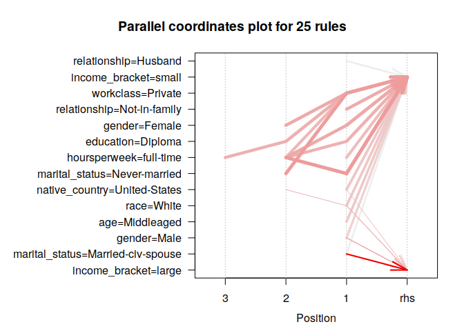
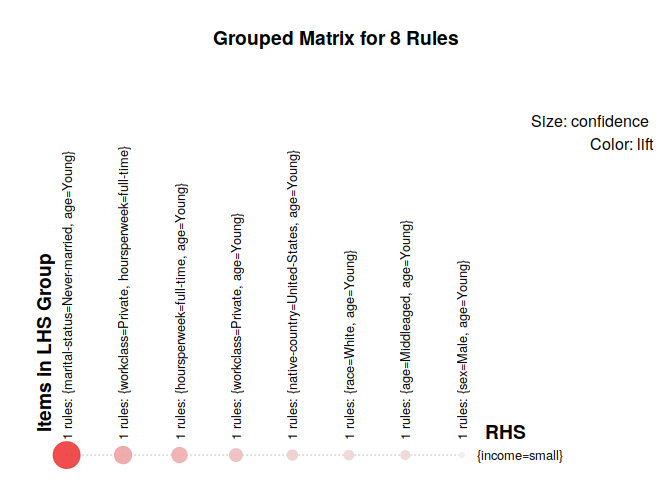
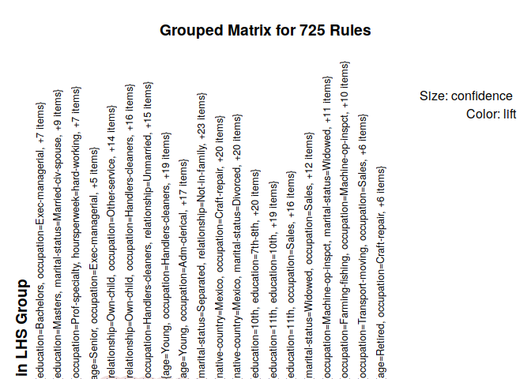

# Project Overview

Please we need to discuss project motivation and our experiment, just as Rida asked

Then we can begin our analysis

# Project Setup


# Business Understanding

* [10 points] Describe the purpose of the data set you selected (i.e., why was this data bcollected in the first place?). How will you measure the effectiveness of a good algorithm? Why does your chosen validation method make sense for this specific dataset and the stakeholders needs?

We chose this dataset from the UCI's machine learning repository for its categorical predictive attributes.  It contains 1994 Census data pulled from the US Census database.  The prediction task we've set forth is to predict if a person salary range is >50k in a 1994, based on the various categorical/numerical attributes in the census database. The link to the data source is below:

https://archive.ics.uci.edu/ml/datasets/census+income

The effectiveness of our algorithm will be determined by support, confidence and lift.  As these are the metrics that describe how strong a relationship between each element is with the other elements within each transaction.  Currently, there are no methods for cross validation of association rules, although there are some hard working individuals out there that are attempting to create such a tool.


# Data Understanding
* [10 points] Describe the meaning and type of data (scale, values, etc.) for each
attribute in the data file. Verify data quality: Are there missing values? Duplicate data? Outliers? Are those mistakes? How do you deal with these problems?
* [10 points] Visualize the any important attributes appropriately. Important: Provide an interpretation for any charts or graphs.

Here we will discuss each attribute and give some description about its ranges.
 
 
#### Categorical Attributes
  * workclass - Which business sector do they work in?
  * education - What level of education received?
  * marital_status - What is their marriage history
  * occupation - What do they do for a living
  * relationship - Family member relation
  * race - What is the subjects race
  * gender - What is the subjects gender
  * native_country - Where is the subject originally from
  * income_bracket - Do they make over or under 50k/year
 
#### Continuous Attributes
  * age - How old is the subject?
  * fnlwgt - Sampling weight of observation
  * education_num - numerical encoding of education variable
  * capital_gain - income from investment sources, separate from wages/salary
  * capital_loss - losses from investment sources, separate from wages/salary
  * hours_per_week - How many hours a week did they work?
  
# Setup


First, lets go ahead and load up necessary libraries:


```r
# library(arules) # for apriori
# library(arulesViz) # for viz
# library(forcats) # for categoricals
# library(dplyr) # for convenience
# library(plotly) # for interactive plots
# library(data.table) # for speed
# library(pander) # to pretty print some things

LabPackages = c(
  'arules',
  'arulesViz',
  'forcats',
  'dplyr',
  'plotly',
  'data.table',
  'pander',
  'knitr',
  'skimr',
  'lubridate'
)


package.check <- lapply(LabPackages, FUN = function(x) {
  if (!require(x, character.only = TRUE)) {
    install.packages(x, dependencies = TRUE)
    library(x, character.only = TRUE)
  }
})
```


Next, lets import our dataset


```r
data <- read.csv("./data/adult-training.csv")
```

## Data Quality Inspection

The first thing we must do is check and see if there are any NAs in our dataset, just to make sure to not mess up our analysis.


```r
NA_sum <- sort(sapply(data, function(x) sum(is.na(x))), decreasing = TRUE)
data.frame((NA_sum))
```

<div data-pagedtable="false">
  <script data-pagedtable-source type="application/json">
{"columns":[{"label":[""],"name":["_rn_"],"type":[""],"align":["left"]},{"label":["X.NA_sum."],"name":[1],"type":["int"],"align":["right"]}],"data":[{"1":"0","_rn_":"age"},{"1":"0","_rn_":"workclass"},{"1":"0","_rn_":"fnlwgt"},{"1":"0","_rn_":"education"},{"1":"0","_rn_":"education_num"},{"1":"0","_rn_":"marital_status"},{"1":"0","_rn_":"occupation"},{"1":"0","_rn_":"relationship"},{"1":"0","_rn_":"race"},{"1":"0","_rn_":"gender"},{"1":"0","_rn_":"capital_gain"},{"1":"0","_rn_":"capital_loss"},{"1":"0","_rn_":"hours_per_week"},{"1":"0","_rn_":"native_country"},{"1":"0","_rn_":"income_bracket"}],"options":{"columns":{"min":{},"max":[10]},"rows":{"min":[10],"max":[10]},"pages":{}}}
  </script>
</div>


## Data Cleaning

Looks like we are doing ok here. The next issue we have in the dataset, is because of the way the csv was stored, some of the levels in our factors include leading and trailing whitespace. This is highly undesirable, so we must clean it up:


```r
GetFactors <- function(df) {
    return(names(Filter(is.factor, df)))
}
FixLevels <- function(x) {
    levels(x) <- trimws(levels(x))
    return(x)
}
data[GetFactors(data)] <- lapply(data[GetFactors(data)], FixLevels)
pander(lapply(data[GetFactors(data)], levels))
```


  * **workclass**: _?_, _Federal-gov_, _Local-gov_, _Never-worked_, _Private_, _Self-emp-inc_, _Self-emp-not-inc_, _State-gov_ and _Without-pay_
  * **education**: _10th_, _11th_, _12th_, _1st-4th_, _5th-6th_, _7th-8th_, _9th_, _Assoc-acdm_, _Assoc-voc_, _Bachelors_, _Doctorate_, _HS-grad_, _Masters_, _Preschool_, _Prof-school_ and _Some-college_
  * **marital_status**: _Divorced_, _Married-AF-spouse_, _Married-civ-spouse_, _Married-spouse-absent_, _Never-married_, _Separated_ and _Widowed_
  * **occupation**: _?_, _Adm-clerical_, _Armed-Forces_, _Craft-repair_, _Exec-managerial_, _Farming-fishing_, _Handlers-cleaners_, _Machine-op-inspct_, _Other-service_, _Priv-house-serv_, _Prof-specialty_, _Protective-serv_, _Sales_, _Tech-support_ and _Transport-moving_
  * **relationship**: _Husband_, _Not-in-family_, _Other-relative_, _Own-child_, _Unmarried_ and _Wife_
  * **race**: _Amer-Indian-Eskimo_, _Asian-Pac-Islander_, _Black_, _Other_ and _White_
  * **gender**: _Female_ and _Male_
  * **native_country**: _?_, _Cambodia_, _Canada_, _China_, _Columbia_, _Cuba_, _Dominican-Republic_, _Ecuador_, _El-Salvador_, _England_, _France_, _Germany_, _Greece_, _Guatemala_, _Haiti_, _Holand-Netherlands_, _Honduras_, _Hong_, _Hungary_, _India_, _Iran_, _Ireland_, _Italy_, _Jamaica_, _Japan_, _Laos_, _Mexico_, _Nicaragua_, _Outlying-US(Guam-USVI-etc)_, _Peru_, _Philippines_, _Poland_, _Portugal_, _Puerto-Rico_, _Scotland_, _South_, _Taiwan_, _Thailand_, _Trinadad&Tobago_, _United-States_, _Vietnam_ and _Yugoslavia_
  * **income_bracket**: _<=50K_ and _>50K_

<!-- end of list -->

Next, we need to reencode our data as factors. First, lets encode the education levels into factors with larger groups (for example 1st-12th grade should be no diploma, not a bunch of levels).


```r
data$education <- fct_collapse(data$education, `No Diploma` = c("1st-4th", "5th-6th", 
    "7th-8th", "9th", "10th", "11th", "12th", "Preschool"), Associates = c("Assoc-acdm", 
    "Assoc-voc"), Diploma = c("Some-college", "HS-grad"))
```

Then the the income brackets:


```r
data$income_bracket <- fct_collapse(data$income_bracket, small = "<=50K", large = ">50K")
```

Next, lets change the `?` levels to something more useful:


```r
levels(data$workclass)[levels(data$workclass) == "?"] <- "Other"
levels(data$occupation)[levels(data$occupation) == "?"] <- "Other-service"
levels(data$native_country)[levels(data$native_country) == "?"] <- "Other"
```


Next, lets remove the fnlwgt, education number, and capital gain and loss columns, as they are unneeded. We also need to rename some columns to be easier for us, and use the `cut` function to factorize our numeric variables


```r
data <- data[, -c(3, 5, 11:12)]
colnames(data)[colnames(data) == "hours_per_week"] <- "hoursperweek"
data$age <- cut(data$age, breaks = c(15, 25, 45, 65, 100), labels = c("Young", 
    "Middleaged", "Senior", "Retired"))
data$hoursperweek <- cut(data$hoursperweek, breaks = c(0, 20, 40, 60, 80), labels = c("part-time", 
    "full-time", "hard-working", "need-a-life"))
```

Lets see the results:


```r
levels(data$workclass)
```

```
#> [1] "Other"            "Federal-gov"      "Local-gov"       
#> [4] "Never-worked"     "Private"          "Self-emp-inc"    
#> [7] "Self-emp-not-inc" "State-gov"        "Without-pay"
```

```r
pander(summary(data))
```


---------------------------------------------------------------
       age                workclass              education     
------------------ ------------------------ -------------------
   Young : 6411         Private :22696       No Diploma : 4253 

 Middleaged:16523   Self-emp-not-inc: 2541   Associates : 2449 

  Senior : 8469        Local-gov : 2093      Bachelors : 5355  

  Retired : 1158         Other : 1836         Doctorate : 413  

        NA             State-gov : 1298       Diploma :17792   

        NA           Self-emp-inc : 1116      Masters : 1723   

        NA              (Other) : 981        Prof-school: 576  
---------------------------------------------------------------

Table: Table continues below

 
--------------------------------------------------------------------------
       marital_status              occupation            relationship     
---------------------------- ---------------------- ----------------------
      Divorced : 4443         Other-service :5138       Husband :13193    

   Married-AF-spouse : 23     Prof-specialty :4140   Not-in-family : 8305 

 Married-civ-spouse :14976     Craft-repair :4099    Other-relative: 981  

 Married-spouse-absent: 418   Exec-managerial:4066     Own-child : 5068   

    Never-married :10683       Adm-clerical :3770      Unmarried : 3446   

      Separated : 1025            Sales :3650            Wife : 1568      

       Widowed : 993             (Other) :7698                NA          
--------------------------------------------------------------------------

Table: Table continues below

 
--------------------------------------------------------------
           race                gender         hoursperweek    
-------------------------- -------------- --------------------
 Amer-Indian-Eskimo: 311    Female:10771    part-time : 2928  

 Asian-Pac-Islander: 1039   Male :21790     full-time :20052  

       Black : 3124              NA        hard-working: 8471 

       Other : 271               NA        need-a-life : 902  

       White :27816              NA            NA's : 208     

            NA                   NA                NA         

            NA                   NA                NA         
--------------------------------------------------------------

Table: Table continues below

 
--------------------------------------
   native_country      income_bracket 
--------------------- ----------------
 United-States:29170    small:24720   

    Mexico : 643        large: 7841   

     Other : 583             NA       

  Philippines : 198          NA       

    Germany : 137            NA       

    Canada : 121             NA       

   (Other) : 1709            NA       
--------------------------------------


Finally, we can set up our dataset to be the proper data format for the a priori algorithm:


```r
data
```

<div data-pagedtable="false">
  <script data-pagedtable-source type="application/json">
{"columns":[{"label":["age"],"name":[1],"type":["fctr"],"align":["left"]},{"label":["workclass"],"name":[2],"type":["fctr"],"align":["left"]},{"label":["education"],"name":[3],"type":["fctr"],"align":["left"]},{"label":["marital_status"],"name":[4],"type":["fctr"],"align":["left"]},{"label":["occupation"],"name":[5],"type":["fctr"],"align":["left"]},{"label":["relationship"],"name":[6],"type":["fctr"],"align":["left"]},{"label":["race"],"name":[7],"type":["fctr"],"align":["left"]},{"label":["gender"],"name":[8],"type":["fctr"],"align":["left"]},{"label":["hoursperweek"],"name":[9],"type":["fctr"],"align":["left"]},{"label":["native_country"],"name":[10],"type":["fctr"],"align":["left"]},{"label":["income_bracket"],"name":[11],"type":["fctr"],"align":["left"]}],"data":[{"1":"Middleaged","2":"State-gov","3":"Bachelors","4":"Never-married","5":"Adm-clerical","6":"Not-in-family","7":"White","8":"Male","9":"full-time","10":"United-States","11":"small"},{"1":"Senior","2":"Self-emp-not-inc","3":"Bachelors","4":"Married-civ-spouse","5":"Exec-managerial","6":"Husband","7":"White","8":"Male","9":"part-time","10":"United-States","11":"small"},{"1":"Middleaged","2":"Private","3":"Diploma","4":"Divorced","5":"Handlers-cleaners","6":"Not-in-family","7":"White","8":"Male","9":"full-time","10":"United-States","11":"small"},{"1":"Senior","2":"Private","3":"No Diploma","4":"Married-civ-spouse","5":"Handlers-cleaners","6":"Husband","7":"Black","8":"Male","9":"full-time","10":"United-States","11":"small"},{"1":"Middleaged","2":"Private","3":"Bachelors","4":"Married-civ-spouse","5":"Prof-specialty","6":"Wife","7":"Black","8":"Female","9":"full-time","10":"Cuba","11":"small"},{"1":"Middleaged","2":"Private","3":"Masters","4":"Married-civ-spouse","5":"Exec-managerial","6":"Wife","7":"White","8":"Female","9":"full-time","10":"United-States","11":"small"},{"1":"Senior","2":"Private","3":"No Diploma","4":"Married-spouse-absent","5":"Other-service","6":"Not-in-family","7":"Black","8":"Female","9":"part-time","10":"Jamaica","11":"small"},{"1":"Senior","2":"Self-emp-not-inc","3":"Diploma","4":"Married-civ-spouse","5":"Exec-managerial","6":"Husband","7":"White","8":"Male","9":"hard-working","10":"United-States","11":"large"},{"1":"Middleaged","2":"Private","3":"Masters","4":"Never-married","5":"Prof-specialty","6":"Not-in-family","7":"White","8":"Female","9":"hard-working","10":"United-States","11":"large"},{"1":"Middleaged","2":"Private","3":"Bachelors","4":"Married-civ-spouse","5":"Exec-managerial","6":"Husband","7":"White","8":"Male","9":"full-time","10":"United-States","11":"large"},{"1":"Middleaged","2":"Private","3":"Diploma","4":"Married-civ-spouse","5":"Exec-managerial","6":"Husband","7":"Black","8":"Male","9":"need-a-life","10":"United-States","11":"large"},{"1":"Middleaged","2":"State-gov","3":"Bachelors","4":"Married-civ-spouse","5":"Prof-specialty","6":"Husband","7":"Asian-Pac-Islander","8":"Male","9":"full-time","10":"India","11":"large"},{"1":"Young","2":"Private","3":"Bachelors","4":"Never-married","5":"Adm-clerical","6":"Own-child","7":"White","8":"Female","9":"full-time","10":"United-States","11":"small"},{"1":"Middleaged","2":"Private","3":"Associates","4":"Never-married","5":"Sales","6":"Not-in-family","7":"Black","8":"Male","9":"hard-working","10":"United-States","11":"small"},{"1":"Middleaged","2":"Private","3":"Associates","4":"Married-civ-spouse","5":"Craft-repair","6":"Husband","7":"Asian-Pac-Islander","8":"Male","9":"full-time","10":"Other","11":"large"},{"1":"Middleaged","2":"Private","3":"No Diploma","4":"Married-civ-spouse","5":"Transport-moving","6":"Husband","7":"Amer-Indian-Eskimo","8":"Male","9":"hard-working","10":"Mexico","11":"small"},{"1":"Young","2":"Self-emp-not-inc","3":"Diploma","4":"Never-married","5":"Farming-fishing","6":"Own-child","7":"White","8":"Male","9":"full-time","10":"United-States","11":"small"},{"1":"Middleaged","2":"Private","3":"Diploma","4":"Never-married","5":"Machine-op-inspct","6":"Unmarried","7":"White","8":"Male","9":"full-time","10":"United-States","11":"small"},{"1":"Middleaged","2":"Private","3":"No Diploma","4":"Married-civ-spouse","5":"Sales","6":"Husband","7":"White","8":"Male","9":"hard-working","10":"United-States","11":"small"},{"1":"Middleaged","2":"Self-emp-not-inc","3":"Masters","4":"Divorced","5":"Exec-managerial","6":"Unmarried","7":"White","8":"Female","9":"hard-working","10":"United-States","11":"large"},{"1":"Middleaged","2":"Private","3":"Doctorate","4":"Married-civ-spouse","5":"Prof-specialty","6":"Husband","7":"White","8":"Male","9":"hard-working","10":"United-States","11":"large"},{"1":"Senior","2":"Private","3":"Diploma","4":"Separated","5":"Other-service","6":"Unmarried","7":"Black","8":"Female","9":"part-time","10":"United-States","11":"small"},{"1":"Middleaged","2":"Federal-gov","3":"No Diploma","4":"Married-civ-spouse","5":"Farming-fishing","6":"Husband","7":"Black","8":"Male","9":"full-time","10":"United-States","11":"small"},{"1":"Middleaged","2":"Private","3":"No Diploma","4":"Married-civ-spouse","5":"Transport-moving","6":"Husband","7":"White","8":"Male","9":"full-time","10":"United-States","11":"small"},{"1":"Senior","2":"Private","3":"Diploma","4":"Divorced","5":"Tech-support","6":"Unmarried","7":"White","8":"Female","9":"full-time","10":"United-States","11":"small"},{"1":"Senior","2":"Local-gov","3":"Bachelors","4":"Married-civ-spouse","5":"Tech-support","6":"Husband","7":"White","8":"Male","9":"full-time","10":"United-States","11":"large"},{"1":"Young","2":"Private","3":"Diploma","4":"Never-married","5":"Craft-repair","6":"Own-child","7":"White","8":"Male","9":"full-time","10":"United-States","11":"small"},{"1":"Senior","2":"Other","3":"Diploma","4":"Married-civ-spouse","5":"Other-service","6":"Husband","7":"Asian-Pac-Islander","8":"Male","9":"hard-working","10":"South","11":"large"},{"1":"Middleaged","2":"Private","3":"Diploma","4":"Divorced","5":"Exec-managerial","6":"Not-in-family","7":"White","8":"Male","9":"need-a-life","10":"United-States","11":"small"},{"1":"Senior","2":"Private","3":"Diploma","4":"Married-civ-spouse","5":"Craft-repair","6":"Husband","7":"White","8":"Male","9":"full-time","10":"United-States","11":"small"},{"1":"Young","2":"Local-gov","3":"Associates","4":"Never-married","5":"Protective-serv","6":"Not-in-family","7":"White","8":"Male","9":"hard-working","10":"United-States","11":"small"},{"1":"Young","2":"Private","3":"Diploma","4":"Never-married","5":"Sales","6":"Own-child","7":"Black","8":"Male","9":"hard-working","10":"United-States","11":"small"},{"1":"Middleaged","2":"Private","3":"Bachelors","4":"Divorced","5":"Exec-managerial","6":"Own-child","7":"White","8":"Male","9":"full-time","10":"United-States","11":"small"},{"1":"Middleaged","2":"Federal-gov","3":"Diploma","4":"Married-civ-spouse","5":"Adm-clerical","6":"Own-child","7":"White","8":"Male","9":"full-time","10":"United-States","11":"small"},{"1":"Young","2":"State-gov","3":"Diploma","4":"Married-civ-spouse","5":"Other-service","6":"Husband","7":"Black","8":"Male","9":"part-time","10":"United-States","11":"small"},{"1":"Senior","2":"Private","3":"No Diploma","4":"Never-married","5":"Machine-op-inspct","6":"Unmarried","7":"White","8":"Male","9":"full-time","10":"Puerto-Rico","11":"small"},{"1":"Young","2":"Private","3":"Diploma","4":"Never-married","5":"Machine-op-inspct","6":"Own-child","7":"White","8":"Male","9":"full-time","10":"United-States","11":"small"},{"1":"Young","2":"Private","3":"Diploma","4":"Married-AF-spouse","5":"Adm-clerical","6":"Wife","7":"White","8":"Female","9":"full-time","10":"United-States","11":"small"},{"1":"Middleaged","2":"Private","3":"Diploma","4":"Married-civ-spouse","5":"Sales","6":"Husband","7":"White","8":"Male","9":"full-time","10":"Other","11":"large"},{"1":"Senior","2":"Self-emp-not-inc","3":"Associates","4":"Married-civ-spouse","5":"Prof-specialty","6":"Husband","7":"White","8":"Male","9":"full-time","10":"United-States","11":"small"},{"1":"Middleaged","2":"Private","3":"No Diploma","4":"Married-civ-spouse","5":"Machine-op-inspct","6":"Husband","7":"White","8":"Male","9":"hard-working","10":"United-States","11":"small"},{"1":"Senior","2":"Self-emp-not-inc","3":"Bachelors","4":"Married-civ-spouse","5":"Prof-specialty","6":"Husband","7":"White","8":"Male","9":"full-time","10":"United-States","11":"small"},{"1":"Young","2":"Private","3":"Bachelors","4":"Married-civ-spouse","5":"Tech-support","6":"Husband","7":"White","8":"Male","9":"hard-working","10":"United-States","11":"small"},{"1":"Senior","2":"Private","3":"Diploma","4":"Separated","5":"Adm-clerical","6":"Unmarried","7":"White","8":"Female","9":"full-time","10":"United-States","11":"small"},{"1":"Young","2":"Private","3":"Diploma","4":"Never-married","5":"Handlers-cleaners","6":"Not-in-family","7":"White","8":"Male","9":"full-time","10":"United-States","11":"small"},{"1":"Senior","2":"Federal-gov","3":"Bachelors","4":"Married-civ-spouse","5":"Prof-specialty","6":"Husband","7":"Black","8":"Male","9":"full-time","10":"United-States","11":"large"},{"1":"Senior","2":"Private","3":"Diploma","4":"Married-civ-spouse","5":"Machine-op-inspct","6":"Husband","7":"White","8":"Male","9":"full-time","10":"United-States","11":"small"},{"1":"Middleaged","2":"Private","3":"Masters","4":"Divorced","5":"Exec-managerial","6":"Unmarried","7":"White","8":"Female","9":"full-time","10":"United-States","11":"small"},{"1":"Middleaged","2":"State-gov","3":"Associates","4":"Married-civ-spouse","5":"Craft-repair","6":"Husband","7":"White","8":"Male","9":"full-time","10":"United-States","11":"small"},{"1":"Middleaged","2":"Private","3":"Associates","4":"Never-married","5":"Prof-specialty","6":"Not-in-family","7":"White","8":"Male","9":"hard-working","10":"United-States","11":"small"},{"1":"Young","2":"Private","3":"Diploma","4":"Married-civ-spouse","5":"Exec-managerial","6":"Wife","7":"Other","8":"Female","9":"full-time","10":"United-States","11":"small"},{"1":"Young","2":"Private","3":"Diploma","4":"Never-married","5":"Other-service","6":"Own-child","7":"White","8":"Female","9":"full-time","10":"Other","11":"small"},{"1":"Senior","2":"Private","3":"Prof-school","4":"Married-civ-spouse","5":"Prof-specialty","6":"Wife","7":"White","8":"Female","9":"hard-working","10":"Honduras","11":"large"},{"1":"Senior","2":"Federal-gov","3":"Bachelors","4":"Divorced","5":"Exec-managerial","6":"Not-in-family","7":"White","8":"Male","9":"hard-working","10":"United-States","11":"large"},{"1":"Senior","2":"Self-emp-inc","3":"Diploma","4":"Divorced","5":"Exec-managerial","6":"Not-in-family","7":"White","8":"Male","9":"hard-working","10":"United-States","11":"small"},{"1":"Middleaged","2":"Private","3":"Diploma","4":"Married-civ-spouse","5":"Tech-support","6":"Husband","7":"White","8":"Male","9":"full-time","10":"United-States","11":"large"},{"1":"Senior","2":"Private","3":"No Diploma","4":"Married-civ-spouse","5":"Machine-op-inspct","6":"Husband","7":"White","8":"Male","9":"full-time","10":"Mexico","11":"small"},{"1":"Middleaged","2":"Private","3":"Associates","4":"Married-civ-spouse","5":"Other-service","6":"Husband","7":"White","8":"Male","9":"full-time","10":"Puerto-Rico","11":"small"},{"1":"Middleaged","2":"Private","3":"Diploma","4":"Married-civ-spouse","5":"Adm-clerical","6":"Husband","7":"White","8":"Male","9":"hard-working","10":"United-States","11":"small"},{"1":"Middleaged","2":"Private","3":"Diploma","4":"Married-civ-spouse","5":"Machine-op-inspct","6":"Husband","7":"White","8":"Male","9":"full-time","10":"United-States","11":"small"},{"1":"Middleaged","2":"Private","3":"Bachelors","4":"Married-civ-spouse","5":"Sales","6":"Husband","7":"White","8":"Male","9":"full-time","10":"United-States","11":"small"},{"1":"Middleaged","2":"Other","3":"No Diploma","4":"Married-spouse-absent","5":"Other-service","6":"Not-in-family","7":"White","8":"Male","9":"full-time","10":"Other","11":"small"},{"1":"Senior","2":"Private","3":"Diploma","4":"Married-civ-spouse","5":"Transport-moving","6":"Husband","7":"White","8":"Male","9":"full-time","10":"United-States","11":"small"},{"1":"Middleaged","2":"Private","3":"Doctorate","4":"Married-civ-spouse","5":"Prof-specialty","6":"Husband","7":"White","8":"Male","9":"hard-working","10":"United-States","11":"large"},{"1":"Middleaged","2":"Private","3":"Diploma","4":"Divorced","5":"Tech-support","6":"Not-in-family","7":"White","8":"Male","9":"hard-working","10":"United-States","11":"small"},{"1":"Middleaged","2":"Private","3":"Diploma","4":"Married-civ-spouse","5":"Craft-repair","6":"Husband","7":"White","8":"Male","9":"full-time","10":"United-States","11":"small"},{"1":"Middleaged","2":"Private","3":"Diploma","4":"Divorced","5":"Adm-clerical","6":"Not-in-family","7":"White","8":"Female","9":"full-time","10":"United-States","11":"small"},{"1":"Senior","2":"Private","3":"Diploma","4":"Married-civ-spouse","5":"Adm-clerical","6":"Wife","7":"White","8":"Female","9":"full-time","10":"United-States","11":"large"},{"1":"Senior","2":"Self-emp-inc","3":"Diploma","4":"Married-civ-spouse","5":"Exec-managerial","6":"Husband","7":"White","8":"Male","9":"hard-working","10":"United-States","11":"large"},{"1":"Young","2":"Other","3":"Diploma","4":"Never-married","5":"Other-service","6":"Own-child","7":"White","8":"Male","9":"full-time","10":"United-States","11":"small"},{"1":"Young","2":"Private","3":"Diploma","4":"Never-married","5":"Prof-specialty","6":"Own-child","7":"White","8":"Male","9":"full-time","10":"United-States","11":"small"},{"1":"Middleaged","2":"Private","3":"Bachelors","4":"Separated","5":"Sales","6":"Own-child","7":"Black","8":"Female","9":"full-time","10":"United-States","11":"small"},{"1":"Middleaged","2":"Self-emp-not-inc","3":"Bachelors","4":"Married-civ-spouse","5":"Sales","6":"Husband","7":"White","8":"Male","9":"need-a-life","10":"United-States","11":"large"},{"1":"Young","2":"Private","3":"Diploma","4":"Never-married","5":"Machine-op-inspct","6":"Not-in-family","7":"White","8":"Male","9":"full-time","10":"United-States","11":"small"},{"1":"Retired","2":"Private","3":"Diploma","4":"Married-civ-spouse","5":"Prof-specialty","6":"Other-relative","7":"White","8":"Male","9":"part-time","10":"United-States","11":"small"},{"1":"Middleaged","2":"Private","3":"Diploma","4":"Never-married","5":"Other-service","6":"Own-child","7":"White","8":"Male","9":"full-time","10":"Mexico","11":"small"},{"1":"Middleaged","2":"Private","3":"Associates","4":"Married-civ-spouse","5":"Adm-clerical","6":"Husband","7":"White","8":"Male","9":"full-time","10":"United-States","11":"small"},{"1":"Retired","2":"Other","3":"No Diploma","4":"Married-civ-spouse","5":"Other-service","6":"Husband","7":"White","8":"Male","9":"part-time","10":"United-States","11":"small"},{"1":"Young","2":"Private","3":"No Diploma","4":"Never-married","5":"Other-service","6":"Own-child","7":"White","8":"Female","9":"full-time","10":"United-States","11":"small"},{"1":"Middleaged","2":"Local-gov","3":"No Diploma","4":"Married-civ-spouse","5":"Farming-fishing","6":"Husband","7":"White","8":"Male","9":"full-time","10":"United-States","11":"small"},{"1":"Young","2":"Private","3":"Diploma","4":"Never-married","5":"Sales","6":"Not-in-family","7":"White","8":"Male","9":"full-time","10":"United-States","11":"small"},{"1":"Senior","2":"Private","3":"Bachelors","4":"Married-civ-spouse","5":"Other-service","6":"Husband","7":"White","8":"Male","9":"full-time","10":"Cuba","11":"small"},{"1":"Senior","2":"Private","3":"Diploma","4":"Married-civ-spouse","5":"Other-service","6":"Wife","7":"White","8":"Female","9":"full-time","10":"United-States","11":"small"},{"1":"Senior","2":"Private","3":"Diploma","4":"Married-civ-spouse","5":"Sales","6":"Husband","7":"White","8":"Male","9":"hard-working","10":"United-States","11":"small"},{"1":"Middleaged","2":"Private","3":"Diploma","4":"Divorced","5":"Craft-repair","6":"Not-in-family","7":"White","8":"Female","9":"full-time","10":"United-States","11":"large"},{"1":"Senior","2":"Private","3":"Diploma","4":"Divorced","5":"Sales","6":"Own-child","7":"White","8":"Female","9":"full-time","10":"United-States","11":"small"},{"1":"Senior","2":"Local-gov","3":"Diploma","4":"Married-civ-spouse","5":"Protective-serv","6":"Husband","7":"White","8":"Male","9":"full-time","10":"United-States","11":"large"},{"1":"Middleaged","2":"Private","3":"Masters","4":"Married-civ-spouse","5":"Prof-specialty","6":"Husband","7":"White","8":"Male","9":"hard-working","10":"United-States","11":"small"},{"1":"Middleaged","2":"Private","3":"No Diploma","4":"Never-married","5":"Sales","6":"Not-in-family","7":"White","8":"Male","9":"full-time","10":"United-States","11":"small"},{"1":"Middleaged","2":"Federal-gov","3":"Doctorate","4":"Never-married","5":"Prof-specialty","6":"Not-in-family","7":"White","8":"Female","9":"hard-working","10":"United-States","11":"large"},{"1":"Senior","2":"Private","3":"Associates","4":"Married-civ-spouse","5":"Prof-specialty","6":"Husband","7":"White","8":"Male","9":"full-time","10":"United-States","11":"small"},{"1":"Middleaged","2":"Private","3":"Diploma","4":"Divorced","5":"Craft-repair","6":"Unmarried","7":"White","8":"Female","9":"full-time","10":"United-States","11":"small"},{"1":"Middleaged","2":"Private","3":"Diploma","4":"Divorced","5":"Machine-op-inspct","6":"Unmarried","7":"Black","8":"Female","9":"full-time","10":"United-States","11":"small"},{"1":"Middleaged","2":"Private","3":"Diploma","4":"Married-civ-spouse","5":"Sales","6":"Wife","7":"Asian-Pac-Islander","8":"Female","9":"full-time","10":"Other","11":"small"},{"1":"Middleaged","2":"Local-gov","3":"Bachelors","4":"Married-civ-spouse","5":"Protective-serv","6":"Husband","7":"White","8":"Male","9":"full-time","10":"United-States","11":"large"},{"1":"Middleaged","2":"Local-gov","3":"Diploma","4":"Never-married","5":"Handlers-cleaners","6":"Not-in-family","7":"White","8":"Male","9":"hard-working","10":"United-States","11":"small"},{"1":"Senior","2":"Self-emp-not-inc","3":"Doctorate","4":"Married-civ-spouse","5":"Prof-specialty","6":"Husband","7":"White","8":"Male","9":"hard-working","10":"United-States","11":"large"},{"1":"Middleaged","2":"Private","3":"Diploma","4":"Married-civ-spouse","5":"Sales","6":"Husband","7":"White","8":"Male","9":"hard-working","10":"United-States","11":"large"},{"1":"Senior","2":"Private","3":"Associates","4":"Divorced","5":"Exec-managerial","6":"Unmarried","7":"White","8":"Female","9":"full-time","10":"England","11":"small"},{"1":"Middleaged","2":"Federal-gov","3":"Diploma","4":"Never-married","5":"Other-service","6":"Own-child","7":"Black","8":"Male","9":"full-time","10":"United-States","11":"small"},{"1":"Retired","2":"Private","3":"Masters","4":"Married-civ-spouse","5":"Exec-managerial","6":"Husband","7":"White","8":"Male","9":"full-time","10":"United-States","11":"large"},{"1":"Middleaged","2":"Private","3":"Bachelors","4":"Married-civ-spouse","5":"Exec-managerial","6":"Husband","7":"White","8":"Male","9":"hard-working","10":"United-States","11":"large"},{"1":"Senior","2":"Self-emp-not-inc","3":"Masters","4":"Never-married","5":"Prof-specialty","6":"Not-in-family","7":"White","8":"Female","9":"hard-working","10":"United-States","11":"small"},{"1":"Young","2":"Private","3":"Diploma","4":"Never-married","5":"Tech-support","6":"Own-child","7":"White","8":"Female","9":"full-time","10":"United-States","11":"small"},{"1":"Middleaged","2":"Private","3":"Diploma","4":"Never-married","5":"Craft-repair","6":"Not-in-family","7":"White","8":"Male","9":"full-time","10":"United-States","11":"small"},{"1":"Middleaged","2":"Self-emp-inc","3":"Diploma","4":"Married-civ-spouse","5":"Craft-repair","6":"Husband","7":"White","8":"Male","9":"full-time","10":"United-States","11":"large"},{"1":"Young","2":"Other","3":"No Diploma","4":"Never-married","5":"Other-service","6":"Own-child","7":"White","8":"Female","9":"full-time","10":"United-States","11":"small"},{"1":"Middleaged","2":"Private","3":"No Diploma","4":"Never-married","5":"Handlers-cleaners","6":"Own-child","7":"White","8":"Male","9":"full-time","10":"United-States","11":"small"},{"1":"Middleaged","2":"Local-gov","3":"Diploma","4":"Never-married","5":"Adm-clerical","6":"Not-in-family","7":"White","8":"Female","9":"full-time","10":"United-States","11":"small"},{"1":"Middleaged","2":"Private","3":"Diploma","4":"Married-civ-spouse","5":"Handlers-cleaners","6":"Husband","7":"White","8":"Male","9":"full-time","10":"United-States","11":"small"},{"1":"Young","2":"Private","3":"Bachelors","4":"Never-married","5":"Sales","6":"Other-relative","7":"White","8":"Male","9":"full-time","10":"United-States","11":"small"},{"1":"Middleaged","2":"Private","3":"Prof-school","4":"Married-civ-spouse","5":"Prof-specialty","6":"Husband","7":"White","8":"Male","9":"full-time","10":"United-States","11":"large"},{"1":"Senior","2":"Self-emp-not-inc","3":"Diploma","4":"Married-civ-spouse","5":"Other-service","6":"Husband","7":"White","8":"Male","9":"hard-working","10":"Canada","11":"large"},{"1":"Middleaged","2":"Private","3":"Diploma","4":"Married-civ-spouse","5":"Sales","6":"Wife","7":"White","8":"Female","9":"full-time","10":"United-States","11":"small"},{"1":"Middleaged","2":"Private","3":"Diploma","4":"Never-married","5":"Machine-op-inspct","6":"Own-child","7":"White","8":"Female","9":"full-time","10":"United-States","11":"small"},{"1":"Senior","2":"Private","3":"No Diploma","4":"Married-civ-spouse","5":"Handlers-cleaners","6":"Husband","7":"White","8":"Male","9":"hard-working","10":"United-States","11":"small"},{"1":"Senior","2":"Self-emp-inc","3":"Diploma","4":"Married-civ-spouse","5":"Sales","6":"Husband","7":"White","8":"Male","9":"hard-working","10":"United-States","11":"small"},{"1":"Senior","2":"Local-gov","3":"Associates","4":"Married-civ-spouse","5":"Craft-repair","6":"Husband","7":"Black","8":"Male","9":"full-time","10":"United-States","11":"large"},{"1":"Senior","2":"Private","3":"Diploma","4":"Married-civ-spouse","5":"Sales","6":"Husband","7":"White","8":"Male","9":"hard-working","10":"United-States","11":"small"},{"1":"Young","2":"Private","3":"Diploma","4":"Never-married","5":"Craft-repair","6":"Not-in-family","7":"White","8":"Male","9":"hard-working","10":"United-States","11":"small"},{"1":"Young","2":"Private","3":"Diploma","4":"Never-married","5":"Other-service","6":"Own-child","7":"White","8":"Female","9":"full-time","10":"United-States","11":"small"},{"1":"Middleaged","2":"Private","3":"Bachelors","4":"Married-civ-spouse","5":"Exec-managerial","6":"Husband","7":"White","8":"Male","9":"hard-working","10":"United-States","11":"small"},{"1":"Middleaged","2":"Private","3":"Bachelors","4":"Never-married","5":"Exec-managerial","6":"Own-child","7":"Black","8":"Male","9":"full-time","10":"Germany","11":"small"},{"1":"Middleaged","2":"State-gov","3":"Bachelors","4":"Married-civ-spouse","5":"Prof-specialty","6":"Husband","7":"White","8":"Male","9":"hard-working","10":"United-States","11":"large"},{"1":"Young","2":"Private","3":"Diploma","4":"Never-married","5":"Other-service","6":"Own-child","7":"Black","8":"Male","9":"full-time","10":"United-States","11":"small"},{"1":"Senior","2":"Private","3":"Bachelors","4":"Married-civ-spouse","5":"Exec-managerial","6":"Wife","7":"White","8":"Female","9":"full-time","10":"United-States","11":"large"},{"1":"Young","2":"Private","3":"Diploma","4":"Never-married","5":"Adm-clerical","6":"Own-child","7":"White","8":"Female","9":"full-time","10":"United-States","11":"small"},{"1":"Middleaged","2":"Private","3":"Associates","4":"Married-civ-spouse","5":"Adm-clerical","6":"Husband","7":"White","8":"Male","9":"full-time","10":"United-States","11":"large"},{"1":"Middleaged","2":"Other","3":"Diploma","4":"Married-civ-spouse","5":"Other-service","6":"Husband","7":"White","8":"Male","9":"full-time","10":"United-States","11":"small"},{"1":"Middleaged","2":"Private","3":"Diploma","4":"Divorced","5":"Craft-repair","6":"Not-in-family","7":"White","8":"Male","9":"full-time","10":"United-States","11":"small"},{"1":"Middleaged","2":"Private","3":"Associates","4":"Never-married","5":"Sales","6":"Not-in-family","7":"White","8":"Female","9":"hard-working","10":"United-States","11":"small"},{"1":"Young","2":"Private","3":"Diploma","4":"Never-married","5":"Other-service","6":"Not-in-family","7":"White","8":"Female","9":"full-time","10":"United-States","11":"small"},{"1":"Middleaged","2":"Self-emp-not-inc","3":"Diploma","4":"Married-civ-spouse","5":"Craft-repair","6":"Husband","7":"White","8":"Male","9":"full-time","10":"United-States","11":"small"},{"1":"Middleaged","2":"Private","3":"Bachelors","4":"Married-civ-spouse","5":"Sales","6":"Husband","7":"White","8":"Male","9":"hard-working","10":"United-States","11":"small"},{"1":"Senior","2":"Private","3":"Associates","4":"Divorced","5":"Tech-support","6":"Not-in-family","7":"Black","8":"Female","9":"full-time","10":"United-States","11":"small"},{"1":"Middleaged","2":"Federal-gov","3":"Masters","4":"Married-civ-spouse","5":"Prof-specialty","6":"Husband","7":"White","8":"Male","9":"full-time","10":"Iran","11":"large"},{"1":"Middleaged","2":"Self-emp-not-inc","3":"Diploma","4":"Married-civ-spouse","5":"Craft-repair","6":"Husband","7":"White","8":"Male","9":"hard-working","10":"United-States","11":"small"},{"1":"Middleaged","2":"Private","3":"Associates","4":"Married-civ-spouse","5":"Adm-clerical","6":"Wife","7":"White","8":"Female","9":"full-time","10":"United-States","11":"small"},{"1":"Young","2":"Private","3":"Diploma","4":"Never-married","5":"Sales","6":"Own-child","7":"White","8":"Male","9":"part-time","10":"United-States","11":"small"},{"1":"Senior","2":"Private","3":"Diploma","4":"Married-civ-spouse","5":"Craft-repair","6":"Husband","7":"Asian-Pac-Islander","8":"Male","9":"full-time","10":"United-States","11":"large"},{"1":"Senior","2":"Self-emp-inc","3":"Diploma","4":"Married-civ-spouse","5":"Craft-repair","6":"Husband","7":"White","8":"Male","9":"full-time","10":"United-States","11":"small"},{"1":"Middleaged","2":"Private","3":"Diploma","4":"Never-married","5":"Sales","6":"Own-child","7":"White","8":"Female","9":"full-time","10":"United-States","11":"small"},{"1":"Young","2":"Private","3":"Diploma","4":"Never-married","5":"Other-service","6":"Own-child","7":"White","8":"Male","9":"full-time","10":"Mexico","11":"small"},{"1":"Middleaged","2":"Private","3":"Associates","4":"Never-married","5":"Prof-specialty","6":"Not-in-family","7":"White","8":"Female","9":"full-time","10":"United-States","11":"large"},{"1":"Retired","2":"Private","3":"Diploma","4":"Never-married","5":"Tech-support","6":"Other-relative","7":"White","8":"Male","9":"full-time","10":"United-States","11":"small"},{"1":"Middleaged","2":"Private","3":"Diploma","4":"Never-married","5":"Transport-moving","6":"Unmarried","7":"Black","8":"Female","9":"full-time","10":"United-States","11":"small"},{"1":"Young","2":"Private","3":"Diploma","4":"Married-civ-spouse","5":"Other-service","6":"Husband","7":"White","8":"Male","9":"full-time","10":"United-States","11":"small"},{"1":"Middleaged","2":"Private","3":"Diploma","4":"Widowed","5":"Other-service","6":"Unmarried","7":"White","8":"Female","9":"full-time","10":"United-States","11":"small"},{"1":"Senior","2":"Private","3":"No Diploma","4":"Married-civ-spouse","5":"Craft-repair","6":"Husband","7":"White","8":"Male","9":"full-time","10":"United-States","11":"small"},{"1":"Middleaged","2":"Other","3":"Diploma","4":"Divorced","5":"Other-service","6":"Not-in-family","7":"White","8":"Female","9":"full-time","10":"United-States","11":"small"},{"1":"Senior","2":"Local-gov","3":"Diploma","4":"Divorced","5":"Adm-clerical","6":"Unmarried","7":"White","8":"Female","9":"full-time","10":"Mexico","11":"small"},{"1":"Middleaged","2":"Private","3":"Diploma","4":"Never-married","5":"Adm-clerical","6":"Not-in-family","7":"White","8":"Female","9":"full-time","10":"United-States","11":"small"},{"1":"Middleaged","2":"Private","3":"Bachelors","4":"Never-married","5":"Exec-managerial","6":"Other-relative","7":"Asian-Pac-Islander","8":"Female","9":"full-time","10":"Philippines","11":"small"},{"1":"Young","2":"Private","3":"Diploma","4":"Never-married","5":"Craft-repair","6":"Own-child","7":"White","8":"Male","9":"full-time","10":"United-States","11":"small"},{"1":"Senior","2":"Other","3":"Diploma","4":"Divorced","5":"Other-service","6":"Not-in-family","7":"White","8":"Male","9":"hard-working","10":"United-States","11":"large"},{"1":"Senior","2":"Private","3":"Diploma","4":"Married-civ-spouse","5":"Craft-repair","6":"Husband","7":"White","8":"Male","9":"hard-working","10":"United-States","11":"small"},{"1":"Young","2":"Private","3":"Bachelors","4":"Never-married","5":"Handlers-cleaners","6":"Not-in-family","7":"White","8":"Male","9":"full-time","10":"United-States","11":"small"},{"1":"Retired","2":"Self-emp-not-inc","3":"Diploma","4":"Separated","5":"Sales","6":"Unmarried","7":"Black","8":"Male","9":"part-time","10":"United-States","11":"small"},{"1":"Middleaged","2":"Private","3":"Diploma","4":"Divorced","5":"Craft-repair","6":"Not-in-family","7":"White","8":"Male","9":"hard-working","10":"United-States","11":"small"},{"1":"Middleaged","2":"Private","3":"Bachelors","4":"Separated","5":"Other-service","6":"Other-relative","7":"Black","8":"Male","9":"hard-working","10":"United-States","11":"small"},{"1":"Retired","2":"Other","3":"No Diploma","4":"Divorced","5":"Other-service","6":"Not-in-family","7":"White","8":"Female","9":"part-time","10":"United-States","11":"small"},{"1":"Young","2":"Private","3":"Diploma","4":"Never-married","5":"Other-service","6":"Unmarried","7":"White","8":"Female","9":"full-time","10":"United-States","11":"small"},{"1":"Middleaged","2":"Self-emp-inc","3":"Masters","4":"Divorced","5":"Exec-managerial","6":"Unmarried","7":"Asian-Pac-Islander","8":"Female","9":"full-time","10":"United-States","11":"small"},{"1":"Middleaged","2":"Private","3":"Diploma","4":"Never-married","5":"Exec-managerial","6":"Not-in-family","7":"Asian-Pac-Islander","8":"Female","9":"full-time","10":"England","11":"small"},{"1":"Middleaged","2":"Self-emp-not-inc","3":"Masters","4":"Married-civ-spouse","5":"Sales","6":"Husband","7":"White","8":"Male","9":"full-time","10":"United-States","11":"large"},{"1":"Middleaged","2":"Private","3":"Diploma","4":"Divorced","5":"Other-service","6":"Unmarried","7":"White","8":"Female","9":"full-time","10":"Mexico","11":"small"},{"1":"Middleaged","2":"Federal-gov","3":"Associates","4":"Never-married","5":"Exec-managerial","6":"Not-in-family","7":"White","8":"Male","9":"hard-working","10":"United-States","11":"small"},{"1":"Senior","2":"State-gov","3":"Masters","4":"Widowed","5":"Protective-serv","6":"Unmarried","7":"White","8":"Male","9":"full-time","10":"United-States","11":"small"},{"1":"Young","2":"Private","3":"No Diploma","4":"Never-married","5":"Handlers-cleaners","6":"Own-child","7":"White","8":"Male","9":"part-time","10":"United-States","11":"small"},{"1":"Retired","2":"Local-gov","3":"Associates","4":"Widowed","5":"Prof-specialty","6":"Not-in-family","7":"White","8":"Female","9":"part-time","10":"United-States","11":"small"},{"1":"Middleaged","2":"Private","3":"Diploma","4":"Never-married","5":"Other-service","6":"Not-in-family","7":"White","8":"Male","9":"full-time","10":"United-States","11":"small"},{"1":"Middleaged","2":"State-gov","3":"Diploma","4":"Married-civ-spouse","5":"Protective-serv","6":"Husband","7":"White","8":"Male","9":"full-time","10":"United-States","11":"small"},{"1":"Senior","2":"Private","3":"Diploma","4":"Married-civ-spouse","5":"Sales","6":"Husband","7":"White","8":"Male","9":"full-time","10":"United-States","11":"large"},{"1":"Middleaged","2":"Private","3":"Bachelors","4":"Never-married","5":"Craft-repair","6":"Not-in-family","7":"White","8":"Male","9":"hard-working","10":"United-States","11":"small"},{"1":"Middleaged","2":"State-gov","3":"Bachelors","4":"Married-civ-spouse","5":"Prof-specialty","6":"Husband","7":"White","8":"Male","9":"full-time","10":"United-States","11":"large"},{"1":"Middleaged","2":"Private","3":"Diploma","4":"Married-spouse-absent","5":"Sales","6":"Unmarried","7":"White","8":"Female","9":"full-time","10":"United-States","11":"small"},{"1":"Young","2":"Private","3":"Diploma","4":"Never-married","5":"Craft-repair","6":"Own-child","7":"Black","8":"Male","9":"full-time","10":"United-States","11":"small"},{"1":"Middleaged","2":"Private","3":"Diploma","4":"Never-married","5":"Handlers-cleaners","6":"Not-in-family","7":"Black","8":"Male","9":"full-time","10":"United-States","11":"small"},{"1":"Young","2":"Private","3":"Diploma","4":"Never-married","5":"Other-service","6":"Own-child","7":"White","8":"Male","9":"part-time","10":"United-States","11":"small"},{"1":"Middleaged","2":"Private","3":"Bachelors","4":"Married-civ-spouse","5":"Prof-specialty","6":"Husband","7":"White","8":"Male","9":"need-a-life","10":"United-States","11":"small"},{"1":"Middleaged","2":"Local-gov","3":"Diploma","4":"Married-civ-spouse","5":"Exec-managerial","6":"Husband","7":"Black","8":"Male","9":"full-time","10":"United-States","11":"large"},{"1":"Middleaged","2":"Private","3":"Diploma","4":"Divorced","5":"Adm-clerical","6":"Not-in-family","7":"White","8":"Female","9":"full-time","10":"United-States","11":"small"},{"1":"Middleaged","2":"Private","3":"Diploma","4":"Never-married","5":"Craft-repair","6":"Not-in-family","7":"Black","8":"Male","9":"hard-working","10":"United-States","11":"small"},{"1":"Middleaged","2":"Private","3":"No Diploma","4":"Married-civ-spouse","5":"Machine-op-inspct","6":"Husband","7":"White","8":"Male","9":"full-time","10":"Mexico","11":"large"},{"1":"Middleaged","2":"Federal-gov","3":"Diploma","4":"Married-civ-spouse","5":"Adm-clerical","6":"Husband","7":"White","8":"Male","9":"hard-working","10":"United-States","11":"large"},{"1":"Middleaged","2":"Private","3":"Diploma","4":"Married-civ-spouse","5":"Adm-clerical","6":"Husband","7":"Black","8":"Male","9":"full-time","10":"United-States","11":"small"},{"1":"Middleaged","2":"Self-emp-not-inc","3":"Bachelors","4":"Divorced","5":"Exec-managerial","6":"Not-in-family","7":"White","8":"Female","9":"full-time","10":"United-States","11":"small"},{"1":"Senior","2":"Other","3":"Bachelors","4":"Divorced","5":"Other-service","6":"Not-in-family","7":"White","8":"Female","9":"hard-working","10":"United-States","11":"small"},{"1":"Middleaged","2":"Private","3":"Masters","4":"Married-civ-spouse","5":"Prof-specialty","6":"Wife","7":"White","8":"Female","9":"hard-working","10":"United-States","11":"small"},{"1":"Senior","2":"State-gov","3":"Doctorate","4":"Married-civ-spouse","5":"Prof-specialty","6":"Husband","7":"White","8":"Male","9":"part-time","10":"United-States","11":"large"},{"1":"Middleaged","2":"Private","3":"Diploma","4":"Divorced","5":"Machine-op-inspct","6":"Not-in-family","7":"Black","8":"Female","9":"full-time","10":"United-States","11":"small"},{"1":"Young","2":"Private","3":"Diploma","4":"Married-civ-spouse","5":"Machine-op-inspct","6":"Husband","7":"White","8":"Male","9":"full-time","10":"United-States","11":"small"},{"1":"Middleaged","2":"Local-gov","3":"Bachelors","4":"Married-civ-spouse","5":"Craft-repair","6":"Husband","7":"Black","8":"Male","9":"full-time","10":"United-States","11":"small"},{"1":"Senior","2":"Private","3":"Diploma","4":"Married-civ-spouse","5":"Tech-support","6":"Husband","7":"White","8":"Male","9":"hard-working","10":"United-States","11":"small"},{"1":"Middleaged","2":"Federal-gov","3":"Bachelors","4":"Married-civ-spouse","5":"Tech-support","6":"Husband","7":"White","8":"Male","9":"full-time","10":"United-States","11":"small"},{"1":"Young","2":"Private","3":"No Diploma","4":"Married-civ-spouse","5":"Transport-moving","6":"Other-relative","7":"White","8":"Male","9":"full-time","10":"Mexico","11":"small"},{"1":"Middleaged","2":"Private","3":"Diploma","4":"Divorced","5":"Craft-repair","6":"Not-in-family","7":"White","8":"Male","9":"full-time","10":"United-States","11":"small"},{"1":"Middleaged","2":"Federal-gov","3":"Masters","4":"Never-married","5":"Exec-managerial","6":"Not-in-family","7":"White","8":"Female","9":"hard-working","10":"United-States","11":"large"},{"1":"Middleaged","2":"Private","3":"Masters","4":"Married-civ-spouse","5":"Prof-specialty","6":"Other-relative","7":"White","8":"Male","9":"full-time","10":"United-States","11":"large"},{"1":"Young","2":"Self-emp-not-inc","3":"Diploma","4":"Never-married","5":"Sales","6":"Not-in-family","7":"White","8":"Male","9":"full-time","10":"United-States","11":"small"},{"1":"Middleaged","2":"Private","3":"Masters","4":"Never-married","5":"Prof-specialty","6":"Not-in-family","7":"White","8":"Female","9":"full-time","10":"United-States","11":"small"},{"1":"Young","2":"Other","3":"Diploma","4":"Never-married","5":"Other-service","6":"Own-child","7":"White","8":"Male","9":"full-time","10":"Italy","11":"small"},{"1":"Senior","2":"Private","3":"Bachelors","4":"Married-civ-spouse","5":"Exec-managerial","6":"Husband","7":"White","8":"Male","9":"hard-working","10":"United-States","11":"large"},{"1":"Middleaged","2":"Local-gov","3":"Diploma","4":"Never-married","5":"Prof-specialty","6":"Not-in-family","7":"White","8":"Female","9":"full-time","10":"United-States","11":"small"},{"1":"Middleaged","2":"State-gov","3":"Diploma","4":"Divorced","5":"Adm-clerical","6":"Unmarried","7":"White","8":"Female","9":"full-time","10":"United-States","11":"small"},{"1":"Young","2":"Private","3":"No Diploma","4":"Never-married","5":"Sales","6":"Own-child","7":"White","8":"Female","9":"full-time","10":"United-States","11":"small"},{"1":"Middleaged","2":"Private","3":"Bachelors","4":"Married-civ-spouse","5":"Other-service","6":"Husband","7":"Black","8":"Male","9":"full-time","10":"United-States","11":"large"},{"1":"Middleaged","2":"Private","3":"Diploma","4":"Divorced","5":"Craft-repair","6":"Not-in-family","7":"White","8":"Male","9":"hard-working","10":"United-States","11":"small"},{"1":"Senior","2":"Self-emp-inc","3":"Diploma","4":"Married-civ-spouse","5":"Sales","6":"Wife","7":"White","8":"Female","9":"full-time","10":"United-States","11":"large"},{"1":"Young","2":"Private","3":"No Diploma","4":"Never-married","5":"Sales","6":"Own-child","7":"White","8":"Female","9":"part-time","10":"United-States","11":"small"},{"1":"Middleaged","2":"Local-gov","3":"Diploma","4":"Married-civ-spouse","5":"Transport-moving","6":"Husband","7":"Black","8":"Male","9":"full-time","10":"United-States","11":"small"},{"1":"Middleaged","2":"Private","3":"Diploma","4":"Married-civ-spouse","5":"Craft-repair","6":"Husband","7":"White","8":"Male","9":"full-time","10":"United-States","11":"large"},{"1":"Middleaged","2":"Private","3":"Diploma","4":"Never-married","5":"Sales","6":"Not-in-family","7":"Amer-Indian-Eskimo","8":"Female","9":"full-time","10":"United-States","11":"small"},{"1":"Senior","2":"Private","3":"Diploma","4":"Married-civ-spouse","5":"Craft-repair","6":"Husband","7":"Asian-Pac-Islander","8":"Male","9":"full-time","10":"United-States","11":"small"},{"1":"Senior","2":"Self-emp-inc","3":"No Diploma","4":"Married-civ-spouse","5":"Machine-op-inspct","6":"Husband","7":"White","8":"Male","9":"full-time","10":"United-States","11":"large"},{"1":"Middleaged","2":"Private","3":"Bachelors","4":"Never-married","5":"Exec-managerial","6":"Not-in-family","7":"Black","8":"Male","9":"hard-working","10":"United-States","11":"large"},{"1":"Senior","2":"Private","3":"Associates","4":"Divorced","5":"Sales","6":"Not-in-family","7":"White","8":"Female","9":"full-time","10":"United-States","11":"small"},{"1":"Middleaged","2":"Private","3":"Bachelors","4":"Married-civ-spouse","5":"Sales","6":"Husband","7":"White","8":"Male","9":"hard-working","10":"Poland","11":"small"},{"1":"Middleaged","2":"Private","3":"Bachelors","4":"Married-civ-spouse","5":"Prof-specialty","6":"Husband","7":"White","8":"Male","9":"hard-working","10":"United-States","11":"small"},{"1":"Young","2":"Private","3":"No Diploma","4":"Never-married","5":"Craft-repair","6":"Not-in-family","7":"White","8":"Male","9":"full-time","10":"United-States","11":"small"},{"1":"Middleaged","2":"Private","3":"Diploma","4":"Married-civ-spouse","5":"Handlers-cleaners","6":"Husband","7":"White","8":"Male","9":"full-time","10":"United-States","11":"small"},{"1":"Senior","2":"Other","3":"No Diploma","4":"Divorced","5":"Other-service","6":"Not-in-family","7":"White","8":"Male","9":"full-time","10":"United-States","11":"small"},{"1":"Retired","2":"Private","3":"Diploma","4":"Never-married","5":"Other-service","6":"Not-in-family","7":"Black","8":"Male","9":"full-time","10":"United-States","11":"small"},{"1":"Senior","2":"Private","3":"Diploma","4":"Married-civ-spouse","5":"Adm-clerical","6":"Husband","7":"Black","8":"Male","9":"part-time","10":"United-States","11":"small"},{"1":"Senior","2":"Local-gov","3":"No Diploma","4":"Never-married","5":"Machine-op-inspct","6":"Not-in-family","7":"White","8":"Female","9":"full-time","10":"United-States","11":"small"},{"1":"Young","2":"Private","3":"Diploma","4":"Never-married","5":"Sales","6":"Own-child","7":"White","8":"Female","9":"full-time","10":"United-States","11":"small"},{"1":"Senior","2":"Other","3":"No Diploma","4":"Divorced","5":"Other-service","6":"Not-in-family","7":"Amer-Indian-Eskimo","8":"Female","9":"part-time","10":"United-States","11":"small"},{"1":"Retired","2":"Self-emp-not-inc","3":"Diploma","4":"Married-civ-spouse","5":"Farming-fishing","6":"Husband","7":"White","8":"Male","9":"hard-working","10":"United-States","11":"small"},{"1":"Retired","2":"Private","3":"Associates","4":"Widowed","5":"Adm-clerical","6":"Not-in-family","7":"White","8":"Female","9":"part-time","10":"Columbia","11":"small"},{"1":"Senior","2":"Private","3":"Diploma","4":"Divorced","5":"Adm-clerical","6":"Not-in-family","7":"White","8":"Female","9":"full-time","10":"United-States","11":"small"},{"1":"Middleaged","2":"Private","3":"No Diploma","4":"Separated","5":"Transport-moving","6":"Not-in-family","7":"Black","8":"Male","9":"full-time","10":"United-States","11":"small"},{"1":"Middleaged","2":"Private","3":"Diploma","4":"Divorced","5":"Sales","6":"Unmarried","7":"Black","8":"Female","9":"full-time","10":"United-States","11":"small"},{"1":"Young","2":"Private","3":"Diploma","4":"Never-married","5":"Adm-clerical","6":"Not-in-family","7":"White","8":"Male","9":"hard-working","10":"United-States","11":"small"},{"1":"Middleaged","2":"Private","3":"Diploma","4":"Divorced","5":"Craft-repair","6":"Other-relative","7":"Other","8":"Female","9":"full-time","10":"United-States","11":"small"},{"1":"Middleaged","2":"Private","3":"Prof-school","4":"Never-married","5":"Prof-specialty","6":"Not-in-family","7":"White","8":"Male","9":"hard-working","10":"United-States","11":"large"},{"1":"Senior","2":"State-gov","3":"Diploma","4":"Married-civ-spouse","5":"Other-service","6":"Husband","7":"White","8":"Male","9":"full-time","10":"United-States","11":"small"},{"1":"Middleaged","2":"State-gov","3":"Diploma","4":"Never-married","5":"Adm-clerical","6":"Not-in-family","7":"White","8":"Female","9":"full-time","10":"United-States","11":"small"},{"1":"Middleaged","2":"Private","3":"Bachelors","4":"Married-civ-spouse","5":"Exec-managerial","6":"Husband","7":"White","8":"Male","9":"hard-working","10":"Iran","11":"large"},{"1":"Middleaged","2":"Local-gov","3":"Masters","4":"Married-civ-spouse","5":"Exec-managerial","6":"Husband","7":"White","8":"Male","9":"need-a-life","10":"United-States","11":"large"},{"1":"Young","2":"Private","3":"Diploma","4":"Never-married","5":"Transport-moving","6":"Own-child","7":"White","8":"Male","9":"full-time","10":"United-States","11":"small"},{"1":"Middleaged","2":"Private","3":"Bachelors","4":"Married-civ-spouse","5":"Prof-specialty","6":"Husband","7":"White","8":"Male","9":"full-time","10":"United-States","11":"large"},{"1":"Middleaged","2":"Self-emp-not-inc","3":"Diploma","4":"Married-civ-spouse","5":"Other-service","6":"Wife","7":"White","8":"Female","9":"part-time","10":"United-States","11":"small"},{"1":"Young","2":"State-gov","3":"Associates","4":"Married-civ-spouse","5":"Protective-serv","6":"Husband","7":"White","8":"Male","9":"hard-working","10":"United-States","11":"small"},{"1":"Young","2":"Other","3":"Diploma","4":"Never-married","5":"Other-service","6":"Own-child","7":"White","8":"Male","9":"part-time","10":"United-States","11":"small"},{"1":"Middleaged","2":"Private","3":"Diploma","4":"Divorced","5":"Craft-repair","6":"Not-in-family","7":"White","8":"Male","9":"full-time","10":"United-States","11":"small"},{"1":"Senior","2":"Private","3":"Diploma","4":"Married-civ-spouse","5":"Adm-clerical","6":"Husband","7":"White","8":"Male","9":"full-time","10":"Other","11":"small"},{"1":"Senior","2":"Private","3":"Diploma","4":"Married-civ-spouse","5":"Adm-clerical","6":"Husband","7":"White","8":"Male","9":"hard-working","10":"United-States","11":"large"},{"1":"Middleaged","2":"Private","3":"Diploma","4":"Never-married","5":"Other-service","6":"Not-in-family","7":"White","8":"Female","9":"full-time","10":"United-States","11":"small"},{"1":"Middleaged","2":"Private","3":"Associates","4":"Married-civ-spouse","5":"Tech-support","6":"Husband","7":"White","8":"Male","9":"hard-working","10":"United-States","11":"large"},{"1":"Middleaged","2":"Private","3":"Diploma","4":"Married-civ-spouse","5":"Adm-clerical","6":"Husband","7":"White","8":"Male","9":"full-time","10":"Other","11":"small"},{"1":"Middleaged","2":"Private","3":"Prof-school","4":"Married-civ-spouse","5":"Prof-specialty","6":"Wife","7":"White","8":"Female","9":"full-time","10":"United-States","11":"large"},{"1":"Middleaged","2":"Private","3":"Bachelors","4":"Married-civ-spouse","5":"Adm-clerical","6":"Wife","7":"Black","8":"Female","9":"full-time","10":"United-States","11":"small"},{"1":"Senior","2":"Local-gov","3":"No Diploma","4":"Widowed","5":"Other-service","6":"Unmarried","7":"Black","8":"Female","9":"full-time","10":"United-States","11":"small"},{"1":"Young","2":"Local-gov","3":"Diploma","4":"Never-married","5":"Adm-clerical","6":"Own-child","7":"White","8":"Male","9":"full-time","10":"United-States","11":"small"},{"1":"Senior","2":"Private","3":"Diploma","4":"Never-married","5":"Transport-moving","6":"Not-in-family","7":"White","8":"Male","9":"part-time","10":"United-States","11":"small"},{"1":"Middleaged","2":"Self-emp-not-inc","3":"Diploma","4":"Married-civ-spouse","5":"Farming-fishing","6":"Husband","7":"Asian-Pac-Islander","8":"Male","9":"full-time","10":"Cambodia","11":"large"},{"1":"Young","2":"Private","3":"Diploma","4":"Never-married","5":"Other-service","6":"Own-child","7":"White","8":"Female","9":"full-time","10":"United-States","11":"small"},{"1":"Middleaged","2":"Private","3":"Diploma","4":"Separated","5":"Other-service","6":"Not-in-family","7":"White","8":"Female","9":"full-time","10":"United-States","11":"small"},{"1":"Middleaged","2":"Private","3":"Associates","4":"Widowed","5":"Exec-managerial","6":"Not-in-family","7":"White","8":"Female","9":"hard-working","10":"United-States","11":"small"},{"1":"Senior","2":"Private","3":"No Diploma","4":"Divorced","5":"Craft-repair","6":"Not-in-family","7":"White","8":"Male","9":"full-time","10":"United-States","11":"small"},{"1":"Middleaged","2":"Private","3":"Bachelors","4":"Divorced","5":"Prof-specialty","6":"Own-child","7":"White","8":"Female","9":"full-time","10":"United-States","11":"small"},{"1":"Middleaged","2":"Private","3":"Diploma","4":"Married-civ-spouse","5":"Sales","6":"Husband","7":"White","8":"Male","9":"hard-working","10":"United-States","11":"small"},{"1":"Young","2":"Private","3":"No Diploma","4":"Never-married","5":"Other-service","6":"Own-child","7":"White","8":"Male","9":"part-time","10":"United-States","11":"small"},{"1":"Senior","2":"Private","3":"Diploma","4":"Married-civ-spouse","5":"Sales","6":"Husband","7":"White","8":"Male","9":"full-time","10":"United-States","11":"small"},{"1":"Middleaged","2":"Private","3":"No Diploma","4":"Married-civ-spouse","5":"Craft-repair","6":"Husband","7":"White","8":"Male","9":"full-time","10":"United-States","11":"small"},{"1":"Middleaged","2":"Self-emp-inc","3":"Diploma","4":"Married-civ-spouse","5":"Exec-managerial","6":"Husband","7":"Asian-Pac-Islander","8":"Male","9":"need-a-life","10":"Thailand","11":"large"},{"1":"Young","2":"Other","3":"Diploma","4":"Never-married","5":"Other-service","6":"Own-child","7":"White","8":"Male","9":"full-time","10":"Canada","11":"small"},{"1":"Senior","2":"Private","3":"Diploma","4":"Married-civ-spouse","5":"Exec-managerial","6":"Husband","7":"White","8":"Male","9":"full-time","10":"United-States","11":"large"},{"1":"Middleaged","2":"Private","3":"Bachelors","4":"Never-married","5":"Prof-specialty","6":"Not-in-family","7":"White","8":"Female","9":"hard-working","10":"United-States","11":"small"},{"1":"Middleaged","2":"Private","3":"Diploma","4":"Married-civ-spouse","5":"Craft-repair","6":"Wife","7":"White","8":"Female","9":"full-time","10":"United-States","11":"large"},{"1":"Senior","2":"Private","3":"Diploma","4":"Married-civ-spouse","5":"Exec-managerial","6":"Husband","7":"White","8":"Male","9":"full-time","10":"United-States","11":"large"},{"1":"Young","2":"Private","3":"No Diploma","4":"Never-married","5":"Other-service","6":"Own-child","7":"White","8":"Male","9":"full-time","10":"United-States","11":"small"},{"1":"Senior","2":"Self-emp-not-inc","3":"Masters","4":"Married-civ-spouse","5":"Farming-fishing","6":"Husband","7":"White","8":"Male","9":"NA","10":"United-States","11":"small"},{"1":"Middleaged","2":"Local-gov","3":"Masters","4":"Never-married","5":"Prof-specialty","6":"Own-child","7":"White","8":"Male","9":"full-time","10":"United-States","11":"small"},{"1":"Middleaged","2":"Private","3":"Diploma","4":"Divorced","5":"Prof-specialty","6":"Own-child","7":"White","8":"Female","9":"full-time","10":"United-States","11":"small"},{"1":"Middleaged","2":"Private","3":"Diploma","4":"Married-civ-spouse","5":"Handlers-cleaners","6":"Husband","7":"Black","8":"Male","9":"full-time","10":"United-States","11":"small"},{"1":"Middleaged","2":"Private","3":"Diploma","4":"Married-civ-spouse","5":"Craft-repair","6":"Husband","7":"White","8":"Male","9":"full-time","10":"United-States","11":"large"},{"1":"Middleaged","2":"Private","3":"Diploma","4":"Never-married","5":"Exec-managerial","6":"Not-in-family","7":"White","8":"Female","9":"full-time","10":"United-States","11":"small"},{"1":"Young","2":"Private","3":"Diploma","4":"Never-married","5":"Tech-support","6":"Own-child","7":"White","8":"Female","9":"full-time","10":"United-States","11":"small"},{"1":"Young","2":"Private","3":"Diploma","4":"Married-civ-spouse","5":"Machine-op-inspct","6":"Wife","7":"White","8":"Female","9":"hard-working","10":"United-States","11":"large"},{"1":"Young","2":"Private","3":"Bachelors","4":"Never-married","5":"Prof-specialty","6":"Not-in-family","7":"White","8":"Female","9":"part-time","10":"Germany","11":"small"},{"1":"Middleaged","2":"Local-gov","3":"Diploma","4":"Married-civ-spouse","5":"Craft-repair","6":"Husband","7":"White","8":"Male","9":"full-time","10":"United-States","11":"large"},{"1":"Middleaged","2":"Private","3":"Associates","4":"Divorced","5":"Sales","6":"Unmarried","7":"Black","8":"Female","9":"hard-working","10":"United-States","11":"small"},{"1":"Senior","2":"Private","3":"Bachelors","4":"Divorced","5":"Prof-specialty","6":"Not-in-family","7":"White","8":"Female","9":"hard-working","10":"United-States","11":"small"},{"1":"Young","2":"Private","3":"Diploma","4":"Never-married","5":"Handlers-cleaners","6":"Own-child","7":"White","8":"Male","9":"full-time","10":"United-States","11":"small"},{"1":"Senior","2":"Federal-gov","3":"Masters","4":"Married-civ-spouse","5":"Sales","6":"Husband","7":"White","8":"Male","9":"full-time","10":"United-States","11":"large"},{"1":"Middleaged","2":"Private","3":"Prof-school","4":"Married-civ-spouse","5":"Prof-specialty","6":"Husband","7":"White","8":"Male","9":"hard-working","10":"United-States","11":"large"},{"1":"Senior","2":"Private","3":"Diploma","4":"Divorced","5":"Other-service","6":"Not-in-family","7":"White","8":"Male","9":"hard-working","10":"United-States","11":"small"},{"1":"Young","2":"Private","3":"Bachelors","4":"Never-married","5":"Exec-managerial","6":"Not-in-family","7":"White","8":"Female","9":"full-time","10":"United-States","11":"small"},{"1":"Senior","2":"Private","3":"No Diploma","4":"Married-civ-spouse","5":"Craft-repair","6":"Husband","7":"White","8":"Male","9":"full-time","10":"Ecuador","11":"small"},{"1":"Middleaged","2":"Private","3":"Bachelors","4":"Married-civ-spouse","5":"Prof-specialty","6":"Husband","7":"White","8":"Male","9":"hard-working","10":"United-States","11":"small"},{"1":"Middleaged","2":"Private","3":"Diploma","4":"Divorced","5":"Prof-specialty","6":"Not-in-family","7":"White","8":"Female","9":"full-time","10":"United-States","11":"small"},{"1":"Middleaged","2":"Local-gov","3":"Bachelors","4":"Never-married","5":"Protective-serv","6":"Not-in-family","7":"White","8":"Male","9":"hard-working","10":"United-States","11":"small"},{"1":"Young","2":"Private","3":"Diploma","4":"Never-married","5":"Sales","6":"Own-child","7":"White","8":"Male","9":"hard-working","10":"United-States","11":"small"},{"1":"Middleaged","2":"Private","3":"Bachelors","4":"Never-married","5":"Tech-support","6":"Unmarried","7":"Black","8":"Female","9":"full-time","10":"United-States","11":"small"},{"1":"Senior","2":"Private","3":"Diploma","4":"Married-civ-spouse","5":"Transport-moving","6":"Husband","7":"White","8":"Male","9":"part-time","10":"United-States","11":"small"},{"1":"Middleaged","2":"Self-emp-inc","3":"Bachelors","4":"Divorced","5":"Sales","6":"Not-in-family","7":"White","8":"Female","9":"hard-working","10":"United-States","11":"small"},{"1":"Middleaged","2":"Other","3":"Masters","4":"Married-civ-spouse","5":"Other-service","6":"Wife","7":"Asian-Pac-Islander","8":"Female","9":"full-time","10":"Other","11":"small"},{"1":"Young","2":"Private","3":"Diploma","4":"Never-married","5":"Craft-repair","6":"Own-child","7":"White","8":"Male","9":"full-time","10":"United-States","11":"small"},{"1":"Middleaged","2":"Private","3":"Diploma","4":"Divorced","5":"Sales","6":"Not-in-family","7":"White","8":"Male","9":"need-a-life","10":"United-States","11":"small"},{"1":"Senior","2":"Private","3":"Bachelors","4":"Married-civ-spouse","5":"Adm-clerical","6":"Husband","7":"White","8":"Male","9":"full-time","10":"United-States","11":"large"},{"1":"Young","2":"Private","3":"Diploma","4":"Never-married","5":"Other-service","6":"Not-in-family","7":"Asian-Pac-Islander","8":"Female","9":"full-time","10":"United-States","11":"small"},{"1":"Middleaged","2":"Private","3":"Diploma","4":"Married-civ-spouse","5":"Transport-moving","6":"Husband","7":"White","8":"Male","9":"hard-working","10":"United-States","11":"large"},{"1":"Senior","2":"Private","3":"Diploma","4":"Married-civ-spouse","5":"Sales","6":"Husband","7":"White","8":"Male","9":"full-time","10":"United-States","11":"large"},{"1":"Young","2":"Private","3":"Diploma","4":"Married-civ-spouse","5":"Adm-clerical","6":"Wife","7":"Asian-Pac-Islander","8":"Female","9":"full-time","10":"Laos","11":"small"},{"1":"Middleaged","2":"Private","3":"Diploma","4":"Divorced","5":"Adm-clerical","6":"Not-in-family","7":"White","8":"Female","9":"full-time","10":"United-States","11":"small"},{"1":"Middleaged","2":"Private","3":"Associates","4":"Never-married","5":"Tech-support","6":"Not-in-family","7":"White","8":"Male","9":"hard-working","10":"United-States","11":"small"},{"1":"Senior","2":"Private","3":"Associates","4":"Never-married","5":"Prof-specialty","6":"Not-in-family","7":"White","8":"Female","9":"full-time","10":"United-States","11":"small"},{"1":"Middleaged","2":"Private","3":"Associates","4":"Married-civ-spouse","5":"Adm-clerical","6":"Husband","7":"White","8":"Male","9":"full-time","10":"United-States","11":"large"},{"1":"Middleaged","2":"Self-emp-inc","3":"Diploma","4":"Married-civ-spouse","5":"Farming-fishing","6":"Husband","7":"White","8":"Male","9":"hard-working","10":"United-States","11":"large"},{"1":"Middleaged","2":"Private","3":"Bachelors","4":"Never-married","5":"Sales","6":"Not-in-family","7":"White","8":"Male","9":"full-time","10":"United-States","11":"small"},{"1":"Middleaged","2":"Private","3":"Masters","4":"Married-civ-spouse","5":"Exec-managerial","6":"Husband","7":"Asian-Pac-Islander","8":"Male","9":"full-time","10":"Taiwan","11":"large"},{"1":"Young","2":"Other","3":"Diploma","4":"Never-married","5":"Other-service","6":"Own-child","7":"Black","8":"Female","9":"full-time","10":"United-States","11":"small"},{"1":"Middleaged","2":"Self-emp-not-inc","3":"Bachelors","4":"Divorced","5":"Prof-specialty","6":"Not-in-family","7":"Black","8":"Female","9":"full-time","10":"United-States","11":"large"},{"1":"Young","2":"Private","3":"Diploma","4":"Never-married","5":"Sales","6":"Own-child","7":"White","8":"Male","9":"part-time","10":"United-States","11":"small"},{"1":"Young","2":"Private","3":"Diploma","4":"Never-married","5":"Machine-op-inspct","6":"Not-in-family","7":"White","8":"Male","9":"full-time","10":"United-States","11":"small"},{"1":"Retired","2":"Self-emp-not-inc","3":"Diploma","4":"Married-civ-spouse","5":"Sales","6":"Husband","7":"White","8":"Male","9":"full-time","10":"United-States","11":"small"},{"1":"Young","2":"Private","3":"No Diploma","4":"Married-civ-spouse","5":"Machine-op-inspct","6":"Other-relative","7":"White","8":"Female","9":"full-time","10":"Mexico","11":"small"},{"1":"Middleaged","2":"Private","3":"Diploma","4":"Never-married","5":"Tech-support","6":"Not-in-family","7":"White","8":"Female","9":"full-time","10":"United-States","11":"small"},{"1":"Senior","2":"Private","3":"Diploma","4":"Widowed","5":"Other-service","6":"Not-in-family","7":"White","8":"Female","9":"full-time","10":"United-States","11":"small"},{"1":"Middleaged","2":"Self-emp-not-inc","3":"Diploma","4":"Married-civ-spouse","5":"Exec-managerial","6":"Husband","7":"White","8":"Male","9":"full-time","10":"United-States","11":"small"},{"1":"Middleaged","2":"Private","3":"Diploma","4":"Married-civ-spouse","5":"Craft-repair","6":"Husband","7":"White","8":"Male","9":"hard-working","10":"United-States","11":"small"},{"1":"Middleaged","2":"Private","3":"Diploma","4":"Divorced","5":"Transport-moving","6":"Not-in-family","7":"White","8":"Male","9":"hard-working","10":"United-States","11":"small"},{"1":"Middleaged","2":"Private","3":"No Diploma","4":"Never-married","5":"Exec-managerial","6":"Not-in-family","7":"White","8":"Female","9":"full-time","10":"United-States","11":"small"},{"1":"Retired","2":"Self-emp-not-inc","3":"Masters","4":"Married-civ-spouse","5":"Craft-repair","6":"Husband","7":"White","8":"Male","9":"part-time","10":"United-States","11":"small"},{"1":"Senior","2":"Self-emp-not-inc","3":"Diploma","4":"Married-civ-spouse","5":"Farming-fishing","6":"Husband","7":"White","8":"Male","9":"hard-working","10":"United-States","11":"small"},{"1":"Young","2":"Other","3":"Associates","4":"Never-married","5":"Other-service","6":"Own-child","7":"Black","8":"Female","9":"part-time","10":"United-States","11":"small"},{"1":"Middleaged","2":"Private","3":"Diploma","4":"Married-civ-spouse","5":"Prof-specialty","6":"Wife","7":"White","8":"Female","9":"hard-working","10":"United-States","11":"large"},{"1":"Senior","2":"Self-emp-not-inc","3":"Diploma","4":"Married-civ-spouse","5":"Handlers-cleaners","6":"Husband","7":"White","8":"Male","9":"full-time","10":"United-States","11":"small"},{"1":"Retired","2":"Private","3":"Diploma","4":"Never-married","5":"Transport-moving","6":"Not-in-family","7":"White","8":"Male","9":"hard-working","10":"United-States","11":"small"},{"1":"Middleaged","2":"Private","3":"Diploma","4":"Never-married","5":"Craft-repair","6":"Not-in-family","7":"Black","8":"Male","9":"hard-working","10":"United-States","11":"small"},{"1":"Middleaged","2":"Private","3":"Bachelors","4":"Never-married","5":"Adm-clerical","6":"Not-in-family","7":"White","8":"Male","9":"full-time","10":"United-States","11":"small"},{"1":"Senior","2":"Private","3":"Associates","4":"Never-married","5":"Other-service","6":"Not-in-family","7":"White","8":"Male","9":"full-time","10":"United-States","11":"small"},{"1":"Senior","2":"Local-gov","3":"No Diploma","4":"Married-civ-spouse","5":"Adm-clerical","6":"Husband","7":"White","8":"Male","9":"full-time","10":"United-States","11":"small"},{"1":"Senior","2":"Private","3":"Diploma","4":"Married-civ-spouse","5":"Transport-moving","6":"Husband","7":"White","8":"Male","9":"full-time","10":"United-States","11":"small"},{"1":"Young","2":"Private","3":"No Diploma","4":"Never-married","5":"Other-service","6":"Other-relative","7":"White","8":"Male","9":"hard-working","10":"Mexico","11":"small"},{"1":"Middleaged","2":"Private","3":"Diploma","4":"Never-married","5":"Craft-repair","6":"Other-relative","7":"White","8":"Male","9":"full-time","10":"United-States","11":"small"},{"1":"Senior","2":"Private","3":"Masters","4":"Never-married","5":"Prof-specialty","6":"Not-in-family","7":"White","8":"Male","9":"hard-working","10":"United-States","11":"small"},{"1":"Young","2":"Private","3":"Diploma","4":"Never-married","5":"Sales","6":"Unmarried","7":"Black","8":"Male","9":"full-time","10":"Haiti","11":"small"},{"1":"Middleaged","2":"Private","3":"Diploma","4":"Married-civ-spouse","5":"Other-service","6":"Husband","7":"Black","8":"Male","9":"full-time","10":"United-States","11":"small"},{"1":"Middleaged","2":"Private","3":"Associates","4":"Never-married","5":"Sales","6":"Not-in-family","7":"White","8":"Male","9":"full-time","10":"United-States","11":"small"},{"1":"Middleaged","2":"Private","3":"Associates","4":"Married-civ-spouse","5":"Craft-repair","6":"Husband","7":"White","8":"Male","9":"full-time","10":"United-States","11":"large"},{"1":"Middleaged","2":"State-gov","3":"Diploma","4":"Married-civ-spouse","5":"Protective-serv","6":"Husband","7":"White","8":"Male","9":"full-time","10":"United-States","11":"large"},{"1":"Middleaged","2":"Private","3":"Diploma","4":"Never-married","5":"Farming-fishing","6":"Not-in-family","7":"White","8":"Male","9":"part-time","10":"United-States","11":"small"},{"1":"Young","2":"State-gov","3":"Diploma","4":"Never-married","5":"Protective-serv","6":"Own-child","7":"Black","8":"Female","9":"full-time","10":"United-States","11":"small"},{"1":"Middleaged","2":"Self-emp-not-inc","3":"Bachelors","4":"Never-married","5":"Sales","6":"Not-in-family","7":"White","8":"Male","9":"hard-working","10":"United-States","11":"small"},{"1":"Retired","2":"Other","3":"No Diploma","4":"Married-civ-spouse","5":"Other-service","6":"Husband","7":"White","8":"Male","9":"part-time","10":"United-States","11":"small"},{"1":"Middleaged","2":"Other","3":"Associates","4":"Divorced","5":"Other-service","6":"Unmarried","7":"White","8":"Female","9":"full-time","10":"United-States","11":"small"},{"1":"Senior","2":"Private","3":"Associates","4":"Married-spouse-absent","5":"Other-service","6":"Not-in-family","7":"White","8":"Male","9":"full-time","10":"Iran","11":"small"},{"1":"Middleaged","2":"Private","3":"Bachelors","4":"Never-married","5":"Prof-specialty","6":"Own-child","7":"White","8":"Male","9":"full-time","10":"United-States","11":"small"},{"1":"Middleaged","2":"Private","3":"Bachelors","4":"Married-civ-spouse","5":"Exec-managerial","6":"Husband","7":"White","8":"Male","9":"full-time","10":"United-States","11":"large"},{"1":"Middleaged","2":"Private","3":"Diploma","4":"Married-civ-spouse","5":"Other-service","6":"Husband","7":"White","8":"Male","9":"full-time","10":"United-States","11":"small"},{"1":"Middleaged","2":"Private","3":"Bachelors","4":"Married-civ-spouse","5":"Exec-managerial","6":"Husband","7":"White","8":"Male","9":"full-time","10":"United-States","11":"large"},{"1":"Senior","2":"Local-gov","3":"No Diploma","4":"Married-civ-spouse","5":"Transport-moving","6":"Husband","7":"White","8":"Male","9":"full-time","10":"United-States","11":"small"},{"1":"Senior","2":"Other","3":"Bachelors","4":"Married-civ-spouse","5":"Other-service","6":"Husband","7":"White","8":"Male","9":"full-time","10":"United-States","11":"large"},{"1":"Middleaged","2":"Federal-gov","3":"Diploma","4":"Married-civ-spouse","5":"Adm-clerical","6":"Husband","7":"White","8":"Male","9":"full-time","10":"United-States","11":"large"},{"1":"Senior","2":"Private","3":"No Diploma","4":"Widowed","5":"Other-service","6":"Unmarried","7":"Other","8":"Male","9":"full-time","10":"United-States","11":"small"},{"1":"Middleaged","2":"Private","3":"Associates","4":"Married-civ-spouse","5":"Tech-support","6":"Husband","7":"White","8":"Male","9":"full-time","10":"United-States","11":"large"},{"1":"Middleaged","2":"Private","3":"Diploma","4":"Married-civ-spouse","5":"Adm-clerical","6":"Wife","7":"White","8":"Female","9":"full-time","10":"United-States","11":"small"},{"1":"Middleaged","2":"Self-emp-not-inc","3":"No Diploma","4":"Married-civ-spouse","5":"Craft-repair","6":"Husband","7":"White","8":"Male","9":"full-time","10":"Portugal","11":"small"},{"1":"Middleaged","2":"Private","3":"No Diploma","4":"Married-civ-spouse","5":"Other-service","6":"Wife","7":"White","8":"Female","9":"full-time","10":"United-States","11":"small"},{"1":"Senior","2":"Private","3":"Masters","4":"Married-civ-spouse","5":"Prof-specialty","6":"Husband","7":"White","8":"Male","9":"full-time","10":"United-States","11":"large"},{"1":"Middleaged","2":"Private","3":"Bachelors","4":"Married-civ-spouse","5":"Transport-moving","6":"Husband","7":"White","8":"Male","9":"hard-working","10":"United-States","11":"small"},{"1":"Middleaged","2":"Private","3":"Bachelors","4":"Divorced","5":"Exec-managerial","6":"Not-in-family","7":"White","8":"Male","9":"hard-working","10":"United-States","11":"large"},{"1":"Young","2":"Private","3":"Diploma","4":"Married-spouse-absent","5":"Sales","6":"Not-in-family","7":"White","8":"Male","9":"hard-working","10":"United-States","11":"small"},{"1":"Middleaged","2":"Private","3":"Diploma","4":"Married-civ-spouse","5":"Craft-repair","6":"Husband","7":"White","8":"Male","9":"full-time","10":"United-States","11":"small"},{"1":"Senior","2":"Self-emp-not-inc","3":"Diploma","4":"Married-civ-spouse","5":"Sales","6":"Husband","7":"White","8":"Male","9":"hard-working","10":"United-States","11":"small"},{"1":"Young","2":"Private","3":"Associates","4":"Never-married","5":"Sales","6":"Not-in-family","7":"White","8":"Female","9":"part-time","10":"United-States","11":"small"},{"1":"Senior","2":"Private","3":"Bachelors","4":"Divorced","5":"Exec-managerial","6":"Not-in-family","7":"White","8":"Female","9":"hard-working","10":"United-States","11":"large"},{"1":"Middleaged","2":"Private","3":"Diploma","4":"Divorced","5":"Sales","6":"Unmarried","7":"White","8":"Female","9":"full-time","10":"United-States","11":"small"},{"1":"Middleaged","2":"Federal-gov","3":"Diploma","4":"Never-married","5":"Adm-clerical","6":"Unmarried","7":"White","8":"Female","9":"part-time","10":"United-States","11":"small"},{"1":"Young","2":"Private","3":"No Diploma","4":"Never-married","5":"Other-service","6":"Own-child","7":"White","8":"Male","9":"part-time","10":"United-States","11":"small"},{"1":"Middleaged","2":"State-gov","3":"Associates","4":"Married-civ-spouse","5":"Machine-op-inspct","6":"Husband","7":"White","8":"Male","9":"full-time","10":"United-States","11":"large"},{"1":"Middleaged","2":"Private","3":"Diploma","4":"Married-civ-spouse","5":"Machine-op-inspct","6":"Husband","7":"Black","8":"Male","9":"full-time","10":"United-States","11":"small"},{"1":"Middleaged","2":"Private","3":"Diploma","4":"Never-married","5":"Craft-repair","6":"Not-in-family","7":"Black","8":"Male","9":"full-time","10":"United-States","11":"small"},{"1":"Young","2":"Local-gov","3":"Diploma","4":"Never-married","5":"Adm-clerical","6":"Own-child","7":"White","8":"Female","9":"part-time","10":"United-States","11":"small"},{"1":"Middleaged","2":"Private","3":"Diploma","4":"Married-civ-spouse","5":"Craft-repair","6":"Wife","7":"White","8":"Female","9":"full-time","10":"United-States","11":"small"},{"1":"Young","2":"Private","3":"Diploma","4":"Never-married","5":"Sales","6":"Not-in-family","7":"White","8":"Male","9":"full-time","10":"United-States","11":"small"},{"1":"Senior","2":"Self-emp-not-inc","3":"Masters","4":"Divorced","5":"Exec-managerial","6":"Not-in-family","7":"White","8":"Male","9":"full-time","10":"United-States","11":"small"},{"1":"Middleaged","2":"Private","3":"Diploma","4":"Married-civ-spouse","5":"Sales","6":"Husband","7":"White","8":"Male","9":"hard-working","10":"United-States","11":"small"},{"1":"Senior","2":"Private","3":"Diploma","4":"Divorced","5":"Transport-moving","6":"Not-in-family","7":"White","8":"Male","9":"full-time","10":"United-States","11":"small"},{"1":"Senior","2":"Private","3":"No Diploma","4":"Divorced","5":"Craft-repair","6":"Not-in-family","7":"White","8":"Female","9":"hard-working","10":"United-States","11":"small"},{"1":"Young","2":"Private","3":"Diploma","4":"Married-civ-spouse","5":"Craft-repair","6":"Husband","7":"White","8":"Male","9":"full-time","10":"United-States","11":"small"},{"1":"Senior","2":"Private","3":"Diploma","4":"Divorced","5":"Sales","6":"Not-in-family","7":"White","8":"Female","9":"full-time","10":"United-States","11":"small"},{"1":"Middleaged","2":"Local-gov","3":"Diploma","4":"Married-civ-spouse","5":"Transport-moving","6":"Wife","7":"White","8":"Female","9":"full-time","10":"United-States","11":"small"},{"1":"Young","2":"Private","3":"Diploma","4":"Never-married","5":"Other-service","6":"Not-in-family","7":"White","8":"Female","9":"full-time","10":"United-States","11":"small"},{"1":"Middleaged","2":"Private","3":"Diploma","4":"Separated","5":"Machine-op-inspct","6":"Not-in-family","7":"White","8":"Male","9":"full-time","10":"United-States","11":"small"},{"1":"Middleaged","2":"Private","3":"Diploma","4":"Married-civ-spouse","5":"Adm-clerical","6":"Wife","7":"White","8":"Female","9":"part-time","10":"United-States","11":"large"},{"1":"Young","2":"Private","3":"Diploma","4":"Never-married","5":"Adm-clerical","6":"Own-child","7":"White","8":"Female","9":"part-time","10":"United-States","11":"small"},{"1":"Young","2":"Private","3":"Diploma","4":"Never-married","5":"Other-service","6":"Other-relative","7":"White","8":"Female","9":"full-time","10":"United-States","11":"small"},{"1":"Middleaged","2":"Private","3":"Diploma","4":"Married-civ-spouse","5":"Other-service","6":"Wife","7":"White","8":"Female","9":"full-time","10":"United-States","11":"large"},{"1":"Middleaged","2":"Private","3":"Bachelors","4":"Never-married","5":"Craft-repair","6":"Not-in-family","7":"White","8":"Male","9":"hard-working","10":"United-States","11":"small"},{"1":"Senior","2":"Self-emp-not-inc","3":"Associates","4":"Separated","5":"Craft-repair","6":"Not-in-family","7":"White","8":"Male","9":"full-time","10":"United-States","11":"small"},{"1":"Middleaged","2":"State-gov","3":"Bachelors","4":"Married-civ-spouse","5":"Exec-managerial","6":"Husband","7":"White","8":"Male","9":"hard-working","10":"Other","11":"large"},{"1":"Middleaged","2":"Private","3":"Diploma","4":"Never-married","5":"Other-service","6":"Not-in-family","7":"White","8":"Female","9":"full-time","10":"United-States","11":"small"},{"1":"Middleaged","2":"Private","3":"Diploma","4":"Married-civ-spouse","5":"Tech-support","6":"Husband","7":"White","8":"Male","9":"full-time","10":"United-States","11":"small"},{"1":"Middleaged","2":"Private","3":"Diploma","4":"Divorced","5":"Handlers-cleaners","6":"Unmarried","7":"White","8":"Female","9":"full-time","10":"United-States","11":"small"},{"1":"Young","2":"Other","3":"Diploma","4":"Never-married","5":"Other-service","6":"Other-relative","7":"White","8":"Female","9":"full-time","10":"United-States","11":"small"},{"1":"Young","2":"Private","3":"Bachelors","4":"Married-civ-spouse","5":"Exec-managerial","6":"Husband","7":"White","8":"Male","9":"hard-working","10":"United-States","11":"large"},{"1":"Senior","2":"Self-emp-inc","3":"Bachelors","4":"Married-civ-spouse","5":"Exec-managerial","6":"Husband","7":"White","8":"Male","9":"hard-working","10":"United-States","11":"large"},{"1":"Young","2":"Private","3":"Diploma","4":"Never-married","5":"Handlers-cleaners","6":"Own-child","7":"White","8":"Male","9":"full-time","10":"United-States","11":"small"},{"1":"Middleaged","2":"Private","3":"Diploma","4":"Never-married","5":"Other-service","6":"Not-in-family","7":"White","8":"Female","9":"full-time","10":"United-States","11":"small"},{"1":"Senior","2":"State-gov","3":"Bachelors","4":"Married-civ-spouse","5":"Protective-serv","6":"Husband","7":"White","8":"Male","9":"full-time","10":"United-States","11":"large"},{"1":"Middleaged","2":"Private","3":"Associates","4":"Divorced","5":"Tech-support","6":"Not-in-family","7":"White","8":"Female","9":"need-a-life","10":"United-States","11":"small"},{"1":"Middleaged","2":"Private","3":"No Diploma","4":"Married-civ-spouse","5":"Handlers-cleaners","6":"Husband","7":"Other","8":"Male","9":"full-time","10":"Puerto-Rico","11":"small"},{"1":"Middleaged","2":"Private","3":"Masters","4":"Married-civ-spouse","5":"Exec-managerial","6":"Husband","7":"White","8":"Male","9":"need-a-life","10":"United-States","11":"large"},{"1":"Middleaged","2":"Private","3":"Diploma","4":"Married-civ-spouse","5":"Adm-clerical","6":"Husband","7":"White","8":"Male","9":"full-time","10":"United-States","11":"small"},{"1":"Senior","2":"Self-emp-not-inc","3":"Diploma","4":"Married-civ-spouse","5":"Craft-repair","6":"Husband","7":"White","8":"Male","9":"full-time","10":"United-States","11":"small"},{"1":"Middleaged","2":"Other","3":"Diploma","4":"Married-civ-spouse","5":"Other-service","6":"Wife","7":"White","8":"Female","9":"full-time","10":"United-States","11":"large"},{"1":"Middleaged","2":"Private","3":"Diploma","4":"Married-civ-spouse","5":"Exec-managerial","6":"Husband","7":"White","8":"Male","9":"hard-working","10":"United-States","11":"small"},{"1":"Middleaged","2":"Local-gov","3":"Diploma","4":"Divorced","5":"Other-service","6":"Not-in-family","7":"Black","8":"Female","9":"full-time","10":"United-States","11":"small"},{"1":"Young","2":"Private","3":"Diploma","4":"Never-married","5":"Handlers-cleaners","6":"Unmarried","7":"Black","8":"Female","9":"full-time","10":"United-States","11":"small"},{"1":"Middleaged","2":"Private","3":"Diploma","4":"Divorced","5":"Exec-managerial","6":"Unmarried","7":"White","8":"Female","9":"full-time","10":"United-States","11":"small"},{"1":"Senior","2":"Private","3":"Doctorate","4":"Married-civ-spouse","5":"Exec-managerial","6":"Husband","7":"White","8":"Male","9":"hard-working","10":"United-States","11":"large"},{"1":"Middleaged","2":"State-gov","3":"Diploma","4":"Married-civ-spouse","5":"Machine-op-inspct","6":"Husband","7":"White","8":"Male","9":"full-time","10":"United-States","11":"small"},{"1":"Middleaged","2":"Private","3":"No Diploma","4":"Divorced","5":"Craft-repair","6":"Not-in-family","7":"White","8":"Male","9":"hard-working","10":"United-States","11":"large"},{"1":"Senior","2":"Private","3":"No Diploma","4":"Married-civ-spouse","5":"Machine-op-inspct","6":"Husband","7":"White","8":"Male","9":"full-time","10":"Mexico","11":"small"},{"1":"Middleaged","2":"Private","3":"No Diploma","4":"Never-married","5":"Other-service","6":"Own-child","7":"White","8":"Female","9":"part-time","10":"United-States","11":"small"},{"1":"Middleaged","2":"Local-gov","3":"No Diploma","4":"Separated","5":"Machine-op-inspct","6":"Not-in-family","7":"Black","8":"Male","9":"full-time","10":"United-States","11":"small"},{"1":"Middleaged","2":"State-gov","3":"Diploma","4":"Divorced","5":"Transport-moving","6":"Unmarried","7":"White","8":"Female","9":"full-time","10":"United-States","11":"small"},{"1":"Young","2":"Private","3":"Diploma","4":"Married-civ-spouse","5":"Sales","6":"Husband","7":"White","8":"Male","9":"full-time","10":"United-States","11":"small"},{"1":"Young","2":"Private","3":"No Diploma","4":"Never-married","5":"Handlers-cleaners","6":"Own-child","7":"White","8":"Male","9":"part-time","10":"United-States","11":"small"},{"1":"Middleaged","2":"State-gov","3":"Bachelors","4":"Married-civ-spouse","5":"Exec-managerial","6":"Wife","7":"White","8":"Female","9":"full-time","10":"United-States","11":"large"},{"1":"Middleaged","2":"Private","3":"Diploma","4":"Divorced","5":"Farming-fishing","6":"Not-in-family","7":"White","8":"Male","9":"full-time","10":"United-States","11":"small"},{"1":"Middleaged","2":"Private","3":"No Diploma","4":"Never-married","5":"Craft-repair","6":"Unmarried","7":"White","8":"Female","9":"full-time","10":"United-States","11":"small"},{"1":"Young","2":"Private","3":"Diploma","4":"Married-civ-spouse","5":"Transport-moving","6":"Husband","7":"White","8":"Male","9":"hard-working","10":"United-States","11":"small"},{"1":"Middleaged","2":"Federal-gov","3":"Masters","4":"Never-married","5":"Prof-specialty","6":"Not-in-family","7":"White","8":"Male","9":"full-time","10":"United-States","11":"small"},{"1":"Young","2":"Private","3":"Diploma","4":"Never-married","5":"Handlers-cleaners","6":"Not-in-family","7":"White","8":"Male","9":"need-a-life","10":"Dominican-Republic","11":"small"},{"1":"Senior","2":"Self-emp-inc","3":"Diploma","4":"Married-civ-spouse","5":"Exec-managerial","6":"Husband","7":"White","8":"Male","9":"full-time","10":"United-States","11":"large"},{"1":"Senior","2":"Local-gov","3":"Masters","4":"Married-civ-spouse","5":"Prof-specialty","6":"Husband","7":"White","8":"Male","9":"full-time","10":"United-States","11":"small"},{"1":"Retired","2":"Other","3":"Diploma","4":"Widowed","5":"Other-service","6":"Not-in-family","7":"White","8":"Male","9":"full-time","10":"United-States","11":"small"},{"1":"Young","2":"Other","3":"No Diploma","4":"Never-married","5":"Other-service","6":"Own-child","7":"White","8":"Male","9":"full-time","10":"United-States","11":"small"},{"1":"Middleaged","2":"Self-emp-not-inc","3":"Bachelors","4":"Married-spouse-absent","5":"Prof-specialty","6":"Not-in-family","7":"White","8":"Female","9":"full-time","10":"United-States","11":"small"},{"1":"Middleaged","2":"Private","3":"Associates","4":"Married-civ-spouse","5":"Other-service","6":"Wife","7":"White","8":"Female","9":"full-time","10":"United-States","11":"large"},{"1":"Middleaged","2":"Private","3":"Diploma","4":"Never-married","5":"Craft-repair","6":"Own-child","7":"Asian-Pac-Islander","8":"Male","9":"full-time","10":"Philippines","11":"small"},{"1":"Middleaged","2":"Private","3":"Masters","4":"Married-civ-spouse","5":"Prof-specialty","6":"Husband","7":"White","8":"Male","9":"hard-working","10":"United-States","11":"large"},{"1":"Middleaged","2":"Local-gov","3":"Diploma","4":"Never-married","5":"Farming-fishing","6":"Not-in-family","7":"Black","8":"Male","9":"hard-working","10":"United-States","11":"small"},{"1":"Middleaged","2":"Local-gov","3":"Diploma","4":"Never-married","5":"Protective-serv","6":"Not-in-family","7":"White","8":"Female","9":"full-time","10":"United-States","11":"small"},{"1":"Young","2":"Private","3":"Diploma","4":"Married-civ-spouse","5":"Adm-clerical","6":"Husband","7":"White","8":"Male","9":"full-time","10":"United-States","11":"small"},{"1":"Middleaged","2":"Local-gov","3":"Diploma","4":"Married-civ-spouse","5":"Adm-clerical","6":"Wife","7":"White","8":"Female","9":"full-time","10":"United-States","11":"small"},{"1":"Middleaged","2":"Private","3":"Bachelors","4":"Never-married","5":"Prof-specialty","6":"Not-in-family","7":"White","8":"Male","9":"full-time","10":"United-States","11":"small"},{"1":"Middleaged","2":"Private","3":"Diploma","4":"Divorced","5":"Adm-clerical","6":"Not-in-family","7":"White","8":"Female","9":"full-time","10":"United-States","11":"small"},{"1":"Young","2":"Federal-gov","3":"Diploma","4":"Never-married","5":"Armed-Forces","6":"Own-child","7":"White","8":"Male","9":"full-time","10":"United-States","11":"small"},{"1":"Middleaged","2":"Private","3":"Diploma","4":"Married-civ-spouse","5":"Prof-specialty","6":"Husband","7":"White","8":"Male","9":"full-time","10":"United-States","11":"large"},{"1":"Middleaged","2":"Private","3":"No Diploma","4":"Never-married","5":"Craft-repair","6":"Other-relative","7":"White","8":"Male","9":"full-time","10":"Mexico","11":"small"},{"1":"Young","2":"Private","3":"Diploma","4":"Never-married","5":"Sales","6":"Not-in-family","7":"White","8":"Male","9":"full-time","10":"United-States","11":"small"},{"1":"Middleaged","2":"Private","3":"Diploma","4":"Widowed","5":"Exec-managerial","6":"Unmarried","7":"Black","8":"Female","9":"full-time","10":"United-States","11":"small"},{"1":"Senior","2":"Private","3":"Diploma","4":"Married-civ-spouse","5":"Craft-repair","6":"Husband","7":"Amer-Indian-Eskimo","8":"Male","9":"full-time","10":"United-States","11":"small"},{"1":"Young","2":"Private","3":"Diploma","4":"Married-civ-spouse","5":"Machine-op-inspct","6":"Husband","7":"White","8":"Male","9":"full-time","10":"United-States","11":"small"},{"1":"Young","2":"Other","3":"No Diploma","4":"Never-married","5":"Other-service","6":"Own-child","7":"White","8":"Female","9":"part-time","10":"United-States","11":"small"},{"1":"Young","2":"Private","3":"Diploma","4":"Never-married","5":"Machine-op-inspct","6":"Own-child","7":"Black","8":"Female","9":"full-time","10":"United-States","11":"small"},{"1":"Middleaged","2":"Self-emp-inc","3":"Diploma","4":"Married-civ-spouse","5":"Craft-repair","6":"Husband","7":"White","8":"Male","9":"hard-working","10":"United-States","11":"large"},{"1":"Senior","2":"Private","3":"Diploma","4":"Married-civ-spouse","5":"Craft-repair","6":"Husband","7":"White","8":"Male","9":"full-time","10":"United-States","11":"large"},{"1":"Middleaged","2":"Private","3":"Associates","4":"Married-civ-spouse","5":"Exec-managerial","6":"Husband","7":"Black","8":"Male","9":"full-time","10":"Other","11":"large"},{"1":"Middleaged","2":"Self-emp-not-inc","3":"Diploma","4":"Married-civ-spouse","5":"Sales","6":"Wife","7":"White","8":"Female","9":"full-time","10":"United-States","11":"large"},{"1":"Middleaged","2":"Private","3":"Associates","4":"Married-civ-spouse","5":"Machine-op-inspct","6":"Husband","7":"Asian-Pac-Islander","8":"Male","9":"full-time","10":"United-States","11":"large"},{"1":"Middleaged","2":"Private","3":"Diploma","4":"Married-civ-spouse","5":"Exec-managerial","6":"Wife","7":"White","8":"Female","9":"full-time","10":"United-States","11":"small"},{"1":"Middleaged","2":"Private","3":"Diploma","4":"Married-civ-spouse","5":"Transport-moving","6":"Husband","7":"Black","8":"Male","9":"hard-working","10":"United-States","11":"small"},{"1":"Young","2":"Private","3":"Diploma","4":"Married-civ-spouse","5":"Transport-moving","6":"Husband","7":"White","8":"Male","9":"hard-working","10":"United-States","11":"small"},{"1":"Middleaged","2":"Other","3":"Diploma","4":"Married-civ-spouse","5":"Other-service","6":"Husband","7":"White","8":"Male","9":"full-time","10":"United-States","11":"small"},{"1":"Middleaged","2":"Private","3":"Associates","4":"Never-married","5":"Farming-fishing","6":"Own-child","7":"White","8":"Male","9":"full-time","10":"United-States","11":"small"},{"1":"Senior","2":"Local-gov","3":"Diploma","4":"Married-civ-spouse","5":"Transport-moving","6":"Husband","7":"Black","8":"Male","9":"full-time","10":"United-States","11":"small"},{"1":"Middleaged","2":"Private","3":"Bachelors","4":"Married-civ-spouse","5":"Prof-specialty","6":"Husband","7":"White","8":"Male","9":"hard-working","10":"United-States","11":"small"},{"1":"Senior","2":"Private","3":"No Diploma","4":"Married-spouse-absent","5":"Craft-repair","6":"Unmarried","7":"White","8":"Male","9":"full-time","10":"United-States","11":"small"},{"1":"Young","2":"Private","3":"Bachelors","4":"Never-married","5":"Tech-support","6":"Not-in-family","7":"White","8":"Female","9":"part-time","10":"United-States","11":"small"},{"1":"Middleaged","2":"Private","3":"Diploma","4":"Married-civ-spouse","5":"Adm-clerical","6":"Wife","7":"White","8":"Female","9":"hard-working","10":"United-States","11":"small"},{"1":"Senior","2":"Private","3":"Diploma","4":"Divorced","5":"Transport-moving","6":"Unmarried","7":"White","8":"Male","9":"full-time","10":"United-States","11":"small"},{"1":"Middleaged","2":"Private","3":"Diploma","4":"Married-civ-spouse","5":"Transport-moving","6":"Husband","7":"White","8":"Male","9":"full-time","10":"United-States","11":"small"},{"1":"Senior","2":"Private","3":"Masters","4":"Married-civ-spouse","5":"Exec-managerial","6":"Husband","7":"White","8":"Male","9":"hard-working","10":"United-States","11":"large"},{"1":"Middleaged","2":"Private","3":"Bachelors","4":"Married-civ-spouse","5":"Tech-support","6":"Wife","7":"White","8":"Female","9":"part-time","10":"United-States","11":"large"},{"1":"Senior","2":"Private","3":"Diploma","4":"Never-married","5":"Prof-specialty","6":"Unmarried","7":"White","8":"Male","9":"full-time","10":"United-States","11":"large"},{"1":"Young","2":"Other","3":"Diploma","4":"Never-married","5":"Other-service","6":"Own-child","7":"White","8":"Male","9":"full-time","10":"United-States","11":"small"},{"1":"Middleaged","2":"Private","3":"Diploma","4":"Never-married","5":"Craft-repair","6":"Not-in-family","7":"White","8":"Male","9":"full-time","10":"United-States","11":"small"},{"1":"Middleaged","2":"Private","3":"Diploma","4":"Never-married","5":"Transport-moving","6":"Not-in-family","7":"White","8":"Male","9":"hard-working","10":"United-States","11":"small"},{"1":"Retired","2":"Private","3":"Associates","4":"Divorced","5":"Other-service","6":"Not-in-family","7":"White","8":"Female","9":"full-time","10":"United-States","11":"small"},{"1":"Senior","2":"Private","3":"Bachelors","4":"Never-married","5":"Craft-repair","6":"Not-in-family","7":"White","8":"Female","9":"full-time","10":"United-States","11":"small"},{"1":"Young","2":"Private","3":"No Diploma","4":"Never-married","5":"Other-service","6":"Not-in-family","7":"White","8":"Male","9":"part-time","10":"United-States","11":"small"},{"1":"Young","2":"Private","3":"Diploma","4":"Never-married","5":"Handlers-cleaners","6":"Own-child","7":"White","8":"Male","9":"full-time","10":"United-States","11":"small"},{"1":"Middleaged","2":"Private","3":"No Diploma","4":"Never-married","5":"Other-service","6":"Not-in-family","7":"White","8":"Male","9":"full-time","10":"United-States","11":"small"},{"1":"Young","2":"Private","3":"Diploma","4":"Never-married","5":"Other-service","6":"Unmarried","7":"White","8":"Female","9":"full-time","10":"United-States","11":"small"},{"1":"Middleaged","2":"Private","3":"Associates","4":"Married-civ-spouse","5":"Craft-repair","6":"Husband","7":"White","8":"Male","9":"hard-working","10":"Portugal","11":"small"},{"1":"Middleaged","2":"Self-emp-not-inc","3":"Diploma","4":"Married-civ-spouse","5":"Craft-repair","6":"Husband","7":"White","8":"Male","9":"part-time","10":"United-States","11":"small"},{"1":"Middleaged","2":"State-gov","3":"Bachelors","4":"Never-married","5":"Prof-specialty","6":"Not-in-family","7":"White","8":"Male","9":"part-time","10":"United-States","11":"small"},{"1":"Middleaged","2":"Private","3":"Diploma","4":"Married-spouse-absent","5":"Craft-repair","6":"Unmarried","7":"White","8":"Female","9":"full-time","10":"United-States","11":"small"},{"1":"Senior","2":"Other","3":"No Diploma","4":"Never-married","5":"Other-service","6":"Other-relative","7":"Black","8":"Male","9":"full-time","10":"United-States","11":"small"},{"1":"Young","2":"Private","3":"Diploma","4":"Married-spouse-absent","5":"Adm-clerical","6":"Own-child","7":"Black","8":"Female","9":"part-time","10":"United-States","11":"small"},{"1":"Senior","2":"Other","3":"No Diploma","4":"Married-civ-spouse","5":"Other-service","6":"Husband","7":"White","8":"Male","9":"full-time","10":"United-States","11":"small"},{"1":"Senior","2":"Local-gov","3":"Diploma","4":"Married-civ-spouse","5":"Transport-moving","6":"Husband","7":"White","8":"Male","9":"hard-working","10":"United-States","11":"small"},{"1":"Middleaged","2":"Local-gov","3":"Bachelors","4":"Divorced","5":"Prof-specialty","6":"Unmarried","7":"White","8":"Female","9":"full-time","10":"United-States","11":"small"},{"1":"Middleaged","2":"Private","3":"Bachelors","4":"Married-civ-spouse","5":"Sales","6":"Husband","7":"White","8":"Male","9":"hard-working","10":"United-States","11":"large"},{"1":"Middleaged","2":"Private","3":"Diploma","4":"Never-married","5":"Other-service","6":"Not-in-family","7":"White","8":"Female","9":"full-time","10":"United-States","11":"small"},{"1":"Senior","2":"Federal-gov","3":"Diploma","4":"Divorced","5":"Adm-clerical","6":"Not-in-family","7":"White","8":"Male","9":"full-time","10":"United-States","11":"small"},{"1":"Middleaged","2":"Private","3":"Associates","4":"Never-married","5":"Exec-managerial","6":"Not-in-family","7":"White","8":"Female","9":"hard-working","10":"United-States","11":"small"},{"1":"Middleaged","2":"Private","3":"Diploma","4":"Divorced","5":"Prof-specialty","6":"Unmarried","7":"White","8":"Female","9":"full-time","10":"United-States","11":"small"},{"1":"Middleaged","2":"Private","3":"Bachelors","4":"Never-married","5":"Craft-repair","6":"Own-child","7":"White","8":"Male","9":"part-time","10":"United-States","11":"small"},{"1":"Middleaged","2":"Private","3":"Diploma","4":"Divorced","5":"Adm-clerical","6":"Unmarried","7":"White","8":"Female","9":"full-time","10":"United-States","11":"small"},{"1":"Young","2":"Private","3":"Diploma","4":"Never-married","5":"Machine-op-inspct","6":"Own-child","7":"White","8":"Male","9":"full-time","10":"United-States","11":"small"},{"1":"Young","2":"Private","3":"No Diploma","4":"Never-married","5":"Other-service","6":"Own-child","7":"White","8":"Male","9":"full-time","10":"El-Salvador","11":"small"},{"1":"Middleaged","2":"Private","3":"Diploma","4":"Never-married","5":"Prof-specialty","6":"Not-in-family","7":"White","8":"Female","9":"full-time","10":"United-States","11":"small"},{"1":"Retired","2":"Other","3":"Diploma","4":"Married-civ-spouse","5":"Other-service","6":"Husband","7":"White","8":"Male","9":"part-time","10":"United-States","11":"small"},{"1":"Young","2":"Local-gov","3":"Diploma","4":"Never-married","5":"Farming-fishing","6":"Not-in-family","7":"White","8":"Male","9":"full-time","10":"Poland","11":"small"},{"1":"Senior","2":"Local-gov","3":"Diploma","4":"Married-civ-spouse","5":"Transport-moving","6":"Husband","7":"White","8":"Male","9":"full-time","10":"United-States","11":"small"},{"1":"Senior","2":"Private","3":"Diploma","4":"Married-civ-spouse","5":"Adm-clerical","6":"Husband","7":"White","8":"Male","9":"full-time","10":"United-States","11":"small"},{"1":"Senior","2":"Private","3":"Diploma","4":"Divorced","5":"Other-service","6":"Unmarried","7":"White","8":"Female","9":"hard-working","10":"France","11":"small"},{"1":"Young","2":"Private","3":"Bachelors","4":"Never-married","5":"Sales","6":"Not-in-family","7":"White","8":"Female","9":"full-time","10":"United-States","11":"small"},{"1":"Young","2":"Private","3":"Bachelors","4":"Never-married","5":"Exec-managerial","6":"Not-in-family","7":"Black","8":"Male","9":"full-time","10":"United-States","11":"small"},{"1":"Young","2":"Private","3":"Diploma","4":"Never-married","5":"Protective-serv","6":"Own-child","7":"White","8":"Male","9":"part-time","10":"United-States","11":"small"},{"1":"Middleaged","2":"Private","3":"Diploma","4":"Married-civ-spouse","5":"Exec-managerial","6":"Husband","7":"White","8":"Male","9":"full-time","10":"United-States","11":"small"},{"1":"Senior","2":"Local-gov","3":"Diploma","4":"Separated","5":"Adm-clerical","6":"Unmarried","7":"Black","8":"Female","9":"full-time","10":"United-States","11":"small"},{"1":"Middleaged","2":"Private","3":"Diploma","4":"Divorced","5":"Other-service","6":"Unmarried","7":"White","8":"Female","9":"full-time","10":"United-States","11":"small"},{"1":"Senior","2":"Private","3":"Associates","4":"Married-spouse-absent","5":"Handlers-cleaners","6":"Unmarried","7":"White","8":"Male","9":"hard-working","10":"United-States","11":"small"},{"1":"Senior","2":"Other","3":"No Diploma","4":"Widowed","5":"Other-service","6":"Unmarried","7":"Black","8":"Female","9":"full-time","10":"United-States","11":"small"},{"1":"Middleaged","2":"Private","3":"Associates","4":"Never-married","5":"Craft-repair","6":"Not-in-family","7":"White","8":"Male","9":"hard-working","10":"United-States","11":"small"},{"1":"Middleaged","2":"Private","3":"Diploma","4":"Married-civ-spouse","5":"Prof-specialty","6":"Husband","7":"White","8":"Male","9":"hard-working","10":"United-States","11":"large"},{"1":"Middleaged","2":"Private","3":"Diploma","4":"Divorced","5":"Craft-repair","6":"Not-in-family","7":"White","8":"Male","9":"hard-working","10":"United-States","11":"small"},{"1":"Senior","2":"Other","3":"Associates","4":"Widowed","5":"Other-service","6":"Unmarried","7":"White","8":"Female","9":"full-time","10":"United-States","11":"small"},{"1":"Young","2":"Private","3":"Diploma","4":"Never-married","5":"Adm-clerical","6":"Not-in-family","7":"Amer-Indian-Eskimo","8":"Female","9":"part-time","10":"United-States","11":"small"},{"1":"Young","2":"Other","3":"Diploma","4":"Never-married","5":"Other-service","6":"Own-child","7":"White","8":"Male","9":"full-time","10":"United-States","11":"small"},{"1":"Young","2":"Other","3":"Diploma","4":"Never-married","5":"Other-service","6":"Unmarried","7":"White","8":"Female","9":"full-time","10":"United-States","11":"small"},{"1":"Middleaged","2":"Private","3":"Bachelors","4":"Married-civ-spouse","5":"Prof-specialty","6":"Husband","7":"White","8":"Male","9":"hard-working","10":"United-States","11":"large"},{"1":"Middleaged","2":"Self-emp-inc","3":"Bachelors","4":"Married-civ-spouse","5":"Exec-managerial","6":"Husband","7":"White","8":"Male","9":"need-a-life","10":"United-States","11":"large"},{"1":"Senior","2":"Private","3":"Diploma","4":"Married-civ-spouse","5":"Exec-managerial","6":"Husband","7":"White","8":"Male","9":"hard-working","10":"United-States","11":"large"},{"1":"Young","2":"Local-gov","3":"Diploma","4":"Divorced","5":"Handlers-cleaners","6":"Not-in-family","7":"Black","8":"Male","9":"hard-working","10":"United-States","11":"small"},{"1":"Middleaged","2":"Local-gov","3":"Diploma","4":"Married-civ-spouse","5":"Tech-support","6":"Husband","7":"White","8":"Male","9":"hard-working","10":"United-States","11":"large"},{"1":"Middleaged","2":"Private","3":"Diploma","4":"Divorced","5":"Machine-op-inspct","6":"Unmarried","7":"White","8":"Male","9":"hard-working","10":"United-States","11":"large"},{"1":"Middleaged","2":"Private","3":"Diploma","4":"Married-civ-spouse","5":"Sales","6":"Wife","7":"White","8":"Female","9":"full-time","10":"United-States","11":"small"},{"1":"Middleaged","2":"Private","3":"Bachelors","4":"Married-civ-spouse","5":"Exec-managerial","6":"Husband","7":"White","8":"Male","9":"full-time","10":"United-States","11":"large"},{"1":"Retired","2":"Private","3":"Diploma","4":"Divorced","5":"Adm-clerical","6":"Not-in-family","7":"White","8":"Female","9":"part-time","10":"United-States","11":"small"},{"1":"Middleaged","2":"Self-emp-not-inc","3":"Diploma","4":"Married-civ-spouse","5":"Craft-repair","6":"Husband","7":"White","8":"Male","9":"hard-working","10":"United-States","11":"small"},{"1":"Middleaged","2":"Self-emp-not-inc","3":"Masters","4":"Married-civ-spouse","5":"Prof-specialty","6":"Husband","7":"White","8":"Male","9":"full-time","10":"United-States","11":"small"},{"1":"Middleaged","2":"Private","3":"No Diploma","4":"Divorced","5":"Machine-op-inspct","6":"Unmarried","7":"Other","8":"Female","9":"hard-working","10":"Puerto-Rico","11":"small"},{"1":"Middleaged","2":"Private","3":"Diploma","4":"Never-married","5":"Machine-op-inspct","6":"Not-in-family","7":"White","8":"Male","9":"full-time","10":"United-States","11":"small"},{"1":"Middleaged","2":"Private","3":"Diploma","4":"Married-civ-spouse","5":"Other-service","6":"Husband","7":"Black","8":"Male","9":"full-time","10":"United-States","11":"small"},{"1":"Middleaged","2":"Private","3":"Associates","4":"Married-civ-spouse","5":"Exec-managerial","6":"Wife","7":"White","8":"Female","9":"hard-working","10":"United-States","11":"large"},{"1":"Retired","2":"Private","3":"Prof-school","4":"Married-civ-spouse","5":"Prof-specialty","6":"Husband","7":"White","8":"Male","9":"hard-working","10":"United-States","11":"large"},{"1":"Middleaged","2":"Local-gov","3":"No Diploma","4":"Married-civ-spouse","5":"Tech-support","6":"Husband","7":"White","8":"Male","9":"hard-working","10":"United-States","11":"small"},{"1":"Senior","2":"Private","3":"No Diploma","4":"Widowed","5":"Priv-house-serv","6":"Not-in-family","7":"Black","8":"Female","9":"full-time","10":"United-States","11":"small"},{"1":"Middleaged","2":"Private","3":"Associates","4":"Separated","5":"Craft-repair","6":"Not-in-family","7":"White","8":"Male","9":"full-time","10":"United-States","11":"small"},{"1":"Middleaged","2":"Self-emp-inc","3":"Bachelors","4":"Never-married","5":"Farming-fishing","6":"Not-in-family","7":"White","8":"Female","9":"hard-working","10":"United-States","11":"small"},{"1":"Middleaged","2":"Other","3":"Diploma","4":"Never-married","5":"Other-service","6":"Unmarried","7":"Black","8":"Female","9":"full-time","10":"United-States","11":"small"},{"1":"Middleaged","2":"Private","3":"Diploma","4":"Married-civ-spouse","5":"Transport-moving","6":"Husband","7":"White","8":"Male","9":"full-time","10":"United-States","11":"small"},{"1":"Middleaged","2":"Private","3":"Doctorate","4":"Never-married","5":"Prof-specialty","6":"Own-child","7":"White","8":"Male","9":"full-time","10":"United-States","11":"small"},{"1":"Middleaged","2":"Private","3":"Diploma","4":"Never-married","5":"Handlers-cleaners","6":"Unmarried","7":"White","8":"Female","9":"full-time","10":"United-States","11":"small"},{"1":"Middleaged","2":"Private","3":"Diploma","4":"Never-married","5":"Transport-moving","6":"Not-in-family","7":"White","8":"Male","9":"full-time","10":"United-States","11":"small"},{"1":"Middleaged","2":"Private","3":"Diploma","4":"Married-civ-spouse","5":"Sales","6":"Husband","7":"White","8":"Male","9":"hard-working","10":"United-States","11":"small"},{"1":"Middleaged","2":"Private","3":"Diploma","4":"Never-married","5":"Handlers-cleaners","6":"Not-in-family","7":"White","8":"Female","9":"hard-working","10":"United-States","11":"small"},{"1":"Senior","2":"Private","3":"No Diploma","4":"Married-civ-spouse","5":"Other-service","6":"Wife","7":"White","8":"Female","9":"part-time","10":"United-States","11":"small"},{"1":"Middleaged","2":"Local-gov","3":"Diploma","4":"Married-civ-spouse","5":"Protective-serv","6":"Husband","7":"White","8":"Male","9":"full-time","10":"United-States","11":"small"},{"1":"Young","2":"Private","3":"Diploma","4":"Never-married","5":"Handlers-cleaners","6":"Own-child","7":"White","8":"Male","9":"full-time","10":"United-States","11":"small"},{"1":"Middleaged","2":"Private","3":"Diploma","4":"Never-married","5":"Craft-repair","6":"Unmarried","7":"White","8":"Male","9":"full-time","10":"United-States","11":"small"},{"1":"Senior","2":"Self-emp-not-inc","3":"Diploma","4":"Divorced","5":"Exec-managerial","6":"Not-in-family","7":"White","8":"Male","9":"hard-working","10":"United-States","11":"small"},{"1":"Middleaged","2":"Self-emp-not-inc","3":"Diploma","4":"Separated","5":"Other-service","6":"Unmarried","7":"White","8":"Female","9":"full-time","10":"United-States","11":"small"},{"1":"Retired","2":"Private","3":"No Diploma","4":"Widowed","5":"Adm-clerical","6":"Unmarried","7":"White","8":"Female","9":"full-time","10":"United-States","11":"small"},{"1":"Middleaged","2":"Private","3":"Diploma","4":"Married-civ-spouse","5":"Machine-op-inspct","6":"Wife","7":"Black","8":"Female","9":"full-time","10":"United-States","11":"small"},{"1":"Middleaged","2":"Federal-gov","3":"Associates","4":"Divorced","5":"Craft-repair","6":"Unmarried","7":"Black","8":"Female","9":"full-time","10":"United-States","11":"large"},{"1":"Retired","2":"Private","3":"No Diploma","4":"Never-married","5":"Machine-op-inspct","6":"Not-in-family","7":"White","8":"Female","9":"full-time","10":"United-States","11":"small"},{"1":"Middleaged","2":"Private","3":"Diploma","4":"Married-civ-spouse","5":"Machine-op-inspct","6":"Husband","7":"White","8":"Male","9":"full-time","10":"United-States","11":"small"},{"1":"Middleaged","2":"Private","3":"Diploma","4":"Separated","5":"Adm-clerical","6":"Unmarried","7":"White","8":"Female","9":"part-time","10":"Other","11":"small"},{"1":"Middleaged","2":"Private","3":"Diploma","4":"Married-civ-spouse","5":"Tech-support","6":"Wife","7":"White","8":"Female","9":"full-time","10":"United-States","11":"small"},{"1":"Middleaged","2":"Private","3":"No Diploma","4":"Married-civ-spouse","5":"Other-service","6":"Husband","7":"White","8":"Male","9":"full-time","10":"Mexico","11":"small"},{"1":"Middleaged","2":"Private","3":"Bachelors","4":"Never-married","5":"Transport-moving","6":"Not-in-family","7":"White","8":"Male","9":"hard-working","10":"United-States","11":"small"},{"1":"Senior","2":"Private","3":"Bachelors","4":"Married-civ-spouse","5":"Sales","6":"Husband","7":"White","8":"Male","9":"full-time","10":"United-States","11":"large"},{"1":"Senior","2":"Private","3":"Diploma","4":"Married-civ-spouse","5":"Prof-specialty","6":"Husband","7":"White","8":"Male","9":"hard-working","10":"United-States","11":"large"},{"1":"Young","2":"Private","3":"Diploma","4":"Never-married","5":"Handlers-cleaners","6":"Unmarried","7":"Black","8":"Female","9":"full-time","10":"United-States","11":"small"},{"1":"Senior","2":"Self-emp-not-inc","3":"Bachelors","4":"Married-civ-spouse","5":"Prof-specialty","6":"Husband","7":"White","8":"Male","9":"hard-working","10":"United-States","11":"large"},{"1":"Young","2":"Private","3":"Diploma","4":"Never-married","5":"Handlers-cleaners","6":"Own-child","7":"Amer-Indian-Eskimo","8":"Male","9":"hard-working","10":"United-States","11":"small"},{"1":"Middleaged","2":"Self-emp-inc","3":"Masters","4":"Married-civ-spouse","5":"Exec-managerial","6":"Husband","7":"White","8":"Male","9":"hard-working","10":"United-States","11":"small"},{"1":"Middleaged","2":"Private","3":"No Diploma","4":"Separated","5":"Other-service","6":"Unmarried","7":"White","8":"Female","9":"full-time","10":"Mexico","11":"small"},{"1":"Middleaged","2":"Self-emp-not-inc","3":"Diploma","4":"Separated","5":"Craft-repair","6":"Not-in-family","7":"White","8":"Male","9":"full-time","10":"United-States","11":"small"},{"1":"Senior","2":"Private","3":"Masters","4":"Divorced","5":"Exec-managerial","6":"Unmarried","7":"White","8":"Male","9":"hard-working","10":"United-States","11":"small"},{"1":"Young","2":"Private","3":"Diploma","4":"Never-married","5":"Craft-repair","6":"Own-child","7":"White","8":"Male","9":"full-time","10":"United-States","11":"small"},{"1":"Senior","2":"Private","3":"Diploma","4":"Married-civ-spouse","5":"Prof-specialty","6":"Husband","7":"White","8":"Male","9":"full-time","10":"United-States","11":"small"},{"1":"Young","2":"Private","3":"No Diploma","4":"Never-married","5":"Sales","6":"Own-child","7":"White","8":"Male","9":"part-time","10":"United-States","11":"small"},{"1":"Middleaged","2":"Private","3":"Associates","4":"Married-civ-spouse","5":"Craft-repair","6":"Husband","7":"White","8":"Male","9":"full-time","10":"United-States","11":"large"},{"1":"Middleaged","2":"Private","3":"Doctorate","4":"Never-married","5":"Prof-specialty","6":"Not-in-family","7":"White","8":"Female","9":"need-a-life","10":"United-States","11":"small"},{"1":"Middleaged","2":"Private","3":"Bachelors","4":"Married-civ-spouse","5":"Exec-managerial","6":"Wife","7":"White","8":"Male","9":"full-time","10":"United-States","11":"large"},{"1":"Young","2":"Other","3":"No Diploma","4":"Never-married","5":"Other-service","6":"Own-child","7":"White","8":"Male","9":"full-time","10":"United-States","11":"small"},{"1":"Middleaged","2":"Self-emp-not-inc","3":"Associates","4":"Divorced","5":"Sales","6":"Unmarried","7":"White","8":"Female","9":"full-time","10":"United-States","11":"small"},{"1":"Senior","2":"Local-gov","3":"Bachelors","4":"Never-married","5":"Prof-specialty","6":"Not-in-family","7":"White","8":"Female","9":"full-time","10":"United-States","11":"small"},{"1":"Middleaged","2":"Self-emp-not-inc","3":"Diploma","4":"Married-civ-spouse","5":"Craft-repair","6":"Husband","7":"White","8":"Male","9":"hard-working","10":"United-States","11":"small"},{"1":"Senior","2":"Other","3":"Diploma","4":"Married-civ-spouse","5":"Other-service","6":"Husband","7":"White","8":"Male","9":"full-time","10":"United-States","11":"large"},{"1":"Senior","2":"Private","3":"Diploma","4":"Married-civ-spouse","5":"Sales","6":"Husband","7":"White","8":"Male","9":"full-time","10":"United-States","11":"large"},{"1":"Senior","2":"Private","3":"Diploma","4":"Married-civ-spouse","5":"Craft-repair","6":"Husband","7":"White","8":"Male","9":"full-time","10":"United-States","11":"small"},{"1":"Middleaged","2":"Private","3":"Diploma","4":"Married-civ-spouse","5":"Machine-op-inspct","6":"Husband","7":"White","8":"Male","9":"full-time","10":"United-States","11":"small"},{"1":"Middleaged","2":"Self-emp-not-inc","3":"Bachelors","4":"Never-married","5":"Tech-support","6":"Not-in-family","7":"White","8":"Male","9":"full-time","10":"United-States","11":"small"},{"1":"Young","2":"Private","3":"Diploma","4":"Never-married","5":"Sales","6":"Own-child","7":"White","8":"Female","9":"full-time","10":"United-States","11":"small"},{"1":"Middleaged","2":"Private","3":"Diploma","4":"Never-married","5":"Adm-clerical","6":"Not-in-family","7":"White","8":"Male","9":"hard-working","10":"United-States","11":"small"},{"1":"Young","2":"Private","3":"No Diploma","4":"Never-married","5":"Other-service","6":"Own-child","7":"White","8":"Male","9":"full-time","10":"United-States","11":"small"},{"1":"Senior","2":"Private","3":"No Diploma","4":"Married-civ-spouse","5":"Craft-repair","6":"Husband","7":"White","8":"Male","9":"hard-working","10":"United-States","11":"large"},{"1":"Senior","2":"Self-emp-inc","3":"Bachelors","4":"Divorced","5":"Prof-specialty","6":"Not-in-family","7":"White","8":"Male","9":"need-a-life","10":"United-States","11":"small"},{"1":"Middleaged","2":"Other","3":"Diploma","4":"Married-civ-spouse","5":"Other-service","6":"Husband","7":"White","8":"Male","9":"full-time","10":"United-States","11":"small"},{"1":"Senior","2":"Other","3":"Diploma","4":"Married-civ-spouse","5":"Other-service","6":"Wife","7":"Asian-Pac-Islander","8":"Female","9":"full-time","10":"United-States","11":"small"},{"1":"Senior","2":"Private","3":"No Diploma","4":"Never-married","5":"Transport-moving","6":"Not-in-family","7":"White","8":"Male","9":"hard-working","10":"United-States","11":"large"},{"1":"Middleaged","2":"Private","3":"Bachelors","4":"Married-civ-spouse","5":"Prof-specialty","6":"Husband","7":"White","8":"Male","9":"full-time","10":"Canada","11":"large"},{"1":"Young","2":"Private","3":"Bachelors","4":"Never-married","5":"Adm-clerical","6":"Own-child","7":"White","8":"Female","9":"full-time","10":"United-States","11":"small"},{"1":"Middleaged","2":"Private","3":"Diploma","4":"Never-married","5":"Sales","6":"Own-child","7":"White","8":"Male","9":"full-time","10":"United-States","11":"small"},{"1":"Young","2":"Other","3":"Diploma","4":"Never-married","5":"Other-service","6":"Unmarried","7":"Amer-Indian-Eskimo","8":"Female","9":"full-time","10":"United-States","11":"small"},{"1":"Middleaged","2":"Self-emp-not-inc","3":"Prof-school","4":"Married-civ-spouse","5":"Prof-specialty","6":"Husband","7":"White","8":"Male","9":"hard-working","10":"United-States","11":"large"},{"1":"Young","2":"Private","3":"Diploma","4":"Never-married","5":"Tech-support","6":"Not-in-family","7":"White","8":"Male","9":"full-time","10":"United-States","11":"small"},{"1":"Senior","2":"Private","3":"Bachelors","4":"Never-married","5":"Prof-specialty","6":"Not-in-family","7":"White","8":"Female","9":"hard-working","10":"United-States","11":"small"},{"1":"Middleaged","2":"Private","3":"Bachelors","4":"Never-married","5":"Tech-support","6":"Not-in-family","7":"White","8":"Male","9":"full-time","10":"United-States","11":"small"},{"1":"Young","2":"Private","3":"Diploma","4":"Never-married","5":"Adm-clerical","6":"Own-child","7":"White","8":"Male","9":"full-time","10":"United-States","11":"small"},{"1":"Senior","2":"Private","3":"No Diploma","4":"Divorced","5":"Other-service","6":"Not-in-family","7":"White","8":"Female","9":"full-time","10":"United-States","11":"small"},{"1":"Middleaged","2":"Local-gov","3":"No Diploma","4":"Married-civ-spouse","5":"Other-service","6":"Husband","7":"White","8":"Male","9":"full-time","10":"United-States","11":"small"},{"1":"Middleaged","2":"Self-emp-not-inc","3":"Associates","4":"Never-married","5":"Farming-fishing","6":"Not-in-family","7":"White","8":"Male","9":"full-time","10":"United-States","11":"small"},{"1":"Senior","2":"Private","3":"Diploma","4":"Never-married","5":"Adm-clerical","6":"Unmarried","7":"Black","8":"Female","9":"full-time","10":"United-States","11":"small"},{"1":"Senior","2":"Private","3":"Masters","4":"Married-civ-spouse","5":"Craft-repair","6":"Husband","7":"White","8":"Male","9":"full-time","10":"United-States","11":"large"},{"1":"Middleaged","2":"Private","3":"Diploma","4":"Never-married","5":"Craft-repair","6":"Not-in-family","7":"Amer-Indian-Eskimo","8":"Male","9":"full-time","10":"United-States","11":"small"},{"1":"Middleaged","2":"Local-gov","3":"Diploma","4":"Separated","5":"Exec-managerial","6":"Not-in-family","7":"Black","8":"Male","9":"full-time","10":"United-States","11":"small"},{"1":"Young","2":"Private","3":"No Diploma","4":"Never-married","5":"Other-service","6":"Own-child","7":"White","8":"Female","9":"full-time","10":"United-States","11":"small"},{"1":"Senior","2":"Private","3":"Masters","4":"Divorced","5":"Prof-specialty","6":"Not-in-family","7":"White","8":"Female","9":"hard-working","10":"United-States","11":"small"},{"1":"Young","2":"Private","3":"Diploma","4":"Never-married","5":"Craft-repair","6":"Not-in-family","7":"White","8":"Male","9":"full-time","10":"United-States","11":"small"},{"1":"Young","2":"Private","3":"Diploma","4":"Married-civ-spouse","5":"Handlers-cleaners","6":"Husband","7":"White","8":"Male","9":"hard-working","10":"United-States","11":"small"},{"1":"Middleaged","2":"Local-gov","3":"Bachelors","4":"Never-married","5":"Prof-specialty","6":"Own-child","7":"White","8":"Male","9":"full-time","10":"United-States","11":"small"},{"1":"Middleaged","2":"Private","3":"Bachelors","4":"Never-married","5":"Other-service","6":"Own-child","7":"White","8":"Female","9":"part-time","10":"United-States","11":"small"},{"1":"Middleaged","2":"Private","3":"Diploma","4":"Never-married","5":"Handlers-cleaners","6":"Own-child","7":"White","8":"Male","9":"hard-working","10":"United-States","11":"small"},{"1":"Middleaged","2":"Private","3":"Diploma","4":"Married-civ-spouse","5":"Transport-moving","6":"Husband","7":"Black","8":"Male","9":"hard-working","10":"United-States","11":"small"},{"1":"Senior","2":"Self-emp-not-inc","3":"Diploma","4":"Married-civ-spouse","5":"Exec-managerial","6":"Husband","7":"White","8":"Male","9":"full-time","10":"United-States","11":"small"},{"1":"Senior","2":"Self-emp-inc","3":"Bachelors","4":"Married-civ-spouse","5":"Sales","6":"Husband","7":"White","8":"Male","9":"hard-working","10":"United-States","11":"small"},{"1":"Senior","2":"Private","3":"Prof-school","4":"Married-civ-spouse","5":"Prof-specialty","6":"Husband","7":"White","8":"Male","9":"hard-working","10":"United-States","11":"large"},{"1":"Young","2":"Private","3":"Bachelors","4":"Never-married","5":"Sales","6":"Own-child","7":"White","8":"Female","9":"part-time","10":"United-States","11":"small"},{"1":"Middleaged","2":"Private","3":"No Diploma","4":"Widowed","5":"Other-service","6":"Not-in-family","7":"Black","8":"Female","9":"part-time","10":"United-States","11":"small"},{"1":"Senior","2":"Private","3":"No Diploma","4":"Widowed","5":"Priv-house-serv","6":"Unmarried","7":"Black","8":"Female","9":"full-time","10":"United-States","11":"small"},{"1":"Middleaged","2":"Private","3":"Associates","4":"Married-civ-spouse","5":"Transport-moving","6":"Husband","7":"White","8":"Male","9":"hard-working","10":"United-States","11":"small"},{"1":"Senior","2":"Private","3":"No Diploma","4":"Married-spouse-absent","5":"Handlers-cleaners","6":"Unmarried","7":"White","8":"Male","9":"full-time","10":"El-Salvador","11":"small"},{"1":"Middleaged","2":"Private","3":"Diploma","4":"Never-married","5":"Farming-fishing","6":"Own-child","7":"Black","8":"Male","9":"hard-working","10":"United-States","11":"small"},{"1":"Middleaged","2":"Private","3":"Diploma","4":"Married-civ-spouse","5":"Sales","6":"Husband","7":"White","8":"Male","9":"hard-working","10":"United-States","11":"large"},{"1":"Middleaged","2":"Self-emp-not-inc","3":"Diploma","4":"Married-civ-spouse","5":"Sales","6":"Husband","7":"White","8":"Male","9":"need-a-life","10":"United-States","11":"small"},{"1":"Middleaged","2":"Private","3":"Diploma","4":"Married-civ-spouse","5":"Exec-managerial","6":"Husband","7":"White","8":"Male","9":"full-time","10":"United-States","11":"large"},{"1":"Senior","2":"Private","3":"Bachelors","4":"Married-civ-spouse","5":"Sales","6":"Husband","7":"White","8":"Male","9":"full-time","10":"United-States","11":"large"},{"1":"Senior","2":"Self-emp-not-inc","3":"Diploma","4":"Never-married","5":"Other-service","6":"Unmarried","7":"Black","8":"Female","9":"full-time","10":"United-States","11":"small"},{"1":"Senior","2":"Local-gov","3":"No Diploma","4":"Separated","5":"Other-service","6":"Unmarried","7":"Black","8":"Female","9":"full-time","10":"United-States","11":"small"},{"1":"Middleaged","2":"Private","3":"Diploma","4":"Married-civ-spouse","5":"Craft-repair","6":"Husband","7":"White","8":"Male","9":"hard-working","10":"United-States","11":"large"},{"1":"Middleaged","2":"Private","3":"Bachelors","4":"Married-civ-spouse","5":"Adm-clerical","6":"Wife","7":"Black","8":"Female","9":"full-time","10":"United-States","11":"large"},{"1":"Senior","2":"Self-emp-not-inc","3":"Diploma","4":"Married-civ-spouse","5":"Craft-repair","6":"Husband","7":"White","8":"Male","9":"hard-working","10":"United-States","11":"small"},{"1":"Young","2":"Private","3":"Diploma","4":"Never-married","5":"Other-service","6":"Own-child","7":"White","8":"Female","9":"part-time","10":"United-States","11":"small"},{"1":"Young","2":"Private","3":"Bachelors","4":"Never-married","5":"Handlers-cleaners","6":"Not-in-family","7":"White","8":"Male","9":"full-time","10":"United-States","11":"small"},{"1":"Middleaged","2":"Private","3":"Bachelors","4":"Married-civ-spouse","5":"Exec-managerial","6":"Husband","7":"White","8":"Male","9":"hard-working","10":"United-States","11":"large"},{"1":"Senior","2":"Self-emp-inc","3":"No Diploma","4":"Married-civ-spouse","5":"Transport-moving","6":"Husband","7":"White","8":"Male","9":"hard-working","10":"Cuba","11":"small"},{"1":"Senior","2":"Self-emp-not-inc","3":"Doctorate","4":"Married-civ-spouse","5":"Prof-specialty","6":"Husband","7":"White","8":"Male","9":"hard-working","10":"United-States","11":"large"},{"1":"Middleaged","2":"Private","3":"Diploma","4":"Divorced","5":"Craft-repair","6":"Not-in-family","7":"White","8":"Male","9":"hard-working","10":"United-States","11":"small"},{"1":"Senior","2":"Private","3":"Diploma","4":"Married-civ-spouse","5":"Craft-repair","6":"Husband","7":"White","8":"Male","9":"full-time","10":"United-States","11":"small"},{"1":"Young","2":"Private","3":"Diploma","4":"Never-married","5":"Handlers-cleaners","6":"Own-child","7":"White","8":"Male","9":"full-time","10":"United-States","11":"small"},{"1":"Middleaged","2":"Private","3":"Diploma","4":"Married-civ-spouse","5":"Sales","6":"Husband","7":"White","8":"Male","9":"hard-working","10":"United-States","11":"large"},{"1":"Middleaged","2":"Private","3":"Diploma","4":"Married-civ-spouse","5":"Craft-repair","6":"Husband","7":"White","8":"Male","9":"hard-working","10":"United-States","11":"small"},{"1":"Senior","2":"Self-emp-inc","3":"Doctorate","4":"Separated","5":"Prof-specialty","6":"Not-in-family","7":"White","8":"Male","9":"full-time","10":"United-States","11":"large"},{"1":"Middleaged","2":"Local-gov","3":"Diploma","4":"Divorced","5":"Adm-clerical","6":"Unmarried","7":"White","8":"Female","9":"full-time","10":"United-States","11":"small"},{"1":"Retired","2":"Private","3":"Diploma","4":"Married-civ-spouse","5":"Craft-repair","6":"Husband","7":"White","8":"Male","9":"part-time","10":"United-States","11":"small"},{"1":"Senior","2":"Other","3":"Diploma","4":"Married-civ-spouse","5":"Other-service","6":"Husband","7":"White","8":"Male","9":"hard-working","10":"United-States","11":"small"},{"1":"Middleaged","2":"State-gov","3":"Bachelors","4":"Married-civ-spouse","5":"Tech-support","6":"Husband","7":"White","8":"Male","9":"full-time","10":"United-States","11":"large"},{"1":"Young","2":"Private","3":"Diploma","4":"Never-married","5":"Other-service","6":"Own-child","7":"White","8":"Male","9":"part-time","10":"United-States","11":"small"},{"1":"Young","2":"Private","3":"Diploma","4":"Never-married","5":"Exec-managerial","6":"Other-relative","7":"White","8":"Male","9":"hard-working","10":"United-States","11":"small"},{"1":"Middleaged","2":"Private","3":"Doctorate","4":"Married-civ-spouse","5":"Prof-specialty","6":"Husband","7":"Asian-Pac-Islander","8":"Male","9":"full-time","10":"Taiwan","11":"large"},{"1":"Middleaged","2":"State-gov","3":"Diploma","4":"Separated","5":"Exec-managerial","6":"Not-in-family","7":"White","8":"Female","9":"hard-working","10":"United-States","11":"small"},{"1":"Middleaged","2":"Private","3":"Diploma","4":"Never-married","5":"Machine-op-inspct","6":"Own-child","7":"White","8":"Female","9":"full-time","10":"United-States","11":"small"},{"1":"Middleaged","2":"State-gov","3":"Diploma","4":"Never-married","5":"Adm-clerical","6":"Unmarried","7":"Asian-Pac-Islander","8":"Female","9":"full-time","10":"Philippines","11":"small"},{"1":"Retired","2":"Other","3":"No Diploma","4":"Widowed","5":"Other-service","6":"Unmarried","7":"White","8":"Female","9":"part-time","10":"United-States","11":"small"},{"1":"Middleaged","2":"Private","3":"Diploma","4":"Married-civ-spouse","5":"Craft-repair","6":"Husband","7":"White","8":"Male","9":"hard-working","10":"United-States","11":"small"},{"1":"Middleaged","2":"Private","3":"No Diploma","4":"Married-civ-spouse","5":"Craft-repair","6":"Husband","7":"White","8":"Male","9":"full-time","10":"United-States","11":"small"},{"1":"Middleaged","2":"Private","3":"Diploma","4":"Married-civ-spouse","5":"Machine-op-inspct","6":"Husband","7":"White","8":"Male","9":"full-time","10":"United-States","11":"large"},{"1":"Middleaged","2":"Self-emp-not-inc","3":"No Diploma","4":"Married-civ-spouse","5":"Handlers-cleaners","6":"Husband","7":"Black","8":"Male","9":"full-time","10":"United-States","11":"large"},{"1":"Middleaged","2":"Private","3":"Masters","4":"Never-married","5":"Sales","6":"Not-in-family","7":"White","8":"Male","9":"hard-working","10":"United-States","11":"small"},{"1":"Middleaged","2":"Private","3":"Diploma","4":"Never-married","5":"Prof-specialty","6":"Not-in-family","7":"White","8":"Male","9":"full-time","10":"United-States","11":"small"},{"1":"Middleaged","2":"Local-gov","3":"Masters","4":"Never-married","5":"Prof-specialty","6":"Not-in-family","7":"White","8":"Male","9":"full-time","10":"United-States","11":"small"},{"1":"Young","2":"Private","3":"Diploma","4":"Never-married","5":"Sales","6":"Not-in-family","7":"White","8":"Female","9":"full-time","10":"United-States","11":"small"},{"1":"Middleaged","2":"Private","3":"Associates","4":"Divorced","5":"Prof-specialty","6":"Unmarried","7":"White","8":"Female","9":"full-time","10":"United-States","11":"large"},{"1":"Middleaged","2":"State-gov","3":"Diploma","4":"Married-civ-spouse","5":"Transport-moving","6":"Husband","7":"White","8":"Male","9":"full-time","10":"United-States","11":"small"},{"1":"Middleaged","2":"Private","3":"Diploma","4":"Married-civ-spouse","5":"Craft-repair","6":"Husband","7":"Black","8":"Male","9":"full-time","10":"United-States","11":"large"},{"1":"Young","2":"Other","3":"No Diploma","4":"Married-spouse-absent","5":"Other-service","6":"Own-child","7":"Asian-Pac-Islander","8":"Female","9":"full-time","10":"South","11":"small"},{"1":"Young","2":"Private","3":"No Diploma","4":"Never-married","5":"Machine-op-inspct","6":"Not-in-family","7":"White","8":"Male","9":"full-time","10":"United-States","11":"small"},{"1":"Senior","2":"Federal-gov","3":"Diploma","4":"Divorced","5":"Exec-managerial","6":"Not-in-family","7":"White","8":"Male","9":"full-time","10":"United-States","11":"small"},{"1":"Young","2":"Other","3":"No Diploma","4":"Never-married","5":"Other-service","6":"Own-child","7":"White","8":"Female","9":"part-time","10":"United-States","11":"small"},{"1":"Young","2":"Self-emp-not-inc","3":"No Diploma","4":"Never-married","5":"Farming-fishing","6":"Own-child","7":"White","8":"Male","9":"part-time","10":"United-States","11":"small"},{"1":"Middleaged","2":"Private","3":"Bachelors","4":"Married-civ-spouse","5":"Exec-managerial","6":"Husband","7":"White","8":"Male","9":"full-time","10":"United-States","11":"large"},{"1":"Senior","2":"Self-emp-inc","3":"Diploma","4":"Married-civ-spouse","5":"Sales","6":"Husband","7":"White","8":"Male","9":"hard-working","10":"United-States","11":"large"},{"1":"Young","2":"Private","3":"Diploma","4":"Never-married","5":"Sales","6":"Own-child","7":"White","8":"Female","9":"full-time","10":"United-States","11":"small"},{"1":"Young","2":"Private","3":"No Diploma","4":"Never-married","5":"Other-service","6":"Own-child","7":"White","8":"Male","9":"part-time","10":"United-States","11":"small"},{"1":"Middleaged","2":"Private","3":"Diploma","4":"Married-civ-spouse","5":"Adm-clerical","6":"Husband","7":"White","8":"Male","9":"full-time","10":"Mexico","11":"small"},{"1":"Middleaged","2":"Private","3":"Diploma","4":"Never-married","5":"Craft-repair","6":"Not-in-family","7":"White","8":"Male","9":"hard-working","10":"United-States","11":"small"},{"1":"Senior","2":"Self-emp-not-inc","3":"Diploma","4":"Widowed","5":"Exec-managerial","6":"Not-in-family","7":"White","8":"Male","9":"hard-working","10":"United-States","11":"small"},{"1":"Middleaged","2":"Local-gov","3":"Diploma","4":"Never-married","5":"Protective-serv","6":"Own-child","7":"White","8":"Male","9":"hard-working","10":"United-States","11":"small"},{"1":"Middleaged","2":"Private","3":"Associates","4":"Married-civ-spouse","5":"Craft-repair","6":"Husband","7":"White","8":"Male","9":"full-time","10":"Portugal","11":"large"},{"1":"Middleaged","2":"Self-emp-not-inc","3":"Diploma","4":"Married-civ-spouse","5":"Craft-repair","6":"Husband","7":"White","8":"Male","9":"full-time","10":"United-States","11":"large"},{"1":"Young","2":"Local-gov","3":"Diploma","4":"Separated","5":"Exec-managerial","6":"Unmarried","7":"Black","8":"Male","9":"full-time","10":"United-States","11":"small"},{"1":"Young","2":"State-gov","3":"No Diploma","4":"Never-married","5":"Adm-clerical","6":"Own-child","7":"White","8":"Female","9":"part-time","10":"United-States","11":"small"},{"1":"Middleaged","2":"Private","3":"Diploma","4":"Divorced","5":"Exec-managerial","6":"Not-in-family","7":"White","8":"Female","9":"full-time","10":"United-States","11":"small"},{"1":"Retired","2":"Other","3":"No Diploma","4":"Never-married","5":"Other-service","6":"Not-in-family","7":"White","8":"Male","9":"part-time","10":"United-States","11":"small"},{"1":"Middleaged","2":"Local-gov","3":"Bachelors","4":"Married-civ-spouse","5":"Prof-specialty","6":"Wife","7":"White","8":"Female","9":"hard-working","10":"United-States","11":"small"},{"1":"Middleaged","2":"Private","3":"Masters","4":"Never-married","5":"Exec-managerial","6":"Not-in-family","7":"White","8":"Male","9":"full-time","10":"Dominican-Republic","11":"small"},{"1":"Middleaged","2":"Private","3":"Diploma","4":"Never-married","5":"Other-service","6":"Other-relative","7":"White","8":"Male","9":"full-time","10":"United-States","11":"small"},{"1":"Senior","2":"Local-gov","3":"Diploma","4":"Married-civ-spouse","5":"Farming-fishing","6":"Husband","7":"White","8":"Male","9":"full-time","10":"United-States","11":"small"},{"1":"Young","2":"Private","3":"Diploma","4":"Never-married","5":"Machine-op-inspct","6":"Own-child","7":"Black","8":"Female","9":"hard-working","10":"United-States","11":"small"},{"1":"Middleaged","2":"Private","3":"Diploma","4":"Married-civ-spouse","5":"Prof-specialty","6":"Husband","7":"White","8":"Male","9":"hard-working","10":"United-States","11":"small"},{"1":"Young","2":"Private","3":"Diploma","4":"Never-married","5":"Prof-specialty","6":"Own-child","7":"White","8":"Male","9":"part-time","10":"United-States","11":"small"},{"1":"Young","2":"State-gov","3":"Bachelors","4":"Never-married","5":"Tech-support","6":"Not-in-family","7":"White","8":"Female","9":"part-time","10":"United-States","11":"small"},{"1":"Young","2":"Other","3":"Associates","4":"Never-married","5":"Other-service","6":"Other-relative","7":"White","8":"Male","9":"hard-working","10":"United-States","11":"small"},{"1":"Middleaged","2":"Private","3":"Masters","4":"Never-married","5":"Prof-specialty","6":"Not-in-family","7":"White","8":"Male","9":"hard-working","10":"United-States","11":"large"},{"1":"Middleaged","2":"Private","3":"Masters","4":"Married-civ-spouse","5":"Tech-support","6":"Husband","7":"White","8":"Male","9":"full-time","10":"United-States","11":"large"},{"1":"Middleaged","2":"Private","3":"Bachelors","4":"Never-married","5":"Prof-specialty","6":"Own-child","7":"White","8":"Female","9":"full-time","10":"Poland","11":"small"},{"1":"Young","2":"Private","3":"Diploma","4":"Never-married","5":"Sales","6":"Own-child","7":"White","8":"Female","9":"part-time","10":"United-States","11":"small"},{"1":"Middleaged","2":"Local-gov","3":"Bachelors","4":"Never-married","5":"Prof-specialty","6":"Not-in-family","7":"White","8":"Male","9":"hard-working","10":"United-States","11":"small"},{"1":"Middleaged","2":"Private","3":"Bachelors","4":"Widowed","5":"Sales","6":"Unmarried","7":"White","8":"Female","9":"full-time","10":"Cuba","11":"small"},{"1":"Young","2":"Private","3":"Diploma","4":"Never-married","5":"Handlers-cleaners","6":"Own-child","7":"White","8":"Male","9":"full-time","10":"United-States","11":"small"},{"1":"Middleaged","2":"Self-emp-not-inc","3":"Diploma","4":"Married-civ-spouse","5":"Craft-repair","6":"Husband","7":"White","8":"Male","9":"full-time","10":"United-States","11":"small"},{"1":"Senior","2":"Private","3":"Doctorate","4":"Divorced","5":"Prof-specialty","6":"Unmarried","7":"White","8":"Female","9":"need-a-life","10":"United-States","11":"large"},{"1":"Middleaged","2":"Private","3":"Bachelors","4":"Divorced","5":"Exec-managerial","6":"Own-child","7":"White","8":"Female","9":"hard-working","10":"United-States","11":"large"},{"1":"Middleaged","2":"Private","3":"No Diploma","4":"Married-civ-spouse","5":"Other-service","6":"Husband","7":"Black","8":"Male","9":"full-time","10":"Jamaica","11":"small"},{"1":"Middleaged","2":"Private","3":"Diploma","4":"Never-married","5":"Sales","6":"Not-in-family","7":"Black","8":"Male","9":"full-time","10":"United-States","11":"small"},{"1":"Senior","2":"Private","3":"Diploma","4":"Married-civ-spouse","5":"Craft-repair","6":"Husband","7":"White","8":"Male","9":"full-time","10":"United-States","11":"small"},{"1":"Young","2":"Private","3":"No Diploma","4":"Never-married","5":"Other-service","6":"Other-relative","7":"White","8":"Male","9":"full-time","10":"United-States","11":"small"},{"1":"Middleaged","2":"Private","3":"Bachelors","4":"Married-civ-spouse","5":"Prof-specialty","6":"Husband","7":"White","8":"Male","9":"full-time","10":"United-States","11":"small"},{"1":"Middleaged","2":"Private","3":"Diploma","4":"Divorced","5":"Adm-clerical","6":"Unmarried","7":"Black","8":"Female","9":"full-time","10":"United-States","11":"small"},{"1":"Middleaged","2":"Private","3":"Bachelors","4":"Separated","5":"Prof-specialty","6":"Not-in-family","7":"White","8":"Male","9":"full-time","10":"Other","11":"small"},{"1":"Middleaged","2":"Private","3":"Associates","4":"Married-civ-spouse","5":"Tech-support","6":"Husband","7":"White","8":"Male","9":"full-time","10":"United-States","11":"small"},{"1":"Middleaged","2":"Local-gov","3":"Bachelors","4":"Divorced","5":"Adm-clerical","6":"Unmarried","7":"White","8":"Female","9":"full-time","10":"Honduras","11":"small"},{"1":"Middleaged","2":"Private","3":"Diploma","4":"Separated","5":"Other-service","6":"Unmarried","7":"Black","8":"Female","9":"full-time","10":"United-States","11":"small"},{"1":"Middleaged","2":"Private","3":"Diploma","4":"Married-civ-spouse","5":"Machine-op-inspct","6":"Husband","7":"White","8":"Male","9":"full-time","10":"United-States","11":"small"},{"1":"Young","2":"State-gov","3":"Diploma","4":"Never-married","5":"Tech-support","6":"Own-child","7":"White","8":"Female","9":"full-time","10":"United-States","11":"small"},{"1":"Young","2":"Private","3":"Diploma","4":"Never-married","5":"Sales","6":"Own-child","7":"White","8":"Female","9":"part-time","10":"United-States","11":"small"},{"1":"Middleaged","2":"Private","3":"Bachelors","4":"Married-civ-spouse","5":"Exec-managerial","6":"Husband","7":"White","8":"Male","9":"hard-working","10":"United-States","11":"large"},{"1":"Middleaged","2":"Private","3":"Diploma","4":"Never-married","5":"Other-service","6":"Not-in-family","7":"White","8":"Male","9":"full-time","10":"United-States","11":"small"},{"1":"Middleaged","2":"Private","3":"Diploma","4":"Married-civ-spouse","5":"Craft-repair","6":"Husband","7":"White","8":"Male","9":"hard-working","10":"United-States","11":"small"},{"1":"Middleaged","2":"Private","3":"Bachelors","4":"Never-married","5":"Prof-specialty","6":"Not-in-family","7":"White","8":"Male","9":"full-time","10":"United-States","11":"small"},{"1":"Senior","2":"Local-gov","3":"Diploma","4":"Married-civ-spouse","5":"Exec-managerial","6":"Husband","7":"White","8":"Male","9":"hard-working","10":"United-States","11":"large"},{"1":"Middleaged","2":"Private","3":"Bachelors","4":"Married-civ-spouse","5":"Exec-managerial","6":"Husband","7":"White","8":"Male","9":"hard-working","10":"United-States","11":"large"},{"1":"Middleaged","2":"Private","3":"Bachelors","4":"Never-married","5":"Prof-specialty","6":"Not-in-family","7":"White","8":"Male","9":"full-time","10":"Other","11":"large"},{"1":"Middleaged","2":"Private","3":"Diploma","4":"Married-civ-spouse","5":"Sales","6":"Wife","7":"White","8":"Female","9":"full-time","10":"United-States","11":"small"},{"1":"Young","2":"Private","3":"Diploma","4":"Never-married","5":"Other-service","6":"Not-in-family","7":"White","8":"Female","9":"part-time","10":"United-States","11":"small"},{"1":"Middleaged","2":"Private","3":"Diploma","4":"Married-civ-spouse","5":"Other-service","6":"Husband","7":"White","8":"Male","9":"full-time","10":"Mexico","11":"small"},{"1":"Senior","2":"Self-emp-not-inc","3":"No Diploma","4":"Married-civ-spouse","5":"Exec-managerial","6":"Husband","7":"White","8":"Male","9":"hard-working","10":"Other","11":"large"},{"1":"Young","2":"Private","3":"Diploma","4":"Never-married","5":"Other-service","6":"Not-in-family","7":"White","8":"Female","9":"full-time","10":"United-States","11":"small"},{"1":"Senior","2":"Private","3":"Diploma","4":"Divorced","5":"Adm-clerical","6":"Not-in-family","7":"Asian-Pac-Islander","8":"Female","9":"full-time","10":"United-States","11":"small"},{"1":"Middleaged","2":"Private","3":"Associates","4":"Married-civ-spouse","5":"Adm-clerical","6":"Husband","7":"White","8":"Male","9":"hard-working","10":"United-States","11":"small"},{"1":"Young","2":"Private","3":"Associates","4":"Never-married","5":"Other-service","6":"Own-child","7":"White","8":"Female","9":"part-time","10":"United-States","11":"small"},{"1":"Middleaged","2":"Other","3":"Diploma","4":"Married-civ-spouse","5":"Other-service","6":"Wife","7":"Black","8":"Female","9":"full-time","10":"United-States","11":"small"},{"1":"Middleaged","2":"Private","3":"Diploma","4":"Married-civ-spouse","5":"Craft-repair","6":"Husband","7":"White","8":"Male","9":"full-time","10":"United-States","11":"small"},{"1":"Middleaged","2":"Private","3":"Diploma","4":"Never-married","5":"Sales","6":"Not-in-family","7":"Black","8":"Female","9":"full-time","10":"United-States","11":"small"},{"1":"Middleaged","2":"State-gov","3":"Bachelors","4":"Married-civ-spouse","5":"Prof-specialty","6":"Husband","7":"White","8":"Male","9":"hard-working","10":"United-States","11":"small"},{"1":"Senior","2":"Private","3":"Diploma","4":"Widowed","5":"Other-service","6":"Unmarried","7":"Black","8":"Female","9":"part-time","10":"United-States","11":"small"},{"1":"Middleaged","2":"Private","3":"Bachelors","4":"Married-civ-spouse","5":"Tech-support","6":"Husband","7":"White","8":"Male","9":"full-time","10":"United-States","11":"large"},{"1":"Young","2":"Private","3":"Diploma","4":"Never-married","5":"Other-service","6":"Other-relative","7":"White","8":"Female","9":"full-time","10":"United-States","11":"small"},{"1":"Senior","2":"Self-emp-not-inc","3":"Diploma","4":"Married-civ-spouse","5":"Transport-moving","6":"Husband","7":"White","8":"Male","9":"need-a-life","10":"United-States","11":"small"},{"1":"Middleaged","2":"Private","3":"Masters","4":"Never-married","5":"Exec-managerial","6":"Not-in-family","7":"White","8":"Female","9":"hard-working","10":"United-States","11":"large"},{"1":"Middleaged","2":"Private","3":"Associates","4":"Never-married","5":"Tech-support","6":"Own-child","7":"White","8":"Male","9":"full-time","10":"United-States","11":"small"},{"1":"Young","2":"Private","3":"No Diploma","4":"Never-married","5":"Handlers-cleaners","6":"Own-child","7":"White","8":"Male","9":"part-time","10":"United-States","11":"small"},{"1":"Middleaged","2":"Local-gov","3":"Bachelors","4":"Married-civ-spouse","5":"Prof-specialty","6":"Wife","7":"White","8":"Female","9":"full-time","10":"United-States","11":"large"},{"1":"Senior","2":"Private","3":"Diploma","4":"Married-civ-spouse","5":"Transport-moving","6":"Husband","7":"White","8":"Male","9":"full-time","10":"United-States","11":"large"},{"1":"Middleaged","2":"Private","3":"Diploma","4":"Never-married","5":"Adm-clerical","6":"Own-child","7":"Black","8":"Female","9":"full-time","10":"United-States","11":"small"},{"1":"Middleaged","2":"Private","3":"No Diploma","4":"Never-married","5":"Craft-repair","6":"Own-child","7":"Black","8":"Male","9":"full-time","10":"Haiti","11":"small"},{"1":"Senior","2":"State-gov","3":"Bachelors","4":"Married-civ-spouse","5":"Prof-specialty","6":"Husband","7":"White","8":"Male","9":"full-time","10":"United-States","11":"small"},{"1":"Middleaged","2":"State-gov","3":"Bachelors","4":"Married-civ-spouse","5":"Exec-managerial","6":"Husband","7":"White","8":"Male","9":"full-time","10":"United-States","11":"large"},{"1":"Young","2":"Private","3":"Bachelors","4":"Never-married","5":"Prof-specialty","6":"Unmarried","7":"White","8":"Male","9":"part-time","10":"United-States","11":"small"},{"1":"Senior","2":"Self-emp-not-inc","3":"No Diploma","4":"Married-civ-spouse","5":"Craft-repair","6":"Husband","7":"White","8":"Male","9":"full-time","10":"United-States","11":"small"},{"1":"Young","2":"Private","3":"Diploma","4":"Never-married","5":"Transport-moving","6":"Unmarried","7":"White","8":"Male","9":"hard-working","10":"United-States","11":"small"},{"1":"Middleaged","2":"Private","3":"Diploma","4":"Never-married","5":"Handlers-cleaners","6":"Not-in-family","7":"White","8":"Male","9":"full-time","10":"United-States","11":"small"},{"1":"Middleaged","2":"Private","3":"Associates","4":"Never-married","5":"Craft-repair","6":"Own-child","7":"White","8":"Male","9":"full-time","10":"United-States","11":"small"},{"1":"Senior","2":"Private","3":"Diploma","4":"Married-civ-spouse","5":"Transport-moving","6":"Husband","7":"White","8":"Male","9":"full-time","10":"United-States","11":"large"},{"1":"Middleaged","2":"Local-gov","3":"Bachelors","4":"Never-married","5":"Prof-specialty","6":"Not-in-family","7":"White","8":"Female","9":"hard-working","10":"United-States","11":"small"},{"1":"Senior","2":"Federal-gov","3":"Diploma","4":"Married-civ-spouse","5":"Adm-clerical","6":"Wife","7":"White","8":"Female","9":"full-time","10":"United-States","11":"large"},{"1":"Middleaged","2":"Private","3":"Diploma","4":"Never-married","5":"Farming-fishing","6":"Not-in-family","7":"Black","8":"Male","9":"full-time","10":"United-States","11":"small"},{"1":"Middleaged","2":"Private","3":"Diploma","4":"Never-married","5":"Other-service","6":"Not-in-family","7":"White","8":"Female","9":"part-time","10":"United-States","11":"small"},{"1":"Senior","2":"Local-gov","3":"Diploma","4":"Married-civ-spouse","5":"Adm-clerical","6":"Wife","7":"White","8":"Female","9":"full-time","10":"United-States","11":"large"},{"1":"Middleaged","2":"Local-gov","3":"Diploma","4":"Divorced","5":"Protective-serv","6":"Unmarried","7":"White","8":"Male","9":"full-time","10":"Portugal","11":"small"},{"1":"Senior","2":"Self-emp-inc","3":"Doctorate","4":"Married-civ-spouse","5":"Exec-managerial","6":"Husband","7":"White","8":"Male","9":"need-a-life","10":"United-States","11":"large"},{"1":"Senior","2":"Private","3":"Bachelors","4":"Never-married","5":"Sales","6":"Not-in-family","7":"White","8":"Male","9":"hard-working","10":"United-States","11":"large"},{"1":"Middleaged","2":"Private","3":"No Diploma","4":"Separated","5":"Other-service","6":"Unmarried","7":"White","8":"Female","9":"hard-working","10":"United-States","11":"small"},{"1":"Middleaged","2":"State-gov","3":"Diploma","4":"Married-spouse-absent","5":"Other-service","6":"Other-relative","7":"White","8":"Male","9":"full-time","10":"United-States","11":"small"},{"1":"Young","2":"Private","3":"Diploma","4":"Married-civ-spouse","5":"Sales","6":"Wife","7":"White","8":"Female","9":"full-time","10":"Germany","11":"small"},{"1":"Senior","2":"Self-emp-not-inc","3":"Bachelors","4":"Divorced","5":"Sales","6":"Not-in-family","7":"White","8":"Female","9":"hard-working","10":"United-States","11":"small"},{"1":"Middleaged","2":"Private","3":"Diploma","4":"Never-married","5":"Machine-op-inspct","6":"Not-in-family","7":"White","8":"Male","9":"full-time","10":"United-States","11":"small"},{"1":"Middleaged","2":"Private","3":"Diploma","4":"Never-married","5":"Farming-fishing","6":"Not-in-family","7":"White","8":"Female","9":"full-time","10":"United-States","11":"small"},{"1":"Middleaged","2":"Private","3":"No Diploma","4":"Separated","5":"Farming-fishing","6":"Not-in-family","7":"White","8":"Male","9":"full-time","10":"Guatemala","11":"small"},{"1":"Middleaged","2":"Private","3":"Diploma","4":"Divorced","5":"Craft-repair","6":"Unmarried","7":"White","8":"Male","9":"hard-working","10":"United-States","11":"small"},{"1":"Middleaged","2":"Private","3":"Associates","4":"Married-civ-spouse","5":"Tech-support","6":"Wife","7":"White","8":"Female","9":"full-time","10":"United-States","11":"large"},{"1":"Senior","2":"Private","3":"Diploma","4":"Never-married","5":"Sales","6":"Not-in-family","7":"White","8":"Male","9":"full-time","10":"United-States","11":"small"},{"1":"Young","2":"Local-gov","3":"Associates","4":"Divorced","5":"Tech-support","6":"Not-in-family","7":"White","8":"Male","9":"hard-working","10":"United-States","11":"small"},{"1":"Middleaged","2":"Private","3":"Diploma","4":"Divorced","5":"Adm-clerical","6":"Unmarried","7":"White","8":"Female","9":"full-time","10":"United-States","11":"small"},{"1":"Middleaged","2":"Private","3":"Masters","4":"Married-civ-spouse","5":"Prof-specialty","6":"Husband","7":"White","8":"Male","9":"full-time","10":"Other","11":"small"},{"1":"Middleaged","2":"Private","3":"Bachelors","4":"Married-civ-spouse","5":"Sales","6":"Husband","7":"White","8":"Male","9":"hard-working","10":"United-States","11":"large"},{"1":"Senior","2":"Private","3":"Diploma","4":"Never-married","5":"Tech-support","6":"Not-in-family","7":"White","8":"Male","9":"full-time","10":"United-States","11":"small"},{"1":"Middleaged","2":"State-gov","3":"Diploma","4":"Married-civ-spouse","5":"Craft-repair","6":"Husband","7":"White","8":"Male","9":"full-time","10":"Other","11":"small"},{"1":"Middleaged","2":"Private","3":"Associates","4":"Never-married","5":"Machine-op-inspct","6":"Not-in-family","7":"White","8":"Female","9":"hard-working","10":"United-States","11":"small"},{"1":"Middleaged","2":"Private","3":"Associates","4":"Married-civ-spouse","5":"Exec-managerial","6":"Husband","7":"White","8":"Male","9":"hard-working","10":"United-States","11":"large"},{"1":"Middleaged","2":"Self-emp-not-inc","3":"Diploma","4":"Married-civ-spouse","5":"Exec-managerial","6":"Husband","7":"White","8":"Male","9":"hard-working","10":"United-States","11":"small"},{"1":"Middleaged","2":"Private","3":"Bachelors","4":"Never-married","5":"Sales","6":"Not-in-family","7":"Other","8":"Female","9":"hard-working","10":"United-States","11":"large"},{"1":"Middleaged","2":"Private","3":"Diploma","4":"Divorced","5":"Adm-clerical","6":"Not-in-family","7":"Black","8":"Female","9":"full-time","10":"United-States","11":"small"},{"1":"Senior","2":"Self-emp-not-inc","3":"Diploma","4":"Married-civ-spouse","5":"Farming-fishing","6":"Husband","7":"White","8":"Male","9":"hard-working","10":"United-States","11":"small"},{"1":"Young","2":"Private","3":"No Diploma","4":"Never-married","5":"Machine-op-inspct","6":"Own-child","7":"White","8":"Male","9":"full-time","10":"United-States","11":"small"},{"1":"Senior","2":"Other","3":"Diploma","4":"Married-civ-spouse","5":"Other-service","6":"Husband","7":"White","8":"Male","9":"part-time","10":"United-States","11":"small"},{"1":"Young","2":"Other","3":"Diploma","4":"Never-married","5":"Other-service","6":"Not-in-family","7":"White","8":"Female","9":"full-time","10":"United-States","11":"small"},{"1":"Senior","2":"Private","3":"Associates","4":"Married-civ-spouse","5":"Tech-support","6":"Husband","7":"White","8":"Male","9":"hard-working","10":"United-States","11":"large"},{"1":"Middleaged","2":"Self-emp-inc","3":"Bachelors","4":"Married-civ-spouse","5":"Tech-support","6":"Husband","7":"White","8":"Male","9":"full-time","10":"United-States","11":"small"},{"1":"Young","2":"Other","3":"Diploma","4":"Never-married","5":"Other-service","6":"Own-child","7":"White","8":"Male","9":"full-time","10":"United-States","11":"small"},{"1":"Young","2":"Private","3":"Diploma","4":"Never-married","5":"Sales","6":"Not-in-family","7":"White","8":"Female","9":"full-time","10":"United-States","11":"small"},{"1":"Senior","2":"Private","3":"Diploma","4":"Married-civ-spouse","5":"Transport-moving","6":"Husband","7":"White","8":"Male","9":"hard-working","10":"United-States","11":"large"},{"1":"Young","2":"Private","3":"Diploma","4":"Never-married","5":"Other-service","6":"Other-relative","7":"Black","8":"Male","9":"part-time","10":"United-States","11":"small"},{"1":"Senior","2":"Private","3":"Diploma","4":"Married-civ-spouse","5":"Machine-op-inspct","6":"Husband","7":"White","8":"Male","9":"full-time","10":"United-States","11":"small"},{"1":"Young","2":"Private","3":"Diploma","4":"Never-married","5":"Machine-op-inspct","6":"Not-in-family","7":"Black","8":"Male","9":"full-time","10":"United-States","11":"small"},{"1":"Senior","2":"Private","3":"Masters","4":"Never-married","5":"Tech-support","6":"Not-in-family","7":"White","8":"Male","9":"full-time","10":"United-States","11":"large"},{"1":"Middleaged","2":"Private","3":"Bachelors","4":"Married-civ-spouse","5":"Exec-managerial","6":"Husband","7":"White","8":"Male","9":"full-time","10":"England","11":"large"},{"1":"Middleaged","2":"Private","3":"Associates","4":"Divorced","5":"Craft-repair","6":"Not-in-family","7":"White","8":"Male","9":"full-time","10":"United-States","11":"small"},{"1":"Young","2":"Private","3":"Diploma","4":"Never-married","5":"Other-service","6":"Own-child","7":"Black","8":"Male","9":"full-time","10":"United-States","11":"small"},{"1":"Retired","2":"Self-emp-not-inc","3":"No Diploma","4":"Never-married","5":"Farming-fishing","6":"Unmarried","7":"White","8":"Male","9":"part-time","10":"United-States","11":"small"},{"1":"Middleaged","2":"Private","3":"Diploma","4":"Divorced","5":"Adm-clerical","6":"Unmarried","7":"White","8":"Female","9":"full-time","10":"United-States","11":"small"},{"1":"Young","2":"Private","3":"No Diploma","4":"Never-married","5":"Sales","6":"Own-child","7":"White","8":"Female","9":"part-time","10":"United-States","11":"small"},{"1":"Middleaged","2":"Private","3":"Diploma","4":"Married-civ-spouse","5":"Craft-repair","6":"Husband","7":"White","8":"Male","9":"hard-working","10":"United-States","11":"large"},{"1":"Senior","2":"Other","3":"Masters","4":"Married-spouse-absent","5":"Other-service","6":"Other-relative","7":"White","8":"Male","9":"full-time","10":"United-States","11":"small"},{"1":"Middleaged","2":"Private","3":"Bachelors","4":"Married-civ-spouse","5":"Prof-specialty","6":"Husband","7":"White","8":"Male","9":"hard-working","10":"United-States","11":"large"},{"1":"Senior","2":"Private","3":"Bachelors","4":"Married-civ-spouse","5":"Prof-specialty","6":"Husband","7":"White","8":"Male","9":"full-time","10":"United-States","11":"large"},{"1":"Young","2":"Private","3":"Diploma","4":"Never-married","5":"Transport-moving","6":"Own-child","7":"White","8":"Male","9":"full-time","10":"United-States","11":"small"},{"1":"Middleaged","2":"Private","3":"Diploma","4":"Separated","5":"Other-service","6":"Own-child","7":"White","8":"Female","9":"full-time","10":"United-States","11":"small"},{"1":"Young","2":"Other","3":"Diploma","4":"Never-married","5":"Other-service","6":"Own-child","7":"Black","8":"Male","9":"full-time","10":"United-States","11":"small"},{"1":"Middleaged","2":"Private","3":"Diploma","4":"Divorced","5":"Exec-managerial","6":"Not-in-family","7":"White","8":"Male","9":"hard-working","10":"United-States","11":"small"},{"1":"Young","2":"Private","3":"Diploma","4":"Never-married","5":"Adm-clerical","6":"Own-child","7":"White","8":"Male","9":"full-time","10":"United-States","11":"small"},{"1":"Young","2":"Private","3":"No Diploma","4":"Never-married","5":"Farming-fishing","6":"Own-child","7":"White","8":"Male","9":"part-time","10":"United-States","11":"small"},{"1":"Senior","2":"Self-emp-not-inc","3":"Diploma","4":"Married-civ-spouse","5":"Other-service","6":"Wife","7":"White","8":"Female","9":"need-a-life","10":"Italy","11":"small"},{"1":"Middleaged","2":"Private","3":"Associates","4":"Never-married","5":"Prof-specialty","6":"Not-in-family","7":"White","8":"Female","9":"hard-working","10":"United-States","11":"small"},{"1":"Senior","2":"Private","3":"Diploma","4":"Married-civ-spouse","5":"Craft-repair","6":"Husband","7":"White","8":"Male","9":"hard-working","10":"United-States","11":"large"},{"1":"Senior","2":"Private","3":"Diploma","4":"Married-civ-spouse","5":"Transport-moving","6":"Husband","7":"White","8":"Male","9":"hard-working","10":"United-States","11":"small"},{"1":"Senior","2":"Private","3":"Diploma","4":"Married-civ-spouse","5":"Transport-moving","6":"Husband","7":"White","8":"Male","9":"hard-working","10":"United-States","11":"large"},{"1":"Senior","2":"Private","3":"Associates","4":"Never-married","5":"Adm-clerical","6":"Unmarried","7":"White","8":"Male","9":"full-time","10":"United-States","11":"small"},{"1":"Middleaged","2":"Private","3":"Masters","4":"Never-married","5":"Prof-specialty","6":"Not-in-family","7":"White","8":"Female","9":"hard-working","10":"United-States","11":"small"},{"1":"Middleaged","2":"Private","3":"Associates","4":"Never-married","5":"Tech-support","6":"Own-child","7":"White","8":"Male","9":"full-time","10":"United-States","11":"small"},{"1":"Middleaged","2":"Private","3":"Diploma","4":"Widowed","5":"Adm-clerical","6":"Not-in-family","7":"White","8":"Female","9":"full-time","10":"United-States","11":"small"},{"1":"Middleaged","2":"Private","3":"Diploma","4":"Married-civ-spouse","5":"Exec-managerial","6":"Husband","7":"White","8":"Male","9":"hard-working","10":"United-States","11":"small"},{"1":"Senior","2":"Private","3":"Diploma","4":"Widowed","5":"Transport-moving","6":"Unmarried","7":"White","8":"Male","9":"hard-working","10":"United-States","11":"large"},{"1":"Senior","2":"Private","3":"Diploma","4":"Widowed","5":"Other-service","6":"Not-in-family","7":"White","8":"Female","9":"full-time","10":"United-States","11":"small"},{"1":"Middleaged","2":"Private","3":"Diploma","4":"Separated","5":"Machine-op-inspct","6":"Unmarried","7":"White","8":"Female","9":"full-time","10":"United-States","11":"small"},{"1":"Middleaged","2":"Private","3":"Diploma","4":"Never-married","5":"Adm-clerical","6":"Not-in-family","7":"White","8":"Male","9":"full-time","10":"United-States","11":"small"},{"1":"Young","2":"Self-emp-inc","3":"Bachelors","4":"Never-married","5":"Sales","6":"Own-child","7":"White","8":"Male","9":"full-time","10":"United-States","11":"small"},{"1":"Middleaged","2":"Other","3":"No Diploma","4":"Married-civ-spouse","5":"Other-service","6":"Husband","7":"White","8":"Male","9":"part-time","10":"United-States","11":"small"},{"1":"Senior","2":"Private","3":"Diploma","4":"Married-civ-spouse","5":"Adm-clerical","6":"Wife","7":"White","8":"Female","9":"full-time","10":"United-States","11":"large"},{"1":"Middleaged","2":"Private","3":"Diploma","4":"Never-married","5":"Handlers-cleaners","6":"Own-child","7":"White","8":"Male","9":"full-time","10":"United-States","11":"small"},{"1":"Retired","2":"Self-emp-not-inc","3":"Diploma","4":"Married-civ-spouse","5":"Exec-managerial","6":"Husband","7":"White","8":"Male","9":"full-time","10":"United-States","11":"small"},{"1":"Retired","2":"Other","3":"No Diploma","4":"Widowed","5":"Other-service","6":"Not-in-family","7":"White","8":"Female","9":"full-time","10":"United-States","11":"small"},{"1":"Senior","2":"Private","3":"Diploma","4":"Married-civ-spouse","5":"Machine-op-inspct","6":"Husband","7":"White","8":"Male","9":"full-time","10":"United-States","11":"small"},{"1":"Young","2":"Private","3":"Diploma","4":"Divorced","5":"Adm-clerical","6":"Not-in-family","7":"White","8":"Male","9":"full-time","10":"United-States","11":"small"},{"1":"Middleaged","2":"Private","3":"Bachelors","4":"Divorced","5":"Prof-specialty","6":"Not-in-family","7":"White","8":"Female","9":"hard-working","10":"United-States","11":"large"},{"1":"Young","2":"Private","3":"Bachelors","4":"Never-married","5":"Exec-managerial","6":"Not-in-family","7":"White","8":"Male","9":"hard-working","10":"United-States","11":"small"},{"1":"Senior","2":"Private","3":"Diploma","4":"Widowed","5":"Farming-fishing","6":"Not-in-family","7":"White","8":"Male","9":"part-time","10":"United-States","11":"small"},{"1":"Young","2":"Private","3":"No Diploma","4":"Never-married","5":"Sales","6":"Own-child","7":"White","8":"Male","9":"part-time","10":"United-States","11":"small"},{"1":"Middleaged","2":"Private","3":"Diploma","4":"Married-civ-spouse","5":"Craft-repair","6":"Husband","7":"White","8":"Male","9":"hard-working","10":"United-States","11":"small"},{"1":"Senior","2":"Private","3":"Diploma","4":"Married-civ-spouse","5":"Prof-specialty","6":"Husband","7":"White","8":"Male","9":"full-time","10":"United-States","11":"large"},{"1":"Senior","2":"Local-gov","3":"Bachelors","4":"Widowed","5":"Prof-specialty","6":"Not-in-family","7":"White","8":"Female","9":"hard-working","10":"United-States","11":"small"},{"1":"Senior","2":"Private","3":"Diploma","4":"Married-civ-spouse","5":"Craft-repair","6":"Husband","7":"White","8":"Male","9":"full-time","10":"United-States","11":"large"},{"1":"Middleaged","2":"Private","3":"Diploma","4":"Divorced","5":"Prof-specialty","6":"Not-in-family","7":"White","8":"Male","9":"full-time","10":"United-States","11":"small"},{"1":"Middleaged","2":"Local-gov","3":"Diploma","4":"Divorced","5":"Other-service","6":"Not-in-family","7":"White","8":"Female","9":"hard-working","10":"United-States","11":"small"},{"1":"Middleaged","2":"Private","3":"Bachelors","4":"Married-civ-spouse","5":"Exec-managerial","6":"Husband","7":"White","8":"Male","9":"hard-working","10":"United-States","11":"large"},{"1":"Middleaged","2":"Private","3":"Bachelors","4":"Married-civ-spouse","5":"Craft-repair","6":"Husband","7":"White","8":"Male","9":"full-time","10":"United-States","11":"small"},{"1":"Middleaged","2":"Private","3":"Diploma","4":"Never-married","5":"Craft-repair","6":"Own-child","7":"White","8":"Male","9":"part-time","10":"United-States","11":"small"},{"1":"Senior","2":"Private","3":"Masters","4":"Widowed","5":"Prof-specialty","6":"Not-in-family","7":"White","8":"Female","9":"full-time","10":"United-States","11":"large"},{"1":"Middleaged","2":"Private","3":"Associates","4":"Divorced","5":"Adm-clerical","6":"Not-in-family","7":"White","8":"Female","9":"hard-working","10":"United-States","11":"small"},{"1":"Senior","2":"Self-emp-not-inc","3":"Diploma","4":"Married-civ-spouse","5":"Sales","6":"Husband","7":"White","8":"Male","9":"hard-working","10":"United-States","11":"small"},{"1":"Middleaged","2":"Private","3":"Bachelors","4":"Never-married","5":"Prof-specialty","6":"Not-in-family","7":"White","8":"Female","9":"full-time","10":"United-States","11":"small"},{"1":"Senior","2":"State-gov","3":"Doctorate","4":"Divorced","5":"Prof-specialty","6":"Own-child","7":"White","8":"Male","9":"hard-working","10":"United-States","11":"large"},{"1":"Middleaged","2":"Private","3":"Diploma","4":"Never-married","5":"Transport-moving","6":"Own-child","7":"White","8":"Male","9":"full-time","10":"United-States","11":"small"},{"1":"Middleaged","2":"Local-gov","3":"Diploma","4":"Never-married","5":"Adm-clerical","6":"Own-child","7":"White","8":"Female","9":"full-time","10":"United-States","11":"small"},{"1":"Senior","2":"Private","3":"Diploma","4":"Married-civ-spouse","5":"Other-service","6":"Husband","7":"White","8":"Male","9":"full-time","10":"United-States","11":"large"},{"1":"Middleaged","2":"Private","3":"Bachelors","4":"Never-married","5":"Prof-specialty","6":"Own-child","7":"White","8":"Female","9":"full-time","10":"United-States","11":"small"},{"1":"Senior","2":"Private","3":"Bachelors","4":"Never-married","5":"Exec-managerial","6":"Not-in-family","7":"White","8":"Female","9":"hard-working","10":"United-States","11":"large"},{"1":"Young","2":"Private","3":"No Diploma","4":"Never-married","5":"Adm-clerical","6":"Own-child","7":"White","8":"Female","9":"part-time","10":"United-States","11":"small"},{"1":"Middleaged","2":"Private","3":"Diploma","4":"Married-civ-spouse","5":"Farming-fishing","6":"Husband","7":"White","8":"Male","9":"full-time","10":"Mexico","11":"small"},{"1":"Senior","2":"Private","3":"No Diploma","4":"Married-civ-spouse","5":"Exec-managerial","6":"Husband","7":"White","8":"Male","9":"hard-working","10":"United-States","11":"small"},{"1":"Middleaged","2":"Self-emp-inc","3":"Diploma","4":"Married-civ-spouse","5":"Exec-managerial","6":"Husband","7":"White","8":"Male","9":"need-a-life","10":"United-States","11":"small"},{"1":"Middleaged","2":"Private","3":"Diploma","4":"Married-civ-spouse","5":"Machine-op-inspct","6":"Husband","7":"White","8":"Male","9":"full-time","10":"United-States","11":"small"},{"1":"Young","2":"Private","3":"Diploma","4":"Never-married","5":"Sales","6":"Not-in-family","7":"White","8":"Female","9":"part-time","10":"United-States","11":"small"},{"1":"Young","2":"Private","3":"No Diploma","4":"Never-married","5":"Handlers-cleaners","6":"Not-in-family","7":"White","8":"Male","9":"full-time","10":"United-States","11":"small"},{"1":"Young","2":"Private","3":"No Diploma","4":"Never-married","5":"Sales","6":"Own-child","7":"White","8":"Male","9":"full-time","10":"United-States","11":"small"},{"1":"Middleaged","2":"Private","3":"Diploma","4":"Married-civ-spouse","5":"Farming-fishing","6":"Husband","7":"White","8":"Male","9":"hard-working","10":"United-States","11":"large"},{"1":"Middleaged","2":"Self-emp-not-inc","3":"Bachelors","4":"Separated","5":"Prof-specialty","6":"Own-child","7":"White","8":"Male","9":"full-time","10":"United-States","11":"small"},{"1":"Middleaged","2":"Private","3":"Bachelors","4":"Married-civ-spouse","5":"Exec-managerial","6":"Husband","7":"White","8":"Male","9":"full-time","10":"United-States","11":"large"},{"1":"Young","2":"Private","3":"Diploma","4":"Never-married","5":"Transport-moving","6":"Own-child","7":"White","8":"Male","9":"hard-working","10":"United-States","11":"small"},{"1":"Retired","2":"Self-emp-not-inc","3":"Masters","4":"Married-civ-spouse","5":"Sales","6":"Husband","7":"White","8":"Male","9":"full-time","10":"United-States","11":"large"},{"1":"Senior","2":"Self-emp-not-inc","3":"Bachelors","4":"Married-civ-spouse","5":"Sales","6":"Husband","7":"Asian-Pac-Islander","8":"Male","9":"full-time","10":"China","11":"large"},{"1":"Senior","2":"Private","3":"No Diploma","4":"Divorced","5":"Other-service","6":"Unmarried","7":"Black","8":"Male","9":"full-time","10":"United-States","11":"small"},{"1":"Middleaged","2":"Private","3":"Bachelors","4":"Married-civ-spouse","5":"Exec-managerial","6":"Husband","7":"White","8":"Male","9":"hard-working","10":"United-States","11":"large"},{"1":"Young","2":"Private","3":"Diploma","4":"Never-married","5":"Handlers-cleaners","6":"Unmarried","7":"Black","8":"Female","9":"part-time","10":"United-States","11":"small"},{"1":"Middleaged","2":"Private","3":"Associates","4":"Divorced","5":"Adm-clerical","6":"Unmarried","7":"White","8":"Female","9":"full-time","10":"United-States","11":"small"},{"1":"Middleaged","2":"Private","3":"Diploma","4":"Married-civ-spouse","5":"Transport-moving","6":"Husband","7":"White","8":"Male","9":"full-time","10":"United-States","11":"large"},{"1":"Young","2":"Private","3":"Diploma","4":"Never-married","5":"Adm-clerical","6":"Not-in-family","7":"White","8":"Female","9":"full-time","10":"United-States","11":"small"},{"1":"Senior","2":"Private","3":"No Diploma","4":"Divorced","5":"Machine-op-inspct","6":"Not-in-family","7":"White","8":"Female","9":"full-time","10":"United-States","11":"small"},{"1":"Middleaged","2":"Private","3":"Bachelors","4":"Married-civ-spouse","5":"Adm-clerical","6":"Other-relative","7":"White","8":"Male","9":"full-time","10":"Philippines","11":"large"},{"1":"Middleaged","2":"Private","3":"Diploma","4":"Married-civ-spouse","5":"Craft-repair","6":"Husband","7":"White","8":"Male","9":"need-a-life","10":"United-States","11":"small"},{"1":"Middleaged","2":"Private","3":"Bachelors","4":"Married-civ-spouse","5":"Sales","6":"Husband","7":"White","8":"Male","9":"hard-working","10":"United-States","11":"large"},{"1":"Middleaged","2":"Private","3":"Diploma","4":"Married-civ-spouse","5":"Craft-repair","6":"Wife","7":"White","8":"Female","9":"hard-working","10":"United-States","11":"small"},{"1":"Senior","2":"Other","3":"Diploma","4":"Married-civ-spouse","5":"Other-service","6":"Husband","7":"White","8":"Male","9":"part-time","10":"United-States","11":"small"},{"1":"Young","2":"Private","3":"Bachelors","4":"Never-married","5":"Exec-managerial","6":"Own-child","7":"White","8":"Male","9":"full-time","10":"United-States","11":"small"},{"1":"Middleaged","2":"Self-emp-inc","3":"Diploma","4":"Married-civ-spouse","5":"Craft-repair","6":"Husband","7":"White","8":"Male","9":"hard-working","10":"Other","11":"small"},{"1":"Senior","2":"Self-emp-not-inc","3":"Diploma","4":"Married-civ-spouse","5":"Sales","6":"Husband","7":"Black","8":"Male","9":"full-time","10":"United-States","11":"small"},{"1":"Middleaged","2":"Private","3":"Associates","4":"Divorced","5":"Tech-support","6":"Not-in-family","7":"White","8":"Female","9":"hard-working","10":"United-States","11":"small"},{"1":"Senior","2":"Other","3":"Diploma","4":"Divorced","5":"Other-service","6":"Unmarried","7":"Black","8":"Female","9":"full-time","10":"United-States","11":"small"},{"1":"Middleaged","2":"Self-emp-not-inc","3":"Bachelors","4":"Never-married","5":"Exec-managerial","6":"Not-in-family","7":"White","8":"Male","9":"full-time","10":"United-States","11":"small"},{"1":"Middleaged","2":"Private","3":"Associates","4":"Married-civ-spouse","5":"Adm-clerical","6":"Wife","7":"Asian-Pac-Islander","8":"Female","9":"full-time","10":"India","11":"small"},{"1":"Middleaged","2":"Private","3":"Bachelors","4":"Married-civ-spouse","5":"Prof-specialty","6":"Husband","7":"White","8":"Male","9":"hard-working","10":"United-States","11":"large"},{"1":"Middleaged","2":"Self-emp-not-inc","3":"Prof-school","4":"Married-civ-spouse","5":"Farming-fishing","6":"Husband","7":"White","8":"Male","9":"need-a-life","10":"United-States","11":"large"},{"1":"Middleaged","2":"Private","3":"Masters","4":"Married-civ-spouse","5":"Prof-specialty","6":"Husband","7":"White","8":"Male","9":"full-time","10":"United-States","11":"small"},{"1":"Senior","2":"Private","3":"Diploma","4":"Divorced","5":"Sales","6":"Own-child","7":"White","8":"Male","9":"hard-working","10":"United-States","11":"small"},{"1":"Young","2":"Private","3":"Bachelors","4":"Never-married","5":"Exec-managerial","6":"Own-child","7":"White","8":"Female","9":"hard-working","10":"United-States","11":"small"},{"1":"Middleaged","2":"Private","3":"Bachelors","4":"Married-civ-spouse","5":"Exec-managerial","6":"Husband","7":"White","8":"Male","9":"hard-working","10":"United-States","11":"large"},{"1":"Middleaged","2":"Private","3":"Diploma","4":"Married-civ-spouse","5":"Tech-support","6":"Husband","7":"White","8":"Male","9":"full-time","10":"United-States","11":"small"},{"1":"Senior","2":"Local-gov","3":"No Diploma","4":"Married-civ-spouse","5":"Other-service","6":"Husband","7":"White","8":"Male","9":"hard-working","10":"United-States","11":"small"},{"1":"Senior","2":"Self-emp-not-inc","3":"No Diploma","4":"Married-civ-spouse","5":"Craft-repair","6":"Husband","7":"White","8":"Male","9":"part-time","10":"United-States","11":"small"},{"1":"Young","2":"Private","3":"Diploma","4":"Never-married","5":"Handlers-cleaners","6":"Own-child","7":"White","8":"Female","9":"full-time","10":"United-States","11":"small"},{"1":"Middleaged","2":"Other","3":"Associates","4":"Married-civ-spouse","5":"Other-service","6":"Own-child","7":"Amer-Indian-Eskimo","8":"Male","9":"full-time","10":"United-States","11":"small"},{"1":"Middleaged","2":"Private","3":"Diploma","4":"Never-married","5":"Sales","6":"Not-in-family","7":"White","8":"Male","9":"hard-working","10":"United-States","11":"small"},{"1":"Senior","2":"Private","3":"Diploma","4":"Divorced","5":"Machine-op-inspct","6":"Not-in-family","7":"White","8":"Female","9":"full-time","10":"United-States","11":"small"},{"1":"Middleaged","2":"Private","3":"Diploma","4":"Divorced","5":"Machine-op-inspct","6":"Not-in-family","7":"White","8":"Male","9":"hard-working","10":"United-States","11":"small"},{"1":"Young","2":"Private","3":"Bachelors","4":"Never-married","5":"Prof-specialty","6":"Own-child","7":"Black","8":"Male","9":"part-time","10":"United-States","11":"small"},{"1":"Middleaged","2":"Self-emp-not-inc","3":"Diploma","4":"Divorced","5":"Handlers-cleaners","6":"Own-child","7":"White","8":"Male","9":"part-time","10":"United-States","11":"small"},{"1":"Senior","2":"Private","3":"Diploma","4":"Married-civ-spouse","5":"Tech-support","6":"Husband","7":"White","8":"Male","9":"full-time","10":"United-States","11":"small"},{"1":"Middleaged","2":"Private","3":"Diploma","4":"Never-married","5":"Sales","6":"Not-in-family","7":"White","8":"Male","9":"full-time","10":"United-States","11":"small"},{"1":"Middleaged","2":"Private","3":"Diploma","4":"Divorced","5":"Craft-repair","6":"Not-in-family","7":"White","8":"Male","9":"hard-working","10":"United-States","11":"small"},{"1":"Senior","2":"Self-emp-not-inc","3":"No Diploma","4":"Married-civ-spouse","5":"Farming-fishing","6":"Husband","7":"White","8":"Male","9":"hard-working","10":"United-States","11":"small"},{"1":"Middleaged","2":"Private","3":"Diploma","4":"Never-married","5":"Craft-repair","6":"Not-in-family","7":"White","8":"Male","9":"full-time","10":"United-States","11":"small"},{"1":"Young","2":"Private","3":"Diploma","4":"Never-married","5":"Sales","6":"Own-child","7":"Black","8":"Male","9":"full-time","10":"United-States","11":"small"},{"1":"Middleaged","2":"Private","3":"Bachelors","4":"Married-civ-spouse","5":"Exec-managerial","6":"Husband","7":"White","8":"Male","9":"hard-working","10":"United-States","11":"large"},{"1":"Middleaged","2":"Private","3":"Masters","4":"Married-civ-spouse","5":"Prof-specialty","6":"Wife","7":"Asian-Pac-Islander","8":"Female","9":"hard-working","10":"South","11":"small"},{"1":"Retired","2":"Self-emp-inc","3":"Diploma","4":"Married-civ-spouse","5":"Exec-managerial","6":"Husband","7":"Asian-Pac-Islander","8":"Male","9":"full-time","10":"United-States","11":"large"},{"1":"Retired","2":"Self-emp-not-inc","3":"Diploma","4":"Married-civ-spouse","5":"Exec-managerial","6":"Husband","7":"White","8":"Male","9":"full-time","10":"United-States","11":"small"},{"1":"Young","2":"Private","3":"Diploma","4":"Never-married","5":"Other-service","6":"Own-child","7":"White","8":"Male","9":"part-time","10":"United-States","11":"small"},{"1":"Young","2":"Private","3":"Diploma","4":"Never-married","5":"Sales","6":"Not-in-family","7":"White","8":"Male","9":"full-time","10":"United-States","11":"small"},{"1":"Young","2":"Private","3":"Diploma","4":"Never-married","5":"Transport-moving","6":"Unmarried","7":"White","8":"Male","9":"full-time","10":"United-States","11":"small"},{"1":"Middleaged","2":"Private","3":"No Diploma","4":"Married-civ-spouse","5":"Machine-op-inspct","6":"Wife","7":"White","8":"Female","9":"full-time","10":"Mexico","11":"small"},{"1":"Middleaged","2":"Private","3":"Diploma","4":"Married-civ-spouse","5":"Adm-clerical","6":"Wife","7":"Black","8":"Female","9":"full-time","10":"United-States","11":"small"},{"1":"Senior","2":"Other","3":"Diploma","4":"Married-civ-spouse","5":"Other-service","6":"Husband","7":"White","8":"Male","9":"part-time","10":"United-States","11":"small"},{"1":"Middleaged","2":"Private","3":"Diploma","4":"Married-civ-spouse","5":"Machine-op-inspct","6":"Husband","7":"White","8":"Male","9":"full-time","10":"United-States","11":"small"},{"1":"Middleaged","2":"Private","3":"Diploma","4":"Married-civ-spouse","5":"Machine-op-inspct","6":"Husband","7":"White","8":"Male","9":"full-time","10":"United-States","11":"small"},{"1":"Senior","2":"Private","3":"Masters","4":"Married-civ-spouse","5":"Exec-managerial","6":"Husband","7":"White","8":"Male","9":"hard-working","10":"United-States","11":"large"},{"1":"Young","2":"Private","3":"Diploma","4":"Never-married","5":"Sales","6":"Not-in-family","7":"White","8":"Female","9":"hard-working","10":"United-States","11":"small"},{"1":"Middleaged","2":"Private","3":"No Diploma","4":"Married-spouse-absent","5":"Priv-house-serv","6":"Not-in-family","7":"White","8":"Female","9":"full-time","10":"Guatemala","11":"small"},{"1":"Middleaged","2":"Private","3":"Diploma","4":"Divorced","5":"Machine-op-inspct","6":"Not-in-family","7":"White","8":"Male","9":"hard-working","10":"United-States","11":"small"},{"1":"Young","2":"Other","3":"Diploma","4":"Never-married","5":"Other-service","6":"Own-child","7":"White","8":"Female","9":"part-time","10":"United-States","11":"small"},{"1":"Senior","2":"Local-gov","3":"No Diploma","4":"Married-civ-spouse","5":"Other-service","6":"Husband","7":"White","8":"Male","9":"full-time","10":"United-States","11":"small"},{"1":"Young","2":"Private","3":"Diploma","4":"Married-civ-spouse","5":"Adm-clerical","6":"Wife","7":"White","8":"Female","9":"full-time","10":"Mexico","11":"small"},{"1":"Middleaged","2":"Private","3":"No Diploma","4":"Married-civ-spouse","5":"Machine-op-inspct","6":"Husband","7":"White","8":"Male","9":"hard-working","10":"United-States","11":"large"},{"1":"Middleaged","2":"Private","3":"Diploma","4":"Married-civ-spouse","5":"Craft-repair","6":"Husband","7":"White","8":"Male","9":"NA","10":"United-States","11":"large"},{"1":"Senior","2":"Private","3":"Masters","4":"Never-married","5":"Prof-specialty","6":"Not-in-family","7":"White","8":"Female","9":"full-time","10":"United-States","11":"small"},{"1":"Middleaged","2":"Private","3":"Prof-school","4":"Married-civ-spouse","5":"Prof-specialty","6":"Husband","7":"White","8":"Male","9":"full-time","10":"United-States","11":"large"},{"1":"Middleaged","2":"Private","3":"Diploma","4":"Married-civ-spouse","5":"Craft-repair","6":"Husband","7":"White","8":"Male","9":"full-time","10":"United-States","11":"small"},{"1":"Middleaged","2":"Private","3":"Bachelors","4":"Never-married","5":"Sales","6":"Not-in-family","7":"White","8":"Male","9":"full-time","10":"United-States","11":"large"},{"1":"Middleaged","2":"Private","3":"Associates","4":"Divorced","5":"Other-service","6":"Unmarried","7":"Amer-Indian-Eskimo","8":"Female","9":"full-time","10":"United-States","11":"small"},{"1":"Middleaged","2":"Private","3":"Diploma","4":"Married-civ-spouse","5":"Machine-op-inspct","6":"Husband","7":"Black","8":"Male","9":"full-time","10":"United-States","11":"small"},{"1":"Middleaged","2":"Self-emp-inc","3":"Diploma","4":"Married-civ-spouse","5":"Exec-managerial","6":"Husband","7":"White","8":"Male","9":"full-time","10":"United-States","11":"large"},{"1":"Young","2":"Private","3":"Diploma","4":"Never-married","5":"Other-service","6":"Not-in-family","7":"White","8":"Female","9":"hard-working","10":"United-States","11":"small"},{"1":"Young","2":"Private","3":"Diploma","4":"Married-civ-spouse","5":"Machine-op-inspct","6":"Husband","7":"White","8":"Male","9":"full-time","10":"United-States","11":"small"},{"1":"Senior","2":"Local-gov","3":"Diploma","4":"Divorced","5":"Exec-managerial","6":"Unmarried","7":"Black","8":"Female","9":"full-time","10":"United-States","11":"small"},{"1":"Middleaged","2":"Private","3":"Diploma","4":"Divorced","5":"Adm-clerical","6":"Unmarried","7":"White","8":"Female","9":"full-time","10":"United-States","11":"small"},{"1":"Middleaged","2":"Self-emp-inc","3":"Bachelors","4":"Married-civ-spouse","5":"Exec-managerial","6":"Wife","7":"White","8":"Female","9":"hard-working","10":"United-States","11":"large"},{"1":"Middleaged","2":"Private","3":"Diploma","4":"Divorced","5":"Craft-repair","6":"Unmarried","7":"White","8":"Male","9":"full-time","10":"United-States","11":"small"},{"1":"Middleaged","2":"Self-emp-not-inc","3":"Diploma","4":"Divorced","5":"Farming-fishing","6":"Unmarried","7":"White","8":"Male","9":"full-time","10":"United-States","11":"small"},{"1":"Middleaged","2":"State-gov","3":"Diploma","4":"Married-civ-spouse","5":"Prof-specialty","6":"Wife","7":"White","8":"Female","9":"full-time","10":"United-States","11":"large"},{"1":"Middleaged","2":"Private","3":"Masters","4":"Married-civ-spouse","5":"Exec-managerial","6":"Husband","7":"White","8":"Male","9":"hard-working","10":"United-States","11":"large"},{"1":"Senior","2":"Private","3":"No Diploma","4":"Widowed","5":"Other-service","6":"Unmarried","7":"Black","8":"Female","9":"full-time","10":"United-States","11":"small"},{"1":"Young","2":"Private","3":"Diploma","4":"Never-married","5":"Other-service","6":"Own-child","7":"White","8":"Female","9":"part-time","10":"United-States","11":"small"},{"1":"Senior","2":"Private","3":"Diploma","4":"Married-civ-spouse","5":"Exec-managerial","6":"Husband","7":"White","8":"Male","9":"full-time","10":"United-States","11":"small"},{"1":"Middleaged","2":"Private","3":"No Diploma","4":"Married-civ-spouse","5":"Craft-repair","6":"Husband","7":"White","8":"Male","9":"full-time","10":"Other","11":"small"},{"1":"Middleaged","2":"Self-emp-inc","3":"Diploma","4":"Married-civ-spouse","5":"Sales","6":"Husband","7":"White","8":"Male","9":"need-a-life","10":"United-States","11":"large"},{"1":"Middleaged","2":"Local-gov","3":"No Diploma","4":"Divorced","5":"Transport-moving","6":"Not-in-family","7":"White","8":"Male","9":"full-time","10":"United-States","11":"small"},{"1":"Middleaged","2":"Self-emp-not-inc","3":"Bachelors","4":"Married-civ-spouse","5":"Exec-managerial","6":"Husband","7":"White","8":"Male","9":"full-time","10":"United-States","11":"large"},{"1":"Middleaged","2":"Private","3":"Associates","4":"Married-civ-spouse","5":"Exec-managerial","6":"Husband","7":"White","8":"Male","9":"full-time","10":"United-States","11":"large"},{"1":"Young","2":"Private","3":"Diploma","4":"Married-civ-spouse","5":"Prof-specialty","6":"Husband","7":"White","8":"Male","9":"hard-working","10":"United-States","11":"small"},{"1":"Middleaged","2":"Private","3":"Diploma","4":"Divorced","5":"Machine-op-inspct","6":"Not-in-family","7":"White","8":"Female","9":"full-time","10":"United-States","11":"small"},{"1":"Middleaged","2":"Private","3":"Bachelors","4":"Married-civ-spouse","5":"Craft-repair","6":"Husband","7":"White","8":"Male","9":"need-a-life","10":"Mexico","11":"small"},{"1":"Middleaged","2":"Private","3":"No Diploma","4":"Divorced","5":"Exec-managerial","6":"Unmarried","7":"White","8":"Female","9":"full-time","10":"United-States","11":"small"},{"1":"Middleaged","2":"Private","3":"Diploma","4":"Married-civ-spouse","5":"Transport-moving","6":"Husband","7":"White","8":"Male","9":"full-time","10":"United-States","11":"small"},{"1":"Young","2":"Private","3":"Diploma","4":"Never-married","5":"Other-service","6":"Own-child","7":"White","8":"Female","9":"part-time","10":"United-States","11":"small"},{"1":"Middleaged","2":"Self-emp-inc","3":"Diploma","4":"Married-civ-spouse","5":"Sales","6":"Husband","7":"White","8":"Male","9":"hard-working","10":"United-States","11":"large"},{"1":"Senior","2":"Self-emp-not-inc","3":"Diploma","4":"Married-civ-spouse","5":"Craft-repair","6":"Husband","7":"White","8":"Male","9":"part-time","10":"United-States","11":"small"},{"1":"Senior","2":"Private","3":"Bachelors","4":"Married-civ-spouse","5":"Exec-managerial","6":"Husband","7":"Asian-Pac-Islander","8":"Male","9":"full-time","10":"India","11":"large"},{"1":"Middleaged","2":"Other","3":"Associates","4":"Widowed","5":"Other-service","6":"Not-in-family","7":"White","8":"Female","9":"part-time","10":"United-States","11":"small"},{"1":"Middleaged","2":"Private","3":"Diploma","4":"Married-civ-spouse","5":"Craft-repair","6":"Husband","7":"White","8":"Male","9":"full-time","10":"United-States","11":"large"},{"1":"Middleaged","2":"Private","3":"Bachelors","4":"Never-married","5":"Tech-support","6":"Not-in-family","7":"White","8":"Female","9":"full-time","10":"United-States","11":"small"},{"1":"Retired","2":"Private","3":"Bachelors","4":"Widowed","5":"Exec-managerial","6":"Not-in-family","7":"White","8":"Male","9":"full-time","10":"United-States","11":"large"},{"1":"Middleaged","2":"Private","3":"Diploma","4":"Married-civ-spouse","5":"Craft-repair","6":"Husband","7":"White","8":"Male","9":"full-time","10":"United-States","11":"small"},{"1":"Middleaged","2":"Private","3":"Diploma","4":"Never-married","5":"Transport-moving","6":"Unmarried","7":"White","8":"Male","9":"need-a-life","10":"United-States","11":"small"},{"1":"Young","2":"Private","3":"Diploma","4":"Never-married","5":"Sales","6":"Not-in-family","7":"White","8":"Female","9":"full-time","10":"United-States","11":"small"},{"1":"Young","2":"Private","3":"Diploma","4":"Never-married","5":"Exec-managerial","6":"Not-in-family","7":"White","8":"Female","9":"full-time","10":"United-States","11":"small"},{"1":"Middleaged","2":"State-gov","3":"Masters","4":"Married-civ-spouse","5":"Prof-specialty","6":"Husband","7":"White","8":"Male","9":"full-time","10":"United-States","11":"large"},{"1":"Retired","2":"Private","3":"Diploma","4":"Widowed","5":"Other-service","6":"Not-in-family","7":"Black","8":"Female","9":"full-time","10":"United-States","11":"small"},{"1":"Middleaged","2":"Private","3":"Diploma","4":"Divorced","5":"Handlers-cleaners","6":"Own-child","7":"White","8":"Male","9":"full-time","10":"United-States","11":"small"},{"1":"Senior","2":"Private","3":"Diploma","4":"Never-married","5":"Adm-clerical","6":"Not-in-family","7":"White","8":"Female","9":"hard-working","10":"United-States","11":"small"},{"1":"Young","2":"Private","3":"Associates","4":"Never-married","5":"Adm-clerical","6":"Not-in-family","7":"White","8":"Female","9":"full-time","10":"United-States","11":"small"},{"1":"Young","2":"Other","3":"Diploma","4":"Never-married","5":"Other-service","6":"Unmarried","7":"Black","8":"Female","9":"full-time","10":"United-States","11":"small"},{"1":"Senior","2":"Self-emp-not-inc","3":"Diploma","4":"Never-married","5":"Farming-fishing","6":"Unmarried","7":"White","8":"Male","9":"hard-working","10":"United-States","11":"small"},{"1":"Middleaged","2":"Local-gov","3":"Diploma","4":"Widowed","5":"Protective-serv","6":"Not-in-family","7":"White","8":"Male","9":"full-time","10":"United-States","11":"large"},{"1":"Senior","2":"Private","3":"Associates","4":"Divorced","5":"Other-service","6":"Not-in-family","7":"White","8":"Female","9":"part-time","10":"United-States","11":"small"},{"1":"Middleaged","2":"Private","3":"Diploma","4":"Never-married","5":"Craft-repair","6":"Own-child","7":"Black","8":"Female","9":"full-time","10":"United-States","11":"small"},{"1":"Senior","2":"Private","3":"Diploma","4":"Divorced","5":"Adm-clerical","6":"Unmarried","7":"White","8":"Female","9":"full-time","10":"United-States","11":"small"},{"1":"Middleaged","2":"Private","3":"Diploma","4":"Divorced","5":"Craft-repair","6":"Unmarried","7":"White","8":"Male","9":"full-time","10":"United-States","11":"small"},{"1":"Senior","2":"Private","3":"Diploma","4":"Widowed","5":"Prof-specialty","6":"Not-in-family","7":"White","8":"Female","9":"full-time","10":"United-States","11":"small"},{"1":"Senior","2":"Private","3":"Bachelors","4":"Never-married","5":"Sales","6":"Not-in-family","7":"White","8":"Male","9":"full-time","10":"United-States","11":"small"},{"1":"Middleaged","2":"Private","3":"Associates","4":"Married-civ-spouse","5":"Machine-op-inspct","6":"Husband","7":"White","8":"Male","9":"full-time","10":"United-States","11":"small"},{"1":"Senior","2":"Self-emp-not-inc","3":"Diploma","4":"Married-civ-spouse","5":"Craft-repair","6":"Husband","7":"White","8":"Male","9":"full-time","10":"United-States","11":"small"},{"1":"Senior","2":"Private","3":"Diploma","4":"Married-civ-spouse","5":"Adm-clerical","6":"Husband","7":"White","8":"Male","9":"hard-working","10":"United-States","11":"large"},{"1":"Middleaged","2":"Private","3":"Diploma","4":"Never-married","5":"Exec-managerial","6":"Not-in-family","7":"White","8":"Male","9":"hard-working","10":"United-States","11":"small"},{"1":"Senior","2":"Private","3":"Diploma","4":"Married-civ-spouse","5":"Exec-managerial","6":"Husband","7":"White","8":"Male","9":"hard-working","10":"United-States","11":"large"},{"1":"Middleaged","2":"Private","3":"Masters","4":"Divorced","5":"Prof-specialty","6":"Not-in-family","7":"White","8":"Male","9":"hard-working","10":"United-States","11":"small"},{"1":"Senior","2":"Federal-gov","3":"Bachelors","4":"Divorced","5":"Exec-managerial","6":"Unmarried","7":"White","8":"Male","9":"hard-working","10":"United-States","11":"large"},{"1":"Middleaged","2":"Private","3":"Diploma","4":"Married-civ-spouse","5":"Machine-op-inspct","6":"Husband","7":"White","8":"Male","9":"full-time","10":"United-States","11":"small"},{"1":"Middleaged","2":"Self-emp-inc","3":"Bachelors","4":"Married-civ-spouse","5":"Exec-managerial","6":"Husband","7":"White","8":"Male","9":"hard-working","10":"United-States","11":"large"},{"1":"Young","2":"Private","3":"Diploma","4":"Never-married","5":"Other-service","6":"Own-child","7":"White","8":"Male","9":"full-time","10":"United-States","11":"small"},{"1":"Senior","2":"Private","3":"Doctorate","4":"Married-civ-spouse","5":"Prof-specialty","6":"Husband","7":"White","8":"Male","9":"need-a-life","10":"United-States","11":"large"},{"1":"Middleaged","2":"State-gov","3":"Diploma","4":"Married-civ-spouse","5":"Prof-specialty","6":"Wife","7":"White","8":"Female","9":"full-time","10":"United-States","11":"large"},{"1":"Young","2":"Local-gov","3":"Bachelors","4":"Never-married","5":"Prof-specialty","6":"Own-child","7":"White","8":"Female","9":"hard-working","10":"United-States","11":"small"},{"1":"Middleaged","2":"Private","3":"Diploma","4":"Never-married","5":"Other-service","6":"Own-child","7":"White","8":"Male","9":"part-time","10":"United-States","11":"small"},{"1":"Senior","2":"Private","3":"Bachelors","4":"Married-civ-spouse","5":"Adm-clerical","6":"Husband","7":"White","8":"Male","9":"full-time","10":"United-States","11":"small"},{"1":"Retired","2":"Private","3":"Diploma","4":"Separated","5":"Machine-op-inspct","6":"Not-in-family","7":"Black","8":"Male","9":"full-time","10":"United-States","11":"small"},{"1":"Middleaged","2":"Self-emp-inc","3":"Diploma","4":"Married-civ-spouse","5":"Exec-managerial","6":"Husband","7":"White","8":"Male","9":"full-time","10":"United-States","11":"large"},{"1":"Senior","2":"Self-emp-not-inc","3":"Diploma","4":"Married-civ-spouse","5":"Craft-repair","6":"Husband","7":"White","8":"Male","9":"hard-working","10":"United-States","11":"large"},{"1":"Middleaged","2":"Private","3":"Diploma","4":"Married-civ-spouse","5":"Sales","6":"Husband","7":"White","8":"Male","9":"hard-working","10":"Germany","11":"small"},{"1":"Senior","2":"Private","3":"Diploma","4":"Divorced","5":"Machine-op-inspct","6":"Not-in-family","7":"White","8":"Female","9":"full-time","10":"United-States","11":"small"},{"1":"Middleaged","2":"Private","3":"Associates","4":"Never-married","5":"Transport-moving","6":"Own-child","7":"White","8":"Male","9":"full-time","10":"United-States","11":"small"},{"1":"Senior","2":"Private","3":"Diploma","4":"Married-civ-spouse","5":"Machine-op-inspct","6":"Husband","7":"White","8":"Male","9":"full-time","10":"United-States","11":"large"},{"1":"Middleaged","2":"Private","3":"Diploma","4":"Married-civ-spouse","5":"Prof-specialty","6":"Husband","7":"White","8":"Male","9":"hard-working","10":"United-States","11":"large"},{"1":"Middleaged","2":"Private","3":"Masters","4":"Married-civ-spouse","5":"Prof-specialty","6":"Husband","7":"White","8":"Male","9":"full-time","10":"United-States","11":"small"},{"1":"Senior","2":"Private","3":"No Diploma","4":"Married-civ-spouse","5":"Handlers-cleaners","6":"Husband","7":"White","8":"Male","9":"full-time","10":"United-States","11":"small"},{"1":"Middleaged","2":"Private","3":"Associates","4":"Married-civ-spouse","5":"Tech-support","6":"Wife","7":"White","8":"Female","9":"full-time","10":"United-States","11":"large"},{"1":"Senior","2":"Private","3":"Diploma","4":"Widowed","5":"Other-service","6":"Unmarried","7":"White","8":"Female","9":"full-time","10":"United-States","11":"small"},{"1":"Young","2":"Private","3":"Diploma","4":"Divorced","5":"Craft-repair","6":"Not-in-family","7":"White","8":"Male","9":"full-time","10":"United-States","11":"small"},{"1":"Young","2":"Other","3":"Diploma","4":"Never-married","5":"Other-service","6":"Own-child","7":"White","8":"Male","9":"full-time","10":"United-States","11":"small"},{"1":"Middleaged","2":"Private","3":"Diploma","4":"Never-married","5":"Craft-repair","6":"Not-in-family","7":"White","8":"Male","9":"hard-working","10":"Japan","11":"small"},{"1":"Senior","2":"Local-gov","3":"Masters","4":"Married-civ-spouse","5":"Prof-specialty","6":"Husband","7":"White","8":"Male","9":"full-time","10":"United-States","11":"large"},{"1":"Middleaged","2":"Private","3":"Diploma","4":"Separated","5":"Sales","6":"Not-in-family","7":"White","8":"Female","9":"full-time","10":"United-States","11":"small"},{"1":"Middleaged","2":"Private","3":"Diploma","4":"Married-civ-spouse","5":"Other-service","6":"Husband","7":"White","8":"Male","9":"full-time","10":"United-States","11":"small"},{"1":"Young","2":"Private","3":"Diploma","4":"Never-married","5":"Machine-op-inspct","6":"Unmarried","7":"Black","8":"Female","9":"full-time","10":"United-States","11":"small"},{"1":"Senior","2":"Private","3":"Diploma","4":"Married-civ-spouse","5":"Other-service","6":"Husband","7":"White","8":"Male","9":"hard-working","10":"Yugoslavia","11":"small"},{"1":"Middleaged","2":"Private","3":"Bachelors","4":"Never-married","5":"Prof-specialty","6":"Not-in-family","7":"Black","8":"Male","9":"hard-working","10":"Other","11":"small"},{"1":"Middleaged","2":"Private","3":"Diploma","4":"Married-civ-spouse","5":"Exec-managerial","6":"Husband","7":"White","8":"Male","9":"hard-working","10":"United-States","11":"large"},{"1":"Senior","2":"Private","3":"No Diploma","4":"Married-civ-spouse","5":"Adm-clerical","6":"Wife","7":"White","8":"Female","9":"full-time","10":"United-States","11":"small"},{"1":"Senior","2":"Self-emp-inc","3":"Masters","4":"Married-spouse-absent","5":"Sales","6":"Not-in-family","7":"Asian-Pac-Islander","8":"Male","9":"hard-working","10":"India","11":"small"},{"1":"Middleaged","2":"Private","3":"Associates","4":"Never-married","5":"Adm-clerical","6":"Not-in-family","7":"White","8":"Female","9":"full-time","10":"United-States","11":"small"},{"1":"Young","2":"State-gov","3":"Associates","4":"Never-married","5":"Other-service","6":"Own-child","7":"White","8":"Male","9":"part-time","10":"United-States","11":"small"},{"1":"Middleaged","2":"Private","3":"Diploma","4":"Never-married","5":"Sales","6":"Not-in-family","7":"White","8":"Male","9":"full-time","10":"United-States","11":"small"},{"1":"Middleaged","2":"Private","3":"Diploma","4":"Never-married","5":"Other-service","6":"Not-in-family","7":"Black","8":"Female","9":"full-time","10":"United-States","11":"small"},{"1":"Retired","2":"Other","3":"No Diploma","4":"Widowed","5":"Other-service","6":"Not-in-family","7":"White","8":"Male","9":"part-time","10":"United-States","11":"small"},{"1":"Young","2":"Other","3":"Diploma","4":"Never-married","5":"Other-service","6":"Unmarried","7":"White","8":"Male","9":"full-time","10":"United-States","11":"small"},{"1":"Retired","2":"Self-emp-inc","3":"No Diploma","4":"Married-civ-spouse","5":"Exec-managerial","6":"Husband","7":"White","8":"Male","9":"part-time","10":"Other","11":"small"},{"1":"Middleaged","2":"Private","3":"Diploma","4":"Never-married","5":"Other-service","6":"Not-in-family","7":"White","8":"Male","9":"need-a-life","10":"United-States","11":"small"},{"1":"Middleaged","2":"Private","3":"Diploma","4":"Divorced","5":"Priv-house-serv","6":"Unmarried","7":"Black","8":"Female","9":"full-time","10":"United-States","11":"small"},{"1":"Middleaged","2":"Other","3":"No Diploma","4":"Married-civ-spouse","5":"Other-service","6":"Wife","7":"White","8":"Female","9":"part-time","10":"United-States","11":"small"},{"1":"Retired","2":"Private","3":"Diploma","4":"Never-married","5":"Other-service","6":"Not-in-family","7":"White","8":"Female","9":"full-time","10":"United-States","11":"small"},{"1":"Young","2":"Private","3":"Diploma","4":"Never-married","5":"Machine-op-inspct","6":"Own-child","7":"Black","8":"Female","9":"full-time","10":"United-States","11":"small"},{"1":"Middleaged","2":"Private","3":"Diploma","4":"Divorced","5":"Adm-clerical","6":"Not-in-family","7":"White","8":"Female","9":"full-time","10":"United-States","11":"small"},{"1":"Middleaged","2":"Private","3":"Bachelors","4":"Married-civ-spouse","5":"Exec-managerial","6":"Husband","7":"White","8":"Male","9":"hard-working","10":"United-States","11":"large"},{"1":"Young","2":"Private","3":"Diploma","4":"Never-married","5":"Tech-support","6":"Not-in-family","7":"White","8":"Female","9":"full-time","10":"United-States","11":"small"},{"1":"Middleaged","2":"Private","3":"Prof-school","4":"Divorced","5":"Prof-specialty","6":"Unmarried","7":"White","8":"Male","9":"hard-working","10":"United-States","11":"small"},{"1":"Senior","2":"Other","3":"Associates","4":"Never-married","5":"Other-service","6":"Not-in-family","7":"White","8":"Female","9":"part-time","10":"United-States","11":"small"},{"1":"Young","2":"Private","3":"Diploma","4":"Married-civ-spouse","5":"Other-service","6":"Husband","7":"White","8":"Male","9":"full-time","10":"United-States","11":"small"},{"1":"Young","2":"Private","3":"Diploma","4":"Never-married","5":"Sales","6":"Not-in-family","7":"White","8":"Female","9":"hard-working","10":"United-States","11":"small"},{"1":"Middleaged","2":"Private","3":"Bachelors","4":"Married-civ-spouse","5":"Prof-specialty","6":"Husband","7":"White","8":"Male","9":"hard-working","10":"United-States","11":"large"},{"1":"Senior","2":"Private","3":"Diploma","4":"Married-civ-spouse","5":"Machine-op-inspct","6":"Husband","7":"White","8":"Male","9":"full-time","10":"United-States","11":"small"},{"1":"Senior","2":"Self-emp-not-inc","3":"Bachelors","4":"Married-civ-spouse","5":"Sales","6":"Husband","7":"White","8":"Male","9":"full-time","10":"Canada","11":"large"},{"1":"Middleaged","2":"Private","3":"Bachelors","4":"Married-civ-spouse","5":"Adm-clerical","6":"Husband","7":"White","8":"Male","9":"full-time","10":"United-States","11":"large"},{"1":"Senior","2":"Self-emp-not-inc","3":"Diploma","4":"Married-civ-spouse","5":"Sales","6":"Husband","7":"White","8":"Male","9":"hard-working","10":"United-States","11":"large"},{"1":"Middleaged","2":"Private","3":"Diploma","4":"Divorced","5":"Craft-repair","6":"Not-in-family","7":"White","8":"Male","9":"full-time","10":"Iran","11":"small"},{"1":"Middleaged","2":"Private","3":"Bachelors","4":"Married-civ-spouse","5":"Sales","6":"Husband","7":"White","8":"Male","9":"full-time","10":"United-States","11":"small"},{"1":"Middleaged","2":"Self-emp-not-inc","3":"No Diploma","4":"Married-civ-spouse","5":"Transport-moving","6":"Husband","7":"White","8":"Male","9":"need-a-life","10":"United-States","11":"small"},{"1":"Middleaged","2":"Private","3":"Associates","4":"Divorced","5":"Craft-repair","6":"Not-in-family","7":"White","8":"Female","9":"full-time","10":"United-States","11":"small"},{"1":"Senior","2":"Local-gov","3":"Masters","4":"Married-civ-spouse","5":"Prof-specialty","6":"Husband","7":"White","8":"Male","9":"full-time","10":"United-States","11":"large"},{"1":"Middleaged","2":"Private","3":"Diploma","4":"Married-civ-spouse","5":"Craft-repair","6":"Husband","7":"White","8":"Male","9":"hard-working","10":"United-States","11":"large"},{"1":"Middleaged","2":"Self-emp-not-inc","3":"Diploma","4":"Married-civ-spouse","5":"Exec-managerial","6":"Husband","7":"White","8":"Male","9":"full-time","10":"United-States","11":"small"},{"1":"Senior","2":"Private","3":"Diploma","4":"Married-civ-spouse","5":"Machine-op-inspct","6":"Husband","7":"White","8":"Male","9":"full-time","10":"United-States","11":"small"},{"1":"Senior","2":"Private","3":"Diploma","4":"Married-civ-spouse","5":"Other-service","6":"Husband","7":"White","8":"Male","9":"full-time","10":"Mexico","11":"small"},{"1":"Middleaged","2":"Private","3":"Associates","4":"Separated","5":"Other-service","6":"Unmarried","7":"White","8":"Female","9":"full-time","10":"United-States","11":"small"},{"1":"Senior","2":"Private","3":"Diploma","4":"Married-civ-spouse","5":"Sales","6":"Husband","7":"White","8":"Male","9":"need-a-life","10":"United-States","11":"large"},{"1":"Middleaged","2":"Private","3":"Diploma","4":"Never-married","5":"Other-service","6":"Own-child","7":"White","8":"Male","9":"full-time","10":"United-States","11":"small"},{"1":"Middleaged","2":"Private","3":"Prof-school","4":"Married-civ-spouse","5":"Prof-specialty","6":"Husband","7":"White","8":"Male","9":"need-a-life","10":"United-States","11":"large"},{"1":"Middleaged","2":"Private","3":"No Diploma","4":"Married-civ-spouse","5":"Transport-moving","6":"Husband","7":"White","8":"Male","9":"full-time","10":"United-States","11":"small"},{"1":"Middleaged","2":"Private","3":"Bachelors","4":"Married-civ-spouse","5":"Exec-managerial","6":"Husband","7":"White","8":"Male","9":"hard-working","10":"United-States","11":"small"},{"1":"Middleaged","2":"Private","3":"Associates","4":"Divorced","5":"Tech-support","6":"Not-in-family","7":"White","8":"Female","9":"hard-working","10":"United-States","11":"small"},{"1":"Young","2":"Local-gov","3":"Bachelors","4":"Never-married","5":"Prof-specialty","6":"Own-child","7":"White","8":"Female","9":"part-time","10":"United-States","11":"small"},{"1":"Middleaged","2":"Private","3":"Diploma","4":"Married-civ-spouse","5":"Craft-repair","6":"Husband","7":"White","8":"Male","9":"full-time","10":"United-States","11":"large"},{"1":"Middleaged","2":"Private","3":"Diploma","4":"Married-civ-spouse","5":"Craft-repair","6":"Husband","7":"White","8":"Male","9":"hard-working","10":"United-States","11":"large"},{"1":"Senior","2":"State-gov","3":"Doctorate","4":"Married-civ-spouse","5":"Prof-specialty","6":"Wife","7":"White","8":"Female","9":"hard-working","10":"United-States","11":"large"},{"1":"Young","2":"Private","3":"No Diploma","4":"Never-married","5":"Adm-clerical","6":"Own-child","7":"White","8":"Male","9":"part-time","10":"United-States","11":"small"},{"1":"Young","2":"Self-emp-not-inc","3":"Diploma","4":"Never-married","5":"Craft-repair","6":"Own-child","7":"White","8":"Male","9":"part-time","10":"United-States","11":"small"},{"1":"Middleaged","2":"Private","3":"Bachelors","4":"Never-married","5":"Sales","6":"Not-in-family","7":"Black","8":"Female","9":"full-time","10":"United-States","11":"small"},{"1":"Young","2":"Private","3":"Bachelors","4":"Never-married","5":"Sales","6":"Own-child","7":"Asian-Pac-Islander","8":"Male","9":"hard-working","10":"Taiwan","11":"small"},{"1":"Senior","2":"Private","3":"Diploma","4":"Married-civ-spouse","5":"Craft-repair","6":"Husband","7":"White","8":"Male","9":"full-time","10":"United-States","11":"small"},{"1":"Middleaged","2":"State-gov","3":"Associates","4":"Married-civ-spouse","5":"Prof-specialty","6":"Wife","7":"White","8":"Female","9":"full-time","10":"United-States","11":"large"},{"1":"Middleaged","2":"Private","3":"Bachelors","4":"Separated","5":"Prof-specialty","6":"Unmarried","7":"White","8":"Female","9":"full-time","10":"United-States","11":"small"},{"1":"Young","2":"Local-gov","3":"Diploma","4":"Divorced","5":"Exec-managerial","6":"Not-in-family","7":"White","8":"Female","9":"full-time","10":"United-States","11":"small"},{"1":"Senior","2":"Self-emp-not-inc","3":"Diploma","4":"Married-civ-spouse","5":"Farming-fishing","6":"Husband","7":"White","8":"Male","9":"hard-working","10":"United-States","11":"small"},{"1":"Middleaged","2":"Local-gov","3":"Diploma","4":"Married-civ-spouse","5":"Protective-serv","6":"Husband","7":"White","8":"Male","9":"full-time","10":"United-States","11":"large"},{"1":"Middleaged","2":"Private","3":"Diploma","4":"Married-civ-spouse","5":"Adm-clerical","6":"Husband","7":"White","8":"Male","9":"full-time","10":"United-States","11":"small"},{"1":"Middleaged","2":"Private","3":"Associates","4":"Married-civ-spouse","5":"Transport-moving","6":"Husband","7":"White","8":"Male","9":"full-time","10":"United-States","11":"small"},{"1":"Middleaged","2":"Private","3":"Diploma","4":"Married-civ-spouse","5":"Protective-serv","6":"Husband","7":"White","8":"Male","9":"full-time","10":"United-States","11":"small"},{"1":"Middleaged","2":"Private","3":"Bachelors","4":"Never-married","5":"Exec-managerial","6":"Not-in-family","7":"White","8":"Male","9":"full-time","10":"United-States","11":"small"},{"1":"Middleaged","2":"Private","3":"Diploma","4":"Married-civ-spouse","5":"Exec-managerial","6":"Husband","7":"White","8":"Male","9":"hard-working","10":"United-States","11":"large"},{"1":"Middleaged","2":"Private","3":"Diploma","4":"Divorced","5":"Craft-repair","6":"Own-child","7":"White","8":"Male","9":"full-time","10":"United-States","11":"small"},{"1":"Middleaged","2":"Federal-gov","3":"Associates","4":"Married-civ-spouse","5":"Prof-specialty","6":"Husband","7":"White","8":"Male","9":"full-time","10":"United-States","11":"large"},{"1":"Middleaged","2":"Self-emp-not-inc","3":"Bachelors","4":"Never-married","5":"Sales","6":"Not-in-family","7":"White","8":"Male","9":"hard-working","10":"United-States","11":"large"},{"1":"Middleaged","2":"Private","3":"Doctorate","4":"Married-spouse-absent","5":"Prof-specialty","6":"Not-in-family","7":"Asian-Pac-Islander","8":"Male","9":"hard-working","10":"China","11":"small"},{"1":"Middleaged","2":"Private","3":"Diploma","4":"Divorced","5":"Craft-repair","6":"Not-in-family","7":"White","8":"Male","9":"full-time","10":"United-States","11":"small"},{"1":"Young","2":"Private","3":"Diploma","4":"Never-married","5":"Adm-clerical","6":"Own-child","7":"White","8":"Male","9":"full-time","10":"United-States","11":"small"},{"1":"Young","2":"Self-emp-not-inc","3":"Bachelors","4":"Never-married","5":"Prof-specialty","6":"Own-child","7":"Asian-Pac-Islander","8":"Male","9":"part-time","10":"India","11":"small"},{"1":"Senior","2":"Private","3":"No Diploma","4":"Married-civ-spouse","5":"Machine-op-inspct","6":"Husband","7":"White","8":"Male","9":"full-time","10":"United-States","11":"small"},{"1":"Young","2":"Other","3":"Diploma","4":"Never-married","5":"Other-service","6":"Own-child","7":"White","8":"Female","9":"full-time","10":"United-States","11":"small"},{"1":"Middleaged","2":"Self-emp-inc","3":"Diploma","4":"Married-civ-spouse","5":"Sales","6":"Wife","7":"White","8":"Female","9":"full-time","10":"United-States","11":"large"},{"1":"Middleaged","2":"Private","3":"Diploma","4":"Divorced","5":"Prof-specialty","6":"Unmarried","7":"White","8":"Female","9":"full-time","10":"United-States","11":"small"},{"1":"Retired","2":"Other","3":"No Diploma","4":"Married-civ-spouse","5":"Other-service","6":"Husband","7":"White","8":"Male","9":"part-time","10":"United-States","11":"small"},{"1":"Middleaged","2":"Self-emp-inc","3":"Bachelors","4":"Married-civ-spouse","5":"Machine-op-inspct","6":"Husband","7":"White","8":"Male","9":"hard-working","10":"United-States","11":"large"},{"1":"Middleaged","2":"Self-emp-inc","3":"No Diploma","4":"Married-civ-spouse","5":"Exec-managerial","6":"Husband","7":"White","8":"Male","9":"full-time","10":"Mexico","11":"small"},{"1":"Middleaged","2":"Private","3":"Bachelors","4":"Married-civ-spouse","5":"Exec-managerial","6":"Husband","7":"Black","8":"Male","9":"hard-working","10":"United-States","11":"small"},{"1":"Middleaged","2":"Self-emp-not-inc","3":"Associates","4":"Married-civ-spouse","5":"Prof-specialty","6":"Wife","7":"White","8":"Female","9":"full-time","10":"United-States","11":"large"},{"1":"Middleaged","2":"Local-gov","3":"Diploma","4":"Divorced","5":"Adm-clerical","6":"Unmarried","7":"White","8":"Female","9":"full-time","10":"United-States","11":"small"},{"1":"Middleaged","2":"Private","3":"Bachelors","4":"Never-married","5":"Prof-specialty","6":"Not-in-family","7":"White","8":"Male","9":"hard-working","10":"United-States","11":"small"},{"1":"Middleaged","2":"Private","3":"Diploma","4":"Never-married","5":"Handlers-cleaners","6":"Own-child","7":"White","8":"Male","9":"full-time","10":"United-States","11":"small"},{"1":"Middleaged","2":"Private","3":"Bachelors","4":"Married-civ-spouse","5":"Craft-repair","6":"Husband","7":"White","8":"Male","9":"full-time","10":"United-States","11":"large"},{"1":"Middleaged","2":"Private","3":"Associates","4":"Married-civ-spouse","5":"Transport-moving","6":"Husband","7":"White","8":"Male","9":"hard-working","10":"United-States","11":"small"},{"1":"Middleaged","2":"Self-emp-inc","3":"Masters","4":"Married-civ-spouse","5":"Sales","6":"Husband","7":"White","8":"Male","9":"hard-working","10":"Mexico","11":"large"},{"1":"Middleaged","2":"Private","3":"Bachelors","4":"Married-civ-spouse","5":"Sales","6":"Wife","7":"White","8":"Female","9":"hard-working","10":"United-States","11":"large"},{"1":"Middleaged","2":"State-gov","3":"Bachelors","4":"Never-married","5":"Adm-clerical","6":"Not-in-family","7":"White","8":"Male","9":"full-time","10":"United-States","11":"small"},{"1":"Retired","2":"Private","3":"Diploma","4":"Married-civ-spouse","5":"Sales","6":"Wife","7":"White","8":"Female","9":"full-time","10":"United-States","11":"small"},{"1":"Middleaged","2":"Private","3":"Diploma","4":"Divorced","5":"Handlers-cleaners","6":"Own-child","7":"White","8":"Female","9":"full-time","10":"United-States","11":"small"},{"1":"Senior","2":"Self-emp-inc","3":"Associates","4":"Married-civ-spouse","5":"Machine-op-inspct","6":"Husband","7":"White","8":"Male","9":"need-a-life","10":"Other","11":"large"},{"1":"Middleaged","2":"Private","3":"Diploma","4":"Married-civ-spouse","5":"Craft-repair","6":"Husband","7":"White","8":"Male","9":"full-time","10":"United-States","11":"small"},{"1":"Middleaged","2":"Private","3":"Diploma","4":"Married-civ-spouse","5":"Transport-moving","6":"Husband","7":"White","8":"Male","9":"hard-working","10":"United-States","11":"small"},{"1":"Senior","2":"Local-gov","3":"Bachelors","4":"Married-civ-spouse","5":"Prof-specialty","6":"Wife","7":"White","8":"Female","9":"full-time","10":"United-States","11":"large"},{"1":"Senior","2":"Private","3":"Bachelors","4":"Married-civ-spouse","5":"Prof-specialty","6":"Husband","7":"Asian-Pac-Islander","8":"Male","9":"full-time","10":"Japan","11":"small"},{"1":"Middleaged","2":"Private","3":"Diploma","4":"Married-civ-spouse","5":"Tech-support","6":"Husband","7":"White","8":"Male","9":"full-time","10":"United-States","11":"small"},{"1":"Middleaged","2":"Federal-gov","3":"Diploma","4":"Divorced","5":"Tech-support","6":"Not-in-family","7":"White","8":"Female","9":"full-time","10":"United-States","11":"small"},{"1":"Middleaged","2":"State-gov","3":"Diploma","4":"Married-civ-spouse","5":"Exec-managerial","6":"Husband","7":"White","8":"Male","9":"full-time","10":"United-States","11":"small"},{"1":"Middleaged","2":"Private","3":"Bachelors","4":"Married-civ-spouse","5":"Tech-support","6":"Husband","7":"White","8":"Male","9":"full-time","10":"United-States","11":"small"},{"1":"Senior","2":"Private","3":"Diploma","4":"Divorced","5":"Other-service","6":"Unmarried","7":"Black","8":"Female","9":"full-time","10":"United-States","11":"small"},{"1":"Young","2":"Private","3":"Associates","4":"Never-married","5":"Adm-clerical","6":"Own-child","7":"White","8":"Female","9":"full-time","10":"United-States","11":"small"},{"1":"Middleaged","2":"Private","3":"Diploma","4":"Married-civ-spouse","5":"Transport-moving","6":"Husband","7":"White","8":"Male","9":"hard-working","10":"United-States","11":"large"},{"1":"Senior","2":"Federal-gov","3":"Diploma","4":"Widowed","5":"Handlers-cleaners","6":"Not-in-family","7":"Black","8":"Male","9":"full-time","10":"United-States","11":"small"},{"1":"Middleaged","2":"Self-emp-not-inc","3":"Diploma","4":"Divorced","5":"Other-service","6":"Unmarried","7":"White","8":"Male","9":"hard-working","10":"United-States","11":"small"},{"1":"Middleaged","2":"Private","3":"Bachelors","4":"Married-civ-spouse","5":"Prof-specialty","6":"Husband","7":"White","8":"Male","9":"hard-working","10":"United-States","11":"small"},{"1":"Middleaged","2":"Private","3":"Diploma","4":"Never-married","5":"Machine-op-inspct","6":"Not-in-family","7":"Black","8":"Female","9":"full-time","10":"United-States","11":"small"},{"1":"Middleaged","2":"Other","3":"Diploma","4":"Divorced","5":"Other-service","6":"Not-in-family","7":"White","8":"Female","9":"full-time","10":"United-States","11":"small"},{"1":"Middleaged","2":"Private","3":"Diploma","4":"Never-married","5":"Other-service","6":"Unmarried","7":"White","8":"Female","9":"full-time","10":"Mexico","11":"small"},{"1":"Middleaged","2":"Private","3":"Associates","4":"Never-married","5":"Adm-clerical","6":"Own-child","7":"White","8":"Female","9":"full-time","10":"United-States","11":"small"},{"1":"Middleaged","2":"Other","3":"Diploma","4":"Divorced","5":"Other-service","6":"Unmarried","7":"White","8":"Male","9":"full-time","10":"United-States","11":"small"},{"1":"Middleaged","2":"Private","3":"Diploma","4":"Married-civ-spouse","5":"Exec-managerial","6":"Husband","7":"White","8":"Male","9":"hard-working","10":"Jamaica","11":"large"},{"1":"Senior","2":"Self-emp-not-inc","3":"Masters","4":"Married-civ-spouse","5":"Exec-managerial","6":"Husband","7":"White","8":"Male","9":"hard-working","10":"United-States","11":"large"},{"1":"Middleaged","2":"Federal-gov","3":"Diploma","4":"Married-civ-spouse","5":"Adm-clerical","6":"Husband","7":"Black","8":"Male","9":"hard-working","10":"United-States","11":"large"},{"1":"Middleaged","2":"Private","3":"Diploma","4":"Married-civ-spouse","5":"Craft-repair","6":"Husband","7":"White","8":"Male","9":"hard-working","10":"United-States","11":"small"},{"1":"Middleaged","2":"Private","3":"No Diploma","4":"Married-civ-spouse","5":"Craft-repair","6":"Husband","7":"White","8":"Male","9":"full-time","10":"Mexico","11":"small"},{"1":"Young","2":"Private","3":"Diploma","4":"Never-married","5":"Other-service","6":"Own-child","7":"White","8":"Female","9":"part-time","10":"United-States","11":"small"},{"1":"Young","2":"Private","3":"Diploma","4":"Never-married","5":"Sales","6":"Not-in-family","7":"White","8":"Male","9":"hard-working","10":"United-States","11":"small"},{"1":"Senior","2":"Federal-gov","3":"Diploma","4":"Widowed","5":"Sales","6":"Unmarried","7":"White","8":"Female","9":"full-time","10":"Germany","11":"small"},{"1":"Middleaged","2":"Private","3":"Bachelors","4":"Never-married","5":"Other-service","6":"Not-in-family","7":"White","8":"Male","9":"full-time","10":"United-States","11":"small"},{"1":"Senior","2":"Self-emp-not-inc","3":"Diploma","4":"Married-civ-spouse","5":"Sales","6":"Husband","7":"White","8":"Male","9":"hard-working","10":"United-States","11":"small"},{"1":"Middleaged","2":"Private","3":"Masters","4":"Married-civ-spouse","5":"Prof-specialty","6":"Husband","7":"White","8":"Male","9":"hard-working","10":"United-States","11":"large"},{"1":"Middleaged","2":"Self-emp-inc","3":"Diploma","4":"Never-married","5":"Exec-managerial","6":"Not-in-family","7":"White","8":"Female","9":"hard-working","10":"United-States","11":"small"},{"1":"Senior","2":"Private","3":"Diploma","4":"Married-civ-spouse","5":"Machine-op-inspct","6":"Husband","7":"White","8":"Male","9":"hard-working","10":"United-States","11":"small"},{"1":"Senior","2":"Self-emp-inc","3":"Diploma","4":"Married-civ-spouse","5":"Exec-managerial","6":"Husband","7":"White","8":"Male","9":"full-time","10":"United-States","11":"large"},{"1":"Senior","2":"Self-emp-inc","3":"Diploma","4":"Married-civ-spouse","5":"Exec-managerial","6":"Husband","7":"White","8":"Male","9":"full-time","10":"United-States","11":"large"},{"1":"Young","2":"Private","3":"Diploma","4":"Never-married","5":"Other-service","6":"Own-child","7":"White","8":"Male","9":"full-time","10":"United-States","11":"small"},{"1":"Middleaged","2":"Private","3":"Diploma","4":"Divorced","5":"Adm-clerical","6":"Unmarried","7":"White","8":"Female","9":"full-time","10":"United-States","11":"small"},{"1":"Young","2":"Other","3":"Diploma","4":"Never-married","5":"Other-service","6":"Not-in-family","7":"White","8":"Male","9":"full-time","10":"Other","11":"small"},{"1":"Senior","2":"Private","3":"Diploma","4":"Married-civ-spouse","5":"Craft-repair","6":"Husband","7":"White","8":"Male","9":"hard-working","10":"United-States","11":"small"},{"1":"Middleaged","2":"State-gov","3":"Diploma","4":"Married-civ-spouse","5":"Protective-serv","6":"Husband","7":"White","8":"Male","9":"full-time","10":"United-States","11":"small"},{"1":"Middleaged","2":"Private","3":"Diploma","4":"Married-civ-spouse","5":"Farming-fishing","6":"Husband","7":"White","8":"Male","9":"hard-working","10":"Mexico","11":"small"},{"1":"Senior","2":"Private","3":"Diploma","4":"Married-civ-spouse","5":"Exec-managerial","6":"Husband","7":"White","8":"Male","9":"hard-working","10":"United-States","11":"large"},{"1":"Middleaged","2":"State-gov","3":"Masters","4":"Married-civ-spouse","5":"Prof-specialty","6":"Wife","7":"White","8":"Female","9":"hard-working","10":"United-States","11":"large"},{"1":"Middleaged","2":"Private","3":"Bachelors","4":"Never-married","5":"Transport-moving","6":"Unmarried","7":"Asian-Pac-Islander","8":"Male","9":"full-time","10":"Other","11":"small"},{"1":"Young","2":"Private","3":"Diploma","4":"Never-married","5":"Handlers-cleaners","6":"Own-child","7":"White","8":"Male","9":"full-time","10":"United-States","11":"small"},{"1":"Middleaged","2":"Private","3":"Associates","4":"Married-civ-spouse","5":"Craft-repair","6":"Husband","7":"White","8":"Male","9":"full-time","10":"United-States","11":"small"},{"1":"Senior","2":"Private","3":"Diploma","4":"Widowed","5":"Transport-moving","6":"Unmarried","7":"White","8":"Male","9":"full-time","10":"United-States","11":"small"},{"1":"Middleaged","2":"Private","3":"Bachelors","4":"Married-civ-spouse","5":"Sales","6":"Husband","7":"White","8":"Male","9":"hard-working","10":"United-States","11":"large"},{"1":"Senior","2":"Private","3":"Associates","4":"Married-civ-spouse","5":"Tech-support","6":"Husband","7":"White","8":"Male","9":"full-time","10":"United-States","11":"large"},{"1":"Senior","2":"Private","3":"Bachelors","4":"Married-civ-spouse","5":"Prof-specialty","6":"Wife","7":"White","8":"Female","9":"full-time","10":"United-States","11":"large"},{"1":"Middleaged","2":"Private","3":"Diploma","4":"Divorced","5":"Adm-clerical","6":"Not-in-family","7":"Black","8":"Female","9":"full-time","10":"United-States","11":"small"},{"1":"Senior","2":"Private","3":"Bachelors","4":"Married-civ-spouse","5":"Adm-clerical","6":"Husband","7":"White","8":"Male","9":"part-time","10":"United-States","11":"large"},{"1":"Young","2":"Other","3":"Diploma","4":"Never-married","5":"Other-service","6":"Own-child","7":"White","8":"Female","9":"part-time","10":"United-States","11":"small"},{"1":"Retired","2":"Self-emp-not-inc","3":"Prof-school","4":"Married-civ-spouse","5":"Prof-specialty","6":"Husband","7":"White","8":"Male","9":"full-time","10":"United-States","11":"small"},{"1":"Middleaged","2":"Private","3":"Diploma","4":"Divorced","5":"Transport-moving","6":"Not-in-family","7":"White","8":"Male","9":"full-time","10":"United-States","11":"small"},{"1":"Senior","2":"Private","3":"Diploma","4":"Divorced","5":"Adm-clerical","6":"Not-in-family","7":"White","8":"Female","9":"hard-working","10":"United-States","11":"small"},{"1":"Senior","2":"Private","3":"No Diploma","4":"Divorced","5":"Other-service","6":"Not-in-family","7":"Black","8":"Female","9":"full-time","10":"United-States","11":"small"},{"1":"Young","2":"Private","3":"Masters","4":"Married-civ-spouse","5":"Farming-fishing","6":"Not-in-family","7":"White","8":"Male","9":"NA","10":"United-States","11":"large"},{"1":"Young","2":"Private","3":"Associates","4":"Never-married","5":"Other-service","6":"Not-in-family","7":"White","8":"Male","9":"full-time","10":"United-States","11":"small"},{"1":"Senior","2":"Private","3":"Diploma","4":"Married-civ-spouse","5":"Other-service","6":"Husband","7":"White","8":"Male","9":"full-time","10":"United-States","11":"small"},{"1":"Senior","2":"Other","3":"Diploma","4":"Married-civ-spouse","5":"Other-service","6":"Husband","7":"White","8":"Male","9":"full-time","10":"United-States","11":"large"},{"1":"Young","2":"Private","3":"Associates","4":"Never-married","5":"Adm-clerical","6":"Own-child","7":"White","8":"Female","9":"full-time","10":"United-States","11":"small"},{"1":"Senior","2":"State-gov","3":"Diploma","4":"Married-civ-spouse","5":"Prof-specialty","6":"Husband","7":"White","8":"Male","9":"hard-working","10":"United-States","11":"large"},{"1":"Senior","2":"Private","3":"Diploma","4":"Never-married","5":"Adm-clerical","6":"Unmarried","7":"White","8":"Female","9":"full-time","10":"United-States","11":"small"},{"1":"Young","2":"Local-gov","3":"No Diploma","4":"Never-married","5":"Other-service","6":"Not-in-family","7":"Asian-Pac-Islander","8":"Male","9":"hard-working","10":"United-States","11":"small"},{"1":"Senior","2":"Other","3":"Diploma","4":"Married-civ-spouse","5":"Other-service","6":"Husband","7":"White","8":"Male","9":"full-time","10":"United-States","11":"large"},{"1":"Middleaged","2":"Private","3":"Bachelors","4":"Divorced","5":"Exec-managerial","6":"Not-in-family","7":"White","8":"Female","9":"hard-working","10":"United-States","11":"large"},{"1":"Middleaged","2":"Private","3":"Bachelors","4":"Married-civ-spouse","5":"Prof-specialty","6":"Husband","7":"White","8":"Male","9":"full-time","10":"United-States","11":"small"},{"1":"Middleaged","2":"Private","3":"Diploma","4":"Married-civ-spouse","5":"Adm-clerical","6":"Husband","7":"White","8":"Male","9":"full-time","10":"United-States","11":"small"},{"1":"Middleaged","2":"Private","3":"Diploma","4":"Married-civ-spouse","5":"Craft-repair","6":"Husband","7":"White","8":"Male","9":"full-time","10":"United-States","11":"small"},{"1":"Senior","2":"Other","3":"Masters","4":"Married-civ-spouse","5":"Other-service","6":"Husband","7":"White","8":"Male","9":"full-time","10":"United-States","11":"small"},{"1":"Senior","2":"Federal-gov","3":"Diploma","4":"Never-married","5":"Exec-managerial","6":"Own-child","7":"Black","8":"Female","9":"full-time","10":"United-States","11":"small"},{"1":"Senior","2":"Private","3":"Diploma","4":"Married-civ-spouse","5":"Craft-repair","6":"Husband","7":"White","8":"Male","9":"full-time","10":"United-States","11":"small"},{"1":"Young","2":"State-gov","3":"Bachelors","4":"Never-married","5":"Adm-clerical","6":"Not-in-family","7":"White","8":"Female","9":"need-a-life","10":"United-States","11":"small"},{"1":"Middleaged","2":"Local-gov","3":"Bachelors","4":"Never-married","5":"Prof-specialty","6":"Own-child","7":"White","8":"Male","9":"full-time","10":"United-States","11":"small"},{"1":"Senior","2":"Private","3":"Associates","4":"Divorced","5":"Other-service","6":"Not-in-family","7":"White","8":"Male","9":"full-time","10":"United-States","11":"small"},{"1":"Senior","2":"Private","3":"Diploma","4":"Married-civ-spouse","5":"Craft-repair","6":"Husband","7":"White","8":"Male","9":"full-time","10":"United-States","11":"large"},{"1":"Middleaged","2":"Private","3":"Diploma","4":"Married-civ-spouse","5":"Transport-moving","6":"Husband","7":"White","8":"Male","9":"hard-working","10":"United-States","11":"small"},{"1":"Middleaged","2":"Private","3":"Bachelors","4":"Married-civ-spouse","5":"Tech-support","6":"Husband","7":"White","8":"Male","9":"full-time","10":"United-States","11":"small"},{"1":"Young","2":"Private","3":"Diploma","4":"Never-married","5":"Other-service","6":"Own-child","7":"White","8":"Female","9":"full-time","10":"United-States","11":"small"},{"1":"Senior","2":"Local-gov","3":"Bachelors","4":"Divorced","5":"Prof-specialty","6":"Not-in-family","7":"Black","8":"Female","9":"full-time","10":"United-States","11":"small"},{"1":"Senior","2":"Local-gov","3":"Associates","4":"Married-civ-spouse","5":"Prof-specialty","6":"Husband","7":"White","8":"Male","9":"hard-working","10":"United-States","11":"small"},{"1":"Senior","2":"Private","3":"Masters","4":"Married-civ-spouse","5":"Prof-specialty","6":"Husband","7":"White","8":"Male","9":"hard-working","10":"United-States","11":"small"},{"1":"Young","2":"Private","3":"Diploma","4":"Never-married","5":"Machine-op-inspct","6":"Own-child","7":"White","8":"Female","9":"full-time","10":"Dominican-Republic","11":"small"},{"1":"Senior","2":"Private","3":"Diploma","4":"Married-civ-spouse","5":"Craft-repair","6":"Husband","7":"White","8":"Male","9":"full-time","10":"Other","11":"small"},{"1":"Middleaged","2":"Federal-gov","3":"Diploma","4":"Married-civ-spouse","5":"Adm-clerical","6":"Husband","7":"Black","8":"Male","9":"need-a-life","10":"United-States","11":"large"},{"1":"Middleaged","2":"Local-gov","3":"Bachelors","4":"Married-civ-spouse","5":"Prof-specialty","6":"Husband","7":"White","8":"Male","9":"hard-working","10":"United-States","11":"large"},{"1":"Middleaged","2":"Private","3":"Bachelors","4":"Divorced","5":"Craft-repair","6":"Not-in-family","7":"White","8":"Male","9":"full-time","10":"United-States","11":"small"},{"1":"Middleaged","2":"Private","3":"Bachelors","4":"Never-married","5":"Other-service","6":"Not-in-family","7":"White","8":"Male","9":"full-time","10":"United-States","11":"large"},{"1":"Middleaged","2":"Private","3":"Diploma","4":"Married-civ-spouse","5":"Craft-repair","6":"Husband","7":"Black","8":"Male","9":"full-time","10":"United-States","11":"small"},{"1":"Senior","2":"Self-emp-inc","3":"Masters","4":"Married-civ-spouse","5":"Sales","6":"Husband","7":"White","8":"Male","9":"full-time","10":"United-States","11":"large"},{"1":"Senior","2":"Local-gov","3":"Diploma","4":"Married-civ-spouse","5":"Protective-serv","6":"Husband","7":"White","8":"Male","9":"full-time","10":"United-States","11":"small"},{"1":"Middleaged","2":"Private","3":"Bachelors","4":"Married-civ-spouse","5":"Sales","6":"Husband","7":"White","8":"Male","9":"hard-working","10":"United-States","11":"large"},{"1":"Young","2":"Other","3":"Diploma","4":"Never-married","5":"Other-service","6":"Own-child","7":"White","8":"Male","9":"full-time","10":"United-States","11":"small"},{"1":"Middleaged","2":"Private","3":"Diploma","4":"Married-civ-spouse","5":"Machine-op-inspct","6":"Husband","7":"White","8":"Male","9":"hard-working","10":"United-States","11":"small"},{"1":"Middleaged","2":"Self-emp-inc","3":"Diploma","4":"Married-civ-spouse","5":"Sales","6":"Husband","7":"White","8":"Male","9":"hard-working","10":"United-States","11":"large"},{"1":"Middleaged","2":"Private","3":"Diploma","4":"Separated","5":"Adm-clerical","6":"Own-child","7":"White","8":"Male","9":"need-a-life","10":"United-States","11":"small"},{"1":"Middleaged","2":"Private","3":"Diploma","4":"Divorced","5":"Craft-repair","6":"Unmarried","7":"White","8":"Female","9":"part-time","10":"United-States","11":"small"},{"1":"Senior","2":"Private","3":"Doctorate","4":"Married-civ-spouse","5":"Prof-specialty","6":"Husband","7":"White","8":"Male","9":"hard-working","10":"United-States","11":"large"},{"1":"Young","2":"Private","3":"Diploma","4":"Never-married","5":"Other-service","6":"Own-child","7":"White","8":"Male","9":"part-time","10":"United-States","11":"small"},{"1":"Senior","2":"Other","3":"Bachelors","4":"Widowed","5":"Other-service","6":"Not-in-family","7":"White","8":"Female","9":"full-time","10":"United-States","11":"large"},{"1":"Senior","2":"Self-emp-not-inc","3":"Diploma","4":"Married-civ-spouse","5":"Craft-repair","6":"Husband","7":"Amer-Indian-Eskimo","8":"Male","9":"full-time","10":"United-States","11":"large"},{"1":"Middleaged","2":"Other","3":"Diploma","4":"Divorced","5":"Other-service","6":"Not-in-family","7":"Asian-Pac-Islander","8":"Female","9":"hard-working","10":"China","11":"small"},{"1":"Middleaged","2":"Private","3":"Bachelors","4":"Divorced","5":"Exec-managerial","6":"Not-in-family","7":"White","8":"Male","9":"hard-working","10":"United-States","11":"small"},{"1":"Middleaged","2":"Private","3":"Prof-school","4":"Married-civ-spouse","5":"Prof-specialty","6":"Husband","7":"White","8":"Male","9":"full-time","10":"United-States","11":"large"},{"1":"Middleaged","2":"Self-emp-not-inc","3":"Diploma","4":"Married-civ-spouse","5":"Craft-repair","6":"Husband","7":"White","8":"Male","9":"full-time","10":"United-States","11":"large"},{"1":"Senior","2":"Private","3":"Diploma","4":"Married-civ-spouse","5":"Craft-repair","6":"Husband","7":"White","8":"Male","9":"full-time","10":"United-States","11":"small"},{"1":"Senior","2":"Private","3":"Diploma","4":"Married-civ-spouse","5":"Craft-repair","6":"Husband","7":"White","8":"Male","9":"full-time","10":"United-States","11":"small"},{"1":"Senior","2":"Private","3":"Diploma","4":"Widowed","5":"Adm-clerical","6":"Own-child","7":"White","8":"Female","9":"full-time","10":"United-States","11":"small"},{"1":"Middleaged","2":"Private","3":"Masters","4":"Married-civ-spouse","5":"Transport-moving","6":"Husband","7":"White","8":"Male","9":"need-a-life","10":"Other","11":"large"},{"1":"Middleaged","2":"Private","3":"Diploma","4":"Never-married","5":"Adm-clerical","6":"Not-in-family","7":"White","8":"Female","9":"full-time","10":"United-States","11":"small"},{"1":"Middleaged","2":"Private","3":"Bachelors","4":"Married-civ-spouse","5":"Prof-specialty","6":"Husband","7":"White","8":"Male","9":"hard-working","10":"United-States","11":"large"},{"1":"Middleaged","2":"Self-emp-not-inc","3":"Diploma","4":"Married-civ-spouse","5":"Farming-fishing","6":"Husband","7":"White","8":"Male","9":"hard-working","10":"United-States","11":"small"},{"1":"Senior","2":"Private","3":"Diploma","4":"Divorced","5":"Adm-clerical","6":"Unmarried","7":"White","8":"Female","9":"full-time","10":"England","11":"small"},{"1":"Retired","2":"Self-emp-not-inc","3":"Prof-school","4":"Married-civ-spouse","5":"Prof-specialty","6":"Husband","7":"White","8":"Male","9":"full-time","10":"United-States","11":"small"},{"1":"Senior","2":"Private","3":"Bachelors","4":"Married-civ-spouse","5":"Prof-specialty","6":"Husband","7":"White","8":"Male","9":"full-time","10":"United-States","11":"large"},{"1":"Senior","2":"Federal-gov","3":"Diploma","4":"Divorced","5":"Adm-clerical","6":"Unmarried","7":"White","8":"Female","9":"full-time","10":"United-States","11":"small"},{"1":"Middleaged","2":"Private","3":"Bachelors","4":"Never-married","5":"Adm-clerical","6":"Not-in-family","7":"White","8":"Female","9":"full-time","10":"United-States","11":"small"},{"1":"Middleaged","2":"Private","3":"Diploma","4":"Married-civ-spouse","5":"Craft-repair","6":"Husband","7":"White","8":"Male","9":"hard-working","10":"United-States","11":"small"},{"1":"Middleaged","2":"Private","3":"No Diploma","4":"Separated","5":"Other-service","6":"Not-in-family","7":"Black","8":"Female","9":"hard-working","10":"United-States","11":"small"},{"1":"Young","2":"Private","3":"Diploma","4":"Never-married","5":"Sales","6":"Not-in-family","7":"White","8":"Female","9":"full-time","10":"United-States","11":"small"},{"1":"Middleaged","2":"Private","3":"Diploma","4":"Never-married","5":"Sales","6":"Not-in-family","7":"White","8":"Female","9":"full-time","10":"United-States","11":"small"},{"1":"Middleaged","2":"Self-emp-not-inc","3":"Diploma","4":"Married-civ-spouse","5":"Sales","6":"Other-relative","7":"White","8":"Female","9":"full-time","10":"Cuba","11":"small"},{"1":"Middleaged","2":"Private","3":"Diploma","4":"Never-married","5":"Other-service","6":"Own-child","7":"White","8":"Female","9":"full-time","10":"United-States","11":"small"},{"1":"Middleaged","2":"Private","3":"Diploma","4":"Never-married","5":"Adm-clerical","6":"Own-child","7":"White","8":"Female","9":"full-time","10":"United-States","11":"small"},{"1":"Middleaged","2":"Private","3":"Masters","4":"Never-married","5":"Prof-specialty","6":"Not-in-family","7":"White","8":"Male","9":"hard-working","10":"United-States","11":"large"},{"1":"Senior","2":"Private","3":"Diploma","4":"Separated","5":"Adm-clerical","6":"Not-in-family","7":"White","8":"Female","9":"full-time","10":"United-States","11":"small"},{"1":"Middleaged","2":"State-gov","3":"Diploma","4":"Widowed","5":"Exec-managerial","6":"Not-in-family","7":"White","8":"Female","9":"full-time","10":"United-States","11":"small"},{"1":"Senior","2":"Self-emp-not-inc","3":"Diploma","4":"Married-civ-spouse","5":"Exec-managerial","6":"Husband","7":"White","8":"Male","9":"hard-working","10":"United-States","11":"large"},{"1":"Middleaged","2":"Local-gov","3":"Diploma","4":"Never-married","5":"Other-service","6":"Not-in-family","7":"White","8":"Male","9":"part-time","10":"United-States","11":"small"},{"1":"Senior","2":"Private","3":"Diploma","4":"Widowed","5":"Other-service","6":"Not-in-family","7":"White","8":"Female","9":"part-time","10":"United-States","11":"small"},{"1":"Senior","2":"Self-emp-inc","3":"Prof-school","4":"Married-civ-spouse","5":"Prof-specialty","6":"Husband","7":"White","8":"Male","9":"hard-working","10":"United-States","11":"large"},{"1":"Senior","2":"Private","3":"Diploma","4":"Divorced","5":"Adm-clerical","6":"Not-in-family","7":"White","8":"Male","9":"full-time","10":"United-States","11":"small"},{"1":"Middleaged","2":"Private","3":"Diploma","4":"Married-civ-spouse","5":"Adm-clerical","6":"Wife","7":"White","8":"Female","9":"full-time","10":"United-States","11":"small"},{"1":"Middleaged","2":"Private","3":"Diploma","4":"Never-married","5":"Handlers-cleaners","6":"Own-child","7":"White","8":"Female","9":"full-time","10":"United-States","11":"small"},{"1":"Senior","2":"Self-emp-inc","3":"Masters","4":"Married-civ-spouse","5":"Exec-managerial","6":"Husband","7":"White","8":"Male","9":"hard-working","10":"United-States","11":"large"},{"1":"Senior","2":"Self-emp-not-inc","3":"Diploma","4":"Married-civ-spouse","5":"Exec-managerial","6":"Husband","7":"White","8":"Male","9":"hard-working","10":"United-States","11":"small"},{"1":"Middleaged","2":"Private","3":"Diploma","4":"Married-civ-spouse","5":"Adm-clerical","6":"Husband","7":"White","8":"Male","9":"full-time","10":"Other","11":"small"},{"1":"Senior","2":"Federal-gov","3":"Diploma","4":"Divorced","5":"Adm-clerical","6":"Not-in-family","7":"White","8":"Female","9":"hard-working","10":"United-States","11":"small"},{"1":"Middleaged","2":"Self-emp-not-inc","3":"Diploma","4":"Never-married","5":"Transport-moving","6":"Not-in-family","7":"White","8":"Male","9":"full-time","10":"United-States","11":"small"},{"1":"Middleaged","2":"Private","3":"Diploma","4":"Married-civ-spouse","5":"Craft-repair","6":"Husband","7":"Asian-Pac-Islander","8":"Male","9":"full-time","10":"United-States","11":"small"},{"1":"Middleaged","2":"Private","3":"Bachelors","4":"Never-married","5":"Adm-clerical","6":"Not-in-family","7":"White","8":"Female","9":"hard-working","10":"United-States","11":"small"},{"1":"Senior","2":"Private","3":"Diploma","4":"Married-civ-spouse","5":"Sales","6":"Husband","7":"White","8":"Male","9":"hard-working","10":"United-States","11":"large"},{"1":"Middleaged","2":"Federal-gov","3":"Bachelors","4":"Married-civ-spouse","5":"Prof-specialty","6":"Husband","7":"White","8":"Male","9":"full-time","10":"United-States","11":"large"},{"1":"Middleaged","2":"State-gov","3":"Diploma","4":"Separated","5":"Adm-clerical","6":"Not-in-family","7":"White","8":"Male","9":"full-time","10":"United-States","11":"small"},{"1":"Middleaged","2":"Private","3":"Diploma","4":"Married-civ-spouse","5":"Craft-repair","6":"Husband","7":"White","8":"Male","9":"full-time","10":"United-States","11":"small"},{"1":"Senior","2":"Private","3":"Diploma","4":"Married-civ-spouse","5":"Transport-moving","6":"Husband","7":"White","8":"Male","9":"hard-working","10":"United-States","11":"large"},{"1":"Retired","2":"Other","3":"Associates","4":"Widowed","5":"Other-service","6":"Not-in-family","7":"White","8":"Female","9":"part-time","10":"United-States","11":"small"},{"1":"Retired","2":"Private","3":"Diploma","4":"Widowed","5":"Other-service","6":"Not-in-family","7":"White","8":"Female","9":"full-time","10":"United-States","11":"small"},{"1":"Young","2":"Self-emp-inc","3":"Diploma","4":"Never-married","5":"Craft-repair","6":"Own-child","7":"White","8":"Male","9":"full-time","10":"United-States","11":"small"},{"1":"Middleaged","2":"Private","3":"Diploma","4":"Never-married","5":"Sales","6":"Not-in-family","7":"White","8":"Female","9":"hard-working","10":"United-States","11":"small"},{"1":"Middleaged","2":"Private","3":"Bachelors","4":"Married-civ-spouse","5":"Prof-specialty","6":"Husband","7":"White","8":"Male","9":"full-time","10":"United-States","11":"large"},{"1":"Senior","2":"Self-emp-not-inc","3":"Diploma","4":"Married-civ-spouse","5":"Craft-repair","6":"Husband","7":"White","8":"Male","9":"full-time","10":"United-States","11":"small"},{"1":"Middleaged","2":"Private","3":"Diploma","4":"Married-civ-spouse","5":"Adm-clerical","6":"Husband","7":"White","8":"Male","9":"full-time","10":"United-States","11":"small"},{"1":"Middleaged","2":"Local-gov","3":"Bachelors","4":"Divorced","5":"Protective-serv","6":"Not-in-family","7":"White","8":"Male","9":"full-time","10":"United-States","11":"small"},{"1":"Senior","2":"Private","3":"Bachelors","4":"Never-married","5":"Exec-managerial","6":"Unmarried","7":"Black","8":"Female","9":"hard-working","10":"United-States","11":"small"},{"1":"Middleaged","2":"Private","3":"Diploma","4":"Married-civ-spouse","5":"Other-service","6":"Husband","7":"White","8":"Male","9":"full-time","10":"United-States","11":"small"},{"1":"Middleaged","2":"Private","3":"Associates","4":"Never-married","5":"Other-service","6":"Not-in-family","7":"White","8":"Female","9":"need-a-life","10":"United-States","11":"small"},{"1":"Young","2":"Private","3":"Diploma","4":"Never-married","5":"Tech-support","6":"Not-in-family","7":"Black","8":"Female","9":"full-time","10":"United-States","11":"small"},{"1":"Young","2":"Private","3":"Diploma","4":"Never-married","5":"Other-service","6":"Unmarried","7":"White","8":"Female","9":"full-time","10":"United-States","11":"small"},{"1":"Senior","2":"Local-gov","3":"Bachelors","4":"Married-civ-spouse","5":"Adm-clerical","6":"Husband","7":"White","8":"Male","9":"full-time","10":"United-States","11":"large"},{"1":"Senior","2":"Private","3":"Bachelors","4":"Married-civ-spouse","5":"Sales","6":"Husband","7":"White","8":"Male","9":"full-time","10":"United-States","11":"large"},{"1":"Retired","2":"Private","3":"Bachelors","4":"Married-civ-spouse","5":"Protective-serv","6":"Husband","7":"White","8":"Male","9":"part-time","10":"United-States","11":"large"},{"1":"Senior","2":"Private","3":"Diploma","4":"Married-civ-spouse","5":"Transport-moving","6":"Husband","7":"White","8":"Male","9":"full-time","10":"United-States","11":"small"},{"1":"Middleaged","2":"Private","3":"Diploma","4":"Married-civ-spouse","5":"Sales","6":"Husband","7":"White","8":"Male","9":"full-time","10":"United-States","11":"small"},{"1":"Senior","2":"Private","3":"Diploma","4":"Never-married","5":"Sales","6":"Not-in-family","7":"White","8":"Male","9":"hard-working","10":"United-States","11":"small"},{"1":"Middleaged","2":"Federal-gov","3":"Associates","4":"Divorced","5":"Prof-specialty","6":"Unmarried","7":"Asian-Pac-Islander","8":"Female","9":"full-time","10":"Philippines","11":"large"},{"1":"Senior","2":"Other","3":"Diploma","4":"Married-civ-spouse","5":"Other-service","6":"Husband","7":"White","8":"Male","9":"full-time","10":"United-States","11":"large"},{"1":"Young","2":"Private","3":"Diploma","4":"Never-married","5":"Farming-fishing","6":"Own-child","7":"Black","8":"Male","9":"part-time","10":"United-States","11":"small"},{"1":"Senior","2":"Private","3":"Diploma","4":"Married-civ-spouse","5":"Adm-clerical","6":"Wife","7":"White","8":"Female","9":"full-time","10":"United-States","11":"large"},{"1":"Senior","2":"Private","3":"Diploma","4":"Married-civ-spouse","5":"Transport-moving","6":"Husband","7":"White","8":"Male","9":"full-time","10":"United-States","11":"small"},{"1":"Senior","2":"Self-emp-not-inc","3":"Bachelors","4":"Married-civ-spouse","5":"Sales","6":"Husband","7":"White","8":"Male","9":"hard-working","10":"United-States","11":"large"},{"1":"Senior","2":"Private","3":"No Diploma","4":"Married-civ-spouse","5":"Other-service","6":"Husband","7":"White","8":"Male","9":"full-time","10":"United-States","11":"small"},{"1":"Middleaged","2":"Private","3":"Bachelors","4":"Never-married","5":"Exec-managerial","6":"Not-in-family","7":"White","8":"Male","9":"hard-working","10":"United-States","11":"small"},{"1":"Senior","2":"Private","3":"Diploma","4":"Married-civ-spouse","5":"Craft-repair","6":"Husband","7":"White","8":"Male","9":"full-time","10":"United-States","11":"small"},{"1":"Senior","2":"Other","3":"No Diploma","4":"Married-civ-spouse","5":"Other-service","6":"Husband","7":"White","8":"Male","9":"full-time","10":"United-States","11":"small"},{"1":"Senior","2":"Self-emp-not-inc","3":"No Diploma","4":"Widowed","5":"Other-service","6":"Unmarried","7":"White","8":"Female","9":"full-time","10":"El-Salvador","11":"small"},{"1":"Middleaged","2":"Private","3":"Diploma","4":"Married-civ-spouse","5":"Transport-moving","6":"Husband","7":"White","8":"Male","9":"need-a-life","10":"United-States","11":"small"},{"1":"Senior","2":"Private","3":"Masters","4":"Married-civ-spouse","5":"Prof-specialty","6":"Husband","7":"Black","8":"Male","9":"full-time","10":"United-States","11":"small"},{"1":"Middleaged","2":"Private","3":"Diploma","4":"Married-civ-spouse","5":"Handlers-cleaners","6":"Husband","7":"White","8":"Male","9":"full-time","10":"United-States","11":"small"},{"1":"Middleaged","2":"Private","3":"No Diploma","4":"Married-civ-spouse","5":"Craft-repair","6":"Husband","7":"White","8":"Male","9":"hard-working","10":"United-States","11":"small"},{"1":"Young","2":"Private","3":"Diploma","4":"Never-married","5":"Other-service","6":"Not-in-family","7":"White","8":"Male","9":"hard-working","10":"United-States","11":"small"},{"1":"Middleaged","2":"Private","3":"Associates","4":"Married-civ-spouse","5":"Tech-support","6":"Husband","7":"White","8":"Male","9":"full-time","10":"United-States","11":"small"},{"1":"Middleaged","2":"Local-gov","3":"Diploma","4":"Never-married","5":"Other-service","6":"Own-child","7":"Black","8":"Male","9":"full-time","10":"United-States","11":"small"},{"1":"Young","2":"Private","3":"Diploma","4":"Married-civ-spouse","5":"Craft-repair","6":"Husband","7":"White","8":"Male","9":"full-time","10":"United-States","11":"small"},{"1":"Middleaged","2":"Federal-gov","3":"Diploma","4":"Never-married","5":"Armed-Forces","6":"Not-in-family","7":"Black","8":"Male","9":"hard-working","10":"United-States","11":"small"},{"1":"Middleaged","2":"Private","3":"Diploma","4":"Never-married","5":"Other-service","6":"Unmarried","7":"Black","8":"Female","9":"full-time","10":"Japan","11":"small"},{"1":"Senior","2":"Self-emp-inc","3":"Diploma","4":"Married-civ-spouse","5":"Transport-moving","6":"Wife","7":"White","8":"Female","9":"full-time","10":"United-States","11":"large"},{"1":"Middleaged","2":"Self-emp-not-inc","3":"Prof-school","4":"Married-civ-spouse","5":"Prof-specialty","6":"Husband","7":"White","8":"Male","9":"hard-working","10":"United-States","11":"small"},{"1":"Middleaged","2":"Private","3":"Associates","4":"Married-civ-spouse","5":"Exec-managerial","6":"Husband","7":"White","8":"Male","9":"hard-working","10":"United-States","11":"small"},{"1":"Middleaged","2":"Private","3":"Bachelors","4":"Married-civ-spouse","5":"Machine-op-inspct","6":"Husband","7":"White","8":"Male","9":"hard-working","10":"United-States","11":"large"},{"1":"Middleaged","2":"Private","3":"Associates","4":"Never-married","5":"Machine-op-inspct","6":"Not-in-family","7":"White","8":"Male","9":"full-time","10":"United-States","11":"small"},{"1":"Middleaged","2":"Private","3":"No Diploma","4":"Never-married","5":"Adm-clerical","6":"Own-child","7":"White","8":"Female","9":"full-time","10":"Mexico","11":"small"},{"1":"Middleaged","2":"Private","3":"Diploma","4":"Married-civ-spouse","5":"Sales","6":"Husband","7":"White","8":"Male","9":"hard-working","10":"United-States","11":"small"},{"1":"Senior","2":"Private","3":"Diploma","4":"Married-civ-spouse","5":"Craft-repair","6":"Wife","7":"White","8":"Female","9":"full-time","10":"United-States","11":"large"},{"1":"Middleaged","2":"Federal-gov","3":"Bachelors","4":"Married-civ-spouse","5":"Exec-managerial","6":"Husband","7":"White","8":"Male","9":"full-time","10":"United-States","11":"small"},{"1":"Middleaged","2":"Private","3":"Bachelors","4":"Never-married","5":"Prof-specialty","6":"Not-in-family","7":"White","8":"Female","9":"full-time","10":"United-States","11":"small"},{"1":"Young","2":"Other","3":"Diploma","4":"Never-married","5":"Other-service","6":"Not-in-family","7":"White","8":"Female","9":"full-time","10":"United-States","11":"small"},{"1":"Senior","2":"Private","3":"Diploma","4":"Divorced","5":"Adm-clerical","6":"Unmarried","7":"White","8":"Female","9":"full-time","10":"United-States","11":"small"},{"1":"Middleaged","2":"Private","3":"Diploma","4":"Married-civ-spouse","5":"Handlers-cleaners","6":"Husband","7":"White","8":"Male","9":"hard-working","10":"Canada","11":"large"},{"1":"Young","2":"Private","3":"Diploma","4":"Never-married","5":"Machine-op-inspct","6":"Own-child","7":"White","8":"Female","9":"full-time","10":"United-States","11":"small"},{"1":"Middleaged","2":"Private","3":"Doctorate","4":"Married-civ-spouse","5":"Prof-specialty","6":"Husband","7":"White","8":"Male","9":"full-time","10":"United-States","11":"large"},{"1":"Middleaged","2":"Other","3":"Associates","4":"Never-married","5":"Other-service","6":"Not-in-family","7":"White","8":"Male","9":"hard-working","10":"United-States","11":"small"},{"1":"Middleaged","2":"State-gov","3":"Bachelors","4":"Married-civ-spouse","5":"Prof-specialty","6":"Husband","7":"White","8":"Male","9":"full-time","10":"United-States","11":"large"},{"1":"Senior","2":"Private","3":"Bachelors","4":"Married-civ-spouse","5":"Craft-repair","6":"Husband","7":"White","8":"Male","9":"hard-working","10":"United-States","11":"large"},{"1":"Senior","2":"Local-gov","3":"Diploma","4":"Widowed","5":"Adm-clerical","6":"Unmarried","7":"White","8":"Female","9":"full-time","10":"United-States","11":"small"},{"1":"Young","2":"Private","3":"Diploma","4":"Never-married","5":"Adm-clerical","6":"Own-child","7":"White","8":"Male","9":"full-time","10":"United-States","11":"small"},{"1":"Middleaged","2":"Private","3":"Diploma","4":"Never-married","5":"Sales","6":"Not-in-family","7":"White","8":"Male","9":"hard-working","10":"United-States","11":"large"},{"1":"Senior","2":"Private","3":"Diploma","4":"Married-civ-spouse","5":"Transport-moving","6":"Husband","7":"White","8":"Male","9":"full-time","10":"United-States","11":"large"},{"1":"Middleaged","2":"Private","3":"Diploma","4":"Married-civ-spouse","5":"Adm-clerical","6":"Husband","7":"White","8":"Male","9":"full-time","10":"United-States","11":"large"},{"1":"Young","2":"Other","3":"No Diploma","4":"Never-married","5":"Other-service","6":"Own-child","7":"White","8":"Male","9":"part-time","10":"United-States","11":"small"},{"1":"Senior","2":"Private","3":"Diploma","4":"Married-civ-spouse","5":"Handlers-cleaners","6":"Husband","7":"White","8":"Male","9":"full-time","10":"Other","11":"small"},{"1":"Senior","2":"Private","3":"Diploma","4":"Widowed","5":"Other-service","6":"Unmarried","7":"Asian-Pac-Islander","8":"Female","9":"full-time","10":"India","11":"large"},{"1":"Young","2":"Private","3":"Diploma","4":"Never-married","5":"Sales","6":"Own-child","7":"Black","8":"Female","9":"part-time","10":"United-States","11":"small"},{"1":"Middleaged","2":"Private","3":"No Diploma","4":"Never-married","5":"Other-service","6":"Unmarried","7":"Black","8":"Female","9":"full-time","10":"United-States","11":"small"},{"1":"Young","2":"Private","3":"Diploma","4":"Never-married","5":"Machine-op-inspct","6":"Other-relative","7":"White","8":"Male","9":"full-time","10":"United-States","11":"small"},{"1":"Young","2":"Private","3":"Diploma","4":"Never-married","5":"Machine-op-inspct","6":"Not-in-family","7":"White","8":"Female","9":"full-time","10":"United-States","11":"small"},{"1":"Young","2":"Private","3":"Diploma","4":"Never-married","5":"Machine-op-inspct","6":"Not-in-family","7":"Black","8":"Male","9":"full-time","10":"United-States","11":"small"},{"1":"Senior","2":"Private","3":"Prof-school","4":"Married-civ-spouse","5":"Prof-specialty","6":"Husband","7":"White","8":"Male","9":"hard-working","10":"United-States","11":"small"},{"1":"Senior","2":"Private","3":"Associates","4":"Married-civ-spouse","5":"Prof-specialty","6":"Husband","7":"White","8":"Male","9":"full-time","10":"United-States","11":"large"},{"1":"Middleaged","2":"Private","3":"Diploma","4":"Never-married","5":"Prof-specialty","6":"Not-in-family","7":"White","8":"Female","9":"part-time","10":"United-States","11":"small"},{"1":"Middleaged","2":"Private","3":"Bachelors","4":"Never-married","5":"Prof-specialty","6":"Not-in-family","7":"White","8":"Male","9":"full-time","10":"United-States","11":"small"},{"1":"Middleaged","2":"Private","3":"Diploma","4":"Married-civ-spouse","5":"Exec-managerial","6":"Husband","7":"White","8":"Male","9":"full-time","10":"United-States","11":"large"},{"1":"Retired","2":"Private","3":"Bachelors","4":"Divorced","5":"Tech-support","6":"Own-child","7":"White","8":"Female","9":"part-time","10":"United-States","11":"small"},{"1":"Middleaged","2":"State-gov","3":"Diploma","4":"Married-civ-spouse","5":"Exec-managerial","6":"Husband","7":"White","8":"Male","9":"full-time","10":"United-States","11":"small"},{"1":"Middleaged","2":"State-gov","3":"Prof-school","4":"Never-married","5":"Prof-specialty","6":"Unmarried","7":"White","8":"Male","9":"full-time","10":"United-States","11":"small"},{"1":"Senior","2":"Private","3":"Masters","4":"Married-spouse-absent","5":"Prof-specialty","6":"Not-in-family","7":"White","8":"Female","9":"full-time","10":"United-States","11":"small"},{"1":"Senior","2":"Private","3":"Diploma","4":"Divorced","5":"Adm-clerical","6":"Not-in-family","7":"White","8":"Male","9":"full-time","10":"United-States","11":"small"},{"1":"Senior","2":"State-gov","3":"Diploma","4":"Never-married","5":"Adm-clerical","6":"Own-child","7":"White","8":"Male","9":"full-time","10":"United-States","11":"small"},{"1":"Middleaged","2":"Private","3":"Diploma","4":"Never-married","5":"Sales","6":"Not-in-family","7":"Other","8":"Male","9":"full-time","10":"United-States","11":"small"},{"1":"Middleaged","2":"Private","3":"Bachelors","4":"Never-married","5":"Adm-clerical","6":"Own-child","7":"White","8":"Female","9":"full-time","10":"United-States","11":"small"},{"1":"Senior","2":"Self-emp-inc","3":"Bachelors","4":"Married-civ-spouse","5":"Exec-managerial","6":"Husband","7":"White","8":"Male","9":"hard-working","10":"Germany","11":"large"},{"1":"Young","2":"Other","3":"No Diploma","4":"Never-married","5":"Other-service","6":"Own-child","7":"White","8":"Female","9":"full-time","10":"United-States","11":"small"},{"1":"Middleaged","2":"Private","3":"Bachelors","4":"Married-civ-spouse","5":"Exec-managerial","6":"Husband","7":"Asian-Pac-Islander","8":"Male","9":"hard-working","10":"Other","11":"large"},{"1":"Senior","2":"Other","3":"No Diploma","4":"Married-civ-spouse","5":"Other-service","6":"Husband","7":"White","8":"Male","9":"hard-working","10":"United-States","11":"small"},{"1":"Middleaged","2":"Private","3":"Diploma","4":"Never-married","5":"Prof-specialty","6":"Not-in-family","7":"White","8":"Male","9":"hard-working","10":"United-States","11":"large"},{"1":"Middleaged","2":"Self-emp-inc","3":"Bachelors","4":"Married-civ-spouse","5":"Craft-repair","6":"Husband","7":"White","8":"Male","9":"hard-working","10":"United-States","11":"large"},{"1":"Middleaged","2":"Private","3":"Diploma","4":"Separated","5":"Sales","6":"Own-child","7":"White","8":"Female","9":"full-time","10":"United-States","11":"small"},{"1":"Middleaged","2":"Private","3":"Diploma","4":"Married-civ-spouse","5":"Craft-repair","6":"Husband","7":"White","8":"Male","9":"full-time","10":"United-States","11":"small"},{"1":"Senior","2":"Private","3":"No Diploma","4":"Divorced","5":"Machine-op-inspct","6":"Not-in-family","7":"Black","8":"Male","9":"full-time","10":"United-States","11":"small"},{"1":"Senior","2":"Self-emp-not-inc","3":"Diploma","4":"Married-civ-spouse","5":"Farming-fishing","6":"Husband","7":"White","8":"Male","9":"hard-working","10":"United-States","11":"large"},{"1":"Middleaged","2":"Private","3":"No Diploma","4":"Never-married","5":"Craft-repair","6":"Other-relative","7":"Black","8":"Male","9":"hard-working","10":"United-States","11":"small"},{"1":"Middleaged","2":"Private","3":"Bachelors","4":"Never-married","5":"Tech-support","6":"Not-in-family","7":"White","8":"Male","9":"full-time","10":"United-States","11":"small"},{"1":"Middleaged","2":"Private","3":"Diploma","4":"Never-married","5":"Sales","6":"Not-in-family","7":"White","8":"Male","9":"hard-working","10":"United-States","11":"small"},{"1":"Young","2":"Private","3":"Diploma","4":"Never-married","5":"Machine-op-inspct","6":"Own-child","7":"White","8":"Male","9":"full-time","10":"United-States","11":"small"},{"1":"Middleaged","2":"Private","3":"Diploma","4":"Never-married","5":"Craft-repair","6":"Not-in-family","7":"White","8":"Male","9":"hard-working","10":"United-States","11":"small"},{"1":"Senior","2":"Private","3":"Diploma","4":"Married-civ-spouse","5":"Craft-repair","6":"Husband","7":"White","8":"Male","9":"full-time","10":"United-States","11":"large"},{"1":"Young","2":"Private","3":"Diploma","4":"Never-married","5":"Other-service","6":"Not-in-family","7":"White","8":"Female","9":"full-time","10":"United-States","11":"small"},{"1":"Senior","2":"Private","3":"Diploma","4":"Divorced","5":"Sales","6":"Unmarried","7":"White","8":"Female","9":"full-time","10":"Italy","11":"small"},{"1":"Middleaged","2":"Federal-gov","3":"Associates","4":"Never-married","5":"Exec-managerial","6":"Not-in-family","7":"White","8":"Female","9":"full-time","10":"United-States","11":"small"},{"1":"Senior","2":"Self-emp-inc","3":"Diploma","4":"Divorced","5":"Exec-managerial","6":"Unmarried","7":"White","8":"Female","9":"full-time","10":"United-States","11":"small"},{"1":"Senior","2":"Private","3":"Diploma","4":"Married-civ-spouse","5":"Machine-op-inspct","6":"Wife","7":"Black","8":"Female","9":"full-time","10":"United-States","11":"small"},{"1":"Senior","2":"Federal-gov","3":"Diploma","4":"Widowed","5":"Adm-clerical","6":"Not-in-family","7":"Black","8":"Female","9":"full-time","10":"United-States","11":"small"},{"1":"Senior","2":"Private","3":"Diploma","4":"Married-civ-spouse","5":"Exec-managerial","6":"Husband","7":"Asian-Pac-Islander","8":"Male","9":"full-time","10":"Japan","11":"large"},{"1":"Young","2":"Private","3":"No Diploma","4":"Never-married","5":"Handlers-cleaners","6":"Own-child","7":"White","8":"Male","9":"full-time","10":"United-States","11":"small"},{"1":"Middleaged","2":"Private","3":"Associates","4":"Never-married","5":"Other-service","6":"Own-child","7":"Black","8":"Male","9":"full-time","10":"United-States","11":"small"},{"1":"Senior","2":"Other","3":"Diploma","4":"Married-civ-spouse","5":"Other-service","6":"Husband","7":"White","8":"Male","9":"part-time","10":"United-States","11":"small"},{"1":"Middleaged","2":"Private","3":"Masters","4":"Never-married","5":"Other-service","6":"Not-in-family","7":"White","8":"Female","9":"full-time","10":"Poland","11":"small"},{"1":"Senior","2":"Self-emp-inc","3":"Bachelors","4":"Married-civ-spouse","5":"Sales","6":"Husband","7":"White","8":"Male","9":"hard-working","10":"United-States","11":"small"},{"1":"Middleaged","2":"Local-gov","3":"Associates","4":"Never-married","5":"Adm-clerical","6":"Not-in-family","7":"White","8":"Female","9":"full-time","10":"United-States","11":"small"},{"1":"Middleaged","2":"Private","3":"Diploma","4":"Divorced","5":"Sales","6":"Unmarried","7":"Black","8":"Female","9":"full-time","10":"United-States","11":"small"},{"1":"Middleaged","2":"Self-emp-not-inc","3":"Diploma","4":"Married-civ-spouse","5":"Transport-moving","6":"Husband","7":"White","8":"Male","9":"hard-working","10":"United-States","11":"small"},{"1":"Senior","2":"Private","3":"Diploma","4":"Married-civ-spouse","5":"Farming-fishing","6":"Husband","7":"White","8":"Male","9":"full-time","10":"United-States","11":"small"},{"1":"Senior","2":"Private","3":"Masters","4":"Married-civ-spouse","5":"Sales","6":"Husband","7":"White","8":"Male","9":"full-time","10":"United-States","11":"large"},{"1":"Middleaged","2":"Private","3":"Bachelors","4":"Divorced","5":"Exec-managerial","6":"Unmarried","7":"White","8":"Female","9":"full-time","10":"Canada","11":"small"},{"1":"Young","2":"Private","3":"Diploma","4":"Separated","5":"Adm-clerical","6":"Own-child","7":"White","8":"Male","9":"full-time","10":"United-States","11":"small"},{"1":"Young","2":"Private","3":"Bachelors","4":"Never-married","5":"Sales","6":"Not-in-family","7":"White","8":"Male","9":"hard-working","10":"United-States","11":"small"},{"1":"Young","2":"Local-gov","3":"Bachelors","4":"Never-married","5":"Prof-specialty","6":"Not-in-family","7":"White","8":"Male","9":"hard-working","10":"United-States","11":"small"},{"1":"Young","2":"Private","3":"Diploma","4":"Never-married","5":"Handlers-cleaners","6":"Own-child","7":"White","8":"Male","9":"hard-working","10":"United-States","11":"small"},{"1":"Middleaged","2":"Self-emp-not-inc","3":"Diploma","4":"Married-civ-spouse","5":"Exec-managerial","6":"Husband","7":"White","8":"Male","9":"hard-working","10":"United-States","11":"small"},{"1":"Middleaged","2":"Private","3":"Diploma","4":"Never-married","5":"Machine-op-inspct","6":"Own-child","7":"White","8":"Male","9":"hard-working","10":"United-States","11":"small"},{"1":"Middleaged","2":"Private","3":"Diploma","4":"Never-married","5":"Sales","6":"Not-in-family","7":"Black","8":"Male","9":"hard-working","10":"United-States","11":"small"},{"1":"Middleaged","2":"Self-emp-not-inc","3":"Diploma","4":"Divorced","5":"Exec-managerial","6":"Other-relative","7":"White","8":"Male","9":"need-a-life","10":"Iran","11":"large"},{"1":"Young","2":"Other","3":"Diploma","4":"Never-married","5":"Other-service","6":"Own-child","7":"White","8":"Male","9":"full-time","10":"United-States","11":"small"},{"1":"Young","2":"Private","3":"No Diploma","4":"Never-married","5":"Other-service","6":"Own-child","7":"White","8":"Male","9":"part-time","10":"United-States","11":"small"},{"1":"Middleaged","2":"Private","3":"Bachelors","4":"Never-married","5":"Tech-support","6":"Not-in-family","7":"White","8":"Female","9":"full-time","10":"United-States","11":"small"},{"1":"Middleaged","2":"Local-gov","3":"No Diploma","4":"Married-civ-spouse","5":"Craft-repair","6":"Husband","7":"Black","8":"Male","9":"full-time","10":"Other","11":"large"},{"1":"Senior","2":"Private","3":"Diploma","4":"Divorced","5":"Sales","6":"Unmarried","7":"White","8":"Female","9":"full-time","10":"United-States","11":"small"},{"1":"Young","2":"Federal-gov","3":"Diploma","4":"Never-married","5":"Adm-clerical","6":"Unmarried","7":"Black","8":"Female","9":"full-time","10":"United-States","11":"small"},{"1":"Middleaged","2":"Private","3":"No Diploma","4":"Never-married","5":"Machine-op-inspct","6":"Not-in-family","7":"Black","8":"Male","9":"full-time","10":"United-States","11":"small"},{"1":"Middleaged","2":"Private","3":"No Diploma","4":"Never-married","5":"Transport-moving","6":"Unmarried","7":"White","8":"Male","9":"full-time","10":"United-States","11":"large"},{"1":"Senior","2":"Private","3":"Diploma","4":"Married-civ-spouse","5":"Transport-moving","6":"Husband","7":"Black","8":"Male","9":"full-time","10":"United-States","11":"small"},{"1":"Senior","2":"Self-emp-not-inc","3":"Masters","4":"Married-civ-spouse","5":"Sales","6":"Husband","7":"White","8":"Male","9":"hard-working","10":"United-States","11":"small"},{"1":"Senior","2":"Private","3":"No Diploma","4":"Married-civ-spouse","5":"Handlers-cleaners","6":"Husband","7":"White","8":"Male","9":"hard-working","10":"United-States","11":"small"},{"1":"Senior","2":"Private","3":"Diploma","4":"Married-civ-spouse","5":"Transport-moving","6":"Husband","7":"White","8":"Male","9":"hard-working","10":"United-States","11":"large"},{"1":"Middleaged","2":"Private","3":"Diploma","4":"Never-married","5":"Adm-clerical","6":"Not-in-family","7":"White","8":"Female","9":"full-time","10":"United-States","11":"small"},{"1":"Senior","2":"Private","3":"Associates","4":"Married-civ-spouse","5":"Tech-support","6":"Husband","7":"White","8":"Male","9":"full-time","10":"United-States","11":"small"},{"1":"Senior","2":"Private","3":"Diploma","4":"Divorced","5":"Adm-clerical","6":"Not-in-family","7":"White","8":"Female","9":"full-time","10":"United-States","11":"small"},{"1":"Middleaged","2":"Private","3":"Diploma","4":"Married-civ-spouse","5":"Craft-repair","6":"Husband","7":"White","8":"Male","9":"hard-working","10":"United-States","11":"small"},{"1":"Middleaged","2":"Other","3":"Diploma","4":"Divorced","5":"Other-service","6":"Unmarried","7":"Black","8":"Female","9":"full-time","10":"United-States","11":"small"},{"1":"Young","2":"Private","3":"Diploma","4":"Married-civ-spouse","5":"Other-service","6":"Husband","7":"White","8":"Male","9":"hard-working","10":"United-States","11":"large"},{"1":"Middleaged","2":"Private","3":"No Diploma","4":"Divorced","5":"Sales","6":"Own-child","7":"White","8":"Male","9":"full-time","10":"United-States","11":"small"},{"1":"Middleaged","2":"Local-gov","3":"Associates","4":"Married-civ-spouse","5":"Craft-repair","6":"Wife","7":"White","8":"Female","9":"hard-working","10":"United-States","11":"large"},{"1":"Middleaged","2":"Private","3":"Diploma","4":"Divorced","5":"Transport-moving","6":"Not-in-family","7":"White","8":"Male","9":"hard-working","10":"United-States","11":"small"},{"1":"Middleaged","2":"Private","3":"Diploma","4":"Married-civ-spouse","5":"Transport-moving","6":"Husband","7":"White","8":"Male","9":"full-time","10":"United-States","11":"small"},{"1":"Senior","2":"Private","3":"Diploma","4":"Widowed","5":"Other-service","6":"Unmarried","7":"White","8":"Female","9":"full-time","10":"United-States","11":"small"},{"1":"Middleaged","2":"Self-emp-inc","3":"Diploma","4":"Married-civ-spouse","5":"Other-service","6":"Husband","7":"Asian-Pac-Islander","8":"Male","9":"need-a-life","10":"Thailand","11":"small"},{"1":"Middleaged","2":"Private","3":"Bachelors","4":"Married-civ-spouse","5":"Prof-specialty","6":"Husband","7":"White","8":"Male","9":"full-time","10":"United-States","11":"large"},{"1":"Senior","2":"Private","3":"Diploma","4":"Married-civ-spouse","5":"Exec-managerial","6":"Husband","7":"White","8":"Male","9":"hard-working","10":"United-States","11":"large"},{"1":"Senior","2":"Self-emp-not-inc","3":"No Diploma","4":"Married-civ-spouse","5":"Exec-managerial","6":"Husband","7":"White","8":"Male","9":"hard-working","10":"United-States","11":"small"},{"1":"Middleaged","2":"State-gov","3":"Diploma","4":"Married-civ-spouse","5":"Adm-clerical","6":"Husband","7":"Asian-Pac-Islander","8":"Male","9":"part-time","10":"United-States","11":"small"},{"1":"Middleaged","2":"Private","3":"Diploma","4":"Never-married","5":"Other-service","6":"Not-in-family","7":"White","8":"Male","9":"hard-working","10":"United-States","11":"small"},{"1":"Middleaged","2":"Private","3":"Bachelors","4":"Married-civ-spouse","5":"Sales","6":"Husband","7":"Black","8":"Male","9":"NA","10":"United-States","11":"large"},{"1":"Middleaged","2":"Private","3":"Bachelors","4":"Married-civ-spouse","5":"Prof-specialty","6":"Wife","7":"White","8":"Female","9":"full-time","10":"United-States","11":"large"},{"1":"Senior","2":"Private","3":"Diploma","4":"Never-married","5":"Adm-clerical","6":"Not-in-family","7":"White","8":"Female","9":"full-time","10":"United-States","11":"small"},{"1":"Young","2":"Other","3":"Diploma","4":"Never-married","5":"Other-service","6":"Own-child","7":"White","8":"Male","9":"hard-working","10":"United-States","11":"small"},{"1":"Middleaged","2":"Private","3":"Associates","4":"Married-civ-spouse","5":"Handlers-cleaners","6":"Husband","7":"Black","8":"Male","9":"full-time","10":"United-States","11":"small"},{"1":"Middleaged","2":"Private","3":"Associates","4":"Never-married","5":"Adm-clerical","6":"Own-child","7":"White","8":"Female","9":"hard-working","10":"United-States","11":"small"},{"1":"Middleaged","2":"Private","3":"No Diploma","4":"Divorced","5":"Other-service","6":"Not-in-family","7":"White","8":"Male","9":"full-time","10":"United-States","11":"small"},{"1":"Senior","2":"Federal-gov","3":"Diploma","4":"Married-civ-spouse","5":"Adm-clerical","6":"Husband","7":"Black","8":"Male","9":"full-time","10":"United-States","11":"small"},{"1":"Senior","2":"Private","3":"No Diploma","4":"Divorced","5":"Machine-op-inspct","6":"Unmarried","7":"Amer-Indian-Eskimo","8":"Male","9":"hard-working","10":"Germany","11":"small"},{"1":"Middleaged","2":"Self-emp-inc","3":"Bachelors","4":"Married-civ-spouse","5":"Farming-fishing","6":"Husband","7":"White","8":"Male","9":"full-time","10":"United-States","11":"large"},{"1":"Middleaged","2":"Private","3":"No Diploma","4":"Married-civ-spouse","5":"Other-service","6":"Wife","7":"Black","8":"Female","9":"full-time","10":"United-States","11":"small"},{"1":"Young","2":"Private","3":"Diploma","4":"Never-married","5":"Machine-op-inspct","6":"Not-in-family","7":"White","8":"Male","9":"full-time","10":"United-States","11":"small"},{"1":"Senior","2":"Private","3":"Diploma","4":"Married-civ-spouse","5":"Transport-moving","6":"Husband","7":"White","8":"Male","9":"full-time","10":"United-States","11":"large"},{"1":"Senior","2":"Private","3":"Associates","4":"Married-civ-spouse","5":"Machine-op-inspct","6":"Wife","7":"White","8":"Female","9":"full-time","10":"Peru","11":"small"},{"1":"Senior","2":"Private","3":"Diploma","4":"Divorced","5":"Exec-managerial","6":"Not-in-family","7":"White","8":"Female","9":"full-time","10":"United-States","11":"small"},{"1":"Middleaged","2":"Private","3":"Associates","4":"Divorced","5":"Sales","6":"Not-in-family","7":"White","8":"Male","9":"hard-working","10":"United-States","11":"large"},{"1":"Young","2":"Other","3":"Diploma","4":"Never-married","5":"Other-service","6":"Own-child","7":"White","8":"Female","9":"part-time","10":"United-States","11":"small"},{"1":"Middleaged","2":"State-gov","3":"Diploma","4":"Never-married","5":"Protective-serv","6":"Not-in-family","7":"Black","8":"Male","9":"full-time","10":"United-States","11":"small"},{"1":"Senior","2":"Self-emp-inc","3":"No Diploma","4":"Married-civ-spouse","5":"Transport-moving","6":"Wife","7":"White","8":"Female","9":"full-time","10":"United-States","11":"small"},{"1":"Middleaged","2":"Private","3":"Bachelors","4":"Never-married","5":"Other-service","6":"Not-in-family","7":"White","8":"Male","9":"hard-working","10":"Mexico","11":"small"},{"1":"Middleaged","2":"Federal-gov","3":"Associates","4":"Married-civ-spouse","5":"Adm-clerical","6":"Wife","7":"White","8":"Female","9":"full-time","10":"United-States","11":"large"},{"1":"Middleaged","2":"Self-emp-not-inc","3":"Masters","4":"Divorced","5":"Prof-specialty","6":"Unmarried","7":"White","8":"Female","9":"full-time","10":"United-States","11":"small"},{"1":"Senior","2":"Private","3":"Diploma","4":"Married-civ-spouse","5":"Sales","6":"Husband","7":"White","8":"Male","9":"full-time","10":"United-States","11":"large"},{"1":"Senior","2":"Self-emp-inc","3":"Diploma","4":"Married-civ-spouse","5":"Craft-repair","6":"Husband","7":"White","8":"Male","9":"hard-working","10":"United-States","11":"small"},{"1":"Senior","2":"Other","3":"Diploma","4":"Married-civ-spouse","5":"Other-service","6":"Husband","7":"White","8":"Male","9":"part-time","10":"United-States","11":"small"},{"1":"Middleaged","2":"Private","3":"Diploma","4":"Married-civ-spouse","5":"Exec-managerial","6":"Husband","7":"White","8":"Male","9":"hard-working","10":"United-States","11":"large"},{"1":"Middleaged","2":"Private","3":"Associates","4":"Divorced","5":"Craft-repair","6":"Not-in-family","7":"White","8":"Male","9":"full-time","10":"United-States","11":"small"},{"1":"Senior","2":"Self-emp-not-inc","3":"Diploma","4":"Married-civ-spouse","5":"Other-service","6":"Husband","7":"White","8":"Male","9":"hard-working","10":"United-States","11":"large"},{"1":"Senior","2":"Private","3":"Associates","4":"Married-civ-spouse","5":"Transport-moving","6":"Husband","7":"White","8":"Male","9":"hard-working","10":"United-States","11":"small"},{"1":"Middleaged","2":"Self-emp-not-inc","3":"Diploma","4":"Married-civ-spouse","5":"Sales","6":"Husband","7":"White","8":"Male","9":"full-time","10":"United-States","11":"small"},{"1":"Middleaged","2":"Self-emp-not-inc","3":"Diploma","4":"Married-civ-spouse","5":"Exec-managerial","6":"Husband","7":"White","8":"Male","9":"need-a-life","10":"United-States","11":"small"},{"1":"Senior","2":"Private","3":"Diploma","4":"Married-civ-spouse","5":"Exec-managerial","6":"Husband","7":"White","8":"Male","9":"hard-working","10":"United-States","11":"large"},{"1":"Middleaged","2":"Self-emp-inc","3":"Diploma","4":"Married-civ-spouse","5":"Exec-managerial","6":"Husband","7":"White","8":"Male","9":"hard-working","10":"United-States","11":"large"},{"1":"Young","2":"Private","3":"Diploma","4":"Divorced","5":"Craft-repair","6":"Not-in-family","7":"White","8":"Male","9":"hard-working","10":"United-States","11":"small"},{"1":"Senior","2":"Private","3":"No Diploma","4":"Widowed","5":"Transport-moving","6":"Unmarried","7":"Black","8":"Male","9":"full-time","10":"United-States","11":"small"},{"1":"Young","2":"Other","3":"No Diploma","4":"Never-married","5":"Other-service","6":"Own-child","7":"White","8":"Male","9":"full-time","10":"United-States","11":"small"},{"1":"Senior","2":"Self-emp-inc","3":"Masters","4":"Married-civ-spouse","5":"Exec-managerial","6":"Husband","7":"White","8":"Male","9":"hard-working","10":"United-States","11":"large"},{"1":"Senior","2":"Private","3":"Diploma","4":"Married-civ-spouse","5":"Craft-repair","6":"Husband","7":"Black","8":"Male","9":"hard-working","10":"United-States","11":"large"},{"1":"Senior","2":"Private","3":"Diploma","4":"Widowed","5":"Adm-clerical","6":"Unmarried","7":"Black","8":"Female","9":"full-time","10":"United-States","11":"small"},{"1":"Young","2":"Private","3":"Diploma","4":"Divorced","5":"Craft-repair","6":"Not-in-family","7":"White","8":"Male","9":"hard-working","10":"United-States","11":"small"},{"1":"Young","2":"Private","3":"Diploma","4":"Never-married","5":"Transport-moving","6":"Not-in-family","7":"White","8":"Male","9":"full-time","10":"United-States","11":"small"},{"1":"Retired","2":"Other","3":"Diploma","4":"Widowed","5":"Other-service","6":"Not-in-family","7":"Black","8":"Female","9":"part-time","10":"United-States","11":"small"},{"1":"Middleaged","2":"Self-emp-inc","3":"Prof-school","4":"Married-civ-spouse","5":"Prof-specialty","6":"Husband","7":"White","8":"Male","9":"hard-working","10":"United-States","11":"large"},{"1":"Senior","2":"Self-emp-inc","3":"Diploma","4":"Married-civ-spouse","5":"Exec-managerial","6":"Husband","7":"White","8":"Male","9":"full-time","10":"United-States","11":"large"},{"1":"Senior","2":"Private","3":"No Diploma","4":"Never-married","5":"Machine-op-inspct","6":"Not-in-family","7":"Black","8":"Male","9":"full-time","10":"United-States","11":"small"},{"1":"Middleaged","2":"Private","3":"Diploma","4":"Never-married","5":"Craft-repair","6":"Not-in-family","7":"White","8":"Male","9":"full-time","10":"United-States","11":"large"},{"1":"Middleaged","2":"Private","3":"Diploma","4":"Married-civ-spouse","5":"Transport-moving","6":"Husband","7":"White","8":"Male","9":"full-time","10":"United-States","11":"large"},{"1":"Middleaged","2":"Private","3":"No Diploma","4":"Divorced","5":"Craft-repair","6":"Not-in-family","7":"Amer-Indian-Eskimo","8":"Male","9":"full-time","10":"United-States","11":"small"},{"1":"Retired","2":"Federal-gov","3":"Diploma","4":"Married-civ-spouse","5":"Adm-clerical","6":"Husband","7":"Black","8":"Male","9":"full-time","10":"United-States","11":"small"},{"1":"Middleaged","2":"Private","3":"Diploma","4":"Married-civ-spouse","5":"Craft-repair","6":"Husband","7":"White","8":"Male","9":"hard-working","10":"United-States","11":"small"},{"1":"Senior","2":"Private","3":"Masters","4":"Divorced","5":"Exec-managerial","6":"Not-in-family","7":"White","8":"Female","9":"need-a-life","10":"United-States","11":"small"},{"1":"Young","2":"Private","3":"Associates","4":"Never-married","5":"Protective-serv","6":"Not-in-family","7":"White","8":"Male","9":"hard-working","10":"United-States","11":"small"},{"1":"Middleaged","2":"Private","3":"Associates","4":"Married-civ-spouse","5":"Prof-specialty","6":"Husband","7":"White","8":"Male","9":"full-time","10":"United-States","11":"large"},{"1":"Senior","2":"Private","3":"Prof-school","4":"Married-civ-spouse","5":"Transport-moving","6":"Husband","7":"White","8":"Male","9":"part-time","10":"United-States","11":"large"},{"1":"Young","2":"Private","3":"Bachelors","4":"Never-married","5":"Prof-specialty","6":"Own-child","7":"Asian-Pac-Islander","8":"Male","9":"full-time","10":"United-States","11":"small"},{"1":"Middleaged","2":"Local-gov","3":"Bachelors","4":"Never-married","5":"Prof-specialty","6":"Not-in-family","7":"White","8":"Female","9":"full-time","10":"United-States","11":"small"},{"1":"Retired","2":"State-gov","3":"Masters","4":"Married-civ-spouse","5":"Prof-specialty","6":"Husband","7":"White","8":"Male","9":"part-time","10":"United-States","11":"small"},{"1":"Young","2":"Private","3":"Diploma","4":"Never-married","5":"Handlers-cleaners","6":"Own-child","7":"White","8":"Female","9":"full-time","10":"United-States","11":"small"},{"1":"Senior","2":"Private","3":"Diploma","4":"Married-civ-spouse","5":"Adm-clerical","6":"Husband","7":"White","8":"Male","9":"full-time","10":"United-States","11":"small"},{"1":"Middleaged","2":"Private","3":"Diploma","4":"Divorced","5":"Other-service","6":"Unmarried","7":"White","8":"Female","9":"hard-working","10":"United-States","11":"small"},{"1":"Middleaged","2":"Private","3":"Associates","4":"Never-married","5":"Adm-clerical","6":"Own-child","7":"White","8":"Female","9":"full-time","10":"United-States","11":"small"},{"1":"Young","2":"Private","3":"No Diploma","4":"Never-married","5":"Adm-clerical","6":"Own-child","7":"Asian-Pac-Islander","8":"Female","9":"full-time","10":"United-States","11":"small"},{"1":"Middleaged","2":"Self-emp-not-inc","3":"Diploma","4":"Never-married","5":"Other-service","6":"Not-in-family","7":"White","8":"Male","9":"full-time","10":"United-States","11":"small"},{"1":"Middleaged","2":"Self-emp-not-inc","3":"Diploma","4":"Married-spouse-absent","5":"Craft-repair","6":"Not-in-family","7":"White","8":"Male","9":"full-time","10":"United-States","11":"small"},{"1":"Senior","2":"Private","3":"Associates","4":"Married-civ-spouse","5":"Craft-repair","6":"Husband","7":"White","8":"Male","9":"full-time","10":"United-States","11":"large"},{"1":"Senior","2":"Self-emp-inc","3":"Diploma","4":"Married-civ-spouse","5":"Sales","6":"Husband","7":"White","8":"Male","9":"full-time","10":"United-States","11":"large"},{"1":"Middleaged","2":"Private","3":"Diploma","4":"Never-married","5":"Craft-repair","6":"Not-in-family","7":"White","8":"Male","9":"full-time","10":"United-States","11":"small"},{"1":"Middleaged","2":"Local-gov","3":"Bachelors","4":"Married-civ-spouse","5":"Prof-specialty","6":"Husband","7":"Black","8":"Male","9":"full-time","10":"United-States","11":"large"},{"1":"Middleaged","2":"Private","3":"No Diploma","4":"Married-civ-spouse","5":"Farming-fishing","6":"Husband","7":"White","8":"Male","9":"full-time","10":"Mexico","11":"small"},{"1":"Middleaged","2":"Private","3":"Diploma","4":"Never-married","5":"Adm-clerical","6":"Unmarried","7":"White","8":"Male","9":"hard-working","10":"United-States","11":"small"},{"1":"Young","2":"Private","3":"Diploma","4":"Never-married","5":"Other-service","6":"Own-child","7":"White","8":"Female","9":"full-time","10":"United-States","11":"small"},{"1":"Senior","2":"Federal-gov","3":"Diploma","4":"Divorced","5":"Adm-clerical","6":"Unmarried","7":"White","8":"Female","9":"full-time","10":"United-States","11":"small"},{"1":"Middleaged","2":"Private","3":"Masters","4":"Divorced","5":"Exec-managerial","6":"Unmarried","7":"White","8":"Male","9":"hard-working","10":"United-States","11":"large"},{"1":"Middleaged","2":"Private","3":"Diploma","4":"Married-civ-spouse","5":"Sales","6":"Husband","7":"White","8":"Male","9":"hard-working","10":"United-States","11":"small"},{"1":"Middleaged","2":"Private","3":"Diploma","4":"Divorced","5":"Exec-managerial","6":"Not-in-family","7":"White","8":"Female","9":"hard-working","10":"United-States","11":"small"},{"1":"Middleaged","2":"Private","3":"Diploma","4":"Married-civ-spouse","5":"Adm-clerical","6":"Husband","7":"White","8":"Male","9":"full-time","10":"United-States","11":"large"},{"1":"Senior","2":"State-gov","3":"Diploma","4":"Married-civ-spouse","5":"Adm-clerical","6":"Husband","7":"White","8":"Male","9":"full-time","10":"United-States","11":"large"},{"1":"Middleaged","2":"Private","3":"Diploma","4":"Never-married","5":"Handlers-cleaners","6":"Other-relative","7":"Amer-Indian-Eskimo","8":"Male","9":"full-time","10":"United-States","11":"small"},{"1":"Middleaged","2":"Self-emp-inc","3":"No Diploma","4":"Married-civ-spouse","5":"Craft-repair","6":"Husband","7":"White","8":"Male","9":"hard-working","10":"United-States","11":"large"},{"1":"Middleaged","2":"Private","3":"No Diploma","4":"Divorced","5":"Sales","6":"Not-in-family","7":"White","8":"Male","9":"hard-working","10":"United-States","11":"large"},{"1":"Middleaged","2":"Private","3":"Bachelors","4":"Divorced","5":"Sales","6":"Not-in-family","7":"White","8":"Female","9":"need-a-life","10":"United-States","11":"small"},{"1":"Middleaged","2":"Self-emp-not-inc","3":"Diploma","4":"Married-civ-spouse","5":"Exec-managerial","6":"Husband","7":"White","8":"Male","9":"hard-working","10":"United-States","11":"large"},{"1":"Young","2":"Private","3":"Diploma","4":"Never-married","5":"Adm-clerical","6":"Not-in-family","7":"White","8":"Male","9":"full-time","10":"United-States","11":"small"},{"1":"Middleaged","2":"Self-emp-inc","3":"Bachelors","4":"Married-civ-spouse","5":"Exec-managerial","6":"Husband","7":"White","8":"Male","9":"need-a-life","10":"United-States","11":"large"},{"1":"Senior","2":"Private","3":"Diploma","4":"Divorced","5":"Machine-op-inspct","6":"Not-in-family","7":"White","8":"Male","9":"hard-working","10":"United-States","11":"small"},{"1":"Young","2":"Private","3":"Diploma","4":"Never-married","5":"Other-service","6":"Not-in-family","7":"White","8":"Male","9":"hard-working","10":"United-States","11":"small"},{"1":"Senior","2":"Self-emp-inc","3":"Bachelors","4":"Married-civ-spouse","5":"Exec-managerial","6":"Husband","7":"White","8":"Male","9":"hard-working","10":"United-States","11":"large"},{"1":"Senior","2":"Other","3":"Masters","4":"Married-civ-spouse","5":"Other-service","6":"Husband","7":"White","8":"Male","9":"full-time","10":"United-States","11":"small"},{"1":"Middleaged","2":"Private","3":"Associates","4":"Married-civ-spouse","5":"Craft-repair","6":"Husband","7":"White","8":"Male","9":"hard-working","10":"United-States","11":"small"},{"1":"Senior","2":"State-gov","3":"Diploma","4":"Married-civ-spouse","5":"Exec-managerial","6":"Husband","7":"White","8":"Male","9":"full-time","10":"United-States","11":"small"},{"1":"Middleaged","2":"Private","3":"Diploma","4":"Married-civ-spouse","5":"Sales","6":"Husband","7":"White","8":"Male","9":"hard-working","10":"United-States","11":"small"},{"1":"Young","2":"Private","3":"Diploma","4":"Never-married","5":"Adm-clerical","6":"Not-in-family","7":"Black","8":"Female","9":"part-time","10":"United-States","11":"small"},{"1":"Middleaged","2":"State-gov","3":"Diploma","4":"Married-civ-spouse","5":"Adm-clerical","6":"Husband","7":"Black","8":"Male","9":"full-time","10":"United-States","11":"small"},{"1":"Young","2":"Private","3":"Diploma","4":"Married-spouse-absent","5":"Prof-specialty","6":"Unmarried","7":"Black","8":"Male","9":"full-time","10":"United-States","11":"small"},{"1":"Middleaged","2":"Self-emp-not-inc","3":"Associates","4":"Married-civ-spouse","5":"Prof-specialty","6":"Husband","7":"White","8":"Male","9":"need-a-life","10":"United-States","11":"large"},{"1":"Middleaged","2":"Self-emp-inc","3":"Bachelors","4":"Married-civ-spouse","5":"Prof-specialty","6":"Husband","7":"White","8":"Male","9":"full-time","10":"United-States","11":"large"},{"1":"Retired","2":"Self-emp-not-inc","3":"Associates","4":"Married-civ-spouse","5":"Prof-specialty","6":"Husband","7":"White","8":"Male","9":"hard-working","10":"United-States","11":"small"},{"1":"Senior","2":"Self-emp-inc","3":"Bachelors","4":"Married-civ-spouse","5":"Exec-managerial","6":"Husband","7":"White","8":"Male","9":"full-time","10":"England","11":"large"},{"1":"Middleaged","2":"Private","3":"Bachelors","4":"Divorced","5":"Other-service","6":"Not-in-family","7":"Asian-Pac-Islander","8":"Male","9":"full-time","10":"China","11":"small"},{"1":"Senior","2":"Private","3":"Diploma","4":"Married-civ-spouse","5":"Adm-clerical","6":"Husband","7":"White","8":"Male","9":"hard-working","10":"United-States","11":"large"},{"1":"Senior","2":"Private","3":"Bachelors","4":"Married-civ-spouse","5":"Adm-clerical","6":"Wife","7":"White","8":"Female","9":"full-time","10":"United-States","11":"small"},{"1":"Young","2":"Private","3":"Bachelors","4":"Never-married","5":"Exec-managerial","6":"Own-child","7":"White","8":"Male","9":"full-time","10":"United-States","11":"small"},{"1":"Young","2":"Local-gov","3":"No Diploma","4":"Never-married","5":"Other-service","6":"Own-child","7":"Black","8":"Male","9":"part-time","10":"United-States","11":"small"},{"1":"Senior","2":"Local-gov","3":"Bachelors","4":"Married-civ-spouse","5":"Protective-serv","6":"Husband","7":"White","8":"Male","9":"full-time","10":"United-States","11":"small"},{"1":"Senior","2":"State-gov","3":"No Diploma","4":"Divorced","5":"Other-service","6":"Not-in-family","7":"White","8":"Female","9":"full-time","10":"United-States","11":"small"},{"1":"Middleaged","2":"Private","3":"Diploma","4":"Divorced","5":"Exec-managerial","6":"Unmarried","7":"White","8":"Female","9":"full-time","10":"United-States","11":"small"},{"1":"Young","2":"Private","3":"Diploma","4":"Never-married","5":"Farming-fishing","6":"Own-child","7":"White","8":"Female","9":"full-time","10":"United-States","11":"small"},{"1":"Middleaged","2":"Local-gov","3":"Bachelors","4":"Never-married","5":"Prof-specialty","6":"Not-in-family","7":"White","8":"Male","9":"hard-working","10":"United-States","11":"small"},{"1":"Young","2":"Private","3":"Diploma","4":"Never-married","5":"Handlers-cleaners","6":"Not-in-family","7":"Black","8":"Male","9":"part-time","10":"United-States","11":"small"},{"1":"Middleaged","2":"Private","3":"Diploma","4":"Divorced","5":"Other-service","6":"Unmarried","7":"White","8":"Male","9":"full-time","10":"United-States","11":"small"},{"1":"Senior","2":"Private","3":"Diploma","4":"Married-civ-spouse","5":"Machine-op-inspct","6":"Husband","7":"White","8":"Male","9":"full-time","10":"United-States","11":"small"},{"1":"Senior","2":"Private","3":"Bachelors","4":"Married-civ-spouse","5":"Exec-managerial","6":"Husband","7":"White","8":"Male","9":"hard-working","10":"United-States","11":"large"},{"1":"Middleaged","2":"Private","3":"Diploma","4":"Divorced","5":"Exec-managerial","6":"Unmarried","7":"White","8":"Female","9":"part-time","10":"United-States","11":"small"},{"1":"Senior","2":"Private","3":"Diploma","4":"Married-civ-spouse","5":"Craft-repair","6":"Husband","7":"Black","8":"Male","9":"full-time","10":"United-States","11":"small"},{"1":"Middleaged","2":"Private","3":"No Diploma","4":"Married-civ-spouse","5":"Machine-op-inspct","6":"Husband","7":"White","8":"Male","9":"full-time","10":"United-States","11":"large"},{"1":"Senior","2":"Private","3":"Masters","4":"Divorced","5":"Exec-managerial","6":"Unmarried","7":"White","8":"Female","9":"full-time","10":"United-States","11":"large"},{"1":"Senior","2":"Private","3":"No Diploma","4":"Married-civ-spouse","5":"Transport-moving","6":"Husband","7":"Black","8":"Male","9":"hard-working","10":"United-States","11":"large"},{"1":"Senior","2":"Private","3":"Diploma","4":"Divorced","5":"Other-service","6":"Not-in-family","7":"White","8":"Female","9":"full-time","10":"United-States","11":"small"},{"1":"Middleaged","2":"Private","3":"Associates","4":"Never-married","5":"Prof-specialty","6":"Not-in-family","7":"White","8":"Female","9":"full-time","10":"United-States","11":"small"},{"1":"Middleaged","2":"Private","3":"Diploma","4":"Married-civ-spouse","5":"Exec-managerial","6":"Husband","7":"White","8":"Male","9":"full-time","10":"United-States","11":"small"},{"1":"Middleaged","2":"Private","3":"Diploma","4":"Married-civ-spouse","5":"Machine-op-inspct","6":"Husband","7":"White","8":"Male","9":"full-time","10":"United-States","11":"small"},{"1":"Young","2":"Private","3":"No Diploma","4":"Married-civ-spouse","5":"Machine-op-inspct","6":"Wife","7":"White","8":"Female","9":"full-time","10":"United-States","11":"small"},{"1":"Middleaged","2":"Private","3":"Diploma","4":"Separated","5":"Other-service","6":"Not-in-family","7":"Black","8":"Male","9":"full-time","10":"United-States","11":"small"},{"1":"Middleaged","2":"State-gov","3":"Diploma","4":"Divorced","5":"Adm-clerical","6":"Own-child","7":"White","8":"Female","9":"full-time","10":"United-States","11":"small"},{"1":"Senior","2":"Private","3":"Prof-school","4":"Married-civ-spouse","5":"Prof-specialty","6":"Husband","7":"White","8":"Male","9":"need-a-life","10":"United-States","11":"small"},{"1":"Middleaged","2":"Local-gov","3":"Diploma","4":"Separated","5":"Protective-serv","6":"Not-in-family","7":"White","8":"Male","9":"full-time","10":"United-States","11":"small"},{"1":"Senior","2":"Local-gov","3":"Diploma","4":"Married-civ-spouse","5":"Craft-repair","6":"Husband","7":"White","8":"Male","9":"full-time","10":"United-States","11":"small"},{"1":"Retired","2":"Other","3":"No Diploma","4":"Divorced","5":"Other-service","6":"Not-in-family","7":"White","8":"Male","9":"full-time","10":"United-States","11":"small"},{"1":"Middleaged","2":"Private","3":"Bachelors","4":"Married-civ-spouse","5":"Craft-repair","6":"Husband","7":"White","8":"Male","9":"full-time","10":"United-States","11":"small"},{"1":"Young","2":"Private","3":"No Diploma","4":"Never-married","5":"Sales","6":"Own-child","7":"White","8":"Male","9":"full-time","10":"United-States","11":"small"},{"1":"Middleaged","2":"Private","3":"Bachelors","4":"Married-civ-spouse","5":"Adm-clerical","6":"Husband","7":"White","8":"Male","9":"full-time","10":"United-States","11":"small"},{"1":"Middleaged","2":"Private","3":"Diploma","4":"Married-civ-spouse","5":"Craft-repair","6":"Husband","7":"White","8":"Male","9":"hard-working","10":"United-States","11":"large"},{"1":"Middleaged","2":"Private","3":"No Diploma","4":"Never-married","5":"Machine-op-inspct","6":"Unmarried","7":"White","8":"Female","9":"full-time","10":"United-States","11":"small"},{"1":"Young","2":"Private","3":"Diploma","4":"Never-married","5":"Adm-clerical","6":"Own-child","7":"White","8":"Female","9":"full-time","10":"United-States","11":"small"},{"1":"Young","2":"Private","3":"No Diploma","4":"Never-married","5":"Handlers-cleaners","6":"Own-child","7":"White","8":"Male","9":"full-time","10":"United-States","11":"small"},{"1":"Senior","2":"Private","3":"No Diploma","4":"Divorced","5":"Machine-op-inspct","6":"Not-in-family","7":"White","8":"Female","9":"full-time","10":"United-States","11":"small"},{"1":"Young","2":"Private","3":"Diploma","4":"Never-married","5":"Adm-clerical","6":"Not-in-family","7":"White","8":"Female","9":"full-time","10":"United-States","11":"small"},{"1":"Senior","2":"Private","3":"Doctorate","4":"Married-civ-spouse","5":"Prof-specialty","6":"Husband","7":"White","8":"Male","9":"full-time","10":"Other","11":"large"},{"1":"Middleaged","2":"Private","3":"No Diploma","4":"Divorced","5":"Transport-moving","6":"Unmarried","7":"Black","8":"Male","9":"full-time","10":"United-States","11":"small"},{"1":"Young","2":"Private","3":"Bachelors","4":"Never-married","5":"Adm-clerical","6":"Not-in-family","7":"White","8":"Male","9":"full-time","10":"United-States","11":"small"},{"1":"Middleaged","2":"Self-emp-not-inc","3":"Diploma","4":"Never-married","5":"Sales","6":"Not-in-family","7":"White","8":"Male","9":"hard-working","10":"Other","11":"small"},{"1":"Young","2":"Private","3":"Diploma","4":"Never-married","5":"Transport-moving","6":"Not-in-family","7":"White","8":"Male","9":"need-a-life","10":"United-States","11":"small"},{"1":"Young","2":"Private","3":"Diploma","4":"Never-married","5":"Other-service","6":"Other-relative","7":"Black","8":"Female","9":"part-time","10":"United-States","11":"small"},{"1":"Young","2":"Private","3":"No Diploma","4":"Never-married","5":"Handlers-cleaners","6":"Own-child","7":"White","8":"Male","9":"part-time","10":"United-States","11":"small"},{"1":"Middleaged","2":"Private","3":"Diploma","4":"Married-civ-spouse","5":"Craft-repair","6":"Husband","7":"White","8":"Male","9":"full-time","10":"United-States","11":"small"},{"1":"Retired","2":"Other","3":"Bachelors","4":"Widowed","5":"Other-service","6":"Not-in-family","7":"White","8":"Female","9":"part-time","10":"United-States","11":"large"},{"1":"Senior","2":"Private","3":"No Diploma","4":"Married-civ-spouse","5":"Protective-serv","6":"Husband","7":"White","8":"Male","9":"full-time","10":"United-States","11":"small"},{"1":"Middleaged","2":"Federal-gov","3":"Diploma","4":"Separated","5":"Other-service","6":"Other-relative","7":"Black","8":"Female","9":"full-time","10":"United-States","11":"small"},{"1":"Senior","2":"Private","3":"Diploma","4":"Never-married","5":"Other-service","6":"Not-in-family","7":"Black","8":"Female","9":"full-time","10":"Outlying-US(Guam-USVI-etc)","11":"small"},{"1":"Middleaged","2":"Private","3":"Diploma","4":"Married-civ-spouse","5":"Farming-fishing","6":"Husband","7":"White","8":"Male","9":"full-time","10":"United-States","11":"small"},{"1":"Middleaged","2":"Private","3":"No Diploma","4":"Never-married","5":"Other-service","6":"Not-in-family","7":"Black","8":"Male","9":"full-time","10":"United-States","11":"small"},{"1":"Middleaged","2":"Local-gov","3":"Bachelors","4":"Married-civ-spouse","5":"Craft-repair","6":"Husband","7":"White","8":"Male","9":"full-time","10":"United-States","11":"small"},{"1":"Young","2":"Other","3":"Diploma","4":"Never-married","5":"Other-service","6":"Own-child","7":"White","8":"Male","9":"part-time","10":"United-States","11":"small"},{"1":"Young","2":"Other","3":"Bachelors","4":"Never-married","5":"Other-service","6":"Own-child","7":"Black","8":"Female","9":"full-time","10":"Jamaica","11":"small"},{"1":"Middleaged","2":"Private","3":"Associates","4":"Married-civ-spouse","5":"Craft-repair","6":"Husband","7":"White","8":"Male","9":"full-time","10":"United-States","11":"large"},{"1":"Young","2":"Private","3":"Diploma","4":"Never-married","5":"Other-service","6":"Own-child","7":"White","8":"Male","9":"full-time","10":"United-States","11":"small"},{"1":"Young","2":"Private","3":"Diploma","4":"Never-married","5":"Handlers-cleaners","6":"Own-child","7":"White","8":"Male","9":"full-time","10":"United-States","11":"small"},{"1":"Senior","2":"Other","3":"No Diploma","4":"Separated","5":"Other-service","6":"Own-child","7":"White","8":"Male","9":"full-time","10":"United-States","11":"small"},{"1":"Senior","2":"Private","3":"Associates","4":"Married-civ-spouse","5":"Adm-clerical","6":"Husband","7":"White","8":"Male","9":"full-time","10":"United-States","11":"small"},{"1":"Middleaged","2":"Self-emp-not-inc","3":"Diploma","4":"Never-married","5":"Farming-fishing","6":"Not-in-family","7":"White","8":"Male","9":"hard-working","10":"United-States","11":"small"},{"1":"Young","2":"State-gov","3":"Diploma","4":"Never-married","5":"Tech-support","6":"Not-in-family","7":"White","8":"Male","9":"hard-working","10":"United-States","11":"small"},{"1":"Middleaged","2":"Local-gov","3":"Bachelors","4":"Never-married","5":"Prof-specialty","6":"Not-in-family","7":"White","8":"Male","9":"hard-working","10":"United-States","11":"small"},{"1":"Retired","2":"Other","3":"Diploma","4":"Widowed","5":"Other-service","6":"Not-in-family","7":"White","8":"Female","9":"part-time","10":"United-States","11":"small"},{"1":"Middleaged","2":"Private","3":"Diploma","4":"Married-civ-spouse","5":"Sales","6":"Husband","7":"White","8":"Male","9":"hard-working","10":"United-States","11":"large"},{"1":"Middleaged","2":"Private","3":"Bachelors","4":"Never-married","5":"Sales","6":"Own-child","7":"Asian-Pac-Islander","8":"Male","9":"full-time","10":"Other","11":"small"},{"1":"Middleaged","2":"Private","3":"Bachelors","4":"Married-civ-spouse","5":"Sales","6":"Husband","7":"White","8":"Male","9":"hard-working","10":"United-States","11":"small"},{"1":"Middleaged","2":"Private","3":"Diploma","4":"Divorced","5":"Adm-clerical","6":"Not-in-family","7":"White","8":"Male","9":"full-time","10":"United-States","11":"large"},{"1":"Senior","2":"Self-emp-not-inc","3":"Diploma","4":"Married-civ-spouse","5":"Farming-fishing","6":"Husband","7":"White","8":"Male","9":"hard-working","10":"United-States","11":"small"},{"1":"Middleaged","2":"Private","3":"Diploma","4":"Married-civ-spouse","5":"Craft-repair","6":"Husband","7":"White","8":"Male","9":"hard-working","10":"United-States","11":"large"},{"1":"Senior","2":"Private","3":"Diploma","4":"Divorced","5":"Exec-managerial","6":"Unmarried","7":"White","8":"Male","9":"hard-working","10":"Scotland","11":"small"},{"1":"Middleaged","2":"Self-emp-not-inc","3":"Diploma","4":"Divorced","5":"Craft-repair","6":"Own-child","7":"White","8":"Male","9":"full-time","10":"United-States","11":"small"},{"1":"Young","2":"Private","3":"Diploma","4":"Never-married","5":"Exec-managerial","6":"Own-child","7":"White","8":"Female","9":"part-time","10":"United-States","11":"small"},{"1":"Young","2":"Private","3":"Bachelors","4":"Never-married","5":"Adm-clerical","6":"Not-in-family","7":"White","8":"Female","9":"full-time","10":"United-States","11":"small"},{"1":"Senior","2":"Private","3":"Diploma","4":"Married-civ-spouse","5":"Protective-serv","6":"Husband","7":"White","8":"Male","9":"part-time","10":"United-States","11":"small"},{"1":"Middleaged","2":"Local-gov","3":"Bachelors","4":"Married-civ-spouse","5":"Prof-specialty","6":"Husband","7":"White","8":"Male","9":"full-time","10":"United-States","11":"small"},{"1":"Young","2":"Other","3":"Diploma","4":"Never-married","5":"Other-service","6":"Own-child","7":"White","8":"Male","9":"hard-working","10":"United-States","11":"small"},{"1":"Senior","2":"Private","3":"Masters","4":"Married-civ-spouse","5":"Prof-specialty","6":"Husband","7":"White","8":"Male","9":"hard-working","10":"Other","11":"large"},{"1":"Middleaged","2":"Self-emp-not-inc","3":"Bachelors","4":"Married-civ-spouse","5":"Other-service","6":"Husband","7":"White","8":"Male","9":"part-time","10":"United-States","11":"small"},{"1":"Middleaged","2":"Private","3":"Diploma","4":"Never-married","5":"Prof-specialty","6":"Not-in-family","7":"White","8":"Male","9":"hard-working","10":"United-States","11":"large"},{"1":"Middleaged","2":"Local-gov","3":"Diploma","4":"Married-civ-spouse","5":"Adm-clerical","6":"Wife","7":"White","8":"Female","9":"hard-working","10":"United-States","11":"small"},{"1":"Middleaged","2":"Private","3":"Bachelors","4":"Never-married","5":"Sales","6":"Not-in-family","7":"Black","8":"Female","9":"full-time","10":"United-States","11":"small"},{"1":"Young","2":"Private","3":"No Diploma","4":"Never-married","5":"Machine-op-inspct","6":"Own-child","7":"White","8":"Male","9":"hard-working","10":"United-States","11":"small"},{"1":"Young","2":"Private","3":"Bachelors","4":"Never-married","5":"Sales","6":"Not-in-family","7":"White","8":"Male","9":"hard-working","10":"United-States","11":"small"},{"1":"Middleaged","2":"Private","3":"No Diploma","4":"Married-civ-spouse","5":"Craft-repair","6":"Husband","7":"White","8":"Male","9":"hard-working","10":"United-States","11":"small"},{"1":"Senior","2":"State-gov","3":"Diploma","4":"Divorced","5":"Exec-managerial","6":"Not-in-family","7":"White","8":"Female","9":"hard-working","10":"United-States","11":"small"},{"1":"Young","2":"State-gov","3":"Diploma","4":"Never-married","5":"Prof-specialty","6":"Own-child","7":"White","8":"Female","9":"part-time","10":"United-States","11":"small"},{"1":"Senior","2":"Private","3":"Diploma","4":"Married-civ-spouse","5":"Machine-op-inspct","6":"Husband","7":"Black","8":"Male","9":"full-time","10":"United-States","11":"large"},{"1":"Senior","2":"State-gov","3":"Diploma","4":"Married-civ-spouse","5":"Tech-support","6":"Husband","7":"White","8":"Male","9":"full-time","10":"United-States","11":"small"},{"1":"Retired","2":"Private","3":"Diploma","4":"Married-civ-spouse","5":"Adm-clerical","6":"Husband","7":"White","8":"Male","9":"full-time","10":"United-States","11":"small"},{"1":"Middleaged","2":"Other","3":"Diploma","4":"Never-married","5":"Other-service","6":"Unmarried","7":"Black","8":"Female","9":"full-time","10":"United-States","11":"small"},{"1":"Senior","2":"Private","3":"Diploma","4":"Separated","5":"Craft-repair","6":"Own-child","7":"White","8":"Male","9":"full-time","10":"United-States","11":"small"},{"1":"Middleaged","2":"Private","3":"No Diploma","4":"Married-civ-spouse","5":"Craft-repair","6":"Husband","7":"White","8":"Male","9":"full-time","10":"United-States","11":"small"},{"1":"Senior","2":"Private","3":"Diploma","4":"Divorced","5":"Other-service","6":"Unmarried","7":"Asian-Pac-Islander","8":"Male","9":"full-time","10":"Philippines","11":"small"},{"1":"Senior","2":"Self-emp-not-inc","3":"No Diploma","4":"Divorced","5":"Sales","6":"Not-in-family","7":"White","8":"Female","9":"hard-working","10":"United-States","11":"small"},{"1":"Middleaged","2":"Private","3":"Associates","4":"Married-civ-spouse","5":"Prof-specialty","6":"Wife","7":"White","8":"Female","9":"full-time","10":"United-States","11":"large"},{"1":"Middleaged","2":"Private","3":"Masters","4":"Married-civ-spouse","5":"Prof-specialty","6":"Husband","7":"White","8":"Male","9":"full-time","10":"England","11":"large"},{"1":"Senior","2":"Private","3":"Diploma","4":"Married-civ-spouse","5":"Machine-op-inspct","6":"Husband","7":"White","8":"Male","9":"full-time","10":"United-States","11":"large"},{"1":"Middleaged","2":"Private","3":"Bachelors","4":"Never-married","5":"Adm-clerical","6":"Own-child","7":"White","8":"Male","9":"full-time","10":"United-States","11":"small"},{"1":"Senior","2":"Private","3":"Diploma","4":"Married-civ-spouse","5":"Prof-specialty","6":"Husband","7":"White","8":"Male","9":"full-time","10":"United-States","11":"large"},{"1":"Senior","2":"Private","3":"Prof-school","4":"Married-civ-spouse","5":"Prof-specialty","6":"Husband","7":"White","8":"Male","9":"hard-working","10":"United-States","11":"large"},{"1":"Middleaged","2":"Private","3":"Diploma","4":"Married-civ-spouse","5":"Exec-managerial","6":"Wife","7":"White","8":"Female","9":"full-time","10":"United-States","11":"small"},{"1":"Middleaged","2":"Private","3":"No Diploma","4":"Never-married","5":"Craft-repair","6":"Other-relative","7":"White","8":"Male","9":"full-time","10":"United-States","11":"small"},{"1":"Middleaged","2":"Local-gov","3":"Diploma","4":"Married-civ-spouse","5":"Transport-moving","6":"Husband","7":"White","8":"Male","9":"full-time","10":"United-States","11":"small"},{"1":"Senior","2":"Self-emp-not-inc","3":"Diploma","4":"Married-civ-spouse","5":"Sales","6":"Husband","7":"White","8":"Male","9":"need-a-life","10":"United-States","11":"large"},{"1":"Middleaged","2":"Self-emp-not-inc","3":"Diploma","4":"Married-civ-spouse","5":"Exec-managerial","6":"Husband","7":"White","8":"Male","9":"hard-working","10":"United-States","11":"large"},{"1":"Middleaged","2":"Private","3":"Diploma","4":"Never-married","5":"Other-service","6":"Own-child","7":"Asian-Pac-Islander","8":"Female","9":"full-time","10":"Philippines","11":"small"},{"1":"Middleaged","2":"Private","3":"Diploma","4":"Married-civ-spouse","5":"Exec-managerial","6":"Husband","7":"White","8":"Male","9":"full-time","10":"United-States","11":"small"},{"1":"Middleaged","2":"Private","3":"Diploma","4":"Never-married","5":"Other-service","6":"Not-in-family","7":"Other","8":"Female","9":"full-time","10":"United-States","11":"small"},{"1":"Senior","2":"Self-emp-not-inc","3":"Prof-school","4":"Married-civ-spouse","5":"Prof-specialty","6":"Husband","7":"White","8":"Male","9":"full-time","10":"United-States","11":"large"},{"1":"Senior","2":"Private","3":"Diploma","4":"Married-civ-spouse","5":"Craft-repair","6":"Husband","7":"White","8":"Male","9":"full-time","10":"United-States","11":"small"},{"1":"Senior","2":"Private","3":"Bachelors","4":"Married-civ-spouse","5":"Sales","6":"Wife","7":"White","8":"Female","9":"hard-working","10":"United-States","11":"large"},{"1":"Middleaged","2":"Private","3":"Diploma","4":"Married-civ-spouse","5":"Machine-op-inspct","6":"Wife","7":"White","8":"Female","9":"full-time","10":"United-States","11":"small"},{"1":"Middleaged","2":"Other","3":"Associates","4":"Married-civ-spouse","5":"Other-service","6":"Wife","7":"Black","8":"Female","9":"full-time","10":"Haiti","11":"small"},{"1":"Middleaged","2":"Private","3":"No Diploma","4":"Married-civ-spouse","5":"Other-service","6":"Husband","7":"White","8":"Male","9":"need-a-life","10":"Mexico","11":"small"},{"1":"Retired","2":"Local-gov","3":"Diploma","4":"Divorced","5":"Other-service","6":"Not-in-family","7":"White","8":"Female","9":"full-time","10":"United-States","11":"small"},{"1":"Middleaged","2":"State-gov","3":"Associates","4":"Married-civ-spouse","5":"Adm-clerical","6":"Husband","7":"White","8":"Male","9":"full-time","10":"United-States","11":"large"},{"1":"Middleaged","2":"Private","3":"No Diploma","4":"Never-married","5":"Farming-fishing","6":"Not-in-family","7":"White","8":"Male","9":"full-time","10":"Mexico","11":"small"},{"1":"Middleaged","2":"Private","3":"No Diploma","4":"Married-civ-spouse","5":"Machine-op-inspct","6":"Husband","7":"White","8":"Male","9":"full-time","10":"Mexico","11":"small"},{"1":"Senior","2":"Private","3":"Diploma","4":"Married-civ-spouse","5":"Exec-managerial","6":"Husband","7":"White","8":"Male","9":"hard-working","10":"United-States","11":"large"},{"1":"Middleaged","2":"Private","3":"No Diploma","4":"Divorced","5":"Other-service","6":"Not-in-family","7":"White","8":"Female","9":"full-time","10":"United-States","11":"small"},{"1":"Middleaged","2":"Private","3":"Diploma","4":"Never-married","5":"Sales","6":"Not-in-family","7":"White","8":"Female","9":"hard-working","10":"United-States","11":"small"},{"1":"Middleaged","2":"Self-emp-inc","3":"Bachelors","4":"Married-civ-spouse","5":"Prof-specialty","6":"Husband","7":"White","8":"Male","9":"hard-working","10":"United-States","11":"large"},{"1":"Senior","2":"Private","3":"Diploma","4":"Married-civ-spouse","5":"Machine-op-inspct","6":"Husband","7":"White","8":"Male","9":"hard-working","10":"United-States","11":"large"},{"1":"Senior","2":"Private","3":"Diploma","4":"Divorced","5":"Other-service","6":"Other-relative","7":"Black","8":"Female","9":"full-time","10":"United-States","11":"small"},{"1":"Middleaged","2":"Private","3":"Bachelors","4":"Married-civ-spouse","5":"Prof-specialty","6":"Husband","7":"White","8":"Male","9":"hard-working","10":"United-States","11":"large"},{"1":"Senior","2":"Private","3":"Masters","4":"Married-civ-spouse","5":"Prof-specialty","6":"Husband","7":"White","8":"Male","9":"full-time","10":"United-States","11":"large"},{"1":"Senior","2":"State-gov","3":"Masters","4":"Married-civ-spouse","5":"Prof-specialty","6":"Husband","7":"White","8":"Male","9":"full-time","10":"United-States","11":"large"},{"1":"Senior","2":"Self-emp-not-inc","3":"Prof-school","4":"Married-civ-spouse","5":"Prof-specialty","6":"Wife","7":"White","8":"Female","9":"part-time","10":"United-States","11":"small"},{"1":"Retired","2":"Self-emp-inc","3":"Diploma","4":"Married-civ-spouse","5":"Adm-clerical","6":"Wife","7":"White","8":"Female","9":"part-time","10":"United-States","11":"large"},{"1":"Middleaged","2":"Private","3":"Diploma","4":"Married-civ-spouse","5":"Machine-op-inspct","6":"Husband","7":"Black","8":"Male","9":"full-time","10":"United-States","11":"small"},{"1":"Middleaged","2":"Private","3":"Diploma","4":"Married-civ-spouse","5":"Sales","6":"Husband","7":"White","8":"Male","9":"full-time","10":"United-States","11":"small"},{"1":"Middleaged","2":"Private","3":"Bachelors","4":"Married-civ-spouse","5":"Exec-managerial","6":"Husband","7":"White","8":"Male","9":"hard-working","10":"United-States","11":"large"},{"1":"Senior","2":"Private","3":"No Diploma","4":"Divorced","5":"Adm-clerical","6":"Not-in-family","7":"Black","8":"Female","9":"full-time","10":"United-States","11":"small"},{"1":"Young","2":"Private","3":"Diploma","4":"Never-married","5":"Handlers-cleaners","6":"Own-child","7":"White","8":"Male","9":"part-time","10":"United-States","11":"small"},{"1":"Middleaged","2":"Self-emp-not-inc","3":"No Diploma","4":"Married-civ-spouse","5":"Craft-repair","6":"Husband","7":"White","8":"Male","9":"full-time","10":"United-States","11":"small"},{"1":"Middleaged","2":"Self-emp-not-inc","3":"Diploma","4":"Never-married","5":"Sales","6":"Own-child","7":"White","8":"Male","9":"full-time","10":"United-States","11":"small"},{"1":"Middleaged","2":"Local-gov","3":"Diploma","4":"Married-civ-spouse","5":"Protective-serv","6":"Husband","7":"White","8":"Male","9":"full-time","10":"United-States","11":"small"},{"1":"Middleaged","2":"Private","3":"Diploma","4":"Married-civ-spouse","5":"Craft-repair","6":"Husband","7":"Black","8":"Male","9":"full-time","10":"United-States","11":"large"},{"1":"Middleaged","2":"Private","3":"Bachelors","4":"Married-civ-spouse","5":"Prof-specialty","6":"Husband","7":"White","8":"Male","9":"hard-working","10":"Italy","11":"large"},{"1":"Middleaged","2":"Other","3":"Diploma","4":"Separated","5":"Other-service","6":"Unmarried","7":"White","8":"Female","9":"full-time","10":"United-States","11":"small"},{"1":"Senior","2":"Private","3":"Diploma","4":"Married-civ-spouse","5":"Craft-repair","6":"Husband","7":"White","8":"Male","9":"hard-working","10":"United-States","11":"small"},{"1":"Young","2":"Private","3":"Diploma","4":"Never-married","5":"Sales","6":"Own-child","7":"White","8":"Male","9":"part-time","10":"United-States","11":"small"},{"1":"Senior","2":"Self-emp-not-inc","3":"No Diploma","4":"Married-civ-spouse","5":"Craft-repair","6":"Husband","7":"White","8":"Male","9":"part-time","10":"United-States","11":"small"},{"1":"Senior","2":"Local-gov","3":"Diploma","4":"Married-civ-spouse","5":"Craft-repair","6":"Husband","7":"White","8":"Male","9":"full-time","10":"United-States","11":"small"},{"1":"Middleaged","2":"Private","3":"Bachelors","4":"Married-civ-spouse","5":"Exec-managerial","6":"Husband","7":"White","8":"Male","9":"full-time","10":"United-States","11":"large"},{"1":"Middleaged","2":"Private","3":"Bachelors","4":"Never-married","5":"Prof-specialty","6":"Not-in-family","7":"White","8":"Male","9":"full-time","10":"United-States","11":"small"},{"1":"Senior","2":"Private","3":"No Diploma","4":"Married-civ-spouse","5":"Protective-serv","6":"Husband","7":"White","8":"Male","9":"full-time","10":"Cuba","11":"small"},{"1":"Middleaged","2":"Private","3":"Diploma","4":"Married-civ-spouse","5":"Handlers-cleaners","6":"Husband","7":"Black","8":"Male","9":"full-time","10":"United-States","11":"small"},{"1":"Middleaged","2":"Other","3":"Diploma","4":"Divorced","5":"Other-service","6":"Unmarried","7":"White","8":"Female","9":"full-time","10":"United-States","11":"small"},{"1":"Senior","2":"Self-emp-inc","3":"Diploma","4":"Married-civ-spouse","5":"Sales","6":"Husband","7":"White","8":"Male","9":"hard-working","10":"United-States","11":"large"},{"1":"Middleaged","2":"Private","3":"No Diploma","4":"Never-married","5":"Sales","6":"Not-in-family","7":"White","8":"Male","9":"hard-working","10":"United-States","11":"small"},{"1":"Senior","2":"Private","3":"Diploma","4":"Married-civ-spouse","5":"Adm-clerical","6":"Husband","7":"White","8":"Male","9":"full-time","10":"United-States","11":"small"},{"1":"Senior","2":"Private","3":"Prof-school","4":"Married-civ-spouse","5":"Prof-specialty","6":"Husband","7":"White","8":"Male","9":"hard-working","10":"United-States","11":"large"},{"1":"Middleaged","2":"Private","3":"Associates","4":"Married-civ-spouse","5":"Sales","6":"Husband","7":"White","8":"Male","9":"full-time","10":"United-States","11":"large"},{"1":"Middleaged","2":"Private","3":"Diploma","4":"Never-married","5":"Exec-managerial","6":"Unmarried","7":"White","8":"Male","9":"hard-working","10":"United-States","11":"small"},{"1":"Senior","2":"Private","3":"No Diploma","4":"Married-civ-spouse","5":"Craft-repair","6":"Husband","7":"White","8":"Male","9":"full-time","10":"United-States","11":"small"},{"1":"Young","2":"Private","3":"Diploma","4":"Never-married","5":"Sales","6":"Own-child","7":"White","8":"Male","9":"part-time","10":"United-States","11":"small"},{"1":"Senior","2":"Private","3":"Associates","4":"Married-civ-spouse","5":"Adm-clerical","6":"Wife","7":"White","8":"Female","9":"full-time","10":"Italy","11":"large"},{"1":"Middleaged","2":"Private","3":"Masters","4":"Divorced","5":"Exec-managerial","6":"Unmarried","7":"White","8":"Male","9":"hard-working","10":"United-States","11":"small"},{"1":"Senior","2":"Other","3":"Diploma","4":"Married-civ-spouse","5":"Other-service","6":"Husband","7":"White","8":"Male","9":"full-time","10":"Other","11":"large"},{"1":"Young","2":"Private","3":"Diploma","4":"Never-married","5":"Craft-repair","6":"Not-in-family","7":"White","8":"Male","9":"full-time","10":"United-States","11":"small"},{"1":"Middleaged","2":"Federal-gov","3":"Diploma","4":"Married-civ-spouse","5":"Craft-repair","6":"Husband","7":"White","8":"Male","9":"hard-working","10":"United-States","11":"small"},{"1":"Middleaged","2":"Private","3":"Diploma","4":"Married-civ-spouse","5":"Transport-moving","6":"Husband","7":"White","8":"Male","9":"full-time","10":"United-States","11":"small"},{"1":"Middleaged","2":"Private","3":"Diploma","4":"Divorced","5":"Other-service","6":"Unmarried","7":"White","8":"Female","9":"part-time","10":"United-States","11":"small"},{"1":"Middleaged","2":"Private","3":"Diploma","4":"Married-civ-spouse","5":"Machine-op-inspct","6":"Husband","7":"White","8":"Male","9":"hard-working","10":"United-States","11":"small"},{"1":"Middleaged","2":"Private","3":"Bachelors","4":"Married-civ-spouse","5":"Exec-managerial","6":"Husband","7":"White","8":"Male","9":"hard-working","10":"United-States","11":"large"},{"1":"Senior","2":"Private","3":"Diploma","4":"Married-civ-spouse","5":"Machine-op-inspct","6":"Wife","7":"White","8":"Female","9":"full-time","10":"United-States","11":"small"},{"1":"Young","2":"Self-emp-not-inc","3":"Diploma","4":"Never-married","5":"Transport-moving","6":"Own-child","7":"White","8":"Male","9":"need-a-life","10":"United-States","11":"small"},{"1":"Middleaged","2":"Private","3":"Diploma","4":"Married-civ-spouse","5":"Exec-managerial","6":"Husband","7":"White","8":"Male","9":"hard-working","10":"United-States","11":"large"},{"1":"Middleaged","2":"Private","3":"Diploma","4":"Never-married","5":"Other-service","6":"Not-in-family","7":"Black","8":"Female","9":"hard-working","10":"United-States","11":"small"},{"1":"Middleaged","2":"Private","3":"Diploma","4":"Married-civ-spouse","5":"Exec-managerial","6":"Husband","7":"White","8":"Male","9":"hard-working","10":"United-States","11":"large"},{"1":"Senior","2":"Private","3":"No Diploma","4":"Divorced","5":"Other-service","6":"Not-in-family","7":"White","8":"Female","9":"full-time","10":"Canada","11":"small"},{"1":"Middleaged","2":"Private","3":"Doctorate","4":"Married-civ-spouse","5":"Prof-specialty","6":"Husband","7":"White","8":"Male","9":"full-time","10":"United-States","11":"large"},{"1":"Young","2":"Private","3":"Diploma","4":"Never-married","5":"Other-service","6":"Not-in-family","7":"White","8":"Female","9":"full-time","10":"United-States","11":"small"},{"1":"Young","2":"Private","3":"No Diploma","4":"Never-married","5":"Adm-clerical","6":"Own-child","7":"White","8":"Female","9":"part-time","10":"United-States","11":"small"},{"1":"Young","2":"Private","3":"Diploma","4":"Never-married","5":"Sales","6":"Own-child","7":"White","8":"Male","9":"hard-working","10":"United-States","11":"small"},{"1":"Senior","2":"State-gov","3":"Diploma","4":"Married-civ-spouse","5":"Exec-managerial","6":"Wife","7":"White","8":"Female","9":"full-time","10":"United-States","11":"large"},{"1":"Middleaged","2":"Private","3":"Diploma","4":"Married-civ-spouse","5":"Sales","6":"Husband","7":"White","8":"Male","9":"hard-working","10":"United-States","11":"small"},{"1":"Senior","2":"Private","3":"Diploma","4":"Married-civ-spouse","5":"Machine-op-inspct","6":"Husband","7":"Black","8":"Male","9":"full-time","10":"United-States","11":"large"},{"1":"Senior","2":"Private","3":"Diploma","4":"Married-civ-spouse","5":"Exec-managerial","6":"Wife","7":"White","8":"Female","9":"hard-working","10":"United-States","11":"small"},{"1":"Middleaged","2":"Private","3":"Diploma","4":"Married-civ-spouse","5":"Handlers-cleaners","6":"Husband","7":"White","8":"Male","9":"full-time","10":"United-States","11":"small"},{"1":"Middleaged","2":"Private","3":"Diploma","4":"Divorced","5":"Craft-repair","6":"Not-in-family","7":"White","8":"Male","9":"hard-working","10":"United-States","11":"small"},{"1":"Senior","2":"Private","3":"Masters","4":"Married-civ-spouse","5":"Prof-specialty","6":"Husband","7":"White","8":"Male","9":"hard-working","10":"United-States","11":"small"},{"1":"Middleaged","2":"Private","3":"Diploma","4":"Divorced","5":"Adm-clerical","6":"Unmarried","7":"Black","8":"Female","9":"full-time","10":"United-States","11":"small"},{"1":"Young","2":"Private","3":"Diploma","4":"Never-married","5":"Other-service","6":"Own-child","7":"White","8":"Female","9":"part-time","10":"United-States","11":"small"},{"1":"Young","2":"Private","3":"Diploma","4":"Married-civ-spouse","5":"Handlers-cleaners","6":"Husband","7":"White","8":"Male","9":"full-time","10":"United-States","11":"small"},{"1":"Middleaged","2":"Private","3":"Diploma","4":"Divorced","5":"Craft-repair","6":"Not-in-family","7":"White","8":"Female","9":"hard-working","10":"United-States","11":"small"},{"1":"Young","2":"Other","3":"Diploma","4":"Divorced","5":"Other-service","6":"Not-in-family","7":"White","8":"Female","9":"full-time","10":"United-States","11":"small"},{"1":"Middleaged","2":"Private","3":"Diploma","4":"Never-married","5":"Machine-op-inspct","6":"Not-in-family","7":"White","8":"Male","9":"full-time","10":"United-States","11":"small"},{"1":"Senior","2":"Private","3":"Diploma","4":"Married-civ-spouse","5":"Craft-repair","6":"Husband","7":"White","8":"Male","9":"hard-working","10":"United-States","11":"large"},{"1":"Middleaged","2":"Other","3":"No Diploma","4":"Widowed","5":"Other-service","6":"Not-in-family","7":"White","8":"Female","9":"full-time","10":"United-States","11":"small"},{"1":"Young","2":"Private","3":"Bachelors","4":"Never-married","5":"Machine-op-inspct","6":"Not-in-family","7":"Asian-Pac-Islander","8":"Male","9":"hard-working","10":"China","11":"small"},{"1":"Middleaged","2":"Private","3":"Masters","4":"Married-civ-spouse","5":"Exec-managerial","6":"Husband","7":"White","8":"Male","9":"full-time","10":"United-States","11":"large"},{"1":"Retired","2":"Private","3":"Diploma","4":"Widowed","5":"Sales","6":"Other-relative","7":"White","8":"Female","9":"part-time","10":"United-States","11":"small"},{"1":"Senior","2":"Federal-gov","3":"Diploma","4":"Married-civ-spouse","5":"Craft-repair","6":"Husband","7":"White","8":"Male","9":"full-time","10":"Other","11":"small"},{"1":"Senior","2":"Private","3":"No Diploma","4":"Married-civ-spouse","5":"Machine-op-inspct","6":"Husband","7":"White","8":"Male","9":"full-time","10":"United-States","11":"small"},{"1":"Middleaged","2":"Private","3":"Bachelors","4":"Married-civ-spouse","5":"Sales","6":"Husband","7":"White","8":"Male","9":"full-time","10":"United-States","11":"large"},{"1":"Middleaged","2":"Private","3":"Diploma","4":"Married-civ-spouse","5":"Machine-op-inspct","6":"Husband","7":"Black","8":"Male","9":"full-time","10":"United-States","11":"small"},{"1":"Middleaged","2":"Private","3":"Diploma","4":"Divorced","5":"Adm-clerical","6":"Unmarried","7":"Amer-Indian-Eskimo","8":"Female","9":"full-time","10":"United-States","11":"small"},{"1":"Middleaged","2":"Private","3":"Bachelors","4":"Divorced","5":"Adm-clerical","6":"Not-in-family","7":"White","8":"Female","9":"full-time","10":"United-States","11":"small"},{"1":"Middleaged","2":"Private","3":"Masters","4":"Married-civ-spouse","5":"Prof-specialty","6":"Husband","7":"Asian-Pac-Islander","8":"Male","9":"hard-working","10":"China","11":"large"},{"1":"Middleaged","2":"Private","3":"Bachelors","4":"Married-civ-spouse","5":"Sales","6":"Husband","7":"White","8":"Male","9":"hard-working","10":"United-States","11":"large"},{"1":"Middleaged","2":"Private","3":"Diploma","4":"Married-civ-spouse","5":"Transport-moving","6":"Husband","7":"White","8":"Male","9":"hard-working","10":"United-States","11":"small"},{"1":"Middleaged","2":"Private","3":"Diploma","4":"Divorced","5":"Adm-clerical","6":"Not-in-family","7":"White","8":"Female","9":"full-time","10":"United-States","11":"small"},{"1":"Senior","2":"Local-gov","3":"Diploma","4":"Married-civ-spouse","5":"Protective-serv","6":"Husband","7":"White","8":"Male","9":"need-a-life","10":"United-States","11":"small"},{"1":"Middleaged","2":"Private","3":"Bachelors","4":"Divorced","5":"Sales","6":"Not-in-family","7":"White","8":"Male","9":"hard-working","10":"United-States","11":"large"},{"1":"Middleaged","2":"Local-gov","3":"Diploma","4":"Married-civ-spouse","5":"Exec-managerial","6":"Husband","7":"White","8":"Male","9":"hard-working","10":"United-States","11":"large"},{"1":"Young","2":"Private","3":"Diploma","4":"Never-married","5":"Other-service","6":"Not-in-family","7":"White","8":"Female","9":"full-time","10":"United-States","11":"small"},{"1":"Middleaged","2":"Private","3":"Diploma","4":"Divorced","5":"Craft-repair","6":"Not-in-family","7":"White","8":"Male","9":"full-time","10":"United-States","11":"small"},{"1":"Senior","2":"Private","3":"Diploma","4":"Married-civ-spouse","5":"Craft-repair","6":"Husband","7":"White","8":"Male","9":"full-time","10":"United-States","11":"large"},{"1":"Middleaged","2":"Private","3":"Diploma","4":"Divorced","5":"Sales","6":"Not-in-family","7":"White","8":"Male","9":"hard-working","10":"United-States","11":"small"},{"1":"Senior","2":"Private","3":"Masters","4":"Married-civ-spouse","5":"Prof-specialty","6":"Wife","7":"White","8":"Female","9":"hard-working","10":"United-States","11":"large"},{"1":"Middleaged","2":"Private","3":"Associates","4":"Married-civ-spouse","5":"Other-service","6":"Husband","7":"White","8":"Male","9":"hard-working","10":"United-States","11":"small"},{"1":"Young","2":"Private","3":"Masters","4":"Never-married","5":"Exec-managerial","6":"Own-child","7":"White","8":"Male","9":"NA","10":"United-States","11":"small"},{"1":"Senior","2":"Private","3":"Diploma","4":"Never-married","5":"Exec-managerial","6":"Not-in-family","7":"Black","8":"Male","9":"full-time","10":"United-States","11":"small"},{"1":"Middleaged","2":"Private","3":"Diploma","4":"Never-married","5":"Sales","6":"Not-in-family","7":"Black","8":"Male","9":"full-time","10":"United-States","11":"small"},{"1":"Middleaged","2":"Private","3":"Bachelors","4":"Never-married","5":"Other-service","6":"Not-in-family","7":"White","8":"Male","9":"full-time","10":"United-States","11":"small"},{"1":"Middleaged","2":"Private","3":"Associates","4":"Never-married","5":"Sales","6":"Not-in-family","7":"White","8":"Male","9":"hard-working","10":"United-States","11":"small"},{"1":"Senior","2":"Self-emp-not-inc","3":"Bachelors","4":"Married-civ-spouse","5":"Exec-managerial","6":"Husband","7":"White","8":"Male","9":"full-time","10":"United-States","11":"large"},{"1":"Middleaged","2":"Private","3":"Bachelors","4":"Never-married","5":"Craft-repair","6":"Other-relative","7":"White","8":"Male","9":"full-time","10":"United-States","11":"small"},{"1":"Young","2":"Private","3":"Diploma","4":"Never-married","5":"Other-service","6":"Not-in-family","7":"White","8":"Female","9":"part-time","10":"United-States","11":"small"},{"1":"Middleaged","2":"Private","3":"Bachelors","4":"Divorced","5":"Other-service","6":"Not-in-family","7":"White","8":"Male","9":"hard-working","10":"Other","11":"large"},{"1":"Senior","2":"Local-gov","3":"Diploma","4":"Married-civ-spouse","5":"Transport-moving","6":"Husband","7":"White","8":"Male","9":"need-a-life","10":"United-States","11":"small"},{"1":"Middleaged","2":"Private","3":"Bachelors","4":"Married-civ-spouse","5":"Adm-clerical","6":"Husband","7":"White","8":"Male","9":"full-time","10":"United-States","11":"large"},{"1":"Middleaged","2":"Private","3":"No Diploma","4":"Married-civ-spouse","5":"Other-service","6":"Wife","7":"White","8":"Female","9":"full-time","10":"United-States","11":"small"},{"1":"Senior","2":"Private","3":"No Diploma","4":"Divorced","5":"Craft-repair","6":"Not-in-family","7":"White","8":"Female","9":"full-time","10":"United-States","11":"small"},{"1":"Middleaged","2":"Private","3":"Bachelors","4":"Never-married","5":"Adm-clerical","6":"Own-child","7":"White","8":"Female","9":"full-time","10":"United-States","11":"small"},{"1":"Middleaged","2":"Self-emp-not-inc","3":"Diploma","4":"Married-civ-spouse","5":"Craft-repair","6":"Husband","7":"White","8":"Male","9":"hard-working","10":"United-States","11":"small"},{"1":"Middleaged","2":"Private","3":"Diploma","4":"Widowed","5":"Exec-managerial","6":"Not-in-family","7":"White","8":"Female","9":"hard-working","10":"United-States","11":"small"},{"1":"Middleaged","2":"Private","3":"Bachelors","4":"Never-married","5":"Prof-specialty","6":"Own-child","7":"White","8":"Male","9":"full-time","10":"United-States","11":"small"},{"1":"Young","2":"Private","3":"Diploma","4":"Never-married","5":"Adm-clerical","6":"Not-in-family","7":"White","8":"Female","9":"full-time","10":"United-States","11":"small"},{"1":"Middleaged","2":"Private","3":"Diploma","4":"Never-married","5":"Other-service","6":"Not-in-family","7":"White","8":"Female","9":"full-time","10":"United-States","11":"small"},{"1":"Middleaged","2":"Private","3":"No Diploma","4":"Widowed","5":"Adm-clerical","6":"Unmarried","7":"White","8":"Female","9":"full-time","10":"United-States","11":"small"},{"1":"Middleaged","2":"Private","3":"Diploma","4":"Never-married","5":"Machine-op-inspct","6":"Not-in-family","7":"White","8":"Female","9":"full-time","10":"United-States","11":"small"},{"1":"Middleaged","2":"Private","3":"Diploma","4":"Divorced","5":"Transport-moving","6":"Not-in-family","7":"White","8":"Male","9":"hard-working","10":"United-States","11":"small"},{"1":"Middleaged","2":"Private","3":"Diploma","4":"Divorced","5":"Adm-clerical","6":"Unmarried","7":"White","8":"Female","9":"full-time","10":"United-States","11":"small"},{"1":"Senior","2":"Private","3":"No Diploma","4":"Divorced","5":"Machine-op-inspct","6":"Not-in-family","7":"White","8":"Female","9":"full-time","10":"United-States","11":"small"},{"1":"Senior","2":"Self-emp-not-inc","3":"Diploma","4":"Married-civ-spouse","5":"Exec-managerial","6":"Husband","7":"Black","8":"Male","9":"hard-working","10":"United-States","11":"large"},{"1":"Young","2":"Private","3":"Bachelors","4":"Married-civ-spouse","5":"Exec-managerial","6":"Own-child","7":"White","8":"Female","9":"full-time","10":"United-States","11":"small"},{"1":"Senior","2":"Self-emp-not-inc","3":"Bachelors","4":"Divorced","5":"Exec-managerial","6":"Not-in-family","7":"Asian-Pac-Islander","8":"Male","9":"hard-working","10":"Japan","11":"small"},{"1":"Middleaged","2":"Self-emp-not-inc","3":"Diploma","4":"Never-married","5":"Farming-fishing","6":"Not-in-family","7":"White","8":"Male","9":"need-a-life","10":"United-States","11":"small"},{"1":"Senior","2":"Other","3":"Diploma","4":"Married-civ-spouse","5":"Other-service","6":"Husband","7":"White","8":"Male","9":"full-time","10":"United-States","11":"small"},{"1":"Young","2":"Private","3":"Diploma","4":"Never-married","5":"Other-service","6":"Own-child","7":"White","8":"Female","9":"part-time","10":"United-States","11":"small"},{"1":"Middleaged","2":"Private","3":"Diploma","4":"Married-civ-spouse","5":"Prof-specialty","6":"Wife","7":"White","8":"Female","9":"hard-working","10":"United-States","11":"large"},{"1":"Senior","2":"Other","3":"Diploma","4":"Married-civ-spouse","5":"Other-service","6":"Husband","7":"White","8":"Male","9":"full-time","10":"United-States","11":"small"},{"1":"Middleaged","2":"Private","3":"Bachelors","4":"Divorced","5":"Adm-clerical","6":"Unmarried","7":"White","8":"Female","9":"full-time","10":"United-States","11":"small"},{"1":"Middleaged","2":"Private","3":"No Diploma","4":"Never-married","5":"Machine-op-inspct","6":"Own-child","7":"Black","8":"Male","9":"hard-working","10":"United-States","11":"small"},{"1":"Senior","2":"Private","3":"Masters","4":"Divorced","5":"Exec-managerial","6":"Not-in-family","7":"White","8":"Female","9":"hard-working","10":"United-States","11":"large"},{"1":"Senior","2":"Private","3":"Bachelors","4":"Married-civ-spouse","5":"Prof-specialty","6":"Wife","7":"White","8":"Female","9":"part-time","10":"United-States","11":"large"},{"1":"Young","2":"Private","3":"Diploma","4":"Never-married","5":"Handlers-cleaners","6":"Other-relative","7":"Black","8":"Male","9":"full-time","10":"United-States","11":"small"},{"1":"Middleaged","2":"Private","3":"No Diploma","4":"Married-civ-spouse","5":"Machine-op-inspct","6":"Husband","7":"White","8":"Male","9":"full-time","10":"United-States","11":"small"},{"1":"Retired","2":"Private","3":"Diploma","4":"Married-civ-spouse","5":"Protective-serv","6":"Husband","7":"White","8":"Male","9":"part-time","10":"United-States","11":"small"},{"1":"Middleaged","2":"Private","3":"Diploma","4":"Married-civ-spouse","5":"Tech-support","6":"Husband","7":"White","8":"Male","9":"full-time","10":"United-States","11":"large"},{"1":"Middleaged","2":"Private","3":"Diploma","4":"Married-spouse-absent","5":"Protective-serv","6":"Not-in-family","7":"White","8":"Male","9":"full-time","10":"United-States","11":"small"},{"1":"Senior","2":"Private","3":"Diploma","4":"Married-civ-spouse","5":"Exec-managerial","6":"Husband","7":"White","8":"Male","9":"hard-working","10":"United-States","11":"large"},{"1":"Senior","2":"Private","3":"Associates","4":"Married-civ-spouse","5":"Craft-repair","6":"Husband","7":"White","8":"Male","9":"hard-working","10":"United-States","11":"large"},{"1":"Young","2":"Other","3":"No Diploma","4":"Never-married","5":"Other-service","6":"Own-child","7":"White","8":"Female","9":"part-time","10":"United-States","11":"small"},{"1":"Senior","2":"Private","3":"Diploma","4":"Married-civ-spouse","5":"Other-service","6":"Wife","7":"Black","8":"Female","9":"full-time","10":"United-States","11":"large"},{"1":"Middleaged","2":"Private","3":"No Diploma","4":"Married-civ-spouse","5":"Machine-op-inspct","6":"Husband","7":"White","8":"Male","9":"full-time","10":"United-States","11":"small"},{"1":"Young","2":"Private","3":"No Diploma","4":"Married-civ-spouse","5":"Machine-op-inspct","6":"Husband","7":"White","8":"Male","9":"full-time","10":"United-States","11":"small"},{"1":"Senior","2":"Local-gov","3":"Diploma","4":"Widowed","5":"Farming-fishing","6":"Unmarried","7":"White","8":"Male","9":"full-time","10":"United-States","11":"small"},{"1":"Young","2":"Other","3":"No Diploma","4":"Never-married","5":"Other-service","6":"Own-child","7":"White","8":"Male","9":"full-time","10":"United-States","11":"small"},{"1":"Middleaged","2":"Private","3":"Diploma","4":"Married-civ-spouse","5":"Sales","6":"Husband","7":"White","8":"Male","9":"full-time","10":"United-States","11":"large"},{"1":"Middleaged","2":"Private","3":"Bachelors","4":"Married-civ-spouse","5":"Sales","6":"Husband","7":"White","8":"Male","9":"full-time","10":"United-States","11":"large"},{"1":"Middleaged","2":"Private","3":"Diploma","4":"Married-civ-spouse","5":"Exec-managerial","6":"Husband","7":"White","8":"Male","9":"full-time","10":"United-States","11":"small"},{"1":"Middleaged","2":"Private","3":"No Diploma","4":"Never-married","5":"Other-service","6":"Own-child","7":"White","8":"Male","9":"full-time","10":"United-States","11":"small"},{"1":"Middleaged","2":"Private","3":"Bachelors","4":"Married-civ-spouse","5":"Exec-managerial","6":"Husband","7":"White","8":"Male","9":"hard-working","10":"United-States","11":"large"},{"1":"Middleaged","2":"Private","3":"Associates","4":"Never-married","5":"Adm-clerical","6":"Not-in-family","7":"White","8":"Male","9":"full-time","10":"United-States","11":"small"},{"1":"Middleaged","2":"Local-gov","3":"Bachelors","4":"Married-spouse-absent","5":"Prof-specialty","6":"Not-in-family","7":"White","8":"Female","9":"hard-working","10":"United-States","11":"large"},{"1":"Middleaged","2":"Local-gov","3":"Masters","4":"Married-civ-spouse","5":"Prof-specialty","6":"Wife","7":"White","8":"Female","9":"full-time","10":"United-States","11":"large"},{"1":"Middleaged","2":"Private","3":"Masters","4":"Married-civ-spouse","5":"Exec-managerial","6":"Husband","7":"Asian-Pac-Islander","8":"Male","9":"full-time","10":"United-States","11":"large"},{"1":"Middleaged","2":"Private","3":"Associates","4":"Divorced","5":"Adm-clerical","6":"Unmarried","7":"White","8":"Female","9":"full-time","10":"United-States","11":"small"},{"1":"Retired","2":"Private","3":"No Diploma","4":"Married-spouse-absent","5":"Handlers-cleaners","6":"Unmarried","7":"White","8":"Female","9":"full-time","10":"Puerto-Rico","11":"small"},{"1":"Middleaged","2":"Federal-gov","3":"No Diploma","4":"Married-civ-spouse","5":"Tech-support","6":"Husband","7":"White","8":"Male","9":"full-time","10":"United-States","11":"small"},{"1":"Middleaged","2":"Private","3":"Associates","4":"Divorced","5":"Craft-repair","6":"Not-in-family","7":"White","8":"Male","9":"full-time","10":"United-States","11":"small"},{"1":"Senior","2":"Private","3":"No Diploma","4":"Never-married","5":"Other-service","6":"Unmarried","7":"White","8":"Female","9":"hard-working","10":"United-States","11":"small"},{"1":"Middleaged","2":"Private","3":"Masters","4":"Never-married","5":"Adm-clerical","6":"Not-in-family","7":"Asian-Pac-Islander","8":"Female","9":"full-time","10":"Philippines","11":"small"},{"1":"Middleaged","2":"Private","3":"Diploma","4":"Married-civ-spouse","5":"Machine-op-inspct","6":"Husband","7":"Black","8":"Male","9":"full-time","10":"Trinadad&Tobago","11":"small"},{"1":"Middleaged","2":"Private","3":"Diploma","4":"Married-civ-spouse","5":"Sales","6":"Husband","7":"White","8":"Male","9":"full-time","10":"United-States","11":"large"},{"1":"Middleaged","2":"Private","3":"Bachelors","4":"Never-married","5":"Adm-clerical","6":"Not-in-family","7":"White","8":"Male","9":"full-time","10":"United-States","11":"small"},{"1":"Middleaged","2":"Private","3":"Associates","4":"Married-civ-spouse","5":"Handlers-cleaners","6":"Husband","7":"Black","8":"Male","9":"full-time","10":"United-States","11":"small"},{"1":"Senior","2":"Federal-gov","3":"Diploma","4":"Married-civ-spouse","5":"Adm-clerical","6":"Husband","7":"White","8":"Male","9":"full-time","10":"United-States","11":"large"},{"1":"Senior","2":"Private","3":"No Diploma","4":"Divorced","5":"Sales","6":"Not-in-family","7":"White","8":"Female","9":"full-time","10":"United-States","11":"small"},{"1":"Middleaged","2":"Private","3":"Bachelors","4":"Married-civ-spouse","5":"Adm-clerical","6":"Husband","7":"White","8":"Male","9":"full-time","10":"United-States","11":"small"},{"1":"Middleaged","2":"Private","3":"Diploma","4":"Widowed","5":"Adm-clerical","6":"Unmarried","7":"Black","8":"Female","9":"full-time","10":"United-States","11":"small"},{"1":"Senior","2":"Private","3":"Diploma","4":"Divorced","5":"Other-service","6":"Not-in-family","7":"White","8":"Female","9":"full-time","10":"United-States","11":"small"},{"1":"Middleaged","2":"Self-emp-inc","3":"Prof-school","4":"Married-civ-spouse","5":"Prof-specialty","6":"Husband","7":"Asian-Pac-Islander","8":"Male","9":"full-time","10":"United-States","11":"large"},{"1":"Middleaged","2":"Private","3":"Diploma","4":"Never-married","5":"Exec-managerial","6":"Not-in-family","7":"White","8":"Male","9":"full-time","10":"United-States","11":"small"},{"1":"Senior","2":"State-gov","3":"Masters","4":"Never-married","5":"Prof-specialty","6":"Not-in-family","7":"White","8":"Male","9":"full-time","10":"United-States","11":"small"},{"1":"Senior","2":"Private","3":"No Diploma","4":"Married-civ-spouse","5":"Machine-op-inspct","6":"Husband","7":"White","8":"Male","9":"full-time","10":"United-States","11":"small"},{"1":"Middleaged","2":"Private","3":"Diploma","4":"Married-civ-spouse","5":"Sales","6":"Husband","7":"White","8":"Male","9":"hard-working","10":"United-States","11":"small"},{"1":"Retired","2":"Local-gov","3":"No Diploma","4":"Married-civ-spouse","5":"Protective-serv","6":"Husband","7":"White","8":"Male","9":"part-time","10":"United-States","11":"small"},{"1":"Senior","2":"Self-emp-inc","3":"Diploma","4":"Divorced","5":"Exec-managerial","6":"Unmarried","7":"White","8":"Male","9":"full-time","10":"United-States","11":"small"},{"1":"Senior","2":"Private","3":"Diploma","4":"Married-civ-spouse","5":"Exec-managerial","6":"Husband","7":"White","8":"Male","9":"hard-working","10":"United-States","11":"small"},{"1":"Middleaged","2":"Private","3":"Associates","4":"Married-civ-spouse","5":"Exec-managerial","6":"Husband","7":"White","8":"Male","9":"hard-working","10":"United-States","11":"large"},{"1":"Senior","2":"Private","3":"Bachelors","4":"Married-civ-spouse","5":"Transport-moving","6":"Husband","7":"White","8":"Male","9":"hard-working","10":"United-States","11":"large"},{"1":"Young","2":"Private","3":"No Diploma","4":"Widowed","5":"Sales","6":"Own-child","7":"Black","8":"Female","9":"full-time","10":"United-States","11":"small"},{"1":"Senior","2":"Private","3":"Diploma","4":"Married-civ-spouse","5":"Sales","6":"Husband","7":"White","8":"Male","9":"full-time","10":"United-States","11":"large"},{"1":"Young","2":"Private","3":"Diploma","4":"Never-married","5":"Handlers-cleaners","6":"Own-child","7":"Black","8":"Male","9":"full-time","10":"United-States","11":"small"},{"1":"Senior","2":"Local-gov","3":"Diploma","4":"Married-civ-spouse","5":"Craft-repair","6":"Husband","7":"White","8":"Male","9":"full-time","10":"United-States","11":"small"},{"1":"Senior","2":"Private","3":"Diploma","4":"Divorced","5":"Craft-repair","6":"Unmarried","7":"White","8":"Female","9":"full-time","10":"United-States","11":"small"},{"1":"Senior","2":"Private","3":"Diploma","4":"Married-civ-spouse","5":"Craft-repair","6":"Husband","7":"White","8":"Male","9":"full-time","10":"Other","11":"small"},{"1":"Middleaged","2":"State-gov","3":"Bachelors","4":"Married-civ-spouse","5":"Adm-clerical","6":"Husband","7":"White","8":"Male","9":"hard-working","10":"United-States","11":"large"},{"1":"Young","2":"Private","3":"No Diploma","4":"Married-civ-spouse","5":"Handlers-cleaners","6":"Husband","7":"White","8":"Male","9":"full-time","10":"Mexico","11":"small"},{"1":"Middleaged","2":"Private","3":"No Diploma","4":"Never-married","5":"Craft-repair","6":"Not-in-family","7":"White","8":"Male","9":"full-time","10":"United-States","11":"small"},{"1":"Young","2":"Private","3":"Diploma","4":"Never-married","5":"Sales","6":"Own-child","7":"White","8":"Male","9":"full-time","10":"United-States","11":"small"},{"1":"Young","2":"Other","3":"Diploma","4":"Never-married","5":"Other-service","6":"Own-child","7":"White","8":"Male","9":"hard-working","10":"United-States","11":"small"},{"1":"Senior","2":"Private","3":"Diploma","4":"Married-civ-spouse","5":"Transport-moving","6":"Husband","7":"White","8":"Male","9":"NA","10":"United-States","11":"large"},{"1":"Senior","2":"Private","3":"Bachelors","4":"Divorced","5":"Exec-managerial","6":"Unmarried","7":"White","8":"Male","9":"full-time","10":"United-States","11":"large"},{"1":"Young","2":"Self-emp-not-inc","3":"Diploma","4":"Never-married","5":"Prof-specialty","6":"Unmarried","7":"White","8":"Female","9":"full-time","10":"Dominican-Republic","11":"large"},{"1":"Middleaged","2":"Local-gov","3":"Diploma","4":"Divorced","5":"Adm-clerical","6":"Unmarried","7":"Black","8":"Female","9":"full-time","10":"United-States","11":"small"},{"1":"Young","2":"Private","3":"Diploma","4":"Never-married","5":"Sales","6":"Own-child","7":"White","8":"Female","9":"full-time","10":"United-States","11":"small"},{"1":"Middleaged","2":"Private","3":"Diploma","4":"Divorced","5":"Transport-moving","6":"Unmarried","7":"White","8":"Female","9":"hard-working","10":"United-States","11":"small"},{"1":"Young","2":"State-gov","3":"Diploma","4":"Never-married","5":"Other-service","6":"Own-child","7":"White","8":"Male","9":"part-time","10":"United-States","11":"small"},{"1":"Senior","2":"Private","3":"Diploma","4":"Widowed","5":"Sales","6":"Not-in-family","7":"White","8":"Female","9":"full-time","10":"United-States","11":"small"},{"1":"Senior","2":"Local-gov","3":"Diploma","4":"Married-civ-spouse","5":"Prof-specialty","6":"Husband","7":"White","8":"Male","9":"full-time","10":"United-States","11":"small"},{"1":"Middleaged","2":"State-gov","3":"Masters","4":"Divorced","5":"Prof-specialty","6":"Not-in-family","7":"White","8":"Female","9":"full-time","10":"United-States","11":"small"},{"1":"Senior","2":"Private","3":"Diploma","4":"Never-married","5":"Craft-repair","6":"Not-in-family","7":"White","8":"Male","9":"full-time","10":"United-States","11":"small"},{"1":"Young","2":"Private","3":"Diploma","4":"Never-married","5":"Adm-clerical","6":"Not-in-family","7":"White","8":"Female","9":"full-time","10":"United-States","11":"small"},{"1":"Senior","2":"Private","3":"Masters","4":"Married-civ-spouse","5":"Sales","6":"Husband","7":"White","8":"Male","9":"full-time","10":"United-States","11":"small"},{"1":"Retired","2":"Private","3":"Diploma","4":"Married-civ-spouse","5":"Farming-fishing","6":"Husband","7":"White","8":"Male","9":"full-time","10":"United-States","11":"small"},{"1":"Middleaged","2":"Private","3":"Diploma","4":"Divorced","5":"Adm-clerical","6":"Unmarried","7":"White","8":"Male","9":"full-time","10":"United-States","11":"small"},{"1":"Middleaged","2":"Private","3":"Bachelors","4":"Married-civ-spouse","5":"Adm-clerical","6":"Husband","7":"Asian-Pac-Islander","8":"Male","9":"full-time","10":"Philippines","11":"small"},{"1":"Young","2":"Private","3":"Diploma","4":"Never-married","5":"Craft-repair","6":"Not-in-family","7":"White","8":"Male","9":"hard-working","10":"United-States","11":"small"},{"1":"Middleaged","2":"Local-gov","3":"Diploma","4":"Married-civ-spouse","5":"Transport-moving","6":"Husband","7":"White","8":"Male","9":"full-time","10":"United-States","11":"small"},{"1":"Middleaged","2":"Private","3":"Bachelors","4":"Married-civ-spouse","5":"Craft-repair","6":"Wife","7":"White","8":"Female","9":"full-time","10":"United-States","11":"small"},{"1":"Young","2":"Private","3":"Associates","4":"Married-civ-spouse","5":"Craft-repair","6":"Husband","7":"White","8":"Male","9":"full-time","10":"United-States","11":"small"},{"1":"Senior","2":"Private","3":"No Diploma","4":"Never-married","5":"Transport-moving","6":"Not-in-family","7":"Amer-Indian-Eskimo","8":"Male","9":"full-time","10":"United-States","11":"small"},{"1":"Middleaged","2":"Federal-gov","3":"Diploma","4":"Never-married","5":"Transport-moving","6":"Not-in-family","7":"Black","8":"Male","9":"full-time","10":"United-States","11":"small"},{"1":"Young","2":"Other","3":"Diploma","4":"Never-married","5":"Other-service","6":"Own-child","7":"White","8":"Female","9":"full-time","10":"United-States","11":"small"},{"1":"Young","2":"Private","3":"Diploma","4":"Never-married","5":"Other-service","6":"Own-child","7":"White","8":"Female","9":"full-time","10":"Puerto-Rico","11":"small"},{"1":"Middleaged","2":"Private","3":"Bachelors","4":"Never-married","5":"Prof-specialty","6":"Not-in-family","7":"White","8":"Female","9":"full-time","10":"United-States","11":"small"},{"1":"Middleaged","2":"Self-emp-inc","3":"Diploma","4":"Married-civ-spouse","5":"Craft-repair","6":"Husband","7":"White","8":"Male","9":"hard-working","10":"United-States","11":"large"},{"1":"Young","2":"Private","3":"Diploma","4":"Married-civ-spouse","5":"Handlers-cleaners","6":"Husband","7":"White","8":"Male","9":"full-time","10":"United-States","11":"small"},{"1":"Senior","2":"Other","3":"Masters","4":"Married-civ-spouse","5":"Other-service","6":"Husband","7":"White","8":"Male","9":"full-time","10":"United-States","11":"small"},{"1":"Young","2":"Private","3":"No Diploma","4":"Never-married","5":"Handlers-cleaners","6":"Own-child","7":"Black","8":"Male","9":"full-time","10":"United-States","11":"small"},{"1":"Middleaged","2":"Private","3":"Bachelors","4":"Divorced","5":"Craft-repair","6":"Unmarried","7":"White","8":"Male","9":"hard-working","10":"United-States","11":"small"},{"1":"Middleaged","2":"Self-emp-not-inc","3":"Diploma","4":"Never-married","5":"Transport-moving","6":"Unmarried","7":"Black","8":"Male","9":"hard-working","10":"United-States","11":"small"},{"1":"Young","2":"Local-gov","3":"Bachelors","4":"Never-married","5":"Prof-specialty","6":"Own-child","7":"White","8":"Female","9":"full-time","10":"United-States","11":"small"},{"1":"Middleaged","2":"State-gov","3":"Masters","4":"Never-married","5":"Prof-specialty","6":"Not-in-family","7":"White","8":"Female","9":"hard-working","10":"United-States","11":"small"},{"1":"Young","2":"Private","3":"Diploma","4":"Never-married","5":"Other-service","6":"Own-child","7":"White","8":"Female","9":"part-time","10":"United-States","11":"small"},{"1":"Middleaged","2":"Private","3":"Diploma","4":"Never-married","5":"Other-service","6":"Own-child","7":"White","8":"Male","9":"full-time","10":"United-States","11":"small"},{"1":"Senior","2":"Local-gov","3":"Associates","4":"Married-civ-spouse","5":"Adm-clerical","6":"Wife","7":"White","8":"Female","9":"full-time","10":"United-States","11":"large"},{"1":"Young","2":"Private","3":"Diploma","4":"Divorced","5":"Sales","6":"Not-in-family","7":"White","8":"Male","9":"full-time","10":"United-States","11":"small"},{"1":"Senior","2":"Private","3":"Diploma","4":"Married-civ-spouse","5":"Machine-op-inspct","6":"Husband","7":"White","8":"Male","9":"full-time","10":"United-States","11":"small"},{"1":"Senior","2":"Local-gov","3":"Bachelors","4":"Married-civ-spouse","5":"Exec-managerial","6":"Husband","7":"White","8":"Male","9":"hard-working","10":"United-States","11":"large"},{"1":"Young","2":"Private","3":"Diploma","4":"Never-married","5":"Craft-repair","6":"Other-relative","7":"White","8":"Male","9":"full-time","10":"United-States","11":"small"},{"1":"Middleaged","2":"Local-gov","3":"Diploma","4":"Married-civ-spouse","5":"Protective-serv","6":"Husband","7":"Asian-Pac-Islander","8":"Male","9":"hard-working","10":"United-States","11":"large"},{"1":"Senior","2":"Other","3":"Bachelors","4":"Married-spouse-absent","5":"Other-service","6":"Unmarried","7":"Black","8":"Female","9":"part-time","10":"United-States","11":"small"},{"1":"Young","2":"Private","3":"Diploma","4":"Never-married","5":"Other-service","6":"Not-in-family","7":"White","8":"Male","9":"part-time","10":"United-States","11":"small"},{"1":"Middleaged","2":"Federal-gov","3":"Diploma","4":"Divorced","5":"Adm-clerical","6":"Not-in-family","7":"White","8":"Female","9":"hard-working","10":"United-States","11":"small"},{"1":"Senior","2":"Private","3":"No Diploma","4":"Divorced","5":"Other-service","6":"Not-in-family","7":"White","8":"Male","9":"full-time","10":"United-States","11":"small"},{"1":"Middleaged","2":"Self-emp-not-inc","3":"Bachelors","4":"Married-civ-spouse","5":"Prof-specialty","6":"Husband","7":"White","8":"Male","9":"hard-working","10":"United-States","11":"large"},{"1":"Middleaged","2":"Private","3":"No Diploma","4":"Married-civ-spouse","5":"Transport-moving","6":"Husband","7":"White","8":"Male","9":"full-time","10":"United-States","11":"small"},{"1":"Middleaged","2":"Private","3":"Diploma","4":"Never-married","5":"Adm-clerical","6":"Own-child","7":"Black","8":"Male","9":"full-time","10":"United-States","11":"small"},{"1":"Middleaged","2":"Private","3":"Diploma","4":"Married-civ-spouse","5":"Exec-managerial","6":"Husband","7":"White","8":"Male","9":"need-a-life","10":"United-States","11":"large"},{"1":"Middleaged","2":"State-gov","3":"Bachelors","4":"Never-married","5":"Adm-clerical","6":"Not-in-family","7":"White","8":"Male","9":"full-time","10":"United-States","11":"small"},{"1":"Young","2":"Private","3":"Diploma","4":"Never-married","5":"Other-service","6":"Own-child","7":"White","8":"Male","9":"part-time","10":"United-States","11":"small"},{"1":"Senior","2":"Private","3":"Diploma","4":"Married-civ-spouse","5":"Sales","6":"Husband","7":"Black","8":"Male","9":"full-time","10":"United-States","11":"large"},{"1":"Middleaged","2":"Private","3":"Diploma","4":"Separated","5":"Exec-managerial","6":"Not-in-family","7":"White","8":"Male","9":"hard-working","10":"United-States","11":"large"},{"1":"Middleaged","2":"Self-emp-not-inc","3":"Bachelors","4":"Married-civ-spouse","5":"Sales","6":"Husband","7":"White","8":"Male","9":"hard-working","10":"United-States","11":"small"},{"1":"Young","2":"Other","3":"Bachelors","4":"Never-married","5":"Other-service","6":"Own-child","7":"White","8":"Male","9":"full-time","10":"United-States","11":"small"},{"1":"Middleaged","2":"Private","3":"Diploma","4":"Divorced","5":"Adm-clerical","6":"Not-in-family","7":"White","8":"Female","9":"hard-working","10":"United-States","11":"small"},{"1":"Young","2":"Private","3":"Diploma","4":"Never-married","5":"Other-service","6":"Unmarried","7":"White","8":"Male","9":"full-time","10":"El-Salvador","11":"small"},{"1":"Middleaged","2":"Private","3":"Bachelors","4":"Married-civ-spouse","5":"Tech-support","6":"Husband","7":"White","8":"Male","9":"full-time","10":"United-States","11":"large"},{"1":"Middleaged","2":"Self-emp-not-inc","3":"Diploma","4":"Married-civ-spouse","5":"Prof-specialty","6":"Wife","7":"White","8":"Female","9":"full-time","10":"Italy","11":"large"},{"1":"Middleaged","2":"Federal-gov","3":"Bachelors","4":"Never-married","5":"Exec-managerial","6":"Not-in-family","7":"Black","8":"Male","9":"hard-working","10":"United-States","11":"small"},{"1":"Middleaged","2":"Local-gov","3":"Diploma","4":"Never-married","5":"Exec-managerial","6":"Unmarried","7":"White","8":"Male","9":"full-time","10":"United-States","11":"small"},{"1":"Young","2":"Private","3":"Diploma","4":"Never-married","5":"Other-service","6":"Not-in-family","7":"White","8":"Female","9":"hard-working","10":"United-States","11":"small"},{"1":"Retired","2":"Private","3":"Diploma","4":"Never-married","5":"Sales","6":"Not-in-family","7":"White","8":"Female","9":"full-time","10":"United-States","11":"small"},{"1":"Senior","2":"Self-emp-not-inc","3":"Diploma","4":"Married-civ-spouse","5":"Farming-fishing","6":"Husband","7":"White","8":"Male","9":"NA","10":"United-States","11":"large"},{"1":"Young","2":"Self-emp-not-inc","3":"Diploma","4":"Never-married","5":"Other-service","6":"Own-child","7":"White","8":"Male","9":"full-time","10":"Greece","11":"small"},{"1":"Young","2":"Private","3":"Diploma","4":"Married-civ-spouse","5":"Exec-managerial","6":"Wife","7":"White","8":"Female","9":"part-time","10":"United-States","11":"small"},{"1":"Retired","2":"Self-emp-not-inc","3":"Diploma","4":"Married-civ-spouse","5":"Farming-fishing","6":"Husband","7":"White","8":"Male","9":"hard-working","10":"United-States","11":"small"},{"1":"Senior","2":"Private","3":"Diploma","4":"Widowed","5":"Exec-managerial","6":"Not-in-family","7":"White","8":"Female","9":"part-time","10":"United-States","11":"small"},{"1":"Middleaged","2":"Private","3":"Diploma","4":"Divorced","5":"Other-service","6":"Other-relative","7":"White","8":"Male","9":"full-time","10":"United-States","11":"small"},{"1":"Middleaged","2":"Private","3":"Masters","4":"Married-civ-spouse","5":"Prof-specialty","6":"Husband","7":"White","8":"Male","9":"hard-working","10":"United-States","11":"large"},{"1":"Retired","2":"Private","3":"Diploma","4":"Widowed","5":"Sales","6":"Not-in-family","7":"White","8":"Male","9":"full-time","10":"United-States","11":"small"},{"1":"Middleaged","2":"Local-gov","3":"Bachelors","4":"Separated","5":"Exec-managerial","6":"Not-in-family","7":"White","8":"Male","9":"hard-working","10":"United-States","11":"large"},{"1":"Middleaged","2":"Private","3":"Bachelors","4":"Married-civ-spouse","5":"Sales","6":"Husband","7":"White","8":"Male","9":"hard-working","10":"United-States","11":"small"},{"1":"Middleaged","2":"Private","3":"No Diploma","4":"Never-married","5":"Transport-moving","6":"Not-in-family","7":"White","8":"Male","9":"full-time","10":"United-States","11":"small"},{"1":"Young","2":"Private","3":"Diploma","4":"Married-civ-spouse","5":"Machine-op-inspct","6":"Husband","7":"White","8":"Male","9":"hard-working","10":"United-States","11":"small"},{"1":"Young","2":"Private","3":"Bachelors","4":"Never-married","5":"Prof-specialty","6":"Own-child","7":"White","8":"Male","9":"hard-working","10":"United-States","11":"small"},{"1":"Middleaged","2":"Private","3":"Diploma","4":"Never-married","5":"Other-service","6":"Not-in-family","7":"Other","8":"Male","9":"full-time","10":"Other","11":"small"},{"1":"Senior","2":"Without-pay","3":"No Diploma","4":"Widowed","5":"Farming-fishing","6":"Unmarried","7":"White","8":"Female","9":"hard-working","10":"United-States","11":"small"},{"1":"Middleaged","2":"Private","3":"Diploma","4":"Never-married","5":"Transport-moving","6":"Not-in-family","7":"White","8":"Male","9":"hard-working","10":"United-States","11":"small"},{"1":"Middleaged","2":"Private","3":"Diploma","4":"Never-married","5":"Adm-clerical","6":"Not-in-family","7":"White","8":"Female","9":"full-time","10":"United-States","11":"small"},{"1":"Middleaged","2":"Private","3":"Diploma","4":"Married-civ-spouse","5":"Craft-repair","6":"Husband","7":"White","8":"Male","9":"hard-working","10":"United-States","11":"large"},{"1":"Middleaged","2":"Private","3":"Diploma","4":"Married-civ-spouse","5":"Machine-op-inspct","6":"Husband","7":"White","8":"Male","9":"full-time","10":"United-States","11":"large"},{"1":"Middleaged","2":"Local-gov","3":"Masters","4":"Divorced","5":"Prof-specialty","6":"Unmarried","7":"White","8":"Female","9":"hard-working","10":"United-States","11":"small"},{"1":"Middleaged","2":"Self-emp-not-inc","3":"Masters","4":"Never-married","5":"Prof-specialty","6":"Not-in-family","7":"White","8":"Female","9":"hard-working","10":"United-States","11":"small"},{"1":"Middleaged","2":"Private","3":"No Diploma","4":"Married-civ-spouse","5":"Transport-moving","6":"Husband","7":"White","8":"Male","9":"full-time","10":"United-States","11":"small"},{"1":"Middleaged","2":"Private","3":"No Diploma","4":"Married-civ-spouse","5":"Transport-moving","6":"Husband","7":"White","8":"Male","9":"hard-working","10":"United-States","11":"small"},{"1":"Middleaged","2":"Private","3":"No Diploma","4":"Married-civ-spouse","5":"Craft-repair","6":"Husband","7":"White","8":"Male","9":"hard-working","10":"United-States","11":"small"},{"1":"Middleaged","2":"Private","3":"Diploma","4":"Never-married","5":"Machine-op-inspct","6":"Unmarried","7":"White","8":"Male","9":"hard-working","10":"United-States","11":"small"},{"1":"Senior","2":"Self-emp-inc","3":"Prof-school","4":"Married-civ-spouse","5":"Exec-managerial","6":"Husband","7":"White","8":"Male","9":"full-time","10":"United-States","11":"small"},{"1":"Middleaged","2":"Private","3":"No Diploma","4":"Married-civ-spouse","5":"Craft-repair","6":"Husband","7":"White","8":"Male","9":"hard-working","10":"Mexico","11":"small"},{"1":"Middleaged","2":"Self-emp-not-inc","3":"Diploma","4":"Divorced","5":"Craft-repair","6":"Not-in-family","7":"White","8":"Male","9":"full-time","10":"United-States","11":"small"},{"1":"Middleaged","2":"Local-gov","3":"Masters","4":"Married-civ-spouse","5":"Exec-managerial","6":"Husband","7":"White","8":"Male","9":"hard-working","10":"United-States","11":"large"},{"1":"Senior","2":"Private","3":"Bachelors","4":"Married-civ-spouse","5":"Sales","6":"Husband","7":"White","8":"Male","9":"need-a-life","10":"United-States","11":"small"},{"1":"Middleaged","2":"Local-gov","3":"Associates","4":"Married-civ-spouse","5":"Protective-serv","6":"Husband","7":"Black","8":"Male","9":"hard-working","10":"United-States","11":"small"},{"1":"Young","2":"Local-gov","3":"Bachelors","4":"Never-married","5":"Prof-specialty","6":"Own-child","7":"White","8":"Male","9":"full-time","10":"United-States","11":"small"},{"1":"Middleaged","2":"Private","3":"Bachelors","4":"Never-married","5":"Adm-clerical","6":"Not-in-family","7":"White","8":"Female","9":"full-time","10":"United-States","11":"small"},{"1":"Middleaged","2":"Private","3":"Diploma","4":"Separated","5":"Adm-clerical","6":"Unmarried","7":"White","8":"Female","9":"full-time","10":"United-States","11":"small"},{"1":"Middleaged","2":"Private","3":"Masters","4":"Married-civ-spouse","5":"Craft-repair","6":"Husband","7":"Black","8":"Male","9":"full-time","10":"United-States","11":"large"},{"1":"Middleaged","2":"Private","3":"Diploma","4":"Married-civ-spouse","5":"Tech-support","6":"Husband","7":"White","8":"Male","9":"part-time","10":"United-States","11":"large"},{"1":"Young","2":"Other","3":"Diploma","4":"Never-married","5":"Other-service","6":"Own-child","7":"White","8":"Female","9":"full-time","10":"United-States","11":"small"},{"1":"Middleaged","2":"Private","3":"Bachelors","4":"Never-married","5":"Sales","6":"Own-child","7":"White","8":"Female","9":"full-time","10":"United-States","11":"small"},{"1":"Middleaged","2":"Private","3":"Bachelors","4":"Never-married","5":"Exec-managerial","6":"Not-in-family","7":"White","8":"Male","9":"hard-working","10":"United-States","11":"large"},{"1":"Middleaged","2":"Private","3":"Bachelors","4":"Never-married","5":"Sales","6":"Not-in-family","7":"White","8":"Male","9":"hard-working","10":"United-States","11":"small"},{"1":"Middleaged","2":"Private","3":"Diploma","4":"Married-civ-spouse","5":"Handlers-cleaners","6":"Husband","7":"White","8":"Male","9":"hard-working","10":"United-States","11":"small"},{"1":"Young","2":"Private","3":"Diploma","4":"Never-married","5":"Craft-repair","6":"Own-child","7":"White","8":"Male","9":"full-time","10":"United-States","11":"small"},{"1":"Senior","2":"Private","3":"Masters","4":"Never-married","5":"Prof-specialty","6":"Not-in-family","7":"White","8":"Male","9":"need-a-life","10":"United-States","11":"small"},{"1":"Middleaged","2":"Private","3":"Diploma","4":"Divorced","5":"Adm-clerical","6":"Not-in-family","7":"White","8":"Male","9":"hard-working","10":"United-States","11":"small"},{"1":"Senior","2":"Other","3":"No Diploma","4":"Married-civ-spouse","5":"Other-service","6":"Own-child","7":"Black","8":"Female","9":"full-time","10":"United-States","11":"small"},{"1":"Middleaged","2":"Private","3":"No Diploma","4":"Married-civ-spouse","5":"Machine-op-inspct","6":"Other-relative","7":"Asian-Pac-Islander","8":"Female","9":"hard-working","10":"China","11":"small"},{"1":"Young","2":"Private","3":"Diploma","4":"Married-civ-spouse","5":"Tech-support","6":"Other-relative","7":"White","8":"Female","9":"hard-working","10":"United-States","11":"large"},{"1":"Young","2":"Private","3":"Diploma","4":"Married-civ-spouse","5":"Sales","6":"Husband","7":"White","8":"Male","9":"full-time","10":"United-States","11":"small"},{"1":"Retired","2":"Private","3":"Bachelors","4":"Married-civ-spouse","5":"Exec-managerial","6":"Husband","7":"White","8":"Male","9":"hard-working","10":"United-States","11":"small"},{"1":"Middleaged","2":"Local-gov","3":"Bachelors","4":"Separated","5":"Prof-specialty","6":"Unmarried","7":"Black","8":"Male","9":"full-time","10":"United-States","11":"small"},{"1":"Middleaged","2":"Private","3":"Bachelors","4":"Married-spouse-absent","5":"Exec-managerial","6":"Unmarried","7":"White","8":"Female","9":"full-time","10":"United-States","11":"small"},{"1":"Senior","2":"State-gov","3":"Bachelors","4":"Married-civ-spouse","5":"Exec-managerial","6":"Husband","7":"White","8":"Male","9":"full-time","10":"Canada","11":"large"},{"1":"Middleaged","2":"Local-gov","3":"Diploma","4":"Never-married","5":"Adm-clerical","6":"Not-in-family","7":"White","8":"Female","9":"full-time","10":"United-States","11":"small"},{"1":"Middleaged","2":"Private","3":"Diploma","4":"Married-civ-spouse","5":"Farming-fishing","6":"Husband","7":"White","8":"Male","9":"hard-working","10":"United-States","11":"small"},{"1":"Senior","2":"Private","3":"No Diploma","4":"Married-civ-spouse","5":"Sales","6":"Husband","7":"White","8":"Male","9":"full-time","10":"United-States","11":"small"},{"1":"Young","2":"Local-gov","3":"Diploma","4":"Divorced","5":"Protective-serv","6":"Unmarried","7":"Black","8":"Female","9":"full-time","10":"United-States","11":"small"},{"1":"Senior","2":"Private","3":"Diploma","4":"Married-civ-spouse","5":"Adm-clerical","6":"Wife","7":"White","8":"Female","9":"full-time","10":"United-States","11":"large"},{"1":"Young","2":"Local-gov","3":"No Diploma","4":"Never-married","5":"Adm-clerical","6":"Other-relative","7":"White","8":"Female","9":"full-time","10":"United-States","11":"small"},{"1":"Middleaged","2":"Private","3":"Masters","4":"Married-civ-spouse","5":"Exec-managerial","6":"Husband","7":"White","8":"Male","9":"hard-working","10":"United-States","11":"large"},{"1":"Senior","2":"Private","3":"Masters","4":"Divorced","5":"Prof-specialty","6":"Not-in-family","7":"White","8":"Female","9":"full-time","10":"United-States","11":"small"},{"1":"Middleaged","2":"State-gov","3":"Diploma","4":"Never-married","5":"Adm-clerical","6":"Unmarried","7":"Black","8":"Female","9":"full-time","10":"United-States","11":"small"},{"1":"Middleaged","2":"State-gov","3":"Bachelors","4":"Married-civ-spouse","5":"Prof-specialty","6":"Husband","7":"White","8":"Male","9":"full-time","10":"Nicaragua","11":"small"},{"1":"Middleaged","2":"Private","3":"Masters","4":"Married-civ-spouse","5":"Exec-managerial","6":"Husband","7":"White","8":"Male","9":"full-time","10":"United-States","11":"large"},{"1":"Middleaged","2":"Self-emp-not-inc","3":"Bachelors","4":"Married-civ-spouse","5":"Exec-managerial","6":"Husband","7":"White","8":"Male","9":"full-time","10":"United-States","11":"small"},{"1":"Retired","2":"Local-gov","3":"Diploma","4":"Married-civ-spouse","5":"Exec-managerial","6":"Husband","7":"White","8":"Male","9":"part-time","10":"United-States","11":"small"},{"1":"Middleaged","2":"Private","3":"Bachelors","4":"Never-married","5":"Prof-specialty","6":"Not-in-family","7":"Black","8":"Male","9":"full-time","10":"United-States","11":"small"},{"1":"Young","2":"Private","3":"Diploma","4":"Married-civ-spouse","5":"Machine-op-inspct","6":"Husband","7":"White","8":"Male","9":"full-time","10":"United-States","11":"small"},{"1":"Retired","2":"Private","3":"No Diploma","4":"Married-civ-spouse","5":"Protective-serv","6":"Husband","7":"White","8":"Male","9":"full-time","10":"United-States","11":"small"},{"1":"Middleaged","2":"Private","3":"No Diploma","4":"Never-married","5":"Transport-moving","6":"Own-child","7":"White","8":"Male","9":"full-time","10":"United-States","11":"small"},{"1":"Retired","2":"Private","3":"Diploma","4":"Married-civ-spouse","5":"Sales","6":"Husband","7":"White","8":"Male","9":"full-time","10":"United-States","11":"small"},{"1":"Senior","2":"Private","3":"Diploma","4":"Widowed","5":"Other-service","6":"Not-in-family","7":"White","8":"Female","9":"full-time","10":"United-States","11":"small"},{"1":"Middleaged","2":"Private","3":"Bachelors","4":"Never-married","5":"Prof-specialty","6":"Not-in-family","7":"White","8":"Female","9":"hard-working","10":"United-States","11":"small"},{"1":"Middleaged","2":"Private","3":"Diploma","4":"Married-civ-spouse","5":"Exec-managerial","6":"Husband","7":"White","8":"Male","9":"full-time","10":"United-States","11":"large"},{"1":"Middleaged","2":"Private","3":"Diploma","4":"Never-married","5":"Adm-clerical","6":"Own-child","7":"White","8":"Male","9":"full-time","10":"United-States","11":"small"},{"1":"Senior","2":"Local-gov","3":"Masters","4":"Married-civ-spouse","5":"Prof-specialty","6":"Husband","7":"White","8":"Male","9":"full-time","10":"United-States","11":"large"},{"1":"Senior","2":"Private","3":"Masters","4":"Married-civ-spouse","5":"Prof-specialty","6":"Husband","7":"White","8":"Male","9":"hard-working","10":"United-States","11":"large"},{"1":"Senior","2":"Private","3":"Bachelors","4":"Married-civ-spouse","5":"Sales","6":"Husband","7":"White","8":"Male","9":"hard-working","10":"United-States","11":"large"},{"1":"Middleaged","2":"Private","3":"Bachelors","4":"Never-married","5":"Transport-moving","6":"Unmarried","7":"White","8":"Male","9":"part-time","10":"United-States","11":"small"},{"1":"Middleaged","2":"Private","3":"Diploma","4":"Divorced","5":"Other-service","6":"Unmarried","7":"White","8":"Female","9":"full-time","10":"United-States","11":"small"},{"1":"Young","2":"Private","3":"Diploma","4":"Never-married","5":"Sales","6":"Own-child","7":"White","8":"Male","9":"full-time","10":"United-States","11":"small"},{"1":"Middleaged","2":"Private","3":"Diploma","4":"Never-married","5":"Adm-clerical","6":"Unmarried","7":"Black","8":"Female","9":"full-time","10":"United-States","11":"small"},{"1":"Senior","2":"Private","3":"No Diploma","4":"Married-civ-spouse","5":"Craft-repair","6":"Husband","7":"White","8":"Male","9":"full-time","10":"United-States","11":"small"},{"1":"Middleaged","2":"Self-emp-not-inc","3":"Diploma","4":"Married-civ-spouse","5":"Sales","6":"Husband","7":"Asian-Pac-Islander","8":"Male","9":"hard-working","10":"South","11":"large"},{"1":"Middleaged","2":"Private","3":"Diploma","4":"Never-married","5":"Sales","6":"Not-in-family","7":"White","8":"Male","9":"full-time","10":"United-States","11":"small"},{"1":"Middleaged","2":"Other","3":"No Diploma","4":"Separated","5":"Other-service","6":"Not-in-family","7":"Black","8":"Male","9":"full-time","10":"United-States","11":"small"},{"1":"Middleaged","2":"Private","3":"Masters","4":"Never-married","5":"Prof-specialty","6":"Not-in-family","7":"White","8":"Male","9":"full-time","10":"United-States","11":"large"},{"1":"Middleaged","2":"Private","3":"Diploma","4":"Married-civ-spouse","5":"Other-service","6":"Husband","7":"White","8":"Male","9":"hard-working","10":"Germany","11":"small"},{"1":"Middleaged","2":"Private","3":"Diploma","4":"Married-civ-spouse","5":"Sales","6":"Husband","7":"White","8":"Male","9":"part-time","10":"United-States","11":"small"},{"1":"Middleaged","2":"Private","3":"Bachelors","4":"Married-spouse-absent","5":"Prof-specialty","6":"Not-in-family","7":"Asian-Pac-Islander","8":"Male","9":"full-time","10":"Cambodia","11":"large"},{"1":"Young","2":"Private","3":"Bachelors","4":"Never-married","5":"Exec-managerial","6":"Not-in-family","7":"White","8":"Male","9":"full-time","10":"United-States","11":"small"},{"1":"Middleaged","2":"Private","3":"Diploma","4":"Never-married","5":"Sales","6":"Not-in-family","7":"White","8":"Female","9":"full-time","10":"United-States","11":"small"},{"1":"Senior","2":"Self-emp-not-inc","3":"No Diploma","4":"Married-civ-spouse","5":"Farming-fishing","6":"Husband","7":"White","8":"Male","9":"hard-working","10":"United-States","11":"large"},{"1":"Middleaged","2":"Local-gov","3":"No Diploma","4":"Divorced","5":"Handlers-cleaners","6":"Own-child","7":"Black","8":"Male","9":"full-time","10":"United-States","11":"small"},{"1":"Senior","2":"Local-gov","3":"Prof-school","4":"Divorced","5":"Prof-specialty","6":"Not-in-family","7":"White","8":"Female","9":"hard-working","10":"United-States","11":"small"},{"1":"Senior","2":"Federal-gov","3":"Diploma","4":"Married-civ-spouse","5":"Adm-clerical","6":"Husband","7":"White","8":"Male","9":"full-time","10":"United-States","11":"large"},{"1":"Middleaged","2":"Private","3":"Bachelors","4":"Never-married","5":"Exec-managerial","6":"Not-in-family","7":"Black","8":"Female","9":"full-time","10":"United-States","11":"small"},{"1":"Middleaged","2":"Private","3":"Diploma","4":"Married-civ-spouse","5":"Craft-repair","6":"Husband","7":"White","8":"Male","9":"full-time","10":"United-States","11":"large"},{"1":"Senior","2":"Self-emp-inc","3":"Diploma","4":"Married-civ-spouse","5":"Exec-managerial","6":"Husband","7":"White","8":"Male","9":"hard-working","10":"United-States","11":"large"},{"1":"Middleaged","2":"Private","3":"Diploma","4":"Never-married","5":"Machine-op-inspct","6":"Not-in-family","7":"White","8":"Male","9":"hard-working","10":"United-States","11":"small"},{"1":"Senior","2":"Self-emp-inc","3":"Diploma","4":"Married-civ-spouse","5":"Sales","6":"Husband","7":"White","8":"Male","9":"hard-working","10":"United-States","11":"large"},{"1":"Middleaged","2":"Other","3":"Associates","4":"Married-AF-spouse","5":"Other-service","6":"Wife","7":"White","8":"Female","9":"part-time","10":"United-States","11":"small"},{"1":"Middleaged","2":"Private","3":"Diploma","4":"Married-civ-spouse","5":"Craft-repair","6":"Husband","7":"White","8":"Male","9":"hard-working","10":"United-States","11":"small"},{"1":"Middleaged","2":"Private","3":"Diploma","4":"Never-married","5":"Sales","6":"Not-in-family","7":"Black","8":"Female","9":"full-time","10":"United-States","11":"small"},{"1":"Young","2":"Private","3":"Diploma","4":"Never-married","5":"Priv-house-serv","6":"Not-in-family","7":"White","8":"Female","9":"hard-working","10":"Other","11":"small"},{"1":"Middleaged","2":"Private","3":"Diploma","4":"Never-married","5":"Handlers-cleaners","6":"Not-in-family","7":"White","8":"Male","9":"full-time","10":"United-States","11":"small"},{"1":"Senior","2":"Private","3":"Diploma","4":"Never-married","5":"Sales","6":"Not-in-family","7":"White","8":"Male","9":"need-a-life","10":"United-States","11":"large"},{"1":"Senior","2":"Private","3":"Diploma","4":"Divorced","5":"Exec-managerial","6":"Unmarried","7":"White","8":"Male","9":"full-time","10":"United-States","11":"small"},{"1":"Middleaged","2":"Private","3":"Bachelors","4":"Never-married","5":"Exec-managerial","6":"Unmarried","7":"White","8":"Female","9":"hard-working","10":"United-States","11":"large"},{"1":"Middleaged","2":"Private","3":"Diploma","4":"Divorced","5":"Machine-op-inspct","6":"Not-in-family","7":"White","8":"Male","9":"hard-working","10":"United-States","11":"small"},{"1":"Senior","2":"Private","3":"Diploma","4":"Married-civ-spouse","5":"Sales","6":"Husband","7":"White","8":"Male","9":"hard-working","10":"United-States","11":"large"},{"1":"Retired","2":"Self-emp-not-inc","3":"Masters","4":"Married-spouse-absent","5":"Prof-specialty","6":"Not-in-family","7":"White","8":"Female","9":"hard-working","10":"United-States","11":"small"},{"1":"Middleaged","2":"Private","3":"Bachelors","4":"Married-civ-spouse","5":"Sales","6":"Husband","7":"White","8":"Male","9":"hard-working","10":"United-States","11":"large"},{"1":"Senior","2":"State-gov","3":"Diploma","4":"Divorced","5":"Craft-repair","6":"Unmarried","7":"White","8":"Male","9":"full-time","10":"United-States","11":"small"},{"1":"Middleaged","2":"Private","3":"Diploma","4":"Never-married","5":"Craft-repair","6":"Unmarried","7":"White","8":"Male","9":"full-time","10":"United-States","11":"small"},{"1":"Middleaged","2":"Private","3":"Diploma","4":"Never-married","5":"Sales","6":"Other-relative","7":"White","8":"Female","9":"full-time","10":"United-States","11":"small"},{"1":"Retired","2":"Self-emp-not-inc","3":"Diploma","4":"Married-civ-spouse","5":"Farming-fishing","6":"Husband","7":"White","8":"Male","9":"full-time","10":"United-States","11":"small"},{"1":"Retired","2":"Private","3":"No Diploma","4":"Married-civ-spouse","5":"Exec-managerial","6":"Wife","7":"Asian-Pac-Islander","8":"Female","9":"hard-working","10":"United-States","11":"large"},{"1":"Middleaged","2":"Private","3":"Bachelors","4":"Separated","5":"Sales","6":"Not-in-family","7":"White","8":"Male","9":"hard-working","10":"United-States","11":"small"},{"1":"Middleaged","2":"Private","3":"Diploma","4":"Never-married","5":"Farming-fishing","6":"Own-child","7":"Black","8":"Male","9":"full-time","10":"United-States","11":"small"},{"1":"Senior","2":"Private","3":"Diploma","4":"Never-married","5":"Adm-clerical","6":"Other-relative","7":"Black","8":"Female","9":"full-time","10":"Jamaica","11":"small"},{"1":"Young","2":"Private","3":"No Diploma","4":"Married-civ-spouse","5":"Craft-repair","6":"Husband","7":"White","8":"Male","9":"full-time","10":"United-States","11":"small"},{"1":"Middleaged","2":"Private","3":"Diploma","4":"Never-married","5":"Craft-repair","6":"Own-child","7":"White","8":"Male","9":"need-a-life","10":"United-States","11":"small"},{"1":"Young","2":"Private","3":"Diploma","4":"Married-spouse-absent","5":"Other-service","6":"Not-in-family","7":"White","8":"Female","9":"hard-working","10":"United-States","11":"small"},{"1":"Middleaged","2":"Private","3":"Bachelors","4":"Never-married","5":"Exec-managerial","6":"Not-in-family","7":"White","8":"Female","9":"full-time","10":"United-States","11":"small"},{"1":"Young","2":"Private","3":"Diploma","4":"Never-married","5":"Other-service","6":"Own-child","7":"White","8":"Female","9":"part-time","10":"United-States","11":"small"},{"1":"Middleaged","2":"Private","3":"Diploma","4":"Never-married","5":"Other-service","6":"Not-in-family","7":"White","8":"Female","9":"full-time","10":"United-States","11":"small"},{"1":"Middleaged","2":"Local-gov","3":"Bachelors","4":"Never-married","5":"Prof-specialty","6":"Not-in-family","7":"White","8":"Female","9":"full-time","10":"United-States","11":"small"},{"1":"Middleaged","2":"Private","3":"Bachelors","4":"Married-civ-spouse","5":"Prof-specialty","6":"Husband","7":"White","8":"Male","9":"hard-working","10":"United-States","11":"small"},{"1":"Middleaged","2":"Private","3":"Prof-school","4":"Never-married","5":"Prof-specialty","6":"Not-in-family","7":"White","8":"Female","9":"need-a-life","10":"Other","11":"small"},{"1":"Middleaged","2":"Private","3":"Masters","4":"Never-married","5":"Prof-specialty","6":"Not-in-family","7":"White","8":"Male","9":"hard-working","10":"United-States","11":"small"},{"1":"Senior","2":"Federal-gov","3":"Diploma","4":"Never-married","5":"Adm-clerical","6":"Not-in-family","7":"White","8":"Male","9":"full-time","10":"United-States","11":"small"},{"1":"Middleaged","2":"Private","3":"Masters","4":"Married-civ-spouse","5":"Exec-managerial","6":"Husband","7":"White","8":"Male","9":"full-time","10":"Cuba","11":"large"},{"1":"Young","2":"Private","3":"No Diploma","4":"Never-married","5":"Craft-repair","6":"Own-child","7":"White","8":"Male","9":"full-time","10":"United-States","11":"small"},{"1":"Young","2":"Local-gov","3":"Associates","4":"Married-civ-spouse","5":"Other-service","6":"Wife","7":"White","8":"Female","9":"full-time","10":"United-States","11":"small"},{"1":"Middleaged","2":"Private","3":"Doctorate","4":"Never-married","5":"Prof-specialty","6":"Not-in-family","7":"White","8":"Male","9":"full-time","10":"England","11":"small"},{"1":"Middleaged","2":"Private","3":"Diploma","4":"Divorced","5":"Other-service","6":"Other-relative","7":"White","8":"Male","9":"full-time","10":"Nicaragua","11":"small"},{"1":"Middleaged","2":"Private","3":"Associates","4":"Divorced","5":"Other-service","6":"Own-child","7":"White","8":"Female","9":"full-time","10":"United-States","11":"small"},{"1":"Middleaged","2":"Private","3":"Bachelors","4":"Married-civ-spouse","5":"Exec-managerial","6":"Husband","7":"White","8":"Male","9":"full-time","10":"United-States","11":"small"},{"1":"Young","2":"Other","3":"Bachelors","4":"Never-married","5":"Other-service","6":"Not-in-family","7":"White","8":"Female","9":"hard-working","10":"United-States","11":"small"},{"1":"Senior","2":"Private","3":"Associates","4":"Married-civ-spouse","5":"Machine-op-inspct","6":"Husband","7":"White","8":"Male","9":"full-time","10":"United-States","11":"large"},{"1":"Middleaged","2":"Private","3":"Diploma","4":"Never-married","5":"Handlers-cleaners","6":"Not-in-family","7":"White","8":"Male","9":"full-time","10":"United-States","11":"small"},{"1":"Middleaged","2":"Federal-gov","3":"Diploma","4":"Married-civ-spouse","5":"Tech-support","6":"Husband","7":"White","8":"Male","9":"full-time","10":"United-States","11":"small"},{"1":"Middleaged","2":"State-gov","3":"Masters","4":"Married-civ-spouse","5":"Prof-specialty","6":"Husband","7":"White","8":"Male","9":"hard-working","10":"United-States","11":"small"},{"1":"Middleaged","2":"Private","3":"Associates","4":"Married-civ-spouse","5":"Exec-managerial","6":"Wife","7":"White","8":"Female","9":"full-time","10":"United-States","11":"large"},{"1":"Senior","2":"Self-emp-not-inc","3":"Diploma","4":"Married-civ-spouse","5":"Prof-specialty","6":"Wife","7":"White","8":"Female","9":"part-time","10":"United-States","11":"large"},{"1":"Middleaged","2":"Private","3":"Associates","4":"Married-civ-spouse","5":"Craft-repair","6":"Husband","7":"White","8":"Male","9":"full-time","10":"United-States","11":"small"},{"1":"Senior","2":"Private","3":"Diploma","4":"Married-civ-spouse","5":"Craft-repair","6":"Husband","7":"Black","8":"Male","9":"full-time","10":"United-States","11":"small"},{"1":"Middleaged","2":"Private","3":"No Diploma","4":"Married-civ-spouse","5":"Sales","6":"Own-child","7":"Black","8":"Male","9":"full-time","10":"United-States","11":"small"},{"1":"Young","2":"Private","3":"Diploma","4":"Separated","5":"Exec-managerial","6":"Unmarried","7":"White","8":"Female","9":"hard-working","10":"United-States","11":"small"},{"1":"Young","2":"Other","3":"Diploma","4":"Never-married","5":"Other-service","6":"Other-relative","7":"Amer-Indian-Eskimo","8":"Female","9":"full-time","10":"United-States","11":"small"},{"1":"Senior","2":"Private","3":"No Diploma","4":"Married-civ-spouse","5":"Craft-repair","6":"Husband","7":"White","8":"Male","9":"full-time","10":"United-States","11":"small"},{"1":"Senior","2":"State-gov","3":"Diploma","4":"Married-civ-spouse","5":"Prof-specialty","6":"Husband","7":"White","8":"Male","9":"full-time","10":"United-States","11":"small"},{"1":"Middleaged","2":"Private","3":"Diploma","4":"Married-civ-spouse","5":"Exec-managerial","6":"Husband","7":"White","8":"Male","9":"full-time","10":"United-States","11":"large"},{"1":"Young","2":"Private","3":"Bachelors","4":"Never-married","5":"Exec-managerial","6":"Unmarried","7":"White","8":"Male","9":"full-time","10":"United-States","11":"small"},{"1":"Senior","2":"Private","3":"No Diploma","4":"Widowed","5":"Other-service","6":"Unmarried","7":"Black","8":"Female","9":"full-time","10":"United-States","11":"small"},{"1":"Middleaged","2":"Private","3":"Diploma","4":"Married-civ-spouse","5":"Farming-fishing","6":"Husband","7":"White","8":"Male","9":"part-time","10":"United-States","11":"small"},{"1":"Middleaged","2":"Self-emp-not-inc","3":"Bachelors","4":"Married-civ-spouse","5":"Exec-managerial","6":"Husband","7":"White","8":"Male","9":"hard-working","10":"United-States","11":"large"},{"1":"Senior","2":"Private","3":"Bachelors","4":"Divorced","5":"Exec-managerial","6":"Not-in-family","7":"White","8":"Male","9":"need-a-life","10":"United-States","11":"small"},{"1":"Young","2":"Self-emp-not-inc","3":"No Diploma","4":"Never-married","5":"Adm-clerical","6":"Own-child","7":"White","8":"Male","9":"part-time","10":"United-States","11":"small"},{"1":"Young","2":"Other","3":"Diploma","4":"Never-married","5":"Other-service","6":"Not-in-family","7":"White","8":"Male","9":"full-time","10":"United-States","11":"small"},{"1":"Senior","2":"Private","3":"Diploma","4":"Never-married","5":"Craft-repair","6":"Not-in-family","7":"White","8":"Male","9":"full-time","10":"United-States","11":"small"},{"1":"Middleaged","2":"Private","3":"Diploma","4":"Married-civ-spouse","5":"Craft-repair","6":"Husband","7":"White","8":"Male","9":"hard-working","10":"United-States","11":"large"},{"1":"Young","2":"Private","3":"Bachelors","4":"Married-spouse-absent","5":"Prof-specialty","6":"Own-child","7":"White","8":"Female","9":"full-time","10":"United-States","11":"small"},{"1":"Young","2":"Private","3":"Diploma","4":"Never-married","5":"Adm-clerical","6":"Not-in-family","7":"White","8":"Female","9":"part-time","10":"United-States","11":"small"},{"1":"Senior","2":"Private","3":"Bachelors","4":"Married-civ-spouse","5":"Sales","6":"Husband","7":"White","8":"Male","9":"hard-working","10":"United-States","11":"large"},{"1":"Young","2":"Private","3":"No Diploma","4":"Never-married","5":"Other-service","6":"Other-relative","7":"Black","8":"Male","9":"part-time","10":"United-States","11":"small"},{"1":"Young","2":"Private","3":"Diploma","4":"Never-married","5":"Sales","6":"Unmarried","7":"White","8":"Male","9":"hard-working","10":"Mexico","11":"small"},{"1":"Young","2":"Private","3":"Diploma","4":"Never-married","5":"Sales","6":"Not-in-family","7":"White","8":"Female","9":"full-time","10":"United-States","11":"small"},{"1":"Middleaged","2":"Local-gov","3":"No Diploma","4":"Married-civ-spouse","5":"Transport-moving","6":"Husband","7":"White","8":"Male","9":"full-time","10":"United-States","11":"small"},{"1":"Middleaged","2":"State-gov","3":"Associates","4":"Never-married","5":"Prof-specialty","6":"Not-in-family","7":"White","8":"Male","9":"full-time","10":"United-States","11":"large"},{"1":"Middleaged","2":"Private","3":"Diploma","4":"Married-civ-spouse","5":"Transport-moving","6":"Husband","7":"White","8":"Male","9":"full-time","10":"United-States","11":"small"},{"1":"Young","2":"Private","3":"Diploma","4":"Never-married","5":"Handlers-cleaners","6":"Own-child","7":"White","8":"Male","9":"full-time","10":"United-States","11":"small"},{"1":"Young","2":"Private","3":"No Diploma","4":"Never-married","5":"Adm-clerical","6":"Own-child","7":"White","8":"Female","9":"full-time","10":"Mexico","11":"small"},{"1":"Senior","2":"Private","3":"Diploma","4":"Divorced","5":"Other-service","6":"Not-in-family","7":"Asian-Pac-Islander","8":"Female","9":"full-time","10":"United-States","11":"small"},{"1":"Young","2":"Other","3":"Diploma","4":"Never-married","5":"Other-service","6":"Own-child","7":"White","8":"Male","9":"full-time","10":"United-States","11":"small"},{"1":"Young","2":"Private","3":"Bachelors","4":"Never-married","5":"Prof-specialty","6":"Own-child","7":"White","8":"Female","9":"full-time","10":"United-States","11":"small"},{"1":"Middleaged","2":"Local-gov","3":"Masters","4":"Married-civ-spouse","5":"Exec-managerial","6":"Husband","7":"White","8":"Male","9":"full-time","10":"United-States","11":"large"},{"1":"Senior","2":"Private","3":"Diploma","4":"Divorced","5":"Adm-clerical","6":"Not-in-family","7":"White","8":"Female","9":"full-time","10":"United-States","11":"small"},{"1":"Middleaged","2":"Private","3":"Diploma","4":"Never-married","5":"Priv-house-serv","6":"Unmarried","7":"White","8":"Female","9":"full-time","10":"Mexico","11":"small"},{"1":"Senior","2":"Private","3":"Diploma","4":"Married-civ-spouse","5":"Exec-managerial","6":"Husband","7":"White","8":"Male","9":"full-time","10":"United-States","11":"large"},{"1":"Retired","2":"Private","3":"Diploma","4":"Widowed","5":"Adm-clerical","6":"Not-in-family","7":"White","8":"Female","9":"full-time","10":"United-States","11":"small"},{"1":"Middleaged","2":"Private","3":"Bachelors","4":"Married-civ-spouse","5":"Other-service","6":"Wife","7":"Asian-Pac-Islander","8":"Female","9":"full-time","10":"United-States","11":"large"},{"1":"Middleaged","2":"Private","3":"Diploma","4":"Divorced","5":"Exec-managerial","6":"Own-child","7":"White","8":"Male","9":"hard-working","10":"United-States","11":"small"},{"1":"Middleaged","2":"Private","3":"Bachelors","4":"Never-married","5":"Prof-specialty","6":"Not-in-family","7":"White","8":"Male","9":"hard-working","10":"United-States","11":"small"},{"1":"Middleaged","2":"Private","3":"No Diploma","4":"Married-civ-spouse","5":"Farming-fishing","6":"Husband","7":"White","8":"Male","9":"full-time","10":"United-States","11":"small"},{"1":"Senior","2":"Other","3":"Diploma","4":"Married-civ-spouse","5":"Other-service","6":"Husband","7":"White","8":"Male","9":"full-time","10":"United-States","11":"small"},{"1":"Senior","2":"Local-gov","3":"Diploma","4":"Married-civ-spouse","5":"Exec-managerial","6":"Husband","7":"Black","8":"Male","9":"full-time","10":"United-States","11":"large"},{"1":"Middleaged","2":"Local-gov","3":"Diploma","4":"Married-civ-spouse","5":"Protective-serv","6":"Husband","7":"White","8":"Male","9":"full-time","10":"United-States","11":"large"},{"1":"Young","2":"Federal-gov","3":"Diploma","4":"Never-married","5":"Adm-clerical","6":"Own-child","7":"Black","8":"Male","9":"full-time","10":"United-States","11":"small"},{"1":"Senior","2":"Private","3":"Diploma","4":"Divorced","5":"Other-service","6":"Unmarried","7":"White","8":"Female","9":"full-time","10":"United-States","11":"small"},{"1":"Young","2":"Self-emp-not-inc","3":"Diploma","4":"Never-married","5":"Machine-op-inspct","6":"Own-child","7":"White","8":"Male","9":"full-time","10":"United-States","11":"small"},{"1":"Young","2":"Private","3":"Diploma","4":"Never-married","5":"Farming-fishing","6":"Own-child","7":"White","8":"Male","9":"hard-working","10":"United-States","11":"small"},{"1":"Senior","2":"Private","3":"Diploma","4":"Married-civ-spouse","5":"Exec-managerial","6":"Husband","7":"White","8":"Male","9":"hard-working","10":"United-States","11":"small"},{"1":"Senior","2":"Local-gov","3":"Diploma","4":"Separated","5":"Protective-serv","6":"Unmarried","7":"Black","8":"Female","9":"full-time","10":"United-States","11":"small"},{"1":"Middleaged","2":"Private","3":"Bachelors","4":"Married-civ-spouse","5":"Exec-managerial","6":"Husband","7":"White","8":"Male","9":"full-time","10":"United-States","11":"large"},{"1":"Middleaged","2":"Private","3":"Diploma","4":"Separated","5":"Exec-managerial","6":"Unmarried","7":"White","8":"Female","9":"hard-working","10":"United-States","11":"small"},{"1":"Middleaged","2":"Private","3":"Diploma","4":"Divorced","5":"Machine-op-inspct","6":"Not-in-family","7":"White","8":"Male","9":"hard-working","10":"United-States","11":"small"},{"1":"Middleaged","2":"Other","3":"Diploma","4":"Married-civ-spouse","5":"Other-service","6":"Wife","7":"White","8":"Female","9":"part-time","10":"Honduras","11":"small"},{"1":"Middleaged","2":"Private","3":"Masters","4":"Married-civ-spouse","5":"Exec-managerial","6":"Husband","7":"White","8":"Male","9":"hard-working","10":"United-States","11":"large"},{"1":"Senior","2":"Self-emp-inc","3":"Associates","4":"Married-civ-spouse","5":"Sales","6":"Husband","7":"White","8":"Male","9":"full-time","10":"United-States","11":"large"},{"1":"Young","2":"Private","3":"Diploma","4":"Never-married","5":"Adm-clerical","6":"Own-child","7":"White","8":"Male","9":"full-time","10":"United-States","11":"small"},{"1":"Middleaged","2":"Federal-gov","3":"Diploma","4":"Married-civ-spouse","5":"Adm-clerical","6":"Wife","7":"White","8":"Female","9":"full-time","10":"United-States","11":"large"},{"1":"Middleaged","2":"Private","3":"Diploma","4":"Married-civ-spouse","5":"Other-service","6":"Husband","7":"White","8":"Male","9":"hard-working","10":"United-States","11":"large"},{"1":"Middleaged","2":"Private","3":"Associates","4":"Married-civ-spouse","5":"Sales","6":"Husband","7":"White","8":"Male","9":"hard-working","10":"United-States","11":"large"},{"1":"Middleaged","2":"Other","3":"Bachelors","4":"Never-married","5":"Other-service","6":"Not-in-family","7":"White","8":"Male","9":"full-time","10":"United-States","11":"small"},{"1":"Middleaged","2":"Private","3":"Diploma","4":"Divorced","5":"Sales","6":"Not-in-family","7":"White","8":"Male","9":"hard-working","10":"United-States","11":"small"},{"1":"Senior","2":"Private","3":"Bachelors","4":"Married-civ-spouse","5":"Sales","6":"Husband","7":"White","8":"Male","9":"hard-working","10":"United-States","11":"large"},{"1":"Young","2":"Other","3":"Diploma","4":"Never-married","5":"Other-service","6":"Own-child","7":"White","8":"Male","9":"full-time","10":"United-States","11":"small"},{"1":"Senior","2":"Private","3":"Diploma","4":"Married-civ-spouse","5":"Craft-repair","6":"Husband","7":"White","8":"Male","9":"full-time","10":"United-States","11":"large"},{"1":"Middleaged","2":"Private","3":"Bachelors","4":"Never-married","5":"Prof-specialty","6":"Not-in-family","7":"Asian-Pac-Islander","8":"Male","9":"part-time","10":"Japan","11":"small"},{"1":"Senior","2":"Local-gov","3":"Diploma","4":"Divorced","5":"Adm-clerical","6":"Not-in-family","7":"White","8":"Female","9":"hard-working","10":"United-States","11":"small"},{"1":"Senior","2":"Private","3":"Diploma","4":"Married-civ-spouse","5":"Prof-specialty","6":"Husband","7":"White","8":"Male","9":"hard-working","10":"United-States","11":"large"},{"1":"Senior","2":"Self-emp-not-inc","3":"Masters","4":"Married-civ-spouse","5":"Craft-repair","6":"Husband","7":"White","8":"Male","9":"part-time","10":"Other","11":"small"},{"1":"Senior","2":"State-gov","3":"Bachelors","4":"Divorced","5":"Exec-managerial","6":"Not-in-family","7":"White","8":"Female","9":"full-time","10":"United-States","11":"large"},{"1":"Senior","2":"Private","3":"Associates","4":"Married-civ-spouse","5":"Craft-repair","6":"Husband","7":"White","8":"Male","9":"full-time","10":"United-States","11":"small"},{"1":"Middleaged","2":"Private","3":"Diploma","4":"Divorced","5":"Craft-repair","6":"Unmarried","7":"White","8":"Female","9":"full-time","10":"United-States","11":"small"},{"1":"Middleaged","2":"Self-emp-inc","3":"Diploma","4":"Married-civ-spouse","5":"Sales","6":"Husband","7":"White","8":"Male","9":"hard-working","10":"United-States","11":"large"},{"1":"Middleaged","2":"Private","3":"Diploma","4":"Married-civ-spouse","5":"Transport-moving","6":"Husband","7":"Asian-Pac-Islander","8":"Male","9":"full-time","10":"Other","11":"small"},{"1":"Young","2":"Other","3":"No Diploma","4":"Never-married","5":"Other-service","6":"Own-child","7":"White","8":"Male","9":"full-time","10":"United-States","11":"small"},{"1":"Middleaged","2":"Private","3":"Diploma","4":"Married-civ-spouse","5":"Craft-repair","6":"Husband","7":"White","8":"Male","9":"full-time","10":"United-States","11":"large"},{"1":"Middleaged","2":"Private","3":"Diploma","4":"Married-spouse-absent","5":"Craft-repair","6":"Other-relative","7":"Black","8":"Female","9":"full-time","10":"Dominican-Republic","11":"small"},{"1":"Senior","2":"Local-gov","3":"Diploma","4":"Married-civ-spouse","5":"Farming-fishing","6":"Husband","7":"White","8":"Male","9":"full-time","10":"United-States","11":"small"},{"1":"Retired","2":"Private","3":"Diploma","4":"Married-civ-spouse","5":"Sales","6":"Husband","7":"White","8":"Male","9":"full-time","10":"United-States","11":"large"},{"1":"Middleaged","2":"Private","3":"Diploma","4":"Married-civ-spouse","5":"Protective-serv","6":"Husband","7":"White","8":"Male","9":"hard-working","10":"United-States","11":"large"},{"1":"Senior","2":"Private","3":"Diploma","4":"Separated","5":"Adm-clerical","6":"Unmarried","7":"White","8":"Female","9":"full-time","10":"United-States","11":"small"},{"1":"Middleaged","2":"Private","3":"Diploma","4":"Married-civ-spouse","5":"Adm-clerical","6":"Wife","7":"White","8":"Female","9":"full-time","10":"United-States","11":"large"},{"1":"Senior","2":"Private","3":"Diploma","4":"Never-married","5":"Sales","6":"Unmarried","7":"White","8":"Female","9":"full-time","10":"United-States","11":"small"},{"1":"Young","2":"Private","3":"Bachelors","4":"Never-married","5":"Exec-managerial","6":"Own-child","7":"White","8":"Male","9":"full-time","10":"United-States","11":"small"},{"1":"Young","2":"State-gov","3":"Diploma","4":"Never-married","5":"Tech-support","6":"Own-child","7":"White","8":"Female","9":"part-time","10":"United-States","11":"small"},{"1":"Middleaged","2":"Private","3":"Diploma","4":"Divorced","5":"Craft-repair","6":"Not-in-family","7":"White","8":"Male","9":"hard-working","10":"United-States","11":"small"},{"1":"Middleaged","2":"Local-gov","3":"Masters","4":"Divorced","5":"Prof-specialty","6":"Not-in-family","7":"White","8":"Female","9":"full-time","10":"United-States","11":"small"},{"1":"Senior","2":"Other","3":"Doctorate","4":"Widowed","5":"Other-service","6":"Not-in-family","7":"White","8":"Female","9":"part-time","10":"United-States","11":"small"},{"1":"Middleaged","2":"Private","3":"Diploma","4":"Never-married","5":"Craft-repair","6":"Own-child","7":"White","8":"Male","9":"full-time","10":"United-States","11":"small"},{"1":"Middleaged","2":"Private","3":"Diploma","4":"Married-civ-spouse","5":"Adm-clerical","6":"Wife","7":"White","8":"Female","9":"hard-working","10":"United-States","11":"small"},{"1":"Young","2":"Private","3":"Diploma","4":"Never-married","5":"Machine-op-inspct","6":"Own-child","7":"White","8":"Female","9":"full-time","10":"United-States","11":"small"},{"1":"Young","2":"Private","3":"Diploma","4":"Never-married","5":"Protective-serv","6":"Own-child","7":"Black","8":"Male","9":"part-time","10":"United-States","11":"small"},{"1":"Young","2":"Private","3":"Bachelors","4":"Never-married","5":"Tech-support","6":"Own-child","7":"White","8":"Male","9":"full-time","10":"United-States","11":"small"},{"1":"Senior","2":"Private","3":"No Diploma","4":"Never-married","5":"Priv-house-serv","6":"Own-child","7":"White","8":"Female","9":"full-time","10":"El-Salvador","11":"small"},{"1":"Young","2":"Private","3":"Diploma","4":"Never-married","5":"Sales","6":"Own-child","7":"White","8":"Male","9":"hard-working","10":"United-States","11":"small"},{"1":"Young","2":"Other","3":"Diploma","4":"Never-married","5":"Other-service","6":"Own-child","7":"Asian-Pac-Islander","8":"Female","9":"part-time","10":"United-States","11":"small"},{"1":"Middleaged","2":"Private","3":"Diploma","4":"Never-married","5":"Craft-repair","6":"Not-in-family","7":"White","8":"Male","9":"need-a-life","10":"United-States","11":"small"},{"1":"Middleaged","2":"Local-gov","3":"Diploma","4":"Married-civ-spouse","5":"Other-service","6":"Wife","7":"Black","8":"Female","9":"full-time","10":"Jamaica","11":"large"},{"1":"Senior","2":"State-gov","3":"Diploma","4":"Married-civ-spouse","5":"Prof-specialty","6":"Husband","7":"White","8":"Male","9":"hard-working","10":"United-States","11":"small"},{"1":"Middleaged","2":"State-gov","3":"No Diploma","4":"Separated","5":"Adm-clerical","6":"Unmarried","7":"Asian-Pac-Islander","8":"Female","9":"full-time","10":"India","11":"small"},{"1":"Middleaged","2":"Local-gov","3":"Masters","4":"Divorced","5":"Prof-specialty","6":"Unmarried","7":"White","8":"Female","9":"hard-working","10":"United-States","11":"small"},{"1":"Middleaged","2":"Private","3":"Diploma","4":"Never-married","5":"Adm-clerical","6":"Not-in-family","7":"White","8":"Female","9":"full-time","10":"United-States","11":"small"},{"1":"Middleaged","2":"Private","3":"Masters","4":"Never-married","5":"Exec-managerial","6":"Not-in-family","7":"White","8":"Female","9":"full-time","10":"United-States","11":"small"},{"1":"Senior","2":"Private","3":"Associates","4":"Married-civ-spouse","5":"Craft-repair","6":"Husband","7":"White","8":"Male","9":"full-time","10":"United-States","11":"small"},{"1":"Middleaged","2":"Private","3":"Diploma","4":"Never-married","5":"Sales","6":"Not-in-family","7":"Asian-Pac-Islander","8":"Female","9":"full-time","10":"United-States","11":"small"},{"1":"Senior","2":"Private","3":"Diploma","4":"Never-married","5":"Priv-house-serv","6":"Not-in-family","7":"White","8":"Female","9":"full-time","10":"United-States","11":"small"},{"1":"Middleaged","2":"Federal-gov","3":"Diploma","4":"Divorced","5":"Adm-clerical","6":"Other-relative","7":"White","8":"Female","9":"full-time","10":"Puerto-Rico","11":"small"},{"1":"Senior","2":"Private","3":"Diploma","4":"Never-married","5":"Other-service","6":"Not-in-family","7":"White","8":"Female","9":"full-time","10":"United-States","11":"small"},{"1":"Senior","2":"Private","3":"Bachelors","4":"Married-civ-spouse","5":"Exec-managerial","6":"Husband","7":"White","8":"Male","9":"hard-working","10":"United-States","11":"large"},{"1":"Senior","2":"Local-gov","3":"Masters","4":"Widowed","5":"Prof-specialty","6":"Unmarried","7":"White","8":"Female","9":"full-time","10":"United-States","11":"small"},{"1":"Senior","2":"Private","3":"Diploma","4":"Widowed","5":"Tech-support","6":"Unmarried","7":"White","8":"Male","9":"full-time","10":"United-States","11":"small"},{"1":"Senior","2":"Local-gov","3":"Diploma","4":"Widowed","5":"Adm-clerical","6":"Unmarried","7":"White","8":"Female","9":"full-time","10":"United-States","11":"small"},{"1":"Senior","2":"Private","3":"Masters","4":"Divorced","5":"Prof-specialty","6":"Own-child","7":"White","8":"Female","9":"full-time","10":"United-States","11":"small"},{"1":"Middleaged","2":"Private","3":"Diploma","4":"Married-civ-spouse","5":"Transport-moving","6":"Husband","7":"White","8":"Male","9":"full-time","10":"Puerto-Rico","11":"small"},{"1":"Young","2":"Self-emp-not-inc","3":"Diploma","4":"Married-civ-spouse","5":"Craft-repair","6":"Husband","7":"White","8":"Male","9":"full-time","10":"United-States","11":"small"},{"1":"Young","2":"Private","3":"No Diploma","4":"Never-married","5":"Prof-specialty","6":"Own-child","7":"White","8":"Female","9":"full-time","10":"United-States","11":"small"},{"1":"Senior","2":"Private","3":"Diploma","4":"Married-civ-spouse","5":"Machine-op-inspct","6":"Husband","7":"White","8":"Male","9":"full-time","10":"United-States","11":"small"},{"1":"Middleaged","2":"State-gov","3":"Bachelors","4":"Divorced","5":"Prof-specialty","6":"Not-in-family","7":"White","8":"Male","9":"full-time","10":"United-States","11":"small"},{"1":"Middleaged","2":"Private","3":"Diploma","4":"Married-civ-spouse","5":"Craft-repair","6":"Husband","7":"White","8":"Male","9":"hard-working","10":"United-States","11":"small"},{"1":"Middleaged","2":"Private","3":"No Diploma","4":"Never-married","5":"Machine-op-inspct","6":"Not-in-family","7":"Black","8":"Male","9":"full-time","10":"United-States","11":"small"},{"1":"Middleaged","2":"Private","3":"Diploma","4":"Never-married","5":"Adm-clerical","6":"Not-in-family","7":"White","8":"Male","9":"hard-working","10":"United-States","11":"small"},{"1":"Young","2":"Other","3":"Diploma","4":"Never-married","5":"Other-service","6":"Own-child","7":"White","8":"Male","9":"full-time","10":"United-States","11":"small"},{"1":"Middleaged","2":"Private","3":"Masters","4":"Married-civ-spouse","5":"Prof-specialty","6":"Husband","7":"White","8":"Male","9":"full-time","10":"United-States","11":"large"},{"1":"Retired","2":"Private","3":"No Diploma","4":"Widowed","5":"Priv-house-serv","6":"Not-in-family","7":"White","8":"Female","9":"need-a-life","10":"United-States","11":"small"},{"1":"Retired","2":"Other","3":"No Diploma","4":"Married-civ-spouse","5":"Other-service","6":"Husband","7":"White","8":"Male","9":"full-time","10":"United-States","11":"small"},{"1":"Middleaged","2":"Private","3":"Diploma","4":"Married-civ-spouse","5":"Craft-repair","6":"Husband","7":"Black","8":"Male","9":"full-time","10":"United-States","11":"small"},{"1":"Middleaged","2":"Self-emp-inc","3":"Bachelors","4":"Married-civ-spouse","5":"Sales","6":"Husband","7":"White","8":"Male","9":"hard-working","10":"United-States","11":"large"},{"1":"Senior","2":"Self-emp-inc","3":"Masters","4":"Married-civ-spouse","5":"Sales","6":"Husband","7":"White","8":"Male","9":"need-a-life","10":"United-States","11":"large"},{"1":"Senior","2":"Self-emp-not-inc","3":"No Diploma","4":"Married-civ-spouse","5":"Sales","6":"Husband","7":"White","8":"Male","9":"hard-working","10":"Italy","11":"large"},{"1":"Middleaged","2":"Private","3":"Diploma","4":"Married-civ-spouse","5":"Exec-managerial","6":"Husband","7":"White","8":"Male","9":"full-time","10":"United-States","11":"large"},{"1":"Young","2":"Private","3":"Diploma","4":"Never-married","5":"Other-service","6":"Not-in-family","7":"White","8":"Female","9":"full-time","10":"United-States","11":"small"},{"1":"Young","2":"Private","3":"No Diploma","4":"Never-married","5":"Craft-repair","6":"Own-child","7":"White","8":"Male","9":"part-time","10":"United-States","11":"small"},{"1":"Senior","2":"Other","3":"Bachelors","4":"Married-civ-spouse","5":"Other-service","6":"Husband","7":"White","8":"Male","9":"hard-working","10":"United-States","11":"small"},{"1":"Senior","2":"Other","3":"Diploma","4":"Married-civ-spouse","5":"Other-service","6":"Wife","7":"White","8":"Female","9":"part-time","10":"United-States","11":"large"},{"1":"Young","2":"Private","3":"Diploma","4":"Never-married","5":"Other-service","6":"Own-child","7":"Black","8":"Female","9":"part-time","10":"United-States","11":"small"},{"1":"Senior","2":"Private","3":"Diploma","4":"Married-civ-spouse","5":"Sales","6":"Husband","7":"White","8":"Male","9":"full-time","10":"United-States","11":"small"},{"1":"Middleaged","2":"Private","3":"Bachelors","4":"Married-civ-spouse","5":"Exec-managerial","6":"Husband","7":"White","8":"Male","9":"full-time","10":"United-States","11":"large"},{"1":"Middleaged","2":"Self-emp-not-inc","3":"Associates","4":"Divorced","5":"Sales","6":"Unmarried","7":"White","8":"Male","9":"hard-working","10":"United-States","11":"small"},{"1":"Senior","2":"Private","3":"No Diploma","4":"Separated","5":"Priv-house-serv","6":"Not-in-family","7":"Black","8":"Female","9":"full-time","10":"United-States","11":"small"},{"1":"Middleaged","2":"Private","3":"Diploma","4":"Married-civ-spouse","5":"Craft-repair","6":"Husband","7":"White","8":"Male","9":"hard-working","10":"United-States","11":"small"},{"1":"Middleaged","2":"Private","3":"Diploma","4":"Separated","5":"Protective-serv","6":"Own-child","7":"White","8":"Female","9":"full-time","10":"United-States","11":"small"},{"1":"Middleaged","2":"Private","3":"Diploma","4":"Married-civ-spouse","5":"Machine-op-inspct","6":"Husband","7":"White","8":"Male","9":"full-time","10":"United-States","11":"small"},{"1":"Senior","2":"Private","3":"No Diploma","4":"Married-civ-spouse","5":"Transport-moving","6":"Husband","7":"White","8":"Male","9":"full-time","10":"United-States","11":"small"},{"1":"Middleaged","2":"Private","3":"Diploma","4":"Married-civ-spouse","5":"Sales","6":"Husband","7":"White","8":"Male","9":"hard-working","10":"United-States","11":"small"},{"1":"Middleaged","2":"Private","3":"Bachelors","4":"Married-civ-spouse","5":"Prof-specialty","6":"Wife","7":"White","8":"Female","9":"full-time","10":"United-States","11":"large"},{"1":"Senior","2":"Private","3":"Diploma","4":"Married-civ-spouse","5":"Craft-repair","6":"Husband","7":"White","8":"Male","9":"hard-working","10":"United-States","11":"small"},{"1":"Senior","2":"Local-gov","3":"Diploma","4":"Divorced","5":"Adm-clerical","6":"Not-in-family","7":"White","8":"Female","9":"full-time","10":"United-States","11":"small"},{"1":"Middleaged","2":"Private","3":"Associates","4":"Married-civ-spouse","5":"Machine-op-inspct","6":"Husband","7":"White","8":"Male","9":"full-time","10":"United-States","11":"large"},{"1":"Senior","2":"Self-emp-not-inc","3":"Bachelors","4":"Married-civ-spouse","5":"Exec-managerial","6":"Husband","7":"White","8":"Male","9":"hard-working","10":"United-States","11":"large"},{"1":"Middleaged","2":"Private","3":"Associates","4":"Married-civ-spouse","5":"Exec-managerial","6":"Wife","7":"White","8":"Female","9":"hard-working","10":"United-States","11":"large"},{"1":"Middleaged","2":"Private","3":"Bachelors","4":"Married-civ-spouse","5":"Prof-specialty","6":"Husband","7":"White","8":"Male","9":"full-time","10":"Other","11":"large"},{"1":"Middleaged","2":"Self-emp-not-inc","3":"Masters","4":"Divorced","5":"Sales","6":"Unmarried","7":"White","8":"Male","9":"part-time","10":"United-States","11":"large"},{"1":"Middleaged","2":"Self-emp-not-inc","3":"No Diploma","4":"Married-civ-spouse","5":"Farming-fishing","6":"Husband","7":"White","8":"Male","9":"need-a-life","10":"United-States","11":"small"},{"1":"Senior","2":"Self-emp-inc","3":"Masters","4":"Married-civ-spouse","5":"Sales","6":"Husband","7":"White","8":"Male","9":"need-a-life","10":"United-States","11":"large"},{"1":"Senior","2":"Private","3":"Diploma","4":"Divorced","5":"Craft-repair","6":"Other-relative","7":"White","8":"Male","9":"full-time","10":"United-States","11":"small"},{"1":"Senior","2":"Self-emp-not-inc","3":"Masters","4":"Divorced","5":"Prof-specialty","6":"Not-in-family","7":"White","8":"Male","9":"full-time","10":"United-States","11":"small"},{"1":"Young","2":"Private","3":"Bachelors","4":"Never-married","5":"Machine-op-inspct","6":"Not-in-family","7":"White","8":"Male","9":"need-a-life","10":"United-States","11":"small"},{"1":"Middleaged","2":"Private","3":"Diploma","4":"Never-married","5":"Sales","6":"Not-in-family","7":"White","8":"Male","9":"full-time","10":"United-States","11":"small"},{"1":"Retired","2":"Federal-gov","3":"Diploma","4":"Widowed","5":"Transport-moving","6":"Not-in-family","7":"White","8":"Female","9":"part-time","10":"United-States","11":"small"},{"1":"Senior","2":"Private","3":"No Diploma","4":"Married-civ-spouse","5":"Transport-moving","6":"Husband","7":"White","8":"Male","9":"need-a-life","10":"United-States","11":"large"},{"1":"Young","2":"Private","3":"Diploma","4":"Never-married","5":"Adm-clerical","6":"Not-in-family","7":"White","8":"Female","9":"full-time","10":"United-States","11":"small"},{"1":"Senior","2":"Private","3":"No Diploma","4":"Separated","5":"Adm-clerical","6":"Own-child","7":"Black","8":"Female","9":"full-time","10":"United-States","11":"small"},{"1":"Middleaged","2":"Private","3":"No Diploma","4":"Married-civ-spouse","5":"Handlers-cleaners","6":"Other-relative","7":"White","8":"Male","9":"full-time","10":"Mexico","11":"small"},{"1":"Middleaged","2":"Private","3":"Bachelors","4":"Married-civ-spouse","5":"Sales","6":"Husband","7":"White","8":"Male","9":"full-time","10":"United-States","11":"small"},{"1":"Middleaged","2":"Private","3":"Diploma","4":"Married-civ-spouse","5":"Machine-op-inspct","6":"Husband","7":"White","8":"Male","9":"full-time","10":"United-States","11":"small"},{"1":"Senior","2":"Private","3":"Diploma","4":"Married-civ-spouse","5":"Craft-repair","6":"Husband","7":"White","8":"Male","9":"full-time","10":"United-States","11":"large"},{"1":"Young","2":"Private","3":"Bachelors","4":"Never-married","5":"Adm-clerical","6":"Own-child","7":"White","8":"Female","9":"full-time","10":"United-States","11":"small"},{"1":"Senior","2":"Private","3":"Bachelors","4":"Married-civ-spouse","5":"Adm-clerical","6":"Wife","7":"White","8":"Female","9":"full-time","10":"United-States","11":"large"},{"1":"Middleaged","2":"Private","3":"Diploma","4":"Married-civ-spouse","5":"Transport-moving","6":"Husband","7":"White","8":"Male","9":"full-time","10":"United-States","11":"small"},{"1":"Senior","2":"Private","3":"Associates","4":"Married-civ-spouse","5":"Farming-fishing","6":"Husband","7":"White","8":"Male","9":"hard-working","10":"United-States","11":"small"},{"1":"Middleaged","2":"Federal-gov","3":"Associates","4":"Married-civ-spouse","5":"Adm-clerical","6":"Husband","7":"White","8":"Male","9":"hard-working","10":"United-States","11":"small"},{"1":"Senior","2":"Private","3":"Bachelors","4":"Widowed","5":"Adm-clerical","6":"Unmarried","7":"White","8":"Female","9":"full-time","10":"United-States","11":"small"},{"1":"Senior","2":"Local-gov","3":"Bachelors","4":"Never-married","5":"Prof-specialty","6":"Own-child","7":"White","8":"Female","9":"hard-working","10":"United-States","11":"small"},{"1":"Middleaged","2":"Private","3":"Diploma","4":"Separated","5":"Exec-managerial","6":"Unmarried","7":"White","8":"Female","9":"part-time","10":"United-States","11":"small"},{"1":"Senior","2":"Private","3":"Diploma","4":"Married-civ-spouse","5":"Machine-op-inspct","6":"Wife","7":"Black","8":"Female","9":"full-time","10":"United-States","11":"large"},{"1":"Middleaged","2":"Private","3":"Diploma","4":"Married-civ-spouse","5":"Transport-moving","6":"Husband","7":"White","8":"Male","9":"full-time","10":"United-States","11":"large"},{"1":"Middleaged","2":"Private","3":"Diploma","4":"Never-married","5":"Other-service","6":"Not-in-family","7":"Black","8":"Female","9":"full-time","10":"United-States","11":"small"},{"1":"Middleaged","2":"Self-emp-not-inc","3":"Bachelors","4":"Married-civ-spouse","5":"Sales","6":"Husband","7":"Asian-Pac-Islander","8":"Male","9":"hard-working","10":"South","11":"small"},{"1":"Senior","2":"Local-gov","3":"Diploma","4":"Widowed","5":"Protective-serv","6":"Not-in-family","7":"Black","8":"Male","9":"full-time","10":"United-States","11":"small"},{"1":"Middleaged","2":"Other","3":"Diploma","4":"Divorced","5":"Other-service","6":"Not-in-family","7":"White","8":"Female","9":"full-time","10":"United-States","11":"small"},{"1":"Middleaged","2":"Private","3":"Diploma","4":"Never-married","5":"Other-service","6":"Not-in-family","7":"White","8":"Female","9":"hard-working","10":"United-States","11":"small"},{"1":"Middleaged","2":"Private","3":"Diploma","4":"Married-civ-spouse","5":"Handlers-cleaners","6":"Husband","7":"White","8":"Male","9":"full-time","10":"United-States","11":"small"},{"1":"Senior","2":"Other","3":"No Diploma","4":"Married-civ-spouse","5":"Other-service","6":"Husband","7":"White","8":"Male","9":"full-time","10":"United-States","11":"large"},{"1":"Senior","2":"Self-emp-not-inc","3":"Diploma","4":"Never-married","5":"Other-service","6":"Not-in-family","7":"White","8":"Male","9":"full-time","10":"United-States","11":"small"},{"1":"Middleaged","2":"Private","3":"Diploma","4":"Married-civ-spouse","5":"Sales","6":"Husband","7":"White","8":"Male","9":"hard-working","10":"United-States","11":"large"},{"1":"Young","2":"Private","3":"Diploma","4":"Never-married","5":"Adm-clerical","6":"Not-in-family","7":"White","8":"Female","9":"full-time","10":"United-States","11":"small"},{"1":"Middleaged","2":"Private","3":"Masters","4":"Married-civ-spouse","5":"Exec-managerial","6":"Husband","7":"White","8":"Male","9":"hard-working","10":"United-States","11":"large"},{"1":"Middleaged","2":"Private","3":"Diploma","4":"Never-married","5":"Machine-op-inspct","6":"Unmarried","7":"Black","8":"Female","9":"full-time","10":"United-States","11":"small"},{"1":"Senior","2":"Private","3":"Diploma","4":"Divorced","5":"Sales","6":"Not-in-family","7":"White","8":"Female","9":"full-time","10":"Mexico","11":"small"},{"1":"Young","2":"Private","3":"No Diploma","4":"Never-married","5":"Craft-repair","6":"Not-in-family","7":"White","8":"Male","9":"full-time","10":"United-States","11":"small"},{"1":"Senior","2":"State-gov","3":"Diploma","4":"Separated","5":"Other-service","6":"Not-in-family","7":"White","8":"Female","9":"full-time","10":"United-States","11":"small"},{"1":"Young","2":"Other","3":"Diploma","4":"Never-married","5":"Other-service","6":"Own-child","7":"White","8":"Female","9":"part-time","10":"United-States","11":"small"},{"1":"Young","2":"Private","3":"No Diploma","4":"Never-married","5":"Craft-repair","6":"Own-child","7":"Black","8":"Male","9":"full-time","10":"United-States","11":"small"},{"1":"Middleaged","2":"Private","3":"No Diploma","4":"Never-married","5":"Transport-moving","6":"Unmarried","7":"White","8":"Male","9":"full-time","10":"United-States","11":"small"},{"1":"Young","2":"State-gov","3":"Bachelors","4":"Never-married","5":"Tech-support","6":"Not-in-family","7":"White","8":"Male","9":"full-time","10":"United-States","11":"small"},{"1":"Middleaged","2":"Private","3":"Diploma","4":"Separated","5":"Adm-clerical","6":"Unmarried","7":"White","8":"Female","9":"full-time","10":"United-States","11":"small"},{"1":"Middleaged","2":"Local-gov","3":"Bachelors","4":"Separated","5":"Prof-specialty","6":"Not-in-family","7":"White","8":"Female","9":"hard-working","10":"United-States","11":"large"},{"1":"Middleaged","2":"Private","3":"Associates","4":"Married-civ-spouse","5":"Adm-clerical","6":"Wife","7":"Black","8":"Female","9":"full-time","10":"United-States","11":"large"},{"1":"Senior","2":"Private","3":"No Diploma","4":"Married-civ-spouse","5":"Transport-moving","6":"Husband","7":"White","8":"Male","9":"full-time","10":"Cuba","11":"small"},{"1":"Senior","2":"Self-emp-not-inc","3":"Bachelors","4":"Married-civ-spouse","5":"Sales","6":"Husband","7":"White","8":"Male","9":"full-time","10":"United-States","11":"large"},{"1":"Middleaged","2":"Private","3":"Bachelors","4":"Never-married","5":"Exec-managerial","6":"Own-child","7":"White","8":"Female","9":"full-time","10":"United-States","11":"small"},{"1":"Middleaged","2":"Private","3":"Diploma","4":"Never-married","5":"Sales","6":"Not-in-family","7":"Black","8":"Male","9":"full-time","10":"United-States","11":"small"},{"1":"Middleaged","2":"Private","3":"Associates","4":"Married-civ-spouse","5":"Sales","6":"Husband","7":"White","8":"Male","9":"hard-working","10":"Germany","11":"large"},{"1":"Middleaged","2":"Private","3":"No Diploma","4":"Married-civ-spouse","5":"Machine-op-inspct","6":"Husband","7":"White","8":"Male","9":"full-time","10":"United-States","11":"small"},{"1":"Middleaged","2":"Private","3":"Associates","4":"Divorced","5":"Prof-specialty","6":"Unmarried","7":"White","8":"Female","9":"full-time","10":"United-States","11":"small"},{"1":"Senior","2":"Private","3":"Diploma","4":"Married-civ-spouse","5":"Tech-support","6":"Wife","7":"White","8":"Female","9":"full-time","10":"United-States","11":"large"},{"1":"Middleaged","2":"State-gov","3":"Bachelors","4":"Married-civ-spouse","5":"Prof-specialty","6":"Husband","7":"White","8":"Male","9":"hard-working","10":"United-States","11":"large"},{"1":"Middleaged","2":"Private","3":"Diploma","4":"Never-married","5":"Tech-support","6":"Unmarried","7":"White","8":"Female","9":"full-time","10":"United-States","11":"small"},{"1":"Middleaged","2":"Private","3":"Diploma","4":"Married-civ-spouse","5":"Adm-clerical","6":"Husband","7":"White","8":"Male","9":"hard-working","10":"United-States","11":"small"},{"1":"Middleaged","2":"Federal-gov","3":"Prof-school","4":"Married-civ-spouse","5":"Prof-specialty","6":"Husband","7":"White","8":"Male","9":"hard-working","10":"United-States","11":"large"},{"1":"Senior","2":"Private","3":"No Diploma","4":"Married-civ-spouse","5":"Craft-repair","6":"Husband","7":"White","8":"Male","9":"full-time","10":"United-States","11":"small"},{"1":"Senior","2":"Private","3":"Associates","4":"Married-civ-spouse","5":"Handlers-cleaners","6":"Husband","7":"White","8":"Male","9":"full-time","10":"United-States","11":"large"},{"1":"Middleaged","2":"Private","3":"Associates","4":"Married-civ-spouse","5":"Craft-repair","6":"Husband","7":"White","8":"Male","9":"hard-working","10":"United-States","11":"large"},{"1":"Senior","2":"Federal-gov","3":"Diploma","4":"Divorced","5":"Exec-managerial","6":"Unmarried","7":"White","8":"Female","9":"full-time","10":"United-States","11":"small"},{"1":"Senior","2":"Private","3":"Diploma","4":"Married-civ-spouse","5":"Craft-repair","6":"Husband","7":"White","8":"Male","9":"full-time","10":"United-States","11":"large"},{"1":"Senior","2":"Self-emp-not-inc","3":"Masters","4":"Divorced","5":"Sales","6":"Not-in-family","7":"White","8":"Male","9":"part-time","10":"United-States","11":"small"},{"1":"Senior","2":"Local-gov","3":"Diploma","4":"Divorced","5":"Adm-clerical","6":"Not-in-family","7":"White","8":"Female","9":"full-time","10":"United-States","11":"small"},{"1":"Young","2":"Private","3":"Diploma","4":"Never-married","5":"Handlers-cleaners","6":"Own-child","7":"White","8":"Male","9":"full-time","10":"United-States","11":"small"},{"1":"Middleaged","2":"Federal-gov","3":"Bachelors","4":"Married-civ-spouse","5":"Adm-clerical","6":"Husband","7":"Asian-Pac-Islander","8":"Male","9":"full-time","10":"Philippines","11":"large"},{"1":"Middleaged","2":"Private","3":"Bachelors","4":"Divorced","5":"Exec-managerial","6":"Unmarried","7":"White","8":"Female","9":"hard-working","10":"United-States","11":"small"},{"1":"Middleaged","2":"State-gov","3":"Diploma","4":"Never-married","5":"Adm-clerical","6":"Unmarried","7":"White","8":"Female","9":"full-time","10":"United-States","11":"small"},{"1":"Middleaged","2":"Private","3":"Doctorate","4":"Married-civ-spouse","5":"Adm-clerical","6":"Husband","7":"White","8":"Male","9":"hard-working","10":"United-States","11":"large"},{"1":"Young","2":"Federal-gov","3":"Diploma","4":"Never-married","5":"Exec-managerial","6":"Not-in-family","7":"White","8":"Female","9":"full-time","10":"United-States","11":"small"},{"1":"Senior","2":"Self-emp-inc","3":"Diploma","4":"Married-civ-spouse","5":"Exec-managerial","6":"Husband","7":"White","8":"Male","9":"full-time","10":"United-States","11":"large"},{"1":"Middleaged","2":"Private","3":"Associates","4":"Separated","5":"Other-service","6":"Not-in-family","7":"Black","8":"Male","9":"full-time","10":"United-States","11":"small"},{"1":"Middleaged","2":"Self-emp-not-inc","3":"Bachelors","4":"Married-civ-spouse","5":"Farming-fishing","6":"Husband","7":"White","8":"Male","9":"hard-working","10":"United-States","11":"small"},{"1":"Young","2":"Private","3":"Diploma","4":"Never-married","5":"Other-service","6":"Own-child","7":"White","8":"Female","9":"full-time","10":"United-States","11":"small"},{"1":"Middleaged","2":"Private","3":"Masters","4":"Married-civ-spouse","5":"Sales","6":"Husband","7":"White","8":"Male","9":"full-time","10":"United-States","11":"large"},{"1":"Middleaged","2":"Local-gov","3":"Bachelors","4":"Never-married","5":"Exec-managerial","6":"Unmarried","7":"Asian-Pac-Islander","8":"Male","9":"full-time","10":"Vietnam","11":"small"},{"1":"Young","2":"Private","3":"Diploma","4":"Never-married","5":"Transport-moving","6":"Own-child","7":"White","8":"Male","9":"full-time","10":"United-States","11":"small"},{"1":"Middleaged","2":"Private","3":"Bachelors","4":"Married-civ-spouse","5":"Craft-repair","6":"Other-relative","7":"White","8":"Male","9":"hard-working","10":"United-States","11":"small"},{"1":"Senior","2":"Private","3":"Associates","4":"Divorced","5":"Adm-clerical","6":"Not-in-family","7":"White","8":"Female","9":"full-time","10":"United-States","11":"small"},{"1":"Middleaged","2":"Private","3":"Diploma","4":"Divorced","5":"Craft-repair","6":"Not-in-family","7":"White","8":"Male","9":"hard-working","10":"United-States","11":"small"},{"1":"Young","2":"Private","3":"Associates","4":"Never-married","5":"Exec-managerial","6":"Own-child","7":"White","8":"Male","9":"full-time","10":"United-States","11":"small"},{"1":"Middleaged","2":"Private","3":"Diploma","4":"Married-civ-spouse","5":"Sales","6":"Husband","7":"White","8":"Male","9":"hard-working","10":"United-States","11":"large"},{"1":"Young","2":"Private","3":"No Diploma","4":"Never-married","5":"Machine-op-inspct","6":"Own-child","7":"White","8":"Male","9":"full-time","10":"Mexico","11":"small"},{"1":"Middleaged","2":"Local-gov","3":"Diploma","4":"Never-married","5":"Transport-moving","6":"Unmarried","7":"Black","8":"Female","9":"full-time","10":"United-States","11":"small"},{"1":"Middleaged","2":"Private","3":"Diploma","4":"Married-civ-spouse","5":"Craft-repair","6":"Husband","7":"White","8":"Male","9":"full-time","10":"Poland","11":"small"},{"1":"Middleaged","2":"Self-emp-not-inc","3":"Bachelors","4":"Married-civ-spouse","5":"Sales","6":"Husband","7":"White","8":"Male","9":"full-time","10":"United-States","11":"small"},{"1":"Middleaged","2":"Private","3":"Diploma","4":"Divorced","5":"Craft-repair","6":"Unmarried","7":"White","8":"Male","9":"full-time","10":"United-States","11":"small"},{"1":"Young","2":"Private","3":"Associates","4":"Never-married","5":"Machine-op-inspct","6":"Not-in-family","7":"White","8":"Male","9":"full-time","10":"United-States","11":"small"},{"1":"Young","2":"Private","3":"Diploma","4":"Never-married","5":"Sales","6":"Own-child","7":"White","8":"Female","9":"part-time","10":"United-States","11":"small"},{"1":"Middleaged","2":"Private","3":"Diploma","4":"Married-civ-spouse","5":"Sales","6":"Husband","7":"White","8":"Male","9":"full-time","10":"United-States","11":"small"},{"1":"Senior","2":"Private","3":"Diploma","4":"Married-civ-spouse","5":"Craft-repair","6":"Husband","7":"White","8":"Male","9":"full-time","10":"United-States","11":"small"},{"1":"Young","2":"Private","3":"Diploma","4":"Married-civ-spouse","5":"Machine-op-inspct","6":"Husband","7":"White","8":"Male","9":"full-time","10":"United-States","11":"small"},{"1":"Senior","2":"Private","3":"Associates","4":"Widowed","5":"Other-service","6":"Own-child","7":"White","8":"Female","9":"full-time","10":"United-States","11":"small"},{"1":"Middleaged","2":"Private","3":"Diploma","4":"Married-civ-spouse","5":"Craft-repair","6":"Husband","7":"White","8":"Male","9":"full-time","10":"United-States","11":"small"},{"1":"Young","2":"Private","3":"No Diploma","4":"Never-married","5":"Sales","6":"Other-relative","7":"White","8":"Female","9":"part-time","10":"United-States","11":"small"},{"1":"Middleaged","2":"Local-gov","3":"Prof-school","4":"Never-married","5":"Prof-specialty","6":"Not-in-family","7":"White","8":"Female","9":"need-a-life","10":"United-States","11":"small"},{"1":"Young","2":"State-gov","3":"Diploma","4":"Never-married","5":"Prof-specialty","6":"Not-in-family","7":"White","8":"Female","9":"part-time","10":"United-States","11":"small"},{"1":"Young","2":"Other","3":"No Diploma","4":"Never-married","5":"Other-service","6":"Own-child","7":"White","8":"Male","9":"full-time","10":"United-States","11":"small"},{"1":"Middleaged","2":"Private","3":"Diploma","4":"Married-civ-spouse","5":"Other-service","6":"Husband","7":"White","8":"Male","9":"full-time","10":"Mexico","11":"large"},{"1":"Middleaged","2":"Local-gov","3":"Bachelors","4":"Never-married","5":"Prof-specialty","6":"Unmarried","7":"White","8":"Female","9":"full-time","10":"United-States","11":"small"},{"1":"Middleaged","2":"Private","3":"Doctorate","4":"Never-married","5":"Prof-specialty","6":"Not-in-family","7":"White","8":"Male","9":"full-time","10":"Canada","11":"small"},{"1":"Young","2":"Private","3":"Bachelors","4":"Never-married","5":"Sales","6":"Not-in-family","7":"White","8":"Female","9":"hard-working","10":"United-States","11":"small"},{"1":"Middleaged","2":"Private","3":"Masters","4":"Married-civ-spouse","5":"Prof-specialty","6":"Husband","7":"Asian-Pac-Islander","8":"Male","9":"hard-working","10":"Taiwan","11":"large"},{"1":"Senior","2":"Local-gov","3":"Bachelors","4":"Married-civ-spouse","5":"Prof-specialty","6":"Husband","7":"White","8":"Male","9":"full-time","10":"United-States","11":"large"},{"1":"Middleaged","2":"Private","3":"Diploma","4":"Married-civ-spouse","5":"Protective-serv","6":"Other-relative","7":"Black","8":"Female","9":"full-time","10":"Haiti","11":"small"},{"1":"Middleaged","2":"Self-emp-not-inc","3":"Diploma","4":"Married-civ-spouse","5":"Craft-repair","6":"Husband","7":"White","8":"Male","9":"full-time","10":"United-States","11":"small"},{"1":"Young","2":"Private","3":"Diploma","4":"Never-married","5":"Handlers-cleaners","6":"Own-child","7":"White","8":"Female","9":"part-time","10":"United-States","11":"small"},{"1":"Senior","2":"Private","3":"Diploma","4":"Divorced","5":"Craft-repair","6":"Not-in-family","7":"White","8":"Male","9":"full-time","10":"United-States","11":"small"},{"1":"Young","2":"Other","3":"No Diploma","4":"Never-married","5":"Other-service","6":"Own-child","7":"White","8":"Male","9":"part-time","10":"United-States","11":"small"},{"1":"Senior","2":"Private","3":"Diploma","4":"Married-civ-spouse","5":"Craft-repair","6":"Husband","7":"White","8":"Male","9":"full-time","10":"United-States","11":"large"},{"1":"Senior","2":"Private","3":"Diploma","4":"Divorced","5":"Craft-repair","6":"Unmarried","7":"White","8":"Female","9":"full-time","10":"United-States","11":"small"},{"1":"Young","2":"Private","3":"Associates","4":"Never-married","5":"Machine-op-inspct","6":"Own-child","7":"White","8":"Male","9":"full-time","10":"United-States","11":"small"},{"1":"Young","2":"Self-emp-not-inc","3":"Diploma","4":"Never-married","5":"Craft-repair","6":"Other-relative","7":"White","8":"Male","9":"part-time","10":"United-States","11":"small"},{"1":"Middleaged","2":"Private","3":"Bachelors","4":"Divorced","5":"Adm-clerical","6":"Unmarried","7":"White","8":"Female","9":"hard-working","10":"United-States","11":"small"},{"1":"Middleaged","2":"Self-emp-not-inc","3":"Diploma","4":"Married-civ-spouse","5":"Other-service","6":"Husband","7":"White","8":"Male","9":"hard-working","10":"United-States","11":"small"},{"1":"Young","2":"Private","3":"Diploma","4":"Separated","5":"Adm-clerical","6":"Unmarried","7":"White","8":"Female","9":"full-time","10":"United-States","11":"small"},{"1":"Middleaged","2":"Self-emp-not-inc","3":"Bachelors","4":"Divorced","5":"Exec-managerial","6":"Not-in-family","7":"White","8":"Male","9":"hard-working","10":"United-States","11":"small"},{"1":"Middleaged","2":"Private","3":"Diploma","4":"Separated","5":"Sales","6":"Not-in-family","7":"White","8":"Female","9":"full-time","10":"United-States","11":"small"},{"1":"Middleaged","2":"Private","3":"Diploma","4":"Divorced","5":"Tech-support","6":"Not-in-family","7":"White","8":"Male","9":"hard-working","10":"United-States","11":"small"},{"1":"Retired","2":"Private","3":"Diploma","4":"Never-married","5":"Other-service","6":"Not-in-family","7":"Asian-Pac-Islander","8":"Male","9":"full-time","10":"United-States","11":"small"},{"1":"Middleaged","2":"Private","3":"Bachelors","4":"Married-civ-spouse","5":"Sales","6":"Husband","7":"White","8":"Male","9":"full-time","10":"United-States","11":"large"},{"1":"Middleaged","2":"Private","3":"Bachelors","4":"Married-civ-spouse","5":"Other-service","6":"Wife","7":"White","8":"Female","9":"full-time","10":"United-States","11":"large"},{"1":"Middleaged","2":"Private","3":"Diploma","4":"Married-civ-spouse","5":"Craft-repair","6":"Husband","7":"White","8":"Male","9":"full-time","10":"United-States","11":"small"},{"1":"Young","2":"Private","3":"Diploma","4":"Never-married","5":"Handlers-cleaners","6":"Own-child","7":"White","8":"Male","9":"full-time","10":"United-States","11":"small"},{"1":"Senior","2":"Private","3":"Bachelors","4":"Married-civ-spouse","5":"Prof-specialty","6":"Husband","7":"White","8":"Male","9":"full-time","10":"United-States","11":"large"},{"1":"Senior","2":"State-gov","3":"Diploma","4":"Widowed","5":"Adm-clerical","6":"Not-in-family","7":"White","8":"Female","9":"full-time","10":"United-States","11":"small"},{"1":"Senior","2":"Private","3":"No Diploma","4":"Widowed","5":"Transport-moving","6":"Not-in-family","7":"White","8":"Male","9":"part-time","10":"United-States","11":"small"},{"1":"Middleaged","2":"Private","3":"Diploma","4":"Married-spouse-absent","5":"Prof-specialty","6":"Not-in-family","7":"White","8":"Male","9":"full-time","10":"United-States","11":"large"},{"1":"Middleaged","2":"Private","3":"Bachelors","4":"Married-civ-spouse","5":"Sales","6":"Wife","7":"White","8":"Female","9":"full-time","10":"United-States","11":"large"},{"1":"Middleaged","2":"Local-gov","3":"Associates","4":"Never-married","5":"Adm-clerical","6":"Own-child","7":"Amer-Indian-Eskimo","8":"Female","9":"full-time","10":"United-States","11":"small"},{"1":"Middleaged","2":"Private","3":"Bachelors","4":"Married-civ-spouse","5":"Adm-clerical","6":"Wife","7":"White","8":"Female","9":"full-time","10":"United-States","11":"small"},{"1":"Senior","2":"Private","3":"Diploma","4":"Widowed","5":"Craft-repair","6":"Not-in-family","7":"White","8":"Male","9":"full-time","10":"United-States","11":"small"},{"1":"Middleaged","2":"Private","3":"Bachelors","4":"Married-civ-spouse","5":"Exec-managerial","6":"Husband","7":"White","8":"Male","9":"full-time","10":"United-States","11":"small"},{"1":"Senior","2":"Self-emp-inc","3":"Diploma","4":"Never-married","5":"Sales","6":"Not-in-family","7":"White","8":"Male","9":"hard-working","10":"United-States","11":"small"},{"1":"Senior","2":"State-gov","3":"Masters","4":"Married-civ-spouse","5":"Prof-specialty","6":"Husband","7":"White","8":"Male","9":"hard-working","10":"United-States","11":"large"},{"1":"Senior","2":"Self-emp-inc","3":"Bachelors","4":"Married-civ-spouse","5":"Sales","6":"Husband","7":"White","8":"Male","9":"hard-working","10":"United-States","11":"large"},{"1":"Middleaged","2":"Private","3":"Diploma","4":"Never-married","5":"Craft-repair","6":"Not-in-family","7":"White","8":"Male","9":"full-time","10":"United-States","11":"small"},{"1":"Middleaged","2":"Local-gov","3":"Diploma","4":"Married-civ-spouse","5":"Protective-serv","6":"Husband","7":"White","8":"Male","9":"full-time","10":"United-States","11":"large"},{"1":"Young","2":"Private","3":"Diploma","4":"Never-married","5":"Craft-repair","6":"Own-child","7":"White","8":"Male","9":"hard-working","10":"United-States","11":"small"},{"1":"Young","2":"Other","3":"Diploma","4":"Never-married","5":"Other-service","6":"Own-child","7":"Asian-Pac-Islander","8":"Male","9":"part-time","10":"China","11":"small"},{"1":"Senior","2":"Federal-gov","3":"Masters","4":"Married-civ-spouse","5":"Exec-managerial","6":"Husband","7":"White","8":"Male","9":"hard-working","10":"United-States","11":"large"},{"1":"Middleaged","2":"Private","3":"Bachelors","4":"Married-civ-spouse","5":"Exec-managerial","6":"Husband","7":"White","8":"Male","9":"hard-working","10":"United-States","11":"large"},{"1":"Middleaged","2":"Private","3":"Diploma","4":"Widowed","5":"Craft-repair","6":"Unmarried","7":"White","8":"Male","9":"full-time","10":"United-States","11":"small"},{"1":"Young","2":"Other","3":"Bachelors","4":"Married-spouse-absent","5":"Other-service","6":"Not-in-family","7":"White","8":"Male","9":"full-time","10":"Canada","11":"small"},{"1":"Senior","2":"Private","3":"No Diploma","4":"Married-civ-spouse","5":"Farming-fishing","6":"Husband","7":"White","8":"Male","9":"hard-working","10":"United-States","11":"small"},{"1":"Middleaged","2":"Private","3":"Diploma","4":"Divorced","5":"Sales","6":"Not-in-family","7":"White","8":"Male","9":"hard-working","10":"United-States","11":"small"},{"1":"Senior","2":"Federal-gov","3":"Diploma","4":"Married-civ-spouse","5":"Exec-managerial","6":"Wife","7":"Asian-Pac-Islander","8":"Female","9":"full-time","10":"Philippines","11":"large"},{"1":"Middleaged","2":"Private","3":"Associates","4":"Divorced","5":"Prof-specialty","6":"Not-in-family","7":"White","8":"Male","9":"full-time","10":"United-States","11":"small"},{"1":"Young","2":"Self-emp-not-inc","3":"No Diploma","4":"Married-civ-spouse","5":"Transport-moving","6":"Husband","7":"White","8":"Male","9":"hard-working","10":"United-States","11":"large"},{"1":"Middleaged","2":"Private","3":"No Diploma","4":"Separated","5":"Transport-moving","6":"Not-in-family","7":"White","8":"Male","9":"NA","10":"United-States","11":"small"},{"1":"Senior","2":"Private","3":"Diploma","4":"Married-civ-spouse","5":"Exec-managerial","6":"Husband","7":"White","8":"Male","9":"need-a-life","10":"United-States","11":"large"},{"1":"Young","2":"Private","3":"Diploma","4":"Never-married","5":"Adm-clerical","6":"Own-child","7":"White","8":"Female","9":"part-time","10":"United-States","11":"small"},{"1":"Middleaged","2":"Private","3":"No Diploma","4":"Married-spouse-absent","5":"Machine-op-inspct","6":"Not-in-family","7":"White","8":"Male","9":"full-time","10":"Guatemala","11":"small"},{"1":"Young","2":"Private","3":"No Diploma","4":"Never-married","5":"Transport-moving","6":"Own-child","7":"White","8":"Male","9":"full-time","10":"United-States","11":"small"},{"1":"Young","2":"Private","3":"Diploma","4":"Never-married","5":"Tech-support","6":"Own-child","7":"White","8":"Female","9":"full-time","10":"United-States","11":"small"},{"1":"Middleaged","2":"Private","3":"Masters","4":"Married-civ-spouse","5":"Exec-managerial","6":"Husband","7":"Asian-Pac-Islander","8":"Male","9":"full-time","10":"Taiwan","11":"large"},{"1":"Middleaged","2":"Other","3":"Diploma","4":"Divorced","5":"Other-service","6":"Not-in-family","7":"White","8":"Female","9":"full-time","10":"United-States","11":"small"},{"1":"Middleaged","2":"Private","3":"Associates","4":"Married-civ-spouse","5":"Craft-repair","6":"Husband","7":"White","8":"Male","9":"full-time","10":"Canada","11":"small"},{"1":"Young","2":"Self-emp-not-inc","3":"Diploma","4":"Never-married","5":"Farming-fishing","6":"Not-in-family","7":"White","8":"Male","9":"full-time","10":"Mexico","11":"small"},{"1":"Young","2":"Private","3":"No Diploma","4":"Never-married","5":"Other-service","6":"Unmarried","7":"Black","8":"Female","9":"full-time","10":"United-States","11":"small"},{"1":"Middleaged","2":"Private","3":"Masters","4":"Married-civ-spouse","5":"Exec-managerial","6":"Husband","7":"White","8":"Male","9":"full-time","10":"United-States","11":"large"},{"1":"Middleaged","2":"Private","3":"Bachelors","4":"Married-civ-spouse","5":"Sales","6":"Husband","7":"White","8":"Male","9":"full-time","10":"United-States","11":"large"},{"1":"Middleaged","2":"Self-emp-not-inc","3":"Associates","4":"Married-civ-spouse","5":"Tech-support","6":"Husband","7":"White","8":"Male","9":"hard-working","10":"United-States","11":"small"},{"1":"Young","2":"Private","3":"No Diploma","4":"Never-married","5":"Handlers-cleaners","6":"Own-child","7":"White","8":"Male","9":"full-time","10":"United-States","11":"small"},{"1":"Senior","2":"Self-emp-not-inc","3":"No Diploma","4":"Married-civ-spouse","5":"Craft-repair","6":"Husband","7":"White","8":"Male","9":"full-time","10":"United-States","11":"large"},{"1":"Young","2":"Federal-gov","3":"Diploma","4":"Never-married","5":"Exec-managerial","6":"Not-in-family","7":"Black","8":"Male","9":"full-time","10":"United-States","11":"small"},{"1":"Middleaged","2":"Private","3":"Associates","4":"Divorced","5":"Exec-managerial","6":"Not-in-family","7":"White","8":"Female","9":"hard-working","10":"United-States","11":"small"},{"1":"Middleaged","2":"Private","3":"Bachelors","4":"Never-married","5":"Exec-managerial","6":"Not-in-family","7":"White","8":"Female","9":"hard-working","10":"United-States","11":"large"},{"1":"Middleaged","2":"Private","3":"Bachelors","4":"Married-civ-spouse","5":"Exec-managerial","6":"Husband","7":"White","8":"Male","9":"full-time","10":"United-States","11":"large"},{"1":"Middleaged","2":"Private","3":"Bachelors","4":"Married-civ-spouse","5":"Farming-fishing","6":"Husband","7":"White","8":"Male","9":"full-time","10":"England","11":"small"},{"1":"Young","2":"Other","3":"Diploma","4":"Never-married","5":"Other-service","6":"Own-child","7":"White","8":"Female","9":"full-time","10":"United-States","11":"small"},{"1":"Middleaged","2":"Private","3":"Associates","4":"Married-civ-spouse","5":"Sales","6":"Husband","7":"White","8":"Male","9":"full-time","10":"United-States","11":"small"},{"1":"Young","2":"Other","3":"Diploma","4":"Separated","5":"Other-service","6":"Own-child","7":"White","8":"Male","9":"full-time","10":"United-States","11":"small"},{"1":"Senior","2":"Private","3":"Diploma","4":"Married-civ-spouse","5":"Other-service","6":"Husband","7":"White","8":"Male","9":"full-time","10":"United-States","11":"large"},{"1":"Retired","2":"Other","3":"No Diploma","4":"Married-civ-spouse","5":"Other-service","6":"Husband","7":"White","8":"Male","9":"part-time","10":"United-States","11":"small"},{"1":"Young","2":"Other","3":"No Diploma","4":"Never-married","5":"Other-service","6":"Own-child","7":"White","8":"Male","9":"full-time","10":"United-States","11":"small"},{"1":"Middleaged","2":"Private","3":"Bachelors","4":"Married-civ-spouse","5":"Exec-managerial","6":"Husband","7":"White","8":"Male","9":"need-a-life","10":"United-States","11":"small"},{"1":"Middleaged","2":"Private","3":"Prof-school","4":"Married-civ-spouse","5":"Prof-specialty","6":"Husband","7":"White","8":"Male","9":"hard-working","10":"United-States","11":"large"},{"1":"Middleaged","2":"Private","3":"Diploma","4":"Married-civ-spouse","5":"Craft-repair","6":"Husband","7":"White","8":"Male","9":"hard-working","10":"United-States","11":"large"},{"1":"Middleaged","2":"Private","3":"Diploma","4":"Never-married","5":"Handlers-cleaners","6":"Own-child","7":"White","8":"Male","9":"full-time","10":"United-States","11":"small"},{"1":"Young","2":"Private","3":"Diploma","4":"Never-married","5":"Transport-moving","6":"Own-child","7":"Black","8":"Male","9":"full-time","10":"United-States","11":"small"},{"1":"Senior","2":"Private","3":"Diploma","4":"Separated","5":"Other-service","6":"Not-in-family","7":"Black","8":"Female","9":"full-time","10":"United-States","11":"small"},{"1":"Middleaged","2":"Private","3":"Associates","4":"Never-married","5":"Adm-clerical","6":"Not-in-family","7":"White","8":"Male","9":"hard-working","10":"United-States","11":"small"},{"1":"Middleaged","2":"Self-emp-inc","3":"Masters","4":"Separated","5":"Prof-specialty","6":"Not-in-family","7":"White","8":"Female","9":"full-time","10":"United-States","11":"large"},{"1":"Young","2":"Private","3":"Diploma","4":"Never-married","5":"Craft-repair","6":"Own-child","7":"White","8":"Male","9":"full-time","10":"United-States","11":"small"},{"1":"Middleaged","2":"Private","3":"No Diploma","4":"Married-civ-spouse","5":"Handlers-cleaners","6":"Husband","7":"White","8":"Male","9":"hard-working","10":"Mexico","11":"small"},{"1":"Middleaged","2":"State-gov","3":"Diploma","4":"Married-civ-spouse","5":"Protective-serv","6":"Husband","7":"White","8":"Male","9":"full-time","10":"United-States","11":"small"},{"1":"Senior","2":"Local-gov","3":"Bachelors","4":"Separated","5":"Prof-specialty","6":"Not-in-family","7":"White","8":"Male","9":"full-time","10":"Other","11":"small"},{"1":"Retired","2":"Other","3":"No Diploma","4":"Married-civ-spouse","5":"Other-service","6":"Husband","7":"White","8":"Male","9":"full-time","10":"United-States","11":"small"},{"1":"Senior","2":"Private","3":"Diploma","4":"Married-civ-spouse","5":"Craft-repair","6":"Husband","7":"White","8":"Male","9":"full-time","10":"Poland","11":"small"},{"1":"Senior","2":"Private","3":"Doctorate","4":"Never-married","5":"Prof-specialty","6":"Not-in-family","7":"White","8":"Male","9":"full-time","10":"England","11":"small"},{"1":"Young","2":"Private","3":"Diploma","4":"Divorced","5":"Sales","6":"Not-in-family","7":"Black","8":"Female","9":"full-time","10":"United-States","11":"small"},{"1":"Middleaged","2":"Private","3":"Diploma","4":"Never-married","5":"Sales","6":"Not-in-family","7":"Black","8":"Female","9":"hard-working","10":"United-States","11":"small"},{"1":"Senior","2":"Private","3":"Diploma","4":"Married-civ-spouse","5":"Machine-op-inspct","6":"Husband","7":"White","8":"Male","9":"full-time","10":"England","11":"large"},{"1":"Young","2":"Private","3":"Diploma","4":"Separated","5":"Adm-clerical","6":"Unmarried","7":"White","8":"Female","9":"full-time","10":"United-States","11":"small"},{"1":"Middleaged","2":"Private","3":"Diploma","4":"Divorced","5":"Exec-managerial","6":"Not-in-family","7":"White","8":"Male","9":"full-time","10":"United-States","11":"small"},{"1":"Young","2":"Other","3":"Diploma","4":"Never-married","5":"Other-service","6":"Not-in-family","7":"White","8":"Female","9":"full-time","10":"United-States","11":"small"},{"1":"Young","2":"Private","3":"No Diploma","4":"Never-married","5":"Craft-repair","6":"Own-child","7":"White","8":"Male","9":"part-time","10":"United-States","11":"small"},{"1":"Middleaged","2":"Other","3":"Diploma","4":"Never-married","5":"Other-service","6":"Not-in-family","7":"White","8":"Male","9":"full-time","10":"United-States","11":"small"},{"1":"Senior","2":"Private","3":"No Diploma","4":"Married-spouse-absent","5":"Other-service","6":"Unmarried","7":"Amer-Indian-Eskimo","8":"Female","9":"full-time","10":"United-States","11":"small"},{"1":"Young","2":"Private","3":"Diploma","4":"Never-married","5":"Exec-managerial","6":"Own-child","7":"White","8":"Female","9":"full-time","10":"United-States","11":"small"},{"1":"Senior","2":"Self-emp-inc","3":"Bachelors","4":"Married-civ-spouse","5":"Sales","6":"Husband","7":"White","8":"Male","9":"hard-working","10":"United-States","11":"large"},{"1":"Middleaged","2":"Self-emp-not-inc","3":"Bachelors","4":"Married-civ-spouse","5":"Sales","6":"Husband","7":"White","8":"Male","9":"hard-working","10":"United-States","11":"large"},{"1":"Middleaged","2":"Private","3":"Bachelors","4":"Married-civ-spouse","5":"Farming-fishing","6":"Husband","7":"White","8":"Male","9":"hard-working","10":"United-States","11":"small"},{"1":"Middleaged","2":"Private","3":"No Diploma","4":"Married-civ-spouse","5":"Transport-moving","6":"Husband","7":"White","8":"Male","9":"hard-working","10":"United-States","11":"small"},{"1":"Middleaged","2":"Local-gov","3":"Bachelors","4":"Married-civ-spouse","5":"Adm-clerical","6":"Husband","7":"White","8":"Male","9":"full-time","10":"United-States","11":"small"},{"1":"Middleaged","2":"Self-emp-inc","3":"Diploma","4":"Married-civ-spouse","5":"Exec-managerial","6":"Husband","7":"White","8":"Male","9":"need-a-life","10":"Canada","11":"large"},{"1":"Young","2":"Private","3":"Bachelors","4":"Never-married","5":"Prof-specialty","6":"Not-in-family","7":"White","8":"Male","9":"hard-working","10":"United-States","11":"small"},{"1":"Middleaged","2":"Private","3":"Diploma","4":"Married-civ-spouse","5":"Handlers-cleaners","6":"Husband","7":"White","8":"Male","9":"full-time","10":"United-States","11":"small"},{"1":"Young","2":"Private","3":"Diploma","4":"Never-married","5":"Handlers-cleaners","6":"Not-in-family","7":"White","8":"Male","9":"hard-working","10":"United-States","11":"small"},{"1":"Young","2":"Private","3":"Diploma","4":"Never-married","5":"Sales","6":"Own-child","7":"White","8":"Female","9":"full-time","10":"United-States","11":"small"},{"1":"Young","2":"Private","3":"No Diploma","4":"Never-married","5":"Machine-op-inspct","6":"Not-in-family","7":"White","8":"Male","9":"full-time","10":"United-States","11":"small"},{"1":"Senior","2":"Private","3":"Masters","4":"Never-married","5":"Prof-specialty","6":"Not-in-family","7":"White","8":"Female","9":"hard-working","10":"United-States","11":"large"},{"1":"Young","2":"Other","3":"Diploma","4":"Never-married","5":"Other-service","6":"Own-child","7":"White","8":"Female","9":"full-time","10":"United-States","11":"small"},{"1":"Young","2":"Private","3":"Diploma","4":"Never-married","5":"Sales","6":"Own-child","7":"White","8":"Female","9":"full-time","10":"United-States","11":"small"},{"1":"Middleaged","2":"Private","3":"Diploma","4":"Divorced","5":"Machine-op-inspct","6":"Not-in-family","7":"White","8":"Male","9":"full-time","10":"United-States","11":"small"},{"1":"Middleaged","2":"State-gov","3":"Diploma","4":"Never-married","5":"Adm-clerical","6":"Not-in-family","7":"Black","8":"Female","9":"full-time","10":"United-States","11":"small"},{"1":"Young","2":"Private","3":"Diploma","4":"Never-married","5":"Machine-op-inspct","6":"Own-child","7":"Amer-Indian-Eskimo","8":"Male","9":"full-time","10":"United-States","11":"small"},{"1":"Retired","2":"Private","3":"No Diploma","4":"Married-civ-spouse","5":"Other-service","6":"Husband","7":"White","8":"Male","9":"full-time","10":"United-States","11":"small"},{"1":"Senior","2":"Private","3":"Bachelors","4":"Married-civ-spouse","5":"Exec-managerial","6":"Husband","7":"White","8":"Male","9":"full-time","10":"United-States","11":"large"},{"1":"Senior","2":"Private","3":"Diploma","4":"Married-civ-spouse","5":"Sales","6":"Husband","7":"White","8":"Male","9":"hard-working","10":"United-States","11":"small"},{"1":"Middleaged","2":"Private","3":"Associates","4":"Married-civ-spouse","5":"Machine-op-inspct","6":"Husband","7":"White","8":"Male","9":"full-time","10":"United-States","11":"small"},{"1":"Senior","2":"Private","3":"Diploma","4":"Married-civ-spouse","5":"Exec-managerial","6":"Husband","7":"White","8":"Male","9":"full-time","10":"United-States","11":"large"},{"1":"Middleaged","2":"Private","3":"No Diploma","4":"Married-civ-spouse","5":"Other-service","6":"Wife","7":"White","8":"Female","9":"full-time","10":"United-States","11":"small"},{"1":"Middleaged","2":"Private","3":"Diploma","4":"Never-married","5":"Adm-clerical","6":"Not-in-family","7":"White","8":"Male","9":"full-time","10":"United-States","11":"small"},{"1":"Middleaged","2":"Private","3":"Diploma","4":"Never-married","5":"Other-service","6":"Own-child","7":"White","8":"Male","9":"full-time","10":"United-States","11":"small"},{"1":"Senior","2":"Private","3":"No Diploma","4":"Married-civ-spouse","5":"Other-service","6":"Husband","7":"White","8":"Male","9":"full-time","10":"Mexico","11":"small"},{"1":"Middleaged","2":"Local-gov","3":"Diploma","4":"Divorced","5":"Adm-clerical","6":"Unmarried","7":"White","8":"Female","9":"need-a-life","10":"United-States","11":"small"},{"1":"Middleaged","2":"Private","3":"Diploma","4":"Never-married","5":"Exec-managerial","6":"Own-child","7":"Asian-Pac-Islander","8":"Male","9":"full-time","10":"Philippines","11":"small"},{"1":"Senior","2":"Private","3":"Diploma","4":"Never-married","5":"Farming-fishing","6":"Not-in-family","7":"White","8":"Male","9":"full-time","10":"United-States","11":"small"},{"1":"Middleaged","2":"Private","3":"Bachelors","4":"Divorced","5":"Exec-managerial","6":"Unmarried","7":"White","8":"Male","9":"hard-working","10":"United-States","11":"large"},{"1":"Middleaged","2":"Local-gov","3":"Masters","4":"Married-civ-spouse","5":"Prof-specialty","6":"Husband","7":"White","8":"Male","9":"full-time","10":"United-States","11":"large"},{"1":"Senior","2":"Self-emp-not-inc","3":"No Diploma","4":"Married-civ-spouse","5":"Farming-fishing","6":"Husband","7":"White","8":"Male","9":"full-time","10":"United-States","11":"small"},{"1":"Young","2":"Private","3":"Diploma","4":"Never-married","5":"Adm-clerical","6":"Own-child","7":"White","8":"Female","9":"full-time","10":"United-States","11":"small"},{"1":"Middleaged","2":"Private","3":"Diploma","4":"Never-married","5":"Sales","6":"Not-in-family","7":"White","8":"Male","9":"full-time","10":"United-States","11":"small"},{"1":"Middleaged","2":"Self-emp-not-inc","3":"No Diploma","4":"Married-civ-spouse","5":"Craft-repair","6":"Husband","7":"White","8":"Male","9":"full-time","10":"United-States","11":"small"},{"1":"Retired","2":"Other","3":"Bachelors","4":"Married-civ-spouse","5":"Other-service","6":"Husband","7":"White","8":"Male","9":"full-time","10":"United-States","11":"large"},{"1":"Retired","2":"Private","3":"Diploma","4":"Widowed","5":"Adm-clerical","6":"Not-in-family","7":"White","8":"Female","9":"full-time","10":"United-States","11":"small"},{"1":"Middleaged","2":"Private","3":"No Diploma","4":"Married-civ-spouse","5":"Transport-moving","6":"Husband","7":"White","8":"Male","9":"hard-working","10":"United-States","11":"small"},{"1":"Young","2":"Self-emp-not-inc","3":"Bachelors","4":"Never-married","5":"Sales","6":"Not-in-family","7":"White","8":"Male","9":"full-time","10":"United-States","11":"small"},{"1":"Senior","2":"Private","3":"No Diploma","4":"Married-civ-spouse","5":"Machine-op-inspct","6":"Husband","7":"White","8":"Male","9":"full-time","10":"United-States","11":"small"},{"1":"Middleaged","2":"Private","3":"Diploma","4":"Married-civ-spouse","5":"Machine-op-inspct","6":"Husband","7":"White","8":"Male","9":"hard-working","10":"United-States","11":"large"},{"1":"Senior","2":"Self-emp-inc","3":"Prof-school","4":"Married-civ-spouse","5":"Prof-specialty","6":"Husband","7":"White","8":"Male","9":"full-time","10":"Greece","11":"large"},{"1":"Young","2":"Other","3":"Diploma","4":"Never-married","5":"Other-service","6":"Own-child","7":"White","8":"Male","9":"full-time","10":"United-States","11":"small"},{"1":"Middleaged","2":"Private","3":"Diploma","4":"Never-married","5":"Sales","6":"Own-child","7":"White","8":"Female","9":"full-time","10":"United-States","11":"small"},{"1":"Middleaged","2":"Self-emp-not-inc","3":"Diploma","4":"Married-civ-spouse","5":"Farming-fishing","6":"Husband","7":"White","8":"Male","9":"NA","10":"United-States","11":"small"},{"1":"Senior","2":"Private","3":"Diploma","4":"Married-civ-spouse","5":"Craft-repair","6":"Husband","7":"White","8":"Male","9":"full-time","10":"United-States","11":"large"},{"1":"Senior","2":"Self-emp-not-inc","3":"Diploma","4":"Married-civ-spouse","5":"Craft-repair","6":"Husband","7":"White","8":"Male","9":"hard-working","10":"United-States","11":"large"},{"1":"Middleaged","2":"Private","3":"Prof-school","4":"Married-civ-spouse","5":"Sales","6":"Husband","7":"Asian-Pac-Islander","8":"Male","9":"full-time","10":"China","11":"small"},{"1":"Middleaged","2":"State-gov","3":"Bachelors","4":"Married-civ-spouse","5":"Exec-managerial","6":"Husband","7":"White","8":"Male","9":"hard-working","10":"United-States","11":"large"},{"1":"Middleaged","2":"Private","3":"Bachelors","4":"Never-married","5":"Tech-support","6":"Not-in-family","7":"White","8":"Male","9":"full-time","10":"United-States","11":"small"},{"1":"Middleaged","2":"Local-gov","3":"Diploma","4":"Never-married","5":"Other-service","6":"Unmarried","7":"Black","8":"Female","9":"full-time","10":"United-States","11":"small"},{"1":"Middleaged","2":"State-gov","3":"Masters","4":"Never-married","5":"Adm-clerical","6":"Not-in-family","7":"White","8":"Male","9":"full-time","10":"United-States","11":"small"},{"1":"Middleaged","2":"State-gov","3":"Diploma","4":"Never-married","5":"Other-service","6":"Not-in-family","7":"Black","8":"Male","9":"full-time","10":"United-States","11":"small"},{"1":"Young","2":"Private","3":"Diploma","4":"Never-married","5":"Tech-support","6":"Own-child","7":"White","8":"Female","9":"full-time","10":"United-States","11":"small"},{"1":"Middleaged","2":"Self-emp-inc","3":"Diploma","4":"Married-civ-spouse","5":"Craft-repair","6":"Husband","7":"White","8":"Male","9":"full-time","10":"United-States","11":"small"},{"1":"Middleaged","2":"Self-emp-not-inc","3":"Diploma","4":"Married-civ-spouse","5":"Sales","6":"Husband","7":"White","8":"Male","9":"full-time","10":"United-States","11":"small"},{"1":"Senior","2":"Private","3":"No Diploma","4":"Married-civ-spouse","5":"Machine-op-inspct","6":"Husband","7":"Black","8":"Male","9":"part-time","10":"Trinadad&Tobago","11":"small"},{"1":"Senior","2":"Local-gov","3":"Diploma","4":"Divorced","5":"Adm-clerical","6":"Unmarried","7":"White","8":"Female","9":"full-time","10":"United-States","11":"small"},{"1":"Young","2":"Private","3":"Associates","4":"Never-married","5":"Craft-repair","6":"Other-relative","7":"White","8":"Male","9":"full-time","10":"United-States","11":"small"},{"1":"Young","2":"Private","3":"Diploma","4":"Never-married","5":"Sales","6":"Own-child","7":"White","8":"Male","9":"part-time","10":"United-States","11":"small"},{"1":"Middleaged","2":"Private","3":"Diploma","4":"Married-civ-spouse","5":"Prof-specialty","6":"Husband","7":"Amer-Indian-Eskimo","8":"Male","9":"full-time","10":"United-States","11":"small"},{"1":"Middleaged","2":"Private","3":"No Diploma","4":"Married-civ-spouse","5":"Handlers-cleaners","6":"Husband","7":"White","8":"Male","9":"full-time","10":"Mexico","11":"small"},{"1":"Middleaged","2":"Private","3":"Diploma","4":"Divorced","5":"Other-service","6":"Not-in-family","7":"White","8":"Female","9":"full-time","10":"United-States","11":"small"},{"1":"Middleaged","2":"Local-gov","3":"Diploma","4":"Never-married","5":"Protective-serv","6":"Not-in-family","7":"Black","8":"Female","9":"full-time","10":"United-States","11":"small"},{"1":"Young","2":"Private","3":"No Diploma","4":"Separated","5":"Other-service","6":"Own-child","7":"White","8":"Female","9":"full-time","10":"United-States","11":"small"},{"1":"Senior","2":"Private","3":"Bachelors","4":"Divorced","5":"Sales","6":"Not-in-family","7":"White","8":"Female","9":"full-time","10":"United-States","11":"small"},{"1":"Middleaged","2":"Private","3":"Associates","4":"Never-married","5":"Other-service","6":"Unmarried","7":"White","8":"Female","9":"full-time","10":"United-States","11":"small"},{"1":"Young","2":"Private","3":"No Diploma","4":"Never-married","5":"Sales","6":"Not-in-family","7":"Other","8":"Male","9":"full-time","10":"United-States","11":"small"},{"1":"Young","2":"Self-emp-not-inc","3":"Diploma","4":"Married-civ-spouse","5":"Adm-clerical","6":"Wife","7":"White","8":"Female","9":"full-time","10":"United-States","11":"small"},{"1":"Senior","2":"Private","3":"Diploma","4":"Divorced","5":"Adm-clerical","6":"Unmarried","7":"White","8":"Female","9":"full-time","10":"United-States","11":"small"},{"1":"Middleaged","2":"Private","3":"Diploma","4":"Divorced","5":"Machine-op-inspct","6":"Not-in-family","7":"White","8":"Female","9":"full-time","10":"United-States","11":"small"},{"1":"Senior","2":"Self-emp-not-inc","3":"Diploma","4":"Married-civ-spouse","5":"Sales","6":"Husband","7":"White","8":"Male","9":"full-time","10":"United-States","11":"small"},{"1":"Middleaged","2":"Private","3":"Diploma","4":"Married-civ-spouse","5":"Craft-repair","6":"Husband","7":"White","8":"Male","9":"full-time","10":"United-States","11":"small"},{"1":"Middleaged","2":"Local-gov","3":"Diploma","4":"Separated","5":"Adm-clerical","6":"Unmarried","7":"White","8":"Female","9":"full-time","10":"United-States","11":"small"},{"1":"Middleaged","2":"Self-emp-not-inc","3":"Associates","4":"Divorced","5":"Craft-repair","6":"Own-child","7":"White","8":"Male","9":"part-time","10":"United-States","11":"small"},{"1":"Middleaged","2":"Private","3":"Associates","4":"Married-civ-spouse","5":"Craft-repair","6":"Husband","7":"White","8":"Male","9":"full-time","10":"United-States","11":"large"},{"1":"Middleaged","2":"Self-emp-not-inc","3":"Associates","4":"Never-married","5":"Craft-repair","6":"Not-in-family","7":"White","8":"Male","9":"full-time","10":"United-States","11":"small"},{"1":"Senior","2":"Private","3":"Bachelors","4":"Married-civ-spouse","5":"Exec-managerial","6":"Husband","7":"White","8":"Male","9":"full-time","10":"United-States","11":"large"},{"1":"Senior","2":"Private","3":"Associates","4":"Divorced","5":"Protective-serv","6":"Not-in-family","7":"Black","8":"Male","9":"full-time","10":"United-States","11":"small"},{"1":"Retired","2":"Other","3":"Diploma","4":"Married-civ-spouse","5":"Other-service","6":"Husband","7":"White","8":"Male","9":"part-time","10":"United-States","11":"small"},{"1":"Middleaged","2":"Private","3":"Diploma","4":"Married-civ-spouse","5":"Sales","6":"Husband","7":"White","8":"Male","9":"hard-working","10":"United-States","11":"large"},{"1":"Senior","2":"Private","3":"Diploma","4":"Divorced","5":"Machine-op-inspct","6":"Not-in-family","7":"White","8":"Female","9":"hard-working","10":"United-States","11":"small"},{"1":"Senior","2":"Private","3":"Diploma","4":"Divorced","5":"Sales","6":"Other-relative","7":"White","8":"Female","9":"full-time","10":"United-States","11":"small"},{"1":"Middleaged","2":"Private","3":"Bachelors","4":"Divorced","5":"Sales","6":"Not-in-family","7":"White","8":"Male","9":"full-time","10":"United-States","11":"small"},{"1":"Middleaged","2":"Self-emp-not-inc","3":"Diploma","4":"Married-civ-spouse","5":"Sales","6":"Wife","7":"Black","8":"Female","9":"hard-working","10":"Dominican-Republic","11":"large"},{"1":"Senior","2":"Federal-gov","3":"Masters","4":"Married-civ-spouse","5":"Tech-support","6":"Husband","7":"White","8":"Male","9":"full-time","10":"United-States","11":"large"},{"1":"Young","2":"Private","3":"Bachelors","4":"Never-married","5":"Prof-specialty","6":"Not-in-family","7":"White","8":"Female","9":"full-time","10":"United-States","11":"small"},{"1":"Middleaged","2":"Private","3":"Associates","4":"Married-civ-spouse","5":"Tech-support","6":"Other-relative","7":"White","8":"Female","9":"full-time","10":"Canada","11":"large"},{"1":"Middleaged","2":"Self-emp-inc","3":"Bachelors","4":"Married-civ-spouse","5":"Sales","6":"Husband","7":"White","8":"Male","9":"hard-working","10":"United-States","11":"large"},{"1":"Middleaged","2":"Self-emp-not-inc","3":"Diploma","4":"Married-civ-spouse","5":"Craft-repair","6":"Husband","7":"White","8":"Male","9":"full-time","10":"United-States","11":"small"},{"1":"Young","2":"Private","3":"No Diploma","4":"Never-married","5":"Transport-moving","6":"Own-child","7":"White","8":"Female","9":"full-time","10":"United-States","11":"small"},{"1":"Young","2":"Other","3":"Associates","4":"Never-married","5":"Other-service","6":"Not-in-family","7":"White","8":"Male","9":"full-time","10":"United-States","11":"small"},{"1":"Middleaged","2":"Private","3":"No Diploma","4":"Separated","5":"Craft-repair","6":"Not-in-family","7":"White","8":"Male","9":"full-time","10":"United-States","11":"small"},{"1":"Retired","2":"Self-emp-inc","3":"Bachelors","4":"Married-civ-spouse","5":"Machine-op-inspct","6":"Husband","7":"White","8":"Male","9":"full-time","10":"United-States","11":"small"},{"1":"Senior","2":"Private","3":"Diploma","4":"Separated","5":"Handlers-cleaners","6":"Unmarried","7":"White","8":"Male","9":"full-time","10":"United-States","11":"small"},{"1":"Middleaged","2":"Private","3":"Diploma","4":"Married-civ-spouse","5":"Sales","6":"Husband","7":"White","8":"Male","9":"hard-working","10":"United-States","11":"small"},{"1":"Middleaged","2":"Self-emp-inc","3":"Bachelors","4":"Married-civ-spouse","5":"Exec-managerial","6":"Husband","7":"White","8":"Male","9":"hard-working","10":"United-States","11":"large"},{"1":"Young","2":"Private","3":"No Diploma","4":"Never-married","5":"Adm-clerical","6":"Not-in-family","7":"White","8":"Male","9":"full-time","10":"United-States","11":"small"},{"1":"Retired","2":"Self-emp-not-inc","3":"Bachelors","4":"Married-civ-spouse","5":"Exec-managerial","6":"Husband","7":"White","8":"Male","9":"part-time","10":"United-States","11":"small"},{"1":"Middleaged","2":"Private","3":"Doctorate","4":"Married-civ-spouse","5":"Prof-specialty","6":"Husband","7":"White","8":"Male","9":"full-time","10":"United-States","11":"large"},{"1":"Middleaged","2":"Private","3":"Diploma","4":"Married-civ-spouse","5":"Craft-repair","6":"Husband","7":"White","8":"Male","9":"full-time","10":"United-States","11":"small"},{"1":"Retired","2":"Other","3":"No Diploma","4":"Married-civ-spouse","5":"Other-service","6":"Husband","7":"Black","8":"Male","9":"part-time","10":"United-States","11":"small"},{"1":"Senior","2":"Private","3":"Diploma","4":"Divorced","5":"Adm-clerical","6":"Not-in-family","7":"White","8":"Female","9":"full-time","10":"United-States","11":"small"},{"1":"Senior","2":"Self-emp-not-inc","3":"No Diploma","4":"Married-civ-spouse","5":"Craft-repair","6":"Husband","7":"Amer-Indian-Eskimo","8":"Male","9":"full-time","10":"United-States","11":"small"},{"1":"Senior","2":"Private","3":"Diploma","4":"Divorced","5":"Sales","6":"Unmarried","7":"White","8":"Female","9":"hard-working","10":"United-States","11":"small"},{"1":"Middleaged","2":"Private","3":"Diploma","4":"Divorced","5":"Craft-repair","6":"Unmarried","7":"White","8":"Male","9":"hard-working","10":"United-States","11":"small"},{"1":"Retired","2":"Other","3":"Diploma","4":"Married-civ-spouse","5":"Other-service","6":"Husband","7":"White","8":"Male","9":"part-time","10":"United-States","11":"small"},{"1":"Middleaged","2":"Private","3":"Diploma","4":"Never-married","5":"Handlers-cleaners","6":"Own-child","7":"White","8":"Female","9":"full-time","10":"United-States","11":"small"},{"1":"Young","2":"Private","3":"No Diploma","4":"Never-married","5":"Craft-repair","6":"Own-child","7":"White","8":"Male","9":"part-time","10":"United-States","11":"small"},{"1":"Middleaged","2":"Private","3":"Diploma","4":"Divorced","5":"Exec-managerial","6":"Not-in-family","7":"White","8":"Male","9":"hard-working","10":"United-States","11":"small"},{"1":"Senior","2":"Private","3":"Bachelors","4":"Married-civ-spouse","5":"Transport-moving","6":"Husband","7":"White","8":"Male","9":"full-time","10":"United-States","11":"large"},{"1":"Young","2":"Other","3":"Diploma","4":"Never-married","5":"Other-service","6":"Own-child","7":"White","8":"Female","9":"full-time","10":"United-States","11":"small"},{"1":"Middleaged","2":"Private","3":"Diploma","4":"Married-civ-spouse","5":"Exec-managerial","6":"Husband","7":"White","8":"Male","9":"hard-working","10":"United-States","11":"large"},{"1":"Senior","2":"Private","3":"Bachelors","4":"Married-civ-spouse","5":"Sales","6":"Husband","7":"White","8":"Male","9":"full-time","10":"United-States","11":"large"},{"1":"Young","2":"Private","3":"Diploma","4":"Never-married","5":"Protective-serv","6":"Own-child","7":"Black","8":"Male","9":"full-time","10":"United-States","11":"small"},{"1":"Middleaged","2":"Private","3":"Diploma","4":"Never-married","5":"Adm-clerical","6":"Not-in-family","7":"White","8":"Female","9":"full-time","10":"United-States","11":"small"},{"1":"Middleaged","2":"Self-emp-not-inc","3":"Bachelors","4":"Married-spouse-absent","5":"Exec-managerial","6":"Not-in-family","7":"White","8":"Male","9":"hard-working","10":"United-States","11":"small"},{"1":"Senior","2":"Private","3":"No Diploma","4":"Divorced","5":"Machine-op-inspct","6":"Not-in-family","7":"White","8":"Female","9":"full-time","10":"Puerto-Rico","11":"small"},{"1":"Senior","2":"Private","3":"Diploma","4":"Divorced","5":"Craft-repair","6":"Unmarried","7":"White","8":"Female","9":"hard-working","10":"United-States","11":"small"},{"1":"Senior","2":"Private","3":"No Diploma","4":"Married-civ-spouse","5":"Transport-moving","6":"Husband","7":"White","8":"Male","9":"full-time","10":"United-States","11":"small"},{"1":"Senior","2":"Self-emp-not-inc","3":"Diploma","4":"Widowed","5":"Craft-repair","6":"Not-in-family","7":"White","8":"Male","9":"hard-working","10":"United-States","11":"large"},{"1":"Young","2":"Other","3":"Diploma","4":"Never-married","5":"Other-service","6":"Own-child","7":"White","8":"Male","9":"full-time","10":"United-States","11":"small"},{"1":"Senior","2":"Self-emp-not-inc","3":"Prof-school","4":"Married-civ-spouse","5":"Sales","6":"Husband","7":"White","8":"Male","9":"full-time","10":"United-States","11":"small"},{"1":"Middleaged","2":"Self-emp-not-inc","3":"Diploma","4":"Never-married","5":"Craft-repair","6":"Not-in-family","7":"White","8":"Male","9":"hard-working","10":"United-States","11":"large"},{"1":"Middleaged","2":"Private","3":"Associates","4":"Married-civ-spouse","5":"Craft-repair","6":"Not-in-family","7":"Asian-Pac-Islander","8":"Male","9":"hard-working","10":"United-States","11":"large"},{"1":"Middleaged","2":"Private","3":"Diploma","4":"Divorced","5":"Protective-serv","6":"Not-in-family","7":"Black","8":"Male","9":"full-time","10":"United-States","11":"small"},{"1":"Retired","2":"Private","3":"Diploma","4":"Never-married","5":"Adm-clerical","6":"Not-in-family","7":"White","8":"Female","9":"part-time","10":"United-States","11":"small"},{"1":"Senior","2":"Private","3":"Bachelors","4":"Married-civ-spouse","5":"Adm-clerical","6":"Husband","7":"Asian-Pac-Islander","8":"Male","9":"full-time","10":"Other","11":"large"},{"1":"Senior","2":"Other","3":"Diploma","4":"Married-civ-spouse","5":"Other-service","6":"Husband","7":"White","8":"Male","9":"full-time","10":"Other","11":"small"},{"1":"Middleaged","2":"Private","3":"Diploma","4":"Married-civ-spouse","5":"Transport-moving","6":"Husband","7":"White","8":"Male","9":"hard-working","10":"United-States","11":"large"},{"1":"Middleaged","2":"Private","3":"No Diploma","4":"Never-married","5":"Handlers-cleaners","6":"Other-relative","7":"Black","8":"Male","9":"full-time","10":"United-States","11":"small"},{"1":"Young","2":"Private","3":"No Diploma","4":"Married-civ-spouse","5":"Other-service","6":"Wife","7":"White","8":"Female","9":"full-time","10":"United-States","11":"small"},{"1":"Senior","2":"Private","3":"Bachelors","4":"Married-civ-spouse","5":"Exec-managerial","6":"Husband","7":"White","8":"Male","9":"hard-working","10":"United-States","11":"large"},{"1":"Middleaged","2":"Private","3":"Diploma","4":"Never-married","5":"Other-service","6":"Own-child","7":"Black","8":"Female","9":"full-time","10":"Other","11":"small"},{"1":"Middleaged","2":"Private","3":"Bachelors","4":"Married-civ-spouse","5":"Craft-repair","6":"Husband","7":"White","8":"Male","9":"full-time","10":"United-States","11":"small"},{"1":"Middleaged","2":"Self-emp-not-inc","3":"Diploma","4":"Married-civ-spouse","5":"Craft-repair","6":"Husband","7":"White","8":"Male","9":"hard-working","10":"United-States","11":"large"},{"1":"Senior","2":"Other","3":"Masters","4":"Never-married","5":"Other-service","6":"Not-in-family","7":"White","8":"Female","9":"full-time","10":"United-States","11":"small"},{"1":"Senior","2":"Private","3":"Associates","4":"Married-civ-spouse","5":"Craft-repair","6":"Husband","7":"White","8":"Male","9":"full-time","10":"United-States","11":"small"},{"1":"Senior","2":"Private","3":"Associates","4":"Separated","5":"Other-service","6":"Unmarried","7":"White","8":"Female","9":"full-time","10":"United-States","11":"small"},{"1":"Senior","2":"Private","3":"No Diploma","4":"Married-civ-spouse","5":"Machine-op-inspct","6":"Husband","7":"White","8":"Male","9":"full-time","10":"United-States","11":"small"},{"1":"Middleaged","2":"Private","3":"Associates","4":"Divorced","5":"Machine-op-inspct","6":"Not-in-family","7":"White","8":"Male","9":"full-time","10":"United-States","11":"small"},{"1":"Middleaged","2":"Local-gov","3":"Diploma","4":"Divorced","5":"Prof-specialty","6":"Unmarried","7":"Asian-Pac-Islander","8":"Female","9":"full-time","10":"United-States","11":"small"},{"1":"Middleaged","2":"Private","3":"Bachelors","4":"Never-married","5":"Exec-managerial","6":"Other-relative","7":"White","8":"Female","9":"hard-working","10":"United-States","11":"small"},{"1":"Senior","2":"Self-emp-not-inc","3":"Bachelors","4":"Married-civ-spouse","5":"Exec-managerial","6":"Husband","7":"White","8":"Male","9":"full-time","10":"United-States","11":"small"},{"1":"Senior","2":"Federal-gov","3":"Masters","4":"Never-married","5":"Exec-managerial","6":"Not-in-family","7":"White","8":"Male","9":"hard-working","10":"United-States","11":"large"},{"1":"Young","2":"Private","3":"Diploma","4":"Never-married","5":"Other-service","6":"Not-in-family","7":"White","8":"Female","9":"full-time","10":"United-States","11":"small"},{"1":"Young","2":"Private","3":"Diploma","4":"Never-married","5":"Other-service","6":"Not-in-family","7":"White","8":"Female","9":"full-time","10":"United-States","11":"small"},{"1":"Young","2":"Local-gov","3":"No Diploma","4":"Never-married","5":"Protective-serv","6":"Own-child","7":"White","8":"Male","9":"full-time","10":"United-States","11":"small"},{"1":"Middleaged","2":"Private","3":"Diploma","4":"Never-married","5":"Sales","6":"Not-in-family","7":"Black","8":"Male","9":"full-time","10":"United-States","11":"small"},{"1":"Middleaged","2":"Self-emp-not-inc","3":"Diploma","4":"Married-civ-spouse","5":"Craft-repair","6":"Husband","7":"White","8":"Male","9":"hard-working","10":"United-States","11":"small"},{"1":"Middleaged","2":"Private","3":"Diploma","4":"Divorced","5":"Adm-clerical","6":"Unmarried","7":"White","8":"Female","9":"full-time","10":"United-States","11":"small"},{"1":"Young","2":"Private","3":"Diploma","4":"Never-married","5":"Adm-clerical","6":"Not-in-family","7":"White","8":"Male","9":"full-time","10":"United-States","11":"small"},{"1":"Middleaged","2":"Private","3":"Diploma","4":"Never-married","5":"Sales","6":"Not-in-family","7":"White","8":"Male","9":"need-a-life","10":"United-States","11":"small"},{"1":"Senior","2":"Private","3":"Diploma","4":"Married-civ-spouse","5":"Machine-op-inspct","6":"Husband","7":"White","8":"Male","9":"hard-working","10":"United-States","11":"large"},{"1":"Middleaged","2":"Federal-gov","3":"Diploma","4":"Separated","5":"Exec-managerial","6":"Unmarried","7":"Black","8":"Female","9":"full-time","10":"United-States","11":"small"},{"1":"Senior","2":"Private","3":"Associates","4":"Widowed","5":"Adm-clerical","6":"Unmarried","7":"White","8":"Female","9":"part-time","10":"United-States","11":"small"},{"1":"Middleaged","2":"Private","3":"Diploma","4":"Married-civ-spouse","5":"Adm-clerical","6":"Husband","7":"Black","8":"Male","9":"full-time","10":"United-States","11":"large"},{"1":"Young","2":"Private","3":"Diploma","4":"Married-spouse-absent","5":"Sales","6":"Not-in-family","7":"White","8":"Male","9":"hard-working","10":"United-States","11":"small"},{"1":"Senior","2":"Private","3":"Diploma","4":"Widowed","5":"Machine-op-inspct","6":"Unmarried","7":"White","8":"Male","9":"full-time","10":"United-States","11":"small"},{"1":"Young","2":"Other","3":"Diploma","4":"Never-married","5":"Other-service","6":"Own-child","7":"White","8":"Female","9":"full-time","10":"United-States","11":"small"},{"1":"Middleaged","2":"Private","3":"Diploma","4":"Divorced","5":"Sales","6":"Not-in-family","7":"White","8":"Female","9":"hard-working","10":"United-States","11":"small"},{"1":"Young","2":"Private","3":"Diploma","4":"Married-civ-spouse","5":"Transport-moving","6":"Husband","7":"White","8":"Male","9":"need-a-life","10":"United-States","11":"large"},{"1":"Middleaged","2":"Private","3":"Diploma","4":"Never-married","5":"Adm-clerical","6":"Own-child","7":"Asian-Pac-Islander","8":"Female","9":"full-time","10":"United-States","11":"small"},{"1":"Senior","2":"Local-gov","3":"Associates","4":"Divorced","5":"Adm-clerical","6":"Not-in-family","7":"White","8":"Female","9":"full-time","10":"United-States","11":"small"},{"1":"Middleaged","2":"Private","3":"Doctorate","4":"Married-spouse-absent","5":"Prof-specialty","6":"Not-in-family","7":"White","8":"Female","9":"full-time","10":"Other","11":"small"},{"1":"Young","2":"Private","3":"Diploma","4":"Never-married","5":"Other-service","6":"Own-child","7":"White","8":"Female","9":"full-time","10":"United-States","11":"small"},{"1":"Middleaged","2":"Private","3":"Diploma","4":"Married-civ-spouse","5":"Farming-fishing","6":"Husband","7":"White","8":"Male","9":"full-time","10":"United-States","11":"small"},{"1":"Senior","2":"Private","3":"Diploma","4":"Married-civ-spouse","5":"Sales","6":"Husband","7":"White","8":"Male","9":"full-time","10":"United-States","11":"small"},{"1":"Middleaged","2":"Private","3":"Diploma","4":"Never-married","5":"Adm-clerical","6":"Unmarried","7":"Other","8":"Female","9":"full-time","10":"United-States","11":"small"},{"1":"Middleaged","2":"Private","3":"Diploma","4":"Married-civ-spouse","5":"Exec-managerial","6":"Husband","7":"White","8":"Male","9":"full-time","10":"United-States","11":"small"},{"1":"Young","2":"Private","3":"Diploma","4":"Never-married","5":"Farming-fishing","6":"Own-child","7":"White","8":"Male","9":"hard-working","10":"United-States","11":"small"},{"1":"Senior","2":"Private","3":"Bachelors","4":"Married-civ-spouse","5":"Sales","6":"Husband","7":"White","8":"Male","9":"hard-working","10":"United-States","11":"large"},{"1":"Young","2":"Local-gov","3":"Diploma","4":"Never-married","5":"Prof-specialty","6":"Not-in-family","7":"White","8":"Female","9":"full-time","10":"United-States","11":"small"},{"1":"Senior","2":"State-gov","3":"Doctorate","4":"Married-civ-spouse","5":"Prof-specialty","6":"Husband","7":"Asian-Pac-Islander","8":"Male","9":"full-time","10":"India","11":"small"},{"1":"Middleaged","2":"Private","3":"Diploma","4":"Married-civ-spouse","5":"Adm-clerical","6":"Wife","7":"White","8":"Female","9":"part-time","10":"United-States","11":"small"},{"1":"Middleaged","2":"Private","3":"Associates","4":"Married-civ-spouse","5":"Adm-clerical","6":"Wife","7":"White","8":"Female","9":"part-time","10":"United-States","11":"large"},{"1":"Middleaged","2":"Private","3":"No Diploma","4":"Never-married","5":"Machine-op-inspct","6":"Unmarried","7":"Black","8":"Female","9":"full-time","10":"Haiti","11":"small"},{"1":"Senior","2":"Private","3":"Diploma","4":"Divorced","5":"Exec-managerial","6":"Not-in-family","7":"White","8":"Male","9":"hard-working","10":"United-States","11":"small"},{"1":"Senior","2":"Federal-gov","3":"Diploma","4":"Never-married","5":"Adm-clerical","6":"Unmarried","7":"White","8":"Female","9":"part-time","10":"United-States","11":"small"},{"1":"Young","2":"Private","3":"Diploma","4":"Never-married","5":"Sales","6":"Own-child","7":"Black","8":"Male","9":"full-time","10":"United-States","11":"small"},{"1":"Young","2":"Private","3":"Diploma","4":"Married-civ-spouse","5":"Adm-clerical","6":"Husband","7":"White","8":"Male","9":"full-time","10":"United-States","11":"small"},{"1":"Senior","2":"Other","3":"Diploma","4":"Married-civ-spouse","5":"Other-service","6":"Husband","7":"White","8":"Male","9":"full-time","10":"United-States","11":"small"},{"1":"Young","2":"State-gov","3":"Masters","4":"Never-married","5":"Prof-specialty","6":"Not-in-family","7":"White","8":"Male","9":"part-time","10":"United-States","11":"small"},{"1":"Middleaged","2":"Self-emp-not-inc","3":"Diploma","4":"Never-married","5":"Farming-fishing","6":"Own-child","7":"White","8":"Male","9":"need-a-life","10":"United-States","11":"small"},{"1":"Senior","2":"Self-emp-inc","3":"Diploma","4":"Married-civ-spouse","5":"Exec-managerial","6":"Husband","7":"White","8":"Male","9":"hard-working","10":"United-States","11":"large"},{"1":"Senior","2":"Other","3":"Diploma","4":"Married-civ-spouse","5":"Other-service","6":"Husband","7":"White","8":"Male","9":"full-time","10":"United-States","11":"large"},{"1":"Young","2":"Other","3":"Diploma","4":"Never-married","5":"Other-service","6":"Not-in-family","7":"White","8":"Female","9":"full-time","10":"United-States","11":"small"},{"1":"Middleaged","2":"Private","3":"No Diploma","4":"Separated","5":"Craft-repair","6":"Not-in-family","7":"White","8":"Male","9":"full-time","10":"Other","11":"small"},{"1":"Senior","2":"Private","3":"No Diploma","4":"Divorced","5":"Machine-op-inspct","6":"Not-in-family","7":"White","8":"Female","9":"full-time","10":"United-States","11":"small"},{"1":"Middleaged","2":"Private","3":"Bachelors","4":"Married-civ-spouse","5":"Prof-specialty","6":"Husband","7":"White","8":"Male","9":"hard-working","10":"United-States","11":"large"},{"1":"Young","2":"Private","3":"No Diploma","4":"Never-married","5":"Sales","6":"Unmarried","7":"Black","8":"Female","9":"full-time","10":"United-States","11":"small"},{"1":"Middleaged","2":"Self-emp-inc","3":"Diploma","4":"Married-civ-spouse","5":"Sales","6":"Husband","7":"White","8":"Male","9":"need-a-life","10":"United-States","11":"large"},{"1":"Senior","2":"Private","3":"Diploma","4":"Divorced","5":"Adm-clerical","6":"Unmarried","7":"White","8":"Female","9":"hard-working","10":"United-States","11":"small"},{"1":"Retired","2":"Other","3":"Masters","4":"Married-civ-spouse","5":"Other-service","6":"Husband","7":"Black","8":"Male","9":"full-time","10":"United-States","11":"large"},{"1":"Senior","2":"Private","3":"Diploma","4":"Married-civ-spouse","5":"Transport-moving","6":"Husband","7":"White","8":"Male","9":"full-time","10":"United-States","11":"small"},{"1":"Senior","2":"Private","3":"Diploma","4":"Married-civ-spouse","5":"Transport-moving","6":"Husband","7":"White","8":"Male","9":"hard-working","10":"United-States","11":"large"},{"1":"Middleaged","2":"Private","3":"No Diploma","4":"Married-spouse-absent","5":"Machine-op-inspct","6":"Unmarried","7":"White","8":"Female","9":"full-time","10":"Dominican-Republic","11":"small"},{"1":"Middleaged","2":"Private","3":"No Diploma","4":"Married-civ-spouse","5":"Craft-repair","6":"Husband","7":"White","8":"Male","9":"hard-working","10":"United-States","11":"small"},{"1":"Middleaged","2":"Private","3":"Bachelors","4":"Married-civ-spouse","5":"Exec-managerial","6":"Husband","7":"White","8":"Male","9":"hard-working","10":"United-States","11":"large"},{"1":"Senior","2":"Private","3":"No Diploma","4":"Divorced","5":"Craft-repair","6":"Unmarried","7":"White","8":"Male","9":"full-time","10":"Portugal","11":"small"},{"1":"Senior","2":"Private","3":"Diploma","4":"Divorced","5":"Adm-clerical","6":"Not-in-family","7":"White","8":"Female","9":"full-time","10":"United-States","11":"small"},{"1":"Middleaged","2":"Other","3":"No Diploma","4":"Never-married","5":"Other-service","6":"Not-in-family","7":"White","8":"Female","9":"full-time","10":"Germany","11":"small"},{"1":"Middleaged","2":"Private","3":"Bachelors","4":"Married-civ-spouse","5":"Prof-specialty","6":"Husband","7":"Asian-Pac-Islander","8":"Male","9":"hard-working","10":"Other","11":"small"},{"1":"Middleaged","2":"Private","3":"Diploma","4":"Married-civ-spouse","5":"Exec-managerial","6":"Husband","7":"White","8":"Male","9":"hard-working","10":"United-States","11":"large"},{"1":"Senior","2":"Private","3":"Bachelors","4":"Married-civ-spouse","5":"Craft-repair","6":"Husband","7":"White","8":"Male","9":"hard-working","10":"United-States","11":"large"},{"1":"Senior","2":"Private","3":"Diploma","4":"Divorced","5":"Adm-clerical","6":"Other-relative","7":"Asian-Pac-Islander","8":"Female","9":"full-time","10":"Philippines","11":"small"},{"1":"Middleaged","2":"Private","3":"Diploma","4":"Married-spouse-absent","5":"Craft-repair","6":"Not-in-family","7":"White","8":"Male","9":"full-time","10":"Other","11":"small"},{"1":"Retired","2":"Self-emp-not-inc","3":"Diploma","4":"Never-married","5":"Machine-op-inspct","6":"Not-in-family","7":"White","8":"Male","9":"part-time","10":"United-States","11":"small"},{"1":"Middleaged","2":"Private","3":"Masters","4":"Never-married","5":"Exec-managerial","6":"Not-in-family","7":"Black","8":"Male","9":"hard-working","10":"United-States","11":"large"},{"1":"Retired","2":"Other","3":"Diploma","4":"Widowed","5":"Other-service","6":"Unmarried","7":"White","8":"Male","9":"part-time","10":"United-States","11":"small"},{"1":"Middleaged","2":"Private","3":"Associates","4":"Divorced","5":"Handlers-cleaners","6":"Unmarried","7":"White","8":"Female","9":"full-time","10":"United-States","11":"small"},{"1":"Young","2":"Private","3":"No Diploma","4":"Never-married","5":"Craft-repair","6":"Own-child","7":"Black","8":"Female","9":"full-time","10":"United-States","11":"small"},{"1":"Middleaged","2":"Private","3":"Associates","4":"Divorced","5":"Prof-specialty","6":"Not-in-family","7":"White","8":"Female","9":"hard-working","10":"United-States","11":"large"},{"1":"Middleaged","2":"Private","3":"Diploma","4":"Married-civ-spouse","5":"Transport-moving","6":"Husband","7":"White","8":"Male","9":"hard-working","10":"United-States","11":"large"},{"1":"Senior","2":"Private","3":"Associates","4":"Married-civ-spouse","5":"Adm-clerical","6":"Husband","7":"White","8":"Male","9":"full-time","10":"United-States","11":"large"},{"1":"Middleaged","2":"Private","3":"Bachelors","4":"Never-married","5":"Adm-clerical","6":"Not-in-family","7":"White","8":"Male","9":"hard-working","10":"United-States","11":"small"},{"1":"Senior","2":"Federal-gov","3":"Diploma","4":"Married-civ-spouse","5":"Transport-moving","6":"Husband","7":"Amer-Indian-Eskimo","8":"Male","9":"full-time","10":"United-States","11":"small"},{"1":"Middleaged","2":"State-gov","3":"Associates","4":"Divorced","5":"Tech-support","6":"Unmarried","7":"White","8":"Female","9":"full-time","10":"United-States","11":"small"},{"1":"Young","2":"Private","3":"Diploma","4":"Divorced","5":"Exec-managerial","6":"Not-in-family","7":"White","8":"Female","9":"hard-working","10":"United-States","11":"large"},{"1":"Young","2":"Private","3":"No Diploma","4":"Never-married","5":"Handlers-cleaners","6":"Own-child","7":"White","8":"Male","9":"full-time","10":"United-States","11":"small"},{"1":"Middleaged","2":"Private","3":"Diploma","4":"Married-civ-spouse","5":"Other-service","6":"Husband","7":"Other","8":"Male","9":"full-time","10":"United-States","11":"small"},{"1":"Young","2":"Other","3":"Diploma","4":"Never-married","5":"Other-service","6":"Own-child","7":"White","8":"Male","9":"hard-working","10":"United-States","11":"small"},{"1":"Middleaged","2":"Private","3":"Bachelors","4":"Married-civ-spouse","5":"Exec-managerial","6":"Husband","7":"White","8":"Male","9":"hard-working","10":"United-States","11":"large"},{"1":"Young","2":"Private","3":"Diploma","4":"Never-married","5":"Other-service","6":"Not-in-family","7":"White","8":"Female","9":"full-time","10":"United-States","11":"small"},{"1":"Middleaged","2":"State-gov","3":"Diploma","4":"Married-civ-spouse","5":"Exec-managerial","6":"Husband","7":"White","8":"Male","9":"full-time","10":"United-States","11":"small"},{"1":"Young","2":"Private","3":"No Diploma","4":"Never-married","5":"Sales","6":"Other-relative","7":"Amer-Indian-Eskimo","8":"Female","9":"full-time","10":"United-States","11":"small"},{"1":"Young","2":"Private","3":"Diploma","4":"Married-civ-spouse","5":"Transport-moving","6":"Husband","7":"Black","8":"Male","9":"full-time","10":"United-States","11":"small"},{"1":"Middleaged","2":"State-gov","3":"Diploma","4":"Married-civ-spouse","5":"Sales","6":"Husband","7":"White","8":"Male","9":"full-time","10":"United-States","11":"small"},{"1":"Young","2":"Private","3":"Diploma","4":"Never-married","5":"Machine-op-inspct","6":"Other-relative","7":"White","8":"Male","9":"hard-working","10":"United-States","11":"small"},{"1":"Middleaged","2":"Private","3":"Bachelors","4":"Married-civ-spouse","5":"Exec-managerial","6":"Husband","7":"White","8":"Male","9":"full-time","10":"United-States","11":"large"},{"1":"Retired","2":"Private","3":"Prof-school","4":"Widowed","5":"Adm-clerical","6":"Not-in-family","7":"Black","8":"Female","9":"part-time","10":"United-States","11":"small"},{"1":"Middleaged","2":"Private","3":"No Diploma","4":"Never-married","5":"Transport-moving","6":"Not-in-family","7":"White","8":"Male","9":"full-time","10":"Mexico","11":"small"},{"1":"Young","2":"Private","3":"Diploma","4":"Never-married","5":"Adm-clerical","6":"Not-in-family","7":"White","8":"Female","9":"full-time","10":"United-States","11":"small"},{"1":"Middleaged","2":"Private","3":"Associates","4":"Married-civ-spouse","5":"Sales","6":"Husband","7":"White","8":"Male","9":"full-time","10":"United-States","11":"large"},{"1":"Middleaged","2":"Self-emp-inc","3":"Diploma","4":"Married-civ-spouse","5":"Handlers-cleaners","6":"Husband","7":"White","8":"Male","9":"full-time","10":"United-States","11":"small"},{"1":"Middleaged","2":"Federal-gov","3":"Diploma","4":"Married-civ-spouse","5":"Transport-moving","6":"Husband","7":"White","8":"Male","9":"full-time","10":"United-States","11":"large"},{"1":"Young","2":"Private","3":"Masters","4":"Never-married","5":"Sales","6":"Not-in-family","7":"White","8":"Male","9":"part-time","10":"United-States","11":"small"},{"1":"Middleaged","2":"Private","3":"Diploma","4":"Married-civ-spouse","5":"Craft-repair","6":"Husband","7":"Amer-Indian-Eskimo","8":"Male","9":"hard-working","10":"United-States","11":"small"},{"1":"Young","2":"Private","3":"Bachelors","4":"Never-married","5":"Craft-repair","6":"Not-in-family","7":"White","8":"Female","9":"full-time","10":"United-States","11":"small"},{"1":"Middleaged","2":"Private","3":"Associates","4":"Married-civ-spouse","5":"Craft-repair","6":"Husband","7":"White","8":"Male","9":"hard-working","10":"United-States","11":"large"},{"1":"Middleaged","2":"Self-emp-not-inc","3":"No Diploma","4":"Married-civ-spouse","5":"Craft-repair","6":"Husband","7":"White","8":"Male","9":"need-a-life","10":"United-States","11":"small"},{"1":"Senior","2":"Federal-gov","3":"Diploma","4":"Married-civ-spouse","5":"Exec-managerial","6":"Husband","7":"White","8":"Male","9":"full-time","10":"United-States","11":"large"},{"1":"Middleaged","2":"Private","3":"Associates","4":"Divorced","5":"Craft-repair","6":"Not-in-family","7":"White","8":"Male","9":"full-time","10":"United-States","11":"small"},{"1":"Middleaged","2":"Private","3":"Diploma","4":"Never-married","5":"Handlers-cleaners","6":"Other-relative","7":"White","8":"Male","9":"hard-working","10":"United-States","11":"small"},{"1":"Senior","2":"Private","3":"Diploma","4":"Married-civ-spouse","5":"Craft-repair","6":"Husband","7":"White","8":"Male","9":"hard-working","10":"United-States","11":"small"},{"1":"Middleaged","2":"Federal-gov","3":"No Diploma","4":"Never-married","5":"Tech-support","6":"Not-in-family","7":"White","8":"Male","9":"full-time","10":"United-States","11":"small"},{"1":"Middleaged","2":"Private","3":"Bachelors","4":"Married-civ-spouse","5":"Tech-support","6":"Husband","7":"White","8":"Male","9":"full-time","10":"United-States","11":"large"},{"1":"Middleaged","2":"Other","3":"Diploma","4":"Married-civ-spouse","5":"Other-service","6":"Wife","7":"White","8":"Female","9":"part-time","10":"United-States","11":"small"},{"1":"Senior","2":"Self-emp-inc","3":"Bachelors","4":"Married-civ-spouse","5":"Sales","6":"Husband","7":"White","8":"Male","9":"hard-working","10":"United-States","11":"large"},{"1":"Retired","2":"Other","3":"No Diploma","4":"Never-married","5":"Other-service","6":"Not-in-family","7":"White","8":"Male","9":"full-time","10":"United-States","11":"small"},{"1":"Senior","2":"State-gov","3":"Masters","4":"Married-civ-spouse","5":"Prof-specialty","6":"Husband","7":"White","8":"Male","9":"full-time","10":"United-States","11":"small"},{"1":"Young","2":"State-gov","3":"Diploma","4":"Never-married","5":"Adm-clerical","6":"Not-in-family","7":"White","8":"Female","9":"part-time","10":"United-States","11":"small"},{"1":"Middleaged","2":"Private","3":"Bachelors","4":"Married-civ-spouse","5":"Exec-managerial","6":"Wife","7":"White","8":"Female","9":"full-time","10":"United-States","11":"large"},{"1":"Senior","2":"Other","3":"Associates","4":"Married-civ-spouse","5":"Other-service","6":"Husband","7":"White","8":"Male","9":"hard-working","10":"United-States","11":"large"},{"1":"Middleaged","2":"Private","3":"No Diploma","4":"Never-married","5":"Machine-op-inspct","6":"Not-in-family","7":"White","8":"Female","9":"full-time","10":"Other","11":"small"},{"1":"Middleaged","2":"Self-emp-not-inc","3":"No Diploma","4":"Married-civ-spouse","5":"Craft-repair","6":"Husband","7":"White","8":"Male","9":"full-time","10":"United-States","11":"small"},{"1":"Middleaged","2":"Local-gov","3":"Bachelors","4":"Divorced","5":"Prof-specialty","6":"Not-in-family","7":"White","8":"Female","9":"hard-working","10":"United-States","11":"small"},{"1":"Middleaged","2":"Self-emp-inc","3":"Diploma","4":"Never-married","5":"Adm-clerical","6":"Own-child","7":"White","8":"Female","9":"hard-working","10":"United-States","11":"small"},{"1":"Senior","2":"Private","3":"Associates","4":"Married-civ-spouse","5":"Craft-repair","6":"Husband","7":"White","8":"Male","9":"full-time","10":"United-States","11":"large"},{"1":"Young","2":"Private","3":"Diploma","4":"Never-married","5":"Other-service","6":"Not-in-family","7":"White","8":"Female","9":"full-time","10":"United-States","11":"small"},{"1":"Senior","2":"Private","3":"Diploma","4":"Married-civ-spouse","5":"Craft-repair","6":"Husband","7":"White","8":"Male","9":"full-time","10":"United-States","11":"small"},{"1":"Senior","2":"Self-emp-not-inc","3":"Diploma","4":"Widowed","5":"Other-service","6":"Not-in-family","7":"White","8":"Female","9":"full-time","10":"Nicaragua","11":"small"},{"1":"Senior","2":"Private","3":"No Diploma","4":"Married-civ-spouse","5":"Sales","6":"Husband","7":"Other","8":"Male","9":"hard-working","10":"Dominican-Republic","11":"small"},{"1":"Middleaged","2":"Private","3":"Diploma","4":"Never-married","5":"Adm-clerical","6":"Not-in-family","7":"White","8":"Female","9":"hard-working","10":"United-States","11":"small"},{"1":"Middleaged","2":"Private","3":"Diploma","4":"Married-civ-spouse","5":"Adm-clerical","6":"Wife","7":"White","8":"Female","9":"full-time","10":"United-States","11":"small"},{"1":"Young","2":"Private","3":"Diploma","4":"Never-married","5":"Adm-clerical","6":"Own-child","7":"Black","8":"Female","9":"full-time","10":"United-States","11":"small"},{"1":"Middleaged","2":"Private","3":"Masters","4":"Married-spouse-absent","5":"Exec-managerial","6":"Not-in-family","7":"White","8":"Male","9":"hard-working","10":"United-States","11":"small"},{"1":"Middleaged","2":"Private","3":"Bachelors","4":"Married-civ-spouse","5":"Prof-specialty","6":"Husband","7":"White","8":"Male","9":"full-time","10":"Iran","11":"large"},{"1":"Young","2":"Private","3":"Diploma","4":"Never-married","5":"Adm-clerical","6":"Not-in-family","7":"Asian-Pac-Islander","8":"Male","9":"full-time","10":"Vietnam","11":"small"},{"1":"Middleaged","2":"Private","3":"Diploma","4":"Married-civ-spouse","5":"Exec-managerial","6":"Husband","7":"Asian-Pac-Islander","8":"Male","9":"hard-working","10":"United-States","11":"small"},{"1":"Middleaged","2":"Private","3":"Bachelors","4":"Never-married","5":"Adm-clerical","6":"Other-relative","7":"Asian-Pac-Islander","8":"Female","9":"full-time","10":"Hong","11":"small"},{"1":"Young","2":"Private","3":"Diploma","4":"Never-married","5":"Sales","6":"Own-child","7":"White","8":"Female","9":"full-time","10":"United-States","11":"small"},{"1":"Middleaged","2":"Private","3":"Diploma","4":"Widowed","5":"Adm-clerical","6":"Unmarried","7":"White","8":"Female","9":"full-time","10":"United-States","11":"small"},{"1":"Senior","2":"Private","3":"Diploma","4":"Married-civ-spouse","5":"Transport-moving","6":"Husband","7":"White","8":"Male","9":"hard-working","10":"United-States","11":"small"},{"1":"Middleaged","2":"Federal-gov","3":"Prof-school","4":"Married-civ-spouse","5":"Prof-specialty","6":"Husband","7":"White","8":"Male","9":"hard-working","10":"Columbia","11":"small"},{"1":"Senior","2":"Private","3":"Diploma","4":"Married-civ-spouse","5":"Craft-repair","6":"Husband","7":"White","8":"Male","9":"hard-working","10":"United-States","11":"large"},{"1":"Middleaged","2":"Private","3":"Diploma","4":"Married-civ-spouse","5":"Craft-repair","6":"Husband","7":"Black","8":"Male","9":"full-time","10":"United-States","11":"small"},{"1":"Middleaged","2":"Private","3":"Diploma","4":"Separated","5":"Machine-op-inspct","6":"Unmarried","7":"White","8":"Female","9":"full-time","10":"United-States","11":"small"},{"1":"Senior","2":"State-gov","3":"Associates","4":"Divorced","5":"Prof-specialty","6":"Unmarried","7":"White","8":"Female","9":"hard-working","10":"United-States","11":"large"},{"1":"Middleaged","2":"Private","3":"Bachelors","4":"Divorced","5":"Exec-managerial","6":"Not-in-family","7":"White","8":"Female","9":"full-time","10":"United-States","11":"large"},{"1":"Retired","2":"Private","3":"Bachelors","4":"Married-civ-spouse","5":"Sales","6":"Husband","7":"White","8":"Male","9":"need-a-life","10":"United-States","11":"large"},{"1":"Young","2":"Private","3":"Diploma","4":"Never-married","5":"Handlers-cleaners","6":"Own-child","7":"White","8":"Male","9":"hard-working","10":"United-States","11":"small"},{"1":"Middleaged","2":"Private","3":"No Diploma","4":"Married-civ-spouse","5":"Other-service","6":"Husband","7":"White","8":"Male","9":"need-a-life","10":"Mexico","11":"small"},{"1":"Middleaged","2":"Self-emp-not-inc","3":"Diploma","4":"Separated","5":"Other-service","6":"Own-child","7":"White","8":"Female","9":"full-time","10":"Cuba","11":"small"},{"1":"Senior","2":"Private","3":"Diploma","4":"Widowed","5":"Exec-managerial","6":"Not-in-family","7":"White","8":"Female","9":"full-time","10":"United-States","11":"large"},{"1":"Senior","2":"Private","3":"Diploma","4":"Married-civ-spouse","5":"Handlers-cleaners","6":"Husband","7":"White","8":"Male","9":"full-time","10":"United-States","11":"large"},{"1":"Middleaged","2":"Private","3":"No Diploma","4":"Never-married","5":"Sales","6":"Own-child","7":"White","8":"Male","9":"full-time","10":"United-States","11":"small"},{"1":"Middleaged","2":"Private","3":"Prof-school","4":"Never-married","5":"Prof-specialty","6":"Not-in-family","7":"White","8":"Male","9":"hard-working","10":"United-States","11":"small"},{"1":"Young","2":"Other","3":"No Diploma","4":"Never-married","5":"Other-service","6":"Own-child","7":"White","8":"Male","9":"full-time","10":"United-States","11":"small"},{"1":"Young","2":"Private","3":"No Diploma","4":"Never-married","5":"Other-service","6":"Not-in-family","7":"White","8":"Male","9":"full-time","10":"Mexico","11":"small"},{"1":"Middleaged","2":"Private","3":"Diploma","4":"Married-civ-spouse","5":"Craft-repair","6":"Husband","7":"White","8":"Male","9":"full-time","10":"United-States","11":"small"},{"1":"Senior","2":"Other","3":"Diploma","4":"Married-civ-spouse","5":"Other-service","6":"Husband","7":"White","8":"Male","9":"full-time","10":"United-States","11":"small"},{"1":"Middleaged","2":"Private","3":"Diploma","4":"Never-married","5":"Adm-clerical","6":"Unmarried","7":"White","8":"Male","9":"full-time","10":"United-States","11":"small"},{"1":"Middleaged","2":"Private","3":"Diploma","4":"Never-married","5":"Farming-fishing","6":"Not-in-family","7":"White","8":"Female","9":"hard-working","10":"United-States","11":"small"},{"1":"Senior","2":"Private","3":"Diploma","4":"Widowed","5":"Tech-support","6":"Unmarried","7":"White","8":"Female","9":"full-time","10":"United-States","11":"small"},{"1":"Middleaged","2":"Local-gov","3":"Bachelors","4":"Married-civ-spouse","5":"Prof-specialty","6":"Husband","7":"White","8":"Male","9":"full-time","10":"El-Salvador","11":"small"},{"1":"Senior","2":"Private","3":"Diploma","4":"Married-civ-spouse","5":"Prof-specialty","6":"Husband","7":"White","8":"Male","9":"full-time","10":"United-States","11":"small"},{"1":"Senior","2":"Local-gov","3":"Bachelors","4":"Married-spouse-absent","5":"Prof-specialty","6":"Not-in-family","7":"White","8":"Male","9":"full-time","10":"United-States","11":"small"},{"1":"Middleaged","2":"Private","3":"Diploma","4":"Married-civ-spouse","5":"Tech-support","6":"Husband","7":"White","8":"Male","9":"full-time","10":"United-States","11":"large"},{"1":"Retired","2":"Local-gov","3":"Bachelors","4":"Married-civ-spouse","5":"Exec-managerial","6":"Husband","7":"White","8":"Male","9":"part-time","10":"United-States","11":"small"},{"1":"Middleaged","2":"Federal-gov","3":"Diploma","4":"Never-married","5":"Adm-clerical","6":"Unmarried","7":"Black","8":"Female","9":"full-time","10":"United-States","11":"small"},{"1":"Senior","2":"Private","3":"Diploma","4":"Divorced","5":"Prof-specialty","6":"Not-in-family","7":"White","8":"Male","9":"hard-working","10":"United-States","11":"small"},{"1":"Senior","2":"State-gov","3":"Masters","4":"Married-civ-spouse","5":"Prof-specialty","6":"Husband","7":"White","8":"Male","9":"hard-working","10":"United-States","11":"large"},{"1":"Middleaged","2":"Private","3":"Bachelors","4":"Married-civ-spouse","5":"Transport-moving","6":"Husband","7":"White","8":"Male","9":"hard-working","10":"United-States","11":"small"},{"1":"Young","2":"Other","3":"Diploma","4":"Never-married","5":"Other-service","6":"Other-relative","7":"White","8":"Female","9":"full-time","10":"United-States","11":"small"},{"1":"Senior","2":"Private","3":"No Diploma","4":"Married-civ-spouse","5":"Craft-repair","6":"Husband","7":"White","8":"Male","9":"full-time","10":"United-States","11":"small"},{"1":"Senior","2":"Self-emp-not-inc","3":"Bachelors","4":"Married-civ-spouse","5":"Adm-clerical","6":"Husband","7":"White","8":"Male","9":"part-time","10":"United-States","11":"small"},{"1":"Senior","2":"Local-gov","3":"Diploma","4":"Married-civ-spouse","5":"Other-service","6":"Husband","7":"White","8":"Male","9":"full-time","10":"United-States","11":"small"},{"1":"Young","2":"Private","3":"Bachelors","4":"Never-married","5":"Exec-managerial","6":"Not-in-family","7":"White","8":"Male","9":"full-time","10":"United-States","11":"small"},{"1":"Middleaged","2":"Private","3":"Diploma","4":"Married-civ-spouse","5":"Craft-repair","6":"Husband","7":"White","8":"Male","9":"need-a-life","10":"United-States","11":"small"},{"1":"Senior","2":"Private","3":"Diploma","4":"Married-civ-spouse","5":"Transport-moving","6":"Husband","7":"White","8":"Male","9":"hard-working","10":"United-States","11":"large"},{"1":"Young","2":"Private","3":"Diploma","4":"Divorced","5":"Other-service","6":"Own-child","7":"White","8":"Male","9":"part-time","10":"United-States","11":"small"},{"1":"Senior","2":"Private","3":"Diploma","4":"Married-civ-spouse","5":"Sales","6":"Husband","7":"White","8":"Male","9":"hard-working","10":"United-States","11":"small"},{"1":"Senior","2":"Self-emp-not-inc","3":"Diploma","4":"Divorced","5":"Farming-fishing","6":"Not-in-family","7":"White","8":"Male","9":"full-time","10":"United-States","11":"small"},{"1":"Middleaged","2":"State-gov","3":"Masters","4":"Divorced","5":"Prof-specialty","6":"Not-in-family","7":"White","8":"Female","9":"hard-working","10":"United-States","11":"small"},{"1":"Senior","2":"Self-emp-not-inc","3":"No Diploma","4":"Divorced","5":"Sales","6":"Own-child","7":"White","8":"Male","9":"full-time","10":"United-States","11":"small"},{"1":"Middleaged","2":"Private","3":"Diploma","4":"Never-married","5":"Adm-clerical","6":"Not-in-family","7":"White","8":"Female","9":"full-time","10":"United-States","11":"small"},{"1":"Senior","2":"Federal-gov","3":"Bachelors","4":"Married-civ-spouse","5":"Sales","6":"Husband","7":"White","8":"Male","9":"full-time","10":"United-States","11":"small"},{"1":"Young","2":"Private","3":"No Diploma","4":"Never-married","5":"Other-service","6":"Own-child","7":"White","8":"Male","9":"part-time","10":"United-States","11":"small"},{"1":"Young","2":"Private","3":"Diploma","4":"Never-married","5":"Other-service","6":"Own-child","7":"White","8":"Female","9":"full-time","10":"United-States","11":"small"},{"1":"Middleaged","2":"Private","3":"Diploma","4":"Divorced","5":"Tech-support","6":"Unmarried","7":"White","8":"Female","9":"full-time","10":"United-States","11":"small"},{"1":"Middleaged","2":"Local-gov","3":"Diploma","4":"Married-civ-spouse","5":"Handlers-cleaners","6":"Other-relative","7":"White","8":"Male","9":"hard-working","10":"United-States","11":"small"},{"1":"Senior","2":"Self-emp-not-inc","3":"Prof-school","4":"Married-civ-spouse","5":"Prof-specialty","6":"Husband","7":"White","8":"Male","9":"hard-working","10":"United-States","11":"large"},{"1":"Senior","2":"Private","3":"Diploma","4":"Divorced","5":"Sales","6":"Not-in-family","7":"White","8":"Female","9":"full-time","10":"United-States","11":"small"},{"1":"Young","2":"Private","3":"Diploma","4":"Never-married","5":"Adm-clerical","6":"Own-child","7":"White","8":"Female","9":"full-time","10":"United-States","11":"small"},{"1":"Senior","2":"Private","3":"Diploma","4":"Married-civ-spouse","5":"Tech-support","6":"Husband","7":"White","8":"Male","9":"hard-working","10":"United-States","11":"large"},{"1":"Young","2":"Private","3":"Diploma","4":"Never-married","5":"Machine-op-inspct","6":"Other-relative","7":"White","8":"Male","9":"hard-working","10":"United-States","11":"small"},{"1":"Young","2":"Private","3":"Diploma","4":"Never-married","5":"Other-service","6":"Not-in-family","7":"White","8":"Male","9":"full-time","10":"United-States","11":"small"},{"1":"Middleaged","2":"Private","3":"Diploma","4":"Divorced","5":"Exec-managerial","6":"Not-in-family","7":"White","8":"Female","9":"full-time","10":"United-States","11":"large"},{"1":"Young","2":"Private","3":"No Diploma","4":"Never-married","5":"Craft-repair","6":"Own-child","7":"White","8":"Male","9":"full-time","10":"United-States","11":"small"},{"1":"Retired","2":"Private","3":"Associates","4":"Widowed","5":"Adm-clerical","6":"Not-in-family","7":"White","8":"Female","9":"full-time","10":"United-States","11":"small"},{"1":"Middleaged","2":"State-gov","3":"Masters","4":"Married-civ-spouse","5":"Prof-specialty","6":"Wife","7":"White","8":"Female","9":"part-time","10":"United-States","11":"large"},{"1":"Middleaged","2":"Private","3":"Bachelors","4":"Divorced","5":"Sales","6":"Unmarried","7":"White","8":"Male","9":"hard-working","10":"Other","11":"small"},{"1":"Senior","2":"Private","3":"Bachelors","4":"Divorced","5":"Exec-managerial","6":"Not-in-family","7":"Amer-Indian-Eskimo","8":"Male","9":"hard-working","10":"United-States","11":"small"},{"1":"Middleaged","2":"Private","3":"Diploma","4":"Married-civ-spouse","5":"Sales","6":"Husband","7":"White","8":"Male","9":"hard-working","10":"United-States","11":"large"},{"1":"Middleaged","2":"Local-gov","3":"Diploma","4":"Never-married","5":"Adm-clerical","6":"Unmarried","7":"Amer-Indian-Eskimo","8":"Female","9":"full-time","10":"United-States","11":"small"},{"1":"Middleaged","2":"Private","3":"Diploma","4":"Married-civ-spouse","5":"Sales","6":"Husband","7":"White","8":"Male","9":"hard-working","10":"United-States","11":"large"},{"1":"Young","2":"Private","3":"No Diploma","4":"Never-married","5":"Handlers-cleaners","6":"Own-child","7":"White","8":"Male","9":"full-time","10":"Mexico","11":"small"},{"1":"Middleaged","2":"Private","3":"Diploma","4":"Never-married","5":"Exec-managerial","6":"Own-child","7":"White","8":"Female","9":"full-time","10":"United-States","11":"small"},{"1":"Middleaged","2":"Local-gov","3":"Bachelors","4":"Divorced","5":"Prof-specialty","6":"Unmarried","7":"White","8":"Female","9":"hard-working","10":"United-States","11":"large"},{"1":"Middleaged","2":"Private","3":"Masters","4":"Never-married","5":"Prof-specialty","6":"Not-in-family","7":"White","8":"Female","9":"full-time","10":"United-States","11":"large"},{"1":"Middleaged","2":"Federal-gov","3":"Bachelors","4":"Never-married","5":"Prof-specialty","6":"Not-in-family","7":"White","8":"Male","9":"full-time","10":"United-States","11":"large"},{"1":"Middleaged","2":"Private","3":"Diploma","4":"Never-married","5":"Adm-clerical","6":"Not-in-family","7":"White","8":"Female","9":"full-time","10":"United-States","11":"small"},{"1":"Young","2":"Private","3":"Diploma","4":"Never-married","5":"Other-service","6":"Own-child","7":"White","8":"Female","9":"full-time","10":"United-States","11":"small"},{"1":"Young","2":"Private","3":"Diploma","4":"Never-married","5":"Other-service","6":"Own-child","7":"White","8":"Male","9":"full-time","10":"United-States","11":"small"},{"1":"Senior","2":"Private","3":"Diploma","4":"Married-civ-spouse","5":"Priv-house-serv","6":"Other-relative","7":"Black","8":"Female","9":"part-time","10":"United-States","11":"small"},{"1":"Senior","2":"Private","3":"Prof-school","4":"Married-civ-spouse","5":"Prof-specialty","6":"Husband","7":"White","8":"Male","9":"full-time","10":"United-States","11":"large"},{"1":"Young","2":"Private","3":"Diploma","4":"Never-married","5":"Other-service","6":"Not-in-family","7":"White","8":"Male","9":"hard-working","10":"United-States","11":"small"},{"1":"Senior","2":"Self-emp-inc","3":"Diploma","4":"Divorced","5":"Exec-managerial","6":"Unmarried","7":"White","8":"Female","9":"full-time","10":"United-States","11":"small"},{"1":"Middleaged","2":"Private","3":"Diploma","4":"Married-civ-spouse","5":"Craft-repair","6":"Husband","7":"White","8":"Male","9":"full-time","10":"United-States","11":"large"},{"1":"Middleaged","2":"Private","3":"Diploma","4":"Never-married","5":"Prof-specialty","6":"Not-in-family","7":"White","8":"Male","9":"full-time","10":"Other","11":"small"},{"1":"Middleaged","2":"Local-gov","3":"Diploma","4":"Married-civ-spouse","5":"Protective-serv","6":"Husband","7":"White","8":"Male","9":"full-time","10":"United-States","11":"large"},{"1":"Senior","2":"Private","3":"Diploma","4":"Divorced","5":"Sales","6":"Other-relative","7":"White","8":"Female","9":"full-time","10":"United-States","11":"small"},{"1":"Middleaged","2":"Private","3":"Diploma","4":"Married-civ-spouse","5":"Adm-clerical","6":"Wife","7":"White","8":"Female","9":"hard-working","10":"United-States","11":"large"},{"1":"Middleaged","2":"Private","3":"Diploma","4":"Never-married","5":"Exec-managerial","6":"Not-in-family","7":"White","8":"Female","9":"full-time","10":"United-States","11":"small"},{"1":"Middleaged","2":"Private","3":"Bachelors","4":"Married-civ-spouse","5":"Exec-managerial","6":"Husband","7":"White","8":"Male","9":"full-time","10":"United-States","11":"large"},{"1":"Senior","2":"State-gov","3":"Diploma","4":"Married-civ-spouse","5":"Other-service","6":"Husband","7":"White","8":"Male","9":"full-time","10":"United-States","11":"small"},{"1":"Middleaged","2":"Private","3":"Diploma","4":"Divorced","5":"Other-service","6":"Unmarried","7":"Black","8":"Male","9":"full-time","10":"United-States","11":"small"},{"1":"Middleaged","2":"State-gov","3":"Diploma","4":"Married-civ-spouse","5":"Adm-clerical","6":"Husband","7":"White","8":"Male","9":"full-time","10":"United-States","11":"small"},{"1":"Middleaged","2":"Private","3":"Diploma","4":"Married-civ-spouse","5":"Sales","6":"Husband","7":"White","8":"Male","9":"full-time","10":"United-States","11":"large"},{"1":"Middleaged","2":"Private","3":"Diploma","4":"Married-civ-spouse","5":"Machine-op-inspct","6":"Husband","7":"Black","8":"Male","9":"full-time","10":"United-States","11":"small"},{"1":"Senior","2":"Private","3":"Diploma","4":"Divorced","5":"Exec-managerial","6":"Other-relative","7":"White","8":"Female","9":"part-time","10":"United-States","11":"small"},{"1":"Senior","2":"Private","3":"No Diploma","4":"Married-civ-spouse","5":"Machine-op-inspct","6":"Husband","7":"White","8":"Male","9":"full-time","10":"United-States","11":"small"},{"1":"Middleaged","2":"Private","3":"Diploma","4":"Married-civ-spouse","5":"Transport-moving","6":"Husband","7":"White","8":"Male","9":"hard-working","10":"United-States","11":"small"},{"1":"Young","2":"Private","3":"No Diploma","4":"Never-married","5":"Machine-op-inspct","6":"Own-child","7":"White","8":"Female","9":"part-time","10":"Nicaragua","11":"small"},{"1":"Senior","2":"Private","3":"Associates","4":"Divorced","5":"Sales","6":"Not-in-family","7":"White","8":"Male","9":"hard-working","10":"United-States","11":"small"},{"1":"Senior","2":"Other","3":"Diploma","4":"Divorced","5":"Other-service","6":"Not-in-family","7":"White","8":"Male","9":"part-time","10":"United-States","11":"small"},{"1":"Senior","2":"Self-emp-not-inc","3":"No Diploma","4":"Married-civ-spouse","5":"Exec-managerial","6":"Husband","7":"White","8":"Male","9":"hard-working","10":"Greece","11":"large"},{"1":"Middleaged","2":"Private","3":"Bachelors","4":"Married-civ-spouse","5":"Sales","6":"Husband","7":"White","8":"Male","9":"need-a-life","10":"United-States","11":"large"},{"1":"Retired","2":"Self-emp-not-inc","3":"No Diploma","4":"Married-civ-spouse","5":"Farming-fishing","6":"Husband","7":"White","8":"Male","9":"full-time","10":"United-States","11":"small"},{"1":"Young","2":"Private","3":"Diploma","4":"Never-married","5":"Other-service","6":"Own-child","7":"White","8":"Female","9":"full-time","10":"Mexico","11":"small"},{"1":"Middleaged","2":"Local-gov","3":"Masters","4":"Married-civ-spouse","5":"Exec-managerial","6":"Husband","7":"White","8":"Male","9":"hard-working","10":"United-States","11":"large"},{"1":"Young","2":"Private","3":"Diploma","4":"Never-married","5":"Handlers-cleaners","6":"Own-child","7":"White","8":"Male","9":"full-time","10":"United-States","11":"small"},{"1":"Middleaged","2":"Private","3":"Diploma","4":"Separated","5":"Exec-managerial","6":"Not-in-family","7":"Black","8":"Male","9":"full-time","10":"United-States","11":"small"},{"1":"Senior","2":"Private","3":"Diploma","4":"Married-civ-spouse","5":"Exec-managerial","6":"Husband","7":"White","8":"Male","9":"hard-working","10":"United-States","11":"large"},{"1":"Senior","2":"Other","3":"Diploma","4":"Married-civ-spouse","5":"Other-service","6":"Husband","7":"White","8":"Male","9":"full-time","10":"United-States","11":"small"},{"1":"Middleaged","2":"Other","3":"No Diploma","4":"Divorced","5":"Other-service","6":"Own-child","7":"White","8":"Male","9":"NA","10":"United-States","11":"small"},{"1":"Senior","2":"Private","3":"Diploma","4":"Married-civ-spouse","5":"Craft-repair","6":"Husband","7":"White","8":"Male","9":"hard-working","10":"United-States","11":"large"},{"1":"Young","2":"Federal-gov","3":"Diploma","4":"Never-married","5":"Adm-clerical","6":"Not-in-family","7":"White","8":"Female","9":"full-time","10":"United-States","11":"small"},{"1":"Young","2":"Private","3":"Diploma","4":"Never-married","5":"Other-service","6":"Own-child","7":"White","8":"Female","9":"full-time","10":"United-States","11":"small"},{"1":"Middleaged","2":"Private","3":"Diploma","4":"Divorced","5":"Adm-clerical","6":"Unmarried","7":"White","8":"Female","9":"full-time","10":"United-States","11":"small"},{"1":"Young","2":"Private","3":"Diploma","4":"Never-married","5":"Craft-repair","6":"Own-child","7":"White","8":"Male","9":"full-time","10":"United-States","11":"small"},{"1":"Middleaged","2":"Private","3":"Bachelors","4":"Married-civ-spouse","5":"Transport-moving","6":"Husband","7":"White","8":"Male","9":"hard-working","10":"Canada","11":"large"},{"1":"Young","2":"Private","3":"Diploma","4":"Divorced","5":"Sales","6":"Not-in-family","7":"White","8":"Female","9":"full-time","10":"United-States","11":"small"},{"1":"Young","2":"Local-gov","3":"Diploma","4":"Never-married","5":"Protective-serv","6":"Own-child","7":"White","8":"Male","9":"full-time","10":"United-States","11":"small"},{"1":"Middleaged","2":"Federal-gov","3":"Diploma","4":"Divorced","5":"Adm-clerical","6":"Unmarried","7":"White","8":"Female","9":"full-time","10":"United-States","11":"small"},{"1":"Middleaged","2":"Private","3":"Bachelors","4":"Divorced","5":"Exec-managerial","6":"Not-in-family","7":"White","8":"Female","9":"hard-working","10":"United-States","11":"small"},{"1":"Young","2":"Private","3":"Diploma","4":"Never-married","5":"Other-service","6":"Own-child","7":"White","8":"Male","9":"full-time","10":"United-States","11":"small"},{"1":"Middleaged","2":"Private","3":"Diploma","4":"Never-married","5":"Other-service","6":"Not-in-family","7":"Black","8":"Male","9":"full-time","10":"United-States","11":"small"},{"1":"Senior","2":"Private","3":"Bachelors","4":"Married-civ-spouse","5":"Tech-support","6":"Husband","7":"White","8":"Male","9":"part-time","10":"United-States","11":"large"},{"1":"Senior","2":"State-gov","3":"Doctorate","4":"Married-civ-spouse","5":"Prof-specialty","6":"Husband","7":"Black","8":"Male","9":"hard-working","10":"Other","11":"large"},{"1":"Middleaged","2":"Private","3":"Bachelors","4":"Never-married","5":"Sales","6":"Own-child","7":"White","8":"Male","9":"full-time","10":"United-States","11":"small"},{"1":"Middleaged","2":"Self-emp-not-inc","3":"Diploma","4":"Divorced","5":"Transport-moving","6":"Not-in-family","7":"White","8":"Male","9":"need-a-life","10":"United-States","11":"small"},{"1":"Middleaged","2":"Private","3":"Diploma","4":"Separated","5":"Adm-clerical","6":"Not-in-family","7":"White","8":"Female","9":"full-time","10":"United-States","11":"small"},{"1":"Middleaged","2":"Private","3":"Diploma","4":"Divorced","5":"Other-service","6":"Not-in-family","7":"White","8":"Male","9":"hard-working","10":"Greece","11":"small"},{"1":"Senior","2":"Private","3":"Diploma","4":"Married-civ-spouse","5":"Prof-specialty","6":"Husband","7":"White","8":"Male","9":"full-time","10":"United-States","11":"small"},{"1":"Senior","2":"Private","3":"Diploma","4":"Married-civ-spouse","5":"Sales","6":"Husband","7":"White","8":"Male","9":"hard-working","10":"United-States","11":"large"},{"1":"Middleaged","2":"Private","3":"Diploma","4":"Never-married","5":"Sales","6":"Own-child","7":"Black","8":"Female","9":"full-time","10":"United-States","11":"small"},{"1":"Middleaged","2":"Federal-gov","3":"Masters","4":"Divorced","5":"Protective-serv","6":"Not-in-family","7":"White","8":"Male","9":"hard-working","10":"United-States","11":"large"},{"1":"Senior","2":"Private","3":"No Diploma","4":"Never-married","5":"Handlers-cleaners","6":"Not-in-family","7":"Black","8":"Male","9":"full-time","10":"United-States","11":"small"},{"1":"Senior","2":"Private","3":"Associates","4":"Widowed","5":"Adm-clerical","6":"Unmarried","7":"White","8":"Female","9":"full-time","10":"United-States","11":"small"},{"1":"Middleaged","2":"Private","3":"Diploma","4":"Married-civ-spouse","5":"Sales","6":"Husband","7":"White","8":"Male","9":"hard-working","10":"United-States","11":"small"},{"1":"Young","2":"Private","3":"Diploma","4":"Never-married","5":"Sales","6":"Not-in-family","7":"White","8":"Female","9":"hard-working","10":"United-States","11":"small"},{"1":"Middleaged","2":"State-gov","3":"Masters","4":"Never-married","5":"Prof-specialty","6":"Not-in-family","7":"White","8":"Female","9":"hard-working","10":"Germany","11":"small"},{"1":"Middleaged","2":"Self-emp-inc","3":"Diploma","4":"Divorced","5":"Machine-op-inspct","6":"Not-in-family","7":"White","8":"Male","9":"hard-working","10":"United-States","11":"small"},{"1":"Senior","2":"Private","3":"Diploma","4":"Widowed","5":"Adm-clerical","6":"Not-in-family","7":"White","8":"Female","9":"full-time","10":"Cuba","11":"small"},{"1":"Senior","2":"Private","3":"Diploma","4":"Divorced","5":"Adm-clerical","6":"Not-in-family","7":"White","8":"Female","9":"full-time","10":"United-States","11":"small"},{"1":"Middleaged","2":"Private","3":"Diploma","4":"Divorced","5":"Craft-repair","6":"Not-in-family","7":"White","8":"Male","9":"hard-working","10":"United-States","11":"small"},{"1":"Senior","2":"Private","3":"Diploma","4":"Widowed","5":"Sales","6":"Not-in-family","7":"White","8":"Female","9":"full-time","10":"United-States","11":"small"},{"1":"Middleaged","2":"Private","3":"Bachelors","4":"Married-civ-spouse","5":"Prof-specialty","6":"Husband","7":"White","8":"Male","9":"full-time","10":"Other","11":"small"},{"1":"Middleaged","2":"Private","3":"Diploma","4":"Divorced","5":"Machine-op-inspct","6":"Unmarried","7":"Black","8":"Female","9":"full-time","10":"United-States","11":"small"},{"1":"Senior","2":"Self-emp-inc","3":"Prof-school","4":"Married-civ-spouse","5":"Prof-specialty","6":"Husband","7":"White","8":"Male","9":"hard-working","10":"United-States","11":"large"},{"1":"Middleaged","2":"Private","3":"Bachelors","4":"Never-married","5":"Adm-clerical","6":"Not-in-family","7":"White","8":"Male","9":"hard-working","10":"United-States","11":"small"},{"1":"Middleaged","2":"Private","3":"No Diploma","4":"Never-married","5":"Other-service","6":"Unmarried","7":"Amer-Indian-Eskimo","8":"Male","9":"full-time","10":"United-States","11":"small"},{"1":"Middleaged","2":"Private","3":"Bachelors","4":"Married-civ-spouse","5":"Prof-specialty","6":"Husband","7":"White","8":"Male","9":"full-time","10":"United-States","11":"small"},{"1":"Senior","2":"Private","3":"Bachelors","4":"Married-civ-spouse","5":"Prof-specialty","6":"Husband","7":"White","8":"Male","9":"full-time","10":"United-States","11":"large"},{"1":"Young","2":"Private","3":"No Diploma","4":"Never-married","5":"Other-service","6":"Own-child","7":"Black","8":"Female","9":"full-time","10":"United-States","11":"small"},{"1":"Middleaged","2":"Private","3":"Diploma","4":"Married-civ-spouse","5":"Prof-specialty","6":"Husband","7":"White","8":"Male","9":"hard-working","10":"United-States","11":"small"},{"1":"Middleaged","2":"Private","3":"Masters","4":"Never-married","5":"Prof-specialty","6":"Own-child","7":"White","8":"Male","9":"part-time","10":"United-States","11":"small"},{"1":"Young","2":"Private","3":"Associates","4":"Married-civ-spouse","5":"Adm-clerical","6":"Wife","7":"White","8":"Female","9":"full-time","10":"United-States","11":"small"},{"1":"Young","2":"Private","3":"No Diploma","4":"Never-married","5":"Sales","6":"Own-child","7":"White","8":"Male","9":"part-time","10":"United-States","11":"small"},{"1":"Senior","2":"State-gov","3":"Masters","4":"Separated","5":"Prof-specialty","6":"Not-in-family","7":"White","8":"Male","9":"full-time","10":"United-States","11":"small"},{"1":"Middleaged","2":"Private","3":"Diploma","4":"Widowed","5":"Other-service","6":"Unmarried","7":"Black","8":"Female","9":"full-time","10":"United-States","11":"small"},{"1":"Middleaged","2":"Private","3":"Diploma","4":"Divorced","5":"Other-service","6":"Unmarried","7":"White","8":"Female","9":"full-time","10":"United-States","11":"small"},{"1":"Middleaged","2":"Private","3":"Bachelors","4":"Never-married","5":"Adm-clerical","6":"Not-in-family","7":"White","8":"Female","9":"full-time","10":"United-States","11":"small"},{"1":"Senior","2":"Self-emp-not-inc","3":"Diploma","4":"Married-civ-spouse","5":"Farming-fishing","6":"Husband","7":"White","8":"Male","9":"hard-working","10":"United-States","11":"small"},{"1":"Senior","2":"Private","3":"Diploma","4":"Widowed","5":"Other-service","6":"Unmarried","7":"Black","8":"Female","9":"part-time","10":"United-States","11":"small"},{"1":"Middleaged","2":"Private","3":"Diploma","4":"Married-civ-spouse","5":"Sales","6":"Wife","7":"White","8":"Female","9":"part-time","10":"United-States","11":"small"},{"1":"Young","2":"Private","3":"Diploma","4":"Never-married","5":"Adm-clerical","6":"Not-in-family","7":"White","8":"Male","9":"full-time","10":"United-States","11":"small"},{"1":"Middleaged","2":"Private","3":"Bachelors","4":"Never-married","5":"Sales","6":"Own-child","7":"White","8":"Male","9":"full-time","10":"United-States","11":"small"},{"1":"Senior","2":"Private","3":"No Diploma","4":"Married-civ-spouse","5":"Transport-moving","6":"Husband","7":"White","8":"Male","9":"full-time","10":"Mexico","11":"small"},{"1":"Middleaged","2":"Private","3":"No Diploma","4":"Married-civ-spouse","5":"Craft-repair","6":"Husband","7":"White","8":"Male","9":"hard-working","10":"United-States","11":"small"},{"1":"Middleaged","2":"Private","3":"No Diploma","4":"Married-civ-spouse","5":"Machine-op-inspct","6":"Husband","7":"White","8":"Male","9":"full-time","10":"Mexico","11":"large"},{"1":"Middleaged","2":"Private","3":"Masters","4":"Never-married","5":"Prof-specialty","6":"Not-in-family","7":"White","8":"Female","9":"full-time","10":"United-States","11":"small"},{"1":"Middleaged","2":"Private","3":"Diploma","4":"Never-married","5":"Other-service","6":"Not-in-family","7":"White","8":"Female","9":"full-time","10":"United-States","11":"small"},{"1":"Middleaged","2":"Federal-gov","3":"Bachelors","4":"Married-civ-spouse","5":"Exec-managerial","6":"Husband","7":"White","8":"Male","9":"full-time","10":"United-States","11":"small"},{"1":"Young","2":"Private","3":"Diploma","4":"Never-married","5":"Machine-op-inspct","6":"Own-child","7":"White","8":"Male","9":"hard-working","10":"United-States","11":"small"},{"1":"Young","2":"Private","3":"No Diploma","4":"Divorced","5":"Craft-repair","6":"Own-child","7":"White","8":"Male","9":"full-time","10":"United-States","11":"small"},{"1":"Young","2":"Local-gov","3":"No Diploma","4":"Never-married","5":"Prof-specialty","6":"Own-child","7":"White","8":"Male","9":"full-time","10":"United-States","11":"small"},{"1":"Middleaged","2":"Private","3":"Bachelors","4":"Married-civ-spouse","5":"Prof-specialty","6":"Husband","7":"Black","8":"Male","9":"full-time","10":"United-States","11":"small"},{"1":"Middleaged","2":"Private","3":"Diploma","4":"Married-civ-spouse","5":"Exec-managerial","6":"Wife","7":"White","8":"Female","9":"hard-working","10":"United-States","11":"small"},{"1":"Middleaged","2":"State-gov","3":"Diploma","4":"Married-civ-spouse","5":"Craft-repair","6":"Husband","7":"White","8":"Male","9":"full-time","10":"United-States","11":"small"},{"1":"Young","2":"Private","3":"Diploma","4":"Never-married","5":"Machine-op-inspct","6":"Not-in-family","7":"White","8":"Male","9":"full-time","10":"United-States","11":"small"},{"1":"Senior","2":"Self-emp-not-inc","3":"Bachelors","4":"Married-civ-spouse","5":"Exec-managerial","6":"Husband","7":"White","8":"Male","9":"full-time","10":"United-States","11":"large"},{"1":"Middleaged","2":"Private","3":"Masters","4":"Married-civ-spouse","5":"Prof-specialty","6":"Husband","7":"White","8":"Male","9":"hard-working","10":"United-States","11":"large"},{"1":"Senior","2":"Local-gov","3":"Diploma","4":"Married-civ-spouse","5":"Exec-managerial","6":"Husband","7":"White","8":"Male","9":"hard-working","10":"United-States","11":"small"},{"1":"Middleaged","2":"Private","3":"Diploma","4":"Married-civ-spouse","5":"Exec-managerial","6":"Husband","7":"White","8":"Male","9":"hard-working","10":"United-States","11":"small"},{"1":"Senior","2":"Self-emp-not-inc","3":"Diploma","4":"Married-civ-spouse","5":"Sales","6":"Husband","7":"White","8":"Male","9":"hard-working","10":"United-States","11":"large"},{"1":"Senior","2":"Self-emp-inc","3":"Prof-school","4":"Married-civ-spouse","5":"Prof-specialty","6":"Husband","7":"White","8":"Male","9":"hard-working","10":"United-States","11":"large"},{"1":"Middleaged","2":"Private","3":"Bachelors","4":"Never-married","5":"Adm-clerical","6":"Not-in-family","7":"Asian-Pac-Islander","8":"Female","9":"full-time","10":"Japan","11":"small"},{"1":"Young","2":"Private","3":"No Diploma","4":"Never-married","5":"Sales","6":"Own-child","7":"White","8":"Female","9":"part-time","10":"United-States","11":"small"},{"1":"Middleaged","2":"Private","3":"Diploma","4":"Divorced","5":"Craft-repair","6":"Not-in-family","7":"White","8":"Male","9":"full-time","10":"United-States","11":"small"},{"1":"Retired","2":"Self-emp-not-inc","3":"Diploma","4":"Married-civ-spouse","5":"Other-service","6":"Wife","7":"White","8":"Female","9":"part-time","10":"United-States","11":"small"},{"1":"Middleaged","2":"Private","3":"No Diploma","4":"Divorced","5":"Sales","6":"Not-in-family","7":"White","8":"Female","9":"full-time","10":"United-States","11":"small"},{"1":"Middleaged","2":"Private","3":"No Diploma","4":"Married-civ-spouse","5":"Craft-repair","6":"Husband","7":"White","8":"Male","9":"full-time","10":"United-States","11":"small"},{"1":"Middleaged","2":"Private","3":"Prof-school","4":"Never-married","5":"Prof-specialty","6":"Not-in-family","7":"White","8":"Male","9":"full-time","10":"United-States","11":"large"},{"1":"Middleaged","2":"Local-gov","3":"Prof-school","4":"Divorced","5":"Prof-specialty","6":"Unmarried","7":"Black","8":"Female","9":"full-time","10":"United-States","11":"small"},{"1":"Middleaged","2":"State-gov","3":"Bachelors","4":"Married-civ-spouse","5":"Adm-clerical","6":"Husband","7":"Black","8":"Male","9":"full-time","10":"United-States","11":"small"},{"1":"Middleaged","2":"Local-gov","3":"Diploma","4":"Married-civ-spouse","5":"Other-service","6":"Husband","7":"White","8":"Male","9":"full-time","10":"United-States","11":"large"},{"1":"Middleaged","2":"Self-emp-inc","3":"Diploma","4":"Married-civ-spouse","5":"Sales","6":"Husband","7":"White","8":"Male","9":"hard-working","10":"United-States","11":"large"},{"1":"Senior","2":"Private","3":"Diploma","4":"Married-civ-spouse","5":"Sales","6":"Husband","7":"White","8":"Male","9":"hard-working","10":"United-States","11":"large"},{"1":"Senior","2":"Private","3":"Bachelors","4":"Married-civ-spouse","5":"Prof-specialty","6":"Husband","7":"White","8":"Male","9":"hard-working","10":"United-States","11":"small"},{"1":"Middleaged","2":"Other","3":"Diploma","4":"Never-married","5":"Other-service","6":"Unmarried","7":"Black","8":"Female","9":"full-time","10":"United-States","11":"small"},{"1":"Middleaged","2":"Private","3":"Diploma","4":"Married-civ-spouse","5":"Exec-managerial","6":"Husband","7":"White","8":"Male","9":"hard-working","10":"United-States","11":"large"},{"1":"Young","2":"Private","3":"Diploma","4":"Never-married","5":"Other-service","6":"Own-child","7":"White","8":"Female","9":"full-time","10":"United-States","11":"small"},{"1":"Middleaged","2":"Private","3":"Associates","4":"Married-civ-spouse","5":"Farming-fishing","6":"Husband","7":"White","8":"Male","9":"full-time","10":"United-States","11":"small"},{"1":"Young","2":"State-gov","3":"Diploma","4":"Never-married","5":"Prof-specialty","6":"Own-child","7":"White","8":"Female","9":"part-time","10":"United-States","11":"small"},{"1":"Senior","2":"Self-emp-not-inc","3":"Diploma","4":"Married-civ-spouse","5":"Sales","6":"Wife","7":"White","8":"Female","9":"full-time","10":"United-States","11":"small"},{"1":"Middleaged","2":"Private","3":"Diploma","4":"Separated","5":"Sales","6":"Other-relative","7":"White","8":"Female","9":"full-time","10":"United-States","11":"small"},{"1":"Middleaged","2":"Private","3":"Diploma","4":"Never-married","5":"Prof-specialty","6":"Not-in-family","7":"White","8":"Male","9":"full-time","10":"United-States","11":"small"},{"1":"Middleaged","2":"Private","3":"Associates","4":"Never-married","5":"Other-service","6":"Unmarried","7":"Black","8":"Female","9":"full-time","10":"United-States","11":"small"},{"1":"Senior","2":"Other","3":"Diploma","4":"Married-civ-spouse","5":"Other-service","6":"Husband","7":"White","8":"Male","9":"full-time","10":"United-States","11":"small"},{"1":"Middleaged","2":"Other","3":"No Diploma","4":"Divorced","5":"Other-service","6":"Unmarried","7":"White","8":"Female","9":"hard-working","10":"Canada","11":"small"},{"1":"Young","2":"Other","3":"No Diploma","4":"Never-married","5":"Other-service","6":"Own-child","7":"White","8":"Male","9":"full-time","10":"United-States","11":"small"},{"1":"Middleaged","2":"Self-emp-not-inc","3":"Prof-school","4":"Never-married","5":"Prof-specialty","6":"Not-in-family","7":"White","8":"Male","9":"hard-working","10":"United-States","11":"large"},{"1":"Senior","2":"Private","3":"Masters","4":"Married-civ-spouse","5":"Sales","6":"Husband","7":"White","8":"Male","9":"full-time","10":"United-States","11":"large"},{"1":"Middleaged","2":"Private","3":"No Diploma","4":"Never-married","5":"Machine-op-inspct","6":"Not-in-family","7":"White","8":"Female","9":"full-time","10":"El-Salvador","11":"small"},{"1":"Young","2":"Private","3":"No Diploma","4":"Never-married","5":"Handlers-cleaners","6":"Unmarried","7":"White","8":"Male","9":"hard-working","10":"United-States","11":"small"},{"1":"Middleaged","2":"Private","3":"Bachelors","4":"Married-civ-spouse","5":"Prof-specialty","6":"Husband","7":"White","8":"Male","9":"hard-working","10":"United-States","11":"small"},{"1":"Middleaged","2":"Private","3":"Diploma","4":"Married-civ-spouse","5":"Sales","6":"Wife","7":"White","8":"Female","9":"full-time","10":"United-States","11":"small"},{"1":"Middleaged","2":"Private","3":"Diploma","4":"Divorced","5":"Machine-op-inspct","6":"Unmarried","7":"White","8":"Male","9":"full-time","10":"United-States","11":"small"},{"1":"Middleaged","2":"Private","3":"Diploma","4":"Married-civ-spouse","5":"Handlers-cleaners","6":"Husband","7":"White","8":"Male","9":"full-time","10":"United-States","11":"small"},{"1":"Senior","2":"Self-emp-not-inc","3":"No Diploma","4":"Divorced","5":"Other-service","6":"Unmarried","7":"White","8":"Female","9":"full-time","10":"United-States","11":"small"},{"1":"Young","2":"Self-emp-not-inc","3":"Bachelors","4":"Never-married","5":"Prof-specialty","6":"Own-child","7":"White","8":"Male","9":"full-time","10":"United-States","11":"small"},{"1":"Middleaged","2":"Private","3":"Diploma","4":"Never-married","5":"Handlers-cleaners","6":"Own-child","7":"Black","8":"Male","9":"full-time","10":"United-States","11":"small"},{"1":"Middleaged","2":"Self-emp-not-inc","3":"No Diploma","4":"Married-civ-spouse","5":"Craft-repair","6":"Husband","7":"White","8":"Male","9":"full-time","10":"United-States","11":"small"},{"1":"Senior","2":"Local-gov","3":"Diploma","4":"Married-civ-spouse","5":"Protective-serv","6":"Husband","7":"White","8":"Male","9":"hard-working","10":"United-States","11":"large"},{"1":"Senior","2":"Self-emp-not-inc","3":"Bachelors","4":"Married-civ-spouse","5":"Craft-repair","6":"Husband","7":"White","8":"Male","9":"full-time","10":"United-States","11":"small"},{"1":"Middleaged","2":"State-gov","3":"Masters","4":"Divorced","5":"Prof-specialty","6":"Unmarried","7":"White","8":"Female","9":"full-time","10":"United-States","11":"small"},{"1":"Middleaged","2":"Federal-gov","3":"Associates","4":"Married-civ-spouse","5":"Adm-clerical","6":"Wife","7":"White","8":"Female","9":"full-time","10":"United-States","11":"large"},{"1":"Middleaged","2":"Private","3":"Diploma","4":"Never-married","5":"Protective-serv","6":"Other-relative","7":"Black","8":"Male","9":"full-time","10":"United-States","11":"small"},{"1":"Young","2":"Private","3":"No Diploma","4":"Never-married","5":"Craft-repair","6":"Not-in-family","7":"White","8":"Male","9":"full-time","10":"Mexico","11":"small"},{"1":"Senior","2":"Private","3":"No Diploma","4":"Married-civ-spouse","5":"Craft-repair","6":"Husband","7":"White","8":"Male","9":"hard-working","10":"United-States","11":"small"},{"1":"Middleaged","2":"Private","3":"No Diploma","4":"Married-civ-spouse","5":"Handlers-cleaners","6":"Husband","7":"White","8":"Male","9":"full-time","10":"United-States","11":"small"},{"1":"Young","2":"Private","3":"No Diploma","4":"Never-married","5":"Other-service","6":"Other-relative","7":"White","8":"Male","9":"full-time","10":"United-States","11":"small"},{"1":"Middleaged","2":"Private","3":"Diploma","4":"Never-married","5":"Handlers-cleaners","6":"Other-relative","7":"White","8":"Male","9":"full-time","10":"United-States","11":"small"},{"1":"Middleaged","2":"Private","3":"Diploma","4":"Separated","5":"Adm-clerical","6":"Not-in-family","7":"White","8":"Female","9":"full-time","10":"United-States","11":"small"},{"1":"Senior","2":"Private","3":"Bachelors","4":"Married-civ-spouse","5":"Exec-managerial","6":"Husband","7":"Black","8":"Male","9":"full-time","10":"United-States","11":"small"},{"1":"Middleaged","2":"Private","3":"Masters","4":"Divorced","5":"Exec-managerial","6":"Not-in-family","7":"White","8":"Female","9":"hard-working","10":"United-States","11":"large"},{"1":"Retired","2":"Private","3":"No Diploma","4":"Widowed","5":"Craft-repair","6":"Unmarried","7":"Black","8":"Male","9":"part-time","10":"United-States","11":"small"},{"1":"Senior","2":"Other","3":"Diploma","4":"Widowed","5":"Other-service","6":"Unmarried","7":"White","8":"Female","9":"full-time","10":"United-States","11":"small"},{"1":"Middleaged","2":"Private","3":"Diploma","4":"Married-civ-spouse","5":"Craft-repair","6":"Husband","7":"White","8":"Male","9":"hard-working","10":"United-States","11":"large"},{"1":"Young","2":"Federal-gov","3":"Diploma","4":"Married-AF-spouse","5":"Sales","6":"Wife","7":"White","8":"Female","9":"full-time","10":"United-States","11":"small"},{"1":"Middleaged","2":"Local-gov","3":"Bachelors","4":"Divorced","5":"Prof-specialty","6":"Unmarried","7":"White","8":"Female","9":"full-time","10":"United-States","11":"small"},{"1":"Middleaged","2":"Private","3":"Diploma","4":"Married-civ-spouse","5":"Adm-clerical","6":"Husband","7":"White","8":"Male","9":"hard-working","10":"United-States","11":"small"},{"1":"Middleaged","2":"Private","3":"Diploma","4":"Married-spouse-absent","5":"Other-service","6":"Own-child","7":"White","8":"Female","9":"full-time","10":"United-States","11":"small"},{"1":"Retired","2":"Private","3":"Diploma","4":"Separated","5":"Adm-clerical","6":"Own-child","7":"White","8":"Female","9":"full-time","10":"Puerto-Rico","11":"small"},{"1":"Senior","2":"Private","3":"Prof-school","4":"Married-civ-spouse","5":"Exec-managerial","6":"Husband","7":"White","8":"Male","9":"part-time","10":"United-States","11":"small"},{"1":"Young","2":"Private","3":"Diploma","4":"Never-married","5":"Prof-specialty","6":"Not-in-family","7":"White","8":"Female","9":"full-time","10":"United-States","11":"small"},{"1":"Senior","2":"Private","3":"Bachelors","4":"Married-civ-spouse","5":"Exec-managerial","6":"Husband","7":"White","8":"Male","9":"hard-working","10":"United-States","11":"large"},{"1":"Middleaged","2":"Private","3":"Diploma","4":"Separated","5":"Adm-clerical","6":"Unmarried","7":"White","8":"Female","9":"full-time","10":"United-States","11":"small"},{"1":"Senior","2":"Private","3":"Diploma","4":"Married-civ-spouse","5":"Machine-op-inspct","6":"Husband","7":"White","8":"Male","9":"full-time","10":"United-States","11":"large"},{"1":"Senior","2":"Private","3":"No Diploma","4":"Separated","5":"Other-service","6":"Not-in-family","7":"White","8":"Female","9":"full-time","10":"United-States","11":"small"},{"1":"Middleaged","2":"Local-gov","3":"Masters","4":"Never-married","5":"Prof-specialty","6":"Own-child","7":"Asian-Pac-Islander","8":"Male","9":"full-time","10":"Taiwan","11":"small"},{"1":"Young","2":"Private","3":"Diploma","4":"Divorced","5":"Tech-support","6":"Unmarried","7":"White","8":"Female","9":"full-time","10":"Germany","11":"small"},{"1":"Senior","2":"Private","3":"Diploma","4":"Married-civ-spouse","5":"Transport-moving","6":"Husband","7":"White","8":"Male","9":"hard-working","10":"Italy","11":"large"},{"1":"Retired","2":"Self-emp-inc","3":"Bachelors","4":"Married-civ-spouse","5":"Exec-managerial","6":"Husband","7":"White","8":"Male","9":"need-a-life","10":"United-States","11":"large"},{"1":"Middleaged","2":"Private","3":"Diploma","4":"Married-civ-spouse","5":"Handlers-cleaners","6":"Husband","7":"White","8":"Male","9":"full-time","10":"United-States","11":"small"},{"1":"Middleaged","2":"Private","3":"Diploma","4":"Married-civ-spouse","5":"Sales","6":"Husband","7":"White","8":"Male","9":"full-time","10":"United-States","11":"small"},{"1":"Middleaged","2":"Private","3":"Diploma","4":"Married-civ-spouse","5":"Other-service","6":"Husband","7":"White","8":"Male","9":"hard-working","10":"United-States","11":"small"},{"1":"Senior","2":"Private","3":"No Diploma","4":"Divorced","5":"Other-service","6":"Unmarried","7":"White","8":"Female","9":"full-time","10":"United-States","11":"small"},{"1":"Retired","2":"Private","3":"No Diploma","4":"Widowed","5":"Priv-house-serv","6":"Not-in-family","7":"Black","8":"Female","9":"part-time","10":"United-States","11":"small"},{"1":"Middleaged","2":"Local-gov","3":"Diploma","4":"Divorced","5":"Adm-clerical","6":"Own-child","7":"White","8":"Female","9":"full-time","10":"United-States","11":"small"},{"1":"Young","2":"Private","3":"No Diploma","4":"Never-married","5":"Other-service","6":"Own-child","7":"White","8":"Female","9":"part-time","10":"United-States","11":"small"},{"1":"Senior","2":"Self-emp-inc","3":"Prof-school","4":"Married-civ-spouse","5":"Exec-managerial","6":"Husband","7":"White","8":"Male","9":"hard-working","10":"Other","11":"large"},{"1":"Middleaged","2":"Private","3":"Diploma","4":"Never-married","5":"Handlers-cleaners","6":"Own-child","7":"White","8":"Male","9":"full-time","10":"United-States","11":"small"},{"1":"Young","2":"Private","3":"Diploma","4":"Never-married","5":"Sales","6":"Own-child","7":"White","8":"Female","9":"full-time","10":"United-States","11":"small"},{"1":"Middleaged","2":"Private","3":"Diploma","4":"Separated","5":"Adm-clerical","6":"Unmarried","7":"White","8":"Female","9":"hard-working","10":"United-States","11":"small"},{"1":"Middleaged","2":"Local-gov","3":"Masters","4":"Never-married","5":"Adm-clerical","6":"Not-in-family","7":"White","8":"Female","9":"full-time","10":"United-States","11":"small"},{"1":"Young","2":"Private","3":"No Diploma","4":"Never-married","5":"Machine-op-inspct","6":"Unmarried","7":"White","8":"Female","9":"full-time","10":"United-States","11":"small"},{"1":"Middleaged","2":"Private","3":"Masters","4":"Married-civ-spouse","5":"Sales","6":"Wife","7":"White","8":"Female","9":"full-time","10":"United-States","11":"small"},{"1":"Middleaged","2":"Private","3":"Diploma","4":"Divorced","5":"Sales","6":"Unmarried","7":"White","8":"Female","9":"full-time","10":"United-States","11":"small"},{"1":"Middleaged","2":"Private","3":"Diploma","4":"Married-civ-spouse","5":"Tech-support","6":"Husband","7":"White","8":"Male","9":"full-time","10":"United-States","11":"large"},{"1":"Middleaged","2":"Private","3":"Bachelors","4":"Married-civ-spouse","5":"Exec-managerial","6":"Husband","7":"White","8":"Male","9":"hard-working","10":"United-States","11":"small"},{"1":"Middleaged","2":"Private","3":"Diploma","4":"Married-civ-spouse","5":"Sales","6":"Husband","7":"White","8":"Male","9":"hard-working","10":"United-States","11":"large"},{"1":"Senior","2":"Self-emp-not-inc","3":"Diploma","4":"Married-civ-spouse","5":"Farming-fishing","6":"Husband","7":"White","8":"Male","9":"NA","10":"United-States","11":"small"},{"1":"Young","2":"Private","3":"No Diploma","4":"Never-married","5":"Craft-repair","6":"Other-relative","7":"White","8":"Male","9":"full-time","10":"United-States","11":"small"},{"1":"Senior","2":"Private","3":"Diploma","4":"Divorced","5":"Craft-repair","6":"Unmarried","7":"Black","8":"Male","9":"full-time","10":"United-States","11":"small"},{"1":"Middleaged","2":"Self-emp-not-inc","3":"Associates","4":"Married-civ-spouse","5":"Exec-managerial","6":"Husband","7":"White","8":"Male","9":"hard-working","10":"United-States","11":"small"},{"1":"Middleaged","2":"Private","3":"Diploma","4":"Never-married","5":"Craft-repair","6":"Not-in-family","7":"White","8":"Male","9":"full-time","10":"Canada","11":"small"},{"1":"Senior","2":"Private","3":"Associates","4":"Married-civ-spouse","5":"Sales","6":"Wife","7":"White","8":"Female","9":"full-time","10":"United-States","11":"large"},{"1":"Middleaged","2":"Private","3":"Diploma","4":"Married-spouse-absent","5":"Craft-repair","6":"Not-in-family","7":"Asian-Pac-Islander","8":"Male","9":"full-time","10":"Other","11":"small"},{"1":"Senior","2":"Private","3":"Diploma","4":"Divorced","5":"Machine-op-inspct","6":"Own-child","7":"Black","8":"Female","9":"full-time","10":"United-States","11":"small"},{"1":"Middleaged","2":"Private","3":"Bachelors","4":"Never-married","5":"Adm-clerical","6":"Own-child","7":"White","8":"Female","9":"full-time","10":"United-States","11":"small"},{"1":"Middleaged","2":"Private","3":"No Diploma","4":"Married-civ-spouse","5":"Transport-moving","6":"Husband","7":"White","8":"Male","9":"need-a-life","10":"United-States","11":"small"},{"1":"Young","2":"Other","3":"Diploma","4":"Never-married","5":"Other-service","6":"Own-child","7":"White","8":"Female","9":"part-time","10":"United-States","11":"small"},{"1":"Middleaged","2":"Self-emp-not-inc","3":"Diploma","4":"Never-married","5":"Craft-repair","6":"Not-in-family","7":"White","8":"Male","9":"full-time","10":"United-States","11":"small"},{"1":"Middleaged","2":"Other","3":"Associates","4":"Never-married","5":"Other-service","6":"Unmarried","7":"White","8":"Female","9":"part-time","10":"United-States","11":"small"},{"1":"Middleaged","2":"Self-emp-not-inc","3":"Prof-school","4":"Never-married","5":"Prof-specialty","6":"Own-child","7":"White","8":"Male","9":"hard-working","10":"Italy","11":"large"},{"1":"Young","2":"Private","3":"Bachelors","4":"Never-married","5":"Machine-op-inspct","6":"Own-child","7":"White","8":"Male","9":"full-time","10":"United-States","11":"small"},{"1":"Senior","2":"Local-gov","3":"Diploma","4":"Married-civ-spouse","5":"Adm-clerical","6":"Husband","7":"White","8":"Male","9":"hard-working","10":"United-States","11":"small"},{"1":"Middleaged","2":"Private","3":"Diploma","4":"Never-married","5":"Other-service","6":"Own-child","7":"Black","8":"Male","9":"full-time","10":"United-States","11":"small"},{"1":"Young","2":"Private","3":"Diploma","4":"Never-married","5":"Other-service","6":"Own-child","7":"White","8":"Male","9":"full-time","10":"United-States","11":"small"},{"1":"Senior","2":"Private","3":"No Diploma","4":"Married-civ-spouse","5":"Machine-op-inspct","6":"Wife","7":"Black","8":"Female","9":"full-time","10":"United-States","11":"small"},{"1":"Middleaged","2":"Self-emp-not-inc","3":"Diploma","4":"Married-civ-spouse","5":"Farming-fishing","6":"Husband","7":"White","8":"Male","9":"full-time","10":"United-States","11":"small"},{"1":"Young","2":"Private","3":"Diploma","4":"Never-married","5":"Sales","6":"Unmarried","7":"Black","8":"Female","9":"full-time","10":"United-States","11":"small"},{"1":"Retired","2":"Private","3":"Diploma","4":"Married-civ-spouse","5":"Exec-managerial","6":"Husband","7":"White","8":"Male","9":"full-time","10":"United-States","11":"large"},{"1":"Young","2":"Private","3":"Diploma","4":"Married-civ-spouse","5":"Craft-repair","6":"Husband","7":"White","8":"Male","9":"full-time","10":"United-States","11":"small"},{"1":"Middleaged","2":"State-gov","3":"Bachelors","4":"Never-married","5":"Tech-support","6":"Own-child","7":"Asian-Pac-Islander","8":"Male","9":"part-time","10":"United-States","11":"small"},{"1":"Young","2":"Local-gov","3":"No Diploma","4":"Never-married","5":"Other-service","6":"Own-child","7":"White","8":"Female","9":"part-time","10":"United-States","11":"small"},{"1":"Middleaged","2":"Private","3":"Diploma","4":"Never-married","5":"Craft-repair","6":"Own-child","7":"Black","8":"Male","9":"full-time","10":"United-States","11":"small"},{"1":"Middleaged","2":"Private","3":"No Diploma","4":"Never-married","5":"Other-service","6":"Other-relative","7":"White","8":"Female","9":"full-time","10":"Mexico","11":"small"},{"1":"Young","2":"Other","3":"Diploma","4":"Never-married","5":"Other-service","6":"Own-child","7":"White","8":"Male","9":"part-time","10":"United-States","11":"small"},{"1":"Middleaged","2":"Private","3":"Bachelors","4":"Married-civ-spouse","5":"Prof-specialty","6":"Husband","7":"White","8":"Male","9":"hard-working","10":"United-States","11":"large"},{"1":"Middleaged","2":"Private","3":"Diploma","4":"Never-married","5":"Craft-repair","6":"Own-child","7":"White","8":"Male","9":"hard-working","10":"United-States","11":"small"},{"1":"Middleaged","2":"Private","3":"Bachelors","4":"Married-civ-spouse","5":"Prof-specialty","6":"Husband","7":"White","8":"Male","9":"hard-working","10":"United-States","11":"large"},{"1":"Senior","2":"Private","3":"Diploma","4":"Widowed","5":"Exec-managerial","6":"Unmarried","7":"Black","8":"Female","9":"full-time","10":"United-States","11":"small"},{"1":"Young","2":"Other","3":"Diploma","4":"Married-civ-spouse","5":"Other-service","6":"Wife","7":"White","8":"Female","9":"full-time","10":"United-States","11":"small"},{"1":"Middleaged","2":"Private","3":"Bachelors","4":"Married-civ-spouse","5":"Protective-serv","6":"Husband","7":"Black","8":"Male","9":"full-time","10":"United-States","11":"small"},{"1":"Middleaged","2":"Private","3":"Diploma","4":"Never-married","5":"Machine-op-inspct","6":"Unmarried","7":"Black","8":"Female","9":"full-time","10":"United-States","11":"small"},{"1":"Senior","2":"Private","3":"Diploma","4":"Married-civ-spouse","5":"Prof-specialty","6":"Husband","7":"White","8":"Male","9":"full-time","10":"United-States","11":"small"},{"1":"Senior","2":"Private","3":"Bachelors","4":"Married-civ-spouse","5":"Exec-managerial","6":"Husband","7":"White","8":"Male","9":"full-time","10":"United-States","11":"large"},{"1":"Senior","2":"Local-gov","3":"Masters","4":"Separated","5":"Prof-specialty","6":"Unmarried","7":"White","8":"Female","9":"hard-working","10":"United-States","11":"small"},{"1":"Middleaged","2":"Private","3":"Diploma","4":"Divorced","5":"Exec-managerial","6":"Not-in-family","7":"White","8":"Female","9":"full-time","10":"United-States","11":"small"},{"1":"Senior","2":"Self-emp-inc","3":"No Diploma","4":"Married-civ-spouse","5":"Farming-fishing","6":"Husband","7":"White","8":"Male","9":"need-a-life","10":"United-States","11":"small"},{"1":"Young","2":"Private","3":"Bachelors","4":"Never-married","5":"Prof-specialty","6":"Not-in-family","7":"White","8":"Male","9":"hard-working","10":"United-States","11":"small"},{"1":"Retired","2":"Other","3":"No Diploma","4":"Widowed","5":"Other-service","6":"Not-in-family","7":"Black","8":"Male","9":"part-time","10":"United-States","11":"small"},{"1":"Middleaged","2":"Private","3":"Associates","4":"Married-civ-spouse","5":"Prof-specialty","6":"Husband","7":"White","8":"Male","9":"full-time","10":"United-States","11":"large"},{"1":"Middleaged","2":"Self-emp-not-inc","3":"Diploma","4":"Never-married","5":"Farming-fishing","6":"Own-child","7":"White","8":"Male","9":"NA","10":"United-States","11":"small"},{"1":"Middleaged","2":"Private","3":"Diploma","4":"Never-married","5":"Craft-repair","6":"Own-child","7":"White","8":"Female","9":"hard-working","10":"United-States","11":"small"},{"1":"Middleaged","2":"Private","3":"Diploma","4":"Married-civ-spouse","5":"Exec-managerial","6":"Husband","7":"White","8":"Male","9":"hard-working","10":"United-States","11":"large"},{"1":"Middleaged","2":"Private","3":"Diploma","4":"Never-married","5":"Craft-repair","6":"Not-in-family","7":"White","8":"Male","9":"full-time","10":"Ireland","11":"small"},{"1":"Retired","2":"Private","3":"Diploma","4":"Widowed","5":"Adm-clerical","6":"Not-in-family","7":"White","8":"Female","9":"full-time","10":"United-States","11":"small"},{"1":"Senior","2":"Self-emp-inc","3":"Bachelors","4":"Married-civ-spouse","5":"Sales","6":"Husband","7":"White","8":"Male","9":"hard-working","10":"United-States","11":"large"},{"1":"Middleaged","2":"Private","3":"Diploma","4":"Never-married","5":"Sales","6":"Not-in-family","7":"White","8":"Male","9":"part-time","10":"United-States","11":"small"},{"1":"Middleaged","2":"Self-emp-not-inc","3":"Bachelors","4":"Never-married","5":"Farming-fishing","6":"Not-in-family","7":"White","8":"Male","9":"hard-working","10":"Mexico","11":"small"},{"1":"Middleaged","2":"Private","3":"Bachelors","4":"Married-civ-spouse","5":"Prof-specialty","6":"Husband","7":"White","8":"Male","9":"hard-working","10":"United-States","11":"large"},{"1":"Middleaged","2":"Private","3":"Diploma","4":"Divorced","5":"Handlers-cleaners","6":"Own-child","7":"White","8":"Male","9":"full-time","10":"United-States","11":"small"},{"1":"Middleaged","2":"Private","3":"Diploma","4":"Married-civ-spouse","5":"Sales","6":"Husband","7":"White","8":"Male","9":"full-time","10":"United-States","11":"large"},{"1":"Senior","2":"Private","3":"No Diploma","4":"Married-civ-spouse","5":"Craft-repair","6":"Husband","7":"Black","8":"Male","9":"full-time","10":"United-States","11":"small"},{"1":"Middleaged","2":"Private","3":"Diploma","4":"Never-married","5":"Adm-clerical","6":"Unmarried","7":"Black","8":"Female","9":"full-time","10":"United-States","11":"small"},{"1":"Middleaged","2":"Private","3":"Diploma","4":"Divorced","5":"Craft-repair","6":"Not-in-family","7":"White","8":"Male","9":"full-time","10":"United-States","11":"small"},{"1":"Senior","2":"Private","3":"Diploma","4":"Married-civ-spouse","5":"Sales","6":"Husband","7":"White","8":"Male","9":"hard-working","10":"United-States","11":"large"},{"1":"Middleaged","2":"Private","3":"Diploma","4":"Divorced","5":"Machine-op-inspct","6":"Unmarried","7":"White","8":"Male","9":"hard-working","10":"United-States","11":"small"},{"1":"Middleaged","2":"State-gov","3":"Diploma","4":"Divorced","5":"Adm-clerical","6":"Unmarried","7":"Black","8":"Female","9":"full-time","10":"United-States","11":"small"},{"1":"Middleaged","2":"Private","3":"Masters","4":"Never-married","5":"Exec-managerial","6":"Not-in-family","7":"White","8":"Male","9":"full-time","10":"United-States","11":"large"},{"1":"Young","2":"Private","3":"No Diploma","4":"Never-married","5":"Handlers-cleaners","6":"Other-relative","7":"White","8":"Male","9":"full-time","10":"United-States","11":"small"},{"1":"Middleaged","2":"Self-emp-inc","3":"Diploma","4":"Married-civ-spouse","5":"Exec-managerial","6":"Husband","7":"White","8":"Male","9":"full-time","10":"United-States","11":"small"},{"1":"Senior","2":"Self-emp-not-inc","3":"Diploma","4":"Married-civ-spouse","5":"Farming-fishing","6":"Husband","7":"White","8":"Male","9":"full-time","10":"United-States","11":"small"},{"1":"Middleaged","2":"Private","3":"Diploma","4":"Divorced","5":"Adm-clerical","6":"Unmarried","7":"White","8":"Female","9":"full-time","10":"United-States","11":"small"},{"1":"Young","2":"Private","3":"Bachelors","4":"Never-married","5":"Other-service","6":"Own-child","7":"White","8":"Female","9":"full-time","10":"United-States","11":"small"},{"1":"Senior","2":"Local-gov","3":"No Diploma","4":"Married-civ-spouse","5":"Craft-repair","6":"Husband","7":"Black","8":"Male","9":"full-time","10":"United-States","11":"large"},{"1":"Senior","2":"Private","3":"Diploma","4":"Never-married","5":"Handlers-cleaners","6":"Not-in-family","7":"White","8":"Male","9":"full-time","10":"United-States","11":"small"},{"1":"Middleaged","2":"Private","3":"Diploma","4":"Never-married","5":"Craft-repair","6":"Own-child","7":"White","8":"Male","9":"full-time","10":"United-States","11":"small"},{"1":"Middleaged","2":"Private","3":"Masters","4":"Married-civ-spouse","5":"Exec-managerial","6":"Husband","7":"Asian-Pac-Islander","8":"Male","9":"hard-working","10":"India","11":"small"},{"1":"Young","2":"Private","3":"Diploma","4":"Never-married","5":"Prof-specialty","6":"Own-child","7":"White","8":"Male","9":"full-time","10":"United-States","11":"small"},{"1":"Senior","2":"Self-emp-not-inc","3":"Diploma","4":"Divorced","5":"Sales","6":"Not-in-family","7":"White","8":"Male","9":"full-time","10":"United-States","11":"small"},{"1":"Senior","2":"Private","3":"Associates","4":"Never-married","5":"Exec-managerial","6":"Unmarried","7":"White","8":"Female","9":"full-time","10":"Columbia","11":"small"},{"1":"Middleaged","2":"Private","3":"No Diploma","4":"Married-civ-spouse","5":"Farming-fishing","6":"Wife","7":"Amer-Indian-Eskimo","8":"Female","9":"full-time","10":"United-States","11":"small"},{"1":"Middleaged","2":"Self-emp-not-inc","3":"Bachelors","4":"Married-civ-spouse","5":"Sales","6":"Husband","7":"White","8":"Male","9":"hard-working","10":"Japan","11":"small"},{"1":"Middleaged","2":"Local-gov","3":"No Diploma","4":"Married-civ-spouse","5":"Transport-moving","6":"Husband","7":"White","8":"Male","9":"full-time","10":"United-States","11":"small"},{"1":"Middleaged","2":"Private","3":"Bachelors","4":"Never-married","5":"Exec-managerial","6":"Not-in-family","7":"White","8":"Male","9":"hard-working","10":"United-States","11":"small"},{"1":"Middleaged","2":"Private","3":"Diploma","4":"Divorced","5":"Machine-op-inspct","6":"Other-relative","7":"White","8":"Female","9":"full-time","10":"United-States","11":"small"},{"1":"Middleaged","2":"Private","3":"Diploma","4":"Married-civ-spouse","5":"Handlers-cleaners","6":"Husband","7":"White","8":"Male","9":"full-time","10":"Mexico","11":"small"},{"1":"Retired","2":"Other","3":"Diploma","4":"Married-civ-spouse","5":"Other-service","6":"Husband","7":"White","8":"Male","9":"part-time","10":"United-States","11":"small"},{"1":"Middleaged","2":"Private","3":"No Diploma","4":"Married-civ-spouse","5":"Machine-op-inspct","6":"Husband","7":"White","8":"Male","9":"full-time","10":"United-States","11":"small"},{"1":"Senior","2":"Private","3":"No Diploma","4":"Married-civ-spouse","5":"Craft-repair","6":"Husband","7":"White","8":"Male","9":"hard-working","10":"United-States","11":"small"},{"1":"Middleaged","2":"Private","3":"Diploma","4":"Separated","5":"Other-service","6":"Unmarried","7":"White","8":"Female","9":"full-time","10":"United-States","11":"small"},{"1":"Middleaged","2":"Private","3":"Diploma","4":"Divorced","5":"Sales","6":"Not-in-family","7":"White","8":"Female","9":"full-time","10":"United-States","11":"small"},{"1":"Young","2":"Private","3":"Associates","4":"Never-married","5":"Adm-clerical","6":"Not-in-family","7":"White","8":"Female","9":"full-time","10":"United-States","11":"small"},{"1":"Young","2":"Other","3":"Diploma","4":"Never-married","5":"Other-service","6":"Own-child","7":"White","8":"Male","9":"full-time","10":"United-States","11":"small"},{"1":"Middleaged","2":"Private","3":"Associates","4":"Divorced","5":"Tech-support","6":"Unmarried","7":"White","8":"Female","9":"hard-working","10":"United-States","11":"small"},{"1":"Senior","2":"Private","3":"Diploma","4":"Divorced","5":"Tech-support","6":"Other-relative","7":"White","8":"Male","9":"full-time","10":"United-States","11":"small"},{"1":"Middleaged","2":"Private","3":"Diploma","4":"Never-married","5":"Craft-repair","6":"Other-relative","7":"White","8":"Male","9":"full-time","10":"United-States","11":"small"},{"1":"Middleaged","2":"Private","3":"Diploma","4":"Married-civ-spouse","5":"Craft-repair","6":"Husband","7":"White","8":"Male","9":"hard-working","10":"United-States","11":"small"},{"1":"Middleaged","2":"Self-emp-inc","3":"Diploma","4":"Married-civ-spouse","5":"Sales","6":"Wife","7":"White","8":"Female","9":"hard-working","10":"United-States","11":"small"},{"1":"Middleaged","2":"Private","3":"Masters","4":"Separated","5":"Exec-managerial","6":"Not-in-family","7":"White","8":"Male","9":"hard-working","10":"United-States","11":"large"},{"1":"Middleaged","2":"Private","3":"Bachelors","4":"Married-civ-spouse","5":"Prof-specialty","6":"Husband","7":"White","8":"Male","9":"hard-working","10":"United-States","11":"large"},{"1":"Senior","2":"State-gov","3":"Doctorate","4":"Never-married","5":"Prof-specialty","6":"Not-in-family","7":"White","8":"Female","9":"full-time","10":"United-States","11":"large"},{"1":"Middleaged","2":"Private","3":"Diploma","4":"Married-civ-spouse","5":"Handlers-cleaners","6":"Husband","7":"White","8":"Male","9":"full-time","10":"United-States","11":"large"},{"1":"Middleaged","2":"Self-emp-not-inc","3":"Diploma","4":"Never-married","5":"Exec-managerial","6":"Not-in-family","7":"White","8":"Male","9":"hard-working","10":"United-States","11":"small"},{"1":"Middleaged","2":"State-gov","3":"Bachelors","4":"Married-civ-spouse","5":"Adm-clerical","6":"Husband","7":"White","8":"Male","9":"full-time","10":"United-States","11":"small"},{"1":"Senior","2":"Federal-gov","3":"Bachelors","4":"Married-civ-spouse","5":"Prof-specialty","6":"Husband","7":"White","8":"Male","9":"full-time","10":"United-States","11":"large"},{"1":"Young","2":"Private","3":"Diploma","4":"Never-married","5":"Farming-fishing","6":"Own-child","7":"White","8":"Male","9":"need-a-life","10":"United-States","11":"small"},{"1":"Senior","2":"Private","3":"Diploma","4":"Never-married","5":"Exec-managerial","6":"Not-in-family","7":"Black","8":"Female","9":"full-time","10":"United-States","11":"small"},{"1":"Senior","2":"State-gov","3":"Doctorate","4":"Married-civ-spouse","5":"Prof-specialty","6":"Husband","7":"White","8":"Male","9":"full-time","10":"United-States","11":"large"},{"1":"Senior","2":"Private","3":"Prof-school","4":"Married-civ-spouse","5":"Craft-repair","6":"Husband","7":"Asian-Pac-Islander","8":"Male","9":"full-time","10":"Philippines","11":"large"},{"1":"Senior","2":"Private","3":"Bachelors","4":"Married-civ-spouse","5":"Craft-repair","6":"Husband","7":"White","8":"Male","9":"full-time","10":"United-States","11":"large"},{"1":"Middleaged","2":"Private","3":"No Diploma","4":"Never-married","5":"Craft-repair","6":"Not-in-family","7":"Black","8":"Male","9":"full-time","10":"Other","11":"small"},{"1":"Young","2":"Private","3":"Diploma","4":"Never-married","5":"Sales","6":"Own-child","7":"White","8":"Female","9":"full-time","10":"United-States","11":"small"},{"1":"Middleaged","2":"Self-emp-not-inc","3":"Diploma","4":"Married-civ-spouse","5":"Craft-repair","6":"Husband","7":"White","8":"Male","9":"full-time","10":"England","11":"small"},{"1":"Middleaged","2":"Private","3":"Diploma","4":"Married-civ-spouse","5":"Machine-op-inspct","6":"Husband","7":"White","8":"Male","9":"hard-working","10":"United-States","11":"small"},{"1":"Middleaged","2":"Self-emp-inc","3":"Prof-school","4":"Married-civ-spouse","5":"Prof-specialty","6":"Husband","7":"White","8":"Male","9":"hard-working","10":"United-States","11":"large"},{"1":"Young","2":"Private","3":"Diploma","4":"Never-married","5":"Other-service","6":"Not-in-family","7":"White","8":"Male","9":"full-time","10":"United-States","11":"small"},{"1":"Middleaged","2":"State-gov","3":"Masters","4":"Married-civ-spouse","5":"Exec-managerial","6":"Husband","7":"White","8":"Male","9":"full-time","10":"United-States","11":"small"},{"1":"Senior","2":"Private","3":"Diploma","4":"Widowed","5":"Machine-op-inspct","6":"Unmarried","7":"White","8":"Female","9":"full-time","10":"United-States","11":"small"},{"1":"Middleaged","2":"Private","3":"Diploma","4":"Separated","5":"Machine-op-inspct","6":"Unmarried","7":"White","8":"Female","9":"full-time","10":"United-States","11":"small"},{"1":"Senior","2":"Private","3":"Diploma","4":"Married-civ-spouse","5":"Craft-repair","6":"Husband","7":"White","8":"Male","9":"need-a-life","10":"United-States","11":"large"},{"1":"Middleaged","2":"Other","3":"Diploma","4":"Divorced","5":"Other-service","6":"Not-in-family","7":"White","8":"Male","9":"full-time","10":"United-States","11":"small"},{"1":"Middleaged","2":"Private","3":"Diploma","4":"Married-AF-spouse","5":"Adm-clerical","6":"Husband","7":"White","8":"Male","9":"hard-working","10":"United-States","11":"small"},{"1":"Senior","2":"Private","3":"Masters","4":"Married-civ-spouse","5":"Sales","6":"Husband","7":"White","8":"Male","9":"hard-working","10":"United-States","11":"large"},{"1":"Retired","2":"Local-gov","3":"Bachelors","4":"Widowed","5":"Prof-specialty","6":"Unmarried","7":"White","8":"Female","9":"part-time","10":"United-States","11":"small"},{"1":"Middleaged","2":"Private","3":"Diploma","4":"Divorced","5":"Adm-clerical","6":"Own-child","7":"White","8":"Female","9":"full-time","10":"United-States","11":"small"},{"1":"Middleaged","2":"Local-gov","3":"No Diploma","4":"Married-civ-spouse","5":"Craft-repair","6":"Husband","7":"White","8":"Male","9":"hard-working","10":"United-States","11":"small"},{"1":"Senior","2":"Self-emp-not-inc","3":"Diploma","4":"Married-civ-spouse","5":"Sales","6":"Husband","7":"White","8":"Male","9":"hard-working","10":"United-States","11":"large"},{"1":"Senior","2":"Local-gov","3":"Prof-school","4":"Never-married","5":"Exec-managerial","6":"Not-in-family","7":"Black","8":"Female","9":"hard-working","10":"United-States","11":"large"},{"1":"Middleaged","2":"State-gov","3":"Bachelors","4":"Never-married","5":"Prof-specialty","6":"Not-in-family","7":"White","8":"Male","9":"part-time","10":"United-States","11":"small"},{"1":"Middleaged","2":"Other","3":"Associates","4":"Married-civ-spouse","5":"Other-service","6":"Husband","7":"White","8":"Male","9":"part-time","10":"United-States","11":"small"},{"1":"Young","2":"Private","3":"Diploma","4":"Never-married","5":"Adm-clerical","6":"Other-relative","7":"White","8":"Female","9":"full-time","10":"Mexico","11":"small"},{"1":"Young","2":"Private","3":"Diploma","4":"Never-married","5":"Handlers-cleaners","6":"Other-relative","7":"White","8":"Male","9":"full-time","10":"United-States","11":"small"},{"1":"Senior","2":"Private","3":"No Diploma","4":"Divorced","5":"Transport-moving","6":"Not-in-family","7":"White","8":"Male","9":"hard-working","10":"United-States","11":"small"},{"1":"Senior","2":"Private","3":"Diploma","4":"Divorced","5":"Adm-clerical","6":"Not-in-family","7":"White","8":"Male","9":"full-time","10":"United-States","11":"small"},{"1":"Middleaged","2":"Private","3":"Bachelors","4":"Never-married","5":"Sales","6":"Not-in-family","7":"White","8":"Male","9":"full-time","10":"United-States","11":"small"},{"1":"Senior","2":"Self-emp-not-inc","3":"Diploma","4":"Married-civ-spouse","5":"Farming-fishing","6":"Husband","7":"White","8":"Male","9":"full-time","10":"United-States","11":"small"},{"1":"Middleaged","2":"Self-emp-inc","3":"Associates","4":"Married-civ-spouse","5":"Exec-managerial","6":"Husband","7":"White","8":"Male","9":"hard-working","10":"United-States","11":"large"},{"1":"Senior","2":"Self-emp-inc","3":"Prof-school","4":"Married-civ-spouse","5":"Transport-moving","6":"Husband","7":"White","8":"Male","9":"hard-working","10":"United-States","11":"large"},{"1":"Senior","2":"Private","3":"Bachelors","4":"Divorced","5":"Sales","6":"Unmarried","7":"White","8":"Female","9":"hard-working","10":"United-States","11":"small"},{"1":"Middleaged","2":"Private","3":"Diploma","4":"Married-civ-spouse","5":"Transport-moving","6":"Husband","7":"White","8":"Male","9":"hard-working","10":"United-States","11":"large"},{"1":"Middleaged","2":"Private","3":"Diploma","4":"Married-civ-spouse","5":"Handlers-cleaners","6":"Husband","7":"White","8":"Male","9":"hard-working","10":"United-States","11":"small"},{"1":"Middleaged","2":"Self-emp-not-inc","3":"Diploma","4":"Married-civ-spouse","5":"Exec-managerial","6":"Husband","7":"White","8":"Male","9":"hard-working","10":"United-States","11":"small"},{"1":"Middleaged","2":"Self-emp-not-inc","3":"Diploma","4":"Married-civ-spouse","5":"Machine-op-inspct","6":"Husband","7":"White","8":"Male","9":"full-time","10":"United-States","11":"small"},{"1":"Senior","2":"Private","3":"Diploma","4":"Married-civ-spouse","5":"Sales","6":"Husband","7":"White","8":"Male","9":"full-time","10":"United-States","11":"large"},{"1":"Retired","2":"Local-gov","3":"No Diploma","4":"Married-civ-spouse","5":"Exec-managerial","6":"Husband","7":"White","8":"Male","9":"part-time","10":"United-States","11":"small"},{"1":"Middleaged","2":"Private","3":"Diploma","4":"Never-married","5":"Adm-clerical","6":"Own-child","7":"White","8":"Female","9":"full-time","10":"United-States","11":"small"},{"1":"Middleaged","2":"Private","3":"Diploma","4":"Married-civ-spouse","5":"Transport-moving","6":"Husband","7":"White","8":"Male","9":"full-time","10":"United-States","11":"small"},{"1":"Young","2":"Private","3":"Diploma","4":"Never-married","5":"Other-service","6":"Own-child","7":"White","8":"Male","9":"part-time","10":"United-States","11":"small"},{"1":"Middleaged","2":"Private","3":"Associates","4":"Divorced","5":"Prof-specialty","6":"Not-in-family","7":"White","8":"Female","9":"full-time","10":"United-States","11":"small"},{"1":"Middleaged","2":"Private","3":"Diploma","4":"Married-civ-spouse","5":"Craft-repair","6":"Husband","7":"White","8":"Male","9":"full-time","10":"United-States","11":"small"},{"1":"Middleaged","2":"Private","3":"Diploma","4":"Divorced","5":"Handlers-cleaners","6":"Not-in-family","7":"White","8":"Male","9":"full-time","10":"United-States","11":"small"},{"1":"Middleaged","2":"Private","3":"Diploma","4":"Married-spouse-absent","5":"Prof-specialty","6":"Not-in-family","7":"Asian-Pac-Islander","8":"Male","9":"full-time","10":"Japan","11":"large"},{"1":"Retired","2":"Other","3":"Diploma","4":"Widowed","5":"Other-service","6":"Not-in-family","7":"White","8":"Male","9":"full-time","10":"United-States","11":"small"},{"1":"Young","2":"Private","3":"Diploma","4":"Never-married","5":"Transport-moving","6":"Own-child","7":"White","8":"Male","9":"full-time","10":"United-States","11":"small"},{"1":"Middleaged","2":"Local-gov","3":"Bachelors","4":"Widowed","5":"Adm-clerical","6":"Not-in-family","7":"White","8":"Female","9":"full-time","10":"United-States","11":"small"},{"1":"Middleaged","2":"Private","3":"Diploma","4":"Divorced","5":"Exec-managerial","6":"Not-in-family","7":"White","8":"Male","9":"hard-working","10":"United-States","11":"small"},{"1":"Senior","2":"Private","3":"No Diploma","4":"Divorced","5":"Other-service","6":"Unmarried","7":"Black","8":"Female","9":"full-time","10":"United-States","11":"small"},{"1":"Middleaged","2":"Private","3":"Diploma","4":"Never-married","5":"Exec-managerial","6":"Own-child","7":"White","8":"Female","9":"full-time","10":"United-States","11":"small"},{"1":"Middleaged","2":"Private","3":"Diploma","4":"Married-civ-spouse","5":"Exec-managerial","6":"Husband","7":"White","8":"Male","9":"hard-working","10":"United-States","11":"large"},{"1":"Middleaged","2":"Other","3":"Diploma","4":"Never-married","5":"Other-service","6":"Own-child","7":"Black","8":"Male","9":"full-time","10":"United-States","11":"small"},{"1":"Middleaged","2":"Private","3":"Diploma","4":"Never-married","5":"Craft-repair","6":"Own-child","7":"Black","8":"Male","9":"full-time","10":"United-States","11":"small"},{"1":"Young","2":"Private","3":"Diploma","4":"Never-married","5":"Sales","6":"Own-child","7":"White","8":"Male","9":"full-time","10":"United-States","11":"small"},{"1":"Young","2":"Private","3":"Diploma","4":"Never-married","5":"Sales","6":"Own-child","7":"White","8":"Female","9":"part-time","10":"United-States","11":"small"},{"1":"Middleaged","2":"Private","3":"Bachelors","4":"Married-civ-spouse","5":"Sales","6":"Husband","7":"White","8":"Male","9":"full-time","10":"United-States","11":"small"},{"1":"Middleaged","2":"Private","3":"Masters","4":"Married-civ-spouse","5":"Exec-managerial","6":"Husband","7":"White","8":"Male","9":"hard-working","10":"United-States","11":"large"},{"1":"Young","2":"State-gov","3":"Diploma","4":"Never-married","5":"Other-service","6":"Own-child","7":"White","8":"Male","9":"full-time","10":"United-States","11":"small"},{"1":"Middleaged","2":"Private","3":"Bachelors","4":"Married-civ-spouse","5":"Exec-managerial","6":"Husband","7":"White","8":"Male","9":"hard-working","10":"United-States","11":"large"},{"1":"Middleaged","2":"State-gov","3":"Prof-school","4":"Married-civ-spouse","5":"Prof-specialty","6":"Husband","7":"White","8":"Male","9":"full-time","10":"United-States","11":"large"},{"1":"Middleaged","2":"Private","3":"Diploma","4":"Divorced","5":"Machine-op-inspct","6":"Unmarried","7":"White","8":"Female","9":"full-time","10":"United-States","11":"small"},{"1":"Retired","2":"Self-emp-inc","3":"Diploma","4":"Widowed","5":"Exec-managerial","6":"Unmarried","7":"White","8":"Male","9":"full-time","10":"United-States","11":"small"},{"1":"Middleaged","2":"Private","3":"Diploma","4":"Never-married","5":"Craft-repair","6":"Own-child","7":"White","8":"Male","9":"full-time","10":"United-States","11":"small"},{"1":"Young","2":"Private","3":"Diploma","4":"Never-married","5":"Handlers-cleaners","6":"Own-child","7":"White","8":"Male","9":"full-time","10":"United-States","11":"small"},{"1":"Young","2":"Self-emp-not-inc","3":"Diploma","4":"Never-married","5":"Farming-fishing","6":"Own-child","7":"White","8":"Male","9":"part-time","10":"United-States","11":"small"},{"1":"Middleaged","2":"Private","3":"Diploma","4":"Divorced","5":"Machine-op-inspct","6":"Unmarried","7":"Black","8":"Female","9":"hard-working","10":"United-States","11":"small"},{"1":"Senior","2":"Local-gov","3":"Diploma","4":"Divorced","5":"Adm-clerical","6":"Unmarried","7":"White","8":"Female","9":"full-time","10":"United-States","11":"small"},{"1":"Young","2":"Other","3":"Diploma","4":"Never-married","5":"Other-service","6":"Own-child","7":"White","8":"Male","9":"full-time","10":"United-States","11":"small"},{"1":"Senior","2":"Self-emp-not-inc","3":"Bachelors","4":"Married-civ-spouse","5":"Sales","6":"Husband","7":"White","8":"Male","9":"hard-working","10":"United-States","11":"large"},{"1":"Middleaged","2":"Private","3":"Diploma","4":"Separated","5":"Adm-clerical","6":"Not-in-family","7":"White","8":"Female","9":"full-time","10":"United-States","11":"small"},{"1":"Senior","2":"Private","3":"Prof-school","4":"Married-civ-spouse","5":"Tech-support","6":"Husband","7":"White","8":"Male","9":"full-time","10":"United-States","11":"large"},{"1":"Senior","2":"Self-emp-not-inc","3":"No Diploma","4":"Married-civ-spouse","5":"Farming-fishing","6":"Husband","7":"White","8":"Male","9":"NA","10":"United-States","11":"small"},{"1":"Senior","2":"Self-emp-inc","3":"Bachelors","4":"Married-civ-spouse","5":"Exec-managerial","6":"Husband","7":"White","8":"Male","9":"full-time","10":"United-States","11":"large"},{"1":"Senior","2":"Local-gov","3":"Bachelors","4":"Married-civ-spouse","5":"Prof-specialty","6":"Wife","7":"White","8":"Female","9":"need-a-life","10":"United-States","11":"small"},{"1":"Senior","2":"Self-emp-inc","3":"Bachelors","4":"Married-civ-spouse","5":"Exec-managerial","6":"Husband","7":"White","8":"Male","9":"full-time","10":"United-States","11":"large"},{"1":"Young","2":"Other","3":"Diploma","4":"Never-married","5":"Other-service","6":"Unmarried","7":"Black","8":"Female","9":"full-time","10":"United-States","11":"small"},{"1":"Young","2":"Local-gov","3":"Bachelors","4":"Never-married","5":"Prof-specialty","6":"Not-in-family","7":"White","8":"Female","9":"full-time","10":"United-States","11":"small"},{"1":"Middleaged","2":"State-gov","3":"Diploma","4":"Divorced","5":"Prof-specialty","6":"Unmarried","7":"White","8":"Female","9":"full-time","10":"United-States","11":"small"},{"1":"Young","2":"Private","3":"No Diploma","4":"Never-married","5":"Sales","6":"Own-child","7":"White","8":"Female","9":"full-time","10":"United-States","11":"small"},{"1":"Middleaged","2":"Private","3":"Diploma","4":"Married-civ-spouse","5":"Machine-op-inspct","6":"Husband","7":"White","8":"Male","9":"full-time","10":"United-States","11":"small"},{"1":"Senior","2":"Self-emp-inc","3":"Diploma","4":"Married-civ-spouse","5":"Farming-fishing","6":"Husband","7":"White","8":"Male","9":"need-a-life","10":"United-States","11":"small"},{"1":"Young","2":"Private","3":"Diploma","4":"Divorced","5":"Machine-op-inspct","6":"Own-child","7":"White","8":"Female","9":"full-time","10":"United-States","11":"small"},{"1":"Young","2":"Private","3":"Diploma","4":"Never-married","5":"Other-service","6":"Own-child","7":"White","8":"Female","9":"part-time","10":"United-States","11":"small"},{"1":"Middleaged","2":"Private","3":"Diploma","4":"Married-civ-spouse","5":"Sales","6":"Husband","7":"White","8":"Male","9":"full-time","10":"United-States","11":"small"},{"1":"Senior","2":"Private","3":"Prof-school","4":"Married-civ-spouse","5":"Prof-specialty","6":"Husband","7":"White","8":"Male","9":"hard-working","10":"United-States","11":"large"},{"1":"Middleaged","2":"Local-gov","3":"Bachelors","4":"Married-civ-spouse","5":"Exec-managerial","6":"Husband","7":"White","8":"Male","9":"hard-working","10":"United-States","11":"large"},{"1":"Senior","2":"State-gov","3":"Doctorate","4":"Married-civ-spouse","5":"Prof-specialty","6":"Husband","7":"White","8":"Male","9":"full-time","10":"Other","11":"large"},{"1":"Middleaged","2":"Private","3":"Diploma","4":"Married-civ-spouse","5":"Exec-managerial","6":"Own-child","7":"White","8":"Male","9":"hard-working","10":"United-States","11":"large"},{"1":"Young","2":"Private","3":"Diploma","4":"Never-married","5":"Sales","6":"Own-child","7":"White","8":"Female","9":"part-time","10":"United-States","11":"small"},{"1":"Young","2":"Federal-gov","3":"Bachelors","4":"Never-married","5":"Prof-specialty","6":"Not-in-family","7":"Asian-Pac-Islander","8":"Male","9":"full-time","10":"United-States","11":"small"},{"1":"Middleaged","2":"Private","3":"Doctorate","4":"Married-civ-spouse","5":"Prof-specialty","6":"Husband","7":"White","8":"Male","9":"hard-working","10":"United-States","11":"large"},{"1":"Young","2":"Private","3":"Diploma","4":"Never-married","5":"Adm-clerical","6":"Own-child","7":"White","8":"Male","9":"full-time","10":"United-States","11":"small"},{"1":"Middleaged","2":"Private","3":"Bachelors","4":"Married-civ-spouse","5":"Exec-managerial","6":"Husband","7":"White","8":"Male","9":"hard-working","10":"United-States","11":"large"},{"1":"Young","2":"Private","3":"Diploma","4":"Never-married","5":"Other-service","6":"Own-child","7":"White","8":"Male","9":"full-time","10":"United-States","11":"small"},{"1":"Middleaged","2":"Private","3":"Diploma","4":"Married-civ-spouse","5":"Tech-support","6":"Husband","7":"White","8":"Male","9":"hard-working","10":"Poland","11":"small"},{"1":"Senior","2":"Self-emp-inc","3":"Bachelors","4":"Married-civ-spouse","5":"Sales","6":"Husband","7":"White","8":"Male","9":"hard-working","10":"United-States","11":"small"},{"1":"Young","2":"Private","3":"Associates","4":"Never-married","5":"Farming-fishing","6":"Not-in-family","7":"White","8":"Male","9":"hard-working","10":"United-States","11":"small"},{"1":"Young","2":"Private","3":"No Diploma","4":"Never-married","5":"Farming-fishing","6":"Not-in-family","7":"White","8":"Male","9":"full-time","10":"Mexico","11":"small"},{"1":"Middleaged","2":"Other","3":"Bachelors","4":"Married-civ-spouse","5":"Other-service","6":"Husband","7":"White","8":"Male","9":"part-time","10":"United-States","11":"small"},{"1":"Senior","2":"Private","3":"Diploma","4":"Divorced","5":"Adm-clerical","6":"Unmarried","7":"White","8":"Female","9":"full-time","10":"United-States","11":"small"},{"1":"Young","2":"Private","3":"Diploma","4":"Never-married","5":"Craft-repair","6":"Own-child","7":"White","8":"Male","9":"full-time","10":"United-States","11":"small"},{"1":"Middleaged","2":"Private","3":"Diploma","4":"Married-civ-spouse","5":"Adm-clerical","6":"Wife","7":"White","8":"Female","9":"full-time","10":"United-States","11":"large"},{"1":"Middleaged","2":"Private","3":"Associates","4":"Divorced","5":"Adm-clerical","6":"Unmarried","7":"White","8":"Female","9":"full-time","10":"United-States","11":"small"},{"1":"Young","2":"Private","3":"Diploma","4":"Never-married","5":"Adm-clerical","6":"Own-child","7":"White","8":"Female","9":"full-time","10":"United-States","11":"small"},{"1":"Senior","2":"Private","3":"Masters","4":"Married-civ-spouse","5":"Exec-managerial","6":"Husband","7":"White","8":"Male","9":"hard-working","10":"United-States","11":"large"},{"1":"Middleaged","2":"State-gov","3":"Diploma","4":"Married-civ-spouse","5":"Adm-clerical","6":"Husband","7":"White","8":"Male","9":"full-time","10":"United-States","11":"small"},{"1":"Young","2":"Private","3":"Bachelors","4":"Never-married","5":"Exec-managerial","6":"Own-child","7":"White","8":"Male","9":"hard-working","10":"United-States","11":"small"},{"1":"Middleaged","2":"Private","3":"Diploma","4":"Married-civ-spouse","5":"Machine-op-inspct","6":"Husband","7":"White","8":"Male","9":"full-time","10":"United-States","11":"small"},{"1":"Senior","2":"Federal-gov","3":"Associates","4":"Separated","5":"Prof-specialty","6":"Not-in-family","7":"White","8":"Female","9":"full-time","10":"United-States","11":"large"},{"1":"Middleaged","2":"Private","3":"No Diploma","4":"Divorced","5":"Other-service","6":"Unmarried","7":"Other","8":"Female","9":"full-time","10":"United-States","11":"small"},{"1":"Young","2":"Other","3":"Diploma","4":"Never-married","5":"Other-service","6":"Own-child","7":"Black","8":"Male","9":"full-time","10":"Other","11":"small"},{"1":"Middleaged","2":"Private","3":"Diploma","4":"Married-civ-spouse","5":"Transport-moving","6":"Husband","7":"White","8":"Male","9":"full-time","10":"United-States","11":"small"},{"1":"Middleaged","2":"Private","3":"Diploma","4":"Never-married","5":"Craft-repair","6":"Own-child","7":"White","8":"Male","9":"hard-working","10":"United-States","11":"large"},{"1":"Senior","2":"Federal-gov","3":"Bachelors","4":"Married-civ-spouse","5":"Prof-specialty","6":"Husband","7":"White","8":"Male","9":"hard-working","10":"United-States","11":"large"},{"1":"Senior","2":"Private","3":"Diploma","4":"Married-civ-spouse","5":"Transport-moving","6":"Husband","7":"White","8":"Male","9":"full-time","10":"United-States","11":"small"},{"1":"Middleaged","2":"Self-emp-not-inc","3":"Diploma","4":"Never-married","5":"Farming-fishing","6":"Not-in-family","7":"White","8":"Male","9":"hard-working","10":"United-States","11":"small"},{"1":"Senior","2":"Private","3":"No Diploma","4":"Married-civ-spouse","5":"Sales","6":"Husband","7":"White","8":"Male","9":"full-time","10":"United-States","11":"large"},{"1":"Middleaged","2":"Federal-gov","3":"Diploma","4":"Divorced","5":"Adm-clerical","6":"Unmarried","7":"White","8":"Female","9":"full-time","10":"United-States","11":"small"},{"1":"Young","2":"Private","3":"Diploma","4":"Never-married","5":"Adm-clerical","6":"Own-child","7":"White","8":"Male","9":"full-time","10":"United-States","11":"small"},{"1":"Middleaged","2":"Private","3":"Diploma","4":"Married-civ-spouse","5":"Craft-repair","6":"Husband","7":"White","8":"Male","9":"need-a-life","10":"United-States","11":"large"},{"1":"Middleaged","2":"Private","3":"Diploma","4":"Married-civ-spouse","5":"Craft-repair","6":"Husband","7":"White","8":"Male","9":"hard-working","10":"United-States","11":"small"},{"1":"Senior","2":"Local-gov","3":"Diploma","4":"Married-civ-spouse","5":"Craft-repair","6":"Husband","7":"White","8":"Male","9":"full-time","10":"United-States","11":"small"},{"1":"Middleaged","2":"Private","3":"Masters","4":"Married-civ-spouse","5":"Exec-managerial","6":"Husband","7":"Black","8":"Male","9":"full-time","10":"United-States","11":"large"},{"1":"Middleaged","2":"Private","3":"Bachelors","4":"Married-civ-spouse","5":"Exec-managerial","6":"Husband","7":"White","8":"Male","9":"hard-working","10":"United-States","11":"large"},{"1":"Middleaged","2":"Private","3":"Diploma","4":"Married-civ-spouse","5":"Sales","6":"Husband","7":"White","8":"Male","9":"full-time","10":"United-States","11":"small"},{"1":"Middleaged","2":"Other","3":"No Diploma","4":"Divorced","5":"Other-service","6":"Not-in-family","7":"White","8":"Female","9":"full-time","10":"United-States","11":"small"},{"1":"Middleaged","2":"Private","3":"Bachelors","4":"Never-married","5":"Prof-specialty","6":"Not-in-family","7":"White","8":"Female","9":"full-time","10":"United-States","11":"small"},{"1":"Senior","2":"Private","3":"Diploma","4":"Married-civ-spouse","5":"Exec-managerial","6":"Husband","7":"Asian-Pac-Islander","8":"Male","9":"full-time","10":"United-States","11":"small"},{"1":"Senior","2":"Self-emp-inc","3":"Diploma","4":"Married-civ-spouse","5":"Exec-managerial","6":"Husband","7":"White","8":"Male","9":"hard-working","10":"United-States","11":"small"},{"1":"Middleaged","2":"Private","3":"Diploma","4":"Married-civ-spouse","5":"Handlers-cleaners","6":"Husband","7":"White","8":"Male","9":"full-time","10":"United-States","11":"small"},{"1":"Young","2":"State-gov","3":"Bachelors","4":"Never-married","5":"Prof-specialty","6":"Not-in-family","7":"White","8":"Male","9":"part-time","10":"United-States","11":"small"},{"1":"Senior","2":"Self-emp-not-inc","3":"Doctorate","4":"Married-civ-spouse","5":"Exec-managerial","6":"Husband","7":"White","8":"Male","9":"full-time","10":"United-States","11":"large"},{"1":"Senior","2":"Federal-gov","3":"Bachelors","4":"Married-civ-spouse","5":"Prof-specialty","6":"Husband","7":"White","8":"Male","9":"full-time","10":"United-States","11":"large"},{"1":"Middleaged","2":"Private","3":"Diploma","4":"Married-civ-spouse","5":"Sales","6":"Husband","7":"White","8":"Male","9":"hard-working","10":"United-States","11":"large"},{"1":"Middleaged","2":"Private","3":"Diploma","4":"Married-civ-spouse","5":"Sales","6":"Husband","7":"White","8":"Male","9":"hard-working","10":"United-States","11":"large"},{"1":"Middleaged","2":"Private","3":"Prof-school","4":"Never-married","5":"Prof-specialty","6":"Own-child","7":"White","8":"Male","9":"hard-working","10":"United-States","11":"large"},{"1":"Young","2":"Private","3":"Diploma","4":"Married-civ-spouse","5":"Other-service","6":"Husband","7":"White","8":"Male","9":"full-time","10":"United-States","11":"small"},{"1":"Senior","2":"Local-gov","3":"Diploma","4":"Widowed","5":"Craft-repair","6":"Not-in-family","7":"Black","8":"Male","9":"full-time","10":"United-States","11":"small"},{"1":"Senior","2":"Private","3":"Associates","4":"Married-civ-spouse","5":"Exec-managerial","6":"Husband","7":"White","8":"Male","9":"full-time","10":"Germany","11":"large"},{"1":"Middleaged","2":"Local-gov","3":"Masters","4":"Divorced","5":"Prof-specialty","6":"Unmarried","7":"White","8":"Male","9":"full-time","10":"United-States","11":"small"},{"1":"Young","2":"Private","3":"Diploma","4":"Never-married","5":"Craft-repair","6":"Own-child","7":"Black","8":"Male","9":"full-time","10":"United-States","11":"small"},{"1":"Middleaged","2":"Private","3":"Diploma","4":"Never-married","5":"Machine-op-inspct","6":"Not-in-family","7":"White","8":"Male","9":"full-time","10":"United-States","11":"small"},{"1":"Senior","2":"Local-gov","3":"Diploma","4":"Married-civ-spouse","5":"Exec-managerial","6":"Wife","7":"White","8":"Female","9":"hard-working","10":"United-States","11":"large"},{"1":"Middleaged","2":"Private","3":"Prof-school","4":"Married-civ-spouse","5":"Adm-clerical","6":"Husband","7":"White","8":"Male","9":"hard-working","10":"Other","11":"large"},{"1":"Middleaged","2":"Private","3":"No Diploma","4":"Married-civ-spouse","5":"Exec-managerial","6":"Wife","7":"White","8":"Female","9":"full-time","10":"Mexico","11":"small"},{"1":"Senior","2":"Private","3":"Diploma","4":"Married-civ-spouse","5":"Craft-repair","6":"Husband","7":"White","8":"Male","9":"hard-working","10":"Other","11":"large"},{"1":"Middleaged","2":"Private","3":"Masters","4":"Married-civ-spouse","5":"Prof-specialty","6":"Husband","7":"White","8":"Male","9":"full-time","10":"United-States","11":"large"},{"1":"Middleaged","2":"Private","3":"Bachelors","4":"Married-civ-spouse","5":"Exec-managerial","6":"Husband","7":"White","8":"Male","9":"need-a-life","10":"United-States","11":"large"},{"1":"Middleaged","2":"Private","3":"Diploma","4":"Married-civ-spouse","5":"Transport-moving","6":"Husband","7":"White","8":"Male","9":"full-time","10":"United-States","11":"small"},{"1":"Young","2":"State-gov","3":"Diploma","4":"Never-married","5":"Adm-clerical","6":"Own-child","7":"White","8":"Female","9":"full-time","10":"United-States","11":"small"},{"1":"Middleaged","2":"Self-emp-not-inc","3":"Masters","4":"Married-civ-spouse","5":"Sales","6":"Husband","7":"White","8":"Male","9":"hard-working","10":"United-States","11":"small"},{"1":"Middleaged","2":"State-gov","3":"Diploma","4":"Never-married","5":"Prof-specialty","6":"Not-in-family","7":"White","8":"Male","9":"full-time","10":"United-States","11":"small"},{"1":"Middleaged","2":"Private","3":"Diploma","4":"Married-civ-spouse","5":"Handlers-cleaners","6":"Wife","7":"White","8":"Female","9":"full-time","10":"United-States","11":"small"},{"1":"Middleaged","2":"Local-gov","3":"Diploma","4":"Married-civ-spouse","5":"Exec-managerial","6":"Husband","7":"White","8":"Male","9":"full-time","10":"United-States","11":"small"},{"1":"Middleaged","2":"Private","3":"Prof-school","4":"Divorced","5":"Prof-specialty","6":"Not-in-family","7":"White","8":"Male","9":"hard-working","10":"United-States","11":"large"},{"1":"Senior","2":"Private","3":"Bachelors","4":"Married-civ-spouse","5":"Adm-clerical","6":"Wife","7":"White","8":"Female","9":"full-time","10":"United-States","11":"large"},{"1":"Young","2":"Private","3":"Diploma","4":"Never-married","5":"Handlers-cleaners","6":"Own-child","7":"White","8":"Male","9":"hard-working","10":"United-States","11":"small"},{"1":"Senior","2":"Self-emp-not-inc","3":"Diploma","4":"Married-spouse-absent","5":"Other-service","6":"Unmarried","7":"White","8":"Female","9":"hard-working","10":"United-States","11":"small"},{"1":"Middleaged","2":"Self-emp-not-inc","3":"No Diploma","4":"Never-married","5":"Other-service","6":"Not-in-family","7":"Black","8":"Female","9":"full-time","10":"Trinadad&Tobago","11":"small"},{"1":"Middleaged","2":"Local-gov","3":"Diploma","4":"Married-civ-spouse","5":"Protective-serv","6":"Husband","7":"White","8":"Male","9":"full-time","10":"United-States","11":"large"},{"1":"Young","2":"Private","3":"Diploma","4":"Never-married","5":"Craft-repair","6":"Own-child","7":"White","8":"Male","9":"full-time","10":"United-States","11":"small"},{"1":"Middleaged","2":"Private","3":"Associates","4":"Never-married","5":"Machine-op-inspct","6":"Unmarried","7":"White","8":"Male","9":"hard-working","10":"United-States","11":"small"},{"1":"Middleaged","2":"Private","3":"Diploma","4":"Widowed","5":"Sales","6":"Not-in-family","7":"White","8":"Female","9":"full-time","10":"United-States","11":"small"},{"1":"Senior","2":"State-gov","3":"Bachelors","4":"Never-married","5":"Prof-specialty","6":"Unmarried","7":"Asian-Pac-Islander","8":"Female","9":"full-time","10":"United-States","11":"large"},{"1":"Middleaged","2":"Private","3":"Bachelors","4":"Married-civ-spouse","5":"Sales","6":"Husband","7":"White","8":"Male","9":"hard-working","10":"United-States","11":"large"},{"1":"Middleaged","2":"Private","3":"Bachelors","4":"Married-civ-spouse","5":"Sales","6":"Husband","7":"White","8":"Male","9":"hard-working","10":"United-States","11":"small"},{"1":"Middleaged","2":"Private","3":"Bachelors","4":"Married-spouse-absent","5":"Other-service","6":"Not-in-family","7":"White","8":"Female","9":"full-time","10":"Other","11":"small"},{"1":"Senior","2":"Private","3":"Diploma","4":"Separated","5":"Sales","6":"Unmarried","7":"Black","8":"Female","9":"full-time","10":"United-States","11":"small"},{"1":"Middleaged","2":"Self-emp-inc","3":"Diploma","4":"Married-civ-spouse","5":"Machine-op-inspct","6":"Husband","7":"White","8":"Male","9":"hard-working","10":"United-States","11":"small"},{"1":"Middleaged","2":"Private","3":"No Diploma","4":"Married-civ-spouse","5":"Craft-repair","6":"Husband","7":"White","8":"Male","9":"hard-working","10":"United-States","11":"large"},{"1":"Senior","2":"Private","3":"No Diploma","4":"Separated","5":"Machine-op-inspct","6":"Not-in-family","7":"Black","8":"Female","9":"full-time","10":"United-States","11":"small"},{"1":"Retired","2":"Private","3":"Diploma","4":"Never-married","5":"Other-service","6":"Not-in-family","7":"White","8":"Female","9":"hard-working","10":"United-States","11":"small"},{"1":"Middleaged","2":"Private","3":"No Diploma","4":"Divorced","5":"Machine-op-inspct","6":"Unmarried","7":"Black","8":"Female","9":"full-time","10":"United-States","11":"small"},{"1":"Middleaged","2":"Private","3":"Diploma","4":"Divorced","5":"Other-service","6":"Own-child","7":"Black","8":"Male","9":"full-time","10":"United-States","11":"small"},{"1":"Middleaged","2":"Private","3":"Diploma","4":"Married-spouse-absent","5":"Sales","6":"Unmarried","7":"White","8":"Male","9":"full-time","10":"United-States","11":"small"},{"1":"Young","2":"Private","3":"No Diploma","4":"Married-spouse-absent","5":"Farming-fishing","6":"Other-relative","7":"White","8":"Male","9":"full-time","10":"Mexico","11":"small"},{"1":"Senior","2":"Self-emp-inc","3":"Diploma","4":"Married-civ-spouse","5":"Sales","6":"Husband","7":"White","8":"Male","9":"hard-working","10":"United-States","11":"small"},{"1":"Middleaged","2":"Private","3":"Diploma","4":"Married-civ-spouse","5":"Machine-op-inspct","6":"Wife","7":"White","8":"Female","9":"full-time","10":"United-States","11":"large"},{"1":"Senior","2":"Private","3":"Diploma","4":"Married-civ-spouse","5":"Sales","6":"Husband","7":"Asian-Pac-Islander","8":"Male","9":"full-time","10":"United-States","11":"large"},{"1":"Middleaged","2":"Private","3":"Diploma","4":"Never-married","5":"Exec-managerial","6":"Own-child","7":"White","8":"Male","9":"hard-working","10":"Other","11":"small"},{"1":"Middleaged","2":"Private","3":"No Diploma","4":"Never-married","5":"Machine-op-inspct","6":"Not-in-family","7":"White","8":"Male","9":"hard-working","10":"Dominican-Republic","11":"small"},{"1":"Young","2":"Private","3":"Diploma","4":"Never-married","5":"Sales","6":"Own-child","7":"Asian-Pac-Islander","8":"Male","9":"hard-working","10":"South","11":"small"},{"1":"Middleaged","2":"Private","3":"Bachelors","4":"Married-civ-spouse","5":"Sales","6":"Wife","7":"White","8":"Female","9":"full-time","10":"United-States","11":"small"},{"1":"Senior","2":"Self-emp-inc","3":"Bachelors","4":"Widowed","5":"Sales","6":"Unmarried","7":"White","8":"Male","9":"need-a-life","10":"United-States","11":"large"},{"1":"Middleaged","2":"Private","3":"No Diploma","4":"Never-married","5":"Craft-repair","6":"Unmarried","7":"White","8":"Male","9":"full-time","10":"United-States","11":"small"},{"1":"Middleaged","2":"Local-gov","3":"Bachelors","4":"Married-civ-spouse","5":"Exec-managerial","6":"Husband","7":"White","8":"Male","9":"hard-working","10":"United-States","11":"large"},{"1":"Young","2":"Other","3":"Bachelors","4":"Never-married","5":"Other-service","6":"Own-child","7":"Other","8":"Male","9":"full-time","10":"United-States","11":"small"},{"1":"Senior","2":"Private","3":"No Diploma","4":"Widowed","5":"Machine-op-inspct","6":"Not-in-family","7":"White","8":"Male","9":"full-time","10":"United-States","11":"small"},{"1":"Senior","2":"Private","3":"Diploma","4":"Widowed","5":"Prof-specialty","6":"Not-in-family","7":"White","8":"Female","9":"part-time","10":"United-States","11":"small"},{"1":"Middleaged","2":"Private","3":"Associates","4":"Married-civ-spouse","5":"Handlers-cleaners","6":"Husband","7":"White","8":"Male","9":"full-time","10":"United-States","11":"small"},{"1":"Retired","2":"Other","3":"No Diploma","4":"Widowed","5":"Other-service","6":"Not-in-family","7":"White","8":"Male","9":"part-time","10":"United-States","11":"small"},{"1":"Senior","2":"Private","3":"Bachelors","4":"Married-civ-spouse","5":"Sales","6":"Husband","7":"White","8":"Male","9":"hard-working","10":"United-States","11":"large"},{"1":"Retired","2":"Federal-gov","3":"Diploma","4":"Widowed","5":"Other-service","6":"Not-in-family","7":"White","8":"Male","9":"part-time","10":"United-States","11":"small"},{"1":"Young","2":"Private","3":"Diploma","4":"Never-married","5":"Adm-clerical","6":"Own-child","7":"White","8":"Male","9":"full-time","10":"United-States","11":"small"},{"1":"Middleaged","2":"Private","3":"Diploma","4":"Married-civ-spouse","5":"Craft-repair","6":"Husband","7":"White","8":"Male","9":"hard-working","10":"Greece","11":"small"},{"1":"Middleaged","2":"Private","3":"Bachelors","4":"Married-civ-spouse","5":"Farming-fishing","6":"Husband","7":"White","8":"Male","9":"hard-working","10":"United-States","11":"large"},{"1":"Senior","2":"Private","3":"Bachelors","4":"Married-civ-spouse","5":"Craft-repair","6":"Husband","7":"White","8":"Male","9":"hard-working","10":"United-States","11":"large"},{"1":"Middleaged","2":"Private","3":"Bachelors","4":"Married-civ-spouse","5":"Sales","6":"Husband","7":"White","8":"Male","9":"hard-working","10":"United-States","11":"large"},{"1":"Senior","2":"Private","3":"No Diploma","4":"Divorced","5":"Adm-clerical","6":"Unmarried","7":"White","8":"Female","9":"full-time","10":"United-States","11":"small"},{"1":"Senior","2":"Self-emp-inc","3":"Bachelors","4":"Divorced","5":"Exec-managerial","6":"Not-in-family","7":"White","8":"Male","9":"need-a-life","10":"United-States","11":"large"},{"1":"Senior","2":"Local-gov","3":"Diploma","4":"Married-civ-spouse","5":"Other-service","6":"Husband","7":"White","8":"Male","9":"hard-working","10":"United-States","11":"small"},{"1":"Young","2":"Self-emp-not-inc","3":"Diploma","4":"Never-married","5":"Craft-repair","6":"Unmarried","7":"White","8":"Male","9":"full-time","10":"United-States","11":"small"},{"1":"Middleaged","2":"Private","3":"Bachelors","4":"Divorced","5":"Adm-clerical","6":"Not-in-family","7":"Black","8":"Male","9":"need-a-life","10":"United-States","11":"small"},{"1":"Senior","2":"Self-emp-not-inc","3":"Prof-school","4":"Married-civ-spouse","5":"Sales","6":"Wife","7":"White","8":"Female","9":"full-time","10":"United-States","11":"large"},{"1":"Middleaged","2":"Self-emp-not-inc","3":"Bachelors","4":"Married-civ-spouse","5":"Farming-fishing","6":"Husband","7":"White","8":"Male","9":"need-a-life","10":"United-States","11":"large"},{"1":"Senior","2":"Local-gov","3":"No Diploma","4":"Married-civ-spouse","5":"Transport-moving","6":"Husband","7":"White","8":"Male","9":"full-time","10":"United-States","11":"small"},{"1":"Middleaged","2":"Private","3":"Bachelors","4":"Married-civ-spouse","5":"Sales","6":"Husband","7":"White","8":"Male","9":"full-time","10":"United-States","11":"small"},{"1":"Middleaged","2":"Other","3":"Diploma","4":"Never-married","5":"Other-service","6":"Own-child","7":"Black","8":"Male","9":"full-time","10":"United-States","11":"small"},{"1":"Middleaged","2":"Private","3":"No Diploma","4":"Divorced","5":"Machine-op-inspct","6":"Not-in-family","7":"White","8":"Male","9":"hard-working","10":"United-States","11":"small"},{"1":"Senior","2":"Private","3":"Bachelors","4":"Married-civ-spouse","5":"Exec-managerial","6":"Wife","7":"Black","8":"Female","9":"full-time","10":"United-States","11":"large"},{"1":"Senior","2":"Other","3":"Diploma","4":"Married-civ-spouse","5":"Other-service","6":"Husband","7":"White","8":"Male","9":"hard-working","10":"United-States","11":"small"},{"1":"Senior","2":"Self-emp-not-inc","3":"No Diploma","4":"Separated","5":"Exec-managerial","6":"Not-in-family","7":"White","8":"Male","9":"full-time","10":"Other","11":"small"},{"1":"Senior","2":"Private","3":"Diploma","4":"Divorced","5":"Machine-op-inspct","6":"Not-in-family","7":"White","8":"Female","9":"full-time","10":"United-States","11":"small"},{"1":"Middleaged","2":"Private","3":"Diploma","4":"Never-married","5":"Other-service","6":"Unmarried","7":"Black","8":"Female","9":"full-time","10":"United-States","11":"small"},{"1":"Middleaged","2":"Self-emp-not-inc","3":"No Diploma","4":"Married-civ-spouse","5":"Craft-repair","6":"Husband","7":"White","8":"Male","9":"full-time","10":"United-States","11":"small"},{"1":"Middleaged","2":"Private","3":"Diploma","4":"Married-spouse-absent","5":"Craft-repair","6":"Not-in-family","7":"White","8":"Male","9":"full-time","10":"Poland","11":"small"},{"1":"Middleaged","2":"Private","3":"Diploma","4":"Never-married","5":"Prof-specialty","6":"Own-child","7":"White","8":"Male","9":"full-time","10":"Mexico","11":"small"},{"1":"Middleaged","2":"Private","3":"Bachelors","4":"Married-civ-spouse","5":"Exec-managerial","6":"Husband","7":"Other","8":"Male","9":"full-time","10":"Puerto-Rico","11":"small"},{"1":"Young","2":"Other","3":"Diploma","4":"Never-married","5":"Other-service","6":"Own-child","7":"Asian-Pac-Islander","8":"Female","9":"full-time","10":"Philippines","11":"small"},{"1":"Middleaged","2":"Private","3":"Diploma","4":"Never-married","5":"Other-service","6":"Unmarried","7":"White","8":"Female","9":"full-time","10":"United-States","11":"small"},{"1":"Middleaged","2":"Private","3":"Diploma","4":"Separated","5":"Other-service","6":"Not-in-family","7":"Black","8":"Male","9":"full-time","10":"United-States","11":"small"},{"1":"Middleaged","2":"Private","3":"Diploma","4":"Never-married","5":"Handlers-cleaners","6":"Not-in-family","7":"White","8":"Male","9":"full-time","10":"United-States","11":"small"},{"1":"Young","2":"Private","3":"No Diploma","4":"Never-married","5":"Machine-op-inspct","6":"Other-relative","7":"White","8":"Male","9":"hard-working","10":"Mexico","11":"small"},{"1":"Middleaged","2":"Local-gov","3":"Bachelors","4":"Separated","5":"Prof-specialty","6":"Unmarried","7":"White","8":"Male","9":"full-time","10":"United-States","11":"small"},{"1":"Senior","2":"Private","3":"Diploma","4":"Married-civ-spouse","5":"Sales","6":"Husband","7":"White","8":"Male","9":"full-time","10":"United-States","11":"large"},{"1":"Middleaged","2":"Private","3":"Associates","4":"Never-married","5":"Sales","6":"Not-in-family","7":"White","8":"Male","9":"hard-working","10":"United-States","11":"small"},{"1":"Senior","2":"Self-emp-inc","3":"Diploma","4":"Married-civ-spouse","5":"Adm-clerical","6":"Wife","7":"White","8":"Female","9":"full-time","10":"Other","11":"large"},{"1":"Senior","2":"Self-emp-inc","3":"Bachelors","4":"Married-civ-spouse","5":"Sales","6":"Husband","7":"White","8":"Male","9":"hard-working","10":"United-States","11":"small"},{"1":"Middleaged","2":"Private","3":"Bachelors","4":"Married-civ-spouse","5":"Exec-managerial","6":"Husband","7":"White","8":"Male","9":"hard-working","10":"United-States","11":"large"},{"1":"Senior","2":"State-gov","3":"No Diploma","4":"Married-civ-spouse","5":"Adm-clerical","6":"Husband","7":"White","8":"Male","9":"full-time","10":"United-States","11":"small"},{"1":"Young","2":"Private","3":"Diploma","4":"Never-married","5":"Sales","6":"Own-child","7":"Black","8":"Female","9":"part-time","10":"United-States","11":"small"},{"1":"Senior","2":"Local-gov","3":"Bachelors","4":"Never-married","5":"Prof-specialty","6":"Not-in-family","7":"White","8":"Female","9":"full-time","10":"United-States","11":"large"},{"1":"Middleaged","2":"Private","3":"Diploma","4":"Never-married","5":"Handlers-cleaners","6":"Unmarried","7":"White","8":"Male","9":"hard-working","10":"United-States","11":"small"},{"1":"Senior","2":"Self-emp-not-inc","3":"Diploma","4":"Married-civ-spouse","5":"Craft-repair","6":"Husband","7":"White","8":"Male","9":"full-time","10":"United-States","11":"large"},{"1":"Senior","2":"Other","3":"Associates","4":"Divorced","5":"Other-service","6":"Not-in-family","7":"White","8":"Male","9":"full-time","10":"United-States","11":"small"},{"1":"Middleaged","2":"Private","3":"Bachelors","4":"Married-civ-spouse","5":"Prof-specialty","6":"Husband","7":"White","8":"Male","9":"hard-working","10":"Other","11":"large"},{"1":"Middleaged","2":"Private","3":"Diploma","4":"Divorced","5":"Craft-repair","6":"Own-child","7":"White","8":"Male","9":"hard-working","10":"United-States","11":"small"},{"1":"Young","2":"Private","3":"Diploma","4":"Never-married","5":"Handlers-cleaners","6":"Own-child","7":"White","8":"Male","9":"hard-working","10":"United-States","11":"small"},{"1":"Middleaged","2":"Private","3":"Associates","4":"Divorced","5":"Prof-specialty","6":"Unmarried","7":"White","8":"Female","9":"full-time","10":"United-States","11":"small"},{"1":"Middleaged","2":"Private","3":"Bachelors","4":"Married-civ-spouse","5":"Prof-specialty","6":"Husband","7":"White","8":"Male","9":"full-time","10":"Peru","11":"large"},{"1":"Middleaged","2":"Private","3":"Diploma","4":"Never-married","5":"Craft-repair","6":"Not-in-family","7":"White","8":"Male","9":"full-time","10":"United-States","11":"small"},{"1":"Middleaged","2":"Self-emp-not-inc","3":"Diploma","4":"Married-civ-spouse","5":"Transport-moving","6":"Husband","7":"White","8":"Male","9":"full-time","10":"United-States","11":"large"},{"1":"Middleaged","2":"Private","3":"Diploma","4":"Never-married","5":"Adm-clerical","6":"Not-in-family","7":"White","8":"Female","9":"hard-working","10":"United-States","11":"small"},{"1":"Middleaged","2":"Self-emp-inc","3":"Associates","4":"Separated","5":"Exec-managerial","6":"Not-in-family","7":"White","8":"Male","9":"hard-working","10":"United-States","11":"small"},{"1":"Middleaged","2":"Private","3":"Bachelors","4":"Married-civ-spouse","5":"Exec-managerial","6":"Husband","7":"White","8":"Male","9":"hard-working","10":"United-States","11":"large"},{"1":"Middleaged","2":"Private","3":"Bachelors","4":"Married-civ-spouse","5":"Tech-support","6":"Husband","7":"White","8":"Male","9":"full-time","10":"United-States","11":"small"},{"1":"Middleaged","2":"Private","3":"Diploma","4":"Married-civ-spouse","5":"Prof-specialty","6":"Husband","7":"White","8":"Male","9":"full-time","10":"United-States","11":"large"},{"1":"Middleaged","2":"Private","3":"Bachelors","4":"Never-married","5":"Prof-specialty","6":"Not-in-family","7":"Black","8":"Male","9":"hard-working","10":"United-States","11":"large"},{"1":"Young","2":"Other","3":"Diploma","4":"Married-civ-spouse","5":"Other-service","6":"Wife","7":"Black","8":"Female","9":"full-time","10":"United-States","11":"small"},{"1":"Retired","2":"Private","3":"No Diploma","4":"Widowed","5":"Other-service","6":"Not-in-family","7":"White","8":"Female","9":"part-time","10":"United-States","11":"small"},{"1":"Middleaged","2":"Federal-gov","3":"Masters","4":"Married-civ-spouse","5":"Exec-managerial","6":"Husband","7":"White","8":"Male","9":"full-time","10":"United-States","11":"large"},{"1":"Middleaged","2":"Private","3":"No Diploma","4":"Never-married","5":"Craft-repair","6":"Not-in-family","7":"White","8":"Male","9":"hard-working","10":"United-States","11":"small"},{"1":"Middleaged","2":"Private","3":"Diploma","4":"Married-civ-spouse","5":"Craft-repair","6":"Husband","7":"White","8":"Male","9":"hard-working","10":"United-States","11":"large"},{"1":"Senior","2":"Local-gov","3":"Bachelors","4":"Married-civ-spouse","5":"Prof-specialty","6":"Husband","7":"White","8":"Male","9":"full-time","10":"United-States","11":"large"},{"1":"Senior","2":"Private","3":"Diploma","4":"Divorced","5":"Adm-clerical","6":"Unmarried","7":"White","8":"Female","9":"hard-working","10":"United-States","11":"small"},{"1":"Middleaged","2":"Local-gov","3":"Masters","4":"Never-married","5":"Prof-specialty","6":"Not-in-family","7":"White","8":"Female","9":"hard-working","10":"United-States","11":"small"},{"1":"Middleaged","2":"Private","3":"Diploma","4":"Married-civ-spouse","5":"Craft-repair","6":"Husband","7":"White","8":"Male","9":"full-time","10":"United-States","11":"small"},{"1":"Senior","2":"Federal-gov","3":"Diploma","4":"Married-civ-spouse","5":"Craft-repair","6":"Husband","7":"White","8":"Male","9":"full-time","10":"United-States","11":"large"},{"1":"Middleaged","2":"Private","3":"Bachelors","4":"Divorced","5":"Exec-managerial","6":"Unmarried","7":"White","8":"Female","9":"full-time","10":"United-States","11":"small"},{"1":"Middleaged","2":"Private","3":"Diploma","4":"Never-married","5":"Transport-moving","6":"Not-in-family","7":"White","8":"Male","9":"hard-working","10":"United-States","11":"small"},{"1":"Middleaged","2":"Local-gov","3":"Doctorate","4":"Never-married","5":"Prof-specialty","6":"Not-in-family","7":"White","8":"Male","9":"hard-working","10":"Mexico","11":"large"},{"1":"Middleaged","2":"Private","3":"Diploma","4":"Never-married","5":"Farming-fishing","6":"Other-relative","7":"White","8":"Male","9":"hard-working","10":"United-States","11":"small"},{"1":"Middleaged","2":"Private","3":"Diploma","4":"Separated","5":"Other-service","6":"Other-relative","7":"White","8":"Female","9":"full-time","10":"United-States","11":"small"},{"1":"Middleaged","2":"Private","3":"Prof-school","4":"Married-civ-spouse","5":"Adm-clerical","6":"Husband","7":"White","8":"Male","9":"full-time","10":"United-States","11":"small"},{"1":"Young","2":"Private","3":"Diploma","4":"Never-married","5":"Other-service","6":"Own-child","7":"White","8":"Male","9":"part-time","10":"United-States","11":"small"},{"1":"Middleaged","2":"Private","3":"No Diploma","4":"Never-married","5":"Other-service","6":"Not-in-family","7":"White","8":"Male","9":"full-time","10":"Mexico","11":"small"},{"1":"Middleaged","2":"Self-emp-inc","3":"Diploma","4":"Married-civ-spouse","5":"Farming-fishing","6":"Husband","7":"White","8":"Male","9":"need-a-life","10":"United-States","11":"small"},{"1":"Middleaged","2":"State-gov","3":"Associates","4":"Married-civ-spouse","5":"Craft-repair","6":"Husband","7":"White","8":"Male","9":"full-time","10":"United-States","11":"small"},{"1":"Senior","2":"Private","3":"No Diploma","4":"Married-civ-spouse","5":"Craft-repair","6":"Husband","7":"White","8":"Male","9":"full-time","10":"Cuba","11":"small"},{"1":"Middleaged","2":"Private","3":"No Diploma","4":"Divorced","5":"Exec-managerial","6":"Unmarried","7":"White","8":"Female","9":"full-time","10":"United-States","11":"large"},{"1":"Retired","2":"Other","3":"No Diploma","4":"Married-civ-spouse","5":"Other-service","6":"Husband","7":"White","8":"Male","9":"part-time","10":"United-States","11":"small"},{"1":"Senior","2":"Private","3":"Bachelors","4":"Married-civ-spouse","5":"Prof-specialty","6":"Husband","7":"White","8":"Male","9":"hard-working","10":"United-States","11":"large"},{"1":"Middleaged","2":"Self-emp-not-inc","3":"Diploma","4":"Married-civ-spouse","5":"Exec-managerial","6":"Husband","7":"White","8":"Male","9":"full-time","10":"United-States","11":"small"},{"1":"Middleaged","2":"Private","3":"Diploma","4":"Divorced","5":"Exec-managerial","6":"Unmarried","7":"White","8":"Female","9":"full-time","10":"United-States","11":"small"},{"1":"Young","2":"Private","3":"Diploma","4":"Never-married","5":"Tech-support","6":"Not-in-family","7":"White","8":"Female","9":"hard-working","10":"United-States","11":"small"},{"1":"Young","2":"Private","3":"Diploma","4":"Married-civ-spouse","5":"Transport-moving","6":"Husband","7":"White","8":"Male","9":"hard-working","10":"United-States","11":"small"},{"1":"Retired","2":"Other","3":"Diploma","4":"Married-civ-spouse","5":"Other-service","6":"Husband","7":"White","8":"Male","9":"full-time","10":"Canada","11":"large"},{"1":"Young","2":"Private","3":"Diploma","4":"Never-married","5":"Other-service","6":"Unmarried","7":"Black","8":"Female","9":"full-time","10":"United-States","11":"small"},{"1":"Young","2":"Private","3":"Diploma","4":"Never-married","5":"Sales","6":"Not-in-family","7":"White","8":"Female","9":"full-time","10":"United-States","11":"small"},{"1":"Middleaged","2":"Private","3":"Associates","4":"Divorced","5":"Adm-clerical","6":"Unmarried","7":"White","8":"Female","9":"hard-working","10":"United-States","11":"small"},{"1":"Senior","2":"Private","3":"No Diploma","4":"Divorced","5":"Craft-repair","6":"Other-relative","7":"White","8":"Female","9":"full-time","10":"United-States","11":"small"},{"1":"Senior","2":"Private","3":"Diploma","4":"Married-civ-spouse","5":"Adm-clerical","6":"Husband","7":"White","8":"Male","9":"part-time","10":"United-States","11":"small"},{"1":"Senior","2":"Private","3":"Bachelors","4":"Married-civ-spouse","5":"Other-service","6":"Husband","7":"White","8":"Male","9":"full-time","10":"El-Salvador","11":"small"},{"1":"Middleaged","2":"Private","3":"Diploma","4":"Divorced","5":"Adm-clerical","6":"Unmarried","7":"White","8":"Female","9":"hard-working","10":"United-States","11":"small"},{"1":"Senior","2":"Self-emp-not-inc","3":"Bachelors","4":"Divorced","5":"Exec-managerial","6":"Not-in-family","7":"White","8":"Male","9":"full-time","10":"United-States","11":"small"},{"1":"Middleaged","2":"Private","3":"Diploma","4":"Never-married","5":"Sales","6":"Not-in-family","7":"White","8":"Male","9":"hard-working","10":"United-States","11":"small"},{"1":"Senior","2":"Private","3":"Diploma","4":"Divorced","5":"Adm-clerical","6":"Not-in-family","7":"White","8":"Female","9":"full-time","10":"United-States","11":"small"},{"1":"Middleaged","2":"Private","3":"Diploma","4":"Married-civ-spouse","5":"Handlers-cleaners","6":"Husband","7":"Black","8":"Male","9":"full-time","10":"United-States","11":"small"},{"1":"Middleaged","2":"Private","3":"Associates","4":"Married-civ-spouse","5":"Adm-clerical","6":"Husband","7":"White","8":"Male","9":"full-time","10":"United-States","11":"small"},{"1":"Middleaged","2":"Private","3":"Diploma","4":"Never-married","5":"Sales","6":"Not-in-family","7":"White","8":"Female","9":"full-time","10":"United-States","11":"small"},{"1":"Senior","2":"Private","3":"Bachelors","4":"Married-civ-spouse","5":"Prof-specialty","6":"Husband","7":"White","8":"Male","9":"hard-working","10":"United-States","11":"small"},{"1":"Middleaged","2":"Private","3":"Diploma","4":"Married-civ-spouse","5":"Farming-fishing","6":"Husband","7":"White","8":"Male","9":"hard-working","10":"United-States","11":"small"},{"1":"Young","2":"Private","3":"Bachelors","4":"Never-married","5":"Prof-specialty","6":"Own-child","7":"White","8":"Female","9":"full-time","10":"United-States","11":"small"},{"1":"Senior","2":"Private","3":"No Diploma","4":"Never-married","5":"Transport-moving","6":"Not-in-family","7":"Black","8":"Male","9":"full-time","10":"United-States","11":"small"},{"1":"Retired","2":"Private","3":"No Diploma","4":"Widowed","5":"Sales","6":"Not-in-family","7":"White","8":"Female","9":"full-time","10":"United-States","11":"small"},{"1":"Senior","2":"Local-gov","3":"Diploma","4":"Never-married","5":"Protective-serv","6":"Not-in-family","7":"Black","8":"Male","9":"full-time","10":"United-States","11":"small"},{"1":"Middleaged","2":"Federal-gov","3":"Diploma","4":"Married-civ-spouse","5":"Tech-support","6":"Husband","7":"White","8":"Male","9":"full-time","10":"Guatemala","11":"large"},{"1":"Middleaged","2":"Private","3":"Diploma","4":"Married-civ-spouse","5":"Exec-managerial","6":"Husband","7":"White","8":"Male","9":"hard-working","10":"United-States","11":"small"},{"1":"Young","2":"Private","3":"Diploma","4":"Never-married","5":"Machine-op-inspct","6":"Own-child","7":"White","8":"Male","9":"full-time","10":"United-States","11":"small"},{"1":"Senior","2":"Private","3":"Diploma","4":"Never-married","5":"Adm-clerical","6":"Own-child","7":"White","8":"Female","9":"full-time","10":"United-States","11":"small"},{"1":"Middleaged","2":"Private","3":"Associates","4":"Married-civ-spouse","5":"Tech-support","6":"Husband","7":"White","8":"Male","9":"hard-working","10":"United-States","11":"large"},{"1":"Middleaged","2":"Private","3":"Diploma","4":"Married-civ-spouse","5":"Craft-repair","6":"Husband","7":"White","8":"Male","9":"hard-working","10":"United-States","11":"small"},{"1":"Middleaged","2":"Private","3":"Diploma","4":"Married-civ-spouse","5":"Transport-moving","6":"Husband","7":"White","8":"Male","9":"hard-working","10":"United-States","11":"small"},{"1":"Senior","2":"Private","3":"Masters","4":"Widowed","5":"Prof-specialty","6":"Not-in-family","7":"White","8":"Female","9":"full-time","10":"United-States","11":"small"},{"1":"Middleaged","2":"Private","3":"Diploma","4":"Divorced","5":"Adm-clerical","6":"Unmarried","7":"White","8":"Female","9":"full-time","10":"United-States","11":"small"},{"1":"Middleaged","2":"Private","3":"Diploma","4":"Divorced","5":"Farming-fishing","6":"Not-in-family","7":"White","8":"Female","9":"hard-working","10":"United-States","11":"small"},{"1":"Senior","2":"Private","3":"Diploma","4":"Married-civ-spouse","5":"Prof-specialty","6":"Husband","7":"White","8":"Male","9":"part-time","10":"United-States","11":"small"},{"1":"Middleaged","2":"Private","3":"Bachelors","4":"Married-civ-spouse","5":"Prof-specialty","6":"Husband","7":"White","8":"Male","9":"hard-working","10":"United-States","11":"large"},{"1":"Senior","2":"Private","3":"Bachelors","4":"Divorced","5":"Adm-clerical","6":"Unmarried","7":"White","8":"Female","9":"full-time","10":"United-States","11":"small"},{"1":"Middleaged","2":"Other","3":"No Diploma","4":"Never-married","5":"Other-service","6":"Not-in-family","7":"White","8":"Male","9":"full-time","10":"United-States","11":"small"},{"1":"Middleaged","2":"Private","3":"Diploma","4":"Never-married","5":"Tech-support","6":"Other-relative","7":"White","8":"Male","9":"full-time","10":"United-States","11":"small"},{"1":"Middleaged","2":"Private","3":"Diploma","4":"Divorced","5":"Adm-clerical","6":"Unmarried","7":"White","8":"Female","9":"full-time","10":"United-States","11":"small"},{"1":"Middleaged","2":"Private","3":"Diploma","4":"Married-civ-spouse","5":"Craft-repair","6":"Husband","7":"White","8":"Male","9":"full-time","10":"United-States","11":"large"},{"1":"Middleaged","2":"Private","3":"Diploma","4":"Never-married","5":"Handlers-cleaners","6":"Own-child","7":"Black","8":"Male","9":"full-time","10":"United-States","11":"small"},{"1":"Senior","2":"Private","3":"Diploma","4":"Divorced","5":"Machine-op-inspct","6":"Not-in-family","7":"White","8":"Female","9":"full-time","10":"United-States","11":"small"},{"1":"Middleaged","2":"Private","3":"Diploma","4":"Married-civ-spouse","5":"Adm-clerical","6":"Wife","7":"White","8":"Female","9":"full-time","10":"United-States","11":"large"},{"1":"Senior","2":"Private","3":"Bachelors","4":"Married-civ-spouse","5":"Exec-managerial","6":"Husband","7":"White","8":"Male","9":"hard-working","10":"United-States","11":"large"},{"1":"Retired","2":"Other","3":"Diploma","4":"Widowed","5":"Other-service","6":"Not-in-family","7":"Black","8":"Female","9":"full-time","10":"United-States","11":"small"},{"1":"Middleaged","2":"Private","3":"Diploma","4":"Widowed","5":"Craft-repair","6":"Unmarried","7":"White","8":"Female","9":"full-time","10":"United-States","11":"small"},{"1":"Young","2":"Private","3":"Diploma","4":"Separated","5":"Other-service","6":"Not-in-family","7":"White","8":"Male","9":"full-time","10":"United-States","11":"small"},{"1":"Senior","2":"Local-gov","3":"Diploma","4":"Divorced","5":"Adm-clerical","6":"Unmarried","7":"White","8":"Female","9":"need-a-life","10":"United-States","11":"small"},{"1":"Middleaged","2":"Private","3":"Diploma","4":"Separated","5":"Other-service","6":"Unmarried","7":"White","8":"Female","9":"hard-working","10":"United-States","11":"small"},{"1":"Middleaged","2":"Self-emp-inc","3":"Associates","4":"Married-civ-spouse","5":"Sales","6":"Husband","7":"Other","8":"Male","9":"NA","10":"Mexico","11":"small"},{"1":"Young","2":"Private","3":"Diploma","4":"Never-married","5":"Adm-clerical","6":"Own-child","7":"White","8":"Male","9":"full-time","10":"United-States","11":"small"},{"1":"Middleaged","2":"Private","3":"No Diploma","4":"Never-married","5":"Machine-op-inspct","6":"Not-in-family","7":"Black","8":"Female","9":"full-time","10":"United-States","11":"small"},{"1":"Middleaged","2":"Private","3":"Associates","4":"Separated","5":"Adm-clerical","6":"Unmarried","7":"White","8":"Female","9":"full-time","10":"United-States","11":"small"},{"1":"Middleaged","2":"Private","3":"No Diploma","4":"Married-spouse-absent","5":"Craft-repair","6":"Other-relative","7":"White","8":"Male","9":"full-time","10":"Mexico","11":"small"},{"1":"Middleaged","2":"Private","3":"Diploma","4":"Married-civ-spouse","5":"Craft-repair","6":"Husband","7":"White","8":"Male","9":"full-time","10":"Germany","11":"small"},{"1":"Middleaged","2":"Private","3":"Bachelors","4":"Married-civ-spouse","5":"Prof-specialty","6":"Wife","7":"White","8":"Female","9":"full-time","10":"United-States","11":"large"},{"1":"Young","2":"Private","3":"Diploma","4":"Married-spouse-absent","5":"Farming-fishing","6":"Not-in-family","7":"Other","8":"Male","9":"full-time","10":"Mexico","11":"small"},{"1":"Middleaged","2":"Other","3":"Diploma","4":"Never-married","5":"Other-service","6":"Not-in-family","7":"White","8":"Female","9":"full-time","10":"United-States","11":"small"},{"1":"Middleaged","2":"Private","3":"Diploma","4":"Married-civ-spouse","5":"Adm-clerical","6":"Wife","7":"White","8":"Female","9":"full-time","10":"United-States","11":"small"},{"1":"Senior","2":"Private","3":"Diploma","4":"Married-civ-spouse","5":"Craft-repair","6":"Husband","7":"White","8":"Male","9":"hard-working","10":"United-States","11":"large"},{"1":"Middleaged","2":"Private","3":"No Diploma","4":"Never-married","5":"Handlers-cleaners","6":"Unmarried","7":"White","8":"Male","9":"part-time","10":"United-States","11":"small"},{"1":"Young","2":"Private","3":"Bachelors","4":"Never-married","5":"Prof-specialty","6":"Not-in-family","7":"White","8":"Male","9":"full-time","10":"United-States","11":"small"},{"1":"Middleaged","2":"Private","3":"Associates","4":"Never-married","5":"Adm-clerical","6":"Own-child","7":"White","8":"Female","9":"full-time","10":"United-States","11":"small"},{"1":"Young","2":"Private","3":"Diploma","4":"Never-married","5":"Adm-clerical","6":"Own-child","7":"White","8":"Female","9":"hard-working","10":"Dominican-Republic","11":"small"},{"1":"Middleaged","2":"Private","3":"Diploma","4":"Married-civ-spouse","5":"Adm-clerical","6":"Husband","7":"White","8":"Male","9":"full-time","10":"United-States","11":"large"},{"1":"Middleaged","2":"Private","3":"Masters","4":"Never-married","5":"Exec-managerial","6":"Not-in-family","7":"White","8":"Male","9":"full-time","10":"United-States","11":"large"},{"1":"Senior","2":"Self-emp-inc","3":"Bachelors","4":"Married-civ-spouse","5":"Sales","6":"Wife","7":"White","8":"Female","9":"full-time","10":"United-States","11":"large"},{"1":"Young","2":"Private","3":"No Diploma","4":"Never-married","5":"Priv-house-serv","6":"Other-relative","7":"White","8":"Female","9":"full-time","10":"Mexico","11":"small"},{"1":"Middleaged","2":"Private","3":"No Diploma","4":"Never-married","5":"Other-service","6":"Own-child","7":"Black","8":"Female","9":"full-time","10":"United-States","11":"small"},{"1":"Middleaged","2":"Private","3":"Diploma","4":"Married-civ-spouse","5":"Exec-managerial","6":"Husband","7":"White","8":"Male","9":"full-time","10":"United-States","11":"small"},{"1":"Young","2":"Private","3":"Diploma","4":"Never-married","5":"Adm-clerical","6":"Own-child","7":"White","8":"Female","9":"full-time","10":"United-States","11":"small"},{"1":"Senior","2":"Private","3":"Bachelors","4":"Married-civ-spouse","5":"Exec-managerial","6":"Husband","7":"White","8":"Male","9":"full-time","10":"United-States","11":"large"},{"1":"Middleaged","2":"Private","3":"No Diploma","4":"Married-civ-spouse","5":"Machine-op-inspct","6":"Husband","7":"White","8":"Male","9":"full-time","10":"United-States","11":"small"},{"1":"Middleaged","2":"Private","3":"Bachelors","4":"Married-civ-spouse","5":"Exec-managerial","6":"Husband","7":"White","8":"Male","9":"hard-working","10":"United-States","11":"small"},{"1":"Middleaged","2":"Self-emp-not-inc","3":"Prof-school","4":"Married-civ-spouse","5":"Prof-specialty","6":"Husband","7":"White","8":"Male","9":"need-a-life","10":"United-States","11":"large"},{"1":"Senior","2":"Private","3":"Diploma","4":"Married-civ-spouse","5":"Exec-managerial","6":"Husband","7":"White","8":"Male","9":"hard-working","10":"United-States","11":"small"},{"1":"Middleaged","2":"Private","3":"Prof-school","4":"Married-civ-spouse","5":"Prof-specialty","6":"Husband","7":"White","8":"Male","9":"hard-working","10":"United-States","11":"small"},{"1":"Young","2":"Other","3":"Diploma","4":"Never-married","5":"Other-service","6":"Own-child","7":"White","8":"Male","9":"full-time","10":"United-States","11":"small"},{"1":"Young","2":"Private","3":"Diploma","4":"Separated","5":"Other-service","6":"Own-child","7":"White","8":"Female","9":"full-time","10":"United-States","11":"small"},{"1":"Middleaged","2":"Private","3":"Diploma","4":"Divorced","5":"Tech-support","6":"Unmarried","7":"White","8":"Female","9":"full-time","10":"United-States","11":"small"},{"1":"Senior","2":"Private","3":"No Diploma","4":"Married-civ-spouse","5":"Craft-repair","6":"Husband","7":"White","8":"Male","9":"hard-working","10":"United-States","11":"small"},{"1":"Young","2":"Private","3":"Diploma","4":"Married-civ-spouse","5":"Craft-repair","6":"Husband","7":"White","8":"Male","9":"hard-working","10":"United-States","11":"small"},{"1":"Middleaged","2":"Self-emp-not-inc","3":"No Diploma","4":"Married-civ-spouse","5":"Transport-moving","6":"Husband","7":"Black","8":"Male","9":"hard-working","10":"United-States","11":"small"},{"1":"Middleaged","2":"Private","3":"Bachelors","4":"Married-civ-spouse","5":"Sales","6":"Husband","7":"White","8":"Male","9":"full-time","10":"United-States","11":"small"},{"1":"Middleaged","2":"Self-emp-not-inc","3":"Diploma","4":"Married-civ-spouse","5":"Craft-repair","6":"Husband","7":"White","8":"Male","9":"hard-working","10":"United-States","11":"small"},{"1":"Middleaged","2":"Private","3":"Diploma","4":"Separated","5":"Adm-clerical","6":"Unmarried","7":"White","8":"Female","9":"full-time","10":"United-States","11":"small"},{"1":"Middleaged","2":"Private","3":"No Diploma","4":"Never-married","5":"Machine-op-inspct","6":"Unmarried","7":"Other","8":"Male","9":"full-time","10":"Mexico","11":"small"},{"1":"Middleaged","2":"Private","3":"Bachelors","4":"Married-civ-spouse","5":"Exec-managerial","6":"Husband","7":"White","8":"Male","9":"full-time","10":"United-States","11":"large"},{"1":"Senior","2":"Self-emp-not-inc","3":"Associates","4":"Married-civ-spouse","5":"Craft-repair","6":"Husband","7":"White","8":"Male","9":"full-time","10":"United-States","11":"large"},{"1":"Middleaged","2":"Private","3":"Associates","4":"Married-civ-spouse","5":"Craft-repair","6":"Husband","7":"White","8":"Male","9":"full-time","10":"United-States","11":"small"},{"1":"Senior","2":"Private","3":"Diploma","4":"Married-civ-spouse","5":"Machine-op-inspct","6":"Wife","7":"Black","8":"Female","9":"full-time","10":"United-States","11":"large"},{"1":"Middleaged","2":"Private","3":"No Diploma","4":"Married-civ-spouse","5":"Transport-moving","6":"Husband","7":"White","8":"Male","9":"full-time","10":"United-States","11":"small"},{"1":"Middleaged","2":"Private","3":"Diploma","4":"Married-civ-spouse","5":"Sales","6":"Husband","7":"White","8":"Male","9":"full-time","10":"Columbia","11":"small"},{"1":"Senior","2":"Other","3":"Diploma","4":"Married-spouse-absent","5":"Other-service","6":"Not-in-family","7":"White","8":"Male","9":"part-time","10":"United-States","11":"large"},{"1":"Senior","2":"Self-emp-not-inc","3":"Bachelors","4":"Married-civ-spouse","5":"Farming-fishing","6":"Husband","7":"White","8":"Male","9":"full-time","10":"United-States","11":"large"},{"1":"Senior","2":"Private","3":"Doctorate","4":"Married-civ-spouse","5":"Prof-specialty","6":"Husband","7":"White","8":"Male","9":"hard-working","10":"Iran","11":"large"},{"1":"Middleaged","2":"Private","3":"Doctorate","4":"Widowed","5":"Prof-specialty","6":"Unmarried","7":"White","8":"Male","9":"full-time","10":"Iran","11":"large"},{"1":"Young","2":"Private","3":"Diploma","4":"Never-married","5":"Other-service","6":"Own-child","7":"White","8":"Female","9":"part-time","10":"United-States","11":"small"},{"1":"Middleaged","2":"Private","3":"Bachelors","4":"Married-civ-spouse","5":"Prof-specialty","6":"Husband","7":"White","8":"Male","9":"hard-working","10":"United-States","11":"small"},{"1":"Middleaged","2":"Private","3":"Associates","4":"Married-civ-spouse","5":"Farming-fishing","6":"Husband","7":"White","8":"Male","9":"hard-working","10":"United-States","11":"small"},{"1":"Young","2":"Private","3":"Diploma","4":"Never-married","5":"Other-service","6":"Own-child","7":"White","8":"Female","9":"full-time","10":"United-States","11":"small"},{"1":"Senior","2":"Self-emp-inc","3":"Prof-school","4":"Separated","5":"Prof-specialty","6":"Not-in-family","7":"White","8":"Male","9":"full-time","10":"United-States","11":"large"},{"1":"Senior","2":"State-gov","3":"Bachelors","4":"Never-married","5":"Exec-managerial","6":"Not-in-family","7":"White","8":"Female","9":"full-time","10":"United-States","11":"small"},{"1":"Senior","2":"Federal-gov","3":"Diploma","4":"Never-married","5":"Machine-op-inspct","6":"Own-child","7":"Black","8":"Male","9":"full-time","10":"United-States","11":"small"},{"1":"Middleaged","2":"Private","3":"Bachelors","4":"Married-civ-spouse","5":"Exec-managerial","6":"Husband","7":"White","8":"Male","9":"hard-working","10":"United-States","11":"large"},{"1":"Senior","2":"Private","3":"Diploma","4":"Married-civ-spouse","5":"Transport-moving","6":"Husband","7":"Black","8":"Male","9":"hard-working","10":"United-States","11":"small"},{"1":"Middleaged","2":"Self-emp-not-inc","3":"Diploma","4":"Married-civ-spouse","5":"Craft-repair","6":"Husband","7":"White","8":"Male","9":"full-time","10":"United-States","11":"small"},{"1":"Senior","2":"Private","3":"Diploma","4":"Married-civ-spouse","5":"Craft-repair","6":"Husband","7":"White","8":"Male","9":"full-time","10":"United-States","11":"large"},{"1":"Retired","2":"Other","3":"Diploma","4":"Married-civ-spouse","5":"Other-service","6":"Husband","7":"Black","8":"Male","9":"part-time","10":"United-States","11":"small"},{"1":"Middleaged","2":"Private","3":"No Diploma","4":"Never-married","5":"Farming-fishing","6":"Not-in-family","7":"White","8":"Male","9":"hard-working","10":"United-States","11":"small"},{"1":"Middleaged","2":"Private","3":"No Diploma","4":"Married-civ-spouse","5":"Adm-clerical","6":"Husband","7":"White","8":"Male","9":"full-time","10":"Mexico","11":"small"},{"1":"Senior","2":"Local-gov","3":"Diploma","4":"Married-civ-spouse","5":"Exec-managerial","6":"Husband","7":"White","8":"Male","9":"full-time","10":"United-States","11":"small"},{"1":"Middleaged","2":"Private","3":"Associates","4":"Married-civ-spouse","5":"Machine-op-inspct","6":"Husband","7":"Amer-Indian-Eskimo","8":"Male","9":"full-time","10":"United-States","11":"small"},{"1":"Senior","2":"Private","3":"Diploma","4":"Married-civ-spouse","5":"Exec-managerial","6":"Husband","7":"White","8":"Male","9":"full-time","10":"United-States","11":"large"},{"1":"Middleaged","2":"Private","3":"Associates","4":"Married-civ-spouse","5":"Sales","6":"Husband","7":"White","8":"Male","9":"hard-working","10":"United-States","11":"large"},{"1":"Middleaged","2":"Private","3":"No Diploma","4":"Separated","5":"Handlers-cleaners","6":"Unmarried","7":"Black","8":"Female","9":"hard-working","10":"United-States","11":"small"},{"1":"Middleaged","2":"Federal-gov","3":"Masters","4":"Married-civ-spouse","5":"Exec-managerial","6":"Husband","7":"White","8":"Male","9":"full-time","10":"United-States","11":"large"},{"1":"Middleaged","2":"Private","3":"Diploma","4":"Never-married","5":"Machine-op-inspct","6":"Not-in-family","7":"Black","8":"Female","9":"full-time","10":"United-States","11":"small"},{"1":"Middleaged","2":"Private","3":"Diploma","4":"Married-civ-spouse","5":"Machine-op-inspct","6":"Husband","7":"White","8":"Male","9":"full-time","10":"United-States","11":"small"},{"1":"Middleaged","2":"Private","3":"Bachelors","4":"Married-civ-spouse","5":"Sales","6":"Husband","7":"White","8":"Male","9":"hard-working","10":"United-States","11":"large"},{"1":"Senior","2":"Self-emp-not-inc","3":"Diploma","4":"Married-civ-spouse","5":"Craft-repair","6":"Husband","7":"White","8":"Male","9":"full-time","10":"United-States","11":"small"},{"1":"Senior","2":"Private","3":"Diploma","4":"Married-civ-spouse","5":"Craft-repair","6":"Husband","7":"White","8":"Male","9":"full-time","10":"United-States","11":"small"},{"1":"Middleaged","2":"Local-gov","3":"Diploma","4":"Separated","5":"Exec-managerial","6":"Unmarried","7":"White","8":"Male","9":"full-time","10":"United-States","11":"small"},{"1":"Young","2":"Private","3":"Diploma","4":"Never-married","5":"Sales","6":"Not-in-family","7":"White","8":"Female","9":"full-time","10":"United-States","11":"small"},{"1":"Senior","2":"State-gov","3":"Bachelors","4":"Married-civ-spouse","5":"Exec-managerial","6":"Husband","7":"White","8":"Male","9":"full-time","10":"United-States","11":"large"},{"1":"Middleaged","2":"Private","3":"Diploma","4":"Never-married","5":"Exec-managerial","6":"Not-in-family","7":"White","8":"Male","9":"hard-working","10":"United-States","11":"small"},{"1":"Young","2":"Private","3":"Diploma","4":"Never-married","5":"Other-service","6":"Not-in-family","7":"White","8":"Male","9":"hard-working","10":"United-States","11":"small"},{"1":"Middleaged","2":"State-gov","3":"Diploma","4":"Separated","5":"Adm-clerical","6":"Not-in-family","7":"White","8":"Female","9":"full-time","10":"United-States","11":"small"},{"1":"Middleaged","2":"Private","3":"Associates","4":"Divorced","5":"Other-service","6":"Not-in-family","7":"White","8":"Female","9":"full-time","10":"United-States","11":"small"},{"1":"Middleaged","2":"Private","3":"Bachelors","4":"Married-spouse-absent","5":"Prof-specialty","6":"Not-in-family","7":"White","8":"Male","9":"full-time","10":"United-States","11":"small"},{"1":"Middleaged","2":"Private","3":"No Diploma","4":"Married-civ-spouse","5":"Farming-fishing","6":"Husband","7":"White","8":"Male","9":"full-time","10":"Mexico","11":"small"},{"1":"Young","2":"Private","3":"Associates","4":"Never-married","5":"Other-service","6":"Own-child","7":"White","8":"Male","9":"part-time","10":"United-States","11":"small"},{"1":"Middleaged","2":"Local-gov","3":"Associates","4":"Divorced","5":"Prof-specialty","6":"Not-in-family","7":"White","8":"Male","9":"hard-working","10":"United-States","11":"small"},{"1":"Senior","2":"Private","3":"Masters","4":"Married-civ-spouse","5":"Sales","6":"Husband","7":"White","8":"Male","9":"full-time","10":"United-States","11":"small"},{"1":"Senior","2":"Self-emp-inc","3":"Diploma","4":"Married-civ-spouse","5":"Sales","6":"Husband","7":"White","8":"Male","9":"hard-working","10":"United-States","11":"small"},{"1":"Young","2":"Private","3":"Diploma","4":"Never-married","5":"Transport-moving","6":"Own-child","7":"White","8":"Female","9":"full-time","10":"United-States","11":"small"},{"1":"Senior","2":"Self-emp-not-inc","3":"Bachelors","4":"Married-civ-spouse","5":"Tech-support","6":"Wife","7":"White","8":"Female","9":"hard-working","10":"United-States","11":"large"},{"1":"Young","2":"Private","3":"No Diploma","4":"Never-married","5":"Sales","6":"Own-child","7":"White","8":"Female","9":"part-time","10":"United-States","11":"small"},{"1":"Middleaged","2":"Private","3":"Diploma","4":"Married-civ-spouse","5":"Machine-op-inspct","6":"Husband","7":"White","8":"Male","9":"full-time","10":"United-States","11":"small"},{"1":"Middleaged","2":"Private","3":"Diploma","4":"Married-civ-spouse","5":"Sales","6":"Husband","7":"White","8":"Male","9":"hard-working","10":"United-States","11":"small"},{"1":"Senior","2":"Private","3":"Diploma","4":"Divorced","5":"Other-service","6":"Not-in-family","7":"White","8":"Female","9":"full-time","10":"United-States","11":"small"},{"1":"Senior","2":"Private","3":"Diploma","4":"Married-civ-spouse","5":"Transport-moving","6":"Husband","7":"White","8":"Male","9":"full-time","10":"United-States","11":"large"},{"1":"Middleaged","2":"Private","3":"Diploma","4":"Married-civ-spouse","5":"Craft-repair","6":"Husband","7":"White","8":"Male","9":"full-time","10":"United-States","11":"small"},{"1":"Senior","2":"Self-emp-not-inc","3":"Diploma","4":"Married-civ-spouse","5":"Craft-repair","6":"Husband","7":"White","8":"Male","9":"full-time","10":"United-States","11":"small"},{"1":"Senior","2":"Private","3":"Diploma","4":"Married-civ-spouse","5":"Craft-repair","6":"Husband","7":"White","8":"Male","9":"hard-working","10":"United-States","11":"large"},{"1":"Middleaged","2":"Other","3":"Bachelors","4":"Divorced","5":"Other-service","6":"Not-in-family","7":"White","8":"Female","9":"hard-working","10":"United-States","11":"small"},{"1":"Young","2":"Self-emp-inc","3":"Diploma","4":"Never-married","5":"Prof-specialty","6":"Not-in-family","7":"White","8":"Male","9":"hard-working","10":"United-States","11":"small"},{"1":"Young","2":"Private","3":"Diploma","4":"Never-married","5":"Handlers-cleaners","6":"Not-in-family","7":"White","8":"Male","9":"hard-working","10":"United-States","11":"small"},{"1":"Senior","2":"Private","3":"Diploma","4":"Married-civ-spouse","5":"Craft-repair","6":"Husband","7":"Black","8":"Male","9":"full-time","10":"United-States","11":"large"},{"1":"Middleaged","2":"Private","3":"No Diploma","4":"Never-married","5":"Other-service","6":"Other-relative","7":"Amer-Indian-Eskimo","8":"Male","9":"full-time","10":"Mexico","11":"small"},{"1":"Senior","2":"Private","3":"Masters","4":"Divorced","5":"Prof-specialty","6":"Not-in-family","7":"White","8":"Male","9":"hard-working","10":"United-States","11":"small"},{"1":"Middleaged","2":"Private","3":"Bachelors","4":"Married-civ-spouse","5":"Exec-managerial","6":"Husband","7":"White","8":"Male","9":"full-time","10":"United-States","11":"large"},{"1":"Middleaged","2":"Private","3":"No Diploma","4":"Married-civ-spouse","5":"Farming-fishing","6":"Husband","7":"White","8":"Male","9":"full-time","10":"Mexico","11":"small"},{"1":"Senior","2":"Private","3":"No Diploma","4":"Married-civ-spouse","5":"Craft-repair","6":"Husband","7":"White","8":"Male","9":"full-time","10":"Italy","11":"small"},{"1":"Senior","2":"Self-emp-not-inc","3":"Diploma","4":"Married-civ-spouse","5":"Sales","6":"Husband","7":"White","8":"Male","9":"hard-working","10":"El-Salvador","11":"large"},{"1":"Middleaged","2":"Local-gov","3":"Bachelors","4":"Never-married","5":"Exec-managerial","6":"Not-in-family","7":"White","8":"Female","9":"hard-working","10":"United-States","11":"small"},{"1":"Middleaged","2":"Private","3":"Associates","4":"Divorced","5":"Sales","6":"Own-child","7":"White","8":"Male","9":"hard-working","10":"United-States","11":"small"},{"1":"Middleaged","2":"Private","3":"Bachelors","4":"Married-civ-spouse","5":"Prof-specialty","6":"Wife","7":"White","8":"Female","9":"full-time","10":"United-States","11":"large"},{"1":"Young","2":"State-gov","3":"Associates","4":"Never-married","5":"Adm-clerical","6":"Own-child","7":"White","8":"Female","9":"full-time","10":"United-States","11":"small"},{"1":"Young","2":"Other","3":"Diploma","4":"Never-married","5":"Other-service","6":"Other-relative","7":"Other","8":"Female","9":"part-time","10":"United-States","11":"small"},{"1":"Senior","2":"Local-gov","3":"Bachelors","4":"Divorced","5":"Prof-specialty","6":"Unmarried","7":"Black","8":"Female","9":"full-time","10":"United-States","11":"small"},{"1":"Middleaged","2":"Private","3":"Diploma","4":"Never-married","5":"Machine-op-inspct","6":"Own-child","7":"White","8":"Male","9":"full-time","10":"United-States","11":"small"},{"1":"Young","2":"Other","3":"Diploma","4":"Never-married","5":"Other-service","6":"Own-child","7":"White","8":"Female","9":"part-time","10":"United-States","11":"small"},{"1":"Young","2":"Private","3":"Diploma","4":"Never-married","5":"Prof-specialty","6":"Own-child","7":"White","8":"Female","9":"full-time","10":"United-States","11":"small"},{"1":"Middleaged","2":"Private","3":"Bachelors","4":"Married-civ-spouse","5":"Sales","6":"Husband","7":"White","8":"Male","9":"full-time","10":"United-States","11":"small"},{"1":"Young","2":"Other","3":"Diploma","4":"Never-married","5":"Other-service","6":"Unmarried","7":"White","8":"Female","9":"full-time","10":"United-States","11":"small"},{"1":"Middleaged","2":"Private","3":"Diploma","4":"Married-civ-spouse","5":"Craft-repair","6":"Husband","7":"White","8":"Male","9":"full-time","10":"United-States","11":"large"},{"1":"Senior","2":"Private","3":"No Diploma","4":"Widowed","5":"Other-service","6":"Unmarried","7":"White","8":"Female","9":"part-time","10":"Other","11":"small"},{"1":"Middleaged","2":"Private","3":"Diploma","4":"Divorced","5":"Transport-moving","6":"Not-in-family","7":"White","8":"Male","9":"hard-working","10":"United-States","11":"small"},{"1":"Young","2":"Self-emp-inc","3":"No Diploma","4":"Never-married","5":"Prof-specialty","6":"Own-child","7":"White","8":"Male","9":"part-time","10":"United-States","11":"small"},{"1":"Middleaged","2":"Private","3":"Bachelors","4":"Married-civ-spouse","5":"Adm-clerical","6":"Husband","7":"White","8":"Male","9":"hard-working","10":"United-States","11":"large"},{"1":"Young","2":"Local-gov","3":"Bachelors","4":"Never-married","5":"Prof-specialty","6":"Not-in-family","7":"White","8":"Male","9":"full-time","10":"United-States","11":"small"},{"1":"Middleaged","2":"Private","3":"Masters","4":"Married-civ-spouse","5":"Exec-managerial","6":"Husband","7":"White","8":"Male","9":"hard-working","10":"United-States","11":"large"},{"1":"Senior","2":"Private","3":"No Diploma","4":"Married-civ-spouse","5":"Machine-op-inspct","6":"Husband","7":"White","8":"Male","9":"full-time","10":"United-States","11":"small"},{"1":"Middleaged","2":"Local-gov","3":"Bachelors","4":"Married-civ-spouse","5":"Prof-specialty","6":"Wife","7":"White","8":"Female","9":"part-time","10":"United-States","11":"large"},{"1":"Senior","2":"Private","3":"Diploma","4":"Married-civ-spouse","5":"Sales","6":"Husband","7":"White","8":"Male","9":"hard-working","10":"United-States","11":"small"},{"1":"Senior","2":"Private","3":"No Diploma","4":"Married-civ-spouse","5":"Exec-managerial","6":"Husband","7":"White","8":"Male","9":"full-time","10":"United-States","11":"small"},{"1":"Middleaged","2":"Private","3":"Diploma","4":"Married-civ-spouse","5":"Transport-moving","6":"Husband","7":"White","8":"Male","9":"hard-working","10":"United-States","11":"small"},{"1":"Young","2":"Private","3":"Bachelors","4":"Never-married","5":"Prof-specialty","6":"Own-child","7":"White","8":"Female","9":"full-time","10":"United-States","11":"small"},{"1":"Young","2":"Private","3":"Diploma","4":"Never-married","5":"Other-service","6":"Own-child","7":"White","8":"Male","9":"part-time","10":"United-States","11":"small"},{"1":"Middleaged","2":"Local-gov","3":"Bachelors","4":"Divorced","5":"Prof-specialty","6":"Unmarried","7":"White","8":"Female","9":"hard-working","10":"United-States","11":"small"},{"1":"Middleaged","2":"Private","3":"Diploma","4":"Married-civ-spouse","5":"Exec-managerial","6":"Husband","7":"White","8":"Male","9":"hard-working","10":"United-States","11":"large"},{"1":"Young","2":"Private","3":"No Diploma","4":"Never-married","5":"Sales","6":"Own-child","7":"White","8":"Male","9":"full-time","10":"United-States","11":"small"},{"1":"Senior","2":"Private","3":"Diploma","4":"Married-civ-spouse","5":"Machine-op-inspct","6":"Husband","7":"Black","8":"Male","9":"full-time","10":"United-States","11":"large"},{"1":"Middleaged","2":"Private","3":"Bachelors","4":"Never-married","5":"Sales","6":"Unmarried","7":"White","8":"Female","9":"full-time","10":"United-States","11":"large"},{"1":"Senior","2":"State-gov","3":"Masters","4":"Never-married","5":"Exec-managerial","6":"Not-in-family","7":"White","8":"Female","9":"full-time","10":"United-States","11":"small"},{"1":"Senior","2":"Private","3":"Associates","4":"Married-civ-spouse","5":"Tech-support","6":"Husband","7":"White","8":"Male","9":"full-time","10":"United-States","11":"large"},{"1":"Middleaged","2":"Private","3":"No Diploma","4":"Never-married","5":"Handlers-cleaners","6":"Not-in-family","7":"White","8":"Female","9":"full-time","10":"Portugal","11":"small"},{"1":"Middleaged","2":"Private","3":"Diploma","4":"Divorced","5":"Sales","6":"Unmarried","7":"White","8":"Female","9":"full-time","10":"United-States","11":"small"},{"1":"Middleaged","2":"Private","3":"Masters","4":"Married-civ-spouse","5":"Prof-specialty","6":"Husband","7":"White","8":"Male","9":"full-time","10":"England","11":"small"},{"1":"Middleaged","2":"Private","3":"Diploma","4":"Never-married","5":"Craft-repair","6":"Own-child","7":"Black","8":"Male","9":"full-time","10":"Other","11":"small"},{"1":"Senior","2":"Private","3":"Bachelors","4":"Married-civ-spouse","5":"Exec-managerial","6":"Husband","7":"White","8":"Male","9":"full-time","10":"United-States","11":"large"},{"1":"Middleaged","2":"Other","3":"Diploma","4":"Never-married","5":"Other-service","6":"Not-in-family","7":"Black","8":"Female","9":"full-time","10":"United-States","11":"small"},{"1":"Middleaged","2":"Private","3":"Diploma","4":"Never-married","5":"Machine-op-inspct","6":"Not-in-family","7":"White","8":"Female","9":"full-time","10":"United-States","11":"small"},{"1":"Middleaged","2":"Private","3":"Bachelors","4":"Never-married","5":"Exec-managerial","6":"Not-in-family","7":"White","8":"Female","9":"hard-working","10":"United-States","11":"small"},{"1":"Middleaged","2":"Private","3":"Associates","4":"Married-civ-spouse","5":"Prof-specialty","6":"Wife","7":"White","8":"Female","9":"full-time","10":"United-States","11":"large"},{"1":"Retired","2":"Private","3":"No Diploma","4":"Married-civ-spouse","5":"Other-service","6":"Husband","7":"White","8":"Male","9":"full-time","10":"United-States","11":"small"},{"1":"Middleaged","2":"Private","3":"Diploma","4":"Never-married","5":"Adm-clerical","6":"Unmarried","7":"White","8":"Female","9":"full-time","10":"United-States","11":"small"},{"1":"Middleaged","2":"Private","3":"Associates","4":"Married-civ-spouse","5":"Prof-specialty","6":"Husband","7":"White","8":"Male","9":"full-time","10":"United-States","11":"small"},{"1":"Middleaged","2":"Private","3":"Diploma","4":"Married-civ-spouse","5":"Other-service","6":"Wife","7":"White","8":"Female","9":"part-time","10":"United-States","11":"large"},{"1":"Young","2":"Private","3":"Bachelors","4":"Never-married","5":"Exec-managerial","6":"Not-in-family","7":"White","8":"Female","9":"full-time","10":"United-States","11":"large"},{"1":"Young","2":"Private","3":"Diploma","4":"Never-married","5":"Other-service","6":"Own-child","7":"Black","8":"Male","9":"full-time","10":"Other","11":"small"},{"1":"Young","2":"Private","3":"No Diploma","4":"Never-married","5":"Other-service","6":"Other-relative","7":"Black","8":"Male","9":"part-time","10":"United-States","11":"small"},{"1":"Middleaged","2":"Self-emp-not-inc","3":"Diploma","4":"Married-civ-spouse","5":"Craft-repair","6":"Husband","7":"White","8":"Male","9":"hard-working","10":"United-States","11":"large"},{"1":"Young","2":"Private","3":"Diploma","4":"Married-civ-spouse","5":"Handlers-cleaners","6":"Husband","7":"White","8":"Male","9":"hard-working","10":"United-States","11":"small"},{"1":"Middleaged","2":"Private","3":"Masters","4":"Married-civ-spouse","5":"Prof-specialty","6":"Husband","7":"White","8":"Male","9":"full-time","10":"United-States","11":"small"},{"1":"Senior","2":"Private","3":"Bachelors","4":"Married-civ-spouse","5":"Tech-support","6":"Husband","7":"White","8":"Male","9":"full-time","10":"United-States","11":"small"},{"1":"Middleaged","2":"Private","3":"Bachelors","4":"Never-married","5":"Prof-specialty","6":"Unmarried","7":"White","8":"Female","9":"full-time","10":"United-States","11":"small"},{"1":"Middleaged","2":"Private","3":"Prof-school","4":"Married-civ-spouse","5":"Craft-repair","6":"Husband","7":"White","8":"Male","9":"full-time","10":"Mexico","11":"large"},{"1":"Middleaged","2":"Private","3":"Diploma","4":"Divorced","5":"Exec-managerial","6":"Unmarried","7":"White","8":"Female","9":"hard-working","10":"United-States","11":"small"},{"1":"Middleaged","2":"Private","3":"Bachelors","4":"Never-married","5":"Exec-managerial","6":"Not-in-family","7":"White","8":"Female","9":"full-time","10":"United-States","11":"small"},{"1":"Middleaged","2":"Self-emp-not-inc","3":"Doctorate","4":"Married-civ-spouse","5":"Exec-managerial","6":"Husband","7":"White","8":"Male","9":"full-time","10":"United-States","11":"small"},{"1":"Young","2":"Self-emp-not-inc","3":"Diploma","4":"Divorced","5":"Adm-clerical","6":"Own-child","7":"White","8":"Male","9":"full-time","10":"United-States","11":"small"},{"1":"Young","2":"Local-gov","3":"Masters","4":"Never-married","5":"Protective-serv","6":"Not-in-family","7":"White","8":"Male","9":"full-time","10":"United-States","11":"small"},{"1":"Middleaged","2":"Private","3":"Diploma","4":"Married-civ-spouse","5":"Transport-moving","6":"Husband","7":"White","8":"Male","9":"hard-working","10":"United-States","11":"small"},{"1":"Young","2":"Private","3":"Diploma","4":"Never-married","5":"Sales","6":"Own-child","7":"White","8":"Female","9":"part-time","10":"United-States","11":"small"},{"1":"Senior","2":"Private","3":"Diploma","4":"Widowed","5":"Sales","6":"Not-in-family","7":"White","8":"Female","9":"full-time","10":"United-States","11":"small"},{"1":"Senior","2":"Private","3":"No Diploma","4":"Divorced","5":"Craft-repair","6":"Unmarried","7":"White","8":"Female","9":"full-time","10":"Cuba","11":"small"},{"1":"Middleaged","2":"Private","3":"Diploma","4":"Never-married","5":"Adm-clerical","6":"Own-child","7":"White","8":"Female","9":"full-time","10":"United-States","11":"small"},{"1":"Middleaged","2":"Private","3":"Diploma","4":"Never-married","5":"Tech-support","6":"Not-in-family","7":"White","8":"Male","9":"full-time","10":"United-States","11":"large"},{"1":"Middleaged","2":"Private","3":"Diploma","4":"Divorced","5":"Exec-managerial","6":"Unmarried","7":"White","8":"Female","9":"hard-working","10":"United-States","11":"small"},{"1":"Senior","2":"Self-emp-not-inc","3":"Bachelors","4":"Divorced","5":"Prof-specialty","6":"Not-in-family","7":"White","8":"Female","9":"full-time","10":"United-States","11":"large"},{"1":"Young","2":"Other","3":"Diploma","4":"Never-married","5":"Other-service","6":"Own-child","7":"White","8":"Female","9":"full-time","10":"United-States","11":"small"},{"1":"Senior","2":"Private","3":"Diploma","4":"Married-civ-spouse","5":"Craft-repair","6":"Husband","7":"White","8":"Male","9":"hard-working","10":"United-States","11":"large"},{"1":"Senior","2":"Local-gov","3":"Bachelors","4":"Married-civ-spouse","5":"Protective-serv","6":"Husband","7":"White","8":"Male","9":"full-time","10":"United-States","11":"large"},{"1":"Senior","2":"Private","3":"Diploma","4":"Divorced","5":"Other-service","6":"Unmarried","7":"White","8":"Female","9":"full-time","10":"United-States","11":"small"},{"1":"Middleaged","2":"Private","3":"Diploma","4":"Married-civ-spouse","5":"Craft-repair","6":"Husband","7":"White","8":"Male","9":"full-time","10":"United-States","11":"small"},{"1":"Senior","2":"Federal-gov","3":"Diploma","4":"Married-civ-spouse","5":"Craft-repair","6":"Husband","7":"White","8":"Male","9":"full-time","10":"United-States","11":"small"},{"1":"Middleaged","2":"Self-emp-not-inc","3":"No Diploma","4":"Married-civ-spouse","5":"Craft-repair","6":"Husband","7":"White","8":"Male","9":"need-a-life","10":"United-States","11":"small"},{"1":"Senior","2":"Private","3":"Diploma","4":"Married-civ-spouse","5":"Exec-managerial","6":"Husband","7":"White","8":"Male","9":"hard-working","10":"United-States","11":"large"},{"1":"Young","2":"Private","3":"Diploma","4":"Never-married","5":"Handlers-cleaners","6":"Own-child","7":"White","8":"Male","9":"part-time","10":"United-States","11":"small"},{"1":"Middleaged","2":"Private","3":"Diploma","4":"Married-civ-spouse","5":"Machine-op-inspct","6":"Husband","7":"White","8":"Male","9":"hard-working","10":"United-States","11":"small"},{"1":"Middleaged","2":"Private","3":"Diploma","4":"Never-married","5":"Adm-clerical","6":"Own-child","7":"Black","8":"Male","9":"full-time","10":"United-States","11":"small"},{"1":"Young","2":"Private","3":"Diploma","4":"Married-civ-spouse","5":"Handlers-cleaners","6":"Husband","7":"White","8":"Male","9":"full-time","10":"United-States","11":"small"},{"1":"Young","2":"Private","3":"No Diploma","4":"Never-married","5":"Other-service","6":"Own-child","7":"White","8":"Male","9":"full-time","10":"United-States","11":"small"},{"1":"Senior","2":"Private","3":"Diploma","4":"Divorced","5":"Machine-op-inspct","6":"Not-in-family","7":"Black","8":"Female","9":"full-time","10":"United-States","11":"small"},{"1":"Senior","2":"Private","3":"Diploma","4":"Married-civ-spouse","5":"Sales","6":"Husband","7":"White","8":"Male","9":"hard-working","10":"United-States","11":"large"},{"1":"Middleaged","2":"Other","3":"Diploma","4":"Divorced","5":"Other-service","6":"Unmarried","7":"White","8":"Female","9":"full-time","10":"United-States","11":"small"},{"1":"Middleaged","2":"Private","3":"No Diploma","4":"Never-married","5":"Farming-fishing","6":"Not-in-family","7":"White","8":"Male","9":"hard-working","10":"Other","11":"small"},{"1":"Senior","2":"Private","3":"No Diploma","4":"Married-civ-spouse","5":"Transport-moving","6":"Husband","7":"White","8":"Male","9":"full-time","10":"Cuba","11":"small"},{"1":"Young","2":"Private","3":"Diploma","4":"Never-married","5":"Other-service","6":"Own-child","7":"White","8":"Male","9":"full-time","10":"United-States","11":"small"},{"1":"Young","2":"Private","3":"Diploma","4":"Never-married","5":"Other-service","6":"Other-relative","7":"Black","8":"Male","9":"full-time","10":"United-States","11":"small"},{"1":"Senior","2":"State-gov","3":"Doctorate","4":"Married-civ-spouse","5":"Exec-managerial","6":"Husband","7":"White","8":"Male","9":"hard-working","10":"United-States","11":"large"},{"1":"Retired","2":"Self-emp-not-inc","3":"Diploma","4":"Widowed","5":"Adm-clerical","6":"Not-in-family","7":"White","8":"Female","9":"part-time","10":"United-States","11":"small"},{"1":"Middleaged","2":"Self-emp-inc","3":"Associates","4":"Married-civ-spouse","5":"Exec-managerial","6":"Husband","7":"White","8":"Male","9":"full-time","10":"United-States","11":"large"},{"1":"Senior","2":"Private","3":"Diploma","4":"Married-civ-spouse","5":"Craft-repair","6":"Husband","7":"White","8":"Male","9":"full-time","10":"United-States","11":"large"},{"1":"Middleaged","2":"Private","3":"Masters","4":"Married-civ-spouse","5":"Sales","6":"Husband","7":"White","8":"Male","9":"hard-working","10":"United-States","11":"large"},{"1":"Middleaged","2":"Self-emp-not-inc","3":"Associates","4":"Married-civ-spouse","5":"Farming-fishing","6":"Husband","7":"White","8":"Male","9":"hard-working","10":"United-States","11":"small"},{"1":"Senior","2":"Private","3":"Bachelors","4":"Never-married","5":"Sales","6":"Not-in-family","7":"White","8":"Female","9":"full-time","10":"United-States","11":"small"},{"1":"Middleaged","2":"Local-gov","3":"Diploma","4":"Married-civ-spouse","5":"Adm-clerical","6":"Wife","7":"White","8":"Female","9":"full-time","10":"United-States","11":"large"},{"1":"Middleaged","2":"Local-gov","3":"Bachelors","4":"Divorced","5":"Adm-clerical","6":"Unmarried","7":"White","8":"Female","9":"full-time","10":"United-States","11":"small"},{"1":"Middleaged","2":"Private","3":"Diploma","4":"Separated","5":"Sales","6":"Not-in-family","7":"White","8":"Female","9":"full-time","10":"United-States","11":"small"},{"1":"Young","2":"Private","3":"Diploma","4":"Never-married","5":"Handlers-cleaners","6":"Own-child","7":"Black","8":"Female","9":"part-time","10":"United-States","11":"small"},{"1":"Senior","2":"Private","3":"No Diploma","4":"Married-civ-spouse","5":"Craft-repair","6":"Husband","7":"White","8":"Male","9":"hard-working","10":"United-States","11":"small"},{"1":"Middleaged","2":"Self-emp-not-inc","3":"Diploma","4":"Never-married","5":"Sales","6":"Unmarried","7":"Black","8":"Female","9":"hard-working","10":"United-States","11":"small"},{"1":"Young","2":"Private","3":"Bachelors","4":"Never-married","5":"Sales","6":"Own-child","7":"White","8":"Female","9":"full-time","10":"United-States","11":"small"},{"1":"Middleaged","2":"Local-gov","3":"Diploma","4":"Married-civ-spouse","5":"Exec-managerial","6":"Husband","7":"White","8":"Male","9":"full-time","10":"United-States","11":"small"},{"1":"Young","2":"Private","3":"Diploma","4":"Never-married","5":"Sales","6":"Not-in-family","7":"Black","8":"Male","9":"full-time","10":"Jamaica","11":"small"},{"1":"Senior","2":"Private","3":"Masters","4":"Married-civ-spouse","5":"Craft-repair","6":"Husband","7":"White","8":"Male","9":"hard-working","10":"United-States","11":"large"},{"1":"Middleaged","2":"Private","3":"No Diploma","4":"Divorced","5":"Sales","6":"Not-in-family","7":"White","8":"Female","9":"full-time","10":"United-States","11":"small"},{"1":"Young","2":"Private","3":"Associates","4":"Never-married","5":"Sales","6":"Unmarried","7":"White","8":"Female","9":"hard-working","10":"United-States","11":"small"},{"1":"Young","2":"Other","3":"No Diploma","4":"Never-married","5":"Other-service","6":"Not-in-family","7":"Other","8":"Female","9":"part-time","10":"United-States","11":"small"},{"1":"Retired","2":"Self-emp-not-inc","3":"Diploma","4":"Divorced","5":"Exec-managerial","6":"Not-in-family","7":"White","8":"Female","9":"part-time","10":"United-States","11":"small"},{"1":"Middleaged","2":"Private","3":"Bachelors","4":"Never-married","5":"Adm-clerical","6":"Not-in-family","7":"Asian-Pac-Islander","8":"Male","9":"hard-working","10":"United-States","11":"small"},{"1":"Young","2":"Local-gov","3":"Bachelors","4":"Never-married","5":"Prof-specialty","6":"Own-child","7":"White","8":"Female","9":"hard-working","10":"United-States","11":"small"},{"1":"Senior","2":"Private","3":"Bachelors","4":"Divorced","5":"Exec-managerial","6":"Not-in-family","7":"Black","8":"Male","9":"full-time","10":"United-States","11":"large"},{"1":"Middleaged","2":"Self-emp-inc","3":"Diploma","4":"Divorced","5":"Other-service","6":"Not-in-family","7":"White","8":"Female","9":"hard-working","10":"United-States","11":"small"},{"1":"Senior","2":"Self-emp-inc","3":"Diploma","4":"Married-civ-spouse","5":"Farming-fishing","6":"Husband","7":"White","8":"Male","9":"full-time","10":"United-States","11":"large"},{"1":"Senior","2":"Private","3":"Diploma","4":"Never-married","5":"Machine-op-inspct","6":"Not-in-family","7":"White","8":"Male","9":"full-time","10":"United-States","11":"small"},{"1":"Senior","2":"Private","3":"Diploma","4":"Divorced","5":"Craft-repair","6":"Not-in-family","7":"White","8":"Male","9":"full-time","10":"United-States","11":"small"},{"1":"Senior","2":"Self-emp-not-inc","3":"Diploma","4":"Married-civ-spouse","5":"Exec-managerial","6":"Husband","7":"White","8":"Male","9":"hard-working","10":"United-States","11":"small"},{"1":"Middleaged","2":"Private","3":"Diploma","4":"Divorced","5":"Other-service","6":"Unmarried","7":"White","8":"Female","9":"full-time","10":"United-States","11":"small"},{"1":"Young","2":"Private","3":"Bachelors","4":"Never-married","5":"Prof-specialty","6":"Not-in-family","7":"White","8":"Male","9":"full-time","10":"United-States","11":"small"},{"1":"Senior","2":"Private","3":"Diploma","4":"Married-civ-spouse","5":"Machine-op-inspct","6":"Husband","7":"White","8":"Male","9":"full-time","10":"United-States","11":"small"},{"1":"Middleaged","2":"Private","3":"Diploma","4":"Married-civ-spouse","5":"Machine-op-inspct","6":"Husband","7":"White","8":"Male","9":"full-time","10":"United-States","11":"large"},{"1":"Young","2":"Private","3":"Diploma","4":"Never-married","5":"Tech-support","6":"Not-in-family","7":"White","8":"Female","9":"full-time","10":"United-States","11":"small"},{"1":"Middleaged","2":"Private","3":"No Diploma","4":"Married-civ-spouse","5":"Machine-op-inspct","6":"Husband","7":"White","8":"Male","9":"full-time","10":"Mexico","11":"small"},{"1":"Senior","2":"Private","3":"Diploma","4":"Married-civ-spouse","5":"Craft-repair","6":"Husband","7":"White","8":"Male","9":"hard-working","10":"United-States","11":"small"},{"1":"Young","2":"Other","3":"Diploma","4":"Never-married","5":"Other-service","6":"Own-child","7":"White","8":"Female","9":"part-time","10":"United-States","11":"small"},{"1":"Young","2":"Other","3":"No Diploma","4":"Never-married","5":"Other-service","6":"Not-in-family","7":"White","8":"Male","9":"full-time","10":"Mexico","11":"small"},{"1":"Retired","2":"State-gov","3":"Doctorate","4":"Married-civ-spouse","5":"Prof-specialty","6":"Husband","7":"White","8":"Male","9":"hard-working","10":"United-States","11":"large"},{"1":"Middleaged","2":"Private","3":"Diploma","4":"Married-civ-spouse","5":"Exec-managerial","6":"Husband","7":"White","8":"Male","9":"full-time","10":"United-States","11":"large"},{"1":"Young","2":"Private","3":"No Diploma","4":"Never-married","5":"Other-service","6":"Own-child","7":"White","8":"Female","9":"part-time","10":"United-States","11":"small"},{"1":"Senior","2":"State-gov","3":"Doctorate","4":"Married-civ-spouse","5":"Prof-specialty","6":"Husband","7":"White","8":"Male","9":"hard-working","10":"United-States","11":"large"},{"1":"Middleaged","2":"Self-emp-inc","3":"Doctorate","4":"Married-civ-spouse","5":"Prof-specialty","6":"Husband","7":"Black","8":"Male","9":"NA","10":"United-States","11":"large"},{"1":"Young","2":"Other","3":"Bachelors","4":"Never-married","5":"Other-service","6":"Not-in-family","7":"Asian-Pac-Islander","8":"Male","9":"full-time","10":"Other","11":"small"},{"1":"Senior","2":"Private","3":"Diploma","4":"Married-civ-spouse","5":"Craft-repair","6":"Husband","7":"White","8":"Male","9":"full-time","10":"United-States","11":"large"},{"1":"Middleaged","2":"Private","3":"Diploma","4":"Married-spouse-absent","5":"Transport-moving","6":"Unmarried","7":"White","8":"Male","9":"hard-working","10":"United-States","11":"small"},{"1":"Middleaged","2":"Private","3":"Diploma","4":"Married-civ-spouse","5":"Other-service","6":"Husband","7":"White","8":"Male","9":"full-time","10":"United-States","11":"small"},{"1":"Middleaged","2":"Local-gov","3":"Diploma","4":"Married-civ-spouse","5":"Protective-serv","6":"Husband","7":"White","8":"Male","9":"full-time","10":"United-States","11":"large"},{"1":"Middleaged","2":"Private","3":"Prof-school","4":"Never-married","5":"Prof-specialty","6":"Not-in-family","7":"White","8":"Female","9":"need-a-life","10":"United-States","11":"large"},{"1":"Young","2":"Self-emp-not-inc","3":"Diploma","4":"Never-married","5":"Other-service","6":"Other-relative","7":"White","8":"Male","9":"full-time","10":"United-States","11":"small"},{"1":"Middleaged","2":"Private","3":"Diploma","4":"Never-married","5":"Prof-specialty","6":"Not-in-family","7":"White","8":"Female","9":"full-time","10":"United-States","11":"small"},{"1":"Senior","2":"Private","3":"Diploma","4":"Divorced","5":"Sales","6":"Unmarried","7":"White","8":"Female","9":"full-time","10":"United-States","11":"small"},{"1":"Retired","2":"Other","3":"Diploma","4":"Widowed","5":"Other-service","6":"Not-in-family","7":"White","8":"Female","9":"part-time","10":"United-States","11":"small"},{"1":"Middleaged","2":"Local-gov","3":"Diploma","4":"Never-married","5":"Exec-managerial","6":"Own-child","7":"Amer-Indian-Eskimo","8":"Female","9":"full-time","10":"United-States","11":"small"},{"1":"Young","2":"Private","3":"Diploma","4":"Never-married","5":"Tech-support","6":"Not-in-family","7":"White","8":"Male","9":"hard-working","10":"United-States","11":"small"},{"1":"Young","2":"Private","3":"Bachelors","4":"Never-married","5":"Prof-specialty","6":"Own-child","7":"White","8":"Female","9":"full-time","10":"United-States","11":"small"},{"1":"Middleaged","2":"Other","3":"No Diploma","4":"Widowed","5":"Other-service","6":"Not-in-family","7":"White","8":"Female","9":"part-time","10":"El-Salvador","11":"small"},{"1":"Senior","2":"Self-emp-not-inc","3":"Diploma","4":"Married-civ-spouse","5":"Farming-fishing","6":"Wife","7":"White","8":"Female","9":"full-time","10":"United-States","11":"small"},{"1":"Senior","2":"Other","3":"Diploma","4":"Married-civ-spouse","5":"Other-service","6":"Wife","7":"White","8":"Female","9":"full-time","10":"United-States","11":"large"},{"1":"Middleaged","2":"Self-emp-inc","3":"Associates","4":"Married-civ-spouse","5":"Other-service","6":"Wife","7":"White","8":"Female","9":"full-time","10":"United-States","11":"large"},{"1":"Young","2":"Private","3":"Diploma","4":"Never-married","5":"Adm-clerical","6":"Own-child","7":"Black","8":"Female","9":"part-time","10":"United-States","11":"small"},{"1":"Young","2":"Other","3":"Diploma","4":"Never-married","5":"Other-service","6":"Own-child","7":"White","8":"Male","9":"full-time","10":"United-States","11":"small"},{"1":"Young","2":"Local-gov","3":"Diploma","4":"Divorced","5":"Adm-clerical","6":"Not-in-family","7":"Amer-Indian-Eskimo","8":"Female","9":"full-time","10":"United-States","11":"small"},{"1":"Middleaged","2":"Private","3":"Diploma","4":"Married-civ-spouse","5":"Tech-support","6":"Husband","7":"White","8":"Male","9":"hard-working","10":"United-States","11":"large"},{"1":"Senior","2":"Private","3":"No Diploma","4":"Divorced","5":"Other-service","6":"Not-in-family","7":"White","8":"Female","9":"full-time","10":"United-States","11":"small"},{"1":"Middleaged","2":"Private","3":"Bachelors","4":"Never-married","5":"Prof-specialty","6":"Not-in-family","7":"White","8":"Male","9":"hard-working","10":"United-States","11":"small"},{"1":"Retired","2":"Self-emp-not-inc","3":"Doctorate","4":"Married-civ-spouse","5":"Prof-specialty","6":"Husband","7":"White","8":"Male","9":"full-time","10":"United-States","11":"large"},{"1":"Senior","2":"Private","3":"No Diploma","4":"Married-civ-spouse","5":"Transport-moving","6":"Husband","7":"White","8":"Male","9":"full-time","10":"United-States","11":"small"},{"1":"Middleaged","2":"Private","3":"Diploma","4":"Married-civ-spouse","5":"Sales","6":"Husband","7":"White","8":"Male","9":"full-time","10":"United-States","11":"small"},{"1":"Young","2":"Private","3":"No Diploma","4":"Never-married","5":"Other-service","6":"Own-child","7":"Amer-Indian-Eskimo","8":"Female","9":"part-time","10":"United-States","11":"small"},{"1":"Retired","2":"Private","3":"Diploma","4":"Married-civ-spouse","5":"Transport-moving","6":"Husband","7":"White","8":"Male","9":"part-time","10":"Canada","11":"small"},{"1":"Middleaged","2":"Self-emp-not-inc","3":"Diploma","4":"Separated","5":"Craft-repair","6":"Not-in-family","7":"White","8":"Male","9":"full-time","10":"United-States","11":"small"},{"1":"Young","2":"Private","3":"Diploma","4":"Never-married","5":"Machine-op-inspct","6":"Own-child","7":"Black","8":"Female","9":"part-time","10":"Jamaica","11":"small"},{"1":"Young","2":"Private","3":"Diploma","4":"Never-married","5":"Prof-specialty","6":"Not-in-family","7":"White","8":"Female","9":"full-time","10":"Canada","11":"small"},{"1":"Senior","2":"Private","3":"Associates","4":"Married-civ-spouse","5":"Adm-clerical","6":"Husband","7":"White","8":"Male","9":"part-time","10":"United-States","11":"small"},{"1":"Middleaged","2":"Self-emp-inc","3":"Diploma","4":"Married-civ-spouse","5":"Sales","6":"Wife","7":"White","8":"Female","9":"hard-working","10":"United-States","11":"small"},{"1":"Senior","2":"Federal-gov","3":"Bachelors","4":"Married-civ-spouse","5":"Tech-support","6":"Husband","7":"Black","8":"Male","9":"full-time","10":"United-States","11":"large"},{"1":"Young","2":"Local-gov","3":"Bachelors","4":"Never-married","5":"Adm-clerical","6":"Own-child","7":"Black","8":"Female","9":"full-time","10":"United-States","11":"small"},{"1":"Young","2":"Private","3":"Associates","4":"Married-civ-spouse","5":"Craft-repair","6":"Husband","7":"White","8":"Male","9":"full-time","10":"United-States","11":"small"},{"1":"Middleaged","2":"Private","3":"Diploma","4":"Divorced","5":"Tech-support","6":"Own-child","7":"White","8":"Female","9":"full-time","10":"United-States","11":"small"},{"1":"Middleaged","2":"Private","3":"Bachelors","4":"Never-married","5":"Exec-managerial","6":"Not-in-family","7":"White","8":"Male","9":"full-time","10":"United-States","11":"small"},{"1":"Middleaged","2":"Self-emp-not-inc","3":"Diploma","4":"Divorced","5":"Farming-fishing","6":"Unmarried","7":"White","8":"Male","9":"hard-working","10":"United-States","11":"small"},{"1":"Young","2":"Private","3":"Diploma","4":"Never-married","5":"Other-service","6":"Own-child","7":"White","8":"Male","9":"full-time","10":"United-States","11":"small"},{"1":"Middleaged","2":"Private","3":"Diploma","4":"Married-civ-spouse","5":"Sales","6":"Husband","7":"White","8":"Male","9":"full-time","10":"United-States","11":"small"},{"1":"Senior","2":"Private","3":"Diploma","4":"Separated","5":"Adm-clerical","6":"Other-relative","7":"White","8":"Female","9":"full-time","10":"United-States","11":"small"},{"1":"Senior","2":"Private","3":"Bachelors","4":"Never-married","5":"Sales","6":"Not-in-family","7":"White","8":"Male","9":"full-time","10":"United-States","11":"small"},{"1":"Middleaged","2":"Private","3":"Diploma","4":"Never-married","5":"Priv-house-serv","6":"Not-in-family","7":"White","8":"Female","9":"hard-working","10":"United-States","11":"small"},{"1":"Middleaged","2":"Private","3":"No Diploma","4":"Married-civ-spouse","5":"Machine-op-inspct","6":"Husband","7":"White","8":"Male","9":"full-time","10":"Mexico","11":"small"},{"1":"Retired","2":"Self-emp-not-inc","3":"Diploma","4":"Widowed","5":"Adm-clerical","6":"Not-in-family","7":"White","8":"Female","9":"full-time","10":"United-States","11":"small"},{"1":"Middleaged","2":"Private","3":"Bachelors","4":"Married-civ-spouse","5":"Exec-managerial","6":"Husband","7":"White","8":"Male","9":"hard-working","10":"United-States","11":"small"},{"1":"Middleaged","2":"Private","3":"Diploma","4":"Married-civ-spouse","5":"Adm-clerical","6":"Wife","7":"White","8":"Female","9":"full-time","10":"United-States","11":"small"},{"1":"Middleaged","2":"Private","3":"Masters","4":"Married-civ-spouse","5":"Prof-specialty","6":"Husband","7":"Asian-Pac-Islander","8":"Male","9":"full-time","10":"China","11":"small"},{"1":"Young","2":"Private","3":"Bachelors","4":"Never-married","5":"Exec-managerial","6":"Other-relative","7":"White","8":"Female","9":"part-time","10":"United-States","11":"small"},{"1":"Middleaged","2":"Private","3":"Diploma","4":"Married-civ-spouse","5":"Prof-specialty","6":"Husband","7":"White","8":"Male","9":"hard-working","10":"United-States","11":"small"},{"1":"Middleaged","2":"Local-gov","3":"Bachelors","4":"Divorced","5":"Prof-specialty","6":"Unmarried","7":"White","8":"Female","9":"full-time","10":"United-States","11":"small"},{"1":"Senior","2":"Other","3":"Diploma","4":"Married-civ-spouse","5":"Other-service","6":"Husband","7":"White","8":"Male","9":"full-time","10":"United-States","11":"small"},{"1":"Young","2":"Private","3":"Diploma","4":"Never-married","5":"Adm-clerical","6":"Own-child","7":"White","8":"Female","9":"full-time","10":"United-States","11":"small"},{"1":"Retired","2":"Private","3":"No Diploma","4":"Widowed","5":"Protective-serv","6":"Not-in-family","7":"White","8":"Female","9":"part-time","10":"United-States","11":"small"},{"1":"Middleaged","2":"Private","3":"Diploma","4":"Divorced","5":"Craft-repair","6":"Not-in-family","7":"White","8":"Male","9":"full-time","10":"United-States","11":"small"},{"1":"Middleaged","2":"Private","3":"No Diploma","4":"Married-civ-spouse","5":"Machine-op-inspct","6":"Husband","7":"Other","8":"Male","9":"full-time","10":"United-States","11":"small"},{"1":"Middleaged","2":"Private","3":"No Diploma","4":"Married-civ-spouse","5":"Machine-op-inspct","6":"Husband","7":"Asian-Pac-Islander","8":"Male","9":"full-time","10":"Other","11":"small"},{"1":"Middleaged","2":"Private","3":"Diploma","4":"Divorced","5":"Adm-clerical","6":"Unmarried","7":"White","8":"Female","9":"full-time","10":"United-States","11":"small"},{"1":"Young","2":"Private","3":"Diploma","4":"Never-married","5":"Craft-repair","6":"Not-in-family","7":"White","8":"Male","9":"full-time","10":"United-States","11":"small"},{"1":"Middleaged","2":"Private","3":"Bachelors","4":"Married-civ-spouse","5":"Sales","6":"Husband","7":"White","8":"Male","9":"full-time","10":"United-States","11":"large"},{"1":"Senior","2":"Self-emp-not-inc","3":"Bachelors","4":"Never-married","5":"Transport-moving","6":"Not-in-family","7":"White","8":"Male","9":"full-time","10":"United-States","11":"small"},{"1":"Young","2":"Private","3":"Associates","4":"Never-married","5":"Transport-moving","6":"Unmarried","7":"White","8":"Female","9":"full-time","10":"United-States","11":"small"},{"1":"Senior","2":"Private","3":"No Diploma","4":"Married-civ-spouse","5":"Machine-op-inspct","6":"Husband","7":"White","8":"Male","9":"full-time","10":"United-States","11":"small"},{"1":"Middleaged","2":"State-gov","3":"Associates","4":"Married-civ-spouse","5":"Craft-repair","6":"Husband","7":"White","8":"Male","9":"full-time","10":"United-States","11":"small"},{"1":"Young","2":"Private","3":"No Diploma","4":"Married-civ-spouse","5":"Machine-op-inspct","6":"Husband","7":"White","8":"Male","9":"hard-working","10":"United-States","11":"small"},{"1":"Middleaged","2":"Private","3":"Diploma","4":"Never-married","5":"Other-service","6":"Own-child","7":"White","8":"Female","9":"full-time","10":"United-States","11":"small"},{"1":"Middleaged","2":"Private","3":"Diploma","4":"Married-civ-spouse","5":"Sales","6":"Wife","7":"White","8":"Female","9":"full-time","10":"United-States","11":"small"},{"1":"Senior","2":"Private","3":"Bachelors","4":"Married-civ-spouse","5":"Machine-op-inspct","6":"Wife","7":"Asian-Pac-Islander","8":"Female","9":"full-time","10":"China","11":"small"},{"1":"Middleaged","2":"Federal-gov","3":"Bachelors","4":"Never-married","5":"Exec-managerial","6":"Not-in-family","7":"White","8":"Female","9":"full-time","10":"United-States","11":"small"},{"1":"Young","2":"Private","3":"Diploma","4":"Never-married","5":"Other-service","6":"Own-child","7":"White","8":"Male","9":"full-time","10":"United-States","11":"small"},{"1":"Young","2":"Private","3":"Diploma","4":"Never-married","5":"Adm-clerical","6":"Own-child","7":"Black","8":"Male","9":"full-time","10":"United-States","11":"small"},{"1":"Middleaged","2":"Private","3":"Bachelors","4":"Married-civ-spouse","5":"Exec-managerial","6":"Husband","7":"White","8":"Male","9":"hard-working","10":"United-States","11":"large"},{"1":"Middleaged","2":"State-gov","3":"Masters","4":"Married-civ-spouse","5":"Prof-specialty","6":"Husband","7":"Black","8":"Male","9":"full-time","10":"United-States","11":"large"},{"1":"Middleaged","2":"Private","3":"Diploma","4":"Divorced","5":"Craft-repair","6":"Own-child","7":"White","8":"Male","9":"hard-working","10":"United-States","11":"small"},{"1":"Middleaged","2":"Private","3":"Diploma","4":"Married-civ-spouse","5":"Transport-moving","6":"Husband","7":"White","8":"Male","9":"full-time","10":"United-States","11":"large"},{"1":"Middleaged","2":"Private","3":"Prof-school","4":"Married-civ-spouse","5":"Prof-specialty","6":"Husband","7":"White","8":"Male","9":"hard-working","10":"United-States","11":"large"},{"1":"Middleaged","2":"Private","3":"Diploma","4":"Married-civ-spouse","5":"Machine-op-inspct","6":"Husband","7":"White","8":"Male","9":"hard-working","10":"Mexico","11":"small"},{"1":"Middleaged","2":"Private","3":"Bachelors","4":"Married-civ-spouse","5":"Other-service","6":"Husband","7":"Asian-Pac-Islander","8":"Male","9":"full-time","10":"United-States","11":"large"},{"1":"Young","2":"Private","3":"Diploma","4":"Never-married","5":"Sales","6":"Own-child","7":"Black","8":"Female","9":"full-time","10":"United-States","11":"small"},{"1":"Middleaged","2":"Private","3":"Diploma","4":"Married-civ-spouse","5":"Handlers-cleaners","6":"Husband","7":"White","8":"Male","9":"full-time","10":"United-States","11":"large"},{"1":"Senior","2":"Private","3":"Diploma","4":"Married-civ-spouse","5":"Transport-moving","6":"Husband","7":"White","8":"Male","9":"hard-working","10":"United-States","11":"small"},{"1":"Senior","2":"Private","3":"Diploma","4":"Never-married","5":"Adm-clerical","6":"Not-in-family","7":"White","8":"Female","9":"full-time","10":"United-States","11":"small"},{"1":"Middleaged","2":"Private","3":"Diploma","4":"Never-married","5":"Farming-fishing","6":"Not-in-family","7":"White","8":"Male","9":"hard-working","10":"United-States","11":"small"},{"1":"Middleaged","2":"Private","3":"Diploma","4":"Married-civ-spouse","5":"Machine-op-inspct","6":"Husband","7":"White","8":"Male","9":"full-time","10":"United-States","11":"large"},{"1":"Senior","2":"Self-emp-not-inc","3":"Bachelors","4":"Married-civ-spouse","5":"Prof-specialty","6":"Husband","7":"White","8":"Male","9":"hard-working","10":"United-States","11":"large"},{"1":"Middleaged","2":"Self-emp-not-inc","3":"Bachelors","4":"Never-married","5":"Sales","6":"Not-in-family","7":"Black","8":"Male","9":"full-time","10":"United-States","11":"large"},{"1":"Senior","2":"Private","3":"Bachelors","4":"Married-civ-spouse","5":"Exec-managerial","6":"Husband","7":"White","8":"Male","9":"hard-working","10":"France","11":"large"},{"1":"Middleaged","2":"Private","3":"Masters","4":"Divorced","5":"Exec-managerial","6":"Unmarried","7":"White","8":"Female","9":"hard-working","10":"United-States","11":"small"},{"1":"Middleaged","2":"Private","3":"No Diploma","4":"Married-civ-spouse","5":"Transport-moving","6":"Husband","7":"White","8":"Male","9":"full-time","10":"Mexico","11":"small"},{"1":"Senior","2":"Private","3":"Diploma","4":"Married-civ-spouse","5":"Machine-op-inspct","6":"Husband","7":"White","8":"Male","9":"full-time","10":"United-States","11":"small"},{"1":"Middleaged","2":"Other","3":"Diploma","4":"Divorced","5":"Other-service","6":"Own-child","7":"White","8":"Male","9":"need-a-life","10":"United-States","11":"small"},{"1":"Retired","2":"Self-emp-not-inc","3":"No Diploma","4":"Married-civ-spouse","5":"Exec-managerial","6":"Husband","7":"White","8":"Male","9":"full-time","10":"United-States","11":"small"},{"1":"Middleaged","2":"Private","3":"Masters","4":"Married-civ-spouse","5":"Prof-specialty","6":"Husband","7":"Other","8":"Male","9":"hard-working","10":"United-States","11":"small"},{"1":"Middleaged","2":"Private","3":"Associates","4":"Married-civ-spouse","5":"Craft-repair","6":"Husband","7":"White","8":"Male","9":"hard-working","10":"Germany","11":"large"},{"1":"Middleaged","2":"Private","3":"Bachelors","4":"Married-civ-spouse","5":"Prof-specialty","6":"Husband","7":"White","8":"Male","9":"full-time","10":"United-States","11":"large"},{"1":"Middleaged","2":"Private","3":"No Diploma","4":"Never-married","5":"Handlers-cleaners","6":"Other-relative","7":"White","8":"Male","9":"full-time","10":"Guatemala","11":"small"},{"1":"Middleaged","2":"Private","3":"Diploma","4":"Married-civ-spouse","5":"Machine-op-inspct","6":"Husband","7":"Amer-Indian-Eskimo","8":"Male","9":"full-time","10":"United-States","11":"small"},{"1":"Senior","2":"Local-gov","3":"Masters","4":"Divorced","5":"Prof-specialty","6":"Not-in-family","7":"White","8":"Female","9":"full-time","10":"United-States","11":"large"},{"1":"Middleaged","2":"Private","3":"Bachelors","4":"Married-civ-spouse","5":"Adm-clerical","6":"Husband","7":"White","8":"Male","9":"full-time","10":"United-States","11":"small"},{"1":"Young","2":"Private","3":"No Diploma","4":"Never-married","5":"Sales","6":"Own-child","7":"White","8":"Female","9":"part-time","10":"United-States","11":"small"},{"1":"Middleaged","2":"Private","3":"Bachelors","4":"Married-civ-spouse","5":"Protective-serv","6":"Husband","7":"Black","8":"Male","9":"full-time","10":"England","11":"small"},{"1":"Young","2":"Private","3":"Diploma","4":"Never-married","5":"Sales","6":"Own-child","7":"White","8":"Male","9":"full-time","10":"United-States","11":"small"},{"1":"Middleaged","2":"Private","3":"Diploma","4":"Married-civ-spouse","5":"Exec-managerial","6":"Husband","7":"Black","8":"Male","9":"hard-working","10":"United-States","11":"small"},{"1":"Senior","2":"Private","3":"Diploma","4":"Divorced","5":"Adm-clerical","6":"Not-in-family","7":"White","8":"Female","9":"full-time","10":"United-States","11":"small"},{"1":"Senior","2":"Self-emp-not-inc","3":"Diploma","4":"Married-civ-spouse","5":"Exec-managerial","6":"Husband","7":"White","8":"Male","9":"full-time","10":"United-States","11":"small"},{"1":"Senior","2":"Private","3":"Diploma","4":"Married-civ-spouse","5":"Craft-repair","6":"Husband","7":"White","8":"Male","9":"full-time","10":"United-States","11":"small"},{"1":"Middleaged","2":"Self-emp-not-inc","3":"Diploma","4":"Never-married","5":"Other-service","6":"Other-relative","7":"White","8":"Female","9":"full-time","10":"United-States","11":"small"},{"1":"Young","2":"Private","3":"No Diploma","4":"Never-married","5":"Handlers-cleaners","6":"Other-relative","7":"White","8":"Male","9":"full-time","10":"Mexico","11":"small"},{"1":"Middleaged","2":"Private","3":"Diploma","4":"Divorced","5":"Handlers-cleaners","6":"Not-in-family","7":"White","8":"Male","9":"hard-working","10":"United-States","11":"small"},{"1":"Retired","2":"Private","3":"Diploma","4":"Married-civ-spouse","5":"Exec-managerial","6":"Husband","7":"White","8":"Male","9":"full-time","10":"United-States","11":"small"},{"1":"Middleaged","2":"Private","3":"Diploma","4":"Married-civ-spouse","5":"Transport-moving","6":"Husband","7":"White","8":"Male","9":"hard-working","10":"United-States","11":"small"},{"1":"Middleaged","2":"Private","3":"Diploma","4":"Married-civ-spouse","5":"Craft-repair","6":"Husband","7":"White","8":"Male","9":"full-time","10":"United-States","11":"small"},{"1":"Senior","2":"Private","3":"Diploma","4":"Married-civ-spouse","5":"Craft-repair","6":"Husband","7":"White","8":"Male","9":"full-time","10":"United-States","11":"large"},{"1":"Retired","2":"Private","3":"Diploma","4":"Married-civ-spouse","5":"Adm-clerical","6":"Wife","7":"White","8":"Female","9":"part-time","10":"United-States","11":"small"},{"1":"Middleaged","2":"Local-gov","3":"Diploma","4":"Married-civ-spouse","5":"Other-service","6":"Husband","7":"White","8":"Male","9":"full-time","10":"United-States","11":"small"},{"1":"Middleaged","2":"Self-emp-not-inc","3":"Diploma","4":"Divorced","5":"Sales","6":"Unmarried","7":"White","8":"Female","9":"full-time","10":"United-States","11":"small"},{"1":"Young","2":"Private","3":"No Diploma","4":"Never-married","5":"Machine-op-inspct","6":"Other-relative","7":"White","8":"Female","9":"full-time","10":"Mexico","11":"small"},{"1":"Middleaged","2":"Private","3":"Diploma","4":"Married-civ-spouse","5":"Sales","6":"Husband","7":"White","8":"Male","9":"full-time","10":"United-States","11":"small"},{"1":"Middleaged","2":"Self-emp-not-inc","3":"Diploma","4":"Married-civ-spouse","5":"Exec-managerial","6":"Husband","7":"White","8":"Male","9":"hard-working","10":"United-States","11":"large"},{"1":"Senior","2":"Private","3":"Diploma","4":"Divorced","5":"Machine-op-inspct","6":"Not-in-family","7":"White","8":"Male","9":"full-time","10":"United-States","11":"small"},{"1":"Senior","2":"Private","3":"Diploma","4":"Married-civ-spouse","5":"Exec-managerial","6":"Husband","7":"White","8":"Male","9":"hard-working","10":"United-States","11":"large"},{"1":"Young","2":"Private","3":"Diploma","4":"Married-civ-spouse","5":"Handlers-cleaners","6":"Husband","7":"White","8":"Male","9":"full-time","10":"United-States","11":"small"},{"1":"Middleaged","2":"Private","3":"Diploma","4":"Never-married","5":"Craft-repair","6":"Not-in-family","7":"Black","8":"Male","9":"full-time","10":"United-States","11":"small"},{"1":"Young","2":"Other","3":"Diploma","4":"Married-civ-spouse","5":"Other-service","6":"Husband","7":"White","8":"Male","9":"full-time","10":"United-States","11":"small"},{"1":"Middleaged","2":"Local-gov","3":"Masters","4":"Divorced","5":"Prof-specialty","6":"Not-in-family","7":"White","8":"Female","9":"hard-working","10":"United-States","11":"small"},{"1":"Middleaged","2":"Private","3":"No Diploma","4":"Married-civ-spouse","5":"Craft-repair","6":"Husband","7":"White","8":"Male","9":"full-time","10":"United-States","11":"small"},{"1":"Young","2":"Private","3":"Diploma","4":"Never-married","5":"Other-service","6":"Other-relative","7":"Black","8":"Male","9":"part-time","10":"United-States","11":"small"},{"1":"Middleaged","2":"Private","3":"Diploma","4":"Married-civ-spouse","5":"Craft-repair","6":"Husband","7":"Amer-Indian-Eskimo","8":"Male","9":"hard-working","10":"United-States","11":"large"},{"1":"Middleaged","2":"Private","3":"Diploma","4":"Married-civ-spouse","5":"Adm-clerical","6":"Husband","7":"Asian-Pac-Islander","8":"Male","9":"full-time","10":"Vietnam","11":"small"},{"1":"Middleaged","2":"Local-gov","3":"Bachelors","4":"Married-civ-spouse","5":"Prof-specialty","6":"Wife","7":"White","8":"Female","9":"part-time","10":"United-States","11":"small"},{"1":"Middleaged","2":"Private","3":"Diploma","4":"Never-married","5":"Adm-clerical","6":"Not-in-family","7":"White","8":"Male","9":"full-time","10":"United-States","11":"small"},{"1":"Middleaged","2":"Self-emp-not-inc","3":"Diploma","4":"Married-civ-spouse","5":"Farming-fishing","6":"Husband","7":"White","8":"Male","9":"hard-working","10":"United-States","11":"small"},{"1":"Middleaged","2":"Private","3":"Associates","4":"Never-married","5":"Adm-clerical","6":"Own-child","7":"White","8":"Female","9":"full-time","10":"United-States","11":"small"},{"1":"Middleaged","2":"Private","3":"Diploma","4":"Divorced","5":"Protective-serv","6":"Own-child","7":"White","8":"Male","9":"full-time","10":"United-States","11":"small"},{"1":"Middleaged","2":"Private","3":"Bachelors","4":"Married-civ-spouse","5":"Exec-managerial","6":"Other-relative","7":"Asian-Pac-Islander","8":"Female","9":"full-time","10":"China","11":"large"},{"1":"Young","2":"Private","3":"Diploma","4":"Never-married","5":"Adm-clerical","6":"Own-child","7":"Asian-Pac-Islander","8":"Male","9":"part-time","10":"United-States","11":"small"},{"1":"Middleaged","2":"Private","3":"Bachelors","4":"Married-civ-spouse","5":"Exec-managerial","6":"Husband","7":"Black","8":"Male","9":"hard-working","10":"United-States","11":"large"},{"1":"Middleaged","2":"Private","3":"Bachelors","4":"Never-married","5":"Exec-managerial","6":"Own-child","7":"White","8":"Male","9":"full-time","10":"United-States","11":"small"},{"1":"Young","2":"Self-emp-not-inc","3":"Diploma","4":"Never-married","5":"Other-service","6":"Own-child","7":"White","8":"Female","9":"full-time","10":"United-States","11":"small"},{"1":"Young","2":"Local-gov","3":"Diploma","4":"Never-married","5":"Adm-clerical","6":"Own-child","7":"White","8":"Male","9":"full-time","10":"Guatemala","11":"small"},{"1":"Senior","2":"Private","3":"Diploma","4":"Married-civ-spouse","5":"Transport-moving","6":"Husband","7":"White","8":"Male","9":"full-time","10":"United-States","11":"small"},{"1":"Middleaged","2":"Private","3":"Bachelors","4":"Married-civ-spouse","5":"Exec-managerial","6":"Husband","7":"White","8":"Male","9":"hard-working","10":"United-States","11":"large"},{"1":"Middleaged","2":"Private","3":"Diploma","4":"Never-married","5":"Adm-clerical","6":"Unmarried","7":"White","8":"Male","9":"hard-working","10":"United-States","11":"large"},{"1":"Senior","2":"Self-emp-inc","3":"Diploma","4":"Married-civ-spouse","5":"Sales","6":"Husband","7":"White","8":"Male","9":"hard-working","10":"United-States","11":"large"},{"1":"Middleaged","2":"Private","3":"Masters","4":"Married-civ-spouse","5":"Exec-managerial","6":"Husband","7":"White","8":"Male","9":"hard-working","10":"United-States","11":"large"},{"1":"Young","2":"Other","3":"Diploma","4":"Never-married","5":"Other-service","6":"Own-child","7":"White","8":"Male","9":"full-time","10":"United-States","11":"small"},{"1":"Senior","2":"Private","3":"Diploma","4":"Married-civ-spouse","5":"Adm-clerical","6":"Wife","7":"White","8":"Female","9":"full-time","10":"United-States","11":"large"},{"1":"Middleaged","2":"Private","3":"Associates","4":"Married-civ-spouse","5":"Prof-specialty","6":"Wife","7":"White","8":"Female","9":"full-time","10":"United-States","11":"large"},{"1":"Middleaged","2":"Private","3":"No Diploma","4":"Married-civ-spouse","5":"Craft-repair","6":"Husband","7":"White","8":"Male","9":"full-time","10":"United-States","11":"small"},{"1":"Middleaged","2":"Local-gov","3":"Diploma","4":"Never-married","5":"Exec-managerial","6":"Unmarried","7":"Amer-Indian-Eskimo","8":"Female","9":"full-time","10":"United-States","11":"small"},{"1":"Middleaged","2":"Private","3":"Associates","4":"Never-married","5":"Adm-clerical","6":"Not-in-family","7":"White","8":"Female","9":"hard-working","10":"United-States","11":"small"},{"1":"Middleaged","2":"Federal-gov","3":"Diploma","4":"Married-civ-spouse","5":"Craft-repair","6":"Husband","7":"White","8":"Male","9":"hard-working","10":"United-States","11":"small"},{"1":"Middleaged","2":"Private","3":"Diploma","4":"Married-civ-spouse","5":"Machine-op-inspct","6":"Husband","7":"White","8":"Male","9":"hard-working","10":"United-States","11":"large"},{"1":"Senior","2":"State-gov","3":"Masters","4":"Married-civ-spouse","5":"Prof-specialty","6":"Wife","7":"White","8":"Female","9":"part-time","10":"United-States","11":"large"},{"1":"Young","2":"Private","3":"Diploma","4":"Never-married","5":"Sales","6":"Own-child","7":"White","8":"Female","9":"full-time","10":"United-States","11":"small"},{"1":"Middleaged","2":"Private","3":"Diploma","4":"Married-civ-spouse","5":"Adm-clerical","6":"Husband","7":"White","8":"Male","9":"full-time","10":"United-States","11":"small"},{"1":"Middleaged","2":"Other","3":"Associates","4":"Married-civ-spouse","5":"Other-service","6":"Wife","7":"White","8":"Female","9":"part-time","10":"United-States","11":"small"},{"1":"Young","2":"Private","3":"No Diploma","4":"Never-married","5":"Other-service","6":"Other-relative","7":"Black","8":"Male","9":"full-time","10":"United-States","11":"small"},{"1":"Middleaged","2":"Private","3":"Diploma","4":"Married-civ-spouse","5":"Craft-repair","6":"Husband","7":"White","8":"Male","9":"full-time","10":"United-States","11":"small"},{"1":"Senior","2":"Private","3":"No Diploma","4":"Married-civ-spouse","5":"Other-service","6":"Husband","7":"White","8":"Male","9":"full-time","10":"United-States","11":"small"},{"1":"Senior","2":"State-gov","3":"Diploma","4":"Married-civ-spouse","5":"Other-service","6":"Husband","7":"White","8":"Male","9":"hard-working","10":"United-States","11":"large"},{"1":"Middleaged","2":"Private","3":"Diploma","4":"Married-civ-spouse","5":"Adm-clerical","6":"Husband","7":"White","8":"Male","9":"full-time","10":"United-States","11":"small"},{"1":"Middleaged","2":"Private","3":"Diploma","4":"Divorced","5":"Transport-moving","6":"Not-in-family","7":"White","8":"Male","9":"full-time","10":"United-States","11":"small"},{"1":"Middleaged","2":"Private","3":"Diploma","4":"Divorced","5":"Prof-specialty","6":"Not-in-family","7":"Other","8":"Female","9":"full-time","10":"Germany","11":"small"},{"1":"Young","2":"Other","3":"Diploma","4":"Never-married","5":"Other-service","6":"Own-child","7":"White","8":"Male","9":"full-time","10":"Mexico","11":"small"},{"1":"Young","2":"Self-emp-not-inc","3":"Diploma","4":"Married-civ-spouse","5":"Farming-fishing","6":"Husband","7":"White","8":"Male","9":"full-time","10":"United-States","11":"small"},{"1":"Middleaged","2":"Private","3":"Diploma","4":"Separated","5":"Priv-house-serv","6":"Unmarried","7":"Black","8":"Female","9":"full-time","10":"United-States","11":"small"},{"1":"Middleaged","2":"Other","3":"Bachelors","4":"Divorced","5":"Other-service","6":"Unmarried","7":"White","8":"Female","9":"full-time","10":"United-States","11":"small"},{"1":"Middleaged","2":"Private","3":"Diploma","4":"Married-civ-spouse","5":"Craft-repair","6":"Husband","7":"White","8":"Male","9":"hard-working","10":"United-States","11":"small"},{"1":"Senior","2":"Private","3":"Masters","4":"Married-civ-spouse","5":"Adm-clerical","6":"Husband","7":"White","8":"Male","9":"need-a-life","10":"United-States","11":"large"},{"1":"Middleaged","2":"Private","3":"Diploma","4":"Divorced","5":"Exec-managerial","6":"Not-in-family","7":"White","8":"Female","9":"full-time","10":"United-States","11":"small"},{"1":"Middleaged","2":"Private","3":"Diploma","4":"Married-civ-spouse","5":"Tech-support","6":"Husband","7":"White","8":"Male","9":"full-time","10":"United-States","11":"small"},{"1":"Senior","2":"Private","3":"Diploma","4":"Married-civ-spouse","5":"Machine-op-inspct","6":"Husband","7":"White","8":"Male","9":"full-time","10":"United-States","11":"small"},{"1":"Young","2":"Private","3":"Bachelors","4":"Never-married","5":"Adm-clerical","6":"Not-in-family","7":"Asian-Pac-Islander","8":"Female","9":"full-time","10":"United-States","11":"small"},{"1":"Senior","2":"Self-emp-not-inc","3":"Bachelors","4":"Married-civ-spouse","5":"Sales","6":"Husband","7":"White","8":"Male","9":"hard-working","10":"United-States","11":"large"},{"1":"Middleaged","2":"Local-gov","3":"Diploma","4":"Never-married","5":"Protective-serv","6":"Other-relative","7":"Black","8":"Male","9":"full-time","10":"United-States","11":"small"},{"1":"Middleaged","2":"Private","3":"Bachelors","4":"Divorced","5":"Adm-clerical","6":"Unmarried","7":"White","8":"Female","9":"part-time","10":"United-States","11":"small"},{"1":"Middleaged","2":"Self-emp-not-inc","3":"Diploma","4":"Married-civ-spouse","5":"Farming-fishing","6":"Wife","7":"White","8":"Female","9":"hard-working","10":"United-States","11":"small"},{"1":"Middleaged","2":"Private","3":"Diploma","4":"Married-civ-spouse","5":"Transport-moving","6":"Husband","7":"White","8":"Male","9":"hard-working","10":"United-States","11":"large"},{"1":"Retired","2":"Other","3":"No Diploma","4":"Married-civ-spouse","5":"Other-service","6":"Husband","7":"White","8":"Male","9":"full-time","10":"United-States","11":"small"},{"1":"Middleaged","2":"Self-emp-inc","3":"Bachelors","4":"Married-civ-spouse","5":"Craft-repair","6":"Husband","7":"White","8":"Male","9":"hard-working","10":"United-States","11":"large"},{"1":"Senior","2":"Private","3":"Prof-school","4":"Never-married","5":"Prof-specialty","6":"Not-in-family","7":"White","8":"Female","9":"full-time","10":"United-States","11":"small"},{"1":"Young","2":"Private","3":"Diploma","4":"Never-married","5":"Other-service","6":"Not-in-family","7":"Black","8":"Female","9":"full-time","10":"United-States","11":"small"},{"1":"Young","2":"Private","3":"Associates","4":"Never-married","5":"Adm-clerical","6":"Not-in-family","7":"White","8":"Male","9":"full-time","10":"United-States","11":"large"},{"1":"Young","2":"Private","3":"Diploma","4":"Never-married","5":"Handlers-cleaners","6":"Own-child","7":"White","8":"Male","9":"hard-working","10":"United-States","11":"small"},{"1":"Senior","2":"Private","3":"Associates","4":"Divorced","5":"Sales","6":"Unmarried","7":"Black","8":"Female","9":"full-time","10":"United-States","11":"small"},{"1":"Middleaged","2":"Local-gov","3":"Diploma","4":"Married-civ-spouse","5":"Protective-serv","6":"Husband","7":"White","8":"Male","9":"full-time","10":"United-States","11":"small"},{"1":"Middleaged","2":"Local-gov","3":"Diploma","4":"Never-married","5":"Adm-clerical","6":"Unmarried","7":"Black","8":"Female","9":"full-time","10":"United-States","11":"small"},{"1":"Middleaged","2":"Private","3":"Bachelors","4":"Married-civ-spouse","5":"Other-service","6":"Husband","7":"White","8":"Male","9":"hard-working","10":"United-States","11":"small"},{"1":"Middleaged","2":"Private","3":"Diploma","4":"Never-married","5":"Other-service","6":"Not-in-family","7":"White","8":"Female","9":"full-time","10":"United-States","11":"small"},{"1":"Middleaged","2":"State-gov","3":"Bachelors","4":"Never-married","5":"Prof-specialty","6":"Unmarried","7":"White","8":"Female","9":"part-time","10":"United-States","11":"small"},{"1":"Senior","2":"Private","3":"Diploma","4":"Divorced","5":"Priv-house-serv","6":"Own-child","7":"White","8":"Female","9":"full-time","10":"United-States","11":"small"},{"1":"Senior","2":"Private","3":"Associates","4":"Married-civ-spouse","5":"Transport-moving","6":"Husband","7":"White","8":"Male","9":"hard-working","10":"United-States","11":"small"},{"1":"Retired","2":"Other","3":"Diploma","4":"Widowed","5":"Other-service","6":"Not-in-family","7":"White","8":"Female","9":"part-time","10":"United-States","11":"small"},{"1":"Senior","2":"Self-emp-inc","3":"Diploma","4":"Married-civ-spouse","5":"Exec-managerial","6":"Husband","7":"White","8":"Male","9":"hard-working","10":"United-States","11":"large"},{"1":"Young","2":"Other","3":"Diploma","4":"Never-married","5":"Other-service","6":"Own-child","7":"White","8":"Female","9":"full-time","10":"United-States","11":"small"},{"1":"Middleaged","2":"Federal-gov","3":"Diploma","4":"Divorced","5":"Adm-clerical","6":"Not-in-family","7":"White","8":"Female","9":"hard-working","10":"United-States","11":"small"},{"1":"Retired","2":"Private","3":"Diploma","4":"Never-married","5":"Prof-specialty","6":"Not-in-family","7":"White","8":"Male","9":"hard-working","10":"United-States","11":"small"},{"1":"Senior","2":"Private","3":"Diploma","4":"Married-civ-spouse","5":"Protective-serv","6":"Husband","7":"White","8":"Male","9":"full-time","10":"United-States","11":"small"},{"1":"Senior","2":"Private","3":"Diploma","4":"Divorced","5":"Transport-moving","6":"Unmarried","7":"White","8":"Male","9":"hard-working","10":"United-States","11":"large"},{"1":"Senior","2":"Private","3":"Diploma","4":"Divorced","5":"Adm-clerical","6":"Unmarried","7":"White","8":"Female","9":"full-time","10":"United-States","11":"small"},{"1":"Young","2":"Private","3":"Diploma","4":"Never-married","5":"Adm-clerical","6":"Not-in-family","7":"White","8":"Female","9":"full-time","10":"United-States","11":"small"},{"1":"Retired","2":"Self-emp-not-inc","3":"Diploma","4":"Widowed","5":"Craft-repair","6":"Not-in-family","7":"White","8":"Male","9":"part-time","10":"United-States","11":"small"},{"1":"Middleaged","2":"Self-emp-not-inc","3":"Diploma","4":"Married-civ-spouse","5":"Sales","6":"Husband","7":"White","8":"Male","9":"need-a-life","10":"United-States","11":"small"},{"1":"Senior","2":"Private","3":"Diploma","4":"Married-civ-spouse","5":"Craft-repair","6":"Husband","7":"White","8":"Male","9":"hard-working","10":"United-States","11":"small"},{"1":"Young","2":"Private","3":"Diploma","4":"Never-married","5":"Transport-moving","6":"Not-in-family","7":"White","8":"Male","9":"full-time","10":"United-States","11":"small"},{"1":"Middleaged","2":"Self-emp-inc","3":"Associates","4":"Married-civ-spouse","5":"Exec-managerial","6":"Husband","7":"White","8":"Male","9":"hard-working","10":"United-States","11":"large"},{"1":"Middleaged","2":"Private","3":"Diploma","4":"Married-AF-spouse","5":"Protective-serv","6":"Husband","7":"White","8":"Male","9":"full-time","10":"United-States","11":"small"},{"1":"Senior","2":"Private","3":"Diploma","4":"Married-civ-spouse","5":"Exec-managerial","6":"Husband","7":"White","8":"Male","9":"hard-working","10":"United-States","11":"large"},{"1":"Middleaged","2":"Private","3":"Bachelors","4":"Married-civ-spouse","5":"Exec-managerial","6":"Husband","7":"White","8":"Male","9":"hard-working","10":"United-States","11":"large"},{"1":"Senior","2":"Private","3":"Bachelors","4":"Divorced","5":"Sales","6":"Not-in-family","7":"White","8":"Male","9":"hard-working","10":"United-States","11":"small"},{"1":"Young","2":"Private","3":"Diploma","4":"Never-married","5":"Exec-managerial","6":"Own-child","7":"Black","8":"Male","9":"need-a-life","10":"United-States","11":"small"},{"1":"Senior","2":"Federal-gov","3":"Associates","4":"Married-civ-spouse","5":"Adm-clerical","6":"Husband","7":"White","8":"Male","9":"full-time","10":"United-States","11":"small"},{"1":"Young","2":"Private","3":"Diploma","4":"Never-married","5":"Other-service","6":"Own-child","7":"White","8":"Male","9":"part-time","10":"United-States","11":"small"},{"1":"Middleaged","2":"Federal-gov","3":"Diploma","4":"Never-married","5":"Craft-repair","6":"Not-in-family","7":"White","8":"Male","9":"full-time","10":"United-States","11":"small"},{"1":"Senior","2":"Private","3":"No Diploma","4":"Married-civ-spouse","5":"Transport-moving","6":"Husband","7":"White","8":"Male","9":"hard-working","10":"United-States","11":"large"},{"1":"Senior","2":"Private","3":"Diploma","4":"Never-married","5":"Machine-op-inspct","6":"Not-in-family","7":"White","8":"Male","9":"part-time","10":"United-States","11":"small"},{"1":"Retired","2":"Private","3":"Bachelors","4":"Married-civ-spouse","5":"Transport-moving","6":"Husband","7":"White","8":"Male","9":"full-time","10":"United-States","11":"small"},{"1":"Middleaged","2":"Private","3":"No Diploma","4":"Never-married","5":"Sales","6":"Other-relative","7":"White","8":"Male","9":"part-time","10":"Guatemala","11":"small"},{"1":"Middleaged","2":"Private","3":"No Diploma","4":"Married-civ-spouse","5":"Craft-repair","6":"Husband","7":"White","8":"Male","9":"hard-working","10":"United-States","11":"small"},{"1":"Senior","2":"Local-gov","3":"No Diploma","4":"Married-civ-spouse","5":"Protective-serv","6":"Husband","7":"White","8":"Male","9":"hard-working","10":"United-States","11":"small"},{"1":"Middleaged","2":"Private","3":"Diploma","4":"Never-married","5":"Other-service","6":"Own-child","7":"White","8":"Male","9":"part-time","10":"United-States","11":"small"},{"1":"Young","2":"Private","3":"Diploma","4":"Never-married","5":"Adm-clerical","6":"Own-child","7":"White","8":"Male","9":"hard-working","10":"United-States","11":"small"},{"1":"Young","2":"Private","3":"Diploma","4":"Never-married","5":"Other-service","6":"Own-child","7":"White","8":"Male","9":"full-time","10":"United-States","11":"small"},{"1":"Young","2":"Private","3":"No Diploma","4":"Never-married","5":"Other-service","6":"Other-relative","7":"White","8":"Male","9":"part-time","10":"United-States","11":"small"},{"1":"Young","2":"Other","3":"Diploma","4":"Never-married","5":"Other-service","6":"Own-child","7":"White","8":"Female","9":"full-time","10":"United-States","11":"small"},{"1":"Middleaged","2":"Federal-gov","3":"Prof-school","4":"Married-civ-spouse","5":"Prof-specialty","6":"Husband","7":"White","8":"Male","9":"full-time","10":"United-States","11":"large"},{"1":"Young","2":"Private","3":"Bachelors","4":"Never-married","5":"Exec-managerial","6":"Own-child","7":"White","8":"Female","9":"full-time","10":"United-States","11":"small"},{"1":"Senior","2":"Local-gov","3":"Bachelors","4":"Married-civ-spouse","5":"Prof-specialty","6":"Husband","7":"White","8":"Male","9":"hard-working","10":"United-States","11":"small"},{"1":"Young","2":"Private","3":"Diploma","4":"Married-civ-spouse","5":"Sales","6":"Husband","7":"White","8":"Male","9":"hard-working","10":"United-States","11":"large"},{"1":"Senior","2":"Local-gov","3":"Bachelors","4":"Never-married","5":"Prof-specialty","6":"Not-in-family","7":"Black","8":"Female","9":"full-time","10":"United-States","11":"small"},{"1":"Middleaged","2":"Private","3":"Diploma","4":"Divorced","5":"Tech-support","6":"Unmarried","7":"White","8":"Female","9":"hard-working","10":"United-States","11":"small"},{"1":"Middleaged","2":"State-gov","3":"Diploma","4":"Married-civ-spouse","5":"Protective-serv","6":"Husband","7":"Asian-Pac-Islander","8":"Male","9":"full-time","10":"United-States","11":"large"},{"1":"Senior","2":"Private","3":"Diploma","4":"Divorced","5":"Prof-specialty","6":"Not-in-family","7":"White","8":"Female","9":"full-time","10":"United-States","11":"small"},{"1":"Young","2":"Private","3":"Bachelors","4":"Never-married","5":"Prof-specialty","6":"Not-in-family","7":"White","8":"Female","9":"full-time","10":"United-States","11":"small"},{"1":"Young","2":"Private","3":"Diploma","4":"Never-married","5":"Other-service","6":"Own-child","7":"White","8":"Female","9":"part-time","10":"United-States","11":"small"},{"1":"Middleaged","2":"Local-gov","3":"Masters","4":"Married-civ-spouse","5":"Prof-specialty","6":"Other-relative","7":"White","8":"Male","9":"full-time","10":"United-States","11":"small"},{"1":"Senior","2":"Self-emp-inc","3":"Masters","4":"Married-civ-spouse","5":"Exec-managerial","6":"Husband","7":"White","8":"Male","9":"hard-working","10":"United-States","11":"large"},{"1":"Middleaged","2":"Private","3":"Diploma","4":"Married-civ-spouse","5":"Craft-repair","6":"Husband","7":"White","8":"Male","9":"hard-working","10":"United-States","11":"small"},{"1":"Young","2":"Private","3":"Diploma","4":"Never-married","5":"Adm-clerical","6":"Not-in-family","7":"White","8":"Female","9":"full-time","10":"United-States","11":"small"},{"1":"Young","2":"Self-emp-not-inc","3":"Bachelors","4":"Never-married","5":"Farming-fishing","6":"Unmarried","7":"White","8":"Male","9":"hard-working","10":"United-States","11":"small"},{"1":"Middleaged","2":"Private","3":"Associates","4":"Married-civ-spouse","5":"Other-service","6":"Wife","7":"Amer-Indian-Eskimo","8":"Female","9":"full-time","10":"Mexico","11":"small"},{"1":"Senior","2":"Other","3":"Diploma","4":"Divorced","5":"Other-service","6":"Not-in-family","7":"White","8":"Female","9":"full-time","10":"United-States","11":"small"},{"1":"Middleaged","2":"Private","3":"Associates","4":"Separated","5":"Craft-repair","6":"Not-in-family","7":"White","8":"Male","9":"hard-working","10":"United-States","11":"small"},{"1":"Young","2":"Private","3":"Diploma","4":"Never-married","5":"Farming-fishing","6":"Own-child","7":"White","8":"Male","9":"need-a-life","10":"United-States","11":"small"},{"1":"Young","2":"Private","3":"Diploma","4":"Never-married","5":"Transport-moving","6":"Own-child","7":"Black","8":"Male","9":"full-time","10":"United-States","11":"small"},{"1":"Young","2":"Private","3":"No Diploma","4":"Married-civ-spouse","5":"Farming-fishing","6":"Husband","7":"White","8":"Male","9":"need-a-life","10":"United-States","11":"small"},{"1":"Young","2":"Private","3":"Diploma","4":"Married-civ-spouse","5":"Transport-moving","6":"Husband","7":"White","8":"Male","9":"full-time","10":"United-States","11":"small"},{"1":"Middleaged","2":"Federal-gov","3":"Diploma","4":"Never-married","5":"Craft-repair","6":"Not-in-family","7":"White","8":"Male","9":"full-time","10":"United-States","11":"small"},{"1":"Middleaged","2":"Private","3":"Masters","4":"Married-civ-spouse","5":"Exec-managerial","6":"Husband","7":"White","8":"Male","9":"hard-working","10":"United-States","11":"large"},{"1":"Senior","2":"Private","3":"Diploma","4":"Married-civ-spouse","5":"Other-service","6":"Husband","7":"White","8":"Male","9":"full-time","10":"United-States","11":"small"},{"1":"Senior","2":"Private","3":"Bachelors","4":"Married-civ-spouse","5":"Prof-specialty","6":"Husband","7":"White","8":"Male","9":"full-time","10":"United-States","11":"large"},{"1":"Young","2":"Private","3":"No Diploma","4":"Married-civ-spouse","5":"Transport-moving","6":"Husband","7":"Asian-Pac-Islander","8":"Male","9":"full-time","10":"Vietnam","11":"small"},{"1":"Middleaged","2":"Private","3":"Diploma","4":"Married-civ-spouse","5":"Prof-specialty","6":"Husband","7":"White","8":"Male","9":"full-time","10":"United-States","11":"small"},{"1":"Middleaged","2":"Other","3":"Bachelors","4":"Never-married","5":"Other-service","6":"Not-in-family","7":"White","8":"Female","9":"part-time","10":"Other","11":"small"},{"1":"Middleaged","2":"Private","3":"Diploma","4":"Never-married","5":"Other-service","6":"Not-in-family","7":"White","8":"Female","9":"full-time","10":"United-States","11":"small"},{"1":"Senior","2":"Self-emp-inc","3":"Prof-school","4":"Married-civ-spouse","5":"Prof-specialty","6":"Husband","7":"White","8":"Male","9":"full-time","10":"United-States","11":"large"},{"1":"Senior","2":"Private","3":"Diploma","4":"Divorced","5":"Exec-managerial","6":"Not-in-family","7":"White","8":"Male","9":"full-time","10":"United-States","11":"small"},{"1":"Middleaged","2":"Self-emp-not-inc","3":"Diploma","4":"Married-civ-spouse","5":"Exec-managerial","6":"Husband","7":"Amer-Indian-Eskimo","8":"Male","9":"full-time","10":"United-States","11":"small"},{"1":"Senior","2":"Local-gov","3":"Diploma","4":"Never-married","5":"Craft-repair","6":"Not-in-family","7":"White","8":"Male","9":"full-time","10":"United-States","11":"small"},{"1":"Middleaged","2":"Private","3":"Associates","4":"Married-civ-spouse","5":"Adm-clerical","6":"Husband","7":"White","8":"Male","9":"full-time","10":"United-States","11":"small"},{"1":"Senior","2":"Private","3":"Diploma","4":"Separated","5":"Machine-op-inspct","6":"Unmarried","7":"White","8":"Female","9":"full-time","10":"United-States","11":"small"},{"1":"Senior","2":"Federal-gov","3":"Diploma","4":"Divorced","5":"Adm-clerical","6":"Unmarried","7":"Black","8":"Female","9":"full-time","10":"United-States","11":"small"},{"1":"Young","2":"Other","3":"Diploma","4":"Never-married","5":"Other-service","6":"Own-child","7":"Amer-Indian-Eskimo","8":"Male","9":"need-a-life","10":"United-States","11":"small"},{"1":"Middleaged","2":"Self-emp-inc","3":"Bachelors","4":"Never-married","5":"Exec-managerial","6":"Own-child","7":"White","8":"Male","9":"full-time","10":"United-States","11":"small"},{"1":"Middleaged","2":"State-gov","3":"Bachelors","4":"Married-civ-spouse","5":"Adm-clerical","6":"Husband","7":"White","8":"Male","9":"full-time","10":"United-States","11":"large"},{"1":"Middleaged","2":"Private","3":"Diploma","4":"Divorced","5":"Adm-clerical","6":"Not-in-family","7":"White","8":"Female","9":"full-time","10":"United-States","11":"small"},{"1":"Middleaged","2":"Private","3":"Diploma","4":"Married-civ-spouse","5":"Sales","6":"Wife","7":"White","8":"Female","9":"full-time","10":"United-States","11":"large"},{"1":"Middleaged","2":"Private","3":"Diploma","4":"Separated","5":"Tech-support","6":"Unmarried","7":"White","8":"Male","9":"full-time","10":"United-States","11":"large"},{"1":"Middleaged","2":"Private","3":"Diploma","4":"Never-married","5":"Exec-managerial","6":"Not-in-family","7":"White","8":"Female","9":"hard-working","10":"United-States","11":"small"},{"1":"Middleaged","2":"Private","3":"Associates","4":"Married-civ-spouse","5":"Sales","6":"Husband","7":"White","8":"Male","9":"hard-working","10":"United-States","11":"large"},{"1":"Young","2":"Other","3":"Diploma","4":"Never-married","5":"Other-service","6":"Own-child","7":"White","8":"Male","9":"full-time","10":"United-States","11":"small"},{"1":"Young","2":"Private","3":"Diploma","4":"Never-married","5":"Other-service","6":"Own-child","7":"White","8":"Female","9":"part-time","10":"United-States","11":"small"},{"1":"Young","2":"Private","3":"No Diploma","4":"Never-married","5":"Other-service","6":"Not-in-family","7":"White","8":"Male","9":"full-time","10":"United-States","11":"small"},{"1":"Senior","2":"Private","3":"Diploma","4":"Married-civ-spouse","5":"Handlers-cleaners","6":"Husband","7":"White","8":"Male","9":"full-time","10":"United-States","11":"small"},{"1":"Middleaged","2":"Private","3":"Diploma","4":"Never-married","5":"Sales","6":"Not-in-family","7":"White","8":"Female","9":"full-time","10":"United-States","11":"small"},{"1":"Young","2":"Private","3":"Diploma","4":"Never-married","5":"Adm-clerical","6":"Not-in-family","7":"Asian-Pac-Islander","8":"Male","9":"full-time","10":"Other","11":"small"},{"1":"Senior","2":"Private","3":"Diploma","4":"Divorced","5":"Sales","6":"Not-in-family","7":"White","8":"Female","9":"hard-working","10":"United-States","11":"small"},{"1":"Middleaged","2":"Private","3":"Bachelors","4":"Never-married","5":"Prof-specialty","6":"Unmarried","7":"Black","8":"Female","9":"full-time","10":"Other","11":"small"},{"1":"Senior","2":"Private","3":"Diploma","4":"Divorced","5":"Exec-managerial","6":"Unmarried","7":"White","8":"Female","9":"full-time","10":"United-States","11":"small"},{"1":"Middleaged","2":"Private","3":"Bachelors","4":"Married-civ-spouse","5":"Sales","6":"Husband","7":"White","8":"Male","9":"full-time","10":"United-States","11":"large"},{"1":"Senior","2":"Local-gov","3":"Diploma","4":"Divorced","5":"Transport-moving","6":"Unmarried","7":"Black","8":"Male","9":"full-time","10":"United-States","11":"small"},{"1":"Middleaged","2":"Private","3":"Associates","4":"Married-civ-spouse","5":"Tech-support","6":"Husband","7":"White","8":"Male","9":"hard-working","10":"United-States","11":"large"},{"1":"Senior","2":"Other","3":"Associates","4":"Married-civ-spouse","5":"Other-service","6":"Husband","7":"White","8":"Male","9":"full-time","10":"United-States","11":"small"},{"1":"Senior","2":"State-gov","3":"Diploma","4":"Married-civ-spouse","5":"Craft-repair","6":"Husband","7":"Black","8":"Male","9":"full-time","10":"United-States","11":"large"},{"1":"Senior","2":"Private","3":"Diploma","4":"Married-civ-spouse","5":"Sales","6":"Wife","7":"White","8":"Female","9":"full-time","10":"United-States","11":"large"},{"1":"Senior","2":"Private","3":"Diploma","4":"Married-civ-spouse","5":"Transport-moving","6":"Husband","7":"White","8":"Male","9":"hard-working","10":"United-States","11":"large"},{"1":"Retired","2":"Private","3":"Diploma","4":"Married-civ-spouse","5":"Handlers-cleaners","6":"Husband","7":"White","8":"Male","9":"hard-working","10":"United-States","11":"large"},{"1":"Young","2":"Self-emp-not-inc","3":"Associates","4":"Never-married","5":"Craft-repair","6":"Not-in-family","7":"White","8":"Male","9":"full-time","10":"United-States","11":"small"},{"1":"Senior","2":"Private","3":"Masters","4":"Never-married","5":"Sales","6":"Not-in-family","7":"White","8":"Female","9":"full-time","10":"United-States","11":"small"},{"1":"Young","2":"Private","3":"No Diploma","4":"Married-civ-spouse","5":"Handlers-cleaners","6":"Husband","7":"White","8":"Male","9":"full-time","10":"United-States","11":"small"},{"1":"Middleaged","2":"Local-gov","3":"Diploma","4":"Married-civ-spouse","5":"Protective-serv","6":"Husband","7":"Black","8":"Male","9":"full-time","10":"United-States","11":"small"},{"1":"Middleaged","2":"Private","3":"Diploma","4":"Married-civ-spouse","5":"Machine-op-inspct","6":"Husband","7":"White","8":"Male","9":"hard-working","10":"United-States","11":"small"},{"1":"Middleaged","2":"Private","3":"Diploma","4":"Never-married","5":"Sales","6":"Not-in-family","7":"White","8":"Female","9":"full-time","10":"United-States","11":"small"},{"1":"Young","2":"Private","3":"Diploma","4":"Never-married","5":"Exec-managerial","6":"Own-child","7":"White","8":"Male","9":"full-time","10":"United-States","11":"small"},{"1":"Middleaged","2":"Private","3":"No Diploma","4":"Separated","5":"Handlers-cleaners","6":"Not-in-family","7":"White","8":"Male","9":"full-time","10":"United-States","11":"small"},{"1":"Senior","2":"Private","3":"No Diploma","4":"Married-civ-spouse","5":"Transport-moving","6":"Husband","7":"White","8":"Male","9":"full-time","10":"United-States","11":"small"},{"1":"Middleaged","2":"Private","3":"Diploma","4":"Divorced","5":"Exec-managerial","6":"Unmarried","7":"White","8":"Male","9":"full-time","10":"United-States","11":"small"},{"1":"Senior","2":"Self-emp-inc","3":"Associates","4":"Married-civ-spouse","5":"Exec-managerial","6":"Husband","7":"White","8":"Male","9":"full-time","10":"United-States","11":"small"},{"1":"Middleaged","2":"Private","3":"No Diploma","4":"Married-civ-spouse","5":"Machine-op-inspct","6":"Wife","7":"Asian-Pac-Islander","8":"Female","9":"full-time","10":"Vietnam","11":"large"},{"1":"Senior","2":"Federal-gov","3":"Diploma","4":"Married-civ-spouse","5":"Protective-serv","6":"Husband","7":"White","8":"Male","9":"hard-working","10":"United-States","11":"large"},{"1":"Senior","2":"Private","3":"Diploma","4":"Widowed","5":"Prof-specialty","6":"Not-in-family","7":"White","8":"Female","9":"full-time","10":"United-States","11":"small"},{"1":"Senior","2":"Private","3":"Diploma","4":"Married-civ-spouse","5":"Exec-managerial","6":"Husband","7":"White","8":"Male","9":"full-time","10":"United-States","11":"large"},{"1":"Senior","2":"Self-emp-not-inc","3":"No Diploma","4":"Married-civ-spouse","5":"Machine-op-inspct","6":"Husband","7":"White","8":"Male","9":"full-time","10":"United-States","11":"small"},{"1":"Senior","2":"Local-gov","3":"Masters","4":"Married-civ-spouse","5":"Prof-specialty","6":"Husband","7":"White","8":"Male","9":"hard-working","10":"United-States","11":"large"},{"1":"Middleaged","2":"Private","3":"Diploma","4":"Divorced","5":"Sales","6":"Own-child","7":"White","8":"Female","9":"full-time","10":"United-States","11":"small"},{"1":"Middleaged","2":"Private","3":"Associates","4":"Married-civ-spouse","5":"Tech-support","6":"Husband","7":"White","8":"Male","9":"full-time","10":"United-States","11":"large"},{"1":"Middleaged","2":"Other","3":"Bachelors","4":"Married-civ-spouse","5":"Other-service","6":"Wife","7":"White","8":"Female","9":"full-time","10":"United-States","11":"large"},{"1":"Senior","2":"Self-emp-not-inc","3":"Diploma","4":"Separated","5":"Craft-repair","6":"Unmarried","7":"White","8":"Male","9":"full-time","10":"United-States","11":"small"},{"1":"Senior","2":"Private","3":"Associates","4":"Married-civ-spouse","5":"Craft-repair","6":"Husband","7":"Black","8":"Male","9":"full-time","10":"United-States","11":"large"},{"1":"Middleaged","2":"Federal-gov","3":"Diploma","4":"Divorced","5":"Adm-clerical","6":"Own-child","7":"White","8":"Male","9":"full-time","10":"United-States","11":"small"},{"1":"Middleaged","2":"Private","3":"Diploma","4":"Never-married","5":"Machine-op-inspct","6":"Own-child","7":"White","8":"Male","9":"full-time","10":"United-States","11":"small"},{"1":"Middleaged","2":"Private","3":"Diploma","4":"Married-civ-spouse","5":"Sales","6":"Husband","7":"White","8":"Male","9":"hard-working","10":"United-States","11":"large"},{"1":"Senior","2":"Federal-gov","3":"Diploma","4":"Divorced","5":"Prof-specialty","6":"Not-in-family","7":"White","8":"Male","9":"full-time","10":"United-States","11":"small"},{"1":"Senior","2":"Federal-gov","3":"Diploma","4":"Married-civ-spouse","5":"Adm-clerical","6":"Husband","7":"White","8":"Male","9":"full-time","10":"United-States","11":"large"},{"1":"Senior","2":"Other","3":"Diploma","4":"Married-civ-spouse","5":"Other-service","6":"Wife","7":"White","8":"Female","9":"hard-working","10":"United-States","11":"large"},{"1":"Senior","2":"State-gov","3":"Diploma","4":"Divorced","5":"Prof-specialty","6":"Unmarried","7":"White","8":"Female","9":"full-time","10":"United-States","11":"small"},{"1":"Young","2":"Other","3":"Diploma","4":"Never-married","5":"Other-service","6":"Own-child","7":"Black","8":"Male","9":"full-time","10":"United-States","11":"small"},{"1":"Middleaged","2":"Local-gov","3":"Diploma","4":"Never-married","5":"Other-service","6":"Own-child","7":"White","8":"Male","9":"part-time","10":"United-States","11":"small"},{"1":"Young","2":"Private","3":"Diploma","4":"Never-married","5":"Craft-repair","6":"Other-relative","7":"Black","8":"Male","9":"full-time","10":"United-States","11":"small"},{"1":"Senior","2":"Private","3":"Bachelors","4":"Married-civ-spouse","5":"Exec-managerial","6":"Husband","7":"White","8":"Male","9":"hard-working","10":"United-States","11":"large"},{"1":"Young","2":"Other","3":"Diploma","4":"Never-married","5":"Other-service","6":"Own-child","7":"White","8":"Male","9":"full-time","10":"United-States","11":"small"},{"1":"Young","2":"Other","3":"Diploma","4":"Never-married","5":"Other-service","6":"Own-child","7":"White","8":"Male","9":"full-time","10":"United-States","11":"small"},{"1":"Young","2":"Private","3":"Diploma","4":"Never-married","5":"Other-service","6":"Not-in-family","7":"White","8":"Male","9":"full-time","10":"El-Salvador","11":"small"},{"1":"Retired","2":"Private","3":"No Diploma","4":"Married-civ-spouse","5":"Adm-clerical","6":"Husband","7":"White","8":"Male","9":"part-time","10":"United-States","11":"small"},{"1":"Senior","2":"Private","3":"No Diploma","4":"Married-civ-spouse","5":"Handlers-cleaners","6":"Husband","7":"White","8":"Male","9":"full-time","10":"United-States","11":"small"},{"1":"Senior","2":"Local-gov","3":"Bachelors","4":"Married-civ-spouse","5":"Prof-specialty","6":"Husband","7":"Black","8":"Male","9":"full-time","10":"United-States","11":"small"},{"1":"Middleaged","2":"Private","3":"Diploma","4":"Never-married","5":"Adm-clerical","6":"Not-in-family","7":"White","8":"Male","9":"full-time","10":"United-States","11":"small"},{"1":"Middleaged","2":"Private","3":"Bachelors","4":"Married-civ-spouse","5":"Other-service","6":"Husband","7":"Black","8":"Male","9":"full-time","10":"United-States","11":"small"},{"1":"Middleaged","2":"Self-emp-inc","3":"Diploma","4":"Married-civ-spouse","5":"Exec-managerial","6":"Husband","7":"Asian-Pac-Islander","8":"Male","9":"NA","10":"Taiwan","11":"large"},{"1":"Senior","2":"Private","3":"Diploma","4":"Divorced","5":"Sales","6":"Unmarried","7":"White","8":"Female","9":"full-time","10":"United-States","11":"small"},{"1":"Senior","2":"Private","3":"Diploma","4":"Married-civ-spouse","5":"Craft-repair","6":"Husband","7":"White","8":"Male","9":"full-time","10":"United-States","11":"large"},{"1":"Senior","2":"Private","3":"Bachelors","4":"Married-civ-spouse","5":"Prof-specialty","6":"Husband","7":"White","8":"Male","9":"hard-working","10":"United-States","11":"small"},{"1":"Senior","2":"Private","3":"Diploma","4":"Married-civ-spouse","5":"Exec-managerial","6":"Husband","7":"White","8":"Male","9":"full-time","10":"United-States","11":"small"},{"1":"Middleaged","2":"Private","3":"No Diploma","4":"Married-civ-spouse","5":"Craft-repair","6":"Husband","7":"White","8":"Male","9":"full-time","10":"United-States","11":"small"},{"1":"Senior","2":"Private","3":"Diploma","4":"Married-civ-spouse","5":"Craft-repair","6":"Husband","7":"White","8":"Male","9":"full-time","10":"United-States","11":"large"},{"1":"Middleaged","2":"Other","3":"Bachelors","4":"Never-married","5":"Other-service","6":"Not-in-family","7":"White","8":"Male","9":"full-time","10":"United-States","11":"small"},{"1":"Young","2":"Private","3":"Diploma","4":"Never-married","5":"Other-service","6":"Own-child","7":"White","8":"Male","9":"part-time","10":"United-States","11":"small"},{"1":"Senior","2":"Private","3":"Diploma","4":"Married-civ-spouse","5":"Prof-specialty","6":"Husband","7":"White","8":"Male","9":"hard-working","10":"United-States","11":"small"},{"1":"Young","2":"Private","3":"Bachelors","4":"Never-married","5":"Transport-moving","6":"Own-child","7":"White","8":"Male","9":"hard-working","10":"United-States","11":"small"},{"1":"Retired","2":"Private","3":"Diploma","4":"Married-civ-spouse","5":"Protective-serv","6":"Husband","7":"Black","8":"Male","9":"full-time","10":"United-States","11":"small"},{"1":"Middleaged","2":"Private","3":"No Diploma","4":"Divorced","5":"Craft-repair","6":"Not-in-family","7":"White","8":"Male","9":"full-time","10":"United-States","11":"small"},{"1":"Young","2":"Private","3":"Diploma","4":"Never-married","5":"Adm-clerical","6":"Own-child","7":"White","8":"Female","9":"full-time","10":"United-States","11":"small"},{"1":"Senior","2":"Private","3":"Diploma","4":"Married-civ-spouse","5":"Other-service","6":"Husband","7":"Black","8":"Male","9":"hard-working","10":"England","11":"small"},{"1":"Senior","2":"Private","3":"Associates","4":"Married-civ-spouse","5":"Adm-clerical","6":"Husband","7":"White","8":"Male","9":"hard-working","10":"Columbia","11":"small"},{"1":"Middleaged","2":"Self-emp-inc","3":"Diploma","4":"Married-civ-spouse","5":"Sales","6":"Husband","7":"White","8":"Male","9":"full-time","10":"United-States","11":"small"},{"1":"Senior","2":"Private","3":"Diploma","4":"Divorced","5":"Prof-specialty","6":"Not-in-family","7":"White","8":"Male","9":"full-time","10":"United-States","11":"large"},{"1":"Senior","2":"Private","3":"Masters","4":"Married-civ-spouse","5":"Exec-managerial","6":"Husband","7":"White","8":"Male","9":"hard-working","10":"United-States","11":"large"},{"1":"Middleaged","2":"Private","3":"Diploma","4":"Married-civ-spouse","5":"Handlers-cleaners","6":"Husband","7":"White","8":"Male","9":"hard-working","10":"United-States","11":"small"},{"1":"Senior","2":"Private","3":"Diploma","4":"Married-civ-spouse","5":"Craft-repair","6":"Husband","7":"White","8":"Male","9":"full-time","10":"United-States","11":"large"},{"1":"Young","2":"Private","3":"Diploma","4":"Never-married","5":"Sales","6":"Own-child","7":"White","8":"Female","9":"part-time","10":"United-States","11":"small"},{"1":"Retired","2":"Private","3":"No Diploma","4":"Widowed","5":"Other-service","6":"Unmarried","7":"Black","8":"Male","9":"part-time","10":"United-States","11":"small"},{"1":"Middleaged","2":"Local-gov","3":"Diploma","4":"Married-civ-spouse","5":"Craft-repair","6":"Husband","7":"White","8":"Male","9":"full-time","10":"United-States","11":"large"},{"1":"Middleaged","2":"Private","3":"Diploma","4":"Married-civ-spouse","5":"Craft-repair","6":"Husband","7":"White","8":"Male","9":"full-time","10":"United-States","11":"small"},{"1":"Senior","2":"Private","3":"Masters","4":"Divorced","5":"Prof-specialty","6":"Not-in-family","7":"White","8":"Female","9":"full-time","10":"United-States","11":"small"},{"1":"Young","2":"Private","3":"No Diploma","4":"Never-married","5":"Sales","6":"Own-child","7":"White","8":"Female","9":"full-time","10":"United-States","11":"small"},{"1":"Senior","2":"State-gov","3":"Associates","4":"Divorced","5":"Adm-clerical","6":"Unmarried","7":"White","8":"Female","9":"full-time","10":"United-States","11":"small"},{"1":"Middleaged","2":"Private","3":"Associates","4":"Separated","5":"Prof-specialty","6":"Not-in-family","7":"White","8":"Female","9":"full-time","10":"United-States","11":"small"},{"1":"Middleaged","2":"Private","3":"Diploma","4":"Divorced","5":"Craft-repair","6":"Unmarried","7":"White","8":"Male","9":"full-time","10":"United-States","11":"small"},{"1":"Middleaged","2":"Private","3":"Diploma","4":"Married-civ-spouse","5":"Machine-op-inspct","6":"Husband","7":"White","8":"Male","9":"hard-working","10":"United-States","11":"small"},{"1":"Senior","2":"Local-gov","3":"Bachelors","4":"Never-married","5":"Prof-specialty","6":"Not-in-family","7":"Black","8":"Female","9":"full-time","10":"United-States","11":"small"},{"1":"Middleaged","2":"Private","3":"No Diploma","4":"Married-civ-spouse","5":"Machine-op-inspct","6":"Husband","7":"White","8":"Male","9":"hard-working","10":"Mexico","11":"small"},{"1":"Middleaged","2":"Other","3":"Bachelors","4":"Never-married","5":"Other-service","6":"Own-child","7":"White","8":"Male","9":"hard-working","10":"United-States","11":"small"},{"1":"Senior","2":"Private","3":"Diploma","4":"Never-married","5":"Adm-clerical","6":"Unmarried","7":"White","8":"Female","9":"full-time","10":"United-States","11":"small"},{"1":"Middleaged","2":"Private","3":"Diploma","4":"Married-civ-spouse","5":"Machine-op-inspct","6":"Husband","7":"White","8":"Male","9":"full-time","10":"Mexico","11":"small"},{"1":"Middleaged","2":"Private","3":"Bachelors","4":"Married-civ-spouse","5":"Exec-managerial","6":"Husband","7":"White","8":"Male","9":"hard-working","10":"United-States","11":"large"},{"1":"Middleaged","2":"Private","3":"Diploma","4":"Never-married","5":"Tech-support","6":"Not-in-family","7":"White","8":"Male","9":"need-a-life","10":"England","11":"small"},{"1":"Middleaged","2":"Other","3":"Diploma","4":"Divorced","5":"Other-service","6":"Not-in-family","7":"Black","8":"Female","9":"full-time","10":"United-States","11":"small"},{"1":"Middleaged","2":"Private","3":"Diploma","4":"Married-civ-spouse","5":"Exec-managerial","6":"Husband","7":"White","8":"Male","9":"full-time","10":"United-States","11":"small"},{"1":"Middleaged","2":"Other","3":"Diploma","4":"Separated","5":"Other-service","6":"Unmarried","7":"White","8":"Female","9":"part-time","10":"United-States","11":"small"},{"1":"Middleaged","2":"Other","3":"Diploma","4":"Divorced","5":"Other-service","6":"Unmarried","7":"White","8":"Female","9":"full-time","10":"United-States","11":"small"},{"1":"Young","2":"Federal-gov","3":"Bachelors","4":"Never-married","5":"Prof-specialty","6":"Not-in-family","7":"White","8":"Male","9":"hard-working","10":"United-States","11":"small"},{"1":"Middleaged","2":"Private","3":"Diploma","4":"Married-civ-spouse","5":"Tech-support","6":"Husband","7":"White","8":"Male","9":"hard-working","10":"United-States","11":"large"},{"1":"Middleaged","2":"Private","3":"Diploma","4":"Married-civ-spouse","5":"Transport-moving","6":"Husband","7":"Black","8":"Male","9":"full-time","10":"United-States","11":"small"},{"1":"Middleaged","2":"Private","3":"Diploma","4":"Married-civ-spouse","5":"Sales","6":"Husband","7":"White","8":"Male","9":"full-time","10":"United-States","11":"small"},{"1":"Middleaged","2":"Private","3":"Diploma","4":"Never-married","5":"Machine-op-inspct","6":"Other-relative","7":"White","8":"Female","9":"full-time","10":"Puerto-Rico","11":"small"},{"1":"Middleaged","2":"Private","3":"Masters","4":"Divorced","5":"Prof-specialty","6":"Not-in-family","7":"White","8":"Female","9":"full-time","10":"United-States","11":"small"},{"1":"Senior","2":"Self-emp-not-inc","3":"Associates","4":"Divorced","5":"Prof-specialty","6":"Not-in-family","7":"White","8":"Female","9":"full-time","10":"United-States","11":"small"},{"1":"Middleaged","2":"Private","3":"Diploma","4":"Married-civ-spouse","5":"Craft-repair","6":"Husband","7":"Black","8":"Male","9":"full-time","10":"United-States","11":"large"},{"1":"Middleaged","2":"Private","3":"Diploma","4":"Married-civ-spouse","5":"Craft-repair","6":"Husband","7":"White","8":"Male","9":"hard-working","10":"United-States","11":"large"},{"1":"Middleaged","2":"Private","3":"Diploma","4":"Divorced","5":"Prof-specialty","6":"Unmarried","7":"White","8":"Male","9":"hard-working","10":"United-States","11":"small"},{"1":"Senior","2":"Self-emp-not-inc","3":"Diploma","4":"Married-civ-spouse","5":"Craft-repair","6":"Husband","7":"White","8":"Male","9":"full-time","10":"United-States","11":"small"},{"1":"Middleaged","2":"Private","3":"Associates","4":"Married-civ-spouse","5":"Craft-repair","6":"Husband","7":"White","8":"Male","9":"full-time","10":"England","11":"small"},{"1":"Retired","2":"Other","3":"Diploma","4":"Widowed","5":"Other-service","6":"Not-in-family","7":"White","8":"Female","9":"part-time","10":"United-States","11":"small"},{"1":"Middleaged","2":"Private","3":"Bachelors","4":"Married-civ-spouse","5":"Prof-specialty","6":"Husband","7":"White","8":"Male","9":"hard-working","10":"United-States","11":"large"},{"1":"Middleaged","2":"Private","3":"Diploma","4":"Married-civ-spouse","5":"Transport-moving","6":"Wife","7":"White","8":"Female","9":"part-time","10":"United-States","11":"small"},{"1":"Senior","2":"Private","3":"Masters","4":"Married-civ-spouse","5":"Prof-specialty","6":"Wife","7":"White","8":"Female","9":"full-time","10":"United-States","11":"large"},{"1":"Young","2":"Private","3":"No Diploma","4":"Married-civ-spouse","5":"Craft-repair","6":"Husband","7":"White","8":"Male","9":"full-time","10":"United-States","11":"small"},{"1":"Senior","2":"Private","3":"No Diploma","4":"Married-civ-spouse","5":"Transport-moving","6":"Husband","7":"White","8":"Male","9":"full-time","10":"United-States","11":"small"},{"1":"Senior","2":"Other","3":"Associates","4":"Divorced","5":"Other-service","6":"Not-in-family","7":"White","8":"Male","9":"part-time","10":"United-States","11":"small"},{"1":"Middleaged","2":"State-gov","3":"Bachelors","4":"Never-married","5":"Adm-clerical","6":"Not-in-family","7":"White","8":"Male","9":"full-time","10":"United-States","11":"small"},{"1":"Middleaged","2":"Private","3":"No Diploma","4":"Divorced","5":"Handlers-cleaners","6":"Not-in-family","7":"White","8":"Male","9":"hard-working","10":"United-States","11":"small"},{"1":"Middleaged","2":"Private","3":"Diploma","4":"Never-married","5":"Handlers-cleaners","6":"Own-child","7":"White","8":"Male","9":"full-time","10":"Ireland","11":"small"},{"1":"Young","2":"Private","3":"Diploma","4":"Never-married","5":"Adm-clerical","6":"Own-child","7":"Black","8":"Female","9":"full-time","10":"Jamaica","11":"small"},{"1":"Middleaged","2":"Private","3":"Diploma","4":"Separated","5":"Adm-clerical","6":"Not-in-family","7":"White","8":"Female","9":"full-time","10":"United-States","11":"small"},{"1":"Young","2":"Private","3":"Bachelors","4":"Never-married","5":"Exec-managerial","6":"Not-in-family","7":"White","8":"Female","9":"hard-working","10":"United-States","11":"small"},{"1":"Retired","2":"Self-emp-not-inc","3":"Diploma","4":"Married-civ-spouse","5":"Farming-fishing","6":"Husband","7":"White","8":"Male","9":"hard-working","10":"United-States","11":"small"},{"1":"Young","2":"Private","3":"Bachelors","4":"Never-married","5":"Adm-clerical","6":"Own-child","7":"White","8":"Male","9":"full-time","10":"United-States","11":"small"},{"1":"Senior","2":"Self-emp-not-inc","3":"Bachelors","4":"Married-civ-spouse","5":"Sales","6":"Husband","7":"White","8":"Male","9":"hard-working","10":"United-States","11":"small"},{"1":"Senior","2":"Private","3":"Masters","4":"Divorced","5":"Sales","6":"Not-in-family","7":"White","8":"Male","9":"full-time","10":"United-States","11":"small"},{"1":"Senior","2":"Other","3":"Associates","4":"Married-civ-spouse","5":"Other-service","6":"Husband","7":"Black","8":"Male","9":"part-time","10":"United-States","11":"large"},{"1":"Middleaged","2":"Private","3":"Diploma","4":"Never-married","5":"Machine-op-inspct","6":"Not-in-family","7":"White","8":"Male","9":"full-time","10":"Ecuador","11":"small"},{"1":"Senior","2":"Private","3":"Bachelors","4":"Divorced","5":"Prof-specialty","6":"Unmarried","7":"White","8":"Female","9":"full-time","10":"Ireland","11":"small"},{"1":"Senior","2":"State-gov","3":"No Diploma","4":"Married-civ-spouse","5":"Exec-managerial","6":"Husband","7":"White","8":"Male","9":"full-time","10":"United-States","11":"large"},{"1":"Senior","2":"Private","3":"No Diploma","4":"Divorced","5":"Other-service","6":"Not-in-family","7":"Black","8":"Male","9":"full-time","10":"United-States","11":"small"},{"1":"Young","2":"Private","3":"Diploma","4":"Never-married","5":"Other-service","6":"Own-child","7":"Black","8":"Male","9":"hard-working","10":"United-States","11":"small"},{"1":"Middleaged","2":"Private","3":"Diploma","4":"Separated","5":"Adm-clerical","6":"Not-in-family","7":"White","8":"Female","9":"full-time","10":"United-States","11":"small"},{"1":"Middleaged","2":"Private","3":"Bachelors","4":"Married-civ-spouse","5":"Other-service","6":"Husband","7":"Asian-Pac-Islander","8":"Male","9":"full-time","10":"China","11":"small"},{"1":"Senior","2":"Private","3":"Diploma","4":"Married-civ-spouse","5":"Machine-op-inspct","6":"Husband","7":"White","8":"Male","9":"full-time","10":"United-States","11":"large"},{"1":"Young","2":"Private","3":"Diploma","4":"Never-married","5":"Protective-serv","6":"Own-child","7":"White","8":"Male","9":"full-time","10":"United-States","11":"small"},{"1":"Retired","2":"Other","3":"Diploma","4":"Widowed","5":"Other-service","6":"Not-in-family","7":"White","8":"Female","9":"part-time","10":"United-States","11":"small"},{"1":"Young","2":"State-gov","3":"Diploma","4":"Never-married","5":"Adm-clerical","6":"Own-child","7":"White","8":"Male","9":"part-time","10":"United-States","11":"small"},{"1":"Senior","2":"Private","3":"Diploma","4":"Divorced","5":"Craft-repair","6":"Other-relative","7":"White","8":"Male","9":"hard-working","10":"United-States","11":"large"},{"1":"Middleaged","2":"Private","3":"Bachelors","4":"Married-spouse-absent","5":"Tech-support","6":"Own-child","7":"Asian-Pac-Islander","8":"Female","9":"full-time","10":"United-States","11":"small"},{"1":"Middleaged","2":"Private","3":"Diploma","4":"Separated","5":"Exec-managerial","6":"Not-in-family","7":"White","8":"Female","9":"full-time","10":"United-States","11":"small"},{"1":"Middleaged","2":"Private","3":"Diploma","4":"Never-married","5":"Adm-clerical","6":"Unmarried","7":"White","8":"Female","9":"hard-working","10":"United-States","11":"small"},{"1":"Senior","2":"State-gov","3":"Diploma","4":"Never-married","5":"Other-service","6":"Not-in-family","7":"Black","8":"Female","9":"full-time","10":"United-States","11":"small"},{"1":"Middleaged","2":"Private","3":"Diploma","4":"Married-civ-spouse","5":"Craft-repair","6":"Husband","7":"White","8":"Male","9":"full-time","10":"United-States","11":"small"},{"1":"Middleaged","2":"Private","3":"No Diploma","4":"Married-civ-spouse","5":"Transport-moving","6":"Husband","7":"White","8":"Male","9":"full-time","10":"United-States","11":"small"},{"1":"Middleaged","2":"Private","3":"No Diploma","4":"Married-civ-spouse","5":"Craft-repair","6":"Husband","7":"White","8":"Male","9":"full-time","10":"United-States","11":"small"},{"1":"Senior","2":"Private","3":"Bachelors","4":"Married-civ-spouse","5":"Sales","6":"Husband","7":"White","8":"Male","9":"full-time","10":"United-States","11":"small"},{"1":"Young","2":"Private","3":"Diploma","4":"Never-married","5":"Machine-op-inspct","6":"Own-child","7":"White","8":"Male","9":"hard-working","10":"United-States","11":"small"},{"1":"Middleaged","2":"Private","3":"Bachelors","4":"Never-married","5":"Sales","6":"Own-child","7":"White","8":"Female","9":"full-time","10":"United-States","11":"small"},{"1":"Young","2":"Other","3":"Diploma","4":"Never-married","5":"Other-service","6":"Not-in-family","7":"White","8":"Male","9":"full-time","10":"United-States","11":"small"},{"1":"Middleaged","2":"Private","3":"Prof-school","4":"Never-married","5":"Prof-specialty","6":"Not-in-family","7":"White","8":"Female","9":"full-time","10":"United-States","11":"large"},{"1":"Middleaged","2":"Private","3":"Diploma","4":"Married-civ-spouse","5":"Craft-repair","6":"Husband","7":"White","8":"Male","9":"full-time","10":"United-States","11":"large"},{"1":"Middleaged","2":"Private","3":"Bachelors","4":"Never-married","5":"Sales","6":"Not-in-family","7":"Asian-Pac-Islander","8":"Male","9":"hard-working","10":"Other","11":"large"},{"1":"Senior","2":"Private","3":"Diploma","4":"Divorced","5":"Priv-house-serv","6":"Not-in-family","7":"White","8":"Female","9":"hard-working","10":"United-States","11":"small"},{"1":"Middleaged","2":"Private","3":"Diploma","4":"Married-civ-spouse","5":"Handlers-cleaners","6":"Husband","7":"White","8":"Male","9":"full-time","10":"United-States","11":"large"},{"1":"Senior","2":"Local-gov","3":"Associates","4":"Divorced","5":"Prof-specialty","6":"Not-in-family","7":"White","8":"Female","9":"hard-working","10":"United-States","11":"small"},{"1":"Young","2":"Private","3":"Diploma","4":"Never-married","5":"Adm-clerical","6":"Own-child","7":"White","8":"Female","9":"full-time","10":"United-States","11":"small"},{"1":"Middleaged","2":"Private","3":"Diploma","4":"Never-married","5":"Sales","6":"Not-in-family","7":"White","8":"Female","9":"hard-working","10":"United-States","11":"small"},{"1":"Middleaged","2":"Private","3":"No Diploma","4":"Married-civ-spouse","5":"Handlers-cleaners","6":"Husband","7":"White","8":"Male","9":"full-time","10":"Mexico","11":"small"},{"1":"Young","2":"Private","3":"Diploma","4":"Never-married","5":"Adm-clerical","6":"Own-child","7":"White","8":"Female","9":"part-time","10":"United-States","11":"small"},{"1":"Middleaged","2":"Local-gov","3":"Diploma","4":"Never-married","5":"Protective-serv","6":"Own-child","7":"White","8":"Male","9":"full-time","10":"United-States","11":"small"},{"1":"Middleaged","2":"Private","3":"Diploma","4":"Married-civ-spouse","5":"Exec-managerial","6":"Husband","7":"White","8":"Male","9":"hard-working","10":"United-States","11":"small"},{"1":"Middleaged","2":"Private","3":"Diploma","4":"Divorced","5":"Machine-op-inspct","6":"Own-child","7":"White","8":"Male","9":"full-time","10":"United-States","11":"small"},{"1":"Middleaged","2":"Other","3":"Diploma","4":"Married-civ-spouse","5":"Other-service","6":"Husband","7":"White","8":"Male","9":"part-time","10":"United-States","11":"small"},{"1":"Retired","2":"Other","3":"Doctorate","4":"Married-civ-spouse","5":"Other-service","6":"Husband","7":"White","8":"Male","9":"part-time","10":"United-States","11":"large"},{"1":"Young","2":"Self-emp-inc","3":"Associates","4":"Never-married","5":"Sales","6":"Not-in-family","7":"White","8":"Male","9":"hard-working","10":"United-States","11":"small"},{"1":"Middleaged","2":"Private","3":"Diploma","4":"Divorced","5":"Adm-clerical","6":"Unmarried","7":"White","8":"Female","9":"full-time","10":"United-States","11":"small"},{"1":"Young","2":"Other","3":"Diploma","4":"Never-married","5":"Other-service","6":"Own-child","7":"White","8":"Female","9":"hard-working","10":"United-States","11":"small"},{"1":"Middleaged","2":"Private","3":"Associates","4":"Divorced","5":"Sales","6":"Own-child","7":"White","8":"Female","9":"full-time","10":"United-States","11":"small"},{"1":"Middleaged","2":"Private","3":"Diploma","4":"Never-married","5":"Adm-clerical","6":"Other-relative","7":"White","8":"Female","9":"full-time","10":"United-States","11":"small"},{"1":"Middleaged","2":"Private","3":"No Diploma","4":"Married-civ-spouse","5":"Tech-support","6":"Husband","7":"White","8":"Male","9":"full-time","10":"United-States","11":"large"},{"1":"Middleaged","2":"Private","3":"Diploma","4":"Married-civ-spouse","5":"Craft-repair","6":"Husband","7":"White","8":"Male","9":"full-time","10":"United-States","11":"small"},{"1":"Young","2":"Private","3":"Diploma","4":"Never-married","5":"Exec-managerial","6":"Not-in-family","7":"Black","8":"Male","9":"hard-working","10":"United-States","11":"small"},{"1":"Senior","2":"Self-emp-not-inc","3":"Diploma","4":"Married-civ-spouse","5":"Farming-fishing","6":"Husband","7":"White","8":"Male","9":"hard-working","10":"United-States","11":"small"},{"1":"Middleaged","2":"Private","3":"Diploma","4":"Divorced","5":"Other-service","6":"Not-in-family","7":"White","8":"Female","9":"part-time","10":"United-States","11":"small"},{"1":"Middleaged","2":"Self-emp-inc","3":"Diploma","4":"Married-civ-spouse","5":"Exec-managerial","6":"Husband","7":"White","8":"Male","9":"hard-working","10":"Greece","11":"small"},{"1":"Middleaged","2":"Local-gov","3":"Diploma","4":"Never-married","5":"Protective-serv","6":"Not-in-family","7":"White","8":"Male","9":"full-time","10":"United-States","11":"small"},{"1":"Middleaged","2":"Private","3":"Diploma","4":"Married-civ-spouse","5":"Prof-specialty","6":"Husband","7":"White","8":"Male","9":"full-time","10":"United-States","11":"large"},{"1":"Middleaged","2":"Private","3":"Associates","4":"Married-civ-spouse","5":"Craft-repair","6":"Husband","7":"White","8":"Male","9":"full-time","10":"United-States","11":"large"},{"1":"Young","2":"Private","3":"Associates","4":"Never-married","5":"Other-service","6":"Not-in-family","7":"Black","8":"Male","9":"full-time","10":"Jamaica","11":"small"},{"1":"Young","2":"Private","3":"Diploma","4":"Never-married","5":"Craft-repair","6":"Not-in-family","7":"White","8":"Male","9":"need-a-life","10":"United-States","11":"small"},{"1":"Middleaged","2":"Self-emp-not-inc","3":"Prof-school","4":"Separated","5":"Prof-specialty","6":"Unmarried","7":"White","8":"Male","9":"hard-working","10":"United-States","11":"large"},{"1":"Young","2":"Private","3":"Bachelors","4":"Never-married","5":"Exec-managerial","6":"Own-child","7":"White","8":"Female","9":"part-time","10":"United-States","11":"small"},{"1":"Middleaged","2":"Private","3":"No Diploma","4":"Divorced","5":"Other-service","6":"Not-in-family","7":"White","8":"Female","9":"full-time","10":"United-States","11":"small"},{"1":"Middleaged","2":"Private","3":"Diploma","4":"Separated","5":"Transport-moving","6":"Own-child","7":"White","8":"Male","9":"hard-working","10":"United-States","11":"small"},{"1":"Middleaged","2":"Private","3":"Diploma","4":"Divorced","5":"Craft-repair","6":"Not-in-family","7":"White","8":"Male","9":"full-time","10":"United-States","11":"small"},{"1":"Middleaged","2":"State-gov","3":"Bachelors","4":"Never-married","5":"Exec-managerial","6":"Not-in-family","7":"White","8":"Female","9":"full-time","10":"United-States","11":"small"},{"1":"Middleaged","2":"Federal-gov","3":"Diploma","4":"Divorced","5":"Adm-clerical","6":"Unmarried","7":"Black","8":"Female","9":"full-time","10":"United-States","11":"small"},{"1":"Middleaged","2":"Private","3":"Bachelors","4":"Married-civ-spouse","5":"Handlers-cleaners","6":"Wife","7":"White","8":"Female","9":"full-time","10":"Poland","11":"large"},{"1":"Senior","2":"Local-gov","3":"Diploma","4":"Divorced","5":"Other-service","6":"Not-in-family","7":"White","8":"Female","9":"full-time","10":"United-States","11":"small"},{"1":"Young","2":"Private","3":"Diploma","4":"Never-married","5":"Sales","6":"Own-child","7":"White","8":"Female","9":"full-time","10":"United-States","11":"small"},{"1":"Middleaged","2":"Private","3":"Associates","4":"Married-civ-spouse","5":"Machine-op-inspct","6":"Husband","7":"White","8":"Male","9":"hard-working","10":"United-States","11":"small"},{"1":"Young","2":"Private","3":"Diploma","4":"Never-married","5":"Machine-op-inspct","6":"Other-relative","7":"Black","8":"Male","9":"full-time","10":"United-States","11":"small"},{"1":"Senior","2":"Private","3":"Diploma","4":"Widowed","5":"Other-service","6":"Unmarried","7":"White","8":"Female","9":"full-time","10":"United-States","11":"small"},{"1":"Senior","2":"Self-emp-not-inc","3":"Diploma","4":"Married-civ-spouse","5":"Craft-repair","6":"Husband","7":"White","8":"Male","9":"part-time","10":"United-States","11":"small"},{"1":"Middleaged","2":"Private","3":"Associates","4":"Divorced","5":"Craft-repair","6":"Not-in-family","7":"Amer-Indian-Eskimo","8":"Male","9":"full-time","10":"United-States","11":"small"},{"1":"Middleaged","2":"Private","3":"Bachelors","4":"Married-civ-spouse","5":"Sales","6":"Husband","7":"White","8":"Male","9":"hard-working","10":"United-States","11":"small"},{"1":"Middleaged","2":"Self-emp-not-inc","3":"Bachelors","4":"Never-married","5":"Prof-specialty","6":"Not-in-family","7":"Black","8":"Male","9":"full-time","10":"United-States","11":"small"},{"1":"Middleaged","2":"Private","3":"Diploma","4":"Divorced","5":"Transport-moving","6":"Not-in-family","7":"White","8":"Male","9":"hard-working","10":"United-States","11":"small"},{"1":"Middleaged","2":"Private","3":"Bachelors","4":"Married-civ-spouse","5":"Craft-repair","6":"Husband","7":"White","8":"Male","9":"hard-working","10":"United-States","11":"large"},{"1":"Middleaged","2":"Private","3":"Bachelors","4":"Married-civ-spouse","5":"Exec-managerial","6":"Husband","7":"White","8":"Male","9":"hard-working","10":"United-States","11":"small"},{"1":"Senior","2":"Self-emp-inc","3":"Prof-school","4":"Married-civ-spouse","5":"Prof-specialty","6":"Husband","7":"Asian-Pac-Islander","8":"Male","9":"hard-working","10":"Philippines","11":"large"},{"1":"Middleaged","2":"Private","3":"Diploma","4":"Married-civ-spouse","5":"Handlers-cleaners","6":"Husband","7":"White","8":"Male","9":"full-time","10":"United-States","11":"large"},{"1":"Middleaged","2":"Private","3":"Associates","4":"Never-married","5":"Adm-clerical","6":"Unmarried","7":"Black","8":"Female","9":"full-time","10":"United-States","11":"small"},{"1":"Senior","2":"Private","3":"Associates","4":"Married-civ-spouse","5":"Craft-repair","6":"Husband","7":"White","8":"Male","9":"full-time","10":"United-States","11":"large"},{"1":"Middleaged","2":"Private","3":"Diploma","4":"Never-married","5":"Adm-clerical","6":"Own-child","7":"Asian-Pac-Islander","8":"Female","9":"full-time","10":"United-States","11":"small"},{"1":"Middleaged","2":"Private","3":"Bachelors","4":"Married-civ-spouse","5":"Sales","6":"Husband","7":"White","8":"Male","9":"hard-working","10":"United-States","11":"large"},{"1":"Middleaged","2":"Private","3":"No Diploma","4":"Divorced","5":"Sales","6":"Own-child","7":"White","8":"Male","9":"full-time","10":"United-States","11":"small"},{"1":"Young","2":"Private","3":"Diploma","4":"Never-married","5":"Sales","6":"Own-child","7":"White","8":"Female","9":"full-time","10":"United-States","11":"small"},{"1":"Senior","2":"Private","3":"Diploma","4":"Divorced","5":"Adm-clerical","6":"Not-in-family","7":"White","8":"Female","9":"full-time","10":"United-States","11":"small"},{"1":"Senior","2":"Self-emp-inc","3":"Diploma","4":"Divorced","5":"Sales","6":"Not-in-family","7":"White","8":"Male","9":"hard-working","10":"United-States","11":"small"},{"1":"Retired","2":"Private","3":"Diploma","4":"Married-civ-spouse","5":"Sales","6":"Husband","7":"White","8":"Male","9":"full-time","10":"United-States","11":"small"},{"1":"Middleaged","2":"Self-emp-not-inc","3":"Diploma","4":"Married-civ-spouse","5":"Other-service","6":"Wife","7":"Asian-Pac-Islander","8":"Female","9":"part-time","10":"South","11":"small"},{"1":"Middleaged","2":"Private","3":"No Diploma","4":"Divorced","5":"Handlers-cleaners","6":"Not-in-family","7":"White","8":"Female","9":"hard-working","10":"United-States","11":"small"},{"1":"Young","2":"Private","3":"Associates","4":"Never-married","5":"Exec-managerial","6":"Own-child","7":"White","8":"Male","9":"full-time","10":"United-States","11":"small"},{"1":"Young","2":"Private","3":"Diploma","4":"Never-married","5":"Other-service","6":"Unmarried","7":"White","8":"Female","9":"full-time","10":"United-States","11":"small"},{"1":"Retired","2":"Private","3":"No Diploma","4":"Never-married","5":"Handlers-cleaners","6":"Own-child","7":"White","8":"Male","9":"full-time","10":"United-States","11":"small"},{"1":"Middleaged","2":"Local-gov","3":"Diploma","4":"Divorced","5":"Adm-clerical","6":"Unmarried","7":"White","8":"Female","9":"full-time","10":"United-States","11":"small"},{"1":"Middleaged","2":"Other","3":"Diploma","4":"Never-married","5":"Other-service","6":"Unmarried","7":"Black","8":"Female","9":"full-time","10":"United-States","11":"small"},{"1":"Middleaged","2":"Private","3":"Bachelors","4":"Divorced","5":"Prof-specialty","6":"Unmarried","7":"White","8":"Female","9":"full-time","10":"Germany","11":"small"},{"1":"Middleaged","2":"Private","3":"Diploma","4":"Never-married","5":"Adm-clerical","6":"Not-in-family","7":"White","8":"Female","9":"full-time","10":"United-States","11":"small"},{"1":"Middleaged","2":"Private","3":"Bachelors","4":"Married-civ-spouse","5":"Exec-managerial","6":"Husband","7":"White","8":"Male","9":"hard-working","10":"United-States","11":"large"},{"1":"Middleaged","2":"Self-emp-not-inc","3":"Diploma","4":"Never-married","5":"Craft-repair","6":"Own-child","7":"Black","8":"Female","9":"part-time","10":"United-States","11":"small"},{"1":"Senior","2":"Private","3":"Diploma","4":"Married-civ-spouse","5":"Sales","6":"Husband","7":"White","8":"Male","9":"hard-working","10":"United-States","11":"small"},{"1":"Young","2":"Private","3":"Diploma","4":"Never-married","5":"Tech-support","6":"Own-child","7":"White","8":"Male","9":"part-time","10":"United-States","11":"small"},{"1":"Middleaged","2":"Private","3":"Diploma","4":"Married-civ-spouse","5":"Sales","6":"Husband","7":"White","8":"Male","9":"full-time","10":"United-States","11":"small"},{"1":"Young","2":"Other","3":"Diploma","4":"Never-married","5":"Other-service","6":"Own-child","7":"White","8":"Male","9":"full-time","10":"United-States","11":"small"},{"1":"Middleaged","2":"Private","3":"Diploma","4":"Never-married","5":"Handlers-cleaners","6":"Own-child","7":"White","8":"Female","9":"full-time","10":"United-States","11":"small"},{"1":"Senior","2":"Private","3":"No Diploma","4":"Married-civ-spouse","5":"Craft-repair","6":"Husband","7":"White","8":"Male","9":"full-time","10":"United-States","11":"small"},{"1":"Senior","2":"Self-emp-not-inc","3":"Diploma","4":"Divorced","5":"Other-service","6":"Own-child","7":"White","8":"Female","9":"full-time","10":"United-States","11":"small"},{"1":"Middleaged","2":"Private","3":"Diploma","4":"Divorced","5":"Craft-repair","6":"Unmarried","7":"White","8":"Female","9":"full-time","10":"United-States","11":"small"},{"1":"Middleaged","2":"Private","3":"Diploma","4":"Divorced","5":"Other-service","6":"Other-relative","7":"White","8":"Female","9":"hard-working","10":"Peru","11":"small"},{"1":"Senior","2":"Other","3":"No Diploma","4":"Married-civ-spouse","5":"Other-service","6":"Husband","7":"White","8":"Male","9":"NA","10":"United-States","11":"small"},{"1":"Middleaged","2":"Private","3":"Bachelors","4":"Married-civ-spouse","5":"Exec-managerial","6":"Husband","7":"White","8":"Male","9":"hard-working","10":"United-States","11":"large"},{"1":"Middleaged","2":"Private","3":"Bachelors","4":"Married-civ-spouse","5":"Prof-specialty","6":"Husband","7":"White","8":"Male","9":"hard-working","10":"United-States","11":"large"},{"1":"Young","2":"Private","3":"Diploma","4":"Never-married","5":"Adm-clerical","6":"Own-child","7":"White","8":"Male","9":"full-time","10":"United-States","11":"small"},{"1":"Young","2":"Other","3":"No Diploma","4":"Never-married","5":"Other-service","6":"Own-child","7":"White","8":"Female","9":"full-time","10":"United-States","11":"small"},{"1":"Middleaged","2":"Private","3":"Diploma","4":"Divorced","5":"Craft-repair","6":"Not-in-family","7":"White","8":"Male","9":"NA","10":"United-States","11":"small"},{"1":"Middleaged","2":"Local-gov","3":"Masters","4":"Never-married","5":"Prof-specialty","6":"Own-child","7":"White","8":"Male","9":"hard-working","10":"United-States","11":"small"},{"1":"Middleaged","2":"Local-gov","3":"Masters","4":"Married-civ-spouse","5":"Prof-specialty","6":"Husband","7":"White","8":"Male","9":"full-time","10":"United-States","11":"small"},{"1":"Young","2":"Private","3":"No Diploma","4":"Married-civ-spouse","5":"Machine-op-inspct","6":"Husband","7":"White","8":"Male","9":"full-time","10":"United-States","11":"small"},{"1":"Middleaged","2":"Private","3":"Diploma","4":"Married-civ-spouse","5":"Exec-managerial","6":"Husband","7":"White","8":"Male","9":"hard-working","10":"United-States","11":"small"},{"1":"Senior","2":"Private","3":"Diploma","4":"Married-civ-spouse","5":"Handlers-cleaners","6":"Husband","7":"White","8":"Male","9":"full-time","10":"United-States","11":"large"},{"1":"Middleaged","2":"Local-gov","3":"Masters","4":"Married-civ-spouse","5":"Prof-specialty","6":"Husband","7":"White","8":"Male","9":"hard-working","10":"United-States","11":"large"},{"1":"Young","2":"Private","3":"No Diploma","4":"Never-married","5":"Handlers-cleaners","6":"Own-child","7":"White","8":"Male","9":"full-time","10":"United-States","11":"small"},{"1":"Senior","2":"Private","3":"Diploma","4":"Married-civ-spouse","5":"Transport-moving","6":"Husband","7":"White","8":"Male","9":"hard-working","10":"United-States","11":"small"},{"1":"Middleaged","2":"Private","3":"Bachelors","4":"Never-married","5":"Craft-repair","6":"Unmarried","7":"White","8":"Male","9":"full-time","10":"United-States","11":"small"},{"1":"Senior","2":"Private","3":"Diploma","4":"Married-civ-spouse","5":"Other-service","6":"Husband","7":"White","8":"Male","9":"need-a-life","10":"United-States","11":"small"},{"1":"Senior","2":"Local-gov","3":"No Diploma","4":"Married-civ-spouse","5":"Transport-moving","6":"Husband","7":"Black","8":"Male","9":"full-time","10":"United-States","11":"small"},{"1":"Young","2":"Private","3":"Diploma","4":"Never-married","5":"Handlers-cleaners","6":"Not-in-family","7":"White","8":"Male","9":"part-time","10":"United-States","11":"small"},{"1":"Middleaged","2":"Self-emp-inc","3":"Diploma","4":"Married-civ-spouse","5":"Sales","6":"Husband","7":"White","8":"Male","9":"hard-working","10":"United-States","11":"small"},{"1":"Senior","2":"Private","3":"Diploma","4":"Divorced","5":"Handlers-cleaners","6":"Not-in-family","7":"White","8":"Male","9":"hard-working","10":"United-States","11":"small"},{"1":"Middleaged","2":"Private","3":"Bachelors","4":"Never-married","5":"Sales","6":"Not-in-family","7":"White","8":"Female","9":"hard-working","10":"United-States","11":"small"},{"1":"Senior","2":"Private","3":"No Diploma","4":"Married-civ-spouse","5":"Other-service","6":"Not-in-family","7":"White","8":"Male","9":"full-time","10":"El-Salvador","11":"small"},{"1":"Young","2":"Private","3":"Bachelors","4":"Never-married","5":"Sales","6":"Not-in-family","7":"Asian-Pac-Islander","8":"Male","9":"hard-working","10":"Taiwan","11":"small"},{"1":"Retired","2":"Other","3":"Bachelors","4":"Widowed","5":"Other-service","6":"Other-relative","7":"White","8":"Female","9":"part-time","10":"United-States","11":"small"},{"1":"Young","2":"Private","3":"Diploma","4":"Never-married","5":"Adm-clerical","6":"Not-in-family","7":"White","8":"Female","9":"hard-working","10":"United-States","11":"small"},{"1":"Middleaged","2":"Private","3":"Diploma","4":"Divorced","5":"Transport-moving","6":"Not-in-family","7":"White","8":"Male","9":"hard-working","10":"United-States","11":"small"},{"1":"Middleaged","2":"State-gov","3":"Diploma","4":"Divorced","5":"Protective-serv","6":"Unmarried","7":"Amer-Indian-Eskimo","8":"Female","9":"full-time","10":"United-States","11":"large"},{"1":"Young","2":"Private","3":"Associates","4":"Never-married","5":"Other-service","6":"Not-in-family","7":"White","8":"Female","9":"full-time","10":"United-States","11":"small"},{"1":"Middleaged","2":"Local-gov","3":"Bachelors","4":"Never-married","5":"Adm-clerical","6":"Not-in-family","7":"White","8":"Female","9":"full-time","10":"United-States","11":"small"},{"1":"Middleaged","2":"Private","3":"Diploma","4":"Married-civ-spouse","5":"Prof-specialty","6":"Husband","7":"White","8":"Male","9":"full-time","10":"United-States","11":"large"},{"1":"Senior","2":"Private","3":"Associates","4":"Married-civ-spouse","5":"Transport-moving","6":"Husband","7":"White","8":"Male","9":"part-time","10":"United-States","11":"small"},{"1":"Senior","2":"Private","3":"Diploma","4":"Never-married","5":"Tech-support","6":"Own-child","7":"White","8":"Male","9":"part-time","10":"United-States","11":"small"},{"1":"Middleaged","2":"Private","3":"Bachelors","4":"Never-married","5":"Sales","6":"Not-in-family","7":"White","8":"Male","9":"hard-working","10":"United-States","11":"small"},{"1":"Young","2":"Private","3":"Diploma","4":"Married-civ-spouse","5":"Transport-moving","6":"Husband","7":"White","8":"Male","9":"full-time","10":"United-States","11":"small"},{"1":"Senior","2":"Private","3":"Diploma","4":"Divorced","5":"Adm-clerical","6":"Not-in-family","7":"White","8":"Female","9":"full-time","10":"United-States","11":"small"},{"1":"Senior","2":"Private","3":"Diploma","4":"Married-civ-spouse","5":"Adm-clerical","6":"Husband","7":"White","8":"Male","9":"full-time","10":"United-States","11":"large"},{"1":"Middleaged","2":"Private","3":"Diploma","4":"Married-civ-spouse","5":"Machine-op-inspct","6":"Husband","7":"White","8":"Male","9":"full-time","10":"United-States","11":"small"},{"1":"Young","2":"Private","3":"No Diploma","4":"Divorced","5":"Other-service","6":"Own-child","7":"White","8":"Female","9":"full-time","10":"United-States","11":"small"},{"1":"Young","2":"Private","3":"Bachelors","4":"Never-married","5":"Sales","6":"Not-in-family","7":"White","8":"Male","9":"full-time","10":"United-States","11":"small"},{"1":"Senior","2":"Local-gov","3":"Diploma","4":"Married-civ-spouse","5":"Transport-moving","6":"Husband","7":"White","8":"Male","9":"part-time","10":"United-States","11":"small"},{"1":"Senior","2":"Self-emp-not-inc","3":"Diploma","4":"Married-civ-spouse","5":"Exec-managerial","6":"Husband","7":"Black","8":"Male","9":"hard-working","10":"United-States","11":"small"},{"1":"Middleaged","2":"Self-emp-not-inc","3":"Prof-school","4":"Married-civ-spouse","5":"Prof-specialty","6":"Husband","7":"White","8":"Male","9":"hard-working","10":"United-States","11":"large"},{"1":"Young","2":"Private","3":"Bachelors","4":"Never-married","5":"Prof-specialty","6":"Own-child","7":"White","8":"Female","9":"full-time","10":"United-States","11":"small"},{"1":"Young","2":"Private","3":"Diploma","4":"Never-married","5":"Other-service","6":"Not-in-family","7":"White","8":"Female","9":"part-time","10":"United-States","11":"small"},{"1":"Young","2":"Private","3":"No Diploma","4":"Never-married","5":"Craft-repair","6":"Unmarried","7":"White","8":"Male","9":"full-time","10":"El-Salvador","11":"small"},{"1":"Middleaged","2":"Private","3":"Diploma","4":"Married-civ-spouse","5":"Exec-managerial","6":"Husband","7":"White","8":"Male","9":"hard-working","10":"United-States","11":"large"},{"1":"Middleaged","2":"Self-emp-inc","3":"Diploma","4":"Married-civ-spouse","5":"Farming-fishing","6":"Husband","7":"White","8":"Male","9":"hard-working","10":"United-States","11":"small"},{"1":"Senior","2":"Private","3":"Diploma","4":"Married-civ-spouse","5":"Craft-repair","6":"Husband","7":"White","8":"Male","9":"hard-working","10":"United-States","11":"large"},{"1":"Middleaged","2":"Private","3":"Diploma","4":"Divorced","5":"Adm-clerical","6":"Unmarried","7":"White","8":"Female","9":"hard-working","10":"United-States","11":"small"},{"1":"Young","2":"Private","3":"Diploma","4":"Never-married","5":"Adm-clerical","6":"Unmarried","7":"Black","8":"Female","9":"full-time","10":"United-States","11":"small"},{"1":"Middleaged","2":"Private","3":"Bachelors","4":"Married-civ-spouse","5":"Exec-managerial","6":"Husband","7":"White","8":"Male","9":"hard-working","10":"United-States","11":"small"},{"1":"Middleaged","2":"Private","3":"Diploma","4":"Married-civ-spouse","5":"Craft-repair","6":"Husband","7":"White","8":"Male","9":"full-time","10":"United-States","11":"large"},{"1":"Young","2":"Self-emp-not-inc","3":"Diploma","4":"Never-married","5":"Adm-clerical","6":"Own-child","7":"White","8":"Female","9":"part-time","10":"Germany","11":"small"},{"1":"Middleaged","2":"Private","3":"Diploma","4":"Never-married","5":"Other-service","6":"Own-child","7":"White","8":"Male","9":"full-time","10":"United-States","11":"small"},{"1":"Middleaged","2":"State-gov","3":"Diploma","4":"Married-civ-spouse","5":"Protective-serv","6":"Husband","7":"White","8":"Male","9":"full-time","10":"United-States","11":"small"},{"1":"Middleaged","2":"Private","3":"No Diploma","4":"Divorced","5":"Machine-op-inspct","6":"Not-in-family","7":"White","8":"Male","9":"full-time","10":"United-States","11":"small"},{"1":"Middleaged","2":"State-gov","3":"Diploma","4":"Never-married","5":"Adm-clerical","6":"Not-in-family","7":"White","8":"Female","9":"full-time","10":"United-States","11":"small"},{"1":"Middleaged","2":"Private","3":"Diploma","4":"Married-civ-spouse","5":"Exec-managerial","6":"Husband","7":"White","8":"Male","9":"full-time","10":"United-States","11":"large"},{"1":"Senior","2":"Private","3":"Diploma","4":"Divorced","5":"Craft-repair","6":"Unmarried","7":"White","8":"Female","9":"full-time","10":"United-States","11":"small"},{"1":"Middleaged","2":"Private","3":"Bachelors","4":"Married-civ-spouse","5":"Prof-specialty","6":"Wife","7":"White","8":"Female","9":"hard-working","10":"Iran","11":"large"},{"1":"Middleaged","2":"Private","3":"Diploma","4":"Married-civ-spouse","5":"Craft-repair","6":"Husband","7":"White","8":"Male","9":"hard-working","10":"United-States","11":"small"},{"1":"Retired","2":"Other","3":"Diploma","4":"Married-civ-spouse","5":"Other-service","6":"Husband","7":"White","8":"Male","9":"full-time","10":"United-States","11":"small"},{"1":"Senior","2":"Self-emp-not-inc","3":"Associates","4":"Married-civ-spouse","5":"Farming-fishing","6":"Husband","7":"White","8":"Male","9":"full-time","10":"United-States","11":"small"},{"1":"Young","2":"Private","3":"Diploma","4":"Never-married","5":"Other-service","6":"Own-child","7":"White","8":"Male","9":"full-time","10":"United-States","11":"small"},{"1":"Middleaged","2":"State-gov","3":"Diploma","4":"Divorced","5":"Adm-clerical","6":"Not-in-family","7":"White","8":"Male","9":"full-time","10":"United-States","11":"small"},{"1":"Senior","2":"State-gov","3":"Diploma","4":"Divorced","5":"Prof-specialty","6":"Unmarried","7":"White","8":"Female","9":"hard-working","10":"United-States","11":"small"},{"1":"Young","2":"Other","3":"Diploma","4":"Never-married","5":"Other-service","6":"Own-child","7":"White","8":"Male","9":"part-time","10":"United-States","11":"small"},{"1":"Senior","2":"Self-emp-inc","3":"Bachelors","4":"Never-married","5":"Sales","6":"Not-in-family","7":"White","8":"Male","9":"hard-working","10":"United-States","11":"small"},{"1":"Middleaged","2":"Private","3":"Doctorate","4":"Married-civ-spouse","5":"Prof-specialty","6":"Husband","7":"White","8":"Male","9":"hard-working","10":"United-States","11":"large"},{"1":"Retired","2":"Other","3":"No Diploma","4":"Never-married","5":"Other-service","6":"Other-relative","7":"Black","8":"Male","9":"full-time","10":"United-States","11":"small"},{"1":"Young","2":"Private","3":"Diploma","4":"Never-married","5":"Adm-clerical","6":"Own-child","7":"White","8":"Female","9":"full-time","10":"Other","11":"small"},{"1":"Middleaged","2":"Private","3":"Diploma","4":"Divorced","5":"Handlers-cleaners","6":"Not-in-family","7":"White","8":"Male","9":"full-time","10":"United-States","11":"small"},{"1":"Senior","2":"Private","3":"Diploma","4":"Divorced","5":"Priv-house-serv","6":"Unmarried","7":"White","8":"Female","9":"full-time","10":"Ecuador","11":"small"},{"1":"Young","2":"Private","3":"Diploma","4":"Married-civ-spouse","5":"Sales","6":"Husband","7":"Black","8":"Male","9":"hard-working","10":"United-States","11":"small"},{"1":"Middleaged","2":"Private","3":"Diploma","4":"Married-civ-spouse","5":"Craft-repair","6":"Own-child","7":"White","8":"Male","9":"full-time","10":"United-States","11":"small"},{"1":"Middleaged","2":"Self-emp-not-inc","3":"No Diploma","4":"Married-civ-spouse","5":"Craft-repair","6":"Husband","7":"White","8":"Male","9":"hard-working","10":"United-States","11":"small"},{"1":"Senior","2":"Private","3":"Diploma","4":"Married-civ-spouse","5":"Craft-repair","6":"Husband","7":"White","8":"Male","9":"full-time","10":"United-States","11":"small"},{"1":"Young","2":"State-gov","3":"Diploma","4":"Married-spouse-absent","5":"Tech-support","6":"Unmarried","7":"White","8":"Male","9":"part-time","10":"United-States","11":"small"},{"1":"Senior","2":"Private","3":"Associates","4":"Married-civ-spouse","5":"Other-service","6":"Wife","7":"White","8":"Female","9":"part-time","10":"United-States","11":"large"},{"1":"Middleaged","2":"Private","3":"Associates","4":"Married-civ-spouse","5":"Exec-managerial","6":"Wife","7":"White","8":"Female","9":"hard-working","10":"United-States","11":"small"},{"1":"Young","2":"Private","3":"No Diploma","4":"Never-married","5":"Other-service","6":"Own-child","7":"White","8":"Female","9":"part-time","10":"United-States","11":"small"},{"1":"Middleaged","2":"Local-gov","3":"Diploma","4":"Married-civ-spouse","5":"Exec-managerial","6":"Husband","7":"White","8":"Male","9":"full-time","10":"United-States","11":"small"},{"1":"Young","2":"Private","3":"Diploma","4":"Never-married","5":"Other-service","6":"Not-in-family","7":"Asian-Pac-Islander","8":"Female","9":"full-time","10":"Vietnam","11":"small"},{"1":"Middleaged","2":"Other","3":"Associates","4":"Married-civ-spouse","5":"Other-service","6":"Wife","7":"Amer-Indian-Eskimo","8":"Female","9":"full-time","10":"United-States","11":"large"},{"1":"Senior","2":"Self-emp-not-inc","3":"No Diploma","4":"Married-civ-spouse","5":"Sales","6":"Husband","7":"White","8":"Male","9":"need-a-life","10":"United-States","11":"small"},{"1":"Senior","2":"Local-gov","3":"Diploma","4":"Divorced","5":"Other-service","6":"Unmarried","7":"White","8":"Female","9":"hard-working","10":"Dominican-Republic","11":"small"},{"1":"Senior","2":"Private","3":"Masters","4":"Married-civ-spouse","5":"Tech-support","6":"Husband","7":"White","8":"Male","9":"full-time","10":"Other","11":"large"},{"1":"Young","2":"Private","3":"Bachelors","4":"Never-married","5":"Farming-fishing","6":"Own-child","7":"White","8":"Female","9":"full-time","10":"United-States","11":"small"},{"1":"Young","2":"Other","3":"No Diploma","4":"Never-married","5":"Other-service","6":"Own-child","7":"White","8":"Female","9":"part-time","10":"United-States","11":"small"},{"1":"Senior","2":"Self-emp-inc","3":"Diploma","4":"Separated","5":"Other-service","6":"Not-in-family","7":"White","8":"Male","9":"hard-working","10":"United-States","11":"small"},{"1":"Senior","2":"Local-gov","3":"Diploma","4":"Married-civ-spouse","5":"Craft-repair","6":"Husband","7":"White","8":"Male","9":"full-time","10":"United-States","11":"large"},{"1":"Middleaged","2":"Private","3":"Bachelors","4":"Married-civ-spouse","5":"Exec-managerial","6":"Husband","7":"White","8":"Male","9":"hard-working","10":"United-States","11":"large"},{"1":"Senior","2":"Private","3":"Diploma","4":"Married-civ-spouse","5":"Adm-clerical","6":"Husband","7":"White","8":"Male","9":"full-time","10":"United-States","11":"small"},{"1":"Middleaged","2":"Local-gov","3":"Bachelors","4":"Never-married","5":"Prof-specialty","6":"Not-in-family","7":"White","8":"Female","9":"full-time","10":"United-States","11":"small"},{"1":"Young","2":"Private","3":"Diploma","4":"Never-married","5":"Transport-moving","6":"Own-child","7":"Black","8":"Male","9":"full-time","10":"Haiti","11":"small"},{"1":"Senior","2":"Private","3":"Diploma","4":"Widowed","5":"Other-service","6":"Not-in-family","7":"White","8":"Female","9":"full-time","10":"United-States","11":"small"},{"1":"Retired","2":"Private","3":"Diploma","4":"Married-civ-spouse","5":"Sales","6":"Husband","7":"White","8":"Male","9":"full-time","10":"Canada","11":"large"},{"1":"Young","2":"Private","3":"Diploma","4":"Never-married","5":"Craft-repair","6":"Not-in-family","7":"White","8":"Male","9":"full-time","10":"United-States","11":"small"},{"1":"Young","2":"Private","3":"Bachelors","4":"Never-married","5":"Prof-specialty","6":"Own-child","7":"White","8":"Male","9":"full-time","10":"United-States","11":"small"},{"1":"Retired","2":"Private","3":"Associates","4":"Married-civ-spouse","5":"Adm-clerical","6":"Husband","7":"White","8":"Male","9":"full-time","10":"United-States","11":"small"},{"1":"Young","2":"Private","3":"No Diploma","4":"Married-civ-spouse","5":"Craft-repair","6":"Husband","7":"White","8":"Male","9":"hard-working","10":"United-States","11":"small"},{"1":"Middleaged","2":"Private","3":"Diploma","4":"Divorced","5":"Machine-op-inspct","6":"Unmarried","7":"White","8":"Female","9":"part-time","10":"United-States","11":"small"},{"1":"Middleaged","2":"Private","3":"Diploma","4":"Married-civ-spouse","5":"Transport-moving","6":"Husband","7":"White","8":"Male","9":"full-time","10":"United-States","11":"small"},{"1":"Retired","2":"Self-emp-not-inc","3":"No Diploma","4":"Married-civ-spouse","5":"Exec-managerial","6":"Husband","7":"White","8":"Male","9":"full-time","10":"United-States","11":"small"},{"1":"Middleaged","2":"Private","3":"No Diploma","4":"Never-married","5":"Craft-repair","6":"Not-in-family","7":"Black","8":"Male","9":"full-time","10":"United-States","11":"small"},{"1":"Middleaged","2":"Private","3":"Diploma","4":"Never-married","5":"Machine-op-inspct","6":"Not-in-family","7":"Black","8":"Female","9":"full-time","10":"United-States","11":"small"},{"1":"Middleaged","2":"Private","3":"Diploma","4":"Married-civ-spouse","5":"Machine-op-inspct","6":"Husband","7":"White","8":"Male","9":"full-time","10":"United-States","11":"small"},{"1":"Young","2":"Private","3":"Diploma","4":"Never-married","5":"Sales","6":"Own-child","7":"White","8":"Male","9":"full-time","10":"United-States","11":"small"},{"1":"Young","2":"Private","3":"No Diploma","4":"Never-married","5":"Craft-repair","6":"Own-child","7":"White","8":"Male","9":"part-time","10":"United-States","11":"small"},{"1":"Young","2":"Private","3":"Diploma","4":"Never-married","5":"Craft-repair","6":"Not-in-family","7":"White","8":"Male","9":"full-time","10":"United-States","11":"small"},{"1":"Retired","2":"Self-emp-inc","3":"No Diploma","4":"Married-civ-spouse","5":"Prof-specialty","6":"Husband","7":"White","8":"Male","9":"full-time","10":"United-States","11":"small"},{"1":"Senior","2":"Federal-gov","3":"Diploma","4":"Married-civ-spouse","5":"Protective-serv","6":"Husband","7":"Asian-Pac-Islander","8":"Male","9":"need-a-life","10":"Other","11":"small"},{"1":"Middleaged","2":"Private","3":"Diploma","4":"Married-civ-spouse","5":"Machine-op-inspct","6":"Wife","7":"White","8":"Female","9":"hard-working","10":"United-States","11":"small"},{"1":"Young","2":"Private","3":"No Diploma","4":"Never-married","5":"Other-service","6":"Not-in-family","7":"White","8":"Female","9":"full-time","10":"United-States","11":"small"},{"1":"Young","2":"Other","3":"No Diploma","4":"Never-married","5":"Other-service","6":"Own-child","7":"White","8":"Male","9":"full-time","10":"United-States","11":"small"},{"1":"Middleaged","2":"Private","3":"Associates","4":"Married-civ-spouse","5":"Machine-op-inspct","6":"Husband","7":"White","8":"Male","9":"hard-working","10":"United-States","11":"small"},{"1":"Senior","2":"Private","3":"Diploma","4":"Divorced","5":"Exec-managerial","6":"Not-in-family","7":"White","8":"Female","9":"full-time","10":"United-States","11":"small"},{"1":"Senior","2":"Private","3":"Bachelors","4":"Separated","5":"Exec-managerial","6":"Not-in-family","7":"White","8":"Male","9":"hard-working","10":"United-States","11":"large"},{"1":"Middleaged","2":"Self-emp-not-inc","3":"Diploma","4":"Never-married","5":"Farming-fishing","6":"Not-in-family","7":"White","8":"Male","9":"need-a-life","10":"United-States","11":"small"},{"1":"Young","2":"Private","3":"Diploma","4":"Never-married","5":"Other-service","6":"Own-child","7":"White","8":"Female","9":"part-time","10":"United-States","11":"small"},{"1":"Senior","2":"Private","3":"Diploma","4":"Widowed","5":"Machine-op-inspct","6":"Not-in-family","7":"White","8":"Female","9":"part-time","10":"United-States","11":"small"},{"1":"Senior","2":"Private","3":"Bachelors","4":"Divorced","5":"Sales","6":"Not-in-family","7":"White","8":"Female","9":"part-time","10":"United-States","11":"small"},{"1":"Senior","2":"Local-gov","3":"Masters","4":"Never-married","5":"Prof-specialty","6":"Not-in-family","7":"White","8":"Female","9":"hard-working","10":"United-States","11":"large"},{"1":"Middleaged","2":"Private","3":"Diploma","4":"Never-married","5":"Tech-support","6":"Own-child","7":"White","8":"Female","9":"full-time","10":"United-States","11":"small"},{"1":"Middleaged","2":"Private","3":"Associates","4":"Married-civ-spouse","5":"Prof-specialty","6":"Husband","7":"White","8":"Male","9":"hard-working","10":"United-States","11":"large"},{"1":"Young","2":"Private","3":"Diploma","4":"Married-civ-spouse","5":"Farming-fishing","6":"Husband","7":"White","8":"Male","9":"full-time","10":"United-States","11":"small"},{"1":"Senior","2":"Other","3":"No Diploma","4":"Never-married","5":"Other-service","6":"Not-in-family","7":"White","8":"Female","9":"full-time","10":"United-States","11":"small"},{"1":"Middleaged","2":"Private","3":"Diploma","4":"Never-married","5":"Machine-op-inspct","6":"Own-child","7":"White","8":"Male","9":"hard-working","10":"United-States","11":"small"},{"1":"Middleaged","2":"Self-emp-not-inc","3":"Diploma","4":"Divorced","5":"Craft-repair","6":"Not-in-family","7":"White","8":"Male","9":"full-time","10":"United-States","11":"small"},{"1":"Senior","2":"Other","3":"Masters","4":"Never-married","5":"Other-service","6":"Not-in-family","7":"White","8":"Female","9":"full-time","10":"United-States","11":"large"},{"1":"Middleaged","2":"Private","3":"Diploma","4":"Never-married","5":"Sales","6":"Other-relative","7":"Black","8":"Male","9":"full-time","10":"United-States","11":"small"},{"1":"Young","2":"Other","3":"Diploma","4":"Never-married","5":"Other-service","6":"Own-child","7":"White","8":"Female","9":"full-time","10":"United-States","11":"small"},{"1":"Young","2":"Private","3":"No Diploma","4":"Never-married","5":"Sales","6":"Not-in-family","7":"White","8":"Male","9":"hard-working","10":"El-Salvador","11":"small"},{"1":"Middleaged","2":"Private","3":"Bachelors","4":"Never-married","5":"Prof-specialty","6":"Not-in-family","7":"White","8":"Female","9":"part-time","10":"United-States","11":"small"},{"1":"Young","2":"Private","3":"Diploma","4":"Never-married","5":"Adm-clerical","6":"Not-in-family","7":"White","8":"Female","9":"hard-working","10":"United-States","11":"small"},{"1":"Middleaged","2":"Private","3":"Diploma","4":"Divorced","5":"Sales","6":"Unmarried","7":"White","8":"Female","9":"full-time","10":"United-States","11":"small"},{"1":"Middleaged","2":"Private","3":"Diploma","4":"Divorced","5":"Craft-repair","6":"Not-in-family","7":"White","8":"Male","9":"full-time","10":"United-States","11":"large"},{"1":"Middleaged","2":"Private","3":"No Diploma","4":"Never-married","5":"Craft-repair","6":"Own-child","7":"White","8":"Male","9":"full-time","10":"United-States","11":"small"},{"1":"Young","2":"Private","3":"Diploma","4":"Never-married","5":"Other-service","6":"Own-child","7":"White","8":"Female","9":"full-time","10":"United-States","11":"small"},{"1":"Middleaged","2":"Self-emp-inc","3":"Diploma","4":"Separated","5":"Adm-clerical","6":"Not-in-family","7":"White","8":"Male","9":"full-time","10":"United-States","11":"small"},{"1":"Middleaged","2":"Private","3":"Diploma","4":"Divorced","5":"Other-service","6":"Unmarried","7":"White","8":"Female","9":"full-time","10":"United-States","11":"small"},{"1":"Senior","2":"Local-gov","3":"Diploma","4":"Never-married","5":"Other-service","6":"Not-in-family","7":"Black","8":"Male","9":"full-time","10":"United-States","11":"small"},{"1":"Middleaged","2":"Private","3":"Associates","4":"Divorced","5":"Adm-clerical","6":"Unmarried","7":"Black","8":"Female","9":"full-time","10":"United-States","11":"small"},{"1":"Middleaged","2":"Local-gov","3":"Diploma","4":"Married-civ-spouse","5":"Transport-moving","6":"Wife","7":"White","8":"Female","9":"full-time","10":"United-States","11":"small"},{"1":"Middleaged","2":"Private","3":"Diploma","4":"Married-civ-spouse","5":"Craft-repair","6":"Husband","7":"White","8":"Male","9":"full-time","10":"United-States","11":"small"},{"1":"Middleaged","2":"Self-emp-not-inc","3":"Associates","4":"Divorced","5":"Exec-managerial","6":"Unmarried","7":"White","8":"Male","9":"full-time","10":"United-States","11":"small"},{"1":"Senior","2":"Private","3":"No Diploma","4":"Married-civ-spouse","5":"Exec-managerial","6":"Husband","7":"White","8":"Male","9":"hard-working","10":"United-States","11":"large"},{"1":"Middleaged","2":"Private","3":"Bachelors","4":"Never-married","5":"Prof-specialty","6":"Not-in-family","7":"White","8":"Female","9":"hard-working","10":"Outlying-US(Guam-USVI-etc)","11":"small"},{"1":"Middleaged","2":"Private","3":"Diploma","4":"Widowed","5":"Exec-managerial","6":"Unmarried","7":"White","8":"Female","9":"full-time","10":"United-States","11":"small"},{"1":"Middleaged","2":"State-gov","3":"Bachelors","4":"Never-married","5":"Prof-specialty","6":"Not-in-family","7":"White","8":"Male","9":"full-time","10":"United-States","11":"small"},{"1":"Retired","2":"Self-emp-not-inc","3":"Doctorate","4":"Married-civ-spouse","5":"Prof-specialty","6":"Husband","7":"White","8":"Male","9":"part-time","10":"United-States","11":"small"},{"1":"Middleaged","2":"Private","3":"Masters","4":"Never-married","5":"Transport-moving","6":"Own-child","7":"Black","8":"Male","9":"full-time","10":"United-States","11":"small"},{"1":"Senior","2":"Private","3":"Diploma","4":"Married-civ-spouse","5":"Exec-managerial","6":"Husband","7":"White","8":"Male","9":"hard-working","10":"United-States","11":"large"},{"1":"Young","2":"Private","3":"Diploma","4":"Separated","5":"Sales","6":"Unmarried","7":"White","8":"Female","9":"hard-working","10":"United-States","11":"small"},{"1":"Young","2":"Other","3":"No Diploma","4":"Never-married","5":"Other-service","6":"Not-in-family","7":"White","8":"Male","9":"full-time","10":"United-States","11":"small"},{"1":"Middleaged","2":"Private","3":"Associates","4":"Never-married","5":"Prof-specialty","6":"Not-in-family","7":"White","8":"Male","9":"full-time","10":"United-States","11":"small"},{"1":"Middleaged","2":"Private","3":"Diploma","4":"Divorced","5":"Craft-repair","6":"Own-child","7":"White","8":"Male","9":"full-time","10":"United-States","11":"small"},{"1":"Young","2":"Private","3":"No Diploma","4":"Never-married","5":"Craft-repair","6":"Not-in-family","7":"White","8":"Male","9":"full-time","10":"United-States","11":"small"},{"1":"Middleaged","2":"Self-emp-not-inc","3":"Associates","4":"Married-civ-spouse","5":"Sales","6":"Husband","7":"White","8":"Male","9":"full-time","10":"Other","11":"small"},{"1":"Middleaged","2":"Federal-gov","3":"Diploma","4":"Never-married","5":"Craft-repair","6":"Not-in-family","7":"Black","8":"Male","9":"full-time","10":"United-States","11":"small"},{"1":"Middleaged","2":"Local-gov","3":"Bachelors","4":"Married-civ-spouse","5":"Prof-specialty","6":"Wife","7":"White","8":"Female","9":"hard-working","10":"United-States","11":"large"},{"1":"Young","2":"Private","3":"Diploma","4":"Never-married","5":"Handlers-cleaners","6":"Own-child","7":"White","8":"Male","9":"full-time","10":"United-States","11":"small"},{"1":"Senior","2":"Private","3":"No Diploma","4":"Never-married","5":"Other-service","6":"Not-in-family","7":"Black","8":"Female","9":"full-time","10":"United-States","11":"small"},{"1":"Retired","2":"Private","3":"Bachelors","4":"Married-civ-spouse","5":"Sales","6":"Husband","7":"White","8":"Male","9":"full-time","10":"United-States","11":"small"},{"1":"Middleaged","2":"Federal-gov","3":"Diploma","4":"Never-married","5":"Machine-op-inspct","6":"Own-child","7":"White","8":"Male","9":"hard-working","10":"United-States","11":"small"},{"1":"Middleaged","2":"Private","3":"Diploma","4":"Divorced","5":"Tech-support","6":"Not-in-family","7":"White","8":"Female","9":"full-time","10":"United-States","11":"small"},{"1":"Middleaged","2":"Private","3":"Diploma","4":"Married-spouse-absent","5":"Craft-repair","6":"Not-in-family","7":"White","8":"Male","9":"full-time","10":"United-States","11":"small"},{"1":"Middleaged","2":"Private","3":"Diploma","4":"Divorced","5":"Adm-clerical","6":"Unmarried","7":"Black","8":"Female","9":"full-time","10":"United-States","11":"small"},{"1":"Middleaged","2":"Private","3":"Bachelors","4":"Never-married","5":"Handlers-cleaners","6":"Not-in-family","7":"White","8":"Male","9":"full-time","10":"United-States","11":"small"},{"1":"Middleaged","2":"Private","3":"Diploma","4":"Married-civ-spouse","5":"Tech-support","6":"Husband","7":"White","8":"Male","9":"hard-working","10":"United-States","11":"large"},{"1":"Young","2":"Private","3":"Diploma","4":"Married-civ-spouse","5":"Adm-clerical","6":"Other-relative","7":"White","8":"Female","9":"full-time","10":"United-States","11":"small"},{"1":"Senior","2":"Private","3":"Diploma","4":"Married-civ-spouse","5":"Craft-repair","6":"Husband","7":"White","8":"Male","9":"need-a-life","10":"United-States","11":"large"},{"1":"Middleaged","2":"Self-emp-not-inc","3":"Associates","4":"Married-civ-spouse","5":"Transport-moving","6":"Husband","7":"White","8":"Male","9":"need-a-life","10":"United-States","11":"large"},{"1":"Middleaged","2":"Private","3":"Diploma","4":"Never-married","5":"Other-service","6":"Not-in-family","7":"White","8":"Male","9":"hard-working","10":"United-States","11":"small"},{"1":"Senior","2":"Private","3":"Diploma","4":"Divorced","5":"Sales","6":"Not-in-family","7":"White","8":"Male","9":"hard-working","10":"United-States","11":"small"},{"1":"Middleaged","2":"Private","3":"Diploma","4":"Never-married","5":"Other-service","6":"Not-in-family","7":"White","8":"Male","9":"full-time","10":"United-States","11":"small"},{"1":"Young","2":"Private","3":"Diploma","4":"Never-married","5":"Adm-clerical","6":"Own-child","7":"Asian-Pac-Islander","8":"Female","9":"full-time","10":"Vietnam","11":"small"},{"1":"Middleaged","2":"Private","3":"Diploma","4":"Married-civ-spouse","5":"Farming-fishing","6":"Wife","7":"White","8":"Female","9":"full-time","10":"United-States","11":"small"},{"1":"Senior","2":"Private","3":"Bachelors","4":"Married-civ-spouse","5":"Exec-managerial","6":"Husband","7":"White","8":"Male","9":"full-time","10":"United-States","11":"large"},{"1":"Middleaged","2":"Private","3":"Diploma","4":"Married-civ-spouse","5":"Exec-managerial","6":"Husband","7":"White","8":"Male","9":"hard-working","10":"United-States","11":"large"},{"1":"Middleaged","2":"Private","3":"Bachelors","4":"Married-civ-spouse","5":"Prof-specialty","6":"Husband","7":"White","8":"Male","9":"hard-working","10":"United-States","11":"large"},{"1":"Senior","2":"Private","3":"Bachelors","4":"Married-civ-spouse","5":"Craft-repair","6":"Husband","7":"White","8":"Male","9":"full-time","10":"United-States","11":"large"},{"1":"Middleaged","2":"Private","3":"Diploma","4":"Never-married","5":"Transport-moving","6":"Not-in-family","7":"White","8":"Male","9":"hard-working","10":"United-States","11":"small"},{"1":"Young","2":"Private","3":"Diploma","4":"Never-married","5":"Other-service","6":"Other-relative","7":"White","8":"Male","9":"full-time","10":"United-States","11":"small"},{"1":"Senior","2":"Federal-gov","3":"Diploma","4":"Divorced","5":"Adm-clerical","6":"Not-in-family","7":"White","8":"Female","9":"full-time","10":"United-States","11":"small"},{"1":"Middleaged","2":"Private","3":"Diploma","4":"Married-civ-spouse","5":"Exec-managerial","6":"Husband","7":"White","8":"Male","9":"hard-working","10":"United-States","11":"large"},{"1":"Young","2":"Other","3":"Diploma","4":"Never-married","5":"Other-service","6":"Own-child","7":"White","8":"Male","9":"full-time","10":"United-States","11":"small"},{"1":"Retired","2":"Private","3":"Diploma","4":"Widowed","5":"Other-service","6":"Unmarried","7":"White","8":"Female","9":"part-time","10":"United-States","11":"small"},{"1":"Middleaged","2":"Local-gov","3":"Bachelors","4":"Separated","5":"Prof-specialty","6":"Not-in-family","7":"White","8":"Female","9":"full-time","10":"United-States","11":"small"},{"1":"Middleaged","2":"Private","3":"Diploma","4":"Married-civ-spouse","5":"Handlers-cleaners","6":"Husband","7":"White","8":"Male","9":"full-time","10":"United-States","11":"small"},{"1":"Young","2":"Private","3":"Bachelors","4":"Never-married","5":"Sales","6":"Not-in-family","7":"White","8":"Female","9":"hard-working","10":"United-States","11":"small"},{"1":"Young","2":"Private","3":"Diploma","4":"Never-married","5":"Sales","6":"Own-child","7":"White","8":"Male","9":"part-time","10":"United-States","11":"small"},{"1":"Senior","2":"Private","3":"Bachelors","4":"Separated","5":"Adm-clerical","6":"Unmarried","7":"White","8":"Male","9":"hard-working","10":"United-States","11":"small"},{"1":"Senior","2":"Private","3":"Diploma","4":"Divorced","5":"Prof-specialty","6":"Unmarried","7":"White","8":"Female","9":"full-time","10":"United-States","11":"small"},{"1":"Middleaged","2":"Private","3":"Associates","4":"Married-civ-spouse","5":"Handlers-cleaners","6":"Husband","7":"White","8":"Male","9":"full-time","10":"Mexico","11":"small"},{"1":"Senior","2":"Federal-gov","3":"No Diploma","4":"Widowed","5":"Other-service","6":"Unmarried","7":"White","8":"Female","9":"full-time","10":"Puerto-Rico","11":"small"},{"1":"Middleaged","2":"Private","3":"Diploma","4":"Married-civ-spouse","5":"Sales","6":"Wife","7":"Black","8":"Female","9":"full-time","10":"United-States","11":"small"},{"1":"Senior","2":"Private","3":"Diploma","4":"Married-civ-spouse","5":"Other-service","6":"Husband","7":"White","8":"Male","9":"part-time","10":"United-States","11":"small"},{"1":"Middleaged","2":"Private","3":"Diploma","4":"Never-married","5":"Machine-op-inspct","6":"Own-child","7":"White","8":"Female","9":"full-time","10":"United-States","11":"small"},{"1":"Senior","2":"Private","3":"Diploma","4":"Married-civ-spouse","5":"Machine-op-inspct","6":"Husband","7":"White","8":"Male","9":"full-time","10":"United-States","11":"large"},{"1":"Middleaged","2":"Private","3":"Diploma","4":"Never-married","5":"Adm-clerical","6":"Other-relative","7":"Black","8":"Female","9":"full-time","10":"Jamaica","11":"small"},{"1":"Middleaged","2":"Private","3":"Bachelors","4":"Married-civ-spouse","5":"Machine-op-inspct","6":"Husband","7":"Amer-Indian-Eskimo","8":"Male","9":"full-time","10":"United-States","11":"small"},{"1":"Retired","2":"Other","3":"No Diploma","4":"Divorced","5":"Other-service","6":"Not-in-family","7":"White","8":"Female","9":"part-time","10":"United-States","11":"small"},{"1":"Young","2":"Private","3":"Diploma","4":"Never-married","5":"Sales","6":"Not-in-family","7":"White","8":"Male","9":"hard-working","10":"United-States","11":"small"},{"1":"Senior","2":"Self-emp-not-inc","3":"Diploma","4":"Married-civ-spouse","5":"Craft-repair","6":"Husband","7":"White","8":"Male","9":"full-time","10":"United-States","11":"small"},{"1":"Middleaged","2":"Private","3":"No Diploma","4":"Married-civ-spouse","5":"Machine-op-inspct","6":"Husband","7":"White","8":"Male","9":"full-time","10":"Mexico","11":"small"},{"1":"Senior","2":"Private","3":"Associates","4":"Never-married","5":"Exec-managerial","6":"Unmarried","7":"White","8":"Female","9":"full-time","10":"United-States","11":"small"},{"1":"Middleaged","2":"Private","3":"Diploma","4":"Divorced","5":"Prof-specialty","6":"Not-in-family","7":"White","8":"Male","9":"full-time","10":"United-States","11":"small"},{"1":"Middleaged","2":"Private","3":"Prof-school","4":"Never-married","5":"Prof-specialty","6":"Not-in-family","7":"White","8":"Female","9":"NA","10":"United-States","11":"small"},{"1":"Senior","2":"Private","3":"Diploma","4":"Married-civ-spouse","5":"Sales","6":"Husband","7":"Black","8":"Male","9":"full-time","10":"United-States","11":"small"},{"1":"Middleaged","2":"Private","3":"Diploma","4":"Never-married","5":"Other-service","6":"Own-child","7":"White","8":"Male","9":"full-time","10":"United-States","11":"small"},{"1":"Middleaged","2":"Local-gov","3":"Masters","4":"Married-civ-spouse","5":"Exec-managerial","6":"Husband","7":"White","8":"Male","9":"full-time","10":"United-States","11":"large"},{"1":"Young","2":"Private","3":"Diploma","4":"Never-married","5":"Other-service","6":"Not-in-family","7":"White","8":"Female","9":"full-time","10":"United-States","11":"small"},{"1":"Young","2":"Other","3":"Diploma","4":"Never-married","5":"Other-service","6":"Own-child","7":"White","8":"Female","9":"full-time","10":"United-States","11":"small"},{"1":"Young","2":"Private","3":"Diploma","4":"Never-married","5":"Sales","6":"Not-in-family","7":"White","8":"Female","9":"part-time","10":"United-States","11":"small"},{"1":"Young","2":"Private","3":"Diploma","4":"Never-married","5":"Farming-fishing","6":"Unmarried","7":"White","8":"Male","9":"full-time","10":"Other","11":"small"},{"1":"Senior","2":"Private","3":"No Diploma","4":"Married-civ-spouse","5":"Other-service","6":"Husband","7":"White","8":"Male","9":"full-time","10":"United-States","11":"small"},{"1":"Middleaged","2":"Private","3":"No Diploma","4":"Married-civ-spouse","5":"Craft-repair","6":"Husband","7":"Asian-Pac-Islander","8":"Male","9":"full-time","10":"Cambodia","11":"small"},{"1":"Middleaged","2":"Private","3":"Diploma","4":"Married-civ-spouse","5":"Craft-repair","6":"Husband","7":"White","8":"Male","9":"hard-working","10":"United-States","11":"large"},{"1":"Middleaged","2":"Private","3":"Diploma","4":"Never-married","5":"Adm-clerical","6":"Own-child","7":"White","8":"Male","9":"hard-working","10":"United-States","11":"small"},{"1":"Middleaged","2":"Private","3":"Diploma","4":"Married-civ-spouse","5":"Tech-support","6":"Husband","7":"White","8":"Male","9":"full-time","10":"United-States","11":"large"},{"1":"Senior","2":"Private","3":"Diploma","4":"Married-civ-spouse","5":"Machine-op-inspct","6":"Husband","7":"White","8":"Male","9":"full-time","10":"United-States","11":"small"},{"1":"Middleaged","2":"Self-emp-not-inc","3":"Diploma","4":"Married-civ-spouse","5":"Farming-fishing","6":"Husband","7":"White","8":"Male","9":"NA","10":"United-States","11":"small"},{"1":"Senior","2":"Other","3":"Diploma","4":"Widowed","5":"Other-service","6":"Not-in-family","7":"White","8":"Female","9":"part-time","10":"United-States","11":"small"},{"1":"Young","2":"Private","3":"Diploma","4":"Never-married","5":"Tech-support","6":"Own-child","7":"White","8":"Female","9":"full-time","10":"Ecuador","11":"small"},{"1":"Middleaged","2":"Self-emp-not-inc","3":"Masters","4":"Married-civ-spouse","5":"Sales","6":"Husband","7":"White","8":"Male","9":"full-time","10":"United-States","11":"large"},{"1":"Middleaged","2":"Private","3":"Prof-school","4":"Married-civ-spouse","5":"Prof-specialty","6":"Husband","7":"White","8":"Male","9":"need-a-life","10":"United-States","11":"large"},{"1":"Young","2":"Private","3":"Diploma","4":"Never-married","5":"Craft-repair","6":"Own-child","7":"White","8":"Male","9":"part-time","10":"United-States","11":"small"},{"1":"Senior","2":"Private","3":"Diploma","4":"Divorced","5":"Exec-managerial","6":"Not-in-family","7":"White","8":"Female","9":"full-time","10":"United-States","11":"small"},{"1":"Senior","2":"Other","3":"Diploma","4":"Married-civ-spouse","5":"Other-service","6":"Husband","7":"White","8":"Male","9":"full-time","10":"Nicaragua","11":"small"},{"1":"Senior","2":"Self-emp-not-inc","3":"Diploma","4":"Widowed","5":"Craft-repair","6":"Not-in-family","7":"White","8":"Female","9":"full-time","10":"United-States","11":"small"},{"1":"Middleaged","2":"Private","3":"Bachelors","4":"Separated","5":"Adm-clerical","6":"Unmarried","7":"Black","8":"Male","9":"full-time","10":"United-States","11":"small"},{"1":"Middleaged","2":"Private","3":"Diploma","4":"Never-married","5":"Adm-clerical","6":"Not-in-family","7":"White","8":"Female","9":"full-time","10":"United-States","11":"small"},{"1":"Middleaged","2":"Private","3":"Diploma","4":"Married-civ-spouse","5":"Exec-managerial","6":"Husband","7":"White","8":"Male","9":"full-time","10":"United-States","11":"small"},{"1":"Middleaged","2":"Private","3":"Diploma","4":"Never-married","5":"Craft-repair","6":"Own-child","7":"White","8":"Male","9":"full-time","10":"United-States","11":"small"},{"1":"Middleaged","2":"Private","3":"Diploma","4":"Married-civ-spouse","5":"Adm-clerical","6":"Husband","7":"White","8":"Male","9":"full-time","10":"United-States","11":"small"},{"1":"Middleaged","2":"Private","3":"Bachelors","4":"Divorced","5":"Exec-managerial","6":"Not-in-family","7":"White","8":"Male","9":"hard-working","10":"United-States","11":"large"},{"1":"Young","2":"Self-emp-not-inc","3":"Diploma","4":"Never-married","5":"Craft-repair","6":"Not-in-family","7":"White","8":"Male","9":"hard-working","10":"United-States","11":"small"},{"1":"Middleaged","2":"Private","3":"Associates","4":"Separated","5":"Prof-specialty","6":"Own-child","7":"White","8":"Female","9":"full-time","10":"United-States","11":"small"},{"1":"Young","2":"Private","3":"Bachelors","4":"Never-married","5":"Craft-repair","6":"Not-in-family","7":"White","8":"Male","9":"full-time","10":"Mexico","11":"small"},{"1":"Senior","2":"Private","3":"No Diploma","4":"Married-civ-spouse","5":"Transport-moving","6":"Husband","7":"White","8":"Male","9":"hard-working","10":"Other","11":"small"},{"1":"Senior","2":"Private","3":"Associates","4":"Married-civ-spouse","5":"Exec-managerial","6":"Husband","7":"White","8":"Male","9":"hard-working","10":"United-States","11":"large"},{"1":"Middleaged","2":"Private","3":"Diploma","4":"Never-married","5":"Handlers-cleaners","6":"Own-child","7":"White","8":"Male","9":"full-time","10":"United-States","11":"small"},{"1":"Senior","2":"Private","3":"Associates","4":"Divorced","5":"Exec-managerial","6":"Not-in-family","7":"White","8":"Male","9":"full-time","10":"United-States","11":"large"},{"1":"Senior","2":"Local-gov","3":"Diploma","4":"Married-civ-spouse","5":"Protective-serv","6":"Husband","7":"White","8":"Male","9":"full-time","10":"United-States","11":"large"},{"1":"Retired","2":"Self-emp-not-inc","3":"No Diploma","4":"Married-civ-spouse","5":"Exec-managerial","6":"Husband","7":"White","8":"Male","9":"part-time","10":"United-States","11":"small"},{"1":"Middleaged","2":"Private","3":"Doctorate","4":"Married-civ-spouse","5":"Prof-specialty","6":"Husband","7":"White","8":"Male","9":"hard-working","10":"Canada","11":"small"},{"1":"Middleaged","2":"Self-emp-inc","3":"Diploma","4":"Never-married","5":"Exec-managerial","6":"Not-in-family","7":"White","8":"Male","9":"hard-working","10":"United-States","11":"small"},{"1":"Middleaged","2":"Local-gov","3":"Diploma","4":"Married-civ-spouse","5":"Sales","6":"Husband","7":"White","8":"Male","9":"full-time","10":"United-States","11":"small"},{"1":"Senior","2":"Private","3":"Diploma","4":"Married-civ-spouse","5":"Prof-specialty","6":"Husband","7":"White","8":"Male","9":"full-time","10":"United-States","11":"small"},{"1":"Young","2":"Private","3":"Diploma","4":"Never-married","5":"Other-service","6":"Unmarried","7":"Black","8":"Female","9":"full-time","10":"United-States","11":"small"},{"1":"Middleaged","2":"Other","3":"Bachelors","4":"Never-married","5":"Other-service","6":"Own-child","7":"Asian-Pac-Islander","8":"Male","9":"need-a-life","10":"Philippines","11":"small"},{"1":"Middleaged","2":"Self-emp-inc","3":"Prof-school","4":"Married-civ-spouse","5":"Prof-specialty","6":"Husband","7":"White","8":"Male","9":"full-time","10":"United-States","11":"large"},{"1":"Senior","2":"Federal-gov","3":"Bachelors","4":"Married-civ-spouse","5":"Prof-specialty","6":"Husband","7":"White","8":"Male","9":"full-time","10":"United-States","11":"large"},{"1":"Middleaged","2":"Private","3":"Diploma","4":"Married-spouse-absent","5":"Adm-clerical","6":"Own-child","7":"White","8":"Female","9":"full-time","10":"United-States","11":"small"},{"1":"Middleaged","2":"Private","3":"Diploma","4":"Married-civ-spouse","5":"Craft-repair","6":"Husband","7":"White","8":"Male","9":"hard-working","10":"United-States","11":"large"},{"1":"Young","2":"Private","3":"Diploma","4":"Never-married","5":"Sales","6":"Own-child","7":"White","8":"Female","9":"part-time","10":"United-States","11":"small"},{"1":"Middleaged","2":"Local-gov","3":"Masters","4":"Married-civ-spouse","5":"Prof-specialty","6":"Husband","7":"White","8":"Male","9":"hard-working","10":"United-States","11":"large"},{"1":"Senior","2":"Private","3":"Diploma","4":"Married-civ-spouse","5":"Transport-moving","6":"Husband","7":"White","8":"Male","9":"hard-working","10":"United-States","11":"large"},{"1":"Senior","2":"Self-emp-not-inc","3":"Diploma","4":"Married-civ-spouse","5":"Exec-managerial","6":"Husband","7":"White","8":"Male","9":"full-time","10":"United-States","11":"small"},{"1":"Senior","2":"Private","3":"Diploma","4":"Never-married","5":"Adm-clerical","6":"Unmarried","7":"White","8":"Female","9":"full-time","10":"United-States","11":"small"},{"1":"Middleaged","2":"Private","3":"Diploma","4":"Never-married","5":"Exec-managerial","6":"Unmarried","7":"Black","8":"Female","9":"full-time","10":"United-States","11":"small"},{"1":"Middleaged","2":"Private","3":"Diploma","4":"Divorced","5":"Handlers-cleaners","6":"Not-in-family","7":"Amer-Indian-Eskimo","8":"Female","9":"NA","10":"United-States","11":"small"},{"1":"Senior","2":"Private","3":"Masters","4":"Married-civ-spouse","5":"Exec-managerial","6":"Husband","7":"White","8":"Male","9":"need-a-life","10":"United-States","11":"large"},{"1":"Young","2":"Private","3":"Diploma","4":"Never-married","5":"Handlers-cleaners","6":"Own-child","7":"White","8":"Male","9":"full-time","10":"United-States","11":"small"},{"1":"Middleaged","2":"Private","3":"Diploma","4":"Married-civ-spouse","5":"Machine-op-inspct","6":"Husband","7":"White","8":"Male","9":"full-time","10":"United-States","11":"large"},{"1":"Middleaged","2":"Private","3":"Diploma","4":"Divorced","5":"Transport-moving","6":"Not-in-family","7":"White","8":"Male","9":"hard-working","10":"United-States","11":"small"},{"1":"Senior","2":"Private","3":"Diploma","4":"Married-civ-spouse","5":"Prof-specialty","6":"Wife","7":"White","8":"Female","9":"part-time","10":"United-States","11":"small"},{"1":"Senior","2":"Federal-gov","3":"Doctorate","4":"Married-civ-spouse","5":"Prof-specialty","6":"Husband","7":"White","8":"Male","9":"hard-working","10":"Germany","11":"large"},{"1":"Middleaged","2":"Private","3":"No Diploma","4":"Married-civ-spouse","5":"Craft-repair","6":"Husband","7":"White","8":"Male","9":"hard-working","10":"United-States","11":"small"},{"1":"Senior","2":"Federal-gov","3":"Diploma","4":"Divorced","5":"Exec-managerial","6":"Unmarried","7":"White","8":"Male","9":"full-time","10":"United-States","11":"small"},{"1":"Young","2":"Private","3":"Diploma","4":"Never-married","5":"Craft-repair","6":"Own-child","7":"White","8":"Male","9":"full-time","10":"United-States","11":"small"},{"1":"Middleaged","2":"Federal-gov","3":"Associates","4":"Never-married","5":"Adm-clerical","6":"Not-in-family","7":"White","8":"Female","9":"full-time","10":"United-States","11":"small"},{"1":"Young","2":"Private","3":"Bachelors","4":"Never-married","5":"Prof-specialty","6":"Not-in-family","7":"White","8":"Female","9":"full-time","10":"United-States","11":"large"},{"1":"Young","2":"Private","3":"Diploma","4":"Never-married","5":"Prof-specialty","6":"Own-child","7":"White","8":"Male","9":"full-time","10":"United-States","11":"small"},{"1":"Young","2":"Private","3":"Associates","4":"Married-civ-spouse","5":"Handlers-cleaners","6":"Husband","7":"Black","8":"Male","9":"full-time","10":"Jamaica","11":"small"},{"1":"Young","2":"Private","3":"Diploma","4":"Never-married","5":"Craft-repair","6":"Not-in-family","7":"White","8":"Female","9":"full-time","10":"United-States","11":"small"},{"1":"Middleaged","2":"Federal-gov","3":"Diploma","4":"Married-civ-spouse","5":"Transport-moving","6":"Husband","7":"White","8":"Male","9":"full-time","10":"United-States","11":"small"},{"1":"Middleaged","2":"Private","3":"Associates","4":"Never-married","5":"Exec-managerial","6":"Unmarried","7":"White","8":"Female","9":"hard-working","10":"United-States","11":"small"},{"1":"Middleaged","2":"Private","3":"Bachelors","4":"Married-civ-spouse","5":"Sales","6":"Husband","7":"White","8":"Male","9":"full-time","10":"United-States","11":"large"},{"1":"Middleaged","2":"Private","3":"Masters","4":"Married-civ-spouse","5":"Sales","6":"Husband","7":"White","8":"Male","9":"hard-working","10":"United-States","11":"large"},{"1":"Middleaged","2":"Private","3":"Diploma","4":"Married-civ-spouse","5":"Machine-op-inspct","6":"Husband","7":"Asian-Pac-Islander","8":"Male","9":"full-time","10":"South","11":"small"},{"1":"Middleaged","2":"Private","3":"Diploma","4":"Married-civ-spouse","5":"Exec-managerial","6":"Wife","7":"White","8":"Female","9":"full-time","10":"United-States","11":"large"},{"1":"Young","2":"Other","3":"Diploma","4":"Never-married","5":"Other-service","6":"Own-child","7":"White","8":"Female","9":"full-time","10":"Iran","11":"small"},{"1":"Middleaged","2":"Private","3":"Diploma","4":"Married-civ-spouse","5":"Machine-op-inspct","6":"Husband","7":"White","8":"Male","9":"full-time","10":"United-States","11":"small"},{"1":"Middleaged","2":"Private","3":"Diploma","4":"Married-civ-spouse","5":"Transport-moving","6":"Husband","7":"White","8":"Male","9":"full-time","10":"United-States","11":"small"},{"1":"Young","2":"Private","3":"Diploma","4":"Never-married","5":"Exec-managerial","6":"Own-child","7":"White","8":"Female","9":"part-time","10":"United-States","11":"small"},{"1":"Middleaged","2":"Private","3":"No Diploma","4":"Never-married","5":"Adm-clerical","6":"Own-child","7":"White","8":"Male","9":"full-time","10":"United-States","11":"small"},{"1":"Middleaged","2":"Self-emp-not-inc","3":"Bachelors","4":"Married-civ-spouse","5":"Prof-specialty","6":"Husband","7":"White","8":"Male","9":"hard-working","10":"Puerto-Rico","11":"large"},{"1":"Middleaged","2":"Private","3":"Diploma","4":"Never-married","5":"Craft-repair","6":"Not-in-family","7":"White","8":"Male","9":"hard-working","10":"United-States","11":"small"},{"1":"Retired","2":"Private","3":"Diploma","4":"Married-civ-spouse","5":"Exec-managerial","6":"Husband","7":"White","8":"Male","9":"full-time","10":"United-States","11":"small"},{"1":"Senior","2":"Private","3":"Diploma","4":"Married-civ-spouse","5":"Prof-specialty","6":"Husband","7":"White","8":"Male","9":"part-time","10":"United-States","11":"small"},{"1":"Middleaged","2":"Private","3":"No Diploma","4":"Married-civ-spouse","5":"Machine-op-inspct","6":"Wife","7":"White","8":"Female","9":"full-time","10":"United-States","11":"large"},{"1":"Young","2":"Local-gov","3":"No Diploma","4":"Never-married","5":"Sales","6":"Own-child","7":"White","8":"Male","9":"part-time","10":"United-States","11":"small"},{"1":"Middleaged","2":"Private","3":"Bachelors","4":"Married-civ-spouse","5":"Exec-managerial","6":"Husband","7":"White","8":"Male","9":"need-a-life","10":"United-States","11":"large"},{"1":"Senior","2":"Self-emp-not-inc","3":"Bachelors","4":"Married-spouse-absent","5":"Exec-managerial","6":"Not-in-family","7":"Black","8":"Male","9":"full-time","10":"Jamaica","11":"large"},{"1":"Senior","2":"Private","3":"Diploma","4":"Divorced","5":"Machine-op-inspct","6":"Not-in-family","7":"Black","8":"Female","9":"full-time","10":"United-States","11":"small"},{"1":"Young","2":"Private","3":"Diploma","4":"Never-married","5":"Sales","6":"Other-relative","7":"White","8":"Female","9":"full-time","10":"United-States","11":"small"},{"1":"Middleaged","2":"Private","3":"Diploma","4":"Married-civ-spouse","5":"Machine-op-inspct","6":"Husband","7":"White","8":"Male","9":"hard-working","10":"Canada","11":"small"},{"1":"Senior","2":"Private","3":"Diploma","4":"Married-civ-spouse","5":"Craft-repair","6":"Husband","7":"White","8":"Male","9":"part-time","10":"United-States","11":"small"},{"1":"Senior","2":"Federal-gov","3":"Diploma","4":"Separated","5":"Craft-repair","6":"Not-in-family","7":"Black","8":"Male","9":"full-time","10":"United-States","11":"small"},{"1":"Senior","2":"Private","3":"Diploma","4":"Divorced","5":"Adm-clerical","6":"Not-in-family","7":"White","8":"Female","9":"full-time","10":"United-States","11":"small"},{"1":"Middleaged","2":"Private","3":"Diploma","4":"Married-civ-spouse","5":"Craft-repair","6":"Husband","7":"White","8":"Male","9":"hard-working","10":"United-States","11":"small"},{"1":"Middleaged","2":"Self-emp-inc","3":"Diploma","4":"Married-civ-spouse","5":"Craft-repair","6":"Husband","7":"White","8":"Male","9":"full-time","10":"United-States","11":"large"},{"1":"Senior","2":"Self-emp-not-inc","3":"Bachelors","4":"Married-civ-spouse","5":"Prof-specialty","6":"Wife","7":"White","8":"Female","9":"part-time","10":"United-States","11":"large"},{"1":"Middleaged","2":"Private","3":"Diploma","4":"Never-married","5":"Craft-repair","6":"Other-relative","7":"White","8":"Male","9":"full-time","10":"Mexico","11":"small"},{"1":"Middleaged","2":"Private","3":"Diploma","4":"Married-civ-spouse","5":"Other-service","6":"Husband","7":"White","8":"Male","9":"part-time","10":"United-States","11":"small"},{"1":"Young","2":"Other","3":"Diploma","4":"Never-married","5":"Other-service","6":"Own-child","7":"White","8":"Male","9":"hard-working","10":"United-States","11":"small"},{"1":"Middleaged","2":"Private","3":"Diploma","4":"Never-married","5":"Prof-specialty","6":"Not-in-family","7":"White","8":"Male","9":"hard-working","10":"United-States","11":"small"},{"1":"Middleaged","2":"Private","3":"No Diploma","4":"Never-married","5":"Handlers-cleaners","6":"Other-relative","7":"White","8":"Male","9":"full-time","10":"United-States","11":"small"},{"1":"Young","2":"Private","3":"No Diploma","4":"Never-married","5":"Sales","6":"Not-in-family","7":"White","8":"Female","9":"part-time","10":"Other","11":"small"},{"1":"Senior","2":"Private","3":"Bachelors","4":"Never-married","5":"Prof-specialty","6":"Not-in-family","7":"White","8":"Female","9":"hard-working","10":"United-States","11":"small"},{"1":"Young","2":"Private","3":"Diploma","4":"Never-married","5":"Sales","6":"Own-child","7":"White","8":"Male","9":"full-time","10":"United-States","11":"small"},{"1":"Young","2":"Private","3":"Diploma","4":"Never-married","5":"Exec-managerial","6":"Own-child","7":"White","8":"Female","9":"full-time","10":"United-States","11":"small"},{"1":"Young","2":"Private","3":"No Diploma","4":"Divorced","5":"Other-service","6":"Unmarried","7":"White","8":"Female","9":"part-time","10":"United-States","11":"small"},{"1":"Senior","2":"Local-gov","3":"Diploma","4":"Married-civ-spouse","5":"Exec-managerial","6":"Wife","7":"White","8":"Female","9":"full-time","10":"United-States","11":"large"},{"1":"Young","2":"Private","3":"Bachelors","4":"Never-married","5":"Sales","6":"Own-child","7":"White","8":"Female","9":"full-time","10":"United-States","11":"small"},{"1":"Middleaged","2":"Private","3":"Diploma","4":"Married-civ-spouse","5":"Sales","6":"Husband","7":"Asian-Pac-Islander","8":"Male","9":"hard-working","10":"Taiwan","11":"small"},{"1":"Senior","2":"Private","3":"Diploma","4":"Married-civ-spouse","5":"Craft-repair","6":"Husband","7":"White","8":"Male","9":"full-time","10":"United-States","11":"large"},{"1":"Middleaged","2":"Private","3":"Bachelors","4":"Married-civ-spouse","5":"Exec-managerial","6":"Husband","7":"White","8":"Male","9":"full-time","10":"Other","11":"large"},{"1":"Young","2":"Private","3":"Diploma","4":"Never-married","5":"Adm-clerical","6":"Own-child","7":"White","8":"Female","9":"full-time","10":"United-States","11":"small"},{"1":"Senior","2":"Self-emp-inc","3":"Diploma","4":"Married-civ-spouse","5":"Sales","6":"Husband","7":"White","8":"Male","9":"hard-working","10":"United-States","11":"large"},{"1":"Senior","2":"Private","3":"Diploma","4":"Married-civ-spouse","5":"Adm-clerical","6":"Husband","7":"White","8":"Male","9":"full-time","10":"United-States","11":"small"},{"1":"Young","2":"Other","3":"Diploma","4":"Never-married","5":"Other-service","6":"Other-relative","7":"Asian-Pac-Islander","8":"Female","9":"part-time","10":"South","11":"small"},{"1":"Senior","2":"Private","3":"Diploma","4":"Married-civ-spouse","5":"Transport-moving","6":"Husband","7":"White","8":"Male","9":"full-time","10":"United-States","11":"small"},{"1":"Middleaged","2":"Private","3":"Masters","4":"Married-civ-spouse","5":"Prof-specialty","6":"Husband","7":"White","8":"Male","9":"hard-working","10":"United-States","11":"large"},{"1":"Young","2":"Private","3":"Associates","4":"Divorced","5":"Other-service","6":"Own-child","7":"White","8":"Female","9":"full-time","10":"United-States","11":"small"},{"1":"Young","2":"Other","3":"Diploma","4":"Never-married","5":"Other-service","6":"Own-child","7":"White","8":"Female","9":"full-time","10":"United-States","11":"small"},{"1":"Senior","2":"Private","3":"Diploma","4":"Never-married","5":"Adm-clerical","6":"Not-in-family","7":"White","8":"Female","9":"full-time","10":"United-States","11":"small"},{"1":"Middleaged","2":"Self-emp-not-inc","3":"No Diploma","4":"Divorced","5":"Craft-repair","6":"Not-in-family","7":"White","8":"Male","9":"full-time","10":"United-States","11":"small"},{"1":"Young","2":"Private","3":"Diploma","4":"Never-married","5":"Adm-clerical","6":"Own-child","7":"White","8":"Female","9":"part-time","10":"United-States","11":"small"},{"1":"Middleaged","2":"Self-emp-inc","3":"Diploma","4":"Married-civ-spouse","5":"Adm-clerical","6":"Husband","7":"White","8":"Male","9":"hard-working","10":"United-States","11":"large"},{"1":"Senior","2":"Private","3":"Diploma","4":"Widowed","5":"Exec-managerial","6":"Unmarried","7":"White","8":"Female","9":"full-time","10":"United-States","11":"small"},{"1":"Middleaged","2":"Private","3":"Bachelors","4":"Never-married","5":"Other-service","6":"Other-relative","7":"White","8":"Male","9":"hard-working","10":"United-States","11":"small"},{"1":"Senior","2":"Private","3":"No Diploma","4":"Separated","5":"Machine-op-inspct","6":"Unmarried","7":"Black","8":"Male","9":"full-time","10":"United-States","11":"small"},{"1":"Senior","2":"Private","3":"Diploma","4":"Married-civ-spouse","5":"Exec-managerial","6":"Husband","7":"White","8":"Male","9":"full-time","10":"United-States","11":"large"},{"1":"Senior","2":"Other","3":"Diploma","4":"Widowed","5":"Other-service","6":"Not-in-family","7":"Black","8":"Female","9":"full-time","10":"United-States","11":"small"},{"1":"Middleaged","2":"Private","3":"Diploma","4":"Divorced","5":"Craft-repair","6":"Unmarried","7":"Black","8":"Male","9":"full-time","10":"United-States","11":"small"},{"1":"Middleaged","2":"Self-emp-not-inc","3":"Diploma","4":"Divorced","5":"Sales","6":"Unmarried","7":"White","8":"Female","9":"hard-working","10":"United-States","11":"small"},{"1":"Middleaged","2":"Private","3":"Bachelors","4":"Married-civ-spouse","5":"Craft-repair","6":"Husband","7":"White","8":"Male","9":"full-time","10":"Canada","11":"small"},{"1":"Middleaged","2":"Private","3":"Diploma","4":"Married-civ-spouse","5":"Transport-moving","6":"Husband","7":"Amer-Indian-Eskimo","8":"Male","9":"need-a-life","10":"United-States","11":"small"},{"1":"Middleaged","2":"Private","3":"Diploma","4":"Never-married","5":"Other-service","6":"Not-in-family","7":"White","8":"Female","9":"full-time","10":"United-States","11":"small"},{"1":"Senior","2":"Private","3":"Bachelors","4":"Married-civ-spouse","5":"Adm-clerical","6":"Husband","7":"White","8":"Male","9":"full-time","10":"Mexico","11":"small"},{"1":"Senior","2":"Private","3":"Diploma","4":"Married-civ-spouse","5":"Handlers-cleaners","6":"Husband","7":"White","8":"Male","9":"part-time","10":"United-States","11":"small"},{"1":"Senior","2":"Private","3":"Diploma","4":"Married-civ-spouse","5":"Adm-clerical","6":"Wife","7":"Black","8":"Female","9":"full-time","10":"United-States","11":"small"},{"1":"Young","2":"Private","3":"Diploma","4":"Never-married","5":"Adm-clerical","6":"Not-in-family","7":"White","8":"Female","9":"full-time","10":"United-States","11":"small"},{"1":"Middleaged","2":"Self-emp-not-inc","3":"Associates","4":"Divorced","5":"Exec-managerial","6":"Not-in-family","7":"White","8":"Male","9":"full-time","10":"United-States","11":"small"},{"1":"Senior","2":"State-gov","3":"Doctorate","4":"Married-civ-spouse","5":"Prof-specialty","6":"Husband","7":"White","8":"Male","9":"full-time","10":"Iran","11":"large"},{"1":"Middleaged","2":"Private","3":"Associates","4":"Never-married","5":"Tech-support","6":"Not-in-family","7":"White","8":"Male","9":"hard-working","10":"United-States","11":"small"},{"1":"Middleaged","2":"Other","3":"Diploma","4":"Divorced","5":"Other-service","6":"Not-in-family","7":"White","8":"Female","9":"full-time","10":"United-States","11":"small"},{"1":"Middleaged","2":"Private","3":"Diploma","4":"Married-civ-spouse","5":"Exec-managerial","6":"Husband","7":"White","8":"Male","9":"full-time","10":"United-States","11":"small"},{"1":"Senior","2":"Other","3":"Masters","4":"Never-married","5":"Other-service","6":"Not-in-family","7":"White","8":"Female","9":"hard-working","10":"United-States","11":"large"},{"1":"Retired","2":"Private","3":"Doctorate","4":"Married-civ-spouse","5":"Prof-specialty","6":"Husband","7":"White","8":"Male","9":"hard-working","10":"United-States","11":"large"},{"1":"Young","2":"Private","3":"Diploma","4":"Never-married","5":"Sales","6":"Not-in-family","7":"White","8":"Male","9":"full-time","10":"United-States","11":"small"},{"1":"Middleaged","2":"Self-emp-inc","3":"Prof-school","4":"Married-civ-spouse","5":"Prof-specialty","6":"Husband","7":"White","8":"Male","9":"hard-working","10":"United-States","11":"large"},{"1":"Middleaged","2":"Self-emp-inc","3":"Prof-school","4":"Married-civ-spouse","5":"Prof-specialty","6":"Husband","7":"Black","8":"Male","9":"NA","10":"United-States","11":"large"},{"1":"Middleaged","2":"Private","3":"Bachelors","4":"Never-married","5":"Exec-managerial","6":"Not-in-family","7":"White","8":"Female","9":"need-a-life","10":"United-States","11":"small"},{"1":"Middleaged","2":"Private","3":"Diploma","4":"Married-civ-spouse","5":"Sales","6":"Husband","7":"White","8":"Male","9":"full-time","10":"United-States","11":"large"},{"1":"Young","2":"Private","3":"No Diploma","4":"Never-married","5":"Machine-op-inspct","6":"Own-child","7":"White","8":"Male","9":"hard-working","10":"United-States","11":"small"},{"1":"Senior","2":"Local-gov","3":"Masters","4":"Married-civ-spouse","5":"Exec-managerial","6":"Husband","7":"White","8":"Male","9":"hard-working","10":"United-States","11":"large"},{"1":"Senior","2":"Private","3":"Diploma","4":"Separated","5":"Other-service","6":"Not-in-family","7":"Black","8":"Female","9":"full-time","10":"United-States","11":"small"},{"1":"Young","2":"Private","3":"Diploma","4":"Never-married","5":"Exec-managerial","6":"Own-child","7":"White","8":"Female","9":"full-time","10":"Yugoslavia","11":"small"},{"1":"Senior","2":"Federal-gov","3":"Diploma","4":"Divorced","5":"Adm-clerical","6":"Not-in-family","7":"White","8":"Male","9":"full-time","10":"United-States","11":"small"},{"1":"Senior","2":"Private","3":"No Diploma","4":"Divorced","5":"Craft-repair","6":"Not-in-family","7":"White","8":"Male","9":"hard-working","10":"United-States","11":"small"},{"1":"Middleaged","2":"Self-emp-inc","3":"Diploma","4":"Never-married","5":"Sales","6":"Not-in-family","7":"White","8":"Male","9":"hard-working","10":"United-States","11":"small"},{"1":"Young","2":"Private","3":"Diploma","4":"Never-married","5":"Craft-repair","6":"Not-in-family","7":"White","8":"Female","9":"full-time","10":"United-States","11":"small"},{"1":"Young","2":"Self-emp-inc","3":"Bachelors","4":"Never-married","5":"Adm-clerical","6":"Own-child","7":"Asian-Pac-Islander","8":"Female","9":"full-time","10":"United-States","11":"small"},{"1":"Young","2":"Private","3":"Diploma","4":"Married-civ-spouse","5":"Adm-clerical","6":"Wife","7":"White","8":"Female","9":"full-time","10":"United-States","11":"small"},{"1":"Young","2":"Private","3":"Diploma","4":"Never-married","5":"Sales","6":"Other-relative","7":"White","8":"Male","9":"hard-working","10":"United-States","11":"small"},{"1":"Senior","2":"Self-emp-not-inc","3":"No Diploma","4":"Married-civ-spouse","5":"Craft-repair","6":"Husband","7":"White","8":"Male","9":"full-time","10":"Italy","11":"small"},{"1":"Middleaged","2":"State-gov","3":"Masters","4":"Married-civ-spouse","5":"Prof-specialty","6":"Husband","7":"White","8":"Male","9":"hard-working","10":"Canada","11":"small"},{"1":"Middleaged","2":"State-gov","3":"Diploma","4":"Divorced","5":"Protective-serv","6":"Own-child","7":"Other","8":"Male","9":"full-time","10":"United-States","11":"small"},{"1":"Middleaged","2":"Self-emp-not-inc","3":"Diploma","4":"Divorced","5":"Farming-fishing","6":"Unmarried","7":"White","8":"Male","9":"need-a-life","10":"United-States","11":"small"},{"1":"Middleaged","2":"State-gov","3":"Bachelors","4":"Never-married","5":"Prof-specialty","6":"Not-in-family","7":"White","8":"Male","9":"full-time","10":"United-States","11":"small"},{"1":"Middleaged","2":"Other","3":"Diploma","4":"Divorced","5":"Other-service","6":"Unmarried","7":"White","8":"Female","9":"full-time","10":"United-States","11":"small"},{"1":"Young","2":"Private","3":"Diploma","4":"Never-married","5":"Other-service","6":"Own-child","7":"White","8":"Male","9":"part-time","10":"United-States","11":"small"},{"1":"Middleaged","2":"Private","3":"Diploma","4":"Married-civ-spouse","5":"Sales","6":"Husband","7":"Other","8":"Male","9":"hard-working","10":"Other","11":"small"},{"1":"Senior","2":"Private","3":"Diploma","4":"Widowed","5":"Adm-clerical","6":"Unmarried","7":"White","8":"Female","9":"part-time","10":"United-States","11":"small"},{"1":"Retired","2":"Other","3":"No Diploma","4":"Never-married","5":"Other-service","6":"Not-in-family","7":"White","8":"Male","9":"part-time","10":"United-States","11":"small"},{"1":"Senior","2":"Private","3":"Masters","4":"Married-civ-spouse","5":"Exec-managerial","6":"Husband","7":"White","8":"Male","9":"full-time","10":"United-States","11":"large"},{"1":"Senior","2":"Private","3":"Diploma","4":"Married-civ-spouse","5":"Prof-specialty","6":"Wife","7":"White","8":"Female","9":"full-time","10":"United-States","11":"large"},{"1":"Middleaged","2":"Private","3":"Diploma","4":"Married-civ-spouse","5":"Sales","6":"Husband","7":"White","8":"Male","9":"full-time","10":"United-States","11":"small"},{"1":"Young","2":"Private","3":"Associates","4":"Never-married","5":"Machine-op-inspct","6":"Own-child","7":"White","8":"Female","9":"full-time","10":"United-States","11":"small"},{"1":"Young","2":"Private","3":"No Diploma","4":"Never-married","5":"Sales","6":"Own-child","7":"White","8":"Male","9":"full-time","10":"United-States","11":"small"},{"1":"Middleaged","2":"Private","3":"No Diploma","4":"Married-civ-spouse","5":"Transport-moving","6":"Husband","7":"Black","8":"Male","9":"full-time","10":"United-States","11":"large"},{"1":"Senior","2":"Private","3":"Diploma","4":"Married-civ-spouse","5":"Adm-clerical","6":"Husband","7":"White","8":"Male","9":"full-time","10":"United-States","11":"large"},{"1":"Senior","2":"Private","3":"Diploma","4":"Married-civ-spouse","5":"Adm-clerical","6":"Wife","7":"White","8":"Female","9":"full-time","10":"United-States","11":"small"},{"1":"Senior","2":"Private","3":"No Diploma","4":"Married-civ-spouse","5":"Transport-moving","6":"Husband","7":"White","8":"Male","9":"full-time","10":"United-States","11":"large"},{"1":"Senior","2":"Self-emp-not-inc","3":"Prof-school","4":"Married-civ-spouse","5":"Prof-specialty","6":"Husband","7":"White","8":"Male","9":"full-time","10":"United-States","11":"large"},{"1":"Senior","2":"State-gov","3":"Masters","4":"Married-civ-spouse","5":"Prof-specialty","6":"Husband","7":"White","8":"Male","9":"full-time","10":"United-States","11":"large"},{"1":"Young","2":"Private","3":"Diploma","4":"Never-married","5":"Craft-repair","6":"Not-in-family","7":"White","8":"Male","9":"full-time","10":"United-States","11":"small"},{"1":"Young","2":"State-gov","3":"Diploma","4":"Married-civ-spouse","5":"Other-service","6":"Husband","7":"White","8":"Male","9":"full-time","10":"United-States","11":"small"},{"1":"Middleaged","2":"Private","3":"Bachelors","4":"Divorced","5":"Exec-managerial","6":"Unmarried","7":"White","8":"Female","9":"hard-working","10":"United-States","11":"large"},{"1":"Middleaged","2":"Federal-gov","3":"Prof-school","4":"Never-married","5":"Prof-specialty","6":"Not-in-family","7":"White","8":"Male","9":"hard-working","10":"United-States","11":"large"},{"1":"Middleaged","2":"Private","3":"Bachelors","4":"Married-civ-spouse","5":"Sales","6":"Husband","7":"Asian-Pac-Islander","8":"Male","9":"full-time","10":"India","11":"small"},{"1":"Young","2":"Private","3":"Bachelors","4":"Never-married","5":"Prof-specialty","6":"Not-in-family","7":"White","8":"Male","9":"full-time","10":"United-States","11":"small"},{"1":"Middleaged","2":"Private","3":"Diploma","4":"Never-married","5":"Exec-managerial","6":"Unmarried","7":"Black","8":"Female","9":"full-time","10":"United-States","11":"small"},{"1":"Middleaged","2":"Private","3":"Bachelors","4":"Never-married","5":"Sales","6":"Not-in-family","7":"White","8":"Male","9":"hard-working","10":"United-States","11":"small"},{"1":"Senior","2":"Private","3":"Diploma","4":"Widowed","5":"Adm-clerical","6":"Unmarried","7":"White","8":"Female","9":"hard-working","10":"United-States","11":"small"},{"1":"Middleaged","2":"Private","3":"Diploma","4":"Married-spouse-absent","5":"Adm-clerical","6":"Unmarried","7":"White","8":"Female","9":"full-time","10":"Jamaica","11":"small"},{"1":"Senior","2":"Private","3":"No Diploma","4":"Married-civ-spouse","5":"Craft-repair","6":"Husband","7":"Black","8":"Male","9":"full-time","10":"United-States","11":"large"},{"1":"Young","2":"Private","3":"Diploma","4":"Never-married","5":"Other-service","6":"Own-child","7":"White","8":"Male","9":"part-time","10":"Canada","11":"small"},{"1":"Young","2":"Private","3":"Associates","4":"Never-married","5":"Prof-specialty","6":"Not-in-family","7":"White","8":"Female","9":"full-time","10":"Canada","11":"small"},{"1":"Middleaged","2":"Private","3":"Associates","4":"Separated","5":"Other-service","6":"Not-in-family","7":"White","8":"Male","9":"full-time","10":"United-States","11":"small"},{"1":"Middleaged","2":"Private","3":"Bachelors","4":"Never-married","5":"Sales","6":"Not-in-family","7":"White","8":"Male","9":"hard-working","10":"United-States","11":"small"},{"1":"Senior","2":"Private","3":"No Diploma","4":"Married-civ-spouse","5":"Sales","6":"Husband","7":"White","8":"Male","9":"full-time","10":"United-States","11":"large"},{"1":"Middleaged","2":"Local-gov","3":"Bachelors","4":"Married-civ-spouse","5":"Prof-specialty","6":"Wife","7":"White","8":"Female","9":"hard-working","10":"United-States","11":"large"},{"1":"Young","2":"Private","3":"No Diploma","4":"Divorced","5":"Sales","6":"Own-child","7":"White","8":"Female","9":"full-time","10":"United-States","11":"small"},{"1":"Middleaged","2":"Private","3":"Diploma","4":"Married-civ-spouse","5":"Craft-repair","6":"Husband","7":"White","8":"Male","9":"hard-working","10":"United-States","11":"small"},{"1":"Senior","2":"State-gov","3":"Bachelors","4":"Married-civ-spouse","5":"Exec-managerial","6":"Husband","7":"White","8":"Male","9":"full-time","10":"United-States","11":"large"},{"1":"Middleaged","2":"Self-emp-not-inc","3":"Diploma","4":"Married-civ-spouse","5":"Farming-fishing","6":"Husband","7":"White","8":"Male","9":"need-a-life","10":"United-States","11":"small"},{"1":"Senior","2":"Private","3":"No Diploma","4":"Married-civ-spouse","5":"Craft-repair","6":"Husband","7":"White","8":"Male","9":"hard-working","10":"United-States","11":"small"},{"1":"Middleaged","2":"Private","3":"Associates","4":"Divorced","5":"Other-service","6":"Unmarried","7":"Black","8":"Female","9":"full-time","10":"United-States","11":"small"},{"1":"Young","2":"Other","3":"Diploma","4":"Never-married","5":"Other-service","6":"Own-child","7":"White","8":"Male","9":"full-time","10":"United-States","11":"small"},{"1":"Middleaged","2":"Other","3":"No Diploma","4":"Separated","5":"Other-service","6":"Not-in-family","7":"White","8":"Female","9":"hard-working","10":"United-States","11":"small"},{"1":"Middleaged","2":"Private","3":"Diploma","4":"Never-married","5":"Handlers-cleaners","6":"Not-in-family","7":"Black","8":"Male","9":"full-time","10":"United-States","11":"small"},{"1":"Senior","2":"Private","3":"Bachelors","4":"Married-civ-spouse","5":"Exec-managerial","6":"Husband","7":"White","8":"Male","9":"full-time","10":"United-States","11":"large"},{"1":"Middleaged","2":"Private","3":"Bachelors","4":"Never-married","5":"Prof-specialty","6":"Not-in-family","7":"White","8":"Female","9":"hard-working","10":"United-States","11":"small"},{"1":"Middleaged","2":"Local-gov","3":"Bachelors","4":"Divorced","5":"Prof-specialty","6":"Unmarried","7":"White","8":"Female","9":"full-time","10":"United-States","11":"small"},{"1":"Middleaged","2":"Private","3":"Associates","4":"Never-married","5":"Transport-moving","6":"Not-in-family","7":"Black","8":"Male","9":"hard-working","10":"United-States","11":"small"},{"1":"Middleaged","2":"Private","3":"Diploma","4":"Never-married","5":"Handlers-cleaners","6":"Own-child","7":"White","8":"Male","9":"hard-working","10":"United-States","11":"small"},{"1":"Senior","2":"Private","3":"Diploma","4":"Married-civ-spouse","5":"Machine-op-inspct","6":"Husband","7":"White","8":"Male","9":"full-time","10":"United-States","11":"small"},{"1":"Young","2":"Private","3":"Diploma","4":"Never-married","5":"Handlers-cleaners","6":"Not-in-family","7":"Black","8":"Male","9":"full-time","10":"Outlying-US(Guam-USVI-etc)","11":"small"},{"1":"Young","2":"Self-emp-inc","3":"Diploma","4":"Never-married","5":"Machine-op-inspct","6":"Own-child","7":"White","8":"Female","9":"full-time","10":"United-States","11":"small"},{"1":"Senior","2":"Private","3":"Diploma","4":"Divorced","5":"Other-service","6":"Unmarried","7":"White","8":"Female","9":"part-time","10":"Other","11":"small"},{"1":"Young","2":"Private","3":"Bachelors","4":"Never-married","5":"Exec-managerial","6":"Not-in-family","7":"White","8":"Male","9":"full-time","10":"United-States","11":"small"},{"1":"Middleaged","2":"Private","3":"Bachelors","4":"Married-civ-spouse","5":"Craft-repair","6":"Other-relative","7":"Asian-Pac-Islander","8":"Male","9":"full-time","10":"India","11":"small"},{"1":"Young","2":"Private","3":"Diploma","4":"Never-married","5":"Other-service","6":"Own-child","7":"White","8":"Male","9":"full-time","10":"United-States","11":"small"},{"1":"Middleaged","2":"Federal-gov","3":"Bachelors","4":"Divorced","5":"Exec-managerial","6":"Other-relative","7":"White","8":"Female","9":"hard-working","10":"United-States","11":"small"},{"1":"Middleaged","2":"Federal-gov","3":"Diploma","4":"Never-married","5":"Adm-clerical","6":"Own-child","7":"White","8":"Male","9":"full-time","10":"United-States","11":"small"},{"1":"Young","2":"Private","3":"Diploma","4":"Never-married","5":"Adm-clerical","6":"Not-in-family","7":"White","8":"Female","9":"full-time","10":"United-States","11":"small"},{"1":"Senior","2":"Private","3":"Diploma","4":"Married-civ-spouse","5":"Sales","6":"Husband","7":"White","8":"Male","9":"hard-working","10":"United-States","11":"small"},{"1":"Senior","2":"Private","3":"Diploma","4":"Married-civ-spouse","5":"Transport-moving","6":"Husband","7":"White","8":"Male","9":"hard-working","10":"United-States","11":"large"},{"1":"Young","2":"Other","3":"Associates","4":"Never-married","5":"Other-service","6":"Not-in-family","7":"White","8":"Male","9":"hard-working","10":"United-States","11":"small"},{"1":"Middleaged","2":"Private","3":"Diploma","4":"Married-civ-spouse","5":"Other-service","6":"Husband","7":"White","8":"Male","9":"hard-working","10":"United-States","11":"small"},{"1":"Senior","2":"Private","3":"No Diploma","4":"Married-civ-spouse","5":"Handlers-cleaners","6":"Husband","7":"Black","8":"Male","9":"full-time","10":"United-States","11":"small"},{"1":"Middleaged","2":"Private","3":"Diploma","4":"Never-married","5":"Adm-clerical","6":"Not-in-family","7":"White","8":"Female","9":"full-time","10":"United-States","11":"small"},{"1":"Senior","2":"Local-gov","3":"Bachelors","4":"Married-civ-spouse","5":"Prof-specialty","6":"Husband","7":"Asian-Pac-Islander","8":"Male","9":"full-time","10":"India","11":"small"},{"1":"Senior","2":"Private","3":"No Diploma","4":"Married-civ-spouse","5":"Craft-repair","6":"Husband","7":"White","8":"Male","9":"full-time","10":"United-States","11":"small"},{"1":"Middleaged","2":"Private","3":"Diploma","4":"Never-married","5":"Exec-managerial","6":"Not-in-family","7":"White","8":"Female","9":"full-time","10":"United-States","11":"small"},{"1":"Senior","2":"Private","3":"No Diploma","4":"Married-civ-spouse","5":"Machine-op-inspct","6":"Wife","7":"Black","8":"Female","9":"full-time","10":"United-States","11":"small"},{"1":"Young","2":"Private","3":"Diploma","4":"Never-married","5":"Other-service","6":"Not-in-family","7":"White","8":"Male","9":"full-time","10":"United-States","11":"small"},{"1":"Middleaged","2":"Self-emp-not-inc","3":"No Diploma","4":"Divorced","5":"Other-service","6":"Unmarried","7":"White","8":"Female","9":"full-time","10":"United-States","11":"small"},{"1":"Middleaged","2":"Private","3":"No Diploma","4":"Married-civ-spouse","5":"Adm-clerical","6":"Husband","7":"White","8":"Male","9":"full-time","10":"United-States","11":"small"},{"1":"Senior","2":"Local-gov","3":"Diploma","4":"Divorced","5":"Exec-managerial","6":"Not-in-family","7":"White","8":"Female","9":"full-time","10":"United-States","11":"small"},{"1":"Young","2":"Other","3":"Diploma","4":"Never-married","5":"Other-service","6":"Own-child","7":"White","8":"Male","9":"full-time","10":"United-States","11":"small"},{"1":"Young","2":"Private","3":"Diploma","4":"Divorced","5":"Handlers-cleaners","6":"Own-child","7":"Asian-Pac-Islander","8":"Female","9":"full-time","10":"Philippines","11":"small"},{"1":"Middleaged","2":"Self-emp-not-inc","3":"Diploma","4":"Never-married","5":"Machine-op-inspct","6":"Own-child","7":"White","8":"Male","9":"full-time","10":"United-States","11":"large"},{"1":"Young","2":"Private","3":"Diploma","4":"Never-married","5":"Handlers-cleaners","6":"Own-child","7":"White","8":"Female","9":"full-time","10":"United-States","11":"small"},{"1":"Senior","2":"Private","3":"No Diploma","4":"Married-civ-spouse","5":"Sales","6":"Husband","7":"White","8":"Male","9":"need-a-life","10":"United-States","11":"small"},{"1":"Middleaged","2":"Local-gov","3":"Bachelors","4":"Never-married","5":"Prof-specialty","6":"Not-in-family","7":"Black","8":"Female","9":"full-time","10":"Germany","11":"small"},{"1":"Middleaged","2":"Private","3":"Bachelors","4":"Married-civ-spouse","5":"Prof-specialty","6":"Husband","7":"White","8":"Male","9":"full-time","10":"United-States","11":"large"},{"1":"Young","2":"Private","3":"Diploma","4":"Never-married","5":"Sales","6":"Own-child","7":"Asian-Pac-Islander","8":"Female","9":"full-time","10":"Philippines","11":"small"},{"1":"Senior","2":"State-gov","3":"Masters","4":"Married-civ-spouse","5":"Prof-specialty","6":"Husband","7":"White","8":"Male","9":"hard-working","10":"United-States","11":"large"},{"1":"Middleaged","2":"Private","3":"Associates","4":"Married-civ-spouse","5":"Adm-clerical","6":"Wife","7":"White","8":"Female","9":"hard-working","10":"United-States","11":"large"},{"1":"Middleaged","2":"Private","3":"Diploma","4":"Divorced","5":"Adm-clerical","6":"Other-relative","7":"White","8":"Female","9":"full-time","10":"United-States","11":"small"},{"1":"Middleaged","2":"Private","3":"Associates","4":"Married-civ-spouse","5":"Farming-fishing","6":"Husband","7":"White","8":"Male","9":"full-time","10":"United-States","11":"small"},{"1":"Middleaged","2":"Private","3":"Diploma","4":"Married-civ-spouse","5":"Farming-fishing","6":"Husband","7":"White","8":"Male","9":"hard-working","10":"United-States","11":"large"},{"1":"Young","2":"Private","3":"No Diploma","4":"Never-married","5":"Craft-repair","6":"Not-in-family","7":"White","8":"Male","9":"full-time","10":"United-States","11":"small"},{"1":"Senior","2":"Private","3":"Associates","4":"Married-civ-spouse","5":"Exec-managerial","6":"Wife","7":"Black","8":"Female","9":"full-time","10":"United-States","11":"large"},{"1":"Middleaged","2":"Self-emp-not-inc","3":"Bachelors","4":"Married-civ-spouse","5":"Prof-specialty","6":"Husband","7":"White","8":"Male","9":"hard-working","10":"United-States","11":"large"},{"1":"Middleaged","2":"Private","3":"Diploma","4":"Married-civ-spouse","5":"Craft-repair","6":"Husband","7":"White","8":"Male","9":"hard-working","10":"United-States","11":"small"},{"1":"Middleaged","2":"Other","3":"Associates","4":"Divorced","5":"Other-service","6":"Not-in-family","7":"White","8":"Male","9":"full-time","10":"United-States","11":"small"},{"1":"Senior","2":"Private","3":"Masters","4":"Married-civ-spouse","5":"Exec-managerial","6":"Husband","7":"White","8":"Male","9":"hard-working","10":"United-States","11":"large"},{"1":"Middleaged","2":"Self-emp-not-inc","3":"Diploma","4":"Married-civ-spouse","5":"Machine-op-inspct","6":"Husband","7":"White","8":"Male","9":"full-time","10":"United-States","11":"large"},{"1":"Young","2":"State-gov","3":"Diploma","4":"Never-married","5":"Prof-specialty","6":"Not-in-family","7":"White","8":"Male","9":"full-time","10":"United-States","11":"small"},{"1":"Senior","2":"Private","3":"Diploma","4":"Married-civ-spouse","5":"Craft-repair","6":"Husband","7":"Black","8":"Male","9":"full-time","10":"United-States","11":"small"},{"1":"Young","2":"Other","3":"No Diploma","4":"Never-married","5":"Other-service","6":"Own-child","7":"Black","8":"Male","9":"full-time","10":"United-States","11":"small"},{"1":"Young","2":"Private","3":"Diploma","4":"Never-married","5":"Other-service","6":"Own-child","7":"White","8":"Male","9":"part-time","10":"United-States","11":"small"},{"1":"Middleaged","2":"Private","3":"No Diploma","4":"Married-civ-spouse","5":"Handlers-cleaners","6":"Husband","7":"White","8":"Male","9":"full-time","10":"United-States","11":"large"},{"1":"Middleaged","2":"Private","3":"Diploma","4":"Never-married","5":"Adm-clerical","6":"Unmarried","7":"White","8":"Female","9":"full-time","10":"United-States","11":"small"},{"1":"Middleaged","2":"Private","3":"Bachelors","4":"Never-married","5":"Sales","6":"Not-in-family","7":"White","8":"Female","9":"full-time","10":"United-States","11":"small"},{"1":"Retired","2":"State-gov","3":"Diploma","4":"Married-civ-spouse","5":"Transport-moving","6":"Husband","7":"White","8":"Male","9":"full-time","10":"United-States","11":"small"},{"1":"Senior","2":"Self-emp-not-inc","3":"Diploma","4":"Married-civ-spouse","5":"Exec-managerial","6":"Husband","7":"White","8":"Male","9":"hard-working","10":"United-States","11":"large"},{"1":"Young","2":"Private","3":"Diploma","4":"Never-married","5":"Machine-op-inspct","6":"Not-in-family","7":"White","8":"Male","9":"full-time","10":"United-States","11":"small"},{"1":"Middleaged","2":"Local-gov","3":"No Diploma","4":"Married-civ-spouse","5":"Other-service","6":"Husband","7":"White","8":"Male","9":"full-time","10":"United-States","11":"small"},{"1":"Middleaged","2":"Private","3":"Diploma","4":"Never-married","5":"Other-service","6":"Unmarried","7":"White","8":"Female","9":"full-time","10":"Mexico","11":"small"},{"1":"Young","2":"Private","3":"Associates","4":"Never-married","5":"Sales","6":"Not-in-family","7":"White","8":"Male","9":"hard-working","10":"United-States","11":"small"},{"1":"Middleaged","2":"Private","3":"Diploma","4":"Divorced","5":"Adm-clerical","6":"Not-in-family","7":"White","8":"Female","9":"full-time","10":"United-States","11":"small"},{"1":"Senior","2":"Private","3":"Bachelors","4":"Married-civ-spouse","5":"Craft-repair","6":"Husband","7":"White","8":"Male","9":"full-time","10":"United-States","11":"small"},{"1":"Middleaged","2":"Private","3":"Diploma","4":"Married-civ-spouse","5":"Sales","6":"Husband","7":"White","8":"Male","9":"full-time","10":"United-States","11":"large"},{"1":"Middleaged","2":"Local-gov","3":"Masters","4":"Married-civ-spouse","5":"Prof-specialty","6":"Husband","7":"White","8":"Male","9":"hard-working","10":"United-States","11":"small"},{"1":"Young","2":"Private","3":"Diploma","4":"Never-married","5":"Protective-serv","6":"Own-child","7":"White","8":"Male","9":"part-time","10":"United-States","11":"small"},{"1":"Middleaged","2":"Private","3":"Diploma","4":"Divorced","5":"Adm-clerical","6":"Unmarried","7":"White","8":"Female","9":"hard-working","10":"United-States","11":"small"},{"1":"Senior","2":"Private","3":"Diploma","4":"Widowed","5":"Adm-clerical","6":"Not-in-family","7":"White","8":"Female","9":"full-time","10":"United-States","11":"small"},{"1":"Middleaged","2":"Private","3":"Masters","4":"Married-civ-spouse","5":"Exec-managerial","6":"Husband","7":"White","8":"Male","9":"hard-working","10":"United-States","11":"large"},{"1":"Young","2":"Private","3":"No Diploma","4":"Never-married","5":"Handlers-cleaners","6":"Not-in-family","7":"White","8":"Male","9":"full-time","10":"United-States","11":"small"},{"1":"Young","2":"Private","3":"Diploma","4":"Never-married","5":"Adm-clerical","6":"Unmarried","7":"Black","8":"Female","9":"full-time","10":"United-States","11":"small"},{"1":"Middleaged","2":"Self-emp-inc","3":"Diploma","4":"Never-married","5":"Farming-fishing","6":"Not-in-family","7":"White","8":"Male","9":"hard-working","10":"United-States","11":"small"},{"1":"Middleaged","2":"Private","3":"Bachelors","4":"Married-civ-spouse","5":"Prof-specialty","6":"Wife","7":"Black","8":"Female","9":"full-time","10":"United-States","11":"large"},{"1":"Middleaged","2":"Private","3":"Diploma","4":"Married-civ-spouse","5":"Machine-op-inspct","6":"Wife","7":"Black","8":"Female","9":"full-time","10":"Trinadad&Tobago","11":"small"},{"1":"Senior","2":"State-gov","3":"Bachelors","4":"Married-civ-spouse","5":"Protective-serv","6":"Husband","7":"White","8":"Male","9":"full-time","10":"United-States","11":"small"},{"1":"Senior","2":"Private","3":"Associates","4":"Divorced","5":"Other-service","6":"Not-in-family","7":"White","8":"Female","9":"full-time","10":"Other","11":"small"},{"1":"Middleaged","2":"Private","3":"Diploma","4":"Divorced","5":"Prof-specialty","6":"Unmarried","7":"White","8":"Female","9":"full-time","10":"United-States","11":"small"},{"1":"Young","2":"Private","3":"Diploma","4":"Never-married","5":"Other-service","6":"Own-child","7":"White","8":"Male","9":"full-time","10":"United-States","11":"small"},{"1":"Senior","2":"Private","3":"No Diploma","4":"Divorced","5":"Transport-moving","6":"Unmarried","7":"White","8":"Male","9":"full-time","10":"United-States","11":"small"},{"1":"Middleaged","2":"Private","3":"Associates","4":"Never-married","5":"Adm-clerical","6":"Not-in-family","7":"White","8":"Female","9":"full-time","10":"United-States","11":"small"},{"1":"Middleaged","2":"Private","3":"Diploma","4":"Divorced","5":"Sales","6":"Unmarried","7":"Asian-Pac-Islander","8":"Female","9":"full-time","10":"United-States","11":"small"},{"1":"Senior","2":"Private","3":"Diploma","4":"Married-civ-spouse","5":"Sales","6":"Husband","7":"White","8":"Male","9":"full-time","10":"United-States","11":"large"},{"1":"Middleaged","2":"Private","3":"Associates","4":"Never-married","5":"Other-service","6":"Not-in-family","7":"White","8":"Male","9":"full-time","10":"United-States","11":"small"},{"1":"Young","2":"Private","3":"Diploma","4":"Never-married","5":"Adm-clerical","6":"Not-in-family","7":"White","8":"Female","9":"full-time","10":"United-States","11":"small"},{"1":"Senior","2":"Private","3":"Diploma","4":"Separated","5":"Adm-clerical","6":"Not-in-family","7":"White","8":"Female","9":"full-time","10":"United-States","11":"small"},{"1":"Middleaged","2":"Private","3":"Diploma","4":"Married-civ-spouse","5":"Other-service","6":"Wife","7":"White","8":"Female","9":"full-time","10":"United-States","11":"small"},{"1":"Young","2":"Private","3":"No Diploma","4":"Never-married","5":"Machine-op-inspct","6":"Not-in-family","7":"White","8":"Female","9":"full-time","10":"United-States","11":"small"},{"1":"Middleaged","2":"Private","3":"Bachelors","4":"Married-civ-spouse","5":"Sales","6":"Husband","7":"White","8":"Male","9":"hard-working","10":"United-States","11":"small"},{"1":"Young","2":"Private","3":"No Diploma","4":"Separated","5":"Craft-repair","6":"Own-child","7":"White","8":"Male","9":"full-time","10":"United-States","11":"small"},{"1":"Middleaged","2":"Other","3":"Associates","4":"Married-civ-spouse","5":"Other-service","6":"Wife","7":"White","8":"Female","9":"full-time","10":"United-States","11":"large"},{"1":"Senior","2":"Private","3":"Associates","4":"Married-civ-spouse","5":"Exec-managerial","6":"Husband","7":"White","8":"Male","9":"hard-working","10":"United-States","11":"large"},{"1":"Young","2":"Private","3":"Associates","4":"Never-married","5":"Other-service","6":"Own-child","7":"White","8":"Male","9":"hard-working","10":"United-States","11":"small"},{"1":"Middleaged","2":"Private","3":"Diploma","4":"Married-civ-spouse","5":"Sales","6":"Husband","7":"Black","8":"Male","9":"full-time","10":"United-States","11":"large"},{"1":"Middleaged","2":"Self-emp-not-inc","3":"Diploma","4":"Never-married","5":"Craft-repair","6":"Not-in-family","7":"Asian-Pac-Islander","8":"Male","9":"full-time","10":"United-States","11":"small"},{"1":"Senior","2":"Private","3":"Doctorate","4":"Married-civ-spouse","5":"Exec-managerial","6":"Husband","7":"White","8":"Male","9":"hard-working","10":"United-States","11":"large"},{"1":"Young","2":"State-gov","3":"Masters","4":"Married-spouse-absent","5":"Prof-specialty","6":"Not-in-family","7":"Asian-Pac-Islander","8":"Female","9":"part-time","10":"China","11":"small"},{"1":"Senior","2":"Self-emp-inc","3":"Bachelors","4":"Married-civ-spouse","5":"Machine-op-inspct","6":"Husband","7":"White","8":"Male","9":"full-time","10":"Other","11":"large"},{"1":"Senior","2":"Private","3":"Diploma","4":"Married-civ-spouse","5":"Craft-repair","6":"Husband","7":"White","8":"Male","9":"full-time","10":"United-States","11":"large"},{"1":"Middleaged","2":"Private","3":"No Diploma","4":"Separated","5":"Other-service","6":"Unmarried","7":"Black","8":"Female","9":"hard-working","10":"United-States","11":"small"},{"1":"Middleaged","2":"Private","3":"Diploma","4":"Separated","5":"Transport-moving","6":"Unmarried","7":"Black","8":"Female","9":"full-time","10":"United-States","11":"small"},{"1":"Senior","2":"Private","3":"Diploma","4":"Married-civ-spouse","5":"Craft-repair","6":"Husband","7":"White","8":"Male","9":"full-time","10":"United-States","11":"large"},{"1":"Middleaged","2":"Private","3":"Associates","4":"Separated","5":"Adm-clerical","6":"Unmarried","7":"White","8":"Female","9":"full-time","10":"United-States","11":"small"},{"1":"Young","2":"Private","3":"Diploma","4":"Never-married","5":"Sales","6":"Own-child","7":"White","8":"Female","9":"full-time","10":"United-States","11":"small"},{"1":"Middleaged","2":"Other","3":"Diploma","4":"Married-civ-spouse","5":"Other-service","6":"Wife","7":"White","8":"Female","9":"part-time","10":"United-States","11":"small"},{"1":"Young","2":"Other","3":"Diploma","4":"Never-married","5":"Other-service","6":"Unmarried","7":"White","8":"Female","9":"part-time","10":"United-States","11":"small"},{"1":"Middleaged","2":"Private","3":"Diploma","4":"Divorced","5":"Exec-managerial","6":"Not-in-family","7":"White","8":"Female","9":"full-time","10":"United-States","11":"small"},{"1":"Middleaged","2":"Local-gov","3":"Diploma","4":"Married-civ-spouse","5":"Other-service","6":"Wife","7":"White","8":"Female","9":"full-time","10":"United-States","11":"small"},{"1":"Middleaged","2":"Private","3":"Diploma","4":"Married-civ-spouse","5":"Craft-repair","6":"Husband","7":"Asian-Pac-Islander","8":"Male","9":"full-time","10":"Laos","11":"small"},{"1":"Middleaged","2":"Private","3":"Diploma","4":"Married-civ-spouse","5":"Sales","6":"Husband","7":"Amer-Indian-Eskimo","8":"Male","9":"hard-working","10":"United-States","11":"small"},{"1":"Middleaged","2":"Private","3":"Prof-school","4":"Married-civ-spouse","5":"Prof-specialty","6":"Husband","7":"White","8":"Male","9":"hard-working","10":"United-States","11":"large"},{"1":"Retired","2":"Other","3":"No Diploma","4":"Married-civ-spouse","5":"Other-service","6":"Husband","7":"Black","8":"Male","9":"full-time","10":"United-States","11":"small"},{"1":"Middleaged","2":"Self-emp-not-inc","3":"Diploma","4":"Married-civ-spouse","5":"Farming-fishing","6":"Husband","7":"White","8":"Male","9":"hard-working","10":"United-States","11":"small"},{"1":"Young","2":"Private","3":"Diploma","4":"Never-married","5":"Transport-moving","6":"Own-child","7":"Black","8":"Male","9":"full-time","10":"United-States","11":"small"},{"1":"Middleaged","2":"Private","3":"Bachelors","4":"Divorced","5":"Adm-clerical","6":"Not-in-family","7":"White","8":"Female","9":"full-time","10":"United-States","11":"small"},{"1":"Middleaged","2":"Federal-gov","3":"Associates","4":"Never-married","5":"Prof-specialty","6":"Other-relative","7":"Asian-Pac-Islander","8":"Male","9":"full-time","10":"United-States","11":"small"},{"1":"Middleaged","2":"Private","3":"Bachelors","4":"Married-civ-spouse","5":"Exec-managerial","6":"Husband","7":"White","8":"Male","9":"full-time","10":"United-States","11":"large"},{"1":"Young","2":"State-gov","3":"Diploma","4":"Divorced","5":"Protective-serv","6":"Other-relative","7":"White","8":"Male","9":"hard-working","10":"United-States","11":"small"},{"1":"Middleaged","2":"Private","3":"Masters","4":"Never-married","5":"Exec-managerial","6":"Not-in-family","7":"White","8":"Male","9":"full-time","10":"United-States","11":"small"},{"1":"Young","2":"Other","3":"No Diploma","4":"Never-married","5":"Other-service","6":"Own-child","7":"White","8":"Male","9":"full-time","10":"United-States","11":"small"},{"1":"Senior","2":"Private","3":"Bachelors","4":"Married-civ-spouse","5":"Exec-managerial","6":"Husband","7":"White","8":"Male","9":"hard-working","10":"United-States","11":"large"},{"1":"Young","2":"Private","3":"No Diploma","4":"Never-married","5":"Other-service","6":"Own-child","7":"White","8":"Female","9":"part-time","10":"United-States","11":"small"},{"1":"Middleaged","2":"Private","3":"Diploma","4":"Never-married","5":"Sales","6":"Unmarried","7":"White","8":"Female","9":"full-time","10":"United-States","11":"small"},{"1":"Senior","2":"Private","3":"Prof-school","4":"Married-civ-spouse","5":"Prof-specialty","6":"Husband","7":"Asian-Pac-Islander","8":"Male","9":"hard-working","10":"Taiwan","11":"large"},{"1":"Young","2":"Self-emp-not-inc","3":"Diploma","4":"Separated","5":"Handlers-cleaners","6":"Own-child","7":"White","8":"Male","9":"hard-working","10":"United-States","11":"small"},{"1":"Senior","2":"Other","3":"No Diploma","4":"Married-civ-spouse","5":"Other-service","6":"Husband","7":"White","8":"Male","9":"full-time","10":"United-States","11":"small"},{"1":"Middleaged","2":"Private","3":"Diploma","4":"Never-married","5":"Craft-repair","6":"Not-in-family","7":"White","8":"Male","9":"full-time","10":"United-States","11":"small"},{"1":"Middleaged","2":"Private","3":"Diploma","4":"Married-civ-spouse","5":"Adm-clerical","6":"Wife","7":"White","8":"Female","9":"full-time","10":"Canada","11":"large"},{"1":"Middleaged","2":"Private","3":"No Diploma","4":"Married-civ-spouse","5":"Craft-repair","6":"Husband","7":"White","8":"Male","9":"hard-working","10":"United-States","11":"small"},{"1":"Young","2":"Private","3":"Diploma","4":"Never-married","5":"Adm-clerical","6":"Own-child","7":"White","8":"Male","9":"part-time","10":"United-States","11":"small"},{"1":"Senior","2":"Private","3":"No Diploma","4":"Married-civ-spouse","5":"Transport-moving","6":"Husband","7":"White","8":"Male","9":"full-time","10":"United-States","11":"large"},{"1":"Senior","2":"Private","3":"No Diploma","4":"Married-spouse-absent","5":"Other-service","6":"Unmarried","7":"White","8":"Female","9":"full-time","10":"United-States","11":"small"},{"1":"Middleaged","2":"Private","3":"Diploma","4":"Married-civ-spouse","5":"Tech-support","6":"Husband","7":"Black","8":"Male","9":"full-time","10":"United-States","11":"small"},{"1":"Middleaged","2":"Private","3":"Associates","4":"Never-married","5":"Prof-specialty","6":"Own-child","7":"White","8":"Male","9":"full-time","10":"France","11":"small"},{"1":"Senior","2":"Private","3":"Associates","4":"Married-civ-spouse","5":"Craft-repair","6":"Husband","7":"White","8":"Male","9":"full-time","10":"United-States","11":"large"},{"1":"Middleaged","2":"Self-emp-not-inc","3":"Diploma","4":"Married-civ-spouse","5":"Craft-repair","6":"Husband","7":"White","8":"Male","9":"hard-working","10":"United-States","11":"small"},{"1":"Retired","2":"State-gov","3":"No Diploma","4":"Divorced","5":"Other-service","6":"Not-in-family","7":"Black","8":"Female","9":"full-time","10":"United-States","11":"small"},{"1":"Middleaged","2":"Local-gov","3":"Bachelors","4":"Never-married","5":"Prof-specialty","6":"Not-in-family","7":"Black","8":"Male","9":"hard-working","10":"Other","11":"large"},{"1":"Middleaged","2":"Self-emp-not-inc","3":"Diploma","4":"Never-married","5":"Craft-repair","6":"Own-child","7":"White","8":"Male","9":"part-time","10":"United-States","11":"small"},{"1":"Senior","2":"Self-emp-not-inc","3":"Diploma","4":"Married-civ-spouse","5":"Exec-managerial","6":"Husband","7":"White","8":"Male","9":"hard-working","10":"United-States","11":"large"},{"1":"Young","2":"Private","3":"No Diploma","4":"Never-married","5":"Other-service","6":"Other-relative","7":"White","8":"Male","9":"hard-working","10":"Mexico","11":"small"},{"1":"Senior","2":"Private","3":"No Diploma","4":"Widowed","5":"Other-service","6":"Unmarried","7":"Black","8":"Female","9":"full-time","10":"United-States","11":"small"},{"1":"Middleaged","2":"Local-gov","3":"Diploma","4":"Married-civ-spouse","5":"Other-service","6":"Husband","7":"White","8":"Male","9":"full-time","10":"United-States","11":"small"},{"1":"Middleaged","2":"Private","3":"No Diploma","4":"Married-civ-spouse","5":"Adm-clerical","6":"Husband","7":"Black","8":"Male","9":"full-time","10":"United-States","11":"large"},{"1":"Middleaged","2":"Private","3":"Diploma","4":"Married-civ-spouse","5":"Transport-moving","6":"Husband","7":"White","8":"Male","9":"full-time","10":"United-States","11":"small"},{"1":"Middleaged","2":"Private","3":"Diploma","4":"Never-married","5":"Handlers-cleaners","6":"Not-in-family","7":"Black","8":"Male","9":"full-time","10":"Jamaica","11":"small"},{"1":"Middleaged","2":"Private","3":"Diploma","4":"Never-married","5":"Sales","6":"Not-in-family","7":"White","8":"Female","9":"part-time","10":"United-States","11":"small"},{"1":"Senior","2":"Private","3":"Diploma","4":"Separated","5":"Sales","6":"Unmarried","7":"Black","8":"Female","9":"full-time","10":"United-States","11":"small"},{"1":"Middleaged","2":"Private","3":"Diploma","4":"Never-married","5":"Sales","6":"Own-child","7":"Asian-Pac-Islander","8":"Female","9":"full-time","10":"United-States","11":"small"},{"1":"Middleaged","2":"Private","3":"Diploma","4":"Married-civ-spouse","5":"Exec-managerial","6":"Husband","7":"White","8":"Male","9":"hard-working","10":"United-States","11":"small"},{"1":"Senior","2":"Private","3":"Diploma","4":"Divorced","5":"Prof-specialty","6":"Unmarried","7":"White","8":"Female","9":"full-time","10":"United-States","11":"small"},{"1":"Middleaged","2":"Private","3":"Diploma","4":"Married-civ-spouse","5":"Craft-repair","6":"Husband","7":"White","8":"Male","9":"full-time","10":"United-States","11":"small"},{"1":"Middleaged","2":"Private","3":"Diploma","4":"Married-civ-spouse","5":"Handlers-cleaners","6":"Husband","7":"White","8":"Male","9":"hard-working","10":"United-States","11":"large"},{"1":"Young","2":"Other","3":"No Diploma","4":"Never-married","5":"Other-service","6":"Not-in-family","7":"White","8":"Female","9":"full-time","10":"United-States","11":"small"},{"1":"Middleaged","2":"Local-gov","3":"Associates","4":"Married-civ-spouse","5":"Prof-specialty","6":"Wife","7":"Black","8":"Female","9":"full-time","10":"Other","11":"large"},{"1":"Senior","2":"Private","3":"Bachelors","4":"Married-civ-spouse","5":"Exec-managerial","6":"Husband","7":"White","8":"Male","9":"hard-working","10":"United-States","11":"large"},{"1":"Young","2":"Private","3":"Diploma","4":"Never-married","5":"Other-service","6":"Own-child","7":"White","8":"Female","9":"full-time","10":"Other","11":"small"},{"1":"Middleaged","2":"Private","3":"Diploma","4":"Married-civ-spouse","5":"Transport-moving","6":"Husband","7":"White","8":"Male","9":"hard-working","10":"United-States","11":"large"},{"1":"Middleaged","2":"Private","3":"Diploma","4":"Never-married","5":"Other-service","6":"Not-in-family","7":"White","8":"Male","9":"hard-working","10":"United-States","11":"small"},{"1":"Middleaged","2":"Private","3":"Bachelors","4":"Married-civ-spouse","5":"Sales","6":"Husband","7":"White","8":"Male","9":"hard-working","10":"United-States","11":"large"},{"1":"Middleaged","2":"Local-gov","3":"Associates","4":"Married-civ-spouse","5":"Prof-specialty","6":"Husband","7":"White","8":"Male","9":"hard-working","10":"United-States","11":"small"},{"1":"Middleaged","2":"Private","3":"Associates","4":"Married-civ-spouse","5":"Craft-repair","6":"Wife","7":"White","8":"Female","9":"hard-working","10":"United-States","11":"small"},{"1":"Young","2":"Private","3":"Diploma","4":"Never-married","5":"Handlers-cleaners","6":"Own-child","7":"Black","8":"Male","9":"full-time","10":"United-States","11":"small"},{"1":"Middleaged","2":"Private","3":"Diploma","4":"Divorced","5":"Other-service","6":"Unmarried","7":"White","8":"Female","9":"full-time","10":"United-States","11":"small"},{"1":"Middleaged","2":"Private","3":"Diploma","4":"Married-civ-spouse","5":"Prof-specialty","6":"Husband","7":"Amer-Indian-Eskimo","8":"Male","9":"part-time","10":"United-States","11":"small"},{"1":"Young","2":"Private","3":"No Diploma","4":"Never-married","5":"Farming-fishing","6":"Own-child","7":"White","8":"Male","9":"hard-working","10":"United-States","11":"small"},{"1":"Senior","2":"Private","3":"Diploma","4":"Married-civ-spouse","5":"Exec-managerial","6":"Husband","7":"White","8":"Male","9":"hard-working","10":"United-States","11":"small"},{"1":"Middleaged","2":"Local-gov","3":"Bachelors","4":"Married-civ-spouse","5":"Prof-specialty","6":"Husband","7":"White","8":"Male","9":"hard-working","10":"United-States","11":"large"},{"1":"Middleaged","2":"Private","3":"Diploma","4":"Married-civ-spouse","5":"Craft-repair","6":"Husband","7":"White","8":"Male","9":"hard-working","10":"United-States","11":"large"},{"1":"Senior","2":"Private","3":"Diploma","4":"Married-civ-spouse","5":"Sales","6":"Husband","7":"White","8":"Male","9":"full-time","10":"Other","11":"small"},{"1":"Young","2":"Private","3":"Bachelors","4":"Never-married","5":"Sales","6":"Not-in-family","7":"White","8":"Female","9":"hard-working","10":"United-States","11":"small"},{"1":"Senior","2":"Private","3":"Diploma","4":"Married-civ-spouse","5":"Craft-repair","6":"Husband","7":"White","8":"Male","9":"full-time","10":"United-States","11":"small"},{"1":"Senior","2":"Self-emp-not-inc","3":"Diploma","4":"Married-civ-spouse","5":"Exec-managerial","6":"Husband","7":"White","8":"Male","9":"part-time","10":"United-States","11":"small"},{"1":"Middleaged","2":"Private","3":"Diploma","4":"Married-civ-spouse","5":"Tech-support","6":"Husband","7":"White","8":"Male","9":"hard-working","10":"United-States","11":"large"},{"1":"Young","2":"Private","3":"No Diploma","4":"Never-married","5":"Sales","6":"Own-child","7":"White","8":"Male","9":"part-time","10":"United-States","11":"small"},{"1":"Senior","2":"Private","3":"Diploma","4":"Married-civ-spouse","5":"Craft-repair","6":"Husband","7":"White","8":"Male","9":"hard-working","10":"United-States","11":"small"},{"1":"Middleaged","2":"State-gov","3":"Doctorate","4":"Never-married","5":"Prof-specialty","6":"Not-in-family","7":"Black","8":"Female","9":"full-time","10":"United-States","11":"small"},{"1":"Young","2":"Private","3":"Diploma","4":"Never-married","5":"Exec-managerial","6":"Other-relative","7":"White","8":"Female","9":"full-time","10":"United-States","11":"small"},{"1":"Middleaged","2":"Private","3":"Bachelors","4":"Married-civ-spouse","5":"Exec-managerial","6":"Husband","7":"White","8":"Male","9":"hard-working","10":"United-States","11":"large"},{"1":"Middleaged","2":"Self-emp-not-inc","3":"Diploma","4":"Married-civ-spouse","5":"Exec-managerial","6":"Husband","7":"White","8":"Male","9":"hard-working","10":"United-States","11":"small"},{"1":"Middleaged","2":"Private","3":"Associates","4":"Married-civ-spouse","5":"Prof-specialty","6":"Husband","7":"White","8":"Male","9":"full-time","10":"United-States","11":"small"},{"1":"Middleaged","2":"Federal-gov","3":"Associates","4":"Never-married","5":"Transport-moving","6":"Not-in-family","7":"Black","8":"Male","9":"full-time","10":"United-States","11":"small"},{"1":"Young","2":"Private","3":"Associates","4":"Never-married","5":"Adm-clerical","6":"Not-in-family","7":"White","8":"Female","9":"full-time","10":"United-States","11":"small"},{"1":"Middleaged","2":"Other","3":"Diploma","4":"Married-civ-spouse","5":"Other-service","6":"Wife","7":"White","8":"Female","9":"part-time","10":"United-States","11":"large"},{"1":"Senior","2":"Local-gov","3":"Masters","4":"Never-married","5":"Prof-specialty","6":"Own-child","7":"White","8":"Male","9":"full-time","10":"United-States","11":"small"},{"1":"Middleaged","2":"Private","3":"Diploma","4":"Separated","5":"Machine-op-inspct","6":"Unmarried","7":"Black","8":"Female","9":"part-time","10":"United-States","11":"small"},{"1":"Young","2":"Other","3":"Diploma","4":"Never-married","5":"Other-service","6":"Own-child","7":"White","8":"Female","9":"full-time","10":"United-States","11":"small"},{"1":"Middleaged","2":"Private","3":"Diploma","4":"Married-civ-spouse","5":"Craft-repair","6":"Husband","7":"White","8":"Male","9":"full-time","10":"United-States","11":"small"},{"1":"Middleaged","2":"Private","3":"Diploma","4":"Never-married","5":"Tech-support","6":"Own-child","7":"Black","8":"Male","9":"full-time","10":"United-States","11":"small"},{"1":"Senior","2":"Private","3":"Bachelors","4":"Married-civ-spouse","5":"Adm-clerical","6":"Husband","7":"White","8":"Male","9":"full-time","10":"Canada","11":"small"},{"1":"Senior","2":"Self-emp-not-inc","3":"Diploma","4":"Divorced","5":"Tech-support","6":"Not-in-family","7":"White","8":"Female","9":"part-time","10":"United-States","11":"large"},{"1":"Middleaged","2":"Private","3":"Diploma","4":"Never-married","5":"Tech-support","6":"Own-child","7":"White","8":"Male","9":"part-time","10":"United-States","11":"small"},{"1":"Senior","2":"Private","3":"Diploma","4":"Married-civ-spouse","5":"Craft-repair","6":"Husband","7":"White","8":"Male","9":"hard-working","10":"United-States","11":"large"},{"1":"Middleaged","2":"Local-gov","3":"Diploma","4":"Married-civ-spouse","5":"Other-service","6":"Husband","7":"White","8":"Male","9":"full-time","10":"United-States","11":"small"},{"1":"Middleaged","2":"Private","3":"Diploma","4":"Married-civ-spouse","5":"Sales","6":"Husband","7":"White","8":"Male","9":"full-time","10":"United-States","11":"small"},{"1":"Middleaged","2":"Private","3":"No Diploma","4":"Never-married","5":"Other-service","6":"Other-relative","7":"White","8":"Male","9":"full-time","10":"Guatemala","11":"small"},{"1":"Young","2":"Private","3":"No Diploma","4":"Married-spouse-absent","5":"Craft-repair","6":"Not-in-family","7":"White","8":"Male","9":"full-time","10":"Mexico","11":"small"},{"1":"Senior","2":"Private","3":"No Diploma","4":"Married-civ-spouse","5":"Craft-repair","6":"Husband","7":"White","8":"Male","9":"full-time","10":"United-States","11":"small"},{"1":"Middleaged","2":"Private","3":"No Diploma","4":"Never-married","5":"Craft-repair","6":"Other-relative","7":"Other","8":"Male","9":"hard-working","10":"Guatemala","11":"small"},{"1":"Middleaged","2":"Private","3":"No Diploma","4":"Never-married","5":"Handlers-cleaners","6":"Not-in-family","7":"White","8":"Male","9":"full-time","10":"United-States","11":"small"},{"1":"Young","2":"Private","3":"Diploma","4":"Never-married","5":"Sales","6":"Own-child","7":"White","8":"Female","9":"part-time","10":"United-States","11":"small"},{"1":"Middleaged","2":"Private","3":"No Diploma","4":"Divorced","5":"Handlers-cleaners","6":"Not-in-family","7":"White","8":"Male","9":"need-a-life","10":"United-States","11":"small"},{"1":"Senior","2":"Self-emp-not-inc","3":"Associates","4":"Married-civ-spouse","5":"Transport-moving","6":"Wife","7":"White","8":"Female","9":"part-time","10":"Germany","11":"large"},{"1":"Middleaged","2":"Private","3":"Diploma","4":"Divorced","5":"Machine-op-inspct","6":"Unmarried","7":"White","8":"Female","9":"hard-working","10":"Mexico","11":"small"},{"1":"Senior","2":"Private","3":"Diploma","4":"Married-civ-spouse","5":"Farming-fishing","6":"Husband","7":"White","8":"Male","9":"hard-working","10":"United-States","11":"small"},{"1":"Middleaged","2":"Self-emp-not-inc","3":"No Diploma","4":"Married-civ-spouse","5":"Craft-repair","6":"Husband","7":"White","8":"Male","9":"hard-working","10":"United-States","11":"small"},{"1":"Young","2":"Private","3":"Diploma","4":"Never-married","5":"Other-service","6":"Own-child","7":"White","8":"Male","9":"part-time","10":"United-States","11":"small"},{"1":"Middleaged","2":"Private","3":"Bachelors","4":"Married-civ-spouse","5":"Prof-specialty","6":"Husband","7":"White","8":"Male","9":"hard-working","10":"United-States","11":"large"},{"1":"Middleaged","2":"Private","3":"Diploma","4":"Divorced","5":"Craft-repair","6":"Not-in-family","7":"White","8":"Male","9":"hard-working","10":"United-States","11":"small"},{"1":"Middleaged","2":"Federal-gov","3":"Associates","4":"Married-civ-spouse","5":"Protective-serv","6":"Husband","7":"White","8":"Male","9":"full-time","10":"United-States","11":"small"},{"1":"Young","2":"Private","3":"Diploma","4":"Never-married","5":"Adm-clerical","6":"Own-child","7":"White","8":"Female","9":"part-time","10":"United-States","11":"small"},{"1":"Middleaged","2":"Federal-gov","3":"Diploma","4":"Divorced","5":"Craft-repair","6":"Unmarried","7":"White","8":"Male","9":"full-time","10":"United-States","11":"small"},{"1":"Young","2":"Private","3":"Diploma","4":"Never-married","5":"Handlers-cleaners","6":"Own-child","7":"White","8":"Female","9":"part-time","10":"United-States","11":"small"},{"1":"Young","2":"Private","3":"Diploma","4":"Never-married","5":"Adm-clerical","6":"Not-in-family","7":"White","8":"Male","9":"full-time","10":"United-States","11":"small"},{"1":"Middleaged","2":"State-gov","3":"Diploma","4":"Never-married","5":"Other-service","6":"Unmarried","7":"Black","8":"Female","9":"full-time","10":"United-States","11":"small"},{"1":"Middleaged","2":"Private","3":"Diploma","4":"Married-civ-spouse","5":"Craft-repair","6":"Husband","7":"White","8":"Male","9":"hard-working","10":"United-States","11":"large"},{"1":"Senior","2":"Private","3":"No Diploma","4":"Widowed","5":"Other-service","6":"Unmarried","7":"Other","8":"Female","9":"full-time","10":"Mexico","11":"small"},{"1":"Middleaged","2":"Private","3":"Bachelors","4":"Divorced","5":"Exec-managerial","6":"Not-in-family","7":"White","8":"Female","9":"full-time","10":"United-States","11":"small"},{"1":"Retired","2":"Self-emp-not-inc","3":"Diploma","4":"Widowed","5":"Other-service","6":"Not-in-family","7":"White","8":"Female","9":"full-time","10":"United-States","11":"small"},{"1":"Senior","2":"Other","3":"Bachelors","4":"Married-civ-spouse","5":"Other-service","6":"Husband","7":"White","8":"Male","9":"part-time","10":"United-States","11":"large"},{"1":"Young","2":"Private","3":"Diploma","4":"Never-married","5":"Sales","6":"Own-child","7":"White","8":"Male","9":"full-time","10":"Dominican-Republic","11":"small"},{"1":"Middleaged","2":"Private","3":"Diploma","4":"Married-civ-spouse","5":"Craft-repair","6":"Husband","7":"White","8":"Male","9":"need-a-life","10":"United-States","11":"small"},{"1":"Middleaged","2":"Self-emp-not-inc","3":"Bachelors","4":"Married-civ-spouse","5":"Sales","6":"Husband","7":"Asian-Pac-Islander","8":"Male","9":"need-a-life","10":"Vietnam","11":"small"},{"1":"Young","2":"Private","3":"Diploma","4":"Never-married","5":"Craft-repair","6":"Other-relative","7":"White","8":"Male","9":"full-time","10":"United-States","11":"small"},{"1":"Middleaged","2":"Private","3":"Diploma","4":"Married-civ-spouse","5":"Transport-moving","6":"Husband","7":"White","8":"Male","9":"hard-working","10":"El-Salvador","11":"small"},{"1":"Middleaged","2":"Private","3":"Bachelors","4":"Married-civ-spouse","5":"Prof-specialty","6":"Husband","7":"White","8":"Male","9":"full-time","10":"United-States","11":"large"},{"1":"Young","2":"State-gov","3":"Bachelors","4":"Never-married","5":"Prof-specialty","6":"Own-child","7":"White","8":"Female","9":"hard-working","10":"United-States","11":"small"},{"1":"Retired","2":"Other","3":"Diploma","4":"Widowed","5":"Other-service","6":"Not-in-family","7":"White","8":"Female","9":"part-time","10":"United-States","11":"small"},{"1":"Senior","2":"Local-gov","3":"Diploma","4":"Divorced","5":"Other-service","6":"Unmarried","7":"White","8":"Female","9":"full-time","10":"United-States","11":"small"},{"1":"Middleaged","2":"Private","3":"Diploma","4":"Divorced","5":"Craft-repair","6":"Other-relative","7":"White","8":"Male","9":"full-time","10":"United-States","11":"small"},{"1":"Young","2":"Private","3":"No Diploma","4":"Never-married","5":"Farming-fishing","6":"Unmarried","7":"Other","8":"Male","9":"full-time","10":"Mexico","11":"small"},{"1":"Middleaged","2":"Private","3":"Diploma","4":"Never-married","5":"Adm-clerical","6":"Unmarried","7":"White","8":"Male","9":"full-time","10":"Mexico","11":"small"},{"1":"Young","2":"Private","3":"Associates","4":"Never-married","5":"Other-service","6":"Other-relative","7":"White","8":"Female","9":"full-time","10":"Mexico","11":"small"},{"1":"Young","2":"Private","3":"Diploma","4":"Never-married","5":"Sales","6":"Not-in-family","7":"White","8":"Male","9":"hard-working","10":"United-States","11":"small"},{"1":"Young","2":"Private","3":"Diploma","4":"Married-civ-spouse","5":"Exec-managerial","6":"Husband","7":"White","8":"Male","9":"NA","10":"United-States","11":"large"},{"1":"Middleaged","2":"Private","3":"Diploma","4":"Never-married","5":"Machine-op-inspct","6":"Own-child","7":"White","8":"Male","9":"hard-working","10":"United-States","11":"small"},{"1":"Young","2":"State-gov","3":"Diploma","4":"Never-married","5":"Transport-moving","6":"Not-in-family","7":"Black","8":"Male","9":"full-time","10":"United-States","11":"small"},{"1":"Middleaged","2":"Federal-gov","3":"Diploma","4":"Never-married","5":"Exec-managerial","6":"Not-in-family","7":"White","8":"Female","9":"full-time","10":"United-States","11":"small"},{"1":"Middleaged","2":"Private","3":"Bachelors","4":"Never-married","5":"Prof-specialty","6":"Not-in-family","7":"White","8":"Male","9":"full-time","10":"United-States","11":"large"},{"1":"Middleaged","2":"Private","3":"Doctorate","4":"Never-married","5":"Prof-specialty","6":"Not-in-family","7":"White","8":"Female","9":"full-time","10":"United-States","11":"small"},{"1":"Middleaged","2":"Local-gov","3":"Masters","4":"Married-civ-spouse","5":"Prof-specialty","6":"Husband","7":"White","8":"Male","9":"hard-working","10":"United-States","11":"large"},{"1":"Senior","2":"Private","3":"Bachelors","4":"Married-civ-spouse","5":"Sales","6":"Husband","7":"White","8":"Male","9":"full-time","10":"United-States","11":"small"},{"1":"Middleaged","2":"Private","3":"No Diploma","4":"Never-married","5":"Exec-managerial","6":"Not-in-family","7":"White","8":"Male","9":"hard-working","10":"United-States","11":"small"},{"1":"Senior","2":"Other","3":"Diploma","4":"Widowed","5":"Other-service","6":"Unmarried","7":"White","8":"Female","9":"full-time","10":"United-States","11":"small"},{"1":"Middleaged","2":"Private","3":"Bachelors","4":"Never-married","5":"Sales","6":"Not-in-family","7":"White","8":"Male","9":"full-time","10":"United-States","11":"large"},{"1":"Middleaged","2":"Private","3":"Masters","4":"Married-civ-spouse","5":"Prof-specialty","6":"Husband","7":"White","8":"Male","9":"full-time","10":"United-States","11":"large"},{"1":"Senior","2":"Private","3":"Associates","4":"Divorced","5":"Exec-managerial","6":"Unmarried","7":"White","8":"Male","9":"hard-working","10":"Germany","11":"small"},{"1":"Senior","2":"Local-gov","3":"Bachelors","4":"Divorced","5":"Prof-specialty","6":"Not-in-family","7":"Black","8":"Female","9":"full-time","10":"United-States","11":"small"},{"1":"Senior","2":"Self-emp-inc","3":"Diploma","4":"Married-civ-spouse","5":"Sales","6":"Husband","7":"White","8":"Male","9":"full-time","10":"United-States","11":"large"},{"1":"Young","2":"Private","3":"Bachelors","4":"Married-civ-spouse","5":"Prof-specialty","6":"Husband","7":"White","8":"Male","9":"full-time","10":"United-States","11":"small"},{"1":"Senior","2":"Other","3":"Diploma","4":"Married-civ-spouse","5":"Other-service","6":"Husband","7":"White","8":"Male","9":"full-time","10":"United-States","11":"small"},{"1":"Senior","2":"Private","3":"No Diploma","4":"Married-civ-spouse","5":"Craft-repair","6":"Husband","7":"Black","8":"Male","9":"hard-working","10":"United-States","11":"large"},{"1":"Senior","2":"Self-emp-inc","3":"Diploma","4":"Divorced","5":"Exec-managerial","6":"Unmarried","7":"White","8":"Female","9":"full-time","10":"United-States","11":"small"},{"1":"Retired","2":"Other","3":"Bachelors","4":"Married-civ-spouse","5":"Other-service","6":"Husband","7":"White","8":"Male","9":"part-time","10":"United-States","11":"small"},{"1":"Middleaged","2":"Self-emp-not-inc","3":"Bachelors","4":"Married-civ-spouse","5":"Craft-repair","6":"Husband","7":"White","8":"Male","9":"full-time","10":"United-States","11":"small"},{"1":"Middleaged","2":"Federal-gov","3":"Diploma","4":"Married-civ-spouse","5":"Machine-op-inspct","6":"Husband","7":"White","8":"Male","9":"full-time","10":"United-States","11":"small"},{"1":"Middleaged","2":"Private","3":"Diploma","4":"Never-married","5":"Craft-repair","6":"Unmarried","7":"White","8":"Male","9":"full-time","10":"United-States","11":"large"},{"1":"Retired","2":"Private","3":"No Diploma","4":"Widowed","5":"Sales","6":"Unmarried","7":"Black","8":"Female","9":"part-time","10":"United-States","11":"small"},{"1":"Senior","2":"Private","3":"Bachelors","4":"Divorced","5":"Sales","6":"Not-in-family","7":"Black","8":"Female","9":"hard-working","10":"United-States","11":"small"},{"1":"Middleaged","2":"Federal-gov","3":"Bachelors","4":"Married-civ-spouse","5":"Prof-specialty","6":"Husband","7":"White","8":"Male","9":"full-time","10":"United-States","11":"large"},{"1":"Middleaged","2":"Private","3":"Diploma","4":"Never-married","5":"Adm-clerical","6":"Not-in-family","7":"White","8":"Female","9":"hard-working","10":"United-States","11":"small"},{"1":"Middleaged","2":"Federal-gov","3":"Bachelors","4":"Divorced","5":"Protective-serv","6":"Not-in-family","7":"White","8":"Male","9":"hard-working","10":"United-States","11":"large"},{"1":"Senior","2":"Self-emp-not-inc","3":"Prof-school","4":"Divorced","5":"Prof-specialty","6":"Not-in-family","7":"White","8":"Male","9":"full-time","10":"United-States","11":"small"},{"1":"Middleaged","2":"Private","3":"Diploma","4":"Married-civ-spouse","5":"Machine-op-inspct","6":"Husband","7":"White","8":"Male","9":"hard-working","10":"Ireland","11":"large"},{"1":"Senior","2":"Other","3":"Diploma","4":"Married-civ-spouse","5":"Other-service","6":"Husband","7":"White","8":"Male","9":"full-time","10":"United-States","11":"small"},{"1":"Young","2":"Private","3":"Diploma","4":"Never-married","5":"Prof-specialty","6":"Own-child","7":"White","8":"Female","9":"part-time","10":"United-States","11":"small"},{"1":"Middleaged","2":"Federal-gov","3":"Masters","4":"Married-civ-spouse","5":"Tech-support","6":"Husband","7":"Asian-Pac-Islander","8":"Male","9":"full-time","10":"Philippines","11":"large"},{"1":"Middleaged","2":"State-gov","3":"Diploma","4":"Never-married","5":"Craft-repair","6":"Not-in-family","7":"White","8":"Female","9":"full-time","10":"United-States","11":"small"},{"1":"Young","2":"Private","3":"No Diploma","4":"Never-married","5":"Other-service","6":"Own-child","7":"White","8":"Female","9":"part-time","10":"United-States","11":"small"},{"1":"Middleaged","2":"Local-gov","3":"Diploma","4":"Married-civ-spouse","5":"Other-service","6":"Husband","7":"White","8":"Male","9":"hard-working","10":"United-States","11":"small"},{"1":"Retired","2":"Local-gov","3":"Diploma","4":"Divorced","5":"Other-service","6":"Other-relative","7":"White","8":"Female","9":"full-time","10":"Other","11":"large"},{"1":"Middleaged","2":"Self-emp-not-inc","3":"Diploma","4":"Never-married","5":"Farming-fishing","6":"Own-child","7":"White","8":"Male","9":"hard-working","10":"United-States","11":"small"},{"1":"Middleaged","2":"Private","3":"Associates","4":"Never-married","5":"Tech-support","6":"Not-in-family","7":"White","8":"Female","9":"full-time","10":"United-States","11":"small"},{"1":"Middleaged","2":"Self-emp-not-inc","3":"Bachelors","4":"Never-married","5":"Craft-repair","6":"Own-child","7":"White","8":"Male","9":"full-time","10":"United-States","11":"small"},{"1":"Middleaged","2":"Private","3":"Diploma","4":"Married-civ-spouse","5":"Prof-specialty","6":"Husband","7":"White","8":"Male","9":"hard-working","10":"United-States","11":"large"},{"1":"Young","2":"Private","3":"Diploma","4":"Never-married","5":"Sales","6":"Not-in-family","7":"White","8":"Male","9":"part-time","10":"United-States","11":"small"},{"1":"Middleaged","2":"Other","3":"No Diploma","4":"Divorced","5":"Other-service","6":"Own-child","7":"White","8":"Male","9":"NA","10":"United-States","11":"small"},{"1":"Young","2":"Private","3":"Diploma","4":"Never-married","5":"Sales","6":"Own-child","7":"Asian-Pac-Islander","8":"Male","9":"full-time","10":"United-States","11":"small"},{"1":"Senior","2":"Private","3":"Masters","4":"Married-civ-spouse","5":"Exec-managerial","6":"Husband","7":"White","8":"Male","9":"hard-working","10":"United-States","11":"large"},{"1":"Middleaged","2":"Self-emp-not-inc","3":"Bachelors","4":"Separated","5":"Craft-repair","6":"Own-child","7":"White","8":"Male","9":"full-time","10":"United-States","11":"small"},{"1":"Retired","2":"Other","3":"Bachelors","4":"Married-civ-spouse","5":"Other-service","6":"Husband","7":"White","8":"Male","9":"hard-working","10":"United-States","11":"large"},{"1":"Young","2":"Private","3":"Diploma","4":"Never-married","5":"Handlers-cleaners","6":"Own-child","7":"White","8":"Male","9":"part-time","10":"United-States","11":"small"},{"1":"Middleaged","2":"Private","3":"Associates","4":"Married-civ-spouse","5":"Exec-managerial","6":"Husband","7":"White","8":"Male","9":"hard-working","10":"United-States","11":"large"},{"1":"Young","2":"Private","3":"Diploma","4":"Never-married","5":"Craft-repair","6":"Other-relative","7":"Asian-Pac-Islander","8":"Female","9":"full-time","10":"Cambodia","11":"small"},{"1":"Young","2":"Private","3":"Diploma","4":"Never-married","5":"Transport-moving","6":"Own-child","7":"Asian-Pac-Islander","8":"Male","9":"full-time","10":"Other","11":"small"},{"1":"Senior","2":"Private","3":"Diploma","4":"Married-civ-spouse","5":"Machine-op-inspct","6":"Husband","7":"White","8":"Male","9":"full-time","10":"United-States","11":"small"},{"1":"Middleaged","2":"Private","3":"Masters","4":"Married-civ-spouse","5":"Prof-specialty","6":"Husband","7":"White","8":"Male","9":"hard-working","10":"United-States","11":"small"},{"1":"Middleaged","2":"Federal-gov","3":"Diploma","4":"Married-civ-spouse","5":"Other-service","6":"Husband","7":"White","8":"Male","9":"full-time","10":"United-States","11":"small"},{"1":"Middleaged","2":"Self-emp-not-inc","3":"Diploma","4":"Married-civ-spouse","5":"Prof-specialty","6":"Husband","7":"White","8":"Male","9":"part-time","10":"United-States","11":"small"},{"1":"Middleaged","2":"Private","3":"Diploma","4":"Divorced","5":"Adm-clerical","6":"Unmarried","7":"White","8":"Female","9":"full-time","10":"United-States","11":"small"},{"1":"Middleaged","2":"Private","3":"Diploma","4":"Married-civ-spouse","5":"Machine-op-inspct","6":"Husband","7":"White","8":"Male","9":"full-time","10":"United-States","11":"small"},{"1":"Senior","2":"Private","3":"Diploma","4":"Married-civ-spouse","5":"Handlers-cleaners","6":"Husband","7":"Black","8":"Male","9":"part-time","10":"United-States","11":"large"},{"1":"Senior","2":"Private","3":"Diploma","4":"Married-civ-spouse","5":"Machine-op-inspct","6":"Husband","7":"White","8":"Male","9":"hard-working","10":"United-States","11":"small"},{"1":"Middleaged","2":"Private","3":"Bachelors","4":"Married-civ-spouse","5":"Exec-managerial","6":"Husband","7":"White","8":"Male","9":"full-time","10":"United-States","11":"small"},{"1":"Middleaged","2":"Private","3":"Associates","4":"Never-married","5":"Adm-clerical","6":"Own-child","7":"Black","8":"Female","9":"full-time","10":"United-States","11":"small"},{"1":"Senior","2":"Self-emp-inc","3":"Bachelors","4":"Married-civ-spouse","5":"Sales","6":"Husband","7":"White","8":"Male","9":"hard-working","10":"United-States","11":"large"},{"1":"Middleaged","2":"Local-gov","3":"Diploma","4":"Never-married","5":"Transport-moving","6":"Not-in-family","7":"Asian-Pac-Islander","8":"Male","9":"full-time","10":"United-States","11":"small"},{"1":"Senior","2":"Local-gov","3":"Bachelors","4":"Never-married","5":"Adm-clerical","6":"Not-in-family","7":"White","8":"Male","9":"full-time","10":"United-States","11":"small"},{"1":"Middleaged","2":"Private","3":"No Diploma","4":"Married-civ-spouse","5":"Transport-moving","6":"Husband","7":"White","8":"Male","9":"full-time","10":"Mexico","11":"small"},{"1":"Senior","2":"Other","3":"Masters","4":"Never-married","5":"Other-service","6":"Not-in-family","7":"White","8":"Male","9":"full-time","10":"United-States","11":"small"},{"1":"Young","2":"Private","3":"Diploma","4":"Married-civ-spouse","5":"Machine-op-inspct","6":"Husband","7":"White","8":"Male","9":"full-time","10":"United-States","11":"small"},{"1":"Middleaged","2":"Private","3":"Associates","4":"Never-married","5":"Other-service","6":"Not-in-family","7":"Asian-Pac-Islander","8":"Female","9":"full-time","10":"Philippines","11":"small"},{"1":"Senior","2":"Private","3":"Diploma","4":"Married-civ-spouse","5":"Farming-fishing","6":"Husband","7":"White","8":"Male","9":"need-a-life","10":"United-States","11":"small"},{"1":"Senior","2":"Federal-gov","3":"Doctorate","4":"Never-married","5":"Prof-specialty","6":"Not-in-family","7":"White","8":"Female","9":"need-a-life","10":"United-States","11":"large"},{"1":"Middleaged","2":"Private","3":"Diploma","4":"Divorced","5":"Transport-moving","6":"Not-in-family","7":"White","8":"Male","9":"hard-working","10":"United-States","11":"large"},{"1":"Middleaged","2":"Local-gov","3":"No Diploma","4":"Divorced","5":"Sales","6":"Unmarried","7":"White","8":"Male","9":"hard-working","10":"Puerto-Rico","11":"large"},{"1":"Senior","2":"State-gov","3":"Bachelors","4":"Married-civ-spouse","5":"Adm-clerical","6":"Husband","7":"White","8":"Male","9":"full-time","10":"United-States","11":"large"},{"1":"Middleaged","2":"Private","3":"Diploma","4":"Never-married","5":"Tech-support","6":"Own-child","7":"White","8":"Male","9":"part-time","10":"United-States","11":"small"},{"1":"Middleaged","2":"Private","3":"Bachelors","4":"Divorced","5":"Sales","6":"Not-in-family","7":"White","8":"Male","9":"hard-working","10":"United-States","11":"large"},{"1":"Middleaged","2":"Private","3":"Bachelors","4":"Never-married","5":"Prof-specialty","6":"Not-in-family","7":"White","8":"Female","9":"full-time","10":"United-States","11":"small"},{"1":"Retired","2":"Other","3":"Diploma","4":"Divorced","5":"Other-service","6":"Not-in-family","7":"White","8":"Female","9":"full-time","10":"United-States","11":"large"},{"1":"Senior","2":"Private","3":"Diploma","4":"Married-civ-spouse","5":"Machine-op-inspct","6":"Husband","7":"White","8":"Male","9":"full-time","10":"Italy","11":"small"},{"1":"Middleaged","2":"Private","3":"Diploma","4":"Never-married","5":"Adm-clerical","6":"Own-child","7":"White","8":"Female","9":"full-time","10":"United-States","11":"small"},{"1":"Middleaged","2":"Local-gov","3":"Associates","4":"Married-civ-spouse","5":"Adm-clerical","6":"Wife","7":"White","8":"Female","9":"full-time","10":"United-States","11":"small"},{"1":"Middleaged","2":"Private","3":"Bachelors","4":"Married-civ-spouse","5":"Exec-managerial","6":"Husband","7":"White","8":"Male","9":"hard-working","10":"United-States","11":"large"},{"1":"Middleaged","2":"Private","3":"Bachelors","4":"Never-married","5":"Exec-managerial","6":"Not-in-family","7":"White","8":"Female","9":"full-time","10":"United-States","11":"small"},{"1":"Young","2":"Other","3":"Diploma","4":"Never-married","5":"Other-service","6":"Own-child","7":"White","8":"Female","9":"part-time","10":"United-States","11":"small"},{"1":"Senior","2":"Private","3":"Associates","4":"Divorced","5":"Adm-clerical","6":"Unmarried","7":"White","8":"Female","9":"full-time","10":"United-States","11":"small"},{"1":"Young","2":"Private","3":"Diploma","4":"Married-civ-spouse","5":"Machine-op-inspct","6":"Husband","7":"White","8":"Male","9":"full-time","10":"United-States","11":"small"},{"1":"Senior","2":"Private","3":"Bachelors","4":"Divorced","5":"Sales","6":"Unmarried","7":"White","8":"Female","9":"hard-working","10":"United-States","11":"small"},{"1":"Senior","2":"Private","3":"Bachelors","4":"Never-married","5":"Prof-specialty","6":"Not-in-family","7":"Black","8":"Male","9":"full-time","10":"United-States","11":"small"},{"1":"Middleaged","2":"Private","3":"Diploma","4":"Married-civ-spouse","5":"Craft-repair","6":"Husband","7":"White","8":"Male","9":"hard-working","10":"United-States","11":"small"},{"1":"Senior","2":"Private","3":"Diploma","4":"Divorced","5":"Other-service","6":"Unmarried","7":"Black","8":"Male","9":"part-time","10":"United-States","11":"small"},{"1":"Senior","2":"Private","3":"Diploma","4":"Married-civ-spouse","5":"Adm-clerical","6":"Husband","7":"White","8":"Male","9":"hard-working","10":"United-States","11":"large"},{"1":"Young","2":"Private","3":"Diploma","4":"Never-married","5":"Adm-clerical","6":"Unmarried","7":"Asian-Pac-Islander","8":"Female","9":"full-time","10":"Vietnam","11":"small"},{"1":"Middleaged","2":"Self-emp-inc","3":"Diploma","4":"Married-civ-spouse","5":"Craft-repair","6":"Husband","7":"White","8":"Male","9":"hard-working","10":"Other","11":"large"},{"1":"Middleaged","2":"Private","3":"No Diploma","4":"Divorced","5":"Other-service","6":"Not-in-family","7":"White","8":"Female","9":"full-time","10":"United-States","11":"small"},{"1":"Middleaged","2":"Private","3":"Associates","4":"Divorced","5":"Other-service","6":"Unmarried","7":"White","8":"Female","9":"full-time","10":"United-States","11":"small"},{"1":"Senior","2":"Private","3":"No Diploma","4":"Married-spouse-absent","5":"Craft-repair","6":"Other-relative","7":"White","8":"Male","9":"full-time","10":"Mexico","11":"small"},{"1":"Senior","2":"Private","3":"Diploma","4":"Widowed","5":"Adm-clerical","6":"Not-in-family","7":"White","8":"Female","9":"full-time","10":"United-States","11":"small"},{"1":"Senior","2":"Private","3":"Diploma","4":"Married-civ-spouse","5":"Craft-repair","6":"Husband","7":"White","8":"Male","9":"full-time","10":"United-States","11":"large"},{"1":"Middleaged","2":"Private","3":"Diploma","4":"Married-civ-spouse","5":"Sales","6":"Husband","7":"White","8":"Male","9":"hard-working","10":"United-States","11":"large"},{"1":"Retired","2":"Private","3":"Diploma","4":"Divorced","5":"Adm-clerical","6":"Not-in-family","7":"White","8":"Female","9":"part-time","10":"United-States","11":"small"},{"1":"Middleaged","2":"Other","3":"No Diploma","4":"Never-married","5":"Other-service","6":"Unmarried","7":"Black","8":"Female","9":"full-time","10":"United-States","11":"small"},{"1":"Senior","2":"Federal-gov","3":"Diploma","4":"Divorced","5":"Prof-specialty","6":"Not-in-family","7":"White","8":"Male","9":"hard-working","10":"United-States","11":"large"},{"1":"Middleaged","2":"Private","3":"Diploma","4":"Never-married","5":"Adm-clerical","6":"Not-in-family","7":"White","8":"Female","9":"full-time","10":"United-States","11":"small"},{"1":"Middleaged","2":"Other","3":"No Diploma","4":"Married-civ-spouse","5":"Other-service","6":"Husband","7":"White","8":"Male","9":"full-time","10":"United-States","11":"small"},{"1":"Young","2":"Private","3":"Associates","4":"Never-married","5":"Tech-support","6":"Unmarried","7":"Black","8":"Female","9":"full-time","10":"United-States","11":"small"},{"1":"Young","2":"Private","3":"Diploma","4":"Never-married","5":"Other-service","6":"Unmarried","7":"White","8":"Male","9":"full-time","10":"United-States","11":"small"},{"1":"Retired","2":"Federal-gov","3":"Diploma","4":"Divorced","5":"Adm-clerical","6":"Other-relative","7":"Black","8":"Female","9":"full-time","10":"United-States","11":"small"},{"1":"Senior","2":"Private","3":"Diploma","4":"Separated","5":"Sales","6":"Not-in-family","7":"White","8":"Female","9":"full-time","10":"United-States","11":"small"},{"1":"Middleaged","2":"Federal-gov","3":"Diploma","4":"Married-civ-spouse","5":"Craft-repair","6":"Husband","7":"White","8":"Male","9":"full-time","10":"United-States","11":"small"},{"1":"Young","2":"Private","3":"No Diploma","4":"Never-married","5":"Handlers-cleaners","6":"Unmarried","7":"White","8":"Male","9":"full-time","10":"United-States","11":"small"},{"1":"Middleaged","2":"Federal-gov","3":"Diploma","4":"Married-civ-spouse","5":"Adm-clerical","6":"Husband","7":"White","8":"Male","9":"full-time","10":"United-States","11":"small"},{"1":"Middleaged","2":"Private","3":"Associates","4":"Married-civ-spouse","5":"Craft-repair","6":"Husband","7":"White","8":"Male","9":"full-time","10":"United-States","11":"small"},{"1":"Middleaged","2":"Private","3":"Diploma","4":"Married-civ-spouse","5":"Exec-managerial","6":"Husband","7":"White","8":"Male","9":"hard-working","10":"United-States","11":"large"},{"1":"Middleaged","2":"Private","3":"Bachelors","4":"Separated","5":"Exec-managerial","6":"Not-in-family","7":"White","8":"Female","9":"need-a-life","10":"United-States","11":"small"},{"1":"Senior","2":"Self-emp-not-inc","3":"Bachelors","4":"Married-civ-spouse","5":"Farming-fishing","6":"Husband","7":"White","8":"Male","9":"hard-working","10":"United-States","11":"small"},{"1":"Senior","2":"Self-emp-not-inc","3":"Diploma","4":"Married-civ-spouse","5":"Craft-repair","6":"Husband","7":"White","8":"Male","9":"hard-working","10":"United-States","11":"large"},{"1":"Retired","2":"Private","3":"Bachelors","4":"Married-civ-spouse","5":"Exec-managerial","6":"Husband","7":"White","8":"Male","9":"full-time","10":"United-States","11":"small"},{"1":"Middleaged","2":"Local-gov","3":"Diploma","4":"Married-civ-spouse","5":"Protective-serv","6":"Husband","7":"White","8":"Male","9":"full-time","10":"United-States","11":"small"},{"1":"Young","2":"Private","3":"Diploma","4":"Never-married","5":"Handlers-cleaners","6":"Own-child","7":"White","8":"Male","9":"full-time","10":"United-States","11":"small"},{"1":"Young","2":"Private","3":"Bachelors","4":"Never-married","5":"Tech-support","6":"Not-in-family","7":"Asian-Pac-Islander","8":"Female","9":"full-time","10":"Philippines","11":"small"},{"1":"Young","2":"Private","3":"Diploma","4":"Never-married","5":"Adm-clerical","6":"Own-child","7":"White","8":"Female","9":"full-time","10":"United-States","11":"small"},{"1":"Middleaged","2":"Private","3":"Diploma","4":"Never-married","5":"Sales","6":"Not-in-family","7":"White","8":"Female","9":"hard-working","10":"United-States","11":"small"},{"1":"Senior","2":"Self-emp-inc","3":"Bachelors","4":"Married-civ-spouse","5":"Exec-managerial","6":"Husband","7":"White","8":"Male","9":"part-time","10":"United-States","11":"small"},{"1":"Middleaged","2":"Private","3":"Diploma","4":"Married-civ-spouse","5":"Transport-moving","6":"Husband","7":"White","8":"Male","9":"hard-working","10":"United-States","11":"large"},{"1":"Young","2":"Self-emp-not-inc","3":"Diploma","4":"Never-married","5":"Farming-fishing","6":"Other-relative","7":"White","8":"Male","9":"full-time","10":"United-States","11":"small"},{"1":"Middleaged","2":"Local-gov","3":"Bachelors","4":"Separated","5":"Prof-specialty","6":"Unmarried","7":"Black","8":"Female","9":"full-time","10":"United-States","11":"small"},{"1":"Senior","2":"Private","3":"Diploma","4":"Never-married","5":"Machine-op-inspct","6":"Other-relative","7":"White","8":"Male","9":"full-time","10":"Dominican-Republic","11":"small"},{"1":"Middleaged","2":"Private","3":"Diploma","4":"Married-civ-spouse","5":"Transport-moving","6":"Husband","7":"White","8":"Male","9":"NA","10":"United-States","11":"large"},{"1":"Middleaged","2":"State-gov","3":"Associates","4":"Married-civ-spouse","5":"Exec-managerial","6":"Husband","7":"White","8":"Male","9":"full-time","10":"United-States","11":"small"},{"1":"Young","2":"Private","3":"Diploma","4":"Never-married","5":"Craft-repair","6":"Own-child","7":"Black","8":"Female","9":"part-time","10":"United-States","11":"small"},{"1":"Middleaged","2":"State-gov","3":"Bachelors","4":"Married-civ-spouse","5":"Protective-serv","6":"Husband","7":"White","8":"Male","9":"hard-working","10":"United-States","11":"large"},{"1":"Middleaged","2":"Private","3":"Diploma","4":"Never-married","5":"Craft-repair","6":"Own-child","7":"White","8":"Male","9":"full-time","10":"El-Salvador","11":"small"},{"1":"Senior","2":"Private","3":"Diploma","4":"Married-civ-spouse","5":"Machine-op-inspct","6":"Husband","7":"White","8":"Male","9":"full-time","10":"United-States","11":"small"},{"1":"Young","2":"Private","3":"Diploma","4":"Never-married","5":"Sales","6":"Other-relative","7":"White","8":"Male","9":"need-a-life","10":"United-States","11":"small"},{"1":"Middleaged","2":"Private","3":"Diploma","4":"Divorced","5":"Other-service","6":"Not-in-family","7":"White","8":"Female","9":"hard-working","10":"United-States","11":"small"},{"1":"Middleaged","2":"Self-emp-not-inc","3":"Prof-school","4":"Married-civ-spouse","5":"Prof-specialty","6":"Husband","7":"White","8":"Male","9":"full-time","10":"United-States","11":"large"},{"1":"Young","2":"Private","3":"Diploma","4":"Never-married","5":"Adm-clerical","6":"Own-child","7":"White","8":"Female","9":"full-time","10":"United-States","11":"small"},{"1":"Middleaged","2":"Private","3":"Diploma","4":"Married-civ-spouse","5":"Prof-specialty","6":"Husband","7":"White","8":"Male","9":"hard-working","10":"United-States","11":"large"},{"1":"Middleaged","2":"Private","3":"Bachelors","4":"Married-civ-spouse","5":"Sales","6":"Husband","7":"White","8":"Male","9":"hard-working","10":"United-States","11":"large"},{"1":"Senior","2":"Private","3":"Diploma","4":"Married-civ-spouse","5":"Adm-clerical","6":"Wife","7":"White","8":"Female","9":"full-time","10":"United-States","11":"large"},{"1":"Senior","2":"Local-gov","3":"Masters","4":"Married-civ-spouse","5":"Exec-managerial","6":"Husband","7":"White","8":"Male","9":"hard-working","10":"United-States","11":"large"},{"1":"Young","2":"Local-gov","3":"Bachelors","4":"Never-married","5":"Prof-specialty","6":"Own-child","7":"White","8":"Male","9":"full-time","10":"United-States","11":"small"},{"1":"Senior","2":"Federal-gov","3":"Diploma","4":"Divorced","5":"Adm-clerical","6":"Unmarried","7":"Black","8":"Female","9":"full-time","10":"United-States","11":"small"},{"1":"Senior","2":"Private","3":"Diploma","4":"Married-civ-spouse","5":"Exec-managerial","6":"Wife","7":"White","8":"Female","9":"full-time","10":"United-States","11":"large"},{"1":"Middleaged","2":"State-gov","3":"Associates","4":"Divorced","5":"Prof-specialty","6":"Not-in-family","7":"Black","8":"Male","9":"full-time","10":"United-States","11":"small"},{"1":"Middleaged","2":"Private","3":"No Diploma","4":"Never-married","5":"Transport-moving","6":"Not-in-family","7":"White","8":"Male","9":"hard-working","10":"United-States","11":"large"},{"1":"Young","2":"Private","3":"Bachelors","4":"Never-married","5":"Craft-repair","6":"Not-in-family","7":"White","8":"Male","9":"full-time","10":"Mexico","11":"small"},{"1":"Middleaged","2":"Private","3":"No Diploma","4":"Married-civ-spouse","5":"Craft-repair","6":"Husband","7":"White","8":"Male","9":"full-time","10":"United-States","11":"small"},{"1":"Middleaged","2":"Private","3":"Diploma","4":"Never-married","5":"Sales","6":"Not-in-family","7":"White","8":"Male","9":"hard-working","10":"United-States","11":"small"},{"1":"Middleaged","2":"Other","3":"Diploma","4":"Never-married","5":"Other-service","6":"Unmarried","7":"White","8":"Female","9":"full-time","10":"United-States","11":"small"},{"1":"Middleaged","2":"Self-emp-inc","3":"Bachelors","4":"Married-civ-spouse","5":"Exec-managerial","6":"Husband","7":"White","8":"Male","9":"full-time","10":"United-States","11":"large"},{"1":"Middleaged","2":"Private","3":"Diploma","4":"Separated","5":"Exec-managerial","6":"Unmarried","7":"White","8":"Female","9":"full-time","10":"United-States","11":"small"},{"1":"Middleaged","2":"Federal-gov","3":"Associates","4":"Never-married","5":"Adm-clerical","6":"Unmarried","7":"Black","8":"Female","9":"full-time","10":"United-States","11":"small"},{"1":"Middleaged","2":"Private","3":"Bachelors","4":"Married-civ-spouse","5":"Exec-managerial","6":"Husband","7":"White","8":"Male","9":"full-time","10":"United-States","11":"large"},{"1":"Middleaged","2":"Private","3":"Diploma","4":"Married-civ-spouse","5":"Craft-repair","6":"Husband","7":"White","8":"Male","9":"hard-working","10":"United-States","11":"small"},{"1":"Senior","2":"Self-emp-not-inc","3":"Diploma","4":"Married-civ-spouse","5":"Farming-fishing","6":"Husband","7":"White","8":"Male","9":"need-a-life","10":"United-States","11":"small"},{"1":"Young","2":"Private","3":"Diploma","4":"Never-married","5":"Other-service","6":"Not-in-family","7":"White","8":"Female","9":"full-time","10":"United-States","11":"small"},{"1":"Young","2":"Private","3":"Associates","4":"Never-married","5":"Other-service","6":"Own-child","7":"White","8":"Female","9":"full-time","10":"United-States","11":"small"},{"1":"Middleaged","2":"Private","3":"Diploma","4":"Never-married","5":"Tech-support","6":"Not-in-family","7":"White","8":"Female","9":"full-time","10":"United-States","11":"small"},{"1":"Senior","2":"Private","3":"Masters","4":"Married-civ-spouse","5":"Exec-managerial","6":"Husband","7":"White","8":"Male","9":"hard-working","10":"United-States","11":"large"},{"1":"Middleaged","2":"Self-emp-inc","3":"Diploma","4":"Never-married","5":"Farming-fishing","6":"Not-in-family","7":"White","8":"Male","9":"hard-working","10":"United-States","11":"small"},{"1":"Young","2":"Private","3":"Diploma","4":"Never-married","5":"Sales","6":"Not-in-family","7":"White","8":"Male","9":"full-time","10":"United-States","11":"small"},{"1":"Middleaged","2":"Private","3":"Bachelors","4":"Married-civ-spouse","5":"Prof-specialty","6":"Husband","7":"White","8":"Male","9":"hard-working","10":"United-States","11":"large"},{"1":"Middleaged","2":"Self-emp-not-inc","3":"Prof-school","4":"Married-civ-spouse","5":"Prof-specialty","6":"Husband","7":"White","8":"Male","9":"hard-working","10":"United-States","11":"large"},{"1":"Middleaged","2":"Local-gov","3":"Masters","4":"Never-married","5":"Prof-specialty","6":"Not-in-family","7":"White","8":"Male","9":"hard-working","10":"United-States","11":"small"},{"1":"Middleaged","2":"Private","3":"Diploma","4":"Married-civ-spouse","5":"Craft-repair","6":"Husband","7":"White","8":"Male","9":"full-time","10":"United-States","11":"large"},{"1":"Middleaged","2":"Local-gov","3":"Bachelors","4":"Never-married","5":"Exec-managerial","6":"Not-in-family","7":"White","8":"Male","9":"full-time","10":"United-States","11":"small"},{"1":"Senior","2":"Private","3":"Diploma","4":"Married-civ-spouse","5":"Craft-repair","6":"Husband","7":"White","8":"Male","9":"full-time","10":"United-States","11":"small"},{"1":"Senior","2":"Private","3":"Diploma","4":"Married-civ-spouse","5":"Craft-repair","6":"Husband","7":"Asian-Pac-Islander","8":"Male","9":"full-time","10":"United-States","11":"large"},{"1":"Young","2":"Private","3":"No Diploma","4":"Never-married","5":"Other-service","6":"Own-child","7":"White","8":"Male","9":"full-time","10":"United-States","11":"small"},{"1":"Middleaged","2":"Private","3":"Diploma","4":"Married-civ-spouse","5":"Exec-managerial","6":"Wife","7":"White","8":"Female","9":"full-time","10":"Portugal","11":"large"},{"1":"Middleaged","2":"Private","3":"Bachelors","4":"Widowed","5":"Prof-specialty","6":"Not-in-family","7":"White","8":"Female","9":"hard-working","10":"United-States","11":"large"},{"1":"Middleaged","2":"Private","3":"Diploma","4":"Never-married","5":"Adm-clerical","6":"Not-in-family","7":"White","8":"Female","9":"full-time","10":"United-States","11":"small"},{"1":"Middleaged","2":"Local-gov","3":"Associates","4":"Married-civ-spouse","5":"Craft-repair","6":"Husband","7":"White","8":"Male","9":"full-time","10":"United-States","11":"large"},{"1":"Senior","2":"Local-gov","3":"Masters","4":"Widowed","5":"Prof-specialty","6":"Unmarried","7":"White","8":"Female","9":"hard-working","10":"United-States","11":"small"},{"1":"Middleaged","2":"Private","3":"Diploma","4":"Married-civ-spouse","5":"Machine-op-inspct","6":"Husband","7":"White","8":"Male","9":"hard-working","10":"United-States","11":"small"},{"1":"Young","2":"Private","3":"Bachelors","4":"Never-married","5":"Adm-clerical","6":"Own-child","7":"White","8":"Female","9":"full-time","10":"United-States","11":"small"},{"1":"Middleaged","2":"Private","3":"Diploma","4":"Never-married","5":"Adm-clerical","6":"Own-child","7":"Black","8":"Female","9":"full-time","10":"United-States","11":"small"},{"1":"Young","2":"Private","3":"Bachelors","4":"Never-married","5":"Handlers-cleaners","6":"Other-relative","7":"White","8":"Female","9":"full-time","10":"Cuba","11":"small"},{"1":"Middleaged","2":"Private","3":"Diploma","4":"Married-civ-spouse","5":"Craft-repair","6":"Husband","7":"White","8":"Male","9":"full-time","10":"United-States","11":"large"},{"1":"Young","2":"Private","3":"No Diploma","4":"Never-married","5":"Exec-managerial","6":"Own-child","7":"White","8":"Male","9":"part-time","10":"United-States","11":"small"},{"1":"Senior","2":"Private","3":"Associates","4":"Married-civ-spouse","5":"Other-service","6":"Husband","7":"White","8":"Male","9":"full-time","10":"United-States","11":"small"},{"1":"Young","2":"Private","3":"Diploma","4":"Never-married","5":"Prof-specialty","6":"Not-in-family","7":"White","8":"Female","9":"part-time","10":"United-States","11":"small"},{"1":"Middleaged","2":"Self-emp-not-inc","3":"Diploma","4":"Married-civ-spouse","5":"Exec-managerial","6":"Husband","7":"White","8":"Male","9":"hard-working","10":"United-States","11":"small"},{"1":"Young","2":"Private","3":"Diploma","4":"Never-married","5":"Adm-clerical","6":"Other-relative","7":"Asian-Pac-Islander","8":"Female","9":"full-time","10":"Vietnam","11":"small"},{"1":"Middleaged","2":"Private","3":"Diploma","4":"Married-civ-spouse","5":"Adm-clerical","6":"Wife","7":"White","8":"Female","9":"full-time","10":"United-States","11":"small"},{"1":"Middleaged","2":"Private","3":"Diploma","4":"Married-civ-spouse","5":"Exec-managerial","6":"Husband","7":"White","8":"Male","9":"hard-working","10":"United-States","11":"small"},{"1":"Middleaged","2":"Local-gov","3":"Diploma","4":"Never-married","5":"Adm-clerical","6":"Not-in-family","7":"White","8":"Male","9":"full-time","10":"United-States","11":"small"},{"1":"Middleaged","2":"Private","3":"Diploma","4":"Married-civ-spouse","5":"Sales","6":"Husband","7":"White","8":"Male","9":"full-time","10":"United-States","11":"large"},{"1":"Middleaged","2":"Private","3":"Diploma","4":"Divorced","5":"Exec-managerial","6":"Unmarried","7":"White","8":"Female","9":"full-time","10":"United-States","11":"small"},{"1":"Middleaged","2":"Other","3":"Bachelors","4":"Never-married","5":"Other-service","6":"Not-in-family","7":"White","8":"Male","9":"part-time","10":"United-States","11":"small"},{"1":"Middleaged","2":"Private","3":"Diploma","4":"Separated","5":"Tech-support","6":"Unmarried","7":"White","8":"Female","9":"full-time","10":"United-States","11":"small"},{"1":"Young","2":"Private","3":"Diploma","4":"Married-spouse-absent","5":"Adm-clerical","6":"Own-child","7":"White","8":"Female","9":"part-time","10":"United-States","11":"small"},{"1":"Senior","2":"State-gov","3":"Masters","4":"Divorced","5":"Prof-specialty","6":"Not-in-family","7":"White","8":"Male","9":"full-time","10":"United-States","11":"large"},{"1":"Middleaged","2":"Self-emp-not-inc","3":"Diploma","4":"Divorced","5":"Transport-moving","6":"Unmarried","7":"White","8":"Male","9":"hard-working","10":"United-States","11":"small"},{"1":"Middleaged","2":"Local-gov","3":"No Diploma","4":"Never-married","5":"Other-service","6":"Own-child","7":"White","8":"Male","9":"full-time","10":"United-States","11":"small"},{"1":"Young","2":"Private","3":"Diploma","4":"Never-married","5":"Other-service","6":"Own-child","7":"White","8":"Female","9":"full-time","10":"United-States","11":"small"},{"1":"Middleaged","2":"Private","3":"Diploma","4":"Divorced","5":"Craft-repair","6":"Own-child","7":"White","8":"Male","9":"full-time","10":"United-States","11":"large"},{"1":"Middleaged","2":"State-gov","3":"Associates","4":"Separated","5":"Other-service","6":"Unmarried","7":"Black","8":"Female","9":"full-time","10":"United-States","11":"small"},{"1":"Young","2":"Private","3":"Diploma","4":"Married-civ-spouse","5":"Handlers-cleaners","6":"Husband","7":"White","8":"Male","9":"full-time","10":"United-States","11":"small"},{"1":"Senior","2":"Federal-gov","3":"Diploma","4":"Married-civ-spouse","5":"Adm-clerical","6":"Husband","7":"Black","8":"Male","9":"full-time","10":"United-States","11":"large"},{"1":"Senior","2":"Federal-gov","3":"No Diploma","4":"Widowed","5":"Adm-clerical","6":"Not-in-family","7":"White","8":"Female","9":"full-time","10":"United-States","11":"small"},{"1":"Young","2":"Private","3":"No Diploma","4":"Never-married","5":"Adm-clerical","6":"Own-child","7":"White","8":"Male","9":"full-time","10":"United-States","11":"small"},{"1":"Middleaged","2":"Private","3":"Diploma","4":"Married-civ-spouse","5":"Adm-clerical","6":"Wife","7":"White","8":"Female","9":"part-time","10":"United-States","11":"small"},{"1":"Middleaged","2":"State-gov","3":"Diploma","4":"Married-civ-spouse","5":"Adm-clerical","6":"Own-child","7":"White","8":"Female","9":"full-time","10":"United-States","11":"small"},{"1":"Middleaged","2":"Private","3":"Diploma","4":"Married-civ-spouse","5":"Machine-op-inspct","6":"Husband","7":"White","8":"Male","9":"hard-working","10":"United-States","11":"large"},{"1":"Middleaged","2":"Self-emp-inc","3":"Diploma","4":"Married-civ-spouse","5":"Craft-repair","6":"Husband","7":"White","8":"Male","9":"full-time","10":"United-States","11":"large"},{"1":"Young","2":"Other","3":"No Diploma","4":"Never-married","5":"Other-service","6":"Own-child","7":"White","8":"Female","9":"part-time","10":"United-States","11":"small"},{"1":"Middleaged","2":"Private","3":"Associates","4":"Married-civ-spouse","5":"Exec-managerial","6":"Husband","7":"White","8":"Male","9":"full-time","10":"United-States","11":"large"},{"1":"Senior","2":"Private","3":"Diploma","4":"Married-civ-spouse","5":"Sales","6":"Husband","7":"White","8":"Male","9":"full-time","10":"United-States","11":"large"},{"1":"Middleaged","2":"Local-gov","3":"Diploma","4":"Married-civ-spouse","5":"Prof-specialty","6":"Husband","7":"White","8":"Male","9":"hard-working","10":"United-States","11":"small"},{"1":"Young","2":"Private","3":"Bachelors","4":"Never-married","5":"Sales","6":"Not-in-family","7":"White","8":"Male","9":"hard-working","10":"United-States","11":"small"},{"1":"Senior","2":"Private","3":"Diploma","4":"Married-civ-spouse","5":"Machine-op-inspct","6":"Husband","7":"White","8":"Male","9":"full-time","10":"United-States","11":"large"},{"1":"Senior","2":"Federal-gov","3":"Diploma","4":"Divorced","5":"Prof-specialty","6":"Not-in-family","7":"Amer-Indian-Eskimo","8":"Female","9":"full-time","10":"United-States","11":"small"},{"1":"Middleaged","2":"Private","3":"Bachelors","4":"Married-civ-spouse","5":"Sales","6":"Husband","7":"White","8":"Male","9":"hard-working","10":"United-States","11":"large"},{"1":"Senior","2":"Self-emp-inc","3":"Associates","4":"Married-civ-spouse","5":"Exec-managerial","6":"Husband","7":"White","8":"Male","9":"full-time","10":"United-States","11":"large"},{"1":"Middleaged","2":"Private","3":"Diploma","4":"Married-civ-spouse","5":"Sales","6":"Husband","7":"White","8":"Male","9":"hard-working","10":"United-States","11":"large"},{"1":"Middleaged","2":"Self-emp-inc","3":"Diploma","4":"Married-civ-spouse","5":"Exec-managerial","6":"Husband","7":"White","8":"Male","9":"hard-working","10":"United-States","11":"large"},{"1":"Senior","2":"Private","3":"Diploma","4":"Married-civ-spouse","5":"Adm-clerical","6":"Husband","7":"White","8":"Male","9":"hard-working","10":"United-States","11":"large"},{"1":"Middleaged","2":"Private","3":"Diploma","4":"Divorced","5":"Sales","6":"Not-in-family","7":"White","8":"Female","9":"full-time","10":"United-States","11":"small"},{"1":"Senior","2":"Local-gov","3":"Diploma","4":"Married-civ-spouse","5":"Other-service","6":"Husband","7":"White","8":"Male","9":"part-time","10":"United-States","11":"small"},{"1":"Middleaged","2":"Private","3":"Bachelors","4":"Widowed","5":"Exec-managerial","6":"Unmarried","7":"White","8":"Male","9":"part-time","10":"United-States","11":"small"},{"1":"Young","2":"Private","3":"Masters","4":"Separated","5":"Other-service","6":"Own-child","7":"White","8":"Female","9":"full-time","10":"United-States","11":"small"},{"1":"Young","2":"Other","3":"Diploma","4":"Never-married","5":"Other-service","6":"Own-child","7":"White","8":"Female","9":"full-time","10":"United-States","11":"small"},{"1":"Senior","2":"Private","3":"Associates","4":"Widowed","5":"Adm-clerical","6":"Not-in-family","7":"White","8":"Male","9":"full-time","10":"United-States","11":"small"},{"1":"Young","2":"Local-gov","3":"No Diploma","4":"Never-married","5":"Prof-specialty","6":"Own-child","7":"White","8":"Female","9":"part-time","10":"Puerto-Rico","11":"small"},{"1":"Middleaged","2":"Private","3":"Associates","4":"Married-civ-spouse","5":"Exec-managerial","6":"Wife","7":"White","8":"Female","9":"part-time","10":"United-States","11":"large"},{"1":"Middleaged","2":"Private","3":"Associates","4":"Never-married","5":"Craft-repair","6":"Own-child","7":"Other","8":"Male","9":"hard-working","10":"United-States","11":"small"},{"1":"Senior","2":"Private","3":"Masters","4":"Never-married","5":"Prof-specialty","6":"Not-in-family","7":"White","8":"Female","9":"full-time","10":"United-States","11":"small"},{"1":"Middleaged","2":"Self-emp-not-inc","3":"Diploma","4":"Married-civ-spouse","5":"Transport-moving","6":"Husband","7":"White","8":"Male","9":"hard-working","10":"United-States","11":"small"},{"1":"Senior","2":"Private","3":"Bachelors","4":"Never-married","5":"Prof-specialty","6":"Not-in-family","7":"White","8":"Male","9":"full-time","10":"United-States","11":"small"},{"1":"Young","2":"Private","3":"Diploma","4":"Never-married","5":"Machine-op-inspct","6":"Own-child","7":"Black","8":"Male","9":"full-time","10":"United-States","11":"small"},{"1":"Middleaged","2":"Self-emp-not-inc","3":"Masters","4":"Married-civ-spouse","5":"Exec-managerial","6":"Wife","7":"White","8":"Female","9":"hard-working","10":"United-States","11":"large"},{"1":"Middleaged","2":"Private","3":"Diploma","4":"Never-married","5":"Exec-managerial","6":"Other-relative","7":"White","8":"Male","9":"hard-working","10":"United-States","11":"small"},{"1":"Young","2":"Private","3":"Diploma","4":"Never-married","5":"Prof-specialty","6":"Own-child","7":"White","8":"Male","9":"part-time","10":"United-States","11":"small"},{"1":"Senior","2":"Other","3":"Diploma","4":"Married-civ-spouse","5":"Other-service","6":"Husband","7":"White","8":"Male","9":"full-time","10":"United-States","11":"large"},{"1":"Senior","2":"State-gov","3":"Diploma","4":"Married-civ-spouse","5":"Transport-moving","6":"Husband","7":"White","8":"Male","9":"full-time","10":"United-States","11":"small"},{"1":"Middleaged","2":"Private","3":"Doctorate","4":"Married-civ-spouse","5":"Prof-specialty","6":"Husband","7":"Asian-Pac-Islander","8":"Male","9":"full-time","10":"China","11":"large"},{"1":"Middleaged","2":"Private","3":"No Diploma","4":"Married-civ-spouse","5":"Farming-fishing","6":"Husband","7":"White","8":"Male","9":"full-time","10":"Mexico","11":"small"},{"1":"Senior","2":"Private","3":"Prof-school","4":"Married-civ-spouse","5":"Prof-specialty","6":"Husband","7":"White","8":"Male","9":"hard-working","10":"United-States","11":"large"},{"1":"Middleaged","2":"Private","3":"Diploma","4":"Married-civ-spouse","5":"Adm-clerical","6":"Husband","7":"White","8":"Male","9":"hard-working","10":"United-States","11":"small"},{"1":"Senior","2":"Self-emp-not-inc","3":"Masters","4":"Married-civ-spouse","5":"Craft-repair","6":"Husband","7":"White","8":"Male","9":"hard-working","10":"United-States","11":"large"},{"1":"Senior","2":"Private","3":"Diploma","4":"Married-civ-spouse","5":"Craft-repair","6":"Husband","7":"White","8":"Male","9":"full-time","10":"United-States","11":"small"},{"1":"Middleaged","2":"Private","3":"Bachelors","4":"Divorced","5":"Sales","6":"Not-in-family","7":"White","8":"Male","9":"hard-working","10":"United-States","11":"large"},{"1":"Middleaged","2":"Private","3":"Diploma","4":"Married-spouse-absent","5":"Handlers-cleaners","6":"Not-in-family","7":"White","8":"Male","9":"full-time","10":"Guatemala","11":"small"},{"1":"Middleaged","2":"Other","3":"No Diploma","4":"Separated","5":"Other-service","6":"Own-child","7":"Black","8":"Male","9":"full-time","10":"United-States","11":"small"},{"1":"Middleaged","2":"Private","3":"Bachelors","4":"Never-married","5":"Adm-clerical","6":"Not-in-family","7":"White","8":"Male","9":"full-time","10":"United-States","11":"small"},{"1":"Young","2":"Other","3":"Diploma","4":"Never-married","5":"Other-service","6":"Own-child","7":"White","8":"Male","9":"part-time","10":"United-States","11":"small"},{"1":"Middleaged","2":"Private","3":"Prof-school","4":"Married-civ-spouse","5":"Prof-specialty","6":"Husband","7":"White","8":"Male","9":"hard-working","10":"United-States","11":"large"},{"1":"Middleaged","2":"Private","3":"Diploma","4":"Never-married","5":"Craft-repair","6":"Own-child","7":"Black","8":"Male","9":"full-time","10":"United-States","11":"small"},{"1":"Middleaged","2":"Private","3":"Diploma","4":"Never-married","5":"Handlers-cleaners","6":"Unmarried","7":"Black","8":"Male","9":"full-time","10":"United-States","11":"small"},{"1":"Young","2":"Federal-gov","3":"No Diploma","4":"Never-married","5":"Other-service","6":"Own-child","7":"White","8":"Female","9":"full-time","10":"United-States","11":"small"},{"1":"Senior","2":"Local-gov","3":"Bachelors","4":"Married-civ-spouse","5":"Prof-specialty","6":"Husband","7":"White","8":"Male","9":"full-time","10":"United-States","11":"small"},{"1":"Middleaged","2":"Self-emp-inc","3":"Diploma","4":"Married-civ-spouse","5":"Exec-managerial","6":"Husband","7":"White","8":"Male","9":"hard-working","10":"United-States","11":"large"},{"1":"Senior","2":"Private","3":"Associates","4":"Separated","5":"Exec-managerial","6":"Unmarried","7":"Black","8":"Female","9":"hard-working","10":"United-States","11":"small"},{"1":"Middleaged","2":"Self-emp-not-inc","3":"Associates","4":"Divorced","5":"Sales","6":"Not-in-family","7":"White","8":"Male","9":"hard-working","10":"United-States","11":"small"},{"1":"Middleaged","2":"Private","3":"No Diploma","4":"Married-civ-spouse","5":"Transport-moving","6":"Husband","7":"White","8":"Male","9":"full-time","10":"United-States","11":"small"},{"1":"Young","2":"Private","3":"Diploma","4":"Married-civ-spouse","5":"Handlers-cleaners","6":"Husband","7":"White","8":"Male","9":"full-time","10":"United-States","11":"small"},{"1":"Young","2":"Private","3":"Diploma","4":"Never-married","5":"Exec-managerial","6":"Not-in-family","7":"White","8":"Male","9":"full-time","10":"United-States","11":"small"},{"1":"Middleaged","2":"Private","3":"Bachelors","4":"Married-civ-spouse","5":"Exec-managerial","6":"Husband","7":"White","8":"Male","9":"hard-working","10":"United-States","11":"small"},{"1":"Middleaged","2":"Private","3":"No Diploma","4":"Never-married","5":"Machine-op-inspct","6":"Unmarried","7":"White","8":"Female","9":"full-time","10":"Mexico","11":"small"},{"1":"Middleaged","2":"Private","3":"Diploma","4":"Married-civ-spouse","5":"Craft-repair","6":"Husband","7":"White","8":"Male","9":"full-time","10":"United-States","11":"large"},{"1":"Senior","2":"Self-emp-inc","3":"Diploma","4":"Married-civ-spouse","5":"Craft-repair","6":"Husband","7":"White","8":"Male","9":"full-time","10":"United-States","11":"large"},{"1":"Middleaged","2":"Private","3":"Diploma","4":"Never-married","5":"Adm-clerical","6":"Not-in-family","7":"White","8":"Male","9":"hard-working","10":"United-States","11":"small"},{"1":"Senior","2":"Local-gov","3":"Diploma","4":"Never-married","5":"Prof-specialty","6":"Not-in-family","7":"White","8":"Female","9":"hard-working","10":"United-States","11":"small"},{"1":"Senior","2":"Self-emp-inc","3":"Prof-school","4":"Divorced","5":"Prof-specialty","6":"Not-in-family","7":"White","8":"Male","9":"hard-working","10":"United-States","11":"large"},{"1":"Senior","2":"Private","3":"Bachelors","4":"Never-married","5":"Tech-support","6":"Other-relative","7":"White","8":"Female","9":"full-time","10":"United-States","11":"small"},{"1":"Middleaged","2":"Private","3":"Diploma","4":"Married-civ-spouse","5":"Exec-managerial","6":"Wife","7":"White","8":"Female","9":"full-time","10":"United-States","11":"small"},{"1":"Middleaged","2":"Private","3":"Diploma","4":"Never-married","5":"Machine-op-inspct","6":"Unmarried","7":"White","8":"Female","9":"full-time","10":"United-States","11":"small"},{"1":"Middleaged","2":"Private","3":"Diploma","4":"Married-civ-spouse","5":"Craft-repair","6":"Husband","7":"Black","8":"Male","9":"full-time","10":"United-States","11":"small"},{"1":"Middleaged","2":"Private","3":"Diploma","4":"Married-civ-spouse","5":"Sales","6":"Husband","7":"White","8":"Male","9":"hard-working","10":"United-States","11":"small"},{"1":"Young","2":"Private","3":"No Diploma","4":"Never-married","5":"Other-service","6":"Not-in-family","7":"White","8":"Male","9":"full-time","10":"United-States","11":"small"},{"1":"Senior","2":"Self-emp-not-inc","3":"Bachelors","4":"Married-civ-spouse","5":"Sales","6":"Husband","7":"White","8":"Male","9":"full-time","10":"United-States","11":"large"},{"1":"Middleaged","2":"Private","3":"Bachelors","4":"Married-civ-spouse","5":"Transport-moving","6":"Husband","7":"White","8":"Male","9":"full-time","10":"United-States","11":"small"},{"1":"Retired","2":"Private","3":"No Diploma","4":"Married-civ-spouse","5":"Protective-serv","6":"Husband","7":"White","8":"Male","9":"part-time","10":"United-States","11":"small"},{"1":"Young","2":"State-gov","3":"Associates","4":"Never-married","5":"Tech-support","6":"Not-in-family","7":"White","8":"Female","9":"full-time","10":"United-States","11":"small"},{"1":"Middleaged","2":"Self-emp-not-inc","3":"No Diploma","4":"Never-married","5":"Transport-moving","6":"Not-in-family","7":"White","8":"Male","9":"full-time","10":"United-States","11":"small"},{"1":"Middleaged","2":"State-gov","3":"Masters","4":"Never-married","5":"Prof-specialty","6":"Not-in-family","7":"Asian-Pac-Islander","8":"Male","9":"full-time","10":"Japan","11":"small"},{"1":"Senior","2":"Local-gov","3":"Masters","4":"Married-civ-spouse","5":"Prof-specialty","6":"Husband","7":"White","8":"Male","9":"full-time","10":"United-States","11":"large"},{"1":"Senior","2":"Private","3":"Diploma","4":"Divorced","5":"Transport-moving","6":"Not-in-family","7":"White","8":"Male","9":"full-time","10":"United-States","11":"large"},{"1":"Middleaged","2":"Private","3":"Diploma","4":"Married-civ-spouse","5":"Machine-op-inspct","6":"Husband","7":"Black","8":"Male","9":"full-time","10":"United-States","11":"small"},{"1":"Middleaged","2":"Local-gov","3":"Diploma","4":"Divorced","5":"Prof-specialty","6":"Unmarried","7":"White","8":"Female","9":"full-time","10":"United-States","11":"small"},{"1":"Middleaged","2":"Private","3":"Diploma","4":"Divorced","5":"Adm-clerical","6":"Own-child","7":"Black","8":"Female","9":"full-time","10":"United-States","11":"small"},{"1":"Middleaged","2":"Federal-gov","3":"Diploma","4":"Never-married","5":"Exec-managerial","6":"Not-in-family","7":"White","8":"Male","9":"hard-working","10":"United-States","11":"small"},{"1":"Young","2":"Private","3":"No Diploma","4":"Never-married","5":"Handlers-cleaners","6":"Not-in-family","7":"White","8":"Male","9":"full-time","10":"Mexico","11":"small"},{"1":"Young","2":"Other","3":"Diploma","4":"Never-married","5":"Other-service","6":"Own-child","7":"White","8":"Female","9":"part-time","10":"United-States","11":"small"},{"1":"Middleaged","2":"Private","3":"Diploma","4":"Married-civ-spouse","5":"Craft-repair","6":"Husband","7":"White","8":"Male","9":"full-time","10":"United-States","11":"small"},{"1":"Middleaged","2":"Private","3":"Diploma","4":"Married-civ-spouse","5":"Transport-moving","6":"Husband","7":"Amer-Indian-Eskimo","8":"Male","9":"hard-working","10":"United-States","11":"small"},{"1":"Middleaged","2":"Private","3":"Diploma","4":"Never-married","5":"Adm-clerical","6":"Not-in-family","7":"White","8":"Female","9":"full-time","10":"United-States","11":"small"},{"1":"Middleaged","2":"Federal-gov","3":"Diploma","4":"Married-civ-spouse","5":"Adm-clerical","6":"Husband","7":"White","8":"Male","9":"full-time","10":"United-States","11":"small"},{"1":"Senior","2":"Self-emp-inc","3":"Diploma","4":"Married-civ-spouse","5":"Sales","6":"Husband","7":"White","8":"Male","9":"full-time","10":"Cuba","11":"small"},{"1":"Senior","2":"Local-gov","3":"Bachelors","4":"Married-civ-spouse","5":"Prof-specialty","6":"Husband","7":"White","8":"Male","9":"full-time","10":"United-States","11":"large"},{"1":"Middleaged","2":"Federal-gov","3":"Diploma","4":"Married-civ-spouse","5":"Exec-managerial","6":"Wife","7":"Black","8":"Female","9":"full-time","10":"United-States","11":"large"},{"1":"Senior","2":"Private","3":"Diploma","4":"Married-civ-spouse","5":"Farming-fishing","6":"Husband","7":"Other","8":"Male","9":"hard-working","10":"Mexico","11":"small"},{"1":"Young","2":"Private","3":"No Diploma","4":"Never-married","5":"Sales","6":"Own-child","7":"White","8":"Female","9":"part-time","10":"United-States","11":"small"},{"1":"Middleaged","2":"Private","3":"Diploma","4":"Never-married","5":"Other-service","6":"Own-child","7":"White","8":"Male","9":"full-time","10":"Canada","11":"small"},{"1":"Senior","2":"Self-emp-not-inc","3":"Bachelors","4":"Married-civ-spouse","5":"Sales","6":"Husband","7":"White","8":"Male","9":"full-time","10":"United-States","11":"large"},{"1":"Young","2":"Private","3":"Diploma","4":"Never-married","5":"Handlers-cleaners","6":"Not-in-family","7":"White","8":"Male","9":"full-time","10":"United-States","11":"small"},{"1":"Middleaged","2":"Self-emp-inc","3":"Prof-school","4":"Married-civ-spouse","5":"Prof-specialty","6":"Husband","7":"White","8":"Male","9":"hard-working","10":"United-States","11":"large"},{"1":"Senior","2":"Self-emp-not-inc","3":"Diploma","4":"Married-civ-spouse","5":"Farming-fishing","6":"Husband","7":"White","8":"Male","9":"hard-working","10":"United-States","11":"small"},{"1":"Senior","2":"Private","3":"Diploma","4":"Married-civ-spouse","5":"Priv-house-serv","6":"Wife","7":"White","8":"Female","9":"full-time","10":"United-States","11":"small"},{"1":"Middleaged","2":"Private","3":"Associates","4":"Married-civ-spouse","5":"Adm-clerical","6":"Wife","7":"Black","8":"Female","9":"full-time","10":"United-States","11":"small"},{"1":"Middleaged","2":"Private","3":"Bachelors","4":"Married-civ-spouse","5":"Exec-managerial","6":"Husband","7":"White","8":"Male","9":"hard-working","10":"United-States","11":"small"},{"1":"Senior","2":"Private","3":"Associates","4":"Married-civ-spouse","5":"Machine-op-inspct","6":"Husband","7":"White","8":"Male","9":"hard-working","10":"United-States","11":"small"},{"1":"Middleaged","2":"Federal-gov","3":"Diploma","4":"Married-civ-spouse","5":"Craft-repair","6":"Husband","7":"White","8":"Male","9":"full-time","10":"United-States","11":"small"},{"1":"Senior","2":"State-gov","3":"Diploma","4":"Never-married","5":"Protective-serv","6":"Not-in-family","7":"White","8":"Female","9":"full-time","10":"United-States","11":"small"},{"1":"Young","2":"Private","3":"Diploma","4":"Married-civ-spouse","5":"Craft-repair","6":"Husband","7":"White","8":"Male","9":"full-time","10":"United-States","11":"small"},{"1":"Young","2":"Private","3":"Diploma","4":"Divorced","5":"Adm-clerical","6":"Not-in-family","7":"White","8":"Female","9":"full-time","10":"United-States","11":"small"},{"1":"Middleaged","2":"State-gov","3":"Bachelors","4":"Divorced","5":"Prof-specialty","6":"Not-in-family","7":"White","8":"Female","9":"full-time","10":"United-States","11":"small"},{"1":"Senior","2":"Private","3":"Masters","4":"Married-civ-spouse","5":"Exec-managerial","6":"Husband","7":"White","8":"Male","9":"full-time","10":"United-States","11":"large"},{"1":"Senior","2":"Self-emp-not-inc","3":"Diploma","4":"Married-civ-spouse","5":"Prof-specialty","6":"Husband","7":"White","8":"Male","9":"full-time","10":"United-States","11":"large"},{"1":"Senior","2":"Private","3":"Diploma","4":"Married-civ-spouse","5":"Craft-repair","6":"Husband","7":"White","8":"Male","9":"full-time","10":"United-States","11":"small"},{"1":"Middleaged","2":"Private","3":"Diploma","4":"Never-married","5":"Transport-moving","6":"Not-in-family","7":"White","8":"Male","9":"full-time","10":"United-States","11":"small"},{"1":"Middleaged","2":"Private","3":"No Diploma","4":"Separated","5":"Farming-fishing","6":"Not-in-family","7":"White","8":"Male","9":"hard-working","10":"Mexico","11":"small"},{"1":"Middleaged","2":"Private","3":"Masters","4":"Married-civ-spouse","5":"Prof-specialty","6":"Husband","7":"White","8":"Male","9":"full-time","10":"United-States","11":"large"},{"1":"Senior","2":"Private","3":"Diploma","4":"Married-civ-spouse","5":"Exec-managerial","6":"Husband","7":"White","8":"Male","9":"hard-working","10":"United-States","11":"small"},{"1":"Senior","2":"Private","3":"Diploma","4":"Married-civ-spouse","5":"Sales","6":"Husband","7":"White","8":"Male","9":"hard-working","10":"United-States","11":"large"},{"1":"Middleaged","2":"Private","3":"Diploma","4":"Separated","5":"Sales","6":"Not-in-family","7":"White","8":"Female","9":"hard-working","10":"United-States","11":"small"},{"1":"Senior","2":"Local-gov","3":"Bachelors","4":"Married-civ-spouse","5":"Prof-specialty","6":"Husband","7":"White","8":"Male","9":"full-time","10":"United-States","11":"large"},{"1":"Young","2":"Private","3":"Diploma","4":"Never-married","5":"Craft-repair","6":"Own-child","7":"White","8":"Male","9":"full-time","10":"United-States","11":"small"},{"1":"Young","2":"State-gov","3":"Diploma","4":"Never-married","5":"Other-service","6":"Own-child","7":"White","8":"Male","9":"part-time","10":"United-States","11":"small"},{"1":"Middleaged","2":"Private","3":"Diploma","4":"Married-civ-spouse","5":"Machine-op-inspct","6":"Husband","7":"White","8":"Male","9":"full-time","10":"United-States","11":"small"},{"1":"Middleaged","2":"State-gov","3":"Diploma","4":"Married-civ-spouse","5":"Other-service","6":"Husband","7":"White","8":"Male","9":"full-time","10":"United-States","11":"small"},{"1":"Middleaged","2":"Private","3":"Associates","4":"Married-civ-spouse","5":"Exec-managerial","6":"Husband","7":"Black","8":"Male","9":"full-time","10":"United-States","11":"large"},{"1":"Middleaged","2":"Private","3":"Diploma","4":"Divorced","5":"Adm-clerical","6":"Not-in-family","7":"White","8":"Female","9":"full-time","10":"United-States","11":"small"},{"1":"Middleaged","2":"Private","3":"Diploma","4":"Married-civ-spouse","5":"Transport-moving","6":"Husband","7":"White","8":"Male","9":"hard-working","10":"United-States","11":"small"},{"1":"Young","2":"Private","3":"No Diploma","4":"Never-married","5":"Craft-repair","6":"Own-child","7":"White","8":"Male","9":"hard-working","10":"United-States","11":"small"},{"1":"Senior","2":"Private","3":"Diploma","4":"Married-civ-spouse","5":"Craft-repair","6":"Husband","7":"White","8":"Male","9":"hard-working","10":"United-States","11":"large"},{"1":"Middleaged","2":"Private","3":"Diploma","4":"Married-civ-spouse","5":"Craft-repair","6":"Husband","7":"White","8":"Male","9":"full-time","10":"United-States","11":"small"},{"1":"Young","2":"Other","3":"Diploma","4":"Never-married","5":"Other-service","6":"Own-child","7":"White","8":"Female","9":"full-time","10":"United-States","11":"small"},{"1":"Middleaged","2":"Self-emp-not-inc","3":"No Diploma","4":"Married-spouse-absent","5":"Craft-repair","6":"Not-in-family","7":"White","8":"Male","9":"full-time","10":"Mexico","11":"small"},{"1":"Middleaged","2":"Private","3":"Diploma","4":"Married-civ-spouse","5":"Exec-managerial","6":"Husband","7":"White","8":"Male","9":"hard-working","10":"United-States","11":"small"},{"1":"Young","2":"Private","3":"No Diploma","4":"Married-civ-spouse","5":"Handlers-cleaners","6":"Own-child","7":"White","8":"Male","9":"full-time","10":"United-States","11":"small"},{"1":"Middleaged","2":"Local-gov","3":"Diploma","4":"Never-married","5":"Craft-repair","6":"Not-in-family","7":"White","8":"Male","9":"full-time","10":"United-States","11":"small"},{"1":"Middleaged","2":"Private","3":"Doctorate","4":"Never-married","5":"Prof-specialty","6":"Not-in-family","7":"White","8":"Female","9":"hard-working","10":"United-States","11":"large"},{"1":"Young","2":"Private","3":"Diploma","4":"Never-married","5":"Prof-specialty","6":"Own-child","7":"White","8":"Male","9":"part-time","10":"United-States","11":"small"},{"1":"Retired","2":"Self-emp-not-inc","3":"Diploma","4":"Married-civ-spouse","5":"Farming-fishing","6":"Husband","7":"White","8":"Male","9":"part-time","10":"United-States","11":"small"},{"1":"Senior","2":"Private","3":"No Diploma","4":"Married-civ-spouse","5":"Sales","6":"Husband","7":"White","8":"Male","9":"hard-working","10":"United-States","11":"large"},{"1":"Senior","2":"Private","3":"Doctorate","4":"Married-civ-spouse","5":"Prof-specialty","6":"Husband","7":"White","8":"Male","9":"full-time","10":"United-States","11":"large"},{"1":"Middleaged","2":"Private","3":"Diploma","4":"Married-civ-spouse","5":"Sales","6":"Husband","7":"White","8":"Male","9":"full-time","10":"United-States","11":"small"},{"1":"Middleaged","2":"Self-emp-not-inc","3":"Diploma","4":"Married-civ-spouse","5":"Sales","6":"Wife","7":"White","8":"Female","9":"full-time","10":"United-States","11":"large"},{"1":"Middleaged","2":"Federal-gov","3":"Diploma","4":"Never-married","5":"Other-service","6":"Own-child","7":"Black","8":"Female","9":"full-time","10":"United-States","11":"small"},{"1":"Middleaged","2":"Private","3":"Bachelors","4":"Divorced","5":"Other-service","6":"Not-in-family","7":"White","8":"Female","9":"full-time","10":"United-States","11":"small"},{"1":"Middleaged","2":"Private","3":"Diploma","4":"Married-civ-spouse","5":"Craft-repair","6":"Husband","7":"White","8":"Male","9":"full-time","10":"United-States","11":"small"},{"1":"Senior","2":"Private","3":"No Diploma","4":"Married-civ-spouse","5":"Machine-op-inspct","6":"Husband","7":"White","8":"Male","9":"full-time","10":"United-States","11":"small"},{"1":"Middleaged","2":"Private","3":"Diploma","4":"Separated","5":"Sales","6":"Unmarried","7":"Black","8":"Female","9":"part-time","10":"United-States","11":"small"},{"1":"Middleaged","2":"Private","3":"Diploma","4":"Never-married","5":"Transport-moving","6":"Other-relative","7":"Asian-Pac-Islander","8":"Male","9":"full-time","10":"Other","11":"small"},{"1":"Middleaged","2":"Private","3":"Bachelors","4":"Divorced","5":"Protective-serv","6":"Not-in-family","7":"White","8":"Male","9":"hard-working","10":"United-States","11":"small"},{"1":"Young","2":"Private","3":"Diploma","4":"Never-married","5":"Adm-clerical","6":"Not-in-family","7":"Black","8":"Female","9":"full-time","10":"Jamaica","11":"small"},{"1":"Middleaged","2":"Private","3":"Diploma","4":"Never-married","5":"Sales","6":"Not-in-family","7":"Black","8":"Female","9":"hard-working","10":"United-States","11":"small"},{"1":"Senior","2":"Self-emp-not-inc","3":"Diploma","4":"Married-civ-spouse","5":"Farming-fishing","6":"Husband","7":"White","8":"Male","9":"NA","10":"United-States","11":"large"},{"1":"Middleaged","2":"Private","3":"Diploma","4":"Married-civ-spouse","5":"Craft-repair","6":"Husband","7":"White","8":"Male","9":"full-time","10":"United-States","11":"small"},{"1":"Middleaged","2":"Private","3":"Diploma","4":"Never-married","5":"Craft-repair","6":"Own-child","7":"White","8":"Male","9":"full-time","10":"United-States","11":"small"},{"1":"Young","2":"Self-emp-not-inc","3":"Diploma","4":"Married-civ-spouse","5":"Craft-repair","6":"Husband","7":"White","8":"Male","9":"full-time","10":"United-States","11":"large"},{"1":"Senior","2":"Private","3":"Diploma","4":"Married-civ-spouse","5":"Sales","6":"Husband","7":"White","8":"Male","9":"hard-working","10":"United-States","11":"small"},{"1":"Middleaged","2":"Private","3":"No Diploma","4":"Never-married","5":"Other-service","6":"Own-child","7":"White","8":"Male","9":"part-time","10":"United-States","11":"small"},{"1":"Middleaged","2":"Private","3":"Diploma","4":"Divorced","5":"Exec-managerial","6":"Unmarried","7":"White","8":"Female","9":"full-time","10":"United-States","11":"small"},{"1":"Middleaged","2":"Private","3":"Diploma","4":"Divorced","5":"Craft-repair","6":"Own-child","7":"White","8":"Male","9":"hard-working","10":"Poland","11":"small"},{"1":"Middleaged","2":"Private","3":"Diploma","4":"Married-civ-spouse","5":"Machine-op-inspct","6":"Husband","7":"White","8":"Male","9":"full-time","10":"United-States","11":"small"},{"1":"Middleaged","2":"Private","3":"Diploma","4":"Divorced","5":"Machine-op-inspct","6":"Not-in-family","7":"White","8":"Female","9":"full-time","10":"United-States","11":"small"},{"1":"Young","2":"State-gov","3":"Diploma","4":"Married-civ-spouse","5":"Adm-clerical","6":"Wife","7":"White","8":"Female","9":"hard-working","10":"United-States","11":"small"},{"1":"Senior","2":"Local-gov","3":"Diploma","4":"Widowed","5":"Other-service","6":"Unmarried","7":"Black","8":"Female","9":"full-time","10":"United-States","11":"small"},{"1":"Middleaged","2":"Private","3":"Associates","4":"Married-civ-spouse","5":"Sales","6":"Husband","7":"White","8":"Male","9":"hard-working","10":"United-States","11":"small"},{"1":"Middleaged","2":"Self-emp-inc","3":"Prof-school","4":"Married-civ-spouse","5":"Prof-specialty","6":"Husband","7":"White","8":"Male","9":"need-a-life","10":"United-States","11":"large"},{"1":"Senior","2":"Local-gov","3":"Diploma","4":"Married-civ-spouse","5":"Protective-serv","6":"Husband","7":"White","8":"Male","9":"full-time","10":"United-States","11":"large"},{"1":"Middleaged","2":"Private","3":"No Diploma","4":"Married-civ-spouse","5":"Farming-fishing","6":"Husband","7":"White","8":"Male","9":"hard-working","10":"United-States","11":"small"},{"1":"Senior","2":"State-gov","3":"Masters","4":"Married-civ-spouse","5":"Exec-managerial","6":"Husband","7":"White","8":"Male","9":"hard-working","10":"United-States","11":"large"},{"1":"Senior","2":"Private","3":"Diploma","4":"Married-civ-spouse","5":"Other-service","6":"Husband","7":"White","8":"Male","9":"full-time","10":"United-States","11":"small"},{"1":"Senior","2":"Self-emp-not-inc","3":"Diploma","4":"Married-civ-spouse","5":"Sales","6":"Husband","7":"White","8":"Male","9":"hard-working","10":"United-States","11":"small"},{"1":"Retired","2":"Private","3":"Diploma","4":"Never-married","5":"Other-service","6":"Not-in-family","7":"Asian-Pac-Islander","8":"Male","9":"full-time","10":"United-States","11":"small"},{"1":"Middleaged","2":"Private","3":"Associates","4":"Married-spouse-absent","5":"Craft-repair","6":"Not-in-family","7":"White","8":"Male","9":"part-time","10":"United-States","11":"small"},{"1":"Senior","2":"Private","3":"Diploma","4":"Married-civ-spouse","5":"Exec-managerial","6":"Husband","7":"White","8":"Male","9":"hard-working","10":"United-States","11":"small"},{"1":"Young","2":"Private","3":"Associates","4":"Never-married","5":"Craft-repair","6":"Own-child","7":"White","8":"Male","9":"full-time","10":"United-States","11":"small"},{"1":"Middleaged","2":"Self-emp-inc","3":"Diploma","4":"Married-civ-spouse","5":"Sales","6":"Husband","7":"White","8":"Male","9":"hard-working","10":"United-States","11":"large"},{"1":"Senior","2":"Private","3":"Bachelors","4":"Married-spouse-absent","5":"Other-service","6":"Not-in-family","7":"White","8":"Male","9":"hard-working","10":"United-States","11":"small"},{"1":"Young","2":"Private","3":"Diploma","4":"Never-married","5":"Machine-op-inspct","6":"Own-child","7":"White","8":"Male","9":"full-time","10":"United-States","11":"small"},{"1":"Middleaged","2":"Private","3":"Diploma","4":"Never-married","5":"Other-service","6":"Unmarried","7":"Black","8":"Male","9":"part-time","10":"United-States","11":"small"},{"1":"Middleaged","2":"Private","3":"Masters","4":"Married-civ-spouse","5":"Transport-moving","6":"Husband","7":"White","8":"Male","9":"full-time","10":"Poland","11":"small"},{"1":"Senior","2":"Federal-gov","3":"Diploma","4":"Widowed","5":"Machine-op-inspct","6":"Unmarried","7":"White","8":"Female","9":"full-time","10":"United-States","11":"small"},{"1":"Middleaged","2":"Self-emp-not-inc","3":"Diploma","4":"Married-civ-spouse","5":"Exec-managerial","6":"Husband","7":"White","8":"Male","9":"hard-working","10":"United-States","11":"small"},{"1":"Senior","2":"Private","3":"No Diploma","4":"Never-married","5":"Prof-specialty","6":"Other-relative","7":"Black","8":"Male","9":"hard-working","10":"United-States","11":"small"},{"1":"Middleaged","2":"Private","3":"No Diploma","4":"Married-civ-spouse","5":"Craft-repair","6":"Husband","7":"White","8":"Male","9":"full-time","10":"United-States","11":"small"},{"1":"Young","2":"Private","3":"Bachelors","4":"Never-married","5":"Sales","6":"Not-in-family","7":"White","8":"Male","9":"full-time","10":"United-States","11":"small"},{"1":"Middleaged","2":"Private","3":"Bachelors","4":"Married-civ-spouse","5":"Sales","6":"Husband","7":"Other","8":"Male","9":"full-time","10":"Puerto-Rico","11":"small"},{"1":"Middleaged","2":"State-gov","3":"Diploma","4":"Divorced","5":"Other-service","6":"Unmarried","7":"Black","8":"Female","9":"full-time","10":"United-States","11":"small"},{"1":"Senior","2":"Private","3":"Masters","4":"Married-civ-spouse","5":"Prof-specialty","6":"Husband","7":"White","8":"Male","9":"hard-working","10":"United-States","11":"small"},{"1":"Senior","2":"Private","3":"Diploma","4":"Married-civ-spouse","5":"Craft-repair","6":"Husband","7":"White","8":"Male","9":"full-time","10":"United-States","11":"large"},{"1":"Middleaged","2":"Private","3":"Diploma","4":"Never-married","5":"Other-service","6":"Not-in-family","7":"White","8":"Male","9":"full-time","10":"United-States","11":"small"},{"1":"Middleaged","2":"Local-gov","3":"Masters","4":"Married-civ-spouse","5":"Prof-specialty","6":"Wife","7":"White","8":"Female","9":"hard-working","10":"United-States","11":"small"},{"1":"Young","2":"Private","3":"No Diploma","4":"Never-married","5":"Sales","6":"Own-child","7":"White","8":"Female","9":"full-time","10":"United-States","11":"small"},{"1":"Young","2":"Private","3":"Diploma","4":"Never-married","5":"Sales","6":"Not-in-family","7":"White","8":"Male","9":"full-time","10":"United-States","11":"small"},{"1":"Young","2":"Private","3":"Diploma","4":"Never-married","5":"Machine-op-inspct","6":"Other-relative","7":"White","8":"Female","9":"full-time","10":"United-States","11":"small"},{"1":"Senior","2":"State-gov","3":"Associates","4":"Widowed","5":"Exec-managerial","6":"Not-in-family","7":"Amer-Indian-Eskimo","8":"Female","9":"full-time","10":"United-States","11":"small"},{"1":"Young","2":"Private","3":"Diploma","4":"Never-married","5":"Sales","6":"Own-child","7":"Black","8":"Female","9":"full-time","10":"United-States","11":"small"},{"1":"Senior","2":"Self-emp-not-inc","3":"Masters","4":"Married-civ-spouse","5":"Exec-managerial","6":"Husband","7":"White","8":"Male","9":"full-time","10":"United-States","11":"small"},{"1":"Middleaged","2":"Private","3":"No Diploma","4":"Divorced","5":"Craft-repair","6":"Not-in-family","7":"White","8":"Male","9":"hard-working","10":"United-States","11":"small"},{"1":"Senior","2":"State-gov","3":"Diploma","4":"Married-civ-spouse","5":"Adm-clerical","6":"Wife","7":"White","8":"Female","9":"full-time","10":"United-States","11":"small"},{"1":"Young","2":"Private","3":"Bachelors","4":"Never-married","5":"Exec-managerial","6":"Not-in-family","7":"White","8":"Female","9":"full-time","10":"Canada","11":"small"},{"1":"Senior","2":"Local-gov","3":"Diploma","4":"Widowed","5":"Transport-moving","6":"Not-in-family","7":"White","8":"Female","9":"full-time","10":"United-States","11":"small"},{"1":"Senior","2":"Private","3":"No Diploma","4":"Married-civ-spouse","5":"Other-service","6":"Husband","7":"White","8":"Male","9":"full-time","10":"United-States","11":"small"},{"1":"Middleaged","2":"Private","3":"No Diploma","4":"Widowed","5":"Craft-repair","6":"Unmarried","7":"White","8":"Male","9":"full-time","10":"United-States","11":"small"},{"1":"Young","2":"Private","3":"Associates","4":"Never-married","5":"Handlers-cleaners","6":"Own-child","7":"White","8":"Male","9":"part-time","10":"United-States","11":"small"},{"1":"Senior","2":"Self-emp-inc","3":"Diploma","4":"Married-civ-spouse","5":"Adm-clerical","6":"Wife","7":"White","8":"Female","9":"full-time","10":"United-States","11":"large"},{"1":"Middleaged","2":"Federal-gov","3":"Diploma","4":"Never-married","5":"Protective-serv","6":"Own-child","7":"White","8":"Male","9":"full-time","10":"United-States","11":"small"},{"1":"Middleaged","2":"State-gov","3":"Associates","4":"Married-civ-spouse","5":"Other-service","6":"Husband","7":"Black","8":"Male","9":"full-time","10":"United-States","11":"small"},{"1":"Middleaged","2":"Private","3":"Bachelors","4":"Married-civ-spouse","5":"Exec-managerial","6":"Husband","7":"White","8":"Male","9":"hard-working","10":"United-States","11":"large"},{"1":"Senior","2":"Private","3":"Diploma","4":"Never-married","5":"Transport-moving","6":"Own-child","7":"White","8":"Male","9":"full-time","10":"Canada","11":"small"},{"1":"Middleaged","2":"Private","3":"Bachelors","4":"Never-married","5":"Other-service","6":"Not-in-family","7":"Black","8":"Female","9":"full-time","10":"United-States","11":"small"},{"1":"Senior","2":"Private","3":"No Diploma","4":"Divorced","5":"Adm-clerical","6":"Other-relative","7":"White","8":"Female","9":"need-a-life","10":"Germany","11":"small"},{"1":"Middleaged","2":"Private","3":"Diploma","4":"Married-civ-spouse","5":"Sales","6":"Husband","7":"White","8":"Male","9":"hard-working","10":"United-States","11":"small"},{"1":"Middleaged","2":"Private","3":"Diploma","4":"Separated","5":"Sales","6":"Unmarried","7":"White","8":"Female","9":"full-time","10":"United-States","11":"small"},{"1":"Middleaged","2":"Private","3":"Diploma","4":"Never-married","5":"Exec-managerial","6":"Not-in-family","7":"White","8":"Male","9":"hard-working","10":"United-States","11":"small"},{"1":"Young","2":"Other","3":"No Diploma","4":"Never-married","5":"Other-service","6":"Own-child","7":"Black","8":"Male","9":"full-time","10":"United-States","11":"small"},{"1":"Middleaged","2":"Self-emp-not-inc","3":"No Diploma","4":"Married-civ-spouse","5":"Craft-repair","6":"Husband","7":"White","8":"Male","9":"full-time","10":"United-States","11":"small"},{"1":"Middleaged","2":"Private","3":"Diploma","4":"Married-civ-spouse","5":"Machine-op-inspct","6":"Husband","7":"Black","8":"Male","9":"full-time","10":"United-States","11":"small"},{"1":"Middleaged","2":"Private","3":"Diploma","4":"Married-civ-spouse","5":"Machine-op-inspct","6":"Husband","7":"White","8":"Male","9":"hard-working","10":"United-States","11":"large"},{"1":"Senior","2":"Self-emp-not-inc","3":"Diploma","4":"Divorced","5":"Sales","6":"Unmarried","7":"White","8":"Female","9":"hard-working","10":"United-States","11":"small"},{"1":"Middleaged","2":"Private","3":"Diploma","4":"Never-married","5":"Adm-clerical","6":"Not-in-family","7":"White","8":"Female","9":"full-time","10":"United-States","11":"small"},{"1":"Middleaged","2":"Private","3":"Diploma","4":"Divorced","5":"Adm-clerical","6":"Unmarried","7":"White","8":"Female","9":"hard-working","10":"United-States","11":"small"},{"1":"Middleaged","2":"Private","3":"Bachelors","4":"Married-civ-spouse","5":"Craft-repair","6":"Husband","7":"White","8":"Male","9":"full-time","10":"United-States","11":"small"},{"1":"Senior","2":"Self-emp-not-inc","3":"Diploma","4":"Divorced","5":"Farming-fishing","6":"Unmarried","7":"White","8":"Female","9":"full-time","10":"United-States","11":"large"},{"1":"Retired","2":"Other","3":"Diploma","4":"Widowed","5":"Other-service","6":"Not-in-family","7":"White","8":"Female","9":"part-time","10":"United-States","11":"small"},{"1":"Senior","2":"Private","3":"Diploma","4":"Married-civ-spouse","5":"Adm-clerical","6":"Wife","7":"White","8":"Female","9":"full-time","10":"United-States","11":"small"},{"1":"Senior","2":"Private","3":"Masters","4":"Married-civ-spouse","5":"Exec-managerial","6":"Husband","7":"White","8":"Male","9":"full-time","10":"United-States","11":"large"},{"1":"Middleaged","2":"Private","3":"Diploma","4":"Married-civ-spouse","5":"Craft-repair","6":"Husband","7":"White","8":"Male","9":"hard-working","10":"United-States","11":"small"},{"1":"Middleaged","2":"Local-gov","3":"Bachelors","4":"Married-civ-spouse","5":"Prof-specialty","6":"Wife","7":"White","8":"Female","9":"hard-working","10":"United-States","11":"large"},{"1":"Middleaged","2":"Private","3":"Diploma","4":"Married-civ-spouse","5":"Adm-clerical","6":"Wife","7":"Black","8":"Female","9":"full-time","10":"United-States","11":"small"},{"1":"Middleaged","2":"Local-gov","3":"Diploma","4":"Married-civ-spouse","5":"Other-service","6":"Husband","7":"White","8":"Male","9":"hard-working","10":"United-States","11":"small"},{"1":"Middleaged","2":"Private","3":"Masters","4":"Never-married","5":"Sales","6":"Own-child","7":"White","8":"Male","9":"full-time","10":"United-States","11":"small"},{"1":"Middleaged","2":"Private","3":"Diploma","4":"Married-civ-spouse","5":"Craft-repair","6":"Husband","7":"White","8":"Male","9":"full-time","10":"United-States","11":"large"},{"1":"Young","2":"Private","3":"Associates","4":"Never-married","5":"Prof-specialty","6":"Not-in-family","7":"White","8":"Male","9":"full-time","10":"United-States","11":"small"},{"1":"Middleaged","2":"Federal-gov","3":"Diploma","4":"Married-civ-spouse","5":"Adm-clerical","6":"Husband","7":"White","8":"Male","9":"full-time","10":"United-States","11":"large"},{"1":"Senior","2":"Local-gov","3":"Diploma","4":"Married-civ-spouse","5":"Handlers-cleaners","6":"Husband","7":"White","8":"Male","9":"full-time","10":"United-States","11":"large"},{"1":"Senior","2":"Self-emp-not-inc","3":"Diploma","4":"Married-civ-spouse","5":"Farming-fishing","6":"Husband","7":"White","8":"Male","9":"hard-working","10":"United-States","11":"small"},{"1":"Middleaged","2":"Self-emp-not-inc","3":"Diploma","4":"Married-civ-spouse","5":"Farming-fishing","6":"Husband","7":"White","8":"Male","9":"full-time","10":"United-States","11":"large"},{"1":"Middleaged","2":"Private","3":"No Diploma","4":"Married-civ-spouse","5":"Craft-repair","6":"Husband","7":"White","8":"Male","9":"full-time","10":"United-States","11":"small"},{"1":"Young","2":"Private","3":"Diploma","4":"Never-married","5":"Sales","6":"Not-in-family","7":"White","8":"Male","9":"hard-working","10":"United-States","11":"small"},{"1":"Middleaged","2":"Other","3":"Diploma","4":"Married-civ-spouse","5":"Other-service","6":"Wife","7":"White","8":"Female","9":"part-time","10":"United-States","11":"large"},{"1":"Middleaged","2":"Private","3":"Bachelors","4":"Married-civ-spouse","5":"Exec-managerial","6":"Husband","7":"White","8":"Male","9":"hard-working","10":"United-States","11":"large"},{"1":"Young","2":"Private","3":"Bachelors","4":"Never-married","5":"Sales","6":"Own-child","7":"White","8":"Male","9":"part-time","10":"United-States","11":"small"},{"1":"Middleaged","2":"Self-emp-not-inc","3":"Diploma","4":"Married-civ-spouse","5":"Exec-managerial","6":"Husband","7":"White","8":"Male","9":"full-time","10":"United-States","11":"large"},{"1":"Young","2":"Private","3":"Diploma","4":"Married-civ-spouse","5":"Sales","6":"Own-child","7":"White","8":"Male","9":"full-time","10":"United-States","11":"large"},{"1":"Retired","2":"Private","3":"Diploma","4":"Divorced","5":"Adm-clerical","6":"Not-in-family","7":"White","8":"Female","9":"full-time","10":"United-States","11":"small"},{"1":"Middleaged","2":"Local-gov","3":"Diploma","4":"Divorced","5":"Transport-moving","6":"Not-in-family","7":"Black","8":"Female","9":"full-time","10":"United-States","11":"small"},{"1":"Senior","2":"Local-gov","3":"Masters","4":"Married-civ-spouse","5":"Prof-specialty","6":"Wife","7":"White","8":"Female","9":"hard-working","10":"United-States","11":"large"},{"1":"Middleaged","2":"Private","3":"Bachelors","4":"Divorced","5":"Prof-specialty","6":"Unmarried","7":"White","8":"Female","9":"hard-working","10":"Other","11":"small"},{"1":"Young","2":"Private","3":"No Diploma","4":"Never-married","5":"Craft-repair","6":"Own-child","7":"White","8":"Male","9":"full-time","10":"United-States","11":"small"},{"1":"Young","2":"Private","3":"No Diploma","4":"Married-civ-spouse","5":"Handlers-cleaners","6":"Own-child","7":"White","8":"Male","9":"full-time","10":"United-States","11":"small"},{"1":"Middleaged","2":"State-gov","3":"Prof-school","4":"Divorced","5":"Prof-specialty","6":"Not-in-family","7":"White","8":"Male","9":"hard-working","10":"United-States","11":"small"},{"1":"Middleaged","2":"Private","3":"Doctorate","4":"Married-civ-spouse","5":"Exec-managerial","6":"Wife","7":"White","8":"Female","9":"full-time","10":"United-States","11":"large"},{"1":"Young","2":"Private","3":"Diploma","4":"Never-married","5":"Sales","6":"Own-child","7":"White","8":"Male","9":"part-time","10":"Other","11":"small"},{"1":"Senior","2":"Self-emp-not-inc","3":"Bachelors","4":"Married-civ-spouse","5":"Sales","6":"Husband","7":"White","8":"Male","9":"part-time","10":"United-States","11":"small"},{"1":"Retired","2":"Private","3":"Associates","4":"Widowed","5":"Prof-specialty","6":"Not-in-family","7":"White","8":"Female","9":"full-time","10":"United-States","11":"small"},{"1":"Middleaged","2":"Private","3":"No Diploma","4":"Never-married","5":"Transport-moving","6":"Not-in-family","7":"Black","8":"Male","9":"hard-working","10":"United-States","11":"small"},{"1":"Senior","2":"Private","3":"Diploma","4":"Married-civ-spouse","5":"Adm-clerical","6":"Wife","7":"Black","8":"Female","9":"full-time","10":"United-States","11":"small"},{"1":"Middleaged","2":"Self-emp-inc","3":"Diploma","4":"Married-civ-spouse","5":"Craft-repair","6":"Husband","7":"White","8":"Male","9":"full-time","10":"United-States","11":"small"},{"1":"Young","2":"Private","3":"No Diploma","4":"Never-married","5":"Other-service","6":"Own-child","7":"White","8":"Female","9":"part-time","10":"United-States","11":"small"},{"1":"Middleaged","2":"Private","3":"Bachelors","4":"Married-civ-spouse","5":"Exec-managerial","6":"Husband","7":"White","8":"Male","9":"hard-working","10":"United-States","11":"large"},{"1":"Senior","2":"Other","3":"Diploma","4":"Widowed","5":"Other-service","6":"Not-in-family","7":"White","8":"Female","9":"full-time","10":"United-States","11":"small"},{"1":"Middleaged","2":"Private","3":"Diploma","4":"Married-civ-spouse","5":"Machine-op-inspct","6":"Husband","7":"White","8":"Male","9":"full-time","10":"Cuba","11":"large"},{"1":"Middleaged","2":"Local-gov","3":"Diploma","4":"Divorced","5":"Adm-clerical","6":"Unmarried","7":"White","8":"Female","9":"full-time","10":"United-States","11":"small"},{"1":"Middleaged","2":"State-gov","3":"Doctorate","4":"Married-civ-spouse","5":"Prof-specialty","6":"Husband","7":"Asian-Pac-Islander","8":"Male","9":"full-time","10":"Taiwan","11":"large"},{"1":"Senior","2":"Private","3":"Bachelors","4":"Married-civ-spouse","5":"Sales","6":"Husband","7":"White","8":"Male","9":"full-time","10":"United-States","11":"small"},{"1":"Retired","2":"Other","3":"Diploma","4":"Married-civ-spouse","5":"Other-service","6":"Husband","7":"White","8":"Male","9":"part-time","10":"United-States","11":"large"},{"1":"Middleaged","2":"Private","3":"Associates","4":"Divorced","5":"Adm-clerical","6":"Unmarried","7":"White","8":"Female","9":"full-time","10":"United-States","11":"small"},{"1":"Middleaged","2":"Federal-gov","3":"Bachelors","4":"Never-married","5":"Exec-managerial","6":"Not-in-family","7":"White","8":"Male","9":"full-time","10":"United-States","11":"large"},{"1":"Retired","2":"Self-emp-not-inc","3":"Masters","4":"Married-civ-spouse","5":"Prof-specialty","6":"Husband","7":"White","8":"Male","9":"full-time","10":"Other","11":"large"},{"1":"Middleaged","2":"Local-gov","3":"Prof-school","4":"Married-civ-spouse","5":"Prof-specialty","6":"Husband","7":"White","8":"Male","9":"hard-working","10":"United-States","11":"large"},{"1":"Young","2":"Private","3":"No Diploma","4":"Never-married","5":"Prof-specialty","6":"Own-child","7":"White","8":"Male","9":"part-time","10":"United-States","11":"small"},{"1":"Middleaged","2":"Self-emp-not-inc","3":"Diploma","4":"Never-married","5":"Craft-repair","6":"Not-in-family","7":"White","8":"Male","9":"full-time","10":"United-States","11":"small"},{"1":"Middleaged","2":"Private","3":"Bachelors","4":"Never-married","5":"Prof-specialty","6":"Not-in-family","7":"White","8":"Male","9":"hard-working","10":"Iran","11":"small"},{"1":"Young","2":"Private","3":"Diploma","4":"Never-married","5":"Other-service","6":"Not-in-family","7":"White","8":"Male","9":"full-time","10":"United-States","11":"small"},{"1":"Senior","2":"Other","3":"Bachelors","4":"Divorced","5":"Other-service","6":"Other-relative","7":"Other","8":"Female","9":"part-time","10":"United-States","11":"small"},{"1":"Middleaged","2":"Private","3":"Diploma","4":"Never-married","5":"Other-service","6":"Unmarried","7":"Black","8":"Female","9":"hard-working","10":"United-States","11":"small"},{"1":"Young","2":"Other","3":"Associates","4":"Never-married","5":"Other-service","6":"Own-child","7":"White","8":"Female","9":"full-time","10":"United-States","11":"small"},{"1":"Young","2":"Private","3":"Diploma","4":"Never-married","5":"Sales","6":"Other-relative","7":"Black","8":"Female","9":"full-time","10":"United-States","11":"small"},{"1":"Senior","2":"Private","3":"No Diploma","4":"Married-civ-spouse","5":"Machine-op-inspct","6":"Husband","7":"White","8":"Male","9":"full-time","10":"United-States","11":"large"},{"1":"Middleaged","2":"Self-emp-not-inc","3":"Associates","4":"Never-married","5":"Farming-fishing","6":"Not-in-family","7":"White","8":"Male","9":"hard-working","10":"United-States","11":"small"},{"1":"Middleaged","2":"Private","3":"Diploma","4":"Never-married","5":"Sales","6":"Other-relative","7":"White","8":"Female","9":"part-time","10":"United-States","11":"small"},{"1":"Senior","2":"Other","3":"Bachelors","4":"Widowed","5":"Other-service","6":"Not-in-family","7":"Amer-Indian-Eskimo","8":"Female","9":"hard-working","10":"United-States","11":"small"},{"1":"Young","2":"Private","3":"Associates","4":"Married-civ-spouse","5":"Exec-managerial","6":"Husband","7":"White","8":"Male","9":"need-a-life","10":"United-States","11":"small"},{"1":"Middleaged","2":"Private","3":"Bachelors","4":"Never-married","5":"Sales","6":"Not-in-family","7":"White","8":"Male","9":"hard-working","10":"United-States","11":"small"},{"1":"Middleaged","2":"Private","3":"Diploma","4":"Never-married","5":"Craft-repair","6":"Not-in-family","7":"White","8":"Female","9":"full-time","10":"United-States","11":"small"},{"1":"Young","2":"Private","3":"Bachelors","4":"Never-married","5":"Exec-managerial","6":"Not-in-family","7":"White","8":"Male","9":"full-time","10":"United-States","11":"small"},{"1":"Senior","2":"Self-emp-inc","3":"Bachelors","4":"Married-civ-spouse","5":"Exec-managerial","6":"Wife","7":"Asian-Pac-Islander","8":"Female","9":"full-time","10":"Taiwan","11":"small"},{"1":"Middleaged","2":"Private","3":"Bachelors","4":"Married-civ-spouse","5":"Prof-specialty","6":"Husband","7":"White","8":"Male","9":"hard-working","10":"United-States","11":"large"},{"1":"Young","2":"Private","3":"No Diploma","4":"Never-married","5":"Adm-clerical","6":"Own-child","7":"White","8":"Male","9":"part-time","10":"United-States","11":"small"},{"1":"Senior","2":"Federal-gov","3":"Diploma","4":"Married-civ-spouse","5":"Prof-specialty","6":"Husband","7":"White","8":"Male","9":"full-time","10":"United-States","11":"large"},{"1":"Senior","2":"Private","3":"Diploma","4":"Divorced","5":"Adm-clerical","6":"Not-in-family","7":"White","8":"Female","9":"full-time","10":"United-States","11":"small"},{"1":"Senior","2":"Private","3":"Bachelors","4":"Married-civ-spouse","5":"Exec-managerial","6":"Husband","7":"White","8":"Male","9":"hard-working","10":"United-States","11":"large"},{"1":"Middleaged","2":"Private","3":"No Diploma","4":"Married-civ-spouse","5":"Machine-op-inspct","6":"Husband","7":"White","8":"Male","9":"full-time","10":"United-States","11":"small"},{"1":"Senior","2":"Private","3":"Diploma","4":"Married-civ-spouse","5":"Craft-repair","6":"Husband","7":"White","8":"Male","9":"full-time","10":"United-States","11":"small"},{"1":"Senior","2":"Local-gov","3":"Diploma","4":"Married-civ-spouse","5":"Exec-managerial","6":"Wife","7":"Black","8":"Female","9":"full-time","10":"United-States","11":"large"},{"1":"Middleaged","2":"Other","3":"Diploma","4":"Never-married","5":"Other-service","6":"Not-in-family","7":"White","8":"Female","9":"full-time","10":"United-States","11":"small"},{"1":"Young","2":"Private","3":"Diploma","4":"Married-civ-spouse","5":"Handlers-cleaners","6":"Husband","7":"White","8":"Male","9":"full-time","10":"United-States","11":"small"},{"1":"Young","2":"State-gov","3":"Diploma","4":"Married-civ-spouse","5":"Other-service","6":"Husband","7":"White","8":"Male","9":"part-time","10":"United-States","11":"small"},{"1":"Senior","2":"Private","3":"Bachelors","4":"Divorced","5":"Exec-managerial","6":"Not-in-family","7":"White","8":"Male","9":"full-time","10":"United-States","11":"large"},{"1":"Senior","2":"Local-gov","3":"No Diploma","4":"Divorced","5":"Other-service","6":"Not-in-family","7":"White","8":"Male","9":"full-time","10":"United-States","11":"small"},{"1":"Senior","2":"Self-emp-inc","3":"Diploma","4":"Married-civ-spouse","5":"Sales","6":"Husband","7":"White","8":"Male","9":"hard-working","10":"United-States","11":"small"},{"1":"Middleaged","2":"Self-emp-inc","3":"Bachelors","4":"Married-civ-spouse","5":"Adm-clerical","6":"Wife","7":"White","8":"Female","9":"full-time","10":"Other","11":"small"},{"1":"Young","2":"Private","3":"No Diploma","4":"Never-married","5":"Sales","6":"Not-in-family","7":"White","8":"Female","9":"full-time","10":"United-States","11":"small"},{"1":"Middleaged","2":"Private","3":"Diploma","4":"Married-civ-spouse","5":"Tech-support","6":"Husband","7":"White","8":"Male","9":"full-time","10":"United-States","11":"large"},{"1":"Young","2":"Private","3":"Diploma","4":"Never-married","5":"Sales","6":"Own-child","7":"White","8":"Female","9":"part-time","10":"United-States","11":"small"},{"1":"Middleaged","2":"Federal-gov","3":"Bachelors","4":"Married-civ-spouse","5":"Protective-serv","6":"Husband","7":"White","8":"Male","9":"hard-working","10":"United-States","11":"large"},{"1":"Senior","2":"Self-emp-not-inc","3":"Diploma","4":"Never-married","5":"Prof-specialty","6":"Own-child","7":"White","8":"Female","9":"full-time","10":"United-States","11":"small"},{"1":"Young","2":"Private","3":"Associates","4":"Never-married","5":"Tech-support","6":"Own-child","7":"White","8":"Female","9":"full-time","10":"United-States","11":"small"},{"1":"Senior","2":"Private","3":"Diploma","4":"Married-spouse-absent","5":"Other-service","6":"Not-in-family","7":"White","8":"Female","9":"full-time","10":"Cuba","11":"small"},{"1":"Middleaged","2":"State-gov","3":"Diploma","4":"Married-civ-spouse","5":"Exec-managerial","6":"Husband","7":"White","8":"Male","9":"need-a-life","10":"United-States","11":"small"},{"1":"Senior","2":"Private","3":"Associates","4":"Separated","5":"Prof-specialty","6":"Unmarried","7":"White","8":"Female","9":"full-time","10":"United-States","11":"small"},{"1":"Senior","2":"Private","3":"Diploma","4":"Married-civ-spouse","5":"Craft-repair","6":"Husband","7":"White","8":"Male","9":"full-time","10":"United-States","11":"small"},{"1":"Senior","2":"Federal-gov","3":"Bachelors","4":"Divorced","5":"Exec-managerial","6":"Not-in-family","7":"White","8":"Male","9":"hard-working","10":"United-States","11":"small"},{"1":"Middleaged","2":"Private","3":"Diploma","4":"Divorced","5":"Adm-clerical","6":"Not-in-family","7":"White","8":"Female","9":"full-time","10":"Canada","11":"small"},{"1":"Young","2":"Private","3":"No Diploma","4":"Never-married","5":"Handlers-cleaners","6":"Own-child","7":"White","8":"Male","9":"part-time","10":"United-States","11":"small"},{"1":"Middleaged","2":"Self-emp-not-inc","3":"Diploma","4":"Married-civ-spouse","5":"Craft-repair","6":"Husband","7":"White","8":"Male","9":"full-time","10":"United-States","11":"small"},{"1":"Senior","2":"Self-emp-not-inc","3":"Diploma","4":"Married-civ-spouse","5":"Sales","6":"Husband","7":"White","8":"Male","9":"hard-working","10":"United-States","11":"small"},{"1":"Senior","2":"Private","3":"Diploma","4":"Married-civ-spouse","5":"Sales","6":"Husband","7":"White","8":"Male","9":"full-time","10":"United-States","11":"small"},{"1":"Middleaged","2":"Local-gov","3":"Masters","4":"Married-civ-spouse","5":"Prof-specialty","6":"Wife","7":"White","8":"Female","9":"full-time","10":"United-States","11":"large"},{"1":"Young","2":"Private","3":"Diploma","4":"Never-married","5":"Machine-op-inspct","6":"Own-child","7":"White","8":"Female","9":"hard-working","10":"United-States","11":"small"},{"1":"Middleaged","2":"Local-gov","3":"Associates","4":"Never-married","5":"Protective-serv","6":"Not-in-family","7":"Black","8":"Male","9":"full-time","10":"United-States","11":"small"},{"1":"Young","2":"Private","3":"Diploma","4":"Married-civ-spouse","5":"Machine-op-inspct","6":"Husband","7":"Other","8":"Male","9":"full-time","10":"Mexico","11":"small"},{"1":"Middleaged","2":"Other","3":"Diploma","4":"Divorced","5":"Other-service","6":"Unmarried","7":"White","8":"Female","9":"part-time","10":"United-States","11":"small"},{"1":"Young","2":"Private","3":"Bachelors","4":"Never-married","5":"Other-service","6":"Own-child","7":"White","8":"Female","9":"part-time","10":"United-States","11":"small"},{"1":"Middleaged","2":"Private","3":"Diploma","4":"Never-married","5":"Craft-repair","6":"Not-in-family","7":"White","8":"Male","9":"hard-working","10":"Mexico","11":"small"},{"1":"Young","2":"Private","3":"Diploma","4":"Never-married","5":"Adm-clerical","6":"Own-child","7":"White","8":"Male","9":"full-time","10":"United-States","11":"small"},{"1":"Young","2":"Private","3":"No Diploma","4":"Never-married","5":"Other-service","6":"Own-child","7":"White","8":"Male","9":"part-time","10":"Scotland","11":"small"},{"1":"Young","2":"Private","3":"Diploma","4":"Never-married","5":"Adm-clerical","6":"Own-child","7":"White","8":"Female","9":"part-time","10":"United-States","11":"small"},{"1":"Middleaged","2":"Private","3":"Diploma","4":"Never-married","5":"Craft-repair","6":"Not-in-family","7":"White","8":"Male","9":"full-time","10":"United-States","11":"small"},{"1":"Middleaged","2":"Private","3":"Diploma","4":"Divorced","5":"Tech-support","6":"Not-in-family","7":"White","8":"Female","9":"full-time","10":"United-States","11":"small"},{"1":"Young","2":"Private","3":"Diploma","4":"Never-married","5":"Other-service","6":"Own-child","7":"White","8":"Female","9":"full-time","10":"United-States","11":"small"},{"1":"Senior","2":"Private","3":"Diploma","4":"Married-civ-spouse","5":"Sales","6":"Husband","7":"White","8":"Male","9":"full-time","10":"United-States","11":"large"},{"1":"Middleaged","2":"Federal-gov","3":"Bachelors","4":"Never-married","5":"Adm-clerical","6":"Not-in-family","7":"White","8":"Female","9":"full-time","10":"United-States","11":"small"},{"1":"Young","2":"Self-emp-not-inc","3":"Diploma","4":"Never-married","5":"Transport-moving","6":"Own-child","7":"White","8":"Male","9":"full-time","10":"United-States","11":"small"},{"1":"Senior","2":"Private","3":"Diploma","4":"Married-civ-spouse","5":"Sales","6":"Husband","7":"White","8":"Male","9":"full-time","10":"United-States","11":"large"},{"1":"Young","2":"State-gov","3":"Bachelors","4":"Never-married","5":"Prof-specialty","6":"Own-child","7":"White","8":"Female","9":"part-time","10":"United-States","11":"small"},{"1":"Senior","2":"Private","3":"No Diploma","4":"Married-civ-spouse","5":"Transport-moving","6":"Husband","7":"White","8":"Male","9":"hard-working","10":"United-States","11":"large"},{"1":"Middleaged","2":"Private","3":"Diploma","4":"Divorced","5":"Transport-moving","6":"Not-in-family","7":"White","8":"Male","9":"full-time","10":"United-States","11":"small"},{"1":"Young","2":"Private","3":"Diploma","4":"Never-married","5":"Transport-moving","6":"Other-relative","7":"White","8":"Male","9":"full-time","10":"United-States","11":"small"},{"1":"Retired","2":"Private","3":"No Diploma","4":"Never-married","5":"Adm-clerical","6":"Not-in-family","7":"White","8":"Female","9":"full-time","10":"United-States","11":"small"},{"1":"Middleaged","2":"Private","3":"Associates","4":"Married-civ-spouse","5":"Sales","6":"Husband","7":"White","8":"Male","9":"full-time","10":"United-States","11":"small"},{"1":"Senior","2":"Private","3":"Diploma","4":"Married-civ-spouse","5":"Protective-serv","6":"Husband","7":"White","8":"Male","9":"full-time","10":"United-States","11":"large"},{"1":"Middleaged","2":"Private","3":"Doctorate","4":"Married-civ-spouse","5":"Prof-specialty","6":"Husband","7":"White","8":"Male","9":"hard-working","10":"United-States","11":"large"},{"1":"Middleaged","2":"Private","3":"Masters","4":"Married-civ-spouse","5":"Exec-managerial","6":"Husband","7":"White","8":"Male","9":"hard-working","10":"United-States","11":"large"},{"1":"Young","2":"Private","3":"Associates","4":"Never-married","5":"Prof-specialty","6":"Own-child","7":"White","8":"Male","9":"full-time","10":"United-States","11":"small"},{"1":"Middleaged","2":"Private","3":"No Diploma","4":"Married-civ-spouse","5":"Handlers-cleaners","6":"Husband","7":"White","8":"Male","9":"full-time","10":"Mexico","11":"small"},{"1":"Young","2":"Self-emp-inc","3":"Bachelors","4":"Divorced","5":"Sales","6":"Not-in-family","7":"White","8":"Female","9":"hard-working","10":"United-States","11":"small"},{"1":"Middleaged","2":"State-gov","3":"Diploma","4":"Married-civ-spouse","5":"Protective-serv","6":"Husband","7":"White","8":"Male","9":"full-time","10":"United-States","11":"small"},{"1":"Young","2":"Private","3":"Diploma","4":"Never-married","5":"Handlers-cleaners","6":"Not-in-family","7":"White","8":"Male","9":"hard-working","10":"United-States","11":"small"},{"1":"Senior","2":"Private","3":"Diploma","4":"Married-civ-spouse","5":"Exec-managerial","6":"Husband","7":"White","8":"Male","9":"full-time","10":"United-States","11":"large"},{"1":"Middleaged","2":"Private","3":"Masters","4":"Divorced","5":"Prof-specialty","6":"Not-in-family","7":"White","8":"Male","9":"hard-working","10":"United-States","11":"small"},{"1":"Middleaged","2":"Private","3":"Diploma","4":"Never-married","5":"Sales","6":"Own-child","7":"White","8":"Male","9":"hard-working","10":"United-States","11":"small"},{"1":"Middleaged","2":"Self-emp-inc","3":"Diploma","4":"Married-civ-spouse","5":"Adm-clerical","6":"Wife","7":"White","8":"Female","9":"part-time","10":"United-States","11":"large"},{"1":"Young","2":"Private","3":"No Diploma","4":"Separated","5":"Handlers-cleaners","6":"Other-relative","7":"White","8":"Male","9":"full-time","10":"El-Salvador","11":"small"},{"1":"Middleaged","2":"Private","3":"Bachelors","4":"Married-civ-spouse","5":"Exec-managerial","6":"Wife","7":"White","8":"Female","9":"full-time","10":"United-States","11":"large"},{"1":"Middleaged","2":"Private","3":"Diploma","4":"Never-married","5":"Transport-moving","6":"Not-in-family","7":"White","8":"Male","9":"hard-working","10":"United-States","11":"small"},{"1":"Middleaged","2":"Private","3":"No Diploma","4":"Married-civ-spouse","5":"Machine-op-inspct","6":"Husband","7":"White","8":"Male","9":"full-time","10":"United-States","11":"small"},{"1":"Senior","2":"Self-emp-not-inc","3":"Diploma","4":"Married-civ-spouse","5":"Prof-specialty","6":"Husband","7":"Other","8":"Male","9":"hard-working","10":"United-States","11":"large"},{"1":"Retired","2":"Private","3":"Masters","4":"Widowed","5":"Prof-specialty","6":"Not-in-family","7":"White","8":"Female","9":"part-time","10":"United-States","11":"small"},{"1":"Young","2":"Private","3":"Diploma","4":"Never-married","5":"Sales","6":"Own-child","7":"White","8":"Female","9":"part-time","10":"United-States","11":"small"},{"1":"Middleaged","2":"Self-emp-not-inc","3":"Diploma","4":"Married-civ-spouse","5":"Farming-fishing","6":"Husband","7":"White","8":"Male","9":"hard-working","10":"United-States","11":"small"},{"1":"Retired","2":"Other","3":"Masters","4":"Divorced","5":"Other-service","6":"Not-in-family","7":"White","8":"Male","9":"hard-working","10":"United-States","11":"small"},{"1":"Middleaged","2":"Private","3":"Diploma","4":"Married-civ-spouse","5":"Transport-moving","6":"Husband","7":"White","8":"Male","9":"full-time","10":"United-States","11":"small"},{"1":"Middleaged","2":"Other","3":"Diploma","4":"Married-civ-spouse","5":"Other-service","6":"Husband","7":"White","8":"Male","9":"full-time","10":"United-States","11":"small"},{"1":"Senior","2":"Private","3":"No Diploma","4":"Married-civ-spouse","5":"Handlers-cleaners","6":"Husband","7":"White","8":"Male","9":"full-time","10":"United-States","11":"small"},{"1":"Middleaged","2":"Private","3":"Diploma","4":"Married-civ-spouse","5":"Adm-clerical","6":"Wife","7":"White","8":"Female","9":"full-time","10":"United-States","11":"small"},{"1":"Senior","2":"Self-emp-not-inc","3":"Diploma","4":"Married-civ-spouse","5":"Farming-fishing","6":"Husband","7":"White","8":"Male","9":"hard-working","10":"United-States","11":"small"},{"1":"Middleaged","2":"Private","3":"Diploma","4":"Divorced","5":"Handlers-cleaners","6":"Unmarried","7":"White","8":"Male","9":"hard-working","10":"United-States","11":"small"},{"1":"Senior","2":"Private","3":"Bachelors","4":"Married-civ-spouse","5":"Machine-op-inspct","6":"Husband","7":"White","8":"Male","9":"full-time","10":"Poland","11":"large"},{"1":"Young","2":"Other","3":"Diploma","4":"Never-married","5":"Other-service","6":"Own-child","7":"White","8":"Female","9":"full-time","10":"United-States","11":"small"},{"1":"Young","2":"Private","3":"Diploma","4":"Never-married","5":"Other-service","6":"Own-child","7":"White","8":"Female","9":"full-time","10":"United-States","11":"small"},{"1":"Middleaged","2":"Private","3":"Bachelors","4":"Never-married","5":"Exec-managerial","6":"Own-child","7":"White","8":"Female","9":"hard-working","10":"United-States","11":"small"},{"1":"Middleaged","2":"Federal-gov","3":"Masters","4":"Divorced","5":"Adm-clerical","6":"Not-in-family","7":"White","8":"Male","9":"hard-working","10":"United-States","11":"small"},{"1":"Middleaged","2":"Self-emp-not-inc","3":"Diploma","4":"Married-civ-spouse","5":"Farming-fishing","6":"Husband","7":"White","8":"Male","9":"hard-working","10":"United-States","11":"small"},{"1":"Middleaged","2":"Other","3":"Associates","4":"Separated","5":"Other-service","6":"Unmarried","7":"White","8":"Female","9":"full-time","10":"United-States","11":"small"},{"1":"Middleaged","2":"Private","3":"Diploma","4":"Never-married","5":"Other-service","6":"Own-child","7":"White","8":"Male","9":"part-time","10":"United-States","11":"small"},{"1":"Middleaged","2":"Private","3":"Diploma","4":"Never-married","5":"Craft-repair","6":"Unmarried","7":"White","8":"Male","9":"hard-working","10":"Other","11":"large"},{"1":"Middleaged","2":"Private","3":"Diploma","4":"Divorced","5":"Exec-managerial","6":"Not-in-family","7":"White","8":"Female","9":"full-time","10":"United-States","11":"small"},{"1":"Middleaged","2":"Self-emp-not-inc","3":"Doctorate","4":"Never-married","5":"Prof-specialty","6":"Not-in-family","7":"White","8":"Male","9":"full-time","10":"United-States","11":"large"},{"1":"Middleaged","2":"Private","3":"Diploma","4":"Married-civ-spouse","5":"Exec-managerial","6":"Husband","7":"White","8":"Male","9":"full-time","10":"United-States","11":"small"},{"1":"Young","2":"Self-emp-not-inc","3":"Bachelors","4":"Never-married","5":"Adm-clerical","6":"Not-in-family","7":"Black","8":"Female","9":"part-time","10":"United-States","11":"small"},{"1":"Middleaged","2":"Self-emp-not-inc","3":"Diploma","4":"Married-civ-spouse","5":"Farming-fishing","6":"Husband","7":"White","8":"Male","9":"hard-working","10":"United-States","11":"small"},{"1":"Middleaged","2":"Private","3":"Diploma","4":"Never-married","5":"Craft-repair","6":"Own-child","7":"White","8":"Male","9":"full-time","10":"United-States","11":"small"},{"1":"Middleaged","2":"Private","3":"Associates","4":"Never-married","5":"Adm-clerical","6":"Own-child","7":"White","8":"Male","9":"full-time","10":"United-States","11":"small"},{"1":"Middleaged","2":"Private","3":"No Diploma","4":"Married-civ-spouse","5":"Craft-repair","6":"Husband","7":"White","8":"Male","9":"full-time","10":"United-States","11":"small"},{"1":"Middleaged","2":"Local-gov","3":"Diploma","4":"Married-civ-spouse","5":"Protective-serv","6":"Husband","7":"White","8":"Male","9":"hard-working","10":"United-States","11":"small"},{"1":"Senior","2":"Private","3":"Bachelors","4":"Married-civ-spouse","5":"Craft-repair","6":"Husband","7":"White","8":"Male","9":"full-time","10":"United-States","11":"small"},{"1":"Middleaged","2":"Other","3":"Diploma","4":"Never-married","5":"Other-service","6":"Not-in-family","7":"Black","8":"Male","9":"full-time","10":"United-States","11":"small"},{"1":"Young","2":"Other","3":"No Diploma","4":"Never-married","5":"Other-service","6":"Own-child","7":"White","8":"Female","9":"part-time","10":"United-States","11":"small"},{"1":"Young","2":"Private","3":"Diploma","4":"Never-married","5":"Sales","6":"Not-in-family","7":"White","8":"Female","9":"full-time","10":"United-States","11":"small"},{"1":"Middleaged","2":"Private","3":"Diploma","4":"Married-civ-spouse","5":"Transport-moving","6":"Husband","7":"White","8":"Male","9":"full-time","10":"United-States","11":"small"},{"1":"Middleaged","2":"Private","3":"Diploma","4":"Divorced","5":"Machine-op-inspct","6":"Not-in-family","7":"White","8":"Female","9":"full-time","10":"United-States","11":"small"},{"1":"Middleaged","2":"Private","3":"No Diploma","4":"Never-married","5":"Handlers-cleaners","6":"Own-child","7":"White","8":"Male","9":"full-time","10":"Mexico","11":"small"},{"1":"Senior","2":"Private","3":"Diploma","4":"Married-civ-spouse","5":"Farming-fishing","6":"Husband","7":"White","8":"Male","9":"hard-working","10":"United-States","11":"small"},{"1":"Senior","2":"Private","3":"Associates","4":"Married-civ-spouse","5":"Protective-serv","6":"Husband","7":"White","8":"Male","9":"full-time","10":"United-States","11":"large"},{"1":"Middleaged","2":"Private","3":"Bachelors","4":"Never-married","5":"Exec-managerial","6":"Own-child","7":"White","8":"Male","9":"full-time","10":"United-States","11":"small"},{"1":"Middleaged","2":"Local-gov","3":"Bachelors","4":"Married-civ-spouse","5":"Prof-specialty","6":"Husband","7":"White","8":"Male","9":"hard-working","10":"United-States","11":"large"},{"1":"Senior","2":"Private","3":"Bachelors","4":"Married-civ-spouse","5":"Other-service","6":"Husband","7":"Asian-Pac-Islander","8":"Male","9":"full-time","10":"South","11":"small"},{"1":"Senior","2":"Private","3":"Bachelors","4":"Never-married","5":"Exec-managerial","6":"Own-child","7":"White","8":"Male","9":"full-time","10":"Cuba","11":"small"},{"1":"Young","2":"Private","3":"Diploma","4":"Never-married","5":"Handlers-cleaners","6":"Own-child","7":"White","8":"Male","9":"full-time","10":"United-States","11":"small"},{"1":"Middleaged","2":"Private","3":"No Diploma","4":"Divorced","5":"Handlers-cleaners","6":"Other-relative","7":"White","8":"Male","9":"full-time","10":"United-States","11":"small"},{"1":"Senior","2":"Private","3":"Diploma","4":"Married-civ-spouse","5":"Exec-managerial","6":"Husband","7":"White","8":"Male","9":"full-time","10":"United-States","11":"small"},{"1":"Senior","2":"Private","3":"Associates","4":"Divorced","5":"Exec-managerial","6":"Not-in-family","7":"White","8":"Female","9":"full-time","10":"United-States","11":"small"},{"1":"Young","2":"Private","3":"No Diploma","4":"Never-married","5":"Craft-repair","6":"Not-in-family","7":"White","8":"Male","9":"full-time","10":"United-States","11":"small"},{"1":"Senior","2":"Private","3":"Masters","4":"Divorced","5":"Prof-specialty","6":"Unmarried","7":"White","8":"Female","9":"hard-working","10":"United-States","11":"large"},{"1":"Middleaged","2":"Private","3":"Associates","4":"Divorced","5":"Adm-clerical","6":"Not-in-family","7":"White","8":"Female","9":"full-time","10":"United-States","11":"small"},{"1":"Young","2":"Private","3":"Diploma","4":"Never-married","5":"Exec-managerial","6":"Not-in-family","7":"White","8":"Female","9":"full-time","10":"United-States","11":"small"},{"1":"Retired","2":"Other","3":"No Diploma","4":"Married-civ-spouse","5":"Other-service","6":"Husband","7":"White","8":"Male","9":"hard-working","10":"Mexico","11":"small"},{"1":"Young","2":"Private","3":"Diploma","4":"Never-married","5":"Machine-op-inspct","6":"Own-child","7":"White","8":"Male","9":"full-time","10":"United-States","11":"small"},{"1":"Middleaged","2":"Private","3":"Diploma","4":"Married-civ-spouse","5":"Machine-op-inspct","6":"Husband","7":"White","8":"Male","9":"full-time","10":"United-States","11":"small"},{"1":"Middleaged","2":"Private","3":"Diploma","4":"Divorced","5":"Adm-clerical","6":"Unmarried","7":"Black","8":"Female","9":"full-time","10":"United-States","11":"small"},{"1":"Senior","2":"Other","3":"Diploma","4":"Married-spouse-absent","5":"Other-service","6":"Not-in-family","7":"White","8":"Male","9":"full-time","10":"United-States","11":"small"},{"1":"Middleaged","2":"Private","3":"Associates","4":"Married-civ-spouse","5":"Handlers-cleaners","6":"Husband","7":"White","8":"Male","9":"hard-working","10":"United-States","11":"small"},{"1":"Young","2":"Other","3":"Diploma","4":"Never-married","5":"Other-service","6":"Own-child","7":"White","8":"Male","9":"full-time","10":"Germany","11":"small"},{"1":"Middleaged","2":"Private","3":"No Diploma","4":"Married-civ-spouse","5":"Machine-op-inspct","6":"Husband","7":"White","8":"Male","9":"full-time","10":"Other","11":"large"},{"1":"Young","2":"Private","3":"Bachelors","4":"Never-married","5":"Other-service","6":"Own-child","7":"White","8":"Male","9":"full-time","10":"United-States","11":"small"},{"1":"Young","2":"Private","3":"Bachelors","4":"Married-civ-spouse","5":"Exec-managerial","6":"Wife","7":"White","8":"Female","9":"full-time","10":"United-States","11":"large"},{"1":"Young","2":"Private","3":"Diploma","4":"Never-married","5":"Other-service","6":"Own-child","7":"White","8":"Male","9":"full-time","10":"United-States","11":"small"},{"1":"Middleaged","2":"Private","3":"Masters","4":"Never-married","5":"Prof-specialty","6":"Not-in-family","7":"White","8":"Male","9":"hard-working","10":"United-States","11":"large"},{"1":"Middleaged","2":"Private","3":"Diploma","4":"Never-married","5":"Craft-repair","6":"Own-child","7":"White","8":"Male","9":"full-time","10":"United-States","11":"small"},{"1":"Middleaged","2":"Local-gov","3":"Diploma","4":"Married-civ-spouse","5":"Transport-moving","6":"Husband","7":"White","8":"Male","9":"hard-working","10":"United-States","11":"small"},{"1":"Senior","2":"Private","3":"Bachelors","4":"Divorced","5":"Exec-managerial","6":"Unmarried","7":"Black","8":"Female","9":"full-time","10":"United-States","11":"small"},{"1":"Middleaged","2":"Private","3":"Diploma","4":"Married-civ-spouse","5":"Handlers-cleaners","6":"Husband","7":"White","8":"Male","9":"full-time","10":"United-States","11":"small"},{"1":"Middleaged","2":"Private","3":"Diploma","4":"Never-married","5":"Sales","6":"Own-child","7":"White","8":"Female","9":"full-time","10":"United-States","11":"small"},{"1":"Middleaged","2":"Private","3":"Diploma","4":"Married-civ-spouse","5":"Handlers-cleaners","6":"Husband","7":"Black","8":"Male","9":"part-time","10":"United-States","11":"small"},{"1":"Middleaged","2":"Private","3":"Diploma","4":"Married-civ-spouse","5":"Prof-specialty","6":"Husband","7":"Amer-Indian-Eskimo","8":"Male","9":"hard-working","10":"United-States","11":"large"},{"1":"Senior","2":"Private","3":"Diploma","4":"Never-married","5":"Other-service","6":"Not-in-family","7":"White","8":"Female","9":"full-time","10":"United-States","11":"small"},{"1":"Young","2":"Local-gov","3":"Diploma","4":"Never-married","5":"Craft-repair","6":"Own-child","7":"White","8":"Male","9":"full-time","10":"United-States","11":"small"},{"1":"Young","2":"Never-worked","3":"No Diploma","4":"Never-married","5":"Other-service","6":"Own-child","7":"White","8":"Male","9":"full-time","10":"United-States","11":"small"},{"1":"Senior","2":"Private","3":"Diploma","4":"Married-civ-spouse","5":"Craft-repair","6":"Husband","7":"White","8":"Male","9":"full-time","10":"United-States","11":"small"},{"1":"Middleaged","2":"Self-emp-not-inc","3":"Diploma","4":"Never-married","5":"Craft-repair","6":"Own-child","7":"White","8":"Male","9":"full-time","10":"United-States","11":"small"},{"1":"Middleaged","2":"Self-emp-not-inc","3":"Diploma","4":"Married-civ-spouse","5":"Sales","6":"Husband","7":"White","8":"Male","9":"full-time","10":"United-States","11":"small"},{"1":"Senior","2":"Local-gov","3":"No Diploma","4":"Married-civ-spouse","5":"Other-service","6":"Husband","7":"White","8":"Male","9":"full-time","10":"United-States","11":"small"},{"1":"Young","2":"Private","3":"Bachelors","4":"Never-married","5":"Prof-specialty","6":"Own-child","7":"White","8":"Male","9":"need-a-life","10":"United-States","11":"small"},{"1":"Young","2":"Private","3":"No Diploma","4":"Never-married","5":"Sales","6":"Own-child","7":"White","8":"Male","9":"part-time","10":"United-States","11":"small"},{"1":"Middleaged","2":"Self-emp-inc","3":"Bachelors","4":"Married-civ-spouse","5":"Sales","6":"Husband","7":"White","8":"Male","9":"hard-working","10":"United-States","11":"large"},{"1":"Middleaged","2":"Private","3":"Diploma","4":"Married-civ-spouse","5":"Transport-moving","6":"Husband","7":"Black","8":"Male","9":"full-time","10":"United-States","11":"small"},{"1":"Retired","2":"Local-gov","3":"Masters","4":"Married-civ-spouse","5":"Exec-managerial","6":"Husband","7":"White","8":"Male","9":"hard-working","10":"United-States","11":"large"},{"1":"Young","2":"Private","3":"Diploma","4":"Never-married","5":"Protective-serv","6":"Other-relative","7":"White","8":"Male","9":"full-time","10":"United-States","11":"small"},{"1":"Middleaged","2":"Private","3":"Associates","4":"Married-civ-spouse","5":"Sales","6":"Husband","7":"White","8":"Male","9":"full-time","10":"United-States","11":"small"},{"1":"Middleaged","2":"Private","3":"Diploma","4":"Married-civ-spouse","5":"Craft-repair","6":"Husband","7":"White","8":"Male","9":"full-time","10":"United-States","11":"small"},{"1":"Senior","2":"Private","3":"Diploma","4":"Married-civ-spouse","5":"Protective-serv","6":"Husband","7":"Black","8":"Male","9":"full-time","10":"Other","11":"large"},{"1":"Middleaged","2":"Federal-gov","3":"Bachelors","4":"Never-married","5":"Exec-managerial","6":"Not-in-family","7":"Black","8":"Female","9":"full-time","10":"United-States","11":"small"},{"1":"Middleaged","2":"Private","3":"Associates","4":"Married-civ-spouse","5":"Craft-repair","6":"Husband","7":"White","8":"Male","9":"NA","10":"United-States","11":"small"},{"1":"Senior","2":"Private","3":"Masters","4":"Separated","5":"Prof-specialty","6":"Not-in-family","7":"White","8":"Female","9":"full-time","10":"United-States","11":"large"},{"1":"Senior","2":"Private","3":"No Diploma","4":"Married-civ-spouse","5":"Transport-moving","6":"Husband","7":"White","8":"Male","9":"full-time","10":"United-States","11":"small"},{"1":"Senior","2":"Private","3":"Diploma","4":"Married-civ-spouse","5":"Sales","6":"Husband","7":"White","8":"Male","9":"full-time","10":"United-States","11":"small"},{"1":"Middleaged","2":"Private","3":"Bachelors","4":"Married-civ-spouse","5":"Exec-managerial","6":"Wife","7":"Black","8":"Female","9":"hard-working","10":"United-States","11":"large"},{"1":"Middleaged","2":"Private","3":"Bachelors","4":"Never-married","5":"Adm-clerical","6":"Not-in-family","7":"White","8":"Female","9":"part-time","10":"United-States","11":"small"},{"1":"Middleaged","2":"Private","3":"Diploma","4":"Married-civ-spouse","5":"Sales","6":"Husband","7":"White","8":"Male","9":"hard-working","10":"United-States","11":"small"},{"1":"Young","2":"Other","3":"Diploma","4":"Never-married","5":"Other-service","6":"Own-child","7":"White","8":"Female","9":"full-time","10":"United-States","11":"small"},{"1":"Young","2":"Other","3":"Diploma","4":"Never-married","5":"Other-service","6":"Not-in-family","7":"Black","8":"Female","9":"full-time","10":"United-States","11":"small"},{"1":"Senior","2":"Private","3":"No Diploma","4":"Divorced","5":"Handlers-cleaners","6":"Not-in-family","7":"White","8":"Male","9":"full-time","10":"Puerto-Rico","11":"large"},{"1":"Young","2":"State-gov","3":"Diploma","4":"Married-civ-spouse","5":"Exec-managerial","6":"Husband","7":"White","8":"Male","9":"full-time","10":"United-States","11":"small"},{"1":"Young","2":"Private","3":"Diploma","4":"Married-civ-spouse","5":"Adm-clerical","6":"Wife","7":"White","8":"Female","9":"full-time","10":"United-States","11":"small"},{"1":"Middleaged","2":"Private","3":"Bachelors","4":"Divorced","5":"Tech-support","6":"Unmarried","7":"White","8":"Male","9":"full-time","10":"Germany","11":"large"},{"1":"Middleaged","2":"Self-emp-not-inc","3":"Diploma","4":"Married-civ-spouse","5":"Sales","6":"Husband","7":"White","8":"Male","9":"part-time","10":"United-States","11":"small"},{"1":"Middleaged","2":"Private","3":"No Diploma","4":"Divorced","5":"Other-service","6":"Unmarried","7":"White","8":"Female","9":"full-time","10":"United-States","11":"small"},{"1":"Middleaged","2":"Private","3":"Diploma","4":"Married-civ-spouse","5":"Machine-op-inspct","6":"Wife","7":"White","8":"Female","9":"hard-working","10":"United-States","11":"small"},{"1":"Senior","2":"Private","3":"Bachelors","4":"Widowed","5":"Adm-clerical","6":"Not-in-family","7":"White","8":"Female","9":"full-time","10":"United-States","11":"small"},{"1":"Middleaged","2":"State-gov","3":"Associates","4":"Never-married","5":"Tech-support","6":"Not-in-family","7":"White","8":"Female","9":"need-a-life","10":"United-States","11":"small"},{"1":"Middleaged","2":"State-gov","3":"Bachelors","4":"Married-civ-spouse","5":"Prof-specialty","6":"Husband","7":"White","8":"Male","9":"full-time","10":"United-States","11":"small"},{"1":"Young","2":"Private","3":"Bachelors","4":"Never-married","5":"Adm-clerical","6":"Not-in-family","7":"Asian-Pac-Islander","8":"Female","9":"part-time","10":"Vietnam","11":"small"},{"1":"Young","2":"Private","3":"No Diploma","4":"Never-married","5":"Other-service","6":"Own-child","7":"White","8":"Male","9":"full-time","10":"United-States","11":"small"},{"1":"Young","2":"Self-emp-not-inc","3":"Bachelors","4":"Never-married","5":"Adm-clerical","6":"Own-child","7":"White","8":"Male","9":"full-time","10":"United-States","11":"large"},{"1":"Middleaged","2":"Private","3":"No Diploma","4":"Divorced","5":"Craft-repair","6":"Not-in-family","7":"White","8":"Male","9":"hard-working","10":"United-States","11":"small"},{"1":"Middleaged","2":"Private","3":"Diploma","4":"Divorced","5":"Other-service","6":"Unmarried","7":"Other","8":"Female","9":"full-time","10":"United-States","11":"small"},{"1":"Senior","2":"Self-emp-inc","3":"Bachelors","4":"Married-civ-spouse","5":"Exec-managerial","6":"Husband","7":"White","8":"Male","9":"hard-working","10":"United-States","11":"large"},{"1":"Young","2":"Private","3":"Diploma","4":"Never-married","5":"Transport-moving","6":"Other-relative","7":"White","8":"Male","9":"full-time","10":"Other","11":"small"},{"1":"Middleaged","2":"Local-gov","3":"Masters","4":"Married-spouse-absent","5":"Prof-specialty","6":"Not-in-family","7":"White","8":"Female","9":"full-time","10":"United-States","11":"small"},{"1":"Middleaged","2":"Private","3":"Bachelors","4":"Married-civ-spouse","5":"Exec-managerial","6":"Husband","7":"White","8":"Male","9":"full-time","10":"United-States","11":"small"},{"1":"Middleaged","2":"Private","3":"Associates","4":"Married-civ-spouse","5":"Craft-repair","6":"Husband","7":"White","8":"Male","9":"hard-working","10":"United-States","11":"small"},{"1":"Senior","2":"Private","3":"Diploma","4":"Married-civ-spouse","5":"Prof-specialty","6":"Husband","7":"White","8":"Male","9":"full-time","10":"United-States","11":"large"},{"1":"Retired","2":"Private","3":"Masters","4":"Never-married","5":"Exec-managerial","6":"Not-in-family","7":"Black","8":"Male","9":"hard-working","10":"United-States","11":"large"},{"1":"Middleaged","2":"Private","3":"Associates","4":"Divorced","5":"Prof-specialty","6":"Unmarried","7":"White","8":"Female","9":"full-time","10":"United-States","11":"large"},{"1":"Middleaged","2":"Self-emp-not-inc","3":"Diploma","4":"Married-civ-spouse","5":"Sales","6":"Husband","7":"Black","8":"Male","9":"hard-working","10":"United-States","11":"large"},{"1":"Senior","2":"Private","3":"Diploma","4":"Divorced","5":"Sales","6":"Not-in-family","7":"White","8":"Female","9":"full-time","10":"United-States","11":"small"},{"1":"Young","2":"Private","3":"Associates","4":"Married-civ-spouse","5":"Adm-clerical","6":"Other-relative","7":"White","8":"Female","9":"full-time","10":"United-States","11":"small"},{"1":"Retired","2":"Local-gov","3":"Masters","4":"Widowed","5":"Prof-specialty","6":"Not-in-family","7":"White","8":"Female","9":"full-time","10":"United-States","11":"small"},{"1":"Young","2":"Private","3":"Associates","4":"Never-married","5":"Other-service","6":"Own-child","7":"White","8":"Male","9":"full-time","10":"United-States","11":"small"},{"1":"Senior","2":"Local-gov","3":"Diploma","4":"Divorced","5":"Adm-clerical","6":"Not-in-family","7":"White","8":"Female","9":"full-time","10":"United-States","11":"small"},{"1":"Middleaged","2":"Private","3":"Diploma","4":"Married-civ-spouse","5":"Sales","6":"Husband","7":"White","8":"Male","9":"hard-working","10":"United-States","11":"large"},{"1":"Young","2":"Private","3":"Diploma","4":"Never-married","5":"Adm-clerical","6":"Own-child","7":"Asian-Pac-Islander","8":"Female","9":"full-time","10":"Vietnam","11":"small"},{"1":"Retired","2":"Private","3":"Diploma","4":"Married-civ-spouse","5":"Other-service","6":"Husband","7":"White","8":"Male","9":"full-time","10":"United-States","11":"small"},{"1":"Retired","2":"Private","3":"Diploma","4":"Married-civ-spouse","5":"Sales","6":"Husband","7":"White","8":"Male","9":"need-a-life","10":"United-States","11":"small"},{"1":"Senior","2":"Private","3":"Diploma","4":"Married-civ-spouse","5":"Craft-repair","6":"Husband","7":"White","8":"Male","9":"hard-working","10":"United-States","11":"large"},{"1":"Middleaged","2":"Private","3":"Diploma","4":"Married-civ-spouse","5":"Transport-moving","6":"Husband","7":"White","8":"Male","9":"full-time","10":"United-States","11":"small"},{"1":"Middleaged","2":"Private","3":"Diploma","4":"Married-civ-spouse","5":"Farming-fishing","6":"Husband","7":"Amer-Indian-Eskimo","8":"Male","9":"full-time","10":"United-States","11":"small"},{"1":"Senior","2":"Self-emp-not-inc","3":"Diploma","4":"Married-civ-spouse","5":"Farming-fishing","6":"Husband","7":"White","8":"Male","9":"part-time","10":"United-States","11":"small"},{"1":"Middleaged","2":"Private","3":"Bachelors","4":"Never-married","5":"Prof-specialty","6":"Not-in-family","7":"White","8":"Female","9":"need-a-life","10":"United-States","11":"small"},{"1":"Middleaged","2":"State-gov","3":"Diploma","4":"Divorced","5":"Other-service","6":"Unmarried","7":"Black","8":"Female","9":"full-time","10":"United-States","11":"small"},{"1":"Middleaged","2":"Private","3":"Bachelors","4":"Never-married","5":"Other-service","6":"Not-in-family","7":"Asian-Pac-Islander","8":"Male","9":"full-time","10":"South","11":"small"},{"1":"Middleaged","2":"Private","3":"Bachelors","4":"Married-civ-spouse","5":"Exec-managerial","6":"Husband","7":"White","8":"Male","9":"hard-working","10":"United-States","11":"large"},{"1":"Middleaged","2":"Private","3":"Diploma","4":"Never-married","5":"Handlers-cleaners","6":"Other-relative","7":"White","8":"Male","9":"full-time","10":"United-States","11":"small"},{"1":"Middleaged","2":"State-gov","3":"Masters","4":"Married-civ-spouse","5":"Adm-clerical","6":"Husband","7":"White","8":"Male","9":"full-time","10":"United-States","11":"small"},{"1":"Young","2":"Private","3":"Diploma","4":"Married-civ-spouse","5":"Machine-op-inspct","6":"Husband","7":"White","8":"Male","9":"full-time","10":"United-States","11":"small"},{"1":"Senior","2":"Private","3":"Bachelors","4":"Divorced","5":"Sales","6":"Not-in-family","7":"White","8":"Female","9":"hard-working","10":"United-States","11":"large"},{"1":"Senior","2":"Private","3":"Associates","4":"Married-civ-spouse","5":"Craft-repair","6":"Husband","7":"White","8":"Male","9":"hard-working","10":"United-States","11":"small"},{"1":"Senior","2":"Private","3":"Diploma","4":"Married-civ-spouse","5":"Other-service","6":"Wife","7":"White","8":"Female","9":"full-time","10":"United-States","11":"large"},{"1":"Middleaged","2":"Private","3":"Prof-school","4":"Divorced","5":"Prof-specialty","6":"Not-in-family","7":"White","8":"Female","9":"NA","10":"United-States","11":"small"},{"1":"Senior","2":"State-gov","3":"Diploma","4":"Divorced","5":"Adm-clerical","6":"Not-in-family","7":"White","8":"Female","9":"full-time","10":"United-States","11":"small"},{"1":"Middleaged","2":"Private","3":"Bachelors","4":"Never-married","5":"Adm-clerical","6":"Own-child","7":"Black","8":"Female","9":"full-time","10":"United-States","11":"small"},{"1":"Senior","2":"Private","3":"No Diploma","4":"Married-spouse-absent","5":"Machine-op-inspct","6":"Not-in-family","7":"Asian-Pac-Islander","8":"Female","9":"full-time","10":"China","11":"small"},{"1":"Middleaged","2":"Private","3":"Bachelors","4":"Never-married","5":"Prof-specialty","6":"Not-in-family","7":"White","8":"Male","9":"full-time","10":"United-States","11":"large"},{"1":"Middleaged","2":"Federal-gov","3":"Diploma","4":"Married-civ-spouse","5":"Exec-managerial","6":"Husband","7":"White","8":"Male","9":"full-time","10":"United-States","11":"large"},{"1":"Middleaged","2":"Private","3":"Diploma","4":"Married-civ-spouse","5":"Craft-repair","6":"Husband","7":"White","8":"Male","9":"hard-working","10":"United-States","11":"small"},{"1":"Middleaged","2":"Private","3":"Diploma","4":"Divorced","5":"Adm-clerical","6":"Own-child","7":"White","8":"Male","9":"full-time","10":"United-States","11":"small"},{"1":"Middleaged","2":"Other","3":"Diploma","4":"Never-married","5":"Other-service","6":"Not-in-family","7":"White","8":"Female","9":"part-time","10":"United-States","11":"small"},{"1":"Senior","2":"Private","3":"No Diploma","4":"Married-civ-spouse","5":"Craft-repair","6":"Wife","7":"White","8":"Female","9":"hard-working","10":"Italy","11":"small"},{"1":"Middleaged","2":"Private","3":"No Diploma","4":"Married-civ-spouse","5":"Craft-repair","6":"Wife","7":"White","8":"Female","9":"hard-working","10":"United-States","11":"small"},{"1":"Middleaged","2":"Private","3":"Diploma","4":"Married-civ-spouse","5":"Exec-managerial","6":"Husband","7":"Black","8":"Male","9":"hard-working","10":"United-States","11":"small"},{"1":"Senior","2":"Private","3":"Bachelors","4":"Married-civ-spouse","5":"Sales","6":"Husband","7":"White","8":"Male","9":"full-time","10":"United-States","11":"small"},{"1":"Middleaged","2":"Private","3":"Diploma","4":"Divorced","5":"Machine-op-inspct","6":"Own-child","7":"White","8":"Male","9":"hard-working","10":"United-States","11":"small"},{"1":"Young","2":"Other","3":"No Diploma","4":"Never-married","5":"Other-service","6":"Own-child","7":"White","8":"Male","9":"full-time","10":"United-States","11":"small"},{"1":"Young","2":"Private","3":"Diploma","4":"Never-married","5":"Other-service","6":"Own-child","7":"White","8":"Female","9":"full-time","10":"United-States","11":"small"},{"1":"Middleaged","2":"Private","3":"Diploma","4":"Never-married","5":"Transport-moving","6":"Own-child","7":"Asian-Pac-Islander","8":"Male","9":"hard-working","10":"United-States","11":"small"},{"1":"Young","2":"Private","3":"Diploma","4":"Never-married","5":"Handlers-cleaners","6":"Own-child","7":"White","8":"Female","9":"full-time","10":"United-States","11":"small"},{"1":"Young","2":"Private","3":"Diploma","4":"Never-married","5":"Sales","6":"Own-child","7":"White","8":"Female","9":"full-time","10":"Other","11":"small"},{"1":"Senior","2":"Private","3":"No Diploma","4":"Separated","5":"Machine-op-inspct","6":"Not-in-family","7":"White","8":"Female","9":"full-time","10":"United-States","11":"small"},{"1":"Middleaged","2":"Private","3":"Bachelors","4":"Never-married","5":"Adm-clerical","6":"Own-child","7":"White","8":"Female","9":"part-time","10":"El-Salvador","11":"small"},{"1":"Middleaged","2":"Private","3":"Diploma","4":"Divorced","5":"Craft-repair","6":"Unmarried","7":"White","8":"Female","9":"full-time","10":"United-States","11":"small"},{"1":"Middleaged","2":"Private","3":"Associates","4":"Married-civ-spouse","5":"Adm-clerical","6":"Wife","7":"White","8":"Female","9":"hard-working","10":"United-States","11":"small"},{"1":"Middleaged","2":"Private","3":"Bachelors","4":"Married-civ-spouse","5":"Craft-repair","6":"Husband","7":"White","8":"Male","9":"part-time","10":"United-States","11":"small"},{"1":"Senior","2":"Private","3":"Diploma","4":"Married-civ-spouse","5":"Prof-specialty","6":"Husband","7":"White","8":"Male","9":"full-time","10":"United-States","11":"large"},{"1":"Middleaged","2":"Private","3":"Diploma","4":"Married-civ-spouse","5":"Adm-clerical","6":"Husband","7":"White","8":"Male","9":"full-time","10":"United-States","11":"large"},{"1":"Middleaged","2":"Private","3":"Masters","4":"Married-civ-spouse","5":"Prof-specialty","6":"Husband","7":"White","8":"Male","9":"full-time","10":"United-States","11":"large"},{"1":"Middleaged","2":"Private","3":"Bachelors","4":"Never-married","5":"Exec-managerial","6":"Own-child","7":"White","8":"Male","9":"hard-working","10":"United-States","11":"small"},{"1":"Young","2":"Private","3":"Diploma","4":"Never-married","5":"Adm-clerical","6":"Own-child","7":"White","8":"Female","9":"full-time","10":"United-States","11":"small"},{"1":"Middleaged","2":"Private","3":"Bachelors","4":"Never-married","5":"Sales","6":"Not-in-family","7":"White","8":"Male","9":"full-time","10":"United-States","11":"small"},{"1":"Middleaged","2":"Private","3":"Bachelors","4":"Married-civ-spouse","5":"Sales","6":"Husband","7":"White","8":"Male","9":"hard-working","10":"United-States","11":"large"},{"1":"Senior","2":"Private","3":"No Diploma","4":"Married-spouse-absent","5":"Machine-op-inspct","6":"Not-in-family","7":"White","8":"Female","9":"full-time","10":"Columbia","11":"small"},{"1":"Senior","2":"Private","3":"Diploma","4":"Divorced","5":"Exec-managerial","6":"Not-in-family","7":"Amer-Indian-Eskimo","8":"Female","9":"hard-working","10":"United-States","11":"small"},{"1":"Senior","2":"Self-emp-inc","3":"Associates","4":"Divorced","5":"Exec-managerial","6":"Not-in-family","7":"White","8":"Male","9":"hard-working","10":"United-States","11":"small"},{"1":"Young","2":"Private","3":"Diploma","4":"Never-married","5":"Handlers-cleaners","6":"Own-child","7":"Amer-Indian-Eskimo","8":"Male","9":"full-time","10":"United-States","11":"small"},{"1":"Middleaged","2":"Private","3":"Diploma","4":"Never-married","5":"Adm-clerical","6":"Other-relative","7":"White","8":"Male","9":"full-time","10":"United-States","11":"small"},{"1":"Middleaged","2":"Self-emp-inc","3":"Diploma","4":"Divorced","5":"Other-service","6":"Unmarried","7":"White","8":"Male","9":"need-a-life","10":"United-States","11":"small"},{"1":"Young","2":"Private","3":"Diploma","4":"Never-married","5":"Prof-specialty","6":"Own-child","7":"White","8":"Male","9":"full-time","10":"United-States","11":"small"},{"1":"Middleaged","2":"Self-emp-not-inc","3":"Diploma","4":"Divorced","5":"Craft-repair","6":"Not-in-family","7":"White","8":"Male","9":"full-time","10":"United-States","11":"small"},{"1":"Senior","2":"Other","3":"Diploma","4":"Widowed","5":"Other-service","6":"Not-in-family","7":"White","8":"Male","9":"full-time","10":"Poland","11":"small"},{"1":"Young","2":"Private","3":"Diploma","4":"Never-married","5":"Handlers-cleaners","6":"Own-child","7":"White","8":"Male","9":"full-time","10":"United-States","11":"small"},{"1":"Middleaged","2":"Private","3":"Prof-school","4":"Married-civ-spouse","5":"Prof-specialty","6":"Husband","7":"White","8":"Male","9":"need-a-life","10":"United-States","11":"large"},{"1":"Senior","2":"Local-gov","3":"Diploma","4":"Married-civ-spouse","5":"Other-service","6":"Wife","7":"White","8":"Female","9":"full-time","10":"United-States","11":"small"},{"1":"Young","2":"Private","3":"Diploma","4":"Married-civ-spouse","5":"Craft-repair","6":"Husband","7":"White","8":"Male","9":"full-time","10":"United-States","11":"small"},{"1":"Young","2":"Private","3":"Diploma","4":"Never-married","5":"Other-service","6":"Own-child","7":"White","8":"Female","9":"part-time","10":"United-States","11":"small"},{"1":"Young","2":"State-gov","3":"Diploma","4":"Never-married","5":"Prof-specialty","6":"Own-child","7":"White","8":"Male","9":"full-time","10":"United-States","11":"small"},{"1":"Senior","2":"Private","3":"Bachelors","4":"Married-civ-spouse","5":"Craft-repair","6":"Husband","7":"White","8":"Male","9":"part-time","10":"United-States","11":"large"},{"1":"Middleaged","2":"Private","3":"Bachelors","4":"Married-civ-spouse","5":"Exec-managerial","6":"Husband","7":"White","8":"Male","9":"hard-working","10":"United-States","11":"large"},{"1":"Senior","2":"Private","3":"Diploma","4":"Married-civ-spouse","5":"Tech-support","6":"Husband","7":"White","8":"Male","9":"part-time","10":"United-States","11":"large"},{"1":"Young","2":"Self-emp-not-inc","3":"No Diploma","4":"Married-spouse-absent","5":"Adm-clerical","6":"Unmarried","7":"Amer-Indian-Eskimo","8":"Female","9":"full-time","10":"United-States","11":"small"},{"1":"Young","2":"Private","3":"Bachelors","4":"Never-married","5":"Sales","6":"Own-child","7":"White","8":"Male","9":"full-time","10":"United-States","11":"small"},{"1":"Young","2":"Private","3":"Diploma","4":"Never-married","5":"Other-service","6":"Not-in-family","7":"White","8":"Female","9":"full-time","10":"United-States","11":"small"},{"1":"Senior","2":"Private","3":"No Diploma","4":"Married-civ-spouse","5":"Prof-specialty","6":"Husband","7":"White","8":"Male","9":"full-time","10":"United-States","11":"small"},{"1":"Middleaged","2":"Private","3":"No Diploma","4":"Divorced","5":"Machine-op-inspct","6":"Not-in-family","7":"White","8":"Male","9":"hard-working","10":"United-States","11":"small"},{"1":"Middleaged","2":"Private","3":"Diploma","4":"Married-civ-spouse","5":"Sales","6":"Husband","7":"White","8":"Male","9":"full-time","10":"United-States","11":"small"},{"1":"Middleaged","2":"Private","3":"Diploma","4":"Married-civ-spouse","5":"Prof-specialty","6":"Husband","7":"White","8":"Male","9":"full-time","10":"United-States","11":"large"},{"1":"Senior","2":"Private","3":"Associates","4":"Married-civ-spouse","5":"Craft-repair","6":"Husband","7":"White","8":"Male","9":"hard-working","10":"United-States","11":"large"},{"1":"Middleaged","2":"Private","3":"Diploma","4":"Divorced","5":"Exec-managerial","6":"Not-in-family","7":"White","8":"Female","9":"need-a-life","10":"United-States","11":"small"},{"1":"Senior","2":"Self-emp-inc","3":"Masters","4":"Married-civ-spouse","5":"Sales","6":"Husband","7":"White","8":"Male","9":"hard-working","10":"United-States","11":"large"},{"1":"Middleaged","2":"Private","3":"Diploma","4":"Never-married","5":"Protective-serv","6":"Own-child","7":"White","8":"Male","9":"full-time","10":"Japan","11":"small"},{"1":"Senior","2":"Other","3":"Diploma","4":"Divorced","5":"Other-service","6":"Not-in-family","7":"White","8":"Female","9":"full-time","10":"England","11":"small"},{"1":"Young","2":"Private","3":"Diploma","4":"Never-married","5":"Sales","6":"Not-in-family","7":"White","8":"Male","9":"hard-working","10":"United-States","11":"small"},{"1":"Middleaged","2":"Private","3":"Bachelors","4":"Married-civ-spouse","5":"Prof-specialty","6":"Husband","7":"White","8":"Male","9":"need-a-life","10":"United-States","11":"large"},{"1":"Middleaged","2":"Private","3":"Diploma","4":"Never-married","5":"Adm-clerical","6":"Not-in-family","7":"White","8":"Female","9":"full-time","10":"United-States","11":"small"},{"1":"Middleaged","2":"Private","3":"Diploma","4":"Divorced","5":"Machine-op-inspct","6":"Not-in-family","7":"White","8":"Male","9":"hard-working","10":"United-States","11":"small"},{"1":"Senior","2":"Federal-gov","3":"Masters","4":"Married-civ-spouse","5":"Adm-clerical","6":"Husband","7":"White","8":"Male","9":"full-time","10":"United-States","11":"large"},{"1":"Middleaged","2":"Private","3":"Bachelors","4":"Divorced","5":"Other-service","6":"Not-in-family","7":"White","8":"Female","9":"full-time","10":"United-States","11":"small"},{"1":"Senior","2":"Private","3":"Diploma","4":"Divorced","5":"Craft-repair","6":"Unmarried","7":"White","8":"Male","9":"full-time","10":"United-States","11":"small"},{"1":"Young","2":"Private","3":"Bachelors","4":"Married-civ-spouse","5":"Sales","6":"Husband","7":"White","8":"Male","9":"hard-working","10":"United-States","11":"small"},{"1":"Senior","2":"Private","3":"Masters","4":"Divorced","5":"Prof-specialty","6":"Other-relative","7":"Black","8":"Male","9":"full-time","10":"United-States","11":"small"},{"1":"Middleaged","2":"Private","3":"Diploma","4":"Never-married","5":"Adm-clerical","6":"Not-in-family","7":"White","8":"Female","9":"full-time","10":"United-States","11":"small"},{"1":"Young","2":"Private","3":"Diploma","4":"Never-married","5":"Machine-op-inspct","6":"Unmarried","7":"White","8":"Male","9":"full-time","10":"Mexico","11":"small"},{"1":"Middleaged","2":"Private","3":"Bachelors","4":"Never-married","5":"Adm-clerical","6":"Unmarried","7":"Black","8":"Female","9":"full-time","10":"United-States","11":"small"},{"1":"Middleaged","2":"Private","3":"Diploma","4":"Married-civ-spouse","5":"Craft-repair","6":"Husband","7":"Black","8":"Male","9":"full-time","10":"United-States","11":"small"},{"1":"Young","2":"Private","3":"Diploma","4":"Never-married","5":"Craft-repair","6":"Own-child","7":"White","8":"Female","9":"full-time","10":"United-States","11":"small"},{"1":"Young","2":"Private","3":"Diploma","4":"Married-civ-spouse","5":"Craft-repair","6":"Husband","7":"White","8":"Male","9":"need-a-life","10":"United-States","11":"large"},{"1":"Young","2":"Private","3":"No Diploma","4":"Never-married","5":"Sales","6":"Own-child","7":"White","8":"Female","9":"part-time","10":"United-States","11":"small"},{"1":"Middleaged","2":"State-gov","3":"Associates","4":"Married-civ-spouse","5":"Other-service","6":"Husband","7":"White","8":"Male","9":"full-time","10":"United-States","11":"small"},{"1":"Middleaged","2":"Private","3":"No Diploma","4":"Never-married","5":"Other-service","6":"Own-child","7":"Other","8":"Male","9":"full-time","10":"Dominican-Republic","11":"small"},{"1":"Senior","2":"Private","3":"Diploma","4":"Widowed","5":"Machine-op-inspct","6":"Not-in-family","7":"White","8":"Female","9":"part-time","10":"United-States","11":"small"},{"1":"Young","2":"Private","3":"Diploma","4":"Never-married","5":"Sales","6":"Own-child","7":"White","8":"Female","9":"full-time","10":"United-States","11":"small"},{"1":"Senior","2":"Private","3":"Diploma","4":"Divorced","5":"Sales","6":"Not-in-family","7":"White","8":"Female","9":"full-time","10":"England","11":"small"},{"1":"Middleaged","2":"Local-gov","3":"Bachelors","4":"Never-married","5":"Prof-specialty","6":"Not-in-family","7":"White","8":"Female","9":"hard-working","10":"United-States","11":"large"},{"1":"Young","2":"State-gov","3":"Diploma","4":"Never-married","5":"Adm-clerical","6":"Own-child","7":"White","8":"Female","9":"part-time","10":"United-States","11":"small"},{"1":"Middleaged","2":"Self-emp-not-inc","3":"Diploma","4":"Married-civ-spouse","5":"Craft-repair","6":"Husband","7":"White","8":"Male","9":"full-time","10":"United-States","11":"small"},{"1":"Middleaged","2":"Private","3":"Diploma","4":"Married-civ-spouse","5":"Machine-op-inspct","6":"Husband","7":"White","8":"Male","9":"full-time","10":"United-States","11":"small"},{"1":"Middleaged","2":"Local-gov","3":"Bachelors","4":"Married-civ-spouse","5":"Prof-specialty","6":"Husband","7":"White","8":"Male","9":"full-time","10":"United-States","11":"large"},{"1":"Young","2":"Private","3":"Diploma","4":"Never-married","5":"Sales","6":"Not-in-family","7":"Asian-Pac-Islander","8":"Female","9":"full-time","10":"United-States","11":"small"},{"1":"Young","2":"Private","3":"Diploma","4":"Never-married","5":"Other-service","6":"Not-in-family","7":"Black","8":"Female","9":"full-time","10":"United-States","11":"small"},{"1":"Middleaged","2":"Private","3":"Diploma","4":"Married-civ-spouse","5":"Transport-moving","6":"Husband","7":"White","8":"Male","9":"need-a-life","10":"United-States","11":"large"},{"1":"Middleaged","2":"Private","3":"Associates","4":"Never-married","5":"Craft-repair","6":"Unmarried","7":"White","8":"Male","9":"full-time","10":"United-States","11":"small"},{"1":"Middleaged","2":"Private","3":"Diploma","4":"Married-civ-spouse","5":"Adm-clerical","6":"Wife","7":"White","8":"Female","9":"full-time","10":"United-States","11":"large"},{"1":"Retired","2":"Private","3":"No Diploma","4":"Never-married","5":"Craft-repair","6":"Other-relative","7":"White","8":"Male","9":"full-time","10":"United-States","11":"small"},{"1":"Middleaged","2":"Private","3":"Bachelors","4":"Never-married","5":"Exec-managerial","6":"Not-in-family","7":"Asian-Pac-Islander","8":"Female","9":"full-time","10":"Philippines","11":"small"},{"1":"Young","2":"Other","3":"Diploma","4":"Never-married","5":"Other-service","6":"Own-child","7":"White","8":"Male","9":"full-time","10":"United-States","11":"small"},{"1":"Middleaged","2":"Private","3":"No Diploma","4":"Separated","5":"Other-service","6":"Unmarried","7":"White","8":"Female","9":"full-time","10":"United-States","11":"small"},{"1":"Middleaged","2":"Local-gov","3":"Bachelors","4":"Divorced","5":"Prof-specialty","6":"Own-child","7":"White","8":"Female","9":"full-time","10":"United-States","11":"small"},{"1":"Senior","2":"Other","3":"Diploma","4":"Married-civ-spouse","5":"Other-service","6":"Husband","7":"White","8":"Male","9":"hard-working","10":"United-States","11":"small"},{"1":"Middleaged","2":"State-gov","3":"Masters","4":"Married-civ-spouse","5":"Prof-specialty","6":"Wife","7":"Black","8":"Female","9":"full-time","10":"United-States","11":"large"},{"1":"Middleaged","2":"Self-emp-not-inc","3":"Diploma","4":"Married-civ-spouse","5":"Machine-op-inspct","6":"Husband","7":"White","8":"Male","9":"hard-working","10":"United-States","11":"small"},{"1":"Middleaged","2":"State-gov","3":"Doctorate","4":"Divorced","5":"Prof-specialty","6":"Not-in-family","7":"White","8":"Female","9":"hard-working","10":"United-States","11":"large"},{"1":"Middleaged","2":"Private","3":"Diploma","4":"Divorced","5":"Sales","6":"Unmarried","7":"White","8":"Female","9":"full-time","10":"United-States","11":"small"},{"1":"Middleaged","2":"Private","3":"Diploma","4":"Separated","5":"Other-service","6":"Unmarried","7":"White","8":"Female","9":"need-a-life","10":"United-States","11":"small"},{"1":"Young","2":"Private","3":"Bachelors","4":"Never-married","5":"Other-service","6":"Own-child","7":"White","8":"Male","9":"full-time","10":"United-States","11":"small"},{"1":"Senior","2":"Local-gov","3":"Diploma","4":"Married-civ-spouse","5":"Transport-moving","6":"Husband","7":"Black","8":"Male","9":"full-time","10":"United-States","11":"small"},{"1":"Middleaged","2":"State-gov","3":"Masters","4":"Married-civ-spouse","5":"Prof-specialty","6":"Husband","7":"White","8":"Male","9":"hard-working","10":"United-States","11":"large"},{"1":"Middleaged","2":"State-gov","3":"Masters","4":"Married-civ-spouse","5":"Prof-specialty","6":"Husband","7":"White","8":"Male","9":"full-time","10":"United-States","11":"large"},{"1":"Young","2":"Self-emp-inc","3":"Diploma","4":"Never-married","5":"Exec-managerial","6":"Not-in-family","7":"White","8":"Male","9":"full-time","10":"United-States","11":"small"},{"1":"Senior","2":"Private","3":"No Diploma","4":"Married-civ-spouse","5":"Handlers-cleaners","6":"Husband","7":"White","8":"Male","9":"hard-working","10":"Other","11":"small"},{"1":"Middleaged","2":"Private","3":"Diploma","4":"Never-married","5":"Machine-op-inspct","6":"Not-in-family","7":"White","8":"Male","9":"full-time","10":"United-States","11":"small"},{"1":"Middleaged","2":"Self-emp-inc","3":"Associates","4":"Married-civ-spouse","5":"Exec-managerial","6":"Wife","7":"White","8":"Female","9":"full-time","10":"United-States","11":"large"},{"1":"Middleaged","2":"Private","3":"Masters","4":"Married-civ-spouse","5":"Exec-managerial","6":"Husband","7":"White","8":"Male","9":"full-time","10":"United-States","11":"large"},{"1":"Middleaged","2":"Local-gov","3":"Associates","4":"Divorced","5":"Protective-serv","6":"Not-in-family","7":"White","8":"Male","9":"hard-working","10":"United-States","11":"small"},{"1":"Young","2":"Local-gov","3":"Diploma","4":"Never-married","5":"Adm-clerical","6":"Own-child","7":"White","8":"Male","9":"full-time","10":"United-States","11":"small"},{"1":"Middleaged","2":"Self-emp-not-inc","3":"Bachelors","4":"Never-married","5":"Other-service","6":"Not-in-family","7":"Black","8":"Female","9":"hard-working","10":"United-States","11":"small"},{"1":"Middleaged","2":"Private","3":"Diploma","4":"Married-civ-spouse","5":"Sales","6":"Husband","7":"White","8":"Male","9":"full-time","10":"United-States","11":"large"},{"1":"Senior","2":"Other","3":"No Diploma","4":"Separated","5":"Other-service","6":"Not-in-family","7":"White","8":"Male","9":"full-time","10":"United-States","11":"small"},{"1":"Senior","2":"Local-gov","3":"Masters","4":"Married-civ-spouse","5":"Prof-specialty","6":"Husband","7":"White","8":"Male","9":"hard-working","10":"United-States","11":"small"},{"1":"Middleaged","2":"Private","3":"Diploma","4":"Married-civ-spouse","5":"Craft-repair","6":"Husband","7":"White","8":"Male","9":"full-time","10":"United-States","11":"small"},{"1":"Senior","2":"Local-gov","3":"Diploma","4":"Separated","5":"Protective-serv","6":"Not-in-family","7":"Black","8":"Male","9":"full-time","10":"United-States","11":"small"},{"1":"Middleaged","2":"Private","3":"Diploma","4":"Married-civ-spouse","5":"Sales","6":"Husband","7":"White","8":"Male","9":"full-time","10":"United-States","11":"small"},{"1":"Young","2":"Private","3":"No Diploma","4":"Never-married","5":"Sales","6":"Own-child","7":"White","8":"Male","9":"part-time","10":"United-States","11":"small"},{"1":"Senior","2":"Private","3":"No Diploma","4":"Married-civ-spouse","5":"Craft-repair","6":"Husband","7":"White","8":"Male","9":"hard-working","10":"United-States","11":"small"},{"1":"Senior","2":"Self-emp-inc","3":"Diploma","4":"Married-civ-spouse","5":"Exec-managerial","6":"Husband","7":"White","8":"Male","9":"full-time","10":"United-States","11":"large"},{"1":"Young","2":"Private","3":"Diploma","4":"Never-married","5":"Sales","6":"Own-child","7":"White","8":"Female","9":"part-time","10":"United-States","11":"small"},{"1":"Middleaged","2":"Private","3":"Diploma","4":"Separated","5":"Other-service","6":"Unmarried","7":"White","8":"Female","9":"full-time","10":"United-States","11":"small"},{"1":"Middleaged","2":"Private","3":"Diploma","4":"Married-civ-spouse","5":"Sales","6":"Husband","7":"White","8":"Male","9":"hard-working","10":"United-States","11":"small"},{"1":"Middleaged","2":"Private","3":"Diploma","4":"Married-spouse-absent","5":"Adm-clerical","6":"Not-in-family","7":"White","8":"Female","9":"full-time","10":"United-States","11":"small"},{"1":"Middleaged","2":"Private","3":"Diploma","4":"Married-civ-spouse","5":"Prof-specialty","6":"Husband","7":"Asian-Pac-Islander","8":"Male","9":"full-time","10":"Cambodia","11":"large"},{"1":"Senior","2":"Other","3":"No Diploma","4":"Widowed","5":"Other-service","6":"Not-in-family","7":"White","8":"Female","9":"full-time","10":"United-States","11":"small"},{"1":"Middleaged","2":"Local-gov","3":"Diploma","4":"Married-civ-spouse","5":"Protective-serv","6":"Husband","7":"White","8":"Male","9":"need-a-life","10":"United-States","11":"small"},{"1":"Middleaged","2":"Private","3":"Diploma","4":"Divorced","5":"Craft-repair","6":"Not-in-family","7":"White","8":"Male","9":"full-time","10":"United-States","11":"small"},{"1":"Senior","2":"Private","3":"Bachelors","4":"Married-civ-spouse","5":"Tech-support","6":"Husband","7":"White","8":"Male","9":"full-time","10":"United-States","11":"small"},{"1":"Young","2":"Other","3":"No Diploma","4":"Never-married","5":"Other-service","6":"Other-relative","7":"White","8":"Female","9":"full-time","10":"United-States","11":"small"},{"1":"Senior","2":"Private","3":"Diploma","4":"Married-civ-spouse","5":"Sales","6":"Husband","7":"White","8":"Male","9":"full-time","10":"United-States","11":"large"},{"1":"Middleaged","2":"Private","3":"Diploma","4":"Separated","5":"Transport-moving","6":"Not-in-family","7":"White","8":"Male","9":"hard-working","10":"United-States","11":"small"},{"1":"Senior","2":"Private","3":"Diploma","4":"Married-civ-spouse","5":"Craft-repair","6":"Husband","7":"Black","8":"Male","9":"full-time","10":"United-States","11":"large"},{"1":"Middleaged","2":"Private","3":"Bachelors","4":"Never-married","5":"Exec-managerial","6":"Not-in-family","7":"White","8":"Female","9":"full-time","10":"United-States","11":"small"},{"1":"Middleaged","2":"Private","3":"Diploma","4":"Married-civ-spouse","5":"Craft-repair","6":"Husband","7":"White","8":"Male","9":"hard-working","10":"United-States","11":"large"},{"1":"Middleaged","2":"Private","3":"Diploma","4":"Divorced","5":"Adm-clerical","6":"Other-relative","7":"White","8":"Female","9":"full-time","10":"United-States","11":"small"},{"1":"Middleaged","2":"Private","3":"Diploma","4":"Divorced","5":"Sales","6":"Not-in-family","7":"White","8":"Male","9":"full-time","10":"United-States","11":"small"},{"1":"Middleaged","2":"Private","3":"Bachelors","4":"Married-civ-spouse","5":"Transport-moving","6":"Husband","7":"White","8":"Male","9":"full-time","10":"United-States","11":"small"},{"1":"Senior","2":"Private","3":"Bachelors","4":"Never-married","5":"Exec-managerial","6":"Not-in-family","7":"White","8":"Male","9":"hard-working","10":"United-States","11":"large"},{"1":"Senior","2":"Self-emp-not-inc","3":"Diploma","4":"Married-civ-spouse","5":"Farming-fishing","6":"Husband","7":"White","8":"Male","9":"full-time","10":"United-States","11":"small"},{"1":"Middleaged","2":"Private","3":"Bachelors","4":"Never-married","5":"Transport-moving","6":"Not-in-family","7":"White","8":"Male","9":"full-time","10":"United-States","11":"small"},{"1":"Senior","2":"Private","3":"Diploma","4":"Married-civ-spouse","5":"Machine-op-inspct","6":"Husband","7":"White","8":"Male","9":"hard-working","10":"United-States","11":"small"},{"1":"Middleaged","2":"Private","3":"Associates","4":"Never-married","5":"Priv-house-serv","6":"Not-in-family","7":"White","8":"Female","9":"hard-working","10":"United-States","11":"small"},{"1":"Middleaged","2":"Private","3":"Diploma","4":"Never-married","5":"Machine-op-inspct","6":"Not-in-family","7":"White","8":"Female","9":"full-time","10":"United-States","11":"small"},{"1":"Middleaged","2":"Private","3":"Masters","4":"Married-civ-spouse","5":"Tech-support","6":"Husband","7":"White","8":"Male","9":"part-time","10":"United-States","11":"large"},{"1":"Middleaged","2":"Private","3":"Diploma","4":"Married-civ-spouse","5":"Craft-repair","6":"Husband","7":"White","8":"Male","9":"full-time","10":"United-States","11":"large"},{"1":"Middleaged","2":"Private","3":"Diploma","4":"Married-civ-spouse","5":"Exec-managerial","6":"Husband","7":"White","8":"Male","9":"need-a-life","10":"United-States","11":"large"},{"1":"Middleaged","2":"Private","3":"Diploma","4":"Never-married","5":"Craft-repair","6":"Own-child","7":"White","8":"Male","9":"full-time","10":"United-States","11":"small"},{"1":"Middleaged","2":"Private","3":"Bachelors","4":"Married-civ-spouse","5":"Exec-managerial","6":"Husband","7":"White","8":"Male","9":"hard-working","10":"United-States","11":"large"},{"1":"Senior","2":"Private","3":"Associates","4":"Divorced","5":"Adm-clerical","6":"Unmarried","7":"Black","8":"Female","9":"full-time","10":"United-States","11":"small"},{"1":"Middleaged","2":"Self-emp-not-inc","3":"Associates","4":"Married-civ-spouse","5":"Prof-specialty","6":"Husband","7":"Other","8":"Male","9":"hard-working","10":"United-States","11":"small"},{"1":"Middleaged","2":"Private","3":"Associates","4":"Married-civ-spouse","5":"Handlers-cleaners","6":"Husband","7":"White","8":"Male","9":"hard-working","10":"United-States","11":"small"},{"1":"Senior","2":"Self-emp-inc","3":"Prof-school","4":"Married-civ-spouse","5":"Prof-specialty","6":"Husband","7":"White","8":"Male","9":"hard-working","10":"United-States","11":"large"},{"1":"Middleaged","2":"Private","3":"Bachelors","4":"Married-civ-spouse","5":"Exec-managerial","6":"Husband","7":"White","8":"Male","9":"hard-working","10":"United-States","11":"large"},{"1":"Retired","2":"Other","3":"Diploma","4":"Widowed","5":"Other-service","6":"Not-in-family","7":"White","8":"Female","9":"part-time","10":"United-States","11":"small"},{"1":"Middleaged","2":"Private","3":"Bachelors","4":"Never-married","5":"Sales","6":"Not-in-family","7":"White","8":"Female","9":"hard-working","10":"United-States","11":"small"},{"1":"Middleaged","2":"Self-emp-not-inc","3":"Diploma","4":"Never-married","5":"Sales","6":"Other-relative","7":"Asian-Pac-Islander","8":"Male","9":"full-time","10":"South","11":"small"},{"1":"Middleaged","2":"Private","3":"Masters","4":"Married-civ-spouse","5":"Prof-specialty","6":"Husband","7":"White","8":"Male","9":"full-time","10":"United-States","11":"large"},{"1":"Retired","2":"Private","3":"Diploma","4":"Never-married","5":"Other-service","6":"Other-relative","7":"Black","8":"Female","9":"part-time","10":"United-States","11":"small"},{"1":"Senior","2":"Private","3":"Diploma","4":"Married-civ-spouse","5":"Craft-repair","6":"Husband","7":"White","8":"Male","9":"hard-working","10":"United-States","11":"large"},{"1":"Middleaged","2":"Private","3":"Bachelors","4":"Married-civ-spouse","5":"Prof-specialty","6":"Husband","7":"White","8":"Male","9":"full-time","10":"United-States","11":"small"},{"1":"Middleaged","2":"Private","3":"Diploma","4":"Never-married","5":"Craft-repair","6":"Other-relative","7":"White","8":"Male","9":"full-time","10":"United-States","11":"small"},{"1":"Young","2":"Private","3":"Diploma","4":"Never-married","5":"Handlers-cleaners","6":"Own-child","7":"White","8":"Male","9":"hard-working","10":"United-States","11":"small"},{"1":"Middleaged","2":"Private","3":"Bachelors","4":"Never-married","5":"Sales","6":"Not-in-family","7":"White","8":"Male","9":"hard-working","10":"United-States","11":"large"},{"1":"Middleaged","2":"Private","3":"Diploma","4":"Married-civ-spouse","5":"Tech-support","6":"Husband","7":"White","8":"Male","9":"hard-working","10":"United-States","11":"large"},{"1":"Middleaged","2":"Local-gov","3":"Bachelors","4":"Married-civ-spouse","5":"Exec-managerial","6":"Husband","7":"White","8":"Male","9":"hard-working","10":"United-States","11":"large"},{"1":"Senior","2":"Private","3":"Bachelors","4":"Married-civ-spouse","5":"Prof-specialty","6":"Husband","7":"White","8":"Male","9":"hard-working","10":"United-States","11":"large"},{"1":"Young","2":"Private","3":"Bachelors","4":"Never-married","5":"Exec-managerial","6":"Own-child","7":"Asian-Pac-Islander","8":"Male","9":"full-time","10":"United-States","11":"small"},{"1":"Young","2":"Private","3":"No Diploma","4":"Never-married","5":"Other-service","6":"Other-relative","7":"White","8":"Male","9":"full-time","10":"Philippines","11":"small"},{"1":"Senior","2":"Local-gov","3":"Associates","4":"Separated","5":"Prof-specialty","6":"Unmarried","7":"Black","8":"Female","9":"full-time","10":"United-States","11":"small"},{"1":"Middleaged","2":"Self-emp-inc","3":"Diploma","4":"Married-civ-spouse","5":"Exec-managerial","6":"Husband","7":"White","8":"Male","9":"full-time","10":"United-States","11":"large"},{"1":"Middleaged","2":"Private","3":"No Diploma","4":"Never-married","5":"Craft-repair","6":"Not-in-family","7":"Black","8":"Male","9":"full-time","10":"United-States","11":"small"},{"1":"Senior","2":"Private","3":"No Diploma","4":"Divorced","5":"Transport-moving","6":"Unmarried","7":"White","8":"Male","9":"need-a-life","10":"United-States","11":"small"},{"1":"Middleaged","2":"Private","3":"Diploma","4":"Divorced","5":"Sales","6":"Unmarried","7":"White","8":"Female","9":"full-time","10":"United-States","11":"small"},{"1":"Middleaged","2":"Local-gov","3":"Associates","4":"Married-civ-spouse","5":"Protective-serv","6":"Husband","7":"White","8":"Male","9":"hard-working","10":"United-States","11":"large"},{"1":"Senior","2":"Private","3":"Diploma","4":"Married-civ-spouse","5":"Sales","6":"Own-child","7":"White","8":"Female","9":"full-time","10":"United-States","11":"large"},{"1":"Senior","2":"State-gov","3":"Doctorate","4":"Married-civ-spouse","5":"Adm-clerical","6":"Husband","7":"White","8":"Male","9":"hard-working","10":"United-States","11":"large"},{"1":"Young","2":"Private","3":"Diploma","4":"Never-married","5":"Sales","6":"Own-child","7":"Black","8":"Male","9":"full-time","10":"United-States","11":"small"},{"1":"Middleaged","2":"Private","3":"Masters","4":"Never-married","5":"Craft-repair","6":"Not-in-family","7":"White","8":"Male","9":"hard-working","10":"United-States","11":"large"},{"1":"Middleaged","2":"Private","3":"Diploma","4":"Divorced","5":"Farming-fishing","6":"Not-in-family","7":"White","8":"Female","9":"full-time","10":"United-States","11":"small"},{"1":"Middleaged","2":"Private","3":"Diploma","4":"Never-married","5":"Other-service","6":"Own-child","7":"White","8":"Female","9":"full-time","10":"United-States","11":"small"},{"1":"Middleaged","2":"Private","3":"Bachelors","4":"Never-married","5":"Exec-managerial","6":"Not-in-family","7":"Asian-Pac-Islander","8":"Female","9":"full-time","10":"Poland","11":"small"},{"1":"Young","2":"Private","3":"Diploma","4":"Never-married","5":"Exec-managerial","6":"Not-in-family","7":"White","8":"Male","9":"hard-working","10":"United-States","11":"small"},{"1":"Middleaged","2":"Private","3":"Diploma","4":"Married-civ-spouse","5":"Other-service","6":"Husband","7":"White","8":"Male","9":"full-time","10":"Ireland","11":"small"},{"1":"Senior","2":"Self-emp-inc","3":"Diploma","4":"Married-civ-spouse","5":"Transport-moving","6":"Husband","7":"White","8":"Male","9":"hard-working","10":"United-States","11":"large"},{"1":"Middleaged","2":"Private","3":"Diploma","4":"Never-married","5":"Craft-repair","6":"Own-child","7":"White","8":"Male","9":"hard-working","10":"United-States","11":"small"},{"1":"Middleaged","2":"Private","3":"Diploma","4":"Divorced","5":"Other-service","6":"Unmarried","7":"White","8":"Female","9":"full-time","10":"United-States","11":"small"},{"1":"Middleaged","2":"Other","3":"No Diploma","4":"Married-civ-spouse","5":"Other-service","6":"Husband","7":"Other","8":"Male","9":"full-time","10":"United-States","11":"small"},{"1":"Young","2":"Private","3":"Associates","4":"Married-civ-spouse","5":"Adm-clerical","6":"Wife","7":"Amer-Indian-Eskimo","8":"Female","9":"hard-working","10":"United-States","11":"large"},{"1":"Senior","2":"Self-emp-not-inc","3":"Bachelors","4":"Married-civ-spouse","5":"Exec-managerial","6":"Husband","7":"White","8":"Male","9":"full-time","10":"United-States","11":"large"},{"1":"Middleaged","2":"Private","3":"Diploma","4":"Married-spouse-absent","5":"Other-service","6":"Not-in-family","7":"Black","8":"Female","9":"full-time","10":"United-States","11":"small"},{"1":"Middleaged","2":"Local-gov","3":"Diploma","4":"Divorced","5":"Adm-clerical","6":"Unmarried","7":"White","8":"Female","9":"full-time","10":"United-States","11":"small"},{"1":"Middleaged","2":"Private","3":"Diploma","4":"Married-civ-spouse","5":"Farming-fishing","6":"Husband","7":"White","8":"Male","9":"hard-working","10":"United-States","11":"large"},{"1":"Senior","2":"Private","3":"Diploma","4":"Married-civ-spouse","5":"Craft-repair","6":"Other-relative","7":"Asian-Pac-Islander","8":"Male","9":"full-time","10":"India","11":"small"},{"1":"Senior","2":"Private","3":"Diploma","4":"Separated","5":"Sales","6":"Not-in-family","7":"White","8":"Female","9":"full-time","10":"United-States","11":"small"},{"1":"Senior","2":"Private","3":"Diploma","4":"Married-civ-spouse","5":"Other-service","6":"Husband","7":"White","8":"Male","9":"full-time","10":"United-States","11":"small"},{"1":"Middleaged","2":"Other","3":"Masters","4":"Married-civ-spouse","5":"Other-service","6":"Wife","7":"White","8":"Female","9":"part-time","10":"United-States","11":"small"},{"1":"Young","2":"Private","3":"Diploma","4":"Never-married","5":"Adm-clerical","6":"Own-child","7":"White","8":"Male","9":"full-time","10":"United-States","11":"small"},{"1":"Senior","2":"Private","3":"Masters","4":"Married-civ-spouse","5":"Exec-managerial","6":"Husband","7":"White","8":"Male","9":"hard-working","10":"United-States","11":"large"},{"1":"Senior","2":"State-gov","3":"Diploma","4":"Divorced","5":"Prof-specialty","6":"Unmarried","7":"White","8":"Male","9":"part-time","10":"United-States","11":"small"},{"1":"Middleaged","2":"Private","3":"No Diploma","4":"Married-spouse-absent","5":"Craft-repair","6":"Not-in-family","7":"White","8":"Male","9":"full-time","10":"Puerto-Rico","11":"small"},{"1":"Young","2":"Private","3":"Diploma","4":"Never-married","5":"Sales","6":"Own-child","7":"White","8":"Female","9":"full-time","10":"United-States","11":"small"},{"1":"Young","2":"Private","3":"Bachelors","4":"Never-married","5":"Craft-repair","6":"Own-child","7":"White","8":"Male","9":"full-time","10":"United-States","11":"small"},{"1":"Middleaged","2":"Private","3":"Masters","4":"Married-civ-spouse","5":"Tech-support","6":"Husband","7":"White","8":"Male","9":"hard-working","10":"United-States","11":"large"},{"1":"Middleaged","2":"Private","3":"No Diploma","4":"Married-civ-spouse","5":"Other-service","6":"Husband","7":"Black","8":"Male","9":"full-time","10":"United-States","11":"small"},{"1":"Middleaged","2":"Private","3":"Diploma","4":"Married-civ-spouse","5":"Transport-moving","6":"Husband","7":"White","8":"Male","9":"full-time","10":"United-States","11":"small"},{"1":"Senior","2":"Self-emp-not-inc","3":"No Diploma","4":"Married-civ-spouse","5":"Sales","6":"Husband","7":"White","8":"Male","9":"part-time","10":"United-States","11":"small"},{"1":"Middleaged","2":"Private","3":"Diploma","4":"Married-civ-spouse","5":"Tech-support","6":"Husband","7":"White","8":"Male","9":"hard-working","10":"United-States","11":"large"},{"1":"Senior","2":"Private","3":"No Diploma","4":"Divorced","5":"Sales","6":"Not-in-family","7":"White","8":"Female","9":"full-time","10":"United-States","11":"small"},{"1":"Middleaged","2":"Private","3":"Diploma","4":"Divorced","5":"Other-service","6":"Not-in-family","7":"White","8":"Female","9":"full-time","10":"United-States","11":"small"},{"1":"Senior","2":"Federal-gov","3":"Diploma","4":"Divorced","5":"Transport-moving","6":"Not-in-family","7":"White","8":"Male","9":"full-time","10":"United-States","11":"small"},{"1":"Middleaged","2":"Private","3":"Diploma","4":"Never-married","5":"Adm-clerical","6":"Not-in-family","7":"White","8":"Male","9":"full-time","10":"Other","11":"small"},{"1":"Middleaged","2":"State-gov","3":"Masters","4":"Divorced","5":"Protective-serv","6":"Not-in-family","7":"White","8":"Male","9":"hard-working","10":"United-States","11":"small"},{"1":"Middleaged","2":"Self-emp-not-inc","3":"Bachelors","4":"Married-civ-spouse","5":"Prof-specialty","6":"Husband","7":"White","8":"Male","9":"hard-working","10":"United-States","11":"large"},{"1":"Middleaged","2":"Private","3":"Diploma","4":"Never-married","5":"Machine-op-inspct","6":"Own-child","7":"White","8":"Male","9":"hard-working","10":"United-States","11":"small"},{"1":"Senior","2":"Private","3":"Diploma","4":"Never-married","5":"Craft-repair","6":"Not-in-family","7":"White","8":"Female","9":"full-time","10":"United-States","11":"large"},{"1":"Senior","2":"Other","3":"Diploma","4":"Married-civ-spouse","5":"Other-service","6":"Husband","7":"White","8":"Male","9":"full-time","10":"United-States","11":"small"},{"1":"Senior","2":"Private","3":"Associates","4":"Married-civ-spouse","5":"Other-service","6":"Husband","7":"White","8":"Male","9":"full-time","10":"United-States","11":"small"},{"1":"Young","2":"Private","3":"Bachelors","4":"Never-married","5":"Tech-support","6":"Not-in-family","7":"White","8":"Male","9":"full-time","10":"United-States","11":"small"},{"1":"Middleaged","2":"Private","3":"Diploma","4":"Never-married","5":"Sales","6":"Not-in-family","7":"Black","8":"Male","9":"full-time","10":"United-States","11":"small"},{"1":"Middleaged","2":"Private","3":"Diploma","4":"Never-married","5":"Other-service","6":"Own-child","7":"White","8":"Female","9":"full-time","10":"United-States","11":"small"},{"1":"Middleaged","2":"Private","3":"Diploma","4":"Married-civ-spouse","5":"Craft-repair","6":"Husband","7":"White","8":"Male","9":"hard-working","10":"United-States","11":"large"},{"1":"Middleaged","2":"Private","3":"Associates","4":"Married-civ-spouse","5":"Exec-managerial","6":"Wife","7":"White","8":"Female","9":"full-time","10":"United-States","11":"large"},{"1":"Middleaged","2":"State-gov","3":"Bachelors","4":"Never-married","5":"Prof-specialty","6":"Not-in-family","7":"White","8":"Male","9":"full-time","10":"United-States","11":"small"},{"1":"Senior","2":"Private","3":"Diploma","4":"Married-civ-spouse","5":"Machine-op-inspct","6":"Husband","7":"White","8":"Male","9":"full-time","10":"United-States","11":"large"},{"1":"Young","2":"Private","3":"No Diploma","4":"Never-married","5":"Craft-repair","6":"Own-child","7":"White","8":"Male","9":"full-time","10":"United-States","11":"small"},{"1":"Middleaged","2":"Private","3":"No Diploma","4":"Married-civ-spouse","5":"Exec-managerial","6":"Wife","7":"White","8":"Female","9":"full-time","10":"United-States","11":"small"},{"1":"Senior","2":"Local-gov","3":"Diploma","4":"Divorced","5":"Craft-repair","6":"Not-in-family","7":"Other","8":"Male","9":"full-time","10":"Other","11":"large"},{"1":"Middleaged","2":"Private","3":"Diploma","4":"Separated","5":"Handlers-cleaners","6":"Unmarried","7":"White","8":"Male","9":"full-time","10":"Puerto-Rico","11":"small"},{"1":"Retired","2":"Private","3":"No Diploma","4":"Divorced","5":"Other-service","6":"Not-in-family","7":"Black","8":"Male","9":"full-time","10":"United-States","11":"small"},{"1":"Senior","2":"Private","3":"Diploma","4":"Married-civ-spouse","5":"Transport-moving","6":"Husband","7":"White","8":"Male","9":"hard-working","10":"United-States","11":"large"},{"1":"Middleaged","2":"Private","3":"Bachelors","4":"Never-married","5":"Machine-op-inspct","6":"Not-in-family","7":"White","8":"Female","9":"full-time","10":"United-States","11":"small"},{"1":"Senior","2":"Private","3":"Doctorate","4":"Never-married","5":"Prof-specialty","6":"Not-in-family","7":"White","8":"Male","9":"full-time","10":"United-States","11":"large"},{"1":"Middleaged","2":"Private","3":"Diploma","4":"Married-civ-spouse","5":"Craft-repair","6":"Husband","7":"White","8":"Male","9":"hard-working","10":"United-States","11":"large"},{"1":"Middleaged","2":"Private","3":"Bachelors","4":"Never-married","5":"Prof-specialty","6":"Not-in-family","7":"White","8":"Male","9":"hard-working","10":"United-States","11":"small"},{"1":"Middleaged","2":"Private","3":"Diploma","4":"Married-civ-spouse","5":"Protective-serv","6":"Husband","7":"Black","8":"Male","9":"part-time","10":"United-States","11":"small"},{"1":"Middleaged","2":"Private","3":"Diploma","4":"Never-married","5":"Sales","6":"Not-in-family","7":"White","8":"Male","9":"hard-working","10":"United-States","11":"large"},{"1":"Middleaged","2":"Private","3":"Masters","4":"Married-civ-spouse","5":"Adm-clerical","6":"Husband","7":"White","8":"Male","9":"full-time","10":"United-States","11":"small"},{"1":"Middleaged","2":"Private","3":"Diploma","4":"Divorced","5":"Adm-clerical","6":"Own-child","7":"White","8":"Female","9":"hard-working","10":"United-States","11":"large"},{"1":"Middleaged","2":"State-gov","3":"Bachelors","4":"Divorced","5":"Prof-specialty","6":"Not-in-family","7":"White","8":"Female","9":"full-time","10":"United-States","11":"small"},{"1":"Young","2":"Private","3":"No Diploma","4":"Never-married","5":"Other-service","6":"Other-relative","7":"White","8":"Female","9":"full-time","10":"United-States","11":"small"},{"1":"Middleaged","2":"Private","3":"Diploma","4":"Never-married","5":"Prof-specialty","6":"Not-in-family","7":"White","8":"Male","9":"hard-working","10":"United-States","11":"small"},{"1":"Senior","2":"Private","3":"Masters","4":"Married-spouse-absent","5":"Adm-clerical","6":"Unmarried","7":"White","8":"Female","9":"full-time","10":"United-States","11":"small"},{"1":"Retired","2":"Other","3":"Bachelors","4":"Married-civ-spouse","5":"Other-service","6":"Husband","7":"White","8":"Male","9":"part-time","10":"United-States","11":"small"},{"1":"Senior","2":"Private","3":"Bachelors","4":"Married-civ-spouse","5":"Prof-specialty","6":"Husband","7":"White","8":"Male","9":"full-time","10":"United-States","11":"small"},{"1":"Senior","2":"Private","3":"No Diploma","4":"Married-civ-spouse","5":"Sales","6":"Husband","7":"White","8":"Male","9":"full-time","10":"United-States","11":"small"},{"1":"Senior","2":"Private","3":"Doctorate","4":"Married-civ-spouse","5":"Exec-managerial","6":"Husband","7":"White","8":"Male","9":"need-a-life","10":"United-States","11":"large"},{"1":"Middleaged","2":"Private","3":"Bachelors","4":"Divorced","5":"Tech-support","6":"Not-in-family","7":"White","8":"Female","9":"full-time","10":"Other","11":"small"},{"1":"Young","2":"Private","3":"Diploma","4":"Never-married","5":"Craft-repair","6":"Own-child","7":"White","8":"Male","9":"full-time","10":"United-States","11":"small"},{"1":"Senior","2":"Private","3":"Masters","4":"Married-civ-spouse","5":"Sales","6":"Husband","7":"White","8":"Male","9":"hard-working","10":"United-States","11":"large"},{"1":"Retired","2":"State-gov","3":"Diploma","4":"Widowed","5":"Adm-clerical","6":"Not-in-family","7":"White","8":"Female","9":"full-time","10":"United-States","11":"small"},{"1":"Retired","2":"Other","3":"Diploma","4":"Married-civ-spouse","5":"Other-service","6":"Husband","7":"White","8":"Male","9":"full-time","10":"United-States","11":"small"},{"1":"Middleaged","2":"Private","3":"Diploma","4":"Married-civ-spouse","5":"Adm-clerical","6":"Wife","7":"White","8":"Female","9":"full-time","10":"United-States","11":"large"},{"1":"Middleaged","2":"Private","3":"Diploma","4":"Never-married","5":"Other-service","6":"Own-child","7":"White","8":"Female","9":"full-time","10":"United-States","11":"small"},{"1":"Middleaged","2":"Private","3":"No Diploma","4":"Married-civ-spouse","5":"Craft-repair","6":"Husband","7":"White","8":"Male","9":"full-time","10":"United-States","11":"small"},{"1":"Senior","2":"Private","3":"Bachelors","4":"Divorced","5":"Exec-managerial","6":"Not-in-family","7":"White","8":"Male","9":"full-time","10":"United-States","11":"small"},{"1":"Middleaged","2":"Private","3":"Diploma","4":"Never-married","5":"Other-service","6":"Own-child","7":"White","8":"Female","9":"full-time","10":"United-States","11":"small"},{"1":"Middleaged","2":"Private","3":"Diploma","4":"Separated","5":"Adm-clerical","6":"Unmarried","7":"White","8":"Female","9":"full-time","10":"United-States","11":"small"},{"1":"Middleaged","2":"Private","3":"Associates","4":"Married-civ-spouse","5":"Tech-support","6":"Husband","7":"White","8":"Male","9":"full-time","10":"United-States","11":"large"},{"1":"Senior","2":"Private","3":"Diploma","4":"Divorced","5":"Sales","6":"Not-in-family","7":"White","8":"Female","9":"hard-working","10":"United-States","11":"small"},{"1":"Middleaged","2":"Local-gov","3":"Diploma","4":"Married-civ-spouse","5":"Protective-serv","6":"Husband","7":"White","8":"Male","9":"hard-working","10":"United-States","11":"large"},{"1":"Senior","2":"Private","3":"Bachelors","4":"Never-married","5":"Adm-clerical","6":"Unmarried","7":"White","8":"Male","9":"part-time","10":"United-States","11":"small"},{"1":"Senior","2":"Private","3":"No Diploma","4":"Married-civ-spouse","5":"Machine-op-inspct","6":"Husband","7":"Asian-Pac-Islander","8":"Male","9":"full-time","10":"Philippines","11":"small"},{"1":"Young","2":"Private","3":"Diploma","4":"Never-married","5":"Sales","6":"Not-in-family","7":"White","8":"Male","9":"full-time","10":"United-States","11":"small"},{"1":"Senior","2":"Private","3":"No Diploma","4":"Married-civ-spouse","5":"Machine-op-inspct","6":"Husband","7":"White","8":"Male","9":"hard-working","10":"United-States","11":"small"},{"1":"Senior","2":"Private","3":"Diploma","4":"Married-civ-spouse","5":"Craft-repair","6":"Husband","7":"White","8":"Male","9":"hard-working","10":"United-States","11":"small"},{"1":"Middleaged","2":"Private","3":"Diploma","4":"Married-civ-spouse","5":"Craft-repair","6":"Husband","7":"White","8":"Male","9":"full-time","10":"United-States","11":"large"},{"1":"Middleaged","2":"Self-emp-not-inc","3":"Prof-school","4":"Married-civ-spouse","5":"Prof-specialty","6":"Husband","7":"White","8":"Male","9":"hard-working","10":"United-States","11":"large"},{"1":"Middleaged","2":"Self-emp-not-inc","3":"Diploma","4":"Divorced","5":"Other-service","6":"Unmarried","7":"White","8":"Female","9":"full-time","10":"United-States","11":"small"},{"1":"Middleaged","2":"Self-emp-not-inc","3":"Bachelors","4":"Married-civ-spouse","5":"Exec-managerial","6":"Husband","7":"White","8":"Male","9":"hard-working","10":"Germany","11":"small"},{"1":"Middleaged","2":"Private","3":"Diploma","4":"Never-married","5":"Craft-repair","6":"Not-in-family","7":"White","8":"Male","9":"hard-working","10":"United-States","11":"small"},{"1":"Middleaged","2":"Local-gov","3":"Masters","4":"Married-civ-spouse","5":"Prof-specialty","6":"Husband","7":"White","8":"Male","9":"full-time","10":"United-States","11":"small"},{"1":"Middleaged","2":"Self-emp-not-inc","3":"Prof-school","4":"Married-civ-spouse","5":"Prof-specialty","6":"Husband","7":"White","8":"Male","9":"full-time","10":"United-States","11":"large"},{"1":"Middleaged","2":"Federal-gov","3":"Doctorate","4":"Married-civ-spouse","5":"Prof-specialty","6":"Husband","7":"White","8":"Male","9":"need-a-life","10":"Other","11":"large"},{"1":"Middleaged","2":"Private","3":"Diploma","4":"Married-civ-spouse","5":"Adm-clerical","6":"Husband","7":"White","8":"Male","9":"hard-working","10":"United-States","11":"large"},{"1":"Middleaged","2":"Private","3":"Diploma","4":"Married-civ-spouse","5":"Adm-clerical","6":"Husband","7":"White","8":"Male","9":"full-time","10":"United-States","11":"large"},{"1":"Senior","2":"State-gov","3":"Diploma","4":"Married-civ-spouse","5":"Craft-repair","6":"Husband","7":"White","8":"Male","9":"full-time","10":"United-States","11":"large"},{"1":"Middleaged","2":"Self-emp-not-inc","3":"Prof-school","4":"Never-married","5":"Prof-specialty","6":"Not-in-family","7":"White","8":"Male","9":"hard-working","10":"United-States","11":"large"},{"1":"Senior","2":"Private","3":"Associates","4":"Married-civ-spouse","5":"Machine-op-inspct","6":"Husband","7":"White","8":"Male","9":"full-time","10":"United-States","11":"small"},{"1":"Young","2":"State-gov","3":"Diploma","4":"Never-married","5":"Other-service","6":"Own-child","7":"White","8":"Female","9":"full-time","10":"United-States","11":"small"},{"1":"Young","2":"Private","3":"No Diploma","4":"Never-married","5":"Other-service","6":"Not-in-family","7":"White","8":"Male","9":"hard-working","10":"Guatemala","11":"small"},{"1":"Young","2":"Private","3":"Bachelors","4":"Married-civ-spouse","5":"Sales","6":"Husband","7":"White","8":"Male","9":"hard-working","10":"United-States","11":"large"},{"1":"Middleaged","2":"Self-emp-inc","3":"Diploma","4":"Married-civ-spouse","5":"Farming-fishing","6":"Husband","7":"White","8":"Male","9":"need-a-life","10":"United-States","11":"small"},{"1":"Middleaged","2":"Private","3":"Associates","4":"Divorced","5":"Machine-op-inspct","6":"Not-in-family","7":"White","8":"Female","9":"full-time","10":"United-States","11":"small"},{"1":"Middleaged","2":"Other","3":"Bachelors","4":"Never-married","5":"Other-service","6":"Own-child","7":"Black","8":"Female","9":"full-time","10":"Germany","11":"small"},{"1":"Middleaged","2":"Private","3":"Diploma","4":"Divorced","5":"Craft-repair","6":"Unmarried","7":"White","8":"Male","9":"full-time","10":"United-States","11":"small"},{"1":"Middleaged","2":"Private","3":"Associates","4":"Never-married","5":"Sales","6":"Own-child","7":"White","8":"Female","9":"full-time","10":"United-States","11":"small"},{"1":"Young","2":"Private","3":"Diploma","4":"Never-married","5":"Adm-clerical","6":"Other-relative","7":"White","8":"Female","9":"full-time","10":"United-States","11":"small"},{"1":"Young","2":"Private","3":"Diploma","4":"Never-married","5":"Handlers-cleaners","6":"Own-child","7":"White","8":"Male","9":"part-time","10":"United-States","11":"small"},{"1":"Middleaged","2":"Private","3":"Diploma","4":"Married-civ-spouse","5":"Exec-managerial","6":"Wife","7":"White","8":"Female","9":"full-time","10":"United-States","11":"small"},{"1":"Young","2":"Private","3":"Diploma","4":"Separated","5":"Machine-op-inspct","6":"Own-child","7":"White","8":"Male","9":"full-time","10":"United-States","11":"small"},{"1":"Middleaged","2":"Private","3":"Masters","4":"Divorced","5":"Transport-moving","6":"Not-in-family","7":"White","8":"Male","9":"hard-working","10":"United-States","11":"large"},{"1":"Senior","2":"Local-gov","3":"Prof-school","4":"Married-civ-spouse","5":"Protective-serv","6":"Husband","7":"White","8":"Male","9":"full-time","10":"United-States","11":"large"},{"1":"Senior","2":"Private","3":"Associates","4":"Divorced","5":"Exec-managerial","6":"Unmarried","7":"White","8":"Female","9":"hard-working","10":"United-States","11":"small"},{"1":"Middleaged","2":"Private","3":"Diploma","4":"Never-married","5":"Protective-serv","6":"Not-in-family","7":"White","8":"Male","9":"hard-working","10":"United-States","11":"small"},{"1":"Senior","2":"Self-emp-not-inc","3":"Bachelors","4":"Married-civ-spouse","5":"Exec-managerial","6":"Own-child","7":"White","8":"Male","9":"hard-working","10":"United-States","11":"small"},{"1":"Young","2":"Private","3":"Diploma","4":"Never-married","5":"Prof-specialty","6":"Own-child","7":"White","8":"Female","9":"part-time","10":"United-States","11":"small"},{"1":"Middleaged","2":"Self-emp-not-inc","3":"Diploma","4":"Married-civ-spouse","5":"Exec-managerial","6":"Husband","7":"White","8":"Male","9":"hard-working","10":"United-States","11":"small"},{"1":"Senior","2":"Private","3":"No Diploma","4":"Married-civ-spouse","5":"Craft-repair","6":"Husband","7":"White","8":"Male","9":"full-time","10":"Portugal","11":"small"},{"1":"Young","2":"Private","3":"Diploma","4":"Never-married","5":"Handlers-cleaners","6":"Own-child","7":"White","8":"Male","9":"full-time","10":"United-States","11":"small"},{"1":"Middleaged","2":"Private","3":"Diploma","4":"Married-civ-spouse","5":"Machine-op-inspct","6":"Husband","7":"White","8":"Male","9":"hard-working","10":"United-States","11":"small"},{"1":"Middleaged","2":"Private","3":"No Diploma","4":"Married-civ-spouse","5":"Machine-op-inspct","6":"Husband","7":"Black","8":"Male","9":"full-time","10":"United-States","11":"small"},{"1":"Young","2":"Private","3":"Diploma","4":"Married-civ-spouse","5":"Craft-repair","6":"Husband","7":"White","8":"Male","9":"full-time","10":"United-States","11":"small"},{"1":"Young","2":"Private","3":"No Diploma","4":"Never-married","5":"Priv-house-serv","6":"Own-child","7":"White","8":"Male","9":"full-time","10":"Mexico","11":"small"},{"1":"Middleaged","2":"Private","3":"Diploma","4":"Married-civ-spouse","5":"Other-service","6":"Husband","7":"White","8":"Male","9":"hard-working","10":"Mexico","11":"small"},{"1":"Senior","2":"Private","3":"No Diploma","4":"Never-married","5":"Machine-op-inspct","6":"Own-child","7":"White","8":"Male","9":"full-time","10":"Puerto-Rico","11":"small"},{"1":"Middleaged","2":"Private","3":"Diploma","4":"Separated","5":"Adm-clerical","6":"Unmarried","7":"White","8":"Female","9":"full-time","10":"United-States","11":"small"},{"1":"Senior","2":"Self-emp-not-inc","3":"No Diploma","4":"Married-civ-spouse","5":"Craft-repair","6":"Husband","7":"White","8":"Male","9":"full-time","10":"United-States","11":"small"},{"1":"Middleaged","2":"Private","3":"Bachelors","4":"Never-married","5":"Prof-specialty","6":"Not-in-family","7":"White","8":"Male","9":"hard-working","10":"United-States","11":"small"},{"1":"Middleaged","2":"Private","3":"Diploma","4":"Married-civ-spouse","5":"Transport-moving","6":"Husband","7":"White","8":"Male","9":"hard-working","10":"United-States","11":"small"},{"1":"Young","2":"Private","3":"No Diploma","4":"Never-married","5":"Sales","6":"Own-child","7":"White","8":"Female","9":"full-time","10":"United-States","11":"small"},{"1":"Senior","2":"Self-emp-not-inc","3":"Bachelors","4":"Married-civ-spouse","5":"Prof-specialty","6":"Husband","7":"White","8":"Male","9":"full-time","10":"United-States","11":"large"},{"1":"Middleaged","2":"Private","3":"Diploma","4":"Married-civ-spouse","5":"Exec-managerial","6":"Husband","7":"White","8":"Male","9":"hard-working","10":"United-States","11":"large"},{"1":"Senior","2":"Private","3":"Diploma","4":"Married-civ-spouse","5":"Machine-op-inspct","6":"Husband","7":"White","8":"Male","9":"full-time","10":"United-States","11":"small"},{"1":"Senior","2":"Private","3":"Diploma","4":"Divorced","5":"Exec-managerial","6":"Unmarried","7":"Black","8":"Female","9":"full-time","10":"United-States","11":"large"},{"1":"Senior","2":"Private","3":"No Diploma","4":"Married-civ-spouse","5":"Machine-op-inspct","6":"Husband","7":"White","8":"Male","9":"full-time","10":"United-States","11":"small"},{"1":"Middleaged","2":"Private","3":"No Diploma","4":"Married-civ-spouse","5":"Machine-op-inspct","6":"Husband","7":"White","8":"Male","9":"hard-working","10":"United-States","11":"small"},{"1":"Middleaged","2":"Other","3":"Diploma","4":"Married-civ-spouse","5":"Other-service","6":"Wife","7":"White","8":"Female","9":"full-time","10":"United-States","11":"small"},{"1":"Senior","2":"Private","3":"Bachelors","4":"Married-civ-spouse","5":"Prof-specialty","6":"Husband","7":"White","8":"Male","9":"hard-working","10":"Canada","11":"large"},{"1":"Senior","2":"Private","3":"Diploma","4":"Married-civ-spouse","5":"Handlers-cleaners","6":"Husband","7":"White","8":"Male","9":"full-time","10":"United-States","11":"large"},{"1":"Senior","2":"Private","3":"Associates","4":"Married-civ-spouse","5":"Transport-moving","6":"Husband","7":"White","8":"Male","9":"hard-working","10":"United-States","11":"large"},{"1":"Senior","2":"Self-emp-not-inc","3":"Masters","4":"Married-civ-spouse","5":"Prof-specialty","6":"Husband","7":"White","8":"Male","9":"full-time","10":"United-States","11":"large"},{"1":"Young","2":"Private","3":"Diploma","4":"Never-married","5":"Adm-clerical","6":"Own-child","7":"Other","8":"Female","9":"full-time","10":"United-States","11":"small"},{"1":"Senior","2":"Private","3":"Associates","4":"Divorced","5":"Tech-support","6":"Other-relative","7":"White","8":"Female","9":"full-time","10":"United-States","11":"small"},{"1":"Young","2":"Private","3":"Diploma","4":"Never-married","5":"Prof-specialty","6":"Not-in-family","7":"White","8":"Female","9":"full-time","10":"United-States","11":"small"},{"1":"Middleaged","2":"Private","3":"Diploma","4":"Married-civ-spouse","5":"Exec-managerial","6":"Husband","7":"White","8":"Male","9":"full-time","10":"United-States","11":"small"},{"1":"Middleaged","2":"Private","3":"Diploma","4":"Married-civ-spouse","5":"Tech-support","6":"Husband","7":"White","8":"Male","9":"full-time","10":"United-States","11":"small"},{"1":"Young","2":"Private","3":"Diploma","4":"Never-married","5":"Other-service","6":"Own-child","7":"White","8":"Female","9":"full-time","10":"United-States","11":"small"},{"1":"Senior","2":"Private","3":"Doctorate","4":"Married-civ-spouse","5":"Prof-specialty","6":"Husband","7":"White","8":"Male","9":"hard-working","10":"United-States","11":"large"},{"1":"Middleaged","2":"Local-gov","3":"Diploma","4":"Married-civ-spouse","5":"Transport-moving","6":"Wife","7":"White","8":"Female","9":"full-time","10":"United-States","11":"small"},{"1":"Senior","2":"Other","3":"Diploma","4":"Married-civ-spouse","5":"Other-service","6":"Wife","7":"White","8":"Female","9":"part-time","10":"United-States","11":"small"},{"1":"Senior","2":"Private","3":"Diploma","4":"Married-civ-spouse","5":"Craft-repair","6":"Husband","7":"White","8":"Male","9":"full-time","10":"United-States","11":"large"},{"1":"Senior","2":"Federal-gov","3":"Diploma","4":"Never-married","5":"Adm-clerical","6":"Unmarried","7":"Black","8":"Female","9":"full-time","10":"United-States","11":"small"},{"1":"Senior","2":"Private","3":"Associates","4":"Married-civ-spouse","5":"Transport-moving","6":"Husband","7":"White","8":"Male","9":"hard-working","10":"United-States","11":"small"},{"1":"Young","2":"Private","3":"Diploma","4":"Never-married","5":"Sales","6":"Other-relative","7":"Black","8":"Female","9":"full-time","10":"United-States","11":"small"},{"1":"Senior","2":"Private","3":"Masters","4":"Married-civ-spouse","5":"Tech-support","6":"Husband","7":"Asian-Pac-Islander","8":"Male","9":"full-time","10":"Philippines","11":"large"},{"1":"Middleaged","2":"Private","3":"Diploma","4":"Divorced","5":"Other-service","6":"Not-in-family","7":"White","8":"Female","9":"full-time","10":"United-States","11":"small"},{"1":"Senior","2":"Self-emp-inc","3":"Diploma","4":"Married-civ-spouse","5":"Craft-repair","6":"Husband","7":"White","8":"Male","9":"full-time","10":"United-States","11":"small"},{"1":"Senior","2":"Local-gov","3":"Associates","4":"Widowed","5":"Adm-clerical","6":"Not-in-family","7":"Black","8":"Female","9":"full-time","10":"United-States","11":"small"},{"1":"Middleaged","2":"Private","3":"Diploma","4":"Divorced","5":"Tech-support","6":"Not-in-family","7":"Amer-Indian-Eskimo","8":"Female","9":"full-time","10":"United-States","11":"small"},{"1":"Middleaged","2":"Private","3":"Diploma","4":"Married-civ-spouse","5":"Craft-repair","6":"Husband","7":"White","8":"Male","9":"full-time","10":"United-States","11":"small"},{"1":"Middleaged","2":"Private","3":"Diploma","4":"Married-civ-spouse","5":"Adm-clerical","6":"Husband","7":"White","8":"Male","9":"full-time","10":"United-States","11":"small"},{"1":"Young","2":"Private","3":"Diploma","4":"Never-married","5":"Adm-clerical","6":"Other-relative","7":"White","8":"Female","9":"part-time","10":"United-States","11":"small"},{"1":"Middleaged","2":"Private","3":"Diploma","4":"Never-married","5":"Prof-specialty","6":"Not-in-family","7":"Black","8":"Male","9":"full-time","10":"United-States","11":"small"},{"1":"Middleaged","2":"Private","3":"Diploma","4":"Divorced","5":"Sales","6":"Not-in-family","7":"White","8":"Female","9":"part-time","10":"United-States","11":"small"},{"1":"Young","2":"Private","3":"Associates","4":"Never-married","5":"Adm-clerical","6":"Own-child","7":"White","8":"Female","9":"part-time","10":"United-States","11":"small"},{"1":"Young","2":"Private","3":"Associates","4":"Never-married","5":"Tech-support","6":"Not-in-family","7":"White","8":"Female","9":"full-time","10":"United-States","11":"small"},{"1":"Middleaged","2":"Federal-gov","3":"Diploma","4":"Never-married","5":"Tech-support","6":"Own-child","7":"White","8":"Female","9":"full-time","10":"United-States","11":"small"},{"1":"Middleaged","2":"Private","3":"Bachelors","4":"Married-civ-spouse","5":"Other-service","6":"Wife","7":"White","8":"Female","9":"full-time","10":"United-States","11":"small"},{"1":"Young","2":"Private","3":"Diploma","4":"Never-married","5":"Exec-managerial","6":"Own-child","7":"White","8":"Female","9":"hard-working","10":"United-States","11":"small"},{"1":"Middleaged","2":"Private","3":"No Diploma","4":"Married-civ-spouse","5":"Craft-repair","6":"Husband","7":"Asian-Pac-Islander","8":"Male","9":"hard-working","10":"China","11":"small"},{"1":"Senior","2":"State-gov","3":"Diploma","4":"Divorced","5":"Adm-clerical","6":"Not-in-family","7":"White","8":"Female","9":"full-time","10":"England","11":"small"},{"1":"Middleaged","2":"Other","3":"Diploma","4":"Divorced","5":"Other-service","6":"Own-child","7":"Black","8":"Female","9":"full-time","10":"United-States","11":"small"},{"1":"Senior","2":"Private","3":"No Diploma","4":"Divorced","5":"Other-service","6":"Unmarried","7":"White","8":"Female","9":"full-time","10":"United-States","11":"small"},{"1":"Middleaged","2":"Private","3":"Diploma","4":"Married-civ-spouse","5":"Machine-op-inspct","6":"Husband","7":"White","8":"Male","9":"full-time","10":"United-States","11":"small"},{"1":"Middleaged","2":"Private","3":"Diploma","4":"Married-civ-spouse","5":"Craft-repair","6":"Husband","7":"White","8":"Male","9":"full-time","10":"United-States","11":"large"},{"1":"Middleaged","2":"Self-emp-inc","3":"Diploma","4":"Married-civ-spouse","5":"Exec-managerial","6":"Husband","7":"White","8":"Male","9":"hard-working","10":"United-States","11":"large"},{"1":"Middleaged","2":"Local-gov","3":"Diploma","4":"Married-civ-spouse","5":"Exec-managerial","6":"Husband","7":"White","8":"Male","9":"full-time","10":"United-States","11":"large"},{"1":"Senior","2":"Private","3":"Diploma","4":"Married-civ-spouse","5":"Protective-serv","6":"Husband","7":"White","8":"Male","9":"full-time","10":"United-States","11":"large"},{"1":"Middleaged","2":"Private","3":"Bachelors","4":"Married-civ-spouse","5":"Transport-moving","6":"Husband","7":"White","8":"Male","9":"full-time","10":"United-States","11":"small"},{"1":"Senior","2":"Federal-gov","3":"Bachelors","4":"Married-civ-spouse","5":"Adm-clerical","6":"Husband","7":"White","8":"Male","9":"hard-working","10":"Germany","11":"large"},{"1":"Young","2":"Private","3":"Diploma","4":"Never-married","5":"Adm-clerical","6":"Own-child","7":"White","8":"Male","9":"full-time","10":"United-States","11":"small"},{"1":"Senior","2":"Self-emp-inc","3":"Associates","4":"Married-civ-spouse","5":"Exec-managerial","6":"Husband","7":"White","8":"Male","9":"hard-working","10":"United-States","11":"large"},{"1":"Young","2":"Private","3":"Diploma","4":"Never-married","5":"Craft-repair","6":"Own-child","7":"White","8":"Male","9":"part-time","10":"United-States","11":"small"},{"1":"Young","2":"Private","3":"No Diploma","4":"Divorced","5":"Other-service","6":"Not-in-family","7":"White","8":"Female","9":"full-time","10":"United-States","11":"small"},{"1":"Middleaged","2":"Private","3":"Diploma","4":"Never-married","5":"Craft-repair","6":"Not-in-family","7":"White","8":"Male","9":"full-time","10":"United-States","11":"small"},{"1":"Middleaged","2":"Private","3":"Associates","4":"Divorced","5":"Prof-specialty","6":"Unmarried","7":"White","8":"Female","9":"hard-working","10":"United-States","11":"small"},{"1":"Middleaged","2":"Other","3":"Diploma","4":"Divorced","5":"Other-service","6":"Own-child","7":"White","8":"Male","9":"full-time","10":"United-States","11":"small"},{"1":"Young","2":"Self-emp-not-inc","3":"Diploma","4":"Never-married","5":"Farming-fishing","6":"Own-child","7":"White","8":"Male","9":"full-time","10":"United-States","11":"small"},{"1":"Young","2":"Private","3":"Diploma","4":"Never-married","5":"Tech-support","6":"Not-in-family","7":"White","8":"Female","9":"part-time","10":"United-States","11":"small"},{"1":"Senior","2":"Private","3":"Diploma","4":"Married-civ-spouse","5":"Transport-moving","6":"Husband","7":"White","8":"Male","9":"hard-working","10":"United-States","11":"small"},{"1":"Young","2":"Private","3":"No Diploma","4":"Never-married","5":"Other-service","6":"Own-child","7":"Black","8":"Male","9":"part-time","10":"United-States","11":"small"},{"1":"Retired","2":"Other","3":"No Diploma","4":"Married-civ-spouse","5":"Other-service","6":"Husband","7":"White","8":"Male","9":"part-time","10":"United-States","11":"small"},{"1":"Middleaged","2":"Private","3":"Diploma","4":"Divorced","5":"Sales","6":"Unmarried","7":"White","8":"Female","9":"full-time","10":"United-States","11":"small"},{"1":"Young","2":"Private","3":"No Diploma","4":"Married-civ-spouse","5":"Machine-op-inspct","6":"Husband","7":"White","8":"Male","9":"full-time","10":"Mexico","11":"small"},{"1":"Middleaged","2":"Private","3":"Associates","4":"Married-civ-spouse","5":"Exec-managerial","6":"Wife","7":"Black","8":"Female","9":"hard-working","10":"United-States","11":"small"},{"1":"Middleaged","2":"Private","3":"Diploma","4":"Divorced","5":"Transport-moving","6":"Not-in-family","7":"Black","8":"Male","9":"part-time","10":"Haiti","11":"small"},{"1":"Senior","2":"Private","3":"Associates","4":"Married-civ-spouse","5":"Exec-managerial","6":"Husband","7":"White","8":"Male","9":"full-time","10":"United-States","11":"large"},{"1":"Middleaged","2":"Private","3":"Diploma","4":"Separated","5":"Craft-repair","6":"Not-in-family","7":"White","8":"Male","9":"hard-working","10":"United-States","11":"small"},{"1":"Middleaged","2":"Self-emp-not-inc","3":"Diploma","4":"Married-civ-spouse","5":"Exec-managerial","6":"Husband","7":"White","8":"Male","9":"hard-working","10":"United-States","11":"small"},{"1":"Middleaged","2":"Private","3":"Diploma","4":"Married-civ-spouse","5":"Sales","6":"Husband","7":"White","8":"Male","9":"hard-working","10":"United-States","11":"small"},{"1":"Middleaged","2":"Private","3":"Masters","4":"Married-civ-spouse","5":"Sales","6":"Husband","7":"White","8":"Male","9":"full-time","10":"United-States","11":"large"},{"1":"Middleaged","2":"Private","3":"Diploma","4":"Never-married","5":"Other-service","6":"Not-in-family","7":"White","8":"Male","9":"hard-working","10":"United-States","11":"small"},{"1":"Middleaged","2":"Private","3":"Diploma","4":"Widowed","5":"Other-service","6":"Unmarried","7":"White","8":"Female","9":"hard-working","10":"United-States","11":"small"},{"1":"Middleaged","2":"Self-emp-not-inc","3":"Diploma","4":"Married-civ-spouse","5":"Exec-managerial","6":"Husband","7":"White","8":"Male","9":"hard-working","10":"United-States","11":"small"},{"1":"Senior","2":"Private","3":"Associates","4":"Married-civ-spouse","5":"Machine-op-inspct","6":"Husband","7":"White","8":"Male","9":"full-time","10":"United-States","11":"large"},{"1":"Middleaged","2":"Private","3":"Masters","4":"Married-civ-spouse","5":"Prof-specialty","6":"Wife","7":"White","8":"Female","9":"hard-working","10":"United-States","11":"large"},{"1":"Middleaged","2":"Self-emp-not-inc","3":"Diploma","4":"Married-civ-spouse","5":"Machine-op-inspct","6":"Husband","7":"White","8":"Male","9":"need-a-life","10":"Other","11":"small"},{"1":"Senior","2":"Self-emp-inc","3":"Diploma","4":"Married-civ-spouse","5":"Sales","6":"Husband","7":"White","8":"Male","9":"full-time","10":"United-States","11":"small"},{"1":"Senior","2":"Self-emp-not-inc","3":"No Diploma","4":"Divorced","5":"Farming-fishing","6":"Unmarried","7":"White","8":"Male","9":"need-a-life","10":"United-States","11":"small"},{"1":"Young","2":"Private","3":"Diploma","4":"Never-married","5":"Handlers-cleaners","6":"Not-in-family","7":"White","8":"Male","9":"full-time","10":"United-States","11":"small"},{"1":"Senior","2":"Private","3":"Diploma","4":"Married-civ-spouse","5":"Craft-repair","6":"Husband","7":"White","8":"Male","9":"full-time","10":"United-States","11":"small"},{"1":"Young","2":"Private","3":"No Diploma","4":"Never-married","5":"Sales","6":"Own-child","7":"White","8":"Female","9":"part-time","10":"United-States","11":"small"},{"1":"Young","2":"Private","3":"No Diploma","4":"Never-married","5":"Other-service","6":"Own-child","7":"White","8":"Male","9":"part-time","10":"United-States","11":"small"},{"1":"Senior","2":"Private","3":"Diploma","4":"Widowed","5":"Machine-op-inspct","6":"Not-in-family","7":"White","8":"Female","9":"full-time","10":"United-States","11":"small"},{"1":"Senior","2":"Private","3":"Bachelors","4":"Married-civ-spouse","5":"Exec-managerial","6":"Husband","7":"White","8":"Male","9":"full-time","10":"United-States","11":"large"},{"1":"Retired","2":"Other","3":"Masters","4":"Widowed","5":"Other-service","6":"Not-in-family","7":"White","8":"Female","9":"part-time","10":"United-States","11":"small"},{"1":"Middleaged","2":"Private","3":"Diploma","4":"Never-married","5":"Exec-managerial","6":"Own-child","7":"Black","8":"Female","9":"full-time","10":"United-States","11":"small"},{"1":"Senior","2":"Private","3":"No Diploma","4":"Married-civ-spouse","5":"Other-service","6":"Husband","7":"White","8":"Male","9":"full-time","10":"Cuba","11":"small"},{"1":"Middleaged","2":"Self-emp-not-inc","3":"Diploma","4":"Divorced","5":"Exec-managerial","6":"Unmarried","7":"White","8":"Male","9":"hard-working","10":"United-States","11":"small"},{"1":"Middleaged","2":"Private","3":"Masters","4":"Married-civ-spouse","5":"Prof-specialty","6":"Husband","7":"White","8":"Male","9":"full-time","10":"United-States","11":"large"},{"1":"Middleaged","2":"Private","3":"Bachelors","4":"Divorced","5":"Exec-managerial","6":"Not-in-family","7":"White","8":"Male","9":"full-time","10":"United-States","11":"small"},{"1":"Young","2":"Private","3":"Diploma","4":"Never-married","5":"Adm-clerical","6":"Not-in-family","7":"White","8":"Female","9":"full-time","10":"United-States","11":"small"},{"1":"Senior","2":"Private","3":"Bachelors","4":"Married-civ-spouse","5":"Exec-managerial","6":"Husband","7":"White","8":"Male","9":"hard-working","10":"Greece","11":"large"},{"1":"Young","2":"Private","3":"Diploma","4":"Never-married","5":"Transport-moving","6":"Not-in-family","7":"White","8":"Female","9":"full-time","10":"United-States","11":"small"},{"1":"Senior","2":"Private","3":"Masters","4":"Married-spouse-absent","5":"Prof-specialty","6":"Other-relative","7":"White","8":"Male","9":"hard-working","10":"Other","11":"small"},{"1":"Young","2":"Private","3":"No Diploma","4":"Never-married","5":"Priv-house-serv","6":"Not-in-family","7":"White","8":"Female","9":"full-time","10":"Guatemala","11":"small"},{"1":"Young","2":"Private","3":"No Diploma","4":"Never-married","5":"Other-service","6":"Own-child","7":"White","8":"Male","9":"part-time","10":"United-States","11":"small"},{"1":"Young","2":"Private","3":"Diploma","4":"Never-married","5":"Handlers-cleaners","6":"Own-child","7":"White","8":"Male","9":"full-time","10":"United-States","11":"small"},{"1":"Senior","2":"Private","3":"Diploma","4":"Married-civ-spouse","5":"Transport-moving","6":"Husband","7":"White","8":"Male","9":"hard-working","10":"United-States","11":"small"},{"1":"Middleaged","2":"Private","3":"Diploma","4":"Never-married","5":"Other-service","6":"Other-relative","7":"Amer-Indian-Eskimo","8":"Female","9":"full-time","10":"United-States","11":"small"},{"1":"Middleaged","2":"Private","3":"Diploma","4":"Divorced","5":"Craft-repair","6":"Own-child","7":"White","8":"Male","9":"full-time","10":"United-States","11":"small"},{"1":"Retired","2":"Self-emp-not-inc","3":"Bachelors","4":"Married-civ-spouse","5":"Exec-managerial","6":"Husband","7":"White","8":"Male","9":"part-time","10":"United-States","11":"large"},{"1":"Young","2":"Private","3":"Diploma","4":"Never-married","5":"Other-service","6":"Own-child","7":"White","8":"Male","9":"full-time","10":"United-States","11":"small"},{"1":"Young","2":"Private","3":"No Diploma","4":"Never-married","5":"Other-service","6":"Own-child","7":"White","8":"Male","9":"part-time","10":"United-States","11":"small"},{"1":"Middleaged","2":"Private","3":"Diploma","4":"Never-married","5":"Adm-clerical","6":"Own-child","7":"Black","8":"Male","9":"full-time","10":"United-States","11":"small"},{"1":"Young","2":"Private","3":"Diploma","4":"Never-married","5":"Machine-op-inspct","6":"Own-child","7":"White","8":"Male","9":"full-time","10":"United-States","11":"small"},{"1":"Young","2":"Other","3":"Diploma","4":"Separated","5":"Other-service","6":"Unmarried","7":"White","8":"Female","9":"part-time","10":"United-States","11":"small"},{"1":"Middleaged","2":"Private","3":"Diploma","4":"Married-civ-spouse","5":"Craft-repair","6":"Husband","7":"White","8":"Male","9":"full-time","10":"Other","11":"small"},{"1":"Retired","2":"Self-emp-not-inc","3":"Diploma","4":"Married-civ-spouse","5":"Farming-fishing","6":"Husband","7":"White","8":"Male","9":"full-time","10":"United-States","11":"small"},{"1":"Middleaged","2":"Private","3":"Diploma","4":"Married-civ-spouse","5":"Craft-repair","6":"Husband","7":"White","8":"Male","9":"full-time","10":"United-States","11":"small"},{"1":"Middleaged","2":"Private","3":"Associates","4":"Married-civ-spouse","5":"Craft-repair","6":"Husband","7":"White","8":"Male","9":"full-time","10":"United-States","11":"large"},{"1":"Young","2":"Private","3":"No Diploma","4":"Never-married","5":"Machine-op-inspct","6":"Not-in-family","7":"White","8":"Male","9":"full-time","10":"United-States","11":"small"},{"1":"Young","2":"Private","3":"Diploma","4":"Never-married","5":"Adm-clerical","6":"Own-child","7":"White","8":"Female","9":"full-time","10":"United-States","11":"small"},{"1":"Middleaged","2":"Private","3":"Diploma","4":"Married-civ-spouse","5":"Handlers-cleaners","6":"Husband","7":"White","8":"Male","9":"full-time","10":"Mexico","11":"small"},{"1":"Retired","2":"Self-emp-inc","3":"No Diploma","4":"Married-civ-spouse","5":"Sales","6":"Husband","7":"White","8":"Male","9":"full-time","10":"United-States","11":"small"},{"1":"Retired","2":"Private","3":"Masters","4":"Married-civ-spouse","5":"Sales","6":"Husband","7":"White","8":"Male","9":"hard-working","10":"United-States","11":"small"},{"1":"Senior","2":"Private","3":"Masters","4":"Never-married","5":"Prof-specialty","6":"Not-in-family","7":"White","8":"Female","9":"full-time","10":"United-States","11":"small"},{"1":"Senior","2":"Private","3":"Diploma","4":"Divorced","5":"Transport-moving","6":"Not-in-family","7":"White","8":"Male","9":"hard-working","10":"United-States","11":"small"},{"1":"Young","2":"Private","3":"Bachelors","4":"Never-married","5":"Prof-specialty","6":"Not-in-family","7":"White","8":"Female","9":"full-time","10":"United-States","11":"small"},{"1":"Senior","2":"Self-emp-not-inc","3":"Diploma","4":"Married-civ-spouse","5":"Farming-fishing","6":"Husband","7":"White","8":"Male","9":"hard-working","10":"United-States","11":"small"},{"1":"Young","2":"Private","3":"Bachelors","4":"Married-civ-spouse","5":"Craft-repair","6":"Husband","7":"White","8":"Male","9":"hard-working","10":"United-States","11":"large"},{"1":"Middleaged","2":"Private","3":"No Diploma","4":"Separated","5":"Sales","6":"Own-child","7":"White","8":"Female","9":"part-time","10":"United-States","11":"small"},{"1":"Senior","2":"Private","3":"Diploma","4":"Married-civ-spouse","5":"Machine-op-inspct","6":"Husband","7":"White","8":"Male","9":"hard-working","10":"United-States","11":"small"},{"1":"Senior","2":"Private","3":"No Diploma","4":"Married-spouse-absent","5":"Craft-repair","6":"Not-in-family","7":"Black","8":"Male","9":"hard-working","10":"Dominican-Republic","11":"small"},{"1":"Middleaged","2":"State-gov","3":"Bachelors","4":"Married-civ-spouse","5":"Prof-specialty","6":"Husband","7":"White","8":"Male","9":"full-time","10":"United-States","11":"large"},{"1":"Middleaged","2":"Local-gov","3":"No Diploma","4":"Never-married","5":"Other-service","6":"Unmarried","7":"Black","8":"Female","9":"full-time","10":"United-States","11":"small"},{"1":"Middleaged","2":"Self-emp-not-inc","3":"Diploma","4":"Married-civ-spouse","5":"Machine-op-inspct","6":"Husband","7":"White","8":"Male","9":"full-time","10":"United-States","11":"small"},{"1":"Senior","2":"Private","3":"Diploma","4":"Divorced","5":"Craft-repair","6":"Not-in-family","7":"White","8":"Male","9":"full-time","10":"United-States","11":"small"},{"1":"Middleaged","2":"Self-emp-not-inc","3":"Diploma","4":"Married-civ-spouse","5":"Machine-op-inspct","6":"Husband","7":"White","8":"Male","9":"full-time","10":"United-States","11":"large"},{"1":"Middleaged","2":"Self-emp-not-inc","3":"Masters","4":"Never-married","5":"Sales","6":"Not-in-family","7":"White","8":"Male","9":"hard-working","10":"United-States","11":"large"},{"1":"Middleaged","2":"Private","3":"No Diploma","4":"Married-civ-spouse","5":"Farming-fishing","6":"Husband","7":"White","8":"Male","9":"NA","10":"Mexico","11":"small"},{"1":"Middleaged","2":"Private","3":"Diploma","4":"Never-married","5":"Other-service","6":"Not-in-family","7":"Amer-Indian-Eskimo","8":"Male","9":"full-time","10":"United-States","11":"small"},{"1":"Young","2":"Private","3":"Diploma","4":"Never-married","5":"Craft-repair","6":"Own-child","7":"White","8":"Male","9":"full-time","10":"United-States","11":"small"},{"1":"Middleaged","2":"Private","3":"Diploma","4":"Married-civ-spouse","5":"Transport-moving","6":"Husband","7":"White","8":"Male","9":"hard-working","10":"United-States","11":"small"},{"1":"Senior","2":"Private","3":"No Diploma","4":"Married-civ-spouse","5":"Machine-op-inspct","6":"Husband","7":"Black","8":"Male","9":"full-time","10":"United-States","11":"small"},{"1":"Middleaged","2":"Private","3":"Masters","4":"Married-civ-spouse","5":"Sales","6":"Husband","7":"White","8":"Male","9":"hard-working","10":"United-States","11":"large"},{"1":"Senior","2":"Self-emp-not-inc","3":"No Diploma","4":"Never-married","5":"Craft-repair","6":"Not-in-family","7":"White","8":"Male","9":"full-time","10":"Greece","11":"small"},{"1":"Middleaged","2":"Self-emp-inc","3":"Diploma","4":"Divorced","5":"Sales","6":"Unmarried","7":"White","8":"Male","9":"hard-working","10":"United-States","11":"small"},{"1":"Middleaged","2":"Self-emp-inc","3":"Diploma","4":"Married-civ-spouse","5":"Craft-repair","6":"Husband","7":"White","8":"Male","9":"full-time","10":"United-States","11":"small"},{"1":"Middleaged","2":"Private","3":"Diploma","4":"Married-civ-spouse","5":"Craft-repair","6":"Husband","7":"White","8":"Male","9":"full-time","10":"United-States","11":"small"},{"1":"Middleaged","2":"State-gov","3":"Diploma","4":"Never-married","5":"Exec-managerial","6":"Not-in-family","7":"White","8":"Male","9":"hard-working","10":"United-States","11":"small"},{"1":"Senior","2":"Local-gov","3":"No Diploma","4":"Never-married","5":"Adm-clerical","6":"Other-relative","7":"White","8":"Male","9":"full-time","10":"United-States","11":"small"},{"1":"Middleaged","2":"Private","3":"Bachelors","4":"Married-civ-spouse","5":"Prof-specialty","6":"Wife","7":"White","8":"Female","9":"part-time","10":"United-States","11":"large"},{"1":"Middleaged","2":"Private","3":"Bachelors","4":"Never-married","5":"Sales","6":"Own-child","7":"Black","8":"Female","9":"part-time","10":"United-States","11":"small"},{"1":"Young","2":"Private","3":"Diploma","4":"Never-married","5":"Other-service","6":"Not-in-family","7":"White","8":"Male","9":"full-time","10":"United-States","11":"small"},{"1":"Young","2":"Private","3":"Diploma","4":"Never-married","5":"Adm-clerical","6":"Own-child","7":"White","8":"Female","9":"hard-working","10":"United-States","11":"small"},{"1":"Middleaged","2":"Private","3":"Diploma","4":"Never-married","5":"Adm-clerical","6":"Not-in-family","7":"White","8":"Female","9":"full-time","10":"United-States","11":"small"},{"1":"Middleaged","2":"Local-gov","3":"Associates","4":"Married-civ-spouse","5":"Protective-serv","6":"Husband","7":"White","8":"Male","9":"hard-working","10":"United-States","11":"small"},{"1":"Middleaged","2":"Private","3":"Bachelors","4":"Never-married","5":"Adm-clerical","6":"Other-relative","7":"White","8":"Female","9":"hard-working","10":"United-States","11":"small"},{"1":"Young","2":"Private","3":"Diploma","4":"Never-married","5":"Adm-clerical","6":"Own-child","7":"Asian-Pac-Islander","8":"Female","9":"part-time","10":"United-States","11":"small"},{"1":"Young","2":"Private","3":"Diploma","4":"Never-married","5":"Transport-moving","6":"Own-child","7":"White","8":"Male","9":"full-time","10":"United-States","11":"small"},{"1":"Middleaged","2":"Federal-gov","3":"Bachelors","4":"Married-civ-spouse","5":"Adm-clerical","6":"Husband","7":"White","8":"Male","9":"hard-working","10":"United-States","11":"large"},{"1":"Young","2":"Private","3":"Diploma","4":"Married-civ-spouse","5":"Craft-repair","6":"Other-relative","7":"White","8":"Male","9":"full-time","10":"El-Salvador","11":"small"},{"1":"Middleaged","2":"Private","3":"Diploma","4":"Married-civ-spouse","5":"Craft-repair","6":"Husband","7":"White","8":"Male","9":"hard-working","10":"United-States","11":"small"},{"1":"Middleaged","2":"Private","3":"Diploma","4":"Married-civ-spouse","5":"Exec-managerial","6":"Wife","7":"White","8":"Female","9":"full-time","10":"United-States","11":"small"},{"1":"Middleaged","2":"Self-emp-not-inc","3":"Diploma","4":"Married-civ-spouse","5":"Sales","6":"Husband","7":"White","8":"Male","9":"hard-working","10":"United-States","11":"small"},{"1":"Senior","2":"Private","3":"Diploma","4":"Married-civ-spouse","5":"Transport-moving","6":"Wife","7":"Asian-Pac-Islander","8":"Female","9":"part-time","10":"United-States","11":"small"},{"1":"Middleaged","2":"Private","3":"Diploma","4":"Married-civ-spouse","5":"Handlers-cleaners","6":"Husband","7":"White","8":"Male","9":"full-time","10":"United-States","11":"small"},{"1":"Senior","2":"Self-emp-not-inc","3":"Diploma","4":"Married-civ-spouse","5":"Craft-repair","6":"Husband","7":"White","8":"Male","9":"full-time","10":"United-States","11":"small"},{"1":"Senior","2":"Private","3":"Diploma","4":"Married-civ-spouse","5":"Other-service","6":"Husband","7":"White","8":"Male","9":"hard-working","10":"United-States","11":"small"},{"1":"Young","2":"Private","3":"Bachelors","4":"Never-married","5":"Exec-managerial","6":"Not-in-family","7":"White","8":"Male","9":"hard-working","10":"United-States","11":"small"},{"1":"Middleaged","2":"Private","3":"Associates","4":"Married-civ-spouse","5":"Adm-clerical","6":"Wife","7":"Black","8":"Female","9":"full-time","10":"United-States","11":"small"},{"1":"Senior","2":"Self-emp-not-inc","3":"Diploma","4":"Divorced","5":"Craft-repair","6":"Unmarried","7":"White","8":"Male","9":"hard-working","10":"United-States","11":"large"},{"1":"Middleaged","2":"Private","3":"Diploma","4":"Never-married","5":"Machine-op-inspct","6":"Own-child","7":"Black","8":"Female","9":"full-time","10":"United-States","11":"small"},{"1":"Young","2":"Private","3":"Diploma","4":"Never-married","5":"Adm-clerical","6":"Own-child","7":"White","8":"Male","9":"full-time","10":"Greece","11":"small"},{"1":"Young","2":"Private","3":"Diploma","4":"Never-married","5":"Exec-managerial","6":"Not-in-family","7":"White","8":"Male","9":"hard-working","10":"United-States","11":"small"},{"1":"Young","2":"Private","3":"No Diploma","4":"Never-married","5":"Other-service","6":"Own-child","7":"White","8":"Female","9":"part-time","10":"United-States","11":"small"},{"1":"Young","2":"Local-gov","3":"Diploma","4":"Married-civ-spouse","5":"Adm-clerical","6":"Wife","7":"White","8":"Female","9":"hard-working","10":"United-States","11":"small"},{"1":"Middleaged","2":"Private","3":"Bachelors","4":"Never-married","5":"Exec-managerial","6":"Not-in-family","7":"White","8":"Female","9":"full-time","10":"United-States","11":"small"},{"1":"Retired","2":"Other","3":"No Diploma","4":"Married-civ-spouse","5":"Other-service","6":"Husband","7":"White","8":"Male","9":"part-time","10":"United-States","11":"small"},{"1":"Middleaged","2":"Private","3":"Diploma","4":"Married-civ-spouse","5":"Craft-repair","6":"Husband","7":"White","8":"Male","9":"full-time","10":"United-States","11":"large"},{"1":"Middleaged","2":"Self-emp-inc","3":"Masters","4":"Married-civ-spouse","5":"Craft-repair","6":"Husband","7":"White","8":"Male","9":"full-time","10":"United-States","11":"small"},{"1":"Senior","2":"Private","3":"Diploma","4":"Divorced","5":"Machine-op-inspct","6":"Not-in-family","7":"White","8":"Female","9":"full-time","10":"United-States","11":"large"},{"1":"Young","2":"Private","3":"No Diploma","4":"Separated","5":"Other-service","6":"Unmarried","7":"White","8":"Female","9":"full-time","10":"United-States","11":"small"},{"1":"Middleaged","2":"Other","3":"Diploma","4":"Separated","5":"Other-service","6":"Unmarried","7":"White","8":"Female","9":"part-time","10":"United-States","11":"small"},{"1":"Middleaged","2":"Private","3":"Diploma","4":"Married-civ-spouse","5":"Transport-moving","6":"Husband","7":"White","8":"Male","9":"hard-working","10":"United-States","11":"small"},{"1":"Middleaged","2":"Private","3":"Diploma","4":"Married-civ-spouse","5":"Craft-repair","6":"Husband","7":"White","8":"Male","9":"full-time","10":"United-States","11":"small"},{"1":"Middleaged","2":"Private","3":"Bachelors","4":"Separated","5":"Prof-specialty","6":"Unmarried","7":"White","8":"Male","9":"hard-working","10":"United-States","11":"small"},{"1":"Senior","2":"Self-emp-not-inc","3":"Diploma","4":"Married-civ-spouse","5":"Tech-support","6":"Husband","7":"White","8":"Male","9":"full-time","10":"United-States","11":"large"},{"1":"Middleaged","2":"Private","3":"Masters","4":"Divorced","5":"Prof-specialty","6":"Not-in-family","7":"White","8":"Male","9":"full-time","10":"United-States","11":"small"},{"1":"Young","2":"Private","3":"Diploma","4":"Never-married","5":"Transport-moving","6":"Own-child","7":"White","8":"Male","9":"full-time","10":"United-States","11":"small"},{"1":"Young","2":"Other","3":"Diploma","4":"Never-married","5":"Other-service","6":"Own-child","7":"White","8":"Female","9":"full-time","10":"United-States","11":"small"},{"1":"Middleaged","2":"Self-emp-not-inc","3":"Bachelors","4":"Married-civ-spouse","5":"Sales","6":"Husband","7":"White","8":"Male","9":"hard-working","10":"United-States","11":"large"},{"1":"Middleaged","2":"Private","3":"Diploma","4":"Married-civ-spouse","5":"Sales","6":"Husband","7":"White","8":"Male","9":"hard-working","10":"United-States","11":"small"},{"1":"Middleaged","2":"Private","3":"Diploma","4":"Married-civ-spouse","5":"Prof-specialty","6":"Wife","7":"White","8":"Female","9":"full-time","10":"United-States","11":"large"},{"1":"Young","2":"Local-gov","3":"Diploma","4":"Never-married","5":"Handlers-cleaners","6":"Own-child","7":"Black","8":"Male","9":"full-time","10":"United-States","11":"small"},{"1":"Senior","2":"Private","3":"Diploma","4":"Married-civ-spouse","5":"Craft-repair","6":"Husband","7":"White","8":"Male","9":"full-time","10":"United-States","11":"small"},{"1":"Middleaged","2":"Private","3":"Diploma","4":"Divorced","5":"Adm-clerical","6":"Unmarried","7":"White","8":"Female","9":"full-time","10":"United-States","11":"small"},{"1":"Middleaged","2":"Private","3":"Bachelors","4":"Never-married","5":"Adm-clerical","6":"Not-in-family","7":"Black","8":"Female","9":"full-time","10":"United-States","11":"small"},{"1":"Senior","2":"Private","3":"Diploma","4":"Married-spouse-absent","5":"Adm-clerical","6":"Not-in-family","7":"White","8":"Female","9":"part-time","10":"United-States","11":"large"},{"1":"Retired","2":"Private","3":"Diploma","4":"Widowed","5":"Sales","6":"Not-in-family","7":"White","8":"Male","9":"full-time","10":"United-States","11":"large"},{"1":"Senior","2":"Private","3":"Diploma","4":"Never-married","5":"Craft-repair","6":"Own-child","7":"White","8":"Male","9":"hard-working","10":"United-States","11":"small"},{"1":"Middleaged","2":"Private","3":"Diploma","4":"Married-civ-spouse","5":"Sales","6":"Husband","7":"White","8":"Male","9":"full-time","10":"United-States","11":"small"},{"1":"Senior","2":"Private","3":"Diploma","4":"Divorced","5":"Craft-repair","6":"Not-in-family","7":"White","8":"Male","9":"hard-working","10":"United-States","11":"large"},{"1":"Middleaged","2":"Private","3":"Diploma","4":"Married-civ-spouse","5":"Other-service","6":"Wife","7":"White","8":"Female","9":"full-time","10":"United-States","11":"large"},{"1":"Middleaged","2":"Private","3":"No Diploma","4":"Never-married","5":"Handlers-cleaners","6":"Not-in-family","7":"White","8":"Male","9":"full-time","10":"United-States","11":"small"},{"1":"Middleaged","2":"Private","3":"Bachelors","4":"Married-civ-spouse","5":"Prof-specialty","6":"Husband","7":"White","8":"Male","9":"hard-working","10":"United-States","11":"large"},{"1":"Middleaged","2":"Private","3":"Bachelors","4":"Never-married","5":"Prof-specialty","6":"Not-in-family","7":"White","8":"Male","9":"hard-working","10":"United-States","11":"large"},{"1":"Young","2":"Private","3":"No Diploma","4":"Never-married","5":"Sales","6":"Own-child","7":"White","8":"Female","9":"full-time","10":"United-States","11":"small"},{"1":"Middleaged","2":"Local-gov","3":"Diploma","4":"Married-civ-spouse","5":"Craft-repair","6":"Husband","7":"White","8":"Male","9":"full-time","10":"United-States","11":"small"},{"1":"Senior","2":"Self-emp-not-inc","3":"Bachelors","4":"Married-civ-spouse","5":"Exec-managerial","6":"Husband","7":"White","8":"Male","9":"hard-working","10":"United-States","11":"small"},{"1":"Middleaged","2":"Private","3":"Bachelors","4":"Married-civ-spouse","5":"Prof-specialty","6":"Wife","7":"White","8":"Female","9":"full-time","10":"United-States","11":"large"},{"1":"Young","2":"Private","3":"Diploma","4":"Never-married","5":"Tech-support","6":"Own-child","7":"White","8":"Female","9":"part-time","10":"United-States","11":"small"},{"1":"Young","2":"Private","3":"No Diploma","4":"Divorced","5":"Sales","6":"Unmarried","7":"White","8":"Female","9":"full-time","10":"United-States","11":"small"},{"1":"Young","2":"Private","3":"Bachelors","4":"Never-married","5":"Prof-specialty","6":"Not-in-family","7":"White","8":"Male","9":"hard-working","10":"United-States","11":"small"},{"1":"Middleaged","2":"Private","3":"Bachelors","4":"Never-married","5":"Prof-specialty","6":"Not-in-family","7":"White","8":"Male","9":"hard-working","10":"United-States","11":"small"},{"1":"Young","2":"Private","3":"Diploma","4":"Never-married","5":"Adm-clerical","6":"Unmarried","7":"White","8":"Female","9":"full-time","10":"United-States","11":"small"},{"1":"Middleaged","2":"Private","3":"Diploma","4":"Never-married","5":"Adm-clerical","6":"Not-in-family","7":"White","8":"Female","9":"full-time","10":"United-States","11":"small"},{"1":"Middleaged","2":"Private","3":"Diploma","4":"Married-civ-spouse","5":"Machine-op-inspct","6":"Wife","7":"White","8":"Female","9":"full-time","10":"United-States","11":"large"},{"1":"Senior","2":"Private","3":"Diploma","4":"Married-civ-spouse","5":"Craft-repair","6":"Husband","7":"White","8":"Male","9":"full-time","10":"United-States","11":"small"},{"1":"Middleaged","2":"Private","3":"Associates","4":"Married-civ-spouse","5":"Craft-repair","6":"Husband","7":"White","8":"Male","9":"full-time","10":"United-States","11":"small"},{"1":"Senior","2":"Private","3":"No Diploma","4":"Married-civ-spouse","5":"Machine-op-inspct","6":"Husband","7":"White","8":"Male","9":"full-time","10":"Mexico","11":"small"},{"1":"Middleaged","2":"Private","3":"Diploma","4":"Married-civ-spouse","5":"Other-service","6":"Wife","7":"White","8":"Female","9":"full-time","10":"United-States","11":"small"},{"1":"Young","2":"Private","3":"Diploma","4":"Never-married","5":"Adm-clerical","6":"Own-child","7":"White","8":"Female","9":"part-time","10":"United-States","11":"small"},{"1":"Young","2":"Private","3":"Diploma","4":"Married-civ-spouse","5":"Craft-repair","6":"Wife","7":"White","8":"Female","9":"full-time","10":"United-States","11":"small"},{"1":"Middleaged","2":"State-gov","3":"Diploma","4":"Separated","5":"Exec-managerial","6":"Own-child","7":"White","8":"Male","9":"full-time","10":"United-States","11":"small"},{"1":"Middleaged","2":"Private","3":"Diploma","4":"Never-married","5":"Priv-house-serv","6":"Unmarried","7":"Black","8":"Female","9":"full-time","10":"Other","11":"small"},{"1":"Middleaged","2":"Self-emp-not-inc","3":"Diploma","4":"Separated","5":"Exec-managerial","6":"Not-in-family","7":"White","8":"Male","9":"hard-working","10":"United-States","11":"small"},{"1":"Middleaged","2":"Self-emp-not-inc","3":"Bachelors","4":"Married-civ-spouse","5":"Exec-managerial","6":"Husband","7":"White","8":"Male","9":"need-a-life","10":"United-States","11":"large"},{"1":"Middleaged","2":"Self-emp-not-inc","3":"No Diploma","4":"Divorced","5":"Craft-repair","6":"Other-relative","7":"Black","8":"Male","9":"full-time","10":"United-States","11":"small"},{"1":"Young","2":"Private","3":"Associates","4":"Never-married","5":"Transport-moving","6":"Own-child","7":"White","8":"Male","9":"full-time","10":"United-States","11":"small"},{"1":"Senior","2":"Self-emp-inc","3":"Doctorate","4":"Married-civ-spouse","5":"Prof-specialty","6":"Husband","7":"White","8":"Male","9":"hard-working","10":"Canada","11":"large"},{"1":"Middleaged","2":"Private","3":"Diploma","4":"Never-married","5":"Machine-op-inspct","6":"Other-relative","7":"Black","8":"Male","9":"full-time","10":"United-States","11":"small"},{"1":"Middleaged","2":"Private","3":"Bachelors","4":"Never-married","5":"Prof-specialty","6":"Not-in-family","7":"White","8":"Male","9":"full-time","10":"United-States","11":"large"},{"1":"Senior","2":"Private","3":"No Diploma","4":"Married-civ-spouse","5":"Machine-op-inspct","6":"Husband","7":"Asian-Pac-Islander","8":"Male","9":"full-time","10":"Laos","11":"small"},{"1":"Middleaged","2":"Private","3":"Diploma","4":"Married-civ-spouse","5":"Craft-repair","6":"Husband","7":"White","8":"Male","9":"part-time","10":"United-States","11":"small"},{"1":"Middleaged","2":"Private","3":"Diploma","4":"Divorced","5":"Other-service","6":"Not-in-family","7":"White","8":"Female","9":"full-time","10":"United-States","11":"small"},{"1":"Senior","2":"Private","3":"Diploma","4":"Married-civ-spouse","5":"Machine-op-inspct","6":"Husband","7":"White","8":"Male","9":"full-time","10":"United-States","11":"small"},{"1":"Senior","2":"Private","3":"No Diploma","4":"Married-civ-spouse","5":"Farming-fishing","6":"Husband","7":"White","8":"Male","9":"full-time","10":"Mexico","11":"small"},{"1":"Middleaged","2":"Private","3":"Bachelors","4":"Married-civ-spouse","5":"Exec-managerial","6":"Husband","7":"White","8":"Male","9":"hard-working","10":"United-States","11":"small"},{"1":"Middleaged","2":"Other","3":"Doctorate","4":"Married-civ-spouse","5":"Other-service","6":"Husband","7":"White","8":"Male","9":"hard-working","10":"United-States","11":"large"},{"1":"Middleaged","2":"Private","3":"Diploma","4":"Never-married","5":"Farming-fishing","6":"Not-in-family","7":"White","8":"Male","9":"full-time","10":"United-States","11":"small"},{"1":"Middleaged","2":"Self-emp-inc","3":"No Diploma","4":"Never-married","5":"Transport-moving","6":"Not-in-family","7":"White","8":"Male","9":"hard-working","10":"United-States","11":"large"},{"1":"Middleaged","2":"Private","3":"Bachelors","4":"Married-civ-spouse","5":"Exec-managerial","6":"Husband","7":"Asian-Pac-Islander","8":"Male","9":"hard-working","10":"Japan","11":"large"},{"1":"Middleaged","2":"Local-gov","3":"Diploma","4":"Divorced","5":"Transport-moving","6":"Own-child","7":"White","8":"Male","9":"full-time","10":"United-States","11":"small"},{"1":"Young","2":"Private","3":"Diploma","4":"Never-married","5":"Transport-moving","6":"Own-child","7":"White","8":"Male","9":"full-time","10":"United-States","11":"small"},{"1":"Young","2":"Other","3":"Diploma","4":"Never-married","5":"Other-service","6":"Own-child","7":"White","8":"Male","9":"full-time","10":"United-States","11":"small"},{"1":"Young","2":"Private","3":"Bachelors","4":"Never-married","5":"Prof-specialty","6":"Not-in-family","7":"White","8":"Female","9":"full-time","10":"United-States","11":"small"},{"1":"Senior","2":"Private","3":"Diploma","4":"Married-civ-spouse","5":"Exec-managerial","6":"Husband","7":"White","8":"Male","9":"hard-working","10":"United-States","11":"large"},{"1":"Senior","2":"Private","3":"Bachelors","4":"Widowed","5":"Other-service","6":"Not-in-family","7":"White","8":"Female","9":"full-time","10":"United-States","11":"small"},{"1":"Middleaged","2":"Private","3":"No Diploma","4":"Divorced","5":"Craft-repair","6":"Unmarried","7":"White","8":"Female","9":"full-time","10":"United-States","11":"small"},{"1":"Middleaged","2":"Private","3":"Diploma","4":"Divorced","5":"Machine-op-inspct","6":"Not-in-family","7":"White","8":"Male","9":"full-time","10":"United-States","11":"small"},{"1":"Middleaged","2":"Private","3":"Diploma","4":"Married-civ-spouse","5":"Craft-repair","6":"Husband","7":"White","8":"Male","9":"full-time","10":"United-States","11":"small"},{"1":"Middleaged","2":"Private","3":"Bachelors","4":"Never-married","5":"Sales","6":"Own-child","7":"Black","8":"Female","9":"full-time","10":"United-States","11":"small"},{"1":"Middleaged","2":"Private","3":"No Diploma","4":"Divorced","5":"Other-service","6":"Own-child","7":"White","8":"Female","9":"hard-working","10":"United-States","11":"small"},{"1":"Middleaged","2":"Private","3":"Diploma","4":"Never-married","5":"Handlers-cleaners","6":"Unmarried","7":"White","8":"Male","9":"full-time","10":"United-States","11":"small"},{"1":"Middleaged","2":"Private","3":"Diploma","4":"Divorced","5":"Other-service","6":"Not-in-family","7":"White","8":"Female","9":"full-time","10":"United-States","11":"small"},{"1":"Middleaged","2":"Private","3":"Diploma","4":"Married-civ-spouse","5":"Machine-op-inspct","6":"Husband","7":"White","8":"Male","9":"full-time","10":"United-States","11":"small"},{"1":"Middleaged","2":"Private","3":"Diploma","4":"Never-married","5":"Tech-support","6":"Own-child","7":"White","8":"Female","9":"full-time","10":"United-States","11":"small"},{"1":"Young","2":"Private","3":"No Diploma","4":"Never-married","5":"Transport-moving","6":"Own-child","7":"White","8":"Male","9":"hard-working","10":"United-States","11":"small"},{"1":"Young","2":"Private","3":"Diploma","4":"Married-civ-spouse","5":"Craft-repair","6":"Husband","7":"White","8":"Male","9":"hard-working","10":"Mexico","11":"large"},{"1":"Middleaged","2":"Private","3":"Diploma","4":"Divorced","5":"Craft-repair","6":"Not-in-family","7":"White","8":"Male","9":"hard-working","10":"United-States","11":"small"},{"1":"Young","2":"Private","3":"Diploma","4":"Never-married","5":"Craft-repair","6":"Other-relative","7":"White","8":"Male","9":"full-time","10":"United-States","11":"small"},{"1":"Retired","2":"Local-gov","3":"No Diploma","4":"Married-civ-spouse","5":"Exec-managerial","6":"Husband","7":"White","8":"Male","9":"part-time","10":"United-States","11":"small"},{"1":"Middleaged","2":"Private","3":"No Diploma","4":"Divorced","5":"Adm-clerical","6":"Unmarried","7":"Other","8":"Female","9":"hard-working","10":"United-States","11":"small"},{"1":"Senior","2":"Private","3":"Masters","4":"Married-civ-spouse","5":"Prof-specialty","6":"Wife","7":"White","8":"Female","9":"hard-working","10":"United-States","11":"large"},{"1":"Middleaged","2":"Private","3":"Diploma","4":"Married-civ-spouse","5":"Machine-op-inspct","6":"Husband","7":"White","8":"Male","9":"full-time","10":"United-States","11":"small"},{"1":"Senior","2":"Private","3":"Associates","4":"Married-civ-spouse","5":"Sales","6":"Husband","7":"White","8":"Male","9":"hard-working","10":"United-States","11":"large"},{"1":"Middleaged","2":"Private","3":"Bachelors","4":"Married-civ-spouse","5":"Exec-managerial","6":"Husband","7":"White","8":"Male","9":"full-time","10":"Other","11":"large"},{"1":"Middleaged","2":"Private","3":"No Diploma","4":"Married-civ-spouse","5":"Farming-fishing","6":"Husband","7":"Asian-Pac-Islander","8":"Male","9":"full-time","10":"Philippines","11":"small"},{"1":"Senior","2":"Private","3":"Bachelors","4":"Divorced","5":"Exec-managerial","6":"Unmarried","7":"White","8":"Male","9":"hard-working","10":"United-States","11":"large"},{"1":"Senior","2":"Private","3":"Associates","4":"Married-civ-spouse","5":"Tech-support","6":"Husband","7":"White","8":"Male","9":"full-time","10":"United-States","11":"large"},{"1":"Middleaged","2":"Private","3":"Diploma","4":"Never-married","5":"Machine-op-inspct","6":"Not-in-family","7":"White","8":"Male","9":"full-time","10":"United-States","11":"small"},{"1":"Middleaged","2":"Private","3":"Bachelors","4":"Married-civ-spouse","5":"Sales","6":"Wife","7":"White","8":"Female","9":"full-time","10":"United-States","11":"large"},{"1":"Middleaged","2":"Private","3":"Diploma","4":"Married-civ-spouse","5":"Exec-managerial","6":"Husband","7":"White","8":"Male","9":"full-time","10":"United-States","11":"large"},{"1":"Middleaged","2":"Private","3":"Bachelors","4":"Never-married","5":"Prof-specialty","6":"Not-in-family","7":"White","8":"Male","9":"hard-working","10":"United-States","11":"small"},{"1":"Middleaged","2":"Self-emp-inc","3":"Associates","4":"Divorced","5":"Sales","6":"Not-in-family","7":"White","8":"Male","9":"full-time","10":"United-States","11":"small"},{"1":"Young","2":"Private","3":"Diploma","4":"Never-married","5":"Handlers-cleaners","6":"Own-child","7":"White","8":"Male","9":"full-time","10":"United-States","11":"small"},{"1":"Retired","2":"Other","3":"Diploma","4":"Widowed","5":"Other-service","6":"Not-in-family","7":"White","8":"Female","9":"part-time","10":"United-States","11":"small"},{"1":"Senior","2":"Private","3":"Diploma","4":"Married-civ-spouse","5":"Sales","6":"Husband","7":"White","8":"Male","9":"full-time","10":"United-States","11":"large"},{"1":"Middleaged","2":"Self-emp-not-inc","3":"Diploma","4":"Married-civ-spouse","5":"Sales","6":"Husband","7":"White","8":"Male","9":"hard-working","10":"United-States","11":"large"},{"1":"Young","2":"Private","3":"Diploma","4":"Never-married","5":"Tech-support","6":"Own-child","7":"White","8":"Male","9":"full-time","10":"United-States","11":"small"},{"1":"Middleaged","2":"Self-emp-not-inc","3":"Associates","4":"Married-civ-spouse","5":"Sales","6":"Husband","7":"White","8":"Male","9":"hard-working","10":"United-States","11":"small"},{"1":"Senior","2":"Self-emp-not-inc","3":"No Diploma","4":"Divorced","5":"Exec-managerial","6":"Own-child","7":"White","8":"Male","9":"hard-working","10":"United-States","11":"large"},{"1":"Senior","2":"Private","3":"Diploma","4":"Widowed","5":"Other-service","6":"Not-in-family","7":"White","8":"Female","9":"full-time","10":"United-States","11":"small"},{"1":"Senior","2":"Local-gov","3":"Diploma","4":"Married-civ-spouse","5":"Transport-moving","6":"Husband","7":"Black","8":"Male","9":"hard-working","10":"United-States","11":"small"},{"1":"Middleaged","2":"Private","3":"Diploma","4":"Married-civ-spouse","5":"Handlers-cleaners","6":"Husband","7":"Black","8":"Male","9":"full-time","10":"United-States","11":"small"},{"1":"Senior","2":"Private","3":"Diploma","4":"Married-civ-spouse","5":"Exec-managerial","6":"Husband","7":"White","8":"Male","9":"hard-working","10":"United-States","11":"large"},{"1":"Middleaged","2":"Private","3":"Diploma","4":"Married-civ-spouse","5":"Prof-specialty","6":"Husband","7":"White","8":"Male","9":"full-time","10":"United-States","11":"large"},{"1":"Middleaged","2":"Private","3":"Diploma","4":"Married-civ-spouse","5":"Craft-repair","6":"Husband","7":"White","8":"Male","9":"full-time","10":"United-States","11":"small"},{"1":"Young","2":"Local-gov","3":"Diploma","4":"Married-civ-spouse","5":"Farming-fishing","6":"Husband","7":"White","8":"Male","9":"full-time","10":"United-States","11":"small"},{"1":"Young","2":"Private","3":"Diploma","4":"Never-married","5":"Other-service","6":"Not-in-family","7":"White","8":"Female","9":"full-time","10":"United-States","11":"small"},{"1":"Middleaged","2":"Private","3":"Bachelors","4":"Married-spouse-absent","5":"Prof-specialty","6":"Not-in-family","7":"White","8":"Female","9":"full-time","10":"United-States","11":"small"},{"1":"Senior","2":"Self-emp-not-inc","3":"Diploma","4":"Married-civ-spouse","5":"Sales","6":"Husband","7":"White","8":"Male","9":"hard-working","10":"United-States","11":"large"},{"1":"Senior","2":"Self-emp-inc","3":"Bachelors","4":"Separated","5":"Sales","6":"Not-in-family","7":"White","8":"Female","9":"full-time","10":"United-States","11":"small"},{"1":"Middleaged","2":"Private","3":"Associates","4":"Never-married","5":"Adm-clerical","6":"Not-in-family","7":"Asian-Pac-Islander","8":"Female","9":"hard-working","10":"United-States","11":"large"},{"1":"Middleaged","2":"Private","3":"Bachelors","4":"Married-civ-spouse","5":"Adm-clerical","6":"Husband","7":"White","8":"Male","9":"full-time","10":"United-States","11":"small"},{"1":"Middleaged","2":"Local-gov","3":"Associates","4":"Never-married","5":"Adm-clerical","6":"Own-child","7":"White","8":"Male","9":"hard-working","10":"United-States","11":"small"},{"1":"Retired","2":"Self-emp-not-inc","3":"Bachelors","4":"Never-married","5":"Exec-managerial","6":"Not-in-family","7":"White","8":"Male","9":"part-time","10":"United-States","11":"large"},{"1":"Middleaged","2":"Private","3":"Diploma","4":"Married-civ-spouse","5":"Transport-moving","6":"Husband","7":"White","8":"Male","9":"full-time","10":"United-States","11":"large"},{"1":"Middleaged","2":"Self-emp-not-inc","3":"No Diploma","4":"Married-civ-spouse","5":"Transport-moving","6":"Husband","7":"White","8":"Male","9":"need-a-life","10":"United-States","11":"small"},{"1":"Middleaged","2":"Private","3":"Diploma","4":"Married-civ-spouse","5":"Other-service","6":"Husband","7":"Asian-Pac-Islander","8":"Male","9":"hard-working","10":"Japan","11":"small"},{"1":"Senior","2":"Other","3":"Diploma","4":"Widowed","5":"Other-service","6":"Not-in-family","7":"White","8":"Female","9":"part-time","10":"United-States","11":"small"},{"1":"Young","2":"Private","3":"Associates","4":"Married-civ-spouse","5":"Tech-support","6":"Husband","7":"White","8":"Male","9":"full-time","10":"Mexico","11":"small"},{"1":"Middleaged","2":"Self-emp-not-inc","3":"Diploma","4":"Never-married","5":"Other-service","6":"Not-in-family","7":"White","8":"Female","9":"hard-working","10":"United-States","11":"small"},{"1":"Middleaged","2":"Self-emp-inc","3":"Diploma","4":"Married-civ-spouse","5":"Sales","6":"Husband","7":"White","8":"Male","9":"need-a-life","10":"United-States","11":"large"},{"1":"Young","2":"Private","3":"Diploma","4":"Never-married","5":"Other-service","6":"Own-child","7":"White","8":"Male","9":"full-time","10":"Poland","11":"small"},{"1":"Young","2":"Private","3":"Diploma","4":"Never-married","5":"Adm-clerical","6":"Other-relative","7":"Black","8":"Female","9":"full-time","10":"Jamaica","11":"small"},{"1":"Senior","2":"Self-emp-not-inc","3":"Diploma","4":"Married-civ-spouse","5":"Craft-repair","6":"Husband","7":"White","8":"Male","9":"hard-working","10":"United-States","11":"large"},{"1":"Senior","2":"Private","3":"Diploma","4":"Married-civ-spouse","5":"Adm-clerical","6":"Wife","7":"White","8":"Female","9":"part-time","10":"United-States","11":"small"},{"1":"Middleaged","2":"Private","3":"Bachelors","4":"Never-married","5":"Sales","6":"Unmarried","7":"White","8":"Male","9":"full-time","10":"United-States","11":"small"},{"1":"Young","2":"Private","3":"Associates","4":"Never-married","5":"Adm-clerical","6":"Not-in-family","7":"White","8":"Female","9":"full-time","10":"United-States","11":"small"},{"1":"Middleaged","2":"Private","3":"Diploma","4":"Married-civ-spouse","5":"Transport-moving","6":"Husband","7":"Amer-Indian-Eskimo","8":"Male","9":"full-time","10":"United-States","11":"small"},{"1":"Senior","2":"Private","3":"Diploma","4":"Married-civ-spouse","5":"Craft-repair","6":"Husband","7":"White","8":"Male","9":"full-time","10":"Greece","11":"small"},{"1":"Senior","2":"Other","3":"Diploma","4":"Divorced","5":"Other-service","6":"Not-in-family","7":"White","8":"Male","9":"part-time","10":"United-States","11":"small"},{"1":"Middleaged","2":"Federal-gov","3":"Associates","4":"Divorced","5":"Other-service","6":"Unmarried","7":"White","8":"Male","9":"full-time","10":"United-States","11":"small"},{"1":"Young","2":"Private","3":"No Diploma","4":"Never-married","5":"Adm-clerical","6":"Not-in-family","7":"White","8":"Female","9":"full-time","10":"United-States","11":"small"},{"1":"Middleaged","2":"Private","3":"Diploma","4":"Divorced","5":"Machine-op-inspct","6":"Not-in-family","7":"White","8":"Female","9":"full-time","10":"United-States","11":"small"},{"1":"Middleaged","2":"Self-emp-inc","3":"Diploma","4":"Divorced","5":"Exec-managerial","6":"Not-in-family","7":"White","8":"Male","9":"hard-working","10":"United-States","11":"small"},{"1":"Middleaged","2":"Private","3":"Diploma","4":"Divorced","5":"Sales","6":"Not-in-family","7":"White","8":"Female","9":"hard-working","10":"United-States","11":"small"},{"1":"Middleaged","2":"Private","3":"Diploma","4":"Married-spouse-absent","5":"Farming-fishing","6":"Unmarried","7":"Other","8":"Male","9":"full-time","10":"Mexico","11":"small"},{"1":"Senior","2":"Private","3":"No Diploma","4":"Divorced","5":"Craft-repair","6":"Not-in-family","7":"White","8":"Male","9":"full-time","10":"United-States","11":"small"},{"1":"Middleaged","2":"Other","3":"No Diploma","4":"Divorced","5":"Other-service","6":"Unmarried","7":"White","8":"Female","9":"part-time","10":"Other","11":"small"},{"1":"Middleaged","2":"Private","3":"Associates","4":"Divorced","5":"Adm-clerical","6":"Unmarried","7":"Black","8":"Female","9":"full-time","10":"United-States","11":"small"},{"1":"Middleaged","2":"Private","3":"Bachelors","4":"Married-civ-spouse","5":"Sales","6":"Husband","7":"White","8":"Male","9":"hard-working","10":"United-States","11":"small"},{"1":"Middleaged","2":"Private","3":"Bachelors","4":"Married-civ-spouse","5":"Prof-specialty","6":"Husband","7":"White","8":"Male","9":"full-time","10":"United-States","11":"small"},{"1":"Middleaged","2":"State-gov","3":"Bachelors","4":"Never-married","5":"Prof-specialty","6":"Own-child","7":"White","8":"Male","9":"full-time","10":"United-States","11":"small"},{"1":"Middleaged","2":"Self-emp-inc","3":"Bachelors","4":"Married-civ-spouse","5":"Exec-managerial","6":"Husband","7":"White","8":"Male","9":"need-a-life","10":"United-States","11":"small"},{"1":"Middleaged","2":"Self-emp-not-inc","3":"Diploma","4":"Married-civ-spouse","5":"Exec-managerial","6":"Husband","7":"Asian-Pac-Islander","8":"Male","9":"full-time","10":"China","11":"small"},{"1":"Senior","2":"Local-gov","3":"Diploma","4":"Married-civ-spouse","5":"Prof-specialty","6":"Husband","7":"Black","8":"Male","9":"hard-working","10":"United-States","11":"large"},{"1":"Young","2":"Private","3":"Diploma","4":"Married-civ-spouse","5":"Machine-op-inspct","6":"Husband","7":"White","8":"Male","9":"full-time","10":"Mexico","11":"small"},{"1":"Middleaged","2":"Private","3":"Bachelors","4":"Never-married","5":"Exec-managerial","6":"Own-child","7":"White","8":"Male","9":"full-time","10":"United-States","11":"small"},{"1":"Middleaged","2":"Private","3":"Diploma","4":"Never-married","5":"Transport-moving","6":"Not-in-family","7":"Black","8":"Male","9":"hard-working","10":"United-States","11":"small"},{"1":"Senior","2":"Self-emp-not-inc","3":"Diploma","4":"Married-civ-spouse","5":"Farming-fishing","6":"Husband","7":"White","8":"Male","9":"NA","10":"United-States","11":"small"},{"1":"Senior","2":"Self-emp-not-inc","3":"No Diploma","4":"Married-civ-spouse","5":"Craft-repair","6":"Husband","7":"White","8":"Male","9":"part-time","10":"United-States","11":"small"},{"1":"Senior","2":"Private","3":"Diploma","4":"Divorced","5":"Adm-clerical","6":"Not-in-family","7":"White","8":"Female","9":"hard-working","10":"United-States","11":"small"},{"1":"Senior","2":"Local-gov","3":"No Diploma","4":"Married-civ-spouse","5":"Transport-moving","6":"Husband","7":"White","8":"Male","9":"full-time","10":"United-States","11":"small"},{"1":"Senior","2":"Private","3":"No Diploma","4":"Widowed","5":"Adm-clerical","6":"Unmarried","7":"White","8":"Female","9":"full-time","10":"United-States","11":"small"},{"1":"Senior","2":"Private","3":"Diploma","4":"Married-civ-spouse","5":"Craft-repair","6":"Husband","7":"White","8":"Male","9":"hard-working","10":"United-States","11":"small"},{"1":"Middleaged","2":"Private","3":"Bachelors","4":"Never-married","5":"Prof-specialty","6":"Not-in-family","7":"White","8":"Male","9":"full-time","10":"United-States","11":"small"},{"1":"Middleaged","2":"Private","3":"Masters","4":"Never-married","5":"Prof-specialty","6":"Not-in-family","7":"White","8":"Female","9":"full-time","10":"United-States","11":"small"},{"1":"Young","2":"Private","3":"Diploma","4":"Divorced","5":"Craft-repair","6":"Not-in-family","7":"White","8":"Male","9":"hard-working","10":"United-States","11":"small"},{"1":"Young","2":"Private","3":"No Diploma","4":"Never-married","5":"Other-service","6":"Not-in-family","7":"White","8":"Female","9":"full-time","10":"United-States","11":"small"},{"1":"Senior","2":"Self-emp-not-inc","3":"Associates","4":"Married-civ-spouse","5":"Exec-managerial","6":"Husband","7":"White","8":"Male","9":"hard-working","10":"United-States","11":"small"},{"1":"Middleaged","2":"Private","3":"Diploma","4":"Never-married","5":"Machine-op-inspct","6":"Not-in-family","7":"White","8":"Male","9":"full-time","10":"United-States","11":"small"},{"1":"Middleaged","2":"Self-emp-not-inc","3":"Bachelors","4":"Married-civ-spouse","5":"Prof-specialty","6":"Wife","7":"White","8":"Female","9":"need-a-life","10":"United-States","11":"large"},{"1":"Young","2":"Private","3":"Diploma","4":"Never-married","5":"Adm-clerical","6":"Own-child","7":"White","8":"Female","9":"full-time","10":"United-States","11":"small"},{"1":"Middleaged","2":"Private","3":"Diploma","4":"Married-civ-spouse","5":"Transport-moving","6":"Husband","7":"White","8":"Male","9":"need-a-life","10":"United-States","11":"large"},{"1":"Senior","2":"Private","3":"No Diploma","4":"Married-civ-spouse","5":"Transport-moving","6":"Husband","7":"Black","8":"Male","9":"full-time","10":"United-States","11":"small"},{"1":"Middleaged","2":"Private","3":"Diploma","4":"Married-civ-spouse","5":"Transport-moving","6":"Husband","7":"White","8":"Male","9":"hard-working","10":"United-States","11":"small"},{"1":"Young","2":"State-gov","3":"Diploma","4":"Never-married","5":"Adm-clerical","6":"Own-child","7":"White","8":"Male","9":"part-time","10":"United-States","11":"small"},{"1":"Young","2":"Private","3":"Diploma","4":"Never-married","5":"Sales","6":"Own-child","7":"White","8":"Female","9":"part-time","10":"United-States","11":"small"},{"1":"Middleaged","2":"Private","3":"Diploma","4":"Married-civ-spouse","5":"Adm-clerical","6":"Husband","7":"White","8":"Male","9":"full-time","10":"United-States","11":"small"},{"1":"Middleaged","2":"Private","3":"No Diploma","4":"Divorced","5":"Other-service","6":"Unmarried","7":"White","8":"Female","9":"full-time","10":"United-States","11":"small"},{"1":"Senior","2":"Self-emp-not-inc","3":"Diploma","4":"Married-civ-spouse","5":"Craft-repair","6":"Husband","7":"White","8":"Male","9":"full-time","10":"United-States","11":"small"},{"1":"Senior","2":"Private","3":"No Diploma","4":"Married-civ-spouse","5":"Tech-support","6":"Wife","7":"White","8":"Female","9":"full-time","10":"United-States","11":"small"},{"1":"Middleaged","2":"Private","3":"Diploma","4":"Never-married","5":"Sales","6":"Not-in-family","7":"White","8":"Male","9":"hard-working","10":"United-States","11":"small"},{"1":"Middleaged","2":"Private","3":"Diploma","4":"Divorced","5":"Other-service","6":"Unmarried","7":"White","8":"Female","9":"full-time","10":"United-States","11":"small"},{"1":"Middleaged","2":"Private","3":"Diploma","4":"Divorced","5":"Other-service","6":"Unmarried","7":"White","8":"Male","9":"full-time","10":"United-States","11":"small"},{"1":"Senior","2":"Private","3":"Diploma","4":"Separated","5":"Machine-op-inspct","6":"Not-in-family","7":"White","8":"Male","9":"full-time","10":"United-States","11":"small"},{"1":"Senior","2":"Private","3":"Diploma","4":"Married-civ-spouse","5":"Craft-repair","6":"Husband","7":"White","8":"Male","9":"full-time","10":"United-States","11":"small"},{"1":"Senior","2":"Private","3":"Diploma","4":"Divorced","5":"Adm-clerical","6":"Unmarried","7":"Black","8":"Female","9":"full-time","10":"United-States","11":"small"},{"1":"Middleaged","2":"Private","3":"No Diploma","4":"Married-civ-spouse","5":"Handlers-cleaners","6":"Husband","7":"White","8":"Male","9":"full-time","10":"United-States","11":"small"},{"1":"Senior","2":"Private","3":"Diploma","4":"Married-civ-spouse","5":"Craft-repair","6":"Husband","7":"Black","8":"Male","9":"full-time","10":"United-States","11":"small"},{"1":"Young","2":"Local-gov","3":"Bachelors","4":"Married-civ-spouse","5":"Prof-specialty","6":"Husband","7":"White","8":"Male","9":"full-time","10":"United-States","11":"large"},{"1":"Young","2":"Self-emp-inc","3":"No Diploma","4":"Never-married","5":"Farming-fishing","6":"Own-child","7":"White","8":"Male","9":"full-time","10":"United-States","11":"small"},{"1":"Middleaged","2":"Private","3":"Diploma","4":"Married-civ-spouse","5":"Craft-repair","6":"Husband","7":"White","8":"Male","9":"full-time","10":"United-States","11":"small"},{"1":"Senior","2":"Private","3":"No Diploma","4":"Widowed","5":"Other-service","6":"Unmarried","7":"White","8":"Female","9":"full-time","10":"United-States","11":"small"},{"1":"Middleaged","2":"Private","3":"Diploma","4":"Married-civ-spouse","5":"Exec-managerial","6":"Husband","7":"White","8":"Male","9":"full-time","10":"United-States","11":"large"},{"1":"Senior","2":"Private","3":"Diploma","4":"Never-married","5":"Other-service","6":"Unmarried","7":"White","8":"Female","9":"full-time","10":"United-States","11":"small"},{"1":"Middleaged","2":"Private","3":"Diploma","4":"Never-married","5":"Other-service","6":"Own-child","7":"White","8":"Female","9":"full-time","10":"United-States","11":"small"},{"1":"Young","2":"Private","3":"Diploma","4":"Never-married","5":"Craft-repair","6":"Not-in-family","7":"White","8":"Female","9":"full-time","10":"United-States","11":"small"},{"1":"Middleaged","2":"Private","3":"Associates","4":"Married-civ-spouse","5":"Machine-op-inspct","6":"Husband","7":"White","8":"Male","9":"full-time","10":"United-States","11":"small"},{"1":"Senior","2":"Private","3":"Diploma","4":"Never-married","5":"Adm-clerical","6":"Not-in-family","7":"White","8":"Male","9":"hard-working","10":"United-States","11":"small"},{"1":"Middleaged","2":"Private","3":"Masters","4":"Married-civ-spouse","5":"Exec-managerial","6":"Husband","7":"White","8":"Male","9":"full-time","10":"United-States","11":"large"},{"1":"Middleaged","2":"Private","3":"Diploma","4":"Married-civ-spouse","5":"Craft-repair","6":"Husband","7":"White","8":"Male","9":"full-time","10":"United-States","11":"large"},{"1":"Middleaged","2":"Private","3":"Prof-school","4":"Never-married","5":"Prof-specialty","6":"Not-in-family","7":"White","8":"Female","9":"full-time","10":"United-States","11":"small"},{"1":"Senior","2":"Self-emp-inc","3":"Diploma","4":"Married-civ-spouse","5":"Adm-clerical","6":"Husband","7":"White","8":"Male","9":"hard-working","10":"United-States","11":"small"},{"1":"Middleaged","2":"Local-gov","3":"Diploma","4":"Married-civ-spouse","5":"Protective-serv","6":"Husband","7":"White","8":"Male","9":"full-time","10":"United-States","11":"large"},{"1":"Senior","2":"Private","3":"Diploma","4":"Married-civ-spouse","5":"Exec-managerial","6":"Husband","7":"White","8":"Male","9":"full-time","10":"United-States","11":"large"},{"1":"Senior","2":"Private","3":"Diploma","4":"Married-civ-spouse","5":"Machine-op-inspct","6":"Husband","7":"White","8":"Male","9":"full-time","10":"United-States","11":"small"},{"1":"Young","2":"Private","3":"Diploma","4":"Never-married","5":"Transport-moving","6":"Not-in-family","7":"White","8":"Male","9":"need-a-life","10":"United-States","11":"small"},{"1":"Senior","2":"Private","3":"No Diploma","4":"Married-civ-spouse","5":"Transport-moving","6":"Other-relative","7":"White","8":"Male","9":"full-time","10":"United-States","11":"small"},{"1":"Senior","2":"Federal-gov","3":"Masters","4":"Married-spouse-absent","5":"Exec-managerial","6":"Not-in-family","7":"White","8":"Female","9":"hard-working","10":"United-States","11":"large"},{"1":"Middleaged","2":"Local-gov","3":"Masters","4":"Married-civ-spouse","5":"Prof-specialty","6":"Husband","7":"White","8":"Male","9":"hard-working","10":"United-States","11":"large"},{"1":"Young","2":"Private","3":"Diploma","4":"Never-married","5":"Sales","6":"Own-child","7":"Asian-Pac-Islander","8":"Female","9":"full-time","10":"United-States","11":"small"},{"1":"Senior","2":"Private","3":"Diploma","4":"Widowed","5":"Other-service","6":"Unmarried","7":"White","8":"Female","9":"full-time","10":"United-States","11":"small"},{"1":"Senior","2":"Self-emp-inc","3":"Diploma","4":"Married-civ-spouse","5":"Craft-repair","6":"Husband","7":"White","8":"Male","9":"hard-working","10":"United-States","11":"large"},{"1":"Middleaged","2":"Private","3":"Bachelors","4":"Never-married","5":"Tech-support","6":"Not-in-family","7":"Asian-Pac-Islander","8":"Female","9":"hard-working","10":"Philippines","11":"small"},{"1":"Middleaged","2":"Private","3":"Diploma","4":"Divorced","5":"Other-service","6":"Not-in-family","7":"White","8":"Male","9":"full-time","10":"United-States","11":"small"},{"1":"Senior","2":"Private","3":"Diploma","4":"Divorced","5":"Adm-clerical","6":"Unmarried","7":"White","8":"Female","9":"full-time","10":"United-States","11":"small"},{"1":"Young","2":"Private","3":"Diploma","4":"Never-married","5":"Exec-managerial","6":"Own-child","7":"White","8":"Male","9":"hard-working","10":"United-States","11":"small"},{"1":"Senior","2":"Private","3":"Diploma","4":"Married-civ-spouse","5":"Prof-specialty","6":"Husband","7":"White","8":"Male","9":"full-time","10":"Other","11":"small"},{"1":"Senior","2":"Private","3":"Bachelors","4":"Divorced","5":"Prof-specialty","6":"Not-in-family","7":"White","8":"Male","9":"hard-working","10":"United-States","11":"small"},{"1":"Young","2":"Other","3":"No Diploma","4":"Married-civ-spouse","5":"Other-service","6":"Wife","7":"Other","8":"Female","9":"full-time","10":"Mexico","11":"small"},{"1":"Middleaged","2":"Private","3":"Diploma","4":"Married-civ-spouse","5":"Farming-fishing","6":"Husband","7":"White","8":"Male","9":"need-a-life","10":"United-States","11":"small"},{"1":"Senior","2":"Federal-gov","3":"Diploma","4":"Divorced","5":"Tech-support","6":"Not-in-family","7":"White","8":"Male","9":"full-time","10":"United-States","11":"small"},{"1":"Senior","2":"State-gov","3":"Bachelors","4":"Married-civ-spouse","5":"Adm-clerical","6":"Husband","7":"White","8":"Male","9":"full-time","10":"United-States","11":"small"},{"1":"Middleaged","2":"Private","3":"Bachelors","4":"Married-civ-spouse","5":"Exec-managerial","6":"Husband","7":"Black","8":"Male","9":"full-time","10":"England","11":"large"},{"1":"Middleaged","2":"Private","3":"Diploma","4":"Married-civ-spouse","5":"Adm-clerical","6":"Husband","7":"White","8":"Male","9":"full-time","10":"United-States","11":"small"},{"1":"Middleaged","2":"Private","3":"Associates","4":"Married-civ-spouse","5":"Sales","6":"Husband","7":"White","8":"Male","9":"hard-working","10":"United-States","11":"large"},{"1":"Young","2":"Private","3":"Diploma","4":"Never-married","5":"Other-service","6":"Not-in-family","7":"White","8":"Female","9":"hard-working","10":"United-States","11":"small"},{"1":"Middleaged","2":"Private","3":"Diploma","4":"Married-civ-spouse","5":"Craft-repair","6":"Husband","7":"White","8":"Male","9":"full-time","10":"United-States","11":"small"},{"1":"Middleaged","2":"Private","3":"Associates","4":"Never-married","5":"Other-service","6":"Not-in-family","7":"Black","8":"Female","9":"full-time","10":"United-States","11":"small"},{"1":"Senior","2":"Private","3":"Diploma","4":"Married-civ-spouse","5":"Transport-moving","6":"Husband","7":"White","8":"Male","9":"hard-working","10":"United-States","11":"small"},{"1":"Senior","2":"Local-gov","3":"No Diploma","4":"Married-civ-spouse","5":"Other-service","6":"Husband","7":"White","8":"Male","9":"full-time","10":"United-States","11":"small"},{"1":"Middleaged","2":"Local-gov","3":"Masters","4":"Married-civ-spouse","5":"Prof-specialty","6":"Wife","7":"White","8":"Female","9":"part-time","10":"United-States","11":"large"},{"1":"Senior","2":"Private","3":"Diploma","4":"Divorced","5":"Adm-clerical","6":"Unmarried","7":"White","8":"Female","9":"full-time","10":"United-States","11":"small"},{"1":"Middleaged","2":"Private","3":"Diploma","4":"Married-civ-spouse","5":"Craft-repair","6":"Husband","7":"White","8":"Male","9":"hard-working","10":"United-States","11":"small"},{"1":"Senior","2":"Self-emp-inc","3":"Diploma","4":"Divorced","5":"Exec-managerial","6":"Not-in-family","7":"White","8":"Male","9":"hard-working","10":"United-States","11":"small"},{"1":"Senior","2":"Self-emp-not-inc","3":"Diploma","4":"Married-civ-spouse","5":"Exec-managerial","6":"Husband","7":"White","8":"Male","9":"hard-working","10":"United-States","11":"large"},{"1":"Young","2":"Private","3":"Diploma","4":"Never-married","5":"Other-service","6":"Own-child","7":"White","8":"Female","9":"part-time","10":"United-States","11":"small"},{"1":"Middleaged","2":"Self-emp-inc","3":"Associates","4":"Married-civ-spouse","5":"Exec-managerial","6":"Husband","7":"White","8":"Male","9":"hard-working","10":"United-States","11":"large"},{"1":"Middleaged","2":"Self-emp-inc","3":"Diploma","4":"Married-civ-spouse","5":"Exec-managerial","6":"Wife","7":"Asian-Pac-Islander","8":"Female","9":"need-a-life","10":"South","11":"small"},{"1":"Middleaged","2":"Private","3":"Diploma","4":"Married-civ-spouse","5":"Craft-repair","6":"Husband","7":"White","8":"Male","9":"full-time","10":"United-States","11":"small"},{"1":"Senior","2":"Local-gov","3":"No Diploma","4":"Separated","5":"Other-service","6":"Unmarried","7":"Black","8":"Female","9":"full-time","10":"United-States","11":"small"},{"1":"Middleaged","2":"Self-emp-not-inc","3":"Masters","4":"Never-married","5":"Exec-managerial","6":"Not-in-family","7":"White","8":"Male","9":"full-time","10":"United-States","11":"small"},{"1":"Middleaged","2":"Private","3":"Bachelors","4":"Never-married","5":"Sales","6":"Not-in-family","7":"Black","8":"Female","9":"full-time","10":"United-States","11":"small"},{"1":"Middleaged","2":"Private","3":"Diploma","4":"Never-married","5":"Transport-moving","6":"Not-in-family","7":"White","8":"Male","9":"hard-working","10":"United-States","11":"small"},{"1":"Young","2":"Private","3":"Diploma","4":"Never-married","5":"Other-service","6":"Own-child","7":"White","8":"Male","9":"part-time","10":"United-States","11":"small"},{"1":"Senior","2":"Private","3":"Diploma","4":"Divorced","5":"Craft-repair","6":"Not-in-family","7":"White","8":"Male","9":"hard-working","10":"United-States","11":"small"},{"1":"Middleaged","2":"Private","3":"Associates","4":"Never-married","5":"Sales","6":"Not-in-family","7":"White","8":"Female","9":"full-time","10":"United-States","11":"small"},{"1":"Middleaged","2":"Private","3":"Diploma","4":"Never-married","5":"Other-service","6":"Not-in-family","7":"White","8":"Female","9":"full-time","10":"United-States","11":"small"},{"1":"Middleaged","2":"Private","3":"Bachelors","4":"Never-married","5":"Prof-specialty","6":"Not-in-family","7":"White","8":"Female","9":"full-time","10":"United-States","11":"small"},{"1":"Middleaged","2":"Self-emp-inc","3":"Bachelors","4":"Married-spouse-absent","5":"Sales","6":"Not-in-family","7":"White","8":"Male","9":"full-time","10":"United-States","11":"small"},{"1":"Middleaged","2":"Private","3":"Diploma","4":"Separated","5":"Exec-managerial","6":"Unmarried","7":"White","8":"Female","9":"hard-working","10":"United-States","11":"small"},{"1":"Young","2":"Private","3":"Diploma","4":"Never-married","5":"Sales","6":"Own-child","7":"White","8":"Male","9":"full-time","10":"United-States","11":"small"},{"1":"Middleaged","2":"Private","3":"Diploma","4":"Married-civ-spouse","5":"Craft-repair","6":"Husband","7":"White","8":"Male","9":"hard-working","10":"United-States","11":"small"},{"1":"Senior","2":"Private","3":"Diploma","4":"Married-civ-spouse","5":"Transport-moving","6":"Husband","7":"White","8":"Male","9":"hard-working","10":"United-States","11":"small"},{"1":"Young","2":"Private","3":"Bachelors","4":"Never-married","5":"Adm-clerical","6":"Own-child","7":"White","8":"Male","9":"full-time","10":"United-States","11":"small"},{"1":"Retired","2":"Private","3":"Diploma","4":"Divorced","5":"Protective-serv","6":"Not-in-family","7":"White","8":"Female","9":"full-time","10":"United-States","11":"small"},{"1":"Young","2":"Private","3":"Diploma","4":"Never-married","5":"Adm-clerical","6":"Own-child","7":"White","8":"Male","9":"full-time","10":"United-States","11":"small"},{"1":"Senior","2":"Private","3":"Diploma","4":"Widowed","5":"Exec-managerial","6":"Not-in-family","7":"White","8":"Female","9":"full-time","10":"United-States","11":"small"},{"1":"Middleaged","2":"Self-emp-not-inc","3":"No Diploma","4":"Married-civ-spouse","5":"Exec-managerial","6":"Husband","7":"White","8":"Male","9":"hard-working","10":"United-States","11":"large"},{"1":"Senior","2":"Private","3":"Diploma","4":"Married-civ-spouse","5":"Handlers-cleaners","6":"Husband","7":"White","8":"Male","9":"hard-working","10":"United-States","11":"small"},{"1":"Senior","2":"Private","3":"Diploma","4":"Divorced","5":"Other-service","6":"Not-in-family","7":"White","8":"Female","9":"hard-working","10":"United-States","11":"small"},{"1":"Retired","2":"Private","3":"Doctorate","4":"Married-civ-spouse","5":"Prof-specialty","6":"Husband","7":"White","8":"Male","9":"full-time","10":"El-Salvador","11":"large"},{"1":"Young","2":"Private","3":"Diploma","4":"Never-married","5":"Adm-clerical","6":"Own-child","7":"White","8":"Female","9":"part-time","10":"United-States","11":"small"},{"1":"Middleaged","2":"Private","3":"Diploma","4":"Never-married","5":"Craft-repair","6":"Unmarried","7":"Asian-Pac-Islander","8":"Male","9":"full-time","10":"Vietnam","11":"small"},{"1":"Middleaged","2":"Private","3":"Bachelors","4":"Married-civ-spouse","5":"Sales","6":"Husband","7":"White","8":"Male","9":"full-time","10":"Other","11":"small"},{"1":"Middleaged","2":"Private","3":"Bachelors","4":"Married-civ-spouse","5":"Sales","6":"Husband","7":"White","8":"Male","9":"full-time","10":"United-States","11":"large"},{"1":"Senior","2":"Other","3":"Diploma","4":"Married-civ-spouse","5":"Other-service","6":"Husband","7":"White","8":"Male","9":"part-time","10":"United-States","11":"small"},{"1":"Senior","2":"Private","3":"Diploma","4":"Married-civ-spouse","5":"Craft-repair","6":"Husband","7":"White","8":"Male","9":"full-time","10":"United-States","11":"large"},{"1":"Retired","2":"Self-emp-not-inc","3":"Prof-school","4":"Married-civ-spouse","5":"Farming-fishing","6":"Husband","7":"White","8":"Male","9":"part-time","10":"United-States","11":"small"},{"1":"Senior","2":"Private","3":"Prof-school","4":"Married-civ-spouse","5":"Prof-specialty","6":"Husband","7":"White","8":"Male","9":"hard-working","10":"United-States","11":"large"},{"1":"Middleaged","2":"Local-gov","3":"Diploma","4":"Never-married","5":"Exec-managerial","6":"Not-in-family","7":"White","8":"Male","9":"full-time","10":"Iran","11":"small"},{"1":"Middleaged","2":"Private","3":"No Diploma","4":"Separated","5":"Other-service","6":"Unmarried","7":"White","8":"Female","9":"full-time","10":"United-States","11":"small"},{"1":"Senior","2":"State-gov","3":"Diploma","4":"Married-civ-spouse","5":"Protective-serv","6":"Husband","7":"Amer-Indian-Eskimo","8":"Male","9":"full-time","10":"United-States","11":"large"},{"1":"Middleaged","2":"Private","3":"Associates","4":"Never-married","5":"Adm-clerical","6":"Not-in-family","7":"White","8":"Male","9":"hard-working","10":"United-States","11":"small"},{"1":"Middleaged","2":"Private","3":"Bachelors","4":"Married-civ-spouse","5":"Other-service","6":"Wife","7":"White","8":"Female","9":"full-time","10":"Other","11":"large"},{"1":"Middleaged","2":"Private","3":"No Diploma","4":"Never-married","5":"Handlers-cleaners","6":"Unmarried","7":"Black","8":"Male","9":"full-time","10":"United-States","11":"small"},{"1":"Middleaged","2":"Private","3":"Diploma","4":"Married-civ-spouse","5":"Adm-clerical","6":"Wife","7":"White","8":"Female","9":"hard-working","10":"United-States","11":"small"},{"1":"Middleaged","2":"State-gov","3":"Diploma","4":"Married-civ-spouse","5":"Protective-serv","6":"Husband","7":"White","8":"Male","9":"hard-working","10":"United-States","11":"small"},{"1":"Young","2":"Private","3":"Diploma","4":"Never-married","5":"Other-service","6":"Own-child","7":"White","8":"Female","9":"part-time","10":"United-States","11":"small"},{"1":"Middleaged","2":"Private","3":"Diploma","4":"Married-civ-spouse","5":"Prof-specialty","6":"Wife","7":"White","8":"Female","9":"full-time","10":"United-States","11":"small"},{"1":"Middleaged","2":"Private","3":"Diploma","4":"Married-civ-spouse","5":"Adm-clerical","6":"Wife","7":"White","8":"Female","9":"full-time","10":"United-States","11":"large"},{"1":"Middleaged","2":"State-gov","3":"Diploma","4":"Separated","5":"Exec-managerial","6":"Unmarried","7":"Black","8":"Female","9":"full-time","10":"United-States","11":"small"},{"1":"Young","2":"Private","3":"No Diploma","4":"Never-married","5":"Sales","6":"Own-child","7":"White","8":"Female","9":"part-time","10":"United-States","11":"small"},{"1":"Young","2":"Private","3":"Diploma","4":"Married-civ-spouse","5":"Adm-clerical","6":"Husband","7":"White","8":"Male","9":"full-time","10":"United-States","11":"small"},{"1":"Middleaged","2":"Private","3":"Diploma","4":"Married-civ-spouse","5":"Tech-support","6":"Husband","7":"White","8":"Male","9":"part-time","10":"United-States","11":"large"},{"1":"Middleaged","2":"Private","3":"Diploma","4":"Married-civ-spouse","5":"Exec-managerial","6":"Wife","7":"White","8":"Female","9":"full-time","10":"United-States","11":"large"},{"1":"Middleaged","2":"Private","3":"No Diploma","4":"Divorced","5":"Other-service","6":"Not-in-family","7":"White","8":"Female","9":"full-time","10":"United-States","11":"small"},{"1":"Middleaged","2":"Private","3":"Diploma","4":"Divorced","5":"Exec-managerial","6":"Not-in-family","7":"White","8":"Female","9":"hard-working","10":"United-States","11":"large"},{"1":"Middleaged","2":"Self-emp-not-inc","3":"Bachelors","4":"Married-civ-spouse","5":"Prof-specialty","6":"Husband","7":"White","8":"Male","9":"full-time","10":"United-States","11":"large"},{"1":"Middleaged","2":"Private","3":"Bachelors","4":"Never-married","5":"Sales","6":"Not-in-family","7":"White","8":"Male","9":"full-time","10":"United-States","11":"small"},{"1":"Middleaged","2":"Private","3":"Associates","4":"Married-civ-spouse","5":"Craft-repair","6":"Husband","7":"White","8":"Male","9":"full-time","10":"United-States","11":"small"},{"1":"Senior","2":"Private","3":"Diploma","4":"Separated","5":"Prof-specialty","6":"Unmarried","7":"Other","8":"Female","9":"hard-working","10":"Puerto-Rico","11":"small"},{"1":"Senior","2":"Private","3":"No Diploma","4":"Married-civ-spouse","5":"Craft-repair","6":"Husband","7":"White","8":"Male","9":"full-time","10":"United-States","11":"small"},{"1":"Middleaged","2":"Private","3":"Masters","4":"Married-civ-spouse","5":"Exec-managerial","6":"Husband","7":"White","8":"Male","9":"full-time","10":"United-States","11":"large"},{"1":"Middleaged","2":"Private","3":"Diploma","4":"Married-civ-spouse","5":"Other-service","6":"Husband","7":"White","8":"Male","9":"full-time","10":"United-States","11":"small"},{"1":"Senior","2":"Private","3":"Diploma","4":"Married-civ-spouse","5":"Craft-repair","6":"Husband","7":"White","8":"Male","9":"full-time","10":"United-States","11":"small"},{"1":"Middleaged","2":"Federal-gov","3":"Masters","4":"Never-married","5":"Exec-managerial","6":"Not-in-family","7":"White","8":"Male","9":"full-time","10":"United-States","11":"large"},{"1":"Middleaged","2":"Local-gov","3":"Diploma","4":"Divorced","5":"Protective-serv","6":"Unmarried","7":"White","8":"Male","9":"full-time","10":"United-States","11":"small"},{"1":"Young","2":"Private","3":"Diploma","4":"Never-married","5":"Craft-repair","6":"Not-in-family","7":"White","8":"Male","9":"full-time","10":"United-States","11":"small"},{"1":"Middleaged","2":"Private","3":"Masters","4":"Never-married","5":"Adm-clerical","6":"Not-in-family","7":"White","8":"Female","9":"full-time","10":"United-States","11":"small"},{"1":"Middleaged","2":"Private","3":"Diploma","4":"Married-civ-spouse","5":"Tech-support","6":"Husband","7":"Black","8":"Male","9":"full-time","10":"Jamaica","11":"large"},{"1":"Middleaged","2":"Self-emp-not-inc","3":"Diploma","4":"Married-civ-spouse","5":"Farming-fishing","6":"Husband","7":"White","8":"Male","9":"hard-working","10":"United-States","11":"large"},{"1":"Retired","2":"Self-emp-not-inc","3":"Bachelors","4":"Married-civ-spouse","5":"Farming-fishing","6":"Husband","7":"White","8":"Male","9":"part-time","10":"United-States","11":"small"},{"1":"Young","2":"Private","3":"Diploma","4":"Never-married","5":"Sales","6":"Own-child","7":"White","8":"Male","9":"full-time","10":"United-States","11":"small"},{"1":"Middleaged","2":"Private","3":"Bachelors","4":"Married-civ-spouse","5":"Prof-specialty","6":"Husband","7":"White","8":"Male","9":"hard-working","10":"United-States","11":"large"},{"1":"Senior","2":"Self-emp-inc","3":"Diploma","4":"Married-civ-spouse","5":"Exec-managerial","6":"Husband","7":"White","8":"Male","9":"hard-working","10":"United-States","11":"large"},{"1":"Middleaged","2":"Self-emp-not-inc","3":"Diploma","4":"Never-married","5":"Craft-repair","6":"Not-in-family","7":"White","8":"Male","9":"hard-working","10":"United-States","11":"small"},{"1":"Senior","2":"Private","3":"Associates","4":"Married-civ-spouse","5":"Adm-clerical","6":"Husband","7":"Asian-Pac-Islander","8":"Male","9":"full-time","10":"India","11":"small"},{"1":"Senior","2":"Private","3":"Diploma","4":"Married-civ-spouse","5":"Exec-managerial","6":"Husband","7":"White","8":"Male","9":"full-time","10":"United-States","11":"large"},{"1":"Middleaged","2":"Private","3":"Diploma","4":"Never-married","5":"Adm-clerical","6":"Not-in-family","7":"White","8":"Male","9":"full-time","10":"United-States","11":"small"},{"1":"Senior","2":"Self-emp-not-inc","3":"Masters","4":"Divorced","5":"Sales","6":"Not-in-family","7":"White","8":"Male","9":"hard-working","10":"United-States","11":"small"},{"1":"Middleaged","2":"Private","3":"Diploma","4":"Never-married","5":"Adm-clerical","6":"Own-child","7":"Black","8":"Male","9":"full-time","10":"United-States","11":"small"},{"1":"Senior","2":"Local-gov","3":"Masters","4":"Married-civ-spouse","5":"Prof-specialty","6":"Wife","7":"White","8":"Female","9":"full-time","10":"United-States","11":"large"},{"1":"Middleaged","2":"Private","3":"Diploma","4":"Married-civ-spouse","5":"Adm-clerical","6":"Wife","7":"Black","8":"Female","9":"full-time","10":"United-States","11":"large"},{"1":"Young","2":"Self-emp-not-inc","3":"Diploma","4":"Never-married","5":"Prof-specialty","6":"Not-in-family","7":"White","8":"Male","9":"full-time","10":"United-States","11":"small"},{"1":"Senior","2":"Private","3":"Bachelors","4":"Married-civ-spouse","5":"Exec-managerial","6":"Husband","7":"White","8":"Male","9":"hard-working","10":"United-States","11":"large"},{"1":"Young","2":"Private","3":"Diploma","4":"Divorced","5":"Exec-managerial","6":"Not-in-family","7":"Amer-Indian-Eskimo","8":"Female","9":"hard-working","10":"United-States","11":"small"},{"1":"Middleaged","2":"Private","3":"Diploma","4":"Never-married","5":"Adm-clerical","6":"Not-in-family","7":"Black","8":"Female","9":"full-time","10":"United-States","11":"small"},{"1":"Middleaged","2":"Private","3":"Diploma","4":"Married-civ-spouse","5":"Handlers-cleaners","6":"Husband","7":"White","8":"Male","9":"full-time","10":"United-States","11":"small"},{"1":"Retired","2":"Other","3":"Diploma","4":"Married-civ-spouse","5":"Other-service","6":"Husband","7":"White","8":"Male","9":"part-time","10":"United-States","11":"small"},{"1":"Retired","2":"Self-emp-not-inc","3":"Bachelors","4":"Married-civ-spouse","5":"Prof-specialty","6":"Husband","7":"White","8":"Male","9":"hard-working","10":"United-States","11":"small"},{"1":"Retired","2":"Private","3":"Masters","4":"Married-civ-spouse","5":"Prof-specialty","6":"Husband","7":"White","8":"Male","9":"hard-working","10":"United-States","11":"large"},{"1":"Young","2":"Self-emp-inc","3":"No Diploma","4":"Married-civ-spouse","5":"Craft-repair","6":"Husband","7":"White","8":"Male","9":"full-time","10":"United-States","11":"small"},{"1":"Senior","2":"Private","3":"Diploma","4":"Divorced","5":"Adm-clerical","6":"Not-in-family","7":"White","8":"Female","9":"full-time","10":"United-States","11":"small"},{"1":"Middleaged","2":"Private","3":"Bachelors","4":"Married-civ-spouse","5":"Exec-managerial","6":"Husband","7":"White","8":"Male","9":"hard-working","10":"United-States","11":"large"},{"1":"Senior","2":"Self-emp-not-inc","3":"No Diploma","4":"Married-civ-spouse","5":"Farming-fishing","6":"Husband","7":"White","8":"Male","9":"hard-working","10":"United-States","11":"small"},{"1":"Middleaged","2":"Private","3":"Diploma","4":"Never-married","5":"Handlers-cleaners","6":"Not-in-family","7":"White","8":"Female","9":"full-time","10":"United-States","11":"small"},{"1":"Senior","2":"Private","3":"Diploma","4":"Separated","5":"Adm-clerical","6":"Other-relative","7":"Black","8":"Female","9":"full-time","10":"United-States","11":"small"},{"1":"Young","2":"Private","3":"Diploma","4":"Married-civ-spouse","5":"Sales","6":"Husband","7":"Other","8":"Male","9":"full-time","10":"United-States","11":"small"},{"1":"Middleaged","2":"Private","3":"Associates","4":"Married-spouse-absent","5":"Prof-specialty","6":"Own-child","7":"White","8":"Female","9":"full-time","10":"United-States","11":"small"},{"1":"Middleaged","2":"Private","3":"Diploma","4":"Never-married","5":"Prof-specialty","6":"Not-in-family","7":"White","8":"Female","9":"hard-working","10":"Other","11":"small"},{"1":"Senior","2":"Private","3":"Associates","4":"Never-married","5":"Prof-specialty","6":"Not-in-family","7":"White","8":"Female","9":"full-time","10":"United-States","11":"small"},{"1":"Young","2":"Private","3":"No Diploma","4":"Never-married","5":"Other-service","6":"Own-child","7":"White","8":"Female","9":"full-time","10":"United-States","11":"small"},{"1":"Middleaged","2":"Self-emp-inc","3":"Diploma","4":"Married-civ-spouse","5":"Craft-repair","6":"Husband","7":"White","8":"Male","9":"hard-working","10":"United-States","11":"large"},{"1":"Young","2":"Private","3":"Diploma","4":"Never-married","5":"Craft-repair","6":"Own-child","7":"White","8":"Male","9":"full-time","10":"Mexico","11":"small"},{"1":"Young","2":"Private","3":"No Diploma","4":"Never-married","5":"Sales","6":"Own-child","7":"White","8":"Female","9":"full-time","10":"United-States","11":"small"},{"1":"Senior","2":"Private","3":"Diploma","4":"Married-civ-spouse","5":"Exec-managerial","6":"Husband","7":"White","8":"Male","9":"hard-working","10":"United-States","11":"small"},{"1":"Young","2":"Private","3":"Bachelors","4":"Never-married","5":"Adm-clerical","6":"Own-child","7":"White","8":"Male","9":"full-time","10":"United-States","11":"small"},{"1":"Middleaged","2":"Private","3":"Bachelors","4":"Married-civ-spouse","5":"Craft-repair","6":"Husband","7":"White","8":"Male","9":"full-time","10":"United-States","11":"large"},{"1":"Young","2":"Private","3":"Bachelors","4":"Never-married","5":"Sales","6":"Own-child","7":"White","8":"Female","9":"hard-working","10":"United-States","11":"small"},{"1":"Middleaged","2":"Private","3":"Diploma","4":"Never-married","5":"Sales","6":"Own-child","7":"White","8":"Male","9":"hard-working","10":"United-States","11":"small"},{"1":"Middleaged","2":"Private","3":"Diploma","4":"Widowed","5":"Sales","6":"Unmarried","7":"White","8":"Male","9":"full-time","10":"United-States","11":"small"},{"1":"Young","2":"Private","3":"Diploma","4":"Never-married","5":"Adm-clerical","6":"Not-in-family","7":"White","8":"Female","9":"full-time","10":"United-States","11":"small"},{"1":"Senior","2":"Self-emp-not-inc","3":"No Diploma","4":"Married-civ-spouse","5":"Craft-repair","6":"Husband","7":"White","8":"Male","9":"full-time","10":"United-States","11":"small"},{"1":"Senior","2":"Private","3":"Diploma","4":"Married-civ-spouse","5":"Exec-managerial","6":"Husband","7":"White","8":"Male","9":"hard-working","10":"United-States","11":"large"},{"1":"Middleaged","2":"Private","3":"Diploma","4":"Never-married","5":"Other-service","6":"Own-child","7":"White","8":"Male","9":"full-time","10":"United-States","11":"small"},{"1":"Middleaged","2":"Private","3":"Bachelors","4":"Never-married","5":"Prof-specialty","6":"Not-in-family","7":"White","8":"Male","9":"hard-working","10":"United-States","11":"small"},{"1":"Young","2":"Local-gov","3":"Diploma","4":"Separated","5":"Protective-serv","6":"Not-in-family","7":"White","8":"Male","9":"hard-working","10":"United-States","11":"small"},{"1":"Middleaged","2":"Private","3":"Diploma","4":"Divorced","5":"Craft-repair","6":"Other-relative","7":"White","8":"Female","9":"full-time","10":"United-States","11":"small"},{"1":"Middleaged","2":"Private","3":"Diploma","4":"Separated","5":"Adm-clerical","6":"Unmarried","7":"White","8":"Female","9":"full-time","10":"United-States","11":"small"},{"1":"Young","2":"Private","3":"Diploma","4":"Never-married","5":"Handlers-cleaners","6":"Own-child","7":"White","8":"Male","9":"part-time","10":"United-States","11":"small"},{"1":"Middleaged","2":"Self-emp-not-inc","3":"Masters","4":"Married-civ-spouse","5":"Prof-specialty","6":"Husband","7":"White","8":"Male","9":"need-a-life","10":"United-States","11":"small"},{"1":"Middleaged","2":"Private","3":"Diploma","4":"Married-civ-spouse","5":"Craft-repair","6":"Husband","7":"White","8":"Male","9":"full-time","10":"United-States","11":"large"},{"1":"Senior","2":"Self-emp-not-inc","3":"No Diploma","4":"Married-civ-spouse","5":"Farming-fishing","6":"Husband","7":"White","8":"Male","9":"full-time","10":"United-States","11":"small"},{"1":"Middleaged","2":"Private","3":"Diploma","4":"Married-civ-spouse","5":"Craft-repair","6":"Husband","7":"White","8":"Male","9":"full-time","10":"United-States","11":"small"},{"1":"Young","2":"Self-emp-not-inc","3":"No Diploma","4":"Never-married","5":"Other-service","6":"Own-child","7":"White","8":"Female","9":"part-time","10":"United-States","11":"small"},{"1":"Young","2":"Private","3":"Diploma","4":"Never-married","5":"Other-service","6":"Own-child","7":"White","8":"Male","9":"full-time","10":"United-States","11":"small"},{"1":"Young","2":"Private","3":"Bachelors","4":"Married-civ-spouse","5":"Prof-specialty","6":"Other-relative","7":"Asian-Pac-Islander","8":"Female","9":"full-time","10":"Philippines","11":"small"},{"1":"Senior","2":"Private","3":"Diploma","4":"Married-civ-spouse","5":"Craft-repair","6":"Husband","7":"White","8":"Male","9":"full-time","10":"United-States","11":"small"},{"1":"Young","2":"Private","3":"No Diploma","4":"Never-married","5":"Adm-clerical","6":"Unmarried","7":"Black","8":"Female","9":"part-time","10":"United-States","11":"small"},{"1":"Middleaged","2":"Private","3":"Diploma","4":"Divorced","5":"Sales","6":"Own-child","7":"White","8":"Female","9":"full-time","10":"United-States","11":"small"},{"1":"Young","2":"Private","3":"Diploma","4":"Never-married","5":"Adm-clerical","6":"Own-child","7":"White","8":"Female","9":"part-time","10":"United-States","11":"small"},{"1":"Middleaged","2":"Private","3":"Diploma","4":"Married-civ-spouse","5":"Craft-repair","6":"Husband","7":"White","8":"Male","9":"full-time","10":"Mexico","11":"small"},{"1":"Senior","2":"Self-emp-not-inc","3":"Diploma","4":"Married-civ-spouse","5":"Sales","6":"Husband","7":"White","8":"Male","9":"hard-working","10":"United-States","11":"small"},{"1":"Young","2":"Private","3":"Diploma","4":"Never-married","5":"Protective-serv","6":"Own-child","7":"White","8":"Female","9":"full-time","10":"United-States","11":"small"},{"1":"Middleaged","2":"Local-gov","3":"Diploma","4":"Divorced","5":"Protective-serv","6":"Not-in-family","7":"White","8":"Male","9":"hard-working","10":"United-States","11":"small"},{"1":"Senior","2":"Local-gov","3":"Diploma","4":"Married-civ-spouse","5":"Craft-repair","6":"Husband","7":"White","8":"Male","9":"full-time","10":"United-States","11":"small"},{"1":"Retired","2":"Self-emp-not-inc","3":"Prof-school","4":"Married-civ-spouse","5":"Prof-specialty","6":"Husband","7":"White","8":"Male","9":"full-time","10":"United-States","11":"small"},{"1":"Senior","2":"Private","3":"No Diploma","4":"Divorced","5":"Craft-repair","6":"Not-in-family","7":"White","8":"Male","9":"full-time","10":"United-States","11":"small"},{"1":"Senior","2":"Private","3":"Doctorate","4":"Married-civ-spouse","5":"Exec-managerial","6":"Husband","7":"White","8":"Male","9":"full-time","10":"United-States","11":"large"},{"1":"Middleaged","2":"Private","3":"Diploma","4":"Married-civ-spouse","5":"Transport-moving","6":"Husband","7":"White","8":"Male","9":"hard-working","10":"United-States","11":"small"},{"1":"Young","2":"Private","3":"No Diploma","4":"Never-married","5":"Sales","6":"Own-child","7":"White","8":"Female","9":"part-time","10":"United-States","11":"small"},{"1":"Middleaged","2":"Other","3":"Diploma","4":"Never-married","5":"Other-service","6":"Not-in-family","7":"White","8":"Female","9":"full-time","10":"United-States","11":"small"},{"1":"Young","2":"Other","3":"Diploma","4":"Never-married","5":"Other-service","6":"Own-child","7":"White","8":"Male","9":"part-time","10":"United-States","11":"small"},{"1":"Young","2":"Private","3":"Diploma","4":"Divorced","5":"Adm-clerical","6":"Not-in-family","7":"White","8":"Female","9":"full-time","10":"United-States","11":"small"},{"1":"Young","2":"Private","3":"Diploma","4":"Never-married","5":"Adm-clerical","6":"Not-in-family","7":"White","8":"Female","9":"full-time","10":"United-States","11":"small"},{"1":"Middleaged","2":"Private","3":"Diploma","4":"Never-married","5":"Exec-managerial","6":"Not-in-family","7":"Black","8":"Male","9":"full-time","10":"Jamaica","11":"small"},{"1":"Middleaged","2":"Self-emp-not-inc","3":"Diploma","4":"Married-civ-spouse","5":"Sales","6":"Husband","7":"White","8":"Male","9":"hard-working","10":"United-States","11":"large"},{"1":"Middleaged","2":"Private","3":"Diploma","4":"Never-married","5":"Sales","6":"Not-in-family","7":"White","8":"Female","9":"full-time","10":"United-States","11":"small"},{"1":"Senior","2":"Private","3":"Diploma","4":"Married-civ-spouse","5":"Adm-clerical","6":"Husband","7":"White","8":"Male","9":"hard-working","10":"United-States","11":"large"},{"1":"Young","2":"Private","3":"Diploma","4":"Never-married","5":"Sales","6":"Own-child","7":"White","8":"Male","9":"part-time","10":"United-States","11":"small"},{"1":"Middleaged","2":"Private","3":"Diploma","4":"Never-married","5":"Adm-clerical","6":"Not-in-family","7":"White","8":"Male","9":"hard-working","10":"United-States","11":"small"},{"1":"Middleaged","2":"Private","3":"Diploma","4":"Never-married","5":"Other-service","6":"Unmarried","7":"White","8":"Female","9":"full-time","10":"United-States","11":"small"},{"1":"Middleaged","2":"Self-emp-inc","3":"Masters","4":"Married-civ-spouse","5":"Exec-managerial","6":"Wife","7":"White","8":"Female","9":"full-time","10":"Iran","11":"large"},{"1":"Young","2":"Private","3":"Diploma","4":"Never-married","5":"Prof-specialty","6":"Not-in-family","7":"White","8":"Female","9":"full-time","10":"United-States","11":"small"},{"1":"Senior","2":"Local-gov","3":"Diploma","4":"Separated","5":"Other-service","6":"Unmarried","7":"Black","8":"Female","9":"full-time","10":"United-States","11":"small"},{"1":"Retired","2":"Private","3":"Diploma","4":"Divorced","5":"Other-service","6":"Not-in-family","7":"White","8":"Female","9":"full-time","10":"United-States","11":"small"},{"1":"Middleaged","2":"Private","3":"Masters","4":"Married-civ-spouse","5":"Prof-specialty","6":"Husband","7":"White","8":"Male","9":"full-time","10":"United-States","11":"large"},{"1":"Retired","2":"Self-emp-not-inc","3":"Diploma","4":"Never-married","5":"Craft-repair","6":"Not-in-family","7":"White","8":"Male","9":"full-time","10":"United-States","11":"small"},{"1":"Middleaged","2":"Self-emp-not-inc","3":"Diploma","4":"Married-civ-spouse","5":"Craft-repair","6":"Husband","7":"White","8":"Male","9":"full-time","10":"United-States","11":"small"},{"1":"Middleaged","2":"Private","3":"Diploma","4":"Married-civ-spouse","5":"Machine-op-inspct","6":"Husband","7":"White","8":"Male","9":"full-time","10":"United-States","11":"small"},{"1":"Senior","2":"Private","3":"Diploma","4":"Married-civ-spouse","5":"Sales","6":"Husband","7":"White","8":"Male","9":"hard-working","10":"United-States","11":"large"},{"1":"Senior","2":"State-gov","3":"Masters","4":"Married-civ-spouse","5":"Prof-specialty","6":"Husband","7":"White","8":"Male","9":"hard-working","10":"United-States","11":"large"},{"1":"Young","2":"Private","3":"Diploma","4":"Never-married","5":"Adm-clerical","6":"Own-child","7":"White","8":"Male","9":"part-time","10":"United-States","11":"small"},{"1":"Middleaged","2":"Private","3":"Diploma","4":"Married-civ-spouse","5":"Transport-moving","6":"Husband","7":"Black","8":"Male","9":"full-time","10":"United-States","11":"small"},{"1":"Middleaged","2":"Private","3":"No Diploma","4":"Married-civ-spouse","5":"Sales","6":"Husband","7":"White","8":"Male","9":"full-time","10":"United-States","11":"small"},{"1":"Middleaged","2":"Private","3":"Diploma","4":"Never-married","5":"Exec-managerial","6":"Not-in-family","7":"White","8":"Male","9":"hard-working","10":"United-States","11":"small"},{"1":"Middleaged","2":"Private","3":"Diploma","4":"Divorced","5":"Sales","6":"Not-in-family","7":"White","8":"Female","9":"hard-working","10":"United-States","11":"small"},{"1":"Middleaged","2":"Private","3":"Bachelors","4":"Married-civ-spouse","5":"Tech-support","6":"Wife","7":"White","8":"Female","9":"full-time","10":"United-States","11":"large"},{"1":"Middleaged","2":"Private","3":"Diploma","4":"Married-civ-spouse","5":"Craft-repair","6":"Husband","7":"White","8":"Male","9":"full-time","10":"United-States","11":"small"},{"1":"Young","2":"Private","3":"No Diploma","4":"Never-married","5":"Sales","6":"Own-child","7":"White","8":"Male","9":"part-time","10":"United-States","11":"small"},{"1":"Senior","2":"Private","3":"Bachelors","4":"Divorced","5":"Exec-managerial","6":"Not-in-family","7":"White","8":"Male","9":"hard-working","10":"United-States","11":"large"},{"1":"Middleaged","2":"Other","3":"Diploma","4":"Married-civ-spouse","5":"Other-service","6":"Husband","7":"Asian-Pac-Islander","8":"Male","9":"full-time","10":"Philippines","11":"small"},{"1":"Senior","2":"State-gov","3":"Diploma","4":"Separated","5":"Exec-managerial","6":"Unmarried","7":"White","8":"Female","9":"full-time","10":"United-States","11":"small"},{"1":"Young","2":"State-gov","3":"Diploma","4":"Never-married","5":"Other-service","6":"Own-child","7":"Black","8":"Male","9":"full-time","10":"United-States","11":"small"},{"1":"Middleaged","2":"Private","3":"Bachelors","4":"Divorced","5":"Adm-clerical","6":"Unmarried","7":"White","8":"Female","9":"part-time","10":"United-States","11":"small"},{"1":"Middleaged","2":"Private","3":"Bachelors","4":"Married-civ-spouse","5":"Prof-specialty","6":"Husband","7":"White","8":"Male","9":"full-time","10":"Germany","11":"small"},{"1":"Middleaged","2":"Private","3":"Diploma","4":"Married-spouse-absent","5":"Other-service","6":"Not-in-family","7":"White","8":"Male","9":"full-time","10":"Other","11":"small"},{"1":"Middleaged","2":"Private","3":"Associates","4":"Married-civ-spouse","5":"Exec-managerial","6":"Husband","7":"White","8":"Male","9":"hard-working","10":"United-States","11":"small"},{"1":"Young","2":"Private","3":"Diploma","4":"Never-married","5":"Sales","6":"Own-child","7":"Asian-Pac-Islander","8":"Male","9":"part-time","10":"India","11":"small"},{"1":"Middleaged","2":"Self-emp-not-inc","3":"Diploma","4":"Married-civ-spouse","5":"Farming-fishing","6":"Husband","7":"White","8":"Male","9":"hard-working","10":"United-States","11":"small"},{"1":"Young","2":"Private","3":"Diploma","4":"Never-married","5":"Tech-support","6":"Own-child","7":"White","8":"Male","9":"full-time","10":"United-States","11":"small"},{"1":"Middleaged","2":"Private","3":"Masters","4":"Married-civ-spouse","5":"Sales","6":"Husband","7":"White","8":"Male","9":"hard-working","10":"United-States","11":"large"},{"1":"Senior","2":"Private","3":"Associates","4":"Married-civ-spouse","5":"Prof-specialty","6":"Husband","7":"White","8":"Male","9":"hard-working","10":"United-States","11":"large"},{"1":"Middleaged","2":"Self-emp-not-inc","3":"Diploma","4":"Divorced","5":"Other-service","6":"Unmarried","7":"White","8":"Female","9":"full-time","10":"United-States","11":"small"},{"1":"Young","2":"Private","3":"Bachelors","4":"Never-married","5":"Adm-clerical","6":"Not-in-family","7":"White","8":"Male","9":"full-time","10":"United-States","11":"small"},{"1":"Young","2":"Private","3":"Diploma","4":"Never-married","5":"Adm-clerical","6":"Own-child","7":"White","8":"Male","9":"full-time","10":"Yugoslavia","11":"small"},{"1":"Young","2":"Private","3":"Diploma","4":"Never-married","5":"Adm-clerical","6":"Not-in-family","7":"White","8":"Female","9":"full-time","10":"United-States","11":"small"},{"1":"Senior","2":"Private","3":"Diploma","4":"Married-civ-spouse","5":"Craft-repair","6":"Husband","7":"White","8":"Male","9":"full-time","10":"United-States","11":"large"},{"1":"Middleaged","2":"Private","3":"Diploma","4":"Married-civ-spouse","5":"Exec-managerial","6":"Wife","7":"White","8":"Female","9":"full-time","10":"Puerto-Rico","11":"large"},{"1":"Retired","2":"Private","3":"Bachelors","4":"Married-civ-spouse","5":"Prof-specialty","6":"Husband","7":"White","8":"Male","9":"full-time","10":"United-States","11":"large"},{"1":"Middleaged","2":"Private","3":"Diploma","4":"Divorced","5":"Adm-clerical","6":"Unmarried","7":"White","8":"Female","9":"full-time","10":"United-States","11":"small"},{"1":"Middleaged","2":"Private","3":"Bachelors","4":"Divorced","5":"Prof-specialty","6":"Not-in-family","7":"White","8":"Male","9":"full-time","10":"United-States","11":"large"},{"1":"Senior","2":"Private","3":"Diploma","4":"Married-civ-spouse","5":"Sales","6":"Wife","7":"White","8":"Female","9":"full-time","10":"United-States","11":"small"},{"1":"Middleaged","2":"Local-gov","3":"Masters","4":"Divorced","5":"Prof-specialty","6":"Unmarried","7":"White","8":"Female","9":"hard-working","10":"United-States","11":"small"},{"1":"Senior","2":"Private","3":"Diploma","4":"Married-civ-spouse","5":"Transport-moving","6":"Husband","7":"White","8":"Male","9":"need-a-life","10":"Canada","11":"large"},{"1":"Middleaged","2":"Local-gov","3":"Diploma","4":"Never-married","5":"Protective-serv","6":"Own-child","7":"White","8":"Male","9":"full-time","10":"United-States","11":"small"},{"1":"Middleaged","2":"Private","3":"Diploma","4":"Married-civ-spouse","5":"Tech-support","6":"Wife","7":"Black","8":"Female","9":"full-time","10":"United-States","11":"small"},{"1":"Middleaged","2":"Private","3":"Diploma","4":"Divorced","5":"Exec-managerial","6":"Own-child","7":"White","8":"Female","9":"full-time","10":"United-States","11":"small"},{"1":"Middleaged","2":"Private","3":"Bachelors","4":"Never-married","5":"Sales","6":"Not-in-family","7":"White","8":"Male","9":"hard-working","10":"United-States","11":"small"},{"1":"Retired","2":"Other","3":"Diploma","4":"Married-civ-spouse","5":"Other-service","6":"Husband","7":"White","8":"Male","9":"full-time","10":"United-States","11":"small"},{"1":"Middleaged","2":"Private","3":"Diploma","4":"Married-civ-spouse","5":"Exec-managerial","6":"Husband","7":"White","8":"Male","9":"full-time","10":"United-States","11":"small"},{"1":"Senior","2":"Federal-gov","3":"Diploma","4":"Married-civ-spouse","5":"Adm-clerical","6":"Husband","7":"White","8":"Male","9":"full-time","10":"Germany","11":"large"},{"1":"Middleaged","2":"Self-emp-inc","3":"No Diploma","4":"Divorced","5":"Craft-repair","6":"Unmarried","7":"White","8":"Male","9":"full-time","10":"United-States","11":"small"},{"1":"Young","2":"Private","3":"Associates","4":"Never-married","5":"Exec-managerial","6":"Own-child","7":"White","8":"Male","9":"full-time","10":"United-States","11":"small"},{"1":"Young","2":"Private","3":"Bachelors","4":"Never-married","5":"Sales","6":"Not-in-family","7":"White","8":"Female","9":"full-time","10":"United-States","11":"small"},{"1":"Young","2":"Private","3":"Diploma","4":"Never-married","5":"Sales","6":"Other-relative","7":"White","8":"Male","9":"hard-working","10":"United-States","11":"small"},{"1":"Senior","2":"Local-gov","3":"Masters","4":"Married-civ-spouse","5":"Prof-specialty","6":"Husband","7":"White","8":"Male","9":"full-time","10":"United-States","11":"large"},{"1":"Middleaged","2":"Private","3":"Diploma","4":"Divorced","5":"Adm-clerical","6":"Unmarried","7":"White","8":"Female","9":"hard-working","10":"United-States","11":"small"},{"1":"Young","2":"Other","3":"No Diploma","4":"Never-married","5":"Other-service","6":"Unmarried","7":"White","8":"Female","9":"full-time","10":"United-States","11":"small"},{"1":"Middleaged","2":"Federal-gov","3":"Associates","4":"Married-civ-spouse","5":"Craft-repair","6":"Husband","7":"White","8":"Male","9":"full-time","10":"United-States","11":"large"},{"1":"Middleaged","2":"Private","3":"Diploma","4":"Married-civ-spouse","5":"Transport-moving","6":"Husband","7":"Black","8":"Male","9":"full-time","10":"United-States","11":"small"},{"1":"Middleaged","2":"Private","3":"Associates","4":"Married-civ-spouse","5":"Adm-clerical","6":"Wife","7":"White","8":"Female","9":"full-time","10":"United-States","11":"small"},{"1":"Middleaged","2":"Private","3":"Diploma","4":"Married-civ-spouse","5":"Sales","6":"Husband","7":"White","8":"Male","9":"hard-working","10":"United-States","11":"small"},{"1":"Senior","2":"Self-emp-not-inc","3":"Bachelors","4":"Never-married","5":"Sales","6":"Not-in-family","7":"White","8":"Male","9":"hard-working","10":"United-States","11":"small"},{"1":"Middleaged","2":"Private","3":"Diploma","4":"Divorced","5":"Craft-repair","6":"Not-in-family","7":"White","8":"Male","9":"full-time","10":"United-States","11":"small"},{"1":"Middleaged","2":"Local-gov","3":"Diploma","4":"Never-married","5":"Adm-clerical","6":"Not-in-family","7":"Black","8":"Female","9":"full-time","10":"United-States","11":"small"},{"1":"Retired","2":"State-gov","3":"Doctorate","4":"Married-civ-spouse","5":"Prof-specialty","6":"Husband","7":"Black","8":"Male","9":"part-time","10":"United-States","11":"large"},{"1":"Middleaged","2":"Private","3":"Diploma","4":"Never-married","5":"Priv-house-serv","6":"Not-in-family","7":"White","8":"Female","9":"full-time","10":"Other","11":"small"},{"1":"Middleaged","2":"Private","3":"Associates","4":"Divorced","5":"Exec-managerial","6":"Not-in-family","7":"White","8":"Female","9":"full-time","10":"United-States","11":"small"},{"1":"Senior","2":"Private","3":"Bachelors","4":"Married-civ-spouse","5":"Machine-op-inspct","6":"Husband","7":"White","8":"Male","9":"full-time","10":"United-States","11":"small"},{"1":"Senior","2":"Local-gov","3":"Diploma","4":"Married-civ-spouse","5":"Farming-fishing","6":"Husband","7":"White","8":"Male","9":"hard-working","10":"United-States","11":"small"},{"1":"Middleaged","2":"Private","3":"Associates","4":"Never-married","5":"Exec-managerial","6":"Unmarried","7":"White","8":"Female","9":"hard-working","10":"Other","11":"small"},{"1":"Senior","2":"Local-gov","3":"Diploma","4":"Married-civ-spouse","5":"Adm-clerical","6":"Husband","7":"Black","8":"Male","9":"full-time","10":"United-States","11":"small"},{"1":"Senior","2":"Private","3":"Diploma","4":"Never-married","5":"Machine-op-inspct","6":"Not-in-family","7":"White","8":"Male","9":"full-time","10":"United-States","11":"small"},{"1":"Young","2":"Private","3":"Diploma","4":"Never-married","5":"Adm-clerical","6":"Unmarried","7":"White","8":"Female","9":"full-time","10":"United-States","11":"small"},{"1":"Young","2":"Private","3":"Diploma","4":"Never-married","5":"Handlers-cleaners","6":"Own-child","7":"White","8":"Male","9":"part-time","10":"United-States","11":"small"},{"1":"Senior","2":"Private","3":"Diploma","4":"Married-civ-spouse","5":"Transport-moving","6":"Husband","7":"White","8":"Male","9":"full-time","10":"United-States","11":"large"},{"1":"Middleaged","2":"Private","3":"Bachelors","4":"Never-married","5":"Adm-clerical","6":"Unmarried","7":"Black","8":"Female","9":"full-time","10":"United-States","11":"small"},{"1":"Middleaged","2":"Private","3":"Associates","4":"Married-civ-spouse","5":"Craft-repair","6":"Husband","7":"White","8":"Male","9":"hard-working","10":"United-States","11":"small"},{"1":"Senior","2":"Private","3":"Diploma","4":"Never-married","5":"Exec-managerial","6":"Not-in-family","7":"White","8":"Male","9":"full-time","10":"United-States","11":"small"},{"1":"Senior","2":"Self-emp-not-inc","3":"Diploma","4":"Married-civ-spouse","5":"Farming-fishing","6":"Husband","7":"White","8":"Male","9":"hard-working","10":"United-States","11":"large"},{"1":"Middleaged","2":"Private","3":"Bachelors","4":"Never-married","5":"Exec-managerial","6":"Not-in-family","7":"White","8":"Female","9":"full-time","10":"United-States","11":"small"},{"1":"Senior","2":"Self-emp-not-inc","3":"Diploma","4":"Married-civ-spouse","5":"Farming-fishing","6":"Husband","7":"White","8":"Male","9":"part-time","10":"United-States","11":"small"},{"1":"Middleaged","2":"Private","3":"Bachelors","4":"Never-married","5":"Prof-specialty","6":"Own-child","7":"Black","8":"Male","9":"full-time","10":"Other","11":"small"},{"1":"Senior","2":"Private","3":"No Diploma","4":"Married-civ-spouse","5":"Transport-moving","6":"Husband","7":"Black","8":"Male","9":"full-time","10":"United-States","11":"small"},{"1":"Senior","2":"Self-emp-inc","3":"Prof-school","4":"Married-civ-spouse","5":"Prof-specialty","6":"Husband","7":"White","8":"Male","9":"hard-working","10":"United-States","11":"large"},{"1":"Senior","2":"Private","3":"Bachelors","4":"Divorced","5":"Adm-clerical","6":"Not-in-family","7":"White","8":"Male","9":"full-time","10":"United-States","11":"large"},{"1":"Middleaged","2":"Private","3":"Diploma","4":"Never-married","5":"Transport-moving","6":"Not-in-family","7":"White","8":"Male","9":"NA","10":"United-States","11":"small"},{"1":"Middleaged","2":"Private","3":"Diploma","4":"Married-civ-spouse","5":"Other-service","6":"Husband","7":"Black","8":"Male","9":"full-time","10":"United-States","11":"small"},{"1":"Senior","2":"Self-emp-inc","3":"Diploma","4":"Married-civ-spouse","5":"Exec-managerial","6":"Husband","7":"White","8":"Male","9":"need-a-life","10":"United-States","11":"large"},{"1":"Senior","2":"Self-emp-inc","3":"Masters","4":"Married-civ-spouse","5":"Exec-managerial","6":"Husband","7":"White","8":"Male","9":"hard-working","10":"United-States","11":"large"},{"1":"Middleaged","2":"Private","3":"Diploma","4":"Married-civ-spouse","5":"Prof-specialty","6":"Husband","7":"White","8":"Male","9":"full-time","10":"United-States","11":"large"},{"1":"Senior","2":"Self-emp-inc","3":"Diploma","4":"Divorced","5":"Exec-managerial","6":"Unmarried","7":"White","8":"Female","9":"hard-working","10":"United-States","11":"small"},{"1":"Middleaged","2":"Private","3":"No Diploma","4":"Never-married","5":"Other-service","6":"Own-child","7":"White","8":"Female","9":"full-time","10":"United-States","11":"small"},{"1":"Senior","2":"Private","3":"Masters","4":"Married-civ-spouse","5":"Prof-specialty","6":"Husband","7":"Asian-Pac-Islander","8":"Male","9":"hard-working","10":"China","11":"small"},{"1":"Middleaged","2":"Private","3":"Diploma","4":"Never-married","5":"Craft-repair","6":"Not-in-family","7":"White","8":"Male","9":"hard-working","10":"United-States","11":"small"},{"1":"Young","2":"Private","3":"No Diploma","4":"Never-married","5":"Handlers-cleaners","6":"Own-child","7":"White","8":"Male","9":"full-time","10":"United-States","11":"small"},{"1":"Middleaged","2":"Self-emp-not-inc","3":"No Diploma","4":"Married-civ-spouse","5":"Farming-fishing","6":"Husband","7":"White","8":"Male","9":"NA","10":"United-States","11":"small"},{"1":"Middleaged","2":"State-gov","3":"Bachelors","4":"Married-civ-spouse","5":"Prof-specialty","6":"Wife","7":"Amer-Indian-Eskimo","8":"Female","9":"hard-working","10":"United-States","11":"large"},{"1":"Middleaged","2":"State-gov","3":"Diploma","4":"Separated","5":"Prof-specialty","6":"Not-in-family","7":"White","8":"Male","9":"full-time","10":"United-States","11":"large"},{"1":"Middleaged","2":"Private","3":"No Diploma","4":"Separated","5":"Priv-house-serv","6":"Unmarried","7":"White","8":"Female","9":"part-time","10":"Mexico","11":"small"},{"1":"Middleaged","2":"Private","3":"Diploma","4":"Never-married","5":"Adm-clerical","6":"Own-child","7":"White","8":"Female","9":"full-time","10":"United-States","11":"small"},{"1":"Young","2":"Federal-gov","3":"Bachelors","4":"Never-married","5":"Tech-support","6":"Own-child","7":"White","8":"Female","9":"full-time","10":"Other","11":"small"},{"1":"Young","2":"Private","3":"Diploma","4":"Never-married","5":"Handlers-cleaners","6":"Own-child","7":"White","8":"Male","9":"full-time","10":"United-States","11":"small"},{"1":"Middleaged","2":"Private","3":"Bachelors","4":"Married-civ-spouse","5":"Exec-managerial","6":"Husband","7":"White","8":"Male","9":"full-time","10":"United-States","11":"small"},{"1":"Middleaged","2":"Private","3":"Associates","4":"Never-married","5":"Other-service","6":"Not-in-family","7":"White","8":"Female","9":"full-time","10":"United-States","11":"small"},{"1":"Young","2":"Self-emp-not-inc","3":"Diploma","4":"Never-married","5":"Transport-moving","6":"Own-child","7":"White","8":"Male","9":"hard-working","10":"United-States","11":"small"},{"1":"Young","2":"Federal-gov","3":"Bachelors","4":"Never-married","5":"Tech-support","6":"Own-child","7":"White","8":"Male","9":"part-time","10":"United-States","11":"small"},{"1":"Senior","2":"Private","3":"Bachelors","4":"Divorced","5":"Adm-clerical","6":"Unmarried","7":"White","8":"Female","9":"need-a-life","10":"United-States","11":"small"},{"1":"Young","2":"Private","3":"Diploma","4":"Never-married","5":"Prof-specialty","6":"Not-in-family","7":"White","8":"Male","9":"full-time","10":"United-States","11":"small"},{"1":"Middleaged","2":"Private","3":"Bachelors","4":"Never-married","5":"Prof-specialty","6":"Not-in-family","7":"White","8":"Female","9":"full-time","10":"United-States","11":"small"},{"1":"Young","2":"Self-emp-inc","3":"Diploma","4":"Never-married","5":"Farming-fishing","6":"Own-child","7":"White","8":"Male","9":"need-a-life","10":"United-States","11":"small"},{"1":"Middleaged","2":"Private","3":"No Diploma","4":"Divorced","5":"Other-service","6":"Not-in-family","7":"White","8":"Female","9":"full-time","10":"United-States","11":"small"},{"1":"Middleaged","2":"Private","3":"Diploma","4":"Married-civ-spouse","5":"Sales","6":"Husband","7":"White","8":"Male","9":"hard-working","10":"United-States","11":"large"},{"1":"Senior","2":"Other","3":"Diploma","4":"Divorced","5":"Other-service","6":"Own-child","7":"White","8":"Male","9":"hard-working","10":"United-States","11":"small"},{"1":"Young","2":"Private","3":"Diploma","4":"Never-married","5":"Sales","6":"Not-in-family","7":"White","8":"Female","9":"full-time","10":"United-States","11":"small"},{"1":"Young","2":"Private","3":"Diploma","4":"Never-married","5":"Exec-managerial","6":"Own-child","7":"White","8":"Male","9":"hard-working","10":"United-States","11":"small"},{"1":"Young","2":"Private","3":"No Diploma","4":"Never-married","5":"Other-service","6":"Own-child","7":"White","8":"Male","9":"part-time","10":"United-States","11":"small"},{"1":"Senior","2":"Self-emp-not-inc","3":"Diploma","4":"Married-civ-spouse","5":"Craft-repair","6":"Husband","7":"White","8":"Male","9":"hard-working","10":"United-States","11":"small"},{"1":"Young","2":"Private","3":"No Diploma","4":"Never-married","5":"Handlers-cleaners","6":"Own-child","7":"White","8":"Male","9":"part-time","10":"United-States","11":"small"},{"1":"Middleaged","2":"Self-emp-not-inc","3":"Associates","4":"Married-civ-spouse","5":"Craft-repair","6":"Husband","7":"White","8":"Male","9":"hard-working","10":"United-States","11":"small"},{"1":"Middleaged","2":"Private","3":"Bachelors","4":"Married-civ-spouse","5":"Prof-specialty","6":"Husband","7":"White","8":"Male","9":"hard-working","10":"United-States","11":"large"},{"1":"Senior","2":"Federal-gov","3":"Diploma","4":"Married-civ-spouse","5":"Exec-managerial","6":"Husband","7":"White","8":"Male","9":"full-time","10":"United-States","11":"large"},{"1":"Retired","2":"Private","3":"Diploma","4":"Widowed","5":"Adm-clerical","6":"Not-in-family","7":"White","8":"Female","9":"full-time","10":"United-States","11":"large"},{"1":"Middleaged","2":"Private","3":"Diploma","4":"Divorced","5":"Farming-fishing","6":"Not-in-family","7":"White","8":"Male","9":"full-time","10":"United-States","11":"small"},{"1":"Young","2":"Private","3":"No Diploma","4":"Married-civ-spouse","5":"Handlers-cleaners","6":"Husband","7":"White","8":"Male","9":"full-time","10":"United-States","11":"small"},{"1":"Middleaged","2":"Private","3":"Diploma","4":"Married-civ-spouse","5":"Exec-managerial","6":"Wife","7":"White","8":"Female","9":"full-time","10":"United-States","11":"large"},{"1":"Middleaged","2":"Private","3":"Bachelors","4":"Never-married","5":"Sales","6":"Not-in-family","7":"White","8":"Male","9":"full-time","10":"United-States","11":"large"},{"1":"Middleaged","2":"Private","3":"Prof-school","4":"Married-civ-spouse","5":"Prof-specialty","6":"Husband","7":"Black","8":"Male","9":"full-time","10":"Haiti","11":"small"},{"1":"Middleaged","2":"Private","3":"Diploma","4":"Separated","5":"Adm-clerical","6":"Not-in-family","7":"White","8":"Female","9":"full-time","10":"Puerto-Rico","11":"small"},{"1":"Middleaged","2":"Private","3":"No Diploma","4":"Married-civ-spouse","5":"Other-service","6":"Wife","7":"Black","8":"Female","9":"full-time","10":"United-States","11":"small"},{"1":"Senior","2":"Private","3":"Diploma","4":"Married-civ-spouse","5":"Sales","6":"Wife","7":"White","8":"Female","9":"full-time","10":"Greece","11":"small"},{"1":"Middleaged","2":"Private","3":"Diploma","4":"Married-civ-spouse","5":"Craft-repair","6":"Husband","7":"White","8":"Male","9":"full-time","10":"United-States","11":"small"},{"1":"Middleaged","2":"Private","3":"Diploma","4":"Married-civ-spouse","5":"Sales","6":"Husband","7":"White","8":"Male","9":"full-time","10":"United-States","11":"large"},{"1":"Middleaged","2":"Private","3":"Diploma","4":"Never-married","5":"Other-service","6":"Not-in-family","7":"White","8":"Male","9":"part-time","10":"United-States","11":"small"},{"1":"Young","2":"Private","3":"Diploma","4":"Never-married","5":"Other-service","6":"Own-child","7":"Black","8":"Male","9":"full-time","10":"United-States","11":"small"},{"1":"Middleaged","2":"Private","3":"Masters","4":"Married-civ-spouse","5":"Exec-managerial","6":"Husband","7":"White","8":"Male","9":"need-a-life","10":"United-States","11":"large"},{"1":"Middleaged","2":"State-gov","3":"Masters","4":"Never-married","5":"Prof-specialty","6":"Not-in-family","7":"White","8":"Male","9":"full-time","10":"United-States","11":"small"},{"1":"Middleaged","2":"Federal-gov","3":"Diploma","4":"Never-married","5":"Craft-repair","6":"Other-relative","7":"White","8":"Male","9":"full-time","10":"United-States","11":"small"},{"1":"Middleaged","2":"Other","3":"Diploma","4":"Married-civ-spouse","5":"Other-service","6":"Husband","7":"White","8":"Male","9":"part-time","10":"United-States","11":"small"},{"1":"Middleaged","2":"Private","3":"No Diploma","4":"Married-civ-spouse","5":"Farming-fishing","6":"Other-relative","7":"White","8":"Male","9":"full-time","10":"Mexico","11":"small"},{"1":"Senior","2":"Private","3":"Diploma","4":"Divorced","5":"Craft-repair","6":"Unmarried","7":"White","8":"Female","9":"hard-working","10":"United-States","11":"small"},{"1":"Middleaged","2":"Private","3":"Diploma","4":"Widowed","5":"Machine-op-inspct","6":"Unmarried","7":"Black","8":"Female","9":"full-time","10":"United-States","11":"small"},{"1":"Young","2":"Private","3":"Diploma","4":"Never-married","5":"Sales","6":"Other-relative","7":"White","8":"Female","9":"full-time","10":"United-States","11":"small"},{"1":"Young","2":"Private","3":"No Diploma","4":"Never-married","5":"Other-service","6":"Own-child","7":"White","8":"Male","9":"part-time","10":"United-States","11":"small"},{"1":"Middleaged","2":"Private","3":"Diploma","4":"Married-civ-spouse","5":"Sales","6":"Husband","7":"White","8":"Male","9":"hard-working","10":"United-States","11":"small"},{"1":"Retired","2":"Private","3":"No Diploma","4":"Widowed","5":"Other-service","6":"Not-in-family","7":"White","8":"Female","9":"full-time","10":"United-States","11":"small"},{"1":"Young","2":"Self-emp-not-inc","3":"Diploma","4":"Never-married","5":"Craft-repair","6":"Own-child","7":"White","8":"Male","9":"hard-working","10":"United-States","11":"small"},{"1":"Middleaged","2":"Private","3":"Bachelors","4":"Never-married","5":"Prof-specialty","6":"Own-child","7":"White","8":"Male","9":"full-time","10":"United-States","11":"small"},{"1":"Senior","2":"Private","3":"Diploma","4":"Married-civ-spouse","5":"Exec-managerial","6":"Wife","7":"White","8":"Female","9":"full-time","10":"United-States","11":"large"},{"1":"Young","2":"Private","3":"Diploma","4":"Never-married","5":"Exec-managerial","6":"Own-child","7":"White","8":"Male","9":"full-time","10":"United-States","11":"small"},{"1":"Senior","2":"Private","3":"Diploma","4":"Divorced","5":"Adm-clerical","6":"Not-in-family","7":"White","8":"Female","9":"full-time","10":"United-States","11":"small"},{"1":"Young","2":"Private","3":"Diploma","4":"Never-married","5":"Machine-op-inspct","6":"Own-child","7":"Black","8":"Female","9":"full-time","10":"United-States","11":"small"},{"1":"Middleaged","2":"Private","3":"Diploma","4":"Never-married","5":"Other-service","6":"Not-in-family","7":"White","8":"Female","9":"full-time","10":"United-States","11":"small"},{"1":"Senior","2":"Self-emp-not-inc","3":"Diploma","4":"Married-civ-spouse","5":"Exec-managerial","6":"Husband","7":"White","8":"Male","9":"hard-working","10":"United-States","11":"small"},{"1":"Young","2":"Other","3":"Diploma","4":"Never-married","5":"Other-service","6":"Own-child","7":"Black","8":"Female","9":"full-time","10":"United-States","11":"small"},{"1":"Senior","2":"Private","3":"Diploma","4":"Divorced","5":"Adm-clerical","6":"Not-in-family","7":"White","8":"Female","9":"full-time","10":"United-States","11":"small"},{"1":"Young","2":"Private","3":"Diploma","4":"Never-married","5":"Other-service","6":"Own-child","7":"White","8":"Female","9":"full-time","10":"United-States","11":"small"},{"1":"Middleaged","2":"State-gov","3":"Diploma","4":"Married-civ-spouse","5":"Craft-repair","6":"Husband","7":"White","8":"Male","9":"full-time","10":"United-States","11":"small"},{"1":"Middleaged","2":"Private","3":"Diploma","4":"Never-married","5":"Machine-op-inspct","6":"Not-in-family","7":"White","8":"Male","9":"hard-working","10":"United-States","11":"small"},{"1":"Middleaged","2":"Federal-gov","3":"Masters","4":"Never-married","5":"Exec-managerial","6":"Not-in-family","7":"White","8":"Female","9":"hard-working","10":"United-States","11":"large"},{"1":"Middleaged","2":"Private","3":"Diploma","4":"Married-civ-spouse","5":"Handlers-cleaners","6":"Husband","7":"White","8":"Male","9":"full-time","10":"United-States","11":"small"},{"1":"Senior","2":"Private","3":"Masters","4":"Married-civ-spouse","5":"Prof-specialty","6":"Husband","7":"White","8":"Male","9":"full-time","10":"United-States","11":"large"},{"1":"Middleaged","2":"Private","3":"Diploma","4":"Never-married","5":"Other-service","6":"Not-in-family","7":"Black","8":"Male","9":"full-time","10":"United-States","11":"small"},{"1":"Senior","2":"Private","3":"Diploma","4":"Married-civ-spouse","5":"Transport-moving","6":"Husband","7":"White","8":"Male","9":"hard-working","10":"United-States","11":"large"},{"1":"Senior","2":"Private","3":"No Diploma","4":"Divorced","5":"Sales","6":"Unmarried","7":"White","8":"Female","9":"full-time","10":"United-States","11":"small"},{"1":"Middleaged","2":"Private","3":"No Diploma","4":"Never-married","5":"Sales","6":"Other-relative","7":"Black","8":"Male","9":"hard-working","10":"United-States","11":"small"},{"1":"Senior","2":"Private","3":"Diploma","4":"Married-spouse-absent","5":"Adm-clerical","6":"Unmarried","7":"White","8":"Female","9":"part-time","10":"Puerto-Rico","11":"small"},{"1":"Retired","2":"Local-gov","3":"Diploma","4":"Widowed","5":"Adm-clerical","6":"Not-in-family","7":"White","8":"Female","9":"part-time","10":"United-States","11":"small"},{"1":"Middleaged","2":"Private","3":"Diploma","4":"Never-married","5":"Adm-clerical","6":"Not-in-family","7":"White","8":"Female","9":"part-time","10":"United-States","11":"small"},{"1":"Senior","2":"Private","3":"No Diploma","4":"Married-civ-spouse","5":"Sales","6":"Husband","7":"White","8":"Male","9":"need-a-life","10":"United-States","11":"small"},{"1":"Young","2":"Private","3":"Masters","4":"Never-married","5":"Exec-managerial","6":"Not-in-family","7":"White","8":"Female","9":"hard-working","10":"United-States","11":"small"},{"1":"Senior","2":"Self-emp-inc","3":"Prof-school","4":"Married-civ-spouse","5":"Prof-specialty","6":"Husband","7":"White","8":"Male","9":"hard-working","10":"United-States","11":"large"},{"1":"Senior","2":"Private","3":"Diploma","4":"Married-civ-spouse","5":"Craft-repair","6":"Husband","7":"White","8":"Male","9":"full-time","10":"United-States","11":"small"},{"1":"Retired","2":"Private","3":"No Diploma","4":"Married-civ-spouse","5":"Transport-moving","6":"Husband","7":"Amer-Indian-Eskimo","8":"Male","9":"part-time","10":"United-States","11":"small"},{"1":"Middleaged","2":"Private","3":"Masters","4":"Married-civ-spouse","5":"Exec-managerial","6":"Husband","7":"White","8":"Male","9":"hard-working","10":"United-States","11":"large"},{"1":"Senior","2":"State-gov","3":"Diploma","4":"Divorced","5":"Adm-clerical","6":"Other-relative","7":"White","8":"Female","9":"full-time","10":"United-States","11":"small"},{"1":"Young","2":"Private","3":"Bachelors","4":"Never-married","5":"Adm-clerical","6":"Not-in-family","7":"White","8":"Female","9":"full-time","10":"United-States","11":"small"},{"1":"Middleaged","2":"Local-gov","3":"Diploma","4":"Divorced","5":"Adm-clerical","6":"Own-child","7":"White","8":"Male","9":"hard-working","10":"United-States","11":"small"},{"1":"Senior","2":"Self-emp-not-inc","3":"Diploma","4":"Married-civ-spouse","5":"Craft-repair","6":"Husband","7":"White","8":"Male","9":"full-time","10":"United-States","11":"small"},{"1":"Young","2":"Private","3":"Bachelors","4":"Married-civ-spouse","5":"Sales","6":"Husband","7":"White","8":"Male","9":"full-time","10":"United-States","11":"small"},{"1":"Middleaged","2":"Private","3":"Diploma","4":"Separated","5":"Prof-specialty","6":"Unmarried","7":"White","8":"Female","9":"full-time","10":"United-States","11":"small"},{"1":"Middleaged","2":"Private","3":"No Diploma","4":"Never-married","5":"Prof-specialty","6":"Not-in-family","7":"White","8":"Male","9":"NA","10":"United-States","11":"large"},{"1":"Middleaged","2":"Local-gov","3":"Masters","4":"Never-married","5":"Prof-specialty","6":"Not-in-family","7":"Black","8":"Female","9":"full-time","10":"United-States","11":"small"},{"1":"Middleaged","2":"Private","3":"Diploma","4":"Married-civ-spouse","5":"Transport-moving","6":"Husband","7":"White","8":"Male","9":"full-time","10":"United-States","11":"small"},{"1":"Middleaged","2":"Private","3":"Associates","4":"Married-civ-spouse","5":"Exec-managerial","6":"Husband","7":"White","8":"Male","9":"full-time","10":"United-States","11":"large"},{"1":"Middleaged","2":"Private","3":"Bachelors","4":"Divorced","5":"Prof-specialty","6":"Not-in-family","7":"White","8":"Male","9":"full-time","10":"United-States","11":"small"},{"1":"Middleaged","2":"Private","3":"Bachelors","4":"Never-married","5":"Sales","6":"Own-child","7":"White","8":"Male","9":"hard-working","10":"United-States","11":"small"},{"1":"Senior","2":"Local-gov","3":"Masters","4":"Never-married","5":"Prof-specialty","6":"Not-in-family","7":"White","8":"Female","9":"full-time","10":"United-States","11":"small"},{"1":"Middleaged","2":"Self-emp-not-inc","3":"Bachelors","4":"Married-civ-spouse","5":"Prof-specialty","6":"Husband","7":"White","8":"Male","9":"hard-working","10":"United-States","11":"large"},{"1":"Middleaged","2":"Private","3":"Diploma","4":"Married-civ-spouse","5":"Exec-managerial","6":"Husband","7":"White","8":"Male","9":"hard-working","10":"United-States","11":"large"},{"1":"Senior","2":"Federal-gov","3":"Diploma","4":"Married-civ-spouse","5":"Prof-specialty","6":"Husband","7":"White","8":"Male","9":"full-time","10":"United-States","11":"large"},{"1":"Senior","2":"Self-emp-inc","3":"No Diploma","4":"Married-civ-spouse","5":"Sales","6":"Husband","7":"White","8":"Male","9":"full-time","10":"Mexico","11":"large"},{"1":"Senior","2":"Local-gov","3":"Masters","4":"Married-civ-spouse","5":"Prof-specialty","6":"Husband","7":"White","8":"Male","9":"hard-working","10":"United-States","11":"small"},{"1":"Middleaged","2":"Private","3":"Bachelors","4":"Married-civ-spouse","5":"Prof-specialty","6":"Husband","7":"White","8":"Male","9":"full-time","10":"United-States","11":"large"},{"1":"Middleaged","2":"Private","3":"Bachelors","4":"Married-civ-spouse","5":"Other-service","6":"Husband","7":"White","8":"Male","9":"full-time","10":"United-States","11":"small"},{"1":"Young","2":"Private","3":"Diploma","4":"Never-married","5":"Sales","6":"Own-child","7":"White","8":"Male","9":"full-time","10":"United-States","11":"small"},{"1":"Senior","2":"Private","3":"Diploma","4":"Married-civ-spouse","5":"Craft-repair","6":"Husband","7":"White","8":"Male","9":"full-time","10":"United-States","11":"small"},{"1":"Senior","2":"State-gov","3":"Diploma","4":"Married-civ-spouse","5":"Transport-moving","6":"Husband","7":"White","8":"Male","9":"full-time","10":"United-States","11":"small"},{"1":"Senior","2":"Self-emp-inc","3":"Prof-school","4":"Married-civ-spouse","5":"Prof-specialty","6":"Husband","7":"White","8":"Male","9":"need-a-life","10":"United-States","11":"large"},{"1":"Senior","2":"Self-emp-not-inc","3":"Diploma","4":"Widowed","5":"Exec-managerial","6":"Unmarried","7":"Asian-Pac-Islander","8":"Female","9":"hard-working","10":"South","11":"small"},{"1":"Middleaged","2":"Private","3":"Diploma","4":"Divorced","5":"Exec-managerial","6":"Unmarried","7":"White","8":"Female","9":"full-time","10":"United-States","11":"small"},{"1":"Middleaged","2":"Local-gov","3":"Bachelors","4":"Married-civ-spouse","5":"Prof-specialty","6":"Husband","7":"White","8":"Male","9":"full-time","10":"United-States","11":"small"},{"1":"Young","2":"Private","3":"Diploma","4":"Never-married","5":"Adm-clerical","6":"Own-child","7":"White","8":"Female","9":"part-time","10":"United-States","11":"small"},{"1":"Middleaged","2":"Private","3":"Diploma","4":"Married-civ-spouse","5":"Handlers-cleaners","6":"Husband","7":"White","8":"Male","9":"full-time","10":"United-States","11":"small"},{"1":"Middleaged","2":"Private","3":"Diploma","4":"Divorced","5":"Craft-repair","6":"Own-child","7":"White","8":"Male","9":"full-time","10":"United-States","11":"small"},{"1":"Middleaged","2":"Private","3":"Bachelors","4":"Married-civ-spouse","5":"Craft-repair","6":"Husband","7":"White","8":"Male","9":"hard-working","10":"United-States","11":"large"},{"1":"Middleaged","2":"Private","3":"Masters","4":"Married-civ-spouse","5":"Prof-specialty","6":"Husband","7":"White","8":"Male","9":"full-time","10":"United-States","11":"large"},{"1":"Young","2":"Private","3":"No Diploma","4":"Never-married","5":"Farming-fishing","6":"Own-child","7":"White","8":"Male","9":"full-time","10":"United-States","11":"small"},{"1":"Middleaged","2":"Private","3":"Diploma","4":"Divorced","5":"Sales","6":"Not-in-family","7":"White","8":"Male","9":"hard-working","10":"United-States","11":"small"},{"1":"Middleaged","2":"Private","3":"Diploma","4":"Never-married","5":"Tech-support","6":"Not-in-family","7":"White","8":"Female","9":"full-time","10":"United-States","11":"small"},{"1":"Young","2":"Private","3":"Diploma","4":"Never-married","5":"Handlers-cleaners","6":"Own-child","7":"Amer-Indian-Eskimo","8":"Male","9":"full-time","10":"United-States","11":"small"},{"1":"Middleaged","2":"Private","3":"Bachelors","4":"Separated","5":"Other-service","6":"Unmarried","7":"Asian-Pac-Islander","8":"Female","9":"full-time","10":"Philippines","11":"small"},{"1":"Young","2":"Private","3":"Diploma","4":"Married-civ-spouse","5":"Other-service","6":"Husband","7":"White","8":"Male","9":"full-time","10":"United-States","11":"small"},{"1":"Senior","2":"Federal-gov","3":"Associates","4":"Married-civ-spouse","5":"Tech-support","6":"Husband","7":"Black","8":"Male","9":"full-time","10":"United-States","11":"small"},{"1":"Middleaged","2":"Private","3":"Diploma","4":"Married-civ-spouse","5":"Craft-repair","6":"Husband","7":"White","8":"Male","9":"full-time","10":"United-States","11":"small"},{"1":"Senior","2":"Private","3":"No Diploma","4":"Married-civ-spouse","5":"Machine-op-inspct","6":"Husband","7":"White","8":"Male","9":"full-time","10":"United-States","11":"small"},{"1":"Retired","2":"Other","3":"Diploma","4":"Married-civ-spouse","5":"Other-service","6":"Husband","7":"White","8":"Male","9":"full-time","10":"United-States","11":"small"},{"1":"Middleaged","2":"Private","3":"Diploma","4":"Never-married","5":"Other-service","6":"Unmarried","7":"Black","8":"Female","9":"part-time","10":"United-States","11":"small"},{"1":"Middleaged","2":"Self-emp-not-inc","3":"Bachelors","4":"Never-married","5":"Protective-serv","6":"Not-in-family","7":"White","8":"Male","9":"hard-working","10":"United-States","11":"large"},{"1":"Middleaged","2":"Private","3":"Bachelors","4":"Married-civ-spouse","5":"Sales","6":"Husband","7":"White","8":"Male","9":"full-time","10":"United-States","11":"large"},{"1":"Middleaged","2":"Private","3":"Bachelors","4":"Married-civ-spouse","5":"Handlers-cleaners","6":"Husband","7":"White","8":"Male","9":"full-time","10":"United-States","11":"small"},{"1":"Senior","2":"Self-emp-inc","3":"Diploma","4":"Married-civ-spouse","5":"Sales","6":"Husband","7":"White","8":"Male","9":"full-time","10":"United-States","11":"small"},{"1":"Middleaged","2":"Private","3":"Diploma","4":"Divorced","5":"Adm-clerical","6":"Unmarried","7":"White","8":"Female","9":"full-time","10":"United-States","11":"small"},{"1":"Young","2":"Private","3":"Diploma","4":"Never-married","5":"Transport-moving","6":"Not-in-family","7":"White","8":"Female","9":"hard-working","10":"United-States","11":"small"},{"1":"Senior","2":"Private","3":"No Diploma","4":"Married-civ-spouse","5":"Machine-op-inspct","6":"Husband","7":"Other","8":"Male","9":"full-time","10":"United-States","11":"small"},{"1":"Senior","2":"Self-emp-not-inc","3":"Masters","4":"Divorced","5":"Exec-managerial","6":"Unmarried","7":"White","8":"Male","9":"hard-working","10":"United-States","11":"large"},{"1":"Middleaged","2":"Private","3":"Diploma","4":"Married-civ-spouse","5":"Transport-moving","6":"Husband","7":"White","8":"Male","9":"full-time","10":"United-States","11":"small"},{"1":"Middleaged","2":"Other","3":"Diploma","4":"Separated","5":"Other-service","6":"Unmarried","7":"White","8":"Female","9":"full-time","10":"Mexico","11":"small"},{"1":"Young","2":"Private","3":"Diploma","4":"Never-married","5":"Sales","6":"Own-child","7":"White","8":"Male","9":"full-time","10":"United-States","11":"small"},{"1":"Middleaged","2":"Private","3":"Diploma","4":"Divorced","5":"Adm-clerical","6":"Unmarried","7":"Black","8":"Female","9":"full-time","10":"United-States","11":"small"},{"1":"Senior","2":"Self-emp-inc","3":"Masters","4":"Divorced","5":"Prof-specialty","6":"Unmarried","7":"White","8":"Male","9":"need-a-life","10":"Mexico","11":"large"},{"1":"Middleaged","2":"Private","3":"Diploma","4":"Never-married","5":"Sales","6":"Not-in-family","7":"White","8":"Male","9":"full-time","10":"United-States","11":"small"},{"1":"Senior","2":"Private","3":"No Diploma","4":"Married-civ-spouse","5":"Adm-clerical","6":"Husband","7":"White","8":"Male","9":"hard-working","10":"United-States","11":"small"},{"1":"Middleaged","2":"Private","3":"Associates","4":"Never-married","5":"Transport-moving","6":"Not-in-family","7":"White","8":"Male","9":"hard-working","10":"Iran","11":"small"},{"1":"Senior","2":"Self-emp-not-inc","3":"Bachelors","4":"Married-civ-spouse","5":"Prof-specialty","6":"Husband","7":"White","8":"Male","9":"full-time","10":"United-States","11":"large"},{"1":"Young","2":"Private","3":"Diploma","4":"Never-married","5":"Adm-clerical","6":"Not-in-family","7":"White","8":"Female","9":"part-time","10":"United-States","11":"small"},{"1":"Middleaged","2":"Private","3":"Diploma","4":"Married-civ-spouse","5":"Sales","6":"Husband","7":"White","8":"Male","9":"full-time","10":"United-States","11":"large"},{"1":"Middleaged","2":"Private","3":"No Diploma","4":"Widowed","5":"Adm-clerical","6":"Not-in-family","7":"White","8":"Female","9":"full-time","10":"United-States","11":"small"},{"1":"Senior","2":"Private","3":"Diploma","4":"Married-civ-spouse","5":"Craft-repair","6":"Husband","7":"White","8":"Male","9":"hard-working","10":"Canada","11":"small"},{"1":"Middleaged","2":"Private","3":"Masters","4":"Never-married","5":"Prof-specialty","6":"Not-in-family","7":"White","8":"Male","9":"hard-working","10":"Other","11":"large"},{"1":"Young","2":"State-gov","3":"Bachelors","4":"Never-married","5":"Prof-specialty","6":"Own-child","7":"White","8":"Female","9":"part-time","10":"United-States","11":"small"},{"1":"Young","2":"Private","3":"Associates","4":"Never-married","5":"Sales","6":"Not-in-family","7":"White","8":"Male","9":"full-time","10":"United-States","11":"large"},{"1":"Middleaged","2":"Other","3":"Diploma","4":"Married-civ-spouse","5":"Other-service","6":"Husband","7":"White","8":"Male","9":"full-time","10":"United-States","11":"small"},{"1":"Middleaged","2":"Private","3":"Bachelors","4":"Married-civ-spouse","5":"Craft-repair","6":"Husband","7":"White","8":"Male","9":"hard-working","10":"United-States","11":"large"},{"1":"Middleaged","2":"Self-emp-not-inc","3":"Diploma","4":"Divorced","5":"Machine-op-inspct","6":"Not-in-family","7":"White","8":"Male","9":"full-time","10":"United-States","11":"small"},{"1":"Middleaged","2":"Private","3":"Diploma","4":"Separated","5":"Transport-moving","6":"Not-in-family","7":"White","8":"Male","9":"full-time","10":"United-States","11":"small"},{"1":"Young","2":"Private","3":"Diploma","4":"Never-married","5":"Adm-clerical","6":"Not-in-family","7":"White","8":"Male","9":"hard-working","10":"United-States","11":"small"},{"1":"Senior","2":"Private","3":"No Diploma","4":"Married-civ-spouse","5":"Other-service","6":"Husband","7":"Black","8":"Male","9":"full-time","10":"United-States","11":"small"},{"1":"Young","2":"Other","3":"No Diploma","4":"Never-married","5":"Other-service","6":"Own-child","7":"White","8":"Female","9":"part-time","10":"United-States","11":"small"},{"1":"Retired","2":"Self-emp-not-inc","3":"Diploma","4":"Divorced","5":"Sales","6":"Not-in-family","7":"White","8":"Male","9":"part-time","10":"United-States","11":"small"},{"1":"Senior","2":"Private","3":"No Diploma","4":"Never-married","5":"Machine-op-inspct","6":"Unmarried","7":"Black","8":"Female","9":"full-time","10":"United-States","11":"small"},{"1":"Senior","2":"Private","3":"Diploma","4":"Divorced","5":"Adm-clerical","6":"Not-in-family","7":"White","8":"Female","9":"full-time","10":"United-States","11":"small"},{"1":"Middleaged","2":"Local-gov","3":"Associates","4":"Married-civ-spouse","5":"Protective-serv","6":"Husband","7":"White","8":"Male","9":"hard-working","10":"United-States","11":"large"},{"1":"Senior","2":"Private","3":"Diploma","4":"Widowed","5":"Sales","6":"Unmarried","7":"White","8":"Male","9":"hard-working","10":"United-States","11":"large"},{"1":"Middleaged","2":"State-gov","3":"Masters","4":"Married-civ-spouse","5":"Exec-managerial","6":"Husband","7":"White","8":"Male","9":"hard-working","10":"United-States","11":"large"},{"1":"Middleaged","2":"Other","3":"Bachelors","4":"Never-married","5":"Other-service","6":"Not-in-family","7":"Asian-Pac-Islander","8":"Female","9":"hard-working","10":"Taiwan","11":"small"},{"1":"Middleaged","2":"Private","3":"Diploma","4":"Married-civ-spouse","5":"Handlers-cleaners","6":"Husband","7":"White","8":"Male","9":"hard-working","10":"United-States","11":"small"},{"1":"Young","2":"Private","3":"Diploma","4":"Divorced","5":"Tech-support","6":"Own-child","7":"White","8":"Female","9":"full-time","10":"United-States","11":"small"},{"1":"Middleaged","2":"Private","3":"Diploma","4":"Married-civ-spouse","5":"Transport-moving","6":"Husband","7":"White","8":"Male","9":"full-time","10":"United-States","11":"small"},{"1":"Middleaged","2":"Local-gov","3":"Bachelors","4":"Divorced","5":"Prof-specialty","6":"Unmarried","7":"White","8":"Female","9":"hard-working","10":"United-States","11":"small"},{"1":"Middleaged","2":"Local-gov","3":"Diploma","4":"Married-civ-spouse","5":"Transport-moving","6":"Husband","7":"White","8":"Male","9":"full-time","10":"United-States","11":"small"},{"1":"Middleaged","2":"Private","3":"No Diploma","4":"Married-civ-spouse","5":"Craft-repair","6":"Husband","7":"White","8":"Male","9":"hard-working","10":"United-States","11":"large"},{"1":"Senior","2":"Private","3":"Doctorate","4":"Married-civ-spouse","5":"Prof-specialty","6":"Husband","7":"White","8":"Male","9":"full-time","10":"United-States","11":"large"},{"1":"Middleaged","2":"Local-gov","3":"Associates","4":"Never-married","5":"Tech-support","6":"Not-in-family","7":"White","8":"Male","9":"part-time","10":"United-States","11":"small"},{"1":"Young","2":"Other","3":"Diploma","4":"Never-married","5":"Other-service","6":"Own-child","7":"White","8":"Female","9":"full-time","10":"United-States","11":"small"},{"1":"Middleaged","2":"Self-emp-not-inc","3":"Diploma","4":"Married-civ-spouse","5":"Farming-fishing","6":"Husband","7":"White","8":"Male","9":"full-time","10":"Italy","11":"small"},{"1":"Middleaged","2":"State-gov","3":"Prof-school","4":"Never-married","5":"Prof-specialty","6":"Not-in-family","7":"Asian-Pac-Islander","8":"Male","9":"hard-working","10":"India","11":"small"},{"1":"Middleaged","2":"Private","3":"Bachelors","4":"Married-civ-spouse","5":"Prof-specialty","6":"Husband","7":"White","8":"Male","9":"hard-working","10":"United-States","11":"large"},{"1":"Middleaged","2":"Private","3":"Diploma","4":"Married-civ-spouse","5":"Transport-moving","6":"Husband","7":"White","8":"Male","9":"full-time","10":"United-States","11":"small"},{"1":"Senior","2":"Private","3":"Diploma","4":"Married-civ-spouse","5":"Transport-moving","6":"Husband","7":"White","8":"Male","9":"hard-working","10":"United-States","11":"large"},{"1":"Young","2":"Other","3":"Diploma","4":"Never-married","5":"Other-service","6":"Own-child","7":"Black","8":"Female","9":"full-time","10":"United-States","11":"small"},{"1":"Middleaged","2":"Private","3":"Diploma","4":"Never-married","5":"Adm-clerical","6":"Unmarried","7":"Black","8":"Female","9":"full-time","10":"United-States","11":"small"},{"1":"Middleaged","2":"Self-emp-not-inc","3":"Diploma","4":"Married-civ-spouse","5":"Farming-fishing","6":"Husband","7":"White","8":"Male","9":"hard-working","10":"United-States","11":"small"},{"1":"Young","2":"Self-emp-not-inc","3":"No Diploma","4":"Never-married","5":"Adm-clerical","6":"Not-in-family","7":"White","8":"Female","9":"full-time","10":"United-States","11":"small"},{"1":"Senior","2":"Private","3":"Diploma","4":"Married-civ-spouse","5":"Farming-fishing","6":"Husband","7":"White","8":"Male","9":"full-time","10":"United-States","11":"small"},{"1":"Senior","2":"Private","3":"Associates","4":"Married-civ-spouse","5":"Tech-support","6":"Husband","7":"White","8":"Male","9":"full-time","10":"United-States","11":"large"},{"1":"Middleaged","2":"Self-emp-not-inc","3":"Diploma","4":"Married-civ-spouse","5":"Sales","6":"Own-child","7":"Asian-Pac-Islander","8":"Male","9":"need-a-life","10":"South","11":"small"},{"1":"Middleaged","2":"Private","3":"Bachelors","4":"Never-married","5":"Farming-fishing","6":"Own-child","7":"White","8":"Male","9":"full-time","10":"United-States","11":"small"},{"1":"Senior","2":"Private","3":"Diploma","4":"Never-married","5":"Adm-clerical","6":"Not-in-family","7":"White","8":"Female","9":"full-time","10":"United-States","11":"small"},{"1":"Middleaged","2":"Self-emp-inc","3":"Bachelors","4":"Married-civ-spouse","5":"Exec-managerial","6":"Husband","7":"White","8":"Male","9":"hard-working","10":"United-States","11":"large"},{"1":"Middleaged","2":"Private","3":"Diploma","4":"Married-civ-spouse","5":"Tech-support","6":"Husband","7":"White","8":"Male","9":"full-time","10":"United-States","11":"large"},{"1":"Middleaged","2":"Private","3":"Diploma","4":"Never-married","5":"Handlers-cleaners","6":"Not-in-family","7":"White","8":"Male","9":"full-time","10":"United-States","11":"small"},{"1":"Middleaged","2":"Private","3":"Bachelors","4":"Married-civ-spouse","5":"Sales","6":"Husband","7":"White","8":"Male","9":"hard-working","10":"United-States","11":"large"},{"1":"Middleaged","2":"Local-gov","3":"Diploma","4":"Married-civ-spouse","5":"Other-service","6":"Husband","7":"White","8":"Male","9":"full-time","10":"United-States","11":"small"},{"1":"Senior","2":"Private","3":"No Diploma","4":"Separated","5":"Other-service","6":"Not-in-family","7":"Black","8":"Female","9":"full-time","10":"Jamaica","11":"small"},{"1":"Middleaged","2":"Private","3":"Associates","4":"Divorced","5":"Adm-clerical","6":"Unmarried","7":"White","8":"Female","9":"full-time","10":"United-States","11":"small"},{"1":"Middleaged","2":"Private","3":"Masters","4":"Married-civ-spouse","5":"Exec-managerial","6":"Husband","7":"White","8":"Male","9":"hard-working","10":"Germany","11":"large"},{"1":"Young","2":"Private","3":"Diploma","4":"Separated","5":"Other-service","6":"Not-in-family","7":"White","8":"Male","9":"full-time","10":"United-States","11":"large"},{"1":"Middleaged","2":"Self-emp-not-inc","3":"Diploma","4":"Married-civ-spouse","5":"Craft-repair","6":"Husband","7":"Amer-Indian-Eskimo","8":"Male","9":"hard-working","10":"United-States","11":"small"},{"1":"Middleaged","2":"Private","3":"No Diploma","4":"Divorced","5":"Priv-house-serv","6":"Unmarried","7":"White","8":"Female","9":"full-time","10":"Guatemala","11":"small"},{"1":"Middleaged","2":"Private","3":"Masters","4":"Never-married","5":"Craft-repair","6":"Not-in-family","7":"White","8":"Female","9":"hard-working","10":"United-States","11":"small"},{"1":"Middleaged","2":"Private","3":"Diploma","4":"Married-civ-spouse","5":"Sales","6":"Husband","7":"White","8":"Male","9":"hard-working","10":"United-States","11":"small"},{"1":"Middleaged","2":"Self-emp-inc","3":"Diploma","4":"Married-civ-spouse","5":"Exec-managerial","6":"Husband","7":"White","8":"Male","9":"full-time","10":"United-States","11":"small"},{"1":"Young","2":"Private","3":"Diploma","4":"Never-married","5":"Other-service","6":"Other-relative","7":"White","8":"Male","9":"full-time","10":"United-States","11":"small"},{"1":"Young","2":"Private","3":"Diploma","4":"Never-married","5":"Exec-managerial","6":"Other-relative","7":"White","8":"Female","9":"hard-working","10":"United-States","11":"small"},{"1":"Young","2":"Private","3":"Diploma","4":"Divorced","5":"Machine-op-inspct","6":"Own-child","7":"White","8":"Female","9":"full-time","10":"United-States","11":"small"},{"1":"Retired","2":"Self-emp-not-inc","3":"No Diploma","4":"Married-spouse-absent","5":"Adm-clerical","6":"Not-in-family","7":"White","8":"Male","9":"part-time","10":"Italy","11":"large"},{"1":"Middleaged","2":"Other","3":"Associates","4":"Never-married","5":"Other-service","6":"Own-child","7":"White","8":"Female","9":"full-time","10":"United-States","11":"small"},{"1":"Retired","2":"Private","3":"Diploma","4":"Widowed","5":"Sales","6":"Not-in-family","7":"White","8":"Female","9":"full-time","10":"United-States","11":"small"},{"1":"Young","2":"Private","3":"Diploma","4":"Never-married","5":"Sales","6":"Own-child","7":"White","8":"Male","9":"full-time","10":"United-States","11":"small"},{"1":"Middleaged","2":"Private","3":"Diploma","4":"Never-married","5":"Other-service","6":"Unmarried","7":"Black","8":"Female","9":"full-time","10":"United-States","11":"small"},{"1":"Middleaged","2":"Self-emp-inc","3":"Masters","4":"Divorced","5":"Sales","6":"Unmarried","7":"White","8":"Female","9":"hard-working","10":"United-States","11":"large"},{"1":"Middleaged","2":"Private","3":"Diploma","4":"Never-married","5":"Sales","6":"Not-in-family","7":"White","8":"Male","9":"hard-working","10":"United-States","11":"small"},{"1":"Young","2":"Private","3":"Diploma","4":"Never-married","5":"Handlers-cleaners","6":"Other-relative","7":"White","8":"Male","9":"full-time","10":"United-States","11":"small"},{"1":"Middleaged","2":"Private","3":"Diploma","4":"Married-civ-spouse","5":"Machine-op-inspct","6":"Husband","7":"Black","8":"Male","9":"full-time","10":"United-States","11":"large"},{"1":"Middleaged","2":"Private","3":"Bachelors","4":"Married-civ-spouse","5":"Tech-support","6":"Husband","7":"White","8":"Male","9":"full-time","10":"United-States","11":"large"},{"1":"Middleaged","2":"Private","3":"Bachelors","4":"Married-civ-spouse","5":"Sales","6":"Husband","7":"White","8":"Male","9":"hard-working","10":"United-States","11":"small"},{"1":"Middleaged","2":"Private","3":"Diploma","4":"Married-spouse-absent","5":"Other-service","6":"Not-in-family","7":"Black","8":"Female","9":"full-time","10":"Jamaica","11":"small"},{"1":"Senior","2":"Private","3":"No Diploma","4":"Widowed","5":"Machine-op-inspct","6":"Not-in-family","7":"White","8":"Female","9":"full-time","10":"United-States","11":"small"},{"1":"Middleaged","2":"Private","3":"Diploma","4":"Married-civ-spouse","5":"Sales","6":"Husband","7":"White","8":"Male","9":"hard-working","10":"United-States","11":"large"},{"1":"Middleaged","2":"Private","3":"Diploma","4":"Never-married","5":"Other-service","6":"Not-in-family","7":"White","8":"Male","9":"part-time","10":"Iran","11":"small"},{"1":"Young","2":"Local-gov","3":"Diploma","4":"Never-married","5":"Other-service","6":"Not-in-family","7":"Black","8":"Male","9":"full-time","10":"United-States","11":"small"},{"1":"Senior","2":"Private","3":"Diploma","4":"Married-civ-spouse","5":"Craft-repair","6":"Husband","7":"White","8":"Male","9":"full-time","10":"Italy","11":"large"},{"1":"Middleaged","2":"Private","3":"Masters","4":"Married-civ-spouse","5":"Prof-specialty","6":"Husband","7":"White","8":"Male","9":"hard-working","10":"United-States","11":"small"},{"1":"Middleaged","2":"Private","3":"Masters","4":"Married-civ-spouse","5":"Exec-managerial","6":"Husband","7":"White","8":"Male","9":"hard-working","10":"United-States","11":"large"},{"1":"Middleaged","2":"Private","3":"Masters","4":"Married-civ-spouse","5":"Prof-specialty","6":"Husband","7":"White","8":"Male","9":"hard-working","10":"United-States","11":"large"},{"1":"Middleaged","2":"Private","3":"Diploma","4":"Married-civ-spouse","5":"Protective-serv","6":"Husband","7":"White","8":"Male","9":"full-time","10":"United-States","11":"small"},{"1":"Retired","2":"Local-gov","3":"Diploma","4":"Widowed","5":"Adm-clerical","6":"Unmarried","7":"White","8":"Female","9":"full-time","10":"United-States","11":"small"},{"1":"Young","2":"Private","3":"Diploma","4":"Never-married","5":"Other-service","6":"Not-in-family","7":"White","8":"Female","9":"hard-working","10":"United-States","11":"small"},{"1":"Young","2":"Private","3":"No Diploma","4":"Never-married","5":"Handlers-cleaners","6":"Other-relative","7":"White","8":"Male","9":"full-time","10":"Mexico","11":"small"},{"1":"Middleaged","2":"Private","3":"Bachelors","4":"Married-civ-spouse","5":"Tech-support","6":"Husband","7":"White","8":"Male","9":"full-time","10":"United-States","11":"large"},{"1":"Middleaged","2":"Private","3":"Masters","4":"Never-married","5":"Exec-managerial","6":"Not-in-family","7":"White","8":"Female","9":"hard-working","10":"United-States","11":"small"},{"1":"Middleaged","2":"Self-emp-not-inc","3":"Diploma","4":"Never-married","5":"Transport-moving","6":"Not-in-family","7":"White","8":"Male","9":"hard-working","10":"United-States","11":"small"},{"1":"Middleaged","2":"Private","3":"Diploma","4":"Separated","5":"Sales","6":"Unmarried","7":"White","8":"Female","9":"part-time","10":"United-States","11":"small"},{"1":"Middleaged","2":"Private","3":"Diploma","4":"Married-civ-spouse","5":"Transport-moving","6":"Husband","7":"White","8":"Male","9":"NA","10":"United-States","11":"small"},{"1":"Middleaged","2":"State-gov","3":"Diploma","4":"Separated","5":"Adm-clerical","6":"Own-child","7":"Black","8":"Male","9":"full-time","10":"United-States","11":"small"},{"1":"Middleaged","2":"Private","3":"No Diploma","4":"Married-civ-spouse","5":"Farming-fishing","6":"Husband","7":"White","8":"Male","9":"full-time","10":"Mexico","11":"small"},{"1":"Senior","2":"Self-emp-inc","3":"Masters","4":"Divorced","5":"Exec-managerial","6":"Not-in-family","7":"White","8":"Male","9":"hard-working","10":"United-States","11":"large"},{"1":"Senior","2":"Private","3":"Diploma","4":"Married-civ-spouse","5":"Sales","6":"Husband","7":"White","8":"Male","9":"full-time","10":"United-States","11":"small"},{"1":"Middleaged","2":"Private","3":"Associates","4":"Divorced","5":"Craft-repair","6":"Unmarried","7":"White","8":"Female","9":"full-time","10":"United-States","11":"small"},{"1":"Retired","2":"Private","3":"No Diploma","4":"Married-civ-spouse","5":"Craft-repair","6":"Husband","7":"White","8":"Male","9":"full-time","10":"United-States","11":"small"},{"1":"Retired","2":"Self-emp-inc","3":"Diploma","4":"Married-civ-spouse","5":"Exec-managerial","6":"Husband","7":"White","8":"Male","9":"full-time","10":"United-States","11":"large"},{"1":"Young","2":"Private","3":"Diploma","4":"Never-married","5":"Adm-clerical","6":"Unmarried","7":"Asian-Pac-Islander","8":"Female","9":"part-time","10":"United-States","11":"small"},{"1":"Middleaged","2":"Private","3":"Diploma","4":"Married-civ-spouse","5":"Craft-repair","6":"Husband","7":"Amer-Indian-Eskimo","8":"Male","9":"hard-working","10":"United-States","11":"small"},{"1":"Senior","2":"Private","3":"No Diploma","4":"Married-civ-spouse","5":"Transport-moving","6":"Husband","7":"White","8":"Male","9":"need-a-life","10":"United-States","11":"small"},{"1":"Young","2":"Private","3":"Diploma","4":"Never-married","5":"Other-service","6":"Unmarried","7":"White","8":"Female","9":"full-time","10":"United-States","11":"small"},{"1":"Young","2":"Private","3":"Diploma","4":"Married-spouse-absent","5":"Sales","6":"Own-child","7":"Black","8":"Female","9":"part-time","10":"United-States","11":"small"},{"1":"Senior","2":"Private","3":"Bachelors","4":"Married-civ-spouse","5":"Exec-managerial","6":"Husband","7":"Asian-Pac-Islander","8":"Male","9":"full-time","10":"South","11":"small"},{"1":"Senior","2":"Private","3":"Associates","4":"Divorced","5":"Prof-specialty","6":"Unmarried","7":"White","8":"Female","9":"full-time","10":"United-States","11":"small"},{"1":"Middleaged","2":"Private","3":"Bachelors","4":"Married-civ-spouse","5":"Prof-specialty","6":"Husband","7":"White","8":"Male","9":"full-time","10":"United-States","11":"large"},{"1":"Young","2":"Private","3":"Bachelors","4":"Never-married","5":"Sales","6":"Not-in-family","7":"White","8":"Male","9":"hard-working","10":"Jamaica","11":"small"},{"1":"Senior","2":"Private","3":"Associates","4":"Married-civ-spouse","5":"Craft-repair","6":"Husband","7":"White","8":"Male","9":"hard-working","10":"Greece","11":"small"},{"1":"Senior","2":"Private","3":"Diploma","4":"Married-civ-spouse","5":"Transport-moving","6":"Husband","7":"White","8":"Male","9":"need-a-life","10":"United-States","11":"small"},{"1":"Senior","2":"Federal-gov","3":"Doctorate","4":"Never-married","5":"Prof-specialty","6":"Not-in-family","7":"White","8":"Female","9":"hard-working","10":"United-States","11":"large"},{"1":"Middleaged","2":"Self-emp-not-inc","3":"Associates","4":"Married-civ-spouse","5":"Craft-repair","6":"Husband","7":"White","8":"Male","9":"hard-working","10":"United-States","11":"small"},{"1":"Middleaged","2":"Self-emp-inc","3":"Prof-school","4":"Married-civ-spouse","5":"Prof-specialty","6":"Husband","7":"White","8":"Male","9":"full-time","10":"United-States","11":"large"},{"1":"Young","2":"Other","3":"Diploma","4":"Never-married","5":"Other-service","6":"Own-child","7":"White","8":"Female","9":"part-time","10":"United-States","11":"small"},{"1":"Young","2":"Private","3":"Diploma","4":"Never-married","5":"Machine-op-inspct","6":"Own-child","7":"White","8":"Male","9":"full-time","10":"United-States","11":"small"},{"1":"Senior","2":"Private","3":"Associates","4":"Never-married","5":"Adm-clerical","6":"Not-in-family","7":"White","8":"Male","9":"full-time","10":"United-States","11":"small"},{"1":"Middleaged","2":"Private","3":"Bachelors","4":"Divorced","5":"Prof-specialty","6":"Not-in-family","7":"White","8":"Male","9":"full-time","10":"United-States","11":"small"},{"1":"Senior","2":"Private","3":"Diploma","4":"Widowed","5":"Craft-repair","6":"Unmarried","7":"White","8":"Male","9":"full-time","10":"United-States","11":"small"},{"1":"Middleaged","2":"Self-emp-not-inc","3":"Diploma","4":"Married-civ-spouse","5":"Sales","6":"Husband","7":"White","8":"Male","9":"hard-working","10":"United-States","11":"small"},{"1":"Middleaged","2":"Other","3":"Diploma","4":"Separated","5":"Other-service","6":"Unmarried","7":"White","8":"Male","9":"full-time","10":"United-States","11":"small"},{"1":"Young","2":"Federal-gov","3":"No Diploma","4":"Never-married","5":"Adm-clerical","6":"Own-child","7":"Black","8":"Male","9":"full-time","10":"United-States","11":"small"},{"1":"Senior","2":"State-gov","3":"Masters","4":"Never-married","5":"Adm-clerical","6":"Not-in-family","7":"White","8":"Male","9":"need-a-life","10":"United-States","11":"large"},{"1":"Middleaged","2":"Private","3":"Associates","4":"Married-civ-spouse","5":"Craft-repair","6":"Husband","7":"White","8":"Male","9":"full-time","10":"United-States","11":"large"},{"1":"Middleaged","2":"Private","3":"Associates","4":"Never-married","5":"Handlers-cleaners","6":"Own-child","7":"White","8":"Female","9":"full-time","10":"United-States","11":"small"},{"1":"Middleaged","2":"Private","3":"Diploma","4":"Divorced","5":"Transport-moving","6":"Not-in-family","7":"White","8":"Male","9":"full-time","10":"United-States","11":"small"},{"1":"Middleaged","2":"Private","3":"Diploma","4":"Married-civ-spouse","5":"Machine-op-inspct","6":"Husband","7":"White","8":"Male","9":"full-time","10":"United-States","11":"large"},{"1":"Middleaged","2":"Private","3":"Diploma","4":"Married-civ-spouse","5":"Farming-fishing","6":"Husband","7":"White","8":"Male","9":"need-a-life","10":"United-States","11":"small"},{"1":"Senior","2":"Private","3":"No Diploma","4":"Divorced","5":"Machine-op-inspct","6":"Unmarried","7":"Black","8":"Female","9":"full-time","10":"United-States","11":"small"},{"1":"Middleaged","2":"Private","3":"Diploma","4":"Married-civ-spouse","5":"Craft-repair","6":"Husband","7":"Black","8":"Male","9":"hard-working","10":"Jamaica","11":"large"},{"1":"Middleaged","2":"Private","3":"Diploma","4":"Divorced","5":"Other-service","6":"Own-child","7":"White","8":"Female","9":"part-time","10":"United-States","11":"small"},{"1":"Young","2":"Private","3":"Diploma","4":"Never-married","5":"Handlers-cleaners","6":"Own-child","7":"White","8":"Male","9":"full-time","10":"United-States","11":"small"},{"1":"Senior","2":"Local-gov","3":"Diploma","4":"Married-civ-spouse","5":"Other-service","6":"Husband","7":"White","8":"Male","9":"full-time","10":"United-States","11":"large"},{"1":"Senior","2":"Private","3":"Diploma","4":"Married-civ-spouse","5":"Sales","6":"Husband","7":"White","8":"Male","9":"hard-working","10":"United-States","11":"small"},{"1":"Middleaged","2":"Private","3":"Bachelors","4":"Married-civ-spouse","5":"Sales","6":"Husband","7":"White","8":"Male","9":"full-time","10":"United-States","11":"large"},{"1":"Senior","2":"Federal-gov","3":"Diploma","4":"Married-civ-spouse","5":"Craft-repair","6":"Husband","7":"White","8":"Male","9":"full-time","10":"United-States","11":"large"},{"1":"Young","2":"Private","3":"Diploma","4":"Never-married","5":"Adm-clerical","6":"Not-in-family","7":"White","8":"Female","9":"full-time","10":"United-States","11":"small"},{"1":"Young","2":"Other","3":"Diploma","4":"Never-married","5":"Other-service","6":"Own-child","7":"White","8":"Male","9":"full-time","10":"United-States","11":"small"},{"1":"Middleaged","2":"State-gov","3":"Bachelors","4":"Married-civ-spouse","5":"Prof-specialty","6":"Wife","7":"White","8":"Female","9":"full-time","10":"United-States","11":"large"},{"1":"Middleaged","2":"Local-gov","3":"Diploma","4":"Married-civ-spouse","5":"Protective-serv","6":"Husband","7":"White","8":"Male","9":"full-time","10":"United-States","11":"large"},{"1":"Senior","2":"Private","3":"No Diploma","4":"Married-civ-spouse","5":"Adm-clerical","6":"Husband","7":"White","8":"Male","9":"hard-working","10":"United-States","11":"small"},{"1":"Middleaged","2":"Private","3":"Masters","4":"Never-married","5":"Prof-specialty","6":"Not-in-family","7":"White","8":"Female","9":"full-time","10":"United-States","11":"small"},{"1":"Middleaged","2":"Private","3":"Diploma","4":"Married-civ-spouse","5":"Machine-op-inspct","6":"Wife","7":"White","8":"Female","9":"full-time","10":"United-States","11":"small"},{"1":"Middleaged","2":"Private","3":"Bachelors","4":"Married-civ-spouse","5":"Exec-managerial","6":"Wife","7":"White","8":"Female","9":"full-time","10":"United-States","11":"large"},{"1":"Young","2":"Private","3":"No Diploma","4":"Never-married","5":"Handlers-cleaners","6":"Not-in-family","7":"White","8":"Male","9":"full-time","10":"United-States","11":"small"},{"1":"Middleaged","2":"Private","3":"Associates","4":"Divorced","5":"Tech-support","6":"Not-in-family","7":"White","8":"Female","9":"full-time","10":"United-States","11":"small"},{"1":"Middleaged","2":"Private","3":"Associates","4":"Never-married","5":"Prof-specialty","6":"Own-child","7":"Other","8":"Female","9":"hard-working","10":"Jamaica","11":"small"},{"1":"Middleaged","2":"Private","3":"Associates","4":"Divorced","5":"Adm-clerical","6":"Not-in-family","7":"White","8":"Female","9":"part-time","10":"United-States","11":"small"},{"1":"Middleaged","2":"Private","3":"Diploma","4":"Married-civ-spouse","5":"Craft-repair","6":"Husband","7":"White","8":"Male","9":"hard-working","10":"United-States","11":"small"},{"1":"Middleaged","2":"Private","3":"Diploma","4":"Married-civ-spouse","5":"Exec-managerial","6":"Husband","7":"White","8":"Male","9":"hard-working","10":"United-States","11":"large"},{"1":"Young","2":"Private","3":"Bachelors","4":"Never-married","5":"Tech-support","6":"Not-in-family","7":"Black","8":"Male","9":"full-time","10":"Other","11":"small"},{"1":"Middleaged","2":"Private","3":"Bachelors","4":"Married-civ-spouse","5":"Tech-support","6":"Wife","7":"White","8":"Female","9":"full-time","10":"United-States","11":"large"},{"1":"Middleaged","2":"Private","3":"Diploma","4":"Never-married","5":"Sales","6":"Not-in-family","7":"White","8":"Male","9":"hard-working","10":"United-States","11":"small"},{"1":"Senior","2":"Other","3":"Diploma","4":"Married-civ-spouse","5":"Other-service","6":"Husband","7":"White","8":"Male","9":"part-time","10":"United-States","11":"small"},{"1":"Senior","2":"Private","3":"Diploma","4":"Married-civ-spouse","5":"Machine-op-inspct","6":"Husband","7":"White","8":"Male","9":"full-time","10":"United-States","11":"small"},{"1":"Middleaged","2":"Private","3":"Diploma","4":"Married-civ-spouse","5":"Sales","6":"Husband","7":"White","8":"Male","9":"full-time","10":"United-States","11":"small"},{"1":"Middleaged","2":"Private","3":"Associates","4":"Divorced","5":"Sales","6":"Not-in-family","7":"White","8":"Male","9":"full-time","10":"United-States","11":"small"},{"1":"Young","2":"Private","3":"No Diploma","4":"Married-civ-spouse","5":"Craft-repair","6":"Husband","7":"White","8":"Male","9":"hard-working","10":"United-States","11":"small"},{"1":"Middleaged","2":"Self-emp-not-inc","3":"Diploma","4":"Never-married","5":"Sales","6":"Unmarried","7":"White","8":"Male","9":"need-a-life","10":"United-States","11":"small"},{"1":"Young","2":"Private","3":"Diploma","4":"Never-married","5":"Adm-clerical","6":"Own-child","7":"White","8":"Male","9":"full-time","10":"United-States","11":"small"},{"1":"Senior","2":"Private","3":"Diploma","4":"Married-civ-spouse","5":"Exec-managerial","6":"Wife","7":"White","8":"Female","9":"full-time","10":"United-States","11":"large"},{"1":"Middleaged","2":"Private","3":"Bachelors","4":"Never-married","5":"Adm-clerical","6":"Not-in-family","7":"White","8":"Female","9":"full-time","10":"United-States","11":"small"},{"1":"Young","2":"State-gov","3":"Diploma","4":"Never-married","5":"Other-service","6":"Own-child","7":"White","8":"Female","9":"part-time","10":"United-States","11":"small"},{"1":"Middleaged","2":"Private","3":"Diploma","4":"Married-civ-spouse","5":"Other-service","6":"Husband","7":"White","8":"Male","9":"hard-working","10":"United-States","11":"large"},{"1":"Senior","2":"Private","3":"No Diploma","4":"Married-civ-spouse","5":"Machine-op-inspct","6":"Husband","7":"White","8":"Male","9":"full-time","10":"United-States","11":"small"},{"1":"Middleaged","2":"Private","3":"Diploma","4":"Never-married","5":"Prof-specialty","6":"Unmarried","7":"Black","8":"Male","9":"full-time","10":"United-States","11":"small"},{"1":"Young","2":"Private","3":"Diploma","4":"Never-married","5":"Adm-clerical","6":"Own-child","7":"White","8":"Female","9":"part-time","10":"United-States","11":"small"},{"1":"Middleaged","2":"Private","3":"Bachelors","4":"Married-civ-spouse","5":"Prof-specialty","6":"Husband","7":"White","8":"Male","9":"NA","10":"United-States","11":"small"},{"1":"Middleaged","2":"Private","3":"Diploma","4":"Separated","5":"Machine-op-inspct","6":"Not-in-family","7":"Black","8":"Female","9":"full-time","10":"United-States","11":"small"},{"1":"Middleaged","2":"Private","3":"Diploma","4":"Married-civ-spouse","5":"Other-service","6":"Wife","7":"White","8":"Female","9":"full-time","10":"United-States","11":"small"},{"1":"Young","2":"Private","3":"Diploma","4":"Never-married","5":"Adm-clerical","6":"Own-child","7":"White","8":"Female","9":"full-time","10":"United-States","11":"small"},{"1":"Senior","2":"Private","3":"Diploma","4":"Married-civ-spouse","5":"Craft-repair","6":"Husband","7":"White","8":"Male","9":"full-time","10":"United-States","11":"large"},{"1":"Middleaged","2":"Private","3":"Bachelors","4":"Married-civ-spouse","5":"Prof-specialty","6":"Husband","7":"White","8":"Male","9":"hard-working","10":"United-States","11":"small"},{"1":"Senior","2":"Private","3":"Diploma","4":"Married-civ-spouse","5":"Transport-moving","6":"Husband","7":"White","8":"Male","9":"need-a-life","10":"United-States","11":"small"},{"1":"Senior","2":"Private","3":"Masters","4":"Married-civ-spouse","5":"Adm-clerical","6":"Husband","7":"White","8":"Male","9":"full-time","10":"United-States","11":"small"},{"1":"Senior","2":"Private","3":"No Diploma","4":"Married-civ-spouse","5":"Transport-moving","6":"Husband","7":"White","8":"Male","9":"full-time","10":"United-States","11":"small"},{"1":"Young","2":"Private","3":"Diploma","4":"Married-civ-spouse","5":"Exec-managerial","6":"Husband","7":"White","8":"Male","9":"hard-working","10":"United-States","11":"small"},{"1":"Middleaged","2":"Local-gov","3":"Bachelors","4":"Married-civ-spouse","5":"Prof-specialty","6":"Husband","7":"White","8":"Male","9":"full-time","10":"United-States","11":"large"},{"1":"Senior","2":"Self-emp-inc","3":"No Diploma","4":"Divorced","5":"Sales","6":"Not-in-family","7":"White","8":"Male","9":"full-time","10":"United-States","11":"small"},{"1":"Middleaged","2":"Private","3":"Diploma","4":"Divorced","5":"Exec-managerial","6":"Own-child","7":"White","8":"Male","9":"hard-working","10":"United-States","11":"small"},{"1":"Middleaged","2":"Private","3":"Associates","4":"Divorced","5":"Adm-clerical","6":"Unmarried","7":"White","8":"Female","9":"hard-working","10":"United-States","11":"small"},{"1":"Senior","2":"Local-gov","3":"No Diploma","4":"Separated","5":"Other-service","6":"Other-relative","7":"White","8":"Female","9":"full-time","10":"United-States","11":"small"},{"1":"Senior","2":"Self-emp-inc","3":"Doctorate","4":"Married-civ-spouse","5":"Prof-specialty","6":"Husband","7":"White","8":"Male","9":"hard-working","10":"United-States","11":"large"},{"1":"Middleaged","2":"Private","3":"Diploma","4":"Divorced","5":"Exec-managerial","6":"Not-in-family","7":"Black","8":"Female","9":"hard-working","10":"United-States","11":"small"},{"1":"Young","2":"State-gov","3":"Bachelors","4":"Never-married","5":"Prof-specialty","6":"Not-in-family","7":"White","8":"Female","9":"full-time","10":"United-States","11":"small"},{"1":"Young","2":"Private","3":"Diploma","4":"Never-married","5":"Handlers-cleaners","6":"Other-relative","7":"White","8":"Male","9":"hard-working","10":"United-States","11":"small"},{"1":"Middleaged","2":"Private","3":"Diploma","4":"Married-civ-spouse","5":"Craft-repair","6":"Husband","7":"White","8":"Male","9":"full-time","10":"United-States","11":"small"},{"1":"Senior","2":"Private","3":"Bachelors","4":"Divorced","5":"Sales","6":"Unmarried","7":"White","8":"Male","9":"full-time","10":"United-States","11":"large"},{"1":"Senior","2":"Private","3":"Bachelors","4":"Married-civ-spouse","5":"Prof-specialty","6":"Husband","7":"White","8":"Male","9":"hard-working","10":"United-States","11":"large"},{"1":"Middleaged","2":"Private","3":"No Diploma","4":"Married-civ-spouse","5":"Transport-moving","6":"Husband","7":"Black","8":"Male","9":"full-time","10":"Jamaica","11":"small"},{"1":"Senior","2":"Self-emp-inc","3":"Diploma","4":"Married-civ-spouse","5":"Exec-managerial","6":"Wife","7":"White","8":"Female","9":"part-time","10":"United-States","11":"large"},{"1":"Senior","2":"Private","3":"Diploma","4":"Married-spouse-absent","5":"Farming-fishing","6":"Other-relative","7":"White","8":"Male","9":"part-time","10":"Mexico","11":"small"},{"1":"Young","2":"Private","3":"No Diploma","4":"Never-married","5":"Other-service","6":"Own-child","7":"Black","8":"Male","9":"part-time","10":"United-States","11":"small"},{"1":"Middleaged","2":"Private","3":"No Diploma","4":"Married-civ-spouse","5":"Machine-op-inspct","6":"Husband","7":"White","8":"Male","9":"full-time","10":"United-States","11":"small"},{"1":"Senior","2":"Self-emp-not-inc","3":"Diploma","4":"Married-civ-spouse","5":"Prof-specialty","6":"Husband","7":"White","8":"Male","9":"hard-working","10":"United-States","11":"small"},{"1":"Senior","2":"Private","3":"No Diploma","4":"Married-civ-spouse","5":"Craft-repair","6":"Husband","7":"White","8":"Male","9":"part-time","10":"United-States","11":"small"},{"1":"Middleaged","2":"Self-emp-not-inc","3":"Diploma","4":"Married-civ-spouse","5":"Craft-repair","6":"Husband","7":"White","8":"Male","9":"hard-working","10":"United-States","11":"small"},{"1":"Middleaged","2":"Private","3":"Diploma","4":"Married-civ-spouse","5":"Adm-clerical","6":"Husband","7":"White","8":"Male","9":"full-time","10":"United-States","11":"small"},{"1":"Middleaged","2":"Self-emp-not-inc","3":"Diploma","4":"Married-civ-spouse","5":"Prof-specialty","6":"Husband","7":"White","8":"Male","9":"hard-working","10":"United-States","11":"small"},{"1":"Middleaged","2":"Private","3":"Diploma","4":"Divorced","5":"Exec-managerial","6":"Not-in-family","7":"White","8":"Male","9":"full-time","10":"United-States","11":"small"},{"1":"Middleaged","2":"Private","3":"Bachelors","4":"Never-married","5":"Prof-specialty","6":"Not-in-family","7":"White","8":"Female","9":"full-time","10":"United-States","11":"small"},{"1":"Middleaged","2":"Private","3":"Prof-school","4":"Divorced","5":"Prof-specialty","6":"Not-in-family","7":"White","8":"Male","9":"hard-working","10":"United-States","11":"large"},{"1":"Middleaged","2":"Private","3":"Associates","4":"Married-civ-spouse","5":"Craft-repair","6":"Husband","7":"White","8":"Male","9":"hard-working","10":"United-States","11":"large"},{"1":"Middleaged","2":"Private","3":"Diploma","4":"Never-married","5":"Handlers-cleaners","6":"Unmarried","7":"Black","8":"Male","9":"need-a-life","10":"United-States","11":"small"},{"1":"Middleaged","2":"Local-gov","3":"Diploma","4":"Divorced","5":"Craft-repair","6":"Not-in-family","7":"White","8":"Male","9":"full-time","10":"United-States","11":"small"},{"1":"Middleaged","2":"Private","3":"Bachelors","4":"Married-civ-spouse","5":"Sales","6":"Husband","7":"White","8":"Male","9":"hard-working","10":"United-States","11":"small"},{"1":"Middleaged","2":"Private","3":"Diploma","4":"Never-married","5":"Handlers-cleaners","6":"Other-relative","7":"Black","8":"Female","9":"full-time","10":"United-States","11":"small"},{"1":"Young","2":"Other","3":"Diploma","4":"Never-married","5":"Other-service","6":"Own-child","7":"White","8":"Male","9":"part-time","10":"United-States","11":"small"},{"1":"Middleaged","2":"Other","3":"Diploma","4":"Separated","5":"Other-service","6":"Unmarried","7":"White","8":"Female","9":"full-time","10":"United-States","11":"small"},{"1":"Middleaged","2":"State-gov","3":"Masters","4":"Married-civ-spouse","5":"Prof-specialty","6":"Husband","7":"White","8":"Male","9":"full-time","10":"United-States","11":"large"},{"1":"Young","2":"Private","3":"Diploma","4":"Never-married","5":"Farming-fishing","6":"Own-child","7":"White","8":"Male","9":"full-time","10":"United-States","11":"small"},{"1":"Middleaged","2":"Private","3":"Diploma","4":"Married-civ-spouse","5":"Other-service","6":"Husband","7":"White","8":"Male","9":"full-time","10":"Other","11":"small"},{"1":"Middleaged","2":"Private","3":"Associates","4":"Married-civ-spouse","5":"Craft-repair","6":"Husband","7":"White","8":"Male","9":"full-time","10":"United-States","11":"small"},{"1":"Middleaged","2":"Private","3":"Masters","4":"Never-married","5":"Exec-managerial","6":"Not-in-family","7":"White","8":"Male","9":"full-time","10":"United-States","11":"small"},{"1":"Senior","2":"Private","3":"Diploma","4":"Married-civ-spouse","5":"Exec-managerial","6":"Husband","7":"White","8":"Male","9":"full-time","10":"United-States","11":"small"},{"1":"Middleaged","2":"Private","3":"Diploma","4":"Divorced","5":"Transport-moving","6":"Own-child","7":"White","8":"Male","9":"full-time","10":"United-States","11":"small"},{"1":"Young","2":"Private","3":"Diploma","4":"Never-married","5":"Other-service","6":"Not-in-family","7":"White","8":"Female","9":"full-time","10":"Germany","11":"small"},{"1":"Middleaged","2":"Self-emp-not-inc","3":"Diploma","4":"Married-civ-spouse","5":"Farming-fishing","6":"Husband","7":"White","8":"Male","9":"NA","10":"United-States","11":"small"},{"1":"Middleaged","2":"Self-emp-not-inc","3":"Diploma","4":"Married-civ-spouse","5":"Farming-fishing","6":"Husband","7":"White","8":"Male","9":"need-a-life","10":"United-States","11":"small"},{"1":"Young","2":"Private","3":"Diploma","4":"Never-married","5":"Other-service","6":"Own-child","7":"White","8":"Male","9":"part-time","10":"United-States","11":"small"},{"1":"Retired","2":"Self-emp-not-inc","3":"Bachelors","4":"Widowed","5":"Prof-specialty","6":"Unmarried","7":"White","8":"Male","9":"hard-working","10":"United-States","11":"large"},{"1":"Young","2":"Private","3":"Diploma","4":"Never-married","5":"Other-service","6":"Own-child","7":"White","8":"Male","9":"full-time","10":"United-States","11":"small"},{"1":"Retired","2":"Private","3":"Diploma","4":"Married-civ-spouse","5":"Sales","6":"Husband","7":"White","8":"Male","9":"part-time","10":"United-States","11":"small"},{"1":"Senior","2":"Self-emp-inc","3":"Diploma","4":"Divorced","5":"Other-service","6":"Not-in-family","7":"White","8":"Male","9":"full-time","10":"Canada","11":"small"},{"1":"Middleaged","2":"Private","3":"Bachelors","4":"Married-civ-spouse","5":"Prof-specialty","6":"Husband","7":"White","8":"Male","9":"need-a-life","10":"Iran","11":"small"},{"1":"Senior","2":"Self-emp-not-inc","3":"Prof-school","4":"Married-civ-spouse","5":"Prof-specialty","6":"Husband","7":"Asian-Pac-Islander","8":"Male","9":"hard-working","10":"Philippines","11":"large"},{"1":"Middleaged","2":"Private","3":"Diploma","4":"Married-civ-spouse","5":"Other-service","6":"Husband","7":"Amer-Indian-Eskimo","8":"Male","9":"hard-working","10":"United-States","11":"small"},{"1":"Senior","2":"Other","3":"Bachelors","4":"Divorced","5":"Other-service","6":"Not-in-family","7":"White","8":"Female","9":"full-time","10":"United-States","11":"small"},{"1":"Senior","2":"Private","3":"Diploma","4":"Married-civ-spouse","5":"Other-service","6":"Husband","7":"White","8":"Male","9":"part-time","10":"United-States","11":"small"},{"1":"Young","2":"Private","3":"Diploma","4":"Never-married","5":"Machine-op-inspct","6":"Not-in-family","7":"White","8":"Male","9":"full-time","10":"United-States","11":"small"},{"1":"Young","2":"Private","3":"Diploma","4":"Married-civ-spouse","5":"Adm-clerical","6":"Wife","7":"White","8":"Female","9":"full-time","10":"Mexico","11":"small"},{"1":"Middleaged","2":"Local-gov","3":"Bachelors","4":"Divorced","5":"Prof-specialty","6":"Own-child","7":"White","8":"Female","9":"hard-working","10":"United-States","11":"small"},{"1":"Senior","2":"Self-emp-not-inc","3":"Bachelors","4":"Married-civ-spouse","5":"Sales","6":"Husband","7":"White","8":"Male","9":"full-time","10":"United-States","11":"large"},{"1":"Middleaged","2":"Private","3":"Diploma","4":"Married-civ-spouse","5":"Craft-repair","6":"Husband","7":"White","8":"Male","9":"full-time","10":"United-States","11":"small"},{"1":"Middleaged","2":"Private","3":"No Diploma","4":"Divorced","5":"Craft-repair","6":"Not-in-family","7":"White","8":"Male","9":"full-time","10":"United-States","11":"small"},{"1":"Senior","2":"Self-emp-not-inc","3":"Diploma","4":"Married-civ-spouse","5":"Craft-repair","6":"Husband","7":"White","8":"Male","9":"hard-working","10":"United-States","11":"small"},{"1":"Senior","2":"Private","3":"Diploma","4":"Married-civ-spouse","5":"Adm-clerical","6":"Wife","7":"White","8":"Female","9":"full-time","10":"United-States","11":"small"},{"1":"Middleaged","2":"Private","3":"Masters","4":"Married-civ-spouse","5":"Prof-specialty","6":"Husband","7":"White","8":"Male","9":"hard-working","10":"United-States","11":"large"},{"1":"Middleaged","2":"Private","3":"Diploma","4":"Married-civ-spouse","5":"Craft-repair","6":"Husband","7":"White","8":"Male","9":"hard-working","10":"United-States","11":"large"},{"1":"Middleaged","2":"Private","3":"Diploma","4":"Married-civ-spouse","5":"Craft-repair","6":"Husband","7":"White","8":"Male","9":"hard-working","10":"Germany","11":"large"},{"1":"Retired","2":"Other","3":"Diploma","4":"Married-civ-spouse","5":"Other-service","6":"Husband","7":"White","8":"Male","9":"part-time","10":"United-States","11":"small"},{"1":"Senior","2":"Private","3":"Diploma","4":"Divorced","5":"Adm-clerical","6":"Not-in-family","7":"White","8":"Female","9":"full-time","10":"United-States","11":"small"},{"1":"Young","2":"Private","3":"Diploma","4":"Never-married","5":"Farming-fishing","6":"Own-child","7":"White","8":"Male","9":"part-time","10":"United-States","11":"small"},{"1":"Middleaged","2":"Local-gov","3":"Bachelors","4":"Married-civ-spouse","5":"Adm-clerical","6":"Husband","7":"White","8":"Male","9":"hard-working","10":"United-States","11":"large"},{"1":"Middleaged","2":"Private","3":"Diploma","4":"Divorced","5":"Adm-clerical","6":"Own-child","7":"White","8":"Female","9":"hard-working","10":"United-States","11":"small"},{"1":"Young","2":"Private","3":"Diploma","4":"Never-married","5":"Craft-repair","6":"Own-child","7":"White","8":"Male","9":"full-time","10":"United-States","11":"small"},{"1":"Middleaged","2":"Private","3":"Bachelors","4":"Never-married","5":"Adm-clerical","6":"Not-in-family","7":"White","8":"Female","9":"hard-working","10":"United-States","11":"small"},{"1":"Senior","2":"Private","3":"No Diploma","4":"Divorced","5":"Priv-house-serv","6":"Unmarried","7":"Black","8":"Female","9":"part-time","10":"United-States","11":"small"},{"1":"Young","2":"Private","3":"Diploma","4":"Never-married","5":"Handlers-cleaners","6":"Own-child","7":"White","8":"Male","9":"full-time","10":"United-States","11":"small"},{"1":"Middleaged","2":"Private","3":"Diploma","4":"Married-civ-spouse","5":"Exec-managerial","6":"Husband","7":"White","8":"Male","9":"full-time","10":"United-States","11":"small"},{"1":"Young","2":"Private","3":"Diploma","4":"Never-married","5":"Adm-clerical","6":"Own-child","7":"White","8":"Male","9":"full-time","10":"United-States","11":"small"},{"1":"Middleaged","2":"State-gov","3":"Diploma","4":"Never-married","5":"Other-service","6":"Unmarried","7":"White","8":"Female","9":"full-time","10":"United-States","11":"small"},{"1":"Senior","2":"Private","3":"Diploma","4":"Divorced","5":"Exec-managerial","6":"Unmarried","7":"White","8":"Female","9":"full-time","10":"United-States","11":"small"},{"1":"Middleaged","2":"Private","3":"Diploma","4":"Divorced","5":"Machine-op-inspct","6":"Not-in-family","7":"Black","8":"Female","9":"need-a-life","10":"United-States","11":"small"},{"1":"Young","2":"Private","3":"Diploma","4":"Never-married","5":"Adm-clerical","6":"Other-relative","7":"Black","8":"Female","9":"full-time","10":"United-States","11":"small"},{"1":"Young","2":"Local-gov","3":"Diploma","4":"Never-married","5":"Farming-fishing","6":"Own-child","7":"White","8":"Male","9":"full-time","10":"United-States","11":"small"},{"1":"Senior","2":"State-gov","3":"Diploma","4":"Divorced","5":"Adm-clerical","6":"Not-in-family","7":"White","8":"Female","9":"full-time","10":"United-States","11":"small"},{"1":"Young","2":"Private","3":"No Diploma","4":"Never-married","5":"Sales","6":"Own-child","7":"White","8":"Male","9":"part-time","10":"United-States","11":"small"},{"1":"Young","2":"Private","3":"Diploma","4":"Never-married","5":"Other-service","6":"Not-in-family","7":"White","8":"Male","9":"part-time","10":"United-States","11":"small"},{"1":"Middleaged","2":"Local-gov","3":"Diploma","4":"Married-civ-spouse","5":"Craft-repair","6":"Husband","7":"White","8":"Male","9":"full-time","10":"United-States","11":"large"},{"1":"Middleaged","2":"Private","3":"Associates","4":"Never-married","5":"Craft-repair","6":"Not-in-family","7":"White","8":"Male","9":"full-time","10":"United-States","11":"small"},{"1":"Middleaged","2":"Private","3":"Bachelors","4":"Married-civ-spouse","5":"Sales","6":"Husband","7":"White","8":"Male","9":"full-time","10":"United-States","11":"large"},{"1":"Middleaged","2":"Private","3":"No Diploma","4":"Separated","5":"Craft-repair","6":"Unmarried","7":"White","8":"Female","9":"full-time","10":"United-States","11":"small"},{"1":"Young","2":"Private","3":"Bachelors","4":"Never-married","5":"Exec-managerial","6":"Own-child","7":"White","8":"Female","9":"part-time","10":"United-States","11":"small"},{"1":"Retired","2":"Private","3":"Masters","4":"Never-married","5":"Other-service","6":"Not-in-family","7":"White","8":"Female","9":"full-time","10":"United-States","11":"small"},{"1":"Young","2":"Private","3":"No Diploma","4":"Never-married","5":"Sales","6":"Own-child","7":"White","8":"Female","9":"full-time","10":"United-States","11":"small"},{"1":"Senior","2":"Federal-gov","3":"Associates","4":"Married-civ-spouse","5":"Adm-clerical","6":"Husband","7":"White","8":"Male","9":"full-time","10":"United-States","11":"large"},{"1":"Young","2":"Private","3":"Bachelors","4":"Never-married","5":"Adm-clerical","6":"Not-in-family","7":"White","8":"Female","9":"part-time","10":"United-States","11":"small"},{"1":"Young","2":"Private","3":"Diploma","4":"Married-civ-spouse","5":"Other-service","6":"Wife","7":"White","8":"Female","9":"full-time","10":"Peru","11":"small"},{"1":"Young","2":"Private","3":"Diploma","4":"Never-married","5":"Sales","6":"Unmarried","7":"White","8":"Female","9":"full-time","10":"Peru","11":"small"},{"1":"Senior","2":"State-gov","3":"No Diploma","4":"Married-civ-spouse","5":"Transport-moving","6":"Husband","7":"White","8":"Male","9":"full-time","10":"United-States","11":"small"},{"1":"Senior","2":"Private","3":"Diploma","4":"Married-civ-spouse","5":"Sales","6":"Wife","7":"White","8":"Female","9":"full-time","10":"United-States","11":"large"},{"1":"Senior","2":"Other","3":"Diploma","4":"Married-civ-spouse","5":"Other-service","6":"Husband","7":"White","8":"Male","9":"part-time","10":"United-States","11":"small"},{"1":"Middleaged","2":"State-gov","3":"Diploma","4":"Divorced","5":"Exec-managerial","6":"Not-in-family","7":"Black","8":"Female","9":"full-time","10":"United-States","11":"small"},{"1":"Senior","2":"Federal-gov","3":"Diploma","4":"Divorced","5":"Exec-managerial","6":"Not-in-family","7":"White","8":"Female","9":"full-time","10":"United-States","11":"small"},{"1":"Middleaged","2":"Private","3":"Diploma","4":"Never-married","5":"Sales","6":"Not-in-family","7":"White","8":"Female","9":"full-time","10":"United-States","11":"small"},{"1":"Retired","2":"Self-emp-inc","3":"No Diploma","4":"Widowed","5":"Sales","6":"Unmarried","7":"White","8":"Female","9":"full-time","10":"Canada","11":"small"},{"1":"Middleaged","2":"Self-emp-not-inc","3":"Diploma","4":"Married-civ-spouse","5":"Prof-specialty","6":"Husband","7":"White","8":"Male","9":"hard-working","10":"United-States","11":"large"},{"1":"Senior","2":"Self-emp-not-inc","3":"Diploma","4":"Married-civ-spouse","5":"Exec-managerial","6":"Husband","7":"White","8":"Male","9":"hard-working","10":"United-States","11":"large"},{"1":"Middleaged","2":"Private","3":"Diploma","4":"Married-civ-spouse","5":"Craft-repair","6":"Husband","7":"White","8":"Male","9":"full-time","10":"United-States","11":"small"},{"1":"Young","2":"Private","3":"Diploma","4":"Never-married","5":"Sales","6":"Own-child","7":"White","8":"Female","9":"part-time","10":"United-States","11":"small"},{"1":"Young","2":"Private","3":"Diploma","4":"Married-civ-spouse","5":"Adm-clerical","6":"Wife","7":"Black","8":"Female","9":"full-time","10":"United-States","11":"small"},{"1":"Middleaged","2":"Local-gov","3":"Bachelors","4":"Married-civ-spouse","5":"Prof-specialty","6":"Husband","7":"White","8":"Male","9":"hard-working","10":"United-States","11":"small"},{"1":"Middleaged","2":"Private","3":"Diploma","4":"Divorced","5":"Exec-managerial","6":"Other-relative","7":"Black","8":"Female","9":"hard-working","10":"United-States","11":"small"},{"1":"Senior","2":"Private","3":"Diploma","4":"Widowed","5":"Adm-clerical","6":"Not-in-family","7":"White","8":"Female","9":"full-time","10":"United-States","11":"small"},{"1":"Middleaged","2":"Private","3":"Diploma","4":"Divorced","5":"Prof-specialty","6":"Not-in-family","7":"White","8":"Male","9":"full-time","10":"United-States","11":"small"},{"1":"Middleaged","2":"Private","3":"Bachelors","4":"Never-married","5":"Prof-specialty","6":"Own-child","7":"White","8":"Female","9":"hard-working","10":"United-States","11":"small"},{"1":"Young","2":"Private","3":"Diploma","4":"Divorced","5":"Handlers-cleaners","6":"Own-child","7":"White","8":"Male","9":"full-time","10":"United-States","11":"small"},{"1":"Senior","2":"Private","3":"Diploma","4":"Married-civ-spouse","5":"Exec-managerial","6":"Wife","7":"White","8":"Female","9":"full-time","10":"United-States","11":"large"},{"1":"Middleaged","2":"Private","3":"Diploma","4":"Separated","5":"Tech-support","6":"Not-in-family","7":"White","8":"Female","9":"full-time","10":"United-States","11":"small"},{"1":"Senior","2":"Local-gov","3":"Bachelors","4":"Never-married","5":"Prof-specialty","6":"Not-in-family","7":"White","8":"Female","9":"hard-working","10":"United-States","11":"large"},{"1":"Senior","2":"Private","3":"Diploma","4":"Married-civ-spouse","5":"Craft-repair","6":"Husband","7":"White","8":"Male","9":"full-time","10":"United-States","11":"small"},{"1":"Middleaged","2":"Private","3":"Diploma","4":"Married-civ-spouse","5":"Machine-op-inspct","6":"Husband","7":"Black","8":"Male","9":"full-time","10":"United-States","11":"small"},{"1":"Middleaged","2":"State-gov","3":"Diploma","4":"Never-married","5":"Adm-clerical","6":"Not-in-family","7":"White","8":"Male","9":"full-time","10":"United-States","11":"small"},{"1":"Young","2":"Private","3":"No Diploma","4":"Never-married","5":"Other-service","6":"Own-child","7":"White","8":"Male","9":"part-time","10":"United-States","11":"small"},{"1":"Middleaged","2":"Private","3":"Diploma","4":"Divorced","5":"Exec-managerial","6":"Not-in-family","7":"White","8":"Male","9":"hard-working","10":"United-States","11":"small"},{"1":"Middleaged","2":"Self-emp-not-inc","3":"Associates","4":"Never-married","5":"Sales","6":"Not-in-family","7":"White","8":"Male","9":"need-a-life","10":"United-States","11":"small"},{"1":"Middleaged","2":"Private","3":"Bachelors","4":"Married-civ-spouse","5":"Sales","6":"Husband","7":"White","8":"Male","9":"hard-working","10":"United-States","11":"large"},{"1":"Middleaged","2":"Private","3":"Diploma","4":"Married-civ-spouse","5":"Other-service","6":"Husband","7":"White","8":"Male","9":"full-time","10":"United-States","11":"small"},{"1":"Middleaged","2":"Private","3":"Diploma","4":"Married-civ-spouse","5":"Prof-specialty","6":"Husband","7":"White","8":"Male","9":"hard-working","10":"United-States","11":"small"},{"1":"Retired","2":"Private","3":"No Diploma","4":"Divorced","5":"Transport-moving","6":"Not-in-family","7":"White","8":"Male","9":"need-a-life","10":"United-States","11":"small"},{"1":"Young","2":"Private","3":"Diploma","4":"Never-married","5":"Other-service","6":"Own-child","7":"White","8":"Female","9":"part-time","10":"United-States","11":"small"},{"1":"Middleaged","2":"Private","3":"Diploma","4":"Divorced","5":"Adm-clerical","6":"Not-in-family","7":"Black","8":"Female","9":"full-time","10":"United-States","11":"small"},{"1":"Young","2":"Private","3":"No Diploma","4":"Never-married","5":"Handlers-cleaners","6":"Own-child","7":"White","8":"Male","9":"part-time","10":"United-States","11":"small"},{"1":"Senior","2":"Private","3":"Diploma","4":"Married-civ-spouse","5":"Craft-repair","6":"Husband","7":"White","8":"Male","9":"hard-working","10":"United-States","11":"small"},{"1":"Middleaged","2":"Private","3":"Masters","4":"Divorced","5":"Prof-specialty","6":"Unmarried","7":"White","8":"Female","9":"hard-working","10":"United-States","11":"small"},{"1":"Senior","2":"Private","3":"Diploma","4":"Widowed","5":"Adm-clerical","6":"Not-in-family","7":"White","8":"Female","9":"full-time","10":"United-States","11":"small"},{"1":"Middleaged","2":"Private","3":"Masters","4":"Married-civ-spouse","5":"Prof-specialty","6":"Husband","7":"White","8":"Male","9":"hard-working","10":"United-States","11":"large"},{"1":"Senior","2":"Other","3":"Diploma","4":"Married-civ-spouse","5":"Other-service","6":"Husband","7":"White","8":"Male","9":"full-time","10":"United-States","11":"large"},{"1":"Middleaged","2":"Local-gov","3":"Masters","4":"Divorced","5":"Prof-specialty","6":"Unmarried","7":"White","8":"Female","9":"full-time","10":"United-States","11":"small"},{"1":"Young","2":"Private","3":"Diploma","4":"Never-married","5":"Other-service","6":"Own-child","7":"White","8":"Male","9":"full-time","10":"United-States","11":"small"},{"1":"Young","2":"State-gov","3":"No Diploma","4":"Never-married","5":"Exec-managerial","6":"Not-in-family","7":"White","8":"Male","9":"full-time","10":"United-States","11":"small"},{"1":"Middleaged","2":"Private","3":"Diploma","4":"Separated","5":"Adm-clerical","6":"Other-relative","7":"White","8":"Female","9":"full-time","10":"United-States","11":"small"},{"1":"Young","2":"Private","3":"Bachelors","4":"Married-civ-spouse","5":"Prof-specialty","6":"Wife","7":"White","8":"Female","9":"full-time","10":"United-States","11":"small"},{"1":"Senior","2":"Private","3":"Diploma","4":"Never-married","5":"Other-service","6":"Unmarried","7":"White","8":"Male","9":"full-time","10":"United-States","11":"small"},{"1":"Middleaged","2":"Self-emp-not-inc","3":"Diploma","4":"Married-civ-spouse","5":"Craft-repair","6":"Husband","7":"White","8":"Male","9":"full-time","10":"United-States","11":"small"},{"1":"Middleaged","2":"Private","3":"Diploma","4":"Married-civ-spouse","5":"Exec-managerial","6":"Husband","7":"White","8":"Male","9":"full-time","10":"United-States","11":"small"},{"1":"Middleaged","2":"Private","3":"Bachelors","4":"Married-civ-spouse","5":"Sales","6":"Wife","7":"White","8":"Female","9":"hard-working","10":"United-States","11":"large"},{"1":"Middleaged","2":"Federal-gov","3":"Masters","4":"Married-civ-spouse","5":"Prof-specialty","6":"Husband","7":"White","8":"Male","9":"full-time","10":"Other","11":"large"},{"1":"Senior","2":"Private","3":"Associates","4":"Widowed","5":"Prof-specialty","6":"Not-in-family","7":"White","8":"Female","9":"full-time","10":"United-States","11":"small"},{"1":"Retired","2":"Self-emp-not-inc","3":"Diploma","4":"Married-civ-spouse","5":"Adm-clerical","6":"Wife","7":"White","8":"Female","9":"part-time","10":"United-States","11":"small"},{"1":"Senior","2":"Private","3":"Diploma","4":"Married-civ-spouse","5":"Prof-specialty","6":"Wife","7":"White","8":"Female","9":"part-time","10":"United-States","11":"small"},{"1":"Senior","2":"Private","3":"Diploma","4":"Married-civ-spouse","5":"Craft-repair","6":"Husband","7":"White","8":"Male","9":"hard-working","10":"United-States","11":"small"},{"1":"Young","2":"Local-gov","3":"Diploma","4":"Married-civ-spouse","5":"Protective-serv","6":"Husband","7":"White","8":"Male","9":"need-a-life","10":"United-States","11":"large"},{"1":"Middleaged","2":"Private","3":"Diploma","4":"Married-civ-spouse","5":"Craft-repair","6":"Husband","7":"White","8":"Male","9":"full-time","10":"United-States","11":"large"},{"1":"Middleaged","2":"Private","3":"Diploma","4":"Divorced","5":"Transport-moving","6":"Own-child","7":"White","8":"Male","9":"hard-working","10":"United-States","11":"small"},{"1":"Middleaged","2":"Private","3":"Diploma","4":"Married-civ-spouse","5":"Transport-moving","6":"Own-child","7":"White","8":"Male","9":"need-a-life","10":"Mexico","11":"small"},{"1":"Middleaged","2":"Private","3":"Diploma","4":"Never-married","5":"Craft-repair","6":"Not-in-family","7":"Asian-Pac-Islander","8":"Male","9":"full-time","10":"Laos","11":"small"},{"1":"Middleaged","2":"Private","3":"Diploma","4":"Never-married","5":"Adm-clerical","6":"Not-in-family","7":"White","8":"Female","9":"hard-working","10":"United-States","11":"small"},{"1":"Middleaged","2":"Private","3":"Diploma","4":"Never-married","5":"Adm-clerical","6":"Not-in-family","7":"Black","8":"Female","9":"full-time","10":"United-States","11":"small"},{"1":"Young","2":"Private","3":"No Diploma","4":"Never-married","5":"Other-service","6":"Own-child","7":"White","8":"Male","9":"part-time","10":"United-States","11":"small"},{"1":"Middleaged","2":"Private","3":"Bachelors","4":"Divorced","5":"Sales","6":"Not-in-family","7":"White","8":"Female","9":"hard-working","10":"United-States","11":"small"},{"1":"Middleaged","2":"Self-emp-inc","3":"Diploma","4":"Married-civ-spouse","5":"Craft-repair","6":"Husband","7":"White","8":"Male","9":"full-time","10":"United-States","11":"small"},{"1":"Middleaged","2":"Self-emp-not-inc","3":"Diploma","4":"Married-civ-spouse","5":"Exec-managerial","6":"Husband","7":"White","8":"Male","9":"full-time","10":"United-States","11":"small"},{"1":"Young","2":"Other","3":"Diploma","4":"Never-married","5":"Other-service","6":"Own-child","7":"White","8":"Female","9":"full-time","10":"United-States","11":"small"},{"1":"Senior","2":"Local-gov","3":"Associates","4":"Separated","5":"Adm-clerical","6":"Not-in-family","7":"Black","8":"Female","9":"full-time","10":"United-States","11":"small"},{"1":"Senior","2":"Other","3":"Associates","4":"Married-civ-spouse","5":"Other-service","6":"Husband","7":"White","8":"Male","9":"hard-working","10":"United-States","11":"large"},{"1":"Middleaged","2":"Private","3":"Diploma","4":"Never-married","5":"Other-service","6":"Own-child","7":"White","8":"Female","9":"full-time","10":"United-States","11":"small"},{"1":"Senior","2":"Private","3":"No Diploma","4":"Married-civ-spouse","5":"Farming-fishing","6":"Husband","7":"White","8":"Male","9":"hard-working","10":"United-States","11":"small"},{"1":"Young","2":"Private","3":"Diploma","4":"Divorced","5":"Sales","6":"Own-child","7":"White","8":"Female","9":"hard-working","10":"Iran","11":"small"},{"1":"Young","2":"Private","3":"Diploma","4":"Never-married","5":"Transport-moving","6":"Own-child","7":"White","8":"Male","9":"full-time","10":"United-States","11":"small"},{"1":"Senior","2":"Private","3":"No Diploma","4":"Divorced","5":"Handlers-cleaners","6":"Other-relative","7":"Black","8":"Male","9":"full-time","10":"United-States","11":"small"},{"1":"Middleaged","2":"Private","3":"Diploma","4":"Married-spouse-absent","5":"Other-service","6":"Unmarried","7":"White","8":"Female","9":"part-time","10":"United-States","11":"small"},{"1":"Senior","2":"Private","3":"Bachelors","4":"Married-civ-spouse","5":"Exec-managerial","6":"Husband","7":"White","8":"Male","9":"hard-working","10":"United-States","11":"large"},{"1":"Middleaged","2":"Private","3":"Bachelors","4":"Never-married","5":"Tech-support","6":"Not-in-family","7":"White","8":"Female","9":"full-time","10":"United-States","11":"large"},{"1":"Middleaged","2":"Private","3":"Masters","4":"Never-married","5":"Exec-managerial","6":"Not-in-family","7":"Asian-Pac-Islander","8":"Male","9":"full-time","10":"United-States","11":"small"},{"1":"Senior","2":"Private","3":"Associates","4":"Married-civ-spouse","5":"Tech-support","6":"Husband","7":"White","8":"Male","9":"full-time","10":"United-States","11":"small"},{"1":"Retired","2":"Self-emp-not-inc","3":"No Diploma","4":"Married-civ-spouse","5":"Farming-fishing","6":"Husband","7":"White","8":"Male","9":"part-time","10":"United-States","11":"small"},{"1":"Young","2":"Private","3":"No Diploma","4":"Never-married","5":"Other-service","6":"Own-child","7":"White","8":"Male","9":"part-time","10":"Canada","11":"small"},{"1":"Middleaged","2":"Private","3":"Bachelors","4":"Separated","5":"Prof-specialty","6":"Unmarried","7":"White","8":"Female","9":"full-time","10":"United-States","11":"small"},{"1":"Middleaged","2":"Local-gov","3":"Masters","4":"Married-civ-spouse","5":"Prof-specialty","6":"Husband","7":"White","8":"Male","9":"full-time","10":"United-States","11":"large"},{"1":"Young","2":"Other","3":"Diploma","4":"Never-married","5":"Other-service","6":"Own-child","7":"White","8":"Male","9":"full-time","10":"Portugal","11":"small"},{"1":"Middleaged","2":"Private","3":"Diploma","4":"Never-married","5":"Machine-op-inspct","6":"Unmarried","7":"Other","8":"Female","9":"full-time","10":"Columbia","11":"small"},{"1":"Middleaged","2":"Federal-gov","3":"Masters","4":"Married-civ-spouse","5":"Exec-managerial","6":"Husband","7":"White","8":"Male","9":"full-time","10":"United-States","11":"large"},{"1":"Senior","2":"Private","3":"Associates","4":"Married-civ-spouse","5":"Sales","6":"Husband","7":"White","8":"Male","9":"hard-working","10":"United-States","11":"large"},{"1":"Senior","2":"State-gov","3":"Diploma","4":"Separated","5":"Protective-serv","6":"Unmarried","7":"White","8":"Male","9":"full-time","10":"United-States","11":"small"},{"1":"Middleaged","2":"Private","3":"Diploma","4":"Separated","5":"Adm-clerical","6":"Unmarried","7":"White","8":"Female","9":"full-time","10":"United-States","11":"small"},{"1":"Senior","2":"Private","3":"No Diploma","4":"Married-civ-spouse","5":"Other-service","6":"Husband","7":"White","8":"Male","9":"hard-working","10":"United-States","11":"small"},{"1":"Middleaged","2":"Private","3":"Associates","4":"Married-spouse-absent","5":"Prof-specialty","6":"Unmarried","7":"White","8":"Female","9":"hard-working","10":"United-States","11":"small"},{"1":"Middleaged","2":"Private","3":"Bachelors","4":"Never-married","5":"Prof-specialty","6":"Not-in-family","7":"White","8":"Male","9":"full-time","10":"United-States","11":"small"},{"1":"Senior","2":"Private","3":"No Diploma","4":"Divorced","5":"Transport-moving","6":"Unmarried","7":"White","8":"Male","9":"full-time","10":"United-States","11":"small"},{"1":"Middleaged","2":"Private","3":"Bachelors","4":"Never-married","5":"Sales","6":"Own-child","7":"White","8":"Male","9":"hard-working","10":"United-States","11":"small"},{"1":"Young","2":"Private","3":"Diploma","4":"Never-married","5":"Adm-clerical","6":"Own-child","7":"White","8":"Male","9":"part-time","10":"United-States","11":"small"},{"1":"Senior","2":"Private","3":"Diploma","4":"Divorced","5":"Adm-clerical","6":"Not-in-family","7":"White","8":"Female","9":"full-time","10":"United-States","11":"small"},{"1":"Middleaged","2":"Private","3":"Prof-school","4":"Married-civ-spouse","5":"Prof-specialty","6":"Husband","7":"White","8":"Male","9":"hard-working","10":"United-States","11":"large"},{"1":"Middleaged","2":"Self-emp-not-inc","3":"Diploma","4":"Divorced","5":"Adm-clerical","6":"Unmarried","7":"White","8":"Female","9":"hard-working","10":"United-States","11":"small"},{"1":"Middleaged","2":"Self-emp-not-inc","3":"Diploma","4":"Never-married","5":"Prof-specialty","6":"Not-in-family","7":"Black","8":"Male","9":"full-time","10":"United-States","11":"small"},{"1":"Young","2":"Private","3":"No Diploma","4":"Never-married","5":"Other-service","6":"Not-in-family","7":"White","8":"Male","9":"full-time","10":"United-States","11":"small"},{"1":"Middleaged","2":"Private","3":"Associates","4":"Married-civ-spouse","5":"Craft-repair","6":"Husband","7":"White","8":"Male","9":"full-time","10":"Mexico","11":"small"},{"1":"Young","2":"Private","3":"Diploma","4":"Never-married","5":"Sales","6":"Own-child","7":"White","8":"Female","9":"full-time","10":"United-States","11":"small"},{"1":"Senior","2":"Other","3":"Diploma","4":"Married-civ-spouse","5":"Other-service","6":"Husband","7":"White","8":"Male","9":"full-time","10":"United-States","11":"small"},{"1":"Middleaged","2":"Private","3":"Bachelors","4":"Married-civ-spouse","5":"Adm-clerical","6":"Husband","7":"White","8":"Male","9":"full-time","10":"United-States","11":"large"},{"1":"Senior","2":"Self-emp-not-inc","3":"No Diploma","4":"Married-spouse-absent","5":"Transport-moving","6":"Not-in-family","7":"White","8":"Male","9":"NA","10":"United-States","11":"small"},{"1":"Middleaged","2":"Private","3":"No Diploma","4":"Never-married","5":"Craft-repair","6":"Not-in-family","7":"White","8":"Male","9":"full-time","10":"United-States","11":"small"},{"1":"Senior","2":"Private","3":"Bachelors","4":"Married-civ-spouse","5":"Exec-managerial","6":"Husband","7":"White","8":"Male","9":"hard-working","10":"United-States","11":"large"},{"1":"Middleaged","2":"Private","3":"Bachelors","4":"Married-civ-spouse","5":"Exec-managerial","6":"Husband","7":"White","8":"Male","9":"need-a-life","10":"United-States","11":"small"},{"1":"Middleaged","2":"Private","3":"Diploma","4":"Never-married","5":"Other-service","6":"Unmarried","7":"Amer-Indian-Eskimo","8":"Female","9":"full-time","10":"United-States","11":"small"},{"1":"Senior","2":"State-gov","3":"Bachelors","4":"Married-civ-spouse","5":"Exec-managerial","6":"Husband","7":"White","8":"Male","9":"full-time","10":"United-States","11":"small"},{"1":"Middleaged","2":"Private","3":"Diploma","4":"Married-civ-spouse","5":"Transport-moving","6":"Husband","7":"White","8":"Male","9":"hard-working","10":"United-States","11":"large"},{"1":"Senior","2":"Private","3":"Diploma","4":"Married-civ-spouse","5":"Prof-specialty","6":"Husband","7":"White","8":"Male","9":"full-time","10":"United-States","11":"small"},{"1":"Senior","2":"Private","3":"Diploma","4":"Married-civ-spouse","5":"Protective-serv","6":"Husband","7":"White","8":"Male","9":"full-time","10":"United-States","11":"large"},{"1":"Senior","2":"Local-gov","3":"Bachelors","4":"Married-civ-spouse","5":"Prof-specialty","6":"Husband","7":"White","8":"Male","9":"hard-working","10":"United-States","11":"small"},{"1":"Middleaged","2":"Private","3":"Diploma","4":"Never-married","5":"Adm-clerical","6":"Own-child","7":"White","8":"Female","9":"full-time","10":"United-States","11":"small"},{"1":"Middleaged","2":"Self-emp-not-inc","3":"Associates","4":"Divorced","5":"Prof-specialty","6":"Not-in-family","7":"White","8":"Female","9":"hard-working","10":"United-States","11":"small"},{"1":"Middleaged","2":"Private","3":"Bachelors","4":"Married-civ-spouse","5":"Exec-managerial","6":"Husband","7":"White","8":"Male","9":"need-a-life","10":"United-States","11":"small"},{"1":"Senior","2":"Self-emp-not-inc","3":"Diploma","4":"Married-civ-spouse","5":"Machine-op-inspct","6":"Husband","7":"White","8":"Male","9":"full-time","10":"United-States","11":"large"},{"1":"Middleaged","2":"Private","3":"Diploma","4":"Married-civ-spouse","5":"Craft-repair","6":"Husband","7":"White","8":"Male","9":"hard-working","10":"United-States","11":"small"},{"1":"Senior","2":"Local-gov","3":"Associates","4":"Married-civ-spouse","5":"Adm-clerical","6":"Husband","7":"White","8":"Male","9":"full-time","10":"United-States","11":"small"},{"1":"Retired","2":"Other","3":"No Diploma","4":"Divorced","5":"Other-service","6":"Not-in-family","7":"White","8":"Female","9":"full-time","10":"United-States","11":"small"},{"1":"Senior","2":"Self-emp-inc","3":"Associates","4":"Married-civ-spouse","5":"Exec-managerial","6":"Husband","7":"White","8":"Male","9":"hard-working","10":"United-States","11":"small"},{"1":"Middleaged","2":"Private","3":"Bachelors","4":"Never-married","5":"Exec-managerial","6":"Unmarried","7":"White","8":"Female","9":"full-time","10":"Cuba","11":"small"},{"1":"Young","2":"Private","3":"Bachelors","4":"Never-married","5":"Other-service","6":"Own-child","7":"White","8":"Female","9":"full-time","10":"United-States","11":"small"},{"1":"Young","2":"Private","3":"Diploma","4":"Never-married","5":"Sales","6":"Not-in-family","7":"Asian-Pac-Islander","8":"Female","9":"hard-working","10":"Philippines","11":"small"},{"1":"Middleaged","2":"Private","3":"Bachelors","4":"Never-married","5":"Prof-specialty","6":"Not-in-family","7":"White","8":"Female","9":"hard-working","10":"United-States","11":"small"},{"1":"Middleaged","2":"State-gov","3":"Associates","4":"Married-spouse-absent","5":"Other-service","6":"Unmarried","7":"White","8":"Female","9":"full-time","10":"United-States","11":"small"},{"1":"Senior","2":"Private","3":"Diploma","4":"Divorced","5":"Handlers-cleaners","6":"Unmarried","7":"Asian-Pac-Islander","8":"Female","9":"full-time","10":"South","11":"small"},{"1":"Middleaged","2":"Private","3":"Diploma","4":"Separated","5":"Craft-repair","6":"Not-in-family","7":"Black","8":"Male","9":"full-time","10":"United-States","11":"small"},{"1":"Middleaged","2":"Private","3":"Diploma","4":"Married-civ-spouse","5":"Tech-support","6":"Wife","7":"Black","8":"Female","9":"hard-working","10":"United-States","11":"small"},{"1":"Middleaged","2":"Private","3":"Bachelors","4":"Married-civ-spouse","5":"Sales","6":"Husband","7":"White","8":"Male","9":"full-time","10":"United-States","11":"large"},{"1":"Middleaged","2":"Private","3":"Prof-school","4":"Never-married","5":"Prof-specialty","6":"Not-in-family","7":"White","8":"Male","9":"full-time","10":"United-States","11":"large"},{"1":"Middleaged","2":"Private","3":"Bachelors","4":"Never-married","5":"Prof-specialty","6":"Own-child","7":"White","8":"Male","9":"full-time","10":"United-States","11":"small"},{"1":"Senior","2":"Private","3":"Diploma","4":"Divorced","5":"Adm-clerical","6":"Not-in-family","7":"White","8":"Female","9":"full-time","10":"United-States","11":"small"},{"1":"Senior","2":"Self-emp-not-inc","3":"No Diploma","4":"Married-civ-spouse","5":"Exec-managerial","6":"Husband","7":"White","8":"Male","9":"need-a-life","10":"Greece","11":"small"},{"1":"Young","2":"Private","3":"Bachelors","4":"Never-married","5":"Prof-specialty","6":"Own-child","7":"Asian-Pac-Islander","8":"Male","9":"full-time","10":"United-States","11":"small"},{"1":"Middleaged","2":"Local-gov","3":"Diploma","4":"Never-married","5":"Adm-clerical","6":"Own-child","7":"Amer-Indian-Eskimo","8":"Female","9":"full-time","10":"United-States","11":"small"},{"1":"Middleaged","2":"Private","3":"Diploma","4":"Married-civ-spouse","5":"Craft-repair","6":"Husband","7":"White","8":"Male","9":"full-time","10":"United-States","11":"small"},{"1":"Middleaged","2":"Local-gov","3":"Diploma","4":"Separated","5":"Adm-clerical","6":"Not-in-family","7":"White","8":"Female","9":"full-time","10":"United-States","11":"small"},{"1":"Middleaged","2":"Private","3":"Diploma","4":"Married-civ-spouse","5":"Prof-specialty","6":"Husband","7":"White","8":"Male","9":"hard-working","10":"United-States","11":"small"},{"1":"Senior","2":"Private","3":"Bachelors","4":"Married-civ-spouse","5":"Exec-managerial","6":"Husband","7":"White","8":"Male","9":"hard-working","10":"United-States","11":"large"},{"1":"Senior","2":"Other","3":"Diploma","4":"Married-civ-spouse","5":"Other-service","6":"Husband","7":"White","8":"Male","9":"full-time","10":"United-States","11":"large"},{"1":"Young","2":"Private","3":"Bachelors","4":"Never-married","5":"Exec-managerial","6":"Not-in-family","7":"White","8":"Male","9":"hard-working","10":"United-States","11":"small"},{"1":"Middleaged","2":"Private","3":"No Diploma","4":"Married-civ-spouse","5":"Machine-op-inspct","6":"Husband","7":"White","8":"Male","9":"full-time","10":"United-States","11":"small"},{"1":"Middleaged","2":"Private","3":"Diploma","4":"Never-married","5":"Sales","6":"Not-in-family","7":"White","8":"Female","9":"full-time","10":"United-States","11":"small"},{"1":"Young","2":"Private","3":"Diploma","4":"Never-married","5":"Craft-repair","6":"Own-child","7":"White","8":"Male","9":"full-time","10":"United-States","11":"small"},{"1":"Young","2":"Private","3":"Diploma","4":"Never-married","5":"Adm-clerical","6":"Not-in-family","7":"White","8":"Male","9":"full-time","10":"United-States","11":"small"},{"1":"Senior","2":"Federal-gov","3":"Masters","4":"Married-civ-spouse","5":"Exec-managerial","6":"Husband","7":"White","8":"Male","9":"full-time","10":"England","11":"large"},{"1":"Middleaged","2":"Self-emp-inc","3":"Diploma","4":"Married-civ-spouse","5":"Exec-managerial","6":"Husband","7":"White","8":"Male","9":"hard-working","10":"United-States","11":"large"},{"1":"Senior","2":"Private","3":"Bachelors","4":"Divorced","5":"Exec-managerial","6":"Not-in-family","7":"White","8":"Female","9":"full-time","10":"United-States","11":"small"},{"1":"Middleaged","2":"Private","3":"Diploma","4":"Married-civ-spouse","5":"Adm-clerical","6":"Wife","7":"White","8":"Female","9":"full-time","10":"United-States","11":"small"},{"1":"Middleaged","2":"Private","3":"Diploma","4":"Married-civ-spouse","5":"Craft-repair","6":"Husband","7":"White","8":"Male","9":"hard-working","10":"Mexico","11":"small"},{"1":"Middleaged","2":"Private","3":"Diploma","4":"Married-civ-spouse","5":"Exec-managerial","6":"Husband","7":"White","8":"Male","9":"hard-working","10":"United-States","11":"small"},{"1":"Middleaged","2":"Self-emp-inc","3":"Diploma","4":"Never-married","5":"Transport-moving","6":"Not-in-family","7":"White","8":"Male","9":"hard-working","10":"United-States","11":"small"},{"1":"Senior","2":"Other","3":"Diploma","4":"Divorced","5":"Other-service","6":"Not-in-family","7":"White","8":"Female","9":"full-time","10":"United-States","11":"large"},{"1":"Middleaged","2":"Private","3":"Bachelors","4":"Married-civ-spouse","5":"Craft-repair","6":"Husband","7":"White","8":"Male","9":"hard-working","10":"United-States","11":"small"},{"1":"Middleaged","2":"Private","3":"Bachelors","4":"Married-civ-spouse","5":"Exec-managerial","6":"Husband","7":"White","8":"Male","9":"full-time","10":"United-States","11":"small"},{"1":"Middleaged","2":"Private","3":"Associates","4":"Never-married","5":"Sales","6":"Own-child","7":"White","8":"Female","9":"full-time","10":"United-States","11":"small"},{"1":"Senior","2":"Self-emp-inc","3":"Associates","4":"Divorced","5":"Exec-managerial","6":"Unmarried","7":"Asian-Pac-Islander","8":"Female","9":"need-a-life","10":"Thailand","11":"small"},{"1":"Young","2":"Private","3":"Diploma","4":"Never-married","5":"Other-service","6":"Unmarried","7":"White","8":"Female","9":"full-time","10":"United-States","11":"small"},{"1":"Senior","2":"Local-gov","3":"Masters","4":"Married-civ-spouse","5":"Prof-specialty","6":"Husband","7":"White","8":"Male","9":"full-time","10":"United-States","11":"large"},{"1":"Middleaged","2":"Private","3":"Diploma","4":"Never-married","5":"Tech-support","6":"Not-in-family","7":"White","8":"Female","9":"full-time","10":"United-States","11":"small"},{"1":"Senior","2":"Private","3":"Diploma","4":"Married-civ-spouse","5":"Craft-repair","6":"Husband","7":"White","8":"Male","9":"full-time","10":"United-States","11":"small"},{"1":"Senior","2":"Federal-gov","3":"Associates","4":"Married-civ-spouse","5":"Adm-clerical","6":"Husband","7":"Black","8":"Male","9":"full-time","10":"United-States","11":"large"},{"1":"Senior","2":"Private","3":"Diploma","4":"Divorced","5":"Adm-clerical","6":"Unmarried","7":"White","8":"Male","9":"full-time","10":"Honduras","11":"small"},{"1":"Retired","2":"Private","3":"Diploma","4":"Widowed","5":"Machine-op-inspct","6":"Unmarried","7":"White","8":"Male","9":"full-time","10":"United-States","11":"small"},{"1":"Middleaged","2":"Private","3":"Diploma","4":"Married-civ-spouse","5":"Sales","6":"Husband","7":"White","8":"Male","9":"full-time","10":"United-States","11":"large"},{"1":"Senior","2":"Private","3":"Diploma","4":"Married-civ-spouse","5":"Transport-moving","6":"Husband","7":"Black","8":"Male","9":"full-time","10":"United-States","11":"small"},{"1":"Middleaged","2":"Private","3":"Diploma","4":"Married-civ-spouse","5":"Sales","6":"Husband","7":"White","8":"Male","9":"full-time","10":"United-States","11":"large"},{"1":"Senior","2":"Local-gov","3":"Masters","4":"Married-civ-spouse","5":"Prof-specialty","6":"Wife","7":"White","8":"Female","9":"full-time","10":"United-States","11":"small"},{"1":"Middleaged","2":"Private","3":"Doctorate","4":"Married-civ-spouse","5":"Prof-specialty","6":"Husband","7":"Asian-Pac-Islander","8":"Male","9":"hard-working","10":"India","11":"small"},{"1":"Middleaged","2":"Private","3":"Prof-school","4":"Married-civ-spouse","5":"Prof-specialty","6":"Husband","7":"White","8":"Male","9":"full-time","10":"United-States","11":"small"},{"1":"Middleaged","2":"Private","3":"No Diploma","4":"Divorced","5":"Transport-moving","6":"Not-in-family","7":"Amer-Indian-Eskimo","8":"Male","9":"need-a-life","10":"United-States","11":"small"},{"1":"Senior","2":"Private","3":"No Diploma","4":"Divorced","5":"Adm-clerical","6":"Not-in-family","7":"White","8":"Female","9":"full-time","10":"Cuba","11":"small"},{"1":"Middleaged","2":"Private","3":"Diploma","4":"Married-civ-spouse","5":"Other-service","6":"Husband","7":"White","8":"Male","9":"full-time","10":"United-States","11":"small"},{"1":"Senior","2":"Private","3":"Associates","4":"Married-civ-spouse","5":"Craft-repair","6":"Husband","7":"White","8":"Male","9":"full-time","10":"United-States","11":"small"},{"1":"Middleaged","2":"Local-gov","3":"Diploma","4":"Never-married","5":"Adm-clerical","6":"Own-child","7":"White","8":"Female","9":"full-time","10":"United-States","11":"small"},{"1":"Middleaged","2":"Private","3":"Diploma","4":"Married-civ-spouse","5":"Craft-repair","6":"Husband","7":"Black","8":"Male","9":"hard-working","10":"United-States","11":"large"},{"1":"Retired","2":"Self-emp-not-inc","3":"No Diploma","4":"Married-civ-spouse","5":"Sales","6":"Husband","7":"White","8":"Male","9":"hard-working","10":"United-States","11":"small"},{"1":"Senior","2":"Self-emp-inc","3":"Bachelors","4":"Married-civ-spouse","5":"Exec-managerial","6":"Husband","7":"White","8":"Male","9":"full-time","10":"United-States","11":"large"},{"1":"Senior","2":"Private","3":"Diploma","4":"Divorced","5":"Adm-clerical","6":"Not-in-family","7":"White","8":"Female","9":"full-time","10":"United-States","11":"small"},{"1":"Senior","2":"Federal-gov","3":"Diploma","4":"Divorced","5":"Adm-clerical","6":"Not-in-family","7":"White","8":"Female","9":"full-time","10":"United-States","11":"small"},{"1":"Young","2":"Private","3":"Associates","4":"Never-married","5":"Tech-support","6":"Not-in-family","7":"White","8":"Female","9":"hard-working","10":"United-States","11":"small"},{"1":"Middleaged","2":"Self-emp-not-inc","3":"Diploma","4":"Married-civ-spouse","5":"Transport-moving","6":"Husband","7":"White","8":"Male","9":"hard-working","10":"United-States","11":"small"},{"1":"Young","2":"Self-emp-not-inc","3":"No Diploma","4":"Never-married","5":"Farming-fishing","6":"Own-child","7":"White","8":"Male","9":"hard-working","10":"United-States","11":"small"},{"1":"Senior","2":"Private","3":"Diploma","4":"Married-civ-spouse","5":"Craft-repair","6":"Husband","7":"White","8":"Male","9":"hard-working","10":"United-States","11":"small"},{"1":"Middleaged","2":"Local-gov","3":"Masters","4":"Married-civ-spouse","5":"Prof-specialty","6":"Husband","7":"White","8":"Male","9":"hard-working","10":"United-States","11":"small"},{"1":"Senior","2":"Private","3":"Diploma","4":"Married-civ-spouse","5":"Adm-clerical","6":"Husband","7":"White","8":"Male","9":"full-time","10":"United-States","11":"small"},{"1":"Middleaged","2":"Private","3":"Bachelors","4":"Never-married","5":"Prof-specialty","6":"Not-in-family","7":"White","8":"Male","9":"full-time","10":"United-States","11":"small"},{"1":"Middleaged","2":"Private","3":"Diploma","4":"Never-married","5":"Craft-repair","6":"Other-relative","7":"White","8":"Male","9":"hard-working","10":"United-States","11":"small"},{"1":"Middleaged","2":"Private","3":"No Diploma","4":"Divorced","5":"Other-service","6":"Not-in-family","7":"White","8":"Female","9":"full-time","10":"United-States","11":"small"},{"1":"Senior","2":"State-gov","3":"Bachelors","4":"Married-civ-spouse","5":"Adm-clerical","6":"Husband","7":"White","8":"Male","9":"full-time","10":"United-States","11":"large"},{"1":"Middleaged","2":"Private","3":"Diploma","4":"Married-civ-spouse","5":"Handlers-cleaners","6":"Wife","7":"White","8":"Female","9":"full-time","10":"United-States","11":"large"},{"1":"Middleaged","2":"Private","3":"No Diploma","4":"Never-married","5":"Machine-op-inspct","6":"Not-in-family","7":"White","8":"Male","9":"need-a-life","10":"United-States","11":"small"},{"1":"Senior","2":"Private","3":"Bachelors","4":"Married-civ-spouse","5":"Prof-specialty","6":"Wife","7":"White","8":"Female","9":"full-time","10":"United-States","11":"large"},{"1":"Middleaged","2":"Private","3":"Diploma","4":"Married-civ-spouse","5":"Transport-moving","6":"Husband","7":"White","8":"Male","9":"hard-working","10":"United-States","11":"small"},{"1":"Young","2":"Private","3":"Diploma","4":"Never-married","5":"Adm-clerical","6":"Own-child","7":"White","8":"Female","9":"part-time","10":"United-States","11":"small"},{"1":"Senior","2":"Local-gov","3":"Masters","4":"Married-civ-spouse","5":"Prof-specialty","6":"Wife","7":"Black","8":"Female","9":"full-time","10":"United-States","11":"large"},{"1":"Middleaged","2":"Private","3":"Associates","4":"Married-civ-spouse","5":"Sales","6":"Husband","7":"White","8":"Male","9":"hard-working","10":"United-States","11":"large"},{"1":"Young","2":"Other","3":"Diploma","4":"Never-married","5":"Other-service","6":"Own-child","7":"White","8":"Female","9":"full-time","10":"United-States","11":"small"},{"1":"Senior","2":"Local-gov","3":"Diploma","4":"Married-civ-spouse","5":"Exec-managerial","6":"Husband","7":"White","8":"Male","9":"full-time","10":"United-States","11":"large"},{"1":"Young","2":"Other","3":"Diploma","4":"Never-married","5":"Other-service","6":"Own-child","7":"White","8":"Female","9":"part-time","10":"United-States","11":"small"},{"1":"Young","2":"Private","3":"Diploma","4":"Married-civ-spouse","5":"Sales","6":"Husband","7":"White","8":"Male","9":"full-time","10":"United-States","11":"small"},{"1":"Middleaged","2":"Private","3":"Diploma","4":"Divorced","5":"Adm-clerical","6":"Unmarried","7":"White","8":"Female","9":"full-time","10":"United-States","11":"small"},{"1":"Young","2":"Private","3":"No Diploma","4":"Never-married","5":"Other-service","6":"Own-child","7":"White","8":"Male","9":"part-time","10":"United-States","11":"small"},{"1":"Middleaged","2":"Private","3":"Diploma","4":"Never-married","5":"Adm-clerical","6":"Not-in-family","7":"White","8":"Male","9":"full-time","10":"United-States","11":"small"},{"1":"Middleaged","2":"Private","3":"Doctorate","4":"Married-civ-spouse","5":"Prof-specialty","6":"Husband","7":"White","8":"Male","9":"hard-working","10":"United-States","11":"large"},{"1":"Middleaged","2":"Local-gov","3":"Bachelors","4":"Married-civ-spouse","5":"Prof-specialty","6":"Husband","7":"Black","8":"Male","9":"full-time","10":"United-States","11":"small"},{"1":"Middleaged","2":"State-gov","3":"Diploma","4":"Never-married","5":"Adm-clerical","6":"Own-child","7":"White","8":"Female","9":"full-time","10":"United-States","11":"small"},{"1":"Middleaged","2":"Private","3":"Diploma","4":"Divorced","5":"Machine-op-inspct","6":"Unmarried","7":"White","8":"Male","9":"hard-working","10":"United-States","11":"small"},{"1":"Senior","2":"Self-emp-not-inc","3":"Diploma","4":"Widowed","5":"Other-service","6":"Other-relative","7":"White","8":"Female","9":"full-time","10":"United-States","11":"small"},{"1":"Middleaged","2":"State-gov","3":"Bachelors","4":"Never-married","5":"Prof-specialty","6":"Not-in-family","7":"White","8":"Male","9":"part-time","10":"United-States","11":"small"},{"1":"Senior","2":"Private","3":"Diploma","4":"Married-civ-spouse","5":"Craft-repair","6":"Husband","7":"White","8":"Male","9":"full-time","10":"United-States","11":"large"},{"1":"Young","2":"Private","3":"Diploma","4":"Married-spouse-absent","5":"Adm-clerical","6":"Own-child","7":"Asian-Pac-Islander","8":"Female","9":"full-time","10":"United-States","11":"small"},{"1":"Senior","2":"Private","3":"Bachelors","4":"Married-civ-spouse","5":"Machine-op-inspct","6":"Husband","7":"Black","8":"Male","9":"hard-working","10":"United-States","11":"small"},{"1":"Middleaged","2":"Private","3":"Diploma","4":"Married-civ-spouse","5":"Other-service","6":"Wife","7":"White","8":"Female","9":"part-time","10":"United-States","11":"small"},{"1":"Middleaged","2":"Private","3":"Diploma","4":"Separated","5":"Exec-managerial","6":"Own-child","7":"White","8":"Male","9":"full-time","10":"United-States","11":"small"},{"1":"Young","2":"Other","3":"Bachelors","4":"Never-married","5":"Other-service","6":"Own-child","7":"White","8":"Male","9":"hard-working","10":"United-States","11":"small"},{"1":"Middleaged","2":"Private","3":"Bachelors","4":"Married-civ-spouse","5":"Sales","6":"Husband","7":"White","8":"Male","9":"hard-working","10":"United-States","11":"large"},{"1":"Middleaged","2":"Private","3":"Diploma","4":"Married-civ-spouse","5":"Machine-op-inspct","6":"Husband","7":"White","8":"Male","9":"full-time","10":"United-States","11":"small"},{"1":"Middleaged","2":"Self-emp-inc","3":"Associates","4":"Divorced","5":"Sales","6":"Unmarried","7":"White","8":"Female","9":"full-time","10":"United-States","11":"small"},{"1":"Senior","2":"Private","3":"No Diploma","4":"Married-civ-spouse","5":"Handlers-cleaners","6":"Husband","7":"White","8":"Male","9":"hard-working","10":"United-States","11":"small"},{"1":"Middleaged","2":"Private","3":"Diploma","4":"Never-married","5":"Craft-repair","6":"Own-child","7":"Asian-Pac-Islander","8":"Male","9":"full-time","10":"United-States","11":"small"},{"1":"Middleaged","2":"Private","3":"Bachelors","4":"Never-married","5":"Adm-clerical","6":"Not-in-family","7":"White","8":"Male","9":"full-time","10":"United-States","11":"small"},{"1":"Middleaged","2":"Private","3":"Diploma","4":"Married-civ-spouse","5":"Exec-managerial","6":"Husband","7":"White","8":"Male","9":"hard-working","10":"United-States","11":"large"},{"1":"Senior","2":"State-gov","3":"Associates","4":"Married-civ-spouse","5":"Protective-serv","6":"Husband","7":"White","8":"Male","9":"full-time","10":"United-States","11":"small"},{"1":"Middleaged","2":"Local-gov","3":"Diploma","4":"Married-civ-spouse","5":"Protective-serv","6":"Husband","7":"White","8":"Male","9":"full-time","10":"United-States","11":"small"},{"1":"Middleaged","2":"State-gov","3":"Masters","4":"Married-civ-spouse","5":"Prof-specialty","6":"Husband","7":"White","8":"Male","9":"hard-working","10":"United-States","11":"large"},{"1":"Middleaged","2":"Federal-gov","3":"Bachelors","4":"Divorced","5":"Prof-specialty","6":"Not-in-family","7":"White","8":"Male","9":"full-time","10":"United-States","11":"small"},{"1":"Senior","2":"Private","3":"Prof-school","4":"Married-civ-spouse","5":"Prof-specialty","6":"Husband","7":"White","8":"Male","9":"full-time","10":"United-States","11":"large"},{"1":"Retired","2":"Self-emp-not-inc","3":"Diploma","4":"Widowed","5":"Craft-repair","6":"Not-in-family","7":"White","8":"Male","9":"full-time","10":"United-States","11":"small"},{"1":"Young","2":"Private","3":"Diploma","4":"Never-married","5":"Other-service","6":"Own-child","7":"Black","8":"Male","9":"full-time","10":"Outlying-US(Guam-USVI-etc)","11":"small"},{"1":"Middleaged","2":"Private","3":"Diploma","4":"Divorced","5":"Adm-clerical","6":"Unmarried","7":"White","8":"Female","9":"full-time","10":"United-States","11":"small"},{"1":"Senior","2":"Other","3":"Masters","4":"Married-civ-spouse","5":"Other-service","6":"Husband","7":"White","8":"Male","9":"part-time","10":"United-States","11":"small"},{"1":"Senior","2":"Private","3":"Diploma","4":"Divorced","5":"Tech-support","6":"Unmarried","7":"White","8":"Female","9":"full-time","10":"United-States","11":"small"},{"1":"Senior","2":"Private","3":"Diploma","4":"Married-civ-spouse","5":"Transport-moving","6":"Husband","7":"White","8":"Male","9":"hard-working","10":"Canada","11":"large"},{"1":"Young","2":"Private","3":"Bachelors","4":"Never-married","5":"Sales","6":"Not-in-family","7":"White","8":"Male","9":"hard-working","10":"United-States","11":"small"},{"1":"Middleaged","2":"Private","3":"Bachelors","4":"Married-civ-spouse","5":"Exec-managerial","6":"Husband","7":"White","8":"Male","9":"full-time","10":"United-States","11":"large"},{"1":"Middleaged","2":"Private","3":"No Diploma","4":"Divorced","5":"Machine-op-inspct","6":"Unmarried","7":"White","8":"Male","9":"full-time","10":"United-States","11":"small"},{"1":"Senior","2":"Self-emp-not-inc","3":"Diploma","4":"Married-civ-spouse","5":"Sales","6":"Husband","7":"Black","8":"Male","9":"hard-working","10":"United-States","11":"large"},{"1":"Senior","2":"Private","3":"Bachelors","4":"Married-civ-spouse","5":"Sales","6":"Husband","7":"White","8":"Male","9":"full-time","10":"United-States","11":"large"},{"1":"Senior","2":"Private","3":"Bachelors","4":"Never-married","5":"Sales","6":"Not-in-family","7":"White","8":"Female","9":"hard-working","10":"United-States","11":"large"},{"1":"Senior","2":"Private","3":"Diploma","4":"Divorced","5":"Sales","6":"Unmarried","7":"White","8":"Female","9":"hard-working","10":"England","11":"small"},{"1":"Young","2":"Private","3":"Diploma","4":"Never-married","5":"Adm-clerical","6":"Own-child","7":"Black","8":"Male","9":"part-time","10":"United-States","11":"small"},{"1":"Young","2":"Private","3":"Associates","4":"Never-married","5":"Adm-clerical","6":"Own-child","7":"Black","8":"Female","9":"full-time","10":"United-States","11":"small"},{"1":"Young","2":"Private","3":"Diploma","4":"Never-married","5":"Farming-fishing","6":"Not-in-family","7":"White","8":"Male","9":"hard-working","10":"United-States","11":"small"},{"1":"Senior","2":"Private","3":"No Diploma","4":"Divorced","5":"Sales","6":"Not-in-family","7":"White","8":"Female","9":"full-time","10":"United-States","11":"small"},{"1":"Middleaged","2":"Private","3":"No Diploma","4":"Married-civ-spouse","5":"Craft-repair","6":"Husband","7":"White","8":"Male","9":"full-time","10":"United-States","11":"small"},{"1":"Middleaged","2":"Federal-gov","3":"Diploma","4":"Divorced","5":"Tech-support","6":"Unmarried","7":"Amer-Indian-Eskimo","8":"Female","9":"part-time","10":"United-States","11":"small"},{"1":"Middleaged","2":"Private","3":"Doctorate","4":"Divorced","5":"Sales","6":"Unmarried","7":"White","8":"Female","9":"hard-working","10":"United-States","11":"large"},{"1":"Middleaged","2":"Private","3":"No Diploma","4":"Married-civ-spouse","5":"Sales","6":"Husband","7":"White","8":"Male","9":"full-time","10":"United-States","11":"small"},{"1":"Middleaged","2":"Private","3":"Doctorate","4":"Married-civ-spouse","5":"Tech-support","6":"Wife","7":"White","8":"Female","9":"part-time","10":"Other","11":"small"},{"1":"Senior","2":"Private","3":"Diploma","4":"Married-civ-spouse","5":"Craft-repair","6":"Husband","7":"White","8":"Male","9":"full-time","10":"United-States","11":"small"},{"1":"Senior","2":"Self-emp-inc","3":"No Diploma","4":"Widowed","5":"Exec-managerial","6":"Unmarried","7":"White","8":"Female","9":"hard-working","10":"United-States","11":"large"},{"1":"Senior","2":"Private","3":"No Diploma","4":"Married-civ-spouse","5":"Machine-op-inspct","6":"Husband","7":"White","8":"Male","9":"full-time","10":"United-States","11":"small"},{"1":"Young","2":"Other","3":"Associates","4":"Never-married","5":"Other-service","6":"Own-child","7":"Asian-Pac-Islander","8":"Male","9":"part-time","10":"United-States","11":"small"},{"1":"Middleaged","2":"Private","3":"No Diploma","4":"Never-married","5":"Adm-clerical","6":"Unmarried","7":"Black","8":"Female","9":"full-time","10":"United-States","11":"small"},{"1":"Middleaged","2":"Private","3":"Masters","4":"Married-civ-spouse","5":"Adm-clerical","6":"Husband","7":"White","8":"Male","9":"full-time","10":"United-States","11":"large"},{"1":"Young","2":"Private","3":"Bachelors","4":"Never-married","5":"Exec-managerial","6":"Own-child","7":"White","8":"Male","9":"hard-working","10":"United-States","11":"small"},{"1":"Senior","2":"Self-emp-not-inc","3":"Diploma","4":"Married-civ-spouse","5":"Craft-repair","6":"Husband","7":"White","8":"Male","9":"full-time","10":"United-States","11":"small"},{"1":"Young","2":"Private","3":"No Diploma","4":"Never-married","5":"Craft-repair","6":"Not-in-family","7":"White","8":"Male","9":"full-time","10":"Germany","11":"small"},{"1":"Senior","2":"Private","3":"Diploma","4":"Divorced","5":"Adm-clerical","6":"Unmarried","7":"White","8":"Female","9":"full-time","10":"United-States","11":"small"},{"1":"Middleaged","2":"Private","3":"Bachelors","4":"Never-married","5":"Adm-clerical","6":"Not-in-family","7":"Black","8":"Male","9":"full-time","10":"United-States","11":"small"},{"1":"Young","2":"Self-emp-not-inc","3":"Diploma","4":"Never-married","5":"Prof-specialty","6":"Other-relative","7":"Asian-Pac-Islander","8":"Female","9":"part-time","10":"South","11":"small"},{"1":"Senior","2":"Self-emp-not-inc","3":"Diploma","4":"Married-civ-spouse","5":"Craft-repair","6":"Husband","7":"White","8":"Male","9":"hard-working","10":"United-States","11":"large"},{"1":"Middleaged","2":"Private","3":"Diploma","4":"Widowed","5":"Other-service","6":"Other-relative","7":"Asian-Pac-Islander","8":"Female","9":"hard-working","10":"South","11":"small"},{"1":"Senior","2":"Federal-gov","3":"Bachelors","4":"Married-civ-spouse","5":"Prof-specialty","6":"Husband","7":"Asian-Pac-Islander","8":"Male","9":"hard-working","10":"United-States","11":"large"},{"1":"Young","2":"Private","3":"Diploma","4":"Never-married","5":"Other-service","6":"Own-child","7":"White","8":"Female","9":"full-time","10":"United-States","11":"small"},{"1":"Middleaged","2":"Federal-gov","3":"Bachelors","4":"Never-married","5":"Exec-managerial","6":"Own-child","7":"White","8":"Female","9":"full-time","10":"Cuba","11":"small"},{"1":"Middleaged","2":"Private","3":"Diploma","4":"Divorced","5":"Other-service","6":"Unmarried","7":"White","8":"Female","9":"full-time","10":"United-States","11":"small"},{"1":"Senior","2":"Self-emp-not-inc","3":"Masters","4":"Married-civ-spouse","5":"Craft-repair","6":"Husband","7":"White","8":"Male","9":"hard-working","10":"United-States","11":"large"},{"1":"Young","2":"Private","3":"Bachelors","4":"Never-married","5":"Exec-managerial","6":"Own-child","7":"White","8":"Male","9":"full-time","10":"United-States","11":"small"},{"1":"Senior","2":"Local-gov","3":"Diploma","4":"Married-civ-spouse","5":"Exec-managerial","6":"Husband","7":"White","8":"Male","9":"hard-working","10":"United-States","11":"small"},{"1":"Middleaged","2":"Private","3":"Diploma","4":"Married-civ-spouse","5":"Other-service","6":"Husband","7":"White","8":"Male","9":"full-time","10":"United-States","11":"small"},{"1":"Young","2":"Private","3":"Diploma","4":"Married-civ-spouse","5":"Other-service","6":"Husband","7":"White","8":"Male","9":"full-time","10":"United-States","11":"small"},{"1":"Senior","2":"Private","3":"Diploma","4":"Divorced","5":"Transport-moving","6":"Not-in-family","7":"White","8":"Male","9":"full-time","10":"United-States","11":"small"},{"1":"Middleaged","2":"Private","3":"No Diploma","4":"Never-married","5":"Farming-fishing","6":"Not-in-family","7":"White","8":"Male","9":"full-time","10":"Mexico","11":"small"},{"1":"Senior","2":"Private","3":"Bachelors","4":"Married-civ-spouse","5":"Adm-clerical","6":"Husband","7":"White","8":"Male","9":"hard-working","10":"United-States","11":"large"},{"1":"Middleaged","2":"Private","3":"Diploma","4":"Married-civ-spouse","5":"Machine-op-inspct","6":"Husband","7":"Asian-Pac-Islander","8":"Male","9":"full-time","10":"Other","11":"small"},{"1":"Senior","2":"Private","3":"Diploma","4":"Married-civ-spouse","5":"Transport-moving","6":"Husband","7":"White","8":"Male","9":"hard-working","10":"United-States","11":"large"},{"1":"Senior","2":"Private","3":"Diploma","4":"Married-civ-spouse","5":"Exec-managerial","6":"Husband","7":"White","8":"Male","9":"full-time","10":"United-States","11":"small"},{"1":"Middleaged","2":"Other","3":"Diploma","4":"Separated","5":"Other-service","6":"Unmarried","7":"Black","8":"Female","9":"full-time","10":"United-States","11":"small"},{"1":"Middleaged","2":"Private","3":"Bachelors","4":"Never-married","5":"Adm-clerical","6":"Not-in-family","7":"White","8":"Female","9":"full-time","10":"United-States","11":"small"},{"1":"Young","2":"Private","3":"Diploma","4":"Never-married","5":"Machine-op-inspct","6":"Own-child","7":"White","8":"Male","9":"full-time","10":"United-States","11":"small"},{"1":"Middleaged","2":"Federal-gov","3":"Associates","4":"Divorced","5":"Prof-specialty","6":"Unmarried","7":"Amer-Indian-Eskimo","8":"Female","9":"full-time","10":"United-States","11":"small"},{"1":"Middleaged","2":"Self-emp-not-inc","3":"Diploma","4":"Married-civ-spouse","5":"Craft-repair","6":"Husband","7":"White","8":"Male","9":"full-time","10":"United-States","11":"large"},{"1":"Young","2":"Private","3":"No Diploma","4":"Never-married","5":"Sales","6":"Own-child","7":"Other","8":"Female","9":"part-time","10":"Other","11":"small"},{"1":"Senior","2":"Private","3":"No Diploma","4":"Never-married","5":"Other-service","6":"Not-in-family","7":"White","8":"Female","9":"full-time","10":"Ecuador","11":"small"},{"1":"Middleaged","2":"Private","3":"Bachelors","4":"Never-married","5":"Sales","6":"Not-in-family","7":"White","8":"Female","9":"need-a-life","10":"United-States","11":"large"},{"1":"Middleaged","2":"Local-gov","3":"Bachelors","4":"Married-civ-spouse","5":"Prof-specialty","6":"Wife","7":"White","8":"Female","9":"full-time","10":"United-States","11":"large"},{"1":"Middleaged","2":"Local-gov","3":"Masters","4":"Married-civ-spouse","5":"Prof-specialty","6":"Husband","7":"White","8":"Male","9":"full-time","10":"United-States","11":"large"},{"1":"Senior","2":"Self-emp-inc","3":"Bachelors","4":"Married-civ-spouse","5":"Exec-managerial","6":"Husband","7":"White","8":"Male","9":"hard-working","10":"United-States","11":"large"},{"1":"Young","2":"Private","3":"Diploma","4":"Never-married","5":"Other-service","6":"Own-child","7":"White","8":"Male","9":"part-time","10":"United-States","11":"small"},{"1":"Middleaged","2":"Private","3":"Masters","4":"Divorced","5":"Exec-managerial","6":"Not-in-family","7":"White","8":"Female","9":"full-time","10":"United-States","11":"large"},{"1":"Senior","2":"Self-emp-inc","3":"Diploma","4":"Married-civ-spouse","5":"Craft-repair","6":"Husband","7":"White","8":"Male","9":"need-a-life","10":"United-States","11":"small"},{"1":"Senior","2":"Private","3":"No Diploma","4":"Married-civ-spouse","5":"Other-service","6":"Husband","7":"White","8":"Male","9":"full-time","10":"Dominican-Republic","11":"small"},{"1":"Middleaged","2":"Self-emp-inc","3":"Bachelors","4":"Married-civ-spouse","5":"Sales","6":"Husband","7":"White","8":"Male","9":"need-a-life","10":"United-States","11":"large"},{"1":"Middleaged","2":"Private","3":"Diploma","4":"Divorced","5":"Other-service","6":"Unmarried","7":"Black","8":"Female","9":"full-time","10":"United-States","11":"small"},{"1":"Young","2":"Private","3":"No Diploma","4":"Never-married","5":"Adm-clerical","6":"Not-in-family","7":"White","8":"Female","9":"full-time","10":"United-States","11":"small"},{"1":"Middleaged","2":"Private","3":"Bachelors","4":"Married-civ-spouse","5":"Tech-support","6":"Wife","7":"White","8":"Female","9":"full-time","10":"United-States","11":"large"},{"1":"Middleaged","2":"Federal-gov","3":"Diploma","4":"Separated","5":"Adm-clerical","6":"Unmarried","7":"Black","8":"Female","9":"full-time","10":"United-States","11":"small"},{"1":"Middleaged","2":"Self-emp-not-inc","3":"Diploma","4":"Married-civ-spouse","5":"Tech-support","6":"Husband","7":"White","8":"Male","9":"full-time","10":"United-States","11":"small"},{"1":"Senior","2":"Private","3":"Bachelors","4":"Divorced","5":"Machine-op-inspct","6":"Not-in-family","7":"White","8":"Male","9":"full-time","10":"Other","11":"small"},{"1":"Middleaged","2":"Self-emp-not-inc","3":"Associates","4":"Married-civ-spouse","5":"Farming-fishing","6":"Husband","7":"White","8":"Male","9":"hard-working","10":"United-States","11":"small"},{"1":"Middleaged","2":"Private","3":"Diploma","4":"Never-married","5":"Tech-support","6":"Not-in-family","7":"White","8":"Female","9":"part-time","10":"United-States","11":"small"},{"1":"Middleaged","2":"Private","3":"Prof-school","4":"Married-civ-spouse","5":"Prof-specialty","6":"Husband","7":"White","8":"Male","9":"hard-working","10":"United-States","11":"small"},{"1":"Senior","2":"Other","3":"Bachelors","4":"Married-civ-spouse","5":"Other-service","6":"Husband","7":"White","8":"Male","9":"need-a-life","10":"United-States","11":"large"},{"1":"Middleaged","2":"Private","3":"Diploma","4":"Divorced","5":"Machine-op-inspct","6":"Not-in-family","7":"White","8":"Female","9":"hard-working","10":"United-States","11":"small"},{"1":"Young","2":"Other","3":"Diploma","4":"Never-married","5":"Other-service","6":"Own-child","7":"White","8":"Female","9":"full-time","10":"United-States","11":"small"},{"1":"Middleaged","2":"Private","3":"Diploma","4":"Married-civ-spouse","5":"Sales","6":"Husband","7":"White","8":"Male","9":"full-time","10":"United-States","11":"large"},{"1":"Middleaged","2":"Private","3":"Bachelors","4":"Married-civ-spouse","5":"Prof-specialty","6":"Husband","7":"White","8":"Male","9":"full-time","10":"United-States","11":"large"},{"1":"Senior","2":"Private","3":"Masters","4":"Divorced","5":"Prof-specialty","6":"Unmarried","7":"White","8":"Female","9":"hard-working","10":"United-States","11":"small"},{"1":"Middleaged","2":"Other","3":"Diploma","4":"Divorced","5":"Other-service","6":"Unmarried","7":"White","8":"Female","9":"full-time","10":"United-States","11":"small"},{"1":"Middleaged","2":"Private","3":"Masters","4":"Never-married","5":"Exec-managerial","6":"Not-in-family","7":"White","8":"Female","9":"full-time","10":"United-States","11":"small"},{"1":"Senior","2":"Private","3":"Diploma","4":"Never-married","5":"Adm-clerical","6":"Not-in-family","7":"White","8":"Female","9":"full-time","10":"United-States","11":"small"},{"1":"Middleaged","2":"Private","3":"Diploma","4":"Married-civ-spouse","5":"Sales","6":"Husband","7":"White","8":"Female","9":"full-time","10":"United-States","11":"small"},{"1":"Middleaged","2":"Local-gov","3":"Diploma","4":"Never-married","5":"Protective-serv","6":"Not-in-family","7":"White","8":"Male","9":"hard-working","10":"United-States","11":"large"},{"1":"Middleaged","2":"Private","3":"Diploma","4":"Divorced","5":"Farming-fishing","6":"Not-in-family","7":"White","8":"Male","9":"full-time","10":"United-States","11":"small"},{"1":"Middleaged","2":"Private","3":"Bachelors","4":"Married-civ-spouse","5":"Exec-managerial","6":"Wife","7":"White","8":"Female","9":"hard-working","10":"Germany","11":"small"},{"1":"Young","2":"Private","3":"Diploma","4":"Never-married","5":"Sales","6":"Not-in-family","7":"White","8":"Male","9":"hard-working","10":"United-States","11":"small"},{"1":"Middleaged","2":"Private","3":"Diploma","4":"Married-civ-spouse","5":"Exec-managerial","6":"Husband","7":"White","8":"Male","9":"full-time","10":"United-States","11":"small"},{"1":"Young","2":"Private","3":"Associates","4":"Never-married","5":"Sales","6":"Own-child","7":"White","8":"Female","9":"full-time","10":"United-States","11":"small"},{"1":"Young","2":"Private","3":"Diploma","4":"Never-married","5":"Farming-fishing","6":"Own-child","7":"White","8":"Male","9":"part-time","10":"United-States","11":"small"},{"1":"Senior","2":"Private","3":"Diploma","4":"Married-civ-spouse","5":"Sales","6":"Husband","7":"White","8":"Male","9":"hard-working","10":"United-States","11":"large"},{"1":"Senior","2":"Private","3":"Associates","4":"Never-married","5":"Transport-moving","6":"Not-in-family","7":"White","8":"Male","9":"hard-working","10":"United-States","11":"small"},{"1":"Senior","2":"Private","3":"Masters","4":"Divorced","5":"Sales","6":"Not-in-family","7":"White","8":"Female","9":"part-time","10":"United-States","11":"small"},{"1":"Senior","2":"Self-emp-not-inc","3":"Doctorate","4":"Married-civ-spouse","5":"Prof-specialty","6":"Husband","7":"White","8":"Male","9":"full-time","10":"United-States","11":"large"},{"1":"Senior","2":"Local-gov","3":"Diploma","4":"Divorced","5":"Transport-moving","6":"Not-in-family","7":"White","8":"Female","9":"full-time","10":"United-States","11":"small"},{"1":"Middleaged","2":"Self-emp-not-inc","3":"No Diploma","4":"Married-civ-spouse","5":"Craft-repair","6":"Husband","7":"White","8":"Male","9":"full-time","10":"Mexico","11":"small"},{"1":"Senior","2":"Private","3":"Diploma","4":"Married-civ-spouse","5":"Sales","6":"Husband","7":"White","8":"Male","9":"full-time","10":"United-States","11":"large"},{"1":"Middleaged","2":"Private","3":"No Diploma","4":"Married-civ-spouse","5":"Other-service","6":"Husband","7":"White","8":"Male","9":"full-time","10":"Mexico","11":"small"},{"1":"Senior","2":"Self-emp-not-inc","3":"Associates","4":"Married-civ-spouse","5":"Tech-support","6":"Other-relative","7":"White","8":"Female","9":"part-time","10":"United-States","11":"small"},{"1":"Young","2":"Private","3":"Diploma","4":"Never-married","5":"Adm-clerical","6":"Not-in-family","7":"White","8":"Male","9":"full-time","10":"United-States","11":"small"},{"1":"Young","2":"Private","3":"Associates","4":"Never-married","5":"Sales","6":"Not-in-family","7":"White","8":"Male","9":"hard-working","10":"United-States","11":"small"},{"1":"Young","2":"Self-emp-not-inc","3":"No Diploma","4":"Never-married","5":"Craft-repair","6":"Not-in-family","7":"White","8":"Male","9":"part-time","10":"United-States","11":"small"},{"1":"Middleaged","2":"State-gov","3":"Bachelors","4":"Divorced","5":"Prof-specialty","6":"Not-in-family","7":"White","8":"Male","9":"hard-working","10":"United-States","11":"small"},{"1":"Retired","2":"Self-emp-not-inc","3":"Diploma","4":"Married-civ-spouse","5":"Tech-support","6":"Husband","7":"White","8":"Male","9":"full-time","10":"United-States","11":"small"},{"1":"Middleaged","2":"Private","3":"Bachelors","4":"Married-civ-spouse","5":"Prof-specialty","6":"Wife","7":"White","8":"Female","9":"hard-working","10":"United-States","11":"large"},{"1":"Young","2":"Private","3":"Diploma","4":"Never-married","5":"Adm-clerical","6":"Own-child","7":"White","8":"Female","9":"part-time","10":"United-States","11":"small"},{"1":"Young","2":"Private","3":"No Diploma","4":"Never-married","5":"Farming-fishing","6":"Unmarried","7":"White","8":"Male","9":"full-time","10":"United-States","11":"small"},{"1":"Middleaged","2":"Private","3":"Bachelors","4":"Married-civ-spouse","5":"Tech-support","6":"Husband","7":"White","8":"Male","9":"full-time","10":"United-States","11":"large"},{"1":"Young","2":"Private","3":"Diploma","4":"Never-married","5":"Machine-op-inspct","6":"Own-child","7":"White","8":"Male","9":"full-time","10":"United-States","11":"small"},{"1":"Young","2":"Other","3":"Associates","4":"Married-civ-spouse","5":"Other-service","6":"Husband","7":"White","8":"Male","9":"part-time","10":"United-States","11":"small"},{"1":"Middleaged","2":"Private","3":"Diploma","4":"Married-civ-spouse","5":"Other-service","6":"Other-relative","7":"Black","8":"Female","9":"full-time","10":"United-States","11":"small"},{"1":"Middleaged","2":"Private","3":"Associates","4":"Married-civ-spouse","5":"Other-service","6":"Husband","7":"White","8":"Male","9":"full-time","10":"United-States","11":"large"},{"1":"Middleaged","2":"Local-gov","3":"Diploma","4":"Married-civ-spouse","5":"Craft-repair","6":"Husband","7":"White","8":"Male","9":"full-time","10":"United-States","11":"small"},{"1":"Senior","2":"Private","3":"Diploma","4":"Married-civ-spouse","5":"Transport-moving","6":"Husband","7":"White","8":"Male","9":"hard-working","10":"United-States","11":"large"},{"1":"Middleaged","2":"Private","3":"Associates","4":"Never-married","5":"Adm-clerical","6":"Not-in-family","7":"White","8":"Female","9":"full-time","10":"United-States","11":"small"},{"1":"Senior","2":"Private","3":"Diploma","4":"Married-civ-spouse","5":"Tech-support","6":"Husband","7":"White","8":"Male","9":"NA","10":"United-States","11":"small"},{"1":"Middleaged","2":"Self-emp-inc","3":"Doctorate","4":"Married-civ-spouse","5":"Prof-specialty","6":"Husband","7":"White","8":"Male","9":"hard-working","10":"United-States","11":"large"},{"1":"Middleaged","2":"Private","3":"No Diploma","4":"Divorced","5":"Machine-op-inspct","6":"Unmarried","7":"White","8":"Female","9":"full-time","10":"United-States","11":"small"},{"1":"Middleaged","2":"Private","3":"Diploma","4":"Never-married","5":"Handlers-cleaners","6":"Own-child","7":"White","8":"Male","9":"full-time","10":"United-States","11":"small"},{"1":"Young","2":"Private","3":"Diploma","4":"Never-married","5":"Other-service","6":"Own-child","7":"White","8":"Male","9":"full-time","10":"United-States","11":"small"},{"1":"Middleaged","2":"Private","3":"Masters","4":"Married-civ-spouse","5":"Prof-specialty","6":"Husband","7":"White","8":"Male","9":"full-time","10":"United-States","11":"large"},{"1":"Middleaged","2":"Private","3":"Diploma","4":"Divorced","5":"Exec-managerial","6":"Not-in-family","7":"White","8":"Male","9":"hard-working","10":"United-States","11":"small"},{"1":"Young","2":"Other","3":"Associates","4":"Never-married","5":"Other-service","6":"Own-child","7":"White","8":"Male","9":"full-time","10":"United-States","11":"small"},{"1":"Young","2":"Private","3":"Diploma","4":"Divorced","5":"Handlers-cleaners","6":"Own-child","7":"White","8":"Male","9":"hard-working","10":"United-States","11":"small"},{"1":"Young","2":"Private","3":"Diploma","4":"Never-married","5":"Adm-clerical","6":"Own-child","7":"White","8":"Female","9":"full-time","10":"United-States","11":"small"},{"1":"Young","2":"Private","3":"Diploma","4":"Never-married","5":"Craft-repair","6":"Own-child","7":"White","8":"Male","9":"full-time","10":"United-States","11":"small"},{"1":"Young","2":"Private","3":"Diploma","4":"Never-married","5":"Sales","6":"Own-child","7":"White","8":"Male","9":"full-time","10":"Other","11":"small"},{"1":"Middleaged","2":"Private","3":"Diploma","4":"Divorced","5":"Craft-repair","6":"Not-in-family","7":"White","8":"Male","9":"full-time","10":"United-States","11":"small"},{"1":"Senior","2":"Private","3":"Masters","4":"Divorced","5":"Prof-specialty","6":"Unmarried","7":"White","8":"Male","9":"hard-working","10":"United-States","11":"large"},{"1":"Middleaged","2":"Private","3":"Diploma","4":"Never-married","5":"Sales","6":"Unmarried","7":"White","8":"Male","9":"hard-working","10":"United-States","11":"large"},{"1":"Young","2":"Private","3":"No Diploma","4":"Never-married","5":"Machine-op-inspct","6":"Own-child","7":"White","8":"Male","9":"full-time","10":"United-States","11":"small"},{"1":"Middleaged","2":"Private","3":"Diploma","4":"Divorced","5":"Sales","6":"Own-child","7":"White","8":"Female","9":"full-time","10":"United-States","11":"small"},{"1":"Middleaged","2":"Private","3":"Diploma","4":"Married-civ-spouse","5":"Sales","6":"Husband","7":"White","8":"Male","9":"hard-working","10":"United-States","11":"small"},{"1":"Senior","2":"Private","3":"Associates","4":"Divorced","5":"Prof-specialty","6":"Unmarried","7":"White","8":"Female","9":"full-time","10":"United-States","11":"small"},{"1":"Young","2":"Private","3":"Diploma","4":"Never-married","5":"Craft-repair","6":"Unmarried","7":"Amer-Indian-Eskimo","8":"Male","9":"full-time","10":"Mexico","11":"small"},{"1":"Middleaged","2":"Federal-gov","3":"Diploma","4":"Divorced","5":"Adm-clerical","6":"Not-in-family","7":"Black","8":"Male","9":"full-time","10":"United-States","11":"small"},{"1":"Middleaged","2":"Private","3":"Prof-school","4":"Married-civ-spouse","5":"Prof-specialty","6":"Wife","7":"White","8":"Female","9":"hard-working","10":"United-States","11":"large"},{"1":"Young","2":"Other","3":"Diploma","4":"Never-married","5":"Other-service","6":"Own-child","7":"White","8":"Female","9":"full-time","10":"United-States","11":"small"},{"1":"Young","2":"State-gov","3":"Diploma","4":"Never-married","5":"Adm-clerical","6":"Own-child","7":"White","8":"Female","9":"part-time","10":"United-States","11":"small"},{"1":"Middleaged","2":"Private","3":"Diploma","4":"Widowed","5":"Handlers-cleaners","6":"Unmarried","7":"White","8":"Male","9":"full-time","10":"Other","11":"small"},{"1":"Retired","2":"Other","3":"No Diploma","4":"Married-civ-spouse","5":"Other-service","6":"Husband","7":"White","8":"Male","9":"full-time","10":"United-States","11":"small"},{"1":"Middleaged","2":"Private","3":"Diploma","4":"Never-married","5":"Machine-op-inspct","6":"Unmarried","7":"Black","8":"Female","9":"hard-working","10":"United-States","11":"small"},{"1":"Senior","2":"Private","3":"Bachelors","4":"Married-civ-spouse","5":"Other-service","6":"Husband","7":"White","8":"Male","9":"full-time","10":"United-States","11":"small"},{"1":"Young","2":"Private","3":"Bachelors","4":"Never-married","5":"Exec-managerial","6":"Own-child","7":"White","8":"Male","9":"full-time","10":"United-States","11":"small"},{"1":"Young","2":"Private","3":"Bachelors","4":"Never-married","5":"Prof-specialty","6":"Not-in-family","7":"White","8":"Female","9":"part-time","10":"United-States","11":"small"},{"1":"Young","2":"Private","3":"Diploma","4":"Never-married","5":"Adm-clerical","6":"Own-child","7":"Black","8":"Female","9":"part-time","10":"United-States","11":"small"},{"1":"Senior","2":"Other","3":"No Diploma","4":"Married-civ-spouse","5":"Other-service","6":"Husband","7":"White","8":"Male","9":"full-time","10":"United-States","11":"small"},{"1":"Middleaged","2":"Private","3":"Bachelors","4":"Never-married","5":"Prof-specialty","6":"Not-in-family","7":"White","8":"Female","9":"full-time","10":"United-States","11":"small"},{"1":"Middleaged","2":"Self-emp-not-inc","3":"Diploma","4":"Married-civ-spouse","5":"Craft-repair","6":"Husband","7":"White","8":"Male","9":"hard-working","10":"United-States","11":"small"},{"1":"Middleaged","2":"Self-emp-inc","3":"Diploma","4":"Married-civ-spouse","5":"Transport-moving","6":"Husband","7":"White","8":"Male","9":"hard-working","10":"Other","11":"small"},{"1":"Middleaged","2":"Private","3":"Diploma","4":"Separated","5":"Machine-op-inspct","6":"Not-in-family","7":"White","8":"Male","9":"hard-working","10":"United-States","11":"large"},{"1":"Young","2":"Private","3":"Diploma","4":"Never-married","5":"Adm-clerical","6":"Not-in-family","7":"White","8":"Female","9":"hard-working","10":"United-States","11":"small"},{"1":"Senior","2":"Private","3":"Diploma","4":"Married-civ-spouse","5":"Machine-op-inspct","6":"Husband","7":"White","8":"Male","9":"full-time","10":"United-States","11":"small"},{"1":"Young","2":"Private","3":"Bachelors","4":"Married-civ-spouse","5":"Prof-specialty","6":"Husband","7":"White","8":"Male","9":"hard-working","10":"United-States","11":"small"},{"1":"Young","2":"Self-emp-not-inc","3":"Diploma","4":"Never-married","5":"Other-service","6":"Not-in-family","7":"White","8":"Female","9":"need-a-life","10":"United-States","11":"small"},{"1":"Young","2":"Private","3":"Associates","4":"Never-married","5":"Adm-clerical","6":"Not-in-family","7":"White","8":"Female","9":"full-time","10":"United-States","11":"small"},{"1":"Young","2":"Private","3":"Diploma","4":"Never-married","5":"Exec-managerial","6":"Own-child","7":"White","8":"Female","9":"full-time","10":"United-States","11":"small"},{"1":"Middleaged","2":"Private","3":"Bachelors","4":"Married-civ-spouse","5":"Exec-managerial","6":"Husband","7":"White","8":"Male","9":"full-time","10":"United-States","11":"large"},{"1":"Middleaged","2":"Local-gov","3":"Masters","4":"Divorced","5":"Prof-specialty","6":"Unmarried","7":"White","8":"Female","9":"hard-working","10":"United-States","11":"small"},{"1":"Young","2":"Private","3":"Diploma","4":"Never-married","5":"Other-service","6":"Own-child","7":"White","8":"Female","9":"part-time","10":"United-States","11":"small"},{"1":"Retired","2":"Self-emp-not-inc","3":"Diploma","4":"Married-civ-spouse","5":"Farming-fishing","6":"Husband","7":"White","8":"Male","9":"hard-working","10":"United-States","11":"small"},{"1":"Young","2":"Private","3":"Diploma","4":"Never-married","5":"Sales","6":"Own-child","7":"White","8":"Female","9":"full-time","10":"United-States","11":"small"},{"1":"Middleaged","2":"Private","3":"Diploma","4":"Married-civ-spouse","5":"Craft-repair","6":"Husband","7":"Other","8":"Male","9":"full-time","10":"United-States","11":"small"},{"1":"Senior","2":"Private","3":"Diploma","4":"Separated","5":"Machine-op-inspct","6":"Own-child","7":"Black","8":"Female","9":"full-time","10":"United-States","11":"small"},{"1":"Senior","2":"Private","3":"Diploma","4":"Never-married","5":"Sales","6":"Not-in-family","7":"White","8":"Female","9":"full-time","10":"United-States","11":"small"},{"1":"Middleaged","2":"Private","3":"Bachelors","4":"Divorced","5":"Prof-specialty","6":"Unmarried","7":"Black","8":"Male","9":"full-time","10":"United-States","11":"small"},{"1":"Senior","2":"Other","3":"No Diploma","4":"Married-civ-spouse","5":"Other-service","6":"Husband","7":"White","8":"Male","9":"full-time","10":"Mexico","11":"small"},{"1":"Middleaged","2":"Local-gov","3":"Bachelors","4":"Married-civ-spouse","5":"Prof-specialty","6":"Husband","7":"White","8":"Male","9":"full-time","10":"United-States","11":"large"},{"1":"Middleaged","2":"Self-emp-not-inc","3":"Diploma","4":"Married-civ-spouse","5":"Farming-fishing","6":"Husband","7":"White","8":"Male","9":"hard-working","10":"United-States","11":"small"},{"1":"Middleaged","2":"Private","3":"Diploma","4":"Married-civ-spouse","5":"Machine-op-inspct","6":"Wife","7":"Black","8":"Female","9":"full-time","10":"United-States","11":"small"},{"1":"Middleaged","2":"Private","3":"Diploma","4":"Never-married","5":"Adm-clerical","6":"Not-in-family","7":"White","8":"Female","9":"hard-working","10":"United-States","11":"small"},{"1":"Senior","2":"Local-gov","3":"Diploma","4":"Married-civ-spouse","5":"Craft-repair","6":"Husband","7":"White","8":"Male","9":"full-time","10":"United-States","11":"small"},{"1":"Senior","2":"Private","3":"Diploma","4":"Divorced","5":"Adm-clerical","6":"Not-in-family","7":"White","8":"Female","9":"full-time","10":"United-States","11":"large"},{"1":"Middleaged","2":"Private","3":"No Diploma","4":"Divorced","5":"Tech-support","6":"Unmarried","7":"White","8":"Female","9":"full-time","10":"United-States","11":"small"},{"1":"Middleaged","2":"Self-emp-not-inc","3":"Bachelors","4":"Never-married","5":"Tech-support","6":"Not-in-family","7":"White","8":"Male","9":"hard-working","10":"United-States","11":"small"},{"1":"Senior","2":"Self-emp-not-inc","3":"Bachelors","4":"Married-civ-spouse","5":"Prof-specialty","6":"Husband","7":"Asian-Pac-Islander","8":"Male","9":"full-time","10":"China","11":"large"},{"1":"Middleaged","2":"Self-emp-not-inc","3":"Prof-school","4":"Married-civ-spouse","5":"Prof-specialty","6":"Husband","7":"White","8":"Male","9":"hard-working","10":"United-States","11":"large"},{"1":"Middleaged","2":"Private","3":"Diploma","4":"Never-married","5":"Sales","6":"Not-in-family","7":"White","8":"Male","9":"full-time","10":"United-States","11":"small"},{"1":"Middleaged","2":"Private","3":"Diploma","4":"Married-civ-spouse","5":"Craft-repair","6":"Husband","7":"White","8":"Male","9":"hard-working","10":"United-States","11":"large"},{"1":"Young","2":"Private","3":"No Diploma","4":"Never-married","5":"Sales","6":"Other-relative","7":"White","8":"Male","9":"hard-working","10":"Guatemala","11":"small"},{"1":"Middleaged","2":"Self-emp-inc","3":"Bachelors","4":"Married-civ-spouse","5":"Exec-managerial","6":"Husband","7":"White","8":"Male","9":"full-time","10":"United-States","11":"large"},{"1":"Middleaged","2":"Private","3":"Diploma","4":"Married-civ-spouse","5":"Machine-op-inspct","6":"Husband","7":"White","8":"Male","9":"full-time","10":"United-States","11":"large"},{"1":"Senior","2":"Private","3":"Diploma","4":"Never-married","5":"Adm-clerical","6":"Unmarried","7":"Black","8":"Female","9":"full-time","10":"United-States","11":"small"},{"1":"Senior","2":"Private","3":"Diploma","4":"Married-civ-spouse","5":"Adm-clerical","6":"Husband","7":"Asian-Pac-Islander","8":"Male","9":"full-time","10":"Vietnam","11":"small"},{"1":"Middleaged","2":"Local-gov","3":"Diploma","4":"Married-civ-spouse","5":"Protective-serv","6":"Husband","7":"White","8":"Male","9":"hard-working","10":"United-States","11":"small"},{"1":"Middleaged","2":"Private","3":"No Diploma","4":"Never-married","5":"Craft-repair","6":"Not-in-family","7":"White","8":"Male","9":"full-time","10":"United-States","11":"small"},{"1":"Middleaged","2":"Private","3":"Diploma","4":"Married-civ-spouse","5":"Transport-moving","6":"Husband","7":"White","8":"Male","9":"hard-working","10":"United-States","11":"small"},{"1":"Middleaged","2":"State-gov","3":"Bachelors","4":"Divorced","5":"Protective-serv","6":"Not-in-family","7":"White","8":"Male","9":"full-time","10":"Mexico","11":"large"},{"1":"Middleaged","2":"Self-emp-not-inc","3":"Diploma","4":"Married-civ-spouse","5":"Craft-repair","6":"Husband","7":"White","8":"Male","9":"hard-working","10":"United-States","11":"large"},{"1":"Young","2":"Private","3":"Diploma","4":"Never-married","5":"Other-service","6":"Own-child","7":"Black","8":"Male","9":"full-time","10":"United-States","11":"small"},{"1":"Middleaged","2":"Private","3":"Bachelors","4":"Married-civ-spouse","5":"Prof-specialty","6":"Husband","7":"White","8":"Male","9":"full-time","10":"United-States","11":"small"},{"1":"Senior","2":"Private","3":"Diploma","4":"Married-civ-spouse","5":"Craft-repair","6":"Husband","7":"White","8":"Male","9":"full-time","10":"United-States","11":"small"},{"1":"Senior","2":"Self-emp-not-inc","3":"Diploma","4":"Married-civ-spouse","5":"Prof-specialty","6":"Husband","7":"White","8":"Male","9":"part-time","10":"United-States","11":"small"},{"1":"Middleaged","2":"Private","3":"Doctorate","4":"Never-married","5":"Adm-clerical","6":"Own-child","7":"White","8":"Female","9":"full-time","10":"United-States","11":"small"},{"1":"Young","2":"Private","3":"Diploma","4":"Never-married","5":"Tech-support","6":"Not-in-family","7":"White","8":"Female","9":"full-time","10":"United-States","11":"small"},{"1":"Middleaged","2":"Private","3":"Diploma","4":"Married-civ-spouse","5":"Sales","6":"Wife","7":"White","8":"Female","9":"full-time","10":"United-States","11":"large"},{"1":"Senior","2":"Private","3":"Diploma","4":"Widowed","5":"Sales","6":"Unmarried","7":"White","8":"Female","9":"full-time","10":"United-States","11":"small"},{"1":"Middleaged","2":"Private","3":"Associates","4":"Divorced","5":"Craft-repair","6":"Own-child","7":"White","8":"Male","9":"hard-working","10":"United-States","11":"small"},{"1":"Young","2":"Private","3":"Diploma","4":"Never-married","5":"Sales","6":"Not-in-family","7":"White","8":"Male","9":"full-time","10":"United-States","11":"small"},{"1":"Middleaged","2":"Private","3":"Diploma","4":"Never-married","5":"Adm-clerical","6":"Own-child","7":"White","8":"Male","9":"part-time","10":"United-States","11":"small"},{"1":"Senior","2":"Private","3":"Diploma","4":"Widowed","5":"Machine-op-inspct","6":"Not-in-family","7":"Black","8":"Female","9":"full-time","10":"United-States","11":"small"},{"1":"Young","2":"Private","3":"Diploma","4":"Never-married","5":"Handlers-cleaners","6":"Own-child","7":"White","8":"Male","9":"part-time","10":"United-States","11":"small"},{"1":"Middleaged","2":"Private","3":"Bachelors","4":"Separated","5":"Sales","6":"Unmarried","7":"White","8":"Female","9":"full-time","10":"United-States","11":"small"},{"1":"Middleaged","2":"Private","3":"Diploma","4":"Married-civ-spouse","5":"Machine-op-inspct","6":"Wife","7":"White","8":"Female","9":"full-time","10":"Dominican-Republic","11":"small"},{"1":"Middleaged","2":"Private","3":"Diploma","4":"Divorced","5":"Sales","6":"Own-child","7":"White","8":"Male","9":"full-time","10":"United-States","11":"small"},{"1":"Middleaged","2":"Private","3":"Diploma","4":"Divorced","5":"Tech-support","6":"Unmarried","7":"White","8":"Female","9":"full-time","10":"United-States","11":"small"},{"1":"Young","2":"Private","3":"Diploma","4":"Never-married","5":"Adm-clerical","6":"Not-in-family","7":"White","8":"Female","9":"full-time","10":"United-States","11":"small"},{"1":"Senior","2":"State-gov","3":"Diploma","4":"Married-spouse-absent","5":"Other-service","6":"Unmarried","7":"Black","8":"Female","9":"full-time","10":"Honduras","11":"small"},{"1":"Middleaged","2":"State-gov","3":"Bachelors","4":"Divorced","5":"Protective-serv","6":"Not-in-family","7":"White","8":"Female","9":"full-time","10":"United-States","11":"small"},{"1":"Middleaged","2":"Private","3":"No Diploma","4":"Divorced","5":"Transport-moving","6":"Own-child","7":"White","8":"Male","9":"full-time","10":"United-States","11":"small"},{"1":"Young","2":"Private","3":"Diploma","4":"Never-married","5":"Adm-clerical","6":"Not-in-family","7":"White","8":"Female","9":"full-time","10":"United-States","11":"small"},{"1":"Middleaged","2":"Private","3":"Bachelors","4":"Never-married","5":"Prof-specialty","6":"Not-in-family","7":"Other","8":"Female","9":"full-time","10":"United-States","11":"small"},{"1":"Senior","2":"Private","3":"Associates","4":"Married-civ-spouse","5":"Other-service","6":"Wife","7":"Black","8":"Female","9":"full-time","10":"United-States","11":"small"},{"1":"Middleaged","2":"Private","3":"Diploma","4":"Married-civ-spouse","5":"Craft-repair","6":"Husband","7":"White","8":"Male","9":"full-time","10":"United-States","11":"small"},{"1":"Young","2":"Private","3":"Diploma","4":"Separated","5":"Handlers-cleaners","6":"Other-relative","7":"White","8":"Female","9":"full-time","10":"United-States","11":"small"},{"1":"Middleaged","2":"Private","3":"Bachelors","4":"Never-married","5":"Tech-support","6":"Own-child","7":"White","8":"Male","9":"full-time","10":"United-States","11":"small"},{"1":"Middleaged","2":"Local-gov","3":"Bachelors","4":"Never-married","5":"Adm-clerical","6":"Not-in-family","7":"Black","8":"Female","9":"full-time","10":"United-States","11":"small"},{"1":"Young","2":"Federal-gov","3":"Diploma","4":"Never-married","5":"Adm-clerical","6":"Other-relative","7":"White","8":"Male","9":"full-time","10":"United-States","11":"small"},{"1":"Middleaged","2":"Federal-gov","3":"Diploma","4":"Never-married","5":"Other-service","6":"Own-child","7":"White","8":"Male","9":"full-time","10":"Japan","11":"small"},{"1":"Senior","2":"Private","3":"Bachelors","4":"Married-civ-spouse","5":"Transport-moving","6":"Husband","7":"White","8":"Male","9":"full-time","10":"United-States","11":"small"},{"1":"Middleaged","2":"Private","3":"Diploma","4":"Divorced","5":"Farming-fishing","6":"Unmarried","7":"White","8":"Male","9":"hard-working","10":"United-States","11":"small"},{"1":"Middleaged","2":"Private","3":"Associates","4":"Married-civ-spouse","5":"Exec-managerial","6":"Husband","7":"Black","8":"Male","9":"full-time","10":"United-States","11":"small"},{"1":"Middleaged","2":"Private","3":"Diploma","4":"Married-civ-spouse","5":"Protective-serv","6":"Husband","7":"Black","8":"Male","9":"full-time","10":"United-States","11":"large"},{"1":"Senior","2":"Private","3":"Diploma","4":"Divorced","5":"Craft-repair","6":"Not-in-family","7":"White","8":"Female","9":"full-time","10":"United-States","11":"small"},{"1":"Young","2":"Private","3":"No Diploma","4":"Never-married","5":"Handlers-cleaners","6":"Own-child","7":"White","8":"Male","9":"part-time","10":"United-States","11":"small"},{"1":"Middleaged","2":"Private","3":"Bachelors","4":"Never-married","5":"Sales","6":"Not-in-family","7":"White","8":"Male","9":"hard-working","10":"United-States","11":"small"},{"1":"Senior","2":"Private","3":"Bachelors","4":"Married-civ-spouse","5":"Adm-clerical","6":"Husband","7":"White","8":"Male","9":"hard-working","10":"Other","11":"large"},{"1":"Middleaged","2":"Private","3":"No Diploma","4":"Married-civ-spouse","5":"Machine-op-inspct","6":"Wife","7":"White","8":"Female","9":"full-time","10":"United-States","11":"small"},{"1":"Middleaged","2":"State-gov","3":"Diploma","4":"Never-married","5":"Tech-support","6":"Own-child","7":"White","8":"Male","9":"full-time","10":"United-States","11":"small"},{"1":"Middleaged","2":"Private","3":"Diploma","4":"Never-married","5":"Adm-clerical","6":"Not-in-family","7":"White","8":"Female","9":"hard-working","10":"United-States","11":"small"},{"1":"Middleaged","2":"Self-emp-not-inc","3":"Diploma","4":"Married-civ-spouse","5":"Craft-repair","6":"Husband","7":"White","8":"Male","9":"full-time","10":"United-States","11":"small"},{"1":"Middleaged","2":"State-gov","3":"Prof-school","4":"Married-civ-spouse","5":"Prof-specialty","6":"Husband","7":"Asian-Pac-Islander","8":"Male","9":"need-a-life","10":"India","11":"large"},{"1":"Middleaged","2":"Private","3":"Diploma","4":"Married-civ-spouse","5":"Sales","6":"Husband","7":"White","8":"Male","9":"full-time","10":"United-States","11":"small"},{"1":"Young","2":"Private","3":"Diploma","4":"Never-married","5":"Sales","6":"Own-child","7":"White","8":"Female","9":"part-time","10":"United-States","11":"small"},{"1":"Middleaged","2":"Private","3":"Associates","4":"Married-civ-spouse","5":"Sales","6":"Husband","7":"White","8":"Male","9":"hard-working","10":"United-States","11":"large"},{"1":"Middleaged","2":"Private","3":"Diploma","4":"Never-married","5":"Sales","6":"Not-in-family","7":"White","8":"Female","9":"full-time","10":"United-States","11":"small"},{"1":"Senior","2":"Federal-gov","3":"Associates","4":"Married-civ-spouse","5":"Exec-managerial","6":"Husband","7":"White","8":"Male","9":"hard-working","10":"United-States","11":"small"},{"1":"Middleaged","2":"Private","3":"Diploma","4":"Divorced","5":"Craft-repair","6":"Not-in-family","7":"Black","8":"Male","9":"full-time","10":"United-States","11":"small"},{"1":"Middleaged","2":"Private","3":"Diploma","4":"Married-civ-spouse","5":"Prof-specialty","6":"Husband","7":"White","8":"Male","9":"hard-working","10":"United-States","11":"large"},{"1":"Middleaged","2":"Private","3":"Bachelors","4":"Married-civ-spouse","5":"Prof-specialty","6":"Husband","7":"White","8":"Male","9":"full-time","10":"United-States","11":"large"},{"1":"Middleaged","2":"Private","3":"No Diploma","4":"Separated","5":"Sales","6":"Unmarried","7":"White","8":"Female","9":"full-time","10":"United-States","11":"small"},{"1":"Middleaged","2":"Private","3":"Diploma","4":"Divorced","5":"Craft-repair","6":"Not-in-family","7":"White","8":"Male","9":"hard-working","10":"United-States","11":"large"},{"1":"Middleaged","2":"Private","3":"Prof-school","4":"Never-married","5":"Prof-specialty","6":"Not-in-family","7":"White","8":"Female","9":"hard-working","10":"United-States","11":"large"},{"1":"Senior","2":"Private","3":"Diploma","4":"Never-married","5":"Other-service","6":"Not-in-family","7":"White","8":"Female","9":"hard-working","10":"United-States","11":"small"},{"1":"Middleaged","2":"Private","3":"Diploma","4":"Married-civ-spouse","5":"Exec-managerial","6":"Husband","7":"White","8":"Male","9":"full-time","10":"United-States","11":"large"},{"1":"Senior","2":"Local-gov","3":"Bachelors","4":"Married-civ-spouse","5":"Protective-serv","6":"Husband","7":"Black","8":"Male","9":"full-time","10":"United-States","11":"large"},{"1":"Middleaged","2":"Private","3":"Diploma","4":"Separated","5":"Machine-op-inspct","6":"Own-child","7":"White","8":"Female","9":"full-time","10":"United-States","11":"small"},{"1":"Senior","2":"Self-emp-inc","3":"Diploma","4":"Married-civ-spouse","5":"Exec-managerial","6":"Husband","7":"White","8":"Male","9":"full-time","10":"United-States","11":"small"},{"1":"Middleaged","2":"State-gov","3":"Doctorate","4":"Never-married","5":"Exec-managerial","6":"Not-in-family","7":"White","8":"Female","9":"full-time","10":"Italy","11":"large"},{"1":"Middleaged","2":"Private","3":"Diploma","4":"Never-married","5":"Exec-managerial","6":"Not-in-family","7":"White","8":"Male","9":"hard-working","10":"United-States","11":"small"},{"1":"Middleaged","2":"Local-gov","3":"Diploma","4":"Married-civ-spouse","5":"Craft-repair","6":"Husband","7":"White","8":"Male","9":"full-time","10":"United-States","11":"small"},{"1":"Middleaged","2":"Private","3":"Doctorate","4":"Married-civ-spouse","5":"Prof-specialty","6":"Wife","7":"White","8":"Female","9":"full-time","10":"United-States","11":"small"},{"1":"Senior","2":"Private","3":"Diploma","4":"Married-spouse-absent","5":"Sales","6":"Not-in-family","7":"Black","8":"Female","9":"full-time","10":"United-States","11":"small"},{"1":"Middleaged","2":"Federal-gov","3":"Diploma","4":"Married-civ-spouse","5":"Other-service","6":"Husband","7":"White","8":"Male","9":"full-time","10":"United-States","11":"small"},{"1":"Senior","2":"Private","3":"Diploma","4":"Never-married","5":"Sales","6":"Not-in-family","7":"White","8":"Female","9":"full-time","10":"United-States","11":"small"},{"1":"Middleaged","2":"Private","3":"Diploma","4":"Never-married","5":"Craft-repair","6":"Not-in-family","7":"White","8":"Male","9":"full-time","10":"United-States","11":"small"},{"1":"Middleaged","2":"Self-emp-inc","3":"Bachelors","4":"Married-civ-spouse","5":"Prof-specialty","6":"Husband","7":"White","8":"Male","9":"hard-working","10":"United-States","11":"small"},{"1":"Middleaged","2":"Federal-gov","3":"Bachelors","4":"Never-married","5":"Prof-specialty","6":"Not-in-family","7":"White","8":"Female","9":"full-time","10":"Other","11":"small"},{"1":"Senior","2":"State-gov","3":"Masters","4":"Married-civ-spouse","5":"Prof-specialty","6":"Husband","7":"Asian-Pac-Islander","8":"Male","9":"full-time","10":"India","11":"large"},{"1":"Senior","2":"Self-emp-inc","3":"Diploma","4":"Married-civ-spouse","5":"Exec-managerial","6":"Husband","7":"White","8":"Male","9":"hard-working","10":"United-States","11":"large"},{"1":"Middleaged","2":"Private","3":"Diploma","4":"Married-civ-spouse","5":"Other-service","6":"Husband","7":"White","8":"Male","9":"full-time","10":"Yugoslavia","11":"large"},{"1":"Middleaged","2":"Private","3":"Diploma","4":"Married-civ-spouse","5":"Machine-op-inspct","6":"Husband","7":"White","8":"Male","9":"full-time","10":"United-States","11":"small"},{"1":"Middleaged","2":"Local-gov","3":"Diploma","4":"Never-married","5":"Adm-clerical","6":"Other-relative","7":"Black","8":"Male","9":"full-time","10":"Haiti","11":"small"},{"1":"Middleaged","2":"State-gov","3":"Bachelors","4":"Married-civ-spouse","5":"Exec-managerial","6":"Wife","7":"White","8":"Female","9":"hard-working","10":"United-States","11":"large"},{"1":"Young","2":"Other","3":"Diploma","4":"Never-married","5":"Other-service","6":"Own-child","7":"White","8":"Male","9":"full-time","10":"United-States","11":"small"},{"1":"Middleaged","2":"Private","3":"Bachelors","4":"Married-civ-spouse","5":"Sales","6":"Husband","7":"White","8":"Male","9":"full-time","10":"United-States","11":"small"},{"1":"Middleaged","2":"Private","3":"No Diploma","4":"Never-married","5":"Other-service","6":"Not-in-family","7":"White","8":"Female","9":"full-time","10":"Ireland","11":"small"},{"1":"Senior","2":"Private","3":"Diploma","4":"Married-civ-spouse","5":"Transport-moving","6":"Husband","7":"White","8":"Male","9":"full-time","10":"United-States","11":"large"},{"1":"Young","2":"Private","3":"Associates","4":"Never-married","5":"Adm-clerical","6":"Own-child","7":"White","8":"Male","9":"full-time","10":"United-States","11":"small"},{"1":"Middleaged","2":"State-gov","3":"Doctorate","4":"Married-civ-spouse","5":"Exec-managerial","6":"Husband","7":"White","8":"Male","9":"hard-working","10":"United-States","11":"large"},{"1":"Senior","2":"Private","3":"Diploma","4":"Married-civ-spouse","5":"Prof-specialty","6":"Husband","7":"White","8":"Male","9":"hard-working","10":"United-States","11":"small"},{"1":"Young","2":"Self-emp-not-inc","3":"Diploma","4":"Never-married","5":"Other-service","6":"Own-child","7":"White","8":"Male","9":"full-time","10":"United-States","11":"small"},{"1":"Senior","2":"Private","3":"Diploma","4":"Married-civ-spouse","5":"Craft-repair","6":"Husband","7":"White","8":"Male","9":"full-time","10":"United-States","11":"large"},{"1":"Senior","2":"Private","3":"No Diploma","4":"Separated","5":"Prof-specialty","6":"Unmarried","7":"Black","8":"Female","9":"full-time","10":"United-States","11":"small"},{"1":"Retired","2":"Other","3":"Diploma","4":"Married-civ-spouse","5":"Other-service","6":"Wife","7":"White","8":"Female","9":"part-time","10":"United-States","11":"small"},{"1":"Young","2":"Private","3":"Diploma","4":"Never-married","5":"Transport-moving","6":"Own-child","7":"White","8":"Male","9":"full-time","10":"United-States","11":"small"},{"1":"Middleaged","2":"Private","3":"Bachelors","4":"Never-married","5":"Tech-support","6":"Not-in-family","7":"White","8":"Male","9":"hard-working","10":"United-States","11":"small"},{"1":"Young","2":"Private","3":"Bachelors","4":"Married-civ-spouse","5":"Prof-specialty","6":"Wife","7":"White","8":"Female","9":"full-time","10":"United-States","11":"small"},{"1":"Middleaged","2":"Private","3":"Associates","4":"Married-civ-spouse","5":"Exec-managerial","6":"Wife","7":"White","8":"Female","9":"full-time","10":"United-States","11":"large"},{"1":"Middleaged","2":"Local-gov","3":"Bachelors","4":"Married-civ-spouse","5":"Prof-specialty","6":"Husband","7":"White","8":"Male","9":"full-time","10":"United-States","11":"small"},{"1":"Middleaged","2":"Private","3":"Bachelors","4":"Never-married","5":"Craft-repair","6":"Own-child","7":"White","8":"Male","9":"full-time","10":"United-States","11":"small"},{"1":"Young","2":"Private","3":"No Diploma","4":"Never-married","5":"Machine-op-inspct","6":"Other-relative","7":"White","8":"Female","9":"hard-working","10":"Mexico","11":"small"},{"1":"Middleaged","2":"Private","3":"Diploma","4":"Married-civ-spouse","5":"Exec-managerial","6":"Other-relative","7":"White","8":"Male","9":"full-time","10":"United-States","11":"large"},{"1":"Senior","2":"Private","3":"Diploma","4":"Married-civ-spouse","5":"Other-service","6":"Wife","7":"Asian-Pac-Islander","8":"Female","9":"part-time","10":"Philippines","11":"small"},{"1":"Senior","2":"Private","3":"Diploma","4":"Divorced","5":"Machine-op-inspct","6":"Not-in-family","7":"White","8":"Female","9":"full-time","10":"United-States","11":"small"},{"1":"Senior","2":"Local-gov","3":"No Diploma","4":"Married-civ-spouse","5":"Transport-moving","6":"Husband","7":"White","8":"Male","9":"part-time","10":"United-States","11":"small"},{"1":"Young","2":"Private","3":"Bachelors","4":"Never-married","5":"Prof-specialty","6":"Not-in-family","7":"White","8":"Female","9":"hard-working","10":"United-States","11":"small"},{"1":"Young","2":"Private","3":"Diploma","4":"Never-married","5":"Craft-repair","6":"Not-in-family","7":"White","8":"Male","9":"full-time","10":"United-States","11":"small"},{"1":"Middleaged","2":"Private","3":"Diploma","4":"Never-married","5":"Priv-house-serv","6":"Other-relative","7":"White","8":"Female","9":"part-time","10":"Mexico","11":"small"},{"1":"Young","2":"Private","3":"Diploma","4":"Never-married","5":"Adm-clerical","6":"Not-in-family","7":"White","8":"Male","9":"part-time","10":"United-States","11":"small"},{"1":"Retired","2":"Self-emp-inc","3":"Masters","4":"Married-civ-spouse","5":"Sales","6":"Husband","7":"White","8":"Male","9":"hard-working","10":"United-States","11":"large"},{"1":"Young","2":"Private","3":"Diploma","4":"Divorced","5":"Sales","6":"Unmarried","7":"White","8":"Female","9":"full-time","10":"United-States","11":"small"},{"1":"Senior","2":"Private","3":"No Diploma","4":"Separated","5":"Machine-op-inspct","6":"Own-child","7":"White","8":"Female","9":"full-time","10":"Guatemala","11":"small"},{"1":"Middleaged","2":"State-gov","3":"Doctorate","4":"Married-civ-spouse","5":"Prof-specialty","6":"Husband","7":"Asian-Pac-Islander","8":"Male","9":"full-time","10":"Taiwan","11":"small"},{"1":"Young","2":"Private","3":"No Diploma","4":"Never-married","5":"Machine-op-inspct","6":"Other-relative","7":"White","8":"Male","9":"full-time","10":"United-States","11":"small"},{"1":"Middleaged","2":"Other","3":"Diploma","4":"Never-married","5":"Other-service","6":"Other-relative","7":"White","8":"Female","9":"full-time","10":"United-States","11":"small"},{"1":"Middleaged","2":"Private","3":"Bachelors","4":"Never-married","5":"Prof-specialty","6":"Not-in-family","7":"White","8":"Male","9":"hard-working","10":"United-States","11":"small"},{"1":"Senior","2":"Private","3":"Diploma","4":"Married-civ-spouse","5":"Machine-op-inspct","6":"Husband","7":"White","8":"Male","9":"full-time","10":"United-States","11":"small"},{"1":"Middleaged","2":"State-gov","3":"Diploma","4":"Never-married","5":"Other-service","6":"Not-in-family","7":"Asian-Pac-Islander","8":"Male","9":"full-time","10":"United-States","11":"small"},{"1":"Middleaged","2":"State-gov","3":"Associates","4":"Divorced","5":"Protective-serv","6":"Not-in-family","7":"Black","8":"Male","9":"full-time","10":"United-States","11":"small"},{"1":"Senior","2":"State-gov","3":"Doctorate","4":"Married-civ-spouse","5":"Prof-specialty","6":"Husband","7":"White","8":"Male","9":"full-time","10":"Other","11":"large"},{"1":"Middleaged","2":"Private","3":"No Diploma","4":"Divorced","5":"Machine-op-inspct","6":"Not-in-family","7":"Black","8":"Female","9":"full-time","10":"United-States","11":"small"},{"1":"Middleaged","2":"Private","3":"Diploma","4":"Never-married","5":"Adm-clerical","6":"Not-in-family","7":"White","8":"Female","9":"hard-working","10":"United-States","11":"small"},{"1":"Middleaged","2":"State-gov","3":"Masters","4":"Married-civ-spouse","5":"Protective-serv","6":"Husband","7":"Black","8":"Male","9":"full-time","10":"United-States","11":"small"},{"1":"Middleaged","2":"Private","3":"Diploma","4":"Divorced","5":"Handlers-cleaners","6":"Not-in-family","7":"White","8":"Male","9":"full-time","10":"United-States","11":"small"},{"1":"Senior","2":"Self-emp-not-inc","3":"Diploma","4":"Married-civ-spouse","5":"Exec-managerial","6":"Husband","7":"Black","8":"Male","9":"full-time","10":"United-States","11":"small"},{"1":"Young","2":"Private","3":"Diploma","4":"Never-married","5":"Sales","6":"Own-child","7":"White","8":"Female","9":"part-time","10":"United-States","11":"small"},{"1":"Middleaged","2":"Private","3":"No Diploma","4":"Married-civ-spouse","5":"Craft-repair","6":"Husband","7":"Black","8":"Male","9":"hard-working","10":"United-States","11":"small"},{"1":"Middleaged","2":"Private","3":"Associates","4":"Divorced","5":"Craft-repair","6":"Unmarried","7":"White","8":"Female","9":"full-time","10":"United-States","11":"small"},{"1":"Middleaged","2":"Private","3":"Diploma","4":"Married-civ-spouse","5":"Sales","6":"Wife","7":"White","8":"Female","9":"full-time","10":"United-States","11":"large"},{"1":"Middleaged","2":"Self-emp-not-inc","3":"Prof-school","4":"Married-civ-spouse","5":"Prof-specialty","6":"Husband","7":"White","8":"Male","9":"need-a-life","10":"United-States","11":"large"},{"1":"Middleaged","2":"Private","3":"Diploma","4":"Married-civ-spouse","5":"Exec-managerial","6":"Husband","7":"White","8":"Male","9":"hard-working","10":"United-States","11":"small"},{"1":"Middleaged","2":"Self-emp-not-inc","3":"Diploma","4":"Married-civ-spouse","5":"Craft-repair","6":"Husband","7":"White","8":"Male","9":"hard-working","10":"United-States","11":"large"},{"1":"Young","2":"Other","3":"Diploma","4":"Never-married","5":"Other-service","6":"Own-child","7":"White","8":"Male","9":"full-time","10":"United-States","11":"small"},{"1":"Senior","2":"Local-gov","3":"Diploma","4":"Married-civ-spouse","5":"Protective-serv","6":"Husband","7":"White","8":"Male","9":"full-time","10":"United-States","11":"small"},{"1":"Middleaged","2":"Private","3":"Diploma","4":"Married-civ-spouse","5":"Craft-repair","6":"Husband","7":"White","8":"Male","9":"hard-working","10":"United-States","11":"large"},{"1":"Senior","2":"Private","3":"No Diploma","4":"Married-civ-spouse","5":"Transport-moving","6":"Husband","7":"White","8":"Male","9":"full-time","10":"United-States","11":"large"},{"1":"Senior","2":"Private","3":"Diploma","4":"Married-civ-spouse","5":"Machine-op-inspct","6":"Husband","7":"Black","8":"Male","9":"full-time","10":"United-States","11":"small"},{"1":"Young","2":"Private","3":"Diploma","4":"Never-married","5":"Machine-op-inspct","6":"Not-in-family","7":"Asian-Pac-Islander","8":"Female","9":"full-time","10":"Other","11":"small"},{"1":"Middleaged","2":"Private","3":"Diploma","4":"Married-civ-spouse","5":"Craft-repair","6":"Husband","7":"White","8":"Male","9":"full-time","10":"United-States","11":"small"},{"1":"Senior","2":"Local-gov","3":"Bachelors","4":"Divorced","5":"Adm-clerical","6":"Not-in-family","7":"White","8":"Female","9":"full-time","10":"United-States","11":"large"},{"1":"Young","2":"State-gov","3":"Diploma","4":"Married-civ-spouse","5":"Other-service","6":"Wife","7":"White","8":"Female","9":"part-time","10":"United-States","11":"small"},{"1":"Senior","2":"Private","3":"Bachelors","4":"Divorced","5":"Adm-clerical","6":"Not-in-family","7":"White","8":"Male","9":"full-time","10":"United-States","11":"small"},{"1":"Middleaged","2":"Local-gov","3":"Diploma","4":"Divorced","5":"Protective-serv","6":"Unmarried","7":"White","8":"Male","9":"hard-working","10":"United-States","11":"small"},{"1":"Middleaged","2":"Private","3":"Diploma","4":"Divorced","5":"Craft-repair","6":"Not-in-family","7":"White","8":"Male","9":"full-time","10":"United-States","11":"large"},{"1":"Young","2":"Other","3":"Diploma","4":"Never-married","5":"Other-service","6":"Own-child","7":"White","8":"Male","9":"hard-working","10":"United-States","11":"small"},{"1":"Middleaged","2":"Private","3":"Masters","4":"Married-civ-spouse","5":"Prof-specialty","6":"Husband","7":"White","8":"Male","9":"hard-working","10":"United-States","11":"large"},{"1":"Senior","2":"Private","3":"Associates","4":"Married-civ-spouse","5":"Adm-clerical","6":"Husband","7":"White","8":"Male","9":"full-time","10":"United-States","11":"small"},{"1":"Middleaged","2":"Self-emp-inc","3":"Diploma","4":"Married-civ-spouse","5":"Transport-moving","6":"Husband","7":"White","8":"Male","9":"hard-working","10":"United-States","11":"large"},{"1":"Middleaged","2":"Local-gov","3":"Associates","4":"Divorced","5":"Tech-support","6":"Not-in-family","7":"Black","8":"Male","9":"full-time","10":"United-States","11":"small"},{"1":"Middleaged","2":"Private","3":"No Diploma","4":"Married-civ-spouse","5":"Craft-repair","6":"Husband","7":"White","8":"Male","9":"full-time","10":"United-States","11":"small"},{"1":"Middleaged","2":"Private","3":"Bachelors","4":"Never-married","5":"Adm-clerical","6":"Own-child","7":"White","8":"Female","9":"full-time","10":"Portugal","11":"small"},{"1":"Middleaged","2":"Local-gov","3":"Masters","4":"Married-civ-spouse","5":"Prof-specialty","6":"Husband","7":"White","8":"Male","9":"full-time","10":"United-States","11":"large"},{"1":"Young","2":"Private","3":"No Diploma","4":"Never-married","5":"Handlers-cleaners","6":"Own-child","7":"White","8":"Male","9":"part-time","10":"United-States","11":"small"},{"1":"Middleaged","2":"Private","3":"No Diploma","4":"Married-civ-spouse","5":"Other-service","6":"Wife","7":"White","8":"Female","9":"part-time","10":"United-States","11":"small"},{"1":"Middleaged","2":"Private","3":"Diploma","4":"Married-civ-spouse","5":"Exec-managerial","6":"Wife","7":"White","8":"Female","9":"full-time","10":"United-States","11":"large"},{"1":"Senior","2":"Private","3":"No Diploma","4":"Separated","5":"Other-service","6":"Unmarried","7":"White","8":"Female","9":"full-time","10":"United-States","11":"small"},{"1":"Middleaged","2":"Private","3":"Diploma","4":"Never-married","5":"Adm-clerical","6":"Own-child","7":"White","8":"Male","9":"full-time","10":"United-States","11":"small"},{"1":"Middleaged","2":"Self-emp-not-inc","3":"No Diploma","4":"Never-married","5":"Sales","6":"Own-child","7":"White","8":"Male","9":"full-time","10":"United-States","11":"small"},{"1":"Young","2":"Private","3":"No Diploma","4":"Never-married","5":"Transport-moving","6":"Unmarried","7":"White","8":"Male","9":"full-time","10":"Guatemala","11":"small"},{"1":"Senior","2":"Federal-gov","3":"Diploma","4":"Married-civ-spouse","5":"Tech-support","6":"Husband","7":"White","8":"Male","9":"full-time","10":"United-States","11":"large"},{"1":"Middleaged","2":"Self-emp-not-inc","3":"Diploma","4":"Married-civ-spouse","5":"Other-service","6":"Wife","7":"White","8":"Female","9":"hard-working","10":"United-States","11":"small"},{"1":"Young","2":"Private","3":"Diploma","4":"Married-civ-spouse","5":"Transport-moving","6":"Husband","7":"White","8":"Male","9":"full-time","10":"United-States","11":"small"},{"1":"Middleaged","2":"Private","3":"Bachelors","4":"Divorced","5":"Prof-specialty","6":"Not-in-family","7":"White","8":"Male","9":"full-time","10":"United-States","11":"small"},{"1":"Senior","2":"Self-emp-not-inc","3":"Prof-school","4":"Married-civ-spouse","5":"Prof-specialty","6":"Husband","7":"White","8":"Male","9":"hard-working","10":"United-States","11":"large"},{"1":"Middleaged","2":"Private","3":"Diploma","4":"Married-civ-spouse","5":"Protective-serv","6":"Husband","7":"White","8":"Male","9":"full-time","10":"United-States","11":"small"},{"1":"Middleaged","2":"Private","3":"Diploma","4":"Married-civ-spouse","5":"Exec-managerial","6":"Husband","7":"White","8":"Male","9":"hard-working","10":"United-States","11":"small"},{"1":"Middleaged","2":"Private","3":"Diploma","4":"Married-civ-spouse","5":"Craft-repair","6":"Husband","7":"White","8":"Male","9":"hard-working","10":"United-States","11":"small"},{"1":"Middleaged","2":"Local-gov","3":"Diploma","4":"Never-married","5":"Protective-serv","6":"Own-child","7":"Amer-Indian-Eskimo","8":"Male","9":"hard-working","10":"United-States","11":"small"},{"1":"Middleaged","2":"Private","3":"Diploma","4":"Married-civ-spouse","5":"Exec-managerial","6":"Husband","7":"White","8":"Male","9":"full-time","10":"United-States","11":"large"},{"1":"Middleaged","2":"Private","3":"Diploma","4":"Divorced","5":"Other-service","6":"Not-in-family","7":"White","8":"Female","9":"full-time","10":"United-States","11":"large"},{"1":"Young","2":"Private","3":"Diploma","4":"Divorced","5":"Other-service","6":"Own-child","7":"White","8":"Female","9":"full-time","10":"United-States","11":"small"},{"1":"Middleaged","2":"Federal-gov","3":"Diploma","4":"Married-civ-spouse","5":"Tech-support","6":"Husband","7":"White","8":"Male","9":"full-time","10":"United-States","11":"small"},{"1":"Middleaged","2":"Local-gov","3":"Diploma","4":"Married-civ-spouse","5":"Protective-serv","6":"Husband","7":"White","8":"Male","9":"hard-working","10":"United-States","11":"large"},{"1":"Young","2":"Private","3":"Diploma","4":"Never-married","5":"Prof-specialty","6":"Unmarried","7":"White","8":"Female","9":"full-time","10":"United-States","11":"small"},{"1":"Middleaged","2":"Private","3":"Diploma","4":"Never-married","5":"Machine-op-inspct","6":"Unmarried","7":"White","8":"Male","9":"hard-working","10":"United-States","11":"small"},{"1":"Senior","2":"Private","3":"Diploma","4":"Married-civ-spouse","5":"Machine-op-inspct","6":"Husband","7":"White","8":"Male","9":"hard-working","10":"United-States","11":"large"},{"1":"Middleaged","2":"Private","3":"Diploma","4":"Never-married","5":"Machine-op-inspct","6":"Own-child","7":"White","8":"Male","9":"full-time","10":"United-States","11":"small"},{"1":"Young","2":"Private","3":"Bachelors","4":"Never-married","5":"Farming-fishing","6":"Own-child","7":"White","8":"Male","9":"hard-working","10":"United-States","11":"large"},{"1":"Middleaged","2":"Private","3":"Diploma","4":"Divorced","5":"Other-service","6":"Unmarried","7":"White","8":"Female","9":"hard-working","10":"United-States","11":"small"},{"1":"Middleaged","2":"Private","3":"Diploma","4":"Married-civ-spouse","5":"Farming-fishing","6":"Wife","7":"White","8":"Female","9":"full-time","10":"United-States","11":"small"},{"1":"Senior","2":"Private","3":"Diploma","4":"Widowed","5":"Adm-clerical","6":"Not-in-family","7":"White","8":"Female","9":"full-time","10":"United-States","11":"small"},{"1":"Middleaged","2":"Private","3":"Bachelors","4":"Married-civ-spouse","5":"Craft-repair","6":"Husband","7":"White","8":"Male","9":"hard-working","10":"United-States","11":"small"},{"1":"Senior","2":"Private","3":"Diploma","4":"Married-civ-spouse","5":"Transport-moving","6":"Husband","7":"Black","8":"Male","9":"full-time","10":"United-States","11":"small"},{"1":"Middleaged","2":"Private","3":"Associates","4":"Married-civ-spouse","5":"Sales","6":"Husband","7":"White","8":"Male","9":"full-time","10":"United-States","11":"small"},{"1":"Middleaged","2":"Private","3":"Diploma","4":"Divorced","5":"Prof-specialty","6":"Not-in-family","7":"White","8":"Male","9":"full-time","10":"United-States","11":"small"},{"1":"Senior","2":"Private","3":"Associates","4":"Married-civ-spouse","5":"Sales","6":"Husband","7":"White","8":"Male","9":"full-time","10":"United-States","11":"large"},{"1":"Young","2":"Private","3":"Diploma","4":"Married-civ-spouse","5":"Craft-repair","6":"Husband","7":"White","8":"Male","9":"full-time","10":"United-States","11":"small"},{"1":"Senior","2":"Self-emp-not-inc","3":"No Diploma","4":"Divorced","5":"Craft-repair","6":"Not-in-family","7":"White","8":"Male","9":"hard-working","10":"United-States","11":"small"},{"1":"Young","2":"Private","3":"Diploma","4":"Never-married","5":"Craft-repair","6":"Not-in-family","7":"White","8":"Male","9":"full-time","10":"United-States","11":"small"},{"1":"Senior","2":"Private","3":"Masters","4":"Never-married","5":"Prof-specialty","6":"Not-in-family","7":"White","8":"Male","9":"hard-working","10":"United-States","11":"small"},{"1":"Senior","2":"Private","3":"Diploma","4":"Married-civ-spouse","5":"Prof-specialty","6":"Husband","7":"White","8":"Male","9":"full-time","10":"Other","11":"small"},{"1":"Middleaged","2":"Local-gov","3":"Masters","4":"Never-married","5":"Prof-specialty","6":"Not-in-family","7":"White","8":"Male","9":"full-time","10":"United-States","11":"small"},{"1":"Senior","2":"Private","3":"Diploma","4":"Divorced","5":"Other-service","6":"Unmarried","7":"White","8":"Female","9":"full-time","10":"United-States","11":"small"},{"1":"Middleaged","2":"Self-emp-inc","3":"Diploma","4":"Married-civ-spouse","5":"Sales","6":"Wife","7":"White","8":"Female","9":"full-time","10":"United-States","11":"small"},{"1":"Middleaged","2":"Self-emp-not-inc","3":"Associates","4":"Married-civ-spouse","5":"Sales","6":"Husband","7":"White","8":"Male","9":"hard-working","10":"Iran","11":"small"},{"1":"Senior","2":"Private","3":"Diploma","4":"Married-civ-spouse","5":"Exec-managerial","6":"Husband","7":"White","8":"Male","9":"full-time","10":"United-States","11":"large"},{"1":"Young","2":"Self-emp-inc","3":"Diploma","4":"Never-married","5":"Other-service","6":"Not-in-family","7":"Black","8":"Male","9":"hard-working","10":"United-States","11":"large"},{"1":"Senior","2":"Private","3":"Associates","4":"Divorced","5":"Adm-clerical","6":"Unmarried","7":"White","8":"Female","9":"full-time","10":"United-States","11":"small"},{"1":"Young","2":"Private","3":"Diploma","4":"Never-married","5":"Adm-clerical","6":"Own-child","7":"White","8":"Female","9":"part-time","10":"United-States","11":"small"},{"1":"Middleaged","2":"Private","3":"Diploma","4":"Married-civ-spouse","5":"Craft-repair","6":"Husband","7":"White","8":"Male","9":"full-time","10":"United-States","11":"small"},{"1":"Senior","2":"Private","3":"Diploma","4":"Divorced","5":"Exec-managerial","6":"Unmarried","7":"White","8":"Female","9":"full-time","10":"United-States","11":"small"},{"1":"Middleaged","2":"Private","3":"Bachelors","4":"Married-civ-spouse","5":"Prof-specialty","6":"Husband","7":"White","8":"Male","9":"full-time","10":"United-States","11":"large"},{"1":"Young","2":"Private","3":"Diploma","4":"Never-married","5":"Handlers-cleaners","6":"Own-child","7":"White","8":"Male","9":"full-time","10":"United-States","11":"small"},{"1":"Young","2":"Private","3":"Bachelors","4":"Never-married","5":"Tech-support","6":"Own-child","7":"Black","8":"Male","9":"full-time","10":"United-States","11":"small"},{"1":"Young","2":"Private","3":"Diploma","4":"Never-married","5":"Other-service","6":"Own-child","7":"White","8":"Male","9":"full-time","10":"United-States","11":"small"},{"1":"Senior","2":"Self-emp-not-inc","3":"Masters","4":"Married-civ-spouse","5":"Prof-specialty","6":"Husband","7":"White","8":"Male","9":"hard-working","10":"United-States","11":"large"},{"1":"Young","2":"Private","3":"Diploma","4":"Never-married","5":"Sales","6":"Not-in-family","7":"White","8":"Female","9":"full-time","10":"United-States","11":"small"},{"1":"Young","2":"Private","3":"Diploma","4":"Never-married","5":"Handlers-cleaners","6":"Not-in-family","7":"White","8":"Male","9":"full-time","10":"United-States","11":"small"},{"1":"Senior","2":"Private","3":"Diploma","4":"Married-civ-spouse","5":"Transport-moving","6":"Husband","7":"White","8":"Male","9":"hard-working","10":"United-States","11":"large"},{"1":"Young","2":"Private","3":"Bachelors","4":"Never-married","5":"Adm-clerical","6":"Not-in-family","7":"White","8":"Female","9":"full-time","10":"United-States","11":"small"},{"1":"Senior","2":"Self-emp-inc","3":"Masters","4":"Married-civ-spouse","5":"Exec-managerial","6":"Husband","7":"White","8":"Male","9":"hard-working","10":"United-States","11":"large"},{"1":"Young","2":"Private","3":"Diploma","4":"Never-married","5":"Sales","6":"Own-child","7":"White","8":"Female","9":"part-time","10":"United-States","11":"small"},{"1":"Middleaged","2":"Private","3":"Diploma","4":"Married-civ-spouse","5":"Other-service","6":"Husband","7":"White","8":"Male","9":"full-time","10":"United-States","11":"large"},{"1":"Young","2":"State-gov","3":"Bachelors","4":"Never-married","5":"Adm-clerical","6":"Own-child","7":"White","8":"Female","9":"part-time","10":"United-States","11":"small"},{"1":"Young","2":"Private","3":"Diploma","4":"Never-married","5":"Adm-clerical","6":"Own-child","7":"White","8":"Male","9":"part-time","10":"United-States","11":"small"},{"1":"Middleaged","2":"Private","3":"Bachelors","4":"Married-civ-spouse","5":"Exec-managerial","6":"Husband","7":"White","8":"Male","9":"hard-working","10":"United-States","11":"large"},{"1":"Middleaged","2":"Private","3":"No Diploma","4":"Married-civ-spouse","5":"Craft-repair","6":"Husband","7":"White","8":"Male","9":"hard-working","10":"United-States","11":"small"},{"1":"Middleaged","2":"Private","3":"Associates","4":"Separated","5":"Other-service","6":"Unmarried","7":"White","8":"Female","9":"full-time","10":"United-States","11":"small"},{"1":"Senior","2":"Self-emp-not-inc","3":"Diploma","4":"Widowed","5":"Farming-fishing","6":"Unmarried","7":"White","8":"Female","9":"hard-working","10":"United-States","11":"small"},{"1":"Senior","2":"Private","3":"Diploma","4":"Married-civ-spouse","5":"Handlers-cleaners","6":"Husband","7":"White","8":"Male","9":"full-time","10":"United-States","11":"small"},{"1":"Middleaged","2":"Private","3":"Diploma","4":"Married-civ-spouse","5":"Other-service","6":"Husband","7":"Black","8":"Male","9":"full-time","10":"United-States","11":"small"},{"1":"Middleaged","2":"Self-emp-not-inc","3":"Masters","4":"Never-married","5":"Prof-specialty","6":"Own-child","7":"White","8":"Male","9":"full-time","10":"United-States","11":"small"},{"1":"Senior","2":"Private","3":"No Diploma","4":"Never-married","5":"Handlers-cleaners","6":"Not-in-family","7":"White","8":"Male","9":"full-time","10":"United-States","11":"small"},{"1":"Senior","2":"Private","3":"Diploma","4":"Divorced","5":"Tech-support","6":"Not-in-family","7":"White","8":"Female","9":"full-time","10":"United-States","11":"small"},{"1":"Senior","2":"Private","3":"Diploma","4":"Married-civ-spouse","5":"Tech-support","6":"Husband","7":"White","8":"Male","9":"hard-working","10":"United-States","11":"large"},{"1":"Young","2":"Local-gov","3":"Diploma","4":"Married-spouse-absent","5":"Adm-clerical","6":"Own-child","7":"White","8":"Female","9":"full-time","10":"Guatemala","11":"small"},{"1":"Middleaged","2":"Private","3":"Bachelors","4":"Married-civ-spouse","5":"Adm-clerical","6":"Wife","7":"Black","8":"Female","9":"full-time","10":"United-States","11":"small"},{"1":"Middleaged","2":"Private","3":"Diploma","4":"Never-married","5":"Other-service","6":"Own-child","7":"Asian-Pac-Islander","8":"Male","9":"full-time","10":"United-States","11":"small"},{"1":"Young","2":"Private","3":"Diploma","4":"Never-married","5":"Adm-clerical","6":"Own-child","7":"Black","8":"Female","9":"part-time","10":"United-States","11":"small"},{"1":"Young","2":"Other","3":"Diploma","4":"Never-married","5":"Other-service","6":"Own-child","7":"White","8":"Male","9":"hard-working","10":"United-States","11":"small"},{"1":"Middleaged","2":"Private","3":"No Diploma","4":"Married-civ-spouse","5":"Machine-op-inspct","6":"Husband","7":"White","8":"Male","9":"full-time","10":"Mexico","11":"large"},{"1":"Middleaged","2":"Local-gov","3":"Bachelors","4":"Divorced","5":"Prof-specialty","6":"Not-in-family","7":"White","8":"Female","9":"full-time","10":"United-States","11":"small"},{"1":"Middleaged","2":"Local-gov","3":"No Diploma","4":"Married-civ-spouse","5":"Other-service","6":"Husband","7":"White","8":"Male","9":"full-time","10":"United-States","11":"small"},{"1":"Middleaged","2":"Private","3":"Diploma","4":"Married-civ-spouse","5":"Transport-moving","6":"Husband","7":"White","8":"Male","9":"hard-working","10":"United-States","11":"large"},{"1":"Young","2":"Private","3":"Associates","4":"Never-married","5":"Craft-repair","6":"Not-in-family","7":"White","8":"Male","9":"full-time","10":"United-States","11":"small"},{"1":"Middleaged","2":"Private","3":"Associates","4":"Never-married","5":"Exec-managerial","6":"Own-child","7":"Black","8":"Female","9":"full-time","10":"United-States","11":"small"},{"1":"Middleaged","2":"Private","3":"Diploma","4":"Divorced","5":"Sales","6":"Not-in-family","7":"White","8":"Female","9":"hard-working","10":"United-States","11":"small"},{"1":"Middleaged","2":"Private","3":"Diploma","4":"Married-civ-spouse","5":"Craft-repair","6":"Husband","7":"White","8":"Male","9":"hard-working","10":"United-States","11":"small"},{"1":"Middleaged","2":"Private","3":"Diploma","4":"Divorced","5":"Exec-managerial","6":"Unmarried","7":"White","8":"Female","9":"full-time","10":"United-States","11":"small"},{"1":"Middleaged","2":"Self-emp-not-inc","3":"Diploma","4":"Married-civ-spouse","5":"Protective-serv","6":"Husband","7":"White","8":"Male","9":"full-time","10":"United-States","11":"small"},{"1":"Young","2":"Private","3":"Diploma","4":"Never-married","5":"Sales","6":"Own-child","7":"White","8":"Female","9":"part-time","10":"Mexico","11":"small"},{"1":"Middleaged","2":"Private","3":"Diploma","4":"Divorced","5":"Adm-clerical","6":"Unmarried","7":"White","8":"Female","9":"full-time","10":"United-States","11":"small"},{"1":"Senior","2":"Private","3":"Diploma","4":"Married-civ-spouse","5":"Adm-clerical","6":"Wife","7":"White","8":"Female","9":"part-time","10":"United-States","11":"large"},{"1":"Young","2":"Private","3":"No Diploma","4":"Never-married","5":"Sales","6":"Own-child","7":"White","8":"Female","9":"part-time","10":"United-States","11":"small"},{"1":"Senior","2":"Private","3":"Associates","4":"Married-civ-spouse","5":"Exec-managerial","6":"Husband","7":"White","8":"Male","9":"full-time","10":"United-States","11":"small"},{"1":"Middleaged","2":"Private","3":"Diploma","4":"Divorced","5":"Sales","6":"Own-child","7":"White","8":"Female","9":"full-time","10":"United-States","11":"small"},{"1":"Middleaged","2":"Private","3":"No Diploma","4":"Married-civ-spouse","5":"Machine-op-inspct","6":"Husband","7":"White","8":"Male","9":"full-time","10":"United-States","11":"small"},{"1":"Young","2":"Private","3":"No Diploma","4":"Married-civ-spouse","5":"Other-service","6":"Husband","7":"White","8":"Male","9":"full-time","10":"Mexico","11":"small"},{"1":"Middleaged","2":"Private","3":"Bachelors","4":"Married-civ-spouse","5":"Craft-repair","6":"Husband","7":"White","8":"Male","9":"hard-working","10":"United-States","11":"large"},{"1":"Young","2":"Other","3":"Diploma","4":"Never-married","5":"Other-service","6":"Own-child","7":"White","8":"Female","9":"full-time","10":"United-States","11":"small"},{"1":"Young","2":"Private","3":"Diploma","4":"Never-married","5":"Adm-clerical","6":"Own-child","7":"White","8":"Female","9":"part-time","10":"United-States","11":"small"},{"1":"Middleaged","2":"Private","3":"Diploma","4":"Never-married","5":"Adm-clerical","6":"Unmarried","7":"Black","8":"Female","9":"full-time","10":"United-States","11":"small"},{"1":"Senior","2":"Local-gov","3":"Masters","4":"Married-civ-spouse","5":"Adm-clerical","6":"Husband","7":"White","8":"Male","9":"full-time","10":"United-States","11":"large"},{"1":"Middleaged","2":"Federal-gov","3":"Bachelors","4":"Married-civ-spouse","5":"Prof-specialty","6":"Husband","7":"Asian-Pac-Islander","8":"Male","9":"full-time","10":"Iran","11":"small"},{"1":"Middleaged","2":"Local-gov","3":"Diploma","4":"Married-civ-spouse","5":"Other-service","6":"Wife","7":"White","8":"Female","9":"full-time","10":"United-States","11":"small"},{"1":"Retired","2":"Other","3":"Diploma","4":"Never-married","5":"Other-service","6":"Unmarried","7":"Black","8":"Female","9":"full-time","10":"United-States","11":"small"},{"1":"Middleaged","2":"Local-gov","3":"Bachelors","4":"Married-civ-spouse","5":"Protective-serv","6":"Husband","7":"White","8":"Male","9":"hard-working","10":"United-States","11":"large"},{"1":"Senior","2":"Private","3":"Diploma","4":"Never-married","5":"Exec-managerial","6":"Not-in-family","7":"White","8":"Male","9":"full-time","10":"United-States","11":"large"},{"1":"Young","2":"Private","3":"Diploma","4":"Divorced","5":"Priv-house-serv","6":"Unmarried","7":"White","8":"Female","9":"full-time","10":"United-States","11":"small"},{"1":"Middleaged","2":"Private","3":"Masters","4":"Married-civ-spouse","5":"Exec-managerial","6":"Husband","7":"White","8":"Male","9":"hard-working","10":"United-States","11":"large"},{"1":"Senior","2":"Private","3":"Diploma","4":"Married-civ-spouse","5":"Other-service","6":"Wife","7":"White","8":"Female","9":"full-time","10":"United-States","11":"small"},{"1":"Young","2":"Private","3":"Diploma","4":"Never-married","5":"Prof-specialty","6":"Own-child","7":"Asian-Pac-Islander","8":"Male","9":"full-time","10":"United-States","11":"small"},{"1":"Middleaged","2":"Private","3":"Associates","4":"Never-married","5":"Prof-specialty","6":"Not-in-family","7":"White","8":"Male","9":"hard-working","10":"United-States","11":"small"},{"1":"Young","2":"Private","3":"No Diploma","4":"Never-married","5":"Other-service","6":"Not-in-family","7":"White","8":"Female","9":"full-time","10":"United-States","11":"small"},{"1":"Young","2":"Other","3":"Diploma","4":"Never-married","5":"Other-service","6":"Other-relative","7":"White","8":"Male","9":"hard-working","10":"United-States","11":"small"},{"1":"Middleaged","2":"Private","3":"Bachelors","4":"Married-civ-spouse","5":"Adm-clerical","6":"Wife","7":"Black","8":"Female","9":"full-time","10":"United-States","11":"small"},{"1":"Middleaged","2":"Private","3":"Diploma","4":"Never-married","5":"Adm-clerical","6":"Own-child","7":"White","8":"Female","9":"hard-working","10":"United-States","11":"small"},{"1":"Middleaged","2":"Private","3":"Diploma","4":"Never-married","5":"Other-service","6":"Unmarried","7":"White","8":"Male","9":"full-time","10":"Other","11":"small"},{"1":"Middleaged","2":"Private","3":"No Diploma","4":"Married-civ-spouse","5":"Handlers-cleaners","6":"Husband","7":"White","8":"Male","9":"full-time","10":"United-States","11":"large"},{"1":"Middleaged","2":"Private","3":"Diploma","4":"Never-married","5":"Adm-clerical","6":"Not-in-family","7":"White","8":"Female","9":"full-time","10":"United-States","11":"small"},{"1":"Middleaged","2":"Private","3":"Diploma","4":"Divorced","5":"Other-service","6":"Not-in-family","7":"White","8":"Female","9":"hard-working","10":"United-States","11":"small"},{"1":"Retired","2":"Self-emp-not-inc","3":"Diploma","4":"Married-civ-spouse","5":"Craft-repair","6":"Husband","7":"White","8":"Male","9":"full-time","10":"United-States","11":"small"},{"1":"Middleaged","2":"Private","3":"No Diploma","4":"Married-civ-spouse","5":"Sales","6":"Husband","7":"White","8":"Male","9":"full-time","10":"United-States","11":"small"},{"1":"Retired","2":"Private","3":"Diploma","4":"Widowed","5":"Protective-serv","6":"Not-in-family","7":"White","8":"Male","9":"hard-working","10":"United-States","11":"small"},{"1":"Senior","2":"Private","3":"Diploma","4":"Separated","5":"Other-service","6":"Not-in-family","7":"White","8":"Female","9":"full-time","10":"United-States","11":"small"},{"1":"Young","2":"Private","3":"No Diploma","4":"Never-married","5":"Other-service","6":"Own-child","7":"Black","8":"Male","9":"part-time","10":"United-States","11":"small"},{"1":"Middleaged","2":"Private","3":"Diploma","4":"Married-civ-spouse","5":"Adm-clerical","6":"Husband","7":"White","8":"Male","9":"full-time","10":"United-States","11":"small"},{"1":"Middleaged","2":"Private","3":"Masters","4":"Married-civ-spouse","5":"Prof-specialty","6":"Wife","7":"White","8":"Female","9":"hard-working","10":"United-States","11":"large"},{"1":"Young","2":"Local-gov","3":"Bachelors","4":"Never-married","5":"Prof-specialty","6":"Not-in-family","7":"White","8":"Female","9":"full-time","10":"United-States","11":"small"},{"1":"Middleaged","2":"Private","3":"Associates","4":"Married-civ-spouse","5":"Machine-op-inspct","6":"Husband","7":"White","8":"Male","9":"hard-working","10":"United-States","11":"small"},{"1":"Senior","2":"Local-gov","3":"Masters","4":"Never-married","5":"Prof-specialty","6":"Not-in-family","7":"White","8":"Female","9":"hard-working","10":"United-States","11":"small"},{"1":"Middleaged","2":"Private","3":"Bachelors","4":"Married-civ-spouse","5":"Exec-managerial","6":"Husband","7":"White","8":"Male","9":"full-time","10":"Dominican-Republic","11":"small"},{"1":"Middleaged","2":"Private","3":"Diploma","4":"Married-civ-spouse","5":"Craft-repair","6":"Husband","7":"White","8":"Male","9":"full-time","10":"United-States","11":"small"},{"1":"Young","2":"Private","3":"Diploma","4":"Married-civ-spouse","5":"Other-service","6":"Wife","7":"White","8":"Female","9":"full-time","10":"Mexico","11":"small"},{"1":"Senior","2":"Private","3":"Diploma","4":"Divorced","5":"Transport-moving","6":"Not-in-family","7":"White","8":"Male","9":"full-time","10":"United-States","11":"large"},{"1":"Retired","2":"Self-emp-not-inc","3":"Prof-school","4":"Married-civ-spouse","5":"Prof-specialty","6":"Husband","7":"White","8":"Male","9":"hard-working","10":"United-States","11":"small"},{"1":"Middleaged","2":"Private","3":"Diploma","4":"Married-civ-spouse","5":"Craft-repair","6":"Husband","7":"White","8":"Male","9":"full-time","10":"United-States","11":"large"},{"1":"Middleaged","2":"State-gov","3":"Bachelors","4":"Married-spouse-absent","5":"Adm-clerical","6":"Not-in-family","7":"White","8":"Male","9":"full-time","10":"United-States","11":"small"},{"1":"Young","2":"Private","3":"Diploma","4":"Divorced","5":"Transport-moving","6":"Not-in-family","7":"White","8":"Male","9":"full-time","10":"United-States","11":"small"},{"1":"Senior","2":"Self-emp-inc","3":"Bachelors","4":"Married-civ-spouse","5":"Sales","6":"Husband","7":"White","8":"Male","9":"hard-working","10":"United-States","11":"large"},{"1":"Retired","2":"Private","3":"Diploma","4":"Married-civ-spouse","5":"Exec-managerial","6":"Husband","7":"White","8":"Male","9":"full-time","10":"United-States","11":"large"},{"1":"Middleaged","2":"Private","3":"Diploma","4":"Married-civ-spouse","5":"Adm-clerical","6":"Husband","7":"Black","8":"Male","9":"need-a-life","10":"United-States","11":"large"},{"1":"Middleaged","2":"Self-emp-not-inc","3":"Diploma","4":"Separated","5":"Farming-fishing","6":"Not-in-family","7":"White","8":"Male","9":"hard-working","10":"United-States","11":"small"},{"1":"Senior","2":"Self-emp-not-inc","3":"Bachelors","4":"Married-civ-spouse","5":"Exec-managerial","6":"Husband","7":"White","8":"Male","9":"need-a-life","10":"United-States","11":"small"},{"1":"Middleaged","2":"Private","3":"Diploma","4":"Separated","5":"Other-service","6":"Not-in-family","7":"White","8":"Female","9":"full-time","10":"United-States","11":"small"},{"1":"Senior","2":"Local-gov","3":"Doctorate","4":"Married-civ-spouse","5":"Prof-specialty","6":"Husband","7":"White","8":"Male","9":"full-time","10":"United-States","11":"large"},{"1":"Middleaged","2":"Private","3":"No Diploma","4":"Married-civ-spouse","5":"Handlers-cleaners","6":"Wife","7":"White","8":"Female","9":"full-time","10":"United-States","11":"small"},{"1":"Senior","2":"Private","3":"Associates","4":"Never-married","5":"Adm-clerical","6":"Unmarried","7":"Black","8":"Female","9":"full-time","10":"United-States","11":"small"},{"1":"Middleaged","2":"Private","3":"Diploma","4":"Married-civ-spouse","5":"Craft-repair","6":"Husband","7":"White","8":"Male","9":"full-time","10":"United-States","11":"small"},{"1":"Middleaged","2":"Self-emp-not-inc","3":"Diploma","4":"Married-civ-spouse","5":"Craft-repair","6":"Husband","7":"Asian-Pac-Islander","8":"Male","9":"full-time","10":"South","11":"small"},{"1":"Middleaged","2":"Private","3":"Diploma","4":"Separated","5":"Adm-clerical","6":"Not-in-family","7":"White","8":"Male","9":"full-time","10":"United-States","11":"small"},{"1":"Young","2":"Private","3":"Diploma","4":"Never-married","5":"Transport-moving","6":"Not-in-family","7":"White","8":"Male","9":"full-time","10":"United-States","11":"small"},{"1":"Senior","2":"Other","3":"Diploma","4":"Married-civ-spouse","5":"Other-service","6":"Husband","7":"White","8":"Male","9":"full-time","10":"United-States","11":"small"},{"1":"Middleaged","2":"Private","3":"Diploma","4":"Divorced","5":"Adm-clerical","6":"Not-in-family","7":"White","8":"Female","9":"full-time","10":"United-States","11":"small"},{"1":"Young","2":"Private","3":"Diploma","4":"Never-married","5":"Transport-moving","6":"Own-child","7":"Black","8":"Male","9":"part-time","10":"United-States","11":"small"},{"1":"Senior","2":"Local-gov","3":"Bachelors","4":"Married-civ-spouse","5":"Prof-specialty","6":"Husband","7":"White","8":"Male","9":"hard-working","10":"United-States","11":"large"},{"1":"Young","2":"Private","3":"No Diploma","4":"Never-married","5":"Handlers-cleaners","6":"Not-in-family","7":"White","8":"Male","9":"full-time","10":"United-States","11":"small"},{"1":"Middleaged","2":"Private","3":"No Diploma","4":"Married-civ-spouse","5":"Other-service","6":"Husband","7":"White","8":"Male","9":"full-time","10":"Mexico","11":"small"},{"1":"Middleaged","2":"Federal-gov","3":"Bachelors","4":"Never-married","5":"Prof-specialty","6":"Not-in-family","7":"White","8":"Male","9":"hard-working","10":"United-States","11":"small"},{"1":"Middleaged","2":"Private","3":"Doctorate","4":"Divorced","5":"Sales","6":"Not-in-family","7":"White","8":"Male","9":"hard-working","10":"United-States","11":"large"},{"1":"Senior","2":"Private","3":"Associates","4":"Divorced","5":"Craft-repair","6":"Not-in-family","7":"White","8":"Male","9":"full-time","10":"United-States","11":"small"},{"1":"Young","2":"Private","3":"Diploma","4":"Never-married","5":"Adm-clerical","6":"Not-in-family","7":"Amer-Indian-Eskimo","8":"Female","9":"full-time","10":"United-States","11":"small"},{"1":"Middleaged","2":"Private","3":"Diploma","4":"Divorced","5":"Craft-repair","6":"Not-in-family","7":"White","8":"Male","9":"full-time","10":"United-States","11":"small"},{"1":"Middleaged","2":"Private","3":"Diploma","4":"Married-civ-spouse","5":"Machine-op-inspct","6":"Husband","7":"Amer-Indian-Eskimo","8":"Male","9":"hard-working","10":"United-States","11":"small"},{"1":"Senior","2":"Private","3":"Diploma","4":"Married-civ-spouse","5":"Adm-clerical","6":"Husband","7":"White","8":"Male","9":"full-time","10":"United-States","11":"small"},{"1":"Middleaged","2":"Private","3":"Diploma","4":"Married-civ-spouse","5":"Craft-repair","6":"Husband","7":"White","8":"Male","9":"full-time","10":"United-States","11":"small"},{"1":"Senior","2":"Private","3":"Diploma","4":"Widowed","5":"Machine-op-inspct","6":"Unmarried","7":"Black","8":"Female","9":"full-time","10":"United-States","11":"small"},{"1":"Senior","2":"Private","3":"No Diploma","4":"Widowed","5":"Other-service","6":"Not-in-family","7":"White","8":"Female","9":"full-time","10":"El-Salvador","11":"small"},{"1":"Retired","2":"Self-emp-not-inc","3":"No Diploma","4":"Married-civ-spouse","5":"Craft-repair","6":"Husband","7":"White","8":"Male","9":"part-time","10":"United-States","11":"small"},{"1":"Middleaged","2":"Private","3":"Diploma","4":"Married-civ-spouse","5":"Farming-fishing","6":"Husband","7":"White","8":"Male","9":"need-a-life","10":"United-States","11":"small"},{"1":"Senior","2":"Private","3":"Diploma","4":"Never-married","5":"Adm-clerical","6":"Not-in-family","7":"White","8":"Female","9":"full-time","10":"United-States","11":"small"},{"1":"Senior","2":"Private","3":"Diploma","4":"Married-civ-spouse","5":"Tech-support","6":"Husband","7":"Asian-Pac-Islander","8":"Male","9":"hard-working","10":"Philippines","11":"large"},{"1":"Young","2":"Private","3":"Diploma","4":"Married-civ-spouse","5":"Exec-managerial","6":"Wife","7":"White","8":"Female","9":"full-time","10":"United-States","11":"small"},{"1":"Middleaged","2":"Private","3":"Bachelors","4":"Married-civ-spouse","5":"Prof-specialty","6":"Husband","7":"White","8":"Male","9":"full-time","10":"United-States","11":"large"},{"1":"Middleaged","2":"Local-gov","3":"Masters","4":"Married-civ-spouse","5":"Prof-specialty","6":"Husband","7":"White","8":"Male","9":"hard-working","10":"United-States","11":"large"},{"1":"Middleaged","2":"Private","3":"Diploma","4":"Never-married","5":"Exec-managerial","6":"Not-in-family","7":"White","8":"Male","9":"full-time","10":"United-States","11":"small"},{"1":"Middleaged","2":"Federal-gov","3":"Associates","4":"Married-civ-spouse","5":"Tech-support","6":"Husband","7":"White","8":"Male","9":"full-time","10":"United-States","11":"small"},{"1":"Middleaged","2":"Private","3":"Bachelors","4":"Divorced","5":"Adm-clerical","6":"Unmarried","7":"White","8":"Female","9":"full-time","10":"United-States","11":"small"},{"1":"Middleaged","2":"Private","3":"Diploma","4":"Married-civ-spouse","5":"Craft-repair","6":"Husband","7":"White","8":"Male","9":"full-time","10":"United-States","11":"large"},{"1":"Young","2":"Private","3":"Diploma","4":"Never-married","5":"Adm-clerical","6":"Not-in-family","7":"White","8":"Female","9":"hard-working","10":"United-States","11":"small"},{"1":"Middleaged","2":"Private","3":"Diploma","4":"Married-civ-spouse","5":"Machine-op-inspct","6":"Husband","7":"White","8":"Male","9":"full-time","10":"United-States","11":"small"},{"1":"Young","2":"Private","3":"No Diploma","4":"Never-married","5":"Sales","6":"Not-in-family","7":"White","8":"Male","9":"full-time","10":"United-States","11":"small"},{"1":"Senior","2":"Self-emp-not-inc","3":"Associates","4":"Married-civ-spouse","5":"Protective-serv","6":"Husband","7":"White","8":"Male","9":"part-time","10":"United-States","11":"small"},{"1":"Middleaged","2":"Private","3":"Diploma","4":"Married-civ-spouse","5":"Craft-repair","6":"Husband","7":"White","8":"Male","9":"full-time","10":"United-States","11":"small"},{"1":"Young","2":"Private","3":"No Diploma","4":"Never-married","5":"Handlers-cleaners","6":"Not-in-family","7":"White","8":"Male","9":"full-time","10":"United-States","11":"small"},{"1":"Middleaged","2":"Local-gov","3":"Masters","4":"Divorced","5":"Prof-specialty","6":"Unmarried","7":"White","8":"Female","9":"full-time","10":"United-States","11":"large"},{"1":"Middleaged","2":"Private","3":"Diploma","4":"Never-married","5":"Exec-managerial","6":"Not-in-family","7":"White","8":"Male","9":"hard-working","10":"United-States","11":"small"},{"1":"Middleaged","2":"Private","3":"Diploma","4":"Married-civ-spouse","5":"Exec-managerial","6":"Husband","7":"White","8":"Male","9":"full-time","10":"United-States","11":"small"},{"1":"Senior","2":"Private","3":"Diploma","4":"Divorced","5":"Exec-managerial","6":"Not-in-family","7":"White","8":"Female","9":"full-time","10":"Italy","11":"small"},{"1":"Young","2":"Private","3":"No Diploma","4":"Married-civ-spouse","5":"Sales","6":"Other-relative","7":"White","8":"Female","9":"hard-working","10":"United-States","11":"small"},{"1":"Middleaged","2":"Private","3":"Diploma","4":"Never-married","5":"Other-service","6":"Own-child","7":"White","8":"Male","9":"full-time","10":"United-States","11":"small"},{"1":"Middleaged","2":"Local-gov","3":"Diploma","4":"Never-married","5":"Other-service","6":"Own-child","7":"Black","8":"Male","9":"full-time","10":"United-States","11":"small"},{"1":"Middleaged","2":"Private","3":"Diploma","4":"Married-civ-spouse","5":"Adm-clerical","6":"Wife","7":"White","8":"Female","9":"full-time","10":"United-States","11":"large"},{"1":"Senior","2":"State-gov","3":"Diploma","4":"Never-married","5":"Exec-managerial","6":"Not-in-family","7":"White","8":"Female","9":"full-time","10":"United-States","11":"small"},{"1":"Middleaged","2":"Private","3":"Bachelors","4":"Separated","5":"Exec-managerial","6":"Unmarried","7":"White","8":"Female","9":"hard-working","10":"United-States","11":"small"},{"1":"Middleaged","2":"Self-emp-not-inc","3":"Diploma","4":"Married-civ-spouse","5":"Sales","6":"Husband","7":"White","8":"Male","9":"part-time","10":"United-States","11":"large"},{"1":"Middleaged","2":"Other","3":"Diploma","4":"Married-civ-spouse","5":"Other-service","6":"Husband","7":"White","8":"Male","9":"full-time","10":"United-States","11":"small"},{"1":"Middleaged","2":"Private","3":"Masters","4":"Married-civ-spouse","5":"Exec-managerial","6":"Husband","7":"White","8":"Male","9":"full-time","10":"United-States","11":"large"},{"1":"Middleaged","2":"Self-emp-inc","3":"Bachelors","4":"Divorced","5":"Exec-managerial","6":"Not-in-family","7":"White","8":"Male","9":"hard-working","10":"United-States","11":"small"},{"1":"Middleaged","2":"Self-emp-not-inc","3":"Diploma","4":"Married-civ-spouse","5":"Sales","6":"Husband","7":"White","8":"Male","9":"hard-working","10":"United-States","11":"large"},{"1":"Middleaged","2":"Self-emp-inc","3":"Prof-school","4":"Married-civ-spouse","5":"Prof-specialty","6":"Husband","7":"White","8":"Male","9":"hard-working","10":"United-States","11":"large"},{"1":"Senior","2":"Other","3":"Bachelors","4":"Married-civ-spouse","5":"Other-service","6":"Husband","7":"White","8":"Male","9":"hard-working","10":"United-States","11":"large"},{"1":"Young","2":"Other","3":"Diploma","4":"Never-married","5":"Other-service","6":"Own-child","7":"White","8":"Female","9":"full-time","10":"United-States","11":"small"},{"1":"Middleaged","2":"Private","3":"Bachelors","4":"Married-civ-spouse","5":"Sales","6":"Husband","7":"White","8":"Male","9":"hard-working","10":"United-States","11":"large"},{"1":"Senior","2":"Private","3":"Diploma","4":"Never-married","5":"Adm-clerical","6":"Not-in-family","7":"White","8":"Female","9":"full-time","10":"United-States","11":"small"},{"1":"Middleaged","2":"Private","3":"Diploma","4":"Divorced","5":"Sales","6":"Unmarried","7":"White","8":"Female","9":"full-time","10":"United-States","11":"small"},{"1":"Middleaged","2":"Private","3":"Diploma","4":"Married-civ-spouse","5":"Transport-moving","6":"Husband","7":"White","8":"Male","9":"full-time","10":"United-States","11":"small"},{"1":"Middleaged","2":"Private","3":"Diploma","4":"Never-married","5":"Transport-moving","6":"Unmarried","7":"Black","8":"Male","9":"full-time","10":"United-States","11":"small"},{"1":"Middleaged","2":"Private","3":"Associates","4":"Married-civ-spouse","5":"Sales","6":"Husband","7":"White","8":"Male","9":"hard-working","10":"United-States","11":"small"},{"1":"Young","2":"Private","3":"No Diploma","4":"Never-married","5":"Craft-repair","6":"Unmarried","7":"White","8":"Male","9":"full-time","10":"United-States","11":"small"},{"1":"Middleaged","2":"Private","3":"Bachelors","4":"Never-married","5":"Tech-support","6":"Not-in-family","7":"White","8":"Female","9":"full-time","10":"United-States","11":"small"},{"1":"Young","2":"Private","3":"No Diploma","4":"Never-married","5":"Other-service","6":"Other-relative","7":"White","8":"Female","9":"part-time","10":"United-States","11":"small"},{"1":"Middleaged","2":"Private","3":"Diploma","4":"Divorced","5":"Farming-fishing","6":"Not-in-family","7":"White","8":"Male","9":"full-time","10":"United-States","11":"small"},{"1":"Senior","2":"Private","3":"Bachelors","4":"Divorced","5":"Exec-managerial","6":"Not-in-family","7":"White","8":"Male","9":"hard-working","10":"United-States","11":"large"},{"1":"Senior","2":"Private","3":"Diploma","4":"Married-civ-spouse","5":"Craft-repair","6":"Husband","7":"White","8":"Male","9":"full-time","10":"United-States","11":"large"},{"1":"Senior","2":"Private","3":"Diploma","4":"Married-civ-spouse","5":"Adm-clerical","6":"Husband","7":"White","8":"Male","9":"full-time","10":"United-States","11":"small"},{"1":"Young","2":"State-gov","3":"Diploma","4":"Never-married","5":"Adm-clerical","6":"Own-child","7":"White","8":"Female","9":"full-time","10":"United-States","11":"small"},{"1":"Middleaged","2":"Self-emp-not-inc","3":"Associates","4":"Married-civ-spouse","5":"Prof-specialty","6":"Husband","7":"White","8":"Male","9":"hard-working","10":"United-States","11":"small"},{"1":"Middleaged","2":"Other","3":"Bachelors","4":"Never-married","5":"Other-service","6":"Own-child","7":"White","8":"Female","9":"full-time","10":"United-States","11":"small"},{"1":"Young","2":"Private","3":"Diploma","4":"Married-civ-spouse","5":"Craft-repair","6":"Husband","7":"White","8":"Male","9":"full-time","10":"United-States","11":"small"},{"1":"Middleaged","2":"Private","3":"Associates","4":"Divorced","5":"Adm-clerical","6":"Unmarried","7":"White","8":"Female","9":"hard-working","10":"United-States","11":"small"},{"1":"Middleaged","2":"Other","3":"Bachelors","4":"Married-civ-spouse","5":"Other-service","6":"Wife","7":"White","8":"Female","9":"full-time","10":"United-States","11":"large"},{"1":"Senior","2":"Private","3":"Diploma","4":"Never-married","5":"Handlers-cleaners","6":"Own-child","7":"White","8":"Male","9":"need-a-life","10":"United-States","11":"small"},{"1":"Senior","2":"Private","3":"Diploma","4":"Separated","5":"Machine-op-inspct","6":"Own-child","7":"Black","8":"Female","9":"full-time","10":"United-States","11":"small"},{"1":"Middleaged","2":"Self-emp-not-inc","3":"Diploma","4":"Separated","5":"Sales","6":"Not-in-family","7":"White","8":"Male","9":"hard-working","10":"United-States","11":"small"},{"1":"Middleaged","2":"Private","3":"Diploma","4":"Married-civ-spouse","5":"Handlers-cleaners","6":"Husband","7":"Black","8":"Male","9":"full-time","10":"Mexico","11":"small"},{"1":"Young","2":"Other","3":"Diploma","4":"Never-married","5":"Other-service","6":"Other-relative","7":"Black","8":"Male","9":"part-time","10":"United-States","11":"small"},{"1":"Young","2":"Private","3":"Diploma","4":"Never-married","5":"Adm-clerical","6":"Own-child","7":"White","8":"Female","9":"full-time","10":"United-States","11":"small"},{"1":"Young","2":"Private","3":"No Diploma","4":"Never-married","5":"Adm-clerical","6":"Own-child","7":"Black","8":"Male","9":"part-time","10":"United-States","11":"small"},{"1":"Middleaged","2":"Private","3":"Diploma","4":"Never-married","5":"Sales","6":"Not-in-family","7":"White","8":"Male","9":"hard-working","10":"United-States","11":"small"},{"1":"Senior","2":"Self-emp-not-inc","3":"Bachelors","4":"Divorced","5":"Prof-specialty","6":"Not-in-family","7":"White","8":"Female","9":"full-time","10":"United-States","11":"small"},{"1":"Senior","2":"Local-gov","3":"Bachelors","4":"Divorced","5":"Prof-specialty","6":"Not-in-family","7":"White","8":"Female","9":"full-time","10":"United-States","11":"small"},{"1":"Middleaged","2":"Private","3":"No Diploma","4":"Married-civ-spouse","5":"Machine-op-inspct","6":"Wife","7":"White","8":"Female","9":"hard-working","10":"Canada","11":"large"},{"1":"Middleaged","2":"Private","3":"Diploma","4":"Married-civ-spouse","5":"Machine-op-inspct","6":"Husband","7":"White","8":"Male","9":"hard-working","10":"United-States","11":"large"},{"1":"Middleaged","2":"Private","3":"Diploma","4":"Married-civ-spouse","5":"Sales","6":"Husband","7":"White","8":"Male","9":"full-time","10":"United-States","11":"small"},{"1":"Senior","2":"State-gov","3":"Bachelors","4":"Divorced","5":"Prof-specialty","6":"Not-in-family","7":"White","8":"Female","9":"full-time","10":"United-States","11":"small"},{"1":"Middleaged","2":"Private","3":"No Diploma","4":"Married-civ-spouse","5":"Craft-repair","6":"Husband","7":"White","8":"Male","9":"full-time","10":"United-States","11":"small"},{"1":"Young","2":"Private","3":"Diploma","4":"Never-married","5":"Tech-support","6":"Not-in-family","7":"White","8":"Female","9":"hard-working","10":"United-States","11":"small"},{"1":"Young","2":"Private","3":"Diploma","4":"Never-married","5":"Exec-managerial","6":"Not-in-family","7":"White","8":"Male","9":"hard-working","10":"United-States","11":"small"},{"1":"Senior","2":"State-gov","3":"Diploma","4":"Never-married","5":"Prof-specialty","6":"Not-in-family","7":"Black","8":"Female","9":"full-time","10":"United-States","11":"small"},{"1":"Senior","2":"Private","3":"Diploma","4":"Married-civ-spouse","5":"Other-service","6":"Own-child","7":"White","8":"Female","9":"part-time","10":"United-States","11":"small"},{"1":"Middleaged","2":"Private","3":"Masters","4":"Married-civ-spouse","5":"Exec-managerial","6":"Husband","7":"White","8":"Male","9":"hard-working","10":"United-States","11":"large"},{"1":"Young","2":"Private","3":"Diploma","4":"Married-civ-spouse","5":"Transport-moving","6":"Own-child","7":"Other","8":"Male","9":"full-time","10":"United-States","11":"small"},{"1":"Senior","2":"Private","3":"Diploma","4":"Never-married","5":"Prof-specialty","6":"Not-in-family","7":"White","8":"Male","9":"full-time","10":"United-States","11":"small"},{"1":"Senior","2":"Self-emp-inc","3":"Diploma","4":"Divorced","5":"Sales","6":"Not-in-family","7":"White","8":"Male","9":"hard-working","10":"United-States","11":"small"},{"1":"Middleaged","2":"Private","3":"Bachelors","4":"Never-married","5":"Sales","6":"Not-in-family","7":"White","8":"Male","9":"hard-working","10":"United-States","11":"small"},{"1":"Senior","2":"Local-gov","3":"Diploma","4":"Divorced","5":"Exec-managerial","6":"Not-in-family","7":"White","8":"Female","9":"full-time","10":"United-States","11":"small"},{"1":"Senior","2":"Private","3":"Diploma","4":"Married-civ-spouse","5":"Transport-moving","6":"Husband","7":"Asian-Pac-Islander","8":"Male","9":"hard-working","10":"United-States","11":"small"},{"1":"Middleaged","2":"Self-emp-not-inc","3":"Bachelors","4":"Married-civ-spouse","5":"Machine-op-inspct","6":"Wife","7":"Asian-Pac-Islander","8":"Female","9":"need-a-life","10":"Thailand","11":"small"},{"1":"Senior","2":"Private","3":"Diploma","4":"Married-civ-spouse","5":"Transport-moving","6":"Husband","7":"White","8":"Male","9":"hard-working","10":"United-States","11":"small"},{"1":"Young","2":"Private","3":"Diploma","4":"Never-married","5":"Adm-clerical","6":"Own-child","7":"White","8":"Female","9":"full-time","10":"United-States","11":"small"},{"1":"Middleaged","2":"Private","3":"Diploma","4":"Divorced","5":"Machine-op-inspct","6":"Own-child","7":"White","8":"Male","9":"full-time","10":"United-States","11":"small"},{"1":"Middleaged","2":"Private","3":"Diploma","4":"Married-civ-spouse","5":"Farming-fishing","6":"Husband","7":"White","8":"Male","9":"hard-working","10":"United-States","11":"small"},{"1":"Young","2":"Other","3":"Diploma","4":"Never-married","5":"Other-service","6":"Own-child","7":"White","8":"Male","9":"hard-working","10":"United-States","11":"small"},{"1":"Young","2":"Private","3":"No Diploma","4":"Married-civ-spouse","5":"Machine-op-inspct","6":"Husband","7":"White","8":"Male","9":"full-time","10":"United-States","11":"small"},{"1":"Senior","2":"Local-gov","3":"No Diploma","4":"Married-civ-spouse","5":"Other-service","6":"Husband","7":"White","8":"Male","9":"full-time","10":"United-States","11":"large"},{"1":"Middleaged","2":"Private","3":"Diploma","4":"Separated","5":"Transport-moving","6":"Unmarried","7":"White","8":"Male","9":"full-time","10":"Mexico","11":"small"},{"1":"Senior","2":"Federal-gov","3":"Diploma","4":"Divorced","5":"Adm-clerical","6":"Unmarried","7":"Black","8":"Female","9":"full-time","10":"Other","11":"small"},{"1":"Middleaged","2":"Private","3":"No Diploma","4":"Married-civ-spouse","5":"Other-service","6":"Husband","7":"Black","8":"Male","9":"full-time","10":"United-States","11":"small"},{"1":"Middleaged","2":"Private","3":"Diploma","4":"Never-married","5":"Exec-managerial","6":"Unmarried","7":"White","8":"Female","9":"part-time","10":"England","11":"small"},{"1":"Middleaged","2":"Private","3":"Diploma","4":"Divorced","5":"Other-service","6":"Not-in-family","7":"White","8":"Female","9":"full-time","10":"United-States","11":"small"},{"1":"Middleaged","2":"Private","3":"Diploma","4":"Never-married","5":"Adm-clerical","6":"Unmarried","7":"White","8":"Male","9":"hard-working","10":"United-States","11":"small"},{"1":"Young","2":"Private","3":"Diploma","4":"Never-married","5":"Machine-op-inspct","6":"Not-in-family","7":"Black","8":"Male","9":"full-time","10":"United-States","11":"small"},{"1":"Middleaged","2":"Private","3":"Masters","4":"Married-civ-spouse","5":"Exec-managerial","6":"Husband","7":"White","8":"Male","9":"full-time","10":"United-States","11":"large"},{"1":"Middleaged","2":"Private","3":"Diploma","4":"Divorced","5":"Adm-clerical","6":"Unmarried","7":"White","8":"Female","9":"full-time","10":"United-States","11":"small"},{"1":"Middleaged","2":"Private","3":"Diploma","4":"Married-civ-spouse","5":"Handlers-cleaners","6":"Husband","7":"White","8":"Male","9":"full-time","10":"United-States","11":"small"},{"1":"Middleaged","2":"Federal-gov","3":"Bachelors","4":"Married-civ-spouse","5":"Adm-clerical","6":"Husband","7":"White","8":"Male","9":"full-time","10":"United-States","11":"large"},{"1":"Middleaged","2":"Private","3":"Diploma","4":"Never-married","5":"Adm-clerical","6":"Not-in-family","7":"White","8":"Female","9":"full-time","10":"United-States","11":"small"},{"1":"Senior","2":"Private","3":"No Diploma","4":"Married-civ-spouse","5":"Craft-repair","6":"Husband","7":"White","8":"Male","9":"full-time","10":"United-States","11":"small"},{"1":"Young","2":"Private","3":"Diploma","4":"Never-married","5":"Adm-clerical","6":"Own-child","7":"White","8":"Female","9":"part-time","10":"United-States","11":"small"},{"1":"Middleaged","2":"Private","3":"Diploma","4":"Married-civ-spouse","5":"Adm-clerical","6":"Wife","7":"White","8":"Female","9":"part-time","10":"United-States","11":"small"},{"1":"Middleaged","2":"Private","3":"Prof-school","4":"Married-civ-spouse","5":"Prof-specialty","6":"Husband","7":"White","8":"Male","9":"need-a-life","10":"United-States","11":"large"},{"1":"Young","2":"Private","3":"No Diploma","4":"Never-married","5":"Handlers-cleaners","6":"Unmarried","7":"White","8":"Male","9":"hard-working","10":"United-States","11":"small"},{"1":"Middleaged","2":"Private","3":"Diploma","4":"Never-married","5":"Sales","6":"Unmarried","7":"Black","8":"Female","9":"full-time","10":"United-States","11":"small"},{"1":"Middleaged","2":"Private","3":"Diploma","4":"Never-married","5":"Exec-managerial","6":"Not-in-family","7":"White","8":"Female","9":"need-a-life","10":"United-States","11":"small"},{"1":"Middleaged","2":"Private","3":"No Diploma","4":"Married-civ-spouse","5":"Craft-repair","6":"Husband","7":"White","8":"Male","9":"full-time","10":"United-States","11":"small"},{"1":"Senior","2":"State-gov","3":"Masters","4":"Separated","5":"Prof-specialty","6":"Unmarried","7":"White","8":"Female","9":"full-time","10":"Other","11":"small"},{"1":"Middleaged","2":"Private","3":"No Diploma","4":"Divorced","5":"Other-service","6":"Not-in-family","7":"White","8":"Male","9":"full-time","10":"United-States","11":"small"},{"1":"Senior","2":"Private","3":"Diploma","4":"Divorced","5":"Adm-clerical","6":"Not-in-family","7":"Asian-Pac-Islander","8":"Female","9":"full-time","10":"United-States","11":"small"},{"1":"Middleaged","2":"Local-gov","3":"Bachelors","4":"Never-married","5":"Prof-specialty","6":"Not-in-family","7":"Black","8":"Female","9":"hard-working","10":"United-States","11":"small"},{"1":"Middleaged","2":"Private","3":"Diploma","4":"Married-civ-spouse","5":"Craft-repair","6":"Husband","7":"White","8":"Male","9":"full-time","10":"United-States","11":"large"},{"1":"Young","2":"Private","3":"Diploma","4":"Never-married","5":"Other-service","6":"Other-relative","7":"White","8":"Female","9":"full-time","10":"United-States","11":"small"},{"1":"Middleaged","2":"Private","3":"No Diploma","4":"Married-civ-spouse","5":"Machine-op-inspct","6":"Husband","7":"White","8":"Male","9":"full-time","10":"United-States","11":"small"},{"1":"Middleaged","2":"Self-emp-inc","3":"Diploma","4":"Never-married","5":"Exec-managerial","6":"Not-in-family","7":"White","8":"Male","9":"need-a-life","10":"United-States","11":"large"},{"1":"Senior","2":"Private","3":"Diploma","4":"Widowed","5":"Farming-fishing","6":"Unmarried","7":"White","8":"Female","9":"full-time","10":"United-States","11":"small"},{"1":"Senior","2":"Self-emp-not-inc","3":"Diploma","4":"Married-civ-spouse","5":"Exec-managerial","6":"Husband","7":"White","8":"Male","9":"part-time","10":"United-States","11":"large"},{"1":"Young","2":"Private","3":"No Diploma","4":"Married-civ-spouse","5":"Other-service","6":"Husband","7":"White","8":"Male","9":"full-time","10":"United-States","11":"small"},{"1":"Senior","2":"Private","3":"Diploma","4":"Married-civ-spouse","5":"Transport-moving","6":"Husband","7":"White","8":"Male","9":"hard-working","10":"United-States","11":"large"},{"1":"Middleaged","2":"Private","3":"No Diploma","4":"Married-civ-spouse","5":"Craft-repair","6":"Husband","7":"White","8":"Male","9":"full-time","10":"United-States","11":"small"},{"1":"Middleaged","2":"Private","3":"Diploma","4":"Never-married","5":"Other-service","6":"Unmarried","7":"Black","8":"Female","9":"full-time","10":"United-States","11":"small"},{"1":"Senior","2":"Private","3":"Diploma","4":"Married-civ-spouse","5":"Machine-op-inspct","6":"Husband","7":"White","8":"Male","9":"full-time","10":"United-States","11":"large"},{"1":"Middleaged","2":"Private","3":"Diploma","4":"Married-civ-spouse","5":"Sales","6":"Husband","7":"White","8":"Male","9":"full-time","10":"United-States","11":"large"},{"1":"Middleaged","2":"Private","3":"No Diploma","4":"Married-civ-spouse","5":"Sales","6":"Husband","7":"White","8":"Male","9":"hard-working","10":"United-States","11":"small"},{"1":"Middleaged","2":"Federal-gov","3":"Diploma","4":"Married-civ-spouse","5":"Craft-repair","6":"Husband","7":"White","8":"Male","9":"full-time","10":"United-States","11":"small"},{"1":"Young","2":"Private","3":"No Diploma","4":"Never-married","5":"Sales","6":"Own-child","7":"Black","8":"Female","9":"part-time","10":"United-States","11":"small"},{"1":"Senior","2":"Private","3":"Diploma","4":"Divorced","5":"Craft-repair","6":"Unmarried","7":"White","8":"Female","9":"hard-working","10":"United-States","11":"small"},{"1":"Middleaged","2":"Federal-gov","3":"Bachelors","4":"Married-civ-spouse","5":"Prof-specialty","6":"Husband","7":"White","8":"Male","9":"full-time","10":"United-States","11":"small"},{"1":"Middleaged","2":"Private","3":"Associates","4":"Married-civ-spouse","5":"Other-service","6":"Wife","7":"White","8":"Female","9":"full-time","10":"United-States","11":"small"},{"1":"Middleaged","2":"Private","3":"Diploma","4":"Separated","5":"Sales","6":"Not-in-family","7":"Amer-Indian-Eskimo","8":"Female","9":"full-time","10":"United-States","11":"small"},{"1":"Senior","2":"Self-emp-inc","3":"Diploma","4":"Married-civ-spouse","5":"Prof-specialty","6":"Husband","7":"Black","8":"Male","9":"hard-working","10":"United-States","11":"large"},{"1":"Middleaged","2":"Private","3":"Diploma","4":"Separated","5":"Other-service","6":"Not-in-family","7":"White","8":"Female","9":"full-time","10":"United-States","11":"small"},{"1":"Middleaged","2":"Private","3":"Bachelors","4":"Married-civ-spouse","5":"Prof-specialty","6":"Husband","7":"Other","8":"Male","9":"full-time","10":"Ecuador","11":"small"},{"1":"Senior","2":"Private","3":"Diploma","4":"Married-civ-spouse","5":"Sales","6":"Husband","7":"White","8":"Male","9":"full-time","10":"United-States","11":"small"},{"1":"Young","2":"Private","3":"No Diploma","4":"Never-married","5":"Sales","6":"Own-child","7":"White","8":"Female","9":"part-time","10":"United-States","11":"small"},{"1":"Middleaged","2":"Self-emp-not-inc","3":"Bachelors","4":"Never-married","5":"Exec-managerial","6":"Not-in-family","7":"White","8":"Male","9":"hard-working","10":"United-States","11":"small"},{"1":"Young","2":"Other","3":"No Diploma","4":"Never-married","5":"Other-service","6":"Own-child","7":"Black","8":"Female","9":"full-time","10":"Trinadad&Tobago","11":"small"},{"1":"Young","2":"Private","3":"Diploma","4":"Never-married","5":"Machine-op-inspct","6":"Not-in-family","7":"White","8":"Male","9":"full-time","10":"United-States","11":"small"},{"1":"Middleaged","2":"Private","3":"Associates","4":"Divorced","5":"Adm-clerical","6":"Unmarried","7":"Black","8":"Female","9":"full-time","10":"United-States","11":"small"},{"1":"Middleaged","2":"Self-emp-not-inc","3":"Masters","4":"Divorced","5":"Prof-specialty","6":"Not-in-family","7":"White","8":"Female","9":"part-time","10":"United-States","11":"small"},{"1":"Middleaged","2":"Private","3":"No Diploma","4":"Never-married","5":"Other-service","6":"Not-in-family","7":"White","8":"Male","9":"hard-working","10":"Mexico","11":"small"},{"1":"Young","2":"Private","3":"Diploma","4":"Married-spouse-absent","5":"Handlers-cleaners","6":"Unmarried","7":"White","8":"Male","9":"full-time","10":"United-States","11":"small"},{"1":"Senior","2":"Self-emp-not-inc","3":"Diploma","4":"Married-civ-spouse","5":"Farming-fishing","6":"Husband","7":"Asian-Pac-Islander","8":"Male","9":"full-time","10":"United-States","11":"small"},{"1":"Middleaged","2":"Private","3":"Diploma","4":"Divorced","5":"Tech-support","6":"Unmarried","7":"White","8":"Female","9":"need-a-life","10":"United-States","11":"small"},{"1":"Senior","2":"Private","3":"Masters","4":"Divorced","5":"Prof-specialty","6":"Not-in-family","7":"White","8":"Male","9":"full-time","10":"United-States","11":"large"},{"1":"Middleaged","2":"Private","3":"Diploma","4":"Married-civ-spouse","5":"Exec-managerial","6":"Husband","7":"White","8":"Male","9":"hard-working","10":"United-States","11":"small"},{"1":"Middleaged","2":"Private","3":"Bachelors","4":"Separated","5":"Prof-specialty","6":"Not-in-family","7":"Asian-Pac-Islander","8":"Male","9":"full-time","10":"Philippines","11":"large"},{"1":"Senior","2":"Private","3":"Associates","4":"Married-civ-spouse","5":"Machine-op-inspct","6":"Husband","7":"White","8":"Male","9":"full-time","10":"United-States","11":"large"},{"1":"Young","2":"Private","3":"Diploma","4":"Married-civ-spouse","5":"Craft-repair","6":"Husband","7":"White","8":"Male","9":"hard-working","10":"United-States","11":"small"},{"1":"Middleaged","2":"Private","3":"Diploma","4":"Married-civ-spouse","5":"Craft-repair","6":"Husband","7":"White","8":"Male","9":"hard-working","10":"United-States","11":"large"},{"1":"Middleaged","2":"Private","3":"Diploma","4":"Never-married","5":"Other-service","6":"Own-child","7":"White","8":"Female","9":"full-time","10":"United-States","11":"small"},{"1":"Middleaged","2":"Local-gov","3":"Bachelors","4":"Married-civ-spouse","5":"Protective-serv","6":"Husband","7":"White","8":"Male","9":"NA","10":"United-States","11":"large"},{"1":"Middleaged","2":"Private","3":"Associates","4":"Married-civ-spouse","5":"Adm-clerical","6":"Husband","7":"White","8":"Male","9":"full-time","10":"United-States","11":"large"},{"1":"Young","2":"Private","3":"Associates","4":"Separated","5":"Exec-managerial","6":"Own-child","7":"White","8":"Female","9":"full-time","10":"United-States","11":"small"},{"1":"Middleaged","2":"Self-emp-inc","3":"Bachelors","4":"Married-civ-spouse","5":"Sales","6":"Husband","7":"White","8":"Male","9":"hard-working","10":"United-States","11":"large"},{"1":"Middleaged","2":"Private","3":"Diploma","4":"Married-civ-spouse","5":"Other-service","6":"Husband","7":"Black","8":"Male","9":"full-time","10":"United-States","11":"small"},{"1":"Young","2":"Other","3":"Diploma","4":"Never-married","5":"Other-service","6":"Not-in-family","7":"White","8":"Female","9":"full-time","10":"United-States","11":"small"},{"1":"Middleaged","2":"Private","3":"Diploma","4":"Married-civ-spouse","5":"Exec-managerial","6":"Husband","7":"White","8":"Male","9":"full-time","10":"United-States","11":"small"},{"1":"Middleaged","2":"Private","3":"Diploma","4":"Never-married","5":"Transport-moving","6":"Own-child","7":"White","8":"Male","9":"full-time","10":"United-States","11":"small"},{"1":"Middleaged","2":"Local-gov","3":"Diploma","4":"Never-married","5":"Adm-clerical","6":"Unmarried","7":"Amer-Indian-Eskimo","8":"Male","9":"hard-working","10":"United-States","11":"small"},{"1":"Middleaged","2":"Private","3":"Bachelors","4":"Never-married","5":"Exec-managerial","6":"Not-in-family","7":"White","8":"Male","9":"full-time","10":"United-States","11":"small"},{"1":"Middleaged","2":"Self-emp-not-inc","3":"Bachelors","4":"Married-civ-spouse","5":"Sales","6":"Husband","7":"White","8":"Male","9":"need-a-life","10":"Other","11":"small"},{"1":"Middleaged","2":"Self-emp-not-inc","3":"Diploma","4":"Never-married","5":"Farming-fishing","6":"Own-child","7":"White","8":"Male","9":"need-a-life","10":"United-States","11":"small"},{"1":"Middleaged","2":"Private","3":"Doctorate","4":"Married-civ-spouse","5":"Prof-specialty","6":"Husband","7":"White","8":"Male","9":"hard-working","10":"United-States","11":"large"},{"1":"Middleaged","2":"Private","3":"Diploma","4":"Married-civ-spouse","5":"Craft-repair","6":"Husband","7":"White","8":"Male","9":"hard-working","10":"United-States","11":"small"},{"1":"Middleaged","2":"Local-gov","3":"Masters","4":"Never-married","5":"Prof-specialty","6":"Not-in-family","7":"White","8":"Female","9":"full-time","10":"United-States","11":"small"},{"1":"Middleaged","2":"Self-emp-not-inc","3":"Diploma","4":"Never-married","5":"Craft-repair","6":"Own-child","7":"White","8":"Male","9":"full-time","10":"United-States","11":"small"},{"1":"Middleaged","2":"Self-emp-inc","3":"Diploma","4":"Married-civ-spouse","5":"Exec-managerial","6":"Husband","7":"White","8":"Male","9":"hard-working","10":"United-States","11":"large"},{"1":"Senior","2":"Private","3":"Diploma","4":"Divorced","5":"Exec-managerial","6":"Not-in-family","7":"White","8":"Female","9":"hard-working","10":"United-States","11":"large"},{"1":"Middleaged","2":"Private","3":"Diploma","4":"Separated","5":"Craft-repair","6":"Unmarried","7":"White","8":"Male","9":"hard-working","10":"United-States","11":"large"},{"1":"Senior","2":"Private","3":"No Diploma","4":"Married-civ-spouse","5":"Craft-repair","6":"Husband","7":"Asian-Pac-Islander","8":"Male","9":"full-time","10":"Vietnam","11":"small"},{"1":"Senior","2":"Federal-gov","3":"Diploma","4":"Married-civ-spouse","5":"Tech-support","6":"Husband","7":"Asian-Pac-Islander","8":"Male","9":"full-time","10":"United-States","11":"large"},{"1":"Middleaged","2":"Private","3":"Bachelors","4":"Married-civ-spouse","5":"Tech-support","6":"Husband","7":"White","8":"Male","9":"full-time","10":"United-States","11":"large"},{"1":"Middleaged","2":"Private","3":"Diploma","4":"Married-civ-spouse","5":"Machine-op-inspct","6":"Husband","7":"Other","8":"Male","9":"full-time","10":"Mexico","11":"small"},{"1":"Senior","2":"Private","3":"Masters","4":"Married-civ-spouse","5":"Exec-managerial","6":"Husband","7":"White","8":"Male","9":"hard-working","10":"United-States","11":"large"},{"1":"Retired","2":"State-gov","3":"Diploma","4":"Married-civ-spouse","5":"Protective-serv","6":"Husband","7":"White","8":"Male","9":"full-time","10":"United-States","11":"small"},{"1":"Young","2":"Private","3":"Diploma","4":"Never-married","5":"Adm-clerical","6":"Own-child","7":"White","8":"Female","9":"part-time","10":"United-States","11":"small"},{"1":"Senior","2":"Private","3":"Diploma","4":"Widowed","5":"Sales","6":"Unmarried","7":"White","8":"Female","9":"full-time","10":"Mexico","11":"small"},{"1":"Senior","2":"Private","3":"No Diploma","4":"Married-civ-spouse","5":"Craft-repair","6":"Husband","7":"White","8":"Male","9":"full-time","10":"United-States","11":"small"},{"1":"Middleaged","2":"Private","3":"Diploma","4":"Married-civ-spouse","5":"Machine-op-inspct","6":"Husband","7":"White","8":"Male","9":"full-time","10":"United-States","11":"small"},{"1":"Retired","2":"Private","3":"Diploma","4":"Married-civ-spouse","5":"Craft-repair","6":"Husband","7":"White","8":"Male","9":"full-time","10":"United-States","11":"small"},{"1":"Middleaged","2":"Private","3":"Bachelors","4":"Divorced","5":"Exec-managerial","6":"Unmarried","7":"White","8":"Female","9":"hard-working","10":"United-States","11":"small"},{"1":"Middleaged","2":"Private","3":"Bachelors","4":"Never-married","5":"Prof-specialty","6":"Not-in-family","7":"White","8":"Male","9":"full-time","10":"United-States","11":"large"},{"1":"Senior","2":"Local-gov","3":"Bachelors","4":"Married-civ-spouse","5":"Prof-specialty","6":"Husband","7":"White","8":"Male","9":"hard-working","10":"United-States","11":"small"},{"1":"Middleaged","2":"Self-emp-not-inc","3":"Diploma","4":"Married-civ-spouse","5":"Prof-specialty","6":"Own-child","7":"White","8":"Female","9":"full-time","10":"United-States","11":"small"},{"1":"Middleaged","2":"Private","3":"Diploma","4":"Married-civ-spouse","5":"Sales","6":"Husband","7":"White","8":"Male","9":"full-time","10":"United-States","11":"small"},{"1":"Middleaged","2":"Private","3":"Diploma","4":"Never-married","5":"Adm-clerical","6":"Not-in-family","7":"White","8":"Female","9":"full-time","10":"United-States","11":"small"},{"1":"Senior","2":"Local-gov","3":"Masters","4":"Married-civ-spouse","5":"Prof-specialty","6":"Husband","7":"White","8":"Male","9":"hard-working","10":"United-States","11":"large"},{"1":"Young","2":"Private","3":"Diploma","4":"Married-civ-spouse","5":"Machine-op-inspct","6":"Wife","7":"White","8":"Female","9":"full-time","10":"United-States","11":"small"},{"1":"Senior","2":"Self-emp-not-inc","3":"Diploma","4":"Married-civ-spouse","5":"Other-service","6":"Husband","7":"White","8":"Male","9":"hard-working","10":"United-States","11":"large"},{"1":"Young","2":"Private","3":"Diploma","4":"Never-married","5":"Adm-clerical","6":"Own-child","7":"White","8":"Female","9":"full-time","10":"United-States","11":"small"},{"1":"Senior","2":"Private","3":"Diploma","4":"Married-civ-spouse","5":"Exec-managerial","6":"Husband","7":"White","8":"Male","9":"hard-working","10":"United-States","11":"large"},{"1":"Retired","2":"Private","3":"Diploma","4":"Widowed","5":"Adm-clerical","6":"Not-in-family","7":"White","8":"Female","9":"full-time","10":"United-States","11":"small"},{"1":"Retired","2":"Private","3":"Masters","4":"Never-married","5":"Prof-specialty","6":"Not-in-family","7":"White","8":"Male","9":"need-a-life","10":"United-States","11":"small"},{"1":"Senior","2":"Private","3":"Bachelors","4":"Married-civ-spouse","5":"Exec-managerial","6":"Husband","7":"White","8":"Male","9":"hard-working","10":"United-States","11":"large"},{"1":"Young","2":"Private","3":"No Diploma","4":"Never-married","5":"Handlers-cleaners","6":"Own-child","7":"White","8":"Male","9":"part-time","10":"United-States","11":"small"},{"1":"Young","2":"Private","3":"Diploma","4":"Never-married","5":"Prof-specialty","6":"Not-in-family","7":"Black","8":"Male","9":"full-time","10":"United-States","11":"small"},{"1":"Senior","2":"Other","3":"Bachelors","4":"Married-civ-spouse","5":"Other-service","6":"Husband","7":"White","8":"Male","9":"part-time","10":"United-States","11":"small"},{"1":"Senior","2":"Private","3":"Diploma","4":"Divorced","5":"Machine-op-inspct","6":"Not-in-family","7":"White","8":"Male","9":"hard-working","10":"United-States","11":"small"},{"1":"Senior","2":"Private","3":"Diploma","4":"Married-civ-spouse","5":"Sales","6":"Husband","7":"White","8":"Male","9":"hard-working","10":"United-States","11":"small"},{"1":"Young","2":"Private","3":"Diploma","4":"Never-married","5":"Handlers-cleaners","6":"Other-relative","7":"White","8":"Male","9":"full-time","10":"Mexico","11":"small"},{"1":"Middleaged","2":"Self-emp-not-inc","3":"Diploma","4":"Married-civ-spouse","5":"Exec-managerial","6":"Husband","7":"White","8":"Male","9":"hard-working","10":"United-States","11":"small"},{"1":"Middleaged","2":"Private","3":"No Diploma","4":"Never-married","5":"Adm-clerical","6":"Unmarried","7":"White","8":"Female","9":"full-time","10":"United-States","11":"small"},{"1":"Middleaged","2":"Private","3":"No Diploma","4":"Widowed","5":"Prof-specialty","6":"Unmarried","7":"White","8":"Female","9":"full-time","10":"Mexico","11":"small"},{"1":"Middleaged","2":"Private","3":"Diploma","4":"Married-civ-spouse","5":"Handlers-cleaners","6":"Husband","7":"White","8":"Male","9":"full-time","10":"United-States","11":"small"},{"1":"Middleaged","2":"Private","3":"Prof-school","4":"Separated","5":"Tech-support","6":"Not-in-family","7":"White","8":"Male","9":"hard-working","10":"Columbia","11":"large"},{"1":"Middleaged","2":"Private","3":"Diploma","4":"Married-civ-spouse","5":"Tech-support","6":"Wife","7":"White","8":"Female","9":"full-time","10":"United-States","11":"large"},{"1":"Young","2":"Private","3":"Diploma","4":"Never-married","5":"Other-service","6":"Own-child","7":"White","8":"Male","9":"full-time","10":"United-States","11":"small"},{"1":"Senior","2":"Self-emp-not-inc","3":"Diploma","4":"Married-civ-spouse","5":"Sales","6":"Husband","7":"White","8":"Male","9":"hard-working","10":"Greece","11":"small"},{"1":"Middleaged","2":"Private","3":"Diploma","4":"Married-civ-spouse","5":"Other-service","6":"Other-relative","7":"Black","8":"Male","9":"full-time","10":"United-States","11":"small"},{"1":"Senior","2":"Self-emp-not-inc","3":"Diploma","4":"Widowed","5":"Craft-repair","6":"Unmarried","7":"White","8":"Female","9":"full-time","10":"United-States","11":"small"},{"1":"Middleaged","2":"Private","3":"Diploma","4":"Never-married","5":"Other-service","6":"Not-in-family","7":"Black","8":"Male","9":"full-time","10":"United-States","11":"small"},{"1":"Senior","2":"Private","3":"No Diploma","4":"Married-civ-spouse","5":"Craft-repair","6":"Husband","7":"White","8":"Male","9":"full-time","10":"Mexico","11":"small"},{"1":"Middleaged","2":"Other","3":"Bachelors","4":"Never-married","5":"Other-service","6":"Not-in-family","7":"White","8":"Female","9":"full-time","10":"United-States","11":"small"},{"1":"Young","2":"Private","3":"No Diploma","4":"Never-married","5":"Other-service","6":"Not-in-family","7":"White","8":"Male","9":"hard-working","10":"United-States","11":"large"},{"1":"Senior","2":"Private","3":"No Diploma","4":"Married-civ-spouse","5":"Other-service","6":"Husband","7":"White","8":"Male","9":"full-time","10":"United-States","11":"small"},{"1":"Young","2":"Private","3":"Diploma","4":"Never-married","5":"Other-service","6":"Not-in-family","7":"White","8":"Male","9":"part-time","10":"United-States","11":"small"},{"1":"Young","2":"Private","3":"Diploma","4":"Never-married","5":"Adm-clerical","6":"Own-child","7":"White","8":"Female","9":"full-time","10":"United-States","11":"small"},{"1":"Middleaged","2":"Private","3":"Diploma","4":"Married-civ-spouse","5":"Machine-op-inspct","6":"Husband","7":"White","8":"Male","9":"hard-working","10":"United-States","11":"large"},{"1":"Senior","2":"Other","3":"Diploma","4":"Divorced","5":"Other-service","6":"Other-relative","7":"White","8":"Male","9":"hard-working","10":"United-States","11":"small"},{"1":"Young","2":"Private","3":"Diploma","4":"Never-married","5":"Craft-repair","6":"Not-in-family","7":"White","8":"Male","9":"hard-working","10":"United-States","11":"small"},{"1":"Retired","2":"Private","3":"Diploma","4":"Divorced","5":"Priv-house-serv","6":"Other-relative","7":"White","8":"Female","9":"full-time","10":"United-States","11":"small"},{"1":"Senior","2":"Local-gov","3":"Bachelors","4":"Divorced","5":"Exec-managerial","6":"Unmarried","7":"White","8":"Female","9":"full-time","10":"United-States","11":"small"},{"1":"Young","2":"Other","3":"Diploma","4":"Never-married","5":"Other-service","6":"Not-in-family","7":"White","8":"Male","9":"full-time","10":"United-States","11":"small"},{"1":"Retired","2":"Self-emp-not-inc","3":"No Diploma","4":"Married-civ-spouse","5":"Adm-clerical","6":"Husband","7":"White","8":"Male","9":"full-time","10":"United-States","11":"small"},{"1":"Middleaged","2":"Private","3":"Bachelors","4":"Never-married","5":"Tech-support","6":"Not-in-family","7":"White","8":"Male","9":"full-time","10":"United-States","11":"small"},{"1":"Middleaged","2":"Private","3":"Diploma","4":"Never-married","5":"Machine-op-inspct","6":"Unmarried","7":"Black","8":"Female","9":"full-time","10":"United-States","11":"small"},{"1":"Young","2":"Private","3":"No Diploma","4":"Never-married","5":"Sales","6":"Own-child","7":"White","8":"Female","9":"part-time","10":"Mexico","11":"small"},{"1":"Young","2":"Private","3":"No Diploma","4":"Never-married","5":"Other-service","6":"Own-child","7":"Black","8":"Male","9":"part-time","10":"Haiti","11":"small"},{"1":"Middleaged","2":"Private","3":"No Diploma","4":"Divorced","5":"Handlers-cleaners","6":"Other-relative","7":"Black","8":"Male","9":"full-time","10":"United-States","11":"small"},{"1":"Senior","2":"Private","3":"Diploma","4":"Married-civ-spouse","5":"Tech-support","6":"Husband","7":"White","8":"Male","9":"hard-working","10":"United-States","11":"large"},{"1":"Senior","2":"Private","3":"No Diploma","4":"Widowed","5":"Handlers-cleaners","6":"Not-in-family","7":"White","8":"Female","9":"full-time","10":"United-States","11":"small"},{"1":"Middleaged","2":"Private","3":"Diploma","4":"Divorced","5":"Adm-clerical","6":"Unmarried","7":"White","8":"Female","9":"hard-working","10":"United-States","11":"small"},{"1":"Young","2":"Federal-gov","3":"Diploma","4":"Never-married","5":"Other-service","6":"Not-in-family","7":"White","8":"Female","9":"full-time","10":"United-States","11":"small"},{"1":"Young","2":"Private","3":"Associates","4":"Never-married","5":"Sales","6":"Own-child","7":"White","8":"Male","9":"full-time","10":"United-States","11":"small"},{"1":"Young","2":"Private","3":"Diploma","4":"Never-married","5":"Other-service","6":"Not-in-family","7":"White","8":"Male","9":"part-time","10":"United-States","11":"small"},{"1":"Senior","2":"Other","3":"No Diploma","4":"Separated","5":"Other-service","6":"Not-in-family","7":"White","8":"Male","9":"full-time","10":"United-States","11":"small"},{"1":"Middleaged","2":"Private","3":"No Diploma","4":"Married-civ-spouse","5":"Craft-repair","6":"Husband","7":"White","8":"Male","9":"full-time","10":"Mexico","11":"small"},{"1":"Young","2":"Private","3":"Bachelors","4":"Never-married","5":"Prof-specialty","6":"Not-in-family","7":"White","8":"Male","9":"full-time","10":"United-States","11":"small"},{"1":"Middleaged","2":"Private","3":"Diploma","4":"Divorced","5":"Adm-clerical","6":"Other-relative","7":"White","8":"Female","9":"full-time","10":"United-States","11":"small"},{"1":"Senior","2":"Private","3":"Diploma","4":"Married-civ-spouse","5":"Sales","6":"Husband","7":"White","8":"Male","9":"hard-working","10":"United-States","11":"small"},{"1":"Senior","2":"Local-gov","3":"No Diploma","4":"Married-civ-spouse","5":"Other-service","6":"Husband","7":"White","8":"Male","9":"full-time","10":"Mexico","11":"small"},{"1":"Middleaged","2":"Private","3":"No Diploma","4":"Never-married","5":"Handlers-cleaners","6":"Not-in-family","7":"White","8":"Male","9":"full-time","10":"United-States","11":"small"},{"1":"Middleaged","2":"State-gov","3":"Diploma","4":"Married-civ-spouse","5":"Protective-serv","6":"Husband","7":"White","8":"Male","9":"full-time","10":"United-States","11":"small"},{"1":"Middleaged","2":"Private","3":"Diploma","4":"Married-civ-spouse","5":"Prof-specialty","6":"Husband","7":"White","8":"Male","9":"hard-working","10":"United-States","11":"small"},{"1":"Senior","2":"Private","3":"Diploma","4":"Married-civ-spouse","5":"Machine-op-inspct","6":"Husband","7":"White","8":"Male","9":"full-time","10":"United-States","11":"small"},{"1":"Young","2":"Other","3":"No Diploma","4":"Never-married","5":"Other-service","6":"Not-in-family","7":"White","8":"Female","9":"full-time","10":"Mexico","11":"small"},{"1":"Middleaged","2":"Private","3":"Diploma","4":"Never-married","5":"Machine-op-inspct","6":"Unmarried","7":"White","8":"Female","9":"full-time","10":"United-States","11":"small"},{"1":"Middleaged","2":"Self-emp-not-inc","3":"Diploma","4":"Married-civ-spouse","5":"Farming-fishing","6":"Husband","7":"White","8":"Male","9":"part-time","10":"United-States","11":"small"},{"1":"Middleaged","2":"Private","3":"Diploma","4":"Divorced","5":"Other-service","6":"Not-in-family","7":"White","8":"Female","9":"full-time","10":"United-States","11":"small"},{"1":"Middleaged","2":"Private","3":"Doctorate","4":"Married-civ-spouse","5":"Exec-managerial","6":"Husband","7":"White","8":"Male","9":"hard-working","10":"United-States","11":"large"},{"1":"Young","2":"Private","3":"Bachelors","4":"Married-civ-spouse","5":"Exec-managerial","6":"Husband","7":"White","8":"Male","9":"full-time","10":"United-States","11":"small"},{"1":"Young","2":"Private","3":"No Diploma","4":"Never-married","5":"Other-service","6":"Own-child","7":"White","8":"Female","9":"part-time","10":"United-States","11":"small"},{"1":"Middleaged","2":"Private","3":"Bachelors","4":"Divorced","5":"Exec-managerial","6":"Not-in-family","7":"White","8":"Male","9":"hard-working","10":"United-States","11":"small"},{"1":"Senior","2":"Private","3":"Diploma","4":"Married-civ-spouse","5":"Machine-op-inspct","6":"Husband","7":"White","8":"Male","9":"full-time","10":"United-States","11":"small"},{"1":"Young","2":"Private","3":"Bachelors","4":"Never-married","5":"Sales","6":"Not-in-family","7":"White","8":"Female","9":"hard-working","10":"United-States","11":"small"},{"1":"Middleaged","2":"Self-emp-not-inc","3":"Associates","4":"Married-civ-spouse","5":"Farming-fishing","6":"Husband","7":"White","8":"Male","9":"hard-working","10":"United-States","11":"small"},{"1":"Young","2":"Other","3":"Bachelors","4":"Never-married","5":"Other-service","6":"Not-in-family","7":"White","8":"Female","9":"full-time","10":"United-States","11":"small"},{"1":"Middleaged","2":"Private","3":"Diploma","4":"Married-civ-spouse","5":"Handlers-cleaners","6":"Husband","7":"White","8":"Male","9":"full-time","10":"United-States","11":"large"},{"1":"Senior","2":"Local-gov","3":"Masters","4":"Married-civ-spouse","5":"Protective-serv","6":"Husband","7":"White","8":"Male","9":"full-time","10":"United-States","11":"large"},{"1":"Young","2":"Other","3":"Diploma","4":"Never-married","5":"Other-service","6":"Other-relative","7":"White","8":"Female","9":"full-time","10":"United-States","11":"small"},{"1":"Middleaged","2":"Private","3":"No Diploma","4":"Married-civ-spouse","5":"Farming-fishing","6":"Husband","7":"White","8":"Male","9":"full-time","10":"United-States","11":"small"},{"1":"Senior","2":"Private","3":"Prof-school","4":"Divorced","5":"Exec-managerial","6":"Not-in-family","7":"White","8":"Male","9":"hard-working","10":"United-States","11":"large"},{"1":"Middleaged","2":"Private","3":"Diploma","4":"Never-married","5":"Adm-clerical","6":"Not-in-family","7":"White","8":"Male","9":"full-time","10":"United-States","11":"small"},{"1":"Young","2":"Private","3":"Diploma","4":"Married-civ-spouse","5":"Machine-op-inspct","6":"Other-relative","7":"White","8":"Male","9":"part-time","10":"United-States","11":"small"},{"1":"Middleaged","2":"Private","3":"Associates","4":"Married-civ-spouse","5":"Prof-specialty","6":"Husband","7":"White","8":"Male","9":"full-time","10":"Japan","11":"small"},{"1":"Young","2":"State-gov","3":"Diploma","4":"Never-married","5":"Tech-support","6":"Own-child","7":"White","8":"Female","9":"part-time","10":"United-States","11":"small"},{"1":"Middleaged","2":"Private","3":"Diploma","4":"Never-married","5":"Adm-clerical","6":"Not-in-family","7":"White","8":"Male","9":"full-time","10":"United-States","11":"small"},{"1":"Middleaged","2":"Private","3":"Associates","4":"Divorced","5":"Prof-specialty","6":"Not-in-family","7":"White","8":"Female","9":"full-time","10":"United-States","11":"small"},{"1":"Senior","2":"Private","3":"Diploma","4":"Married-civ-spouse","5":"Craft-repair","6":"Husband","7":"White","8":"Male","9":"full-time","10":"United-States","11":"small"},{"1":"Middleaged","2":"Private","3":"Bachelors","4":"Separated","5":"Tech-support","6":"Not-in-family","7":"White","8":"Male","9":"full-time","10":"United-States","11":"small"},{"1":"Middleaged","2":"Private","3":"Diploma","4":"Married-civ-spouse","5":"Machine-op-inspct","6":"Husband","7":"White","8":"Male","9":"full-time","10":"United-States","11":"small"},{"1":"Middleaged","2":"Private","3":"Diploma","4":"Never-married","5":"Other-service","6":"Own-child","7":"White","8":"Male","9":"full-time","10":"United-States","11":"small"},{"1":"Senior","2":"Self-emp-not-inc","3":"Bachelors","4":"Married-civ-spouse","5":"Prof-specialty","6":"Husband","7":"Asian-Pac-Islander","8":"Male","9":"full-time","10":"South","11":"small"},{"1":"Middleaged","2":"Private","3":"Bachelors","4":"Married-civ-spouse","5":"Adm-clerical","6":"Husband","7":"White","8":"Male","9":"hard-working","10":"United-States","11":"large"},{"1":"Middleaged","2":"Private","3":"Diploma","4":"Separated","5":"Sales","6":"Other-relative","7":"Black","8":"Male","9":"full-time","10":"United-States","11":"small"},{"1":"Senior","2":"Private","3":"Diploma","4":"Married-civ-spouse","5":"Other-service","6":"Husband","7":"White","8":"Male","9":"hard-working","10":"United-States","11":"small"},{"1":"Middleaged","2":"Private","3":"Associates","4":"Divorced","5":"Sales","6":"Unmarried","7":"White","8":"Female","9":"full-time","10":"United-States","11":"small"},{"1":"Middleaged","2":"Private","3":"Bachelors","4":"Married-civ-spouse","5":"Exec-managerial","6":"Husband","7":"White","8":"Male","9":"full-time","10":"United-States","11":"large"},{"1":"Middleaged","2":"Private","3":"Diploma","4":"Married-civ-spouse","5":"Other-service","6":"Husband","7":"White","8":"Male","9":"full-time","10":"United-States","11":"large"},{"1":"Senior","2":"Self-emp-inc","3":"Diploma","4":"Married-civ-spouse","5":"Sales","6":"Husband","7":"White","8":"Male","9":"hard-working","10":"United-States","11":"large"},{"1":"Middleaged","2":"Private","3":"Diploma","4":"Married-civ-spouse","5":"Sales","6":"Husband","7":"Asian-Pac-Islander","8":"Male","9":"full-time","10":"Philippines","11":"small"},{"1":"Senior","2":"Self-emp-not-inc","3":"Diploma","4":"Married-civ-spouse","5":"Farming-fishing","6":"Husband","7":"White","8":"Male","9":"NA","10":"United-States","11":"small"},{"1":"Middleaged","2":"Self-emp-not-inc","3":"Associates","4":"Never-married","5":"Prof-specialty","6":"Not-in-family","7":"White","8":"Female","9":"need-a-life","10":"United-States","11":"small"},{"1":"Middleaged","2":"Private","3":"Bachelors","4":"Married-civ-spouse","5":"Exec-managerial","6":"Husband","7":"White","8":"Male","9":"full-time","10":"United-States","11":"large"},{"1":"Senior","2":"Private","3":"Diploma","4":"Divorced","5":"Adm-clerical","6":"Not-in-family","7":"White","8":"Female","9":"full-time","10":"United-States","11":"small"},{"1":"Senior","2":"Private","3":"No Diploma","4":"Married-civ-spouse","5":"Adm-clerical","6":"Husband","7":"White","8":"Male","9":"hard-working","10":"United-States","11":"small"},{"1":"Middleaged","2":"Private","3":"Bachelors","4":"Never-married","5":"Exec-managerial","6":"Not-in-family","7":"White","8":"Female","9":"hard-working","10":"United-States","11":"small"},{"1":"Middleaged","2":"Other","3":"Diploma","4":"Never-married","5":"Other-service","6":"Unmarried","7":"Black","8":"Female","9":"part-time","10":"United-States","11":"small"},{"1":"Senior","2":"Private","3":"Diploma","4":"Divorced","5":"Other-service","6":"Not-in-family","7":"White","8":"Male","9":"full-time","10":"United-States","11":"small"},{"1":"Middleaged","2":"Private","3":"Diploma","4":"Divorced","5":"Prof-specialty","6":"Not-in-family","7":"White","8":"Female","9":"hard-working","10":"United-States","11":"small"},{"1":"Young","2":"Private","3":"Bachelors","4":"Married-civ-spouse","5":"Prof-specialty","6":"Husband","7":"White","8":"Male","9":"hard-working","10":"United-States","11":"large"},{"1":"Senior","2":"Private","3":"Diploma","4":"Divorced","5":"Sales","6":"Not-in-family","7":"White","8":"Male","9":"full-time","10":"United-States","11":"small"},{"1":"Middleaged","2":"Private","3":"Diploma","4":"Never-married","5":"Sales","6":"Not-in-family","7":"White","8":"Female","9":"hard-working","10":"United-States","11":"small"},{"1":"Young","2":"Private","3":"Diploma","4":"Never-married","5":"Craft-repair","6":"Own-child","7":"White","8":"Female","9":"full-time","10":"United-States","11":"small"},{"1":"Senior","2":"Private","3":"Diploma","4":"Married-civ-spouse","5":"Protective-serv","6":"Husband","7":"White","8":"Male","9":"full-time","10":"United-States","11":"small"},{"1":"Middleaged","2":"Private","3":"Associates","4":"Married-civ-spouse","5":"Handlers-cleaners","6":"Husband","7":"White","8":"Male","9":"full-time","10":"United-States","11":"small"},{"1":"Senior","2":"Private","3":"Masters","4":"Married-civ-spouse","5":"Tech-support","6":"Husband","7":"White","8":"Male","9":"full-time","10":"United-States","11":"large"},{"1":"Retired","2":"Private","3":"Diploma","4":"Widowed","5":"Exec-managerial","6":"Not-in-family","7":"White","8":"Female","9":"part-time","10":"United-States","11":"small"},{"1":"Senior","2":"Other","3":"Diploma","4":"Married-civ-spouse","5":"Other-service","6":"Husband","7":"White","8":"Male","9":"full-time","10":"United-States","11":"large"},{"1":"Middleaged","2":"Self-emp-not-inc","3":"Diploma","4":"Divorced","5":"Craft-repair","6":"Not-in-family","7":"White","8":"Male","9":"hard-working","10":"United-States","11":"small"},{"1":"Senior","2":"Private","3":"Masters","4":"Widowed","5":"Prof-specialty","6":"Not-in-family","7":"White","8":"Female","9":"hard-working","10":"United-States","11":"small"},{"1":"Middleaged","2":"Federal-gov","3":"Diploma","4":"Divorced","5":"Exec-managerial","6":"Unmarried","7":"Asian-Pac-Islander","8":"Female","9":"full-time","10":"Philippines","11":"small"},{"1":"Middleaged","2":"Private","3":"Diploma","4":"Married-civ-spouse","5":"Craft-repair","6":"Husband","7":"White","8":"Male","9":"hard-working","10":"United-States","11":"large"},{"1":"Middleaged","2":"Private","3":"Diploma","4":"Married-civ-spouse","5":"Exec-managerial","6":"Husband","7":"White","8":"Male","9":"hard-working","10":"United-States","11":"large"},{"1":"Middleaged","2":"Private","3":"Diploma","4":"Married-civ-spouse","5":"Sales","6":"Husband","7":"White","8":"Male","9":"hard-working","10":"United-States","11":"large"},{"1":"Young","2":"Private","3":"Diploma","4":"Never-married","5":"Sales","6":"Not-in-family","7":"White","8":"Male","9":"full-time","10":"United-States","11":"small"},{"1":"Middleaged","2":"Private","3":"Diploma","4":"Divorced","5":"Craft-repair","6":"Not-in-family","7":"White","8":"Male","9":"hard-working","10":"United-States","11":"large"},{"1":"Middleaged","2":"Local-gov","3":"Bachelors","4":"Married-civ-spouse","5":"Prof-specialty","6":"Wife","7":"White","8":"Female","9":"hard-working","10":"United-States","11":"large"},{"1":"Middleaged","2":"Private","3":"No Diploma","4":"Never-married","5":"Adm-clerical","6":"Not-in-family","7":"White","8":"Female","9":"full-time","10":"United-States","11":"small"},{"1":"Middleaged","2":"Private","3":"Diploma","4":"Married-civ-spouse","5":"Exec-managerial","6":"Husband","7":"White","8":"Male","9":"full-time","10":"United-States","11":"large"},{"1":"Young","2":"Private","3":"Associates","4":"Married-civ-spouse","5":"Sales","6":"Husband","7":"White","8":"Male","9":"full-time","10":"United-States","11":"small"},{"1":"Middleaged","2":"Other","3":"No Diploma","4":"Separated","5":"Other-service","6":"Not-in-family","7":"White","8":"Male","9":"full-time","10":"Guatemala","11":"small"},{"1":"Middleaged","2":"Private","3":"Bachelors","4":"Married-civ-spouse","5":"Machine-op-inspct","6":"Husband","7":"White","8":"Male","9":"hard-working","10":"United-States","11":"large"},{"1":"Middleaged","2":"Private","3":"Diploma","4":"Never-married","5":"Exec-managerial","6":"Not-in-family","7":"White","8":"Female","9":"hard-working","10":"United-States","11":"small"},{"1":"Retired","2":"Self-emp-not-inc","3":"Associates","4":"Married-civ-spouse","5":"Prof-specialty","6":"Husband","7":"White","8":"Male","9":"full-time","10":"United-States","11":"small"},{"1":"Middleaged","2":"Local-gov","3":"Diploma","4":"Married-civ-spouse","5":"Craft-repair","6":"Husband","7":"White","8":"Male","9":"full-time","10":"United-States","11":"large"},{"1":"Middleaged","2":"Private","3":"Masters","4":"Married-civ-spouse","5":"Sales","6":"Husband","7":"White","8":"Male","9":"full-time","10":"India","11":"small"},{"1":"Middleaged","2":"Private","3":"Diploma","4":"Divorced","5":"Adm-clerical","6":"Unmarried","7":"White","8":"Female","9":"full-time","10":"United-States","11":"small"},{"1":"Middleaged","2":"Private","3":"Diploma","4":"Married-civ-spouse","5":"Craft-repair","6":"Husband","7":"White","8":"Male","9":"full-time","10":"United-States","11":"small"},{"1":"Young","2":"Private","3":"Diploma","4":"Never-married","5":"Adm-clerical","6":"Not-in-family","7":"White","8":"Female","9":"full-time","10":"United-States","11":"small"},{"1":"Middleaged","2":"Local-gov","3":"Bachelors","4":"Married-civ-spouse","5":"Protective-serv","6":"Husband","7":"White","8":"Male","9":"hard-working","10":"United-States","11":"large"},{"1":"Young","2":"Private","3":"Diploma","4":"Never-married","5":"Other-service","6":"Not-in-family","7":"White","8":"Female","9":"full-time","10":"United-States","11":"small"},{"1":"Senior","2":"Private","3":"No Diploma","4":"Married-spouse-absent","5":"Other-service","6":"Not-in-family","7":"White","8":"Male","9":"full-time","10":"Other","11":"small"},{"1":"Middleaged","2":"Local-gov","3":"Diploma","4":"Married-civ-spouse","5":"Prof-specialty","6":"Husband","7":"White","8":"Male","9":"full-time","10":"United-States","11":"large"},{"1":"Middleaged","2":"Private","3":"Diploma","4":"Never-married","5":"Adm-clerical","6":"Not-in-family","7":"White","8":"Female","9":"full-time","10":"United-States","11":"small"},{"1":"Middleaged","2":"Self-emp-not-inc","3":"Diploma","4":"Never-married","5":"Prof-specialty","6":"Own-child","7":"White","8":"Female","9":"full-time","10":"United-States","11":"small"},{"1":"Young","2":"Self-emp-not-inc","3":"Diploma","4":"Never-married","5":"Farming-fishing","6":"Own-child","7":"White","8":"Female","9":"hard-working","10":"United-States","11":"small"},{"1":"Senior","2":"State-gov","3":"Diploma","4":"Married-civ-spouse","5":"Farming-fishing","6":"Husband","7":"White","8":"Male","9":"hard-working","10":"United-States","11":"small"},{"1":"Middleaged","2":"Local-gov","3":"Associates","4":"Widowed","5":"Prof-specialty","6":"Unmarried","7":"White","8":"Male","9":"full-time","10":"United-States","11":"small"},{"1":"Middleaged","2":"Local-gov","3":"Masters","4":"Never-married","5":"Prof-specialty","6":"Not-in-family","7":"White","8":"Female","9":"full-time","10":"United-States","11":"small"},{"1":"Middleaged","2":"Self-emp-not-inc","3":"No Diploma","4":"Married-civ-spouse","5":"Craft-repair","6":"Husband","7":"White","8":"Male","9":"full-time","10":"United-States","11":"small"},{"1":"Middleaged","2":"Local-gov","3":"Diploma","4":"Divorced","5":"Protective-serv","6":"Unmarried","7":"White","8":"Male","9":"hard-working","10":"Germany","11":"small"},{"1":"Middleaged","2":"Private","3":"Masters","4":"Married-civ-spouse","5":"Prof-specialty","6":"Husband","7":"White","8":"Male","9":"full-time","10":"United-States","11":"small"},{"1":"Middleaged","2":"Private","3":"Diploma","4":"Married-civ-spouse","5":"Machine-op-inspct","6":"Wife","7":"Black","8":"Female","9":"full-time","10":"Other","11":"small"},{"1":"Middleaged","2":"Other","3":"Diploma","4":"Never-married","5":"Other-service","6":"Not-in-family","7":"Black","8":"Male","9":"full-time","10":"Other","11":"small"},{"1":"Middleaged","2":"Private","3":"Diploma","4":"Divorced","5":"Craft-repair","6":"Not-in-family","7":"White","8":"Male","9":"need-a-life","10":"United-States","11":"small"},{"1":"Middleaged","2":"Private","3":"Diploma","4":"Married-civ-spouse","5":"Craft-repair","6":"Husband","7":"White","8":"Male","9":"hard-working","10":"United-States","11":"small"},{"1":"Senior","2":"Self-emp-not-inc","3":"Diploma","4":"Married-civ-spouse","5":"Exec-managerial","6":"Husband","7":"White","8":"Male","9":"hard-working","10":"Greece","11":"small"},{"1":"Middleaged","2":"Self-emp-not-inc","3":"Diploma","4":"Married-civ-spouse","5":"Craft-repair","6":"Husband","7":"White","8":"Male","9":"full-time","10":"United-States","11":"small"},{"1":"Middleaged","2":"Private","3":"Diploma","4":"Married-civ-spouse","5":"Sales","6":"Husband","7":"White","8":"Male","9":"hard-working","10":"United-States","11":"large"},{"1":"Senior","2":"State-gov","3":"Diploma","4":"Married-civ-spouse","5":"Machine-op-inspct","6":"Husband","7":"White","8":"Male","9":"full-time","10":"United-States","11":"large"},{"1":"Senior","2":"Federal-gov","3":"No Diploma","4":"Separated","5":"Craft-repair","6":"Not-in-family","7":"White","8":"Male","9":"hard-working","10":"United-States","11":"small"},{"1":"Middleaged","2":"Private","3":"Bachelors","4":"Married-civ-spouse","5":"Exec-managerial","6":"Husband","7":"White","8":"Male","9":"hard-working","10":"United-States","11":"large"},{"1":"Middleaged","2":"Private","3":"No Diploma","4":"Married-civ-spouse","5":"Handlers-cleaners","6":"Husband","7":"White","8":"Male","9":"full-time","10":"Mexico","11":"small"},{"1":"Retired","2":"Other","3":"Diploma","4":"Divorced","5":"Other-service","6":"Not-in-family","7":"White","8":"Female","9":"full-time","10":"United-States","11":"small"},{"1":"Young","2":"Private","3":"Diploma","4":"Never-married","5":"Tech-support","6":"Not-in-family","7":"White","8":"Female","9":"part-time","10":"United-States","11":"small"},{"1":"Middleaged","2":"Self-emp-not-inc","3":"Diploma","4":"Married-civ-spouse","5":"Craft-repair","6":"Husband","7":"White","8":"Male","9":"hard-working","10":"United-States","11":"small"},{"1":"Senior","2":"Federal-gov","3":"Diploma","4":"Married-civ-spouse","5":"Transport-moving","6":"Husband","7":"Black","8":"Male","9":"full-time","10":"United-States","11":"large"},{"1":"Middleaged","2":"Other","3":"Diploma","4":"Married-civ-spouse","5":"Other-service","6":"Husband","7":"Black","8":"Male","9":"full-time","10":"United-States","11":"small"},{"1":"Young","2":"Private","3":"Diploma","4":"Never-married","5":"Exec-managerial","6":"Own-child","7":"White","8":"Male","9":"full-time","10":"United-States","11":"small"},{"1":"Middleaged","2":"Local-gov","3":"Diploma","4":"Married-civ-spouse","5":"Tech-support","6":"Wife","7":"White","8":"Female","9":"full-time","10":"United-States","11":"large"},{"1":"Senior","2":"Private","3":"Bachelors","4":"Married-civ-spouse","5":"Sales","6":"Husband","7":"White","8":"Male","9":"full-time","10":"United-States","11":"large"},{"1":"Senior","2":"Private","3":"Diploma","4":"Married-civ-spouse","5":"Transport-moving","6":"Husband","7":"White","8":"Male","9":"hard-working","10":"United-States","11":"small"},{"1":"Young","2":"Private","3":"Diploma","4":"Never-married","5":"Adm-clerical","6":"Not-in-family","7":"White","8":"Female","9":"full-time","10":"United-States","11":"small"},{"1":"Middleaged","2":"Private","3":"Associates","4":"Never-married","5":"Other-service","6":"Not-in-family","7":"Other","8":"Male","9":"full-time","10":"United-States","11":"small"},{"1":"Senior","2":"Self-emp-not-inc","3":"Diploma","4":"Married-civ-spouse","5":"Craft-repair","6":"Husband","7":"White","8":"Male","9":"full-time","10":"United-States","11":"small"},{"1":"Middleaged","2":"Private","3":"Diploma","4":"Married-civ-spouse","5":"Craft-repair","6":"Husband","7":"White","8":"Male","9":"full-time","10":"United-States","11":"small"},{"1":"Young","2":"Private","3":"Diploma","4":"Never-married","5":"Exec-managerial","6":"Not-in-family","7":"White","8":"Male","9":"hard-working","10":"United-States","11":"small"},{"1":"Middleaged","2":"Private","3":"Diploma","4":"Married-civ-spouse","5":"Transport-moving","6":"Husband","7":"White","8":"Male","9":"hard-working","10":"United-States","11":"large"},{"1":"Young","2":"Private","3":"Bachelors","4":"Never-married","5":"Exec-managerial","6":"Own-child","7":"White","8":"Female","9":"part-time","10":"United-States","11":"small"},{"1":"Senior","2":"Private","3":"Masters","4":"Married-civ-spouse","5":"Prof-specialty","6":"Husband","7":"White","8":"Male","9":"hard-working","10":"United-States","11":"small"},{"1":"Middleaged","2":"Private","3":"Associates","4":"Divorced","5":"Prof-specialty","6":"Unmarried","7":"White","8":"Female","9":"full-time","10":"United-States","11":"small"},{"1":"Middleaged","2":"Private","3":"No Diploma","4":"Married-civ-spouse","5":"Machine-op-inspct","6":"Wife","7":"White","8":"Female","9":"full-time","10":"Portugal","11":"small"},{"1":"Young","2":"Private","3":"Diploma","4":"Married-civ-spouse","5":"Machine-op-inspct","6":"Wife","7":"Other","8":"Female","9":"full-time","10":"Puerto-Rico","11":"small"},{"1":"Middleaged","2":"Private","3":"Bachelors","4":"Never-married","5":"Other-service","6":"Not-in-family","7":"White","8":"Male","9":"full-time","10":"United-States","11":"small"},{"1":"Middleaged","2":"Self-emp-not-inc","3":"Diploma","4":"Married-civ-spouse","5":"Exec-managerial","6":"Husband","7":"White","8":"Male","9":"hard-working","10":"United-States","11":"large"},{"1":"Middleaged","2":"Private","3":"No Diploma","4":"Married-spouse-absent","5":"Machine-op-inspct","6":"Not-in-family","7":"White","8":"Male","9":"full-time","10":"Mexico","11":"small"},{"1":"Middleaged","2":"Private","3":"Diploma","4":"Never-married","5":"Other-service","6":"Unmarried","7":"White","8":"Female","9":"full-time","10":"United-States","11":"small"},{"1":"Retired","2":"Local-gov","3":"Masters","4":"Married-civ-spouse","5":"Prof-specialty","6":"Husband","7":"White","8":"Male","9":"part-time","10":"Poland","11":"large"},{"1":"Middleaged","2":"Private","3":"Diploma","4":"Married-civ-spouse","5":"Machine-op-inspct","6":"Husband","7":"Black","8":"Male","9":"full-time","10":"United-States","11":"small"},{"1":"Middleaged","2":"Private","3":"Diploma","4":"Married-civ-spouse","5":"Other-service","6":"Husband","7":"White","8":"Male","9":"full-time","10":"United-States","11":"small"},{"1":"Senior","2":"Private","3":"Diploma","4":"Married-civ-spouse","5":"Transport-moving","6":"Husband","7":"White","8":"Male","9":"hard-working","10":"United-States","11":"small"},{"1":"Middleaged","2":"Other","3":"Diploma","4":"Married-civ-spouse","5":"Other-service","6":"Wife","7":"Black","8":"Female","9":"part-time","10":"United-States","11":"small"},{"1":"Young","2":"Private","3":"No Diploma","4":"Never-married","5":"Other-service","6":"Own-child","7":"White","8":"Male","9":"full-time","10":"United-States","11":"small"},{"1":"Middleaged","2":"Private","3":"Bachelors","4":"Married-civ-spouse","5":"Prof-specialty","6":"Wife","7":"White","8":"Female","9":"part-time","10":"Other","11":"large"},{"1":"Young","2":"Private","3":"Diploma","4":"Never-married","5":"Adm-clerical","6":"Own-child","7":"White","8":"Female","9":"full-time","10":"United-States","11":"small"},{"1":"Senior","2":"Self-emp-inc","3":"Diploma","4":"Married-civ-spouse","5":"Sales","6":"Husband","7":"Black","8":"Male","9":"hard-working","10":"United-States","11":"small"},{"1":"Senior","2":"Other","3":"No Diploma","4":"Widowed","5":"Other-service","6":"Not-in-family","7":"Black","8":"Male","9":"full-time","10":"United-States","11":"small"},{"1":"Middleaged","2":"Self-emp-inc","3":"Bachelors","4":"Married-civ-spouse","5":"Exec-managerial","6":"Husband","7":"White","8":"Male","9":"full-time","10":"United-States","11":"large"},{"1":"Young","2":"Private","3":"Diploma","4":"Never-married","5":"Sales","6":"Own-child","7":"White","8":"Male","9":"full-time","10":"United-States","11":"small"},{"1":"Middleaged","2":"Private","3":"Diploma","4":"Never-married","5":"Adm-clerical","6":"Unmarried","7":"Black","8":"Female","9":"full-time","10":"United-States","11":"small"},{"1":"Middleaged","2":"Private","3":"Diploma","4":"Never-married","5":"Handlers-cleaners","6":"Own-child","7":"Asian-Pac-Islander","8":"Female","9":"full-time","10":"Vietnam","11":"small"},{"1":"Middleaged","2":"Private","3":"Bachelors","4":"Never-married","5":"Adm-clerical","6":"Own-child","7":"White","8":"Male","9":"full-time","10":"United-States","11":"small"},{"1":"Middleaged","2":"Self-emp-not-inc","3":"Diploma","4":"Married-civ-spouse","5":"Machine-op-inspct","6":"Husband","7":"White","8":"Male","9":"hard-working","10":"United-States","11":"large"},{"1":"Young","2":"Private","3":"Bachelors","4":"Never-married","5":"Sales","6":"Own-child","7":"White","8":"Female","9":"full-time","10":"United-States","11":"small"},{"1":"Middleaged","2":"Local-gov","3":"Diploma","4":"Separated","5":"Protective-serv","6":"Other-relative","7":"White","8":"Female","9":"full-time","10":"United-States","11":"small"},{"1":"Senior","2":"Federal-gov","3":"Masters","4":"Married-civ-spouse","5":"Adm-clerical","6":"Husband","7":"White","8":"Male","9":"full-time","10":"United-States","11":"large"},{"1":"Middleaged","2":"Private","3":"No Diploma","4":"Married-civ-spouse","5":"Machine-op-inspct","6":"Husband","7":"White","8":"Male","9":"full-time","10":"Mexico","11":"small"},{"1":"Middleaged","2":"Private","3":"Diploma","4":"Never-married","5":"Machine-op-inspct","6":"Not-in-family","7":"White","8":"Male","9":"hard-working","10":"United-States","11":"small"},{"1":"Young","2":"Private","3":"Bachelors","4":"Never-married","5":"Adm-clerical","6":"Own-child","7":"White","8":"Female","9":"hard-working","10":"United-States","11":"small"},{"1":"Middleaged","2":"Private","3":"Diploma","4":"Married-civ-spouse","5":"Machine-op-inspct","6":"Husband","7":"White","8":"Male","9":"full-time","10":"United-States","11":"small"},{"1":"Middleaged","2":"Private","3":"Diploma","4":"Married-civ-spouse","5":"Craft-repair","6":"Husband","7":"White","8":"Male","9":"hard-working","10":"United-States","11":"small"},{"1":"Senior","2":"Private","3":"No Diploma","4":"Married-civ-spouse","5":"Craft-repair","6":"Husband","7":"White","8":"Male","9":"full-time","10":"United-States","11":"small"},{"1":"Middleaged","2":"Private","3":"Diploma","4":"Married-civ-spouse","5":"Exec-managerial","6":"Husband","7":"White","8":"Male","9":"full-time","10":"Columbia","11":"small"},{"1":"Young","2":"Private","3":"Diploma","4":"Separated","5":"Exec-managerial","6":"Unmarried","7":"White","8":"Female","9":"full-time","10":"United-States","11":"small"},{"1":"Middleaged","2":"Private","3":"Diploma","4":"Married-spouse-absent","5":"Adm-clerical","6":"Unmarried","7":"White","8":"Female","9":"full-time","10":"United-States","11":"small"},{"1":"Middleaged","2":"State-gov","3":"Doctorate","4":"Never-married","5":"Prof-specialty","6":"Not-in-family","7":"White","8":"Male","9":"hard-working","10":"United-States","11":"small"},{"1":"Young","2":"Private","3":"Diploma","4":"Never-married","5":"Other-service","6":"Own-child","7":"White","8":"Male","9":"full-time","10":"United-States","11":"small"},{"1":"Young","2":"Private","3":"Diploma","4":"Never-married","5":"Other-service","6":"Own-child","7":"White","8":"Female","9":"full-time","10":"United-States","11":"small"},{"1":"Middleaged","2":"Local-gov","3":"Associates","4":"Never-married","5":"Protective-serv","6":"Not-in-family","7":"White","8":"Male","9":"full-time","10":"United-States","11":"small"},{"1":"Middleaged","2":"Private","3":"Diploma","4":"Never-married","5":"Adm-clerical","6":"Own-child","7":"Black","8":"Female","9":"full-time","10":"United-States","11":"small"},{"1":"Middleaged","2":"Private","3":"Diploma","4":"Married-civ-spouse","5":"Transport-moving","6":"Husband","7":"White","8":"Male","9":"hard-working","10":"United-States","11":"small"},{"1":"Middleaged","2":"Private","3":"Diploma","4":"Married-civ-spouse","5":"Exec-managerial","6":"Husband","7":"White","8":"Male","9":"hard-working","10":"United-States","11":"small"},{"1":"Middleaged","2":"Private","3":"Bachelors","4":"Married-civ-spouse","5":"Exec-managerial","6":"Husband","7":"White","8":"Male","9":"hard-working","10":"United-States","11":"large"},{"1":"Middleaged","2":"Private","3":"Diploma","4":"Married-spouse-absent","5":"Sales","6":"Own-child","7":"Asian-Pac-Islander","8":"Female","9":"full-time","10":"India","11":"small"},{"1":"Middleaged","2":"Private","3":"Diploma","4":"Married-civ-spouse","5":"Adm-clerical","6":"Wife","7":"White","8":"Female","9":"full-time","10":"United-States","11":"small"},{"1":"Middleaged","2":"Private","3":"Diploma","4":"Married-civ-spouse","5":"Other-service","6":"Husband","7":"White","8":"Male","9":"hard-working","10":"United-States","11":"small"},{"1":"Young","2":"Private","3":"Diploma","4":"Never-married","5":"Other-service","6":"Not-in-family","7":"White","8":"Female","9":"part-time","10":"United-States","11":"small"},{"1":"Middleaged","2":"State-gov","3":"Bachelors","4":"Married-civ-spouse","5":"Tech-support","6":"Husband","7":"White","8":"Male","9":"part-time","10":"United-States","11":"small"},{"1":"Young","2":"Private","3":"Diploma","4":"Never-married","5":"Other-service","6":"Own-child","7":"White","8":"Female","9":"part-time","10":"United-States","11":"small"},{"1":"Young","2":"Private","3":"Diploma","4":"Never-married","5":"Machine-op-inspct","6":"Own-child","7":"White","8":"Male","9":"full-time","10":"United-States","11":"small"},{"1":"Young","2":"Private","3":"Associates","4":"Married-civ-spouse","5":"Handlers-cleaners","6":"Husband","7":"White","8":"Male","9":"full-time","10":"United-States","11":"small"},{"1":"Young","2":"Private","3":"No Diploma","4":"Never-married","5":"Other-service","6":"Not-in-family","7":"Black","8":"Female","9":"full-time","10":"United-States","11":"small"},{"1":"Senior","2":"Private","3":"Associates","4":"Divorced","5":"Other-service","6":"Not-in-family","7":"White","8":"Male","9":"full-time","10":"United-States","11":"small"},{"1":"Senior","2":"Other","3":"Diploma","4":"Divorced","5":"Other-service","6":"Unmarried","7":"White","8":"Female","9":"full-time","10":"United-States","11":"small"},{"1":"Young","2":"Private","3":"Diploma","4":"Never-married","5":"Other-service","6":"Not-in-family","7":"White","8":"Male","9":"full-time","10":"United-States","11":"small"},{"1":"Senior","2":"Private","3":"Diploma","4":"Married-civ-spouse","5":"Sales","6":"Husband","7":"White","8":"Male","9":"hard-working","10":"United-States","11":"large"},{"1":"Senior","2":"Private","3":"Diploma","4":"Divorced","5":"Machine-op-inspct","6":"Other-relative","7":"White","8":"Female","9":"hard-working","10":"United-States","11":"small"},{"1":"Middleaged","2":"Private","3":"Diploma","4":"Divorced","5":"Machine-op-inspct","6":"Not-in-family","7":"White","8":"Male","9":"full-time","10":"United-States","11":"small"},{"1":"Young","2":"Private","3":"No Diploma","4":"Never-married","5":"Tech-support","6":"Own-child","7":"White","8":"Male","9":"part-time","10":"United-States","11":"small"},{"1":"Senior","2":"Private","3":"Diploma","4":"Divorced","5":"Other-service","6":"Unmarried","7":"White","8":"Female","9":"full-time","10":"Puerto-Rico","11":"small"},{"1":"Senior","2":"Private","3":"Bachelors","4":"Divorced","5":"Prof-specialty","6":"Unmarried","7":"Black","8":"Female","9":"full-time","10":"United-States","11":"small"},{"1":"Middleaged","2":"Private","3":"Diploma","4":"Married-civ-spouse","5":"Handlers-cleaners","6":"Husband","7":"White","8":"Male","9":"hard-working","10":"United-States","11":"small"},{"1":"Senior","2":"Private","3":"Diploma","4":"Married-civ-spouse","5":"Other-service","6":"Wife","7":"White","8":"Female","9":"full-time","10":"United-States","11":"small"},{"1":"Senior","2":"Private","3":"Bachelors","4":"Divorced","5":"Prof-specialty","6":"Not-in-family","7":"Black","8":"Female","9":"full-time","10":"United-States","11":"small"},{"1":"Young","2":"Private","3":"Diploma","4":"Never-married","5":"Protective-serv","6":"Own-child","7":"White","8":"Male","9":"full-time","10":"Mexico","11":"small"},{"1":"Young","2":"Private","3":"Associates","4":"Never-married","5":"Adm-clerical","6":"Own-child","7":"White","8":"Female","9":"full-time","10":"United-States","11":"small"},{"1":"Middleaged","2":"Private","3":"Diploma","4":"Married-civ-spouse","5":"Craft-repair","6":"Husband","7":"White","8":"Male","9":"full-time","10":"United-States","11":"small"},{"1":"Young","2":"Private","3":"Diploma","4":"Never-married","5":"Sales","6":"Own-child","7":"Black","8":"Male","9":"part-time","10":"United-States","11":"small"},{"1":"Middleaged","2":"Private","3":"No Diploma","4":"Never-married","5":"Machine-op-inspct","6":"Own-child","7":"White","8":"Male","9":"hard-working","10":"United-States","11":"small"},{"1":"Senior","2":"Local-gov","3":"Bachelors","4":"Never-married","5":"Prof-specialty","6":"Own-child","7":"White","8":"Female","9":"full-time","10":"United-States","11":"large"},{"1":"Senior","2":"Private","3":"Diploma","4":"Married-civ-spouse","5":"Sales","6":"Husband","7":"White","8":"Male","9":"hard-working","10":"United-States","11":"large"},{"1":"Middleaged","2":"Private","3":"Diploma","4":"Never-married","5":"Other-service","6":"Other-relative","7":"White","8":"Male","9":"full-time","10":"Nicaragua","11":"small"},{"1":"Senior","2":"Private","3":"Prof-school","4":"Divorced","5":"Adm-clerical","6":"Not-in-family","7":"White","8":"Male","9":"full-time","10":"United-States","11":"small"},{"1":"Middleaged","2":"Private","3":"No Diploma","4":"Never-married","5":"Sales","6":"Not-in-family","7":"White","8":"Male","9":"hard-working","10":"United-States","11":"small"},{"1":"Young","2":"Other","3":"Diploma","4":"Never-married","5":"Other-service","6":"Own-child","7":"White","8":"Female","9":"full-time","10":"United-States","11":"small"},{"1":"Young","2":"Private","3":"No Diploma","4":"Married-civ-spouse","5":"Other-service","6":"Husband","7":"White","8":"Male","9":"full-time","10":"Other","11":"small"},{"1":"Middleaged","2":"Private","3":"Diploma","4":"Married-civ-spouse","5":"Craft-repair","6":"Husband","7":"White","8":"Male","9":"full-time","10":"United-States","11":"small"},{"1":"Senior","2":"Private","3":"Diploma","4":"Married-civ-spouse","5":"Craft-repair","6":"Husband","7":"White","8":"Male","9":"hard-working","10":"United-States","11":"large"},{"1":"Middleaged","2":"Self-emp-not-inc","3":"No Diploma","4":"Never-married","5":"Craft-repair","6":"Not-in-family","7":"White","8":"Male","9":"full-time","10":"United-States","11":"small"},{"1":"Senior","2":"Private","3":"Diploma","4":"Married-civ-spouse","5":"Exec-managerial","6":"Husband","7":"White","8":"Male","9":"hard-working","10":"United-States","11":"large"},{"1":"Young","2":"Private","3":"Diploma","4":"Never-married","5":"Adm-clerical","6":"Own-child","7":"White","8":"Female","9":"full-time","10":"United-States","11":"small"},{"1":"Senior","2":"Self-emp-not-inc","3":"No Diploma","4":"Divorced","5":"Sales","6":"Not-in-family","7":"White","8":"Female","9":"hard-working","10":"United-States","11":"small"},{"1":"Middleaged","2":"Other","3":"No Diploma","4":"Never-married","5":"Other-service","6":"Not-in-family","7":"White","8":"Female","9":"full-time","10":"United-States","11":"small"},{"1":"Middleaged","2":"Private","3":"Bachelors","4":"Never-married","5":"Prof-specialty","6":"Not-in-family","7":"White","8":"Female","9":"full-time","10":"United-States","11":"small"},{"1":"Middleaged","2":"Self-emp-not-inc","3":"Bachelors","4":"Married-civ-spouse","5":"Adm-clerical","6":"Wife","7":"White","8":"Female","9":"part-time","10":"United-States","11":"small"},{"1":"Middleaged","2":"Self-emp-not-inc","3":"Diploma","4":"Married-civ-spouse","5":"Craft-repair","6":"Husband","7":"White","8":"Male","9":"full-time","10":"United-States","11":"large"},{"1":"Middleaged","2":"Private","3":"Doctorate","4":"Married-civ-spouse","5":"Prof-specialty","6":"Husband","7":"White","8":"Male","9":"hard-working","10":"United-States","11":"large"},{"1":"Middleaged","2":"Private","3":"Masters","4":"Married-civ-spouse","5":"Prof-specialty","6":"Husband","7":"White","8":"Male","9":"hard-working","10":"United-States","11":"large"},{"1":"Retired","2":"Other","3":"Prof-school","4":"Married-civ-spouse","5":"Other-service","6":"Husband","7":"White","8":"Male","9":"part-time","10":"United-States","11":"large"},{"1":"Middleaged","2":"Private","3":"Diploma","4":"Married-civ-spouse","5":"Handlers-cleaners","6":"Husband","7":"White","8":"Male","9":"hard-working","10":"United-States","11":"large"},{"1":"Senior","2":"Private","3":"Masters","4":"Married-civ-spouse","5":"Prof-specialty","6":"Husband","7":"White","8":"Male","9":"full-time","10":"United-States","11":"large"},{"1":"Middleaged","2":"Federal-gov","3":"Bachelors","4":"Never-married","5":"Exec-managerial","6":"Unmarried","7":"Asian-Pac-Islander","8":"Male","9":"full-time","10":"Cambodia","11":"small"},{"1":"Young","2":"Private","3":"Diploma","4":"Never-married","5":"Exec-managerial","6":"Own-child","7":"White","8":"Male","9":"full-time","10":"United-States","11":"small"},{"1":"Senior","2":"Private","3":"Diploma","4":"Divorced","5":"Priv-house-serv","6":"Not-in-family","7":"White","8":"Female","9":"full-time","10":"France","11":"small"},{"1":"Senior","2":"Private","3":"Diploma","4":"Married-civ-spouse","5":"Tech-support","6":"Husband","7":"White","8":"Male","9":"full-time","10":"United-States","11":"large"},{"1":"Middleaged","2":"Private","3":"Bachelors","4":"Married-civ-spouse","5":"Sales","6":"Husband","7":"White","8":"Male","9":"hard-working","10":"United-States","11":"large"},{"1":"Middleaged","2":"Private","3":"Bachelors","4":"Never-married","5":"Handlers-cleaners","6":"Not-in-family","7":"White","8":"Male","9":"full-time","10":"United-States","11":"small"},{"1":"Senior","2":"Federal-gov","3":"Diploma","4":"Married-civ-spouse","5":"Craft-repair","6":"Husband","7":"White","8":"Male","9":"full-time","10":"United-States","11":"small"},{"1":"Middleaged","2":"Private","3":"Diploma","4":"Never-married","5":"Machine-op-inspct","6":"Not-in-family","7":"White","8":"Male","9":"full-time","10":"United-States","11":"small"},{"1":"Middleaged","2":"Private","3":"Diploma","4":"Married-civ-spouse","5":"Machine-op-inspct","6":"Husband","7":"White","8":"Male","9":"full-time","10":"United-States","11":"small"},{"1":"Senior","2":"Local-gov","3":"Associates","4":"Married-civ-spouse","5":"Exec-managerial","6":"Husband","7":"White","8":"Male","9":"full-time","10":"United-States","11":"large"},{"1":"Middleaged","2":"Private","3":"No Diploma","4":"Never-married","5":"Farming-fishing","6":"Own-child","7":"White","8":"Male","9":"hard-working","10":"Other","11":"small"},{"1":"Middleaged","2":"Private","3":"Bachelors","4":"Separated","5":"Prof-specialty","6":"Unmarried","7":"White","8":"Female","9":"full-time","10":"United-States","11":"large"},{"1":"Middleaged","2":"Private","3":"Associates","4":"Married-civ-spouse","5":"Craft-repair","6":"Husband","7":"White","8":"Male","9":"full-time","10":"United-States","11":"small"},{"1":"Middleaged","2":"Private","3":"Diploma","4":"Married-civ-spouse","5":"Machine-op-inspct","6":"Husband","7":"White","8":"Male","9":"full-time","10":"United-States","11":"small"},{"1":"Middleaged","2":"Private","3":"Diploma","4":"Married-civ-spouse","5":"Machine-op-inspct","6":"Husband","7":"Black","8":"Male","9":"full-time","10":"United-States","11":"small"},{"1":"Middleaged","2":"Private","3":"Prof-school","4":"Separated","5":"Prof-specialty","6":"Not-in-family","7":"White","8":"Male","9":"full-time","10":"United-States","11":"large"},{"1":"Middleaged","2":"Self-emp-not-inc","3":"Diploma","4":"Married-civ-spouse","5":"Craft-repair","6":"Husband","7":"White","8":"Male","9":"hard-working","10":"United-States","11":"small"},{"1":"Middleaged","2":"Private","3":"Bachelors","4":"Divorced","5":"Exec-managerial","6":"Unmarried","7":"White","8":"Female","9":"full-time","10":"United-States","11":"small"},{"1":"Senior","2":"Self-emp-not-inc","3":"Diploma","4":"Married-civ-spouse","5":"Machine-op-inspct","6":"Wife","7":"White","8":"Female","9":"part-time","10":"United-States","11":"large"},{"1":"Young","2":"Other","3":"Diploma","4":"Never-married","5":"Other-service","6":"Own-child","7":"White","8":"Male","9":"hard-working","10":"United-States","11":"small"},{"1":"Middleaged","2":"Private","3":"Masters","4":"Married-civ-spouse","5":"Prof-specialty","6":"Husband","7":"White","8":"Male","9":"hard-working","10":"United-States","11":"large"},{"1":"Middleaged","2":"Private","3":"Diploma","4":"Divorced","5":"Adm-clerical","6":"Not-in-family","7":"White","8":"Female","9":"full-time","10":"United-States","11":"small"},{"1":"Retired","2":"Other","3":"Diploma","4":"Married-civ-spouse","5":"Other-service","6":"Husband","7":"White","8":"Male","9":"full-time","10":"United-States","11":"large"},{"1":"Middleaged","2":"Self-emp-not-inc","3":"Diploma","4":"Never-married","5":"Sales","6":"Unmarried","7":"Black","8":"Female","9":"full-time","10":"Germany","11":"small"},{"1":"Middleaged","2":"Private","3":"No Diploma","4":"Married-civ-spouse","5":"Adm-clerical","6":"Husband","7":"White","8":"Male","9":"hard-working","10":"United-States","11":"small"},{"1":"Young","2":"Private","3":"Diploma","4":"Married-civ-spouse","5":"Other-service","6":"Husband","7":"Black","8":"Male","9":"hard-working","10":"United-States","11":"small"},{"1":"Young","2":"Private","3":"Diploma","4":"Never-married","5":"Other-service","6":"Own-child","7":"White","8":"Female","9":"part-time","10":"United-States","11":"small"},{"1":"Middleaged","2":"Other","3":"Diploma","4":"Married-civ-spouse","5":"Other-service","6":"Husband","7":"White","8":"Male","9":"full-time","10":"United-States","11":"small"},{"1":"Young","2":"Private","3":"Diploma","4":"Never-married","5":"Handlers-cleaners","6":"Own-child","7":"Black","8":"Male","9":"full-time","10":"United-States","11":"small"},{"1":"Middleaged","2":"Self-emp-inc","3":"Bachelors","4":"Married-civ-spouse","5":"Sales","6":"Husband","7":"White","8":"Male","9":"full-time","10":"United-States","11":"small"},{"1":"Middleaged","2":"State-gov","3":"Diploma","4":"Married-civ-spouse","5":"Adm-clerical","6":"Husband","7":"White","8":"Male","9":"full-time","10":"United-States","11":"small"},{"1":"Young","2":"Private","3":"Diploma","4":"Never-married","5":"Adm-clerical","6":"Other-relative","7":"White","8":"Female","9":"full-time","10":"United-States","11":"small"},{"1":"Senior","2":"Private","3":"Diploma","4":"Divorced","5":"Other-service","6":"Not-in-family","7":"White","8":"Female","9":"full-time","10":"United-States","11":"small"},{"1":"Middleaged","2":"Private","3":"Diploma","4":"Married-civ-spouse","5":"Sales","6":"Husband","7":"White","8":"Male","9":"need-a-life","10":"United-States","11":"large"},{"1":"Middleaged","2":"Private","3":"No Diploma","4":"Married-civ-spouse","5":"Other-service","6":"Husband","7":"Asian-Pac-Islander","8":"Male","9":"hard-working","10":"Cambodia","11":"small"},{"1":"Middleaged","2":"Private","3":"Diploma","4":"Married-civ-spouse","5":"Craft-repair","6":"Husband","7":"White","8":"Male","9":"hard-working","10":"United-States","11":"large"},{"1":"Young","2":"Private","3":"Diploma","4":"Never-married","5":"Sales","6":"Other-relative","7":"Other","8":"Female","9":"full-time","10":"United-States","11":"small"},{"1":"Middleaged","2":"Private","3":"Diploma","4":"Separated","5":"Adm-clerical","6":"Unmarried","7":"White","8":"Female","9":"full-time","10":"United-States","11":"small"},{"1":"Middleaged","2":"Private","3":"Diploma","4":"Married-civ-spouse","5":"Adm-clerical","6":"Own-child","7":"White","8":"Female","9":"part-time","10":"United-States","11":"small"},{"1":"Young","2":"Private","3":"Diploma","4":"Never-married","5":"Handlers-cleaners","6":"Own-child","7":"White","8":"Male","9":"full-time","10":"Cuba","11":"small"},{"1":"Middleaged","2":"Private","3":"No Diploma","4":"Divorced","5":"Other-service","6":"Unmarried","7":"White","8":"Female","9":"full-time","10":"United-States","11":"small"},{"1":"Senior","2":"State-gov","3":"Diploma","4":"Married-civ-spouse","5":"Craft-repair","6":"Husband","7":"White","8":"Male","9":"full-time","10":"United-States","11":"large"},{"1":"Middleaged","2":"Other","3":"No Diploma","4":"Divorced","5":"Other-service","6":"Not-in-family","7":"White","8":"Female","9":"hard-working","10":"United-States","11":"small"},{"1":"Middleaged","2":"Private","3":"Diploma","4":"Married-civ-spouse","5":"Craft-repair","6":"Husband","7":"Black","8":"Male","9":"full-time","10":"United-States","11":"large"},{"1":"Young","2":"Private","3":"Diploma","4":"Never-married","5":"Adm-clerical","6":"Own-child","7":"Asian-Pac-Islander","8":"Male","9":"full-time","10":"United-States","11":"small"},{"1":"Senior","2":"Self-emp-not-inc","3":"Diploma","4":"Married-civ-spouse","5":"Craft-repair","6":"Husband","7":"White","8":"Male","9":"hard-working","10":"United-States","11":"large"},{"1":"Middleaged","2":"Private","3":"Bachelors","4":"Married-civ-spouse","5":"Exec-managerial","6":"Husband","7":"White","8":"Male","9":"hard-working","10":"United-States","11":"large"},{"1":"Middleaged","2":"Private","3":"Bachelors","4":"Separated","5":"Exec-managerial","6":"Not-in-family","7":"White","8":"Female","9":"hard-working","10":"United-States","11":"small"},{"1":"Senior","2":"Private","3":"Diploma","4":"Divorced","5":"Other-service","6":"Own-child","7":"White","8":"Female","9":"full-time","10":"United-States","11":"small"},{"1":"Middleaged","2":"Private","3":"Masters","4":"Married-civ-spouse","5":"Exec-managerial","6":"Wife","7":"White","8":"Female","9":"full-time","10":"United-States","11":"large"},{"1":"Middleaged","2":"Private","3":"Bachelors","4":"Never-married","5":"Sales","6":"Not-in-family","7":"White","8":"Male","9":"full-time","10":"United-States","11":"small"},{"1":"Middleaged","2":"Private","3":"Bachelors","4":"Divorced","5":"Prof-specialty","6":"Unmarried","7":"White","8":"Female","9":"full-time","10":"United-States","11":"large"},{"1":"Middleaged","2":"Federal-gov","3":"Diploma","4":"Married-civ-spouse","5":"Adm-clerical","6":"Husband","7":"White","8":"Male","9":"full-time","10":"United-States","11":"small"},{"1":"Middleaged","2":"Private","3":"Diploma","4":"Divorced","5":"Prof-specialty","6":"Unmarried","7":"White","8":"Female","9":"full-time","10":"United-States","11":"small"},{"1":"Middleaged","2":"Self-emp-inc","3":"Diploma","4":"Never-married","5":"Sales","6":"Not-in-family","7":"White","8":"Male","9":"hard-working","10":"United-States","11":"small"},{"1":"Senior","2":"Private","3":"No Diploma","4":"Separated","5":"Other-service","6":"Not-in-family","7":"Black","8":"Female","9":"full-time","10":"United-States","11":"small"},{"1":"Senior","2":"Private","3":"Bachelors","4":"Married-civ-spouse","5":"Exec-managerial","6":"Husband","7":"Black","8":"Male","9":"full-time","10":"United-States","11":"large"},{"1":"Senior","2":"Private","3":"Diploma","4":"Widowed","5":"Adm-clerical","6":"Unmarried","7":"White","8":"Female","9":"hard-working","10":"United-States","11":"small"},{"1":"Middleaged","2":"Self-emp-not-inc","3":"Bachelors","4":"Married-civ-spouse","5":"Farming-fishing","6":"Husband","7":"White","8":"Male","9":"NA","10":"United-States","11":"small"},{"1":"Senior","2":"Self-emp-inc","3":"Associates","4":"Married-civ-spouse","5":"Exec-managerial","6":"Husband","7":"White","8":"Male","9":"hard-working","10":"United-States","11":"large"},{"1":"Senior","2":"Private","3":"Doctorate","4":"Divorced","5":"Craft-repair","6":"Not-in-family","7":"White","8":"Female","9":"hard-working","10":"United-States","11":"large"},{"1":"Middleaged","2":"Private","3":"Diploma","4":"Never-married","5":"Craft-repair","6":"Not-in-family","7":"White","8":"Female","9":"full-time","10":"United-States","11":"small"},{"1":"Young","2":"Other","3":"Diploma","4":"Never-married","5":"Other-service","6":"Own-child","7":"Black","8":"Male","9":"full-time","10":"United-States","11":"small"},{"1":"Young","2":"Private","3":"Diploma","4":"Never-married","5":"Other-service","6":"Not-in-family","7":"White","8":"Male","9":"hard-working","10":"United-States","11":"small"},{"1":"Middleaged","2":"Private","3":"Associates","4":"Never-married","5":"Prof-specialty","6":"Unmarried","7":"Black","8":"Female","9":"full-time","10":"United-States","11":"small"},{"1":"Senior","2":"Self-emp-not-inc","3":"Diploma","4":"Married-AF-spouse","5":"Craft-repair","6":"Husband","7":"White","8":"Male","9":"NA","10":"United-States","11":"small"},{"1":"Senior","2":"Self-emp-not-inc","3":"Masters","4":"Divorced","5":"Prof-specialty","6":"Not-in-family","7":"White","8":"Male","9":"hard-working","10":"United-States","11":"small"},{"1":"Senior","2":"Private","3":"Bachelors","4":"Married-civ-spouse","5":"Exec-managerial","6":"Husband","7":"White","8":"Male","9":"hard-working","10":"United-States","11":"large"},{"1":"Senior","2":"Private","3":"Diploma","4":"Married-civ-spouse","5":"Exec-managerial","6":"Husband","7":"White","8":"Male","9":"full-time","10":"United-States","11":"large"},{"1":"Middleaged","2":"Private","3":"Diploma","4":"Never-married","5":"Sales","6":"Not-in-family","7":"White","8":"Female","9":"full-time","10":"Poland","11":"small"},{"1":"Middleaged","2":"Private","3":"Diploma","4":"Married-civ-spouse","5":"Prof-specialty","6":"Husband","7":"White","8":"Male","9":"hard-working","10":"United-States","11":"small"},{"1":"Middleaged","2":"Federal-gov","3":"Bachelors","4":"Married-civ-spouse","5":"Sales","6":"Husband","7":"White","8":"Male","9":"hard-working","10":"United-States","11":"large"},{"1":"Senior","2":"Private","3":"No Diploma","4":"Married-civ-spouse","5":"Transport-moving","6":"Husband","7":"White","8":"Male","9":"hard-working","10":"United-States","11":"small"},{"1":"Middleaged","2":"Other","3":"Diploma","4":"Married-civ-spouse","5":"Other-service","6":"Not-in-family","7":"White","8":"Female","9":"full-time","10":"United-States","11":"small"},{"1":"Middleaged","2":"Private","3":"Associates","4":"Divorced","5":"Prof-specialty","6":"Not-in-family","7":"White","8":"Female","9":"full-time","10":"United-States","11":"small"},{"1":"Middleaged","2":"Private","3":"Associates","4":"Married-civ-spouse","5":"Exec-managerial","6":"Wife","7":"White","8":"Female","9":"hard-working","10":"Thailand","11":"large"},{"1":"Middleaged","2":"Private","3":"No Diploma","4":"Married-civ-spouse","5":"Craft-repair","6":"Husband","7":"White","8":"Male","9":"full-time","10":"United-States","11":"small"},{"1":"Middleaged","2":"Other","3":"Diploma","4":"Married-civ-spouse","5":"Other-service","6":"Husband","7":"White","8":"Male","9":"full-time","10":"United-States","11":"small"},{"1":"Senior","2":"Federal-gov","3":"No Diploma","4":"Never-married","5":"Sales","6":"Not-in-family","7":"Black","8":"Female","9":"full-time","10":"United-States","11":"small"},{"1":"Middleaged","2":"Private","3":"Diploma","4":"Never-married","5":"Machine-op-inspct","6":"Own-child","7":"Asian-Pac-Islander","8":"Male","9":"full-time","10":"Philippines","11":"small"},{"1":"Senior","2":"Private","3":"Diploma","4":"Married-civ-spouse","5":"Exec-managerial","6":"Husband","7":"White","8":"Male","9":"hard-working","10":"United-States","11":"small"},{"1":"Middleaged","2":"Private","3":"No Diploma","4":"Divorced","5":"Machine-op-inspct","6":"Not-in-family","7":"White","8":"Male","9":"full-time","10":"United-States","11":"small"},{"1":"Senior","2":"Self-emp-not-inc","3":"Diploma","4":"Never-married","5":"Adm-clerical","6":"Not-in-family","7":"White","8":"Male","9":"full-time","10":"United-States","11":"small"},{"1":"Young","2":"Private","3":"No Diploma","4":"Never-married","5":"Other-service","6":"Own-child","7":"White","8":"Male","9":"full-time","10":"United-States","11":"small"},{"1":"Middleaged","2":"Federal-gov","3":"Bachelors","4":"Married-civ-spouse","5":"Exec-managerial","6":"Husband","7":"White","8":"Male","9":"full-time","10":"United-States","11":"large"},{"1":"Middleaged","2":"Private","3":"Diploma","4":"Married-civ-spouse","5":"Machine-op-inspct","6":"Husband","7":"Black","8":"Male","9":"full-time","10":"United-States","11":"small"},{"1":"Senior","2":"Self-emp-not-inc","3":"Diploma","4":"Married-civ-spouse","5":"Sales","6":"Husband","7":"Asian-Pac-Islander","8":"Male","9":"need-a-life","10":"South","11":"small"},{"1":"Senior","2":"Private","3":"Bachelors","4":"Divorced","5":"Sales","6":"Unmarried","7":"Black","8":"Male","9":"full-time","10":"United-States","11":"small"},{"1":"Senior","2":"Private","3":"Associates","4":"Married-civ-spouse","5":"Prof-specialty","6":"Husband","7":"White","8":"Male","9":"full-time","10":"Germany","11":"large"},{"1":"Senior","2":"Other","3":"No Diploma","4":"Married-civ-spouse","5":"Other-service","6":"Husband","7":"White","8":"Male","9":"NA","10":"United-States","11":"large"},{"1":"Young","2":"Private","3":"Diploma","4":"Never-married","5":"Other-service","6":"Other-relative","7":"Asian-Pac-Islander","8":"Male","9":"full-time","10":"United-States","11":"small"},{"1":"Young","2":"Private","3":"No Diploma","4":"Never-married","5":"Handlers-cleaners","6":"Own-child","7":"White","8":"Male","9":"part-time","10":"United-States","11":"small"},{"1":"Middleaged","2":"Self-emp-not-inc","3":"Associates","4":"Married-civ-spouse","5":"Other-service","6":"Wife","7":"White","8":"Female","9":"NA","10":"United-States","11":"small"},{"1":"Senior","2":"Private","3":"Associates","4":"Married-civ-spouse","5":"Sales","6":"Husband","7":"White","8":"Male","9":"hard-working","10":"United-States","11":"small"},{"1":"Middleaged","2":"State-gov","3":"Diploma","4":"Married-civ-spouse","5":"Protective-serv","6":"Husband","7":"White","8":"Male","9":"full-time","10":"United-States","11":"large"},{"1":"Middleaged","2":"State-gov","3":"Masters","4":"Never-married","5":"Prof-specialty","6":"Not-in-family","7":"Asian-Pac-Islander","8":"Male","9":"part-time","10":"China","11":"small"},{"1":"Senior","2":"Self-emp-inc","3":"Diploma","4":"Married-civ-spouse","5":"Farming-fishing","6":"Husband","7":"White","8":"Male","9":"hard-working","10":"United-States","11":"small"},{"1":"Middleaged","2":"State-gov","3":"Diploma","4":"Married-civ-spouse","5":"Craft-repair","6":"Husband","7":"White","8":"Male","9":"full-time","10":"United-States","11":"small"},{"1":"Middleaged","2":"Private","3":"Diploma","4":"Divorced","5":"Adm-clerical","6":"Unmarried","7":"White","8":"Male","9":"full-time","10":"United-States","11":"small"},{"1":"Senior","2":"Private","3":"Diploma","4":"Married-civ-spouse","5":"Exec-managerial","6":"Husband","7":"White","8":"Male","9":"full-time","10":"United-States","11":"small"},{"1":"Young","2":"Private","3":"No Diploma","4":"Never-married","5":"Farming-fishing","6":"Not-in-family","7":"White","8":"Male","9":"hard-working","10":"Mexico","11":"small"},{"1":"Middleaged","2":"Private","3":"Prof-school","4":"Never-married","5":"Prof-specialty","6":"Not-in-family","7":"White","8":"Female","9":"hard-working","10":"United-States","11":"small"},{"1":"Young","2":"Private","3":"Diploma","4":"Never-married","5":"Craft-repair","6":"Own-child","7":"White","8":"Male","9":"hard-working","10":"United-States","11":"small"},{"1":"Middleaged","2":"Private","3":"Diploma","4":"Married-civ-spouse","5":"Other-service","6":"Husband","7":"White","8":"Male","9":"full-time","10":"United-States","11":"small"},{"1":"Senior","2":"Private","3":"Masters","4":"Married-civ-spouse","5":"Sales","6":"Husband","7":"White","8":"Male","9":"hard-working","10":"United-States","11":"large"},{"1":"Retired","2":"Other","3":"Diploma","4":"Divorced","5":"Other-service","6":"Own-child","7":"White","8":"Male","9":"part-time","10":"United-States","11":"small"},{"1":"Middleaged","2":"Private","3":"Associates","4":"Divorced","5":"Machine-op-inspct","6":"Unmarried","7":"White","8":"Male","9":"hard-working","10":"United-States","11":"small"},{"1":"Middleaged","2":"Private","3":"Associates","4":"Divorced","5":"Exec-managerial","6":"Not-in-family","7":"White","8":"Male","9":"full-time","10":"United-States","11":"small"},{"1":"Senior","2":"Other","3":"No Diploma","4":"Married-civ-spouse","5":"Other-service","6":"Wife","7":"White","8":"Female","9":"full-time","10":"Mexico","11":"small"},{"1":"Senior","2":"Federal-gov","3":"Bachelors","4":"Never-married","5":"Prof-specialty","6":"Not-in-family","7":"Amer-Indian-Eskimo","8":"Female","9":"hard-working","10":"United-States","11":"small"},{"1":"Middleaged","2":"Private","3":"Diploma","4":"Divorced","5":"Transport-moving","6":"Own-child","7":"White","8":"Female","9":"full-time","10":"United-States","11":"small"},{"1":"Senior","2":"Private","3":"Masters","4":"Married-civ-spouse","5":"Exec-managerial","6":"Husband","7":"White","8":"Male","9":"hard-working","10":"United-States","11":"large"},{"1":"Senior","2":"Private","3":"Diploma","4":"Divorced","5":"Exec-managerial","6":"Unmarried","7":"White","8":"Female","9":"full-time","10":"United-States","11":"small"},{"1":"Middleaged","2":"Private","3":"Diploma","4":"Divorced","5":"Machine-op-inspct","6":"Unmarried","7":"White","8":"Male","9":"full-time","10":"United-States","11":"small"},{"1":"Young","2":"State-gov","3":"No Diploma","4":"Never-married","5":"Farming-fishing","6":"Own-child","7":"White","8":"Male","9":"full-time","10":"United-States","11":"small"},{"1":"Young","2":"Private","3":"Diploma","4":"Never-married","5":"Other-service","6":"Own-child","7":"White","8":"Female","9":"full-time","10":"United-States","11":"small"},{"1":"Senior","2":"Other","3":"No Diploma","4":"Married-spouse-absent","5":"Other-service","6":"Other-relative","7":"White","8":"Male","9":"full-time","10":"Mexico","11":"small"},{"1":"Middleaged","2":"Private","3":"Masters","4":"Married-civ-spouse","5":"Prof-specialty","6":"Wife","7":"White","8":"Female","9":"part-time","10":"United-States","11":"large"},{"1":"Young","2":"Other","3":"No Diploma","4":"Never-married","5":"Other-service","6":"Own-child","7":"White","8":"Female","9":"full-time","10":"United-States","11":"small"},{"1":"Middleaged","2":"Private","3":"Diploma","4":"Divorced","5":"Handlers-cleaners","6":"Unmarried","7":"Black","8":"Male","9":"full-time","10":"Nicaragua","11":"small"},{"1":"Young","2":"Other","3":"Diploma","4":"Divorced","5":"Other-service","6":"Unmarried","7":"White","8":"Female","9":"hard-working","10":"United-States","11":"small"},{"1":"Middleaged","2":"Private","3":"Diploma","4":"Never-married","5":"Machine-op-inspct","6":"Not-in-family","7":"White","8":"Female","9":"hard-working","10":"United-States","11":"small"},{"1":"Middleaged","2":"Self-emp-not-inc","3":"Diploma","4":"Married-civ-spouse","5":"Prof-specialty","6":"Husband","7":"White","8":"Male","9":"full-time","10":"United-States","11":"large"},{"1":"Middleaged","2":"Local-gov","3":"Diploma","4":"Divorced","5":"Adm-clerical","6":"Unmarried","7":"White","8":"Female","9":"full-time","10":"United-States","11":"small"},{"1":"Middleaged","2":"Private","3":"Masters","4":"Married-civ-spouse","5":"Exec-managerial","6":"Wife","7":"White","8":"Female","9":"need-a-life","10":"United-States","11":"large"},{"1":"Middleaged","2":"Self-emp-inc","3":"Prof-school","4":"Married-civ-spouse","5":"Prof-specialty","6":"Husband","7":"White","8":"Male","9":"full-time","10":"United-States","11":"large"},{"1":"Young","2":"Private","3":"Diploma","4":"Never-married","5":"Other-service","6":"Not-in-family","7":"White","8":"Female","9":"full-time","10":"United-States","11":"small"},{"1":"Middleaged","2":"Federal-gov","3":"Diploma","4":"Divorced","5":"Adm-clerical","6":"Unmarried","7":"White","8":"Male","9":"hard-working","10":"United-States","11":"small"},{"1":"Middleaged","2":"Private","3":"No Diploma","4":"Divorced","5":"Handlers-cleaners","6":"Own-child","7":"White","8":"Male","9":"full-time","10":"United-States","11":"small"},{"1":"Young","2":"Private","3":"No Diploma","4":"Divorced","5":"Other-service","6":"Not-in-family","7":"White","8":"Female","9":"part-time","10":"United-States","11":"small"},{"1":"Middleaged","2":"Private","3":"Diploma","4":"Married-civ-spouse","5":"Craft-repair","6":"Husband","7":"White","8":"Male","9":"part-time","10":"Peru","11":"small"},{"1":"Young","2":"Private","3":"Diploma","4":"Never-married","5":"Sales","6":"Own-child","7":"White","8":"Female","9":"full-time","10":"United-States","11":"small"},{"1":"Senior","2":"Private","3":"No Diploma","4":"Married-civ-spouse","5":"Other-service","6":"Husband","7":"Asian-Pac-Islander","8":"Male","9":"full-time","10":"China","11":"small"},{"1":"Middleaged","2":"Private","3":"Diploma","4":"Married-civ-spouse","5":"Prof-specialty","6":"Husband","7":"White","8":"Male","9":"hard-working","10":"United-States","11":"large"},{"1":"Middleaged","2":"Private","3":"Associates","4":"Never-married","5":"Handlers-cleaners","6":"Not-in-family","7":"Black","8":"Male","9":"full-time","10":"United-States","11":"small"},{"1":"Young","2":"Private","3":"Diploma","4":"Separated","5":"Other-service","6":"Unmarried","7":"Black","8":"Male","9":"full-time","10":"United-States","11":"small"},{"1":"Middleaged","2":"Self-emp-not-inc","3":"Bachelors","4":"Separated","5":"Craft-repair","6":"Not-in-family","7":"White","8":"Male","9":"full-time","10":"United-States","11":"small"},{"1":"Middleaged","2":"Self-emp-not-inc","3":"Prof-school","4":"Married-civ-spouse","5":"Prof-specialty","6":"Husband","7":"White","8":"Male","9":"hard-working","10":"United-States","11":"large"},{"1":"Middleaged","2":"Private","3":"Bachelors","4":"Divorced","5":"Exec-managerial","6":"Unmarried","7":"White","8":"Female","9":"full-time","10":"United-States","11":"small"},{"1":"Middleaged","2":"Self-emp-not-inc","3":"Diploma","4":"Married-civ-spouse","5":"Transport-moving","6":"Husband","7":"White","8":"Male","9":"need-a-life","10":"Mexico","11":"large"},{"1":"Middleaged","2":"Private","3":"No Diploma","4":"Married-civ-spouse","5":"Machine-op-inspct","6":"Husband","7":"White","8":"Male","9":"hard-working","10":"United-States","11":"small"},{"1":"Middleaged","2":"Private","3":"Bachelors","4":"Married-civ-spouse","5":"Exec-managerial","6":"Husband","7":"White","8":"Male","9":"full-time","10":"United-States","11":"large"},{"1":"Young","2":"Private","3":"Diploma","4":"Never-married","5":"Sales","6":"Own-child","7":"Asian-Pac-Islander","8":"Male","9":"full-time","10":"United-States","11":"small"},{"1":"Young","2":"Private","3":"No Diploma","4":"Married-civ-spouse","5":"Transport-moving","6":"Husband","7":"White","8":"Male","9":"hard-working","10":"United-States","11":"small"},{"1":"Middleaged","2":"Private","3":"Prof-school","4":"Never-married","5":"Prof-specialty","6":"Not-in-family","7":"Other","8":"Male","9":"full-time","10":"India","11":"large"},{"1":"Senior","2":"Self-emp-not-inc","3":"Bachelors","4":"Never-married","5":"Sales","6":"Unmarried","7":"White","8":"Male","9":"hard-working","10":"United-States","11":"large"},{"1":"Middleaged","2":"Private","3":"Doctorate","4":"Never-married","5":"Prof-specialty","6":"Not-in-family","7":"White","8":"Male","9":"hard-working","10":"United-States","11":"small"},{"1":"Middleaged","2":"Private","3":"Bachelors","4":"Never-married","5":"Adm-clerical","6":"Not-in-family","7":"White","8":"Female","9":"need-a-life","10":"United-States","11":"small"},{"1":"Senior","2":"Private","3":"Diploma","4":"Never-married","5":"Exec-managerial","6":"Not-in-family","7":"White","8":"Female","9":"hard-working","10":"United-States","11":"small"},{"1":"Young","2":"Private","3":"No Diploma","4":"Never-married","5":"Sales","6":"Own-child","7":"White","8":"Female","9":"part-time","10":"United-States","11":"small"},{"1":"Senior","2":"Local-gov","3":"Diploma","4":"Divorced","5":"Adm-clerical","6":"Unmarried","7":"White","8":"Female","9":"full-time","10":"United-States","11":"small"},{"1":"Middleaged","2":"Private","3":"Diploma","4":"Never-married","5":"Other-service","6":"Own-child","7":"White","8":"Female","9":"full-time","10":"United-States","11":"small"},{"1":"Middleaged","2":"Private","3":"No Diploma","4":"Married-civ-spouse","5":"Transport-moving","6":"Husband","7":"White","8":"Male","9":"hard-working","10":"United-States","11":"small"},{"1":"Middleaged","2":"State-gov","3":"Associates","4":"Never-married","5":"Adm-clerical","6":"Own-child","7":"Black","8":"Female","9":"hard-working","10":"United-States","11":"small"},{"1":"Young","2":"Other","3":"No Diploma","4":"Never-married","5":"Other-service","6":"Own-child","7":"White","8":"Male","9":"full-time","10":"United-States","11":"small"},{"1":"Young","2":"Private","3":"Diploma","4":"Never-married","5":"Sales","6":"Not-in-family","7":"White","8":"Male","9":"full-time","10":"United-States","11":"small"},{"1":"Young","2":"Private","3":"Diploma","4":"Never-married","5":"Transport-moving","6":"Own-child","7":"White","8":"Male","9":"full-time","10":"United-States","11":"small"},{"1":"Young","2":"Self-emp-not-inc","3":"Associates","4":"Never-married","5":"Farming-fishing","6":"Own-child","7":"White","8":"Male","9":"full-time","10":"United-States","11":"small"},{"1":"Senior","2":"Self-emp-not-inc","3":"Diploma","4":"Divorced","5":"Sales","6":"Not-in-family","7":"White","8":"Male","9":"full-time","10":"United-States","11":"small"},{"1":"Middleaged","2":"Local-gov","3":"Bachelors","4":"Married-civ-spouse","5":"Prof-specialty","6":"Husband","7":"White","8":"Male","9":"hard-working","10":"United-States","11":"large"},{"1":"Middleaged","2":"Private","3":"Diploma","4":"Separated","5":"Other-service","6":"Unmarried","7":"White","8":"Female","9":"hard-working","10":"United-States","11":"small"},{"1":"Young","2":"Private","3":"Diploma","4":"Never-married","5":"Sales","6":"Not-in-family","7":"White","8":"Female","9":"full-time","10":"United-States","11":"small"},{"1":"Middleaged","2":"Local-gov","3":"Bachelors","4":"Married-civ-spouse","5":"Prof-specialty","6":"Wife","7":"White","8":"Female","9":"part-time","10":"United-States","11":"small"},{"1":"Young","2":"Private","3":"Diploma","4":"Never-married","5":"Handlers-cleaners","6":"Own-child","7":"White","8":"Male","9":"part-time","10":"United-States","11":"small"},{"1":"Middleaged","2":"Private","3":"Bachelors","4":"Married-civ-spouse","5":"Prof-specialty","6":"Wife","7":"White","8":"Female","9":"full-time","10":"United-States","11":"large"},{"1":"Middleaged","2":"Private","3":"Diploma","4":"Married-civ-spouse","5":"Transport-moving","6":"Husband","7":"White","8":"Male","9":"hard-working","10":"Other","11":"small"},{"1":"Young","2":"Private","3":"Diploma","4":"Married-civ-spouse","5":"Machine-op-inspct","6":"Own-child","7":"White","8":"Female","9":"full-time","10":"United-States","11":"small"},{"1":"Young","2":"Other","3":"Associates","4":"Never-married","5":"Other-service","6":"Not-in-family","7":"White","8":"Male","9":"part-time","10":"United-States","11":"small"},{"1":"Young","2":"Private","3":"Bachelors","4":"Never-married","5":"Adm-clerical","6":"Not-in-family","7":"White","8":"Female","9":"full-time","10":"United-States","11":"small"},{"1":"Young","2":"Private","3":"No Diploma","4":"Never-married","5":"Transport-moving","6":"Not-in-family","7":"Amer-Indian-Eskimo","8":"Male","9":"NA","10":"United-States","11":"small"},{"1":"Middleaged","2":"Private","3":"Prof-school","4":"Married-civ-spouse","5":"Prof-specialty","6":"Husband","7":"White","8":"Male","9":"hard-working","10":"United-States","11":"large"},{"1":"Middleaged","2":"Private","3":"Diploma","4":"Married-civ-spouse","5":"Exec-managerial","6":"Husband","7":"White","8":"Male","9":"hard-working","10":"United-States","11":"large"},{"1":"Senior","2":"Private","3":"Bachelors","4":"Married-civ-spouse","5":"Exec-managerial","6":"Husband","7":"Asian-Pac-Islander","8":"Male","9":"full-time","10":"Japan","11":"large"},{"1":"Middleaged","2":"Private","3":"Bachelors","4":"Married-civ-spouse","5":"Sales","6":"Husband","7":"White","8":"Male","9":"hard-working","10":"United-States","11":"small"},{"1":"Middleaged","2":"Self-emp-not-inc","3":"Diploma","4":"Married-civ-spouse","5":"Sales","6":"Husband","7":"White","8":"Male","9":"hard-working","10":"United-States","11":"small"},{"1":"Middleaged","2":"Private","3":"Diploma","4":"Divorced","5":"Other-service","6":"Unmarried","7":"Amer-Indian-Eskimo","8":"Female","9":"full-time","10":"United-States","11":"small"},{"1":"Senior","2":"Local-gov","3":"Diploma","4":"Married-civ-spouse","5":"Exec-managerial","6":"Wife","7":"White","8":"Female","9":"full-time","10":"United-States","11":"small"},{"1":"Senior","2":"Private","3":"Diploma","4":"Married-civ-spouse","5":"Exec-managerial","6":"Husband","7":"White","8":"Male","9":"full-time","10":"United-States","11":"large"},{"1":"Middleaged","2":"Local-gov","3":"Diploma","4":"Never-married","5":"Transport-moving","6":"Own-child","7":"White","8":"Male","9":"full-time","10":"United-States","11":"small"},{"1":"Middleaged","2":"Local-gov","3":"Bachelors","4":"Never-married","5":"Tech-support","6":"Not-in-family","7":"White","8":"Male","9":"hard-working","10":"United-States","11":"small"},{"1":"Middleaged","2":"Private","3":"Bachelors","4":"Married-civ-spouse","5":"Handlers-cleaners","6":"Husband","7":"Black","8":"Male","9":"need-a-life","10":"Other","11":"large"},{"1":"Senior","2":"Private","3":"Associates","4":"Widowed","5":"Adm-clerical","6":"Not-in-family","7":"White","8":"Female","9":"full-time","10":"United-States","11":"small"},{"1":"Middleaged","2":"Private","3":"Diploma","4":"Never-married","5":"Other-service","6":"Not-in-family","7":"White","8":"Male","9":"full-time","10":"United-States","11":"small"},{"1":"Middleaged","2":"Private","3":"Diploma","4":"Divorced","5":"Machine-op-inspct","6":"Not-in-family","7":"White","8":"Male","9":"full-time","10":"United-States","11":"small"},{"1":"Young","2":"Private","3":"No Diploma","4":"Never-married","5":"Machine-op-inspct","6":"Own-child","7":"White","8":"Male","9":"full-time","10":"United-States","11":"small"},{"1":"Middleaged","2":"Private","3":"Diploma","4":"Separated","5":"Adm-clerical","6":"Unmarried","7":"White","8":"Female","9":"full-time","10":"Scotland","11":"small"},{"1":"Senior","2":"Private","3":"Diploma","4":"Married-civ-spouse","5":"Sales","6":"Husband","7":"White","8":"Male","9":"full-time","10":"United-States","11":"small"},{"1":"Senior","2":"Local-gov","3":"Masters","4":"Never-married","5":"Exec-managerial","6":"Not-in-family","7":"White","8":"Female","9":"hard-working","10":"United-States","11":"large"},{"1":"Young","2":"Other","3":"Diploma","4":"Never-married","5":"Other-service","6":"Own-child","7":"White","8":"Female","9":"full-time","10":"United-States","11":"small"},{"1":"Middleaged","2":"Private","3":"Diploma","4":"Never-married","5":"Handlers-cleaners","6":"Own-child","7":"White","8":"Male","9":"full-time","10":"United-States","11":"small"},{"1":"Middleaged","2":"Private","3":"Diploma","4":"Married-civ-spouse","5":"Transport-moving","6":"Husband","7":"White","8":"Male","9":"hard-working","10":"United-States","11":"small"},{"1":"Middleaged","2":"State-gov","3":"Bachelors","4":"Never-married","5":"Craft-repair","6":"Not-in-family","7":"White","8":"Male","9":"full-time","10":"United-States","11":"small"},{"1":"Young","2":"Private","3":"Bachelors","4":"Never-married","5":"Farming-fishing","6":"Own-child","7":"White","8":"Male","9":"full-time","10":"United-States","11":"small"},{"1":"Middleaged","2":"Private","3":"Bachelors","4":"Never-married","5":"Prof-specialty","6":"Not-in-family","7":"White","8":"Female","9":"full-time","10":"United-States","11":"large"},{"1":"Senior","2":"Self-emp-inc","3":"Prof-school","4":"Married-civ-spouse","5":"Prof-specialty","6":"Husband","7":"White","8":"Male","9":"hard-working","10":"United-States","11":"large"},{"1":"Middleaged","2":"Private","3":"Diploma","4":"Married-civ-spouse","5":"Sales","6":"Husband","7":"White","8":"Male","9":"full-time","10":"United-States","11":"small"},{"1":"Retired","2":"Private","3":"Diploma","4":"Married-civ-spouse","5":"Adm-clerical","6":"Husband","7":"White","8":"Male","9":"part-time","10":"United-States","11":"small"},{"1":"Middleaged","2":"Private","3":"Diploma","4":"Married-civ-spouse","5":"Craft-repair","6":"Husband","7":"White","8":"Male","9":"full-time","10":"United-States","11":"large"},{"1":"Middleaged","2":"Private","3":"No Diploma","4":"Never-married","5":"Other-service","6":"Not-in-family","7":"Other","8":"Male","9":"full-time","10":"United-States","11":"small"},{"1":"Senior","2":"Private","3":"No Diploma","4":"Divorced","5":"Other-service","6":"Not-in-family","7":"White","8":"Male","9":"full-time","10":"United-States","11":"small"},{"1":"Senior","2":"Private","3":"No Diploma","4":"Married-civ-spouse","5":"Other-service","6":"Wife","7":"White","8":"Female","9":"full-time","10":"United-States","11":"small"},{"1":"Young","2":"Private","3":"Associates","4":"Never-married","5":"Other-service","6":"Own-child","7":"White","8":"Female","9":"part-time","10":"United-States","11":"small"},{"1":"Middleaged","2":"Private","3":"Diploma","4":"Married-civ-spouse","5":"Transport-moving","6":"Husband","7":"White","8":"Male","9":"need-a-life","10":"United-States","11":"large"},{"1":"Senior","2":"Private","3":"Diploma","4":"Married-civ-spouse","5":"Transport-moving","6":"Husband","7":"White","8":"Male","9":"hard-working","10":"United-States","11":"small"},{"1":"Senior","2":"Private","3":"Diploma","4":"Married-civ-spouse","5":"Protective-serv","6":"Husband","7":"White","8":"Male","9":"full-time","10":"United-States","11":"large"},{"1":"Middleaged","2":"Private","3":"Masters","4":"Divorced","5":"Exec-managerial","6":"Not-in-family","7":"White","8":"Male","9":"need-a-life","10":"United-States","11":"small"},{"1":"Young","2":"Private","3":"Diploma","4":"Separated","5":"Machine-op-inspct","6":"Other-relative","7":"White","8":"Male","9":"full-time","10":"United-States","11":"small"},{"1":"Retired","2":"Private","3":"Associates","4":"Widowed","5":"Exec-managerial","6":"Not-in-family","7":"White","8":"Female","9":"full-time","10":"United-States","11":"small"},{"1":"Middleaged","2":"Private","3":"Diploma","4":"Married-civ-spouse","5":"Adm-clerical","6":"Husband","7":"White","8":"Male","9":"full-time","10":"United-States","11":"small"},{"1":"Young","2":"Other","3":"Diploma","4":"Never-married","5":"Other-service","6":"Own-child","7":"Black","8":"Female","9":"full-time","10":"United-States","11":"small"},{"1":"Young","2":"Private","3":"Diploma","4":"Never-married","5":"Craft-repair","6":"Unmarried","7":"White","8":"Female","9":"full-time","10":"United-States","11":"small"},{"1":"Middleaged","2":"Local-gov","3":"Masters","4":"Never-married","5":"Adm-clerical","6":"Not-in-family","7":"White","8":"Female","9":"full-time","10":"United-States","11":"small"},{"1":"Middleaged","2":"Self-emp-not-inc","3":"Diploma","4":"Never-married","5":"Sales","6":"Own-child","7":"White","8":"Female","9":"full-time","10":"United-States","11":"small"},{"1":"Middleaged","2":"Other","3":"Associates","4":"Married-civ-spouse","5":"Other-service","6":"Husband","7":"White","8":"Male","9":"hard-working","10":"United-States","11":"large"},{"1":"Young","2":"Private","3":"Diploma","4":"Never-married","5":"Tech-support","6":"Own-child","7":"White","8":"Male","9":"full-time","10":"United-States","11":"small"},{"1":"Middleaged","2":"Private","3":"Bachelors","4":"Married-civ-spouse","5":"Prof-specialty","6":"Husband","7":"White","8":"Male","9":"hard-working","10":"United-States","11":"large"},{"1":"Young","2":"Private","3":"Diploma","4":"Never-married","5":"Sales","6":"Not-in-family","7":"White","8":"Male","9":"hard-working","10":"United-States","11":"small"},{"1":"Young","2":"Private","3":"Diploma","4":"Married-civ-spouse","5":"Sales","6":"Wife","7":"White","8":"Female","9":"full-time","10":"United-States","11":"small"},{"1":"Middleaged","2":"Federal-gov","3":"Diploma","4":"Married-civ-spouse","5":"Adm-clerical","6":"Other-relative","7":"White","8":"Male","9":"hard-working","10":"United-States","11":"large"},{"1":"Middleaged","2":"Private","3":"Diploma","4":"Never-married","5":"Craft-repair","6":"Not-in-family","7":"White","8":"Male","9":"full-time","10":"United-States","11":"small"},{"1":"Young","2":"Private","3":"Diploma","4":"Never-married","5":"Handlers-cleaners","6":"Unmarried","7":"White","8":"Male","9":"full-time","10":"United-States","11":"small"},{"1":"Young","2":"Private","3":"Diploma","4":"Never-married","5":"Adm-clerical","6":"Own-child","7":"White","8":"Male","9":"full-time","10":"United-States","11":"small"},{"1":"Middleaged","2":"Private","3":"Bachelors","4":"Married-civ-spouse","5":"Prof-specialty","6":"Husband","7":"White","8":"Male","9":"hard-working","10":"United-States","11":"small"},{"1":"Young","2":"Private","3":"Diploma","4":"Never-married","5":"Priv-house-serv","6":"Own-child","7":"White","8":"Female","9":"part-time","10":"United-States","11":"small"},{"1":"Young","2":"Private","3":"No Diploma","4":"Never-married","5":"Other-service","6":"Own-child","7":"Black","8":"Male","9":"part-time","10":"United-States","11":"small"},{"1":"Middleaged","2":"Private","3":"Bachelors","4":"Married-civ-spouse","5":"Exec-managerial","6":"Husband","7":"White","8":"Male","9":"full-time","10":"United-States","11":"large"},{"1":"Middleaged","2":"Self-emp-inc","3":"Bachelors","4":"Divorced","5":"Farming-fishing","6":"Not-in-family","7":"White","8":"Male","9":"full-time","10":"United-States","11":"small"},{"1":"Senior","2":"Private","3":"Diploma","4":"Divorced","5":"Exec-managerial","6":"Not-in-family","7":"Black","8":"Male","9":"full-time","10":"Other","11":"small"},{"1":"Middleaged","2":"Private","3":"Masters","4":"Married-civ-spouse","5":"Exec-managerial","6":"Husband","7":"White","8":"Male","9":"full-time","10":"United-States","11":"large"},{"1":"Middleaged","2":"Private","3":"Bachelors","4":"Married-civ-spouse","5":"Exec-managerial","6":"Husband","7":"White","8":"Male","9":"hard-working","10":"United-States","11":"large"},{"1":"Middleaged","2":"Private","3":"Diploma","4":"Divorced","5":"Adm-clerical","6":"Not-in-family","7":"White","8":"Female","9":"hard-working","10":"United-States","11":"small"},{"1":"Retired","2":"Private","3":"No Diploma","4":"Married-civ-spouse","5":"Transport-moving","6":"Husband","7":"White","8":"Male","9":"part-time","10":"United-States","11":"small"},{"1":"Middleaged","2":"Private","3":"Diploma","4":"Divorced","5":"Exec-managerial","6":"Unmarried","7":"White","8":"Female","9":"hard-working","10":"United-States","11":"small"},{"1":"Middleaged","2":"Private","3":"Masters","4":"Married-civ-spouse","5":"Exec-managerial","6":"Husband","7":"White","8":"Male","9":"hard-working","10":"United-States","11":"large"},{"1":"Retired","2":"Private","3":"Diploma","4":"Married-civ-spouse","5":"Handlers-cleaners","6":"Husband","7":"White","8":"Male","9":"part-time","10":"United-States","11":"small"},{"1":"Young","2":"Private","3":"Diploma","4":"Never-married","5":"Other-service","6":"Own-child","7":"White","8":"Female","9":"full-time","10":"United-States","11":"small"},{"1":"Senior","2":"Private","3":"Associates","4":"Married-civ-spouse","5":"Sales","6":"Husband","7":"White","8":"Male","9":"full-time","10":"United-States","11":"small"},{"1":"Middleaged","2":"Private","3":"Diploma","4":"Never-married","5":"Other-service","6":"Own-child","7":"White","8":"Male","9":"full-time","10":"United-States","11":"small"},{"1":"Senior","2":"Private","3":"Diploma","4":"Divorced","5":"Adm-clerical","6":"Unmarried","7":"White","8":"Female","9":"hard-working","10":"Canada","11":"small"},{"1":"Middleaged","2":"Private","3":"Diploma","4":"Married-civ-spouse","5":"Craft-repair","6":"Wife","7":"Black","8":"Female","9":"hard-working","10":"United-States","11":"small"},{"1":"Senior","2":"Private","3":"Diploma","4":"Married-civ-spouse","5":"Adm-clerical","6":"Wife","7":"White","8":"Female","9":"full-time","10":"United-States","11":"small"},{"1":"Young","2":"Private","3":"Diploma","4":"Never-married","5":"Other-service","6":"Not-in-family","7":"White","8":"Female","9":"full-time","10":"United-States","11":"small"},{"1":"Middleaged","2":"Other","3":"Associates","4":"Never-married","5":"Other-service","6":"Other-relative","7":"White","8":"Male","9":"full-time","10":"United-States","11":"small"},{"1":"Senior","2":"Private","3":"Bachelors","4":"Married-civ-spouse","5":"Sales","6":"Husband","7":"White","8":"Male","9":"hard-working","10":"United-States","11":"large"},{"1":"Middleaged","2":"Federal-gov","3":"Prof-school","4":"Married-civ-spouse","5":"Prof-specialty","6":"Husband","7":"White","8":"Male","9":"need-a-life","10":"United-States","11":"small"},{"1":"Middleaged","2":"Self-emp-not-inc","3":"Doctorate","4":"Never-married","5":"Prof-specialty","6":"Not-in-family","7":"White","8":"Male","9":"full-time","10":"Other","11":"large"},{"1":"Middleaged","2":"Self-emp-inc","3":"Bachelors","4":"Married-civ-spouse","5":"Exec-managerial","6":"Husband","7":"White","8":"Male","9":"hard-working","10":"United-States","11":"large"},{"1":"Middleaged","2":"Private","3":"Diploma","4":"Married-civ-spouse","5":"Transport-moving","6":"Husband","7":"White","8":"Male","9":"full-time","10":"United-States","11":"large"},{"1":"Senior","2":"State-gov","3":"Diploma","4":"Married-civ-spouse","5":"Protective-serv","6":"Husband","7":"White","8":"Male","9":"full-time","10":"United-States","11":"small"},{"1":"Middleaged","2":"Private","3":"Associates","4":"Never-married","5":"Tech-support","6":"Not-in-family","7":"White","8":"Male","9":"hard-working","10":"United-States","11":"small"},{"1":"Middleaged","2":"Self-emp-not-inc","3":"Diploma","4":"Married-civ-spouse","5":"Farming-fishing","6":"Husband","7":"White","8":"Male","9":"hard-working","10":"United-States","11":"small"},{"1":"Senior","2":"Private","3":"Diploma","4":"Married-civ-spouse","5":"Prof-specialty","6":"Husband","7":"White","8":"Male","9":"part-time","10":"United-States","11":"small"},{"1":"Middleaged","2":"Local-gov","3":"Bachelors","4":"Never-married","5":"Prof-specialty","6":"Not-in-family","7":"White","8":"Female","9":"full-time","10":"United-States","11":"small"},{"1":"Middleaged","2":"State-gov","3":"Diploma","4":"Never-married","5":"Other-service","6":"Own-child","7":"White","8":"Female","9":"full-time","10":"United-States","11":"small"},{"1":"Senior","2":"Private","3":"Doctorate","4":"Married-civ-spouse","5":"Exec-managerial","6":"Husband","7":"White","8":"Male","9":"full-time","10":"United-States","11":"large"},{"1":"Middleaged","2":"Self-emp-not-inc","3":"No Diploma","4":"Never-married","5":"Prof-specialty","6":"Not-in-family","7":"White","8":"Female","9":"full-time","10":"United-States","11":"small"},{"1":"Middleaged","2":"Private","3":"Diploma","4":"Married-civ-spouse","5":"Tech-support","6":"Husband","7":"White","8":"Male","9":"full-time","10":"United-States","11":"small"},{"1":"Senior","2":"Private","3":"Masters","4":"Married-civ-spouse","5":"Exec-managerial","6":"Husband","7":"White","8":"Male","9":"full-time","10":"Japan","11":"large"},{"1":"Senior","2":"Private","3":"No Diploma","4":"Divorced","5":"Craft-repair","6":"Own-child","7":"White","8":"Male","9":"full-time","10":"United-States","11":"small"},{"1":"Middleaged","2":"Private","3":"Associates","4":"Never-married","5":"Exec-managerial","6":"Own-child","7":"White","8":"Male","9":"hard-working","10":"United-States","11":"small"},{"1":"Retired","2":"Self-emp-not-inc","3":"Diploma","4":"Widowed","5":"Sales","6":"Not-in-family","7":"White","8":"Male","9":"part-time","10":"United-States","11":"small"},{"1":"Young","2":"Other","3":"Diploma","4":"Never-married","5":"Other-service","6":"Own-child","7":"White","8":"Female","9":"full-time","10":"United-States","11":"small"},{"1":"Middleaged","2":"Private","3":"Bachelors","4":"Never-married","5":"Adm-clerical","6":"Own-child","7":"White","8":"Female","9":"full-time","10":"United-States","11":"small"},{"1":"Middleaged","2":"Private","3":"No Diploma","4":"Married-civ-spouse","5":"Transport-moving","6":"Husband","7":"White","8":"Male","9":"full-time","10":"United-States","11":"large"},{"1":"Middleaged","2":"Private","3":"No Diploma","4":"Never-married","5":"Machine-op-inspct","6":"Own-child","7":"White","8":"Male","9":"full-time","10":"Mexico","11":"small"},{"1":"Young","2":"Self-emp-inc","3":"Diploma","4":"Married-civ-spouse","5":"Craft-repair","6":"Husband","7":"White","8":"Male","9":"full-time","10":"United-States","11":"small"},{"1":"Middleaged","2":"Federal-gov","3":"Diploma","4":"Never-married","5":"Adm-clerical","6":"Not-in-family","7":"Black","8":"Female","9":"hard-working","10":"United-States","11":"small"},{"1":"Middleaged","2":"Local-gov","3":"Diploma","4":"Divorced","5":"Adm-clerical","6":"Not-in-family","7":"White","8":"Female","9":"full-time","10":"United-States","11":"small"},{"1":"Young","2":"Private","3":"Bachelors","4":"Married-civ-spouse","5":"Other-service","6":"Husband","7":"White","8":"Male","9":"part-time","10":"United-States","11":"small"},{"1":"Middleaged","2":"Federal-gov","3":"Prof-school","4":"Married-civ-spouse","5":"Prof-specialty","6":"Husband","7":"White","8":"Male","9":"full-time","10":"United-States","11":"large"},{"1":"Middleaged","2":"Private","3":"Bachelors","4":"Divorced","5":"Other-service","6":"Not-in-family","7":"White","8":"Male","9":"full-time","10":"United-States","11":"small"},{"1":"Senior","2":"State-gov","3":"Masters","4":"Divorced","5":"Prof-specialty","6":"Unmarried","7":"Black","8":"Female","9":"full-time","10":"United-States","11":"large"},{"1":"Middleaged","2":"Private","3":"Diploma","4":"Never-married","5":"Transport-moving","6":"Not-in-family","7":"White","8":"Male","9":"hard-working","10":"United-States","11":"large"},{"1":"Young","2":"Private","3":"Diploma","4":"Never-married","5":"Handlers-cleaners","6":"Own-child","7":"White","8":"Male","9":"full-time","10":"United-States","11":"small"},{"1":"Middleaged","2":"Private","3":"Diploma","4":"Widowed","5":"Adm-clerical","6":"Own-child","7":"White","8":"Female","9":"full-time","10":"United-States","11":"small"},{"1":"Middleaged","2":"Private","3":"Bachelors","4":"Married-civ-spouse","5":"Sales","6":"Husband","7":"White","8":"Male","9":"hard-working","10":"United-States","11":"large"},{"1":"Senior","2":"Private","3":"Diploma","4":"Married-civ-spouse","5":"Craft-repair","6":"Husband","7":"White","8":"Male","9":"full-time","10":"United-States","11":"large"},{"1":"Young","2":"Private","3":"Diploma","4":"Never-married","5":"Adm-clerical","6":"Own-child","7":"White","8":"Female","9":"full-time","10":"Puerto-Rico","11":"small"},{"1":"Middleaged","2":"Private","3":"Bachelors","4":"Married-civ-spouse","5":"Sales","6":"Husband","7":"White","8":"Male","9":"hard-working","10":"United-States","11":"large"},{"1":"Young","2":"Private","3":"Diploma","4":"Never-married","5":"Craft-repair","6":"Not-in-family","7":"White","8":"Male","9":"full-time","10":"United-States","11":"small"},{"1":"Young","2":"Private","3":"Diploma","4":"Never-married","5":"Craft-repair","6":"Not-in-family","7":"White","8":"Male","9":"full-time","10":"United-States","11":"small"},{"1":"Middleaged","2":"Private","3":"Diploma","4":"Divorced","5":"Sales","6":"Not-in-family","7":"White","8":"Female","9":"full-time","10":"United-States","11":"small"},{"1":"Middleaged","2":"Private","3":"Bachelors","4":"Married-civ-spouse","5":"Exec-managerial","6":"Husband","7":"Black","8":"Male","9":"hard-working","10":"United-States","11":"large"},{"1":"Senior","2":"Private","3":"Diploma","4":"Married-civ-spouse","5":"Craft-repair","6":"Husband","7":"White","8":"Male","9":"full-time","10":"United-States","11":"large"},{"1":"Senior","2":"Private","3":"Diploma","4":"Married-civ-spouse","5":"Machine-op-inspct","6":"Husband","7":"Black","8":"Male","9":"hard-working","10":"United-States","11":"small"},{"1":"Young","2":"Private","3":"Bachelors","4":"Never-married","5":"Adm-clerical","6":"Own-child","7":"White","8":"Female","9":"full-time","10":"United-States","11":"small"},{"1":"Senior","2":"Private","3":"Bachelors","4":"Married-civ-spouse","5":"Exec-managerial","6":"Husband","7":"White","8":"Male","9":"full-time","10":"United-States","11":"large"},{"1":"Middleaged","2":"Private","3":"Bachelors","4":"Married-civ-spouse","5":"Sales","6":"Husband","7":"White","8":"Male","9":"hard-working","10":"United-States","11":"large"},{"1":"Middleaged","2":"Self-emp-not-inc","3":"Bachelors","4":"Married-civ-spouse","5":"Exec-managerial","6":"Husband","7":"White","8":"Male","9":"hard-working","10":"United-States","11":"large"},{"1":"Senior","2":"Local-gov","3":"Bachelors","4":"Married-civ-spouse","5":"Adm-clerical","6":"Wife","7":"White","8":"Female","9":"full-time","10":"United-States","11":"small"},{"1":"Middleaged","2":"Private","3":"Bachelors","4":"Married-civ-spouse","5":"Prof-specialty","6":"Husband","7":"White","8":"Male","9":"hard-working","10":"United-States","11":"large"},{"1":"Middleaged","2":"Private","3":"Diploma","4":"Divorced","5":"Machine-op-inspct","6":"Unmarried","7":"White","8":"Female","9":"full-time","10":"United-States","11":"small"},{"1":"Senior","2":"Self-emp-not-inc","3":"Diploma","4":"Married-civ-spouse","5":"Sales","6":"Husband","7":"White","8":"Male","9":"full-time","10":"United-States","11":"small"},{"1":"Senior","2":"Private","3":"No Diploma","4":"Never-married","5":"Handlers-cleaners","6":"Not-in-family","7":"White","8":"Male","9":"full-time","10":"Mexico","11":"small"},{"1":"Senior","2":"Private","3":"Diploma","4":"Divorced","5":"Other-service","6":"Unmarried","7":"Black","8":"Female","9":"full-time","10":"Jamaica","11":"small"},{"1":"Middleaged","2":"Private","3":"Diploma","4":"Never-married","5":"Farming-fishing","6":"Unmarried","7":"White","8":"Female","9":"full-time","10":"United-States","11":"small"},{"1":"Young","2":"Private","3":"Diploma","4":"Never-married","5":"Craft-repair","6":"Own-child","7":"Black","8":"Male","9":"full-time","10":"United-States","11":"small"},{"1":"Middleaged","2":"Private","3":"Diploma","4":"Divorced","5":"Other-service","6":"Not-in-family","7":"White","8":"Female","9":"full-time","10":"United-States","11":"small"},{"1":"Middleaged","2":"Private","3":"Bachelors","4":"Married-civ-spouse","5":"Craft-repair","6":"Husband","7":"White","8":"Male","9":"full-time","10":"United-States","11":"large"},{"1":"Middleaged","2":"Private","3":"Diploma","4":"Married-civ-spouse","5":"Sales","6":"Husband","7":"White","8":"Male","9":"hard-working","10":"United-States","11":"large"},{"1":"Senior","2":"Local-gov","3":"Doctorate","4":"Never-married","5":"Prof-specialty","6":"Not-in-family","7":"White","8":"Female","9":"hard-working","10":"United-States","11":"small"},{"1":"Senior","2":"State-gov","3":"Bachelors","4":"Never-married","5":"Exec-managerial","6":"Not-in-family","7":"White","8":"Female","9":"hard-working","10":"United-States","11":"small"},{"1":"Middleaged","2":"Private","3":"No Diploma","4":"Married-civ-spouse","5":"Machine-op-inspct","6":"Wife","7":"Asian-Pac-Islander","8":"Female","9":"need-a-life","10":"Other","11":"small"},{"1":"Middleaged","2":"Private","3":"Associates","4":"Married-civ-spouse","5":"Exec-managerial","6":"Husband","7":"White","8":"Male","9":"hard-working","10":"United-States","11":"large"},{"1":"Young","2":"Private","3":"Diploma","4":"Never-married","5":"Sales","6":"Not-in-family","7":"White","8":"Male","9":"full-time","10":"United-States","11":"small"},{"1":"Senior","2":"Self-emp-not-inc","3":"Diploma","4":"Married-spouse-absent","5":"Exec-managerial","6":"Not-in-family","7":"White","8":"Male","9":"need-a-life","10":"United-States","11":"small"},{"1":"Middleaged","2":"Self-emp-not-inc","3":"Masters","4":"Never-married","5":"Prof-specialty","6":"Not-in-family","7":"White","8":"Male","9":"full-time","10":"United-States","11":"small"},{"1":"Senior","2":"Private","3":"No Diploma","4":"Separated","5":"Handlers-cleaners","6":"Not-in-family","7":"White","8":"Male","9":"hard-working","10":"Mexico","11":"small"},{"1":"Middleaged","2":"Private","3":"No Diploma","4":"Never-married","5":"Transport-moving","6":"Unmarried","7":"Amer-Indian-Eskimo","8":"Male","9":"need-a-life","10":"United-States","11":"small"},{"1":"Middleaged","2":"Self-emp-not-inc","3":"Diploma","4":"Married-civ-spouse","5":"Craft-repair","6":"Husband","7":"White","8":"Male","9":"full-time","10":"United-States","11":"small"},{"1":"Senior","2":"Private","3":"Diploma","4":"Married-civ-spouse","5":"Transport-moving","6":"Husband","7":"White","8":"Male","9":"hard-working","10":"United-States","11":"large"},{"1":"Young","2":"Private","3":"No Diploma","4":"Never-married","5":"Handlers-cleaners","6":"Own-child","7":"White","8":"Male","9":"part-time","10":"United-States","11":"small"},{"1":"Senior","2":"Private","3":"No Diploma","4":"Widowed","5":"Machine-op-inspct","6":"Unmarried","7":"Black","8":"Female","9":"full-time","10":"United-States","11":"small"},{"1":"Retired","2":"Private","3":"Diploma","4":"Widowed","5":"Other-service","6":"Other-relative","7":"White","8":"Female","9":"part-time","10":"United-States","11":"small"},{"1":"Senior","2":"Federal-gov","3":"Diploma","4":"Never-married","5":"Adm-clerical","6":"Not-in-family","7":"White","8":"Male","9":"full-time","10":"United-States","11":"small"},{"1":"Middleaged","2":"Private","3":"Diploma","4":"Never-married","5":"Transport-moving","6":"Own-child","7":"White","8":"Male","9":"hard-working","10":"United-States","11":"small"},{"1":"Middleaged","2":"Private","3":"Diploma","4":"Married-civ-spouse","5":"Machine-op-inspct","6":"Husband","7":"White","8":"Male","9":"hard-working","10":"United-States","11":"small"},{"1":"Young","2":"Other","3":"Diploma","4":"Never-married","5":"Other-service","6":"Not-in-family","7":"White","8":"Female","9":"full-time","10":"United-States","11":"small"},{"1":"Middleaged","2":"Private","3":"Diploma","4":"Never-married","5":"Craft-repair","6":"Own-child","7":"White","8":"Male","9":"full-time","10":"United-States","11":"small"},{"1":"Young","2":"Self-emp-not-inc","3":"Diploma","4":"Never-married","5":"Craft-repair","6":"Own-child","7":"White","8":"Male","9":"full-time","10":"United-States","11":"small"},{"1":"Young","2":"Private","3":"Diploma","4":"Never-married","5":"Adm-clerical","6":"Own-child","7":"White","8":"Female","9":"full-time","10":"United-States","11":"small"},{"1":"Senior","2":"Private","3":"Bachelors","4":"Married-civ-spouse","5":"Exec-managerial","6":"Husband","7":"White","8":"Male","9":"full-time","10":"United-States","11":"large"},{"1":"Middleaged","2":"Private","3":"No Diploma","4":"Married-civ-spouse","5":"Adm-clerical","6":"Wife","7":"White","8":"Female","9":"full-time","10":"United-States","11":"small"},{"1":"Senior","2":"Private","3":"Diploma","4":"Married-civ-spouse","5":"Adm-clerical","6":"Husband","7":"White","8":"Male","9":"hard-working","10":"Mexico","11":"small"},{"1":"Middleaged","2":"Private","3":"Diploma","4":"Divorced","5":"Other-service","6":"Not-in-family","7":"Black","8":"Male","9":"full-time","10":"United-States","11":"small"},{"1":"Senior","2":"Private","3":"No Diploma","4":"Divorced","5":"Other-service","6":"Unmarried","7":"White","8":"Female","9":"full-time","10":"United-States","11":"small"},{"1":"Young","2":"Private","3":"Diploma","4":"Never-married","5":"Sales","6":"Own-child","7":"White","8":"Female","9":"full-time","10":"United-States","11":"small"},{"1":"Middleaged","2":"Private","3":"Diploma","4":"Married-civ-spouse","5":"Sales","6":"Wife","7":"White","8":"Female","9":"part-time","10":"United-States","11":"small"},{"1":"Middleaged","2":"Private","3":"No Diploma","4":"Married-civ-spouse","5":"Transport-moving","6":"Husband","7":"White","8":"Male","9":"hard-working","10":"United-States","11":"small"},{"1":"Senior","2":"Private","3":"Diploma","4":"Divorced","5":"Exec-managerial","6":"Not-in-family","7":"White","8":"Female","9":"hard-working","10":"United-States","11":"small"},{"1":"Retired","2":"Private","3":"No Diploma","4":"Widowed","5":"Priv-house-serv","6":"Not-in-family","7":"Black","8":"Female","9":"part-time","10":"United-States","11":"small"},{"1":"Retired","2":"Private","3":"Diploma","4":"Widowed","5":"Adm-clerical","6":"Not-in-family","7":"White","8":"Female","9":"full-time","10":"United-States","11":"small"},{"1":"Middleaged","2":"Private","3":"Diploma","4":"Never-married","5":"Other-service","6":"Own-child","7":"Black","8":"Female","9":"full-time","10":"United-States","11":"small"},{"1":"Young","2":"Private","3":"Diploma","4":"Never-married","5":"Adm-clerical","6":"Own-child","7":"White","8":"Male","9":"hard-working","10":"United-States","11":"small"},{"1":"Senior","2":"State-gov","3":"Diploma","4":"Separated","5":"Adm-clerical","6":"Unmarried","7":"Black","8":"Female","9":"full-time","10":"United-States","11":"small"},{"1":"Young","2":"Private","3":"Diploma","4":"Never-married","5":"Transport-moving","6":"Own-child","7":"White","8":"Male","9":"full-time","10":"United-States","11":"small"},{"1":"Senior","2":"Local-gov","3":"Diploma","4":"Married-civ-spouse","5":"Handlers-cleaners","6":"Husband","7":"White","8":"Male","9":"full-time","10":"United-States","11":"small"},{"1":"Young","2":"Private","3":"Diploma","4":"Never-married","5":"Sales","6":"Own-child","7":"White","8":"Female","9":"part-time","10":"United-States","11":"small"},{"1":"Senior","2":"Federal-gov","3":"Diploma","4":"Married-civ-spouse","5":"Adm-clerical","6":"Husband","7":"White","8":"Male","9":"full-time","10":"United-States","11":"small"},{"1":"Senior","2":"Private","3":"No Diploma","4":"Divorced","5":"Transport-moving","6":"Not-in-family","7":"White","8":"Male","9":"hard-working","10":"United-States","11":"small"},{"1":"Senior","2":"Private","3":"Diploma","4":"Married-civ-spouse","5":"Exec-managerial","6":"Wife","7":"White","8":"Female","9":"full-time","10":"United-States","11":"small"},{"1":"Senior","2":"Private","3":"Diploma","4":"Married-civ-spouse","5":"Transport-moving","6":"Husband","7":"White","8":"Male","9":"full-time","10":"United-States","11":"small"},{"1":"Young","2":"Other","3":"Diploma","4":"Never-married","5":"Other-service","6":"Own-child","7":"White","8":"Male","9":"full-time","10":"United-States","11":"small"},{"1":"Senior","2":"Private","3":"Diploma","4":"Married-civ-spouse","5":"Craft-repair","6":"Husband","7":"White","8":"Male","9":"full-time","10":"United-States","11":"small"},{"1":"Young","2":"Private","3":"Diploma","4":"Never-married","5":"Transport-moving","6":"Unmarried","7":"White","8":"Male","9":"hard-working","10":"United-States","11":"small"},{"1":"Senior","2":"State-gov","3":"Prof-school","4":"Married-civ-spouse","5":"Exec-managerial","6":"Husband","7":"White","8":"Male","9":"hard-working","10":"United-States","11":"large"},{"1":"Young","2":"Private","3":"Diploma","4":"Never-married","5":"Adm-clerical","6":"Own-child","7":"White","8":"Female","9":"full-time","10":"United-States","11":"small"},{"1":"Middleaged","2":"State-gov","3":"Prof-school","4":"Married-civ-spouse","5":"Prof-specialty","6":"Husband","7":"White","8":"Male","9":"need-a-life","10":"United-States","11":"large"},{"1":"Senior","2":"Private","3":"Bachelors","4":"Never-married","5":"Prof-specialty","6":"Not-in-family","7":"White","8":"Female","9":"full-time","10":"United-States","11":"small"},{"1":"Senior","2":"Private","3":"Diploma","4":"Separated","5":"Adm-clerical","6":"Unmarried","7":"White","8":"Female","9":"full-time","10":"Puerto-Rico","11":"small"},{"1":"Senior","2":"Private","3":"Diploma","4":"Separated","5":"Exec-managerial","6":"Unmarried","7":"Amer-Indian-Eskimo","8":"Female","9":"part-time","10":"United-States","11":"small"},{"1":"Young","2":"Private","3":"Diploma","4":"Never-married","5":"Craft-repair","6":"Own-child","7":"White","8":"Male","9":"full-time","10":"United-States","11":"small"},{"1":"Senior","2":"Private","3":"Diploma","4":"Divorced","5":"Other-service","6":"Not-in-family","7":"White","8":"Male","9":"full-time","10":"United-States","11":"small"},{"1":"Middleaged","2":"Private","3":"Bachelors","4":"Married-civ-spouse","5":"Sales","6":"Husband","7":"White","8":"Male","9":"hard-working","10":"United-States","11":"large"},{"1":"Senior","2":"Private","3":"Diploma","4":"Married-civ-spouse","5":"Adm-clerical","6":"Wife","7":"Black","8":"Female","9":"full-time","10":"United-States","11":"small"},{"1":"Senior","2":"State-gov","3":"Diploma","4":"Divorced","5":"Adm-clerical","6":"Not-in-family","7":"White","8":"Female","9":"full-time","10":"United-States","11":"small"},{"1":"Senior","2":"Private","3":"Diploma","4":"Divorced","5":"Other-service","6":"Unmarried","7":"White","8":"Female","9":"full-time","10":"United-States","11":"small"},{"1":"Retired","2":"Private","3":"Diploma","4":"Married-civ-spouse","5":"Handlers-cleaners","6":"Husband","7":"White","8":"Male","9":"part-time","10":"United-States","11":"small"},{"1":"Middleaged","2":"Private","3":"Diploma","4":"Never-married","5":"Adm-clerical","6":"Not-in-family","7":"White","8":"Male","9":"full-time","10":"United-States","11":"small"},{"1":"Senior","2":"Private","3":"Diploma","4":"Married-civ-spouse","5":"Adm-clerical","6":"Wife","7":"White","8":"Female","9":"full-time","10":"United-States","11":"large"},{"1":"Senior","2":"Local-gov","3":"Diploma","4":"Married-civ-spouse","5":"Protective-serv","6":"Husband","7":"White","8":"Male","9":"full-time","10":"United-States","11":"large"},{"1":"Senior","2":"Private","3":"Diploma","4":"Never-married","5":"Prof-specialty","6":"Unmarried","7":"Black","8":"Female","9":"full-time","10":"United-States","11":"small"},{"1":"Middleaged","2":"Private","3":"Diploma","4":"Married-civ-spouse","5":"Exec-managerial","6":"Husband","7":"White","8":"Male","9":"full-time","10":"United-States","11":"small"},{"1":"Young","2":"Private","3":"Diploma","4":"Never-married","5":"Handlers-cleaners","6":"Own-child","7":"White","8":"Female","9":"full-time","10":"United-States","11":"small"},{"1":"Middleaged","2":"Private","3":"Diploma","4":"Divorced","5":"Adm-clerical","6":"Unmarried","7":"White","8":"Female","9":"hard-working","10":"United-States","11":"small"},{"1":"Middleaged","2":"Private","3":"Diploma","4":"Divorced","5":"Transport-moving","6":"Not-in-family","7":"White","8":"Male","9":"full-time","10":"United-States","11":"small"},{"1":"Middleaged","2":"Private","3":"Bachelors","4":"Never-married","5":"Machine-op-inspct","6":"Not-in-family","7":"White","8":"Male","9":"full-time","10":"United-States","11":"small"},{"1":"Middleaged","2":"Local-gov","3":"Diploma","4":"Divorced","5":"Adm-clerical","6":"Not-in-family","7":"White","8":"Female","9":"full-time","10":"United-States","11":"small"},{"1":"Senior","2":"Private","3":"Diploma","4":"Married-civ-spouse","5":"Machine-op-inspct","6":"Husband","7":"White","8":"Male","9":"full-time","10":"United-States","11":"large"},{"1":"Senior","2":"State-gov","3":"Diploma","4":"Never-married","5":"Other-service","6":"Not-in-family","7":"Black","8":"Female","9":"full-time","10":"United-States","11":"small"},{"1":"Young","2":"Private","3":"Diploma","4":"Married-civ-spouse","5":"Sales","6":"Husband","7":"White","8":"Male","9":"full-time","10":"El-Salvador","11":"small"},{"1":"Senior","2":"Private","3":"Diploma","4":"Married-civ-spouse","5":"Adm-clerical","6":"Husband","7":"White","8":"Male","9":"full-time","10":"United-States","11":"large"},{"1":"Young","2":"Private","3":"No Diploma","4":"Never-married","5":"Sales","6":"Own-child","7":"White","8":"Female","9":"full-time","10":"United-States","11":"small"},{"1":"Middleaged","2":"Private","3":"Bachelors","4":"Never-married","5":"Craft-repair","6":"Not-in-family","7":"White","8":"Male","9":"full-time","10":"United-States","11":"small"},{"1":"Middleaged","2":"Private","3":"No Diploma","4":"Divorced","5":"Craft-repair","6":"Not-in-family","7":"White","8":"Male","9":"hard-working","10":"United-States","11":"small"},{"1":"Middleaged","2":"Self-emp-not-inc","3":"No Diploma","4":"Married-civ-spouse","5":"Exec-managerial","6":"Husband","7":"White","8":"Male","9":"need-a-life","10":"United-States","11":"small"},{"1":"Middleaged","2":"Private","3":"No Diploma","4":"Married-civ-spouse","5":"Sales","6":"Wife","7":"Asian-Pac-Islander","8":"Female","9":"full-time","10":"Other","11":"small"},{"1":"Middleaged","2":"Local-gov","3":"Diploma","4":"Never-married","5":"Adm-clerical","6":"Own-child","7":"White","8":"Female","9":"full-time","10":"United-States","11":"small"},{"1":"Middleaged","2":"Private","3":"Diploma","4":"Divorced","5":"Other-service","6":"Unmarried","7":"White","8":"Female","9":"full-time","10":"United-States","11":"small"},{"1":"Middleaged","2":"Private","3":"Bachelors","4":"Married-civ-spouse","5":"Exec-managerial","6":"Husband","7":"White","8":"Male","9":"hard-working","10":"United-States","11":"large"},{"1":"Middleaged","2":"Private","3":"Diploma","4":"Divorced","5":"Tech-support","6":"Not-in-family","7":"White","8":"Female","9":"hard-working","10":"United-States","11":"large"},{"1":"Senior","2":"Self-emp-inc","3":"Bachelors","4":"Never-married","5":"Sales","6":"Own-child","7":"White","8":"Male","9":"full-time","10":"United-States","11":"large"},{"1":"Senior","2":"Private","3":"No Diploma","4":"Married-civ-spouse","5":"Craft-repair","6":"Husband","7":"White","8":"Male","9":"hard-working","10":"United-States","11":"small"},{"1":"Middleaged","2":"Private","3":"Prof-school","4":"Married-civ-spouse","5":"Exec-managerial","6":"Wife","7":"White","8":"Female","9":"hard-working","10":"United-States","11":"large"},{"1":"Middleaged","2":"Other","3":"Diploma","4":"Divorced","5":"Other-service","6":"Unmarried","7":"White","8":"Female","9":"full-time","10":"United-States","11":"small"},{"1":"Middleaged","2":"Private","3":"Diploma","4":"Married-civ-spouse","5":"Prof-specialty","6":"Husband","7":"White","8":"Male","9":"full-time","10":"Other","11":"small"},{"1":"Senior","2":"Private","3":"Bachelors","4":"Married-civ-spouse","5":"Prof-specialty","6":"Husband","7":"White","8":"Male","9":"full-time","10":"United-States","11":"large"},{"1":"Senior","2":"Private","3":"Diploma","4":"Married-civ-spouse","5":"Prof-specialty","6":"Husband","7":"White","8":"Male","9":"full-time","10":"United-States","11":"large"},{"1":"Middleaged","2":"Private","3":"Bachelors","4":"Married-civ-spouse","5":"Exec-managerial","6":"Husband","7":"White","8":"Male","9":"full-time","10":"United-States","11":"small"},{"1":"Middleaged","2":"Private","3":"Diploma","4":"Married-civ-spouse","5":"Sales","6":"Husband","7":"White","8":"Male","9":"full-time","10":"United-States","11":"small"},{"1":"Senior","2":"Self-emp-inc","3":"No Diploma","4":"Married-civ-spouse","5":"Craft-repair","6":"Husband","7":"White","8":"Male","9":"hard-working","10":"United-States","11":"large"},{"1":"Middleaged","2":"Private","3":"Diploma","4":"Never-married","5":"Other-service","6":"Not-in-family","7":"White","8":"Female","9":"full-time","10":"United-States","11":"small"},{"1":"Middleaged","2":"Private","3":"Diploma","4":"Never-married","5":"Sales","6":"Not-in-family","7":"Black","8":"Male","9":"full-time","10":"United-States","11":"small"},{"1":"Middleaged","2":"Self-emp-not-inc","3":"Diploma","4":"Married-civ-spouse","5":"Craft-repair","6":"Husband","7":"White","8":"Male","9":"full-time","10":"United-States","11":"large"},{"1":"Senior","2":"Private","3":"Diploma","4":"Separated","5":"Sales","6":"Not-in-family","7":"White","8":"Male","9":"hard-working","10":"United-States","11":"small"},{"1":"Middleaged","2":"Private","3":"Associates","4":"Married-civ-spouse","5":"Handlers-cleaners","6":"Husband","7":"White","8":"Male","9":"need-a-life","10":"United-States","11":"small"},{"1":"Young","2":"Private","3":"Diploma","4":"Never-married","5":"Other-service","6":"Own-child","7":"White","8":"Female","9":"full-time","10":"Mexico","11":"small"},{"1":"Middleaged","2":"Private","3":"Bachelors","4":"Married-civ-spouse","5":"Farming-fishing","6":"Husband","7":"White","8":"Male","9":"hard-working","10":"United-States","11":"large"},{"1":"Middleaged","2":"Private","3":"Associates","4":"Never-married","5":"Machine-op-inspct","6":"Own-child","7":"White","8":"Male","9":"full-time","10":"United-States","11":"small"},{"1":"Senior","2":"Private","3":"No Diploma","4":"Divorced","5":"Other-service","6":"Not-in-family","7":"White","8":"Male","9":"full-time","10":"United-States","11":"small"},{"1":"Middleaged","2":"Federal-gov","3":"Diploma","4":"Never-married","5":"Adm-clerical","6":"Not-in-family","7":"Black","8":"Female","9":"need-a-life","10":"United-States","11":"small"},{"1":"Retired","2":"Private","3":"Diploma","4":"Widowed","5":"Sales","6":"Unmarried","7":"White","8":"Male","9":"full-time","10":"United-States","11":"small"},{"1":"Middleaged","2":"Private","3":"Diploma","4":"Never-married","5":"Adm-clerical","6":"Not-in-family","7":"White","8":"Female","9":"full-time","10":"United-States","11":"small"},{"1":"Middleaged","2":"State-gov","3":"Associates","4":"Never-married","5":"Adm-clerical","6":"Not-in-family","7":"White","8":"Female","9":"full-time","10":"United-States","11":"small"},{"1":"Young","2":"Private","3":"Diploma","4":"Never-married","5":"Sales","6":"Own-child","7":"White","8":"Female","9":"full-time","10":"United-States","11":"small"},{"1":"Senior","2":"Private","3":"Diploma","4":"Widowed","5":"Other-service","6":"Unmarried","7":"Black","8":"Female","9":"full-time","10":"United-States","11":"small"},{"1":"Middleaged","2":"Private","3":"Associates","4":"Divorced","5":"Prof-specialty","6":"Not-in-family","7":"White","8":"Female","9":"full-time","10":"United-States","11":"small"},{"1":"Middleaged","2":"Other","3":"Diploma","4":"Married-civ-spouse","5":"Other-service","6":"Husband","7":"White","8":"Male","9":"full-time","10":"United-States","11":"small"},{"1":"Middleaged","2":"State-gov","3":"Bachelors","4":"Never-married","5":"Exec-managerial","6":"Not-in-family","7":"Asian-Pac-Islander","8":"Female","9":"hard-working","10":"United-States","11":"small"},{"1":"Young","2":"Private","3":"Diploma","4":"Never-married","5":"Sales","6":"Not-in-family","7":"White","8":"Male","9":"full-time","10":"United-States","11":"small"},{"1":"Middleaged","2":"Local-gov","3":"Masters","4":"Divorced","5":"Prof-specialty","6":"Not-in-family","7":"Black","8":"Male","9":"full-time","10":"United-States","11":"small"},{"1":"Young","2":"Local-gov","3":"No Diploma","4":"Never-married","5":"Other-service","6":"Own-child","7":"Black","8":"Male","9":"part-time","10":"United-States","11":"small"},{"1":"Middleaged","2":"Private","3":"Associates","4":"Married-civ-spouse","5":"Transport-moving","6":"Wife","7":"White","8":"Female","9":"full-time","10":"United-States","11":"large"},{"1":"Senior","2":"Self-emp-inc","3":"Diploma","4":"Married-civ-spouse","5":"Exec-managerial","6":"Husband","7":"White","8":"Male","9":"NA","10":"United-States","11":"large"},{"1":"Middleaged","2":"Self-emp-not-inc","3":"Diploma","4":"Married-civ-spouse","5":"Exec-managerial","6":"Husband","7":"White","8":"Male","9":"full-time","10":"United-States","11":"large"},{"1":"Young","2":"Private","3":"Diploma","4":"Never-married","5":"Sales","6":"Not-in-family","7":"White","8":"Female","9":"full-time","10":"United-States","11":"small"},{"1":"Middleaged","2":"Private","3":"Diploma","4":"Married-civ-spouse","5":"Craft-repair","6":"Husband","7":"White","8":"Male","9":"hard-working","10":"United-States","11":"small"},{"1":"Middleaged","2":"Private","3":"Bachelors","4":"Married-civ-spouse","5":"Exec-managerial","6":"Husband","7":"White","8":"Male","9":"full-time","10":"United-States","11":"large"},{"1":"Middleaged","2":"Private","3":"Diploma","4":"Divorced","5":"Handlers-cleaners","6":"Own-child","7":"White","8":"Male","9":"full-time","10":"United-States","11":"small"},{"1":"Young","2":"Private","3":"Diploma","4":"Never-married","5":"Other-service","6":"Unmarried","7":"White","8":"Male","9":"full-time","10":"United-States","11":"small"},{"1":"Middleaged","2":"Private","3":"Bachelors","4":"Never-married","5":"Prof-specialty","6":"Not-in-family","7":"White","8":"Male","9":"hard-working","10":"United-States","11":"large"},{"1":"Senior","2":"Private","3":"Bachelors","4":"Married-civ-spouse","5":"Transport-moving","6":"Husband","7":"White","8":"Male","9":"hard-working","10":"United-States","11":"large"},{"1":"Retired","2":"Private","3":"Bachelors","4":"Widowed","5":"Prof-specialty","6":"Not-in-family","7":"White","8":"Male","9":"full-time","10":"United-States","11":"large"},{"1":"Middleaged","2":"Private","3":"Diploma","4":"Divorced","5":"Adm-clerical","6":"Unmarried","7":"White","8":"Female","9":"full-time","10":"United-States","11":"small"},{"1":"Middleaged","2":"Private","3":"Bachelors","4":"Divorced","5":"Adm-clerical","6":"Not-in-family","7":"White","8":"Female","9":"full-time","10":"United-States","11":"small"},{"1":"Middleaged","2":"Private","3":"Diploma","4":"Never-married","5":"Craft-repair","6":"Unmarried","7":"White","8":"Male","9":"full-time","10":"Mexico","11":"small"},{"1":"Senior","2":"Local-gov","3":"Diploma","4":"Divorced","5":"Adm-clerical","6":"Not-in-family","7":"White","8":"Female","9":"full-time","10":"United-States","11":"small"},{"1":"Middleaged","2":"Private","3":"Bachelors","4":"Never-married","5":"Exec-managerial","6":"Not-in-family","7":"White","8":"Male","9":"full-time","10":"United-States","11":"small"},{"1":"Middleaged","2":"Private","3":"Bachelors","4":"Never-married","5":"Adm-clerical","6":"Not-in-family","7":"White","8":"Female","9":"full-time","10":"United-States","11":"small"},{"1":"Senior","2":"Private","3":"Bachelors","4":"Married-civ-spouse","5":"Prof-specialty","6":"Husband","7":"White","8":"Male","9":"full-time","10":"United-States","11":"large"},{"1":"Middleaged","2":"Private","3":"Diploma","4":"Never-married","5":"Craft-repair","6":"Not-in-family","7":"White","8":"Female","9":"need-a-life","10":"United-States","11":"small"},{"1":"Middleaged","2":"Private","3":"Diploma","4":"Divorced","5":"Adm-clerical","6":"Other-relative","7":"Black","8":"Male","9":"full-time","10":"United-States","11":"small"},{"1":"Middleaged","2":"Private","3":"Associates","4":"Married-civ-spouse","5":"Sales","6":"Husband","7":"White","8":"Male","9":"hard-working","10":"United-States","11":"small"},{"1":"Middleaged","2":"Private","3":"Diploma","4":"Married-civ-spouse","5":"Craft-repair","6":"Husband","7":"White","8":"Male","9":"hard-working","10":"United-States","11":"large"},{"1":"Middleaged","2":"Private","3":"Diploma","4":"Married-civ-spouse","5":"Craft-repair","6":"Other-relative","7":"Asian-Pac-Islander","8":"Male","9":"full-time","10":"Philippines","11":"small"},{"1":"Young","2":"Private","3":"Bachelors","4":"Never-married","5":"Sales","6":"Other-relative","7":"Black","8":"Female","9":"full-time","10":"United-States","11":"small"},{"1":"Young","2":"Private","3":"Bachelors","4":"Never-married","5":"Tech-support","6":"Unmarried","7":"White","8":"Male","9":"full-time","10":"United-States","11":"small"},{"1":"Middleaged","2":"Private","3":"Diploma","4":"Widowed","5":"Handlers-cleaners","6":"Unmarried","7":"White","8":"Female","9":"full-time","10":"United-States","11":"small"},{"1":"Middleaged","2":"Private","3":"Bachelors","4":"Never-married","5":"Sales","6":"Not-in-family","7":"White","8":"Male","9":"hard-working","10":"United-States","11":"small"},{"1":"Senior","2":"Private","3":"Diploma","4":"Married-civ-spouse","5":"Craft-repair","6":"Husband","7":"White","8":"Male","9":"hard-working","10":"United-States","11":"small"},{"1":"Middleaged","2":"Private","3":"Bachelors","4":"Never-married","5":"Sales","6":"Own-child","7":"White","8":"Male","9":"part-time","10":"United-States","11":"small"},{"1":"Senior","2":"Self-emp-not-inc","3":"Diploma","4":"Divorced","5":"Exec-managerial","6":"Not-in-family","7":"White","8":"Female","9":"need-a-life","10":"United-States","11":"small"},{"1":"Middleaged","2":"Self-emp-inc","3":"Diploma","4":"Married-civ-spouse","5":"Exec-managerial","6":"Husband","7":"White","8":"Male","9":"hard-working","10":"United-States","11":"small"},{"1":"Middleaged","2":"Private","3":"Diploma","4":"Married-civ-spouse","5":"Exec-managerial","6":"Wife","7":"White","8":"Female","9":"hard-working","10":"United-States","11":"small"},{"1":"Middleaged","2":"State-gov","3":"Masters","4":"Never-married","5":"Prof-specialty","6":"Unmarried","7":"Black","8":"Female","9":"full-time","10":"United-States","11":"small"},{"1":"Middleaged","2":"Private","3":"Diploma","4":"Married-civ-spouse","5":"Exec-managerial","6":"Husband","7":"White","8":"Male","9":"hard-working","10":"United-States","11":"small"},{"1":"Middleaged","2":"Private","3":"Diploma","4":"Married-civ-spouse","5":"Craft-repair","6":"Husband","7":"White","8":"Male","9":"hard-working","10":"United-States","11":"small"},{"1":"Young","2":"Private","3":"Associates","4":"Never-married","5":"Other-service","6":"Own-child","7":"Asian-Pac-Islander","8":"Male","9":"part-time","10":"United-States","11":"small"},{"1":"Senior","2":"Private","3":"No Diploma","4":"Divorced","5":"Handlers-cleaners","6":"Not-in-family","7":"White","8":"Female","9":"full-time","10":"United-States","11":"small"},{"1":"Young","2":"Other","3":"Diploma","4":"Never-married","5":"Other-service","6":"Own-child","7":"Black","8":"Female","9":"full-time","10":"United-States","11":"small"},{"1":"Middleaged","2":"Private","3":"Associates","4":"Never-married","5":"Prof-specialty","6":"Not-in-family","7":"White","8":"Female","9":"full-time","10":"United-States","11":"small"},{"1":"Retired","2":"Private","3":"No Diploma","4":"Married-civ-spouse","5":"Handlers-cleaners","6":"Husband","7":"White","8":"Male","9":"part-time","10":"United-States","11":"small"},{"1":"Middleaged","2":"Private","3":"Diploma","4":"Divorced","5":"Craft-repair","6":"Not-in-family","7":"White","8":"Male","9":"full-time","10":"United-States","11":"small"},{"1":"Middleaged","2":"Private","3":"Diploma","4":"Never-married","5":"Craft-repair","6":"Own-child","7":"White","8":"Male","9":"hard-working","10":"United-States","11":"small"},{"1":"Young","2":"Private","3":"Diploma","4":"Married-civ-spouse","5":"Sales","6":"Husband","7":"Black","8":"Male","9":"full-time","10":"United-States","11":"small"},{"1":"Young","2":"Private","3":"Diploma","4":"Never-married","5":"Adm-clerical","6":"Own-child","7":"White","8":"Male","9":"full-time","10":"United-States","11":"small"},{"1":"Retired","2":"Private","3":"Diploma","4":"Widowed","5":"Handlers-cleaners","6":"Other-relative","7":"Black","8":"Male","9":"full-time","10":"United-States","11":"small"},{"1":"Middleaged","2":"Private","3":"Bachelors","4":"Married-civ-spouse","5":"Exec-managerial","6":"Husband","7":"White","8":"Male","9":"full-time","10":"United-States","11":"large"},{"1":"Middleaged","2":"Private","3":"Associates","4":"Never-married","5":"Adm-clerical","6":"Not-in-family","7":"Other","8":"Female","9":"hard-working","10":"United-States","11":"small"},{"1":"Middleaged","2":"Private","3":"Associates","4":"Divorced","5":"Prof-specialty","6":"Unmarried","7":"White","8":"Female","9":"full-time","10":"United-States","11":"small"},{"1":"Young","2":"Private","3":"Diploma","4":"Never-married","5":"Transport-moving","6":"Own-child","7":"White","8":"Male","9":"full-time","10":"United-States","11":"small"},{"1":"Middleaged","2":"Private","3":"Diploma","4":"Divorced","5":"Craft-repair","6":"Unmarried","7":"White","8":"Male","9":"full-time","10":"United-States","11":"small"},{"1":"Senior","2":"Private","3":"Masters","4":"Separated","5":"Exec-managerial","6":"Not-in-family","7":"White","8":"Male","9":"hard-working","10":"United-States","11":"large"},{"1":"Middleaged","2":"Private","3":"Diploma","4":"Married-civ-spouse","5":"Tech-support","6":"Husband","7":"White","8":"Male","9":"full-time","10":"United-States","11":"small"},{"1":"Middleaged","2":"State-gov","3":"Bachelors","4":"Never-married","5":"Exec-managerial","6":"Not-in-family","7":"White","8":"Female","9":"full-time","10":"United-States","11":"small"},{"1":"Young","2":"Private","3":"Diploma","4":"Never-married","5":"Adm-clerical","6":"Own-child","7":"Black","8":"Female","9":"part-time","10":"United-States","11":"small"},{"1":"Retired","2":"Other","3":"Diploma","4":"Married-civ-spouse","5":"Other-service","6":"Husband","7":"White","8":"Male","9":"full-time","10":"United-States","11":"small"},{"1":"Retired","2":"Other","3":"Associates","4":"Widowed","5":"Other-service","6":"Not-in-family","7":"White","8":"Female","9":"part-time","10":"United-States","11":"small"},{"1":"Senior","2":"Private","3":"Bachelors","4":"Married-civ-spouse","5":"Sales","6":"Husband","7":"White","8":"Male","9":"hard-working","10":"United-States","11":"large"},{"1":"Retired","2":"Private","3":"Diploma","4":"Divorced","5":"Machine-op-inspct","6":"Not-in-family","7":"White","8":"Male","9":"part-time","10":"United-States","11":"small"},{"1":"Senior","2":"Private","3":"Diploma","4":"Never-married","5":"Prof-specialty","6":"Unmarried","7":"White","8":"Female","9":"full-time","10":"United-States","11":"small"},{"1":"Senior","2":"Self-emp-inc","3":"Diploma","4":"Divorced","5":"Exec-managerial","6":"Not-in-family","7":"White","8":"Male","9":"hard-working","10":"United-States","11":"small"},{"1":"Retired","2":"Private","3":"Diploma","4":"Widowed","5":"Priv-house-serv","6":"Unmarried","7":"White","8":"Female","9":"part-time","10":"Cuba","11":"small"},{"1":"Middleaged","2":"Federal-gov","3":"Diploma","4":"Never-married","5":"Adm-clerical","6":"Not-in-family","7":"White","8":"Male","9":"full-time","10":"United-States","11":"small"},{"1":"Middleaged","2":"Private","3":"Bachelors","4":"Married-AF-spouse","5":"Exec-managerial","6":"Wife","7":"White","8":"Female","9":"full-time","10":"United-States","11":"large"},{"1":"Middleaged","2":"Private","3":"Diploma","4":"Never-married","5":"Other-service","6":"Not-in-family","7":"White","8":"Male","9":"full-time","10":"United-States","11":"small"},{"1":"Middleaged","2":"Private","3":"Diploma","4":"Separated","5":"Tech-support","6":"Own-child","7":"White","8":"Female","9":"full-time","10":"United-States","11":"small"},{"1":"Young","2":"Private","3":"Bachelors","4":"Never-married","5":"Other-service","6":"Not-in-family","7":"White","8":"Male","9":"full-time","10":"United-States","11":"small"},{"1":"Middleaged","2":"Private","3":"Bachelors","4":"Married-civ-spouse","5":"Prof-specialty","6":"Husband","7":"White","8":"Male","9":"full-time","10":"United-States","11":"large"},{"1":"Middleaged","2":"Self-emp-not-inc","3":"Prof-school","4":"Married-civ-spouse","5":"Prof-specialty","6":"Husband","7":"White","8":"Male","9":"full-time","10":"United-States","11":"small"},{"1":"Middleaged","2":"Private","3":"Bachelors","4":"Never-married","5":"Prof-specialty","6":"Not-in-family","7":"White","8":"Male","9":"full-time","10":"United-States","11":"small"},{"1":"Middleaged","2":"Private","3":"Bachelors","4":"Never-married","5":"Other-service","6":"Not-in-family","7":"White","8":"Male","9":"part-time","10":"United-States","11":"small"},{"1":"Senior","2":"Private","3":"Bachelors","4":"Never-married","5":"Adm-clerical","6":"Not-in-family","7":"White","8":"Male","9":"full-time","10":"United-States","11":"small"},{"1":"Senior","2":"Self-emp-not-inc","3":"Diploma","4":"Married-civ-spouse","5":"Exec-managerial","6":"Husband","7":"White","8":"Male","9":"full-time","10":"United-States","11":"large"},{"1":"Middleaged","2":"Private","3":"Diploma","4":"Divorced","5":"Exec-managerial","6":"Unmarried","7":"White","8":"Female","9":"full-time","10":"United-States","11":"small"},{"1":"Middleaged","2":"State-gov","3":"Diploma","4":"Never-married","5":"Other-service","6":"Unmarried","7":"Black","8":"Female","9":"full-time","10":"United-States","11":"small"},{"1":"Young","2":"Private","3":"No Diploma","4":"Never-married","5":"Adm-clerical","6":"Not-in-family","7":"White","8":"Female","9":"full-time","10":"Mexico","11":"small"},{"1":"Middleaged","2":"State-gov","3":"Masters","4":"Married-civ-spouse","5":"Prof-specialty","6":"Husband","7":"White","8":"Male","9":"full-time","10":"United-States","11":"large"},{"1":"Middleaged","2":"Private","3":"Associates","4":"Married-civ-spouse","5":"Adm-clerical","6":"Wife","7":"White","8":"Female","9":"full-time","10":"United-States","11":"large"},{"1":"Young","2":"Private","3":"Diploma","4":"Never-married","5":"Transport-moving","6":"Own-child","7":"White","8":"Male","9":"full-time","10":"United-States","11":"small"},{"1":"Middleaged","2":"Local-gov","3":"Associates","4":"Never-married","5":"Exec-managerial","6":"Not-in-family","7":"White","8":"Male","9":"full-time","10":"United-States","11":"small"},{"1":"Middleaged","2":"Private","3":"Bachelors","4":"Married-civ-spouse","5":"Sales","6":"Husband","7":"White","8":"Male","9":"hard-working","10":"United-States","11":"large"},{"1":"Retired","2":"Other","3":"Bachelors","4":"Married-civ-spouse","5":"Other-service","6":"Husband","7":"White","8":"Male","9":"part-time","10":"United-States","11":"small"},{"1":"Middleaged","2":"Private","3":"Diploma","4":"Married-civ-spouse","5":"Craft-repair","6":"Husband","7":"White","8":"Male","9":"full-time","10":"United-States","11":"small"},{"1":"Senior","2":"Self-emp-not-inc","3":"Diploma","4":"Married-civ-spouse","5":"Farming-fishing","6":"Husband","7":"White","8":"Male","9":"need-a-life","10":"United-States","11":"small"},{"1":"Senior","2":"Private","3":"Diploma","4":"Divorced","5":"Exec-managerial","6":"Unmarried","7":"White","8":"Female","9":"hard-working","10":"United-States","11":"small"},{"1":"Middleaged","2":"Private","3":"Associates","4":"Married-civ-spouse","5":"Prof-specialty","6":"Husband","7":"White","8":"Male","9":"hard-working","10":"United-States","11":"large"},{"1":"Young","2":"Private","3":"Diploma","4":"Married-civ-spouse","5":"Priv-house-serv","6":"Wife","7":"White","8":"Female","9":"full-time","10":"Other","11":"small"},{"1":"Middleaged","2":"State-gov","3":"Masters","4":"Married-civ-spouse","5":"Prof-specialty","6":"Husband","7":"Asian-Pac-Islander","8":"Male","9":"part-time","10":"China","11":"small"},{"1":"Middleaged","2":"Private","3":"Diploma","4":"Married-civ-spouse","5":"Exec-managerial","6":"Husband","7":"White","8":"Male","9":"hard-working","10":"United-States","11":"large"},{"1":"Middleaged","2":"Private","3":"Associates","4":"Divorced","5":"Exec-managerial","6":"Not-in-family","7":"White","8":"Male","9":"full-time","10":"United-States","11":"large"},{"1":"Middleaged","2":"Private","3":"Diploma","4":"Never-married","5":"Other-service","6":"Own-child","7":"White","8":"Female","9":"full-time","10":"United-States","11":"small"},{"1":"Middleaged","2":"Private","3":"Diploma","4":"Never-married","5":"Protective-serv","6":"Unmarried","7":"White","8":"Male","9":"hard-working","10":"United-States","11":"small"},{"1":"Middleaged","2":"Private","3":"Diploma","4":"Never-married","5":"Other-service","6":"Not-in-family","7":"White","8":"Male","9":"full-time","10":"United-States","11":"small"},{"1":"Middleaged","2":"State-gov","3":"Bachelors","4":"Never-married","5":"Adm-clerical","6":"Not-in-family","7":"White","8":"Female","9":"full-time","10":"United-States","11":"small"},{"1":"Middleaged","2":"Private","3":"No Diploma","4":"Never-married","5":"Transport-moving","6":"Own-child","7":"Black","8":"Male","9":"full-time","10":"United-States","11":"small"},{"1":"Young","2":"Private","3":"Diploma","4":"Never-married","5":"Transport-moving","6":"Not-in-family","7":"Black","8":"Male","9":"full-time","10":"United-States","11":"small"},{"1":"Middleaged","2":"Private","3":"Diploma","4":"Divorced","5":"Tech-support","6":"Not-in-family","7":"White","8":"Female","9":"full-time","10":"Poland","11":"small"},{"1":"Middleaged","2":"Private","3":"Associates","4":"Married-civ-spouse","5":"Tech-support","6":"Husband","7":"White","8":"Male","9":"full-time","10":"United-States","11":"small"},{"1":"Young","2":"Private","3":"Diploma","4":"Married-civ-spouse","5":"Farming-fishing","6":"Husband","7":"White","8":"Male","9":"hard-working","10":"United-States","11":"small"},{"1":"Middleaged","2":"Self-emp-inc","3":"Bachelors","4":"Married-civ-spouse","5":"Sales","6":"Husband","7":"White","8":"Male","9":"full-time","10":"United-States","11":"large"},{"1":"Middleaged","2":"Self-emp-not-inc","3":"Diploma","4":"Married-civ-spouse","5":"Farming-fishing","6":"Husband","7":"White","8":"Male","9":"hard-working","10":"United-States","11":"small"},{"1":"Middleaged","2":"Private","3":"Associates","4":"Never-married","5":"Tech-support","6":"Not-in-family","7":"White","8":"Male","9":"full-time","10":"United-States","11":"small"},{"1":"Senior","2":"Private","3":"Diploma","4":"Divorced","5":"Other-service","6":"Not-in-family","7":"Black","8":"Female","9":"full-time","10":"United-States","11":"small"},{"1":"Middleaged","2":"Private","3":"No Diploma","4":"Married-civ-spouse","5":"Machine-op-inspct","6":"Husband","7":"White","8":"Male","9":"full-time","10":"United-States","11":"small"},{"1":"Senior","2":"Self-emp-not-inc","3":"Doctorate","4":"Married-civ-spouse","5":"Craft-repair","6":"Husband","7":"White","8":"Male","9":"hard-working","10":"United-States","11":"small"},{"1":"Young","2":"Private","3":"Diploma","4":"Never-married","5":"Other-service","6":"Own-child","7":"White","8":"Male","9":"full-time","10":"United-States","11":"small"},{"1":"Middleaged","2":"Private","3":"Bachelors","4":"Never-married","5":"Prof-specialty","6":"Not-in-family","7":"Asian-Pac-Islander","8":"Female","9":"full-time","10":"Philippines","11":"large"},{"1":"Middleaged","2":"Private","3":"No Diploma","4":"Married-civ-spouse","5":"Handlers-cleaners","6":"Husband","7":"White","8":"Male","9":"full-time","10":"Mexico","11":"small"},{"1":"Retired","2":"Other","3":"Diploma","4":"Married-civ-spouse","5":"Other-service","6":"Husband","7":"White","8":"Male","9":"full-time","10":"United-States","11":"small"},{"1":"Middleaged","2":"Private","3":"Masters","4":"Married-civ-spouse","5":"Exec-managerial","6":"Husband","7":"White","8":"Male","9":"hard-working","10":"United-States","11":"large"},{"1":"Young","2":"Private","3":"Diploma","4":"Never-married","5":"Other-service","6":"Own-child","7":"White","8":"Female","9":"part-time","10":"United-States","11":"small"},{"1":"Young","2":"Private","3":"Diploma","4":"Never-married","5":"Handlers-cleaners","6":"Own-child","7":"White","8":"Male","9":"full-time","10":"United-States","11":"small"},{"1":"Middleaged","2":"Private","3":"Prof-school","4":"Married-civ-spouse","5":"Exec-managerial","6":"Husband","7":"White","8":"Male","9":"full-time","10":"United-States","11":"small"},{"1":"Senior","2":"Private","3":"Bachelors","4":"Never-married","5":"Prof-specialty","6":"Unmarried","7":"White","8":"Female","9":"full-time","10":"United-States","11":"small"},{"1":"Middleaged","2":"Local-gov","3":"Associates","4":"Married-civ-spouse","5":"Protective-serv","6":"Husband","7":"White","8":"Male","9":"hard-working","10":"United-States","11":"large"},{"1":"Middleaged","2":"Private","3":"Diploma","4":"Married-civ-spouse","5":"Sales","6":"Husband","7":"White","8":"Male","9":"full-time","10":"United-States","11":"large"},{"1":"Middleaged","2":"Local-gov","3":"Diploma","4":"Divorced","5":"Adm-clerical","6":"Unmarried","7":"White","8":"Female","9":"full-time","10":"United-States","11":"small"},{"1":"Senior","2":"State-gov","3":"Masters","4":"Married-spouse-absent","5":"Prof-specialty","6":"Not-in-family","7":"Asian-Pac-Islander","8":"Female","9":"full-time","10":"China","11":"small"},{"1":"Young","2":"Self-emp-inc","3":"Diploma","4":"Never-married","5":"Transport-moving","6":"Own-child","7":"White","8":"Male","9":"full-time","10":"United-States","11":"small"},{"1":"Middleaged","2":"Self-emp-not-inc","3":"Prof-school","4":"Married-civ-spouse","5":"Prof-specialty","6":"Husband","7":"White","8":"Male","9":"hard-working","10":"United-States","11":"large"},{"1":"Senior","2":"Self-emp-not-inc","3":"Bachelors","4":"Separated","5":"Craft-repair","6":"Not-in-family","7":"White","8":"Male","9":"hard-working","10":"United-States","11":"small"},{"1":"Young","2":"Private","3":"Diploma","4":"Never-married","5":"Adm-clerical","6":"Unmarried","7":"White","8":"Female","9":"full-time","10":"United-States","11":"small"},{"1":"Middleaged","2":"Private","3":"Diploma","4":"Never-married","5":"Other-service","6":"Own-child","7":"White","8":"Male","9":"full-time","10":"United-States","11":"small"},{"1":"Young","2":"Private","3":"Associates","4":"Never-married","5":"Other-service","6":"Own-child","7":"White","8":"Female","9":"part-time","10":"United-States","11":"small"},{"1":"Young","2":"Private","3":"No Diploma","4":"Never-married","5":"Other-service","6":"Own-child","7":"White","8":"Female","9":"full-time","10":"United-States","11":"small"},{"1":"Young","2":"Private","3":"No Diploma","4":"Never-married","5":"Sales","6":"Own-child","7":"Other","8":"Female","9":"full-time","10":"United-States","11":"small"},{"1":"Middleaged","2":"Private","3":"Diploma","4":"Divorced","5":"Craft-repair","6":"Not-in-family","7":"White","8":"Male","9":"full-time","10":"United-States","11":"small"},{"1":"Middleaged","2":"Private","3":"Diploma","4":"Never-married","5":"Transport-moving","6":"Not-in-family","7":"White","8":"Male","9":"full-time","10":"United-States","11":"small"},{"1":"Middleaged","2":"Private","3":"Diploma","4":"Separated","5":"Machine-op-inspct","6":"Other-relative","7":"Black","8":"Female","9":"full-time","10":"United-States","11":"small"},{"1":"Middleaged","2":"Private","3":"Diploma","4":"Never-married","5":"Handlers-cleaners","6":"Not-in-family","7":"White","8":"Male","9":"full-time","10":"United-States","11":"small"},{"1":"Senior","2":"Private","3":"No Diploma","4":"Divorced","5":"Other-service","6":"Not-in-family","7":"Black","8":"Female","9":"full-time","10":"United-States","11":"small"},{"1":"Retired","2":"Private","3":"Diploma","4":"Married-spouse-absent","5":"Prof-specialty","6":"Not-in-family","7":"White","8":"Male","9":"part-time","10":"United-States","11":"small"},{"1":"Middleaged","2":"Private","3":"Associates","4":"Divorced","5":"Machine-op-inspct","6":"Not-in-family","7":"White","8":"Male","9":"full-time","10":"United-States","11":"small"},{"1":"Senior","2":"Private","3":"Bachelors","4":"Married-civ-spouse","5":"Exec-managerial","6":"Husband","7":"White","8":"Male","9":"full-time","10":"United-States","11":"large"},{"1":"Senior","2":"Self-emp-not-inc","3":"Associates","4":"Married-civ-spouse","5":"Sales","6":"Husband","7":"White","8":"Male","9":"hard-working","10":"United-States","11":"large"},{"1":"Middleaged","2":"Private","3":"Diploma","4":"Married-civ-spouse","5":"Machine-op-inspct","6":"Husband","7":"White","8":"Male","9":"full-time","10":"United-States","11":"small"},{"1":"Young","2":"Private","3":"Diploma","4":"Never-married","5":"Adm-clerical","6":"Not-in-family","7":"White","8":"Female","9":"full-time","10":"United-States","11":"small"},{"1":"Senior","2":"Private","3":"Diploma","4":"Never-married","5":"Adm-clerical","6":"Not-in-family","7":"White","8":"Female","9":"full-time","10":"United-States","11":"small"},{"1":"Retired","2":"Local-gov","3":"Masters","4":"Never-married","5":"Prof-specialty","6":"Unmarried","7":"White","8":"Female","9":"hard-working","10":"United-States","11":"large"},{"1":"Middleaged","2":"Local-gov","3":"Associates","4":"Never-married","5":"Adm-clerical","6":"Not-in-family","7":"White","8":"Female","9":"full-time","10":"United-States","11":"small"},{"1":"Senior","2":"Private","3":"Associates","4":"Married-civ-spouse","5":"Handlers-cleaners","6":"Husband","7":"White","8":"Male","9":"full-time","10":"Greece","11":"small"},{"1":"Young","2":"Other","3":"Diploma","4":"Never-married","5":"Other-service","6":"Own-child","7":"White","8":"Female","9":"full-time","10":"United-States","11":"small"},{"1":"Middleaged","2":"State-gov","3":"Bachelors","4":"Divorced","5":"Prof-specialty","6":"Not-in-family","7":"White","8":"Male","9":"hard-working","10":"United-States","11":"small"},{"1":"Middleaged","2":"Private","3":"Diploma","4":"Never-married","5":"Handlers-cleaners","6":"Own-child","7":"White","8":"Male","9":"full-time","10":"United-States","11":"small"},{"1":"Senior","2":"Private","3":"Bachelors","4":"Married-spouse-absent","5":"Other-service","6":"Not-in-family","7":"Asian-Pac-Islander","8":"Male","9":"full-time","10":"Philippines","11":"small"},{"1":"Retired","2":"Self-emp-inc","3":"Diploma","4":"Married-civ-spouse","5":"Exec-managerial","6":"Husband","7":"White","8":"Male","9":"full-time","10":"United-States","11":"small"},{"1":"Middleaged","2":"Private","3":"Diploma","4":"Never-married","5":"Other-service","6":"Own-child","7":"White","8":"Female","9":"full-time","10":"United-States","11":"small"},{"1":"Middleaged","2":"Private","3":"Bachelors","4":"Married-civ-spouse","5":"Tech-support","6":"Wife","7":"White","8":"Female","9":"full-time","10":"United-States","11":"large"},{"1":"Young","2":"Private","3":"Diploma","4":"Never-married","5":"Sales","6":"Not-in-family","7":"White","8":"Female","9":"full-time","10":"United-States","11":"small"},{"1":"Middleaged","2":"Local-gov","3":"Diploma","4":"Married-civ-spouse","5":"Craft-repair","6":"Husband","7":"White","8":"Male","9":"full-time","10":"Cuba","11":"large"},{"1":"Middleaged","2":"Local-gov","3":"Bachelors","4":"Married-civ-spouse","5":"Protective-serv","6":"Husband","7":"White","8":"Male","9":"full-time","10":"United-States","11":"large"},{"1":"Middleaged","2":"State-gov","3":"Diploma","4":"Divorced","5":"Machine-op-inspct","6":"Own-child","7":"White","8":"Male","9":"full-time","10":"United-States","11":"small"},{"1":"Senior","2":"Other","3":"Diploma","4":"Married-civ-spouse","5":"Other-service","6":"Husband","7":"White","8":"Male","9":"full-time","10":"United-States","11":"small"},{"1":"Middleaged","2":"Private","3":"Diploma","4":"Married-civ-spouse","5":"Protective-serv","6":"Husband","7":"White","8":"Male","9":"part-time","10":"United-States","11":"small"},{"1":"Middleaged","2":"Private","3":"Diploma","4":"Widowed","5":"Exec-managerial","6":"Unmarried","7":"White","8":"Female","9":"hard-working","10":"United-States","11":"small"},{"1":"Young","2":"Private","3":"Diploma","4":"Married-spouse-absent","5":"Sales","6":"Own-child","7":"White","8":"Female","9":"full-time","10":"United-States","11":"small"},{"1":"Middleaged","2":"Private","3":"Diploma","4":"Divorced","5":"Craft-repair","6":"Not-in-family","7":"White","8":"Male","9":"full-time","10":"United-States","11":"small"},{"1":"Middleaged","2":"Private","3":"Diploma","4":"Married-civ-spouse","5":"Machine-op-inspct","6":"Husband","7":"Black","8":"Male","9":"hard-working","10":"United-States","11":"small"},{"1":"Middleaged","2":"Private","3":"Bachelors","4":"Never-married","5":"Exec-managerial","6":"Not-in-family","7":"White","8":"Female","9":"hard-working","10":"United-States","11":"small"},{"1":"Middleaged","2":"Private","3":"Bachelors","4":"Married-civ-spouse","5":"Prof-specialty","6":"Husband","7":"White","8":"Male","9":"full-time","10":"United-States","11":"large"},{"1":"Middleaged","2":"Self-emp-not-inc","3":"Diploma","4":"Divorced","5":"Farming-fishing","6":"Not-in-family","7":"White","8":"Male","9":"need-a-life","10":"Puerto-Rico","11":"small"},{"1":"Middleaged","2":"Private","3":"Diploma","4":"Married-civ-spouse","5":"Craft-repair","6":"Husband","7":"White","8":"Male","9":"full-time","10":"United-States","11":"small"},{"1":"Young","2":"Private","3":"Associates","4":"Never-married","5":"Other-service","6":"Own-child","7":"White","8":"Female","9":"part-time","10":"United-States","11":"small"},{"1":"Middleaged","2":"Federal-gov","3":"Masters","4":"Married-civ-spouse","5":"Prof-specialty","6":"Husband","7":"White","8":"Male","9":"full-time","10":"United-States","11":"large"},{"1":"Retired","2":"Private","3":"No Diploma","4":"Married-civ-spouse","5":"Prof-specialty","6":"Husband","7":"Black","8":"Male","9":"hard-working","10":"United-States","11":"small"},{"1":"Middleaged","2":"Private","3":"Diploma","4":"Never-married","5":"Transport-moving","6":"Own-child","7":"White","8":"Male","9":"full-time","10":"United-States","11":"small"},{"1":"Middleaged","2":"Private","3":"Diploma","4":"Married-civ-spouse","5":"Machine-op-inspct","6":"Husband","7":"White","8":"Male","9":"full-time","10":"Portugal","11":"small"},{"1":"Middleaged","2":"Private","3":"Diploma","4":"Married-civ-spouse","5":"Craft-repair","6":"Husband","7":"White","8":"Male","9":"full-time","10":"United-States","11":"small"},{"1":"Middleaged","2":"Federal-gov","3":"Bachelors","4":"Never-married","5":"Tech-support","6":"Not-in-family","7":"White","8":"Male","9":"full-time","10":"United-States","11":"small"},{"1":"Middleaged","2":"Private","3":"Diploma","4":"Divorced","5":"Sales","6":"Own-child","7":"White","8":"Male","9":"full-time","10":"United-States","11":"small"},{"1":"Middleaged","2":"Federal-gov","3":"Bachelors","4":"Divorced","5":"Exec-managerial","6":"Not-in-family","7":"White","8":"Male","9":"full-time","10":"United-States","11":"large"},{"1":"Senior","2":"Private","3":"Diploma","4":"Married-civ-spouse","5":"Exec-managerial","6":"Husband","7":"White","8":"Male","9":"full-time","10":"Hungary","11":"small"},{"1":"Middleaged","2":"Private","3":"No Diploma","4":"Separated","5":"Other-service","6":"Own-child","7":"White","8":"Male","9":"hard-working","10":"Mexico","11":"small"},{"1":"Middleaged","2":"Private","3":"Diploma","4":"Married-civ-spouse","5":"Machine-op-inspct","6":"Husband","7":"White","8":"Male","9":"full-time","10":"United-States","11":"small"},{"1":"Young","2":"Other","3":"Diploma","4":"Never-married","5":"Other-service","6":"Own-child","7":"White","8":"Female","9":"part-time","10":"United-States","11":"small"},{"1":"Middleaged","2":"Local-gov","3":"Diploma","4":"Married-civ-spouse","5":"Craft-repair","6":"Husband","7":"White","8":"Male","9":"full-time","10":"United-States","11":"large"},{"1":"Senior","2":"Private","3":"Diploma","4":"Married-civ-spouse","5":"Adm-clerical","6":"Wife","7":"White","8":"Female","9":"full-time","10":"United-States","11":"small"},{"1":"Middleaged","2":"Private","3":"No Diploma","4":"Married-civ-spouse","5":"Transport-moving","6":"Husband","7":"White","8":"Male","9":"full-time","10":"United-States","11":"small"},{"1":"Young","2":"Private","3":"Diploma","4":"Never-married","5":"Sales","6":"Not-in-family","7":"White","8":"Male","9":"hard-working","10":"United-States","11":"small"},{"1":"Middleaged","2":"Private","3":"Diploma","4":"Married-civ-spouse","5":"Craft-repair","6":"Husband","7":"White","8":"Male","9":"full-time","10":"United-States","11":"small"},{"1":"Middleaged","2":"Private","3":"Diploma","4":"Married-civ-spouse","5":"Adm-clerical","6":"Wife","7":"White","8":"Female","9":"full-time","10":"United-States","11":"small"},{"1":"Middleaged","2":"Private","3":"Bachelors","4":"Married-civ-spouse","5":"Other-service","6":"Husband","7":"Asian-Pac-Islander","8":"Male","9":"full-time","10":"Vietnam","11":"small"},{"1":"Middleaged","2":"Private","3":"Bachelors","4":"Married-civ-spouse","5":"Prof-specialty","6":"Husband","7":"White","8":"Male","9":"hard-working","10":"United-States","11":"large"},{"1":"Middleaged","2":"Federal-gov","3":"Bachelors","4":"Never-married","5":"Exec-managerial","6":"Not-in-family","7":"White","8":"Male","9":"full-time","10":"United-States","11":"small"},{"1":"Senior","2":"Self-emp-inc","3":"Associates","4":"Married-civ-spouse","5":"Craft-repair","6":"Husband","7":"White","8":"Male","9":"part-time","10":"United-States","11":"small"},{"1":"Middleaged","2":"Local-gov","3":"Prof-school","4":"Separated","5":"Prof-specialty","6":"Unmarried","7":"White","8":"Female","9":"full-time","10":"United-States","11":"small"},{"1":"Senior","2":"Self-emp-not-inc","3":"Diploma","4":"Married-civ-spouse","5":"Farming-fishing","6":"Husband","7":"White","8":"Male","9":"full-time","10":"United-States","11":"large"},{"1":"Middleaged","2":"Private","3":"Diploma","4":"Never-married","5":"Machine-op-inspct","6":"Not-in-family","7":"White","8":"Male","9":"full-time","10":"United-States","11":"small"},{"1":"Young","2":"Private","3":"Diploma","4":"Never-married","5":"Sales","6":"Own-child","7":"Black","8":"Male","9":"full-time","10":"United-States","11":"small"},{"1":"Middleaged","2":"Self-emp-not-inc","3":"Associates","4":"Never-married","5":"Adm-clerical","6":"Not-in-family","7":"White","8":"Female","9":"full-time","10":"United-States","11":"small"},{"1":"Senior","2":"Self-emp-not-inc","3":"Diploma","4":"Never-married","5":"Farming-fishing","6":"Not-in-family","7":"White","8":"Male","9":"full-time","10":"United-States","11":"large"},{"1":"Young","2":"Private","3":"Diploma","4":"Never-married","5":"Adm-clerical","6":"Own-child","7":"White","8":"Male","9":"full-time","10":"United-States","11":"small"},{"1":"Senior","2":"Private","3":"Diploma","4":"Divorced","5":"Other-service","6":"Unmarried","7":"White","8":"Female","9":"full-time","10":"United-States","11":"small"},{"1":"Senior","2":"Private","3":"Associates","4":"Married-civ-spouse","5":"Sales","6":"Husband","7":"White","8":"Male","9":"need-a-life","10":"United-States","11":"large"},{"1":"Middleaged","2":"Private","3":"Diploma","4":"Divorced","5":"Adm-clerical","6":"Unmarried","7":"White","8":"Female","9":"hard-working","10":"United-States","11":"small"},{"1":"Young","2":"Private","3":"Diploma","4":"Separated","5":"Craft-repair","6":"Own-child","7":"White","8":"Male","9":"full-time","10":"United-States","11":"small"},{"1":"Young","2":"Private","3":"Diploma","4":"Never-married","5":"Other-service","6":"Own-child","7":"White","8":"Female","9":"full-time","10":"Mexico","11":"small"},{"1":"Middleaged","2":"Private","3":"Bachelors","4":"Divorced","5":"Craft-repair","6":"Own-child","7":"White","8":"Female","9":"full-time","10":"United-States","11":"small"},{"1":"Young","2":"Private","3":"Bachelors","4":"Never-married","5":"Prof-specialty","6":"Not-in-family","7":"White","8":"Female","9":"full-time","10":"United-States","11":"small"},{"1":"Middleaged","2":"Private","3":"Diploma","4":"Divorced","5":"Tech-support","6":"Not-in-family","7":"White","8":"Female","9":"full-time","10":"United-States","11":"small"},{"1":"Young","2":"Private","3":"Diploma","4":"Never-married","5":"Other-service","6":"Own-child","7":"White","8":"Male","9":"full-time","10":"United-States","11":"small"},{"1":"Middleaged","2":"Private","3":"Diploma","4":"Married-civ-spouse","5":"Other-service","6":"Wife","7":"White","8":"Female","9":"part-time","10":"United-States","11":"small"},{"1":"Middleaged","2":"Local-gov","3":"Diploma","4":"Never-married","5":"Other-service","6":"Own-child","7":"White","8":"Male","9":"full-time","10":"United-States","11":"small"},{"1":"Middleaged","2":"Private","3":"Bachelors","4":"Married-civ-spouse","5":"Exec-managerial","6":"Husband","7":"White","8":"Male","9":"full-time","10":"United-States","11":"large"},{"1":"Middleaged","2":"Self-emp-not-inc","3":"Diploma","4":"Separated","5":"Other-service","6":"Unmarried","7":"White","8":"Female","9":"full-time","10":"United-States","11":"small"},{"1":"Middleaged","2":"Private","3":"Bachelors","4":"Divorced","5":"Exec-managerial","6":"Unmarried","7":"White","8":"Female","9":"full-time","10":"United-States","11":"small"},{"1":"Middleaged","2":"Federal-gov","3":"Associates","4":"Divorced","5":"Protective-serv","6":"Not-in-family","7":"White","8":"Male","9":"full-time","10":"United-States","11":"small"},{"1":"Young","2":"Private","3":"Diploma","4":"Married-civ-spouse","5":"Sales","6":"Husband","7":"White","8":"Male","9":"hard-working","10":"United-States","11":"small"},{"1":"Senior","2":"State-gov","3":"Bachelors","4":"Married-civ-spouse","5":"Adm-clerical","6":"Husband","7":"White","8":"Male","9":"full-time","10":"United-States","11":"small"},{"1":"Middleaged","2":"Private","3":"Diploma","4":"Never-married","5":"Adm-clerical","6":"Not-in-family","7":"White","8":"Male","9":"full-time","10":"United-States","11":"small"},{"1":"Middleaged","2":"Self-emp-not-inc","3":"Diploma","4":"Married-civ-spouse","5":"Craft-repair","6":"Husband","7":"White","8":"Male","9":"hard-working","10":"United-States","11":"small"},{"1":"Young","2":"Private","3":"Diploma","4":"Never-married","5":"Adm-clerical","6":"Own-child","7":"White","8":"Male","9":"full-time","10":"United-States","11":"small"},{"1":"Senior","2":"Local-gov","3":"No Diploma","4":"Widowed","5":"Other-service","6":"Not-in-family","7":"Black","8":"Female","9":"full-time","10":"United-States","11":"small"},{"1":"Middleaged","2":"Local-gov","3":"Diploma","4":"Married-civ-spouse","5":"Craft-repair","6":"Husband","7":"White","8":"Male","9":"full-time","10":"United-States","11":"large"},{"1":"Young","2":"Private","3":"Diploma","4":"Never-married","5":"Transport-moving","6":"Own-child","7":"White","8":"Male","9":"hard-working","10":"United-States","11":"small"},{"1":"Middleaged","2":"Self-emp-inc","3":"Diploma","4":"Divorced","5":"Exec-managerial","6":"Not-in-family","7":"White","8":"Male","9":"full-time","10":"United-States","11":"small"},{"1":"Young","2":"Other","3":"Diploma","4":"Never-married","5":"Other-service","6":"Unmarried","7":"Black","8":"Female","9":"full-time","10":"United-States","11":"small"},{"1":"Young","2":"Private","3":"No Diploma","4":"Never-married","5":"Handlers-cleaners","6":"Not-in-family","7":"White","8":"Male","9":"full-time","10":"United-States","11":"small"},{"1":"Senior","2":"Local-gov","3":"Masters","4":"Divorced","5":"Prof-specialty","6":"Not-in-family","7":"White","8":"Female","9":"full-time","10":"United-States","11":"small"},{"1":"Young","2":"Self-emp-not-inc","3":"No Diploma","4":"Married-civ-spouse","5":"Transport-moving","6":"Husband","7":"White","8":"Male","9":"full-time","10":"United-States","11":"large"},{"1":"Senior","2":"Private","3":"Diploma","4":"Married-civ-spouse","5":"Craft-repair","6":"Husband","7":"White","8":"Male","9":"full-time","10":"United-States","11":"small"},{"1":"Young","2":"State-gov","3":"No Diploma","4":"Never-married","5":"Other-service","6":"Own-child","7":"White","8":"Male","9":"full-time","10":"United-States","11":"small"},{"1":"Senior","2":"Private","3":"Diploma","4":"Married-civ-spouse","5":"Machine-op-inspct","6":"Husband","7":"White","8":"Male","9":"full-time","10":"United-States","11":"large"},{"1":"Middleaged","2":"Private","3":"Prof-school","4":"Married-civ-spouse","5":"Sales","6":"Husband","7":"White","8":"Male","9":"hard-working","10":"United-States","11":"large"},{"1":"Middleaged","2":"Private","3":"No Diploma","4":"Never-married","5":"Machine-op-inspct","6":"Not-in-family","7":"White","8":"Female","9":"hard-working","10":"United-States","11":"small"},{"1":"Young","2":"Private","3":"Bachelors","4":"Never-married","5":"Sales","6":"Not-in-family","7":"Black","8":"Male","9":"part-time","10":"United-States","11":"small"},{"1":"Middleaged","2":"Federal-gov","3":"Prof-school","4":"Never-married","5":"Prof-specialty","6":"Not-in-family","7":"White","8":"Female","9":"need-a-life","10":"United-States","11":"large"},{"1":"Senior","2":"Federal-gov","3":"Diploma","4":"Married-civ-spouse","5":"Exec-managerial","6":"Husband","7":"White","8":"Male","9":"full-time","10":"United-States","11":"large"},{"1":"Middleaged","2":"Private","3":"Bachelors","4":"Married-civ-spouse","5":"Exec-managerial","6":"Husband","7":"White","8":"Male","9":"hard-working","10":"United-States","11":"small"},{"1":"Middleaged","2":"Private","3":"Associates","4":"Married-civ-spouse","5":"Prof-specialty","6":"Husband","7":"White","8":"Male","9":"hard-working","10":"United-States","11":"small"},{"1":"Middleaged","2":"Private","3":"Diploma","4":"Married-civ-spouse","5":"Sales","6":"Husband","7":"White","8":"Male","9":"need-a-life","10":"United-States","11":"small"},{"1":"Young","2":"Private","3":"Diploma","4":"Never-married","5":"Sales","6":"Own-child","7":"White","8":"Female","9":"part-time","10":"United-States","11":"small"},{"1":"Young","2":"Private","3":"Bachelors","4":"Never-married","5":"Prof-specialty","6":"Own-child","7":"White","8":"Female","9":"full-time","10":"United-States","11":"small"},{"1":"Middleaged","2":"Private","3":"Bachelors","4":"Never-married","5":"Exec-managerial","6":"Not-in-family","7":"White","8":"Female","9":"full-time","10":"United-States","11":"small"},{"1":"Senior","2":"Private","3":"Diploma","4":"Married-civ-spouse","5":"Handlers-cleaners","6":"Husband","7":"White","8":"Male","9":"full-time","10":"United-States","11":"small"},{"1":"Young","2":"State-gov","3":"Diploma","4":"Never-married","5":"Prof-specialty","6":"Not-in-family","7":"White","8":"Male","9":"part-time","10":"United-States","11":"small"},{"1":"Retired","2":"Private","3":"Diploma","4":"Widowed","5":"Adm-clerical","6":"Unmarried","7":"White","8":"Female","9":"part-time","10":"United-States","11":"small"},{"1":"Middleaged","2":"Private","3":"Diploma","4":"Married-civ-spouse","5":"Tech-support","6":"Husband","7":"White","8":"Male","9":"NA","10":"United-States","11":"large"},{"1":"Senior","2":"Private","3":"Masters","4":"Divorced","5":"Sales","6":"Not-in-family","7":"White","8":"Female","9":"full-time","10":"United-States","11":"small"},{"1":"Young","2":"Private","3":"Diploma","4":"Never-married","5":"Sales","6":"Own-child","7":"White","8":"Male","9":"hard-working","10":"United-States","11":"small"},{"1":"Middleaged","2":"Private","3":"Diploma","4":"Divorced","5":"Machine-op-inspct","6":"Not-in-family","7":"White","8":"Male","9":"full-time","10":"United-States","11":"small"},{"1":"Senior","2":"Self-emp-not-inc","3":"Diploma","4":"Married-civ-spouse","5":"Craft-repair","6":"Husband","7":"White","8":"Male","9":"hard-working","10":"United-States","11":"large"},{"1":"Young","2":"Private","3":"No Diploma","4":"Never-married","5":"Craft-repair","6":"Own-child","7":"Asian-Pac-Islander","8":"Male","9":"full-time","10":"Vietnam","11":"large"},{"1":"Middleaged","2":"Private","3":"No Diploma","4":"Married-civ-spouse","5":"Transport-moving","6":"Husband","7":"White","8":"Male","9":"need-a-life","10":"United-States","11":"large"},{"1":"Senior","2":"Private","3":"Diploma","4":"Married-civ-spouse","5":"Machine-op-inspct","6":"Husband","7":"White","8":"Male","9":"full-time","10":"United-States","11":"small"},{"1":"Senior","2":"Other","3":"Diploma","4":"Married-civ-spouse","5":"Other-service","6":"Husband","7":"White","8":"Male","9":"full-time","10":"United-States","11":"small"},{"1":"Young","2":"Private","3":"Diploma","4":"Never-married","5":"Adm-clerical","6":"Not-in-family","7":"White","8":"Male","9":"full-time","10":"United-States","11":"small"},{"1":"Middleaged","2":"Private","3":"Diploma","4":"Married-civ-spouse","5":"Craft-repair","6":"Husband","7":"White","8":"Male","9":"hard-working","10":"United-States","11":"small"},{"1":"Middleaged","2":"Private","3":"Diploma","4":"Divorced","5":"Adm-clerical","6":"Not-in-family","7":"White","8":"Female","9":"full-time","10":"Germany","11":"small"},{"1":"Young","2":"Private","3":"Diploma","4":"Never-married","5":"Other-service","6":"Own-child","7":"White","8":"Male","9":"full-time","10":"United-States","11":"small"},{"1":"Young","2":"State-gov","3":"Bachelors","4":"Married-civ-spouse","5":"Tech-support","6":"Husband","7":"White","8":"Male","9":"full-time","10":"United-States","11":"small"},{"1":"Middleaged","2":"Private","3":"Diploma","4":"Married-civ-spouse","5":"Sales","6":"Husband","7":"White","8":"Male","9":"full-time","10":"United-States","11":"small"},{"1":"Middleaged","2":"Other","3":"Diploma","4":"Married-civ-spouse","5":"Other-service","6":"Husband","7":"White","8":"Male","9":"hard-working","10":"United-States","11":"large"},{"1":"Middleaged","2":"Private","3":"Diploma","4":"Never-married","5":"Machine-op-inspct","6":"Unmarried","7":"Black","8":"Female","9":"full-time","10":"United-States","11":"small"},{"1":"Middleaged","2":"Self-emp-not-inc","3":"No Diploma","4":"Married-civ-spouse","5":"Machine-op-inspct","6":"Husband","7":"White","8":"Male","9":"full-time","10":"United-States","11":"small"},{"1":"Middleaged","2":"Private","3":"Diploma","4":"Married-civ-spouse","5":"Craft-repair","6":"Husband","7":"White","8":"Male","9":"full-time","10":"United-States","11":"large"},{"1":"Young","2":"Private","3":"Associates","4":"Never-married","5":"Tech-support","6":"Unmarried","7":"Black","8":"Female","9":"full-time","10":"United-States","11":"small"},{"1":"Young","2":"Private","3":"Diploma","4":"Never-married","5":"Exec-managerial","6":"Own-child","7":"White","8":"Female","9":"full-time","10":"United-States","11":"small"},{"1":"Middleaged","2":"Private","3":"Diploma","4":"Married-spouse-absent","5":"Priv-house-serv","6":"Other-relative","7":"Black","8":"Female","9":"hard-working","10":"Jamaica","11":"small"},{"1":"Middleaged","2":"Local-gov","3":"Associates","4":"Never-married","5":"Prof-specialty","6":"Not-in-family","7":"White","8":"Female","9":"full-time","10":"United-States","11":"small"},{"1":"Senior","2":"Self-emp-not-inc","3":"Diploma","4":"Married-civ-spouse","5":"Craft-repair","6":"Husband","7":"White","8":"Male","9":"need-a-life","10":"Poland","11":"small"},{"1":"Middleaged","2":"Private","3":"Bachelors","4":"Divorced","5":"Adm-clerical","6":"Unmarried","7":"White","8":"Female","9":"full-time","10":"United-States","11":"small"},{"1":"Middleaged","2":"Private","3":"Associates","4":"Married-civ-spouse","5":"Sales","6":"Husband","7":"White","8":"Male","9":"full-time","10":"United-States","11":"large"},{"1":"Middleaged","2":"Private","3":"Diploma","4":"Never-married","5":"Protective-serv","6":"Not-in-family","7":"White","8":"Male","9":"NA","10":"United-States","11":"small"},{"1":"Middleaged","2":"Private","3":"No Diploma","4":"Married-civ-spouse","5":"Machine-op-inspct","6":"Husband","7":"White","8":"Male","9":"full-time","10":"United-States","11":"small"},{"1":"Middleaged","2":"Self-emp-not-inc","3":"Bachelors","4":"Divorced","5":"Other-service","6":"Unmarried","7":"Black","8":"Male","9":"hard-working","10":"United-States","11":"large"},{"1":"Young","2":"Private","3":"No Diploma","4":"Never-married","5":"Other-service","6":"Own-child","7":"White","8":"Male","9":"full-time","10":"United-States","11":"small"},{"1":"Young","2":"Private","3":"Diploma","4":"Never-married","5":"Sales","6":"Not-in-family","7":"White","8":"Male","9":"full-time","10":"United-States","11":"small"},{"1":"Middleaged","2":"Private","3":"Diploma","4":"Never-married","5":"Craft-repair","6":"Own-child","7":"White","8":"Male","9":"hard-working","10":"United-States","11":"small"},{"1":"Middleaged","2":"Self-emp-not-inc","3":"Diploma","4":"Married-civ-spouse","5":"Craft-repair","6":"Husband","7":"White","8":"Male","9":"full-time","10":"United-States","11":"small"},{"1":"Middleaged","2":"Private","3":"Diploma","4":"Divorced","5":"Exec-managerial","6":"Unmarried","7":"White","8":"Female","9":"hard-working","10":"United-States","11":"small"},{"1":"Senior","2":"Private","3":"No Diploma","4":"Divorced","5":"Farming-fishing","6":"Not-in-family","7":"White","8":"Male","9":"hard-working","10":"United-States","11":"small"},{"1":"Middleaged","2":"State-gov","3":"Diploma","4":"Divorced","5":"Adm-clerical","6":"Unmarried","7":"White","8":"Female","9":"part-time","10":"United-States","11":"small"},{"1":"Middleaged","2":"Federal-gov","3":"Bachelors","4":"Divorced","5":"Adm-clerical","6":"Unmarried","7":"White","8":"Female","9":"full-time","10":"United-States","11":"small"},{"1":"Senior","2":"Private","3":"Diploma","4":"Married-civ-spouse","5":"Tech-support","6":"Husband","7":"White","8":"Male","9":"full-time","10":"United-States","11":"large"},{"1":"Middleaged","2":"Self-emp-not-inc","3":"Diploma","4":"Married-civ-spouse","5":"Transport-moving","6":"Husband","7":"White","8":"Male","9":"full-time","10":"United-States","11":"large"},{"1":"Middleaged","2":"Private","3":"Bachelors","4":"Married-civ-spouse","5":"Sales","6":"Husband","7":"White","8":"Male","9":"hard-working","10":"United-States","11":"large"},{"1":"Middleaged","2":"Private","3":"Diploma","4":"Married-civ-spouse","5":"Craft-repair","6":"Husband","7":"White","8":"Male","9":"full-time","10":"United-States","11":"large"},{"1":"Senior","2":"Private","3":"Diploma","4":"Married-civ-spouse","5":"Exec-managerial","6":"Husband","7":"White","8":"Male","9":"NA","10":"United-States","11":"large"},{"1":"Young","2":"Private","3":"Diploma","4":"Married-civ-spouse","5":"Adm-clerical","6":"Wife","7":"Amer-Indian-Eskimo","8":"Female","9":"hard-working","10":"United-States","11":"small"},{"1":"Middleaged","2":"State-gov","3":"Masters","4":"Never-married","5":"Prof-specialty","6":"Not-in-family","7":"White","8":"Male","9":"hard-working","10":"United-States","11":"small"},{"1":"Senior","2":"Private","3":"No Diploma","4":"Divorced","5":"Sales","6":"Unmarried","7":"White","8":"Female","9":"full-time","10":"United-States","11":"small"},{"1":"Middleaged","2":"Other","3":"Associates","4":"Married-civ-spouse","5":"Other-service","6":"Own-child","7":"White","8":"Female","9":"full-time","10":"United-States","11":"small"},{"1":"Middleaged","2":"Self-emp-not-inc","3":"Associates","4":"Married-civ-spouse","5":"Farming-fishing","6":"Husband","7":"White","8":"Male","9":"need-a-life","10":"United-States","11":"large"},{"1":"Young","2":"Private","3":"Diploma","4":"Never-married","5":"Transport-moving","6":"Own-child","7":"White","8":"Male","9":"full-time","10":"United-States","11":"small"},{"1":"Middleaged","2":"Private","3":"Bachelors","4":"Never-married","5":"Prof-specialty","6":"Not-in-family","7":"White","8":"Female","9":"full-time","10":"United-States","11":"small"},{"1":"Young","2":"Private","3":"Diploma","4":"Married-civ-spouse","5":"Transport-moving","6":"Husband","7":"White","8":"Male","9":"full-time","10":"United-States","11":"small"},{"1":"Middleaged","2":"Private","3":"Diploma","4":"Never-married","5":"Machine-op-inspct","6":"Own-child","7":"Black","8":"Female","9":"part-time","10":"United-States","11":"small"},{"1":"Middleaged","2":"Private","3":"Masters","4":"Never-married","5":"Prof-specialty","6":"Not-in-family","7":"White","8":"Male","9":"hard-working","10":"United-States","11":"small"},{"1":"Young","2":"Private","3":"Bachelors","4":"Never-married","5":"Craft-repair","6":"Own-child","7":"White","8":"Male","9":"full-time","10":"United-States","11":"small"},{"1":"Middleaged","2":"Private","3":"Diploma","4":"Married-civ-spouse","5":"Craft-repair","6":"Husband","7":"White","8":"Male","9":"full-time","10":"United-States","11":"small"},{"1":"Middleaged","2":"Local-gov","3":"Bachelors","4":"Married-civ-spouse","5":"Prof-specialty","6":"Wife","7":"White","8":"Female","9":"full-time","10":"United-States","11":"large"},{"1":"Senior","2":"Private","3":"Diploma","4":"Widowed","5":"Adm-clerical","6":"Not-in-family","7":"White","8":"Female","9":"full-time","10":"United-States","11":"small"},{"1":"Middleaged","2":"Private","3":"Diploma","4":"Married-civ-spouse","5":"Handlers-cleaners","6":"Husband","7":"White","8":"Male","9":"full-time","10":"United-States","11":"small"},{"1":"Middleaged","2":"Private","3":"Diploma","4":"Divorced","5":"Other-service","6":"Unmarried","7":"White","8":"Female","9":"full-time","10":"United-States","11":"small"},{"1":"Senior","2":"Private","3":"No Diploma","4":"Married-civ-spouse","5":"Craft-repair","6":"Husband","7":"White","8":"Male","9":"full-time","10":"United-States","11":"large"},{"1":"Senior","2":"Private","3":"Bachelors","4":"Divorced","5":"Craft-repair","6":"Own-child","7":"White","8":"Female","9":"part-time","10":"United-States","11":"small"},{"1":"Middleaged","2":"Private","3":"Associates","4":"Married-civ-spouse","5":"Prof-specialty","6":"Husband","7":"Asian-Pac-Islander","8":"Male","9":"full-time","10":"Philippines","11":"large"},{"1":"Middleaged","2":"Private","3":"Diploma","4":"Married-civ-spouse","5":"Craft-repair","6":"Husband","7":"White","8":"Male","9":"full-time","10":"United-States","11":"small"},{"1":"Middleaged","2":"Private","3":"Diploma","4":"Divorced","5":"Craft-repair","6":"Own-child","7":"Black","8":"Male","9":"full-time","10":"United-States","11":"small"},{"1":"Senior","2":"Local-gov","3":"Diploma","4":"Married-civ-spouse","5":"Craft-repair","6":"Husband","7":"White","8":"Male","9":"full-time","10":"United-States","11":"large"},{"1":"Senior","2":"Other","3":"Diploma","4":"Married-civ-spouse","5":"Other-service","6":"Husband","7":"White","8":"Male","9":"full-time","10":"United-States","11":"small"},{"1":"Middleaged","2":"Private","3":"Diploma","4":"Divorced","5":"Handlers-cleaners","6":"Not-in-family","7":"White","8":"Male","9":"hard-working","10":"United-States","11":"small"},{"1":"Retired","2":"Other","3":"Prof-school","4":"Married-civ-spouse","5":"Other-service","6":"Husband","7":"White","8":"Male","9":"part-time","10":"United-States","11":"large"},{"1":"Young","2":"Private","3":"Diploma","4":"Never-married","5":"Other-service","6":"Own-child","7":"White","8":"Female","9":"full-time","10":"United-States","11":"small"},{"1":"Middleaged","2":"Private","3":"Masters","4":"Married-civ-spouse","5":"Prof-specialty","6":"Husband","7":"White","8":"Male","9":"full-time","10":"United-States","11":"large"},{"1":"Middleaged","2":"Self-emp-not-inc","3":"Diploma","4":"Divorced","5":"Farming-fishing","6":"Not-in-family","7":"White","8":"Male","9":"full-time","10":"United-States","11":"small"},{"1":"Middleaged","2":"Self-emp-not-inc","3":"Masters","4":"Married-civ-spouse","5":"Farming-fishing","6":"Husband","7":"White","8":"Male","9":"full-time","10":"United-States","11":"large"},{"1":"Senior","2":"Local-gov","3":"Masters","4":"Divorced","5":"Exec-managerial","6":"Unmarried","7":"Black","8":"Female","9":"full-time","10":"United-States","11":"large"},{"1":"Middleaged","2":"State-gov","3":"Diploma","4":"Married-civ-spouse","5":"Craft-repair","6":"Husband","7":"White","8":"Male","9":"full-time","10":"United-States","11":"small"},{"1":"Young","2":"Local-gov","3":"Diploma","4":"Never-married","5":"Craft-repair","6":"Other-relative","7":"Black","8":"Female","9":"full-time","10":"United-States","11":"small"},{"1":"Middleaged","2":"Private","3":"Bachelors","4":"Divorced","5":"Exec-managerial","6":"Own-child","7":"White","8":"Female","9":"full-time","10":"United-States","11":"small"},{"1":"Middleaged","2":"Private","3":"Diploma","4":"Never-married","5":"Prof-specialty","6":"Not-in-family","7":"White","8":"Female","9":"full-time","10":"United-States","11":"small"},{"1":"Retired","2":"Private","3":"Diploma","4":"Divorced","5":"Other-service","6":"Not-in-family","7":"White","8":"Male","9":"need-a-life","10":"United-States","11":"small"},{"1":"Middleaged","2":"Local-gov","3":"Masters","4":"Never-married","5":"Prof-specialty","6":"Not-in-family","7":"White","8":"Male","9":"hard-working","10":"United-States","11":"small"},{"1":"Middleaged","2":"Private","3":"Associates","4":"Divorced","5":"Other-service","6":"Unmarried","7":"White","8":"Female","9":"full-time","10":"United-States","11":"small"},{"1":"Young","2":"Private","3":"Bachelors","4":"Never-married","5":"Exec-managerial","6":"Not-in-family","7":"White","8":"Female","9":"full-time","10":"United-States","11":"small"},{"1":"Middleaged","2":"Local-gov","3":"Bachelors","4":"Never-married","5":"Prof-specialty","6":"Own-child","7":"White","8":"Female","9":"part-time","10":"United-States","11":"small"},{"1":"Young","2":"Private","3":"Diploma","4":"Never-married","5":"Sales","6":"Own-child","7":"Black","8":"Male","9":"full-time","10":"United-States","11":"small"},{"1":"Senior","2":"Self-emp-inc","3":"Prof-school","4":"Married-civ-spouse","5":"Prof-specialty","6":"Husband","7":"Other","8":"Male","9":"need-a-life","10":"United-States","11":"large"},{"1":"Retired","2":"Self-emp-not-inc","3":"No Diploma","4":"Married-civ-spouse","5":"Farming-fishing","6":"Husband","7":"White","8":"Male","9":"need-a-life","10":"United-States","11":"small"},{"1":"Middleaged","2":"Private","3":"Diploma","4":"Married-civ-spouse","5":"Exec-managerial","6":"Husband","7":"White","8":"Male","9":"hard-working","10":"United-States","11":"small"},{"1":"Senior","2":"Private","3":"Associates","4":"Married-civ-spouse","5":"Prof-specialty","6":"Wife","7":"White","8":"Female","9":"part-time","10":"United-States","11":"small"},{"1":"Middleaged","2":"Private","3":"Diploma","4":"Divorced","5":"Exec-managerial","6":"Not-in-family","7":"White","8":"Female","9":"full-time","10":"United-States","11":"small"},{"1":"Senior","2":"Private","3":"Diploma","4":"Married-civ-spouse","5":"Sales","6":"Husband","7":"White","8":"Male","9":"part-time","10":"United-States","11":"small"},{"1":"Young","2":"Private","3":"Diploma","4":"Divorced","5":"Machine-op-inspct","6":"Own-child","7":"White","8":"Female","9":"full-time","10":"United-States","11":"small"},{"1":"Senior","2":"State-gov","3":"No Diploma","4":"Married-civ-spouse","5":"Craft-repair","6":"Husband","7":"White","8":"Male","9":"full-time","10":"United-States","11":"small"},{"1":"Middleaged","2":"Self-emp-not-inc","3":"Bachelors","4":"Never-married","5":"Exec-managerial","6":"Other-relative","7":"White","8":"Male","9":"hard-working","10":"United-States","11":"small"},{"1":"Middleaged","2":"Private","3":"Diploma","4":"Married-civ-spouse","5":"Exec-managerial","6":"Husband","7":"White","8":"Male","9":"full-time","10":"United-States","11":"small"},{"1":"Young","2":"Private","3":"Diploma","4":"Never-married","5":"Exec-managerial","6":"Other-relative","7":"White","8":"Male","9":"full-time","10":"United-States","11":"small"},{"1":"Senior","2":"State-gov","3":"Doctorate","4":"Married-civ-spouse","5":"Prof-specialty","6":"Husband","7":"White","8":"Male","9":"hard-working","10":"United-States","11":"large"},{"1":"Middleaged","2":"Private","3":"Bachelors","4":"Married-civ-spouse","5":"Transport-moving","6":"Husband","7":"White","8":"Male","9":"full-time","10":"United-States","11":"large"},{"1":"Young","2":"Private","3":"No Diploma","4":"Never-married","5":"Other-service","6":"Own-child","7":"White","8":"Male","9":"full-time","10":"United-States","11":"small"},{"1":"Senior","2":"Self-emp-inc","3":"No Diploma","4":"Married-civ-spouse","5":"Sales","6":"Husband","7":"White","8":"Male","9":"hard-working","10":"United-States","11":"small"},{"1":"Senior","2":"Local-gov","3":"Bachelors","4":"Married-civ-spouse","5":"Prof-specialty","6":"Wife","7":"White","8":"Female","9":"hard-working","10":"United-States","11":"large"},{"1":"Middleaged","2":"Private","3":"Diploma","4":"Married-civ-spouse","5":"Machine-op-inspct","6":"Husband","7":"Black","8":"Male","9":"full-time","10":"Haiti","11":"small"},{"1":"Young","2":"Private","3":"Associates","4":"Divorced","5":"Adm-clerical","6":"Not-in-family","7":"White","8":"Female","9":"full-time","10":"United-States","11":"small"},{"1":"Middleaged","2":"Private","3":"Diploma","4":"Married-civ-spouse","5":"Transport-moving","6":"Husband","7":"White","8":"Male","9":"full-time","10":"United-States","11":"small"},{"1":"Senior","2":"State-gov","3":"Diploma","4":"Married-civ-spouse","5":"Transport-moving","6":"Husband","7":"White","8":"Male","9":"full-time","10":"United-States","11":"large"},{"1":"Senior","2":"Private","3":"Diploma","4":"Divorced","5":"Prof-specialty","6":"Not-in-family","7":"White","8":"Male","9":"full-time","10":"United-States","11":"small"},{"1":"Middleaged","2":"Private","3":"Diploma","4":"Divorced","5":"Exec-managerial","6":"Not-in-family","7":"White","8":"Female","9":"full-time","10":"United-States","11":"small"},{"1":"Young","2":"Private","3":"Diploma","4":"Never-married","5":"Other-service","6":"Not-in-family","7":"White","8":"Male","9":"full-time","10":"United-States","11":"small"},{"1":"Young","2":"Private","3":"Masters","4":"Never-married","5":"Prof-specialty","6":"Own-child","7":"White","8":"Female","9":"full-time","10":"United-States","11":"small"},{"1":"Middleaged","2":"Private","3":"Diploma","4":"Married-civ-spouse","5":"Other-service","6":"Husband","7":"Other","8":"Male","9":"full-time","10":"Puerto-Rico","11":"small"},{"1":"Middleaged","2":"Private","3":"Associates","4":"Married-civ-spouse","5":"Machine-op-inspct","6":"Husband","7":"White","8":"Male","9":"full-time","10":"United-States","11":"small"},{"1":"Senior","2":"Private","3":"Diploma","4":"Married-civ-spouse","5":"Machine-op-inspct","6":"Husband","7":"White","8":"Male","9":"full-time","10":"United-States","11":"small"},{"1":"Senior","2":"State-gov","3":"Associates","4":"Divorced","5":"Adm-clerical","6":"Unmarried","7":"White","8":"Male","9":"full-time","10":"United-States","11":"large"},{"1":"Middleaged","2":"Private","3":"Diploma","4":"Married-civ-spouse","5":"Other-service","6":"Wife","7":"White","8":"Female","9":"full-time","10":"Puerto-Rico","11":"small"},{"1":"Middleaged","2":"Self-emp-not-inc","3":"Diploma","4":"Never-married","5":"Farming-fishing","6":"Not-in-family","7":"White","8":"Male","9":"hard-working","10":"United-States","11":"small"},{"1":"Middleaged","2":"Private","3":"Bachelors","4":"Married-civ-spouse","5":"Exec-managerial","6":"Husband","7":"White","8":"Male","9":"hard-working","10":"United-States","11":"large"},{"1":"Middleaged","2":"Self-emp-inc","3":"Bachelors","4":"Married-civ-spouse","5":"Sales","6":"Husband","7":"White","8":"Male","9":"hard-working","10":"United-States","11":"large"},{"1":"Senior","2":"Private","3":"Masters","4":"Married-civ-spouse","5":"Exec-managerial","6":"Husband","7":"White","8":"Male","9":"hard-working","10":"United-States","11":"large"},{"1":"Middleaged","2":"State-gov","3":"Masters","4":"Married-civ-spouse","5":"Exec-managerial","6":"Husband","7":"White","8":"Male","9":"full-time","10":"United-States","11":"small"},{"1":"Young","2":"Local-gov","3":"Diploma","4":"Never-married","5":"Handlers-cleaners","6":"Other-relative","7":"White","8":"Male","9":"hard-working","10":"United-States","11":"small"},{"1":"Senior","2":"Federal-gov","3":"Diploma","4":"Married-civ-spouse","5":"Transport-moving","6":"Husband","7":"White","8":"Male","9":"need-a-life","10":"United-States","11":"small"},{"1":"Senior","2":"Private","3":"Diploma","4":"Married-civ-spouse","5":"Exec-managerial","6":"Wife","7":"Black","8":"Female","9":"full-time","10":"United-States","11":"large"},{"1":"Middleaged","2":"Private","3":"Diploma","4":"Married-civ-spouse","5":"Adm-clerical","6":"Husband","7":"White","8":"Male","9":"full-time","10":"United-States","11":"small"},{"1":"Senior","2":"Private","3":"Diploma","4":"Married-civ-spouse","5":"Machine-op-inspct","6":"Husband","7":"White","8":"Male","9":"full-time","10":"United-States","11":"small"},{"1":"Young","2":"Other","3":"Diploma","4":"Separated","5":"Other-service","6":"Unmarried","7":"White","8":"Female","9":"part-time","10":"United-States","11":"small"},{"1":"Middleaged","2":"Private","3":"Diploma","4":"Never-married","5":"Tech-support","6":"Unmarried","7":"White","8":"Female","9":"full-time","10":"United-States","11":"small"},{"1":"Middleaged","2":"Self-emp-not-inc","3":"Diploma","4":"Married-civ-spouse","5":"Sales","6":"Husband","7":"White","8":"Male","9":"need-a-life","10":"United-States","11":"large"},{"1":"Middleaged","2":"Local-gov","3":"Diploma","4":"Never-married","5":"Adm-clerical","6":"Own-child","7":"White","8":"Female","9":"full-time","10":"United-States","11":"small"},{"1":"Middleaged","2":"Private","3":"No Diploma","4":"Married-civ-spouse","5":"Handlers-cleaners","6":"Husband","7":"White","8":"Male","9":"full-time","10":"Mexico","11":"small"},{"1":"Middleaged","2":"Private","3":"Diploma","4":"Divorced","5":"Craft-repair","6":"Own-child","7":"White","8":"Male","9":"full-time","10":"United-States","11":"small"},{"1":"Senior","2":"Local-gov","3":"Bachelors","4":"Separated","5":"Prof-specialty","6":"Not-in-family","7":"White","8":"Male","9":"full-time","10":"United-States","11":"large"},{"1":"Middleaged","2":"Private","3":"Bachelors","4":"Never-married","5":"Prof-specialty","6":"Not-in-family","7":"White","8":"Female","9":"hard-working","10":"United-States","11":"small"},{"1":"Young","2":"Other","3":"Diploma","4":"Never-married","5":"Other-service","6":"Own-child","7":"White","8":"Female","9":"part-time","10":"United-States","11":"small"},{"1":"Middleaged","2":"Private","3":"Diploma","4":"Married-civ-spouse","5":"Machine-op-inspct","6":"Husband","7":"White","8":"Male","9":"hard-working","10":"United-States","11":"large"},{"1":"Middleaged","2":"Private","3":"Diploma","4":"Divorced","5":"Transport-moving","6":"Not-in-family","7":"White","8":"Male","9":"hard-working","10":"United-States","11":"small"},{"1":"Senior","2":"Private","3":"Bachelors","4":"Divorced","5":"Exec-managerial","6":"Not-in-family","7":"Black","8":"Female","9":"hard-working","10":"United-States","11":"large"},{"1":"Senior","2":"State-gov","3":"Associates","4":"Married-civ-spouse","5":"Tech-support","6":"Husband","7":"White","8":"Male","9":"hard-working","10":"United-States","11":"large"},{"1":"Middleaged","2":"Private","3":"Diploma","4":"Married-spouse-absent","5":"Machine-op-inspct","6":"Unmarried","7":"White","8":"Female","9":"full-time","10":"United-States","11":"small"},{"1":"Middleaged","2":"Private","3":"Diploma","4":"Never-married","5":"Handlers-cleaners","6":"Not-in-family","7":"White","8":"Male","9":"full-time","10":"United-States","11":"small"},{"1":"Senior","2":"Other","3":"No Diploma","4":"Married-civ-spouse","5":"Other-service","6":"Husband","7":"White","8":"Male","9":"full-time","10":"United-States","11":"small"},{"1":"Young","2":"State-gov","3":"Diploma","4":"Never-married","5":"Protective-serv","6":"Own-child","7":"White","8":"Male","9":"hard-working","10":"United-States","11":"small"},{"1":"Middleaged","2":"Local-gov","3":"Masters","4":"Divorced","5":"Prof-specialty","6":"Not-in-family","7":"White","8":"Male","9":"full-time","10":"United-States","11":"small"},{"1":"Middleaged","2":"Self-emp-not-inc","3":"Diploma","4":"Married-civ-spouse","5":"Exec-managerial","6":"Husband","7":"White","8":"Male","9":"hard-working","10":"United-States","11":"small"},{"1":"Senior","2":"Federal-gov","3":"Bachelors","4":"Married-civ-spouse","5":"Protective-serv","6":"Husband","7":"White","8":"Male","9":"hard-working","10":"United-States","11":"large"},{"1":"Young","2":"Other","3":"Diploma","4":"Never-married","5":"Other-service","6":"Own-child","7":"White","8":"Female","9":"full-time","10":"United-States","11":"small"},{"1":"Middleaged","2":"Local-gov","3":"Masters","4":"Never-married","5":"Prof-specialty","6":"Not-in-family","7":"White","8":"Female","9":"full-time","10":"United-States","11":"small"},{"1":"Middleaged","2":"Private","3":"Diploma","4":"Widowed","5":"Other-service","6":"Unmarried","7":"White","8":"Female","9":"full-time","10":"United-States","11":"small"},{"1":"Middleaged","2":"Private","3":"Diploma","4":"Divorced","5":"Other-service","6":"Unmarried","7":"Black","8":"Female","9":"full-time","10":"United-States","11":"small"},{"1":"Senior","2":"State-gov","3":"Diploma","4":"Married-civ-spouse","5":"Prof-specialty","6":"Husband","7":"White","8":"Male","9":"full-time","10":"United-States","11":"large"},{"1":"Middleaged","2":"Private","3":"Diploma","4":"Married-civ-spouse","5":"Sales","6":"Husband","7":"White","8":"Male","9":"full-time","10":"United-States","11":"large"},{"1":"Young","2":"Private","3":"No Diploma","4":"Never-married","5":"Other-service","6":"Own-child","7":"White","8":"Male","9":"full-time","10":"United-States","11":"small"},{"1":"Senior","2":"Self-emp-inc","3":"Diploma","4":"Married-civ-spouse","5":"Exec-managerial","6":"Husband","7":"White","8":"Male","9":"hard-working","10":"United-States","11":"small"},{"1":"Senior","2":"Private","3":"No Diploma","4":"Married-civ-spouse","5":"Machine-op-inspct","6":"Husband","7":"White","8":"Male","9":"full-time","10":"United-States","11":"small"},{"1":"Middleaged","2":"Private","3":"Masters","4":"Married-civ-spouse","5":"Prof-specialty","6":"Husband","7":"White","8":"Male","9":"full-time","10":"United-States","11":"large"},{"1":"Middleaged","2":"Private","3":"Diploma","4":"Married-civ-spouse","5":"Sales","6":"Husband","7":"White","8":"Male","9":"full-time","10":"United-States","11":"small"},{"1":"Middleaged","2":"Private","3":"Doctorate","4":"Divorced","5":"Prof-specialty","6":"Unmarried","7":"White","8":"Female","9":"need-a-life","10":"United-States","11":"small"},{"1":"Senior","2":"Private","3":"Bachelors","4":"Married-civ-spouse","5":"Exec-managerial","6":"Husband","7":"White","8":"Male","9":"hard-working","10":"United-States","11":"large"},{"1":"Young","2":"Other","3":"Associates","4":"Never-married","5":"Other-service","6":"Own-child","7":"White","8":"Male","9":"part-time","10":"United-States","11":"small"},{"1":"Senior","2":"Private","3":"Associates","4":"Married-civ-spouse","5":"Transport-moving","6":"Husband","7":"White","8":"Male","9":"hard-working","10":"United-States","11":"small"},{"1":"Middleaged","2":"Private","3":"Associates","4":"Never-married","5":"Handlers-cleaners","6":"Own-child","7":"White","8":"Male","9":"hard-working","10":"United-States","11":"small"},{"1":"Young","2":"Private","3":"Diploma","4":"Married-civ-spouse","5":"Craft-repair","6":"Husband","7":"White","8":"Male","9":"hard-working","10":"United-States","11":"small"},{"1":"Senior","2":"Self-emp-not-inc","3":"Diploma","4":"Widowed","5":"Craft-repair","6":"Not-in-family","7":"White","8":"Female","9":"full-time","10":"United-States","11":"small"},{"1":"Young","2":"Private","3":"Diploma","4":"Never-married","5":"Farming-fishing","6":"Own-child","7":"White","8":"Male","9":"hard-working","10":"United-States","11":"small"},{"1":"Young","2":"Other","3":"Diploma","4":"Never-married","5":"Other-service","6":"Own-child","7":"White","8":"Female","9":"part-time","10":"United-States","11":"small"},{"1":"Senior","2":"Private","3":"Diploma","4":"Divorced","5":"Prof-specialty","6":"Not-in-family","7":"White","8":"Female","9":"full-time","10":"United-States","11":"small"},{"1":"Middleaged","2":"Private","3":"Diploma","4":"Married-civ-spouse","5":"Adm-clerical","6":"Wife","7":"White","8":"Female","9":"full-time","10":"United-States","11":"large"},{"1":"Middleaged","2":"Private","3":"No Diploma","4":"Married-civ-spouse","5":"Machine-op-inspct","6":"Husband","7":"White","8":"Male","9":"full-time","10":"United-States","11":"large"},{"1":"Senior","2":"Private","3":"Diploma","4":"Married-civ-spouse","5":"Craft-repair","6":"Husband","7":"White","8":"Male","9":"full-time","10":"United-States","11":"large"},{"1":"Senior","2":"Private","3":"Diploma","4":"Married-civ-spouse","5":"Craft-repair","6":"Husband","7":"Black","8":"Male","9":"hard-working","10":"United-States","11":"small"},{"1":"Middleaged","2":"Private","3":"Diploma","4":"Married-civ-spouse","5":"Tech-support","6":"Husband","7":"White","8":"Male","9":"full-time","10":"United-States","11":"small"},{"1":"Senior","2":"Other","3":"No Diploma","4":"Married-civ-spouse","5":"Other-service","6":"Husband","7":"White","8":"Male","9":"full-time","10":"United-States","11":"large"},{"1":"Middleaged","2":"Private","3":"Bachelors","4":"Married-civ-spouse","5":"Transport-moving","6":"Husband","7":"White","8":"Male","9":"NA","10":"United-States","11":"large"},{"1":"Middleaged","2":"Private","3":"Diploma","4":"Never-married","5":"Craft-repair","6":"Own-child","7":"White","8":"Male","9":"full-time","10":"United-States","11":"small"},{"1":"Middleaged","2":"Private","3":"Diploma","4":"Never-married","5":"Other-service","6":"Own-child","7":"White","8":"Male","9":"part-time","10":"United-States","11":"small"},{"1":"Senior","2":"Private","3":"Associates","4":"Divorced","5":"Other-service","6":"Not-in-family","7":"White","8":"Female","9":"full-time","10":"United-States","11":"small"},{"1":"Middleaged","2":"Local-gov","3":"Associates","4":"Never-married","5":"Protective-serv","6":"Not-in-family","7":"White","8":"Male","9":"full-time","10":"United-States","11":"large"},{"1":"Senior","2":"Private","3":"Diploma","4":"Widowed","5":"Sales","6":"Not-in-family","7":"White","8":"Female","9":"full-time","10":"United-States","11":"large"},{"1":"Senior","2":"Private","3":"Diploma","4":"Never-married","5":"Handlers-cleaners","6":"Not-in-family","7":"White","8":"Male","9":"full-time","10":"United-States","11":"small"},{"1":"Young","2":"Local-gov","3":"Bachelors","4":"Never-married","5":"Exec-managerial","6":"Own-child","7":"White","8":"Female","9":"part-time","10":"United-States","11":"small"},{"1":"Middleaged","2":"Private","3":"Diploma","4":"Never-married","5":"Other-service","6":"Not-in-family","7":"White","8":"Male","9":"full-time","10":"United-States","11":"small"},{"1":"Young","2":"Other","3":"No Diploma","4":"Never-married","5":"Other-service","6":"Other-relative","7":"White","8":"Male","9":"full-time","10":"United-States","11":"small"},{"1":"Retired","2":"Private","3":"Prof-school","4":"Married-civ-spouse","5":"Prof-specialty","6":"Husband","7":"White","8":"Male","9":"need-a-life","10":"United-States","11":"large"},{"1":"Senior","2":"Local-gov","3":"Bachelors","4":"Never-married","5":"Prof-specialty","6":"Not-in-family","7":"White","8":"Female","9":"hard-working","10":"United-States","11":"small"},{"1":"Senior","2":"Local-gov","3":"Bachelors","4":"Married-civ-spouse","5":"Prof-specialty","6":"Husband","7":"White","8":"Male","9":"full-time","10":"United-States","11":"small"},{"1":"Middleaged","2":"Private","3":"Doctorate","4":"Never-married","5":"Prof-specialty","6":"Not-in-family","7":"White","8":"Male","9":"full-time","10":"Taiwan","11":"large"},{"1":"Middleaged","2":"Federal-gov","3":"Diploma","4":"Divorced","5":"Tech-support","6":"Unmarried","7":"White","8":"Female","9":"full-time","10":"United-States","11":"small"},{"1":"Young","2":"Private","3":"No Diploma","4":"Married-civ-spouse","5":"Protective-serv","6":"Wife","7":"Black","8":"Female","9":"hard-working","10":"United-States","11":"small"},{"1":"Middleaged","2":"Private","3":"Associates","4":"Never-married","5":"Adm-clerical","6":"Not-in-family","7":"White","8":"Female","9":"full-time","10":"United-States","11":"small"},{"1":"Senior","2":"Private","3":"Diploma","4":"Married-civ-spouse","5":"Adm-clerical","6":"Husband","7":"White","8":"Male","9":"full-time","10":"Mexico","11":"small"},{"1":"Middleaged","2":"Private","3":"Diploma","4":"Married-civ-spouse","5":"Exec-managerial","6":"Husband","7":"White","8":"Male","9":"hard-working","10":"United-States","11":"large"},{"1":"Middleaged","2":"Private","3":"Diploma","4":"Never-married","5":"Other-service","6":"Not-in-family","7":"White","8":"Male","9":"full-time","10":"United-States","11":"small"},{"1":"Middleaged","2":"Private","3":"Diploma","4":"Married-civ-spouse","5":"Exec-managerial","6":"Husband","7":"White","8":"Male","9":"hard-working","10":"United-States","11":"large"},{"1":"Middleaged","2":"Private","3":"Diploma","4":"Separated","5":"Machine-op-inspct","6":"Own-child","7":"White","8":"Male","9":"full-time","10":"United-States","11":"small"},{"1":"Middleaged","2":"State-gov","3":"No Diploma","4":"Married-civ-spouse","5":"Handlers-cleaners","6":"Husband","7":"White","8":"Male","9":"part-time","10":"United-States","11":"small"},{"1":"Young","2":"Private","3":"Diploma","4":"Married-civ-spouse","5":"Other-service","6":"Wife","7":"White","8":"Female","9":"full-time","10":"United-States","11":"small"},{"1":"Middleaged","2":"Private","3":"Prof-school","4":"Never-married","5":"Prof-specialty","6":"Not-in-family","7":"White","8":"Male","9":"hard-working","10":"United-States","11":"small"},{"1":"Middleaged","2":"Self-emp-not-inc","3":"No Diploma","4":"Married-civ-spouse","5":"Craft-repair","6":"Husband","7":"White","8":"Male","9":"full-time","10":"United-States","11":"small"},{"1":"Retired","2":"Other","3":"Diploma","4":"Widowed","5":"Other-service","6":"Not-in-family","7":"White","8":"Female","9":"part-time","10":"United-States","11":"small"},{"1":"Middleaged","2":"Private","3":"Diploma","4":"Married-civ-spouse","5":"Protective-serv","6":"Husband","7":"White","8":"Male","9":"NA","10":"United-States","11":"small"},{"1":"Senior","2":"Private","3":"Diploma","4":"Divorced","5":"Sales","6":"Unmarried","7":"White","8":"Female","9":"full-time","10":"United-States","11":"large"},{"1":"Senior","2":"Self-emp-not-inc","3":"Diploma","4":"Married-civ-spouse","5":"Sales","6":"Husband","7":"White","8":"Male","9":"need-a-life","10":"United-States","11":"large"},{"1":"Middleaged","2":"Private","3":"Bachelors","4":"Married-civ-spouse","5":"Exec-managerial","6":"Husband","7":"White","8":"Male","9":"hard-working","10":"United-States","11":"large"},{"1":"Middleaged","2":"Self-emp-inc","3":"Diploma","4":"Married-civ-spouse","5":"Exec-managerial","6":"Husband","7":"White","8":"Male","9":"hard-working","10":"United-States","11":"large"},{"1":"Young","2":"Private","3":"Diploma","4":"Never-married","5":"Other-service","6":"Own-child","7":"White","8":"Male","9":"part-time","10":"Canada","11":"small"},{"1":"Senior","2":"Self-emp-not-inc","3":"Diploma","4":"Married-civ-spouse","5":"Sales","6":"Husband","7":"Black","8":"Male","9":"hard-working","10":"United-States","11":"large"},{"1":"Retired","2":"Self-emp-inc","3":"Bachelors","4":"Married-civ-spouse","5":"Exec-managerial","6":"Husband","7":"White","8":"Male","9":"hard-working","10":"United-States","11":"large"},{"1":"Young","2":"Private","3":"Bachelors","4":"Never-married","5":"Exec-managerial","6":"Own-child","7":"White","8":"Female","9":"full-time","10":"United-States","11":"small"},{"1":"Middleaged","2":"State-gov","3":"Masters","4":"Never-married","5":"Prof-specialty","6":"Not-in-family","7":"White","8":"Female","9":"full-time","10":"United-States","11":"small"},{"1":"Middleaged","2":"Private","3":"Bachelors","4":"Married-civ-spouse","5":"Sales","6":"Husband","7":"White","8":"Male","9":"full-time","10":"United-States","11":"large"},{"1":"Young","2":"Local-gov","3":"Bachelors","4":"Never-married","5":"Prof-specialty","6":"Own-child","7":"Amer-Indian-Eskimo","8":"Male","9":"full-time","10":"United-States","11":"small"},{"1":"Middleaged","2":"Private","3":"Diploma","4":"Never-married","5":"Prof-specialty","6":"Not-in-family","7":"Black","8":"Female","9":"full-time","10":"United-States","11":"small"},{"1":"Middleaged","2":"Local-gov","3":"Bachelors","4":"Married-civ-spouse","5":"Protective-serv","6":"Husband","7":"White","8":"Male","9":"full-time","10":"United-States","11":"large"},{"1":"Middleaged","2":"State-gov","3":"Bachelors","4":"Never-married","5":"Prof-specialty","6":"Not-in-family","7":"White","8":"Female","9":"full-time","10":"United-States","11":"small"},{"1":"Young","2":"Private","3":"No Diploma","4":"Never-married","5":"Transport-moving","6":"Own-child","7":"White","8":"Male","9":"part-time","10":"United-States","11":"small"},{"1":"Middleaged","2":"Private","3":"No Diploma","4":"Divorced","5":"Handlers-cleaners","6":"Unmarried","7":"White","8":"Female","9":"full-time","10":"United-States","11":"small"},{"1":"Senior","2":"State-gov","3":"Diploma","4":"Married-civ-spouse","5":"Protective-serv","6":"Husband","7":"White","8":"Male","9":"full-time","10":"United-States","11":"small"},{"1":"Senior","2":"Local-gov","3":"Diploma","4":"Married-civ-spouse","5":"Protective-serv","6":"Husband","7":"White","8":"Male","9":"hard-working","10":"United-States","11":"small"},{"1":"Middleaged","2":"Private","3":"Diploma","4":"Married-civ-spouse","5":"Adm-clerical","6":"Wife","7":"White","8":"Female","9":"full-time","10":"United-States","11":"small"},{"1":"Senior","2":"Private","3":"Associates","4":"Never-married","5":"Adm-clerical","6":"Not-in-family","7":"White","8":"Female","9":"hard-working","10":"Cuba","11":"small"},{"1":"Young","2":"Private","3":"Diploma","4":"Never-married","5":"Handlers-cleaners","6":"Own-child","7":"Asian-Pac-Islander","8":"Male","9":"full-time","10":"United-States","11":"small"},{"1":"Middleaged","2":"Private","3":"Diploma","4":"Separated","5":"Other-service","6":"Unmarried","7":"Asian-Pac-Islander","8":"Female","9":"full-time","10":"United-States","11":"small"},{"1":"Young","2":"Private","3":"Diploma","4":"Never-married","5":"Priv-house-serv","6":"Not-in-family","7":"White","8":"Female","9":"part-time","10":"United-States","11":"small"},{"1":"Middleaged","2":"Other","3":"Bachelors","4":"Married-civ-spouse","5":"Other-service","6":"Not-in-family","7":"Other","8":"Female","9":"part-time","10":"Mexico","11":"small"},{"1":"Middleaged","2":"Private","3":"Diploma","4":"Married-civ-spouse","5":"Machine-op-inspct","6":"Husband","7":"White","8":"Male","9":"full-time","10":"United-States","11":"small"},{"1":"Middleaged","2":"Self-emp-not-inc","3":"Bachelors","4":"Married-civ-spouse","5":"Craft-repair","6":"Husband","7":"White","8":"Male","9":"full-time","10":"United-States","11":"small"},{"1":"Middleaged","2":"Private","3":"Masters","4":"Married-civ-spouse","5":"Tech-support","6":"Husband","7":"White","8":"Male","9":"part-time","10":"United-States","11":"small"},{"1":"Retired","2":"Private","3":"Diploma","4":"Married-civ-spouse","5":"Protective-serv","6":"Husband","7":"White","8":"Male","9":"full-time","10":"Canada","11":"small"},{"1":"Middleaged","2":"Self-emp-not-inc","3":"Diploma","4":"Married-civ-spouse","5":"Exec-managerial","6":"Husband","7":"White","8":"Male","9":"full-time","10":"United-States","11":"small"},{"1":"Retired","2":"Other","3":"Diploma","4":"Widowed","5":"Other-service","6":"Not-in-family","7":"White","8":"Female","9":"part-time","10":"United-States","11":"small"},{"1":"Middleaged","2":"Private","3":"Diploma","4":"Married-civ-spouse","5":"Sales","6":"Husband","7":"White","8":"Male","9":"hard-working","10":"United-States","11":"large"},{"1":"Young","2":"Private","3":"No Diploma","4":"Never-married","5":"Other-service","6":"Own-child","7":"White","8":"Female","9":"part-time","10":"United-States","11":"small"},{"1":"Middleaged","2":"Private","3":"Diploma","4":"Married-civ-spouse","5":"Adm-clerical","6":"Husband","7":"Amer-Indian-Eskimo","8":"Male","9":"full-time","10":"United-States","11":"large"},{"1":"Senior","2":"Private","3":"Bachelors","4":"Never-married","5":"Exec-managerial","6":"Not-in-family","7":"White","8":"Male","9":"hard-working","10":"United-States","11":"large"},{"1":"Middleaged","2":"Private","3":"Bachelors","4":"Married-civ-spouse","5":"Prof-specialty","6":"Husband","7":"White","8":"Male","9":"full-time","10":"United-States","11":"small"},{"1":"Middleaged","2":"Private","3":"Diploma","4":"Married-civ-spouse","5":"Handlers-cleaners","6":"Husband","7":"White","8":"Male","9":"full-time","10":"United-States","11":"small"},{"1":"Senior","2":"Private","3":"No Diploma","4":"Divorced","5":"Craft-repair","6":"Not-in-family","7":"White","8":"Male","9":"hard-working","10":"United-States","11":"small"},{"1":"Middleaged","2":"Private","3":"Diploma","4":"Separated","5":"Adm-clerical","6":"Unmarried","7":"Black","8":"Female","9":"hard-working","10":"United-States","11":"small"},{"1":"Senior","2":"Private","3":"Masters","4":"Married-civ-spouse","5":"Exec-managerial","6":"Husband","7":"White","8":"Male","9":"hard-working","10":"United-States","11":"large"},{"1":"Middleaged","2":"Private","3":"Diploma","4":"Separated","5":"Craft-repair","6":"Not-in-family","7":"White","8":"Male","9":"hard-working","10":"United-States","11":"small"},{"1":"Middleaged","2":"Self-emp-not-inc","3":"Bachelors","4":"Married-civ-spouse","5":"Craft-repair","6":"Husband","7":"White","8":"Male","9":"full-time","10":"United-States","11":"large"},{"1":"Senior","2":"Private","3":"Diploma","4":"Married-civ-spouse","5":"Machine-op-inspct","6":"Wife","7":"White","8":"Female","9":"full-time","10":"United-States","11":"small"},{"1":"Senior","2":"Self-emp-not-inc","3":"Associates","4":"Married-spouse-absent","5":"Farming-fishing","6":"Unmarried","7":"Amer-Indian-Eskimo","8":"Male","9":"full-time","10":"United-States","11":"small"},{"1":"Middleaged","2":"Private","3":"No Diploma","4":"Divorced","5":"Craft-repair","6":"Unmarried","7":"White","8":"Male","9":"full-time","10":"United-States","11":"small"},{"1":"Middleaged","2":"Private","3":"Diploma","4":"Divorced","5":"Craft-repair","6":"Own-child","7":"White","8":"Male","9":"full-time","10":"United-States","11":"small"},{"1":"Middleaged","2":"Private","3":"Diploma","4":"Married-civ-spouse","5":"Sales","6":"Husband","7":"White","8":"Male","9":"full-time","10":"United-States","11":"large"},{"1":"Young","2":"Private","3":"Diploma","4":"Never-married","5":"Machine-op-inspct","6":"Own-child","7":"White","8":"Male","9":"full-time","10":"United-States","11":"small"},{"1":"Middleaged","2":"Private","3":"No Diploma","4":"Never-married","5":"Other-service","6":"Unmarried","7":"Black","8":"Female","9":"full-time","10":"Other","11":"small"},{"1":"Senior","2":"Federal-gov","3":"Diploma","4":"Married-civ-spouse","5":"Adm-clerical","6":"Wife","7":"White","8":"Female","9":"full-time","10":"United-States","11":"large"},{"1":"Middleaged","2":"Private","3":"Diploma","4":"Separated","5":"Adm-clerical","6":"Own-child","7":"Asian-Pac-Islander","8":"Female","9":"full-time","10":"Philippines","11":"small"},{"1":"Middleaged","2":"Private","3":"Diploma","4":"Divorced","5":"Craft-repair","6":"Not-in-family","7":"Asian-Pac-Islander","8":"Male","9":"full-time","10":"United-States","11":"large"},{"1":"Middleaged","2":"Private","3":"Diploma","4":"Divorced","5":"Sales","6":"Unmarried","7":"White","8":"Female","9":"full-time","10":"United-States","11":"small"},{"1":"Young","2":"Self-emp-not-inc","3":"Diploma","4":"Never-married","5":"Farming-fishing","6":"Own-child","7":"White","8":"Male","9":"part-time","10":"United-States","11":"small"},{"1":"Middleaged","2":"Private","3":"Diploma","4":"Never-married","5":"Adm-clerical","6":"Not-in-family","7":"White","8":"Female","9":"full-time","10":"United-States","11":"small"},{"1":"Middleaged","2":"Private","3":"Diploma","4":"Married-civ-spouse","5":"Machine-op-inspct","6":"Husband","7":"White","8":"Male","9":"full-time","10":"United-States","11":"small"},{"1":"Middleaged","2":"Private","3":"Bachelors","4":"Married-civ-spouse","5":"Prof-specialty","6":"Husband","7":"White","8":"Male","9":"full-time","10":"United-States","11":"large"},{"1":"Middleaged","2":"Private","3":"Bachelors","4":"Married-civ-spouse","5":"Sales","6":"Husband","7":"White","8":"Male","9":"full-time","10":"United-States","11":"large"},{"1":"Middleaged","2":"Self-emp-not-inc","3":"No Diploma","4":"Never-married","5":"Farming-fishing","6":"Own-child","7":"White","8":"Male","9":"need-a-life","10":"United-States","11":"small"},{"1":"Senior","2":"Private","3":"Masters","4":"Married-civ-spouse","5":"Exec-managerial","6":"Husband","7":"White","8":"Male","9":"full-time","10":"United-States","11":"small"},{"1":"Middleaged","2":"Self-emp-not-inc","3":"Prof-school","4":"Married-civ-spouse","5":"Prof-specialty","6":"Husband","7":"White","8":"Male","9":"hard-working","10":"United-States","11":"large"},{"1":"Young","2":"Private","3":"No Diploma","4":"Never-married","5":"Priv-house-serv","6":"Not-in-family","7":"White","8":"Female","9":"full-time","10":"Mexico","11":"small"},{"1":"Senior","2":"State-gov","3":"Masters","4":"Married-civ-spouse","5":"Prof-specialty","6":"Husband","7":"White","8":"Male","9":"full-time","10":"United-States","11":"large"},{"1":"Middleaged","2":"Private","3":"No Diploma","4":"Married-civ-spouse","5":"Farming-fishing","6":"Husband","7":"White","8":"Male","9":"full-time","10":"Mexico","11":"small"},{"1":"Senior","2":"Self-emp-not-inc","3":"No Diploma","4":"Married-civ-spouse","5":"Craft-repair","6":"Husband","7":"White","8":"Male","9":"part-time","10":"United-States","11":"small"},{"1":"Senior","2":"Private","3":"No Diploma","4":"Married-civ-spouse","5":"Craft-repair","6":"Husband","7":"White","8":"Male","9":"full-time","10":"United-States","11":"small"},{"1":"Middleaged","2":"Private","3":"Diploma","4":"Separated","5":"Adm-clerical","6":"Not-in-family","7":"Black","8":"Male","9":"full-time","10":"United-States","11":"small"},{"1":"Middleaged","2":"Private","3":"Diploma","4":"Divorced","5":"Transport-moving","6":"Unmarried","7":"White","8":"Male","9":"hard-working","10":"United-States","11":"small"},{"1":"Young","2":"Private","3":"Diploma","4":"Never-married","5":"Sales","6":"Own-child","7":"White","8":"Female","9":"part-time","10":"United-States","11":"small"},{"1":"Young","2":"Local-gov","3":"Diploma","4":"Divorced","5":"Adm-clerical","6":"Unmarried","7":"White","8":"Female","9":"need-a-life","10":"United-States","11":"small"},{"1":"Senior","2":"Private","3":"No Diploma","4":"Married-civ-spouse","5":"Other-service","6":"Wife","7":"White","8":"Female","9":"full-time","10":"United-States","11":"small"},{"1":"Middleaged","2":"Private","3":"Masters","4":"Never-married","5":"Exec-managerial","6":"Not-in-family","7":"White","8":"Female","9":"full-time","10":"United-States","11":"small"},{"1":"Middleaged","2":"Private","3":"Bachelors","4":"Married-civ-spouse","5":"Handlers-cleaners","6":"Husband","7":"Asian-Pac-Islander","8":"Male","9":"full-time","10":"United-States","11":"small"},{"1":"Senior","2":"Private","3":"Bachelors","4":"Married-civ-spouse","5":"Craft-repair","6":"Husband","7":"Asian-Pac-Islander","8":"Male","9":"full-time","10":"South","11":"small"},{"1":"Middleaged","2":"Private","3":"Diploma","4":"Never-married","5":"Other-service","6":"Not-in-family","7":"White","8":"Female","9":"hard-working","10":"United-States","11":"large"},{"1":"Middleaged","2":"Self-emp-inc","3":"Diploma","4":"Married-civ-spouse","5":"Exec-managerial","6":"Husband","7":"Asian-Pac-Islander","8":"Male","9":"hard-working","10":"Taiwan","11":"small"},{"1":"Senior","2":"Private","3":"No Diploma","4":"Divorced","5":"Handlers-cleaners","6":"Not-in-family","7":"White","8":"Female","9":"full-time","10":"United-States","11":"small"},{"1":"Young","2":"Private","3":"Diploma","4":"Married-civ-spouse","5":"Craft-repair","6":"Husband","7":"White","8":"Male","9":"full-time","10":"United-States","11":"small"},{"1":"Middleaged","2":"Private","3":"Diploma","4":"Never-married","5":"Other-service","6":"Own-child","7":"White","8":"Female","9":"full-time","10":"United-States","11":"small"},{"1":"Middleaged","2":"Private","3":"Diploma","4":"Married-civ-spouse","5":"Transport-moving","6":"Husband","7":"Black","8":"Male","9":"full-time","10":"United-States","11":"small"},{"1":"Middleaged","2":"Self-emp-inc","3":"Bachelors","4":"Married-civ-spouse","5":"Sales","6":"Husband","7":"White","8":"Male","9":"full-time","10":"Other","11":"large"},{"1":"Middleaged","2":"Federal-gov","3":"Diploma","4":"Divorced","5":"Adm-clerical","6":"Unmarried","7":"White","8":"Female","9":"full-time","10":"United-States","11":"small"},{"1":"Middleaged","2":"Private","3":"Diploma","4":"Divorced","5":"Adm-clerical","6":"Not-in-family","7":"White","8":"Female","9":"hard-working","10":"United-States","11":"small"},{"1":"Senior","2":"Self-emp-not-inc","3":"Diploma","4":"Married-civ-spouse","5":"Farming-fishing","6":"Husband","7":"White","8":"Male","9":"hard-working","10":"United-States","11":"small"},{"1":"Middleaged","2":"Private","3":"Diploma","4":"Never-married","5":"Adm-clerical","6":"Own-child","7":"White","8":"Female","9":"part-time","10":"United-States","11":"small"},{"1":"Middleaged","2":"Other","3":"Bachelors","4":"Married-spouse-absent","5":"Other-service","6":"Not-in-family","7":"White","8":"Male","9":"hard-working","10":"United-States","11":"small"},{"1":"Middleaged","2":"Private","3":"Doctorate","4":"Never-married","5":"Prof-specialty","6":"Not-in-family","7":"White","8":"Male","9":"full-time","10":"United-States","11":"large"},{"1":"Middleaged","2":"Private","3":"Bachelors","4":"Married-civ-spouse","5":"Prof-specialty","6":"Husband","7":"White","8":"Male","9":"hard-working","10":"United-States","11":"large"},{"1":"Middleaged","2":"Private","3":"Diploma","4":"Divorced","5":"Handlers-cleaners","6":"Not-in-family","7":"White","8":"Male","9":"hard-working","10":"United-States","11":"small"},{"1":"Senior","2":"Private","3":"Bachelors","4":"Married-civ-spouse","5":"Sales","6":"Husband","7":"White","8":"Male","9":"full-time","10":"United-States","11":"large"},{"1":"Senior","2":"Private","3":"Diploma","4":"Never-married","5":"Handlers-cleaners","6":"Not-in-family","7":"Black","8":"Male","9":"full-time","10":"United-States","11":"small"},{"1":"Middleaged","2":"Private","3":"Diploma","4":"Married-civ-spouse","5":"Sales","6":"Husband","7":"White","8":"Male","9":"hard-working","10":"United-States","11":"large"},{"1":"Middleaged","2":"Private","3":"Diploma","4":"Separated","5":"Adm-clerical","6":"Unmarried","7":"Black","8":"Female","9":"full-time","10":"Other","11":"small"},{"1":"Young","2":"Private","3":"Diploma","4":"Never-married","5":"Other-service","6":"Not-in-family","7":"White","8":"Female","9":"full-time","10":"United-States","11":"small"},{"1":"Senior","2":"Private","3":"Diploma","4":"Married-civ-spouse","5":"Craft-repair","6":"Husband","7":"White","8":"Male","9":"full-time","10":"United-States","11":"small"},{"1":"Middleaged","2":"Self-emp-inc","3":"Diploma","4":"Married-civ-spouse","5":"Sales","6":"Husband","7":"White","8":"Male","9":"hard-working","10":"United-States","11":"large"},{"1":"Middleaged","2":"Private","3":"Bachelors","4":"Married-civ-spouse","5":"Exec-managerial","6":"Husband","7":"Black","8":"Male","9":"full-time","10":"United-States","11":"large"},{"1":"Young","2":"Other","3":"Diploma","4":"Never-married","5":"Other-service","6":"Unmarried","7":"White","8":"Female","9":"part-time","10":"United-States","11":"small"},{"1":"Middleaged","2":"Private","3":"Bachelors","4":"Never-married","5":"Adm-clerical","6":"Not-in-family","7":"White","8":"Male","9":"full-time","10":"United-States","11":"small"},{"1":"Middleaged","2":"Private","3":"Bachelors","4":"Never-married","5":"Adm-clerical","6":"Not-in-family","7":"White","8":"Female","9":"hard-working","10":"United-States","11":"small"},{"1":"Young","2":"Private","3":"Bachelors","4":"Never-married","5":"Sales","6":"Own-child","7":"White","8":"Male","9":"full-time","10":"United-States","11":"small"},{"1":"Middleaged","2":"Private","3":"Diploma","4":"Married-civ-spouse","5":"Transport-moving","6":"Husband","7":"Other","8":"Male","9":"hard-working","10":"United-States","11":"small"},{"1":"Young","2":"Private","3":"Diploma","4":"Married-civ-spouse","5":"Handlers-cleaners","6":"Husband","7":"White","8":"Male","9":"full-time","10":"United-States","11":"small"},{"1":"Retired","2":"Private","3":"Diploma","4":"Married-civ-spouse","5":"Farming-fishing","6":"Husband","7":"White","8":"Male","9":"hard-working","10":"United-States","11":"small"},{"1":"Middleaged","2":"Private","3":"Associates","4":"Married-civ-spouse","5":"Machine-op-inspct","6":"Husband","7":"White","8":"Male","9":"full-time","10":"United-States","11":"large"},{"1":"Middleaged","2":"Private","3":"Bachelors","4":"Married-civ-spouse","5":"Exec-managerial","6":"Wife","7":"White","8":"Female","9":"hard-working","10":"United-States","11":"large"},{"1":"Middleaged","2":"Private","3":"Bachelors","4":"Married-civ-spouse","5":"Exec-managerial","6":"Husband","7":"White","8":"Male","9":"hard-working","10":"United-States","11":"small"},{"1":"Senior","2":"Private","3":"Diploma","4":"Divorced","5":"Craft-repair","6":"Not-in-family","7":"White","8":"Male","9":"hard-working","10":"United-States","11":"small"},{"1":"Young","2":"Private","3":"Diploma","4":"Never-married","5":"Adm-clerical","6":"Own-child","7":"White","8":"Female","9":"part-time","10":"United-States","11":"small"},{"1":"Young","2":"Private","3":"Diploma","4":"Never-married","5":"Transport-moving","6":"Own-child","7":"White","8":"Male","9":"part-time","10":"United-States","11":"small"},{"1":"Retired","2":"Self-emp-not-inc","3":"No Diploma","4":"Married-civ-spouse","5":"Craft-repair","6":"Husband","7":"White","8":"Male","9":"part-time","10":"United-States","11":"small"},{"1":"Young","2":"Private","3":"Diploma","4":"Never-married","5":"Transport-moving","6":"Not-in-family","7":"Black","8":"Male","9":"full-time","10":"United-States","11":"small"},{"1":"Senior","2":"Self-emp-not-inc","3":"Diploma","4":"Married-civ-spouse","5":"Sales","6":"Husband","7":"White","8":"Male","9":"hard-working","10":"United-States","11":"small"},{"1":"Middleaged","2":"Private","3":"Diploma","4":"Married-civ-spouse","5":"Machine-op-inspct","6":"Husband","7":"White","8":"Male","9":"full-time","10":"United-States","11":"large"},{"1":"Middleaged","2":"Private","3":"Diploma","4":"Married-civ-spouse","5":"Craft-repair","6":"Husband","7":"White","8":"Male","9":"hard-working","10":"United-States","11":"small"},{"1":"Middleaged","2":"Private","3":"Diploma","4":"Divorced","5":"Machine-op-inspct","6":"Not-in-family","7":"White","8":"Male","9":"hard-working","10":"United-States","11":"small"},{"1":"Middleaged","2":"Private","3":"Associates","4":"Married-civ-spouse","5":"Exec-managerial","6":"Husband","7":"White","8":"Male","9":"hard-working","10":"United-States","11":"large"},{"1":"Middleaged","2":"Other","3":"Diploma","4":"Divorced","5":"Other-service","6":"Not-in-family","7":"White","8":"Male","9":"full-time","10":"United-States","11":"small"},{"1":"Senior","2":"Private","3":"Associates","4":"Divorced","5":"Sales","6":"Unmarried","7":"White","8":"Female","9":"full-time","10":"United-States","11":"small"},{"1":"Middleaged","2":"Private","3":"Diploma","4":"Never-married","5":"Craft-repair","6":"Not-in-family","7":"White","8":"Male","9":"full-time","10":"United-States","11":"small"},{"1":"Young","2":"Private","3":"Diploma","4":"Never-married","5":"Adm-clerical","6":"Not-in-family","7":"Other","8":"Female","9":"full-time","10":"United-States","11":"small"},{"1":"Young","2":"Private","3":"Diploma","4":"Married-civ-spouse","5":"Handlers-cleaners","6":"Husband","7":"White","8":"Male","9":"hard-working","10":"United-States","11":"small"},{"1":"Senior","2":"Private","3":"Diploma","4":"Married-civ-spouse","5":"Protective-serv","6":"Husband","7":"White","8":"Male","9":"full-time","10":"United-States","11":"small"},{"1":"Senior","2":"Private","3":"Diploma","4":"Married-civ-spouse","5":"Adm-clerical","6":"Husband","7":"White","8":"Male","9":"hard-working","10":"United-States","11":"small"},{"1":"Senior","2":"Private","3":"No Diploma","4":"Widowed","5":"Machine-op-inspct","6":"Unmarried","7":"Other","8":"Female","9":"full-time","10":"Dominican-Republic","11":"small"},{"1":"Senior","2":"Private","3":"Diploma","4":"Widowed","5":"Sales","6":"Not-in-family","7":"White","8":"Female","9":"full-time","10":"United-States","11":"small"},{"1":"Senior","2":"Other","3":"Associates","4":"Widowed","5":"Other-service","6":"Not-in-family","7":"White","8":"Female","9":"full-time","10":"United-States","11":"small"},{"1":"Middleaged","2":"Private","3":"Bachelors","4":"Never-married","5":"Prof-specialty","6":"Not-in-family","7":"White","8":"Female","9":"full-time","10":"United-States","11":"small"},{"1":"Senior","2":"Private","3":"Diploma","4":"Never-married","5":"Exec-managerial","6":"Unmarried","7":"White","8":"Female","9":"hard-working","10":"United-States","11":"small"},{"1":"Middleaged","2":"Private","3":"Diploma","4":"Married-civ-spouse","5":"Transport-moving","6":"Husband","7":"White","8":"Male","9":"full-time","10":"United-States","11":"large"},{"1":"Middleaged","2":"Private","3":"Bachelors","4":"Married-civ-spouse","5":"Other-service","6":"Husband","7":"Asian-Pac-Islander","8":"Male","9":"full-time","10":"Vietnam","11":"small"},{"1":"Senior","2":"Other","3":"Associates","4":"Married-civ-spouse","5":"Other-service","6":"Husband","7":"White","8":"Male","9":"hard-working","10":"United-States","11":"large"},{"1":"Middleaged","2":"Self-emp-not-inc","3":"Diploma","4":"Married-civ-spouse","5":"Adm-clerical","6":"Wife","7":"White","8":"Female","9":"hard-working","10":"United-States","11":"large"},{"1":"Senior","2":"Self-emp-not-inc","3":"Diploma","4":"Married-civ-spouse","5":"Farming-fishing","6":"Husband","7":"White","8":"Male","9":"need-a-life","10":"United-States","11":"small"},{"1":"Middleaged","2":"Self-emp-inc","3":"Diploma","4":"Married-civ-spouse","5":"Exec-managerial","6":"Husband","7":"White","8":"Male","9":"hard-working","10":"United-States","11":"small"},{"1":"Middleaged","2":"Self-emp-not-inc","3":"Diploma","4":"Married-civ-spouse","5":"Farming-fishing","6":"Husband","7":"White","8":"Male","9":"full-time","10":"United-States","11":"small"},{"1":"Middleaged","2":"Self-emp-not-inc","3":"Diploma","4":"Married-civ-spouse","5":"Transport-moving","6":"Husband","7":"White","8":"Male","9":"full-time","10":"United-States","11":"small"},{"1":"Senior","2":"Local-gov","3":"Diploma","4":"Widowed","5":"Adm-clerical","6":"Unmarried","7":"White","8":"Female","9":"full-time","10":"Mexico","11":"small"},{"1":"Senior","2":"Self-emp-not-inc","3":"Bachelors","4":"Married-civ-spouse","5":"Farming-fishing","6":"Husband","7":"White","8":"Male","9":"full-time","10":"United-States","11":"small"},{"1":"Middleaged","2":"Private","3":"Prof-school","4":"Married-civ-spouse","5":"Prof-specialty","6":"Wife","7":"Asian-Pac-Islander","8":"Female","9":"hard-working","10":"United-States","11":"large"},{"1":"Retired","2":"Other","3":"Diploma","4":"Widowed","5":"Other-service","6":"Not-in-family","7":"White","8":"Female","9":"full-time","10":"United-States","11":"small"},{"1":"Young","2":"Private","3":"Bachelors","4":"Never-married","5":"Exec-managerial","6":"Not-in-family","7":"White","8":"Female","9":"full-time","10":"United-States","11":"small"},{"1":"Middleaged","2":"Private","3":"Diploma","4":"Never-married","5":"Adm-clerical","6":"Not-in-family","7":"White","8":"Female","9":"full-time","10":"United-States","11":"small"},{"1":"Middleaged","2":"Private","3":"Associates","4":"Married-civ-spouse","5":"Exec-managerial","6":"Husband","7":"White","8":"Male","9":"hard-working","10":"United-States","11":"large"},{"1":"Middleaged","2":"Local-gov","3":"Bachelors","4":"Married-civ-spouse","5":"Exec-managerial","6":"Husband","7":"Black","8":"Male","9":"hard-working","10":"United-States","11":"large"},{"1":"Senior","2":"Private","3":"No Diploma","4":"Divorced","5":"Sales","6":"Not-in-family","7":"White","8":"Male","9":"full-time","10":"United-States","11":"small"},{"1":"Young","2":"Private","3":"Diploma","4":"Never-married","5":"Sales","6":"Own-child","7":"White","8":"Male","9":"hard-working","10":"United-States","11":"small"},{"1":"Young","2":"Private","3":"Diploma","4":"Never-married","5":"Sales","6":"Not-in-family","7":"White","8":"Male","9":"hard-working","10":"United-States","11":"small"},{"1":"Middleaged","2":"Private","3":"Associates","4":"Married-civ-spouse","5":"Craft-repair","6":"Husband","7":"White","8":"Male","9":"full-time","10":"United-States","11":"small"},{"1":"Senior","2":"Local-gov","3":"Diploma","4":"Divorced","5":"Adm-clerical","6":"Not-in-family","7":"White","8":"Female","9":"full-time","10":"United-States","11":"large"},{"1":"Retired","2":"Private","3":"Bachelors","4":"Married-civ-spouse","5":"Sales","6":"Husband","7":"White","8":"Male","9":"part-time","10":"United-States","11":"large"},{"1":"Middleaged","2":"Private","3":"Diploma","4":"Divorced","5":"Adm-clerical","6":"Unmarried","7":"White","8":"Female","9":"full-time","10":"United-States","11":"small"},{"1":"Middleaged","2":"Private","3":"Diploma","4":"Married-civ-spouse","5":"Craft-repair","6":"Husband","7":"White","8":"Male","9":"full-time","10":"United-States","11":"large"},{"1":"Middleaged","2":"Private","3":"No Diploma","4":"Divorced","5":"Craft-repair","6":"Other-relative","7":"Black","8":"Male","9":"full-time","10":"United-States","11":"small"},{"1":"Senior","2":"Self-emp-inc","3":"Diploma","4":"Married-civ-spouse","5":"Exec-managerial","6":"Husband","7":"White","8":"Male","9":"hard-working","10":"United-States","11":"large"},{"1":"Senior","2":"Private","3":"No Diploma","4":"Married-civ-spouse","5":"Transport-moving","6":"Husband","7":"White","8":"Male","9":"full-time","10":"United-States","11":"small"},{"1":"Middleaged","2":"Self-emp-not-inc","3":"Prof-school","4":"Never-married","5":"Prof-specialty","6":"Not-in-family","7":"White","8":"Female","9":"hard-working","10":"United-States","11":"large"},{"1":"Senior","2":"Self-emp-not-inc","3":"No Diploma","4":"Married-civ-spouse","5":"Exec-managerial","6":"Husband","7":"White","8":"Male","9":"need-a-life","10":"United-States","11":"small"},{"1":"Senior","2":"Private","3":"Masters","4":"Married-civ-spouse","5":"Exec-managerial","6":"Husband","7":"White","8":"Male","9":"need-a-life","10":"United-States","11":"large"},{"1":"Middleaged","2":"Self-emp-inc","3":"Diploma","4":"Married-civ-spouse","5":"Sales","6":"Husband","7":"White","8":"Male","9":"hard-working","10":"United-States","11":"large"},{"1":"Senior","2":"Private","3":"No Diploma","4":"Married-civ-spouse","5":"Craft-repair","6":"Husband","7":"White","8":"Male","9":"hard-working","10":"Italy","11":"small"},{"1":"Young","2":"Private","3":"Diploma","4":"Never-married","5":"Tech-support","6":"Not-in-family","7":"White","8":"Female","9":"full-time","10":"United-States","11":"small"},{"1":"Middleaged","2":"Other","3":"Associates","4":"Separated","5":"Other-service","6":"Unmarried","7":"White","8":"Female","9":"full-time","10":"Mexico","11":"small"},{"1":"Young","2":"Private","3":"Diploma","4":"Married-civ-spouse","5":"Sales","6":"Husband","7":"Black","8":"Male","9":"full-time","10":"United-States","11":"small"},{"1":"Middleaged","2":"Private","3":"Diploma","4":"Married-civ-spouse","5":"Handlers-cleaners","6":"Husband","7":"White","8":"Male","9":"full-time","10":"United-States","11":"small"},{"1":"Middleaged","2":"Private","3":"Prof-school","4":"Married-civ-spouse","5":"Prof-specialty","6":"Husband","7":"White","8":"Male","9":"hard-working","10":"United-States","11":"large"},{"1":"Middleaged","2":"Private","3":"Bachelors","4":"Divorced","5":"Sales","6":"Unmarried","7":"White","8":"Male","9":"hard-working","10":"United-States","11":"large"},{"1":"Middleaged","2":"Private","3":"Diploma","4":"Married-civ-spouse","5":"Transport-moving","6":"Husband","7":"White","8":"Male","9":"hard-working","10":"United-States","11":"small"},{"1":"Middleaged","2":"Other","3":"Diploma","4":"Married-civ-spouse","5":"Other-service","6":"Wife","7":"White","8":"Female","9":"full-time","10":"United-States","11":"small"},{"1":"Young","2":"Private","3":"Diploma","4":"Never-married","5":"Adm-clerical","6":"Own-child","7":"Asian-Pac-Islander","8":"Male","9":"part-time","10":"United-States","11":"small"},{"1":"Middleaged","2":"Private","3":"Associates","4":"Separated","5":"Adm-clerical","6":"Not-in-family","7":"Asian-Pac-Islander","8":"Male","9":"full-time","10":"United-States","11":"small"},{"1":"Middleaged","2":"Private","3":"Diploma","4":"Married-civ-spouse","5":"Craft-repair","6":"Husband","7":"Black","8":"Male","9":"full-time","10":"Jamaica","11":"large"},{"1":"Young","2":"Private","3":"No Diploma","4":"Never-married","5":"Handlers-cleaners","6":"Not-in-family","7":"White","8":"Male","9":"full-time","10":"Mexico","11":"small"},{"1":"Young","2":"Other","3":"Diploma","4":"Never-married","5":"Other-service","6":"Not-in-family","7":"White","8":"Male","9":"full-time","10":"United-States","11":"small"},{"1":"Middleaged","2":"Private","3":"No Diploma","4":"Separated","5":"Other-service","6":"Unmarried","7":"White","8":"Female","9":"full-time","10":"United-States","11":"small"},{"1":"Senior","2":"Private","3":"Diploma","4":"Married-civ-spouse","5":"Craft-repair","6":"Husband","7":"White","8":"Male","9":"full-time","10":"United-States","11":"small"},{"1":"Young","2":"Private","3":"Diploma","4":"Married-civ-spouse","5":"Handlers-cleaners","6":"Husband","7":"White","8":"Male","9":"hard-working","10":"United-States","11":"small"},{"1":"Senior","2":"Self-emp-not-inc","3":"No Diploma","4":"Married-civ-spouse","5":"Transport-moving","6":"Husband","7":"White","8":"Male","9":"part-time","10":"United-States","11":"small"},{"1":"Senior","2":"Self-emp-not-inc","3":"Diploma","4":"Divorced","5":"Sales","6":"Not-in-family","7":"White","8":"Male","9":"full-time","10":"United-States","11":"small"},{"1":"Young","2":"Private","3":"Diploma","4":"Never-married","5":"Handlers-cleaners","6":"Not-in-family","7":"White","8":"Male","9":"hard-working","10":"United-States","11":"small"},{"1":"Middleaged","2":"Private","3":"Associates","4":"Never-married","5":"Prof-specialty","6":"Unmarried","7":"White","8":"Female","9":"full-time","10":"United-States","11":"small"},{"1":"Middleaged","2":"Private","3":"Diploma","4":"Married-civ-spouse","5":"Craft-repair","6":"Husband","7":"White","8":"Male","9":"full-time","10":"United-States","11":"large"},{"1":"Senior","2":"Private","3":"Bachelors","4":"Married-civ-spouse","5":"Machine-op-inspct","6":"Husband","7":"White","8":"Male","9":"full-time","10":"United-States","11":"large"},{"1":"Young","2":"Private","3":"No Diploma","4":"Never-married","5":"Machine-op-inspct","6":"Not-in-family","7":"White","8":"Male","9":"full-time","10":"Dominican-Republic","11":"small"},{"1":"Senior","2":"Private","3":"Diploma","4":"Married-civ-spouse","5":"Craft-repair","6":"Husband","7":"White","8":"Male","9":"full-time","10":"United-States","11":"small"},{"1":"Middleaged","2":"Private","3":"Bachelors","4":"Married-civ-spouse","5":"Exec-managerial","6":"Husband","7":"White","8":"Male","9":"hard-working","10":"United-States","11":"large"},{"1":"Middleaged","2":"Self-emp-inc","3":"Doctorate","4":"Never-married","5":"Prof-specialty","6":"Own-child","7":"White","8":"Male","9":"full-time","10":"United-States","11":"small"},{"1":"Young","2":"Private","3":"Diploma","4":"Never-married","5":"Other-service","6":"Own-child","7":"White","8":"Female","9":"part-time","10":"United-States","11":"small"},{"1":"Middleaged","2":"Private","3":"Diploma","4":"Divorced","5":"Handlers-cleaners","6":"Other-relative","7":"White","8":"Male","9":"full-time","10":"El-Salvador","11":"small"},{"1":"Middleaged","2":"Private","3":"Diploma","4":"Never-married","5":"Sales","6":"Other-relative","7":"White","8":"Female","9":"full-time","10":"United-States","11":"small"},{"1":"Senior","2":"State-gov","3":"Prof-school","4":"Never-married","5":"Prof-specialty","6":"Not-in-family","7":"White","8":"Female","9":"hard-working","10":"United-States","11":"large"},{"1":"Senior","2":"Private","3":"Diploma","4":"Married-civ-spouse","5":"Transport-moving","6":"Husband","7":"White","8":"Male","9":"full-time","10":"United-States","11":"large"},{"1":"Middleaged","2":"Local-gov","3":"Diploma","4":"Married-civ-spouse","5":"Other-service","6":"Husband","7":"Other","8":"Male","9":"full-time","10":"Other","11":"small"},{"1":"Senior","2":"Private","3":"Bachelors","4":"Married-civ-spouse","5":"Sales","6":"Husband","7":"Black","8":"Male","9":"hard-working","10":"United-States","11":"large"},{"1":"Middleaged","2":"Private","3":"Diploma","4":"Divorced","5":"Exec-managerial","6":"Not-in-family","7":"Asian-Pac-Islander","8":"Female","9":"full-time","10":"Japan","11":"large"},{"1":"Middleaged","2":"Private","3":"No Diploma","4":"Married-spouse-absent","5":"Farming-fishing","6":"Unmarried","7":"White","8":"Male","9":"full-time","10":"Mexico","11":"small"},{"1":"Senior","2":"Private","3":"No Diploma","4":"Married-civ-spouse","5":"Machine-op-inspct","6":"Husband","7":"White","8":"Male","9":"hard-working","10":"United-States","11":"small"},{"1":"Young","2":"Private","3":"Diploma","4":"Never-married","5":"Handlers-cleaners","6":"Not-in-family","7":"White","8":"Male","9":"full-time","10":"United-States","11":"small"},{"1":"Middleaged","2":"Self-emp-not-inc","3":"Bachelors","4":"Married-civ-spouse","5":"Sales","6":"Husband","7":"White","8":"Male","9":"hard-working","10":"United-States","11":"large"},{"1":"Middleaged","2":"Private","3":"Diploma","4":"Married-civ-spouse","5":"Sales","6":"Husband","7":"White","8":"Male","9":"hard-working","10":"United-States","11":"large"},{"1":"Middleaged","2":"Private","3":"Diploma","4":"Married-civ-spouse","5":"Machine-op-inspct","6":"Husband","7":"White","8":"Male","9":"full-time","10":"United-States","11":"large"},{"1":"Senior","2":"Self-emp-not-inc","3":"Diploma","4":"Married-civ-spouse","5":"Exec-managerial","6":"Husband","7":"White","8":"Male","9":"hard-working","10":"United-States","11":"large"},{"1":"Middleaged","2":"Private","3":"No Diploma","4":"Married-civ-spouse","5":"Machine-op-inspct","6":"Husband","7":"White","8":"Male","9":"hard-working","10":"United-States","11":"small"},{"1":"Middleaged","2":"Private","3":"Associates","4":"Married-civ-spouse","5":"Sales","6":"Husband","7":"White","8":"Male","9":"full-time","10":"United-States","11":"large"},{"1":"Middleaged","2":"Private","3":"Diploma","4":"Married-civ-spouse","5":"Handlers-cleaners","6":"Husband","7":"White","8":"Male","9":"hard-working","10":"United-States","11":"small"},{"1":"Senior","2":"Other","3":"Bachelors","4":"Married-civ-spouse","5":"Other-service","6":"Husband","7":"White","8":"Male","9":"part-time","10":"United-States","11":"small"},{"1":"Senior","2":"Private","3":"Diploma","4":"Married-civ-spouse","5":"Exec-managerial","6":"Husband","7":"White","8":"Male","9":"hard-working","10":"United-States","11":"large"},{"1":"Retired","2":"Other","3":"Diploma","4":"Married-civ-spouse","5":"Other-service","6":"Husband","7":"White","8":"Male","9":"part-time","10":"United-States","11":"small"},{"1":"Middleaged","2":"Private","3":"Diploma","4":"Married-civ-spouse","5":"Craft-repair","6":"Husband","7":"White","8":"Male","9":"full-time","10":"United-States","11":"large"},{"1":"Senior","2":"Local-gov","3":"Diploma","4":"Married-civ-spouse","5":"Exec-managerial","6":"Husband","7":"White","8":"Male","9":"need-a-life","10":"United-States","11":"small"},{"1":"Middleaged","2":"Private","3":"Diploma","4":"Married-civ-spouse","5":"Craft-repair","6":"Husband","7":"White","8":"Male","9":"full-time","10":"United-States","11":"large"},{"1":"Young","2":"Private","3":"Diploma","4":"Never-married","5":"Adm-clerical","6":"Not-in-family","7":"White","8":"Female","9":"full-time","10":"United-States","11":"small"},{"1":"Middleaged","2":"State-gov","3":"No Diploma","4":"Married-civ-spouse","5":"Adm-clerical","6":"Husband","7":"White","8":"Male","9":"full-time","10":"United-States","11":"small"},{"1":"Middleaged","2":"Private","3":"Diploma","4":"Married-civ-spouse","5":"Other-service","6":"Husband","7":"Black","8":"Male","9":"full-time","10":"United-States","11":"small"},{"1":"Young","2":"Private","3":"Diploma","4":"Never-married","5":"Handlers-cleaners","6":"Own-child","7":"White","8":"Male","9":"full-time","10":"United-States","11":"small"},{"1":"Young","2":"Private","3":"Diploma","4":"Married-civ-spouse","5":"Transport-moving","6":"Husband","7":"White","8":"Male","9":"hard-working","10":"United-States","11":"large"},{"1":"Young","2":"Private","3":"Diploma","4":"Never-married","5":"Sales","6":"Own-child","7":"White","8":"Female","9":"full-time","10":"United-States","11":"small"},{"1":"Middleaged","2":"Private","3":"Bachelors","4":"Never-married","5":"Exec-managerial","6":"Own-child","7":"White","8":"Female","9":"full-time","10":"Other","11":"small"},{"1":"Senior","2":"Private","3":"Bachelors","4":"Married-civ-spouse","5":"Tech-support","6":"Husband","7":"White","8":"Male","9":"full-time","10":"United-States","11":"large"},{"1":"Middleaged","2":"Private","3":"Diploma","4":"Never-married","5":"Other-service","6":"Not-in-family","7":"Black","8":"Female","9":"hard-working","10":"United-States","11":"small"},{"1":"Young","2":"Private","3":"Diploma","4":"Never-married","5":"Priv-house-serv","6":"Own-child","7":"White","8":"Female","9":"full-time","10":"United-States","11":"small"},{"1":"Middleaged","2":"Private","3":"Associates","4":"Divorced","5":"Tech-support","6":"Own-child","7":"White","8":"Male","9":"full-time","10":"United-States","11":"small"},{"1":"Middleaged","2":"Federal-gov","3":"Bachelors","4":"Never-married","5":"Prof-specialty","6":"Own-child","7":"Black","8":"Female","9":"full-time","10":"United-States","11":"small"},{"1":"Young","2":"Private","3":"No Diploma","4":"Married-civ-spouse","5":"Other-service","6":"Husband","7":"White","8":"Male","9":"full-time","10":"Mexico","11":"small"},{"1":"Middleaged","2":"Private","3":"Associates","4":"Never-married","5":"Exec-managerial","6":"Not-in-family","7":"Black","8":"Female","9":"full-time","10":"England","11":"small"},{"1":"Middleaged","2":"Private","3":"No Diploma","4":"Never-married","5":"Machine-op-inspct","6":"Own-child","7":"White","8":"Male","9":"hard-working","10":"United-States","11":"small"},{"1":"Senior","2":"Private","3":"Diploma","4":"Divorced","5":"Prof-specialty","6":"Unmarried","7":"Black","8":"Female","9":"full-time","10":"United-States","11":"small"},{"1":"Middleaged","2":"Private","3":"Diploma","4":"Married-civ-spouse","5":"Craft-repair","6":"Husband","7":"White","8":"Male","9":"full-time","10":"United-States","11":"large"},{"1":"Young","2":"Private","3":"Bachelors","4":"Never-married","5":"Prof-specialty","6":"Own-child","7":"White","8":"Male","9":"full-time","10":"United-States","11":"small"},{"1":"Middleaged","2":"Private","3":"Diploma","4":"Divorced","5":"Sales","6":"Unmarried","7":"White","8":"Female","9":"full-time","10":"United-States","11":"small"},{"1":"Senior","2":"Private","3":"Diploma","4":"Married-spouse-absent","5":"Exec-managerial","6":"Not-in-family","7":"White","8":"Female","9":"hard-working","10":"United-States","11":"small"},{"1":"Young","2":"Private","3":"Diploma","4":"Never-married","5":"Handlers-cleaners","6":"Own-child","7":"White","8":"Male","9":"full-time","10":"United-States","11":"small"},{"1":"Retired","2":"Private","3":"Bachelors","4":"Widowed","5":"Other-service","6":"Not-in-family","7":"White","8":"Female","9":"part-time","10":"United-States","11":"small"},{"1":"Young","2":"Private","3":"No Diploma","4":"Never-married","5":"Sales","6":"Not-in-family","7":"White","8":"Male","9":"full-time","10":"United-States","11":"small"},{"1":"Middleaged","2":"Private","3":"Bachelors","4":"Married-civ-spouse","5":"Prof-specialty","6":"Husband","7":"White","8":"Male","9":"full-time","10":"United-States","11":"small"},{"1":"Middleaged","2":"State-gov","3":"Diploma","4":"Never-married","5":"Tech-support","6":"Own-child","7":"White","8":"Female","9":"need-a-life","10":"United-States","11":"small"},{"1":"Middleaged","2":"Private","3":"Prof-school","4":"Married-civ-spouse","5":"Prof-specialty","6":"Husband","7":"White","8":"Male","9":"hard-working","10":"United-States","11":"large"},{"1":"Young","2":"Private","3":"Diploma","4":"Married-civ-spouse","5":"Adm-clerical","6":"Husband","7":"White","8":"Male","9":"full-time","10":"United-States","11":"large"},{"1":"Young","2":"Private","3":"Diploma","4":"Never-married","5":"Adm-clerical","6":"Own-child","7":"White","8":"Female","9":"full-time","10":"United-States","11":"small"},{"1":"Middleaged","2":"Self-emp-not-inc","3":"Prof-school","4":"Married-civ-spouse","5":"Prof-specialty","6":"Husband","7":"White","8":"Male","9":"hard-working","10":"United-States","11":"large"},{"1":"Senior","2":"State-gov","3":"Bachelors","4":"Married-civ-spouse","5":"Exec-managerial","6":"Husband","7":"White","8":"Male","9":"full-time","10":"United-States","11":"large"},{"1":"Middleaged","2":"Private","3":"Prof-school","4":"Never-married","5":"Prof-specialty","6":"Not-in-family","7":"White","8":"Male","9":"hard-working","10":"United-States","11":"small"},{"1":"Middleaged","2":"Private","3":"Diploma","4":"Married-civ-spouse","5":"Craft-repair","6":"Husband","7":"Other","8":"Male","9":"full-time","10":"United-States","11":"small"},{"1":"Middleaged","2":"Private","3":"Associates","4":"Married-civ-spouse","5":"Farming-fishing","6":"Husband","7":"White","8":"Male","9":"full-time","10":"United-States","11":"large"},{"1":"Senior","2":"Private","3":"No Diploma","4":"Married-civ-spouse","5":"Machine-op-inspct","6":"Other-relative","7":"Asian-Pac-Islander","8":"Female","9":"hard-working","10":"China","11":"small"},{"1":"Senior","2":"Private","3":"Diploma","4":"Never-married","5":"Other-service","6":"Not-in-family","7":"Black","8":"Male","9":"full-time","10":"Haiti","11":"small"},{"1":"Middleaged","2":"State-gov","3":"No Diploma","4":"Never-married","5":"Adm-clerical","6":"Not-in-family","7":"Black","8":"Female","9":"full-time","10":"United-States","11":"small"},{"1":"Senior","2":"Private","3":"Bachelors","4":"Married-civ-spouse","5":"Exec-managerial","6":"Husband","7":"White","8":"Male","9":"hard-working","10":"United-States","11":"large"},{"1":"Senior","2":"Private","3":"Diploma","4":"Married-civ-spouse","5":"Handlers-cleaners","6":"Husband","7":"White","8":"Male","9":"full-time","10":"United-States","11":"small"},{"1":"Middleaged","2":"Self-emp-not-inc","3":"Bachelors","4":"Married-civ-spouse","5":"Exec-managerial","6":"Husband","7":"Other","8":"Male","9":"hard-working","10":"Puerto-Rico","11":"large"},{"1":"Senior","2":"Private","3":"Diploma","4":"Separated","5":"Adm-clerical","6":"Not-in-family","7":"White","8":"Female","9":"full-time","10":"United-States","11":"small"},{"1":"Senior","2":"Private","3":"Associates","4":"Married-civ-spouse","5":"Transport-moving","6":"Husband","7":"White","8":"Male","9":"part-time","10":"United-States","11":"small"},{"1":"Middleaged","2":"Private","3":"Diploma","4":"Married-civ-spouse","5":"Sales","6":"Husband","7":"White","8":"Male","9":"hard-working","10":"United-States","11":"small"},{"1":"Young","2":"Private","3":"Associates","4":"Never-married","5":"Adm-clerical","6":"Own-child","7":"White","8":"Female","9":"hard-working","10":"United-States","11":"small"},{"1":"Young","2":"Private","3":"Diploma","4":"Never-married","5":"Prof-specialty","6":"Own-child","7":"White","8":"Female","9":"hard-working","10":"United-States","11":"small"},{"1":"Young","2":"Private","3":"Associates","4":"Never-married","5":"Adm-clerical","6":"Not-in-family","7":"White","8":"Male","9":"full-time","10":"United-States","11":"small"},{"1":"Middleaged","2":"Self-emp-inc","3":"Bachelors","4":"Married-civ-spouse","5":"Exec-managerial","6":"Husband","7":"White","8":"Male","9":"hard-working","10":"United-States","11":"large"},{"1":"Young","2":"Self-emp-not-inc","3":"No Diploma","4":"Never-married","5":"Machine-op-inspct","6":"Own-child","7":"White","8":"Male","9":"full-time","10":"United-States","11":"small"},{"1":"Middleaged","2":"Private","3":"Associates","4":"Never-married","5":"Other-service","6":"Other-relative","7":"Black","8":"Male","9":"full-time","10":"United-States","11":"small"},{"1":"Retired","2":"State-gov","3":"Diploma","4":"Widowed","5":"Adm-clerical","6":"Not-in-family","7":"White","8":"Female","9":"full-time","10":"United-States","11":"small"},{"1":"Retired","2":"Private","3":"Diploma","4":"Married-civ-spouse","5":"Protective-serv","6":"Husband","7":"White","8":"Male","9":"full-time","10":"United-States","11":"small"},{"1":"Senior","2":"Private","3":"Bachelors","4":"Divorced","5":"Exec-managerial","6":"Not-in-family","7":"White","8":"Male","9":"hard-working","10":"United-States","11":"large"},{"1":"Middleaged","2":"Private","3":"Associates","4":"Married-civ-spouse","5":"Craft-repair","6":"Husband","7":"White","8":"Male","9":"full-time","10":"United-States","11":"small"},{"1":"Middleaged","2":"Private","3":"Diploma","4":"Divorced","5":"Machine-op-inspct","6":"Not-in-family","7":"White","8":"Male","9":"full-time","10":"United-States","11":"small"},{"1":"Middleaged","2":"Private","3":"Diploma","4":"Married-civ-spouse","5":"Other-service","6":"Husband","7":"Black","8":"Male","9":"full-time","10":"United-States","11":"small"},{"1":"Middleaged","2":"Private","3":"Diploma","4":"Never-married","5":"Other-service","6":"Not-in-family","7":"White","8":"Male","9":"full-time","10":"United-States","11":"small"},{"1":"Middleaged","2":"Private","3":"Diploma","4":"Married-civ-spouse","5":"Exec-managerial","6":"Husband","7":"White","8":"Male","9":"hard-working","10":"United-States","11":"small"},{"1":"Middleaged","2":"Private","3":"No Diploma","4":"Never-married","5":"Adm-clerical","6":"Unmarried","7":"White","8":"Female","9":"full-time","10":"United-States","11":"small"},{"1":"Senior","2":"Private","3":"Masters","4":"Married-civ-spouse","5":"Exec-managerial","6":"Husband","7":"White","8":"Male","9":"full-time","10":"United-States","11":"large"},{"1":"Young","2":"Private","3":"Diploma","4":"Never-married","5":"Adm-clerical","6":"Unmarried","7":"White","8":"Male","9":"full-time","10":"United-States","11":"small"},{"1":"Senior","2":"Self-emp-inc","3":"Diploma","4":"Married-civ-spouse","5":"Exec-managerial","6":"Husband","7":"White","8":"Male","9":"hard-working","10":"United-States","11":"large"},{"1":"Young","2":"Local-gov","3":"No Diploma","4":"Never-married","5":"Other-service","6":"Not-in-family","7":"White","8":"Male","9":"full-time","10":"United-States","11":"small"},{"1":"Middleaged","2":"State-gov","3":"Diploma","4":"Married-civ-spouse","5":"Protective-serv","6":"Husband","7":"White","8":"Male","9":"full-time","10":"United-States","11":"small"},{"1":"Middleaged","2":"Private","3":"No Diploma","4":"Married-civ-spouse","5":"Transport-moving","6":"Husband","7":"White","8":"Male","9":"full-time","10":"United-States","11":"small"},{"1":"Middleaged","2":"Local-gov","3":"Masters","4":"Never-married","5":"Prof-specialty","6":"Not-in-family","7":"White","8":"Female","9":"full-time","10":"Germany","11":"small"},{"1":"Young","2":"Private","3":"Bachelors","4":"Never-married","5":"Sales","6":"Not-in-family","7":"White","8":"Male","9":"full-time","10":"United-States","11":"small"},{"1":"Young","2":"Private","3":"No Diploma","4":"Married-civ-spouse","5":"Machine-op-inspct","6":"Husband","7":"White","8":"Male","9":"hard-working","10":"United-States","11":"small"},{"1":"Young","2":"Private","3":"Diploma","4":"Never-married","5":"Machine-op-inspct","6":"Not-in-family","7":"White","8":"Male","9":"full-time","10":"United-States","11":"small"},{"1":"Middleaged","2":"Self-emp-not-inc","3":"Associates","4":"Married-civ-spouse","5":"Adm-clerical","6":"Wife","7":"White","8":"Female","9":"full-time","10":"United-States","11":"large"},{"1":"Retired","2":"Private","3":"Diploma","4":"Divorced","5":"Adm-clerical","6":"Unmarried","7":"White","8":"Female","9":"full-time","10":"United-States","11":"small"},{"1":"Retired","2":"Self-emp-not-inc","3":"Diploma","4":"Never-married","5":"Sales","6":"Not-in-family","7":"White","8":"Female","9":"part-time","10":"United-States","11":"small"},{"1":"Middleaged","2":"Private","3":"Bachelors","4":"Never-married","5":"Farming-fishing","6":"Not-in-family","7":"White","8":"Male","9":"full-time","10":"United-States","11":"small"},{"1":"Middleaged","2":"Private","3":"Masters","4":"Married-civ-spouse","5":"Exec-managerial","6":"Husband","7":"White","8":"Male","9":"hard-working","10":"United-States","11":"large"},{"1":"Retired","2":"Other","3":"No Diploma","4":"Widowed","5":"Other-service","6":"Other-relative","7":"White","8":"Female","9":"part-time","10":"Poland","11":"small"},{"1":"Middleaged","2":"Private","3":"Diploma","4":"Married-civ-spouse","5":"Craft-repair","6":"Husband","7":"White","8":"Male","9":"full-time","10":"United-States","11":"small"},{"1":"Senior","2":"Self-emp-not-inc","3":"Masters","4":"Married-civ-spouse","5":"Sales","6":"Husband","7":"White","8":"Male","9":"hard-working","10":"United-States","11":"large"},{"1":"Middleaged","2":"State-gov","3":"Bachelors","4":"Never-married","5":"Prof-specialty","6":"Not-in-family","7":"White","8":"Male","9":"full-time","10":"United-States","11":"small"},{"1":"Senior","2":"Private","3":"Bachelors","4":"Never-married","5":"Prof-specialty","6":"Not-in-family","7":"White","8":"Female","9":"full-time","10":"United-States","11":"small"},{"1":"Young","2":"State-gov","3":"Diploma","4":"Never-married","5":"Prof-specialty","6":"Own-child","7":"White","8":"Male","9":"part-time","10":"United-States","11":"small"},{"1":"Young","2":"Private","3":"Diploma","4":"Never-married","5":"Transport-moving","6":"Not-in-family","7":"White","8":"Male","9":"hard-working","10":"United-States","11":"small"},{"1":"Senior","2":"Federal-gov","3":"Diploma","4":"Married-civ-spouse","5":"Adm-clerical","6":"Husband","7":"Black","8":"Male","9":"full-time","10":"United-States","11":"large"},{"1":"Middleaged","2":"Private","3":"Diploma","4":"Married-civ-spouse","5":"Sales","6":"Other-relative","7":"White","8":"Male","9":"full-time","10":"United-States","11":"small"},{"1":"Middleaged","2":"Private","3":"Bachelors","4":"Divorced","5":"Exec-managerial","6":"Not-in-family","7":"White","8":"Male","9":"full-time","10":"United-States","11":"small"},{"1":"Young","2":"Private","3":"Diploma","4":"Never-married","5":"Other-service","6":"Not-in-family","7":"White","8":"Male","9":"full-time","10":"United-States","11":"small"},{"1":"Young","2":"Private","3":"Diploma","4":"Never-married","5":"Craft-repair","6":"Own-child","7":"White","8":"Female","9":"hard-working","10":"United-States","11":"small"},{"1":"Young","2":"Private","3":"No Diploma","4":"Never-married","5":"Handlers-cleaners","6":"Other-relative","7":"Other","8":"Male","9":"full-time","10":"United-States","11":"small"},{"1":"Middleaged","2":"Private","3":"Masters","4":"Divorced","5":"Sales","6":"Own-child","7":"White","8":"Female","9":"full-time","10":"United-States","11":"small"},{"1":"Middleaged","2":"Private","3":"Diploma","4":"Married-spouse-absent","5":"Craft-repair","6":"Not-in-family","7":"White","8":"Male","9":"full-time","10":"United-States","11":"small"},{"1":"Middleaged","2":"Private","3":"No Diploma","4":"Married-civ-spouse","5":"Craft-repair","6":"Husband","7":"White","8":"Male","9":"full-time","10":"United-States","11":"small"},{"1":"Middleaged","2":"Private","3":"Diploma","4":"Never-married","5":"Other-service","6":"Unmarried","7":"Black","8":"Female","9":"full-time","10":"United-States","11":"small"},{"1":"Senior","2":"Private","3":"Bachelors","4":"Married-civ-spouse","5":"Prof-specialty","6":"Husband","7":"Black","8":"Male","9":"full-time","10":"United-States","11":"large"},{"1":"Middleaged","2":"Self-emp-not-inc","3":"Diploma","4":"Married-civ-spouse","5":"Farming-fishing","6":"Husband","7":"White","8":"Male","9":"NA","10":"United-States","11":"small"},{"1":"Young","2":"Private","3":"Diploma","4":"Never-married","5":"Sales","6":"Own-child","7":"White","8":"Male","9":"full-time","10":"United-States","11":"small"},{"1":"Retired","2":"Private","3":"Doctorate","4":"Married-civ-spouse","5":"Prof-specialty","6":"Husband","7":"White","8":"Male","9":"hard-working","10":"United-States","11":"large"},{"1":"Middleaged","2":"Private","3":"No Diploma","4":"Never-married","5":"Handlers-cleaners","6":"Unmarried","7":"White","8":"Male","9":"hard-working","10":"United-States","11":"small"},{"1":"Young","2":"Self-emp-inc","3":"Diploma","4":"Never-married","5":"Other-service","6":"Unmarried","7":"Asian-Pac-Islander","8":"Female","9":"full-time","10":"India","11":"small"},{"1":"Middleaged","2":"Private","3":"Diploma","4":"Married-civ-spouse","5":"Craft-repair","6":"Husband","7":"White","8":"Male","9":"full-time","10":"United-States","11":"large"},{"1":"Middleaged","2":"Private","3":"Masters","4":"Married-civ-spouse","5":"Exec-managerial","6":"Husband","7":"White","8":"Male","9":"hard-working","10":"United-States","11":"large"},{"1":"Senior","2":"Self-emp-not-inc","3":"Masters","4":"Divorced","5":"Prof-specialty","6":"Unmarried","7":"White","8":"Male","9":"hard-working","10":"United-States","11":"large"},{"1":"Senior","2":"Private","3":"Diploma","4":"Divorced","5":"Adm-clerical","6":"Not-in-family","7":"White","8":"Male","9":"full-time","10":"United-States","11":"small"},{"1":"Young","2":"State-gov","3":"Diploma","4":"Never-married","5":"Other-service","6":"Own-child","7":"White","8":"Female","9":"part-time","10":"United-States","11":"small"},{"1":"Middleaged","2":"Local-gov","3":"Diploma","4":"Married-civ-spouse","5":"Craft-repair","6":"Husband","7":"White","8":"Male","9":"hard-working","10":"United-States","11":"large"},{"1":"Senior","2":"Private","3":"No Diploma","4":"Never-married","5":"Other-service","6":"Not-in-family","7":"White","8":"Male","9":"full-time","10":"Cuba","11":"small"},{"1":"Middleaged","2":"Private","3":"Diploma","4":"Married-civ-spouse","5":"Sales","6":"Husband","7":"White","8":"Male","9":"full-time","10":"United-States","11":"small"},{"1":"Retired","2":"Private","3":"No Diploma","4":"Married-civ-spouse","5":"Sales","6":"Husband","7":"White","8":"Male","9":"full-time","10":"United-States","11":"small"},{"1":"Middleaged","2":"Other","3":"Bachelors","4":"Married-civ-spouse","5":"Other-service","6":"Husband","7":"White","8":"Male","9":"part-time","10":"United-States","11":"small"},{"1":"Young","2":"Private","3":"Associates","4":"Never-married","5":"Adm-clerical","6":"Not-in-family","7":"White","8":"Female","9":"full-time","10":"United-States","11":"small"},{"1":"Retired","2":"Other","3":"Masters","4":"Married-civ-spouse","5":"Other-service","6":"Husband","7":"White","8":"Male","9":"part-time","10":"United-States","11":"large"},{"1":"Young","2":"Other","3":"No Diploma","4":"Never-married","5":"Other-service","6":"Unmarried","7":"White","8":"Female","9":"full-time","10":"United-States","11":"small"},{"1":"Retired","2":"Private","3":"Diploma","4":"Married-civ-spouse","5":"Handlers-cleaners","6":"Husband","7":"White","8":"Male","9":"full-time","10":"United-States","11":"large"},{"1":"Senior","2":"Self-emp-not-inc","3":"No Diploma","4":"Married-civ-spouse","5":"Farming-fishing","6":"Husband","7":"White","8":"Male","9":"hard-working","10":"United-States","11":"small"},{"1":"Young","2":"Private","3":"Bachelors","4":"Married-civ-spouse","5":"Prof-specialty","6":"Husband","7":"White","8":"Male","9":"full-time","10":"United-States","11":"small"},{"1":"Middleaged","2":"Local-gov","3":"Prof-school","4":"Never-married","5":"Prof-specialty","6":"Not-in-family","7":"White","8":"Male","9":"full-time","10":"United-States","11":"large"},{"1":"Middleaged","2":"Private","3":"Masters","4":"Married-civ-spouse","5":"Exec-managerial","6":"Husband","7":"White","8":"Male","9":"hard-working","10":"El-Salvador","11":"large"},{"1":"Retired","2":"Other","3":"No Diploma","4":"Widowed","5":"Other-service","6":"Other-relative","7":"Asian-Pac-Islander","8":"Female","9":"part-time","10":"China","11":"small"},{"1":"Young","2":"Other","3":"Diploma","4":"Never-married","5":"Other-service","6":"Not-in-family","7":"White","8":"Female","9":"full-time","10":"United-States","11":"small"},{"1":"Young","2":"Private","3":"Diploma","4":"Never-married","5":"Sales","6":"Own-child","7":"White","8":"Female","9":"full-time","10":"United-States","11":"small"},{"1":"Senior","2":"Federal-gov","3":"Diploma","4":"Married-civ-spouse","5":"Craft-repair","6":"Husband","7":"White","8":"Male","9":"full-time","10":"United-States","11":"large"},{"1":"Young","2":"Private","3":"Diploma","4":"Never-married","5":"Adm-clerical","6":"Not-in-family","7":"Black","8":"Female","9":"full-time","10":"United-States","11":"small"},{"1":"Middleaged","2":"State-gov","3":"Diploma","4":"Married-civ-spouse","5":"Protective-serv","6":"Husband","7":"White","8":"Male","9":"full-time","10":"United-States","11":"small"},{"1":"Middleaged","2":"Private","3":"Diploma","4":"Never-married","5":"Adm-clerical","6":"Unmarried","7":"White","8":"Female","9":"part-time","10":"United-States","11":"small"},{"1":"Senior","2":"Private","3":"Diploma","4":"Divorced","5":"Transport-moving","6":"Not-in-family","7":"White","8":"Male","9":"full-time","10":"United-States","11":"small"},{"1":"Young","2":"Other","3":"Diploma","4":"Never-married","5":"Other-service","6":"Not-in-family","7":"Other","8":"Male","9":"full-time","10":"United-States","11":"small"},{"1":"Senior","2":"Private","3":"Diploma","4":"Married-civ-spouse","5":"Sales","6":"Wife","7":"White","8":"Female","9":"full-time","10":"United-States","11":"small"},{"1":"Young","2":"Private","3":"Diploma","4":"Never-married","5":"Sales","6":"Not-in-family","7":"White","8":"Female","9":"full-time","10":"United-States","11":"small"},{"1":"Young","2":"Private","3":"No Diploma","4":"Married-civ-spouse","5":"Exec-managerial","6":"Husband","7":"White","8":"Male","9":"hard-working","10":"United-States","11":"small"},{"1":"Young","2":"Private","3":"Diploma","4":"Never-married","5":"Handlers-cleaners","6":"Not-in-family","7":"White","8":"Male","9":"hard-working","10":"United-States","11":"small"},{"1":"Middleaged","2":"Private","3":"Diploma","4":"Married-civ-spouse","5":"Craft-repair","6":"Husband","7":"White","8":"Male","9":"need-a-life","10":"United-States","11":"small"},{"1":"Middleaged","2":"Private","3":"Diploma","4":"Married-civ-spouse","5":"Other-service","6":"Wife","7":"White","8":"Female","9":"part-time","10":"United-States","11":"small"},{"1":"Middleaged","2":"Local-gov","3":"Bachelors","4":"Never-married","5":"Prof-specialty","6":"Not-in-family","7":"White","8":"Female","9":"full-time","10":"United-States","11":"small"},{"1":"Middleaged","2":"Local-gov","3":"Masters","4":"Never-married","5":"Prof-specialty","6":"Not-in-family","7":"White","8":"Female","9":"full-time","10":"United-States","11":"small"},{"1":"Retired","2":"Private","3":"Bachelors","4":"Married-civ-spouse","5":"Sales","6":"Husband","7":"White","8":"Male","9":"part-time","10":"United-States","11":"small"},{"1":"Middleaged","2":"Private","3":"Diploma","4":"Married-civ-spouse","5":"Other-service","6":"Wife","7":"White","8":"Female","9":"full-time","10":"United-States","11":"large"},{"1":"Senior","2":"Local-gov","3":"Bachelors","4":"Married-civ-spouse","5":"Prof-specialty","6":"Husband","7":"White","8":"Male","9":"full-time","10":"United-States","11":"large"},{"1":"Middleaged","2":"Self-emp-not-inc","3":"Associates","4":"Never-married","5":"Craft-repair","6":"Not-in-family","7":"White","8":"Male","9":"full-time","10":"United-States","11":"small"},{"1":"Middleaged","2":"Private","3":"Diploma","4":"Widowed","5":"Exec-managerial","6":"Not-in-family","7":"White","8":"Female","9":"full-time","10":"United-States","11":"large"},{"1":"Middleaged","2":"Private","3":"Diploma","4":"Married-civ-spouse","5":"Craft-repair","6":"Husband","7":"White","8":"Male","9":"full-time","10":"United-States","11":"small"},{"1":"Young","2":"Other","3":"Diploma","4":"Never-married","5":"Other-service","6":"Own-child","7":"Black","8":"Male","9":"part-time","10":"United-States","11":"small"},{"1":"Young","2":"Private","3":"Diploma","4":"Never-married","5":"Prof-specialty","6":"Own-child","7":"White","8":"Female","9":"part-time","10":"United-States","11":"small"},{"1":"Middleaged","2":"Private","3":"Diploma","4":"Never-married","5":"Adm-clerical","6":"Not-in-family","7":"White","8":"Male","9":"full-time","10":"United-States","11":"small"},{"1":"Middleaged","2":"Private","3":"Diploma","4":"Married-civ-spouse","5":"Handlers-cleaners","6":"Husband","7":"White","8":"Male","9":"full-time","10":"United-States","11":"large"},{"1":"Young","2":"Private","3":"Diploma","4":"Never-married","5":"Sales","6":"Own-child","7":"White","8":"Female","9":"part-time","10":"United-States","11":"small"},{"1":"Middleaged","2":"Private","3":"No Diploma","4":"Never-married","5":"Exec-managerial","6":"Unmarried","7":"White","8":"Female","9":"hard-working","10":"United-States","11":"small"},{"1":"Young","2":"Private","3":"Diploma","4":"Never-married","5":"Adm-clerical","6":"Own-child","7":"White","8":"Female","9":"full-time","10":"Nicaragua","11":"small"},{"1":"Middleaged","2":"Private","3":"Associates","4":"Married-civ-spouse","5":"Adm-clerical","6":"Husband","7":"White","8":"Male","9":"full-time","10":"United-States","11":"large"},{"1":"Middleaged","2":"Other","3":"Bachelors","4":"Never-married","5":"Other-service","6":"Not-in-family","7":"White","8":"Male","9":"full-time","10":"United-States","11":"small"},{"1":"Middleaged","2":"Private","3":"Bachelors","4":"Married-civ-spouse","5":"Exec-managerial","6":"Husband","7":"White","8":"Male","9":"hard-working","10":"United-States","11":"large"},{"1":"Senior","2":"Private","3":"Diploma","4":"Married-civ-spouse","5":"Craft-repair","6":"Husband","7":"White","8":"Male","9":"hard-working","10":"United-States","11":"large"},{"1":"Middleaged","2":"Local-gov","3":"Masters","4":"Widowed","5":"Prof-specialty","6":"Not-in-family","7":"White","8":"Female","9":"full-time","10":"United-States","11":"small"},{"1":"Senior","2":"Private","3":"Diploma","4":"Married-civ-spouse","5":"Sales","6":"Husband","7":"White","8":"Male","9":"hard-working","10":"United-States","11":"large"},{"1":"Middleaged","2":"Private","3":"No Diploma","4":"Separated","5":"Machine-op-inspct","6":"Other-relative","7":"White","8":"Male","9":"full-time","10":"United-States","11":"small"},{"1":"Middleaged","2":"Private","3":"Bachelors","4":"Married-civ-spouse","5":"Prof-specialty","6":"Husband","7":"White","8":"Male","9":"hard-working","10":"United-States","11":"large"},{"1":"Middleaged","2":"Private","3":"Associates","4":"Never-married","5":"Tech-support","6":"Not-in-family","7":"White","8":"Male","9":"full-time","10":"United-States","11":"small"},{"1":"Middleaged","2":"Private","3":"Diploma","4":"Married-civ-spouse","5":"Craft-repair","6":"Husband","7":"White","8":"Male","9":"hard-working","10":"United-States","11":"small"},{"1":"Middleaged","2":"Private","3":"Diploma","4":"Married-civ-spouse","5":"Other-service","6":"Husband","7":"White","8":"Male","9":"full-time","10":"United-States","11":"large"},{"1":"Middleaged","2":"Private","3":"Diploma","4":"Married-civ-spouse","5":"Machine-op-inspct","6":"Husband","7":"White","8":"Male","9":"full-time","10":"United-States","11":"small"},{"1":"Young","2":"Private","3":"Bachelors","4":"Never-married","5":"Exec-managerial","6":"Not-in-family","7":"White","8":"Male","9":"full-time","10":"United-States","11":"small"},{"1":"Middleaged","2":"Self-emp-not-inc","3":"Diploma","4":"Married-civ-spouse","5":"Other-service","6":"Husband","7":"White","8":"Male","9":"full-time","10":"United-States","11":"large"},{"1":"Middleaged","2":"Private","3":"Diploma","4":"Married-civ-spouse","5":"Machine-op-inspct","6":"Husband","7":"White","8":"Male","9":"full-time","10":"United-States","11":"small"},{"1":"Middleaged","2":"Private","3":"Diploma","4":"Married-civ-spouse","5":"Exec-managerial","6":"Husband","7":"White","8":"Male","9":"hard-working","10":"United-States","11":"small"},{"1":"Young","2":"Private","3":"Diploma","4":"Never-married","5":"Adm-clerical","6":"Unmarried","7":"White","8":"Male","9":"full-time","10":"United-States","11":"small"},{"1":"Middleaged","2":"State-gov","3":"Doctorate","4":"Married-civ-spouse","5":"Prof-specialty","6":"Husband","7":"White","8":"Male","9":"hard-working","10":"United-States","11":"large"},{"1":"Young","2":"Private","3":"Bachelors","4":"Never-married","5":"Prof-specialty","6":"Not-in-family","7":"White","8":"Male","9":"full-time","10":"United-States","11":"small"},{"1":"Senior","2":"Private","3":"Diploma","4":"Never-married","5":"Transport-moving","6":"Not-in-family","7":"Amer-Indian-Eskimo","8":"Male","9":"full-time","10":"United-States","11":"small"},{"1":"Senior","2":"Other","3":"Bachelors","4":"Married-civ-spouse","5":"Other-service","6":"Husband","7":"White","8":"Male","9":"full-time","10":"United-States","11":"large"},{"1":"Senior","2":"Private","3":"Bachelors","4":"Married-civ-spouse","5":"Sales","6":"Husband","7":"White","8":"Male","9":"full-time","10":"United-States","11":"large"},{"1":"Middleaged","2":"Private","3":"Prof-school","4":"Married-civ-spouse","5":"Prof-specialty","6":"Husband","7":"White","8":"Male","9":"need-a-life","10":"United-States","11":"large"},{"1":"Senior","2":"Self-emp-not-inc","3":"No Diploma","4":"Married-civ-spouse","5":"Transport-moving","6":"Husband","7":"White","8":"Male","9":"full-time","10":"United-States","11":"large"},{"1":"Middleaged","2":"Private","3":"Bachelors","4":"Married-civ-spouse","5":"Other-service","6":"Wife","7":"White","8":"Female","9":"full-time","10":"Poland","11":"small"},{"1":"Middleaged","2":"Private","3":"Diploma","4":"Separated","5":"Other-service","6":"Unmarried","7":"White","8":"Female","9":"full-time","10":"China","11":"small"},{"1":"Young","2":"Private","3":"Associates","4":"Never-married","5":"Prof-specialty","6":"Not-in-family","7":"White","8":"Female","9":"full-time","10":"United-States","11":"small"},{"1":"Middleaged","2":"Private","3":"Bachelors","4":"Married-civ-spouse","5":"Tech-support","6":"Husband","7":"White","8":"Male","9":"hard-working","10":"United-States","11":"large"},{"1":"Senior","2":"Federal-gov","3":"Diploma","4":"Married-civ-spouse","5":"Adm-clerical","6":"Husband","7":"Black","8":"Male","9":"hard-working","10":"United-States","11":"large"},{"1":"Senior","2":"Private","3":"No Diploma","4":"Widowed","5":"Farming-fishing","6":"Other-relative","7":"White","8":"Female","9":"hard-working","10":"Guatemala","11":"small"},{"1":"Young","2":"Private","3":"Diploma","4":"Never-married","5":"Handlers-cleaners","6":"Not-in-family","7":"White","8":"Female","9":"full-time","10":"United-States","11":"small"},{"1":"Young","2":"Private","3":"Diploma","4":"Never-married","5":"Handlers-cleaners","6":"Own-child","7":"White","8":"Male","9":"full-time","10":"United-States","11":"small"},{"1":"Young","2":"Private","3":"Diploma","4":"Never-married","5":"Other-service","6":"Unmarried","7":"White","8":"Female","9":"full-time","10":"United-States","11":"small"},{"1":"Middleaged","2":"Self-emp-not-inc","3":"Masters","4":"Married-civ-spouse","5":"Exec-managerial","6":"Wife","7":"White","8":"Female","9":"full-time","10":"United-States","11":"large"},{"1":"Middleaged","2":"Other","3":"Associates","4":"Married-civ-spouse","5":"Other-service","6":"Own-child","7":"White","8":"Female","9":"hard-working","10":"United-States","11":"large"},{"1":"Young","2":"Federal-gov","3":"Diploma","4":"Never-married","5":"Prof-specialty","6":"Not-in-family","7":"White","8":"Male","9":"full-time","10":"United-States","11":"small"},{"1":"Senior","2":"State-gov","3":"Diploma","4":"Married-civ-spouse","5":"Adm-clerical","6":"Husband","7":"Black","8":"Male","9":"full-time","10":"United-States","11":"large"},{"1":"Young","2":"Other","3":"Bachelors","4":"Never-married","5":"Other-service","6":"Own-child","7":"White","8":"Male","9":"full-time","10":"United-States","11":"small"},{"1":"Middleaged","2":"Local-gov","3":"Bachelors","4":"Married-civ-spouse","5":"Craft-repair","6":"Husband","7":"Asian-Pac-Islander","8":"Male","9":"full-time","10":"Philippines","11":"small"},{"1":"Senior","2":"Private","3":"Diploma","4":"Married-civ-spouse","5":"Sales","6":"Husband","7":"White","8":"Male","9":"part-time","10":"Mexico","11":"small"},{"1":"Senior","2":"Private","3":"Bachelors","4":"Married-civ-spouse","5":"Exec-managerial","6":"Husband","7":"White","8":"Male","9":"hard-working","10":"United-States","11":"large"},{"1":"Senior","2":"Private","3":"Bachelors","4":"Married-civ-spouse","5":"Exec-managerial","6":"Husband","7":"White","8":"Male","9":"full-time","10":"United-States","11":"large"},{"1":"Young","2":"Private","3":"Diploma","4":"Never-married","5":"Prof-specialty","6":"Unmarried","7":"White","8":"Female","9":"hard-working","10":"United-States","11":"small"},{"1":"Senior","2":"Private","3":"Diploma","4":"Separated","5":"Adm-clerical","6":"Not-in-family","7":"White","8":"Female","9":"full-time","10":"United-States","11":"small"},{"1":"Senior","2":"Private","3":"No Diploma","4":"Divorced","5":"Handlers-cleaners","6":"Not-in-family","7":"White","8":"Male","9":"full-time","10":"United-States","11":"small"},{"1":"Young","2":"Private","3":"Diploma","4":"Never-married","5":"Prof-specialty","6":"Not-in-family","7":"White","8":"Female","9":"full-time","10":"United-States","11":"small"},{"1":"Senior","2":"Private","3":"Diploma","4":"Never-married","5":"Tech-support","6":"Other-relative","7":"White","8":"Male","9":"hard-working","10":"United-States","11":"small"},{"1":"Middleaged","2":"Private","3":"No Diploma","4":"Married-civ-spouse","5":"Craft-repair","6":"Husband","7":"White","8":"Male","9":"full-time","10":"United-States","11":"small"},{"1":"Middleaged","2":"Local-gov","3":"Associates","4":"Married-civ-spouse","5":"Protective-serv","6":"Husband","7":"White","8":"Male","9":"full-time","10":"England","11":"small"},{"1":"Middleaged","2":"Private","3":"Diploma","4":"Widowed","5":"Sales","6":"Unmarried","7":"Amer-Indian-Eskimo","8":"Female","9":"full-time","10":"United-States","11":"small"},{"1":"Middleaged","2":"Private","3":"Masters","4":"Never-married","5":"Prof-specialty","6":"Not-in-family","7":"White","8":"Female","9":"full-time","10":"United-States","11":"large"},{"1":"Senior","2":"Private","3":"Bachelors","4":"Married-civ-spouse","5":"Sales","6":"Husband","7":"White","8":"Male","9":"full-time","10":"United-States","11":"large"},{"1":"Middleaged","2":"Private","3":"Diploma","4":"Married-civ-spouse","5":"Sales","6":"Husband","7":"White","8":"Male","9":"hard-working","10":"United-States","11":"small"},{"1":"Middleaged","2":"Private","3":"No Diploma","4":"Never-married","5":"Other-service","6":"Unmarried","7":"Black","8":"Female","9":"full-time","10":"United-States","11":"small"},{"1":"Middleaged","2":"Private","3":"No Diploma","4":"Married-civ-spouse","5":"Craft-repair","6":"Husband","7":"White","8":"Male","9":"full-time","10":"United-States","11":"small"},{"1":"Senior","2":"State-gov","3":"Bachelors","4":"Married-civ-spouse","5":"Exec-managerial","6":"Husband","7":"White","8":"Male","9":"full-time","10":"United-States","11":"large"},{"1":"Senior","2":"Private","3":"Diploma","4":"Married-civ-spouse","5":"Transport-moving","6":"Husband","7":"White","8":"Male","9":"full-time","10":"United-States","11":"small"},{"1":"Young","2":"Private","3":"Bachelors","4":"Never-married","5":"Tech-support","6":"Not-in-family","7":"White","8":"Female","9":"hard-working","10":"United-States","11":"small"},{"1":"Middleaged","2":"Federal-gov","3":"Diploma","4":"Married-civ-spouse","5":"Handlers-cleaners","6":"Husband","7":"White","8":"Male","9":"hard-working","10":"United-States","11":"large"},{"1":"Young","2":"Private","3":"Diploma","4":"Never-married","5":"Craft-repair","6":"Not-in-family","7":"White","8":"Male","9":"full-time","10":"United-States","11":"small"},{"1":"Senior","2":"Private","3":"Bachelors","4":"Married-civ-spouse","5":"Adm-clerical","6":"Husband","7":"White","8":"Male","9":"hard-working","10":"Other","11":"large"},{"1":"Middleaged","2":"Local-gov","3":"Diploma","4":"Divorced","5":"Adm-clerical","6":"Unmarried","7":"White","8":"Female","9":"full-time","10":"United-States","11":"small"},{"1":"Young","2":"Private","3":"No Diploma","4":"Separated","5":"Prof-specialty","6":"Own-child","7":"White","8":"Female","9":"full-time","10":"United-States","11":"small"},{"1":"Middleaged","2":"Private","3":"Diploma","4":"Never-married","5":"Adm-clerical","6":"Own-child","7":"White","8":"Female","9":"full-time","10":"United-States","11":"small"},{"1":"Middleaged","2":"Private","3":"Diploma","4":"Married-civ-spouse","5":"Sales","6":"Husband","7":"Black","8":"Male","9":"full-time","10":"United-States","11":"large"},{"1":"Middleaged","2":"Private","3":"Bachelors","4":"Married-civ-spouse","5":"Craft-repair","6":"Husband","7":"White","8":"Male","9":"hard-working","10":"United-States","11":"large"},{"1":"Young","2":"Private","3":"Diploma","4":"Never-married","5":"Sales","6":"Other-relative","7":"White","8":"Female","9":"part-time","10":"United-States","11":"small"},{"1":"Middleaged","2":"Private","3":"Associates","4":"Never-married","5":"Machine-op-inspct","6":"Not-in-family","7":"Black","8":"Female","9":"hard-working","10":"United-States","11":"large"},{"1":"Retired","2":"Other","3":"Diploma","4":"Married-civ-spouse","5":"Other-service","6":"Husband","7":"White","8":"Male","9":"full-time","10":"United-States","11":"large"},{"1":"Middleaged","2":"Private","3":"Diploma","4":"Married-civ-spouse","5":"Craft-repair","6":"Husband","7":"White","8":"Male","9":"full-time","10":"United-States","11":"small"},{"1":"Middleaged","2":"State-gov","3":"Diploma","4":"Married-civ-spouse","5":"Craft-repair","6":"Husband","7":"White","8":"Male","9":"full-time","10":"United-States","11":"large"},{"1":"Middleaged","2":"Local-gov","3":"Diploma","4":"Divorced","5":"Exec-managerial","6":"Unmarried","7":"Black","8":"Female","9":"hard-working","10":"United-States","11":"small"},{"1":"Young","2":"Private","3":"Diploma","4":"Married-civ-spouse","5":"Other-service","6":"Wife","7":"Black","8":"Female","9":"part-time","10":"United-States","11":"small"},{"1":"Middleaged","2":"Private","3":"Diploma","4":"Never-married","5":"Transport-moving","6":"Own-child","7":"White","8":"Male","9":"hard-working","10":"United-States","11":"small"},{"1":"Senior","2":"Private","3":"Bachelors","4":"Divorced","5":"Craft-repair","6":"Unmarried","7":"White","8":"Male","9":"full-time","10":"United-States","11":"small"},{"1":"Middleaged","2":"Private","3":"No Diploma","4":"Married-civ-spouse","5":"Other-service","6":"Husband","7":"Other","8":"Male","9":"full-time","10":"Nicaragua","11":"small"},{"1":"Middleaged","2":"Private","3":"Diploma","4":"Divorced","5":"Adm-clerical","6":"Not-in-family","7":"White","8":"Female","9":"full-time","10":"United-States","11":"small"},{"1":"Senior","2":"Federal-gov","3":"Diploma","4":"Married-civ-spouse","5":"Adm-clerical","6":"Husband","7":"White","8":"Male","9":"full-time","10":"United-States","11":"large"},{"1":"Middleaged","2":"Private","3":"Bachelors","4":"Never-married","5":"Sales","6":"Not-in-family","7":"White","8":"Male","9":"hard-working","10":"United-States","11":"small"},{"1":"Middleaged","2":"Private","3":"Diploma","4":"Married-civ-spouse","5":"Machine-op-inspct","6":"Husband","7":"White","8":"Male","9":"full-time","10":"United-States","11":"small"},{"1":"Young","2":"Without-pay","3":"Diploma","4":"Never-married","5":"Farming-fishing","6":"Own-child","7":"White","8":"Male","9":"part-time","10":"United-States","11":"small"},{"1":"Middleaged","2":"State-gov","3":"No Diploma","4":"Divorced","5":"Other-service","6":"Unmarried","7":"White","8":"Female","9":"full-time","10":"United-States","11":"small"},{"1":"Senior","2":"Private","3":"No Diploma","4":"Married-civ-spouse","5":"Transport-moving","6":"Husband","7":"White","8":"Male","9":"full-time","10":"United-States","11":"small"},{"1":"Middleaged","2":"Self-emp-not-inc","3":"Diploma","4":"Married-civ-spouse","5":"Exec-managerial","6":"Husband","7":"White","8":"Male","9":"hard-working","10":"United-States","11":"small"},{"1":"Middleaged","2":"Private","3":"No Diploma","4":"Divorced","5":"Other-service","6":"Not-in-family","7":"White","8":"Female","9":"hard-working","10":"United-States","11":"small"},{"1":"Middleaged","2":"Private","3":"Diploma","4":"Separated","5":"Handlers-cleaners","6":"Unmarried","7":"White","8":"Female","9":"full-time","10":"Japan","11":"small"},{"1":"Middleaged","2":"Federal-gov","3":"Masters","4":"Never-married","5":"Prof-specialty","6":"Not-in-family","7":"White","8":"Male","9":"full-time","10":"United-States","11":"small"},{"1":"Young","2":"Private","3":"No Diploma","4":"Never-married","5":"Other-service","6":"Own-child","7":"White","8":"Male","9":"part-time","10":"United-States","11":"small"},{"1":"Senior","2":"Self-emp-not-inc","3":"Diploma","4":"Married-civ-spouse","5":"Sales","6":"Husband","7":"White","8":"Male","9":"full-time","10":"England","11":"large"},{"1":"Senior","2":"Local-gov","3":"Diploma","4":"Married-civ-spouse","5":"Exec-managerial","6":"Husband","7":"Amer-Indian-Eskimo","8":"Male","9":"hard-working","10":"United-States","11":"small"},{"1":"Middleaged","2":"Private","3":"No Diploma","4":"Divorced","5":"Transport-moving","6":"Not-in-family","7":"White","8":"Male","9":"full-time","10":"United-States","11":"small"},{"1":"Middleaged","2":"Local-gov","3":"Diploma","4":"Married-civ-spouse","5":"Exec-managerial","6":"Husband","7":"White","8":"Male","9":"full-time","10":"United-States","11":"large"},{"1":"Middleaged","2":"Private","3":"Diploma","4":"Married-civ-spouse","5":"Tech-support","6":"Husband","7":"White","8":"Male","9":"hard-working","10":"United-States","11":"large"},{"1":"Middleaged","2":"Private","3":"Diploma","4":"Married-civ-spouse","5":"Sales","6":"Husband","7":"White","8":"Male","9":"full-time","10":"United-States","11":"small"},{"1":"Young","2":"Private","3":"Diploma","4":"Never-married","5":"Other-service","6":"Own-child","7":"White","8":"Male","9":"full-time","10":"United-States","11":"small"},{"1":"Middleaged","2":"Private","3":"Diploma","4":"Never-married","5":"Sales","6":"Own-child","7":"White","8":"Female","9":"full-time","10":"United-States","11":"small"},{"1":"Middleaged","2":"Private","3":"Bachelors","4":"Married-civ-spouse","5":"Prof-specialty","6":"Husband","7":"White","8":"Male","9":"hard-working","10":"United-States","11":"large"},{"1":"Senior","2":"Self-emp-not-inc","3":"Bachelors","4":"Married-civ-spouse","5":"Exec-managerial","6":"Husband","7":"White","8":"Male","9":"full-time","10":"United-States","11":"large"},{"1":"Young","2":"Private","3":"Diploma","4":"Never-married","5":"Other-service","6":"Not-in-family","7":"White","8":"Male","9":"part-time","10":"United-States","11":"small"},{"1":"Senior","2":"Local-gov","3":"Masters","4":"Married-civ-spouse","5":"Prof-specialty","6":"Husband","7":"White","8":"Male","9":"hard-working","10":"United-States","11":"small"},{"1":"Young","2":"Federal-gov","3":"Bachelors","4":"Never-married","5":"Prof-specialty","6":"Not-in-family","7":"Other","8":"Female","9":"full-time","10":"United-States","11":"small"},{"1":"Middleaged","2":"Private","3":"Bachelors","4":"Divorced","5":"Tech-support","6":"Not-in-family","7":"White","8":"Female","9":"full-time","10":"United-States","11":"small"},{"1":"Middleaged","2":"Private","3":"Diploma","4":"Married-civ-spouse","5":"Machine-op-inspct","6":"Wife","7":"White","8":"Female","9":"full-time","10":"United-States","11":"large"},{"1":"Middleaged","2":"Self-emp-not-inc","3":"Diploma","4":"Married-civ-spouse","5":"Craft-repair","6":"Husband","7":"White","8":"Male","9":"full-time","10":"El-Salvador","11":"small"},{"1":"Middleaged","2":"Private","3":"No Diploma","4":"Divorced","5":"Sales","6":"Unmarried","7":"White","8":"Female","9":"full-time","10":"United-States","11":"small"},{"1":"Senior","2":"Private","3":"Diploma","4":"Married-civ-spouse","5":"Exec-managerial","6":"Husband","7":"White","8":"Male","9":"full-time","10":"United-States","11":"small"},{"1":"Senior","2":"Private","3":"No Diploma","4":"Divorced","5":"Craft-repair","6":"Not-in-family","7":"White","8":"Male","9":"full-time","10":"United-States","11":"small"},{"1":"Young","2":"Private","3":"Diploma","4":"Married-civ-spouse","5":"Craft-repair","6":"Husband","7":"White","8":"Male","9":"hard-working","10":"United-States","11":"small"},{"1":"Senior","2":"Private","3":"No Diploma","4":"Married-civ-spouse","5":"Sales","6":"Husband","7":"White","8":"Male","9":"hard-working","10":"United-States","11":"small"},{"1":"Middleaged","2":"Private","3":"Diploma","4":"Never-married","5":"Adm-clerical","6":"Not-in-family","7":"Black","8":"Female","9":"full-time","10":"United-States","11":"small"},{"1":"Middleaged","2":"Private","3":"Bachelors","4":"Separated","5":"Other-service","6":"Not-in-family","7":"White","8":"Female","9":"hard-working","10":"United-States","11":"small"},{"1":"Middleaged","2":"State-gov","3":"Diploma","4":"Married-civ-spouse","5":"Craft-repair","6":"Husband","7":"White","8":"Male","9":"full-time","10":"United-States","11":"small"},{"1":"Young","2":"Private","3":"Associates","4":"Never-married","5":"Exec-managerial","6":"Not-in-family","7":"White","8":"Female","9":"hard-working","10":"United-States","11":"small"},{"1":"Senior","2":"Private","3":"No Diploma","4":"Married-civ-spouse","5":"Other-service","6":"Wife","7":"White","8":"Female","9":"full-time","10":"United-States","11":"small"},{"1":"Senior","2":"Private","3":"Diploma","4":"Widowed","5":"Other-service","6":"Unmarried","7":"White","8":"Female","9":"full-time","10":"United-States","11":"small"},{"1":"Senior","2":"Private","3":"No Diploma","4":"Married-civ-spouse","5":"Transport-moving","6":"Husband","7":"White","8":"Male","9":"hard-working","10":"United-States","11":"small"},{"1":"Young","2":"Other","3":"Diploma","4":"Never-married","5":"Other-service","6":"Own-child","7":"White","8":"Male","9":"hard-working","10":"United-States","11":"small"},{"1":"Middleaged","2":"Private","3":"Diploma","4":"Divorced","5":"Adm-clerical","6":"Not-in-family","7":"White","8":"Female","9":"full-time","10":"United-States","11":"small"},{"1":"Middleaged","2":"Private","3":"Bachelors","4":"Never-married","5":"Exec-managerial","6":"Not-in-family","7":"White","8":"Male","9":"need-a-life","10":"United-States","11":"small"},{"1":"Middleaged","2":"Self-emp-not-inc","3":"Associates","4":"Married-civ-spouse","5":"Craft-repair","6":"Husband","7":"White","8":"Male","9":"full-time","10":"United-States","11":"small"},{"1":"Senior","2":"Private","3":"Diploma","4":"Divorced","5":"Adm-clerical","6":"Not-in-family","7":"White","8":"Female","9":"full-time","10":"United-States","11":"small"},{"1":"Middleaged","2":"Private","3":"Bachelors","4":"Never-married","5":"Exec-managerial","6":"Not-in-family","7":"White","8":"Male","9":"full-time","10":"United-States","11":"small"},{"1":"Senior","2":"Self-emp-not-inc","3":"Bachelors","4":"Married-civ-spouse","5":"Prof-specialty","6":"Husband","7":"White","8":"Male","9":"full-time","10":"United-States","11":"small"},{"1":"Middleaged","2":"Private","3":"Diploma","4":"Separated","5":"Craft-repair","6":"Unmarried","7":"Black","8":"Female","9":"full-time","10":"United-States","11":"small"},{"1":"Young","2":"Private","3":"Diploma","4":"Never-married","5":"Other-service","6":"Own-child","7":"White","8":"Male","9":"full-time","10":"United-States","11":"small"},{"1":"Senior","2":"Self-emp-inc","3":"Bachelors","4":"Married-civ-spouse","5":"Prof-specialty","6":"Husband","7":"White","8":"Male","9":"full-time","10":"United-States","11":"small"},{"1":"Senior","2":"Self-emp-not-inc","3":"Bachelors","4":"Married-civ-spouse","5":"Farming-fishing","6":"Husband","7":"White","8":"Male","9":"part-time","10":"United-States","11":"small"},{"1":"Young","2":"Federal-gov","3":"Diploma","4":"Never-married","5":"Adm-clerical","6":"Other-relative","7":"White","8":"Male","9":"part-time","10":"United-States","11":"small"},{"1":"Middleaged","2":"Private","3":"Diploma","4":"Never-married","5":"Other-service","6":"Not-in-family","7":"White","8":"Male","9":"full-time","10":"Puerto-Rico","11":"small"},{"1":"Senior","2":"Private","3":"Masters","4":"Married-civ-spouse","5":"Exec-managerial","6":"Husband","7":"White","8":"Male","9":"hard-working","10":"Greece","11":"large"},{"1":"Middleaged","2":"Self-emp-not-inc","3":"Diploma","4":"Never-married","5":"Craft-repair","6":"Not-in-family","7":"White","8":"Male","9":"hard-working","10":"United-States","11":"small"},{"1":"Senior","2":"Private","3":"Bachelors","4":"Separated","5":"Sales","6":"Not-in-family","7":"White","8":"Male","9":"full-time","10":"United-States","11":"small"},{"1":"Middleaged","2":"Private","3":"Diploma","4":"Married-civ-spouse","5":"Prof-specialty","6":"Husband","7":"White","8":"Male","9":"hard-working","10":"United-States","11":"small"},{"1":"Middleaged","2":"Private","3":"Bachelors","4":"Married-civ-spouse","5":"Sales","6":"Husband","7":"White","8":"Male","9":"hard-working","10":"United-States","11":"large"},{"1":"Senior","2":"Private","3":"Diploma","4":"Married-civ-spouse","5":"Exec-managerial","6":"Husband","7":"White","8":"Male","9":"full-time","10":"United-States","11":"small"},{"1":"Senior","2":"Private","3":"Diploma","4":"Divorced","5":"Craft-repair","6":"Not-in-family","7":"White","8":"Male","9":"full-time","10":"United-States","11":"large"},{"1":"Young","2":"Private","3":"Diploma","4":"Divorced","5":"Other-service","6":"Not-in-family","7":"White","8":"Male","9":"full-time","10":"United-States","11":"small"},{"1":"Middleaged","2":"Private","3":"Associates","4":"Never-married","5":"Adm-clerical","6":"Unmarried","7":"Black","8":"Female","9":"full-time","10":"Jamaica","11":"small"},{"1":"Middleaged","2":"Private","3":"Diploma","4":"Married-civ-spouse","5":"Exec-managerial","6":"Wife","7":"White","8":"Female","9":"hard-working","10":"United-States","11":"small"},{"1":"Senior","2":"Private","3":"No Diploma","4":"Married-spouse-absent","5":"Transport-moving","6":"Not-in-family","7":"Black","8":"Male","9":"hard-working","10":"United-States","11":"small"},{"1":"Middleaged","2":"Private","3":"Diploma","4":"Divorced","5":"Craft-repair","6":"Own-child","7":"White","8":"Male","9":"full-time","10":"United-States","11":"small"},{"1":"Middleaged","2":"Private","3":"Masters","4":"Never-married","5":"Prof-specialty","6":"Unmarried","7":"Asian-Pac-Islander","8":"Male","9":"full-time","10":"South","11":"small"},{"1":"Middleaged","2":"Private","3":"Diploma","4":"Married-civ-spouse","5":"Adm-clerical","6":"Husband","7":"White","8":"Male","9":"full-time","10":"United-States","11":"small"},{"1":"Middleaged","2":"Self-emp-not-inc","3":"Diploma","4":"Married-civ-spouse","5":"Sales","6":"Husband","7":"White","8":"Male","9":"hard-working","10":"United-States","11":"small"},{"1":"Middleaged","2":"Self-emp-inc","3":"Diploma","4":"Married-civ-spouse","5":"Sales","6":"Husband","7":"White","8":"Male","9":"hard-working","10":"United-States","11":"large"},{"1":"Middleaged","2":"Private","3":"Diploma","4":"Never-married","5":"Prof-specialty","6":"Own-child","7":"White","8":"Male","9":"part-time","10":"El-Salvador","11":"small"},{"1":"Senior","2":"Self-emp-not-inc","3":"Bachelors","4":"Married-civ-spouse","5":"Farming-fishing","6":"Husband","7":"White","8":"Male","9":"hard-working","10":"United-States","11":"small"},{"1":"Senior","2":"Other","3":"Bachelors","4":"Married-civ-spouse","5":"Other-service","6":"Husband","7":"White","8":"Male","9":"full-time","10":"United-States","11":"large"},{"1":"Senior","2":"Self-emp-not-inc","3":"Bachelors","4":"Married-spouse-absent","5":"Prof-specialty","6":"Not-in-family","7":"White","8":"Male","9":"full-time","10":"United-States","11":"small"},{"1":"Middleaged","2":"Local-gov","3":"Diploma","4":"Never-married","5":"Adm-clerical","6":"Own-child","7":"Black","8":"Male","9":"full-time","10":"United-States","11":"small"},{"1":"Young","2":"Private","3":"Associates","4":"Never-married","5":"Craft-repair","6":"Not-in-family","7":"White","8":"Male","9":"full-time","10":"United-States","11":"small"},{"1":"Young","2":"Private","3":"Diploma","4":"Never-married","5":"Other-service","6":"Not-in-family","7":"White","8":"Female","9":"part-time","10":"United-States","11":"small"},{"1":"Senior","2":"Private","3":"Doctorate","4":"Never-married","5":"Exec-managerial","6":"Not-in-family","7":"White","8":"Male","9":"full-time","10":"United-States","11":"large"},{"1":"Middleaged","2":"Private","3":"Diploma","4":"Never-married","5":"Adm-clerical","6":"Not-in-family","7":"Black","8":"Female","9":"full-time","10":"United-States","11":"small"},{"1":"Middleaged","2":"Private","3":"Bachelors","4":"Married-civ-spouse","5":"Exec-managerial","6":"Husband","7":"White","8":"Male","9":"hard-working","10":"United-States","11":"large"},{"1":"Middleaged","2":"Private","3":"No Diploma","4":"Never-married","5":"Machine-op-inspct","6":"Not-in-family","7":"White","8":"Male","9":"full-time","10":"United-States","11":"small"},{"1":"Senior","2":"Private","3":"Diploma","4":"Divorced","5":"Sales","6":"Unmarried","7":"White","8":"Female","9":"full-time","10":"United-States","11":"small"},{"1":"Young","2":"Private","3":"No Diploma","4":"Married-civ-spouse","5":"Machine-op-inspct","6":"Husband","7":"White","8":"Male","9":"full-time","10":"Mexico","11":"small"},{"1":"Middleaged","2":"Private","3":"Associates","4":"Never-married","5":"Craft-repair","6":"Own-child","7":"White","8":"Male","9":"full-time","10":"United-States","11":"small"},{"1":"Middleaged","2":"Private","3":"Diploma","4":"Married-civ-spouse","5":"Sales","6":"Husband","7":"White","8":"Male","9":"full-time","10":"Ecuador","11":"small"},{"1":"Middleaged","2":"State-gov","3":"Diploma","4":"Never-married","5":"Protective-serv","6":"Not-in-family","7":"White","8":"Male","9":"full-time","10":"United-States","11":"small"},{"1":"Middleaged","2":"Private","3":"Associates","4":"Married-civ-spouse","5":"Exec-managerial","6":"Husband","7":"White","8":"Male","9":"full-time","10":"United-States","11":"small"},{"1":"Senior","2":"Private","3":"Diploma","4":"Divorced","5":"Sales","6":"Unmarried","7":"White","8":"Female","9":"full-time","10":"Cuba","11":"small"},{"1":"Middleaged","2":"Other","3":"Diploma","4":"Never-married","5":"Other-service","6":"Not-in-family","7":"White","8":"Female","9":"part-time","10":"United-States","11":"small"},{"1":"Young","2":"Private","3":"Diploma","4":"Never-married","5":"Adm-clerical","6":"Own-child","7":"White","8":"Male","9":"part-time","10":"Thailand","11":"small"},{"1":"Retired","2":"Other","3":"Diploma","4":"Married-civ-spouse","5":"Other-service","6":"Husband","7":"White","8":"Male","9":"hard-working","10":"United-States","11":"large"},{"1":"Young","2":"Private","3":"Diploma","4":"Never-married","5":"Other-service","6":"Own-child","7":"White","8":"Male","9":"full-time","10":"United-States","11":"small"},{"1":"Middleaged","2":"Federal-gov","3":"Bachelors","4":"Married-civ-spouse","5":"Protective-serv","6":"Husband","7":"White","8":"Male","9":"hard-working","10":"United-States","11":"small"},{"1":"Senior","2":"Private","3":"Masters","4":"Married-civ-spouse","5":"Exec-managerial","6":"Husband","7":"White","8":"Male","9":"hard-working","10":"United-States","11":"large"},{"1":"Middleaged","2":"Private","3":"Diploma","4":"Married-civ-spouse","5":"Farming-fishing","6":"Husband","7":"Other","8":"Male","9":"hard-working","10":"United-States","11":"small"},{"1":"Senior","2":"Private","3":"Diploma","4":"Married-civ-spouse","5":"Adm-clerical","6":"Wife","7":"White","8":"Female","9":"part-time","10":"Cuba","11":"large"},{"1":"Middleaged","2":"Private","3":"Bachelors","4":"Married-civ-spouse","5":"Exec-managerial","6":"Husband","7":"White","8":"Male","9":"hard-working","10":"United-States","11":"large"},{"1":"Young","2":"Private","3":"Diploma","4":"Never-married","5":"Sales","6":"Own-child","7":"White","8":"Female","9":"part-time","10":"United-States","11":"small"},{"1":"Senior","2":"State-gov","3":"Associates","4":"Divorced","5":"Prof-specialty","6":"Unmarried","7":"White","8":"Female","9":"full-time","10":"United-States","11":"small"},{"1":"Senior","2":"Other","3":"No Diploma","4":"Never-married","5":"Other-service","6":"Unmarried","7":"White","8":"Male","9":"full-time","10":"United-States","11":"small"},{"1":"Middleaged","2":"State-gov","3":"Doctorate","4":"Married-civ-spouse","5":"Prof-specialty","6":"Husband","7":"White","8":"Male","9":"full-time","10":"United-States","11":"large"},{"1":"Young","2":"Other","3":"No Diploma","4":"Never-married","5":"Other-service","6":"Own-child","7":"Asian-Pac-Islander","8":"Female","9":"full-time","10":"Germany","11":"small"},{"1":"Senior","2":"Private","3":"Masters","4":"Married-spouse-absent","5":"Prof-specialty","6":"Not-in-family","7":"White","8":"Male","9":"full-time","10":"United-States","11":"small"},{"1":"Senior","2":"Private","3":"Diploma","4":"Divorced","5":"Machine-op-inspct","6":"Own-child","7":"Black","8":"Male","9":"full-time","10":"United-States","11":"small"},{"1":"Young","2":"Private","3":"Diploma","4":"Never-married","5":"Handlers-cleaners","6":"Own-child","7":"White","8":"Female","9":"part-time","10":"United-States","11":"small"},{"1":"Retired","2":"Self-emp-not-inc","3":"Diploma","4":"Married-civ-spouse","5":"Sales","6":"Husband","7":"White","8":"Male","9":"hard-working","10":"United-States","11":"small"},{"1":"Young","2":"Other","3":"Diploma","4":"Never-married","5":"Other-service","6":"Own-child","7":"White","8":"Female","9":"full-time","10":"United-States","11":"small"},{"1":"Middleaged","2":"Private","3":"Diploma","4":"Married-civ-spouse","5":"Handlers-cleaners","6":"Husband","7":"White","8":"Male","9":"hard-working","10":"United-States","11":"small"},{"1":"Senior","2":"Private","3":"Diploma","4":"Divorced","5":"Machine-op-inspct","6":"Unmarried","7":"Black","8":"Female","9":"hard-working","10":"United-States","11":"small"},{"1":"Middleaged","2":"Private","3":"Diploma","4":"Married-civ-spouse","5":"Machine-op-inspct","6":"Husband","7":"White","8":"Male","9":"full-time","10":"United-States","11":"small"},{"1":"Middleaged","2":"Local-gov","3":"Diploma","4":"Never-married","5":"Farming-fishing","6":"Own-child","7":"White","8":"Male","9":"full-time","10":"United-States","11":"small"},{"1":"Middleaged","2":"Private","3":"Diploma","4":"Married-civ-spouse","5":"Other-service","6":"Husband","7":"White","8":"Male","9":"full-time","10":"United-States","11":"small"},{"1":"Senior","2":"Private","3":"Diploma","4":"Married-civ-spouse","5":"Machine-op-inspct","6":"Husband","7":"White","8":"Male","9":"full-time","10":"United-States","11":"large"},{"1":"Senior","2":"Private","3":"Diploma","4":"Divorced","5":"Exec-managerial","6":"Not-in-family","7":"White","8":"Male","9":"hard-working","10":"United-States","11":"small"},{"1":"Young","2":"Private","3":"Diploma","4":"Never-married","5":"Tech-support","6":"Own-child","7":"White","8":"Female","9":"full-time","10":"Other","11":"small"},{"1":"Young","2":"Other","3":"No Diploma","4":"Never-married","5":"Other-service","6":"Own-child","7":"White","8":"Male","9":"full-time","10":"United-States","11":"small"},{"1":"Young","2":"Private","3":"Diploma","4":"Never-married","5":"Machine-op-inspct","6":"Unmarried","7":"White","8":"Female","9":"full-time","10":"United-States","11":"small"},{"1":"Middleaged","2":"Private","3":"Bachelors","4":"Never-married","5":"Adm-clerical","6":"Not-in-family","7":"White","8":"Female","9":"hard-working","10":"United-States","11":"small"},{"1":"Middleaged","2":"Private","3":"No Diploma","4":"Divorced","5":"Handlers-cleaners","6":"Not-in-family","7":"White","8":"Male","9":"full-time","10":"United-States","11":"small"},{"1":"Young","2":"Private","3":"Diploma","4":"Never-married","5":"Machine-op-inspct","6":"Own-child","7":"Asian-Pac-Islander","8":"Male","9":"full-time","10":"Philippines","11":"small"},{"1":"Senior","2":"Private","3":"Bachelors","4":"Married-civ-spouse","5":"Prof-specialty","6":"Husband","7":"White","8":"Male","9":"full-time","10":"United-States","11":"large"},{"1":"Middleaged","2":"Private","3":"Bachelors","4":"Married-civ-spouse","5":"Prof-specialty","6":"Husband","7":"White","8":"Male","9":"hard-working","10":"United-States","11":"small"},{"1":"Senior","2":"Private","3":"Diploma","4":"Married-civ-spouse","5":"Exec-managerial","6":"Wife","7":"White","8":"Female","9":"full-time","10":"United-States","11":"small"},{"1":"Retired","2":"Private","3":"No Diploma","4":"Married-civ-spouse","5":"Craft-repair","6":"Husband","7":"White","8":"Male","9":"part-time","10":"United-States","11":"small"},{"1":"Middleaged","2":"Private","3":"Diploma","4":"Married-civ-spouse","5":"Sales","6":"Husband","7":"White","8":"Male","9":"full-time","10":"United-States","11":"small"},{"1":"Senior","2":"Private","3":"Diploma","4":"Widowed","5":"Adm-clerical","6":"Unmarried","7":"White","8":"Female","9":"full-time","10":"United-States","11":"small"},{"1":"Senior","2":"Private","3":"Diploma","4":"Married-civ-spouse","5":"Exec-managerial","6":"Husband","7":"White","8":"Male","9":"full-time","10":"United-States","11":"large"},{"1":"Young","2":"Private","3":"Diploma","4":"Married-civ-spouse","5":"Handlers-cleaners","6":"Husband","7":"White","8":"Male","9":"full-time","10":"United-States","11":"small"},{"1":"Middleaged","2":"Private","3":"Diploma","4":"Never-married","5":"Tech-support","6":"Unmarried","7":"Black","8":"Female","9":"full-time","10":"United-States","11":"small"},{"1":"Young","2":"Private","3":"Diploma","4":"Never-married","5":"Other-service","6":"Own-child","7":"White","8":"Male","9":"full-time","10":"United-States","11":"small"},{"1":"Middleaged","2":"Private","3":"Diploma","4":"Married-civ-spouse","5":"Other-service","6":"Husband","7":"White","8":"Male","9":"hard-working","10":"United-States","11":"small"},{"1":"Middleaged","2":"Private","3":"Bachelors","4":"Never-married","5":"Sales","6":"Unmarried","7":"White","8":"Male","9":"need-a-life","10":"United-States","11":"small"},{"1":"Young","2":"Federal-gov","3":"Associates","4":"Never-married","5":"Exec-managerial","6":"Own-child","7":"White","8":"Female","9":"full-time","10":"Poland","11":"small"},{"1":"Young","2":"Private","3":"Diploma","4":"Never-married","5":"Other-service","6":"Own-child","7":"White","8":"Male","9":"full-time","10":"United-States","11":"small"},{"1":"Middleaged","2":"Self-emp-not-inc","3":"Diploma","4":"Married-civ-spouse","5":"Exec-managerial","6":"Husband","7":"White","8":"Male","9":"full-time","10":"United-States","11":"large"},{"1":"Middleaged","2":"Private","3":"Diploma","4":"Married-civ-spouse","5":"Craft-repair","6":"Husband","7":"White","8":"Male","9":"full-time","10":"United-States","11":"small"},{"1":"Middleaged","2":"Private","3":"Diploma","4":"Married-civ-spouse","5":"Protective-serv","6":"Husband","7":"White","8":"Male","9":"hard-working","10":"Dominican-Republic","11":"small"},{"1":"Middleaged","2":"Local-gov","3":"Diploma","4":"Divorced","5":"Craft-repair","6":"Unmarried","7":"White","8":"Male","9":"full-time","10":"United-States","11":"small"},{"1":"Senior","2":"Private","3":"No Diploma","4":"Married-civ-spouse","5":"Craft-repair","6":"Husband","7":"White","8":"Male","9":"full-time","10":"Mexico","11":"small"},{"1":"Middleaged","2":"Private","3":"Diploma","4":"Married-civ-spouse","5":"Transport-moving","6":"Husband","7":"White","8":"Male","9":"hard-working","10":"United-States","11":"small"},{"1":"Senior","2":"Private","3":"Masters","4":"Married-civ-spouse","5":"Exec-managerial","6":"Husband","7":"White","8":"Male","9":"hard-working","10":"United-States","11":"large"},{"1":"Middleaged","2":"Private","3":"Diploma","4":"Married-civ-spouse","5":"Craft-repair","6":"Husband","7":"White","8":"Male","9":"full-time","10":"United-States","11":"large"},{"1":"Young","2":"Private","3":"No Diploma","4":"Never-married","5":"Other-service","6":"Own-child","7":"White","8":"Female","9":"part-time","10":"United-States","11":"small"},{"1":"Middleaged","2":"Private","3":"Diploma","4":"Never-married","5":"Sales","6":"Own-child","7":"White","8":"Female","9":"full-time","10":"United-States","11":"small"},{"1":"Senior","2":"Private","3":"Diploma","4":"Married-civ-spouse","5":"Sales","6":"Husband","7":"White","8":"Male","9":"hard-working","10":"United-States","11":"small"},{"1":"Senior","2":"Private","3":"Diploma","4":"Married-civ-spouse","5":"Sales","6":"Husband","7":"White","8":"Male","9":"hard-working","10":"United-States","11":"small"},{"1":"Middleaged","2":"Self-emp-not-inc","3":"Diploma","4":"Never-married","5":"Farming-fishing","6":"Own-child","7":"White","8":"Male","9":"need-a-life","10":"United-States","11":"small"},{"1":"Senior","2":"Local-gov","3":"Bachelors","4":"Married-civ-spouse","5":"Prof-specialty","6":"Husband","7":"White","8":"Male","9":"hard-working","10":"United-States","11":"large"},{"1":"Middleaged","2":"Self-emp-not-inc","3":"No Diploma","4":"Married-civ-spouse","5":"Farming-fishing","6":"Husband","7":"White","8":"Male","9":"hard-working","10":"United-States","11":"small"},{"1":"Middleaged","2":"State-gov","3":"Masters","4":"Never-married","5":"Prof-specialty","6":"Own-child","7":"White","8":"Female","9":"full-time","10":"United-States","11":"small"},{"1":"Young","2":"Private","3":"Diploma","4":"Divorced","5":"Other-service","6":"Not-in-family","7":"White","8":"Male","9":"full-time","10":"Mexico","11":"small"},{"1":"Young","2":"Private","3":"Diploma","4":"Never-married","5":"Farming-fishing","6":"Own-child","7":"White","8":"Male","9":"full-time","10":"United-States","11":"small"},{"1":"Senior","2":"Local-gov","3":"Diploma","4":"Married-civ-spouse","5":"Other-service","6":"Husband","7":"Asian-Pac-Islander","8":"Male","9":"hard-working","10":"Philippines","11":"small"},{"1":"Middleaged","2":"Local-gov","3":"No Diploma","4":"Never-married","5":"Other-service","6":"Own-child","7":"White","8":"Male","9":"full-time","10":"United-States","11":"small"},{"1":"Young","2":"Private","3":"Diploma","4":"Never-married","5":"Tech-support","6":"Own-child","7":"White","8":"Male","9":"part-time","10":"United-States","11":"small"},{"1":"Middleaged","2":"Private","3":"Diploma","4":"Divorced","5":"Transport-moving","6":"Not-in-family","7":"White","8":"Male","9":"hard-working","10":"United-States","11":"small"},{"1":"Middleaged","2":"Private","3":"Diploma","4":"Married-civ-spouse","5":"Craft-repair","6":"Husband","7":"White","8":"Male","9":"hard-working","10":"United-States","11":"small"},{"1":"Young","2":"Other","3":"Diploma","4":"Never-married","5":"Other-service","6":"Own-child","7":"White","8":"Male","9":"full-time","10":"United-States","11":"small"},{"1":"Young","2":"Private","3":"Diploma","4":"Never-married","5":"Exec-managerial","6":"Not-in-family","7":"Black","8":"Male","9":"full-time","10":"United-States","11":"small"},{"1":"Young","2":"Private","3":"Diploma","4":"Never-married","5":"Adm-clerical","6":"Own-child","7":"White","8":"Male","9":"full-time","10":"United-States","11":"small"},{"1":"Young","2":"Private","3":"Diploma","4":"Never-married","5":"Handlers-cleaners","6":"Own-child","7":"White","8":"Female","9":"full-time","10":"United-States","11":"small"},{"1":"Middleaged","2":"Private","3":"Associates","4":"Divorced","5":"Sales","6":"Not-in-family","7":"White","8":"Male","9":"hard-working","10":"United-States","11":"small"},{"1":"Senior","2":"Private","3":"Diploma","4":"Married-civ-spouse","5":"Exec-managerial","6":"Husband","7":"White","8":"Male","9":"full-time","10":"United-States","11":"small"},{"1":"Middleaged","2":"Self-emp-not-inc","3":"Prof-school","4":"Never-married","5":"Prof-specialty","6":"Own-child","7":"White","8":"Male","9":"part-time","10":"United-States","11":"small"},{"1":"Middleaged","2":"Federal-gov","3":"Bachelors","4":"Married-civ-spouse","5":"Exec-managerial","6":"Husband","7":"White","8":"Male","9":"hard-working","10":"United-States","11":"large"},{"1":"Middleaged","2":"Private","3":"Diploma","4":"Married-civ-spouse","5":"Craft-repair","6":"Husband","7":"White","8":"Male","9":"full-time","10":"United-States","11":"small"},{"1":"Senior","2":"Self-emp-inc","3":"Doctorate","4":"Married-civ-spouse","5":"Prof-specialty","6":"Husband","7":"White","8":"Male","9":"hard-working","10":"Other","11":"large"},{"1":"Middleaged","2":"Private","3":"Bachelors","4":"Divorced","5":"Prof-specialty","6":"Unmarried","7":"White","8":"Female","9":"full-time","10":"United-States","11":"small"},{"1":"Middleaged","2":"Private","3":"Diploma","4":"Divorced","5":"Sales","6":"Not-in-family","7":"White","8":"Male","9":"full-time","10":"United-States","11":"small"},{"1":"Middleaged","2":"Private","3":"Diploma","4":"Divorced","5":"Sales","6":"Not-in-family","7":"White","8":"Female","9":"hard-working","10":"United-States","11":"small"},{"1":"Senior","2":"Private","3":"Bachelors","4":"Married-civ-spouse","5":"Adm-clerical","6":"Wife","7":"White","8":"Female","9":"full-time","10":"United-States","11":"large"},{"1":"Young","2":"Private","3":"Diploma","4":"Never-married","5":"Exec-managerial","6":"Own-child","7":"White","8":"Male","9":"full-time","10":"United-States","11":"small"},{"1":"Senior","2":"Local-gov","3":"Diploma","4":"Divorced","5":"Adm-clerical","6":"Not-in-family","7":"Black","8":"Female","9":"full-time","10":"United-States","11":"small"},{"1":"Senior","2":"Private","3":"Bachelors","4":"Married-civ-spouse","5":"Prof-specialty","6":"Husband","7":"White","8":"Male","9":"full-time","10":"United-States","11":"large"},{"1":"Senior","2":"Private","3":"No Diploma","4":"Divorced","5":"Machine-op-inspct","6":"Own-child","7":"White","8":"Male","9":"full-time","10":"United-States","11":"small"},{"1":"Middleaged","2":"Self-emp-inc","3":"Diploma","4":"Married-civ-spouse","5":"Craft-repair","6":"Husband","7":"White","8":"Male","9":"hard-working","10":"United-States","11":"small"},{"1":"Middleaged","2":"Private","3":"Diploma","4":"Divorced","5":"Craft-repair","6":"Unmarried","7":"White","8":"Male","9":"full-time","10":"United-States","11":"small"},{"1":"Middleaged","2":"Private","3":"Bachelors","4":"Married-civ-spouse","5":"Prof-specialty","6":"Husband","7":"White","8":"Male","9":"full-time","10":"United-States","11":"small"},{"1":"Middleaged","2":"Private","3":"Diploma","4":"Married-civ-spouse","5":"Transport-moving","6":"Husband","7":"White","8":"Male","9":"full-time","10":"United-States","11":"small"},{"1":"Young","2":"Private","3":"Diploma","4":"Never-married","5":"Other-service","6":"Own-child","7":"White","8":"Male","9":"hard-working","10":"United-States","11":"small"},{"1":"Senior","2":"Private","3":"No Diploma","4":"Married-civ-spouse","5":"Craft-repair","6":"Husband","7":"White","8":"Male","9":"full-time","10":"United-States","11":"small"},{"1":"Senior","2":"Self-emp-inc","3":"Masters","4":"Widowed","5":"Sales","6":"Not-in-family","7":"White","8":"Female","9":"full-time","10":"United-States","11":"small"},{"1":"Senior","2":"Private","3":"Diploma","4":"Divorced","5":"Tech-support","6":"Not-in-family","7":"White","8":"Female","9":"hard-working","10":"United-States","11":"small"},{"1":"Middleaged","2":"Private","3":"Diploma","4":"Married-civ-spouse","5":"Transport-moving","6":"Husband","7":"White","8":"Male","9":"hard-working","10":"United-States","11":"small"},{"1":"Middleaged","2":"Private","3":"Diploma","4":"Never-married","5":"Transport-moving","6":"Not-in-family","7":"White","8":"Male","9":"full-time","10":"United-States","11":"small"},{"1":"Middleaged","2":"Private","3":"Diploma","4":"Married-civ-spouse","5":"Craft-repair","6":"Husband","7":"White","8":"Male","9":"full-time","10":"United-States","11":"small"},{"1":"Young","2":"Private","3":"Bachelors","4":"Never-married","5":"Sales","6":"Not-in-family","7":"White","8":"Female","9":"full-time","10":"United-States","11":"small"},{"1":"Senior","2":"Private","3":"No Diploma","4":"Married-civ-spouse","5":"Transport-moving","6":"Husband","7":"White","8":"Male","9":"full-time","10":"United-States","11":"large"},{"1":"Middleaged","2":"Self-emp-inc","3":"Bachelors","4":"Married-civ-spouse","5":"Exec-managerial","6":"Husband","7":"White","8":"Male","9":"hard-working","10":"United-States","11":"small"},{"1":"Senior","2":"Private","3":"Diploma","4":"Widowed","5":"Priv-house-serv","6":"Not-in-family","7":"Asian-Pac-Islander","8":"Female","9":"hard-working","10":"Thailand","11":"small"},{"1":"Middleaged","2":"Private","3":"Masters","4":"Married-civ-spouse","5":"Machine-op-inspct","6":"Husband","7":"White","8":"Male","9":"hard-working","10":"United-States","11":"small"},{"1":"Middleaged","2":"Private","3":"Diploma","4":"Married-civ-spouse","5":"Exec-managerial","6":"Husband","7":"White","8":"Male","9":"full-time","10":"United-States","11":"small"},{"1":"Senior","2":"Private","3":"No Diploma","4":"Married-civ-spouse","5":"Craft-repair","6":"Husband","7":"White","8":"Male","9":"full-time","10":"United-States","11":"small"},{"1":"Middleaged","2":"Private","3":"Diploma","4":"Divorced","5":"Adm-clerical","6":"Unmarried","7":"White","8":"Female","9":"full-time","10":"United-States","11":"small"},{"1":"Middleaged","2":"Private","3":"No Diploma","4":"Never-married","5":"Craft-repair","6":"Other-relative","7":"White","8":"Male","9":"full-time","10":"Mexico","11":"small"},{"1":"Middleaged","2":"Self-emp-not-inc","3":"Diploma","4":"Married-civ-spouse","5":"Machine-op-inspct","6":"Wife","7":"White","8":"Female","9":"hard-working","10":"United-States","11":"small"},{"1":"Middleaged","2":"Private","3":"Diploma","4":"Divorced","5":"Protective-serv","6":"Unmarried","7":"White","8":"Female","9":"full-time","10":"United-States","11":"small"},{"1":"Senior","2":"Private","3":"Diploma","4":"Married-civ-spouse","5":"Craft-repair","6":"Husband","7":"White","8":"Male","9":"full-time","10":"United-States","11":"large"},{"1":"Middleaged","2":"Self-emp-not-inc","3":"Diploma","4":"Never-married","5":"Farming-fishing","6":"Not-in-family","7":"White","8":"Male","9":"hard-working","10":"United-States","11":"small"},{"1":"Middleaged","2":"Private","3":"Diploma","4":"Married-civ-spouse","5":"Craft-repair","6":"Husband","7":"White","8":"Male","9":"hard-working","10":"United-States","11":"small"},{"1":"Young","2":"Other","3":"Diploma","4":"Never-married","5":"Other-service","6":"Own-child","7":"White","8":"Female","9":"full-time","10":"Japan","11":"small"},{"1":"Middleaged","2":"Private","3":"Bachelors","4":"Married-civ-spouse","5":"Exec-managerial","6":"Husband","7":"White","8":"Male","9":"full-time","10":"United-States","11":"large"},{"1":"Middleaged","2":"Local-gov","3":"Masters","4":"Married-civ-spouse","5":"Prof-specialty","6":"Husband","7":"Black","8":"Male","9":"part-time","10":"United-States","11":"large"},{"1":"Young","2":"Private","3":"Diploma","4":"Never-married","5":"Handlers-cleaners","6":"Own-child","7":"White","8":"Male","9":"full-time","10":"United-States","11":"small"},{"1":"Middleaged","2":"Private","3":"Associates","4":"Never-married","5":"Protective-serv","6":"Own-child","7":"Black","8":"Male","9":"full-time","10":"United-States","11":"small"},{"1":"Young","2":"Private","3":"Diploma","4":"Never-married","5":"Other-service","6":"Not-in-family","7":"Asian-Pac-Islander","8":"Female","9":"full-time","10":"Philippines","11":"small"},{"1":"Senior","2":"Private","3":"Diploma","4":"Divorced","5":"Handlers-cleaners","6":"Not-in-family","7":"Black","8":"Male","9":"full-time","10":"United-States","11":"small"},{"1":"Middleaged","2":"Private","3":"Diploma","4":"Never-married","5":"Craft-repair","6":"Not-in-family","7":"White","8":"Male","9":"full-time","10":"United-States","11":"small"},{"1":"Senior","2":"State-gov","3":"Diploma","4":"Never-married","5":"Adm-clerical","6":"Not-in-family","7":"White","8":"Female","9":"full-time","10":"United-States","11":"small"},{"1":"Young","2":"Private","3":"Diploma","4":"Never-married","5":"Adm-clerical","6":"Own-child","7":"White","8":"Male","9":"full-time","10":"United-States","11":"small"},{"1":"Middleaged","2":"Private","3":"Diploma","4":"Never-married","5":"Adm-clerical","6":"Not-in-family","7":"White","8":"Male","9":"full-time","10":"United-States","11":"small"},{"1":"Young","2":"State-gov","3":"Diploma","4":"Married-civ-spouse","5":"Adm-clerical","6":"Husband","7":"Asian-Pac-Islander","8":"Male","9":"full-time","10":"Vietnam","11":"small"},{"1":"Senior","2":"Self-emp-not-inc","3":"Diploma","4":"Married-civ-spouse","5":"Sales","6":"Wife","7":"White","8":"Female","9":"hard-working","10":"United-States","11":"small"},{"1":"Senior","2":"Private","3":"Diploma","4":"Married-civ-spouse","5":"Exec-managerial","6":"Husband","7":"White","8":"Male","9":"hard-working","10":"United-States","11":"large"},{"1":"Middleaged","2":"Private","3":"Diploma","4":"Married-civ-spouse","5":"Transport-moving","6":"Husband","7":"White","8":"Male","9":"full-time","10":"United-States","11":"small"},{"1":"Middleaged","2":"Private","3":"Diploma","4":"Never-married","5":"Other-service","6":"Not-in-family","7":"White","8":"Male","9":"full-time","10":"United-States","11":"small"},{"1":"Middleaged","2":"State-gov","3":"Masters","4":"Married-civ-spouse","5":"Prof-specialty","6":"Wife","7":"White","8":"Female","9":"full-time","10":"United-States","11":"large"},{"1":"Middleaged","2":"Self-emp-not-inc","3":"Bachelors","4":"Married-civ-spouse","5":"Prof-specialty","6":"Wife","7":"White","8":"Female","9":"part-time","10":"United-States","11":"large"},{"1":"Young","2":"Private","3":"Diploma","4":"Never-married","5":"Machine-op-inspct","6":"Other-relative","7":"Asian-Pac-Islander","8":"Male","9":"full-time","10":"Vietnam","11":"small"},{"1":"Retired","2":"Local-gov","3":"Diploma","4":"Widowed","5":"Exec-managerial","6":"Not-in-family","7":"White","8":"Female","9":"full-time","10":"United-States","11":"small"},{"1":"Middleaged","2":"Private","3":"Diploma","4":"Divorced","5":"Craft-repair","6":"Other-relative","7":"White","8":"Male","9":"hard-working","10":"United-States","11":"small"},{"1":"Middleaged","2":"Private","3":"Bachelors","4":"Never-married","5":"Sales","6":"Not-in-family","7":"White","8":"Female","9":"full-time","10":"United-States","11":"small"},{"1":"Middleaged","2":"Private","3":"Diploma","4":"Divorced","5":"Transport-moving","6":"Own-child","7":"White","8":"Male","9":"full-time","10":"United-States","11":"small"},{"1":"Senior","2":"Private","3":"Diploma","4":"Divorced","5":"Exec-managerial","6":"Unmarried","7":"White","8":"Female","9":"full-time","10":"Germany","11":"small"},{"1":"Senior","2":"Self-emp-not-inc","3":"Diploma","4":"Married-civ-spouse","5":"Sales","6":"Husband","7":"White","8":"Male","9":"full-time","10":"United-States","11":"small"},{"1":"Young","2":"Other","3":"Diploma","4":"Never-married","5":"Other-service","6":"Own-child","7":"White","8":"Female","9":"full-time","10":"United-States","11":"small"},{"1":"Senior","2":"Private","3":"Diploma","4":"Never-married","5":"Transport-moving","6":"Not-in-family","7":"White","8":"Male","9":"hard-working","10":"United-States","11":"small"},{"1":"Middleaged","2":"Local-gov","3":"Diploma","4":"Divorced","5":"Craft-repair","6":"Unmarried","7":"Black","8":"Male","9":"full-time","10":"United-States","11":"small"},{"1":"Middleaged","2":"Local-gov","3":"Bachelors","4":"Married-civ-spouse","5":"Adm-clerical","6":"Husband","7":"White","8":"Male","9":"hard-working","10":"United-States","11":"small"},{"1":"Middleaged","2":"Private","3":"Diploma","4":"Married-civ-spouse","5":"Craft-repair","6":"Husband","7":"White","8":"Male","9":"full-time","10":"United-States","11":"small"},{"1":"Senior","2":"Private","3":"No Diploma","4":"Married-civ-spouse","5":"Other-service","6":"Husband","7":"White","8":"Male","9":"full-time","10":"United-States","11":"small"},{"1":"Middleaged","2":"Private","3":"Diploma","4":"Divorced","5":"Adm-clerical","6":"Unmarried","7":"White","8":"Female","9":"full-time","10":"United-States","11":"small"},{"1":"Senior","2":"Other","3":"Diploma","4":"Married-civ-spouse","5":"Other-service","6":"Husband","7":"White","8":"Male","9":"full-time","10":"United-States","11":"small"},{"1":"Middleaged","2":"Private","3":"Diploma","4":"Married-civ-spouse","5":"Transport-moving","6":"Husband","7":"Black","8":"Male","9":"full-time","10":"United-States","11":"small"},{"1":"Young","2":"Private","3":"Bachelors","4":"Married-civ-spouse","5":"Exec-managerial","6":"Husband","7":"White","8":"Male","9":"part-time","10":"United-States","11":"small"},{"1":"Senior","2":"Private","3":"Bachelors","4":"Married-civ-spouse","5":"Machine-op-inspct","6":"Husband","7":"White","8":"Male","9":"full-time","10":"United-States","11":"small"},{"1":"Middleaged","2":"Private","3":"Diploma","4":"Married-civ-spouse","5":"Craft-repair","6":"Husband","7":"White","8":"Male","9":"full-time","10":"United-States","11":"small"},{"1":"Senior","2":"Private","3":"Diploma","4":"Married-spouse-absent","5":"Farming-fishing","6":"Not-in-family","7":"White","8":"Male","9":"need-a-life","10":"United-States","11":"small"},{"1":"Young","2":"Other","3":"Diploma","4":"Never-married","5":"Other-service","6":"Own-child","7":"White","8":"Female","9":"full-time","10":"United-States","11":"small"},{"1":"Senior","2":"Private","3":"Bachelors","4":"Married-civ-spouse","5":"Exec-managerial","6":"Husband","7":"White","8":"Male","9":"hard-working","10":"United-States","11":"large"},{"1":"Middleaged","2":"Private","3":"Diploma","4":"Divorced","5":"Other-service","6":"Unmarried","7":"White","8":"Female","9":"need-a-life","10":"United-States","11":"small"},{"1":"Senior","2":"Private","3":"Diploma","4":"Married-civ-spouse","5":"Adm-clerical","6":"Husband","7":"White","8":"Male","9":"full-time","10":"United-States","11":"large"},{"1":"Senior","2":"Self-emp-not-inc","3":"No Diploma","4":"Married-civ-spouse","5":"Exec-managerial","6":"Husband","7":"White","8":"Male","9":"part-time","10":"United-States","11":"small"},{"1":"Senior","2":"Private","3":"Diploma","4":"Married-civ-spouse","5":"Machine-op-inspct","6":"Husband","7":"White","8":"Male","9":"hard-working","10":"United-States","11":"small"},{"1":"Young","2":"Local-gov","3":"No Diploma","4":"Never-married","5":"Adm-clerical","6":"Own-child","7":"White","8":"Female","9":"part-time","10":"United-States","11":"small"},{"1":"Middleaged","2":"Private","3":"Diploma","4":"Never-married","5":"Other-service","6":"Not-in-family","7":"White","8":"Female","9":"full-time","10":"United-States","11":"small"},{"1":"Retired","2":"Self-emp-not-inc","3":"Diploma","4":"Widowed","5":"Other-service","6":"Other-relative","7":"White","8":"Female","9":"part-time","10":"United-States","11":"small"},{"1":"Young","2":"Private","3":"Diploma","4":"Never-married","5":"Other-service","6":"Own-child","7":"White","8":"Female","9":"part-time","10":"United-States","11":"small"},{"1":"Middleaged","2":"Other","3":"Diploma","4":"Married-civ-spouse","5":"Other-service","6":"Wife","7":"White","8":"Female","9":"full-time","10":"United-States","11":"large"},{"1":"Senior","2":"Private","3":"Diploma","4":"Married-civ-spouse","5":"Sales","6":"Husband","7":"White","8":"Male","9":"full-time","10":"United-States","11":"small"},{"1":"Middleaged","2":"Private","3":"Bachelors","4":"Married-civ-spouse","5":"Prof-specialty","6":"Husband","7":"White","8":"Male","9":"full-time","10":"United-States","11":"large"},{"1":"Senior","2":"Self-emp-inc","3":"Bachelors","4":"Married-civ-spouse","5":"Sales","6":"Husband","7":"White","8":"Male","9":"hard-working","10":"Other","11":"large"},{"1":"Middleaged","2":"Private","3":"No Diploma","4":"Separated","5":"Farming-fishing","6":"Unmarried","7":"White","8":"Female","9":"full-time","10":"Guatemala","11":"small"},{"1":"Middleaged","2":"Local-gov","3":"Diploma","4":"Divorced","5":"Transport-moving","6":"Unmarried","7":"White","8":"Male","9":"full-time","10":"United-States","11":"small"},{"1":"Middleaged","2":"State-gov","3":"Diploma","4":"Married-civ-spouse","5":"Transport-moving","6":"Husband","7":"White","8":"Male","9":"full-time","10":"United-States","11":"large"},{"1":"Young","2":"Private","3":"Diploma","4":"Never-married","5":"Sales","6":"Not-in-family","7":"White","8":"Male","9":"full-time","10":"United-States","11":"small"},{"1":"Middleaged","2":"Private","3":"Diploma","4":"Married-civ-spouse","5":"Craft-repair","6":"Husband","7":"White","8":"Male","9":"hard-working","10":"United-States","11":"small"},{"1":"Senior","2":"Self-emp-not-inc","3":"Diploma","4":"Married-civ-spouse","5":"Other-service","6":"Wife","7":"Black","8":"Female","9":"part-time","10":"United-States","11":"small"},{"1":"Senior","2":"Private","3":"No Diploma","4":"Divorced","5":"Other-service","6":"Not-in-family","7":"White","8":"Female","9":"full-time","10":"United-States","11":"small"},{"1":"Young","2":"Private","3":"Diploma","4":"Never-married","5":"Handlers-cleaners","6":"Own-child","7":"White","8":"Male","9":"part-time","10":"United-States","11":"small"},{"1":"Middleaged","2":"Private","3":"Diploma","4":"Never-married","5":"Machine-op-inspct","6":"Not-in-family","7":"White","8":"Female","9":"full-time","10":"United-States","11":"small"},{"1":"Young","2":"Private","3":"Diploma","4":"Never-married","5":"Other-service","6":"Not-in-family","7":"White","8":"Male","9":"full-time","10":"United-States","11":"small"},{"1":"Middleaged","2":"Local-gov","3":"Masters","4":"Never-married","5":"Prof-specialty","6":"Unmarried","7":"White","8":"Female","9":"hard-working","10":"United-States","11":"small"},{"1":"Senior","2":"Self-emp-inc","3":"Diploma","4":"Divorced","5":"Exec-managerial","6":"Unmarried","7":"White","8":"Female","9":"hard-working","10":"United-States","11":"small"},{"1":"Middleaged","2":"Private","3":"Diploma","4":"Married-civ-spouse","5":"Sales","6":"Husband","7":"White","8":"Male","9":"need-a-life","10":"United-States","11":"large"},{"1":"Middleaged","2":"Local-gov","3":"Bachelors","4":"Never-married","5":"Prof-specialty","6":"Own-child","7":"White","8":"Female","9":"full-time","10":"United-States","11":"small"},{"1":"Young","2":"Private","3":"Masters","4":"Never-married","5":"Prof-specialty","6":"Own-child","7":"White","8":"Female","9":"full-time","10":"United-States","11":"small"},{"1":"Middleaged","2":"Private","3":"No Diploma","4":"Never-married","5":"Craft-repair","6":"Not-in-family","7":"White","8":"Male","9":"full-time","10":"United-States","11":"small"},{"1":"Senior","2":"Private","3":"Bachelors","4":"Divorced","5":"Transport-moving","6":"Not-in-family","7":"White","8":"Male","9":"hard-working","10":"United-States","11":"small"},{"1":"Middleaged","2":"Private","3":"Diploma","4":"Married-civ-spouse","5":"Exec-managerial","6":"Wife","7":"White","8":"Female","9":"hard-working","10":"Canada","11":"large"},{"1":"Middleaged","2":"Private","3":"Diploma","4":"Widowed","5":"Other-service","6":"Unmarried","7":"White","8":"Female","9":"full-time","10":"United-States","11":"small"},{"1":"Middleaged","2":"Self-emp-inc","3":"Masters","4":"Married-civ-spouse","5":"Sales","6":"Husband","7":"White","8":"Male","9":"need-a-life","10":"United-States","11":"large"},{"1":"Middleaged","2":"Private","3":"Diploma","4":"Married-civ-spouse","5":"Craft-repair","6":"Husband","7":"White","8":"Male","9":"full-time","10":"United-States","11":"small"},{"1":"Middleaged","2":"Private","3":"Diploma","4":"Separated","5":"Other-service","6":"Unmarried","7":"Asian-Pac-Islander","8":"Female","9":"hard-working","10":"China","11":"small"},{"1":"Senior","2":"Private","3":"Associates","4":"Married-civ-spouse","5":"Sales","6":"Husband","7":"White","8":"Male","9":"hard-working","10":"United-States","11":"small"},{"1":"Young","2":"Private","3":"Associates","4":"Never-married","5":"Tech-support","6":"Own-child","7":"White","8":"Male","9":"full-time","10":"United-States","11":"small"},{"1":"Senior","2":"Private","3":"Diploma","4":"Never-married","5":"Craft-repair","6":"Unmarried","7":"White","8":"Male","9":"full-time","10":"United-States","11":"small"},{"1":"Senior","2":"Local-gov","3":"Masters","4":"Married-civ-spouse","5":"Prof-specialty","6":"Husband","7":"White","8":"Male","9":"full-time","10":"United-States","11":"large"},{"1":"Young","2":"Private","3":"Diploma","4":"Never-married","5":"Sales","6":"Own-child","7":"White","8":"Female","9":"part-time","10":"United-States","11":"small"},{"1":"Senior","2":"Other","3":"Diploma","4":"Widowed","5":"Other-service","6":"Unmarried","7":"White","8":"Male","9":"full-time","10":"United-States","11":"small"},{"1":"Middleaged","2":"Private","3":"Diploma","4":"Married-civ-spouse","5":"Adm-clerical","6":"Wife","7":"White","8":"Female","9":"full-time","10":"United-States","11":"small"},{"1":"Senior","2":"Self-emp-not-inc","3":"Masters","4":"Married-civ-spouse","5":"Sales","6":"Husband","7":"Asian-Pac-Islander","8":"Male","9":"hard-working","10":"India","11":"small"},{"1":"Middleaged","2":"Private","3":"Diploma","4":"Married-civ-spouse","5":"Transport-moving","6":"Husband","7":"White","8":"Male","9":"hard-working","10":"United-States","11":"small"},{"1":"Middleaged","2":"State-gov","3":"Diploma","4":"Separated","5":"Other-service","6":"Not-in-family","7":"White","8":"Female","9":"full-time","10":"United-States","11":"small"},{"1":"Senior","2":"Other","3":"Diploma","4":"Married-civ-spouse","5":"Other-service","6":"Husband","7":"White","8":"Male","9":"part-time","10":"United-States","11":"small"},{"1":"Middleaged","2":"Private","3":"Diploma","4":"Never-married","5":"Other-service","6":"Other-relative","7":"Asian-Pac-Islander","8":"Male","9":"hard-working","10":"Other","11":"small"},{"1":"Senior","2":"Local-gov","3":"Diploma","4":"Married-civ-spouse","5":"Craft-repair","6":"Husband","7":"White","8":"Male","9":"full-time","10":"United-States","11":"small"},{"1":"Senior","2":"Local-gov","3":"Diploma","4":"Divorced","5":"Exec-managerial","6":"Not-in-family","7":"White","8":"Female","9":"full-time","10":"United-States","11":"small"},{"1":"Young","2":"Private","3":"Diploma","4":"Never-married","5":"Other-service","6":"Own-child","7":"Black","8":"Male","9":"full-time","10":"United-States","11":"small"},{"1":"Middleaged","2":"Local-gov","3":"Diploma","4":"Divorced","5":"Prof-specialty","6":"Own-child","7":"White","8":"Female","9":"hard-working","10":"United-States","11":"small"},{"1":"Senior","2":"Private","3":"Diploma","4":"Divorced","5":"Other-service","6":"Unmarried","7":"White","8":"Female","9":"full-time","10":"United-States","11":"small"},{"1":"Middleaged","2":"Private","3":"Diploma","4":"Divorced","5":"Craft-repair","6":"Other-relative","7":"Other","8":"Male","9":"full-time","10":"United-States","11":"small"},{"1":"Senior","2":"Private","3":"Diploma","4":"Divorced","5":"Craft-repair","6":"Not-in-family","7":"White","8":"Male","9":"full-time","10":"United-States","11":"small"},{"1":"Senior","2":"Private","3":"Diploma","4":"Separated","5":"Other-service","6":"Unmarried","7":"White","8":"Female","9":"full-time","10":"United-States","11":"small"},{"1":"Senior","2":"Private","3":"Diploma","4":"Married-civ-spouse","5":"Transport-moving","6":"Husband","7":"White","8":"Male","9":"hard-working","10":"United-States","11":"small"},{"1":"Middleaged","2":"Private","3":"Associates","4":"Married-civ-spouse","5":"Tech-support","6":"Husband","7":"White","8":"Male","9":"hard-working","10":"United-States","11":"large"},{"1":"Senior","2":"Federal-gov","3":"Diploma","4":"Divorced","5":"Other-service","6":"Unmarried","7":"Black","8":"Female","9":"full-time","10":"United-States","11":"small"},{"1":"Retired","2":"Other","3":"Bachelors","4":"Married-civ-spouse","5":"Other-service","6":"Husband","7":"White","8":"Male","9":"part-time","10":"United-States","11":"small"},{"1":"Middleaged","2":"Self-emp-not-inc","3":"Diploma","4":"Married-civ-spouse","5":"Craft-repair","6":"Husband","7":"Asian-Pac-Islander","8":"Male","9":"need-a-life","10":"South","11":"small"},{"1":"Middleaged","2":"Private","3":"Diploma","4":"Never-married","5":"Handlers-cleaners","6":"Unmarried","7":"White","8":"Female","9":"full-time","10":"Nicaragua","11":"small"},{"1":"Middleaged","2":"State-gov","3":"Masters","4":"Never-married","5":"Prof-specialty","6":"Not-in-family","7":"White","8":"Male","9":"full-time","10":"United-States","11":"small"},{"1":"Middleaged","2":"Private","3":"Diploma","4":"Married-civ-spouse","5":"Adm-clerical","6":"Husband","7":"Asian-Pac-Islander","8":"Male","9":"hard-working","10":"Trinadad&Tobago","11":"small"},{"1":"Senior","2":"Federal-gov","3":"Associates","4":"Separated","5":"Tech-support","6":"Not-in-family","7":"Other","8":"Female","9":"full-time","10":"United-States","11":"small"},{"1":"Young","2":"Self-emp-not-inc","3":"Diploma","4":"Never-married","5":"Adm-clerical","6":"Own-child","7":"White","8":"Male","9":"full-time","10":"United-States","11":"small"},{"1":"Middleaged","2":"Private","3":"Masters","4":"Separated","5":"Sales","6":"Unmarried","7":"White","8":"Female","9":"hard-working","10":"United-States","11":"small"},{"1":"Middleaged","2":"Other","3":"No Diploma","4":"Separated","5":"Other-service","6":"Own-child","7":"White","8":"Male","9":"full-time","10":"United-States","11":"small"},{"1":"Senior","2":"Self-emp-not-inc","3":"Diploma","4":"Married-civ-spouse","5":"Adm-clerical","6":"Wife","7":"White","8":"Female","9":"full-time","10":"United-States","11":"large"},{"1":"Middleaged","2":"Private","3":"Doctorate","4":"Married-spouse-absent","5":"Other-service","6":"Not-in-family","7":"White","8":"Male","9":"hard-working","10":"Other","11":"large"},{"1":"Middleaged","2":"Local-gov","3":"Diploma","4":"Divorced","5":"Craft-repair","6":"Not-in-family","7":"White","8":"Male","9":"full-time","10":"United-States","11":"small"},{"1":"Senior","2":"Private","3":"Bachelors","4":"Never-married","5":"Exec-managerial","6":"Not-in-family","7":"White","8":"Female","9":"hard-working","10":"United-States","11":"large"},{"1":"Middleaged","2":"Private","3":"Bachelors","4":"Never-married","5":"Prof-specialty","6":"Own-child","7":"White","8":"Male","9":"full-time","10":"United-States","11":"small"},{"1":"Young","2":"Private","3":"Bachelors","4":"Married-civ-spouse","5":"Other-service","6":"Husband","7":"White","8":"Male","9":"full-time","10":"United-States","11":"small"},{"1":"Middleaged","2":"Private","3":"Diploma","4":"Married-civ-spouse","5":"Sales","6":"Husband","7":"White","8":"Male","9":"full-time","10":"United-States","11":"small"},{"1":"Middleaged","2":"Self-emp-not-inc","3":"Bachelors","4":"Never-married","5":"Sales","6":"Not-in-family","7":"Black","8":"Female","9":"hard-working","10":"United-States","11":"small"},{"1":"Senior","2":"Private","3":"No Diploma","4":"Never-married","5":"Other-service","6":"Not-in-family","7":"White","8":"Male","9":"hard-working","10":"United-States","11":"small"},{"1":"Senior","2":"Private","3":"Diploma","4":"Married-civ-spouse","5":"Exec-managerial","6":"Husband","7":"White","8":"Male","9":"full-time","10":"United-States","11":"large"},{"1":"Retired","2":"State-gov","3":"No Diploma","4":"Divorced","5":"Other-service","6":"Not-in-family","7":"Asian-Pac-Islander","8":"Female","9":"full-time","10":"United-States","11":"small"},{"1":"Middleaged","2":"Private","3":"No Diploma","4":"Married-civ-spouse","5":"Handlers-cleaners","6":"Husband","7":"White","8":"Male","9":"full-time","10":"United-States","11":"small"},{"1":"Young","2":"Private","3":"Bachelors","4":"Never-married","5":"Adm-clerical","6":"Own-child","7":"White","8":"Female","9":"full-time","10":"United-States","11":"small"},{"1":"Senior","2":"Local-gov","3":"Diploma","4":"Never-married","5":"Other-service","6":"Unmarried","7":"White","8":"Female","9":"full-time","10":"United-States","11":"small"},{"1":"Young","2":"Private","3":"No Diploma","4":"Never-married","5":"Other-service","6":"Unmarried","7":"Black","8":"Female","9":"full-time","10":"United-States","11":"small"},{"1":"Middleaged","2":"Private","3":"No Diploma","4":"Married-civ-spouse","5":"Transport-moving","6":"Husband","7":"White","8":"Male","9":"full-time","10":"United-States","11":"small"},{"1":"Young","2":"Private","3":"No Diploma","4":"Never-married","5":"Craft-repair","6":"Not-in-family","7":"White","8":"Male","9":"hard-working","10":"United-States","11":"small"},{"1":"Young","2":"Private","3":"No Diploma","4":"Married-civ-spouse","5":"Machine-op-inspct","6":"Wife","7":"White","8":"Female","9":"full-time","10":"United-States","11":"small"},{"1":"Middleaged","2":"Private","3":"Diploma","4":"Divorced","5":"Adm-clerical","6":"Unmarried","7":"White","8":"Female","9":"full-time","10":"United-States","11":"small"},{"1":"Middleaged","2":"Other","3":"Diploma","4":"Widowed","5":"Other-service","6":"Own-child","7":"White","8":"Female","9":"full-time","10":"United-States","11":"small"},{"1":"Young","2":"Private","3":"Diploma","4":"Never-married","5":"Machine-op-inspct","6":"Other-relative","7":"White","8":"Male","9":"full-time","10":"United-States","11":"small"},{"1":"Middleaged","2":"Private","3":"Masters","4":"Divorced","5":"Other-service","6":"Unmarried","7":"White","8":"Female","9":"full-time","10":"United-States","11":"small"},{"1":"Middleaged","2":"Federal-gov","3":"Bachelors","4":"Never-married","5":"Tech-support","6":"Not-in-family","7":"Asian-Pac-Islander","8":"Male","9":"full-time","10":"Other","11":"small"},{"1":"Middleaged","2":"Private","3":"Diploma","4":"Divorced","5":"Adm-clerical","6":"Unmarried","7":"Black","8":"Female","9":"full-time","10":"United-States","11":"small"},{"1":"Senior","2":"Other","3":"Bachelors","4":"Married-civ-spouse","5":"Other-service","6":"Husband","7":"White","8":"Male","9":"need-a-life","10":"United-States","11":"large"},{"1":"Middleaged","2":"Self-emp-not-inc","3":"Associates","4":"Never-married","5":"Other-service","6":"Not-in-family","7":"Black","8":"Male","9":"full-time","10":"United-States","11":"small"},{"1":"Young","2":"Private","3":"Diploma","4":"Never-married","5":"Other-service","6":"Own-child","7":"White","8":"Female","9":"full-time","10":"United-States","11":"small"},{"1":"Young","2":"Private","3":"No Diploma","4":"Never-married","5":"Sales","6":"Unmarried","7":"White","8":"Female","9":"part-time","10":"United-States","11":"small"},{"1":"Middleaged","2":"Self-emp-not-inc","3":"Diploma","4":"Married-civ-spouse","5":"Farming-fishing","6":"Husband","7":"White","8":"Male","9":"hard-working","10":"United-States","11":"small"},{"1":"Senior","2":"Private","3":"Diploma","4":"Widowed","5":"Adm-clerical","6":"Not-in-family","7":"White","8":"Female","9":"hard-working","10":"United-States","11":"small"},{"1":"Senior","2":"Local-gov","3":"Masters","4":"Divorced","5":"Prof-specialty","6":"Not-in-family","7":"Black","8":"Female","9":"full-time","10":"United-States","11":"large"},{"1":"Middleaged","2":"State-gov","3":"Masters","4":"Married-civ-spouse","5":"Prof-specialty","6":"Husband","7":"White","8":"Male","9":"hard-working","10":"United-States","11":"large"},{"1":"Senior","2":"Private","3":"Diploma","4":"Divorced","5":"Adm-clerical","6":"Not-in-family","7":"Black","8":"Female","9":"full-time","10":"United-States","11":"small"},{"1":"Middleaged","2":"Private","3":"Diploma","4":"Never-married","5":"Other-service","6":"Own-child","7":"Black","8":"Female","9":"full-time","10":"United-States","11":"small"},{"1":"Senior","2":"Private","3":"Diploma","4":"Separated","5":"Sales","6":"Not-in-family","7":"White","8":"Female","9":"full-time","10":"United-States","11":"small"},{"1":"Young","2":"Private","3":"Diploma","4":"Separated","5":"Machine-op-inspct","6":"Own-child","7":"Black","8":"Female","9":"full-time","10":"United-States","11":"small"},{"1":"Middleaged","2":"Local-gov","3":"Diploma","4":"Married-civ-spouse","5":"Handlers-cleaners","6":"Husband","7":"White","8":"Male","9":"full-time","10":"United-States","11":"small"},{"1":"Senior","2":"Local-gov","3":"No Diploma","4":"Divorced","5":"Other-service","6":"Other-relative","7":"Black","8":"Female","9":"full-time","10":"Haiti","11":"small"},{"1":"Middleaged","2":"Federal-gov","3":"Diploma","4":"Divorced","5":"Adm-clerical","6":"Not-in-family","7":"White","8":"Male","9":"hard-working","10":"United-States","11":"small"},{"1":"Senior","2":"State-gov","3":"Diploma","4":"Divorced","5":"Adm-clerical","6":"Not-in-family","7":"White","8":"Female","9":"full-time","10":"United-States","11":"small"},{"1":"Senior","2":"Private","3":"Diploma","4":"Divorced","5":"Other-service","6":"Own-child","7":"White","8":"Male","9":"full-time","10":"United-States","11":"small"},{"1":"Middleaged","2":"Local-gov","3":"Masters","4":"Never-married","5":"Tech-support","6":"Not-in-family","7":"Black","8":"Female","9":"hard-working","10":"United-States","11":"large"},{"1":"Middleaged","2":"Self-emp-inc","3":"Diploma","4":"Never-married","5":"Exec-managerial","6":"Not-in-family","7":"White","8":"Male","9":"hard-working","10":"United-States","11":"small"},{"1":"Middleaged","2":"Private","3":"Diploma","4":"Married-civ-spouse","5":"Sales","6":"Husband","7":"White","8":"Male","9":"full-time","10":"United-States","11":"small"},{"1":"Senior","2":"Private","3":"Diploma","4":"Married-civ-spouse","5":"Other-service","6":"Husband","7":"White","8":"Male","9":"full-time","10":"United-States","11":"small"},{"1":"Middleaged","2":"Private","3":"Diploma","4":"Never-married","5":"Transport-moving","6":"Not-in-family","7":"White","8":"Male","9":"hard-working","10":"United-States","11":"small"},{"1":"Young","2":"Local-gov","3":"Diploma","4":"Never-married","5":"Adm-clerical","6":"Own-child","7":"White","8":"Male","9":"full-time","10":"United-States","11":"small"},{"1":"Young","2":"Private","3":"Bachelors","4":"Never-married","5":"Craft-repair","6":"Not-in-family","7":"White","8":"Male","9":"hard-working","10":"United-States","11":"large"},{"1":"Senior","2":"Self-emp-not-inc","3":"Diploma","4":"Divorced","5":"Craft-repair","6":"Not-in-family","7":"White","8":"Male","9":"hard-working","10":"United-States","11":"small"},{"1":"Young","2":"Private","3":"No Diploma","4":"Never-married","5":"Adm-clerical","6":"Own-child","7":"Black","8":"Female","9":"full-time","10":"United-States","11":"small"},{"1":"Middleaged","2":"Private","3":"Diploma","4":"Married-civ-spouse","5":"Sales","6":"Wife","7":"White","8":"Female","9":"full-time","10":"United-States","11":"small"},{"1":"Middleaged","2":"Private","3":"Associates","4":"Never-married","5":"Prof-specialty","6":"Not-in-family","7":"White","8":"Female","9":"full-time","10":"United-States","11":"small"},{"1":"Middleaged","2":"Private","3":"Bachelors","4":"Married-civ-spouse","5":"Prof-specialty","6":"Husband","7":"White","8":"Male","9":"full-time","10":"United-States","11":"large"},{"1":"Young","2":"Private","3":"Diploma","4":"Never-married","5":"Other-service","6":"Own-child","7":"White","8":"Female","9":"full-time","10":"United-States","11":"small"},{"1":"Senior","2":"Private","3":"No Diploma","4":"Never-married","5":"Other-service","6":"Not-in-family","7":"White","8":"Male","9":"full-time","10":"United-States","11":"small"},{"1":"Senior","2":"Private","3":"Bachelors","4":"Married-civ-spouse","5":"Sales","6":"Husband","7":"White","8":"Male","9":"hard-working","10":"United-States","11":"large"},{"1":"Middleaged","2":"Private","3":"Bachelors","4":"Never-married","5":"Adm-clerical","6":"Not-in-family","7":"White","8":"Male","9":"hard-working","10":"United-States","11":"small"},{"1":"Senior","2":"Private","3":"Diploma","4":"Married-civ-spouse","5":"Craft-repair","6":"Husband","7":"White","8":"Male","9":"full-time","10":"El-Salvador","11":"small"},{"1":"Middleaged","2":"Other","3":"Diploma","4":"Married-civ-spouse","5":"Other-service","6":"Husband","7":"White","8":"Male","9":"full-time","10":"Other","11":"small"},{"1":"Senior","2":"Private","3":"Diploma","4":"Divorced","5":"Prof-specialty","6":"Unmarried","7":"White","8":"Male","9":"hard-working","10":"United-States","11":"small"},{"1":"Middleaged","2":"Private","3":"Diploma","4":"Divorced","5":"Adm-clerical","6":"Unmarried","7":"White","8":"Female","9":"full-time","10":"United-States","11":"small"},{"1":"Middleaged","2":"Private","3":"Diploma","4":"Married-civ-spouse","5":"Sales","6":"Husband","7":"White","8":"Male","9":"hard-working","10":"United-States","11":"small"},{"1":"Senior","2":"Private","3":"Diploma","4":"Divorced","5":"Prof-specialty","6":"Not-in-family","7":"White","8":"Male","9":"hard-working","10":"United-States","11":"large"},{"1":"Young","2":"Private","3":"Diploma","4":"Never-married","5":"Other-service","6":"Other-relative","7":"White","8":"Female","9":"full-time","10":"United-States","11":"small"},{"1":"Young","2":"State-gov","3":"Bachelors","4":"Never-married","5":"Adm-clerical","6":"Not-in-family","7":"Black","8":"Female","9":"part-time","10":"United-States","11":"small"},{"1":"Senior","2":"Private","3":"Associates","4":"Divorced","5":"Adm-clerical","6":"Not-in-family","7":"Black","8":"Female","9":"full-time","10":"United-States","11":"small"},{"1":"Middleaged","2":"Private","3":"Associates","4":"Married-civ-spouse","5":"Other-service","6":"Husband","7":"White","8":"Male","9":"full-time","10":"Other","11":"small"},{"1":"Middleaged","2":"Local-gov","3":"Bachelors","4":"Married-spouse-absent","5":"Prof-specialty","6":"Not-in-family","7":"White","8":"Female","9":"full-time","10":"United-States","11":"small"},{"1":"Senior","2":"Other","3":"Prof-school","4":"Married-spouse-absent","5":"Other-service","6":"Unmarried","7":"Asian-Pac-Islander","8":"Female","9":"full-time","10":"Vietnam","11":"small"},{"1":"Middleaged","2":"Private","3":"No Diploma","4":"Married-civ-spouse","5":"Farming-fishing","6":"Wife","7":"White","8":"Female","9":"full-time","10":"Mexico","11":"small"},{"1":"Young","2":"Private","3":"Diploma","4":"Never-married","5":"Other-service","6":"Not-in-family","7":"White","8":"Female","9":"full-time","10":"United-States","11":"small"},{"1":"Middleaged","2":"Private","3":"Masters","4":"Married-civ-spouse","5":"Exec-managerial","6":"Husband","7":"White","8":"Male","9":"full-time","10":"United-States","11":"large"},{"1":"Middleaged","2":"Local-gov","3":"Diploma","4":"Never-married","5":"Protective-serv","6":"Own-child","7":"White","8":"Male","9":"full-time","10":"United-States","11":"small"},{"1":"Middleaged","2":"Private","3":"Diploma","4":"Married-civ-spouse","5":"Handlers-cleaners","6":"Husband","7":"White","8":"Male","9":"full-time","10":"United-States","11":"small"},{"1":"Middleaged","2":"Private","3":"Bachelors","4":"Married-civ-spouse","5":"Exec-managerial","6":"Husband","7":"White","8":"Male","9":"hard-working","10":"United-States","11":"large"},{"1":"Senior","2":"Private","3":"Bachelors","4":"Never-married","5":"Farming-fishing","6":"Not-in-family","7":"White","8":"Male","9":"full-time","10":"United-States","11":"small"},{"1":"Senior","2":"Private","3":"No Diploma","4":"Widowed","5":"Machine-op-inspct","6":"Not-in-family","7":"Amer-Indian-Eskimo","8":"Female","9":"full-time","10":"United-States","11":"small"},{"1":"Middleaged","2":"Private","3":"Diploma","4":"Never-married","5":"Sales","6":"Unmarried","7":"Black","8":"Female","9":"full-time","10":"United-States","11":"small"},{"1":"Young","2":"Private","3":"Bachelors","4":"Married-civ-spouse","5":"Machine-op-inspct","6":"Husband","7":"White","8":"Male","9":"full-time","10":"United-States","11":"small"},{"1":"Middleaged","2":"Private","3":"Diploma","4":"Divorced","5":"Craft-repair","6":"Not-in-family","7":"White","8":"Male","9":"full-time","10":"United-States","11":"small"},{"1":"Senior","2":"Private","3":"No Diploma","4":"Married-civ-spouse","5":"Craft-repair","6":"Husband","7":"White","8":"Male","9":"full-time","10":"United-States","11":"small"},{"1":"Senior","2":"Private","3":"Bachelors","4":"Married-civ-spouse","5":"Exec-managerial","6":"Husband","7":"White","8":"Male","9":"hard-working","10":"United-States","11":"large"},{"1":"Middleaged","2":"Private","3":"Doctorate","4":"Married-civ-spouse","5":"Prof-specialty","6":"Husband","7":"White","8":"Male","9":"full-time","10":"United-States","11":"small"},{"1":"Middleaged","2":"Private","3":"Diploma","4":"Never-married","5":"Sales","6":"Not-in-family","7":"White","8":"Male","9":"hard-working","10":"United-States","11":"small"},{"1":"Senior","2":"Private","3":"Diploma","4":"Married-civ-spouse","5":"Craft-repair","6":"Husband","7":"White","8":"Male","9":"full-time","10":"United-States","11":"small"},{"1":"Senior","2":"Self-emp-not-inc","3":"Diploma","4":"Married-civ-spouse","5":"Sales","6":"Husband","7":"White","8":"Male","9":"part-time","10":"United-States","11":"small"},{"1":"Young","2":"Private","3":"Diploma","4":"Never-married","5":"Sales","6":"Own-child","7":"White","8":"Female","9":"full-time","10":"United-States","11":"small"},{"1":"Middleaged","2":"Private","3":"No Diploma","4":"Married-spouse-absent","5":"Farming-fishing","6":"Unmarried","7":"White","8":"Male","9":"full-time","10":"Mexico","11":"small"},{"1":"Senior","2":"Self-emp-not-inc","3":"No Diploma","4":"Widowed","5":"Other-service","6":"Not-in-family","7":"White","8":"Female","9":"need-a-life","10":"United-States","11":"small"},{"1":"Middleaged","2":"Private","3":"Associates","4":"Married-civ-spouse","5":"Prof-specialty","6":"Husband","7":"White","8":"Male","9":"hard-working","10":"United-States","11":"small"},{"1":"Middleaged","2":"Private","3":"Bachelors","4":"Married-civ-spouse","5":"Handlers-cleaners","6":"Husband","7":"Black","8":"Male","9":"full-time","10":"Haiti","11":"large"},{"1":"Middleaged","2":"Private","3":"Diploma","4":"Married-civ-spouse","5":"Exec-managerial","6":"Husband","7":"White","8":"Male","9":"full-time","10":"United-States","11":"large"},{"1":"Retired","2":"Other","3":"Bachelors","4":"Married-civ-spouse","5":"Other-service","6":"Husband","7":"White","8":"Male","9":"full-time","10":"United-States","11":"small"},{"1":"Middleaged","2":"Private","3":"Bachelors","4":"Married-civ-spouse","5":"Exec-managerial","6":"Wife","7":"White","8":"Female","9":"full-time","10":"United-States","11":"small"},{"1":"Middleaged","2":"Private","3":"Associates","4":"Married-civ-spouse","5":"Exec-managerial","6":"Husband","7":"White","8":"Male","9":"hard-working","10":"United-States","11":"large"},{"1":"Young","2":"Private","3":"Bachelors","4":"Never-married","5":"Adm-clerical","6":"Not-in-family","7":"White","8":"Male","9":"full-time","10":"United-States","11":"small"},{"1":"Senior","2":"Local-gov","3":"Diploma","4":"Divorced","5":"Transport-moving","6":"Unmarried","7":"White","8":"Male","9":"full-time","10":"United-States","11":"small"},{"1":"Young","2":"Private","3":"No Diploma","4":"Never-married","5":"Other-service","6":"Own-child","7":"White","8":"Male","9":"part-time","10":"United-States","11":"small"},{"1":"Middleaged","2":"Local-gov","3":"Bachelors","4":"Divorced","5":"Prof-specialty","6":"Unmarried","7":"White","8":"Male","9":"need-a-life","10":"United-States","11":"small"},{"1":"Young","2":"Private","3":"Diploma","4":"Never-married","5":"Sales","6":"Own-child","7":"White","8":"Male","9":"part-time","10":"United-States","11":"small"},{"1":"Senior","2":"Private","3":"No Diploma","4":"Married-civ-spouse","5":"Other-service","6":"Husband","7":"Other","8":"Male","9":"full-time","10":"Dominican-Republic","11":"small"},{"1":"Young","2":"Private","3":"Diploma","4":"Never-married","5":"Adm-clerical","6":"Unmarried","7":"Black","8":"Male","9":"full-time","10":"United-States","11":"small"},{"1":"Middleaged","2":"Local-gov","3":"Diploma","4":"Married-civ-spouse","5":"Adm-clerical","6":"Husband","7":"White","8":"Male","9":"full-time","10":"Canada","11":"large"},{"1":"Middleaged","2":"Private","3":"Associates","4":"Married-civ-spouse","5":"Machine-op-inspct","6":"Husband","7":"White","8":"Male","9":"full-time","10":"United-States","11":"small"},{"1":"Middleaged","2":"Private","3":"Diploma","4":"Never-married","5":"Sales","6":"Own-child","7":"White","8":"Male","9":"full-time","10":"United-States","11":"small"},{"1":"Middleaged","2":"Private","3":"Prof-school","4":"Married-civ-spouse","5":"Prof-specialty","6":"Husband","7":"White","8":"Male","9":"hard-working","10":"United-States","11":"large"},{"1":"Senior","2":"Private","3":"No Diploma","4":"Never-married","5":"Machine-op-inspct","6":"Not-in-family","7":"White","8":"Male","9":"full-time","10":"United-States","11":"small"},{"1":"Middleaged","2":"Private","3":"Diploma","4":"Never-married","5":"Machine-op-inspct","6":"Own-child","7":"White","8":"Female","9":"full-time","10":"Peru","11":"small"},{"1":"Middleaged","2":"Private","3":"Diploma","4":"Married-spouse-absent","5":"Machine-op-inspct","6":"Not-in-family","7":"White","8":"Female","9":"full-time","10":"El-Salvador","11":"small"},{"1":"Young","2":"Private","3":"Masters","4":"Never-married","5":"Prof-specialty","6":"Own-child","7":"White","8":"Female","9":"full-time","10":"United-States","11":"small"},{"1":"Middleaged","2":"Private","3":"No Diploma","4":"Married-civ-spouse","5":"Craft-repair","6":"Husband","7":"White","8":"Male","9":"full-time","10":"United-States","11":"small"},{"1":"Middleaged","2":"Private","3":"Diploma","4":"Married-civ-spouse","5":"Transport-moving","6":"Husband","7":"White","8":"Male","9":"hard-working","10":"United-States","11":"small"},{"1":"Young","2":"Private","3":"Diploma","4":"Never-married","5":"Adm-clerical","6":"Own-child","7":"White","8":"Female","9":"part-time","10":"United-States","11":"small"},{"1":"Young","2":"Private","3":"Diploma","4":"Never-married","5":"Transport-moving","6":"Own-child","7":"White","8":"Male","9":"part-time","10":"United-States","11":"small"},{"1":"Middleaged","2":"State-gov","3":"Bachelors","4":"Never-married","5":"Adm-clerical","6":"Not-in-family","7":"White","8":"Female","9":"full-time","10":"United-States","11":"large"},{"1":"Senior","2":"Self-emp-not-inc","3":"Prof-school","4":"Married-civ-spouse","5":"Prof-specialty","6":"Husband","7":"White","8":"Male","9":"full-time","10":"United-States","11":"large"},{"1":"Senior","2":"Local-gov","3":"Diploma","4":"Married-civ-spouse","5":"Adm-clerical","6":"Wife","7":"White","8":"Female","9":"full-time","10":"United-States","11":"small"},{"1":"Middleaged","2":"Local-gov","3":"Associates","4":"Never-married","5":"Adm-clerical","6":"Not-in-family","7":"White","8":"Female","9":"hard-working","10":"United-States","11":"small"},{"1":"Retired","2":"Self-emp-not-inc","3":"Bachelors","4":"Married-civ-spouse","5":"Craft-repair","6":"Husband","7":"White","8":"Male","9":"part-time","10":"United-States","11":"large"},{"1":"Young","2":"Private","3":"No Diploma","4":"Never-married","5":"Transport-moving","6":"Own-child","7":"Asian-Pac-Islander","8":"Male","9":"full-time","10":"United-States","11":"small"},{"1":"Middleaged","2":"Self-emp-inc","3":"Diploma","4":"Married-civ-spouse","5":"Sales","6":"Husband","7":"Asian-Pac-Islander","8":"Male","9":"full-time","10":"Germany","11":"small"},{"1":"Middleaged","2":"Private","3":"Diploma","4":"Married-civ-spouse","5":"Craft-repair","6":"Husband","7":"White","8":"Male","9":"full-time","10":"United-States","11":"small"},{"1":"Middleaged","2":"Private","3":"Bachelors","4":"Never-married","5":"Tech-support","6":"Not-in-family","7":"White","8":"Male","9":"full-time","10":"United-States","11":"small"},{"1":"Middleaged","2":"Private","3":"No Diploma","4":"Divorced","5":"Machine-op-inspct","6":"Not-in-family","7":"White","8":"Male","9":"need-a-life","10":"United-States","11":"small"},{"1":"Middleaged","2":"Private","3":"Diploma","4":"Never-married","5":"Craft-repair","6":"Not-in-family","7":"White","8":"Male","9":"hard-working","10":"United-States","11":"small"},{"1":"Senior","2":"State-gov","3":"Bachelors","4":"Married-civ-spouse","5":"Adm-clerical","6":"Husband","7":"White","8":"Male","9":"full-time","10":"United-States","11":"large"},{"1":"Senior","2":"Local-gov","3":"Diploma","4":"Married-civ-spouse","5":"Adm-clerical","6":"Wife","7":"White","8":"Female","9":"full-time","10":"United-States","11":"small"},{"1":"Young","2":"Private","3":"Diploma","4":"Never-married","5":"Sales","6":"Not-in-family","7":"White","8":"Male","9":"full-time","10":"United-States","11":"small"},{"1":"Senior","2":"Private","3":"Diploma","4":"Married-civ-spouse","5":"Sales","6":"Husband","7":"White","8":"Male","9":"full-time","10":"United-States","11":"large"},{"1":"Middleaged","2":"Private","3":"No Diploma","4":"Married-civ-spouse","5":"Transport-moving","6":"Husband","7":"White","8":"Male","9":"need-a-life","10":"United-States","11":"small"},{"1":"Young","2":"State-gov","3":"No Diploma","4":"Never-married","5":"Exec-managerial","6":"Not-in-family","7":"White","8":"Male","9":"hard-working","10":"United-States","11":"large"},{"1":"Senior","2":"Self-emp-not-inc","3":"No Diploma","4":"Married-civ-spouse","5":"Transport-moving","6":"Husband","7":"White","8":"Male","9":"hard-working","10":"United-States","11":"small"},{"1":"Middleaged","2":"Private","3":"Bachelors","4":"Married-civ-spouse","5":"Sales","6":"Wife","7":"White","8":"Female","9":"hard-working","10":"United-States","11":"large"},{"1":"Young","2":"Private","3":"Diploma","4":"Separated","5":"Sales","6":"Unmarried","7":"White","8":"Female","9":"full-time","10":"United-States","11":"small"},{"1":"Middleaged","2":"Private","3":"Associates","4":"Married-civ-spouse","5":"Prof-specialty","6":"Wife","7":"White","8":"Female","9":"full-time","10":"United-States","11":"small"},{"1":"Middleaged","2":"Private","3":"Diploma","4":"Never-married","5":"Tech-support","6":"Not-in-family","7":"White","8":"Female","9":"full-time","10":"United-States","11":"small"},{"1":"Middleaged","2":"Private","3":"Diploma","4":"Never-married","5":"Sales","6":"Own-child","7":"Amer-Indian-Eskimo","8":"Male","9":"part-time","10":"United-States","11":"small"},{"1":"Senior","2":"Self-emp-not-inc","3":"Diploma","4":"Married-civ-spouse","5":"Sales","6":"Husband","7":"White","8":"Male","9":"hard-working","10":"United-States","11":"small"},{"1":"Middleaged","2":"Private","3":"Diploma","4":"Separated","5":"Machine-op-inspct","6":"Unmarried","7":"Black","8":"Female","9":"full-time","10":"United-States","11":"small"},{"1":"Middleaged","2":"Private","3":"Diploma","4":"Never-married","5":"Craft-repair","6":"Own-child","7":"Amer-Indian-Eskimo","8":"Male","9":"full-time","10":"United-States","11":"small"},{"1":"Young","2":"Private","3":"Diploma","4":"Divorced","5":"Adm-clerical","6":"Not-in-family","7":"White","8":"Female","9":"full-time","10":"United-States","11":"small"},{"1":"Middleaged","2":"Private","3":"Masters","4":"Never-married","5":"Prof-specialty","6":"Not-in-family","7":"White","8":"Female","9":"hard-working","10":"United-States","11":"small"},{"1":"Middleaged","2":"Private","3":"Associates","4":"Married-civ-spouse","5":"Handlers-cleaners","6":"Husband","7":"Black","8":"Male","9":"full-time","10":"United-States","11":"small"},{"1":"Middleaged","2":"Private","3":"Bachelors","4":"Married-civ-spouse","5":"Craft-repair","6":"Husband","7":"White","8":"Male","9":"full-time","10":"United-States","11":"small"},{"1":"Middleaged","2":"State-gov","3":"Associates","4":"Never-married","5":"Adm-clerical","6":"Own-child","7":"Black","8":"Female","9":"part-time","10":"United-States","11":"small"},{"1":"Senior","2":"Other","3":"Masters","4":"Married-civ-spouse","5":"Other-service","6":"Husband","7":"White","8":"Male","9":"part-time","10":"United-States","11":"small"},{"1":"Senior","2":"Private","3":"Diploma","4":"Never-married","5":"Sales","6":"Not-in-family","7":"White","8":"Female","9":"full-time","10":"United-States","11":"small"},{"1":"Senior","2":"Private","3":"Bachelors","4":"Married-civ-spouse","5":"Craft-repair","6":"Husband","7":"White","8":"Male","9":"hard-working","10":"United-States","11":"small"},{"1":"Young","2":"Local-gov","3":"Bachelors","4":"Never-married","5":"Prof-specialty","6":"Not-in-family","7":"White","8":"Female","9":"full-time","10":"United-States","11":"small"},{"1":"Middleaged","2":"Local-gov","3":"Diploma","4":"Separated","5":"Other-service","6":"Not-in-family","7":"White","8":"Male","9":"full-time","10":"United-States","11":"small"},{"1":"Young","2":"Other","3":"Diploma","4":"Never-married","5":"Other-service","6":"Own-child","7":"White","8":"Female","9":"full-time","10":"United-States","11":"small"},{"1":"Middleaged","2":"Private","3":"Diploma","4":"Divorced","5":"Craft-repair","6":"Not-in-family","7":"White","8":"Male","9":"full-time","10":"United-States","11":"small"},{"1":"Middleaged","2":"Private","3":"Diploma","4":"Never-married","5":"Exec-managerial","6":"Not-in-family","7":"White","8":"Male","9":"full-time","10":"United-States","11":"small"},{"1":"Senior","2":"Private","3":"Bachelors","4":"Never-married","5":"Other-service","6":"Unmarried","7":"Asian-Pac-Islander","8":"Female","9":"full-time","10":"Vietnam","11":"small"},{"1":"Middleaged","2":"Other","3":"No Diploma","4":"Never-married","5":"Other-service","6":"Unmarried","7":"White","8":"Male","9":"full-time","10":"United-States","11":"small"},{"1":"Young","2":"Private","3":"Bachelors","4":"Married-civ-spouse","5":"Prof-specialty","6":"Husband","7":"White","8":"Male","9":"hard-working","10":"United-States","11":"large"},{"1":"Middleaged","2":"Private","3":"Diploma","4":"Divorced","5":"Other-service","6":"Unmarried","7":"White","8":"Female","9":"full-time","10":"United-States","11":"small"},{"1":"Young","2":"Private","3":"Bachelors","4":"Married-civ-spouse","5":"Exec-managerial","6":"Wife","7":"White","8":"Female","9":"hard-working","10":"United-States","11":"large"},{"1":"Senior","2":"Private","3":"Bachelors","4":"Married-civ-spouse","5":"Machine-op-inspct","6":"Husband","7":"White","8":"Male","9":"full-time","10":"United-States","11":"small"},{"1":"Middleaged","2":"Self-emp-not-inc","3":"Diploma","4":"Divorced","5":"Transport-moving","6":"Not-in-family","7":"White","8":"Male","9":"full-time","10":"United-States","11":"small"},{"1":"Senior","2":"Self-emp-not-inc","3":"Prof-school","4":"Married-civ-spouse","5":"Prof-specialty","6":"Husband","7":"White","8":"Male","9":"NA","10":"United-States","11":"large"},{"1":"Middleaged","2":"Self-emp-not-inc","3":"Diploma","4":"Married-civ-spouse","5":"Transport-moving","6":"Husband","7":"White","8":"Male","9":"hard-working","10":"United-States","11":"small"},{"1":"Senior","2":"Local-gov","3":"Masters","4":"Divorced","5":"Prof-specialty","6":"Unmarried","7":"White","8":"Female","9":"hard-working","10":"United-States","11":"small"},{"1":"Senior","2":"State-gov","3":"Masters","4":"Divorced","5":"Prof-specialty","6":"Not-in-family","7":"White","8":"Female","9":"full-time","10":"United-States","11":"small"},{"1":"Senior","2":"Private","3":"Diploma","4":"Never-married","5":"Exec-managerial","6":"Not-in-family","7":"White","8":"Male","9":"full-time","10":"United-States","11":"small"},{"1":"Senior","2":"Private","3":"Associates","4":"Married-civ-spouse","5":"Tech-support","6":"Husband","7":"White","8":"Male","9":"full-time","10":"United-States","11":"large"},{"1":"Middleaged","2":"Private","3":"Diploma","4":"Never-married","5":"Adm-clerical","6":"Not-in-family","7":"White","8":"Male","9":"hard-working","10":"United-States","11":"small"},{"1":"Senior","2":"State-gov","3":"Diploma","4":"Never-married","5":"Transport-moving","6":"Not-in-family","7":"White","8":"Male","9":"full-time","10":"United-States","11":"small"},{"1":"Young","2":"Private","3":"No Diploma","4":"Never-married","5":"Other-service","6":"Own-child","7":"White","8":"Male","9":"part-time","10":"United-States","11":"small"},{"1":"Middleaged","2":"Private","3":"Diploma","4":"Never-married","5":"Handlers-cleaners","6":"Other-relative","7":"White","8":"Male","9":"full-time","10":"United-States","11":"small"},{"1":"Senior","2":"Private","3":"Diploma","4":"Divorced","5":"Machine-op-inspct","6":"Not-in-family","7":"White","8":"Male","9":"part-time","10":"United-States","11":"small"},{"1":"Middleaged","2":"Private","3":"Diploma","4":"Never-married","5":"Handlers-cleaners","6":"Own-child","7":"Black","8":"Female","9":"full-time","10":"United-States","11":"small"},{"1":"Senior","2":"Self-emp-inc","3":"Bachelors","4":"Married-civ-spouse","5":"Exec-managerial","6":"Husband","7":"White","8":"Male","9":"hard-working","10":"United-States","11":"large"},{"1":"Senior","2":"Private","3":"Diploma","4":"Married-civ-spouse","5":"Adm-clerical","6":"Wife","7":"White","8":"Female","9":"full-time","10":"United-States","11":"large"},{"1":"Senior","2":"Private","3":"Bachelors","4":"Married-civ-spouse","5":"Sales","6":"Husband","7":"White","8":"Male","9":"hard-working","10":"United-States","11":"small"},{"1":"Retired","2":"Private","3":"Diploma","4":"Widowed","5":"Adm-clerical","6":"Not-in-family","7":"White","8":"Female","9":"full-time","10":"United-States","11":"small"},{"1":"Middleaged","2":"Private","3":"Bachelors","4":"Never-married","5":"Exec-managerial","6":"Not-in-family","7":"White","8":"Male","9":"hard-working","10":"United-States","11":"large"},{"1":"Retired","2":"Private","3":"Masters","4":"Widowed","5":"Craft-repair","6":"Unmarried","7":"Asian-Pac-Islander","8":"Male","9":"full-time","10":"South","11":"small"},{"1":"Senior","2":"Private","3":"Diploma","4":"Married-civ-spouse","5":"Exec-managerial","6":"Husband","7":"White","8":"Male","9":"hard-working","10":"United-States","11":"large"},{"1":"Young","2":"Private","3":"Bachelors","4":"Never-married","5":"Prof-specialty","6":"Not-in-family","7":"White","8":"Female","9":"full-time","10":"United-States","11":"small"},{"1":"Middleaged","2":"Private","3":"Diploma","4":"Never-married","5":"Adm-clerical","6":"Own-child","7":"White","8":"Female","9":"full-time","10":"United-States","11":"small"},{"1":"Middleaged","2":"Self-emp-not-inc","3":"Bachelors","4":"Married-civ-spouse","5":"Sales","6":"Husband","7":"Other","8":"Male","9":"hard-working","10":"Other","11":"small"},{"1":"Young","2":"Private","3":"No Diploma","4":"Never-married","5":"Farming-fishing","6":"Own-child","7":"White","8":"Male","9":"full-time","10":"United-States","11":"small"},{"1":"Middleaged","2":"Private","3":"Diploma","4":"Married-civ-spouse","5":"Handlers-cleaners","6":"Husband","7":"Black","8":"Male","9":"need-a-life","10":"United-States","11":"large"},{"1":"Senior","2":"Private","3":"Diploma","4":"Married-civ-spouse","5":"Transport-moving","6":"Husband","7":"White","8":"Male","9":"full-time","10":"United-States","11":"small"},{"1":"Middleaged","2":"Self-emp-not-inc","3":"Diploma","4":"Never-married","5":"Exec-managerial","6":"Not-in-family","7":"White","8":"Male","9":"hard-working","10":"France","11":"small"},{"1":"Middleaged","2":"Private","3":"No Diploma","4":"Married-civ-spouse","5":"Craft-repair","6":"Other-relative","7":"White","8":"Male","9":"full-time","10":"Mexico","11":"small"},{"1":"Young","2":"Private","3":"Diploma","4":"Never-married","5":"Other-service","6":"Own-child","7":"White","8":"Female","9":"part-time","10":"United-States","11":"small"},{"1":"Middleaged","2":"State-gov","3":"No Diploma","4":"Married-civ-spouse","5":"Farming-fishing","6":"Husband","7":"White","8":"Male","9":"full-time","10":"United-States","11":"small"},{"1":"Young","2":"Private","3":"Bachelors","4":"Never-married","5":"Sales","6":"Own-child","7":"White","8":"Female","9":"part-time","10":"United-States","11":"small"},{"1":"Young","2":"Private","3":"Diploma","4":"Never-married","5":"Exec-managerial","6":"Not-in-family","7":"Black","8":"Male","9":"hard-working","10":"United-States","11":"small"},{"1":"Senior","2":"Local-gov","3":"Prof-school","4":"Never-married","5":"Prof-specialty","6":"Not-in-family","7":"White","8":"Male","9":"full-time","10":"United-States","11":"small"},{"1":"Middleaged","2":"Private","3":"Bachelors","4":"Never-married","5":"Tech-support","6":"Not-in-family","7":"White","8":"Male","9":"hard-working","10":"United-States","11":"small"},{"1":"Middleaged","2":"Private","3":"Prof-school","4":"Married-civ-spouse","5":"Prof-specialty","6":"Husband","7":"White","8":"Male","9":"full-time","10":"United-States","11":"large"},{"1":"Middleaged","2":"Private","3":"Masters","4":"Never-married","5":"Exec-managerial","6":"Not-in-family","7":"White","8":"Female","9":"hard-working","10":"United-States","11":"large"},{"1":"Middleaged","2":"Local-gov","3":"Associates","4":"Divorced","5":"Protective-serv","6":"Not-in-family","7":"White","8":"Female","9":"hard-working","10":"United-States","11":"large"},{"1":"Middleaged","2":"Self-emp-not-inc","3":"No Diploma","4":"Married-civ-spouse","5":"Farming-fishing","6":"Husband","7":"White","8":"Male","9":"full-time","10":"Mexico","11":"small"},{"1":"Middleaged","2":"Private","3":"Diploma","4":"Married-civ-spouse","5":"Craft-repair","6":"Husband","7":"White","8":"Male","9":"hard-working","10":"United-States","11":"small"},{"1":"Middleaged","2":"Private","3":"No Diploma","4":"Divorced","5":"Adm-clerical","6":"Unmarried","7":"White","8":"Female","9":"full-time","10":"United-States","11":"small"},{"1":"Middleaged","2":"Private","3":"No Diploma","4":"Never-married","5":"Other-service","6":"Not-in-family","7":"White","8":"Male","9":"part-time","10":"El-Salvador","11":"small"},{"1":"Senior","2":"Private","3":"Associates","4":"Divorced","5":"Sales","6":"Not-in-family","7":"White","8":"Female","9":"full-time","10":"Germany","11":"small"},{"1":"Senior","2":"Private","3":"Diploma","4":"Married-civ-spouse","5":"Adm-clerical","6":"Husband","7":"White","8":"Male","9":"full-time","10":"United-States","11":"small"},{"1":"Middleaged","2":"Private","3":"Diploma","4":"Married-civ-spouse","5":"Transport-moving","6":"Husband","7":"White","8":"Male","9":"full-time","10":"United-States","11":"large"},{"1":"Middleaged","2":"Local-gov","3":"Diploma","4":"Married-civ-spouse","5":"Protective-serv","6":"Husband","7":"White","8":"Male","9":"full-time","10":"United-States","11":"large"},{"1":"Middleaged","2":"Private","3":"Bachelors","4":"Never-married","5":"Exec-managerial","6":"Not-in-family","7":"White","8":"Male","9":"hard-working","10":"United-States","11":"small"},{"1":"Middleaged","2":"Private","3":"Diploma","4":"Divorced","5":"Machine-op-inspct","6":"Unmarried","7":"White","8":"Female","9":"hard-working","10":"United-States","11":"small"},{"1":"Middleaged","2":"Self-emp-not-inc","3":"Prof-school","4":"Married-civ-spouse","5":"Prof-specialty","6":"Husband","7":"White","8":"Male","9":"full-time","10":"United-States","11":"large"},{"1":"Middleaged","2":"Private","3":"Diploma","4":"Never-married","5":"Exec-managerial","6":"Unmarried","7":"White","8":"Male","9":"hard-working","10":"United-States","11":"small"},{"1":"Middleaged","2":"Private","3":"Bachelors","4":"Married-civ-spouse","5":"Exec-managerial","6":"Husband","7":"White","8":"Male","9":"hard-working","10":"United-States","11":"large"},{"1":"Middleaged","2":"Private","3":"Bachelors","4":"Never-married","5":"Sales","6":"Own-child","7":"White","8":"Male","9":"full-time","10":"Germany","11":"small"},{"1":"Middleaged","2":"Private","3":"Diploma","4":"Divorced","5":"Craft-repair","6":"Unmarried","7":"White","8":"Female","9":"full-time","10":"United-States","11":"small"},{"1":"Senior","2":"Private","3":"Bachelors","4":"Married-civ-spouse","5":"Prof-specialty","6":"Husband","7":"White","8":"Male","9":"full-time","10":"United-States","11":"large"},{"1":"Retired","2":"Private","3":"No Diploma","4":"Never-married","5":"Machine-op-inspct","6":"Not-in-family","7":"White","8":"Female","9":"full-time","10":"Dominican-Republic","11":"small"},{"1":"Young","2":"Private","3":"Diploma","4":"Married-civ-spouse","5":"Craft-repair","6":"Husband","7":"White","8":"Male","9":"full-time","10":"United-States","11":"small"},{"1":"Middleaged","2":"Private","3":"Diploma","4":"Never-married","5":"Adm-clerical","6":"Not-in-family","7":"White","8":"Female","9":"full-time","10":"United-States","11":"small"},{"1":"Young","2":"Private","3":"Associates","4":"Never-married","5":"Sales","6":"Own-child","7":"White","8":"Male","9":"full-time","10":"United-States","11":"small"},{"1":"Middleaged","2":"Private","3":"Diploma","4":"Separated","5":"Adm-clerical","6":"Not-in-family","7":"White","8":"Male","9":"full-time","10":"United-States","11":"large"},{"1":"Young","2":"Private","3":"Diploma","4":"Never-married","5":"Sales","6":"Unmarried","7":"White","8":"Female","9":"full-time","10":"United-States","11":"small"},{"1":"Middleaged","2":"Private","3":"Diploma","4":"Divorced","5":"Adm-clerical","6":"Unmarried","7":"White","8":"Female","9":"full-time","10":"United-States","11":"small"},{"1":"Senior","2":"Private","3":"Diploma","4":"Married-civ-spouse","5":"Sales","6":"Husband","7":"White","8":"Male","9":"full-time","10":"United-States","11":"large"},{"1":"Retired","2":"Other","3":"No Diploma","4":"Married-civ-spouse","5":"Other-service","6":"Husband","7":"White","8":"Male","9":"part-time","10":"United-States","11":"small"},{"1":"Middleaged","2":"Private","3":"Diploma","4":"Separated","5":"Other-service","6":"Unmarried","7":"Black","8":"Female","9":"full-time","10":"Haiti","11":"small"},{"1":"Senior","2":"Federal-gov","3":"Associates","4":"Married-civ-spouse","5":"Craft-repair","6":"Husband","7":"Asian-Pac-Islander","8":"Male","9":"full-time","10":"United-States","11":"large"},{"1":"Senior","2":"Private","3":"Associates","4":"Married-civ-spouse","5":"Craft-repair","6":"Husband","7":"White","8":"Male","9":"full-time","10":"United-States","11":"small"},{"1":"Middleaged","2":"Local-gov","3":"Diploma","4":"Married-civ-spouse","5":"Protective-serv","6":"Husband","7":"White","8":"Male","9":"hard-working","10":"United-States","11":"small"},{"1":"Middleaged","2":"Private","3":"Diploma","4":"Never-married","5":"Tech-support","6":"Not-in-family","7":"White","8":"Male","9":"hard-working","10":"United-States","11":"small"},{"1":"Young","2":"Private","3":"Diploma","4":"Separated","5":"Adm-clerical","6":"Other-relative","7":"Black","8":"Female","9":"full-time","10":"Jamaica","11":"small"},{"1":"Middleaged","2":"Self-emp-inc","3":"No Diploma","4":"Married-civ-spouse","5":"Craft-repair","6":"Husband","7":"White","8":"Male","9":"full-time","10":"Other","11":"large"},{"1":"Middleaged","2":"Private","3":"Bachelors","4":"Married-civ-spouse","5":"Adm-clerical","6":"Husband","7":"White","8":"Male","9":"full-time","10":"United-States","11":"small"},{"1":"Senior","2":"Other","3":"Diploma","4":"Never-married","5":"Other-service","6":"Not-in-family","7":"White","8":"Male","9":"full-time","10":"United-States","11":"small"},{"1":"Middleaged","2":"Self-emp-not-inc","3":"Diploma","4":"Married-civ-spouse","5":"Craft-repair","6":"Husband","7":"White","8":"Male","9":"full-time","10":"United-States","11":"small"},{"1":"Young","2":"Private","3":"Diploma","4":"Never-married","5":"Craft-repair","6":"Not-in-family","7":"White","8":"Male","9":"need-a-life","10":"United-States","11":"small"},{"1":"Senior","2":"Private","3":"Diploma","4":"Married-civ-spouse","5":"Adm-clerical","6":"Wife","7":"Black","8":"Female","9":"full-time","10":"Jamaica","11":"small"},{"1":"Senior","2":"Private","3":"Diploma","4":"Married-civ-spouse","5":"Transport-moving","6":"Husband","7":"White","8":"Male","9":"hard-working","10":"United-States","11":"small"},{"1":"Middleaged","2":"Private","3":"Bachelors","4":"Never-married","5":"Sales","6":"Not-in-family","7":"White","8":"Male","9":"hard-working","10":"United-States","11":"small"},{"1":"Middleaged","2":"State-gov","3":"Masters","4":"Married-civ-spouse","5":"Adm-clerical","6":"Husband","7":"White","8":"Male","9":"full-time","10":"India","11":"small"},{"1":"Middleaged","2":"Private","3":"Bachelors","4":"Married-civ-spouse","5":"Prof-specialty","6":"Husband","7":"White","8":"Male","9":"hard-working","10":"United-States","11":"large"},{"1":"Middleaged","2":"Local-gov","3":"Diploma","4":"Married-civ-spouse","5":"Craft-repair","6":"Husband","7":"White","8":"Male","9":"full-time","10":"United-States","11":"small"},{"1":"Middleaged","2":"Private","3":"Diploma","4":"Married-civ-spouse","5":"Exec-managerial","6":"Husband","7":"White","8":"Male","9":"hard-working","10":"United-States","11":"small"},{"1":"Senior","2":"Self-emp-inc","3":"Diploma","4":"Married-civ-spouse","5":"Craft-repair","6":"Husband","7":"White","8":"Male","9":"full-time","10":"United-States","11":"small"},{"1":"Senior","2":"Private","3":"Diploma","4":"Married-civ-spouse","5":"Exec-managerial","6":"Husband","7":"White","8":"Male","9":"hard-working","10":"United-States","11":"large"},{"1":"Senior","2":"Private","3":"Diploma","4":"Married-civ-spouse","5":"Exec-managerial","6":"Husband","7":"White","8":"Male","9":"hard-working","10":"Other","11":"large"},{"1":"Middleaged","2":"Private","3":"Diploma","4":"Separated","5":"Machine-op-inspct","6":"Not-in-family","7":"Black","8":"Male","9":"full-time","10":"United-States","11":"small"},{"1":"Middleaged","2":"Private","3":"Diploma","4":"Married-civ-spouse","5":"Exec-managerial","6":"Husband","7":"White","8":"Male","9":"hard-working","10":"United-States","11":"large"},{"1":"Middleaged","2":"Private","3":"Diploma","4":"Divorced","5":"Craft-repair","6":"Unmarried","7":"Black","8":"Female","9":"full-time","10":"United-States","11":"small"},{"1":"Young","2":"Private","3":"No Diploma","4":"Never-married","5":"Other-service","6":"Own-child","7":"White","8":"Female","9":"part-time","10":"United-States","11":"small"},{"1":"Young","2":"Private","3":"Diploma","4":"Never-married","5":"Sales","6":"Own-child","7":"White","8":"Female","9":"full-time","10":"United-States","11":"small"},{"1":"Middleaged","2":"Self-emp-inc","3":"Diploma","4":"Married-civ-spouse","5":"Exec-managerial","6":"Wife","7":"White","8":"Female","9":"full-time","10":"United-States","11":"small"},{"1":"Retired","2":"Private","3":"Diploma","4":"Widowed","5":"Priv-house-serv","6":"Not-in-family","7":"White","8":"Female","9":"hard-working","10":"England","11":"small"},{"1":"Senior","2":"Private","3":"Bachelors","4":"Never-married","5":"Craft-repair","6":"Not-in-family","7":"White","8":"Male","9":"hard-working","10":"United-States","11":"small"},{"1":"Middleaged","2":"Local-gov","3":"Diploma","4":"Married-civ-spouse","5":"Adm-clerical","6":"Husband","7":"Black","8":"Male","9":"full-time","10":"United-States","11":"small"},{"1":"Senior","2":"Private","3":"Diploma","4":"Married-civ-spouse","5":"Farming-fishing","6":"Husband","7":"White","8":"Male","9":"hard-working","10":"United-States","11":"small"},{"1":"Young","2":"Private","3":"Diploma","4":"Never-married","5":"Other-service","6":"Own-child","7":"White","8":"Female","9":"full-time","10":"United-States","11":"small"},{"1":"Middleaged","2":"Private","3":"Prof-school","4":"Married-civ-spouse","5":"Prof-specialty","6":"Husband","7":"Asian-Pac-Islander","8":"Male","9":"NA","10":"Philippines","11":"small"},{"1":"Middleaged","2":"Local-gov","3":"Masters","4":"Married-civ-spouse","5":"Prof-specialty","6":"Wife","7":"White","8":"Female","9":"full-time","10":"United-States","11":"large"},{"1":"Young","2":"Private","3":"Associates","4":"Never-married","5":"Prof-specialty","6":"Not-in-family","7":"White","8":"Male","9":"full-time","10":"United-States","11":"small"},{"1":"Middleaged","2":"Private","3":"Masters","4":"Married-civ-spouse","5":"Exec-managerial","6":"Husband","7":"White","8":"Male","9":"hard-working","10":"United-States","11":"large"},{"1":"Young","2":"Private","3":"Diploma","4":"Never-married","5":"Transport-moving","6":"Not-in-family","7":"White","8":"Male","9":"full-time","10":"United-States","11":"small"},{"1":"Retired","2":"Private","3":"Associates","4":"Divorced","5":"Prof-specialty","6":"Unmarried","7":"White","8":"Female","9":"full-time","10":"United-States","11":"small"},{"1":"Middleaged","2":"Self-emp-not-inc","3":"Prof-school","4":"Married-civ-spouse","5":"Prof-specialty","6":"Husband","7":"White","8":"Male","9":"hard-working","10":"United-States","11":"large"},{"1":"Senior","2":"Federal-gov","3":"Diploma","4":"Married-civ-spouse","5":"Adm-clerical","6":"Husband","7":"White","8":"Male","9":"full-time","10":"United-States","11":"small"},{"1":"Middleaged","2":"Private","3":"Doctorate","4":"Never-married","5":"Prof-specialty","6":"Not-in-family","7":"White","8":"Male","9":"hard-working","10":"United-States","11":"large"},{"1":"Middleaged","2":"Local-gov","3":"Associates","4":"Married-civ-spouse","5":"Prof-specialty","6":"Husband","7":"White","8":"Male","9":"hard-working","10":"Canada","11":"large"},{"1":"Young","2":"Self-emp-inc","3":"No Diploma","4":"Never-married","5":"Other-service","6":"Own-child","7":"White","8":"Male","9":"part-time","10":"United-States","11":"small"},{"1":"Young","2":"Private","3":"Associates","4":"Married-civ-spouse","5":"Sales","6":"Wife","7":"White","8":"Female","9":"hard-working","10":"United-States","11":"large"},{"1":"Middleaged","2":"Local-gov","3":"Bachelors","4":"Divorced","5":"Prof-specialty","6":"Not-in-family","7":"White","8":"Male","9":"full-time","10":"Puerto-Rico","11":"small"},{"1":"Senior","2":"Private","3":"Masters","4":"Divorced","5":"Exec-managerial","6":"Not-in-family","7":"White","8":"Female","9":"full-time","10":"United-States","11":"large"},{"1":"Middleaged","2":"Local-gov","3":"Diploma","4":"Never-married","5":"Adm-clerical","6":"Own-child","7":"Amer-Indian-Eskimo","8":"Female","9":"full-time","10":"United-States","11":"small"},{"1":"Middleaged","2":"Private","3":"Bachelors","4":"Married-civ-spouse","5":"Adm-clerical","6":"Husband","7":"White","8":"Male","9":"hard-working","10":"Iran","11":"large"},{"1":"Senior","2":"Local-gov","3":"Masters","4":"Married-civ-spouse","5":"Prof-specialty","6":"Wife","7":"White","8":"Female","9":"full-time","10":"United-States","11":"large"},{"1":"Senior","2":"State-gov","3":"Doctorate","4":"Married-civ-spouse","5":"Prof-specialty","6":"Husband","7":"White","8":"Male","9":"hard-working","10":"Columbia","11":"large"},{"1":"Senior","2":"Self-emp-inc","3":"Diploma","4":"Divorced","5":"Protective-serv","6":"Not-in-family","7":"White","8":"Male","9":"full-time","10":"United-States","11":"small"},{"1":"Young","2":"Private","3":"No Diploma","4":"Never-married","5":"Transport-moving","6":"Not-in-family","7":"White","8":"Male","9":"hard-working","10":"United-States","11":"small"},{"1":"Retired","2":"Private","3":"Masters","4":"Never-married","5":"Prof-specialty","6":"Not-in-family","7":"White","8":"Male","9":"NA","10":"United-States","11":"small"},{"1":"Senior","2":"Private","3":"Diploma","4":"Married-civ-spouse","5":"Craft-repair","6":"Husband","7":"White","8":"Male","9":"full-time","10":"United-States","11":"small"},{"1":"Senior","2":"Self-emp-not-inc","3":"Bachelors","4":"Married-civ-spouse","5":"Farming-fishing","6":"Husband","7":"White","8":"Male","9":"hard-working","10":"United-States","11":"small"},{"1":"Middleaged","2":"Private","3":"Diploma","4":"Never-married","5":"Machine-op-inspct","6":"Not-in-family","7":"White","8":"Female","9":"full-time","10":"United-States","11":"small"},{"1":"Middleaged","2":"Private","3":"Diploma","4":"Never-married","5":"Other-service","6":"Own-child","7":"Black","8":"Female","9":"full-time","10":"United-States","11":"small"},{"1":"Senior","2":"State-gov","3":"Doctorate","4":"Married-civ-spouse","5":"Prof-specialty","6":"Not-in-family","7":"Asian-Pac-Islander","8":"Male","9":"full-time","10":"China","11":"small"},{"1":"Middleaged","2":"Private","3":"Diploma","4":"Married-civ-spouse","5":"Handlers-cleaners","6":"Wife","7":"White","8":"Female","9":"full-time","10":"Mexico","11":"large"},{"1":"Middleaged","2":"Private","3":"Bachelors","4":"Never-married","5":"Adm-clerical","6":"Unmarried","7":"Black","8":"Female","9":"full-time","10":"United-States","11":"small"},{"1":"Senior","2":"Private","3":"No Diploma","4":"Divorced","5":"Priv-house-serv","6":"Unmarried","7":"White","8":"Female","9":"full-time","10":"Cuba","11":"small"},{"1":"Young","2":"Private","3":"Diploma","4":"Never-married","5":"Adm-clerical","6":"Not-in-family","7":"White","8":"Female","9":"full-time","10":"United-States","11":"small"},{"1":"Young","2":"Private","3":"Diploma","4":"Never-married","5":"Craft-repair","6":"Not-in-family","7":"White","8":"Male","9":"full-time","10":"Mexico","11":"small"},{"1":"Senior","2":"Self-emp-inc","3":"Bachelors","4":"Married-civ-spouse","5":"Sales","6":"Husband","7":"White","8":"Male","9":"need-a-life","10":"United-States","11":"large"},{"1":"Young","2":"Private","3":"No Diploma","4":"Married-civ-spouse","5":"Machine-op-inspct","6":"Other-relative","7":"Other","8":"Male","9":"full-time","10":"Mexico","11":"small"},{"1":"Middleaged","2":"Private","3":"Diploma","4":"Never-married","5":"Craft-repair","6":"Own-child","7":"White","8":"Male","9":"full-time","10":"United-States","11":"small"},{"1":"Young","2":"Private","3":"Diploma","4":"Separated","5":"Sales","6":"Own-child","7":"White","8":"Female","9":"full-time","10":"United-States","11":"small"},{"1":"Middleaged","2":"Self-emp-not-inc","3":"Diploma","4":"Never-married","5":"Transport-moving","6":"Not-in-family","7":"Black","8":"Male","9":"full-time","10":"United-States","11":"small"},{"1":"Middleaged","2":"Self-emp-not-inc","3":"Diploma","4":"Married-civ-spouse","5":"Craft-repair","6":"Husband","7":"Amer-Indian-Eskimo","8":"Male","9":"hard-working","10":"United-States","11":"large"},{"1":"Senior","2":"Private","3":"No Diploma","4":"Widowed","5":"Other-service","6":"Other-relative","7":"Asian-Pac-Islander","8":"Female","9":"full-time","10":"Philippines","11":"small"},{"1":"Young","2":"Private","3":"Diploma","4":"Never-married","5":"Other-service","6":"Own-child","7":"Black","8":"Male","9":"full-time","10":"Other","11":"small"},{"1":"Middleaged","2":"Private","3":"Diploma","4":"Never-married","5":"Exec-managerial","6":"Own-child","7":"White","8":"Male","9":"full-time","10":"United-States","11":"small"},{"1":"Young","2":"Private","3":"No Diploma","4":"Never-married","5":"Adm-clerical","6":"Own-child","7":"White","8":"Female","9":"part-time","10":"United-States","11":"small"},{"1":"Senior","2":"Private","3":"Diploma","4":"Married-civ-spouse","5":"Machine-op-inspct","6":"Husband","7":"White","8":"Male","9":"full-time","10":"United-States","11":"large"},{"1":"Young","2":"Private","3":"No Diploma","4":"Never-married","5":"Priv-house-serv","6":"Other-relative","7":"White","8":"Female","9":"full-time","10":"El-Salvador","11":"small"},{"1":"Senior","2":"Private","3":"Diploma","4":"Married-spouse-absent","5":"Craft-repair","6":"Not-in-family","7":"White","8":"Male","9":"full-time","10":"United-States","11":"small"},{"1":"Middleaged","2":"Private","3":"Masters","4":"Married-civ-spouse","5":"Sales","6":"Wife","7":"White","8":"Female","9":"hard-working","10":"United-States","11":"large"},{"1":"Middleaged","2":"Local-gov","3":"Diploma","4":"Never-married","5":"Adm-clerical","6":"Unmarried","7":"Black","8":"Female","9":"full-time","10":"United-States","11":"small"},{"1":"Senior","2":"Self-emp-not-inc","3":"Prof-school","4":"Married-civ-spouse","5":"Prof-specialty","6":"Husband","7":"White","8":"Male","9":"hard-working","10":"England","11":"large"},{"1":"Middleaged","2":"Private","3":"Diploma","4":"Never-married","5":"Craft-repair","6":"Not-in-family","7":"White","8":"Male","9":"full-time","10":"United-States","11":"small"},{"1":"Middleaged","2":"Self-emp-not-inc","3":"Bachelors","4":"Married-civ-spouse","5":"Exec-managerial","6":"Husband","7":"Asian-Pac-Islander","8":"Male","9":"hard-working","10":"Philippines","11":"small"},{"1":"Young","2":"Other","3":"Diploma","4":"Never-married","5":"Other-service","6":"Own-child","7":"Asian-Pac-Islander","8":"Female","9":"full-time","10":"Taiwan","11":"small"},{"1":"Senior","2":"Self-emp-not-inc","3":"Diploma","4":"Divorced","5":"Craft-repair","6":"Not-in-family","7":"White","8":"Male","9":"full-time","10":"United-States","11":"small"},{"1":"Senior","2":"State-gov","3":"Bachelors","4":"Widowed","5":"Prof-specialty","6":"Not-in-family","7":"White","8":"Female","9":"full-time","10":"United-States","11":"small"},{"1":"Senior","2":"Federal-gov","3":"Diploma","4":"Married-civ-spouse","5":"Adm-clerical","6":"Husband","7":"White","8":"Male","9":"full-time","10":"United-States","11":"small"},{"1":"Middleaged","2":"Private","3":"Diploma","4":"Never-married","5":"Craft-repair","6":"Not-in-family","7":"White","8":"Male","9":"full-time","10":"United-States","11":"small"},{"1":"Middleaged","2":"Private","3":"Diploma","4":"Married-civ-spouse","5":"Sales","6":"Husband","7":"Asian-Pac-Islander","8":"Male","9":"full-time","10":"United-States","11":"large"},{"1":"Senior","2":"Private","3":"Masters","4":"Married-civ-spouse","5":"Prof-specialty","6":"Husband","7":"White","8":"Male","9":"full-time","10":"Other","11":"large"},{"1":"Middleaged","2":"Private","3":"Diploma","4":"Married-civ-spouse","5":"Sales","6":"Husband","7":"White","8":"Male","9":"hard-working","10":"United-States","11":"large"},{"1":"Middleaged","2":"Private","3":"Bachelors","4":"Married-civ-spouse","5":"Exec-managerial","6":"Husband","7":"White","8":"Male","9":"full-time","10":"United-States","11":"large"},{"1":"Middleaged","2":"Private","3":"Diploma","4":"Separated","5":"Machine-op-inspct","6":"Not-in-family","7":"Other","8":"Male","9":"full-time","10":"United-States","11":"small"},{"1":"Young","2":"Private","3":"Diploma","4":"Never-married","5":"Sales","6":"Own-child","7":"White","8":"Female","9":"full-time","10":"United-States","11":"small"},{"1":"Senior","2":"Federal-gov","3":"Masters","4":"Divorced","5":"Prof-specialty","6":"Not-in-family","7":"White","8":"Male","9":"full-time","10":"United-States","11":"large"},{"1":"Senior","2":"Other","3":"Diploma","4":"Widowed","5":"Other-service","6":"Not-in-family","7":"Black","8":"Female","9":"part-time","10":"United-States","11":"small"},{"1":"Senior","2":"Local-gov","3":"Masters","4":"Married-civ-spouse","5":"Exec-managerial","6":"Husband","7":"White","8":"Male","9":"hard-working","10":"United-States","11":"large"},{"1":"Senior","2":"Self-emp-inc","3":"Diploma","4":"Divorced","5":"Sales","6":"Unmarried","7":"White","8":"Female","9":"hard-working","10":"United-States","11":"large"},{"1":"Middleaged","2":"Local-gov","3":"Bachelors","4":"Never-married","5":"Protective-serv","6":"Own-child","7":"Black","8":"Male","9":"hard-working","10":"United-States","11":"small"},{"1":"Middleaged","2":"Private","3":"Diploma","4":"Divorced","5":"Other-service","6":"Not-in-family","7":"White","8":"Male","9":"full-time","10":"United-States","11":"small"},{"1":"Senior","2":"Private","3":"Bachelors","4":"Divorced","5":"Adm-clerical","6":"Not-in-family","7":"White","8":"Female","9":"full-time","10":"United-States","11":"large"},{"1":"Middleaged","2":"Local-gov","3":"Diploma","4":"Married-civ-spouse","5":"Protective-serv","6":"Husband","7":"White","8":"Male","9":"hard-working","10":"United-States","11":"small"},{"1":"Senior","2":"Private","3":"No Diploma","4":"Divorced","5":"Machine-op-inspct","6":"Not-in-family","7":"White","8":"Female","9":"need-a-life","10":"United-States","11":"small"},{"1":"Middleaged","2":"Federal-gov","3":"Diploma","4":"Married-civ-spouse","5":"Adm-clerical","6":"Husband","7":"Black","8":"Male","9":"hard-working","10":"United-States","11":"small"},{"1":"Senior","2":"Private","3":"Diploma","4":"Divorced","5":"Adm-clerical","6":"Unmarried","7":"White","8":"Female","9":"full-time","10":"United-States","11":"small"},{"1":"Middleaged","2":"Private","3":"Diploma","4":"Divorced","5":"Tech-support","6":"Not-in-family","7":"White","8":"Female","9":"hard-working","10":"United-States","11":"small"},{"1":"Middleaged","2":"Local-gov","3":"Diploma","4":"Married-spouse-absent","5":"Farming-fishing","6":"Unmarried","7":"Black","8":"Male","9":"full-time","10":"United-States","11":"small"},{"1":"Senior","2":"Self-emp-inc","3":"Masters","4":"Divorced","5":"Exec-managerial","6":"Not-in-family","7":"White","8":"Male","9":"need-a-life","10":"United-States","11":"large"},{"1":"Retired","2":"Other","3":"Diploma","4":"Married-civ-spouse","5":"Other-service","6":"Husband","7":"White","8":"Male","9":"full-time","10":"United-States","11":"small"},{"1":"Middleaged","2":"Private","3":"No Diploma","4":"Married-civ-spouse","5":"Other-service","6":"Husband","7":"White","8":"Male","9":"full-time","10":"United-States","11":"small"},{"1":"Middleaged","2":"Private","3":"Diploma","4":"Divorced","5":"Machine-op-inspct","6":"Not-in-family","7":"White","8":"Male","9":"full-time","10":"United-States","11":"small"},{"1":"Young","2":"Private","3":"No Diploma","4":"Never-married","5":"Sales","6":"Not-in-family","7":"White","8":"Female","9":"full-time","10":"United-States","11":"small"},{"1":"Young","2":"Private","3":"Diploma","4":"Married-civ-spouse","5":"Sales","6":"Husband","7":"White","8":"Male","9":"hard-working","10":"United-States","11":"small"},{"1":"Senior","2":"Private","3":"Diploma","4":"Married-civ-spouse","5":"Craft-repair","6":"Husband","7":"White","8":"Male","9":"hard-working","10":"United-States","11":"large"},{"1":"Middleaged","2":"Private","3":"Diploma","4":"Married-civ-spouse","5":"Machine-op-inspct","6":"Husband","7":"White","8":"Male","9":"full-time","10":"United-States","11":"small"},{"1":"Young","2":"Private","3":"Diploma","4":"Separated","5":"Other-service","6":"Not-in-family","7":"White","8":"Female","9":"hard-working","10":"United-States","11":"small"},{"1":"Middleaged","2":"Private","3":"Diploma","4":"Married-civ-spouse","5":"Craft-repair","6":"Husband","7":"White","8":"Male","9":"full-time","10":"United-States","11":"small"},{"1":"Senior","2":"Local-gov","3":"Bachelors","4":"Divorced","5":"Protective-serv","6":"Not-in-family","7":"White","8":"Male","9":"full-time","10":"United-States","11":"large"},{"1":"Middleaged","2":"Private","3":"No Diploma","4":"Married-civ-spouse","5":"Other-service","6":"Husband","7":"White","8":"Male","9":"full-time","10":"United-States","11":"small"},{"1":"Middleaged","2":"Private","3":"Diploma","4":"Married-civ-spouse","5":"Adm-clerical","6":"Husband","7":"White","8":"Male","9":"full-time","10":"United-States","11":"small"},{"1":"Retired","2":"Private","3":"Diploma","4":"Married-civ-spouse","5":"Sales","6":"Husband","7":"White","8":"Male","9":"full-time","10":"United-States","11":"small"},{"1":"Young","2":"Private","3":"Associates","4":"Never-married","5":"Craft-repair","6":"Unmarried","7":"White","8":"Male","9":"full-time","10":"United-States","11":"small"},{"1":"Senior","2":"Private","3":"Diploma","4":"Widowed","5":"Other-service","6":"Unmarried","7":"White","8":"Female","9":"full-time","10":"United-States","11":"small"},{"1":"Middleaged","2":"Private","3":"Diploma","4":"Married-civ-spouse","5":"Exec-managerial","6":"Husband","7":"White","8":"Male","9":"hard-working","10":"United-States","11":"large"},{"1":"Middleaged","2":"Private","3":"Bachelors","4":"Married-civ-spouse","5":"Prof-specialty","6":"Wife","7":"White","8":"Female","9":"full-time","10":"United-States","11":"small"},{"1":"Middleaged","2":"Private","3":"Bachelors","4":"Never-married","5":"Sales","6":"Not-in-family","7":"White","8":"Male","9":"hard-working","10":"United-States","11":"small"},{"1":"Middleaged","2":"Private","3":"Associates","4":"Married-civ-spouse","5":"Exec-managerial","6":"Husband","7":"White","8":"Male","9":"need-a-life","10":"United-States","11":"large"},{"1":"Senior","2":"Private","3":"Diploma","4":"Married-civ-spouse","5":"Exec-managerial","6":"Husband","7":"White","8":"Male","9":"part-time","10":"United-States","11":"small"},{"1":"Senior","2":"Private","3":"Diploma","4":"Married-civ-spouse","5":"Craft-repair","6":"Husband","7":"White","8":"Male","9":"full-time","10":"United-States","11":"large"},{"1":"Middleaged","2":"Private","3":"Bachelors","4":"Married-civ-spouse","5":"Exec-managerial","6":"Husband","7":"White","8":"Male","9":"full-time","10":"United-States","11":"large"},{"1":"Retired","2":"Other","3":"Diploma","4":"Married-civ-spouse","5":"Other-service","6":"Husband","7":"White","8":"Male","9":"part-time","10":"United-States","11":"small"},{"1":"Middleaged","2":"Private","3":"Bachelors","4":"Married-civ-spouse","5":"Exec-managerial","6":"Husband","7":"White","8":"Male","9":"full-time","10":"United-States","11":"large"},{"1":"Middleaged","2":"Private","3":"Diploma","4":"Married-civ-spouse","5":"Exec-managerial","6":"Husband","7":"White","8":"Male","9":"full-time","10":"United-States","11":"small"},{"1":"Senior","2":"Private","3":"Diploma","4":"Divorced","5":"Adm-clerical","6":"Not-in-family","7":"White","8":"Female","9":"hard-working","10":"United-States","11":"small"},{"1":"Young","2":"Private","3":"Associates","4":"Never-married","5":"Sales","6":"Unmarried","7":"Asian-Pac-Islander","8":"Male","9":"hard-working","10":"South","11":"small"},{"1":"Middleaged","2":"Private","3":"Diploma","4":"Divorced","5":"Adm-clerical","6":"Unmarried","7":"White","8":"Female","9":"full-time","10":"United-States","11":"small"},{"1":"Young","2":"Private","3":"Diploma","4":"Married-civ-spouse","5":"Transport-moving","6":"Husband","7":"White","8":"Male","9":"full-time","10":"United-States","11":"small"},{"1":"Middleaged","2":"Private","3":"Diploma","4":"Married-civ-spouse","5":"Machine-op-inspct","6":"Husband","7":"White","8":"Male","9":"hard-working","10":"United-States","11":"small"},{"1":"Middleaged","2":"Private","3":"Diploma","4":"Never-married","5":"Sales","6":"Not-in-family","7":"White","8":"Male","9":"hard-working","10":"United-States","11":"small"},{"1":"Middleaged","2":"Private","3":"Diploma","4":"Married-civ-spouse","5":"Transport-moving","6":"Husband","7":"White","8":"Male","9":"hard-working","10":"United-States","11":"large"},{"1":"Middleaged","2":"Self-emp-not-inc","3":"Doctorate","4":"Never-married","5":"Prof-specialty","6":"Not-in-family","7":"White","8":"Female","9":"hard-working","10":"United-States","11":"small"},{"1":"Middleaged","2":"Private","3":"Diploma","4":"Divorced","5":"Craft-repair","6":"Not-in-family","7":"White","8":"Female","9":"full-time","10":"United-States","11":"small"},{"1":"Middleaged","2":"Self-emp-inc","3":"Diploma","4":"Never-married","5":"Exec-managerial","6":"Not-in-family","7":"White","8":"Male","9":"need-a-life","10":"Cuba","11":"small"},{"1":"Senior","2":"Self-emp-not-inc","3":"Bachelors","4":"Never-married","5":"Exec-managerial","6":"Not-in-family","7":"Black","8":"Male","9":"hard-working","10":"United-States","11":"large"},{"1":"Middleaged","2":"Private","3":"Diploma","4":"Divorced","5":"Craft-repair","6":"Not-in-family","7":"White","8":"Male","9":"full-time","10":"United-States","11":"large"},{"1":"Young","2":"Private","3":"Diploma","4":"Never-married","5":"Sales","6":"Own-child","7":"White","8":"Male","9":"full-time","10":"United-States","11":"small"},{"1":"Young","2":"Private","3":"Diploma","4":"Married-civ-spouse","5":"Exec-managerial","6":"Husband","7":"White","8":"Male","9":"hard-working","10":"United-States","11":"small"},{"1":"Senior","2":"Private","3":"No Diploma","4":"Married-civ-spouse","5":"Craft-repair","6":"Husband","7":"White","8":"Male","9":"hard-working","10":"United-States","11":"large"},{"1":"Retired","2":"Private","3":"Diploma","4":"Married-civ-spouse","5":"Craft-repair","6":"Husband","7":"White","8":"Male","9":"part-time","10":"United-States","11":"small"},{"1":"Retired","2":"Other","3":"No Diploma","4":"Married-civ-spouse","5":"Other-service","6":"Husband","7":"White","8":"Male","9":"part-time","10":"United-States","11":"small"},{"1":"Young","2":"Other","3":"No Diploma","4":"Never-married","5":"Other-service","6":"Other-relative","7":"White","8":"Female","9":"part-time","10":"United-States","11":"small"},{"1":"Middleaged","2":"Self-emp-not-inc","3":"Diploma","4":"Never-married","5":"Prof-specialty","6":"Not-in-family","7":"White","8":"Male","9":"full-time","10":"United-States","11":"small"},{"1":"Young","2":"Local-gov","3":"Diploma","4":"Never-married","5":"Adm-clerical","6":"Not-in-family","7":"White","8":"Female","9":"hard-working","10":"United-States","11":"small"},{"1":"Middleaged","2":"Private","3":"Bachelors","4":"Never-married","5":"Tech-support","6":"Not-in-family","7":"White","8":"Female","9":"hard-working","10":"United-States","11":"large"},{"1":"Young","2":"Federal-gov","3":"Diploma","4":"Never-married","5":"Adm-clerical","6":"Other-relative","7":"White","8":"Female","9":"full-time","10":"United-States","11":"small"},{"1":"Middleaged","2":"Self-emp-not-inc","3":"Diploma","4":"Married-civ-spouse","5":"Craft-repair","6":"Husband","7":"White","8":"Male","9":"full-time","10":"United-States","11":"small"},{"1":"Young","2":"Private","3":"Diploma","4":"Never-married","5":"Handlers-cleaners","6":"Not-in-family","7":"White","8":"Female","9":"full-time","10":"United-States","11":"small"},{"1":"Middleaged","2":"Private","3":"Diploma","4":"Never-married","5":"Other-service","6":"Not-in-family","7":"White","8":"Male","9":"hard-working","10":"United-States","11":"small"},{"1":"Young","2":"Private","3":"Diploma","4":"Never-married","5":"Transport-moving","6":"Own-child","7":"White","8":"Male","9":"full-time","10":"United-States","11":"small"},{"1":"Retired","2":"Self-emp-not-inc","3":"Diploma","4":"Married-civ-spouse","5":"Farming-fishing","6":"Husband","7":"White","8":"Male","9":"full-time","10":"United-States","11":"small"},{"1":"Middleaged","2":"Self-emp-inc","3":"Diploma","4":"Married-civ-spouse","5":"Exec-managerial","6":"Husband","7":"White","8":"Male","9":"full-time","10":"United-States","11":"small"},{"1":"Middleaged","2":"Other","3":"Diploma","4":"Never-married","5":"Other-service","6":"Unmarried","7":"White","8":"Female","9":"full-time","10":"United-States","11":"small"},{"1":"Middleaged","2":"Federal-gov","3":"Prof-school","4":"Married-civ-spouse","5":"Prof-specialty","6":"Husband","7":"Asian-Pac-Islander","8":"Male","9":"hard-working","10":"India","11":"large"},{"1":"Middleaged","2":"Private","3":"Bachelors","4":"Never-married","5":"Prof-specialty","6":"Not-in-family","7":"White","8":"Female","9":"full-time","10":"United-States","11":"small"},{"1":"Middleaged","2":"Self-emp-not-inc","3":"Diploma","4":"Married-civ-spouse","5":"Prof-specialty","6":"Wife","7":"White","8":"Female","9":"full-time","10":"United-States","11":"large"},{"1":"Middleaged","2":"Private","3":"Diploma","4":"Married-civ-spouse","5":"Transport-moving","6":"Husband","7":"Black","8":"Male","9":"hard-working","10":"United-States","11":"small"},{"1":"Middleaged","2":"Private","3":"Diploma","4":"Never-married","5":"Transport-moving","6":"Not-in-family","7":"White","8":"Male","9":"full-time","10":"United-States","11":"small"},{"1":"Middleaged","2":"Private","3":"Associates","4":"Divorced","5":"Sales","6":"Not-in-family","7":"White","8":"Female","9":"hard-working","10":"United-States","11":"small"},{"1":"Senior","2":"Private","3":"Bachelors","4":"Married-civ-spouse","5":"Sales","6":"Husband","7":"White","8":"Male","9":"full-time","10":"Iran","11":"large"},{"1":"Senior","2":"Private","3":"Bachelors","4":"Divorced","5":"Other-service","6":"Unmarried","7":"White","8":"Female","9":"hard-working","10":"United-States","11":"large"},{"1":"Young","2":"Private","3":"Diploma","4":"Never-married","5":"Handlers-cleaners","6":"Other-relative","7":"White","8":"Male","9":"hard-working","10":"United-States","11":"small"},{"1":"Middleaged","2":"Self-emp-not-inc","3":"Diploma","4":"Married-civ-spouse","5":"Other-service","6":"Husband","7":"White","8":"Male","9":"part-time","10":"United-States","11":"small"},{"1":"Middleaged","2":"Private","3":"Diploma","4":"Never-married","5":"Other-service","6":"Not-in-family","7":"White","8":"Male","9":"full-time","10":"United-States","11":"small"},{"1":"Young","2":"Private","3":"Diploma","4":"Never-married","5":"Adm-clerical","6":"Own-child","7":"Black","8":"Female","9":"full-time","10":"United-States","11":"small"},{"1":"Middleaged","2":"State-gov","3":"Diploma","4":"Never-married","5":"Other-service","6":"Unmarried","7":"Black","8":"Female","9":"full-time","10":"United-States","11":"small"},{"1":"Middleaged","2":"State-gov","3":"Masters","4":"Married-civ-spouse","5":"Prof-specialty","6":"Husband","7":"Asian-Pac-Islander","8":"Male","9":"part-time","10":"Taiwan","11":"small"},{"1":"Retired","2":"Self-emp-not-inc","3":"Diploma","4":"Widowed","5":"Other-service","6":"Not-in-family","7":"White","8":"Female","9":"part-time","10":"United-States","11":"small"},{"1":"Middleaged","2":"Private","3":"Diploma","4":"Married-civ-spouse","5":"Sales","6":"Husband","7":"White","8":"Male","9":"hard-working","10":"United-States","11":"large"},{"1":"Senior","2":"Self-emp-not-inc","3":"Diploma","4":"Divorced","5":"Craft-repair","6":"Not-in-family","7":"White","8":"Male","9":"hard-working","10":"United-States","11":"large"},{"1":"Senior","2":"Private","3":"Diploma","4":"Widowed","5":"Other-service","6":"Not-in-family","7":"White","8":"Female","9":"full-time","10":"United-States","11":"small"},{"1":"Middleaged","2":"Private","3":"Masters","4":"Never-married","5":"Sales","6":"Not-in-family","7":"Asian-Pac-Islander","8":"Male","9":"full-time","10":"China","11":"small"},{"1":"Middleaged","2":"Self-emp-inc","3":"Bachelors","4":"Married-civ-spouse","5":"Prof-specialty","6":"Husband","7":"White","8":"Male","9":"hard-working","10":"United-States","11":"small"},{"1":"Middleaged","2":"Private","3":"Diploma","4":"Married-civ-spouse","5":"Transport-moving","6":"Husband","7":"Black","8":"Male","9":"full-time","10":"United-States","11":"large"},{"1":"Young","2":"Private","3":"Diploma","4":"Never-married","5":"Machine-op-inspct","6":"Other-relative","7":"White","8":"Male","9":"full-time","10":"Mexico","11":"small"},{"1":"Middleaged","2":"Private","3":"Diploma","4":"Divorced","5":"Handlers-cleaners","6":"Unmarried","7":"White","8":"Female","9":"full-time","10":"United-States","11":"small"},{"1":"Senior","2":"Private","3":"Bachelors","4":"Married-civ-spouse","5":"Prof-specialty","6":"Husband","7":"White","8":"Male","9":"hard-working","10":"United-States","11":"large"},{"1":"Young","2":"Private","3":"Diploma","4":"Never-married","5":"Prof-specialty","6":"Not-in-family","7":"White","8":"Female","9":"part-time","10":"United-States","11":"small"},{"1":"Middleaged","2":"Private","3":"Diploma","4":"Widowed","5":"Exec-managerial","6":"Other-relative","7":"White","8":"Male","9":"full-time","10":"United-States","11":"small"},{"1":"Middleaged","2":"Private","3":"Diploma","4":"Married-civ-spouse","5":"Other-service","6":"Wife","7":"Amer-Indian-Eskimo","8":"Female","9":"full-time","10":"United-States","11":"small"},{"1":"Middleaged","2":"Private","3":"Bachelors","4":"Married-civ-spouse","5":"Exec-managerial","6":"Husband","7":"White","8":"Male","9":"hard-working","10":"United-States","11":"large"},{"1":"Senior","2":"Private","3":"Diploma","4":"Widowed","5":"Exec-managerial","6":"Not-in-family","7":"White","8":"Female","9":"full-time","10":"United-States","11":"small"},{"1":"Young","2":"Private","3":"No Diploma","4":"Never-married","5":"Craft-repair","6":"Not-in-family","7":"White","8":"Male","9":"full-time","10":"Mexico","11":"small"},{"1":"Middleaged","2":"Private","3":"Diploma","4":"Married-civ-spouse","5":"Machine-op-inspct","6":"Husband","7":"White","8":"Male","9":"full-time","10":"United-States","11":"small"},{"1":"Middleaged","2":"Private","3":"Bachelors","4":"Never-married","5":"Adm-clerical","6":"Not-in-family","7":"White","8":"Female","9":"full-time","10":"United-States","11":"small"},{"1":"Young","2":"Private","3":"No Diploma","4":"Never-married","5":"Craft-repair","6":"Not-in-family","7":"White","8":"Male","9":"hard-working","10":"United-States","11":"small"},{"1":"Middleaged","2":"Local-gov","3":"Masters","4":"Divorced","5":"Prof-specialty","6":"Unmarried","7":"Black","8":"Female","9":"full-time","10":"United-States","11":"large"},{"1":"Retired","2":"Private","3":"Diploma","4":"Married-civ-spouse","5":"Machine-op-inspct","6":"Husband","7":"White","8":"Male","9":"full-time","10":"England","11":"small"},{"1":"Senior","2":"Local-gov","3":"Diploma","4":"Divorced","5":"Machine-op-inspct","6":"Own-child","7":"White","8":"Female","9":"full-time","10":"United-States","11":"small"},{"1":"Young","2":"Private","3":"Diploma","4":"Never-married","5":"Other-service","6":"Own-child","7":"White","8":"Male","9":"part-time","10":"United-States","11":"small"},{"1":"Middleaged","2":"Private","3":"Diploma","4":"Divorced","5":"Machine-op-inspct","6":"Not-in-family","7":"White","8":"Male","9":"full-time","10":"United-States","11":"small"},{"1":"Middleaged","2":"Private","3":"Diploma","4":"Married-civ-spouse","5":"Adm-clerical","6":"Husband","7":"White","8":"Male","9":"full-time","10":"United-States","11":"small"},{"1":"Senior","2":"Private","3":"Diploma","4":"Divorced","5":"Sales","6":"Own-child","7":"White","8":"Male","9":"full-time","10":"United-States","11":"small"},{"1":"Senior","2":"Local-gov","3":"Masters","4":"Never-married","5":"Prof-specialty","6":"Not-in-family","7":"White","8":"Male","9":"full-time","10":"United-States","11":"small"},{"1":"Middleaged","2":"Private","3":"Bachelors","4":"Never-married","5":"Prof-specialty","6":"Not-in-family","7":"White","8":"Male","9":"full-time","10":"United-States","11":"small"},{"1":"Middleaged","2":"Private","3":"Diploma","4":"Never-married","5":"Adm-clerical","6":"Not-in-family","7":"White","8":"Female","9":"full-time","10":"United-States","11":"small"},{"1":"Middleaged","2":"Private","3":"Bachelors","4":"Married-civ-spouse","5":"Exec-managerial","6":"Own-child","7":"White","8":"Male","9":"hard-working","10":"United-States","11":"small"},{"1":"Young","2":"Private","3":"Diploma","4":"Never-married","5":"Transport-moving","6":"Other-relative","7":"White","8":"Male","9":"full-time","10":"United-States","11":"small"},{"1":"Middleaged","2":"Private","3":"No Diploma","4":"Married-civ-spouse","5":"Craft-repair","6":"Wife","7":"Other","8":"Female","9":"hard-working","10":"Guatemala","11":"small"},{"1":"Middleaged","2":"Private","3":"Bachelors","4":"Never-married","5":"Prof-specialty","6":"Not-in-family","7":"White","8":"Male","9":"hard-working","10":"Other","11":"small"},{"1":"Middleaged","2":"State-gov","3":"Masters","4":"Married-civ-spouse","5":"Prof-specialty","6":"Husband","7":"White","8":"Male","9":"full-time","10":"United-States","11":"small"},{"1":"Retired","2":"Other","3":"No Diploma","4":"Married-civ-spouse","5":"Other-service","6":"Husband","7":"White","8":"Male","9":"full-time","10":"United-States","11":"small"},{"1":"Middleaged","2":"Private","3":"Bachelors","4":"Married-civ-spouse","5":"Sales","6":"Husband","7":"White","8":"Male","9":"hard-working","10":"United-States","11":"small"},{"1":"Middleaged","2":"Private","3":"No Diploma","4":"Married-civ-spouse","5":"Handlers-cleaners","6":"Husband","7":"White","8":"Male","9":"hard-working","10":"United-States","11":"small"},{"1":"Young","2":"Private","3":"No Diploma","4":"Never-married","5":"Other-service","6":"Own-child","7":"White","8":"Female","9":"full-time","10":"United-States","11":"small"},{"1":"Senior","2":"State-gov","3":"Diploma","4":"Divorced","5":"Adm-clerical","6":"Not-in-family","7":"White","8":"Male","9":"full-time","10":"United-States","11":"small"},{"1":"Middleaged","2":"Private","3":"Diploma","4":"Divorced","5":"Machine-op-inspct","6":"Own-child","7":"Black","8":"Female","9":"full-time","10":"United-States","11":"small"},{"1":"Senior","2":"Private","3":"Diploma","4":"Widowed","5":"Priv-house-serv","6":"Not-in-family","7":"White","8":"Female","9":"part-time","10":"United-States","11":"small"},{"1":"Middleaged","2":"Self-emp-not-inc","3":"Associates","4":"Married-civ-spouse","5":"Craft-repair","6":"Husband","7":"White","8":"Male","9":"need-a-life","10":"United-States","11":"small"},{"1":"Middleaged","2":"Private","3":"Diploma","4":"Married-civ-spouse","5":"Sales","6":"Husband","7":"White","8":"Male","9":"hard-working","10":"United-States","11":"large"},{"1":"Young","2":"Private","3":"Diploma","4":"Never-married","5":"Other-service","6":"Own-child","7":"White","8":"Female","9":"part-time","10":"United-States","11":"small"},{"1":"Young","2":"Private","3":"Diploma","4":"Never-married","5":"Transport-moving","6":"Own-child","7":"Black","8":"Male","9":"full-time","10":"United-States","11":"small"},{"1":"Middleaged","2":"Private","3":"No Diploma","4":"Married-civ-spouse","5":"Other-service","6":"Husband","7":"White","8":"Male","9":"hard-working","10":"Mexico","11":"small"},{"1":"Middleaged","2":"Private","3":"Diploma","4":"Divorced","5":"Sales","6":"Unmarried","7":"White","8":"Female","9":"full-time","10":"United-States","11":"small"}],"options":{"columns":{"min":{},"max":[10]},"rows":{"min":[10],"max":[10]},"pages":{}}}
  </script>
</div>

```r
data <- as(data, "transactions")
summary(data)
```

```
#> transactions as itemMatrix in sparse format with
#>  32561 rows (elements/itemsets/transactions) and
#>  102 columns (items) and a density of 0.1077805 
#> 
#> most frequent items:
#> native_country=United-States                   race=White 
#>                        29170                        27816 
#>         income_bracket=small            workclass=Private 
#>                        24720                        22696 
#>                  gender=Male                      (Other) 
#>                        21790                       231771 
#> 
#> element (itemset/transaction) length distribution:
#> sizes
#>    10    11 
#>   208 32353 
#> 
#>    Min. 1st Qu.  Median    Mean 3rd Qu.    Max. 
#>   10.00   11.00   11.00   10.99   11.00   11.00 
#> 
#> includes extended item information - examples:
#>           labels variables     levels
#> 1      age=Young       age      Young
#> 2 age=Middleaged       age Middleaged
#> 3     age=Senior       age     Senior
#> 
#> includes extended transaction information - examples:
#>   transactionID
#> 1             1
#> 2             2
#> 3             3
```


# Modeling and Evaluation

* Different tasks will require different evaluation methods. Be as thorough as possible when analyzing the data you have chosen and use visualizations of the results to explain the performance and expected outcomes whenever possible. Guide the reader through your analysis with plenty of discussion of the results. For this task, we chose Option B: Association Rule Mining.

Option B: Association Rule Mining
• Create frequent itemsets and association rules.
• Use tables/visualization to discuss the found results.
• Use several measure for evaluating how interesting different rules are.
• Describe your results. What findings are the most compelling and why?

Before we begin with our analysis, lets check out the rule frequencies within the dataset. We are looking for rules with `support >= .2`


```r
itemFrequencyPlot(data, support = 0.2)
```


# Rule mining

Next, lets mine some rules with the apriori algorithm, and then clean up redundant rules. We are still sorting out what to set the minsupp and minconf to.


```r
zerules <- apriori(data, parameter = list(minlen = 2, supp = 0.2, conf = 0.15), 
    appearance = list(rhs = c("income_bracket=small", "income_bracket=large"), 
        default = "lhs"), control = list(verbose = F))
length(zerules)
```

```
#> [1] 91
```

```r
redundant <- is.redundant(zerules)
zerules.pruned <- zerules[redundant == FALSE]
rulesorted <- sort(zerules.pruned, by = "lift", decreasing = TRUE)
length(rulesorted)
```

```
#> [1] 25
```

## Rule quality and inspection

Next, let us inspect the rules, and examine their quality


```r
(quality(rulesorted))
```

<div data-pagedtable="false">
  <script data-pagedtable-source type="application/json">
{"columns":[{"label":[""],"name":["_rn_"],"type":[""],"align":["left"]},{"label":["support"],"name":[1],"type":["dbl"],"align":["right"]},{"label":["confidence"],"name":[2],"type":["dbl"],"align":["right"]},{"label":["lift"],"name":[3],"type":["dbl"],"align":["right"]},{"label":["count"],"name":[4],"type":["dbl"],"align":["right"]}],"data":[{"1":"0.2055219","2":"0.4468483","3":"1.8556086","4":"6692","_rn_":"1"},{"1":"0.2072725","2":"0.9709394","3":"1.2789142","4":"6749","_rn_":"19"},{"1":"0.2046006","2":"0.3057366","3":"1.2696198","4":"6662","_rn_":"2"},{"1":"0.2413317","2":"0.9599316","3":"1.2644147","4":"7858","_rn_":"20"},{"1":"0.3130125","2":"0.9540391","3":"1.2566532","4":"10192","_rn_":"6"},{"1":"0.2157796","2":"0.9063467","3":"1.1938332","4":"7026","_rn_":"24"},{"1":"0.2076410","2":"0.9039979","3":"1.1907393","4":"6761","_rn_":"23"},{"1":"0.2287706","2":"0.8969296","3":"1.1814289","4":"7449","_rn_":"5"},{"1":"0.2945855","2":"0.8905394","3":"1.1730119","4":"9592","_rn_":"7"},{"1":"0.2311047","2":"0.8710499","3":"1.1473404","4":"7525","_rn_":"66"},{"1":"0.3052425","2":"0.8571059","3":"1.1289735","4":"9939","_rn_":"38"},{"1":"0.3326679","2":"0.8413857","3":"1.1082670","4":"10832","_rn_":"40"},{"1":"0.3704125","2":"0.8338057","3":"1.0982827","4":"12061","_rn_":"44"},{"1":"0.4523817","2":"0.8279002","3":"1.0905040","4":"14730","_rn_":"11"},{"1":"0.2058905","2":"0.2616604","3":"1.0865863","4":"6704","_rn_":"17"},{"1":"0.4994318","2":"0.8109914","3":"1.0682319","4":"16262","_rn_":"12"},{"1":"0.2185744","2":"0.2558599","3":"1.0624991","4":"7117","_rn_":"3"},{"1":"0.5446086","2":"0.7813271","3":"1.0291582","4":"17733","_rn_":"14"},{"1":"0.2202328","2":"0.2458348","3":"1.0208680","4":"7171","_rn_":"4"},{"1":"0.6756242","2":"0.7541652","3":"0.9933808","4":"21999","_rn_":"16"},{"1":"0.6356991","2":"0.7441401","3":"0.9801758","4":"20699","_rn_":"15"},{"1":"0.3733915","2":"0.7358228","3":"0.9692203","4":"12158","_rn_":"10"},{"1":"0.4646049","2":"0.6942634","3":"0.9144786","4":"15128","_rn_":"13"},{"1":"0.2544148","2":"0.5531517","3":"0.7286073","4":"8284","_rn_":"9"},{"1":"0.2234268","2":"0.5514288","3":"0.7263379","4":"7275","_rn_":"8"}],"options":{"columns":{"min":{},"max":[10]},"rows":{"min":[10],"max":[10]},"pages":{}}}
  </script>
</div>

```r
inspectDT(rulesorted)
```

<!--html_preserve--><div id="htmlwidget-e9fb7d7a51eed0379701" style="width:100%;height:auto;" class="datatables html-widget"></div>
<script type="application/json" data-for="htmlwidget-e9fb7d7a51eed0379701">{"x":{"filter":"top","filterHTML":"<tr>\n  <td><\/td>\n  <td data-type=\"character\" style=\"vertical-align: top;\">\n    <div class=\"form-group has-feedback\" style=\"margin-bottom: auto;\">\n      <input type=\"search\" placeholder=\"All\" class=\"form-control\" style=\"width: 100%;\"/>\n      <span class=\"glyphicon glyphicon-remove-circle form-control-feedback\"><\/span>\n    <\/div>\n  <\/td>\n  <td data-type=\"character\" style=\"vertical-align: top;\">\n    <div class=\"form-group has-feedback\" style=\"margin-bottom: auto;\">\n      <input type=\"search\" placeholder=\"All\" class=\"form-control\" style=\"width: 100%;\"/>\n      <span class=\"glyphicon glyphicon-remove-circle form-control-feedback\"><\/span>\n    <\/div>\n  <\/td>\n  <td data-type=\"number\" style=\"vertical-align: top;\">\n    <div class=\"form-group has-feedback\" style=\"margin-bottom: auto;\">\n      <input type=\"search\" placeholder=\"All\" class=\"form-control\" style=\"width: 100%;\"/>\n      <span class=\"glyphicon glyphicon-remove-circle form-control-feedback\"><\/span>\n    <\/div>\n    <div style=\"display: none; position: absolute; width: 200px;\">\n      <div data-min=\"0.204600595804797\" data-max=\"0.675624213015571\" data-scale=\"15\"><\/div>\n      <span style=\"float: left;\"><\/span>\n      <span style=\"float: right;\"><\/span>\n    <\/div>\n  <\/td>\n  <td data-type=\"number\" style=\"vertical-align: top;\">\n    <div class=\"form-group has-feedback\" style=\"margin-bottom: auto;\">\n      <input type=\"search\" placeholder=\"All\" class=\"form-control\" style=\"width: 100%;\"/>\n      <span class=\"glyphicon glyphicon-remove-circle form-control-feedback\"><\/span>\n    <\/div>\n    <div style=\"display: none; position: absolute; width: 200px;\">\n      <div data-min=\"0.245834761741515\" data-max=\"0.970939433175083\" data-scale=\"15\"><\/div>\n      <span style=\"float: left;\"><\/span>\n      <span style=\"float: right;\"><\/span>\n    <\/div>\n  <\/td>\n  <td data-type=\"number\" style=\"vertical-align: top;\">\n    <div class=\"form-group has-feedback\" style=\"margin-bottom: auto;\">\n      <input type=\"search\" placeholder=\"All\" class=\"form-control\" style=\"width: 100%;\"/>\n      <span class=\"glyphicon glyphicon-remove-circle form-control-feedback\"><\/span>\n    <\/div>\n    <div style=\"display: none; position: absolute; width: 200px;\">\n      <div data-min=\"0.726337895059089\" data-max=\"1.85560862009577\" data-scale=\"15\"><\/div>\n      <span style=\"float: left;\"><\/span>\n      <span style=\"float: right;\"><\/span>\n    <\/div>\n  <\/td>\n  <td data-type=\"number\" style=\"vertical-align: top;\">\n    <div class=\"form-group has-feedback\" style=\"margin-bottom: auto;\">\n      <input type=\"search\" placeholder=\"All\" class=\"form-control\" style=\"width: 100%;\"/>\n      <span class=\"glyphicon glyphicon-remove-circle form-control-feedback\"><\/span>\n    <\/div>\n    <div style=\"display: none; position: absolute; width: 200px;\">\n      <div data-min=\"6662\" data-max=\"21999\"><\/div>\n      <span style=\"float: left;\"><\/span>\n      <span style=\"float: right;\"><\/span>\n    <\/div>\n  <\/td>\n<\/tr>","data":[["[1]","[2]","[3]","[4]","[5]","[6]","[7]","[8]","[9]","[10]","[11]","[12]","[13]","[14]","[15]","[16]","[17]","[18]","[19]","[20]","[21]","[22]","[23]","[24]","[25]"],["{marital_status=Married-civ-spouse}","{marital_status=Never-married,hoursperweek=full-time}","{gender=Male}","{workclass=Private,marital_status=Never-married}","{marital_status=Never-married}","{workclass=Private,gender=Female}","{gender=Female,hoursperweek=full-time}","{relationship=Not-in-family}","{gender=Female}","{workclass=Private,education=Diploma,hoursperweek=full-time}","{education=Diploma,hoursperweek=full-time}","{workclass=Private,education=Diploma}","{workclass=Private,hoursperweek=full-time}","{education=Diploma}","{race=White,native_country=United-States}","{hoursperweek=full-time}","{race=White}","{workclass=Private}","{native_country=United-States}","{native_country=United-States}","{race=White}","{age=Middleaged}","{gender=Male}","{marital_status=Married-civ-spouse}","{relationship=Husband}"],["{income_bracket=large}","{income_bracket=small}","{income_bracket=large}","{income_bracket=small}","{income_bracket=small}","{income_bracket=small}","{income_bracket=small}","{income_bracket=small}","{income_bracket=small}","{income_bracket=small}","{income_bracket=small}","{income_bracket=small}","{income_bracket=small}","{income_bracket=small}","{income_bracket=large}","{income_bracket=small}","{income_bracket=large}","{income_bracket=small}","{income_bracket=large}","{income_bracket=small}","{income_bracket=small}","{income_bracket=small}","{income_bracket=small}","{income_bracket=small}","{income_bracket=small}"],[0.205521943429256,0.207272503915727,0.204600595804797,0.241331654433218,0.313012499616105,0.215779613648229,0.207641042965511,0.228770615153097,0.294585547126931,0.231104695801726,0.30524246798317,0.332667915604558,0.370412456619883,0.452381683609226,0.205890482479039,0.499431835631584,0.218574368109088,0.544608580817542,0.220232793833113,0.675624213015571,0.635699149289027,0.373391480605632,0.464604895427045,0.254414790700531,0.223426798931237],[0.446848290598291,0.970939433175083,0.305736576411198,0.959931590520401,0.954039127585884,0.906346749226006,0.903997860676561,0.896929560505719,0.890539411382416,0.871049890033569,0.857105898585719,0.841385738698151,0.833805737988248,0.827900179856115,0.261660356738613,0.810991422302015,0.255859936727064,0.781327106097991,0.245834761741515,0.754165238258485,0.744140063272936,0.735822792471101,0.694263423588802,0.553151709401709,0.551428787993633],[1.85560862009577,1.27891419432095,1.26961977611593,1.2644147459116,1.25665323759401,1.19383319181019,1.1907392532965,1.18142894092341,1.17301188406241,1.14734043160935,1.12897350986447,1.10826703227146,1.09828271175709,1.09050395454268,1.0865862614164,1.06823186495048,1.06249909447391,1.02915824844889,1.02086796034504,0.993380838306413,0.980175752436492,0.969220305244803,0.914478613894619,0.728607314313473,0.726337895059089],[6692,6749,6662,7858,10192,7026,6761,7449,9592,7525,9939,10832,12061,14730,6704,16262,7117,17733,7171,21999,20699,12158,15128,8284,7275]],"container":"<table class=\"display\">\n  <thead>\n    <tr>\n      <th> <\/th>\n      <th>LHS<\/th>\n      <th>RHS<\/th>\n      <th>support<\/th>\n      <th>confidence<\/th>\n      <th>lift<\/th>\n      <th>count<\/th>\n    <\/tr>\n  <\/thead>\n<\/table>","options":{"columnDefs":[{"className":"dt-right","targets":[3,4,5,6]},{"orderable":false,"targets":0}],"order":[],"autoWidth":false,"orderClasses":false,"orderCellsTop":true,"rowCallback":"function(row, data) {\nDTWidget.formatRound(this, row, data, 3, 3, 3, ',', '.');\nDTWidget.formatRound(this, row, data, 4, 3, 3, ',', '.');\nDTWidget.formatRound(this, row, data, 5, 3, 3, ',', '.');\nDTWidget.formatRound(this, row, data, 6, 3, 3, ',', '.');\nDTWidget.formatRound(this, row, data, 7, 3, 3, ',', '.');\n}"}},"evals":["options.rowCallback"],"jsHooks":[]}</script><!--/html_preserve-->

### Plots

First lets view a scatterplot of our rules


```r
plot(rulesorted, method = "scatterplot", measure = c("confidence", "support"), 
    shading = "lift", engine = "htmlwidget")
```

<!--html_preserve--><div id="htmlwidget-40baf19bc5bbb2a69605" style="width:672px;height:480px;" class="plotly html-widget"></div>
<script type="application/json" data-for="htmlwidget-40baf19bc5bbb2a69605">{"x":{"visdat":{"5de34e503c9a":["function () ","plotlyVisDat"]},"cur_data":"5de34e503c9a","attrs":{"5de34e503c9a":{"x":[0.551428787993633,0.553151709401709,0.694263423588802,0.735822792471101,0.744140063272936,0.754165238258485,0.245834761741515,0.781327106097991,0.255859936727064,0.810991422302015,0.261660356738613,0.827900179856115,0.833805737988248,0.841385738698151,0.857105898585719,0.871049890033569,0.890539411382416,0.896929560505719,0.903997860676561,0.906346749226006,0.954039127585884,0.959931590520401,0.305736576411198,0.970939433175083,0.446848290598291],"y":[0.223426798931237,0.254414790700531,0.464604895427045,0.373391480605632,0.635699149289027,0.675624213015571,0.220232793833113,0.544608580817542,0.218574368109088,0.499431835631584,0.205890482479039,0.452381683609226,0.370412456619883,0.332667915604558,0.30524246798317,0.231104695801726,0.294585547126931,0.228770615153097,0.207641042965511,0.215779613648229,0.313012499616105,0.241331654433218,0.204600595804797,0.207272503915727,0.205521943429256],"hoverinfo":"text","text":["[25]<BR> <B>{relationship=Husband}<\/B><BR>&nbsp;&nbsp; => <B>{income_bracket=small}<\/B> <BR><BR>confidence: 0.551 <BR>support: 0.223 <BR>lift: 0.726","[24]<BR> <B>{marital_status=Married-civ-spouse}<\/B><BR>&nbsp;&nbsp; => <B>{income_bracket=small}<\/B> <BR><BR>confidence: 0.553 <BR>support: 0.254 <BR>lift: 0.729","[23]<BR> <B>{gender=Male}<\/B><BR>&nbsp;&nbsp; => <B>{income_bracket=small}<\/B> <BR><BR>confidence: 0.694 <BR>support: 0.465 <BR>lift: 0.914","[22]<BR> <B>{age=Middleaged}<\/B><BR>&nbsp;&nbsp; => <B>{income_bracket=small}<\/B> <BR><BR>confidence: 0.736 <BR>support: 0.373 <BR>lift: 0.969","[21]<BR> <B>{race=White}<\/B><BR>&nbsp;&nbsp; => <B>{income_bracket=small}<\/B> <BR><BR>confidence: 0.744 <BR>support: 0.636 <BR>lift: 0.98","[20]<BR> <B>{native_country=United-States}<\/B><BR>&nbsp;&nbsp; => <B>{income_bracket=small}<\/B> <BR><BR>confidence: 0.754 <BR>support: 0.676 <BR>lift: 0.993","[19]<BR> <B>{native_country=United-States}<\/B><BR>&nbsp;&nbsp; => <B>{income_bracket=large}<\/B> <BR><BR>confidence: 0.246 <BR>support: 0.22 <BR>lift: 1.02","[18]<BR> <B>{workclass=Private}<\/B><BR>&nbsp;&nbsp; => <B>{income_bracket=small}<\/B> <BR><BR>confidence: 0.781 <BR>support: 0.545 <BR>lift: 1.03","[17]<BR> <B>{race=White}<\/B><BR>&nbsp;&nbsp; => <B>{income_bracket=large}<\/B> <BR><BR>confidence: 0.256 <BR>support: 0.219 <BR>lift: 1.06","[16]<BR> <B>{hoursperweek=full-time}<\/B><BR>&nbsp;&nbsp; => <B>{income_bracket=small}<\/B> <BR><BR>confidence: 0.811 <BR>support: 0.499 <BR>lift: 1.07","[15]<BR> <B>{race=White,<BR>&nbsp;&nbsp;native_country=United-States}<\/B><BR>&nbsp;&nbsp; => <B>{income_bracket=large}<\/B> <BR><BR>confidence: 0.262 <BR>support: 0.206 <BR>lift: 1.09","[14]<BR> <B>{education=Diploma}<\/B><BR>&nbsp;&nbsp; => <B>{income_bracket=small}<\/B> <BR><BR>confidence: 0.828 <BR>support: 0.452 <BR>lift: 1.09","[13]<BR> <B>{workclass=Private,<BR>&nbsp;&nbsp;hoursperweek=full-time}<\/B><BR>&nbsp;&nbsp; => <B>{income_bracket=small}<\/B> <BR><BR>confidence: 0.834 <BR>support: 0.37 <BR>lift: 1.1","[12]<BR> <B>{workclass=Private,<BR>&nbsp;&nbsp;education=Diploma}<\/B><BR>&nbsp;&nbsp; => <B>{income_bracket=small}<\/B> <BR><BR>confidence: 0.841 <BR>support: 0.333 <BR>lift: 1.11","[11]<BR> <B>{education=Diploma,<BR>&nbsp;&nbsp;hoursperweek=full-time}<\/B><BR>&nbsp;&nbsp; => <B>{income_bracket=small}<\/B> <BR><BR>confidence: 0.857 <BR>support: 0.305 <BR>lift: 1.13","[10]<BR> <B>{workclass=Private,<BR>&nbsp;&nbsp;education=Diploma,<BR>&nbsp;&nbsp;hoursperweek=full-time}<\/B><BR>&nbsp;&nbsp; => <B>{income_bracket=small}<\/B> <BR><BR>confidence: 0.871 <BR>support: 0.231 <BR>lift: 1.15","[9]<BR> <B>{gender=Female}<\/B><BR>&nbsp;&nbsp; => <B>{income_bracket=small}<\/B> <BR><BR>confidence: 0.891 <BR>support: 0.295 <BR>lift: 1.17","[8]<BR> <B>{relationship=Not-in-family}<\/B><BR>&nbsp;&nbsp; => <B>{income_bracket=small}<\/B> <BR><BR>confidence: 0.897 <BR>support: 0.229 <BR>lift: 1.18","[7]<BR> <B>{gender=Female,<BR>&nbsp;&nbsp;hoursperweek=full-time}<\/B><BR>&nbsp;&nbsp; => <B>{income_bracket=small}<\/B> <BR><BR>confidence: 0.904 <BR>support: 0.208 <BR>lift: 1.19","[6]<BR> <B>{workclass=Private,<BR>&nbsp;&nbsp;gender=Female}<\/B><BR>&nbsp;&nbsp; => <B>{income_bracket=small}<\/B> <BR><BR>confidence: 0.906 <BR>support: 0.216 <BR>lift: 1.19","[5]<BR> <B>{marital_status=Never-married}<\/B><BR>&nbsp;&nbsp; => <B>{income_bracket=small}<\/B> <BR><BR>confidence: 0.954 <BR>support: 0.313 <BR>lift: 1.26","[4]<BR> <B>{workclass=Private,<BR>&nbsp;&nbsp;marital_status=Never-married}<\/B><BR>&nbsp;&nbsp; => <B>{income_bracket=small}<\/B> <BR><BR>confidence: 0.96 <BR>support: 0.241 <BR>lift: 1.26","[3]<BR> <B>{gender=Male}<\/B><BR>&nbsp;&nbsp; => <B>{income_bracket=large}<\/B> <BR><BR>confidence: 0.306 <BR>support: 0.205 <BR>lift: 1.27","[2]<BR> <B>{marital_status=Never-married,<BR>&nbsp;&nbsp;hoursperweek=full-time}<\/B><BR>&nbsp;&nbsp; => <B>{income_bracket=small}<\/B> <BR><BR>confidence: 0.971 <BR>support: 0.207 <BR>lift: 1.28","[1]<BR> <B>{marital_status=Married-civ-spouse}<\/B><BR>&nbsp;&nbsp; => <B>{income_bracket=large}<\/B> <BR><BR>confidence: 0.447 <BR>support: 0.206 <BR>lift: 1.86"],"mode":"markers","marker":[],"color":[0.726337895059089,0.728607314313473,0.914478613894619,0.969220305244803,0.980175752436492,0.993380838306413,1.02086796034504,1.02915824844889,1.06249909447391,1.06823186495048,1.0865862614164,1.09050395454268,1.09828271175709,1.10826703227146,1.12897350986447,1.14734043160935,1.17301188406241,1.18142894092341,1.1907392532965,1.19383319181019,1.25665323759401,1.2644147459116,1.26961977611593,1.27891419432095,1.85560862009577],"colors":["#EEEEEEFF","#EE0000FF"],"alpha_stroke":1,"sizes":[10,100],"spans":[1,20],"type":"scatter"}},"layout":{"margin":{"b":40,"l":60,"t":25,"r":10},"xaxis":{"domain":[0,1],"automargin":true,"title":"confidence"},"yaxis":{"domain":[0,1],"automargin":true,"title":"support"},"hovermode":"closest","showlegend":false,"legend":{"yanchor":"top","y":0.5}},"source":"A","config":{"showSendToCloud":false},"data":[{"x":[0.551428787993633,0.553151709401709,0.694263423588802,0.735822792471101,0.744140063272936,0.754165238258485,0.245834761741515,0.781327106097991,0.255859936727064,0.810991422302015,0.261660356738613,0.827900179856115,0.833805737988248,0.841385738698151,0.857105898585719,0.871049890033569,0.890539411382416,0.896929560505719,0.903997860676561,0.906346749226006,0.954039127585884,0.959931590520401,0.305736576411198,0.970939433175083,0.446848290598291],"y":[0.223426798931237,0.254414790700531,0.464604895427045,0.373391480605632,0.635699149289027,0.675624213015571,0.220232793833113,0.544608580817542,0.218574368109088,0.499431835631584,0.205890482479039,0.452381683609226,0.370412456619883,0.332667915604558,0.30524246798317,0.231104695801726,0.294585547126931,0.228770615153097,0.207641042965511,0.215779613648229,0.313012499616105,0.241331654433218,0.204600595804797,0.207272503915727,0.205521943429256],"hoverinfo":["text","text","text","text","text","text","text","text","text","text","text","text","text","text","text","text","text","text","text","text","text","text","text","text","text"],"text":["[25]<BR> <B>{relationship=Husband}<\/B><BR>&nbsp;&nbsp; => <B>{income_bracket=small}<\/B> <BR><BR>confidence: 0.551 <BR>support: 0.223 <BR>lift: 0.726","[24]<BR> <B>{marital_status=Married-civ-spouse}<\/B><BR>&nbsp;&nbsp; => <B>{income_bracket=small}<\/B> <BR><BR>confidence: 0.553 <BR>support: 0.254 <BR>lift: 0.729","[23]<BR> <B>{gender=Male}<\/B><BR>&nbsp;&nbsp; => <B>{income_bracket=small}<\/B> <BR><BR>confidence: 0.694 <BR>support: 0.465 <BR>lift: 0.914","[22]<BR> <B>{age=Middleaged}<\/B><BR>&nbsp;&nbsp; => <B>{income_bracket=small}<\/B> <BR><BR>confidence: 0.736 <BR>support: 0.373 <BR>lift: 0.969","[21]<BR> <B>{race=White}<\/B><BR>&nbsp;&nbsp; => <B>{income_bracket=small}<\/B> <BR><BR>confidence: 0.744 <BR>support: 0.636 <BR>lift: 0.98","[20]<BR> <B>{native_country=United-States}<\/B><BR>&nbsp;&nbsp; => <B>{income_bracket=small}<\/B> <BR><BR>confidence: 0.754 <BR>support: 0.676 <BR>lift: 0.993","[19]<BR> <B>{native_country=United-States}<\/B><BR>&nbsp;&nbsp; => <B>{income_bracket=large}<\/B> <BR><BR>confidence: 0.246 <BR>support: 0.22 <BR>lift: 1.02","[18]<BR> <B>{workclass=Private}<\/B><BR>&nbsp;&nbsp; => <B>{income_bracket=small}<\/B> <BR><BR>confidence: 0.781 <BR>support: 0.545 <BR>lift: 1.03","[17]<BR> <B>{race=White}<\/B><BR>&nbsp;&nbsp; => <B>{income_bracket=large}<\/B> <BR><BR>confidence: 0.256 <BR>support: 0.219 <BR>lift: 1.06","[16]<BR> <B>{hoursperweek=full-time}<\/B><BR>&nbsp;&nbsp; => <B>{income_bracket=small}<\/B> <BR><BR>confidence: 0.811 <BR>support: 0.499 <BR>lift: 1.07","[15]<BR> <B>{race=White,<BR>&nbsp;&nbsp;native_country=United-States}<\/B><BR>&nbsp;&nbsp; => <B>{income_bracket=large}<\/B> <BR><BR>confidence: 0.262 <BR>support: 0.206 <BR>lift: 1.09","[14]<BR> <B>{education=Diploma}<\/B><BR>&nbsp;&nbsp; => <B>{income_bracket=small}<\/B> <BR><BR>confidence: 0.828 <BR>support: 0.452 <BR>lift: 1.09","[13]<BR> <B>{workclass=Private,<BR>&nbsp;&nbsp;hoursperweek=full-time}<\/B><BR>&nbsp;&nbsp; => <B>{income_bracket=small}<\/B> <BR><BR>confidence: 0.834 <BR>support: 0.37 <BR>lift: 1.1","[12]<BR> <B>{workclass=Private,<BR>&nbsp;&nbsp;education=Diploma}<\/B><BR>&nbsp;&nbsp; => <B>{income_bracket=small}<\/B> <BR><BR>confidence: 0.841 <BR>support: 0.333 <BR>lift: 1.11","[11]<BR> <B>{education=Diploma,<BR>&nbsp;&nbsp;hoursperweek=full-time}<\/B><BR>&nbsp;&nbsp; => <B>{income_bracket=small}<\/B> <BR><BR>confidence: 0.857 <BR>support: 0.305 <BR>lift: 1.13","[10]<BR> <B>{workclass=Private,<BR>&nbsp;&nbsp;education=Diploma,<BR>&nbsp;&nbsp;hoursperweek=full-time}<\/B><BR>&nbsp;&nbsp; => <B>{income_bracket=small}<\/B> <BR><BR>confidence: 0.871 <BR>support: 0.231 <BR>lift: 1.15","[9]<BR> <B>{gender=Female}<\/B><BR>&nbsp;&nbsp; => <B>{income_bracket=small}<\/B> <BR><BR>confidence: 0.891 <BR>support: 0.295 <BR>lift: 1.17","[8]<BR> <B>{relationship=Not-in-family}<\/B><BR>&nbsp;&nbsp; => <B>{income_bracket=small}<\/B> <BR><BR>confidence: 0.897 <BR>support: 0.229 <BR>lift: 1.18","[7]<BR> <B>{gender=Female,<BR>&nbsp;&nbsp;hoursperweek=full-time}<\/B><BR>&nbsp;&nbsp; => <B>{income_bracket=small}<\/B> <BR><BR>confidence: 0.904 <BR>support: 0.208 <BR>lift: 1.19","[6]<BR> <B>{workclass=Private,<BR>&nbsp;&nbsp;gender=Female}<\/B><BR>&nbsp;&nbsp; => <B>{income_bracket=small}<\/B> <BR><BR>confidence: 0.906 <BR>support: 0.216 <BR>lift: 1.19","[5]<BR> <B>{marital_status=Never-married}<\/B><BR>&nbsp;&nbsp; => <B>{income_bracket=small}<\/B> <BR><BR>confidence: 0.954 <BR>support: 0.313 <BR>lift: 1.26","[4]<BR> <B>{workclass=Private,<BR>&nbsp;&nbsp;marital_status=Never-married}<\/B><BR>&nbsp;&nbsp; => <B>{income_bracket=small}<\/B> <BR><BR>confidence: 0.96 <BR>support: 0.241 <BR>lift: 1.26","[3]<BR> <B>{gender=Male}<\/B><BR>&nbsp;&nbsp; => <B>{income_bracket=large}<\/B> <BR><BR>confidence: 0.306 <BR>support: 0.205 <BR>lift: 1.27","[2]<BR> <B>{marital_status=Never-married,<BR>&nbsp;&nbsp;hoursperweek=full-time}<\/B><BR>&nbsp;&nbsp; => <B>{income_bracket=small}<\/B> <BR><BR>confidence: 0.971 <BR>support: 0.207 <BR>lift: 1.28","[1]<BR> <B>{marital_status=Married-civ-spouse}<\/B><BR>&nbsp;&nbsp; => <B>{income_bracket=large}<\/B> <BR><BR>confidence: 0.447 <BR>support: 0.206 <BR>lift: 1.86"],"mode":"markers","type":"scatter","marker":{"colorbar":{"title":"","ticklen":2},"cmin":0.726337895059089,"cmax":1.85560862009577,"colorscale":[["0","rgba(238,238,238,1)"],["0.0416666666666667","rgba(241,231,228,1)"],["0.0833333333333333","rgba(244,223,218,1)"],["0.125","rgba(247,216,208,1)"],["0.166666666666667","rgba(249,208,198,1)"],["0.208333333333333","rgba(251,201,188,1)"],["0.25","rgba(252,193,178,1)"],["0.291666666666667","rgba(253,186,168,1)"],["0.333333333333333","rgba(254,178,158,1)"],["0.375","rgba(255,171,149,1)"],["0.416666666666667","rgba(255,163,139,1)"],["0.458333333333333","rgba(255,155,130,1)"],["0.5","rgba(255,147,120,1)"],["0.541666666666667","rgba(254,139,111,1)"],["0.583333333333333","rgba(254,131,102,1)"],["0.625","rgba(253,123,92,1)"],["0.666666666666667","rgba(252,114,83,1)"],["0.708333333333333","rgba(251,106,74,1)"],["0.75","rgba(249,96,65,1)"],["0.791666666666667","rgba(248,87,56,1)"],["0.833333333333333","rgba(246,76,46,1)"],["0.875","rgba(244,65,37,1)"],["0.916666666666667","rgba(242,51,26,1)"],["0.958333333333334","rgba(240,34,14,1)"],["1","rgba(238,0,0,1)"]],"showscale":false,"color":[0.726337895059089,0.728607314313473,0.914478613894619,0.969220305244803,0.980175752436492,0.993380838306413,1.02086796034504,1.02915824844889,1.06249909447391,1.06823186495048,1.0865862614164,1.09050395454268,1.09828271175709,1.10826703227146,1.12897350986447,1.14734043160935,1.17301188406241,1.18142894092341,1.1907392532965,1.19383319181019,1.25665323759401,1.2644147459116,1.26961977611593,1.27891419432095,1.85560862009577],"line":{"colorbar":{"title":"","ticklen":2},"cmin":0.726337895059089,"cmax":1.85560862009577,"colorscale":[["0","rgba(238,238,238,1)"],["0.0416666666666667","rgba(241,231,228,1)"],["0.0833333333333333","rgba(244,223,218,1)"],["0.125","rgba(247,216,208,1)"],["0.166666666666667","rgba(249,208,198,1)"],["0.208333333333333","rgba(251,201,188,1)"],["0.25","rgba(252,193,178,1)"],["0.291666666666667","rgba(253,186,168,1)"],["0.333333333333333","rgba(254,178,158,1)"],["0.375","rgba(255,171,149,1)"],["0.416666666666667","rgba(255,163,139,1)"],["0.458333333333333","rgba(255,155,130,1)"],["0.5","rgba(255,147,120,1)"],["0.541666666666667","rgba(254,139,111,1)"],["0.583333333333333","rgba(254,131,102,1)"],["0.625","rgba(253,123,92,1)"],["0.666666666666667","rgba(252,114,83,1)"],["0.708333333333333","rgba(251,106,74,1)"],["0.75","rgba(249,96,65,1)"],["0.791666666666667","rgba(248,87,56,1)"],["0.833333333333333","rgba(246,76,46,1)"],["0.875","rgba(244,65,37,1)"],["0.916666666666667","rgba(242,51,26,1)"],["0.958333333333334","rgba(240,34,14,1)"],["1","rgba(238,0,0,1)"]],"showscale":false,"color":[0.726337895059089,0.728607314313473,0.914478613894619,0.969220305244803,0.980175752436492,0.993380838306413,1.02086796034504,1.02915824844889,1.06249909447391,1.06823186495048,1.0865862614164,1.09050395454268,1.09828271175709,1.10826703227146,1.12897350986447,1.14734043160935,1.17301188406241,1.18142894092341,1.1907392532965,1.19383319181019,1.25665323759401,1.2644147459116,1.26961977611593,1.27891419432095,1.85560862009577]}},"xaxis":"x","yaxis":"y","frame":null},{"x":[0.245834761741515,0.970939433175083],"y":[0.204600595804797,0.675624213015571],"type":"scatter","mode":"markers","opacity":0,"hoverinfo":"none","showlegend":false,"marker":{"colorbar":{"title":"lift","ticklen":2,"len":0.5,"lenmode":"fraction","y":1,"yanchor":"top"},"cmin":0.726337895059089,"cmax":1.85560862009577,"colorscale":[["0","rgba(238,238,238,1)"],["0.0416666666666667","rgba(241,231,228,1)"],["0.0833333333333333","rgba(244,223,218,1)"],["0.125","rgba(247,216,208,1)"],["0.166666666666667","rgba(249,208,198,1)"],["0.208333333333333","rgba(251,201,188,1)"],["0.25","rgba(252,193,178,1)"],["0.291666666666667","rgba(253,186,168,1)"],["0.333333333333333","rgba(254,178,158,1)"],["0.375","rgba(255,171,149,1)"],["0.416666666666667","rgba(255,163,139,1)"],["0.458333333333333","rgba(255,155,130,1)"],["0.5","rgba(255,147,120,1)"],["0.541666666666667","rgba(254,139,111,1)"],["0.583333333333333","rgba(254,131,102,1)"],["0.625","rgba(253,123,92,1)"],["0.666666666666667","rgba(252,114,83,1)"],["0.708333333333333","rgba(251,106,74,1)"],["0.75","rgba(249,96,65,1)"],["0.791666666666667","rgba(248,87,56,1)"],["0.833333333333333","rgba(246,76,46,1)"],["0.875","rgba(244,65,37,1)"],["0.916666666666667","rgba(242,51,26,1)"],["0.958333333333334","rgba(240,34,14,1)"],["1","rgba(238,0,0,1)"]],"showscale":true,"color":[0.726337895059089,1.85560862009577],"line":{"color":"rgba(255,127,14,1)"}},"xaxis":"x","yaxis":"y","frame":null}],"highlight":{"on":"plotly_click","persistent":false,"dynamic":false,"selectize":false,"opacityDim":0.2,"selected":{"opacity":1},"debounce":0},"shinyEvents":["plotly_hover","plotly_click","plotly_selected","plotly_relayout","plotly_brushed","plotly_brushing","plotly_clickannotation","plotly_doubleclick","plotly_deselect","plotly_afterplot"],"base_url":"https://plot.ly"},"evals":[],"jsHooks":[]}</script><!--/html_preserve-->

Next lets look at  a balloon plot


```r
plot(rulesorted, method = "graph", measure = "confidence", shading = "lift", 
    engine = "htmlwidget")
```

<!--html_preserve--><div id="htmlwidget-dbd4da683e747f084fa4" style="width:672px;height:480px;" class="visNetwork html-widget"></div>
<script type="application/json" data-for="htmlwidget-dbd4da683e747f084fa4">{"x":{"nodes":{"id":[1,2,3,4,5,6,7,8,9,10,11,12,13,14,15,16,17,18,19,20,21,22,23,24,25,26,27,28,29,30,31,32,33,34,35,36,37,38,39],"label":["marital_status=Married-civ-spouse","marital_status=Never-married","hoursperweek=full-time","gender=Male","workclass=Private","gender=Female","relationship=Not-in-family","education=Diploma","race=White","native_country=United-States","age=Middleaged","relationship=Husband","income_bracket=large","income_bracket=small","rule 1","rule 2","rule 3","rule 4","rule 5","rule 6","rule 7","rule 8","rule 9","rule 10","rule 11","rule 12","rule 13","rule 14","rule 15","rule 16","rule 17","rule 18","rule 19","rule 20","rule 21","rule 22","rule 23","rule 24","rule 25"],"group":["item","item","item","item","item","item","item","item","item","item","item","item","item","item","rule","rule","rule","rule","rule","rule","rule","rule","rule","rule","rule","rule","rule","rule","rule","rule","rule","rule","rule","rule","rule","rule","rule","rule","rule"],"value":[1,1,1,1,1,1,1,1,1,1,1,1,1,1,28.4447816168069,100,9.17851530396862,98.4970770900441,97.6925672675328,91.1810308733552,90.8603323927685,89.895283146113,89.0228232266971,86.3618796559968,84.4580784425694,82.311773377685,81.2768606266792,80.4705628904845,3.16070033256737,78.1619761942404,2.36875731555705,74.111847406086,1,70.4033829290957,69.0346256135386,67.8990518931904,62.2248676251271,42.9586013122888,42.7233673852168],"color":["#CBD2FC","#CBD2FC","#CBD2FC","#CBD2FC","#CBD2FC","#CBD2FC","#CBD2FC","#CBD2FC","#CBD2FC","#CBD2FC","#CBD2FC","#CBD2FC","#CBD2FC","#CBD2FC","#EE1B1B","#EE9999","#EE9999","#EE9B9B","#EE9B9B","#EEA4A4","#EEA4A4","#EEA5A5","#EEA5A5","#EEA9A9","#EEABAB","#EEAEAE","#EEB0B0","#EEB0B0","#EEB0B0","#EEB3B3","#EEB3B3","#EEB7B7","#EEB8B8","#EEBCBC","#EEBDBD","#EEBFBF","#EEC4C4","#EEDBDB","#EEDCDC"],"title":["marital_status=Married-civ-spouse","marital_status=Never-married","hoursperweek=full-time","gender=Male","workclass=Private","gender=Female","relationship=Not-in-family","education=Diploma","race=White","native_country=United-States","age=Middleaged","relationship=Husband","income_bracket=large","income_bracket=small","<B>[1]<\/B><BR><B>{marital_status=Married-civ-spouse}<\/B><BR>&nbsp;&nbsp; => <B>{income_bracket=large}<\/B><BR><BR>support = 0.206<BR>confidence = 0.447<BR>lift = 1.86<BR>count = 6690<BR>order = 2","<B>[2]<\/B><BR><B>{marital_status=Never-married,<BR>&nbsp;&nbsp;hoursperweek=full-time}<\/B><BR>&nbsp;&nbsp; => <B>{income_bracket=small}<\/B><BR><BR>support = 0.207<BR>confidence = 0.971<BR>lift = 1.28<BR>count = 6750<BR>order = 3","<B>[3]<\/B><BR><B>{gender=Male}<\/B><BR>&nbsp;&nbsp; => <B>{income_bracket=large}<\/B><BR><BR>support = 0.205<BR>confidence = 0.306<BR>lift = 1.27<BR>count = 6660<BR>order = 2","<B>[4]<\/B><BR><B>{workclass=Private,<BR>&nbsp;&nbsp;marital_status=Never-married}<\/B><BR>&nbsp;&nbsp; => <B>{income_bracket=small}<\/B><BR><BR>support = 0.241<BR>confidence = 0.96<BR>lift = 1.26<BR>count = 7860<BR>order = 3","<B>[5]<\/B><BR><B>{marital_status=Never-married}<\/B><BR>&nbsp;&nbsp; => <B>{income_bracket=small}<\/B><BR><BR>support = 0.313<BR>confidence = 0.954<BR>lift = 1.26<BR>count = 10200<BR>order = 2","<B>[6]<\/B><BR><B>{workclass=Private,<BR>&nbsp;&nbsp;gender=Female}<\/B><BR>&nbsp;&nbsp; => <B>{income_bracket=small}<\/B><BR><BR>support = 0.216<BR>confidence = 0.906<BR>lift = 1.19<BR>count = 7030<BR>order = 3","<B>[7]<\/B><BR><B>{gender=Female,<BR>&nbsp;&nbsp;hoursperweek=full-time}<\/B><BR>&nbsp;&nbsp; => <B>{income_bracket=small}<\/B><BR><BR>support = 0.208<BR>confidence = 0.904<BR>lift = 1.19<BR>count = 6760<BR>order = 3","<B>[8]<\/B><BR><B>{relationship=Not-in-family}<\/B><BR>&nbsp;&nbsp; => <B>{income_bracket=small}<\/B><BR><BR>support = 0.229<BR>confidence = 0.897<BR>lift = 1.18<BR>count = 7450<BR>order = 2","<B>[9]<\/B><BR><B>{gender=Female}<\/B><BR>&nbsp;&nbsp; => <B>{income_bracket=small}<\/B><BR><BR>support = 0.295<BR>confidence = 0.891<BR>lift = 1.17<BR>count = 9590<BR>order = 2","<B>[10]<\/B><BR><B>{workclass=Private,<BR>&nbsp;&nbsp;education=Diploma,<BR>&nbsp;&nbsp;hoursperweek=full-time}<\/B><BR>&nbsp;&nbsp; => <B>{income_bracket=small}<\/B><BR><BR>support = 0.231<BR>confidence = 0.871<BR>lift = 1.15<BR>count = 7520<BR>order = 4","<B>[11]<\/B><BR><B>{education=Diploma,<BR>&nbsp;&nbsp;hoursperweek=full-time}<\/B><BR>&nbsp;&nbsp; => <B>{income_bracket=small}<\/B><BR><BR>support = 0.305<BR>confidence = 0.857<BR>lift = 1.13<BR>count = 9940<BR>order = 3","<B>[12]<\/B><BR><B>{workclass=Private,<BR>&nbsp;&nbsp;education=Diploma}<\/B><BR>&nbsp;&nbsp; => <B>{income_bracket=small}<\/B><BR><BR>support = 0.333<BR>confidence = 0.841<BR>lift = 1.11<BR>count = 10800<BR>order = 3","<B>[13]<\/B><BR><B>{workclass=Private,<BR>&nbsp;&nbsp;hoursperweek=full-time}<\/B><BR>&nbsp;&nbsp; => <B>{income_bracket=small}<\/B><BR><BR>support = 0.37<BR>confidence = 0.834<BR>lift = 1.1<BR>count = 12100<BR>order = 3","<B>[14]<\/B><BR><B>{education=Diploma}<\/B><BR>&nbsp;&nbsp; => <B>{income_bracket=small}<\/B><BR><BR>support = 0.452<BR>confidence = 0.828<BR>lift = 1.09<BR>count = 14700<BR>order = 2","<B>[15]<\/B><BR><B>{race=White,<BR>&nbsp;&nbsp;native_country=United-States}<\/B><BR>&nbsp;&nbsp; => <B>{income_bracket=large}<\/B><BR><BR>support = 0.206<BR>confidence = 0.262<BR>lift = 1.09<BR>count = 6700<BR>order = 3","<B>[16]<\/B><BR><B>{hoursperweek=full-time}<\/B><BR>&nbsp;&nbsp; => <B>{income_bracket=small}<\/B><BR><BR>support = 0.499<BR>confidence = 0.811<BR>lift = 1.07<BR>count = 16300<BR>order = 2","<B>[17]<\/B><BR><B>{race=White}<\/B><BR>&nbsp;&nbsp; => <B>{income_bracket=large}<\/B><BR><BR>support = 0.219<BR>confidence = 0.256<BR>lift = 1.06<BR>count = 7120<BR>order = 2","<B>[18]<\/B><BR><B>{workclass=Private}<\/B><BR>&nbsp;&nbsp; => <B>{income_bracket=small}<\/B><BR><BR>support = 0.545<BR>confidence = 0.781<BR>lift = 1.03<BR>count = 17700<BR>order = 2","<B>[19]<\/B><BR><B>{native_country=United-States}<\/B><BR>&nbsp;&nbsp; => <B>{income_bracket=large}<\/B><BR><BR>support = 0.22<BR>confidence = 0.246<BR>lift = 1.02<BR>count = 7170<BR>order = 2","<B>[20]<\/B><BR><B>{native_country=United-States}<\/B><BR>&nbsp;&nbsp; => <B>{income_bracket=small}<\/B><BR><BR>support = 0.676<BR>confidence = 0.754<BR>lift = 0.993<BR>count = 22000<BR>order = 2","<B>[21]<\/B><BR><B>{race=White}<\/B><BR>&nbsp;&nbsp; => <B>{income_bracket=small}<\/B><BR><BR>support = 0.636<BR>confidence = 0.744<BR>lift = 0.98<BR>count = 20700<BR>order = 2","<B>[22]<\/B><BR><B>{age=Middleaged}<\/B><BR>&nbsp;&nbsp; => <B>{income_bracket=small}<\/B><BR><BR>support = 0.373<BR>confidence = 0.736<BR>lift = 0.969<BR>count = 12200<BR>order = 2","<B>[23]<\/B><BR><B>{gender=Male}<\/B><BR>&nbsp;&nbsp; => <B>{income_bracket=small}<\/B><BR><BR>support = 0.465<BR>confidence = 0.694<BR>lift = 0.914<BR>count = 15100<BR>order = 2","<B>[24]<\/B><BR><B>{marital_status=Married-civ-spouse}<\/B><BR>&nbsp;&nbsp; => <B>{income_bracket=small}<\/B><BR><BR>support = 0.254<BR>confidence = 0.553<BR>lift = 0.729<BR>count = 8280<BR>order = 2","<B>[25]<\/B><BR><B>{relationship=Husband}<\/B><BR>&nbsp;&nbsp; => <B>{income_bracket=small}<\/B><BR><BR>support = 0.223<BR>confidence = 0.551<BR>lift = 0.726<BR>count = 7280<BR>order = 2"],"shape":["box","box","box","box","box","box","box","box","box","box","box","box","box","box","circle","circle","circle","circle","circle","circle","circle","circle","circle","circle","circle","circle","circle","circle","circle","circle","circle","circle","circle","circle","circle","circle","circle","circle","circle"],"x":[-0.537699357556217,0.864864153320894,0.526330454478403,-0.524365141173742,0.350338147834827,0.550955950022184,0.67310955562284,0.19754423439862,-0.659692007621381,-0.658460524631485,1,0.26729393279947,-1,0.29445568599724,-0.871491129764213,0.6644402450222,-0.860005609967392,0.609018652780293,0.708958765526556,0.360313839727887,0.53872308722627,0.509737995670859,0.468914023546206,0.334420157526306,0.382932636516747,0.170870502554571,0.448185513761618,0.169779110514767,-0.846305121242474,0.535446390826419,-0.985133499822809,0.187287572762926,-0.982941147554233,-0.214231818959077,-0.213274670612888,0.705353711723683,-0.134194767873372,-0.137875648151072,0.272988484368045],"y":[0.358985730581439,-0.365154467870139,-0.232238241536871,-0.717738025056291,-0.578881194448526,-1,0.907744697094344,-0.0549859748293762,0.00166028664955653,-0.368059956802951,0.469330162260947,1,-0.188644340614082,-0.166156214916351,0.252452136661896,-0.267581139950761,-0.626715722139223,-0.449904791084851,-0.132487317952118,-0.775217420570371,-0.600888692962091,0.468830007576583,-0.748719623824554,-0.307940973604326,0.0419854295344957,-0.364743356376668,-0.416550868522162,0.181004603353115,-0.186871720536049,0.0406930409699706,0.063993132811434,-0.61569514347273,-0.446308250509668,-0.296943449862623,-0.0467607581369809,0.229283964502015,-0.531594891229813,0.192315851027895,0.515935154018113]},"edges":{"from":[1,2,3,4,5,2,2,5,6,6,3,7,6,5,8,3,8,3,5,8,5,3,8,9,10,3,9,5,10,10,9,11,4,1,12,15,16,17,18,19,20,21,22,23,24,25,26,27,28,29,30,31,32,33,34,35,36,37,38,39],"to":[15,16,16,17,18,18,19,20,20,21,21,22,23,24,24,24,25,25,26,26,27,27,28,29,29,30,31,32,33,34,35,36,37,38,39,13,14,13,14,14,14,14,14,14,14,14,14,14,14,13,14,13,14,13,14,14,14,14,14,14],"arrows":["to","to","to","to","to","to","to","to","to","to","to","to","to","to","to","to","to","to","to","to","to","to","to","to","to","to","to","to","to","to","to","to","to","to","to","to","to","to","to","to","to","to","to","to","to","to","to","to","to","to","to","to","to","to","to","to","to","to","to","to"]},"nodesToDataframe":true,"edgesToDataframe":true,"options":{"width":"100%","height":"100%","nodes":{"shape":"dot","scaling":{"label":{"enabled":true}},"physics":false},"manipulation":{"enabled":false},"edges":{"smooth":false},"physics":{"stabilization":false},"interaction":{"hover":true}},"groups":["item","rule"],"width":null,"height":null,"idselection":{"enabled":true,"style":"width: 150px; height: 26px","useLabels":true,"main":"Select by id"},"byselection":{"enabled":false,"style":"width: 150px; height: 26px","multiple":false,"hideColor":"rgba(200,200,200,0.5)"},"main":null,"submain":null,"footer":null,"background":"rgba(0, 0, 0, 0)","igraphlayout":{"type":"square"},"tooltipStay":300,"tooltipStyle":"position: fixed;visibility:hidden;padding: 5px;white-space: nowrap;font-family: verdana;font-size:14px;font-color:#000000;background-color: #f5f4ed;-moz-border-radius: 3px;-webkit-border-radius: 3px;border-radius: 3px;border: 1px solid #808074;box-shadow: 3px 3px 10px rgba(0, 0, 0, 0.2);","highlight":{"enabled":true,"hoverNearest":true,"degree":1,"algorithm":"all","hideColor":"rgba(200,200,200,0.5)","labelOnly":true},"collapse":{"enabled":false,"fit":false,"resetHighlight":true,"clusterOptions":null,"keepCoord":true,"labelSuffix":"(cluster)"}},"evals":[],"jsHooks":[]}</script><!--/html_preserve-->

Parallel plot


```r
plot(rulesorted, method = "paracoord", measure = "confidence", shading = "lift", 
    control = list(reorder = T))
```



Two key plot


```r
plot(rulesorted, method = "two-key plot", measure = "confidence", shading = "lift", 
    engine = "htmlwidget")
```

<!--html_preserve--><div id="htmlwidget-84545409ec0c4cd9b027" style="width:672px;height:480px;" class="plotly html-widget"></div>
<script type="application/json" data-for="htmlwidget-84545409ec0c4cd9b027">{"x":{"visdat":{"5de3ef9419":["function () ","plotlyVisDat"]},"cur_data":"5de3ef9419","attrs":{"5de3ef9419":{"x":[0.205521943429256,0.204600595804797,0.313012499616105,0.228770615153097,0.294585547126931,0.452381683609226,0.499431835631584,0.218574368109088,0.544608580817542,0.220232793833113,0.675624213015571,0.635699149289027,0.373391480605632,0.464604895427045,0.254414790700531,0.223426798931237,0.207272503915727,0.241331654433218,0.215779613648229,0.207641042965511,0.30524246798317,0.332667915604558,0.370412456619883,0.205890482479039,0.231104695801726],"y":[0.446848290598291,0.305736576411198,0.954039127585884,0.896929560505719,0.890539411382416,0.827900179856115,0.810991422302015,0.255859936727064,0.781327106097991,0.245834761741515,0.754165238258485,0.744140063272936,0.735822792471101,0.694263423588802,0.553151709401709,0.551428787993633,0.970939433175083,0.959931590520401,0.906346749226006,0.903997860676561,0.857105898585719,0.841385738698151,0.833805737988248,0.261660356738613,0.871049890033569],"hoverinfo":"text","text":["[1]<BR> <B>{marital_status=Married-civ-spouse}<\/B><BR>&nbsp;&nbsp; => <B>{income_bracket=large}<\/B> <BR><BR>support: 0.206 <BR>confidence: 0.447 <BR>order: 2","[3]<BR> <B>{gender=Male}<\/B><BR>&nbsp;&nbsp; => <B>{income_bracket=large}<\/B> <BR><BR>support: 0.205 <BR>confidence: 0.306 <BR>order: 2","[5]<BR> <B>{marital_status=Never-married}<\/B><BR>&nbsp;&nbsp; => <B>{income_bracket=small}<\/B> <BR><BR>support: 0.313 <BR>confidence: 0.954 <BR>order: 2","[8]<BR> <B>{relationship=Not-in-family}<\/B><BR>&nbsp;&nbsp; => <B>{income_bracket=small}<\/B> <BR><BR>support: 0.229 <BR>confidence: 0.897 <BR>order: 2","[9]<BR> <B>{gender=Female}<\/B><BR>&nbsp;&nbsp; => <B>{income_bracket=small}<\/B> <BR><BR>support: 0.295 <BR>confidence: 0.891 <BR>order: 2","[14]<BR> <B>{education=Diploma}<\/B><BR>&nbsp;&nbsp; => <B>{income_bracket=small}<\/B> <BR><BR>support: 0.452 <BR>confidence: 0.828 <BR>order: 2","[16]<BR> <B>{hoursperweek=full-time}<\/B><BR>&nbsp;&nbsp; => <B>{income_bracket=small}<\/B> <BR><BR>support: 0.499 <BR>confidence: 0.811 <BR>order: 2","[17]<BR> <B>{race=White}<\/B><BR>&nbsp;&nbsp; => <B>{income_bracket=large}<\/B> <BR><BR>support: 0.219 <BR>confidence: 0.256 <BR>order: 2","[18]<BR> <B>{workclass=Private}<\/B><BR>&nbsp;&nbsp; => <B>{income_bracket=small}<\/B> <BR><BR>support: 0.545 <BR>confidence: 0.781 <BR>order: 2","[19]<BR> <B>{native_country=United-States}<\/B><BR>&nbsp;&nbsp; => <B>{income_bracket=large}<\/B> <BR><BR>support: 0.22 <BR>confidence: 0.246 <BR>order: 2","[20]<BR> <B>{native_country=United-States}<\/B><BR>&nbsp;&nbsp; => <B>{income_bracket=small}<\/B> <BR><BR>support: 0.676 <BR>confidence: 0.754 <BR>order: 2","[21]<BR> <B>{race=White}<\/B><BR>&nbsp;&nbsp; => <B>{income_bracket=small}<\/B> <BR><BR>support: 0.636 <BR>confidence: 0.744 <BR>order: 2","[22]<BR> <B>{age=Middleaged}<\/B><BR>&nbsp;&nbsp; => <B>{income_bracket=small}<\/B> <BR><BR>support: 0.373 <BR>confidence: 0.736 <BR>order: 2","[23]<BR> <B>{gender=Male}<\/B><BR>&nbsp;&nbsp; => <B>{income_bracket=small}<\/B> <BR><BR>support: 0.465 <BR>confidence: 0.694 <BR>order: 2","[24]<BR> <B>{marital_status=Married-civ-spouse}<\/B><BR>&nbsp;&nbsp; => <B>{income_bracket=small}<\/B> <BR><BR>support: 0.254 <BR>confidence: 0.553 <BR>order: 2","[25]<BR> <B>{relationship=Husband}<\/B><BR>&nbsp;&nbsp; => <B>{income_bracket=small}<\/B> <BR><BR>support: 0.223 <BR>confidence: 0.551 <BR>order: 2","[2]<BR> <B>{marital_status=Never-married,<BR>&nbsp;&nbsp;hoursperweek=full-time}<\/B><BR>&nbsp;&nbsp; => <B>{income_bracket=small}<\/B> <BR><BR>support: 0.207 <BR>confidence: 0.971 <BR>order: 3","[4]<BR> <B>{workclass=Private,<BR>&nbsp;&nbsp;marital_status=Never-married}<\/B><BR>&nbsp;&nbsp; => <B>{income_bracket=small}<\/B> <BR><BR>support: 0.241 <BR>confidence: 0.96 <BR>order: 3","[6]<BR> <B>{workclass=Private,<BR>&nbsp;&nbsp;gender=Female}<\/B><BR>&nbsp;&nbsp; => <B>{income_bracket=small}<\/B> <BR><BR>support: 0.216 <BR>confidence: 0.906 <BR>order: 3","[7]<BR> <B>{gender=Female,<BR>&nbsp;&nbsp;hoursperweek=full-time}<\/B><BR>&nbsp;&nbsp; => <B>{income_bracket=small}<\/B> <BR><BR>support: 0.208 <BR>confidence: 0.904 <BR>order: 3","[11]<BR> <B>{education=Diploma,<BR>&nbsp;&nbsp;hoursperweek=full-time}<\/B><BR>&nbsp;&nbsp; => <B>{income_bracket=small}<\/B> <BR><BR>support: 0.305 <BR>confidence: 0.857 <BR>order: 3","[12]<BR> <B>{workclass=Private,<BR>&nbsp;&nbsp;education=Diploma}<\/B><BR>&nbsp;&nbsp; => <B>{income_bracket=small}<\/B> <BR><BR>support: 0.333 <BR>confidence: 0.841 <BR>order: 3","[13]<BR> <B>{workclass=Private,<BR>&nbsp;&nbsp;hoursperweek=full-time}<\/B><BR>&nbsp;&nbsp; => <B>{income_bracket=small}<\/B> <BR><BR>support: 0.37 <BR>confidence: 0.834 <BR>order: 3","[15]<BR> <B>{race=White,<BR>&nbsp;&nbsp;native_country=United-States}<\/B><BR>&nbsp;&nbsp; => <B>{income_bracket=large}<\/B> <BR><BR>support: 0.206 <BR>confidence: 0.262 <BR>order: 3","[10]<BR> <B>{workclass=Private,<BR>&nbsp;&nbsp;education=Diploma,<BR>&nbsp;&nbsp;hoursperweek=full-time}<\/B><BR>&nbsp;&nbsp; => <B>{income_bracket=small}<\/B> <BR><BR>support: 0.231 <BR>confidence: 0.871 <BR>order: 4"],"mode":"markers","marker":[],"color":["2","2","2","2","2","2","2","2","2","2","2","2","2","2","2","2","3","3","3","3","3","3","3","3","4"],"alpha_stroke":1,"sizes":[10,100],"spans":[1,20],"type":"scatter"}},"layout":{"margin":{"b":40,"l":60,"t":25,"r":10},"hovermode":"closest","xaxis":{"domain":[0,1],"automargin":true,"title":"support"},"yaxis":{"domain":[0,1],"automargin":true,"title":"confidence"},"showlegend":true},"source":"A","config":{"showSendToCloud":false},"data":[{"x":[0.231104695801726],"y":[0.871049890033569],"hoverinfo":"text","text":"[10]<BR> <B>{workclass=Private,<BR>&nbsp;&nbsp;education=Diploma,<BR>&nbsp;&nbsp;hoursperweek=full-time}<\/B><BR>&nbsp;&nbsp; => <B>{income_bracket=small}<\/B> <BR><BR>support: 0.231 <BR>confidence: 0.871 <BR>order: 4","mode":"markers","type":"scatter","name":"4","marker":{"color":"rgba(253,231,37,1)","line":{"color":"rgba(253,231,37,1)"}},"textfont":{"color":"rgba(253,231,37,1)"},"error_y":{"color":"rgba(253,231,37,1)"},"error_x":{"color":"rgba(253,231,37,1)"},"line":{"color":"rgba(253,231,37,1)"},"xaxis":"x","yaxis":"y","frame":null},{"x":[0.207272503915727,0.241331654433218,0.215779613648229,0.207641042965511,0.30524246798317,0.332667915604558,0.370412456619883,0.205890482479039],"y":[0.970939433175083,0.959931590520401,0.906346749226006,0.903997860676561,0.857105898585719,0.841385738698151,0.833805737988248,0.261660356738613],"hoverinfo":["text","text","text","text","text","text","text","text"],"text":["[2]<BR> <B>{marital_status=Never-married,<BR>&nbsp;&nbsp;hoursperweek=full-time}<\/B><BR>&nbsp;&nbsp; => <B>{income_bracket=small}<\/B> <BR><BR>support: 0.207 <BR>confidence: 0.971 <BR>order: 3","[4]<BR> <B>{workclass=Private,<BR>&nbsp;&nbsp;marital_status=Never-married}<\/B><BR>&nbsp;&nbsp; => <B>{income_bracket=small}<\/B> <BR><BR>support: 0.241 <BR>confidence: 0.96 <BR>order: 3","[6]<BR> <B>{workclass=Private,<BR>&nbsp;&nbsp;gender=Female}<\/B><BR>&nbsp;&nbsp; => <B>{income_bracket=small}<\/B> <BR><BR>support: 0.216 <BR>confidence: 0.906 <BR>order: 3","[7]<BR> <B>{gender=Female,<BR>&nbsp;&nbsp;hoursperweek=full-time}<\/B><BR>&nbsp;&nbsp; => <B>{income_bracket=small}<\/B> <BR><BR>support: 0.208 <BR>confidence: 0.904 <BR>order: 3","[11]<BR> <B>{education=Diploma,<BR>&nbsp;&nbsp;hoursperweek=full-time}<\/B><BR>&nbsp;&nbsp; => <B>{income_bracket=small}<\/B> <BR><BR>support: 0.305 <BR>confidence: 0.857 <BR>order: 3","[12]<BR> <B>{workclass=Private,<BR>&nbsp;&nbsp;education=Diploma}<\/B><BR>&nbsp;&nbsp; => <B>{income_bracket=small}<\/B> <BR><BR>support: 0.333 <BR>confidence: 0.841 <BR>order: 3","[13]<BR> <B>{workclass=Private,<BR>&nbsp;&nbsp;hoursperweek=full-time}<\/B><BR>&nbsp;&nbsp; => <B>{income_bracket=small}<\/B> <BR><BR>support: 0.37 <BR>confidence: 0.834 <BR>order: 3","[15]<BR> <B>{race=White,<BR>&nbsp;&nbsp;native_country=United-States}<\/B><BR>&nbsp;&nbsp; => <B>{income_bracket=large}<\/B> <BR><BR>support: 0.206 <BR>confidence: 0.262 <BR>order: 3"],"mode":"markers","type":"scatter","name":"3","marker":{"color":"rgba(33,144,140,1)","line":{"color":"rgba(33,144,140,1)"}},"textfont":{"color":"rgba(33,144,140,1)"},"error_y":{"color":"rgba(33,144,140,1)"},"error_x":{"color":"rgba(33,144,140,1)"},"line":{"color":"rgba(33,144,140,1)"},"xaxis":"x","yaxis":"y","frame":null},{"x":[0.205521943429256,0.204600595804797,0.313012499616105,0.228770615153097,0.294585547126931,0.452381683609226,0.499431835631584,0.218574368109088,0.544608580817542,0.220232793833113,0.675624213015571,0.635699149289027,0.373391480605632,0.464604895427045,0.254414790700531,0.223426798931237],"y":[0.446848290598291,0.305736576411198,0.954039127585884,0.896929560505719,0.890539411382416,0.827900179856115,0.810991422302015,0.255859936727064,0.781327106097991,0.245834761741515,0.754165238258485,0.744140063272936,0.735822792471101,0.694263423588802,0.553151709401709,0.551428787993633],"hoverinfo":["text","text","text","text","text","text","text","text","text","text","text","text","text","text","text","text"],"text":["[1]<BR> <B>{marital_status=Married-civ-spouse}<\/B><BR>&nbsp;&nbsp; => <B>{income_bracket=large}<\/B> <BR><BR>support: 0.206 <BR>confidence: 0.447 <BR>order: 2","[3]<BR> <B>{gender=Male}<\/B><BR>&nbsp;&nbsp; => <B>{income_bracket=large}<\/B> <BR><BR>support: 0.205 <BR>confidence: 0.306 <BR>order: 2","[5]<BR> <B>{marital_status=Never-married}<\/B><BR>&nbsp;&nbsp; => <B>{income_bracket=small}<\/B> <BR><BR>support: 0.313 <BR>confidence: 0.954 <BR>order: 2","[8]<BR> <B>{relationship=Not-in-family}<\/B><BR>&nbsp;&nbsp; => <B>{income_bracket=small}<\/B> <BR><BR>support: 0.229 <BR>confidence: 0.897 <BR>order: 2","[9]<BR> <B>{gender=Female}<\/B><BR>&nbsp;&nbsp; => <B>{income_bracket=small}<\/B> <BR><BR>support: 0.295 <BR>confidence: 0.891 <BR>order: 2","[14]<BR> <B>{education=Diploma}<\/B><BR>&nbsp;&nbsp; => <B>{income_bracket=small}<\/B> <BR><BR>support: 0.452 <BR>confidence: 0.828 <BR>order: 2","[16]<BR> <B>{hoursperweek=full-time}<\/B><BR>&nbsp;&nbsp; => <B>{income_bracket=small}<\/B> <BR><BR>support: 0.499 <BR>confidence: 0.811 <BR>order: 2","[17]<BR> <B>{race=White}<\/B><BR>&nbsp;&nbsp; => <B>{income_bracket=large}<\/B> <BR><BR>support: 0.219 <BR>confidence: 0.256 <BR>order: 2","[18]<BR> <B>{workclass=Private}<\/B><BR>&nbsp;&nbsp; => <B>{income_bracket=small}<\/B> <BR><BR>support: 0.545 <BR>confidence: 0.781 <BR>order: 2","[19]<BR> <B>{native_country=United-States}<\/B><BR>&nbsp;&nbsp; => <B>{income_bracket=large}<\/B> <BR><BR>support: 0.22 <BR>confidence: 0.246 <BR>order: 2","[20]<BR> <B>{native_country=United-States}<\/B><BR>&nbsp;&nbsp; => <B>{income_bracket=small}<\/B> <BR><BR>support: 0.676 <BR>confidence: 0.754 <BR>order: 2","[21]<BR> <B>{race=White}<\/B><BR>&nbsp;&nbsp; => <B>{income_bracket=small}<\/B> <BR><BR>support: 0.636 <BR>confidence: 0.744 <BR>order: 2","[22]<BR> <B>{age=Middleaged}<\/B><BR>&nbsp;&nbsp; => <B>{income_bracket=small}<\/B> <BR><BR>support: 0.373 <BR>confidence: 0.736 <BR>order: 2","[23]<BR> <B>{gender=Male}<\/B><BR>&nbsp;&nbsp; => <B>{income_bracket=small}<\/B> <BR><BR>support: 0.465 <BR>confidence: 0.694 <BR>order: 2","[24]<BR> <B>{marital_status=Married-civ-spouse}<\/B><BR>&nbsp;&nbsp; => <B>{income_bracket=small}<\/B> <BR><BR>support: 0.254 <BR>confidence: 0.553 <BR>order: 2","[25]<BR> <B>{relationship=Husband}<\/B><BR>&nbsp;&nbsp; => <B>{income_bracket=small}<\/B> <BR><BR>support: 0.223 <BR>confidence: 0.551 <BR>order: 2"],"mode":"markers","type":"scatter","name":"2","marker":{"color":"rgba(68,1,84,1)","line":{"color":"rgba(68,1,84,1)"}},"textfont":{"color":"rgba(68,1,84,1)"},"error_y":{"color":"rgba(68,1,84,1)"},"error_x":{"color":"rgba(68,1,84,1)"},"line":{"color":"rgba(68,1,84,1)"},"xaxis":"x","yaxis":"y","frame":null}],"highlight":{"on":"plotly_click","persistent":false,"dynamic":false,"selectize":false,"opacityDim":0.2,"selected":{"opacity":1},"debounce":0},"shinyEvents":["plotly_hover","plotly_click","plotly_selected","plotly_relayout","plotly_brushed","plotly_brushing","plotly_clickannotation","plotly_doubleclick","plotly_deselect","plotly_afterplot"],"base_url":"https://plot.ly"},"evals":[],"jsHooks":[]}</script><!--/html_preserve-->

grouped plot


```r
plot(rulesorted, method = "grouped", measure = "confidence", shading = "lift")
```



# alternate rule mining


```r
rule2 <- apriori(data, parameter = list(supp = 0.01, conf = 0.5), appearance = list(rhs = c("income_bracket=small", 
    "income_bracket=large"), default = "lhs"), control = list(verbose = F))
length(rule2)
```

```
#> [1] 12231
```

```r
redundant <- is.redundant(rule2)
rulep <- rule2[redundant == FALSE]
rulesorted2 <- sort(rulep, by = "lift", decreasing = TRUE)
length(rulesorted2)
```

```
#> [1] 1697
```

## Inspection


```r
head(quality(rulesorted2))
```

<div data-pagedtable="false">
  <script data-pagedtable-source type="application/json">
{"columns":[{"label":[""],"name":["_rn_"],"type":[""],"align":["left"]},{"label":["support"],"name":[1],"type":["dbl"],"align":["right"]},{"label":["confidence"],"name":[2],"type":["dbl"],"align":["right"]},{"label":["lift"],"name":[3],"type":["dbl"],"align":["right"]},{"label":["count"],"name":[4],"type":["dbl"],"align":["right"]}],"data":[{"1":"0.01025767","2":"0.8498728","3":"3.529232","4":"334","_rn_":"7143"},{"1":"0.01093333","2":"0.8496420","3":"3.528274","4":"356","_rn_":"3965"},{"1":"0.01148613","2":"0.8442438","3":"3.505857","4":"374","_rn_":"3966"},{"1":"0.01062621","2":"0.8398058","3":"3.487427","4":"346","_rn_":"56"},{"1":"0.01065692","2":"0.8281623","3":"3.439076","4":"347","_rn_":"7182"},{"1":"0.01004269","2":"0.8278481","3":"3.437771","4":"327","_rn_":"9461"}],"options":{"columns":{"min":{},"max":[10]},"rows":{"min":[10],"max":[10]},"pages":{}}}
  </script>
</div>

```r
inspectDT(rulesorted2)
```

<!--html_preserve--><div id="htmlwidget-8669a91562586361a6fa" style="width:100%;height:auto;" class="datatables html-widget"></div>
<script type="application/json" data-for="htmlwidget-8669a91562586361a6fa">{"x":{"filter":"top","filterHTML":"<tr>\n  <td><\/td>\n  <td data-type=\"character\" style=\"vertical-align: top;\">\n    <div class=\"form-group has-feedback\" style=\"margin-bottom: auto;\">\n      <input type=\"search\" placeholder=\"All\" class=\"form-control\" style=\"width: 100%;\"/>\n      <span class=\"glyphicon glyphicon-remove-circle form-control-feedback\"><\/span>\n    <\/div>\n  <\/td>\n  <td data-type=\"character\" style=\"vertical-align: top;\">\n    <div class=\"form-group has-feedback\" style=\"margin-bottom: auto;\">\n      <input type=\"search\" placeholder=\"All\" class=\"form-control\" style=\"width: 100%;\"/>\n      <span class=\"glyphicon glyphicon-remove-circle form-control-feedback\"><\/span>\n    <\/div>\n  <\/td>\n  <td data-type=\"number\" style=\"vertical-align: top;\">\n    <div class=\"form-group has-feedback\" style=\"margin-bottom: auto;\">\n      <input type=\"search\" placeholder=\"All\" class=\"form-control\" style=\"width: 100%;\"/>\n      <span class=\"glyphicon glyphicon-remove-circle form-control-feedback\"><\/span>\n    <\/div>\n    <div style=\"display: none; position: absolute; width: 200px;\">\n      <div data-min=\"0.010011977519117\" data-max=\"0.759190442553976\" data-scale=\"15\"><\/div>\n      <span style=\"float: left;\"><\/span>\n      <span style=\"float: right;\"><\/span>\n    <\/div>\n  <\/td>\n  <td data-type=\"number\" style=\"vertical-align: top;\">\n    <div class=\"form-group has-feedback\" style=\"margin-bottom: auto;\">\n      <input type=\"search\" placeholder=\"All\" class=\"form-control\" style=\"width: 100%;\"/>\n      <span class=\"glyphicon glyphicon-remove-circle form-control-feedback\"><\/span>\n    <\/div>\n    <div style=\"display: none; position: absolute; width: 200px;\">\n      <div data-min=\"0.5\" data-max=\"1\" data-scale=\"15\"><\/div>\n      <span style=\"float: left;\"><\/span>\n      <span style=\"float: right;\"><\/span>\n    <\/div>\n  <\/td>\n  <td data-type=\"number\" style=\"vertical-align: top;\">\n    <div class=\"form-group has-feedback\" style=\"margin-bottom: auto;\">\n      <input type=\"search\" placeholder=\"All\" class=\"form-control\" style=\"width: 100%;\"/>\n      <span class=\"glyphicon glyphicon-remove-circle form-control-feedback\"><\/span>\n    <\/div>\n    <div style=\"display: none; position: absolute; width: 200px;\">\n      <div data-min=\"1\" data-max=\"3.52923190653423\" data-scale=\"15\"><\/div>\n      <span style=\"float: left;\"><\/span>\n      <span style=\"float: right;\"><\/span>\n    <\/div>\n  <\/td>\n  <td data-type=\"number\" style=\"vertical-align: top;\">\n    <div class=\"form-group has-feedback\" style=\"margin-bottom: auto;\">\n      <input type=\"search\" placeholder=\"All\" class=\"form-control\" style=\"width: 100%;\"/>\n      <span class=\"glyphicon glyphicon-remove-circle form-control-feedback\"><\/span>\n    <\/div>\n    <div style=\"display: none; position: absolute; width: 200px;\">\n      <div data-min=\"326\" data-max=\"24720\" data-scale=\"14\"><\/div>\n      <span style=\"float: left;\"><\/span>\n      <span style=\"float: right;\"><\/span>\n    <\/div>\n  <\/td>\n<\/tr>","data":[["[1]","[2]","[3]","[4]","[5]","[6]","[7]","[8]","[9]","[10]","[11]","[12]","[13]","[14]","[15]","[16]","[17]","[18]","[19]","[20]","[21]","[22]","[23]","[24]","[25]","[26]","[27]","[28]","[29]","[30]","[31]","[32]","[33]","[34]","[35]","[36]","[37]","[38]","[39]","[40]","[41]","[42]","[43]","[44]","[45]","[46]","[47]","[48]","[49]","[50]","[51]","[52]","[53]","[54]","[55]","[56]","[57]","[58]","[59]","[60]","[61]","[62]","[63]","[64]","[65]","[66]","[67]","[68]","[69]","[70]","[71]","[72]","[73]","[74]","[75]","[76]","[77]","[78]","[79]","[80]","[81]","[82]","[83]","[84]","[85]","[86]","[87]","[88]","[89]","[90]","[91]","[92]","[93]","[94]","[95]","[96]","[97]","[98]","[99]","[100]","[101]","[102]","[103]","[104]","[105]","[106]","[107]","[108]","[109]","[110]","[111]","[112]","[113]","[114]","[115]","[116]","[117]","[118]","[119]","[120]","[121]","[122]","[123]","[124]","[125]","[126]","[127]","[128]","[129]","[130]","[131]","[132]","[133]","[134]","[135]","[136]","[137]","[138]","[139]","[140]","[141]","[142]","[143]","[144]","[145]","[146]","[147]","[148]","[149]","[150]","[151]","[152]","[153]","[154]","[155]","[156]","[157]","[158]","[159]","[160]","[161]","[162]","[163]","[164]","[165]","[166]","[167]","[168]","[169]","[170]","[171]","[172]","[173]","[174]","[175]","[176]","[177]","[178]","[179]","[180]","[181]","[182]","[183]","[184]","[185]","[186]","[187]","[188]","[189]","[190]","[191]","[192]","[193]","[194]","[195]","[196]","[197]","[198]","[199]","[200]","[201]","[202]","[203]","[204]","[205]","[206]","[207]","[208]","[209]","[210]","[211]","[212]","[213]","[214]","[215]","[216]","[217]","[218]","[219]","[220]","[221]","[222]","[223]","[224]","[225]","[226]","[227]","[228]","[229]","[230]","[231]","[232]","[233]","[234]","[235]","[236]","[237]","[238]","[239]","[240]","[241]","[242]","[243]","[244]","[245]","[246]","[247]","[248]","[249]","[250]","[251]","[252]","[253]","[254]","[255]","[256]","[257]","[258]","[259]","[260]","[261]","[262]","[263]","[264]","[265]","[266]","[267]","[268]","[269]","[270]","[271]","[272]","[273]","[274]","[275]","[276]","[277]","[278]","[279]","[280]","[281]","[282]","[283]","[284]","[285]","[286]","[287]","[288]","[289]","[290]","[291]","[292]","[293]","[294]","[295]","[296]","[297]","[298]","[299]","[300]","[301]","[302]","[303]","[304]","[305]","[306]","[307]","[308]","[309]","[310]","[311]","[312]","[313]","[314]","[315]","[316]","[317]","[318]","[319]","[320]","[321]","[322]","[323]","[324]","[325]","[326]","[327]","[328]","[329]","[330]","[331]","[332]","[333]","[334]","[335]","[336]","[337]","[338]","[339]","[340]","[341]","[342]","[343]","[344]","[345]","[346]","[347]","[348]","[349]","[350]","[351]","[352]","[353]","[354]","[355]","[356]","[357]","[358]","[359]","[360]","[361]","[362]","[363]","[364]","[365]","[366]","[367]","[368]","[369]","[370]","[371]","[372]","[373]","[374]","[375]","[376]","[377]","[378]","[379]","[380]","[381]","[382]","[383]","[384]","[385]","[386]","[387]","[388]","[389]","[390]","[391]","[392]","[393]","[394]","[395]","[396]","[397]","[398]","[399]","[400]","[401]","[402]","[403]","[404]","[405]","[406]","[407]","[408]","[409]","[410]","[411]","[412]","[413]","[414]","[415]","[416]","[417]","[418]","[419]","[420]","[421]","[422]","[423]","[424]","[425]","[426]","[427]","[428]","[429]","[430]","[431]","[432]","[433]","[434]","[435]","[436]","[437]","[438]","[439]","[440]","[441]","[442]","[443]","[444]","[445]","[446]","[447]","[448]","[449]","[450]","[451]","[452]","[453]","[454]","[455]","[456]","[457]","[458]","[459]","[460]","[461]","[462]","[463]","[464]","[465]","[466]","[467]","[468]","[469]","[470]","[471]","[472]","[473]","[474]","[475]","[476]","[477]","[478]","[479]","[480]","[481]","[482]","[483]","[484]","[485]","[486]","[487]","[488]","[489]","[490]","[491]","[492]","[493]","[494]","[495]","[496]","[497]","[498]","[499]","[500]","[501]","[502]","[503]","[504]","[505]","[506]","[507]","[508]","[509]","[510]","[511]","[512]","[513]","[514]","[515]","[516]","[517]","[518]","[519]","[520]","[521]","[522]","[523]","[524]","[525]","[526]","[527]","[528]","[529]","[530]","[531]","[532]","[533]","[534]","[535]","[536]","[537]","[538]","[539]","[540]","[541]","[542]","[543]","[544]","[545]","[546]","[547]","[548]","[549]","[550]","[551]","[552]","[553]","[554]","[555]","[556]","[557]","[558]","[559]","[560]","[561]","[562]","[563]","[564]","[565]","[566]","[567]","[568]","[569]","[570]","[571]","[572]","[573]","[574]","[575]","[576]","[577]","[578]","[579]","[580]","[581]","[582]","[583]","[584]","[585]","[586]","[587]","[588]","[589]","[590]","[591]","[592]","[593]","[594]","[595]","[596]","[597]","[598]","[599]","[600]","[601]","[602]","[603]","[604]","[605]","[606]","[607]","[608]","[609]","[610]","[611]","[612]","[613]","[614]","[615]","[616]","[617]","[618]","[619]","[620]","[621]","[622]","[623]","[624]","[625]","[626]","[627]","[628]","[629]","[630]","[631]","[632]","[633]","[634]","[635]","[636]","[637]","[638]","[639]","[640]","[641]","[642]","[643]","[644]","[645]","[646]","[647]","[648]","[649]","[650]","[651]","[652]","[653]","[654]","[655]","[656]","[657]","[658]","[659]","[660]","[661]","[662]","[663]","[664]","[665]","[666]","[667]","[668]","[669]","[670]","[671]","[672]","[673]","[674]","[675]","[676]","[677]","[678]","[679]","[680]","[681]","[682]","[683]","[684]","[685]","[686]","[687]","[688]","[689]","[690]","[691]","[692]","[693]","[694]","[695]","[696]","[697]","[698]","[699]","[700]","[701]","[702]","[703]","[704]","[705]","[706]","[707]","[708]","[709]","[710]","[711]","[712]","[713]","[714]","[715]","[716]","[717]","[718]","[719]","[720]","[721]","[722]","[723]","[724]","[725]","[726]","[727]","[728]","[729]","[730]","[731]","[732]","[733]","[734]","[735]","[736]","[737]","[738]","[739]","[740]","[741]","[742]","[743]","[744]","[745]","[746]","[747]","[748]","[749]","[750]","[751]","[752]","[753]","[754]","[755]","[756]","[757]","[758]","[759]","[760]","[761]","[762]","[763]","[764]","[765]","[766]","[767]","[768]","[769]","[770]","[771]","[772]","[773]","[774]","[775]","[776]","[777]","[778]","[779]","[780]","[781]","[782]","[783]","[784]","[785]","[786]","[787]","[788]","[789]","[790]","[791]","[792]","[793]","[794]","[795]","[796]","[797]","[798]","[799]","[800]","[801]","[802]","[803]","[804]","[805]","[806]","[807]","[808]","[809]","[810]","[811]","[812]","[813]","[814]","[815]","[816]","[817]","[818]","[819]","[820]","[821]","[822]","[823]","[824]","[825]","[826]","[827]","[828]","[829]","[830]","[831]","[832]","[833]","[834]","[835]","[836]","[837]","[838]","[839]","[840]","[841]","[842]","[843]","[844]","[845]","[846]","[847]","[848]","[849]","[850]","[851]","[852]","[853]","[854]","[855]","[856]","[857]","[858]","[859]","[860]","[861]","[862]","[863]","[864]","[865]","[866]","[867]","[868]","[869]","[870]","[871]","[872]","[873]","[874]","[875]","[876]","[877]","[878]","[879]","[880]","[881]","[882]","[883]","[884]","[885]","[886]","[887]","[888]","[889]","[890]","[891]","[892]","[893]","[894]","[895]","[896]","[897]","[898]","[899]","[900]","[901]","[902]","[903]","[904]","[905]","[906]","[907]","[908]","[909]","[910]","[911]","[912]","[913]","[914]","[915]","[916]","[917]","[918]","[919]","[920]","[921]","[922]","[923]","[924]","[925]","[926]","[927]","[928]","[929]","[930]","[931]","[932]","[933]","[934]","[935]","[936]","[937]","[938]","[939]","[940]","[941]","[942]","[943]","[944]","[945]","[946]","[947]","[948]","[949]","[950]","[951]","[952]","[953]","[954]","[955]","[956]","[957]","[958]","[959]","[960]","[961]","[962]","[963]","[964]","[965]","[966]","[967]","[968]","[969]","[970]","[971]","[972]","[973]","[974]","[975]","[976]","[977]","[978]","[979]","[980]","[981]","[982]","[983]","[984]","[985]","[986]","[987]","[988]","[989]","[990]","[991]","[992]","[993]","[994]","[995]","[996]","[997]","[998]","[999]","[1000]","[1001]","[1002]","[1003]","[1004]","[1005]","[1006]","[1007]","[1008]","[1009]","[1010]","[1011]","[1012]","[1013]","[1014]","[1015]","[1016]","[1017]","[1018]","[1019]","[1020]","[1021]","[1022]","[1023]","[1024]","[1025]","[1026]","[1027]","[1028]","[1029]","[1030]","[1031]","[1032]","[1033]","[1034]","[1035]","[1036]","[1037]","[1038]","[1039]","[1040]","[1041]","[1042]","[1043]","[1044]","[1045]","[1046]","[1047]","[1048]","[1049]","[1050]","[1051]","[1052]","[1053]","[1054]","[1055]","[1056]","[1057]","[1058]","[1059]","[1060]","[1061]","[1062]","[1063]","[1064]","[1065]","[1066]","[1067]","[1068]","[1069]","[1070]","[1071]","[1072]","[1073]","[1074]","[1075]","[1076]","[1077]","[1078]","[1079]","[1080]","[1081]","[1082]","[1083]","[1084]","[1085]","[1086]","[1087]","[1088]","[1089]","[1090]","[1091]","[1092]","[1093]","[1094]","[1095]","[1096]","[1097]","[1098]","[1099]","[1100]","[1101]","[1102]","[1103]","[1104]","[1105]","[1106]","[1107]","[1108]","[1109]","[1110]","[1111]","[1112]","[1113]","[1114]","[1115]","[1116]","[1117]","[1118]","[1119]","[1120]","[1121]","[1122]","[1123]","[1124]","[1125]","[1126]","[1127]","[1128]","[1129]","[1130]","[1131]","[1132]","[1133]","[1134]","[1135]","[1136]","[1137]","[1138]","[1139]","[1140]","[1141]","[1142]","[1143]","[1144]","[1145]","[1146]","[1147]","[1148]","[1149]","[1150]","[1151]","[1152]","[1153]","[1154]","[1155]","[1156]","[1157]","[1158]","[1159]","[1160]","[1161]","[1162]","[1163]","[1164]","[1165]","[1166]","[1167]","[1168]","[1169]","[1170]","[1171]","[1172]","[1173]","[1174]","[1175]","[1176]","[1177]","[1178]","[1179]","[1180]","[1181]","[1182]","[1183]","[1184]","[1185]","[1186]","[1187]","[1188]","[1189]","[1190]","[1191]","[1192]","[1193]","[1194]","[1195]","[1196]","[1197]","[1198]","[1199]","[1200]","[1201]","[1202]","[1203]","[1204]","[1205]","[1206]","[1207]","[1208]","[1209]","[1210]","[1211]","[1212]","[1213]","[1214]","[1215]","[1216]","[1217]","[1218]","[1219]","[1220]","[1221]","[1222]","[1223]","[1224]","[1225]","[1226]","[1227]","[1228]","[1229]","[1230]","[1231]","[1232]","[1233]","[1234]","[1235]","[1236]","[1237]","[1238]","[1239]","[1240]","[1241]","[1242]","[1243]","[1244]","[1245]","[1246]","[1247]","[1248]","[1249]","[1250]","[1251]","[1252]","[1253]","[1254]","[1255]","[1256]","[1257]","[1258]","[1259]","[1260]","[1261]","[1262]","[1263]","[1264]","[1265]","[1266]","[1267]","[1268]","[1269]","[1270]","[1271]","[1272]","[1273]","[1274]","[1275]","[1276]","[1277]","[1278]","[1279]","[1280]","[1281]","[1282]","[1283]","[1284]","[1285]","[1286]","[1287]","[1288]","[1289]","[1290]","[1291]","[1292]","[1293]","[1294]","[1295]","[1296]","[1297]","[1298]","[1299]","[1300]","[1301]","[1302]","[1303]","[1304]","[1305]","[1306]","[1307]","[1308]","[1309]","[1310]","[1311]","[1312]","[1313]","[1314]","[1315]","[1316]","[1317]","[1318]","[1319]","[1320]","[1321]","[1322]","[1323]","[1324]","[1325]","[1326]","[1327]","[1328]","[1329]","[1330]","[1331]","[1332]","[1333]","[1334]","[1335]","[1336]","[1337]","[1338]","[1339]","[1340]","[1341]","[1342]","[1343]","[1344]","[1345]","[1346]","[1347]","[1348]","[1349]","[1350]","[1351]","[1352]","[1353]","[1354]","[1355]","[1356]","[1357]","[1358]","[1359]","[1360]","[1361]","[1362]","[1363]","[1364]","[1365]","[1366]","[1367]","[1368]","[1369]","[1370]","[1371]","[1372]","[1373]","[1374]","[1375]","[1376]","[1377]","[1378]","[1379]","[1380]","[1381]","[1382]","[1383]","[1384]","[1385]","[1386]","[1387]","[1388]","[1389]","[1390]","[1391]","[1392]","[1393]","[1394]","[1395]","[1396]","[1397]","[1398]","[1399]","[1400]","[1401]","[1402]","[1403]","[1404]","[1405]","[1406]","[1407]","[1408]","[1409]","[1410]","[1411]","[1412]","[1413]","[1414]","[1415]","[1416]","[1417]","[1418]","[1419]","[1420]","[1421]","[1422]","[1423]","[1424]","[1425]","[1426]","[1427]","[1428]","[1429]","[1430]","[1431]","[1432]","[1433]","[1434]","[1435]","[1436]","[1437]","[1438]","[1439]","[1440]","[1441]","[1442]","[1443]","[1444]","[1445]","[1446]","[1447]","[1448]","[1449]","[1450]","[1451]","[1452]","[1453]","[1454]","[1455]","[1456]","[1457]","[1458]","[1459]","[1460]","[1461]","[1462]","[1463]","[1464]","[1465]","[1466]","[1467]","[1468]","[1469]","[1470]","[1471]","[1472]","[1473]","[1474]","[1475]","[1476]","[1477]","[1478]","[1479]","[1480]","[1481]","[1482]","[1483]","[1484]","[1485]","[1486]","[1487]","[1488]","[1489]","[1490]","[1491]","[1492]","[1493]","[1494]","[1495]","[1496]","[1497]","[1498]","[1499]","[1500]","[1501]","[1502]","[1503]","[1504]","[1505]","[1506]","[1507]","[1508]","[1509]","[1510]","[1511]","[1512]","[1513]","[1514]","[1515]","[1516]","[1517]","[1518]","[1519]","[1520]","[1521]","[1522]","[1523]","[1524]","[1525]","[1526]","[1527]","[1528]","[1529]","[1530]","[1531]","[1532]","[1533]","[1534]","[1535]","[1536]","[1537]","[1538]","[1539]","[1540]","[1541]","[1542]","[1543]","[1544]","[1545]","[1546]","[1547]","[1548]","[1549]","[1550]","[1551]","[1552]","[1553]","[1554]","[1555]","[1556]","[1557]","[1558]","[1559]","[1560]","[1561]","[1562]","[1563]","[1564]","[1565]","[1566]","[1567]","[1568]","[1569]","[1570]","[1571]","[1572]","[1573]","[1574]","[1575]","[1576]","[1577]","[1578]","[1579]","[1580]","[1581]","[1582]","[1583]","[1584]","[1585]","[1586]","[1587]","[1588]","[1589]","[1590]","[1591]","[1592]","[1593]","[1594]","[1595]","[1596]","[1597]","[1598]","[1599]","[1600]","[1601]","[1602]","[1603]","[1604]","[1605]","[1606]","[1607]","[1608]","[1609]","[1610]","[1611]","[1612]","[1613]","[1614]","[1615]","[1616]","[1617]","[1618]","[1619]","[1620]","[1621]","[1622]","[1623]","[1624]","[1625]","[1626]","[1627]","[1628]","[1629]","[1630]","[1631]","[1632]","[1633]","[1634]","[1635]","[1636]","[1637]","[1638]","[1639]","[1640]","[1641]","[1642]","[1643]","[1644]","[1645]","[1646]","[1647]","[1648]","[1649]","[1650]","[1651]","[1652]","[1653]","[1654]","[1655]","[1656]","[1657]","[1658]","[1659]","[1660]","[1661]","[1662]","[1663]","[1664]","[1665]","[1666]","[1667]","[1668]","[1669]","[1670]","[1671]","[1672]","[1673]","[1674]","[1675]","[1676]","[1677]","[1678]","[1679]","[1680]","[1681]","[1682]","[1683]","[1684]","[1685]","[1686]","[1687]","[1688]","[1689]","[1690]","[1691]","[1692]","[1693]","[1694]","[1695]","[1696]","[1697]"],["{education=Bachelors,occupation=Exec-managerial,relationship=Husband,race=White,hoursperweek=hard-working}","{education=Bachelors,occupation=Exec-managerial,relationship=Husband,hoursperweek=hard-working}","{education=Bachelors,marital_status=Married-civ-spouse,occupation=Exec-managerial,hoursperweek=hard-working}","{education=Prof-school,marital_status=Married-civ-spouse}","{age=Senior,occupation=Exec-managerial,relationship=Husband,race=White,hoursperweek=hard-working}","{workclass=Private,education=Masters,marital_status=Married-civ-spouse,race=White,gender=Male,native_country=United-States}","{workclass=Private,education=Masters,marital_status=Married-civ-spouse,gender=Male,native_country=United-States}","{workclass=Private,education=Masters,relationship=Husband,native_country=United-States}","{workclass=Private,education=Masters,marital_status=Married-civ-spouse,race=White,native_country=United-States}","{workclass=Private,education=Bachelors,occupation=Exec-managerial,relationship=Husband,native_country=United-States}","{age=Senior,marital_status=Married-civ-spouse,occupation=Exec-managerial,race=White,gender=Male,hoursperweek=hard-working}","{workclass=Private,education=Masters,marital_status=Married-civ-spouse,native_country=United-States}","{workclass=Private,education=Bachelors,occupation=Exec-managerial,relationship=Husband,race=White}","{workclass=Private,education=Bachelors,marital_status=Married-civ-spouse,occupation=Exec-managerial,gender=Male,native_country=United-States}","{education=Masters,marital_status=Married-civ-spouse,hoursperweek=hard-working,native_country=United-States}","{age=Senior,occupation=Exec-managerial,relationship=Husband,hoursperweek=hard-working}","{workclass=Private,education=Bachelors,marital_status=Married-civ-spouse,occupation=Exec-managerial,native_country=United-States}","{workclass=Private,education=Bachelors,occupation=Exec-managerial,relationship=Husband}","{education=Masters,marital_status=Married-civ-spouse,race=White,hoursperweek=hard-working}","{workclass=Private,education=Bachelors,marital_status=Married-civ-spouse,occupation=Exec-managerial,race=White,gender=Male}","{workclass=Private,education=Masters,relationship=Husband,race=White}","{age=Senior,marital_status=Married-civ-spouse,occupation=Exec-managerial,gender=Male,hoursperweek=hard-working}","{workclass=Private,education=Masters,marital_status=Married-civ-spouse,race=White,gender=Male}","{workclass=Private,education=Bachelors,marital_status=Married-civ-spouse,occupation=Exec-managerial,gender=Male}","{workclass=Private,education=Bachelors,marital_status=Married-civ-spouse,occupation=Exec-managerial,race=White}","{age=Senior,marital_status=Married-civ-spouse,occupation=Exec-managerial,race=White,hoursperweek=hard-working}","{age=Senior,education=Masters,marital_status=Married-civ-spouse}","{education=Masters,marital_status=Married-civ-spouse,hoursperweek=hard-working}","{education=Masters,relationship=Husband,hoursperweek=hard-working}","{workclass=Private,education=Masters,marital_status=Married-civ-spouse,race=White}","{workclass=Private,education=Bachelors,marital_status=Married-civ-spouse,occupation=Exec-managerial}","{age=Senior,marital_status=Married-civ-spouse,occupation=Exec-managerial,hoursperweek=hard-working}","{workclass=Private,education=Masters,relationship=Husband}","{workclass=Private,education=Masters,marital_status=Married-civ-spouse,gender=Male}","{education=Prof-school,race=White,gender=Male,native_country=United-States}","{education=Bachelors,occupation=Exec-managerial,relationship=Husband,native_country=United-States}","{age=Senior,workclass=Private,occupation=Exec-managerial,relationship=Husband,race=White}","{age=Senior,workclass=Private,marital_status=Married-civ-spouse,occupation=Exec-managerial,race=White,gender=Male}","{education=Prof-school,gender=Male,native_country=United-States}","{workclass=Private,education=Masters,marital_status=Married-civ-spouse}","{education=Bachelors,occupation=Exec-managerial,relationship=Husband,race=White}","{education=Bachelors,marital_status=Married-civ-spouse,occupation=Exec-managerial,gender=Male,native_country=United-States}","{age=Middleaged,education=Bachelors,marital_status=Married-civ-spouse,occupation=Exec-managerial,native_country=United-States}","{education=Bachelors,marital_status=Married-civ-spouse,occupation=Exec-managerial,race=White,gender=Male}","{education=Bachelors,marital_status=Married-civ-spouse,occupation=Exec-managerial,native_country=United-States}","{education=Bachelors,occupation=Exec-managerial,relationship=Husband}","{education=Prof-school,race=White,gender=Male}","{age=Senior,occupation=Exec-managerial,race=White,gender=Male,hoursperweek=hard-working}","{education=Masters,marital_status=Married-civ-spouse,native_country=United-States}","{age=Senior,workclass=Private,occupation=Exec-managerial,relationship=Husband}","{age=Senior,workclass=Private,marital_status=Married-civ-spouse,occupation=Exec-managerial,gender=Male}","{education=Bachelors,marital_status=Married-civ-spouse,occupation=Exec-managerial,race=White}","{education=Bachelors,marital_status=Married-civ-spouse,occupation=Exec-managerial,gender=Male}","{education=Prof-school,gender=Male}","{workclass=Private,education=Bachelors,relationship=Husband,hoursperweek=hard-working}","{workclass=Private,occupation=Exec-managerial,relationship=Husband,race=White,hoursperweek=hard-working}","{workclass=Private,education=Bachelors,marital_status=Married-civ-spouse,hoursperweek=hard-working,native_country=United-States}","{education=Masters,relationship=Husband,native_country=United-States}","{age=Senior,workclass=Private,marital_status=Married-civ-spouse,occupation=Exec-managerial,race=White}","{workclass=Private,education=Bachelors,marital_status=Married-civ-spouse,hoursperweek=hard-working}","{education=Masters,marital_status=Married-civ-spouse,race=White}","{workclass=Private,marital_status=Married-civ-spouse,occupation=Exec-managerial,race=White,gender=Male,hoursperweek=hard-working}","{education=Bachelors,marital_status=Married-civ-spouse,occupation=Exec-managerial}","{age=Senior,occupation=Exec-managerial,gender=Male,hoursperweek=hard-working}","{workclass=Private,occupation=Exec-managerial,relationship=Husband,hoursperweek=hard-working}","{workclass=Private,marital_status=Married-civ-spouse,occupation=Exec-managerial,race=White,hoursperweek=hard-working}","{age=Senior,workclass=Private,marital_status=Married-civ-spouse,occupation=Exec-managerial}","{education=Masters,relationship=Husband,race=White}","{workclass=Private,marital_status=Married-civ-spouse,occupation=Exec-managerial,gender=Male,hoursperweek=hard-working}","{workclass=Private,marital_status=Married-civ-spouse,occupation=Exec-managerial,hoursperweek=hard-working}","{education=Masters,marital_status=Married-civ-spouse}","{education=Prof-school,occupation=Prof-specialty}","{education=Masters,relationship=Husband}","{age=Senior,occupation=Prof-specialty,relationship=Husband,race=White}","{age=Senior,marital_status=Married-civ-spouse,occupation=Prof-specialty,race=White,gender=Male}","{age=Senior,marital_status=Married-civ-spouse,occupation=Prof-specialty,race=White}","{occupation=Exec-managerial,relationship=Husband,race=White,hoursperweek=hard-working}","{age=Senior,occupation=Prof-specialty,relationship=Husband}","{age=Senior,marital_status=Married-civ-spouse,occupation=Prof-specialty,gender=Male}","{age=Senior,marital_status=Married-civ-spouse,occupation=Prof-specialty,native_country=United-States}","{marital_status=Married-civ-spouse,occupation=Exec-managerial,race=White,gender=Male,hoursperweek=hard-working}","{age=Senior,marital_status=Married-civ-spouse,occupation=Prof-specialty}","{marital_status=Married-civ-spouse,occupation=Exec-managerial,race=White,hoursperweek=hard-working}","{age=Senior,workclass=Private,occupation=Exec-managerial,race=White,gender=Male,native_country=United-States}","{age=Senior,workclass=Private,education=Bachelors,relationship=Husband}","{occupation=Exec-managerial,relationship=Husband,hoursperweek=hard-working,native_country=United-States}","{occupation=Exec-managerial,relationship=Husband,hoursperweek=hard-working}","{education=Bachelors,relationship=Husband,race=White,hoursperweek=hard-working}","{age=Senior,workclass=Private,occupation=Exec-managerial,race=White,gender=Male}","{education=Bachelors,relationship=Husband,hoursperweek=hard-working,native_country=United-States}","{education=Bachelors,relationship=Husband,hoursperweek=hard-working}","{age=Senior,education=Masters,race=White,gender=Male}","{age=Senior,workclass=Private,education=Bachelors,marital_status=Married-civ-spouse,gender=Male}","{marital_status=Married-civ-spouse,occupation=Exec-managerial,hoursperweek=hard-working,native_country=United-States}","{marital_status=Married-civ-spouse,occupation=Prof-specialty,hoursperweek=hard-working}","{education=Masters,occupation=Exec-managerial,race=White}","{education=Masters,race=White,gender=Male,hoursperweek=hard-working,native_country=United-States}","{marital_status=Married-civ-spouse,occupation=Exec-managerial,gender=Male,hoursperweek=hard-working}","{marital_status=Married-civ-spouse,occupation=Exec-managerial,hoursperweek=hard-working}","{education=Bachelors,marital_status=Married-civ-spouse,race=White,hoursperweek=hard-working}","{education=Bachelors,marital_status=Married-civ-spouse,hoursperweek=hard-working,native_country=United-States}","{age=Senior,occupation=Exec-managerial,relationship=Husband,race=White}","{age=Senior,workclass=Private,education=Bachelors,marital_status=Married-civ-spouse}","{education=Masters,gender=Male,hoursperweek=hard-working,native_country=United-States}","{education=Prof-school,race=White,native_country=United-States}","{age=Senior,marital_status=Married-civ-spouse,occupation=Exec-managerial,race=White,gender=Male}","{occupation=Prof-specialty,relationship=Husband,hoursperweek=hard-working}","{education=Bachelors,marital_status=Married-civ-spouse,hoursperweek=hard-working}","{age=Senior,workclass=Private,occupation=Exec-managerial,gender=Male,native_country=United-States}","{education=Masters,race=White,gender=Male,hoursperweek=hard-working}","{education=Masters,occupation=Exec-managerial,native_country=United-States}","{education=Bachelors,occupation=Exec-managerial,race=White,gender=Male,hoursperweek=hard-working}","{age=Senior,workclass=Private,occupation=Exec-managerial,gender=Male}","{age=Senior,occupation=Exec-managerial,relationship=Husband}","{age=Senior,education=Masters,gender=Male}","{education=Prof-school,native_country=United-States}","{education=Masters,gender=Male,hoursperweek=hard-working}","{age=Senior,marital_status=Married-civ-spouse,occupation=Exec-managerial,gender=Male}","{education=Prof-school,race=White}","{age=Senior,marital_status=Married-civ-spouse,occupation=Exec-managerial,race=White}","{education=Masters,occupation=Exec-managerial}","{education=Bachelors,occupation=Exec-managerial,gender=Male,hoursperweek=hard-working,native_country=United-States}","{education=Bachelors,occupation=Exec-managerial,gender=Male,hoursperweek=hard-working}","{age=Senior,marital_status=Married-civ-spouse,occupation=Exec-managerial}","{education=Prof-school}","{workclass=Private,occupation=Exec-managerial,relationship=Husband,race=White,native_country=United-States}","{workclass=Private,occupation=Exec-managerial,relationship=Husband,race=White}","{workclass=Private,marital_status=Married-civ-spouse,occupation=Exec-managerial,race=White,gender=Male,native_country=United-States}","{age=Middleaged,workclass=Private,education=Bachelors,relationship=Husband,race=White,native_country=United-States}","{workclass=Private,occupation=Exec-managerial,relationship=Husband,native_country=United-States}","{age=Middleaged,workclass=Private,education=Bachelors,marital_status=Married-civ-spouse,race=White,native_country=United-States}","{workclass=Private,marital_status=Married-civ-spouse,occupation=Exec-managerial,race=White,gender=Male}","{workclass=Private,education=Masters,race=White,gender=Male,native_country=United-States}","{age=Senior,occupation=Exec-managerial,race=White,hoursperweek=hard-working}","{age=Middleaged,workclass=Private,education=Bachelors,relationship=Husband,native_country=United-States}","{age=Middleaged,workclass=Private,education=Bachelors,marital_status=Married-civ-spouse,native_country=United-States}","{workclass=Private,marital_status=Married-civ-spouse,occupation=Exec-managerial,gender=Male,native_country=United-States}","{workclass=Private,occupation=Exec-managerial,relationship=Husband}","{workclass=Private,marital_status=Married-civ-spouse,occupation=Exec-managerial,gender=Male}","{workclass=Private,education=Bachelors,relationship=Husband,race=White,native_country=United-States}","{workclass=Private,education=Bachelors,relationship=Husband,native_country=United-States}","{age=Senior,education=Bachelors,relationship=Husband,race=White}","{age=Middleaged,workclass=Private,occupation=Prof-specialty,relationship=Husband,race=White,native_country=United-States}","{workclass=Private,marital_status=Married-civ-spouse,occupation=Exec-managerial,race=White,native_country=United-States}","{age=Senior,education=Bachelors,marital_status=Married-civ-spouse,race=White,gender=Male}","{workclass=Private,marital_status=Married-civ-spouse,occupation=Exec-managerial,race=White}","{age=Senior,education=Bachelors,marital_status=Married-civ-spouse,race=White}","{workclass=Private,education=Bachelors,marital_status=Married-civ-spouse,race=White,gender=Male,native_country=United-States}","{workclass=Private,education=Bachelors,marital_status=Married-civ-spouse,gender=Male,native_country=United-States}","{age=Middleaged,workclass=Private,marital_status=Married-civ-spouse,occupation=Prof-specialty,race=White,gender=Male,native_country=United-States}","{age=Senior,education=Bachelors,relationship=Husband,native_country=United-States}","{workclass=Private,marital_status=Married-civ-spouse,occupation=Exec-managerial,native_country=United-States}","{age=Middleaged,workclass=Private,education=Bachelors,relationship=Husband,race=White}","{workclass=Private,education=Bachelors,marital_status=Married-civ-spouse,race=White,native_country=United-States}","{age=Senior,education=Bachelors,relationship=Husband}","{workclass=Private,education=Masters,gender=Male,native_country=United-States}","{age=Senior,education=Bachelors,marital_status=Married-civ-spouse,gender=Male,native_country=United-States}","{workclass=Private,education=Bachelors,marital_status=Married-civ-spouse,native_country=United-States}","{age=Middleaged,workclass=Private,education=Bachelors,marital_status=Married-civ-spouse,race=White}","{age=Middleaged,workclass=Private,marital_status=Married-civ-spouse,occupation=Prof-specialty,race=White,native_country=United-States}","{age=Senior,education=Bachelors,marital_status=Married-civ-spouse,gender=Male}","{marital_status=Married-civ-spouse,occupation=Prof-specialty,race=White}","{workclass=Private,marital_status=Married-civ-spouse,occupation=Exec-managerial}","{age=Senior,occupation=Exec-managerial,hoursperweek=hard-working,native_country=United-States}","{age=Senior,education=Bachelors,marital_status=Married-civ-spouse,native_country=United-States}","{workclass=Private,education=Bachelors,relationship=Husband,race=White}","{age=Middleaged,workclass=Private,occupation=Prof-specialty,relationship=Husband,race=White}","{occupation=Prof-specialty,relationship=Husband,race=White}","{age=Senior,occupation=Exec-managerial,hoursperweek=hard-working}","{age=Middleaged,workclass=Private,occupation=Prof-specialty,relationship=Husband,native_country=United-States}","{workclass=Private,education=Masters,race=White,gender=Male}","{age=Senior,education=Bachelors,marital_status=Married-civ-spouse}","{age=Senior,occupation=Exec-managerial,race=White,gender=Male}","{age=Middleaged,workclass=Private,education=Bachelors,relationship=Husband}","{workclass=Private,education=Bachelors,marital_status=Married-civ-spouse,race=White,gender=Male}","{marital_status=Married-civ-spouse,occupation=Prof-specialty,native_country=United-States}","{occupation=Prof-specialty,relationship=Husband,native_country=United-States}","{workclass=Private,education=Bachelors,marital_status=Married-civ-spouse,race=White}","{age=Middleaged,workclass=Private,education=Bachelors,marital_status=Married-civ-spouse}","{marital_status=Married-civ-spouse,occupation=Prof-specialty}","{workclass=Private,education=Bachelors,relationship=Husband}","{age=Senior,occupation=Prof-specialty,race=White,gender=Male}","{age=Senior,workclass=Private,education=Bachelors,race=White,gender=Male,native_country=United-States}","{occupation=Prof-specialty,relationship=Husband}","{workclass=Private,education=Bachelors,occupation=Exec-managerial,hoursperweek=hard-working}","{age=Senior,occupation=Prof-specialty,gender=Male}","{age=Senior,workclass=Private,education=Bachelors,gender=Male,native_country=United-States}","{workclass=Private,education=Bachelors,marital_status=Married-civ-spouse,gender=Male}","{age=Senior,occupation=Exec-managerial,gender=Male,native_country=United-States}","{age=Senior,occupation=Exec-managerial,gender=Male}","{workclass=Private,education=Bachelors,marital_status=Married-civ-spouse}","{age=Middleaged,education=Bachelors,relationship=Husband,race=White,native_country=United-States}","{age=Senior,workclass=Private,education=Bachelors,race=White,gender=Male}","{education=Bachelors,occupation=Exec-managerial,race=White,hoursperweek=hard-working,native_country=United-States}","{age=Middleaged,education=Bachelors,marital_status=Married-civ-spouse,race=White,native_country=United-States}","{age=Middleaged,education=Bachelors,marital_status=Married-civ-spouse,native_country=United-States}","{age=Middleaged,education=Bachelors,relationship=Husband,native_country=United-States}","{education=Bachelors,occupation=Exec-managerial,race=White,hoursperweek=hard-working}","{occupation=Exec-managerial,relationship=Husband,race=White,native_country=United-States}","{workclass=Private,education=Masters,gender=Male}","{occupation=Exec-managerial,relationship=Husband,race=White}","{marital_status=Married-civ-spouse,occupation=Exec-managerial,race=White,gender=Male,native_country=United-States}","{marital_status=Married-civ-spouse,occupation=Exec-managerial,race=White,gender=Male}","{education=Bachelors,occupation=Exec-managerial,hoursperweek=hard-working,native_country=United-States}","{occupation=Exec-managerial,relationship=Husband,native_country=United-States}","{marital_status=Married-civ-spouse,occupation=Exec-managerial,gender=Male,native_country=United-States}","{workclass=Private,occupation=Exec-managerial,race=White,gender=Male,hoursperweek=hard-working,native_country=United-States}","{age=Senior,workclass=Private,education=Bachelors,gender=Male}","{workclass=Private,occupation=Exec-managerial,race=White,gender=Male,hoursperweek=hard-working}","{education=Bachelors,occupation=Exec-managerial,hoursperweek=hard-working}","{occupation=Exec-managerial,relationship=Husband}","{education=Bachelors,relationship=Husband,race=White,native_country=United-States}","{education=Bachelors,relationship=Husband,native_country=United-States}","{marital_status=Married-civ-spouse,occupation=Exec-managerial,race=White,native_country=United-States}","{age=Middleaged,education=Bachelors,relationship=Husband,race=White}","{marital_status=Married-civ-spouse,occupation=Exec-managerial,gender=Male}","{marital_status=Married-civ-spouse,occupation=Exec-managerial,race=White}","{age=Middleaged,education=Bachelors,marital_status=Married-civ-spouse,race=White}","{marital_status=Married-civ-spouse,occupation=Exec-managerial,native_country=United-States}","{workclass=Self-emp-inc,marital_status=Married-civ-spouse,gender=Male,native_country=United-States}","{age=Senior,education=Bachelors,hoursperweek=hard-working}","{workclass=Self-emp-inc,marital_status=Married-civ-spouse,native_country=United-States}","{education=Bachelors,marital_status=Married-civ-spouse,race=White,native_country=United-States}","{workclass=Self-emp-inc,relationship=Husband,native_country=United-States}","{education=Bachelors,marital_status=Married-civ-spouse,gender=Male,native_country=United-States}","{education=Bachelors,marital_status=Married-civ-spouse,native_country=United-States}","{education=Bachelors,relationship=Husband,race=White}","{marital_status=Married-civ-spouse,occupation=Exec-managerial}","{workclass=Self-emp-inc,marital_status=Married-civ-spouse,race=White,gender=Male}","{workclass=Self-emp-inc,relationship=Husband,race=White}","{education=Masters,race=White,gender=Male,native_country=United-States}","{workclass=Self-emp-inc,marital_status=Married-civ-spouse,race=White}","{age=Middleaged,education=Bachelors,relationship=Husband}","{workclass=Private,occupation=Exec-managerial,gender=Male,hoursperweek=hard-working,native_country=United-States}","{workclass=Self-emp-inc,relationship=Husband}","{workclass=Self-emp-inc,marital_status=Married-civ-spouse,gender=Male}","{education=Masters,hoursperweek=hard-working,native_country=United-States}","{education=Bachelors,marital_status=Married-civ-spouse,race=White}","{workclass=Private,occupation=Exec-managerial,gender=Male,hoursperweek=hard-working}","{age=Middleaged,education=Bachelors,marital_status=Married-civ-spouse}","{workclass=Private,education=Bachelors,occupation=Exec-managerial,race=White,gender=Male,native_country=United-States}","{workclass=Private,education=Bachelors,occupation=Exec-managerial,race=White,gender=Male}","{education=Masters,gender=Male,native_country=United-States}","{education=Bachelors,relationship=Husband}","{workclass=Private,education=Bachelors,occupation=Exec-managerial,gender=Male,native_country=United-States}","{workclass=Self-emp-inc,marital_status=Married-civ-spouse}","{education=Masters,race=White,gender=Male}","{occupation=Exec-managerial,race=White,gender=Male,hoursperweek=hard-working,native_country=United-States}","{education=Masters,race=White,hoursperweek=hard-working}","{workclass=Private,education=Bachelors,occupation=Exec-managerial,gender=Male}","{occupation=Exec-managerial,race=White,gender=Male,hoursperweek=hard-working}","{education=Bachelors,marital_status=Married-civ-spouse,gender=Male}","{education=Masters,hoursperweek=hard-working}","{education=Bachelors,marital_status=Married-civ-spouse}","{education=Bachelors,occupation=Exec-managerial,race=White,gender=Male}","{workclass=Private,education=Bachelors,race=White,gender=Male,hoursperweek=hard-working,native_country=United-States}","{occupation=Exec-managerial,gender=Male,hoursperweek=hard-working,native_country=United-States}","{education=Bachelors,occupation=Exec-managerial,gender=Male,native_country=United-States}","{workclass=Private,education=Bachelors,race=White,gender=Male,hoursperweek=hard-working}","{workclass=Private,education=Bachelors,gender=Male,hoursperweek=hard-working,native_country=United-States}","{occupation=Exec-managerial,gender=Male,hoursperweek=hard-working}","{age=Senior,education=Masters,race=White}","{age=Senior,education=Bachelors,race=White,gender=Male}","{education=Bachelors,occupation=Exec-managerial,gender=Male}","{workclass=Private,education=Bachelors,gender=Male,hoursperweek=hard-working}","{age=Senior,education=Masters,native_country=United-States}","{education=Masters,gender=Male}","{age=Senior,education=Bachelors,gender=Male,native_country=United-States}","{age=Senior,education=Bachelors,gender=Male}","{age=Senior,education=Masters}","{occupation=Prof-specialty,race=White,gender=Male,hoursperweek=hard-working}","{occupation=Prof-specialty,gender=Male,hoursperweek=hard-working}","{workclass=Self-emp-inc,race=White,gender=Male,hoursperweek=hard-working}","{age=Senior,workclass=Private,occupation=Exec-managerial,race=White,native_country=United-States}","{workclass=Self-emp-inc,gender=Male,hoursperweek=hard-working}","{age=Senior,workclass=Private,relationship=Husband,race=White,hoursperweek=hard-working,native_country=United-States}","{age=Senior,workclass=Private,marital_status=Married-civ-spouse,race=White,gender=Male,hoursperweek=hard-working,native_country=United-States}","{age=Senior,workclass=Private,occupation=Exec-managerial,race=White}","{age=Senior,workclass=Private,relationship=Husband,race=White,hoursperweek=hard-working}","{age=Senior,workclass=Private,marital_status=Married-civ-spouse,race=White,gender=Male,hoursperweek=hard-working}","{age=Senior,workclass=Private,marital_status=Married-civ-spouse,race=White,hoursperweek=hard-working,native_country=United-States}","{education=Bachelors,race=White,gender=Male,hoursperweek=hard-working,native_country=United-States}","{age=Senior,workclass=Private,marital_status=Married-civ-spouse,race=White,hoursperweek=hard-working}","{age=Senior,workclass=Private,relationship=Husband,hoursperweek=hard-working,native_country=United-States}","{age=Senior,workclass=Private,marital_status=Married-civ-spouse,gender=Male,hoursperweek=hard-working,native_country=United-States}","{age=Senior,relationship=Husband,race=White,hoursperweek=hard-working}","{education=Bachelors,race=White,gender=Male,hoursperweek=hard-working}","{age=Senior,marital_status=Married-civ-spouse,race=White,gender=Male,hoursperweek=hard-working}","{education=Bachelors,gender=Male,hoursperweek=hard-working,native_country=United-States}","{age=Senior,workclass=Private,relationship=Husband,hoursperweek=hard-working}","{age=Senior,workclass=Private,marital_status=Married-civ-spouse,gender=Male,hoursperweek=hard-working}","{age=Senior,relationship=Husband,hoursperweek=hard-working}","{age=Senior,marital_status=Married-civ-spouse,gender=Male,hoursperweek=hard-working}","{age=Senior,workclass=Private,marital_status=Married-civ-spouse,hoursperweek=hard-working,native_country=United-States}","{age=Senior,workclass=Private,education=Bachelors,race=White,native_country=United-States}","{age=Senior,marital_status=Married-civ-spouse,race=White,hoursperweek=hard-working}","{age=Senior,workclass=Private,occupation=Exec-managerial,native_country=United-States}","{education=Bachelors,gender=Male,hoursperweek=hard-working}","{workclass=Self-emp-inc,race=White,hoursperweek=hard-working}","{age=Senior,marital_status=Married-civ-spouse,hoursperweek=hard-working,native_country=United-States}","{age=Senior,workclass=Private,marital_status=Married-civ-spouse,hoursperweek=hard-working}","{age=Senior,workclass=Private,occupation=Exec-managerial}","{age=Senior,marital_status=Married-civ-spouse,hoursperweek=hard-working}","{age=Senior,workclass=Private,education=Bachelors,native_country=United-States}","{workclass=Self-emp-inc,hoursperweek=hard-working}","{workclass=Private,education=Masters,race=White,native_country=United-States}","{age=Senior,occupation=Exec-managerial,race=White}","{workclass=Private,occupation=Exec-managerial,race=White,hoursperweek=hard-working,native_country=United-States}","{workclass=Private,occupation=Exec-managerial,race=White,hoursperweek=hard-working}","{occupation=Exec-managerial,race=White,hoursperweek=hard-working,native_country=United-States}","{occupation=Exec-managerial,race=White,hoursperweek=hard-working}","{age=Senior,workclass=Private,education=Bachelors,race=White}","{workclass=Private,education=Masters,native_country=United-States}","{workclass=Private,occupation=Exec-managerial,race=White,gender=Male,native_country=United-States}","{workclass=Private,education=Masters,race=White}","{workclass=Private,occupation=Exec-managerial,race=White,gender=Male}","{age=Middleaged,workclass=Private,education=Bachelors,race=White,hoursperweek=hard-working,native_country=United-States}","{age=Senior,occupation=Exec-managerial,native_country=United-States}","{workclass=Private,occupation=Exec-managerial,hoursperweek=hard-working,native_country=United-States}","{age=Middleaged,workclass=Private,education=Bachelors,hoursperweek=hard-working,native_country=United-States}","{occupation=Exec-managerial,hoursperweek=hard-working,native_country=United-States}","{workclass=Private,education=Bachelors,race=White,hoursperweek=hard-working,native_country=United-States}","{age=Senior,occupation=Exec-managerial}","{workclass=Private,occupation=Exec-managerial,hoursperweek=hard-working}","{workclass=Private,occupation=Exec-managerial,gender=Male,native_country=United-States}","{occupation=Exec-managerial,hoursperweek=hard-working}","{workclass=Private,education=Bachelors,hoursperweek=hard-working,native_country=United-States}","{workclass=Private,occupation=Exec-managerial,gender=Male}","{workclass=Private,education=Bachelors,race=White,hoursperweek=hard-working}","{age=Middleaged,workclass=Private,education=Bachelors,occupation=Exec-managerial,native_country=United-States}","{workclass=Private,education=Masters}","{age=Senior,workclass=Private,education=Bachelors}","{age=Middleaged,workclass=Private,education=Bachelors,occupation=Exec-managerial,race=White}","{workclass=Self-emp-inc,race=White,gender=Male,native_country=United-States}","{workclass=Self-emp-inc,race=White,gender=Male}","{age=Senior,workclass=Private,race=White,gender=Male,hoursperweek=hard-working,native_country=United-States}","{workclass=Self-emp-inc,gender=Male,native_country=United-States}","{age=Senior,workclass=Private,race=White,gender=Male,hoursperweek=hard-working}","{age=Senior,education=Bachelors,race=White,native_country=United-States}","{age=Middleaged,workclass=Private,occupation=Prof-specialty,race=White,gender=Male,native_country=United-States}","{age=Senior,race=White,gender=Male,hoursperweek=hard-working}","{workclass=Self-emp-inc,gender=Male}","{age=Middleaged,workclass=Private,education=Bachelors,hoursperweek=hard-working}","{occupation=Exec-managerial,race=White,gender=Male,native_country=United-States}","{workclass=Private,education=Bachelors,hoursperweek=hard-working}","{occupation=Exec-managerial,race=White,gender=Male}","{age=Senior,education=Bachelors,race=White}","{age=Senior,gender=Male,hoursperweek=hard-working,native_country=United-States}","{age=Senior,gender=Male,hoursperweek=hard-working}","{age=Middleaged,workclass=Private,education=Bachelors,occupation=Exec-managerial}","{age=Middleaged,education=Bachelors,occupation=Exec-managerial,race=White,native_country=United-States}","{age=Senior,occupation=Prof-specialty,race=White}","{occupation=Exec-managerial,gender=Male,native_country=United-States}","{marital_status=Married-civ-spouse,occupation=Sales,race=White,gender=Male,hoursperweek=hard-working,native_country=United-States}","{marital_status=Married-civ-spouse,occupation=Sales,relationship=Husband,race=White,hoursperweek=hard-working,native_country=United-States}","{marital_status=Married-civ-spouse,occupation=Sales,gender=Male,hoursperweek=hard-working,native_country=United-States}","{occupation=Sales,relationship=Husband,race=White,hoursperweek=hard-working,native_country=United-States}","{marital_status=Married-civ-spouse,occupation=Sales,relationship=Husband,hoursperweek=hard-working,native_country=United-States}","{age=Senior,education=Bachelors,native_country=United-States}","{occupation=Sales,relationship=Husband,hoursperweek=hard-working,native_country=United-States}","{age=Middleaged,workclass=Private,occupation=Prof-specialty,race=White,gender=Male}","{occupation=Exec-managerial,gender=Male}","{education=Bachelors,occupation=Exec-managerial,race=White}","{marital_status=Married-civ-spouse,occupation=Sales,hoursperweek=hard-working,native_country=United-States}","{marital_status=Married-civ-spouse,occupation=Sales,relationship=Husband,race=White,hoursperweek=hard-working}","{marital_status=Married-civ-spouse,occupation=Sales,race=White,gender=Male,hoursperweek=hard-working}","{age=Middleaged,education=Bachelors,occupation=Exec-managerial,native_country=United-States}","{occupation=Sales,relationship=Husband,race=White,hoursperweek=hard-working}","{workclass=Private,occupation=Prof-specialty,race=White,hoursperweek=hard-working,native_country=United-States}","{occupation=Prof-specialty,race=White,hoursperweek=hard-working,native_country=United-States}","{occupation=Prof-specialty,race=White,hoursperweek=hard-working}","{workclass=Private,education=Bachelors,occupation=Exec-managerial,native_country=United-States}","{marital_status=Married-civ-spouse,occupation=Sales,race=White,hoursperweek=hard-working}","{education=Bachelors,race=White,hoursperweek=hard-working,native_country=United-States}","{marital_status=Married-civ-spouse,occupation=Sales,relationship=Husband,hoursperweek=hard-working}","{education=Bachelors,occupation=Exec-managerial,native_country=United-States}","{occupation=Sales,relationship=Husband,hoursperweek=hard-working}","{age=Middleaged,workclass=Private,occupation=Prof-specialty,gender=Male,native_country=United-States}","{occupation=Prof-specialty,hoursperweek=hard-working,native_country=United-States}","{marital_status=Married-civ-spouse,occupation=Sales,gender=Male,hoursperweek=hard-working}","{age=Senior,occupation=Prof-specialty}","{occupation=Prof-specialty,hoursperweek=hard-working}","{occupation=Prof-specialty,race=White,gender=Male,native_country=United-States}","{occupation=Prof-specialty,race=White,gender=Male}","{age=Senior,education=Bachelors}","{workclass=Private,education=Bachelors,occupation=Exec-managerial}","{education=Bachelors,race=White,hoursperweek=hard-working}","{marital_status=Married-civ-spouse,occupation=Sales,hoursperweek=hard-working}","{education=Masters,race=White,native_country=United-States}","{marital_status=Married-civ-spouse,race=White,hoursperweek=hard-working,native_country=United-States}","{education=Bachelors,hoursperweek=hard-working,native_country=United-States}","{education=Bachelors,occupation=Exec-managerial}","{relationship=Husband,race=White,hoursperweek=hard-working,native_country=United-States}","{marital_status=Married-civ-spouse,race=White,hoursperweek=hard-working}","{relationship=Husband,race=White,hoursperweek=hard-working}","{education=Masters,native_country=United-States}","{education=Masters,race=White}","{marital_status=Married-civ-spouse,hoursperweek=hard-working,native_country=United-States}","{workclass=Self-emp-inc,race=White,native_country=United-States}","{relationship=Husband,hoursperweek=hard-working,native_country=United-States}","{age=Middleaged,workclass=Private,occupation=Prof-specialty,gender=Male}","{relationship=Husband,hoursperweek=hard-working}","{marital_status=Married-civ-spouse,hoursperweek=hard-working}","{workclass=Self-emp-inc,race=White}","{workclass=Self-emp-inc,native_country=United-States}","{education=Bachelors,occupation=Sales,race=White,gender=Male}","{education=Bachelors,occupation=Sales,gender=Male,native_country=United-States}","{occupation=Prof-specialty,gender=Male}","{education=Bachelors,hoursperweek=hard-working}","{age=Middleaged,workclass=Private,education=Bachelors,race=White,gender=Male,native_country=United-States}","{workclass=Self-emp-inc}","{education=Masters}","{age=Middleaged,marital_status=Married-civ-spouse,occupation=Sales,relationship=Husband,gender=Male,native_country=United-States}","{age=Middleaged,marital_status=Married-civ-spouse,occupation=Sales,relationship=Husband,native_country=United-States}","{age=Middleaged,occupation=Sales,relationship=Husband,gender=Male,native_country=United-States}","{age=Middleaged,workclass=Private,education=Bachelors,gender=Male,native_country=United-States}","{age=Middleaged,occupation=Sales,relationship=Husband,native_country=United-States}","{age=Middleaged,workclass=Private,education=Bachelors,race=White,gender=Male}","{age=Middleaged,marital_status=Married-civ-spouse,occupation=Sales,gender=Male,native_country=United-States}","{age=Middleaged,marital_status=Married-civ-spouse,relationship=Wife,race=White,native_country=United-States}","{age=Middleaged,relationship=Wife,race=White,native_country=United-States}","{age=Senior,marital_status=Married-civ-spouse,occupation=Sales}","{education=Bachelors,occupation=Sales,gender=Male}","{age=Middleaged,marital_status=Married-civ-spouse,occupation=Sales,relationship=Husband,race=White,gender=Male}","{age=Middleaged,marital_status=Married-civ-spouse,occupation=Sales,relationship=Husband,race=White}","{age=Middleaged,occupation=Sales,relationship=Husband,race=White,gender=Male}","{age=Middleaged,occupation=Sales,relationship=Husband,race=White}","{age=Middleaged,marital_status=Married-civ-spouse,occupation=Sales,race=White,gender=Male}","{age=Middleaged,marital_status=Married-civ-spouse,occupation=Sales,race=White,native_country=United-States}","{age=Middleaged,marital_status=Married-civ-spouse,occupation=Sales,native_country=United-States}","{age=Senior,race=White,hoursperweek=hard-working,native_country=United-States}","{age=Middleaged,marital_status=Married-civ-spouse,relationship=Wife,race=White,gender=Female}","{age=Middleaged,marital_status=Married-civ-spouse,relationship=Wife,race=White}","{age=Middleaged,relationship=Wife,race=White,gender=Female}","{age=Middleaged,relationship=Wife,race=White}","{age=Middleaged,workclass=Private,education=Bachelors,gender=Male}","{workclass=Private,education=Bachelors,race=White,gender=Male,native_country=United-States}","{age=Middleaged,marital_status=Married-civ-spouse,occupation=Sales,relationship=Husband,gender=Male}","{age=Middleaged,marital_status=Married-civ-spouse,race=White,gender=Female,native_country=United-States}","{age=Senior,race=White,hoursperweek=hard-working}","{age=Middleaged,marital_status=Married-civ-spouse,occupation=Sales,relationship=Husband}","{age=Middleaged,occupation=Sales,relationship=Husband,gender=Male}","{age=Middleaged,occupation=Sales,relationship=Husband}","{marital_status=Married-civ-spouse,occupation=Sales,relationship=Husband,race=White,gender=Male,native_country=United-States}","{marital_status=Married-civ-spouse,occupation=Sales,relationship=Husband,race=White,native_country=United-States}","{occupation=Sales,relationship=Husband,race=White,gender=Male,native_country=United-States}","{age=Senior,hoursperweek=hard-working,native_country=United-States}","{occupation=Sales,relationship=Husband,race=White,native_country=United-States}","{marital_status=Married-civ-spouse,occupation=Sales,relationship=Husband,gender=Male,native_country=United-States}","{age=Middleaged,marital_status=Married-civ-spouse,occupation=Sales,gender=Male}","{marital_status=Married-civ-spouse,occupation=Sales,relationship=Husband,native_country=United-States}","{occupation=Sales,relationship=Husband,gender=Male,native_country=United-States}","{occupation=Sales,relationship=Husband,native_country=United-States}","{workclass=Private,education=Bachelors,race=White,gender=Male}","{marital_status=Married-civ-spouse,occupation=Sales,race=White,gender=Male,native_country=United-States}","{age=Senior,workclass=Private,relationship=Husband,race=White,native_country=United-States}","{age=Senior,workclass=Private,marital_status=Married-civ-spouse,race=White,gender=Male,native_country=United-States}","{workclass=Private,education=Bachelors,gender=Male,native_country=United-States}","{marital_status=Married-civ-spouse,occupation=Sales,gender=Male,native_country=United-States}","{age=Middleaged,marital_status=Married-civ-spouse,occupation=Sales,race=White}","{age=Middleaged,relationship=Wife,native_country=United-States}","{marital_status=Married-civ-spouse,occupation=Sales,relationship=Husband,race=White,gender=Male}","{marital_status=Married-civ-spouse,occupation=Sales,relationship=Husband,race=White}","{occupation=Sales,relationship=Husband,race=White,gender=Male}","{occupation=Sales,relationship=Husband,race=White}","{age=Senior,hoursperweek=hard-working}","{marital_status=Married-civ-spouse,occupation=Sales,race=White,gender=Male}","{age=Senior,marital_status=Married-civ-spouse,relationship=Husband,race=White,native_country=United-States}","{age=Senior,relationship=Husband,race=White,native_country=United-States}","{age=Senior,marital_status=Married-civ-spouse,race=White,gender=Male,native_country=United-States}","{age=Senior,marital_status=Married-civ-spouse,race=White,native_country=United-States}","{age=Middleaged,education=Bachelors,race=White,gender=Male,native_country=United-States}","{age=Middleaged,marital_status=Married-civ-spouse,race=White,gender=Female}","{marital_status=Married-civ-spouse,occupation=Sales,relationship=Husband,gender=Male}","{marital_status=Married-civ-spouse,occupation=Sales,relationship=Husband}","{occupation=Sales,relationship=Husband,gender=Male}","{occupation=Sales,relationship=Husband}","{age=Senior,marital_status=Married-civ-spouse,relationship=Husband,native_country=United-States}","{age=Senior,relationship=Husband,native_country=United-States}","{age=Senior,workclass=Private,relationship=Husband,race=White}","{age=Senior,marital_status=Married-civ-spouse,gender=Male,native_country=United-States}","{age=Senior,workclass=Private,marital_status=Married-civ-spouse,race=White,gender=Male}","{age=Senior,marital_status=Married-civ-spouse,relationship=Husband,race=White}","{age=Senior,relationship=Husband,race=White}","{age=Senior,marital_status=Married-civ-spouse,race=White,gender=Male}","{age=Senior,marital_status=Married-civ-spouse,native_country=United-States}","{age=Middleaged,education=Bachelors,gender=Male,native_country=United-States}","{marital_status=Married-civ-spouse,occupation=Sales,gender=Male}","{age=Middleaged,marital_status=Married-civ-spouse,occupation=Sales}","{age=Senior,marital_status=Married-civ-spouse,race=White}","{education=Bachelors,race=White,gender=Male,native_country=United-States}","{age=Senior,occupation=Sales,race=White,gender=Male}","{marital_status=Married-civ-spouse,occupation=Sales,race=White,native_country=United-States}","{age=Senior,occupation=Sales,gender=Male,native_country=United-States}","{workclass=Private,education=Bachelors,gender=Male}","{age=Middleaged,education=Bachelors,race=White,gender=Male}","{age=Senior,occupation=Sales,gender=Male}","{marital_status=Married-civ-spouse,occupation=Sales,native_country=United-States}","{age=Senior,marital_status=Married-civ-spouse,relationship=Husband}","{education=Bachelors,race=White,gender=Male}","{age=Senior,relationship=Husband}","{age=Middleaged,marital_status=Married-civ-spouse,gender=Female,native_country=United-States}","{age=Senior,marital_status=Married-civ-spouse,gender=Male}","{education=Bachelors,gender=Male,native_country=United-States}","{marital_status=Married-civ-spouse,occupation=Sales,race=White}","{marital_status=Married-civ-spouse,relationship=Wife,race=White,native_country=United-States}","{age=Senior,marital_status=Married-civ-spouse}","{relationship=Wife,race=White,native_country=United-States}","{workclass=Local-gov,marital_status=Married-civ-spouse}","{age=Middleaged,relationship=Wife,gender=Female}","{age=Middleaged,relationship=Wife}","{age=Middleaged,workclass=Private,occupation=Exec-managerial,race=White,native_country=United-States}","{age=Middleaged,education=Bachelors,gender=Male}","{marital_status=Married-civ-spouse,occupation=Sales}","{age=Middleaged,workclass=Private,occupation=Exec-managerial,race=White}","{education=Bachelors,gender=Male}","{marital_status=Married-civ-spouse,relationship=Wife,race=White}","{age=Young,hoursperweek=part-time}","{marital_status=Never-married,occupation=Handlers-cleaners,relationship=Own-child}","{education=Diploma,marital_status=Never-married,occupation=Handlers-cleaners}","{marital_status=Never-married,occupation=Handlers-cleaners,native_country=United-States}","{age=Young,workclass=Other,relationship=Own-child}","{workclass=Other,marital_status=Never-married,relationship=Own-child}","{workclass=Other,education=Diploma,relationship=Own-child}","{workclass=Other,relationship=Own-child,hoursperweek=full-time}","{education=No Diploma,relationship=Own-child,hoursperweek=part-time}","{education=No Diploma,occupation=Other-service,hoursperweek=part-time}","{education=No Diploma,marital_status=Never-married,hoursperweek=part-time}","{education=No Diploma,gender=Female,hoursperweek=part-time}","{workclass=Private,education=No Diploma,hoursperweek=part-time}","{occupation=Other-service,relationship=Own-child,hoursperweek=part-time}","{marital_status=Never-married,relationship=Own-child,hoursperweek=part-time}","{education=Diploma,relationship=Own-child,hoursperweek=part-time}","{relationship=Own-child,gender=Male,hoursperweek=part-time}","{relationship=Own-child,race=Black,hoursperweek=full-time}","{education=No Diploma,occupation=Other-service,relationship=Own-child}","{education=No Diploma,marital_status=Never-married,gender=Female}","{workclass=Private,marital_status=Never-married,relationship=Other-relative,hoursperweek=full-time}","{workclass=Private,marital_status=Never-married,occupation=Handlers-cleaners,race=White}","{age=Young,workclass=Other,marital_status=Never-married,hoursperweek=full-time}","{age=Young,workclass=Other,marital_status=Never-married,race=White}","{age=Young,workclass=Other,marital_status=Never-married,native_country=United-States}","{age=Young,workclass=Other,education=Diploma,race=White}","{age=Young,workclass=Other,education=Diploma,native_country=United-States}","{workclass=Private,marital_status=Never-married,occupation=Other-service,hoursperweek=part-time}","{workclass=Private,marital_status=Never-married,gender=Male,hoursperweek=part-time}","{workclass=Private,marital_status=Never-married,relationship=Own-child,race=Black}","{age=Young,occupation=Sales,relationship=Own-child,gender=Female}","{marital_status=Never-married,occupation=Sales,relationship=Own-child,gender=Female}","{age=Young,marital_status=Never-married,occupation=Sales,gender=Female}","{education=Diploma,marital_status=Never-married,occupation=Sales,gender=Female}","{age=Young,occupation=Adm-clerical,relationship=Own-child,gender=Female}","{age=Young,education=Diploma,occupation=Adm-clerical,relationship=Own-child}","{age=Young,workclass=Private,occupation=Adm-clerical,relationship=Own-child}","{age=Young,marital_status=Never-married,occupation=Adm-clerical,gender=Female}","{age=Young,education=Diploma,marital_status=Never-married,occupation=Adm-clerical}","{age=Young,education=No Diploma,relationship=Own-child,race=White}","{age=Young,education=No Diploma,relationship=Own-child,native_country=United-States}","{education=No Diploma,marital_status=Never-married,relationship=Own-child,race=White}","{education=No Diploma,marital_status=Never-married,relationship=Own-child,native_country=United-States}","{education=No Diploma,relationship=Own-child,race=White,hoursperweek=full-time}","{education=No Diploma,relationship=Own-child,hoursperweek=full-time,native_country=United-States}","{education=No Diploma,marital_status=Never-married,occupation=Other-service,hoursperweek=full-time}","{age=Young,workclass=Private,education=No Diploma,gender=Female}","{age=Young,occupation=Other-service,relationship=Own-child,gender=Female}","{marital_status=Never-married,occupation=Other-service,relationship=Own-child,gender=Female}","{age=Young,education=Diploma,relationship=Own-child,gender=Female}","{age=Young,marital_status=Never-married,occupation=Other-service,gender=Female}","{education=Diploma,occupation=Other-service,relationship=Unmarried,hoursperweek=full-time,native_country=United-States}","{age=Young,workclass=Private,marital_status=Never-married,occupation=Sales,relationship=Own-child}","{age=Young,marital_status=Never-married,occupation=Sales,relationship=Own-child,race=White}","{workclass=Private,education=Diploma,marital_status=Never-married,occupation=Sales,relationship=Own-child}","{age=Young,workclass=Private,education=Diploma,marital_status=Never-married,occupation=Sales}","{age=Young,education=Diploma,marital_status=Never-married,occupation=Sales,race=White}","{age=Young,education=No Diploma,marital_status=Never-married,hoursperweek=full-time,native_country=United-States}","{age=Young,workclass=Private,education=No Diploma,marital_status=Never-married,race=White,hoursperweek=full-time}","{workclass=Private,education=Diploma,marital_status=Never-married,occupation=Other-service,gender=Female,hoursperweek=full-time}","{workclass=Private,marital_status=Never-married,occupation=Other-service,race=White,gender=Female,hoursperweek=full-time}","{workclass=Private,marital_status=Never-married,occupation=Other-service,gender=Female,hoursperweek=full-time,native_country=United-States}","{age=Young,education=Diploma,marital_status=Never-married,relationship=Not-in-family,race=White,gender=Female}","{age=Young,workclass=Private,education=Diploma,marital_status=Never-married,race=White,gender=Female}","{age=Young,education=Diploma,marital_status=Never-married,race=White,gender=Female,native_country=United-States}","{age=Young,workclass=Private,education=Diploma,marital_status=Never-married,relationship=Own-child}","{age=Young,education=Diploma,marital_status=Never-married,gender=Female,native_country=United-States}","{age=Young,education=Diploma,marital_status=Never-married,race=White,gender=Female}","{marital_status=Never-married,occupation=Other-service,relationship=Own-child}","{age=Young,workclass=Private,education=Diploma,marital_status=Never-married,gender=Female}","{relationship=Own-child,hoursperweek=part-time}","{workclass=Private,marital_status=Never-married,hoursperweek=part-time}","{age=Young,occupation=Other-service,relationship=Own-child}","{age=Young,marital_status=Never-married,occupation=Other-service,hoursperweek=full-time}","{age=Young,education=Diploma,marital_status=Never-married,relationship=Own-child,race=White}","{age=Young,education=Diploma,marital_status=Never-married,occupation=Other-service,race=White}","{education=No Diploma,marital_status=Never-married,relationship=Own-child}","{age=Young,workclass=Private,marital_status=Never-married,relationship=Own-child,gender=Male,hoursperweek=full-time,native_country=United-States}","{workclass=Private,education=Diploma,marital_status=Never-married,relationship=Own-child,gender=Male,hoursperweek=full-time,native_country=United-States}","{age=Young,workclass=Private,education=Diploma,relationship=Own-child,native_country=United-States}","{age=Young,education=Diploma,marital_status=Never-married,gender=Female}","{age=Young,relationship=Own-child,gender=Female}","{age=Young,workclass=Private,education=Diploma,marital_status=Never-married,race=White,hoursperweek=full-time}","{age=Young,education=No Diploma,relationship=Own-child}","{age=Young,workclass=Private,marital_status=Never-married,occupation=Sales}","{age=Young,workclass=Private,education=Diploma,marital_status=Never-married,race=White}","{age=Young,workclass=Private,marital_status=Never-married,relationship=Own-child,race=White,gender=Male,hoursperweek=full-time}","{age=Young,workclass=Private,education=No Diploma,marital_status=Never-married,race=White}","{age=Young,education=Diploma,marital_status=Never-married,relationship=Own-child}","{workclass=Private,education=Diploma,marital_status=Never-married,relationship=Own-child,race=White,gender=Male,hoursperweek=full-time}","{age=Young,workclass=Private,education=No Diploma,marital_status=Never-married,native_country=United-States}","{occupation=Other-service,relationship=Own-child,gender=Male}","{age=Young,workclass=Private,education=Diploma,marital_status=Never-married}","{age=Young,marital_status=Never-married,occupation=Other-service,race=White}","{workclass=Private,education=Diploma,marital_status=Never-married,occupation=Other-service,hoursperweek=full-time}","{workclass=Private,marital_status=Never-married,occupation=Handlers-cleaners}","{age=Young,workclass=Private,marital_status=Never-married,relationship=Own-child,gender=Male,native_country=United-States}","{education=No Diploma,hoursperweek=part-time,native_country=United-States}","{age=Young,education=Diploma,relationship=Own-child,race=White,native_country=United-States}","{age=Young,workclass=Private,marital_status=Never-married,relationship=Own-child,race=White,gender=Male}","{age=Young,education=Diploma,marital_status=Never-married,race=White,hoursperweek=full-time,native_country=United-States}","{age=Young,workclass=Private,marital_status=Never-married,relationship=Own-child,native_country=United-States}","{age=Young,workclass=Other,native_country=United-States}","{workclass=Private,marital_status=Never-married,occupation=Sales,relationship=Own-child}","{age=Young,workclass=Other,marital_status=Never-married}","{education=Diploma,marital_status=Never-married,occupation=Other-service,gender=Female,hoursperweek=full-time}","{age=Young,education=Diploma,occupation=Other-service,gender=Female,native_country=United-States}","{education=No Diploma,marital_status=Never-married,occupation=Other-service}","{marital_status=Never-married,occupation=Other-service,hoursperweek=part-time}","{age=Young,workclass=Private,education=Diploma,relationship=Own-child}","{marital_status=Never-married,occupation=Handlers-cleaners,race=White}","{age=Young,workclass=Private,marital_status=Never-married,relationship=Own-child,race=White}","{age=Young,education=Diploma,marital_status=Never-married,race=White,native_country=United-States}","{age=Young,education=Diploma,marital_status=Never-married,relationship=Not-in-family,race=White,hoursperweek=full-time}","{age=Young,workclass=Other,race=White}","{workclass=Other,relationship=Own-child}","{age=Young,workclass=Private,occupation=Sales,relationship=Own-child}","{age=Young,marital_status=Never-married,occupation=Sales,relationship=Own-child}","{age=Young,education=Diploma,relationship=Own-child,native_country=United-States}","{age=Young,workclass=Private,marital_status=Never-married,relationship=Own-child}","{education=Diploma,marital_status=Never-married,gender=Female,hoursperweek=part-time}","{age=Young,education=Diploma,marital_status=Never-married,occupation=Sales}","{age=Young,occupation=Adm-clerical,relationship=Own-child}","{workclass=Private,marital_status=Never-married,occupation=Other-service,gender=Female,hoursperweek=full-time}","{age=Young,workclass=Private,relationship=Own-child,native_country=United-States}","{age=Young,workclass=Private,occupation=Other-service,gender=Female,native_country=United-States}","{age=Young,marital_status=Never-married,race=White,gender=Female,native_country=United-States}","{marital_status=Never-married,relationship=Own-child,race=Black}","{age=Young,marital_status=Never-married,occupation=Other-service,native_country=United-States}","{age=Young,education=Diploma,relationship=Own-child,race=White}","{age=Young,education=Diploma,marital_status=Never-married,race=White}","{education=Diploma,occupation=Other-service,relationship=Own-child,gender=Female}","{occupation=Other-service,relationship=Unmarried,hoursperweek=full-time,native_country=United-States}","{age=Young,marital_status=Never-married,relationship=Own-child,race=White}","{education=No Diploma,relationship=Own-child,hoursperweek=full-time}","{occupation=Other-service,relationship=Own-child}","{age=Young,education=No Diploma,marital_status=Never-married,race=White,hoursperweek=full-time}","{age=Young,education=No Diploma,gender=Female}","{age=Young,occupation=Handlers-cleaners,native_country=United-States}","{age=Young,workclass=Private,marital_status=Never-married,occupation=Other-service}","{education=Diploma,marital_status=Never-married,occupation=Sales,hoursperweek=full-time}","{workclass=Private,education=Diploma,marital_status=Never-married,relationship=Own-child,gender=Female}","{age=Young,education=No Diploma,marital_status=Never-married,native_country=United-States}","{age=Young,occupation=Sales,relationship=Own-child,race=White}","{workclass=Private,education=Diploma,marital_status=Never-married,relationship=Own-child,hoursperweek=full-time,native_country=United-States}","{age=Young,education=Diploma,relationship=Own-child}","{age=Young,workclass=Other,education=Diploma}","{age=Young,marital_status=Never-married,relationship=Own-child,native_country=United-States}","{age=Young,workclass=Other,hoursperweek=full-time}","{age=Young,marital_status=Never-married,occupation=Sales,hoursperweek=full-time}","{marital_status=Never-married,gender=Female,hoursperweek=part-time}","{education=Diploma,marital_status=Never-married,hoursperweek=part-time}","{workclass=Private,education=Diploma,marital_status=Never-married,relationship=Own-child,gender=Male,hoursperweek=full-time}","{age=Young,workclass=Private,occupation=Handlers-cleaners,race=White}","{age=Young,education=Diploma,occupation=Other-service,gender=Female,hoursperweek=full-time}","{age=Young,workclass=Private,education=No Diploma,marital_status=Never-married}","{age=Young,occupation=Other-service,gender=Female,native_country=United-States}","{age=Young,education=Diploma,marital_status=Never-married,hoursperweek=full-time,native_country=United-States}","{age=Young,marital_status=Never-married,relationship=Own-child}","{age=Young,marital_status=Never-married,race=White,gender=Female}","{occupation=Handlers-cleaners,relationship=Own-child}","{workclass=Private,education=Diploma,marital_status=Never-married,occupation=Other-service,gender=Male}","{workclass=Private,education=Diploma,marital_status=Never-married,relationship=Own-child,race=White,hoursperweek=full-time}","{workclass=Private,marital_status=Never-married,occupation=Other-service,hoursperweek=full-time,native_country=United-States}","{education=Diploma,marital_status=Never-married,relationship=Own-child,gender=Female}","{workclass=Private,relationship=Own-child,race=Black}","{age=Young,relationship=Own-child,race=White,native_country=United-States}","{age=Young,relationship=Own-child,native_country=United-States}","{age=Young,marital_status=Never-married,occupation=Other-service}","{age=Young,workclass=Private,education=No Diploma,hoursperweek=full-time,native_country=United-States}","{workclass=Private,education=No Diploma,marital_status=Never-married,race=White,hoursperweek=full-time,native_country=United-States}","{workclass=Private,occupation=Sales,relationship=Own-child,gender=Female}","{workclass=Private,education=Diploma,marital_status=Never-married,relationship=Own-child,native_country=United-States}","{age=Young,education=Diploma,relationship=Not-in-family,race=White,gender=Female}","{workclass=Private,education=No Diploma,relationship=Own-child,race=White,gender=Male}","{education=Diploma,marital_status=Never-married,occupation=Sales,relationship=Own-child}","{age=Young,workclass=Private,relationship=Own-child,race=White}","{age=Young,education=Diploma,marital_status=Never-married,hoursperweek=full-time}","{age=Young,workclass=Private,relationship=Own-child}","{age=Young,marital_status=Never-married,gender=Female,native_country=United-States}","{marital_status=Never-married,occupation=Other-service,race=Black}","{age=Young,relationship=Own-child,race=White}","{marital_status=Never-married,occupation=Other-service,gender=Female,hoursperweek=full-time,native_country=United-States}","{workclass=Private,education=Diploma,marital_status=Never-married,relationship=Own-child,hoursperweek=full-time}","{education=No Diploma,relationship=Own-child,gender=Female}","{workclass=Private,marital_status=Never-married,occupation=Other-service,race=White,hoursperweek=full-time}","{education=Diploma,marital_status=Never-married,occupation=Other-service,hoursperweek=full-time}","{workclass=Private,education=Diploma,marital_status=Never-married,relationship=Own-child,race=White}","{workclass=Private,marital_status=Never-married,occupation=Machine-op-inspct,race=White,native_country=United-States}","{education=Diploma,occupation=Other-service,relationship=Unmarried,hoursperweek=full-time}","{age=Middleaged,workclass=Private,marital_status=Never-married,occupation=Other-service,hoursperweek=full-time}","{age=Young,workclass=Private,marital_status=Never-married,race=Black,native_country=United-States}","{education=No Diploma,hoursperweek=part-time}","{age=Young,marital_status=Never-married,gender=Female}","{age=Young,education=Diploma,marital_status=Never-married,native_country=United-States}","{workclass=Private,occupation=Other-service,relationship=Unmarried,hoursperweek=full-time}","{age=Young,workclass=Private,marital_status=Never-married,occupation=Adm-clerical}","{workclass=Private,marital_status=Never-married,relationship=Other-relative,race=White}","{workclass=Private,marital_status=Never-married,occupation=Machine-op-inspct,hoursperweek=full-time,native_country=United-States}","{age=Young,relationship=Own-child}","{marital_status=Never-married,occupation=Handlers-cleaners}","{age=Young,workclass=Other,gender=Female}","{workclass=Other,education=Diploma,marital_status=Never-married,hoursperweek=full-time}","{education=Diploma,marital_status=Never-married,relationship=Own-child,gender=Male,hoursperweek=full-time,native_country=United-States}","{age=Young,marital_status=Never-married,occupation=Sales,race=White}","{age=Young,education=Diploma,occupation=Handlers-cleaners}","{age=Young,marital_status=Never-married,relationship=Other-relative}","{age=Young,education=Diploma,occupation=Sales,gender=Female}","{age=Young,workclass=Private,occupation=Other-service,gender=Female,hoursperweek=full-time}","{occupation=Other-service,relationship=Unmarried,race=White,hoursperweek=full-time}","{workclass=Private,education=Diploma,marital_status=Never-married,race=Black,gender=Female}","{age=Young,workclass=Other}","{workclass=Private,education=Diploma,marital_status=Never-married,occupation=Machine-op-inspct,native_country=United-States}","{age=Young,marital_status=Never-married,race=Black,hoursperweek=full-time,native_country=United-States}","{age=Young,education=Diploma,relationship=Not-in-family,gender=Female,hoursperweek=full-time}","{age=Young,workclass=Private,occupation=Adm-clerical,race=White,gender=Female,hoursperweek=full-time}","{marital_status=Never-married,hoursperweek=part-time}","{age=Young,education=Diploma,occupation=Other-service,gender=Female}","{workclass=Private,marital_status=Never-married,occupation=Other-service,hoursperweek=full-time}","{workclass=Private,education=No Diploma,relationship=Own-child,race=White}","{age=Young,education=Diploma,marital_status=Never-married}","{workclass=Private,education=Diploma,marital_status=Never-married,relationship=Own-child}","{age=Young,occupation=Other-service,gender=Female}","{age=Young,education=No Diploma,marital_status=Never-married,race=White}","{education=Diploma,marital_status=Never-married,relationship=Own-child,race=White,gender=Male,hoursperweek=full-time}","{workclass=Private,education=Diploma,marital_status=Never-married,occupation=Other-service}","{marital_status=Never-married,occupation=Other-service,race=White,gender=Female,hoursperweek=full-time}","{education=Diploma,marital_status=Never-married,relationship=Own-child,race=White}","{age=Young,education=Diploma,relationship=Not-in-family,race=White,hoursperweek=full-time}","{education=Diploma,marital_status=Never-married,relationship=Own-child,hoursperweek=full-time,native_country=United-States}","{education=Diploma,marital_status=Never-married,relationship=Own-child,native_country=United-States}","{age=Young,occupation=Other-service,hoursperweek=full-time}","{workclass=Private,education=No Diploma,marital_status=Never-married,race=White,hoursperweek=full-time}","{age=Young,education=No Diploma,marital_status=Never-married,hoursperweek=full-time}","{marital_status=Never-married,occupation=Other-service,gender=Female,hoursperweek=full-time}","{occupation=Other-service,relationship=Unmarried,hoursperweek=full-time}","{education=Diploma,marital_status=Never-married,occupation=Other-service,gender=Female}","{education=Diploma,marital_status=Never-married,relationship=Own-child,gender=Male,hoursperweek=full-time}","{relationship=Own-child,race=Black}","{education=No Diploma,marital_status=Never-married,race=White,hoursperweek=full-time,native_country=United-States}","{education=Diploma,marital_status=Never-married,relationship=Own-child,hoursperweek=full-time}","{age=Young,marital_status=Never-married,occupation=Adm-clerical}","{age=Young,education=No Diploma,marital_status=Never-married}","{education=No Diploma,relationship=Own-child,race=White}","{age=Young,marital_status=Never-married,occupation=Sales}","{marital_status=Never-married,occupation=Sales,relationship=Own-child,race=White}","{age=Young,occupation=Sales,gender=Female}","{workclass=Private,education=No Diploma,marital_status=Never-married,hoursperweek=full-time,native_country=United-States}","{education=Diploma,marital_status=Never-married,relationship=Own-child}","{age=Middleaged,marital_status=Never-married,occupation=Other-service,hoursperweek=full-time}","{age=Young,workclass=Private,occupation=Handlers-cleaners}","{workclass=Private,marital_status=Never-married,relationship=Other-relative}","{age=Young,education=No Diploma,occupation=Other-service}","{age=Young,relationship=Not-in-family,race=White,gender=Female,hoursperweek=full-time}","{age=Young,workclass=Private,education=No Diploma,race=White,hoursperweek=full-time}","{age=Young,workclass=Private,marital_status=Never-married,race=White,hoursperweek=full-time}","{education=No Diploma,marital_status=Never-married,hoursperweek=full-time,native_country=United-States}","{marital_status=Never-married,occupation=Other-service,hoursperweek=full-time,native_country=United-States}","{workclass=Private,marital_status=Never-married,relationship=Own-child,gender=Male,hoursperweek=full-time,native_country=United-States}","{age=Young,workclass=Private,marital_status=Never-married,race=White}","{age=Young,education=Diploma,occupation=Other-service,race=White,native_country=United-States}","{age=Young,occupation=Other-service,native_country=United-States}","{education=Diploma,marital_status=Never-married,race=Black,gender=Female}","{marital_status=Never-married,occupation=Other-service,hoursperweek=full-time}","{age=Young,workclass=Private,occupation=Adm-clerical,race=White,gender=Female}","{workclass=Other,education=Diploma,marital_status=Never-married,native_country=United-States}","{workclass=Private,marital_status=Never-married,occupation=Other-service,gender=Female,native_country=United-States}","{age=Young,occupation=Handlers-cleaners,race=White}","{age=Young,workclass=Private,marital_status=Never-married,gender=Male,hoursperweek=full-time,native_country=United-States}","{workclass=Private,education=No Diploma,relationship=Own-child,native_country=United-States}","{age=Young,education=Diploma,relationship=Not-in-family,gender=Female}","{education=No Diploma,relationship=Own-child,native_country=United-States}","{age=Young,workclass=Private,marital_status=Never-married,native_country=United-States}","{marital_status=Never-married,relationship=Other-relative,hoursperweek=full-time}","{age=Young,occupation=Other-service,race=White}","{age=Young,relationship=Not-in-family,race=White,gender=Female}","{age=Young,workclass=Private,marital_status=Never-married}","{education=Diploma,relationship=Unmarried,race=Black,hoursperweek=full-time}","{workclass=Private,marital_status=Never-married,occupation=Machine-op-inspct,hoursperweek=full-time}","{workclass=Private,marital_status=Never-married,occupation=Machine-op-inspct,race=White}","{workclass=Private,marital_status=Never-married,relationship=Own-child,race=White,gender=Male,hoursperweek=full-time}","{workclass=Private,education=Diploma,marital_status=Never-married,race=Black}","{workclass=Private,marital_status=Never-married,occupation=Other-service,native_country=United-States}","{marital_status=Never-married,occupation=Sales,relationship=Own-child}","{workclass=Private,education=Diploma,occupation=Sales,relationship=Own-child}","{age=Young,workclass=Private,education=No Diploma,native_country=United-States}","{education=Diploma,marital_status=Never-married,occupation=Other-service,race=White}","{workclass=Private,marital_status=Never-married,occupation=Other-service,race=White,gender=Female}","{education=Diploma,marital_status=Never-married,occupation=Other-service,native_country=United-States}","{age=Young,occupation=Other-service}","{workclass=Other,education=Diploma,marital_status=Never-married,race=White}","{education=Diploma,marital_status=Never-married,occupation=Adm-clerical,hoursperweek=full-time}","{occupation=Sales,relationship=Own-child,gender=Female,native_country=United-States}","{age=Young,marital_status=Never-married,race=White,hoursperweek=full-time,native_country=United-States}","{education=Diploma,marital_status=Never-married,occupation=Other-service}","{workclass=Other,marital_status=Never-married,gender=Female}","{education=No Diploma,relationship=Own-child}","{marital_status=Never-married,occupation=Machine-op-inspct,race=White,native_country=United-States}","{age=Young,education=Diploma,occupation=Adm-clerical,race=White,gender=Female}","{age=Young,workclass=Private,education=Diploma,relationship=Not-in-family,hoursperweek=full-time}","{age=Young,marital_status=Never-married,race=White,native_country=United-States}","{workclass=Private,marital_status=Never-married,occupation=Other-service,gender=Female}","{age=Young,education=Diploma,race=White,gender=Female,hoursperweek=full-time,native_country=United-States}","{workclass=Private,education=Diploma,marital_status=Never-married,occupation=Machine-op-inspct}","{education=Diploma,marital_status=Never-married,relationship=Other-relative}","{marital_status=Never-married,occupation=Other-service,gender=Female,native_country=United-States}","{age=Young,marital_status=Never-married,race=White}","{workclass=Private,education=No Diploma,occupation=Other-service,gender=Female}","{age=Young,marital_status=Never-married,hoursperweek=full-time,native_country=United-States}","{education=No Diploma,occupation=Other-service,race=White,gender=Female,native_country=United-States}","{age=Young,marital_status=Never-married,race=Black,hoursperweek=full-time}","{age=Young,workclass=Private,education=No Diploma,hoursperweek=full-time}","{workclass=Private,marital_status=Never-married,relationship=Own-child,gender=Male,hoursperweek=full-time}","{age=Young,education=No Diploma,hoursperweek=full-time,native_country=United-States}","{marital_status=Never-married,occupation=Machine-op-inspct,hoursperweek=full-time,native_country=United-States}","{education=No Diploma,marital_status=Never-married,race=White,hoursperweek=full-time}","{age=Young,occupation=Adm-clerical,race=White,gender=Female,hoursperweek=full-time}","{education=No Diploma,relationship=Not-in-family,gender=Female}","{age=Young,workclass=Private,education=Diploma,relationship=Not-in-family,race=White}","{workclass=Private,education=No Diploma,marital_status=Never-married,hoursperweek=full-time}","{workclass=Private,education=Diploma,relationship=Own-child,gender=Male,hoursperweek=full-time,native_country=United-States}","{workclass=Private,occupation=Other-service,relationship=Not-in-family,gender=Female,hoursperweek=full-time}","{age=Young,workclass=Private,occupation=Adm-clerical,gender=Female,hoursperweek=full-time,native_country=United-States}","{age=Young,workclass=Private,education=No Diploma,race=White}","{marital_status=Never-married,relationship=Own-child,gender=Female}","{age=Young,marital_status=Never-married,native_country=United-States}","{marital_status=Never-married,occupation=Other-service,gender=Female}","{age=Young,occupation=Adm-clerical,race=White,gender=Female}","{age=Young,occupation=Handlers-cleaners}","{age=Young,marital_status=Never-married,occupation=Craft-repair}","{workclass=Private,marital_status=Never-married,occupation=Machine-op-inspct,gender=Male}","{occupation=Sales,relationship=Own-child,race=White,gender=Female}","{workclass=Other,marital_status=Never-married,hoursperweek=full-time}","{education=Diploma,marital_status=Never-married,occupation=Machine-op-inspct,native_country=United-States}","{age=Middleaged,education=Diploma,relationship=Unmarried,race=Black}","{age=Young,education=Diploma,relationship=Not-in-family,race=White}","{age=Young,workclass=Private,education=No Diploma}","{marital_status=Never-married,relationship=Own-child,gender=Male,hoursperweek=full-time,native_country=United-States}","{education=Diploma,marital_status=Never-married,relationship=Unmarried,gender=Female,native_country=United-States}","{age=Young,education=Diploma,race=White,gender=Female,hoursperweek=full-time}","{workclass=Private,occupation=Sales,relationship=Own-child}","{age=Middleaged,education=No Diploma,occupation=Other-service}","{age=Young,education=Diploma,relationship=Not-in-family,hoursperweek=full-time}","{age=Young,marital_status=Never-married,hoursperweek=full-time}","{age=Young,marital_status=Never-married}","{workclass=Other,education=Diploma,marital_status=Never-married}","{marital_status=Never-married,occupation=Sales,race=White,gender=Female,hoursperweek=full-time}","{workclass=Private,marital_status=Never-married,occupation=Other-service}","{age=Young,education=Diploma,race=White,gender=Female,native_country=United-States}","{age=Young,workclass=Private,education=Diploma,relationship=Not-in-family}","{education=Diploma,relationship=Own-child,gender=Female}","{workclass=Private,education=Diploma,relationship=Own-child,hoursperweek=full-time,native_country=United-States}","{education=No Diploma,marital_status=Never-married,hoursperweek=full-time}","{marital_status=Never-married,relationship=Own-child,race=White,gender=Male,hoursperweek=full-time}","{workclass=Private,marital_status=Never-married,occupation=Machine-op-inspct,native_country=United-States}","{workclass=Private,marital_status=Never-married,relationship=Own-child,native_country=United-States}","{marital_status=Never-married,relationship=Own-child,gender=Male,hoursperweek=full-time}","{age=Middleaged,workclass=Private,education=Diploma,relationship=Unmarried,gender=Female,hoursperweek=full-time}","{education=Diploma,relationship=Unmarried,race=Black,gender=Female}","{marital_status=Never-married,occupation=Machine-op-inspct,race=White}","{marital_status=Never-married,occupation=Machine-op-inspct,hoursperweek=full-time}","{age=Young,workclass=Private,education=Diploma,occupation=Sales}","{age=Young,relationship=Not-in-family,gender=Female}","{education=Diploma,relationship=Own-child,gender=Male,hoursperweek=full-time,native_country=United-States}","{workclass=Private,education=Diploma,relationship=Own-child,hoursperweek=full-time}","{marital_status=Never-married,relationship=Own-child,native_country=United-States}","{workclass=Private,education=Diploma,relationship=Own-child,native_country=United-States}","{age=Young,education=Diploma,occupation=Adm-clerical,race=White}","{education=Diploma,occupation=Other-service,relationship=Unmarried,native_country=United-States}","{age=Young,education=Diploma,gender=Female,hoursperweek=full-time,native_country=United-States}","{occupation=Sales,relationship=Own-child,gender=Female}","{age=Young,education=Diploma,race=White,gender=Female}","{workclass=Private,marital_status=Never-married,relationship=Own-child,race=White}","{workclass=Private,marital_status=Never-married,occupation=Machine-op-inspct}","{workclass=Private,marital_status=Never-married,relationship=Own-child,hoursperweek=full-time}","{workclass=Private,education=Diploma,marital_status=Never-married,gender=Female,hoursperweek=full-time,native_country=United-States}","{workclass=Private,marital_status=Never-married,relationship=Own-child}","{workclass=Private,education=Diploma,marital_status=Never-married,gender=Female,hoursperweek=full-time}","{workclass=Private,education=No Diploma,marital_status=Never-married,race=White,native_country=United-States}","{workclass=Private,education=No Diploma,occupation=Other-service,race=White,native_country=United-States}","{age=Young,education=Diploma,gender=Female,hoursperweek=full-time}","{education=Diploma,relationship=Own-child,hoursperweek=full-time,native_country=United-States}","{marital_status=Never-married,occupation=Sales,gender=Female,hoursperweek=full-time}","{age=Young,occupation=Adm-clerical,gender=Female,hoursperweek=full-time,native_country=United-States}","{education=Diploma,marital_status=Never-married,race=Black,hoursperweek=full-time}","{workclass=Private,education=No Diploma,occupation=Other-service,race=White}","{education=Diploma,occupation=Adm-clerical,relationship=Own-child,hoursperweek=full-time}","{marital_status=Never-married,occupation=Other-service,native_country=United-States}","{workclass=Private,education=Diploma,occupation=Other-service,relationship=Not-in-family,hoursperweek=full-time}","{workclass=Private,occupation=Other-service,relationship=Not-in-family,hoursperweek=full-time,native_country=United-States}","{marital_status=Never-married,relationship=Own-child}","{age=Young,education=No Diploma,native_country=United-States}","{age=Young,workclass=Private,occupation=Adm-clerical,gender=Female,hoursperweek=full-time}","{workclass=Private,education=No Diploma,marital_status=Never-married,race=White}","{education=Diploma,relationship=Own-child,hoursperweek=full-time}","{workclass=Private,education=Diploma,relationship=Own-child}","{age=Young,education=Diploma,gender=Female,native_country=United-States}","{education=Diploma,marital_status=Never-married,occupation=Machine-op-inspct}","{age=Young,relationship=Other-relative}","{age=Young,education=Diploma,occupation=Sales,hoursperweek=full-time}","{education=Diploma,marital_status=Never-married,relationship=Unmarried,gender=Female}","{education=Diploma,marital_status=Never-married,occupation=Adm-clerical,gender=Female}","{age=Young,education=Diploma,occupation=Sales,race=White}","{education=Diploma,marital_status=Never-married,gender=Female,hoursperweek=full-time,native_country=United-States}","{education=Diploma,relationship=Own-child,native_country=United-States}","{education=Diploma,relationship=Unmarried,race=Black}","{workclass=Private,education=No Diploma,marital_status=Never-married,native_country=United-States}","{workclass=Private,occupation=Other-service,relationship=Not-in-family,hoursperweek=full-time}","{workclass=Private,occupation=Other-service,relationship=Unmarried,native_country=United-States}","{age=Young,education=Diploma,gender=Female}","{marital_status=Never-married,occupation=Machine-op-inspct,gender=Male}","{age=Middleaged,occupation=Other-service,relationship=Unmarried,gender=Female}","{age=Young,occupation=Machine-op-inspct}","{age=Young,education=Diploma,occupation=Sales}","{age=Young,education=No Diploma,race=White,hoursperweek=full-time}","{marital_status=Never-married,occupation=Machine-op-inspct,native_country=United-States}","{education=Diploma,marital_status=Separated,gender=Female,native_country=United-States}","{education=Diploma,relationship=Own-child}","{education=Diploma,marital_status=Never-married,gender=Female,hoursperweek=full-time}","{age=Middleaged,occupation=Other-service,relationship=Unmarried,native_country=United-States}","{age=Young,education=No Diploma,hoursperweek=full-time}","{education=No Diploma,relationship=Not-in-family,race=White,hoursperweek=full-time,native_country=United-States}","{age=Young,workclass=Private,relationship=Not-in-family,race=White,hoursperweek=full-time}","{workclass=Private,marital_status=Never-married,relationship=Unmarried,gender=Female,hoursperweek=full-time}","{marital_status=Never-married,race=Black,gender=Female,hoursperweek=full-time}","{workclass=Private,education=No Diploma,marital_status=Never-married}","{age=Young,education=No Diploma}","{marital_status=Never-married,occupation=Other-service}","{marital_status=Never-married,occupation=Machine-op-inspct}","{age=Young,occupation=Craft-repair,race=White,hoursperweek=full-time}","{age=Young,occupation=Adm-clerical,gender=Female,hoursperweek=full-time}","{education=Diploma,marital_status=Never-married,gender=Female,native_country=United-States}","{age=Young,workclass=Private,occupation=Sales}","{age=Young,education=Diploma,relationship=Not-in-family,native_country=United-States}","{education=Diploma,marital_status=Never-married,gender=Female}","{age=Young,workclass=Private,education=Diploma,race=White,hoursperweek=full-time}","{education=No Diploma,occupation=Other-service,race=White,gender=Female}","{workclass=Private,education=Diploma,marital_status=Never-married,hoursperweek=full-time,native_country=United-States}","{workclass=Private,education=Diploma,marital_status=Never-married,hoursperweek=full-time}","{age=Middleaged,education=Diploma,marital_status=Never-married,race=Black}","{age=Young,relationship=Not-in-family,race=White,hoursperweek=full-time}","{workclass=Private,relationship=Own-child,gender=Male,hoursperweek=full-time,native_country=United-States}","{age=Young,education=Diploma,race=White,hoursperweek=full-time,native_country=United-States}","{education=No Diploma,marital_status=Never-married,native_country=United-States}","{workclass=Private,education=No Diploma,race=White,gender=Female}","{age=Young,workclass=Private,education=Diploma,hoursperweek=full-time}","{education=Diploma,marital_status=Never-married,race=Black}","{age=Young,education=Diploma,race=White,hoursperweek=full-time}","{age=Young,education=Diploma,relationship=Not-in-family}","{age=Young,occupation=Sales,hoursperweek=full-time}","{workclass=Private,education=No Diploma,occupation=Other-service}","{age=Young,education=Diploma,hoursperweek=full-time}","{workclass=Private,education=Diploma,marital_status=Never-married,occupation=Adm-clerical,native_country=United-States}","{age=Young,workclass=Private,occupation=Adm-clerical,gender=Female,native_country=United-States}","{age=Middleaged,occupation=Other-service,relationship=Unmarried}","{marital_status=Never-married,relationship=Unmarried,gender=Female,hoursperweek=full-time,native_country=United-States}","{education=No Diploma,occupation=Other-service,gender=Female,native_country=United-States}","{workclass=Private,occupation=Other-service,race=White,hoursperweek=part-time,native_country=United-States}","{age=Middleaged,education=Diploma,relationship=Unmarried,gender=Female,hoursperweek=full-time}","{relationship=Own-child,gender=Male,hoursperweek=full-time,native_country=United-States}","{age=Middleaged,occupation=Other-service,relationship=Not-in-family,hoursperweek=full-time}","{education=Diploma,marital_status=Separated,gender=Female}","{education=No Diploma,marital_status=Never-married}","{workclass=Private,education=Diploma,marital_status=Never-married,occupation=Adm-clerical}","{workclass=Other,marital_status=Never-married,native_country=United-States}","{age=Middleaged,marital_status=Never-married,relationship=Unmarried,hoursperweek=full-time}","{age=Young,occupation=Adm-clerical,gender=Female,native_country=United-States}","{education=Diploma,marital_status=Never-married,occupation=Adm-clerical,native_country=United-States}","{education=Diploma,marital_status=Never-married,occupation=Adm-clerical}","{age=Young,education=Diploma,occupation=Adm-clerical}","{education=No Diploma,relationship=Not-in-family,race=White,hoursperweek=full-time}","{age=Young,race=White,gender=Female,native_country=United-States}","{workclass=Private,relationship=Own-child,hoursperweek=full-time,native_country=United-States}","{age=Young,race=Black,hoursperweek=full-time,native_country=United-States}","{education=Diploma,marital_status=Never-married,relationship=Unmarried,hoursperweek=full-time,native_country=United-States}","{marital_status=Never-married,relationship=Unmarried,gender=Female,hoursperweek=full-time}","{workclass=Private,relationship=Own-child,gender=Male,hoursperweek=full-time}","{workclass=Private,marital_status=Separated,gender=Female,hoursperweek=full-time}","{age=Young,workclass=Private,occupation=Adm-clerical,race=White,hoursperweek=full-time}","{age=Young,race=White,gender=Female}","{age=Young,workclass=Private,occupation=Adm-clerical,race=White}","{relationship=Own-child,hoursperweek=full-time,native_country=United-States}","{age=Middleaged,occupation=Adm-clerical,relationship=Unmarried,hoursperweek=full-time}","{age=Middleaged,workclass=Private,education=Diploma,relationship=Unmarried,gender=Female}","{workclass=Private,occupation=Other-service,hoursperweek=part-time,native_country=United-States}","{workclass=Private,marital_status=Never-married,race=Black,hoursperweek=full-time,native_country=United-States}","{workclass=Private,relationship=Own-child,hoursperweek=full-time}","{education=No Diploma,relationship=Not-in-family,hoursperweek=full-time,native_country=United-States}","{occupation=Other-service,relationship=Unmarried,gender=Female,native_country=United-States}","{occupation=Adm-clerical,relationship=Own-child,gender=Female,hoursperweek=full-time}","{relationship=Own-child,gender=Male,hoursperweek=full-time}","{age=Young,occupation=Sales}","{age=Young,occupation=Adm-clerical,gender=Female}","{education=Diploma,occupation=Other-service,relationship=Unmarried}","{age=Young,workclass=Private,relationship=Not-in-family,hoursperweek=full-time}","{workclass=Private,relationship=Own-child,gender=Female}","{workclass=Private,relationship=Unmarried,race=Black,hoursperweek=full-time}","{relationship=Own-child,gender=Female,native_country=United-States}","{workclass=Private,education=Diploma,marital_status=Never-married,occupation=Sales}","{relationship=Own-child,gender=Female}","{education=No Diploma,relationship=Not-in-family,hoursperweek=full-time}","{occupation=Other-service,relationship=Unmarried,native_country=United-States}","{age=Young,gender=Female,native_country=United-States}","{relationship=Own-child,hoursperweek=full-time}","{occupation=Machine-op-inspct,relationship=Not-in-family,hoursperweek=full-time}","{education=No Diploma,occupation=Other-service,gender=Female}","{workclass=Private,education=Diploma,relationship=Other-relative,hoursperweek=full-time}","{age=Young,gender=Female}","{education=Diploma,marital_status=Never-married,relationship=Unmarried,hoursperweek=full-time}","{workclass=Private,education=Diploma,occupation=Other-service,relationship=Not-in-family}","{marital_status=Divorced,occupation=Other-service,gender=Female,hoursperweek=full-time,native_country=United-States}","{education=Diploma,marital_status=Never-married,hoursperweek=full-time}","{age=Middleaged,education=Diploma,occupation=Adm-clerical,relationship=Unmarried,gender=Female}","{workclass=Private,occupation=Other-service,race=White,hoursperweek=part-time}","{workclass=Other,marital_status=Never-married,race=White}","{age=Middleaged,workclass=Private,education=Diploma,race=Black,gender=Female,hoursperweek=full-time}","{age=Young,relationship=Unmarried}","{workclass=Private,relationship=Own-child,gender=Male,native_country=United-States}","{age=Young,race=Black,hoursperweek=full-time}","{workclass=Private,occupation=Other-service,hoursperweek=part-time}","{age=Young,occupation=Adm-clerical,race=White}","{workclass=Other,marital_status=Never-married}","{workclass=Private,relationship=Own-child,native_country=United-States}","{workclass=Private,occupation=Other-service,relationship=Not-in-family,gender=Female,native_country=United-States}","{age=Young,relationship=Not-in-family,hoursperweek=full-time}","{age=Young,workclass=Private,occupation=Craft-repair,hoursperweek=full-time}","{age=Young,workclass=Private,relationship=Not-in-family,race=White}","{workclass=Private,marital_status=Never-married,race=Black,hoursperweek=full-time}","{workclass=Private,relationship=Own-child}","{age=Young,workclass=Private,race=Black,native_country=United-States}","{age=Young,workclass=Private,race=White,hoursperweek=full-time}","{relationship=Own-child,native_country=United-States}","{workclass=Private,occupation=Other-service,relationship=Not-in-family,gender=Female}","{workclass=Private,education=Diploma,relationship=Unmarried,gender=Female,hoursperweek=full-time}","{workclass=Private,education=No Diploma,gender=Female,native_country=United-States}","{occupation=Adm-clerical,relationship=Own-child,race=White}","{education=No Diploma,race=White,gender=Female,native_country=United-States}","{age=Young,workclass=Private,education=Diploma}","{age=Young,workclass=Private,gender=Male,hoursperweek=full-time,native_country=United-States}","{age=Young,race=Black,native_country=United-States}","{education=Diploma,occupation=Adm-clerical,relationship=Not-in-family,gender=Female,hoursperweek=full-time}","{workclass=Private,education=Diploma,marital_status=Never-married,native_country=United-States}","{education=Diploma,marital_status=Never-married,occupation=Sales,race=White}","{age=Young,education=Diploma,race=White,native_country=United-States}","{age=Middleaged,education=Diploma,relationship=Unmarried,gender=Female}","{workclass=Private,education=Diploma,marital_status=Never-married}","{marital_status=Divorced,occupation=Other-service,hoursperweek=full-time,native_country=United-States}","{occupation=Adm-clerical,relationship=Own-child}","{marital_status=Never-married,race=Black,hoursperweek=full-time,native_country=United-States}","{workclass=Private,marital_status=Never-married,occupation=Adm-clerical,gender=Female,hoursperweek=full-time}","{age=Young,workclass=Private,gender=Male,hoursperweek=full-time}","{education=Diploma,marital_status=Never-married,occupation=Sales}","{marital_status=Never-married,relationship=Other-relative}","{age=Young,workclass=Private,hoursperweek=full-time}","{age=Young,workclass=Private,relationship=Not-in-family}","{relationship=Own-child}","{age=Young,workclass=Private,race=Black}","{age=Young,education=Diploma,race=White}","{workclass=Private,relationship=Other-relative,hoursperweek=full-time,native_country=United-States}","{age=Young,race=Black}","{age=Young,education=Diploma,native_country=United-States}","{marital_status=Divorced,occupation=Other-service,gender=Female,hoursperweek=full-time}","{education=Diploma,occupation=Other-service,relationship=Not-in-family,gender=Female}","{age=Young,education=Diploma}","{age=Young,relationship=Not-in-family,race=White}","{age=Middleaged,workclass=Private,education=Diploma,relationship=Unmarried,hoursperweek=full-time}","{workclass=Private,marital_status=Never-married,occupation=Adm-clerical,hoursperweek=full-time}","{age=Young,occupation=Craft-repair,hoursperweek=full-time}","{workclass=Private,occupation=Other-service,relationship=Unmarried}","{marital_status=Never-married,race=Black,hoursperweek=full-time}","{occupation=Machine-op-inspct,relationship=Not-in-family,race=White}","{age=Middleaged,education=Diploma,occupation=Adm-clerical,relationship=Unmarried}","{workclass=Private,occupation=Adm-clerical,relationship=Unmarried,hoursperweek=full-time}","{age=Middleaged,marital_status=Never-married,relationship=Unmarried,gender=Female}","{workclass=Private,education=Diploma,marital_status=Separated,hoursperweek=full-time}","{workclass=Private,marital_status=Never-married,race=Black,gender=Female}","{workclass=Private,education=No Diploma,gender=Female}","{education=No Diploma,relationship=Unmarried,gender=Female}","{marital_status=Divorced,occupation=Other-service,hoursperweek=full-time}","{age=Middleaged,education=Diploma,relationship=Unmarried,hoursperweek=full-time}","{workclass=Private,marital_status=Never-married,relationship=Unmarried,gender=Female}","{education=No Diploma,race=White,gender=Female}","{marital_status=Never-married,occupation=Sales,race=White,gender=Female}","{age=Young,race=White,hoursperweek=full-time}","{age=Young,hoursperweek=full-time,native_country=United-States}","{age=Middleaged,marital_status=Divorced,occupation=Adm-clerical,gender=Female,hoursperweek=full-time}","{marital_status=Never-married,occupation=Sales,gender=Female}","{age=Young,hoursperweek=full-time}","{marital_status=Never-married,occupation=Adm-clerical,gender=Female,hoursperweek=full-time}","{education=Diploma,occupation=Adm-clerical,relationship=Unmarried,hoursperweek=full-time}","{age=Middleaged,education=Diploma,marital_status=Divorced,occupation=Adm-clerical,gender=Female}","{workclass=Private,relationship=Not-in-family,hoursperweek=part-time}","{education=Diploma,occupation=Other-service,relationship=Not-in-family,hoursperweek=full-time}","{education=Diploma,relationship=Other-relative,hoursperweek=full-time,native_country=United-States}","{education=Diploma,marital_status=Divorced,occupation=Adm-clerical,gender=Female,hoursperweek=full-time}","{occupation=Other-service,relationship=Not-in-family,gender=Male,hoursperweek=full-time}","{education=Diploma,marital_status=Separated,hoursperweek=full-time}","{age=Young,occupation=Adm-clerical}","{workclass=Private,marital_status=Never-married,occupation=Adm-clerical,gender=Female}","{marital_status=Divorced,occupation=Other-service,gender=Female,native_country=United-States}","{marital_status=Never-married,race=Black,gender=Female}","{marital_status=Never-married,occupation=Adm-clerical,gender=Female}","{education=No Diploma,gender=Female,native_country=United-States}","{workclass=Private,occupation=Other-service,relationship=Not-in-family,race=White,native_country=United-States}","{occupation=Other-service,relationship=Not-in-family,hoursperweek=full-time}","{workclass=Private,relationship=Other-relative,race=White,hoursperweek=full-time}","{marital_status=Never-married,occupation=Adm-clerical,hoursperweek=full-time}","{workclass=Private,marital_status=Never-married,relationship=Unmarried,hoursperweek=full-time}","{workclass=Private,occupation=Other-service,relationship=Not-in-family,native_country=United-States}","{education=No Diploma,occupation=Other-service}","{age=Young,relationship=Not-in-family}","{workclass=Private,marital_status=Divorced,occupation=Other-service,native_country=United-States}","{education=Diploma,relationship=Unmarried,gender=Female,hoursperweek=full-time,native_country=United-States}","{workclass=Private,marital_status=Never-married,occupation=Sales,hoursperweek=full-time}","{occupation=Adm-clerical,relationship=Unmarried,gender=Female,hoursperweek=full-time}","{education=Diploma,relationship=Other-relative,hoursperweek=full-time}","{workclass=Private,education=Diploma,relationship=Unmarried,gender=Female,native_country=United-States}","{age=Middleaged,occupation=Adm-clerical,relationship=Unmarried,gender=Female}","{education=Diploma,relationship=Unmarried,gender=Female,hoursperweek=full-time}","{marital_status=Never-married,relationship=Unmarried,hoursperweek=full-time}","{workclass=Private,education=Diploma,relationship=Unmarried,gender=Female}","{education=Diploma,marital_status=Never-married}","{occupation=Other-service,relationship=Unmarried}","{education=Diploma,occupation=Other-service,race=Black,hoursperweek=full-time,native_country=United-States}","{age=Young,workclass=Private,race=White}","{age=Young,workclass=Private,native_country=United-States}","{workclass=Private,marital_status=Never-married,occupation=Craft-repair,race=White,gender=Male,hoursperweek=full-time}","{age=Young,workclass=Private}","{workclass=Private,education=No Diploma,native_country=Mexico}","{marital_status=Separated,gender=Female,hoursperweek=full-time,native_country=United-States}","{workclass=Private,education=Diploma,occupation=Adm-clerical,relationship=Not-in-family,hoursperweek=full-time}","{occupation=Other-service,race=Black,gender=Female,hoursperweek=full-time,native_country=United-States}","{education=Diploma,occupation=Adm-clerical,relationship=Not-in-family,race=White,gender=Female,native_country=United-States}","{marital_status=Never-married,relationship=Unmarried,gender=Female}","{education=Diploma,marital_status=Divorced,occupation=Adm-clerical,gender=Female}","{education=Diploma,occupation=Adm-clerical,relationship=Not-in-family,gender=Female,native_country=United-States}","{occupation=Machine-op-inspct,relationship=Not-in-family}","{education=No Diploma,gender=Female}","{age=Middleaged,workclass=Private,education=Diploma,race=Black,gender=Female}","{workclass=Private,relationship=Other-relative,hoursperweek=full-time}","{workclass=Private,education=No Diploma,relationship=Unmarried}","{education=Diploma,occupation=Other-service,race=Black,hoursperweek=full-time}","{age=Young,native_country=United-States}","{age=Young}","{workclass=Private,occupation=Adm-clerical,relationship=Unmarried,gender=Female}","{age=Middleaged,education=Diploma,occupation=Other-service,relationship=Not-in-family}","{education=Diploma,occupation=Adm-clerical,relationship=Not-in-family,gender=Female}","{occupation=Other-service,relationship=Not-in-family,gender=Female}","{age=Middleaged,occupation=Adm-clerical,relationship=Not-in-family,race=White,gender=Female}","{marital_status=Never-married,occupation=Sales,hoursperweek=full-time}","{education=Diploma,occupation=Adm-clerical,relationship=Unmarried,gender=Female}","{age=Middleaged,occupation=Other-service,relationship=Not-in-family,race=White,native_country=United-States}","{occupation=Adm-clerical,relationship=Unmarried,hoursperweek=full-time}","{workclass=Private,marital_status=Never-married,occupation=Craft-repair,gender=Male,hoursperweek=full-time}","{workclass=Private,marital_status=Never-married,occupation=Adm-clerical}","{marital_status=Separated,gender=Female,hoursperweek=full-time}","{education=Diploma,occupation=Adm-clerical,relationship=Not-in-family,hoursperweek=full-time}","{education=Diploma,occupation=Adm-clerical,relationship=Unmarried}","{education=No Diploma,relationship=Unmarried,hoursperweek=full-time}","{age=Middleaged,occupation=Adm-clerical,relationship=Not-in-family,gender=Female,native_country=United-States}","{occupation=Other-service,race=Black,gender=Female,native_country=United-States}","{age=Middleaged,marital_status=Divorced,occupation=Adm-clerical,gender=Female}","{workclass=Private,occupation=Adm-clerical,relationship=Not-in-family,gender=Female,hoursperweek=full-time}","{occupation=Adm-clerical,relationship=Unmarried,gender=Female}","{marital_status=Divorced,occupation=Adm-clerical,gender=Female,hoursperweek=full-time}","{education=Diploma,relationship=Unmarried,gender=Female,native_country=United-States}","{workclass=Private,marital_status=Divorced,occupation=Other-service}","{age=Middleaged,occupation=Other-service,relationship=Not-in-family,native_country=United-States}","{education=Diploma,relationship=Unmarried,gender=Female}","{workclass=Private,marital_status=Never-married,race=Black}","{workclass=Private,education=Diploma,relationship=Unmarried,hoursperweek=full-time}","{workclass=Private,occupation=Other-service,relationship=Not-in-family}","{age=Middleaged,occupation=Adm-clerical,relationship=Unmarried}","{marital_status=Divorced,occupation=Other-service,race=White,native_country=United-States}","{education=Diploma,relationship=Not-in-family,race=Black,hoursperweek=full-time}","{marital_status=Divorced,occupation=Other-service,gender=Female}","{education=No Diploma,native_country=Mexico}","{workclass=Private,marital_status=Never-married,occupation=Craft-repair,race=White,hoursperweek=full-time}","{age=Middleaged,occupation=Adm-clerical,relationship=Not-in-family,gender=Female}","{workclass=Private,occupation=Adm-clerical,relationship=Unmarried}","{education=Diploma,occupation=Other-service,relationship=Not-in-family}","{marital_status=Never-married,occupation=Craft-repair,race=White,gender=Male,hoursperweek=full-time}","{workclass=Private,marital_status=Never-married,occupation=Craft-repair,hoursperweek=full-time}","{workclass=Private,occupation=Adm-clerical,relationship=Not-in-family,race=White,gender=Female,native_country=United-States}","{occupation=Other-service,race=Black,gender=Female,hoursperweek=full-time}","{marital_status=Divorced,occupation=Other-service,native_country=United-States}","{marital_status=Never-married,occupation=Adm-clerical}","{education=Diploma,relationship=Unmarried,hoursperweek=full-time}","{marital_status=Never-married,occupation=Craft-repair,gender=Male,hoursperweek=full-time}","{age=Middleaged,workclass=Private,relationship=Unmarried,gender=Female,hoursperweek=full-time}","{marital_status=Divorced,occupation=Adm-clerical,gender=Female}","{age=Middleaged,occupation=Other-service,relationship=Not-in-family,race=White}","{workclass=Other,education=No Diploma}","{marital_status=Separated,relationship=Unmarried,gender=Female}","{workclass=Private,education=Diploma,occupation=Other-service,gender=Female,hoursperweek=full-time}","{occupation=Other-service,race=Black,gender=Female}","{workclass=Private,relationship=Unmarried,race=Black,gender=Female}","{age=Middleaged,relationship=Unmarried,race=Black,gender=Female,hoursperweek=full-time}","{education=Diploma,marital_status=Divorced,occupation=Adm-clerical,hoursperweek=full-time}","{age=Middleaged,relationship=Unmarried,race=Black,hoursperweek=full-time}","{workclass=Private,marital_status=Never-married,gender=Female,hoursperweek=full-time}","{workclass=Private,education=Diploma,relationship=Other-relative}","{workclass=Private,occupation=Other-service,race=White,gender=Female,hoursperweek=full-time}","{age=Middleaged,occupation=Other-service,relationship=Not-in-family}","{age=Middleaged,workclass=Private,education=Diploma,relationship=Unmarried}","{workclass=Private,education=Diploma,occupation=Other-service,gender=Female,native_country=United-States}","{workclass=Private,education=Diploma,marital_status=Divorced,occupation=Adm-clerical}","{relationship=Not-in-family,gender=Female,hoursperweek=part-time,native_country=United-States}","{marital_status=Never-married,occupation=Craft-repair,hoursperweek=full-time}","{relationship=Other-relative,race=White,hoursperweek=full-time,native_country=United-States}","{workclass=Private,marital_status=Separated,gender=Female,native_country=United-States}","{workclass=Private,occupation=Sales,hoursperweek=part-time}","{workclass=Private,occupation=Other-service,gender=Female,hoursperweek=full-time}","{occupation=Adm-clerical,relationship=Not-in-family,gender=Female,hoursperweek=full-time}","{marital_status=Never-married,gender=Female,hoursperweek=full-time}","{age=Middleaged,education=Diploma,relationship=Unmarried}","{age=Middleaged,marital_status=Divorced,occupation=Other-service}","{workclass=Private,education=Diploma,occupation=Adm-clerical,relationship=Not-in-family,native_country=United-States}","{relationship=Other-relative,hoursperweek=full-time,native_country=United-States}","{relationship=Unmarried,race=Black,gender=Female,hoursperweek=full-time}","{workclass=Private,education=Diploma,occupation=Adm-clerical,relationship=Not-in-family}","{relationship=Not-in-family,gender=Female,hoursperweek=part-time}","{workclass=Private,marital_status=Separated,gender=Female}","{workclass=Private,education=Diploma,occupation=Other-service,gender=Female}","{workclass=Private,occupation=Other-service,gender=Female,native_country=United-States}","{age=Middleaged,education=Diploma,race=Black,gender=Female,hoursperweek=full-time,native_country=United-States}","{relationship=Other-relative,gender=Male,hoursperweek=full-time}","{workclass=Private,occupation=Adm-clerical,relationship=Not-in-family,race=White,gender=Female}","{occupation=Adm-clerical,relationship=Unmarried}","{workclass=Private,education=Diploma,race=Black,gender=Female,hoursperweek=full-time}","{age=Middleaged,education=Diploma,race=Black,gender=Female,hoursperweek=full-time}","{education=Diploma,marital_status=Divorced,occupation=Other-service}","{education=Diploma,marital_status=Divorced,occupation=Adm-clerical}","{workclass=Private,occupation=Adm-clerical,relationship=Not-in-family,gender=Female,native_country=United-States}","{age=Middleaged,marital_status=Divorced,occupation=Adm-clerical,hoursperweek=full-time}","{relationship=Unmarried,race=Black,hoursperweek=full-time}","{workclass=Private,education=Diploma,relationship=Not-in-family,gender=Female,hoursperweek=full-time,native_country=United-States}","{occupation=Adm-clerical,relationship=Not-in-family,race=White,gender=Female,native_country=United-States}","{workclass=Private,education=Diploma,marital_status=Divorced,gender=Female,hoursperweek=full-time}","{workclass=Private,education=Diploma,relationship=Not-in-family,gender=Female,hoursperweek=full-time}","{marital_status=Divorced,occupation=Other-service,race=White}","{workclass=Private,relationship=Unmarried,race=Black}","{education=No Diploma,relationship=Unmarried}","{workclass=Private,marital_status=Never-married,relationship=Unmarried}","{education=Diploma,occupation=Other-service,race=Black}","{workclass=Private,occupation=Other-service,race=White,gender=Female}","{age=Middleaged,education=Diploma,marital_status=Divorced,gender=Female,hoursperweek=full-time,native_country=United-States}","{workclass=Private,relationship=Unmarried,gender=Female,hoursperweek=full-time}","{occupation=Adm-clerical,relationship=Not-in-family,gender=Female,native_country=United-States}","{age=Middleaged,education=Diploma,marital_status=Divorced,gender=Female,hoursperweek=full-time}","{occupation=Other-service,relationship=Not-in-family,native_country=United-States}","{age=Middleaged,marital_status=Never-married,relationship=Unmarried,native_country=United-States}","{workclass=Private,relationship=Other-relative}","{age=Middleaged,marital_status=Never-married,relationship=Unmarried}","{education=Diploma,occupation=Other-service,gender=Female,hoursperweek=part-time}","{workclass=Private,occupation=Adm-clerical,relationship=Not-in-family,gender=Female}","{relationship=Other-relative,race=White,hoursperweek=full-time}","{marital_status=Divorced,occupation=Other-service}","{occupation=Adm-clerical,relationship=Not-in-family,race=White,gender=Female}","{workclass=Private,occupation=Other-service,race=Black,hoursperweek=full-time}","{workclass=Private,occupation=Other-service,gender=Female}","{occupation=Adm-clerical,relationship=Not-in-family,gender=Female}","{education=Diploma,relationship=Not-in-family,gender=Female,hoursperweek=full-time}","{marital_status=Never-married,race=Black}","{workclass=Private,marital_status=Never-married,hoursperweek=full-time}","{age=Middleaged,education=Diploma,race=Black,gender=Female,native_country=United-States}","{relationship=Other-relative,hoursperweek=full-time}","{education=Diploma,occupation=Adm-clerical,relationship=Not-in-family}","{relationship=Not-in-family,hoursperweek=part-time,native_country=United-States}","{workclass=Private,education=No Diploma,relationship=Not-in-family}","{age=Middleaged,marital_status=Separated,gender=Female}","{age=Middleaged,relationship=Unmarried,gender=Female,hoursperweek=full-time}","{marital_status=Never-married,relationship=Unmarried}","{marital_status=Separated,gender=Female,native_country=United-States}","{education=Diploma,race=Black,gender=Female,hoursperweek=full-time}","{occupation=Other-service,relationship=Not-in-family}","{education=No Diploma,relationship=Not-in-family}","{marital_status=Never-married,occupation=Transport-moving}","{workclass=Private,occupation=Adm-clerical,relationship=Not-in-family,hoursperweek=full-time}","{workclass=Private,occupation=Other-service,race=Black}","{marital_status=Separated,relationship=Unmarried,hoursperweek=full-time}","{education=Diploma,occupation=Other-service,hoursperweek=part-time}","{age=Middleaged,education=Diploma,race=Black,gender=Female}","{education=Diploma,occupation=Other-service,gender=Female,hoursperweek=full-time,native_country=United-States}","{marital_status=Separated,gender=Female}","{education=Diploma,marital_status=Divorced,gender=Female,hoursperweek=full-time}","{occupation=Other-service,race=Black,hoursperweek=full-time,native_country=United-States}","{workclass=Private,education=Diploma,race=Black,gender=Female}","{age=Middleaged,workclass=Private,marital_status=Separated,hoursperweek=full-time}","{workclass=Private,education=No Diploma,occupation=Handlers-cleaners}","{workclass=Private,marital_status=Divorced,occupation=Adm-clerical,hoursperweek=full-time}","{occupation=Other-service,race=Black,hoursperweek=full-time}","{age=Middleaged,workclass=Private,marital_status=Divorced,occupation=Adm-clerical}","{education=Diploma,occupation=Other-service,gender=Female,hoursperweek=full-time}","{relationship=Unmarried,race=Black,gender=Female}","{education=Diploma,occupation=Other-service,gender=Female,native_country=United-States}","{age=Middleaged,workclass=Private,relationship=Unmarried,hoursperweek=full-time}","{age=Middleaged,occupation=Adm-clerical,relationship=Not-in-family,hoursperweek=full-time}","{age=Middleaged,education=Diploma,marital_status=Divorced,gender=Female,native_country=United-States}","{education=Diploma,race=Black,gender=Female}","{education=Diploma,relationship=Not-in-family,race=Black}","{marital_status=Divorced,occupation=Adm-clerical,hoursperweek=full-time}","{marital_status=Never-married,hoursperweek=full-time}","{education=Diploma,relationship=Other-relative,race=White,native_country=United-States}","{education=Diploma,occupation=Other-service,gender=Female}","{workclass=Private,education=Diploma,marital_status=Divorced,relationship=Unmarried}","{workclass=Private,education=Diploma,relationship=Not-in-family,hoursperweek=full-time,native_country=United-States}","{age=Middleaged,education=Diploma,marital_status=Divorced,gender=Female}","{age=Middleaged,marital_status=Separated,hoursperweek=full-time,native_country=United-States}","{education=Associates,marital_status=Never-married,gender=Female}","{age=Middleaged,marital_status=Separated,hoursperweek=full-time}","{occupation=Adm-clerical,relationship=Not-in-family,hoursperweek=full-time}","{workclass=Private,education=Diploma,occupation=Other-service,hoursperweek=full-time,native_country=United-States}","{workclass=Private,education=Diploma,relationship=Unmarried}","{relationship=Not-in-family,hoursperweek=part-time}","{workclass=Private,marital_status=Separated,hoursperweek=full-time}","{workclass=Private,education=Diploma,occupation=Other-service,hoursperweek=full-time}","{workclass=Private,education=Diploma,marital_status=Divorced,gender=Female}","{education=Diploma,relationship=Other-relative,race=White}","{workclass=Private,occupation=Other-service,hoursperweek=full-time}","{workclass=Private,education=Diploma,relationship=Not-in-family,hoursperweek=full-time}","{workclass=Private,education=Diploma,gender=Male,hoursperweek=part-time}","{workclass=Private,marital_status=Never-married,gender=Female}","{education=Diploma,relationship=Other-relative,native_country=United-States}","{workclass=Private,relationship=Not-in-family,race=Black,hoursperweek=full-time,native_country=United-States}","{workclass=Private,marital_status=Divorced,occupation=Adm-clerical}","{relationship=Unmarried,gender=Female,hoursperweek=full-time}","{age=Middleaged,occupation=Other-service,race=Black}","{education=Diploma,relationship=Unmarried}","{age=Middleaged,marital_status=Divorced,occupation=Adm-clerical}","{workclass=Private,education=Diploma,occupation=Other-service,native_country=United-States}","{age=Middleaged,workclass=Private,education=Diploma,marital_status=Divorced,hoursperweek=full-time,native_country=United-States}","{workclass=Private,education=Diploma,relationship=Not-in-family,gender=Female,native_country=United-States}","{age=Middleaged,education=Diploma,marital_status=Separated}","{education=No Diploma,marital_status=Divorced,native_country=United-States}","{marital_status=Divorced,occupation=Adm-clerical}","{education=Diploma,relationship=Not-in-family,gender=Female,native_country=United-States}","{workclass=Private,education=Diploma,relationship=Not-in-family,gender=Female}","{workclass=Private,education=Diploma,gender=Female,hoursperweek=part-time,native_country=United-States}","{workclass=Private,education=Diploma,hoursperweek=part-time,native_country=United-States}","{education=Diploma,relationship=Other-relative}","{workclass=Private,occupation=Other-service,race=White,native_country=United-States}","{education=Diploma,relationship=Not-in-family,gender=Female}","{age=Middleaged,workclass=Private,relationship=Unmarried,gender=Female}","{workclass=Private,native_country=Mexico}","{relationship=Other-relative,gender=Female}","{relationship=Not-in-family,race=Black,hoursperweek=full-time,native_country=United-States}","{education=Diploma,marital_status=Divorced,gender=Female}","{education=No Diploma,marital_status=Divorced}","{occupation=Machine-op-inspct,gender=Female,hoursperweek=full-time}","{age=Middleaged,relationship=Unmarried,hoursperweek=full-time}","{workclass=Private,marital_status=Never-married,occupation=Craft-repair,race=White,gender=Male,native_country=United-States}","{occupation=Other-service,gender=Female,hoursperweek=full-time,native_country=United-States}","{occupation=Other-service,race=Black}","{workclass=Private,marital_status=Never-married,occupation=Craft-repair,race=White,gender=Male}","{workclass=Private,education=Diploma,marital_status=Divorced,hoursperweek=full-time,native_country=United-States}","{workclass=Private,education=Diploma,occupation=Other-service}","{workclass=Private,occupation=Other-service,native_country=United-States}","{workclass=Private,education=No Diploma,occupation=Machine-op-inspct,hoursperweek=full-time}","{age=Middleaged,education=Diploma,marital_status=Divorced,hoursperweek=full-time,native_country=United-States}","{workclass=Private,relationship=Unmarried,gender=Female}","{age=Middleaged,workclass=Private,race=Black,gender=Female,hoursperweek=full-time}","{relationship=Unmarried,race=Black}","{workclass=Private,marital_status=Never-married,occupation=Craft-repair,race=White}","{occupation=Other-service,gender=Female,hoursperweek=full-time}","{workclass=Private,education=Diploma,marital_status=Divorced,hoursperweek=full-time}","{occupation=Other-service,gender=Female,hoursperweek=part-time}","{workclass=Private,education=Diploma,hoursperweek=part-time}","{workclass=Private,marital_status=Never-married,occupation=Craft-repair,gender=Male,native_country=United-States}","{workclass=Private,occupation=Adm-clerical,relationship=Not-in-family}","{workclass=Private,marital_status=Never-married,occupation=Craft-repair}","{workclass=Private,relationship=Not-in-family,race=Black,hoursperweek=full-time}","{marital_status=Never-married,gender=Female}","{workclass=Private,occupation=Other-service,race=White}","{workclass=Private,relationship=Unmarried,hoursperweek=full-time}","{workclass=Private,occupation=Machine-op-inspct,gender=Female,native_country=United-States}","{workclass=Private,education=Diploma,occupation=Sales,gender=Female,hoursperweek=full-time}","{age=Middleaged,education=Diploma,marital_status=Divorced,hoursperweek=full-time}","{workclass=Private,occupation=Machine-op-inspct,gender=Female}","{age=Middleaged,relationship=Unmarried,gender=Female}","{relationship=Not-in-family,race=Black,hoursperweek=full-time}","{education=Diploma,relationship=Not-in-family,hoursperweek=full-time,native_country=United-States}","{education=No Diploma,occupation=Handlers-cleaners}","{occupation=Machine-op-inspct,gender=Female}","{workclass=Private,occupation=Other-service}","{education=Diploma,relationship=Not-in-family,hoursperweek=full-time}","{education=Diploma,marital_status=Separated}","{hoursperweek=full-time,native_country=Mexico}","{occupation=Other-service,gender=Female,native_country=United-States}","{marital_status=Separated,hoursperweek=full-time}","{age=Middleaged,occupation=Craft-repair,relationship=Not-in-family,hoursperweek=full-time}","{workclass=Private,race=Black,gender=Female,hoursperweek=full-time}","{education=No Diploma,occupation=Machine-op-inspct,hoursperweek=full-time}","{workclass=Private,occupation=Craft-repair,relationship=Not-in-family,race=White,gender=Male,hoursperweek=full-time}","{relationship=Other-relative}","{education=Diploma,marital_status=Divorced,hoursperweek=full-time,native_country=United-States}","{workclass=Private,occupation=Craft-repair,relationship=Not-in-family,gender=Male,hoursperweek=full-time}","{age=Middleaged,marital_status=Divorced,race=White,gender=Female,hoursperweek=full-time}","{occupation=Adm-clerical,relationship=Not-in-family,native_country=United-States}","{workclass=Private,education=Diploma,occupation=Sales,gender=Female,native_country=United-States}","{occupation=Adm-clerical,relationship=Not-in-family}","{workclass=Private,education=Associates,marital_status=Never-married,race=White,native_country=United-States}","{education=Diploma,marital_status=Divorced,hoursperweek=full-time}","{workclass=Private,education=Diploma,occupation=Sales,gender=Female}","{workclass=Private,education=Associates,marital_status=Never-married,native_country=United-States}","{education=Diploma,marital_status=Widowed,gender=Female,native_country=United-States}","{workclass=Private,education=Associates,marital_status=Never-married,race=White}","{occupation=Other-service,gender=Female}","{workclass=Other,education=Diploma,gender=Female}","{occupation=Craft-repair,relationship=Not-in-family,race=White,gender=Male,hoursperweek=full-time}","{occupation=Craft-repair,relationship=Not-in-family,gender=Male,hoursperweek=full-time}","{workclass=Private,gender=Female,hoursperweek=part-time,native_country=United-States}","{workclass=Private,marital_status=Never-married}","{marital_status=Never-married,occupation=Craft-repair}","{workclass=Other,relationship=Not-in-family,native_country=United-States}","{age=Middleaged,marital_status=Divorced,gender=Female,hoursperweek=full-time,native_country=United-States}","{age=Middleaged,workclass=Private,marital_status=Divorced,gender=Female,hoursperweek=full-time}","{workclass=Private,occupation=Craft-repair,relationship=Not-in-family,hoursperweek=full-time}","{age=Middleaged,marital_status=Divorced,gender=Female,hoursperweek=full-time}","{workclass=Private,marital_status=Separated,relationship=Unmarried}","{workclass=Private,gender=Male,hoursperweek=part-time}","{occupation=Adm-clerical,race=Black,gender=Female}","{relationship=Unmarried,hoursperweek=full-time}","{workclass=Other,relationship=Not-in-family}","{age=Middleaged,education=Diploma,occupation=Other-service,hoursperweek=full-time,native_country=United-States}","{age=Middleaged,education=Diploma,occupation=Other-service,hoursperweek=full-time}","{workclass=Private,marital_status=Divorced,gender=Female,hoursperweek=full-time}","{occupation=Craft-repair,relationship=Not-in-family,race=White,hoursperweek=full-time}","{workclass=Private,hoursperweek=part-time,native_country=United-States}","{occupation=Sales,hoursperweek=part-time}","{workclass=Private,education=No Diploma,occupation=Machine-op-inspct}","{workclass=Private,occupation=Sales,gender=Female,hoursperweek=full-time}","{workclass=Private,hoursperweek=part-time}","{marital_status=Separated,relationship=Unmarried}","{relationship=Unmarried,gender=Female}","{education=Diploma,marital_status=Widowed,gender=Female}","{education=No Diploma,race=Black,native_country=United-States}","{occupation=Craft-repair,relationship=Not-in-family,hoursperweek=full-time}","{workclass=Private,relationship=Not-in-family,gender=Female,hoursperweek=full-time}","{education=Associates,marital_status=Never-married,race=White}","{workclass=Private,marital_status=Widowed,gender=Female,native_country=United-States}","{age=Middleaged,workclass=Private,education=Diploma,marital_status=Divorced,native_country=United-States}","{education=Associates,marital_status=Never-married,native_country=United-States}","{workclass=Private,education=Diploma,relationship=Not-in-family}","{occupation=Other-service,hoursperweek=part-time}","{marital_status=Never-married,occupation=Sales}","{workclass=Private,education=No Diploma,race=Black}","{age=Middleaged,workclass=Private,education=Diploma,marital_status=Divorced}","{education=Associates,marital_status=Never-married}","{education=Diploma,occupation=Other-service,hoursperweek=full-time,native_country=United-States}","{marital_status=Never-married}","{education=Diploma,gender=Female,hoursperweek=part-time,native_country=United-States}","{education=No Diploma,race=Black}","{relationship=Not-in-family,race=Black,gender=Female}","{age=Middleaged,workclass=Private,education=No Diploma,hoursperweek=full-time}","{age=Middleaged,occupation=Other-service,hoursperweek=full-time}","{age=Middleaged,workclass=Private,marital_status=Divorced,hoursperweek=full-time,native_country=United-States}","{education=No Diploma,occupation=Machine-op-inspct}","{education=Diploma,gender=Female,hoursperweek=part-time}","{education=Diploma,occupation=Other-service,hoursperweek=full-time}","{age=Middleaged,workclass=Private,relationship=Unmarried}","{age=Middleaged,education=Diploma,occupation=Other-service,native_country=United-States}","{age=Middleaged,workclass=Private,marital_status=Divorced,hoursperweek=full-time}","{relationship=Not-in-family,gender=Female,hoursperweek=full-time}","{education=Diploma,occupation=Sales,gender=Female,hoursperweek=full-time}","{workclass=Private,marital_status=Widowed,gender=Female}","{age=Middleaged,education=Diploma,occupation=Other-service}","{marital_status=Divorced,gender=Female,hoursperweek=full-time}","{workclass=Private,education=No Diploma,race=White,hoursperweek=full-time}","{workclass=Private,race=Black,gender=Female}","{age=Middleaged,education=Diploma,marital_status=Divorced,native_country=United-States}","{workclass=Private,education=No Diploma,hoursperweek=full-time}","{marital_status=Widowed,gender=Female,hoursperweek=full-time}","{education=Diploma,hoursperweek=part-time}","{education=Diploma,occupation=Other-service,native_country=United-States}","{age=Middleaged,education=Diploma,marital_status=Divorced}","{age=Middleaged,marital_status=Divorced,hoursperweek=full-time,native_country=United-States}","{age=Middleaged,education=No Diploma,hoursperweek=full-time}","{workclass=Private,education=No Diploma}","{race=Black,gender=Female,hoursperweek=full-time}","{workclass=Private,education=Diploma,marital_status=Divorced}","{native_country=Mexico}","{marital_status=Divorced,race=Black,hoursperweek=full-time}","{education=Diploma,occupation=Other-service}","{education=Diploma,occupation=Sales,gender=Female,native_country=United-States}","{age=Middleaged,marital_status=Divorced,hoursperweek=full-time}","{workclass=Private,relationship=Unmarried}","{workclass=Private,occupation=Handlers-cleaners,hoursperweek=full-time,native_country=United-States}","{education=No Diploma,hoursperweek=full-time}","{occupation=Other-service,hoursperweek=full-time}","{workclass=Other,gender=Female,hoursperweek=full-time,native_country=United-States}","{workclass=Other,gender=Female,hoursperweek=full-time}","{age=Middleaged,relationship=Unmarried}","{education=Diploma,marital_status=Widowed,hoursperweek=full-time}","{education=Diploma,occupation=Sales,gender=Female}","{workclass=Private,occupation=Sales,relationship=Not-in-family,hoursperweek=full-time}","{marital_status=Widowed,gender=Female,native_country=United-States}","{education=Diploma,relationship=Not-in-family}","{workclass=Private,marital_status=Divorced,hoursperweek=full-time}","{occupation=Sales,relationship=Not-in-family,race=White,hoursperweek=full-time}","{workclass=Private,occupation=Handlers-cleaners,hoursperweek=full-time}","{occupation=Sales,gender=Female,hoursperweek=full-time}","{workclass=Private,occupation=Handlers-cleaners,native_country=United-States}","{occupation=Sales,relationship=Not-in-family,hoursperweek=full-time}","{marital_status=Widowed,gender=Female}","{education=Diploma,marital_status=Widowed,native_country=United-States}","{workclass=Private,relationship=Not-in-family,hoursperweek=full-time}","{workclass=Private,occupation=Sales,gender=Female}","{workclass=Private,occupation=Handlers-cleaners}","{education=No Diploma}","{race=Black,gender=Female}","{education=Diploma,marital_status=Divorced,native_country=United-States}","{education=Diploma,marital_status=Divorced}","{gender=Female,hoursperweek=part-time}","{occupation=Adm-clerical,hoursperweek=part-time,native_country=United-States}","{workclass=Private,relationship=Not-in-family,race=Black}","{occupation=Handlers-cleaners,hoursperweek=full-time,native_country=United-States}","{age=Senior,marital_status=Widowed,hoursperweek=full-time,native_country=United-States}","{age=Senior,marital_status=Widowed,hoursperweek=full-time}","{education=Diploma,marital_status=Widowed}","{age=Middleaged,marital_status=Divorced,gender=Female}","{workclass=Private,education=Diploma,gender=Female,hoursperweek=full-time}","{occupation=Sales,relationship=Not-in-family,gender=Female,native_country=United-States}","{age=Middleaged,workclass=Private,education=Diploma,race=Black,hoursperweek=full-time,native_country=United-States}","{occupation=Sales,relationship=Not-in-family,gender=Female}","{occupation=Handlers-cleaners,hoursperweek=full-time}","{occupation=Handlers-cleaners,native_country=United-States}","{age=Middleaged,marital_status=Separated}","{occupation=Adm-clerical,hoursperweek=part-time}","{workclass=Private,education=Diploma,gender=Female}","{workclass=Private,marital_status=Divorced,gender=Female}","{workclass=Other,gender=Female}","{marital_status=Divorced,hoursperweek=full-time,native_country=United-States}","{workclass=Private,marital_status=Separated}","{marital_status=Divorced,hoursperweek=full-time}","{occupation=Handlers-cleaners}","{relationship=Unmarried}","{occupation=Other-service,native_country=United-States}","{occupation=Other-service}","{age=Middleaged,workclass=Private,education=Diploma,race=Black,hoursperweek=full-time}","{marital_status=Separated}","{relationship=Not-in-family,hoursperweek=full-time}","{relationship=Not-in-family,race=Black}","{workclass=Private,occupation=Farming-fishing}","{hoursperweek=part-time}","{marital_status=Divorced,gender=Female}","{age=Middleaged,education=Diploma,race=Black,hoursperweek=full-time,native_country=United-States}","{workclass=Private,education=Diploma,race=Black,hoursperweek=full-time,native_country=United-States}","{workclass=Private,relationship=Not-in-family,gender=Female}","{education=Diploma,gender=Female,native_country=United-States}","{education=Diploma,gender=Female}","{occupation=Adm-clerical,race=Black,hoursperweek=full-time}","{workclass=Private,education=Diploma,race=Black,hoursperweek=full-time}","{age=Middleaged,education=Diploma,race=Black,hoursperweek=full-time}","{occupation=Sales,gender=Female,native_country=United-States}","{occupation=Sales,gender=Female}","{age=Retired,gender=Female}","{workclass=Private,occupation=Craft-repair,relationship=Not-in-family,race=White,gender=Male}","{workclass=Other,education=Diploma,hoursperweek=full-time,native_country=United-States}","{workclass=Private,occupation=Craft-repair,relationship=Not-in-family,race=White}","{workclass=Private,occupation=Craft-repair,relationship=Not-in-family}","{workclass=Private,marital_status=Widowed,hoursperweek=full-time}","{occupation=Farming-fishing,hoursperweek=full-time}","{relationship=Not-in-family,gender=Female}","{marital_status=Widowed,hoursperweek=full-time}","{age=Retired,relationship=Not-in-family,native_country=United-States}","{workclass=Private,occupation=Adm-clerical,gender=Female,hoursperweek=full-time,native_country=United-States}","{workclass=Private,occupation=Adm-clerical,gender=Female,hoursperweek=full-time}","{workclass=Other,education=Diploma,native_country=United-States}","{workclass=Other,education=Diploma,hoursperweek=full-time}","{age=Middleaged,workclass=Private,education=Diploma,race=Black,native_country=United-States}","{workclass=Private,occupation=Adm-clerical,gender=Female,native_country=United-States}","{workclass=Private,marital_status=Widowed,native_country=United-States}","{education=Diploma,race=Black,hoursperweek=full-time,native_country=United-States}","{education=Diploma,race=Black,hoursperweek=full-time}","{workclass=Private,occupation=Adm-clerical,gender=Female}","{workclass=Other,education=Diploma}","{age=Retired,relationship=Not-in-family}","{workclass=Private,marital_status=Widowed}","{age=Middleaged,workclass=Private,education=Diploma,race=Black}","{workclass=Private,education=Diploma,race=Black,native_country=United-States}","{age=Senior,marital_status=Widowed,native_country=United-States}","{age=Middleaged,education=Diploma,race=Black,native_country=United-States}","{workclass=Private,education=Diploma,race=Black}","{occupation=Craft-repair,relationship=Not-in-family}","{marital_status=Divorced,race=Black}","{marital_status=Married-spouse-absent}","{workclass=Private,gender=Female,hoursperweek=full-time}","{age=Middleaged,workclass=Private,race=Black,hoursperweek=full-time,native_country=United-States}","{age=Middleaged,education=Diploma,race=Black}","{occupation=Adm-clerical,gender=Female,native_country=United-States}","{workclass=State-gov,relationship=Not-in-family}","{marital_status=Widowed,native_country=United-States}","{age=Senior,marital_status=Widowed}","{occupation=Adm-clerical,gender=Female}","{workclass=Private,race=Black,hoursperweek=full-time,native_country=United-States}","{age=Middleaged,workclass=Private,race=Black,hoursperweek=full-time}","{education=Diploma,occupation=Adm-clerical,race=Black}","{marital_status=Widowed}","{occupation=Adm-clerical,race=Black}","{workclass=Private,education=Associates,relationship=Not-in-family,race=White}","{workclass=Private,education=Diploma,occupation=Adm-clerical,hoursperweek=full-time}","{workclass=Private,race=Black,hoursperweek=full-time}","{education=Associates,relationship=Not-in-family,race=White}","{workclass=Other,hoursperweek=full-time,native_country=United-States}","{workclass=Other,hoursperweek=full-time}","{workclass=Private,education=Associates,relationship=Not-in-family,native_country=United-States}","{workclass=Private,education=Associates,relationship=Not-in-family}","{education=Associates,relationship=Not-in-family}","{age=Middleaged,marital_status=Divorced,native_country=United-States}","{age=Middleaged,workclass=Private,marital_status=Divorced}","{age=Middleaged,workclass=Other}","{education=Diploma,race=Black}","{age=Middleaged,marital_status=Divorced}","{marital_status=Divorced,occupation=Craft-repair,race=White}","{education=Associates,marital_status=Divorced}","{workclass=Private,gender=Female}","{workclass=Private,relationship=Not-in-family}","{workclass=Private,marital_status=Divorced}","{age=Middleaged,race=Black,hoursperweek=full-time,native_country=United-States}","{gender=Female,hoursperweek=full-time}","{marital_status=Divorced,occupation=Craft-repair}","{workclass=Private,education=Diploma,occupation=Adm-clerical}","{age=Middleaged,race=Black,hoursperweek=full-time}","{workclass=Private,occupation=Adm-clerical,hoursperweek=full-time,native_country=United-States}","{workclass=Private,occupation=Machine-op-inspct,hoursperweek=full-time}","{workclass=Private,occupation=Adm-clerical,hoursperweek=full-time}","{workclass=Private,race=Black,native_country=United-States}","{race=Black,hoursperweek=full-time,native_country=United-States}","{relationship=Not-in-family}","{workclass=Private,race=Black}","{workclass=Other}","{race=Black,hoursperweek=full-time}","{marital_status=Divorced}","{age=Middleaged,occupation=Transport-moving,gender=Male,hoursperweek=full-time}","{education=Diploma,occupation=Adm-clerical,hoursperweek=full-time}","{occupation=Machine-op-inspct,hoursperweek=full-time}","{gender=Female}","{age=Middleaged,occupation=Transport-moving,hoursperweek=full-time}","{workclass=Private,occupation=Adm-clerical,native_country=United-States}","{workclass=Private,occupation=Adm-clerical}","{education=Diploma,occupation=Adm-clerical}","{occupation=Farming-fishing}","{workclass=Private,occupation=Machine-op-inspct}","{age=Middleaged,race=Black,native_country=United-States}","{occupation=Adm-clerical,hoursperweek=full-time,native_country=United-States}","{age=Middleaged,race=Black}","{race=Black}","{occupation=Adm-clerical,hoursperweek=full-time}","{occupation=Machine-op-inspct}","{workclass=Private,education=Diploma,occupation=Sales,hoursperweek=full-time}","{workclass=Private,education=Diploma,hoursperweek=full-time}","{occupation=Adm-clerical,native_country=United-States}","{workclass=State-gov,education=Diploma,race=White}","{occupation=Adm-clerical}","{workclass=State-gov,education=Diploma}","{workclass=Private,occupation=Transport-moving,hoursperweek=full-time}","{education=Diploma,occupation=Sales,hoursperweek=full-time}","{education=Diploma,hoursperweek=full-time}","{occupation=Transport-moving,hoursperweek=full-time}","{age=Retired,education=Diploma,native_country=United-States}","{education=Diploma,race=Asian-Pac-Islander}","{age=Retired,education=Diploma}","{workclass=Private,education=Diploma}","{workclass=Private,hoursperweek=full-time}","{age=Retired,workclass=Private,native_country=United-States}","{education=Diploma}","{age=Middleaged,workclass=Private,occupation=Transport-moving}","{age=Middleaged,occupation=Transport-moving}","{age=Retired,workclass=Private}","{workclass=Self-emp-not-inc,occupation=Craft-repair}","{age=Middleaged,occupation=Craft-repair,hoursperweek=full-time}","{hoursperweek=full-time}","{age=Retired,native_country=United-States}","{occupation=Transport-moving}","{age=Retired}","{age=Middleaged,occupation=Craft-repair}","{workclass=Private}","{occupation=Craft-repair}","{}"],["{income_bracket=large}","{income_bracket=large}","{income_bracket=large}","{income_bracket=large}","{income_bracket=large}","{income_bracket=large}","{income_bracket=large}","{income_bracket=large}","{income_bracket=large}","{income_bracket=large}","{income_bracket=large}","{income_bracket=large}","{income_bracket=large}","{income_bracket=large}","{income_bracket=large}","{income_bracket=large}","{income_bracket=large}","{income_bracket=large}","{income_bracket=large}","{income_bracket=large}","{income_bracket=large}","{income_bracket=large}","{income_bracket=large}","{income_bracket=large}","{income_bracket=large}","{income_bracket=large}","{income_bracket=large}","{income_bracket=large}","{income_bracket=large}","{income_bracket=large}","{income_bracket=large}","{income_bracket=large}","{income_bracket=large}","{income_bracket=large}","{income_bracket=large}","{income_bracket=large}","{income_bracket=large}","{income_bracket=large}","{income_bracket=large}","{income_bracket=large}","{income_bracket=large}","{income_bracket=large}","{income_bracket=large}","{income_bracket=large}","{income_bracket=large}","{income_bracket=large}","{income_bracket=large}","{income_bracket=large}","{income_bracket=large}","{income_bracket=large}","{income_bracket=large}","{income_bracket=large}","{income_bracket=large}","{income_bracket=large}","{income_bracket=large}","{income_bracket=large}","{income_bracket=large}","{income_bracket=large}","{income_bracket=large}","{income_bracket=large}","{income_bracket=large}","{income_bracket=large}","{income_bracket=large}","{income_bracket=large}","{income_bracket=large}","{income_bracket=large}","{income_bracket=large}","{income_bracket=large}","{income_bracket=large}","{income_bracket=large}","{income_bracket=large}","{income_bracket=large}","{income_bracket=large}","{income_bracket=large}","{income_bracket=large}","{income_bracket=large}","{income_bracket=large}","{income_bracket=large}","{income_bracket=large}","{income_bracket=large}","{income_bracket=large}","{income_bracket=large}","{income_bracket=large}","{income_bracket=large}","{income_bracket=large}","{income_bracket=large}","{income_bracket=large}","{income_bracket=large}","{income_bracket=large}","{income_bracket=large}","{income_bracket=large}","{income_bracket=large}","{income_bracket=large}","{income_bracket=large}","{income_bracket=large}","{income_bracket=large}","{income_bracket=large}","{income_bracket=large}","{income_bracket=large}","{income_bracket=large}","{income_bracket=large}","{income_bracket=large}","{income_bracket=large}","{income_bracket=large}","{income_bracket=large}","{income_bracket=large}","{income_bracket=large}","{income_bracket=large}","{income_bracket=large}","{income_bracket=large}","{income_bracket=large}","{income_bracket=large}","{income_bracket=large}","{income_bracket=large}","{income_bracket=large}","{income_bracket=large}","{income_bracket=large}","{income_bracket=large}","{income_bracket=large}","{income_bracket=large}","{income_bracket=large}","{income_bracket=large}","{income_bracket=large}","{income_bracket=large}","{income_bracket=large}","{income_bracket=large}","{income_bracket=large}","{income_bracket=large}","{income_bracket=large}","{income_bracket=large}","{income_bracket=large}","{income_bracket=large}","{income_bracket=large}","{income_bracket=large}","{income_bracket=large}","{income_bracket=large}","{income_bracket=large}","{income_bracket=large}","{income_bracket=large}","{income_bracket=large}","{income_bracket=large}","{income_bracket=large}","{income_bracket=large}","{income_bracket=large}","{income_bracket=large}","{income_bracket=large}","{income_bracket=large}","{income_bracket=large}","{income_bracket=large}","{income_bracket=large}","{income_bracket=large}","{income_bracket=large}","{income_bracket=large}","{income_bracket=large}","{income_bracket=large}","{income_bracket=large}","{income_bracket=large}","{income_bracket=large}","{income_bracket=large}","{income_bracket=large}","{income_bracket=large}","{income_bracket=large}","{income_bracket=large}","{income_bracket=large}","{income_bracket=large}","{income_bracket=large}","{income_bracket=large}","{income_bracket=large}","{income_bracket=large}","{income_bracket=large}","{income_bracket=large}","{income_bracket=large}","{income_bracket=large}","{income_bracket=large}","{income_bracket=large}","{income_bracket=large}","{income_bracket=large}","{income_bracket=large}","{income_bracket=large}","{income_bracket=large}","{income_bracket=large}","{income_bracket=large}","{income_bracket=large}","{income_bracket=large}","{income_bracket=large}","{income_bracket=large}","{income_bracket=large}","{income_bracket=large}","{income_bracket=large}","{income_bracket=large}","{income_bracket=large}","{income_bracket=large}","{income_bracket=large}","{income_bracket=large}","{income_bracket=large}","{income_bracket=large}","{income_bracket=large}","{income_bracket=large}","{income_bracket=large}","{income_bracket=large}","{income_bracket=large}","{income_bracket=large}","{income_bracket=large}","{income_bracket=large}","{income_bracket=large}","{income_bracket=large}","{income_bracket=large}","{income_bracket=large}","{income_bracket=large}","{income_bracket=large}","{income_bracket=large}","{income_bracket=large}","{income_bracket=large}","{income_bracket=large}","{income_bracket=large}","{income_bracket=large}","{income_bracket=large}","{income_bracket=large}","{income_bracket=large}","{income_bracket=large}","{income_bracket=large}","{income_bracket=large}","{income_bracket=large}","{income_bracket=large}","{income_bracket=large}","{income_bracket=large}","{income_bracket=large}","{income_bracket=large}","{income_bracket=large}","{income_bracket=large}","{income_bracket=large}","{income_bracket=large}","{income_bracket=large}","{income_bracket=large}","{income_bracket=large}","{income_bracket=large}","{income_bracket=large}","{income_bracket=large}","{income_bracket=large}","{income_bracket=large}","{income_bracket=large}","{income_bracket=large}","{income_bracket=large}","{income_bracket=large}","{income_bracket=large}","{income_bracket=large}","{income_bracket=large}","{income_bracket=large}","{income_bracket=large}","{income_bracket=large}","{income_bracket=large}","{income_bracket=large}","{income_bracket=large}","{income_bracket=large}","{income_bracket=large}","{income_bracket=large}","{income_bracket=large}","{income_bracket=large}","{income_bracket=large}","{income_bracket=large}","{income_bracket=large}","{income_bracket=large}","{income_bracket=large}","{income_bracket=large}","{income_bracket=large}","{income_bracket=large}","{income_bracket=large}","{income_bracket=large}","{income_bracket=large}","{income_bracket=large}","{income_bracket=large}","{income_bracket=large}","{income_bracket=large}","{income_bracket=large}","{income_bracket=large}","{income_bracket=large}","{income_bracket=large}","{income_bracket=large}","{income_bracket=large}","{income_bracket=large}","{income_bracket=large}","{income_bracket=large}","{income_bracket=large}","{income_bracket=large}","{income_bracket=large}","{income_bracket=large}","{income_bracket=large}","{income_bracket=large}","{income_bracket=large}","{income_bracket=large}","{income_bracket=large}","{income_bracket=large}","{income_bracket=large}","{income_bracket=large}","{income_bracket=large}","{income_bracket=large}","{income_bracket=large}","{income_bracket=large}","{income_bracket=large}","{income_bracket=large}","{income_bracket=large}","{income_bracket=large}","{income_bracket=large}","{income_bracket=large}","{income_bracket=large}","{income_bracket=large}","{income_bracket=large}","{income_bracket=large}","{income_bracket=large}","{income_bracket=large}","{income_bracket=large}","{income_bracket=large}","{income_bracket=large}","{income_bracket=large}","{income_bracket=large}","{income_bracket=large}","{income_bracket=large}","{income_bracket=large}","{income_bracket=large}","{income_bracket=large}","{income_bracket=large}","{income_bracket=large}","{income_bracket=large}","{income_bracket=large}","{income_bracket=large}","{income_bracket=large}","{income_bracket=large}","{income_bracket=large}","{income_bracket=large}","{income_bracket=large}","{income_bracket=large}","{income_bracket=large}","{income_bracket=large}","{income_bracket=large}","{income_bracket=large}","{income_bracket=large}","{income_bracket=large}","{income_bracket=large}","{income_bracket=large}","{income_bracket=large}","{income_bracket=large}","{income_bracket=large}","{income_bracket=large}","{income_bracket=large}","{income_bracket=large}","{income_bracket=large}","{income_bracket=large}","{income_bracket=large}","{income_bracket=large}","{income_bracket=large}","{income_bracket=large}","{income_bracket=large}","{income_bracket=large}","{income_bracket=large}","{income_bracket=large}","{income_bracket=large}","{income_bracket=large}","{income_bracket=large}","{income_bracket=large}","{income_bracket=large}","{income_bracket=large}","{income_bracket=large}","{income_bracket=large}","{income_bracket=large}","{income_bracket=large}","{income_bracket=large}","{income_bracket=large}","{income_bracket=large}","{income_bracket=large}","{income_bracket=large}","{income_bracket=large}","{income_bracket=large}","{income_bracket=large}","{income_bracket=large}","{income_bracket=large}","{income_bracket=large}","{income_bracket=large}","{income_bracket=large}","{income_bracket=large}","{income_bracket=large}","{income_bracket=large}","{income_bracket=large}","{income_bracket=large}","{income_bracket=large}","{income_bracket=large}","{income_bracket=large}","{income_bracket=large}","{income_bracket=large}","{income_bracket=large}","{income_bracket=large}","{income_bracket=large}","{income_bracket=large}","{income_bracket=large}","{income_bracket=large}","{income_bracket=large}","{income_bracket=large}","{income_bracket=large}","{income_bracket=large}","{income_bracket=large}","{income_bracket=large}","{income_bracket=large}","{income_bracket=large}","{income_bracket=large}","{income_bracket=large}","{income_bracket=large}","{income_bracket=large}","{income_bracket=large}","{income_bracket=large}","{income_bracket=large}","{income_bracket=large}","{income_bracket=large}","{income_bracket=large}","{income_bracket=large}","{income_bracket=large}","{income_bracket=large}","{income_bracket=large}","{income_bracket=large}","{income_bracket=large}","{income_bracket=large}","{income_bracket=large}","{income_bracket=large}","{income_bracket=large}","{income_bracket=large}","{income_bracket=large}","{income_bracket=large}","{income_bracket=large}","{income_bracket=large}","{income_bracket=large}","{income_bracket=large}","{income_bracket=large}","{income_bracket=large}","{income_bracket=large}","{income_bracket=large}","{income_bracket=large}","{income_bracket=large}","{income_bracket=large}","{income_bracket=large}","{income_bracket=large}","{income_bracket=large}","{income_bracket=large}","{income_bracket=large}","{income_bracket=large}","{income_bracket=large}","{income_bracket=large}","{income_bracket=large}","{income_bracket=large}","{income_bracket=large}","{income_bracket=large}","{income_bracket=large}","{income_bracket=large}","{income_bracket=large}","{income_bracket=large}","{income_bracket=large}","{income_bracket=large}","{income_bracket=large}","{income_bracket=large}","{income_bracket=large}","{income_bracket=large}","{income_bracket=large}","{income_bracket=large}","{income_bracket=large}","{income_bracket=large}","{income_bracket=large}","{income_bracket=large}","{income_bracket=large}","{income_bracket=large}","{income_bracket=large}","{income_bracket=large}","{income_bracket=large}","{income_bracket=large}","{income_bracket=large}","{income_bracket=large}","{income_bracket=large}","{income_bracket=large}","{income_bracket=large}","{income_bracket=large}","{income_bracket=large}","{income_bracket=large}","{income_bracket=large}","{income_bracket=large}","{income_bracket=large}","{income_bracket=large}","{income_bracket=large}","{income_bracket=large}","{income_bracket=large}","{income_bracket=large}","{income_bracket=large}","{income_bracket=large}","{income_bracket=large}","{income_bracket=large}","{income_bracket=large}","{income_bracket=large}","{income_bracket=large}","{income_bracket=large}","{income_bracket=large}","{income_bracket=large}","{income_bracket=large}","{income_bracket=large}","{income_bracket=large}","{income_bracket=large}","{income_bracket=large}","{income_bracket=large}","{income_bracket=large}","{income_bracket=large}","{income_bracket=large}","{income_bracket=large}","{income_bracket=large}","{income_bracket=large}","{income_bracket=large}","{income_bracket=large}","{income_bracket=large}","{income_bracket=large}","{income_bracket=large}","{income_bracket=large}","{income_bracket=large}","{income_bracket=large}","{income_bracket=large}","{income_bracket=small}","{income_bracket=small}","{income_bracket=small}","{income_bracket=small}","{income_bracket=small}","{income_bracket=small}","{income_bracket=small}","{income_bracket=small}","{income_bracket=small}","{income_bracket=small}","{income_bracket=small}","{income_bracket=small}","{income_bracket=small}","{income_bracket=small}","{income_bracket=small}","{income_bracket=small}","{income_bracket=small}","{income_bracket=small}","{income_bracket=small}","{income_bracket=small}","{income_bracket=small}","{income_bracket=small}","{income_bracket=small}","{income_bracket=small}","{income_bracket=small}","{income_bracket=small}","{income_bracket=small}","{income_bracket=small}","{income_bracket=small}","{income_bracket=small}","{income_bracket=small}","{income_bracket=small}","{income_bracket=small}","{income_bracket=small}","{income_bracket=small}","{income_bracket=small}","{income_bracket=small}","{income_bracket=small}","{income_bracket=small}","{income_bracket=small}","{income_bracket=small}","{income_bracket=small}","{income_bracket=small}","{income_bracket=small}","{income_bracket=small}","{income_bracket=small}","{income_bracket=small}","{income_bracket=small}","{income_bracket=small}","{income_bracket=small}","{income_bracket=small}","{income_bracket=small}","{income_bracket=small}","{income_bracket=small}","{income_bracket=small}","{income_bracket=small}","{income_bracket=small}","{income_bracket=small}","{income_bracket=small}","{income_bracket=small}","{income_bracket=small}","{income_bracket=small}","{income_bracket=small}","{income_bracket=small}","{income_bracket=small}","{income_bracket=small}","{income_bracket=small}","{income_bracket=small}","{income_bracket=small}","{income_bracket=small}","{income_bracket=small}","{income_bracket=small}","{income_bracket=small}","{income_bracket=small}","{income_bracket=small}","{income_bracket=small}","{income_bracket=small}","{income_bracket=small}","{income_bracket=small}","{income_bracket=small}","{income_bracket=small}","{income_bracket=small}","{income_bracket=small}","{income_bracket=small}","{income_bracket=small}","{income_bracket=small}","{income_bracket=small}","{income_bracket=small}","{income_bracket=small}","{income_bracket=small}","{income_bracket=small}","{income_bracket=small}","{income_bracket=small}","{income_bracket=small}","{income_bracket=small}","{income_bracket=small}","{income_bracket=small}","{income_bracket=small}","{income_bracket=small}","{income_bracket=small}","{income_bracket=small}","{income_bracket=small}","{income_bracket=small}","{income_bracket=small}","{income_bracket=small}","{income_bracket=small}","{income_bracket=small}","{income_bracket=small}","{income_bracket=small}","{income_bracket=small}","{income_bracket=small}","{income_bracket=small}","{income_bracket=small}","{income_bracket=small}","{income_bracket=small}","{income_bracket=small}","{income_bracket=small}","{income_bracket=small}","{income_bracket=small}","{income_bracket=small}","{income_bracket=small}","{income_bracket=small}","{income_bracket=small}","{income_bracket=small}","{income_bracket=small}","{income_bracket=small}","{income_bracket=small}","{income_bracket=small}","{income_bracket=small}","{income_bracket=small}","{income_bracket=small}","{income_bracket=small}","{income_bracket=small}","{income_bracket=small}","{income_bracket=small}","{income_bracket=small}","{income_bracket=small}","{income_bracket=small}","{income_bracket=small}","{income_bracket=small}","{income_bracket=small}","{income_bracket=small}","{income_bracket=small}","{income_bracket=small}","{income_bracket=small}","{income_bracket=small}","{income_bracket=small}","{income_bracket=small}","{income_bracket=small}","{income_bracket=small}","{income_bracket=small}","{income_bracket=small}","{income_bracket=small}","{income_bracket=small}","{income_bracket=small}","{income_bracket=small}","{income_bracket=small}","{income_bracket=small}","{income_bracket=small}","{income_bracket=small}","{income_bracket=small}","{income_bracket=small}","{income_bracket=small}","{income_bracket=small}","{income_bracket=small}","{income_bracket=small}","{income_bracket=small}","{income_bracket=small}","{income_bracket=small}","{income_bracket=small}","{income_bracket=small}","{income_bracket=small}","{income_bracket=small}","{income_bracket=small}","{income_bracket=small}","{income_bracket=small}","{income_bracket=small}","{income_bracket=small}","{income_bracket=small}","{income_bracket=small}","{income_bracket=small}","{income_bracket=small}","{income_bracket=small}","{income_bracket=small}","{income_bracket=small}","{income_bracket=small}","{income_bracket=small}","{income_bracket=small}","{income_bracket=small}","{income_bracket=small}","{income_bracket=small}","{income_bracket=small}","{income_bracket=small}","{income_bracket=small}","{income_bracket=small}","{income_bracket=small}","{income_bracket=small}","{income_bracket=small}","{income_bracket=small}","{income_bracket=small}","{income_bracket=small}","{income_bracket=small}","{income_bracket=small}","{income_bracket=small}","{income_bracket=small}","{income_bracket=small}","{income_bracket=small}","{income_bracket=small}","{income_bracket=small}","{income_bracket=small}","{income_bracket=small}","{income_bracket=small}","{income_bracket=small}","{income_bracket=small}","{income_bracket=small}","{income_bracket=small}","{income_bracket=small}","{income_bracket=small}","{income_bracket=small}","{income_bracket=small}","{income_bracket=small}","{income_bracket=small}","{income_bracket=small}","{income_bracket=small}","{income_bracket=small}","{income_bracket=small}","{income_bracket=small}","{income_bracket=small}","{income_bracket=small}","{income_bracket=small}","{income_bracket=small}","{income_bracket=small}","{income_bracket=small}","{income_bracket=small}","{income_bracket=small}","{income_bracket=small}","{income_bracket=small}","{income_bracket=small}","{income_bracket=small}","{income_bracket=small}","{income_bracket=small}","{income_bracket=small}","{income_bracket=small}","{income_bracket=small}","{income_bracket=small}","{income_bracket=small}","{income_bracket=small}","{income_bracket=small}","{income_bracket=small}","{income_bracket=small}","{income_bracket=small}","{income_bracket=small}","{income_bracket=small}","{income_bracket=small}","{income_bracket=small}","{income_bracket=small}","{income_bracket=small}","{income_bracket=small}","{income_bracket=small}","{income_bracket=small}","{income_bracket=small}","{income_bracket=small}","{income_bracket=small}","{income_bracket=small}","{income_bracket=small}","{income_bracket=small}","{income_bracket=small}","{income_bracket=small}","{income_bracket=small}","{income_bracket=small}","{income_bracket=small}","{income_bracket=small}","{income_bracket=small}","{income_bracket=small}","{income_bracket=small}","{income_bracket=small}","{income_bracket=small}","{income_bracket=small}","{income_bracket=small}","{income_bracket=small}","{income_bracket=small}","{income_bracket=small}","{income_bracket=small}","{income_bracket=small}","{income_bracket=small}","{income_bracket=small}","{income_bracket=small}","{income_bracket=small}","{income_bracket=small}","{income_bracket=small}","{income_bracket=small}","{income_bracket=small}","{income_bracket=small}","{income_bracket=small}","{income_bracket=small}","{income_bracket=small}","{income_bracket=small}","{income_bracket=small}","{income_bracket=small}","{income_bracket=small}","{income_bracket=small}","{income_bracket=small}","{income_bracket=small}","{income_bracket=small}","{income_bracket=small}","{income_bracket=small}","{income_bracket=small}","{income_bracket=small}","{income_bracket=small}","{income_bracket=small}","{income_bracket=small}","{income_bracket=small}","{income_bracket=small}","{income_bracket=small}","{income_bracket=small}","{income_bracket=small}","{income_bracket=small}","{income_bracket=small}","{income_bracket=small}","{income_bracket=small}","{income_bracket=small}","{income_bracket=small}","{income_bracket=small}","{income_bracket=small}","{income_bracket=small}","{income_bracket=small}","{income_bracket=small}","{income_bracket=small}","{income_bracket=small}","{income_bracket=small}","{income_bracket=small}","{income_bracket=small}","{income_bracket=small}","{income_bracket=small}","{income_bracket=small}","{income_bracket=small}","{income_bracket=small}","{income_bracket=small}","{income_bracket=small}","{income_bracket=small}","{income_bracket=small}","{income_bracket=small}","{income_bracket=small}","{income_bracket=small}","{income_bracket=small}","{income_bracket=small}","{income_bracket=small}","{income_bracket=small}","{income_bracket=small}","{income_bracket=small}","{income_bracket=small}","{income_bracket=small}","{income_bracket=small}","{income_bracket=small}","{income_bracket=small}","{income_bracket=small}","{income_bracket=small}","{income_bracket=small}","{income_bracket=small}","{income_bracket=small}","{income_bracket=small}","{income_bracket=small}","{income_bracket=small}","{income_bracket=small}","{income_bracket=small}","{income_bracket=small}","{income_bracket=small}","{income_bracket=small}","{income_bracket=small}","{income_bracket=small}","{income_bracket=small}","{income_bracket=small}","{income_bracket=small}","{income_bracket=small}","{income_bracket=small}","{income_bracket=small}","{income_bracket=small}","{income_bracket=small}","{income_bracket=small}","{income_bracket=small}","{income_bracket=small}","{income_bracket=small}","{income_bracket=small}","{income_bracket=small}","{income_bracket=small}","{income_bracket=small}","{income_bracket=small}","{income_bracket=small}","{income_bracket=small}","{income_bracket=small}","{income_bracket=small}","{income_bracket=small}","{income_bracket=small}","{income_bracket=small}","{income_bracket=small}","{income_bracket=small}","{income_bracket=small}","{income_bracket=small}","{income_bracket=small}","{income_bracket=small}","{income_bracket=small}","{income_bracket=small}","{income_bracket=small}","{income_bracket=small}","{income_bracket=small}","{income_bracket=small}","{income_bracket=small}","{income_bracket=small}","{income_bracket=small}","{income_bracket=small}","{income_bracket=small}","{income_bracket=small}","{income_bracket=small}","{income_bracket=small}","{income_bracket=small}","{income_bracket=small}","{income_bracket=small}","{income_bracket=small}","{income_bracket=small}","{income_bracket=small}","{income_bracket=small}","{income_bracket=small}","{income_bracket=small}","{income_bracket=small}","{income_bracket=small}","{income_bracket=small}","{income_bracket=small}","{income_bracket=small}","{income_bracket=small}","{income_bracket=small}","{income_bracket=small}","{income_bracket=small}","{income_bracket=small}","{income_bracket=small}","{income_bracket=small}","{income_bracket=small}","{income_bracket=small}","{income_bracket=small}","{income_bracket=small}","{income_bracket=small}","{income_bracket=small}","{income_bracket=small}","{income_bracket=small}","{income_bracket=small}","{income_bracket=small}","{income_bracket=small}","{income_bracket=small}","{income_bracket=small}","{income_bracket=small}","{income_bracket=small}","{income_bracket=small}","{income_bracket=small}","{income_bracket=small}","{income_bracket=small}","{income_bracket=small}","{income_bracket=small}","{income_bracket=small}","{income_bracket=small}","{income_bracket=small}","{income_bracket=small}","{income_bracket=small}","{income_bracket=small}","{income_bracket=small}","{income_bracket=small}","{income_bracket=small}","{income_bracket=small}","{income_bracket=small}","{income_bracket=small}","{income_bracket=small}","{income_bracket=small}","{income_bracket=small}","{income_bracket=small}","{income_bracket=small}","{income_bracket=small}","{income_bracket=small}","{income_bracket=small}","{income_bracket=small}","{income_bracket=small}","{income_bracket=small}","{income_bracket=small}","{income_bracket=small}","{income_bracket=small}","{income_bracket=small}","{income_bracket=small}","{income_bracket=small}","{income_bracket=small}","{income_bracket=small}","{income_bracket=small}","{income_bracket=small}","{income_bracket=small}","{income_bracket=small}","{income_bracket=small}","{income_bracket=small}","{income_bracket=small}","{income_bracket=small}","{income_bracket=small}","{income_bracket=small}","{income_bracket=small}","{income_bracket=small}","{income_bracket=small}","{income_bracket=small}","{income_bracket=small}","{income_bracket=small}","{income_bracket=small}","{income_bracket=small}","{income_bracket=small}","{income_bracket=small}","{income_bracket=small}","{income_bracket=small}","{income_bracket=small}","{income_bracket=small}","{income_bracket=small}","{income_bracket=small}","{income_bracket=small}","{income_bracket=small}","{income_bracket=small}","{income_bracket=small}","{income_bracket=small}","{income_bracket=small}","{income_bracket=small}","{income_bracket=small}","{income_bracket=small}","{income_bracket=small}","{income_bracket=small}","{income_bracket=small}","{income_bracket=small}","{income_bracket=small}","{income_bracket=small}","{income_bracket=small}","{income_bracket=small}","{income_bracket=small}","{income_bracket=small}","{income_bracket=small}","{income_bracket=small}","{income_bracket=small}","{income_bracket=small}","{income_bracket=small}","{income_bracket=small}","{income_bracket=small}","{income_bracket=small}","{income_bracket=small}","{income_bracket=small}","{income_bracket=small}","{income_bracket=small}","{income_bracket=small}","{income_bracket=small}","{income_bracket=small}","{income_bracket=small}","{income_bracket=small}","{income_bracket=small}","{income_bracket=small}","{income_bracket=small}","{income_bracket=small}","{income_bracket=small}","{income_bracket=small}","{income_bracket=small}","{income_bracket=small}","{income_bracket=small}","{income_bracket=small}","{income_bracket=small}","{income_bracket=small}","{income_bracket=small}","{income_bracket=small}","{income_bracket=small}","{income_bracket=small}","{income_bracket=small}","{income_bracket=small}","{income_bracket=small}","{income_bracket=small}","{income_bracket=small}","{income_bracket=small}","{income_bracket=small}","{income_bracket=small}","{income_bracket=small}","{income_bracket=small}","{income_bracket=small}","{income_bracket=small}","{income_bracket=small}","{income_bracket=small}","{income_bracket=small}","{income_bracket=small}","{income_bracket=small}","{income_bracket=small}","{income_bracket=small}","{income_bracket=small}","{income_bracket=small}","{income_bracket=small}","{income_bracket=small}","{income_bracket=small}","{income_bracket=small}","{income_bracket=small}","{income_bracket=small}","{income_bracket=small}","{income_bracket=small}","{income_bracket=small}","{income_bracket=small}","{income_bracket=small}","{income_bracket=small}","{income_bracket=small}","{income_bracket=small}","{income_bracket=small}","{income_bracket=small}","{income_bracket=small}","{income_bracket=small}","{income_bracket=small}","{income_bracket=small}","{income_bracket=small}","{income_bracket=small}","{income_bracket=small}","{income_bracket=small}","{income_bracket=small}","{income_bracket=small}","{income_bracket=small}","{income_bracket=small}","{income_bracket=small}","{income_bracket=small}","{income_bracket=small}","{income_bracket=small}","{income_bracket=small}","{income_bracket=small}","{income_bracket=small}","{income_bracket=small}","{income_bracket=small}","{income_bracket=small}","{income_bracket=small}","{income_bracket=small}","{income_bracket=small}","{income_bracket=small}","{income_bracket=small}","{income_bracket=small}","{income_bracket=small}","{income_bracket=small}","{income_bracket=small}","{income_bracket=small}","{income_bracket=small}","{income_bracket=small}","{income_bracket=small}","{income_bracket=small}","{income_bracket=small}","{income_bracket=small}","{income_bracket=small}","{income_bracket=small}","{income_bracket=small}","{income_bracket=small}","{income_bracket=small}","{income_bracket=small}","{income_bracket=small}","{income_bracket=small}","{income_bracket=small}","{income_bracket=small}","{income_bracket=small}","{income_bracket=small}","{income_bracket=small}","{income_bracket=small}","{income_bracket=small}","{income_bracket=small}","{income_bracket=small}","{income_bracket=small}","{income_bracket=small}","{income_bracket=small}","{income_bracket=small}","{income_bracket=small}","{income_bracket=small}","{income_bracket=small}","{income_bracket=small}","{income_bracket=small}","{income_bracket=small}","{income_bracket=small}","{income_bracket=small}","{income_bracket=small}","{income_bracket=small}","{income_bracket=small}","{income_bracket=small}","{income_bracket=small}","{income_bracket=small}","{income_bracket=small}","{income_bracket=small}","{income_bracket=small}","{income_bracket=small}","{income_bracket=small}","{income_bracket=small}","{income_bracket=small}","{income_bracket=small}","{income_bracket=small}","{income_bracket=small}","{income_bracket=small}","{income_bracket=small}","{income_bracket=small}","{income_bracket=small}","{income_bracket=small}","{income_bracket=small}","{income_bracket=small}","{income_bracket=small}","{income_bracket=small}","{income_bracket=small}","{income_bracket=small}","{income_bracket=small}","{income_bracket=small}","{income_bracket=small}","{income_bracket=small}","{income_bracket=small}","{income_bracket=small}","{income_bracket=small}","{income_bracket=small}","{income_bracket=small}","{income_bracket=small}","{income_bracket=small}","{income_bracket=small}","{income_bracket=small}","{income_bracket=small}","{income_bracket=small}","{income_bracket=small}","{income_bracket=small}","{income_bracket=small}","{income_bracket=small}","{income_bracket=small}","{income_bracket=small}","{income_bracket=small}","{income_bracket=small}","{income_bracket=small}","{income_bracket=small}","{income_bracket=small}","{income_bracket=small}","{income_bracket=small}","{income_bracket=small}","{income_bracket=small}","{income_bracket=small}","{income_bracket=small}","{income_bracket=small}","{income_bracket=small}","{income_bracket=small}","{income_bracket=small}","{income_bracket=small}","{income_bracket=small}","{income_bracket=small}","{income_bracket=small}","{income_bracket=small}","{income_bracket=small}","{income_bracket=small}","{income_bracket=small}","{income_bracket=small}","{income_bracket=small}","{income_bracket=small}","{income_bracket=small}","{income_bracket=small}","{income_bracket=small}","{income_bracket=small}","{income_bracket=small}","{income_bracket=small}","{income_bracket=small}","{income_bracket=small}","{income_bracket=small}","{income_bracket=small}","{income_bracket=small}","{income_bracket=small}","{income_bracket=small}","{income_bracket=small}","{income_bracket=small}","{income_bracket=small}","{income_bracket=small}","{income_bracket=small}","{income_bracket=small}","{income_bracket=small}","{income_bracket=small}","{income_bracket=small}","{income_bracket=small}","{income_bracket=small}","{income_bracket=small}","{income_bracket=small}","{income_bracket=small}","{income_bracket=small}","{income_bracket=small}","{income_bracket=small}","{income_bracket=small}","{income_bracket=small}","{income_bracket=small}","{income_bracket=small}","{income_bracket=small}","{income_bracket=small}","{income_bracket=small}","{income_bracket=small}","{income_bracket=small}","{income_bracket=small}","{income_bracket=small}","{income_bracket=small}","{income_bracket=small}","{income_bracket=small}","{income_bracket=small}","{income_bracket=small}","{income_bracket=small}","{income_bracket=small}","{income_bracket=small}","{income_bracket=small}","{income_bracket=small}","{income_bracket=small}","{income_bracket=small}","{income_bracket=small}","{income_bracket=small}","{income_bracket=small}","{income_bracket=small}","{income_bracket=small}","{income_bracket=small}","{income_bracket=small}","{income_bracket=small}","{income_bracket=small}","{income_bracket=small}","{income_bracket=small}","{income_bracket=small}","{income_bracket=small}","{income_bracket=small}","{income_bracket=small}","{income_bracket=small}","{income_bracket=small}","{income_bracket=small}","{income_bracket=small}","{income_bracket=small}","{income_bracket=small}","{income_bracket=small}","{income_bracket=small}","{income_bracket=small}","{income_bracket=small}","{income_bracket=small}","{income_bracket=small}","{income_bracket=small}","{income_bracket=small}","{income_bracket=small}","{income_bracket=small}","{income_bracket=small}","{income_bracket=small}","{income_bracket=small}","{income_bracket=small}","{income_bracket=small}","{income_bracket=small}","{income_bracket=small}","{income_bracket=small}","{income_bracket=small}","{income_bracket=small}","{income_bracket=small}","{income_bracket=small}","{income_bracket=small}","{income_bracket=small}","{income_bracket=small}","{income_bracket=small}","{income_bracket=small}","{income_bracket=small}","{income_bracket=small}","{income_bracket=small}","{income_bracket=small}","{income_bracket=small}","{income_bracket=small}","{income_bracket=small}","{income_bracket=small}","{income_bracket=small}","{income_bracket=small}","{income_bracket=small}","{income_bracket=small}","{income_bracket=small}","{income_bracket=small}","{income_bracket=small}","{income_bracket=small}","{income_bracket=small}","{income_bracket=small}","{income_bracket=small}","{income_bracket=small}","{income_bracket=small}","{income_bracket=small}","{income_bracket=small}","{income_bracket=small}","{income_bracket=small}","{income_bracket=small}","{income_bracket=small}","{income_bracket=small}","{income_bracket=small}","{income_bracket=small}","{income_bracket=small}","{income_bracket=small}","{income_bracket=small}","{income_bracket=small}","{income_bracket=small}","{income_bracket=small}","{income_bracket=small}","{income_bracket=small}","{income_bracket=small}","{income_bracket=small}","{income_bracket=small}","{income_bracket=small}","{income_bracket=small}","{income_bracket=small}","{income_bracket=small}","{income_bracket=small}","{income_bracket=small}","{income_bracket=small}","{income_bracket=small}","{income_bracket=small}","{income_bracket=small}","{income_bracket=small}","{income_bracket=small}","{income_bracket=small}","{income_bracket=small}","{income_bracket=small}","{income_bracket=small}","{income_bracket=small}","{income_bracket=small}","{income_bracket=small}","{income_bracket=small}","{income_bracket=small}","{income_bracket=small}","{income_bracket=small}","{income_bracket=small}","{income_bracket=small}","{income_bracket=small}","{income_bracket=small}","{income_bracket=small}","{income_bracket=small}","{income_bracket=small}","{income_bracket=small}","{income_bracket=small}","{income_bracket=small}","{income_bracket=small}","{income_bracket=small}","{income_bracket=small}","{income_bracket=small}","{income_bracket=small}","{income_bracket=small}","{income_bracket=small}","{income_bracket=small}","{income_bracket=small}","{income_bracket=small}","{income_bracket=small}","{income_bracket=small}","{income_bracket=small}","{income_bracket=small}","{income_bracket=small}","{income_bracket=small}","{income_bracket=small}","{income_bracket=small}","{income_bracket=small}","{income_bracket=small}","{income_bracket=small}","{income_bracket=small}","{income_bracket=small}","{income_bracket=small}","{income_bracket=small}","{income_bracket=small}","{income_bracket=small}","{income_bracket=small}","{income_bracket=small}","{income_bracket=small}","{income_bracket=small}","{income_bracket=small}","{income_bracket=small}","{income_bracket=small}","{income_bracket=small}","{income_bracket=small}","{income_bracket=small}","{income_bracket=small}","{income_bracket=small}","{income_bracket=small}","{income_bracket=small}","{income_bracket=small}","{income_bracket=small}","{income_bracket=small}","{income_bracket=small}","{income_bracket=small}","{income_bracket=small}","{income_bracket=small}","{income_bracket=small}","{income_bracket=small}","{income_bracket=small}","{income_bracket=small}","{income_bracket=small}","{income_bracket=small}","{income_bracket=small}","{income_bracket=small}","{income_bracket=small}","{income_bracket=small}","{income_bracket=small}","{income_bracket=small}","{income_bracket=small}","{income_bracket=small}","{income_bracket=small}","{income_bracket=small}","{income_bracket=small}","{income_bracket=small}","{income_bracket=small}","{income_bracket=small}","{income_bracket=small}","{income_bracket=small}","{income_bracket=small}","{income_bracket=small}","{income_bracket=small}","{income_bracket=small}","{income_bracket=small}","{income_bracket=small}","{income_bracket=small}","{income_bracket=small}","{income_bracket=small}","{income_bracket=small}","{income_bracket=small}","{income_bracket=small}","{income_bracket=small}","{income_bracket=small}","{income_bracket=small}","{income_bracket=small}","{income_bracket=small}","{income_bracket=small}","{income_bracket=small}","{income_bracket=small}","{income_bracket=small}","{income_bracket=small}","{income_bracket=small}","{income_bracket=small}","{income_bracket=small}","{income_bracket=small}","{income_bracket=small}","{income_bracket=small}","{income_bracket=small}","{income_bracket=small}","{income_bracket=small}","{income_bracket=small}","{income_bracket=small}","{income_bracket=small}","{income_bracket=small}","{income_bracket=small}","{income_bracket=small}","{income_bracket=small}","{income_bracket=small}","{income_bracket=small}","{income_bracket=small}","{income_bracket=small}","{income_bracket=small}","{income_bracket=small}","{income_bracket=small}","{income_bracket=small}","{income_bracket=small}","{income_bracket=small}","{income_bracket=small}","{income_bracket=small}","{income_bracket=small}","{income_bracket=small}","{income_bracket=small}","{income_bracket=small}","{income_bracket=small}","{income_bracket=small}","{income_bracket=small}","{income_bracket=small}","{income_bracket=small}","{income_bracket=small}","{income_bracket=small}","{income_bracket=small}","{income_bracket=small}","{income_bracket=small}","{income_bracket=small}","{income_bracket=small}","{income_bracket=small}","{income_bracket=small}","{income_bracket=small}","{income_bracket=small}","{income_bracket=small}","{income_bracket=small}","{income_bracket=small}","{income_bracket=small}","{income_bracket=small}","{income_bracket=small}","{income_bracket=small}","{income_bracket=small}","{income_bracket=small}","{income_bracket=small}","{income_bracket=small}","{income_bracket=small}","{income_bracket=small}","{income_bracket=small}","{income_bracket=small}","{income_bracket=small}","{income_bracket=small}","{income_bracket=small}","{income_bracket=small}","{income_bracket=small}","{income_bracket=small}","{income_bracket=small}","{income_bracket=small}","{income_bracket=small}","{income_bracket=small}","{income_bracket=small}","{income_bracket=small}","{income_bracket=small}","{income_bracket=small}","{income_bracket=small}","{income_bracket=small}","{income_bracket=small}","{income_bracket=small}","{income_bracket=small}","{income_bracket=small}","{income_bracket=small}","{income_bracket=small}","{income_bracket=small}","{income_bracket=small}","{income_bracket=small}","{income_bracket=small}","{income_bracket=small}","{income_bracket=small}","{income_bracket=small}","{income_bracket=small}","{income_bracket=small}","{income_bracket=small}","{income_bracket=small}","{income_bracket=small}","{income_bracket=small}","{income_bracket=small}","{income_bracket=small}","{income_bracket=small}","{income_bracket=small}","{income_bracket=small}","{income_bracket=small}","{income_bracket=small}","{income_bracket=small}","{income_bracket=small}","{income_bracket=small}","{income_bracket=small}","{income_bracket=small}","{income_bracket=small}","{income_bracket=small}","{income_bracket=small}","{income_bracket=small}","{income_bracket=small}","{income_bracket=small}","{income_bracket=small}","{income_bracket=small}","{income_bracket=small}","{income_bracket=small}","{income_bracket=small}","{income_bracket=small}","{income_bracket=small}","{income_bracket=small}","{income_bracket=small}","{income_bracket=small}","{income_bracket=small}","{income_bracket=small}","{income_bracket=small}","{income_bracket=small}","{income_bracket=small}","{income_bracket=small}","{income_bracket=small}","{income_bracket=small}","{income_bracket=small}","{income_bracket=small}","{income_bracket=small}","{income_bracket=small}","{income_bracket=small}","{income_bracket=small}","{income_bracket=small}","{income_bracket=small}","{income_bracket=small}","{income_bracket=small}","{income_bracket=small}","{income_bracket=small}","{income_bracket=small}","{income_bracket=small}","{income_bracket=small}","{income_bracket=small}","{income_bracket=small}","{income_bracket=small}","{income_bracket=small}","{income_bracket=small}","{income_bracket=small}","{income_bracket=small}","{income_bracket=small}","{income_bracket=small}","{income_bracket=small}","{income_bracket=small}","{income_bracket=small}","{income_bracket=small}","{income_bracket=small}","{income_bracket=small}","{income_bracket=small}","{income_bracket=small}","{income_bracket=small}","{income_bracket=small}","{income_bracket=small}","{income_bracket=small}"],[0.0102576702189736,0.0109333251435767,0.0114861337182519,0.0106262092687571,0.0106569208562391,0.0100426891065999,0.0103805165689014,0.0103190933939375,0.0109947483185406,0.0118239611805534,0.0106569208562391,0.0113325757808421,0.0120082307054452,0.0118546727680354,0.0102883818064556,0.0110868830809865,0.0129295783299039,0.0130217130923497,0.0105340745063112,0.0120389422929271,0.0108719019686128,0.0110868830809865,0.0109333251435767,0.0130524246798317,0.0130524246798317,0.0109026135560947,0.0107490556186849,0.0111175946684684,0.0103190933939375,0.0118853843555173,0.0141887534166641,0.0113325757808421,0.0119160959429993,0.0119775191179632,0.010011977519118,0.0168913731150763,0.0109640367310586,0.0109640367310586,0.0103498049814195,0.0129910015048678,0.0172906237523418,0.0169220847025583,0.0111483062559504,0.0173213353398237,0.0184269524891742,0.0187647799514757,0.0105647860937932,0.0119160959429993,0.0212831301249962,0.0115475568932158,0.0115475568932158,0.0187033567765118,0.0187954915389577,0.0117011148306256,0.0181198366143546,0.0170756426399681,0.0177512975645711,0.0186112220140659,0.0116089800681797,0.0191640305887411,0.0216823807622616,0.017137065814932,0.0203924940880194,0.0124381929301926,0.0177820091520531,0.0182119713768005,0.0122846349927828,0.0191333190012592,0.017843432327017,0.0190104726513313,0.0237707687110347,0.010687632443721,0.0208838794877307,0.0138816375418445,0.0138816375418445,0.01569362120328,0.024937809035349,0.0152329473910506,0.0152329473910506,0.0151408126286048,0.0250606553852769,0.0171677774024139,0.026411965234483,0.0117932495930715,0.0101962470440097,0.0240778845858542,0.0260434261846995,0.0245692699855656,0.0122539234053008,0.0238321918859986,0.0259205798347717,0.0101962470440097,0.0101962470440097,0.0255827523724701,0.0205460520254292,0.0104112281563834,0.010687632443721,0.0261662725346273,0.0276404287337612,0.0261048493596634,0.0254291944350603,0.0189797610638494,0.0105954976812751,0.0111175946684684,0.0110868830809865,0.0189797610638494,0.0186726451890298,0.0276711403212432,0.0120696538804091,0.0113018641933602,0.0104419397438654,0.0116396916556617,0.01286815515494,0.0201468013881638,0.0109640367310586,0.0114861337182519,0.0120696538804091,0.0201468013881638,0.0117318264181076,0.0201160898006818,0.011424710543288,0.0113325757808421,0.0123767697552286,0.0215288228248518,0.0129910015048678,0.0263505420595191,0.0277632750836891,0.0265040999969288,0.0197168391634164,0.0272718896839778,0.0223580356868647,0.0279168330210989,0.0118546727680354,0.0129295783299039,0.0205460520254292,0.0234022296612512,0.0274254476213876,0.0296673935075704,0.0298209514449802,0.0295752587451245,0.0307115874819569,0.0165535456527748,0.0118546727680354,0.0294217008077148,0.0165535456527748,0.0310801265317404,0.0176284512146433,0.0296981050950524,0.0308344338318848,0.0118853843555173,0.0160007370780996,0.0305580295445472,0.020668898375357,0.0326464174933202,0.017812720739535,0.0122539234053008,0.0160007370780996,0.0340284389300083,0.0235864991861429,0.0138202143668806,0.017812720739535,0.042074874850281,0.0332606492429594,0.012806731979976,0.017137065814932,0.0312643960566322,0.0125610392801204,0.0357482878289979,0.013574521667025,0.012131077055373,0.012806731979976,0.0189490494763674,0.0209453026626946,0.0224194588618286,0.031417953994042,0.0408771229384847,0.0344584011547557,0.0346426706796474,0.0258284450723258,0.0462823623353091,0.0336906114677068,0.0158778907281717,0.0101041122815638,0.0391879856269771,0.0105954976812751,0.0172906237523418,0.0105033629188293,0.0338441694051166,0.0206381867878751,0.0222659009244188,0.0375909830779153,0.0267497926967845,0.0108411903811308,0.0123153465802647,0.0307115874819569,0.0324314363809465,0.0280703909585086,0.0129602899173858,0.040662141826111,0.0139123491293265,0.0430576456497036,0.0408771229384847,0.0432726267620773,0.012837443567458,0.0424434139000645,0.0426583950124382,0.0184883756641381,0.0116089800681797,0.0194404348760787,0.0138816375418445,0.0461902275728632,0.0439482816866804,0.0459445348730076,0.0447774945486932,0.0280703909585086,0.0464052086852369,0.0474494026596235,0.0323700132059826,0.0470194404348761,0.0148644083412672,0.0105954976812751,0.0155707748533522,0.0490771167961672,0.0148029851663032,0.0460366696354535,0.0515340437947237,0.0465587666226467,0.0511655047449403,0.0155707748533522,0.0155093516783883,0.0204539172629833,0.016399987715365,0.0307730106569209,0.0189490494763674,0.016399987715365,0.0164614108903289,0.0131138478547956,0.052056140781917,0.0202389361506096,0.0359325573538896,0.0130524246798317,0.0137587911919167,0.0214673996498879,0.0505512729953011,0.0136052332545069,0.0173827585147876,0.0219587850495992,0.0265348115844108,0.0132366942047234,0.0148336967537852,0.0280703909585086,0.050674119345229,0.0141580418291821,0.0569699947790301,0.0194097232885968,0.019225453763705,0.0273947360339056,0.0190718958262953,0.0202696477380916,0.0198089739258622,0.0294524123951967,0.0123153465802647,0.0183962409016922,0.0210067258376585,0.0213445532999601,0.0121925002303369,0.0239550382359264,0.0179662786769448,0.0199011086883081,0.0132674057922054,0.019993243450754,0.021375264887442,0.0100734006940819,0.0131445594422776,0.0104726513313473,0.0174748932772335,0.0174748932772335,0.0136666564294708,0.0184883756641381,0.0184883756641381,0.0177820091520531,0.0267190811093025,0.0188569147139216,0.0179969902644268,0.0179969902644268,0.0309265685943306,0.0282853720708823,0.0309265685943306,0.0277325634962071,0.0193790117011148,0.0193790117011148,0.0326464174933202,0.0326464174933202,0.0183348177267283,0.0110561714935045,0.0318786278062713,0.0136359448419889,0.0300973557323178,0.0104112281563834,0.0311415497067043,0.0197782623383803,0.0144958692914837,0.0336291882927429,0.0115782684806978,0.0108104787936488,0.0140966186542182,0.0234022296612512,0.0208838794877307,0.0219280734621173,0.0296981050950524,0.031356530819078,0.0118239611805534,0.0146187156414115,0.0300052209698719,0.0150793894536409,0.0315408003439698,0.0150179662786769,0.0234329412487331,0.0215902459998157,0.015662909615798,0.0308958570068487,0.021405976474924,0.0251835017352047,0.0229722674365038,0.0310494149442585,0.0330763797180676,0.0222966125119007,0.0335677651177789,0.0225730167992384,0.0105340745063112,0.016399987715365,0.0127760203924941,0.0104112281563834,0.015662909615798,0.0168299499401124,0.0194711464635607,0.0161235834280274,0.0206074752003931,0.019256165351187,0.0137895027793987,0.0344276895672737,0.017843432327017,0.0167071035901846,0.0457602653481158,0.0240164614108903,0.0483093271091183,0.0205767636129112,0.0338748809925985,0.0364853659285648,0.0113018641933602,0.0124689045176745,0.019225453763705,0.0478486532968889,0.012100365467891,0.0120389422929271,0.0124381929301926,0.0120389422929271,0.0123767697552286,0.0203310709130555,0.0123767697552286,0.0146801388163754,0.0518411596695433,0.0219280734621173,0.012806731979976,0.0125610392801204,0.0126224624550843,0.0132059826172415,0.0125610392801204,0.0124689045176745,0.0219894966370812,0.023555787598661,0.0158164675532078,0.0129910015048678,0.02997450938239,0.0130524246798317,0.0218666502871533,0.0130524246798317,0.0141887534166641,0.0227265747366481,0.0131138478547956,0.0209453026626946,0.0251835017352047,0.0381745032400725,0.0412456619882682,0.0223887472743466,0.017137065814932,0.0316636466938976,0.013574521667025,0.0250299437977949,0.0787752218912196,0.031356530819078,0.0239243266484445,0.0746598691686373,0.0833205368385492,0.0788673566536654,0.0265962347593747,0.0267497926967845,0.0817849574644513,0.0166456804152207,0.0772089309296397,0.0161542950155094,0.0831669789011394,0.0882343908356623,0.0179969902644268,0.017137065814932,0.0102883818064556,0.0103190933939375,0.0452688799484045,0.0339670157550444,0.0227879979116121,0.0191026074137772,0.0294524123951967,0.0124074813427106,0.0124074813427106,0.0124074813427106,0.0238321918859986,0.0124074813427106,0.0239857498234084,0.0124996161051565,0.0125610392801204,0.0126531740425663,0.0104112281563834,0.0109026135560947,0.0125303276926384,0.0125303276926384,0.0125303276926384,0.0125303276926384,0.0126224624550843,0.0128988667424219,0.0133902521421332,0.0351954792543227,0.0134516753170971,0.0134823869045791,0.013543810079543,0.013574521667025,0.0261048493596634,0.0341512852799361,0.0132059826172415,0.0126224624550843,0.0373145787905777,0.0132059826172415,0.0132059826172415,0.0132059826172415,0.0219894966370812,0.0219894966370812,0.0219894966370812,0.0368539049783483,0.0219894966370812,0.022818709499094,0.0132981173796874,0.022818709499094,0.022818709499094,0.022818709499094,0.0361782500537453,0.022112342987009,0.0386966002272657,0.0386966002272657,0.0356254414790701,0.0229415558490218,0.0134516753170971,0.0137280796044348,0.0229415558490218,0.0229415558490218,0.0229415558490218,0.0229415558490218,0.0396179478517245,0.0230644021989497,0.0664291637234729,0.0664291637234729,0.0664291637234729,0.0719879610577071,0.0305887411320291,0.0136052332545069,0.0241393077608182,0.0241393077608182,0.0241393077608182,0.0241393077608182,0.0706980743834649,0.0706980743834649,0.0410613924633764,0.0706980743834649,0.0410613924633764,0.0705752280335371,0.0705752280335371,0.0705752280335371,0.0768711034673382,0.0322471668560548,0.024262154110746,0.01428088817911,0.0765025644175547,0.0500291760081079,0.0101962470440097,0.0234022296612512,0.0102576702189736,0.0390958508645312,0.0321857436810909,0.0108104787936488,0.0242928656982279,0.0769939498172661,0.0530389115813396,0.0769939498172661,0.0137280796044348,0.077024661404748,0.0525782377691103,0.0244157120481558,0.0186112220140659,0.0836276527133687,0.0187647799514757,0.0160314486655815,0.0154479285034243,0.0154786400909063,0.021375264887442,0.0354104603666964,0.0257977334848438,0.0226037283867203,0.057799207641043,0.019962531863272,0.042781241362366,0.0117932495930715,0.014250176591628,0.0191947421762231,0.0142194650041461,0.0152636589785326,0.0113018641933602,0.0109333251435767,0.0128988667424219,0.0101962470440097,0.014956543103713,0.0104419397438654,0.0157550443782439,0.0147108504038574,0.0366082122784927,0.0213138417124781,0.0171984889898959,0.0123460581677467,0.0122846349927828,0.0182733945517644,0.0112404410183962,0.0168913731150763,0.0124074813427106,0.0150793894536409,0.0169527962900402,0.0115782684806978,0.012806731979976,0.0114861337182519,0.0165842572402568,0.0111790178434323,0.0106569208562391,0.0115475568932158,0.0144344461165198,0.0127453088050121,0.0107797672061669,0.0119160959429993,0.0132366942047234,0.0175977396271613,0.0184883756641381,0.0207917447252849,0.0226958631491662,0.0226958631491662,0.0246614047480114,0.0119775191179632,0.0132059826172415,0.0103190933939375,0.011424710543288,0.0175363164521974,0.0196554159884524,0.0319400509812352,0.0253677712600964,0.0102576702189736,0.0157857559657259,0.0137280796044348,0.0116396916556617,0.0154172169159424,0.0132674057922054,0.0139737723042904,0.0112404410183962,0.0112404410183962,0.0117318264181076,0.0136973680169528,0.0115168453057339,0.0328921101931759,0.0393415435643868,0.0514419090322779,0.0456988421731519,0.0414913546881238,0.0405700070636651,0.0384509075274101,0.0380209453026627,0.0369460397407942,0.0357175762415159,0.0309572801818126,0.0584134393906821,0.027793986671171,0.0267190811093025,0.0255520407849882,0.0248149626854212,0.0495992137833605,0.049230674733577,0.0487392893338657,0.0485857313964559,0.0242007309357821,0.0240778845858542,0.0718958262952612,0.0235864991861429,0.0230644021989497,0.0673505113479316,0.0222044777494549,0.0221737661619729,0.022081631399527,0.0838426338257424,0.0417370473879795,0.0205153404379472,0.0204539172629833,0.040631430238629,0.0197475507508983,0.0569699947790301,0.0374988483154694,0.0560793587420534,0.0746291575811554,0.018580510426584,0.018580510426584,0.0184883756641381,0.0184883756641381,0.0182733945517644,0.0182119713768005,0.0180891250268726,0.053499585393569,0.0174748932772335,0.0692546297718129,0.0851632320874666,0.0169527962900402,0.0165228340652928,0.0164921224778109,0.016399987715365,0.0162157181904733,0.0648321611744111,0.0797579926906422,0.0158164675532078,0.0157550443782439,0.01569362120328,0.0156321980283161,0.0772703541046037,0.0153865053284604,0.0607168084518289,0.0151408126286048,0.0452688799484045,0.0603482694020454,0.0903534903719173,0.014956543103713,0.0149258315162311,0.0894935659224225,0.0147722735788213,0.0439482816866804,0.0146187156414115,0.0145265808789656,0.0144037345290378,0.0288074690580756,0.0143730229415558,0.0287153342956297,0.0284696415957741,0.0141273302417002,0.042074874850281,0.0698074383464881,0.0138509259543626,0.0967722121556463,0.0137895027793987,0.0137280796044348,0.027087620159086,0.0270569085716041,0.0269647738091582,0.0133595405546513,0.0133595405546513,0.0265040999969288,0.0262276957095912,0.0653542581616044,0.103498049814195,0.0644021989496637,0.012806731979976,0.0127760203924941,0.0379902337151807,0.0252756364976506,0.0377445410153251,0.0125303276926384,0.0876508706735051,0.0998126593163601,0.0497834833082522,0.0124381929301926,0.0124381929301926,0.0124074813427106,0.0620066951260711,0.0122539234053008,0.0120389422929271,0.0120082307054452,0.0716808451828875,0.0714658640705138,0.0828598630263198,0.0702681121587175,0.0116396916556617,0.0923804551457265,0.0229415558490218,0.0457909769355978,0.011424710543288,0.022818709499094,0.0337213230551887,0.0562022050919812,0.0111790178434323,0.0111175946684684,0.0110561714935045,0.0109947483185406,0.0217438039372255,0.0761033137802893,0.0977856945425509,0.0108411903811308,0.0215902459998157,0.0107797672061669,0.0107490556186849,0.107091305549584,0.0213138417124781,0.0105954976812751,0.0105647860937932,0.0316636466938976,0.0210988606001044,0.0105033629188293,0.0103498049814195,0.0102883818064556,0.0102883818064556,0.0102576702189736,0.0101962470440097,0.0203310709130555,0.0101655354565277,0.0101348238690458,0.0101041122815638,0.010011977519118,0.0495992137833605,0.0198396855133442,0.0295752587451245,0.0196554159884524,0.106016399987715,0.0667055680108105,0.028500353183256,0.028500353183256,0.0284696415957741,0.0281625257209545,0.0187647799514757,0.0733085593194312,0.0182426829642824,0.0543287982555818,0.0811093025398483,0.0348269402045392,0.0173827585147876,0.0172906237523418,0.0257363103098799,0.017137065814932,0.025705598722398,0.0342127084549,0.0169835078775222,0.0168299499401124,0.0587819784404656,0.0251835017352047,0.0332913608304413,0.0248149626854212,0.0247842510979393,0.0162464297779552,0.0160621602530635,0.0159393139031357,0.087005927336384,0.0156321980283161,0.0155093516783883,0.0153250821534965,0.0148951199287491,0.0147415619913393,0.0145572924664476,0.072755750744756,0.0218052271121894,0.0431804919996315,0.0356254414790701,0.113755720033169,0.0284389300082921,0.0497220601332883,0.0140659070667363,0.0491385399711311,0.0140351954792543,0.0140044838917724,0.020699609962839,0.0137895027793987,0.041368508338196,0.020668898375357,0.0136666564294708,0.0269340622216762,0.119222382604957,0.0132366942047234,0.0461902275728632,0.0197782623383803,0.131721998710113,0.0131138478547956,0.0130831362673137,0.0130524246798317,0.0325235711433924,0.0194711464635607,0.0387580234022297,0.0193483001136329,0.012837443567458,0.0252142133226867,0.0373145787905777,0.0184576640766561,0.0429655108872578,0.0550965879426308,0.0121617886428549,0.0241393077608182,0.0120389422929271,0.0828291514388379,0.0472037099597678,0.0117932495930715,0.0294524123951967,0.0116089800681797,0.0116089800681797,0.0173520469273057,0.132121249347379,0.0229722674365038,0.0286846227081478,0.011424710543288,0.011393998955806,0.0341819968674181,0.142378919566352,0.0113325757808421,0.0961579804060072,0.0112404410183962,0.0112097294309143,0.0167685267651485,0.0390651392770492,0.0167378151776665,0.0111175946684684,0.0222044777494549,0.0110868830809865,0.0110561714935045,0.022112342987009,0.0220202082245631,0.0274868707963515,0.0109333251435767,0.0108719019686128,0.0271490433340499,0.0596419028899604,0.151377414698566,0.037775252602807,0.0161850066029913,0.0161235834280274,0.010718344031203,0.010687632443721,0.0106569208562391,0.0158778907281717,0.0105340745063112,0.0105340745063112,0.0259205798347717,0.0310801265317404,0.0465587666226467,0.0102883818064556,0.0308344338318848,0.0205153404379472,0.0102576702189736,0.0204232056755014,0.106968459199656,0.166548938914653,0.0151101010411228,0.010011977519118,0.0444703786738736,0.0439175700991984,0.0243542888731919,0.0436718773993428,0.0481864807591904,0.028500353183256,0.0422591443751728,0.0140659070667363,0.0969564816805381,0.0505512729953011,0.0182426829642824,0.013574521667025,0.0134823869045791,0.0134516753170971,0.0178741439144989,0.022143054574491,0.0351647676668407,0.0525475261816283,0.12696170265041,0.0697767267590062,0.0171984889898959,0.012837443567458,0.0340898621049722,0.0127760203924941,0.0466201897976106,0.0887564878228556,0.0168606615275944,0.0672890881729677,0.0420134516753171,0.104603666963545,0.0460059580479715,0.0250913669727588,0.0124689045176745,0.0373145787905777,0.0621295414759989,0.0124074813427106,0.0124074813427106,0.020668898375357,0.0164614108903289,0.0122539234053008,0.0652314118116765,0.0121617886428549,0.0161235834280274,0.13669727588219,0.032062897331163,0.0119775191179632,0.0318172046313074,0.0673505113479316,0.0752126777433126,0.0512883510948681,0.0117932495930715,0.0117011148306256,0.0116396916556617,0.0115782684806978,0.0230644021989497,0.0152636589785326,0.0533767390436412,0.0914898191087497,0.0152329473910506,0.0304658947821013,0.0188569147139216,0.0112711526058782,0.0555879733423421,0.0110561714935045,0.0110561714935045,0.0110254599060225,0.0183348177267283,0.0183348177267283,0.0145880040539295,0.0109333251435767,0.0983385031172261,0.0579527655784527,0.0108411903811308,0.0215288228248518,0.0107490556186849,0.0250606553852769,0.010718344031203,0.0177205859770892,0.0387580234022297,0.038543042289856,0.073431405669359,0.0173827585147876,0.0103498049814195,0.0136973680169528,0.0753355240932404,0.0272718896839778,0.0272104665090139,0.0814471300021498,0.0575842265286693,0.0135130984920611,0.0909370105340745,0.100703295353337,0.0133288289671693,0.0298823746199441,0.0396179478517245,0.0658763551487976,0.0394029667393508,0.0227879979116121,0.0680568778600166,0.0258898682472897,0.0707287859709468,0.0289303154080034,0.0159393139031357,0.0219587850495992,0.0843033076379718,0.0248456742729032,0.0154786400909063,0.0123767697552286,0.0123767697552286,0.0154172169159424,0.0123153465802647,0.0244771352231197,0.0519640060194711,0.0122232118178189,0.0121925002303369,0.0485550198089739,0.0273026012714597,0.0212217069500322,0.012100365467891,0.0181198366143546,0.0300973557323178,0.0328613986056939,0.0206381867878751,0.0147108504038574,0.0676269156352692,0.0704523816836092,0.0117318264181076,0.0116704032431436,0.0145572924664476,0.043487607874451,0.0115475568932158,0.0144344461165198,0.072018672645189,0.0201468013881638,0.0918890697460152,0.0114861337182519,0.0229722674365038,0.0143423113540739,0.0200546666257179,0.0772089309296397,0.0142194650041461,0.0169527962900402,0.0113018641933602,0.0563864746168729,0.0281625257209545,0.0196861275759344,0.0140351954792543,0.0276097171462793,0.0523632566567366,0.0137280796044348,0.0631430238629035,0.0218666502871533,0.0681797242099444,0.0190104726513313,0.0189797610638494,0.0785909523663278,0.100089063603698,0.0107797672061669,0.0187954915389577,0.010718344031203,0.0856546174871779,0.0133288289671693,0.0158471791406898,0.0105647860937932,0.126040355025951,0.0105033629188293,0.0131138478547956,0.0183041061392463,0.0104419397438654,0.0104112281563834,0.0597647492398882,0.0129602899173858,0.0155400632658702,0.0232793833113234,0.0232486717238414,0.108411903811308,0.01286815515494,0.0334449187678511,0.0102576702189736,0.0355947298915881,0.0226958631491662,0.117318264181076,0.0124689045176745,0.0871287736863118,0.142256073216425,0.0144651577040017,0.0288996038205215,0.0240778845858542,0.019225453763705,0.0239857498234084,0.0983077915297442,0.0503055802954455,0.0167071035901846,0.01428088817911,0.130585669973281,0.0189797610638494,0.0990448696293111,0.0306194527195111,0.143300267190811,0.0140659070667363,0.0234022296612512,0.0280089677835447,0.0209145910752127,0.0579220539909708,0.0231565369613955,0.01851908725162,0.101747489327723,0.0390344276895673,0.153588648997267,0.0137280796044348,0.105248610300666,0.011424710543288,0.0182733945517644,0.113878566383096,0.0113018641933602,0.0157550443782439,0.123614139614877,0.0426891065999202,0.0224501704493105,0.0291145849328952,0.0111790178434323,0.0133902521421332,0.0311415497067043,0.0110868830809865,0.0110868830809865,0.0132674057922054,0.0110254599060225,0.0109333251435767,0.0152943705660146,0.0305580295445472,0.0108719019686128,0.0151715242160867,0.0298516630324621,0.0127453088050121,0.0296981050950524,0.0169527962900402,0.107214151899512,0.112895795583674,0.0104419397438654,0.0207917447252849,0.126777433125518,0.024937809035349,0.0144037345290378,0.0102883818064556,0.0102576702189736,0.0183041061392463,0.0101655354565277,0.0141273302417002,0.0120389422929271,0.0140351954792543,0.0279475446085808,0.0279168330210989,0.0139430607168085,0.0218666502871533,0.0337520346426707,0.0317250698688615,0.017812720739535,0.0294524123951967,0.0117625380055895,0.0351954792543227,0.0156321980283161,0.0211295721875864,0.0382973495900003,0.0476950953594791,0.011424710543288,0.0359018457664077,0.020699609962839,0.0169220847025583,0.0131138478547956,0.0335677651177789,0.0130217130923497,0.0389422929271214,0.0203617825005375,0.0368846165658303,0.181904732655631,0.0219587850495992,0.0109333251435767,0.133165443321765,0.138324990018734,0.0125610392801204,0.153895764872086,0.010718344031203,0.0124996161051565,0.0141273302417002,0.0105340745063112,0.0157857559657259,0.0175363164521974,0.0175056048647155,0.0174748932772335,0.0139123491293265,0.0398636405515801,0.012100365467891,0.0172292005773778,0.0120389422929271,0.0120082307054452,0.174687509597371,0.193390866373883,0.0152022358035687,0.0100734006940819,0.0184269524891742,0.0251220785602408,0.0100426891065999,0.0216823807622616,0.0165842572402568,0.0115475568932158,0.0181198366143546,0.0147415619913393,0.039249408801941,0.0146494272288935,0.0177512975645711,0.0177205859770892,0.0112711526058782,0.0112097294309143,0.012806731979976,0.0127760203924941,0.0159393139031357,0.020699609962839,0.0173213353398237,0.0456067074107061,0.0124689045176745,0.0140044838917724,0.0497220601332883,0.0294524123951967,0.0355640183041061,0.0247228279229753,0.0138202143668806,0.0152022358035687,0.0106262092687571,0.0151715242160867,0.012100365467891,0.013543810079543,0.0119468075304813,0.016399987715365,0.0253370596726145,0.0147722735788213,0.0160928718405454,0.0175056048647155,0.0116396916556617,0.0188876263014035,0.0478486532968889,0.047756518534443,0.0173520469273057,0.0274254476213876,0.0216209575872977,0.0129602899173858,0.01286815515494,0.011424710543288,0.0213445532999601,0.0142194650041461,0.0141887534166641,0.0113325757808421,0.0155400632658702,0.0126838856300482,0.0746598691686373,0.0140659070667363,0.0236786339485888,0.0166456804152207,0.0289917385829674,0.0261355609471454,0.0137280796044348,0.0108719019686128,0.0189490494763674,0.0108104787936488,0.0121617886428549,0.0107797672061669,0.0323085900310187,0.0201160898006818,0.0964958078683087,0.0387580234022297,0.010687632443721,0.0173520469273057,0.0146494272288935,0.0172599121648598,0.01851908725162,0.0118853843555173,0.0144958692914837,0.0289917385829674,0.0394336783268327,0.0131138478547956,0.0117932495930715,0.0183348177267283,0.0222351893369368,0.0169220847025583,0.014250176591628,0.0129295783299039,0.0193483001136329,0.0193175885261509,0.0115782684806978,0.019286876938669,0.032062897331163,0.0217438039372255,0.0281011025459906,0.0343048432173459,0.0163078529529191,0.0162157181904733,0.0149258315162311,0.0199011086883081,0.0148951199287491,0.0345812475046835,0.0209760142501766,0.0443782439114278,0.0246306931605295,0.022112342987009,0.0367924818033844,0.0134516753170971,0.0231872485488775,0.0158471791406898,0.0109333251435767,0.0206381867878751,0.0145265808789656,0.0205460520254292,0.0226958631491662,0.010718344031203,0.0451460335984767,0.0261355609471454,0.0438868585117165,0.0402936027763275,0.161850066029913,0.0153557937409785,0.0210988606001044,0.0233100948988053,0.0162157181904733,0.0207610331378029,0.0115168453057339,0.0368231933908664,0.0263505420595191,0.0160314486655815,0.0239550382359264,0.0419520285003532,0.0271490433340499,0.0101655354565277,0.0203310709130555,0.013543810079543,0.0101041122815638,0.0179355670894629,0.0166763920027026,0.0321857436810909,0.0188569147139216,0.0377138294278431,0.016369276127883,0.0205153404379472,0.0107797672061669,0.010718344031203,0.0139123491293265,0.0181505482018366,0.0106262092687571,0.0350112097294309,0.0201160898006818,0.0454838610607782,0.0336906114677068,0.0124381929301926,0.0268112158717484,0.0288688922330395,0.0133902521421332,0.0195325696385246,0.207272503915727,0.0101962470440097,0.0498449064832161,0.0213445532999601,0.0617917140136974,0.0283160836583643,0.012131077055373,0.0101041122815638,0.0140966186542182,0.0261662725346273,0.0321550320936089,0.0462209391603452,0.0180584134393907,0.0169835078775222,0.0367924818033844,0.0367310586284205,0.0118853843555173,0.0573078222413317,0.0666748564233285,0.0117318264181076,0.108350480636344,0.0136359448419889,0.010687632443721,0.0174134701022696,0.059918307177298,0.0105954976812751,0.0625287921132643,0.0143423113540739,0.0438868585117165,0.0246614047480114,0.043487607874451,0.0122846349927828,0.0122539234053008,0.0243542888731919,0.0568164368416203,0.0464359202727189,0.0167071035901846,0.0276404287337612,0.0174748932772335,0.054205951905654,0.0604404041644913,0.0347348054420933,0.016430699302847,0.0127760203924941,0.016369276127883,0.0489542704462394,0.013574521667025,0.013543810079543,0.0450538988360308,0.0152943705660146,0.0467737477350204,0.0233408064862873,0.0170449310524861,0.0393415435643868,0.049937041245662,0.0676883388102331,0.0115782684806978,0.0319400509812352,0.0566935904916925,0.0150486778661589,0.022818709499094,0.0184269524891742,0.0532846042811953,0.0419213169128712,0.0183348177267283,0.0295138355701606,0.0173213353398237,0.0268419274592304,0.0216209575872977,0.012100365467891,0.141304014004484,0.06277448481312,0.0550044531801849,0.0126224624550843,0.0151101010411228,0.033506341942815,0.0158471791406898,0.0471422867848039,0.0181198366143546,0.0790823377660391,0.011393998955806,0.0162771413654372,0.0810785909523663,0.0847946930376831,0.01851908725162,0.0144344461165198,0.0687018211971377,0.0222966125119007,0.0103190933939375,0.0252449249101686,0.0117932495930715,0.0101962470440097,0.0289917385829674,0.0524553914191825,0.0117318264181076,0.0268726390467123,0.0321550320936089,0.0206074752003931,0.0343355548048279,0.0121925002303369,0.0555265501673782,0.0219894966370812,0.0144037345290378,0.0136359448419889,0.01286815515494,0.0779460090292067,0.0151101010411228,0.012837443567458,0.0148336967537852,0.0280089677835447,0.241331654433218,0.025705598722398,0.0117011148306256,0.031417953994042,0.0247842510979393,0.0131138478547956,0.0334449187678511,0.0101348238690458,0.0230644021989497,0.0108104787936488,0.0740149258315162,0.0129295783299039,0.0222044777494549,0.024937809035349,0.0413070851632321,0.0142194650041461,0.0490156936212033,0.0120389422929271,0.0141580418291821,0.0217745155247075,0.0533460274561592,0.0132674057922054,0.0780688553791345,0.0145880040539295,0.0144344461165198,0.0164614108903289,0.0569085716040662,0.0169220847025583,0.0132059826172415,0.0348576517920211,0.0189490494763674,0.0965265194557907,0.0324007247934646,0.0386658886397838,0.0122232118178189,0.0365160775160468,0.0204846288504653,0.0567550136666564,0.313012499616105,0.0248456742729032,0.0159086023156537,0.0113632873683241,0.0265040999969288,0.0384509075274101,0.0358711341789257,0.0144651577040017,0.0267190811093025,0.0632044470378674,0.0439789932741623,0.0289303154080034,0.0380823684776266,0.077024661404748,0.0158778907281717,0.0146494272288935,0.0328921101931759,0.0568778600165843,0.0501520223580357,0.03138724240656,0.044931052486103,0.0626823500506741,0.0153865053284604,0.0466509013850926,0.0815085531771137,0.0472037099597678,0.0482786155216363,0.0319400509812352,0.093424649120113,0.0364239427536009,0.0579527655784527,0.0187340683639937,0.0113325757808421,0.0906298946592549,0.0219894966370812,0.0511655047449403,0.0721415189951169,0.022849421086576,0.08129357206474,0.0994441202665766,0.0138509259543626,0.0154172169159424,0.0597647492398882,0.0109640367310586,0.023525076011179,0.0120082307054452,0.0217130923497436,0.125364700101348,0.0620066951260711,0.0116396916556617,0.0267805042842665,0.0230951137864316,0.0319400509812352,0.0130217130923497,0.0239243266484445,0.0158778907281717,0.11252725653389,0.0334142071803692,0.0368539049783483,0.123122754215165,0.0449924756610669,0.0733392709069132,0.0775467583919413,0.0448082061361752,0.0103190933939375,0.015724332790762,0.0245385583980836,0.0102883818064556,0.0111790178434323,0.0169220847025583,0.0439789932741623,0.0988913116919014,0.0113632873683241,0.0169835078775222,0.0117932495930715,0.0286539111206658,0.0342741316298639,0.0187647799514757,0.0112404410183962,0.133748963483922,0.0548508952427751,0.0241700193483001,0.0799422622155339,0.0217130923497436,0.0852553668499125,0.0394336783268327,0.099137004391757,0.127790915512423,0.147722735788213,0.0188262031264396,0.0294524123951967,0.150363932311661,0.0233100948988053,0.0130524246798317,0.0839347685881883,0.0765639875925187,0.0230644021989497,0.028531064770738,0.0798194158656061,0.163262799054083,0.177297994533337,0.0117318264181076,0.0316636466938976,0.0252142133226867,0.0333834955928872,0.0360861152912994,0.0109640367310586,0.0148029851663032,0.0179662786769448,0.0163385645404011,0.0186726451890298,0.0111175946684684,0.0124689045176745,0.110285310647707,0.0175977396271613,0.0102883818064556,0.0394029667393508,0.0430269340622217,0.0275482939713154,0.0191947421762231,0.0203003593255735,0.0514111974447959,0.014987254691195,0.0398943521390621,0.0435490310494149,0.0557108196922699,0.0296366819200884,0.0109640367310586,0.0166456804152207,0.0224194588618286,0.0351033444918768,0.0138509259543626,0.0276097171462793,0.0388194465771936,0.0236172107736249,0.0136973680169528,0.0117932495930715,0.155247074721292,0.024231442523264,0.0301894904947637,0.0660913362611713,0.0105340745063112,0.0253984828475784,0.0151715242160867,0.0714044408955499,0.0420441632627991,0.0273947360339056,0.0102269586314917,0.0278861214336169,0.0137587911919167,0.0117932495930715,0.0425355486625104,0.047050152022358,0.0165535456527748,0.0283775068333282,0.0315715119314517,0.012806731979976,0.0136973680169528,0.0191026074137772,0.0689168023095114,0.0536531433309788,0.0118853843555173,0.0536838549184607,0.0731857129695034,0.0117625380055895,0.0121925002303369,0.215779613648229,0.167040324314364,0.0867295230490464,0.0334449187678511,0.207641042965511,0.01286815515494,0.0554344154049323,0.0372838672030957,0.0534074506311231,0.0407542765885569,0.0589355363778754,0.0536531433309788,0.05994901876478,0.228770615153097,0.059918307177298,0.0505205614078192,0.0660913362611713,0.122232118178189,0.011424710543288,0.0551580111175947,0.0421977212002088,0.294585547126931,0.0124689045176745,0.0705138048585731,0.0771475077546758,0.0718958262952612,0.0269954853966402,0.0518411596695433,0.0408771229384847,0.0698074383464881,0.0455452842357421,0.0840576149381162,0.0766561223549645,0.0538067012683886,0.0267190811093025,0.231104695801726,0.0918583581585332,0.0125610392801204,0.100211909953625,0.0157550443782439,0.0175977396271613,0.0295752587451245,0.30524246798317,0.0226037283867203,0.0136359448419889,0.0112711526058782,0.0143423113540739,0.332667915604558,0.370412456619883,0.0105647860937932,0.452381683609226,0.0180584134393907,0.0221737661619729,0.0117932495930715,0.0133902521421332,0.0400786216639538,0.499431835631584,0.0262276957095912,0.039218697214459,0.0284082184208102,0.058474862565646,0.544608580817542,0.0973557323178035,0.759190442553976],[0.849872773536896,0.84964200477327,0.844243792325056,0.839805825242718,0.828162291169451,0.827848101265823,0.82640586797066,0.825552825552825,0.824884792626728,0.82441113490364,0.824228028503563,0.823660714285714,0.821428571428571,0.819532908704883,0.819070904645477,0.81859410430839,0.81747572815534,0.816955684007707,0.816666666666667,0.816666666666667,0.815668202764977,0.81489841986456,0.814645308924485,0.812619502868069,0.812619502868069,0.812356979405034,0.812064965197216,0.811659192825112,0.811594202898551,0.811320754716981,0.807692307692308,0.803921568627451,0.801652892561983,0.80082135523614,0.799019607843137,0.798258345428157,0.796875,0.796875,0.796690307328605,0.796610169491525,0.796322489391796,0.793948126801153,0.792576419213974,0.792134831460674,0.79155672823219,0.791450777202073,0.790804597701149,0.790224032586558,0.790193842645382,0.789915966386555,0.789915966386555,0.78783958602846,0.787644787644788,0.787190082644628,0.786666666666667,0.786421499292786,0.785326086956522,0.784974093264249,0.784232365145228,0.78391959798995,0.782705099778271,0.782608695652174,0.782096584216726,0.780346820809249,0.780323450134771,0.780263157894737,0.779727095516569,0.779724655819775,0.776737967914438,0.774718397997497,0.771684945164506,0.769911504424779,0.767494356659142,0.767402376910017,0.767402376910017,0.766116941529235,0.765315739868049,0.764252696456086,0.763076923076923,0.761978361669243,0.761904761904762,0.76158038147139,0.761061946902655,0.76039603960396,0.759725400457666,0.758220502901354,0.757819481680072,0.757575757575758,0.757115749525617,0.757073170731707,0.75695067264574,0.75626423690205,0.75626423690205,0.755898366606171,0.755079006772009,0.755011135857461,0.754880694143167,0.754650132860939,0.754400670578374,0.754214729370009,0.754098360655738,0.753658536585366,0.753275109170306,0.752598752598753,0.752083333333333,0.751824817518248,0.751545117428925,0.751459549624687,0.75,0.74949083503055,0.748898678414097,0.747534516765286,0.745551601423488,0.745454545454545,0.745302713987474,0.745019920318725,0.744318181818182,0.743764172335601,0.743190661478599,0.742630385487528,0.74251497005988,0.742454728370221,0.742173112338858,0.737118822292324,0.734375,0.733960650128315,0.731983805668016,0.731976251060221,0.73037542662116,0.730263157894737,0.730190571715145,0.730120481927711,0.729678638941399,0.729636048526863,0.729552889858233,0.729186602870813,0.728384991843393,0.727409638554217,0.725710014947683,0.72569706103994,0.725163161711385,0.724462365591398,0.724202626641651,0.72411186696901,0.722520107238606,0.721825962910128,0.721105527638191,0.72110365398956,0.720746590093324,0.720670391061452,0.72060857538036,0.719971056439942,0.719786096256684,0.719702098849018,0.719602977667494,0.718918918918919,0.718620689655172,0.718547341115435,0.718428437792329,0.717703349282297,0.716934487021014,0.716902145473574,0.71674387822634,0.716494845360825,0.716302952503209,0.715893108298172,0.715034965034965,0.714548802946593,0.7140549273021,0.712996389891697,0.712820512820513,0.712471131639723,0.711899791231733,0.711500974658869,0.711404728789986,0.711384286477819,0.710126582278481,0.709880427942102,0.709106239460371,0.708842897460019,0.708656330749354,0.708219178082192,0.70752688172043,0.707317073170732,0.705521472392638,0.704630788485607,0.703703703703704,0.703254626675175,0.701461377870564,0.701160541586074,0.700629650829994,0.697916666666667,0.697628458498024,0.697391304347826,0.697350069735007,0.697029702970297,0.696646341463415,0.696369636963696,0.693193717277487,0.692660550458716,0.692345679012346,0.692147685907436,0.691025012260912,0.690909090909091,0.690654672663668,0.689672293942403,0.689576174112257,0.688524590163934,0.68804347826087,0.687975646879756,0.687700045724737,0.687650168188371,0.6875,0.687087653157399,0.686701728024042,0.686506133575647,0.686056838365897,0.685751463890696,0.685624720107479,0.684582743988685,0.68452380952381,0.684210526315789,0.683782627299957,0.683687943262411,0.683226982680036,0.683224755700326,0.682268226822682,0.681669394435352,0.681451612903226,0.680592991913747,0.680286006128703,0.680254777070064,0.679782903663501,0.679515418502203,0.679389312977099,0.679340937896071,0.678855325914149,0.678271308523409,0.67798353909465,0.677867902665122,0.677830940988836,0.676737160120846,0.676669893514037,0.676531031648171,0.676335877862595,0.676224611708483,0.673258003766478,0.672897196261682,0.672386895475819,0.671766342141864,0.671565025716385,0.671550671550671,0.671033478893741,0.670158959537572,0.666666666666667,0.665957446808511,0.66517524235645,0.664882226980728,0.664652567975831,0.66289825282631,0.661835748792271,0.661716171617162,0.659691629955947,0.659594985535198,0.658767772511848,0.657284768211921,0.657118786857624,0.655829596412556,0.653225806451613,0.652567975830816,0.651,0.649859943977591,0.648221343873518,0.644578313253012,0.642184557438795,0.639325842696629,0.639325842696629,0.63845050215208,0.638388123011665,0.638388123011665,0.634868421052632,0.633648943918427,0.633642930856553,0.633513513513513,0.633513513513513,0.633333333333333,0.632554945054945,0.632537688442211,0.632352941176471,0.631,0.631,0.630860534124629,0.630112625963248,0.629746835443038,0.629370629370629,0.629090909090909,0.628895184135977,0.627400768245839,0.626617375231054,0.626312538604077,0.625850340136054,0.625165562913907,0.625,0.621087314662274,0.619718309859155,0.619433198380567,0.616504854368932,0.615942028985507,0.614457831325301,0.6143583227446,0.613581730769231,0.613057324840764,0.612612612612613,0.611006879299562,0.609937888198758,0.608412322274882,0.60519801980198,0.6050753370341,0.604991394148021,0.604982206405694,0.604567307692308,0.603986135181976,0.603829160530191,0.603225806451613,0.602144133412746,0.601675977653631,0.60149130074565,0.598248494800219,0.597560975609756,0.597560975609756,0.597315436241611,0.596843615494978,0.596830985915493,0.595794392523365,0.595652173913043,0.595305164319249,0.594563986409966,0.594331266607617,0.593188268684957,0.593130779392338,0.593121693121693,0.592252803261978,0.591304347826087,0.591269841269841,0.591080876795163,0.589359310603222,0.588235294117647,0.587953091684435,0.58695652173913,0.586921850079745,0.585858585858586,0.585594013096352,0.584615384615385,0.584569732937685,0.584202682563338,0.5835734870317,0.583333333333333,0.583212735166425,0.582746478873239,0.582369942196532,0.580801944106926,0.580667354661163,0.580487804878049,0.579972183588317,0.579320113314448,0.57887323943662,0.578734858681023,0.578500707213578,0.578347578347578,0.577885391444714,0.57496251874063,0.574776785714286,0.574728260869565,0.57445556209535,0.574324324324324,0.574193548387097,0.573549257759784,0.573200992555831,0.573199070487994,0.573154362416107,0.572628043660789,0.572226099092812,0.572020248504372,0.571976149914821,0.571764705882353,0.56996935648621,0.569928137092316,0.569587628865979,0.56953179594689,0.569241011984021,0.569119286510591,0.569028487947407,0.568256194483403,0.568048576214405,0.567513812154696,0.567125081859856,0.566688353936239,0.565753133630763,0.565172054223149,0.565070802427512,0.564983888292159,0.564401834097541,0.563664900922111,0.563461538461538,0.563067608476287,0.562080536912752,0.561872909698997,0.56152380952381,0.560283687943262,0.557894736842105,0.557347670250896,0.556587347649449,0.553424657534247,0.552667578659371,0.552667578659371,0.551920341394026,0.551912568306011,0.551553672316384,0.551490514905149,0.551212938005391,0.550802139037433,0.550324675324675,0.54953560371517,0.543275632490013,0.542553191489362,0.542553191489362,0.541832669322709,0.541501976284585,0.540540540540541,0.540272614622057,0.538280883043682,0.538083538083538,0.537990196078431,0.537804878048781,0.537712895377129,0.537294563843236,0.53719806763285,0.536159600997506,0.535853976531943,0.535714285714286,0.535491905354919,0.535491905354919,0.534825870646766,0.533532041728763,0.5331347728965,0.5331347728965,0.533096401599289,0.532738095238095,0.532616487455197,0.53259532595326,0.532234957020057,0.532234957020057,0.531853972798855,0.531828442437923,0.531757754800591,0.530973451327434,0.530526315789474,0.530164533820841,0.530163236337828,0.52962515114873,0.529620853080569,0.528288543140028,0.52791519434629,0.52791519434629,0.527542372881356,0.526960784313726,0.526278906797477,0.525893508388038,0.525765678172095,0.525510204081633,0.525324966382788,0.525039536109647,0.523022432113341,0.522606382978723,0.522259136212625,0.522259136212625,0.52191235059761,0.521286231884058,0.521168213719719,0.521044427123928,0.520932337632949,0.520435967302452,0.520380434782609,0.520262621688929,0.519791902284551,0.51961801951422,0.519544779811974,0.51939513477975,0.518973214285714,0.518958333333333,0.518789808917198,0.51875,0.518720217835262,0.518633540372671,0.518111518111518,0.518042511122096,0.516886930983847,0.516655780535598,0.515737502571487,0.515676321289937,0.515631427396133,0.514976958525346,0.514672686230248,0.513189448441247,0.51257253384913,0.512256973795435,0.511745912422477,0.511725293132328,0.510263929618768,0.510141987829615,0.510121457489879,0.506919155134741,0.505923650724002,0.505111244738425,0.504455106237149,0.503747323340471,0.5,1,1,1,1,1,1,1,1,1,1,1,1,1,1,1,1,1,1,1,1,1,1,1,1,1,1,1,1,1,1,1,1,1,1,1,1,1,1,1,1,1,1,1,1,1,1,1,1,1,1,1,1,1,1,1,1,1,1,1,1,1,1,1,1,1,0.999403341288783,0.999328408327737,0.999260355029586,0.999243570347958,0.999201915403033,0.999192897497982,0.999169435215947,0.99914089347079,0.999008919722498,0.998949579831933,0.998896247240618,0.998851894374282,0.998799519807923,0.99876390605686,0.998763141620284,0.998753894080997,0.998741346758968,0.998737373737374,0.99873257287706,0.998726114649682,0.998720136518771,0.998699609882965,0.998670212765957,0.998633879781421,0.998618784530387,0.998616874135546,0.998611111111111,0.998536942209217,0.998530492285085,0.998505231689088,0.998500749625187,0.998490566037736,0.998447204968944,0.998385360602799,0.998364677023712,0.998359759431383,0.99835661462613,0.998349834983498,0.998349834983498,0.998341625207297,0.998341625207297,0.998322147651007,0.998316498316498,0.998305084745763,0.998280802292264,0.998245614035088,0.998229305002213,0.998200143988481,0.998191681735985,0.998144712430427,0.99814126394052,0.998130841121495,0.998109640831758,0.998108747044917,0.998078401229823,0.998062015503876,0.998054474708171,0.998046875,0.998039215686275,0.998016660055533,0.99800796812749,0.997980817768804,0.997975708502024,0.997968855788761,0.997968511934992,0.997964721845319,0.997950819672131,0.997946611909651,0.997945205479452,0.99792531120332,0.997907949790795,0.9979035639413,0.99789029535865,0.997872340425532,0.997872340425532,0.997867803837953,0.99786552828175,0.997847147470398,0.997830802603037,0.997815003641661,0.997805092186128,0.997787610619469,0.997783407219759,0.997777777777778,0.997767857142857,0.997737556561086,0.997734994337486,0.997727272727273,0.997706422018349,0.997706422018349,0.997687861271676,0.997663551401869,0.997655883731833,0.997631734754292,0.997621313035205,0.997607655502392,0.997601918465228,0.99758064516129,0.997575757575758,0.997564935064935,0.997555012224939,0.997553303040895,0.997544505831799,0.997538461538461,0.997536945812808,0.997536945812808,0.997530864197531,0.997529644268775,0.9975,0.997455470737914,0.997448979591837,0.997435897435897,0.997428204029147,0.997412199630314,0.997384481255449,0.997368421052632,0.997347480106101,0.997329773030708,0.997324414715719,0.997319034852547,0.997315436241611,0.997275204359673,0.997275204359673,0.997260273972603,0.997245179063361,0.997229916897507,0.997214484679666,0.997183098591549,0.997183098591549,0.997181334168494,0.997175141242938,0.997163120567376,0.997159090909091,0.997150997150997,0.997140406062339,0.997126436781609,0.997109826589595,0.997101449275362,0.997098646034816,0.997097242380261,0.997084548104956,0.997041420118343,0.99702380952381,0.99702380952381,0.997014925373134,0.996996996996997,0.996987951807229,0.996987951807229,0.996978851963746,0.996969696969697,0.996941896024465,0.996913580246914,0.996913580246914,0.996894409937888,0.996884735202492,0.996823563384349,0.996787517209729,0.996777658431794,0.996777658431794,0.996774193548387,0.996739130434783,0.99673735725938,0.996659707724426,0.996644295302013,0.996619718309859,0.996603773584906,0.996485061511424,0.996478873239437,0.99646017699115,0.996432818073722,0.996428571428571,0.996428571428571,0.996422182468694,0.996396396396396,0.996363636363636,0.996356064549714,0.996354799513973,0.996323529411765,0.996300863131936,0.996296296296296,0.99623352165725,0.996190476190476,0.99616122840691,0.996132208157525,0.996086105675147,0.996055226824458,0.996007984031936,0.995893223819302,0.995850622406639,0.995798319327731,0.995796553173602,0.995792426367461,0.995750708215297,0.995708154506438,0.995698924731183,0.995698924731183,0.995694956949569,0.995652173913044,0.995644057249533,0.995642701525055,0.995633187772926,0.995568685376662,0.995565410199557,0.995565410199557,0.995562130177515,0.995525727069351,0.995459704880817,0.995384615384615,0.995381062355658,0.99536730641959,0.995363214837713,0.995358551868183,0.995337995337995,0.995327102803738,0.995316159250585,0.995300751879699,0.995290423861852,0.995268138801262,0.995260663507109,0.995238095238095,0.995151515151515,0.995085995085995,0.995033112582781,0.9950213371266,0.995008319467554,0.994974874371859,0.994936708860759,0.99492385786802,0.99483585392844,0.994822006472492,0.994818652849741,0.994813278008299,0.994736842105263,0.994736842105263,0.994718309859155,0.994682080924855,0.99468085106383,0.994675186368477,0.994652406417112,0.994638069705094,0.994638069705094,0.994636344132161,0.994609164420485,0.994599745870394,0.994565217391304,0.994550408719346,0.994535519125683,0.994526974198593,0.994525547445255,0.994505494505495,0.994497936726272,0.994490358126722,0.994475138121547,0.994475138121547,0.994452149791956,0.994444444444444,0.994413407821229,0.99438202247191,0.99437570303712,0.99436763952893,0.994351422231188,0.994341147938561,0.994339622641509,0.994318181818182,0.994301994301994,0.994285714285714,0.994269340974212,0.994230769230769,0.994202898550725,0.994202898550725,0.994110718492344,0.994106090373281,0.994098360655738,0.99406528189911,0.994059405940594,0.994047619047619,0.994047619047619,0.994020926756353,0.994006849315068,0.993951612903226,0.993939393939394,0.99390243902439,0.99382292381606,0.993745656706046,0.993734335839599,0.993710691823899,0.993666877770741,0.993576017130621,0.993501805054152,0.993492407809111,0.993392070484581,0.993361496680748,0.993311036789298,0.993258426966292,0.993212669683258,0.993197278911565,0.993174061433447,0.993112947658402,0.993061578490893,0.993035403366222,0.993033869805429,0.993006993006993,0.99290780141844,0.992874109263658,0.992844364937388,0.992840095465394,0.992805755395683,0.99278598419787,0.992766726943942,0.992750339827821,0.992743105950653,0.992713494607986,0.992710404241219,0.992709599027947,0.992665036674817,0.992647058823529,0.992639842983317,0.992628992628993,0.992628992628993,0.992625368731563,0.992592592592593,0.992537313432836,0.992523364485981,0.992481203007519,0.992438563327032,0.992419175027871,0.992395437262357,0.99236641221374,0.992337164750958,0.992307692307692,0.992301458670989,0.992275698158051,0.992248062015504,0.9921875,0.992146596858639,0.992105263157895,0.992073976221929,0.992015968063872,0.992009132420091,0.992007992007992,0.992,0.992,0.991922455573506,0.991891891891892,0.991780821917808,0.991735537190083,0.991735537190083,0.99171270718232,0.991694352159468,0.991694352159468,0.991649269311065,0.991643454038997,0.991638278104676,0.991592222806096,0.991573033707865,0.991513437057992,0.991501416430595,0.991494532199271,0.991477272727273,0.991408934707904,0.991358994501178,0.9913112164297,0.991293532338308,0.991243432574431,0.991176470588235,0.991111111111111,0.991111111111111,0.991071428571429,0.991051454138702,0.991031390134529,0.991014799154334,0.990990990990991,0.990963855421687,0.990933816863101,0.990867579908676,0.990835030549898,0.990783410138249,0.990762124711316,0.990733590733591,0.990654205607477,0.990612427358069,0.990599294947121,0.990537634408602,0.990536277602524,0.990458015267176,0.990304709141274,0.99025974025974,0.990208078335373,0.990176817288802,0.99017199017199,0.99017199017199,0.990138067061144,0.990123456790123,0.990062111801242,0.990052662375658,0.990049751243781,0.99002493765586,0.989981214777708,0.989977728285078,0.989971346704871,0.989949748743719,0.98993288590604,0.98989898989899,0.989824236817761,0.989690721649485,0.989669421487603,0.989662921348315,0.989646246764452,0.989637305699482,0.989583333333333,0.989561586638831,0.989517819706499,0.989473684210526,0.989473684210526,0.989451476793249,0.989441930618401,0.989417989417989,0.989417989417989,0.989417989417989,0.989406779661017,0.989393939393939,0.989374262101535,0.989316239316239,0.989247311827957,0.989247311827957,0.989224137931034,0.989212513484358,0.989197530864197,0.989177489177489,0.988998899889989,0.988979118329466,0.988938053097345,0.988936988936989,0.988888888888889,0.988864142538975,0.988817891373802,0.9888,0.988794435857805,0.98877427184466,0.988732394366197,0.988691437802908,0.988668555240793,0.988656504785537,0.988610478359909,0.988505747126437,0.988505747126437,0.988439306358382,0.988439306358382,0.988425925925926,0.988391376451078,0.988372093023256,0.988338192419825,0.988318943626206,0.988290398126464,0.98828125,0.988265971316819,0.988250652741514,0.988241881298992,0.988207547169811,0.988203266787659,0.988165680473373,0.988064791133845,0.987967914438503,0.987845875355573,0.987834549878346,0.987813370473538,0.987422724365807,0.987421383647799,0.987408184679958,0.987405541561713,0.987381703470032,0.987357774968394,0.987353485502776,0.987341772151899,0.987295825771325,0.987261146496815,0.987230090550267,0.987220447284345,0.987144168962351,0.987128712871287,0.987095409350539,0.987068965517241,0.987046632124352,0.987012987012987,0.98695652173913,0.986917844060701,0.986910994764398,0.986906710310966,0.986893059279118,0.986801242236025,0.986779794790845,0.986754966887417,0.986754966887417,0.986737400530504,0.986733001658375,0.986695050558808,0.986595174262735,0.986538461538462,0.986519607843137,0.986515259048971,0.986504723346829,0.986472424557752,0.986449864498645,0.986425339366516,0.986381322957198,0.986338797814208,0.986338797814208,0.986301369863014,0.986263736263736,0.986149584487535,0.986138613861386,0.986124876114965,0.986072423398329,0.986027944111776,0.98580121703854,0.985748218527316,0.985728848114169,0.985714285714286,0.985601355166573,0.985522788203753,0.985507246376812,0.985443959243086,0.98543805204106,0.985436893203884,0.985294117647059,0.985294117647059,0.985250737463127,0.985123966942149,0.985119047619048,0.985010706638116,0.984924623115578,0.984913793103448,0.984848484848485,0.984832069339112,0.984815618221258,0.98478561549101,0.984767025089606,0.984747378455672,0.98471986417657,0.984599589322382,0.984575835475578,0.984536082474227,0.984526112185687,0.984263233190272,0.984214680347277,0.984157160963245,0.984126984126984,0.984006734006734,0.983941605839416,0.983928571428571,0.983870967741935,0.983798379837984,0.983758700696056,0.983708301008534,0.983679525222552,0.983619983619984,0.983560278977084,0.983493810178817,0.983425414364641,0.983219954648526,0.983191442916394,0.983173076923077,0.983127329801844,0.983098591549296,0.983091787439614,0.982905982905983,0.982808022922636,0.982791586998088,0.982788296041308,0.982758620689655,0.98272884283247,0.982646420824295,0.982588947766843,0.982543640897756,0.982486865148862,0.982456140350877,0.982412060301508,0.982383419689119,0.982218062704726,0.982142857142857,0.982035928143713,0.981996726677578,0.981992797118848,0.981981981981982,0.98191933240612,0.981818181818182,0.981723237597911,0.981697171381032,0.98159509202454,0.981566820276498,0.981481481481482,0.981324278438031,0.981292517006803,0.981283422459893,0.981182795698925,0.981176470588235,0.981132075471698,0.98109640831758,0.981077147016012,0.980869565217391,0.980845442536328,0.980676328502415,0.980645161290323,0.980617807389461,0.980572597137014,0.980524978831499,0.980511571254568,0.980392156862745,0.98019801980198,0.980169971671388,0.98015873015873,0.980099502487562,0.98,0.979848866498741,0.979816513761468,0.979809976247031,0.979633401221996,0.979439252336449,0.979381443298969,0.979328165374677,0.979299363057325,0.979258328095537,0.979219143576826,0.979202772963605,0.979166666666667,0.97913769123783,0.979118329466357,0.978971962616822,0.978947368421053,0.97887323943662,0.978858350951374,0.978813559322034,0.978779840848806,0.978723404255319,0.97867298578199,0.97866344605475,0.978632478632479,0.978426395939086,0.978339350180505,0.978238341968912,0.97816091954023,0.978118161925602,0.977900552486188,0.977812995245642,0.977777777777778,0.977777777777778,0.977715877437326,0.977695167286245,0.977611940298508,0.977598008711886,0.977536793183579,0.97752808988764,0.977508650519031,0.977459016393443,0.977391304347826,0.977309562398703,0.977272727272727,0.977225672877847,0.977225672877847,0.977168949771689,0.977116704805492,0.977099236641221,0.97708674304419,0.977058029689609,0.976950354609929,0.976842105263158,0.976798143851508,0.976744186046512,0.976708074534162,0.976683937823834,0.976671850699845,0.976613657623948,0.976551724137931,0.976520811099253,0.976398601398601,0.976102941176471,0.975970425138632,0.975903614457831,0.975903614457831,0.975855130784708,0.975736568457539,0.975714285714286,0.975692099932478,0.975669099756691,0.975609756097561,0.97557003257329,0.975501113585746,0.975452196382429,0.975425330812854,0.975342465753425,0.975326560232221,0.975257731958763,0.975218658892128,0.974934036939314,0.974860335195531,0.974801061007958,0.974799541809851,0.974761255115962,0.974739970282318,0.974662474570002,0.974658869395711,0.974468085106383,0.974326059050064,0.974169741697417,0.974063400576369,0.974025974025974,0.974004874086109,0.973893303064699,0.973880597014925,0.973782771535581,0.973627940128296,0.973568281938326,0.973529411764706,0.973529411764706,0.973509933774834,0.973372781065089,0.973333333333333,0.973118279569892,0.973073351903435,0.973058637083994,0.973058637083994,0.972627737226277,0.972343522561863,0.972299168975069,0.972144846796657,0.972103004291845,0.972039473684211,0.971910112359551,0.971867007672634,0.971810089020771,0.971784776902887,0.971656333038087,0.971223021582734,0.971078976640712,0.971074380165289,0.971046770601336,0.970992366412214,0.970939433175083,0.970760233918129,0.970693779904306,0.970670391061452,0.970574047274481,0.970526315789474,0.97051597051597,0.970501474926254,0.970401691331924,0.970387243735763,0.970342910101946,0.970341715022566,0.97029702970297,0.970175438596491,0.970040485829959,0.969991889699919,0.969924812030075,0.96985446985447,0.969629298794105,0.969543147208122,0.969497114591921,0.96943231441048,0.969359331476323,0.969230769230769,0.969200198708395,0.969101123595506,0.969062351261304,0.968879668049793,0.968813559322034,0.968636911942099,0.968536251709986,0.968523002421308,0.968446601941748,0.968253968253968,0.968079539508111,0.967989756722151,0.96797153024911,0.967741935483871,0.967687074829932,0.96765350877193,0.967551622418879,0.967493584260051,0.96745027124774,0.967441860465116,0.967332123411978,0.967233009708738,0.967177242888403,0.967105263157895,0.96704021094265,0.966990291262136,0.966984126984127,0.966921119592875,0.966898954703833,0.966792452830189,0.966706302021403,0.966666666666667,0.966666666666667,0.966542750929368,0.966492146596859,0.96646942800789,0.966189856957087,0.966183574879227,0.966035634743875,0.966029723991507,0.966019417475728,0.965829145728643,0.965753424657534,0.965745856353591,0.965706447187929,0.965686274509804,0.965177260331445,0.965061378659112,0.964978448275862,0.964788732394366,0.964705882352941,0.964633068081344,0.964485981308411,0.964195979899497,0.964052287581699,0.963697604790419,0.963636363636364,0.963636363636364,0.963503649635037,0.963363572923936,0.963258785942492,0.963114754098361,0.962978906586311,0.962864721485411,0.962750716332378,0.962529274004684,0.962406015037594,0.96231884057971,0.962283384301733,0.962253521126761,0.962216624685139,0.961538461538462,0.961432506887052,0.961318051575931,0.961306964746346,0.961259079903148,0.961190855927698,0.961073825503356,0.961065573770492,0.961038961038961,0.961009174311927,0.960999621355547,0.9609375,0.960919540229885,0.960238568588469,0.96,0.959931590520401,0.959862385321101,0.959697732997481,0.959662288930582,0.959571938168847,0.959550561797753,0.959471365638767,0.959302325581395,0.959131545338442,0.959128065395095,0.959013131715082,0.958997722095672,0.958885941644562,0.958677685950413,0.958660014255167,0.958592132505176,0.958558558558559,0.958435207823961,0.958419958419958,0.958108108108108,0.958080529509101,0.957871396895787,0.957799547852298,0.957661290322581,0.957230142566191,0.957142857142857,0.957128099173554,0.956597222222222,0.955555555555556,0.955387205387205,0.955108359133127,0.955028866605895,0.95475113122172,0.954510993176649,0.954436450839328,0.954253611556982,0.954220314735336,0.954052658750645,0.954039127585884,0.954009433962264,0.953959484346225,0.95360824742268,0.953591160220994,0.953541507996954,0.953469387755102,0.953441295546559,0.952902519167579,0.952777777777778,0.952761144377911,0.952477249747219,0.952380952380952,0.952164009111617,0.952117863720074,0.952095808383233,0.952,0.95169578622816,0.951631701631702,0.951582867783985,0.951235370611183,0.951071761416589,0.950664136622391,0.950563204005006,0.950232724668815,0.949938195302843,0.949848942598187,0.949771689497717,0.949141965678627,0.9488,0.948717948717949,0.948678071539658,0.948586118251928,0.948569591771135,0.948344370860927,0.948207171314741,0.947941888619855,0.947770700636943,0.947726459004654,0.947614866842259,0.947478991596639,0.947169811320755,0.946958637469586,0.946949602122016,0.946847960444994,0.946731234866828,0.946452476572959,0.94622160407974,0.946110590440487,0.945137157107232,0.944745395449621,0.944723618090452,0.944595821980018,0.944320712694877,0.944242424242424,0.943430656934307,0.943357363542739,0.942807625649913,0.942655145326002,0.942628732659299,0.942122186495177,0.942011834319527,0.941461595824012,0.941290322580645,0.941176470588235,0.941176470588235,0.941107184923439,0.941011235955056,0.940568475452196,0.940273037542662,0.939632545931758,0.939323220536756,0.939086294416244,0.938879456706282,0.938875305623472,0.938631790744467,0.938603868797309,0.938556067588326,0.938461538461538,0.938375350140056,0.938025210084034,0.938021454112038,0.937680115273775,0.937665782493369,0.937521107733874,0.937226277372263,0.93673824724318,0.936529372045915,0.936161930712339,0.93587786259542,0.935609756097561,0.935600993693866,0.934729064039409,0.934065934065934,0.933401639344262,0.933008982035928,0.932919254658385,0.932730923694779,0.932543954072479,0.932140978432404,0.931730148482892,0.931707317073171,0.931345980126468,0.930839002267574,0.930650684931507,0.930324623911322,0.9296875,0.928709055876686,0.928571428571429,0.928446771378709,0.92824427480916,0.928205128205128,0.926940639269406,0.926709677419355,0.925686591276252,0.925414364640884,0.925018024513338,0.924752475247525,0.924742268041237,0.924556213017751,0.924475524475525,0.924351187189398,0.924242424242424,0.923240938166311,0.923177083333333,0.923155216284987,0.922562141491396,0.922480620155039,0.921768707482993,0.921717171717172,0.921031426269138,0.920408163265306,0.920163766632549,0.919941775836972,0.919856459330144,0.919587628865979,0.91866028708134,0.918589860076322,0.918509895227008,0.917833800186741,0.917306052855925,0.917112299465241,0.916851441241685,0.916512059369202,0.91643673630272,0.916331994645248,0.915811088295688,0.914835164835165,0.914400805639476,0.914285714285714,0.914285714285714,0.914191419141914,0.914081145584726,0.913559322033898,0.91304347826087,0.912966252220249,0.912472647702407,0.912065439672802,0.912023460410557,0.911824461600975,0.911795407098121,0.910588235294118,0.910416666666667,0.910236822001528,0.909738717339667,0.908466819221968,0.906346749226006,0.905594405594406,0.905418403334402,0.905236907730673,0.903997860676561,0.90301724137931,0.902951475737869,0.902602230483271,0.900569653029518,0.900271370420624,0.900093808630394,0.897738951695786,0.897058823529412,0.896929560505719,0.896599264705882,0.895969498910675,0.895920066611157,0.895791132117938,0.894230769230769,0.893088015912481,0.892207792207792,0.890539411382416,0.890350877192982,0.887857695282289,0.886692552064949,0.884731670445956,0.88430583501006,0.882383690538421,0.878547854785479,0.877267464299498,0.876477541371158,0.876120358514725,0.875789473684211,0.875124875124875,0.873493975903614,0.871049890033569,0.867207886343868,0.866525423728814,0.86551724137931,0.865092748735245,0.864253393665158,0.859821428571429,0.857105898585719,0.853828306264501,0.850574712643678,0.845622119815668,0.844484629294756,0.841385738698151,0.833805737988248,0.828915662650602,0.827900179856115,0.827004219409283,0.824200913242009,0.824034334763948,0.821092278719397,0.820238843494657,0.810991422302015,0.8018779342723,0.799624295554164,0.798791018998273,0.785478547854785,0.781327106097991,0.773359355940473,0.759190442553976],[3.52923190653423,3.52827360252805,3.50585666648338,3.48742730209516,3.43907567437425,3.43777095081194,3.43178184759503,3.42823945323626,3.42546534022687,3.42349840117299,3.42273802271451,3.42038216016543,3.4111128318181,3.40324079075879,3.40132224539745,3.39934225613895,3.3946980212302,3.39253845516834,3.39133826467712,3.39133826467712,3.38719198447015,3.38399533850401,3.3829442550555,3.37453177310129,3.37453177310129,3.37344160265366,3.37222896719635,3.37054393286296,3.37027405185304,3.36913851477358,3.35407081121913,3.33841221732922,3.3289911790219,3.32553808797908,3.31805604527234,3.31489478197758,3.30915021999745,3.30915021999745,3.30838325429495,3.30805046917658,3.30685583179266,3.29699591337487,3.29129967938097,3.28946591597896,3.28706525034668,3.28662527183735,3.28394190865287,3.28153101964685,3.2814056511129,3.28025172573812,3.28025172573812,3.27162922594984,3.27082029466929,3.26893205981275,3.26675849168898,3.26574039516292,3.26119152115691,3.25972981134769,3.2566496673248,3.25535085195138,3.25030745490119,3.24990712142972,3.24778049721729,3.24051432628108,3.24041727583705,3.24016690271783,3.23794081840518,3.23793068717608,3.22552799046831,3.21714140507544,3.2045445095653,3.19718001473986,3.1871424240758,3.18676046353361,3.18676046353361,3.18142248860266,3.17809537123371,3.17368091433575,3.1687983283137,3.16423637728762,3.16393074255592,3.16258370119754,3.16043081916813,3.15766553316472,3.15488059741131,3.14863127088012,3.14696596645642,3.14595386333685,3.14404360672154,3.14386679150556,3.14335809871419,3.14050756507686,3.14050756507686,3.1389882304634,3.13558570839222,3.13530386362132,3.13476218364949,3.13380474124283,3.13276880942513,3.13199665897422,3.13151341937399,3.12968697994594,3.12809473660175,3.12528605833031,3.12314569782766,3.12207216977575,3.12091067065466,3.12055533673376,3.11449432470348,3.11237993615989,3.10992091159819,3.10425601331392,3.09602164187606,3.09561860152346,3.09498809720012,3.09381375149828,3.09089967072846,3.08859905820935,3.0862174631303,3.08389082793769,3.08341154701183,3.08316138381109,3.08199192843586,3.06100318488208,3.04960902627216,3.04788837250709,3.03967921137052,3.03964783965972,3.03300016148598,3.0325339477376,3.03223252207842,3.03194146308484,3.03010663978713,3.02992977631465,3.02958444671266,3.02806338172128,3.02473456439392,3.02068425468229,3.01362629724672,3.01357250408385,3.01135540217886,3.00844523479422,3.00736662748104,3.00698973350057,3.00037969797172,2.99749715320963,2.99450543112194,2.9944976504979,2.99301488586006,2.99269845725698,2.99244175780639,2.98979435897729,2.98902628238922,2.98867746978994,2.98826585331351,2.98542519052658,2.98418674606072,2.98388215457973,2.98338838961306,2.98037734421386,2.9771845213482,2.97705021792693,2.97639298800253,2.97535883940745,2.97456197378612,2.97286003051865,2.96929645408793,2.96727758866777,2.9652266914786,2.96083094646901,2.96010058894895,2.95864972800931,2.9562771460651,2.95462099679473,2.95422132051151,2.95413643055787,2.94891361376988,2.94789141872501,2.94467647788154,2.94358290832747,2.94280816037874,2.94099281437753,2.93811794359124,2.93724668020816,2.92979016229775,2.92609145566635,2.92224158861067,2.92037672480173,2.91292997383541,2.91168070330113,2.909476094972,2.89820999659907,2.89701316632498,2.89602834598515,2.89585711269501,2.89452673873432,2.89293476908433,2.89178570962568,2.87859719784112,2.87638313779955,2.87507558402257,2.87425338615381,2.86959130521969,2.86910992336321,2.86805341112125,2.86397392718513,2.86357477429782,2.85920790464582,2.85721001092363,2.85692833032161,2.85578385267736,2.8555767282721,2.85495313097819,2.85324079511007,2.85163817959327,2.85082594252731,2.84896017268613,2.8476920565929,2.84716573286821,2.84283876125693,2.84259402651508,2.84129306815054,2.83951614940874,2.83912295887863,2.83720874672168,2.83719949883412,2.83322736048634,2.83074061372395,2.82983624126284,2.82627068099777,2.82499587368406,2.82486619004953,2.8229066606539,2.82179588596483,2.8212722127085,2.82107132748807,2.81905474647247,2.81662952134048,2.81543451300356,2.81495431433223,2.81480082509087,2.81025872601643,2.80997939072957,2.80940274473869,2.8085923375952,2.80813028718785,2.79581097572252,2.79431266515453,2.79219355995258,2.78961661350354,2.78878061501737,2.7887210070605,2.78657328226745,2.78294170150528,2.76843939973643,2.76549425143884,2.76224602300324,2.76102923003692,2.76007553448043,2.7527904617112,2.74837824466587,2.74788168142155,2.73947445006958,2.73907311873633,2.73563798504761,2.72947957374676,2.72879030976548,2.72343674133264,2.71262408925787,2.70989234294442,2.70338107384262,2.69864680982711,2.69184226219431,2.67671399793793,2.66677354607379,2.65490227828656,2.65490227828656,2.65126728740899,2.65100824810392,2.65100824810392,2.63639212573584,2.63132805291773,2.63130308272162,2.6307656566144,2.6307656566144,2.63001742974961,2.62678504858233,2.62671338775243,2.62594619533823,2.62032789185053,2.62032789185053,2.61974873761409,2.61664292998206,2.61512392664976,2.61356167107984,2.61240008811492,2.6115873090998,2.60538150935503,2.60212834522361,2.6008624626307,2.59894310995665,2.5960994635939,2.5954119372529,2.5791638888813,2.57347887862823,2.57229490785227,2.56013449344558,2.55779727149561,2.55163390457635,2.55122067936321,2.54799575763001,2.54581807857928,2.54397134029834,2.53730327724436,2.53286412162221,2.52652896640638,2.5131810639934,2.512671604281,2.51232301809128,2.5122848645295,2.51056193161194,2.50814852029847,2.50749665808233,2.50499113427764,2.50049931488999,2.49855522361687,2.49778832337446,2.48432205575691,2.48146702293448,2.48146702293448,2.48044738164304,2.47848807092616,2.47843562458798,2.47413100560557,2.47354042019929,2.47209940765197,2.46902154846256,2.46805514245768,2.46330866173331,2.46306992829919,2.46303219611471,2.45942399273221,2.45548538063579,2.455342086671,2.45455738162572,2.44740830411319,2.44274064682626,2.44156875632405,2.43743034107229,2.43728636149044,2.43287098764716,2.43177230715856,2.42770839669195,2.42751882083713,2.42599458576009,2.4233817512102,2.42238447476938,2.42188367169417,2.41994746825552,2.41838383979866,2.41187247826369,2.41131357417703,2.41056796513635,2.4084267656956,2.40571894013923,2.4038632252641,2.40328857716016,2.40231622593819,2.40168033395938,2.39976102931148,2.38762333537988,2.38685204943794,2.38665054229995,2.38551811725376,2.38497313152969,2.38443006364396,2.38175454430766,2.38030831763939,2.38030033594689,2.38011467856535,2.37792905619678,2.37625991742903,2.37540509010979,2.37522196370061,2.37434390871513,2.36688843470826,2.36671726461713,2.36530325003254,2.36507139495303,2.3638638682836,2.36335838388871,2.36298132840907,2.35977425692821,2.35891208903421,2.35669139619552,2.35507713179936,2.3532635496133,2.34937989850163,2.34696687381201,2.3465464096215,2.34618548484645,2.3437684121987,2.34070817994195,2.33986368496954,2.33822782803168,2.3341288563214,2.33326665128288,2.33181695726371,2.32666715509764,2.31674665556891,2.31447487451083,2.3113175139413,2.29818394005517,2.2950400495763,2.2950400495763,2.2919370279468,2.29190474896212,2.29041437626499,2.29015210506652,2.2889994228279,2.2872935147555,2.28531077072398,2.28203402532453,2.25603849885312,2.25303844765784,2.25303844765784,2.25004636472602,2.24867310927208,2.24468059438089,2.24356798937748,2.23529700711457,2.23447750077007,2.23408988324318,2.23332032064103,2.23293834796259,2.23120115971172,2.23080044384559,2.22648804592269,2.2252188917047,2.22463880335963,2.22371533353673,2.22371533353673,2.22094951844527,2.21557668801559,2.21392696598431,2.21392696598431,2.21376762306778,2.21227969889652,2.21177470323029,2.2116868267267,2.21019033739703,2.21019033739703,2.20860823980404,2.20850222091841,2.20820867925801,2.20495173430335,2.20309493284288,2.20159257565877,2.20158718765413,2.19935270329726,2.1993348548854,2.19380222588732,2.19225183562167,2.19225183562167,2.19070363517279,2.18828849611519,2.18545689124253,2.1838564630306,2.18332562772116,2.18226473091468,2.18149550189899,2.18031020727793,2.17193386201282,2.17020615178806,2.16876415434502,2.16876415434502,2.16732407190521,2.16472401433195,2.16423392512789,2.16371988159447,2.16325441214978,2.16119315538007,2.16096254775622,2.1604733101407,2.15851857292275,2.15779649705427,2.15749235753829,2.15687093273351,2.15511884075464,2.15505704523233,2.15435722078215,2.15419190791991,2.1540682327425,2.15370829078874,2.15154051029577,2.15125394779321,2.14645521741679,2.14549532840449,2.14168203306086,2.14142796805531,2.14124153901868,2.138523752907,2.13726021379201,2.13110083289063,2.128538996896,2.12722858356755,2.12510631990668,2.12502069502382,2.1189521505314,2.11844576785105,2.11836051234893,2.10506244233418,2.10092845188423,2.09755480677565,2.09483008725772,2.09189090617129,2.07632954980232,1.3171925566343,1.3171925566343,1.3171925566343,1.3171925566343,1.3171925566343,1.3171925566343,1.3171925566343,1.3171925566343,1.3171925566343,1.3171925566343,1.3171925566343,1.3171925566343,1.3171925566343,1.3171925566343,1.3171925566343,1.3171925566343,1.3171925566343,1.3171925566343,1.3171925566343,1.3171925566343,1.3171925566343,1.3171925566343,1.3171925566343,1.3171925566343,1.3171925566343,1.3171925566343,1.3171925566343,1.3171925566343,1.3171925566343,1.3171925566343,1.3171925566343,1.3171925566343,1.3171925566343,1.3171925566343,1.3171925566343,1.3171925566343,1.3171925566343,1.3171925566343,1.3171925566343,1.3171925566343,1.3171925566343,1.3171925566343,1.3171925566343,1.3171925566343,1.3171925566343,1.3171925566343,1.3171925566343,1.3171925566343,1.3171925566343,1.3171925566343,1.3171925566343,1.3171925566343,1.3171925566343,1.3171925566343,1.3171925566343,1.3171925566343,1.3171925566343,1.3171925566343,1.3171925566343,1.3171925566343,1.3171925566343,1.3171925566343,1.3171925566343,1.3171925566343,1.3171925566343,1.31640664222104,1.3163079410825,1.31621830178472,1.31619619312702,1.31614132554361,1.31612944722621,1.31609854288295,1.31606094790867,1.31588711306975,1.31580895100759,1.31573870171528,1.31568028044988,1.31561129306091,1.3155643828931,1.31556337598293,1.31555119519302,1.31553466795383,1.31552943471936,1.31552311106189,1.31551460433286,1.31550672998332,1.31547969245142,1.31544097078772,1.31539311325092,1.31537322989862,1.31537071354076,1.31536312252787,1.31526542780236,1.3152569320103,1.31522365894128,1.31521775520007,1.31520434145448,1.31514722657742,1.31506576563866,1.31503852138224,1.31503204396623,1.31502790165216,1.31501897155735,1.31501897155735,1.31500815770125,1.31500815770125,1.31498250200908,1.31497506074771,1.3149600268773,1.31492804221029,1.31488169249986,1.31486021036315,1.31482179969292,1.31481065327692,1.31474878565725,1.31474424333201,1.31473051447237,1.31470258960853,1.31470141231916,1.31466144103739,1.31463985788114,1.31462992520116,1.31461991492213,1.3146098261311,1.31458011602218,1.31456866707926,1.31453290482888,1.31452617494071,1.31451714859781,1.31451669567618,1.31451170339828,1.31449339155923,1.31448784912581,1.31448599658643,1.31445979199398,1.31443692367063,1.31443114666232,1.31441366938402,1.31439001927976,1.31439001927976,1.31438404372037,1.31438104637468,1.31435683530678,1.31433530596915,1.31431449569483,1.31430144039937,1.31427841380989,1.31427287712308,1.31426546206401,1.31425239467753,1.31421248297676,1.31420910803491,1.31419893718741,1.31417147278881,1.31417147278881,1.31414702471145,1.31411500393189,1.31410490413399,1.31407309528052,1.31405936786971,1.31404137826915,1.3140338214865,1.3140058004489,1.31399936255761,1.31398510722692,1.31397203693593,1.31396978561143,1.31395819799309,1.3139502364949,1.31394823999235,1.31394823999235,1.31394022933397,1.3139386224529,1.31389957524272,1.31384092163015,1.31383237154085,1.31381513982242,1.31380500612431,1.3137839252493,1.31374741481224,1.31372626043263,1.31369867717374,1.31367535354583,1.31366829561321,1.31366120929748,1.31365646923394,1.31360347609852,1.31360347609852,1.3135838099038,1.3135639270017,1.31354382379044,1.31352349658797,1.31348215506632,1.31348215506632,1.3134798309814,1.31347167370596,1.31345584016158,1.31345053232568,1.31343987128777,1.31342592078462,1.31340752055202,1.31338564173074,1.31337460719478,1.3133709147872,1.31336906590387,1.31335234509893,1.31329553723598,1.31327234069194,1.31327234069194,1.3132606385548,1.3132370234312,1.31322510917456,1.31322510917456,1.31321312292846,1.31320106403844,1.31316444484032,1.31312714750889,1.31312714750889,1.31310189652053,1.31308915303108,1.31300857796755,1.31296109821464,1.31294811230573,1.31294811230573,1.3129435483871,1.31289736351484,1.3128950279014,1.31279274851193,1.31277244738385,1.31274007475272,1.3127190724797,1.31256270582012,1.31255455467432,1.31252992811524,1.31249389115285,1.31248829750347,1.31248829750347,1.31247988201307,1.31244591679058,1.31240276551927,1.31239279198233,1.31239112568667,1.3123499369408,1.31232008108572,1.31231406568381,1.31223137939651,1.31217468022808,1.31213615526527,1.31209793000878,1.31203720416215,1.31199653076987,1.31193430291521,1.31178314161733,1.31172702735366,1.31165813412744,1.31165580776237,1.31165037196403,1.31159542112453,1.31153936969596,1.31152721230469,1.31152721230469,1.31152198597229,1.31146563247502,1.31145494126626,1.31145315551607,1.31144062407258,1.31135566199634,1.31135134795743,1.31135134795743,1.31134702753681,1.3112990776337,1.31121211369839,1.31111320637292,1.31110852634962,1.31109040713302,1.31108501773183,1.31107887570307,1.31105179879452,1.31103745122947,1.31102303646271,1.31100274198847,1.31098913800023,1.3109597842843,1.31094993788248,1.31092021112652,1.31080616848093,1.31071986593831,1.3106502094987,1.31063469895547,1.31061755219187,1.31057349856076,1.31052322723362,1.31050630000164,1.31039038186747,1.31037214210157,1.31036772473464,1.3103606450335,1.31025996423097,1.31025996423097,1.31023555369433,1.31018783321174,1.31018621324795,1.3101787517534,1.31014874617102,1.31012986196066,1.31012986196066,1.31012758904884,1.31009178813493,1.31007938209085,1.3100339014352,1.31001439556273,1.30999478310078,1.30998352778642,1.30998164847755,1.30995523489456,1.30994527984402,1.3099352973691,1.30991524969157,1.30991524969157,1.30988496963495,1.30987482020856,1.30983393899948,1.30979259845097,1.3097842745385,1.30977365334553,1.30975229204166,1.30973875881988,1.30973674970996,1.30970850801706,1.30968718594123,1.30966574202497,1.30964417522093,1.30959336880757,1.30955665775526,1.30955665775526,1.3094352388685,1.30942914274451,1.3094189612181,1.30937539012609,1.30936765035727,1.30935212474958,1.30935212474958,1.3093169658622,1.30929842316132,1.30922566617079,1.30920957144258,1.30916089470361,1.30905615786306,1.30895438220087,1.30893947043985,1.30890832671837,1.30885061517367,1.30873093421481,1.30863318262007,1.30862080463885,1.30848864106183,1.30844836947499,1.30838190408157,1.3083126068143,1.30825233566167,1.30823206305176,1.3082014811624,1.3081209825528,1.30805331946772,1.30801884178833,1.30801682179347,1.30798141987462,1.3078507654525,1.30780638639701,1.30776720739184,1.30776158367511,1.30771635119089,1.3076903087163,1.30766494320476,1.30764335821738,1.30763382980822,1.30759482596807,1.30759075535997,1.30758969473904,1.30753099753919,1.30750731724729,1.30749781259627,1.30748352059032,1.30748352059032,1.3074787472196,1.30743557473331,1.30736276143554,1.30734438798657,1.30728885320096,1.30723268853121,1.30720715040787,1.30717588319982,1.30713765162183,1.30709912708155,1.30706030619866,1.30705209529879,1.30701816374289,1.30698176162164,1.3069019897856,1.30684811247225,1.3067936680293,1.30675245711012,1.30667604919611,1.306667045337,1.30666554319467,1.30665501618123,1.30665501618123,1.30655287523984,1.30651261698592,1.30636631644279,1.3063066677365,1.3063066677365,1.30627659622021,1.30625241912073,1.30625241912073,1.30619303632838,1.3061853764953,1.30617855879314,1.30611789509665,1.3060926193593,1.30601411909568,1.30599828561475,1.30598921775649,1.30596648370844,1.305876469378,1.30581068850942,1.3057477555893,1.30572446223575,1.30565847119968,1.30557026936988,1.30548417835311,1.30548417835311,1.30543190880721,1.3054055986331,1.30537917047615,1.30535731696053,1.30532595702499,1.30529021425508,1.3052506476893,1.30516340086595,1.30512052709285,1.30505253307085,1.30502449606493,1.30498691132186,1.30488234582464,1.30482731582549,1.30481001791154,1.30472879910916,1.30472701193429,1.30462392536871,1.30442199168079,1.30436275900475,1.30429471030251,1.30425353348465,1.30424717524232,1.30424717524232,1.30420249197322,1.30418324743298,1.30410244427024,1.30408999755719,1.30408616303595,1.30405347876264,1.30399588731298,1.30399129493084,1.30398288916089,1.30395444048723,1.30393222888295,1.30388758131477,1.30378911711259,1.30361325192673,1.30358519551205,1.30357663357696,1.30355466993921,1.30354289283499,1.30347180083603,1.3034431562519,1.30338550677441,1.30332737182763,1.30332737182763,1.30329812038289,1.30328554623243,1.30325401106145,1.30325401106145,1.30325401106145,1.30323924565301,1.30322233254879,1.3031964137657,1.30311998658479,1.30302919581028,1.30302919581028,1.30299867132574,1.30298335969111,1.30296362469535,1.3029372259348,1.30270198945461,1.30267593333033,1.30262184251224,1.30262044080814,1.30255708378281,1.3025244880749,1.3024635663844,1.30244,1.30243267095332,1.30240611106529,1.30235095036237,1.30229700268206,1.30226686194156,1.3022509891716,1.30219036350635,1.30205241230517,1.30205241230517,1.30196489702003,1.30196489702003,1.301947272414,1.30190176410289,1.3018763641153,1.3018317104928,1.30180635612512,1.30176875620533,1.30175670636125,1.30173658139348,1.30171640388012,1.30170485020131,1.30165962554192,1.30165398745441,1.301604479041,1.30147158835393,1.30134398309191,1.30118323412026,1.30116831628596,1.30114041893159,1.30062586278621,1.30062409680243,1.30060671122023,1.30060322972455,1.30057183036763,1.30054031192338,1.30053466187119,1.3005192331326,1.30045871290211,1.30041303361985,1.30037212695822,1.30035942492013,1.30025895168216,1.30023859303406,1.30019472588442,1.30015989426403,1.30013047688516,1.3000861597949,1.30001178415647,1.29996083820633,1.29995181636422,1.29994617291405,1.29992819187651,1.29980725115078,1.29977900073563,1.29974629760604,1.29974629760604,1.29972315933146,1.29971736516984,1.29966737626397,1.2995358199502,1.29946111837192,1.29943628442477,1.29943055622547,1.29941667867703,1.29937413495247,1.29934441901053,1.29931211468904,1.29925413660232,1.2991981228005,1.2991981228005,1.29914882298178,1.29909925228493,1.29894889241499,1.29893444198789,1.29891634673056,1.29884725640263,1.29878866861746,1.2984900254042,1.29842021615971,1.29839470159569,1.29837552011096,1.29822676883409,1.29812328101547,1.29810280943671,1.29801944809523,1.29801166717269,1.29801014076099,1.29782207786027,1.29782207786027,1.29776493780489,1.29759795661826,1.29759147692248,1.29744877098882,1.29733538241369,1.29732111720232,1.297235093655,1.29721347126824,1.29719180197825,1.29715228260529,1.29712779546694,1.29710191706696,1.29706567546332,1.29690725032063,1.29687596193043,1.29682359957295,1.2968104667831,1.29646420452704,1.29640025108364,1.29632448697913,1.29628473827503,1.2961263457117,1.29604055937448,1.29602339054554,1.29594751539827,1.29585190315148,1.29579963808108,1.29573325198782,1.29569534873671,1.295616920981,1.29553827846977,1.29545072626345,1.29536063580611,1.29509000579736,1.29505245035602,1.29502825880632,1.29496800103875,1.2949301472264,1.29492118490377,1.29467644455509,1.29454741239417,1.2945257631167,1.29452142829292,1.29448234014061,1.29444311696877,1.2943345513131,1.29425884822962,1.29419917035889,1.29412438576505,1.29408391528984,1.29402585337692,1.29398812817546,1.29377032118643,1.29367126098012,1.29353041489836,1.29347877901896,1.29347360303345,1.29345935741567,1.29337683586067,1.29324360105914,1.2931185412389,1.29308420701205,1.29294974884349,1.2929125095074,1.29280010188182,1.2925930352031,1.2925511992823,1.29253922001281,1.29240667519226,1.29239834380354,1.29233986688649,1.29229288637657,1.29226751553351,1.29199409033347,1.29196231611753,1.29173956037084,1.29169850715106,1.29166247679645,1.29160292618844,1.29154020371086,1.29152254335032,1.29136525160226,1.29110953571085,1.29107259092201,1.29105778368521,1.2909797694376,1.29084870550162,1.2906496335787,1.29060701879398,1.29059840762862,1.29036582431996,1.29011009285304,1.29003394721916,1.28996376993385,1.28992583173582,1.2898717807896,1.28982016723321,1.28979860398333,1.28975104503776,1.28971287881857,1.2896873756373,1.28949458231255,1.28946218702095,1.28936454487442,1.28934493387248,1.28928593467171,1.28924152094976,1.28916718308889,1.28910077225111,1.2890882065934,1.28904741653528,1.28877596594549,1.2886613099202,1.28852826265573,1.28842628240896,1.28836996239723,1.28808332886338,1.28796799911785,1.28792161093132,1.28792161093132,1.28784007626362,1.28781279700677,1.28770317103801,1.28768482045581,1.28760418781758,1.28759272390095,1.28756711850931,1.28750174080853,1.28741255100605,1.2873048811191,1.28725636216534,1.28719438246665,1.28719438246665,1.28711966721343,1.28705085053283,1.28702784159688,1.28701138512386,1.28697356410693,1.28683173529344,1.28668915005961,1.28663124441541,1.2865601715963,1.28651260578102,1.28648081308584,1.28646489201609,1.28638824052967,1.28630666220288,1.28626594377843,1.28610497007038,1.2857155286265,1.28554097948782,1.28545297695637,1.28545297695637,1.28538911462301,1.28523294520817,1.28520359454461,1.28517437159795,1.28514407593761,1.28506590891152,1.28501358538102,1.28492280580362,1.28485837242752,1.28482298529925,1.28471383605976,1.28469288542562,1.28460222533614,1.2845507585836,1.2841758566659,1.28407877727758,1.2840007017589,1.28399870068247,1.28394826973426,1.28392023350981,1.28381815673438,1.28381340802564,1.28356210837981,1.28337503271558,1.2831691326622,1.28302906092909,1.28297976295549,1.28295197027176,1.28280500975282,1.28278827343863,1.28265941844539,1.28245547566818,1.28237689434441,1.28232569484104,1.28232569484104,1.28230003857777,1.28211938204937,1.28206742179072,1.28178415457424,1.2817249761864,1.28170559393576,1.28170559393576,1.28113801585052,1.28076365041007,1.28070522819568,1.28050195617095,1.28044684153506,1.28036315949157,1.28019276571761,1.28013598854485,1.28006101572028,1.28002767478701,1.27985848948435,1.27928773486066,1.2790979999352,1.27909194549199,1.27905557837986,1.2789839175869,1.27891419432095,1.27867815439354,1.27859062166117,1.27855981405145,1.27843291073238,1.27837003917561,1.27835641245835,1.27833731897548,1.27820588476775,1.27818685450163,1.27812845856915,1.27812688441949,1.27806802524913,1.27790786634872,1.27773010756915,1.27766609710838,1.27757774290094,1.27748508871082,1.27718849506613,1.27707501683834,1.27701438301891,1.27692902870225,1.27683289612462,1.27666355489171,1.27662328762719,1.27649278662594,1.27644171599593,1.2762010870295,1.27611400910537,1.27588133049137,1.27574874158288,1.27573128971845,1.27563065557545,1.27537691991575,1.27514716367005,1.27502890245267,1.27500489467805,1.27470247416223,1.27463021211721,1.27458599915545,1.27445179520959,1.27437534777878,1.27431829620136,1.27430721758109,1.27416267275151,1.27403212091935,1.27395866527869,1.27386385411344,1.27377816781973,1.27371241398812,1.27370429444701,1.27362130158024,1.27359210615338,1.27345182267815,1.27333834547407,1.27328613807983,1.27328613807983,1.27312291719301,1.27305626154289,1.27302633678661,1.27265808787944,1.27264981317324,1.27245494752813,1.2724471619291,1.27243358626324,1.27218296173424,1.27208322250299,1.27207325358937,1.2720213441297,1.27199477282823,1.27132430314127,1.27117166466502,1.27106242938149,1.2708125370345,1.27070340757662,1.27060749716006,1.27041375555757,1.27003176786034,1.26984249740889,1.26937531187625,1.26929464548397,1.26929464548397,1.26911983558926,1.26893532758804,1.26879730295605,1.26860758528304,1.26842864795133,1.26827824418635,1.26812807744735,1.26783639526159,1.2676740394676,1.26755921392055,1.26751251117511,1.26747317562332,1.26742457590505,1.26653130445606,1.26639174177788,1.26624098209401,1.2662263786046,1.26616330504557,1.26607344093292,1.26591928932908,1.26590842020797,1.26587336611608,1.26583413126095,1.26582154817791,1.26573972239078,1.26571606591526,1.26481909513791,1.26450485436893,1.2644147459116,1.2643235893382,1.2641067105231,1.264060023862,1.26394101451116,1.26391285771426,1.26380854112313,1.26358588281779,1.26336093235295,1.26335634859748,1.26320495880966,1.26318466137367,1.26303742499549,1.26276311214528,1.26273983511984,1.26265042178402,1.26260619843144,1.26244372176197,1.26242363536053,1.26201286845098,1.26197654212564,1.26170107420403,1.26160643517875,1.26142432338971,1.26085641877418,1.26074144706426,1.26072200797695,1.26002274080816,1.25865066522834,1.25842891563968,1.25806162142936,1.25795691446418,1.25759108348343,1.2572747754379,1.25717658882603,1.25693575428426,1.25689189595863,1.25667106074352,1.25665323759401,1.256614125374,1.25654833211155,1.25608568545024,1.25606317831536,1.25599777677544,1.25590278052969,1.25586577768169,1.25515610544561,1.25499179701546,1.25496988762497,1.25459594373055,1.25446910155648,1.2541833454969,1.25412256313064,1.25409351200512,1.25396731391586,1.25356660579996,1.25348219404651,1.25341787046579,1.25296014977632,1.25274464496301,1.25220772461819,1.25207477692585,1.2516394720041,1.25125152011553,1.2511339571173,1.25103219990838,1.25020273238114,1.24975229773463,1.24964422039665,1.24959169447422,1.24947057428807,1.24944880573058,1.24915214642406,1.24897142820305,1.24862199981194,1.24839651227506,1.24833823752632,1.24819124916063,1.24801227529847,1.24760502534042,1.2473268687155,1.24731496742294,1.24718108576252,1.24702733569979,1.24666015735,1.24635605382041,1.2462098274811,1.24492762834015,1.24441160280077,1.24438291782537,1.24421458573994,1.24385221383729,1.24374909287045,1.24267983901448,1.24258329750466,1.24185918684413,1.24165834089644,1.24162355032846,1.24095633149148,1.24081097642711,1.24008620637644,1.23986060653513,1.23971064153817,1.23971064153817,1.23961937897622,1.23949299570925,1.23890979487051,1.23852064625512,1.23767699547265,1.23726955436478,1.23695747704237,1.23668503195037,1.23667956417499,1.23635880818894,1.23632202960798,1.23625906621131,1.23613455314912,1.23602102653359,1.23555982465802,1.23555487731966,1.23510526834261,1.23508638931095,1.23489582479461,1.23450747643682,1.23386464678338,1.23358951792828,1.23310552693869,1.23273135452951,1.23237820664614,1.23236666487322,1.23121816562246,1.23034469575732,1.22946969169452,1.22895248641067,1.22883429817685,1.2285862300334,1.22833995503859,1.22780915852498,1.22726801637344,1.2272379430105,1.22676199267386,1.22609420521175,1.2258461550184,1.2254166698696,1.22457745499595,1.22328865567964,1.22310737401757,1.22294317649119,1.22267644951703,1.22262488590158,1.22095931048751,1.22065508925775,1.21930748780526,1.21894891290744,1.21842685664154,1.21807707712519,1.21806363226904,1.21781856197698,1.21771227962976,1.21754850348196,1.21740524173777,1.21608609173274,1.21600198262203,1.21597317950872,1.21519198580507,1.21508460650761,1.21414688043502,1.21407899790788,1.21317573910799,1.21235478171851,1.21203286429298,1.2117404596694,1.21162808140165,1.21127397991526,1.21005249221907,1.20995972629228,1.20985439718797,1.20896384983335,1.20826870497742,1.20801349445339,1.20766989394298,1.20722286266669,1.20712364768418,1.20698568275259,1.20629954878624,1.2050140696682,1.20444193496873,1.20429033749422,1.20429033749422,1.20416613263268,1.20402088112396,1.20333353902693,1.20265407344871,1.20255235188283,1.20190217968601,1.20136580830041,1.20131051352865,1.20104839377789,1.20101012340299,1.19942004568818,1.19919405676915,1.19895716671488,1.19830106696185,1.19662573222842,1.19383319181019,1.19284221037862,1.19261038151179,1.1923713168535,1.1907392532965,1.18944758885727,1.18936096284388,1.18890093959409,1.18622364370122,1.18583074806901,1.18559686500058,1.18249506497437,1.18159920521607,1.18142894092341,1.18099387775438,1.18016435493651,1.18009924307953,1.17992941152476,1.17787411314414,1.17636888697922,1.17520946286723,1.17301188406241,1.17276354823142,1.16947954757632,1.16794482960303,1.16536197093005,1.16480106366353,1.16226922927272,1.15721669497047,1.15553017415275,1.15448969355123,1.15401921495137,1.15358337591552,1.15270797164001,1.15055976332515,1.14734043160935,1.14227977294671,1.14138083826998,1.14005286798348,1.13949372943237,1.13838813718168,1.13255038574896,1.12897350986447,1.12465628965528,1.12037068035562,1.11384716194652,1.11234886789913,1.10826703227146,1.09828271175709,1.09184154092097,1.09050395454268,1.08932380211107,1.08563130809357,1.08541189216217,1.08153663783909,1.08041249931349,1.06823186495048,1.05622764635277,1.05325917020789,1.05216158453086,1.03462649663025,1.02915824844889,1.01866318724829,1],[334,356,374,346,347,327,338,336,358,385,347,369,391,386,335,361,421,424,343,392,354,361,356,425,425,355,350,362,336,387,462,369,388,390,326,550,357,357,337,423,563,551,363,564,600,611,344,388,693,376,376,609,612,381,590,556,578,606,378,624,706,558,664,405,579,593,400,623,581,619,774,348,680,452,452,511,812,496,496,493,816,559,860,384,332,784,848,800,399,776,844,332,332,833,669,339,348,852,900,850,828,618,345,362,361,618,608,901,393,368,340,379,419,656,357,374,393,656,382,655,372,369,403,701,423,858,904,863,642,888,728,909,386,421,669,762,893,966,971,963,1000,539,386,958,539,1012,574,967,1004,387,521,995,673,1063,580,399,521,1108,768,450,580,1370,1083,417,558,1018,409,1164,442,395,417,617,682,730,1023,1331,1122,1128,841,1507,1097,517,329,1276,345,563,342,1102,672,725,1224,871,353,401,1000,1056,914,422,1324,453,1402,1331,1409,418,1382,1389,602,378,633,452,1504,1431,1496,1458,914,1511,1545,1054,1531,484,345,507,1598,482,1499,1678,1516,1666,507,505,666,534,1002,617,534,536,427,1695,659,1170,425,448,699,1646,443,566,715,864,431,483,914,1650,461,1855,632,626,892,621,660,645,959,401,599,684,695,397,780,585,648,432,651,696,328,428,341,569,569,445,602,602,579,870,614,586,586,1007,921,1007,903,631,631,1063,1063,597,360,1038,444,980,339,1014,644,472,1095,377,352,459,762,680,714,967,1021,385,476,977,491,1027,489,763,703,510,1006,697,820,748,1011,1077,726,1093,735,343,534,416,339,510,548,634,525,671,627,449,1121,581,544,1490,782,1573,670,1103,1188,368,406,626,1558,394,392,405,392,403,662,403,478,1688,714,417,409,411,430,409,406,716,767,515,423,976,425,712,425,462,740,427,682,820,1243,1343,729,558,1031,442,815,2565,1021,779,2431,2713,2568,866,871,2663,542,2514,526,2708,2873,586,558,335,336,1474,1106,742,622,959,404,404,404,776,404,781,407,409,412,339,355,408,408,408,408,411,420,436,1146,438,439,441,442,850,1112,430,411,1215,430,430,430,716,716,716,1200,716,743,433,743,743,743,1178,720,1260,1260,1160,747,438,447,747,747,747,747,1290,751,2163,2163,2163,2344,996,443,786,786,786,786,2302,2302,1337,2302,1337,2298,2298,2298,2503,1050,790,465,2491,1629,332,762,334,1273,1048,352,791,2507,1727,2507,447,2508,1712,795,606,2723,611,522,503,504,696,1153,840,736,1882,650,1393,384,464,625,463,497,368,356,420,332,487,340,513,479,1192,694,560,402,400,595,366,550,404,491,552,377,417,374,540,364,347,376,470,415,351,388,431,573,602,677,739,739,803,390,430,336,372,571,640,1040,826,334,514,447,379,502,432,455,366,366,382,446,375,1071,1281,1675,1488,1351,1321,1252,1238,1203,1163,1008,1902,905,870,832,808,1615,1603,1587,1582,788,784,2341,768,751,2193,723,722,719,2730,1359,668,666,1323,643,1855,1221,1826,2430,605,605,602,602,595,593,589,1742,569,2255,2773,552,538,537,534,528,2111,2597,515,513,511,509,2516,501,1977,493,1474,1965,2942,487,486,2914,481,1431,476,473,469,938,468,935,927,460,1370,2273,451,3151,449,447,882,881,878,435,435,863,854,2128,3370,2097,417,416,1237,823,1229,408,2854,3250,1621,405,405,404,2019,399,392,391,2334,2327,2698,2288,379,3008,747,1491,372,743,1098,1830,364,362,360,358,708,2478,3184,353,703,351,350,3487,694,345,344,1031,687,342,337,335,335,334,332,662,331,330,329,326,1615,646,963,640,3452,2172,928,928,927,917,611,2387,594,1769,2641,1134,566,563,838,558,837,1114,553,548,1914,820,1084,808,807,529,523,519,2833,509,505,499,485,480,474,2369,710,1406,1160,3704,926,1619,458,1600,457,456,674,449,1347,673,445,877,3882,431,1504,644,4289,427,426,425,1059,634,1262,630,418,821,1215,601,1399,1794,396,786,392,2697,1537,384,959,378,378,565,4302,748,934,372,371,1113,4636,369,3131,366,365,546,1272,545,362,723,361,360,720,717,895,356,354,884,1942,4929,1230,527,525,349,348,347,517,343,343,844,1012,1516,335,1004,668,334,665,3483,5423,492,326,1448,1430,793,1422,1569,928,1376,458,3157,1646,594,442,439,438,582,721,1145,1711,4134,2272,560,418,1110,416,1518,2890,549,2191,1368,3406,1498,817,406,1215,2023,404,404,673,536,399,2124,396,525,4451,1044,390,1036,2193,2449,1670,384,381,379,377,751,497,1738,2979,496,992,614,367,1810,360,360,359,597,597,475,356,3202,1887,353,701,350,816,349,577,1262,1255,2391,566,337,446,2453,888,886,2652,1875,440,2961,3279,434,973,1290,2145,1283,742,2216,843,2303,942,519,715,2745,809,504,403,403,502,401,797,1692,398,397,1581,889,691,394,590,980,1070,672,479,2202,2294,382,380,474,1416,376,470,2345,656,2992,374,748,467,653,2514,463,552,368,1836,917,641,457,899,1705,447,2056,712,2220,619,618,2559,3259,351,612,349,2789,434,516,344,4104,342,427,596,340,339,1946,422,506,758,757,3530,419,1089,334,1159,739,3820,406,2837,4632,471,941,784,626,781,3201,1638,544,465,4252,618,3225,997,4666,458,762,912,681,1886,754,603,3313,1271,5001,447,3427,372,595,3708,368,513,4025,1390,731,948,364,436,1014,361,361,432,359,356,498,995,354,494,972,415,967,552,3491,3676,340,677,4128,812,469,335,334,596,331,460,392,457,910,909,454,712,1099,1033,580,959,383,1146,509,688,1247,1553,372,1169,674,551,427,1093,424,1268,663,1201,5923,715,356,4336,4504,409,5011,349,407,460,343,514,571,570,569,453,1298,394,561,392,391,5688,6297,495,328,600,818,327,706,540,376,590,480,1278,477,578,577,367,365,417,416,519,674,564,1485,406,456,1619,959,1158,805,450,495,346,494,394,441,389,534,825,481,524,570,379,615,1558,1555,565,893,704,422,419,372,695,463,462,369,506,413,2431,458,771,542,944,851,447,354,617,352,396,351,1052,655,3142,1262,348,565,477,562,603,387,472,944,1284,427,384,597,724,551,464,421,630,629,377,628,1044,708,915,1117,531,528,486,648,485,1126,683,1445,802,720,1198,438,755,516,356,672,473,669,739,349,1470,851,1429,1312,5270,500,687,759,528,676,375,1199,858,522,780,1366,884,331,662,441,329,584,543,1048,614,1228,533,668,351,349,453,591,346,1140,655,1481,1097,405,873,940,436,636,6749,332,1623,695,2012,922,395,329,459,852,1047,1505,588,553,1198,1196,387,1866,2171,382,3528,444,348,567,1951,345,2036,467,1429,803,1416,400,399,793,1850,1512,544,900,569,1765,1968,1131,535,416,533,1594,442,441,1467,498,1523,760,555,1281,1626,2204,377,1040,1846,490,743,600,1735,1365,597,961,564,874,704,394,4601,2044,1791,411,492,1091,516,1535,590,2575,371,530,2640,2761,603,470,2237,726,336,822,384,332,944,1708,382,875,1047,671,1118,397,1808,716,469,444,419,2538,492,418,483,912,7858,837,381,1023,807,427,1089,330,751,352,2410,421,723,812,1345,463,1596,392,461,709,1737,432,2542,475,470,536,1853,551,430,1135,617,3143,1055,1259,398,1189,667,1848,10192,809,518,370,863,1252,1168,471,870,2058,1432,942,1240,2508,517,477,1071,1852,1633,1022,1463,2041,501,1519,2654,1537,1572,1040,3042,1186,1887,610,369,2951,716,1666,2349,744,2647,3238,451,502,1946,357,766,391,707,4082,2019,379,872,752,1040,424,779,517,3664,1088,1200,4009,1465,2388,2525,1459,336,512,799,335,364,551,1432,3220,370,553,384,933,1116,611,366,4355,1786,787,2603,707,2776,1284,3228,4161,4810,613,959,4896,759,425,2733,2493,751,929,2599,5316,5773,382,1031,821,1087,1175,357,482,585,532,608,362,406,3591,573,335,1283,1401,897,625,661,1674,488,1299,1418,1814,965,357,542,730,1143,451,899,1264,769,446,384,5055,789,983,2152,343,827,494,2325,1369,892,333,908,448,384,1385,1532,539,924,1028,417,446,622,2244,1747,387,1748,2383,383,397,7026,5439,2824,1089,6761,419,1805,1214,1739,1327,1919,1747,1952,7449,1951,1645,2152,3980,372,1796,1374,9592,406,2296,2512,2341,879,1688,1331,2273,1483,2737,2496,1752,870,7525,2991,409,3263,513,573,963,9939,736,444,367,467,10832,12061,344,14730,588,722,384,436,1305,16262,854,1277,925,1904,17733,3170,24720]],"container":"<table class=\"display\">\n  <thead>\n    <tr>\n      <th> <\/th>\n      <th>LHS<\/th>\n      <th>RHS<\/th>\n      <th>support<\/th>\n      <th>confidence<\/th>\n      <th>lift<\/th>\n      <th>count<\/th>\n    <\/tr>\n  <\/thead>\n<\/table>","options":{"columnDefs":[{"className":"dt-right","targets":[3,4,5,6]},{"orderable":false,"targets":0}],"order":[],"autoWidth":false,"orderClasses":false,"orderCellsTop":true,"rowCallback":"function(row, data) {\nDTWidget.formatRound(this, row, data, 3, 3, 3, ',', '.');\nDTWidget.formatRound(this, row, data, 4, 3, 3, ',', '.');\nDTWidget.formatRound(this, row, data, 5, 3, 3, ',', '.');\nDTWidget.formatRound(this, row, data, 6, 3, 3, ',', '.');\nDTWidget.formatRound(this, row, data, 7, 3, 3, ',', '.');\n}"}},"evals":["options.rowCallback"],"jsHooks":[]}</script><!--/html_preserve-->

## Plotting


```r
plot(rulesorted2, method = "scatterplot", measure = c("confidence", "support"), 
    shading = "lift", engine = "htmlwidget")
```

<!--html_preserve--><div id="htmlwidget-442cbd69703c68670578" style="width:672px;height:480px;" class="plotly html-widget"></div>
<script type="application/json" data-for="htmlwidget-442cbd69703c68670578">{"x":{"visdat":{"5de35351065":["function () ","plotlyVisDat"]},"cur_data":"5de35351065","attrs":{"5de35351065":{"x":[0.989417703683569,0.989416214549645,0.989443207046255,0.989452919820645,0.989473960573064,0.989473727597335,0.989518459211919,0.989561806907189,0.989581952951108,0.989636995128104,0.989647052964088,0.989664296939452,0.989669363306611,0.989691935993971,0.989824993573857,0.989899740912254,0.989931277297538,0.989948730135368,0.989971728918956,0.989977460864931,0.989979983446937,0.990026414135984,0.990047759806089,0.990053711105179,0.990060963404156,0.990123350943579,0.990139076264124,0.990173133641288,0.990171512231398,0.990178797148034,0.990209638933041,0.990259712702902,0.990304125197842,0.990456713461825,0.990536842891732,0.990535650241367,0.990600560766916,0.990612368995997,0.990655381634324,0.990732904833105,0.990761039016429,0.990783265278695,0.990835307216039,0.990865582805562,0.990934311884134,0.990964583834125,0.990989429608238,0.991014475663567,0.991031484312385,0.991053425055171,0.991071808563441,0.991110429867312,0.991110484557737,0.991177363484746,0.991241760389115,0.991294774805906,0.991310469751764,0.991358105712263,0.991408262530749,0.991479001125931,0.991492698690959,0.991502251143395,0.99151249765571,0.991572002226225,0.99159379037158,0.991640233627949,0.991641742643056,0.991650653423993,0.991693546636372,0.991692647007176,0.991712585041617,0.991735190179415,0.991735786656633,0.991779557155045,0.991893125027581,0.991920974501553,0.992001650687852,0.992000543719361,0.992009302707916,0.992009000899215,0.992014737594469,0.992074205353478,0.99210685554719,0.9921477467253,0.992187453045974,0.992249743824858,0.992275309136993,0.992301938419192,0.992306713087581,0.992338981729127,0.992365484291009,0.992397377845291,0.992420986556036,0.99243701847228,0.992479711867054,0.992523530516779,0.992538090122778,0.992594078353159,0.992626422951953,0.992629080134331,0.992627112844246,0.992639787206769,0.992647101551762,0.992666541719285,0.992708669181706,0.992710723785601,0.992711548642393,0.99274416312243,0.992751036764582,0.992766642752332,0.992786907979775,0.992806412850082,0.992840059519732,0.992844932640888,0.992874612867671,0.992906907176599,0.993007898568742,0.993034923696811,0.993035391908421,0.993062139676743,0.99311338979409,0.993175527653751,0.993199188118496,0.993211339904586,0.993259084131609,0.993312985997039,0.99336000787684,0.993391392722896,0.993493627610933,0.993502784688697,0.993575080819397,0.993668096077832,0.993711288847731,0.993733463011216,0.993744871586594,0.993823703604768,0.993903066492023,0.993937571944833,0.993952846171314,0.994008087537686,0.994020734527955,0.994046334241187,0.994048353916653,0.994059184491238,0.994065809501051,0.994100167868577,0.994105200061903,0.99410925395515,0.994203409451788,0.994201901853057,0.994230393043338,0.99427132526532,0.994286659434235,0.994301372752544,0.994318103631936,0.99433767470698,0.994340621063345,0.994351764317188,0.994369465181493,0.994375201900244,0.994383447825278,0.994415098754001,0.994444262617731,0.994453333775638,0.994475309308285,0.9944735787185,0.994490874465491,0.994498711360655,0.994507112941349,0.994525502990463,0.994527325068878,0.994534653089998,0.994550732655675,0.994563644144548,0.994598366280356,0.994607255041032,0.994637772171725,0.994637709351494,0.994637390677002,0.994653717530966,0.994673490090817,0.994679917778367,0.994682124123544,0.994716452294436,0.994738759239285,0.994737418260809,0.994813862040839,0.994816975928653,0.994823936284201,0.994834912689059,0.994924538705068,0.994937181636311,0.994975505811507,0.995008164814044,0.995022616070886,0.995032256606207,0.995087282547569,0.995152393455114,0.995236790543705,0.995260663368412,0.995267460824411,0.995292129207862,0.995301007096924,0.995316545109102,0.995326199726387,0.995337086443175,0.995357182715492,0.995363951468468,0.995367469557989,0.995382048996468,0.995383130672528,0.995460800577203,0.995525161234338,0.99556112496946,0.995565066266854,0.995564268553811,0.995570008811813,0.99563157676298,0.995643340989438,0.995642240166013,0.995651123000568,0.995695686833858,0.995700399737082,0.995698909211519,0.995706493444911,0.995750981431793,0.995791322611279,0.995795208497062,0.99579823953785,0.995852221386069,0.995894285482074,0.996008720026152,0.996055833396046,0.996085901235499,0.996133508033485,0.996162413253049,0.996192137435006,0.99623203739484,0.996295265663227,0.996300873802832,0.996324321812714,0.996353129320911,0.996354103409979,0.996363192712634,0.996394831039869,0.996422839063133,0.996428422816549,0.996428329220325,0.996432443896164,0.996459493857964,0.996480292613299,0.996486616090689,0.996601888143801,0.996619937047556,0.996642434902606,0.996657766222935,0.99673858361901,0.996740240366232,0.996775722878129,0.996777725197143,0.996779013386679,0.996787971607801,0.996823557294919,0.996886607381927,0.996894051517838,0.996912994824453,0.996914212567255,0.996940322077672,0.996969136287742,0.996978468993207,0.996986451055556,0.996987964393383,0.996998138113556,0.997015315243511,0.997024541023054,0.997024634108009,0.997042273064824,0.997086077664082,0.997097496549016,0.997098145248353,0.99710114461872,0.997110381504707,0.997128284690682,0.997139894896816,0.99715159470921,0.997158481482902,0.99716309235748,0.997173977199416,0.997182337860223,0.997181145260933,0.997181770592607,0.997213006046008,0.997230546142708,0.997246246483724,0.997258811682327,0.997273317471208,0.997277156807981,0.997314341052616,0.997320785932184,0.997326128426896,0.997329681395524,0.997349228226889,0.997369164353233,0.99738552832795,0.99741089215911,0.997428684764115,0.997436805184306,0.997447709216022,0.997456666007282,0.997499615612685,0.997528679336482,0.997530084467374,0.997538213199649,0.997535393830948,0.997537810509067,0.997543473421282,0.997552814886564,0.997554847129897,0.997564177117323,0.997574259613013,0.997581900014734,0.99760360069776,0.997607006370006,0.997622938025142,0.997631377543337,0.997655270067065,0.997662541288047,0.997688303303142,0.997707676633902,0.997705576612159,0.997727595481333,0.997735693126874,0.997739516311065,0.997766564993116,0.997777296239775,0.997784408391988,0.997788485864164,0.99780397451442,0.997814583714927,0.997830989065569,0.997845382284094,0.997867340989565,0.997866799793606,0.997872631219366,0.997873807751157,0.99788906353389,0.997903763080723,0.997908541615316,0.997924480035257,0.997946076856854,0.997945952131961,0.997950006664606,0.997962880648419,0.997969275213323,0.997970670401193,0.9979741482767,0.997979292331045,0.99800760759322,0.998015933991887,0.998040290727753,0.99804744144591,0.998055419694491,0.998060960524025,0.998077321739977,0.998107784521304,0.998107900743846,0.99813272846966,0.998139784826525,0.998142802944377,0.998191650801264,0.99819840298591,0.998230355983294,0.998246490452159,0.998280306354403,0.998304607523542,0.99831553138214,0.998322599625204,0.998343367188303,0.998339804770708,0.998350965162334,0.998349554183335,0.998356622740422,0.998358284504108,0.998365177100079,0.998383831989472,0.998448502042668,0.99849074787696,0.998500404638501,0.998504121459725,0.998530764872216,0.998538636146763,0.998612481955043,0.998618871928489,0.998618532005567,0.998633897784526,0.998672144023236,0.998700047368085,0.998720020597978,0.998725887770665,0.998732412797428,0.998736895635573,0.998742216217849,0.998754609602378,0.998763271945444,0.998765863158658,0.998799556081382,0.998851094057647,0.998895650119397,0.998951173100379,0.999007655497814,0.999140512135862,0.999170094674084,0.999194395113748,0.999203769033213,0.999243277557699,0.99925931796606,0.999328933795438,0.999401598966307,1.00000087765526,1.00000047909544,0.999998676642727,0.999998476918528,0.999998905350445,1.0000006514085,0.999999066736772,0.999999411984542,1.00000168355216,1.00000196585807,1.0000013748848,1.00000090316281,1.00000187049256,0.999998866325462,1.00000183905575,0.999998648180676,1.00000176752517,1.00000062758145,0.999999546819666,1.00000186748155,0.999999315152226,0.999999692279529,1.00000117273311,0.999998278100978,0.99999919299277,0.999998830061276,1.00000024693489,0.999998537341812,1.00000032605313,1.00000174479421,1.00000112221902,1.00000078261242,0.999999451453132,1.00000081252008,1.0000010775195,0.999999032267053,0.999999113311029,1.00000066710306,0.99999836011861,0.999999709186148,0.999999375697702,0.999998766019226,0.999999996329884,0.999998401742845,1.00000109951455,0.999999472667428,0.999998254806966,1.00000074894672,0.999998808764694,0.999998513934077,0.99999821025735,1.00000089780658,0.999998252894311,0.999998593462188,0.9999998919228,1.00000030479708,0.999998277896214,1.00000186396305,1.00000054843589,1.00000196934932,1.00000131160086,0.999998583689712,0.999998029799863,0.999998884055967,1.00000108604476,0.499998986286605,0.503749295546006,0.504453382603207,0.505110509089994,0.50592476893723,0.506917670352995,0.510121187359197,0.510143676686266,0.510265689190106,0.511726632336115,0.51174668133157,0.512257614976927,0.512570815730343,0.513188798896817,0.514671230148191,0.514978692618901,0.515631095110218,0.515677492918098,0.515737880370755,0.516654787427852,0.516887945841707,0.518043808255249,0.518113349011791,0.518631689639175,0.518718548134044,0.518751819087445,0.518788628277051,0.518956828516807,0.518972163462255,0.519396327709161,0.519545122512509,0.519616332362964,0.519792696218791,0.520263835603652,0.520378582620715,0.520436959703238,0.520933930386408,0.521046306480632,0.521168451519925,0.521285264453028,0.521910903428173,0.522257360193773,0.522257577071178,0.522606545131645,0.523022930323975,0.525039273023712,0.525323854752442,0.525511062013958,0.525764991306734,0.525893613705891,0.526278316846666,0.52696105488327,0.527541402321294,0.527917129530601,0.527914349009457,0.528289075839802,0.529619055135974,0.529625222842367,0.530162042409057,0.530163137361277,0.530525477431462,0.530973527527624,0.531755801731839,0.531828912677659,0.53185338683918,0.532233130468524,0.532234173983328,0.532594609455938,0.532616557366954,0.53273975482243,0.533096634163331,0.533133678924281,0.533135419746297,0.533533622623857,0.534825188307859,0.535491819763739,0.535491405547531,0.535713117885698,0.535852978272056,0.536158534324396,0.537196697500682,0.537292691069187,0.53771241546602,0.537805031732477,0.537990120202344,0.538084293999748,0.538279370273152,0.540271367104863,0.540540205669258,0.541500631575161,0.541833408164598,0.542554392903641,0.542554748198667,0.543275291642659,0.54953464442236,0.550326155624128,0.550803815562872,0.551214927579624,0.551492441033969,0.551553285300214,0.551910843235884,0.55192019153133,0.552666510984489,0.552666484356899,0.553425074381685,0.556586294770558,0.557346179503142,0.557893688836271,0.560284845905008,0.561525651156203,0.561874716675949,0.56207888451116,0.563068588361032,0.563463406080974,0.563665375887404,0.564403789867235,0.564985843725495,0.565069604511994,0.565172979430611,0.565752068009188,0.566686707916163,0.56712687761368,0.56751532917517,0.568048449011882,0.568254730131284,0.569027519488163,0.569119082783798,0.569239605447604,0.569530776663941,0.569587335852182,0.569928093362427,0.569968112612209,0.571764762292997,0.57197623704644,0.572020616045481,0.572224664518613,0.572626955126087,0.573155332421103,0.573199651723874,0.573202507499091,0.573550874703372,0.574191681862031,0.574325090640789,0.574455197467406,0.574729317135225,0.574777701420376,0.574961233637543,0.57788390799483,0.57834623959291,0.578498902485896,0.578736347809496,0.578872734947191,0.579321521606587,0.579970298338053,0.580488977001428,0.580666335028933,0.580801038689586,0.582368303228416,0.58274568878718,0.583212633290861,0.583333717390941,0.583571746002338,0.584203831091542,0.584567785278199,0.584614359606847,0.58559526506651,0.58585946981715,0.586922087773572,0.586956304899,0.58795278832792,0.588234631924638,0.589357441429413,0.591079585286785,0.591271129822504,0.591303960942024,0.5922529307772,0.593123454521201,0.593131718713923,0.593188956911839,0.594329407588226,0.594565982775444,0.595306734494432,0.59565220751783,0.595793471080174,0.596829046010798,0.596843857650335,0.597315211124971,0.597562916412516,0.597560476533854,0.598249040644152,0.601490609876828,0.601677948694307,0.602142454107374,0.603225971900895,0.603828330775603,0.603984203637602,0.60456640213771,0.604983331247869,0.604990211797178,0.605075094981164,0.605196886137982,0.608412310529943,0.60993873882622,0.611007621120523,0.612612901743642,0.613056473242273,0.613580927719404,0.614357885773904,0.614456837618551,0.615942766705324,0.616502936747911,0.619432070345752,0.619719646579845,0.621089057471884,0.624998345973956,0.625164669120444,0.625849126804508,0.626312261508186,0.626616450252617,0.627401110877548,0.628896234868434,0.629091255966128,0.629368661351703,0.629747138086158,0.630114307110499,0.630860497703413,0.630998764586307,0.630999891438468,0.632352919139746,0.632538167819103,0.632553119220742,0.63333517446473,0.63351391273332,0.633511600640585,0.633643867326848,0.633650249992477,0.63486674317369,0.638389884083117,0.638387214996811,0.638451514878024,0.639327798133982,0.639326439002083,0.642186184263642,0.644578074630909,0.648221387098917,0.649858979983631,0.651000180748341,0.652566073689915,0.653226767464071,0.655827662948322,0.657117035515849,0.657285190195531,0.658767663452557,0.659593626943047,0.659690792585519,0.661717307739928,0.661834351753325,0.662898092163877,0.664651524408487,0.664882158130839,0.665177038494811,0.665955964290268,0.666665482996403,0.670157223619129,0.671033726289075,0.671549861373919,0.671565884316925,0.671767402220415,0.672387231522794,0.672898333538255,0.673257373841849,0.676223770922792,0.676337376136528,0.676532319485433,0.676670426859582,0.676737145269955,0.677832870085033,0.677869621839187,0.677984972142751,0.678272980669208,0.678855692605036,0.679341085714059,0.679388375216151,0.679516383201157,0.679781216264592,0.680253799050595,0.680287561074715,0.680594409109243,0.681452911253347,0.681668412636963,0.682267384345977,0.683222795723723,0.683226912134262,0.683687797621541,0.683783257929299,0.68421044008402,0.68452562382522,0.684584097057743,0.685623114564987,0.685752280705655,0.68605712697327,0.686506099103855,0.686701818965697,0.687088450603267,0.687498346881803,0.687648521394884,0.687698466441413,0.687974848412524,0.688042113602689,0.688523061222988,0.689575381523684,0.689671548164479,0.690656375449558,0.690908695758889,0.691023172978694,0.692149112928654,0.692345761028868,0.692661648261609,0.693192360135449,0.696369077311671,0.696647925145541,0.697029542292522,0.697349860147915,0.697392098588406,0.697626810919598,0.697917302851707,0.700629942706083,0.701161292563738,0.701461263265607,0.703254113173733,0.703703302464146,0.704631058429421,0.70552170152099,0.707318490410557,0.707527593088752,0.70821786929711,0.70865485662333,0.708844446574702,0.709108055635338,0.709879167563536,0.710128041488092,0.711382873934467,0.711403130720452,0.711499430002352,0.71189819006723,0.712470969026546,0.712818513265551,0.712995396957724,0.714056178104684,0.714547231078416,0.715036655148572,0.71589378336149,0.716304737048274,0.716494447318597,0.716742923727636,0.716903225845193,0.716934626778414,0.717704422701924,0.718428921238031,0.718547600207214,0.71862210862378,0.718918732066668,0.719601480365114,0.719700348462043,0.719784341515244,0.719972127345745,0.72060850955102,0.720670404380473,0.720747164408159,0.721103112521119,0.721105854293004,0.721825193532125,0.722521926934566,0.7241106701758,0.72420285324266,0.724462994527619,0.725161918406046,0.725696326189846,0.725710069103096,0.727408039626259,0.728384032638805,0.729187690536979,0.72955470831605,0.729635939897449,0.729678758734934,0.730121905203102,0.730189214969412,0.730261563431862,0.730376226414876,0.731974850761416,0.731982649699528,0.733959535596505,0.734375995631001,0.737117531071904,0.74217222697952,0.742453206307215,0.742515152232956,0.74263029174242,0.743189927062271,0.743765349114484,0.744319889263889,0.745018224694442,0.745303284494531,0.745453755606471,0.745553150523479,0.747534711824067,0.748897346280258,0.749491654085425,0.750000747982167,0.751461076787516,0.75154615612042,0.751823151728548,0.752082622468566,0.752596955032665,0.753274582074715,0.753657453536826,0.75409709208993,0.754216121197669,0.754401215444211,0.754650181330415,0.754879551926466,0.755011394014175,0.755078673408762,0.755897196036675,0.756264497147544,0.756264587137897,0.756951919652928,0.757073581494365,0.757116959468528,0.757576538422015,0.757820237953375,0.758221456507389,0.759724581008214,0.760397527051236,0.761061398363889,0.761580557571642,0.761903855943877,0.761976638868523,0.763075934408755,0.764252324961668,0.76531758067098,0.766115745501495,0.767400443478405,0.767401297602416,0.767493777763834,0.769913109251278,0.7716851874082,0.774718802673199,0.776736066568362,0.779724772249868,0.77972793456285,0.780261363221907,0.780321600870545,0.780347893179492,0.782097862420447,0.782610485156239,0.782703866145275,0.783919892348812,0.78423428226129,0.78497232736198,0.785327718101747,0.786421480192774,0.786666829572437,0.78718844370926,0.787644741333438,0.787839419123457,0.789916599105881,0.789915150137461,0.790193973852324,0.790224334964656,0.790805586043238,0.791450691062534,0.791557025674362,0.792133260829818,0.792577439237001,0.793948289443879,0.796321061276172,0.79660862382066,0.796691582585014,0.796876279380416,0.796875459363635,0.798256580101744,0.799018709801134,0.800821618823294,0.801651236858117,0.803919772799177,0.807692442850568,0.811319601943,0.811594273297191,0.81166005212656,0.812064094067991,0.812355887980288,0.812621434584921,0.812618997915652,0.814644959777925,0.814897371160747,0.815668683663246,0.816668658382612,0.816666981448666,0.816954804759793,0.817475836438255,0.818592894906611,0.819069445550855,0.819534811672674,0.821429040873622,0.823660647450992,0.824227420104939,0.824412562383872,0.824885014289361,0.825551041947422,0.826406154250752,0.827848566779412,0.82816094454292,0.83980386789387,0.84424533039623,0.849640114254354,0.84987134815218],"y":[0.0114865258924958,0.0229716871033259,0.0201453367919751,0.0720177777387334,0.0115494754064459,0.0144339524249804,0.043488839929628,0.0145582091446285,0.0116714407850723,0.0117314989152841,0.0704520240346554,0.0676263347485541,0.0147090293180719,0.0206401667207318,0.0328606975419632,0.0300954456588326,0.018119700315917,0.0121007953830687,0.0212219435556727,0.0273017568958103,0.0485541378257599,0.0121938401701351,0.0122235556765405,0.0519647500301748,0.0244773385329509,0.0123152431600379,0.0154192148413757,0.0123768484913709,0.0123749081197756,0.0154801365544966,0.0248467933728834,0.0843035516480487,0.0219581345075654,0.0159377223377781,0.0289288459305464,0.0707278976104605,0.0258888408647445,0.0680556354367197,0.0227886789725037,0.0394031303038735,0.065876088628968,0.0396163782740659,0.0298827807214727,0.0133281947943963,0.100703023246795,0.09093549793084,0.0135134632261128,0.0575837319896701,0.0814459049192606,0.0272117248064954,0.0272702953667455,0.0136971754916517,0.0753349437770619,0.0103511182155019,0.0173818504833845,0.0734332760562371,0.0385429637618978,0.0387592586931379,0.0177213634026279,0.0107199701051548,0.0250620717988793,0.0107509885309126,0.0215298926708747,0.0108394123622287,0.0579529697657323,0.0983374404118518,0.0109347876686659,0.0145898328685329,0.0183328707810936,0.0183353466604378,0.011025543213408,0.0110576315482904,0.0110552849486874,0.0555884271526381,0.0112694213406928,0.0188556635612553,0.015231032882693,0.0304676547103361,0.091490430250708,0.0533778173049058,0.0152655396415643,0.0230635825545963,0.0115774928774937,0.0116397823466563,0.0117013213794011,0.0117941013499832,0.0512900393178296,0.0752131399586123,0.0673486147814968,0.0318171287356394,0.0119762502053396,0.0320631368456471,0.136698393690156,0.0161250480764688,0.0121613628163213,0.0652307058851605,0.0122551858963985,0.0164620722463515,0.0206691693370235,0.0124055177512123,0.0124061361709182,0.0621281911941354,0.0373161454055697,0.0124671315623416,0.0250929803190701,0.0460051533979069,0.104604724100332,0.0420116460946033,0.0672907095054194,0.0168622531986309,0.0887557577878448,0.0466191622747431,0.0127743690328279,0.0340913462533358,0.0128390103051806,0.0171985699805969,0.0697770021170712,0.126961322515706,0.0525488076469035,0.0351663471386952,0.0221412777530295,0.0178736013703743,0.0134521198731751,0.0134816936998875,0.0135728080903868,0.018243978197452,0.0505502211523462,0.0969553065501475,0.0140642641937918,0.0422594133859615,0.0284997341630622,0.0481855861445908,0.0436731977974639,0.0243542440935615,0.043917168493027,0.0444702776337888,0.0100105368398332,0.0151097620690107,0.166550903700183,0.106968312218716,0.0204246309412653,0.0205137791121336,0.010256655536365,0.0308335863314562,0.0102878622875763,0.0465576624342455,0.0310792745914364,0.0259190136343616,0.0105352901240434,0.0105330893968907,0.015876755199285,0.0106587652377922,0.0106887097861819,0.0107192716444222,0.0161237990378014,0.016183923020034,0.0377757727312937,0.151375797185818,0.0596431798449139,0.0271504087494852,0.0108708882415075,0.0109321261183974,0.0274864632895382,0.0220221205573019,0.0110547953453719,0.0221104818720395,0.0110877295942904,0.0222048105982683,0.0111165882519157,0.0167381644804017,0.0390634344092392,0.0167684125881645,0.0112101330974674,0.0112404144038355,0.0961590881515261,0.011332381707464,0.142378324046849,0.0113954609939514,0.0341829705370038,0.01142548227485,0.0286837048323205,0.0229721242220815,0.132122541995091,0.0173513789482888,0.0116101136563382,0.0116083440460106,0.0294537092903645,0.0117923755483337,0.0472054145084099,0.0828297549796971,0.0120379464165692,0.0241408834115977,0.0121616583497781,0.055096424108275,0.0429668037678125,0.0184579307753286,0.0373151561972514,0.025212703353373,0.0128377233624816,0.019348293019096,0.0387593535921152,0.019472637405535,0.0325239409297061,0.0130527527242881,0.0130845523314494,0.0131135342524077,0.131722351768241,0.0197766610511839,0.0461913236915956,0.0132347073285207,0.119223473476795,0.0269330782232239,0.0136670595058867,0.0206696070588804,0.0137911876518974,0.041368970372225,0.0207010533689533,0.0140046981555114,0.0140366511793305,0.0491376849399854,0.0140668329650777,0.0497209578329601,0.113755114873553,0.0284369996107062,0.0356234796197507,0.0431790688836376,0.0218060557035948,0.0727559600938472,0.0145587090812185,0.0147408276644496,0.01489647789055,0.0153267225209383,0.0155077006755509,0.0156327683523896,0.0870052577224834,0.0159396106205521,0.0160609184427594,0.0162454710768485,0.0247825304734952,0.0248143821900535,0.0332901337066733,0.025184270165677,0.0587823180869726,0.0168316906934725,0.0169827401652858,0.0342111231363431,0.0171381440488874,0.0257070425034954,0.0257349087505969,0.0172904794477459,0.0173843533827677,0.0348265292608205,0.0811087478873055,0.0543300967442342,0.0182438020022226,0.0733075655122663,0.0187638699792485,0.0281643358669557,0.0284688438113292,0.0284986168299425,0.0284987111297106,0.0667058824195943,0.106016683842433,0.0196537377810457,0.029577218570915,0.049600240079909,0.0198382586462969,0.0100138477334173,0.0101034680820034,0.0101360948234815,0.0203307199528353,0.0101657716870557,0.0101981606218094,0.0102595992159594,0.0102865500073554,0.0102899996449286,0.010350772550617,0.0105045533512074,0.0211003201793496,0.0316617267506217,0.0105633376222703,0.01059637037035,0.0213130842446047,0.107092024364388,0.0107478619272189,0.0107812567052702,0.0215908270110198,0.0108422986713617,0.0977855077522168,0.0217431157705289,0.0761032505404187,0.0109960305912352,0.01105593734415,0.0111182493725381,0.0111787943662457,0.0337205481652483,0.0562028559410777,0.022818588175325,0.0114228085164745,0.0457899920555555,0.0229413917918574,0.0923791522229319,0.0116388788523467,0.0702686198867009,0.0828585786998941,0.0714672790355902,0.0716824144748917,0.0120073180881063,0.0120391673968447,0.0122537007531989,0.0620057650591512,0.0124087167477934,0.0124362057333457,0.0124380115261393,0.0497821322282779,0.099813016610547,0.0876528619996491,0.0125299819319959,0.0377456781044304,0.0252772610730643,0.0379911311248741,0.0127772398107627,0.0128069277978266,0.0644014402444836,0.103499364514781,0.0653559989673858,0.0262263935700538,0.0265047344377812,0.0133582026150294,0.0133595209355384,0.026966347365451,0.0270566011343015,0.0270864182274986,0.0137285487191407,0.0137913455635706,0.0967718162400216,0.013849095134929,0.0698093303896009,0.0420749499887698,0.0141255501837558,0.0284693863301936,0.0287159145195859,0.014373751937584,0.0144052853930218,0.0288082372258675,0.0145280123423031,0.0146178760639117,0.0439483725048201,0.0147733564800532,0.08949539372098,0.0149272329791855,0.0149550418143258,0.0903523044449072,0.0603490116245343,0.0452670715636936,0.0151427930906688,0.0607157026245877,0.0153860180444353,0.0772693689261973,0.0156304877468136,0.0156941904993252,0.0157538453910244,0.0158165251780294,0.079759418752142,0.0648302205966182,0.0162174384205274,0.0164017327018982,0.0164917011416201,0.0165216846281019,0.0169514181827113,0.0851646695952189,0.069254346359741,0.0174752432950493,0.0535008171859985,0.0180911201033343,0.0182111372327549,0.0182741210394149,0.0184889229870502,0.0184883518578949,0.0185789627645512,0.018579755144303,0.0746275979318118,0.0560790121737474,0.037497276484638,0.0569688203197413,0.0197472948965916,0.0406312232539051,0.020453053960772,0.0205137597718131,0.0417370654482688,0.0838441899127427,0.0220818112401151,0.0221720283400596,0.0222044059238165,0.0673523933025307,0.0230634027757503,0.0235870811389048,0.0718978097153594,0.0240781283571987,0.0242016157896219,0.0485842031710805,0.0487382233832103,0.0492313631171488,0.0496006137533816,0.0248134673605581,0.025551640044035,0.0267204149730983,0.0277942683133677,0.0584144063086533,0.0309553006426771,0.0357184067813748,0.0369461535045503,0.0380202684517626,0.0384501721444667,0.0405703076028439,0.041492783453065,0.0457003524418317,0.0514423080105494,0.0427813520378537,0.0117927967290737,0.0142486745372124,0.019192985789252,0.0142189452890968,0.0152654086637204,0.0113036425522816,0.0109343961674777,0.0128986744966079,0.0101964084845917,0.0149565483079026,0.0104404766168195,0.0157541902271831,0.0147098067761035,0.0366088186173084,0.0213125043968945,0.0171997256716441,0.0123444972516582,0.0122836089376107,0.0182733174256125,0.011241547229767,0.0168903776926357,0.0124055218259255,0.01507896700823,0.0169539711964291,0.0115791009410062,0.012805998917488,0.0114875809123383,0.0165830526795951,0.0111795925316713,0.0106565121871305,0.011548794656223,0.0144327559692009,0.0127452460990101,0.0107781542829536,0.0119149494011943,0.0132360011282684,0.0175987015410217,0.0184886525188944,0.0207928264418037,0.0226968914801973,0.0226940819091909,0.0246620456429869,0.0119769269973446,0.013206904238579,0.0103207096704755,0.011426485726148,0.0175382650827353,0.0196547549400243,0.0319409103544629,0.025367846408596,0.0102593449805325,0.0157843132270708,0.0137269883923158,0.0116396244059845,0.0154188754372733,0.0132670918201243,0.0139721191077376,0.0112387210910825,0.0112423716448408,0.0117337633436417,0.0136967301892388,0.0115154852564321,0.0328915023290838,0.0393411746577315,0.0199611315657038,0.057799861741476,0.0226056691470413,0.0257975131271063,0.0354087781733323,0.0213771040613774,0.0154794250163783,0.0154490248739779,0.0160331068665123,0.0187652688939396,0.0836261836911636,0.0186129104883476,0.0244137857018929,0.0525798662085386,0.077026306851855,0.0137295170008735,0.0769939024801037,0.0530374558556484,0.076992665544573,0.0242945343674331,0.0108094075254992,0.0321869183315923,0.0390942801408839,0.0102560621698128,0.0234013656180489,0.0101982400937645,0.0500292406317003,0.0765011502861145,0.0142793047886943,0.0242640532016228,0.0322472139210744,0.0768721106682331,0.0705767527100481,0.07057479348478,0.0705753738927804,0.0410613604659556,0.0706975677924876,0.0410593936249434,0.0706992002643191,0.0706981816190418,0.0241404295483439,0.0241383599036245,0.0241397697055985,0.0241406930361355,0.0136060657945012,0.0305892785822272,0.0719882435127351,0.0664297561471885,0.0664278542471466,0.0664307833879035,0.0230646532307275,0.0396166877762959,0.0229407261725921,0.0229430767483446,0.0229408251433182,0.0229416705748295,0.0137262627496393,0.0134534033680425,0.0229431790116146,0.0356239596710829,0.038695456617958,0.0386970884157001,0.0221135431803788,0.0361763275031546,0.0228187483026072,0.0228205652686836,0.0228174525637769,0.0132965959929317,0.022816729205157,0.0219883642658828,0.0368544312655222,0.0219876785784833,0.0219878551068431,0.0219903852974543,0.0132053929770749,0.0132055929399553,0.0132057210206056,0.0373135218372397,0.0126240379760328,0.01320794230204,0.0341505248176576,0.0261035183962455,0.0135760505619849,0.0135456568688174,0.0134828170013348,0.0134500767602508,0.0351953285996584,0.0133912882374907,0.0128974006161094,0.0126221720776006,0.0125283351070669,0.0125299668797956,0.0125285291001045,0.0125285591513471,0.0109036080551038,0.0104110662107154,0.0126529298814922,0.0125628130503233,0.012499338364515,0.023985691146265,0.0124074872405492,0.0238311174699917,0.0124090182876671,0.0124092592948648,0.012406632730363,0.0294508191632179,0.0191036084154649,0.022786661095222,0.0339673714414715,0.0452675037331394,0.0103202682838997,0.0102874406868164,0.0171366901941561,0.017994999738803,0.0882352551432931,0.0831679476787382,0.0161535642177464,0.0772092072996575,0.0166456493644594,0.0817835042837266,0.0267492645248112,0.0265954502827695,0.0788658092540905,0.0833191091608666,0.0746593229836393,0.023925755359504,0.0313550411127341,0.0787766375781752,0.0250286583451878,0.0135752834875564,0.0316628132611804,0.0171382841866101,0.0223904700232707,0.0412443902986464,0.0381727279907422,0.0251816483971727,0.0209450439070266,0.0131155556854547,0.0227268959858519,0.0141872558887155,0.0130532983985349,0.0218665655278109,0.01305377696474,0.0299733213819801,0.0129910554987197,0.0158144770318886,0.0235557655840337,0.021989862933678,0.0124690223820281,0.0125608992138907,0.0132057516910202,0.012621361564392,0.0125628919078346,0.0128066574587194,0.0219265625945467,0.0518392959295927,0.0146812166625672,0.012378157493612,0.0203315177786411,0.0123760944850224,0.012040081470365,0.0124387353869927,0.0120373773541127,0.0121011442510252,0.0478472527316214,0.0192247275909403,0.0124672768714434,0.0113022892522373,0.0364857870114992,0.0338731669678843,0.0205757544849534,0.0483088874525701,0.0240167154978644,0.0457594298219065,0.0167087014485102,0.0178430390663992,0.034427441569105,0.0137887050824441,0.0192560713205218,0.0206092194796306,0.0161241336457434,0.0194694337267883,0.0168287984894132,0.0156624609853496,0.0104108262450036,0.0127776599148575,0.0164004760126114,0.0225727376778432,0.0105322807589085,0.0335683342817664,0.0222954217186221,0.0330753853558503,0.0310474378314241,0.0229729326688185,0.0251847601343001,0.0214071536927633,0.0308947967508946,0.0156622824554594,0.0215919547051572,0.0234347912139283,0.0150199026834025,0.0315401581861348,0.015079947931485,0.0300046825173612,0.0146201137870676,0.0118243288446028,0.031357231169723,0.0296977010889046,0.021927289267456,0.0208844248647617,0.0234029335449978,0.0140970918103147,0.0108107619192142,0.0115773659871212,0.0336279757645439,0.0144941882479612,0.0197801114281881,0.0311402428031344,0.0104100271455331,0.0300966452121304,0.0136346931311046,0.0318789028326449,0.0110559457555463,0.0183366188019,0.0326474409120876,0.0326459404220359,0.0193806807876484,0.0193780314257828,0.02773427434776,0.0309268806100867,0.0282839314037681,0.0309278366174909,0.0179955920324603,0.0179968284663566,0.0188569023820698,0.0267193034806097,0.0177812297240199,0.0184872200489043,0.0184888341063772,0.0136667935103386,0.0174758977867151,0.0174739985063989,0.0104717092581083,0.0131431517352988,0.0100717554465936,0.0213761117360007,0.0199950162889144,0.013268080771447,0.0199016446216723,0.0179652339407336,0.023953862124747,0.012194308475098,0.0213431255730431,0.0210068491337219,0.0183951677223848,0.0123169894061057,0.0294514410483164,0.0198082046534026,0.0202693448247117,0.0190701576252601,0.0273964663518214,0.0192239549037575,0.0194092408687539,0.056969138857526,0.0141598984272232,0.0506726465335282,0.0280698052751992,0.0148353176509796,0.0132385276438072,0.0265330663777679,0.0219571702315785,0.0173813184799958,0.0136068269944822,0.0505513885909911,0.0214674080896448,0.0137598435820767,0.013053316036976,0.0359343414402782,0.0202407585834704,0.0520552142442794,0.0131123468833377,0.0164597238861362,0.0163992629028928,0.0189499926168537,0.0307733805515092,0.0163998851468615,0.0204524466623709,0.0155075995385154,0.0155699576101393,0.0511658557262102,0.0465598153858809,0.0515338900096301,0.0460361590353765,0.01480276866979,0.0490788988828599,0.0155687809583514,0.0105964685526743,0.0148661875976892,0.0470184184373917,0.0323716658760671,0.0474490776322163,0.0464052008504308,0.028068888130095,0.0447786905829421,0.0459456053092105,0.0439490235665338,0.0461884677825796,0.0138828208396817,0.0194415333716357,0.0116085116968899,0.0184869208534861,0.0426566740863406,0.0424415458542464,0.0128383910886714,0.0432714753300996,0.0408771911914179,0.0430592042503128,0.0139134613847219,0.0406637101601391,0.0129617614057052,0.0280718854678657,0.0324313938302793,0.0307131051046439,0.0123152233515248,0.0108411224677774,0.02674781245863,0.0375919428106406,0.0222649029211371,0.0206376428626754,0.0338435263186729,0.010502256435313,0.0172922886977402,0.0105972312535002,0.039188952306457,0.010103595738494,0.0158771356496977,0.0336920842451889,0.0462817329428556,0.0258274719900739,0.0346422679628627,0.034460367234517,0.0408771747653566,0.0314160531343228,0.0224212037164353,0.0209467703183832,0.0189503724478567,0.0128068604341565,0.0121328814318252,0.0135740541070969,0.0357499327097481,0.0125614609786636,0.0312631281043427,0.0171376363376026,0.0128076229531575,0.0332590737141244,0.0420749185519418,0.0178109093642924,0.0138216158052985,0.0235859175025789,0.0340285746560047,0.0160009629750532,0.0122559113810649,0.017813434633947,0.0326454440627323,0.0206678179793856,0.0305564299454232,0.0160014531386197,0.0118847518008605,0.0308354348192217,0.0296965471066369,0.0176266928547594,0.0310793581102796,0.0165554193573787,0.0294222346768667,0.0118552956225299,0.0165554916908337,0.0307121899023755,0.0295741010422287,0.0298200087154996,0.0296656469523231,0.0274267327855473,0.0234022334906512,0.0205445868351667,0.0129287683527645,0.0118531124385292,0.0279170237215433,0.0223584111744502,0.0272724492297574,0.0197150831614931,0.0265025076877221,0.0277644194070045,0.0263519839848687,0.0129891657799077,0.0215270170647513,0.012374938014677,0.0113340153862477,0.0114228918924174,0.0201172425637616,0.0117319169398772,0.0201468416720225,0.0120712316146494,0.0114854401499989,0.0109645201528788,0.0201465100603259,0.0128682947142173,0.0116386443116094,0.0104422960397621,0.0113008406906182,0.012071118540981,0.027669907988574,0.0186745116136202,0.0189793059618537,0.0110878856702718,0.0111169466193858,0.0105973174800073,0.018977983123062,0.0254299244995558,0.0261052053812754,0.0276416478110289,0.026164789959356,0.0106885590196471,0.0104104275392455,0.020546810892815,0.0255820791949103,0.0101974864441479,0.0101981449315386,0.0259221628095734,0.023831148337219,0.0122541802671514,0.0245700405492947,0.0260431536627613,0.0240775355126631,0.0101947742115861,0.0117917571292285,0.0264108518610544,0.0171688363977782,0.025060939411515,0.0151417202948614,0.0152325233384061,0.0152314650889661,0.0249362138189882,0.0156922657049642,0.0138815677024303,0.0138798400254101,0.0208822374615298,0.01068719144412,0.0237717772981091,0.0190115639125524,0.0178421906527875,0.0191322898766425,0.0122831376347177,0.0182129969250853,0.0177807473348073,0.0124374249951438,0.0203915961551063,0.0171354453997036,0.0216816086150904,0.0191643879244781,0.0116080201098881,0.018609581571837,0.0177520049109816,0.0170762326048319,0.0181207353309589,0.0117008296417253,0.0187956187010854,0.0187025114943856,0.0115468708369092,0.0115458544530266,0.0212823831506574,0.0119177121173228,0.0105662648927209,0.0187648179942315,0.0184288991259199,0.017322028392625,0.0111471198074042,0.0169211014299974,0.0172915413412556,0.0129921007860605,0.0103508351361059,0.0109626625119512,0.0109643507932675,0.0168898251352847,0.0100122086422469,0.0119774662798379,0.0119149781297437,0.01133100410925,0.0141879482171006,0.0118858192972348,0.0103171379496798,0.0111184478894835,0.0107503349271428,0.0109006774067723,0.0130505097204113,0.0130539323817735,0.0109350266707866,0.0110885608898775,0.010872964499853,0.0105351408026363,0.012037161724889,0.0130211416703046,0.0129288664766092,0.0110884555175613,0.0102867828348,0.0118536922411112,0.0120066869019284,0.011333777357496,0.0106566445130806,0.0118246720850585,0.0109955690294976,0.0103179286291905,0.0103790006384351,0.0100409786465741,0.0106561439459592,0.0106247934673493,0.0114869877437406,0.0109346729359087,0.0102587845172996],"hoverinfo":"text","text":["[1000]<BR> <B>{age=Middleaged,<BR>&nbsp;&nbsp;occupation=Adm-clerical,<BR>&nbsp;&nbsp;relationship=Unmarried,<BR>&nbsp;&nbsp;hoursperweek=full-time}<\/B><BR>&nbsp;&nbsp; => <B>{income_bracket=small}<\/B> <BR><BR>confidence: 0.989 <BR>support: 0.0115 <BR>lift: 1.3","[1001]<BR> <B>{age=Middleaged,<BR>&nbsp;&nbsp;workclass=Private,<BR>&nbsp;&nbsp;education=Diploma,<BR>&nbsp;&nbsp;relationship=Unmarried,<BR>&nbsp;&nbsp;gender=Female}<\/B><BR>&nbsp;&nbsp; => <B>{income_bracket=small}<\/B> <BR><BR>confidence: 0.989 <BR>support: 0.023 <BR>lift: 1.3","[998]<BR> <B>{age=Young,<BR>&nbsp;&nbsp;workclass=Private,<BR>&nbsp;&nbsp;occupation=Adm-clerical,<BR>&nbsp;&nbsp;race=White}<\/B><BR>&nbsp;&nbsp; => <B>{income_bracket=small}<\/B> <BR><BR>confidence: 0.989 <BR>support: 0.0201 <BR>lift: 1.3","[997]<BR> <B>{age=Young,<BR>&nbsp;&nbsp;race=White,<BR>&nbsp;&nbsp;gender=Female}<\/B><BR>&nbsp;&nbsp; => <B>{income_bracket=small}<\/B> <BR><BR>confidence: 0.989 <BR>support: 0.072 <BR>lift: 1.3","[995]<BR> <B>{workclass=Private,<BR>&nbsp;&nbsp;marital_status=Separated,<BR>&nbsp;&nbsp;gender=Female,<BR>&nbsp;&nbsp;hoursperweek=full-time}<\/B><BR>&nbsp;&nbsp; => <B>{income_bracket=small}<\/B> <BR><BR>confidence: 0.989 <BR>support: 0.0115 <BR>lift: 1.3","[996]<BR> <B>{age=Young,<BR>&nbsp;&nbsp;workclass=Private,<BR>&nbsp;&nbsp;occupation=Adm-clerical,<BR>&nbsp;&nbsp;race=White,<BR>&nbsp;&nbsp;hoursperweek=full-time}<\/B><BR>&nbsp;&nbsp; => <B>{income_bracket=small}<\/B> <BR><BR>confidence: 0.989 <BR>support: 0.0144 <BR>lift: 1.3","[994]<BR> <B>{workclass=Private,<BR>&nbsp;&nbsp;relationship=Own-child,<BR>&nbsp;&nbsp;gender=Male,<BR>&nbsp;&nbsp;hoursperweek=full-time}<\/B><BR>&nbsp;&nbsp; => <B>{income_bracket=small}<\/B> <BR><BR>confidence: 0.99 <BR>support: 0.0435 <BR>lift: 1.3","[993]<BR> <B>{marital_status=Never-married,<BR>&nbsp;&nbsp;relationship=Unmarried,<BR>&nbsp;&nbsp;gender=Female,<BR>&nbsp;&nbsp;hoursperweek=full-time}<\/B><BR>&nbsp;&nbsp; => <B>{income_bracket=small}<\/B> <BR><BR>confidence: 0.99 <BR>support: 0.0146 <BR>lift: 1.3","[992]<BR> <B>{education=Diploma,<BR>&nbsp;&nbsp;marital_status=Never-married,<BR>&nbsp;&nbsp;relationship=Unmarried,<BR>&nbsp;&nbsp;hoursperweek=full-time,<BR>&nbsp;&nbsp;native_country=United-States}<\/B><BR>&nbsp;&nbsp; => <B>{income_bracket=small}<\/B> <BR><BR>confidence: 0.99 <BR>support: 0.0117 <BR>lift: 1.3","[991]<BR> <B>{age=Young,<BR>&nbsp;&nbsp;race=Black,<BR>&nbsp;&nbsp;hoursperweek=full-time,<BR>&nbsp;&nbsp;native_country=United-States}<\/B><BR>&nbsp;&nbsp; => <B>{income_bracket=small}<\/B> <BR><BR>confidence: 0.99 <BR>support: 0.0117 <BR>lift: 1.3","[990]<BR> <B>{workclass=Private,<BR>&nbsp;&nbsp;relationship=Own-child,<BR>&nbsp;&nbsp;hoursperweek=full-time,<BR>&nbsp;&nbsp;native_country=United-States}<\/B><BR>&nbsp;&nbsp; => <B>{income_bracket=small}<\/B> <BR><BR>confidence: 0.99 <BR>support: 0.0705 <BR>lift: 1.3","[989]<BR> <B>{age=Young,<BR>&nbsp;&nbsp;race=White,<BR>&nbsp;&nbsp;gender=Female,<BR>&nbsp;&nbsp;native_country=United-States}<\/B><BR>&nbsp;&nbsp; => <B>{income_bracket=small}<\/B> <BR><BR>confidence: 0.99 <BR>support: 0.0676 <BR>lift: 1.3","[988]<BR> <B>{education=No Diploma,<BR>&nbsp;&nbsp;relationship=Not-in-family,<BR>&nbsp;&nbsp;race=White,<BR>&nbsp;&nbsp;hoursperweek=full-time}<\/B><BR>&nbsp;&nbsp; => <B>{income_bracket=small}<\/B> <BR><BR>confidence: 0.99 <BR>support: 0.0147 <BR>lift: 1.3","[987]<BR> <B>{age=Young,<BR>&nbsp;&nbsp;education=Diploma,<BR>&nbsp;&nbsp;occupation=Adm-clerical}<\/B><BR>&nbsp;&nbsp; => <B>{income_bracket=small}<\/B> <BR><BR>confidence: 0.99 <BR>support: 0.0206 <BR>lift: 1.3","[986]<BR> <B>{education=Diploma,<BR>&nbsp;&nbsp;marital_status=Never-married,<BR>&nbsp;&nbsp;occupation=Adm-clerical}<\/B><BR>&nbsp;&nbsp; => <B>{income_bracket=small}<\/B> <BR><BR>confidence: 0.99 <BR>support: 0.0329 <BR>lift: 1.3","[985]<BR> <B>{education=Diploma,<BR>&nbsp;&nbsp;marital_status=Never-married,<BR>&nbsp;&nbsp;occupation=Adm-clerical,<BR>&nbsp;&nbsp;native_country=United-States}<\/B><BR>&nbsp;&nbsp; => <B>{income_bracket=small}<\/B> <BR><BR>confidence: 0.99 <BR>support: 0.0301 <BR>lift: 1.3","[984]<BR> <B>{age=Young,<BR>&nbsp;&nbsp;occupation=Adm-clerical,<BR>&nbsp;&nbsp;gender=Female,<BR>&nbsp;&nbsp;native_country=United-States}<\/B><BR>&nbsp;&nbsp; => <B>{income_bracket=small}<\/B> <BR><BR>confidence: 0.99 <BR>support: 0.0181 <BR>lift: 1.3","[983]<BR> <B>{age=Middleaged,<BR>&nbsp;&nbsp;marital_status=Never-married,<BR>&nbsp;&nbsp;relationship=Unmarried,<BR>&nbsp;&nbsp;hoursperweek=full-time}<\/B><BR>&nbsp;&nbsp; => <B>{income_bracket=small}<\/B> <BR><BR>confidence: 0.99 <BR>support: 0.0121 <BR>lift: 1.3","[982]<BR> <B>{workclass=Other,<BR>&nbsp;&nbsp;marital_status=Never-married,<BR>&nbsp;&nbsp;native_country=United-States}<\/B><BR>&nbsp;&nbsp; => <B>{income_bracket=small}<\/B> <BR><BR>confidence: 0.99 <BR>support: 0.0212 <BR>lift: 1.3","[981]<BR> <B>{workclass=Private,<BR>&nbsp;&nbsp;education=Diploma,<BR>&nbsp;&nbsp;marital_status=Never-married,<BR>&nbsp;&nbsp;occupation=Adm-clerical}<\/B><BR>&nbsp;&nbsp; => <B>{income_bracket=small}<\/B> <BR><BR>confidence: 0.99 <BR>support: 0.0273 <BR>lift: 1.3","[980]<BR> <B>{education=No Diploma,<BR>&nbsp;&nbsp;marital_status=Never-married}<\/B><BR>&nbsp;&nbsp; => <B>{income_bracket=small}<\/B> <BR><BR>confidence: 0.99 <BR>support: 0.0486 <BR>lift: 1.3","[979]<BR> <B>{education=Diploma,<BR>&nbsp;&nbsp;marital_status=Separated,<BR>&nbsp;&nbsp;gender=Female}<\/B><BR>&nbsp;&nbsp; => <B>{income_bracket=small}<\/B> <BR><BR>confidence: 0.99 <BR>support: 0.0122 <BR>lift: 1.3","[978]<BR> <B>{age=Middleaged,<BR>&nbsp;&nbsp;occupation=Other-service,<BR>&nbsp;&nbsp;relationship=Not-in-family,<BR>&nbsp;&nbsp;hoursperweek=full-time}<\/B><BR>&nbsp;&nbsp; => <B>{income_bracket=small}<\/B> <BR><BR>confidence: 0.99 <BR>support: 0.0122 <BR>lift: 1.3","[977]<BR> <B>{relationship=Own-child,<BR>&nbsp;&nbsp;gender=Male,<BR>&nbsp;&nbsp;hoursperweek=full-time,<BR>&nbsp;&nbsp;native_country=United-States}<\/B><BR>&nbsp;&nbsp; => <B>{income_bracket=small}<\/B> <BR><BR>confidence: 0.99 <BR>support: 0.052 <BR>lift: 1.3","[976]<BR> <B>{age=Middleaged,<BR>&nbsp;&nbsp;education=Diploma,<BR>&nbsp;&nbsp;relationship=Unmarried,<BR>&nbsp;&nbsp;gender=Female,<BR>&nbsp;&nbsp;hoursperweek=full-time}<\/B><BR>&nbsp;&nbsp; => <B>{income_bracket=small}<\/B> <BR><BR>confidence: 0.99 <BR>support: 0.0245 <BR>lift: 1.3","[975]<BR> <B>{workclass=Private,<BR>&nbsp;&nbsp;occupation=Other-service,<BR>&nbsp;&nbsp;race=White,<BR>&nbsp;&nbsp;hoursperweek=part-time,<BR>&nbsp;&nbsp;native_country=United-States}<\/B><BR>&nbsp;&nbsp; => <B>{income_bracket=small}<\/B> <BR><BR>confidence: 0.99 <BR>support: 0.0123 <BR>lift: 1.3","[974]<BR> <B>{education=No Diploma,<BR>&nbsp;&nbsp;occupation=Other-service,<BR>&nbsp;&nbsp;gender=Female,<BR>&nbsp;&nbsp;native_country=United-States}<\/B><BR>&nbsp;&nbsp; => <B>{income_bracket=small}<\/B> <BR><BR>confidence: 0.99 <BR>support: 0.0154 <BR>lift: 1.3","[972]<BR> <B>{age=Middleaged,<BR>&nbsp;&nbsp;occupation=Other-service,<BR>&nbsp;&nbsp;relationship=Unmarried}<\/B><BR>&nbsp;&nbsp; => <B>{income_bracket=small}<\/B> <BR><BR>confidence: 0.99 <BR>support: 0.0124 <BR>lift: 1.3","[973]<BR> <B>{marital_status=Never-married,<BR>&nbsp;&nbsp;relationship=Unmarried,<BR>&nbsp;&nbsp;gender=Female,<BR>&nbsp;&nbsp;hoursperweek=full-time,<BR>&nbsp;&nbsp;native_country=United-States}<\/B><BR>&nbsp;&nbsp; => <B>{income_bracket=small}<\/B> <BR><BR>confidence: 0.99 <BR>support: 0.0124 <BR>lift: 1.3","[971]<BR> <B>{age=Young,<BR>&nbsp;&nbsp;workclass=Private,<BR>&nbsp;&nbsp;occupation=Adm-clerical,<BR>&nbsp;&nbsp;gender=Female,<BR>&nbsp;&nbsp;native_country=United-States}<\/B><BR>&nbsp;&nbsp; => <B>{income_bracket=small}<\/B> <BR><BR>confidence: 0.99 <BR>support: 0.0155 <BR>lift: 1.3","[970]<BR> <B>{workclass=Private,<BR>&nbsp;&nbsp;education=Diploma,<BR>&nbsp;&nbsp;marital_status=Never-married,<BR>&nbsp;&nbsp;occupation=Adm-clerical,<BR>&nbsp;&nbsp;native_country=United-States}<\/B><BR>&nbsp;&nbsp; => <B>{income_bracket=small}<\/B> <BR><BR>confidence: 0.99 <BR>support: 0.0248 <BR>lift: 1.3","[969]<BR> <B>{age=Young,<BR>&nbsp;&nbsp;education=Diploma,<BR>&nbsp;&nbsp;hoursperweek=full-time}<\/B><BR>&nbsp;&nbsp; => <B>{income_bracket=small}<\/B> <BR><BR>confidence: 0.99 <BR>support: 0.0843 <BR>lift: 1.3","[968]<BR> <B>{workclass=Private,<BR>&nbsp;&nbsp;education=No Diploma,<BR>&nbsp;&nbsp;occupation=Other-service}<\/B><BR>&nbsp;&nbsp; => <B>{income_bracket=small}<\/B> <BR><BR>confidence: 0.99 <BR>support: 0.022 <BR>lift: 1.3","[967]<BR> <B>{age=Young,<BR>&nbsp;&nbsp;occupation=Sales,<BR>&nbsp;&nbsp;hoursperweek=full-time}<\/B><BR>&nbsp;&nbsp; => <B>{income_bracket=small}<\/B> <BR><BR>confidence: 0.99 <BR>support: 0.0159 <BR>lift: 1.3","[966]<BR> <B>{age=Young,<BR>&nbsp;&nbsp;education=Diploma,<BR>&nbsp;&nbsp;relationship=Not-in-family}<\/B><BR>&nbsp;&nbsp; => <B>{income_bracket=small}<\/B> <BR><BR>confidence: 0.991 <BR>support: 0.0289 <BR>lift: 1.3","[965]<BR> <B>{age=Young,<BR>&nbsp;&nbsp;education=Diploma,<BR>&nbsp;&nbsp;race=White,<BR>&nbsp;&nbsp;hoursperweek=full-time}<\/B><BR>&nbsp;&nbsp; => <B>{income_bracket=small}<\/B> <BR><BR>confidence: 0.991 <BR>support: 0.0707 <BR>lift: 1.3","[964]<BR> <B>{education=Diploma,<BR>&nbsp;&nbsp;marital_status=Never-married,<BR>&nbsp;&nbsp;race=Black}<\/B><BR>&nbsp;&nbsp; => <B>{income_bracket=small}<\/B> <BR><BR>confidence: 0.991 <BR>support: 0.0259 <BR>lift: 1.3","[963]<BR> <B>{age=Young,<BR>&nbsp;&nbsp;workclass=Private,<BR>&nbsp;&nbsp;education=Diploma,<BR>&nbsp;&nbsp;hoursperweek=full-time}<\/B><BR>&nbsp;&nbsp; => <B>{income_bracket=small}<\/B> <BR><BR>confidence: 0.991 <BR>support: 0.0681 <BR>lift: 1.3","[962]<BR> <B>{workclass=Private,<BR>&nbsp;&nbsp;education=No Diploma,<BR>&nbsp;&nbsp;race=White,<BR>&nbsp;&nbsp;gender=Female}<\/B><BR>&nbsp;&nbsp; => <B>{income_bracket=small}<\/B> <BR><BR>confidence: 0.991 <BR>support: 0.0228 <BR>lift: 1.3","[961]<BR> <B>{education=No Diploma,<BR>&nbsp;&nbsp;marital_status=Never-married,<BR>&nbsp;&nbsp;native_country=United-States}<\/B><BR>&nbsp;&nbsp; => <B>{income_bracket=small}<\/B> <BR><BR>confidence: 0.991 <BR>support: 0.0394 <BR>lift: 1.3","[960]<BR> <B>{age=Young,<BR>&nbsp;&nbsp;education=Diploma,<BR>&nbsp;&nbsp;race=White,<BR>&nbsp;&nbsp;hoursperweek=full-time,<BR>&nbsp;&nbsp;native_country=United-States}<\/B><BR>&nbsp;&nbsp; => <B>{income_bracket=small}<\/B> <BR><BR>confidence: 0.991 <BR>support: 0.0659 <BR>lift: 1.31","[959]<BR> <B>{workclass=Private,<BR>&nbsp;&nbsp;relationship=Own-child,<BR>&nbsp;&nbsp;gender=Male,<BR>&nbsp;&nbsp;hoursperweek=full-time,<BR>&nbsp;&nbsp;native_country=United-States}<\/B><BR>&nbsp;&nbsp; => <B>{income_bracket=small}<\/B> <BR><BR>confidence: 0.991 <BR>support: 0.0396 <BR>lift: 1.31","[958]<BR> <B>{age=Young,<BR>&nbsp;&nbsp;relationship=Not-in-family,<BR>&nbsp;&nbsp;race=White,<BR>&nbsp;&nbsp;hoursperweek=full-time}<\/B><BR>&nbsp;&nbsp; => <B>{income_bracket=small}<\/B> <BR><BR>confidence: 0.991 <BR>support: 0.0299 <BR>lift: 1.31","[957]<BR> <B>{age=Middleaged,<BR>&nbsp;&nbsp;education=Diploma,<BR>&nbsp;&nbsp;marital_status=Never-married,<BR>&nbsp;&nbsp;race=Black}<\/B><BR>&nbsp;&nbsp; => <B>{income_bracket=small}<\/B> <BR><BR>confidence: 0.991 <BR>support: 0.0133 <BR>lift: 1.31","[956]<BR> <B>{workclass=Private,<BR>&nbsp;&nbsp;education=Diploma,<BR>&nbsp;&nbsp;marital_status=Never-married,<BR>&nbsp;&nbsp;hoursperweek=full-time}<\/B><BR>&nbsp;&nbsp; => <B>{income_bracket=small}<\/B> <BR><BR>confidence: 0.991 <BR>support: 0.101 <BR>lift: 1.31","[955]<BR> <B>{workclass=Private,<BR>&nbsp;&nbsp;education=Diploma,<BR>&nbsp;&nbsp;marital_status=Never-married,<BR>&nbsp;&nbsp;hoursperweek=full-time,<BR>&nbsp;&nbsp;native_country=United-States}<\/B><BR>&nbsp;&nbsp; => <B>{income_bracket=small}<\/B> <BR><BR>confidence: 0.991 <BR>support: 0.0909 <BR>lift: 1.31","[954]<BR> <B>{education=No Diploma,<BR>&nbsp;&nbsp;occupation=Other-service,<BR>&nbsp;&nbsp;race=White,<BR>&nbsp;&nbsp;gender=Female}<\/B><BR>&nbsp;&nbsp; => <B>{income_bracket=small}<\/B> <BR><BR>confidence: 0.991 <BR>support: 0.0135 <BR>lift: 1.31","[953]<BR> <B>{age=Young,<BR>&nbsp;&nbsp;workclass=Private,<BR>&nbsp;&nbsp;education=Diploma,<BR>&nbsp;&nbsp;race=White,<BR>&nbsp;&nbsp;hoursperweek=full-time}<\/B><BR>&nbsp;&nbsp; => <B>{income_bracket=small}<\/B> <BR><BR>confidence: 0.991 <BR>support: 0.0576 <BR>lift: 1.31","[952]<BR> <B>{education=Diploma,<BR>&nbsp;&nbsp;marital_status=Never-married,<BR>&nbsp;&nbsp;gender=Female}<\/B><BR>&nbsp;&nbsp; => <B>{income_bracket=small}<\/B> <BR><BR>confidence: 0.991 <BR>support: 0.0814 <BR>lift: 1.31","[951]<BR> <B>{age=Young,<BR>&nbsp;&nbsp;education=Diploma,<BR>&nbsp;&nbsp;relationship=Not-in-family,<BR>&nbsp;&nbsp;native_country=United-States}<\/B><BR>&nbsp;&nbsp; => <B>{income_bracket=small}<\/B> <BR><BR>confidence: 0.991 <BR>support: 0.0272 <BR>lift: 1.31","[950]<BR> <B>{age=Young,<BR>&nbsp;&nbsp;workclass=Private,<BR>&nbsp;&nbsp;occupation=Sales}<\/B><BR>&nbsp;&nbsp; => <B>{income_bracket=small}<\/B> <BR><BR>confidence: 0.991 <BR>support: 0.0273 <BR>lift: 1.31","[948]<BR> <B>{age=Young,<BR>&nbsp;&nbsp;occupation=Adm-clerical,<BR>&nbsp;&nbsp;gender=Female,<BR>&nbsp;&nbsp;hoursperweek=full-time}<\/B><BR>&nbsp;&nbsp; => <B>{income_bracket=small}<\/B> <BR><BR>confidence: 0.991 <BR>support: 0.0137 <BR>lift: 1.31","[949]<BR> <B>{education=Diploma,<BR>&nbsp;&nbsp;marital_status=Never-married,<BR>&nbsp;&nbsp;gender=Female,<BR>&nbsp;&nbsp;native_country=United-States}<\/B><BR>&nbsp;&nbsp; => <B>{income_bracket=small}<\/B> <BR><BR>confidence: 0.991 <BR>support: 0.0753 <BR>lift: 1.31","[947]<BR> <B>{age=Young,<BR>&nbsp;&nbsp;occupation=Craft-repair,<BR>&nbsp;&nbsp;race=White,<BR>&nbsp;&nbsp;hoursperweek=full-time}<\/B><BR>&nbsp;&nbsp; => <B>{income_bracket=small}<\/B> <BR><BR>confidence: 0.991 <BR>support: 0.0103 <BR>lift: 1.31","[946]<BR> <B>{marital_status=Never-married,<BR>&nbsp;&nbsp;occupation=Machine-op-inspct}<\/B><BR>&nbsp;&nbsp; => <B>{income_bracket=small}<\/B> <BR><BR>confidence: 0.991 <BR>support: 0.0174 <BR>lift: 1.31","[945]<BR> <B>{marital_status=Never-married,<BR>&nbsp;&nbsp;occupation=Other-service}<\/B><BR>&nbsp;&nbsp; => <B>{income_bracket=small}<\/B> <BR><BR>confidence: 0.991 <BR>support: 0.0734 <BR>lift: 1.31","[944]<BR> <B>{age=Young,<BR>&nbsp;&nbsp;education=No Diploma}<\/B><BR>&nbsp;&nbsp; => <B>{income_bracket=small}<\/B> <BR><BR>confidence: 0.991 <BR>support: 0.0385 <BR>lift: 1.31","[943]<BR> <B>{workclass=Private,<BR>&nbsp;&nbsp;education=No Diploma,<BR>&nbsp;&nbsp;marital_status=Never-married}<\/B><BR>&nbsp;&nbsp; => <B>{income_bracket=small}<\/B> <BR><BR>confidence: 0.991 <BR>support: 0.0388 <BR>lift: 1.31","[942]<BR> <B>{marital_status=Never-married,<BR>&nbsp;&nbsp;race=Black,<BR>&nbsp;&nbsp;gender=Female,<BR>&nbsp;&nbsp;hoursperweek=full-time}<\/B><BR>&nbsp;&nbsp; => <B>{income_bracket=small}<\/B> <BR><BR>confidence: 0.991 <BR>support: 0.0177 <BR>lift: 1.31","[941]<BR> <B>{workclass=Private,<BR>&nbsp;&nbsp;marital_status=Never-married,<BR>&nbsp;&nbsp;relationship=Unmarried,<BR>&nbsp;&nbsp;gender=Female,<BR>&nbsp;&nbsp;hoursperweek=full-time}<\/B><BR>&nbsp;&nbsp; => <B>{income_bracket=small}<\/B> <BR><BR>confidence: 0.991 <BR>support: 0.0107 <BR>lift: 1.31","[940]<BR> <B>{age=Young,<BR>&nbsp;&nbsp;workclass=Private,<BR>&nbsp;&nbsp;relationship=Not-in-family,<BR>&nbsp;&nbsp;race=White,<BR>&nbsp;&nbsp;hoursperweek=full-time}<\/B><BR>&nbsp;&nbsp; => <B>{income_bracket=small}<\/B> <BR><BR>confidence: 0.991 <BR>support: 0.0251 <BR>lift: 1.31","[939]<BR> <B>{education=No Diploma,<BR>&nbsp;&nbsp;relationship=Not-in-family,<BR>&nbsp;&nbsp;race=White,<BR>&nbsp;&nbsp;hoursperweek=full-time,<BR>&nbsp;&nbsp;native_country=United-States}<\/B><BR>&nbsp;&nbsp; => <B>{income_bracket=small}<\/B> <BR><BR>confidence: 0.992 <BR>support: 0.0107 <BR>lift: 1.31","[938]<BR> <B>{age=Young,<BR>&nbsp;&nbsp;education=No Diploma,<BR>&nbsp;&nbsp;hoursperweek=full-time}<\/B><BR>&nbsp;&nbsp; => <B>{income_bracket=small}<\/B> <BR><BR>confidence: 0.992 <BR>support: 0.0215 <BR>lift: 1.31","[937]<BR> <B>{age=Middleaged,<BR>&nbsp;&nbsp;occupation=Other-service,<BR>&nbsp;&nbsp;relationship=Unmarried,<BR>&nbsp;&nbsp;native_country=United-States}<\/B><BR>&nbsp;&nbsp; => <B>{income_bracket=small}<\/B> <BR><BR>confidence: 0.992 <BR>support: 0.0108 <BR>lift: 1.31","[936]<BR> <B>{education=Diploma,<BR>&nbsp;&nbsp;marital_status=Never-married,<BR>&nbsp;&nbsp;gender=Female,<BR>&nbsp;&nbsp;hoursperweek=full-time}<\/B><BR>&nbsp;&nbsp; => <B>{income_bracket=small}<\/B> <BR><BR>confidence: 0.992 <BR>support: 0.058 <BR>lift: 1.31","[935]<BR> <B>{education=Diploma,<BR>&nbsp;&nbsp;relationship=Own-child}<\/B><BR>&nbsp;&nbsp; => <B>{income_bracket=small}<\/B> <BR><BR>confidence: 0.992 <BR>support: 0.0983 <BR>lift: 1.31","[934]<BR> <B>{education=Diploma,<BR>&nbsp;&nbsp;marital_status=Separated,<BR>&nbsp;&nbsp;gender=Female,<BR>&nbsp;&nbsp;native_country=United-States}<\/B><BR>&nbsp;&nbsp; => <B>{income_bracket=small}<\/B> <BR><BR>confidence: 0.992 <BR>support: 0.0109 <BR>lift: 1.31","[933]<BR> <B>{marital_status=Never-married,<BR>&nbsp;&nbsp;occupation=Machine-op-inspct,<BR>&nbsp;&nbsp;native_country=United-States}<\/B><BR>&nbsp;&nbsp; => <B>{income_bracket=small}<\/B> <BR><BR>confidence: 0.992 <BR>support: 0.0146 <BR>lift: 1.31","[931]<BR> <B>{age=Young,<BR>&nbsp;&nbsp;education=Diploma,<BR>&nbsp;&nbsp;occupation=Sales}<\/B><BR>&nbsp;&nbsp; => <B>{income_bracket=small}<\/B> <BR><BR>confidence: 0.992 <BR>support: 0.0183 <BR>lift: 1.31","[932]<BR> <B>{age=Young,<BR>&nbsp;&nbsp;education=No Diploma,<BR>&nbsp;&nbsp;race=White,<BR>&nbsp;&nbsp;hoursperweek=full-time}<\/B><BR>&nbsp;&nbsp; => <B>{income_bracket=small}<\/B> <BR><BR>confidence: 0.992 <BR>support: 0.0183 <BR>lift: 1.31","[930]<BR> <B>{age=Young,<BR>&nbsp;&nbsp;occupation=Machine-op-inspct}<\/B><BR>&nbsp;&nbsp; => <B>{income_bracket=small}<\/B> <BR><BR>confidence: 0.992 <BR>support: 0.011 <BR>lift: 1.31","[928]<BR> <B>{marital_status=Never-married,<BR>&nbsp;&nbsp;occupation=Machine-op-inspct,<BR>&nbsp;&nbsp;gender=Male}<\/B><BR>&nbsp;&nbsp; => <B>{income_bracket=small}<\/B> <BR><BR>confidence: 0.992 <BR>support: 0.0111 <BR>lift: 1.31","[929]<BR> <B>{age=Middleaged,<BR>&nbsp;&nbsp;occupation=Other-service,<BR>&nbsp;&nbsp;relationship=Unmarried,<BR>&nbsp;&nbsp;gender=Female}<\/B><BR>&nbsp;&nbsp; => <B>{income_bracket=small}<\/B> <BR><BR>confidence: 0.992 <BR>support: 0.0111 <BR>lift: 1.31","[927]<BR> <B>{age=Young,<BR>&nbsp;&nbsp;education=Diploma,<BR>&nbsp;&nbsp;gender=Female}<\/B><BR>&nbsp;&nbsp; => <B>{income_bracket=small}<\/B> <BR><BR>confidence: 0.992 <BR>support: 0.0556 <BR>lift: 1.31","[926]<BR> <B>{workclass=Private,<BR>&nbsp;&nbsp;occupation=Other-service,<BR>&nbsp;&nbsp;relationship=Unmarried,<BR>&nbsp;&nbsp;native_country=United-States}<\/B><BR>&nbsp;&nbsp; => <B>{income_bracket=small}<\/B> <BR><BR>confidence: 0.992 <BR>support: 0.0113 <BR>lift: 1.31","[925]<BR> <B>{workclass=Private,<BR>&nbsp;&nbsp;occupation=Other-service,<BR>&nbsp;&nbsp;relationship=Not-in-family,<BR>&nbsp;&nbsp;hoursperweek=full-time}<\/B><BR>&nbsp;&nbsp; => <B>{income_bracket=small}<\/B> <BR><BR>confidence: 0.992 <BR>support: 0.0189 <BR>lift: 1.31","[923]<BR> <B>{education=Diploma,<BR>&nbsp;&nbsp;relationship=Unmarried,<BR>&nbsp;&nbsp;race=Black}<\/B><BR>&nbsp;&nbsp; => <B>{income_bracket=small}<\/B> <BR><BR>confidence: 0.992 <BR>support: 0.0152 <BR>lift: 1.31","[924]<BR> <B>{workclass=Private,<BR>&nbsp;&nbsp;education=No Diploma,<BR>&nbsp;&nbsp;marital_status=Never-married,<BR>&nbsp;&nbsp;native_country=United-States}<\/B><BR>&nbsp;&nbsp; => <B>{income_bracket=small}<\/B> <BR><BR>confidence: 0.992 <BR>support: 0.0305 <BR>lift: 1.31","[922]<BR> <B>{education=Diploma,<BR>&nbsp;&nbsp;relationship=Own-child,<BR>&nbsp;&nbsp;native_country=United-States}<\/B><BR>&nbsp;&nbsp; => <B>{income_bracket=small}<\/B> <BR><BR>confidence: 0.992 <BR>support: 0.0915 <BR>lift: 1.31","[921]<BR> <B>{education=Diploma,<BR>&nbsp;&nbsp;marital_status=Never-married,<BR>&nbsp;&nbsp;gender=Female,<BR>&nbsp;&nbsp;hoursperweek=full-time,<BR>&nbsp;&nbsp;native_country=United-States}<\/B><BR>&nbsp;&nbsp; => <B>{income_bracket=small}<\/B> <BR><BR>confidence: 0.992 <BR>support: 0.0534 <BR>lift: 1.31","[920]<BR> <B>{age=Young,<BR>&nbsp;&nbsp;education=Diploma,<BR>&nbsp;&nbsp;occupation=Sales,<BR>&nbsp;&nbsp;race=White}<\/B><BR>&nbsp;&nbsp; => <B>{income_bracket=small}<\/B> <BR><BR>confidence: 0.992 <BR>support: 0.0153 <BR>lift: 1.31","[919]<BR> <B>{education=Diploma,<BR>&nbsp;&nbsp;marital_status=Never-married,<BR>&nbsp;&nbsp;occupation=Adm-clerical,<BR>&nbsp;&nbsp;gender=Female}<\/B><BR>&nbsp;&nbsp; => <B>{income_bracket=small}<\/B> <BR><BR>confidence: 0.992 <BR>support: 0.0231 <BR>lift: 1.31","[918]<BR> <B>{education=Diploma,<BR>&nbsp;&nbsp;marital_status=Never-married,<BR>&nbsp;&nbsp;relationship=Unmarried,<BR>&nbsp;&nbsp;gender=Female}<\/B><BR>&nbsp;&nbsp; => <B>{income_bracket=small}<\/B> <BR><BR>confidence: 0.992 <BR>support: 0.0116 <BR>lift: 1.31","[917]<BR> <B>{age=Young,<BR>&nbsp;&nbsp;education=Diploma,<BR>&nbsp;&nbsp;occupation=Sales,<BR>&nbsp;&nbsp;hoursperweek=full-time}<\/B><BR>&nbsp;&nbsp; => <B>{income_bracket=small}<\/B> <BR><BR>confidence: 0.992 <BR>support: 0.0116 <BR>lift: 1.31","[916]<BR> <B>{age=Young,<BR>&nbsp;&nbsp;relationship=Other-relative}<\/B><BR>&nbsp;&nbsp; => <B>{income_bracket=small}<\/B> <BR><BR>confidence: 0.992 <BR>support: 0.0117 <BR>lift: 1.31","[915]<BR> <B>{education=Diploma,<BR>&nbsp;&nbsp;marital_status=Never-married,<BR>&nbsp;&nbsp;occupation=Machine-op-inspct}<\/B><BR>&nbsp;&nbsp; => <B>{income_bracket=small}<\/B> <BR><BR>confidence: 0.992 <BR>support: 0.0118 <BR>lift: 1.31","[914]<BR> <B>{age=Young,<BR>&nbsp;&nbsp;education=Diploma,<BR>&nbsp;&nbsp;gender=Female,<BR>&nbsp;&nbsp;native_country=United-States}<\/B><BR>&nbsp;&nbsp; => <B>{income_bracket=small}<\/B> <BR><BR>confidence: 0.992 <BR>support: 0.0513 <BR>lift: 1.31","[913]<BR> <B>{workclass=Private,<BR>&nbsp;&nbsp;education=Diploma,<BR>&nbsp;&nbsp;relationship=Own-child}<\/B><BR>&nbsp;&nbsp; => <B>{income_bracket=small}<\/B> <BR><BR>confidence: 0.992 <BR>support: 0.0752 <BR>lift: 1.31","[912]<BR> <B>{education=Diploma,<BR>&nbsp;&nbsp;relationship=Own-child,<BR>&nbsp;&nbsp;hoursperweek=full-time}<\/B><BR>&nbsp;&nbsp; => <B>{income_bracket=small}<\/B> <BR><BR>confidence: 0.992 <BR>support: 0.0674 <BR>lift: 1.31","[911]<BR> <B>{workclass=Private,<BR>&nbsp;&nbsp;education=No Diploma,<BR>&nbsp;&nbsp;marital_status=Never-married,<BR>&nbsp;&nbsp;race=White}<\/B><BR>&nbsp;&nbsp; => <B>{income_bracket=small}<\/B> <BR><BR>confidence: 0.992 <BR>support: 0.0318 <BR>lift: 1.31","[910]<BR> <B>{age=Young,<BR>&nbsp;&nbsp;workclass=Private,<BR>&nbsp;&nbsp;occupation=Adm-clerical,<BR>&nbsp;&nbsp;gender=Female,<BR>&nbsp;&nbsp;hoursperweek=full-time}<\/B><BR>&nbsp;&nbsp; => <B>{income_bracket=small}<\/B> <BR><BR>confidence: 0.992 <BR>support: 0.012 <BR>lift: 1.31","[909]<BR> <B>{age=Young,<BR>&nbsp;&nbsp;education=No Diploma,<BR>&nbsp;&nbsp;native_country=United-States}<\/B><BR>&nbsp;&nbsp; => <B>{income_bracket=small}<\/B> <BR><BR>confidence: 0.992 <BR>support: 0.0321 <BR>lift: 1.31","[908]<BR> <B>{marital_status=Never-married,<BR>&nbsp;&nbsp;relationship=Own-child}<\/B><BR>&nbsp;&nbsp; => <B>{income_bracket=small}<\/B> <BR><BR>confidence: 0.992 <BR>support: 0.137 <BR>lift: 1.31","[907]<BR> <B>{workclass=Private,<BR>&nbsp;&nbsp;occupation=Other-service,<BR>&nbsp;&nbsp;relationship=Not-in-family,<BR>&nbsp;&nbsp;hoursperweek=full-time,<BR>&nbsp;&nbsp;native_country=United-States}<\/B><BR>&nbsp;&nbsp; => <B>{income_bracket=small}<\/B> <BR><BR>confidence: 0.992 <BR>support: 0.0161 <BR>lift: 1.31","[906]<BR> <B>{workclass=Private,<BR>&nbsp;&nbsp;education=Diploma,<BR>&nbsp;&nbsp;occupation=Other-service,<BR>&nbsp;&nbsp;relationship=Not-in-family,<BR>&nbsp;&nbsp;hoursperweek=full-time}<\/B><BR>&nbsp;&nbsp; => <B>{income_bracket=small}<\/B> <BR><BR>confidence: 0.992 <BR>support: 0.0122 <BR>lift: 1.31","[905]<BR> <B>{marital_status=Never-married,<BR>&nbsp;&nbsp;occupation=Other-service,<BR>&nbsp;&nbsp;native_country=United-States}<\/B><BR>&nbsp;&nbsp; => <B>{income_bracket=small}<\/B> <BR><BR>confidence: 0.993 <BR>support: 0.0652 <BR>lift: 1.31","[904]<BR> <B>{education=Diploma,<BR>&nbsp;&nbsp;occupation=Adm-clerical,<BR>&nbsp;&nbsp;relationship=Own-child,<BR>&nbsp;&nbsp;hoursperweek=full-time}<\/B><BR>&nbsp;&nbsp; => <B>{income_bracket=small}<\/B> <BR><BR>confidence: 0.993 <BR>support: 0.0123 <BR>lift: 1.31","[903]<BR> <B>{workclass=Private,<BR>&nbsp;&nbsp;education=No Diploma,<BR>&nbsp;&nbsp;occupation=Other-service,<BR>&nbsp;&nbsp;race=White}<\/B><BR>&nbsp;&nbsp; => <B>{income_bracket=small}<\/B> <BR><BR>confidence: 0.993 <BR>support: 0.0165 <BR>lift: 1.31","[902]<BR> <B>{education=Diploma,<BR>&nbsp;&nbsp;marital_status=Never-married,<BR>&nbsp;&nbsp;race=Black,<BR>&nbsp;&nbsp;hoursperweek=full-time}<\/B><BR>&nbsp;&nbsp; => <B>{income_bracket=small}<\/B> <BR><BR>confidence: 0.993 <BR>support: 0.0207 <BR>lift: 1.31","[900]<BR> <B>{marital_status=Never-married,<BR>&nbsp;&nbsp;occupation=Sales,<BR>&nbsp;&nbsp;gender=Female,<BR>&nbsp;&nbsp;hoursperweek=full-time}<\/B><BR>&nbsp;&nbsp; => <B>{income_bracket=small}<\/B> <BR><BR>confidence: 0.993 <BR>support: 0.0124 <BR>lift: 1.31","[901]<BR> <B>{age=Young,<BR>&nbsp;&nbsp;occupation=Adm-clerical,<BR>&nbsp;&nbsp;gender=Female,<BR>&nbsp;&nbsp;hoursperweek=full-time,<BR>&nbsp;&nbsp;native_country=United-States}<\/B><BR>&nbsp;&nbsp; => <B>{income_bracket=small}<\/B> <BR><BR>confidence: 0.993 <BR>support: 0.0124 <BR>lift: 1.31","[899]<BR> <B>{education=Diploma,<BR>&nbsp;&nbsp;relationship=Own-child,<BR>&nbsp;&nbsp;hoursperweek=full-time,<BR>&nbsp;&nbsp;native_country=United-States}<\/B><BR>&nbsp;&nbsp; => <B>{income_bracket=small}<\/B> <BR><BR>confidence: 0.993 <BR>support: 0.0621 <BR>lift: 1.31","[898]<BR> <B>{age=Young,<BR>&nbsp;&nbsp;education=Diploma,<BR>&nbsp;&nbsp;gender=Female,<BR>&nbsp;&nbsp;hoursperweek=full-time}<\/B><BR>&nbsp;&nbsp; => <B>{income_bracket=small}<\/B> <BR><BR>confidence: 0.993 <BR>support: 0.0373 <BR>lift: 1.31","[897]<BR> <B>{workclass=Private,<BR>&nbsp;&nbsp;education=No Diploma,<BR>&nbsp;&nbsp;occupation=Other-service,<BR>&nbsp;&nbsp;race=White,<BR>&nbsp;&nbsp;native_country=United-States}<\/B><BR>&nbsp;&nbsp; => <B>{income_bracket=small}<\/B> <BR><BR>confidence: 0.993 <BR>support: 0.0125 <BR>lift: 1.31","[896]<BR> <B>{workclass=Private,<BR>&nbsp;&nbsp;education=No Diploma,<BR>&nbsp;&nbsp;marital_status=Never-married,<BR>&nbsp;&nbsp;race=White,<BR>&nbsp;&nbsp;native_country=United-States}<\/B><BR>&nbsp;&nbsp; => <B>{income_bracket=small}<\/B> <BR><BR>confidence: 0.993 <BR>support: 0.0251 <BR>lift: 1.31","[895]<BR> <B>{workclass=Private,<BR>&nbsp;&nbsp;education=Diploma,<BR>&nbsp;&nbsp;marital_status=Never-married,<BR>&nbsp;&nbsp;gender=Female,<BR>&nbsp;&nbsp;hoursperweek=full-time}<\/B><BR>&nbsp;&nbsp; => <B>{income_bracket=small}<\/B> <BR><BR>confidence: 0.993 <BR>support: 0.046 <BR>lift: 1.31","[894]<BR> <B>{workclass=Private,<BR>&nbsp;&nbsp;marital_status=Never-married,<BR>&nbsp;&nbsp;relationship=Own-child}<\/B><BR>&nbsp;&nbsp; => <B>{income_bracket=small}<\/B> <BR><BR>confidence: 0.993 <BR>support: 0.105 <BR>lift: 1.31","[893]<BR> <B>{workclass=Private,<BR>&nbsp;&nbsp;education=Diploma,<BR>&nbsp;&nbsp;marital_status=Never-married,<BR>&nbsp;&nbsp;gender=Female,<BR>&nbsp;&nbsp;hoursperweek=full-time,<BR>&nbsp;&nbsp;native_country=United-States}<\/B><BR>&nbsp;&nbsp; => <B>{income_bracket=small}<\/B> <BR><BR>confidence: 0.993 <BR>support: 0.042 <BR>lift: 1.31","[892]<BR> <B>{workclass=Private,<BR>&nbsp;&nbsp;marital_status=Never-married,<BR>&nbsp;&nbsp;relationship=Own-child,<BR>&nbsp;&nbsp;hoursperweek=full-time}<\/B><BR>&nbsp;&nbsp; => <B>{income_bracket=small}<\/B> <BR><BR>confidence: 0.993 <BR>support: 0.0673 <BR>lift: 1.31","[891]<BR> <B>{workclass=Private,<BR>&nbsp;&nbsp;marital_status=Never-married,<BR>&nbsp;&nbsp;occupation=Machine-op-inspct}<\/B><BR>&nbsp;&nbsp; => <B>{income_bracket=small}<\/B> <BR><BR>confidence: 0.993 <BR>support: 0.0169 <BR>lift: 1.31","[890]<BR> <B>{workclass=Private,<BR>&nbsp;&nbsp;marital_status=Never-married,<BR>&nbsp;&nbsp;relationship=Own-child,<BR>&nbsp;&nbsp;race=White}<\/B><BR>&nbsp;&nbsp; => <B>{income_bracket=small}<\/B> <BR><BR>confidence: 0.993 <BR>support: 0.0888 <BR>lift: 1.31","[889]<BR> <B>{age=Young,<BR>&nbsp;&nbsp;education=Diploma,<BR>&nbsp;&nbsp;race=White,<BR>&nbsp;&nbsp;gender=Female}<\/B><BR>&nbsp;&nbsp; => <B>{income_bracket=small}<\/B> <BR><BR>confidence: 0.993 <BR>support: 0.0466 <BR>lift: 1.31","[888]<BR> <B>{occupation=Sales,<BR>&nbsp;&nbsp;relationship=Own-child,<BR>&nbsp;&nbsp;gender=Female}<\/B><BR>&nbsp;&nbsp; => <B>{income_bracket=small}<\/B> <BR><BR>confidence: 0.993 <BR>support: 0.0128 <BR>lift: 1.31","[887]<BR> <B>{age=Young,<BR>&nbsp;&nbsp;education=Diploma,<BR>&nbsp;&nbsp;gender=Female,<BR>&nbsp;&nbsp;hoursperweek=full-time,<BR>&nbsp;&nbsp;native_country=United-States}<\/B><BR>&nbsp;&nbsp; => <B>{income_bracket=small}<\/B> <BR><BR>confidence: 0.993 <BR>support: 0.0341 <BR>lift: 1.31","[886]<BR> <B>{education=Diploma,<BR>&nbsp;&nbsp;occupation=Other-service,<BR>&nbsp;&nbsp;relationship=Unmarried,<BR>&nbsp;&nbsp;native_country=United-States}<\/B><BR>&nbsp;&nbsp; => <B>{income_bracket=small}<\/B> <BR><BR>confidence: 0.993 <BR>support: 0.0128 <BR>lift: 1.31","[885]<BR> <B>{age=Young,<BR>&nbsp;&nbsp;education=Diploma,<BR>&nbsp;&nbsp;occupation=Adm-clerical,<BR>&nbsp;&nbsp;race=White}<\/B><BR>&nbsp;&nbsp; => <B>{income_bracket=small}<\/B> <BR><BR>confidence: 0.993 <BR>support: 0.0172 <BR>lift: 1.31","[884]<BR> <B>{workclass=Private,<BR>&nbsp;&nbsp;education=Diploma,<BR>&nbsp;&nbsp;relationship=Own-child,<BR>&nbsp;&nbsp;native_country=United-States}<\/B><BR>&nbsp;&nbsp; => <B>{income_bracket=small}<\/B> <BR><BR>confidence: 0.993 <BR>support: 0.0698 <BR>lift: 1.31","[883]<BR> <B>{marital_status=Never-married,<BR>&nbsp;&nbsp;relationship=Own-child,<BR>&nbsp;&nbsp;native_country=United-States}<\/B><BR>&nbsp;&nbsp; => <B>{income_bracket=small}<\/B> <BR><BR>confidence: 0.993 <BR>support: 0.127 <BR>lift: 1.31","[882]<BR> <B>{workclass=Private,<BR>&nbsp;&nbsp;education=Diploma,<BR>&nbsp;&nbsp;relationship=Own-child,<BR>&nbsp;&nbsp;hoursperweek=full-time}<\/B><BR>&nbsp;&nbsp; => <B>{income_bracket=small}<\/B> <BR><BR>confidence: 0.993 <BR>support: 0.0525 <BR>lift: 1.31","[881]<BR> <B>{education=Diploma,<BR>&nbsp;&nbsp;relationship=Own-child,<BR>&nbsp;&nbsp;gender=Male,<BR>&nbsp;&nbsp;hoursperweek=full-time,<BR>&nbsp;&nbsp;native_country=United-States}<\/B><BR>&nbsp;&nbsp; => <B>{income_bracket=small}<\/B> <BR><BR>confidence: 0.993 <BR>support: 0.0352 <BR>lift: 1.31","[880]<BR> <B>{age=Young,<BR>&nbsp;&nbsp;relationship=Not-in-family,<BR>&nbsp;&nbsp;gender=Female}<\/B><BR>&nbsp;&nbsp; => <B>{income_bracket=small}<\/B> <BR><BR>confidence: 0.993 <BR>support: 0.0221 <BR>lift: 1.31","[879]<BR> <B>{age=Young,<BR>&nbsp;&nbsp;workclass=Private,<BR>&nbsp;&nbsp;education=Diploma,<BR>&nbsp;&nbsp;occupation=Sales}<\/B><BR>&nbsp;&nbsp; => <B>{income_bracket=small}<\/B> <BR><BR>confidence: 0.993 <BR>support: 0.0179 <BR>lift: 1.31","[878]<BR> <B>{marital_status=Never-married,<BR>&nbsp;&nbsp;occupation=Machine-op-inspct,<BR>&nbsp;&nbsp;hoursperweek=full-time}<\/B><BR>&nbsp;&nbsp; => <B>{income_bracket=small}<\/B> <BR><BR>confidence: 0.993 <BR>support: 0.0135 <BR>lift: 1.31","[877]<BR> <B>{marital_status=Never-married,<BR>&nbsp;&nbsp;occupation=Machine-op-inspct,<BR>&nbsp;&nbsp;race=White}<\/B><BR>&nbsp;&nbsp; => <B>{income_bracket=small}<\/B> <BR><BR>confidence: 0.993 <BR>support: 0.0135 <BR>lift: 1.31","[876]<BR> <B>{education=Diploma,<BR>&nbsp;&nbsp;relationship=Unmarried,<BR>&nbsp;&nbsp;race=Black,<BR>&nbsp;&nbsp;gender=Female}<\/B><BR>&nbsp;&nbsp; => <B>{income_bracket=small}<\/B> <BR><BR>confidence: 0.993 <BR>support: 0.0136 <BR>lift: 1.31","[875]<BR> <B>{age=Middleaged,<BR>&nbsp;&nbsp;workclass=Private,<BR>&nbsp;&nbsp;education=Diploma,<BR>&nbsp;&nbsp;relationship=Unmarried,<BR>&nbsp;&nbsp;gender=Female,<BR>&nbsp;&nbsp;hoursperweek=full-time}<\/B><BR>&nbsp;&nbsp; => <B>{income_bracket=small}<\/B> <BR><BR>confidence: 0.993 <BR>support: 0.0182 <BR>lift: 1.31","[874]<BR> <B>{marital_status=Never-married,<BR>&nbsp;&nbsp;relationship=Own-child,<BR>&nbsp;&nbsp;gender=Male,<BR>&nbsp;&nbsp;hoursperweek=full-time}<\/B><BR>&nbsp;&nbsp; => <B>{income_bracket=small}<\/B> <BR><BR>confidence: 0.993 <BR>support: 0.0506 <BR>lift: 1.31","[873]<BR> <B>{workclass=Private,<BR>&nbsp;&nbsp;marital_status=Never-married,<BR>&nbsp;&nbsp;relationship=Own-child,<BR>&nbsp;&nbsp;native_country=United-States}<\/B><BR>&nbsp;&nbsp; => <B>{income_bracket=small}<\/B> <BR><BR>confidence: 0.993 <BR>support: 0.097 <BR>lift: 1.31","[872]<BR> <B>{workclass=Private,<BR>&nbsp;&nbsp;marital_status=Never-married,<BR>&nbsp;&nbsp;occupation=Machine-op-inspct,<BR>&nbsp;&nbsp;native_country=United-States}<\/B><BR>&nbsp;&nbsp; => <B>{income_bracket=small}<\/B> <BR><BR>confidence: 0.993 <BR>support: 0.0141 <BR>lift: 1.31","[871]<BR> <B>{marital_status=Never-married,<BR>&nbsp;&nbsp;relationship=Own-child,<BR>&nbsp;&nbsp;race=White,<BR>&nbsp;&nbsp;gender=Male,<BR>&nbsp;&nbsp;hoursperweek=full-time}<\/B><BR>&nbsp;&nbsp; => <B>{income_bracket=small}<\/B> <BR><BR>confidence: 0.994 <BR>support: 0.0423 <BR>lift: 1.31","[870]<BR> <B>{education=No Diploma,<BR>&nbsp;&nbsp;marital_status=Never-married,<BR>&nbsp;&nbsp;hoursperweek=full-time}<\/B><BR>&nbsp;&nbsp; => <B>{income_bracket=small}<\/B> <BR><BR>confidence: 0.994 <BR>support: 0.0285 <BR>lift: 1.31","[869]<BR> <B>{workclass=Private,<BR>&nbsp;&nbsp;education=Diploma,<BR>&nbsp;&nbsp;relationship=Own-child,<BR>&nbsp;&nbsp;hoursperweek=full-time,<BR>&nbsp;&nbsp;native_country=United-States}<\/B><BR>&nbsp;&nbsp; => <B>{income_bracket=small}<\/B> <BR><BR>confidence: 0.994 <BR>support: 0.0482 <BR>lift: 1.31","[868]<BR> <B>{education=Diploma,<BR>&nbsp;&nbsp;relationship=Own-child,<BR>&nbsp;&nbsp;gender=Female}<\/B><BR>&nbsp;&nbsp; => <B>{income_bracket=small}<\/B> <BR><BR>confidence: 0.994 <BR>support: 0.0437 <BR>lift: 1.31","[867]<BR> <B>{age=Young,<BR>&nbsp;&nbsp;workclass=Private,<BR>&nbsp;&nbsp;education=Diploma,<BR>&nbsp;&nbsp;relationship=Not-in-family}<\/B><BR>&nbsp;&nbsp; => <B>{income_bracket=small}<\/B> <BR><BR>confidence: 0.994 <BR>support: 0.0244 <BR>lift: 1.31","[866]<BR> <B>{age=Young,<BR>&nbsp;&nbsp;education=Diploma,<BR>&nbsp;&nbsp;race=White,<BR>&nbsp;&nbsp;gender=Female,<BR>&nbsp;&nbsp;native_country=United-States}<\/B><BR>&nbsp;&nbsp; => <B>{income_bracket=small}<\/B> <BR><BR>confidence: 0.994 <BR>support: 0.0439 <BR>lift: 1.31","[865]<BR> <B>{workclass=Private,<BR>&nbsp;&nbsp;marital_status=Never-married,<BR>&nbsp;&nbsp;occupation=Other-service}<\/B><BR>&nbsp;&nbsp; => <B>{income_bracket=small}<\/B> <BR><BR>confidence: 0.994 <BR>support: 0.0445 <BR>lift: 1.31","[864]<BR> <B>{marital_status=Never-married,<BR>&nbsp;&nbsp;occupation=Sales,<BR>&nbsp;&nbsp;race=White,<BR>&nbsp;&nbsp;gender=Female,<BR>&nbsp;&nbsp;hoursperweek=full-time}<\/B><BR>&nbsp;&nbsp; => <B>{income_bracket=small}<\/B> <BR><BR>confidence: 0.994 <BR>support: 0.01 <BR>lift: 1.31","[863]<BR> <B>{workclass=Other,<BR>&nbsp;&nbsp;education=Diploma,<BR>&nbsp;&nbsp;marital_status=Never-married}<\/B><BR>&nbsp;&nbsp; => <B>{income_bracket=small}<\/B> <BR><BR>confidence: 0.994 <BR>support: 0.0151 <BR>lift: 1.31","[862]<BR> <B>{age=Young,<BR>&nbsp;&nbsp;marital_status=Never-married}<\/B><BR>&nbsp;&nbsp; => <B>{income_bracket=small}<\/B> <BR><BR>confidence: 0.994 <BR>support: 0.167 <BR>lift: 1.31","[861]<BR> <B>{age=Young,<BR>&nbsp;&nbsp;marital_status=Never-married,<BR>&nbsp;&nbsp;hoursperweek=full-time}<\/B><BR>&nbsp;&nbsp; => <B>{income_bracket=small}<\/B> <BR><BR>confidence: 0.994 <BR>support: 0.107 <BR>lift: 1.31","[860]<BR> <B>{age=Young,<BR>&nbsp;&nbsp;education=Diploma,<BR>&nbsp;&nbsp;relationship=Not-in-family,<BR>&nbsp;&nbsp;hoursperweek=full-time}<\/B><BR>&nbsp;&nbsp; => <B>{income_bracket=small}<\/B> <BR><BR>confidence: 0.994 <BR>support: 0.0204 <BR>lift: 1.31","[858]<BR> <B>{workclass=Private,<BR>&nbsp;&nbsp;occupation=Sales,<BR>&nbsp;&nbsp;relationship=Own-child}<\/B><BR>&nbsp;&nbsp; => <B>{income_bracket=small}<\/B> <BR><BR>confidence: 0.994 <BR>support: 0.0205 <BR>lift: 1.31","[859]<BR> <B>{age=Middleaged,<BR>&nbsp;&nbsp;education=No Diploma,<BR>&nbsp;&nbsp;occupation=Other-service}<\/B><BR>&nbsp;&nbsp; => <B>{income_bracket=small}<\/B> <BR><BR>confidence: 0.994 <BR>support: 0.0103 <BR>lift: 1.31","[857]<BR> <B>{age=Young,<BR>&nbsp;&nbsp;education=Diploma,<BR>&nbsp;&nbsp;race=White,<BR>&nbsp;&nbsp;gender=Female,<BR>&nbsp;&nbsp;hoursperweek=full-time}<\/B><BR>&nbsp;&nbsp; => <B>{income_bracket=small}<\/B> <BR><BR>confidence: 0.994 <BR>support: 0.0308 <BR>lift: 1.31","[856]<BR> <B>{education=Diploma,<BR>&nbsp;&nbsp;marital_status=Never-married,<BR>&nbsp;&nbsp;relationship=Unmarried,<BR>&nbsp;&nbsp;gender=Female,<BR>&nbsp;&nbsp;native_country=United-States}<\/B><BR>&nbsp;&nbsp; => <B>{income_bracket=small}<\/B> <BR><BR>confidence: 0.994 <BR>support: 0.0103 <BR>lift: 1.31","[855]<BR> <B>{marital_status=Never-married,<BR>&nbsp;&nbsp;relationship=Own-child,<BR>&nbsp;&nbsp;gender=Male,<BR>&nbsp;&nbsp;hoursperweek=full-time,<BR>&nbsp;&nbsp;native_country=United-States}<\/B><BR>&nbsp;&nbsp; => <B>{income_bracket=small}<\/B> <BR><BR>confidence: 0.994 <BR>support: 0.0466 <BR>lift: 1.31","[854]<BR> <B>{age=Young,<BR>&nbsp;&nbsp;workclass=Private,<BR>&nbsp;&nbsp;education=No Diploma}<\/B><BR>&nbsp;&nbsp; => <B>{income_bracket=small}<\/B> <BR><BR>confidence: 0.994 <BR>support: 0.0311 <BR>lift: 1.31","[853]<BR> <B>{age=Young,<BR>&nbsp;&nbsp;education=Diploma,<BR>&nbsp;&nbsp;relationship=Not-in-family,<BR>&nbsp;&nbsp;race=White}<\/B><BR>&nbsp;&nbsp; => <B>{income_bracket=small}<\/B> <BR><BR>confidence: 0.994 <BR>support: 0.0259 <BR>lift: 1.31","[851]<BR> <B>{education=Diploma,<BR>&nbsp;&nbsp;marital_status=Never-married,<BR>&nbsp;&nbsp;occupation=Machine-op-inspct,<BR>&nbsp;&nbsp;native_country=United-States}<\/B><BR>&nbsp;&nbsp; => <B>{income_bracket=small}<\/B> <BR><BR>confidence: 0.994 <BR>support: 0.0105 <BR>lift: 1.31","[852]<BR> <B>{age=Middleaged,<BR>&nbsp;&nbsp;education=Diploma,<BR>&nbsp;&nbsp;relationship=Unmarried,<BR>&nbsp;&nbsp;race=Black}<\/B><BR>&nbsp;&nbsp; => <B>{income_bracket=small}<\/B> <BR><BR>confidence: 0.994 <BR>support: 0.0105 <BR>lift: 1.31","[850]<BR> <B>{workclass=Other,<BR>&nbsp;&nbsp;marital_status=Never-married,<BR>&nbsp;&nbsp;hoursperweek=full-time}<\/B><BR>&nbsp;&nbsp; => <B>{income_bracket=small}<\/B> <BR><BR>confidence: 0.994 <BR>support: 0.0159 <BR>lift: 1.31","[849]<BR> <B>{occupation=Sales,<BR>&nbsp;&nbsp;relationship=Own-child,<BR>&nbsp;&nbsp;race=White,<BR>&nbsp;&nbsp;gender=Female}<\/B><BR>&nbsp;&nbsp; => <B>{income_bracket=small}<\/B> <BR><BR>confidence: 0.994 <BR>support: 0.0107 <BR>lift: 1.31","[848]<BR> <B>{workclass=Private,<BR>&nbsp;&nbsp;marital_status=Never-married,<BR>&nbsp;&nbsp;occupation=Machine-op-inspct,<BR>&nbsp;&nbsp;gender=Male}<\/B><BR>&nbsp;&nbsp; => <B>{income_bracket=small}<\/B> <BR><BR>confidence: 0.994 <BR>support: 0.0107 <BR>lift: 1.31","[847]<BR> <B>{age=Young,<BR>&nbsp;&nbsp;marital_status=Never-married,<BR>&nbsp;&nbsp;occupation=Craft-repair}<\/B><BR>&nbsp;&nbsp; => <B>{income_bracket=small}<\/B> <BR><BR>confidence: 0.994 <BR>support: 0.0107 <BR>lift: 1.31","[846]<BR> <B>{age=Young,<BR>&nbsp;&nbsp;occupation=Handlers-cleaners}<\/B><BR>&nbsp;&nbsp; => <B>{income_bracket=small}<\/B> <BR><BR>confidence: 0.994 <BR>support: 0.0161 <BR>lift: 1.31","[845]<BR> <B>{age=Young,<BR>&nbsp;&nbsp;occupation=Adm-clerical,<BR>&nbsp;&nbsp;race=White,<BR>&nbsp;&nbsp;gender=Female}<\/B><BR>&nbsp;&nbsp; => <B>{income_bracket=small}<\/B> <BR><BR>confidence: 0.994 <BR>support: 0.0162 <BR>lift: 1.31","[844]<BR> <B>{marital_status=Never-married,<BR>&nbsp;&nbsp;occupation=Other-service,<BR>&nbsp;&nbsp;gender=Female}<\/B><BR>&nbsp;&nbsp; => <B>{income_bracket=small}<\/B> <BR><BR>confidence: 0.994 <BR>support: 0.0378 <BR>lift: 1.31","[843]<BR> <B>{age=Young,<BR>&nbsp;&nbsp;marital_status=Never-married,<BR>&nbsp;&nbsp;native_country=United-States}<\/B><BR>&nbsp;&nbsp; => <B>{income_bracket=small}<\/B> <BR><BR>confidence: 0.994 <BR>support: 0.151 <BR>lift: 1.31","[842]<BR> <B>{marital_status=Never-married,<BR>&nbsp;&nbsp;relationship=Own-child,<BR>&nbsp;&nbsp;gender=Female}<\/B><BR>&nbsp;&nbsp; => <B>{income_bracket=small}<\/B> <BR><BR>confidence: 0.994 <BR>support: 0.0596 <BR>lift: 1.31","[841]<BR> <B>{age=Young,<BR>&nbsp;&nbsp;workclass=Private,<BR>&nbsp;&nbsp;education=No Diploma,<BR>&nbsp;&nbsp;race=White}<\/B><BR>&nbsp;&nbsp; => <B>{income_bracket=small}<\/B> <BR><BR>confidence: 0.994 <BR>support: 0.0271 <BR>lift: 1.31","[840]<BR> <B>{age=Young,<BR>&nbsp;&nbsp;workclass=Private,<BR>&nbsp;&nbsp;occupation=Adm-clerical,<BR>&nbsp;&nbsp;gender=Female,<BR>&nbsp;&nbsp;hoursperweek=full-time,<BR>&nbsp;&nbsp;native_country=United-States}<\/B><BR>&nbsp;&nbsp; => <B>{income_bracket=small}<\/B> <BR><BR>confidence: 0.994 <BR>support: 0.0109 <BR>lift: 1.31","[839]<BR> <B>{workclass=Private,<BR>&nbsp;&nbsp;occupation=Other-service,<BR>&nbsp;&nbsp;relationship=Not-in-family,<BR>&nbsp;&nbsp;gender=Female,<BR>&nbsp;&nbsp;hoursperweek=full-time}<\/B><BR>&nbsp;&nbsp; => <B>{income_bracket=small}<\/B> <BR><BR>confidence: 0.994 <BR>support: 0.0109 <BR>lift: 1.31","[838]<BR> <B>{workclass=Private,<BR>&nbsp;&nbsp;education=Diploma,<BR>&nbsp;&nbsp;relationship=Own-child,<BR>&nbsp;&nbsp;gender=Male,<BR>&nbsp;&nbsp;hoursperweek=full-time,<BR>&nbsp;&nbsp;native_country=United-States}<\/B><BR>&nbsp;&nbsp; => <B>{income_bracket=small}<\/B> <BR><BR>confidence: 0.994 <BR>support: 0.0275 <BR>lift: 1.31","[837]<BR> <B>{workclass=Private,<BR>&nbsp;&nbsp;education=No Diploma,<BR>&nbsp;&nbsp;marital_status=Never-married,<BR>&nbsp;&nbsp;hoursperweek=full-time}<\/B><BR>&nbsp;&nbsp; => <B>{income_bracket=small}<\/B> <BR><BR>confidence: 0.994 <BR>support: 0.022 <BR>lift: 1.31","[835]<BR> <B>{education=No Diploma,<BR>&nbsp;&nbsp;relationship=Not-in-family,<BR>&nbsp;&nbsp;gender=Female}<\/B><BR>&nbsp;&nbsp; => <B>{income_bracket=small}<\/B> <BR><BR>confidence: 0.994 <BR>support: 0.0111 <BR>lift: 1.31","[836]<BR> <B>{age=Young,<BR>&nbsp;&nbsp;workclass=Private,<BR>&nbsp;&nbsp;education=Diploma,<BR>&nbsp;&nbsp;relationship=Not-in-family,<BR>&nbsp;&nbsp;race=White}<\/B><BR>&nbsp;&nbsp; => <B>{income_bracket=small}<\/B> <BR><BR>confidence: 0.994 <BR>support: 0.0221 <BR>lift: 1.31","[834]<BR> <B>{age=Young,<BR>&nbsp;&nbsp;occupation=Adm-clerical,<BR>&nbsp;&nbsp;race=White,<BR>&nbsp;&nbsp;gender=Female,<BR>&nbsp;&nbsp;hoursperweek=full-time}<\/B><BR>&nbsp;&nbsp; => <B>{income_bracket=small}<\/B> <BR><BR>confidence: 0.994 <BR>support: 0.0111 <BR>lift: 1.31","[833]<BR> <B>{education=No Diploma,<BR>&nbsp;&nbsp;marital_status=Never-married,<BR>&nbsp;&nbsp;race=White,<BR>&nbsp;&nbsp;hoursperweek=full-time}<\/B><BR>&nbsp;&nbsp; => <B>{income_bracket=small}<\/B> <BR><BR>confidence: 0.994 <BR>support: 0.0222 <BR>lift: 1.31","[832]<BR> <B>{marital_status=Never-married,<BR>&nbsp;&nbsp;occupation=Machine-op-inspct,<BR>&nbsp;&nbsp;hoursperweek=full-time,<BR>&nbsp;&nbsp;native_country=United-States}<\/B><BR>&nbsp;&nbsp; => <B>{income_bracket=small}<\/B> <BR><BR>confidence: 0.995 <BR>support: 0.0111 <BR>lift: 1.31","[831]<BR> <B>{age=Young,<BR>&nbsp;&nbsp;education=No Diploma,<BR>&nbsp;&nbsp;hoursperweek=full-time,<BR>&nbsp;&nbsp;native_country=United-States}<\/B><BR>&nbsp;&nbsp; => <B>{income_bracket=small}<\/B> <BR><BR>confidence: 0.995 <BR>support: 0.0167 <BR>lift: 1.31","[830]<BR> <B>{workclass=Private,<BR>&nbsp;&nbsp;marital_status=Never-married,<BR>&nbsp;&nbsp;relationship=Own-child,<BR>&nbsp;&nbsp;gender=Male,<BR>&nbsp;&nbsp;hoursperweek=full-time}<\/B><BR>&nbsp;&nbsp; => <B>{income_bracket=small}<\/B> <BR><BR>confidence: 0.995 <BR>support: 0.0391 <BR>lift: 1.31","[829]<BR> <B>{age=Young,<BR>&nbsp;&nbsp;workclass=Private,<BR>&nbsp;&nbsp;education=No Diploma,<BR>&nbsp;&nbsp;hoursperweek=full-time}<\/B><BR>&nbsp;&nbsp; => <B>{income_bracket=small}<\/B> <BR><BR>confidence: 0.995 <BR>support: 0.0168 <BR>lift: 1.31","[828]<BR> <B>{age=Young,<BR>&nbsp;&nbsp;marital_status=Never-married,<BR>&nbsp;&nbsp;race=Black,<BR>&nbsp;&nbsp;hoursperweek=full-time}<\/B><BR>&nbsp;&nbsp; => <B>{income_bracket=small}<\/B> <BR><BR>confidence: 0.995 <BR>support: 0.0112 <BR>lift: 1.31","[827]<BR> <B>{education=No Diploma,<BR>&nbsp;&nbsp;occupation=Other-service,<BR>&nbsp;&nbsp;race=White,<BR>&nbsp;&nbsp;gender=Female,<BR>&nbsp;&nbsp;native_country=United-States}<\/B><BR>&nbsp;&nbsp; => <B>{income_bracket=small}<\/B> <BR><BR>confidence: 0.995 <BR>support: 0.0112 <BR>lift: 1.31","[826]<BR> <B>{age=Young,<BR>&nbsp;&nbsp;marital_status=Never-married,<BR>&nbsp;&nbsp;hoursperweek=full-time,<BR>&nbsp;&nbsp;native_country=United-States}<\/B><BR>&nbsp;&nbsp; => <B>{income_bracket=small}<\/B> <BR><BR>confidence: 0.995 <BR>support: 0.0962 <BR>lift: 1.31","[825]<BR> <B>{workclass=Private,<BR>&nbsp;&nbsp;education=No Diploma,<BR>&nbsp;&nbsp;occupation=Other-service,<BR>&nbsp;&nbsp;gender=Female}<\/B><BR>&nbsp;&nbsp; => <B>{income_bracket=small}<\/B> <BR><BR>confidence: 0.995 <BR>support: 0.0113 <BR>lift: 1.31","[824]<BR> <B>{age=Young,<BR>&nbsp;&nbsp;marital_status=Never-married,<BR>&nbsp;&nbsp;race=White}<\/B><BR>&nbsp;&nbsp; => <B>{income_bracket=small}<\/B> <BR><BR>confidence: 0.995 <BR>support: 0.142 <BR>lift: 1.31","[822]<BR> <B>{education=Diploma,<BR>&nbsp;&nbsp;marital_status=Never-married,<BR>&nbsp;&nbsp;relationship=Other-relative}<\/B><BR>&nbsp;&nbsp; => <B>{income_bracket=small}<\/B> <BR><BR>confidence: 0.995 <BR>support: 0.0114 <BR>lift: 1.31","[823]<BR> <B>{marital_status=Never-married,<BR>&nbsp;&nbsp;occupation=Other-service,<BR>&nbsp;&nbsp;gender=Female,<BR>&nbsp;&nbsp;native_country=United-States}<\/B><BR>&nbsp;&nbsp; => <B>{income_bracket=small}<\/B> <BR><BR>confidence: 0.995 <BR>support: 0.0342 <BR>lift: 1.31","[821]<BR> <B>{workclass=Private,<BR>&nbsp;&nbsp;education=Diploma,<BR>&nbsp;&nbsp;marital_status=Never-married,<BR>&nbsp;&nbsp;occupation=Machine-op-inspct}<\/B><BR>&nbsp;&nbsp; => <B>{income_bracket=small}<\/B> <BR><BR>confidence: 0.995 <BR>support: 0.0114 <BR>lift: 1.31","[820]<BR> <B>{age=Young,<BR>&nbsp;&nbsp;education=Diploma,<BR>&nbsp;&nbsp;race=White,<BR>&nbsp;&nbsp;gender=Female,<BR>&nbsp;&nbsp;hoursperweek=full-time,<BR>&nbsp;&nbsp;native_country=United-States}<\/B><BR>&nbsp;&nbsp; => <B>{income_bracket=small}<\/B> <BR><BR>confidence: 0.995 <BR>support: 0.0287 <BR>lift: 1.31","[819]<BR> <B>{workclass=Private,<BR>&nbsp;&nbsp;marital_status=Never-married,<BR>&nbsp;&nbsp;occupation=Other-service,<BR>&nbsp;&nbsp;gender=Female}<\/B><BR>&nbsp;&nbsp; => <B>{income_bracket=small}<\/B> <BR><BR>confidence: 0.995 <BR>support: 0.023 <BR>lift: 1.31","[818]<BR> <B>{age=Young,<BR>&nbsp;&nbsp;marital_status=Never-married,<BR>&nbsp;&nbsp;race=White,<BR>&nbsp;&nbsp;native_country=United-States}<\/B><BR>&nbsp;&nbsp; => <B>{income_bracket=small}<\/B> <BR><BR>confidence: 0.995 <BR>support: 0.132 <BR>lift: 1.31","[817]<BR> <B>{age=Young,<BR>&nbsp;&nbsp;workclass=Private,<BR>&nbsp;&nbsp;education=Diploma,<BR>&nbsp;&nbsp;relationship=Not-in-family,<BR>&nbsp;&nbsp;hoursperweek=full-time}<\/B><BR>&nbsp;&nbsp; => <B>{income_bracket=small}<\/B> <BR><BR>confidence: 0.995 <BR>support: 0.0174 <BR>lift: 1.31","[815]<BR> <B>{marital_status=Never-married,<BR>&nbsp;&nbsp;occupation=Machine-op-inspct,<BR>&nbsp;&nbsp;race=White,<BR>&nbsp;&nbsp;native_country=United-States}<\/B><BR>&nbsp;&nbsp; => <B>{income_bracket=small}<\/B> <BR><BR>confidence: 0.995 <BR>support: 0.0116 <BR>lift: 1.31","[816]<BR> <B>{age=Young,<BR>&nbsp;&nbsp;education=Diploma,<BR>&nbsp;&nbsp;occupation=Adm-clerical,<BR>&nbsp;&nbsp;race=White,<BR>&nbsp;&nbsp;gender=Female}<\/B><BR>&nbsp;&nbsp; => <B>{income_bracket=small}<\/B> <BR><BR>confidence: 0.995 <BR>support: 0.0116 <BR>lift: 1.31","[814]<BR> <B>{education=No Diploma,<BR>&nbsp;&nbsp;relationship=Own-child}<\/B><BR>&nbsp;&nbsp; => <B>{income_bracket=small}<\/B> <BR><BR>confidence: 0.995 <BR>support: 0.0295 <BR>lift: 1.31","[813]<BR> <B>{workclass=Other,<BR>&nbsp;&nbsp;marital_status=Never-married,<BR>&nbsp;&nbsp;gender=Female}<\/B><BR>&nbsp;&nbsp; => <B>{income_bracket=small}<\/B> <BR><BR>confidence: 0.995 <BR>support: 0.0118 <BR>lift: 1.31","[812]<BR> <B>{education=Diploma,<BR>&nbsp;&nbsp;marital_status=Never-married,<BR>&nbsp;&nbsp;occupation=Other-service}<\/B><BR>&nbsp;&nbsp; => <B>{income_bracket=small}<\/B> <BR><BR>confidence: 0.995 <BR>support: 0.0472 <BR>lift: 1.31","[811]<BR> <B>{age=Young,<BR>&nbsp;&nbsp;marital_status=Never-married,<BR>&nbsp;&nbsp;race=White,<BR>&nbsp;&nbsp;hoursperweek=full-time,<BR>&nbsp;&nbsp;native_country=United-States}<\/B><BR>&nbsp;&nbsp; => <B>{income_bracket=small}<\/B> <BR><BR>confidence: 0.995 <BR>support: 0.0828 <BR>lift: 1.31","[810]<BR> <B>{occupation=Sales,<BR>&nbsp;&nbsp;relationship=Own-child,<BR>&nbsp;&nbsp;gender=Female,<BR>&nbsp;&nbsp;native_country=United-States}<\/B><BR>&nbsp;&nbsp; => <B>{income_bracket=small}<\/B> <BR><BR>confidence: 0.995 <BR>support: 0.012 <BR>lift: 1.31","[809]<BR> <B>{education=Diploma,<BR>&nbsp;&nbsp;marital_status=Never-married,<BR>&nbsp;&nbsp;occupation=Adm-clerical,<BR>&nbsp;&nbsp;hoursperweek=full-time}<\/B><BR>&nbsp;&nbsp; => <B>{income_bracket=small}<\/B> <BR><BR>confidence: 0.995 <BR>support: 0.0241 <BR>lift: 1.31","[808]<BR> <B>{workclass=Other,<BR>&nbsp;&nbsp;education=Diploma,<BR>&nbsp;&nbsp;marital_status=Never-married,<BR>&nbsp;&nbsp;race=White}<\/B><BR>&nbsp;&nbsp; => <B>{income_bracket=small}<\/B> <BR><BR>confidence: 0.995 <BR>support: 0.0122 <BR>lift: 1.31","[807]<BR> <B>{age=Young,<BR>&nbsp;&nbsp;occupation=Other-service}<\/B><BR>&nbsp;&nbsp; => <B>{income_bracket=small}<\/B> <BR><BR>confidence: 0.995 <BR>support: 0.0551 <BR>lift: 1.31","[806]<BR> <B>{education=Diploma,<BR>&nbsp;&nbsp;marital_status=Never-married,<BR>&nbsp;&nbsp;occupation=Other-service,<BR>&nbsp;&nbsp;native_country=United-States}<\/B><BR>&nbsp;&nbsp; => <B>{income_bracket=small}<\/B> <BR><BR>confidence: 0.995 <BR>support: 0.043 <BR>lift: 1.31","[805]<BR> <B>{workclass=Private,<BR>&nbsp;&nbsp;marital_status=Never-married,<BR>&nbsp;&nbsp;occupation=Other-service,<BR>&nbsp;&nbsp;race=White,<BR>&nbsp;&nbsp;gender=Female}<\/B><BR>&nbsp;&nbsp; => <B>{income_bracket=small}<\/B> <BR><BR>confidence: 0.995 <BR>support: 0.0185 <BR>lift: 1.31","[804]<BR> <B>{education=Diploma,<BR>&nbsp;&nbsp;marital_status=Never-married,<BR>&nbsp;&nbsp;occupation=Other-service,<BR>&nbsp;&nbsp;race=White}<\/B><BR>&nbsp;&nbsp; => <B>{income_bracket=small}<\/B> <BR><BR>confidence: 0.995 <BR>support: 0.0373 <BR>lift: 1.31","[803]<BR> <B>{age=Young,<BR>&nbsp;&nbsp;workclass=Private,<BR>&nbsp;&nbsp;education=No Diploma,<BR>&nbsp;&nbsp;native_country=United-States}<\/B><BR>&nbsp;&nbsp; => <B>{income_bracket=small}<\/B> <BR><BR>confidence: 0.995 <BR>support: 0.0252 <BR>lift: 1.31","[802]<BR> <B>{workclass=Private,<BR>&nbsp;&nbsp;education=Diploma,<BR>&nbsp;&nbsp;occupation=Sales,<BR>&nbsp;&nbsp;relationship=Own-child}<\/B><BR>&nbsp;&nbsp; => <B>{income_bracket=small}<\/B> <BR><BR>confidence: 0.995 <BR>support: 0.0128 <BR>lift: 1.31","[801]<BR> <B>{marital_status=Never-married,<BR>&nbsp;&nbsp;occupation=Sales,<BR>&nbsp;&nbsp;relationship=Own-child}<\/B><BR>&nbsp;&nbsp; => <B>{income_bracket=small}<\/B> <BR><BR>confidence: 0.995 <BR>support: 0.0193 <BR>lift: 1.31","[800]<BR> <B>{workclass=Private,<BR>&nbsp;&nbsp;marital_status=Never-married,<BR>&nbsp;&nbsp;occupation=Other-service,<BR>&nbsp;&nbsp;native_country=United-States}<\/B><BR>&nbsp;&nbsp; => <B>{income_bracket=small}<\/B> <BR><BR>confidence: 0.995 <BR>support: 0.0388 <BR>lift: 1.31","[799]<BR> <B>{workclass=Private,<BR>&nbsp;&nbsp;education=Diploma,<BR>&nbsp;&nbsp;marital_status=Never-married,<BR>&nbsp;&nbsp;race=Black}<\/B><BR>&nbsp;&nbsp; => <B>{income_bracket=small}<\/B> <BR><BR>confidence: 0.995 <BR>support: 0.0195 <BR>lift: 1.31","[798]<BR> <B>{workclass=Private,<BR>&nbsp;&nbsp;marital_status=Never-married,<BR>&nbsp;&nbsp;relationship=Own-child,<BR>&nbsp;&nbsp;race=White,<BR>&nbsp;&nbsp;gender=Male,<BR>&nbsp;&nbsp;hoursperweek=full-time}<\/B><BR>&nbsp;&nbsp; => <B>{income_bracket=small}<\/B> <BR><BR>confidence: 0.995 <BR>support: 0.0325 <BR>lift: 1.31","[797]<BR> <B>{workclass=Private,<BR>&nbsp;&nbsp;marital_status=Never-married,<BR>&nbsp;&nbsp;occupation=Machine-op-inspct,<BR>&nbsp;&nbsp;race=White}<\/B><BR>&nbsp;&nbsp; => <B>{income_bracket=small}<\/B> <BR><BR>confidence: 0.995 <BR>support: 0.0131 <BR>lift: 1.31","[796]<BR> <B>{workclass=Private,<BR>&nbsp;&nbsp;marital_status=Never-married,<BR>&nbsp;&nbsp;occupation=Machine-op-inspct,<BR>&nbsp;&nbsp;hoursperweek=full-time}<\/B><BR>&nbsp;&nbsp; => <B>{income_bracket=small}<\/B> <BR><BR>confidence: 0.995 <BR>support: 0.0131 <BR>lift: 1.31","[795]<BR> <B>{education=Diploma,<BR>&nbsp;&nbsp;relationship=Unmarried,<BR>&nbsp;&nbsp;race=Black,<BR>&nbsp;&nbsp;hoursperweek=full-time}<\/B><BR>&nbsp;&nbsp; => <B>{income_bracket=small}<\/B> <BR><BR>confidence: 0.995 <BR>support: 0.0131 <BR>lift: 1.31","[794]<BR> <B>{age=Young,<BR>&nbsp;&nbsp;workclass=Private,<BR>&nbsp;&nbsp;marital_status=Never-married}<\/B><BR>&nbsp;&nbsp; => <B>{income_bracket=small}<\/B> <BR><BR>confidence: 0.995 <BR>support: 0.132 <BR>lift: 1.31","[793]<BR> <B>{age=Young,<BR>&nbsp;&nbsp;relationship=Not-in-family,<BR>&nbsp;&nbsp;race=White,<BR>&nbsp;&nbsp;gender=Female}<\/B><BR>&nbsp;&nbsp; => <B>{income_bracket=small}<\/B> <BR><BR>confidence: 0.995 <BR>support: 0.0198 <BR>lift: 1.31","[792]<BR> <B>{age=Young,<BR>&nbsp;&nbsp;occupation=Other-service,<BR>&nbsp;&nbsp;race=White}<\/B><BR>&nbsp;&nbsp; => <B>{income_bracket=small}<\/B> <BR><BR>confidence: 0.995 <BR>support: 0.0462 <BR>lift: 1.31","[791]<BR> <B>{marital_status=Never-married,<BR>&nbsp;&nbsp;relationship=Other-relative,<BR>&nbsp;&nbsp;hoursperweek=full-time}<\/B><BR>&nbsp;&nbsp; => <B>{income_bracket=small}<\/B> <BR><BR>confidence: 0.995 <BR>support: 0.0132 <BR>lift: 1.31","[790]<BR> <B>{age=Young,<BR>&nbsp;&nbsp;workclass=Private,<BR>&nbsp;&nbsp;marital_status=Never-married,<BR>&nbsp;&nbsp;native_country=United-States}<\/B><BR>&nbsp;&nbsp; => <B>{income_bracket=small}<\/B> <BR><BR>confidence: 0.995 <BR>support: 0.119 <BR>lift: 1.31","[789]<BR> <B>{education=No Diploma,<BR>&nbsp;&nbsp;relationship=Own-child,<BR>&nbsp;&nbsp;native_country=United-States}<\/B><BR>&nbsp;&nbsp; => <B>{income_bracket=small}<\/B> <BR><BR>confidence: 0.995 <BR>support: 0.0269 <BR>lift: 1.31","[788]<BR> <B>{age=Young,<BR>&nbsp;&nbsp;education=Diploma,<BR>&nbsp;&nbsp;relationship=Not-in-family,<BR>&nbsp;&nbsp;gender=Female}<\/B><BR>&nbsp;&nbsp; => <B>{income_bracket=small}<\/B> <BR><BR>confidence: 0.996 <BR>support: 0.0137 <BR>lift: 1.31","[787]<BR> <B>{workclass=Private,<BR>&nbsp;&nbsp;education=No Diploma,<BR>&nbsp;&nbsp;relationship=Own-child,<BR>&nbsp;&nbsp;native_country=United-States}<\/B><BR>&nbsp;&nbsp; => <B>{income_bracket=small}<\/B> <BR><BR>confidence: 0.996 <BR>support: 0.0207 <BR>lift: 1.31","[785]<BR> <B>{age=Young,<BR>&nbsp;&nbsp;occupation=Handlers-cleaners,<BR>&nbsp;&nbsp;race=White}<\/B><BR>&nbsp;&nbsp; => <B>{income_bracket=small}<\/B> <BR><BR>confidence: 0.996 <BR>support: 0.0138 <BR>lift: 1.31","[786]<BR> <B>{age=Young,<BR>&nbsp;&nbsp;workclass=Private,<BR>&nbsp;&nbsp;marital_status=Never-married,<BR>&nbsp;&nbsp;gender=Male,<BR>&nbsp;&nbsp;hoursperweek=full-time,<BR>&nbsp;&nbsp;native_country=United-States}<\/B><BR>&nbsp;&nbsp; => <B>{income_bracket=small}<\/B> <BR><BR>confidence: 0.996 <BR>support: 0.0414 <BR>lift: 1.31","[784]<BR> <B>{workclass=Private,<BR>&nbsp;&nbsp;marital_status=Never-married,<BR>&nbsp;&nbsp;occupation=Other-service,<BR>&nbsp;&nbsp;gender=Female,<BR>&nbsp;&nbsp;native_country=United-States}<\/B><BR>&nbsp;&nbsp; => <B>{income_bracket=small}<\/B> <BR><BR>confidence: 0.996 <BR>support: 0.0207 <BR>lift: 1.31","[783]<BR> <B>{workclass=Other,<BR>&nbsp;&nbsp;education=Diploma,<BR>&nbsp;&nbsp;marital_status=Never-married,<BR>&nbsp;&nbsp;native_country=United-States}<\/B><BR>&nbsp;&nbsp; => <B>{income_bracket=small}<\/B> <BR><BR>confidence: 0.996 <BR>support: 0.014 <BR>lift: 1.31","[782]<BR> <B>{age=Young,<BR>&nbsp;&nbsp;workclass=Private,<BR>&nbsp;&nbsp;occupation=Adm-clerical,<BR>&nbsp;&nbsp;race=White,<BR>&nbsp;&nbsp;gender=Female}<\/B><BR>&nbsp;&nbsp; => <B>{income_bracket=small}<\/B> <BR><BR>confidence: 0.996 <BR>support: 0.014 <BR>lift: 1.31","[781]<BR> <B>{marital_status=Never-married,<BR>&nbsp;&nbsp;occupation=Other-service,<BR>&nbsp;&nbsp;hoursperweek=full-time}<\/B><BR>&nbsp;&nbsp; => <B>{income_bracket=small}<\/B> <BR><BR>confidence: 0.996 <BR>support: 0.0491 <BR>lift: 1.31","[780]<BR> <B>{education=Diploma,<BR>&nbsp;&nbsp;marital_status=Never-married,<BR>&nbsp;&nbsp;race=Black,<BR>&nbsp;&nbsp;gender=Female}<\/B><BR>&nbsp;&nbsp; => <B>{income_bracket=small}<\/B> <BR><BR>confidence: 0.996 <BR>support: 0.0141 <BR>lift: 1.31","[779]<BR> <B>{age=Young,<BR>&nbsp;&nbsp;occupation=Other-service,<BR>&nbsp;&nbsp;native_country=United-States}<\/B><BR>&nbsp;&nbsp; => <B>{income_bracket=small}<\/B> <BR><BR>confidence: 0.996 <BR>support: 0.0497 <BR>lift: 1.31","[777]<BR> <B>{age=Young,<BR>&nbsp;&nbsp;workclass=Private,<BR>&nbsp;&nbsp;marital_status=Never-married,<BR>&nbsp;&nbsp;race=White}<\/B><BR>&nbsp;&nbsp; => <B>{income_bracket=small}<\/B> <BR><BR>confidence: 0.996 <BR>support: 0.114 <BR>lift: 1.31","[778]<BR> <B>{age=Young,<BR>&nbsp;&nbsp;education=Diploma,<BR>&nbsp;&nbsp;occupation=Other-service,<BR>&nbsp;&nbsp;race=White,<BR>&nbsp;&nbsp;native_country=United-States}<\/B><BR>&nbsp;&nbsp; => <B>{income_bracket=small}<\/B> <BR><BR>confidence: 0.996 <BR>support: 0.0284 <BR>lift: 1.31","[776]<BR> <B>{workclass=Private,<BR>&nbsp;&nbsp;marital_status=Never-married,<BR>&nbsp;&nbsp;relationship=Own-child,<BR>&nbsp;&nbsp;gender=Male,<BR>&nbsp;&nbsp;hoursperweek=full-time,<BR>&nbsp;&nbsp;native_country=United-States}<\/B><BR>&nbsp;&nbsp; => <B>{income_bracket=small}<\/B> <BR><BR>confidence: 0.996 <BR>support: 0.0356 <BR>lift: 1.31","[775]<BR> <B>{marital_status=Never-married,<BR>&nbsp;&nbsp;occupation=Other-service,<BR>&nbsp;&nbsp;hoursperweek=full-time,<BR>&nbsp;&nbsp;native_country=United-States}<\/B><BR>&nbsp;&nbsp; => <B>{income_bracket=small}<\/B> <BR><BR>confidence: 0.996 <BR>support: 0.0432 <BR>lift: 1.31","[774]<BR> <B>{education=No Diploma,<BR>&nbsp;&nbsp;marital_status=Never-married,<BR>&nbsp;&nbsp;hoursperweek=full-time,<BR>&nbsp;&nbsp;native_country=United-States}<\/B><BR>&nbsp;&nbsp; => <B>{income_bracket=small}<\/B> <BR><BR>confidence: 0.996 <BR>support: 0.0218 <BR>lift: 1.31","[773]<BR> <B>{age=Young,<BR>&nbsp;&nbsp;workclass=Private,<BR>&nbsp;&nbsp;marital_status=Never-married,<BR>&nbsp;&nbsp;race=White,<BR>&nbsp;&nbsp;hoursperweek=full-time}<\/B><BR>&nbsp;&nbsp; => <B>{income_bracket=small}<\/B> <BR><BR>confidence: 0.996 <BR>support: 0.0728 <BR>lift: 1.31","[772]<BR> <B>{age=Young,<BR>&nbsp;&nbsp;workclass=Private,<BR>&nbsp;&nbsp;education=No Diploma,<BR>&nbsp;&nbsp;race=White,<BR>&nbsp;&nbsp;hoursperweek=full-time}<\/B><BR>&nbsp;&nbsp; => <B>{income_bracket=small}<\/B> <BR><BR>confidence: 0.996 <BR>support: 0.0146 <BR>lift: 1.31","[771]<BR> <B>{age=Young,<BR>&nbsp;&nbsp;relationship=Not-in-family,<BR>&nbsp;&nbsp;race=White,<BR>&nbsp;&nbsp;gender=Female,<BR>&nbsp;&nbsp;hoursperweek=full-time}<\/B><BR>&nbsp;&nbsp; => <B>{income_bracket=small}<\/B> <BR><BR>confidence: 0.996 <BR>support: 0.0147 <BR>lift: 1.31","[770]<BR> <B>{age=Young,<BR>&nbsp;&nbsp;education=No Diploma,<BR>&nbsp;&nbsp;occupation=Other-service}<\/B><BR>&nbsp;&nbsp; => <B>{income_bracket=small}<\/B> <BR><BR>confidence: 0.996 <BR>support: 0.0149 <BR>lift: 1.31","[769]<BR> <B>{workclass=Private,<BR>&nbsp;&nbsp;marital_status=Never-married,<BR>&nbsp;&nbsp;relationship=Other-relative}<\/B><BR>&nbsp;&nbsp; => <B>{income_bracket=small}<\/B> <BR><BR>confidence: 0.996 <BR>support: 0.0153 <BR>lift: 1.31","[768]<BR> <B>{age=Young,<BR>&nbsp;&nbsp;workclass=Private,<BR>&nbsp;&nbsp;occupation=Handlers-cleaners}<\/B><BR>&nbsp;&nbsp; => <B>{income_bracket=small}<\/B> <BR><BR>confidence: 0.996 <BR>support: 0.0155 <BR>lift: 1.31","[767]<BR> <B>{age=Middleaged,<BR>&nbsp;&nbsp;marital_status=Never-married,<BR>&nbsp;&nbsp;occupation=Other-service,<BR>&nbsp;&nbsp;hoursperweek=full-time}<\/B><BR>&nbsp;&nbsp; => <B>{income_bracket=small}<\/B> <BR><BR>confidence: 0.996 <BR>support: 0.0156 <BR>lift: 1.31","[766]<BR> <B>{education=Diploma,<BR>&nbsp;&nbsp;marital_status=Never-married,<BR>&nbsp;&nbsp;relationship=Own-child}<\/B><BR>&nbsp;&nbsp; => <B>{income_bracket=small}<\/B> <BR><BR>confidence: 0.996 <BR>support: 0.087 <BR>lift: 1.31","[765]<BR> <B>{workclass=Private,<BR>&nbsp;&nbsp;education=No Diploma,<BR>&nbsp;&nbsp;marital_status=Never-married,<BR>&nbsp;&nbsp;hoursperweek=full-time,<BR>&nbsp;&nbsp;native_country=United-States}<\/B><BR>&nbsp;&nbsp; => <B>{income_bracket=small}<\/B> <BR><BR>confidence: 0.996 <BR>support: 0.0159 <BR>lift: 1.31","[764]<BR> <B>{age=Young,<BR>&nbsp;&nbsp;occupation=Sales,<BR>&nbsp;&nbsp;gender=Female}<\/B><BR>&nbsp;&nbsp; => <B>{income_bracket=small}<\/B> <BR><BR>confidence: 0.996 <BR>support: 0.0161 <BR>lift: 1.31","[763]<BR> <B>{marital_status=Never-married,<BR>&nbsp;&nbsp;occupation=Sales,<BR>&nbsp;&nbsp;relationship=Own-child,<BR>&nbsp;&nbsp;race=White}<\/B><BR>&nbsp;&nbsp; => <B>{income_bracket=small}<\/B> <BR><BR>confidence: 0.996 <BR>support: 0.0162 <BR>lift: 1.31","[762]<BR> <B>{age=Young,<BR>&nbsp;&nbsp;marital_status=Never-married,<BR>&nbsp;&nbsp;occupation=Sales}<\/B><BR>&nbsp;&nbsp; => <B>{income_bracket=small}<\/B> <BR><BR>confidence: 0.996 <BR>support: 0.0248 <BR>lift: 1.31","[761]<BR> <B>{education=No Diploma,<BR>&nbsp;&nbsp;relationship=Own-child,<BR>&nbsp;&nbsp;race=White}<\/B><BR>&nbsp;&nbsp; => <B>{income_bracket=small}<\/B> <BR><BR>confidence: 0.996 <BR>support: 0.0248 <BR>lift: 1.31","[760]<BR> <B>{age=Young,<BR>&nbsp;&nbsp;education=No Diploma,<BR>&nbsp;&nbsp;marital_status=Never-married}<\/B><BR>&nbsp;&nbsp; => <B>{income_bracket=small}<\/B> <BR><BR>confidence: 0.996 <BR>support: 0.0333 <BR>lift: 1.31","[759]<BR> <B>{age=Young,<BR>&nbsp;&nbsp;marital_status=Never-married,<BR>&nbsp;&nbsp;occupation=Adm-clerical}<\/B><BR>&nbsp;&nbsp; => <B>{income_bracket=small}<\/B> <BR><BR>confidence: 0.996 <BR>support: 0.0252 <BR>lift: 1.31","[758]<BR> <B>{education=Diploma,<BR>&nbsp;&nbsp;marital_status=Never-married,<BR>&nbsp;&nbsp;relationship=Own-child,<BR>&nbsp;&nbsp;hoursperweek=full-time}<\/B><BR>&nbsp;&nbsp; => <B>{income_bracket=small}<\/B> <BR><BR>confidence: 0.996 <BR>support: 0.0588 <BR>lift: 1.31","[757]<BR> <B>{education=No Diploma,<BR>&nbsp;&nbsp;marital_status=Never-married,<BR>&nbsp;&nbsp;race=White,<BR>&nbsp;&nbsp;hoursperweek=full-time,<BR>&nbsp;&nbsp;native_country=United-States}<\/B><BR>&nbsp;&nbsp; => <B>{income_bracket=small}<\/B> <BR><BR>confidence: 0.996 <BR>support: 0.0168 <BR>lift: 1.31","[756]<BR> <B>{relationship=Own-child,<BR>&nbsp;&nbsp;race=Black}<\/B><BR>&nbsp;&nbsp; => <B>{income_bracket=small}<\/B> <BR><BR>confidence: 0.996 <BR>support: 0.017 <BR>lift: 1.31","[755]<BR> <B>{education=Diploma,<BR>&nbsp;&nbsp;marital_status=Never-married,<BR>&nbsp;&nbsp;relationship=Own-child,<BR>&nbsp;&nbsp;gender=Male,<BR>&nbsp;&nbsp;hoursperweek=full-time}<\/B><BR>&nbsp;&nbsp; => <B>{income_bracket=small}<\/B> <BR><BR>confidence: 0.996 <BR>support: 0.0342 <BR>lift: 1.31","[753]<BR> <B>{occupation=Other-service,<BR>&nbsp;&nbsp;relationship=Unmarried,<BR>&nbsp;&nbsp;hoursperweek=full-time}<\/B><BR>&nbsp;&nbsp; => <B>{income_bracket=small}<\/B> <BR><BR>confidence: 0.996 <BR>support: 0.0171 <BR>lift: 1.31","[754]<BR> <B>{education=Diploma,<BR>&nbsp;&nbsp;marital_status=Never-married,<BR>&nbsp;&nbsp;occupation=Other-service,<BR>&nbsp;&nbsp;gender=Female}<\/B><BR>&nbsp;&nbsp; => <B>{income_bracket=small}<\/B> <BR><BR>confidence: 0.996 <BR>support: 0.0257 <BR>lift: 1.31","[752]<BR> <B>{marital_status=Never-married,<BR>&nbsp;&nbsp;occupation=Other-service,<BR>&nbsp;&nbsp;gender=Female,<BR>&nbsp;&nbsp;hoursperweek=full-time}<\/B><BR>&nbsp;&nbsp; => <B>{income_bracket=small}<\/B> <BR><BR>confidence: 0.996 <BR>support: 0.0257 <BR>lift: 1.31","[751]<BR> <B>{age=Young,<BR>&nbsp;&nbsp;education=No Diploma,<BR>&nbsp;&nbsp;marital_status=Never-married,<BR>&nbsp;&nbsp;hoursperweek=full-time}<\/B><BR>&nbsp;&nbsp; => <B>{income_bracket=small}<\/B> <BR><BR>confidence: 0.996 <BR>support: 0.0173 <BR>lift: 1.31","[750]<BR> <B>{workclass=Private,<BR>&nbsp;&nbsp;education=No Diploma,<BR>&nbsp;&nbsp;marital_status=Never-married,<BR>&nbsp;&nbsp;race=White,<BR>&nbsp;&nbsp;hoursperweek=full-time}<\/B><BR>&nbsp;&nbsp; => <B>{income_bracket=small}<\/B> <BR><BR>confidence: 0.996 <BR>support: 0.0174 <BR>lift: 1.31","[749]<BR> <B>{age=Young,<BR>&nbsp;&nbsp;occupation=Other-service,<BR>&nbsp;&nbsp;hoursperweek=full-time}<\/B><BR>&nbsp;&nbsp; => <B>{income_bracket=small}<\/B> <BR><BR>confidence: 0.996 <BR>support: 0.0348 <BR>lift: 1.31","[748]<BR> <B>{education=Diploma,<BR>&nbsp;&nbsp;marital_status=Never-married,<BR>&nbsp;&nbsp;relationship=Own-child,<BR>&nbsp;&nbsp;native_country=United-States}<\/B><BR>&nbsp;&nbsp; => <B>{income_bracket=small}<\/B> <BR><BR>confidence: 0.997 <BR>support: 0.0811 <BR>lift: 1.31","[747]<BR> <B>{education=Diploma,<BR>&nbsp;&nbsp;marital_status=Never-married,<BR>&nbsp;&nbsp;relationship=Own-child,<BR>&nbsp;&nbsp;hoursperweek=full-time,<BR>&nbsp;&nbsp;native_country=United-States}<\/B><BR>&nbsp;&nbsp; => <B>{income_bracket=small}<\/B> <BR><BR>confidence: 0.997 <BR>support: 0.0543 <BR>lift: 1.31","[746]<BR> <B>{age=Young,<BR>&nbsp;&nbsp;education=Diploma,<BR>&nbsp;&nbsp;relationship=Not-in-family,<BR>&nbsp;&nbsp;race=White,<BR>&nbsp;&nbsp;hoursperweek=full-time}<\/B><BR>&nbsp;&nbsp; => <B>{income_bracket=small}<\/B> <BR><BR>confidence: 0.997 <BR>support: 0.0182 <BR>lift: 1.31","[745]<BR> <B>{education=Diploma,<BR>&nbsp;&nbsp;marital_status=Never-married,<BR>&nbsp;&nbsp;relationship=Own-child,<BR>&nbsp;&nbsp;race=White}<\/B><BR>&nbsp;&nbsp; => <B>{income_bracket=small}<\/B> <BR><BR>confidence: 0.997 <BR>support: 0.0733 <BR>lift: 1.31","[744]<BR> <B>{marital_status=Never-married,<BR>&nbsp;&nbsp;occupation=Other-service,<BR>&nbsp;&nbsp;race=White,<BR>&nbsp;&nbsp;gender=Female,<BR>&nbsp;&nbsp;hoursperweek=full-time}<\/B><BR>&nbsp;&nbsp; => <B>{income_bracket=small}<\/B> <BR><BR>confidence: 0.997 <BR>support: 0.0188 <BR>lift: 1.31","[743]<BR> <B>{workclass=Private,<BR>&nbsp;&nbsp;education=Diploma,<BR>&nbsp;&nbsp;marital_status=Never-married,<BR>&nbsp;&nbsp;occupation=Other-service}<\/B><BR>&nbsp;&nbsp; => <B>{income_bracket=small}<\/B> <BR><BR>confidence: 0.997 <BR>support: 0.0282 <BR>lift: 1.31","[742]<BR> <B>{education=Diploma,<BR>&nbsp;&nbsp;marital_status=Never-married,<BR>&nbsp;&nbsp;relationship=Own-child,<BR>&nbsp;&nbsp;race=White,<BR>&nbsp;&nbsp;gender=Male,<BR>&nbsp;&nbsp;hoursperweek=full-time}<\/B><BR>&nbsp;&nbsp; => <B>{income_bracket=small}<\/B> <BR><BR>confidence: 0.997 <BR>support: 0.0285 <BR>lift: 1.31","[740]<BR> <B>{age=Young,<BR>&nbsp;&nbsp;occupation=Other-service,<BR>&nbsp;&nbsp;gender=Female}<\/B><BR>&nbsp;&nbsp; => <B>{income_bracket=small}<\/B> <BR><BR>confidence: 0.997 <BR>support: 0.0285 <BR>lift: 1.31","[741]<BR> <B>{age=Young,<BR>&nbsp;&nbsp;education=No Diploma,<BR>&nbsp;&nbsp;marital_status=Never-married,<BR>&nbsp;&nbsp;race=White}<\/B><BR>&nbsp;&nbsp; => <B>{income_bracket=small}<\/B> <BR><BR>confidence: 0.997 <BR>support: 0.0285 <BR>lift: 1.31","[739]<BR> <B>{workclass=Private,<BR>&nbsp;&nbsp;education=Diploma,<BR>&nbsp;&nbsp;marital_status=Never-married,<BR>&nbsp;&nbsp;relationship=Own-child}<\/B><BR>&nbsp;&nbsp; => <B>{income_bracket=small}<\/B> <BR><BR>confidence: 0.997 <BR>support: 0.0667 <BR>lift: 1.31","[738]<BR> <B>{age=Young,<BR>&nbsp;&nbsp;education=Diploma,<BR>&nbsp;&nbsp;marital_status=Never-married}<\/B><BR>&nbsp;&nbsp; => <B>{income_bracket=small}<\/B> <BR><BR>confidence: 0.997 <BR>support: 0.106 <BR>lift: 1.31","[737]<BR> <B>{workclass=Private,<BR>&nbsp;&nbsp;education=No Diploma,<BR>&nbsp;&nbsp;relationship=Own-child,<BR>&nbsp;&nbsp;race=White}<\/B><BR>&nbsp;&nbsp; => <B>{income_bracket=small}<\/B> <BR><BR>confidence: 0.997 <BR>support: 0.0197 <BR>lift: 1.31","[736]<BR> <B>{workclass=Private,<BR>&nbsp;&nbsp;marital_status=Never-married,<BR>&nbsp;&nbsp;occupation=Other-service,<BR>&nbsp;&nbsp;hoursperweek=full-time}<\/B><BR>&nbsp;&nbsp; => <B>{income_bracket=small}<\/B> <BR><BR>confidence: 0.997 <BR>support: 0.0296 <BR>lift: 1.31","[734]<BR> <B>{marital_status=Never-married,<BR>&nbsp;&nbsp;hoursperweek=part-time}<\/B><BR>&nbsp;&nbsp; => <B>{income_bracket=small}<\/B> <BR><BR>confidence: 0.997 <BR>support: 0.0496 <BR>lift: 1.31","[735]<BR> <B>{age=Young,<BR>&nbsp;&nbsp;education=Diploma,<BR>&nbsp;&nbsp;occupation=Other-service,<BR>&nbsp;&nbsp;gender=Female}<\/B><BR>&nbsp;&nbsp; => <B>{income_bracket=small}<\/B> <BR><BR>confidence: 0.997 <BR>support: 0.0198 <BR>lift: 1.31","[733]<BR> <B>{age=Young,<BR>&nbsp;&nbsp;workclass=Private,<BR>&nbsp;&nbsp;occupation=Adm-clerical,<BR>&nbsp;&nbsp;race=White,<BR>&nbsp;&nbsp;gender=Female,<BR>&nbsp;&nbsp;hoursperweek=full-time}<\/B><BR>&nbsp;&nbsp; => <B>{income_bracket=small}<\/B> <BR><BR>confidence: 0.997 <BR>support: 0.01 <BR>lift: 1.31","[732]<BR> <B>{age=Young,<BR>&nbsp;&nbsp;education=Diploma,<BR>&nbsp;&nbsp;relationship=Not-in-family,<BR>&nbsp;&nbsp;gender=Female,<BR>&nbsp;&nbsp;hoursperweek=full-time}<\/B><BR>&nbsp;&nbsp; => <B>{income_bracket=small}<\/B> <BR><BR>confidence: 0.997 <BR>support: 0.0101 <BR>lift: 1.31","[731]<BR> <B>{age=Young,<BR>&nbsp;&nbsp;marital_status=Never-married,<BR>&nbsp;&nbsp;race=Black,<BR>&nbsp;&nbsp;hoursperweek=full-time,<BR>&nbsp;&nbsp;native_country=United-States}<\/B><BR>&nbsp;&nbsp; => <B>{income_bracket=small}<\/B> <BR><BR>confidence: 0.997 <BR>support: 0.0101 <BR>lift: 1.31","[729]<BR> <B>{age=Young,<BR>&nbsp;&nbsp;workclass=Other}<\/B><BR>&nbsp;&nbsp; => <B>{income_bracket=small}<\/B> <BR><BR>confidence: 0.997 <BR>support: 0.0203 <BR>lift: 1.31","[730]<BR> <B>{workclass=Private,<BR>&nbsp;&nbsp;education=Diploma,<BR>&nbsp;&nbsp;marital_status=Never-married,<BR>&nbsp;&nbsp;occupation=Machine-op-inspct,<BR>&nbsp;&nbsp;native_country=United-States}<\/B><BR>&nbsp;&nbsp; => <B>{income_bracket=small}<\/B> <BR><BR>confidence: 0.997 <BR>support: 0.0102 <BR>lift: 1.31","[728]<BR> <B>{workclass=Private,<BR>&nbsp;&nbsp;education=Diploma,<BR>&nbsp;&nbsp;marital_status=Never-married,<BR>&nbsp;&nbsp;race=Black,<BR>&nbsp;&nbsp;gender=Female}<\/B><BR>&nbsp;&nbsp; => <B>{income_bracket=small}<\/B> <BR><BR>confidence: 0.997 <BR>support: 0.0102 <BR>lift: 1.31","[727]<BR> <B>{occupation=Other-service,<BR>&nbsp;&nbsp;relationship=Unmarried,<BR>&nbsp;&nbsp;race=White,<BR>&nbsp;&nbsp;hoursperweek=full-time}<\/B><BR>&nbsp;&nbsp; => <B>{income_bracket=small}<\/B> <BR><BR>confidence: 0.997 <BR>support: 0.0103 <BR>lift: 1.31","[725]<BR> <B>{age=Young,<BR>&nbsp;&nbsp;education=Diploma,<BR>&nbsp;&nbsp;occupation=Sales,<BR>&nbsp;&nbsp;gender=Female}<\/B><BR>&nbsp;&nbsp; => <B>{income_bracket=small}<\/B> <BR><BR>confidence: 0.997 <BR>support: 0.0103 <BR>lift: 1.31","[726]<BR> <B>{age=Young,<BR>&nbsp;&nbsp;workclass=Private,<BR>&nbsp;&nbsp;occupation=Other-service,<BR>&nbsp;&nbsp;gender=Female,<BR>&nbsp;&nbsp;hoursperweek=full-time}<\/B><BR>&nbsp;&nbsp; => <B>{income_bracket=small}<\/B> <BR><BR>confidence: 0.997 <BR>support: 0.0103 <BR>lift: 1.31","[724]<BR> <B>{age=Young,<BR>&nbsp;&nbsp;marital_status=Never-married,<BR>&nbsp;&nbsp;relationship=Other-relative}<\/B><BR>&nbsp;&nbsp; => <B>{income_bracket=small}<\/B> <BR><BR>confidence: 0.997 <BR>support: 0.0103 <BR>lift: 1.31","[723]<BR> <B>{age=Young,<BR>&nbsp;&nbsp;education=Diploma,<BR>&nbsp;&nbsp;occupation=Handlers-cleaners}<\/B><BR>&nbsp;&nbsp; => <B>{income_bracket=small}<\/B> <BR><BR>confidence: 0.997 <BR>support: 0.0105 <BR>lift: 1.31","[722]<BR> <B>{age=Young,<BR>&nbsp;&nbsp;marital_status=Never-married,<BR>&nbsp;&nbsp;occupation=Sales,<BR>&nbsp;&nbsp;race=White}<\/B><BR>&nbsp;&nbsp; => <B>{income_bracket=small}<\/B> <BR><BR>confidence: 0.997 <BR>support: 0.0211 <BR>lift: 1.31","[721]<BR> <B>{education=Diploma,<BR>&nbsp;&nbsp;marital_status=Never-married,<BR>&nbsp;&nbsp;relationship=Own-child,<BR>&nbsp;&nbsp;gender=Male,<BR>&nbsp;&nbsp;hoursperweek=full-time,<BR>&nbsp;&nbsp;native_country=United-States}<\/B><BR>&nbsp;&nbsp; => <B>{income_bracket=small}<\/B> <BR><BR>confidence: 0.997 <BR>support: 0.0317 <BR>lift: 1.31","[720]<BR> <B>{workclass=Other,<BR>&nbsp;&nbsp;education=Diploma,<BR>&nbsp;&nbsp;marital_status=Never-married,<BR>&nbsp;&nbsp;hoursperweek=full-time}<\/B><BR>&nbsp;&nbsp; => <B>{income_bracket=small}<\/B> <BR><BR>confidence: 0.997 <BR>support: 0.0106 <BR>lift: 1.31","[719]<BR> <B>{age=Young,<BR>&nbsp;&nbsp;workclass=Other,<BR>&nbsp;&nbsp;gender=Female}<\/B><BR>&nbsp;&nbsp; => <B>{income_bracket=small}<\/B> <BR><BR>confidence: 0.997 <BR>support: 0.0106 <BR>lift: 1.31","[718]<BR> <B>{marital_status=Never-married,<BR>&nbsp;&nbsp;occupation=Handlers-cleaners}<\/B><BR>&nbsp;&nbsp; => <B>{income_bracket=small}<\/B> <BR><BR>confidence: 0.997 <BR>support: 0.0213 <BR>lift: 1.31","[717]<BR> <B>{age=Young,<BR>&nbsp;&nbsp;relationship=Own-child}<\/B><BR>&nbsp;&nbsp; => <B>{income_bracket=small}<\/B> <BR><BR>confidence: 0.997 <BR>support: 0.107 <BR>lift: 1.31","[716]<BR> <B>{workclass=Private,<BR>&nbsp;&nbsp;marital_status=Never-married,<BR>&nbsp;&nbsp;occupation=Machine-op-inspct,<BR>&nbsp;&nbsp;hoursperweek=full-time,<BR>&nbsp;&nbsp;native_country=United-States}<\/B><BR>&nbsp;&nbsp; => <B>{income_bracket=small}<\/B> <BR><BR>confidence: 0.997 <BR>support: 0.0107 <BR>lift: 1.31","[715]<BR> <B>{workclass=Private,<BR>&nbsp;&nbsp;marital_status=Never-married,<BR>&nbsp;&nbsp;relationship=Other-relative,<BR>&nbsp;&nbsp;race=White}<\/B><BR>&nbsp;&nbsp; => <B>{income_bracket=small}<\/B> <BR><BR>confidence: 0.997 <BR>support: 0.0108 <BR>lift: 1.31","[714]<BR> <B>{age=Young,<BR>&nbsp;&nbsp;workclass=Private,<BR>&nbsp;&nbsp;marital_status=Never-married,<BR>&nbsp;&nbsp;occupation=Adm-clerical}<\/B><BR>&nbsp;&nbsp; => <B>{income_bracket=small}<\/B> <BR><BR>confidence: 0.997 <BR>support: 0.0216 <BR>lift: 1.31","[713]<BR> <B>{workclass=Private,<BR>&nbsp;&nbsp;occupation=Other-service,<BR>&nbsp;&nbsp;relationship=Unmarried,<BR>&nbsp;&nbsp;hoursperweek=full-time}<\/B><BR>&nbsp;&nbsp; => <B>{income_bracket=small}<\/B> <BR><BR>confidence: 0.997 <BR>support: 0.0108 <BR>lift: 1.31","[712]<BR> <B>{age=Young,<BR>&nbsp;&nbsp;education=Diploma,<BR>&nbsp;&nbsp;marital_status=Never-married,<BR>&nbsp;&nbsp;native_country=United-States}<\/B><BR>&nbsp;&nbsp; => <B>{income_bracket=small}<\/B> <BR><BR>confidence: 0.997 <BR>support: 0.0978 <BR>lift: 1.31","[710]<BR> <B>{education=No Diploma,<BR>&nbsp;&nbsp;hoursperweek=part-time}<\/B><BR>&nbsp;&nbsp; => <B>{income_bracket=small}<\/B> <BR><BR>confidence: 0.997 <BR>support: 0.0217 <BR>lift: 1.31","[711]<BR> <B>{age=Young,<BR>&nbsp;&nbsp;marital_status=Never-married,<BR>&nbsp;&nbsp;gender=Female}<\/B><BR>&nbsp;&nbsp; => <B>{income_bracket=small}<\/B> <BR><BR>confidence: 0.997 <BR>support: 0.0761 <BR>lift: 1.31","[709]<BR> <B>{age=Young,<BR>&nbsp;&nbsp;workclass=Private,<BR>&nbsp;&nbsp;marital_status=Never-married,<BR>&nbsp;&nbsp;race=Black,<BR>&nbsp;&nbsp;native_country=United-States}<\/B><BR>&nbsp;&nbsp; => <B>{income_bracket=small}<\/B> <BR><BR>confidence: 0.997 <BR>support: 0.011 <BR>lift: 1.31","[708]<BR> <B>{age=Middleaged,<BR>&nbsp;&nbsp;workclass=Private,<BR>&nbsp;&nbsp;marital_status=Never-married,<BR>&nbsp;&nbsp;occupation=Other-service,<BR>&nbsp;&nbsp;hoursperweek=full-time}<\/B><BR>&nbsp;&nbsp; => <B>{income_bracket=small}<\/B> <BR><BR>confidence: 0.997 <BR>support: 0.0111 <BR>lift: 1.31","[707]<BR> <B>{education=Diploma,<BR>&nbsp;&nbsp;occupation=Other-service,<BR>&nbsp;&nbsp;relationship=Unmarried,<BR>&nbsp;&nbsp;hoursperweek=full-time}<\/B><BR>&nbsp;&nbsp; => <B>{income_bracket=small}<\/B> <BR><BR>confidence: 0.997 <BR>support: 0.0111 <BR>lift: 1.31","[706]<BR> <B>{workclass=Private,<BR>&nbsp;&nbsp;marital_status=Never-married,<BR>&nbsp;&nbsp;occupation=Machine-op-inspct,<BR>&nbsp;&nbsp;race=White,<BR>&nbsp;&nbsp;native_country=United-States}<\/B><BR>&nbsp;&nbsp; => <B>{income_bracket=small}<\/B> <BR><BR>confidence: 0.997 <BR>support: 0.0112 <BR>lift: 1.31","[704]<BR> <B>{education=Diploma,<BR>&nbsp;&nbsp;marital_status=Never-married,<BR>&nbsp;&nbsp;occupation=Other-service,<BR>&nbsp;&nbsp;hoursperweek=full-time}<\/B><BR>&nbsp;&nbsp; => <B>{income_bracket=small}<\/B> <BR><BR>confidence: 0.997 <BR>support: 0.0337 <BR>lift: 1.31","[705]<BR> <B>{workclass=Private,<BR>&nbsp;&nbsp;education=Diploma,<BR>&nbsp;&nbsp;marital_status=Never-married,<BR>&nbsp;&nbsp;relationship=Own-child,<BR>&nbsp;&nbsp;race=White}<\/B><BR>&nbsp;&nbsp; => <B>{income_bracket=small}<\/B> <BR><BR>confidence: 0.997 <BR>support: 0.0562 <BR>lift: 1.31","[703]<BR> <B>{workclass=Private,<BR>&nbsp;&nbsp;marital_status=Never-married,<BR>&nbsp;&nbsp;occupation=Other-service,<BR>&nbsp;&nbsp;race=White,<BR>&nbsp;&nbsp;hoursperweek=full-time}<\/B><BR>&nbsp;&nbsp; => <B>{income_bracket=small}<\/B> <BR><BR>confidence: 0.997 <BR>support: 0.0228 <BR>lift: 1.31","[702]<BR> <B>{education=No Diploma,<BR>&nbsp;&nbsp;relationship=Own-child,<BR>&nbsp;&nbsp;gender=Female}<\/B><BR>&nbsp;&nbsp; => <B>{income_bracket=small}<\/B> <BR><BR>confidence: 0.997 <BR>support: 0.0114 <BR>lift: 1.31","[701]<BR> <B>{workclass=Private,<BR>&nbsp;&nbsp;education=Diploma,<BR>&nbsp;&nbsp;marital_status=Never-married,<BR>&nbsp;&nbsp;relationship=Own-child,<BR>&nbsp;&nbsp;hoursperweek=full-time}<\/B><BR>&nbsp;&nbsp; => <B>{income_bracket=small}<\/B> <BR><BR>confidence: 0.997 <BR>support: 0.0458 <BR>lift: 1.31","[700]<BR> <B>{marital_status=Never-married,<BR>&nbsp;&nbsp;occupation=Other-service,<BR>&nbsp;&nbsp;gender=Female,<BR>&nbsp;&nbsp;hoursperweek=full-time,<BR>&nbsp;&nbsp;native_country=United-States}<\/B><BR>&nbsp;&nbsp; => <B>{income_bracket=small}<\/B> <BR><BR>confidence: 0.997 <BR>support: 0.0229 <BR>lift: 1.31","[699]<BR> <B>{age=Young,<BR>&nbsp;&nbsp;relationship=Own-child,<BR>&nbsp;&nbsp;race=White}<\/B><BR>&nbsp;&nbsp; => <B>{income_bracket=small}<\/B> <BR><BR>confidence: 0.997 <BR>support: 0.0924 <BR>lift: 1.31","[698]<BR> <B>{marital_status=Never-married,<BR>&nbsp;&nbsp;occupation=Other-service,<BR>&nbsp;&nbsp;race=Black}<\/B><BR>&nbsp;&nbsp; => <B>{income_bracket=small}<\/B> <BR><BR>confidence: 0.997 <BR>support: 0.0116 <BR>lift: 1.31","[697]<BR> <B>{age=Young,<BR>&nbsp;&nbsp;marital_status=Never-married,<BR>&nbsp;&nbsp;gender=Female,<BR>&nbsp;&nbsp;native_country=United-States}<\/B><BR>&nbsp;&nbsp; => <B>{income_bracket=small}<\/B> <BR><BR>confidence: 0.997 <BR>support: 0.0703 <BR>lift: 1.31","[696]<BR> <B>{age=Young,<BR>&nbsp;&nbsp;workclass=Private,<BR>&nbsp;&nbsp;relationship=Own-child}<\/B><BR>&nbsp;&nbsp; => <B>{income_bracket=small}<\/B> <BR><BR>confidence: 0.997 <BR>support: 0.0829 <BR>lift: 1.31","[695]<BR> <B>{age=Young,<BR>&nbsp;&nbsp;education=Diploma,<BR>&nbsp;&nbsp;marital_status=Never-married,<BR>&nbsp;&nbsp;hoursperweek=full-time}<\/B><BR>&nbsp;&nbsp; => <B>{income_bracket=small}<\/B> <BR><BR>confidence: 0.997 <BR>support: 0.0715 <BR>lift: 1.31","[694]<BR> <B>{age=Young,<BR>&nbsp;&nbsp;workclass=Private,<BR>&nbsp;&nbsp;relationship=Own-child,<BR>&nbsp;&nbsp;race=White}<\/B><BR>&nbsp;&nbsp; => <B>{income_bracket=small}<\/B> <BR><BR>confidence: 0.997 <BR>support: 0.0717 <BR>lift: 1.31","[693]<BR> <B>{education=Diploma,<BR>&nbsp;&nbsp;marital_status=Never-married,<BR>&nbsp;&nbsp;occupation=Sales,<BR>&nbsp;&nbsp;relationship=Own-child}<\/B><BR>&nbsp;&nbsp; => <B>{income_bracket=small}<\/B> <BR><BR>confidence: 0.997 <BR>support: 0.012 <BR>lift: 1.31","[692]<BR> <B>{workclass=Private,<BR>&nbsp;&nbsp;education=No Diploma,<BR>&nbsp;&nbsp;relationship=Own-child,<BR>&nbsp;&nbsp;race=White,<BR>&nbsp;&nbsp;gender=Male}<\/B><BR>&nbsp;&nbsp; => <B>{income_bracket=small}<\/B> <BR><BR>confidence: 0.997 <BR>support: 0.012 <BR>lift: 1.31","[691]<BR> <B>{age=Young,<BR>&nbsp;&nbsp;education=Diploma,<BR>&nbsp;&nbsp;relationship=Not-in-family,<BR>&nbsp;&nbsp;race=White,<BR>&nbsp;&nbsp;gender=Female}<\/B><BR>&nbsp;&nbsp; => <B>{income_bracket=small}<\/B> <BR><BR>confidence: 0.998 <BR>support: 0.0123 <BR>lift: 1.31","[690]<BR> <B>{workclass=Private,<BR>&nbsp;&nbsp;education=Diploma,<BR>&nbsp;&nbsp;marital_status=Never-married,<BR>&nbsp;&nbsp;relationship=Own-child,<BR>&nbsp;&nbsp;native_country=United-States}<\/B><BR>&nbsp;&nbsp; => <B>{income_bracket=small}<\/B> <BR><BR>confidence: 0.998 <BR>support: 0.062 <BR>lift: 1.31","[689]<BR> <B>{workclass=Private,<BR>&nbsp;&nbsp;occupation=Sales,<BR>&nbsp;&nbsp;relationship=Own-child,<BR>&nbsp;&nbsp;gender=Female}<\/B><BR>&nbsp;&nbsp; => <B>{income_bracket=small}<\/B> <BR><BR>confidence: 0.998 <BR>support: 0.0124 <BR>lift: 1.31","[687]<BR> <B>{age=Young,<BR>&nbsp;&nbsp;workclass=Private,<BR>&nbsp;&nbsp;education=No Diploma,<BR>&nbsp;&nbsp;hoursperweek=full-time,<BR>&nbsp;&nbsp;native_country=United-States}<\/B><BR>&nbsp;&nbsp; => <B>{income_bracket=small}<\/B> <BR><BR>confidence: 0.998 <BR>support: 0.0124 <BR>lift: 1.31","[688]<BR> <B>{workclass=Private,<BR>&nbsp;&nbsp;education=No Diploma,<BR>&nbsp;&nbsp;marital_status=Never-married,<BR>&nbsp;&nbsp;race=White,<BR>&nbsp;&nbsp;hoursperweek=full-time,<BR>&nbsp;&nbsp;native_country=United-States}<\/B><BR>&nbsp;&nbsp; => <B>{income_bracket=small}<\/B> <BR><BR>confidence: 0.998 <BR>support: 0.0124 <BR>lift: 1.31","[686]<BR> <B>{age=Young,<BR>&nbsp;&nbsp;marital_status=Never-married,<BR>&nbsp;&nbsp;occupation=Other-service}<\/B><BR>&nbsp;&nbsp; => <B>{income_bracket=small}<\/B> <BR><BR>confidence: 0.998 <BR>support: 0.0498 <BR>lift: 1.31","[685]<BR> <B>{age=Young,<BR>&nbsp;&nbsp;relationship=Own-child,<BR>&nbsp;&nbsp;native_country=United-States}<\/B><BR>&nbsp;&nbsp; => <B>{income_bracket=small}<\/B> <BR><BR>confidence: 0.998 <BR>support: 0.0998 <BR>lift: 1.31","[684]<BR> <B>{age=Young,<BR>&nbsp;&nbsp;relationship=Own-child,<BR>&nbsp;&nbsp;race=White,<BR>&nbsp;&nbsp;native_country=United-States}<\/B><BR>&nbsp;&nbsp; => <B>{income_bracket=small}<\/B> <BR><BR>confidence: 0.998 <BR>support: 0.0877 <BR>lift: 1.31","[683]<BR> <B>{workclass=Private,<BR>&nbsp;&nbsp;relationship=Own-child,<BR>&nbsp;&nbsp;race=Black}<\/B><BR>&nbsp;&nbsp; => <B>{income_bracket=small}<\/B> <BR><BR>confidence: 0.998 <BR>support: 0.0125 <BR>lift: 1.31","[682]<BR> <B>{education=Diploma,<BR>&nbsp;&nbsp;marital_status=Never-married,<BR>&nbsp;&nbsp;relationship=Own-child,<BR>&nbsp;&nbsp;gender=Female}<\/B><BR>&nbsp;&nbsp; => <B>{income_bracket=small}<\/B> <BR><BR>confidence: 0.998 <BR>support: 0.0377 <BR>lift: 1.31","[681]<BR> <B>{workclass=Private,<BR>&nbsp;&nbsp;marital_status=Never-married,<BR>&nbsp;&nbsp;occupation=Other-service,<BR>&nbsp;&nbsp;hoursperweek=full-time,<BR>&nbsp;&nbsp;native_country=United-States}<\/B><BR>&nbsp;&nbsp; => <B>{income_bracket=small}<\/B> <BR><BR>confidence: 0.998 <BR>support: 0.0253 <BR>lift: 1.31","[680]<BR> <B>{workclass=Private,<BR>&nbsp;&nbsp;education=Diploma,<BR>&nbsp;&nbsp;marital_status=Never-married,<BR>&nbsp;&nbsp;relationship=Own-child,<BR>&nbsp;&nbsp;race=White,<BR>&nbsp;&nbsp;hoursperweek=full-time}<\/B><BR>&nbsp;&nbsp; => <B>{income_bracket=small}<\/B> <BR><BR>confidence: 0.998 <BR>support: 0.038 <BR>lift: 1.31","[679]<BR> <B>{workclass=Private,<BR>&nbsp;&nbsp;education=Diploma,<BR>&nbsp;&nbsp;marital_status=Never-married,<BR>&nbsp;&nbsp;occupation=Other-service,<BR>&nbsp;&nbsp;gender=Male}<\/B><BR>&nbsp;&nbsp; => <B>{income_bracket=small}<\/B> <BR><BR>confidence: 0.998 <BR>support: 0.0128 <BR>lift: 1.31","[678]<BR> <B>{occupation=Handlers-cleaners,<BR>&nbsp;&nbsp;relationship=Own-child}<\/B><BR>&nbsp;&nbsp; => <B>{income_bracket=small}<\/B> <BR><BR>confidence: 0.998 <BR>support: 0.0128 <BR>lift: 1.31","[677]<BR> <B>{age=Young,<BR>&nbsp;&nbsp;marital_status=Never-married,<BR>&nbsp;&nbsp;race=White,<BR>&nbsp;&nbsp;gender=Female}<\/B><BR>&nbsp;&nbsp; => <B>{income_bracket=small}<\/B> <BR><BR>confidence: 0.998 <BR>support: 0.0644 <BR>lift: 1.31","[676]<BR> <B>{age=Young,<BR>&nbsp;&nbsp;marital_status=Never-married,<BR>&nbsp;&nbsp;relationship=Own-child}<\/B><BR>&nbsp;&nbsp; => <B>{income_bracket=small}<\/B> <BR><BR>confidence: 0.998 <BR>support: 0.103 <BR>lift: 1.31","[675]<BR> <B>{age=Young,<BR>&nbsp;&nbsp;education=Diploma,<BR>&nbsp;&nbsp;marital_status=Never-married,<BR>&nbsp;&nbsp;hoursperweek=full-time,<BR>&nbsp;&nbsp;native_country=United-States}<\/B><BR>&nbsp;&nbsp; => <B>{income_bracket=small}<\/B> <BR><BR>confidence: 0.998 <BR>support: 0.0654 <BR>lift: 1.31","[674]<BR> <B>{age=Young,<BR>&nbsp;&nbsp;occupation=Other-service,<BR>&nbsp;&nbsp;gender=Female,<BR>&nbsp;&nbsp;native_country=United-States}<\/B><BR>&nbsp;&nbsp; => <B>{income_bracket=small}<\/B> <BR><BR>confidence: 0.998 <BR>support: 0.0262 <BR>lift: 1.31","[673]<BR> <B>{age=Young,<BR>&nbsp;&nbsp;workclass=Private,<BR>&nbsp;&nbsp;education=No Diploma,<BR>&nbsp;&nbsp;marital_status=Never-married}<\/B><BR>&nbsp;&nbsp; => <B>{income_bracket=small}<\/B> <BR><BR>confidence: 0.998 <BR>support: 0.0265 <BR>lift: 1.31","[671]<BR> <B>{age=Young,<BR>&nbsp;&nbsp;workclass=Private,<BR>&nbsp;&nbsp;occupation=Handlers-cleaners,<BR>&nbsp;&nbsp;race=White}<\/B><BR>&nbsp;&nbsp; => <B>{income_bracket=small}<\/B> <BR><BR>confidence: 0.998 <BR>support: 0.0134 <BR>lift: 1.31","[672]<BR> <B>{age=Young,<BR>&nbsp;&nbsp;education=Diploma,<BR>&nbsp;&nbsp;occupation=Other-service,<BR>&nbsp;&nbsp;gender=Female,<BR>&nbsp;&nbsp;hoursperweek=full-time}<\/B><BR>&nbsp;&nbsp; => <B>{income_bracket=small}<\/B> <BR><BR>confidence: 0.998 <BR>support: 0.0134 <BR>lift: 1.31","[670]<BR> <B>{workclass=Private,<BR>&nbsp;&nbsp;education=Diploma,<BR>&nbsp;&nbsp;marital_status=Never-married,<BR>&nbsp;&nbsp;relationship=Own-child,<BR>&nbsp;&nbsp;gender=Male,<BR>&nbsp;&nbsp;hoursperweek=full-time}<\/B><BR>&nbsp;&nbsp; => <B>{income_bracket=small}<\/B> <BR><BR>confidence: 0.998 <BR>support: 0.027 <BR>lift: 1.31","[669]<BR> <B>{education=Diploma,<BR>&nbsp;&nbsp;marital_status=Never-married,<BR>&nbsp;&nbsp;hoursperweek=part-time}<\/B><BR>&nbsp;&nbsp; => <B>{income_bracket=small}<\/B> <BR><BR>confidence: 0.998 <BR>support: 0.0271 <BR>lift: 1.31","[668]<BR> <B>{marital_status=Never-married,<BR>&nbsp;&nbsp;gender=Female,<BR>&nbsp;&nbsp;hoursperweek=part-time}<\/B><BR>&nbsp;&nbsp; => <B>{income_bracket=small}<\/B> <BR><BR>confidence: 0.998 <BR>support: 0.0271 <BR>lift: 1.31","[667]<BR> <B>{age=Young,<BR>&nbsp;&nbsp;marital_status=Never-married,<BR>&nbsp;&nbsp;occupation=Sales,<BR>&nbsp;&nbsp;hoursperweek=full-time}<\/B><BR>&nbsp;&nbsp; => <B>{income_bracket=small}<\/B> <BR><BR>confidence: 0.998 <BR>support: 0.0137 <BR>lift: 1.31","[666]<BR> <B>{age=Young,<BR>&nbsp;&nbsp;workclass=Other,<BR>&nbsp;&nbsp;hoursperweek=full-time}<\/B><BR>&nbsp;&nbsp; => <B>{income_bracket=small}<\/B> <BR><BR>confidence: 0.998 <BR>support: 0.0138 <BR>lift: 1.31","[665]<BR> <B>{age=Young,<BR>&nbsp;&nbsp;marital_status=Never-married,<BR>&nbsp;&nbsp;relationship=Own-child,<BR>&nbsp;&nbsp;native_country=United-States}<\/B><BR>&nbsp;&nbsp; => <B>{income_bracket=small}<\/B> <BR><BR>confidence: 0.998 <BR>support: 0.0968 <BR>lift: 1.31","[664]<BR> <B>{age=Young,<BR>&nbsp;&nbsp;workclass=Other,<BR>&nbsp;&nbsp;education=Diploma}<\/B><BR>&nbsp;&nbsp; => <B>{income_bracket=small}<\/B> <BR><BR>confidence: 0.998 <BR>support: 0.0139 <BR>lift: 1.31","[663]<BR> <B>{age=Young,<BR>&nbsp;&nbsp;education=Diploma,<BR>&nbsp;&nbsp;relationship=Own-child}<\/B><BR>&nbsp;&nbsp; => <B>{income_bracket=small}<\/B> <BR><BR>confidence: 0.998 <BR>support: 0.0698 <BR>lift: 1.31","[662]<BR> <B>{workclass=Private,<BR>&nbsp;&nbsp;education=Diploma,<BR>&nbsp;&nbsp;marital_status=Never-married,<BR>&nbsp;&nbsp;relationship=Own-child,<BR>&nbsp;&nbsp;hoursperweek=full-time,<BR>&nbsp;&nbsp;native_country=United-States}<\/B><BR>&nbsp;&nbsp; => <B>{income_bracket=small}<\/B> <BR><BR>confidence: 0.998 <BR>support: 0.0421 <BR>lift: 1.31","[661]<BR> <B>{age=Young,<BR>&nbsp;&nbsp;occupation=Sales,<BR>&nbsp;&nbsp;relationship=Own-child,<BR>&nbsp;&nbsp;race=White}<\/B><BR>&nbsp;&nbsp; => <B>{income_bracket=small}<\/B> <BR><BR>confidence: 0.998 <BR>support: 0.0141 <BR>lift: 1.31","[660]<BR> <B>{age=Young,<BR>&nbsp;&nbsp;education=No Diploma,<BR>&nbsp;&nbsp;marital_status=Never-married,<BR>&nbsp;&nbsp;native_country=United-States}<\/B><BR>&nbsp;&nbsp; => <B>{income_bracket=small}<\/B> <BR><BR>confidence: 0.998 <BR>support: 0.0285 <BR>lift: 1.31","[659]<BR> <B>{workclass=Private,<BR>&nbsp;&nbsp;education=Diploma,<BR>&nbsp;&nbsp;marital_status=Never-married,<BR>&nbsp;&nbsp;relationship=Own-child,<BR>&nbsp;&nbsp;gender=Female}<\/B><BR>&nbsp;&nbsp; => <B>{income_bracket=small}<\/B> <BR><BR>confidence: 0.998 <BR>support: 0.0287 <BR>lift: 1.31","[658]<BR> <B>{education=Diploma,<BR>&nbsp;&nbsp;marital_status=Never-married,<BR>&nbsp;&nbsp;occupation=Sales,<BR>&nbsp;&nbsp;hoursperweek=full-time}<\/B><BR>&nbsp;&nbsp; => <B>{income_bracket=small}<\/B> <BR><BR>confidence: 0.998 <BR>support: 0.0144 <BR>lift: 1.31","[656]<BR> <B>{age=Young,<BR>&nbsp;&nbsp;occupation=Handlers-cleaners,<BR>&nbsp;&nbsp;native_country=United-States}<\/B><BR>&nbsp;&nbsp; => <B>{income_bracket=small}<\/B> <BR><BR>confidence: 0.998 <BR>support: 0.0144 <BR>lift: 1.31","[657]<BR> <B>{age=Young,<BR>&nbsp;&nbsp;workclass=Private,<BR>&nbsp;&nbsp;marital_status=Never-married,<BR>&nbsp;&nbsp;occupation=Other-service}<\/B><BR>&nbsp;&nbsp; => <B>{income_bracket=small}<\/B> <BR><BR>confidence: 0.998 <BR>support: 0.0288 <BR>lift: 1.31","[655]<BR> <B>{age=Young,<BR>&nbsp;&nbsp;education=No Diploma,<BR>&nbsp;&nbsp;gender=Female}<\/B><BR>&nbsp;&nbsp; => <B>{income_bracket=small}<\/B> <BR><BR>confidence: 0.998 <BR>support: 0.0145 <BR>lift: 1.31","[654]<BR> <B>{age=Young,<BR>&nbsp;&nbsp;education=No Diploma,<BR>&nbsp;&nbsp;marital_status=Never-married,<BR>&nbsp;&nbsp;race=White,<BR>&nbsp;&nbsp;hoursperweek=full-time}<\/B><BR>&nbsp;&nbsp; => <B>{income_bracket=small}<\/B> <BR><BR>confidence: 0.998 <BR>support: 0.0146 <BR>lift: 1.31","[653]<BR> <B>{occupation=Other-service,<BR>&nbsp;&nbsp;relationship=Own-child}<\/B><BR>&nbsp;&nbsp; => <B>{income_bracket=small}<\/B> <BR><BR>confidence: 0.998 <BR>support: 0.0439 <BR>lift: 1.31","[652]<BR> <B>{education=No Diploma,<BR>&nbsp;&nbsp;relationship=Own-child,<BR>&nbsp;&nbsp;hoursperweek=full-time}<\/B><BR>&nbsp;&nbsp; => <B>{income_bracket=small}<\/B> <BR><BR>confidence: 0.998 <BR>support: 0.0148 <BR>lift: 1.31","[651]<BR> <B>{age=Young,<BR>&nbsp;&nbsp;marital_status=Never-married,<BR>&nbsp;&nbsp;relationship=Own-child,<BR>&nbsp;&nbsp;race=White}<\/B><BR>&nbsp;&nbsp; => <B>{income_bracket=small}<\/B> <BR><BR>confidence: 0.998 <BR>support: 0.0895 <BR>lift: 1.31","[650]<BR> <B>{occupation=Other-service,<BR>&nbsp;&nbsp;relationship=Unmarried,<BR>&nbsp;&nbsp;hoursperweek=full-time,<BR>&nbsp;&nbsp;native_country=United-States}<\/B><BR>&nbsp;&nbsp; => <B>{income_bracket=small}<\/B> <BR><BR>confidence: 0.998 <BR>support: 0.0149 <BR>lift: 1.31","[649]<BR> <B>{education=Diploma,<BR>&nbsp;&nbsp;occupation=Other-service,<BR>&nbsp;&nbsp;relationship=Own-child,<BR>&nbsp;&nbsp;gender=Female}<\/B><BR>&nbsp;&nbsp; => <B>{income_bracket=small}<\/B> <BR><BR>confidence: 0.998 <BR>support: 0.015 <BR>lift: 1.31","[648]<BR> <B>{age=Young,<BR>&nbsp;&nbsp;education=Diploma,<BR>&nbsp;&nbsp;marital_status=Never-married,<BR>&nbsp;&nbsp;race=White}<\/B><BR>&nbsp;&nbsp; => <B>{income_bracket=small}<\/B> <BR><BR>confidence: 0.998 <BR>support: 0.0904 <BR>lift: 1.31","[647]<BR> <B>{age=Young,<BR>&nbsp;&nbsp;education=Diploma,<BR>&nbsp;&nbsp;relationship=Own-child,<BR>&nbsp;&nbsp;race=White}<\/B><BR>&nbsp;&nbsp; => <B>{income_bracket=small}<\/B> <BR><BR>confidence: 0.998 <BR>support: 0.0603 <BR>lift: 1.31","[646]<BR> <B>{age=Young,<BR>&nbsp;&nbsp;marital_status=Never-married,<BR>&nbsp;&nbsp;occupation=Other-service,<BR>&nbsp;&nbsp;native_country=United-States}<\/B><BR>&nbsp;&nbsp; => <B>{income_bracket=small}<\/B> <BR><BR>confidence: 0.998 <BR>support: 0.0453 <BR>lift: 1.31","[645]<BR> <B>{marital_status=Never-married,<BR>&nbsp;&nbsp;relationship=Own-child,<BR>&nbsp;&nbsp;race=Black}<\/B><BR>&nbsp;&nbsp; => <B>{income_bracket=small}<\/B> <BR><BR>confidence: 0.998 <BR>support: 0.0151 <BR>lift: 1.31","[644]<BR> <B>{age=Young,<BR>&nbsp;&nbsp;marital_status=Never-married,<BR>&nbsp;&nbsp;race=White,<BR>&nbsp;&nbsp;gender=Female,<BR>&nbsp;&nbsp;native_country=United-States}<\/B><BR>&nbsp;&nbsp; => <B>{income_bracket=small}<\/B> <BR><BR>confidence: 0.998 <BR>support: 0.0607 <BR>lift: 1.31","[643]<BR> <B>{age=Young,<BR>&nbsp;&nbsp;workclass=Private,<BR>&nbsp;&nbsp;occupation=Other-service,<BR>&nbsp;&nbsp;gender=Female,<BR>&nbsp;&nbsp;native_country=United-States}<\/B><BR>&nbsp;&nbsp; => <B>{income_bracket=small}<\/B> <BR><BR>confidence: 0.998 <BR>support: 0.0154 <BR>lift: 1.31","[642]<BR> <B>{age=Young,<BR>&nbsp;&nbsp;workclass=Private,<BR>&nbsp;&nbsp;relationship=Own-child,<BR>&nbsp;&nbsp;native_country=United-States}<\/B><BR>&nbsp;&nbsp; => <B>{income_bracket=small}<\/B> <BR><BR>confidence: 0.998 <BR>support: 0.0773 <BR>lift: 1.31","[641]<BR> <B>{workclass=Private,<BR>&nbsp;&nbsp;marital_status=Never-married,<BR>&nbsp;&nbsp;occupation=Other-service,<BR>&nbsp;&nbsp;gender=Female,<BR>&nbsp;&nbsp;hoursperweek=full-time}<\/B><BR>&nbsp;&nbsp; => <B>{income_bracket=small}<\/B> <BR><BR>confidence: 0.998 <BR>support: 0.0156 <BR>lift: 1.31","[640]<BR> <B>{age=Young,<BR>&nbsp;&nbsp;occupation=Adm-clerical,<BR>&nbsp;&nbsp;relationship=Own-child}<\/B><BR>&nbsp;&nbsp; => <B>{income_bracket=small}<\/B> <BR><BR>confidence: 0.998 <BR>support: 0.0157 <BR>lift: 1.31","[639]<BR> <B>{age=Young,<BR>&nbsp;&nbsp;education=Diploma,<BR>&nbsp;&nbsp;marital_status=Never-married,<BR>&nbsp;&nbsp;occupation=Sales}<\/B><BR>&nbsp;&nbsp; => <B>{income_bracket=small}<\/B> <BR><BR>confidence: 0.998 <BR>support: 0.0158 <BR>lift: 1.31","[638]<BR> <B>{education=Diploma,<BR>&nbsp;&nbsp;marital_status=Never-married,<BR>&nbsp;&nbsp;gender=Female,<BR>&nbsp;&nbsp;hoursperweek=part-time}<\/B><BR>&nbsp;&nbsp; => <B>{income_bracket=small}<\/B> <BR><BR>confidence: 0.998 <BR>support: 0.0158 <BR>lift: 1.31","[637]<BR> <B>{age=Young,<BR>&nbsp;&nbsp;workclass=Private,<BR>&nbsp;&nbsp;marital_status=Never-married,<BR>&nbsp;&nbsp;relationship=Own-child}<\/B><BR>&nbsp;&nbsp; => <B>{income_bracket=small}<\/B> <BR><BR>confidence: 0.998 <BR>support: 0.0798 <BR>lift: 1.31","[636]<BR> <B>{age=Young,<BR>&nbsp;&nbsp;education=Diploma,<BR>&nbsp;&nbsp;relationship=Own-child,<BR>&nbsp;&nbsp;native_country=United-States}<\/B><BR>&nbsp;&nbsp; => <B>{income_bracket=small}<\/B> <BR><BR>confidence: 0.998 <BR>support: 0.0648 <BR>lift: 1.31","[635]<BR> <B>{age=Young,<BR>&nbsp;&nbsp;marital_status=Never-married,<BR>&nbsp;&nbsp;occupation=Sales,<BR>&nbsp;&nbsp;relationship=Own-child}<\/B><BR>&nbsp;&nbsp; => <B>{income_bracket=small}<\/B> <BR><BR>confidence: 0.998 <BR>support: 0.0162 <BR>lift: 1.31","[634]<BR> <B>{age=Young,<BR>&nbsp;&nbsp;workclass=Private,<BR>&nbsp;&nbsp;occupation=Sales,<BR>&nbsp;&nbsp;relationship=Own-child}<\/B><BR>&nbsp;&nbsp; => <B>{income_bracket=small}<\/B> <BR><BR>confidence: 0.998 <BR>support: 0.0164 <BR>lift: 1.31","[633]<BR> <B>{workclass=Other,<BR>&nbsp;&nbsp;relationship=Own-child}<\/B><BR>&nbsp;&nbsp; => <B>{income_bracket=small}<\/B> <BR><BR>confidence: 0.998 <BR>support: 0.0165 <BR>lift: 1.31","[632]<BR> <B>{age=Young,<BR>&nbsp;&nbsp;workclass=Other,<BR>&nbsp;&nbsp;race=White}<\/B><BR>&nbsp;&nbsp; => <B>{income_bracket=small}<\/B> <BR><BR>confidence: 0.998 <BR>support: 0.0165 <BR>lift: 1.31","[631]<BR> <B>{age=Young,<BR>&nbsp;&nbsp;education=Diploma,<BR>&nbsp;&nbsp;marital_status=Never-married,<BR>&nbsp;&nbsp;relationship=Not-in-family,<BR>&nbsp;&nbsp;race=White,<BR>&nbsp;&nbsp;hoursperweek=full-time}<\/B><BR>&nbsp;&nbsp; => <B>{income_bracket=small}<\/B> <BR><BR>confidence: 0.998 <BR>support: 0.017 <BR>lift: 1.31","[630]<BR> <B>{age=Young,<BR>&nbsp;&nbsp;education=Diploma,<BR>&nbsp;&nbsp;marital_status=Never-married,<BR>&nbsp;&nbsp;race=White,<BR>&nbsp;&nbsp;native_country=United-States}<\/B><BR>&nbsp;&nbsp; => <B>{income_bracket=small}<\/B> <BR><BR>confidence: 0.998 <BR>support: 0.0852 <BR>lift: 1.31","[629]<BR> <B>{age=Young,<BR>&nbsp;&nbsp;workclass=Private,<BR>&nbsp;&nbsp;marital_status=Never-married,<BR>&nbsp;&nbsp;relationship=Own-child,<BR>&nbsp;&nbsp;race=White}<\/B><BR>&nbsp;&nbsp; => <B>{income_bracket=small}<\/B> <BR><BR>confidence: 0.998 <BR>support: 0.0693 <BR>lift: 1.31","[628]<BR> <B>{marital_status=Never-married,<BR>&nbsp;&nbsp;occupation=Handlers-cleaners,<BR>&nbsp;&nbsp;race=White}<\/B><BR>&nbsp;&nbsp; => <B>{income_bracket=small}<\/B> <BR><BR>confidence: 0.998 <BR>support: 0.0175 <BR>lift: 1.31","[627]<BR> <B>{age=Young,<BR>&nbsp;&nbsp;workclass=Private,<BR>&nbsp;&nbsp;education=Diploma,<BR>&nbsp;&nbsp;relationship=Own-child}<\/B><BR>&nbsp;&nbsp; => <B>{income_bracket=small}<\/B> <BR><BR>confidence: 0.998 <BR>support: 0.0535 <BR>lift: 1.31","[626]<BR> <B>{marital_status=Never-married,<BR>&nbsp;&nbsp;occupation=Other-service,<BR>&nbsp;&nbsp;hoursperweek=part-time}<\/B><BR>&nbsp;&nbsp; => <B>{income_bracket=small}<\/B> <BR><BR>confidence: 0.998 <BR>support: 0.0181 <BR>lift: 1.31","[625]<BR> <B>{education=No Diploma,<BR>&nbsp;&nbsp;marital_status=Never-married,<BR>&nbsp;&nbsp;occupation=Other-service}<\/B><BR>&nbsp;&nbsp; => <B>{income_bracket=small}<\/B> <BR><BR>confidence: 0.998 <BR>support: 0.0182 <BR>lift: 1.31","[624]<BR> <B>{age=Young,<BR>&nbsp;&nbsp;education=Diploma,<BR>&nbsp;&nbsp;occupation=Other-service,<BR>&nbsp;&nbsp;gender=Female,<BR>&nbsp;&nbsp;native_country=United-States}<\/B><BR>&nbsp;&nbsp; => <B>{income_bracket=small}<\/B> <BR><BR>confidence: 0.998 <BR>support: 0.0183 <BR>lift: 1.31","[622]<BR> <B>{age=Young,<BR>&nbsp;&nbsp;workclass=Other,<BR>&nbsp;&nbsp;marital_status=Never-married}<\/B><BR>&nbsp;&nbsp; => <B>{income_bracket=small}<\/B> <BR><BR>confidence: 0.998 <BR>support: 0.0185 <BR>lift: 1.32","[623]<BR> <B>{education=Diploma,<BR>&nbsp;&nbsp;marital_status=Never-married,<BR>&nbsp;&nbsp;occupation=Other-service,<BR>&nbsp;&nbsp;gender=Female,<BR>&nbsp;&nbsp;hoursperweek=full-time}<\/B><BR>&nbsp;&nbsp; => <B>{income_bracket=small}<\/B> <BR><BR>confidence: 0.998 <BR>support: 0.0185 <BR>lift: 1.32","[620]<BR> <B>{age=Young,<BR>&nbsp;&nbsp;workclass=Other,<BR>&nbsp;&nbsp;native_country=United-States}<\/B><BR>&nbsp;&nbsp; => <B>{income_bracket=small}<\/B> <BR><BR>confidence: 0.998 <BR>support: 0.0186 <BR>lift: 1.32","[621]<BR> <B>{workclass=Private,<BR>&nbsp;&nbsp;marital_status=Never-married,<BR>&nbsp;&nbsp;occupation=Sales,<BR>&nbsp;&nbsp;relationship=Own-child}<\/B><BR>&nbsp;&nbsp; => <B>{income_bracket=small}<\/B> <BR><BR>confidence: 0.998 <BR>support: 0.0186 <BR>lift: 1.32","[619]<BR> <B>{age=Young,<BR>&nbsp;&nbsp;workclass=Private,<BR>&nbsp;&nbsp;marital_status=Never-married,<BR>&nbsp;&nbsp;relationship=Own-child,<BR>&nbsp;&nbsp;native_country=United-States}<\/B><BR>&nbsp;&nbsp; => <B>{income_bracket=small}<\/B> <BR><BR>confidence: 0.998 <BR>support: 0.0746 <BR>lift: 1.32","[618]<BR> <B>{age=Young,<BR>&nbsp;&nbsp;education=Diploma,<BR>&nbsp;&nbsp;marital_status=Never-married,<BR>&nbsp;&nbsp;race=White,<BR>&nbsp;&nbsp;hoursperweek=full-time,<BR>&nbsp;&nbsp;native_country=United-States}<\/B><BR>&nbsp;&nbsp; => <B>{income_bracket=small}<\/B> <BR><BR>confidence: 0.998 <BR>support: 0.0561 <BR>lift: 1.32","[617]<BR> <B>{age=Young,<BR>&nbsp;&nbsp;workclass=Private,<BR>&nbsp;&nbsp;marital_status=Never-married,<BR>&nbsp;&nbsp;relationship=Own-child,<BR>&nbsp;&nbsp;race=White,<BR>&nbsp;&nbsp;gender=Male}<\/B><BR>&nbsp;&nbsp; => <B>{income_bracket=small}<\/B> <BR><BR>confidence: 0.998 <BR>support: 0.0375 <BR>lift: 1.32","[616]<BR> <B>{age=Young,<BR>&nbsp;&nbsp;education=Diploma,<BR>&nbsp;&nbsp;relationship=Own-child,<BR>&nbsp;&nbsp;race=White,<BR>&nbsp;&nbsp;native_country=United-States}<\/B><BR>&nbsp;&nbsp; => <B>{income_bracket=small}<\/B> <BR><BR>confidence: 0.998 <BR>support: 0.057 <BR>lift: 1.32","[615]<BR> <B>{education=No Diploma,<BR>&nbsp;&nbsp;hoursperweek=part-time,<BR>&nbsp;&nbsp;native_country=United-States}<\/B><BR>&nbsp;&nbsp; => <B>{income_bracket=small}<\/B> <BR><BR>confidence: 0.998 <BR>support: 0.0197 <BR>lift: 1.32","[614]<BR> <B>{age=Young,<BR>&nbsp;&nbsp;workclass=Private,<BR>&nbsp;&nbsp;marital_status=Never-married,<BR>&nbsp;&nbsp;relationship=Own-child,<BR>&nbsp;&nbsp;gender=Male,<BR>&nbsp;&nbsp;native_country=United-States}<\/B><BR>&nbsp;&nbsp; => <B>{income_bracket=small}<\/B> <BR><BR>confidence: 0.998 <BR>support: 0.0406 <BR>lift: 1.32","[613]<BR> <B>{workclass=Private,<BR>&nbsp;&nbsp;marital_status=Never-married,<BR>&nbsp;&nbsp;occupation=Handlers-cleaners}<\/B><BR>&nbsp;&nbsp; => <B>{income_bracket=small}<\/B> <BR><BR>confidence: 0.999 <BR>support: 0.0205 <BR>lift: 1.32","[612]<BR> <B>{workclass=Private,<BR>&nbsp;&nbsp;education=Diploma,<BR>&nbsp;&nbsp;marital_status=Never-married,<BR>&nbsp;&nbsp;occupation=Other-service,<BR>&nbsp;&nbsp;hoursperweek=full-time}<\/B><BR>&nbsp;&nbsp; => <B>{income_bracket=small}<\/B> <BR><BR>confidence: 0.999 <BR>support: 0.0205 <BR>lift: 1.32","[611]<BR> <B>{age=Young,<BR>&nbsp;&nbsp;marital_status=Never-married,<BR>&nbsp;&nbsp;occupation=Other-service,<BR>&nbsp;&nbsp;race=White}<\/B><BR>&nbsp;&nbsp; => <B>{income_bracket=small}<\/B> <BR><BR>confidence: 0.999 <BR>support: 0.0417 <BR>lift: 1.32","[610]<BR> <B>{age=Young,<BR>&nbsp;&nbsp;workclass=Private,<BR>&nbsp;&nbsp;education=Diploma,<BR>&nbsp;&nbsp;marital_status=Never-married}<\/B><BR>&nbsp;&nbsp; => <B>{income_bracket=small}<\/B> <BR><BR>confidence: 0.999 <BR>support: 0.0838 <BR>lift: 1.32","[609]<BR> <B>{occupation=Other-service,<BR>&nbsp;&nbsp;relationship=Own-child,<BR>&nbsp;&nbsp;gender=Male}<\/B><BR>&nbsp;&nbsp; => <B>{income_bracket=small}<\/B> <BR><BR>confidence: 0.999 <BR>support: 0.0221 <BR>lift: 1.32","[608]<BR> <B>{age=Young,<BR>&nbsp;&nbsp;workclass=Private,<BR>&nbsp;&nbsp;education=No Diploma,<BR>&nbsp;&nbsp;marital_status=Never-married,<BR>&nbsp;&nbsp;native_country=United-States}<\/B><BR>&nbsp;&nbsp; => <B>{income_bracket=small}<\/B> <BR><BR>confidence: 0.999 <BR>support: 0.0222 <BR>lift: 1.32","[607]<BR> <B>{workclass=Private,<BR>&nbsp;&nbsp;education=Diploma,<BR>&nbsp;&nbsp;marital_status=Never-married,<BR>&nbsp;&nbsp;relationship=Own-child,<BR>&nbsp;&nbsp;race=White,<BR>&nbsp;&nbsp;gender=Male,<BR>&nbsp;&nbsp;hoursperweek=full-time}<\/B><BR>&nbsp;&nbsp; => <B>{income_bracket=small}<\/B> <BR><BR>confidence: 0.999 <BR>support: 0.0222 <BR>lift: 1.32","[606]<BR> <B>{age=Young,<BR>&nbsp;&nbsp;education=Diploma,<BR>&nbsp;&nbsp;marital_status=Never-married,<BR>&nbsp;&nbsp;relationship=Own-child}<\/B><BR>&nbsp;&nbsp; => <B>{income_bracket=small}<\/B> <BR><BR>confidence: 0.999 <BR>support: 0.0674 <BR>lift: 1.32","[605]<BR> <B>{age=Young,<BR>&nbsp;&nbsp;workclass=Private,<BR>&nbsp;&nbsp;education=No Diploma,<BR>&nbsp;&nbsp;marital_status=Never-married,<BR>&nbsp;&nbsp;race=White}<\/B><BR>&nbsp;&nbsp; => <B>{income_bracket=small}<\/B> <BR><BR>confidence: 0.999 <BR>support: 0.0231 <BR>lift: 1.32","[604]<BR> <B>{age=Young,<BR>&nbsp;&nbsp;workclass=Private,<BR>&nbsp;&nbsp;marital_status=Never-married,<BR>&nbsp;&nbsp;relationship=Own-child,<BR>&nbsp;&nbsp;race=White,<BR>&nbsp;&nbsp;gender=Male,<BR>&nbsp;&nbsp;hoursperweek=full-time}<\/B><BR>&nbsp;&nbsp; => <B>{income_bracket=small}<\/B> <BR><BR>confidence: 0.999 <BR>support: 0.0236 <BR>lift: 1.32","[603]<BR> <B>{age=Young,<BR>&nbsp;&nbsp;workclass=Private,<BR>&nbsp;&nbsp;education=Diploma,<BR>&nbsp;&nbsp;marital_status=Never-married,<BR>&nbsp;&nbsp;race=White}<\/B><BR>&nbsp;&nbsp; => <B>{income_bracket=small}<\/B> <BR><BR>confidence: 0.999 <BR>support: 0.0719 <BR>lift: 1.32","[602]<BR> <B>{age=Young,<BR>&nbsp;&nbsp;workclass=Private,<BR>&nbsp;&nbsp;marital_status=Never-married,<BR>&nbsp;&nbsp;occupation=Sales}<\/B><BR>&nbsp;&nbsp; => <B>{income_bracket=small}<\/B> <BR><BR>confidence: 0.999 <BR>support: 0.0241 <BR>lift: 1.32","[601]<BR> <B>{age=Young,<BR>&nbsp;&nbsp;education=No Diploma,<BR>&nbsp;&nbsp;relationship=Own-child}<\/B><BR>&nbsp;&nbsp; => <B>{income_bracket=small}<\/B> <BR><BR>confidence: 0.999 <BR>support: 0.0242 <BR>lift: 1.32","[600]<BR> <B>{age=Young,<BR>&nbsp;&nbsp;workclass=Private,<BR>&nbsp;&nbsp;education=Diploma,<BR>&nbsp;&nbsp;marital_status=Never-married,<BR>&nbsp;&nbsp;race=White,<BR>&nbsp;&nbsp;hoursperweek=full-time}<\/B><BR>&nbsp;&nbsp; => <B>{income_bracket=small}<\/B> <BR><BR>confidence: 0.999 <BR>support: 0.0486 <BR>lift: 1.32","[599]<BR> <B>{age=Young,<BR>&nbsp;&nbsp;relationship=Own-child,<BR>&nbsp;&nbsp;gender=Female}<\/B><BR>&nbsp;&nbsp; => <B>{income_bracket=small}<\/B> <BR><BR>confidence: 0.999 <BR>support: 0.0487 <BR>lift: 1.32","[598]<BR> <B>{age=Young,<BR>&nbsp;&nbsp;education=Diploma,<BR>&nbsp;&nbsp;marital_status=Never-married,<BR>&nbsp;&nbsp;gender=Female}<\/B><BR>&nbsp;&nbsp; => <B>{income_bracket=small}<\/B> <BR><BR>confidence: 0.999 <BR>support: 0.0492 <BR>lift: 1.32","[597]<BR> <B>{age=Young,<BR>&nbsp;&nbsp;workclass=Private,<BR>&nbsp;&nbsp;education=Diploma,<BR>&nbsp;&nbsp;relationship=Own-child,<BR>&nbsp;&nbsp;native_country=United-States}<\/B><BR>&nbsp;&nbsp; => <B>{income_bracket=small}<\/B> <BR><BR>confidence: 0.999 <BR>support: 0.0496 <BR>lift: 1.32","[596]<BR> <B>{workclass=Private,<BR>&nbsp;&nbsp;education=Diploma,<BR>&nbsp;&nbsp;marital_status=Never-married,<BR>&nbsp;&nbsp;relationship=Own-child,<BR>&nbsp;&nbsp;gender=Male,<BR>&nbsp;&nbsp;hoursperweek=full-time,<BR>&nbsp;&nbsp;native_country=United-States}<\/B><BR>&nbsp;&nbsp; => <B>{income_bracket=small}<\/B> <BR><BR>confidence: 0.999 <BR>support: 0.0248 <BR>lift: 1.32","[595]<BR> <B>{age=Young,<BR>&nbsp;&nbsp;workclass=Private,<BR>&nbsp;&nbsp;marital_status=Never-married,<BR>&nbsp;&nbsp;relationship=Own-child,<BR>&nbsp;&nbsp;gender=Male,<BR>&nbsp;&nbsp;hoursperweek=full-time,<BR>&nbsp;&nbsp;native_country=United-States}<\/B><BR>&nbsp;&nbsp; => <B>{income_bracket=small}<\/B> <BR><BR>confidence: 0.999 <BR>support: 0.0256 <BR>lift: 1.32","[594]<BR> <B>{education=No Diploma,<BR>&nbsp;&nbsp;marital_status=Never-married,<BR>&nbsp;&nbsp;relationship=Own-child}<\/B><BR>&nbsp;&nbsp; => <B>{income_bracket=small}<\/B> <BR><BR>confidence: 0.999 <BR>support: 0.0267 <BR>lift: 1.32","[593]<BR> <B>{age=Young,<BR>&nbsp;&nbsp;education=Diploma,<BR>&nbsp;&nbsp;marital_status=Never-married,<BR>&nbsp;&nbsp;occupation=Other-service,<BR>&nbsp;&nbsp;race=White}<\/B><BR>&nbsp;&nbsp; => <B>{income_bracket=small}<\/B> <BR><BR>confidence: 0.999 <BR>support: 0.0278 <BR>lift: 1.32","[592]<BR> <B>{age=Young,<BR>&nbsp;&nbsp;education=Diploma,<BR>&nbsp;&nbsp;marital_status=Never-married,<BR>&nbsp;&nbsp;relationship=Own-child,<BR>&nbsp;&nbsp;race=White}<\/B><BR>&nbsp;&nbsp; => <B>{income_bracket=small}<\/B> <BR><BR>confidence: 0.999 <BR>support: 0.0584 <BR>lift: 1.32","[591]<BR> <B>{age=Young,<BR>&nbsp;&nbsp;marital_status=Never-married,<BR>&nbsp;&nbsp;occupation=Other-service,<BR>&nbsp;&nbsp;hoursperweek=full-time}<\/B><BR>&nbsp;&nbsp; => <B>{income_bracket=small}<\/B> <BR><BR>confidence: 0.999 <BR>support: 0.031 <BR>lift: 1.32","[590]<BR> <B>{age=Young,<BR>&nbsp;&nbsp;occupation=Other-service,<BR>&nbsp;&nbsp;relationship=Own-child}<\/B><BR>&nbsp;&nbsp; => <B>{income_bracket=small}<\/B> <BR><BR>confidence: 0.999 <BR>support: 0.0357 <BR>lift: 1.32","[589]<BR> <B>{workclass=Private,<BR>&nbsp;&nbsp;marital_status=Never-married,<BR>&nbsp;&nbsp;hoursperweek=part-time}<\/B><BR>&nbsp;&nbsp; => <B>{income_bracket=small}<\/B> <BR><BR>confidence: 0.999 <BR>support: 0.0369 <BR>lift: 1.32","[588]<BR> <B>{relationship=Own-child,<BR>&nbsp;&nbsp;hoursperweek=part-time}<\/B><BR>&nbsp;&nbsp; => <B>{income_bracket=small}<\/B> <BR><BR>confidence: 0.999 <BR>support: 0.038 <BR>lift: 1.32","[587]<BR> <B>{age=Young,<BR>&nbsp;&nbsp;workclass=Private,<BR>&nbsp;&nbsp;education=Diploma,<BR>&nbsp;&nbsp;marital_status=Never-married,<BR>&nbsp;&nbsp;gender=Female}<\/B><BR>&nbsp;&nbsp; => <B>{income_bracket=small}<\/B> <BR><BR>confidence: 0.999 <BR>support: 0.0385 <BR>lift: 1.32","[586]<BR> <B>{marital_status=Never-married,<BR>&nbsp;&nbsp;occupation=Other-service,<BR>&nbsp;&nbsp;relationship=Own-child}<\/B><BR>&nbsp;&nbsp; => <B>{income_bracket=small}<\/B> <BR><BR>confidence: 0.999 <BR>support: 0.0406 <BR>lift: 1.32","[585]<BR> <B>{age=Young,<BR>&nbsp;&nbsp;education=Diploma,<BR>&nbsp;&nbsp;marital_status=Never-married,<BR>&nbsp;&nbsp;race=White,<BR>&nbsp;&nbsp;gender=Female}<\/B><BR>&nbsp;&nbsp; => <B>{income_bracket=small}<\/B> <BR><BR>confidence: 0.999 <BR>support: 0.0415 <BR>lift: 1.32","[584]<BR> <B>{age=Young,<BR>&nbsp;&nbsp;education=Diploma,<BR>&nbsp;&nbsp;marital_status=Never-married,<BR>&nbsp;&nbsp;gender=Female,<BR>&nbsp;&nbsp;native_country=United-States}<\/B><BR>&nbsp;&nbsp; => <B>{income_bracket=small}<\/B> <BR><BR>confidence: 0.999 <BR>support: 0.0457 <BR>lift: 1.32","[583]<BR> <B>{age=Young,<BR>&nbsp;&nbsp;workclass=Private,<BR>&nbsp;&nbsp;education=Diploma,<BR>&nbsp;&nbsp;marital_status=Never-married,<BR>&nbsp;&nbsp;relationship=Own-child}<\/B><BR>&nbsp;&nbsp; => <B>{income_bracket=small}<\/B> <BR><BR>confidence: 0.999 <BR>support: 0.0514 <BR>lift: 1.32","[518]<BR> <B>{age=Young,<BR>&nbsp;&nbsp;hoursperweek=part-time}<\/B><BR>&nbsp;&nbsp; => <B>{income_bracket=small}<\/B> <BR><BR>confidence: 1 <BR>support: 0.0428 <BR>lift: 1.32","[519]<BR> <B>{marital_status=Never-married,<BR>&nbsp;&nbsp;occupation=Handlers-cleaners,<BR>&nbsp;&nbsp;relationship=Own-child}<\/B><BR>&nbsp;&nbsp; => <B>{income_bracket=small}<\/B> <BR><BR>confidence: 1 <BR>support: 0.0118 <BR>lift: 1.32","[520]<BR> <B>{education=Diploma,<BR>&nbsp;&nbsp;marital_status=Never-married,<BR>&nbsp;&nbsp;occupation=Handlers-cleaners}<\/B><BR>&nbsp;&nbsp; => <B>{income_bracket=small}<\/B> <BR><BR>confidence: 1 <BR>support: 0.0143 <BR>lift: 1.32","[521]<BR> <B>{marital_status=Never-married,<BR>&nbsp;&nbsp;occupation=Handlers-cleaners,<BR>&nbsp;&nbsp;native_country=United-States}<\/B><BR>&nbsp;&nbsp; => <B>{income_bracket=small}<\/B> <BR><BR>confidence: 1 <BR>support: 0.0192 <BR>lift: 1.32","[522]<BR> <B>{age=Young,<BR>&nbsp;&nbsp;workclass=Other,<BR>&nbsp;&nbsp;relationship=Own-child}<\/B><BR>&nbsp;&nbsp; => <B>{income_bracket=small}<\/B> <BR><BR>confidence: 1 <BR>support: 0.0142 <BR>lift: 1.32","[523]<BR> <B>{workclass=Other,<BR>&nbsp;&nbsp;marital_status=Never-married,<BR>&nbsp;&nbsp;relationship=Own-child}<\/B><BR>&nbsp;&nbsp; => <B>{income_bracket=small}<\/B> <BR><BR>confidence: 1 <BR>support: 0.0153 <BR>lift: 1.32","[524]<BR> <B>{workclass=Other,<BR>&nbsp;&nbsp;education=Diploma,<BR>&nbsp;&nbsp;relationship=Own-child}<\/B><BR>&nbsp;&nbsp; => <B>{income_bracket=small}<\/B> <BR><BR>confidence: 1 <BR>support: 0.0113 <BR>lift: 1.32","[525]<BR> <B>{workclass=Other,<BR>&nbsp;&nbsp;relationship=Own-child,<BR>&nbsp;&nbsp;hoursperweek=full-time}<\/B><BR>&nbsp;&nbsp; => <B>{income_bracket=small}<\/B> <BR><BR>confidence: 1 <BR>support: 0.0109 <BR>lift: 1.32","[526]<BR> <B>{education=No Diploma,<BR>&nbsp;&nbsp;relationship=Own-child,<BR>&nbsp;&nbsp;hoursperweek=part-time}<\/B><BR>&nbsp;&nbsp; => <B>{income_bracket=small}<\/B> <BR><BR>confidence: 1 <BR>support: 0.0129 <BR>lift: 1.32","[527]<BR> <B>{education=No Diploma,<BR>&nbsp;&nbsp;occupation=Other-service,<BR>&nbsp;&nbsp;hoursperweek=part-time}<\/B><BR>&nbsp;&nbsp; => <B>{income_bracket=small}<\/B> <BR><BR>confidence: 1 <BR>support: 0.0102 <BR>lift: 1.32","[528]<BR> <B>{education=No Diploma,<BR>&nbsp;&nbsp;marital_status=Never-married,<BR>&nbsp;&nbsp;hoursperweek=part-time}<\/B><BR>&nbsp;&nbsp; => <B>{income_bracket=small}<\/B> <BR><BR>confidence: 1 <BR>support: 0.015 <BR>lift: 1.32","[529]<BR> <B>{education=No Diploma,<BR>&nbsp;&nbsp;gender=Female,<BR>&nbsp;&nbsp;hoursperweek=part-time}<\/B><BR>&nbsp;&nbsp; => <B>{income_bracket=small}<\/B> <BR><BR>confidence: 1 <BR>support: 0.0104 <BR>lift: 1.32","[530]<BR> <B>{workclass=Private,<BR>&nbsp;&nbsp;education=No Diploma,<BR>&nbsp;&nbsp;hoursperweek=part-time}<\/B><BR>&nbsp;&nbsp; => <B>{income_bracket=small}<\/B> <BR><BR>confidence: 1 <BR>support: 0.0158 <BR>lift: 1.32","[531]<BR> <B>{occupation=Other-service,<BR>&nbsp;&nbsp;relationship=Own-child,<BR>&nbsp;&nbsp;hoursperweek=part-time}<\/B><BR>&nbsp;&nbsp; => <B>{income_bracket=small}<\/B> <BR><BR>confidence: 1 <BR>support: 0.0147 <BR>lift: 1.32","[532]<BR> <B>{marital_status=Never-married,<BR>&nbsp;&nbsp;relationship=Own-child,<BR>&nbsp;&nbsp;hoursperweek=part-time}<\/B><BR>&nbsp;&nbsp; => <B>{income_bracket=small}<\/B> <BR><BR>confidence: 1 <BR>support: 0.0366 <BR>lift: 1.32","[533]<BR> <B>{education=Diploma,<BR>&nbsp;&nbsp;relationship=Own-child,<BR>&nbsp;&nbsp;hoursperweek=part-time}<\/B><BR>&nbsp;&nbsp; => <B>{income_bracket=small}<\/B> <BR><BR>confidence: 1 <BR>support: 0.0213 <BR>lift: 1.32","[534]<BR> <B>{relationship=Own-child,<BR>&nbsp;&nbsp;gender=Male,<BR>&nbsp;&nbsp;hoursperweek=part-time}<\/B><BR>&nbsp;&nbsp; => <B>{income_bracket=small}<\/B> <BR><BR>confidence: 1 <BR>support: 0.0172 <BR>lift: 1.32","[535]<BR> <B>{relationship=Own-child,<BR>&nbsp;&nbsp;race=Black,<BR>&nbsp;&nbsp;hoursperweek=full-time}<\/B><BR>&nbsp;&nbsp; => <B>{income_bracket=small}<\/B> <BR><BR>confidence: 1 <BR>support: 0.0123 <BR>lift: 1.32","[536]<BR> <B>{education=No Diploma,<BR>&nbsp;&nbsp;occupation=Other-service,<BR>&nbsp;&nbsp;relationship=Own-child}<\/B><BR>&nbsp;&nbsp; => <B>{income_bracket=small}<\/B> <BR><BR>confidence: 1 <BR>support: 0.0123 <BR>lift: 1.32","[537]<BR> <B>{education=No Diploma,<BR>&nbsp;&nbsp;marital_status=Never-married,<BR>&nbsp;&nbsp;gender=Female}<\/B><BR>&nbsp;&nbsp; => <B>{income_bracket=small}<\/B> <BR><BR>confidence: 1 <BR>support: 0.0183 <BR>lift: 1.32","[538]<BR> <B>{workclass=Private,<BR>&nbsp;&nbsp;marital_status=Never-married,<BR>&nbsp;&nbsp;relationship=Other-relative,<BR>&nbsp;&nbsp;hoursperweek=full-time}<\/B><BR>&nbsp;&nbsp; => <B>{income_bracket=small}<\/B> <BR><BR>confidence: 1 <BR>support: 0.0112 <BR>lift: 1.32","[539]<BR> <B>{workclass=Private,<BR>&nbsp;&nbsp;marital_status=Never-married,<BR>&nbsp;&nbsp;occupation=Handlers-cleaners,<BR>&nbsp;&nbsp;race=White}<\/B><BR>&nbsp;&nbsp; => <B>{income_bracket=small}<\/B> <BR><BR>confidence: 1 <BR>support: 0.0169 <BR>lift: 1.32","[540]<BR> <B>{age=Young,<BR>&nbsp;&nbsp;workclass=Other,<BR>&nbsp;&nbsp;marital_status=Never-married,<BR>&nbsp;&nbsp;hoursperweek=full-time}<\/B><BR>&nbsp;&nbsp; => <B>{income_bracket=small}<\/B> <BR><BR>confidence: 1 <BR>support: 0.0124 <BR>lift: 1.32","[541]<BR> <B>{age=Young,<BR>&nbsp;&nbsp;workclass=Other,<BR>&nbsp;&nbsp;marital_status=Never-married,<BR>&nbsp;&nbsp;race=White}<\/B><BR>&nbsp;&nbsp; => <B>{income_bracket=small}<\/B> <BR><BR>confidence: 1 <BR>support: 0.0151 <BR>lift: 1.32","[542]<BR> <B>{age=Young,<BR>&nbsp;&nbsp;workclass=Other,<BR>&nbsp;&nbsp;marital_status=Never-married,<BR>&nbsp;&nbsp;native_country=United-States}<\/B><BR>&nbsp;&nbsp; => <B>{income_bracket=small}<\/B> <BR><BR>confidence: 1 <BR>support: 0.017 <BR>lift: 1.32","[543]<BR> <B>{age=Young,<BR>&nbsp;&nbsp;workclass=Other,<BR>&nbsp;&nbsp;education=Diploma,<BR>&nbsp;&nbsp;race=White}<\/B><BR>&nbsp;&nbsp; => <B>{income_bracket=small}<\/B> <BR><BR>confidence: 1 <BR>support: 0.0116 <BR>lift: 1.32","[544]<BR> <B>{age=Young,<BR>&nbsp;&nbsp;workclass=Other,<BR>&nbsp;&nbsp;education=Diploma,<BR>&nbsp;&nbsp;native_country=United-States}<\/B><BR>&nbsp;&nbsp; => <B>{income_bracket=small}<\/B> <BR><BR>confidence: 1 <BR>support: 0.0128 <BR>lift: 1.32","[545]<BR> <B>{workclass=Private,<BR>&nbsp;&nbsp;marital_status=Never-married,<BR>&nbsp;&nbsp;occupation=Other-service,<BR>&nbsp;&nbsp;hoursperweek=part-time}<\/B><BR>&nbsp;&nbsp; => <B>{income_bracket=small}<\/B> <BR><BR>confidence: 1 <BR>support: 0.0115 <BR>lift: 1.32","[546]<BR> <B>{workclass=Private,<BR>&nbsp;&nbsp;marital_status=Never-married,<BR>&nbsp;&nbsp;gender=Male,<BR>&nbsp;&nbsp;hoursperweek=part-time}<\/B><BR>&nbsp;&nbsp; => <B>{income_bracket=small}<\/B> <BR><BR>confidence: 1 <BR>support: 0.0166 <BR>lift: 1.32","[547]<BR> <B>{workclass=Private,<BR>&nbsp;&nbsp;marital_status=Never-married,<BR>&nbsp;&nbsp;relationship=Own-child,<BR>&nbsp;&nbsp;race=Black}<\/B><BR>&nbsp;&nbsp; => <B>{income_bracket=small}<\/B> <BR><BR>confidence: 1 <BR>support: 0.0112 <BR>lift: 1.32","[548]<BR> <B>{age=Young,<BR>&nbsp;&nbsp;occupation=Sales,<BR>&nbsp;&nbsp;relationship=Own-child,<BR>&nbsp;&nbsp;gender=Female}<\/B><BR>&nbsp;&nbsp; => <B>{income_bracket=small}<\/B> <BR><BR>confidence: 1 <BR>support: 0.0107 <BR>lift: 1.32","[549]<BR> <B>{marital_status=Never-married,<BR>&nbsp;&nbsp;occupation=Sales,<BR>&nbsp;&nbsp;relationship=Own-child,<BR>&nbsp;&nbsp;gender=Female}<\/B><BR>&nbsp;&nbsp; => <B>{income_bracket=small}<\/B> <BR><BR>confidence: 1 <BR>support: 0.0115 <BR>lift: 1.32","[550]<BR> <B>{age=Young,<BR>&nbsp;&nbsp;marital_status=Never-married,<BR>&nbsp;&nbsp;occupation=Sales,<BR>&nbsp;&nbsp;gender=Female}<\/B><BR>&nbsp;&nbsp; => <B>{income_bracket=small}<\/B> <BR><BR>confidence: 1 <BR>support: 0.0144 <BR>lift: 1.32","[551]<BR> <B>{education=Diploma,<BR>&nbsp;&nbsp;marital_status=Never-married,<BR>&nbsp;&nbsp;occupation=Sales,<BR>&nbsp;&nbsp;gender=Female}<\/B><BR>&nbsp;&nbsp; => <B>{income_bracket=small}<\/B> <BR><BR>confidence: 1 <BR>support: 0.0127 <BR>lift: 1.32","[552]<BR> <B>{age=Young,<BR>&nbsp;&nbsp;occupation=Adm-clerical,<BR>&nbsp;&nbsp;relationship=Own-child,<BR>&nbsp;&nbsp;gender=Female}<\/B><BR>&nbsp;&nbsp; => <B>{income_bracket=small}<\/B> <BR><BR>confidence: 1 <BR>support: 0.0108 <BR>lift: 1.32","[553]<BR> <B>{age=Young,<BR>&nbsp;&nbsp;education=Diploma,<BR>&nbsp;&nbsp;occupation=Adm-clerical,<BR>&nbsp;&nbsp;relationship=Own-child}<\/B><BR>&nbsp;&nbsp; => <B>{income_bracket=small}<\/B> <BR><BR>confidence: 1 <BR>support: 0.0119 <BR>lift: 1.32","[554]<BR> <B>{age=Young,<BR>&nbsp;&nbsp;workclass=Private,<BR>&nbsp;&nbsp;occupation=Adm-clerical,<BR>&nbsp;&nbsp;relationship=Own-child}<\/B><BR>&nbsp;&nbsp; => <B>{income_bracket=small}<\/B> <BR><BR>confidence: 1 <BR>support: 0.0132 <BR>lift: 1.32","[555]<BR> <B>{age=Young,<BR>&nbsp;&nbsp;marital_status=Never-married,<BR>&nbsp;&nbsp;occupation=Adm-clerical,<BR>&nbsp;&nbsp;gender=Female}<\/B><BR>&nbsp;&nbsp; => <B>{income_bracket=small}<\/B> <BR><BR>confidence: 1 <BR>support: 0.0176 <BR>lift: 1.32","[556]<BR> <B>{age=Young,<BR>&nbsp;&nbsp;education=Diploma,<BR>&nbsp;&nbsp;marital_status=Never-married,<BR>&nbsp;&nbsp;occupation=Adm-clerical}<\/B><BR>&nbsp;&nbsp; => <B>{income_bracket=small}<\/B> <BR><BR>confidence: 1 <BR>support: 0.0185 <BR>lift: 1.32","[557]<BR> <B>{age=Young,<BR>&nbsp;&nbsp;education=No Diploma,<BR>&nbsp;&nbsp;relationship=Own-child,<BR>&nbsp;&nbsp;race=White}<\/B><BR>&nbsp;&nbsp; => <B>{income_bracket=small}<\/B> <BR><BR>confidence: 1 <BR>support: 0.0208 <BR>lift: 1.32","[558]<BR> <B>{age=Young,<BR>&nbsp;&nbsp;education=No Diploma,<BR>&nbsp;&nbsp;relationship=Own-child,<BR>&nbsp;&nbsp;native_country=United-States}<\/B><BR>&nbsp;&nbsp; => <B>{income_bracket=small}<\/B> <BR><BR>confidence: 1 <BR>support: 0.0227 <BR>lift: 1.32","[559]<BR> <B>{education=No Diploma,<BR>&nbsp;&nbsp;marital_status=Never-married,<BR>&nbsp;&nbsp;relationship=Own-child,<BR>&nbsp;&nbsp;race=White}<\/B><BR>&nbsp;&nbsp; => <B>{income_bracket=small}<\/B> <BR><BR>confidence: 1 <BR>support: 0.0227 <BR>lift: 1.32","[560]<BR> <B>{education=No Diploma,<BR>&nbsp;&nbsp;marital_status=Never-married,<BR>&nbsp;&nbsp;relationship=Own-child,<BR>&nbsp;&nbsp;native_country=United-States}<\/B><BR>&nbsp;&nbsp; => <B>{income_bracket=small}<\/B> <BR><BR>confidence: 1 <BR>support: 0.0247 <BR>lift: 1.32","[561]<BR> <B>{education=No Diploma,<BR>&nbsp;&nbsp;relationship=Own-child,<BR>&nbsp;&nbsp;race=White,<BR>&nbsp;&nbsp;hoursperweek=full-time}<\/B><BR>&nbsp;&nbsp; => <B>{income_bracket=small}<\/B> <BR><BR>confidence: 1 <BR>support: 0.012 <BR>lift: 1.32","[562]<BR> <B>{education=No Diploma,<BR>&nbsp;&nbsp;relationship=Own-child,<BR>&nbsp;&nbsp;hoursperweek=full-time,<BR>&nbsp;&nbsp;native_country=United-States}<\/B><BR>&nbsp;&nbsp; => <B>{income_bracket=small}<\/B> <BR><BR>confidence: 1 <BR>support: 0.0132 <BR>lift: 1.32","[563]<BR> <B>{education=No Diploma,<BR>&nbsp;&nbsp;marital_status=Never-married,<BR>&nbsp;&nbsp;occupation=Other-service,<BR>&nbsp;&nbsp;hoursperweek=full-time}<\/B><BR>&nbsp;&nbsp; => <B>{income_bracket=small}<\/B> <BR><BR>confidence: 1 <BR>support: 0.0103 <BR>lift: 1.32","[564]<BR> <B>{age=Young,<BR>&nbsp;&nbsp;workclass=Private,<BR>&nbsp;&nbsp;education=No Diploma,<BR>&nbsp;&nbsp;gender=Female}<\/B><BR>&nbsp;&nbsp; => <B>{income_bracket=small}<\/B> <BR><BR>confidence: 1 <BR>support: 0.0114 <BR>lift: 1.32","[565]<BR> <B>{age=Young,<BR>&nbsp;&nbsp;occupation=Other-service,<BR>&nbsp;&nbsp;relationship=Own-child,<BR>&nbsp;&nbsp;gender=Female}<\/B><BR>&nbsp;&nbsp; => <B>{income_bracket=small}<\/B> <BR><BR>confidence: 1 <BR>support: 0.0175 <BR>lift: 1.32","[566]<BR> <B>{marital_status=Never-married,<BR>&nbsp;&nbsp;occupation=Other-service,<BR>&nbsp;&nbsp;relationship=Own-child,<BR>&nbsp;&nbsp;gender=Female}<\/B><BR>&nbsp;&nbsp; => <B>{income_bracket=small}<\/B> <BR><BR>confidence: 1 <BR>support: 0.0197 <BR>lift: 1.32","[567]<BR> <B>{age=Young,<BR>&nbsp;&nbsp;education=Diploma,<BR>&nbsp;&nbsp;relationship=Own-child,<BR>&nbsp;&nbsp;gender=Female}<\/B><BR>&nbsp;&nbsp; => <B>{income_bracket=small}<\/B> <BR><BR>confidence: 1 <BR>support: 0.0319 <BR>lift: 1.32","[568]<BR> <B>{age=Young,<BR>&nbsp;&nbsp;marital_status=Never-married,<BR>&nbsp;&nbsp;occupation=Other-service,<BR>&nbsp;&nbsp;gender=Female}<\/B><BR>&nbsp;&nbsp; => <B>{income_bracket=small}<\/B> <BR><BR>confidence: 1 <BR>support: 0.0254 <BR>lift: 1.32","[569]<BR> <B>{education=Diploma,<BR>&nbsp;&nbsp;occupation=Other-service,<BR>&nbsp;&nbsp;relationship=Unmarried,<BR>&nbsp;&nbsp;hoursperweek=full-time,<BR>&nbsp;&nbsp;native_country=United-States}<\/B><BR>&nbsp;&nbsp; => <B>{income_bracket=small}<\/B> <BR><BR>confidence: 1 <BR>support: 0.0103 <BR>lift: 1.32","[570]<BR> <B>{age=Young,<BR>&nbsp;&nbsp;workclass=Private,<BR>&nbsp;&nbsp;marital_status=Never-married,<BR>&nbsp;&nbsp;occupation=Sales,<BR>&nbsp;&nbsp;relationship=Own-child}<\/B><BR>&nbsp;&nbsp; => <B>{income_bracket=small}<\/B> <BR><BR>confidence: 1 <BR>support: 0.0158 <BR>lift: 1.32","[571]<BR> <B>{age=Young,<BR>&nbsp;&nbsp;marital_status=Never-married,<BR>&nbsp;&nbsp;occupation=Sales,<BR>&nbsp;&nbsp;relationship=Own-child,<BR>&nbsp;&nbsp;race=White}<\/B><BR>&nbsp;&nbsp; => <B>{income_bracket=small}<\/B> <BR><BR>confidence: 1 <BR>support: 0.0137 <BR>lift: 1.32","[572]<BR> <B>{workclass=Private,<BR>&nbsp;&nbsp;education=Diploma,<BR>&nbsp;&nbsp;marital_status=Never-married,<BR>&nbsp;&nbsp;occupation=Sales,<BR>&nbsp;&nbsp;relationship=Own-child}<\/B><BR>&nbsp;&nbsp; => <B>{income_bracket=small}<\/B> <BR><BR>confidence: 1 <BR>support: 0.0116 <BR>lift: 1.32","[573]<BR> <B>{age=Young,<BR>&nbsp;&nbsp;workclass=Private,<BR>&nbsp;&nbsp;education=Diploma,<BR>&nbsp;&nbsp;marital_status=Never-married,<BR>&nbsp;&nbsp;occupation=Sales}<\/B><BR>&nbsp;&nbsp; => <B>{income_bracket=small}<\/B> <BR><BR>confidence: 1 <BR>support: 0.0154 <BR>lift: 1.32","[574]<BR> <B>{age=Young,<BR>&nbsp;&nbsp;education=Diploma,<BR>&nbsp;&nbsp;marital_status=Never-married,<BR>&nbsp;&nbsp;occupation=Sales,<BR>&nbsp;&nbsp;race=White}<\/B><BR>&nbsp;&nbsp; => <B>{income_bracket=small}<\/B> <BR><BR>confidence: 1 <BR>support: 0.0133 <BR>lift: 1.32","[575]<BR> <B>{age=Young,<BR>&nbsp;&nbsp;education=No Diploma,<BR>&nbsp;&nbsp;marital_status=Never-married,<BR>&nbsp;&nbsp;hoursperweek=full-time,<BR>&nbsp;&nbsp;native_country=United-States}<\/B><BR>&nbsp;&nbsp; => <B>{income_bracket=small}<\/B> <BR><BR>confidence: 1 <BR>support: 0.014 <BR>lift: 1.32","[576]<BR> <B>{age=Young,<BR>&nbsp;&nbsp;workclass=Private,<BR>&nbsp;&nbsp;education=No Diploma,<BR>&nbsp;&nbsp;marital_status=Never-married,<BR>&nbsp;&nbsp;race=White,<BR>&nbsp;&nbsp;hoursperweek=full-time}<\/B><BR>&nbsp;&nbsp; => <B>{income_bracket=small}<\/B> <BR><BR>confidence: 1 <BR>support: 0.0112 <BR>lift: 1.32","[577]<BR> <B>{workclass=Private,<BR>&nbsp;&nbsp;education=Diploma,<BR>&nbsp;&nbsp;marital_status=Never-married,<BR>&nbsp;&nbsp;occupation=Other-service,<BR>&nbsp;&nbsp;gender=Female,<BR>&nbsp;&nbsp;hoursperweek=full-time}<\/B><BR>&nbsp;&nbsp; => <B>{income_bracket=small}<\/B> <BR><BR>confidence: 1 <BR>support: 0.0112 <BR>lift: 1.32","[578]<BR> <B>{workclass=Private,<BR>&nbsp;&nbsp;marital_status=Never-married,<BR>&nbsp;&nbsp;occupation=Other-service,<BR>&nbsp;&nbsp;race=White,<BR>&nbsp;&nbsp;gender=Female,<BR>&nbsp;&nbsp;hoursperweek=full-time}<\/B><BR>&nbsp;&nbsp; => <B>{income_bracket=small}<\/B> <BR><BR>confidence: 1 <BR>support: 0.0117 <BR>lift: 1.32","[579]<BR> <B>{workclass=Private,<BR>&nbsp;&nbsp;marital_status=Never-married,<BR>&nbsp;&nbsp;occupation=Other-service,<BR>&nbsp;&nbsp;gender=Female,<BR>&nbsp;&nbsp;hoursperweek=full-time,<BR>&nbsp;&nbsp;native_country=United-States}<\/B><BR>&nbsp;&nbsp; => <B>{income_bracket=small}<\/B> <BR><BR>confidence: 1 <BR>support: 0.0137 <BR>lift: 1.32","[580]<BR> <B>{age=Young,<BR>&nbsp;&nbsp;education=Diploma,<BR>&nbsp;&nbsp;marital_status=Never-married,<BR>&nbsp;&nbsp;relationship=Not-in-family,<BR>&nbsp;&nbsp;race=White,<BR>&nbsp;&nbsp;gender=Female}<\/B><BR>&nbsp;&nbsp; => <B>{income_bracket=small}<\/B> <BR><BR>confidence: 1 <BR>support: 0.0115 <BR>lift: 1.32","[581]<BR> <B>{age=Young,<BR>&nbsp;&nbsp;workclass=Private,<BR>&nbsp;&nbsp;education=Diploma,<BR>&nbsp;&nbsp;marital_status=Never-married,<BR>&nbsp;&nbsp;race=White,<BR>&nbsp;&nbsp;gender=Female}<\/B><BR>&nbsp;&nbsp; => <B>{income_bracket=small}<\/B> <BR><BR>confidence: 1 <BR>support: 0.0329 <BR>lift: 1.32","[582]<BR> <B>{age=Young,<BR>&nbsp;&nbsp;education=Diploma,<BR>&nbsp;&nbsp;marital_status=Never-married,<BR>&nbsp;&nbsp;race=White,<BR>&nbsp;&nbsp;gender=Female,<BR>&nbsp;&nbsp;native_country=United-States}<\/B><BR>&nbsp;&nbsp; => <B>{income_bracket=small}<\/B> <BR><BR>confidence: 1 <BR>support: 0.0393 <BR>lift: 1.32","[517]<BR> <B>{marital_status=Married-civ-spouse,<BR>&nbsp;&nbsp;relationship=Wife,<BR>&nbsp;&nbsp;race=White}<\/B><BR>&nbsp;&nbsp; => <B>{income_bracket=large}<\/B> <BR><BR>confidence: 0.5 <BR>support: 0.02 <BR>lift: 2.08","[516]<BR> <B>{education=Bachelors,<BR>&nbsp;&nbsp;gender=Male}<\/B><BR>&nbsp;&nbsp; => <B>{income_bracket=large}<\/B> <BR><BR>confidence: 0.504 <BR>support: 0.0578 <BR>lift: 2.09","[515]<BR> <B>{age=Middleaged,<BR>&nbsp;&nbsp;workclass=Private,<BR>&nbsp;&nbsp;occupation=Exec-managerial,<BR>&nbsp;&nbsp;race=White}<\/B><BR>&nbsp;&nbsp; => <B>{income_bracket=large}<\/B> <BR><BR>confidence: 0.504 <BR>support: 0.0226 <BR>lift: 2.09","[514]<BR> <B>{marital_status=Married-civ-spouse,<BR>&nbsp;&nbsp;occupation=Sales}<\/B><BR>&nbsp;&nbsp; => <B>{income_bracket=large}<\/B> <BR><BR>confidence: 0.505 <BR>support: 0.0258 <BR>lift: 2.1","[513]<BR> <B>{age=Middleaged,<BR>&nbsp;&nbsp;education=Bachelors,<BR>&nbsp;&nbsp;gender=Male}<\/B><BR>&nbsp;&nbsp; => <B>{income_bracket=large}<\/B> <BR><BR>confidence: 0.506 <BR>support: 0.0354 <BR>lift: 2.1","[512]<BR> <B>{age=Middleaged,<BR>&nbsp;&nbsp;workclass=Private,<BR>&nbsp;&nbsp;occupation=Exec-managerial,<BR>&nbsp;&nbsp;race=White,<BR>&nbsp;&nbsp;native_country=United-States}<\/B><BR>&nbsp;&nbsp; => <B>{income_bracket=large}<\/B> <BR><BR>confidence: 0.507 <BR>support: 0.0214 <BR>lift: 2.11","[511]<BR> <B>{age=Middleaged,<BR>&nbsp;&nbsp;relationship=Wife}<\/B><BR>&nbsp;&nbsp; => <B>{income_bracket=large}<\/B> <BR><BR>confidence: 0.51 <BR>support: 0.0155 <BR>lift: 2.12","[510]<BR> <B>{age=Middleaged,<BR>&nbsp;&nbsp;relationship=Wife,<BR>&nbsp;&nbsp;gender=Female}<\/B><BR>&nbsp;&nbsp; => <B>{income_bracket=large}<\/B> <BR><BR>confidence: 0.51 <BR>support: 0.0154 <BR>lift: 2.12","[509]<BR> <B>{workclass=Local-gov,<BR>&nbsp;&nbsp;marital_status=Married-civ-spouse}<\/B><BR>&nbsp;&nbsp; => <B>{income_bracket=large}<\/B> <BR><BR>confidence: 0.51 <BR>support: 0.016 <BR>lift: 2.12","[508]<BR> <B>{relationship=Wife,<BR>&nbsp;&nbsp;race=White,<BR>&nbsp;&nbsp;native_country=United-States}<\/B><BR>&nbsp;&nbsp; => <B>{income_bracket=large}<\/B> <BR><BR>confidence: 0.512 <BR>support: 0.0188 <BR>lift: 2.13","[507]<BR> <B>{age=Senior,<BR>&nbsp;&nbsp;marital_status=Married-civ-spouse}<\/B><BR>&nbsp;&nbsp; => <B>{income_bracket=large}<\/B> <BR><BR>confidence: 0.512 <BR>support: 0.0836 <BR>lift: 2.13","[506]<BR> <B>{marital_status=Married-civ-spouse,<BR>&nbsp;&nbsp;relationship=Wife,<BR>&nbsp;&nbsp;race=White,<BR>&nbsp;&nbsp;native_country=United-States}<\/B><BR>&nbsp;&nbsp; => <B>{income_bracket=large}<\/B> <BR><BR>confidence: 0.512 <BR>support: 0.0186 <BR>lift: 2.13","[505]<BR> <B>{marital_status=Married-civ-spouse,<BR>&nbsp;&nbsp;occupation=Sales,<BR>&nbsp;&nbsp;race=White}<\/B><BR>&nbsp;&nbsp; => <B>{income_bracket=large}<\/B> <BR><BR>confidence: 0.513 <BR>support: 0.0244 <BR>lift: 2.13","[504]<BR> <B>{education=Bachelors,<BR>&nbsp;&nbsp;gender=Male,<BR>&nbsp;&nbsp;native_country=United-States}<\/B><BR>&nbsp;&nbsp; => <B>{income_bracket=large}<\/B> <BR><BR>confidence: 0.513 <BR>support: 0.0526 <BR>lift: 2.13","[503]<BR> <B>{age=Senior,<BR>&nbsp;&nbsp;marital_status=Married-civ-spouse,<BR>&nbsp;&nbsp;gender=Male}<\/B><BR>&nbsp;&nbsp; => <B>{income_bracket=large}<\/B> <BR><BR>confidence: 0.515 <BR>support: 0.077 <BR>lift: 2.14","[502]<BR> <B>{age=Middleaged,<BR>&nbsp;&nbsp;marital_status=Married-civ-spouse,<BR>&nbsp;&nbsp;gender=Female,<BR>&nbsp;&nbsp;native_country=United-States}<\/B><BR>&nbsp;&nbsp; => <B>{income_bracket=large}<\/B> <BR><BR>confidence: 0.515 <BR>support: 0.0137 <BR>lift: 2.14","[501]<BR> <B>{age=Senior,<BR>&nbsp;&nbsp;relationship=Husband}<\/B><BR>&nbsp;&nbsp; => <B>{income_bracket=large}<\/B> <BR><BR>confidence: 0.516 <BR>support: 0.077 <BR>lift: 2.14","[500]<BR> <B>{education=Bachelors,<BR>&nbsp;&nbsp;race=White,<BR>&nbsp;&nbsp;gender=Male}<\/B><BR>&nbsp;&nbsp; => <B>{income_bracket=large}<\/B> <BR><BR>confidence: 0.516 <BR>support: 0.053 <BR>lift: 2.14","[499]<BR> <B>{age=Senior,<BR>&nbsp;&nbsp;marital_status=Married-civ-spouse,<BR>&nbsp;&nbsp;relationship=Husband}<\/B><BR>&nbsp;&nbsp; => <B>{income_bracket=large}<\/B> <BR><BR>confidence: 0.516 <BR>support: 0.077 <BR>lift: 2.14","[498]<BR> <B>{marital_status=Married-civ-spouse,<BR>&nbsp;&nbsp;occupation=Sales,<BR>&nbsp;&nbsp;native_country=United-States}<\/B><BR>&nbsp;&nbsp; => <B>{income_bracket=large}<\/B> <BR><BR>confidence: 0.517 <BR>support: 0.0243 <BR>lift: 2.15","[497]<BR> <B>{age=Senior,<BR>&nbsp;&nbsp;occupation=Sales,<BR>&nbsp;&nbsp;gender=Male}<\/B><BR>&nbsp;&nbsp; => <B>{income_bracket=large}<\/B> <BR><BR>confidence: 0.517 <BR>support: 0.0108 <BR>lift: 2.15","[496]<BR> <B>{age=Middleaged,<BR>&nbsp;&nbsp;education=Bachelors,<BR>&nbsp;&nbsp;race=White,<BR>&nbsp;&nbsp;gender=Male}<\/B><BR>&nbsp;&nbsp; => <B>{income_bracket=large}<\/B> <BR><BR>confidence: 0.518 <BR>support: 0.0322 <BR>lift: 2.15","[495]<BR> <B>{workclass=Private,<BR>&nbsp;&nbsp;education=Bachelors,<BR>&nbsp;&nbsp;gender=Male}<\/B><BR>&nbsp;&nbsp; => <B>{income_bracket=large}<\/B> <BR><BR>confidence: 0.518 <BR>support: 0.0391 <BR>lift: 2.15","[494]<BR> <B>{age=Senior,<BR>&nbsp;&nbsp;occupation=Sales,<BR>&nbsp;&nbsp;gender=Male,<BR>&nbsp;&nbsp;native_country=United-States}<\/B><BR>&nbsp;&nbsp; => <B>{income_bracket=large}<\/B> <BR><BR>confidence: 0.519 <BR>support: 0.0103 <BR>lift: 2.15","[493]<BR> <B>{marital_status=Married-civ-spouse,<BR>&nbsp;&nbsp;occupation=Sales,<BR>&nbsp;&nbsp;race=White,<BR>&nbsp;&nbsp;native_country=United-States}<\/B><BR>&nbsp;&nbsp; => <B>{income_bracket=large}<\/B> <BR><BR>confidence: 0.519 <BR>support: 0.0234 <BR>lift: 2.15","[492]<BR> <B>{age=Senior,<BR>&nbsp;&nbsp;occupation=Sales,<BR>&nbsp;&nbsp;race=White,<BR>&nbsp;&nbsp;gender=Male}<\/B><BR>&nbsp;&nbsp; => <B>{income_bracket=large}<\/B> <BR><BR>confidence: 0.519 <BR>support: 0.0102 <BR>lift: 2.15","[491]<BR> <B>{education=Bachelors,<BR>&nbsp;&nbsp;race=White,<BR>&nbsp;&nbsp;gender=Male,<BR>&nbsp;&nbsp;native_country=United-States}<\/B><BR>&nbsp;&nbsp; => <B>{income_bracket=large}<\/B> <BR><BR>confidence: 0.519 <BR>support: 0.05 <BR>lift: 2.15","[490]<BR> <B>{age=Senior,<BR>&nbsp;&nbsp;marital_status=Married-civ-spouse,<BR>&nbsp;&nbsp;race=White}<\/B><BR>&nbsp;&nbsp; => <B>{income_bracket=large}<\/B> <BR><BR>confidence: 0.519 <BR>support: 0.0765 <BR>lift: 2.16","[489]<BR> <B>{age=Middleaged,<BR>&nbsp;&nbsp;marital_status=Married-civ-spouse,<BR>&nbsp;&nbsp;occupation=Sales}<\/B><BR>&nbsp;&nbsp; => <B>{income_bracket=large}<\/B> <BR><BR>confidence: 0.519 <BR>support: 0.0143 <BR>lift: 2.16","[488]<BR> <B>{marital_status=Married-civ-spouse,<BR>&nbsp;&nbsp;occupation=Sales,<BR>&nbsp;&nbsp;gender=Male}<\/B><BR>&nbsp;&nbsp; => <B>{income_bracket=large}<\/B> <BR><BR>confidence: 0.519 <BR>support: 0.0243 <BR>lift: 2.16","[487]<BR> <B>{age=Middleaged,<BR>&nbsp;&nbsp;education=Bachelors,<BR>&nbsp;&nbsp;gender=Male,<BR>&nbsp;&nbsp;native_country=United-States}<\/B><BR>&nbsp;&nbsp; => <B>{income_bracket=large}<\/B> <BR><BR>confidence: 0.52 <BR>support: 0.0322 <BR>lift: 2.16","[486]<BR> <B>{age=Senior,<BR>&nbsp;&nbsp;marital_status=Married-civ-spouse,<BR>&nbsp;&nbsp;native_country=United-States}<\/B><BR>&nbsp;&nbsp; => <B>{income_bracket=large}<\/B> <BR><BR>confidence: 0.52 <BR>support: 0.0769 <BR>lift: 2.16","[485]<BR> <B>{age=Senior,<BR>&nbsp;&nbsp;marital_status=Married-civ-spouse,<BR>&nbsp;&nbsp;race=White,<BR>&nbsp;&nbsp;gender=Male}<\/B><BR>&nbsp;&nbsp; => <B>{income_bracket=large}<\/B> <BR><BR>confidence: 0.52 <BR>support: 0.0706 <BR>lift: 2.16","[484]<BR> <B>{age=Senior,<BR>&nbsp;&nbsp;relationship=Husband,<BR>&nbsp;&nbsp;race=White}<\/B><BR>&nbsp;&nbsp; => <B>{income_bracket=large}<\/B> <BR><BR>confidence: 0.52 <BR>support: 0.0706 <BR>lift: 2.16","[483]<BR> <B>{age=Senior,<BR>&nbsp;&nbsp;marital_status=Married-civ-spouse,<BR>&nbsp;&nbsp;relationship=Husband,<BR>&nbsp;&nbsp;race=White}<\/B><BR>&nbsp;&nbsp; => <B>{income_bracket=large}<\/B> <BR><BR>confidence: 0.52 <BR>support: 0.0706 <BR>lift: 2.16","[482]<BR> <B>{age=Senior,<BR>&nbsp;&nbsp;workclass=Private,<BR>&nbsp;&nbsp;marital_status=Married-civ-spouse,<BR>&nbsp;&nbsp;race=White,<BR>&nbsp;&nbsp;gender=Male}<\/B><BR>&nbsp;&nbsp; => <B>{income_bracket=large}<\/B> <BR><BR>confidence: 0.52 <BR>support: 0.0411 <BR>lift: 2.16","[481]<BR> <B>{age=Senior,<BR>&nbsp;&nbsp;marital_status=Married-civ-spouse,<BR>&nbsp;&nbsp;gender=Male,<BR>&nbsp;&nbsp;native_country=United-States}<\/B><BR>&nbsp;&nbsp; => <B>{income_bracket=large}<\/B> <BR><BR>confidence: 0.521 <BR>support: 0.0707 <BR>lift: 2.16","[480]<BR> <B>{age=Senior,<BR>&nbsp;&nbsp;workclass=Private,<BR>&nbsp;&nbsp;relationship=Husband,<BR>&nbsp;&nbsp;race=White}<\/B><BR>&nbsp;&nbsp; => <B>{income_bracket=large}<\/B> <BR><BR>confidence: 0.521 <BR>support: 0.0411 <BR>lift: 2.16","[479]<BR> <B>{age=Senior,<BR>&nbsp;&nbsp;relationship=Husband,<BR>&nbsp;&nbsp;native_country=United-States}<\/B><BR>&nbsp;&nbsp; => <B>{income_bracket=large}<\/B> <BR><BR>confidence: 0.521 <BR>support: 0.0707 <BR>lift: 2.16","[478]<BR> <B>{age=Senior,<BR>&nbsp;&nbsp;marital_status=Married-civ-spouse,<BR>&nbsp;&nbsp;relationship=Husband,<BR>&nbsp;&nbsp;native_country=United-States}<\/B><BR>&nbsp;&nbsp; => <B>{income_bracket=large}<\/B> <BR><BR>confidence: 0.521 <BR>support: 0.0707 <BR>lift: 2.16","[477]<BR> <B>{occupation=Sales,<BR>&nbsp;&nbsp;relationship=Husband}<\/B><BR>&nbsp;&nbsp; => <B>{income_bracket=large}<\/B> <BR><BR>confidence: 0.522 <BR>support: 0.0241 <BR>lift: 2.17","[475]<BR> <B>{marital_status=Married-civ-spouse,<BR>&nbsp;&nbsp;occupation=Sales,<BR>&nbsp;&nbsp;relationship=Husband}<\/B><BR>&nbsp;&nbsp; => <B>{income_bracket=large}<\/B> <BR><BR>confidence: 0.522 <BR>support: 0.0241 <BR>lift: 2.17","[476]<BR> <B>{occupation=Sales,<BR>&nbsp;&nbsp;relationship=Husband,<BR>&nbsp;&nbsp;gender=Male}<\/B><BR>&nbsp;&nbsp; => <B>{income_bracket=large}<\/B> <BR><BR>confidence: 0.522 <BR>support: 0.0241 <BR>lift: 2.17","[474]<BR> <B>{marital_status=Married-civ-spouse,<BR>&nbsp;&nbsp;occupation=Sales,<BR>&nbsp;&nbsp;relationship=Husband,<BR>&nbsp;&nbsp;gender=Male}<\/B><BR>&nbsp;&nbsp; => <B>{income_bracket=large}<\/B> <BR><BR>confidence: 0.523 <BR>support: 0.0241 <BR>lift: 2.17","[473]<BR> <B>{age=Middleaged,<BR>&nbsp;&nbsp;marital_status=Married-civ-spouse,<BR>&nbsp;&nbsp;race=White,<BR>&nbsp;&nbsp;gender=Female}<\/B><BR>&nbsp;&nbsp; => <B>{income_bracket=large}<\/B> <BR><BR>confidence: 0.523 <BR>support: 0.0136 <BR>lift: 2.17","[472]<BR> <B>{age=Middleaged,<BR>&nbsp;&nbsp;education=Bachelors,<BR>&nbsp;&nbsp;race=White,<BR>&nbsp;&nbsp;gender=Male,<BR>&nbsp;&nbsp;native_country=United-States}<\/B><BR>&nbsp;&nbsp; => <B>{income_bracket=large}<\/B> <BR><BR>confidence: 0.525 <BR>support: 0.0306 <BR>lift: 2.18","[471]<BR> <B>{age=Senior,<BR>&nbsp;&nbsp;marital_status=Married-civ-spouse,<BR>&nbsp;&nbsp;race=White,<BR>&nbsp;&nbsp;native_country=United-States}<\/B><BR>&nbsp;&nbsp; => <B>{income_bracket=large}<\/B> <BR><BR>confidence: 0.525 <BR>support: 0.072 <BR>lift: 2.18","[470]<BR> <B>{age=Senior,<BR>&nbsp;&nbsp;marital_status=Married-civ-spouse,<BR>&nbsp;&nbsp;race=White,<BR>&nbsp;&nbsp;gender=Male,<BR>&nbsp;&nbsp;native_country=United-States}<\/B><BR>&nbsp;&nbsp; => <B>{income_bracket=large}<\/B> <BR><BR>confidence: 0.526 <BR>support: 0.0664 <BR>lift: 2.18","[469]<BR> <B>{age=Senior,<BR>&nbsp;&nbsp;relationship=Husband,<BR>&nbsp;&nbsp;race=White,<BR>&nbsp;&nbsp;native_country=United-States}<\/B><BR>&nbsp;&nbsp; => <B>{income_bracket=large}<\/B> <BR><BR>confidence: 0.526 <BR>support: 0.0664 <BR>lift: 2.18","[468]<BR> <B>{age=Senior,<BR>&nbsp;&nbsp;marital_status=Married-civ-spouse,<BR>&nbsp;&nbsp;relationship=Husband,<BR>&nbsp;&nbsp;race=White,<BR>&nbsp;&nbsp;native_country=United-States}<\/B><BR>&nbsp;&nbsp; => <B>{income_bracket=large}<\/B> <BR><BR>confidence: 0.526 <BR>support: 0.0664 <BR>lift: 2.18","[467]<BR> <B>{marital_status=Married-civ-spouse,<BR>&nbsp;&nbsp;occupation=Sales,<BR>&nbsp;&nbsp;race=White,<BR>&nbsp;&nbsp;gender=Male}<\/B><BR>&nbsp;&nbsp; => <B>{income_bracket=large}<\/B> <BR><BR>confidence: 0.526 <BR>support: 0.0231 <BR>lift: 2.19","[466]<BR> <B>{age=Senior,<BR>&nbsp;&nbsp;hoursperweek=hard-working}<\/B><BR>&nbsp;&nbsp; => <B>{income_bracket=large}<\/B> <BR><BR>confidence: 0.527 <BR>support: 0.0396 <BR>lift: 2.19","[465]<BR> <B>{occupation=Sales,<BR>&nbsp;&nbsp;relationship=Husband,<BR>&nbsp;&nbsp;race=White}<\/B><BR>&nbsp;&nbsp; => <B>{income_bracket=large}<\/B> <BR><BR>confidence: 0.528 <BR>support: 0.0229 <BR>lift: 2.19","[463]<BR> <B>{marital_status=Married-civ-spouse,<BR>&nbsp;&nbsp;occupation=Sales,<BR>&nbsp;&nbsp;relationship=Husband,<BR>&nbsp;&nbsp;race=White}<\/B><BR>&nbsp;&nbsp; => <B>{income_bracket=large}<\/B> <BR><BR>confidence: 0.528 <BR>support: 0.0229 <BR>lift: 2.19","[464]<BR> <B>{occupation=Sales,<BR>&nbsp;&nbsp;relationship=Husband,<BR>&nbsp;&nbsp;race=White,<BR>&nbsp;&nbsp;gender=Male}<\/B><BR>&nbsp;&nbsp; => <B>{income_bracket=large}<\/B> <BR><BR>confidence: 0.528 <BR>support: 0.0229 <BR>lift: 2.19","[462]<BR> <B>{marital_status=Married-civ-spouse,<BR>&nbsp;&nbsp;occupation=Sales,<BR>&nbsp;&nbsp;relationship=Husband,<BR>&nbsp;&nbsp;race=White,<BR>&nbsp;&nbsp;gender=Male}<\/B><BR>&nbsp;&nbsp; => <B>{income_bracket=large}<\/B> <BR><BR>confidence: 0.528 <BR>support: 0.0229 <BR>lift: 2.19","[461]<BR> <B>{age=Middleaged,<BR>&nbsp;&nbsp;relationship=Wife,<BR>&nbsp;&nbsp;native_country=United-States}<\/B><BR>&nbsp;&nbsp; => <B>{income_bracket=large}<\/B> <BR><BR>confidence: 0.53 <BR>support: 0.0137 <BR>lift: 2.2","[460]<BR> <B>{age=Middleaged,<BR>&nbsp;&nbsp;marital_status=Married-civ-spouse,<BR>&nbsp;&nbsp;occupation=Sales,<BR>&nbsp;&nbsp;race=White}<\/B><BR>&nbsp;&nbsp; => <B>{income_bracket=large}<\/B> <BR><BR>confidence: 0.53 <BR>support: 0.0135 <BR>lift: 2.2","[459]<BR> <B>{marital_status=Married-civ-spouse,<BR>&nbsp;&nbsp;occupation=Sales,<BR>&nbsp;&nbsp;gender=Male,<BR>&nbsp;&nbsp;native_country=United-States}<\/B><BR>&nbsp;&nbsp; => <B>{income_bracket=large}<\/B> <BR><BR>confidence: 0.53 <BR>support: 0.0229 <BR>lift: 2.2","[458]<BR> <B>{workclass=Private,<BR>&nbsp;&nbsp;education=Bachelors,<BR>&nbsp;&nbsp;gender=Male,<BR>&nbsp;&nbsp;native_country=United-States}<\/B><BR>&nbsp;&nbsp; => <B>{income_bracket=large}<\/B> <BR><BR>confidence: 0.53 <BR>support: 0.0356 <BR>lift: 2.2","[457]<BR> <B>{age=Senior,<BR>&nbsp;&nbsp;workclass=Private,<BR>&nbsp;&nbsp;marital_status=Married-civ-spouse,<BR>&nbsp;&nbsp;race=White,<BR>&nbsp;&nbsp;gender=Male,<BR>&nbsp;&nbsp;native_country=United-States}<\/B><BR>&nbsp;&nbsp; => <B>{income_bracket=large}<\/B> <BR><BR>confidence: 0.531 <BR>support: 0.0387 <BR>lift: 2.2","[456]<BR> <B>{age=Senior,<BR>&nbsp;&nbsp;workclass=Private,<BR>&nbsp;&nbsp;relationship=Husband,<BR>&nbsp;&nbsp;race=White,<BR>&nbsp;&nbsp;native_country=United-States}<\/B><BR>&nbsp;&nbsp; => <B>{income_bracket=large}<\/B> <BR><BR>confidence: 0.531 <BR>support: 0.0387 <BR>lift: 2.2","[455]<BR> <B>{marital_status=Married-civ-spouse,<BR>&nbsp;&nbsp;occupation=Sales,<BR>&nbsp;&nbsp;race=White,<BR>&nbsp;&nbsp;gender=Male,<BR>&nbsp;&nbsp;native_country=United-States}<\/B><BR>&nbsp;&nbsp; => <B>{income_bracket=large}<\/B> <BR><BR>confidence: 0.532 <BR>support: 0.0221 <BR>lift: 2.21","[454]<BR> <B>{workclass=Private,<BR>&nbsp;&nbsp;education=Bachelors,<BR>&nbsp;&nbsp;race=White,<BR>&nbsp;&nbsp;gender=Male}<\/B><BR>&nbsp;&nbsp; => <B>{income_bracket=large}<\/B> <BR><BR>confidence: 0.532 <BR>support: 0.0362 <BR>lift: 2.21","[453]<BR> <B>{occupation=Sales,<BR>&nbsp;&nbsp;relationship=Husband,<BR>&nbsp;&nbsp;native_country=United-States}<\/B><BR>&nbsp;&nbsp; => <B>{income_bracket=large}<\/B> <BR><BR>confidence: 0.532 <BR>support: 0.0228 <BR>lift: 2.21","[451]<BR> <B>{marital_status=Married-civ-spouse,<BR>&nbsp;&nbsp;occupation=Sales,<BR>&nbsp;&nbsp;relationship=Husband,<BR>&nbsp;&nbsp;native_country=United-States}<\/B><BR>&nbsp;&nbsp; => <B>{income_bracket=large}<\/B> <BR><BR>confidence: 0.532 <BR>support: 0.0228 <BR>lift: 2.21","[452]<BR> <B>{occupation=Sales,<BR>&nbsp;&nbsp;relationship=Husband,<BR>&nbsp;&nbsp;gender=Male,<BR>&nbsp;&nbsp;native_country=United-States}<\/B><BR>&nbsp;&nbsp; => <B>{income_bracket=large}<\/B> <BR><BR>confidence: 0.532 <BR>support: 0.0228 <BR>lift: 2.21","[450]<BR> <B>{age=Middleaged,<BR>&nbsp;&nbsp;marital_status=Married-civ-spouse,<BR>&nbsp;&nbsp;occupation=Sales,<BR>&nbsp;&nbsp;gender=Male}<\/B><BR>&nbsp;&nbsp; => <B>{income_bracket=large}<\/B> <BR><BR>confidence: 0.533 <BR>support: 0.0133 <BR>lift: 2.21","[449]<BR> <B>{marital_status=Married-civ-spouse,<BR>&nbsp;&nbsp;occupation=Sales,<BR>&nbsp;&nbsp;relationship=Husband,<BR>&nbsp;&nbsp;gender=Male,<BR>&nbsp;&nbsp;native_country=United-States}<\/B><BR>&nbsp;&nbsp; => <B>{income_bracket=large}<\/B> <BR><BR>confidence: 0.533 <BR>support: 0.0228 <BR>lift: 2.21","[448]<BR> <B>{occupation=Sales,<BR>&nbsp;&nbsp;relationship=Husband,<BR>&nbsp;&nbsp;race=White,<BR>&nbsp;&nbsp;native_country=United-States}<\/B><BR>&nbsp;&nbsp; => <B>{income_bracket=large}<\/B> <BR><BR>confidence: 0.533 <BR>support: 0.022 <BR>lift: 2.21","[447]<BR> <B>{age=Senior,<BR>&nbsp;&nbsp;hoursperweek=hard-working,<BR>&nbsp;&nbsp;native_country=United-States}<\/B><BR>&nbsp;&nbsp; => <B>{income_bracket=large}<\/B> <BR><BR>confidence: 0.533 <BR>support: 0.0369 <BR>lift: 2.21","[445]<BR> <B>{marital_status=Married-civ-spouse,<BR>&nbsp;&nbsp;occupation=Sales,<BR>&nbsp;&nbsp;relationship=Husband,<BR>&nbsp;&nbsp;race=White,<BR>&nbsp;&nbsp;native_country=United-States}<\/B><BR>&nbsp;&nbsp; => <B>{income_bracket=large}<\/B> <BR><BR>confidence: 0.533 <BR>support: 0.022 <BR>lift: 2.21","[446]<BR> <B>{occupation=Sales,<BR>&nbsp;&nbsp;relationship=Husband,<BR>&nbsp;&nbsp;race=White,<BR>&nbsp;&nbsp;gender=Male,<BR>&nbsp;&nbsp;native_country=United-States}<\/B><BR>&nbsp;&nbsp; => <B>{income_bracket=large}<\/B> <BR><BR>confidence: 0.533 <BR>support: 0.022 <BR>lift: 2.21","[444]<BR> <B>{marital_status=Married-civ-spouse,<BR>&nbsp;&nbsp;occupation=Sales,<BR>&nbsp;&nbsp;relationship=Husband,<BR>&nbsp;&nbsp;race=White,<BR>&nbsp;&nbsp;gender=Male,<BR>&nbsp;&nbsp;native_country=United-States}<\/B><BR>&nbsp;&nbsp; => <B>{income_bracket=large}<\/B> <BR><BR>confidence: 0.534 <BR>support: 0.022 <BR>lift: 2.22","[443]<BR> <B>{age=Middleaged,<BR>&nbsp;&nbsp;occupation=Sales,<BR>&nbsp;&nbsp;relationship=Husband}<\/B><BR>&nbsp;&nbsp; => <B>{income_bracket=large}<\/B> <BR><BR>confidence: 0.535 <BR>support: 0.0132 <BR>lift: 2.22","[441]<BR> <B>{age=Middleaged,<BR>&nbsp;&nbsp;marital_status=Married-civ-spouse,<BR>&nbsp;&nbsp;occupation=Sales,<BR>&nbsp;&nbsp;relationship=Husband}<\/B><BR>&nbsp;&nbsp; => <B>{income_bracket=large}<\/B> <BR><BR>confidence: 0.535 <BR>support: 0.0132 <BR>lift: 2.22","[442]<BR> <B>{age=Middleaged,<BR>&nbsp;&nbsp;occupation=Sales,<BR>&nbsp;&nbsp;relationship=Husband,<BR>&nbsp;&nbsp;gender=Male}<\/B><BR>&nbsp;&nbsp; => <B>{income_bracket=large}<\/B> <BR><BR>confidence: 0.535 <BR>support: 0.0132 <BR>lift: 2.22","[440]<BR> <B>{age=Senior,<BR>&nbsp;&nbsp;race=White,<BR>&nbsp;&nbsp;hoursperweek=hard-working}<\/B><BR>&nbsp;&nbsp; => <B>{income_bracket=large}<\/B> <BR><BR>confidence: 0.536 <BR>support: 0.0373 <BR>lift: 2.22","[439]<BR> <B>{age=Middleaged,<BR>&nbsp;&nbsp;marital_status=Married-civ-spouse,<BR>&nbsp;&nbsp;race=White,<BR>&nbsp;&nbsp;gender=Female,<BR>&nbsp;&nbsp;native_country=United-States}<\/B><BR>&nbsp;&nbsp; => <B>{income_bracket=large}<\/B> <BR><BR>confidence: 0.536 <BR>support: 0.0126 <BR>lift: 2.23","[438]<BR> <B>{age=Middleaged,<BR>&nbsp;&nbsp;marital_status=Married-civ-spouse,<BR>&nbsp;&nbsp;occupation=Sales,<BR>&nbsp;&nbsp;relationship=Husband,<BR>&nbsp;&nbsp;gender=Male}<\/B><BR>&nbsp;&nbsp; => <B>{income_bracket=large}<\/B> <BR><BR>confidence: 0.536 <BR>support: 0.0132 <BR>lift: 2.23","[437]<BR> <B>{workclass=Private,<BR>&nbsp;&nbsp;education=Bachelors,<BR>&nbsp;&nbsp;race=White,<BR>&nbsp;&nbsp;gender=Male,<BR>&nbsp;&nbsp;native_country=United-States}<\/B><BR>&nbsp;&nbsp; => <B>{income_bracket=large}<\/B> <BR><BR>confidence: 0.537 <BR>support: 0.0342 <BR>lift: 2.23","[436]<BR> <B>{age=Middleaged,<BR>&nbsp;&nbsp;workclass=Private,<BR>&nbsp;&nbsp;education=Bachelors,<BR>&nbsp;&nbsp;gender=Male}<\/B><BR>&nbsp;&nbsp; => <B>{income_bracket=large}<\/B> <BR><BR>confidence: 0.537 <BR>support: 0.0261 <BR>lift: 2.23","[435]<BR> <B>{age=Middleaged,<BR>&nbsp;&nbsp;relationship=Wife,<BR>&nbsp;&nbsp;race=White}<\/B><BR>&nbsp;&nbsp; => <B>{income_bracket=large}<\/B> <BR><BR>confidence: 0.538 <BR>support: 0.0136 <BR>lift: 2.23","[434]<BR> <B>{age=Middleaged,<BR>&nbsp;&nbsp;relationship=Wife,<BR>&nbsp;&nbsp;race=White,<BR>&nbsp;&nbsp;gender=Female}<\/B><BR>&nbsp;&nbsp; => <B>{income_bracket=large}<\/B> <BR><BR>confidence: 0.538 <BR>support: 0.0135 <BR>lift: 2.23","[433]<BR> <B>{age=Middleaged,<BR>&nbsp;&nbsp;marital_status=Married-civ-spouse,<BR>&nbsp;&nbsp;relationship=Wife,<BR>&nbsp;&nbsp;race=White}<\/B><BR>&nbsp;&nbsp; => <B>{income_bracket=large}<\/B> <BR><BR>confidence: 0.538 <BR>support: 0.0135 <BR>lift: 2.23","[432]<BR> <B>{age=Middleaged,<BR>&nbsp;&nbsp;marital_status=Married-civ-spouse,<BR>&nbsp;&nbsp;relationship=Wife,<BR>&nbsp;&nbsp;race=White,<BR>&nbsp;&nbsp;gender=Female}<\/B><BR>&nbsp;&nbsp; => <B>{income_bracket=large}<\/B> <BR><BR>confidence: 0.538 <BR>support: 0.0135 <BR>lift: 2.23","[431]<BR> <B>{age=Senior,<BR>&nbsp;&nbsp;race=White,<BR>&nbsp;&nbsp;hoursperweek=hard-working,<BR>&nbsp;&nbsp;native_country=United-States}<\/B><BR>&nbsp;&nbsp; => <B>{income_bracket=large}<\/B> <BR><BR>confidence: 0.538 <BR>support: 0.0352 <BR>lift: 2.24","[430]<BR> <B>{age=Middleaged,<BR>&nbsp;&nbsp;marital_status=Married-civ-spouse,<BR>&nbsp;&nbsp;occupation=Sales,<BR>&nbsp;&nbsp;native_country=United-States}<\/B><BR>&nbsp;&nbsp; => <B>{income_bracket=large}<\/B> <BR><BR>confidence: 0.54 <BR>support: 0.0134 <BR>lift: 2.24","[429]<BR> <B>{age=Middleaged,<BR>&nbsp;&nbsp;marital_status=Married-civ-spouse,<BR>&nbsp;&nbsp;occupation=Sales,<BR>&nbsp;&nbsp;race=White,<BR>&nbsp;&nbsp;native_country=United-States}<\/B><BR>&nbsp;&nbsp; => <B>{income_bracket=large}<\/B> <BR><BR>confidence: 0.541 <BR>support: 0.0129 <BR>lift: 2.24","[428]<BR> <B>{age=Middleaged,<BR>&nbsp;&nbsp;marital_status=Married-civ-spouse,<BR>&nbsp;&nbsp;occupation=Sales,<BR>&nbsp;&nbsp;race=White,<BR>&nbsp;&nbsp;gender=Male}<\/B><BR>&nbsp;&nbsp; => <B>{income_bracket=large}<\/B> <BR><BR>confidence: 0.542 <BR>support: 0.0126 <BR>lift: 2.25","[427]<BR> <B>{age=Middleaged,<BR>&nbsp;&nbsp;occupation=Sales,<BR>&nbsp;&nbsp;relationship=Husband,<BR>&nbsp;&nbsp;race=White}<\/B><BR>&nbsp;&nbsp; => <B>{income_bracket=large}<\/B> <BR><BR>confidence: 0.542 <BR>support: 0.0125 <BR>lift: 2.25","[425]<BR> <B>{age=Middleaged,<BR>&nbsp;&nbsp;marital_status=Married-civ-spouse,<BR>&nbsp;&nbsp;occupation=Sales,<BR>&nbsp;&nbsp;relationship=Husband,<BR>&nbsp;&nbsp;race=White}<\/B><BR>&nbsp;&nbsp; => <B>{income_bracket=large}<\/B> <BR><BR>confidence: 0.543 <BR>support: 0.0125 <BR>lift: 2.25","[426]<BR> <B>{age=Middleaged,<BR>&nbsp;&nbsp;occupation=Sales,<BR>&nbsp;&nbsp;relationship=Husband,<BR>&nbsp;&nbsp;race=White,<BR>&nbsp;&nbsp;gender=Male}<\/B><BR>&nbsp;&nbsp; => <B>{income_bracket=large}<\/B> <BR><BR>confidence: 0.543 <BR>support: 0.0125 <BR>lift: 2.25","[424]<BR> <B>{age=Middleaged,<BR>&nbsp;&nbsp;marital_status=Married-civ-spouse,<BR>&nbsp;&nbsp;occupation=Sales,<BR>&nbsp;&nbsp;relationship=Husband,<BR>&nbsp;&nbsp;race=White,<BR>&nbsp;&nbsp;gender=Male}<\/B><BR>&nbsp;&nbsp; => <B>{income_bracket=large}<\/B> <BR><BR>confidence: 0.543 <BR>support: 0.0125 <BR>lift: 2.26","[423]<BR> <B>{education=Bachelors,<BR>&nbsp;&nbsp;occupation=Sales,<BR>&nbsp;&nbsp;gender=Male}<\/B><BR>&nbsp;&nbsp; => <B>{income_bracket=large}<\/B> <BR><BR>confidence: 0.55 <BR>support: 0.0109 <BR>lift: 2.28","[422]<BR> <B>{age=Senior,<BR>&nbsp;&nbsp;marital_status=Married-civ-spouse,<BR>&nbsp;&nbsp;occupation=Sales}<\/B><BR>&nbsp;&nbsp; => <B>{income_bracket=large}<\/B> <BR><BR>confidence: 0.55 <BR>support: 0.0104 <BR>lift: 2.29","[421]<BR> <B>{age=Middleaged,<BR>&nbsp;&nbsp;relationship=Wife,<BR>&nbsp;&nbsp;race=White,<BR>&nbsp;&nbsp;native_country=United-States}<\/B><BR>&nbsp;&nbsp; => <B>{income_bracket=large}<\/B> <BR><BR>confidence: 0.551 <BR>support: 0.0127 <BR>lift: 2.29","[420]<BR> <B>{age=Middleaged,<BR>&nbsp;&nbsp;marital_status=Married-civ-spouse,<BR>&nbsp;&nbsp;relationship=Wife,<BR>&nbsp;&nbsp;race=White,<BR>&nbsp;&nbsp;native_country=United-States}<\/B><BR>&nbsp;&nbsp; => <B>{income_bracket=large}<\/B> <BR><BR>confidence: 0.551 <BR>support: 0.0126 <BR>lift: 2.29","[419]<BR> <B>{age=Middleaged,<BR>&nbsp;&nbsp;marital_status=Married-civ-spouse,<BR>&nbsp;&nbsp;occupation=Sales,<BR>&nbsp;&nbsp;gender=Male,<BR>&nbsp;&nbsp;native_country=United-States}<\/B><BR>&nbsp;&nbsp; => <B>{income_bracket=large}<\/B> <BR><BR>confidence: 0.551 <BR>support: 0.0125 <BR>lift: 2.29","[418]<BR> <B>{age=Middleaged,<BR>&nbsp;&nbsp;workclass=Private,<BR>&nbsp;&nbsp;education=Bachelors,<BR>&nbsp;&nbsp;race=White,<BR>&nbsp;&nbsp;gender=Male}<\/B><BR>&nbsp;&nbsp; => <B>{income_bracket=large}<\/B> <BR><BR>confidence: 0.552 <BR>support: 0.024 <BR>lift: 2.29","[417]<BR> <B>{age=Middleaged,<BR>&nbsp;&nbsp;occupation=Sales,<BR>&nbsp;&nbsp;relationship=Husband,<BR>&nbsp;&nbsp;native_country=United-States}<\/B><BR>&nbsp;&nbsp; => <B>{income_bracket=large}<\/B> <BR><BR>confidence: 0.552 <BR>support: 0.0124 <BR>lift: 2.29","[416]<BR> <B>{age=Middleaged,<BR>&nbsp;&nbsp;workclass=Private,<BR>&nbsp;&nbsp;education=Bachelors,<BR>&nbsp;&nbsp;gender=Male,<BR>&nbsp;&nbsp;native_country=United-States}<\/B><BR>&nbsp;&nbsp; => <B>{income_bracket=large}<\/B> <BR><BR>confidence: 0.552 <BR>support: 0.0238 <BR>lift: 2.29","[414]<BR> <B>{age=Middleaged,<BR>&nbsp;&nbsp;marital_status=Married-civ-spouse,<BR>&nbsp;&nbsp;occupation=Sales,<BR>&nbsp;&nbsp;relationship=Husband,<BR>&nbsp;&nbsp;native_country=United-States}<\/B><BR>&nbsp;&nbsp; => <B>{income_bracket=large}<\/B> <BR><BR>confidence: 0.553 <BR>support: 0.0124 <BR>lift: 2.3","[415]<BR> <B>{age=Middleaged,<BR>&nbsp;&nbsp;occupation=Sales,<BR>&nbsp;&nbsp;relationship=Husband,<BR>&nbsp;&nbsp;gender=Male,<BR>&nbsp;&nbsp;native_country=United-States}<\/B><BR>&nbsp;&nbsp; => <B>{income_bracket=large}<\/B> <BR><BR>confidence: 0.553 <BR>support: 0.0124 <BR>lift: 2.3","[413]<BR> <B>{age=Middleaged,<BR>&nbsp;&nbsp;marital_status=Married-civ-spouse,<BR>&nbsp;&nbsp;occupation=Sales,<BR>&nbsp;&nbsp;relationship=Husband,<BR>&nbsp;&nbsp;gender=Male,<BR>&nbsp;&nbsp;native_country=United-States}<\/B><BR>&nbsp;&nbsp; => <B>{income_bracket=large}<\/B> <BR><BR>confidence: 0.553 <BR>support: 0.0124 <BR>lift: 2.3","[412]<BR> <B>{education=Masters}<\/B><BR>&nbsp;&nbsp; => <B>{income_bracket=large}<\/B> <BR><BR>confidence: 0.557 <BR>support: 0.0295 <BR>lift: 2.31","[411]<BR> <B>{workclass=Self-emp-inc}<\/B><BR>&nbsp;&nbsp; => <B>{income_bracket=large}<\/B> <BR><BR>confidence: 0.557 <BR>support: 0.0191 <BR>lift: 2.31","[410]<BR> <B>{age=Middleaged,<BR>&nbsp;&nbsp;workclass=Private,<BR>&nbsp;&nbsp;education=Bachelors,<BR>&nbsp;&nbsp;race=White,<BR>&nbsp;&nbsp;gender=Male,<BR>&nbsp;&nbsp;native_country=United-States}<\/B><BR>&nbsp;&nbsp; => <B>{income_bracket=large}<\/B> <BR><BR>confidence: 0.558 <BR>support: 0.0228 <BR>lift: 2.32","[409]<BR> <B>{education=Bachelors,<BR>&nbsp;&nbsp;hoursperweek=hard-working}<\/B><BR>&nbsp;&nbsp; => <B>{income_bracket=large}<\/B> <BR><BR>confidence: 0.56 <BR>support: 0.034 <BR>lift: 2.33","[408]<BR> <B>{occupation=Prof-specialty,<BR>&nbsp;&nbsp;gender=Male}<\/B><BR>&nbsp;&nbsp; => <B>{income_bracket=large}<\/B> <BR><BR>confidence: 0.562 <BR>support: 0.0453 <BR>lift: 2.33","[407]<BR> <B>{education=Bachelors,<BR>&nbsp;&nbsp;occupation=Sales,<BR>&nbsp;&nbsp;gender=Male,<BR>&nbsp;&nbsp;native_country=United-States}<\/B><BR>&nbsp;&nbsp; => <B>{income_bracket=large}<\/B> <BR><BR>confidence: 0.562 <BR>support: 0.0103 <BR>lift: 2.33","[406]<BR> <B>{education=Bachelors,<BR>&nbsp;&nbsp;occupation=Sales,<BR>&nbsp;&nbsp;race=White,<BR>&nbsp;&nbsp;gender=Male}<\/B><BR>&nbsp;&nbsp; => <B>{income_bracket=large}<\/B> <BR><BR>confidence: 0.562 <BR>support: 0.0103 <BR>lift: 2.33","[405]<BR> <B>{workclass=Self-emp-inc,<BR>&nbsp;&nbsp;native_country=United-States}<\/B><BR>&nbsp;&nbsp; => <B>{income_bracket=large}<\/B> <BR><BR>confidence: 0.563 <BR>support: 0.0171 <BR>lift: 2.34","[404]<BR> <B>{workclass=Self-emp-inc,<BR>&nbsp;&nbsp;race=White}<\/B><BR>&nbsp;&nbsp; => <B>{income_bracket=large}<\/B> <BR><BR>confidence: 0.563 <BR>support: 0.018 <BR>lift: 2.34","[403]<BR> <B>{marital_status=Married-civ-spouse,<BR>&nbsp;&nbsp;hoursperweek=hard-working}<\/B><BR>&nbsp;&nbsp; => <B>{income_bracket=large}<\/B> <BR><BR>confidence: 0.564 <BR>support: 0.0882 <BR>lift: 2.34","[402]<BR> <B>{relationship=Husband,<BR>&nbsp;&nbsp;hoursperweek=hard-working}<\/B><BR>&nbsp;&nbsp; => <B>{income_bracket=large}<\/B> <BR><BR>confidence: 0.564 <BR>support: 0.0832 <BR>lift: 2.34","[401]<BR> <B>{age=Middleaged,<BR>&nbsp;&nbsp;workclass=Private,<BR>&nbsp;&nbsp;occupation=Prof-specialty,<BR>&nbsp;&nbsp;gender=Male}<\/B><BR>&nbsp;&nbsp; => <B>{income_bracket=large}<\/B> <BR><BR>confidence: 0.565 <BR>support: 0.0162 <BR>lift: 2.35","[400]<BR> <B>{relationship=Husband,<BR>&nbsp;&nbsp;hoursperweek=hard-working,<BR>&nbsp;&nbsp;native_country=United-States}<\/B><BR>&nbsp;&nbsp; => <B>{income_bracket=large}<\/B> <BR><BR>confidence: 0.565 <BR>support: 0.0772 <BR>lift: 2.35","[399]<BR> <B>{workclass=Self-emp-inc,<BR>&nbsp;&nbsp;race=White,<BR>&nbsp;&nbsp;native_country=United-States}<\/B><BR>&nbsp;&nbsp; => <B>{income_bracket=large}<\/B> <BR><BR>confidence: 0.565 <BR>support: 0.0166 <BR>lift: 2.35","[398]<BR> <B>{marital_status=Married-civ-spouse,<BR>&nbsp;&nbsp;hoursperweek=hard-working,<BR>&nbsp;&nbsp;native_country=United-States}<\/B><BR>&nbsp;&nbsp; => <B>{income_bracket=large}<\/B> <BR><BR>confidence: 0.566 <BR>support: 0.0818 <BR>lift: 2.35","[397]<BR> <B>{education=Masters,<BR>&nbsp;&nbsp;race=White}<\/B><BR>&nbsp;&nbsp; => <B>{income_bracket=large}<\/B> <BR><BR>confidence: 0.567 <BR>support: 0.0267 <BR>lift: 2.35","[396]<BR> <B>{education=Masters,<BR>&nbsp;&nbsp;native_country=United-States}<\/B><BR>&nbsp;&nbsp; => <B>{income_bracket=large}<\/B> <BR><BR>confidence: 0.567 <BR>support: 0.0266 <BR>lift: 2.36","[395]<BR> <B>{relationship=Husband,<BR>&nbsp;&nbsp;race=White,<BR>&nbsp;&nbsp;hoursperweek=hard-working}<\/B><BR>&nbsp;&nbsp; => <B>{income_bracket=large}<\/B> <BR><BR>confidence: 0.568 <BR>support: 0.0789 <BR>lift: 2.36","[394]<BR> <B>{marital_status=Married-civ-spouse,<BR>&nbsp;&nbsp;race=White,<BR>&nbsp;&nbsp;hoursperweek=hard-working}<\/B><BR>&nbsp;&nbsp; => <B>{income_bracket=large}<\/B> <BR><BR>confidence: 0.568 <BR>support: 0.0833 <BR>lift: 2.36","[393]<BR> <B>{relationship=Husband,<BR>&nbsp;&nbsp;race=White,<BR>&nbsp;&nbsp;hoursperweek=hard-working,<BR>&nbsp;&nbsp;native_country=United-States}<\/B><BR>&nbsp;&nbsp; => <B>{income_bracket=large}<\/B> <BR><BR>confidence: 0.568 <BR>support: 0.0747 <BR>lift: 2.36","[392]<BR> <B>{education=Bachelors,<BR>&nbsp;&nbsp;occupation=Exec-managerial}<\/B><BR>&nbsp;&nbsp; => <B>{income_bracket=large}<\/B> <BR><BR>confidence: 0.569 <BR>support: 0.0239 <BR>lift: 2.36","[391]<BR> <B>{education=Bachelors,<BR>&nbsp;&nbsp;hoursperweek=hard-working,<BR>&nbsp;&nbsp;native_country=United-States}<\/B><BR>&nbsp;&nbsp; => <B>{income_bracket=large}<\/B> <BR><BR>confidence: 0.569 <BR>support: 0.0314 <BR>lift: 2.36","[390]<BR> <B>{marital_status=Married-civ-spouse,<BR>&nbsp;&nbsp;race=White,<BR>&nbsp;&nbsp;hoursperweek=hard-working,<BR>&nbsp;&nbsp;native_country=United-States}<\/B><BR>&nbsp;&nbsp; => <B>{income_bracket=large}<\/B> <BR><BR>confidence: 0.569 <BR>support: 0.0788 <BR>lift: 2.36","[389]<BR> <B>{education=Masters,<BR>&nbsp;&nbsp;race=White,<BR>&nbsp;&nbsp;native_country=United-States}<\/B><BR>&nbsp;&nbsp; => <B>{income_bracket=large}<\/B> <BR><BR>confidence: 0.57 <BR>support: 0.025 <BR>lift: 2.37","[388]<BR> <B>{marital_status=Married-civ-spouse,<BR>&nbsp;&nbsp;occupation=Sales,<BR>&nbsp;&nbsp;hoursperweek=hard-working}<\/B><BR>&nbsp;&nbsp; => <B>{income_bracket=large}<\/B> <BR><BR>confidence: 0.57 <BR>support: 0.0136 <BR>lift: 2.37","[387]<BR> <B>{education=Bachelors,<BR>&nbsp;&nbsp;race=White,<BR>&nbsp;&nbsp;hoursperweek=hard-working}<\/B><BR>&nbsp;&nbsp; => <B>{income_bracket=large}<\/B> <BR><BR>confidence: 0.57 <BR>support: 0.0317 <BR>lift: 2.37","[386]<BR> <B>{workclass=Private,<BR>&nbsp;&nbsp;education=Bachelors,<BR>&nbsp;&nbsp;occupation=Exec-managerial}<\/B><BR>&nbsp;&nbsp; => <B>{income_bracket=large}<\/B> <BR><BR>confidence: 0.57 <BR>support: 0.0171 <BR>lift: 2.37","[385]<BR> <B>{age=Senior,<BR>&nbsp;&nbsp;education=Bachelors}<\/B><BR>&nbsp;&nbsp; => <B>{income_bracket=large}<\/B> <BR><BR>confidence: 0.572 <BR>support: 0.0224 <BR>lift: 2.37","[384]<BR> <B>{occupation=Prof-specialty,<BR>&nbsp;&nbsp;race=White,<BR>&nbsp;&nbsp;gender=Male}<\/B><BR>&nbsp;&nbsp; => <B>{income_bracket=large}<\/B> <BR><BR>confidence: 0.572 <BR>support: 0.0412 <BR>lift: 2.38","[383]<BR> <B>{occupation=Prof-specialty,<BR>&nbsp;&nbsp;race=White,<BR>&nbsp;&nbsp;gender=Male,<BR>&nbsp;&nbsp;native_country=United-States}<\/B><BR>&nbsp;&nbsp; => <B>{income_bracket=large}<\/B> <BR><BR>confidence: 0.572 <BR>support: 0.0382 <BR>lift: 2.38","[382]<BR> <B>{occupation=Prof-specialty,<BR>&nbsp;&nbsp;hoursperweek=hard-working}<\/B><BR>&nbsp;&nbsp; => <B>{income_bracket=large}<\/B> <BR><BR>confidence: 0.572 <BR>support: 0.0252 <BR>lift: 2.38","[381]<BR> <B>{age=Senior,<BR>&nbsp;&nbsp;occupation=Prof-specialty}<\/B><BR>&nbsp;&nbsp; => <B>{income_bracket=large}<\/B> <BR><BR>confidence: 0.573 <BR>support: 0.0209 <BR>lift: 2.38","[380]<BR> <B>{marital_status=Married-civ-spouse,<BR>&nbsp;&nbsp;occupation=Sales,<BR>&nbsp;&nbsp;gender=Male,<BR>&nbsp;&nbsp;hoursperweek=hard-working}<\/B><BR>&nbsp;&nbsp; => <B>{income_bracket=large}<\/B> <BR><BR>confidence: 0.573 <BR>support: 0.0131 <BR>lift: 2.38","[379]<BR> <B>{occupation=Prof-specialty,<BR>&nbsp;&nbsp;hoursperweek=hard-working,<BR>&nbsp;&nbsp;native_country=United-States}<\/B><BR>&nbsp;&nbsp; => <B>{income_bracket=large}<\/B> <BR><BR>confidence: 0.573 <BR>support: 0.0227 <BR>lift: 2.38","[378]<BR> <B>{age=Middleaged,<BR>&nbsp;&nbsp;workclass=Private,<BR>&nbsp;&nbsp;occupation=Prof-specialty,<BR>&nbsp;&nbsp;gender=Male,<BR>&nbsp;&nbsp;native_country=United-States}<\/B><BR>&nbsp;&nbsp; => <B>{income_bracket=large}<\/B> <BR><BR>confidence: 0.573 <BR>support: 0.0142 <BR>lift: 2.38","[377]<BR> <B>{occupation=Sales,<BR>&nbsp;&nbsp;relationship=Husband,<BR>&nbsp;&nbsp;hoursperweek=hard-working}<\/B><BR>&nbsp;&nbsp; => <B>{income_bracket=large}<\/B> <BR><BR>confidence: 0.574 <BR>support: 0.0131 <BR>lift: 2.38","[376]<BR> <B>{education=Bachelors,<BR>&nbsp;&nbsp;occupation=Exec-managerial,<BR>&nbsp;&nbsp;native_country=United-States}<\/B><BR>&nbsp;&nbsp; => <B>{income_bracket=large}<\/B> <BR><BR>confidence: 0.574 <BR>support: 0.0219 <BR>lift: 2.38","[375]<BR> <B>{marital_status=Married-civ-spouse,<BR>&nbsp;&nbsp;occupation=Sales,<BR>&nbsp;&nbsp;relationship=Husband,<BR>&nbsp;&nbsp;hoursperweek=hard-working}<\/B><BR>&nbsp;&nbsp; => <B>{income_bracket=large}<\/B> <BR><BR>confidence: 0.574 <BR>support: 0.0131 <BR>lift: 2.38","[374]<BR> <B>{education=Bachelors,<BR>&nbsp;&nbsp;race=White,<BR>&nbsp;&nbsp;hoursperweek=hard-working,<BR>&nbsp;&nbsp;native_country=United-States}<\/B><BR>&nbsp;&nbsp; => <B>{income_bracket=large}<\/B> <BR><BR>confidence: 0.574 <BR>support: 0.03 <BR>lift: 2.39","[373]<BR> <B>{marital_status=Married-civ-spouse,<BR>&nbsp;&nbsp;occupation=Sales,<BR>&nbsp;&nbsp;race=White,<BR>&nbsp;&nbsp;hoursperweek=hard-working}<\/B><BR>&nbsp;&nbsp; => <B>{income_bracket=large}<\/B> <BR><BR>confidence: 0.575 <BR>support: 0.013 <BR>lift: 2.39","[372]<BR> <B>{workclass=Private,<BR>&nbsp;&nbsp;education=Bachelors,<BR>&nbsp;&nbsp;occupation=Exec-managerial,<BR>&nbsp;&nbsp;native_country=United-States}<\/B><BR>&nbsp;&nbsp; => <B>{income_bracket=large}<\/B> <BR><BR>confidence: 0.575 <BR>support: 0.0158 <BR>lift: 2.39","[371]<BR> <B>{occupation=Prof-specialty,<BR>&nbsp;&nbsp;race=White,<BR>&nbsp;&nbsp;hoursperweek=hard-working}<\/B><BR>&nbsp;&nbsp; => <B>{income_bracket=large}<\/B> <BR><BR>confidence: 0.575 <BR>support: 0.0236 <BR>lift: 2.39","[370]<BR> <B>{occupation=Prof-specialty,<BR>&nbsp;&nbsp;race=White,<BR>&nbsp;&nbsp;hoursperweek=hard-working,<BR>&nbsp;&nbsp;native_country=United-States}<\/B><BR>&nbsp;&nbsp; => <B>{income_bracket=large}<\/B> <BR><BR>confidence: 0.578 <BR>support: 0.022 <BR>lift: 2.4","[369]<BR> <B>{workclass=Private,<BR>&nbsp;&nbsp;occupation=Prof-specialty,<BR>&nbsp;&nbsp;race=White,<BR>&nbsp;&nbsp;hoursperweek=hard-working,<BR>&nbsp;&nbsp;native_country=United-States}<\/B><BR>&nbsp;&nbsp; => <B>{income_bracket=large}<\/B> <BR><BR>confidence: 0.578 <BR>support: 0.0125 <BR>lift: 2.4","[368]<BR> <B>{occupation=Sales,<BR>&nbsp;&nbsp;relationship=Husband,<BR>&nbsp;&nbsp;race=White,<BR>&nbsp;&nbsp;hoursperweek=hard-working}<\/B><BR>&nbsp;&nbsp; => <B>{income_bracket=large}<\/B> <BR><BR>confidence: 0.579 <BR>support: 0.0126 <BR>lift: 2.4","[367]<BR> <B>{age=Middleaged,<BR>&nbsp;&nbsp;education=Bachelors,<BR>&nbsp;&nbsp;occupation=Exec-managerial,<BR>&nbsp;&nbsp;native_country=United-States}<\/B><BR>&nbsp;&nbsp; => <B>{income_bracket=large}<\/B> <BR><BR>confidence: 0.579 <BR>support: 0.0132 <BR>lift: 2.4","[366]<BR> <B>{marital_status=Married-civ-spouse,<BR>&nbsp;&nbsp;occupation=Sales,<BR>&nbsp;&nbsp;race=White,<BR>&nbsp;&nbsp;gender=Male,<BR>&nbsp;&nbsp;hoursperweek=hard-working}<\/B><BR>&nbsp;&nbsp; => <B>{income_bracket=large}<\/B> <BR><BR>confidence: 0.579 <BR>support: 0.0126 <BR>lift: 2.4","[365]<BR> <B>{marital_status=Married-civ-spouse,<BR>&nbsp;&nbsp;occupation=Sales,<BR>&nbsp;&nbsp;relationship=Husband,<BR>&nbsp;&nbsp;race=White,<BR>&nbsp;&nbsp;hoursperweek=hard-working}<\/B><BR>&nbsp;&nbsp; => <B>{income_bracket=large}<\/B> <BR><BR>confidence: 0.579 <BR>support: 0.0126 <BR>lift: 2.41","[364]<BR> <B>{marital_status=Married-civ-spouse,<BR>&nbsp;&nbsp;occupation=Sales,<BR>&nbsp;&nbsp;hoursperweek=hard-working,<BR>&nbsp;&nbsp;native_country=United-States}<\/B><BR>&nbsp;&nbsp; => <B>{income_bracket=large}<\/B> <BR><BR>confidence: 0.58 <BR>support: 0.0128 <BR>lift: 2.41","[363]<BR> <B>{education=Bachelors,<BR>&nbsp;&nbsp;occupation=Exec-managerial,<BR>&nbsp;&nbsp;race=White}<\/B><BR>&nbsp;&nbsp; => <B>{income_bracket=large}<\/B> <BR><BR>confidence: 0.58 <BR>support: 0.0219 <BR>lift: 2.41","[362]<BR> <B>{occupation=Exec-managerial,<BR>&nbsp;&nbsp;gender=Male}<\/B><BR>&nbsp;&nbsp; => <B>{income_bracket=large}<\/B> <BR><BR>confidence: 0.581 <BR>support: 0.0518 <BR>lift: 2.41","[361]<BR> <B>{age=Middleaged,<BR>&nbsp;&nbsp;workclass=Private,<BR>&nbsp;&nbsp;occupation=Prof-specialty,<BR>&nbsp;&nbsp;race=White,<BR>&nbsp;&nbsp;gender=Male}<\/B><BR>&nbsp;&nbsp; => <B>{income_bracket=large}<\/B> <BR><BR>confidence: 0.581 <BR>support: 0.0147 <BR>lift: 2.41","[360]<BR> <B>{occupation=Sales,<BR>&nbsp;&nbsp;relationship=Husband,<BR>&nbsp;&nbsp;hoursperweek=hard-working,<BR>&nbsp;&nbsp;native_country=United-States}<\/B><BR>&nbsp;&nbsp; => <B>{income_bracket=large}<\/B> <BR><BR>confidence: 0.582 <BR>support: 0.0124 <BR>lift: 2.42","[359]<BR> <B>{age=Senior,<BR>&nbsp;&nbsp;education=Bachelors,<BR>&nbsp;&nbsp;native_country=United-States}<\/B><BR>&nbsp;&nbsp; => <B>{income_bracket=large}<\/B> <BR><BR>confidence: 0.583 <BR>support: 0.0203 <BR>lift: 2.42","[358]<BR> <B>{marital_status=Married-civ-spouse,<BR>&nbsp;&nbsp;occupation=Sales,<BR>&nbsp;&nbsp;relationship=Husband,<BR>&nbsp;&nbsp;hoursperweek=hard-working,<BR>&nbsp;&nbsp;native_country=United-States}<\/B><BR>&nbsp;&nbsp; => <B>{income_bracket=large}<\/B> <BR><BR>confidence: 0.583 <BR>support: 0.0124 <BR>lift: 2.42","[357]<BR> <B>{occupation=Sales,<BR>&nbsp;&nbsp;relationship=Husband,<BR>&nbsp;&nbsp;race=White,<BR>&nbsp;&nbsp;hoursperweek=hard-working,<BR>&nbsp;&nbsp;native_country=United-States}<\/B><BR>&nbsp;&nbsp; => <B>{income_bracket=large}<\/B> <BR><BR>confidence: 0.583 <BR>support: 0.012 <BR>lift: 2.42","[356]<BR> <B>{marital_status=Married-civ-spouse,<BR>&nbsp;&nbsp;occupation=Sales,<BR>&nbsp;&nbsp;gender=Male,<BR>&nbsp;&nbsp;hoursperweek=hard-working,<BR>&nbsp;&nbsp;native_country=United-States}<\/B><BR>&nbsp;&nbsp; => <B>{income_bracket=large}<\/B> <BR><BR>confidence: 0.584 <BR>support: 0.0124 <BR>lift: 2.42","[355]<BR> <B>{marital_status=Married-civ-spouse,<BR>&nbsp;&nbsp;occupation=Sales,<BR>&nbsp;&nbsp;relationship=Husband,<BR>&nbsp;&nbsp;race=White,<BR>&nbsp;&nbsp;hoursperweek=hard-working,<BR>&nbsp;&nbsp;native_country=United-States}<\/B><BR>&nbsp;&nbsp; => <B>{income_bracket=large}<\/B> <BR><BR>confidence: 0.584 <BR>support: 0.012 <BR>lift: 2.43","[354]<BR> <B>{marital_status=Married-civ-spouse,<BR>&nbsp;&nbsp;occupation=Sales,<BR>&nbsp;&nbsp;race=White,<BR>&nbsp;&nbsp;gender=Male,<BR>&nbsp;&nbsp;hoursperweek=hard-working,<BR>&nbsp;&nbsp;native_country=United-States}<\/B><BR>&nbsp;&nbsp; => <B>{income_bracket=large}<\/B> <BR><BR>confidence: 0.585 <BR>support: 0.0121 <BR>lift: 2.43","[353]<BR> <B>{occupation=Exec-managerial,<BR>&nbsp;&nbsp;gender=Male,<BR>&nbsp;&nbsp;native_country=United-States}<\/B><BR>&nbsp;&nbsp; => <B>{income_bracket=large}<\/B> <BR><BR>confidence: 0.585 <BR>support: 0.0478 <BR>lift: 2.43","[352]<BR> <B>{age=Senior,<BR>&nbsp;&nbsp;occupation=Prof-specialty,<BR>&nbsp;&nbsp;race=White}<\/B><BR>&nbsp;&nbsp; => <B>{income_bracket=large}<\/B> <BR><BR>confidence: 0.586 <BR>support: 0.0192 <BR>lift: 2.43","[351]<BR> <B>{age=Middleaged,<BR>&nbsp;&nbsp;education=Bachelors,<BR>&nbsp;&nbsp;occupation=Exec-managerial,<BR>&nbsp;&nbsp;race=White,<BR>&nbsp;&nbsp;native_country=United-States}<\/B><BR>&nbsp;&nbsp; => <B>{income_bracket=large}<\/B> <BR><BR>confidence: 0.586 <BR>support: 0.0125 <BR>lift: 2.43","[350]<BR> <B>{age=Middleaged,<BR>&nbsp;&nbsp;workclass=Private,<BR>&nbsp;&nbsp;education=Bachelors,<BR>&nbsp;&nbsp;occupation=Exec-managerial}<\/B><BR>&nbsp;&nbsp; => <B>{income_bracket=large}<\/B> <BR><BR>confidence: 0.587 <BR>support: 0.0113 <BR>lift: 2.44","[349]<BR> <B>{age=Senior,<BR>&nbsp;&nbsp;gender=Male,<BR>&nbsp;&nbsp;hoursperweek=hard-working}<\/B><BR>&nbsp;&nbsp; => <B>{income_bracket=large}<\/B> <BR><BR>confidence: 0.587 <BR>support: 0.0365 <BR>lift: 2.44","[348]<BR> <B>{age=Senior,<BR>&nbsp;&nbsp;gender=Male,<BR>&nbsp;&nbsp;hoursperweek=hard-working,<BR>&nbsp;&nbsp;native_country=United-States}<\/B><BR>&nbsp;&nbsp; => <B>{income_bracket=large}<\/B> <BR><BR>confidence: 0.588 <BR>support: 0.0339 <BR>lift: 2.44","[347]<BR> <B>{age=Senior,<BR>&nbsp;&nbsp;education=Bachelors,<BR>&nbsp;&nbsp;race=White}<\/B><BR>&nbsp;&nbsp; => <B>{income_bracket=large}<\/B> <BR><BR>confidence: 0.588 <BR>support: 0.0206 <BR>lift: 2.44","[346]<BR> <B>{occupation=Exec-managerial,<BR>&nbsp;&nbsp;race=White,<BR>&nbsp;&nbsp;gender=Male}<\/B><BR>&nbsp;&nbsp; => <B>{income_bracket=large}<\/B> <BR><BR>confidence: 0.589 <BR>support: 0.0483 <BR>lift: 2.45","[345]<BR> <B>{workclass=Private,<BR>&nbsp;&nbsp;education=Bachelors,<BR>&nbsp;&nbsp;hoursperweek=hard-working}<\/B><BR>&nbsp;&nbsp; => <B>{income_bracket=large}<\/B> <BR><BR>confidence: 0.591 <BR>support: 0.024 <BR>lift: 2.45","[344]<BR> <B>{occupation=Exec-managerial,<BR>&nbsp;&nbsp;race=White,<BR>&nbsp;&nbsp;gender=Male,<BR>&nbsp;&nbsp;native_country=United-States}<\/B><BR>&nbsp;&nbsp; => <B>{income_bracket=large}<\/B> <BR><BR>confidence: 0.591 <BR>support: 0.0458 <BR>lift: 2.46","[343]<BR> <B>{age=Middleaged,<BR>&nbsp;&nbsp;workclass=Private,<BR>&nbsp;&nbsp;education=Bachelors,<BR>&nbsp;&nbsp;hoursperweek=hard-working}<\/B><BR>&nbsp;&nbsp; => <B>{income_bracket=large}<\/B> <BR><BR>confidence: 0.591 <BR>support: 0.0167 <BR>lift: 2.46","[342]<BR> <B>{workclass=Self-emp-inc,<BR>&nbsp;&nbsp;gender=Male}<\/B><BR>&nbsp;&nbsp; => <B>{income_bracket=large}<\/B> <BR><BR>confidence: 0.592 <BR>support: 0.0178 <BR>lift: 2.46","[341]<BR> <B>{age=Senior,<BR>&nbsp;&nbsp;race=White,<BR>&nbsp;&nbsp;gender=Male,<BR>&nbsp;&nbsp;hoursperweek=hard-working}<\/B><BR>&nbsp;&nbsp; => <B>{income_bracket=large}<\/B> <BR><BR>confidence: 0.593 <BR>support: 0.0344 <BR>lift: 2.46","[340]<BR> <B>{age=Middleaged,<BR>&nbsp;&nbsp;workclass=Private,<BR>&nbsp;&nbsp;occupation=Prof-specialty,<BR>&nbsp;&nbsp;race=White,<BR>&nbsp;&nbsp;gender=Male,<BR>&nbsp;&nbsp;native_country=United-States}<\/B><BR>&nbsp;&nbsp; => <B>{income_bracket=large}<\/B> <BR><BR>confidence: 0.593 <BR>support: 0.0138 <BR>lift: 2.46","[339]<BR> <B>{age=Senior,<BR>&nbsp;&nbsp;education=Bachelors,<BR>&nbsp;&nbsp;race=White,<BR>&nbsp;&nbsp;native_country=United-States}<\/B><BR>&nbsp;&nbsp; => <B>{income_bracket=large}<\/B> <BR><BR>confidence: 0.593 <BR>support: 0.0193 <BR>lift: 2.46","[338]<BR> <B>{age=Senior,<BR>&nbsp;&nbsp;workclass=Private,<BR>&nbsp;&nbsp;race=White,<BR>&nbsp;&nbsp;gender=Male,<BR>&nbsp;&nbsp;hoursperweek=hard-working}<\/B><BR>&nbsp;&nbsp; => <B>{income_bracket=large}<\/B> <BR><BR>confidence: 0.594 <BR>support: 0.0206 <BR>lift: 2.47","[337]<BR> <B>{workclass=Self-emp-inc,<BR>&nbsp;&nbsp;gender=Male,<BR>&nbsp;&nbsp;native_country=United-States}<\/B><BR>&nbsp;&nbsp; => <B>{income_bracket=large}<\/B> <BR><BR>confidence: 0.595 <BR>support: 0.0161 <BR>lift: 2.47","[336]<BR> <B>{age=Senior,<BR>&nbsp;&nbsp;workclass=Private,<BR>&nbsp;&nbsp;race=White,<BR>&nbsp;&nbsp;gender=Male,<BR>&nbsp;&nbsp;hoursperweek=hard-working,<BR>&nbsp;&nbsp;native_country=United-States}<\/B><BR>&nbsp;&nbsp; => <B>{income_bracket=large}<\/B> <BR><BR>confidence: 0.595 <BR>support: 0.0195 <BR>lift: 2.47","[335]<BR> <B>{workclass=Self-emp-inc,<BR>&nbsp;&nbsp;race=White,<BR>&nbsp;&nbsp;gender=Male}<\/B><BR>&nbsp;&nbsp; => <B>{income_bracket=large}<\/B> <BR><BR>confidence: 0.596 <BR>support: 0.0168 <BR>lift: 2.47","[334]<BR> <B>{workclass=Self-emp-inc,<BR>&nbsp;&nbsp;race=White,<BR>&nbsp;&nbsp;gender=Male,<BR>&nbsp;&nbsp;native_country=United-States}<\/B><BR>&nbsp;&nbsp; => <B>{income_bracket=large}<\/B> <BR><BR>confidence: 0.596 <BR>support: 0.0157 <BR>lift: 2.47","[333]<BR> <B>{age=Middleaged,<BR>&nbsp;&nbsp;workclass=Private,<BR>&nbsp;&nbsp;education=Bachelors,<BR>&nbsp;&nbsp;occupation=Exec-managerial,<BR>&nbsp;&nbsp;race=White}<\/B><BR>&nbsp;&nbsp; => <B>{income_bracket=large}<\/B> <BR><BR>confidence: 0.597 <BR>support: 0.0104 <BR>lift: 2.48","[332]<BR> <B>{age=Senior,<BR>&nbsp;&nbsp;workclass=Private,<BR>&nbsp;&nbsp;education=Bachelors}<\/B><BR>&nbsp;&nbsp; => <B>{income_bracket=large}<\/B> <BR><BR>confidence: 0.597 <BR>support: 0.0128 <BR>lift: 2.48","[331]<BR> <B>{workclass=Private,<BR>&nbsp;&nbsp;education=Masters}<\/B><BR>&nbsp;&nbsp; => <B>{income_bracket=large}<\/B> <BR><BR>confidence: 0.597 <BR>support: 0.0164 <BR>lift: 2.48","[329]<BR> <B>{workclass=Private,<BR>&nbsp;&nbsp;education=Bachelors,<BR>&nbsp;&nbsp;race=White,<BR>&nbsp;&nbsp;hoursperweek=hard-working}<\/B><BR>&nbsp;&nbsp; => <B>{income_bracket=large}<\/B> <BR><BR>confidence: 0.598 <BR>support: 0.0226 <BR>lift: 2.48","[330]<BR> <B>{age=Middleaged,<BR>&nbsp;&nbsp;workclass=Private,<BR>&nbsp;&nbsp;education=Bachelors,<BR>&nbsp;&nbsp;occupation=Exec-managerial,<BR>&nbsp;&nbsp;native_country=United-States}<\/B><BR>&nbsp;&nbsp; => <B>{income_bracket=large}<\/B> <BR><BR>confidence: 0.598 <BR>support: 0.0105 <BR>lift: 2.48","[328]<BR> <B>{workclass=Private,<BR>&nbsp;&nbsp;occupation=Exec-managerial,<BR>&nbsp;&nbsp;gender=Male}<\/B><BR>&nbsp;&nbsp; => <B>{income_bracket=large}<\/B> <BR><BR>confidence: 0.598 <BR>support: 0.0336 <BR>lift: 2.48","[327]<BR> <B>{workclass=Private,<BR>&nbsp;&nbsp;education=Bachelors,<BR>&nbsp;&nbsp;hoursperweek=hard-working,<BR>&nbsp;&nbsp;native_country=United-States}<\/B><BR>&nbsp;&nbsp; => <B>{income_bracket=large}<\/B> <BR><BR>confidence: 0.601 <BR>support: 0.0223 <BR>lift: 2.5","[326]<BR> <B>{occupation=Exec-managerial,<BR>&nbsp;&nbsp;hoursperweek=hard-working}<\/B><BR>&nbsp;&nbsp; => <B>{income_bracket=large}<\/B> <BR><BR>confidence: 0.602 <BR>support: 0.0331 <BR>lift: 2.5","[325]<BR> <B>{workclass=Private,<BR>&nbsp;&nbsp;occupation=Exec-managerial,<BR>&nbsp;&nbsp;gender=Male,<BR>&nbsp;&nbsp;native_country=United-States}<\/B><BR>&nbsp;&nbsp; => <B>{income_bracket=large}<\/B> <BR><BR>confidence: 0.602 <BR>support: 0.031 <BR>lift: 2.5","[324]<BR> <B>{workclass=Private,<BR>&nbsp;&nbsp;occupation=Exec-managerial,<BR>&nbsp;&nbsp;hoursperweek=hard-working}<\/B><BR>&nbsp;&nbsp; => <B>{income_bracket=large}<\/B> <BR><BR>confidence: 0.603 <BR>support: 0.023 <BR>lift: 2.5","[323]<BR> <B>{age=Senior,<BR>&nbsp;&nbsp;occupation=Exec-managerial}<\/B><BR>&nbsp;&nbsp; => <B>{income_bracket=large}<\/B> <BR><BR>confidence: 0.604 <BR>support: 0.0252 <BR>lift: 2.51","[322]<BR> <B>{workclass=Private,<BR>&nbsp;&nbsp;education=Bachelors,<BR>&nbsp;&nbsp;race=White,<BR>&nbsp;&nbsp;hoursperweek=hard-working,<BR>&nbsp;&nbsp;native_country=United-States}<\/B><BR>&nbsp;&nbsp; => <B>{income_bracket=large}<\/B> <BR><BR>confidence: 0.604 <BR>support: 0.0214 <BR>lift: 2.51","[321]<BR> <B>{occupation=Exec-managerial,<BR>&nbsp;&nbsp;hoursperweek=hard-working,<BR>&nbsp;&nbsp;native_country=United-States}<\/B><BR>&nbsp;&nbsp; => <B>{income_bracket=large}<\/B> <BR><BR>confidence: 0.605 <BR>support: 0.0309 <BR>lift: 2.51","[320]<BR> <B>{age=Middleaged,<BR>&nbsp;&nbsp;workclass=Private,<BR>&nbsp;&nbsp;education=Bachelors,<BR>&nbsp;&nbsp;hoursperweek=hard-working,<BR>&nbsp;&nbsp;native_country=United-States}<\/B><BR>&nbsp;&nbsp; => <B>{income_bracket=large}<\/B> <BR><BR>confidence: 0.605 <BR>support: 0.0157 <BR>lift: 2.51","[319]<BR> <B>{workclass=Private,<BR>&nbsp;&nbsp;occupation=Exec-managerial,<BR>&nbsp;&nbsp;hoursperweek=hard-working,<BR>&nbsp;&nbsp;native_country=United-States}<\/B><BR>&nbsp;&nbsp; => <B>{income_bracket=large}<\/B> <BR><BR>confidence: 0.605 <BR>support: 0.0216 <BR>lift: 2.51","[318]<BR> <B>{age=Senior,<BR>&nbsp;&nbsp;occupation=Exec-managerial,<BR>&nbsp;&nbsp;native_country=United-States}<\/B><BR>&nbsp;&nbsp; => <B>{income_bracket=large}<\/B> <BR><BR>confidence: 0.605 <BR>support: 0.0234 <BR>lift: 2.51","[317]<BR> <B>{age=Middleaged,<BR>&nbsp;&nbsp;workclass=Private,<BR>&nbsp;&nbsp;education=Bachelors,<BR>&nbsp;&nbsp;race=White,<BR>&nbsp;&nbsp;hoursperweek=hard-working,<BR>&nbsp;&nbsp;native_country=United-States}<\/B><BR>&nbsp;&nbsp; => <B>{income_bracket=large}<\/B> <BR><BR>confidence: 0.605 <BR>support: 0.015 <BR>lift: 2.51","[316]<BR> <B>{workclass=Private,<BR>&nbsp;&nbsp;occupation=Exec-managerial,<BR>&nbsp;&nbsp;race=White,<BR>&nbsp;&nbsp;gender=Male}<\/B><BR>&nbsp;&nbsp; => <B>{income_bracket=large}<\/B> <BR><BR>confidence: 0.608 <BR>support: 0.0315 <BR>lift: 2.53","[315]<BR> <B>{workclass=Private,<BR>&nbsp;&nbsp;education=Masters,<BR>&nbsp;&nbsp;race=White}<\/B><BR>&nbsp;&nbsp; => <B>{income_bracket=large}<\/B> <BR><BR>confidence: 0.61 <BR>support: 0.0151 <BR>lift: 2.53","[314]<BR> <B>{workclass=Private,<BR>&nbsp;&nbsp;occupation=Exec-managerial,<BR>&nbsp;&nbsp;race=White,<BR>&nbsp;&nbsp;gender=Male,<BR>&nbsp;&nbsp;native_country=United-States}<\/B><BR>&nbsp;&nbsp; => <B>{income_bracket=large}<\/B> <BR><BR>confidence: 0.611 <BR>support: 0.03 <BR>lift: 2.54","[313]<BR> <B>{workclass=Private,<BR>&nbsp;&nbsp;education=Masters,<BR>&nbsp;&nbsp;native_country=United-States}<\/B><BR>&nbsp;&nbsp; => <B>{income_bracket=large}<\/B> <BR><BR>confidence: 0.613 <BR>support: 0.0146 <BR>lift: 2.54","[312]<BR> <B>{age=Senior,<BR>&nbsp;&nbsp;workclass=Private,<BR>&nbsp;&nbsp;education=Bachelors,<BR>&nbsp;&nbsp;race=White}<\/B><BR>&nbsp;&nbsp; => <B>{income_bracket=large}<\/B> <BR><BR>confidence: 0.613 <BR>support: 0.0118 <BR>lift: 2.55","[311]<BR> <B>{occupation=Exec-managerial,<BR>&nbsp;&nbsp;race=White,<BR>&nbsp;&nbsp;hoursperweek=hard-working}<\/B><BR>&nbsp;&nbsp; => <B>{income_bracket=large}<\/B> <BR><BR>confidence: 0.614 <BR>support: 0.0314 <BR>lift: 2.55","[310]<BR> <B>{occupation=Exec-managerial,<BR>&nbsp;&nbsp;race=White,<BR>&nbsp;&nbsp;hoursperweek=hard-working,<BR>&nbsp;&nbsp;native_country=United-States}<\/B><BR>&nbsp;&nbsp; => <B>{income_bracket=large}<\/B> <BR><BR>confidence: 0.614 <BR>support: 0.0297 <BR>lift: 2.55","[309]<BR> <B>{workclass=Private,<BR>&nbsp;&nbsp;occupation=Exec-managerial,<BR>&nbsp;&nbsp;race=White,<BR>&nbsp;&nbsp;hoursperweek=hard-working}<\/B><BR>&nbsp;&nbsp; => <B>{income_bracket=large}<\/B> <BR><BR>confidence: 0.614 <BR>support: 0.0219 <BR>lift: 2.55","[308]<BR> <B>{workclass=Private,<BR>&nbsp;&nbsp;occupation=Exec-managerial,<BR>&nbsp;&nbsp;race=White,<BR>&nbsp;&nbsp;hoursperweek=hard-working,<BR>&nbsp;&nbsp;native_country=United-States}<\/B><BR>&nbsp;&nbsp; => <B>{income_bracket=large}<\/B> <BR><BR>confidence: 0.616 <BR>support: 0.0209 <BR>lift: 2.56","[307]<BR> <B>{age=Senior,<BR>&nbsp;&nbsp;occupation=Exec-managerial,<BR>&nbsp;&nbsp;race=White}<\/B><BR>&nbsp;&nbsp; => <B>{income_bracket=large}<\/B> <BR><BR>confidence: 0.617 <BR>support: 0.0234 <BR>lift: 2.56","[306]<BR> <B>{workclass=Private,<BR>&nbsp;&nbsp;education=Masters,<BR>&nbsp;&nbsp;race=White,<BR>&nbsp;&nbsp;native_country=United-States}<\/B><BR>&nbsp;&nbsp; => <B>{income_bracket=large}<\/B> <BR><BR>confidence: 0.619 <BR>support: 0.0141 <BR>lift: 2.57","[305]<BR> <B>{workclass=Self-emp-inc,<BR>&nbsp;&nbsp;hoursperweek=hard-working}<\/B><BR>&nbsp;&nbsp; => <B>{income_bracket=large}<\/B> <BR><BR>confidence: 0.62 <BR>support: 0.0108 <BR>lift: 2.57","[304]<BR> <B>{age=Senior,<BR>&nbsp;&nbsp;workclass=Private,<BR>&nbsp;&nbsp;education=Bachelors,<BR>&nbsp;&nbsp;native_country=United-States}<\/B><BR>&nbsp;&nbsp; => <B>{income_bracket=large}<\/B> <BR><BR>confidence: 0.621 <BR>support: 0.0116 <BR>lift: 2.58","[303]<BR> <B>{age=Senior,<BR>&nbsp;&nbsp;marital_status=Married-civ-spouse,<BR>&nbsp;&nbsp;hoursperweek=hard-working}<\/B><BR>&nbsp;&nbsp; => <B>{income_bracket=large}<\/B> <BR><BR>confidence: 0.625 <BR>support: 0.0336 <BR>lift: 2.6","[302]<BR> <B>{age=Senior,<BR>&nbsp;&nbsp;workclass=Private,<BR>&nbsp;&nbsp;occupation=Exec-managerial}<\/B><BR>&nbsp;&nbsp; => <B>{income_bracket=large}<\/B> <BR><BR>confidence: 0.625 <BR>support: 0.0145 <BR>lift: 2.6","[301]<BR> <B>{age=Senior,<BR>&nbsp;&nbsp;workclass=Private,<BR>&nbsp;&nbsp;marital_status=Married-civ-spouse,<BR>&nbsp;&nbsp;hoursperweek=hard-working}<\/B><BR>&nbsp;&nbsp; => <B>{income_bracket=large}<\/B> <BR><BR>confidence: 0.626 <BR>support: 0.0198 <BR>lift: 2.6","[300]<BR> <B>{age=Senior,<BR>&nbsp;&nbsp;marital_status=Married-civ-spouse,<BR>&nbsp;&nbsp;hoursperweek=hard-working,<BR>&nbsp;&nbsp;native_country=United-States}<\/B><BR>&nbsp;&nbsp; => <B>{income_bracket=large}<\/B> <BR><BR>confidence: 0.626 <BR>support: 0.0311 <BR>lift: 2.6","[299]<BR> <B>{workclass=Self-emp-inc,<BR>&nbsp;&nbsp;race=White,<BR>&nbsp;&nbsp;hoursperweek=hard-working}<\/B><BR>&nbsp;&nbsp; => <B>{income_bracket=large}<\/B> <BR><BR>confidence: 0.627 <BR>support: 0.0104 <BR>lift: 2.6","[298]<BR> <B>{education=Bachelors,<BR>&nbsp;&nbsp;gender=Male,<BR>&nbsp;&nbsp;hoursperweek=hard-working}<\/B><BR>&nbsp;&nbsp; => <B>{income_bracket=large}<\/B> <BR><BR>confidence: 0.627 <BR>support: 0.0301 <BR>lift: 2.61","[297]<BR> <B>{age=Senior,<BR>&nbsp;&nbsp;workclass=Private,<BR>&nbsp;&nbsp;occupation=Exec-managerial,<BR>&nbsp;&nbsp;native_country=United-States}<\/B><BR>&nbsp;&nbsp; => <B>{income_bracket=large}<\/B> <BR><BR>confidence: 0.629 <BR>support: 0.0136 <BR>lift: 2.61","[296]<BR> <B>{age=Senior,<BR>&nbsp;&nbsp;marital_status=Married-civ-spouse,<BR>&nbsp;&nbsp;race=White,<BR>&nbsp;&nbsp;hoursperweek=hard-working}<\/B><BR>&nbsp;&nbsp; => <B>{income_bracket=large}<\/B> <BR><BR>confidence: 0.629 <BR>support: 0.0319 <BR>lift: 2.61","[295]<BR> <B>{age=Senior,<BR>&nbsp;&nbsp;workclass=Private,<BR>&nbsp;&nbsp;education=Bachelors,<BR>&nbsp;&nbsp;race=White,<BR>&nbsp;&nbsp;native_country=United-States}<\/B><BR>&nbsp;&nbsp; => <B>{income_bracket=large}<\/B> <BR><BR>confidence: 0.629 <BR>support: 0.0111 <BR>lift: 2.61","[294]<BR> <B>{age=Senior,<BR>&nbsp;&nbsp;workclass=Private,<BR>&nbsp;&nbsp;marital_status=Married-civ-spouse,<BR>&nbsp;&nbsp;hoursperweek=hard-working,<BR>&nbsp;&nbsp;native_country=United-States}<\/B><BR>&nbsp;&nbsp; => <B>{income_bracket=large}<\/B> <BR><BR>confidence: 0.63 <BR>support: 0.0183 <BR>lift: 2.62","[293]<BR> <B>{age=Senior,<BR>&nbsp;&nbsp;marital_status=Married-civ-spouse,<BR>&nbsp;&nbsp;gender=Male,<BR>&nbsp;&nbsp;hoursperweek=hard-working}<\/B><BR>&nbsp;&nbsp; => <B>{income_bracket=large}<\/B> <BR><BR>confidence: 0.63 <BR>support: 0.0326 <BR>lift: 2.62","[292]<BR> <B>{age=Senior,<BR>&nbsp;&nbsp;relationship=Husband,<BR>&nbsp;&nbsp;hoursperweek=hard-working}<\/B><BR>&nbsp;&nbsp; => <B>{income_bracket=large}<\/B> <BR><BR>confidence: 0.631 <BR>support: 0.0326 <BR>lift: 2.62","[290]<BR> <B>{age=Senior,<BR>&nbsp;&nbsp;workclass=Private,<BR>&nbsp;&nbsp;relationship=Husband,<BR>&nbsp;&nbsp;hoursperweek=hard-working}<\/B><BR>&nbsp;&nbsp; => <B>{income_bracket=large}<\/B> <BR><BR>confidence: 0.631 <BR>support: 0.0194 <BR>lift: 2.62","[291]<BR> <B>{age=Senior,<BR>&nbsp;&nbsp;workclass=Private,<BR>&nbsp;&nbsp;marital_status=Married-civ-spouse,<BR>&nbsp;&nbsp;gender=Male,<BR>&nbsp;&nbsp;hoursperweek=hard-working}<\/B><BR>&nbsp;&nbsp; => <B>{income_bracket=large}<\/B> <BR><BR>confidence: 0.631 <BR>support: 0.0194 <BR>lift: 2.62","[289]<BR> <B>{education=Bachelors,<BR>&nbsp;&nbsp;gender=Male,<BR>&nbsp;&nbsp;hoursperweek=hard-working,<BR>&nbsp;&nbsp;native_country=United-States}<\/B><BR>&nbsp;&nbsp; => <B>{income_bracket=large}<\/B> <BR><BR>confidence: 0.632 <BR>support: 0.0277 <BR>lift: 2.63","[288]<BR> <B>{age=Senior,<BR>&nbsp;&nbsp;marital_status=Married-civ-spouse,<BR>&nbsp;&nbsp;race=White,<BR>&nbsp;&nbsp;gender=Male,<BR>&nbsp;&nbsp;hoursperweek=hard-working}<\/B><BR>&nbsp;&nbsp; => <B>{income_bracket=large}<\/B> <BR><BR>confidence: 0.633 <BR>support: 0.0309 <BR>lift: 2.63","[287]<BR> <B>{education=Bachelors,<BR>&nbsp;&nbsp;race=White,<BR>&nbsp;&nbsp;gender=Male,<BR>&nbsp;&nbsp;hoursperweek=hard-working}<\/B><BR>&nbsp;&nbsp; => <B>{income_bracket=large}<\/B> <BR><BR>confidence: 0.633 <BR>support: 0.0283 <BR>lift: 2.63","[286]<BR> <B>{age=Senior,<BR>&nbsp;&nbsp;relationship=Husband,<BR>&nbsp;&nbsp;race=White,<BR>&nbsp;&nbsp;hoursperweek=hard-working}<\/B><BR>&nbsp;&nbsp; => <B>{income_bracket=large}<\/B> <BR><BR>confidence: 0.633 <BR>support: 0.0309 <BR>lift: 2.63","[284]<BR> <B>{age=Senior,<BR>&nbsp;&nbsp;workclass=Private,<BR>&nbsp;&nbsp;relationship=Husband,<BR>&nbsp;&nbsp;hoursperweek=hard-working,<BR>&nbsp;&nbsp;native_country=United-States}<\/B><BR>&nbsp;&nbsp; => <B>{income_bracket=large}<\/B> <BR><BR>confidence: 0.634 <BR>support: 0.018 <BR>lift: 2.63","[285]<BR> <B>{age=Senior,<BR>&nbsp;&nbsp;workclass=Private,<BR>&nbsp;&nbsp;marital_status=Married-civ-spouse,<BR>&nbsp;&nbsp;gender=Male,<BR>&nbsp;&nbsp;hoursperweek=hard-working,<BR>&nbsp;&nbsp;native_country=United-States}<\/B><BR>&nbsp;&nbsp; => <B>{income_bracket=large}<\/B> <BR><BR>confidence: 0.634 <BR>support: 0.018 <BR>lift: 2.63","[283]<BR> <B>{age=Senior,<BR>&nbsp;&nbsp;workclass=Private,<BR>&nbsp;&nbsp;marital_status=Married-civ-spouse,<BR>&nbsp;&nbsp;race=White,<BR>&nbsp;&nbsp;hoursperweek=hard-working}<\/B><BR>&nbsp;&nbsp; => <B>{income_bracket=large}<\/B> <BR><BR>confidence: 0.634 <BR>support: 0.0189 <BR>lift: 2.63","[282]<BR> <B>{education=Bachelors,<BR>&nbsp;&nbsp;race=White,<BR>&nbsp;&nbsp;gender=Male,<BR>&nbsp;&nbsp;hoursperweek=hard-working,<BR>&nbsp;&nbsp;native_country=United-States}<\/B><BR>&nbsp;&nbsp; => <B>{income_bracket=large}<\/B> <BR><BR>confidence: 0.634 <BR>support: 0.0267 <BR>lift: 2.63","[281]<BR> <B>{age=Senior,<BR>&nbsp;&nbsp;workclass=Private,<BR>&nbsp;&nbsp;marital_status=Married-civ-spouse,<BR>&nbsp;&nbsp;race=White,<BR>&nbsp;&nbsp;hoursperweek=hard-working,<BR>&nbsp;&nbsp;native_country=United-States}<\/B><BR>&nbsp;&nbsp; => <B>{income_bracket=large}<\/B> <BR><BR>confidence: 0.635 <BR>support: 0.0178 <BR>lift: 2.64","[279]<BR> <B>{age=Senior,<BR>&nbsp;&nbsp;workclass=Private,<BR>&nbsp;&nbsp;relationship=Husband,<BR>&nbsp;&nbsp;race=White,<BR>&nbsp;&nbsp;hoursperweek=hard-working}<\/B><BR>&nbsp;&nbsp; => <B>{income_bracket=large}<\/B> <BR><BR>confidence: 0.638 <BR>support: 0.0185 <BR>lift: 2.65","[280]<BR> <B>{age=Senior,<BR>&nbsp;&nbsp;workclass=Private,<BR>&nbsp;&nbsp;marital_status=Married-civ-spouse,<BR>&nbsp;&nbsp;race=White,<BR>&nbsp;&nbsp;gender=Male,<BR>&nbsp;&nbsp;hoursperweek=hard-working}<\/B><BR>&nbsp;&nbsp; => <B>{income_bracket=large}<\/B> <BR><BR>confidence: 0.638 <BR>support: 0.0185 <BR>lift: 2.65","[278]<BR> <B>{age=Senior,<BR>&nbsp;&nbsp;workclass=Private,<BR>&nbsp;&nbsp;occupation=Exec-managerial,<BR>&nbsp;&nbsp;race=White}<\/B><BR>&nbsp;&nbsp; => <B>{income_bracket=large}<\/B> <BR><BR>confidence: 0.638 <BR>support: 0.0137 <BR>lift: 2.65","[276]<BR> <B>{age=Senior,<BR>&nbsp;&nbsp;workclass=Private,<BR>&nbsp;&nbsp;relationship=Husband,<BR>&nbsp;&nbsp;race=White,<BR>&nbsp;&nbsp;hoursperweek=hard-working,<BR>&nbsp;&nbsp;native_country=United-States}<\/B><BR>&nbsp;&nbsp; => <B>{income_bracket=large}<\/B> <BR><BR>confidence: 0.639 <BR>support: 0.0175 <BR>lift: 2.65","[277]<BR> <B>{age=Senior,<BR>&nbsp;&nbsp;workclass=Private,<BR>&nbsp;&nbsp;marital_status=Married-civ-spouse,<BR>&nbsp;&nbsp;race=White,<BR>&nbsp;&nbsp;gender=Male,<BR>&nbsp;&nbsp;hoursperweek=hard-working,<BR>&nbsp;&nbsp;native_country=United-States}<\/B><BR>&nbsp;&nbsp; => <B>{income_bracket=large}<\/B> <BR><BR>confidence: 0.639 <BR>support: 0.0175 <BR>lift: 2.65","[275]<BR> <B>{workclass=Self-emp-inc,<BR>&nbsp;&nbsp;gender=Male,<BR>&nbsp;&nbsp;hoursperweek=hard-working}<\/B><BR>&nbsp;&nbsp; => <B>{income_bracket=large}<\/B> <BR><BR>confidence: 0.642 <BR>support: 0.0105 <BR>lift: 2.67","[274]<BR> <B>{age=Senior,<BR>&nbsp;&nbsp;workclass=Private,<BR>&nbsp;&nbsp;occupation=Exec-managerial,<BR>&nbsp;&nbsp;race=White,<BR>&nbsp;&nbsp;native_country=United-States}<\/B><BR>&nbsp;&nbsp; => <B>{income_bracket=large}<\/B> <BR><BR>confidence: 0.645 <BR>support: 0.0131 <BR>lift: 2.68","[273]<BR> <B>{workclass=Self-emp-inc,<BR>&nbsp;&nbsp;race=White,<BR>&nbsp;&nbsp;gender=Male,<BR>&nbsp;&nbsp;hoursperweek=hard-working}<\/B><BR>&nbsp;&nbsp; => <B>{income_bracket=large}<\/B> <BR><BR>confidence: 0.648 <BR>support: 0.0101 <BR>lift: 2.69","[272]<BR> <B>{occupation=Prof-specialty,<BR>&nbsp;&nbsp;gender=Male,<BR>&nbsp;&nbsp;hoursperweek=hard-working}<\/B><BR>&nbsp;&nbsp; => <B>{income_bracket=large}<\/B> <BR><BR>confidence: 0.65 <BR>support: 0.0214 <BR>lift: 2.7","[271]<BR> <B>{occupation=Prof-specialty,<BR>&nbsp;&nbsp;race=White,<BR>&nbsp;&nbsp;gender=Male,<BR>&nbsp;&nbsp;hoursperweek=hard-working}<\/B><BR>&nbsp;&nbsp; => <B>{income_bracket=large}<\/B> <BR><BR>confidence: 0.651 <BR>support: 0.02 <BR>lift: 2.7","[270]<BR> <B>{age=Senior,<BR>&nbsp;&nbsp;education=Masters}<\/B><BR>&nbsp;&nbsp; => <B>{income_bracket=large}<\/B> <BR><BR>confidence: 0.653 <BR>support: 0.0133 <BR>lift: 2.71","[269]<BR> <B>{age=Senior,<BR>&nbsp;&nbsp;education=Bachelors,<BR>&nbsp;&nbsp;gender=Male}<\/B><BR>&nbsp;&nbsp; => <B>{income_bracket=large}<\/B> <BR><BR>confidence: 0.653 <BR>support: 0.0199 <BR>lift: 2.71","[268]<BR> <B>{age=Senior,<BR>&nbsp;&nbsp;education=Bachelors,<BR>&nbsp;&nbsp;gender=Male,<BR>&nbsp;&nbsp;native_country=United-States}<\/B><BR>&nbsp;&nbsp; => <B>{income_bracket=large}<\/B> <BR><BR>confidence: 0.656 <BR>support: 0.018 <BR>lift: 2.72","[267]<BR> <B>{education=Masters,<BR>&nbsp;&nbsp;gender=Male}<\/B><BR>&nbsp;&nbsp; => <B>{income_bracket=large}<\/B> <BR><BR>confidence: 0.657 <BR>support: 0.024 <BR>lift: 2.73","[266]<BR> <B>{age=Senior,<BR>&nbsp;&nbsp;education=Masters,<BR>&nbsp;&nbsp;native_country=United-States}<\/B><BR>&nbsp;&nbsp; => <B>{income_bracket=large}<\/B> <BR><BR>confidence: 0.657 <BR>support: 0.0122 <BR>lift: 2.73","[265]<BR> <B>{workclass=Private,<BR>&nbsp;&nbsp;education=Bachelors,<BR>&nbsp;&nbsp;gender=Male,<BR>&nbsp;&nbsp;hoursperweek=hard-working}<\/B><BR>&nbsp;&nbsp; => <B>{income_bracket=large}<\/B> <BR><BR>confidence: 0.659 <BR>support: 0.0213 <BR>lift: 2.74","[264]<BR> <B>{education=Bachelors,<BR>&nbsp;&nbsp;occupation=Exec-managerial,<BR>&nbsp;&nbsp;gender=Male}<\/B><BR>&nbsp;&nbsp; => <B>{income_bracket=large}<\/B> <BR><BR>confidence: 0.66 <BR>support: 0.021 <BR>lift: 2.74","[263]<BR> <B>{age=Senior,<BR>&nbsp;&nbsp;education=Bachelors,<BR>&nbsp;&nbsp;race=White,<BR>&nbsp;&nbsp;gender=Male}<\/B><BR>&nbsp;&nbsp; => <B>{income_bracket=large}<\/B> <BR><BR>confidence: 0.66 <BR>support: 0.0184 <BR>lift: 2.74","[262]<BR> <B>{age=Senior,<BR>&nbsp;&nbsp;education=Masters,<BR>&nbsp;&nbsp;race=White}<\/B><BR>&nbsp;&nbsp; => <B>{income_bracket=large}<\/B> <BR><BR>confidence: 0.662 <BR>support: 0.0123 <BR>lift: 2.75","[261]<BR> <B>{occupation=Exec-managerial,<BR>&nbsp;&nbsp;gender=Male,<BR>&nbsp;&nbsp;hoursperweek=hard-working}<\/B><BR>&nbsp;&nbsp; => <B>{income_bracket=large}<\/B> <BR><BR>confidence: 0.662 <BR>support: 0.0295 <BR>lift: 2.75","[260]<BR> <B>{workclass=Private,<BR>&nbsp;&nbsp;education=Bachelors,<BR>&nbsp;&nbsp;gender=Male,<BR>&nbsp;&nbsp;hoursperweek=hard-working,<BR>&nbsp;&nbsp;native_country=United-States}<\/B><BR>&nbsp;&nbsp; => <B>{income_bracket=large}<\/B> <BR><BR>confidence: 0.663 <BR>support: 0.0198 <BR>lift: 2.75","[259]<BR> <B>{workclass=Private,<BR>&nbsp;&nbsp;education=Bachelors,<BR>&nbsp;&nbsp;race=White,<BR>&nbsp;&nbsp;gender=Male,<BR>&nbsp;&nbsp;hoursperweek=hard-working}<\/B><BR>&nbsp;&nbsp; => <B>{income_bracket=large}<\/B> <BR><BR>confidence: 0.665 <BR>support: 0.0203 <BR>lift: 2.76","[258]<BR> <B>{education=Bachelors,<BR>&nbsp;&nbsp;occupation=Exec-managerial,<BR>&nbsp;&nbsp;gender=Male,<BR>&nbsp;&nbsp;native_country=United-States}<\/B><BR>&nbsp;&nbsp; => <B>{income_bracket=large}<\/B> <BR><BR>confidence: 0.665 <BR>support: 0.0191 <BR>lift: 2.76","[257]<BR> <B>{occupation=Exec-managerial,<BR>&nbsp;&nbsp;gender=Male,<BR>&nbsp;&nbsp;hoursperweek=hard-working,<BR>&nbsp;&nbsp;native_country=United-States}<\/B><BR>&nbsp;&nbsp; => <B>{income_bracket=large}<\/B> <BR><BR>confidence: 0.665 <BR>support: 0.0274 <BR>lift: 2.76","[256]<BR> <B>{workclass=Private,<BR>&nbsp;&nbsp;education=Bachelors,<BR>&nbsp;&nbsp;race=White,<BR>&nbsp;&nbsp;gender=Male,<BR>&nbsp;&nbsp;hoursperweek=hard-working,<BR>&nbsp;&nbsp;native_country=United-States}<\/B><BR>&nbsp;&nbsp; => <B>{income_bracket=large}<\/B> <BR><BR>confidence: 0.666 <BR>support: 0.0192 <BR>lift: 2.77","[255]<BR> <B>{education=Bachelors,<BR>&nbsp;&nbsp;occupation=Exec-managerial,<BR>&nbsp;&nbsp;race=White,<BR>&nbsp;&nbsp;gender=Male}<\/B><BR>&nbsp;&nbsp; => <B>{income_bracket=large}<\/B> <BR><BR>confidence: 0.667 <BR>support: 0.0194 <BR>lift: 2.77","[254]<BR> <B>{education=Bachelors,<BR>&nbsp;&nbsp;marital_status=Married-civ-spouse}<\/B><BR>&nbsp;&nbsp; => <B>{income_bracket=large}<\/B> <BR><BR>confidence: 0.67 <BR>support: 0.057 <BR>lift: 2.78","[253]<BR> <B>{education=Masters,<BR>&nbsp;&nbsp;hoursperweek=hard-working}<\/B><BR>&nbsp;&nbsp; => <B>{income_bracket=large}<\/B> <BR><BR>confidence: 0.671 <BR>support: 0.0142 <BR>lift: 2.79","[252]<BR> <B>{education=Bachelors,<BR>&nbsp;&nbsp;marital_status=Married-civ-spouse,<BR>&nbsp;&nbsp;gender=Male}<\/B><BR>&nbsp;&nbsp; => <B>{income_bracket=large}<\/B> <BR><BR>confidence: 0.672 <BR>support: 0.0507 <BR>lift: 2.79","[251]<BR> <B>{occupation=Exec-managerial,<BR>&nbsp;&nbsp;race=White,<BR>&nbsp;&nbsp;gender=Male,<BR>&nbsp;&nbsp;hoursperweek=hard-working}<\/B><BR>&nbsp;&nbsp; => <B>{income_bracket=large}<\/B> <BR><BR>confidence: 0.672 <BR>support: 0.0281 <BR>lift: 2.79","[250]<BR> <B>{workclass=Private,<BR>&nbsp;&nbsp;education=Bachelors,<BR>&nbsp;&nbsp;occupation=Exec-managerial,<BR>&nbsp;&nbsp;gender=Male}<\/B><BR>&nbsp;&nbsp; => <B>{income_bracket=large}<\/B> <BR><BR>confidence: 0.672 <BR>support: 0.0148 <BR>lift: 2.79","[249]<BR> <B>{education=Masters,<BR>&nbsp;&nbsp;race=White,<BR>&nbsp;&nbsp;hoursperweek=hard-working}<\/B><BR>&nbsp;&nbsp; => <B>{income_bracket=large}<\/B> <BR><BR>confidence: 0.672 <BR>support: 0.0132 <BR>lift: 2.79","[248]<BR> <B>{occupation=Exec-managerial,<BR>&nbsp;&nbsp;race=White,<BR>&nbsp;&nbsp;gender=Male,<BR>&nbsp;&nbsp;hoursperweek=hard-working,<BR>&nbsp;&nbsp;native_country=United-States}<\/B><BR>&nbsp;&nbsp; => <B>{income_bracket=large}<\/B> <BR><BR>confidence: 0.673 <BR>support: 0.0265 <BR>lift: 2.79","[247]<BR> <B>{education=Masters,<BR>&nbsp;&nbsp;race=White,<BR>&nbsp;&nbsp;gender=Male}<\/B><BR>&nbsp;&nbsp; => <B>{income_bracket=large}<\/B> <BR><BR>confidence: 0.673 <BR>support: 0.022 <BR>lift: 2.8","[246]<BR> <B>{workclass=Self-emp-inc,<BR>&nbsp;&nbsp;marital_status=Married-civ-spouse}<\/B><BR>&nbsp;&nbsp; => <B>{income_bracket=large}<\/B> <BR><BR>confidence: 0.676 <BR>support: 0.0174 <BR>lift: 2.81","[245]<BR> <B>{workclass=Private,<BR>&nbsp;&nbsp;education=Bachelors,<BR>&nbsp;&nbsp;occupation=Exec-managerial,<BR>&nbsp;&nbsp;gender=Male,<BR>&nbsp;&nbsp;native_country=United-States}<\/B><BR>&nbsp;&nbsp; => <B>{income_bracket=large}<\/B> <BR><BR>confidence: 0.676 <BR>support: 0.0136 <BR>lift: 2.81","[244]<BR> <B>{education=Bachelors,<BR>&nbsp;&nbsp;relationship=Husband}<\/B><BR>&nbsp;&nbsp; => <B>{income_bracket=large}<\/B> <BR><BR>confidence: 0.677 <BR>support: 0.0506 <BR>lift: 2.81","[243]<BR> <B>{education=Masters,<BR>&nbsp;&nbsp;gender=Male,<BR>&nbsp;&nbsp;native_country=United-States}<\/B><BR>&nbsp;&nbsp; => <B>{income_bracket=large}<\/B> <BR><BR>confidence: 0.677 <BR>support: 0.0215 <BR>lift: 2.81","[242]<BR> <B>{workclass=Private,<BR>&nbsp;&nbsp;education=Bachelors,<BR>&nbsp;&nbsp;occupation=Exec-managerial,<BR>&nbsp;&nbsp;race=White,<BR>&nbsp;&nbsp;gender=Male}<\/B><BR>&nbsp;&nbsp; => <B>{income_bracket=large}<\/B> <BR><BR>confidence: 0.677 <BR>support: 0.0138 <BR>lift: 2.81","[241]<BR> <B>{workclass=Private,<BR>&nbsp;&nbsp;education=Bachelors,<BR>&nbsp;&nbsp;occupation=Exec-managerial,<BR>&nbsp;&nbsp;race=White,<BR>&nbsp;&nbsp;gender=Male,<BR>&nbsp;&nbsp;native_country=United-States}<\/B><BR>&nbsp;&nbsp; => <B>{income_bracket=large}<\/B> <BR><BR>confidence: 0.678 <BR>support: 0.0131 <BR>lift: 2.81","[240]<BR> <B>{age=Middleaged,<BR>&nbsp;&nbsp;education=Bachelors,<BR>&nbsp;&nbsp;marital_status=Married-civ-spouse}<\/B><BR>&nbsp;&nbsp; => <B>{income_bracket=large}<\/B> <BR><BR>confidence: 0.678 <BR>support: 0.0359 <BR>lift: 2.81","[239]<BR> <B>{workclass=Private,<BR>&nbsp;&nbsp;occupation=Exec-managerial,<BR>&nbsp;&nbsp;gender=Male,<BR>&nbsp;&nbsp;hoursperweek=hard-working}<\/B><BR>&nbsp;&nbsp; => <B>{income_bracket=large}<\/B> <BR><BR>confidence: 0.678 <BR>support: 0.0202 <BR>lift: 2.82","[238]<BR> <B>{education=Bachelors,<BR>&nbsp;&nbsp;marital_status=Married-civ-spouse,<BR>&nbsp;&nbsp;race=White}<\/B><BR>&nbsp;&nbsp; => <B>{income_bracket=large}<\/B> <BR><BR>confidence: 0.678 <BR>support: 0.0521 <BR>lift: 2.82","[237]<BR> <B>{education=Masters,<BR>&nbsp;&nbsp;hoursperweek=hard-working,<BR>&nbsp;&nbsp;native_country=United-States}<\/B><BR>&nbsp;&nbsp; => <B>{income_bracket=large}<\/B> <BR><BR>confidence: 0.679 <BR>support: 0.0131 <BR>lift: 2.82","[236]<BR> <B>{workclass=Self-emp-inc,<BR>&nbsp;&nbsp;marital_status=Married-civ-spouse,<BR>&nbsp;&nbsp;gender=Male}<\/B><BR>&nbsp;&nbsp; => <B>{income_bracket=large}<\/B> <BR><BR>confidence: 0.679 <BR>support: 0.0165 <BR>lift: 2.82","[235]<BR> <B>{workclass=Self-emp-inc,<BR>&nbsp;&nbsp;relationship=Husband}<\/B><BR>&nbsp;&nbsp; => <B>{income_bracket=large}<\/B> <BR><BR>confidence: 0.679 <BR>support: 0.0164 <BR>lift: 2.82","[234]<BR> <B>{workclass=Private,<BR>&nbsp;&nbsp;occupation=Exec-managerial,<BR>&nbsp;&nbsp;gender=Male,<BR>&nbsp;&nbsp;hoursperweek=hard-working,<BR>&nbsp;&nbsp;native_country=United-States}<\/B><BR>&nbsp;&nbsp; => <B>{income_bracket=large}<\/B> <BR><BR>confidence: 0.68 <BR>support: 0.0189 <BR>lift: 2.82","[233]<BR> <B>{age=Middleaged,<BR>&nbsp;&nbsp;education=Bachelors,<BR>&nbsp;&nbsp;relationship=Husband}<\/B><BR>&nbsp;&nbsp; => <B>{income_bracket=large}<\/B> <BR><BR>confidence: 0.68 <BR>support: 0.0308 <BR>lift: 2.82","[232]<BR> <B>{workclass=Self-emp-inc,<BR>&nbsp;&nbsp;marital_status=Married-civ-spouse,<BR>&nbsp;&nbsp;race=White}<\/B><BR>&nbsp;&nbsp; => <B>{income_bracket=large}<\/B> <BR><BR>confidence: 0.68 <BR>support: 0.0164 <BR>lift: 2.82","[231]<BR> <B>{education=Masters,<BR>&nbsp;&nbsp;race=White,<BR>&nbsp;&nbsp;gender=Male,<BR>&nbsp;&nbsp;native_country=United-States}<\/B><BR>&nbsp;&nbsp; => <B>{income_bracket=large}<\/B> <BR><BR>confidence: 0.68 <BR>support: 0.0205 <BR>lift: 2.82","[230]<BR> <B>{workclass=Self-emp-inc,<BR>&nbsp;&nbsp;relationship=Husband,<BR>&nbsp;&nbsp;race=White}<\/B><BR>&nbsp;&nbsp; => <B>{income_bracket=large}<\/B> <BR><BR>confidence: 0.681 <BR>support: 0.0155 <BR>lift: 2.83","[229]<BR> <B>{workclass=Self-emp-inc,<BR>&nbsp;&nbsp;marital_status=Married-civ-spouse,<BR>&nbsp;&nbsp;race=White,<BR>&nbsp;&nbsp;gender=Male}<\/B><BR>&nbsp;&nbsp; => <B>{income_bracket=large}<\/B> <BR><BR>confidence: 0.681 <BR>support: 0.0156 <BR>lift: 2.83","[228]<BR> <B>{marital_status=Married-civ-spouse,<BR>&nbsp;&nbsp;occupation=Exec-managerial}<\/B><BR>&nbsp;&nbsp; => <B>{income_bracket=large}<\/B> <BR><BR>confidence: 0.682 <BR>support: 0.0512 <BR>lift: 2.83","[227]<BR> <B>{education=Bachelors,<BR>&nbsp;&nbsp;relationship=Husband,<BR>&nbsp;&nbsp;race=White}<\/B><BR>&nbsp;&nbsp; => <B>{income_bracket=large}<\/B> <BR><BR>confidence: 0.682 <BR>support: 0.0466 <BR>lift: 2.83","[226]<BR> <B>{education=Bachelors,<BR>&nbsp;&nbsp;marital_status=Married-civ-spouse,<BR>&nbsp;&nbsp;native_country=United-States}<\/B><BR>&nbsp;&nbsp; => <B>{income_bracket=large}<\/B> <BR><BR>confidence: 0.683 <BR>support: 0.0515 <BR>lift: 2.84","[225]<BR> <B>{education=Bachelors,<BR>&nbsp;&nbsp;marital_status=Married-civ-spouse,<BR>&nbsp;&nbsp;gender=Male,<BR>&nbsp;&nbsp;native_country=United-States}<\/B><BR>&nbsp;&nbsp; => <B>{income_bracket=large}<\/B> <BR><BR>confidence: 0.683 <BR>support: 0.046 <BR>lift: 2.84","[224]<BR> <B>{workclass=Self-emp-inc,<BR>&nbsp;&nbsp;relationship=Husband,<BR>&nbsp;&nbsp;native_country=United-States}<\/B><BR>&nbsp;&nbsp; => <B>{income_bracket=large}<\/B> <BR><BR>confidence: 0.684 <BR>support: 0.0148 <BR>lift: 2.84","[223]<BR> <B>{education=Bachelors,<BR>&nbsp;&nbsp;marital_status=Married-civ-spouse,<BR>&nbsp;&nbsp;race=White,<BR>&nbsp;&nbsp;native_country=United-States}<\/B><BR>&nbsp;&nbsp; => <B>{income_bracket=large}<\/B> <BR><BR>confidence: 0.684 <BR>support: 0.0491 <BR>lift: 2.84","[222]<BR> <B>{workclass=Self-emp-inc,<BR>&nbsp;&nbsp;marital_status=Married-civ-spouse,<BR>&nbsp;&nbsp;native_country=United-States}<\/B><BR>&nbsp;&nbsp; => <B>{income_bracket=large}<\/B> <BR><BR>confidence: 0.684 <BR>support: 0.0156 <BR>lift: 2.84","[221]<BR> <B>{age=Senior,<BR>&nbsp;&nbsp;education=Bachelors,<BR>&nbsp;&nbsp;hoursperweek=hard-working}<\/B><BR>&nbsp;&nbsp; => <B>{income_bracket=large}<\/B> <BR><BR>confidence: 0.685 <BR>support: 0.0106 <BR>lift: 2.84","[220]<BR> <B>{workclass=Self-emp-inc,<BR>&nbsp;&nbsp;marital_status=Married-civ-spouse,<BR>&nbsp;&nbsp;gender=Male,<BR>&nbsp;&nbsp;native_country=United-States}<\/B><BR>&nbsp;&nbsp; => <B>{income_bracket=large}<\/B> <BR><BR>confidence: 0.685 <BR>support: 0.0149 <BR>lift: 2.84","[219]<BR> <B>{marital_status=Married-civ-spouse,<BR>&nbsp;&nbsp;occupation=Exec-managerial,<BR>&nbsp;&nbsp;native_country=United-States}<\/B><BR>&nbsp;&nbsp; => <B>{income_bracket=large}<\/B> <BR><BR>confidence: 0.686 <BR>support: 0.047 <BR>lift: 2.85","[218]<BR> <B>{age=Middleaged,<BR>&nbsp;&nbsp;education=Bachelors,<BR>&nbsp;&nbsp;marital_status=Married-civ-spouse,<BR>&nbsp;&nbsp;race=White}<\/B><BR>&nbsp;&nbsp; => <B>{income_bracket=large}<\/B> <BR><BR>confidence: 0.686 <BR>support: 0.0324 <BR>lift: 2.85","[217]<BR> <B>{marital_status=Married-civ-spouse,<BR>&nbsp;&nbsp;occupation=Exec-managerial,<BR>&nbsp;&nbsp;race=White}<\/B><BR>&nbsp;&nbsp; => <B>{income_bracket=large}<\/B> <BR><BR>confidence: 0.686 <BR>support: 0.0474 <BR>lift: 2.85","[216]<BR> <B>{marital_status=Married-civ-spouse,<BR>&nbsp;&nbsp;occupation=Exec-managerial,<BR>&nbsp;&nbsp;gender=Male}<\/B><BR>&nbsp;&nbsp; => <B>{income_bracket=large}<\/B> <BR><BR>confidence: 0.687 <BR>support: 0.0464 <BR>lift: 2.85","[215]<BR> <B>{age=Middleaged,<BR>&nbsp;&nbsp;education=Bachelors,<BR>&nbsp;&nbsp;relationship=Husband,<BR>&nbsp;&nbsp;race=White}<\/B><BR>&nbsp;&nbsp; => <B>{income_bracket=large}<\/B> <BR><BR>confidence: 0.687 <BR>support: 0.0281 <BR>lift: 2.85","[214]<BR> <B>{marital_status=Married-civ-spouse,<BR>&nbsp;&nbsp;occupation=Exec-managerial,<BR>&nbsp;&nbsp;race=White,<BR>&nbsp;&nbsp;native_country=United-States}<\/B><BR>&nbsp;&nbsp; => <B>{income_bracket=large}<\/B> <BR><BR>confidence: 0.687 <BR>support: 0.0448 <BR>lift: 2.85","[213]<BR> <B>{education=Bachelors,<BR>&nbsp;&nbsp;relationship=Husband,<BR>&nbsp;&nbsp;native_country=United-States}<\/B><BR>&nbsp;&nbsp; => <B>{income_bracket=large}<\/B> <BR><BR>confidence: 0.688 <BR>support: 0.0459 <BR>lift: 2.85","[212]<BR> <B>{education=Bachelors,<BR>&nbsp;&nbsp;relationship=Husband,<BR>&nbsp;&nbsp;race=White,<BR>&nbsp;&nbsp;native_country=United-States}<\/B><BR>&nbsp;&nbsp; => <B>{income_bracket=large}<\/B> <BR><BR>confidence: 0.688 <BR>support: 0.0439 <BR>lift: 2.86","[211]<BR> <B>{occupation=Exec-managerial,<BR>&nbsp;&nbsp;relationship=Husband}<\/B><BR>&nbsp;&nbsp; => <B>{income_bracket=large}<\/B> <BR><BR>confidence: 0.688 <BR>support: 0.0462 <BR>lift: 2.86","[210]<BR> <B>{education=Bachelors,<BR>&nbsp;&nbsp;occupation=Exec-managerial,<BR>&nbsp;&nbsp;hoursperweek=hard-working}<\/B><BR>&nbsp;&nbsp; => <B>{income_bracket=large}<\/B> <BR><BR>confidence: 0.688 <BR>support: 0.0139 <BR>lift: 2.86","[209]<BR> <B>{workclass=Private,<BR>&nbsp;&nbsp;occupation=Exec-managerial,<BR>&nbsp;&nbsp;race=White,<BR>&nbsp;&nbsp;gender=Male,<BR>&nbsp;&nbsp;hoursperweek=hard-working}<\/B><BR>&nbsp;&nbsp; => <B>{income_bracket=large}<\/B> <BR><BR>confidence: 0.688 <BR>support: 0.0194 <BR>lift: 2.86","[208]<BR> <B>{age=Senior,<BR>&nbsp;&nbsp;workclass=Private,<BR>&nbsp;&nbsp;education=Bachelors,<BR>&nbsp;&nbsp;gender=Male}<\/B><BR>&nbsp;&nbsp; => <B>{income_bracket=large}<\/B> <BR><BR>confidence: 0.689 <BR>support: 0.0116 <BR>lift: 2.86","[207]<BR> <B>{workclass=Private,<BR>&nbsp;&nbsp;occupation=Exec-managerial,<BR>&nbsp;&nbsp;race=White,<BR>&nbsp;&nbsp;gender=Male,<BR>&nbsp;&nbsp;hoursperweek=hard-working,<BR>&nbsp;&nbsp;native_country=United-States}<\/B><BR>&nbsp;&nbsp; => <B>{income_bracket=large}<\/B> <BR><BR>confidence: 0.69 <BR>support: 0.0185 <BR>lift: 2.86","[206]<BR> <B>{marital_status=Married-civ-spouse,<BR>&nbsp;&nbsp;occupation=Exec-managerial,<BR>&nbsp;&nbsp;gender=Male,<BR>&nbsp;&nbsp;native_country=United-States}<\/B><BR>&nbsp;&nbsp; => <B>{income_bracket=large}<\/B> <BR><BR>confidence: 0.69 <BR>support: 0.0427 <BR>lift: 2.86","[205]<BR> <B>{occupation=Exec-managerial,<BR>&nbsp;&nbsp;relationship=Husband,<BR>&nbsp;&nbsp;native_country=United-States}<\/B><BR>&nbsp;&nbsp; => <B>{income_bracket=large}<\/B> <BR><BR>confidence: 0.691 <BR>support: 0.0424 <BR>lift: 2.87","[204]<BR> <B>{education=Bachelors,<BR>&nbsp;&nbsp;occupation=Exec-managerial,<BR>&nbsp;&nbsp;hoursperweek=hard-working,<BR>&nbsp;&nbsp;native_country=United-States}<\/B><BR>&nbsp;&nbsp; => <B>{income_bracket=large}<\/B> <BR><BR>confidence: 0.691 <BR>support: 0.0128 <BR>lift: 2.87","[203]<BR> <B>{marital_status=Married-civ-spouse,<BR>&nbsp;&nbsp;occupation=Exec-managerial,<BR>&nbsp;&nbsp;race=White,<BR>&nbsp;&nbsp;gender=Male}<\/B><BR>&nbsp;&nbsp; => <B>{income_bracket=large}<\/B> <BR><BR>confidence: 0.691 <BR>support: 0.0433 <BR>lift: 2.87","[202]<BR> <B>{marital_status=Married-civ-spouse,<BR>&nbsp;&nbsp;occupation=Exec-managerial,<BR>&nbsp;&nbsp;race=White,<BR>&nbsp;&nbsp;gender=Male,<BR>&nbsp;&nbsp;native_country=United-States}<\/B><BR>&nbsp;&nbsp; => <B>{income_bracket=large}<\/B> <BR><BR>confidence: 0.692 <BR>support: 0.0409 <BR>lift: 2.87","[201]<BR> <B>{occupation=Exec-managerial,<BR>&nbsp;&nbsp;relationship=Husband,<BR>&nbsp;&nbsp;race=White}<\/B><BR>&nbsp;&nbsp; => <B>{income_bracket=large}<\/B> <BR><BR>confidence: 0.692 <BR>support: 0.0431 <BR>lift: 2.88","[200]<BR> <B>{workclass=Private,<BR>&nbsp;&nbsp;education=Masters,<BR>&nbsp;&nbsp;gender=Male}<\/B><BR>&nbsp;&nbsp; => <B>{income_bracket=large}<\/B> <BR><BR>confidence: 0.693 <BR>support: 0.0139 <BR>lift: 2.88","[199]<BR> <B>{occupation=Exec-managerial,<BR>&nbsp;&nbsp;relationship=Husband,<BR>&nbsp;&nbsp;race=White,<BR>&nbsp;&nbsp;native_country=United-States}<\/B><BR>&nbsp;&nbsp; => <B>{income_bracket=large}<\/B> <BR><BR>confidence: 0.693 <BR>support: 0.0407 <BR>lift: 2.88","[198]<BR> <B>{education=Bachelors,<BR>&nbsp;&nbsp;occupation=Exec-managerial,<BR>&nbsp;&nbsp;race=White,<BR>&nbsp;&nbsp;hoursperweek=hard-working}<\/B><BR>&nbsp;&nbsp; => <B>{income_bracket=large}<\/B> <BR><BR>confidence: 0.696 <BR>support: 0.013 <BR>lift: 2.89","[197]<BR> <B>{age=Middleaged,<BR>&nbsp;&nbsp;education=Bachelors,<BR>&nbsp;&nbsp;relationship=Husband,<BR>&nbsp;&nbsp;native_country=United-States}<\/B><BR>&nbsp;&nbsp; => <B>{income_bracket=large}<\/B> <BR><BR>confidence: 0.697 <BR>support: 0.0281 <BR>lift: 2.89","[196]<BR> <B>{age=Middleaged,<BR>&nbsp;&nbsp;education=Bachelors,<BR>&nbsp;&nbsp;marital_status=Married-civ-spouse,<BR>&nbsp;&nbsp;native_country=United-States}<\/B><BR>&nbsp;&nbsp; => <B>{income_bracket=large}<\/B> <BR><BR>confidence: 0.697 <BR>support: 0.0324 <BR>lift: 2.89","[195]<BR> <B>{age=Middleaged,<BR>&nbsp;&nbsp;education=Bachelors,<BR>&nbsp;&nbsp;marital_status=Married-civ-spouse,<BR>&nbsp;&nbsp;race=White,<BR>&nbsp;&nbsp;native_country=United-States}<\/B><BR>&nbsp;&nbsp; => <B>{income_bracket=large}<\/B> <BR><BR>confidence: 0.697 <BR>support: 0.0307 <BR>lift: 2.9","[194]<BR> <B>{education=Bachelors,<BR>&nbsp;&nbsp;occupation=Exec-managerial,<BR>&nbsp;&nbsp;race=White,<BR>&nbsp;&nbsp;hoursperweek=hard-working,<BR>&nbsp;&nbsp;native_country=United-States}<\/B><BR>&nbsp;&nbsp; => <B>{income_bracket=large}<\/B> <BR><BR>confidence: 0.697 <BR>support: 0.0123 <BR>lift: 2.9","[193]<BR> <B>{age=Senior,<BR>&nbsp;&nbsp;workclass=Private,<BR>&nbsp;&nbsp;education=Bachelors,<BR>&nbsp;&nbsp;race=White,<BR>&nbsp;&nbsp;gender=Male}<\/B><BR>&nbsp;&nbsp; => <B>{income_bracket=large}<\/B> <BR><BR>confidence: 0.698 <BR>support: 0.0108 <BR>lift: 2.9","[192]<BR> <B>{age=Middleaged,<BR>&nbsp;&nbsp;education=Bachelors,<BR>&nbsp;&nbsp;relationship=Husband,<BR>&nbsp;&nbsp;race=White,<BR>&nbsp;&nbsp;native_country=United-States}<\/B><BR>&nbsp;&nbsp; => <B>{income_bracket=large}<\/B> <BR><BR>confidence: 0.698 <BR>support: 0.0267 <BR>lift: 2.9","[191]<BR> <B>{workclass=Private,<BR>&nbsp;&nbsp;education=Bachelors,<BR>&nbsp;&nbsp;marital_status=Married-civ-spouse}<\/B><BR>&nbsp;&nbsp; => <B>{income_bracket=large}<\/B> <BR><BR>confidence: 0.701 <BR>support: 0.0376 <BR>lift: 2.91","[190]<BR> <B>{age=Senior,<BR>&nbsp;&nbsp;occupation=Exec-managerial,<BR>&nbsp;&nbsp;gender=Male}<\/B><BR>&nbsp;&nbsp; => <B>{income_bracket=large}<\/B> <BR><BR>confidence: 0.701 <BR>support: 0.0223 <BR>lift: 2.91","[189]<BR> <B>{age=Senior,<BR>&nbsp;&nbsp;occupation=Exec-managerial,<BR>&nbsp;&nbsp;gender=Male,<BR>&nbsp;&nbsp;native_country=United-States}<\/B><BR>&nbsp;&nbsp; => <B>{income_bracket=large}<\/B> <BR><BR>confidence: 0.701 <BR>support: 0.0206 <BR>lift: 2.91","[188]<BR> <B>{workclass=Private,<BR>&nbsp;&nbsp;education=Bachelors,<BR>&nbsp;&nbsp;marital_status=Married-civ-spouse,<BR>&nbsp;&nbsp;gender=Male}<\/B><BR>&nbsp;&nbsp; => <B>{income_bracket=large}<\/B> <BR><BR>confidence: 0.703 <BR>support: 0.0338 <BR>lift: 2.92","[187]<BR> <B>{age=Senior,<BR>&nbsp;&nbsp;workclass=Private,<BR>&nbsp;&nbsp;education=Bachelors,<BR>&nbsp;&nbsp;gender=Male,<BR>&nbsp;&nbsp;native_country=United-States}<\/B><BR>&nbsp;&nbsp; => <B>{income_bracket=large}<\/B> <BR><BR>confidence: 0.704 <BR>support: 0.0105 <BR>lift: 2.92","[186]<BR> <B>{age=Senior,<BR>&nbsp;&nbsp;occupation=Prof-specialty,<BR>&nbsp;&nbsp;gender=Male}<\/B><BR>&nbsp;&nbsp; => <B>{income_bracket=large}<\/B> <BR><BR>confidence: 0.705 <BR>support: 0.0173 <BR>lift: 2.93","[185]<BR> <B>{workclass=Private,<BR>&nbsp;&nbsp;education=Bachelors,<BR>&nbsp;&nbsp;occupation=Exec-managerial,<BR>&nbsp;&nbsp;hoursperweek=hard-working}<\/B><BR>&nbsp;&nbsp; => <B>{income_bracket=large}<\/B> <BR><BR>confidence: 0.706 <BR>support: 0.0106 <BR>lift: 2.93","[184]<BR> <B>{occupation=Prof-specialty,<BR>&nbsp;&nbsp;relationship=Husband}<\/B><BR>&nbsp;&nbsp; => <B>{income_bracket=large}<\/B> <BR><BR>confidence: 0.707 <BR>support: 0.0392 <BR>lift: 2.94","[183]<BR> <B>{age=Senior,<BR>&nbsp;&nbsp;workclass=Private,<BR>&nbsp;&nbsp;education=Bachelors,<BR>&nbsp;&nbsp;race=White,<BR>&nbsp;&nbsp;gender=Male,<BR>&nbsp;&nbsp;native_country=United-States}<\/B><BR>&nbsp;&nbsp; => <B>{income_bracket=large}<\/B> <BR><BR>confidence: 0.708 <BR>support: 0.0101 <BR>lift: 2.94","[182]<BR> <B>{age=Senior,<BR>&nbsp;&nbsp;occupation=Prof-specialty,<BR>&nbsp;&nbsp;race=White,<BR>&nbsp;&nbsp;gender=Male}<\/B><BR>&nbsp;&nbsp; => <B>{income_bracket=large}<\/B> <BR><BR>confidence: 0.708 <BR>support: 0.0159 <BR>lift: 2.94","[181]<BR> <B>{workclass=Private,<BR>&nbsp;&nbsp;education=Bachelors,<BR>&nbsp;&nbsp;relationship=Husband}<\/B><BR>&nbsp;&nbsp; => <B>{income_bracket=large}<\/B> <BR><BR>confidence: 0.709 <BR>support: 0.0337 <BR>lift: 2.94","[180]<BR> <B>{marital_status=Married-civ-spouse,<BR>&nbsp;&nbsp;occupation=Prof-specialty}<\/B><BR>&nbsp;&nbsp; => <B>{income_bracket=large}<\/B> <BR><BR>confidence: 0.709 <BR>support: 0.0463 <BR>lift: 2.94","[179]<BR> <B>{age=Middleaged,<BR>&nbsp;&nbsp;workclass=Private,<BR>&nbsp;&nbsp;education=Bachelors,<BR>&nbsp;&nbsp;marital_status=Married-civ-spouse}<\/B><BR>&nbsp;&nbsp; => <B>{income_bracket=large}<\/B> <BR><BR>confidence: 0.709 <BR>support: 0.0258 <BR>lift: 2.94","[178]<BR> <B>{workclass=Private,<BR>&nbsp;&nbsp;education=Bachelors,<BR>&nbsp;&nbsp;marital_status=Married-civ-spouse,<BR>&nbsp;&nbsp;race=White}<\/B><BR>&nbsp;&nbsp; => <B>{income_bracket=large}<\/B> <BR><BR>confidence: 0.71 <BR>support: 0.0346 <BR>lift: 2.95","[177]<BR> <B>{occupation=Prof-specialty,<BR>&nbsp;&nbsp;relationship=Husband,<BR>&nbsp;&nbsp;native_country=United-States}<\/B><BR>&nbsp;&nbsp; => <B>{income_bracket=large}<\/B> <BR><BR>confidence: 0.71 <BR>support: 0.0345 <BR>lift: 2.95","[176]<BR> <B>{marital_status=Married-civ-spouse,<BR>&nbsp;&nbsp;occupation=Prof-specialty,<BR>&nbsp;&nbsp;native_country=United-States}<\/B><BR>&nbsp;&nbsp; => <B>{income_bracket=large}<\/B> <BR><BR>confidence: 0.711 <BR>support: 0.0409 <BR>lift: 2.95","[175]<BR> <B>{workclass=Private,<BR>&nbsp;&nbsp;education=Bachelors,<BR>&nbsp;&nbsp;marital_status=Married-civ-spouse,<BR>&nbsp;&nbsp;race=White,<BR>&nbsp;&nbsp;gender=Male}<\/B><BR>&nbsp;&nbsp; => <B>{income_bracket=large}<\/B> <BR><BR>confidence: 0.711 <BR>support: 0.0314 <BR>lift: 2.95","[174]<BR> <B>{age=Middleaged,<BR>&nbsp;&nbsp;workclass=Private,<BR>&nbsp;&nbsp;education=Bachelors,<BR>&nbsp;&nbsp;relationship=Husband}<\/B><BR>&nbsp;&nbsp; => <B>{income_bracket=large}<\/B> <BR><BR>confidence: 0.712 <BR>support: 0.0224 <BR>lift: 2.95","[173]<BR> <B>{age=Senior,<BR>&nbsp;&nbsp;occupation=Exec-managerial,<BR>&nbsp;&nbsp;race=White,<BR>&nbsp;&nbsp;gender=Male}<\/B><BR>&nbsp;&nbsp; => <B>{income_bracket=large}<\/B> <BR><BR>confidence: 0.712 <BR>support: 0.0209 <BR>lift: 2.96","[172]<BR> <B>{age=Senior,<BR>&nbsp;&nbsp;education=Bachelors,<BR>&nbsp;&nbsp;marital_status=Married-civ-spouse}<\/B><BR>&nbsp;&nbsp; => <B>{income_bracket=large}<\/B> <BR><BR>confidence: 0.712 <BR>support: 0.0189 <BR>lift: 2.96","[171]<BR> <B>{workclass=Private,<BR>&nbsp;&nbsp;education=Masters,<BR>&nbsp;&nbsp;race=White,<BR>&nbsp;&nbsp;gender=Male}<\/B><BR>&nbsp;&nbsp; => <B>{income_bracket=large}<\/B> <BR><BR>confidence: 0.713 <BR>support: 0.0128 <BR>lift: 2.96","[170]<BR> <B>{age=Middleaged,<BR>&nbsp;&nbsp;workclass=Private,<BR>&nbsp;&nbsp;occupation=Prof-specialty,<BR>&nbsp;&nbsp;relationship=Husband,<BR>&nbsp;&nbsp;native_country=United-States}<\/B><BR>&nbsp;&nbsp; => <B>{income_bracket=large}<\/B> <BR><BR>confidence: 0.713 <BR>support: 0.0121 <BR>lift: 2.96","[169]<BR> <B>{age=Senior,<BR>&nbsp;&nbsp;occupation=Exec-managerial,<BR>&nbsp;&nbsp;hoursperweek=hard-working}<\/B><BR>&nbsp;&nbsp; => <B>{income_bracket=large}<\/B> <BR><BR>confidence: 0.714 <BR>support: 0.0136 <BR>lift: 2.97","[168]<BR> <B>{occupation=Prof-specialty,<BR>&nbsp;&nbsp;relationship=Husband,<BR>&nbsp;&nbsp;race=White}<\/B><BR>&nbsp;&nbsp; => <B>{income_bracket=large}<\/B> <BR><BR>confidence: 0.715 <BR>support: 0.0357 <BR>lift: 2.97","[167]<BR> <B>{age=Middleaged,<BR>&nbsp;&nbsp;workclass=Private,<BR>&nbsp;&nbsp;occupation=Prof-specialty,<BR>&nbsp;&nbsp;relationship=Husband,<BR>&nbsp;&nbsp;race=White}<\/B><BR>&nbsp;&nbsp; => <B>{income_bracket=large}<\/B> <BR><BR>confidence: 0.715 <BR>support: 0.0126 <BR>lift: 2.97","[166]<BR> <B>{workclass=Private,<BR>&nbsp;&nbsp;education=Bachelors,<BR>&nbsp;&nbsp;relationship=Husband,<BR>&nbsp;&nbsp;race=White}<\/B><BR>&nbsp;&nbsp; => <B>{income_bracket=large}<\/B> <BR><BR>confidence: 0.716 <BR>support: 0.0313 <BR>lift: 2.97","[165]<BR> <B>{age=Senior,<BR>&nbsp;&nbsp;education=Bachelors,<BR>&nbsp;&nbsp;marital_status=Married-civ-spouse,<BR>&nbsp;&nbsp;native_country=United-States}<\/B><BR>&nbsp;&nbsp; => <B>{income_bracket=large}<\/B> <BR><BR>confidence: 0.716 <BR>support: 0.0171 <BR>lift: 2.97","[164]<BR> <B>{age=Senior,<BR>&nbsp;&nbsp;occupation=Exec-managerial,<BR>&nbsp;&nbsp;hoursperweek=hard-working,<BR>&nbsp;&nbsp;native_country=United-States}<\/B><BR>&nbsp;&nbsp; => <B>{income_bracket=large}<\/B> <BR><BR>confidence: 0.716 <BR>support: 0.0128 <BR>lift: 2.98","[163]<BR> <B>{workclass=Private,<BR>&nbsp;&nbsp;marital_status=Married-civ-spouse,<BR>&nbsp;&nbsp;occupation=Exec-managerial}<\/B><BR>&nbsp;&nbsp; => <B>{income_bracket=large}<\/B> <BR><BR>confidence: 0.717 <BR>support: 0.0333 <BR>lift: 2.98","[162]<BR> <B>{marital_status=Married-civ-spouse,<BR>&nbsp;&nbsp;occupation=Prof-specialty,<BR>&nbsp;&nbsp;race=White}<\/B><BR>&nbsp;&nbsp; => <B>{income_bracket=large}<\/B> <BR><BR>confidence: 0.717 <BR>support: 0.0421 <BR>lift: 2.98","[161]<BR> <B>{age=Senior,<BR>&nbsp;&nbsp;education=Bachelors,<BR>&nbsp;&nbsp;marital_status=Married-civ-spouse,<BR>&nbsp;&nbsp;gender=Male}<\/B><BR>&nbsp;&nbsp; => <B>{income_bracket=large}<\/B> <BR><BR>confidence: 0.717 <BR>support: 0.0178 <BR>lift: 2.98","[160]<BR> <B>{age=Middleaged,<BR>&nbsp;&nbsp;workclass=Private,<BR>&nbsp;&nbsp;marital_status=Married-civ-spouse,<BR>&nbsp;&nbsp;occupation=Prof-specialty,<BR>&nbsp;&nbsp;race=White,<BR>&nbsp;&nbsp;native_country=United-States}<\/B><BR>&nbsp;&nbsp; => <B>{income_bracket=large}<\/B> <BR><BR>confidence: 0.718 <BR>support: 0.0138 <BR>lift: 2.98","[159]<BR> <B>{age=Middleaged,<BR>&nbsp;&nbsp;workclass=Private,<BR>&nbsp;&nbsp;education=Bachelors,<BR>&nbsp;&nbsp;marital_status=Married-civ-spouse,<BR>&nbsp;&nbsp;race=White}<\/B><BR>&nbsp;&nbsp; => <B>{income_bracket=large}<\/B> <BR><BR>confidence: 0.718 <BR>support: 0.0236 <BR>lift: 2.98","[158]<BR> <B>{workclass=Private,<BR>&nbsp;&nbsp;education=Bachelors,<BR>&nbsp;&nbsp;marital_status=Married-civ-spouse,<BR>&nbsp;&nbsp;native_country=United-States}<\/B><BR>&nbsp;&nbsp; => <B>{income_bracket=large}<\/B> <BR><BR>confidence: 0.719 <BR>support: 0.034 <BR>lift: 2.98","[157]<BR> <B>{age=Senior,<BR>&nbsp;&nbsp;education=Bachelors,<BR>&nbsp;&nbsp;marital_status=Married-civ-spouse,<BR>&nbsp;&nbsp;gender=Male,<BR>&nbsp;&nbsp;native_country=United-States}<\/B><BR>&nbsp;&nbsp; => <B>{income_bracket=large}<\/B> <BR><BR>confidence: 0.719 <BR>support: 0.016 <BR>lift: 2.98","[156]<BR> <B>{workclass=Private,<BR>&nbsp;&nbsp;education=Masters,<BR>&nbsp;&nbsp;gender=Male,<BR>&nbsp;&nbsp;native_country=United-States}<\/B><BR>&nbsp;&nbsp; => <B>{income_bracket=large}<\/B> <BR><BR>confidence: 0.719 <BR>support: 0.0123 <BR>lift: 2.99","[155]<BR> <B>{age=Senior,<BR>&nbsp;&nbsp;education=Bachelors,<BR>&nbsp;&nbsp;relationship=Husband}<\/B><BR>&nbsp;&nbsp; => <B>{income_bracket=large}<\/B> <BR><BR>confidence: 0.72 <BR>support: 0.0178 <BR>lift: 2.99","[154]<BR> <B>{workclass=Private,<BR>&nbsp;&nbsp;education=Bachelors,<BR>&nbsp;&nbsp;marital_status=Married-civ-spouse,<BR>&nbsp;&nbsp;race=White,<BR>&nbsp;&nbsp;native_country=United-States}<\/B><BR>&nbsp;&nbsp; => <B>{income_bracket=large}<\/B> <BR><BR>confidence: 0.72 <BR>support: 0.0326 <BR>lift: 2.99","[153]<BR> <B>{age=Middleaged,<BR>&nbsp;&nbsp;workclass=Private,<BR>&nbsp;&nbsp;education=Bachelors,<BR>&nbsp;&nbsp;relationship=Husband,<BR>&nbsp;&nbsp;race=White}<\/B><BR>&nbsp;&nbsp; => <B>{income_bracket=large}<\/B> <BR><BR>confidence: 0.72 <BR>support: 0.0207 <BR>lift: 2.99","[152]<BR> <B>{workclass=Private,<BR>&nbsp;&nbsp;marital_status=Married-civ-spouse,<BR>&nbsp;&nbsp;occupation=Exec-managerial,<BR>&nbsp;&nbsp;native_country=United-States}<\/B><BR>&nbsp;&nbsp; => <B>{income_bracket=large}<\/B> <BR><BR>confidence: 0.72 <BR>support: 0.0306 <BR>lift: 2.99","[151]<BR> <B>{age=Senior,<BR>&nbsp;&nbsp;education=Bachelors,<BR>&nbsp;&nbsp;relationship=Husband,<BR>&nbsp;&nbsp;native_country=United-States}<\/B><BR>&nbsp;&nbsp; => <B>{income_bracket=large}<\/B> <BR><BR>confidence: 0.721 <BR>support: 0.016 <BR>lift: 2.99","[150]<BR> <B>{age=Middleaged,<BR>&nbsp;&nbsp;workclass=Private,<BR>&nbsp;&nbsp;marital_status=Married-civ-spouse,<BR>&nbsp;&nbsp;occupation=Prof-specialty,<BR>&nbsp;&nbsp;race=White,<BR>&nbsp;&nbsp;gender=Male,<BR>&nbsp;&nbsp;native_country=United-States}<\/B><BR>&nbsp;&nbsp; => <B>{income_bracket=large}<\/B> <BR><BR>confidence: 0.721 <BR>support: 0.0119 <BR>lift: 2.99","[149]<BR> <B>{workclass=Private,<BR>&nbsp;&nbsp;education=Bachelors,<BR>&nbsp;&nbsp;marital_status=Married-civ-spouse,<BR>&nbsp;&nbsp;gender=Male,<BR>&nbsp;&nbsp;native_country=United-States}<\/B><BR>&nbsp;&nbsp; => <B>{income_bracket=large}<\/B> <BR><BR>confidence: 0.721 <BR>support: 0.0308 <BR>lift: 2.99","[148]<BR> <B>{workclass=Private,<BR>&nbsp;&nbsp;education=Bachelors,<BR>&nbsp;&nbsp;marital_status=Married-civ-spouse,<BR>&nbsp;&nbsp;race=White,<BR>&nbsp;&nbsp;gender=Male,<BR>&nbsp;&nbsp;native_country=United-States}<\/B><BR>&nbsp;&nbsp; => <B>{income_bracket=large}<\/B> <BR><BR>confidence: 0.721 <BR>support: 0.0297 <BR>lift: 2.99","[147]<BR> <B>{age=Senior,<BR>&nbsp;&nbsp;education=Bachelors,<BR>&nbsp;&nbsp;marital_status=Married-civ-spouse,<BR>&nbsp;&nbsp;race=White}<\/B><BR>&nbsp;&nbsp; => <B>{income_bracket=large}<\/B> <BR><BR>confidence: 0.721 <BR>support: 0.0176 <BR>lift: 2.99","[146]<BR> <B>{workclass=Private,<BR>&nbsp;&nbsp;marital_status=Married-civ-spouse,<BR>&nbsp;&nbsp;occupation=Exec-managerial,<BR>&nbsp;&nbsp;race=White}<\/B><BR>&nbsp;&nbsp; => <B>{income_bracket=large}<\/B> <BR><BR>confidence: 0.722 <BR>support: 0.0311 <BR>lift: 3","[145]<BR> <B>{age=Senior,<BR>&nbsp;&nbsp;education=Bachelors,<BR>&nbsp;&nbsp;marital_status=Married-civ-spouse,<BR>&nbsp;&nbsp;race=White,<BR>&nbsp;&nbsp;gender=Male}<\/B><BR>&nbsp;&nbsp; => <B>{income_bracket=large}<\/B> <BR><BR>confidence: 0.723 <BR>support: 0.0166 <BR>lift: 3","[144]<BR> <B>{workclass=Private,<BR>&nbsp;&nbsp;marital_status=Married-civ-spouse,<BR>&nbsp;&nbsp;occupation=Exec-managerial,<BR>&nbsp;&nbsp;race=White,<BR>&nbsp;&nbsp;native_country=United-States}<\/B><BR>&nbsp;&nbsp; => <B>{income_bracket=large}<\/B> <BR><BR>confidence: 0.724 <BR>support: 0.0294 <BR>lift: 3.01","[143]<BR> <B>{age=Middleaged,<BR>&nbsp;&nbsp;workclass=Private,<BR>&nbsp;&nbsp;occupation=Prof-specialty,<BR>&nbsp;&nbsp;relationship=Husband,<BR>&nbsp;&nbsp;race=White,<BR>&nbsp;&nbsp;native_country=United-States}<\/B><BR>&nbsp;&nbsp; => <B>{income_bracket=large}<\/B> <BR><BR>confidence: 0.724 <BR>support: 0.0119 <BR>lift: 3.01","[142]<BR> <B>{age=Senior,<BR>&nbsp;&nbsp;education=Bachelors,<BR>&nbsp;&nbsp;relationship=Husband,<BR>&nbsp;&nbsp;race=White}<\/B><BR>&nbsp;&nbsp; => <B>{income_bracket=large}<\/B> <BR><BR>confidence: 0.724 <BR>support: 0.0166 <BR>lift: 3.01","[141]<BR> <B>{workclass=Private,<BR>&nbsp;&nbsp;education=Bachelors,<BR>&nbsp;&nbsp;relationship=Husband,<BR>&nbsp;&nbsp;native_country=United-States}<\/B><BR>&nbsp;&nbsp; => <B>{income_bracket=large}<\/B> <BR><BR>confidence: 0.725 <BR>support: 0.0307 <BR>lift: 3.01","[140]<BR> <B>{workclass=Private,<BR>&nbsp;&nbsp;education=Bachelors,<BR>&nbsp;&nbsp;relationship=Husband,<BR>&nbsp;&nbsp;race=White,<BR>&nbsp;&nbsp;native_country=United-States}<\/B><BR>&nbsp;&nbsp; => <B>{income_bracket=large}<\/B> <BR><BR>confidence: 0.726 <BR>support: 0.0296 <BR>lift: 3.01","[139]<BR> <B>{workclass=Private,<BR>&nbsp;&nbsp;marital_status=Married-civ-spouse,<BR>&nbsp;&nbsp;occupation=Exec-managerial,<BR>&nbsp;&nbsp;gender=Male}<\/B><BR>&nbsp;&nbsp; => <B>{income_bracket=large}<\/B> <BR><BR>confidence: 0.726 <BR>support: 0.0298 <BR>lift: 3.01","[138]<BR> <B>{workclass=Private,<BR>&nbsp;&nbsp;occupation=Exec-managerial,<BR>&nbsp;&nbsp;relationship=Husband}<\/B><BR>&nbsp;&nbsp; => <B>{income_bracket=large}<\/B> <BR><BR>confidence: 0.727 <BR>support: 0.0297 <BR>lift: 3.02","[137]<BR> <B>{workclass=Private,<BR>&nbsp;&nbsp;marital_status=Married-civ-spouse,<BR>&nbsp;&nbsp;occupation=Exec-managerial,<BR>&nbsp;&nbsp;gender=Male,<BR>&nbsp;&nbsp;native_country=United-States}<\/B><BR>&nbsp;&nbsp; => <B>{income_bracket=large}<\/B> <BR><BR>confidence: 0.728 <BR>support: 0.0274 <BR>lift: 3.02","[136]<BR> <B>{age=Middleaged,<BR>&nbsp;&nbsp;workclass=Private,<BR>&nbsp;&nbsp;education=Bachelors,<BR>&nbsp;&nbsp;marital_status=Married-civ-spouse,<BR>&nbsp;&nbsp;native_country=United-States}<\/B><BR>&nbsp;&nbsp; => <B>{income_bracket=large}<\/B> <BR><BR>confidence: 0.729 <BR>support: 0.0234 <BR>lift: 3.03","[135]<BR> <B>{age=Middleaged,<BR>&nbsp;&nbsp;workclass=Private,<BR>&nbsp;&nbsp;education=Bachelors,<BR>&nbsp;&nbsp;relationship=Husband,<BR>&nbsp;&nbsp;native_country=United-States}<\/B><BR>&nbsp;&nbsp; => <B>{income_bracket=large}<\/B> <BR><BR>confidence: 0.73 <BR>support: 0.0205 <BR>lift: 3.03","[134]<BR> <B>{age=Senior,<BR>&nbsp;&nbsp;occupation=Exec-managerial,<BR>&nbsp;&nbsp;race=White,<BR>&nbsp;&nbsp;hoursperweek=hard-working}<\/B><BR>&nbsp;&nbsp; => <B>{income_bracket=large}<\/B> <BR><BR>confidence: 0.73 <BR>support: 0.0129 <BR>lift: 3.03","[133]<BR> <B>{workclass=Private,<BR>&nbsp;&nbsp;education=Masters,<BR>&nbsp;&nbsp;race=White,<BR>&nbsp;&nbsp;gender=Male,<BR>&nbsp;&nbsp;native_country=United-States}<\/B><BR>&nbsp;&nbsp; => <B>{income_bracket=large}<\/B> <BR><BR>confidence: 0.73 <BR>support: 0.0119 <BR>lift: 3.03","[132]<BR> <B>{workclass=Private,<BR>&nbsp;&nbsp;marital_status=Married-civ-spouse,<BR>&nbsp;&nbsp;occupation=Exec-managerial,<BR>&nbsp;&nbsp;race=White,<BR>&nbsp;&nbsp;gender=Male}<\/B><BR>&nbsp;&nbsp; => <B>{income_bracket=large}<\/B> <BR><BR>confidence: 0.73 <BR>support: 0.0279 <BR>lift: 3.03","[131]<BR> <B>{age=Middleaged,<BR>&nbsp;&nbsp;workclass=Private,<BR>&nbsp;&nbsp;education=Bachelors,<BR>&nbsp;&nbsp;marital_status=Married-civ-spouse,<BR>&nbsp;&nbsp;race=White,<BR>&nbsp;&nbsp;native_country=United-States}<\/B><BR>&nbsp;&nbsp; => <B>{income_bracket=large}<\/B> <BR><BR>confidence: 0.73 <BR>support: 0.0224 <BR>lift: 3.03","[130]<BR> <B>{workclass=Private,<BR>&nbsp;&nbsp;occupation=Exec-managerial,<BR>&nbsp;&nbsp;relationship=Husband,<BR>&nbsp;&nbsp;native_country=United-States}<\/B><BR>&nbsp;&nbsp; => <B>{income_bracket=large}<\/B> <BR><BR>confidence: 0.73 <BR>support: 0.0273 <BR>lift: 3.03","[129]<BR> <B>{age=Middleaged,<BR>&nbsp;&nbsp;workclass=Private,<BR>&nbsp;&nbsp;education=Bachelors,<BR>&nbsp;&nbsp;relationship=Husband,<BR>&nbsp;&nbsp;race=White,<BR>&nbsp;&nbsp;native_country=United-States}<\/B><BR>&nbsp;&nbsp; => <B>{income_bracket=large}<\/B> <BR><BR>confidence: 0.73 <BR>support: 0.0197 <BR>lift: 3.03","[128]<BR> <B>{workclass=Private,<BR>&nbsp;&nbsp;marital_status=Married-civ-spouse,<BR>&nbsp;&nbsp;occupation=Exec-managerial,<BR>&nbsp;&nbsp;race=White,<BR>&nbsp;&nbsp;gender=Male,<BR>&nbsp;&nbsp;native_country=United-States}<\/B><BR>&nbsp;&nbsp; => <B>{income_bracket=large}<\/B> <BR><BR>confidence: 0.732 <BR>support: 0.0265 <BR>lift: 3.04","[127]<BR> <B>{workclass=Private,<BR>&nbsp;&nbsp;occupation=Exec-managerial,<BR>&nbsp;&nbsp;relationship=Husband,<BR>&nbsp;&nbsp;race=White}<\/B><BR>&nbsp;&nbsp; => <B>{income_bracket=large}<\/B> <BR><BR>confidence: 0.732 <BR>support: 0.0278 <BR>lift: 3.04","[126]<BR> <B>{workclass=Private,<BR>&nbsp;&nbsp;occupation=Exec-managerial,<BR>&nbsp;&nbsp;relationship=Husband,<BR>&nbsp;&nbsp;race=White,<BR>&nbsp;&nbsp;native_country=United-States}<\/B><BR>&nbsp;&nbsp; => <B>{income_bracket=large}<\/B> <BR><BR>confidence: 0.734 <BR>support: 0.0264 <BR>lift: 3.05","[125]<BR> <B>{education=Prof-school}<\/B><BR>&nbsp;&nbsp; => <B>{income_bracket=large}<\/B> <BR><BR>confidence: 0.734 <BR>support: 0.013 <BR>lift: 3.05","[124]<BR> <B>{age=Senior,<BR>&nbsp;&nbsp;marital_status=Married-civ-spouse,<BR>&nbsp;&nbsp;occupation=Exec-managerial}<\/B><BR>&nbsp;&nbsp; => <B>{income_bracket=large}<\/B> <BR><BR>confidence: 0.737 <BR>support: 0.0215 <BR>lift: 3.06","[123]<BR> <B>{education=Bachelors,<BR>&nbsp;&nbsp;occupation=Exec-managerial,<BR>&nbsp;&nbsp;gender=Male,<BR>&nbsp;&nbsp;hoursperweek=hard-working}<\/B><BR>&nbsp;&nbsp; => <B>{income_bracket=large}<\/B> <BR><BR>confidence: 0.742 <BR>support: 0.0124 <BR>lift: 3.08","[122]<BR> <B>{education=Bachelors,<BR>&nbsp;&nbsp;occupation=Exec-managerial,<BR>&nbsp;&nbsp;gender=Male,<BR>&nbsp;&nbsp;hoursperweek=hard-working,<BR>&nbsp;&nbsp;native_country=United-States}<\/B><BR>&nbsp;&nbsp; => <B>{income_bracket=large}<\/B> <BR><BR>confidence: 0.742 <BR>support: 0.0113 <BR>lift: 3.08","[121]<BR> <B>{education=Masters,<BR>&nbsp;&nbsp;occupation=Exec-managerial}<\/B><BR>&nbsp;&nbsp; => <B>{income_bracket=large}<\/B> <BR><BR>confidence: 0.743 <BR>support: 0.0114 <BR>lift: 3.08","[120]<BR> <B>{age=Senior,<BR>&nbsp;&nbsp;marital_status=Married-civ-spouse,<BR>&nbsp;&nbsp;occupation=Exec-managerial,<BR>&nbsp;&nbsp;race=White}<\/B><BR>&nbsp;&nbsp; => <B>{income_bracket=large}<\/B> <BR><BR>confidence: 0.743 <BR>support: 0.0201 <BR>lift: 3.08","[119]<BR> <B>{education=Prof-school,<BR>&nbsp;&nbsp;race=White}<\/B><BR>&nbsp;&nbsp; => <B>{income_bracket=large}<\/B> <BR><BR>confidence: 0.743 <BR>support: 0.0117 <BR>lift: 3.09","[118]<BR> <B>{age=Senior,<BR>&nbsp;&nbsp;marital_status=Married-civ-spouse,<BR>&nbsp;&nbsp;occupation=Exec-managerial,<BR>&nbsp;&nbsp;gender=Male}<\/B><BR>&nbsp;&nbsp; => <B>{income_bracket=large}<\/B> <BR><BR>confidence: 0.744 <BR>support: 0.0201 <BR>lift: 3.09","[117]<BR> <B>{education=Masters,<BR>&nbsp;&nbsp;gender=Male,<BR>&nbsp;&nbsp;hoursperweek=hard-working}<\/B><BR>&nbsp;&nbsp; => <B>{income_bracket=large}<\/B> <BR><BR>confidence: 0.744 <BR>support: 0.0121 <BR>lift: 3.09","[116]<BR> <B>{education=Prof-school,<BR>&nbsp;&nbsp;native_country=United-States}<\/B><BR>&nbsp;&nbsp; => <B>{income_bracket=large}<\/B> <BR><BR>confidence: 0.745 <BR>support: 0.0115 <BR>lift: 3.09","[115]<BR> <B>{age=Senior,<BR>&nbsp;&nbsp;education=Masters,<BR>&nbsp;&nbsp;gender=Male}<\/B><BR>&nbsp;&nbsp; => <B>{income_bracket=large}<\/B> <BR><BR>confidence: 0.745 <BR>support: 0.011 <BR>lift: 3.09","[114]<BR> <B>{age=Senior,<BR>&nbsp;&nbsp;occupation=Exec-managerial,<BR>&nbsp;&nbsp;relationship=Husband}<\/B><BR>&nbsp;&nbsp; => <B>{income_bracket=large}<\/B> <BR><BR>confidence: 0.745 <BR>support: 0.0201 <BR>lift: 3.1","[113]<BR> <B>{age=Senior,<BR>&nbsp;&nbsp;workclass=Private,<BR>&nbsp;&nbsp;occupation=Exec-managerial,<BR>&nbsp;&nbsp;gender=Male}<\/B><BR>&nbsp;&nbsp; => <B>{income_bracket=large}<\/B> <BR><BR>confidence: 0.746 <BR>support: 0.0129 <BR>lift: 3.1","[112]<BR> <B>{education=Bachelors,<BR>&nbsp;&nbsp;occupation=Exec-managerial,<BR>&nbsp;&nbsp;race=White,<BR>&nbsp;&nbsp;gender=Male,<BR>&nbsp;&nbsp;hoursperweek=hard-working}<\/B><BR>&nbsp;&nbsp; => <B>{income_bracket=large}<\/B> <BR><BR>confidence: 0.748 <BR>support: 0.0116 <BR>lift: 3.1","[111]<BR> <B>{education=Masters,<BR>&nbsp;&nbsp;occupation=Exec-managerial,<BR>&nbsp;&nbsp;native_country=United-States}<\/B><BR>&nbsp;&nbsp; => <B>{income_bracket=large}<\/B> <BR><BR>confidence: 0.749 <BR>support: 0.0104 <BR>lift: 3.11","[110]<BR> <B>{education=Masters,<BR>&nbsp;&nbsp;race=White,<BR>&nbsp;&nbsp;gender=Male,<BR>&nbsp;&nbsp;hoursperweek=hard-working}<\/B><BR>&nbsp;&nbsp; => <B>{income_bracket=large}<\/B> <BR><BR>confidence: 0.749 <BR>support: 0.0113 <BR>lift: 3.11","[109]<BR> <B>{age=Senior,<BR>&nbsp;&nbsp;workclass=Private,<BR>&nbsp;&nbsp;occupation=Exec-managerial,<BR>&nbsp;&nbsp;gender=Male,<BR>&nbsp;&nbsp;native_country=United-States}<\/B><BR>&nbsp;&nbsp; => <B>{income_bracket=large}<\/B> <BR><BR>confidence: 0.75 <BR>support: 0.0121 <BR>lift: 3.11","[108]<BR> <B>{education=Bachelors,<BR>&nbsp;&nbsp;marital_status=Married-civ-spouse,<BR>&nbsp;&nbsp;hoursperweek=hard-working}<\/B><BR>&nbsp;&nbsp; => <B>{income_bracket=large}<\/B> <BR><BR>confidence: 0.751 <BR>support: 0.0277 <BR>lift: 3.12","[107]<BR> <B>{occupation=Prof-specialty,<BR>&nbsp;&nbsp;relationship=Husband,<BR>&nbsp;&nbsp;hoursperweek=hard-working}<\/B><BR>&nbsp;&nbsp; => <B>{income_bracket=large}<\/B> <BR><BR>confidence: 0.752 <BR>support: 0.0187 <BR>lift: 3.12","[106]<BR> <B>{age=Senior,<BR>&nbsp;&nbsp;marital_status=Married-civ-spouse,<BR>&nbsp;&nbsp;occupation=Exec-managerial,<BR>&nbsp;&nbsp;race=White,<BR>&nbsp;&nbsp;gender=Male}<\/B><BR>&nbsp;&nbsp; => <B>{income_bracket=large}<\/B> <BR><BR>confidence: 0.752 <BR>support: 0.019 <BR>lift: 3.12","[105]<BR> <B>{education=Prof-school,<BR>&nbsp;&nbsp;race=White,<BR>&nbsp;&nbsp;native_country=United-States}<\/B><BR>&nbsp;&nbsp; => <B>{income_bracket=large}<\/B> <BR><BR>confidence: 0.752 <BR>support: 0.0111 <BR>lift: 3.12","[104]<BR> <B>{education=Masters,<BR>&nbsp;&nbsp;gender=Male,<BR>&nbsp;&nbsp;hoursperweek=hard-working,<BR>&nbsp;&nbsp;native_country=United-States}<\/B><BR>&nbsp;&nbsp; => <B>{income_bracket=large}<\/B> <BR><BR>confidence: 0.753 <BR>support: 0.0111 <BR>lift: 3.13","[103]<BR> <B>{age=Senior,<BR>&nbsp;&nbsp;workclass=Private,<BR>&nbsp;&nbsp;education=Bachelors,<BR>&nbsp;&nbsp;marital_status=Married-civ-spouse}<\/B><BR>&nbsp;&nbsp; => <B>{income_bracket=large}<\/B> <BR><BR>confidence: 0.753 <BR>support: 0.0106 <BR>lift: 3.13","[102]<BR> <B>{age=Senior,<BR>&nbsp;&nbsp;occupation=Exec-managerial,<BR>&nbsp;&nbsp;relationship=Husband,<BR>&nbsp;&nbsp;race=White}<\/B><BR>&nbsp;&nbsp; => <B>{income_bracket=large}<\/B> <BR><BR>confidence: 0.754 <BR>support: 0.019 <BR>lift: 3.13","[101]<BR> <B>{education=Bachelors,<BR>&nbsp;&nbsp;marital_status=Married-civ-spouse,<BR>&nbsp;&nbsp;hoursperweek=hard-working,<BR>&nbsp;&nbsp;native_country=United-States}<\/B><BR>&nbsp;&nbsp; => <B>{income_bracket=large}<\/B> <BR><BR>confidence: 0.754 <BR>support: 0.0254 <BR>lift: 3.13","[100]<BR> <B>{education=Bachelors,<BR>&nbsp;&nbsp;marital_status=Married-civ-spouse,<BR>&nbsp;&nbsp;race=White,<BR>&nbsp;&nbsp;hoursperweek=hard-working}<\/B><BR>&nbsp;&nbsp; => <B>{income_bracket=large}<\/B> <BR><BR>confidence: 0.754 <BR>support: 0.0261 <BR>lift: 3.13","[99]<BR> <B>{marital_status=Married-civ-spouse,<BR>&nbsp;&nbsp;occupation=Exec-managerial,<BR>&nbsp;&nbsp;hoursperweek=hard-working}<\/B><BR>&nbsp;&nbsp; => <B>{income_bracket=large}<\/B> <BR><BR>confidence: 0.754 <BR>support: 0.0276 <BR>lift: 3.13","[98]<BR> <B>{marital_status=Married-civ-spouse,<BR>&nbsp;&nbsp;occupation=Exec-managerial,<BR>&nbsp;&nbsp;gender=Male,<BR>&nbsp;&nbsp;hoursperweek=hard-working}<\/B><BR>&nbsp;&nbsp; => <B>{income_bracket=large}<\/B> <BR><BR>confidence: 0.755 <BR>support: 0.0262 <BR>lift: 3.13","[97]<BR> <B>{education=Masters,<BR>&nbsp;&nbsp;race=White,<BR>&nbsp;&nbsp;gender=Male,<BR>&nbsp;&nbsp;hoursperweek=hard-working,<BR>&nbsp;&nbsp;native_country=United-States}<\/B><BR>&nbsp;&nbsp; => <B>{income_bracket=large}<\/B> <BR><BR>confidence: 0.755 <BR>support: 0.0107 <BR>lift: 3.13","[96]<BR> <B>{education=Masters,<BR>&nbsp;&nbsp;occupation=Exec-managerial,<BR>&nbsp;&nbsp;race=White}<\/B><BR>&nbsp;&nbsp; => <B>{income_bracket=large}<\/B> <BR><BR>confidence: 0.755 <BR>support: 0.0104 <BR>lift: 3.14","[95]<BR> <B>{marital_status=Married-civ-spouse,<BR>&nbsp;&nbsp;occupation=Prof-specialty,<BR>&nbsp;&nbsp;hoursperweek=hard-working}<\/B><BR>&nbsp;&nbsp; => <B>{income_bracket=large}<\/B> <BR><BR>confidence: 0.755 <BR>support: 0.0205 <BR>lift: 3.14","[94]<BR> <B>{marital_status=Married-civ-spouse,<BR>&nbsp;&nbsp;occupation=Exec-managerial,<BR>&nbsp;&nbsp;hoursperweek=hard-working,<BR>&nbsp;&nbsp;native_country=United-States}<\/B><BR>&nbsp;&nbsp; => <B>{income_bracket=large}<\/B> <BR><BR>confidence: 0.756 <BR>support: 0.0256 <BR>lift: 3.14","[92]<BR> <B>{age=Senior,<BR>&nbsp;&nbsp;education=Masters,<BR>&nbsp;&nbsp;race=White,<BR>&nbsp;&nbsp;gender=Male}<\/B><BR>&nbsp;&nbsp; => <B>{income_bracket=large}<\/B> <BR><BR>confidence: 0.756 <BR>support: 0.0102 <BR>lift: 3.14","[93]<BR> <B>{age=Senior,<BR>&nbsp;&nbsp;workclass=Private,<BR>&nbsp;&nbsp;education=Bachelors,<BR>&nbsp;&nbsp;marital_status=Married-civ-spouse,<BR>&nbsp;&nbsp;gender=Male}<\/B><BR>&nbsp;&nbsp; => <B>{income_bracket=large}<\/B> <BR><BR>confidence: 0.756 <BR>support: 0.0102 <BR>lift: 3.14","[91]<BR> <B>{education=Bachelors,<BR>&nbsp;&nbsp;relationship=Husband,<BR>&nbsp;&nbsp;hoursperweek=hard-working}<\/B><BR>&nbsp;&nbsp; => <B>{income_bracket=large}<\/B> <BR><BR>confidence: 0.757 <BR>support: 0.0259 <BR>lift: 3.14","[90]<BR> <B>{education=Bachelors,<BR>&nbsp;&nbsp;relationship=Husband,<BR>&nbsp;&nbsp;hoursperweek=hard-working,<BR>&nbsp;&nbsp;native_country=United-States}<\/B><BR>&nbsp;&nbsp; => <B>{income_bracket=large}<\/B> <BR><BR>confidence: 0.757 <BR>support: 0.0238 <BR>lift: 3.14","[89]<BR> <B>{age=Senior,<BR>&nbsp;&nbsp;workclass=Private,<BR>&nbsp;&nbsp;occupation=Exec-managerial,<BR>&nbsp;&nbsp;race=White,<BR>&nbsp;&nbsp;gender=Male}<\/B><BR>&nbsp;&nbsp; => <B>{income_bracket=large}<\/B> <BR><BR>confidence: 0.757 <BR>support: 0.0123 <BR>lift: 3.14","[88]<BR> <B>{education=Bachelors,<BR>&nbsp;&nbsp;relationship=Husband,<BR>&nbsp;&nbsp;race=White,<BR>&nbsp;&nbsp;hoursperweek=hard-working}<\/B><BR>&nbsp;&nbsp; => <B>{income_bracket=large}<\/B> <BR><BR>confidence: 0.758 <BR>support: 0.0246 <BR>lift: 3.15","[87]<BR> <B>{occupation=Exec-managerial,<BR>&nbsp;&nbsp;relationship=Husband,<BR>&nbsp;&nbsp;hoursperweek=hard-working}<\/B><BR>&nbsp;&nbsp; => <B>{income_bracket=large}<\/B> <BR><BR>confidence: 0.758 <BR>support: 0.026 <BR>lift: 3.15","[86]<BR> <B>{occupation=Exec-managerial,<BR>&nbsp;&nbsp;relationship=Husband,<BR>&nbsp;&nbsp;hoursperweek=hard-working,<BR>&nbsp;&nbsp;native_country=United-States}<\/B><BR>&nbsp;&nbsp; => <B>{income_bracket=large}<\/B> <BR><BR>confidence: 0.758 <BR>support: 0.0241 <BR>lift: 3.15","[85]<BR> <B>{age=Senior,<BR>&nbsp;&nbsp;workclass=Private,<BR>&nbsp;&nbsp;education=Bachelors,<BR>&nbsp;&nbsp;relationship=Husband}<\/B><BR>&nbsp;&nbsp; => <B>{income_bracket=large}<\/B> <BR><BR>confidence: 0.76 <BR>support: 0.0102 <BR>lift: 3.15","[84]<BR> <B>{age=Senior,<BR>&nbsp;&nbsp;workclass=Private,<BR>&nbsp;&nbsp;occupation=Exec-managerial,<BR>&nbsp;&nbsp;race=White,<BR>&nbsp;&nbsp;gender=Male,<BR>&nbsp;&nbsp;native_country=United-States}<\/B><BR>&nbsp;&nbsp; => <B>{income_bracket=large}<\/B> <BR><BR>confidence: 0.76 <BR>support: 0.0118 <BR>lift: 3.16","[83]<BR> <B>{marital_status=Married-civ-spouse,<BR>&nbsp;&nbsp;occupation=Exec-managerial,<BR>&nbsp;&nbsp;race=White,<BR>&nbsp;&nbsp;hoursperweek=hard-working}<\/B><BR>&nbsp;&nbsp; => <B>{income_bracket=large}<\/B> <BR><BR>confidence: 0.761 <BR>support: 0.0264 <BR>lift: 3.16","[82]<BR> <B>{age=Senior,<BR>&nbsp;&nbsp;marital_status=Married-civ-spouse,<BR>&nbsp;&nbsp;occupation=Prof-specialty}<\/B><BR>&nbsp;&nbsp; => <B>{income_bracket=large}<\/B> <BR><BR>confidence: 0.762 <BR>support: 0.0172 <BR>lift: 3.16","[81]<BR> <B>{marital_status=Married-civ-spouse,<BR>&nbsp;&nbsp;occupation=Exec-managerial,<BR>&nbsp;&nbsp;race=White,<BR>&nbsp;&nbsp;gender=Male,<BR>&nbsp;&nbsp;hoursperweek=hard-working}<\/B><BR>&nbsp;&nbsp; => <B>{income_bracket=large}<\/B> <BR><BR>confidence: 0.762 <BR>support: 0.0251 <BR>lift: 3.16","[80]<BR> <B>{age=Senior,<BR>&nbsp;&nbsp;marital_status=Married-civ-spouse,<BR>&nbsp;&nbsp;occupation=Prof-specialty,<BR>&nbsp;&nbsp;native_country=United-States}<\/B><BR>&nbsp;&nbsp; => <B>{income_bracket=large}<\/B> <BR><BR>confidence: 0.762 <BR>support: 0.0151 <BR>lift: 3.16","[79]<BR> <B>{age=Senior,<BR>&nbsp;&nbsp;marital_status=Married-civ-spouse,<BR>&nbsp;&nbsp;occupation=Prof-specialty,<BR>&nbsp;&nbsp;gender=Male}<\/B><BR>&nbsp;&nbsp; => <B>{income_bracket=large}<\/B> <BR><BR>confidence: 0.763 <BR>support: 0.0152 <BR>lift: 3.17","[78]<BR> <B>{age=Senior,<BR>&nbsp;&nbsp;occupation=Prof-specialty,<BR>&nbsp;&nbsp;relationship=Husband}<\/B><BR>&nbsp;&nbsp; => <B>{income_bracket=large}<\/B> <BR><BR>confidence: 0.764 <BR>support: 0.0152 <BR>lift: 3.17","[77]<BR> <B>{occupation=Exec-managerial,<BR>&nbsp;&nbsp;relationship=Husband,<BR>&nbsp;&nbsp;race=White,<BR>&nbsp;&nbsp;hoursperweek=hard-working}<\/B><BR>&nbsp;&nbsp; => <B>{income_bracket=large}<\/B> <BR><BR>confidence: 0.765 <BR>support: 0.0249 <BR>lift: 3.18","[76]<BR> <B>{age=Senior,<BR>&nbsp;&nbsp;marital_status=Married-civ-spouse,<BR>&nbsp;&nbsp;occupation=Prof-specialty,<BR>&nbsp;&nbsp;race=White}<\/B><BR>&nbsp;&nbsp; => <B>{income_bracket=large}<\/B> <BR><BR>confidence: 0.766 <BR>support: 0.0157 <BR>lift: 3.18","[74]<BR> <B>{age=Senior,<BR>&nbsp;&nbsp;occupation=Prof-specialty,<BR>&nbsp;&nbsp;relationship=Husband,<BR>&nbsp;&nbsp;race=White}<\/B><BR>&nbsp;&nbsp; => <B>{income_bracket=large}<\/B> <BR><BR>confidence: 0.767 <BR>support: 0.0139 <BR>lift: 3.19","[75]<BR> <B>{age=Senior,<BR>&nbsp;&nbsp;marital_status=Married-civ-spouse,<BR>&nbsp;&nbsp;occupation=Prof-specialty,<BR>&nbsp;&nbsp;race=White,<BR>&nbsp;&nbsp;gender=Male}<\/B><BR>&nbsp;&nbsp; => <B>{income_bracket=large}<\/B> <BR><BR>confidence: 0.767 <BR>support: 0.0139 <BR>lift: 3.19","[73]<BR> <B>{education=Masters,<BR>&nbsp;&nbsp;relationship=Husband}<\/B><BR>&nbsp;&nbsp; => <B>{income_bracket=large}<\/B> <BR><BR>confidence: 0.767 <BR>support: 0.0209 <BR>lift: 3.19","[72]<BR> <B>{education=Prof-school,<BR>&nbsp;&nbsp;occupation=Prof-specialty}<\/B><BR>&nbsp;&nbsp; => <B>{income_bracket=large}<\/B> <BR><BR>confidence: 0.77 <BR>support: 0.0107 <BR>lift: 3.2","[71]<BR> <B>{education=Masters,<BR>&nbsp;&nbsp;marital_status=Married-civ-spouse}<\/B><BR>&nbsp;&nbsp; => <B>{income_bracket=large}<\/B> <BR><BR>confidence: 0.772 <BR>support: 0.0238 <BR>lift: 3.2","[70]<BR> <B>{workclass=Private,<BR>&nbsp;&nbsp;marital_status=Married-civ-spouse,<BR>&nbsp;&nbsp;occupation=Exec-managerial,<BR>&nbsp;&nbsp;hoursperweek=hard-working}<\/B><BR>&nbsp;&nbsp; => <B>{income_bracket=large}<\/B> <BR><BR>confidence: 0.775 <BR>support: 0.019 <BR>lift: 3.22","[69]<BR> <B>{workclass=Private,<BR>&nbsp;&nbsp;marital_status=Married-civ-spouse,<BR>&nbsp;&nbsp;occupation=Exec-managerial,<BR>&nbsp;&nbsp;gender=Male,<BR>&nbsp;&nbsp;hoursperweek=hard-working}<\/B><BR>&nbsp;&nbsp; => <B>{income_bracket=large}<\/B> <BR><BR>confidence: 0.777 <BR>support: 0.0178 <BR>lift: 3.23","[68]<BR> <B>{education=Masters,<BR>&nbsp;&nbsp;relationship=Husband,<BR>&nbsp;&nbsp;race=White}<\/B><BR>&nbsp;&nbsp; => <B>{income_bracket=large}<\/B> <BR><BR>confidence: 0.78 <BR>support: 0.0191 <BR>lift: 3.24","[67]<BR> <B>{age=Senior,<BR>&nbsp;&nbsp;workclass=Private,<BR>&nbsp;&nbsp;marital_status=Married-civ-spouse,<BR>&nbsp;&nbsp;occupation=Exec-managerial}<\/B><BR>&nbsp;&nbsp; => <B>{income_bracket=large}<\/B> <BR><BR>confidence: 0.78 <BR>support: 0.0123 <BR>lift: 3.24","[66]<BR> <B>{workclass=Private,<BR>&nbsp;&nbsp;marital_status=Married-civ-spouse,<BR>&nbsp;&nbsp;occupation=Exec-managerial,<BR>&nbsp;&nbsp;race=White,<BR>&nbsp;&nbsp;hoursperweek=hard-working}<\/B><BR>&nbsp;&nbsp; => <B>{income_bracket=large}<\/B> <BR><BR>confidence: 0.78 <BR>support: 0.0182 <BR>lift: 3.24","[65]<BR> <B>{workclass=Private,<BR>&nbsp;&nbsp;occupation=Exec-managerial,<BR>&nbsp;&nbsp;relationship=Husband,<BR>&nbsp;&nbsp;hoursperweek=hard-working}<\/B><BR>&nbsp;&nbsp; => <B>{income_bracket=large}<\/B> <BR><BR>confidence: 0.78 <BR>support: 0.0178 <BR>lift: 3.24","[64]<BR> <B>{age=Senior,<BR>&nbsp;&nbsp;occupation=Exec-managerial,<BR>&nbsp;&nbsp;gender=Male,<BR>&nbsp;&nbsp;hoursperweek=hard-working}<\/B><BR>&nbsp;&nbsp; => <B>{income_bracket=large}<\/B> <BR><BR>confidence: 0.78 <BR>support: 0.0124 <BR>lift: 3.24","[63]<BR> <B>{education=Bachelors,<BR>&nbsp;&nbsp;marital_status=Married-civ-spouse,<BR>&nbsp;&nbsp;occupation=Exec-managerial}<\/B><BR>&nbsp;&nbsp; => <B>{income_bracket=large}<\/B> <BR><BR>confidence: 0.782 <BR>support: 0.0204 <BR>lift: 3.25","[62]<BR> <B>{workclass=Private,<BR>&nbsp;&nbsp;marital_status=Married-civ-spouse,<BR>&nbsp;&nbsp;occupation=Exec-managerial,<BR>&nbsp;&nbsp;race=White,<BR>&nbsp;&nbsp;gender=Male,<BR>&nbsp;&nbsp;hoursperweek=hard-working}<\/B><BR>&nbsp;&nbsp; => <B>{income_bracket=large}<\/B> <BR><BR>confidence: 0.783 <BR>support: 0.0171 <BR>lift: 3.25","[61]<BR> <B>{education=Masters,<BR>&nbsp;&nbsp;marital_status=Married-civ-spouse,<BR>&nbsp;&nbsp;race=White}<\/B><BR>&nbsp;&nbsp; => <B>{income_bracket=large}<\/B> <BR><BR>confidence: 0.783 <BR>support: 0.0217 <BR>lift: 3.25","[60]<BR> <B>{workclass=Private,<BR>&nbsp;&nbsp;education=Bachelors,<BR>&nbsp;&nbsp;marital_status=Married-civ-spouse,<BR>&nbsp;&nbsp;hoursperweek=hard-working}<\/B><BR>&nbsp;&nbsp; => <B>{income_bracket=large}<\/B> <BR><BR>confidence: 0.784 <BR>support: 0.0192 <BR>lift: 3.26","[59]<BR> <B>{age=Senior,<BR>&nbsp;&nbsp;workclass=Private,<BR>&nbsp;&nbsp;marital_status=Married-civ-spouse,<BR>&nbsp;&nbsp;occupation=Exec-managerial,<BR>&nbsp;&nbsp;race=White}<\/B><BR>&nbsp;&nbsp; => <B>{income_bracket=large}<\/B> <BR><BR>confidence: 0.784 <BR>support: 0.0116 <BR>lift: 3.26","[58]<BR> <B>{education=Masters,<BR>&nbsp;&nbsp;relationship=Husband,<BR>&nbsp;&nbsp;native_country=United-States}<\/B><BR>&nbsp;&nbsp; => <B>{income_bracket=large}<\/B> <BR><BR>confidence: 0.785 <BR>support: 0.0186 <BR>lift: 3.26","[57]<BR> <B>{workclass=Private,<BR>&nbsp;&nbsp;education=Bachelors,<BR>&nbsp;&nbsp;marital_status=Married-civ-spouse,<BR>&nbsp;&nbsp;hoursperweek=hard-working,<BR>&nbsp;&nbsp;native_country=United-States}<\/B><BR>&nbsp;&nbsp; => <B>{income_bracket=large}<\/B> <BR><BR>confidence: 0.785 <BR>support: 0.0178 <BR>lift: 3.26","[56]<BR> <B>{workclass=Private,<BR>&nbsp;&nbsp;occupation=Exec-managerial,<BR>&nbsp;&nbsp;relationship=Husband,<BR>&nbsp;&nbsp;race=White,<BR>&nbsp;&nbsp;hoursperweek=hard-working}<\/B><BR>&nbsp;&nbsp; => <B>{income_bracket=large}<\/B> <BR><BR>confidence: 0.786 <BR>support: 0.0171 <BR>lift: 3.27","[55]<BR> <B>{workclass=Private,<BR>&nbsp;&nbsp;education=Bachelors,<BR>&nbsp;&nbsp;relationship=Husband,<BR>&nbsp;&nbsp;hoursperweek=hard-working}<\/B><BR>&nbsp;&nbsp; => <B>{income_bracket=large}<\/B> <BR><BR>confidence: 0.787 <BR>support: 0.0181 <BR>lift: 3.27","[54]<BR> <B>{education=Prof-school,<BR>&nbsp;&nbsp;gender=Male}<\/B><BR>&nbsp;&nbsp; => <B>{income_bracket=large}<\/B> <BR><BR>confidence: 0.787 <BR>support: 0.0117 <BR>lift: 3.27","[53]<BR> <B>{education=Bachelors,<BR>&nbsp;&nbsp;marital_status=Married-civ-spouse,<BR>&nbsp;&nbsp;occupation=Exec-managerial,<BR>&nbsp;&nbsp;gender=Male}<\/B><BR>&nbsp;&nbsp; => <B>{income_bracket=large}<\/B> <BR><BR>confidence: 0.788 <BR>support: 0.0188 <BR>lift: 3.27","[52]<BR> <B>{education=Bachelors,<BR>&nbsp;&nbsp;marital_status=Married-civ-spouse,<BR>&nbsp;&nbsp;occupation=Exec-managerial,<BR>&nbsp;&nbsp;race=White}<\/B><BR>&nbsp;&nbsp; => <B>{income_bracket=large}<\/B> <BR><BR>confidence: 0.788 <BR>support: 0.0187 <BR>lift: 3.27","[50]<BR> <B>{age=Senior,<BR>&nbsp;&nbsp;workclass=Private,<BR>&nbsp;&nbsp;occupation=Exec-managerial,<BR>&nbsp;&nbsp;relationship=Husband}<\/B><BR>&nbsp;&nbsp; => <B>{income_bracket=large}<\/B> <BR><BR>confidence: 0.79 <BR>support: 0.0115 <BR>lift: 3.28","[51]<BR> <B>{age=Senior,<BR>&nbsp;&nbsp;workclass=Private,<BR>&nbsp;&nbsp;marital_status=Married-civ-spouse,<BR>&nbsp;&nbsp;occupation=Exec-managerial,<BR>&nbsp;&nbsp;gender=Male}<\/B><BR>&nbsp;&nbsp; => <B>{income_bracket=large}<\/B> <BR><BR>confidence: 0.79 <BR>support: 0.0115 <BR>lift: 3.28","[49]<BR> <B>{education=Masters,<BR>&nbsp;&nbsp;marital_status=Married-civ-spouse,<BR>&nbsp;&nbsp;native_country=United-States}<\/B><BR>&nbsp;&nbsp; => <B>{income_bracket=large}<\/B> <BR><BR>confidence: 0.79 <BR>support: 0.0213 <BR>lift: 3.28","[48]<BR> <B>{age=Senior,<BR>&nbsp;&nbsp;occupation=Exec-managerial,<BR>&nbsp;&nbsp;race=White,<BR>&nbsp;&nbsp;gender=Male,<BR>&nbsp;&nbsp;hoursperweek=hard-working}<\/B><BR>&nbsp;&nbsp; => <B>{income_bracket=large}<\/B> <BR><BR>confidence: 0.79 <BR>support: 0.0119 <BR>lift: 3.28","[47]<BR> <B>{education=Prof-school,<BR>&nbsp;&nbsp;race=White,<BR>&nbsp;&nbsp;gender=Male}<\/B><BR>&nbsp;&nbsp; => <B>{income_bracket=large}<\/B> <BR><BR>confidence: 0.791 <BR>support: 0.0106 <BR>lift: 3.28","[46]<BR> <B>{education=Bachelors,<BR>&nbsp;&nbsp;occupation=Exec-managerial,<BR>&nbsp;&nbsp;relationship=Husband}<\/B><BR>&nbsp;&nbsp; => <B>{income_bracket=large}<\/B> <BR><BR>confidence: 0.791 <BR>support: 0.0188 <BR>lift: 3.29","[45]<BR> <B>{education=Bachelors,<BR>&nbsp;&nbsp;marital_status=Married-civ-spouse,<BR>&nbsp;&nbsp;occupation=Exec-managerial,<BR>&nbsp;&nbsp;native_country=United-States}<\/B><BR>&nbsp;&nbsp; => <B>{income_bracket=large}<\/B> <BR><BR>confidence: 0.792 <BR>support: 0.0184 <BR>lift: 3.29","[44]<BR> <B>{education=Bachelors,<BR>&nbsp;&nbsp;marital_status=Married-civ-spouse,<BR>&nbsp;&nbsp;occupation=Exec-managerial,<BR>&nbsp;&nbsp;race=White,<BR>&nbsp;&nbsp;gender=Male}<\/B><BR>&nbsp;&nbsp; => <B>{income_bracket=large}<\/B> <BR><BR>confidence: 0.792 <BR>support: 0.0173 <BR>lift: 3.29","[43]<BR> <B>{age=Middleaged,<BR>&nbsp;&nbsp;education=Bachelors,<BR>&nbsp;&nbsp;marital_status=Married-civ-spouse,<BR>&nbsp;&nbsp;occupation=Exec-managerial,<BR>&nbsp;&nbsp;native_country=United-States}<\/B><BR>&nbsp;&nbsp; => <B>{income_bracket=large}<\/B> <BR><BR>confidence: 0.793 <BR>support: 0.0111 <BR>lift: 3.29","[42]<BR> <B>{education=Bachelors,<BR>&nbsp;&nbsp;marital_status=Married-civ-spouse,<BR>&nbsp;&nbsp;occupation=Exec-managerial,<BR>&nbsp;&nbsp;gender=Male,<BR>&nbsp;&nbsp;native_country=United-States}<\/B><BR>&nbsp;&nbsp; => <B>{income_bracket=large}<\/B> <BR><BR>confidence: 0.794 <BR>support: 0.0169 <BR>lift: 3.3","[41]<BR> <B>{education=Bachelors,<BR>&nbsp;&nbsp;occupation=Exec-managerial,<BR>&nbsp;&nbsp;relationship=Husband,<BR>&nbsp;&nbsp;race=White}<\/B><BR>&nbsp;&nbsp; => <B>{income_bracket=large}<\/B> <BR><BR>confidence: 0.796 <BR>support: 0.0173 <BR>lift: 3.31","[40]<BR> <B>{workclass=Private,<BR>&nbsp;&nbsp;education=Masters,<BR>&nbsp;&nbsp;marital_status=Married-civ-spouse}<\/B><BR>&nbsp;&nbsp; => <B>{income_bracket=large}<\/B> <BR><BR>confidence: 0.797 <BR>support: 0.013 <BR>lift: 3.31","[39]<BR> <B>{education=Prof-school,<BR>&nbsp;&nbsp;gender=Male,<BR>&nbsp;&nbsp;native_country=United-States}<\/B><BR>&nbsp;&nbsp; => <B>{income_bracket=large}<\/B> <BR><BR>confidence: 0.797 <BR>support: 0.0103 <BR>lift: 3.31","[37]<BR> <B>{age=Senior,<BR>&nbsp;&nbsp;workclass=Private,<BR>&nbsp;&nbsp;occupation=Exec-managerial,<BR>&nbsp;&nbsp;relationship=Husband,<BR>&nbsp;&nbsp;race=White}<\/B><BR>&nbsp;&nbsp; => <B>{income_bracket=large}<\/B> <BR><BR>confidence: 0.797 <BR>support: 0.011 <BR>lift: 3.31","[38]<BR> <B>{age=Senior,<BR>&nbsp;&nbsp;workclass=Private,<BR>&nbsp;&nbsp;marital_status=Married-civ-spouse,<BR>&nbsp;&nbsp;occupation=Exec-managerial,<BR>&nbsp;&nbsp;race=White,<BR>&nbsp;&nbsp;gender=Male}<\/B><BR>&nbsp;&nbsp; => <B>{income_bracket=large}<\/B> <BR><BR>confidence: 0.797 <BR>support: 0.011 <BR>lift: 3.31","[36]<BR> <B>{education=Bachelors,<BR>&nbsp;&nbsp;occupation=Exec-managerial,<BR>&nbsp;&nbsp;relationship=Husband,<BR>&nbsp;&nbsp;native_country=United-States}<\/B><BR>&nbsp;&nbsp; => <B>{income_bracket=large}<\/B> <BR><BR>confidence: 0.798 <BR>support: 0.0169 <BR>lift: 3.31","[35]<BR> <B>{education=Prof-school,<BR>&nbsp;&nbsp;race=White,<BR>&nbsp;&nbsp;gender=Male,<BR>&nbsp;&nbsp;native_country=United-States}<\/B><BR>&nbsp;&nbsp; => <B>{income_bracket=large}<\/B> <BR><BR>confidence: 0.799 <BR>support: 0.01 <BR>lift: 3.32","[34]<BR> <B>{workclass=Private,<BR>&nbsp;&nbsp;education=Masters,<BR>&nbsp;&nbsp;marital_status=Married-civ-spouse,<BR>&nbsp;&nbsp;gender=Male}<\/B><BR>&nbsp;&nbsp; => <B>{income_bracket=large}<\/B> <BR><BR>confidence: 0.801 <BR>support: 0.012 <BR>lift: 3.33","[33]<BR> <B>{workclass=Private,<BR>&nbsp;&nbsp;education=Masters,<BR>&nbsp;&nbsp;relationship=Husband}<\/B><BR>&nbsp;&nbsp; => <B>{income_bracket=large}<\/B> <BR><BR>confidence: 0.802 <BR>support: 0.0119 <BR>lift: 3.33","[32]<BR> <B>{age=Senior,<BR>&nbsp;&nbsp;marital_status=Married-civ-spouse,<BR>&nbsp;&nbsp;occupation=Exec-managerial,<BR>&nbsp;&nbsp;hoursperweek=hard-working}<\/B><BR>&nbsp;&nbsp; => <B>{income_bracket=large}<\/B> <BR><BR>confidence: 0.804 <BR>support: 0.0113 <BR>lift: 3.34","[31]<BR> <B>{workclass=Private,<BR>&nbsp;&nbsp;education=Bachelors,<BR>&nbsp;&nbsp;marital_status=Married-civ-spouse,<BR>&nbsp;&nbsp;occupation=Exec-managerial}<\/B><BR>&nbsp;&nbsp; => <B>{income_bracket=large}<\/B> <BR><BR>confidence: 0.808 <BR>support: 0.0142 <BR>lift: 3.35","[30]<BR> <B>{workclass=Private,<BR>&nbsp;&nbsp;education=Masters,<BR>&nbsp;&nbsp;marital_status=Married-civ-spouse,<BR>&nbsp;&nbsp;race=White}<\/B><BR>&nbsp;&nbsp; => <B>{income_bracket=large}<\/B> <BR><BR>confidence: 0.811 <BR>support: 0.0119 <BR>lift: 3.37","[29]<BR> <B>{education=Masters,<BR>&nbsp;&nbsp;relationship=Husband,<BR>&nbsp;&nbsp;hoursperweek=hard-working}<\/B><BR>&nbsp;&nbsp; => <B>{income_bracket=large}<\/B> <BR><BR>confidence: 0.812 <BR>support: 0.0103 <BR>lift: 3.37","[28]<BR> <B>{education=Masters,<BR>&nbsp;&nbsp;marital_status=Married-civ-spouse,<BR>&nbsp;&nbsp;hoursperweek=hard-working}<\/B><BR>&nbsp;&nbsp; => <B>{income_bracket=large}<\/B> <BR><BR>confidence: 0.812 <BR>support: 0.0111 <BR>lift: 3.37","[27]<BR> <B>{age=Senior,<BR>&nbsp;&nbsp;education=Masters,<BR>&nbsp;&nbsp;marital_status=Married-civ-spouse}<\/B><BR>&nbsp;&nbsp; => <B>{income_bracket=large}<\/B> <BR><BR>confidence: 0.812 <BR>support: 0.0107 <BR>lift: 3.37","[26]<BR> <B>{age=Senior,<BR>&nbsp;&nbsp;marital_status=Married-civ-spouse,<BR>&nbsp;&nbsp;occupation=Exec-managerial,<BR>&nbsp;&nbsp;race=White,<BR>&nbsp;&nbsp;hoursperweek=hard-working}<\/B><BR>&nbsp;&nbsp; => <B>{income_bracket=large}<\/B> <BR><BR>confidence: 0.812 <BR>support: 0.0109 <BR>lift: 3.37","[24]<BR> <B>{workclass=Private,<BR>&nbsp;&nbsp;education=Bachelors,<BR>&nbsp;&nbsp;marital_status=Married-civ-spouse,<BR>&nbsp;&nbsp;occupation=Exec-managerial,<BR>&nbsp;&nbsp;gender=Male}<\/B><BR>&nbsp;&nbsp; => <B>{income_bracket=large}<\/B> <BR><BR>confidence: 0.813 <BR>support: 0.0131 <BR>lift: 3.37","[25]<BR> <B>{workclass=Private,<BR>&nbsp;&nbsp;education=Bachelors,<BR>&nbsp;&nbsp;marital_status=Married-civ-spouse,<BR>&nbsp;&nbsp;occupation=Exec-managerial,<BR>&nbsp;&nbsp;race=White}<\/B><BR>&nbsp;&nbsp; => <B>{income_bracket=large}<\/B> <BR><BR>confidence: 0.813 <BR>support: 0.0131 <BR>lift: 3.37","[23]<BR> <B>{workclass=Private,<BR>&nbsp;&nbsp;education=Masters,<BR>&nbsp;&nbsp;marital_status=Married-civ-spouse,<BR>&nbsp;&nbsp;race=White,<BR>&nbsp;&nbsp;gender=Male}<\/B><BR>&nbsp;&nbsp; => <B>{income_bracket=large}<\/B> <BR><BR>confidence: 0.815 <BR>support: 0.0109 <BR>lift: 3.38","[22]<BR> <B>{age=Senior,<BR>&nbsp;&nbsp;marital_status=Married-civ-spouse,<BR>&nbsp;&nbsp;occupation=Exec-managerial,<BR>&nbsp;&nbsp;gender=Male,<BR>&nbsp;&nbsp;hoursperweek=hard-working}<\/B><BR>&nbsp;&nbsp; => <B>{income_bracket=large}<\/B> <BR><BR>confidence: 0.815 <BR>support: 0.0111 <BR>lift: 3.38","[21]<BR> <B>{workclass=Private,<BR>&nbsp;&nbsp;education=Masters,<BR>&nbsp;&nbsp;relationship=Husband,<BR>&nbsp;&nbsp;race=White}<\/B><BR>&nbsp;&nbsp; => <B>{income_bracket=large}<\/B> <BR><BR>confidence: 0.816 <BR>support: 0.0109 <BR>lift: 3.39","[19]<BR> <B>{education=Masters,<BR>&nbsp;&nbsp;marital_status=Married-civ-spouse,<BR>&nbsp;&nbsp;race=White,<BR>&nbsp;&nbsp;hoursperweek=hard-working}<\/B><BR>&nbsp;&nbsp; => <B>{income_bracket=large}<\/B> <BR><BR>confidence: 0.817 <BR>support: 0.0105 <BR>lift: 3.39","[20]<BR> <B>{workclass=Private,<BR>&nbsp;&nbsp;education=Bachelors,<BR>&nbsp;&nbsp;marital_status=Married-civ-spouse,<BR>&nbsp;&nbsp;occupation=Exec-managerial,<BR>&nbsp;&nbsp;race=White,<BR>&nbsp;&nbsp;gender=Male}<\/B><BR>&nbsp;&nbsp; => <B>{income_bracket=large}<\/B> <BR><BR>confidence: 0.817 <BR>support: 0.012 <BR>lift: 3.39","[18]<BR> <B>{workclass=Private,<BR>&nbsp;&nbsp;education=Bachelors,<BR>&nbsp;&nbsp;occupation=Exec-managerial,<BR>&nbsp;&nbsp;relationship=Husband}<\/B><BR>&nbsp;&nbsp; => <B>{income_bracket=large}<\/B> <BR><BR>confidence: 0.817 <BR>support: 0.013 <BR>lift: 3.39","[17]<BR> <B>{workclass=Private,<BR>&nbsp;&nbsp;education=Bachelors,<BR>&nbsp;&nbsp;marital_status=Married-civ-spouse,<BR>&nbsp;&nbsp;occupation=Exec-managerial,<BR>&nbsp;&nbsp;native_country=United-States}<\/B><BR>&nbsp;&nbsp; => <B>{income_bracket=large}<\/B> <BR><BR>confidence: 0.817 <BR>support: 0.0129 <BR>lift: 3.39","[16]<BR> <B>{age=Senior,<BR>&nbsp;&nbsp;occupation=Exec-managerial,<BR>&nbsp;&nbsp;relationship=Husband,<BR>&nbsp;&nbsp;hoursperweek=hard-working}<\/B><BR>&nbsp;&nbsp; => <B>{income_bracket=large}<\/B> <BR><BR>confidence: 0.819 <BR>support: 0.0111 <BR>lift: 3.4","[15]<BR> <B>{education=Masters,<BR>&nbsp;&nbsp;marital_status=Married-civ-spouse,<BR>&nbsp;&nbsp;hoursperweek=hard-working,<BR>&nbsp;&nbsp;native_country=United-States}<\/B><BR>&nbsp;&nbsp; => <B>{income_bracket=large}<\/B> <BR><BR>confidence: 0.819 <BR>support: 0.0103 <BR>lift: 3.4","[14]<BR> <B>{workclass=Private,<BR>&nbsp;&nbsp;education=Bachelors,<BR>&nbsp;&nbsp;marital_status=Married-civ-spouse,<BR>&nbsp;&nbsp;occupation=Exec-managerial,<BR>&nbsp;&nbsp;gender=Male,<BR>&nbsp;&nbsp;native_country=United-States}<\/B><BR>&nbsp;&nbsp; => <B>{income_bracket=large}<\/B> <BR><BR>confidence: 0.82 <BR>support: 0.0119 <BR>lift: 3.4","[13]<BR> <B>{workclass=Private,<BR>&nbsp;&nbsp;education=Bachelors,<BR>&nbsp;&nbsp;occupation=Exec-managerial,<BR>&nbsp;&nbsp;relationship=Husband,<BR>&nbsp;&nbsp;race=White}<\/B><BR>&nbsp;&nbsp; => <B>{income_bracket=large}<\/B> <BR><BR>confidence: 0.821 <BR>support: 0.012 <BR>lift: 3.41","[12]<BR> <B>{workclass=Private,<BR>&nbsp;&nbsp;education=Masters,<BR>&nbsp;&nbsp;marital_status=Married-civ-spouse,<BR>&nbsp;&nbsp;native_country=United-States}<\/B><BR>&nbsp;&nbsp; => <B>{income_bracket=large}<\/B> <BR><BR>confidence: 0.824 <BR>support: 0.0113 <BR>lift: 3.42","[11]<BR> <B>{age=Senior,<BR>&nbsp;&nbsp;marital_status=Married-civ-spouse,<BR>&nbsp;&nbsp;occupation=Exec-managerial,<BR>&nbsp;&nbsp;race=White,<BR>&nbsp;&nbsp;gender=Male,<BR>&nbsp;&nbsp;hoursperweek=hard-working}<\/B><BR>&nbsp;&nbsp; => <B>{income_bracket=large}<\/B> <BR><BR>confidence: 0.824 <BR>support: 0.0107 <BR>lift: 3.42","[10]<BR> <B>{workclass=Private,<BR>&nbsp;&nbsp;education=Bachelors,<BR>&nbsp;&nbsp;occupation=Exec-managerial,<BR>&nbsp;&nbsp;relationship=Husband,<BR>&nbsp;&nbsp;native_country=United-States}<\/B><BR>&nbsp;&nbsp; => <B>{income_bracket=large}<\/B> <BR><BR>confidence: 0.824 <BR>support: 0.0118 <BR>lift: 3.42","[9]<BR> <B>{workclass=Private,<BR>&nbsp;&nbsp;education=Masters,<BR>&nbsp;&nbsp;marital_status=Married-civ-spouse,<BR>&nbsp;&nbsp;race=White,<BR>&nbsp;&nbsp;native_country=United-States}<\/B><BR>&nbsp;&nbsp; => <B>{income_bracket=large}<\/B> <BR><BR>confidence: 0.825 <BR>support: 0.011 <BR>lift: 3.43","[8]<BR> <B>{workclass=Private,<BR>&nbsp;&nbsp;education=Masters,<BR>&nbsp;&nbsp;relationship=Husband,<BR>&nbsp;&nbsp;native_country=United-States}<\/B><BR>&nbsp;&nbsp; => <B>{income_bracket=large}<\/B> <BR><BR>confidence: 0.826 <BR>support: 0.0103 <BR>lift: 3.43","[7]<BR> <B>{workclass=Private,<BR>&nbsp;&nbsp;education=Masters,<BR>&nbsp;&nbsp;marital_status=Married-civ-spouse,<BR>&nbsp;&nbsp;gender=Male,<BR>&nbsp;&nbsp;native_country=United-States}<\/B><BR>&nbsp;&nbsp; => <B>{income_bracket=large}<\/B> <BR><BR>confidence: 0.826 <BR>support: 0.0104 <BR>lift: 3.43","[6]<BR> <B>{workclass=Private,<BR>&nbsp;&nbsp;education=Masters,<BR>&nbsp;&nbsp;marital_status=Married-civ-spouse,<BR>&nbsp;&nbsp;race=White,<BR>&nbsp;&nbsp;gender=Male,<BR>&nbsp;&nbsp;native_country=United-States}<\/B><BR>&nbsp;&nbsp; => <B>{income_bracket=large}<\/B> <BR><BR>confidence: 0.828 <BR>support: 0.01 <BR>lift: 3.44","[5]<BR> <B>{age=Senior,<BR>&nbsp;&nbsp;occupation=Exec-managerial,<BR>&nbsp;&nbsp;relationship=Husband,<BR>&nbsp;&nbsp;race=White,<BR>&nbsp;&nbsp;hoursperweek=hard-working}<\/B><BR>&nbsp;&nbsp; => <B>{income_bracket=large}<\/B> <BR><BR>confidence: 0.828 <BR>support: 0.0107 <BR>lift: 3.44","[4]<BR> <B>{education=Prof-school,<BR>&nbsp;&nbsp;marital_status=Married-civ-spouse}<\/B><BR>&nbsp;&nbsp; => <B>{income_bracket=large}<\/B> <BR><BR>confidence: 0.84 <BR>support: 0.0106 <BR>lift: 3.49","[3]<BR> <B>{education=Bachelors,<BR>&nbsp;&nbsp;marital_status=Married-civ-spouse,<BR>&nbsp;&nbsp;occupation=Exec-managerial,<BR>&nbsp;&nbsp;hoursperweek=hard-working}<\/B><BR>&nbsp;&nbsp; => <B>{income_bracket=large}<\/B> <BR><BR>confidence: 0.844 <BR>support: 0.0115 <BR>lift: 3.51","[2]<BR> <B>{education=Bachelors,<BR>&nbsp;&nbsp;occupation=Exec-managerial,<BR>&nbsp;&nbsp;relationship=Husband,<BR>&nbsp;&nbsp;hoursperweek=hard-working}<\/B><BR>&nbsp;&nbsp; => <B>{income_bracket=large}<\/B> <BR><BR>confidence: 0.85 <BR>support: 0.0109 <BR>lift: 3.53","[1]<BR> <B>{education=Bachelors,<BR>&nbsp;&nbsp;occupation=Exec-managerial,<BR>&nbsp;&nbsp;relationship=Husband,<BR>&nbsp;&nbsp;race=White,<BR>&nbsp;&nbsp;hoursperweek=hard-working}<\/B><BR>&nbsp;&nbsp; => <B>{income_bracket=large}<\/B> <BR><BR>confidence: 0.85 <BR>support: 0.0103 <BR>lift: 3.53"],"mode":"markers","marker":[],"color":[1.30325401106145,1.30325401106145,1.30328554623243,1.30329812038289,1.30332737182763,1.30332737182763,1.30338550677441,1.3034431562519,1.30347180083603,1.30354289283499,1.30355466993921,1.30357663357696,1.30358519551205,1.30361325192673,1.30378911711259,1.30388758131477,1.30393222888295,1.30395444048723,1.30398288916089,1.30399129493084,1.30399588731298,1.30405347876264,1.30408616303595,1.30408999755719,1.30410244427024,1.30418324743298,1.30420249197322,1.30424717524232,1.30424717524232,1.30425353348465,1.30429471030251,1.30436275900475,1.30442199168079,1.30462392536871,1.30472701193429,1.30472879910916,1.30481001791154,1.30482731582549,1.30488234582464,1.30498691132186,1.30502449606493,1.30505253307085,1.30512052709285,1.30516340086595,1.3052506476893,1.30529021425508,1.30532595702499,1.30535731696053,1.30537917047615,1.3054055986331,1.30543190880721,1.30548417835311,1.30548417835311,1.30557026936988,1.30565847119968,1.30572446223575,1.3057477555893,1.30581068850942,1.305876469378,1.30596648370844,1.30598921775649,1.30599828561475,1.30601411909568,1.3060926193593,1.30611789509665,1.30617855879314,1.3061853764953,1.30619303632838,1.30625241912073,1.30625241912073,1.30627659622021,1.3063066677365,1.3063066677365,1.30636631644279,1.30651261698592,1.30655287523984,1.30665501618123,1.30665501618123,1.30666554319467,1.306667045337,1.30667604919611,1.30675245711012,1.3067936680293,1.30684811247225,1.3069019897856,1.30698176162164,1.30701816374289,1.30705209529879,1.30706030619866,1.30709912708155,1.30713765162183,1.30717588319982,1.30720715040787,1.30723268853121,1.30728885320096,1.30734438798657,1.30736276143554,1.30743557473331,1.3074787472196,1.30748352059032,1.30748352059032,1.30749781259627,1.30750731724729,1.30753099753919,1.30758969473904,1.30759075535997,1.30759482596807,1.30763382980822,1.30764335821738,1.30766494320476,1.3076903087163,1.30771635119089,1.30776158367511,1.30776720739184,1.30780638639701,1.3078507654525,1.30798141987462,1.30801682179347,1.30801884178833,1.30805331946772,1.3081209825528,1.3082014811624,1.30823206305176,1.30825233566167,1.3083126068143,1.30838190408157,1.30844836947499,1.30848864106183,1.30862080463885,1.30863318262007,1.30873093421481,1.30885061517367,1.30890832671837,1.30893947043985,1.30895438220087,1.30905615786306,1.30916089470361,1.30920957144258,1.30922566617079,1.30929842316132,1.3093169658622,1.30935212474958,1.30935212474958,1.30936765035727,1.30937539012609,1.3094189612181,1.30942914274451,1.3094352388685,1.30955665775526,1.30955665775526,1.30959336880757,1.30964417522093,1.30966574202497,1.30968718594123,1.30970850801706,1.30973674970996,1.30973875881988,1.30975229204166,1.30977365334553,1.3097842745385,1.30979259845097,1.30983393899948,1.30987482020856,1.30988496963495,1.30991524969157,1.30991524969157,1.3099352973691,1.30994527984402,1.30995523489456,1.30998164847755,1.30998352778642,1.30999478310078,1.31001439556273,1.3100339014352,1.31007938209085,1.31009178813493,1.31012758904884,1.31012986196066,1.31012986196066,1.31014874617102,1.3101787517534,1.31018621324795,1.31018783321174,1.31023555369433,1.31025996423097,1.31025996423097,1.3103606450335,1.31036772473464,1.31037214210157,1.31039038186747,1.31050630000164,1.31052322723362,1.31057349856076,1.31061755219187,1.31063469895547,1.3106502094987,1.31071986593831,1.31080616848093,1.31092021112652,1.31094993788248,1.3109597842843,1.31098913800023,1.31100274198847,1.31102303646271,1.31103745122947,1.31105179879452,1.31107887570307,1.31108501773183,1.31109040713302,1.31110852634962,1.31111320637292,1.31121211369839,1.3112990776337,1.31134702753681,1.31135134795743,1.31135134795743,1.31135566199634,1.31144062407258,1.31145315551607,1.31145494126626,1.31146563247502,1.31152198597229,1.31152721230469,1.31152721230469,1.31153936969596,1.31159542112453,1.31165037196403,1.31165580776237,1.31165813412744,1.31172702735366,1.31178314161733,1.31193430291521,1.31199653076987,1.31203720416215,1.31209793000878,1.31213615526527,1.31217468022808,1.31223137939651,1.31231406568381,1.31232008108572,1.3123499369408,1.31239112568667,1.31239279198233,1.31240276551927,1.31244591679058,1.31247988201307,1.31248829750347,1.31248829750347,1.31249389115285,1.31252992811524,1.31255455467432,1.31256270582012,1.3127190724797,1.31274007475272,1.31277244738385,1.31279274851193,1.3128950279014,1.31289736351484,1.3129435483871,1.31294811230573,1.31294811230573,1.31296109821464,1.31300857796755,1.31308915303108,1.31310189652053,1.31312714750889,1.31312714750889,1.31316444484032,1.31320106403844,1.31321312292846,1.31322510917456,1.31322510917456,1.3132370234312,1.3132606385548,1.31327234069194,1.31327234069194,1.31329553723598,1.31335234509893,1.31336906590387,1.3133709147872,1.31337460719478,1.31338564173074,1.31340752055202,1.31342592078462,1.31343987128777,1.31345053232568,1.31345584016158,1.31347167370596,1.3134798309814,1.31348215506632,1.31348215506632,1.31352349658797,1.31354382379044,1.3135639270017,1.3135838099038,1.31360347609852,1.31360347609852,1.31365646923394,1.31366120929748,1.31366829561321,1.31367535354583,1.31369867717374,1.31372626043263,1.31374741481224,1.3137839252493,1.31380500612431,1.31381513982242,1.31383237154085,1.31384092163015,1.31389957524272,1.3139386224529,1.31394022933397,1.31394823999235,1.31394823999235,1.3139502364949,1.31395819799309,1.31396978561143,1.31397203693593,1.31398510722692,1.31399936255761,1.3140058004489,1.3140338214865,1.31404137826915,1.31405936786971,1.31407309528052,1.31410490413399,1.31411500393189,1.31414702471145,1.31417147278881,1.31417147278881,1.31419893718741,1.31420910803491,1.31421248297676,1.31425239467753,1.31426546206401,1.31427287712308,1.31427841380989,1.31430144039937,1.31431449569483,1.31433530596915,1.31435683530678,1.31438104637468,1.31438404372037,1.31439001927976,1.31439001927976,1.31441366938402,1.31443114666232,1.31443692367063,1.31445979199398,1.31448599658643,1.31448784912581,1.31449339155923,1.31451170339828,1.31451669567618,1.31451714859781,1.31452617494071,1.31453290482888,1.31456866707926,1.31458011602218,1.3146098261311,1.31461991492213,1.31462992520116,1.31463985788114,1.31466144103739,1.31470141231916,1.31470258960853,1.31473051447237,1.31474424333201,1.31474878565725,1.31481065327692,1.31482179969292,1.31486021036315,1.31488169249986,1.31492804221029,1.3149600268773,1.31497506074771,1.31498250200908,1.31500815770125,1.31500815770125,1.31501897155735,1.31501897155735,1.31502790165216,1.31503204396623,1.31503852138224,1.31506576563866,1.31514722657742,1.31520434145448,1.31521775520007,1.31522365894128,1.3152569320103,1.31526542780236,1.31536312252787,1.31537071354076,1.31537322989862,1.31539311325092,1.31544097078772,1.31547969245142,1.31550672998332,1.31551460433286,1.31552311106189,1.31552943471936,1.31553466795383,1.31555119519302,1.31556337598293,1.3155643828931,1.31561129306091,1.31568028044988,1.31573870171528,1.31580895100759,1.31588711306975,1.31606094790867,1.31609854288295,1.31612944722621,1.31614132554361,1.31619619312702,1.31621830178472,1.3163079410825,1.31640664222104,1.3171925566343,1.3171925566343,1.3171925566343,1.3171925566343,1.3171925566343,1.3171925566343,1.3171925566343,1.3171925566343,1.3171925566343,1.3171925566343,1.3171925566343,1.3171925566343,1.3171925566343,1.3171925566343,1.3171925566343,1.3171925566343,1.3171925566343,1.3171925566343,1.3171925566343,1.3171925566343,1.3171925566343,1.3171925566343,1.3171925566343,1.3171925566343,1.3171925566343,1.3171925566343,1.3171925566343,1.3171925566343,1.3171925566343,1.3171925566343,1.3171925566343,1.3171925566343,1.3171925566343,1.3171925566343,1.3171925566343,1.3171925566343,1.3171925566343,1.3171925566343,1.3171925566343,1.3171925566343,1.3171925566343,1.3171925566343,1.3171925566343,1.3171925566343,1.3171925566343,1.3171925566343,1.3171925566343,1.3171925566343,1.3171925566343,1.3171925566343,1.3171925566343,1.3171925566343,1.3171925566343,1.3171925566343,1.3171925566343,1.3171925566343,1.3171925566343,1.3171925566343,1.3171925566343,1.3171925566343,1.3171925566343,1.3171925566343,1.3171925566343,1.3171925566343,1.3171925566343,2.07632954980232,2.09189090617129,2.09483008725772,2.09755480677565,2.10092845188423,2.10506244233418,2.11836051234893,2.11844576785105,2.1189521505314,2.12502069502382,2.12510631990668,2.12722858356755,2.128538996896,2.13110083289063,2.13726021379201,2.138523752907,2.14124153901868,2.14142796805531,2.14168203306086,2.14549532840449,2.14645521741679,2.15125394779321,2.15154051029577,2.15370829078874,2.1540682327425,2.15419190791991,2.15435722078215,2.15505704523233,2.15511884075464,2.15687093273351,2.15749235753829,2.15779649705427,2.15851857292275,2.1604733101407,2.16096254775622,2.16119315538007,2.16325441214978,2.16371988159447,2.16423392512789,2.16472401433195,2.16732407190521,2.16876415434502,2.16876415434502,2.17020615178806,2.17193386201282,2.18031020727793,2.18149550189899,2.18226473091468,2.18332562772116,2.1838564630306,2.18545689124253,2.18828849611519,2.19070363517279,2.19225183562167,2.19225183562167,2.19380222588732,2.1993348548854,2.19935270329726,2.20158718765413,2.20159257565877,2.20309493284288,2.20495173430335,2.20820867925801,2.20850222091841,2.20860823980404,2.21019033739703,2.21019033739703,2.2116868267267,2.21177470323029,2.21227969889652,2.21376762306778,2.21392696598431,2.21392696598431,2.21557668801559,2.22094951844527,2.22371533353673,2.22371533353673,2.22463880335963,2.2252188917047,2.22648804592269,2.23080044384559,2.23120115971172,2.23293834796259,2.23332032064103,2.23408988324318,2.23447750077007,2.23529700711457,2.24356798937748,2.24468059438089,2.24867310927208,2.25004636472602,2.25303844765784,2.25303844765784,2.25603849885312,2.28203402532453,2.28531077072398,2.2872935147555,2.2889994228279,2.29015210506652,2.29041437626499,2.29190474896212,2.2919370279468,2.2950400495763,2.2950400495763,2.29818394005517,2.3113175139413,2.31447487451083,2.31674665556891,2.32666715509764,2.33181695726371,2.33326665128288,2.3341288563214,2.33822782803168,2.33986368496954,2.34070817994195,2.3437684121987,2.34618548484645,2.3465464096215,2.34696687381201,2.34937989850163,2.3532635496133,2.35507713179936,2.35669139619552,2.35891208903421,2.35977425692821,2.36298132840907,2.36335838388871,2.3638638682836,2.36507139495303,2.36530325003254,2.36671726461713,2.36688843470826,2.37434390871513,2.37522196370061,2.37540509010979,2.37625991742903,2.37792905619678,2.38011467856535,2.38030033594689,2.38030831763939,2.38175454430766,2.38443006364396,2.38497313152969,2.38551811725376,2.38665054229995,2.38685204943794,2.38762333537988,2.39976102931148,2.40168033395938,2.40231622593819,2.40328857716016,2.4038632252641,2.40571894013923,2.4084267656956,2.41056796513635,2.41131357417703,2.41187247826369,2.41838383979866,2.41994746825552,2.42188367169417,2.42238447476938,2.4233817512102,2.42599458576009,2.42751882083713,2.42770839669195,2.43177230715856,2.43287098764716,2.43728636149044,2.43743034107229,2.44156875632405,2.44274064682626,2.44740830411319,2.45455738162572,2.455342086671,2.45548538063579,2.45942399273221,2.46303219611471,2.46306992829919,2.46330866173331,2.46805514245768,2.46902154846256,2.47209940765197,2.47354042019929,2.47413100560557,2.47843562458798,2.47848807092616,2.48044738164304,2.48146702293448,2.48146702293448,2.48432205575691,2.49778832337446,2.49855522361687,2.50049931488999,2.50499113427764,2.50749665808233,2.50814852029847,2.51056193161194,2.5122848645295,2.51232301809128,2.512671604281,2.5131810639934,2.52652896640638,2.53286412162221,2.53730327724436,2.54397134029834,2.54581807857928,2.54799575763001,2.55122067936321,2.55163390457635,2.55779727149561,2.56013449344558,2.57229490785227,2.57347887862823,2.5791638888813,2.5954119372529,2.5960994635939,2.59894310995665,2.6008624626307,2.60212834522361,2.60538150935503,2.6115873090998,2.61240008811492,2.61356167107984,2.61512392664976,2.61664292998206,2.61974873761409,2.62032789185053,2.62032789185053,2.62594619533823,2.62671338775243,2.62678504858233,2.63001742974961,2.6307656566144,2.6307656566144,2.63130308272162,2.63132805291773,2.63639212573584,2.65100824810392,2.65100824810392,2.65126728740899,2.65490227828656,2.65490227828656,2.66677354607379,2.67671399793793,2.69184226219431,2.69864680982711,2.70338107384262,2.70989234294442,2.71262408925787,2.72343674133264,2.72879030976548,2.72947957374676,2.73563798504761,2.73907311873633,2.73947445006958,2.74788168142155,2.74837824466587,2.7527904617112,2.76007553448043,2.76102923003692,2.76224602300324,2.76549425143884,2.76843939973643,2.78294170150528,2.78657328226745,2.7887210070605,2.78878061501737,2.78961661350354,2.79219355995258,2.79431266515453,2.79581097572252,2.80813028718785,2.8085923375952,2.80940274473869,2.80997939072957,2.81025872601643,2.81480082509087,2.81495431433223,2.81543451300356,2.81662952134048,2.81905474647247,2.82107132748807,2.8212722127085,2.82179588596483,2.8229066606539,2.82486619004953,2.82499587368406,2.82627068099777,2.82983624126284,2.83074061372395,2.83322736048634,2.83719949883412,2.83720874672168,2.83912295887863,2.83951614940874,2.84129306815054,2.84259402651508,2.84283876125693,2.84716573286821,2.8476920565929,2.84896017268613,2.85082594252731,2.85163817959327,2.85324079511007,2.85495313097819,2.8555767282721,2.85578385267736,2.85692833032161,2.85721001092363,2.85920790464582,2.86357477429782,2.86397392718513,2.86805341112125,2.86910992336321,2.86959130521969,2.87425338615381,2.87507558402257,2.87638313779955,2.87859719784112,2.89178570962568,2.89293476908433,2.89452673873432,2.89585711269501,2.89602834598515,2.89701316632498,2.89820999659907,2.909476094972,2.91168070330113,2.91292997383541,2.92037672480173,2.92224158861067,2.92609145566635,2.92979016229775,2.93724668020816,2.93811794359124,2.94099281437753,2.94280816037874,2.94358290832747,2.94467647788154,2.94789141872501,2.94891361376988,2.95413643055787,2.95422132051151,2.95462099679473,2.9562771460651,2.95864972800931,2.96010058894895,2.96083094646901,2.9652266914786,2.96727758866777,2.96929645408793,2.97286003051865,2.97456197378612,2.97535883940745,2.97639298800253,2.97705021792693,2.9771845213482,2.98037734421386,2.98338838961306,2.98388215457973,2.98418674606072,2.98542519052658,2.98826585331351,2.98867746978994,2.98902628238922,2.98979435897729,2.99244175780639,2.99269845725698,2.99301488586006,2.9944976504979,2.99450543112194,2.99749715320963,3.00037969797172,3.00698973350057,3.00736662748104,3.00844523479422,3.01135540217886,3.01357250408385,3.01362629724672,3.02068425468229,3.02473456439392,3.02806338172128,3.02958444671266,3.02992977631465,3.03010663978713,3.03194146308484,3.03223252207842,3.0325339477376,3.03300016148598,3.03964783965972,3.03967921137052,3.04788837250709,3.04960902627216,3.06100318488208,3.08199192843586,3.08316138381109,3.08341154701183,3.08389082793769,3.0862174631303,3.08859905820935,3.09089967072846,3.09381375149828,3.09498809720012,3.09561860152346,3.09602164187606,3.10425601331392,3.10992091159819,3.11237993615989,3.11449432470348,3.12055533673376,3.12091067065466,3.12207216977575,3.12314569782766,3.12528605833031,3.12809473660175,3.12968697994594,3.13151341937399,3.13199665897422,3.13276880942513,3.13380474124283,3.13476218364949,3.13530386362132,3.13558570839222,3.1389882304634,3.14050756507686,3.14050756507686,3.14335809871419,3.14386679150556,3.14404360672154,3.14595386333685,3.14696596645642,3.14863127088012,3.15488059741131,3.15766553316472,3.16043081916813,3.16258370119754,3.16393074255592,3.16423637728762,3.1687983283137,3.17368091433575,3.17809537123371,3.18142248860266,3.18676046353361,3.18676046353361,3.1871424240758,3.19718001473986,3.2045445095653,3.21714140507544,3.22552799046831,3.23793068717608,3.23794081840518,3.24016690271783,3.24041727583705,3.24051432628108,3.24778049721729,3.24990712142972,3.25030745490119,3.25535085195138,3.2566496673248,3.25972981134769,3.26119152115691,3.26574039516292,3.26675849168898,3.26893205981275,3.27082029466929,3.27162922594984,3.28025172573812,3.28025172573812,3.2814056511129,3.28153101964685,3.28394190865287,3.28662527183735,3.28706525034668,3.28946591597896,3.29129967938097,3.29699591337487,3.30685583179266,3.30805046917658,3.30838325429495,3.30915021999745,3.30915021999745,3.31489478197758,3.31805604527234,3.32553808797908,3.3289911790219,3.33841221732922,3.35407081121913,3.36913851477358,3.37027405185304,3.37054393286296,3.37222896719635,3.37344160265366,3.37453177310129,3.37453177310129,3.3829442550555,3.38399533850401,3.38719198447015,3.39133826467712,3.39133826467712,3.39253845516834,3.3946980212302,3.39934225613895,3.40132224539745,3.40324079075879,3.4111128318181,3.42038216016543,3.42273802271451,3.42349840117299,3.42546534022687,3.42823945323626,3.43178184759503,3.43777095081194,3.43907567437425,3.48742730209516,3.50585666648338,3.52827360252805,3.52923190653423],"colors":["#EEEEEEFF","#EE0000FF"],"alpha_stroke":1,"sizes":[10,100],"spans":[1,20],"type":"scatter"}},"layout":{"margin":{"b":40,"l":60,"t":25,"r":10},"xaxis":{"domain":[0,1],"automargin":true,"title":"confidence"},"yaxis":{"domain":[0,1],"automargin":true,"title":"support"},"hovermode":"closest","showlegend":false,"legend":{"yanchor":"top","y":0.5}},"source":"A","config":{"showSendToCloud":false},"data":[{"x":[0.989417703683569,0.989416214549645,0.989443207046255,0.989452919820645,0.989473960573064,0.989473727597335,0.989518459211919,0.989561806907189,0.989581952951108,0.989636995128104,0.989647052964088,0.989664296939452,0.989669363306611,0.989691935993971,0.989824993573857,0.989899740912254,0.989931277297538,0.989948730135368,0.989971728918956,0.989977460864931,0.989979983446937,0.990026414135984,0.990047759806089,0.990053711105179,0.990060963404156,0.990123350943579,0.990139076264124,0.990173133641288,0.990171512231398,0.990178797148034,0.990209638933041,0.990259712702902,0.990304125197842,0.990456713461825,0.990536842891732,0.990535650241367,0.990600560766916,0.990612368995997,0.990655381634324,0.990732904833105,0.990761039016429,0.990783265278695,0.990835307216039,0.990865582805562,0.990934311884134,0.990964583834125,0.990989429608238,0.991014475663567,0.991031484312385,0.991053425055171,0.991071808563441,0.991110429867312,0.991110484557737,0.991177363484746,0.991241760389115,0.991294774805906,0.991310469751764,0.991358105712263,0.991408262530749,0.991479001125931,0.991492698690959,0.991502251143395,0.99151249765571,0.991572002226225,0.99159379037158,0.991640233627949,0.991641742643056,0.991650653423993,0.991693546636372,0.991692647007176,0.991712585041617,0.991735190179415,0.991735786656633,0.991779557155045,0.991893125027581,0.991920974501553,0.992001650687852,0.992000543719361,0.992009302707916,0.992009000899215,0.992014737594469,0.992074205353478,0.99210685554719,0.9921477467253,0.992187453045974,0.992249743824858,0.992275309136993,0.992301938419192,0.992306713087581,0.992338981729127,0.992365484291009,0.992397377845291,0.992420986556036,0.99243701847228,0.992479711867054,0.992523530516779,0.992538090122778,0.992594078353159,0.992626422951953,0.992629080134331,0.992627112844246,0.992639787206769,0.992647101551762,0.992666541719285,0.992708669181706,0.992710723785601,0.992711548642393,0.99274416312243,0.992751036764582,0.992766642752332,0.992786907979775,0.992806412850082,0.992840059519732,0.992844932640888,0.992874612867671,0.992906907176599,0.993007898568742,0.993034923696811,0.993035391908421,0.993062139676743,0.99311338979409,0.993175527653751,0.993199188118496,0.993211339904586,0.993259084131609,0.993312985997039,0.99336000787684,0.993391392722896,0.993493627610933,0.993502784688697,0.993575080819397,0.993668096077832,0.993711288847731,0.993733463011216,0.993744871586594,0.993823703604768,0.993903066492023,0.993937571944833,0.993952846171314,0.994008087537686,0.994020734527955,0.994046334241187,0.994048353916653,0.994059184491238,0.994065809501051,0.994100167868577,0.994105200061903,0.99410925395515,0.994203409451788,0.994201901853057,0.994230393043338,0.99427132526532,0.994286659434235,0.994301372752544,0.994318103631936,0.99433767470698,0.994340621063345,0.994351764317188,0.994369465181493,0.994375201900244,0.994383447825278,0.994415098754001,0.994444262617731,0.994453333775638,0.994475309308285,0.9944735787185,0.994490874465491,0.994498711360655,0.994507112941349,0.994525502990463,0.994527325068878,0.994534653089998,0.994550732655675,0.994563644144548,0.994598366280356,0.994607255041032,0.994637772171725,0.994637709351494,0.994637390677002,0.994653717530966,0.994673490090817,0.994679917778367,0.994682124123544,0.994716452294436,0.994738759239285,0.994737418260809,0.994813862040839,0.994816975928653,0.994823936284201,0.994834912689059,0.994924538705068,0.994937181636311,0.994975505811507,0.995008164814044,0.995022616070886,0.995032256606207,0.995087282547569,0.995152393455114,0.995236790543705,0.995260663368412,0.995267460824411,0.995292129207862,0.995301007096924,0.995316545109102,0.995326199726387,0.995337086443175,0.995357182715492,0.995363951468468,0.995367469557989,0.995382048996468,0.995383130672528,0.995460800577203,0.995525161234338,0.99556112496946,0.995565066266854,0.995564268553811,0.995570008811813,0.99563157676298,0.995643340989438,0.995642240166013,0.995651123000568,0.995695686833858,0.995700399737082,0.995698909211519,0.995706493444911,0.995750981431793,0.995791322611279,0.995795208497062,0.99579823953785,0.995852221386069,0.995894285482074,0.996008720026152,0.996055833396046,0.996085901235499,0.996133508033485,0.996162413253049,0.996192137435006,0.99623203739484,0.996295265663227,0.996300873802832,0.996324321812714,0.996353129320911,0.996354103409979,0.996363192712634,0.996394831039869,0.996422839063133,0.996428422816549,0.996428329220325,0.996432443896164,0.996459493857964,0.996480292613299,0.996486616090689,0.996601888143801,0.996619937047556,0.996642434902606,0.996657766222935,0.99673858361901,0.996740240366232,0.996775722878129,0.996777725197143,0.996779013386679,0.996787971607801,0.996823557294919,0.996886607381927,0.996894051517838,0.996912994824453,0.996914212567255,0.996940322077672,0.996969136287742,0.996978468993207,0.996986451055556,0.996987964393383,0.996998138113556,0.997015315243511,0.997024541023054,0.997024634108009,0.997042273064824,0.997086077664082,0.997097496549016,0.997098145248353,0.99710114461872,0.997110381504707,0.997128284690682,0.997139894896816,0.99715159470921,0.997158481482902,0.99716309235748,0.997173977199416,0.997182337860223,0.997181145260933,0.997181770592607,0.997213006046008,0.997230546142708,0.997246246483724,0.997258811682327,0.997273317471208,0.997277156807981,0.997314341052616,0.997320785932184,0.997326128426896,0.997329681395524,0.997349228226889,0.997369164353233,0.99738552832795,0.99741089215911,0.997428684764115,0.997436805184306,0.997447709216022,0.997456666007282,0.997499615612685,0.997528679336482,0.997530084467374,0.997538213199649,0.997535393830948,0.997537810509067,0.997543473421282,0.997552814886564,0.997554847129897,0.997564177117323,0.997574259613013,0.997581900014734,0.99760360069776,0.997607006370006,0.997622938025142,0.997631377543337,0.997655270067065,0.997662541288047,0.997688303303142,0.997707676633902,0.997705576612159,0.997727595481333,0.997735693126874,0.997739516311065,0.997766564993116,0.997777296239775,0.997784408391988,0.997788485864164,0.99780397451442,0.997814583714927,0.997830989065569,0.997845382284094,0.997867340989565,0.997866799793606,0.997872631219366,0.997873807751157,0.99788906353389,0.997903763080723,0.997908541615316,0.997924480035257,0.997946076856854,0.997945952131961,0.997950006664606,0.997962880648419,0.997969275213323,0.997970670401193,0.9979741482767,0.997979292331045,0.99800760759322,0.998015933991887,0.998040290727753,0.99804744144591,0.998055419694491,0.998060960524025,0.998077321739977,0.998107784521304,0.998107900743846,0.99813272846966,0.998139784826525,0.998142802944377,0.998191650801264,0.99819840298591,0.998230355983294,0.998246490452159,0.998280306354403,0.998304607523542,0.99831553138214,0.998322599625204,0.998343367188303,0.998339804770708,0.998350965162334,0.998349554183335,0.998356622740422,0.998358284504108,0.998365177100079,0.998383831989472,0.998448502042668,0.99849074787696,0.998500404638501,0.998504121459725,0.998530764872216,0.998538636146763,0.998612481955043,0.998618871928489,0.998618532005567,0.998633897784526,0.998672144023236,0.998700047368085,0.998720020597978,0.998725887770665,0.998732412797428,0.998736895635573,0.998742216217849,0.998754609602378,0.998763271945444,0.998765863158658,0.998799556081382,0.998851094057647,0.998895650119397,0.998951173100379,0.999007655497814,0.999140512135862,0.999170094674084,0.999194395113748,0.999203769033213,0.999243277557699,0.99925931796606,0.999328933795438,0.999401598966307,1.00000087765526,1.00000047909544,0.999998676642727,0.999998476918528,0.999998905350445,1.0000006514085,0.999999066736772,0.999999411984542,1.00000168355216,1.00000196585807,1.0000013748848,1.00000090316281,1.00000187049256,0.999998866325462,1.00000183905575,0.999998648180676,1.00000176752517,1.00000062758145,0.999999546819666,1.00000186748155,0.999999315152226,0.999999692279529,1.00000117273311,0.999998278100978,0.99999919299277,0.999998830061276,1.00000024693489,0.999998537341812,1.00000032605313,1.00000174479421,1.00000112221902,1.00000078261242,0.999999451453132,1.00000081252008,1.0000010775195,0.999999032267053,0.999999113311029,1.00000066710306,0.99999836011861,0.999999709186148,0.999999375697702,0.999998766019226,0.999999996329884,0.999998401742845,1.00000109951455,0.999999472667428,0.999998254806966,1.00000074894672,0.999998808764694,0.999998513934077,0.99999821025735,1.00000089780658,0.999998252894311,0.999998593462188,0.9999998919228,1.00000030479708,0.999998277896214,1.00000186396305,1.00000054843589,1.00000196934932,1.00000131160086,0.999998583689712,0.999998029799863,0.999998884055967,1.00000108604476,0.499998986286605,0.503749295546006,0.504453382603207,0.505110509089994,0.50592476893723,0.506917670352995,0.510121187359197,0.510143676686266,0.510265689190106,0.511726632336115,0.51174668133157,0.512257614976927,0.512570815730343,0.513188798896817,0.514671230148191,0.514978692618901,0.515631095110218,0.515677492918098,0.515737880370755,0.516654787427852,0.516887945841707,0.518043808255249,0.518113349011791,0.518631689639175,0.518718548134044,0.518751819087445,0.518788628277051,0.518956828516807,0.518972163462255,0.519396327709161,0.519545122512509,0.519616332362964,0.519792696218791,0.520263835603652,0.520378582620715,0.520436959703238,0.520933930386408,0.521046306480632,0.521168451519925,0.521285264453028,0.521910903428173,0.522257360193773,0.522257577071178,0.522606545131645,0.523022930323975,0.525039273023712,0.525323854752442,0.525511062013958,0.525764991306734,0.525893613705891,0.526278316846666,0.52696105488327,0.527541402321294,0.527917129530601,0.527914349009457,0.528289075839802,0.529619055135974,0.529625222842367,0.530162042409057,0.530163137361277,0.530525477431462,0.530973527527624,0.531755801731839,0.531828912677659,0.53185338683918,0.532233130468524,0.532234173983328,0.532594609455938,0.532616557366954,0.53273975482243,0.533096634163331,0.533133678924281,0.533135419746297,0.533533622623857,0.534825188307859,0.535491819763739,0.535491405547531,0.535713117885698,0.535852978272056,0.536158534324396,0.537196697500682,0.537292691069187,0.53771241546602,0.537805031732477,0.537990120202344,0.538084293999748,0.538279370273152,0.540271367104863,0.540540205669258,0.541500631575161,0.541833408164598,0.542554392903641,0.542554748198667,0.543275291642659,0.54953464442236,0.550326155624128,0.550803815562872,0.551214927579624,0.551492441033969,0.551553285300214,0.551910843235884,0.55192019153133,0.552666510984489,0.552666484356899,0.553425074381685,0.556586294770558,0.557346179503142,0.557893688836271,0.560284845905008,0.561525651156203,0.561874716675949,0.56207888451116,0.563068588361032,0.563463406080974,0.563665375887404,0.564403789867235,0.564985843725495,0.565069604511994,0.565172979430611,0.565752068009188,0.566686707916163,0.56712687761368,0.56751532917517,0.568048449011882,0.568254730131284,0.569027519488163,0.569119082783798,0.569239605447604,0.569530776663941,0.569587335852182,0.569928093362427,0.569968112612209,0.571764762292997,0.57197623704644,0.572020616045481,0.572224664518613,0.572626955126087,0.573155332421103,0.573199651723874,0.573202507499091,0.573550874703372,0.574191681862031,0.574325090640789,0.574455197467406,0.574729317135225,0.574777701420376,0.574961233637543,0.57788390799483,0.57834623959291,0.578498902485896,0.578736347809496,0.578872734947191,0.579321521606587,0.579970298338053,0.580488977001428,0.580666335028933,0.580801038689586,0.582368303228416,0.58274568878718,0.583212633290861,0.583333717390941,0.583571746002338,0.584203831091542,0.584567785278199,0.584614359606847,0.58559526506651,0.58585946981715,0.586922087773572,0.586956304899,0.58795278832792,0.588234631924638,0.589357441429413,0.591079585286785,0.591271129822504,0.591303960942024,0.5922529307772,0.593123454521201,0.593131718713923,0.593188956911839,0.594329407588226,0.594565982775444,0.595306734494432,0.59565220751783,0.595793471080174,0.596829046010798,0.596843857650335,0.597315211124971,0.597562916412516,0.597560476533854,0.598249040644152,0.601490609876828,0.601677948694307,0.602142454107374,0.603225971900895,0.603828330775603,0.603984203637602,0.60456640213771,0.604983331247869,0.604990211797178,0.605075094981164,0.605196886137982,0.608412310529943,0.60993873882622,0.611007621120523,0.612612901743642,0.613056473242273,0.613580927719404,0.614357885773904,0.614456837618551,0.615942766705324,0.616502936747911,0.619432070345752,0.619719646579845,0.621089057471884,0.624998345973956,0.625164669120444,0.625849126804508,0.626312261508186,0.626616450252617,0.627401110877548,0.628896234868434,0.629091255966128,0.629368661351703,0.629747138086158,0.630114307110499,0.630860497703413,0.630998764586307,0.630999891438468,0.632352919139746,0.632538167819103,0.632553119220742,0.63333517446473,0.63351391273332,0.633511600640585,0.633643867326848,0.633650249992477,0.63486674317369,0.638389884083117,0.638387214996811,0.638451514878024,0.639327798133982,0.639326439002083,0.642186184263642,0.644578074630909,0.648221387098917,0.649858979983631,0.651000180748341,0.652566073689915,0.653226767464071,0.655827662948322,0.657117035515849,0.657285190195531,0.658767663452557,0.659593626943047,0.659690792585519,0.661717307739928,0.661834351753325,0.662898092163877,0.664651524408487,0.664882158130839,0.665177038494811,0.665955964290268,0.666665482996403,0.670157223619129,0.671033726289075,0.671549861373919,0.671565884316925,0.671767402220415,0.672387231522794,0.672898333538255,0.673257373841849,0.676223770922792,0.676337376136528,0.676532319485433,0.676670426859582,0.676737145269955,0.677832870085033,0.677869621839187,0.677984972142751,0.678272980669208,0.678855692605036,0.679341085714059,0.679388375216151,0.679516383201157,0.679781216264592,0.680253799050595,0.680287561074715,0.680594409109243,0.681452911253347,0.681668412636963,0.682267384345977,0.683222795723723,0.683226912134262,0.683687797621541,0.683783257929299,0.68421044008402,0.68452562382522,0.684584097057743,0.685623114564987,0.685752280705655,0.68605712697327,0.686506099103855,0.686701818965697,0.687088450603267,0.687498346881803,0.687648521394884,0.687698466441413,0.687974848412524,0.688042113602689,0.688523061222988,0.689575381523684,0.689671548164479,0.690656375449558,0.690908695758889,0.691023172978694,0.692149112928654,0.692345761028868,0.692661648261609,0.693192360135449,0.696369077311671,0.696647925145541,0.697029542292522,0.697349860147915,0.697392098588406,0.697626810919598,0.697917302851707,0.700629942706083,0.701161292563738,0.701461263265607,0.703254113173733,0.703703302464146,0.704631058429421,0.70552170152099,0.707318490410557,0.707527593088752,0.70821786929711,0.70865485662333,0.708844446574702,0.709108055635338,0.709879167563536,0.710128041488092,0.711382873934467,0.711403130720452,0.711499430002352,0.71189819006723,0.712470969026546,0.712818513265551,0.712995396957724,0.714056178104684,0.714547231078416,0.715036655148572,0.71589378336149,0.716304737048274,0.716494447318597,0.716742923727636,0.716903225845193,0.716934626778414,0.717704422701924,0.718428921238031,0.718547600207214,0.71862210862378,0.718918732066668,0.719601480365114,0.719700348462043,0.719784341515244,0.719972127345745,0.72060850955102,0.720670404380473,0.720747164408159,0.721103112521119,0.721105854293004,0.721825193532125,0.722521926934566,0.7241106701758,0.72420285324266,0.724462994527619,0.725161918406046,0.725696326189846,0.725710069103096,0.727408039626259,0.728384032638805,0.729187690536979,0.72955470831605,0.729635939897449,0.729678758734934,0.730121905203102,0.730189214969412,0.730261563431862,0.730376226414876,0.731974850761416,0.731982649699528,0.733959535596505,0.734375995631001,0.737117531071904,0.74217222697952,0.742453206307215,0.742515152232956,0.74263029174242,0.743189927062271,0.743765349114484,0.744319889263889,0.745018224694442,0.745303284494531,0.745453755606471,0.745553150523479,0.747534711824067,0.748897346280258,0.749491654085425,0.750000747982167,0.751461076787516,0.75154615612042,0.751823151728548,0.752082622468566,0.752596955032665,0.753274582074715,0.753657453536826,0.75409709208993,0.754216121197669,0.754401215444211,0.754650181330415,0.754879551926466,0.755011394014175,0.755078673408762,0.755897196036675,0.756264497147544,0.756264587137897,0.756951919652928,0.757073581494365,0.757116959468528,0.757576538422015,0.757820237953375,0.758221456507389,0.759724581008214,0.760397527051236,0.761061398363889,0.761580557571642,0.761903855943877,0.761976638868523,0.763075934408755,0.764252324961668,0.76531758067098,0.766115745501495,0.767400443478405,0.767401297602416,0.767493777763834,0.769913109251278,0.7716851874082,0.774718802673199,0.776736066568362,0.779724772249868,0.77972793456285,0.780261363221907,0.780321600870545,0.780347893179492,0.782097862420447,0.782610485156239,0.782703866145275,0.783919892348812,0.78423428226129,0.78497232736198,0.785327718101747,0.786421480192774,0.786666829572437,0.78718844370926,0.787644741333438,0.787839419123457,0.789916599105881,0.789915150137461,0.790193973852324,0.790224334964656,0.790805586043238,0.791450691062534,0.791557025674362,0.792133260829818,0.792577439237001,0.793948289443879,0.796321061276172,0.79660862382066,0.796691582585014,0.796876279380416,0.796875459363635,0.798256580101744,0.799018709801134,0.800821618823294,0.801651236858117,0.803919772799177,0.807692442850568,0.811319601943,0.811594273297191,0.81166005212656,0.812064094067991,0.812355887980288,0.812621434584921,0.812618997915652,0.814644959777925,0.814897371160747,0.815668683663246,0.816668658382612,0.816666981448666,0.816954804759793,0.817475836438255,0.818592894906611,0.819069445550855,0.819534811672674,0.821429040873622,0.823660647450992,0.824227420104939,0.824412562383872,0.824885014289361,0.825551041947422,0.826406154250752,0.827848566779412,0.82816094454292,0.83980386789387,0.84424533039623,0.849640114254354,0.84987134815218],"y":[0.0114865258924958,0.0229716871033259,0.0201453367919751,0.0720177777387334,0.0115494754064459,0.0144339524249804,0.043488839929628,0.0145582091446285,0.0116714407850723,0.0117314989152841,0.0704520240346554,0.0676263347485541,0.0147090293180719,0.0206401667207318,0.0328606975419632,0.0300954456588326,0.018119700315917,0.0121007953830687,0.0212219435556727,0.0273017568958103,0.0485541378257599,0.0121938401701351,0.0122235556765405,0.0519647500301748,0.0244773385329509,0.0123152431600379,0.0154192148413757,0.0123768484913709,0.0123749081197756,0.0154801365544966,0.0248467933728834,0.0843035516480487,0.0219581345075654,0.0159377223377781,0.0289288459305464,0.0707278976104605,0.0258888408647445,0.0680556354367197,0.0227886789725037,0.0394031303038735,0.065876088628968,0.0396163782740659,0.0298827807214727,0.0133281947943963,0.100703023246795,0.09093549793084,0.0135134632261128,0.0575837319896701,0.0814459049192606,0.0272117248064954,0.0272702953667455,0.0136971754916517,0.0753349437770619,0.0103511182155019,0.0173818504833845,0.0734332760562371,0.0385429637618978,0.0387592586931379,0.0177213634026279,0.0107199701051548,0.0250620717988793,0.0107509885309126,0.0215298926708747,0.0108394123622287,0.0579529697657323,0.0983374404118518,0.0109347876686659,0.0145898328685329,0.0183328707810936,0.0183353466604378,0.011025543213408,0.0110576315482904,0.0110552849486874,0.0555884271526381,0.0112694213406928,0.0188556635612553,0.015231032882693,0.0304676547103361,0.091490430250708,0.0533778173049058,0.0152655396415643,0.0230635825545963,0.0115774928774937,0.0116397823466563,0.0117013213794011,0.0117941013499832,0.0512900393178296,0.0752131399586123,0.0673486147814968,0.0318171287356394,0.0119762502053396,0.0320631368456471,0.136698393690156,0.0161250480764688,0.0121613628163213,0.0652307058851605,0.0122551858963985,0.0164620722463515,0.0206691693370235,0.0124055177512123,0.0124061361709182,0.0621281911941354,0.0373161454055697,0.0124671315623416,0.0250929803190701,0.0460051533979069,0.104604724100332,0.0420116460946033,0.0672907095054194,0.0168622531986309,0.0887557577878448,0.0466191622747431,0.0127743690328279,0.0340913462533358,0.0128390103051806,0.0171985699805969,0.0697770021170712,0.126961322515706,0.0525488076469035,0.0351663471386952,0.0221412777530295,0.0178736013703743,0.0134521198731751,0.0134816936998875,0.0135728080903868,0.018243978197452,0.0505502211523462,0.0969553065501475,0.0140642641937918,0.0422594133859615,0.0284997341630622,0.0481855861445908,0.0436731977974639,0.0243542440935615,0.043917168493027,0.0444702776337888,0.0100105368398332,0.0151097620690107,0.166550903700183,0.106968312218716,0.0204246309412653,0.0205137791121336,0.010256655536365,0.0308335863314562,0.0102878622875763,0.0465576624342455,0.0310792745914364,0.0259190136343616,0.0105352901240434,0.0105330893968907,0.015876755199285,0.0106587652377922,0.0106887097861819,0.0107192716444222,0.0161237990378014,0.016183923020034,0.0377757727312937,0.151375797185818,0.0596431798449139,0.0271504087494852,0.0108708882415075,0.0109321261183974,0.0274864632895382,0.0220221205573019,0.0110547953453719,0.0221104818720395,0.0110877295942904,0.0222048105982683,0.0111165882519157,0.0167381644804017,0.0390634344092392,0.0167684125881645,0.0112101330974674,0.0112404144038355,0.0961590881515261,0.011332381707464,0.142378324046849,0.0113954609939514,0.0341829705370038,0.01142548227485,0.0286837048323205,0.0229721242220815,0.132122541995091,0.0173513789482888,0.0116101136563382,0.0116083440460106,0.0294537092903645,0.0117923755483337,0.0472054145084099,0.0828297549796971,0.0120379464165692,0.0241408834115977,0.0121616583497781,0.055096424108275,0.0429668037678125,0.0184579307753286,0.0373151561972514,0.025212703353373,0.0128377233624816,0.019348293019096,0.0387593535921152,0.019472637405535,0.0325239409297061,0.0130527527242881,0.0130845523314494,0.0131135342524077,0.131722351768241,0.0197766610511839,0.0461913236915956,0.0132347073285207,0.119223473476795,0.0269330782232239,0.0136670595058867,0.0206696070588804,0.0137911876518974,0.041368970372225,0.0207010533689533,0.0140046981555114,0.0140366511793305,0.0491376849399854,0.0140668329650777,0.0497209578329601,0.113755114873553,0.0284369996107062,0.0356234796197507,0.0431790688836376,0.0218060557035948,0.0727559600938472,0.0145587090812185,0.0147408276644496,0.01489647789055,0.0153267225209383,0.0155077006755509,0.0156327683523896,0.0870052577224834,0.0159396106205521,0.0160609184427594,0.0162454710768485,0.0247825304734952,0.0248143821900535,0.0332901337066733,0.025184270165677,0.0587823180869726,0.0168316906934725,0.0169827401652858,0.0342111231363431,0.0171381440488874,0.0257070425034954,0.0257349087505969,0.0172904794477459,0.0173843533827677,0.0348265292608205,0.0811087478873055,0.0543300967442342,0.0182438020022226,0.0733075655122663,0.0187638699792485,0.0281643358669557,0.0284688438113292,0.0284986168299425,0.0284987111297106,0.0667058824195943,0.106016683842433,0.0196537377810457,0.029577218570915,0.049600240079909,0.0198382586462969,0.0100138477334173,0.0101034680820034,0.0101360948234815,0.0203307199528353,0.0101657716870557,0.0101981606218094,0.0102595992159594,0.0102865500073554,0.0102899996449286,0.010350772550617,0.0105045533512074,0.0211003201793496,0.0316617267506217,0.0105633376222703,0.01059637037035,0.0213130842446047,0.107092024364388,0.0107478619272189,0.0107812567052702,0.0215908270110198,0.0108422986713617,0.0977855077522168,0.0217431157705289,0.0761032505404187,0.0109960305912352,0.01105593734415,0.0111182493725381,0.0111787943662457,0.0337205481652483,0.0562028559410777,0.022818588175325,0.0114228085164745,0.0457899920555555,0.0229413917918574,0.0923791522229319,0.0116388788523467,0.0702686198867009,0.0828585786998941,0.0714672790355902,0.0716824144748917,0.0120073180881063,0.0120391673968447,0.0122537007531989,0.0620057650591512,0.0124087167477934,0.0124362057333457,0.0124380115261393,0.0497821322282779,0.099813016610547,0.0876528619996491,0.0125299819319959,0.0377456781044304,0.0252772610730643,0.0379911311248741,0.0127772398107627,0.0128069277978266,0.0644014402444836,0.103499364514781,0.0653559989673858,0.0262263935700538,0.0265047344377812,0.0133582026150294,0.0133595209355384,0.026966347365451,0.0270566011343015,0.0270864182274986,0.0137285487191407,0.0137913455635706,0.0967718162400216,0.013849095134929,0.0698093303896009,0.0420749499887698,0.0141255501837558,0.0284693863301936,0.0287159145195859,0.014373751937584,0.0144052853930218,0.0288082372258675,0.0145280123423031,0.0146178760639117,0.0439483725048201,0.0147733564800532,0.08949539372098,0.0149272329791855,0.0149550418143258,0.0903523044449072,0.0603490116245343,0.0452670715636936,0.0151427930906688,0.0607157026245877,0.0153860180444353,0.0772693689261973,0.0156304877468136,0.0156941904993252,0.0157538453910244,0.0158165251780294,0.079759418752142,0.0648302205966182,0.0162174384205274,0.0164017327018982,0.0164917011416201,0.0165216846281019,0.0169514181827113,0.0851646695952189,0.069254346359741,0.0174752432950493,0.0535008171859985,0.0180911201033343,0.0182111372327549,0.0182741210394149,0.0184889229870502,0.0184883518578949,0.0185789627645512,0.018579755144303,0.0746275979318118,0.0560790121737474,0.037497276484638,0.0569688203197413,0.0197472948965916,0.0406312232539051,0.020453053960772,0.0205137597718131,0.0417370654482688,0.0838441899127427,0.0220818112401151,0.0221720283400596,0.0222044059238165,0.0673523933025307,0.0230634027757503,0.0235870811389048,0.0718978097153594,0.0240781283571987,0.0242016157896219,0.0485842031710805,0.0487382233832103,0.0492313631171488,0.0496006137533816,0.0248134673605581,0.025551640044035,0.0267204149730983,0.0277942683133677,0.0584144063086533,0.0309553006426771,0.0357184067813748,0.0369461535045503,0.0380202684517626,0.0384501721444667,0.0405703076028439,0.041492783453065,0.0457003524418317,0.0514423080105494,0.0427813520378537,0.0117927967290737,0.0142486745372124,0.019192985789252,0.0142189452890968,0.0152654086637204,0.0113036425522816,0.0109343961674777,0.0128986744966079,0.0101964084845917,0.0149565483079026,0.0104404766168195,0.0157541902271831,0.0147098067761035,0.0366088186173084,0.0213125043968945,0.0171997256716441,0.0123444972516582,0.0122836089376107,0.0182733174256125,0.011241547229767,0.0168903776926357,0.0124055218259255,0.01507896700823,0.0169539711964291,0.0115791009410062,0.012805998917488,0.0114875809123383,0.0165830526795951,0.0111795925316713,0.0106565121871305,0.011548794656223,0.0144327559692009,0.0127452460990101,0.0107781542829536,0.0119149494011943,0.0132360011282684,0.0175987015410217,0.0184886525188944,0.0207928264418037,0.0226968914801973,0.0226940819091909,0.0246620456429869,0.0119769269973446,0.013206904238579,0.0103207096704755,0.011426485726148,0.0175382650827353,0.0196547549400243,0.0319409103544629,0.025367846408596,0.0102593449805325,0.0157843132270708,0.0137269883923158,0.0116396244059845,0.0154188754372733,0.0132670918201243,0.0139721191077376,0.0112387210910825,0.0112423716448408,0.0117337633436417,0.0136967301892388,0.0115154852564321,0.0328915023290838,0.0393411746577315,0.0199611315657038,0.057799861741476,0.0226056691470413,0.0257975131271063,0.0354087781733323,0.0213771040613774,0.0154794250163783,0.0154490248739779,0.0160331068665123,0.0187652688939396,0.0836261836911636,0.0186129104883476,0.0244137857018929,0.0525798662085386,0.077026306851855,0.0137295170008735,0.0769939024801037,0.0530374558556484,0.076992665544573,0.0242945343674331,0.0108094075254992,0.0321869183315923,0.0390942801408839,0.0102560621698128,0.0234013656180489,0.0101982400937645,0.0500292406317003,0.0765011502861145,0.0142793047886943,0.0242640532016228,0.0322472139210744,0.0768721106682331,0.0705767527100481,0.07057479348478,0.0705753738927804,0.0410613604659556,0.0706975677924876,0.0410593936249434,0.0706992002643191,0.0706981816190418,0.0241404295483439,0.0241383599036245,0.0241397697055985,0.0241406930361355,0.0136060657945012,0.0305892785822272,0.0719882435127351,0.0664297561471885,0.0664278542471466,0.0664307833879035,0.0230646532307275,0.0396166877762959,0.0229407261725921,0.0229430767483446,0.0229408251433182,0.0229416705748295,0.0137262627496393,0.0134534033680425,0.0229431790116146,0.0356239596710829,0.038695456617958,0.0386970884157001,0.0221135431803788,0.0361763275031546,0.0228187483026072,0.0228205652686836,0.0228174525637769,0.0132965959929317,0.022816729205157,0.0219883642658828,0.0368544312655222,0.0219876785784833,0.0219878551068431,0.0219903852974543,0.0132053929770749,0.0132055929399553,0.0132057210206056,0.0373135218372397,0.0126240379760328,0.01320794230204,0.0341505248176576,0.0261035183962455,0.0135760505619849,0.0135456568688174,0.0134828170013348,0.0134500767602508,0.0351953285996584,0.0133912882374907,0.0128974006161094,0.0126221720776006,0.0125283351070669,0.0125299668797956,0.0125285291001045,0.0125285591513471,0.0109036080551038,0.0104110662107154,0.0126529298814922,0.0125628130503233,0.012499338364515,0.023985691146265,0.0124074872405492,0.0238311174699917,0.0124090182876671,0.0124092592948648,0.012406632730363,0.0294508191632179,0.0191036084154649,0.022786661095222,0.0339673714414715,0.0452675037331394,0.0103202682838997,0.0102874406868164,0.0171366901941561,0.017994999738803,0.0882352551432931,0.0831679476787382,0.0161535642177464,0.0772092072996575,0.0166456493644594,0.0817835042837266,0.0267492645248112,0.0265954502827695,0.0788658092540905,0.0833191091608666,0.0746593229836393,0.023925755359504,0.0313550411127341,0.0787766375781752,0.0250286583451878,0.0135752834875564,0.0316628132611804,0.0171382841866101,0.0223904700232707,0.0412443902986464,0.0381727279907422,0.0251816483971727,0.0209450439070266,0.0131155556854547,0.0227268959858519,0.0141872558887155,0.0130532983985349,0.0218665655278109,0.01305377696474,0.0299733213819801,0.0129910554987197,0.0158144770318886,0.0235557655840337,0.021989862933678,0.0124690223820281,0.0125608992138907,0.0132057516910202,0.012621361564392,0.0125628919078346,0.0128066574587194,0.0219265625945467,0.0518392959295927,0.0146812166625672,0.012378157493612,0.0203315177786411,0.0123760944850224,0.012040081470365,0.0124387353869927,0.0120373773541127,0.0121011442510252,0.0478472527316214,0.0192247275909403,0.0124672768714434,0.0113022892522373,0.0364857870114992,0.0338731669678843,0.0205757544849534,0.0483088874525701,0.0240167154978644,0.0457594298219065,0.0167087014485102,0.0178430390663992,0.034427441569105,0.0137887050824441,0.0192560713205218,0.0206092194796306,0.0161241336457434,0.0194694337267883,0.0168287984894132,0.0156624609853496,0.0104108262450036,0.0127776599148575,0.0164004760126114,0.0225727376778432,0.0105322807589085,0.0335683342817664,0.0222954217186221,0.0330753853558503,0.0310474378314241,0.0229729326688185,0.0251847601343001,0.0214071536927633,0.0308947967508946,0.0156622824554594,0.0215919547051572,0.0234347912139283,0.0150199026834025,0.0315401581861348,0.015079947931485,0.0300046825173612,0.0146201137870676,0.0118243288446028,0.031357231169723,0.0296977010889046,0.021927289267456,0.0208844248647617,0.0234029335449978,0.0140970918103147,0.0108107619192142,0.0115773659871212,0.0336279757645439,0.0144941882479612,0.0197801114281881,0.0311402428031344,0.0104100271455331,0.0300966452121304,0.0136346931311046,0.0318789028326449,0.0110559457555463,0.0183366188019,0.0326474409120876,0.0326459404220359,0.0193806807876484,0.0193780314257828,0.02773427434776,0.0309268806100867,0.0282839314037681,0.0309278366174909,0.0179955920324603,0.0179968284663566,0.0188569023820698,0.0267193034806097,0.0177812297240199,0.0184872200489043,0.0184888341063772,0.0136667935103386,0.0174758977867151,0.0174739985063989,0.0104717092581083,0.0131431517352988,0.0100717554465936,0.0213761117360007,0.0199950162889144,0.013268080771447,0.0199016446216723,0.0179652339407336,0.023953862124747,0.012194308475098,0.0213431255730431,0.0210068491337219,0.0183951677223848,0.0123169894061057,0.0294514410483164,0.0198082046534026,0.0202693448247117,0.0190701576252601,0.0273964663518214,0.0192239549037575,0.0194092408687539,0.056969138857526,0.0141598984272232,0.0506726465335282,0.0280698052751992,0.0148353176509796,0.0132385276438072,0.0265330663777679,0.0219571702315785,0.0173813184799958,0.0136068269944822,0.0505513885909911,0.0214674080896448,0.0137598435820767,0.013053316036976,0.0359343414402782,0.0202407585834704,0.0520552142442794,0.0131123468833377,0.0164597238861362,0.0163992629028928,0.0189499926168537,0.0307733805515092,0.0163998851468615,0.0204524466623709,0.0155075995385154,0.0155699576101393,0.0511658557262102,0.0465598153858809,0.0515338900096301,0.0460361590353765,0.01480276866979,0.0490788988828599,0.0155687809583514,0.0105964685526743,0.0148661875976892,0.0470184184373917,0.0323716658760671,0.0474490776322163,0.0464052008504308,0.028068888130095,0.0447786905829421,0.0459456053092105,0.0439490235665338,0.0461884677825796,0.0138828208396817,0.0194415333716357,0.0116085116968899,0.0184869208534861,0.0426566740863406,0.0424415458542464,0.0128383910886714,0.0432714753300996,0.0408771911914179,0.0430592042503128,0.0139134613847219,0.0406637101601391,0.0129617614057052,0.0280718854678657,0.0324313938302793,0.0307131051046439,0.0123152233515248,0.0108411224677774,0.02674781245863,0.0375919428106406,0.0222649029211371,0.0206376428626754,0.0338435263186729,0.010502256435313,0.0172922886977402,0.0105972312535002,0.039188952306457,0.010103595738494,0.0158771356496977,0.0336920842451889,0.0462817329428556,0.0258274719900739,0.0346422679628627,0.034460367234517,0.0408771747653566,0.0314160531343228,0.0224212037164353,0.0209467703183832,0.0189503724478567,0.0128068604341565,0.0121328814318252,0.0135740541070969,0.0357499327097481,0.0125614609786636,0.0312631281043427,0.0171376363376026,0.0128076229531575,0.0332590737141244,0.0420749185519418,0.0178109093642924,0.0138216158052985,0.0235859175025789,0.0340285746560047,0.0160009629750532,0.0122559113810649,0.017813434633947,0.0326454440627323,0.0206678179793856,0.0305564299454232,0.0160014531386197,0.0118847518008605,0.0308354348192217,0.0296965471066369,0.0176266928547594,0.0310793581102796,0.0165554193573787,0.0294222346768667,0.0118552956225299,0.0165554916908337,0.0307121899023755,0.0295741010422287,0.0298200087154996,0.0296656469523231,0.0274267327855473,0.0234022334906512,0.0205445868351667,0.0129287683527645,0.0118531124385292,0.0279170237215433,0.0223584111744502,0.0272724492297574,0.0197150831614931,0.0265025076877221,0.0277644194070045,0.0263519839848687,0.0129891657799077,0.0215270170647513,0.012374938014677,0.0113340153862477,0.0114228918924174,0.0201172425637616,0.0117319169398772,0.0201468416720225,0.0120712316146494,0.0114854401499989,0.0109645201528788,0.0201465100603259,0.0128682947142173,0.0116386443116094,0.0104422960397621,0.0113008406906182,0.012071118540981,0.027669907988574,0.0186745116136202,0.0189793059618537,0.0110878856702718,0.0111169466193858,0.0105973174800073,0.018977983123062,0.0254299244995558,0.0261052053812754,0.0276416478110289,0.026164789959356,0.0106885590196471,0.0104104275392455,0.020546810892815,0.0255820791949103,0.0101974864441479,0.0101981449315386,0.0259221628095734,0.023831148337219,0.0122541802671514,0.0245700405492947,0.0260431536627613,0.0240775355126631,0.0101947742115861,0.0117917571292285,0.0264108518610544,0.0171688363977782,0.025060939411515,0.0151417202948614,0.0152325233384061,0.0152314650889661,0.0249362138189882,0.0156922657049642,0.0138815677024303,0.0138798400254101,0.0208822374615298,0.01068719144412,0.0237717772981091,0.0190115639125524,0.0178421906527875,0.0191322898766425,0.0122831376347177,0.0182129969250853,0.0177807473348073,0.0124374249951438,0.0203915961551063,0.0171354453997036,0.0216816086150904,0.0191643879244781,0.0116080201098881,0.018609581571837,0.0177520049109816,0.0170762326048319,0.0181207353309589,0.0117008296417253,0.0187956187010854,0.0187025114943856,0.0115468708369092,0.0115458544530266,0.0212823831506574,0.0119177121173228,0.0105662648927209,0.0187648179942315,0.0184288991259199,0.017322028392625,0.0111471198074042,0.0169211014299974,0.0172915413412556,0.0129921007860605,0.0103508351361059,0.0109626625119512,0.0109643507932675,0.0168898251352847,0.0100122086422469,0.0119774662798379,0.0119149781297437,0.01133100410925,0.0141879482171006,0.0118858192972348,0.0103171379496798,0.0111184478894835,0.0107503349271428,0.0109006774067723,0.0130505097204113,0.0130539323817735,0.0109350266707866,0.0110885608898775,0.010872964499853,0.0105351408026363,0.012037161724889,0.0130211416703046,0.0129288664766092,0.0110884555175613,0.0102867828348,0.0118536922411112,0.0120066869019284,0.011333777357496,0.0106566445130806,0.0118246720850585,0.0109955690294976,0.0103179286291905,0.0103790006384351,0.0100409786465741,0.0106561439459592,0.0106247934673493,0.0114869877437406,0.0109346729359087,0.0102587845172996],"hoverinfo":["text","text","text","text","text","text","text","text","text","text","text","text","text","text","text","text","text","text","text","text","text","text","text","text","text","text","text","text","text","text","text","text","text","text","text","text","text","text","text","text","text","text","text","text","text","text","text","text","text","text","text","text","text","text","text","text","text","text","text","text","text","text","text","text","text","text","text","text","text","text","text","text","text","text","text","text","text","text","text","text","text","text","text","text","text","text","text","text","text","text","text","text","text","text","text","text","text","text","text","text","text","text","text","text","text","text","text","text","text","text","text","text","text","text","text","text","text","text","text","text","text","text","text","text","text","text","text","text","text","text","text","text","text","text","text","text","text","text","text","text","text","text","text","text","text","text","text","text","text","text","text","text","text","text","text","text","text","text","text","text","text","text","text","text","text","text","text","text","text","text","text","text","text","text","text","text","text","text","text","text","text","text","text","text","text","text","text","text","text","text","text","text","text","text","text","text","text","text","text","text","text","text","text","text","text","text","text","text","text","text","text","text","text","text","text","text","text","text","text","text","text","text","text","text","text","text","text","text","text","text","text","text","text","text","text","text","text","text","text","text","text","text","text","text","text","text","text","text","text","text","text","text","text","text","text","text","text","text","text","text","text","text","text","text","text","text","text","text","text","text","text","text","text","text","text","text","text","text","text","text","text","text","text","text","text","text","text","text","text","text","text","text","text","text","text","text","text","text","text","text","text","text","text","text","text","text","text","text","text","text","text","text","text","text","text","text","text","text","text","text","text","text","text","text","text","text","text","text","text","text","text","text","text","text","text","text","text","text","text","text","text","text","text","text","text","text","text","text","text","text","text","text","text","text","text","text","text","text","text","text","text","text","text","text","text","text","text","text","text","text","text","text","text","text","text","text","text","text","text","text","text","text","text","text","text","text","text","text","text","text","text","text","text","text","text","text","text","text","text","text","text","text","text","text","text","text","text","text","text","text","text","text","text","text","text","text","text","text","text","text","text","text","text","text","text","text","text","text","text","text","text","text","text","text","text","text","text","text","text","text","text","text","text","text","text","text","text","text","text","text","text","text","text","text","text","text","text","text","text","text","text","text","text","text","text","text","text","text","text","text","text","text","text","text","text","text","text","text","text","text","text","text","text","text","text","text","text","text","text","text","text","text","text","text","text","text","text","text","text","text","text","text","text","text","text","text","text","text","text","text","text","text","text","text","text","text","text","text","text","text","text","text","text","text","text","text","text","text","text","text","text","text","text","text","text","text","text","text","text","text","text","text","text","text","text","text","text","text","text","text","text","text","text","text","text","text","text","text","text","text","text","text","text","text","text","text","text","text","text","text","text","text","text","text","text","text","text","text","text","text","text","text","text","text","text","text","text","text","text","text","text","text","text","text","text","text","text","text","text","text","text","text","text","text","text","text","text","text","text","text","text","text","text","text","text","text","text","text","text","text","text","text","text","text","text","text","text","text","text","text","text","text","text","text","text","text","text","text","text","text","text","text","text","text","text","text","text","text","text","text","text","text","text","text","text","text","text","text","text","text","text","text","text","text","text","text","text","text","text","text","text","text","text","text","text","text","text","text","text","text","text","text","text","text","text","text","text","text","text","text","text","text","text","text","text","text","text","text","text","text","text","text","text","text","text","text","text","text","text","text","text","text","text","text","text","text","text","text","text","text","text","text","text","text","text","text","text","text","text","text","text","text","text","text","text","text","text","text","text","text","text","text","text","text","text","text","text","text","text","text","text","text","text","text","text","text","text","text","text","text","text","text","text","text","text","text","text","text","text","text","text","text","text","text","text","text","text","text","text","text","text","text","text","text","text","text","text","text","text","text","text","text","text","text","text","text","text","text","text","text","text","text","text","text","text","text","text","text","text","text","text","text","text","text","text","text","text","text","text","text","text","text","text","text","text","text","text","text","text","text","text","text","text","text","text","text","text","text","text","text","text","text","text","text","text","text","text","text","text","text","text","text","text","text","text","text","text","text","text","text","text","text","text","text","text","text","text","text","text","text","text","text","text","text","text","text","text","text","text","text","text","text","text","text","text","text","text","text","text","text","text","text","text","text","text","text","text","text","text","text","text","text","text","text","text","text","text","text","text","text","text","text","text","text","text","text","text","text","text","text","text","text","text","text","text","text","text","text","text","text","text","text","text","text","text","text","text","text","text","text","text","text","text","text","text","text","text","text","text","text","text","text","text","text","text","text","text","text","text","text","text","text","text","text","text","text","text","text","text","text","text","text","text","text","text","text","text","text","text","text","text","text","text","text","text","text","text","text","text","text","text","text","text","text","text","text","text","text","text","text"],"text":["[1000]<BR> <B>{age=Middleaged,<BR>&nbsp;&nbsp;occupation=Adm-clerical,<BR>&nbsp;&nbsp;relationship=Unmarried,<BR>&nbsp;&nbsp;hoursperweek=full-time}<\/B><BR>&nbsp;&nbsp; => <B>{income_bracket=small}<\/B> <BR><BR>confidence: 0.989 <BR>support: 0.0115 <BR>lift: 1.3","[1001]<BR> <B>{age=Middleaged,<BR>&nbsp;&nbsp;workclass=Private,<BR>&nbsp;&nbsp;education=Diploma,<BR>&nbsp;&nbsp;relationship=Unmarried,<BR>&nbsp;&nbsp;gender=Female}<\/B><BR>&nbsp;&nbsp; => <B>{income_bracket=small}<\/B> <BR><BR>confidence: 0.989 <BR>support: 0.023 <BR>lift: 1.3","[998]<BR> <B>{age=Young,<BR>&nbsp;&nbsp;workclass=Private,<BR>&nbsp;&nbsp;occupation=Adm-clerical,<BR>&nbsp;&nbsp;race=White}<\/B><BR>&nbsp;&nbsp; => <B>{income_bracket=small}<\/B> <BR><BR>confidence: 0.989 <BR>support: 0.0201 <BR>lift: 1.3","[997]<BR> <B>{age=Young,<BR>&nbsp;&nbsp;race=White,<BR>&nbsp;&nbsp;gender=Female}<\/B><BR>&nbsp;&nbsp; => <B>{income_bracket=small}<\/B> <BR><BR>confidence: 0.989 <BR>support: 0.072 <BR>lift: 1.3","[995]<BR> <B>{workclass=Private,<BR>&nbsp;&nbsp;marital_status=Separated,<BR>&nbsp;&nbsp;gender=Female,<BR>&nbsp;&nbsp;hoursperweek=full-time}<\/B><BR>&nbsp;&nbsp; => <B>{income_bracket=small}<\/B> <BR><BR>confidence: 0.989 <BR>support: 0.0115 <BR>lift: 1.3","[996]<BR> <B>{age=Young,<BR>&nbsp;&nbsp;workclass=Private,<BR>&nbsp;&nbsp;occupation=Adm-clerical,<BR>&nbsp;&nbsp;race=White,<BR>&nbsp;&nbsp;hoursperweek=full-time}<\/B><BR>&nbsp;&nbsp; => <B>{income_bracket=small}<\/B> <BR><BR>confidence: 0.989 <BR>support: 0.0144 <BR>lift: 1.3","[994]<BR> <B>{workclass=Private,<BR>&nbsp;&nbsp;relationship=Own-child,<BR>&nbsp;&nbsp;gender=Male,<BR>&nbsp;&nbsp;hoursperweek=full-time}<\/B><BR>&nbsp;&nbsp; => <B>{income_bracket=small}<\/B> <BR><BR>confidence: 0.99 <BR>support: 0.0435 <BR>lift: 1.3","[993]<BR> <B>{marital_status=Never-married,<BR>&nbsp;&nbsp;relationship=Unmarried,<BR>&nbsp;&nbsp;gender=Female,<BR>&nbsp;&nbsp;hoursperweek=full-time}<\/B><BR>&nbsp;&nbsp; => <B>{income_bracket=small}<\/B> <BR><BR>confidence: 0.99 <BR>support: 0.0146 <BR>lift: 1.3","[992]<BR> <B>{education=Diploma,<BR>&nbsp;&nbsp;marital_status=Never-married,<BR>&nbsp;&nbsp;relationship=Unmarried,<BR>&nbsp;&nbsp;hoursperweek=full-time,<BR>&nbsp;&nbsp;native_country=United-States}<\/B><BR>&nbsp;&nbsp; => <B>{income_bracket=small}<\/B> <BR><BR>confidence: 0.99 <BR>support: 0.0117 <BR>lift: 1.3","[991]<BR> <B>{age=Young,<BR>&nbsp;&nbsp;race=Black,<BR>&nbsp;&nbsp;hoursperweek=full-time,<BR>&nbsp;&nbsp;native_country=United-States}<\/B><BR>&nbsp;&nbsp; => <B>{income_bracket=small}<\/B> <BR><BR>confidence: 0.99 <BR>support: 0.0117 <BR>lift: 1.3","[990]<BR> <B>{workclass=Private,<BR>&nbsp;&nbsp;relationship=Own-child,<BR>&nbsp;&nbsp;hoursperweek=full-time,<BR>&nbsp;&nbsp;native_country=United-States}<\/B><BR>&nbsp;&nbsp; => <B>{income_bracket=small}<\/B> <BR><BR>confidence: 0.99 <BR>support: 0.0705 <BR>lift: 1.3","[989]<BR> <B>{age=Young,<BR>&nbsp;&nbsp;race=White,<BR>&nbsp;&nbsp;gender=Female,<BR>&nbsp;&nbsp;native_country=United-States}<\/B><BR>&nbsp;&nbsp; => <B>{income_bracket=small}<\/B> <BR><BR>confidence: 0.99 <BR>support: 0.0676 <BR>lift: 1.3","[988]<BR> <B>{education=No Diploma,<BR>&nbsp;&nbsp;relationship=Not-in-family,<BR>&nbsp;&nbsp;race=White,<BR>&nbsp;&nbsp;hoursperweek=full-time}<\/B><BR>&nbsp;&nbsp; => <B>{income_bracket=small}<\/B> <BR><BR>confidence: 0.99 <BR>support: 0.0147 <BR>lift: 1.3","[987]<BR> <B>{age=Young,<BR>&nbsp;&nbsp;education=Diploma,<BR>&nbsp;&nbsp;occupation=Adm-clerical}<\/B><BR>&nbsp;&nbsp; => <B>{income_bracket=small}<\/B> <BR><BR>confidence: 0.99 <BR>support: 0.0206 <BR>lift: 1.3","[986]<BR> <B>{education=Diploma,<BR>&nbsp;&nbsp;marital_status=Never-married,<BR>&nbsp;&nbsp;occupation=Adm-clerical}<\/B><BR>&nbsp;&nbsp; => <B>{income_bracket=small}<\/B> <BR><BR>confidence: 0.99 <BR>support: 0.0329 <BR>lift: 1.3","[985]<BR> <B>{education=Diploma,<BR>&nbsp;&nbsp;marital_status=Never-married,<BR>&nbsp;&nbsp;occupation=Adm-clerical,<BR>&nbsp;&nbsp;native_country=United-States}<\/B><BR>&nbsp;&nbsp; => <B>{income_bracket=small}<\/B> <BR><BR>confidence: 0.99 <BR>support: 0.0301 <BR>lift: 1.3","[984]<BR> <B>{age=Young,<BR>&nbsp;&nbsp;occupation=Adm-clerical,<BR>&nbsp;&nbsp;gender=Female,<BR>&nbsp;&nbsp;native_country=United-States}<\/B><BR>&nbsp;&nbsp; => <B>{income_bracket=small}<\/B> <BR><BR>confidence: 0.99 <BR>support: 0.0181 <BR>lift: 1.3","[983]<BR> <B>{age=Middleaged,<BR>&nbsp;&nbsp;marital_status=Never-married,<BR>&nbsp;&nbsp;relationship=Unmarried,<BR>&nbsp;&nbsp;hoursperweek=full-time}<\/B><BR>&nbsp;&nbsp; => <B>{income_bracket=small}<\/B> <BR><BR>confidence: 0.99 <BR>support: 0.0121 <BR>lift: 1.3","[982]<BR> <B>{workclass=Other,<BR>&nbsp;&nbsp;marital_status=Never-married,<BR>&nbsp;&nbsp;native_country=United-States}<\/B><BR>&nbsp;&nbsp; => <B>{income_bracket=small}<\/B> <BR><BR>confidence: 0.99 <BR>support: 0.0212 <BR>lift: 1.3","[981]<BR> <B>{workclass=Private,<BR>&nbsp;&nbsp;education=Diploma,<BR>&nbsp;&nbsp;marital_status=Never-married,<BR>&nbsp;&nbsp;occupation=Adm-clerical}<\/B><BR>&nbsp;&nbsp; => <B>{income_bracket=small}<\/B> <BR><BR>confidence: 0.99 <BR>support: 0.0273 <BR>lift: 1.3","[980]<BR> <B>{education=No Diploma,<BR>&nbsp;&nbsp;marital_status=Never-married}<\/B><BR>&nbsp;&nbsp; => <B>{income_bracket=small}<\/B> <BR><BR>confidence: 0.99 <BR>support: 0.0486 <BR>lift: 1.3","[979]<BR> <B>{education=Diploma,<BR>&nbsp;&nbsp;marital_status=Separated,<BR>&nbsp;&nbsp;gender=Female}<\/B><BR>&nbsp;&nbsp; => <B>{income_bracket=small}<\/B> <BR><BR>confidence: 0.99 <BR>support: 0.0122 <BR>lift: 1.3","[978]<BR> <B>{age=Middleaged,<BR>&nbsp;&nbsp;occupation=Other-service,<BR>&nbsp;&nbsp;relationship=Not-in-family,<BR>&nbsp;&nbsp;hoursperweek=full-time}<\/B><BR>&nbsp;&nbsp; => <B>{income_bracket=small}<\/B> <BR><BR>confidence: 0.99 <BR>support: 0.0122 <BR>lift: 1.3","[977]<BR> <B>{relationship=Own-child,<BR>&nbsp;&nbsp;gender=Male,<BR>&nbsp;&nbsp;hoursperweek=full-time,<BR>&nbsp;&nbsp;native_country=United-States}<\/B><BR>&nbsp;&nbsp; => <B>{income_bracket=small}<\/B> <BR><BR>confidence: 0.99 <BR>support: 0.052 <BR>lift: 1.3","[976]<BR> <B>{age=Middleaged,<BR>&nbsp;&nbsp;education=Diploma,<BR>&nbsp;&nbsp;relationship=Unmarried,<BR>&nbsp;&nbsp;gender=Female,<BR>&nbsp;&nbsp;hoursperweek=full-time}<\/B><BR>&nbsp;&nbsp; => <B>{income_bracket=small}<\/B> <BR><BR>confidence: 0.99 <BR>support: 0.0245 <BR>lift: 1.3","[975]<BR> <B>{workclass=Private,<BR>&nbsp;&nbsp;occupation=Other-service,<BR>&nbsp;&nbsp;race=White,<BR>&nbsp;&nbsp;hoursperweek=part-time,<BR>&nbsp;&nbsp;native_country=United-States}<\/B><BR>&nbsp;&nbsp; => <B>{income_bracket=small}<\/B> <BR><BR>confidence: 0.99 <BR>support: 0.0123 <BR>lift: 1.3","[974]<BR> <B>{education=No Diploma,<BR>&nbsp;&nbsp;occupation=Other-service,<BR>&nbsp;&nbsp;gender=Female,<BR>&nbsp;&nbsp;native_country=United-States}<\/B><BR>&nbsp;&nbsp; => <B>{income_bracket=small}<\/B> <BR><BR>confidence: 0.99 <BR>support: 0.0154 <BR>lift: 1.3","[972]<BR> <B>{age=Middleaged,<BR>&nbsp;&nbsp;occupation=Other-service,<BR>&nbsp;&nbsp;relationship=Unmarried}<\/B><BR>&nbsp;&nbsp; => <B>{income_bracket=small}<\/B> <BR><BR>confidence: 0.99 <BR>support: 0.0124 <BR>lift: 1.3","[973]<BR> <B>{marital_status=Never-married,<BR>&nbsp;&nbsp;relationship=Unmarried,<BR>&nbsp;&nbsp;gender=Female,<BR>&nbsp;&nbsp;hoursperweek=full-time,<BR>&nbsp;&nbsp;native_country=United-States}<\/B><BR>&nbsp;&nbsp; => <B>{income_bracket=small}<\/B> <BR><BR>confidence: 0.99 <BR>support: 0.0124 <BR>lift: 1.3","[971]<BR> <B>{age=Young,<BR>&nbsp;&nbsp;workclass=Private,<BR>&nbsp;&nbsp;occupation=Adm-clerical,<BR>&nbsp;&nbsp;gender=Female,<BR>&nbsp;&nbsp;native_country=United-States}<\/B><BR>&nbsp;&nbsp; => <B>{income_bracket=small}<\/B> <BR><BR>confidence: 0.99 <BR>support: 0.0155 <BR>lift: 1.3","[970]<BR> <B>{workclass=Private,<BR>&nbsp;&nbsp;education=Diploma,<BR>&nbsp;&nbsp;marital_status=Never-married,<BR>&nbsp;&nbsp;occupation=Adm-clerical,<BR>&nbsp;&nbsp;native_country=United-States}<\/B><BR>&nbsp;&nbsp; => <B>{income_bracket=small}<\/B> <BR><BR>confidence: 0.99 <BR>support: 0.0248 <BR>lift: 1.3","[969]<BR> <B>{age=Young,<BR>&nbsp;&nbsp;education=Diploma,<BR>&nbsp;&nbsp;hoursperweek=full-time}<\/B><BR>&nbsp;&nbsp; => <B>{income_bracket=small}<\/B> <BR><BR>confidence: 0.99 <BR>support: 0.0843 <BR>lift: 1.3","[968]<BR> <B>{workclass=Private,<BR>&nbsp;&nbsp;education=No Diploma,<BR>&nbsp;&nbsp;occupation=Other-service}<\/B><BR>&nbsp;&nbsp; => <B>{income_bracket=small}<\/B> <BR><BR>confidence: 0.99 <BR>support: 0.022 <BR>lift: 1.3","[967]<BR> <B>{age=Young,<BR>&nbsp;&nbsp;occupation=Sales,<BR>&nbsp;&nbsp;hoursperweek=full-time}<\/B><BR>&nbsp;&nbsp; => <B>{income_bracket=small}<\/B> <BR><BR>confidence: 0.99 <BR>support: 0.0159 <BR>lift: 1.3","[966]<BR> <B>{age=Young,<BR>&nbsp;&nbsp;education=Diploma,<BR>&nbsp;&nbsp;relationship=Not-in-family}<\/B><BR>&nbsp;&nbsp; => <B>{income_bracket=small}<\/B> <BR><BR>confidence: 0.991 <BR>support: 0.0289 <BR>lift: 1.3","[965]<BR> <B>{age=Young,<BR>&nbsp;&nbsp;education=Diploma,<BR>&nbsp;&nbsp;race=White,<BR>&nbsp;&nbsp;hoursperweek=full-time}<\/B><BR>&nbsp;&nbsp; => <B>{income_bracket=small}<\/B> <BR><BR>confidence: 0.991 <BR>support: 0.0707 <BR>lift: 1.3","[964]<BR> <B>{education=Diploma,<BR>&nbsp;&nbsp;marital_status=Never-married,<BR>&nbsp;&nbsp;race=Black}<\/B><BR>&nbsp;&nbsp; => <B>{income_bracket=small}<\/B> <BR><BR>confidence: 0.991 <BR>support: 0.0259 <BR>lift: 1.3","[963]<BR> <B>{age=Young,<BR>&nbsp;&nbsp;workclass=Private,<BR>&nbsp;&nbsp;education=Diploma,<BR>&nbsp;&nbsp;hoursperweek=full-time}<\/B><BR>&nbsp;&nbsp; => <B>{income_bracket=small}<\/B> <BR><BR>confidence: 0.991 <BR>support: 0.0681 <BR>lift: 1.3","[962]<BR> <B>{workclass=Private,<BR>&nbsp;&nbsp;education=No Diploma,<BR>&nbsp;&nbsp;race=White,<BR>&nbsp;&nbsp;gender=Female}<\/B><BR>&nbsp;&nbsp; => <B>{income_bracket=small}<\/B> <BR><BR>confidence: 0.991 <BR>support: 0.0228 <BR>lift: 1.3","[961]<BR> <B>{education=No Diploma,<BR>&nbsp;&nbsp;marital_status=Never-married,<BR>&nbsp;&nbsp;native_country=United-States}<\/B><BR>&nbsp;&nbsp; => <B>{income_bracket=small}<\/B> <BR><BR>confidence: 0.991 <BR>support: 0.0394 <BR>lift: 1.3","[960]<BR> <B>{age=Young,<BR>&nbsp;&nbsp;education=Diploma,<BR>&nbsp;&nbsp;race=White,<BR>&nbsp;&nbsp;hoursperweek=full-time,<BR>&nbsp;&nbsp;native_country=United-States}<\/B><BR>&nbsp;&nbsp; => <B>{income_bracket=small}<\/B> <BR><BR>confidence: 0.991 <BR>support: 0.0659 <BR>lift: 1.31","[959]<BR> <B>{workclass=Private,<BR>&nbsp;&nbsp;relationship=Own-child,<BR>&nbsp;&nbsp;gender=Male,<BR>&nbsp;&nbsp;hoursperweek=full-time,<BR>&nbsp;&nbsp;native_country=United-States}<\/B><BR>&nbsp;&nbsp; => <B>{income_bracket=small}<\/B> <BR><BR>confidence: 0.991 <BR>support: 0.0396 <BR>lift: 1.31","[958]<BR> <B>{age=Young,<BR>&nbsp;&nbsp;relationship=Not-in-family,<BR>&nbsp;&nbsp;race=White,<BR>&nbsp;&nbsp;hoursperweek=full-time}<\/B><BR>&nbsp;&nbsp; => <B>{income_bracket=small}<\/B> <BR><BR>confidence: 0.991 <BR>support: 0.0299 <BR>lift: 1.31","[957]<BR> <B>{age=Middleaged,<BR>&nbsp;&nbsp;education=Diploma,<BR>&nbsp;&nbsp;marital_status=Never-married,<BR>&nbsp;&nbsp;race=Black}<\/B><BR>&nbsp;&nbsp; => <B>{income_bracket=small}<\/B> <BR><BR>confidence: 0.991 <BR>support: 0.0133 <BR>lift: 1.31","[956]<BR> <B>{workclass=Private,<BR>&nbsp;&nbsp;education=Diploma,<BR>&nbsp;&nbsp;marital_status=Never-married,<BR>&nbsp;&nbsp;hoursperweek=full-time}<\/B><BR>&nbsp;&nbsp; => <B>{income_bracket=small}<\/B> <BR><BR>confidence: 0.991 <BR>support: 0.101 <BR>lift: 1.31","[955]<BR> <B>{workclass=Private,<BR>&nbsp;&nbsp;education=Diploma,<BR>&nbsp;&nbsp;marital_status=Never-married,<BR>&nbsp;&nbsp;hoursperweek=full-time,<BR>&nbsp;&nbsp;native_country=United-States}<\/B><BR>&nbsp;&nbsp; => <B>{income_bracket=small}<\/B> <BR><BR>confidence: 0.991 <BR>support: 0.0909 <BR>lift: 1.31","[954]<BR> <B>{education=No Diploma,<BR>&nbsp;&nbsp;occupation=Other-service,<BR>&nbsp;&nbsp;race=White,<BR>&nbsp;&nbsp;gender=Female}<\/B><BR>&nbsp;&nbsp; => <B>{income_bracket=small}<\/B> <BR><BR>confidence: 0.991 <BR>support: 0.0135 <BR>lift: 1.31","[953]<BR> <B>{age=Young,<BR>&nbsp;&nbsp;workclass=Private,<BR>&nbsp;&nbsp;education=Diploma,<BR>&nbsp;&nbsp;race=White,<BR>&nbsp;&nbsp;hoursperweek=full-time}<\/B><BR>&nbsp;&nbsp; => <B>{income_bracket=small}<\/B> <BR><BR>confidence: 0.991 <BR>support: 0.0576 <BR>lift: 1.31","[952]<BR> <B>{education=Diploma,<BR>&nbsp;&nbsp;marital_status=Never-married,<BR>&nbsp;&nbsp;gender=Female}<\/B><BR>&nbsp;&nbsp; => <B>{income_bracket=small}<\/B> <BR><BR>confidence: 0.991 <BR>support: 0.0814 <BR>lift: 1.31","[951]<BR> <B>{age=Young,<BR>&nbsp;&nbsp;education=Diploma,<BR>&nbsp;&nbsp;relationship=Not-in-family,<BR>&nbsp;&nbsp;native_country=United-States}<\/B><BR>&nbsp;&nbsp; => <B>{income_bracket=small}<\/B> <BR><BR>confidence: 0.991 <BR>support: 0.0272 <BR>lift: 1.31","[950]<BR> <B>{age=Young,<BR>&nbsp;&nbsp;workclass=Private,<BR>&nbsp;&nbsp;occupation=Sales}<\/B><BR>&nbsp;&nbsp; => <B>{income_bracket=small}<\/B> <BR><BR>confidence: 0.991 <BR>support: 0.0273 <BR>lift: 1.31","[948]<BR> <B>{age=Young,<BR>&nbsp;&nbsp;occupation=Adm-clerical,<BR>&nbsp;&nbsp;gender=Female,<BR>&nbsp;&nbsp;hoursperweek=full-time}<\/B><BR>&nbsp;&nbsp; => <B>{income_bracket=small}<\/B> <BR><BR>confidence: 0.991 <BR>support: 0.0137 <BR>lift: 1.31","[949]<BR> <B>{education=Diploma,<BR>&nbsp;&nbsp;marital_status=Never-married,<BR>&nbsp;&nbsp;gender=Female,<BR>&nbsp;&nbsp;native_country=United-States}<\/B><BR>&nbsp;&nbsp; => <B>{income_bracket=small}<\/B> <BR><BR>confidence: 0.991 <BR>support: 0.0753 <BR>lift: 1.31","[947]<BR> <B>{age=Young,<BR>&nbsp;&nbsp;occupation=Craft-repair,<BR>&nbsp;&nbsp;race=White,<BR>&nbsp;&nbsp;hoursperweek=full-time}<\/B><BR>&nbsp;&nbsp; => <B>{income_bracket=small}<\/B> <BR><BR>confidence: 0.991 <BR>support: 0.0103 <BR>lift: 1.31","[946]<BR> <B>{marital_status=Never-married,<BR>&nbsp;&nbsp;occupation=Machine-op-inspct}<\/B><BR>&nbsp;&nbsp; => <B>{income_bracket=small}<\/B> <BR><BR>confidence: 0.991 <BR>support: 0.0174 <BR>lift: 1.31","[945]<BR> <B>{marital_status=Never-married,<BR>&nbsp;&nbsp;occupation=Other-service}<\/B><BR>&nbsp;&nbsp; => <B>{income_bracket=small}<\/B> <BR><BR>confidence: 0.991 <BR>support: 0.0734 <BR>lift: 1.31","[944]<BR> <B>{age=Young,<BR>&nbsp;&nbsp;education=No Diploma}<\/B><BR>&nbsp;&nbsp; => <B>{income_bracket=small}<\/B> <BR><BR>confidence: 0.991 <BR>support: 0.0385 <BR>lift: 1.31","[943]<BR> <B>{workclass=Private,<BR>&nbsp;&nbsp;education=No Diploma,<BR>&nbsp;&nbsp;marital_status=Never-married}<\/B><BR>&nbsp;&nbsp; => <B>{income_bracket=small}<\/B> <BR><BR>confidence: 0.991 <BR>support: 0.0388 <BR>lift: 1.31","[942]<BR> <B>{marital_status=Never-married,<BR>&nbsp;&nbsp;race=Black,<BR>&nbsp;&nbsp;gender=Female,<BR>&nbsp;&nbsp;hoursperweek=full-time}<\/B><BR>&nbsp;&nbsp; => <B>{income_bracket=small}<\/B> <BR><BR>confidence: 0.991 <BR>support: 0.0177 <BR>lift: 1.31","[941]<BR> <B>{workclass=Private,<BR>&nbsp;&nbsp;marital_status=Never-married,<BR>&nbsp;&nbsp;relationship=Unmarried,<BR>&nbsp;&nbsp;gender=Female,<BR>&nbsp;&nbsp;hoursperweek=full-time}<\/B><BR>&nbsp;&nbsp; => <B>{income_bracket=small}<\/B> <BR><BR>confidence: 0.991 <BR>support: 0.0107 <BR>lift: 1.31","[940]<BR> <B>{age=Young,<BR>&nbsp;&nbsp;workclass=Private,<BR>&nbsp;&nbsp;relationship=Not-in-family,<BR>&nbsp;&nbsp;race=White,<BR>&nbsp;&nbsp;hoursperweek=full-time}<\/B><BR>&nbsp;&nbsp; => <B>{income_bracket=small}<\/B> <BR><BR>confidence: 0.991 <BR>support: 0.0251 <BR>lift: 1.31","[939]<BR> <B>{education=No Diploma,<BR>&nbsp;&nbsp;relationship=Not-in-family,<BR>&nbsp;&nbsp;race=White,<BR>&nbsp;&nbsp;hoursperweek=full-time,<BR>&nbsp;&nbsp;native_country=United-States}<\/B><BR>&nbsp;&nbsp; => <B>{income_bracket=small}<\/B> <BR><BR>confidence: 0.992 <BR>support: 0.0107 <BR>lift: 1.31","[938]<BR> <B>{age=Young,<BR>&nbsp;&nbsp;education=No Diploma,<BR>&nbsp;&nbsp;hoursperweek=full-time}<\/B><BR>&nbsp;&nbsp; => <B>{income_bracket=small}<\/B> <BR><BR>confidence: 0.992 <BR>support: 0.0215 <BR>lift: 1.31","[937]<BR> <B>{age=Middleaged,<BR>&nbsp;&nbsp;occupation=Other-service,<BR>&nbsp;&nbsp;relationship=Unmarried,<BR>&nbsp;&nbsp;native_country=United-States}<\/B><BR>&nbsp;&nbsp; => <B>{income_bracket=small}<\/B> <BR><BR>confidence: 0.992 <BR>support: 0.0108 <BR>lift: 1.31","[936]<BR> <B>{education=Diploma,<BR>&nbsp;&nbsp;marital_status=Never-married,<BR>&nbsp;&nbsp;gender=Female,<BR>&nbsp;&nbsp;hoursperweek=full-time}<\/B><BR>&nbsp;&nbsp; => <B>{income_bracket=small}<\/B> <BR><BR>confidence: 0.992 <BR>support: 0.058 <BR>lift: 1.31","[935]<BR> <B>{education=Diploma,<BR>&nbsp;&nbsp;relationship=Own-child}<\/B><BR>&nbsp;&nbsp; => <B>{income_bracket=small}<\/B> <BR><BR>confidence: 0.992 <BR>support: 0.0983 <BR>lift: 1.31","[934]<BR> <B>{education=Diploma,<BR>&nbsp;&nbsp;marital_status=Separated,<BR>&nbsp;&nbsp;gender=Female,<BR>&nbsp;&nbsp;native_country=United-States}<\/B><BR>&nbsp;&nbsp; => <B>{income_bracket=small}<\/B> <BR><BR>confidence: 0.992 <BR>support: 0.0109 <BR>lift: 1.31","[933]<BR> <B>{marital_status=Never-married,<BR>&nbsp;&nbsp;occupation=Machine-op-inspct,<BR>&nbsp;&nbsp;native_country=United-States}<\/B><BR>&nbsp;&nbsp; => <B>{income_bracket=small}<\/B> <BR><BR>confidence: 0.992 <BR>support: 0.0146 <BR>lift: 1.31","[931]<BR> <B>{age=Young,<BR>&nbsp;&nbsp;education=Diploma,<BR>&nbsp;&nbsp;occupation=Sales}<\/B><BR>&nbsp;&nbsp; => <B>{income_bracket=small}<\/B> <BR><BR>confidence: 0.992 <BR>support: 0.0183 <BR>lift: 1.31","[932]<BR> <B>{age=Young,<BR>&nbsp;&nbsp;education=No Diploma,<BR>&nbsp;&nbsp;race=White,<BR>&nbsp;&nbsp;hoursperweek=full-time}<\/B><BR>&nbsp;&nbsp; => <B>{income_bracket=small}<\/B> <BR><BR>confidence: 0.992 <BR>support: 0.0183 <BR>lift: 1.31","[930]<BR> <B>{age=Young,<BR>&nbsp;&nbsp;occupation=Machine-op-inspct}<\/B><BR>&nbsp;&nbsp; => <B>{income_bracket=small}<\/B> <BR><BR>confidence: 0.992 <BR>support: 0.011 <BR>lift: 1.31","[928]<BR> <B>{marital_status=Never-married,<BR>&nbsp;&nbsp;occupation=Machine-op-inspct,<BR>&nbsp;&nbsp;gender=Male}<\/B><BR>&nbsp;&nbsp; => <B>{income_bracket=small}<\/B> <BR><BR>confidence: 0.992 <BR>support: 0.0111 <BR>lift: 1.31","[929]<BR> <B>{age=Middleaged,<BR>&nbsp;&nbsp;occupation=Other-service,<BR>&nbsp;&nbsp;relationship=Unmarried,<BR>&nbsp;&nbsp;gender=Female}<\/B><BR>&nbsp;&nbsp; => <B>{income_bracket=small}<\/B> <BR><BR>confidence: 0.992 <BR>support: 0.0111 <BR>lift: 1.31","[927]<BR> <B>{age=Young,<BR>&nbsp;&nbsp;education=Diploma,<BR>&nbsp;&nbsp;gender=Female}<\/B><BR>&nbsp;&nbsp; => <B>{income_bracket=small}<\/B> <BR><BR>confidence: 0.992 <BR>support: 0.0556 <BR>lift: 1.31","[926]<BR> <B>{workclass=Private,<BR>&nbsp;&nbsp;occupation=Other-service,<BR>&nbsp;&nbsp;relationship=Unmarried,<BR>&nbsp;&nbsp;native_country=United-States}<\/B><BR>&nbsp;&nbsp; => <B>{income_bracket=small}<\/B> <BR><BR>confidence: 0.992 <BR>support: 0.0113 <BR>lift: 1.31","[925]<BR> <B>{workclass=Private,<BR>&nbsp;&nbsp;occupation=Other-service,<BR>&nbsp;&nbsp;relationship=Not-in-family,<BR>&nbsp;&nbsp;hoursperweek=full-time}<\/B><BR>&nbsp;&nbsp; => <B>{income_bracket=small}<\/B> <BR><BR>confidence: 0.992 <BR>support: 0.0189 <BR>lift: 1.31","[923]<BR> <B>{education=Diploma,<BR>&nbsp;&nbsp;relationship=Unmarried,<BR>&nbsp;&nbsp;race=Black}<\/B><BR>&nbsp;&nbsp; => <B>{income_bracket=small}<\/B> <BR><BR>confidence: 0.992 <BR>support: 0.0152 <BR>lift: 1.31","[924]<BR> <B>{workclass=Private,<BR>&nbsp;&nbsp;education=No Diploma,<BR>&nbsp;&nbsp;marital_status=Never-married,<BR>&nbsp;&nbsp;native_country=United-States}<\/B><BR>&nbsp;&nbsp; => <B>{income_bracket=small}<\/B> <BR><BR>confidence: 0.992 <BR>support: 0.0305 <BR>lift: 1.31","[922]<BR> <B>{education=Diploma,<BR>&nbsp;&nbsp;relationship=Own-child,<BR>&nbsp;&nbsp;native_country=United-States}<\/B><BR>&nbsp;&nbsp; => <B>{income_bracket=small}<\/B> <BR><BR>confidence: 0.992 <BR>support: 0.0915 <BR>lift: 1.31","[921]<BR> <B>{education=Diploma,<BR>&nbsp;&nbsp;marital_status=Never-married,<BR>&nbsp;&nbsp;gender=Female,<BR>&nbsp;&nbsp;hoursperweek=full-time,<BR>&nbsp;&nbsp;native_country=United-States}<\/B><BR>&nbsp;&nbsp; => <B>{income_bracket=small}<\/B> <BR><BR>confidence: 0.992 <BR>support: 0.0534 <BR>lift: 1.31","[920]<BR> <B>{age=Young,<BR>&nbsp;&nbsp;education=Diploma,<BR>&nbsp;&nbsp;occupation=Sales,<BR>&nbsp;&nbsp;race=White}<\/B><BR>&nbsp;&nbsp; => <B>{income_bracket=small}<\/B> <BR><BR>confidence: 0.992 <BR>support: 0.0153 <BR>lift: 1.31","[919]<BR> <B>{education=Diploma,<BR>&nbsp;&nbsp;marital_status=Never-married,<BR>&nbsp;&nbsp;occupation=Adm-clerical,<BR>&nbsp;&nbsp;gender=Female}<\/B><BR>&nbsp;&nbsp; => <B>{income_bracket=small}<\/B> <BR><BR>confidence: 0.992 <BR>support: 0.0231 <BR>lift: 1.31","[918]<BR> <B>{education=Diploma,<BR>&nbsp;&nbsp;marital_status=Never-married,<BR>&nbsp;&nbsp;relationship=Unmarried,<BR>&nbsp;&nbsp;gender=Female}<\/B><BR>&nbsp;&nbsp; => <B>{income_bracket=small}<\/B> <BR><BR>confidence: 0.992 <BR>support: 0.0116 <BR>lift: 1.31","[917]<BR> <B>{age=Young,<BR>&nbsp;&nbsp;education=Diploma,<BR>&nbsp;&nbsp;occupation=Sales,<BR>&nbsp;&nbsp;hoursperweek=full-time}<\/B><BR>&nbsp;&nbsp; => <B>{income_bracket=small}<\/B> <BR><BR>confidence: 0.992 <BR>support: 0.0116 <BR>lift: 1.31","[916]<BR> <B>{age=Young,<BR>&nbsp;&nbsp;relationship=Other-relative}<\/B><BR>&nbsp;&nbsp; => <B>{income_bracket=small}<\/B> <BR><BR>confidence: 0.992 <BR>support: 0.0117 <BR>lift: 1.31","[915]<BR> <B>{education=Diploma,<BR>&nbsp;&nbsp;marital_status=Never-married,<BR>&nbsp;&nbsp;occupation=Machine-op-inspct}<\/B><BR>&nbsp;&nbsp; => <B>{income_bracket=small}<\/B> <BR><BR>confidence: 0.992 <BR>support: 0.0118 <BR>lift: 1.31","[914]<BR> <B>{age=Young,<BR>&nbsp;&nbsp;education=Diploma,<BR>&nbsp;&nbsp;gender=Female,<BR>&nbsp;&nbsp;native_country=United-States}<\/B><BR>&nbsp;&nbsp; => <B>{income_bracket=small}<\/B> <BR><BR>confidence: 0.992 <BR>support: 0.0513 <BR>lift: 1.31","[913]<BR> <B>{workclass=Private,<BR>&nbsp;&nbsp;education=Diploma,<BR>&nbsp;&nbsp;relationship=Own-child}<\/B><BR>&nbsp;&nbsp; => <B>{income_bracket=small}<\/B> <BR><BR>confidence: 0.992 <BR>support: 0.0752 <BR>lift: 1.31","[912]<BR> <B>{education=Diploma,<BR>&nbsp;&nbsp;relationship=Own-child,<BR>&nbsp;&nbsp;hoursperweek=full-time}<\/B><BR>&nbsp;&nbsp; => <B>{income_bracket=small}<\/B> <BR><BR>confidence: 0.992 <BR>support: 0.0674 <BR>lift: 1.31","[911]<BR> <B>{workclass=Private,<BR>&nbsp;&nbsp;education=No Diploma,<BR>&nbsp;&nbsp;marital_status=Never-married,<BR>&nbsp;&nbsp;race=White}<\/B><BR>&nbsp;&nbsp; => <B>{income_bracket=small}<\/B> <BR><BR>confidence: 0.992 <BR>support: 0.0318 <BR>lift: 1.31","[910]<BR> <B>{age=Young,<BR>&nbsp;&nbsp;workclass=Private,<BR>&nbsp;&nbsp;occupation=Adm-clerical,<BR>&nbsp;&nbsp;gender=Female,<BR>&nbsp;&nbsp;hoursperweek=full-time}<\/B><BR>&nbsp;&nbsp; => <B>{income_bracket=small}<\/B> <BR><BR>confidence: 0.992 <BR>support: 0.012 <BR>lift: 1.31","[909]<BR> <B>{age=Young,<BR>&nbsp;&nbsp;education=No Diploma,<BR>&nbsp;&nbsp;native_country=United-States}<\/B><BR>&nbsp;&nbsp; => <B>{income_bracket=small}<\/B> <BR><BR>confidence: 0.992 <BR>support: 0.0321 <BR>lift: 1.31","[908]<BR> <B>{marital_status=Never-married,<BR>&nbsp;&nbsp;relationship=Own-child}<\/B><BR>&nbsp;&nbsp; => <B>{income_bracket=small}<\/B> <BR><BR>confidence: 0.992 <BR>support: 0.137 <BR>lift: 1.31","[907]<BR> <B>{workclass=Private,<BR>&nbsp;&nbsp;occupation=Other-service,<BR>&nbsp;&nbsp;relationship=Not-in-family,<BR>&nbsp;&nbsp;hoursperweek=full-time,<BR>&nbsp;&nbsp;native_country=United-States}<\/B><BR>&nbsp;&nbsp; => <B>{income_bracket=small}<\/B> <BR><BR>confidence: 0.992 <BR>support: 0.0161 <BR>lift: 1.31","[906]<BR> <B>{workclass=Private,<BR>&nbsp;&nbsp;education=Diploma,<BR>&nbsp;&nbsp;occupation=Other-service,<BR>&nbsp;&nbsp;relationship=Not-in-family,<BR>&nbsp;&nbsp;hoursperweek=full-time}<\/B><BR>&nbsp;&nbsp; => <B>{income_bracket=small}<\/B> <BR><BR>confidence: 0.992 <BR>support: 0.0122 <BR>lift: 1.31","[905]<BR> <B>{marital_status=Never-married,<BR>&nbsp;&nbsp;occupation=Other-service,<BR>&nbsp;&nbsp;native_country=United-States}<\/B><BR>&nbsp;&nbsp; => <B>{income_bracket=small}<\/B> <BR><BR>confidence: 0.993 <BR>support: 0.0652 <BR>lift: 1.31","[904]<BR> <B>{education=Diploma,<BR>&nbsp;&nbsp;occupation=Adm-clerical,<BR>&nbsp;&nbsp;relationship=Own-child,<BR>&nbsp;&nbsp;hoursperweek=full-time}<\/B><BR>&nbsp;&nbsp; => <B>{income_bracket=small}<\/B> <BR><BR>confidence: 0.993 <BR>support: 0.0123 <BR>lift: 1.31","[903]<BR> <B>{workclass=Private,<BR>&nbsp;&nbsp;education=No Diploma,<BR>&nbsp;&nbsp;occupation=Other-service,<BR>&nbsp;&nbsp;race=White}<\/B><BR>&nbsp;&nbsp; => <B>{income_bracket=small}<\/B> <BR><BR>confidence: 0.993 <BR>support: 0.0165 <BR>lift: 1.31","[902]<BR> <B>{education=Diploma,<BR>&nbsp;&nbsp;marital_status=Never-married,<BR>&nbsp;&nbsp;race=Black,<BR>&nbsp;&nbsp;hoursperweek=full-time}<\/B><BR>&nbsp;&nbsp; => <B>{income_bracket=small}<\/B> <BR><BR>confidence: 0.993 <BR>support: 0.0207 <BR>lift: 1.31","[900]<BR> <B>{marital_status=Never-married,<BR>&nbsp;&nbsp;occupation=Sales,<BR>&nbsp;&nbsp;gender=Female,<BR>&nbsp;&nbsp;hoursperweek=full-time}<\/B><BR>&nbsp;&nbsp; => <B>{income_bracket=small}<\/B> <BR><BR>confidence: 0.993 <BR>support: 0.0124 <BR>lift: 1.31","[901]<BR> <B>{age=Young,<BR>&nbsp;&nbsp;occupation=Adm-clerical,<BR>&nbsp;&nbsp;gender=Female,<BR>&nbsp;&nbsp;hoursperweek=full-time,<BR>&nbsp;&nbsp;native_country=United-States}<\/B><BR>&nbsp;&nbsp; => <B>{income_bracket=small}<\/B> <BR><BR>confidence: 0.993 <BR>support: 0.0124 <BR>lift: 1.31","[899]<BR> <B>{education=Diploma,<BR>&nbsp;&nbsp;relationship=Own-child,<BR>&nbsp;&nbsp;hoursperweek=full-time,<BR>&nbsp;&nbsp;native_country=United-States}<\/B><BR>&nbsp;&nbsp; => <B>{income_bracket=small}<\/B> <BR><BR>confidence: 0.993 <BR>support: 0.0621 <BR>lift: 1.31","[898]<BR> <B>{age=Young,<BR>&nbsp;&nbsp;education=Diploma,<BR>&nbsp;&nbsp;gender=Female,<BR>&nbsp;&nbsp;hoursperweek=full-time}<\/B><BR>&nbsp;&nbsp; => <B>{income_bracket=small}<\/B> <BR><BR>confidence: 0.993 <BR>support: 0.0373 <BR>lift: 1.31","[897]<BR> <B>{workclass=Private,<BR>&nbsp;&nbsp;education=No Diploma,<BR>&nbsp;&nbsp;occupation=Other-service,<BR>&nbsp;&nbsp;race=White,<BR>&nbsp;&nbsp;native_country=United-States}<\/B><BR>&nbsp;&nbsp; => <B>{income_bracket=small}<\/B> <BR><BR>confidence: 0.993 <BR>support: 0.0125 <BR>lift: 1.31","[896]<BR> <B>{workclass=Private,<BR>&nbsp;&nbsp;education=No Diploma,<BR>&nbsp;&nbsp;marital_status=Never-married,<BR>&nbsp;&nbsp;race=White,<BR>&nbsp;&nbsp;native_country=United-States}<\/B><BR>&nbsp;&nbsp; => <B>{income_bracket=small}<\/B> <BR><BR>confidence: 0.993 <BR>support: 0.0251 <BR>lift: 1.31","[895]<BR> <B>{workclass=Private,<BR>&nbsp;&nbsp;education=Diploma,<BR>&nbsp;&nbsp;marital_status=Never-married,<BR>&nbsp;&nbsp;gender=Female,<BR>&nbsp;&nbsp;hoursperweek=full-time}<\/B><BR>&nbsp;&nbsp; => <B>{income_bracket=small}<\/B> <BR><BR>confidence: 0.993 <BR>support: 0.046 <BR>lift: 1.31","[894]<BR> <B>{workclass=Private,<BR>&nbsp;&nbsp;marital_status=Never-married,<BR>&nbsp;&nbsp;relationship=Own-child}<\/B><BR>&nbsp;&nbsp; => <B>{income_bracket=small}<\/B> <BR><BR>confidence: 0.993 <BR>support: 0.105 <BR>lift: 1.31","[893]<BR> <B>{workclass=Private,<BR>&nbsp;&nbsp;education=Diploma,<BR>&nbsp;&nbsp;marital_status=Never-married,<BR>&nbsp;&nbsp;gender=Female,<BR>&nbsp;&nbsp;hoursperweek=full-time,<BR>&nbsp;&nbsp;native_country=United-States}<\/B><BR>&nbsp;&nbsp; => <B>{income_bracket=small}<\/B> <BR><BR>confidence: 0.993 <BR>support: 0.042 <BR>lift: 1.31","[892]<BR> <B>{workclass=Private,<BR>&nbsp;&nbsp;marital_status=Never-married,<BR>&nbsp;&nbsp;relationship=Own-child,<BR>&nbsp;&nbsp;hoursperweek=full-time}<\/B><BR>&nbsp;&nbsp; => <B>{income_bracket=small}<\/B> <BR><BR>confidence: 0.993 <BR>support: 0.0673 <BR>lift: 1.31","[891]<BR> <B>{workclass=Private,<BR>&nbsp;&nbsp;marital_status=Never-married,<BR>&nbsp;&nbsp;occupation=Machine-op-inspct}<\/B><BR>&nbsp;&nbsp; => <B>{income_bracket=small}<\/B> <BR><BR>confidence: 0.993 <BR>support: 0.0169 <BR>lift: 1.31","[890]<BR> <B>{workclass=Private,<BR>&nbsp;&nbsp;marital_status=Never-married,<BR>&nbsp;&nbsp;relationship=Own-child,<BR>&nbsp;&nbsp;race=White}<\/B><BR>&nbsp;&nbsp; => <B>{income_bracket=small}<\/B> <BR><BR>confidence: 0.993 <BR>support: 0.0888 <BR>lift: 1.31","[889]<BR> <B>{age=Young,<BR>&nbsp;&nbsp;education=Diploma,<BR>&nbsp;&nbsp;race=White,<BR>&nbsp;&nbsp;gender=Female}<\/B><BR>&nbsp;&nbsp; => <B>{income_bracket=small}<\/B> <BR><BR>confidence: 0.993 <BR>support: 0.0466 <BR>lift: 1.31","[888]<BR> <B>{occupation=Sales,<BR>&nbsp;&nbsp;relationship=Own-child,<BR>&nbsp;&nbsp;gender=Female}<\/B><BR>&nbsp;&nbsp; => <B>{income_bracket=small}<\/B> <BR><BR>confidence: 0.993 <BR>support: 0.0128 <BR>lift: 1.31","[887]<BR> <B>{age=Young,<BR>&nbsp;&nbsp;education=Diploma,<BR>&nbsp;&nbsp;gender=Female,<BR>&nbsp;&nbsp;hoursperweek=full-time,<BR>&nbsp;&nbsp;native_country=United-States}<\/B><BR>&nbsp;&nbsp; => <B>{income_bracket=small}<\/B> <BR><BR>confidence: 0.993 <BR>support: 0.0341 <BR>lift: 1.31","[886]<BR> <B>{education=Diploma,<BR>&nbsp;&nbsp;occupation=Other-service,<BR>&nbsp;&nbsp;relationship=Unmarried,<BR>&nbsp;&nbsp;native_country=United-States}<\/B><BR>&nbsp;&nbsp; => <B>{income_bracket=small}<\/B> <BR><BR>confidence: 0.993 <BR>support: 0.0128 <BR>lift: 1.31","[885]<BR> <B>{age=Young,<BR>&nbsp;&nbsp;education=Diploma,<BR>&nbsp;&nbsp;occupation=Adm-clerical,<BR>&nbsp;&nbsp;race=White}<\/B><BR>&nbsp;&nbsp; => <B>{income_bracket=small}<\/B> <BR><BR>confidence: 0.993 <BR>support: 0.0172 <BR>lift: 1.31","[884]<BR> <B>{workclass=Private,<BR>&nbsp;&nbsp;education=Diploma,<BR>&nbsp;&nbsp;relationship=Own-child,<BR>&nbsp;&nbsp;native_country=United-States}<\/B><BR>&nbsp;&nbsp; => <B>{income_bracket=small}<\/B> <BR><BR>confidence: 0.993 <BR>support: 0.0698 <BR>lift: 1.31","[883]<BR> <B>{marital_status=Never-married,<BR>&nbsp;&nbsp;relationship=Own-child,<BR>&nbsp;&nbsp;native_country=United-States}<\/B><BR>&nbsp;&nbsp; => <B>{income_bracket=small}<\/B> <BR><BR>confidence: 0.993 <BR>support: 0.127 <BR>lift: 1.31","[882]<BR> <B>{workclass=Private,<BR>&nbsp;&nbsp;education=Diploma,<BR>&nbsp;&nbsp;relationship=Own-child,<BR>&nbsp;&nbsp;hoursperweek=full-time}<\/B><BR>&nbsp;&nbsp; => <B>{income_bracket=small}<\/B> <BR><BR>confidence: 0.993 <BR>support: 0.0525 <BR>lift: 1.31","[881]<BR> <B>{education=Diploma,<BR>&nbsp;&nbsp;relationship=Own-child,<BR>&nbsp;&nbsp;gender=Male,<BR>&nbsp;&nbsp;hoursperweek=full-time,<BR>&nbsp;&nbsp;native_country=United-States}<\/B><BR>&nbsp;&nbsp; => <B>{income_bracket=small}<\/B> <BR><BR>confidence: 0.993 <BR>support: 0.0352 <BR>lift: 1.31","[880]<BR> <B>{age=Young,<BR>&nbsp;&nbsp;relationship=Not-in-family,<BR>&nbsp;&nbsp;gender=Female}<\/B><BR>&nbsp;&nbsp; => <B>{income_bracket=small}<\/B> <BR><BR>confidence: 0.993 <BR>support: 0.0221 <BR>lift: 1.31","[879]<BR> <B>{age=Young,<BR>&nbsp;&nbsp;workclass=Private,<BR>&nbsp;&nbsp;education=Diploma,<BR>&nbsp;&nbsp;occupation=Sales}<\/B><BR>&nbsp;&nbsp; => <B>{income_bracket=small}<\/B> <BR><BR>confidence: 0.993 <BR>support: 0.0179 <BR>lift: 1.31","[878]<BR> <B>{marital_status=Never-married,<BR>&nbsp;&nbsp;occupation=Machine-op-inspct,<BR>&nbsp;&nbsp;hoursperweek=full-time}<\/B><BR>&nbsp;&nbsp; => <B>{income_bracket=small}<\/B> <BR><BR>confidence: 0.993 <BR>support: 0.0135 <BR>lift: 1.31","[877]<BR> <B>{marital_status=Never-married,<BR>&nbsp;&nbsp;occupation=Machine-op-inspct,<BR>&nbsp;&nbsp;race=White}<\/B><BR>&nbsp;&nbsp; => <B>{income_bracket=small}<\/B> <BR><BR>confidence: 0.993 <BR>support: 0.0135 <BR>lift: 1.31","[876]<BR> <B>{education=Diploma,<BR>&nbsp;&nbsp;relationship=Unmarried,<BR>&nbsp;&nbsp;race=Black,<BR>&nbsp;&nbsp;gender=Female}<\/B><BR>&nbsp;&nbsp; => <B>{income_bracket=small}<\/B> <BR><BR>confidence: 0.993 <BR>support: 0.0136 <BR>lift: 1.31","[875]<BR> <B>{age=Middleaged,<BR>&nbsp;&nbsp;workclass=Private,<BR>&nbsp;&nbsp;education=Diploma,<BR>&nbsp;&nbsp;relationship=Unmarried,<BR>&nbsp;&nbsp;gender=Female,<BR>&nbsp;&nbsp;hoursperweek=full-time}<\/B><BR>&nbsp;&nbsp; => <B>{income_bracket=small}<\/B> <BR><BR>confidence: 0.993 <BR>support: 0.0182 <BR>lift: 1.31","[874]<BR> <B>{marital_status=Never-married,<BR>&nbsp;&nbsp;relationship=Own-child,<BR>&nbsp;&nbsp;gender=Male,<BR>&nbsp;&nbsp;hoursperweek=full-time}<\/B><BR>&nbsp;&nbsp; => <B>{income_bracket=small}<\/B> <BR><BR>confidence: 0.993 <BR>support: 0.0506 <BR>lift: 1.31","[873]<BR> <B>{workclass=Private,<BR>&nbsp;&nbsp;marital_status=Never-married,<BR>&nbsp;&nbsp;relationship=Own-child,<BR>&nbsp;&nbsp;native_country=United-States}<\/B><BR>&nbsp;&nbsp; => <B>{income_bracket=small}<\/B> <BR><BR>confidence: 0.993 <BR>support: 0.097 <BR>lift: 1.31","[872]<BR> <B>{workclass=Private,<BR>&nbsp;&nbsp;marital_status=Never-married,<BR>&nbsp;&nbsp;occupation=Machine-op-inspct,<BR>&nbsp;&nbsp;native_country=United-States}<\/B><BR>&nbsp;&nbsp; => <B>{income_bracket=small}<\/B> <BR><BR>confidence: 0.993 <BR>support: 0.0141 <BR>lift: 1.31","[871]<BR> <B>{marital_status=Never-married,<BR>&nbsp;&nbsp;relationship=Own-child,<BR>&nbsp;&nbsp;race=White,<BR>&nbsp;&nbsp;gender=Male,<BR>&nbsp;&nbsp;hoursperweek=full-time}<\/B><BR>&nbsp;&nbsp; => <B>{income_bracket=small}<\/B> <BR><BR>confidence: 0.994 <BR>support: 0.0423 <BR>lift: 1.31","[870]<BR> <B>{education=No Diploma,<BR>&nbsp;&nbsp;marital_status=Never-married,<BR>&nbsp;&nbsp;hoursperweek=full-time}<\/B><BR>&nbsp;&nbsp; => <B>{income_bracket=small}<\/B> <BR><BR>confidence: 0.994 <BR>support: 0.0285 <BR>lift: 1.31","[869]<BR> <B>{workclass=Private,<BR>&nbsp;&nbsp;education=Diploma,<BR>&nbsp;&nbsp;relationship=Own-child,<BR>&nbsp;&nbsp;hoursperweek=full-time,<BR>&nbsp;&nbsp;native_country=United-States}<\/B><BR>&nbsp;&nbsp; => <B>{income_bracket=small}<\/B> <BR><BR>confidence: 0.994 <BR>support: 0.0482 <BR>lift: 1.31","[868]<BR> <B>{education=Diploma,<BR>&nbsp;&nbsp;relationship=Own-child,<BR>&nbsp;&nbsp;gender=Female}<\/B><BR>&nbsp;&nbsp; => <B>{income_bracket=small}<\/B> <BR><BR>confidence: 0.994 <BR>support: 0.0437 <BR>lift: 1.31","[867]<BR> <B>{age=Young,<BR>&nbsp;&nbsp;workclass=Private,<BR>&nbsp;&nbsp;education=Diploma,<BR>&nbsp;&nbsp;relationship=Not-in-family}<\/B><BR>&nbsp;&nbsp; => <B>{income_bracket=small}<\/B> <BR><BR>confidence: 0.994 <BR>support: 0.0244 <BR>lift: 1.31","[866]<BR> <B>{age=Young,<BR>&nbsp;&nbsp;education=Diploma,<BR>&nbsp;&nbsp;race=White,<BR>&nbsp;&nbsp;gender=Female,<BR>&nbsp;&nbsp;native_country=United-States}<\/B><BR>&nbsp;&nbsp; => <B>{income_bracket=small}<\/B> <BR><BR>confidence: 0.994 <BR>support: 0.0439 <BR>lift: 1.31","[865]<BR> <B>{workclass=Private,<BR>&nbsp;&nbsp;marital_status=Never-married,<BR>&nbsp;&nbsp;occupation=Other-service}<\/B><BR>&nbsp;&nbsp; => <B>{income_bracket=small}<\/B> <BR><BR>confidence: 0.994 <BR>support: 0.0445 <BR>lift: 1.31","[864]<BR> <B>{marital_status=Never-married,<BR>&nbsp;&nbsp;occupation=Sales,<BR>&nbsp;&nbsp;race=White,<BR>&nbsp;&nbsp;gender=Female,<BR>&nbsp;&nbsp;hoursperweek=full-time}<\/B><BR>&nbsp;&nbsp; => <B>{income_bracket=small}<\/B> <BR><BR>confidence: 0.994 <BR>support: 0.01 <BR>lift: 1.31","[863]<BR> <B>{workclass=Other,<BR>&nbsp;&nbsp;education=Diploma,<BR>&nbsp;&nbsp;marital_status=Never-married}<\/B><BR>&nbsp;&nbsp; => <B>{income_bracket=small}<\/B> <BR><BR>confidence: 0.994 <BR>support: 0.0151 <BR>lift: 1.31","[862]<BR> <B>{age=Young,<BR>&nbsp;&nbsp;marital_status=Never-married}<\/B><BR>&nbsp;&nbsp; => <B>{income_bracket=small}<\/B> <BR><BR>confidence: 0.994 <BR>support: 0.167 <BR>lift: 1.31","[861]<BR> <B>{age=Young,<BR>&nbsp;&nbsp;marital_status=Never-married,<BR>&nbsp;&nbsp;hoursperweek=full-time}<\/B><BR>&nbsp;&nbsp; => <B>{income_bracket=small}<\/B> <BR><BR>confidence: 0.994 <BR>support: 0.107 <BR>lift: 1.31","[860]<BR> <B>{age=Young,<BR>&nbsp;&nbsp;education=Diploma,<BR>&nbsp;&nbsp;relationship=Not-in-family,<BR>&nbsp;&nbsp;hoursperweek=full-time}<\/B><BR>&nbsp;&nbsp; => <B>{income_bracket=small}<\/B> <BR><BR>confidence: 0.994 <BR>support: 0.0204 <BR>lift: 1.31","[858]<BR> <B>{workclass=Private,<BR>&nbsp;&nbsp;occupation=Sales,<BR>&nbsp;&nbsp;relationship=Own-child}<\/B><BR>&nbsp;&nbsp; => <B>{income_bracket=small}<\/B> <BR><BR>confidence: 0.994 <BR>support: 0.0205 <BR>lift: 1.31","[859]<BR> <B>{age=Middleaged,<BR>&nbsp;&nbsp;education=No Diploma,<BR>&nbsp;&nbsp;occupation=Other-service}<\/B><BR>&nbsp;&nbsp; => <B>{income_bracket=small}<\/B> <BR><BR>confidence: 0.994 <BR>support: 0.0103 <BR>lift: 1.31","[857]<BR> <B>{age=Young,<BR>&nbsp;&nbsp;education=Diploma,<BR>&nbsp;&nbsp;race=White,<BR>&nbsp;&nbsp;gender=Female,<BR>&nbsp;&nbsp;hoursperweek=full-time}<\/B><BR>&nbsp;&nbsp; => <B>{income_bracket=small}<\/B> <BR><BR>confidence: 0.994 <BR>support: 0.0308 <BR>lift: 1.31","[856]<BR> <B>{education=Diploma,<BR>&nbsp;&nbsp;marital_status=Never-married,<BR>&nbsp;&nbsp;relationship=Unmarried,<BR>&nbsp;&nbsp;gender=Female,<BR>&nbsp;&nbsp;native_country=United-States}<\/B><BR>&nbsp;&nbsp; => <B>{income_bracket=small}<\/B> <BR><BR>confidence: 0.994 <BR>support: 0.0103 <BR>lift: 1.31","[855]<BR> <B>{marital_status=Never-married,<BR>&nbsp;&nbsp;relationship=Own-child,<BR>&nbsp;&nbsp;gender=Male,<BR>&nbsp;&nbsp;hoursperweek=full-time,<BR>&nbsp;&nbsp;native_country=United-States}<\/B><BR>&nbsp;&nbsp; => <B>{income_bracket=small}<\/B> <BR><BR>confidence: 0.994 <BR>support: 0.0466 <BR>lift: 1.31","[854]<BR> <B>{age=Young,<BR>&nbsp;&nbsp;workclass=Private,<BR>&nbsp;&nbsp;education=No Diploma}<\/B><BR>&nbsp;&nbsp; => <B>{income_bracket=small}<\/B> <BR><BR>confidence: 0.994 <BR>support: 0.0311 <BR>lift: 1.31","[853]<BR> <B>{age=Young,<BR>&nbsp;&nbsp;education=Diploma,<BR>&nbsp;&nbsp;relationship=Not-in-family,<BR>&nbsp;&nbsp;race=White}<\/B><BR>&nbsp;&nbsp; => <B>{income_bracket=small}<\/B> <BR><BR>confidence: 0.994 <BR>support: 0.0259 <BR>lift: 1.31","[851]<BR> <B>{education=Diploma,<BR>&nbsp;&nbsp;marital_status=Never-married,<BR>&nbsp;&nbsp;occupation=Machine-op-inspct,<BR>&nbsp;&nbsp;native_country=United-States}<\/B><BR>&nbsp;&nbsp; => <B>{income_bracket=small}<\/B> <BR><BR>confidence: 0.994 <BR>support: 0.0105 <BR>lift: 1.31","[852]<BR> <B>{age=Middleaged,<BR>&nbsp;&nbsp;education=Diploma,<BR>&nbsp;&nbsp;relationship=Unmarried,<BR>&nbsp;&nbsp;race=Black}<\/B><BR>&nbsp;&nbsp; => <B>{income_bracket=small}<\/B> <BR><BR>confidence: 0.994 <BR>support: 0.0105 <BR>lift: 1.31","[850]<BR> <B>{workclass=Other,<BR>&nbsp;&nbsp;marital_status=Never-married,<BR>&nbsp;&nbsp;hoursperweek=full-time}<\/B><BR>&nbsp;&nbsp; => <B>{income_bracket=small}<\/B> <BR><BR>confidence: 0.994 <BR>support: 0.0159 <BR>lift: 1.31","[849]<BR> <B>{occupation=Sales,<BR>&nbsp;&nbsp;relationship=Own-child,<BR>&nbsp;&nbsp;race=White,<BR>&nbsp;&nbsp;gender=Female}<\/B><BR>&nbsp;&nbsp; => <B>{income_bracket=small}<\/B> <BR><BR>confidence: 0.994 <BR>support: 0.0107 <BR>lift: 1.31","[848]<BR> <B>{workclass=Private,<BR>&nbsp;&nbsp;marital_status=Never-married,<BR>&nbsp;&nbsp;occupation=Machine-op-inspct,<BR>&nbsp;&nbsp;gender=Male}<\/B><BR>&nbsp;&nbsp; => <B>{income_bracket=small}<\/B> <BR><BR>confidence: 0.994 <BR>support: 0.0107 <BR>lift: 1.31","[847]<BR> <B>{age=Young,<BR>&nbsp;&nbsp;marital_status=Never-married,<BR>&nbsp;&nbsp;occupation=Craft-repair}<\/B><BR>&nbsp;&nbsp; => <B>{income_bracket=small}<\/B> <BR><BR>confidence: 0.994 <BR>support: 0.0107 <BR>lift: 1.31","[846]<BR> <B>{age=Young,<BR>&nbsp;&nbsp;occupation=Handlers-cleaners}<\/B><BR>&nbsp;&nbsp; => <B>{income_bracket=small}<\/B> <BR><BR>confidence: 0.994 <BR>support: 0.0161 <BR>lift: 1.31","[845]<BR> <B>{age=Young,<BR>&nbsp;&nbsp;occupation=Adm-clerical,<BR>&nbsp;&nbsp;race=White,<BR>&nbsp;&nbsp;gender=Female}<\/B><BR>&nbsp;&nbsp; => <B>{income_bracket=small}<\/B> <BR><BR>confidence: 0.994 <BR>support: 0.0162 <BR>lift: 1.31","[844]<BR> <B>{marital_status=Never-married,<BR>&nbsp;&nbsp;occupation=Other-service,<BR>&nbsp;&nbsp;gender=Female}<\/B><BR>&nbsp;&nbsp; => <B>{income_bracket=small}<\/B> <BR><BR>confidence: 0.994 <BR>support: 0.0378 <BR>lift: 1.31","[843]<BR> <B>{age=Young,<BR>&nbsp;&nbsp;marital_status=Never-married,<BR>&nbsp;&nbsp;native_country=United-States}<\/B><BR>&nbsp;&nbsp; => <B>{income_bracket=small}<\/B> <BR><BR>confidence: 0.994 <BR>support: 0.151 <BR>lift: 1.31","[842]<BR> <B>{marital_status=Never-married,<BR>&nbsp;&nbsp;relationship=Own-child,<BR>&nbsp;&nbsp;gender=Female}<\/B><BR>&nbsp;&nbsp; => <B>{income_bracket=small}<\/B> <BR><BR>confidence: 0.994 <BR>support: 0.0596 <BR>lift: 1.31","[841]<BR> <B>{age=Young,<BR>&nbsp;&nbsp;workclass=Private,<BR>&nbsp;&nbsp;education=No Diploma,<BR>&nbsp;&nbsp;race=White}<\/B><BR>&nbsp;&nbsp; => <B>{income_bracket=small}<\/B> <BR><BR>confidence: 0.994 <BR>support: 0.0271 <BR>lift: 1.31","[840]<BR> <B>{age=Young,<BR>&nbsp;&nbsp;workclass=Private,<BR>&nbsp;&nbsp;occupation=Adm-clerical,<BR>&nbsp;&nbsp;gender=Female,<BR>&nbsp;&nbsp;hoursperweek=full-time,<BR>&nbsp;&nbsp;native_country=United-States}<\/B><BR>&nbsp;&nbsp; => <B>{income_bracket=small}<\/B> <BR><BR>confidence: 0.994 <BR>support: 0.0109 <BR>lift: 1.31","[839]<BR> <B>{workclass=Private,<BR>&nbsp;&nbsp;occupation=Other-service,<BR>&nbsp;&nbsp;relationship=Not-in-family,<BR>&nbsp;&nbsp;gender=Female,<BR>&nbsp;&nbsp;hoursperweek=full-time}<\/B><BR>&nbsp;&nbsp; => <B>{income_bracket=small}<\/B> <BR><BR>confidence: 0.994 <BR>support: 0.0109 <BR>lift: 1.31","[838]<BR> <B>{workclass=Private,<BR>&nbsp;&nbsp;education=Diploma,<BR>&nbsp;&nbsp;relationship=Own-child,<BR>&nbsp;&nbsp;gender=Male,<BR>&nbsp;&nbsp;hoursperweek=full-time,<BR>&nbsp;&nbsp;native_country=United-States}<\/B><BR>&nbsp;&nbsp; => <B>{income_bracket=small}<\/B> <BR><BR>confidence: 0.994 <BR>support: 0.0275 <BR>lift: 1.31","[837]<BR> <B>{workclass=Private,<BR>&nbsp;&nbsp;education=No Diploma,<BR>&nbsp;&nbsp;marital_status=Never-married,<BR>&nbsp;&nbsp;hoursperweek=full-time}<\/B><BR>&nbsp;&nbsp; => <B>{income_bracket=small}<\/B> <BR><BR>confidence: 0.994 <BR>support: 0.022 <BR>lift: 1.31","[835]<BR> <B>{education=No Diploma,<BR>&nbsp;&nbsp;relationship=Not-in-family,<BR>&nbsp;&nbsp;gender=Female}<\/B><BR>&nbsp;&nbsp; => <B>{income_bracket=small}<\/B> <BR><BR>confidence: 0.994 <BR>support: 0.0111 <BR>lift: 1.31","[836]<BR> <B>{age=Young,<BR>&nbsp;&nbsp;workclass=Private,<BR>&nbsp;&nbsp;education=Diploma,<BR>&nbsp;&nbsp;relationship=Not-in-family,<BR>&nbsp;&nbsp;race=White}<\/B><BR>&nbsp;&nbsp; => <B>{income_bracket=small}<\/B> <BR><BR>confidence: 0.994 <BR>support: 0.0221 <BR>lift: 1.31","[834]<BR> <B>{age=Young,<BR>&nbsp;&nbsp;occupation=Adm-clerical,<BR>&nbsp;&nbsp;race=White,<BR>&nbsp;&nbsp;gender=Female,<BR>&nbsp;&nbsp;hoursperweek=full-time}<\/B><BR>&nbsp;&nbsp; => <B>{income_bracket=small}<\/B> <BR><BR>confidence: 0.994 <BR>support: 0.0111 <BR>lift: 1.31","[833]<BR> <B>{education=No Diploma,<BR>&nbsp;&nbsp;marital_status=Never-married,<BR>&nbsp;&nbsp;race=White,<BR>&nbsp;&nbsp;hoursperweek=full-time}<\/B><BR>&nbsp;&nbsp; => <B>{income_bracket=small}<\/B> <BR><BR>confidence: 0.994 <BR>support: 0.0222 <BR>lift: 1.31","[832]<BR> <B>{marital_status=Never-married,<BR>&nbsp;&nbsp;occupation=Machine-op-inspct,<BR>&nbsp;&nbsp;hoursperweek=full-time,<BR>&nbsp;&nbsp;native_country=United-States}<\/B><BR>&nbsp;&nbsp; => <B>{income_bracket=small}<\/B> <BR><BR>confidence: 0.995 <BR>support: 0.0111 <BR>lift: 1.31","[831]<BR> <B>{age=Young,<BR>&nbsp;&nbsp;education=No Diploma,<BR>&nbsp;&nbsp;hoursperweek=full-time,<BR>&nbsp;&nbsp;native_country=United-States}<\/B><BR>&nbsp;&nbsp; => <B>{income_bracket=small}<\/B> <BR><BR>confidence: 0.995 <BR>support: 0.0167 <BR>lift: 1.31","[830]<BR> <B>{workclass=Private,<BR>&nbsp;&nbsp;marital_status=Never-married,<BR>&nbsp;&nbsp;relationship=Own-child,<BR>&nbsp;&nbsp;gender=Male,<BR>&nbsp;&nbsp;hoursperweek=full-time}<\/B><BR>&nbsp;&nbsp; => <B>{income_bracket=small}<\/B> <BR><BR>confidence: 0.995 <BR>support: 0.0391 <BR>lift: 1.31","[829]<BR> <B>{age=Young,<BR>&nbsp;&nbsp;workclass=Private,<BR>&nbsp;&nbsp;education=No Diploma,<BR>&nbsp;&nbsp;hoursperweek=full-time}<\/B><BR>&nbsp;&nbsp; => <B>{income_bracket=small}<\/B> <BR><BR>confidence: 0.995 <BR>support: 0.0168 <BR>lift: 1.31","[828]<BR> <B>{age=Young,<BR>&nbsp;&nbsp;marital_status=Never-married,<BR>&nbsp;&nbsp;race=Black,<BR>&nbsp;&nbsp;hoursperweek=full-time}<\/B><BR>&nbsp;&nbsp; => <B>{income_bracket=small}<\/B> <BR><BR>confidence: 0.995 <BR>support: 0.0112 <BR>lift: 1.31","[827]<BR> <B>{education=No Diploma,<BR>&nbsp;&nbsp;occupation=Other-service,<BR>&nbsp;&nbsp;race=White,<BR>&nbsp;&nbsp;gender=Female,<BR>&nbsp;&nbsp;native_country=United-States}<\/B><BR>&nbsp;&nbsp; => <B>{income_bracket=small}<\/B> <BR><BR>confidence: 0.995 <BR>support: 0.0112 <BR>lift: 1.31","[826]<BR> <B>{age=Young,<BR>&nbsp;&nbsp;marital_status=Never-married,<BR>&nbsp;&nbsp;hoursperweek=full-time,<BR>&nbsp;&nbsp;native_country=United-States}<\/B><BR>&nbsp;&nbsp; => <B>{income_bracket=small}<\/B> <BR><BR>confidence: 0.995 <BR>support: 0.0962 <BR>lift: 1.31","[825]<BR> <B>{workclass=Private,<BR>&nbsp;&nbsp;education=No Diploma,<BR>&nbsp;&nbsp;occupation=Other-service,<BR>&nbsp;&nbsp;gender=Female}<\/B><BR>&nbsp;&nbsp; => <B>{income_bracket=small}<\/B> <BR><BR>confidence: 0.995 <BR>support: 0.0113 <BR>lift: 1.31","[824]<BR> <B>{age=Young,<BR>&nbsp;&nbsp;marital_status=Never-married,<BR>&nbsp;&nbsp;race=White}<\/B><BR>&nbsp;&nbsp; => <B>{income_bracket=small}<\/B> <BR><BR>confidence: 0.995 <BR>support: 0.142 <BR>lift: 1.31","[822]<BR> <B>{education=Diploma,<BR>&nbsp;&nbsp;marital_status=Never-married,<BR>&nbsp;&nbsp;relationship=Other-relative}<\/B><BR>&nbsp;&nbsp; => <B>{income_bracket=small}<\/B> <BR><BR>confidence: 0.995 <BR>support: 0.0114 <BR>lift: 1.31","[823]<BR> <B>{marital_status=Never-married,<BR>&nbsp;&nbsp;occupation=Other-service,<BR>&nbsp;&nbsp;gender=Female,<BR>&nbsp;&nbsp;native_country=United-States}<\/B><BR>&nbsp;&nbsp; => <B>{income_bracket=small}<\/B> <BR><BR>confidence: 0.995 <BR>support: 0.0342 <BR>lift: 1.31","[821]<BR> <B>{workclass=Private,<BR>&nbsp;&nbsp;education=Diploma,<BR>&nbsp;&nbsp;marital_status=Never-married,<BR>&nbsp;&nbsp;occupation=Machine-op-inspct}<\/B><BR>&nbsp;&nbsp; => <B>{income_bracket=small}<\/B> <BR><BR>confidence: 0.995 <BR>support: 0.0114 <BR>lift: 1.31","[820]<BR> <B>{age=Young,<BR>&nbsp;&nbsp;education=Diploma,<BR>&nbsp;&nbsp;race=White,<BR>&nbsp;&nbsp;gender=Female,<BR>&nbsp;&nbsp;hoursperweek=full-time,<BR>&nbsp;&nbsp;native_country=United-States}<\/B><BR>&nbsp;&nbsp; => <B>{income_bracket=small}<\/B> <BR><BR>confidence: 0.995 <BR>support: 0.0287 <BR>lift: 1.31","[819]<BR> <B>{workclass=Private,<BR>&nbsp;&nbsp;marital_status=Never-married,<BR>&nbsp;&nbsp;occupation=Other-service,<BR>&nbsp;&nbsp;gender=Female}<\/B><BR>&nbsp;&nbsp; => <B>{income_bracket=small}<\/B> <BR><BR>confidence: 0.995 <BR>support: 0.023 <BR>lift: 1.31","[818]<BR> <B>{age=Young,<BR>&nbsp;&nbsp;marital_status=Never-married,<BR>&nbsp;&nbsp;race=White,<BR>&nbsp;&nbsp;native_country=United-States}<\/B><BR>&nbsp;&nbsp; => <B>{income_bracket=small}<\/B> <BR><BR>confidence: 0.995 <BR>support: 0.132 <BR>lift: 1.31","[817]<BR> <B>{age=Young,<BR>&nbsp;&nbsp;workclass=Private,<BR>&nbsp;&nbsp;education=Diploma,<BR>&nbsp;&nbsp;relationship=Not-in-family,<BR>&nbsp;&nbsp;hoursperweek=full-time}<\/B><BR>&nbsp;&nbsp; => <B>{income_bracket=small}<\/B> <BR><BR>confidence: 0.995 <BR>support: 0.0174 <BR>lift: 1.31","[815]<BR> <B>{marital_status=Never-married,<BR>&nbsp;&nbsp;occupation=Machine-op-inspct,<BR>&nbsp;&nbsp;race=White,<BR>&nbsp;&nbsp;native_country=United-States}<\/B><BR>&nbsp;&nbsp; => <B>{income_bracket=small}<\/B> <BR><BR>confidence: 0.995 <BR>support: 0.0116 <BR>lift: 1.31","[816]<BR> <B>{age=Young,<BR>&nbsp;&nbsp;education=Diploma,<BR>&nbsp;&nbsp;occupation=Adm-clerical,<BR>&nbsp;&nbsp;race=White,<BR>&nbsp;&nbsp;gender=Female}<\/B><BR>&nbsp;&nbsp; => <B>{income_bracket=small}<\/B> <BR><BR>confidence: 0.995 <BR>support: 0.0116 <BR>lift: 1.31","[814]<BR> <B>{education=No Diploma,<BR>&nbsp;&nbsp;relationship=Own-child}<\/B><BR>&nbsp;&nbsp; => <B>{income_bracket=small}<\/B> <BR><BR>confidence: 0.995 <BR>support: 0.0295 <BR>lift: 1.31","[813]<BR> <B>{workclass=Other,<BR>&nbsp;&nbsp;marital_status=Never-married,<BR>&nbsp;&nbsp;gender=Female}<\/B><BR>&nbsp;&nbsp; => <B>{income_bracket=small}<\/B> <BR><BR>confidence: 0.995 <BR>support: 0.0118 <BR>lift: 1.31","[812]<BR> <B>{education=Diploma,<BR>&nbsp;&nbsp;marital_status=Never-married,<BR>&nbsp;&nbsp;occupation=Other-service}<\/B><BR>&nbsp;&nbsp; => <B>{income_bracket=small}<\/B> <BR><BR>confidence: 0.995 <BR>support: 0.0472 <BR>lift: 1.31","[811]<BR> <B>{age=Young,<BR>&nbsp;&nbsp;marital_status=Never-married,<BR>&nbsp;&nbsp;race=White,<BR>&nbsp;&nbsp;hoursperweek=full-time,<BR>&nbsp;&nbsp;native_country=United-States}<\/B><BR>&nbsp;&nbsp; => <B>{income_bracket=small}<\/B> <BR><BR>confidence: 0.995 <BR>support: 0.0828 <BR>lift: 1.31","[810]<BR> <B>{occupation=Sales,<BR>&nbsp;&nbsp;relationship=Own-child,<BR>&nbsp;&nbsp;gender=Female,<BR>&nbsp;&nbsp;native_country=United-States}<\/B><BR>&nbsp;&nbsp; => <B>{income_bracket=small}<\/B> <BR><BR>confidence: 0.995 <BR>support: 0.012 <BR>lift: 1.31","[809]<BR> <B>{education=Diploma,<BR>&nbsp;&nbsp;marital_status=Never-married,<BR>&nbsp;&nbsp;occupation=Adm-clerical,<BR>&nbsp;&nbsp;hoursperweek=full-time}<\/B><BR>&nbsp;&nbsp; => <B>{income_bracket=small}<\/B> <BR><BR>confidence: 0.995 <BR>support: 0.0241 <BR>lift: 1.31","[808]<BR> <B>{workclass=Other,<BR>&nbsp;&nbsp;education=Diploma,<BR>&nbsp;&nbsp;marital_status=Never-married,<BR>&nbsp;&nbsp;race=White}<\/B><BR>&nbsp;&nbsp; => <B>{income_bracket=small}<\/B> <BR><BR>confidence: 0.995 <BR>support: 0.0122 <BR>lift: 1.31","[807]<BR> <B>{age=Young,<BR>&nbsp;&nbsp;occupation=Other-service}<\/B><BR>&nbsp;&nbsp; => <B>{income_bracket=small}<\/B> <BR><BR>confidence: 0.995 <BR>support: 0.0551 <BR>lift: 1.31","[806]<BR> <B>{education=Diploma,<BR>&nbsp;&nbsp;marital_status=Never-married,<BR>&nbsp;&nbsp;occupation=Other-service,<BR>&nbsp;&nbsp;native_country=United-States}<\/B><BR>&nbsp;&nbsp; => <B>{income_bracket=small}<\/B> <BR><BR>confidence: 0.995 <BR>support: 0.043 <BR>lift: 1.31","[805]<BR> <B>{workclass=Private,<BR>&nbsp;&nbsp;marital_status=Never-married,<BR>&nbsp;&nbsp;occupation=Other-service,<BR>&nbsp;&nbsp;race=White,<BR>&nbsp;&nbsp;gender=Female}<\/B><BR>&nbsp;&nbsp; => <B>{income_bracket=small}<\/B> <BR><BR>confidence: 0.995 <BR>support: 0.0185 <BR>lift: 1.31","[804]<BR> <B>{education=Diploma,<BR>&nbsp;&nbsp;marital_status=Never-married,<BR>&nbsp;&nbsp;occupation=Other-service,<BR>&nbsp;&nbsp;race=White}<\/B><BR>&nbsp;&nbsp; => <B>{income_bracket=small}<\/B> <BR><BR>confidence: 0.995 <BR>support: 0.0373 <BR>lift: 1.31","[803]<BR> <B>{age=Young,<BR>&nbsp;&nbsp;workclass=Private,<BR>&nbsp;&nbsp;education=No Diploma,<BR>&nbsp;&nbsp;native_country=United-States}<\/B><BR>&nbsp;&nbsp; => <B>{income_bracket=small}<\/B> <BR><BR>confidence: 0.995 <BR>support: 0.0252 <BR>lift: 1.31","[802]<BR> <B>{workclass=Private,<BR>&nbsp;&nbsp;education=Diploma,<BR>&nbsp;&nbsp;occupation=Sales,<BR>&nbsp;&nbsp;relationship=Own-child}<\/B><BR>&nbsp;&nbsp; => <B>{income_bracket=small}<\/B> <BR><BR>confidence: 0.995 <BR>support: 0.0128 <BR>lift: 1.31","[801]<BR> <B>{marital_status=Never-married,<BR>&nbsp;&nbsp;occupation=Sales,<BR>&nbsp;&nbsp;relationship=Own-child}<\/B><BR>&nbsp;&nbsp; => <B>{income_bracket=small}<\/B> <BR><BR>confidence: 0.995 <BR>support: 0.0193 <BR>lift: 1.31","[800]<BR> <B>{workclass=Private,<BR>&nbsp;&nbsp;marital_status=Never-married,<BR>&nbsp;&nbsp;occupation=Other-service,<BR>&nbsp;&nbsp;native_country=United-States}<\/B><BR>&nbsp;&nbsp; => <B>{income_bracket=small}<\/B> <BR><BR>confidence: 0.995 <BR>support: 0.0388 <BR>lift: 1.31","[799]<BR> <B>{workclass=Private,<BR>&nbsp;&nbsp;education=Diploma,<BR>&nbsp;&nbsp;marital_status=Never-married,<BR>&nbsp;&nbsp;race=Black}<\/B><BR>&nbsp;&nbsp; => <B>{income_bracket=small}<\/B> <BR><BR>confidence: 0.995 <BR>support: 0.0195 <BR>lift: 1.31","[798]<BR> <B>{workclass=Private,<BR>&nbsp;&nbsp;marital_status=Never-married,<BR>&nbsp;&nbsp;relationship=Own-child,<BR>&nbsp;&nbsp;race=White,<BR>&nbsp;&nbsp;gender=Male,<BR>&nbsp;&nbsp;hoursperweek=full-time}<\/B><BR>&nbsp;&nbsp; => <B>{income_bracket=small}<\/B> <BR><BR>confidence: 0.995 <BR>support: 0.0325 <BR>lift: 1.31","[797]<BR> <B>{workclass=Private,<BR>&nbsp;&nbsp;marital_status=Never-married,<BR>&nbsp;&nbsp;occupation=Machine-op-inspct,<BR>&nbsp;&nbsp;race=White}<\/B><BR>&nbsp;&nbsp; => <B>{income_bracket=small}<\/B> <BR><BR>confidence: 0.995 <BR>support: 0.0131 <BR>lift: 1.31","[796]<BR> <B>{workclass=Private,<BR>&nbsp;&nbsp;marital_status=Never-married,<BR>&nbsp;&nbsp;occupation=Machine-op-inspct,<BR>&nbsp;&nbsp;hoursperweek=full-time}<\/B><BR>&nbsp;&nbsp; => <B>{income_bracket=small}<\/B> <BR><BR>confidence: 0.995 <BR>support: 0.0131 <BR>lift: 1.31","[795]<BR> <B>{education=Diploma,<BR>&nbsp;&nbsp;relationship=Unmarried,<BR>&nbsp;&nbsp;race=Black,<BR>&nbsp;&nbsp;hoursperweek=full-time}<\/B><BR>&nbsp;&nbsp; => <B>{income_bracket=small}<\/B> <BR><BR>confidence: 0.995 <BR>support: 0.0131 <BR>lift: 1.31","[794]<BR> <B>{age=Young,<BR>&nbsp;&nbsp;workclass=Private,<BR>&nbsp;&nbsp;marital_status=Never-married}<\/B><BR>&nbsp;&nbsp; => <B>{income_bracket=small}<\/B> <BR><BR>confidence: 0.995 <BR>support: 0.132 <BR>lift: 1.31","[793]<BR> <B>{age=Young,<BR>&nbsp;&nbsp;relationship=Not-in-family,<BR>&nbsp;&nbsp;race=White,<BR>&nbsp;&nbsp;gender=Female}<\/B><BR>&nbsp;&nbsp; => <B>{income_bracket=small}<\/B> <BR><BR>confidence: 0.995 <BR>support: 0.0198 <BR>lift: 1.31","[792]<BR> <B>{age=Young,<BR>&nbsp;&nbsp;occupation=Other-service,<BR>&nbsp;&nbsp;race=White}<\/B><BR>&nbsp;&nbsp; => <B>{income_bracket=small}<\/B> <BR><BR>confidence: 0.995 <BR>support: 0.0462 <BR>lift: 1.31","[791]<BR> <B>{marital_status=Never-married,<BR>&nbsp;&nbsp;relationship=Other-relative,<BR>&nbsp;&nbsp;hoursperweek=full-time}<\/B><BR>&nbsp;&nbsp; => <B>{income_bracket=small}<\/B> <BR><BR>confidence: 0.995 <BR>support: 0.0132 <BR>lift: 1.31","[790]<BR> <B>{age=Young,<BR>&nbsp;&nbsp;workclass=Private,<BR>&nbsp;&nbsp;marital_status=Never-married,<BR>&nbsp;&nbsp;native_country=United-States}<\/B><BR>&nbsp;&nbsp; => <B>{income_bracket=small}<\/B> <BR><BR>confidence: 0.995 <BR>support: 0.119 <BR>lift: 1.31","[789]<BR> <B>{education=No Diploma,<BR>&nbsp;&nbsp;relationship=Own-child,<BR>&nbsp;&nbsp;native_country=United-States}<\/B><BR>&nbsp;&nbsp; => <B>{income_bracket=small}<\/B> <BR><BR>confidence: 0.995 <BR>support: 0.0269 <BR>lift: 1.31","[788]<BR> <B>{age=Young,<BR>&nbsp;&nbsp;education=Diploma,<BR>&nbsp;&nbsp;relationship=Not-in-family,<BR>&nbsp;&nbsp;gender=Female}<\/B><BR>&nbsp;&nbsp; => <B>{income_bracket=small}<\/B> <BR><BR>confidence: 0.996 <BR>support: 0.0137 <BR>lift: 1.31","[787]<BR> <B>{workclass=Private,<BR>&nbsp;&nbsp;education=No Diploma,<BR>&nbsp;&nbsp;relationship=Own-child,<BR>&nbsp;&nbsp;native_country=United-States}<\/B><BR>&nbsp;&nbsp; => <B>{income_bracket=small}<\/B> <BR><BR>confidence: 0.996 <BR>support: 0.0207 <BR>lift: 1.31","[785]<BR> <B>{age=Young,<BR>&nbsp;&nbsp;occupation=Handlers-cleaners,<BR>&nbsp;&nbsp;race=White}<\/B><BR>&nbsp;&nbsp; => <B>{income_bracket=small}<\/B> <BR><BR>confidence: 0.996 <BR>support: 0.0138 <BR>lift: 1.31","[786]<BR> <B>{age=Young,<BR>&nbsp;&nbsp;workclass=Private,<BR>&nbsp;&nbsp;marital_status=Never-married,<BR>&nbsp;&nbsp;gender=Male,<BR>&nbsp;&nbsp;hoursperweek=full-time,<BR>&nbsp;&nbsp;native_country=United-States}<\/B><BR>&nbsp;&nbsp; => <B>{income_bracket=small}<\/B> <BR><BR>confidence: 0.996 <BR>support: 0.0414 <BR>lift: 1.31","[784]<BR> <B>{workclass=Private,<BR>&nbsp;&nbsp;marital_status=Never-married,<BR>&nbsp;&nbsp;occupation=Other-service,<BR>&nbsp;&nbsp;gender=Female,<BR>&nbsp;&nbsp;native_country=United-States}<\/B><BR>&nbsp;&nbsp; => <B>{income_bracket=small}<\/B> <BR><BR>confidence: 0.996 <BR>support: 0.0207 <BR>lift: 1.31","[783]<BR> <B>{workclass=Other,<BR>&nbsp;&nbsp;education=Diploma,<BR>&nbsp;&nbsp;marital_status=Never-married,<BR>&nbsp;&nbsp;native_country=United-States}<\/B><BR>&nbsp;&nbsp; => <B>{income_bracket=small}<\/B> <BR><BR>confidence: 0.996 <BR>support: 0.014 <BR>lift: 1.31","[782]<BR> <B>{age=Young,<BR>&nbsp;&nbsp;workclass=Private,<BR>&nbsp;&nbsp;occupation=Adm-clerical,<BR>&nbsp;&nbsp;race=White,<BR>&nbsp;&nbsp;gender=Female}<\/B><BR>&nbsp;&nbsp; => <B>{income_bracket=small}<\/B> <BR><BR>confidence: 0.996 <BR>support: 0.014 <BR>lift: 1.31","[781]<BR> <B>{marital_status=Never-married,<BR>&nbsp;&nbsp;occupation=Other-service,<BR>&nbsp;&nbsp;hoursperweek=full-time}<\/B><BR>&nbsp;&nbsp; => <B>{income_bracket=small}<\/B> <BR><BR>confidence: 0.996 <BR>support: 0.0491 <BR>lift: 1.31","[780]<BR> <B>{education=Diploma,<BR>&nbsp;&nbsp;marital_status=Never-married,<BR>&nbsp;&nbsp;race=Black,<BR>&nbsp;&nbsp;gender=Female}<\/B><BR>&nbsp;&nbsp; => <B>{income_bracket=small}<\/B> <BR><BR>confidence: 0.996 <BR>support: 0.0141 <BR>lift: 1.31","[779]<BR> <B>{age=Young,<BR>&nbsp;&nbsp;occupation=Other-service,<BR>&nbsp;&nbsp;native_country=United-States}<\/B><BR>&nbsp;&nbsp; => <B>{income_bracket=small}<\/B> <BR><BR>confidence: 0.996 <BR>support: 0.0497 <BR>lift: 1.31","[777]<BR> <B>{age=Young,<BR>&nbsp;&nbsp;workclass=Private,<BR>&nbsp;&nbsp;marital_status=Never-married,<BR>&nbsp;&nbsp;race=White}<\/B><BR>&nbsp;&nbsp; => <B>{income_bracket=small}<\/B> <BR><BR>confidence: 0.996 <BR>support: 0.114 <BR>lift: 1.31","[778]<BR> <B>{age=Young,<BR>&nbsp;&nbsp;education=Diploma,<BR>&nbsp;&nbsp;occupation=Other-service,<BR>&nbsp;&nbsp;race=White,<BR>&nbsp;&nbsp;native_country=United-States}<\/B><BR>&nbsp;&nbsp; => <B>{income_bracket=small}<\/B> <BR><BR>confidence: 0.996 <BR>support: 0.0284 <BR>lift: 1.31","[776]<BR> <B>{workclass=Private,<BR>&nbsp;&nbsp;marital_status=Never-married,<BR>&nbsp;&nbsp;relationship=Own-child,<BR>&nbsp;&nbsp;gender=Male,<BR>&nbsp;&nbsp;hoursperweek=full-time,<BR>&nbsp;&nbsp;native_country=United-States}<\/B><BR>&nbsp;&nbsp; => <B>{income_bracket=small}<\/B> <BR><BR>confidence: 0.996 <BR>support: 0.0356 <BR>lift: 1.31","[775]<BR> <B>{marital_status=Never-married,<BR>&nbsp;&nbsp;occupation=Other-service,<BR>&nbsp;&nbsp;hoursperweek=full-time,<BR>&nbsp;&nbsp;native_country=United-States}<\/B><BR>&nbsp;&nbsp; => <B>{income_bracket=small}<\/B> <BR><BR>confidence: 0.996 <BR>support: 0.0432 <BR>lift: 1.31","[774]<BR> <B>{education=No Diploma,<BR>&nbsp;&nbsp;marital_status=Never-married,<BR>&nbsp;&nbsp;hoursperweek=full-time,<BR>&nbsp;&nbsp;native_country=United-States}<\/B><BR>&nbsp;&nbsp; => <B>{income_bracket=small}<\/B> <BR><BR>confidence: 0.996 <BR>support: 0.0218 <BR>lift: 1.31","[773]<BR> <B>{age=Young,<BR>&nbsp;&nbsp;workclass=Private,<BR>&nbsp;&nbsp;marital_status=Never-married,<BR>&nbsp;&nbsp;race=White,<BR>&nbsp;&nbsp;hoursperweek=full-time}<\/B><BR>&nbsp;&nbsp; => <B>{income_bracket=small}<\/B> <BR><BR>confidence: 0.996 <BR>support: 0.0728 <BR>lift: 1.31","[772]<BR> <B>{age=Young,<BR>&nbsp;&nbsp;workclass=Private,<BR>&nbsp;&nbsp;education=No Diploma,<BR>&nbsp;&nbsp;race=White,<BR>&nbsp;&nbsp;hoursperweek=full-time}<\/B><BR>&nbsp;&nbsp; => <B>{income_bracket=small}<\/B> <BR><BR>confidence: 0.996 <BR>support: 0.0146 <BR>lift: 1.31","[771]<BR> <B>{age=Young,<BR>&nbsp;&nbsp;relationship=Not-in-family,<BR>&nbsp;&nbsp;race=White,<BR>&nbsp;&nbsp;gender=Female,<BR>&nbsp;&nbsp;hoursperweek=full-time}<\/B><BR>&nbsp;&nbsp; => <B>{income_bracket=small}<\/B> <BR><BR>confidence: 0.996 <BR>support: 0.0147 <BR>lift: 1.31","[770]<BR> <B>{age=Young,<BR>&nbsp;&nbsp;education=No Diploma,<BR>&nbsp;&nbsp;occupation=Other-service}<\/B><BR>&nbsp;&nbsp; => <B>{income_bracket=small}<\/B> <BR><BR>confidence: 0.996 <BR>support: 0.0149 <BR>lift: 1.31","[769]<BR> <B>{workclass=Private,<BR>&nbsp;&nbsp;marital_status=Never-married,<BR>&nbsp;&nbsp;relationship=Other-relative}<\/B><BR>&nbsp;&nbsp; => <B>{income_bracket=small}<\/B> <BR><BR>confidence: 0.996 <BR>support: 0.0153 <BR>lift: 1.31","[768]<BR> <B>{age=Young,<BR>&nbsp;&nbsp;workclass=Private,<BR>&nbsp;&nbsp;occupation=Handlers-cleaners}<\/B><BR>&nbsp;&nbsp; => <B>{income_bracket=small}<\/B> <BR><BR>confidence: 0.996 <BR>support: 0.0155 <BR>lift: 1.31","[767]<BR> <B>{age=Middleaged,<BR>&nbsp;&nbsp;marital_status=Never-married,<BR>&nbsp;&nbsp;occupation=Other-service,<BR>&nbsp;&nbsp;hoursperweek=full-time}<\/B><BR>&nbsp;&nbsp; => <B>{income_bracket=small}<\/B> <BR><BR>confidence: 0.996 <BR>support: 0.0156 <BR>lift: 1.31","[766]<BR> <B>{education=Diploma,<BR>&nbsp;&nbsp;marital_status=Never-married,<BR>&nbsp;&nbsp;relationship=Own-child}<\/B><BR>&nbsp;&nbsp; => <B>{income_bracket=small}<\/B> <BR><BR>confidence: 0.996 <BR>support: 0.087 <BR>lift: 1.31","[765]<BR> <B>{workclass=Private,<BR>&nbsp;&nbsp;education=No Diploma,<BR>&nbsp;&nbsp;marital_status=Never-married,<BR>&nbsp;&nbsp;hoursperweek=full-time,<BR>&nbsp;&nbsp;native_country=United-States}<\/B><BR>&nbsp;&nbsp; => <B>{income_bracket=small}<\/B> <BR><BR>confidence: 0.996 <BR>support: 0.0159 <BR>lift: 1.31","[764]<BR> <B>{age=Young,<BR>&nbsp;&nbsp;occupation=Sales,<BR>&nbsp;&nbsp;gender=Female}<\/B><BR>&nbsp;&nbsp; => <B>{income_bracket=small}<\/B> <BR><BR>confidence: 0.996 <BR>support: 0.0161 <BR>lift: 1.31","[763]<BR> <B>{marital_status=Never-married,<BR>&nbsp;&nbsp;occupation=Sales,<BR>&nbsp;&nbsp;relationship=Own-child,<BR>&nbsp;&nbsp;race=White}<\/B><BR>&nbsp;&nbsp; => <B>{income_bracket=small}<\/B> <BR><BR>confidence: 0.996 <BR>support: 0.0162 <BR>lift: 1.31","[762]<BR> <B>{age=Young,<BR>&nbsp;&nbsp;marital_status=Never-married,<BR>&nbsp;&nbsp;occupation=Sales}<\/B><BR>&nbsp;&nbsp; => <B>{income_bracket=small}<\/B> <BR><BR>confidence: 0.996 <BR>support: 0.0248 <BR>lift: 1.31","[761]<BR> <B>{education=No Diploma,<BR>&nbsp;&nbsp;relationship=Own-child,<BR>&nbsp;&nbsp;race=White}<\/B><BR>&nbsp;&nbsp; => <B>{income_bracket=small}<\/B> <BR><BR>confidence: 0.996 <BR>support: 0.0248 <BR>lift: 1.31","[760]<BR> <B>{age=Young,<BR>&nbsp;&nbsp;education=No Diploma,<BR>&nbsp;&nbsp;marital_status=Never-married}<\/B><BR>&nbsp;&nbsp; => <B>{income_bracket=small}<\/B> <BR><BR>confidence: 0.996 <BR>support: 0.0333 <BR>lift: 1.31","[759]<BR> <B>{age=Young,<BR>&nbsp;&nbsp;marital_status=Never-married,<BR>&nbsp;&nbsp;occupation=Adm-clerical}<\/B><BR>&nbsp;&nbsp; => <B>{income_bracket=small}<\/B> <BR><BR>confidence: 0.996 <BR>support: 0.0252 <BR>lift: 1.31","[758]<BR> <B>{education=Diploma,<BR>&nbsp;&nbsp;marital_status=Never-married,<BR>&nbsp;&nbsp;relationship=Own-child,<BR>&nbsp;&nbsp;hoursperweek=full-time}<\/B><BR>&nbsp;&nbsp; => <B>{income_bracket=small}<\/B> <BR><BR>confidence: 0.996 <BR>support: 0.0588 <BR>lift: 1.31","[757]<BR> <B>{education=No Diploma,<BR>&nbsp;&nbsp;marital_status=Never-married,<BR>&nbsp;&nbsp;race=White,<BR>&nbsp;&nbsp;hoursperweek=full-time,<BR>&nbsp;&nbsp;native_country=United-States}<\/B><BR>&nbsp;&nbsp; => <B>{income_bracket=small}<\/B> <BR><BR>confidence: 0.996 <BR>support: 0.0168 <BR>lift: 1.31","[756]<BR> <B>{relationship=Own-child,<BR>&nbsp;&nbsp;race=Black}<\/B><BR>&nbsp;&nbsp; => <B>{income_bracket=small}<\/B> <BR><BR>confidence: 0.996 <BR>support: 0.017 <BR>lift: 1.31","[755]<BR> <B>{education=Diploma,<BR>&nbsp;&nbsp;marital_status=Never-married,<BR>&nbsp;&nbsp;relationship=Own-child,<BR>&nbsp;&nbsp;gender=Male,<BR>&nbsp;&nbsp;hoursperweek=full-time}<\/B><BR>&nbsp;&nbsp; => <B>{income_bracket=small}<\/B> <BR><BR>confidence: 0.996 <BR>support: 0.0342 <BR>lift: 1.31","[753]<BR> <B>{occupation=Other-service,<BR>&nbsp;&nbsp;relationship=Unmarried,<BR>&nbsp;&nbsp;hoursperweek=full-time}<\/B><BR>&nbsp;&nbsp; => <B>{income_bracket=small}<\/B> <BR><BR>confidence: 0.996 <BR>support: 0.0171 <BR>lift: 1.31","[754]<BR> <B>{education=Diploma,<BR>&nbsp;&nbsp;marital_status=Never-married,<BR>&nbsp;&nbsp;occupation=Other-service,<BR>&nbsp;&nbsp;gender=Female}<\/B><BR>&nbsp;&nbsp; => <B>{income_bracket=small}<\/B> <BR><BR>confidence: 0.996 <BR>support: 0.0257 <BR>lift: 1.31","[752]<BR> <B>{marital_status=Never-married,<BR>&nbsp;&nbsp;occupation=Other-service,<BR>&nbsp;&nbsp;gender=Female,<BR>&nbsp;&nbsp;hoursperweek=full-time}<\/B><BR>&nbsp;&nbsp; => <B>{income_bracket=small}<\/B> <BR><BR>confidence: 0.996 <BR>support: 0.0257 <BR>lift: 1.31","[751]<BR> <B>{age=Young,<BR>&nbsp;&nbsp;education=No Diploma,<BR>&nbsp;&nbsp;marital_status=Never-married,<BR>&nbsp;&nbsp;hoursperweek=full-time}<\/B><BR>&nbsp;&nbsp; => <B>{income_bracket=small}<\/B> <BR><BR>confidence: 0.996 <BR>support: 0.0173 <BR>lift: 1.31","[750]<BR> <B>{workclass=Private,<BR>&nbsp;&nbsp;education=No Diploma,<BR>&nbsp;&nbsp;marital_status=Never-married,<BR>&nbsp;&nbsp;race=White,<BR>&nbsp;&nbsp;hoursperweek=full-time}<\/B><BR>&nbsp;&nbsp; => <B>{income_bracket=small}<\/B> <BR><BR>confidence: 0.996 <BR>support: 0.0174 <BR>lift: 1.31","[749]<BR> <B>{age=Young,<BR>&nbsp;&nbsp;occupation=Other-service,<BR>&nbsp;&nbsp;hoursperweek=full-time}<\/B><BR>&nbsp;&nbsp; => <B>{income_bracket=small}<\/B> <BR><BR>confidence: 0.996 <BR>support: 0.0348 <BR>lift: 1.31","[748]<BR> <B>{education=Diploma,<BR>&nbsp;&nbsp;marital_status=Never-married,<BR>&nbsp;&nbsp;relationship=Own-child,<BR>&nbsp;&nbsp;native_country=United-States}<\/B><BR>&nbsp;&nbsp; => <B>{income_bracket=small}<\/B> <BR><BR>confidence: 0.997 <BR>support: 0.0811 <BR>lift: 1.31","[747]<BR> <B>{education=Diploma,<BR>&nbsp;&nbsp;marital_status=Never-married,<BR>&nbsp;&nbsp;relationship=Own-child,<BR>&nbsp;&nbsp;hoursperweek=full-time,<BR>&nbsp;&nbsp;native_country=United-States}<\/B><BR>&nbsp;&nbsp; => <B>{income_bracket=small}<\/B> <BR><BR>confidence: 0.997 <BR>support: 0.0543 <BR>lift: 1.31","[746]<BR> <B>{age=Young,<BR>&nbsp;&nbsp;education=Diploma,<BR>&nbsp;&nbsp;relationship=Not-in-family,<BR>&nbsp;&nbsp;race=White,<BR>&nbsp;&nbsp;hoursperweek=full-time}<\/B><BR>&nbsp;&nbsp; => <B>{income_bracket=small}<\/B> <BR><BR>confidence: 0.997 <BR>support: 0.0182 <BR>lift: 1.31","[745]<BR> <B>{education=Diploma,<BR>&nbsp;&nbsp;marital_status=Never-married,<BR>&nbsp;&nbsp;relationship=Own-child,<BR>&nbsp;&nbsp;race=White}<\/B><BR>&nbsp;&nbsp; => <B>{income_bracket=small}<\/B> <BR><BR>confidence: 0.997 <BR>support: 0.0733 <BR>lift: 1.31","[744]<BR> <B>{marital_status=Never-married,<BR>&nbsp;&nbsp;occupation=Other-service,<BR>&nbsp;&nbsp;race=White,<BR>&nbsp;&nbsp;gender=Female,<BR>&nbsp;&nbsp;hoursperweek=full-time}<\/B><BR>&nbsp;&nbsp; => <B>{income_bracket=small}<\/B> <BR><BR>confidence: 0.997 <BR>support: 0.0188 <BR>lift: 1.31","[743]<BR> <B>{workclass=Private,<BR>&nbsp;&nbsp;education=Diploma,<BR>&nbsp;&nbsp;marital_status=Never-married,<BR>&nbsp;&nbsp;occupation=Other-service}<\/B><BR>&nbsp;&nbsp; => <B>{income_bracket=small}<\/B> <BR><BR>confidence: 0.997 <BR>support: 0.0282 <BR>lift: 1.31","[742]<BR> <B>{education=Diploma,<BR>&nbsp;&nbsp;marital_status=Never-married,<BR>&nbsp;&nbsp;relationship=Own-child,<BR>&nbsp;&nbsp;race=White,<BR>&nbsp;&nbsp;gender=Male,<BR>&nbsp;&nbsp;hoursperweek=full-time}<\/B><BR>&nbsp;&nbsp; => <B>{income_bracket=small}<\/B> <BR><BR>confidence: 0.997 <BR>support: 0.0285 <BR>lift: 1.31","[740]<BR> <B>{age=Young,<BR>&nbsp;&nbsp;occupation=Other-service,<BR>&nbsp;&nbsp;gender=Female}<\/B><BR>&nbsp;&nbsp; => <B>{income_bracket=small}<\/B> <BR><BR>confidence: 0.997 <BR>support: 0.0285 <BR>lift: 1.31","[741]<BR> <B>{age=Young,<BR>&nbsp;&nbsp;education=No Diploma,<BR>&nbsp;&nbsp;marital_status=Never-married,<BR>&nbsp;&nbsp;race=White}<\/B><BR>&nbsp;&nbsp; => <B>{income_bracket=small}<\/B> <BR><BR>confidence: 0.997 <BR>support: 0.0285 <BR>lift: 1.31","[739]<BR> <B>{workclass=Private,<BR>&nbsp;&nbsp;education=Diploma,<BR>&nbsp;&nbsp;marital_status=Never-married,<BR>&nbsp;&nbsp;relationship=Own-child}<\/B><BR>&nbsp;&nbsp; => <B>{income_bracket=small}<\/B> <BR><BR>confidence: 0.997 <BR>support: 0.0667 <BR>lift: 1.31","[738]<BR> <B>{age=Young,<BR>&nbsp;&nbsp;education=Diploma,<BR>&nbsp;&nbsp;marital_status=Never-married}<\/B><BR>&nbsp;&nbsp; => <B>{income_bracket=small}<\/B> <BR><BR>confidence: 0.997 <BR>support: 0.106 <BR>lift: 1.31","[737]<BR> <B>{workclass=Private,<BR>&nbsp;&nbsp;education=No Diploma,<BR>&nbsp;&nbsp;relationship=Own-child,<BR>&nbsp;&nbsp;race=White}<\/B><BR>&nbsp;&nbsp; => <B>{income_bracket=small}<\/B> <BR><BR>confidence: 0.997 <BR>support: 0.0197 <BR>lift: 1.31","[736]<BR> <B>{workclass=Private,<BR>&nbsp;&nbsp;marital_status=Never-married,<BR>&nbsp;&nbsp;occupation=Other-service,<BR>&nbsp;&nbsp;hoursperweek=full-time}<\/B><BR>&nbsp;&nbsp; => <B>{income_bracket=small}<\/B> <BR><BR>confidence: 0.997 <BR>support: 0.0296 <BR>lift: 1.31","[734]<BR> <B>{marital_status=Never-married,<BR>&nbsp;&nbsp;hoursperweek=part-time}<\/B><BR>&nbsp;&nbsp; => <B>{income_bracket=small}<\/B> <BR><BR>confidence: 0.997 <BR>support: 0.0496 <BR>lift: 1.31","[735]<BR> <B>{age=Young,<BR>&nbsp;&nbsp;education=Diploma,<BR>&nbsp;&nbsp;occupation=Other-service,<BR>&nbsp;&nbsp;gender=Female}<\/B><BR>&nbsp;&nbsp; => <B>{income_bracket=small}<\/B> <BR><BR>confidence: 0.997 <BR>support: 0.0198 <BR>lift: 1.31","[733]<BR> <B>{age=Young,<BR>&nbsp;&nbsp;workclass=Private,<BR>&nbsp;&nbsp;occupation=Adm-clerical,<BR>&nbsp;&nbsp;race=White,<BR>&nbsp;&nbsp;gender=Female,<BR>&nbsp;&nbsp;hoursperweek=full-time}<\/B><BR>&nbsp;&nbsp; => <B>{income_bracket=small}<\/B> <BR><BR>confidence: 0.997 <BR>support: 0.01 <BR>lift: 1.31","[732]<BR> <B>{age=Young,<BR>&nbsp;&nbsp;education=Diploma,<BR>&nbsp;&nbsp;relationship=Not-in-family,<BR>&nbsp;&nbsp;gender=Female,<BR>&nbsp;&nbsp;hoursperweek=full-time}<\/B><BR>&nbsp;&nbsp; => <B>{income_bracket=small}<\/B> <BR><BR>confidence: 0.997 <BR>support: 0.0101 <BR>lift: 1.31","[731]<BR> <B>{age=Young,<BR>&nbsp;&nbsp;marital_status=Never-married,<BR>&nbsp;&nbsp;race=Black,<BR>&nbsp;&nbsp;hoursperweek=full-time,<BR>&nbsp;&nbsp;native_country=United-States}<\/B><BR>&nbsp;&nbsp; => <B>{income_bracket=small}<\/B> <BR><BR>confidence: 0.997 <BR>support: 0.0101 <BR>lift: 1.31","[729]<BR> <B>{age=Young,<BR>&nbsp;&nbsp;workclass=Other}<\/B><BR>&nbsp;&nbsp; => <B>{income_bracket=small}<\/B> <BR><BR>confidence: 0.997 <BR>support: 0.0203 <BR>lift: 1.31","[730]<BR> <B>{workclass=Private,<BR>&nbsp;&nbsp;education=Diploma,<BR>&nbsp;&nbsp;marital_status=Never-married,<BR>&nbsp;&nbsp;occupation=Machine-op-inspct,<BR>&nbsp;&nbsp;native_country=United-States}<\/B><BR>&nbsp;&nbsp; => <B>{income_bracket=small}<\/B> <BR><BR>confidence: 0.997 <BR>support: 0.0102 <BR>lift: 1.31","[728]<BR> <B>{workclass=Private,<BR>&nbsp;&nbsp;education=Diploma,<BR>&nbsp;&nbsp;marital_status=Never-married,<BR>&nbsp;&nbsp;race=Black,<BR>&nbsp;&nbsp;gender=Female}<\/B><BR>&nbsp;&nbsp; => <B>{income_bracket=small}<\/B> <BR><BR>confidence: 0.997 <BR>support: 0.0102 <BR>lift: 1.31","[727]<BR> <B>{occupation=Other-service,<BR>&nbsp;&nbsp;relationship=Unmarried,<BR>&nbsp;&nbsp;race=White,<BR>&nbsp;&nbsp;hoursperweek=full-time}<\/B><BR>&nbsp;&nbsp; => <B>{income_bracket=small}<\/B> <BR><BR>confidence: 0.997 <BR>support: 0.0103 <BR>lift: 1.31","[725]<BR> <B>{age=Young,<BR>&nbsp;&nbsp;education=Diploma,<BR>&nbsp;&nbsp;occupation=Sales,<BR>&nbsp;&nbsp;gender=Female}<\/B><BR>&nbsp;&nbsp; => <B>{income_bracket=small}<\/B> <BR><BR>confidence: 0.997 <BR>support: 0.0103 <BR>lift: 1.31","[726]<BR> <B>{age=Young,<BR>&nbsp;&nbsp;workclass=Private,<BR>&nbsp;&nbsp;occupation=Other-service,<BR>&nbsp;&nbsp;gender=Female,<BR>&nbsp;&nbsp;hoursperweek=full-time}<\/B><BR>&nbsp;&nbsp; => <B>{income_bracket=small}<\/B> <BR><BR>confidence: 0.997 <BR>support: 0.0103 <BR>lift: 1.31","[724]<BR> <B>{age=Young,<BR>&nbsp;&nbsp;marital_status=Never-married,<BR>&nbsp;&nbsp;relationship=Other-relative}<\/B><BR>&nbsp;&nbsp; => <B>{income_bracket=small}<\/B> <BR><BR>confidence: 0.997 <BR>support: 0.0103 <BR>lift: 1.31","[723]<BR> <B>{age=Young,<BR>&nbsp;&nbsp;education=Diploma,<BR>&nbsp;&nbsp;occupation=Handlers-cleaners}<\/B><BR>&nbsp;&nbsp; => <B>{income_bracket=small}<\/B> <BR><BR>confidence: 0.997 <BR>support: 0.0105 <BR>lift: 1.31","[722]<BR> <B>{age=Young,<BR>&nbsp;&nbsp;marital_status=Never-married,<BR>&nbsp;&nbsp;occupation=Sales,<BR>&nbsp;&nbsp;race=White}<\/B><BR>&nbsp;&nbsp; => <B>{income_bracket=small}<\/B> <BR><BR>confidence: 0.997 <BR>support: 0.0211 <BR>lift: 1.31","[721]<BR> <B>{education=Diploma,<BR>&nbsp;&nbsp;marital_status=Never-married,<BR>&nbsp;&nbsp;relationship=Own-child,<BR>&nbsp;&nbsp;gender=Male,<BR>&nbsp;&nbsp;hoursperweek=full-time,<BR>&nbsp;&nbsp;native_country=United-States}<\/B><BR>&nbsp;&nbsp; => <B>{income_bracket=small}<\/B> <BR><BR>confidence: 0.997 <BR>support: 0.0317 <BR>lift: 1.31","[720]<BR> <B>{workclass=Other,<BR>&nbsp;&nbsp;education=Diploma,<BR>&nbsp;&nbsp;marital_status=Never-married,<BR>&nbsp;&nbsp;hoursperweek=full-time}<\/B><BR>&nbsp;&nbsp; => <B>{income_bracket=small}<\/B> <BR><BR>confidence: 0.997 <BR>support: 0.0106 <BR>lift: 1.31","[719]<BR> <B>{age=Young,<BR>&nbsp;&nbsp;workclass=Other,<BR>&nbsp;&nbsp;gender=Female}<\/B><BR>&nbsp;&nbsp; => <B>{income_bracket=small}<\/B> <BR><BR>confidence: 0.997 <BR>support: 0.0106 <BR>lift: 1.31","[718]<BR> <B>{marital_status=Never-married,<BR>&nbsp;&nbsp;occupation=Handlers-cleaners}<\/B><BR>&nbsp;&nbsp; => <B>{income_bracket=small}<\/B> <BR><BR>confidence: 0.997 <BR>support: 0.0213 <BR>lift: 1.31","[717]<BR> <B>{age=Young,<BR>&nbsp;&nbsp;relationship=Own-child}<\/B><BR>&nbsp;&nbsp; => <B>{income_bracket=small}<\/B> <BR><BR>confidence: 0.997 <BR>support: 0.107 <BR>lift: 1.31","[716]<BR> <B>{workclass=Private,<BR>&nbsp;&nbsp;marital_status=Never-married,<BR>&nbsp;&nbsp;occupation=Machine-op-inspct,<BR>&nbsp;&nbsp;hoursperweek=full-time,<BR>&nbsp;&nbsp;native_country=United-States}<\/B><BR>&nbsp;&nbsp; => <B>{income_bracket=small}<\/B> <BR><BR>confidence: 0.997 <BR>support: 0.0107 <BR>lift: 1.31","[715]<BR> <B>{workclass=Private,<BR>&nbsp;&nbsp;marital_status=Never-married,<BR>&nbsp;&nbsp;relationship=Other-relative,<BR>&nbsp;&nbsp;race=White}<\/B><BR>&nbsp;&nbsp; => <B>{income_bracket=small}<\/B> <BR><BR>confidence: 0.997 <BR>support: 0.0108 <BR>lift: 1.31","[714]<BR> <B>{age=Young,<BR>&nbsp;&nbsp;workclass=Private,<BR>&nbsp;&nbsp;marital_status=Never-married,<BR>&nbsp;&nbsp;occupation=Adm-clerical}<\/B><BR>&nbsp;&nbsp; => <B>{income_bracket=small}<\/B> <BR><BR>confidence: 0.997 <BR>support: 0.0216 <BR>lift: 1.31","[713]<BR> <B>{workclass=Private,<BR>&nbsp;&nbsp;occupation=Other-service,<BR>&nbsp;&nbsp;relationship=Unmarried,<BR>&nbsp;&nbsp;hoursperweek=full-time}<\/B><BR>&nbsp;&nbsp; => <B>{income_bracket=small}<\/B> <BR><BR>confidence: 0.997 <BR>support: 0.0108 <BR>lift: 1.31","[712]<BR> <B>{age=Young,<BR>&nbsp;&nbsp;education=Diploma,<BR>&nbsp;&nbsp;marital_status=Never-married,<BR>&nbsp;&nbsp;native_country=United-States}<\/B><BR>&nbsp;&nbsp; => <B>{income_bracket=small}<\/B> <BR><BR>confidence: 0.997 <BR>support: 0.0978 <BR>lift: 1.31","[710]<BR> <B>{education=No Diploma,<BR>&nbsp;&nbsp;hoursperweek=part-time}<\/B><BR>&nbsp;&nbsp; => <B>{income_bracket=small}<\/B> <BR><BR>confidence: 0.997 <BR>support: 0.0217 <BR>lift: 1.31","[711]<BR> <B>{age=Young,<BR>&nbsp;&nbsp;marital_status=Never-married,<BR>&nbsp;&nbsp;gender=Female}<\/B><BR>&nbsp;&nbsp; => <B>{income_bracket=small}<\/B> <BR><BR>confidence: 0.997 <BR>support: 0.0761 <BR>lift: 1.31","[709]<BR> <B>{age=Young,<BR>&nbsp;&nbsp;workclass=Private,<BR>&nbsp;&nbsp;marital_status=Never-married,<BR>&nbsp;&nbsp;race=Black,<BR>&nbsp;&nbsp;native_country=United-States}<\/B><BR>&nbsp;&nbsp; => <B>{income_bracket=small}<\/B> <BR><BR>confidence: 0.997 <BR>support: 0.011 <BR>lift: 1.31","[708]<BR> <B>{age=Middleaged,<BR>&nbsp;&nbsp;workclass=Private,<BR>&nbsp;&nbsp;marital_status=Never-married,<BR>&nbsp;&nbsp;occupation=Other-service,<BR>&nbsp;&nbsp;hoursperweek=full-time}<\/B><BR>&nbsp;&nbsp; => <B>{income_bracket=small}<\/B> <BR><BR>confidence: 0.997 <BR>support: 0.0111 <BR>lift: 1.31","[707]<BR> <B>{education=Diploma,<BR>&nbsp;&nbsp;occupation=Other-service,<BR>&nbsp;&nbsp;relationship=Unmarried,<BR>&nbsp;&nbsp;hoursperweek=full-time}<\/B><BR>&nbsp;&nbsp; => <B>{income_bracket=small}<\/B> <BR><BR>confidence: 0.997 <BR>support: 0.0111 <BR>lift: 1.31","[706]<BR> <B>{workclass=Private,<BR>&nbsp;&nbsp;marital_status=Never-married,<BR>&nbsp;&nbsp;occupation=Machine-op-inspct,<BR>&nbsp;&nbsp;race=White,<BR>&nbsp;&nbsp;native_country=United-States}<\/B><BR>&nbsp;&nbsp; => <B>{income_bracket=small}<\/B> <BR><BR>confidence: 0.997 <BR>support: 0.0112 <BR>lift: 1.31","[704]<BR> <B>{education=Diploma,<BR>&nbsp;&nbsp;marital_status=Never-married,<BR>&nbsp;&nbsp;occupation=Other-service,<BR>&nbsp;&nbsp;hoursperweek=full-time}<\/B><BR>&nbsp;&nbsp; => <B>{income_bracket=small}<\/B> <BR><BR>confidence: 0.997 <BR>support: 0.0337 <BR>lift: 1.31","[705]<BR> <B>{workclass=Private,<BR>&nbsp;&nbsp;education=Diploma,<BR>&nbsp;&nbsp;marital_status=Never-married,<BR>&nbsp;&nbsp;relationship=Own-child,<BR>&nbsp;&nbsp;race=White}<\/B><BR>&nbsp;&nbsp; => <B>{income_bracket=small}<\/B> <BR><BR>confidence: 0.997 <BR>support: 0.0562 <BR>lift: 1.31","[703]<BR> <B>{workclass=Private,<BR>&nbsp;&nbsp;marital_status=Never-married,<BR>&nbsp;&nbsp;occupation=Other-service,<BR>&nbsp;&nbsp;race=White,<BR>&nbsp;&nbsp;hoursperweek=full-time}<\/B><BR>&nbsp;&nbsp; => <B>{income_bracket=small}<\/B> <BR><BR>confidence: 0.997 <BR>support: 0.0228 <BR>lift: 1.31","[702]<BR> <B>{education=No Diploma,<BR>&nbsp;&nbsp;relationship=Own-child,<BR>&nbsp;&nbsp;gender=Female}<\/B><BR>&nbsp;&nbsp; => <B>{income_bracket=small}<\/B> <BR><BR>confidence: 0.997 <BR>support: 0.0114 <BR>lift: 1.31","[701]<BR> <B>{workclass=Private,<BR>&nbsp;&nbsp;education=Diploma,<BR>&nbsp;&nbsp;marital_status=Never-married,<BR>&nbsp;&nbsp;relationship=Own-child,<BR>&nbsp;&nbsp;hoursperweek=full-time}<\/B><BR>&nbsp;&nbsp; => <B>{income_bracket=small}<\/B> <BR><BR>confidence: 0.997 <BR>support: 0.0458 <BR>lift: 1.31","[700]<BR> <B>{marital_status=Never-married,<BR>&nbsp;&nbsp;occupation=Other-service,<BR>&nbsp;&nbsp;gender=Female,<BR>&nbsp;&nbsp;hoursperweek=full-time,<BR>&nbsp;&nbsp;native_country=United-States}<\/B><BR>&nbsp;&nbsp; => <B>{income_bracket=small}<\/B> <BR><BR>confidence: 0.997 <BR>support: 0.0229 <BR>lift: 1.31","[699]<BR> <B>{age=Young,<BR>&nbsp;&nbsp;relationship=Own-child,<BR>&nbsp;&nbsp;race=White}<\/B><BR>&nbsp;&nbsp; => <B>{income_bracket=small}<\/B> <BR><BR>confidence: 0.997 <BR>support: 0.0924 <BR>lift: 1.31","[698]<BR> <B>{marital_status=Never-married,<BR>&nbsp;&nbsp;occupation=Other-service,<BR>&nbsp;&nbsp;race=Black}<\/B><BR>&nbsp;&nbsp; => <B>{income_bracket=small}<\/B> <BR><BR>confidence: 0.997 <BR>support: 0.0116 <BR>lift: 1.31","[697]<BR> <B>{age=Young,<BR>&nbsp;&nbsp;marital_status=Never-married,<BR>&nbsp;&nbsp;gender=Female,<BR>&nbsp;&nbsp;native_country=United-States}<\/B><BR>&nbsp;&nbsp; => <B>{income_bracket=small}<\/B> <BR><BR>confidence: 0.997 <BR>support: 0.0703 <BR>lift: 1.31","[696]<BR> <B>{age=Young,<BR>&nbsp;&nbsp;workclass=Private,<BR>&nbsp;&nbsp;relationship=Own-child}<\/B><BR>&nbsp;&nbsp; => <B>{income_bracket=small}<\/B> <BR><BR>confidence: 0.997 <BR>support: 0.0829 <BR>lift: 1.31","[695]<BR> <B>{age=Young,<BR>&nbsp;&nbsp;education=Diploma,<BR>&nbsp;&nbsp;marital_status=Never-married,<BR>&nbsp;&nbsp;hoursperweek=full-time}<\/B><BR>&nbsp;&nbsp; => <B>{income_bracket=small}<\/B> <BR><BR>confidence: 0.997 <BR>support: 0.0715 <BR>lift: 1.31","[694]<BR> <B>{age=Young,<BR>&nbsp;&nbsp;workclass=Private,<BR>&nbsp;&nbsp;relationship=Own-child,<BR>&nbsp;&nbsp;race=White}<\/B><BR>&nbsp;&nbsp; => <B>{income_bracket=small}<\/B> <BR><BR>confidence: 0.997 <BR>support: 0.0717 <BR>lift: 1.31","[693]<BR> <B>{education=Diploma,<BR>&nbsp;&nbsp;marital_status=Never-married,<BR>&nbsp;&nbsp;occupation=Sales,<BR>&nbsp;&nbsp;relationship=Own-child}<\/B><BR>&nbsp;&nbsp; => <B>{income_bracket=small}<\/B> <BR><BR>confidence: 0.997 <BR>support: 0.012 <BR>lift: 1.31","[692]<BR> <B>{workclass=Private,<BR>&nbsp;&nbsp;education=No Diploma,<BR>&nbsp;&nbsp;relationship=Own-child,<BR>&nbsp;&nbsp;race=White,<BR>&nbsp;&nbsp;gender=Male}<\/B><BR>&nbsp;&nbsp; => <B>{income_bracket=small}<\/B> <BR><BR>confidence: 0.997 <BR>support: 0.012 <BR>lift: 1.31","[691]<BR> <B>{age=Young,<BR>&nbsp;&nbsp;education=Diploma,<BR>&nbsp;&nbsp;relationship=Not-in-family,<BR>&nbsp;&nbsp;race=White,<BR>&nbsp;&nbsp;gender=Female}<\/B><BR>&nbsp;&nbsp; => <B>{income_bracket=small}<\/B> <BR><BR>confidence: 0.998 <BR>support: 0.0123 <BR>lift: 1.31","[690]<BR> <B>{workclass=Private,<BR>&nbsp;&nbsp;education=Diploma,<BR>&nbsp;&nbsp;marital_status=Never-married,<BR>&nbsp;&nbsp;relationship=Own-child,<BR>&nbsp;&nbsp;native_country=United-States}<\/B><BR>&nbsp;&nbsp; => <B>{income_bracket=small}<\/B> <BR><BR>confidence: 0.998 <BR>support: 0.062 <BR>lift: 1.31","[689]<BR> <B>{workclass=Private,<BR>&nbsp;&nbsp;occupation=Sales,<BR>&nbsp;&nbsp;relationship=Own-child,<BR>&nbsp;&nbsp;gender=Female}<\/B><BR>&nbsp;&nbsp; => <B>{income_bracket=small}<\/B> <BR><BR>confidence: 0.998 <BR>support: 0.0124 <BR>lift: 1.31","[687]<BR> <B>{age=Young,<BR>&nbsp;&nbsp;workclass=Private,<BR>&nbsp;&nbsp;education=No Diploma,<BR>&nbsp;&nbsp;hoursperweek=full-time,<BR>&nbsp;&nbsp;native_country=United-States}<\/B><BR>&nbsp;&nbsp; => <B>{income_bracket=small}<\/B> <BR><BR>confidence: 0.998 <BR>support: 0.0124 <BR>lift: 1.31","[688]<BR> <B>{workclass=Private,<BR>&nbsp;&nbsp;education=No Diploma,<BR>&nbsp;&nbsp;marital_status=Never-married,<BR>&nbsp;&nbsp;race=White,<BR>&nbsp;&nbsp;hoursperweek=full-time,<BR>&nbsp;&nbsp;native_country=United-States}<\/B><BR>&nbsp;&nbsp; => <B>{income_bracket=small}<\/B> <BR><BR>confidence: 0.998 <BR>support: 0.0124 <BR>lift: 1.31","[686]<BR> <B>{age=Young,<BR>&nbsp;&nbsp;marital_status=Never-married,<BR>&nbsp;&nbsp;occupation=Other-service}<\/B><BR>&nbsp;&nbsp; => <B>{income_bracket=small}<\/B> <BR><BR>confidence: 0.998 <BR>support: 0.0498 <BR>lift: 1.31","[685]<BR> <B>{age=Young,<BR>&nbsp;&nbsp;relationship=Own-child,<BR>&nbsp;&nbsp;native_country=United-States}<\/B><BR>&nbsp;&nbsp; => <B>{income_bracket=small}<\/B> <BR><BR>confidence: 0.998 <BR>support: 0.0998 <BR>lift: 1.31","[684]<BR> <B>{age=Young,<BR>&nbsp;&nbsp;relationship=Own-child,<BR>&nbsp;&nbsp;race=White,<BR>&nbsp;&nbsp;native_country=United-States}<\/B><BR>&nbsp;&nbsp; => <B>{income_bracket=small}<\/B> <BR><BR>confidence: 0.998 <BR>support: 0.0877 <BR>lift: 1.31","[683]<BR> <B>{workclass=Private,<BR>&nbsp;&nbsp;relationship=Own-child,<BR>&nbsp;&nbsp;race=Black}<\/B><BR>&nbsp;&nbsp; => <B>{income_bracket=small}<\/B> <BR><BR>confidence: 0.998 <BR>support: 0.0125 <BR>lift: 1.31","[682]<BR> <B>{education=Diploma,<BR>&nbsp;&nbsp;marital_status=Never-married,<BR>&nbsp;&nbsp;relationship=Own-child,<BR>&nbsp;&nbsp;gender=Female}<\/B><BR>&nbsp;&nbsp; => <B>{income_bracket=small}<\/B> <BR><BR>confidence: 0.998 <BR>support: 0.0377 <BR>lift: 1.31","[681]<BR> <B>{workclass=Private,<BR>&nbsp;&nbsp;marital_status=Never-married,<BR>&nbsp;&nbsp;occupation=Other-service,<BR>&nbsp;&nbsp;hoursperweek=full-time,<BR>&nbsp;&nbsp;native_country=United-States}<\/B><BR>&nbsp;&nbsp; => <B>{income_bracket=small}<\/B> <BR><BR>confidence: 0.998 <BR>support: 0.0253 <BR>lift: 1.31","[680]<BR> <B>{workclass=Private,<BR>&nbsp;&nbsp;education=Diploma,<BR>&nbsp;&nbsp;marital_status=Never-married,<BR>&nbsp;&nbsp;relationship=Own-child,<BR>&nbsp;&nbsp;race=White,<BR>&nbsp;&nbsp;hoursperweek=full-time}<\/B><BR>&nbsp;&nbsp; => <B>{income_bracket=small}<\/B> <BR><BR>confidence: 0.998 <BR>support: 0.038 <BR>lift: 1.31","[679]<BR> <B>{workclass=Private,<BR>&nbsp;&nbsp;education=Diploma,<BR>&nbsp;&nbsp;marital_status=Never-married,<BR>&nbsp;&nbsp;occupation=Other-service,<BR>&nbsp;&nbsp;gender=Male}<\/B><BR>&nbsp;&nbsp; => <B>{income_bracket=small}<\/B> <BR><BR>confidence: 0.998 <BR>support: 0.0128 <BR>lift: 1.31","[678]<BR> <B>{occupation=Handlers-cleaners,<BR>&nbsp;&nbsp;relationship=Own-child}<\/B><BR>&nbsp;&nbsp; => <B>{income_bracket=small}<\/B> <BR><BR>confidence: 0.998 <BR>support: 0.0128 <BR>lift: 1.31","[677]<BR> <B>{age=Young,<BR>&nbsp;&nbsp;marital_status=Never-married,<BR>&nbsp;&nbsp;race=White,<BR>&nbsp;&nbsp;gender=Female}<\/B><BR>&nbsp;&nbsp; => <B>{income_bracket=small}<\/B> <BR><BR>confidence: 0.998 <BR>support: 0.0644 <BR>lift: 1.31","[676]<BR> <B>{age=Young,<BR>&nbsp;&nbsp;marital_status=Never-married,<BR>&nbsp;&nbsp;relationship=Own-child}<\/B><BR>&nbsp;&nbsp; => <B>{income_bracket=small}<\/B> <BR><BR>confidence: 0.998 <BR>support: 0.103 <BR>lift: 1.31","[675]<BR> <B>{age=Young,<BR>&nbsp;&nbsp;education=Diploma,<BR>&nbsp;&nbsp;marital_status=Never-married,<BR>&nbsp;&nbsp;hoursperweek=full-time,<BR>&nbsp;&nbsp;native_country=United-States}<\/B><BR>&nbsp;&nbsp; => <B>{income_bracket=small}<\/B> <BR><BR>confidence: 0.998 <BR>support: 0.0654 <BR>lift: 1.31","[674]<BR> <B>{age=Young,<BR>&nbsp;&nbsp;occupation=Other-service,<BR>&nbsp;&nbsp;gender=Female,<BR>&nbsp;&nbsp;native_country=United-States}<\/B><BR>&nbsp;&nbsp; => <B>{income_bracket=small}<\/B> <BR><BR>confidence: 0.998 <BR>support: 0.0262 <BR>lift: 1.31","[673]<BR> <B>{age=Young,<BR>&nbsp;&nbsp;workclass=Private,<BR>&nbsp;&nbsp;education=No Diploma,<BR>&nbsp;&nbsp;marital_status=Never-married}<\/B><BR>&nbsp;&nbsp; => <B>{income_bracket=small}<\/B> <BR><BR>confidence: 0.998 <BR>support: 0.0265 <BR>lift: 1.31","[671]<BR> <B>{age=Young,<BR>&nbsp;&nbsp;workclass=Private,<BR>&nbsp;&nbsp;occupation=Handlers-cleaners,<BR>&nbsp;&nbsp;race=White}<\/B><BR>&nbsp;&nbsp; => <B>{income_bracket=small}<\/B> <BR><BR>confidence: 0.998 <BR>support: 0.0134 <BR>lift: 1.31","[672]<BR> <B>{age=Young,<BR>&nbsp;&nbsp;education=Diploma,<BR>&nbsp;&nbsp;occupation=Other-service,<BR>&nbsp;&nbsp;gender=Female,<BR>&nbsp;&nbsp;hoursperweek=full-time}<\/B><BR>&nbsp;&nbsp; => <B>{income_bracket=small}<\/B> <BR><BR>confidence: 0.998 <BR>support: 0.0134 <BR>lift: 1.31","[670]<BR> <B>{workclass=Private,<BR>&nbsp;&nbsp;education=Diploma,<BR>&nbsp;&nbsp;marital_status=Never-married,<BR>&nbsp;&nbsp;relationship=Own-child,<BR>&nbsp;&nbsp;gender=Male,<BR>&nbsp;&nbsp;hoursperweek=full-time}<\/B><BR>&nbsp;&nbsp; => <B>{income_bracket=small}<\/B> <BR><BR>confidence: 0.998 <BR>support: 0.027 <BR>lift: 1.31","[669]<BR> <B>{education=Diploma,<BR>&nbsp;&nbsp;marital_status=Never-married,<BR>&nbsp;&nbsp;hoursperweek=part-time}<\/B><BR>&nbsp;&nbsp; => <B>{income_bracket=small}<\/B> <BR><BR>confidence: 0.998 <BR>support: 0.0271 <BR>lift: 1.31","[668]<BR> <B>{marital_status=Never-married,<BR>&nbsp;&nbsp;gender=Female,<BR>&nbsp;&nbsp;hoursperweek=part-time}<\/B><BR>&nbsp;&nbsp; => <B>{income_bracket=small}<\/B> <BR><BR>confidence: 0.998 <BR>support: 0.0271 <BR>lift: 1.31","[667]<BR> <B>{age=Young,<BR>&nbsp;&nbsp;marital_status=Never-married,<BR>&nbsp;&nbsp;occupation=Sales,<BR>&nbsp;&nbsp;hoursperweek=full-time}<\/B><BR>&nbsp;&nbsp; => <B>{income_bracket=small}<\/B> <BR><BR>confidence: 0.998 <BR>support: 0.0137 <BR>lift: 1.31","[666]<BR> <B>{age=Young,<BR>&nbsp;&nbsp;workclass=Other,<BR>&nbsp;&nbsp;hoursperweek=full-time}<\/B><BR>&nbsp;&nbsp; => <B>{income_bracket=small}<\/B> <BR><BR>confidence: 0.998 <BR>support: 0.0138 <BR>lift: 1.31","[665]<BR> <B>{age=Young,<BR>&nbsp;&nbsp;marital_status=Never-married,<BR>&nbsp;&nbsp;relationship=Own-child,<BR>&nbsp;&nbsp;native_country=United-States}<\/B><BR>&nbsp;&nbsp; => <B>{income_bracket=small}<\/B> <BR><BR>confidence: 0.998 <BR>support: 0.0968 <BR>lift: 1.31","[664]<BR> <B>{age=Young,<BR>&nbsp;&nbsp;workclass=Other,<BR>&nbsp;&nbsp;education=Diploma}<\/B><BR>&nbsp;&nbsp; => <B>{income_bracket=small}<\/B> <BR><BR>confidence: 0.998 <BR>support: 0.0139 <BR>lift: 1.31","[663]<BR> <B>{age=Young,<BR>&nbsp;&nbsp;education=Diploma,<BR>&nbsp;&nbsp;relationship=Own-child}<\/B><BR>&nbsp;&nbsp; => <B>{income_bracket=small}<\/B> <BR><BR>confidence: 0.998 <BR>support: 0.0698 <BR>lift: 1.31","[662]<BR> <B>{workclass=Private,<BR>&nbsp;&nbsp;education=Diploma,<BR>&nbsp;&nbsp;marital_status=Never-married,<BR>&nbsp;&nbsp;relationship=Own-child,<BR>&nbsp;&nbsp;hoursperweek=full-time,<BR>&nbsp;&nbsp;native_country=United-States}<\/B><BR>&nbsp;&nbsp; => <B>{income_bracket=small}<\/B> <BR><BR>confidence: 0.998 <BR>support: 0.0421 <BR>lift: 1.31","[661]<BR> <B>{age=Young,<BR>&nbsp;&nbsp;occupation=Sales,<BR>&nbsp;&nbsp;relationship=Own-child,<BR>&nbsp;&nbsp;race=White}<\/B><BR>&nbsp;&nbsp; => <B>{income_bracket=small}<\/B> <BR><BR>confidence: 0.998 <BR>support: 0.0141 <BR>lift: 1.31","[660]<BR> <B>{age=Young,<BR>&nbsp;&nbsp;education=No Diploma,<BR>&nbsp;&nbsp;marital_status=Never-married,<BR>&nbsp;&nbsp;native_country=United-States}<\/B><BR>&nbsp;&nbsp; => <B>{income_bracket=small}<\/B> <BR><BR>confidence: 0.998 <BR>support: 0.0285 <BR>lift: 1.31","[659]<BR> <B>{workclass=Private,<BR>&nbsp;&nbsp;education=Diploma,<BR>&nbsp;&nbsp;marital_status=Never-married,<BR>&nbsp;&nbsp;relationship=Own-child,<BR>&nbsp;&nbsp;gender=Female}<\/B><BR>&nbsp;&nbsp; => <B>{income_bracket=small}<\/B> <BR><BR>confidence: 0.998 <BR>support: 0.0287 <BR>lift: 1.31","[658]<BR> <B>{education=Diploma,<BR>&nbsp;&nbsp;marital_status=Never-married,<BR>&nbsp;&nbsp;occupation=Sales,<BR>&nbsp;&nbsp;hoursperweek=full-time}<\/B><BR>&nbsp;&nbsp; => <B>{income_bracket=small}<\/B> <BR><BR>confidence: 0.998 <BR>support: 0.0144 <BR>lift: 1.31","[656]<BR> <B>{age=Young,<BR>&nbsp;&nbsp;occupation=Handlers-cleaners,<BR>&nbsp;&nbsp;native_country=United-States}<\/B><BR>&nbsp;&nbsp; => <B>{income_bracket=small}<\/B> <BR><BR>confidence: 0.998 <BR>support: 0.0144 <BR>lift: 1.31","[657]<BR> <B>{age=Young,<BR>&nbsp;&nbsp;workclass=Private,<BR>&nbsp;&nbsp;marital_status=Never-married,<BR>&nbsp;&nbsp;occupation=Other-service}<\/B><BR>&nbsp;&nbsp; => <B>{income_bracket=small}<\/B> <BR><BR>confidence: 0.998 <BR>support: 0.0288 <BR>lift: 1.31","[655]<BR> <B>{age=Young,<BR>&nbsp;&nbsp;education=No Diploma,<BR>&nbsp;&nbsp;gender=Female}<\/B><BR>&nbsp;&nbsp; => <B>{income_bracket=small}<\/B> <BR><BR>confidence: 0.998 <BR>support: 0.0145 <BR>lift: 1.31","[654]<BR> <B>{age=Young,<BR>&nbsp;&nbsp;education=No Diploma,<BR>&nbsp;&nbsp;marital_status=Never-married,<BR>&nbsp;&nbsp;race=White,<BR>&nbsp;&nbsp;hoursperweek=full-time}<\/B><BR>&nbsp;&nbsp; => <B>{income_bracket=small}<\/B> <BR><BR>confidence: 0.998 <BR>support: 0.0146 <BR>lift: 1.31","[653]<BR> <B>{occupation=Other-service,<BR>&nbsp;&nbsp;relationship=Own-child}<\/B><BR>&nbsp;&nbsp; => <B>{income_bracket=small}<\/B> <BR><BR>confidence: 0.998 <BR>support: 0.0439 <BR>lift: 1.31","[652]<BR> <B>{education=No Diploma,<BR>&nbsp;&nbsp;relationship=Own-child,<BR>&nbsp;&nbsp;hoursperweek=full-time}<\/B><BR>&nbsp;&nbsp; => <B>{income_bracket=small}<\/B> <BR><BR>confidence: 0.998 <BR>support: 0.0148 <BR>lift: 1.31","[651]<BR> <B>{age=Young,<BR>&nbsp;&nbsp;marital_status=Never-married,<BR>&nbsp;&nbsp;relationship=Own-child,<BR>&nbsp;&nbsp;race=White}<\/B><BR>&nbsp;&nbsp; => <B>{income_bracket=small}<\/B> <BR><BR>confidence: 0.998 <BR>support: 0.0895 <BR>lift: 1.31","[650]<BR> <B>{occupation=Other-service,<BR>&nbsp;&nbsp;relationship=Unmarried,<BR>&nbsp;&nbsp;hoursperweek=full-time,<BR>&nbsp;&nbsp;native_country=United-States}<\/B><BR>&nbsp;&nbsp; => <B>{income_bracket=small}<\/B> <BR><BR>confidence: 0.998 <BR>support: 0.0149 <BR>lift: 1.31","[649]<BR> <B>{education=Diploma,<BR>&nbsp;&nbsp;occupation=Other-service,<BR>&nbsp;&nbsp;relationship=Own-child,<BR>&nbsp;&nbsp;gender=Female}<\/B><BR>&nbsp;&nbsp; => <B>{income_bracket=small}<\/B> <BR><BR>confidence: 0.998 <BR>support: 0.015 <BR>lift: 1.31","[648]<BR> <B>{age=Young,<BR>&nbsp;&nbsp;education=Diploma,<BR>&nbsp;&nbsp;marital_status=Never-married,<BR>&nbsp;&nbsp;race=White}<\/B><BR>&nbsp;&nbsp; => <B>{income_bracket=small}<\/B> <BR><BR>confidence: 0.998 <BR>support: 0.0904 <BR>lift: 1.31","[647]<BR> <B>{age=Young,<BR>&nbsp;&nbsp;education=Diploma,<BR>&nbsp;&nbsp;relationship=Own-child,<BR>&nbsp;&nbsp;race=White}<\/B><BR>&nbsp;&nbsp; => <B>{income_bracket=small}<\/B> <BR><BR>confidence: 0.998 <BR>support: 0.0603 <BR>lift: 1.31","[646]<BR> <B>{age=Young,<BR>&nbsp;&nbsp;marital_status=Never-married,<BR>&nbsp;&nbsp;occupation=Other-service,<BR>&nbsp;&nbsp;native_country=United-States}<\/B><BR>&nbsp;&nbsp; => <B>{income_bracket=small}<\/B> <BR><BR>confidence: 0.998 <BR>support: 0.0453 <BR>lift: 1.31","[645]<BR> <B>{marital_status=Never-married,<BR>&nbsp;&nbsp;relationship=Own-child,<BR>&nbsp;&nbsp;race=Black}<\/B><BR>&nbsp;&nbsp; => <B>{income_bracket=small}<\/B> <BR><BR>confidence: 0.998 <BR>support: 0.0151 <BR>lift: 1.31","[644]<BR> <B>{age=Young,<BR>&nbsp;&nbsp;marital_status=Never-married,<BR>&nbsp;&nbsp;race=White,<BR>&nbsp;&nbsp;gender=Female,<BR>&nbsp;&nbsp;native_country=United-States}<\/B><BR>&nbsp;&nbsp; => <B>{income_bracket=small}<\/B> <BR><BR>confidence: 0.998 <BR>support: 0.0607 <BR>lift: 1.31","[643]<BR> <B>{age=Young,<BR>&nbsp;&nbsp;workclass=Private,<BR>&nbsp;&nbsp;occupation=Other-service,<BR>&nbsp;&nbsp;gender=Female,<BR>&nbsp;&nbsp;native_country=United-States}<\/B><BR>&nbsp;&nbsp; => <B>{income_bracket=small}<\/B> <BR><BR>confidence: 0.998 <BR>support: 0.0154 <BR>lift: 1.31","[642]<BR> <B>{age=Young,<BR>&nbsp;&nbsp;workclass=Private,<BR>&nbsp;&nbsp;relationship=Own-child,<BR>&nbsp;&nbsp;native_country=United-States}<\/B><BR>&nbsp;&nbsp; => <B>{income_bracket=small}<\/B> <BR><BR>confidence: 0.998 <BR>support: 0.0773 <BR>lift: 1.31","[641]<BR> <B>{workclass=Private,<BR>&nbsp;&nbsp;marital_status=Never-married,<BR>&nbsp;&nbsp;occupation=Other-service,<BR>&nbsp;&nbsp;gender=Female,<BR>&nbsp;&nbsp;hoursperweek=full-time}<\/B><BR>&nbsp;&nbsp; => <B>{income_bracket=small}<\/B> <BR><BR>confidence: 0.998 <BR>support: 0.0156 <BR>lift: 1.31","[640]<BR> <B>{age=Young,<BR>&nbsp;&nbsp;occupation=Adm-clerical,<BR>&nbsp;&nbsp;relationship=Own-child}<\/B><BR>&nbsp;&nbsp; => <B>{income_bracket=small}<\/B> <BR><BR>confidence: 0.998 <BR>support: 0.0157 <BR>lift: 1.31","[639]<BR> <B>{age=Young,<BR>&nbsp;&nbsp;education=Diploma,<BR>&nbsp;&nbsp;marital_status=Never-married,<BR>&nbsp;&nbsp;occupation=Sales}<\/B><BR>&nbsp;&nbsp; => <B>{income_bracket=small}<\/B> <BR><BR>confidence: 0.998 <BR>support: 0.0158 <BR>lift: 1.31","[638]<BR> <B>{education=Diploma,<BR>&nbsp;&nbsp;marital_status=Never-married,<BR>&nbsp;&nbsp;gender=Female,<BR>&nbsp;&nbsp;hoursperweek=part-time}<\/B><BR>&nbsp;&nbsp; => <B>{income_bracket=small}<\/B> <BR><BR>confidence: 0.998 <BR>support: 0.0158 <BR>lift: 1.31","[637]<BR> <B>{age=Young,<BR>&nbsp;&nbsp;workclass=Private,<BR>&nbsp;&nbsp;marital_status=Never-married,<BR>&nbsp;&nbsp;relationship=Own-child}<\/B><BR>&nbsp;&nbsp; => <B>{income_bracket=small}<\/B> <BR><BR>confidence: 0.998 <BR>support: 0.0798 <BR>lift: 1.31","[636]<BR> <B>{age=Young,<BR>&nbsp;&nbsp;education=Diploma,<BR>&nbsp;&nbsp;relationship=Own-child,<BR>&nbsp;&nbsp;native_country=United-States}<\/B><BR>&nbsp;&nbsp; => <B>{income_bracket=small}<\/B> <BR><BR>confidence: 0.998 <BR>support: 0.0648 <BR>lift: 1.31","[635]<BR> <B>{age=Young,<BR>&nbsp;&nbsp;marital_status=Never-married,<BR>&nbsp;&nbsp;occupation=Sales,<BR>&nbsp;&nbsp;relationship=Own-child}<\/B><BR>&nbsp;&nbsp; => <B>{income_bracket=small}<\/B> <BR><BR>confidence: 0.998 <BR>support: 0.0162 <BR>lift: 1.31","[634]<BR> <B>{age=Young,<BR>&nbsp;&nbsp;workclass=Private,<BR>&nbsp;&nbsp;occupation=Sales,<BR>&nbsp;&nbsp;relationship=Own-child}<\/B><BR>&nbsp;&nbsp; => <B>{income_bracket=small}<\/B> <BR><BR>confidence: 0.998 <BR>support: 0.0164 <BR>lift: 1.31","[633]<BR> <B>{workclass=Other,<BR>&nbsp;&nbsp;relationship=Own-child}<\/B><BR>&nbsp;&nbsp; => <B>{income_bracket=small}<\/B> <BR><BR>confidence: 0.998 <BR>support: 0.0165 <BR>lift: 1.31","[632]<BR> <B>{age=Young,<BR>&nbsp;&nbsp;workclass=Other,<BR>&nbsp;&nbsp;race=White}<\/B><BR>&nbsp;&nbsp; => <B>{income_bracket=small}<\/B> <BR><BR>confidence: 0.998 <BR>support: 0.0165 <BR>lift: 1.31","[631]<BR> <B>{age=Young,<BR>&nbsp;&nbsp;education=Diploma,<BR>&nbsp;&nbsp;marital_status=Never-married,<BR>&nbsp;&nbsp;relationship=Not-in-family,<BR>&nbsp;&nbsp;race=White,<BR>&nbsp;&nbsp;hoursperweek=full-time}<\/B><BR>&nbsp;&nbsp; => <B>{income_bracket=small}<\/B> <BR><BR>confidence: 0.998 <BR>support: 0.017 <BR>lift: 1.31","[630]<BR> <B>{age=Young,<BR>&nbsp;&nbsp;education=Diploma,<BR>&nbsp;&nbsp;marital_status=Never-married,<BR>&nbsp;&nbsp;race=White,<BR>&nbsp;&nbsp;native_country=United-States}<\/B><BR>&nbsp;&nbsp; => <B>{income_bracket=small}<\/B> <BR><BR>confidence: 0.998 <BR>support: 0.0852 <BR>lift: 1.31","[629]<BR> <B>{age=Young,<BR>&nbsp;&nbsp;workclass=Private,<BR>&nbsp;&nbsp;marital_status=Never-married,<BR>&nbsp;&nbsp;relationship=Own-child,<BR>&nbsp;&nbsp;race=White}<\/B><BR>&nbsp;&nbsp; => <B>{income_bracket=small}<\/B> <BR><BR>confidence: 0.998 <BR>support: 0.0693 <BR>lift: 1.31","[628]<BR> <B>{marital_status=Never-married,<BR>&nbsp;&nbsp;occupation=Handlers-cleaners,<BR>&nbsp;&nbsp;race=White}<\/B><BR>&nbsp;&nbsp; => <B>{income_bracket=small}<\/B> <BR><BR>confidence: 0.998 <BR>support: 0.0175 <BR>lift: 1.31","[627]<BR> <B>{age=Young,<BR>&nbsp;&nbsp;workclass=Private,<BR>&nbsp;&nbsp;education=Diploma,<BR>&nbsp;&nbsp;relationship=Own-child}<\/B><BR>&nbsp;&nbsp; => <B>{income_bracket=small}<\/B> <BR><BR>confidence: 0.998 <BR>support: 0.0535 <BR>lift: 1.31","[626]<BR> <B>{marital_status=Never-married,<BR>&nbsp;&nbsp;occupation=Other-service,<BR>&nbsp;&nbsp;hoursperweek=part-time}<\/B><BR>&nbsp;&nbsp; => <B>{income_bracket=small}<\/B> <BR><BR>confidence: 0.998 <BR>support: 0.0181 <BR>lift: 1.31","[625]<BR> <B>{education=No Diploma,<BR>&nbsp;&nbsp;marital_status=Never-married,<BR>&nbsp;&nbsp;occupation=Other-service}<\/B><BR>&nbsp;&nbsp; => <B>{income_bracket=small}<\/B> <BR><BR>confidence: 0.998 <BR>support: 0.0182 <BR>lift: 1.31","[624]<BR> <B>{age=Young,<BR>&nbsp;&nbsp;education=Diploma,<BR>&nbsp;&nbsp;occupation=Other-service,<BR>&nbsp;&nbsp;gender=Female,<BR>&nbsp;&nbsp;native_country=United-States}<\/B><BR>&nbsp;&nbsp; => <B>{income_bracket=small}<\/B> <BR><BR>confidence: 0.998 <BR>support: 0.0183 <BR>lift: 1.31","[622]<BR> <B>{age=Young,<BR>&nbsp;&nbsp;workclass=Other,<BR>&nbsp;&nbsp;marital_status=Never-married}<\/B><BR>&nbsp;&nbsp; => <B>{income_bracket=small}<\/B> <BR><BR>confidence: 0.998 <BR>support: 0.0185 <BR>lift: 1.32","[623]<BR> <B>{education=Diploma,<BR>&nbsp;&nbsp;marital_status=Never-married,<BR>&nbsp;&nbsp;occupation=Other-service,<BR>&nbsp;&nbsp;gender=Female,<BR>&nbsp;&nbsp;hoursperweek=full-time}<\/B><BR>&nbsp;&nbsp; => <B>{income_bracket=small}<\/B> <BR><BR>confidence: 0.998 <BR>support: 0.0185 <BR>lift: 1.32","[620]<BR> <B>{age=Young,<BR>&nbsp;&nbsp;workclass=Other,<BR>&nbsp;&nbsp;native_country=United-States}<\/B><BR>&nbsp;&nbsp; => <B>{income_bracket=small}<\/B> <BR><BR>confidence: 0.998 <BR>support: 0.0186 <BR>lift: 1.32","[621]<BR> <B>{workclass=Private,<BR>&nbsp;&nbsp;marital_status=Never-married,<BR>&nbsp;&nbsp;occupation=Sales,<BR>&nbsp;&nbsp;relationship=Own-child}<\/B><BR>&nbsp;&nbsp; => <B>{income_bracket=small}<\/B> <BR><BR>confidence: 0.998 <BR>support: 0.0186 <BR>lift: 1.32","[619]<BR> <B>{age=Young,<BR>&nbsp;&nbsp;workclass=Private,<BR>&nbsp;&nbsp;marital_status=Never-married,<BR>&nbsp;&nbsp;relationship=Own-child,<BR>&nbsp;&nbsp;native_country=United-States}<\/B><BR>&nbsp;&nbsp; => <B>{income_bracket=small}<\/B> <BR><BR>confidence: 0.998 <BR>support: 0.0746 <BR>lift: 1.32","[618]<BR> <B>{age=Young,<BR>&nbsp;&nbsp;education=Diploma,<BR>&nbsp;&nbsp;marital_status=Never-married,<BR>&nbsp;&nbsp;race=White,<BR>&nbsp;&nbsp;hoursperweek=full-time,<BR>&nbsp;&nbsp;native_country=United-States}<\/B><BR>&nbsp;&nbsp; => <B>{income_bracket=small}<\/B> <BR><BR>confidence: 0.998 <BR>support: 0.0561 <BR>lift: 1.32","[617]<BR> <B>{age=Young,<BR>&nbsp;&nbsp;workclass=Private,<BR>&nbsp;&nbsp;marital_status=Never-married,<BR>&nbsp;&nbsp;relationship=Own-child,<BR>&nbsp;&nbsp;race=White,<BR>&nbsp;&nbsp;gender=Male}<\/B><BR>&nbsp;&nbsp; => <B>{income_bracket=small}<\/B> <BR><BR>confidence: 0.998 <BR>support: 0.0375 <BR>lift: 1.32","[616]<BR> <B>{age=Young,<BR>&nbsp;&nbsp;education=Diploma,<BR>&nbsp;&nbsp;relationship=Own-child,<BR>&nbsp;&nbsp;race=White,<BR>&nbsp;&nbsp;native_country=United-States}<\/B><BR>&nbsp;&nbsp; => <B>{income_bracket=small}<\/B> <BR><BR>confidence: 0.998 <BR>support: 0.057 <BR>lift: 1.32","[615]<BR> <B>{education=No Diploma,<BR>&nbsp;&nbsp;hoursperweek=part-time,<BR>&nbsp;&nbsp;native_country=United-States}<\/B><BR>&nbsp;&nbsp; => <B>{income_bracket=small}<\/B> <BR><BR>confidence: 0.998 <BR>support: 0.0197 <BR>lift: 1.32","[614]<BR> <B>{age=Young,<BR>&nbsp;&nbsp;workclass=Private,<BR>&nbsp;&nbsp;marital_status=Never-married,<BR>&nbsp;&nbsp;relationship=Own-child,<BR>&nbsp;&nbsp;gender=Male,<BR>&nbsp;&nbsp;native_country=United-States}<\/B><BR>&nbsp;&nbsp; => <B>{income_bracket=small}<\/B> <BR><BR>confidence: 0.998 <BR>support: 0.0406 <BR>lift: 1.32","[613]<BR> <B>{workclass=Private,<BR>&nbsp;&nbsp;marital_status=Never-married,<BR>&nbsp;&nbsp;occupation=Handlers-cleaners}<\/B><BR>&nbsp;&nbsp; => <B>{income_bracket=small}<\/B> <BR><BR>confidence: 0.999 <BR>support: 0.0205 <BR>lift: 1.32","[612]<BR> <B>{workclass=Private,<BR>&nbsp;&nbsp;education=Diploma,<BR>&nbsp;&nbsp;marital_status=Never-married,<BR>&nbsp;&nbsp;occupation=Other-service,<BR>&nbsp;&nbsp;hoursperweek=full-time}<\/B><BR>&nbsp;&nbsp; => <B>{income_bracket=small}<\/B> <BR><BR>confidence: 0.999 <BR>support: 0.0205 <BR>lift: 1.32","[611]<BR> <B>{age=Young,<BR>&nbsp;&nbsp;marital_status=Never-married,<BR>&nbsp;&nbsp;occupation=Other-service,<BR>&nbsp;&nbsp;race=White}<\/B><BR>&nbsp;&nbsp; => <B>{income_bracket=small}<\/B> <BR><BR>confidence: 0.999 <BR>support: 0.0417 <BR>lift: 1.32","[610]<BR> <B>{age=Young,<BR>&nbsp;&nbsp;workclass=Private,<BR>&nbsp;&nbsp;education=Diploma,<BR>&nbsp;&nbsp;marital_status=Never-married}<\/B><BR>&nbsp;&nbsp; => <B>{income_bracket=small}<\/B> <BR><BR>confidence: 0.999 <BR>support: 0.0838 <BR>lift: 1.32","[609]<BR> <B>{occupation=Other-service,<BR>&nbsp;&nbsp;relationship=Own-child,<BR>&nbsp;&nbsp;gender=Male}<\/B><BR>&nbsp;&nbsp; => <B>{income_bracket=small}<\/B> <BR><BR>confidence: 0.999 <BR>support: 0.0221 <BR>lift: 1.32","[608]<BR> <B>{age=Young,<BR>&nbsp;&nbsp;workclass=Private,<BR>&nbsp;&nbsp;education=No Diploma,<BR>&nbsp;&nbsp;marital_status=Never-married,<BR>&nbsp;&nbsp;native_country=United-States}<\/B><BR>&nbsp;&nbsp; => <B>{income_bracket=small}<\/B> <BR><BR>confidence: 0.999 <BR>support: 0.0222 <BR>lift: 1.32","[607]<BR> <B>{workclass=Private,<BR>&nbsp;&nbsp;education=Diploma,<BR>&nbsp;&nbsp;marital_status=Never-married,<BR>&nbsp;&nbsp;relationship=Own-child,<BR>&nbsp;&nbsp;race=White,<BR>&nbsp;&nbsp;gender=Male,<BR>&nbsp;&nbsp;hoursperweek=full-time}<\/B><BR>&nbsp;&nbsp; => <B>{income_bracket=small}<\/B> <BR><BR>confidence: 0.999 <BR>support: 0.0222 <BR>lift: 1.32","[606]<BR> <B>{age=Young,<BR>&nbsp;&nbsp;education=Diploma,<BR>&nbsp;&nbsp;marital_status=Never-married,<BR>&nbsp;&nbsp;relationship=Own-child}<\/B><BR>&nbsp;&nbsp; => <B>{income_bracket=small}<\/B> <BR><BR>confidence: 0.999 <BR>support: 0.0674 <BR>lift: 1.32","[605]<BR> <B>{age=Young,<BR>&nbsp;&nbsp;workclass=Private,<BR>&nbsp;&nbsp;education=No Diploma,<BR>&nbsp;&nbsp;marital_status=Never-married,<BR>&nbsp;&nbsp;race=White}<\/B><BR>&nbsp;&nbsp; => <B>{income_bracket=small}<\/B> <BR><BR>confidence: 0.999 <BR>support: 0.0231 <BR>lift: 1.32","[604]<BR> <B>{age=Young,<BR>&nbsp;&nbsp;workclass=Private,<BR>&nbsp;&nbsp;marital_status=Never-married,<BR>&nbsp;&nbsp;relationship=Own-child,<BR>&nbsp;&nbsp;race=White,<BR>&nbsp;&nbsp;gender=Male,<BR>&nbsp;&nbsp;hoursperweek=full-time}<\/B><BR>&nbsp;&nbsp; => <B>{income_bracket=small}<\/B> <BR><BR>confidence: 0.999 <BR>support: 0.0236 <BR>lift: 1.32","[603]<BR> <B>{age=Young,<BR>&nbsp;&nbsp;workclass=Private,<BR>&nbsp;&nbsp;education=Diploma,<BR>&nbsp;&nbsp;marital_status=Never-married,<BR>&nbsp;&nbsp;race=White}<\/B><BR>&nbsp;&nbsp; => <B>{income_bracket=small}<\/B> <BR><BR>confidence: 0.999 <BR>support: 0.0719 <BR>lift: 1.32","[602]<BR> <B>{age=Young,<BR>&nbsp;&nbsp;workclass=Private,<BR>&nbsp;&nbsp;marital_status=Never-married,<BR>&nbsp;&nbsp;occupation=Sales}<\/B><BR>&nbsp;&nbsp; => <B>{income_bracket=small}<\/B> <BR><BR>confidence: 0.999 <BR>support: 0.0241 <BR>lift: 1.32","[601]<BR> <B>{age=Young,<BR>&nbsp;&nbsp;education=No Diploma,<BR>&nbsp;&nbsp;relationship=Own-child}<\/B><BR>&nbsp;&nbsp; => <B>{income_bracket=small}<\/B> <BR><BR>confidence: 0.999 <BR>support: 0.0242 <BR>lift: 1.32","[600]<BR> <B>{age=Young,<BR>&nbsp;&nbsp;workclass=Private,<BR>&nbsp;&nbsp;education=Diploma,<BR>&nbsp;&nbsp;marital_status=Never-married,<BR>&nbsp;&nbsp;race=White,<BR>&nbsp;&nbsp;hoursperweek=full-time}<\/B><BR>&nbsp;&nbsp; => <B>{income_bracket=small}<\/B> <BR><BR>confidence: 0.999 <BR>support: 0.0486 <BR>lift: 1.32","[599]<BR> <B>{age=Young,<BR>&nbsp;&nbsp;relationship=Own-child,<BR>&nbsp;&nbsp;gender=Female}<\/B><BR>&nbsp;&nbsp; => <B>{income_bracket=small}<\/B> <BR><BR>confidence: 0.999 <BR>support: 0.0487 <BR>lift: 1.32","[598]<BR> <B>{age=Young,<BR>&nbsp;&nbsp;education=Diploma,<BR>&nbsp;&nbsp;marital_status=Never-married,<BR>&nbsp;&nbsp;gender=Female}<\/B><BR>&nbsp;&nbsp; => <B>{income_bracket=small}<\/B> <BR><BR>confidence: 0.999 <BR>support: 0.0492 <BR>lift: 1.32","[597]<BR> <B>{age=Young,<BR>&nbsp;&nbsp;workclass=Private,<BR>&nbsp;&nbsp;education=Diploma,<BR>&nbsp;&nbsp;relationship=Own-child,<BR>&nbsp;&nbsp;native_country=United-States}<\/B><BR>&nbsp;&nbsp; => <B>{income_bracket=small}<\/B> <BR><BR>confidence: 0.999 <BR>support: 0.0496 <BR>lift: 1.32","[596]<BR> <B>{workclass=Private,<BR>&nbsp;&nbsp;education=Diploma,<BR>&nbsp;&nbsp;marital_status=Never-married,<BR>&nbsp;&nbsp;relationship=Own-child,<BR>&nbsp;&nbsp;gender=Male,<BR>&nbsp;&nbsp;hoursperweek=full-time,<BR>&nbsp;&nbsp;native_country=United-States}<\/B><BR>&nbsp;&nbsp; => <B>{income_bracket=small}<\/B> <BR><BR>confidence: 0.999 <BR>support: 0.0248 <BR>lift: 1.32","[595]<BR> <B>{age=Young,<BR>&nbsp;&nbsp;workclass=Private,<BR>&nbsp;&nbsp;marital_status=Never-married,<BR>&nbsp;&nbsp;relationship=Own-child,<BR>&nbsp;&nbsp;gender=Male,<BR>&nbsp;&nbsp;hoursperweek=full-time,<BR>&nbsp;&nbsp;native_country=United-States}<\/B><BR>&nbsp;&nbsp; => <B>{income_bracket=small}<\/B> <BR><BR>confidence: 0.999 <BR>support: 0.0256 <BR>lift: 1.32","[594]<BR> <B>{education=No Diploma,<BR>&nbsp;&nbsp;marital_status=Never-married,<BR>&nbsp;&nbsp;relationship=Own-child}<\/B><BR>&nbsp;&nbsp; => <B>{income_bracket=small}<\/B> <BR><BR>confidence: 0.999 <BR>support: 0.0267 <BR>lift: 1.32","[593]<BR> <B>{age=Young,<BR>&nbsp;&nbsp;education=Diploma,<BR>&nbsp;&nbsp;marital_status=Never-married,<BR>&nbsp;&nbsp;occupation=Other-service,<BR>&nbsp;&nbsp;race=White}<\/B><BR>&nbsp;&nbsp; => <B>{income_bracket=small}<\/B> <BR><BR>confidence: 0.999 <BR>support: 0.0278 <BR>lift: 1.32","[592]<BR> <B>{age=Young,<BR>&nbsp;&nbsp;education=Diploma,<BR>&nbsp;&nbsp;marital_status=Never-married,<BR>&nbsp;&nbsp;relationship=Own-child,<BR>&nbsp;&nbsp;race=White}<\/B><BR>&nbsp;&nbsp; => <B>{income_bracket=small}<\/B> <BR><BR>confidence: 0.999 <BR>support: 0.0584 <BR>lift: 1.32","[591]<BR> <B>{age=Young,<BR>&nbsp;&nbsp;marital_status=Never-married,<BR>&nbsp;&nbsp;occupation=Other-service,<BR>&nbsp;&nbsp;hoursperweek=full-time}<\/B><BR>&nbsp;&nbsp; => <B>{income_bracket=small}<\/B> <BR><BR>confidence: 0.999 <BR>support: 0.031 <BR>lift: 1.32","[590]<BR> <B>{age=Young,<BR>&nbsp;&nbsp;occupation=Other-service,<BR>&nbsp;&nbsp;relationship=Own-child}<\/B><BR>&nbsp;&nbsp; => <B>{income_bracket=small}<\/B> <BR><BR>confidence: 0.999 <BR>support: 0.0357 <BR>lift: 1.32","[589]<BR> <B>{workclass=Private,<BR>&nbsp;&nbsp;marital_status=Never-married,<BR>&nbsp;&nbsp;hoursperweek=part-time}<\/B><BR>&nbsp;&nbsp; => <B>{income_bracket=small}<\/B> <BR><BR>confidence: 0.999 <BR>support: 0.0369 <BR>lift: 1.32","[588]<BR> <B>{relationship=Own-child,<BR>&nbsp;&nbsp;hoursperweek=part-time}<\/B><BR>&nbsp;&nbsp; => <B>{income_bracket=small}<\/B> <BR><BR>confidence: 0.999 <BR>support: 0.038 <BR>lift: 1.32","[587]<BR> <B>{age=Young,<BR>&nbsp;&nbsp;workclass=Private,<BR>&nbsp;&nbsp;education=Diploma,<BR>&nbsp;&nbsp;marital_status=Never-married,<BR>&nbsp;&nbsp;gender=Female}<\/B><BR>&nbsp;&nbsp; => <B>{income_bracket=small}<\/B> <BR><BR>confidence: 0.999 <BR>support: 0.0385 <BR>lift: 1.32","[586]<BR> <B>{marital_status=Never-married,<BR>&nbsp;&nbsp;occupation=Other-service,<BR>&nbsp;&nbsp;relationship=Own-child}<\/B><BR>&nbsp;&nbsp; => <B>{income_bracket=small}<\/B> <BR><BR>confidence: 0.999 <BR>support: 0.0406 <BR>lift: 1.32","[585]<BR> <B>{age=Young,<BR>&nbsp;&nbsp;education=Diploma,<BR>&nbsp;&nbsp;marital_status=Never-married,<BR>&nbsp;&nbsp;race=White,<BR>&nbsp;&nbsp;gender=Female}<\/B><BR>&nbsp;&nbsp; => <B>{income_bracket=small}<\/B> <BR><BR>confidence: 0.999 <BR>support: 0.0415 <BR>lift: 1.32","[584]<BR> <B>{age=Young,<BR>&nbsp;&nbsp;education=Diploma,<BR>&nbsp;&nbsp;marital_status=Never-married,<BR>&nbsp;&nbsp;gender=Female,<BR>&nbsp;&nbsp;native_country=United-States}<\/B><BR>&nbsp;&nbsp; => <B>{income_bracket=small}<\/B> <BR><BR>confidence: 0.999 <BR>support: 0.0457 <BR>lift: 1.32","[583]<BR> <B>{age=Young,<BR>&nbsp;&nbsp;workclass=Private,<BR>&nbsp;&nbsp;education=Diploma,<BR>&nbsp;&nbsp;marital_status=Never-married,<BR>&nbsp;&nbsp;relationship=Own-child}<\/B><BR>&nbsp;&nbsp; => <B>{income_bracket=small}<\/B> <BR><BR>confidence: 0.999 <BR>support: 0.0514 <BR>lift: 1.32","[518]<BR> <B>{age=Young,<BR>&nbsp;&nbsp;hoursperweek=part-time}<\/B><BR>&nbsp;&nbsp; => <B>{income_bracket=small}<\/B> <BR><BR>confidence: 1 <BR>support: 0.0428 <BR>lift: 1.32","[519]<BR> <B>{marital_status=Never-married,<BR>&nbsp;&nbsp;occupation=Handlers-cleaners,<BR>&nbsp;&nbsp;relationship=Own-child}<\/B><BR>&nbsp;&nbsp; => <B>{income_bracket=small}<\/B> <BR><BR>confidence: 1 <BR>support: 0.0118 <BR>lift: 1.32","[520]<BR> <B>{education=Diploma,<BR>&nbsp;&nbsp;marital_status=Never-married,<BR>&nbsp;&nbsp;occupation=Handlers-cleaners}<\/B><BR>&nbsp;&nbsp; => <B>{income_bracket=small}<\/B> <BR><BR>confidence: 1 <BR>support: 0.0143 <BR>lift: 1.32","[521]<BR> <B>{marital_status=Never-married,<BR>&nbsp;&nbsp;occupation=Handlers-cleaners,<BR>&nbsp;&nbsp;native_country=United-States}<\/B><BR>&nbsp;&nbsp; => <B>{income_bracket=small}<\/B> <BR><BR>confidence: 1 <BR>support: 0.0192 <BR>lift: 1.32","[522]<BR> <B>{age=Young,<BR>&nbsp;&nbsp;workclass=Other,<BR>&nbsp;&nbsp;relationship=Own-child}<\/B><BR>&nbsp;&nbsp; => <B>{income_bracket=small}<\/B> <BR><BR>confidence: 1 <BR>support: 0.0142 <BR>lift: 1.32","[523]<BR> <B>{workclass=Other,<BR>&nbsp;&nbsp;marital_status=Never-married,<BR>&nbsp;&nbsp;relationship=Own-child}<\/B><BR>&nbsp;&nbsp; => <B>{income_bracket=small}<\/B> <BR><BR>confidence: 1 <BR>support: 0.0153 <BR>lift: 1.32","[524]<BR> <B>{workclass=Other,<BR>&nbsp;&nbsp;education=Diploma,<BR>&nbsp;&nbsp;relationship=Own-child}<\/B><BR>&nbsp;&nbsp; => <B>{income_bracket=small}<\/B> <BR><BR>confidence: 1 <BR>support: 0.0113 <BR>lift: 1.32","[525]<BR> <B>{workclass=Other,<BR>&nbsp;&nbsp;relationship=Own-child,<BR>&nbsp;&nbsp;hoursperweek=full-time}<\/B><BR>&nbsp;&nbsp; => <B>{income_bracket=small}<\/B> <BR><BR>confidence: 1 <BR>support: 0.0109 <BR>lift: 1.32","[526]<BR> <B>{education=No Diploma,<BR>&nbsp;&nbsp;relationship=Own-child,<BR>&nbsp;&nbsp;hoursperweek=part-time}<\/B><BR>&nbsp;&nbsp; => <B>{income_bracket=small}<\/B> <BR><BR>confidence: 1 <BR>support: 0.0129 <BR>lift: 1.32","[527]<BR> <B>{education=No Diploma,<BR>&nbsp;&nbsp;occupation=Other-service,<BR>&nbsp;&nbsp;hoursperweek=part-time}<\/B><BR>&nbsp;&nbsp; => <B>{income_bracket=small}<\/B> <BR><BR>confidence: 1 <BR>support: 0.0102 <BR>lift: 1.32","[528]<BR> <B>{education=No Diploma,<BR>&nbsp;&nbsp;marital_status=Never-married,<BR>&nbsp;&nbsp;hoursperweek=part-time}<\/B><BR>&nbsp;&nbsp; => <B>{income_bracket=small}<\/B> <BR><BR>confidence: 1 <BR>support: 0.015 <BR>lift: 1.32","[529]<BR> <B>{education=No Diploma,<BR>&nbsp;&nbsp;gender=Female,<BR>&nbsp;&nbsp;hoursperweek=part-time}<\/B><BR>&nbsp;&nbsp; => <B>{income_bracket=small}<\/B> <BR><BR>confidence: 1 <BR>support: 0.0104 <BR>lift: 1.32","[530]<BR> <B>{workclass=Private,<BR>&nbsp;&nbsp;education=No Diploma,<BR>&nbsp;&nbsp;hoursperweek=part-time}<\/B><BR>&nbsp;&nbsp; => <B>{income_bracket=small}<\/B> <BR><BR>confidence: 1 <BR>support: 0.0158 <BR>lift: 1.32","[531]<BR> <B>{occupation=Other-service,<BR>&nbsp;&nbsp;relationship=Own-child,<BR>&nbsp;&nbsp;hoursperweek=part-time}<\/B><BR>&nbsp;&nbsp; => <B>{income_bracket=small}<\/B> <BR><BR>confidence: 1 <BR>support: 0.0147 <BR>lift: 1.32","[532]<BR> <B>{marital_status=Never-married,<BR>&nbsp;&nbsp;relationship=Own-child,<BR>&nbsp;&nbsp;hoursperweek=part-time}<\/B><BR>&nbsp;&nbsp; => <B>{income_bracket=small}<\/B> <BR><BR>confidence: 1 <BR>support: 0.0366 <BR>lift: 1.32","[533]<BR> <B>{education=Diploma,<BR>&nbsp;&nbsp;relationship=Own-child,<BR>&nbsp;&nbsp;hoursperweek=part-time}<\/B><BR>&nbsp;&nbsp; => <B>{income_bracket=small}<\/B> <BR><BR>confidence: 1 <BR>support: 0.0213 <BR>lift: 1.32","[534]<BR> <B>{relationship=Own-child,<BR>&nbsp;&nbsp;gender=Male,<BR>&nbsp;&nbsp;hoursperweek=part-time}<\/B><BR>&nbsp;&nbsp; => <B>{income_bracket=small}<\/B> <BR><BR>confidence: 1 <BR>support: 0.0172 <BR>lift: 1.32","[535]<BR> <B>{relationship=Own-child,<BR>&nbsp;&nbsp;race=Black,<BR>&nbsp;&nbsp;hoursperweek=full-time}<\/B><BR>&nbsp;&nbsp; => <B>{income_bracket=small}<\/B> <BR><BR>confidence: 1 <BR>support: 0.0123 <BR>lift: 1.32","[536]<BR> <B>{education=No Diploma,<BR>&nbsp;&nbsp;occupation=Other-service,<BR>&nbsp;&nbsp;relationship=Own-child}<\/B><BR>&nbsp;&nbsp; => <B>{income_bracket=small}<\/B> <BR><BR>confidence: 1 <BR>support: 0.0123 <BR>lift: 1.32","[537]<BR> <B>{education=No Diploma,<BR>&nbsp;&nbsp;marital_status=Never-married,<BR>&nbsp;&nbsp;gender=Female}<\/B><BR>&nbsp;&nbsp; => <B>{income_bracket=small}<\/B> <BR><BR>confidence: 1 <BR>support: 0.0183 <BR>lift: 1.32","[538]<BR> <B>{workclass=Private,<BR>&nbsp;&nbsp;marital_status=Never-married,<BR>&nbsp;&nbsp;relationship=Other-relative,<BR>&nbsp;&nbsp;hoursperweek=full-time}<\/B><BR>&nbsp;&nbsp; => <B>{income_bracket=small}<\/B> <BR><BR>confidence: 1 <BR>support: 0.0112 <BR>lift: 1.32","[539]<BR> <B>{workclass=Private,<BR>&nbsp;&nbsp;marital_status=Never-married,<BR>&nbsp;&nbsp;occupation=Handlers-cleaners,<BR>&nbsp;&nbsp;race=White}<\/B><BR>&nbsp;&nbsp; => <B>{income_bracket=small}<\/B> <BR><BR>confidence: 1 <BR>support: 0.0169 <BR>lift: 1.32","[540]<BR> <B>{age=Young,<BR>&nbsp;&nbsp;workclass=Other,<BR>&nbsp;&nbsp;marital_status=Never-married,<BR>&nbsp;&nbsp;hoursperweek=full-time}<\/B><BR>&nbsp;&nbsp; => <B>{income_bracket=small}<\/B> <BR><BR>confidence: 1 <BR>support: 0.0124 <BR>lift: 1.32","[541]<BR> <B>{age=Young,<BR>&nbsp;&nbsp;workclass=Other,<BR>&nbsp;&nbsp;marital_status=Never-married,<BR>&nbsp;&nbsp;race=White}<\/B><BR>&nbsp;&nbsp; => <B>{income_bracket=small}<\/B> <BR><BR>confidence: 1 <BR>support: 0.0151 <BR>lift: 1.32","[542]<BR> <B>{age=Young,<BR>&nbsp;&nbsp;workclass=Other,<BR>&nbsp;&nbsp;marital_status=Never-married,<BR>&nbsp;&nbsp;native_country=United-States}<\/B><BR>&nbsp;&nbsp; => <B>{income_bracket=small}<\/B> <BR><BR>confidence: 1 <BR>support: 0.017 <BR>lift: 1.32","[543]<BR> <B>{age=Young,<BR>&nbsp;&nbsp;workclass=Other,<BR>&nbsp;&nbsp;education=Diploma,<BR>&nbsp;&nbsp;race=White}<\/B><BR>&nbsp;&nbsp; => <B>{income_bracket=small}<\/B> <BR><BR>confidence: 1 <BR>support: 0.0116 <BR>lift: 1.32","[544]<BR> <B>{age=Young,<BR>&nbsp;&nbsp;workclass=Other,<BR>&nbsp;&nbsp;education=Diploma,<BR>&nbsp;&nbsp;native_country=United-States}<\/B><BR>&nbsp;&nbsp; => <B>{income_bracket=small}<\/B> <BR><BR>confidence: 1 <BR>support: 0.0128 <BR>lift: 1.32","[545]<BR> <B>{workclass=Private,<BR>&nbsp;&nbsp;marital_status=Never-married,<BR>&nbsp;&nbsp;occupation=Other-service,<BR>&nbsp;&nbsp;hoursperweek=part-time}<\/B><BR>&nbsp;&nbsp; => <B>{income_bracket=small}<\/B> <BR><BR>confidence: 1 <BR>support: 0.0115 <BR>lift: 1.32","[546]<BR> <B>{workclass=Private,<BR>&nbsp;&nbsp;marital_status=Never-married,<BR>&nbsp;&nbsp;gender=Male,<BR>&nbsp;&nbsp;hoursperweek=part-time}<\/B><BR>&nbsp;&nbsp; => <B>{income_bracket=small}<\/B> <BR><BR>confidence: 1 <BR>support: 0.0166 <BR>lift: 1.32","[547]<BR> <B>{workclass=Private,<BR>&nbsp;&nbsp;marital_status=Never-married,<BR>&nbsp;&nbsp;relationship=Own-child,<BR>&nbsp;&nbsp;race=Black}<\/B><BR>&nbsp;&nbsp; => <B>{income_bracket=small}<\/B> <BR><BR>confidence: 1 <BR>support: 0.0112 <BR>lift: 1.32","[548]<BR> <B>{age=Young,<BR>&nbsp;&nbsp;occupation=Sales,<BR>&nbsp;&nbsp;relationship=Own-child,<BR>&nbsp;&nbsp;gender=Female}<\/B><BR>&nbsp;&nbsp; => <B>{income_bracket=small}<\/B> <BR><BR>confidence: 1 <BR>support: 0.0107 <BR>lift: 1.32","[549]<BR> <B>{marital_status=Never-married,<BR>&nbsp;&nbsp;occupation=Sales,<BR>&nbsp;&nbsp;relationship=Own-child,<BR>&nbsp;&nbsp;gender=Female}<\/B><BR>&nbsp;&nbsp; => <B>{income_bracket=small}<\/B> <BR><BR>confidence: 1 <BR>support: 0.0115 <BR>lift: 1.32","[550]<BR> <B>{age=Young,<BR>&nbsp;&nbsp;marital_status=Never-married,<BR>&nbsp;&nbsp;occupation=Sales,<BR>&nbsp;&nbsp;gender=Female}<\/B><BR>&nbsp;&nbsp; => <B>{income_bracket=small}<\/B> <BR><BR>confidence: 1 <BR>support: 0.0144 <BR>lift: 1.32","[551]<BR> <B>{education=Diploma,<BR>&nbsp;&nbsp;marital_status=Never-married,<BR>&nbsp;&nbsp;occupation=Sales,<BR>&nbsp;&nbsp;gender=Female}<\/B><BR>&nbsp;&nbsp; => <B>{income_bracket=small}<\/B> <BR><BR>confidence: 1 <BR>support: 0.0127 <BR>lift: 1.32","[552]<BR> <B>{age=Young,<BR>&nbsp;&nbsp;occupation=Adm-clerical,<BR>&nbsp;&nbsp;relationship=Own-child,<BR>&nbsp;&nbsp;gender=Female}<\/B><BR>&nbsp;&nbsp; => <B>{income_bracket=small}<\/B> <BR><BR>confidence: 1 <BR>support: 0.0108 <BR>lift: 1.32","[553]<BR> <B>{age=Young,<BR>&nbsp;&nbsp;education=Diploma,<BR>&nbsp;&nbsp;occupation=Adm-clerical,<BR>&nbsp;&nbsp;relationship=Own-child}<\/B><BR>&nbsp;&nbsp; => <B>{income_bracket=small}<\/B> <BR><BR>confidence: 1 <BR>support: 0.0119 <BR>lift: 1.32","[554]<BR> <B>{age=Young,<BR>&nbsp;&nbsp;workclass=Private,<BR>&nbsp;&nbsp;occupation=Adm-clerical,<BR>&nbsp;&nbsp;relationship=Own-child}<\/B><BR>&nbsp;&nbsp; => <B>{income_bracket=small}<\/B> <BR><BR>confidence: 1 <BR>support: 0.0132 <BR>lift: 1.32","[555]<BR> <B>{age=Young,<BR>&nbsp;&nbsp;marital_status=Never-married,<BR>&nbsp;&nbsp;occupation=Adm-clerical,<BR>&nbsp;&nbsp;gender=Female}<\/B><BR>&nbsp;&nbsp; => <B>{income_bracket=small}<\/B> <BR><BR>confidence: 1 <BR>support: 0.0176 <BR>lift: 1.32","[556]<BR> <B>{age=Young,<BR>&nbsp;&nbsp;education=Diploma,<BR>&nbsp;&nbsp;marital_status=Never-married,<BR>&nbsp;&nbsp;occupation=Adm-clerical}<\/B><BR>&nbsp;&nbsp; => <B>{income_bracket=small}<\/B> <BR><BR>confidence: 1 <BR>support: 0.0185 <BR>lift: 1.32","[557]<BR> <B>{age=Young,<BR>&nbsp;&nbsp;education=No Diploma,<BR>&nbsp;&nbsp;relationship=Own-child,<BR>&nbsp;&nbsp;race=White}<\/B><BR>&nbsp;&nbsp; => <B>{income_bracket=small}<\/B> <BR><BR>confidence: 1 <BR>support: 0.0208 <BR>lift: 1.32","[558]<BR> <B>{age=Young,<BR>&nbsp;&nbsp;education=No Diploma,<BR>&nbsp;&nbsp;relationship=Own-child,<BR>&nbsp;&nbsp;native_country=United-States}<\/B><BR>&nbsp;&nbsp; => <B>{income_bracket=small}<\/B> <BR><BR>confidence: 1 <BR>support: 0.0227 <BR>lift: 1.32","[559]<BR> <B>{education=No Diploma,<BR>&nbsp;&nbsp;marital_status=Never-married,<BR>&nbsp;&nbsp;relationship=Own-child,<BR>&nbsp;&nbsp;race=White}<\/B><BR>&nbsp;&nbsp; => <B>{income_bracket=small}<\/B> <BR><BR>confidence: 1 <BR>support: 0.0227 <BR>lift: 1.32","[560]<BR> <B>{education=No Diploma,<BR>&nbsp;&nbsp;marital_status=Never-married,<BR>&nbsp;&nbsp;relationship=Own-child,<BR>&nbsp;&nbsp;native_country=United-States}<\/B><BR>&nbsp;&nbsp; => <B>{income_bracket=small}<\/B> <BR><BR>confidence: 1 <BR>support: 0.0247 <BR>lift: 1.32","[561]<BR> <B>{education=No Diploma,<BR>&nbsp;&nbsp;relationship=Own-child,<BR>&nbsp;&nbsp;race=White,<BR>&nbsp;&nbsp;hoursperweek=full-time}<\/B><BR>&nbsp;&nbsp; => <B>{income_bracket=small}<\/B> <BR><BR>confidence: 1 <BR>support: 0.012 <BR>lift: 1.32","[562]<BR> <B>{education=No Diploma,<BR>&nbsp;&nbsp;relationship=Own-child,<BR>&nbsp;&nbsp;hoursperweek=full-time,<BR>&nbsp;&nbsp;native_country=United-States}<\/B><BR>&nbsp;&nbsp; => <B>{income_bracket=small}<\/B> <BR><BR>confidence: 1 <BR>support: 0.0132 <BR>lift: 1.32","[563]<BR> <B>{education=No Diploma,<BR>&nbsp;&nbsp;marital_status=Never-married,<BR>&nbsp;&nbsp;occupation=Other-service,<BR>&nbsp;&nbsp;hoursperweek=full-time}<\/B><BR>&nbsp;&nbsp; => <B>{income_bracket=small}<\/B> <BR><BR>confidence: 1 <BR>support: 0.0103 <BR>lift: 1.32","[564]<BR> <B>{age=Young,<BR>&nbsp;&nbsp;workclass=Private,<BR>&nbsp;&nbsp;education=No Diploma,<BR>&nbsp;&nbsp;gender=Female}<\/B><BR>&nbsp;&nbsp; => <B>{income_bracket=small}<\/B> <BR><BR>confidence: 1 <BR>support: 0.0114 <BR>lift: 1.32","[565]<BR> <B>{age=Young,<BR>&nbsp;&nbsp;occupation=Other-service,<BR>&nbsp;&nbsp;relationship=Own-child,<BR>&nbsp;&nbsp;gender=Female}<\/B><BR>&nbsp;&nbsp; => <B>{income_bracket=small}<\/B> <BR><BR>confidence: 1 <BR>support: 0.0175 <BR>lift: 1.32","[566]<BR> <B>{marital_status=Never-married,<BR>&nbsp;&nbsp;occupation=Other-service,<BR>&nbsp;&nbsp;relationship=Own-child,<BR>&nbsp;&nbsp;gender=Female}<\/B><BR>&nbsp;&nbsp; => <B>{income_bracket=small}<\/B> <BR><BR>confidence: 1 <BR>support: 0.0197 <BR>lift: 1.32","[567]<BR> <B>{age=Young,<BR>&nbsp;&nbsp;education=Diploma,<BR>&nbsp;&nbsp;relationship=Own-child,<BR>&nbsp;&nbsp;gender=Female}<\/B><BR>&nbsp;&nbsp; => <B>{income_bracket=small}<\/B> <BR><BR>confidence: 1 <BR>support: 0.0319 <BR>lift: 1.32","[568]<BR> <B>{age=Young,<BR>&nbsp;&nbsp;marital_status=Never-married,<BR>&nbsp;&nbsp;occupation=Other-service,<BR>&nbsp;&nbsp;gender=Female}<\/B><BR>&nbsp;&nbsp; => <B>{income_bracket=small}<\/B> <BR><BR>confidence: 1 <BR>support: 0.0254 <BR>lift: 1.32","[569]<BR> <B>{education=Diploma,<BR>&nbsp;&nbsp;occupation=Other-service,<BR>&nbsp;&nbsp;relationship=Unmarried,<BR>&nbsp;&nbsp;hoursperweek=full-time,<BR>&nbsp;&nbsp;native_country=United-States}<\/B><BR>&nbsp;&nbsp; => <B>{income_bracket=small}<\/B> <BR><BR>confidence: 1 <BR>support: 0.0103 <BR>lift: 1.32","[570]<BR> <B>{age=Young,<BR>&nbsp;&nbsp;workclass=Private,<BR>&nbsp;&nbsp;marital_status=Never-married,<BR>&nbsp;&nbsp;occupation=Sales,<BR>&nbsp;&nbsp;relationship=Own-child}<\/B><BR>&nbsp;&nbsp; => <B>{income_bracket=small}<\/B> <BR><BR>confidence: 1 <BR>support: 0.0158 <BR>lift: 1.32","[571]<BR> <B>{age=Young,<BR>&nbsp;&nbsp;marital_status=Never-married,<BR>&nbsp;&nbsp;occupation=Sales,<BR>&nbsp;&nbsp;relationship=Own-child,<BR>&nbsp;&nbsp;race=White}<\/B><BR>&nbsp;&nbsp; => <B>{income_bracket=small}<\/B> <BR><BR>confidence: 1 <BR>support: 0.0137 <BR>lift: 1.32","[572]<BR> <B>{workclass=Private,<BR>&nbsp;&nbsp;education=Diploma,<BR>&nbsp;&nbsp;marital_status=Never-married,<BR>&nbsp;&nbsp;occupation=Sales,<BR>&nbsp;&nbsp;relationship=Own-child}<\/B><BR>&nbsp;&nbsp; => <B>{income_bracket=small}<\/B> <BR><BR>confidence: 1 <BR>support: 0.0116 <BR>lift: 1.32","[573]<BR> <B>{age=Young,<BR>&nbsp;&nbsp;workclass=Private,<BR>&nbsp;&nbsp;education=Diploma,<BR>&nbsp;&nbsp;marital_status=Never-married,<BR>&nbsp;&nbsp;occupation=Sales}<\/B><BR>&nbsp;&nbsp; => <B>{income_bracket=small}<\/B> <BR><BR>confidence: 1 <BR>support: 0.0154 <BR>lift: 1.32","[574]<BR> <B>{age=Young,<BR>&nbsp;&nbsp;education=Diploma,<BR>&nbsp;&nbsp;marital_status=Never-married,<BR>&nbsp;&nbsp;occupation=Sales,<BR>&nbsp;&nbsp;race=White}<\/B><BR>&nbsp;&nbsp; => <B>{income_bracket=small}<\/B> <BR><BR>confidence: 1 <BR>support: 0.0133 <BR>lift: 1.32","[575]<BR> <B>{age=Young,<BR>&nbsp;&nbsp;education=No Diploma,<BR>&nbsp;&nbsp;marital_status=Never-married,<BR>&nbsp;&nbsp;hoursperweek=full-time,<BR>&nbsp;&nbsp;native_country=United-States}<\/B><BR>&nbsp;&nbsp; => <B>{income_bracket=small}<\/B> <BR><BR>confidence: 1 <BR>support: 0.014 <BR>lift: 1.32","[576]<BR> <B>{age=Young,<BR>&nbsp;&nbsp;workclass=Private,<BR>&nbsp;&nbsp;education=No Diploma,<BR>&nbsp;&nbsp;marital_status=Never-married,<BR>&nbsp;&nbsp;race=White,<BR>&nbsp;&nbsp;hoursperweek=full-time}<\/B><BR>&nbsp;&nbsp; => <B>{income_bracket=small}<\/B> <BR><BR>confidence: 1 <BR>support: 0.0112 <BR>lift: 1.32","[577]<BR> <B>{workclass=Private,<BR>&nbsp;&nbsp;education=Diploma,<BR>&nbsp;&nbsp;marital_status=Never-married,<BR>&nbsp;&nbsp;occupation=Other-service,<BR>&nbsp;&nbsp;gender=Female,<BR>&nbsp;&nbsp;hoursperweek=full-time}<\/B><BR>&nbsp;&nbsp; => <B>{income_bracket=small}<\/B> <BR><BR>confidence: 1 <BR>support: 0.0112 <BR>lift: 1.32","[578]<BR> <B>{workclass=Private,<BR>&nbsp;&nbsp;marital_status=Never-married,<BR>&nbsp;&nbsp;occupation=Other-service,<BR>&nbsp;&nbsp;race=White,<BR>&nbsp;&nbsp;gender=Female,<BR>&nbsp;&nbsp;hoursperweek=full-time}<\/B><BR>&nbsp;&nbsp; => <B>{income_bracket=small}<\/B> <BR><BR>confidence: 1 <BR>support: 0.0117 <BR>lift: 1.32","[579]<BR> <B>{workclass=Private,<BR>&nbsp;&nbsp;marital_status=Never-married,<BR>&nbsp;&nbsp;occupation=Other-service,<BR>&nbsp;&nbsp;gender=Female,<BR>&nbsp;&nbsp;hoursperweek=full-time,<BR>&nbsp;&nbsp;native_country=United-States}<\/B><BR>&nbsp;&nbsp; => <B>{income_bracket=small}<\/B> <BR><BR>confidence: 1 <BR>support: 0.0137 <BR>lift: 1.32","[580]<BR> <B>{age=Young,<BR>&nbsp;&nbsp;education=Diploma,<BR>&nbsp;&nbsp;marital_status=Never-married,<BR>&nbsp;&nbsp;relationship=Not-in-family,<BR>&nbsp;&nbsp;race=White,<BR>&nbsp;&nbsp;gender=Female}<\/B><BR>&nbsp;&nbsp; => <B>{income_bracket=small}<\/B> <BR><BR>confidence: 1 <BR>support: 0.0115 <BR>lift: 1.32","[581]<BR> <B>{age=Young,<BR>&nbsp;&nbsp;workclass=Private,<BR>&nbsp;&nbsp;education=Diploma,<BR>&nbsp;&nbsp;marital_status=Never-married,<BR>&nbsp;&nbsp;race=White,<BR>&nbsp;&nbsp;gender=Female}<\/B><BR>&nbsp;&nbsp; => <B>{income_bracket=small}<\/B> <BR><BR>confidence: 1 <BR>support: 0.0329 <BR>lift: 1.32","[582]<BR> <B>{age=Young,<BR>&nbsp;&nbsp;education=Diploma,<BR>&nbsp;&nbsp;marital_status=Never-married,<BR>&nbsp;&nbsp;race=White,<BR>&nbsp;&nbsp;gender=Female,<BR>&nbsp;&nbsp;native_country=United-States}<\/B><BR>&nbsp;&nbsp; => <B>{income_bracket=small}<\/B> <BR><BR>confidence: 1 <BR>support: 0.0393 <BR>lift: 1.32","[517]<BR> <B>{marital_status=Married-civ-spouse,<BR>&nbsp;&nbsp;relationship=Wife,<BR>&nbsp;&nbsp;race=White}<\/B><BR>&nbsp;&nbsp; => <B>{income_bracket=large}<\/B> <BR><BR>confidence: 0.5 <BR>support: 0.02 <BR>lift: 2.08","[516]<BR> <B>{education=Bachelors,<BR>&nbsp;&nbsp;gender=Male}<\/B><BR>&nbsp;&nbsp; => <B>{income_bracket=large}<\/B> <BR><BR>confidence: 0.504 <BR>support: 0.0578 <BR>lift: 2.09","[515]<BR> <B>{age=Middleaged,<BR>&nbsp;&nbsp;workclass=Private,<BR>&nbsp;&nbsp;occupation=Exec-managerial,<BR>&nbsp;&nbsp;race=White}<\/B><BR>&nbsp;&nbsp; => <B>{income_bracket=large}<\/B> <BR><BR>confidence: 0.504 <BR>support: 0.0226 <BR>lift: 2.09","[514]<BR> <B>{marital_status=Married-civ-spouse,<BR>&nbsp;&nbsp;occupation=Sales}<\/B><BR>&nbsp;&nbsp; => <B>{income_bracket=large}<\/B> <BR><BR>confidence: 0.505 <BR>support: 0.0258 <BR>lift: 2.1","[513]<BR> <B>{age=Middleaged,<BR>&nbsp;&nbsp;education=Bachelors,<BR>&nbsp;&nbsp;gender=Male}<\/B><BR>&nbsp;&nbsp; => <B>{income_bracket=large}<\/B> <BR><BR>confidence: 0.506 <BR>support: 0.0354 <BR>lift: 2.1","[512]<BR> <B>{age=Middleaged,<BR>&nbsp;&nbsp;workclass=Private,<BR>&nbsp;&nbsp;occupation=Exec-managerial,<BR>&nbsp;&nbsp;race=White,<BR>&nbsp;&nbsp;native_country=United-States}<\/B><BR>&nbsp;&nbsp; => <B>{income_bracket=large}<\/B> <BR><BR>confidence: 0.507 <BR>support: 0.0214 <BR>lift: 2.11","[511]<BR> <B>{age=Middleaged,<BR>&nbsp;&nbsp;relationship=Wife}<\/B><BR>&nbsp;&nbsp; => <B>{income_bracket=large}<\/B> <BR><BR>confidence: 0.51 <BR>support: 0.0155 <BR>lift: 2.12","[510]<BR> <B>{age=Middleaged,<BR>&nbsp;&nbsp;relationship=Wife,<BR>&nbsp;&nbsp;gender=Female}<\/B><BR>&nbsp;&nbsp; => <B>{income_bracket=large}<\/B> <BR><BR>confidence: 0.51 <BR>support: 0.0154 <BR>lift: 2.12","[509]<BR> <B>{workclass=Local-gov,<BR>&nbsp;&nbsp;marital_status=Married-civ-spouse}<\/B><BR>&nbsp;&nbsp; => <B>{income_bracket=large}<\/B> <BR><BR>confidence: 0.51 <BR>support: 0.016 <BR>lift: 2.12","[508]<BR> <B>{relationship=Wife,<BR>&nbsp;&nbsp;race=White,<BR>&nbsp;&nbsp;native_country=United-States}<\/B><BR>&nbsp;&nbsp; => <B>{income_bracket=large}<\/B> <BR><BR>confidence: 0.512 <BR>support: 0.0188 <BR>lift: 2.13","[507]<BR> <B>{age=Senior,<BR>&nbsp;&nbsp;marital_status=Married-civ-spouse}<\/B><BR>&nbsp;&nbsp; => <B>{income_bracket=large}<\/B> <BR><BR>confidence: 0.512 <BR>support: 0.0836 <BR>lift: 2.13","[506]<BR> <B>{marital_status=Married-civ-spouse,<BR>&nbsp;&nbsp;relationship=Wife,<BR>&nbsp;&nbsp;race=White,<BR>&nbsp;&nbsp;native_country=United-States}<\/B><BR>&nbsp;&nbsp; => <B>{income_bracket=large}<\/B> <BR><BR>confidence: 0.512 <BR>support: 0.0186 <BR>lift: 2.13","[505]<BR> <B>{marital_status=Married-civ-spouse,<BR>&nbsp;&nbsp;occupation=Sales,<BR>&nbsp;&nbsp;race=White}<\/B><BR>&nbsp;&nbsp; => <B>{income_bracket=large}<\/B> <BR><BR>confidence: 0.513 <BR>support: 0.0244 <BR>lift: 2.13","[504]<BR> <B>{education=Bachelors,<BR>&nbsp;&nbsp;gender=Male,<BR>&nbsp;&nbsp;native_country=United-States}<\/B><BR>&nbsp;&nbsp; => <B>{income_bracket=large}<\/B> <BR><BR>confidence: 0.513 <BR>support: 0.0526 <BR>lift: 2.13","[503]<BR> <B>{age=Senior,<BR>&nbsp;&nbsp;marital_status=Married-civ-spouse,<BR>&nbsp;&nbsp;gender=Male}<\/B><BR>&nbsp;&nbsp; => <B>{income_bracket=large}<\/B> <BR><BR>confidence: 0.515 <BR>support: 0.077 <BR>lift: 2.14","[502]<BR> <B>{age=Middleaged,<BR>&nbsp;&nbsp;marital_status=Married-civ-spouse,<BR>&nbsp;&nbsp;gender=Female,<BR>&nbsp;&nbsp;native_country=United-States}<\/B><BR>&nbsp;&nbsp; => <B>{income_bracket=large}<\/B> <BR><BR>confidence: 0.515 <BR>support: 0.0137 <BR>lift: 2.14","[501]<BR> <B>{age=Senior,<BR>&nbsp;&nbsp;relationship=Husband}<\/B><BR>&nbsp;&nbsp; => <B>{income_bracket=large}<\/B> <BR><BR>confidence: 0.516 <BR>support: 0.077 <BR>lift: 2.14","[500]<BR> <B>{education=Bachelors,<BR>&nbsp;&nbsp;race=White,<BR>&nbsp;&nbsp;gender=Male}<\/B><BR>&nbsp;&nbsp; => <B>{income_bracket=large}<\/B> <BR><BR>confidence: 0.516 <BR>support: 0.053 <BR>lift: 2.14","[499]<BR> <B>{age=Senior,<BR>&nbsp;&nbsp;marital_status=Married-civ-spouse,<BR>&nbsp;&nbsp;relationship=Husband}<\/B><BR>&nbsp;&nbsp; => <B>{income_bracket=large}<\/B> <BR><BR>confidence: 0.516 <BR>support: 0.077 <BR>lift: 2.14","[498]<BR> <B>{marital_status=Married-civ-spouse,<BR>&nbsp;&nbsp;occupation=Sales,<BR>&nbsp;&nbsp;native_country=United-States}<\/B><BR>&nbsp;&nbsp; => <B>{income_bracket=large}<\/B> <BR><BR>confidence: 0.517 <BR>support: 0.0243 <BR>lift: 2.15","[497]<BR> <B>{age=Senior,<BR>&nbsp;&nbsp;occupation=Sales,<BR>&nbsp;&nbsp;gender=Male}<\/B><BR>&nbsp;&nbsp; => <B>{income_bracket=large}<\/B> <BR><BR>confidence: 0.517 <BR>support: 0.0108 <BR>lift: 2.15","[496]<BR> <B>{age=Middleaged,<BR>&nbsp;&nbsp;education=Bachelors,<BR>&nbsp;&nbsp;race=White,<BR>&nbsp;&nbsp;gender=Male}<\/B><BR>&nbsp;&nbsp; => <B>{income_bracket=large}<\/B> <BR><BR>confidence: 0.518 <BR>support: 0.0322 <BR>lift: 2.15","[495]<BR> <B>{workclass=Private,<BR>&nbsp;&nbsp;education=Bachelors,<BR>&nbsp;&nbsp;gender=Male}<\/B><BR>&nbsp;&nbsp; => <B>{income_bracket=large}<\/B> <BR><BR>confidence: 0.518 <BR>support: 0.0391 <BR>lift: 2.15","[494]<BR> <B>{age=Senior,<BR>&nbsp;&nbsp;occupation=Sales,<BR>&nbsp;&nbsp;gender=Male,<BR>&nbsp;&nbsp;native_country=United-States}<\/B><BR>&nbsp;&nbsp; => <B>{income_bracket=large}<\/B> <BR><BR>confidence: 0.519 <BR>support: 0.0103 <BR>lift: 2.15","[493]<BR> <B>{marital_status=Married-civ-spouse,<BR>&nbsp;&nbsp;occupation=Sales,<BR>&nbsp;&nbsp;race=White,<BR>&nbsp;&nbsp;native_country=United-States}<\/B><BR>&nbsp;&nbsp; => <B>{income_bracket=large}<\/B> <BR><BR>confidence: 0.519 <BR>support: 0.0234 <BR>lift: 2.15","[492]<BR> <B>{age=Senior,<BR>&nbsp;&nbsp;occupation=Sales,<BR>&nbsp;&nbsp;race=White,<BR>&nbsp;&nbsp;gender=Male}<\/B><BR>&nbsp;&nbsp; => <B>{income_bracket=large}<\/B> <BR><BR>confidence: 0.519 <BR>support: 0.0102 <BR>lift: 2.15","[491]<BR> <B>{education=Bachelors,<BR>&nbsp;&nbsp;race=White,<BR>&nbsp;&nbsp;gender=Male,<BR>&nbsp;&nbsp;native_country=United-States}<\/B><BR>&nbsp;&nbsp; => <B>{income_bracket=large}<\/B> <BR><BR>confidence: 0.519 <BR>support: 0.05 <BR>lift: 2.15","[490]<BR> <B>{age=Senior,<BR>&nbsp;&nbsp;marital_status=Married-civ-spouse,<BR>&nbsp;&nbsp;race=White}<\/B><BR>&nbsp;&nbsp; => <B>{income_bracket=large}<\/B> <BR><BR>confidence: 0.519 <BR>support: 0.0765 <BR>lift: 2.16","[489]<BR> <B>{age=Middleaged,<BR>&nbsp;&nbsp;marital_status=Married-civ-spouse,<BR>&nbsp;&nbsp;occupation=Sales}<\/B><BR>&nbsp;&nbsp; => <B>{income_bracket=large}<\/B> <BR><BR>confidence: 0.519 <BR>support: 0.0143 <BR>lift: 2.16","[488]<BR> <B>{marital_status=Married-civ-spouse,<BR>&nbsp;&nbsp;occupation=Sales,<BR>&nbsp;&nbsp;gender=Male}<\/B><BR>&nbsp;&nbsp; => <B>{income_bracket=large}<\/B> <BR><BR>confidence: 0.519 <BR>support: 0.0243 <BR>lift: 2.16","[487]<BR> <B>{age=Middleaged,<BR>&nbsp;&nbsp;education=Bachelors,<BR>&nbsp;&nbsp;gender=Male,<BR>&nbsp;&nbsp;native_country=United-States}<\/B><BR>&nbsp;&nbsp; => <B>{income_bracket=large}<\/B> <BR><BR>confidence: 0.52 <BR>support: 0.0322 <BR>lift: 2.16","[486]<BR> <B>{age=Senior,<BR>&nbsp;&nbsp;marital_status=Married-civ-spouse,<BR>&nbsp;&nbsp;native_country=United-States}<\/B><BR>&nbsp;&nbsp; => <B>{income_bracket=large}<\/B> <BR><BR>confidence: 0.52 <BR>support: 0.0769 <BR>lift: 2.16","[485]<BR> <B>{age=Senior,<BR>&nbsp;&nbsp;marital_status=Married-civ-spouse,<BR>&nbsp;&nbsp;race=White,<BR>&nbsp;&nbsp;gender=Male}<\/B><BR>&nbsp;&nbsp; => <B>{income_bracket=large}<\/B> <BR><BR>confidence: 0.52 <BR>support: 0.0706 <BR>lift: 2.16","[484]<BR> <B>{age=Senior,<BR>&nbsp;&nbsp;relationship=Husband,<BR>&nbsp;&nbsp;race=White}<\/B><BR>&nbsp;&nbsp; => <B>{income_bracket=large}<\/B> <BR><BR>confidence: 0.52 <BR>support: 0.0706 <BR>lift: 2.16","[483]<BR> <B>{age=Senior,<BR>&nbsp;&nbsp;marital_status=Married-civ-spouse,<BR>&nbsp;&nbsp;relationship=Husband,<BR>&nbsp;&nbsp;race=White}<\/B><BR>&nbsp;&nbsp; => <B>{income_bracket=large}<\/B> <BR><BR>confidence: 0.52 <BR>support: 0.0706 <BR>lift: 2.16","[482]<BR> <B>{age=Senior,<BR>&nbsp;&nbsp;workclass=Private,<BR>&nbsp;&nbsp;marital_status=Married-civ-spouse,<BR>&nbsp;&nbsp;race=White,<BR>&nbsp;&nbsp;gender=Male}<\/B><BR>&nbsp;&nbsp; => <B>{income_bracket=large}<\/B> <BR><BR>confidence: 0.52 <BR>support: 0.0411 <BR>lift: 2.16","[481]<BR> <B>{age=Senior,<BR>&nbsp;&nbsp;marital_status=Married-civ-spouse,<BR>&nbsp;&nbsp;gender=Male,<BR>&nbsp;&nbsp;native_country=United-States}<\/B><BR>&nbsp;&nbsp; => <B>{income_bracket=large}<\/B> <BR><BR>confidence: 0.521 <BR>support: 0.0707 <BR>lift: 2.16","[480]<BR> <B>{age=Senior,<BR>&nbsp;&nbsp;workclass=Private,<BR>&nbsp;&nbsp;relationship=Husband,<BR>&nbsp;&nbsp;race=White}<\/B><BR>&nbsp;&nbsp; => <B>{income_bracket=large}<\/B> <BR><BR>confidence: 0.521 <BR>support: 0.0411 <BR>lift: 2.16","[479]<BR> <B>{age=Senior,<BR>&nbsp;&nbsp;relationship=Husband,<BR>&nbsp;&nbsp;native_country=United-States}<\/B><BR>&nbsp;&nbsp; => <B>{income_bracket=large}<\/B> <BR><BR>confidence: 0.521 <BR>support: 0.0707 <BR>lift: 2.16","[478]<BR> <B>{age=Senior,<BR>&nbsp;&nbsp;marital_status=Married-civ-spouse,<BR>&nbsp;&nbsp;relationship=Husband,<BR>&nbsp;&nbsp;native_country=United-States}<\/B><BR>&nbsp;&nbsp; => <B>{income_bracket=large}<\/B> <BR><BR>confidence: 0.521 <BR>support: 0.0707 <BR>lift: 2.16","[477]<BR> <B>{occupation=Sales,<BR>&nbsp;&nbsp;relationship=Husband}<\/B><BR>&nbsp;&nbsp; => <B>{income_bracket=large}<\/B> <BR><BR>confidence: 0.522 <BR>support: 0.0241 <BR>lift: 2.17","[475]<BR> <B>{marital_status=Married-civ-spouse,<BR>&nbsp;&nbsp;occupation=Sales,<BR>&nbsp;&nbsp;relationship=Husband}<\/B><BR>&nbsp;&nbsp; => <B>{income_bracket=large}<\/B> <BR><BR>confidence: 0.522 <BR>support: 0.0241 <BR>lift: 2.17","[476]<BR> <B>{occupation=Sales,<BR>&nbsp;&nbsp;relationship=Husband,<BR>&nbsp;&nbsp;gender=Male}<\/B><BR>&nbsp;&nbsp; => <B>{income_bracket=large}<\/B> <BR><BR>confidence: 0.522 <BR>support: 0.0241 <BR>lift: 2.17","[474]<BR> <B>{marital_status=Married-civ-spouse,<BR>&nbsp;&nbsp;occupation=Sales,<BR>&nbsp;&nbsp;relationship=Husband,<BR>&nbsp;&nbsp;gender=Male}<\/B><BR>&nbsp;&nbsp; => <B>{income_bracket=large}<\/B> <BR><BR>confidence: 0.523 <BR>support: 0.0241 <BR>lift: 2.17","[473]<BR> <B>{age=Middleaged,<BR>&nbsp;&nbsp;marital_status=Married-civ-spouse,<BR>&nbsp;&nbsp;race=White,<BR>&nbsp;&nbsp;gender=Female}<\/B><BR>&nbsp;&nbsp; => <B>{income_bracket=large}<\/B> <BR><BR>confidence: 0.523 <BR>support: 0.0136 <BR>lift: 2.17","[472]<BR> <B>{age=Middleaged,<BR>&nbsp;&nbsp;education=Bachelors,<BR>&nbsp;&nbsp;race=White,<BR>&nbsp;&nbsp;gender=Male,<BR>&nbsp;&nbsp;native_country=United-States}<\/B><BR>&nbsp;&nbsp; => <B>{income_bracket=large}<\/B> <BR><BR>confidence: 0.525 <BR>support: 0.0306 <BR>lift: 2.18","[471]<BR> <B>{age=Senior,<BR>&nbsp;&nbsp;marital_status=Married-civ-spouse,<BR>&nbsp;&nbsp;race=White,<BR>&nbsp;&nbsp;native_country=United-States}<\/B><BR>&nbsp;&nbsp; => <B>{income_bracket=large}<\/B> <BR><BR>confidence: 0.525 <BR>support: 0.072 <BR>lift: 2.18","[470]<BR> <B>{age=Senior,<BR>&nbsp;&nbsp;marital_status=Married-civ-spouse,<BR>&nbsp;&nbsp;race=White,<BR>&nbsp;&nbsp;gender=Male,<BR>&nbsp;&nbsp;native_country=United-States}<\/B><BR>&nbsp;&nbsp; => <B>{income_bracket=large}<\/B> <BR><BR>confidence: 0.526 <BR>support: 0.0664 <BR>lift: 2.18","[469]<BR> <B>{age=Senior,<BR>&nbsp;&nbsp;relationship=Husband,<BR>&nbsp;&nbsp;race=White,<BR>&nbsp;&nbsp;native_country=United-States}<\/B><BR>&nbsp;&nbsp; => <B>{income_bracket=large}<\/B> <BR><BR>confidence: 0.526 <BR>support: 0.0664 <BR>lift: 2.18","[468]<BR> <B>{age=Senior,<BR>&nbsp;&nbsp;marital_status=Married-civ-spouse,<BR>&nbsp;&nbsp;relationship=Husband,<BR>&nbsp;&nbsp;race=White,<BR>&nbsp;&nbsp;native_country=United-States}<\/B><BR>&nbsp;&nbsp; => <B>{income_bracket=large}<\/B> <BR><BR>confidence: 0.526 <BR>support: 0.0664 <BR>lift: 2.18","[467]<BR> <B>{marital_status=Married-civ-spouse,<BR>&nbsp;&nbsp;occupation=Sales,<BR>&nbsp;&nbsp;race=White,<BR>&nbsp;&nbsp;gender=Male}<\/B><BR>&nbsp;&nbsp; => <B>{income_bracket=large}<\/B> <BR><BR>confidence: 0.526 <BR>support: 0.0231 <BR>lift: 2.19","[466]<BR> <B>{age=Senior,<BR>&nbsp;&nbsp;hoursperweek=hard-working}<\/B><BR>&nbsp;&nbsp; => <B>{income_bracket=large}<\/B> <BR><BR>confidence: 0.527 <BR>support: 0.0396 <BR>lift: 2.19","[465]<BR> <B>{occupation=Sales,<BR>&nbsp;&nbsp;relationship=Husband,<BR>&nbsp;&nbsp;race=White}<\/B><BR>&nbsp;&nbsp; => <B>{income_bracket=large}<\/B> <BR><BR>confidence: 0.528 <BR>support: 0.0229 <BR>lift: 2.19","[463]<BR> <B>{marital_status=Married-civ-spouse,<BR>&nbsp;&nbsp;occupation=Sales,<BR>&nbsp;&nbsp;relationship=Husband,<BR>&nbsp;&nbsp;race=White}<\/B><BR>&nbsp;&nbsp; => <B>{income_bracket=large}<\/B> <BR><BR>confidence: 0.528 <BR>support: 0.0229 <BR>lift: 2.19","[464]<BR> <B>{occupation=Sales,<BR>&nbsp;&nbsp;relationship=Husband,<BR>&nbsp;&nbsp;race=White,<BR>&nbsp;&nbsp;gender=Male}<\/B><BR>&nbsp;&nbsp; => <B>{income_bracket=large}<\/B> <BR><BR>confidence: 0.528 <BR>support: 0.0229 <BR>lift: 2.19","[462]<BR> <B>{marital_status=Married-civ-spouse,<BR>&nbsp;&nbsp;occupation=Sales,<BR>&nbsp;&nbsp;relationship=Husband,<BR>&nbsp;&nbsp;race=White,<BR>&nbsp;&nbsp;gender=Male}<\/B><BR>&nbsp;&nbsp; => <B>{income_bracket=large}<\/B> <BR><BR>confidence: 0.528 <BR>support: 0.0229 <BR>lift: 2.19","[461]<BR> <B>{age=Middleaged,<BR>&nbsp;&nbsp;relationship=Wife,<BR>&nbsp;&nbsp;native_country=United-States}<\/B><BR>&nbsp;&nbsp; => <B>{income_bracket=large}<\/B> <BR><BR>confidence: 0.53 <BR>support: 0.0137 <BR>lift: 2.2","[460]<BR> <B>{age=Middleaged,<BR>&nbsp;&nbsp;marital_status=Married-civ-spouse,<BR>&nbsp;&nbsp;occupation=Sales,<BR>&nbsp;&nbsp;race=White}<\/B><BR>&nbsp;&nbsp; => <B>{income_bracket=large}<\/B> <BR><BR>confidence: 0.53 <BR>support: 0.0135 <BR>lift: 2.2","[459]<BR> <B>{marital_status=Married-civ-spouse,<BR>&nbsp;&nbsp;occupation=Sales,<BR>&nbsp;&nbsp;gender=Male,<BR>&nbsp;&nbsp;native_country=United-States}<\/B><BR>&nbsp;&nbsp; => <B>{income_bracket=large}<\/B> <BR><BR>confidence: 0.53 <BR>support: 0.0229 <BR>lift: 2.2","[458]<BR> <B>{workclass=Private,<BR>&nbsp;&nbsp;education=Bachelors,<BR>&nbsp;&nbsp;gender=Male,<BR>&nbsp;&nbsp;native_country=United-States}<\/B><BR>&nbsp;&nbsp; => <B>{income_bracket=large}<\/B> <BR><BR>confidence: 0.53 <BR>support: 0.0356 <BR>lift: 2.2","[457]<BR> <B>{age=Senior,<BR>&nbsp;&nbsp;workclass=Private,<BR>&nbsp;&nbsp;marital_status=Married-civ-spouse,<BR>&nbsp;&nbsp;race=White,<BR>&nbsp;&nbsp;gender=Male,<BR>&nbsp;&nbsp;native_country=United-States}<\/B><BR>&nbsp;&nbsp; => <B>{income_bracket=large}<\/B> <BR><BR>confidence: 0.531 <BR>support: 0.0387 <BR>lift: 2.2","[456]<BR> <B>{age=Senior,<BR>&nbsp;&nbsp;workclass=Private,<BR>&nbsp;&nbsp;relationship=Husband,<BR>&nbsp;&nbsp;race=White,<BR>&nbsp;&nbsp;native_country=United-States}<\/B><BR>&nbsp;&nbsp; => <B>{income_bracket=large}<\/B> <BR><BR>confidence: 0.531 <BR>support: 0.0387 <BR>lift: 2.2","[455]<BR> <B>{marital_status=Married-civ-spouse,<BR>&nbsp;&nbsp;occupation=Sales,<BR>&nbsp;&nbsp;race=White,<BR>&nbsp;&nbsp;gender=Male,<BR>&nbsp;&nbsp;native_country=United-States}<\/B><BR>&nbsp;&nbsp; => <B>{income_bracket=large}<\/B> <BR><BR>confidence: 0.532 <BR>support: 0.0221 <BR>lift: 2.21","[454]<BR> <B>{workclass=Private,<BR>&nbsp;&nbsp;education=Bachelors,<BR>&nbsp;&nbsp;race=White,<BR>&nbsp;&nbsp;gender=Male}<\/B><BR>&nbsp;&nbsp; => <B>{income_bracket=large}<\/B> <BR><BR>confidence: 0.532 <BR>support: 0.0362 <BR>lift: 2.21","[453]<BR> <B>{occupation=Sales,<BR>&nbsp;&nbsp;relationship=Husband,<BR>&nbsp;&nbsp;native_country=United-States}<\/B><BR>&nbsp;&nbsp; => <B>{income_bracket=large}<\/B> <BR><BR>confidence: 0.532 <BR>support: 0.0228 <BR>lift: 2.21","[451]<BR> <B>{marital_status=Married-civ-spouse,<BR>&nbsp;&nbsp;occupation=Sales,<BR>&nbsp;&nbsp;relationship=Husband,<BR>&nbsp;&nbsp;native_country=United-States}<\/B><BR>&nbsp;&nbsp; => <B>{income_bracket=large}<\/B> <BR><BR>confidence: 0.532 <BR>support: 0.0228 <BR>lift: 2.21","[452]<BR> <B>{occupation=Sales,<BR>&nbsp;&nbsp;relationship=Husband,<BR>&nbsp;&nbsp;gender=Male,<BR>&nbsp;&nbsp;native_country=United-States}<\/B><BR>&nbsp;&nbsp; => <B>{income_bracket=large}<\/B> <BR><BR>confidence: 0.532 <BR>support: 0.0228 <BR>lift: 2.21","[450]<BR> <B>{age=Middleaged,<BR>&nbsp;&nbsp;marital_status=Married-civ-spouse,<BR>&nbsp;&nbsp;occupation=Sales,<BR>&nbsp;&nbsp;gender=Male}<\/B><BR>&nbsp;&nbsp; => <B>{income_bracket=large}<\/B> <BR><BR>confidence: 0.533 <BR>support: 0.0133 <BR>lift: 2.21","[449]<BR> <B>{marital_status=Married-civ-spouse,<BR>&nbsp;&nbsp;occupation=Sales,<BR>&nbsp;&nbsp;relationship=Husband,<BR>&nbsp;&nbsp;gender=Male,<BR>&nbsp;&nbsp;native_country=United-States}<\/B><BR>&nbsp;&nbsp; => <B>{income_bracket=large}<\/B> <BR><BR>confidence: 0.533 <BR>support: 0.0228 <BR>lift: 2.21","[448]<BR> <B>{occupation=Sales,<BR>&nbsp;&nbsp;relationship=Husband,<BR>&nbsp;&nbsp;race=White,<BR>&nbsp;&nbsp;native_country=United-States}<\/B><BR>&nbsp;&nbsp; => <B>{income_bracket=large}<\/B> <BR><BR>confidence: 0.533 <BR>support: 0.022 <BR>lift: 2.21","[447]<BR> <B>{age=Senior,<BR>&nbsp;&nbsp;hoursperweek=hard-working,<BR>&nbsp;&nbsp;native_country=United-States}<\/B><BR>&nbsp;&nbsp; => <B>{income_bracket=large}<\/B> <BR><BR>confidence: 0.533 <BR>support: 0.0369 <BR>lift: 2.21","[445]<BR> <B>{marital_status=Married-civ-spouse,<BR>&nbsp;&nbsp;occupation=Sales,<BR>&nbsp;&nbsp;relationship=Husband,<BR>&nbsp;&nbsp;race=White,<BR>&nbsp;&nbsp;native_country=United-States}<\/B><BR>&nbsp;&nbsp; => <B>{income_bracket=large}<\/B> <BR><BR>confidence: 0.533 <BR>support: 0.022 <BR>lift: 2.21","[446]<BR> <B>{occupation=Sales,<BR>&nbsp;&nbsp;relationship=Husband,<BR>&nbsp;&nbsp;race=White,<BR>&nbsp;&nbsp;gender=Male,<BR>&nbsp;&nbsp;native_country=United-States}<\/B><BR>&nbsp;&nbsp; => <B>{income_bracket=large}<\/B> <BR><BR>confidence: 0.533 <BR>support: 0.022 <BR>lift: 2.21","[444]<BR> <B>{marital_status=Married-civ-spouse,<BR>&nbsp;&nbsp;occupation=Sales,<BR>&nbsp;&nbsp;relationship=Husband,<BR>&nbsp;&nbsp;race=White,<BR>&nbsp;&nbsp;gender=Male,<BR>&nbsp;&nbsp;native_country=United-States}<\/B><BR>&nbsp;&nbsp; => <B>{income_bracket=large}<\/B> <BR><BR>confidence: 0.534 <BR>support: 0.022 <BR>lift: 2.22","[443]<BR> <B>{age=Middleaged,<BR>&nbsp;&nbsp;occupation=Sales,<BR>&nbsp;&nbsp;relationship=Husband}<\/B><BR>&nbsp;&nbsp; => <B>{income_bracket=large}<\/B> <BR><BR>confidence: 0.535 <BR>support: 0.0132 <BR>lift: 2.22","[441]<BR> <B>{age=Middleaged,<BR>&nbsp;&nbsp;marital_status=Married-civ-spouse,<BR>&nbsp;&nbsp;occupation=Sales,<BR>&nbsp;&nbsp;relationship=Husband}<\/B><BR>&nbsp;&nbsp; => <B>{income_bracket=large}<\/B> <BR><BR>confidence: 0.535 <BR>support: 0.0132 <BR>lift: 2.22","[442]<BR> <B>{age=Middleaged,<BR>&nbsp;&nbsp;occupation=Sales,<BR>&nbsp;&nbsp;relationship=Husband,<BR>&nbsp;&nbsp;gender=Male}<\/B><BR>&nbsp;&nbsp; => <B>{income_bracket=large}<\/B> <BR><BR>confidence: 0.535 <BR>support: 0.0132 <BR>lift: 2.22","[440]<BR> <B>{age=Senior,<BR>&nbsp;&nbsp;race=White,<BR>&nbsp;&nbsp;hoursperweek=hard-working}<\/B><BR>&nbsp;&nbsp; => <B>{income_bracket=large}<\/B> <BR><BR>confidence: 0.536 <BR>support: 0.0373 <BR>lift: 2.22","[439]<BR> <B>{age=Middleaged,<BR>&nbsp;&nbsp;marital_status=Married-civ-spouse,<BR>&nbsp;&nbsp;race=White,<BR>&nbsp;&nbsp;gender=Female,<BR>&nbsp;&nbsp;native_country=United-States}<\/B><BR>&nbsp;&nbsp; => <B>{income_bracket=large}<\/B> <BR><BR>confidence: 0.536 <BR>support: 0.0126 <BR>lift: 2.23","[438]<BR> <B>{age=Middleaged,<BR>&nbsp;&nbsp;marital_status=Married-civ-spouse,<BR>&nbsp;&nbsp;occupation=Sales,<BR>&nbsp;&nbsp;relationship=Husband,<BR>&nbsp;&nbsp;gender=Male}<\/B><BR>&nbsp;&nbsp; => <B>{income_bracket=large}<\/B> <BR><BR>confidence: 0.536 <BR>support: 0.0132 <BR>lift: 2.23","[437]<BR> <B>{workclass=Private,<BR>&nbsp;&nbsp;education=Bachelors,<BR>&nbsp;&nbsp;race=White,<BR>&nbsp;&nbsp;gender=Male,<BR>&nbsp;&nbsp;native_country=United-States}<\/B><BR>&nbsp;&nbsp; => <B>{income_bracket=large}<\/B> <BR><BR>confidence: 0.537 <BR>support: 0.0342 <BR>lift: 2.23","[436]<BR> <B>{age=Middleaged,<BR>&nbsp;&nbsp;workclass=Private,<BR>&nbsp;&nbsp;education=Bachelors,<BR>&nbsp;&nbsp;gender=Male}<\/B><BR>&nbsp;&nbsp; => <B>{income_bracket=large}<\/B> <BR><BR>confidence: 0.537 <BR>support: 0.0261 <BR>lift: 2.23","[435]<BR> <B>{age=Middleaged,<BR>&nbsp;&nbsp;relationship=Wife,<BR>&nbsp;&nbsp;race=White}<\/B><BR>&nbsp;&nbsp; => <B>{income_bracket=large}<\/B> <BR><BR>confidence: 0.538 <BR>support: 0.0136 <BR>lift: 2.23","[434]<BR> <B>{age=Middleaged,<BR>&nbsp;&nbsp;relationship=Wife,<BR>&nbsp;&nbsp;race=White,<BR>&nbsp;&nbsp;gender=Female}<\/B><BR>&nbsp;&nbsp; => <B>{income_bracket=large}<\/B> <BR><BR>confidence: 0.538 <BR>support: 0.0135 <BR>lift: 2.23","[433]<BR> <B>{age=Middleaged,<BR>&nbsp;&nbsp;marital_status=Married-civ-spouse,<BR>&nbsp;&nbsp;relationship=Wife,<BR>&nbsp;&nbsp;race=White}<\/B><BR>&nbsp;&nbsp; => <B>{income_bracket=large}<\/B> <BR><BR>confidence: 0.538 <BR>support: 0.0135 <BR>lift: 2.23","[432]<BR> <B>{age=Middleaged,<BR>&nbsp;&nbsp;marital_status=Married-civ-spouse,<BR>&nbsp;&nbsp;relationship=Wife,<BR>&nbsp;&nbsp;race=White,<BR>&nbsp;&nbsp;gender=Female}<\/B><BR>&nbsp;&nbsp; => <B>{income_bracket=large}<\/B> <BR><BR>confidence: 0.538 <BR>support: 0.0135 <BR>lift: 2.23","[431]<BR> <B>{age=Senior,<BR>&nbsp;&nbsp;race=White,<BR>&nbsp;&nbsp;hoursperweek=hard-working,<BR>&nbsp;&nbsp;native_country=United-States}<\/B><BR>&nbsp;&nbsp; => <B>{income_bracket=large}<\/B> <BR><BR>confidence: 0.538 <BR>support: 0.0352 <BR>lift: 2.24","[430]<BR> <B>{age=Middleaged,<BR>&nbsp;&nbsp;marital_status=Married-civ-spouse,<BR>&nbsp;&nbsp;occupation=Sales,<BR>&nbsp;&nbsp;native_country=United-States}<\/B><BR>&nbsp;&nbsp; => <B>{income_bracket=large}<\/B> <BR><BR>confidence: 0.54 <BR>support: 0.0134 <BR>lift: 2.24","[429]<BR> <B>{age=Middleaged,<BR>&nbsp;&nbsp;marital_status=Married-civ-spouse,<BR>&nbsp;&nbsp;occupation=Sales,<BR>&nbsp;&nbsp;race=White,<BR>&nbsp;&nbsp;native_country=United-States}<\/B><BR>&nbsp;&nbsp; => <B>{income_bracket=large}<\/B> <BR><BR>confidence: 0.541 <BR>support: 0.0129 <BR>lift: 2.24","[428]<BR> <B>{age=Middleaged,<BR>&nbsp;&nbsp;marital_status=Married-civ-spouse,<BR>&nbsp;&nbsp;occupation=Sales,<BR>&nbsp;&nbsp;race=White,<BR>&nbsp;&nbsp;gender=Male}<\/B><BR>&nbsp;&nbsp; => <B>{income_bracket=large}<\/B> <BR><BR>confidence: 0.542 <BR>support: 0.0126 <BR>lift: 2.25","[427]<BR> <B>{age=Middleaged,<BR>&nbsp;&nbsp;occupation=Sales,<BR>&nbsp;&nbsp;relationship=Husband,<BR>&nbsp;&nbsp;race=White}<\/B><BR>&nbsp;&nbsp; => <B>{income_bracket=large}<\/B> <BR><BR>confidence: 0.542 <BR>support: 0.0125 <BR>lift: 2.25","[425]<BR> <B>{age=Middleaged,<BR>&nbsp;&nbsp;marital_status=Married-civ-spouse,<BR>&nbsp;&nbsp;occupation=Sales,<BR>&nbsp;&nbsp;relationship=Husband,<BR>&nbsp;&nbsp;race=White}<\/B><BR>&nbsp;&nbsp; => <B>{income_bracket=large}<\/B> <BR><BR>confidence: 0.543 <BR>support: 0.0125 <BR>lift: 2.25","[426]<BR> <B>{age=Middleaged,<BR>&nbsp;&nbsp;occupation=Sales,<BR>&nbsp;&nbsp;relationship=Husband,<BR>&nbsp;&nbsp;race=White,<BR>&nbsp;&nbsp;gender=Male}<\/B><BR>&nbsp;&nbsp; => <B>{income_bracket=large}<\/B> <BR><BR>confidence: 0.543 <BR>support: 0.0125 <BR>lift: 2.25","[424]<BR> <B>{age=Middleaged,<BR>&nbsp;&nbsp;marital_status=Married-civ-spouse,<BR>&nbsp;&nbsp;occupation=Sales,<BR>&nbsp;&nbsp;relationship=Husband,<BR>&nbsp;&nbsp;race=White,<BR>&nbsp;&nbsp;gender=Male}<\/B><BR>&nbsp;&nbsp; => <B>{income_bracket=large}<\/B> <BR><BR>confidence: 0.543 <BR>support: 0.0125 <BR>lift: 2.26","[423]<BR> <B>{education=Bachelors,<BR>&nbsp;&nbsp;occupation=Sales,<BR>&nbsp;&nbsp;gender=Male}<\/B><BR>&nbsp;&nbsp; => <B>{income_bracket=large}<\/B> <BR><BR>confidence: 0.55 <BR>support: 0.0109 <BR>lift: 2.28","[422]<BR> <B>{age=Senior,<BR>&nbsp;&nbsp;marital_status=Married-civ-spouse,<BR>&nbsp;&nbsp;occupation=Sales}<\/B><BR>&nbsp;&nbsp; => <B>{income_bracket=large}<\/B> <BR><BR>confidence: 0.55 <BR>support: 0.0104 <BR>lift: 2.29","[421]<BR> <B>{age=Middleaged,<BR>&nbsp;&nbsp;relationship=Wife,<BR>&nbsp;&nbsp;race=White,<BR>&nbsp;&nbsp;native_country=United-States}<\/B><BR>&nbsp;&nbsp; => <B>{income_bracket=large}<\/B> <BR><BR>confidence: 0.551 <BR>support: 0.0127 <BR>lift: 2.29","[420]<BR> <B>{age=Middleaged,<BR>&nbsp;&nbsp;marital_status=Married-civ-spouse,<BR>&nbsp;&nbsp;relationship=Wife,<BR>&nbsp;&nbsp;race=White,<BR>&nbsp;&nbsp;native_country=United-States}<\/B><BR>&nbsp;&nbsp; => <B>{income_bracket=large}<\/B> <BR><BR>confidence: 0.551 <BR>support: 0.0126 <BR>lift: 2.29","[419]<BR> <B>{age=Middleaged,<BR>&nbsp;&nbsp;marital_status=Married-civ-spouse,<BR>&nbsp;&nbsp;occupation=Sales,<BR>&nbsp;&nbsp;gender=Male,<BR>&nbsp;&nbsp;native_country=United-States}<\/B><BR>&nbsp;&nbsp; => <B>{income_bracket=large}<\/B> <BR><BR>confidence: 0.551 <BR>support: 0.0125 <BR>lift: 2.29","[418]<BR> <B>{age=Middleaged,<BR>&nbsp;&nbsp;workclass=Private,<BR>&nbsp;&nbsp;education=Bachelors,<BR>&nbsp;&nbsp;race=White,<BR>&nbsp;&nbsp;gender=Male}<\/B><BR>&nbsp;&nbsp; => <B>{income_bracket=large}<\/B> <BR><BR>confidence: 0.552 <BR>support: 0.024 <BR>lift: 2.29","[417]<BR> <B>{age=Middleaged,<BR>&nbsp;&nbsp;occupation=Sales,<BR>&nbsp;&nbsp;relationship=Husband,<BR>&nbsp;&nbsp;native_country=United-States}<\/B><BR>&nbsp;&nbsp; => <B>{income_bracket=large}<\/B> <BR><BR>confidence: 0.552 <BR>support: 0.0124 <BR>lift: 2.29","[416]<BR> <B>{age=Middleaged,<BR>&nbsp;&nbsp;workclass=Private,<BR>&nbsp;&nbsp;education=Bachelors,<BR>&nbsp;&nbsp;gender=Male,<BR>&nbsp;&nbsp;native_country=United-States}<\/B><BR>&nbsp;&nbsp; => <B>{income_bracket=large}<\/B> <BR><BR>confidence: 0.552 <BR>support: 0.0238 <BR>lift: 2.29","[414]<BR> <B>{age=Middleaged,<BR>&nbsp;&nbsp;marital_status=Married-civ-spouse,<BR>&nbsp;&nbsp;occupation=Sales,<BR>&nbsp;&nbsp;relationship=Husband,<BR>&nbsp;&nbsp;native_country=United-States}<\/B><BR>&nbsp;&nbsp; => <B>{income_bracket=large}<\/B> <BR><BR>confidence: 0.553 <BR>support: 0.0124 <BR>lift: 2.3","[415]<BR> <B>{age=Middleaged,<BR>&nbsp;&nbsp;occupation=Sales,<BR>&nbsp;&nbsp;relationship=Husband,<BR>&nbsp;&nbsp;gender=Male,<BR>&nbsp;&nbsp;native_country=United-States}<\/B><BR>&nbsp;&nbsp; => <B>{income_bracket=large}<\/B> <BR><BR>confidence: 0.553 <BR>support: 0.0124 <BR>lift: 2.3","[413]<BR> <B>{age=Middleaged,<BR>&nbsp;&nbsp;marital_status=Married-civ-spouse,<BR>&nbsp;&nbsp;occupation=Sales,<BR>&nbsp;&nbsp;relationship=Husband,<BR>&nbsp;&nbsp;gender=Male,<BR>&nbsp;&nbsp;native_country=United-States}<\/B><BR>&nbsp;&nbsp; => <B>{income_bracket=large}<\/B> <BR><BR>confidence: 0.553 <BR>support: 0.0124 <BR>lift: 2.3","[412]<BR> <B>{education=Masters}<\/B><BR>&nbsp;&nbsp; => <B>{income_bracket=large}<\/B> <BR><BR>confidence: 0.557 <BR>support: 0.0295 <BR>lift: 2.31","[411]<BR> <B>{workclass=Self-emp-inc}<\/B><BR>&nbsp;&nbsp; => <B>{income_bracket=large}<\/B> <BR><BR>confidence: 0.557 <BR>support: 0.0191 <BR>lift: 2.31","[410]<BR> <B>{age=Middleaged,<BR>&nbsp;&nbsp;workclass=Private,<BR>&nbsp;&nbsp;education=Bachelors,<BR>&nbsp;&nbsp;race=White,<BR>&nbsp;&nbsp;gender=Male,<BR>&nbsp;&nbsp;native_country=United-States}<\/B><BR>&nbsp;&nbsp; => <B>{income_bracket=large}<\/B> <BR><BR>confidence: 0.558 <BR>support: 0.0228 <BR>lift: 2.32","[409]<BR> <B>{education=Bachelors,<BR>&nbsp;&nbsp;hoursperweek=hard-working}<\/B><BR>&nbsp;&nbsp; => <B>{income_bracket=large}<\/B> <BR><BR>confidence: 0.56 <BR>support: 0.034 <BR>lift: 2.33","[408]<BR> <B>{occupation=Prof-specialty,<BR>&nbsp;&nbsp;gender=Male}<\/B><BR>&nbsp;&nbsp; => <B>{income_bracket=large}<\/B> <BR><BR>confidence: 0.562 <BR>support: 0.0453 <BR>lift: 2.33","[407]<BR> <B>{education=Bachelors,<BR>&nbsp;&nbsp;occupation=Sales,<BR>&nbsp;&nbsp;gender=Male,<BR>&nbsp;&nbsp;native_country=United-States}<\/B><BR>&nbsp;&nbsp; => <B>{income_bracket=large}<\/B> <BR><BR>confidence: 0.562 <BR>support: 0.0103 <BR>lift: 2.33","[406]<BR> <B>{education=Bachelors,<BR>&nbsp;&nbsp;occupation=Sales,<BR>&nbsp;&nbsp;race=White,<BR>&nbsp;&nbsp;gender=Male}<\/B><BR>&nbsp;&nbsp; => <B>{income_bracket=large}<\/B> <BR><BR>confidence: 0.562 <BR>support: 0.0103 <BR>lift: 2.33","[405]<BR> <B>{workclass=Self-emp-inc,<BR>&nbsp;&nbsp;native_country=United-States}<\/B><BR>&nbsp;&nbsp; => <B>{income_bracket=large}<\/B> <BR><BR>confidence: 0.563 <BR>support: 0.0171 <BR>lift: 2.34","[404]<BR> <B>{workclass=Self-emp-inc,<BR>&nbsp;&nbsp;race=White}<\/B><BR>&nbsp;&nbsp; => <B>{income_bracket=large}<\/B> <BR><BR>confidence: 0.563 <BR>support: 0.018 <BR>lift: 2.34","[403]<BR> <B>{marital_status=Married-civ-spouse,<BR>&nbsp;&nbsp;hoursperweek=hard-working}<\/B><BR>&nbsp;&nbsp; => <B>{income_bracket=large}<\/B> <BR><BR>confidence: 0.564 <BR>support: 0.0882 <BR>lift: 2.34","[402]<BR> <B>{relationship=Husband,<BR>&nbsp;&nbsp;hoursperweek=hard-working}<\/B><BR>&nbsp;&nbsp; => <B>{income_bracket=large}<\/B> <BR><BR>confidence: 0.564 <BR>support: 0.0832 <BR>lift: 2.34","[401]<BR> <B>{age=Middleaged,<BR>&nbsp;&nbsp;workclass=Private,<BR>&nbsp;&nbsp;occupation=Prof-specialty,<BR>&nbsp;&nbsp;gender=Male}<\/B><BR>&nbsp;&nbsp; => <B>{income_bracket=large}<\/B> <BR><BR>confidence: 0.565 <BR>support: 0.0162 <BR>lift: 2.35","[400]<BR> <B>{relationship=Husband,<BR>&nbsp;&nbsp;hoursperweek=hard-working,<BR>&nbsp;&nbsp;native_country=United-States}<\/B><BR>&nbsp;&nbsp; => <B>{income_bracket=large}<\/B> <BR><BR>confidence: 0.565 <BR>support: 0.0772 <BR>lift: 2.35","[399]<BR> <B>{workclass=Self-emp-inc,<BR>&nbsp;&nbsp;race=White,<BR>&nbsp;&nbsp;native_country=United-States}<\/B><BR>&nbsp;&nbsp; => <B>{income_bracket=large}<\/B> <BR><BR>confidence: 0.565 <BR>support: 0.0166 <BR>lift: 2.35","[398]<BR> <B>{marital_status=Married-civ-spouse,<BR>&nbsp;&nbsp;hoursperweek=hard-working,<BR>&nbsp;&nbsp;native_country=United-States}<\/B><BR>&nbsp;&nbsp; => <B>{income_bracket=large}<\/B> <BR><BR>confidence: 0.566 <BR>support: 0.0818 <BR>lift: 2.35","[397]<BR> <B>{education=Masters,<BR>&nbsp;&nbsp;race=White}<\/B><BR>&nbsp;&nbsp; => <B>{income_bracket=large}<\/B> <BR><BR>confidence: 0.567 <BR>support: 0.0267 <BR>lift: 2.35","[396]<BR> <B>{education=Masters,<BR>&nbsp;&nbsp;native_country=United-States}<\/B><BR>&nbsp;&nbsp; => <B>{income_bracket=large}<\/B> <BR><BR>confidence: 0.567 <BR>support: 0.0266 <BR>lift: 2.36","[395]<BR> <B>{relationship=Husband,<BR>&nbsp;&nbsp;race=White,<BR>&nbsp;&nbsp;hoursperweek=hard-working}<\/B><BR>&nbsp;&nbsp; => <B>{income_bracket=large}<\/B> <BR><BR>confidence: 0.568 <BR>support: 0.0789 <BR>lift: 2.36","[394]<BR> <B>{marital_status=Married-civ-spouse,<BR>&nbsp;&nbsp;race=White,<BR>&nbsp;&nbsp;hoursperweek=hard-working}<\/B><BR>&nbsp;&nbsp; => <B>{income_bracket=large}<\/B> <BR><BR>confidence: 0.568 <BR>support: 0.0833 <BR>lift: 2.36","[393]<BR> <B>{relationship=Husband,<BR>&nbsp;&nbsp;race=White,<BR>&nbsp;&nbsp;hoursperweek=hard-working,<BR>&nbsp;&nbsp;native_country=United-States}<\/B><BR>&nbsp;&nbsp; => <B>{income_bracket=large}<\/B> <BR><BR>confidence: 0.568 <BR>support: 0.0747 <BR>lift: 2.36","[392]<BR> <B>{education=Bachelors,<BR>&nbsp;&nbsp;occupation=Exec-managerial}<\/B><BR>&nbsp;&nbsp; => <B>{income_bracket=large}<\/B> <BR><BR>confidence: 0.569 <BR>support: 0.0239 <BR>lift: 2.36","[391]<BR> <B>{education=Bachelors,<BR>&nbsp;&nbsp;hoursperweek=hard-working,<BR>&nbsp;&nbsp;native_country=United-States}<\/B><BR>&nbsp;&nbsp; => <B>{income_bracket=large}<\/B> <BR><BR>confidence: 0.569 <BR>support: 0.0314 <BR>lift: 2.36","[390]<BR> <B>{marital_status=Married-civ-spouse,<BR>&nbsp;&nbsp;race=White,<BR>&nbsp;&nbsp;hoursperweek=hard-working,<BR>&nbsp;&nbsp;native_country=United-States}<\/B><BR>&nbsp;&nbsp; => <B>{income_bracket=large}<\/B> <BR><BR>confidence: 0.569 <BR>support: 0.0788 <BR>lift: 2.36","[389]<BR> <B>{education=Masters,<BR>&nbsp;&nbsp;race=White,<BR>&nbsp;&nbsp;native_country=United-States}<\/B><BR>&nbsp;&nbsp; => <B>{income_bracket=large}<\/B> <BR><BR>confidence: 0.57 <BR>support: 0.025 <BR>lift: 2.37","[388]<BR> <B>{marital_status=Married-civ-spouse,<BR>&nbsp;&nbsp;occupation=Sales,<BR>&nbsp;&nbsp;hoursperweek=hard-working}<\/B><BR>&nbsp;&nbsp; => <B>{income_bracket=large}<\/B> <BR><BR>confidence: 0.57 <BR>support: 0.0136 <BR>lift: 2.37","[387]<BR> <B>{education=Bachelors,<BR>&nbsp;&nbsp;race=White,<BR>&nbsp;&nbsp;hoursperweek=hard-working}<\/B><BR>&nbsp;&nbsp; => <B>{income_bracket=large}<\/B> <BR><BR>confidence: 0.57 <BR>support: 0.0317 <BR>lift: 2.37","[386]<BR> <B>{workclass=Private,<BR>&nbsp;&nbsp;education=Bachelors,<BR>&nbsp;&nbsp;occupation=Exec-managerial}<\/B><BR>&nbsp;&nbsp; => <B>{income_bracket=large}<\/B> <BR><BR>confidence: 0.57 <BR>support: 0.0171 <BR>lift: 2.37","[385]<BR> <B>{age=Senior,<BR>&nbsp;&nbsp;education=Bachelors}<\/B><BR>&nbsp;&nbsp; => <B>{income_bracket=large}<\/B> <BR><BR>confidence: 0.572 <BR>support: 0.0224 <BR>lift: 2.37","[384]<BR> <B>{occupation=Prof-specialty,<BR>&nbsp;&nbsp;race=White,<BR>&nbsp;&nbsp;gender=Male}<\/B><BR>&nbsp;&nbsp; => <B>{income_bracket=large}<\/B> <BR><BR>confidence: 0.572 <BR>support: 0.0412 <BR>lift: 2.38","[383]<BR> <B>{occupation=Prof-specialty,<BR>&nbsp;&nbsp;race=White,<BR>&nbsp;&nbsp;gender=Male,<BR>&nbsp;&nbsp;native_country=United-States}<\/B><BR>&nbsp;&nbsp; => <B>{income_bracket=large}<\/B> <BR><BR>confidence: 0.572 <BR>support: 0.0382 <BR>lift: 2.38","[382]<BR> <B>{occupation=Prof-specialty,<BR>&nbsp;&nbsp;hoursperweek=hard-working}<\/B><BR>&nbsp;&nbsp; => <B>{income_bracket=large}<\/B> <BR><BR>confidence: 0.572 <BR>support: 0.0252 <BR>lift: 2.38","[381]<BR> <B>{age=Senior,<BR>&nbsp;&nbsp;occupation=Prof-specialty}<\/B><BR>&nbsp;&nbsp; => <B>{income_bracket=large}<\/B> <BR><BR>confidence: 0.573 <BR>support: 0.0209 <BR>lift: 2.38","[380]<BR> <B>{marital_status=Married-civ-spouse,<BR>&nbsp;&nbsp;occupation=Sales,<BR>&nbsp;&nbsp;gender=Male,<BR>&nbsp;&nbsp;hoursperweek=hard-working}<\/B><BR>&nbsp;&nbsp; => <B>{income_bracket=large}<\/B> <BR><BR>confidence: 0.573 <BR>support: 0.0131 <BR>lift: 2.38","[379]<BR> <B>{occupation=Prof-specialty,<BR>&nbsp;&nbsp;hoursperweek=hard-working,<BR>&nbsp;&nbsp;native_country=United-States}<\/B><BR>&nbsp;&nbsp; => <B>{income_bracket=large}<\/B> <BR><BR>confidence: 0.573 <BR>support: 0.0227 <BR>lift: 2.38","[378]<BR> <B>{age=Middleaged,<BR>&nbsp;&nbsp;workclass=Private,<BR>&nbsp;&nbsp;occupation=Prof-specialty,<BR>&nbsp;&nbsp;gender=Male,<BR>&nbsp;&nbsp;native_country=United-States}<\/B><BR>&nbsp;&nbsp; => <B>{income_bracket=large}<\/B> <BR><BR>confidence: 0.573 <BR>support: 0.0142 <BR>lift: 2.38","[377]<BR> <B>{occupation=Sales,<BR>&nbsp;&nbsp;relationship=Husband,<BR>&nbsp;&nbsp;hoursperweek=hard-working}<\/B><BR>&nbsp;&nbsp; => <B>{income_bracket=large}<\/B> <BR><BR>confidence: 0.574 <BR>support: 0.0131 <BR>lift: 2.38","[376]<BR> <B>{education=Bachelors,<BR>&nbsp;&nbsp;occupation=Exec-managerial,<BR>&nbsp;&nbsp;native_country=United-States}<\/B><BR>&nbsp;&nbsp; => <B>{income_bracket=large}<\/B> <BR><BR>confidence: 0.574 <BR>support: 0.0219 <BR>lift: 2.38","[375]<BR> <B>{marital_status=Married-civ-spouse,<BR>&nbsp;&nbsp;occupation=Sales,<BR>&nbsp;&nbsp;relationship=Husband,<BR>&nbsp;&nbsp;hoursperweek=hard-working}<\/B><BR>&nbsp;&nbsp; => <B>{income_bracket=large}<\/B> <BR><BR>confidence: 0.574 <BR>support: 0.0131 <BR>lift: 2.38","[374]<BR> <B>{education=Bachelors,<BR>&nbsp;&nbsp;race=White,<BR>&nbsp;&nbsp;hoursperweek=hard-working,<BR>&nbsp;&nbsp;native_country=United-States}<\/B><BR>&nbsp;&nbsp; => <B>{income_bracket=large}<\/B> <BR><BR>confidence: 0.574 <BR>support: 0.03 <BR>lift: 2.39","[373]<BR> <B>{marital_status=Married-civ-spouse,<BR>&nbsp;&nbsp;occupation=Sales,<BR>&nbsp;&nbsp;race=White,<BR>&nbsp;&nbsp;hoursperweek=hard-working}<\/B><BR>&nbsp;&nbsp; => <B>{income_bracket=large}<\/B> <BR><BR>confidence: 0.575 <BR>support: 0.013 <BR>lift: 2.39","[372]<BR> <B>{workclass=Private,<BR>&nbsp;&nbsp;education=Bachelors,<BR>&nbsp;&nbsp;occupation=Exec-managerial,<BR>&nbsp;&nbsp;native_country=United-States}<\/B><BR>&nbsp;&nbsp; => <B>{income_bracket=large}<\/B> <BR><BR>confidence: 0.575 <BR>support: 0.0158 <BR>lift: 2.39","[371]<BR> <B>{occupation=Prof-specialty,<BR>&nbsp;&nbsp;race=White,<BR>&nbsp;&nbsp;hoursperweek=hard-working}<\/B><BR>&nbsp;&nbsp; => <B>{income_bracket=large}<\/B> <BR><BR>confidence: 0.575 <BR>support: 0.0236 <BR>lift: 2.39","[370]<BR> <B>{occupation=Prof-specialty,<BR>&nbsp;&nbsp;race=White,<BR>&nbsp;&nbsp;hoursperweek=hard-working,<BR>&nbsp;&nbsp;native_country=United-States}<\/B><BR>&nbsp;&nbsp; => <B>{income_bracket=large}<\/B> <BR><BR>confidence: 0.578 <BR>support: 0.022 <BR>lift: 2.4","[369]<BR> <B>{workclass=Private,<BR>&nbsp;&nbsp;occupation=Prof-specialty,<BR>&nbsp;&nbsp;race=White,<BR>&nbsp;&nbsp;hoursperweek=hard-working,<BR>&nbsp;&nbsp;native_country=United-States}<\/B><BR>&nbsp;&nbsp; => <B>{income_bracket=large}<\/B> <BR><BR>confidence: 0.578 <BR>support: 0.0125 <BR>lift: 2.4","[368]<BR> <B>{occupation=Sales,<BR>&nbsp;&nbsp;relationship=Husband,<BR>&nbsp;&nbsp;race=White,<BR>&nbsp;&nbsp;hoursperweek=hard-working}<\/B><BR>&nbsp;&nbsp; => <B>{income_bracket=large}<\/B> <BR><BR>confidence: 0.579 <BR>support: 0.0126 <BR>lift: 2.4","[367]<BR> <B>{age=Middleaged,<BR>&nbsp;&nbsp;education=Bachelors,<BR>&nbsp;&nbsp;occupation=Exec-managerial,<BR>&nbsp;&nbsp;native_country=United-States}<\/B><BR>&nbsp;&nbsp; => <B>{income_bracket=large}<\/B> <BR><BR>confidence: 0.579 <BR>support: 0.0132 <BR>lift: 2.4","[366]<BR> <B>{marital_status=Married-civ-spouse,<BR>&nbsp;&nbsp;occupation=Sales,<BR>&nbsp;&nbsp;race=White,<BR>&nbsp;&nbsp;gender=Male,<BR>&nbsp;&nbsp;hoursperweek=hard-working}<\/B><BR>&nbsp;&nbsp; => <B>{income_bracket=large}<\/B> <BR><BR>confidence: 0.579 <BR>support: 0.0126 <BR>lift: 2.4","[365]<BR> <B>{marital_status=Married-civ-spouse,<BR>&nbsp;&nbsp;occupation=Sales,<BR>&nbsp;&nbsp;relationship=Husband,<BR>&nbsp;&nbsp;race=White,<BR>&nbsp;&nbsp;hoursperweek=hard-working}<\/B><BR>&nbsp;&nbsp; => <B>{income_bracket=large}<\/B> <BR><BR>confidence: 0.579 <BR>support: 0.0126 <BR>lift: 2.41","[364]<BR> <B>{marital_status=Married-civ-spouse,<BR>&nbsp;&nbsp;occupation=Sales,<BR>&nbsp;&nbsp;hoursperweek=hard-working,<BR>&nbsp;&nbsp;native_country=United-States}<\/B><BR>&nbsp;&nbsp; => <B>{income_bracket=large}<\/B> <BR><BR>confidence: 0.58 <BR>support: 0.0128 <BR>lift: 2.41","[363]<BR> <B>{education=Bachelors,<BR>&nbsp;&nbsp;occupation=Exec-managerial,<BR>&nbsp;&nbsp;race=White}<\/B><BR>&nbsp;&nbsp; => <B>{income_bracket=large}<\/B> <BR><BR>confidence: 0.58 <BR>support: 0.0219 <BR>lift: 2.41","[362]<BR> <B>{occupation=Exec-managerial,<BR>&nbsp;&nbsp;gender=Male}<\/B><BR>&nbsp;&nbsp; => <B>{income_bracket=large}<\/B> <BR><BR>confidence: 0.581 <BR>support: 0.0518 <BR>lift: 2.41","[361]<BR> <B>{age=Middleaged,<BR>&nbsp;&nbsp;workclass=Private,<BR>&nbsp;&nbsp;occupation=Prof-specialty,<BR>&nbsp;&nbsp;race=White,<BR>&nbsp;&nbsp;gender=Male}<\/B><BR>&nbsp;&nbsp; => <B>{income_bracket=large}<\/B> <BR><BR>confidence: 0.581 <BR>support: 0.0147 <BR>lift: 2.41","[360]<BR> <B>{occupation=Sales,<BR>&nbsp;&nbsp;relationship=Husband,<BR>&nbsp;&nbsp;hoursperweek=hard-working,<BR>&nbsp;&nbsp;native_country=United-States}<\/B><BR>&nbsp;&nbsp; => <B>{income_bracket=large}<\/B> <BR><BR>confidence: 0.582 <BR>support: 0.0124 <BR>lift: 2.42","[359]<BR> <B>{age=Senior,<BR>&nbsp;&nbsp;education=Bachelors,<BR>&nbsp;&nbsp;native_country=United-States}<\/B><BR>&nbsp;&nbsp; => <B>{income_bracket=large}<\/B> <BR><BR>confidence: 0.583 <BR>support: 0.0203 <BR>lift: 2.42","[358]<BR> <B>{marital_status=Married-civ-spouse,<BR>&nbsp;&nbsp;occupation=Sales,<BR>&nbsp;&nbsp;relationship=Husband,<BR>&nbsp;&nbsp;hoursperweek=hard-working,<BR>&nbsp;&nbsp;native_country=United-States}<\/B><BR>&nbsp;&nbsp; => <B>{income_bracket=large}<\/B> <BR><BR>confidence: 0.583 <BR>support: 0.0124 <BR>lift: 2.42","[357]<BR> <B>{occupation=Sales,<BR>&nbsp;&nbsp;relationship=Husband,<BR>&nbsp;&nbsp;race=White,<BR>&nbsp;&nbsp;hoursperweek=hard-working,<BR>&nbsp;&nbsp;native_country=United-States}<\/B><BR>&nbsp;&nbsp; => <B>{income_bracket=large}<\/B> <BR><BR>confidence: 0.583 <BR>support: 0.012 <BR>lift: 2.42","[356]<BR> <B>{marital_status=Married-civ-spouse,<BR>&nbsp;&nbsp;occupation=Sales,<BR>&nbsp;&nbsp;gender=Male,<BR>&nbsp;&nbsp;hoursperweek=hard-working,<BR>&nbsp;&nbsp;native_country=United-States}<\/B><BR>&nbsp;&nbsp; => <B>{income_bracket=large}<\/B> <BR><BR>confidence: 0.584 <BR>support: 0.0124 <BR>lift: 2.42","[355]<BR> <B>{marital_status=Married-civ-spouse,<BR>&nbsp;&nbsp;occupation=Sales,<BR>&nbsp;&nbsp;relationship=Husband,<BR>&nbsp;&nbsp;race=White,<BR>&nbsp;&nbsp;hoursperweek=hard-working,<BR>&nbsp;&nbsp;native_country=United-States}<\/B><BR>&nbsp;&nbsp; => <B>{income_bracket=large}<\/B> <BR><BR>confidence: 0.584 <BR>support: 0.012 <BR>lift: 2.43","[354]<BR> <B>{marital_status=Married-civ-spouse,<BR>&nbsp;&nbsp;occupation=Sales,<BR>&nbsp;&nbsp;race=White,<BR>&nbsp;&nbsp;gender=Male,<BR>&nbsp;&nbsp;hoursperweek=hard-working,<BR>&nbsp;&nbsp;native_country=United-States}<\/B><BR>&nbsp;&nbsp; => <B>{income_bracket=large}<\/B> <BR><BR>confidence: 0.585 <BR>support: 0.0121 <BR>lift: 2.43","[353]<BR> <B>{occupation=Exec-managerial,<BR>&nbsp;&nbsp;gender=Male,<BR>&nbsp;&nbsp;native_country=United-States}<\/B><BR>&nbsp;&nbsp; => <B>{income_bracket=large}<\/B> <BR><BR>confidence: 0.585 <BR>support: 0.0478 <BR>lift: 2.43","[352]<BR> <B>{age=Senior,<BR>&nbsp;&nbsp;occupation=Prof-specialty,<BR>&nbsp;&nbsp;race=White}<\/B><BR>&nbsp;&nbsp; => <B>{income_bracket=large}<\/B> <BR><BR>confidence: 0.586 <BR>support: 0.0192 <BR>lift: 2.43","[351]<BR> <B>{age=Middleaged,<BR>&nbsp;&nbsp;education=Bachelors,<BR>&nbsp;&nbsp;occupation=Exec-managerial,<BR>&nbsp;&nbsp;race=White,<BR>&nbsp;&nbsp;native_country=United-States}<\/B><BR>&nbsp;&nbsp; => <B>{income_bracket=large}<\/B> <BR><BR>confidence: 0.586 <BR>support: 0.0125 <BR>lift: 2.43","[350]<BR> <B>{age=Middleaged,<BR>&nbsp;&nbsp;workclass=Private,<BR>&nbsp;&nbsp;education=Bachelors,<BR>&nbsp;&nbsp;occupation=Exec-managerial}<\/B><BR>&nbsp;&nbsp; => <B>{income_bracket=large}<\/B> <BR><BR>confidence: 0.587 <BR>support: 0.0113 <BR>lift: 2.44","[349]<BR> <B>{age=Senior,<BR>&nbsp;&nbsp;gender=Male,<BR>&nbsp;&nbsp;hoursperweek=hard-working}<\/B><BR>&nbsp;&nbsp; => <B>{income_bracket=large}<\/B> <BR><BR>confidence: 0.587 <BR>support: 0.0365 <BR>lift: 2.44","[348]<BR> <B>{age=Senior,<BR>&nbsp;&nbsp;gender=Male,<BR>&nbsp;&nbsp;hoursperweek=hard-working,<BR>&nbsp;&nbsp;native_country=United-States}<\/B><BR>&nbsp;&nbsp; => <B>{income_bracket=large}<\/B> <BR><BR>confidence: 0.588 <BR>support: 0.0339 <BR>lift: 2.44","[347]<BR> <B>{age=Senior,<BR>&nbsp;&nbsp;education=Bachelors,<BR>&nbsp;&nbsp;race=White}<\/B><BR>&nbsp;&nbsp; => <B>{income_bracket=large}<\/B> <BR><BR>confidence: 0.588 <BR>support: 0.0206 <BR>lift: 2.44","[346]<BR> <B>{occupation=Exec-managerial,<BR>&nbsp;&nbsp;race=White,<BR>&nbsp;&nbsp;gender=Male}<\/B><BR>&nbsp;&nbsp; => <B>{income_bracket=large}<\/B> <BR><BR>confidence: 0.589 <BR>support: 0.0483 <BR>lift: 2.45","[345]<BR> <B>{workclass=Private,<BR>&nbsp;&nbsp;education=Bachelors,<BR>&nbsp;&nbsp;hoursperweek=hard-working}<\/B><BR>&nbsp;&nbsp; => <B>{income_bracket=large}<\/B> <BR><BR>confidence: 0.591 <BR>support: 0.024 <BR>lift: 2.45","[344]<BR> <B>{occupation=Exec-managerial,<BR>&nbsp;&nbsp;race=White,<BR>&nbsp;&nbsp;gender=Male,<BR>&nbsp;&nbsp;native_country=United-States}<\/B><BR>&nbsp;&nbsp; => <B>{income_bracket=large}<\/B> <BR><BR>confidence: 0.591 <BR>support: 0.0458 <BR>lift: 2.46","[343]<BR> <B>{age=Middleaged,<BR>&nbsp;&nbsp;workclass=Private,<BR>&nbsp;&nbsp;education=Bachelors,<BR>&nbsp;&nbsp;hoursperweek=hard-working}<\/B><BR>&nbsp;&nbsp; => <B>{income_bracket=large}<\/B> <BR><BR>confidence: 0.591 <BR>support: 0.0167 <BR>lift: 2.46","[342]<BR> <B>{workclass=Self-emp-inc,<BR>&nbsp;&nbsp;gender=Male}<\/B><BR>&nbsp;&nbsp; => <B>{income_bracket=large}<\/B> <BR><BR>confidence: 0.592 <BR>support: 0.0178 <BR>lift: 2.46","[341]<BR> <B>{age=Senior,<BR>&nbsp;&nbsp;race=White,<BR>&nbsp;&nbsp;gender=Male,<BR>&nbsp;&nbsp;hoursperweek=hard-working}<\/B><BR>&nbsp;&nbsp; => <B>{income_bracket=large}<\/B> <BR><BR>confidence: 0.593 <BR>support: 0.0344 <BR>lift: 2.46","[340]<BR> <B>{age=Middleaged,<BR>&nbsp;&nbsp;workclass=Private,<BR>&nbsp;&nbsp;occupation=Prof-specialty,<BR>&nbsp;&nbsp;race=White,<BR>&nbsp;&nbsp;gender=Male,<BR>&nbsp;&nbsp;native_country=United-States}<\/B><BR>&nbsp;&nbsp; => <B>{income_bracket=large}<\/B> <BR><BR>confidence: 0.593 <BR>support: 0.0138 <BR>lift: 2.46","[339]<BR> <B>{age=Senior,<BR>&nbsp;&nbsp;education=Bachelors,<BR>&nbsp;&nbsp;race=White,<BR>&nbsp;&nbsp;native_country=United-States}<\/B><BR>&nbsp;&nbsp; => <B>{income_bracket=large}<\/B> <BR><BR>confidence: 0.593 <BR>support: 0.0193 <BR>lift: 2.46","[338]<BR> <B>{age=Senior,<BR>&nbsp;&nbsp;workclass=Private,<BR>&nbsp;&nbsp;race=White,<BR>&nbsp;&nbsp;gender=Male,<BR>&nbsp;&nbsp;hoursperweek=hard-working}<\/B><BR>&nbsp;&nbsp; => <B>{income_bracket=large}<\/B> <BR><BR>confidence: 0.594 <BR>support: 0.0206 <BR>lift: 2.47","[337]<BR> <B>{workclass=Self-emp-inc,<BR>&nbsp;&nbsp;gender=Male,<BR>&nbsp;&nbsp;native_country=United-States}<\/B><BR>&nbsp;&nbsp; => <B>{income_bracket=large}<\/B> <BR><BR>confidence: 0.595 <BR>support: 0.0161 <BR>lift: 2.47","[336]<BR> <B>{age=Senior,<BR>&nbsp;&nbsp;workclass=Private,<BR>&nbsp;&nbsp;race=White,<BR>&nbsp;&nbsp;gender=Male,<BR>&nbsp;&nbsp;hoursperweek=hard-working,<BR>&nbsp;&nbsp;native_country=United-States}<\/B><BR>&nbsp;&nbsp; => <B>{income_bracket=large}<\/B> <BR><BR>confidence: 0.595 <BR>support: 0.0195 <BR>lift: 2.47","[335]<BR> <B>{workclass=Self-emp-inc,<BR>&nbsp;&nbsp;race=White,<BR>&nbsp;&nbsp;gender=Male}<\/B><BR>&nbsp;&nbsp; => <B>{income_bracket=large}<\/B> <BR><BR>confidence: 0.596 <BR>support: 0.0168 <BR>lift: 2.47","[334]<BR> <B>{workclass=Self-emp-inc,<BR>&nbsp;&nbsp;race=White,<BR>&nbsp;&nbsp;gender=Male,<BR>&nbsp;&nbsp;native_country=United-States}<\/B><BR>&nbsp;&nbsp; => <B>{income_bracket=large}<\/B> <BR><BR>confidence: 0.596 <BR>support: 0.0157 <BR>lift: 2.47","[333]<BR> <B>{age=Middleaged,<BR>&nbsp;&nbsp;workclass=Private,<BR>&nbsp;&nbsp;education=Bachelors,<BR>&nbsp;&nbsp;occupation=Exec-managerial,<BR>&nbsp;&nbsp;race=White}<\/B><BR>&nbsp;&nbsp; => <B>{income_bracket=large}<\/B> <BR><BR>confidence: 0.597 <BR>support: 0.0104 <BR>lift: 2.48","[332]<BR> <B>{age=Senior,<BR>&nbsp;&nbsp;workclass=Private,<BR>&nbsp;&nbsp;education=Bachelors}<\/B><BR>&nbsp;&nbsp; => <B>{income_bracket=large}<\/B> <BR><BR>confidence: 0.597 <BR>support: 0.0128 <BR>lift: 2.48","[331]<BR> <B>{workclass=Private,<BR>&nbsp;&nbsp;education=Masters}<\/B><BR>&nbsp;&nbsp; => <B>{income_bracket=large}<\/B> <BR><BR>confidence: 0.597 <BR>support: 0.0164 <BR>lift: 2.48","[329]<BR> <B>{workclass=Private,<BR>&nbsp;&nbsp;education=Bachelors,<BR>&nbsp;&nbsp;race=White,<BR>&nbsp;&nbsp;hoursperweek=hard-working}<\/B><BR>&nbsp;&nbsp; => <B>{income_bracket=large}<\/B> <BR><BR>confidence: 0.598 <BR>support: 0.0226 <BR>lift: 2.48","[330]<BR> <B>{age=Middleaged,<BR>&nbsp;&nbsp;workclass=Private,<BR>&nbsp;&nbsp;education=Bachelors,<BR>&nbsp;&nbsp;occupation=Exec-managerial,<BR>&nbsp;&nbsp;native_country=United-States}<\/B><BR>&nbsp;&nbsp; => <B>{income_bracket=large}<\/B> <BR><BR>confidence: 0.598 <BR>support: 0.0105 <BR>lift: 2.48","[328]<BR> <B>{workclass=Private,<BR>&nbsp;&nbsp;occupation=Exec-managerial,<BR>&nbsp;&nbsp;gender=Male}<\/B><BR>&nbsp;&nbsp; => <B>{income_bracket=large}<\/B> <BR><BR>confidence: 0.598 <BR>support: 0.0336 <BR>lift: 2.48","[327]<BR> <B>{workclass=Private,<BR>&nbsp;&nbsp;education=Bachelors,<BR>&nbsp;&nbsp;hoursperweek=hard-working,<BR>&nbsp;&nbsp;native_country=United-States}<\/B><BR>&nbsp;&nbsp; => <B>{income_bracket=large}<\/B> <BR><BR>confidence: 0.601 <BR>support: 0.0223 <BR>lift: 2.5","[326]<BR> <B>{occupation=Exec-managerial,<BR>&nbsp;&nbsp;hoursperweek=hard-working}<\/B><BR>&nbsp;&nbsp; => <B>{income_bracket=large}<\/B> <BR><BR>confidence: 0.602 <BR>support: 0.0331 <BR>lift: 2.5","[325]<BR> <B>{workclass=Private,<BR>&nbsp;&nbsp;occupation=Exec-managerial,<BR>&nbsp;&nbsp;gender=Male,<BR>&nbsp;&nbsp;native_country=United-States}<\/B><BR>&nbsp;&nbsp; => <B>{income_bracket=large}<\/B> <BR><BR>confidence: 0.602 <BR>support: 0.031 <BR>lift: 2.5","[324]<BR> <B>{workclass=Private,<BR>&nbsp;&nbsp;occupation=Exec-managerial,<BR>&nbsp;&nbsp;hoursperweek=hard-working}<\/B><BR>&nbsp;&nbsp; => <B>{income_bracket=large}<\/B> <BR><BR>confidence: 0.603 <BR>support: 0.023 <BR>lift: 2.5","[323]<BR> <B>{age=Senior,<BR>&nbsp;&nbsp;occupation=Exec-managerial}<\/B><BR>&nbsp;&nbsp; => <B>{income_bracket=large}<\/B> <BR><BR>confidence: 0.604 <BR>support: 0.0252 <BR>lift: 2.51","[322]<BR> <B>{workclass=Private,<BR>&nbsp;&nbsp;education=Bachelors,<BR>&nbsp;&nbsp;race=White,<BR>&nbsp;&nbsp;hoursperweek=hard-working,<BR>&nbsp;&nbsp;native_country=United-States}<\/B><BR>&nbsp;&nbsp; => <B>{income_bracket=large}<\/B> <BR><BR>confidence: 0.604 <BR>support: 0.0214 <BR>lift: 2.51","[321]<BR> <B>{occupation=Exec-managerial,<BR>&nbsp;&nbsp;hoursperweek=hard-working,<BR>&nbsp;&nbsp;native_country=United-States}<\/B><BR>&nbsp;&nbsp; => <B>{income_bracket=large}<\/B> <BR><BR>confidence: 0.605 <BR>support: 0.0309 <BR>lift: 2.51","[320]<BR> <B>{age=Middleaged,<BR>&nbsp;&nbsp;workclass=Private,<BR>&nbsp;&nbsp;education=Bachelors,<BR>&nbsp;&nbsp;hoursperweek=hard-working,<BR>&nbsp;&nbsp;native_country=United-States}<\/B><BR>&nbsp;&nbsp; => <B>{income_bracket=large}<\/B> <BR><BR>confidence: 0.605 <BR>support: 0.0157 <BR>lift: 2.51","[319]<BR> <B>{workclass=Private,<BR>&nbsp;&nbsp;occupation=Exec-managerial,<BR>&nbsp;&nbsp;hoursperweek=hard-working,<BR>&nbsp;&nbsp;native_country=United-States}<\/B><BR>&nbsp;&nbsp; => <B>{income_bracket=large}<\/B> <BR><BR>confidence: 0.605 <BR>support: 0.0216 <BR>lift: 2.51","[318]<BR> <B>{age=Senior,<BR>&nbsp;&nbsp;occupation=Exec-managerial,<BR>&nbsp;&nbsp;native_country=United-States}<\/B><BR>&nbsp;&nbsp; => <B>{income_bracket=large}<\/B> <BR><BR>confidence: 0.605 <BR>support: 0.0234 <BR>lift: 2.51","[317]<BR> <B>{age=Middleaged,<BR>&nbsp;&nbsp;workclass=Private,<BR>&nbsp;&nbsp;education=Bachelors,<BR>&nbsp;&nbsp;race=White,<BR>&nbsp;&nbsp;hoursperweek=hard-working,<BR>&nbsp;&nbsp;native_country=United-States}<\/B><BR>&nbsp;&nbsp; => <B>{income_bracket=large}<\/B> <BR><BR>confidence: 0.605 <BR>support: 0.015 <BR>lift: 2.51","[316]<BR> <B>{workclass=Private,<BR>&nbsp;&nbsp;occupation=Exec-managerial,<BR>&nbsp;&nbsp;race=White,<BR>&nbsp;&nbsp;gender=Male}<\/B><BR>&nbsp;&nbsp; => <B>{income_bracket=large}<\/B> <BR><BR>confidence: 0.608 <BR>support: 0.0315 <BR>lift: 2.53","[315]<BR> <B>{workclass=Private,<BR>&nbsp;&nbsp;education=Masters,<BR>&nbsp;&nbsp;race=White}<\/B><BR>&nbsp;&nbsp; => <B>{income_bracket=large}<\/B> <BR><BR>confidence: 0.61 <BR>support: 0.0151 <BR>lift: 2.53","[314]<BR> <B>{workclass=Private,<BR>&nbsp;&nbsp;occupation=Exec-managerial,<BR>&nbsp;&nbsp;race=White,<BR>&nbsp;&nbsp;gender=Male,<BR>&nbsp;&nbsp;native_country=United-States}<\/B><BR>&nbsp;&nbsp; => <B>{income_bracket=large}<\/B> <BR><BR>confidence: 0.611 <BR>support: 0.03 <BR>lift: 2.54","[313]<BR> <B>{workclass=Private,<BR>&nbsp;&nbsp;education=Masters,<BR>&nbsp;&nbsp;native_country=United-States}<\/B><BR>&nbsp;&nbsp; => <B>{income_bracket=large}<\/B> <BR><BR>confidence: 0.613 <BR>support: 0.0146 <BR>lift: 2.54","[312]<BR> <B>{age=Senior,<BR>&nbsp;&nbsp;workclass=Private,<BR>&nbsp;&nbsp;education=Bachelors,<BR>&nbsp;&nbsp;race=White}<\/B><BR>&nbsp;&nbsp; => <B>{income_bracket=large}<\/B> <BR><BR>confidence: 0.613 <BR>support: 0.0118 <BR>lift: 2.55","[311]<BR> <B>{occupation=Exec-managerial,<BR>&nbsp;&nbsp;race=White,<BR>&nbsp;&nbsp;hoursperweek=hard-working}<\/B><BR>&nbsp;&nbsp; => <B>{income_bracket=large}<\/B> <BR><BR>confidence: 0.614 <BR>support: 0.0314 <BR>lift: 2.55","[310]<BR> <B>{occupation=Exec-managerial,<BR>&nbsp;&nbsp;race=White,<BR>&nbsp;&nbsp;hoursperweek=hard-working,<BR>&nbsp;&nbsp;native_country=United-States}<\/B><BR>&nbsp;&nbsp; => <B>{income_bracket=large}<\/B> <BR><BR>confidence: 0.614 <BR>support: 0.0297 <BR>lift: 2.55","[309]<BR> <B>{workclass=Private,<BR>&nbsp;&nbsp;occupation=Exec-managerial,<BR>&nbsp;&nbsp;race=White,<BR>&nbsp;&nbsp;hoursperweek=hard-working}<\/B><BR>&nbsp;&nbsp; => <B>{income_bracket=large}<\/B> <BR><BR>confidence: 0.614 <BR>support: 0.0219 <BR>lift: 2.55","[308]<BR> <B>{workclass=Private,<BR>&nbsp;&nbsp;occupation=Exec-managerial,<BR>&nbsp;&nbsp;race=White,<BR>&nbsp;&nbsp;hoursperweek=hard-working,<BR>&nbsp;&nbsp;native_country=United-States}<\/B><BR>&nbsp;&nbsp; => <B>{income_bracket=large}<\/B> <BR><BR>confidence: 0.616 <BR>support: 0.0209 <BR>lift: 2.56","[307]<BR> <B>{age=Senior,<BR>&nbsp;&nbsp;occupation=Exec-managerial,<BR>&nbsp;&nbsp;race=White}<\/B><BR>&nbsp;&nbsp; => <B>{income_bracket=large}<\/B> <BR><BR>confidence: 0.617 <BR>support: 0.0234 <BR>lift: 2.56","[306]<BR> <B>{workclass=Private,<BR>&nbsp;&nbsp;education=Masters,<BR>&nbsp;&nbsp;race=White,<BR>&nbsp;&nbsp;native_country=United-States}<\/B><BR>&nbsp;&nbsp; => <B>{income_bracket=large}<\/B> <BR><BR>confidence: 0.619 <BR>support: 0.0141 <BR>lift: 2.57","[305]<BR> <B>{workclass=Self-emp-inc,<BR>&nbsp;&nbsp;hoursperweek=hard-working}<\/B><BR>&nbsp;&nbsp; => <B>{income_bracket=large}<\/B> <BR><BR>confidence: 0.62 <BR>support: 0.0108 <BR>lift: 2.57","[304]<BR> <B>{age=Senior,<BR>&nbsp;&nbsp;workclass=Private,<BR>&nbsp;&nbsp;education=Bachelors,<BR>&nbsp;&nbsp;native_country=United-States}<\/B><BR>&nbsp;&nbsp; => <B>{income_bracket=large}<\/B> <BR><BR>confidence: 0.621 <BR>support: 0.0116 <BR>lift: 2.58","[303]<BR> <B>{age=Senior,<BR>&nbsp;&nbsp;marital_status=Married-civ-spouse,<BR>&nbsp;&nbsp;hoursperweek=hard-working}<\/B><BR>&nbsp;&nbsp; => <B>{income_bracket=large}<\/B> <BR><BR>confidence: 0.625 <BR>support: 0.0336 <BR>lift: 2.6","[302]<BR> <B>{age=Senior,<BR>&nbsp;&nbsp;workclass=Private,<BR>&nbsp;&nbsp;occupation=Exec-managerial}<\/B><BR>&nbsp;&nbsp; => <B>{income_bracket=large}<\/B> <BR><BR>confidence: 0.625 <BR>support: 0.0145 <BR>lift: 2.6","[301]<BR> <B>{age=Senior,<BR>&nbsp;&nbsp;workclass=Private,<BR>&nbsp;&nbsp;marital_status=Married-civ-spouse,<BR>&nbsp;&nbsp;hoursperweek=hard-working}<\/B><BR>&nbsp;&nbsp; => <B>{income_bracket=large}<\/B> <BR><BR>confidence: 0.626 <BR>support: 0.0198 <BR>lift: 2.6","[300]<BR> <B>{age=Senior,<BR>&nbsp;&nbsp;marital_status=Married-civ-spouse,<BR>&nbsp;&nbsp;hoursperweek=hard-working,<BR>&nbsp;&nbsp;native_country=United-States}<\/B><BR>&nbsp;&nbsp; => <B>{income_bracket=large}<\/B> <BR><BR>confidence: 0.626 <BR>support: 0.0311 <BR>lift: 2.6","[299]<BR> <B>{workclass=Self-emp-inc,<BR>&nbsp;&nbsp;race=White,<BR>&nbsp;&nbsp;hoursperweek=hard-working}<\/B><BR>&nbsp;&nbsp; => <B>{income_bracket=large}<\/B> <BR><BR>confidence: 0.627 <BR>support: 0.0104 <BR>lift: 2.6","[298]<BR> <B>{education=Bachelors,<BR>&nbsp;&nbsp;gender=Male,<BR>&nbsp;&nbsp;hoursperweek=hard-working}<\/B><BR>&nbsp;&nbsp; => <B>{income_bracket=large}<\/B> <BR><BR>confidence: 0.627 <BR>support: 0.0301 <BR>lift: 2.61","[297]<BR> <B>{age=Senior,<BR>&nbsp;&nbsp;workclass=Private,<BR>&nbsp;&nbsp;occupation=Exec-managerial,<BR>&nbsp;&nbsp;native_country=United-States}<\/B><BR>&nbsp;&nbsp; => <B>{income_bracket=large}<\/B> <BR><BR>confidence: 0.629 <BR>support: 0.0136 <BR>lift: 2.61","[296]<BR> <B>{age=Senior,<BR>&nbsp;&nbsp;marital_status=Married-civ-spouse,<BR>&nbsp;&nbsp;race=White,<BR>&nbsp;&nbsp;hoursperweek=hard-working}<\/B><BR>&nbsp;&nbsp; => <B>{income_bracket=large}<\/B> <BR><BR>confidence: 0.629 <BR>support: 0.0319 <BR>lift: 2.61","[295]<BR> <B>{age=Senior,<BR>&nbsp;&nbsp;workclass=Private,<BR>&nbsp;&nbsp;education=Bachelors,<BR>&nbsp;&nbsp;race=White,<BR>&nbsp;&nbsp;native_country=United-States}<\/B><BR>&nbsp;&nbsp; => <B>{income_bracket=large}<\/B> <BR><BR>confidence: 0.629 <BR>support: 0.0111 <BR>lift: 2.61","[294]<BR> <B>{age=Senior,<BR>&nbsp;&nbsp;workclass=Private,<BR>&nbsp;&nbsp;marital_status=Married-civ-spouse,<BR>&nbsp;&nbsp;hoursperweek=hard-working,<BR>&nbsp;&nbsp;native_country=United-States}<\/B><BR>&nbsp;&nbsp; => <B>{income_bracket=large}<\/B> <BR><BR>confidence: 0.63 <BR>support: 0.0183 <BR>lift: 2.62","[293]<BR> <B>{age=Senior,<BR>&nbsp;&nbsp;marital_status=Married-civ-spouse,<BR>&nbsp;&nbsp;gender=Male,<BR>&nbsp;&nbsp;hoursperweek=hard-working}<\/B><BR>&nbsp;&nbsp; => <B>{income_bracket=large}<\/B> <BR><BR>confidence: 0.63 <BR>support: 0.0326 <BR>lift: 2.62","[292]<BR> <B>{age=Senior,<BR>&nbsp;&nbsp;relationship=Husband,<BR>&nbsp;&nbsp;hoursperweek=hard-working}<\/B><BR>&nbsp;&nbsp; => <B>{income_bracket=large}<\/B> <BR><BR>confidence: 0.631 <BR>support: 0.0326 <BR>lift: 2.62","[290]<BR> <B>{age=Senior,<BR>&nbsp;&nbsp;workclass=Private,<BR>&nbsp;&nbsp;relationship=Husband,<BR>&nbsp;&nbsp;hoursperweek=hard-working}<\/B><BR>&nbsp;&nbsp; => <B>{income_bracket=large}<\/B> <BR><BR>confidence: 0.631 <BR>support: 0.0194 <BR>lift: 2.62","[291]<BR> <B>{age=Senior,<BR>&nbsp;&nbsp;workclass=Private,<BR>&nbsp;&nbsp;marital_status=Married-civ-spouse,<BR>&nbsp;&nbsp;gender=Male,<BR>&nbsp;&nbsp;hoursperweek=hard-working}<\/B><BR>&nbsp;&nbsp; => <B>{income_bracket=large}<\/B> <BR><BR>confidence: 0.631 <BR>support: 0.0194 <BR>lift: 2.62","[289]<BR> <B>{education=Bachelors,<BR>&nbsp;&nbsp;gender=Male,<BR>&nbsp;&nbsp;hoursperweek=hard-working,<BR>&nbsp;&nbsp;native_country=United-States}<\/B><BR>&nbsp;&nbsp; => <B>{income_bracket=large}<\/B> <BR><BR>confidence: 0.632 <BR>support: 0.0277 <BR>lift: 2.63","[288]<BR> <B>{age=Senior,<BR>&nbsp;&nbsp;marital_status=Married-civ-spouse,<BR>&nbsp;&nbsp;race=White,<BR>&nbsp;&nbsp;gender=Male,<BR>&nbsp;&nbsp;hoursperweek=hard-working}<\/B><BR>&nbsp;&nbsp; => <B>{income_bracket=large}<\/B> <BR><BR>confidence: 0.633 <BR>support: 0.0309 <BR>lift: 2.63","[287]<BR> <B>{education=Bachelors,<BR>&nbsp;&nbsp;race=White,<BR>&nbsp;&nbsp;gender=Male,<BR>&nbsp;&nbsp;hoursperweek=hard-working}<\/B><BR>&nbsp;&nbsp; => <B>{income_bracket=large}<\/B> <BR><BR>confidence: 0.633 <BR>support: 0.0283 <BR>lift: 2.63","[286]<BR> <B>{age=Senior,<BR>&nbsp;&nbsp;relationship=Husband,<BR>&nbsp;&nbsp;race=White,<BR>&nbsp;&nbsp;hoursperweek=hard-working}<\/B><BR>&nbsp;&nbsp; => <B>{income_bracket=large}<\/B> <BR><BR>confidence: 0.633 <BR>support: 0.0309 <BR>lift: 2.63","[284]<BR> <B>{age=Senior,<BR>&nbsp;&nbsp;workclass=Private,<BR>&nbsp;&nbsp;relationship=Husband,<BR>&nbsp;&nbsp;hoursperweek=hard-working,<BR>&nbsp;&nbsp;native_country=United-States}<\/B><BR>&nbsp;&nbsp; => <B>{income_bracket=large}<\/B> <BR><BR>confidence: 0.634 <BR>support: 0.018 <BR>lift: 2.63","[285]<BR> <B>{age=Senior,<BR>&nbsp;&nbsp;workclass=Private,<BR>&nbsp;&nbsp;marital_status=Married-civ-spouse,<BR>&nbsp;&nbsp;gender=Male,<BR>&nbsp;&nbsp;hoursperweek=hard-working,<BR>&nbsp;&nbsp;native_country=United-States}<\/B><BR>&nbsp;&nbsp; => <B>{income_bracket=large}<\/B> <BR><BR>confidence: 0.634 <BR>support: 0.018 <BR>lift: 2.63","[283]<BR> <B>{age=Senior,<BR>&nbsp;&nbsp;workclass=Private,<BR>&nbsp;&nbsp;marital_status=Married-civ-spouse,<BR>&nbsp;&nbsp;race=White,<BR>&nbsp;&nbsp;hoursperweek=hard-working}<\/B><BR>&nbsp;&nbsp; => <B>{income_bracket=large}<\/B> <BR><BR>confidence: 0.634 <BR>support: 0.0189 <BR>lift: 2.63","[282]<BR> <B>{education=Bachelors,<BR>&nbsp;&nbsp;race=White,<BR>&nbsp;&nbsp;gender=Male,<BR>&nbsp;&nbsp;hoursperweek=hard-working,<BR>&nbsp;&nbsp;native_country=United-States}<\/B><BR>&nbsp;&nbsp; => <B>{income_bracket=large}<\/B> <BR><BR>confidence: 0.634 <BR>support: 0.0267 <BR>lift: 2.63","[281]<BR> <B>{age=Senior,<BR>&nbsp;&nbsp;workclass=Private,<BR>&nbsp;&nbsp;marital_status=Married-civ-spouse,<BR>&nbsp;&nbsp;race=White,<BR>&nbsp;&nbsp;hoursperweek=hard-working,<BR>&nbsp;&nbsp;native_country=United-States}<\/B><BR>&nbsp;&nbsp; => <B>{income_bracket=large}<\/B> <BR><BR>confidence: 0.635 <BR>support: 0.0178 <BR>lift: 2.64","[279]<BR> <B>{age=Senior,<BR>&nbsp;&nbsp;workclass=Private,<BR>&nbsp;&nbsp;relationship=Husband,<BR>&nbsp;&nbsp;race=White,<BR>&nbsp;&nbsp;hoursperweek=hard-working}<\/B><BR>&nbsp;&nbsp; => <B>{income_bracket=large}<\/B> <BR><BR>confidence: 0.638 <BR>support: 0.0185 <BR>lift: 2.65","[280]<BR> <B>{age=Senior,<BR>&nbsp;&nbsp;workclass=Private,<BR>&nbsp;&nbsp;marital_status=Married-civ-spouse,<BR>&nbsp;&nbsp;race=White,<BR>&nbsp;&nbsp;gender=Male,<BR>&nbsp;&nbsp;hoursperweek=hard-working}<\/B><BR>&nbsp;&nbsp; => <B>{income_bracket=large}<\/B> <BR><BR>confidence: 0.638 <BR>support: 0.0185 <BR>lift: 2.65","[278]<BR> <B>{age=Senior,<BR>&nbsp;&nbsp;workclass=Private,<BR>&nbsp;&nbsp;occupation=Exec-managerial,<BR>&nbsp;&nbsp;race=White}<\/B><BR>&nbsp;&nbsp; => <B>{income_bracket=large}<\/B> <BR><BR>confidence: 0.638 <BR>support: 0.0137 <BR>lift: 2.65","[276]<BR> <B>{age=Senior,<BR>&nbsp;&nbsp;workclass=Private,<BR>&nbsp;&nbsp;relationship=Husband,<BR>&nbsp;&nbsp;race=White,<BR>&nbsp;&nbsp;hoursperweek=hard-working,<BR>&nbsp;&nbsp;native_country=United-States}<\/B><BR>&nbsp;&nbsp; => <B>{income_bracket=large}<\/B> <BR><BR>confidence: 0.639 <BR>support: 0.0175 <BR>lift: 2.65","[277]<BR> <B>{age=Senior,<BR>&nbsp;&nbsp;workclass=Private,<BR>&nbsp;&nbsp;marital_status=Married-civ-spouse,<BR>&nbsp;&nbsp;race=White,<BR>&nbsp;&nbsp;gender=Male,<BR>&nbsp;&nbsp;hoursperweek=hard-working,<BR>&nbsp;&nbsp;native_country=United-States}<\/B><BR>&nbsp;&nbsp; => <B>{income_bracket=large}<\/B> <BR><BR>confidence: 0.639 <BR>support: 0.0175 <BR>lift: 2.65","[275]<BR> <B>{workclass=Self-emp-inc,<BR>&nbsp;&nbsp;gender=Male,<BR>&nbsp;&nbsp;hoursperweek=hard-working}<\/B><BR>&nbsp;&nbsp; => <B>{income_bracket=large}<\/B> <BR><BR>confidence: 0.642 <BR>support: 0.0105 <BR>lift: 2.67","[274]<BR> <B>{age=Senior,<BR>&nbsp;&nbsp;workclass=Private,<BR>&nbsp;&nbsp;occupation=Exec-managerial,<BR>&nbsp;&nbsp;race=White,<BR>&nbsp;&nbsp;native_country=United-States}<\/B><BR>&nbsp;&nbsp; => <B>{income_bracket=large}<\/B> <BR><BR>confidence: 0.645 <BR>support: 0.0131 <BR>lift: 2.68","[273]<BR> <B>{workclass=Self-emp-inc,<BR>&nbsp;&nbsp;race=White,<BR>&nbsp;&nbsp;gender=Male,<BR>&nbsp;&nbsp;hoursperweek=hard-working}<\/B><BR>&nbsp;&nbsp; => <B>{income_bracket=large}<\/B> <BR><BR>confidence: 0.648 <BR>support: 0.0101 <BR>lift: 2.69","[272]<BR> <B>{occupation=Prof-specialty,<BR>&nbsp;&nbsp;gender=Male,<BR>&nbsp;&nbsp;hoursperweek=hard-working}<\/B><BR>&nbsp;&nbsp; => <B>{income_bracket=large}<\/B> <BR><BR>confidence: 0.65 <BR>support: 0.0214 <BR>lift: 2.7","[271]<BR> <B>{occupation=Prof-specialty,<BR>&nbsp;&nbsp;race=White,<BR>&nbsp;&nbsp;gender=Male,<BR>&nbsp;&nbsp;hoursperweek=hard-working}<\/B><BR>&nbsp;&nbsp; => <B>{income_bracket=large}<\/B> <BR><BR>confidence: 0.651 <BR>support: 0.02 <BR>lift: 2.7","[270]<BR> <B>{age=Senior,<BR>&nbsp;&nbsp;education=Masters}<\/B><BR>&nbsp;&nbsp; => <B>{income_bracket=large}<\/B> <BR><BR>confidence: 0.653 <BR>support: 0.0133 <BR>lift: 2.71","[269]<BR> <B>{age=Senior,<BR>&nbsp;&nbsp;education=Bachelors,<BR>&nbsp;&nbsp;gender=Male}<\/B><BR>&nbsp;&nbsp; => <B>{income_bracket=large}<\/B> <BR><BR>confidence: 0.653 <BR>support: 0.0199 <BR>lift: 2.71","[268]<BR> <B>{age=Senior,<BR>&nbsp;&nbsp;education=Bachelors,<BR>&nbsp;&nbsp;gender=Male,<BR>&nbsp;&nbsp;native_country=United-States}<\/B><BR>&nbsp;&nbsp; => <B>{income_bracket=large}<\/B> <BR><BR>confidence: 0.656 <BR>support: 0.018 <BR>lift: 2.72","[267]<BR> <B>{education=Masters,<BR>&nbsp;&nbsp;gender=Male}<\/B><BR>&nbsp;&nbsp; => <B>{income_bracket=large}<\/B> <BR><BR>confidence: 0.657 <BR>support: 0.024 <BR>lift: 2.73","[266]<BR> <B>{age=Senior,<BR>&nbsp;&nbsp;education=Masters,<BR>&nbsp;&nbsp;native_country=United-States}<\/B><BR>&nbsp;&nbsp; => <B>{income_bracket=large}<\/B> <BR><BR>confidence: 0.657 <BR>support: 0.0122 <BR>lift: 2.73","[265]<BR> <B>{workclass=Private,<BR>&nbsp;&nbsp;education=Bachelors,<BR>&nbsp;&nbsp;gender=Male,<BR>&nbsp;&nbsp;hoursperweek=hard-working}<\/B><BR>&nbsp;&nbsp; => <B>{income_bracket=large}<\/B> <BR><BR>confidence: 0.659 <BR>support: 0.0213 <BR>lift: 2.74","[264]<BR> <B>{education=Bachelors,<BR>&nbsp;&nbsp;occupation=Exec-managerial,<BR>&nbsp;&nbsp;gender=Male}<\/B><BR>&nbsp;&nbsp; => <B>{income_bracket=large}<\/B> <BR><BR>confidence: 0.66 <BR>support: 0.021 <BR>lift: 2.74","[263]<BR> <B>{age=Senior,<BR>&nbsp;&nbsp;education=Bachelors,<BR>&nbsp;&nbsp;race=White,<BR>&nbsp;&nbsp;gender=Male}<\/B><BR>&nbsp;&nbsp; => <B>{income_bracket=large}<\/B> <BR><BR>confidence: 0.66 <BR>support: 0.0184 <BR>lift: 2.74","[262]<BR> <B>{age=Senior,<BR>&nbsp;&nbsp;education=Masters,<BR>&nbsp;&nbsp;race=White}<\/B><BR>&nbsp;&nbsp; => <B>{income_bracket=large}<\/B> <BR><BR>confidence: 0.662 <BR>support: 0.0123 <BR>lift: 2.75","[261]<BR> <B>{occupation=Exec-managerial,<BR>&nbsp;&nbsp;gender=Male,<BR>&nbsp;&nbsp;hoursperweek=hard-working}<\/B><BR>&nbsp;&nbsp; => <B>{income_bracket=large}<\/B> <BR><BR>confidence: 0.662 <BR>support: 0.0295 <BR>lift: 2.75","[260]<BR> <B>{workclass=Private,<BR>&nbsp;&nbsp;education=Bachelors,<BR>&nbsp;&nbsp;gender=Male,<BR>&nbsp;&nbsp;hoursperweek=hard-working,<BR>&nbsp;&nbsp;native_country=United-States}<\/B><BR>&nbsp;&nbsp; => <B>{income_bracket=large}<\/B> <BR><BR>confidence: 0.663 <BR>support: 0.0198 <BR>lift: 2.75","[259]<BR> <B>{workclass=Private,<BR>&nbsp;&nbsp;education=Bachelors,<BR>&nbsp;&nbsp;race=White,<BR>&nbsp;&nbsp;gender=Male,<BR>&nbsp;&nbsp;hoursperweek=hard-working}<\/B><BR>&nbsp;&nbsp; => <B>{income_bracket=large}<\/B> <BR><BR>confidence: 0.665 <BR>support: 0.0203 <BR>lift: 2.76","[258]<BR> <B>{education=Bachelors,<BR>&nbsp;&nbsp;occupation=Exec-managerial,<BR>&nbsp;&nbsp;gender=Male,<BR>&nbsp;&nbsp;native_country=United-States}<\/B><BR>&nbsp;&nbsp; => <B>{income_bracket=large}<\/B> <BR><BR>confidence: 0.665 <BR>support: 0.0191 <BR>lift: 2.76","[257]<BR> <B>{occupation=Exec-managerial,<BR>&nbsp;&nbsp;gender=Male,<BR>&nbsp;&nbsp;hoursperweek=hard-working,<BR>&nbsp;&nbsp;native_country=United-States}<\/B><BR>&nbsp;&nbsp; => <B>{income_bracket=large}<\/B> <BR><BR>confidence: 0.665 <BR>support: 0.0274 <BR>lift: 2.76","[256]<BR> <B>{workclass=Private,<BR>&nbsp;&nbsp;education=Bachelors,<BR>&nbsp;&nbsp;race=White,<BR>&nbsp;&nbsp;gender=Male,<BR>&nbsp;&nbsp;hoursperweek=hard-working,<BR>&nbsp;&nbsp;native_country=United-States}<\/B><BR>&nbsp;&nbsp; => <B>{income_bracket=large}<\/B> <BR><BR>confidence: 0.666 <BR>support: 0.0192 <BR>lift: 2.77","[255]<BR> <B>{education=Bachelors,<BR>&nbsp;&nbsp;occupation=Exec-managerial,<BR>&nbsp;&nbsp;race=White,<BR>&nbsp;&nbsp;gender=Male}<\/B><BR>&nbsp;&nbsp; => <B>{income_bracket=large}<\/B> <BR><BR>confidence: 0.667 <BR>support: 0.0194 <BR>lift: 2.77","[254]<BR> <B>{education=Bachelors,<BR>&nbsp;&nbsp;marital_status=Married-civ-spouse}<\/B><BR>&nbsp;&nbsp; => <B>{income_bracket=large}<\/B> <BR><BR>confidence: 0.67 <BR>support: 0.057 <BR>lift: 2.78","[253]<BR> <B>{education=Masters,<BR>&nbsp;&nbsp;hoursperweek=hard-working}<\/B><BR>&nbsp;&nbsp; => <B>{income_bracket=large}<\/B> <BR><BR>confidence: 0.671 <BR>support: 0.0142 <BR>lift: 2.79","[252]<BR> <B>{education=Bachelors,<BR>&nbsp;&nbsp;marital_status=Married-civ-spouse,<BR>&nbsp;&nbsp;gender=Male}<\/B><BR>&nbsp;&nbsp; => <B>{income_bracket=large}<\/B> <BR><BR>confidence: 0.672 <BR>support: 0.0507 <BR>lift: 2.79","[251]<BR> <B>{occupation=Exec-managerial,<BR>&nbsp;&nbsp;race=White,<BR>&nbsp;&nbsp;gender=Male,<BR>&nbsp;&nbsp;hoursperweek=hard-working}<\/B><BR>&nbsp;&nbsp; => <B>{income_bracket=large}<\/B> <BR><BR>confidence: 0.672 <BR>support: 0.0281 <BR>lift: 2.79","[250]<BR> <B>{workclass=Private,<BR>&nbsp;&nbsp;education=Bachelors,<BR>&nbsp;&nbsp;occupation=Exec-managerial,<BR>&nbsp;&nbsp;gender=Male}<\/B><BR>&nbsp;&nbsp; => <B>{income_bracket=large}<\/B> <BR><BR>confidence: 0.672 <BR>support: 0.0148 <BR>lift: 2.79","[249]<BR> <B>{education=Masters,<BR>&nbsp;&nbsp;race=White,<BR>&nbsp;&nbsp;hoursperweek=hard-working}<\/B><BR>&nbsp;&nbsp; => <B>{income_bracket=large}<\/B> <BR><BR>confidence: 0.672 <BR>support: 0.0132 <BR>lift: 2.79","[248]<BR> <B>{occupation=Exec-managerial,<BR>&nbsp;&nbsp;race=White,<BR>&nbsp;&nbsp;gender=Male,<BR>&nbsp;&nbsp;hoursperweek=hard-working,<BR>&nbsp;&nbsp;native_country=United-States}<\/B><BR>&nbsp;&nbsp; => <B>{income_bracket=large}<\/B> <BR><BR>confidence: 0.673 <BR>support: 0.0265 <BR>lift: 2.79","[247]<BR> <B>{education=Masters,<BR>&nbsp;&nbsp;race=White,<BR>&nbsp;&nbsp;gender=Male}<\/B><BR>&nbsp;&nbsp; => <B>{income_bracket=large}<\/B> <BR><BR>confidence: 0.673 <BR>support: 0.022 <BR>lift: 2.8","[246]<BR> <B>{workclass=Self-emp-inc,<BR>&nbsp;&nbsp;marital_status=Married-civ-spouse}<\/B><BR>&nbsp;&nbsp; => <B>{income_bracket=large}<\/B> <BR><BR>confidence: 0.676 <BR>support: 0.0174 <BR>lift: 2.81","[245]<BR> <B>{workclass=Private,<BR>&nbsp;&nbsp;education=Bachelors,<BR>&nbsp;&nbsp;occupation=Exec-managerial,<BR>&nbsp;&nbsp;gender=Male,<BR>&nbsp;&nbsp;native_country=United-States}<\/B><BR>&nbsp;&nbsp; => <B>{income_bracket=large}<\/B> <BR><BR>confidence: 0.676 <BR>support: 0.0136 <BR>lift: 2.81","[244]<BR> <B>{education=Bachelors,<BR>&nbsp;&nbsp;relationship=Husband}<\/B><BR>&nbsp;&nbsp; => <B>{income_bracket=large}<\/B> <BR><BR>confidence: 0.677 <BR>support: 0.0506 <BR>lift: 2.81","[243]<BR> <B>{education=Masters,<BR>&nbsp;&nbsp;gender=Male,<BR>&nbsp;&nbsp;native_country=United-States}<\/B><BR>&nbsp;&nbsp; => <B>{income_bracket=large}<\/B> <BR><BR>confidence: 0.677 <BR>support: 0.0215 <BR>lift: 2.81","[242]<BR> <B>{workclass=Private,<BR>&nbsp;&nbsp;education=Bachelors,<BR>&nbsp;&nbsp;occupation=Exec-managerial,<BR>&nbsp;&nbsp;race=White,<BR>&nbsp;&nbsp;gender=Male}<\/B><BR>&nbsp;&nbsp; => <B>{income_bracket=large}<\/B> <BR><BR>confidence: 0.677 <BR>support: 0.0138 <BR>lift: 2.81","[241]<BR> <B>{workclass=Private,<BR>&nbsp;&nbsp;education=Bachelors,<BR>&nbsp;&nbsp;occupation=Exec-managerial,<BR>&nbsp;&nbsp;race=White,<BR>&nbsp;&nbsp;gender=Male,<BR>&nbsp;&nbsp;native_country=United-States}<\/B><BR>&nbsp;&nbsp; => <B>{income_bracket=large}<\/B> <BR><BR>confidence: 0.678 <BR>support: 0.0131 <BR>lift: 2.81","[240]<BR> <B>{age=Middleaged,<BR>&nbsp;&nbsp;education=Bachelors,<BR>&nbsp;&nbsp;marital_status=Married-civ-spouse}<\/B><BR>&nbsp;&nbsp; => <B>{income_bracket=large}<\/B> <BR><BR>confidence: 0.678 <BR>support: 0.0359 <BR>lift: 2.81","[239]<BR> <B>{workclass=Private,<BR>&nbsp;&nbsp;occupation=Exec-managerial,<BR>&nbsp;&nbsp;gender=Male,<BR>&nbsp;&nbsp;hoursperweek=hard-working}<\/B><BR>&nbsp;&nbsp; => <B>{income_bracket=large}<\/B> <BR><BR>confidence: 0.678 <BR>support: 0.0202 <BR>lift: 2.82","[238]<BR> <B>{education=Bachelors,<BR>&nbsp;&nbsp;marital_status=Married-civ-spouse,<BR>&nbsp;&nbsp;race=White}<\/B><BR>&nbsp;&nbsp; => <B>{income_bracket=large}<\/B> <BR><BR>confidence: 0.678 <BR>support: 0.0521 <BR>lift: 2.82","[237]<BR> <B>{education=Masters,<BR>&nbsp;&nbsp;hoursperweek=hard-working,<BR>&nbsp;&nbsp;native_country=United-States}<\/B><BR>&nbsp;&nbsp; => <B>{income_bracket=large}<\/B> <BR><BR>confidence: 0.679 <BR>support: 0.0131 <BR>lift: 2.82","[236]<BR> <B>{workclass=Self-emp-inc,<BR>&nbsp;&nbsp;marital_status=Married-civ-spouse,<BR>&nbsp;&nbsp;gender=Male}<\/B><BR>&nbsp;&nbsp; => <B>{income_bracket=large}<\/B> <BR><BR>confidence: 0.679 <BR>support: 0.0165 <BR>lift: 2.82","[235]<BR> <B>{workclass=Self-emp-inc,<BR>&nbsp;&nbsp;relationship=Husband}<\/B><BR>&nbsp;&nbsp; => <B>{income_bracket=large}<\/B> <BR><BR>confidence: 0.679 <BR>support: 0.0164 <BR>lift: 2.82","[234]<BR> <B>{workclass=Private,<BR>&nbsp;&nbsp;occupation=Exec-managerial,<BR>&nbsp;&nbsp;gender=Male,<BR>&nbsp;&nbsp;hoursperweek=hard-working,<BR>&nbsp;&nbsp;native_country=United-States}<\/B><BR>&nbsp;&nbsp; => <B>{income_bracket=large}<\/B> <BR><BR>confidence: 0.68 <BR>support: 0.0189 <BR>lift: 2.82","[233]<BR> <B>{age=Middleaged,<BR>&nbsp;&nbsp;education=Bachelors,<BR>&nbsp;&nbsp;relationship=Husband}<\/B><BR>&nbsp;&nbsp; => <B>{income_bracket=large}<\/B> <BR><BR>confidence: 0.68 <BR>support: 0.0308 <BR>lift: 2.82","[232]<BR> <B>{workclass=Self-emp-inc,<BR>&nbsp;&nbsp;marital_status=Married-civ-spouse,<BR>&nbsp;&nbsp;race=White}<\/B><BR>&nbsp;&nbsp; => <B>{income_bracket=large}<\/B> <BR><BR>confidence: 0.68 <BR>support: 0.0164 <BR>lift: 2.82","[231]<BR> <B>{education=Masters,<BR>&nbsp;&nbsp;race=White,<BR>&nbsp;&nbsp;gender=Male,<BR>&nbsp;&nbsp;native_country=United-States}<\/B><BR>&nbsp;&nbsp; => <B>{income_bracket=large}<\/B> <BR><BR>confidence: 0.68 <BR>support: 0.0205 <BR>lift: 2.82","[230]<BR> <B>{workclass=Self-emp-inc,<BR>&nbsp;&nbsp;relationship=Husband,<BR>&nbsp;&nbsp;race=White}<\/B><BR>&nbsp;&nbsp; => <B>{income_bracket=large}<\/B> <BR><BR>confidence: 0.681 <BR>support: 0.0155 <BR>lift: 2.83","[229]<BR> <B>{workclass=Self-emp-inc,<BR>&nbsp;&nbsp;marital_status=Married-civ-spouse,<BR>&nbsp;&nbsp;race=White,<BR>&nbsp;&nbsp;gender=Male}<\/B><BR>&nbsp;&nbsp; => <B>{income_bracket=large}<\/B> <BR><BR>confidence: 0.681 <BR>support: 0.0156 <BR>lift: 2.83","[228]<BR> <B>{marital_status=Married-civ-spouse,<BR>&nbsp;&nbsp;occupation=Exec-managerial}<\/B><BR>&nbsp;&nbsp; => <B>{income_bracket=large}<\/B> <BR><BR>confidence: 0.682 <BR>support: 0.0512 <BR>lift: 2.83","[227]<BR> <B>{education=Bachelors,<BR>&nbsp;&nbsp;relationship=Husband,<BR>&nbsp;&nbsp;race=White}<\/B><BR>&nbsp;&nbsp; => <B>{income_bracket=large}<\/B> <BR><BR>confidence: 0.682 <BR>support: 0.0466 <BR>lift: 2.83","[226]<BR> <B>{education=Bachelors,<BR>&nbsp;&nbsp;marital_status=Married-civ-spouse,<BR>&nbsp;&nbsp;native_country=United-States}<\/B><BR>&nbsp;&nbsp; => <B>{income_bracket=large}<\/B> <BR><BR>confidence: 0.683 <BR>support: 0.0515 <BR>lift: 2.84","[225]<BR> <B>{education=Bachelors,<BR>&nbsp;&nbsp;marital_status=Married-civ-spouse,<BR>&nbsp;&nbsp;gender=Male,<BR>&nbsp;&nbsp;native_country=United-States}<\/B><BR>&nbsp;&nbsp; => <B>{income_bracket=large}<\/B> <BR><BR>confidence: 0.683 <BR>support: 0.046 <BR>lift: 2.84","[224]<BR> <B>{workclass=Self-emp-inc,<BR>&nbsp;&nbsp;relationship=Husband,<BR>&nbsp;&nbsp;native_country=United-States}<\/B><BR>&nbsp;&nbsp; => <B>{income_bracket=large}<\/B> <BR><BR>confidence: 0.684 <BR>support: 0.0148 <BR>lift: 2.84","[223]<BR> <B>{education=Bachelors,<BR>&nbsp;&nbsp;marital_status=Married-civ-spouse,<BR>&nbsp;&nbsp;race=White,<BR>&nbsp;&nbsp;native_country=United-States}<\/B><BR>&nbsp;&nbsp; => <B>{income_bracket=large}<\/B> <BR><BR>confidence: 0.684 <BR>support: 0.0491 <BR>lift: 2.84","[222]<BR> <B>{workclass=Self-emp-inc,<BR>&nbsp;&nbsp;marital_status=Married-civ-spouse,<BR>&nbsp;&nbsp;native_country=United-States}<\/B><BR>&nbsp;&nbsp; => <B>{income_bracket=large}<\/B> <BR><BR>confidence: 0.684 <BR>support: 0.0156 <BR>lift: 2.84","[221]<BR> <B>{age=Senior,<BR>&nbsp;&nbsp;education=Bachelors,<BR>&nbsp;&nbsp;hoursperweek=hard-working}<\/B><BR>&nbsp;&nbsp; => <B>{income_bracket=large}<\/B> <BR><BR>confidence: 0.685 <BR>support: 0.0106 <BR>lift: 2.84","[220]<BR> <B>{workclass=Self-emp-inc,<BR>&nbsp;&nbsp;marital_status=Married-civ-spouse,<BR>&nbsp;&nbsp;gender=Male,<BR>&nbsp;&nbsp;native_country=United-States}<\/B><BR>&nbsp;&nbsp; => <B>{income_bracket=large}<\/B> <BR><BR>confidence: 0.685 <BR>support: 0.0149 <BR>lift: 2.84","[219]<BR> <B>{marital_status=Married-civ-spouse,<BR>&nbsp;&nbsp;occupation=Exec-managerial,<BR>&nbsp;&nbsp;native_country=United-States}<\/B><BR>&nbsp;&nbsp; => <B>{income_bracket=large}<\/B> <BR><BR>confidence: 0.686 <BR>support: 0.047 <BR>lift: 2.85","[218]<BR> <B>{age=Middleaged,<BR>&nbsp;&nbsp;education=Bachelors,<BR>&nbsp;&nbsp;marital_status=Married-civ-spouse,<BR>&nbsp;&nbsp;race=White}<\/B><BR>&nbsp;&nbsp; => <B>{income_bracket=large}<\/B> <BR><BR>confidence: 0.686 <BR>support: 0.0324 <BR>lift: 2.85","[217]<BR> <B>{marital_status=Married-civ-spouse,<BR>&nbsp;&nbsp;occupation=Exec-managerial,<BR>&nbsp;&nbsp;race=White}<\/B><BR>&nbsp;&nbsp; => <B>{income_bracket=large}<\/B> <BR><BR>confidence: 0.686 <BR>support: 0.0474 <BR>lift: 2.85","[216]<BR> <B>{marital_status=Married-civ-spouse,<BR>&nbsp;&nbsp;occupation=Exec-managerial,<BR>&nbsp;&nbsp;gender=Male}<\/B><BR>&nbsp;&nbsp; => <B>{income_bracket=large}<\/B> <BR><BR>confidence: 0.687 <BR>support: 0.0464 <BR>lift: 2.85","[215]<BR> <B>{age=Middleaged,<BR>&nbsp;&nbsp;education=Bachelors,<BR>&nbsp;&nbsp;relationship=Husband,<BR>&nbsp;&nbsp;race=White}<\/B><BR>&nbsp;&nbsp; => <B>{income_bracket=large}<\/B> <BR><BR>confidence: 0.687 <BR>support: 0.0281 <BR>lift: 2.85","[214]<BR> <B>{marital_status=Married-civ-spouse,<BR>&nbsp;&nbsp;occupation=Exec-managerial,<BR>&nbsp;&nbsp;race=White,<BR>&nbsp;&nbsp;native_country=United-States}<\/B><BR>&nbsp;&nbsp; => <B>{income_bracket=large}<\/B> <BR><BR>confidence: 0.687 <BR>support: 0.0448 <BR>lift: 2.85","[213]<BR> <B>{education=Bachelors,<BR>&nbsp;&nbsp;relationship=Husband,<BR>&nbsp;&nbsp;native_country=United-States}<\/B><BR>&nbsp;&nbsp; => <B>{income_bracket=large}<\/B> <BR><BR>confidence: 0.688 <BR>support: 0.0459 <BR>lift: 2.85","[212]<BR> <B>{education=Bachelors,<BR>&nbsp;&nbsp;relationship=Husband,<BR>&nbsp;&nbsp;race=White,<BR>&nbsp;&nbsp;native_country=United-States}<\/B><BR>&nbsp;&nbsp; => <B>{income_bracket=large}<\/B> <BR><BR>confidence: 0.688 <BR>support: 0.0439 <BR>lift: 2.86","[211]<BR> <B>{occupation=Exec-managerial,<BR>&nbsp;&nbsp;relationship=Husband}<\/B><BR>&nbsp;&nbsp; => <B>{income_bracket=large}<\/B> <BR><BR>confidence: 0.688 <BR>support: 0.0462 <BR>lift: 2.86","[210]<BR> <B>{education=Bachelors,<BR>&nbsp;&nbsp;occupation=Exec-managerial,<BR>&nbsp;&nbsp;hoursperweek=hard-working}<\/B><BR>&nbsp;&nbsp; => <B>{income_bracket=large}<\/B> <BR><BR>confidence: 0.688 <BR>support: 0.0139 <BR>lift: 2.86","[209]<BR> <B>{workclass=Private,<BR>&nbsp;&nbsp;occupation=Exec-managerial,<BR>&nbsp;&nbsp;race=White,<BR>&nbsp;&nbsp;gender=Male,<BR>&nbsp;&nbsp;hoursperweek=hard-working}<\/B><BR>&nbsp;&nbsp; => <B>{income_bracket=large}<\/B> <BR><BR>confidence: 0.688 <BR>support: 0.0194 <BR>lift: 2.86","[208]<BR> <B>{age=Senior,<BR>&nbsp;&nbsp;workclass=Private,<BR>&nbsp;&nbsp;education=Bachelors,<BR>&nbsp;&nbsp;gender=Male}<\/B><BR>&nbsp;&nbsp; => <B>{income_bracket=large}<\/B> <BR><BR>confidence: 0.689 <BR>support: 0.0116 <BR>lift: 2.86","[207]<BR> <B>{workclass=Private,<BR>&nbsp;&nbsp;occupation=Exec-managerial,<BR>&nbsp;&nbsp;race=White,<BR>&nbsp;&nbsp;gender=Male,<BR>&nbsp;&nbsp;hoursperweek=hard-working,<BR>&nbsp;&nbsp;native_country=United-States}<\/B><BR>&nbsp;&nbsp; => <B>{income_bracket=large}<\/B> <BR><BR>confidence: 0.69 <BR>support: 0.0185 <BR>lift: 2.86","[206]<BR> <B>{marital_status=Married-civ-spouse,<BR>&nbsp;&nbsp;occupation=Exec-managerial,<BR>&nbsp;&nbsp;gender=Male,<BR>&nbsp;&nbsp;native_country=United-States}<\/B><BR>&nbsp;&nbsp; => <B>{income_bracket=large}<\/B> <BR><BR>confidence: 0.69 <BR>support: 0.0427 <BR>lift: 2.86","[205]<BR> <B>{occupation=Exec-managerial,<BR>&nbsp;&nbsp;relationship=Husband,<BR>&nbsp;&nbsp;native_country=United-States}<\/B><BR>&nbsp;&nbsp; => <B>{income_bracket=large}<\/B> <BR><BR>confidence: 0.691 <BR>support: 0.0424 <BR>lift: 2.87","[204]<BR> <B>{education=Bachelors,<BR>&nbsp;&nbsp;occupation=Exec-managerial,<BR>&nbsp;&nbsp;hoursperweek=hard-working,<BR>&nbsp;&nbsp;native_country=United-States}<\/B><BR>&nbsp;&nbsp; => <B>{income_bracket=large}<\/B> <BR><BR>confidence: 0.691 <BR>support: 0.0128 <BR>lift: 2.87","[203]<BR> <B>{marital_status=Married-civ-spouse,<BR>&nbsp;&nbsp;occupation=Exec-managerial,<BR>&nbsp;&nbsp;race=White,<BR>&nbsp;&nbsp;gender=Male}<\/B><BR>&nbsp;&nbsp; => <B>{income_bracket=large}<\/B> <BR><BR>confidence: 0.691 <BR>support: 0.0433 <BR>lift: 2.87","[202]<BR> <B>{marital_status=Married-civ-spouse,<BR>&nbsp;&nbsp;occupation=Exec-managerial,<BR>&nbsp;&nbsp;race=White,<BR>&nbsp;&nbsp;gender=Male,<BR>&nbsp;&nbsp;native_country=United-States}<\/B><BR>&nbsp;&nbsp; => <B>{income_bracket=large}<\/B> <BR><BR>confidence: 0.692 <BR>support: 0.0409 <BR>lift: 2.87","[201]<BR> <B>{occupation=Exec-managerial,<BR>&nbsp;&nbsp;relationship=Husband,<BR>&nbsp;&nbsp;race=White}<\/B><BR>&nbsp;&nbsp; => <B>{income_bracket=large}<\/B> <BR><BR>confidence: 0.692 <BR>support: 0.0431 <BR>lift: 2.88","[200]<BR> <B>{workclass=Private,<BR>&nbsp;&nbsp;education=Masters,<BR>&nbsp;&nbsp;gender=Male}<\/B><BR>&nbsp;&nbsp; => <B>{income_bracket=large}<\/B> <BR><BR>confidence: 0.693 <BR>support: 0.0139 <BR>lift: 2.88","[199]<BR> <B>{occupation=Exec-managerial,<BR>&nbsp;&nbsp;relationship=Husband,<BR>&nbsp;&nbsp;race=White,<BR>&nbsp;&nbsp;native_country=United-States}<\/B><BR>&nbsp;&nbsp; => <B>{income_bracket=large}<\/B> <BR><BR>confidence: 0.693 <BR>support: 0.0407 <BR>lift: 2.88","[198]<BR> <B>{education=Bachelors,<BR>&nbsp;&nbsp;occupation=Exec-managerial,<BR>&nbsp;&nbsp;race=White,<BR>&nbsp;&nbsp;hoursperweek=hard-working}<\/B><BR>&nbsp;&nbsp; => <B>{income_bracket=large}<\/B> <BR><BR>confidence: 0.696 <BR>support: 0.013 <BR>lift: 2.89","[197]<BR> <B>{age=Middleaged,<BR>&nbsp;&nbsp;education=Bachelors,<BR>&nbsp;&nbsp;relationship=Husband,<BR>&nbsp;&nbsp;native_country=United-States}<\/B><BR>&nbsp;&nbsp; => <B>{income_bracket=large}<\/B> <BR><BR>confidence: 0.697 <BR>support: 0.0281 <BR>lift: 2.89","[196]<BR> <B>{age=Middleaged,<BR>&nbsp;&nbsp;education=Bachelors,<BR>&nbsp;&nbsp;marital_status=Married-civ-spouse,<BR>&nbsp;&nbsp;native_country=United-States}<\/B><BR>&nbsp;&nbsp; => <B>{income_bracket=large}<\/B> <BR><BR>confidence: 0.697 <BR>support: 0.0324 <BR>lift: 2.89","[195]<BR> <B>{age=Middleaged,<BR>&nbsp;&nbsp;education=Bachelors,<BR>&nbsp;&nbsp;marital_status=Married-civ-spouse,<BR>&nbsp;&nbsp;race=White,<BR>&nbsp;&nbsp;native_country=United-States}<\/B><BR>&nbsp;&nbsp; => <B>{income_bracket=large}<\/B> <BR><BR>confidence: 0.697 <BR>support: 0.0307 <BR>lift: 2.9","[194]<BR> <B>{education=Bachelors,<BR>&nbsp;&nbsp;occupation=Exec-managerial,<BR>&nbsp;&nbsp;race=White,<BR>&nbsp;&nbsp;hoursperweek=hard-working,<BR>&nbsp;&nbsp;native_country=United-States}<\/B><BR>&nbsp;&nbsp; => <B>{income_bracket=large}<\/B> <BR><BR>confidence: 0.697 <BR>support: 0.0123 <BR>lift: 2.9","[193]<BR> <B>{age=Senior,<BR>&nbsp;&nbsp;workclass=Private,<BR>&nbsp;&nbsp;education=Bachelors,<BR>&nbsp;&nbsp;race=White,<BR>&nbsp;&nbsp;gender=Male}<\/B><BR>&nbsp;&nbsp; => <B>{income_bracket=large}<\/B> <BR><BR>confidence: 0.698 <BR>support: 0.0108 <BR>lift: 2.9","[192]<BR> <B>{age=Middleaged,<BR>&nbsp;&nbsp;education=Bachelors,<BR>&nbsp;&nbsp;relationship=Husband,<BR>&nbsp;&nbsp;race=White,<BR>&nbsp;&nbsp;native_country=United-States}<\/B><BR>&nbsp;&nbsp; => <B>{income_bracket=large}<\/B> <BR><BR>confidence: 0.698 <BR>support: 0.0267 <BR>lift: 2.9","[191]<BR> <B>{workclass=Private,<BR>&nbsp;&nbsp;education=Bachelors,<BR>&nbsp;&nbsp;marital_status=Married-civ-spouse}<\/B><BR>&nbsp;&nbsp; => <B>{income_bracket=large}<\/B> <BR><BR>confidence: 0.701 <BR>support: 0.0376 <BR>lift: 2.91","[190]<BR> <B>{age=Senior,<BR>&nbsp;&nbsp;occupation=Exec-managerial,<BR>&nbsp;&nbsp;gender=Male}<\/B><BR>&nbsp;&nbsp; => <B>{income_bracket=large}<\/B> <BR><BR>confidence: 0.701 <BR>support: 0.0223 <BR>lift: 2.91","[189]<BR> <B>{age=Senior,<BR>&nbsp;&nbsp;occupation=Exec-managerial,<BR>&nbsp;&nbsp;gender=Male,<BR>&nbsp;&nbsp;native_country=United-States}<\/B><BR>&nbsp;&nbsp; => <B>{income_bracket=large}<\/B> <BR><BR>confidence: 0.701 <BR>support: 0.0206 <BR>lift: 2.91","[188]<BR> <B>{workclass=Private,<BR>&nbsp;&nbsp;education=Bachelors,<BR>&nbsp;&nbsp;marital_status=Married-civ-spouse,<BR>&nbsp;&nbsp;gender=Male}<\/B><BR>&nbsp;&nbsp; => <B>{income_bracket=large}<\/B> <BR><BR>confidence: 0.703 <BR>support: 0.0338 <BR>lift: 2.92","[187]<BR> <B>{age=Senior,<BR>&nbsp;&nbsp;workclass=Private,<BR>&nbsp;&nbsp;education=Bachelors,<BR>&nbsp;&nbsp;gender=Male,<BR>&nbsp;&nbsp;native_country=United-States}<\/B><BR>&nbsp;&nbsp; => <B>{income_bracket=large}<\/B> <BR><BR>confidence: 0.704 <BR>support: 0.0105 <BR>lift: 2.92","[186]<BR> <B>{age=Senior,<BR>&nbsp;&nbsp;occupation=Prof-specialty,<BR>&nbsp;&nbsp;gender=Male}<\/B><BR>&nbsp;&nbsp; => <B>{income_bracket=large}<\/B> <BR><BR>confidence: 0.705 <BR>support: 0.0173 <BR>lift: 2.93","[185]<BR> <B>{workclass=Private,<BR>&nbsp;&nbsp;education=Bachelors,<BR>&nbsp;&nbsp;occupation=Exec-managerial,<BR>&nbsp;&nbsp;hoursperweek=hard-working}<\/B><BR>&nbsp;&nbsp; => <B>{income_bracket=large}<\/B> <BR><BR>confidence: 0.706 <BR>support: 0.0106 <BR>lift: 2.93","[184]<BR> <B>{occupation=Prof-specialty,<BR>&nbsp;&nbsp;relationship=Husband}<\/B><BR>&nbsp;&nbsp; => <B>{income_bracket=large}<\/B> <BR><BR>confidence: 0.707 <BR>support: 0.0392 <BR>lift: 2.94","[183]<BR> <B>{age=Senior,<BR>&nbsp;&nbsp;workclass=Private,<BR>&nbsp;&nbsp;education=Bachelors,<BR>&nbsp;&nbsp;race=White,<BR>&nbsp;&nbsp;gender=Male,<BR>&nbsp;&nbsp;native_country=United-States}<\/B><BR>&nbsp;&nbsp; => <B>{income_bracket=large}<\/B> <BR><BR>confidence: 0.708 <BR>support: 0.0101 <BR>lift: 2.94","[182]<BR> <B>{age=Senior,<BR>&nbsp;&nbsp;occupation=Prof-specialty,<BR>&nbsp;&nbsp;race=White,<BR>&nbsp;&nbsp;gender=Male}<\/B><BR>&nbsp;&nbsp; => <B>{income_bracket=large}<\/B> <BR><BR>confidence: 0.708 <BR>support: 0.0159 <BR>lift: 2.94","[181]<BR> <B>{workclass=Private,<BR>&nbsp;&nbsp;education=Bachelors,<BR>&nbsp;&nbsp;relationship=Husband}<\/B><BR>&nbsp;&nbsp; => <B>{income_bracket=large}<\/B> <BR><BR>confidence: 0.709 <BR>support: 0.0337 <BR>lift: 2.94","[180]<BR> <B>{marital_status=Married-civ-spouse,<BR>&nbsp;&nbsp;occupation=Prof-specialty}<\/B><BR>&nbsp;&nbsp; => <B>{income_bracket=large}<\/B> <BR><BR>confidence: 0.709 <BR>support: 0.0463 <BR>lift: 2.94","[179]<BR> <B>{age=Middleaged,<BR>&nbsp;&nbsp;workclass=Private,<BR>&nbsp;&nbsp;education=Bachelors,<BR>&nbsp;&nbsp;marital_status=Married-civ-spouse}<\/B><BR>&nbsp;&nbsp; => <B>{income_bracket=large}<\/B> <BR><BR>confidence: 0.709 <BR>support: 0.0258 <BR>lift: 2.94","[178]<BR> <B>{workclass=Private,<BR>&nbsp;&nbsp;education=Bachelors,<BR>&nbsp;&nbsp;marital_status=Married-civ-spouse,<BR>&nbsp;&nbsp;race=White}<\/B><BR>&nbsp;&nbsp; => <B>{income_bracket=large}<\/B> <BR><BR>confidence: 0.71 <BR>support: 0.0346 <BR>lift: 2.95","[177]<BR> <B>{occupation=Prof-specialty,<BR>&nbsp;&nbsp;relationship=Husband,<BR>&nbsp;&nbsp;native_country=United-States}<\/B><BR>&nbsp;&nbsp; => <B>{income_bracket=large}<\/B> <BR><BR>confidence: 0.71 <BR>support: 0.0345 <BR>lift: 2.95","[176]<BR> <B>{marital_status=Married-civ-spouse,<BR>&nbsp;&nbsp;occupation=Prof-specialty,<BR>&nbsp;&nbsp;native_country=United-States}<\/B><BR>&nbsp;&nbsp; => <B>{income_bracket=large}<\/B> <BR><BR>confidence: 0.711 <BR>support: 0.0409 <BR>lift: 2.95","[175]<BR> <B>{workclass=Private,<BR>&nbsp;&nbsp;education=Bachelors,<BR>&nbsp;&nbsp;marital_status=Married-civ-spouse,<BR>&nbsp;&nbsp;race=White,<BR>&nbsp;&nbsp;gender=Male}<\/B><BR>&nbsp;&nbsp; => <B>{income_bracket=large}<\/B> <BR><BR>confidence: 0.711 <BR>support: 0.0314 <BR>lift: 2.95","[174]<BR> <B>{age=Middleaged,<BR>&nbsp;&nbsp;workclass=Private,<BR>&nbsp;&nbsp;education=Bachelors,<BR>&nbsp;&nbsp;relationship=Husband}<\/B><BR>&nbsp;&nbsp; => <B>{income_bracket=large}<\/B> <BR><BR>confidence: 0.712 <BR>support: 0.0224 <BR>lift: 2.95","[173]<BR> <B>{age=Senior,<BR>&nbsp;&nbsp;occupation=Exec-managerial,<BR>&nbsp;&nbsp;race=White,<BR>&nbsp;&nbsp;gender=Male}<\/B><BR>&nbsp;&nbsp; => <B>{income_bracket=large}<\/B> <BR><BR>confidence: 0.712 <BR>support: 0.0209 <BR>lift: 2.96","[172]<BR> <B>{age=Senior,<BR>&nbsp;&nbsp;education=Bachelors,<BR>&nbsp;&nbsp;marital_status=Married-civ-spouse}<\/B><BR>&nbsp;&nbsp; => <B>{income_bracket=large}<\/B> <BR><BR>confidence: 0.712 <BR>support: 0.0189 <BR>lift: 2.96","[171]<BR> <B>{workclass=Private,<BR>&nbsp;&nbsp;education=Masters,<BR>&nbsp;&nbsp;race=White,<BR>&nbsp;&nbsp;gender=Male}<\/B><BR>&nbsp;&nbsp; => <B>{income_bracket=large}<\/B> <BR><BR>confidence: 0.713 <BR>support: 0.0128 <BR>lift: 2.96","[170]<BR> <B>{age=Middleaged,<BR>&nbsp;&nbsp;workclass=Private,<BR>&nbsp;&nbsp;occupation=Prof-specialty,<BR>&nbsp;&nbsp;relationship=Husband,<BR>&nbsp;&nbsp;native_country=United-States}<\/B><BR>&nbsp;&nbsp; => <B>{income_bracket=large}<\/B> <BR><BR>confidence: 0.713 <BR>support: 0.0121 <BR>lift: 2.96","[169]<BR> <B>{age=Senior,<BR>&nbsp;&nbsp;occupation=Exec-managerial,<BR>&nbsp;&nbsp;hoursperweek=hard-working}<\/B><BR>&nbsp;&nbsp; => <B>{income_bracket=large}<\/B> <BR><BR>confidence: 0.714 <BR>support: 0.0136 <BR>lift: 2.97","[168]<BR> <B>{occupation=Prof-specialty,<BR>&nbsp;&nbsp;relationship=Husband,<BR>&nbsp;&nbsp;race=White}<\/B><BR>&nbsp;&nbsp; => <B>{income_bracket=large}<\/B> <BR><BR>confidence: 0.715 <BR>support: 0.0357 <BR>lift: 2.97","[167]<BR> <B>{age=Middleaged,<BR>&nbsp;&nbsp;workclass=Private,<BR>&nbsp;&nbsp;occupation=Prof-specialty,<BR>&nbsp;&nbsp;relationship=Husband,<BR>&nbsp;&nbsp;race=White}<\/B><BR>&nbsp;&nbsp; => <B>{income_bracket=large}<\/B> <BR><BR>confidence: 0.715 <BR>support: 0.0126 <BR>lift: 2.97","[166]<BR> <B>{workclass=Private,<BR>&nbsp;&nbsp;education=Bachelors,<BR>&nbsp;&nbsp;relationship=Husband,<BR>&nbsp;&nbsp;race=White}<\/B><BR>&nbsp;&nbsp; => <B>{income_bracket=large}<\/B> <BR><BR>confidence: 0.716 <BR>support: 0.0313 <BR>lift: 2.97","[165]<BR> <B>{age=Senior,<BR>&nbsp;&nbsp;education=Bachelors,<BR>&nbsp;&nbsp;marital_status=Married-civ-spouse,<BR>&nbsp;&nbsp;native_country=United-States}<\/B><BR>&nbsp;&nbsp; => <B>{income_bracket=large}<\/B> <BR><BR>confidence: 0.716 <BR>support: 0.0171 <BR>lift: 2.97","[164]<BR> <B>{age=Senior,<BR>&nbsp;&nbsp;occupation=Exec-managerial,<BR>&nbsp;&nbsp;hoursperweek=hard-working,<BR>&nbsp;&nbsp;native_country=United-States}<\/B><BR>&nbsp;&nbsp; => <B>{income_bracket=large}<\/B> <BR><BR>confidence: 0.716 <BR>support: 0.0128 <BR>lift: 2.98","[163]<BR> <B>{workclass=Private,<BR>&nbsp;&nbsp;marital_status=Married-civ-spouse,<BR>&nbsp;&nbsp;occupation=Exec-managerial}<\/B><BR>&nbsp;&nbsp; => <B>{income_bracket=large}<\/B> <BR><BR>confidence: 0.717 <BR>support: 0.0333 <BR>lift: 2.98","[162]<BR> <B>{marital_status=Married-civ-spouse,<BR>&nbsp;&nbsp;occupation=Prof-specialty,<BR>&nbsp;&nbsp;race=White}<\/B><BR>&nbsp;&nbsp; => <B>{income_bracket=large}<\/B> <BR><BR>confidence: 0.717 <BR>support: 0.0421 <BR>lift: 2.98","[161]<BR> <B>{age=Senior,<BR>&nbsp;&nbsp;education=Bachelors,<BR>&nbsp;&nbsp;marital_status=Married-civ-spouse,<BR>&nbsp;&nbsp;gender=Male}<\/B><BR>&nbsp;&nbsp; => <B>{income_bracket=large}<\/B> <BR><BR>confidence: 0.717 <BR>support: 0.0178 <BR>lift: 2.98","[160]<BR> <B>{age=Middleaged,<BR>&nbsp;&nbsp;workclass=Private,<BR>&nbsp;&nbsp;marital_status=Married-civ-spouse,<BR>&nbsp;&nbsp;occupation=Prof-specialty,<BR>&nbsp;&nbsp;race=White,<BR>&nbsp;&nbsp;native_country=United-States}<\/B><BR>&nbsp;&nbsp; => <B>{income_bracket=large}<\/B> <BR><BR>confidence: 0.718 <BR>support: 0.0138 <BR>lift: 2.98","[159]<BR> <B>{age=Middleaged,<BR>&nbsp;&nbsp;workclass=Private,<BR>&nbsp;&nbsp;education=Bachelors,<BR>&nbsp;&nbsp;marital_status=Married-civ-spouse,<BR>&nbsp;&nbsp;race=White}<\/B><BR>&nbsp;&nbsp; => <B>{income_bracket=large}<\/B> <BR><BR>confidence: 0.718 <BR>support: 0.0236 <BR>lift: 2.98","[158]<BR> <B>{workclass=Private,<BR>&nbsp;&nbsp;education=Bachelors,<BR>&nbsp;&nbsp;marital_status=Married-civ-spouse,<BR>&nbsp;&nbsp;native_country=United-States}<\/B><BR>&nbsp;&nbsp; => <B>{income_bracket=large}<\/B> <BR><BR>confidence: 0.719 <BR>support: 0.034 <BR>lift: 2.98","[157]<BR> <B>{age=Senior,<BR>&nbsp;&nbsp;education=Bachelors,<BR>&nbsp;&nbsp;marital_status=Married-civ-spouse,<BR>&nbsp;&nbsp;gender=Male,<BR>&nbsp;&nbsp;native_country=United-States}<\/B><BR>&nbsp;&nbsp; => <B>{income_bracket=large}<\/B> <BR><BR>confidence: 0.719 <BR>support: 0.016 <BR>lift: 2.98","[156]<BR> <B>{workclass=Private,<BR>&nbsp;&nbsp;education=Masters,<BR>&nbsp;&nbsp;gender=Male,<BR>&nbsp;&nbsp;native_country=United-States}<\/B><BR>&nbsp;&nbsp; => <B>{income_bracket=large}<\/B> <BR><BR>confidence: 0.719 <BR>support: 0.0123 <BR>lift: 2.99","[155]<BR> <B>{age=Senior,<BR>&nbsp;&nbsp;education=Bachelors,<BR>&nbsp;&nbsp;relationship=Husband}<\/B><BR>&nbsp;&nbsp; => <B>{income_bracket=large}<\/B> <BR><BR>confidence: 0.72 <BR>support: 0.0178 <BR>lift: 2.99","[154]<BR> <B>{workclass=Private,<BR>&nbsp;&nbsp;education=Bachelors,<BR>&nbsp;&nbsp;marital_status=Married-civ-spouse,<BR>&nbsp;&nbsp;race=White,<BR>&nbsp;&nbsp;native_country=United-States}<\/B><BR>&nbsp;&nbsp; => <B>{income_bracket=large}<\/B> <BR><BR>confidence: 0.72 <BR>support: 0.0326 <BR>lift: 2.99","[153]<BR> <B>{age=Middleaged,<BR>&nbsp;&nbsp;workclass=Private,<BR>&nbsp;&nbsp;education=Bachelors,<BR>&nbsp;&nbsp;relationship=Husband,<BR>&nbsp;&nbsp;race=White}<\/B><BR>&nbsp;&nbsp; => <B>{income_bracket=large}<\/B> <BR><BR>confidence: 0.72 <BR>support: 0.0207 <BR>lift: 2.99","[152]<BR> <B>{workclass=Private,<BR>&nbsp;&nbsp;marital_status=Married-civ-spouse,<BR>&nbsp;&nbsp;occupation=Exec-managerial,<BR>&nbsp;&nbsp;native_country=United-States}<\/B><BR>&nbsp;&nbsp; => <B>{income_bracket=large}<\/B> <BR><BR>confidence: 0.72 <BR>support: 0.0306 <BR>lift: 2.99","[151]<BR> <B>{age=Senior,<BR>&nbsp;&nbsp;education=Bachelors,<BR>&nbsp;&nbsp;relationship=Husband,<BR>&nbsp;&nbsp;native_country=United-States}<\/B><BR>&nbsp;&nbsp; => <B>{income_bracket=large}<\/B> <BR><BR>confidence: 0.721 <BR>support: 0.016 <BR>lift: 2.99","[150]<BR> <B>{age=Middleaged,<BR>&nbsp;&nbsp;workclass=Private,<BR>&nbsp;&nbsp;marital_status=Married-civ-spouse,<BR>&nbsp;&nbsp;occupation=Prof-specialty,<BR>&nbsp;&nbsp;race=White,<BR>&nbsp;&nbsp;gender=Male,<BR>&nbsp;&nbsp;native_country=United-States}<\/B><BR>&nbsp;&nbsp; => <B>{income_bracket=large}<\/B> <BR><BR>confidence: 0.721 <BR>support: 0.0119 <BR>lift: 2.99","[149]<BR> <B>{workclass=Private,<BR>&nbsp;&nbsp;education=Bachelors,<BR>&nbsp;&nbsp;marital_status=Married-civ-spouse,<BR>&nbsp;&nbsp;gender=Male,<BR>&nbsp;&nbsp;native_country=United-States}<\/B><BR>&nbsp;&nbsp; => <B>{income_bracket=large}<\/B> <BR><BR>confidence: 0.721 <BR>support: 0.0308 <BR>lift: 2.99","[148]<BR> <B>{workclass=Private,<BR>&nbsp;&nbsp;education=Bachelors,<BR>&nbsp;&nbsp;marital_status=Married-civ-spouse,<BR>&nbsp;&nbsp;race=White,<BR>&nbsp;&nbsp;gender=Male,<BR>&nbsp;&nbsp;native_country=United-States}<\/B><BR>&nbsp;&nbsp; => <B>{income_bracket=large}<\/B> <BR><BR>confidence: 0.721 <BR>support: 0.0297 <BR>lift: 2.99","[147]<BR> <B>{age=Senior,<BR>&nbsp;&nbsp;education=Bachelors,<BR>&nbsp;&nbsp;marital_status=Married-civ-spouse,<BR>&nbsp;&nbsp;race=White}<\/B><BR>&nbsp;&nbsp; => <B>{income_bracket=large}<\/B> <BR><BR>confidence: 0.721 <BR>support: 0.0176 <BR>lift: 2.99","[146]<BR> <B>{workclass=Private,<BR>&nbsp;&nbsp;marital_status=Married-civ-spouse,<BR>&nbsp;&nbsp;occupation=Exec-managerial,<BR>&nbsp;&nbsp;race=White}<\/B><BR>&nbsp;&nbsp; => <B>{income_bracket=large}<\/B> <BR><BR>confidence: 0.722 <BR>support: 0.0311 <BR>lift: 3","[145]<BR> <B>{age=Senior,<BR>&nbsp;&nbsp;education=Bachelors,<BR>&nbsp;&nbsp;marital_status=Married-civ-spouse,<BR>&nbsp;&nbsp;race=White,<BR>&nbsp;&nbsp;gender=Male}<\/B><BR>&nbsp;&nbsp; => <B>{income_bracket=large}<\/B> <BR><BR>confidence: 0.723 <BR>support: 0.0166 <BR>lift: 3","[144]<BR> <B>{workclass=Private,<BR>&nbsp;&nbsp;marital_status=Married-civ-spouse,<BR>&nbsp;&nbsp;occupation=Exec-managerial,<BR>&nbsp;&nbsp;race=White,<BR>&nbsp;&nbsp;native_country=United-States}<\/B><BR>&nbsp;&nbsp; => <B>{income_bracket=large}<\/B> <BR><BR>confidence: 0.724 <BR>support: 0.0294 <BR>lift: 3.01","[143]<BR> <B>{age=Middleaged,<BR>&nbsp;&nbsp;workclass=Private,<BR>&nbsp;&nbsp;occupation=Prof-specialty,<BR>&nbsp;&nbsp;relationship=Husband,<BR>&nbsp;&nbsp;race=White,<BR>&nbsp;&nbsp;native_country=United-States}<\/B><BR>&nbsp;&nbsp; => <B>{income_bracket=large}<\/B> <BR><BR>confidence: 0.724 <BR>support: 0.0119 <BR>lift: 3.01","[142]<BR> <B>{age=Senior,<BR>&nbsp;&nbsp;education=Bachelors,<BR>&nbsp;&nbsp;relationship=Husband,<BR>&nbsp;&nbsp;race=White}<\/B><BR>&nbsp;&nbsp; => <B>{income_bracket=large}<\/B> <BR><BR>confidence: 0.724 <BR>support: 0.0166 <BR>lift: 3.01","[141]<BR> <B>{workclass=Private,<BR>&nbsp;&nbsp;education=Bachelors,<BR>&nbsp;&nbsp;relationship=Husband,<BR>&nbsp;&nbsp;native_country=United-States}<\/B><BR>&nbsp;&nbsp; => <B>{income_bracket=large}<\/B> <BR><BR>confidence: 0.725 <BR>support: 0.0307 <BR>lift: 3.01","[140]<BR> <B>{workclass=Private,<BR>&nbsp;&nbsp;education=Bachelors,<BR>&nbsp;&nbsp;relationship=Husband,<BR>&nbsp;&nbsp;race=White,<BR>&nbsp;&nbsp;native_country=United-States}<\/B><BR>&nbsp;&nbsp; => <B>{income_bracket=large}<\/B> <BR><BR>confidence: 0.726 <BR>support: 0.0296 <BR>lift: 3.01","[139]<BR> <B>{workclass=Private,<BR>&nbsp;&nbsp;marital_status=Married-civ-spouse,<BR>&nbsp;&nbsp;occupation=Exec-managerial,<BR>&nbsp;&nbsp;gender=Male}<\/B><BR>&nbsp;&nbsp; => <B>{income_bracket=large}<\/B> <BR><BR>confidence: 0.726 <BR>support: 0.0298 <BR>lift: 3.01","[138]<BR> <B>{workclass=Private,<BR>&nbsp;&nbsp;occupation=Exec-managerial,<BR>&nbsp;&nbsp;relationship=Husband}<\/B><BR>&nbsp;&nbsp; => <B>{income_bracket=large}<\/B> <BR><BR>confidence: 0.727 <BR>support: 0.0297 <BR>lift: 3.02","[137]<BR> <B>{workclass=Private,<BR>&nbsp;&nbsp;marital_status=Married-civ-spouse,<BR>&nbsp;&nbsp;occupation=Exec-managerial,<BR>&nbsp;&nbsp;gender=Male,<BR>&nbsp;&nbsp;native_country=United-States}<\/B><BR>&nbsp;&nbsp; => <B>{income_bracket=large}<\/B> <BR><BR>confidence: 0.728 <BR>support: 0.0274 <BR>lift: 3.02","[136]<BR> <B>{age=Middleaged,<BR>&nbsp;&nbsp;workclass=Private,<BR>&nbsp;&nbsp;education=Bachelors,<BR>&nbsp;&nbsp;marital_status=Married-civ-spouse,<BR>&nbsp;&nbsp;native_country=United-States}<\/B><BR>&nbsp;&nbsp; => <B>{income_bracket=large}<\/B> <BR><BR>confidence: 0.729 <BR>support: 0.0234 <BR>lift: 3.03","[135]<BR> <B>{age=Middleaged,<BR>&nbsp;&nbsp;workclass=Private,<BR>&nbsp;&nbsp;education=Bachelors,<BR>&nbsp;&nbsp;relationship=Husband,<BR>&nbsp;&nbsp;native_country=United-States}<\/B><BR>&nbsp;&nbsp; => <B>{income_bracket=large}<\/B> <BR><BR>confidence: 0.73 <BR>support: 0.0205 <BR>lift: 3.03","[134]<BR> <B>{age=Senior,<BR>&nbsp;&nbsp;occupation=Exec-managerial,<BR>&nbsp;&nbsp;race=White,<BR>&nbsp;&nbsp;hoursperweek=hard-working}<\/B><BR>&nbsp;&nbsp; => <B>{income_bracket=large}<\/B> <BR><BR>confidence: 0.73 <BR>support: 0.0129 <BR>lift: 3.03","[133]<BR> <B>{workclass=Private,<BR>&nbsp;&nbsp;education=Masters,<BR>&nbsp;&nbsp;race=White,<BR>&nbsp;&nbsp;gender=Male,<BR>&nbsp;&nbsp;native_country=United-States}<\/B><BR>&nbsp;&nbsp; => <B>{income_bracket=large}<\/B> <BR><BR>confidence: 0.73 <BR>support: 0.0119 <BR>lift: 3.03","[132]<BR> <B>{workclass=Private,<BR>&nbsp;&nbsp;marital_status=Married-civ-spouse,<BR>&nbsp;&nbsp;occupation=Exec-managerial,<BR>&nbsp;&nbsp;race=White,<BR>&nbsp;&nbsp;gender=Male}<\/B><BR>&nbsp;&nbsp; => <B>{income_bracket=large}<\/B> <BR><BR>confidence: 0.73 <BR>support: 0.0279 <BR>lift: 3.03","[131]<BR> <B>{age=Middleaged,<BR>&nbsp;&nbsp;workclass=Private,<BR>&nbsp;&nbsp;education=Bachelors,<BR>&nbsp;&nbsp;marital_status=Married-civ-spouse,<BR>&nbsp;&nbsp;race=White,<BR>&nbsp;&nbsp;native_country=United-States}<\/B><BR>&nbsp;&nbsp; => <B>{income_bracket=large}<\/B> <BR><BR>confidence: 0.73 <BR>support: 0.0224 <BR>lift: 3.03","[130]<BR> <B>{workclass=Private,<BR>&nbsp;&nbsp;occupation=Exec-managerial,<BR>&nbsp;&nbsp;relationship=Husband,<BR>&nbsp;&nbsp;native_country=United-States}<\/B><BR>&nbsp;&nbsp; => <B>{income_bracket=large}<\/B> <BR><BR>confidence: 0.73 <BR>support: 0.0273 <BR>lift: 3.03","[129]<BR> <B>{age=Middleaged,<BR>&nbsp;&nbsp;workclass=Private,<BR>&nbsp;&nbsp;education=Bachelors,<BR>&nbsp;&nbsp;relationship=Husband,<BR>&nbsp;&nbsp;race=White,<BR>&nbsp;&nbsp;native_country=United-States}<\/B><BR>&nbsp;&nbsp; => <B>{income_bracket=large}<\/B> <BR><BR>confidence: 0.73 <BR>support: 0.0197 <BR>lift: 3.03","[128]<BR> <B>{workclass=Private,<BR>&nbsp;&nbsp;marital_status=Married-civ-spouse,<BR>&nbsp;&nbsp;occupation=Exec-managerial,<BR>&nbsp;&nbsp;race=White,<BR>&nbsp;&nbsp;gender=Male,<BR>&nbsp;&nbsp;native_country=United-States}<\/B><BR>&nbsp;&nbsp; => <B>{income_bracket=large}<\/B> <BR><BR>confidence: 0.732 <BR>support: 0.0265 <BR>lift: 3.04","[127]<BR> <B>{workclass=Private,<BR>&nbsp;&nbsp;occupation=Exec-managerial,<BR>&nbsp;&nbsp;relationship=Husband,<BR>&nbsp;&nbsp;race=White}<\/B><BR>&nbsp;&nbsp; => <B>{income_bracket=large}<\/B> <BR><BR>confidence: 0.732 <BR>support: 0.0278 <BR>lift: 3.04","[126]<BR> <B>{workclass=Private,<BR>&nbsp;&nbsp;occupation=Exec-managerial,<BR>&nbsp;&nbsp;relationship=Husband,<BR>&nbsp;&nbsp;race=White,<BR>&nbsp;&nbsp;native_country=United-States}<\/B><BR>&nbsp;&nbsp; => <B>{income_bracket=large}<\/B> <BR><BR>confidence: 0.734 <BR>support: 0.0264 <BR>lift: 3.05","[125]<BR> <B>{education=Prof-school}<\/B><BR>&nbsp;&nbsp; => <B>{income_bracket=large}<\/B> <BR><BR>confidence: 0.734 <BR>support: 0.013 <BR>lift: 3.05","[124]<BR> <B>{age=Senior,<BR>&nbsp;&nbsp;marital_status=Married-civ-spouse,<BR>&nbsp;&nbsp;occupation=Exec-managerial}<\/B><BR>&nbsp;&nbsp; => <B>{income_bracket=large}<\/B> <BR><BR>confidence: 0.737 <BR>support: 0.0215 <BR>lift: 3.06","[123]<BR> <B>{education=Bachelors,<BR>&nbsp;&nbsp;occupation=Exec-managerial,<BR>&nbsp;&nbsp;gender=Male,<BR>&nbsp;&nbsp;hoursperweek=hard-working}<\/B><BR>&nbsp;&nbsp; => <B>{income_bracket=large}<\/B> <BR><BR>confidence: 0.742 <BR>support: 0.0124 <BR>lift: 3.08","[122]<BR> <B>{education=Bachelors,<BR>&nbsp;&nbsp;occupation=Exec-managerial,<BR>&nbsp;&nbsp;gender=Male,<BR>&nbsp;&nbsp;hoursperweek=hard-working,<BR>&nbsp;&nbsp;native_country=United-States}<\/B><BR>&nbsp;&nbsp; => <B>{income_bracket=large}<\/B> <BR><BR>confidence: 0.742 <BR>support: 0.0113 <BR>lift: 3.08","[121]<BR> <B>{education=Masters,<BR>&nbsp;&nbsp;occupation=Exec-managerial}<\/B><BR>&nbsp;&nbsp; => <B>{income_bracket=large}<\/B> <BR><BR>confidence: 0.743 <BR>support: 0.0114 <BR>lift: 3.08","[120]<BR> <B>{age=Senior,<BR>&nbsp;&nbsp;marital_status=Married-civ-spouse,<BR>&nbsp;&nbsp;occupation=Exec-managerial,<BR>&nbsp;&nbsp;race=White}<\/B><BR>&nbsp;&nbsp; => <B>{income_bracket=large}<\/B> <BR><BR>confidence: 0.743 <BR>support: 0.0201 <BR>lift: 3.08","[119]<BR> <B>{education=Prof-school,<BR>&nbsp;&nbsp;race=White}<\/B><BR>&nbsp;&nbsp; => <B>{income_bracket=large}<\/B> <BR><BR>confidence: 0.743 <BR>support: 0.0117 <BR>lift: 3.09","[118]<BR> <B>{age=Senior,<BR>&nbsp;&nbsp;marital_status=Married-civ-spouse,<BR>&nbsp;&nbsp;occupation=Exec-managerial,<BR>&nbsp;&nbsp;gender=Male}<\/B><BR>&nbsp;&nbsp; => <B>{income_bracket=large}<\/B> <BR><BR>confidence: 0.744 <BR>support: 0.0201 <BR>lift: 3.09","[117]<BR> <B>{education=Masters,<BR>&nbsp;&nbsp;gender=Male,<BR>&nbsp;&nbsp;hoursperweek=hard-working}<\/B><BR>&nbsp;&nbsp; => <B>{income_bracket=large}<\/B> <BR><BR>confidence: 0.744 <BR>support: 0.0121 <BR>lift: 3.09","[116]<BR> <B>{education=Prof-school,<BR>&nbsp;&nbsp;native_country=United-States}<\/B><BR>&nbsp;&nbsp; => <B>{income_bracket=large}<\/B> <BR><BR>confidence: 0.745 <BR>support: 0.0115 <BR>lift: 3.09","[115]<BR> <B>{age=Senior,<BR>&nbsp;&nbsp;education=Masters,<BR>&nbsp;&nbsp;gender=Male}<\/B><BR>&nbsp;&nbsp; => <B>{income_bracket=large}<\/B> <BR><BR>confidence: 0.745 <BR>support: 0.011 <BR>lift: 3.09","[114]<BR> <B>{age=Senior,<BR>&nbsp;&nbsp;occupation=Exec-managerial,<BR>&nbsp;&nbsp;relationship=Husband}<\/B><BR>&nbsp;&nbsp; => <B>{income_bracket=large}<\/B> <BR><BR>confidence: 0.745 <BR>support: 0.0201 <BR>lift: 3.1","[113]<BR> <B>{age=Senior,<BR>&nbsp;&nbsp;workclass=Private,<BR>&nbsp;&nbsp;occupation=Exec-managerial,<BR>&nbsp;&nbsp;gender=Male}<\/B><BR>&nbsp;&nbsp; => <B>{income_bracket=large}<\/B> <BR><BR>confidence: 0.746 <BR>support: 0.0129 <BR>lift: 3.1","[112]<BR> <B>{education=Bachelors,<BR>&nbsp;&nbsp;occupation=Exec-managerial,<BR>&nbsp;&nbsp;race=White,<BR>&nbsp;&nbsp;gender=Male,<BR>&nbsp;&nbsp;hoursperweek=hard-working}<\/B><BR>&nbsp;&nbsp; => <B>{income_bracket=large}<\/B> <BR><BR>confidence: 0.748 <BR>support: 0.0116 <BR>lift: 3.1","[111]<BR> <B>{education=Masters,<BR>&nbsp;&nbsp;occupation=Exec-managerial,<BR>&nbsp;&nbsp;native_country=United-States}<\/B><BR>&nbsp;&nbsp; => <B>{income_bracket=large}<\/B> <BR><BR>confidence: 0.749 <BR>support: 0.0104 <BR>lift: 3.11","[110]<BR> <B>{education=Masters,<BR>&nbsp;&nbsp;race=White,<BR>&nbsp;&nbsp;gender=Male,<BR>&nbsp;&nbsp;hoursperweek=hard-working}<\/B><BR>&nbsp;&nbsp; => <B>{income_bracket=large}<\/B> <BR><BR>confidence: 0.749 <BR>support: 0.0113 <BR>lift: 3.11","[109]<BR> <B>{age=Senior,<BR>&nbsp;&nbsp;workclass=Private,<BR>&nbsp;&nbsp;occupation=Exec-managerial,<BR>&nbsp;&nbsp;gender=Male,<BR>&nbsp;&nbsp;native_country=United-States}<\/B><BR>&nbsp;&nbsp; => <B>{income_bracket=large}<\/B> <BR><BR>confidence: 0.75 <BR>support: 0.0121 <BR>lift: 3.11","[108]<BR> <B>{education=Bachelors,<BR>&nbsp;&nbsp;marital_status=Married-civ-spouse,<BR>&nbsp;&nbsp;hoursperweek=hard-working}<\/B><BR>&nbsp;&nbsp; => <B>{income_bracket=large}<\/B> <BR><BR>confidence: 0.751 <BR>support: 0.0277 <BR>lift: 3.12","[107]<BR> <B>{occupation=Prof-specialty,<BR>&nbsp;&nbsp;relationship=Husband,<BR>&nbsp;&nbsp;hoursperweek=hard-working}<\/B><BR>&nbsp;&nbsp; => <B>{income_bracket=large}<\/B> <BR><BR>confidence: 0.752 <BR>support: 0.0187 <BR>lift: 3.12","[106]<BR> <B>{age=Senior,<BR>&nbsp;&nbsp;marital_status=Married-civ-spouse,<BR>&nbsp;&nbsp;occupation=Exec-managerial,<BR>&nbsp;&nbsp;race=White,<BR>&nbsp;&nbsp;gender=Male}<\/B><BR>&nbsp;&nbsp; => <B>{income_bracket=large}<\/B> <BR><BR>confidence: 0.752 <BR>support: 0.019 <BR>lift: 3.12","[105]<BR> <B>{education=Prof-school,<BR>&nbsp;&nbsp;race=White,<BR>&nbsp;&nbsp;native_country=United-States}<\/B><BR>&nbsp;&nbsp; => <B>{income_bracket=large}<\/B> <BR><BR>confidence: 0.752 <BR>support: 0.0111 <BR>lift: 3.12","[104]<BR> <B>{education=Masters,<BR>&nbsp;&nbsp;gender=Male,<BR>&nbsp;&nbsp;hoursperweek=hard-working,<BR>&nbsp;&nbsp;native_country=United-States}<\/B><BR>&nbsp;&nbsp; => <B>{income_bracket=large}<\/B> <BR><BR>confidence: 0.753 <BR>support: 0.0111 <BR>lift: 3.13","[103]<BR> <B>{age=Senior,<BR>&nbsp;&nbsp;workclass=Private,<BR>&nbsp;&nbsp;education=Bachelors,<BR>&nbsp;&nbsp;marital_status=Married-civ-spouse}<\/B><BR>&nbsp;&nbsp; => <B>{income_bracket=large}<\/B> <BR><BR>confidence: 0.753 <BR>support: 0.0106 <BR>lift: 3.13","[102]<BR> <B>{age=Senior,<BR>&nbsp;&nbsp;occupation=Exec-managerial,<BR>&nbsp;&nbsp;relationship=Husband,<BR>&nbsp;&nbsp;race=White}<\/B><BR>&nbsp;&nbsp; => <B>{income_bracket=large}<\/B> <BR><BR>confidence: 0.754 <BR>support: 0.019 <BR>lift: 3.13","[101]<BR> <B>{education=Bachelors,<BR>&nbsp;&nbsp;marital_status=Married-civ-spouse,<BR>&nbsp;&nbsp;hoursperweek=hard-working,<BR>&nbsp;&nbsp;native_country=United-States}<\/B><BR>&nbsp;&nbsp; => <B>{income_bracket=large}<\/B> <BR><BR>confidence: 0.754 <BR>support: 0.0254 <BR>lift: 3.13","[100]<BR> <B>{education=Bachelors,<BR>&nbsp;&nbsp;marital_status=Married-civ-spouse,<BR>&nbsp;&nbsp;race=White,<BR>&nbsp;&nbsp;hoursperweek=hard-working}<\/B><BR>&nbsp;&nbsp; => <B>{income_bracket=large}<\/B> <BR><BR>confidence: 0.754 <BR>support: 0.0261 <BR>lift: 3.13","[99]<BR> <B>{marital_status=Married-civ-spouse,<BR>&nbsp;&nbsp;occupation=Exec-managerial,<BR>&nbsp;&nbsp;hoursperweek=hard-working}<\/B><BR>&nbsp;&nbsp; => <B>{income_bracket=large}<\/B> <BR><BR>confidence: 0.754 <BR>support: 0.0276 <BR>lift: 3.13","[98]<BR> <B>{marital_status=Married-civ-spouse,<BR>&nbsp;&nbsp;occupation=Exec-managerial,<BR>&nbsp;&nbsp;gender=Male,<BR>&nbsp;&nbsp;hoursperweek=hard-working}<\/B><BR>&nbsp;&nbsp; => <B>{income_bracket=large}<\/B> <BR><BR>confidence: 0.755 <BR>support: 0.0262 <BR>lift: 3.13","[97]<BR> <B>{education=Masters,<BR>&nbsp;&nbsp;race=White,<BR>&nbsp;&nbsp;gender=Male,<BR>&nbsp;&nbsp;hoursperweek=hard-working,<BR>&nbsp;&nbsp;native_country=United-States}<\/B><BR>&nbsp;&nbsp; => <B>{income_bracket=large}<\/B> <BR><BR>confidence: 0.755 <BR>support: 0.0107 <BR>lift: 3.13","[96]<BR> <B>{education=Masters,<BR>&nbsp;&nbsp;occupation=Exec-managerial,<BR>&nbsp;&nbsp;race=White}<\/B><BR>&nbsp;&nbsp; => <B>{income_bracket=large}<\/B> <BR><BR>confidence: 0.755 <BR>support: 0.0104 <BR>lift: 3.14","[95]<BR> <B>{marital_status=Married-civ-spouse,<BR>&nbsp;&nbsp;occupation=Prof-specialty,<BR>&nbsp;&nbsp;hoursperweek=hard-working}<\/B><BR>&nbsp;&nbsp; => <B>{income_bracket=large}<\/B> <BR><BR>confidence: 0.755 <BR>support: 0.0205 <BR>lift: 3.14","[94]<BR> <B>{marital_status=Married-civ-spouse,<BR>&nbsp;&nbsp;occupation=Exec-managerial,<BR>&nbsp;&nbsp;hoursperweek=hard-working,<BR>&nbsp;&nbsp;native_country=United-States}<\/B><BR>&nbsp;&nbsp; => <B>{income_bracket=large}<\/B> <BR><BR>confidence: 0.756 <BR>support: 0.0256 <BR>lift: 3.14","[92]<BR> <B>{age=Senior,<BR>&nbsp;&nbsp;education=Masters,<BR>&nbsp;&nbsp;race=White,<BR>&nbsp;&nbsp;gender=Male}<\/B><BR>&nbsp;&nbsp; => <B>{income_bracket=large}<\/B> <BR><BR>confidence: 0.756 <BR>support: 0.0102 <BR>lift: 3.14","[93]<BR> <B>{age=Senior,<BR>&nbsp;&nbsp;workclass=Private,<BR>&nbsp;&nbsp;education=Bachelors,<BR>&nbsp;&nbsp;marital_status=Married-civ-spouse,<BR>&nbsp;&nbsp;gender=Male}<\/B><BR>&nbsp;&nbsp; => <B>{income_bracket=large}<\/B> <BR><BR>confidence: 0.756 <BR>support: 0.0102 <BR>lift: 3.14","[91]<BR> <B>{education=Bachelors,<BR>&nbsp;&nbsp;relationship=Husband,<BR>&nbsp;&nbsp;hoursperweek=hard-working}<\/B><BR>&nbsp;&nbsp; => <B>{income_bracket=large}<\/B> <BR><BR>confidence: 0.757 <BR>support: 0.0259 <BR>lift: 3.14","[90]<BR> <B>{education=Bachelors,<BR>&nbsp;&nbsp;relationship=Husband,<BR>&nbsp;&nbsp;hoursperweek=hard-working,<BR>&nbsp;&nbsp;native_country=United-States}<\/B><BR>&nbsp;&nbsp; => <B>{income_bracket=large}<\/B> <BR><BR>confidence: 0.757 <BR>support: 0.0238 <BR>lift: 3.14","[89]<BR> <B>{age=Senior,<BR>&nbsp;&nbsp;workclass=Private,<BR>&nbsp;&nbsp;occupation=Exec-managerial,<BR>&nbsp;&nbsp;race=White,<BR>&nbsp;&nbsp;gender=Male}<\/B><BR>&nbsp;&nbsp; => <B>{income_bracket=large}<\/B> <BR><BR>confidence: 0.757 <BR>support: 0.0123 <BR>lift: 3.14","[88]<BR> <B>{education=Bachelors,<BR>&nbsp;&nbsp;relationship=Husband,<BR>&nbsp;&nbsp;race=White,<BR>&nbsp;&nbsp;hoursperweek=hard-working}<\/B><BR>&nbsp;&nbsp; => <B>{income_bracket=large}<\/B> <BR><BR>confidence: 0.758 <BR>support: 0.0246 <BR>lift: 3.15","[87]<BR> <B>{occupation=Exec-managerial,<BR>&nbsp;&nbsp;relationship=Husband,<BR>&nbsp;&nbsp;hoursperweek=hard-working}<\/B><BR>&nbsp;&nbsp; => <B>{income_bracket=large}<\/B> <BR><BR>confidence: 0.758 <BR>support: 0.026 <BR>lift: 3.15","[86]<BR> <B>{occupation=Exec-managerial,<BR>&nbsp;&nbsp;relationship=Husband,<BR>&nbsp;&nbsp;hoursperweek=hard-working,<BR>&nbsp;&nbsp;native_country=United-States}<\/B><BR>&nbsp;&nbsp; => <B>{income_bracket=large}<\/B> <BR><BR>confidence: 0.758 <BR>support: 0.0241 <BR>lift: 3.15","[85]<BR> <B>{age=Senior,<BR>&nbsp;&nbsp;workclass=Private,<BR>&nbsp;&nbsp;education=Bachelors,<BR>&nbsp;&nbsp;relationship=Husband}<\/B><BR>&nbsp;&nbsp; => <B>{income_bracket=large}<\/B> <BR><BR>confidence: 0.76 <BR>support: 0.0102 <BR>lift: 3.15","[84]<BR> <B>{age=Senior,<BR>&nbsp;&nbsp;workclass=Private,<BR>&nbsp;&nbsp;occupation=Exec-managerial,<BR>&nbsp;&nbsp;race=White,<BR>&nbsp;&nbsp;gender=Male,<BR>&nbsp;&nbsp;native_country=United-States}<\/B><BR>&nbsp;&nbsp; => <B>{income_bracket=large}<\/B> <BR><BR>confidence: 0.76 <BR>support: 0.0118 <BR>lift: 3.16","[83]<BR> <B>{marital_status=Married-civ-spouse,<BR>&nbsp;&nbsp;occupation=Exec-managerial,<BR>&nbsp;&nbsp;race=White,<BR>&nbsp;&nbsp;hoursperweek=hard-working}<\/B><BR>&nbsp;&nbsp; => <B>{income_bracket=large}<\/B> <BR><BR>confidence: 0.761 <BR>support: 0.0264 <BR>lift: 3.16","[82]<BR> <B>{age=Senior,<BR>&nbsp;&nbsp;marital_status=Married-civ-spouse,<BR>&nbsp;&nbsp;occupation=Prof-specialty}<\/B><BR>&nbsp;&nbsp; => <B>{income_bracket=large}<\/B> <BR><BR>confidence: 0.762 <BR>support: 0.0172 <BR>lift: 3.16","[81]<BR> <B>{marital_status=Married-civ-spouse,<BR>&nbsp;&nbsp;occupation=Exec-managerial,<BR>&nbsp;&nbsp;race=White,<BR>&nbsp;&nbsp;gender=Male,<BR>&nbsp;&nbsp;hoursperweek=hard-working}<\/B><BR>&nbsp;&nbsp; => <B>{income_bracket=large}<\/B> <BR><BR>confidence: 0.762 <BR>support: 0.0251 <BR>lift: 3.16","[80]<BR> <B>{age=Senior,<BR>&nbsp;&nbsp;marital_status=Married-civ-spouse,<BR>&nbsp;&nbsp;occupation=Prof-specialty,<BR>&nbsp;&nbsp;native_country=United-States}<\/B><BR>&nbsp;&nbsp; => <B>{income_bracket=large}<\/B> <BR><BR>confidence: 0.762 <BR>support: 0.0151 <BR>lift: 3.16","[79]<BR> <B>{age=Senior,<BR>&nbsp;&nbsp;marital_status=Married-civ-spouse,<BR>&nbsp;&nbsp;occupation=Prof-specialty,<BR>&nbsp;&nbsp;gender=Male}<\/B><BR>&nbsp;&nbsp; => <B>{income_bracket=large}<\/B> <BR><BR>confidence: 0.763 <BR>support: 0.0152 <BR>lift: 3.17","[78]<BR> <B>{age=Senior,<BR>&nbsp;&nbsp;occupation=Prof-specialty,<BR>&nbsp;&nbsp;relationship=Husband}<\/B><BR>&nbsp;&nbsp; => <B>{income_bracket=large}<\/B> <BR><BR>confidence: 0.764 <BR>support: 0.0152 <BR>lift: 3.17","[77]<BR> <B>{occupation=Exec-managerial,<BR>&nbsp;&nbsp;relationship=Husband,<BR>&nbsp;&nbsp;race=White,<BR>&nbsp;&nbsp;hoursperweek=hard-working}<\/B><BR>&nbsp;&nbsp; => <B>{income_bracket=large}<\/B> <BR><BR>confidence: 0.765 <BR>support: 0.0249 <BR>lift: 3.18","[76]<BR> <B>{age=Senior,<BR>&nbsp;&nbsp;marital_status=Married-civ-spouse,<BR>&nbsp;&nbsp;occupation=Prof-specialty,<BR>&nbsp;&nbsp;race=White}<\/B><BR>&nbsp;&nbsp; => <B>{income_bracket=large}<\/B> <BR><BR>confidence: 0.766 <BR>support: 0.0157 <BR>lift: 3.18","[74]<BR> <B>{age=Senior,<BR>&nbsp;&nbsp;occupation=Prof-specialty,<BR>&nbsp;&nbsp;relationship=Husband,<BR>&nbsp;&nbsp;race=White}<\/B><BR>&nbsp;&nbsp; => <B>{income_bracket=large}<\/B> <BR><BR>confidence: 0.767 <BR>support: 0.0139 <BR>lift: 3.19","[75]<BR> <B>{age=Senior,<BR>&nbsp;&nbsp;marital_status=Married-civ-spouse,<BR>&nbsp;&nbsp;occupation=Prof-specialty,<BR>&nbsp;&nbsp;race=White,<BR>&nbsp;&nbsp;gender=Male}<\/B><BR>&nbsp;&nbsp; => <B>{income_bracket=large}<\/B> <BR><BR>confidence: 0.767 <BR>support: 0.0139 <BR>lift: 3.19","[73]<BR> <B>{education=Masters,<BR>&nbsp;&nbsp;relationship=Husband}<\/B><BR>&nbsp;&nbsp; => <B>{income_bracket=large}<\/B> <BR><BR>confidence: 0.767 <BR>support: 0.0209 <BR>lift: 3.19","[72]<BR> <B>{education=Prof-school,<BR>&nbsp;&nbsp;occupation=Prof-specialty}<\/B><BR>&nbsp;&nbsp; => <B>{income_bracket=large}<\/B> <BR><BR>confidence: 0.77 <BR>support: 0.0107 <BR>lift: 3.2","[71]<BR> <B>{education=Masters,<BR>&nbsp;&nbsp;marital_status=Married-civ-spouse}<\/B><BR>&nbsp;&nbsp; => <B>{income_bracket=large}<\/B> <BR><BR>confidence: 0.772 <BR>support: 0.0238 <BR>lift: 3.2","[70]<BR> <B>{workclass=Private,<BR>&nbsp;&nbsp;marital_status=Married-civ-spouse,<BR>&nbsp;&nbsp;occupation=Exec-managerial,<BR>&nbsp;&nbsp;hoursperweek=hard-working}<\/B><BR>&nbsp;&nbsp; => <B>{income_bracket=large}<\/B> <BR><BR>confidence: 0.775 <BR>support: 0.019 <BR>lift: 3.22","[69]<BR> <B>{workclass=Private,<BR>&nbsp;&nbsp;marital_status=Married-civ-spouse,<BR>&nbsp;&nbsp;occupation=Exec-managerial,<BR>&nbsp;&nbsp;gender=Male,<BR>&nbsp;&nbsp;hoursperweek=hard-working}<\/B><BR>&nbsp;&nbsp; => <B>{income_bracket=large}<\/B> <BR><BR>confidence: 0.777 <BR>support: 0.0178 <BR>lift: 3.23","[68]<BR> <B>{education=Masters,<BR>&nbsp;&nbsp;relationship=Husband,<BR>&nbsp;&nbsp;race=White}<\/B><BR>&nbsp;&nbsp; => <B>{income_bracket=large}<\/B> <BR><BR>confidence: 0.78 <BR>support: 0.0191 <BR>lift: 3.24","[67]<BR> <B>{age=Senior,<BR>&nbsp;&nbsp;workclass=Private,<BR>&nbsp;&nbsp;marital_status=Married-civ-spouse,<BR>&nbsp;&nbsp;occupation=Exec-managerial}<\/B><BR>&nbsp;&nbsp; => <B>{income_bracket=large}<\/B> <BR><BR>confidence: 0.78 <BR>support: 0.0123 <BR>lift: 3.24","[66]<BR> <B>{workclass=Private,<BR>&nbsp;&nbsp;marital_status=Married-civ-spouse,<BR>&nbsp;&nbsp;occupation=Exec-managerial,<BR>&nbsp;&nbsp;race=White,<BR>&nbsp;&nbsp;hoursperweek=hard-working}<\/B><BR>&nbsp;&nbsp; => <B>{income_bracket=large}<\/B> <BR><BR>confidence: 0.78 <BR>support: 0.0182 <BR>lift: 3.24","[65]<BR> <B>{workclass=Private,<BR>&nbsp;&nbsp;occupation=Exec-managerial,<BR>&nbsp;&nbsp;relationship=Husband,<BR>&nbsp;&nbsp;hoursperweek=hard-working}<\/B><BR>&nbsp;&nbsp; => <B>{income_bracket=large}<\/B> <BR><BR>confidence: 0.78 <BR>support: 0.0178 <BR>lift: 3.24","[64]<BR> <B>{age=Senior,<BR>&nbsp;&nbsp;occupation=Exec-managerial,<BR>&nbsp;&nbsp;gender=Male,<BR>&nbsp;&nbsp;hoursperweek=hard-working}<\/B><BR>&nbsp;&nbsp; => <B>{income_bracket=large}<\/B> <BR><BR>confidence: 0.78 <BR>support: 0.0124 <BR>lift: 3.24","[63]<BR> <B>{education=Bachelors,<BR>&nbsp;&nbsp;marital_status=Married-civ-spouse,<BR>&nbsp;&nbsp;occupation=Exec-managerial}<\/B><BR>&nbsp;&nbsp; => <B>{income_bracket=large}<\/B> <BR><BR>confidence: 0.782 <BR>support: 0.0204 <BR>lift: 3.25","[62]<BR> <B>{workclass=Private,<BR>&nbsp;&nbsp;marital_status=Married-civ-spouse,<BR>&nbsp;&nbsp;occupation=Exec-managerial,<BR>&nbsp;&nbsp;race=White,<BR>&nbsp;&nbsp;gender=Male,<BR>&nbsp;&nbsp;hoursperweek=hard-working}<\/B><BR>&nbsp;&nbsp; => <B>{income_bracket=large}<\/B> <BR><BR>confidence: 0.783 <BR>support: 0.0171 <BR>lift: 3.25","[61]<BR> <B>{education=Masters,<BR>&nbsp;&nbsp;marital_status=Married-civ-spouse,<BR>&nbsp;&nbsp;race=White}<\/B><BR>&nbsp;&nbsp; => <B>{income_bracket=large}<\/B> <BR><BR>confidence: 0.783 <BR>support: 0.0217 <BR>lift: 3.25","[60]<BR> <B>{workclass=Private,<BR>&nbsp;&nbsp;education=Bachelors,<BR>&nbsp;&nbsp;marital_status=Married-civ-spouse,<BR>&nbsp;&nbsp;hoursperweek=hard-working}<\/B><BR>&nbsp;&nbsp; => <B>{income_bracket=large}<\/B> <BR><BR>confidence: 0.784 <BR>support: 0.0192 <BR>lift: 3.26","[59]<BR> <B>{age=Senior,<BR>&nbsp;&nbsp;workclass=Private,<BR>&nbsp;&nbsp;marital_status=Married-civ-spouse,<BR>&nbsp;&nbsp;occupation=Exec-managerial,<BR>&nbsp;&nbsp;race=White}<\/B><BR>&nbsp;&nbsp; => <B>{income_bracket=large}<\/B> <BR><BR>confidence: 0.784 <BR>support: 0.0116 <BR>lift: 3.26","[58]<BR> <B>{education=Masters,<BR>&nbsp;&nbsp;relationship=Husband,<BR>&nbsp;&nbsp;native_country=United-States}<\/B><BR>&nbsp;&nbsp; => <B>{income_bracket=large}<\/B> <BR><BR>confidence: 0.785 <BR>support: 0.0186 <BR>lift: 3.26","[57]<BR> <B>{workclass=Private,<BR>&nbsp;&nbsp;education=Bachelors,<BR>&nbsp;&nbsp;marital_status=Married-civ-spouse,<BR>&nbsp;&nbsp;hoursperweek=hard-working,<BR>&nbsp;&nbsp;native_country=United-States}<\/B><BR>&nbsp;&nbsp; => <B>{income_bracket=large}<\/B> <BR><BR>confidence: 0.785 <BR>support: 0.0178 <BR>lift: 3.26","[56]<BR> <B>{workclass=Private,<BR>&nbsp;&nbsp;occupation=Exec-managerial,<BR>&nbsp;&nbsp;relationship=Husband,<BR>&nbsp;&nbsp;race=White,<BR>&nbsp;&nbsp;hoursperweek=hard-working}<\/B><BR>&nbsp;&nbsp; => <B>{income_bracket=large}<\/B> <BR><BR>confidence: 0.786 <BR>support: 0.0171 <BR>lift: 3.27","[55]<BR> <B>{workclass=Private,<BR>&nbsp;&nbsp;education=Bachelors,<BR>&nbsp;&nbsp;relationship=Husband,<BR>&nbsp;&nbsp;hoursperweek=hard-working}<\/B><BR>&nbsp;&nbsp; => <B>{income_bracket=large}<\/B> <BR><BR>confidence: 0.787 <BR>support: 0.0181 <BR>lift: 3.27","[54]<BR> <B>{education=Prof-school,<BR>&nbsp;&nbsp;gender=Male}<\/B><BR>&nbsp;&nbsp; => <B>{income_bracket=large}<\/B> <BR><BR>confidence: 0.787 <BR>support: 0.0117 <BR>lift: 3.27","[53]<BR> <B>{education=Bachelors,<BR>&nbsp;&nbsp;marital_status=Married-civ-spouse,<BR>&nbsp;&nbsp;occupation=Exec-managerial,<BR>&nbsp;&nbsp;gender=Male}<\/B><BR>&nbsp;&nbsp; => <B>{income_bracket=large}<\/B> <BR><BR>confidence: 0.788 <BR>support: 0.0188 <BR>lift: 3.27","[52]<BR> <B>{education=Bachelors,<BR>&nbsp;&nbsp;marital_status=Married-civ-spouse,<BR>&nbsp;&nbsp;occupation=Exec-managerial,<BR>&nbsp;&nbsp;race=White}<\/B><BR>&nbsp;&nbsp; => <B>{income_bracket=large}<\/B> <BR><BR>confidence: 0.788 <BR>support: 0.0187 <BR>lift: 3.27","[50]<BR> <B>{age=Senior,<BR>&nbsp;&nbsp;workclass=Private,<BR>&nbsp;&nbsp;occupation=Exec-managerial,<BR>&nbsp;&nbsp;relationship=Husband}<\/B><BR>&nbsp;&nbsp; => <B>{income_bracket=large}<\/B> <BR><BR>confidence: 0.79 <BR>support: 0.0115 <BR>lift: 3.28","[51]<BR> <B>{age=Senior,<BR>&nbsp;&nbsp;workclass=Private,<BR>&nbsp;&nbsp;marital_status=Married-civ-spouse,<BR>&nbsp;&nbsp;occupation=Exec-managerial,<BR>&nbsp;&nbsp;gender=Male}<\/B><BR>&nbsp;&nbsp; => <B>{income_bracket=large}<\/B> <BR><BR>confidence: 0.79 <BR>support: 0.0115 <BR>lift: 3.28","[49]<BR> <B>{education=Masters,<BR>&nbsp;&nbsp;marital_status=Married-civ-spouse,<BR>&nbsp;&nbsp;native_country=United-States}<\/B><BR>&nbsp;&nbsp; => <B>{income_bracket=large}<\/B> <BR><BR>confidence: 0.79 <BR>support: 0.0213 <BR>lift: 3.28","[48]<BR> <B>{age=Senior,<BR>&nbsp;&nbsp;occupation=Exec-managerial,<BR>&nbsp;&nbsp;race=White,<BR>&nbsp;&nbsp;gender=Male,<BR>&nbsp;&nbsp;hoursperweek=hard-working}<\/B><BR>&nbsp;&nbsp; => <B>{income_bracket=large}<\/B> <BR><BR>confidence: 0.79 <BR>support: 0.0119 <BR>lift: 3.28","[47]<BR> <B>{education=Prof-school,<BR>&nbsp;&nbsp;race=White,<BR>&nbsp;&nbsp;gender=Male}<\/B><BR>&nbsp;&nbsp; => <B>{income_bracket=large}<\/B> <BR><BR>confidence: 0.791 <BR>support: 0.0106 <BR>lift: 3.28","[46]<BR> <B>{education=Bachelors,<BR>&nbsp;&nbsp;occupation=Exec-managerial,<BR>&nbsp;&nbsp;relationship=Husband}<\/B><BR>&nbsp;&nbsp; => <B>{income_bracket=large}<\/B> <BR><BR>confidence: 0.791 <BR>support: 0.0188 <BR>lift: 3.29","[45]<BR> <B>{education=Bachelors,<BR>&nbsp;&nbsp;marital_status=Married-civ-spouse,<BR>&nbsp;&nbsp;occupation=Exec-managerial,<BR>&nbsp;&nbsp;native_country=United-States}<\/B><BR>&nbsp;&nbsp; => <B>{income_bracket=large}<\/B> <BR><BR>confidence: 0.792 <BR>support: 0.0184 <BR>lift: 3.29","[44]<BR> <B>{education=Bachelors,<BR>&nbsp;&nbsp;marital_status=Married-civ-spouse,<BR>&nbsp;&nbsp;occupation=Exec-managerial,<BR>&nbsp;&nbsp;race=White,<BR>&nbsp;&nbsp;gender=Male}<\/B><BR>&nbsp;&nbsp; => <B>{income_bracket=large}<\/B> <BR><BR>confidence: 0.792 <BR>support: 0.0173 <BR>lift: 3.29","[43]<BR> <B>{age=Middleaged,<BR>&nbsp;&nbsp;education=Bachelors,<BR>&nbsp;&nbsp;marital_status=Married-civ-spouse,<BR>&nbsp;&nbsp;occupation=Exec-managerial,<BR>&nbsp;&nbsp;native_country=United-States}<\/B><BR>&nbsp;&nbsp; => <B>{income_bracket=large}<\/B> <BR><BR>confidence: 0.793 <BR>support: 0.0111 <BR>lift: 3.29","[42]<BR> <B>{education=Bachelors,<BR>&nbsp;&nbsp;marital_status=Married-civ-spouse,<BR>&nbsp;&nbsp;occupation=Exec-managerial,<BR>&nbsp;&nbsp;gender=Male,<BR>&nbsp;&nbsp;native_country=United-States}<\/B><BR>&nbsp;&nbsp; => <B>{income_bracket=large}<\/B> <BR><BR>confidence: 0.794 <BR>support: 0.0169 <BR>lift: 3.3","[41]<BR> <B>{education=Bachelors,<BR>&nbsp;&nbsp;occupation=Exec-managerial,<BR>&nbsp;&nbsp;relationship=Husband,<BR>&nbsp;&nbsp;race=White}<\/B><BR>&nbsp;&nbsp; => <B>{income_bracket=large}<\/B> <BR><BR>confidence: 0.796 <BR>support: 0.0173 <BR>lift: 3.31","[40]<BR> <B>{workclass=Private,<BR>&nbsp;&nbsp;education=Masters,<BR>&nbsp;&nbsp;marital_status=Married-civ-spouse}<\/B><BR>&nbsp;&nbsp; => <B>{income_bracket=large}<\/B> <BR><BR>confidence: 0.797 <BR>support: 0.013 <BR>lift: 3.31","[39]<BR> <B>{education=Prof-school,<BR>&nbsp;&nbsp;gender=Male,<BR>&nbsp;&nbsp;native_country=United-States}<\/B><BR>&nbsp;&nbsp; => <B>{income_bracket=large}<\/B> <BR><BR>confidence: 0.797 <BR>support: 0.0103 <BR>lift: 3.31","[37]<BR> <B>{age=Senior,<BR>&nbsp;&nbsp;workclass=Private,<BR>&nbsp;&nbsp;occupation=Exec-managerial,<BR>&nbsp;&nbsp;relationship=Husband,<BR>&nbsp;&nbsp;race=White}<\/B><BR>&nbsp;&nbsp; => <B>{income_bracket=large}<\/B> <BR><BR>confidence: 0.797 <BR>support: 0.011 <BR>lift: 3.31","[38]<BR> <B>{age=Senior,<BR>&nbsp;&nbsp;workclass=Private,<BR>&nbsp;&nbsp;marital_status=Married-civ-spouse,<BR>&nbsp;&nbsp;occupation=Exec-managerial,<BR>&nbsp;&nbsp;race=White,<BR>&nbsp;&nbsp;gender=Male}<\/B><BR>&nbsp;&nbsp; => <B>{income_bracket=large}<\/B> <BR><BR>confidence: 0.797 <BR>support: 0.011 <BR>lift: 3.31","[36]<BR> <B>{education=Bachelors,<BR>&nbsp;&nbsp;occupation=Exec-managerial,<BR>&nbsp;&nbsp;relationship=Husband,<BR>&nbsp;&nbsp;native_country=United-States}<\/B><BR>&nbsp;&nbsp; => <B>{income_bracket=large}<\/B> <BR><BR>confidence: 0.798 <BR>support: 0.0169 <BR>lift: 3.31","[35]<BR> <B>{education=Prof-school,<BR>&nbsp;&nbsp;race=White,<BR>&nbsp;&nbsp;gender=Male,<BR>&nbsp;&nbsp;native_country=United-States}<\/B><BR>&nbsp;&nbsp; => <B>{income_bracket=large}<\/B> <BR><BR>confidence: 0.799 <BR>support: 0.01 <BR>lift: 3.32","[34]<BR> <B>{workclass=Private,<BR>&nbsp;&nbsp;education=Masters,<BR>&nbsp;&nbsp;marital_status=Married-civ-spouse,<BR>&nbsp;&nbsp;gender=Male}<\/B><BR>&nbsp;&nbsp; => <B>{income_bracket=large}<\/B> <BR><BR>confidence: 0.801 <BR>support: 0.012 <BR>lift: 3.33","[33]<BR> <B>{workclass=Private,<BR>&nbsp;&nbsp;education=Masters,<BR>&nbsp;&nbsp;relationship=Husband}<\/B><BR>&nbsp;&nbsp; => <B>{income_bracket=large}<\/B> <BR><BR>confidence: 0.802 <BR>support: 0.0119 <BR>lift: 3.33","[32]<BR> <B>{age=Senior,<BR>&nbsp;&nbsp;marital_status=Married-civ-spouse,<BR>&nbsp;&nbsp;occupation=Exec-managerial,<BR>&nbsp;&nbsp;hoursperweek=hard-working}<\/B><BR>&nbsp;&nbsp; => <B>{income_bracket=large}<\/B> <BR><BR>confidence: 0.804 <BR>support: 0.0113 <BR>lift: 3.34","[31]<BR> <B>{workclass=Private,<BR>&nbsp;&nbsp;education=Bachelors,<BR>&nbsp;&nbsp;marital_status=Married-civ-spouse,<BR>&nbsp;&nbsp;occupation=Exec-managerial}<\/B><BR>&nbsp;&nbsp; => <B>{income_bracket=large}<\/B> <BR><BR>confidence: 0.808 <BR>support: 0.0142 <BR>lift: 3.35","[30]<BR> <B>{workclass=Private,<BR>&nbsp;&nbsp;education=Masters,<BR>&nbsp;&nbsp;marital_status=Married-civ-spouse,<BR>&nbsp;&nbsp;race=White}<\/B><BR>&nbsp;&nbsp; => <B>{income_bracket=large}<\/B> <BR><BR>confidence: 0.811 <BR>support: 0.0119 <BR>lift: 3.37","[29]<BR> <B>{education=Masters,<BR>&nbsp;&nbsp;relationship=Husband,<BR>&nbsp;&nbsp;hoursperweek=hard-working}<\/B><BR>&nbsp;&nbsp; => <B>{income_bracket=large}<\/B> <BR><BR>confidence: 0.812 <BR>support: 0.0103 <BR>lift: 3.37","[28]<BR> <B>{education=Masters,<BR>&nbsp;&nbsp;marital_status=Married-civ-spouse,<BR>&nbsp;&nbsp;hoursperweek=hard-working}<\/B><BR>&nbsp;&nbsp; => <B>{income_bracket=large}<\/B> <BR><BR>confidence: 0.812 <BR>support: 0.0111 <BR>lift: 3.37","[27]<BR> <B>{age=Senior,<BR>&nbsp;&nbsp;education=Masters,<BR>&nbsp;&nbsp;marital_status=Married-civ-spouse}<\/B><BR>&nbsp;&nbsp; => <B>{income_bracket=large}<\/B> <BR><BR>confidence: 0.812 <BR>support: 0.0107 <BR>lift: 3.37","[26]<BR> <B>{age=Senior,<BR>&nbsp;&nbsp;marital_status=Married-civ-spouse,<BR>&nbsp;&nbsp;occupation=Exec-managerial,<BR>&nbsp;&nbsp;race=White,<BR>&nbsp;&nbsp;hoursperweek=hard-working}<\/B><BR>&nbsp;&nbsp; => <B>{income_bracket=large}<\/B> <BR><BR>confidence: 0.812 <BR>support: 0.0109 <BR>lift: 3.37","[24]<BR> <B>{workclass=Private,<BR>&nbsp;&nbsp;education=Bachelors,<BR>&nbsp;&nbsp;marital_status=Married-civ-spouse,<BR>&nbsp;&nbsp;occupation=Exec-managerial,<BR>&nbsp;&nbsp;gender=Male}<\/B><BR>&nbsp;&nbsp; => <B>{income_bracket=large}<\/B> <BR><BR>confidence: 0.813 <BR>support: 0.0131 <BR>lift: 3.37","[25]<BR> <B>{workclass=Private,<BR>&nbsp;&nbsp;education=Bachelors,<BR>&nbsp;&nbsp;marital_status=Married-civ-spouse,<BR>&nbsp;&nbsp;occupation=Exec-managerial,<BR>&nbsp;&nbsp;race=White}<\/B><BR>&nbsp;&nbsp; => <B>{income_bracket=large}<\/B> <BR><BR>confidence: 0.813 <BR>support: 0.0131 <BR>lift: 3.37","[23]<BR> <B>{workclass=Private,<BR>&nbsp;&nbsp;education=Masters,<BR>&nbsp;&nbsp;marital_status=Married-civ-spouse,<BR>&nbsp;&nbsp;race=White,<BR>&nbsp;&nbsp;gender=Male}<\/B><BR>&nbsp;&nbsp; => <B>{income_bracket=large}<\/B> <BR><BR>confidence: 0.815 <BR>support: 0.0109 <BR>lift: 3.38","[22]<BR> <B>{age=Senior,<BR>&nbsp;&nbsp;marital_status=Married-civ-spouse,<BR>&nbsp;&nbsp;occupation=Exec-managerial,<BR>&nbsp;&nbsp;gender=Male,<BR>&nbsp;&nbsp;hoursperweek=hard-working}<\/B><BR>&nbsp;&nbsp; => <B>{income_bracket=large}<\/B> <BR><BR>confidence: 0.815 <BR>support: 0.0111 <BR>lift: 3.38","[21]<BR> <B>{workclass=Private,<BR>&nbsp;&nbsp;education=Masters,<BR>&nbsp;&nbsp;relationship=Husband,<BR>&nbsp;&nbsp;race=White}<\/B><BR>&nbsp;&nbsp; => <B>{income_bracket=large}<\/B> <BR><BR>confidence: 0.816 <BR>support: 0.0109 <BR>lift: 3.39","[19]<BR> <B>{education=Masters,<BR>&nbsp;&nbsp;marital_status=Married-civ-spouse,<BR>&nbsp;&nbsp;race=White,<BR>&nbsp;&nbsp;hoursperweek=hard-working}<\/B><BR>&nbsp;&nbsp; => <B>{income_bracket=large}<\/B> <BR><BR>confidence: 0.817 <BR>support: 0.0105 <BR>lift: 3.39","[20]<BR> <B>{workclass=Private,<BR>&nbsp;&nbsp;education=Bachelors,<BR>&nbsp;&nbsp;marital_status=Married-civ-spouse,<BR>&nbsp;&nbsp;occupation=Exec-managerial,<BR>&nbsp;&nbsp;race=White,<BR>&nbsp;&nbsp;gender=Male}<\/B><BR>&nbsp;&nbsp; => <B>{income_bracket=large}<\/B> <BR><BR>confidence: 0.817 <BR>support: 0.012 <BR>lift: 3.39","[18]<BR> <B>{workclass=Private,<BR>&nbsp;&nbsp;education=Bachelors,<BR>&nbsp;&nbsp;occupation=Exec-managerial,<BR>&nbsp;&nbsp;relationship=Husband}<\/B><BR>&nbsp;&nbsp; => <B>{income_bracket=large}<\/B> <BR><BR>confidence: 0.817 <BR>support: 0.013 <BR>lift: 3.39","[17]<BR> <B>{workclass=Private,<BR>&nbsp;&nbsp;education=Bachelors,<BR>&nbsp;&nbsp;marital_status=Married-civ-spouse,<BR>&nbsp;&nbsp;occupation=Exec-managerial,<BR>&nbsp;&nbsp;native_country=United-States}<\/B><BR>&nbsp;&nbsp; => <B>{income_bracket=large}<\/B> <BR><BR>confidence: 0.817 <BR>support: 0.0129 <BR>lift: 3.39","[16]<BR> <B>{age=Senior,<BR>&nbsp;&nbsp;occupation=Exec-managerial,<BR>&nbsp;&nbsp;relationship=Husband,<BR>&nbsp;&nbsp;hoursperweek=hard-working}<\/B><BR>&nbsp;&nbsp; => <B>{income_bracket=large}<\/B> <BR><BR>confidence: 0.819 <BR>support: 0.0111 <BR>lift: 3.4","[15]<BR> <B>{education=Masters,<BR>&nbsp;&nbsp;marital_status=Married-civ-spouse,<BR>&nbsp;&nbsp;hoursperweek=hard-working,<BR>&nbsp;&nbsp;native_country=United-States}<\/B><BR>&nbsp;&nbsp; => <B>{income_bracket=large}<\/B> <BR><BR>confidence: 0.819 <BR>support: 0.0103 <BR>lift: 3.4","[14]<BR> <B>{workclass=Private,<BR>&nbsp;&nbsp;education=Bachelors,<BR>&nbsp;&nbsp;marital_status=Married-civ-spouse,<BR>&nbsp;&nbsp;occupation=Exec-managerial,<BR>&nbsp;&nbsp;gender=Male,<BR>&nbsp;&nbsp;native_country=United-States}<\/B><BR>&nbsp;&nbsp; => <B>{income_bracket=large}<\/B> <BR><BR>confidence: 0.82 <BR>support: 0.0119 <BR>lift: 3.4","[13]<BR> <B>{workclass=Private,<BR>&nbsp;&nbsp;education=Bachelors,<BR>&nbsp;&nbsp;occupation=Exec-managerial,<BR>&nbsp;&nbsp;relationship=Husband,<BR>&nbsp;&nbsp;race=White}<\/B><BR>&nbsp;&nbsp; => <B>{income_bracket=large}<\/B> <BR><BR>confidence: 0.821 <BR>support: 0.012 <BR>lift: 3.41","[12]<BR> <B>{workclass=Private,<BR>&nbsp;&nbsp;education=Masters,<BR>&nbsp;&nbsp;marital_status=Married-civ-spouse,<BR>&nbsp;&nbsp;native_country=United-States}<\/B><BR>&nbsp;&nbsp; => <B>{income_bracket=large}<\/B> <BR><BR>confidence: 0.824 <BR>support: 0.0113 <BR>lift: 3.42","[11]<BR> <B>{age=Senior,<BR>&nbsp;&nbsp;marital_status=Married-civ-spouse,<BR>&nbsp;&nbsp;occupation=Exec-managerial,<BR>&nbsp;&nbsp;race=White,<BR>&nbsp;&nbsp;gender=Male,<BR>&nbsp;&nbsp;hoursperweek=hard-working}<\/B><BR>&nbsp;&nbsp; => <B>{income_bracket=large}<\/B> <BR><BR>confidence: 0.824 <BR>support: 0.0107 <BR>lift: 3.42","[10]<BR> <B>{workclass=Private,<BR>&nbsp;&nbsp;education=Bachelors,<BR>&nbsp;&nbsp;occupation=Exec-managerial,<BR>&nbsp;&nbsp;relationship=Husband,<BR>&nbsp;&nbsp;native_country=United-States}<\/B><BR>&nbsp;&nbsp; => <B>{income_bracket=large}<\/B> <BR><BR>confidence: 0.824 <BR>support: 0.0118 <BR>lift: 3.42","[9]<BR> <B>{workclass=Private,<BR>&nbsp;&nbsp;education=Masters,<BR>&nbsp;&nbsp;marital_status=Married-civ-spouse,<BR>&nbsp;&nbsp;race=White,<BR>&nbsp;&nbsp;native_country=United-States}<\/B><BR>&nbsp;&nbsp; => <B>{income_bracket=large}<\/B> <BR><BR>confidence: 0.825 <BR>support: 0.011 <BR>lift: 3.43","[8]<BR> <B>{workclass=Private,<BR>&nbsp;&nbsp;education=Masters,<BR>&nbsp;&nbsp;relationship=Husband,<BR>&nbsp;&nbsp;native_country=United-States}<\/B><BR>&nbsp;&nbsp; => <B>{income_bracket=large}<\/B> <BR><BR>confidence: 0.826 <BR>support: 0.0103 <BR>lift: 3.43","[7]<BR> <B>{workclass=Private,<BR>&nbsp;&nbsp;education=Masters,<BR>&nbsp;&nbsp;marital_status=Married-civ-spouse,<BR>&nbsp;&nbsp;gender=Male,<BR>&nbsp;&nbsp;native_country=United-States}<\/B><BR>&nbsp;&nbsp; => <B>{income_bracket=large}<\/B> <BR><BR>confidence: 0.826 <BR>support: 0.0104 <BR>lift: 3.43","[6]<BR> <B>{workclass=Private,<BR>&nbsp;&nbsp;education=Masters,<BR>&nbsp;&nbsp;marital_status=Married-civ-spouse,<BR>&nbsp;&nbsp;race=White,<BR>&nbsp;&nbsp;gender=Male,<BR>&nbsp;&nbsp;native_country=United-States}<\/B><BR>&nbsp;&nbsp; => <B>{income_bracket=large}<\/B> <BR><BR>confidence: 0.828 <BR>support: 0.01 <BR>lift: 3.44","[5]<BR> <B>{age=Senior,<BR>&nbsp;&nbsp;occupation=Exec-managerial,<BR>&nbsp;&nbsp;relationship=Husband,<BR>&nbsp;&nbsp;race=White,<BR>&nbsp;&nbsp;hoursperweek=hard-working}<\/B><BR>&nbsp;&nbsp; => <B>{income_bracket=large}<\/B> <BR><BR>confidence: 0.828 <BR>support: 0.0107 <BR>lift: 3.44","[4]<BR> <B>{education=Prof-school,<BR>&nbsp;&nbsp;marital_status=Married-civ-spouse}<\/B><BR>&nbsp;&nbsp; => <B>{income_bracket=large}<\/B> <BR><BR>confidence: 0.84 <BR>support: 0.0106 <BR>lift: 3.49","[3]<BR> <B>{education=Bachelors,<BR>&nbsp;&nbsp;marital_status=Married-civ-spouse,<BR>&nbsp;&nbsp;occupation=Exec-managerial,<BR>&nbsp;&nbsp;hoursperweek=hard-working}<\/B><BR>&nbsp;&nbsp; => <B>{income_bracket=large}<\/B> <BR><BR>confidence: 0.844 <BR>support: 0.0115 <BR>lift: 3.51","[2]<BR> <B>{education=Bachelors,<BR>&nbsp;&nbsp;occupation=Exec-managerial,<BR>&nbsp;&nbsp;relationship=Husband,<BR>&nbsp;&nbsp;hoursperweek=hard-working}<\/B><BR>&nbsp;&nbsp; => <B>{income_bracket=large}<\/B> <BR><BR>confidence: 0.85 <BR>support: 0.0109 <BR>lift: 3.53","[1]<BR> <B>{education=Bachelors,<BR>&nbsp;&nbsp;occupation=Exec-managerial,<BR>&nbsp;&nbsp;relationship=Husband,<BR>&nbsp;&nbsp;race=White,<BR>&nbsp;&nbsp;hoursperweek=hard-working}<\/B><BR>&nbsp;&nbsp; => <B>{income_bracket=large}<\/B> <BR><BR>confidence: 0.85 <BR>support: 0.0103 <BR>lift: 3.53"],"mode":"markers","type":"scatter","marker":{"colorbar":{"title":"","ticklen":2},"cmin":1.30325401106145,"cmax":3.52923190653423,"colorscale":[["0","rgba(238,238,238,1)"],["0.0416666666666667","rgba(241,231,228,1)"],["0.0833333333333333","rgba(244,223,218,1)"],["0.125","rgba(247,216,208,1)"],["0.166666666666667","rgba(249,208,198,1)"],["0.208333333333333","rgba(251,201,188,1)"],["0.25","rgba(252,193,178,1)"],["0.291666666666667","rgba(253,186,168,1)"],["0.333333333333333","rgba(254,178,158,1)"],["0.375","rgba(255,171,149,1)"],["0.416666666666667","rgba(255,163,139,1)"],["0.458333333333333","rgba(255,155,130,1)"],["0.5","rgba(255,147,120,1)"],["0.541666666666667","rgba(254,139,111,1)"],["0.583333333333333","rgba(254,131,102,1)"],["0.625","rgba(253,123,92,1)"],["0.666666666666667","rgba(252,114,83,1)"],["0.708333333333333","rgba(251,106,74,1)"],["0.75","rgba(249,96,65,1)"],["0.791666666666667","rgba(248,87,56,1)"],["0.833333333333333","rgba(246,76,46,1)"],["0.875","rgba(244,65,37,1)"],["0.916666666666667","rgba(242,51,26,1)"],["0.958333333333333","rgba(240,34,14,1)"],["1","rgba(238,0,0,1)"]],"showscale":false,"color":[1.30325401106145,1.30325401106145,1.30328554623243,1.30329812038289,1.30332737182763,1.30332737182763,1.30338550677441,1.3034431562519,1.30347180083603,1.30354289283499,1.30355466993921,1.30357663357696,1.30358519551205,1.30361325192673,1.30378911711259,1.30388758131477,1.30393222888295,1.30395444048723,1.30398288916089,1.30399129493084,1.30399588731298,1.30405347876264,1.30408616303595,1.30408999755719,1.30410244427024,1.30418324743298,1.30420249197322,1.30424717524232,1.30424717524232,1.30425353348465,1.30429471030251,1.30436275900475,1.30442199168079,1.30462392536871,1.30472701193429,1.30472879910916,1.30481001791154,1.30482731582549,1.30488234582464,1.30498691132186,1.30502449606493,1.30505253307085,1.30512052709285,1.30516340086595,1.3052506476893,1.30529021425508,1.30532595702499,1.30535731696053,1.30537917047615,1.3054055986331,1.30543190880721,1.30548417835311,1.30548417835311,1.30557026936988,1.30565847119968,1.30572446223575,1.3057477555893,1.30581068850942,1.305876469378,1.30596648370844,1.30598921775649,1.30599828561475,1.30601411909568,1.3060926193593,1.30611789509665,1.30617855879314,1.3061853764953,1.30619303632838,1.30625241912073,1.30625241912073,1.30627659622021,1.3063066677365,1.3063066677365,1.30636631644279,1.30651261698592,1.30655287523984,1.30665501618123,1.30665501618123,1.30666554319467,1.306667045337,1.30667604919611,1.30675245711012,1.3067936680293,1.30684811247225,1.3069019897856,1.30698176162164,1.30701816374289,1.30705209529879,1.30706030619866,1.30709912708155,1.30713765162183,1.30717588319982,1.30720715040787,1.30723268853121,1.30728885320096,1.30734438798657,1.30736276143554,1.30743557473331,1.3074787472196,1.30748352059032,1.30748352059032,1.30749781259627,1.30750731724729,1.30753099753919,1.30758969473904,1.30759075535997,1.30759482596807,1.30763382980822,1.30764335821738,1.30766494320476,1.3076903087163,1.30771635119089,1.30776158367511,1.30776720739184,1.30780638639701,1.3078507654525,1.30798141987462,1.30801682179347,1.30801884178833,1.30805331946772,1.3081209825528,1.3082014811624,1.30823206305176,1.30825233566167,1.3083126068143,1.30838190408157,1.30844836947499,1.30848864106183,1.30862080463885,1.30863318262007,1.30873093421481,1.30885061517367,1.30890832671837,1.30893947043985,1.30895438220087,1.30905615786306,1.30916089470361,1.30920957144258,1.30922566617079,1.30929842316132,1.3093169658622,1.30935212474958,1.30935212474958,1.30936765035727,1.30937539012609,1.3094189612181,1.30942914274451,1.3094352388685,1.30955665775526,1.30955665775526,1.30959336880757,1.30964417522093,1.30966574202497,1.30968718594123,1.30970850801706,1.30973674970996,1.30973875881988,1.30975229204166,1.30977365334553,1.3097842745385,1.30979259845097,1.30983393899948,1.30987482020856,1.30988496963495,1.30991524969157,1.30991524969157,1.3099352973691,1.30994527984402,1.30995523489456,1.30998164847755,1.30998352778642,1.30999478310078,1.31001439556273,1.3100339014352,1.31007938209085,1.31009178813493,1.31012758904884,1.31012986196066,1.31012986196066,1.31014874617102,1.3101787517534,1.31018621324795,1.31018783321174,1.31023555369433,1.31025996423097,1.31025996423097,1.3103606450335,1.31036772473464,1.31037214210157,1.31039038186747,1.31050630000164,1.31052322723362,1.31057349856076,1.31061755219187,1.31063469895547,1.3106502094987,1.31071986593831,1.31080616848093,1.31092021112652,1.31094993788248,1.3109597842843,1.31098913800023,1.31100274198847,1.31102303646271,1.31103745122947,1.31105179879452,1.31107887570307,1.31108501773183,1.31109040713302,1.31110852634962,1.31111320637292,1.31121211369839,1.3112990776337,1.31134702753681,1.31135134795743,1.31135134795743,1.31135566199634,1.31144062407258,1.31145315551607,1.31145494126626,1.31146563247502,1.31152198597229,1.31152721230469,1.31152721230469,1.31153936969596,1.31159542112453,1.31165037196403,1.31165580776237,1.31165813412744,1.31172702735366,1.31178314161733,1.31193430291521,1.31199653076987,1.31203720416215,1.31209793000878,1.31213615526527,1.31217468022808,1.31223137939651,1.31231406568381,1.31232008108572,1.3123499369408,1.31239112568667,1.31239279198233,1.31240276551927,1.31244591679058,1.31247988201307,1.31248829750347,1.31248829750347,1.31249389115285,1.31252992811524,1.31255455467432,1.31256270582012,1.3127190724797,1.31274007475272,1.31277244738385,1.31279274851193,1.3128950279014,1.31289736351484,1.3129435483871,1.31294811230573,1.31294811230573,1.31296109821464,1.31300857796755,1.31308915303108,1.31310189652053,1.31312714750889,1.31312714750889,1.31316444484032,1.31320106403844,1.31321312292846,1.31322510917456,1.31322510917456,1.3132370234312,1.3132606385548,1.31327234069194,1.31327234069194,1.31329553723598,1.31335234509893,1.31336906590387,1.3133709147872,1.31337460719478,1.31338564173074,1.31340752055202,1.31342592078462,1.31343987128777,1.31345053232568,1.31345584016158,1.31347167370596,1.3134798309814,1.31348215506632,1.31348215506632,1.31352349658797,1.31354382379044,1.3135639270017,1.3135838099038,1.31360347609852,1.31360347609852,1.31365646923394,1.31366120929748,1.31366829561321,1.31367535354583,1.31369867717374,1.31372626043263,1.31374741481224,1.3137839252493,1.31380500612431,1.31381513982242,1.31383237154085,1.31384092163015,1.31389957524272,1.3139386224529,1.31394022933397,1.31394823999235,1.31394823999235,1.3139502364949,1.31395819799309,1.31396978561143,1.31397203693593,1.31398510722692,1.31399936255761,1.3140058004489,1.3140338214865,1.31404137826915,1.31405936786971,1.31407309528052,1.31410490413399,1.31411500393189,1.31414702471145,1.31417147278881,1.31417147278881,1.31419893718741,1.31420910803491,1.31421248297676,1.31425239467753,1.31426546206401,1.31427287712308,1.31427841380989,1.31430144039937,1.31431449569483,1.31433530596915,1.31435683530678,1.31438104637468,1.31438404372037,1.31439001927976,1.31439001927976,1.31441366938402,1.31443114666232,1.31443692367063,1.31445979199398,1.31448599658643,1.31448784912581,1.31449339155923,1.31451170339828,1.31451669567618,1.31451714859781,1.31452617494071,1.31453290482888,1.31456866707926,1.31458011602218,1.3146098261311,1.31461991492213,1.31462992520116,1.31463985788114,1.31466144103739,1.31470141231916,1.31470258960853,1.31473051447237,1.31474424333201,1.31474878565725,1.31481065327692,1.31482179969292,1.31486021036315,1.31488169249986,1.31492804221029,1.3149600268773,1.31497506074771,1.31498250200908,1.31500815770125,1.31500815770125,1.31501897155735,1.31501897155735,1.31502790165216,1.31503204396623,1.31503852138224,1.31506576563866,1.31514722657742,1.31520434145448,1.31521775520007,1.31522365894128,1.3152569320103,1.31526542780236,1.31536312252787,1.31537071354076,1.31537322989862,1.31539311325092,1.31544097078772,1.31547969245142,1.31550672998332,1.31551460433286,1.31552311106189,1.31552943471936,1.31553466795383,1.31555119519302,1.31556337598293,1.3155643828931,1.31561129306091,1.31568028044988,1.31573870171528,1.31580895100759,1.31588711306975,1.31606094790867,1.31609854288295,1.31612944722621,1.31614132554361,1.31619619312702,1.31621830178472,1.3163079410825,1.31640664222104,1.3171925566343,1.3171925566343,1.3171925566343,1.3171925566343,1.3171925566343,1.3171925566343,1.3171925566343,1.3171925566343,1.3171925566343,1.3171925566343,1.3171925566343,1.3171925566343,1.3171925566343,1.3171925566343,1.3171925566343,1.3171925566343,1.3171925566343,1.3171925566343,1.3171925566343,1.3171925566343,1.3171925566343,1.3171925566343,1.3171925566343,1.3171925566343,1.3171925566343,1.3171925566343,1.3171925566343,1.3171925566343,1.3171925566343,1.3171925566343,1.3171925566343,1.3171925566343,1.3171925566343,1.3171925566343,1.3171925566343,1.3171925566343,1.3171925566343,1.3171925566343,1.3171925566343,1.3171925566343,1.3171925566343,1.3171925566343,1.3171925566343,1.3171925566343,1.3171925566343,1.3171925566343,1.3171925566343,1.3171925566343,1.3171925566343,1.3171925566343,1.3171925566343,1.3171925566343,1.3171925566343,1.3171925566343,1.3171925566343,1.3171925566343,1.3171925566343,1.3171925566343,1.3171925566343,1.3171925566343,1.3171925566343,1.3171925566343,1.3171925566343,1.3171925566343,1.3171925566343,2.07632954980232,2.09189090617129,2.09483008725772,2.09755480677565,2.10092845188423,2.10506244233418,2.11836051234893,2.11844576785105,2.1189521505314,2.12502069502382,2.12510631990668,2.12722858356755,2.128538996896,2.13110083289063,2.13726021379201,2.138523752907,2.14124153901868,2.14142796805531,2.14168203306086,2.14549532840449,2.14645521741679,2.15125394779321,2.15154051029577,2.15370829078874,2.1540682327425,2.15419190791991,2.15435722078215,2.15505704523233,2.15511884075464,2.15687093273351,2.15749235753829,2.15779649705427,2.15851857292275,2.1604733101407,2.16096254775622,2.16119315538007,2.16325441214978,2.16371988159447,2.16423392512789,2.16472401433195,2.16732407190521,2.16876415434502,2.16876415434502,2.17020615178806,2.17193386201282,2.18031020727793,2.18149550189899,2.18226473091468,2.18332562772116,2.1838564630306,2.18545689124253,2.18828849611519,2.19070363517279,2.19225183562167,2.19225183562167,2.19380222588732,2.1993348548854,2.19935270329726,2.20158718765413,2.20159257565877,2.20309493284288,2.20495173430335,2.20820867925801,2.20850222091841,2.20860823980404,2.21019033739703,2.21019033739703,2.2116868267267,2.21177470323029,2.21227969889652,2.21376762306778,2.21392696598431,2.21392696598431,2.21557668801559,2.22094951844527,2.22371533353673,2.22371533353673,2.22463880335963,2.2252188917047,2.22648804592269,2.23080044384559,2.23120115971172,2.23293834796259,2.23332032064103,2.23408988324318,2.23447750077007,2.23529700711457,2.24356798937748,2.24468059438089,2.24867310927208,2.25004636472602,2.25303844765784,2.25303844765784,2.25603849885312,2.28203402532453,2.28531077072398,2.2872935147555,2.2889994228279,2.29015210506652,2.29041437626499,2.29190474896212,2.2919370279468,2.2950400495763,2.2950400495763,2.29818394005517,2.3113175139413,2.31447487451083,2.31674665556891,2.32666715509764,2.33181695726371,2.33326665128288,2.3341288563214,2.33822782803168,2.33986368496954,2.34070817994195,2.3437684121987,2.34618548484645,2.3465464096215,2.34696687381201,2.34937989850163,2.3532635496133,2.35507713179936,2.35669139619552,2.35891208903421,2.35977425692821,2.36298132840907,2.36335838388871,2.3638638682836,2.36507139495303,2.36530325003254,2.36671726461713,2.36688843470826,2.37434390871513,2.37522196370061,2.37540509010979,2.37625991742903,2.37792905619678,2.38011467856535,2.38030033594689,2.38030831763939,2.38175454430766,2.38443006364396,2.38497313152969,2.38551811725376,2.38665054229995,2.38685204943794,2.38762333537988,2.39976102931148,2.40168033395938,2.40231622593819,2.40328857716016,2.4038632252641,2.40571894013923,2.4084267656956,2.41056796513635,2.41131357417703,2.41187247826369,2.41838383979866,2.41994746825552,2.42188367169417,2.42238447476938,2.4233817512102,2.42599458576009,2.42751882083713,2.42770839669195,2.43177230715856,2.43287098764716,2.43728636149044,2.43743034107229,2.44156875632405,2.44274064682626,2.44740830411319,2.45455738162572,2.455342086671,2.45548538063579,2.45942399273221,2.46303219611471,2.46306992829919,2.46330866173331,2.46805514245768,2.46902154846256,2.47209940765197,2.47354042019929,2.47413100560557,2.47843562458798,2.47848807092616,2.48044738164304,2.48146702293448,2.48146702293448,2.48432205575691,2.49778832337446,2.49855522361687,2.50049931488999,2.50499113427764,2.50749665808233,2.50814852029847,2.51056193161194,2.5122848645295,2.51232301809128,2.512671604281,2.5131810639934,2.52652896640638,2.53286412162221,2.53730327724436,2.54397134029834,2.54581807857928,2.54799575763001,2.55122067936321,2.55163390457635,2.55779727149561,2.56013449344558,2.57229490785227,2.57347887862823,2.5791638888813,2.5954119372529,2.5960994635939,2.59894310995665,2.6008624626307,2.60212834522361,2.60538150935503,2.6115873090998,2.61240008811492,2.61356167107984,2.61512392664976,2.61664292998206,2.61974873761409,2.62032789185053,2.62032789185053,2.62594619533823,2.62671338775243,2.62678504858233,2.63001742974961,2.6307656566144,2.6307656566144,2.63130308272162,2.63132805291773,2.63639212573584,2.65100824810392,2.65100824810392,2.65126728740899,2.65490227828656,2.65490227828656,2.66677354607379,2.67671399793793,2.69184226219431,2.69864680982711,2.70338107384262,2.70989234294442,2.71262408925787,2.72343674133264,2.72879030976548,2.72947957374676,2.73563798504761,2.73907311873633,2.73947445006958,2.74788168142155,2.74837824466587,2.7527904617112,2.76007553448043,2.76102923003692,2.76224602300324,2.76549425143884,2.76843939973643,2.78294170150528,2.78657328226745,2.7887210070605,2.78878061501737,2.78961661350354,2.79219355995258,2.79431266515453,2.79581097572252,2.80813028718785,2.8085923375952,2.80940274473869,2.80997939072957,2.81025872601643,2.81480082509087,2.81495431433223,2.81543451300356,2.81662952134048,2.81905474647247,2.82107132748807,2.8212722127085,2.82179588596483,2.8229066606539,2.82486619004953,2.82499587368406,2.82627068099777,2.82983624126284,2.83074061372395,2.83322736048634,2.83719949883412,2.83720874672168,2.83912295887863,2.83951614940874,2.84129306815054,2.84259402651508,2.84283876125693,2.84716573286821,2.8476920565929,2.84896017268613,2.85082594252731,2.85163817959327,2.85324079511007,2.85495313097819,2.8555767282721,2.85578385267736,2.85692833032161,2.85721001092363,2.85920790464582,2.86357477429782,2.86397392718513,2.86805341112125,2.86910992336321,2.86959130521969,2.87425338615381,2.87507558402257,2.87638313779955,2.87859719784112,2.89178570962568,2.89293476908433,2.89452673873432,2.89585711269501,2.89602834598515,2.89701316632498,2.89820999659907,2.909476094972,2.91168070330113,2.91292997383541,2.92037672480173,2.92224158861067,2.92609145566635,2.92979016229775,2.93724668020816,2.93811794359124,2.94099281437753,2.94280816037874,2.94358290832747,2.94467647788154,2.94789141872501,2.94891361376988,2.95413643055787,2.95422132051151,2.95462099679473,2.9562771460651,2.95864972800931,2.96010058894895,2.96083094646901,2.9652266914786,2.96727758866777,2.96929645408793,2.97286003051865,2.97456197378612,2.97535883940745,2.97639298800253,2.97705021792693,2.9771845213482,2.98037734421386,2.98338838961306,2.98388215457973,2.98418674606072,2.98542519052658,2.98826585331351,2.98867746978994,2.98902628238922,2.98979435897729,2.99244175780639,2.99269845725698,2.99301488586006,2.9944976504979,2.99450543112194,2.99749715320963,3.00037969797172,3.00698973350057,3.00736662748104,3.00844523479422,3.01135540217886,3.01357250408385,3.01362629724672,3.02068425468229,3.02473456439392,3.02806338172128,3.02958444671266,3.02992977631465,3.03010663978713,3.03194146308484,3.03223252207842,3.0325339477376,3.03300016148598,3.03964783965972,3.03967921137052,3.04788837250709,3.04960902627216,3.06100318488208,3.08199192843586,3.08316138381109,3.08341154701183,3.08389082793769,3.0862174631303,3.08859905820935,3.09089967072846,3.09381375149828,3.09498809720012,3.09561860152346,3.09602164187606,3.10425601331392,3.10992091159819,3.11237993615989,3.11449432470348,3.12055533673376,3.12091067065466,3.12207216977575,3.12314569782766,3.12528605833031,3.12809473660175,3.12968697994594,3.13151341937399,3.13199665897422,3.13276880942513,3.13380474124283,3.13476218364949,3.13530386362132,3.13558570839222,3.1389882304634,3.14050756507686,3.14050756507686,3.14335809871419,3.14386679150556,3.14404360672154,3.14595386333685,3.14696596645642,3.14863127088012,3.15488059741131,3.15766553316472,3.16043081916813,3.16258370119754,3.16393074255592,3.16423637728762,3.1687983283137,3.17368091433575,3.17809537123371,3.18142248860266,3.18676046353361,3.18676046353361,3.1871424240758,3.19718001473986,3.2045445095653,3.21714140507544,3.22552799046831,3.23793068717608,3.23794081840518,3.24016690271783,3.24041727583705,3.24051432628108,3.24778049721729,3.24990712142972,3.25030745490119,3.25535085195138,3.2566496673248,3.25972981134769,3.26119152115691,3.26574039516292,3.26675849168898,3.26893205981275,3.27082029466929,3.27162922594984,3.28025172573812,3.28025172573812,3.2814056511129,3.28153101964685,3.28394190865287,3.28662527183735,3.28706525034668,3.28946591597896,3.29129967938097,3.29699591337487,3.30685583179266,3.30805046917658,3.30838325429495,3.30915021999745,3.30915021999745,3.31489478197758,3.31805604527234,3.32553808797908,3.3289911790219,3.33841221732922,3.35407081121913,3.36913851477358,3.37027405185304,3.37054393286296,3.37222896719635,3.37344160265366,3.37453177310129,3.37453177310129,3.3829442550555,3.38399533850401,3.38719198447015,3.39133826467712,3.39133826467712,3.39253845516834,3.3946980212302,3.39934225613895,3.40132224539745,3.40324079075879,3.4111128318181,3.42038216016543,3.42273802271451,3.42349840117299,3.42546534022687,3.42823945323626,3.43178184759503,3.43777095081194,3.43907567437425,3.48742730209516,3.50585666648338,3.52827360252805,3.52923190653423],"line":{"colorbar":{"title":"","ticklen":2},"cmin":1.30325401106145,"cmax":3.52923190653423,"colorscale":[["0","rgba(238,238,238,1)"],["0.0416666666666667","rgba(241,231,228,1)"],["0.0833333333333333","rgba(244,223,218,1)"],["0.125","rgba(247,216,208,1)"],["0.166666666666667","rgba(249,208,198,1)"],["0.208333333333333","rgba(251,201,188,1)"],["0.25","rgba(252,193,178,1)"],["0.291666666666667","rgba(253,186,168,1)"],["0.333333333333333","rgba(254,178,158,1)"],["0.375","rgba(255,171,149,1)"],["0.416666666666667","rgba(255,163,139,1)"],["0.458333333333333","rgba(255,155,130,1)"],["0.5","rgba(255,147,120,1)"],["0.541666666666667","rgba(254,139,111,1)"],["0.583333333333333","rgba(254,131,102,1)"],["0.625","rgba(253,123,92,1)"],["0.666666666666667","rgba(252,114,83,1)"],["0.708333333333333","rgba(251,106,74,1)"],["0.75","rgba(249,96,65,1)"],["0.791666666666667","rgba(248,87,56,1)"],["0.833333333333333","rgba(246,76,46,1)"],["0.875","rgba(244,65,37,1)"],["0.916666666666667","rgba(242,51,26,1)"],["0.958333333333333","rgba(240,34,14,1)"],["1","rgba(238,0,0,1)"]],"showscale":false,"color":[1.30325401106145,1.30325401106145,1.30328554623243,1.30329812038289,1.30332737182763,1.30332737182763,1.30338550677441,1.3034431562519,1.30347180083603,1.30354289283499,1.30355466993921,1.30357663357696,1.30358519551205,1.30361325192673,1.30378911711259,1.30388758131477,1.30393222888295,1.30395444048723,1.30398288916089,1.30399129493084,1.30399588731298,1.30405347876264,1.30408616303595,1.30408999755719,1.30410244427024,1.30418324743298,1.30420249197322,1.30424717524232,1.30424717524232,1.30425353348465,1.30429471030251,1.30436275900475,1.30442199168079,1.30462392536871,1.30472701193429,1.30472879910916,1.30481001791154,1.30482731582549,1.30488234582464,1.30498691132186,1.30502449606493,1.30505253307085,1.30512052709285,1.30516340086595,1.3052506476893,1.30529021425508,1.30532595702499,1.30535731696053,1.30537917047615,1.3054055986331,1.30543190880721,1.30548417835311,1.30548417835311,1.30557026936988,1.30565847119968,1.30572446223575,1.3057477555893,1.30581068850942,1.305876469378,1.30596648370844,1.30598921775649,1.30599828561475,1.30601411909568,1.3060926193593,1.30611789509665,1.30617855879314,1.3061853764953,1.30619303632838,1.30625241912073,1.30625241912073,1.30627659622021,1.3063066677365,1.3063066677365,1.30636631644279,1.30651261698592,1.30655287523984,1.30665501618123,1.30665501618123,1.30666554319467,1.306667045337,1.30667604919611,1.30675245711012,1.3067936680293,1.30684811247225,1.3069019897856,1.30698176162164,1.30701816374289,1.30705209529879,1.30706030619866,1.30709912708155,1.30713765162183,1.30717588319982,1.30720715040787,1.30723268853121,1.30728885320096,1.30734438798657,1.30736276143554,1.30743557473331,1.3074787472196,1.30748352059032,1.30748352059032,1.30749781259627,1.30750731724729,1.30753099753919,1.30758969473904,1.30759075535997,1.30759482596807,1.30763382980822,1.30764335821738,1.30766494320476,1.3076903087163,1.30771635119089,1.30776158367511,1.30776720739184,1.30780638639701,1.3078507654525,1.30798141987462,1.30801682179347,1.30801884178833,1.30805331946772,1.3081209825528,1.3082014811624,1.30823206305176,1.30825233566167,1.3083126068143,1.30838190408157,1.30844836947499,1.30848864106183,1.30862080463885,1.30863318262007,1.30873093421481,1.30885061517367,1.30890832671837,1.30893947043985,1.30895438220087,1.30905615786306,1.30916089470361,1.30920957144258,1.30922566617079,1.30929842316132,1.3093169658622,1.30935212474958,1.30935212474958,1.30936765035727,1.30937539012609,1.3094189612181,1.30942914274451,1.3094352388685,1.30955665775526,1.30955665775526,1.30959336880757,1.30964417522093,1.30966574202497,1.30968718594123,1.30970850801706,1.30973674970996,1.30973875881988,1.30975229204166,1.30977365334553,1.3097842745385,1.30979259845097,1.30983393899948,1.30987482020856,1.30988496963495,1.30991524969157,1.30991524969157,1.3099352973691,1.30994527984402,1.30995523489456,1.30998164847755,1.30998352778642,1.30999478310078,1.31001439556273,1.3100339014352,1.31007938209085,1.31009178813493,1.31012758904884,1.31012986196066,1.31012986196066,1.31014874617102,1.3101787517534,1.31018621324795,1.31018783321174,1.31023555369433,1.31025996423097,1.31025996423097,1.3103606450335,1.31036772473464,1.31037214210157,1.31039038186747,1.31050630000164,1.31052322723362,1.31057349856076,1.31061755219187,1.31063469895547,1.3106502094987,1.31071986593831,1.31080616848093,1.31092021112652,1.31094993788248,1.3109597842843,1.31098913800023,1.31100274198847,1.31102303646271,1.31103745122947,1.31105179879452,1.31107887570307,1.31108501773183,1.31109040713302,1.31110852634962,1.31111320637292,1.31121211369839,1.3112990776337,1.31134702753681,1.31135134795743,1.31135134795743,1.31135566199634,1.31144062407258,1.31145315551607,1.31145494126626,1.31146563247502,1.31152198597229,1.31152721230469,1.31152721230469,1.31153936969596,1.31159542112453,1.31165037196403,1.31165580776237,1.31165813412744,1.31172702735366,1.31178314161733,1.31193430291521,1.31199653076987,1.31203720416215,1.31209793000878,1.31213615526527,1.31217468022808,1.31223137939651,1.31231406568381,1.31232008108572,1.3123499369408,1.31239112568667,1.31239279198233,1.31240276551927,1.31244591679058,1.31247988201307,1.31248829750347,1.31248829750347,1.31249389115285,1.31252992811524,1.31255455467432,1.31256270582012,1.3127190724797,1.31274007475272,1.31277244738385,1.31279274851193,1.3128950279014,1.31289736351484,1.3129435483871,1.31294811230573,1.31294811230573,1.31296109821464,1.31300857796755,1.31308915303108,1.31310189652053,1.31312714750889,1.31312714750889,1.31316444484032,1.31320106403844,1.31321312292846,1.31322510917456,1.31322510917456,1.3132370234312,1.3132606385548,1.31327234069194,1.31327234069194,1.31329553723598,1.31335234509893,1.31336906590387,1.3133709147872,1.31337460719478,1.31338564173074,1.31340752055202,1.31342592078462,1.31343987128777,1.31345053232568,1.31345584016158,1.31347167370596,1.3134798309814,1.31348215506632,1.31348215506632,1.31352349658797,1.31354382379044,1.3135639270017,1.3135838099038,1.31360347609852,1.31360347609852,1.31365646923394,1.31366120929748,1.31366829561321,1.31367535354583,1.31369867717374,1.31372626043263,1.31374741481224,1.3137839252493,1.31380500612431,1.31381513982242,1.31383237154085,1.31384092163015,1.31389957524272,1.3139386224529,1.31394022933397,1.31394823999235,1.31394823999235,1.3139502364949,1.31395819799309,1.31396978561143,1.31397203693593,1.31398510722692,1.31399936255761,1.3140058004489,1.3140338214865,1.31404137826915,1.31405936786971,1.31407309528052,1.31410490413399,1.31411500393189,1.31414702471145,1.31417147278881,1.31417147278881,1.31419893718741,1.31420910803491,1.31421248297676,1.31425239467753,1.31426546206401,1.31427287712308,1.31427841380989,1.31430144039937,1.31431449569483,1.31433530596915,1.31435683530678,1.31438104637468,1.31438404372037,1.31439001927976,1.31439001927976,1.31441366938402,1.31443114666232,1.31443692367063,1.31445979199398,1.31448599658643,1.31448784912581,1.31449339155923,1.31451170339828,1.31451669567618,1.31451714859781,1.31452617494071,1.31453290482888,1.31456866707926,1.31458011602218,1.3146098261311,1.31461991492213,1.31462992520116,1.31463985788114,1.31466144103739,1.31470141231916,1.31470258960853,1.31473051447237,1.31474424333201,1.31474878565725,1.31481065327692,1.31482179969292,1.31486021036315,1.31488169249986,1.31492804221029,1.3149600268773,1.31497506074771,1.31498250200908,1.31500815770125,1.31500815770125,1.31501897155735,1.31501897155735,1.31502790165216,1.31503204396623,1.31503852138224,1.31506576563866,1.31514722657742,1.31520434145448,1.31521775520007,1.31522365894128,1.3152569320103,1.31526542780236,1.31536312252787,1.31537071354076,1.31537322989862,1.31539311325092,1.31544097078772,1.31547969245142,1.31550672998332,1.31551460433286,1.31552311106189,1.31552943471936,1.31553466795383,1.31555119519302,1.31556337598293,1.3155643828931,1.31561129306091,1.31568028044988,1.31573870171528,1.31580895100759,1.31588711306975,1.31606094790867,1.31609854288295,1.31612944722621,1.31614132554361,1.31619619312702,1.31621830178472,1.3163079410825,1.31640664222104,1.3171925566343,1.3171925566343,1.3171925566343,1.3171925566343,1.3171925566343,1.3171925566343,1.3171925566343,1.3171925566343,1.3171925566343,1.3171925566343,1.3171925566343,1.3171925566343,1.3171925566343,1.3171925566343,1.3171925566343,1.3171925566343,1.3171925566343,1.3171925566343,1.3171925566343,1.3171925566343,1.3171925566343,1.3171925566343,1.3171925566343,1.3171925566343,1.3171925566343,1.3171925566343,1.3171925566343,1.3171925566343,1.3171925566343,1.3171925566343,1.3171925566343,1.3171925566343,1.3171925566343,1.3171925566343,1.3171925566343,1.3171925566343,1.3171925566343,1.3171925566343,1.3171925566343,1.3171925566343,1.3171925566343,1.3171925566343,1.3171925566343,1.3171925566343,1.3171925566343,1.3171925566343,1.3171925566343,1.3171925566343,1.3171925566343,1.3171925566343,1.3171925566343,1.3171925566343,1.3171925566343,1.3171925566343,1.3171925566343,1.3171925566343,1.3171925566343,1.3171925566343,1.3171925566343,1.3171925566343,1.3171925566343,1.3171925566343,1.3171925566343,1.3171925566343,1.3171925566343,2.07632954980232,2.09189090617129,2.09483008725772,2.09755480677565,2.10092845188423,2.10506244233418,2.11836051234893,2.11844576785105,2.1189521505314,2.12502069502382,2.12510631990668,2.12722858356755,2.128538996896,2.13110083289063,2.13726021379201,2.138523752907,2.14124153901868,2.14142796805531,2.14168203306086,2.14549532840449,2.14645521741679,2.15125394779321,2.15154051029577,2.15370829078874,2.1540682327425,2.15419190791991,2.15435722078215,2.15505704523233,2.15511884075464,2.15687093273351,2.15749235753829,2.15779649705427,2.15851857292275,2.1604733101407,2.16096254775622,2.16119315538007,2.16325441214978,2.16371988159447,2.16423392512789,2.16472401433195,2.16732407190521,2.16876415434502,2.16876415434502,2.17020615178806,2.17193386201282,2.18031020727793,2.18149550189899,2.18226473091468,2.18332562772116,2.1838564630306,2.18545689124253,2.18828849611519,2.19070363517279,2.19225183562167,2.19225183562167,2.19380222588732,2.1993348548854,2.19935270329726,2.20158718765413,2.20159257565877,2.20309493284288,2.20495173430335,2.20820867925801,2.20850222091841,2.20860823980404,2.21019033739703,2.21019033739703,2.2116868267267,2.21177470323029,2.21227969889652,2.21376762306778,2.21392696598431,2.21392696598431,2.21557668801559,2.22094951844527,2.22371533353673,2.22371533353673,2.22463880335963,2.2252188917047,2.22648804592269,2.23080044384559,2.23120115971172,2.23293834796259,2.23332032064103,2.23408988324318,2.23447750077007,2.23529700711457,2.24356798937748,2.24468059438089,2.24867310927208,2.25004636472602,2.25303844765784,2.25303844765784,2.25603849885312,2.28203402532453,2.28531077072398,2.2872935147555,2.2889994228279,2.29015210506652,2.29041437626499,2.29190474896212,2.2919370279468,2.2950400495763,2.2950400495763,2.29818394005517,2.3113175139413,2.31447487451083,2.31674665556891,2.32666715509764,2.33181695726371,2.33326665128288,2.3341288563214,2.33822782803168,2.33986368496954,2.34070817994195,2.3437684121987,2.34618548484645,2.3465464096215,2.34696687381201,2.34937989850163,2.3532635496133,2.35507713179936,2.35669139619552,2.35891208903421,2.35977425692821,2.36298132840907,2.36335838388871,2.3638638682836,2.36507139495303,2.36530325003254,2.36671726461713,2.36688843470826,2.37434390871513,2.37522196370061,2.37540509010979,2.37625991742903,2.37792905619678,2.38011467856535,2.38030033594689,2.38030831763939,2.38175454430766,2.38443006364396,2.38497313152969,2.38551811725376,2.38665054229995,2.38685204943794,2.38762333537988,2.39976102931148,2.40168033395938,2.40231622593819,2.40328857716016,2.4038632252641,2.40571894013923,2.4084267656956,2.41056796513635,2.41131357417703,2.41187247826369,2.41838383979866,2.41994746825552,2.42188367169417,2.42238447476938,2.4233817512102,2.42599458576009,2.42751882083713,2.42770839669195,2.43177230715856,2.43287098764716,2.43728636149044,2.43743034107229,2.44156875632405,2.44274064682626,2.44740830411319,2.45455738162572,2.455342086671,2.45548538063579,2.45942399273221,2.46303219611471,2.46306992829919,2.46330866173331,2.46805514245768,2.46902154846256,2.47209940765197,2.47354042019929,2.47413100560557,2.47843562458798,2.47848807092616,2.48044738164304,2.48146702293448,2.48146702293448,2.48432205575691,2.49778832337446,2.49855522361687,2.50049931488999,2.50499113427764,2.50749665808233,2.50814852029847,2.51056193161194,2.5122848645295,2.51232301809128,2.512671604281,2.5131810639934,2.52652896640638,2.53286412162221,2.53730327724436,2.54397134029834,2.54581807857928,2.54799575763001,2.55122067936321,2.55163390457635,2.55779727149561,2.56013449344558,2.57229490785227,2.57347887862823,2.5791638888813,2.5954119372529,2.5960994635939,2.59894310995665,2.6008624626307,2.60212834522361,2.60538150935503,2.6115873090998,2.61240008811492,2.61356167107984,2.61512392664976,2.61664292998206,2.61974873761409,2.62032789185053,2.62032789185053,2.62594619533823,2.62671338775243,2.62678504858233,2.63001742974961,2.6307656566144,2.6307656566144,2.63130308272162,2.63132805291773,2.63639212573584,2.65100824810392,2.65100824810392,2.65126728740899,2.65490227828656,2.65490227828656,2.66677354607379,2.67671399793793,2.69184226219431,2.69864680982711,2.70338107384262,2.70989234294442,2.71262408925787,2.72343674133264,2.72879030976548,2.72947957374676,2.73563798504761,2.73907311873633,2.73947445006958,2.74788168142155,2.74837824466587,2.7527904617112,2.76007553448043,2.76102923003692,2.76224602300324,2.76549425143884,2.76843939973643,2.78294170150528,2.78657328226745,2.7887210070605,2.78878061501737,2.78961661350354,2.79219355995258,2.79431266515453,2.79581097572252,2.80813028718785,2.8085923375952,2.80940274473869,2.80997939072957,2.81025872601643,2.81480082509087,2.81495431433223,2.81543451300356,2.81662952134048,2.81905474647247,2.82107132748807,2.8212722127085,2.82179588596483,2.8229066606539,2.82486619004953,2.82499587368406,2.82627068099777,2.82983624126284,2.83074061372395,2.83322736048634,2.83719949883412,2.83720874672168,2.83912295887863,2.83951614940874,2.84129306815054,2.84259402651508,2.84283876125693,2.84716573286821,2.8476920565929,2.84896017268613,2.85082594252731,2.85163817959327,2.85324079511007,2.85495313097819,2.8555767282721,2.85578385267736,2.85692833032161,2.85721001092363,2.85920790464582,2.86357477429782,2.86397392718513,2.86805341112125,2.86910992336321,2.86959130521969,2.87425338615381,2.87507558402257,2.87638313779955,2.87859719784112,2.89178570962568,2.89293476908433,2.89452673873432,2.89585711269501,2.89602834598515,2.89701316632498,2.89820999659907,2.909476094972,2.91168070330113,2.91292997383541,2.92037672480173,2.92224158861067,2.92609145566635,2.92979016229775,2.93724668020816,2.93811794359124,2.94099281437753,2.94280816037874,2.94358290832747,2.94467647788154,2.94789141872501,2.94891361376988,2.95413643055787,2.95422132051151,2.95462099679473,2.9562771460651,2.95864972800931,2.96010058894895,2.96083094646901,2.9652266914786,2.96727758866777,2.96929645408793,2.97286003051865,2.97456197378612,2.97535883940745,2.97639298800253,2.97705021792693,2.9771845213482,2.98037734421386,2.98338838961306,2.98388215457973,2.98418674606072,2.98542519052658,2.98826585331351,2.98867746978994,2.98902628238922,2.98979435897729,2.99244175780639,2.99269845725698,2.99301488586006,2.9944976504979,2.99450543112194,2.99749715320963,3.00037969797172,3.00698973350057,3.00736662748104,3.00844523479422,3.01135540217886,3.01357250408385,3.01362629724672,3.02068425468229,3.02473456439392,3.02806338172128,3.02958444671266,3.02992977631465,3.03010663978713,3.03194146308484,3.03223252207842,3.0325339477376,3.03300016148598,3.03964783965972,3.03967921137052,3.04788837250709,3.04960902627216,3.06100318488208,3.08199192843586,3.08316138381109,3.08341154701183,3.08389082793769,3.0862174631303,3.08859905820935,3.09089967072846,3.09381375149828,3.09498809720012,3.09561860152346,3.09602164187606,3.10425601331392,3.10992091159819,3.11237993615989,3.11449432470348,3.12055533673376,3.12091067065466,3.12207216977575,3.12314569782766,3.12528605833031,3.12809473660175,3.12968697994594,3.13151341937399,3.13199665897422,3.13276880942513,3.13380474124283,3.13476218364949,3.13530386362132,3.13558570839222,3.1389882304634,3.14050756507686,3.14050756507686,3.14335809871419,3.14386679150556,3.14404360672154,3.14595386333685,3.14696596645642,3.14863127088012,3.15488059741131,3.15766553316472,3.16043081916813,3.16258370119754,3.16393074255592,3.16423637728762,3.1687983283137,3.17368091433575,3.17809537123371,3.18142248860266,3.18676046353361,3.18676046353361,3.1871424240758,3.19718001473986,3.2045445095653,3.21714140507544,3.22552799046831,3.23793068717608,3.23794081840518,3.24016690271783,3.24041727583705,3.24051432628108,3.24778049721729,3.24990712142972,3.25030745490119,3.25535085195138,3.2566496673248,3.25972981134769,3.26119152115691,3.26574039516292,3.26675849168898,3.26893205981275,3.27082029466929,3.27162922594984,3.28025172573812,3.28025172573812,3.2814056511129,3.28153101964685,3.28394190865287,3.28662527183735,3.28706525034668,3.28946591597896,3.29129967938097,3.29699591337487,3.30685583179266,3.30805046917658,3.30838325429495,3.30915021999745,3.30915021999745,3.31489478197758,3.31805604527234,3.32553808797908,3.3289911790219,3.33841221732922,3.35407081121913,3.36913851477358,3.37027405185304,3.37054393286296,3.37222896719635,3.37344160265366,3.37453177310129,3.37453177310129,3.3829442550555,3.38399533850401,3.38719198447015,3.39133826467712,3.39133826467712,3.39253845516834,3.3946980212302,3.39934225613895,3.40132224539745,3.40324079075879,3.4111128318181,3.42038216016543,3.42273802271451,3.42349840117299,3.42546534022687,3.42823945323626,3.43178184759503,3.43777095081194,3.43907567437425,3.48742730209516,3.50585666648338,3.52827360252805,3.52923190653423]}},"xaxis":"x","yaxis":"y","frame":null},{"x":[0.499998986286605,1.00000196934932],"y":[0.0100105368398332,0.166550903700183],"type":"scatter","mode":"markers","opacity":0,"hoverinfo":"none","showlegend":false,"marker":{"colorbar":{"title":"lift","ticklen":2,"len":0.5,"lenmode":"fraction","y":1,"yanchor":"top"},"cmin":1.30325401106145,"cmax":3.52923190653423,"colorscale":[["0","rgba(238,238,238,1)"],["0.0416666666666667","rgba(241,231,228,1)"],["0.0833333333333333","rgba(244,223,218,1)"],["0.125","rgba(247,216,208,1)"],["0.166666666666667","rgba(249,208,198,1)"],["0.208333333333333","rgba(251,201,188,1)"],["0.25","rgba(252,193,178,1)"],["0.291666666666667","rgba(253,186,168,1)"],["0.333333333333333","rgba(254,178,158,1)"],["0.375","rgba(255,171,149,1)"],["0.416666666666667","rgba(255,163,139,1)"],["0.458333333333333","rgba(255,155,130,1)"],["0.5","rgba(255,147,120,1)"],["0.541666666666667","rgba(254,139,111,1)"],["0.583333333333333","rgba(254,131,102,1)"],["0.625","rgba(253,123,92,1)"],["0.666666666666667","rgba(252,114,83,1)"],["0.708333333333333","rgba(251,106,74,1)"],["0.75","rgba(249,96,65,1)"],["0.791666666666667","rgba(248,87,56,1)"],["0.833333333333333","rgba(246,76,46,1)"],["0.875","rgba(244,65,37,1)"],["0.916666666666667","rgba(242,51,26,1)"],["0.958333333333333","rgba(240,34,14,1)"],["1","rgba(238,0,0,1)"]],"showscale":true,"color":[1.30325401106145,3.52923190653423],"line":{"color":"rgba(255,127,14,1)"}},"xaxis":"x","yaxis":"y","frame":null}],"highlight":{"on":"plotly_click","persistent":false,"dynamic":false,"selectize":false,"opacityDim":0.2,"selected":{"opacity":1},"debounce":0},"shinyEvents":["plotly_hover","plotly_click","plotly_selected","plotly_relayout","plotly_brushed","plotly_brushing","plotly_clickannotation","plotly_doubleclick","plotly_deselect","plotly_afterplot"],"base_url":"https://plot.ly"},"evals":[],"jsHooks":[]}</script><!--/html_preserve-->


```r
plot(rulesorted2, method = "graph", measure = "confidence", shading = "lift", 
    engine = "htmlwidget")
```

<!--html_preserve--><div id="htmlwidget-663e7a7e0f7fb88e5642" style="width:672px;height:480px;" class="visNetwork html-widget"></div>
<script type="application/json" data-for="htmlwidget-663e7a7e0f7fb88e5642">{"x":{"nodes":{"id":[1,2,3,4,5,6,7,8,9,10,11,12,13,14,15,16,17,18,19,20,21,22,23,24,25,26,27,28,29,30,31,32,33,34,35,36,37,38,39,40,41,42,43,44,45,46,47,48,49,50,51,52,53,54,55,56,57,58,59,60,61,62,63,64,65,66,67,68,69,70,71,72,73,74,75,76,77,78,79,80,81,82,83,84,85,86,87,88,89,90,91,92,93,94,95,96,97,98,99,100,101,102,103,104,105,106,107,108,109,110,111,112,113,114,115],"label":["education=Bachelors","marital_status=Married-civ-spouse","race=White","hoursperweek=hard-working","occupation=Exec-managerial","gender=Male","education=Masters","native_country=United-States","occupation=Prof-specialty","age=Senior","workclass=Private","relationship=Husband","education=Prof-school","age=Middleaged","income_bracket=large","rule 1","rule 2","rule 3","rule 4","rule 5","rule 6","rule 7","rule 8","rule 9","rule 10","rule 11","rule 12","rule 13","rule 14","rule 15","rule 16","rule 17","rule 18","rule 19","rule 20","rule 21","rule 22","rule 23","rule 24","rule 25","rule 26","rule 27","rule 28","rule 29","rule 30","rule 31","rule 32","rule 33","rule 34","rule 35","rule 36","rule 37","rule 38","rule 39","rule 40","rule 41","rule 42","rule 43","rule 44","rule 45","rule 46","rule 47","rule 48","rule 49","rule 50","rule 51","rule 52","rule 53","rule 54","rule 55","rule 56","rule 57","rule 58","rule 59","rule 60","rule 61","rule 62","rule 63","rule 64","rule 65","rule 66","rule 67","rule 68","rule 69","rule 70","rule 71","rule 72","rule 73","rule 74","rule 75","rule 76","rule 77","rule 78","rule 79","rule 80","rule 81","rule 82","rule 83","rule 84","rule 85","rule 86","rule 87","rule 88","rule 89","rule 90","rule 91","rule 92","rule 93","rule 94","rule 95","rule 96","rule 97","rule 98","rule 99","rule 100"],"group":["item","item","item","item","item","item","item","item","item","item","item","item","item","item","item","rule","rule","rule","rule","rule","rule","rule","rule","rule","rule","rule","rule","rule","rule","rule","rule","rule","rule","rule","rule","rule","rule","rule","rule","rule","rule","rule","rule","rule","rule","rule","rule","rule","rule","rule","rule","rule","rule","rule","rule","rule","rule","rule","rule","rule","rule","rule","rule","rule","rule","rule","rule","rule","rule","rule","rule","rule","rule","rule","rule","rule","rule","rule","rule","rule","rule","rule","rule","rule","rule","rule","rule","rule","rule","rule","rule","rule","rule","rule","rule","rule","rule","rule","rule","rule","rule","rule","rule","rule","rule","rule","rule","rule","rule","rule","rule","rule","rule","rule","rule"],"value":[1,1,1,1,1,1,1,1,1,1,1,1,1,1,1,1,1.19243734061739,1.45061495849596,1.68923124152147,1.8242301308211,1.89447221656275,2.7424576033482,3.12111012136207,3.12111012136207,3.83152751717174,3.95830525569228,4.00237160299989,4.47845071752264,4.73068968537134,5.14572117856917,6.70319456590871,7.39726348673387,8.08643524583584,8.62298209614779,8.95869524169178,9.03486632324653,10.1718076051592,11.3886583734446,12.488840785712,13.318033616783,14.6483775915705,14.6483775915705,14.743570789829,17.2451652023233,19.0805637280003,22.2199947406407,24.3101213318598,27.4011536146485,27.4036785458737,27.9584690593199,28.0208676982984,28.0450548619964,29.8559488526576,30.3859516616314,30.4857238090413,31.7426523193763,32.0663464597096,32.833987952096,33.1982790667485,34.3319612597588,34.5856939199395,35.1273962124073,35.5979870070221,35.7995909615203,37.9485127510218,37.9485127510218,38.2360970296206,38.2673417012263,38.8681897202833,39.5369444617015,39.6465970484021,40.2448971717048,40.7019124489604,42.1215426777972,44.5788571516705,44.8765877829125,44.9595253543421,45.150670538496,45.150670538496,46.5823451935683,47.3702034415541,49.2348975554756,50.0954858726998,52.4434215056869,56.3458969396351,60.1011091496608,60.3841106495468,60.451371095708,60.8713197282369,61.1735358860709,61.4452309961557,61.4452309961557,63.5418115956432,63.8037653423001,64.6004417515349,65.633788472432,65.633788472432,65.9329030634965,66.4711157257354,67.6285640105739,68.122022075525,68.6001669328612,70.5620574490181,72.8721835317928,73.4593177143507,73.648821208443,74.139026867508,74.830398515963,75.7132432375036,77.2058630946689,77.5310296891786,89.581347916911,94.1743619700203,99.7611689869059,100],"color":["#CBD2FC","#CBD2FC","#CBD2FC","#CBD2FC","#CBD2FC","#CBD2FC","#CBD2FC","#CBD2FC","#CBD2FC","#CBD2FC","#CBD2FC","#CBD2FC","#CBD2FC","#CBD2FC","#CBD2FC","#EEDCDC","#EEDBDB","#EEDBDB","#EEDBDB","#EEDBDB","#EEDBDB","#EED9D9","#EED9D9","#EED9D9","#EED7D7","#EED7D7","#EED7D7","#EED7D7","#EED7D7","#EED5D5","#EED4D4","#EED2D2","#EED2D2","#EED2D2","#EED0D0","#EED0D0","#EECFCF","#EECDCD","#EECBCB","#EECBCB","#EEC9C9","#EEC9C9","#EEC9C9","#EEC6C6","#EEC3C3","#EEBFBF","#EEBCBC","#EEB7B7","#EEB7B7","#EEB7B7","#EEB7B7","#EEB7B7","#EEB5B5","#EEB3B3","#EEB3B3","#EEB1B1","#EEB1B1","#EEB0B0","#EEB0B0","#EEAEAE","#EEAEAE","#EEACAC","#EEACAC","#EEACAC","#EEA9A9","#EEA9A9","#EEA9A9","#EEA9A9","#EEA7A7","#EEA7A7","#EEA7A7","#EEA5A5","#EEA5A5","#EEA4A4","#EEA0A0","#EE9F9F","#EE9F9F","#EE9F9F","#EE9F9F","#EE9D9D","#EE9D9D","#EE9999","#EE9797","#EE9191","#EE8888","#EE7E7E","#EE7E7E","#EE7E7E","#EE7E7E","#EE7B7B","#EE7B7B","#EE7B7B","#EE7878","#EE7575","#EE7575","#EE7272","#EE7272","#EE7272","#EE6F6F","#EE6C6C","#EE6C6C","#EE6C6C","#EE6666","#EE5F5F","#EE5F5F","#EE5C5C","#EE5C5C","#EE5C5C","#EE5959","#EE5656","#EE5353","#EE3737","#EE2B2B","#EE1E1E","#EE1B1B"],"title":["education=Bachelors","marital_status=Married-civ-spouse","race=White","hoursperweek=hard-working","occupation=Exec-managerial","gender=Male","education=Masters","native_country=United-States","occupation=Prof-specialty","age=Senior","workclass=Private","relationship=Husband","education=Prof-school","age=Middleaged","income_bracket=large","<B>[1]<\/B><BR><B>{education=Bachelors,<BR>&nbsp;&nbsp;marital_status=Married-civ-spouse,<BR>&nbsp;&nbsp;race=White,<BR>&nbsp;&nbsp;hoursperweek=hard-working}<\/B><BR>&nbsp;&nbsp; => <B>{income_bracket=large}<\/B><BR><BR>support = 0.0261<BR>confidence = 0.754<BR>lift = 3.13<BR>count = 850<BR>order = 5","<B>[2]<\/B><BR><B>{marital_status=Married-civ-spouse,<BR>&nbsp;&nbsp;occupation=Exec-managerial,<BR>&nbsp;&nbsp;hoursperweek=hard-working}<\/B><BR>&nbsp;&nbsp; => <B>{income_bracket=large}<\/B><BR><BR>support = 0.0276<BR>confidence = 0.754<BR>lift = 3.13<BR>count = 900<BR>order = 4","<B>[3]<\/B><BR><B>{marital_status=Married-civ-spouse,<BR>&nbsp;&nbsp;occupation=Exec-managerial,<BR>&nbsp;&nbsp;gender=Male,<BR>&nbsp;&nbsp;hoursperweek=hard-working}<\/B><BR>&nbsp;&nbsp; => <B>{income_bracket=large}<\/B><BR><BR>support = 0.0262<BR>confidence = 0.755<BR>lift = 3.13<BR>count = 852<BR>order = 5","<B>[4]<\/B><BR><B>{education=Masters,<BR>&nbsp;&nbsp;race=White,<BR>&nbsp;&nbsp;gender=Male,<BR>&nbsp;&nbsp;hoursperweek=hard-working,<BR>&nbsp;&nbsp;native_country=United-States}<\/B><BR>&nbsp;&nbsp; => <B>{income_bracket=large}<\/B><BR><BR>support = 0.0107<BR>confidence = 0.755<BR>lift = 3.13<BR>count = 348<BR>order = 6","<B>[5]<\/B><BR><B>{education=Masters,<BR>&nbsp;&nbsp;occupation=Exec-managerial,<BR>&nbsp;&nbsp;race=White}<\/B><BR>&nbsp;&nbsp; => <B>{income_bracket=large}<\/B><BR><BR>support = 0.0104<BR>confidence = 0.755<BR>lift = 3.14<BR>count = 339<BR>order = 4","<B>[6]<\/B><BR><B>{marital_status=Married-civ-spouse,<BR>&nbsp;&nbsp;occupation=Prof-specialty,<BR>&nbsp;&nbsp;hoursperweek=hard-working}<\/B><BR>&nbsp;&nbsp; => <B>{income_bracket=large}<\/B><BR><BR>support = 0.0205<BR>confidence = 0.755<BR>lift = 3.14<BR>count = 669<BR>order = 4","<B>[7]<\/B><BR><B>{marital_status=Married-civ-spouse,<BR>&nbsp;&nbsp;occupation=Exec-managerial,<BR>&nbsp;&nbsp;hoursperweek=hard-working,<BR>&nbsp;&nbsp;native_country=United-States}<\/B><BR>&nbsp;&nbsp; => <B>{income_bracket=large}<\/B><BR><BR>support = 0.0256<BR>confidence = 0.756<BR>lift = 3.14<BR>count = 833<BR>order = 5","<B>[8]<\/B><BR><B>{age=Senior,<BR>&nbsp;&nbsp;education=Masters,<BR>&nbsp;&nbsp;race=White,<BR>&nbsp;&nbsp;gender=Male}<\/B><BR>&nbsp;&nbsp; => <B>{income_bracket=large}<\/B><BR><BR>support = 0.0102<BR>confidence = 0.756<BR>lift = 3.14<BR>count = 332<BR>order = 5","<B>[9]<\/B><BR><B>{age=Senior,<BR>&nbsp;&nbsp;workclass=Private,<BR>&nbsp;&nbsp;education=Bachelors,<BR>&nbsp;&nbsp;marital_status=Married-civ-spouse,<BR>&nbsp;&nbsp;gender=Male}<\/B><BR>&nbsp;&nbsp; => <B>{income_bracket=large}<\/B><BR><BR>support = 0.0102<BR>confidence = 0.756<BR>lift = 3.14<BR>count = 332<BR>order = 6","<B>[10]<\/B><BR><B>{education=Bachelors,<BR>&nbsp;&nbsp;relationship=Husband,<BR>&nbsp;&nbsp;hoursperweek=hard-working}<\/B><BR>&nbsp;&nbsp; => <B>{income_bracket=large}<\/B><BR><BR>support = 0.0259<BR>confidence = 0.757<BR>lift = 3.14<BR>count = 844<BR>order = 4","<B>[11]<\/B><BR><B>{education=Bachelors,<BR>&nbsp;&nbsp;relationship=Husband,<BR>&nbsp;&nbsp;hoursperweek=hard-working,<BR>&nbsp;&nbsp;native_country=United-States}<\/B><BR>&nbsp;&nbsp; => <B>{income_bracket=large}<\/B><BR><BR>support = 0.0238<BR>confidence = 0.757<BR>lift = 3.14<BR>count = 776<BR>order = 5","<B>[12]<\/B><BR><B>{age=Senior,<BR>&nbsp;&nbsp;workclass=Private,<BR>&nbsp;&nbsp;occupation=Exec-managerial,<BR>&nbsp;&nbsp;race=White,<BR>&nbsp;&nbsp;gender=Male}<\/B><BR>&nbsp;&nbsp; => <B>{income_bracket=large}<\/B><BR><BR>support = 0.0123<BR>confidence = 0.757<BR>lift = 3.14<BR>count = 399<BR>order = 6","<B>[13]<\/B><BR><B>{education=Bachelors,<BR>&nbsp;&nbsp;relationship=Husband,<BR>&nbsp;&nbsp;race=White,<BR>&nbsp;&nbsp;hoursperweek=hard-working}<\/B><BR>&nbsp;&nbsp; => <B>{income_bracket=large}<\/B><BR><BR>support = 0.0246<BR>confidence = 0.758<BR>lift = 3.15<BR>count = 800<BR>order = 5","<B>[14]<\/B><BR><B>{occupation=Exec-managerial,<BR>&nbsp;&nbsp;relationship=Husband,<BR>&nbsp;&nbsp;hoursperweek=hard-working}<\/B><BR>&nbsp;&nbsp; => <B>{income_bracket=large}<\/B><BR><BR>support = 0.026<BR>confidence = 0.758<BR>lift = 3.15<BR>count = 848<BR>order = 4","<B>[15]<\/B><BR><B>{occupation=Exec-managerial,<BR>&nbsp;&nbsp;relationship=Husband,<BR>&nbsp;&nbsp;hoursperweek=hard-working,<BR>&nbsp;&nbsp;native_country=United-States}<\/B><BR>&nbsp;&nbsp; => <B>{income_bracket=large}<\/B><BR><BR>support = 0.0241<BR>confidence = 0.758<BR>lift = 3.15<BR>count = 784<BR>order = 5","<B>[16]<\/B><BR><B>{age=Senior,<BR>&nbsp;&nbsp;workclass=Private,<BR>&nbsp;&nbsp;education=Bachelors,<BR>&nbsp;&nbsp;relationship=Husband}<\/B><BR>&nbsp;&nbsp; => <B>{income_bracket=large}<\/B><BR><BR>support = 0.0102<BR>confidence = 0.76<BR>lift = 3.15<BR>count = 332<BR>order = 5","<B>[17]<\/B><BR><B>{age=Senior,<BR>&nbsp;&nbsp;workclass=Private,<BR>&nbsp;&nbsp;occupation=Exec-managerial,<BR>&nbsp;&nbsp;race=White,<BR>&nbsp;&nbsp;gender=Male,<BR>&nbsp;&nbsp;native_country=United-States}<\/B><BR>&nbsp;&nbsp; => <B>{income_bracket=large}<\/B><BR><BR>support = 0.0118<BR>confidence = 0.76<BR>lift = 3.16<BR>count = 384<BR>order = 7","<B>[18]<\/B><BR><B>{marital_status=Married-civ-spouse,<BR>&nbsp;&nbsp;occupation=Exec-managerial,<BR>&nbsp;&nbsp;race=White,<BR>&nbsp;&nbsp;hoursperweek=hard-working}<\/B><BR>&nbsp;&nbsp; => <B>{income_bracket=large}<\/B><BR><BR>support = 0.0264<BR>confidence = 0.761<BR>lift = 3.16<BR>count = 860<BR>order = 5","<B>[19]<\/B><BR><B>{age=Senior,<BR>&nbsp;&nbsp;marital_status=Married-civ-spouse,<BR>&nbsp;&nbsp;occupation=Prof-specialty}<\/B><BR>&nbsp;&nbsp; => <B>{income_bracket=large}<\/B><BR><BR>support = 0.0172<BR>confidence = 0.762<BR>lift = 3.16<BR>count = 559<BR>order = 4","<B>[20]<\/B><BR><B>{marital_status=Married-civ-spouse,<BR>&nbsp;&nbsp;occupation=Exec-managerial,<BR>&nbsp;&nbsp;race=White,<BR>&nbsp;&nbsp;gender=Male,<BR>&nbsp;&nbsp;hoursperweek=hard-working}<\/B><BR>&nbsp;&nbsp; => <B>{income_bracket=large}<\/B><BR><BR>support = 0.0251<BR>confidence = 0.762<BR>lift = 3.16<BR>count = 816<BR>order = 6","<B>[21]<\/B><BR><B>{age=Senior,<BR>&nbsp;&nbsp;marital_status=Married-civ-spouse,<BR>&nbsp;&nbsp;occupation=Prof-specialty,<BR>&nbsp;&nbsp;native_country=United-States}<\/B><BR>&nbsp;&nbsp; => <B>{income_bracket=large}<\/B><BR><BR>support = 0.0151<BR>confidence = 0.762<BR>lift = 3.16<BR>count = 493<BR>order = 5","<B>[22]<\/B><BR><B>{age=Senior,<BR>&nbsp;&nbsp;marital_status=Married-civ-spouse,<BR>&nbsp;&nbsp;occupation=Prof-specialty,<BR>&nbsp;&nbsp;gender=Male}<\/B><BR>&nbsp;&nbsp; => <B>{income_bracket=large}<\/B><BR><BR>support = 0.0152<BR>confidence = 0.763<BR>lift = 3.17<BR>count = 496<BR>order = 5","<B>[23]<\/B><BR><B>{age=Senior,<BR>&nbsp;&nbsp;occupation=Prof-specialty,<BR>&nbsp;&nbsp;relationship=Husband}<\/B><BR>&nbsp;&nbsp; => <B>{income_bracket=large}<\/B><BR><BR>support = 0.0152<BR>confidence = 0.764<BR>lift = 3.17<BR>count = 496<BR>order = 4","<B>[24]<\/B><BR><B>{occupation=Exec-managerial,<BR>&nbsp;&nbsp;relationship=Husband,<BR>&nbsp;&nbsp;race=White,<BR>&nbsp;&nbsp;hoursperweek=hard-working}<\/B><BR>&nbsp;&nbsp; => <B>{income_bracket=large}<\/B><BR><BR>support = 0.0249<BR>confidence = 0.765<BR>lift = 3.18<BR>count = 812<BR>order = 5","<B>[25]<\/B><BR><B>{age=Senior,<BR>&nbsp;&nbsp;marital_status=Married-civ-spouse,<BR>&nbsp;&nbsp;occupation=Prof-specialty,<BR>&nbsp;&nbsp;race=White}<\/B><BR>&nbsp;&nbsp; => <B>{income_bracket=large}<\/B><BR><BR>support = 0.0157<BR>confidence = 0.766<BR>lift = 3.18<BR>count = 511<BR>order = 5","<B>[26]<\/B><BR><B>{age=Senior,<BR>&nbsp;&nbsp;occupation=Prof-specialty,<BR>&nbsp;&nbsp;relationship=Husband,<BR>&nbsp;&nbsp;race=White}<\/B><BR>&nbsp;&nbsp; => <B>{income_bracket=large}<\/B><BR><BR>support = 0.0139<BR>confidence = 0.767<BR>lift = 3.19<BR>count = 452<BR>order = 5","<B>[27]<\/B><BR><B>{age=Senior,<BR>&nbsp;&nbsp;marital_status=Married-civ-spouse,<BR>&nbsp;&nbsp;occupation=Prof-specialty,<BR>&nbsp;&nbsp;race=White,<BR>&nbsp;&nbsp;gender=Male}<\/B><BR>&nbsp;&nbsp; => <B>{income_bracket=large}<\/B><BR><BR>support = 0.0139<BR>confidence = 0.767<BR>lift = 3.19<BR>count = 452<BR>order = 6","<B>[28]<\/B><BR><B>{education=Masters,<BR>&nbsp;&nbsp;relationship=Husband}<\/B><BR>&nbsp;&nbsp; => <B>{income_bracket=large}<\/B><BR><BR>support = 0.0209<BR>confidence = 0.767<BR>lift = 3.19<BR>count = 680<BR>order = 3","<B>[29]<\/B><BR><B>{education=Prof-school,<BR>&nbsp;&nbsp;occupation=Prof-specialty}<\/B><BR>&nbsp;&nbsp; => <B>{income_bracket=large}<\/B><BR><BR>support = 0.0107<BR>confidence = 0.77<BR>lift = 3.2<BR>count = 348<BR>order = 3","<B>[30]<\/B><BR><B>{education=Masters,<BR>&nbsp;&nbsp;marital_status=Married-civ-spouse}<\/B><BR>&nbsp;&nbsp; => <B>{income_bracket=large}<\/B><BR><BR>support = 0.0238<BR>confidence = 0.772<BR>lift = 3.2<BR>count = 774<BR>order = 3","<B>[31]<\/B><BR><B>{workclass=Private,<BR>&nbsp;&nbsp;marital_status=Married-civ-spouse,<BR>&nbsp;&nbsp;occupation=Exec-managerial,<BR>&nbsp;&nbsp;hoursperweek=hard-working}<\/B><BR>&nbsp;&nbsp; => <B>{income_bracket=large}<\/B><BR><BR>support = 0.019<BR>confidence = 0.775<BR>lift = 3.22<BR>count = 619<BR>order = 5","<B>[32]<\/B><BR><B>{workclass=Private,<BR>&nbsp;&nbsp;marital_status=Married-civ-spouse,<BR>&nbsp;&nbsp;occupation=Exec-managerial,<BR>&nbsp;&nbsp;gender=Male,<BR>&nbsp;&nbsp;hoursperweek=hard-working}<\/B><BR>&nbsp;&nbsp; => <B>{income_bracket=large}<\/B><BR><BR>support = 0.0178<BR>confidence = 0.777<BR>lift = 3.23<BR>count = 581<BR>order = 6","<B>[33]<\/B><BR><B>{education=Masters,<BR>&nbsp;&nbsp;relationship=Husband,<BR>&nbsp;&nbsp;race=White}<\/B><BR>&nbsp;&nbsp; => <B>{income_bracket=large}<\/B><BR><BR>support = 0.0191<BR>confidence = 0.78<BR>lift = 3.24<BR>count = 623<BR>order = 4","<B>[34]<\/B><BR><B>{age=Senior,<BR>&nbsp;&nbsp;workclass=Private,<BR>&nbsp;&nbsp;marital_status=Married-civ-spouse,<BR>&nbsp;&nbsp;occupation=Exec-managerial}<\/B><BR>&nbsp;&nbsp; => <B>{income_bracket=large}<\/B><BR><BR>support = 0.0123<BR>confidence = 0.78<BR>lift = 3.24<BR>count = 400<BR>order = 5","<B>[35]<\/B><BR><B>{workclass=Private,<BR>&nbsp;&nbsp;marital_status=Married-civ-spouse,<BR>&nbsp;&nbsp;occupation=Exec-managerial,<BR>&nbsp;&nbsp;race=White,<BR>&nbsp;&nbsp;hoursperweek=hard-working}<\/B><BR>&nbsp;&nbsp; => <B>{income_bracket=large}<\/B><BR><BR>support = 0.0182<BR>confidence = 0.78<BR>lift = 3.24<BR>count = 593<BR>order = 6","<B>[36]<\/B><BR><B>{workclass=Private,<BR>&nbsp;&nbsp;occupation=Exec-managerial,<BR>&nbsp;&nbsp;relationship=Husband,<BR>&nbsp;&nbsp;hoursperweek=hard-working}<\/B><BR>&nbsp;&nbsp; => <B>{income_bracket=large}<\/B><BR><BR>support = 0.0178<BR>confidence = 0.78<BR>lift = 3.24<BR>count = 579<BR>order = 5","<B>[37]<\/B><BR><B>{age=Senior,<BR>&nbsp;&nbsp;occupation=Exec-managerial,<BR>&nbsp;&nbsp;gender=Male,<BR>&nbsp;&nbsp;hoursperweek=hard-working}<\/B><BR>&nbsp;&nbsp; => <B>{income_bracket=large}<\/B><BR><BR>support = 0.0124<BR>confidence = 0.78<BR>lift = 3.24<BR>count = 405<BR>order = 5","<B>[38]<\/B><BR><B>{education=Bachelors,<BR>&nbsp;&nbsp;marital_status=Married-civ-spouse,<BR>&nbsp;&nbsp;occupation=Exec-managerial}<\/B><BR>&nbsp;&nbsp; => <B>{income_bracket=large}<\/B><BR><BR>support = 0.0204<BR>confidence = 0.782<BR>lift = 3.25<BR>count = 664<BR>order = 4","<B>[39]<\/B><BR><B>{workclass=Private,<BR>&nbsp;&nbsp;marital_status=Married-civ-spouse,<BR>&nbsp;&nbsp;occupation=Exec-managerial,<BR>&nbsp;&nbsp;race=White,<BR>&nbsp;&nbsp;gender=Male,<BR>&nbsp;&nbsp;hoursperweek=hard-working}<\/B><BR>&nbsp;&nbsp; => <B>{income_bracket=large}<\/B><BR><BR>support = 0.0171<BR>confidence = 0.783<BR>lift = 3.25<BR>count = 558<BR>order = 7","<B>[40]<\/B><BR><B>{education=Masters,<BR>&nbsp;&nbsp;marital_status=Married-civ-spouse,<BR>&nbsp;&nbsp;race=White}<\/B><BR>&nbsp;&nbsp; => <B>{income_bracket=large}<\/B><BR><BR>support = 0.0217<BR>confidence = 0.783<BR>lift = 3.25<BR>count = 706<BR>order = 4","<B>[41]<\/B><BR><B>{workclass=Private,<BR>&nbsp;&nbsp;education=Bachelors,<BR>&nbsp;&nbsp;marital_status=Married-civ-spouse,<BR>&nbsp;&nbsp;hoursperweek=hard-working}<\/B><BR>&nbsp;&nbsp; => <B>{income_bracket=large}<\/B><BR><BR>support = 0.0192<BR>confidence = 0.784<BR>lift = 3.26<BR>count = 624<BR>order = 5","<B>[42]<\/B><BR><B>{age=Senior,<BR>&nbsp;&nbsp;workclass=Private,<BR>&nbsp;&nbsp;marital_status=Married-civ-spouse,<BR>&nbsp;&nbsp;occupation=Exec-managerial,<BR>&nbsp;&nbsp;race=White}<\/B><BR>&nbsp;&nbsp; => <B>{income_bracket=large}<\/B><BR><BR>support = 0.0116<BR>confidence = 0.784<BR>lift = 3.26<BR>count = 378<BR>order = 6","<B>[43]<\/B><BR><B>{education=Masters,<BR>&nbsp;&nbsp;relationship=Husband,<BR>&nbsp;&nbsp;native_country=United-States}<\/B><BR>&nbsp;&nbsp; => <B>{income_bracket=large}<\/B><BR><BR>support = 0.0186<BR>confidence = 0.785<BR>lift = 3.26<BR>count = 606<BR>order = 4","<B>[44]<\/B><BR><B>{workclass=Private,<BR>&nbsp;&nbsp;education=Bachelors,<BR>&nbsp;&nbsp;marital_status=Married-civ-spouse,<BR>&nbsp;&nbsp;hoursperweek=hard-working,<BR>&nbsp;&nbsp;native_country=United-States}<\/B><BR>&nbsp;&nbsp; => <B>{income_bracket=large}<\/B><BR><BR>support = 0.0178<BR>confidence = 0.785<BR>lift = 3.26<BR>count = 578<BR>order = 6","<B>[45]<\/B><BR><B>{workclass=Private,<BR>&nbsp;&nbsp;occupation=Exec-managerial,<BR>&nbsp;&nbsp;relationship=Husband,<BR>&nbsp;&nbsp;race=White,<BR>&nbsp;&nbsp;hoursperweek=hard-working}<\/B><BR>&nbsp;&nbsp; => <B>{income_bracket=large}<\/B><BR><BR>support = 0.0171<BR>confidence = 0.786<BR>lift = 3.27<BR>count = 556<BR>order = 6","<B>[46]<\/B><BR><B>{workclass=Private,<BR>&nbsp;&nbsp;education=Bachelors,<BR>&nbsp;&nbsp;relationship=Husband,<BR>&nbsp;&nbsp;hoursperweek=hard-working}<\/B><BR>&nbsp;&nbsp; => <B>{income_bracket=large}<\/B><BR><BR>support = 0.0181<BR>confidence = 0.787<BR>lift = 3.27<BR>count = 590<BR>order = 5","<B>[47]<\/B><BR><B>{education=Prof-school,<BR>&nbsp;&nbsp;gender=Male}<\/B><BR>&nbsp;&nbsp; => <B>{income_bracket=large}<\/B><BR><BR>support = 0.0117<BR>confidence = 0.787<BR>lift = 3.27<BR>count = 381<BR>order = 3","<B>[48]<\/B><BR><B>{education=Bachelors,<BR>&nbsp;&nbsp;marital_status=Married-civ-spouse,<BR>&nbsp;&nbsp;occupation=Exec-managerial,<BR>&nbsp;&nbsp;gender=Male}<\/B><BR>&nbsp;&nbsp; => <B>{income_bracket=large}<\/B><BR><BR>support = 0.0188<BR>confidence = 0.788<BR>lift = 3.27<BR>count = 612<BR>order = 5","<B>[49]<\/B><BR><B>{education=Bachelors,<BR>&nbsp;&nbsp;marital_status=Married-civ-spouse,<BR>&nbsp;&nbsp;occupation=Exec-managerial,<BR>&nbsp;&nbsp;race=White}<\/B><BR>&nbsp;&nbsp; => <B>{income_bracket=large}<\/B><BR><BR>support = 0.0187<BR>confidence = 0.788<BR>lift = 3.27<BR>count = 609<BR>order = 5","<B>[50]<\/B><BR><B>{age=Senior,<BR>&nbsp;&nbsp;workclass=Private,<BR>&nbsp;&nbsp;occupation=Exec-managerial,<BR>&nbsp;&nbsp;relationship=Husband}<\/B><BR>&nbsp;&nbsp; => <B>{income_bracket=large}<\/B><BR><BR>support = 0.0115<BR>confidence = 0.79<BR>lift = 3.28<BR>count = 376<BR>order = 5","<B>[51]<\/B><BR><B>{age=Senior,<BR>&nbsp;&nbsp;workclass=Private,<BR>&nbsp;&nbsp;marital_status=Married-civ-spouse,<BR>&nbsp;&nbsp;occupation=Exec-managerial,<BR>&nbsp;&nbsp;gender=Male}<\/B><BR>&nbsp;&nbsp; => <B>{income_bracket=large}<\/B><BR><BR>support = 0.0115<BR>confidence = 0.79<BR>lift = 3.28<BR>count = 376<BR>order = 6","<B>[52]<\/B><BR><B>{education=Masters,<BR>&nbsp;&nbsp;marital_status=Married-civ-spouse,<BR>&nbsp;&nbsp;native_country=United-States}<\/B><BR>&nbsp;&nbsp; => <B>{income_bracket=large}<\/B><BR><BR>support = 0.0213<BR>confidence = 0.79<BR>lift = 3.28<BR>count = 693<BR>order = 4","<B>[53]<\/B><BR><B>{age=Senior,<BR>&nbsp;&nbsp;occupation=Exec-managerial,<BR>&nbsp;&nbsp;race=White,<BR>&nbsp;&nbsp;gender=Male,<BR>&nbsp;&nbsp;hoursperweek=hard-working}<\/B><BR>&nbsp;&nbsp; => <B>{income_bracket=large}<\/B><BR><BR>support = 0.0119<BR>confidence = 0.79<BR>lift = 3.28<BR>count = 388<BR>order = 6","<B>[54]<\/B><BR><B>{education=Prof-school,<BR>&nbsp;&nbsp;race=White,<BR>&nbsp;&nbsp;gender=Male}<\/B><BR>&nbsp;&nbsp; => <B>{income_bracket=large}<\/B><BR><BR>support = 0.0106<BR>confidence = 0.791<BR>lift = 3.28<BR>count = 344<BR>order = 4","<B>[55]<\/B><BR><B>{education=Bachelors,<BR>&nbsp;&nbsp;occupation=Exec-managerial,<BR>&nbsp;&nbsp;relationship=Husband}<\/B><BR>&nbsp;&nbsp; => <B>{income_bracket=large}<\/B><BR><BR>support = 0.0188<BR>confidence = 0.791<BR>lift = 3.29<BR>count = 611<BR>order = 4","<B>[56]<\/B><BR><B>{education=Bachelors,<BR>&nbsp;&nbsp;marital_status=Married-civ-spouse,<BR>&nbsp;&nbsp;occupation=Exec-managerial,<BR>&nbsp;&nbsp;native_country=United-States}<\/B><BR>&nbsp;&nbsp; => <B>{income_bracket=large}<\/B><BR><BR>support = 0.0184<BR>confidence = 0.792<BR>lift = 3.29<BR>count = 600<BR>order = 5","<B>[57]<\/B><BR><B>{education=Bachelors,<BR>&nbsp;&nbsp;marital_status=Married-civ-spouse,<BR>&nbsp;&nbsp;occupation=Exec-managerial,<BR>&nbsp;&nbsp;race=White,<BR>&nbsp;&nbsp;gender=Male}<\/B><BR>&nbsp;&nbsp; => <B>{income_bracket=large}<\/B><BR><BR>support = 0.0173<BR>confidence = 0.792<BR>lift = 3.29<BR>count = 564<BR>order = 6","<B>[58]<\/B><BR><B>{age=Middleaged,<BR>&nbsp;&nbsp;education=Bachelors,<BR>&nbsp;&nbsp;marital_status=Married-civ-spouse,<BR>&nbsp;&nbsp;occupation=Exec-managerial,<BR>&nbsp;&nbsp;native_country=United-States}<\/B><BR>&nbsp;&nbsp; => <B>{income_bracket=large}<\/B><BR><BR>support = 0.0111<BR>confidence = 0.793<BR>lift = 3.29<BR>count = 363<BR>order = 6","<B>[59]<\/B><BR><B>{education=Bachelors,<BR>&nbsp;&nbsp;marital_status=Married-civ-spouse,<BR>&nbsp;&nbsp;occupation=Exec-managerial,<BR>&nbsp;&nbsp;gender=Male,<BR>&nbsp;&nbsp;native_country=United-States}<\/B><BR>&nbsp;&nbsp; => <B>{income_bracket=large}<\/B><BR><BR>support = 0.0169<BR>confidence = 0.794<BR>lift = 3.3<BR>count = 551<BR>order = 6","<B>[60]<\/B><BR><B>{education=Bachelors,<BR>&nbsp;&nbsp;occupation=Exec-managerial,<BR>&nbsp;&nbsp;relationship=Husband,<BR>&nbsp;&nbsp;race=White}<\/B><BR>&nbsp;&nbsp; => <B>{income_bracket=large}<\/B><BR><BR>support = 0.0173<BR>confidence = 0.796<BR>lift = 3.31<BR>count = 563<BR>order = 5","<B>[61]<\/B><BR><B>{workclass=Private,<BR>&nbsp;&nbsp;education=Masters,<BR>&nbsp;&nbsp;marital_status=Married-civ-spouse}<\/B><BR>&nbsp;&nbsp; => <B>{income_bracket=large}<\/B><BR><BR>support = 0.013<BR>confidence = 0.797<BR>lift = 3.31<BR>count = 423<BR>order = 4","<B>[62]<\/B><BR><B>{education=Prof-school,<BR>&nbsp;&nbsp;gender=Male,<BR>&nbsp;&nbsp;native_country=United-States}<\/B><BR>&nbsp;&nbsp; => <B>{income_bracket=large}<\/B><BR><BR>support = 0.0103<BR>confidence = 0.797<BR>lift = 3.31<BR>count = 337<BR>order = 4","<B>[63]<\/B><BR><B>{age=Senior,<BR>&nbsp;&nbsp;workclass=Private,<BR>&nbsp;&nbsp;occupation=Exec-managerial,<BR>&nbsp;&nbsp;relationship=Husband,<BR>&nbsp;&nbsp;race=White}<\/B><BR>&nbsp;&nbsp; => <B>{income_bracket=large}<\/B><BR><BR>support = 0.011<BR>confidence = 0.797<BR>lift = 3.31<BR>count = 357<BR>order = 6","<B>[64]<\/B><BR><B>{age=Senior,<BR>&nbsp;&nbsp;workclass=Private,<BR>&nbsp;&nbsp;marital_status=Married-civ-spouse,<BR>&nbsp;&nbsp;occupation=Exec-managerial,<BR>&nbsp;&nbsp;race=White,<BR>&nbsp;&nbsp;gender=Male}<\/B><BR>&nbsp;&nbsp; => <B>{income_bracket=large}<\/B><BR><BR>support = 0.011<BR>confidence = 0.797<BR>lift = 3.31<BR>count = 357<BR>order = 7","<B>[65]<\/B><BR><B>{education=Bachelors,<BR>&nbsp;&nbsp;occupation=Exec-managerial,<BR>&nbsp;&nbsp;relationship=Husband,<BR>&nbsp;&nbsp;native_country=United-States}<\/B><BR>&nbsp;&nbsp; => <B>{income_bracket=large}<\/B><BR><BR>support = 0.0169<BR>confidence = 0.798<BR>lift = 3.31<BR>count = 550<BR>order = 5","<B>[66]<\/B><BR><B>{education=Prof-school,<BR>&nbsp;&nbsp;race=White,<BR>&nbsp;&nbsp;gender=Male,<BR>&nbsp;&nbsp;native_country=United-States}<\/B><BR>&nbsp;&nbsp; => <B>{income_bracket=large}<\/B><BR><BR>support = 0.01<BR>confidence = 0.799<BR>lift = 3.32<BR>count = 326<BR>order = 5","<B>[67]<\/B><BR><B>{workclass=Private,<BR>&nbsp;&nbsp;education=Masters,<BR>&nbsp;&nbsp;marital_status=Married-civ-spouse,<BR>&nbsp;&nbsp;gender=Male}<\/B><BR>&nbsp;&nbsp; => <B>{income_bracket=large}<\/B><BR><BR>support = 0.012<BR>confidence = 0.801<BR>lift = 3.33<BR>count = 390<BR>order = 5","<B>[68]<\/B><BR><B>{workclass=Private,<BR>&nbsp;&nbsp;education=Masters,<BR>&nbsp;&nbsp;relationship=Husband}<\/B><BR>&nbsp;&nbsp; => <B>{income_bracket=large}<\/B><BR><BR>support = 0.0119<BR>confidence = 0.802<BR>lift = 3.33<BR>count = 388<BR>order = 4","<B>[69]<\/B><BR><B>{age=Senior,<BR>&nbsp;&nbsp;marital_status=Married-civ-spouse,<BR>&nbsp;&nbsp;occupation=Exec-managerial,<BR>&nbsp;&nbsp;hoursperweek=hard-working}<\/B><BR>&nbsp;&nbsp; => <B>{income_bracket=large}<\/B><BR><BR>support = 0.0113<BR>confidence = 0.804<BR>lift = 3.34<BR>count = 369<BR>order = 5","<B>[70]<\/B><BR><B>{workclass=Private,<BR>&nbsp;&nbsp;education=Bachelors,<BR>&nbsp;&nbsp;marital_status=Married-civ-spouse,<BR>&nbsp;&nbsp;occupation=Exec-managerial}<\/B><BR>&nbsp;&nbsp; => <B>{income_bracket=large}<\/B><BR><BR>support = 0.0142<BR>confidence = 0.808<BR>lift = 3.35<BR>count = 462<BR>order = 5","<B>[71]<\/B><BR><B>{workclass=Private,<BR>&nbsp;&nbsp;education=Masters,<BR>&nbsp;&nbsp;marital_status=Married-civ-spouse,<BR>&nbsp;&nbsp;race=White}<\/B><BR>&nbsp;&nbsp; => <B>{income_bracket=large}<\/B><BR><BR>support = 0.0119<BR>confidence = 0.811<BR>lift = 3.37<BR>count = 387<BR>order = 5","<B>[72]<\/B><BR><B>{education=Masters,<BR>&nbsp;&nbsp;relationship=Husband,<BR>&nbsp;&nbsp;hoursperweek=hard-working}<\/B><BR>&nbsp;&nbsp; => <B>{income_bracket=large}<\/B><BR><BR>support = 0.0103<BR>confidence = 0.812<BR>lift = 3.37<BR>count = 336<BR>order = 4","<B>[73]<\/B><BR><B>{education=Masters,<BR>&nbsp;&nbsp;marital_status=Married-civ-spouse,<BR>&nbsp;&nbsp;hoursperweek=hard-working}<\/B><BR>&nbsp;&nbsp; => <B>{income_bracket=large}<\/B><BR><BR>support = 0.0111<BR>confidence = 0.812<BR>lift = 3.37<BR>count = 362<BR>order = 4","<B>[74]<\/B><BR><B>{age=Senior,<BR>&nbsp;&nbsp;education=Masters,<BR>&nbsp;&nbsp;marital_status=Married-civ-spouse}<\/B><BR>&nbsp;&nbsp; => <B>{income_bracket=large}<\/B><BR><BR>support = 0.0107<BR>confidence = 0.812<BR>lift = 3.37<BR>count = 350<BR>order = 4","<B>[75]<\/B><BR><B>{age=Senior,<BR>&nbsp;&nbsp;marital_status=Married-civ-spouse,<BR>&nbsp;&nbsp;occupation=Exec-managerial,<BR>&nbsp;&nbsp;race=White,<BR>&nbsp;&nbsp;hoursperweek=hard-working}<\/B><BR>&nbsp;&nbsp; => <B>{income_bracket=large}<\/B><BR><BR>support = 0.0109<BR>confidence = 0.812<BR>lift = 3.37<BR>count = 355<BR>order = 6","<B>[76]<\/B><BR><B>{workclass=Private,<BR>&nbsp;&nbsp;education=Bachelors,<BR>&nbsp;&nbsp;marital_status=Married-civ-spouse,<BR>&nbsp;&nbsp;occupation=Exec-managerial,<BR>&nbsp;&nbsp;gender=Male}<\/B><BR>&nbsp;&nbsp; => <B>{income_bracket=large}<\/B><BR><BR>support = 0.0131<BR>confidence = 0.813<BR>lift = 3.37<BR>count = 425<BR>order = 6","<B>[77]<\/B><BR><B>{workclass=Private,<BR>&nbsp;&nbsp;education=Bachelors,<BR>&nbsp;&nbsp;marital_status=Married-civ-spouse,<BR>&nbsp;&nbsp;occupation=Exec-managerial,<BR>&nbsp;&nbsp;race=White}<\/B><BR>&nbsp;&nbsp; => <B>{income_bracket=large}<\/B><BR><BR>support = 0.0131<BR>confidence = 0.813<BR>lift = 3.37<BR>count = 425<BR>order = 6","<B>[78]<\/B><BR><B>{workclass=Private,<BR>&nbsp;&nbsp;education=Masters,<BR>&nbsp;&nbsp;marital_status=Married-civ-spouse,<BR>&nbsp;&nbsp;race=White,<BR>&nbsp;&nbsp;gender=Male}<\/B><BR>&nbsp;&nbsp; => <B>{income_bracket=large}<\/B><BR><BR>support = 0.0109<BR>confidence = 0.815<BR>lift = 3.38<BR>count = 356<BR>order = 6","<B>[79]<\/B><BR><B>{age=Senior,<BR>&nbsp;&nbsp;marital_status=Married-civ-spouse,<BR>&nbsp;&nbsp;occupation=Exec-managerial,<BR>&nbsp;&nbsp;gender=Male,<BR>&nbsp;&nbsp;hoursperweek=hard-working}<\/B><BR>&nbsp;&nbsp; => <B>{income_bracket=large}<\/B><BR><BR>support = 0.0111<BR>confidence = 0.815<BR>lift = 3.38<BR>count = 361<BR>order = 6","<B>[80]<\/B><BR><B>{workclass=Private,<BR>&nbsp;&nbsp;education=Masters,<BR>&nbsp;&nbsp;relationship=Husband,<BR>&nbsp;&nbsp;race=White}<\/B><BR>&nbsp;&nbsp; => <B>{income_bracket=large}<\/B><BR><BR>support = 0.0109<BR>confidence = 0.816<BR>lift = 3.39<BR>count = 354<BR>order = 5","<B>[81]<\/B><BR><B>{education=Masters,<BR>&nbsp;&nbsp;marital_status=Married-civ-spouse,<BR>&nbsp;&nbsp;race=White,<BR>&nbsp;&nbsp;hoursperweek=hard-working}<\/B><BR>&nbsp;&nbsp; => <B>{income_bracket=large}<\/B><BR><BR>support = 0.0105<BR>confidence = 0.817<BR>lift = 3.39<BR>count = 343<BR>order = 5","<B>[82]<\/B><BR><B>{workclass=Private,<BR>&nbsp;&nbsp;education=Bachelors,<BR>&nbsp;&nbsp;marital_status=Married-civ-spouse,<BR>&nbsp;&nbsp;occupation=Exec-managerial,<BR>&nbsp;&nbsp;race=White,<BR>&nbsp;&nbsp;gender=Male}<\/B><BR>&nbsp;&nbsp; => <B>{income_bracket=large}<\/B><BR><BR>support = 0.012<BR>confidence = 0.817<BR>lift = 3.39<BR>count = 392<BR>order = 7","<B>[83]<\/B><BR><B>{workclass=Private,<BR>&nbsp;&nbsp;education=Bachelors,<BR>&nbsp;&nbsp;occupation=Exec-managerial,<BR>&nbsp;&nbsp;relationship=Husband}<\/B><BR>&nbsp;&nbsp; => <B>{income_bracket=large}<\/B><BR><BR>support = 0.013<BR>confidence = 0.817<BR>lift = 3.39<BR>count = 424<BR>order = 5","<B>[84]<\/B><BR><B>{workclass=Private,<BR>&nbsp;&nbsp;education=Bachelors,<BR>&nbsp;&nbsp;marital_status=Married-civ-spouse,<BR>&nbsp;&nbsp;occupation=Exec-managerial,<BR>&nbsp;&nbsp;native_country=United-States}<\/B><BR>&nbsp;&nbsp; => <B>{income_bracket=large}<\/B><BR><BR>support = 0.0129<BR>confidence = 0.817<BR>lift = 3.39<BR>count = 421<BR>order = 6","<B>[85]<\/B><BR><B>{age=Senior,<BR>&nbsp;&nbsp;occupation=Exec-managerial,<BR>&nbsp;&nbsp;relationship=Husband,<BR>&nbsp;&nbsp;hoursperweek=hard-working}<\/B><BR>&nbsp;&nbsp; => <B>{income_bracket=large}<\/B><BR><BR>support = 0.0111<BR>confidence = 0.819<BR>lift = 3.4<BR>count = 361<BR>order = 5","<B>[86]<\/B><BR><B>{education=Masters,<BR>&nbsp;&nbsp;marital_status=Married-civ-spouse,<BR>&nbsp;&nbsp;hoursperweek=hard-working,<BR>&nbsp;&nbsp;native_country=United-States}<\/B><BR>&nbsp;&nbsp; => <B>{income_bracket=large}<\/B><BR><BR>support = 0.0103<BR>confidence = 0.819<BR>lift = 3.4<BR>count = 335<BR>order = 5","<B>[87]<\/B><BR><B>{workclass=Private,<BR>&nbsp;&nbsp;education=Bachelors,<BR>&nbsp;&nbsp;marital_status=Married-civ-spouse,<BR>&nbsp;&nbsp;occupation=Exec-managerial,<BR>&nbsp;&nbsp;gender=Male,<BR>&nbsp;&nbsp;native_country=United-States}<\/B><BR>&nbsp;&nbsp; => <B>{income_bracket=large}<\/B><BR><BR>support = 0.0119<BR>confidence = 0.82<BR>lift = 3.4<BR>count = 386<BR>order = 7","<B>[88]<\/B><BR><B>{workclass=Private,<BR>&nbsp;&nbsp;education=Bachelors,<BR>&nbsp;&nbsp;occupation=Exec-managerial,<BR>&nbsp;&nbsp;relationship=Husband,<BR>&nbsp;&nbsp;race=White}<\/B><BR>&nbsp;&nbsp; => <B>{income_bracket=large}<\/B><BR><BR>support = 0.012<BR>confidence = 0.821<BR>lift = 3.41<BR>count = 391<BR>order = 6","<B>[89]<\/B><BR><B>{workclass=Private,<BR>&nbsp;&nbsp;education=Masters,<BR>&nbsp;&nbsp;marital_status=Married-civ-spouse,<BR>&nbsp;&nbsp;native_country=United-States}<\/B><BR>&nbsp;&nbsp; => <B>{income_bracket=large}<\/B><BR><BR>support = 0.0113<BR>confidence = 0.824<BR>lift = 3.42<BR>count = 369<BR>order = 5","<B>[90]<\/B><BR><B>{age=Senior,<BR>&nbsp;&nbsp;marital_status=Married-civ-spouse,<BR>&nbsp;&nbsp;occupation=Exec-managerial,<BR>&nbsp;&nbsp;race=White,<BR>&nbsp;&nbsp;gender=Male,<BR>&nbsp;&nbsp;hoursperweek=hard-working}<\/B><BR>&nbsp;&nbsp; => <B>{income_bracket=large}<\/B><BR><BR>support = 0.0107<BR>confidence = 0.824<BR>lift = 3.42<BR>count = 347<BR>order = 7","<B>[91]<\/B><BR><B>{workclass=Private,<BR>&nbsp;&nbsp;education=Bachelors,<BR>&nbsp;&nbsp;occupation=Exec-managerial,<BR>&nbsp;&nbsp;relationship=Husband,<BR>&nbsp;&nbsp;native_country=United-States}<\/B><BR>&nbsp;&nbsp; => <B>{income_bracket=large}<\/B><BR><BR>support = 0.0118<BR>confidence = 0.824<BR>lift = 3.42<BR>count = 385<BR>order = 6","<B>[92]<\/B><BR><B>{workclass=Private,<BR>&nbsp;&nbsp;education=Masters,<BR>&nbsp;&nbsp;marital_status=Married-civ-spouse,<BR>&nbsp;&nbsp;race=White,<BR>&nbsp;&nbsp;native_country=United-States}<\/B><BR>&nbsp;&nbsp; => <B>{income_bracket=large}<\/B><BR><BR>support = 0.011<BR>confidence = 0.825<BR>lift = 3.43<BR>count = 358<BR>order = 6","<B>[93]<\/B><BR><B>{workclass=Private,<BR>&nbsp;&nbsp;education=Masters,<BR>&nbsp;&nbsp;relationship=Husband,<BR>&nbsp;&nbsp;native_country=United-States}<\/B><BR>&nbsp;&nbsp; => <B>{income_bracket=large}<\/B><BR><BR>support = 0.0103<BR>confidence = 0.826<BR>lift = 3.43<BR>count = 336<BR>order = 5","<B>[94]<\/B><BR><B>{workclass=Private,<BR>&nbsp;&nbsp;education=Masters,<BR>&nbsp;&nbsp;marital_status=Married-civ-spouse,<BR>&nbsp;&nbsp;gender=Male,<BR>&nbsp;&nbsp;native_country=United-States}<\/B><BR>&nbsp;&nbsp; => <B>{income_bracket=large}<\/B><BR><BR>support = 0.0104<BR>confidence = 0.826<BR>lift = 3.43<BR>count = 338<BR>order = 6","<B>[95]<\/B><BR><B>{workclass=Private,<BR>&nbsp;&nbsp;education=Masters,<BR>&nbsp;&nbsp;marital_status=Married-civ-spouse,<BR>&nbsp;&nbsp;race=White,<BR>&nbsp;&nbsp;gender=Male,<BR>&nbsp;&nbsp;native_country=United-States}<\/B><BR>&nbsp;&nbsp; => <B>{income_bracket=large}<\/B><BR><BR>support = 0.01<BR>confidence = 0.828<BR>lift = 3.44<BR>count = 327<BR>order = 7","<B>[96]<\/B><BR><B>{age=Senior,<BR>&nbsp;&nbsp;occupation=Exec-managerial,<BR>&nbsp;&nbsp;relationship=Husband,<BR>&nbsp;&nbsp;race=White,<BR>&nbsp;&nbsp;hoursperweek=hard-working}<\/B><BR>&nbsp;&nbsp; => <B>{income_bracket=large}<\/B><BR><BR>support = 0.0107<BR>confidence = 0.828<BR>lift = 3.44<BR>count = 347<BR>order = 6","<B>[97]<\/B><BR><B>{education=Prof-school,<BR>&nbsp;&nbsp;marital_status=Married-civ-spouse}<\/B><BR>&nbsp;&nbsp; => <B>{income_bracket=large}<\/B><BR><BR>support = 0.0106<BR>confidence = 0.84<BR>lift = 3.49<BR>count = 346<BR>order = 3","<B>[98]<\/B><BR><B>{education=Bachelors,<BR>&nbsp;&nbsp;marital_status=Married-civ-spouse,<BR>&nbsp;&nbsp;occupation=Exec-managerial,<BR>&nbsp;&nbsp;hoursperweek=hard-working}<\/B><BR>&nbsp;&nbsp; => <B>{income_bracket=large}<\/B><BR><BR>support = 0.0115<BR>confidence = 0.844<BR>lift = 3.51<BR>count = 374<BR>order = 5","<B>[99]<\/B><BR><B>{education=Bachelors,<BR>&nbsp;&nbsp;occupation=Exec-managerial,<BR>&nbsp;&nbsp;relationship=Husband,<BR>&nbsp;&nbsp;hoursperweek=hard-working}<\/B><BR>&nbsp;&nbsp; => <B>{income_bracket=large}<\/B><BR><BR>support = 0.0109<BR>confidence = 0.85<BR>lift = 3.53<BR>count = 356<BR>order = 5","<B>[100]<\/B><BR><B>{education=Bachelors,<BR>&nbsp;&nbsp;occupation=Exec-managerial,<BR>&nbsp;&nbsp;relationship=Husband,<BR>&nbsp;&nbsp;race=White,<BR>&nbsp;&nbsp;hoursperweek=hard-working}<\/B><BR>&nbsp;&nbsp; => <B>{income_bracket=large}<\/B><BR><BR>support = 0.0103<BR>confidence = 0.85<BR>lift = 3.53<BR>count = 334<BR>order = 6"],"shape":["box","box","box","box","box","box","box","box","box","box","box","box","box","box","box","circle","circle","circle","circle","circle","circle","circle","circle","circle","circle","circle","circle","circle","circle","circle","circle","circle","circle","circle","circle","circle","circle","circle","circle","circle","circle","circle","circle","circle","circle","circle","circle","circle","circle","circle","circle","circle","circle","circle","circle","circle","circle","circle","circle","circle","circle","circle","circle","circle","circle","circle","circle","circle","circle","circle","circle","circle","circle","circle","circle","circle","circle","circle","circle","circle","circle","circle","circle","circle","circle","circle","circle","circle","circle","circle","circle","circle","circle","circle","circle","circle","circle","circle","circle","circle","circle","circle","circle","circle","circle","circle","circle","circle","circle","circle","circle","circle","circle","circle","circle"],"x":[0.119887467167985,-0.225387057095528,-0.200717888907063,-0.0498165655770755,-0.0613622574187146,-0.475656960077574,-0.0717079606149642,-0.0589683059572295,-0.787964826442763,-0.391639591119381,-0.0846565504401808,0.178328517708589,-1,1,-0.141567164496652,-0.0850548445795404,-0.146622976261582,-0.510277751418359,-0.284593191162939,-0.357115591276223,-0.526452076246027,0.144362070533395,-0.506001653437447,-0.313295334461754,0.252971354128315,0.368620389271261,-0.491874818115075,0.194059912634033,0.291269842164273,0.287620447377006,0.0451630624956652,-0.350229500592812,-0.211543838279136,-0.707328547900299,-0.404344919582618,-0.615421887832747,-0.716919253017629,-0.359034821202786,0.0899024858789821,-0.604852245933164,-0.355183616323312,-0.638321418209526,0.387523587989563,-0.934936172468583,-0.0503529661458437,-0.173411429263912,-0.348748500103371,0.235387783592961,-0.455673682066338,-0.145063485302091,0.304836558775692,-0.426450495013169,0.252879476645659,-0.326282299412901,-0.18580994352515,0.0619166198962198,-0.262820834476163,0.282378750165851,0.0525678215494845,0.130390598702172,0.288419955563836,-0.848282406297246,-0.212867321751604,0.0889100642508835,-0.0166223613243218,-0.508859746156533,-0.147801944134935,-0.458170980569364,-0.73524080087976,0.440334263658242,0.170179508913182,-0.266559799870216,0.380419038545123,-0.161072252572403,0.286322387345829,0.00477805335663994,-0.607718580261582,-0.0457784876154076,-0.439192143206962,0.383689371473841,-0.591187190124518,-0.390179929318771,0.221106132473337,-0.255997147875487,0.178760850590013,-0.296248392945321,0.311569924347847,-0.0148766732358611,-0.4848431901734,-0.442373696844503,-0.24012432815977,0.0399815298838098,-0.38715132641699,-0.35645902421322,0.129271438670168,-0.00765462793955896,-0.180698001147346,0.378021922768908,0.0453282446754111,-0.0193787838575186,0.0617824651674952,-0.107535112520717,0.235330308188183,-0.236386495819189,-0.380675096824598,0.273566127413198,-0.152051754990018,0.176794490484151,-0.267530746827324,-0.256120557861787,-0.0884341062000831,-0.725012460875328,0.104416371573463,0.332397183206524,0.179335109893289],"y":[0.218189042752838,-0.0175920989565134,0.121038544909273,0.369183426175384,0.290702511337775,-0.0432730201460875,-0.711631196335311,-0.407991987208759,0.702248200681666,0.426261696525374,-0.0173569553211113,0.28433105685984,-0.548253781425798,-0.691211111499453,0.0674495449463814,0.679203016639457,0.939813347551363,0.252621185938316,-0.352178546338208,-0.525189161725961,0.759105278185143,-0.0734505863544755,-0.314858510899999,-0.143348494893745,0.888320489310042,-0.0563981006018778,0.343503281291546,0.70864107348,0.786592654882068,0.0773109464376764,0.709050385415515,-0.0666443312192189,0.763333680551123,0.478649493784473,0.0628123419755309,0.0225826950013284,0.245053162184182,1,0.846073889407362,0.52778340872494,0.842389651384231,0.282107810912417,-0.554302948121773,0.0978520502807201,-1,0.647917736175807,0.293082621684627,-0.425296771821774,-0.135184739405088,0.507585078283896,0.308072065590403,0.739509394499206,-0.156116214054216,0.147693670733471,-0.758882182235547,0.471096654008865,0.563155001902899,-0.666351669767973,-0.0640627956495001,0.430172321817187,0.536679265065739,-0.318506183448522,-0.195228467433867,-0.161993097304333,0.757572678995515,0.0851321939580139,-0.956162457665161,0.58309578874786,-0.201137811857591,0.437259319065528,-0.269413209747547,0.415914595197329,-0.265409910093302,-0.310484594963341,0.436139778386928,-0.805242521467649,-0.68009828400084,0.560452572306368,0.17936661041863,0.0528751509261918,-0.451497972776185,-0.674889112394717,-0.626058707460984,0.847638410279789,0.0585196913033486,-0.59379816965767,-0.313484603283164,-0.582909674259621,-0.480037984029067,0.445485184966982,0.240464280878969,0.143254261341821,-0.414311967531725,0.625553975216383,-0.41101981993042,-0.382087629437172,0.320502242483925,0.270294513339054,-0.263192768483886,0.943187399621316,-0.559477604709452,-0.201859606030409,0.211488509775542,-0.815364497600254,0.51857069028767,-0.056995570467561,-0.576777382337242,-0.558143546541015,-0.67032150489968,-0.477157061770029,0.81665099634128,-0.490251628106904,0.65092932867409,0.624048085571417,0.575886573255984]},"edges":{"from":[1,2,3,4,2,5,4,2,5,6,4,7,3,6,4,8,7,5,3,2,9,4,2,5,4,8,10,7,3,6,10,11,1,2,6,1,12,4,1,12,4,8,10,11,5,3,6,1,12,3,4,5,12,4,5,12,4,8,10,11,1,12,10,11,5,3,6,8,2,5,3,4,10,2,9,2,5,3,6,4,10,2,9,8,10,2,9,6,10,9,12,5,12,3,4,10,2,9,3,10,9,12,3,10,2,9,3,6,7,12,13,9,7,2,11,2,5,4,11,2,5,6,4,7,12,3,10,11,2,5,11,2,5,3,4,11,5,12,4,10,5,6,4,1,2,5,11,2,5,3,6,4,7,2,3,11,1,2,4,10,11,2,5,3,7,12,8,11,1,2,4,8,11,5,12,3,4,11,1,12,4,13,6,1,2,5,6,1,2,5,3,10,11,5,12,10,11,2,5,6,7,2,8,10,5,3,6,4,13,3,6,1,5,12,1,2,5,8,1,2,5,3,6,14,1,2,5,8,1,2,5,6,8,1,5,12,3,11,7,2,13,6,8,10,11,5,12,3,10,11,2,5,3,6,1,5,12,8,13,3,6,8,11,7,2,6,11,7,12,10,2,5,4,11,1,2,5,11,7,2,3,7,12,4,7,2,4,10,7,2,10,2,5,3,4,11,1,2,5,6,11,1,2,5,3,11,7,2,3,6,10,2,5,6,4,11,7,12,3,7,2,3,4,11,1,2,5,3,6,11,1,5,12,11,1,2,5,8,10,5,12,4,7,2,4,8,11,1,2,5,6,8,11,1,5,12,3,11,7,2,8,10,2,5,3,6,4,11,1,5,12,8,11,7,2,3,8,11,7,12,8,11,7,2,6,8,11,7,2,3,6,8,10,5,12,3,4,13,2,1,2,5,4,1,5,12,4,1,5,12,3,4,16,17,18,19,20,21,22,23,24,25,26,27,28,29,30,31,32,33,34,35,36,37,38,39,40,41,42,43,44,45,46,47,48,49,50,51,52,53,54,55,56,57,58,59,60,61,62,63,64,65,66,67,68,69,70,71,72,73,74,75,76,77,78,79,80,81,82,83,84,85,86,87,88,89,90,91,92,93,94,95,96,97,98,99,100,101,102,103,104,105,106,107,108,109,110,111,112,113,114,115],"to":[16,16,16,16,17,17,17,18,18,18,18,19,19,19,19,19,20,20,20,21,21,21,22,22,22,22,23,23,23,23,24,24,24,24,24,25,25,25,26,26,26,26,27,27,27,27,27,28,28,28,28,29,29,29,30,30,30,30,31,31,31,31,32,32,32,32,32,32,33,33,33,33,34,34,34,35,35,35,35,35,36,36,36,36,37,37,37,37,38,38,38,39,39,39,39,40,40,40,40,41,41,41,41,42,42,42,42,42,43,43,44,44,45,45,46,46,46,46,47,47,47,47,47,48,48,48,49,49,49,49,50,50,50,50,50,51,51,51,51,52,52,52,52,53,53,53,54,54,54,54,54,54,55,55,55,56,56,56,56,57,57,57,57,57,58,58,58,59,59,59,59,59,60,60,60,60,60,61,61,61,61,62,62,63,63,63,63,64,64,64,64,65,65,65,65,66,66,66,66,66,67,67,67,68,68,68,68,68,69,69,69,70,70,70,71,71,71,71,72,72,72,72,72,73,73,73,73,73,74,74,74,74,74,75,75,75,75,76,76,76,77,77,77,78,78,78,78,78,79,79,79,79,79,79,80,80,80,80,81,81,81,81,82,82,82,82,83,83,83,84,84,84,84,85,85,85,85,86,86,86,86,87,87,87,88,88,88,89,89,89,90,90,90,90,90,91,91,91,91,91,92,92,92,92,92,93,93,93,93,93,94,94,94,94,94,95,95,95,95,96,96,96,96,97,97,97,97,97,97,98,98,98,98,99,99,99,99,99,100,100,100,100,101,101,101,101,102,102,102,102,102,102,103,103,103,103,103,104,104,104,104,105,105,105,105,105,105,106,106,106,106,106,107,107,107,107,107,108,108,108,108,109,109,109,109,109,110,110,110,110,110,110,111,111,111,111,111,112,112,113,113,113,113,114,114,114,114,115,115,115,115,115,15,15,15,15,15,15,15,15,15,15,15,15,15,15,15,15,15,15,15,15,15,15,15,15,15,15,15,15,15,15,15,15,15,15,15,15,15,15,15,15,15,15,15,15,15,15,15,15,15,15,15,15,15,15,15,15,15,15,15,15,15,15,15,15,15,15,15,15,15,15,15,15,15,15,15,15,15,15,15,15,15,15,15,15,15,15,15,15,15,15,15,15,15,15,15,15,15,15,15,15],"arrows":["to","to","to","to","to","to","to","to","to","to","to","to","to","to","to","to","to","to","to","to","to","to","to","to","to","to","to","to","to","to","to","to","to","to","to","to","to","to","to","to","to","to","to","to","to","to","to","to","to","to","to","to","to","to","to","to","to","to","to","to","to","to","to","to","to","to","to","to","to","to","to","to","to","to","to","to","to","to","to","to","to","to","to","to","to","to","to","to","to","to","to","to","to","to","to","to","to","to","to","to","to","to","to","to","to","to","to","to","to","to","to","to","to","to","to","to","to","to","to","to","to","to","to","to","to","to","to","to","to","to","to","to","to","to","to","to","to","to","to","to","to","to","to","to","to","to","to","to","to","to","to","to","to","to","to","to","to","to","to","to","to","to","to","to","to","to","to","to","to","to","to","to","to","to","to","to","to","to","to","to","to","to","to","to","to","to","to","to","to","to","to","to","to","to","to","to","to","to","to","to","to","to","to","to","to","to","to","to","to","to","to","to","to","to","to","to","to","to","to","to","to","to","to","to","to","to","to","to","to","to","to","to","to","to","to","to","to","to","to","to","to","to","to","to","to","to","to","to","to","to","to","to","to","to","to","to","to","to","to","to","to","to","to","to","to","to","to","to","to","to","to","to","to","to","to","to","to","to","to","to","to","to","to","to","to","to","to","to","to","to","to","to","to","to","to","to","to","to","to","to","to","to","to","to","to","to","to","to","to","to","to","to","to","to","to","to","to","to","to","to","to","to","to","to","to","to","to","to","to","to","to","to","to","to","to","to","to","to","to","to","to","to","to","to","to","to","to","to","to","to","to","to","to","to","to","to","to","to","to","to","to","to","to","to","to","to","to","to","to","to","to","to","to","to","to","to","to","to","to","to","to","to","to","to","to","to","to","to","to","to","to","to","to","to","to","to","to","to","to","to","to","to","to","to","to","to","to","to","to","to","to","to","to","to","to","to","to","to","to","to","to","to","to","to","to","to","to","to","to","to","to","to","to","to","to","to","to","to","to","to","to","to","to","to","to","to","to","to","to","to","to","to","to","to","to","to","to","to","to","to","to","to","to","to","to","to","to","to","to","to","to","to","to","to","to","to","to","to","to","to","to","to","to","to","to","to","to","to","to","to","to","to","to","to","to","to","to","to","to","to","to","to","to","to","to","to","to","to","to","to","to","to"]},"nodesToDataframe":true,"edgesToDataframe":true,"options":{"width":"100%","height":"100%","nodes":{"shape":"dot","scaling":{"label":{"enabled":true}},"physics":false},"manipulation":{"enabled":false},"edges":{"smooth":false},"physics":{"stabilization":false},"interaction":{"hover":true}},"groups":["item","rule"],"width":null,"height":null,"idselection":{"enabled":true,"style":"width: 150px; height: 26px","useLabels":true,"main":"Select by id"},"byselection":{"enabled":false,"style":"width: 150px; height: 26px","multiple":false,"hideColor":"rgba(200,200,200,0.5)"},"main":null,"submain":null,"footer":null,"background":"rgba(0, 0, 0, 0)","igraphlayout":{"type":"square"},"tooltipStay":300,"tooltipStyle":"position: fixed;visibility:hidden;padding: 5px;white-space: nowrap;font-family: verdana;font-size:14px;font-color:#000000;background-color: #f5f4ed;-moz-border-radius: 3px;-webkit-border-radius: 3px;border-radius: 3px;border: 1px solid #808074;box-shadow: 3px 3px 10px rgba(0, 0, 0, 0.2);","highlight":{"enabled":true,"hoverNearest":true,"degree":1,"algorithm":"all","hideColor":"rgba(200,200,200,0.5)","labelOnly":true},"collapse":{"enabled":false,"fit":false,"resetHighlight":true,"clusterOptions":null,"keepCoord":true,"labelSuffix":"(cluster)"}},"evals":[],"jsHooks":[]}</script><!--/html_preserve-->


```r
plot(rulesorted2, method = "two-key plot", measure = "confidence", shading = "lift", 
    engine = "htmlwidget")
```

<!--html_preserve--><div id="htmlwidget-8c21449072956e06848e" style="width:672px;height:480px;" class="plotly html-widget"></div>
<script type="application/json" data-for="htmlwidget-8c21449072956e06848e">{"x":{"visdat":{"5de31c4e611c":["function () ","plotlyVisDat"]},"cur_data":"5de31c4e611c","attrs":{"5de31c4e611c":{"x":[0.0109658281805356,0.0235247584693255,0.021713212531223,0.0620054940681285,0.0267808789335117,0.0230936451951309,0.0319408013802231,0.0130218094766953,0.015877962933637,0.112526947119265,0.0334127681872514,0.0733389828273198,0.0103182105800182,0.0157258169747775,0.0245378174757546,0.011178925828151,0.0439805901141789,0.0117924422658419,0.133749594355979,0.0548493951070879,0.0799410923382665,0.0798190757620255,0.163263574033646,0.0117335550312169,0.0333845945855274,0.0186739331926645,0.0111180302019659,0.0102886060686894,0.0275488712248219,0.0191950918540075,0.0149889673729635,0.04354979529875,0.0557098773069996,0.0138508862388769,0.0388194973336844,0.155248088101197,0.0301887357357156,0.066089496518901,0.0102268736758553,0.0470486136505548,0.0165542429313955,0.0283787291214283,0.0136965572123604,0.0689162332853145,0.0536548702706169,0.0117610746815028,0.0554350337680519,0.0372841737241473,0.0407550305853268,0.0589341638756993,0.0536515455416027,0.0599484253929472,0.0551586570241688,0.0124671877534042,0.0705150580594469,0.0408786481267184,0.0698067713358716,0.231102870375381,0.0125627019693983,0.0175981454484773,0.0295746209508348,0.0136375503141037,0.0105650360713586,0.0180575004643672,0.0400795621732442,0.01093450484188,0.0114875126299045,0.0103196456482483,0.0113328152759314,0.0102877229702492,0.0110864130003249,0.0130200144137864,0.0105351285458724,0.0108717482924531,0.0118834236150442,0.0141905152370987,0.011332471244861,0.0119766001847896,0.0100116434379553,0.0168919318211299,0.0172886409178331,0.0184270825158238,0.0115468228155787,0.0187044420395238,0.0187973871287675,0.0181191317165569,0.0191629060215211,0.0124394311410914,0.0177833167160527,0.0122839535482654,0.0190097755773874,0.0138811388459951,0.0156932133106924,0.0249393303994195,0.0152328061921818,0.0151403418690984,0.0264121216225311,0.0101950435201047,0.0240763253194221,0.0245698040683489,0.0238338766795491,0.0101945682196446,0.0255808005427945,0.0261675698601211,0.0261048478960257,0.0254290195570815,0.018980913889313,0.010597393728478,0.0111175976667748,0.0113028852824222,0.0128691748333017,0.0201474735951877,0.0201155390701926,0.0123759491121259,0.0277615015214114,0.0272699368152861,0.012929486308094,0.0298220653162705,0.0307127827430628,0.0165534129973498,0.0310810635442229,0.0176290294845925,0.016001001420321,0.0305589463735511,0.0122550407056455,0.0340292184619137,0.0178138046002369,0.0128086742292592,0.0171378003757727,0.0312631454787204,0.0128075797298659,0.0209453514414158,0.022421219891221,0.0346440563345616,0.025829980201112,0.0158773092120875,0.0105962001343641,0.0338442375935072,0.0206377769977783,0.0324320036964849,0.028068878075177,0.0129618412818161,0.0406621847335446,0.0432716112864922,0.0128360789415794,0.0426571133805019,0.0116072564877774,0.0439500546411555,0.0447777684963298,0.028070624374903,0.0323712312073231,0.0148644579519183,0.0490788163167672,0.0460365943120534,0.0155725458602306,0.0204541185453439,0.0202382222557702,0.0148338175470244,0.0280699846593274,0.0194092269994087,0.0273946143798282,0.0190734908979901,0.0183944518427936,0.0213446312454393,0.0179678945220616,0.0199929465280339,0.0100724399241343,0.0136669017758643,0.0309249473692316,0.0282861516874934,0.0277322041136411,0.0193809047692356,0.0326449811285102,0.0318778819004352,0.0136339500859971,0.0311429112918278,0.0197776266088336,0.0115769243149209,0.0140952922400755,0.0219287109769674,0.0296985034887355,0.0118233740702231,0.0315392642357451,0.0215913168786874,0.0310502636703699,0.0222961337450673,0.0225724352563292,0.0156609212000623,0.0192543741312773,0.0344273588667785,0.0167057835323836,0.0457600869920104,0.0338751706935155,0.0113005188493196,0.0123776344613798,0.0128055446911329,0.0132067505952913,0.0125599618487639,0.0219889394639893,0.0158159772119431,0.0129904524633898,0.0299740149060735,0.0130519814676774,0.0131132315893124,0.0381755499708078,0.0787742360798138,0.0746606330104945,0.0161553223157116,0.0102871547027249,0.0103176738698993,0.0124057285750816,0.0126514929024489,0.0125322829023966,0.0133883318591332,0.03519493408527,0.0134815289432653,0.0135432825918264,0.0261061610076988,0.0132051467530571,0.0132070440467747,0.0219906956880907,0.0132982439808041,0.0228192217776369,0.0228184285895548,0.0361796564224209,0.0356235277940807,0.0229435511967778,0.0134525892159246,0.0229430484725186,0.0229418754450628,0.0230645622142868,0.0664285241210045,0.07198957717294,0.0136067105390203,0.0241399162110009,0.0706990685123738,0.0410597743701466,0.0706970378635975,0.0705749122477835,0.0705759021620173,0.0322452568081139,0.0500301553582156,0.0101944833973652,0.0234027051738685,0.0102562846502831,0.0321870207984187,0.0137270914750555,0.0186119422390387,0.0226047206678732,0.0112403544355558,0.0168896081306838,0.0124077541539837,0.0150809693183812,0.0169537775705934,0.0115788723873106,0.0128078360540388,0.0114868919861249,0.0165854059881312,0.0111772981871642,0.0106555577775471,0.0115474723646737,0.0144344656097644,0.0127467790419832,0.0107800472117998,0.0119141700656685,0.0132377977934079,0.017599274234772,0.0184897102219601,0.0207929962919873,0.0226971362287673,0.0226943658435401,0.0246603833244807,0.0119759361984326,0.0132049320881014,0.010320519424592,0.0114259453535705,0.0175374958118793,0.0196540089042175,0.0319414670958505,0.0253676914447124,0.0309560177723649,0.0492305126311869,0.024077881320533,0.0673497359494918,0.0838421031262491,0.0417355311947395,0.0185810907836186,0.0535006479220917,0.0164015083464623,0.0162160311899676,0.0648316685823604,0.0797564369324611,0.0158146117359495,0.0157536364650443,0.0772688773138104,0.0452707592665776,0.0603466024822515,0.0903540142813008,0.0149578583634416,0.0149269791596417,0.0894917830270149,0.0288069442048256,0.014373905244777,0.0284696507083827,0.014125388903148,0.0967715688801777,0.0137274793437151,0.0133586297912311,0.0265056938286701,0.0262269526556464,0.0644020238479355,0.0377464187886957,0.0876502499716044,0.0124065146504585,0.0120075798910423,0.0716812323975351,0.0714658191585686,0.0702698019427796,0.0337215935883081,0.0111164075373979,0.0977861919884937,0.0108407165115165,0.0215890027046854,0.0107802693843665,0.0105653206262564,0.021097540376895,0.0102897770272363,0.010255959283449,0.0198409938981333,0.0295756495101666,0.0196556155811909,0.0667052322643955,0.0284994573175875,0.0281633888535058,0.0733098379063777,0.0811084375706683,0.0172911077707551,0.0257349775180747,0.0257044877885121,0.0587826468739903,0.0162449648494996,0.0156311334357767,0.0218036287335079,0.0431819613482903,0.113755653250403,0.014067659715508,0.0140047068104337,0.020666952683778,0.0136649873919006,0.119222691314903,0.0197772288307249,0.0131136897053995,0.0130813685659616,0.0130543723043325,0.0194692577543685,0.0387584207388188,0.0128373842115341,0.0252144099459682,0.0373144737167411,0.0429662504246486,0.0121624434937682,0.0241411311991441,0.0120379059097351,0.0116078908464582,0.132122329681074,0.0229730119668333,0.0114253154499932,0.0341822543118268,0.0113342368955674,0.0961581212273058,0.0112088752670152,0.0167677846647691,0.0167388926300542,0.011118288177059,0.0222037132122042,0.0220210525942773,0.0271493947266199,0.0161840012856609,0.0106857784290114,0.0106586948861962,0.0105341136879516,0.0105323772579939,0.0259216640594102,0.0204236091264216,0.0243557160610817,0.0140672501145489,0.0969582007361106,0.0505500102215778,0.0135755053702676,0.0178755558041451,0.0525474265363564,0.069776461558869,0.0171969341361706,0.012838258243713,0.0466183213391785,0.0887583053608664,0.0672882834013515,0.0373153506139699,0.0621303996478763,0.0124057083324241,0.0206680770110092,0.0164596275377872,0.0122526779511049,0.0318187109109343,0.0512863644398545,0.0116406143995652,0.0115796286642515,0.023066162798127,0.0152643948634887,0.0304643359421394,0.0188576804447114,0.0112716808986217,0.0110581379250794,0.0183354678897483,0.010933531021081,0.0579529427427894,0.0108411214180418,0.0177190571041643,0.0103484213099886,0.0136991329142797,0.0753361796306082,0.0272119545090286,0.0135124232472519,0.10070196167618,0.0133294618106721,0.0298810939365338,0.0227887822765573,0.0680566692067426,0.0707278676454304,0.015419166440779,0.0519640401349477,0.0122235335173618,0.0273010607711336,0.0121010883629461,0.0181178634631355,0.0300977191919571,0.0147117800111677,0.0676278180539525,0.0704537520760845,0.0117306416418908,0.0145568914892784,0.0434871818181945,0.0115490377514999,0.0201477251056039,0.0114848315542086,0.0143425130647274,0.0142198236597804,0.0169538183725665,0.0113010384601427,0.0276088566686995,0.013729661204841,0.0218672096796438,0.0107170062068518,0.0133289001380367,0.0158483176243771,0.0131140539813384,0.0597667306229343,0.0102590326656124,0.0355943753735769,0.0226972178461841,0.0124692139698534,0.0871278264867018,0.0144661106974096,0.0240794457216399,0.0239850701308923,0.130587503780788,0.0189778472897986,0.0990462266203433,0.0306212298610579,0.0140640790176372,0.0280086798596099,0.0579219216490541,0.0114242011734266,0.0113021663930172,0.0157531551036263,0.0291149984932326,0.0110861121210522,0.0132662690089203,0.0110267968152301,0.0109338698227285,0.0152950702578178,0.0298525939730706,0.0127435512545416,0.0169540599591175,0.0249372481085317,0.0144043598043684,0.018304556182133,0.0101674430068785,0.0120375896769448,0.0279173906031187,0.0139435111683269,0.0117638596207453,0.0156323898904448,0.0211304778152068,0.0114230681605228,0.0206980442653068,0.0169222980021186,0.0130199995204613,0.0389437726207083,0.0368852723353349,0.0125009090780164,0.0175053007622583,0.0120092886354006,0.0152018107533874,0.0100733616712972,0.0184254824083598,0.0165860630288036,0.0177525467154517,0.0128079606931103,0.0127759214576947,0.0173213533623218,0.0456052242155279,0.0140051241504133,0.0355646974775012,0.0152034205654021,0.0106271159567562,0.0119468191894152,0.0160940941624795,0.0116408644407734,0.0173539217268897,0.0129593803679186,0.0141896767750887,0.0155401942509374,0.0126848289930405,0.0746579308594186,0.0289918392417045,0.0137281499144882,0.0108729315489125,0.0108096164375458,0.0121622727842318,0.0323102846888157,0.0201160518896821,0.0172583529707495,0.0185204186266005,0.028993303193348,0.0394348915491119,0.011579985868387,0.0345801463331248,0.0443781811001034,0.0246291404469872,0.0134517714837237,0.0109328698207569,0.0206370202961654,0.022695525496197,0.0107171427460186,0.0438863094244994,0.0368227175814077,0.0239542248858804,0.0203328543389426,0.0166753507902845,0.0377121908468019,0.0163683682281941,0.0205137274881643,0.0107812654183088,0.0139122454019681,0.0106267089439667,0.0350128890030074,0.0454825019077096,0.0336921511255501,0.0124382018229625,0.0101968011322278,0.0213446748087307,0.0283171609777172,0.0121329263401644,0.0367944293271329,0.0367323033768331,0.0666757118185487,0.0117313201289402,0.043885832895174,0.0568167600219606,0.0464371419404091,0.027639379575963,0.0542079448980626,0.0347339069092808,0.0163693182447942,0.0467746558842358,0.0115791997741788,0.0184261402884072,0.0419222611471008,0.0121022984307044,0.0126221218531632,0.0335047221945095,0.0790839796708412,0.0103180627796779,0.0252463757011085,0.0524562140961549,0.0219901109879412,0.0144042498673292,0.0136346608661223,0.0128673903699119,0.0148348284484578,0.0280090725274855,0.0131121807602148,0.0334447526019758,0.0249397596502252,0.0413067438917338,0.0142200795033909,0.021772856886015,0.0569069973295924,0.0132042556344449,0.0365162227394455,0.0567548253183333,0.0248470964919281,0.0265021418240133,0.028929314970632,0.0380824929429702,0.015877666536466,0.0501532990540909,0.0449293027191683,0.0482768504008907,0.0219885088188075,0.0228494385183464,0.0138516569916524,0.0120070531338039,0.011638447282397,0.0102889835376935,0.098890676739223,0.0113639030126887,0.0316651216163106,0.0252140952397992,0.0179677595024482,0.016340138576854,0.0430264982478699,0.0514096295957056,0.0398959493040338,0.0224192742835132,0.0351028979152042,0.0276090274750711,0.0420440419592742,0.0273955823857228,0.0117944099754466,0.0425369312926816,0.0128048998481358,0.0334465033985817,0.0534065408517561,0.0114255924464036,0.0267187481157635,0.0102587186107647,0.0106582188915878,0.0103792873211032,0.0109963978738698,0.0118243293858372,0.0120066996377199,0.0129290103162302,0.0110866485967945,0.0109349863978336,0.0130528003811334,0.0130539261732,0.0109012688994364,0.0109627991375773,0.0169227303340737,0.0111488594090471,0.0173196868122807,0.0119156489654054,0.0115488894168812,0.0170769562171376,0.01775250432744,0.0116092322087846,0.0182111026311084,0.0178429999827349,0.0138833330119979,0.0250613864587458,0.0122539349987023,0.010195643341811,0.0106876774730436,0.0189802616411343,0.0120678488659273,0.0116381072084734,0.0113318829922282,0.0263517141341769,0.0279175697211568,0.0118546323928036,0.0205467299629834,0.0234013695725275,0.0274272525444423,0.0295767011546185,0.0294208541035577,0.0165517907854558,0.0308355261736841,0.0206683295484404,0.03264760621891,0.0160007430453897,0.0235846565251496,0.0125593524692441,0.0121329508872514,0.0314179620338797,0.0105016871630025,0.0267489635682779,0.0108405282380233,0.0123138996938771,0.0307104531812789,0.040876265407264,0.0194395191914393,0.0189490274273045,0.0137590182514636,0.0136053455119875,0.026533287645687,0.0202706384759181,0.0198072956020923,0.0131460051299925,0.0184902063244198,0.0267171816865778,0.0188588762311401,0.0179984385509331,0.0309279358814458,0.0193779948699692,0.0183340312130337,0.0110554658627699,0.0208828000263471,0.0300040540169993,0.0156626775115879,0.0214051450380115,0.0105343561560377,0.010413031599724,0.0206079600000976,0.0124676481381559,0.0124395093876001,0.0120384927926607,0.0123775209384228,0.014681567582952,0.0125624941457083,0.0126213060907468,0.0124670262253812,0.0141897045499721,0.0124055338596264,0.0124067967643515,0.0238322727052971,0.0239873139743835,0.0124990951958592,0.0125605549044722,0.0125296146503662,0.0125301468908957,0.0126211357653092,0.0128988616959379,0.0134527294890822,0.034151719315445,0.0132048976103889,0.0126207897258222,0.0219891879812064,0.0219895433868257,0.0228177790691492,0.0221110407551421,0.0386970177066374,0.0229396441419698,0.066429801014406,0.0664299438663734,0.0305893997325457,0.0410610844892158,0.0213767203170491,0.0102594037982786,0.0157854982176399,0.013727233852541,0.0116407168587369,0.0154189261008442,0.0132654781865941,0.0139731947736446,0.0514417943413007,0.0456982915530645,0.0414897137446227,0.0384521770772092,0.0584143478296748,0.0277948155088172,0.0496011487733427,0.0718971658364021,0.0230652455441755,0.02217337570183,0.0205161636342634,0.0569711207227076,0.0746272211959755,0.0184889577489056,0.0182714503376811,0.0692532151971376,0.0851613815609382,0.0156322910266857,0.0153873018815609,0.0607163313197748,0.0146173313586624,0.0287170585864459,0.0133595121049734,0.065352409183233,0.0127765749492802,0.0252737815244042,0.0124393386342794,0.0620065845918594,0.0122555010762094,0.0120375692330183,0.0229419411139978,0.0457909575827352,0.0228198944139279,0.056201651347124,0.0111770740329619,0.0110570672048361,0.0109954828836496,0.0107509575230118,0.0102864342056429,0.0101957235448245,0.0101642436775405,0.0101344308634763,0.01010577672942,0.0187664146495509,0.0182416677129719,0.0543299337878129,0.0173821242907118,0.0342138559790119,0.0168296850830521,0.0159397065137042,0.0147398511226091,0.0145571103583368,0.0727561696372858,0.0284390553040168,0.0140334473686256,0.0206984037488394,0.0184560730047319,0.0828284363712156,0.0116084934890111,0.0173506800333483,0.0112389920285737,0.0390634191079222,0.0110851970265351,0.0221117332869215,0.0109341046617972,0.0465601864776602,0.0102878905826984,0.0308348406058618,0.0100108263114185,0.0439176694216553,0.0481848694913974,0.0422573596766454,0.0351645886714102,0.034090494064947,0.0460074616088619,0.0250916113657536,0.0124701579897494,0.0124061057707808,0.0121636535529844,0.0161246786263337,0.0119783598523985,0.0533759024084036,0.0107481852795633,0.0250587189302776,0.010717477862988,0.0575851535790046,0.0909364457098575,0.0396179103142456,0.065876680638491,0.0248440955427279,0.0154795235997534,0.0123765389635425,0.0123166655986529,0.0244767525732351,0.0116697629998276,0.0144359299319486,0.022971122565797,0.0200560039836264,0.0105655621889097,0.0105019104566469,0.0128672213638697,0.0288985052584886,0.0503047019646737,0.0142808182063155,0.0209137894515786,0.0224507640889693,0.0104425391576831,0.010288256518052,0.0141276552969436,0.0178108890223745,0.0359035991179573,0.0335669726358899,0.0109327708513654,0.0141265821484947,0.0105322191645107,0.017473874740324,0.0121000848924135,0.0100432524090368,0.0115481239142598,0.0147420471229449,0.0112095127792111,0.0159409160767742,0.0135418978374247,0.014772892441629,0.0274253509046651,0.0213458467973753,0.0113343499070281,0.0236803117168388,0.0261370180825042,0.0173523189027922,0.0183334604667032,0.0169209498598328,0.0142520198644472,0.0193158228737812,0.0217428419363256,0.0280998582665641,0.0343046989069209,0.0221111476660572,0.0153569282707758,0.0321853110033898,0.0268123163518504,0.0617916077500431,0.0321563038681915,0.0106861326445896,0.0434863104638213,0.0167056747186601,0.0170431425192232,0.0393413689504845,0.0319408538011671,0.0150492601424278,0.0173217086001998,0.015111321118698,0.0117299690070117,0.0268736642304021,0.0206056463780802,0.0121923409714097,0.0128372923426045,0.031417043209477,0.0247860883946571,0.0222064351870856,0.0348571148089279,0.0358695881157717,0.0188265764886716,0.0230661588053366,0.0285321732331182,0.0148043963173361,0.039404852174077,0.0203014870629765,0.0242298391542916,0.0100432581916913,0.0106573159442952,0.0118527276675091,0.0120406000399537,0.0109658307501328,0.0171370182501051,0.0117946020945812,0.0265053969518847,0.0197156483061102,0.0223568877056522,0.0118560160713693,0.0296964041927897,0.0138208442371063,0.0101045659064196,0.0184864923858743,0.0130542118176661,0.01922695712938,0.0174768047356354,0.0184864141694278,0.0177831115236861,0.0179974359593325,0.0150197532036016,0.0194729499342384,0.0137882760127509,0.0121021153210755,0.0120372100384806,0.0227898283361127,0.0124060929522459,0.012531854446485,0.0219900892248204,0.038695215241193,0.0112404211029636,0.0112386155400064,0.011730591754703,0.0136971692405661,0.0115149069785508,0.0328916021479402,0.0393428672619296,0.0485869962106893,0.0406319280580956,0.0374993106377651,0.0560808059095161,0.0169531441810431,0.0420729813014031,0.02696294985387,0.0379916089786808,0.0124383235260293,0.0316624828451929,0.0100124644179369,0.0284692240941792,0.035624446674074,0.041369579579165,0.0325229498233422,0.0286836740962941,0.0274849331003863,0.0108704810042404,0.0182439214143877,0.0420144324205572,0.0104419390577945,0.0125593420346082,0.0157876373053774,0.0175040877427001,0.0131156764739945,0.0320643364741604,0.0209763454131285,0.024662005947575,0.0152952592004811,0.0101963611960668,0.0169816507304637,0.0118857328465658,0.0174743377601086,0.0255507368298309,0.0248168657352553,0.0235849844358374,0.0222036122301715],"y":[0.94694936446086,0.946846293923038,0.946450674590109,0.946108877200832,0.944747066405476,0.944724696656436,0.944597231707397,0.944319945041952,0.943431915312497,0.943356223146022,0.94280659278147,0.942011760849623,0.941176015157746,0.941177989950455,0.941107900003244,0.940569358718103,0.939633983717128,0.938875550285363,0.938375805983976,0.938023661224914,0.93768028876062,0.932542609006045,0.932141729741004,0.931707620540628,0.930652549193332,0.928245461191433,0.928203354507406,0.925414348491674,0.924742338817568,0.924555500099082,0.924241592765882,0.923175653939836,0.923155290527284,0.920406979961468,0.919943651237389,0.918590126113894,0.917833257356,0.917307705150619,0.914834597234129,0.91408117906458,0.913559543813866,0.913044136833644,0.912065628534934,0.911825721770353,0.911794942969317,0.909737254990174,0.902952688873639,0.902602973760743,0.900270993846441,0.90009387834041,0.897739925275583,0.897056857441659,0.893086896521432,0.890350638999975,0.887859364829816,0.878546068692425,0.877267381962168,0.871048713955565,0.866523487253496,0.86425453411771,0.859823058100447,0.850573715536042,0.828914622835191,0.827002238366025,0.820237564169168,0.849640260674091,0.844245766408151,0.825552155305119,0.823661024981408,0.819071224551973,0.818595103867421,0.816954299238409,0.816665248042246,0.815668481305287,0.811321149122621,0.80769135260156,0.803922600717486,0.800821776252503,0.799018119237802,0.798257915526903,0.796323270116842,0.791555381442102,0.789915953852846,0.787838129488991,0.787642933979012,0.786665539645809,0.783921519167506,0.780345150857592,0.78032281793807,0.779725174093198,0.774717636136306,0.767402753603313,0.766115241553703,0.765316962622701,0.763076028114775,0.761978457465172,0.76106011585062,0.759724573439453,0.758221245096157,0.757574937219025,0.757072398435109,0.756264331614623,0.755898474444263,0.754650367231731,0.754213365413688,0.754097172802841,0.753656537594319,0.753276808080244,0.752597472997587,0.749489545921429,0.74555119278685,0.743765001107644,0.742630378491944,0.742172224757519,0.731983104500087,0.730263826237757,0.729635658457543,0.725708153752963,0.725164760548495,0.724463255541454,0.721826021217171,0.721103934059422,0.720607627866383,0.719971942234909,0.718918663544665,0.718545726432657,0.716935343399273,0.716496362949417,0.716302409152213,0.715893490100159,0.712819071374707,0.711899506237148,0.71150085466326,0.709880389715953,0.709104555830781,0.708218962364069,0.705521957498889,0.703252824029979,0.701459786649068,0.697028168397697,0.696645802831149,0.696370478476778,0.693194677302549,0.691025053589252,0.690908201678178,0.68967066611217,0.688524789804755,0.687650162708777,0.687088017531155,0.686703436348895,0.685752195070745,0.68458341292214,0.683783470584471,0.683228905081771,0.681450801496693,0.680287197493958,0.677983013258198,0.671764599151794,0.671564316312752,0.666666280382969,0.665175029609709,0.664883811442918,0.659690602572456,0.658767485512558,0.655828421026688,0.651000373241552,0.648222491911146,0.638448798451551,0.633335293782684,0.632556442880137,0.632353047880743,0.631001461199378,0.630110731288182,0.629089788297575,0.628893755241958,0.626310660122839,0.625849571689272,0.621088163135569,0.619434698138172,0.61445730500296,0.614359653211262,0.613056393485553,0.608413233993382,0.604989713572885,0.602144844003943,0.601490852531241,0.597562875707983,0.595792607440071,0.593189092286455,0.593121358821174,0.591302530201192,0.591269823089843,0.587953240625495,0.58692236830958,0.582370604081872,0.57997416669211,0.578735199634728,0.578501197555038,0.577885248214682,0.574775459299961,0.574726766181766,0.574453642260212,0.574325678733171,0.573155941386165,0.572020625137364,0.569239289383787,0.568256179635189,0.56498233833746,0.562079969878323,0.561874009432839,0.551910697768703,0.550802896275719,0.541834344299799,0.540273591013742,0.538281633052848,0.537988552917593,0.537806237716991,0.537292780482677,0.535491255065429,0.535490895213743,0.532737895782493,0.532594107079646,0.532234656281928,0.532236159110515,0.531827647527125,0.530165712490342,0.530165123526919,0.529624749376654,0.527914921019825,0.527913475130818,0.526280122898388,0.525767614675055,0.525324202315033,0.52302069398096,0.522607174355227,0.521287579313572,0.521043131978148,0.520934314767068,0.520382225933373,0.519792615207675,0.519545411493415,0.51879080312887,0.518751830762843,0.518721217037911,0.518635425396383,0.518042261290468,0.514978241806895,0.512255102968891,0.504454829673298,0.99999970932449,0.999999894210047,0.999999159442984,1.00000103914901,1.00000159048392,0.999998575962106,1.00000099514089,1.00000023065457,1.00000087912302,1.00000146142591,0.999999279059348,1.00000128786818,0.999998543812346,1.00000079562989,1.00000172078787,0.999999051100791,0.999998336522809,1.00000011768784,1.00000029780942,0.999999547585216,0.999999950545428,0.999999090391036,1.00000188279034,1.00000029990434,0.999998338753986,1.0000006862548,0.999999094302289,1.00000083772579,1.00000017151637,0.99999915439892,0.999999198714698,0.999010026848191,0.998754752911193,0.998728059059025,0.998634973814145,0.998538435589987,0.998530003078117,0.998348979215193,0.998279417454659,0.998130468606431,0.998110950625093,0.998107339963571,0.998079608415785,0.998061395893401,0.998055903182706,0.998017822396396,0.997969483118703,0.997968451226268,0.997962768944142,0.997951183010036,0.997946846166997,0.997944706929816,0.997871826098024,0.997866815562914,0.997845214105041,0.997831697793549,0.997784680851671,0.997768165407819,0.99770772930158,0.997687304419519,0.997662373862331,0.997619803078467,0.997562972320169,0.99755414164887,0.997532049449484,0.997447433988703,0.997437275293042,0.99742698016459,0.997385047221695,0.997274657089709,0.997245616217285,0.997179469520149,0.997176250856684,0.997163960630838,0.997159509739266,0.99709958378631,0.997098863123079,0.997023934277453,0.997015393251121,0.996914834940087,0.996895058894874,0.996882744627305,0.996787222094762,0.996779636209649,0.996737940018445,0.99666130506259,0.996604139408691,0.996458629896088,0.996432146774754,0.996428766581603,0.996354719664539,0.996231822563058,0.996087903298508,0.99579165511265,0.995749607569446,0.99569865296562,0.995653815836236,0.995634013753905,0.995561837822176,0.995525914050353,0.995385633902344,0.995362001468523,0.995339324927192,0.995327340818688,0.995314672034045,0.995290221452975,0.995268490844317,0.995237161410921,0.995150536951948,0.995086837009839,0.995023012535105,0.994975445356405,0.99493485143599,0.994925626133169,0.994737451125405,0.994681957116871,0.994679885674632,0.994653843424779,0.99463713270519,0.994609582602533,0.994600384080213,0.994548817620123,0.994535936134779,0.994524509691238,0.994506411057441,0.994498348775892,0.994450196285837,0.994377244254646,0.994340783582659,0.994285940374054,0.99426816613199,0.994204605534811,0.994201026549141,0.994109165764085,0.994022455089377,0.99373235671664,0.99349357031821,0.993391873269235,0.993362587722981,0.993256664367856,0.993175839566769,0.993036946197044,0.993008937797183,0.992908355194519,0.992872839658467,0.992806682619162,0.992785755063289,0.992750156982308,0.99264857591818,0.992638323899299,0.992628852529683,0.992625616026891,0.992593976929401,0.992538557997727,0.992335208246949,0.992277110299611,0.992145570136866,0.99210538817748,0.992073794953856,0.992016680413355,0.992000118245981,0.991922796473172,0.991892451273217,0.991737523766546,0.991693924901827,0.991644009883469,0.9915932401154,0.991571504332162,0.991409920464272,0.991174540861655,0.991111180413924,0.991112951693726,0.99104984015283,0.990992232106449,0.990933234103522,0.990868154742698,0.990836853909565,0.990654245629714,0.990612586109608,0.990539463128844,0.990138220027524,0.990054193442743,0.990048738286765,0.989977742294275,0.989950863069363,0.989931268448849,0.989900147639167,0.989669230734601,0.989663247187322,0.989647606240963,0.989638883896156,0.989560091090601,0.98951958464641,0.989474360056902,0.989440326751177,0.989419103879974,0.989408601098258,0.989317664728617,0.989248634339278,0.989248765087597,0.988998728043419,0.988936408050475,0.988889366414584,0.988668403182215,0.988612386379699,0.988507514572161,0.988427758900585,0.988319869575453,0.988166261552367,0.988064799979555,0.987966296382752,0.987835052232286,0.987812594306991,0.987419729768218,0.987404947241737,0.987358451182167,0.987229168144299,0.987219819565007,0.987144606851482,0.987129775515845,0.987069615573915,0.98701376806696,0.986916830585073,0.986739244945097,0.986594033448849,0.986539337558955,0.986471943626286,0.986337861729924,0.986301399444293,0.986262019481519,0.986150067782731,0.986138199723223,0.985803180783026,0.985747316532442,0.985714757593988,0.98543610758045,0.98529336046813,0.985124370921852,0.985117165846533,0.984923698504637,0.984830866796549,0.984815297718508,0.984575107863836,0.984526181784567,0.984261607714475,0.984125709601291,0.983940709792215,0.983927655834782,0.983756713163123,0.983707445986641,0.983620962848456,0.983091015459808,0.982756774908664,0.982410443612423,0.982142275408773,0.982035710846715,0.981998580017946,0.981817253664605,0.981325296479935,0.981176805079138,0.981130293827056,0.980871269533519,0.980844252363909,0.980646724596155,0.980524701419014,0.980196432000691,0.980169180650522,0.979848788840259,0.979438714764351,0.979329026742477,0.979202648507694,0.979117136279685,0.978811620966225,0.978723351503854,0.978672985047118,0.978665107275111,0.978238495691393,0.978118339037687,0.97790144245911,0.977776627365687,0.977778160742894,0.977696149208154,0.977611487807883,0.977392534371059,0.977308595260629,0.977226970557929,0.977168163635193,0.976682554078256,0.975735696422153,0.975692294780202,0.975668054652735,0.975499732266918,0.975341737414745,0.975326873263508,0.974933134108256,0.974860923154386,0.974759341614299,0.974004532382767,0.973783346788711,0.97353124623195,0.973119301135388,0.973059733717636,0.97262879035518,0.972345365676042,0.972300474574314,0.972103441992193,0.971911391853892,0.97186669791404,0.971783949318586,0.971657647559014,0.971221713893047,0.970761992793845,0.970669130827734,0.970527697207811,0.970516505232194,0.970038664431535,0.969991327543777,0.96962776656314,0.969541551222099,0.968813676115168,0.968080902927234,0.967989562992801,0.967740281642616,0.967654547108491,0.967494517044239,0.967332695294139,0.966984817015372,0.966666179966456,0.966181845856164,0.966031174112348,0.965684701343862,0.964786842081864,0.964631671906551,0.963696559867988,0.962751763697989,0.962527482918403,0.962251884990828,0.961074922377531,0.961066101522997,0.961039562470471,0.961007689205534,0.960236606045966,0.959999712288842,0.959548584665088,0.959470532246697,0.958679645674906,0.958659077918399,0.958591301032543,0.958106305880277,0.957126218114648,0.955556705786695,0.954255163753697,0.954053241787899,0.954007845872298,0.95358990387346,0.952478791380913,0.952381115797746,0.952116951954091,0.951633556014582,0.951235607441403,0.949850104805555,0.948345776598052,0.947771699927497,0.947478784749941,0.946730329231084,0.945136101409721,0.941012434932616,0.939324878659997,0.939086850352115,0.931345126596222,0.93084095032589,0.928571648946433,0.928447561059759,0.924752999235604,0.92435002065615,0.923240653589742,0.921718457788228,0.921032791100695,0.920162588531052,0.916332586707209,0.915811044786679,0.914285259961007,0.914191346698718,0.912473621260322,0.905237753021445,0.900570513930356,0.89423208234255,0.873493355218098,0.849874169909109,0.828160688824214,0.826405496693964,0.82488439626496,0.82441234763414,0.821427964295273,0.817476764567257,0.81490000016529,0.814644763929558,0.812620237959291,0.812621368975337,0.812356154021481,0.796875206669119,0.79394632433914,0.792577808867728,0.792136164542513,0.790223825200232,0.789915787643749,0.786420335861842,0.785326395082235,0.784233394318469,0.780262417303368,0.776739369089641,0.767403464760901,0.761906206078625,0.757113846457333,0.756262927871298,0.754880981771643,0.751824987412028,0.750001666324174,0.747534301970783,0.742454758451994,0.73396136682568,0.730121882495081,0.729679628158639,0.72955345604249,0.729185955431963,0.728385197100452,0.725695982530696,0.72411091749185,0.72251821582079,0.720748138357736,0.719785139581323,0.719700706172251,0.718622565846914,0.718428165646353,0.715036498430124,0.712994631918583,0.711406367298279,0.703703079594876,0.697915761982328,0.697629054717731,0.69739153622789,0.697349968530023,0.692148742175048,0.688044370303274,0.679514206854732,0.676738486119683,0.676334205249389,0.672897758352305,0.664650682864934,0.662898000049865,0.644576561209484,0.638390075540098,0.633649734126093,0.633644232022208,0.633514860842847,0.632537151913372,0.631001516508577,0.629745317821097,0.629371515793833,0.615942711944663,0.611006474875216,0.604981825018613,0.603987060405752,0.597562796943909,0.596832563158117,0.59433048804154,0.585857300556832,0.583573210359976,0.583332467560962,0.583214703051237,0.580801330142232,0.579320587124411,0.578874819615521,0.578348738411524,0.573199233356318,0.552667528873408,0.552667607786883,0.551920361847878,0.551554364240223,0.551492200503034,0.551211496916355,0.542552197029426,0.542554629704737,0.541501483914709,0.540540925888887,0.538082622795502,0.537197173934905,0.536159650450548,0.535854758114322,0.533135197717779,0.533135823804122,0.532614606694955,0.531757904069505,0.530975265285545,0.528288831488263,0.525892779330928,0.525508377876951,0.525040838960473,0.520435155885782,0.506917269691299,1.00000080867176,1.00000096939225,1.00000087279169,0.999999231359927,0.999998636330876,0.999999085547602,1.00000002715694,0.999403296263849,0.999330285418564,0.999259990851684,0.999200731665185,0.998947682706408,0.998896324881475,0.998764066881382,0.998720887092474,0.998672212202554,0.998614928780499,0.998503928407181,0.99838349769098,0.998354998785753,0.998340619204566,0.998323462803071,0.998227699881638,0.998199909959777,0.998038040106455,0.998009569334704,0.997982786269562,0.997903348159766,0.99786679449898,0.997704991249753,0.997656040915622,0.997602471311708,0.997577281589553,0.99753858717076,0.997529393578507,0.997500559490861,0.997455498796851,0.997331128625074,0.997324574030509,0.997316846252676,0.997276473120098,0.997261556215556,0.997229611451399,0.997212513049785,0.997152991451739,0.997024615545776,0.996998426799038,0.996986885635863,0.996979727871532,0.996971511926578,0.996736293985719,0.996643143543154,0.996620802209958,0.996480607766216,0.996421399380342,0.996364945031065,0.996159796397157,0.995852056380443,0.995799222216419,0.995796222475534,0.995698911369574,0.995641911683323,0.995569770225657,0.995032591742873,0.994834994017813,0.994736789456525,0.994717132419013,0.994563507248891,0.994527938935888,0.994491172517345,0.994473662676926,0.994413073563913,0.994099455659008,0.994064569347286,0.994059075214559,0.993901338690369,0.993745352036665,0.993667841466864,0.993503206062156,0.993061803463433,0.992846089147478,0.992708575235597,0.992710540293962,0.992667008162728,0.992629690339435,0.992482286878752,0.992439019823657,0.992367460131067,0.992010333692315,0.99150023010881,0.991495554626518,0.991475547791064,0.991014789264237,0.990963718315807,0.990781926397222,0.990760303351875,0.990207472181886,0.990175875325889,0.99017209307303,0.99012435299136,0.990063797545505,0.989582098098093,0.989471901413572,0.989416513204685,0.989392423052747,0.988506687607859,0.98844108415608,0.988209384757225,0.987410017270766,0.987340392264024,0.987260961698603,0.98695677250574,0.986504830267752,0.985507995768036,0.985293903004879,0.98501161754271,0.984720713094158,0.984007627157307,0.983797656516112,0.983425800397336,0.982907568786862,0.982809562990138,0.982729937791603,0.982543728996785,0.981981108863774,0.981723695202212,0.981596274439463,0.981183656479021,0.981094711695964,0.980000031373666,0.979633078066679,0.979165969804114,0.978874609425449,0.978778973777086,0.978427397866478,0.978161074087862,0.977506847081543,0.977086318385742,0.976949613649587,0.976840678317125,0.976708793062518,0.976553502626127,0.976519452843707,0.97639861343249,0.975608656952901,0.974656948720751,0.973074994010498,0.971078532146725,0.970573469425494,0.970343413863347,0.969358925803621,0.968536785593009,0.967971463114396,0.96689875076861,0.966791226722426,0.966544454478728,0.966469760116793,0.965752126474589,0.964704353979635,0.962214822397519,0.961540331035978,0.961318908568983,0.961258547725625,0.960918949357502,0.959662146492497,0.959573160250339,0.958885357524106,0.955386722478568,0.953469814208335,0.935878433400387,0.932917907445278,0.932731951062024,0.928709755871979,0.925016759902475,0.924475233026152,0.9185098816934,0.827847620460443,0.824227156758357,0.819533951077164,0.816665702793479,0.796873666686876,0.782608776684215,0.76039459126722,0.73197605970881,0.730375909637326,0.730189045303539,0.724202222696307,0.721102979719253,0.717703427430109,0.707525903267522,0.689575814620424,0.677830849097673,0.665956437720244,0.639325805621694,0.638387807051421,0.634868086878394,0.633514025972927,0.605199945137296,0.595305336722567,0.593128913984554,0.584569235122847,0.58420199964498,0.557893748441009,0.553425814478299,0.543275786848714,0.5335324972689,0.530527352668298,1.00000106929554,1.00000159292626,0.999998097587999,1.00000155740906,1.00000001882407,0.999999017175311,0.999998066898376,0.998738536099915,0.998490222450425,0.998362721264265,0.998358665035094,0.998191871337517,0.997813175848649,0.997727583232016,0.997581624644019,0.997535575925861,0.997099372473492,0.996940303311548,0.996774345815594,0.995709666650953,0.995566861104629,0.995302152812608,0.994676736544569,0.994443911729342,0.994383298087083,0.993312078295559,0.992743446334783,0.988371509079443,0.983172427621079,0.982793376770669,0.979379651761594,0.977116525191316,0.976613471016822,0.975715658526048,0.968637781297222,0.96698850651165,0.962317195861084,0.938879146680831,0.720672066896534,0.639327614114166,0.998800564042975,0.998761924814259,0.998700063004476,0.998620491979434],"hoverinfo":"text","text":["[1511]<BR> <B>{education=Diploma,<BR>&nbsp;&nbsp;marital_status=Widowed,<BR>&nbsp;&nbsp;hoursperweek=full-time}<\/B><BR>&nbsp;&nbsp; => <B>{income_bracket=small}<\/B> <BR><BR>support: 0.011 <BR>confidence: 0.947 <BR>order: 4","[1512]<BR> <B>{education=Diploma,<BR>&nbsp;&nbsp;occupation=Sales,<BR>&nbsp;&nbsp;gender=Female}<\/B><BR>&nbsp;&nbsp; => <B>{income_bracket=small}<\/B> <BR><BR>support: 0.0235 <BR>confidence: 0.947 <BR>order: 4","[1514]<BR> <B>{marital_status=Widowed,<BR>&nbsp;&nbsp;gender=Female,<BR>&nbsp;&nbsp;native_country=United-States}<\/B><BR>&nbsp;&nbsp; => <B>{income_bracket=small}<\/B> <BR><BR>support: 0.0217 <BR>confidence: 0.946 <BR>order: 4","[1516]<BR> <B>{workclass=Private,<BR>&nbsp;&nbsp;marital_status=Divorced,<BR>&nbsp;&nbsp;hoursperweek=full-time}<\/B><BR>&nbsp;&nbsp; => <B>{income_bracket=small}<\/B> <BR><BR>support: 0.062 <BR>confidence: 0.946 <BR>order: 4","[1518]<BR> <B>{workclass=Private,<BR>&nbsp;&nbsp;occupation=Handlers-cleaners,<BR>&nbsp;&nbsp;hoursperweek=full-time}<\/B><BR>&nbsp;&nbsp; => <B>{income_bracket=small}<\/B> <BR><BR>support: 0.0268 <BR>confidence: 0.945 <BR>order: 4","[1519]<BR> <B>{occupation=Sales,<BR>&nbsp;&nbsp;gender=Female,<BR>&nbsp;&nbsp;hoursperweek=full-time}<\/B><BR>&nbsp;&nbsp; => <B>{income_bracket=small}<\/B> <BR><BR>support: 0.0231 <BR>confidence: 0.945 <BR>order: 4","[1520]<BR> <B>{workclass=Private,<BR>&nbsp;&nbsp;occupation=Handlers-cleaners,<BR>&nbsp;&nbsp;native_country=United-States}<\/B><BR>&nbsp;&nbsp; => <B>{income_bracket=small}<\/B> <BR><BR>support: 0.0319 <BR>confidence: 0.945 <BR>order: 4","[1521]<BR> <B>{occupation=Sales,<BR>&nbsp;&nbsp;relationship=Not-in-family,<BR>&nbsp;&nbsp;hoursperweek=full-time}<\/B><BR>&nbsp;&nbsp; => <B>{income_bracket=small}<\/B> <BR><BR>support: 0.013 <BR>confidence: 0.944 <BR>order: 4","[1523]<BR> <B>{education=Diploma,<BR>&nbsp;&nbsp;marital_status=Widowed,<BR>&nbsp;&nbsp;native_country=United-States}<\/B><BR>&nbsp;&nbsp; => <B>{income_bracket=small}<\/B> <BR><BR>support: 0.0159 <BR>confidence: 0.943 <BR>order: 4","[1524]<BR> <B>{workclass=Private,<BR>&nbsp;&nbsp;relationship=Not-in-family,<BR>&nbsp;&nbsp;hoursperweek=full-time}<\/B><BR>&nbsp;&nbsp; => <B>{income_bracket=small}<\/B> <BR><BR>support: 0.113 <BR>confidence: 0.943 <BR>order: 4","[1525]<BR> <B>{workclass=Private,<BR>&nbsp;&nbsp;occupation=Sales,<BR>&nbsp;&nbsp;gender=Female}<\/B><BR>&nbsp;&nbsp; => <B>{income_bracket=small}<\/B> <BR><BR>support: 0.0334 <BR>confidence: 0.943 <BR>order: 4","[1529]<BR> <B>{education=Diploma,<BR>&nbsp;&nbsp;marital_status=Divorced,<BR>&nbsp;&nbsp;native_country=United-States}<\/B><BR>&nbsp;&nbsp; => <B>{income_bracket=small}<\/B> <BR><BR>support: 0.0733 <BR>confidence: 0.942 <BR>order: 4","[1532]<BR> <B>{occupation=Adm-clerical,<BR>&nbsp;&nbsp;hoursperweek=part-time,<BR>&nbsp;&nbsp;native_country=United-States}<\/B><BR>&nbsp;&nbsp; => <B>{income_bracket=small}<\/B> <BR><BR>support: 0.0103 <BR>confidence: 0.941 <BR>order: 4","[1533]<BR> <B>{workclass=Private,<BR>&nbsp;&nbsp;relationship=Not-in-family,<BR>&nbsp;&nbsp;race=Black}<\/B><BR>&nbsp;&nbsp; => <B>{income_bracket=small}<\/B> <BR><BR>support: 0.0157 <BR>confidence: 0.941 <BR>order: 4","[1534]<BR> <B>{occupation=Handlers-cleaners,<BR>&nbsp;&nbsp;hoursperweek=full-time,<BR>&nbsp;&nbsp;native_country=United-States}<\/B><BR>&nbsp;&nbsp; => <B>{income_bracket=small}<\/B> <BR><BR>support: 0.0245 <BR>confidence: 0.941 <BR>order: 4","[1536]<BR> <B>{age=Senior,<BR>&nbsp;&nbsp;marital_status=Widowed,<BR>&nbsp;&nbsp;hoursperweek=full-time}<\/B><BR>&nbsp;&nbsp; => <B>{income_bracket=small}<\/B> <BR><BR>support: 0.0112 <BR>confidence: 0.941 <BR>order: 4","[1538]<BR> <B>{age=Middleaged,<BR>&nbsp;&nbsp;marital_status=Divorced,<BR>&nbsp;&nbsp;gender=Female}<\/B><BR>&nbsp;&nbsp; => <B>{income_bracket=small}<\/B> <BR><BR>support: 0.044 <BR>confidence: 0.94 <BR>order: 4","[1542]<BR> <B>{occupation=Sales,<BR>&nbsp;&nbsp;relationship=Not-in-family,<BR>&nbsp;&nbsp;gender=Female}<\/B><BR>&nbsp;&nbsp; => <B>{income_bracket=small}<\/B> <BR><BR>support: 0.0118 <BR>confidence: 0.939 <BR>order: 4","[1547]<BR> <B>{workclass=Private,<BR>&nbsp;&nbsp;education=Diploma,<BR>&nbsp;&nbsp;gender=Female}<\/B><BR>&nbsp;&nbsp; => <B>{income_bracket=small}<\/B> <BR><BR>support: 0.134 <BR>confidence: 0.938 <BR>order: 4","[1548]<BR> <B>{workclass=Private,<BR>&nbsp;&nbsp;marital_status=Divorced,<BR>&nbsp;&nbsp;gender=Female}<\/B><BR>&nbsp;&nbsp; => <B>{income_bracket=small}<\/B> <BR><BR>support: 0.0549 <BR>confidence: 0.938 <BR>order: 4","[1550]<BR> <B>{marital_status=Divorced,<BR>&nbsp;&nbsp;hoursperweek=full-time,<BR>&nbsp;&nbsp;native_country=United-States}<\/B><BR>&nbsp;&nbsp; => <B>{income_bracket=small}<\/B> <BR><BR>support: 0.0799 <BR>confidence: 0.938 <BR>order: 4","[1566]<BR> <B>{workclass=Private,<BR>&nbsp;&nbsp;relationship=Not-in-family,<BR>&nbsp;&nbsp;gender=Female}<\/B><BR>&nbsp;&nbsp; => <B>{income_bracket=small}<\/B> <BR><BR>support: 0.0798 <BR>confidence: 0.933 <BR>order: 4","[1567]<BR> <B>{education=Diploma,<BR>&nbsp;&nbsp;gender=Female,<BR>&nbsp;&nbsp;native_country=United-States}<\/B><BR>&nbsp;&nbsp; => <B>{income_bracket=small}<\/B> <BR><BR>support: 0.163 <BR>confidence: 0.932 <BR>order: 4","[1569]<BR> <B>{occupation=Adm-clerical,<BR>&nbsp;&nbsp;race=Black,<BR>&nbsp;&nbsp;hoursperweek=full-time}<\/B><BR>&nbsp;&nbsp; => <B>{income_bracket=small}<\/B> <BR><BR>support: 0.0117 <BR>confidence: 0.932 <BR>order: 4","[1572]<BR> <B>{occupation=Sales,<BR>&nbsp;&nbsp;gender=Female,<BR>&nbsp;&nbsp;native_country=United-States}<\/B><BR>&nbsp;&nbsp; => <B>{income_bracket=small}<\/B> <BR><BR>support: 0.0334 <BR>confidence: 0.931 <BR>order: 4","[1578]<BR> <B>{workclass=Private,<BR>&nbsp;&nbsp;occupation=Craft-repair,<BR>&nbsp;&nbsp;relationship=Not-in-family}<\/B><BR>&nbsp;&nbsp; => <B>{income_bracket=small}<\/B> <BR><BR>support: 0.0187 <BR>confidence: 0.928 <BR>order: 4","[1579]<BR> <B>{workclass=Private,<BR>&nbsp;&nbsp;marital_status=Widowed,<BR>&nbsp;&nbsp;hoursperweek=full-time}<\/B><BR>&nbsp;&nbsp; => <B>{income_bracket=small}<\/B> <BR><BR>support: 0.0111 <BR>confidence: 0.928 <BR>order: 4","[1583]<BR> <B>{age=Retired,<BR>&nbsp;&nbsp;relationship=Not-in-family,<BR>&nbsp;&nbsp;native_country=United-States}<\/B><BR>&nbsp;&nbsp; => <B>{income_bracket=small}<\/B> <BR><BR>support: 0.0103 <BR>confidence: 0.925 <BR>order: 4","[1586]<BR> <B>{workclass=Other,<BR>&nbsp;&nbsp;education=Diploma,<BR>&nbsp;&nbsp;native_country=United-States}<\/B><BR>&nbsp;&nbsp; => <B>{income_bracket=small}<\/B> <BR><BR>support: 0.0275 <BR>confidence: 0.925 <BR>order: 4","[1587]<BR> <B>{workclass=Other,<BR>&nbsp;&nbsp;education=Diploma,<BR>&nbsp;&nbsp;hoursperweek=full-time}<\/B><BR>&nbsp;&nbsp; => <B>{income_bracket=small}<\/B> <BR><BR>support: 0.0192 <BR>confidence: 0.925 <BR>order: 4","[1590]<BR> <B>{workclass=Private,<BR>&nbsp;&nbsp;marital_status=Widowed,<BR>&nbsp;&nbsp;native_country=United-States}<\/B><BR>&nbsp;&nbsp; => <B>{income_bracket=small}<\/B> <BR><BR>support: 0.015 <BR>confidence: 0.924 <BR>order: 4","[1592]<BR> <B>{education=Diploma,<BR>&nbsp;&nbsp;race=Black,<BR>&nbsp;&nbsp;hoursperweek=full-time}<\/B><BR>&nbsp;&nbsp; => <B>{income_bracket=small}<\/B> <BR><BR>support: 0.0435 <BR>confidence: 0.923 <BR>order: 4","[1593]<BR> <B>{workclass=Private,<BR>&nbsp;&nbsp;occupation=Adm-clerical,<BR>&nbsp;&nbsp;gender=Female}<\/B><BR>&nbsp;&nbsp; => <B>{income_bracket=small}<\/B> <BR><BR>support: 0.0557 <BR>confidence: 0.923 <BR>order: 4","[1599]<BR> <B>{age=Senior,<BR>&nbsp;&nbsp;marital_status=Widowed,<BR>&nbsp;&nbsp;native_country=United-States}<\/B><BR>&nbsp;&nbsp; => <B>{income_bracket=small}<\/B> <BR><BR>support: 0.0139 <BR>confidence: 0.92 <BR>order: 4","[1601]<BR> <B>{workclass=Private,<BR>&nbsp;&nbsp;education=Diploma,<BR>&nbsp;&nbsp;race=Black}<\/B><BR>&nbsp;&nbsp; => <B>{income_bracket=small}<\/B> <BR><BR>support: 0.0388 <BR>confidence: 0.92 <BR>order: 4","[1605]<BR> <B>{workclass=Private,<BR>&nbsp;&nbsp;gender=Female,<BR>&nbsp;&nbsp;hoursperweek=full-time}<\/B><BR>&nbsp;&nbsp; => <B>{income_bracket=small}<\/B> <BR><BR>support: 0.155 <BR>confidence: 0.919 <BR>order: 4","[1607]<BR> <B>{age=Middleaged,<BR>&nbsp;&nbsp;education=Diploma,<BR>&nbsp;&nbsp;race=Black}<\/B><BR>&nbsp;&nbsp; => <B>{income_bracket=small}<\/B> <BR><BR>support: 0.0302 <BR>confidence: 0.918 <BR>order: 4","[1608]<BR> <B>{occupation=Adm-clerical,<BR>&nbsp;&nbsp;gender=Female,<BR>&nbsp;&nbsp;native_country=United-States}<\/B><BR>&nbsp;&nbsp; => <B>{income_bracket=small}<\/B> <BR><BR>support: 0.0661 <BR>confidence: 0.917 <BR>order: 4","[1615]<BR> <B>{education=Diploma,<BR>&nbsp;&nbsp;occupation=Adm-clerical,<BR>&nbsp;&nbsp;race=Black}<\/B><BR>&nbsp;&nbsp; => <B>{income_bracket=small}<\/B> <BR><BR>support: 0.0102 <BR>confidence: 0.915 <BR>order: 4","[1620]<BR> <B>{workclass=Private,<BR>&nbsp;&nbsp;race=Black,<BR>&nbsp;&nbsp;hoursperweek=full-time}<\/B><BR>&nbsp;&nbsp; => <B>{income_bracket=small}<\/B> <BR><BR>support: 0.0471 <BR>confidence: 0.914 <BR>order: 4","[1621]<BR> <B>{education=Associates,<BR>&nbsp;&nbsp;relationship=Not-in-family,<BR>&nbsp;&nbsp;race=White}<\/B><BR>&nbsp;&nbsp; => <B>{income_bracket=small}<\/B> <BR><BR>support: 0.0166 <BR>confidence: 0.914 <BR>order: 4","[1622]<BR> <B>{workclass=Other,<BR>&nbsp;&nbsp;hoursperweek=full-time,<BR>&nbsp;&nbsp;native_country=United-States}<\/B><BR>&nbsp;&nbsp; => <B>{income_bracket=small}<\/B> <BR><BR>support: 0.0284 <BR>confidence: 0.913 <BR>order: 4","[1625]<BR> <B>{workclass=Private,<BR>&nbsp;&nbsp;education=Associates,<BR>&nbsp;&nbsp;relationship=Not-in-family}<\/B><BR>&nbsp;&nbsp; => <B>{income_bracket=small}<\/B> <BR><BR>support: 0.0137 <BR>confidence: 0.912 <BR>order: 4","[1627]<BR> <B>{age=Middleaged,<BR>&nbsp;&nbsp;marital_status=Divorced,<BR>&nbsp;&nbsp;native_country=United-States}<\/B><BR>&nbsp;&nbsp; => <B>{income_bracket=small}<\/B> <BR><BR>support: 0.0689 <BR>confidence: 0.912 <BR>order: 4","[1628]<BR> <B>{age=Middleaged,<BR>&nbsp;&nbsp;workclass=Private,<BR>&nbsp;&nbsp;marital_status=Divorced}<\/B><BR>&nbsp;&nbsp; => <B>{income_bracket=small}<\/B> <BR><BR>support: 0.0537 <BR>confidence: 0.912 <BR>order: 4","[1632]<BR> <B>{marital_status=Divorced,<BR>&nbsp;&nbsp;occupation=Craft-repair,<BR>&nbsp;&nbsp;race=White}<\/B><BR>&nbsp;&nbsp; => <B>{income_bracket=small}<\/B> <BR><BR>support: 0.0118 <BR>confidence: 0.91 <BR>order: 4","[1640]<BR> <B>{workclass=Private,<BR>&nbsp;&nbsp;education=Diploma,<BR>&nbsp;&nbsp;occupation=Adm-clerical}<\/B><BR>&nbsp;&nbsp; => <B>{income_bracket=small}<\/B> <BR><BR>support: 0.0554 <BR>confidence: 0.903 <BR>order: 4","[1641]<BR> <B>{age=Middleaged,<BR>&nbsp;&nbsp;race=Black,<BR>&nbsp;&nbsp;hoursperweek=full-time}<\/B><BR>&nbsp;&nbsp; => <B>{income_bracket=small}<\/B> <BR><BR>support: 0.0373 <BR>confidence: 0.903 <BR>order: 4","[1643]<BR> <B>{workclass=Private,<BR>&nbsp;&nbsp;occupation=Machine-op-inspct,<BR>&nbsp;&nbsp;hoursperweek=full-time}<\/B><BR>&nbsp;&nbsp; => <B>{income_bracket=small}<\/B> <BR><BR>support: 0.0408 <BR>confidence: 0.9 <BR>order: 4","[1644]<BR> <B>{workclass=Private,<BR>&nbsp;&nbsp;occupation=Adm-clerical,<BR>&nbsp;&nbsp;hoursperweek=full-time}<\/B><BR>&nbsp;&nbsp; => <B>{income_bracket=small}<\/B> <BR><BR>support: 0.0589 <BR>confidence: 0.9 <BR>order: 4","[1645]<BR> <B>{workclass=Private,<BR>&nbsp;&nbsp;race=Black,<BR>&nbsp;&nbsp;native_country=United-States}<\/B><BR>&nbsp;&nbsp; => <B>{income_bracket=small}<\/B> <BR><BR>support: 0.0537 <BR>confidence: 0.898 <BR>order: 4","[1646]<BR> <B>{race=Black,<BR>&nbsp;&nbsp;hoursperweek=full-time,<BR>&nbsp;&nbsp;native_country=United-States}<\/B><BR>&nbsp;&nbsp; => <B>{income_bracket=small}<\/B> <BR><BR>support: 0.0599 <BR>confidence: 0.897 <BR>order: 4","[1653]<BR> <B>{education=Diploma,<BR>&nbsp;&nbsp;occupation=Adm-clerical,<BR>&nbsp;&nbsp;hoursperweek=full-time}<\/B><BR>&nbsp;&nbsp; => <B>{income_bracket=small}<\/B> <BR><BR>support: 0.0552 <BR>confidence: 0.893 <BR>order: 4","[1656]<BR> <B>{age=Middleaged,<BR>&nbsp;&nbsp;occupation=Transport-moving,<BR>&nbsp;&nbsp;hoursperweek=full-time}<\/B><BR>&nbsp;&nbsp; => <B>{income_bracket=small}<\/B> <BR><BR>support: 0.0125 <BR>confidence: 0.89 <BR>order: 4","[1657]<BR> <B>{workclass=Private,<BR>&nbsp;&nbsp;occupation=Adm-clerical,<BR>&nbsp;&nbsp;native_country=United-States}<\/B><BR>&nbsp;&nbsp; => <B>{income_bracket=small}<\/B> <BR><BR>support: 0.0705 <BR>confidence: 0.888 <BR>order: 4","[1662]<BR> <B>{age=Middleaged,<BR>&nbsp;&nbsp;race=Black,<BR>&nbsp;&nbsp;native_country=United-States}<\/B><BR>&nbsp;&nbsp; => <B>{income_bracket=small}<\/B> <BR><BR>support: 0.0409 <BR>confidence: 0.879 <BR>order: 4","[1663]<BR> <B>{occupation=Adm-clerical,<BR>&nbsp;&nbsp;hoursperweek=full-time,<BR>&nbsp;&nbsp;native_country=United-States}<\/B><BR>&nbsp;&nbsp; => <B>{income_bracket=small}<\/B> <BR><BR>support: 0.0698 <BR>confidence: 0.877 <BR>order: 4","[1669]<BR> <B>{workclass=Private,<BR>&nbsp;&nbsp;education=Diploma,<BR>&nbsp;&nbsp;hoursperweek=full-time}<\/B><BR>&nbsp;&nbsp; => <B>{income_bracket=small}<\/B> <BR><BR>support: 0.231 <BR>confidence: 0.871 <BR>order: 4","[1671]<BR> <B>{workclass=State-gov,<BR>&nbsp;&nbsp;education=Diploma,<BR>&nbsp;&nbsp;race=White}<\/B><BR>&nbsp;&nbsp; => <B>{income_bracket=small}<\/B> <BR><BR>support: 0.0126 <BR>confidence: 0.867 <BR>order: 4","[1674]<BR> <B>{workclass=Private,<BR>&nbsp;&nbsp;occupation=Transport-moving,<BR>&nbsp;&nbsp;hoursperweek=full-time}<\/B><BR>&nbsp;&nbsp; => <B>{income_bracket=small}<\/B> <BR><BR>support: 0.0176 <BR>confidence: 0.864 <BR>order: 4","[1675]<BR> <B>{education=Diploma,<BR>&nbsp;&nbsp;occupation=Sales,<BR>&nbsp;&nbsp;hoursperweek=full-time}<\/B><BR>&nbsp;&nbsp; => <B>{income_bracket=small}<\/B> <BR><BR>support: 0.0296 <BR>confidence: 0.86 <BR>order: 4","[1678]<BR> <B>{age=Retired,<BR>&nbsp;&nbsp;education=Diploma,<BR>&nbsp;&nbsp;native_country=United-States}<\/B><BR>&nbsp;&nbsp; => <B>{income_bracket=small}<\/B> <BR><BR>support: 0.0136 <BR>confidence: 0.851 <BR>order: 4","[1683]<BR> <B>{age=Retired,<BR>&nbsp;&nbsp;workclass=Private,<BR>&nbsp;&nbsp;native_country=United-States}<\/B><BR>&nbsp;&nbsp; => <B>{income_bracket=small}<\/B> <BR><BR>support: 0.0106 <BR>confidence: 0.829 <BR>order: 4","[1685]<BR> <B>{age=Middleaged,<BR>&nbsp;&nbsp;workclass=Private,<BR>&nbsp;&nbsp;occupation=Transport-moving}<\/B><BR>&nbsp;&nbsp; => <B>{income_bracket=small}<\/B> <BR><BR>support: 0.0181 <BR>confidence: 0.827 <BR>order: 4","[1689]<BR> <B>{age=Middleaged,<BR>&nbsp;&nbsp;occupation=Craft-repair,<BR>&nbsp;&nbsp;hoursperweek=full-time}<\/B><BR>&nbsp;&nbsp; => <B>{income_bracket=small}<\/B> <BR><BR>support: 0.0401 <BR>confidence: 0.82 <BR>order: 4","[2]<BR> <B>{education=Bachelors,<BR>&nbsp;&nbsp;occupation=Exec-managerial,<BR>&nbsp;&nbsp;relationship=Husband,<BR>&nbsp;&nbsp;hoursperweek=hard-working}<\/B><BR>&nbsp;&nbsp; => <B>{income_bracket=large}<\/B> <BR><BR>support: 0.0109 <BR>confidence: 0.85 <BR>order: 5","[3]<BR> <B>{education=Bachelors,<BR>&nbsp;&nbsp;marital_status=Married-civ-spouse,<BR>&nbsp;&nbsp;occupation=Exec-managerial,<BR>&nbsp;&nbsp;hoursperweek=hard-working}<\/B><BR>&nbsp;&nbsp; => <B>{income_bracket=large}<\/B> <BR><BR>support: 0.0115 <BR>confidence: 0.844 <BR>order: 5","[8]<BR> <B>{workclass=Private,<BR>&nbsp;&nbsp;education=Masters,<BR>&nbsp;&nbsp;relationship=Husband,<BR>&nbsp;&nbsp;native_country=United-States}<\/B><BR>&nbsp;&nbsp; => <B>{income_bracket=large}<\/B> <BR><BR>support: 0.0103 <BR>confidence: 0.826 <BR>order: 5","[12]<BR> <B>{workclass=Private,<BR>&nbsp;&nbsp;education=Masters,<BR>&nbsp;&nbsp;marital_status=Married-civ-spouse,<BR>&nbsp;&nbsp;native_country=United-States}<\/B><BR>&nbsp;&nbsp; => <B>{income_bracket=large}<\/B> <BR><BR>support: 0.0113 <BR>confidence: 0.824 <BR>order: 5","[15]<BR> <B>{education=Masters,<BR>&nbsp;&nbsp;marital_status=Married-civ-spouse,<BR>&nbsp;&nbsp;hoursperweek=hard-working,<BR>&nbsp;&nbsp;native_country=United-States}<\/B><BR>&nbsp;&nbsp; => <B>{income_bracket=large}<\/B> <BR><BR>support: 0.0103 <BR>confidence: 0.819 <BR>order: 5","[16]<BR> <B>{age=Senior,<BR>&nbsp;&nbsp;occupation=Exec-managerial,<BR>&nbsp;&nbsp;relationship=Husband,<BR>&nbsp;&nbsp;hoursperweek=hard-working}<\/B><BR>&nbsp;&nbsp; => <B>{income_bracket=large}<\/B> <BR><BR>support: 0.0111 <BR>confidence: 0.819 <BR>order: 5","[18]<BR> <B>{workclass=Private,<BR>&nbsp;&nbsp;education=Bachelors,<BR>&nbsp;&nbsp;occupation=Exec-managerial,<BR>&nbsp;&nbsp;relationship=Husband}<\/B><BR>&nbsp;&nbsp; => <B>{income_bracket=large}<\/B> <BR><BR>support: 0.013 <BR>confidence: 0.817 <BR>order: 5","[19]<BR> <B>{education=Masters,<BR>&nbsp;&nbsp;marital_status=Married-civ-spouse,<BR>&nbsp;&nbsp;race=White,<BR>&nbsp;&nbsp;hoursperweek=hard-working}<\/B><BR>&nbsp;&nbsp; => <B>{income_bracket=large}<\/B> <BR><BR>support: 0.0105 <BR>confidence: 0.817 <BR>order: 5","[21]<BR> <B>{workclass=Private,<BR>&nbsp;&nbsp;education=Masters,<BR>&nbsp;&nbsp;relationship=Husband,<BR>&nbsp;&nbsp;race=White}<\/B><BR>&nbsp;&nbsp; => <B>{income_bracket=large}<\/B> <BR><BR>support: 0.0109 <BR>confidence: 0.816 <BR>order: 5","[30]<BR> <B>{workclass=Private,<BR>&nbsp;&nbsp;education=Masters,<BR>&nbsp;&nbsp;marital_status=Married-civ-spouse,<BR>&nbsp;&nbsp;race=White}<\/B><BR>&nbsp;&nbsp; => <B>{income_bracket=large}<\/B> <BR><BR>support: 0.0119 <BR>confidence: 0.811 <BR>order: 5","[31]<BR> <B>{workclass=Private,<BR>&nbsp;&nbsp;education=Bachelors,<BR>&nbsp;&nbsp;marital_status=Married-civ-spouse,<BR>&nbsp;&nbsp;occupation=Exec-managerial}<\/B><BR>&nbsp;&nbsp; => <B>{income_bracket=large}<\/B> <BR><BR>support: 0.0142 <BR>confidence: 0.808 <BR>order: 5","[32]<BR> <B>{age=Senior,<BR>&nbsp;&nbsp;marital_status=Married-civ-spouse,<BR>&nbsp;&nbsp;occupation=Exec-managerial,<BR>&nbsp;&nbsp;hoursperweek=hard-working}<\/B><BR>&nbsp;&nbsp; => <B>{income_bracket=large}<\/B> <BR><BR>support: 0.0113 <BR>confidence: 0.804 <BR>order: 5","[34]<BR> <B>{workclass=Private,<BR>&nbsp;&nbsp;education=Masters,<BR>&nbsp;&nbsp;marital_status=Married-civ-spouse,<BR>&nbsp;&nbsp;gender=Male}<\/B><BR>&nbsp;&nbsp; => <B>{income_bracket=large}<\/B> <BR><BR>support: 0.012 <BR>confidence: 0.801 <BR>order: 5","[35]<BR> <B>{education=Prof-school,<BR>&nbsp;&nbsp;race=White,<BR>&nbsp;&nbsp;gender=Male,<BR>&nbsp;&nbsp;native_country=United-States}<\/B><BR>&nbsp;&nbsp; => <B>{income_bracket=large}<\/B> <BR><BR>support: 0.01 <BR>confidence: 0.799 <BR>order: 5","[36]<BR> <B>{education=Bachelors,<BR>&nbsp;&nbsp;occupation=Exec-managerial,<BR>&nbsp;&nbsp;relationship=Husband,<BR>&nbsp;&nbsp;native_country=United-States}<\/B><BR>&nbsp;&nbsp; => <B>{income_bracket=large}<\/B> <BR><BR>support: 0.0169 <BR>confidence: 0.798 <BR>order: 5","[41]<BR> <B>{education=Bachelors,<BR>&nbsp;&nbsp;occupation=Exec-managerial,<BR>&nbsp;&nbsp;relationship=Husband,<BR>&nbsp;&nbsp;race=White}<\/B><BR>&nbsp;&nbsp; => <B>{income_bracket=large}<\/B> <BR><BR>support: 0.0173 <BR>confidence: 0.796 <BR>order: 5","[45]<BR> <B>{education=Bachelors,<BR>&nbsp;&nbsp;marital_status=Married-civ-spouse,<BR>&nbsp;&nbsp;occupation=Exec-managerial,<BR>&nbsp;&nbsp;native_country=United-States}<\/B><BR>&nbsp;&nbsp; => <B>{income_bracket=large}<\/B> <BR><BR>support: 0.0184 <BR>confidence: 0.792 <BR>order: 5","[50]<BR> <B>{age=Senior,<BR>&nbsp;&nbsp;workclass=Private,<BR>&nbsp;&nbsp;occupation=Exec-managerial,<BR>&nbsp;&nbsp;relationship=Husband}<\/B><BR>&nbsp;&nbsp; => <B>{income_bracket=large}<\/B> <BR><BR>support: 0.0115 <BR>confidence: 0.79 <BR>order: 5","[52]<BR> <B>{education=Bachelors,<BR>&nbsp;&nbsp;marital_status=Married-civ-spouse,<BR>&nbsp;&nbsp;occupation=Exec-managerial,<BR>&nbsp;&nbsp;race=White}<\/B><BR>&nbsp;&nbsp; => <B>{income_bracket=large}<\/B> <BR><BR>support: 0.0187 <BR>confidence: 0.788 <BR>order: 5","[53]<BR> <B>{education=Bachelors,<BR>&nbsp;&nbsp;marital_status=Married-civ-spouse,<BR>&nbsp;&nbsp;occupation=Exec-managerial,<BR>&nbsp;&nbsp;gender=Male}<\/B><BR>&nbsp;&nbsp; => <B>{income_bracket=large}<\/B> <BR><BR>support: 0.0188 <BR>confidence: 0.788 <BR>order: 5","[55]<BR> <B>{workclass=Private,<BR>&nbsp;&nbsp;education=Bachelors,<BR>&nbsp;&nbsp;relationship=Husband,<BR>&nbsp;&nbsp;hoursperweek=hard-working}<\/B><BR>&nbsp;&nbsp; => <B>{income_bracket=large}<\/B> <BR><BR>support: 0.0181 <BR>confidence: 0.787 <BR>order: 5","[60]<BR> <B>{workclass=Private,<BR>&nbsp;&nbsp;education=Bachelors,<BR>&nbsp;&nbsp;marital_status=Married-civ-spouse,<BR>&nbsp;&nbsp;hoursperweek=hard-working}<\/B><BR>&nbsp;&nbsp; => <B>{income_bracket=large}<\/B> <BR><BR>support: 0.0192 <BR>confidence: 0.784 <BR>order: 5","[64]<BR> <B>{age=Senior,<BR>&nbsp;&nbsp;occupation=Exec-managerial,<BR>&nbsp;&nbsp;gender=Male,<BR>&nbsp;&nbsp;hoursperweek=hard-working}<\/B><BR>&nbsp;&nbsp; => <B>{income_bracket=large}<\/B> <BR><BR>support: 0.0124 <BR>confidence: 0.78 <BR>order: 5","[65]<BR> <B>{workclass=Private,<BR>&nbsp;&nbsp;occupation=Exec-managerial,<BR>&nbsp;&nbsp;relationship=Husband,<BR>&nbsp;&nbsp;hoursperweek=hard-working}<\/B><BR>&nbsp;&nbsp; => <B>{income_bracket=large}<\/B> <BR><BR>support: 0.0178 <BR>confidence: 0.78 <BR>order: 5","[67]<BR> <B>{age=Senior,<BR>&nbsp;&nbsp;workclass=Private,<BR>&nbsp;&nbsp;marital_status=Married-civ-spouse,<BR>&nbsp;&nbsp;occupation=Exec-managerial}<\/B><BR>&nbsp;&nbsp; => <B>{income_bracket=large}<\/B> <BR><BR>support: 0.0123 <BR>confidence: 0.78 <BR>order: 5","[70]<BR> <B>{workclass=Private,<BR>&nbsp;&nbsp;marital_status=Married-civ-spouse,<BR>&nbsp;&nbsp;occupation=Exec-managerial,<BR>&nbsp;&nbsp;hoursperweek=hard-working}<\/B><BR>&nbsp;&nbsp; => <B>{income_bracket=large}<\/B> <BR><BR>support: 0.019 <BR>confidence: 0.775 <BR>order: 5","[74]<BR> <B>{age=Senior,<BR>&nbsp;&nbsp;occupation=Prof-specialty,<BR>&nbsp;&nbsp;relationship=Husband,<BR>&nbsp;&nbsp;race=White}<\/B><BR>&nbsp;&nbsp; => <B>{income_bracket=large}<\/B> <BR><BR>support: 0.0139 <BR>confidence: 0.767 <BR>order: 5","[76]<BR> <B>{age=Senior,<BR>&nbsp;&nbsp;marital_status=Married-civ-spouse,<BR>&nbsp;&nbsp;occupation=Prof-specialty,<BR>&nbsp;&nbsp;race=White}<\/B><BR>&nbsp;&nbsp; => <B>{income_bracket=large}<\/B> <BR><BR>support: 0.0157 <BR>confidence: 0.766 <BR>order: 5","[77]<BR> <B>{occupation=Exec-managerial,<BR>&nbsp;&nbsp;relationship=Husband,<BR>&nbsp;&nbsp;race=White,<BR>&nbsp;&nbsp;hoursperweek=hard-working}<\/B><BR>&nbsp;&nbsp; => <B>{income_bracket=large}<\/B> <BR><BR>support: 0.0249 <BR>confidence: 0.765 <BR>order: 5","[79]<BR> <B>{age=Senior,<BR>&nbsp;&nbsp;marital_status=Married-civ-spouse,<BR>&nbsp;&nbsp;occupation=Prof-specialty,<BR>&nbsp;&nbsp;gender=Male}<\/B><BR>&nbsp;&nbsp; => <B>{income_bracket=large}<\/B> <BR><BR>support: 0.0152 <BR>confidence: 0.763 <BR>order: 5","[80]<BR> <B>{age=Senior,<BR>&nbsp;&nbsp;marital_status=Married-civ-spouse,<BR>&nbsp;&nbsp;occupation=Prof-specialty,<BR>&nbsp;&nbsp;native_country=United-States}<\/B><BR>&nbsp;&nbsp; => <B>{income_bracket=large}<\/B> <BR><BR>support: 0.0151 <BR>confidence: 0.762 <BR>order: 5","[83]<BR> <B>{marital_status=Married-civ-spouse,<BR>&nbsp;&nbsp;occupation=Exec-managerial,<BR>&nbsp;&nbsp;race=White,<BR>&nbsp;&nbsp;hoursperweek=hard-working}<\/B><BR>&nbsp;&nbsp; => <B>{income_bracket=large}<\/B> <BR><BR>support: 0.0264 <BR>confidence: 0.761 <BR>order: 5","[85]<BR> <B>{age=Senior,<BR>&nbsp;&nbsp;workclass=Private,<BR>&nbsp;&nbsp;education=Bachelors,<BR>&nbsp;&nbsp;relationship=Husband}<\/B><BR>&nbsp;&nbsp; => <B>{income_bracket=large}<\/B> <BR><BR>support: 0.0102 <BR>confidence: 0.76 <BR>order: 5","[86]<BR> <B>{occupation=Exec-managerial,<BR>&nbsp;&nbsp;relationship=Husband,<BR>&nbsp;&nbsp;hoursperweek=hard-working,<BR>&nbsp;&nbsp;native_country=United-States}<\/B><BR>&nbsp;&nbsp; => <B>{income_bracket=large}<\/B> <BR><BR>support: 0.0241 <BR>confidence: 0.758 <BR>order: 5","[88]<BR> <B>{education=Bachelors,<BR>&nbsp;&nbsp;relationship=Husband,<BR>&nbsp;&nbsp;race=White,<BR>&nbsp;&nbsp;hoursperweek=hard-working}<\/B><BR>&nbsp;&nbsp; => <B>{income_bracket=large}<\/B> <BR><BR>support: 0.0246 <BR>confidence: 0.758 <BR>order: 5","[90]<BR> <B>{education=Bachelors,<BR>&nbsp;&nbsp;relationship=Husband,<BR>&nbsp;&nbsp;hoursperweek=hard-working,<BR>&nbsp;&nbsp;native_country=United-States}<\/B><BR>&nbsp;&nbsp; => <B>{income_bracket=large}<\/B> <BR><BR>support: 0.0238 <BR>confidence: 0.757 <BR>order: 5","[92]<BR> <B>{age=Senior,<BR>&nbsp;&nbsp;education=Masters,<BR>&nbsp;&nbsp;race=White,<BR>&nbsp;&nbsp;gender=Male}<\/B><BR>&nbsp;&nbsp; => <B>{income_bracket=large}<\/B> <BR><BR>support: 0.0102 <BR>confidence: 0.756 <BR>order: 5","[94]<BR> <B>{marital_status=Married-civ-spouse,<BR>&nbsp;&nbsp;occupation=Exec-managerial,<BR>&nbsp;&nbsp;hoursperweek=hard-working,<BR>&nbsp;&nbsp;native_country=United-States}<\/B><BR>&nbsp;&nbsp; => <B>{income_bracket=large}<\/B> <BR><BR>support: 0.0256 <BR>confidence: 0.756 <BR>order: 5","[98]<BR> <B>{marital_status=Married-civ-spouse,<BR>&nbsp;&nbsp;occupation=Exec-managerial,<BR>&nbsp;&nbsp;gender=Male,<BR>&nbsp;&nbsp;hoursperweek=hard-working}<\/B><BR>&nbsp;&nbsp; => <B>{income_bracket=large}<\/B> <BR><BR>support: 0.0262 <BR>confidence: 0.755 <BR>order: 5","[100]<BR> <B>{education=Bachelors,<BR>&nbsp;&nbsp;marital_status=Married-civ-spouse,<BR>&nbsp;&nbsp;race=White,<BR>&nbsp;&nbsp;hoursperweek=hard-working}<\/B><BR>&nbsp;&nbsp; => <B>{income_bracket=large}<\/B> <BR><BR>support: 0.0261 <BR>confidence: 0.754 <BR>order: 5","[101]<BR> <B>{education=Bachelors,<BR>&nbsp;&nbsp;marital_status=Married-civ-spouse,<BR>&nbsp;&nbsp;hoursperweek=hard-working,<BR>&nbsp;&nbsp;native_country=United-States}<\/B><BR>&nbsp;&nbsp; => <B>{income_bracket=large}<\/B> <BR><BR>support: 0.0254 <BR>confidence: 0.754 <BR>order: 5","[102]<BR> <B>{age=Senior,<BR>&nbsp;&nbsp;occupation=Exec-managerial,<BR>&nbsp;&nbsp;relationship=Husband,<BR>&nbsp;&nbsp;race=White}<\/B><BR>&nbsp;&nbsp; => <B>{income_bracket=large}<\/B> <BR><BR>support: 0.019 <BR>confidence: 0.754 <BR>order: 5","[103]<BR> <B>{age=Senior,<BR>&nbsp;&nbsp;workclass=Private,<BR>&nbsp;&nbsp;education=Bachelors,<BR>&nbsp;&nbsp;marital_status=Married-civ-spouse}<\/B><BR>&nbsp;&nbsp; => <B>{income_bracket=large}<\/B> <BR><BR>support: 0.0106 <BR>confidence: 0.753 <BR>order: 5","[104]<BR> <B>{education=Masters,<BR>&nbsp;&nbsp;gender=Male,<BR>&nbsp;&nbsp;hoursperweek=hard-working,<BR>&nbsp;&nbsp;native_country=United-States}<\/B><BR>&nbsp;&nbsp; => <B>{income_bracket=large}<\/B> <BR><BR>support: 0.0111 <BR>confidence: 0.753 <BR>order: 5","[110]<BR> <B>{education=Masters,<BR>&nbsp;&nbsp;race=White,<BR>&nbsp;&nbsp;gender=Male,<BR>&nbsp;&nbsp;hoursperweek=hard-working}<\/B><BR>&nbsp;&nbsp; => <B>{income_bracket=large}<\/B> <BR><BR>support: 0.0113 <BR>confidence: 0.749 <BR>order: 5","[113]<BR> <B>{age=Senior,<BR>&nbsp;&nbsp;workclass=Private,<BR>&nbsp;&nbsp;occupation=Exec-managerial,<BR>&nbsp;&nbsp;gender=Male}<\/B><BR>&nbsp;&nbsp; => <B>{income_bracket=large}<\/B> <BR><BR>support: 0.0129 <BR>confidence: 0.746 <BR>order: 5","[118]<BR> <B>{age=Senior,<BR>&nbsp;&nbsp;marital_status=Married-civ-spouse,<BR>&nbsp;&nbsp;occupation=Exec-managerial,<BR>&nbsp;&nbsp;gender=Male}<\/B><BR>&nbsp;&nbsp; => <B>{income_bracket=large}<\/B> <BR><BR>support: 0.0201 <BR>confidence: 0.744 <BR>order: 5","[120]<BR> <B>{age=Senior,<BR>&nbsp;&nbsp;marital_status=Married-civ-spouse,<BR>&nbsp;&nbsp;occupation=Exec-managerial,<BR>&nbsp;&nbsp;race=White}<\/B><BR>&nbsp;&nbsp; => <B>{income_bracket=large}<\/B> <BR><BR>support: 0.0201 <BR>confidence: 0.743 <BR>order: 5","[123]<BR> <B>{education=Bachelors,<BR>&nbsp;&nbsp;occupation=Exec-managerial,<BR>&nbsp;&nbsp;gender=Male,<BR>&nbsp;&nbsp;hoursperweek=hard-working}<\/B><BR>&nbsp;&nbsp; => <B>{income_bracket=large}<\/B> <BR><BR>support: 0.0124 <BR>confidence: 0.742 <BR>order: 5","[127]<BR> <B>{workclass=Private,<BR>&nbsp;&nbsp;occupation=Exec-managerial,<BR>&nbsp;&nbsp;relationship=Husband,<BR>&nbsp;&nbsp;race=White}<\/B><BR>&nbsp;&nbsp; => <B>{income_bracket=large}<\/B> <BR><BR>support: 0.0278 <BR>confidence: 0.732 <BR>order: 5","[130]<BR> <B>{workclass=Private,<BR>&nbsp;&nbsp;occupation=Exec-managerial,<BR>&nbsp;&nbsp;relationship=Husband,<BR>&nbsp;&nbsp;native_country=United-States}<\/B><BR>&nbsp;&nbsp; => <B>{income_bracket=large}<\/B> <BR><BR>support: 0.0273 <BR>confidence: 0.73 <BR>order: 5","[134]<BR> <B>{age=Senior,<BR>&nbsp;&nbsp;occupation=Exec-managerial,<BR>&nbsp;&nbsp;race=White,<BR>&nbsp;&nbsp;hoursperweek=hard-working}<\/B><BR>&nbsp;&nbsp; => <B>{income_bracket=large}<\/B> <BR><BR>support: 0.0129 <BR>confidence: 0.73 <BR>order: 5","[139]<BR> <B>{workclass=Private,<BR>&nbsp;&nbsp;marital_status=Married-civ-spouse,<BR>&nbsp;&nbsp;occupation=Exec-managerial,<BR>&nbsp;&nbsp;gender=Male}<\/B><BR>&nbsp;&nbsp; => <B>{income_bracket=large}<\/B> <BR><BR>support: 0.0298 <BR>confidence: 0.726 <BR>order: 5","[141]<BR> <B>{workclass=Private,<BR>&nbsp;&nbsp;education=Bachelors,<BR>&nbsp;&nbsp;relationship=Husband,<BR>&nbsp;&nbsp;native_country=United-States}<\/B><BR>&nbsp;&nbsp; => <B>{income_bracket=large}<\/B> <BR><BR>support: 0.0307 <BR>confidence: 0.725 <BR>order: 5","[142]<BR> <B>{age=Senior,<BR>&nbsp;&nbsp;education=Bachelors,<BR>&nbsp;&nbsp;relationship=Husband,<BR>&nbsp;&nbsp;race=White}<\/B><BR>&nbsp;&nbsp; => <B>{income_bracket=large}<\/B> <BR><BR>support: 0.0166 <BR>confidence: 0.724 <BR>order: 5","[146]<BR> <B>{workclass=Private,<BR>&nbsp;&nbsp;marital_status=Married-civ-spouse,<BR>&nbsp;&nbsp;occupation=Exec-managerial,<BR>&nbsp;&nbsp;race=White}<\/B><BR>&nbsp;&nbsp; => <B>{income_bracket=large}<\/B> <BR><BR>support: 0.0311 <BR>confidence: 0.722 <BR>order: 5","[147]<BR> <B>{age=Senior,<BR>&nbsp;&nbsp;education=Bachelors,<BR>&nbsp;&nbsp;marital_status=Married-civ-spouse,<BR>&nbsp;&nbsp;race=White}<\/B><BR>&nbsp;&nbsp; => <B>{income_bracket=large}<\/B> <BR><BR>support: 0.0176 <BR>confidence: 0.721 <BR>order: 5","[151]<BR> <B>{age=Senior,<BR>&nbsp;&nbsp;education=Bachelors,<BR>&nbsp;&nbsp;relationship=Husband,<BR>&nbsp;&nbsp;native_country=United-States}<\/B><BR>&nbsp;&nbsp; => <B>{income_bracket=large}<\/B> <BR><BR>support: 0.016 <BR>confidence: 0.721 <BR>order: 5","[152]<BR> <B>{workclass=Private,<BR>&nbsp;&nbsp;marital_status=Married-civ-spouse,<BR>&nbsp;&nbsp;occupation=Exec-managerial,<BR>&nbsp;&nbsp;native_country=United-States}<\/B><BR>&nbsp;&nbsp; => <B>{income_bracket=large}<\/B> <BR><BR>support: 0.0306 <BR>confidence: 0.72 <BR>order: 5","[156]<BR> <B>{workclass=Private,<BR>&nbsp;&nbsp;education=Masters,<BR>&nbsp;&nbsp;gender=Male,<BR>&nbsp;&nbsp;native_country=United-States}<\/B><BR>&nbsp;&nbsp; => <B>{income_bracket=large}<\/B> <BR><BR>support: 0.0123 <BR>confidence: 0.719 <BR>order: 5","[158]<BR> <B>{workclass=Private,<BR>&nbsp;&nbsp;education=Bachelors,<BR>&nbsp;&nbsp;marital_status=Married-civ-spouse,<BR>&nbsp;&nbsp;native_country=United-States}<\/B><BR>&nbsp;&nbsp; => <B>{income_bracket=large}<\/B> <BR><BR>support: 0.034 <BR>confidence: 0.719 <BR>order: 5","[161]<BR> <B>{age=Senior,<BR>&nbsp;&nbsp;education=Bachelors,<BR>&nbsp;&nbsp;marital_status=Married-civ-spouse,<BR>&nbsp;&nbsp;gender=Male}<\/B><BR>&nbsp;&nbsp; => <B>{income_bracket=large}<\/B> <BR><BR>support: 0.0178 <BR>confidence: 0.717 <BR>order: 5","[164]<BR> <B>{age=Senior,<BR>&nbsp;&nbsp;occupation=Exec-managerial,<BR>&nbsp;&nbsp;hoursperweek=hard-working,<BR>&nbsp;&nbsp;native_country=United-States}<\/B><BR>&nbsp;&nbsp; => <B>{income_bracket=large}<\/B> <BR><BR>support: 0.0128 <BR>confidence: 0.716 <BR>order: 5","[165]<BR> <B>{age=Senior,<BR>&nbsp;&nbsp;education=Bachelors,<BR>&nbsp;&nbsp;marital_status=Married-civ-spouse,<BR>&nbsp;&nbsp;native_country=United-States}<\/B><BR>&nbsp;&nbsp; => <B>{income_bracket=large}<\/B> <BR><BR>support: 0.0171 <BR>confidence: 0.716 <BR>order: 5","[166]<BR> <B>{workclass=Private,<BR>&nbsp;&nbsp;education=Bachelors,<BR>&nbsp;&nbsp;relationship=Husband,<BR>&nbsp;&nbsp;race=White}<\/B><BR>&nbsp;&nbsp; => <B>{income_bracket=large}<\/B> <BR><BR>support: 0.0313 <BR>confidence: 0.716 <BR>order: 5","[171]<BR> <B>{workclass=Private,<BR>&nbsp;&nbsp;education=Masters,<BR>&nbsp;&nbsp;race=White,<BR>&nbsp;&nbsp;gender=Male}<\/B><BR>&nbsp;&nbsp; => <B>{income_bracket=large}<\/B> <BR><BR>support: 0.0128 <BR>confidence: 0.713 <BR>order: 5","[173]<BR> <B>{age=Senior,<BR>&nbsp;&nbsp;occupation=Exec-managerial,<BR>&nbsp;&nbsp;race=White,<BR>&nbsp;&nbsp;gender=Male}<\/B><BR>&nbsp;&nbsp; => <B>{income_bracket=large}<\/B> <BR><BR>support: 0.0209 <BR>confidence: 0.712 <BR>order: 5","[174]<BR> <B>{age=Middleaged,<BR>&nbsp;&nbsp;workclass=Private,<BR>&nbsp;&nbsp;education=Bachelors,<BR>&nbsp;&nbsp;relationship=Husband}<\/B><BR>&nbsp;&nbsp; => <B>{income_bracket=large}<\/B> <BR><BR>support: 0.0224 <BR>confidence: 0.712 <BR>order: 5","[178]<BR> <B>{workclass=Private,<BR>&nbsp;&nbsp;education=Bachelors,<BR>&nbsp;&nbsp;marital_status=Married-civ-spouse,<BR>&nbsp;&nbsp;race=White}<\/B><BR>&nbsp;&nbsp; => <B>{income_bracket=large}<\/B> <BR><BR>support: 0.0346 <BR>confidence: 0.71 <BR>order: 5","[179]<BR> <B>{age=Middleaged,<BR>&nbsp;&nbsp;workclass=Private,<BR>&nbsp;&nbsp;education=Bachelors,<BR>&nbsp;&nbsp;marital_status=Married-civ-spouse}<\/B><BR>&nbsp;&nbsp; => <B>{income_bracket=large}<\/B> <BR><BR>support: 0.0258 <BR>confidence: 0.709 <BR>order: 5","[182]<BR> <B>{age=Senior,<BR>&nbsp;&nbsp;occupation=Prof-specialty,<BR>&nbsp;&nbsp;race=White,<BR>&nbsp;&nbsp;gender=Male}<\/B><BR>&nbsp;&nbsp; => <B>{income_bracket=large}<\/B> <BR><BR>support: 0.0159 <BR>confidence: 0.708 <BR>order: 5","[185]<BR> <B>{workclass=Private,<BR>&nbsp;&nbsp;education=Bachelors,<BR>&nbsp;&nbsp;occupation=Exec-managerial,<BR>&nbsp;&nbsp;hoursperweek=hard-working}<\/B><BR>&nbsp;&nbsp; => <B>{income_bracket=large}<\/B> <BR><BR>support: 0.0106 <BR>confidence: 0.706 <BR>order: 5","[188]<BR> <B>{workclass=Private,<BR>&nbsp;&nbsp;education=Bachelors,<BR>&nbsp;&nbsp;marital_status=Married-civ-spouse,<BR>&nbsp;&nbsp;gender=Male}<\/B><BR>&nbsp;&nbsp; => <B>{income_bracket=large}<\/B> <BR><BR>support: 0.0338 <BR>confidence: 0.703 <BR>order: 5","[189]<BR> <B>{age=Senior,<BR>&nbsp;&nbsp;occupation=Exec-managerial,<BR>&nbsp;&nbsp;gender=Male,<BR>&nbsp;&nbsp;native_country=United-States}<\/B><BR>&nbsp;&nbsp; => <B>{income_bracket=large}<\/B> <BR><BR>support: 0.0206 <BR>confidence: 0.701 <BR>order: 5","[196]<BR> <B>{age=Middleaged,<BR>&nbsp;&nbsp;education=Bachelors,<BR>&nbsp;&nbsp;marital_status=Married-civ-spouse,<BR>&nbsp;&nbsp;native_country=United-States}<\/B><BR>&nbsp;&nbsp; => <B>{income_bracket=large}<\/B> <BR><BR>support: 0.0324 <BR>confidence: 0.697 <BR>order: 5","[197]<BR> <B>{age=Middleaged,<BR>&nbsp;&nbsp;education=Bachelors,<BR>&nbsp;&nbsp;relationship=Husband,<BR>&nbsp;&nbsp;native_country=United-States}<\/B><BR>&nbsp;&nbsp; => <B>{income_bracket=large}<\/B> <BR><BR>support: 0.0281 <BR>confidence: 0.697 <BR>order: 5","[198]<BR> <B>{education=Bachelors,<BR>&nbsp;&nbsp;occupation=Exec-managerial,<BR>&nbsp;&nbsp;race=White,<BR>&nbsp;&nbsp;hoursperweek=hard-working}<\/B><BR>&nbsp;&nbsp; => <B>{income_bracket=large}<\/B> <BR><BR>support: 0.013 <BR>confidence: 0.696 <BR>order: 5","[199]<BR> <B>{occupation=Exec-managerial,<BR>&nbsp;&nbsp;relationship=Husband,<BR>&nbsp;&nbsp;race=White,<BR>&nbsp;&nbsp;native_country=United-States}<\/B><BR>&nbsp;&nbsp; => <B>{income_bracket=large}<\/B> <BR><BR>support: 0.0407 <BR>confidence: 0.693 <BR>order: 5","[203]<BR> <B>{marital_status=Married-civ-spouse,<BR>&nbsp;&nbsp;occupation=Exec-managerial,<BR>&nbsp;&nbsp;race=White,<BR>&nbsp;&nbsp;gender=Male}<\/B><BR>&nbsp;&nbsp; => <B>{income_bracket=large}<\/B> <BR><BR>support: 0.0433 <BR>confidence: 0.691 <BR>order: 5","[204]<BR> <B>{education=Bachelors,<BR>&nbsp;&nbsp;occupation=Exec-managerial,<BR>&nbsp;&nbsp;hoursperweek=hard-working,<BR>&nbsp;&nbsp;native_country=United-States}<\/B><BR>&nbsp;&nbsp; => <B>{income_bracket=large}<\/B> <BR><BR>support: 0.0128 <BR>confidence: 0.691 <BR>order: 5","[206]<BR> <B>{marital_status=Married-civ-spouse,<BR>&nbsp;&nbsp;occupation=Exec-managerial,<BR>&nbsp;&nbsp;gender=Male,<BR>&nbsp;&nbsp;native_country=United-States}<\/B><BR>&nbsp;&nbsp; => <B>{income_bracket=large}<\/B> <BR><BR>support: 0.0427 <BR>confidence: 0.69 <BR>order: 5","[208]<BR> <B>{age=Senior,<BR>&nbsp;&nbsp;workclass=Private,<BR>&nbsp;&nbsp;education=Bachelors,<BR>&nbsp;&nbsp;gender=Male}<\/B><BR>&nbsp;&nbsp; => <B>{income_bracket=large}<\/B> <BR><BR>support: 0.0116 <BR>confidence: 0.689 <BR>order: 5","[212]<BR> <B>{education=Bachelors,<BR>&nbsp;&nbsp;relationship=Husband,<BR>&nbsp;&nbsp;race=White,<BR>&nbsp;&nbsp;native_country=United-States}<\/B><BR>&nbsp;&nbsp; => <B>{income_bracket=large}<\/B> <BR><BR>support: 0.0439 <BR>confidence: 0.688 <BR>order: 5","[214]<BR> <B>{marital_status=Married-civ-spouse,<BR>&nbsp;&nbsp;occupation=Exec-managerial,<BR>&nbsp;&nbsp;race=White,<BR>&nbsp;&nbsp;native_country=United-States}<\/B><BR>&nbsp;&nbsp; => <B>{income_bracket=large}<\/B> <BR><BR>support: 0.0448 <BR>confidence: 0.687 <BR>order: 5","[215]<BR> <B>{age=Middleaged,<BR>&nbsp;&nbsp;education=Bachelors,<BR>&nbsp;&nbsp;relationship=Husband,<BR>&nbsp;&nbsp;race=White}<\/B><BR>&nbsp;&nbsp; => <B>{income_bracket=large}<\/B> <BR><BR>support: 0.0281 <BR>confidence: 0.687 <BR>order: 5","[218]<BR> <B>{age=Middleaged,<BR>&nbsp;&nbsp;education=Bachelors,<BR>&nbsp;&nbsp;marital_status=Married-civ-spouse,<BR>&nbsp;&nbsp;race=White}<\/B><BR>&nbsp;&nbsp; => <B>{income_bracket=large}<\/B> <BR><BR>support: 0.0324 <BR>confidence: 0.686 <BR>order: 5","[220]<BR> <B>{workclass=Self-emp-inc,<BR>&nbsp;&nbsp;marital_status=Married-civ-spouse,<BR>&nbsp;&nbsp;gender=Male,<BR>&nbsp;&nbsp;native_country=United-States}<\/B><BR>&nbsp;&nbsp; => <B>{income_bracket=large}<\/B> <BR><BR>support: 0.0149 <BR>confidence: 0.685 <BR>order: 5","[223]<BR> <B>{education=Bachelors,<BR>&nbsp;&nbsp;marital_status=Married-civ-spouse,<BR>&nbsp;&nbsp;race=White,<BR>&nbsp;&nbsp;native_country=United-States}<\/B><BR>&nbsp;&nbsp; => <B>{income_bracket=large}<\/B> <BR><BR>support: 0.0491 <BR>confidence: 0.684 <BR>order: 5","[225]<BR> <B>{education=Bachelors,<BR>&nbsp;&nbsp;marital_status=Married-civ-spouse,<BR>&nbsp;&nbsp;gender=Male,<BR>&nbsp;&nbsp;native_country=United-States}<\/B><BR>&nbsp;&nbsp; => <B>{income_bracket=large}<\/B> <BR><BR>support: 0.046 <BR>confidence: 0.683 <BR>order: 5","[229]<BR> <B>{workclass=Self-emp-inc,<BR>&nbsp;&nbsp;marital_status=Married-civ-spouse,<BR>&nbsp;&nbsp;race=White,<BR>&nbsp;&nbsp;gender=Male}<\/B><BR>&nbsp;&nbsp; => <B>{income_bracket=large}<\/B> <BR><BR>support: 0.0156 <BR>confidence: 0.681 <BR>order: 5","[231]<BR> <B>{education=Masters,<BR>&nbsp;&nbsp;race=White,<BR>&nbsp;&nbsp;gender=Male,<BR>&nbsp;&nbsp;native_country=United-States}<\/B><BR>&nbsp;&nbsp; => <B>{income_bracket=large}<\/B> <BR><BR>support: 0.0205 <BR>confidence: 0.68 <BR>order: 5","[239]<BR> <B>{workclass=Private,<BR>&nbsp;&nbsp;occupation=Exec-managerial,<BR>&nbsp;&nbsp;gender=Male,<BR>&nbsp;&nbsp;hoursperweek=hard-working}<\/B><BR>&nbsp;&nbsp; => <B>{income_bracket=large}<\/B> <BR><BR>support: 0.0202 <BR>confidence: 0.678 <BR>order: 5","[250]<BR> <B>{workclass=Private,<BR>&nbsp;&nbsp;education=Bachelors,<BR>&nbsp;&nbsp;occupation=Exec-managerial,<BR>&nbsp;&nbsp;gender=Male}<\/B><BR>&nbsp;&nbsp; => <B>{income_bracket=large}<\/B> <BR><BR>support: 0.0148 <BR>confidence: 0.672 <BR>order: 5","[251]<BR> <B>{occupation=Exec-managerial,<BR>&nbsp;&nbsp;race=White,<BR>&nbsp;&nbsp;gender=Male,<BR>&nbsp;&nbsp;hoursperweek=hard-working}<\/B><BR>&nbsp;&nbsp; => <B>{income_bracket=large}<\/B> <BR><BR>support: 0.0281 <BR>confidence: 0.672 <BR>order: 5","[255]<BR> <B>{education=Bachelors,<BR>&nbsp;&nbsp;occupation=Exec-managerial,<BR>&nbsp;&nbsp;race=White,<BR>&nbsp;&nbsp;gender=Male}<\/B><BR>&nbsp;&nbsp; => <B>{income_bracket=large}<\/B> <BR><BR>support: 0.0194 <BR>confidence: 0.667 <BR>order: 5","[257]<BR> <B>{occupation=Exec-managerial,<BR>&nbsp;&nbsp;gender=Male,<BR>&nbsp;&nbsp;hoursperweek=hard-working,<BR>&nbsp;&nbsp;native_country=United-States}<\/B><BR>&nbsp;&nbsp; => <B>{income_bracket=large}<\/B> <BR><BR>support: 0.0274 <BR>confidence: 0.665 <BR>order: 5","[258]<BR> <B>{education=Bachelors,<BR>&nbsp;&nbsp;occupation=Exec-managerial,<BR>&nbsp;&nbsp;gender=Male,<BR>&nbsp;&nbsp;native_country=United-States}<\/B><BR>&nbsp;&nbsp; => <B>{income_bracket=large}<\/B> <BR><BR>support: 0.0191 <BR>confidence: 0.665 <BR>order: 5","[263]<BR> <B>{age=Senior,<BR>&nbsp;&nbsp;education=Bachelors,<BR>&nbsp;&nbsp;race=White,<BR>&nbsp;&nbsp;gender=Male}<\/B><BR>&nbsp;&nbsp; => <B>{income_bracket=large}<\/B> <BR><BR>support: 0.0184 <BR>confidence: 0.66 <BR>order: 5","[265]<BR> <B>{workclass=Private,<BR>&nbsp;&nbsp;education=Bachelors,<BR>&nbsp;&nbsp;gender=Male,<BR>&nbsp;&nbsp;hoursperweek=hard-working}<\/B><BR>&nbsp;&nbsp; => <B>{income_bracket=large}<\/B> <BR><BR>support: 0.0213 <BR>confidence: 0.659 <BR>order: 5","[268]<BR> <B>{age=Senior,<BR>&nbsp;&nbsp;education=Bachelors,<BR>&nbsp;&nbsp;gender=Male,<BR>&nbsp;&nbsp;native_country=United-States}<\/B><BR>&nbsp;&nbsp; => <B>{income_bracket=large}<\/B> <BR><BR>support: 0.018 <BR>confidence: 0.656 <BR>order: 5","[271]<BR> <B>{occupation=Prof-specialty,<BR>&nbsp;&nbsp;race=White,<BR>&nbsp;&nbsp;gender=Male,<BR>&nbsp;&nbsp;hoursperweek=hard-working}<\/B><BR>&nbsp;&nbsp; => <B>{income_bracket=large}<\/B> <BR><BR>support: 0.02 <BR>confidence: 0.651 <BR>order: 5","[273]<BR> <B>{workclass=Self-emp-inc,<BR>&nbsp;&nbsp;race=White,<BR>&nbsp;&nbsp;gender=Male,<BR>&nbsp;&nbsp;hoursperweek=hard-working}<\/B><BR>&nbsp;&nbsp; => <B>{income_bracket=large}<\/B> <BR><BR>support: 0.0101 <BR>confidence: 0.648 <BR>order: 5","[278]<BR> <B>{age=Senior,<BR>&nbsp;&nbsp;workclass=Private,<BR>&nbsp;&nbsp;occupation=Exec-managerial,<BR>&nbsp;&nbsp;race=White}<\/B><BR>&nbsp;&nbsp; => <B>{income_bracket=large}<\/B> <BR><BR>support: 0.0137 <BR>confidence: 0.638 <BR>order: 5","[286]<BR> <B>{age=Senior,<BR>&nbsp;&nbsp;relationship=Husband,<BR>&nbsp;&nbsp;race=White,<BR>&nbsp;&nbsp;hoursperweek=hard-working}<\/B><BR>&nbsp;&nbsp; => <B>{income_bracket=large}<\/B> <BR><BR>support: 0.0309 <BR>confidence: 0.633 <BR>order: 5","[287]<BR> <B>{education=Bachelors,<BR>&nbsp;&nbsp;race=White,<BR>&nbsp;&nbsp;gender=Male,<BR>&nbsp;&nbsp;hoursperweek=hard-working}<\/B><BR>&nbsp;&nbsp; => <B>{income_bracket=large}<\/B> <BR><BR>support: 0.0283 <BR>confidence: 0.633 <BR>order: 5","[289]<BR> <B>{education=Bachelors,<BR>&nbsp;&nbsp;gender=Male,<BR>&nbsp;&nbsp;hoursperweek=hard-working,<BR>&nbsp;&nbsp;native_country=United-States}<\/B><BR>&nbsp;&nbsp; => <B>{income_bracket=large}<\/B> <BR><BR>support: 0.0277 <BR>confidence: 0.632 <BR>order: 5","[290]<BR> <B>{age=Senior,<BR>&nbsp;&nbsp;workclass=Private,<BR>&nbsp;&nbsp;relationship=Husband,<BR>&nbsp;&nbsp;hoursperweek=hard-working}<\/B><BR>&nbsp;&nbsp; => <B>{income_bracket=large}<\/B> <BR><BR>support: 0.0194 <BR>confidence: 0.631 <BR>order: 5","[293]<BR> <B>{age=Senior,<BR>&nbsp;&nbsp;marital_status=Married-civ-spouse,<BR>&nbsp;&nbsp;gender=Male,<BR>&nbsp;&nbsp;hoursperweek=hard-working}<\/B><BR>&nbsp;&nbsp; => <B>{income_bracket=large}<\/B> <BR><BR>support: 0.0326 <BR>confidence: 0.63 <BR>order: 5","[296]<BR> <B>{age=Senior,<BR>&nbsp;&nbsp;marital_status=Married-civ-spouse,<BR>&nbsp;&nbsp;race=White,<BR>&nbsp;&nbsp;hoursperweek=hard-working}<\/B><BR>&nbsp;&nbsp; => <B>{income_bracket=large}<\/B> <BR><BR>support: 0.0319 <BR>confidence: 0.629 <BR>order: 5","[297]<BR> <B>{age=Senior,<BR>&nbsp;&nbsp;workclass=Private,<BR>&nbsp;&nbsp;occupation=Exec-managerial,<BR>&nbsp;&nbsp;native_country=United-States}<\/B><BR>&nbsp;&nbsp; => <B>{income_bracket=large}<\/B> <BR><BR>support: 0.0136 <BR>confidence: 0.629 <BR>order: 5","[300]<BR> <B>{age=Senior,<BR>&nbsp;&nbsp;marital_status=Married-civ-spouse,<BR>&nbsp;&nbsp;hoursperweek=hard-working,<BR>&nbsp;&nbsp;native_country=United-States}<\/B><BR>&nbsp;&nbsp; => <B>{income_bracket=large}<\/B> <BR><BR>support: 0.0311 <BR>confidence: 0.626 <BR>order: 5","[301]<BR> <B>{age=Senior,<BR>&nbsp;&nbsp;workclass=Private,<BR>&nbsp;&nbsp;marital_status=Married-civ-spouse,<BR>&nbsp;&nbsp;hoursperweek=hard-working}<\/B><BR>&nbsp;&nbsp; => <B>{income_bracket=large}<\/B> <BR><BR>support: 0.0198 <BR>confidence: 0.626 <BR>order: 5","[304]<BR> <B>{age=Senior,<BR>&nbsp;&nbsp;workclass=Private,<BR>&nbsp;&nbsp;education=Bachelors,<BR>&nbsp;&nbsp;native_country=United-States}<\/B><BR>&nbsp;&nbsp; => <B>{income_bracket=large}<\/B> <BR><BR>support: 0.0116 <BR>confidence: 0.621 <BR>order: 5","[306]<BR> <B>{workclass=Private,<BR>&nbsp;&nbsp;education=Masters,<BR>&nbsp;&nbsp;race=White,<BR>&nbsp;&nbsp;native_country=United-States}<\/B><BR>&nbsp;&nbsp; => <B>{income_bracket=large}<\/B> <BR><BR>support: 0.0141 <BR>confidence: 0.619 <BR>order: 5","[309]<BR> <B>{workclass=Private,<BR>&nbsp;&nbsp;occupation=Exec-managerial,<BR>&nbsp;&nbsp;race=White,<BR>&nbsp;&nbsp;hoursperweek=hard-working}<\/B><BR>&nbsp;&nbsp; => <B>{income_bracket=large}<\/B> <BR><BR>support: 0.0219 <BR>confidence: 0.614 <BR>order: 5","[310]<BR> <B>{occupation=Exec-managerial,<BR>&nbsp;&nbsp;race=White,<BR>&nbsp;&nbsp;hoursperweek=hard-working,<BR>&nbsp;&nbsp;native_country=United-States}<\/B><BR>&nbsp;&nbsp; => <B>{income_bracket=large}<\/B> <BR><BR>support: 0.0297 <BR>confidence: 0.614 <BR>order: 5","[312]<BR> <B>{age=Senior,<BR>&nbsp;&nbsp;workclass=Private,<BR>&nbsp;&nbsp;education=Bachelors,<BR>&nbsp;&nbsp;race=White}<\/B><BR>&nbsp;&nbsp; => <B>{income_bracket=large}<\/B> <BR><BR>support: 0.0118 <BR>confidence: 0.613 <BR>order: 5","[316]<BR> <B>{workclass=Private,<BR>&nbsp;&nbsp;occupation=Exec-managerial,<BR>&nbsp;&nbsp;race=White,<BR>&nbsp;&nbsp;gender=Male}<\/B><BR>&nbsp;&nbsp; => <B>{income_bracket=large}<\/B> <BR><BR>support: 0.0315 <BR>confidence: 0.608 <BR>order: 5","[319]<BR> <B>{workclass=Private,<BR>&nbsp;&nbsp;occupation=Exec-managerial,<BR>&nbsp;&nbsp;hoursperweek=hard-working,<BR>&nbsp;&nbsp;native_country=United-States}<\/B><BR>&nbsp;&nbsp; => <B>{income_bracket=large}<\/B> <BR><BR>support: 0.0216 <BR>confidence: 0.605 <BR>order: 5","[325]<BR> <B>{workclass=Private,<BR>&nbsp;&nbsp;occupation=Exec-managerial,<BR>&nbsp;&nbsp;gender=Male,<BR>&nbsp;&nbsp;native_country=United-States}<\/B><BR>&nbsp;&nbsp; => <B>{income_bracket=large}<\/B> <BR><BR>support: 0.031 <BR>confidence: 0.602 <BR>order: 5","[327]<BR> <B>{workclass=Private,<BR>&nbsp;&nbsp;education=Bachelors,<BR>&nbsp;&nbsp;hoursperweek=hard-working,<BR>&nbsp;&nbsp;native_country=United-States}<\/B><BR>&nbsp;&nbsp; => <B>{income_bracket=large}<\/B> <BR><BR>support: 0.0223 <BR>confidence: 0.601 <BR>order: 5","[329]<BR> <B>{workclass=Private,<BR>&nbsp;&nbsp;education=Bachelors,<BR>&nbsp;&nbsp;race=White,<BR>&nbsp;&nbsp;hoursperweek=hard-working}<\/B><BR>&nbsp;&nbsp; => <B>{income_bracket=large}<\/B> <BR><BR>support: 0.0226 <BR>confidence: 0.598 <BR>order: 5","[334]<BR> <B>{workclass=Self-emp-inc,<BR>&nbsp;&nbsp;race=White,<BR>&nbsp;&nbsp;gender=Male,<BR>&nbsp;&nbsp;native_country=United-States}<\/B><BR>&nbsp;&nbsp; => <B>{income_bracket=large}<\/B> <BR><BR>support: 0.0157 <BR>confidence: 0.596 <BR>order: 5","[339]<BR> <B>{age=Senior,<BR>&nbsp;&nbsp;education=Bachelors,<BR>&nbsp;&nbsp;race=White,<BR>&nbsp;&nbsp;native_country=United-States}<\/B><BR>&nbsp;&nbsp; => <B>{income_bracket=large}<\/B> <BR><BR>support: 0.0193 <BR>confidence: 0.593 <BR>order: 5","[341]<BR> <B>{age=Senior,<BR>&nbsp;&nbsp;race=White,<BR>&nbsp;&nbsp;gender=Male,<BR>&nbsp;&nbsp;hoursperweek=hard-working}<\/B><BR>&nbsp;&nbsp; => <B>{income_bracket=large}<\/B> <BR><BR>support: 0.0344 <BR>confidence: 0.593 <BR>order: 5","[343]<BR> <B>{age=Middleaged,<BR>&nbsp;&nbsp;workclass=Private,<BR>&nbsp;&nbsp;education=Bachelors,<BR>&nbsp;&nbsp;hoursperweek=hard-working}<\/B><BR>&nbsp;&nbsp; => <B>{income_bracket=large}<\/B> <BR><BR>support: 0.0167 <BR>confidence: 0.591 <BR>order: 5","[344]<BR> <B>{occupation=Exec-managerial,<BR>&nbsp;&nbsp;race=White,<BR>&nbsp;&nbsp;gender=Male,<BR>&nbsp;&nbsp;native_country=United-States}<\/B><BR>&nbsp;&nbsp; => <B>{income_bracket=large}<\/B> <BR><BR>support: 0.0458 <BR>confidence: 0.591 <BR>order: 5","[348]<BR> <B>{age=Senior,<BR>&nbsp;&nbsp;gender=Male,<BR>&nbsp;&nbsp;hoursperweek=hard-working,<BR>&nbsp;&nbsp;native_country=United-States}<\/B><BR>&nbsp;&nbsp; => <B>{income_bracket=large}<\/B> <BR><BR>support: 0.0339 <BR>confidence: 0.588 <BR>order: 5","[350]<BR> <B>{age=Middleaged,<BR>&nbsp;&nbsp;workclass=Private,<BR>&nbsp;&nbsp;education=Bachelors,<BR>&nbsp;&nbsp;occupation=Exec-managerial}<\/B><BR>&nbsp;&nbsp; => <B>{income_bracket=large}<\/B> <BR><BR>support: 0.0113 <BR>confidence: 0.587 <BR>order: 5","[360]<BR> <B>{occupation=Sales,<BR>&nbsp;&nbsp;relationship=Husband,<BR>&nbsp;&nbsp;hoursperweek=hard-working,<BR>&nbsp;&nbsp;native_country=United-States}<\/B><BR>&nbsp;&nbsp; => <B>{income_bracket=large}<\/B> <BR><BR>support: 0.0124 <BR>confidence: 0.582 <BR>order: 5","[364]<BR> <B>{marital_status=Married-civ-spouse,<BR>&nbsp;&nbsp;occupation=Sales,<BR>&nbsp;&nbsp;hoursperweek=hard-working,<BR>&nbsp;&nbsp;native_country=United-States}<\/B><BR>&nbsp;&nbsp; => <B>{income_bracket=large}<\/B> <BR><BR>support: 0.0128 <BR>confidence: 0.58 <BR>order: 5","[367]<BR> <B>{age=Middleaged,<BR>&nbsp;&nbsp;education=Bachelors,<BR>&nbsp;&nbsp;occupation=Exec-managerial,<BR>&nbsp;&nbsp;native_country=United-States}<\/B><BR>&nbsp;&nbsp; => <B>{income_bracket=large}<\/B> <BR><BR>support: 0.0132 <BR>confidence: 0.579 <BR>order: 5","[368]<BR> <B>{occupation=Sales,<BR>&nbsp;&nbsp;relationship=Husband,<BR>&nbsp;&nbsp;race=White,<BR>&nbsp;&nbsp;hoursperweek=hard-working}<\/B><BR>&nbsp;&nbsp; => <B>{income_bracket=large}<\/B> <BR><BR>support: 0.0126 <BR>confidence: 0.579 <BR>order: 5","[370]<BR> <B>{occupation=Prof-specialty,<BR>&nbsp;&nbsp;race=White,<BR>&nbsp;&nbsp;hoursperweek=hard-working,<BR>&nbsp;&nbsp;native_country=United-States}<\/B><BR>&nbsp;&nbsp; => <B>{income_bracket=large}<\/B> <BR><BR>support: 0.022 <BR>confidence: 0.578 <BR>order: 5","[372]<BR> <B>{workclass=Private,<BR>&nbsp;&nbsp;education=Bachelors,<BR>&nbsp;&nbsp;occupation=Exec-managerial,<BR>&nbsp;&nbsp;native_country=United-States}<\/B><BR>&nbsp;&nbsp; => <B>{income_bracket=large}<\/B> <BR><BR>support: 0.0158 <BR>confidence: 0.575 <BR>order: 5","[373]<BR> <B>{marital_status=Married-civ-spouse,<BR>&nbsp;&nbsp;occupation=Sales,<BR>&nbsp;&nbsp;race=White,<BR>&nbsp;&nbsp;hoursperweek=hard-working}<\/B><BR>&nbsp;&nbsp; => <B>{income_bracket=large}<\/B> <BR><BR>support: 0.013 <BR>confidence: 0.575 <BR>order: 5","[374]<BR> <B>{education=Bachelors,<BR>&nbsp;&nbsp;race=White,<BR>&nbsp;&nbsp;hoursperweek=hard-working,<BR>&nbsp;&nbsp;native_country=United-States}<\/B><BR>&nbsp;&nbsp; => <B>{income_bracket=large}<\/B> <BR><BR>support: 0.03 <BR>confidence: 0.574 <BR>order: 5","[375]<BR> <B>{marital_status=Married-civ-spouse,<BR>&nbsp;&nbsp;occupation=Sales,<BR>&nbsp;&nbsp;relationship=Husband,<BR>&nbsp;&nbsp;hoursperweek=hard-working}<\/B><BR>&nbsp;&nbsp; => <B>{income_bracket=large}<\/B> <BR><BR>support: 0.0131 <BR>confidence: 0.574 <BR>order: 5","[380]<BR> <B>{marital_status=Married-civ-spouse,<BR>&nbsp;&nbsp;occupation=Sales,<BR>&nbsp;&nbsp;gender=Male,<BR>&nbsp;&nbsp;hoursperweek=hard-working}<\/B><BR>&nbsp;&nbsp; => <B>{income_bracket=large}<\/B> <BR><BR>support: 0.0131 <BR>confidence: 0.573 <BR>order: 5","[383]<BR> <B>{occupation=Prof-specialty,<BR>&nbsp;&nbsp;race=White,<BR>&nbsp;&nbsp;gender=Male,<BR>&nbsp;&nbsp;native_country=United-States}<\/B><BR>&nbsp;&nbsp; => <B>{income_bracket=large}<\/B> <BR><BR>support: 0.0382 <BR>confidence: 0.572 <BR>order: 5","[390]<BR> <B>{marital_status=Married-civ-spouse,<BR>&nbsp;&nbsp;race=White,<BR>&nbsp;&nbsp;hoursperweek=hard-working,<BR>&nbsp;&nbsp;native_country=United-States}<\/B><BR>&nbsp;&nbsp; => <B>{income_bracket=large}<\/B> <BR><BR>support: 0.0788 <BR>confidence: 0.569 <BR>order: 5","[393]<BR> <B>{relationship=Husband,<BR>&nbsp;&nbsp;race=White,<BR>&nbsp;&nbsp;hoursperweek=hard-working,<BR>&nbsp;&nbsp;native_country=United-States}<\/B><BR>&nbsp;&nbsp; => <B>{income_bracket=large}<\/B> <BR><BR>support: 0.0747 <BR>confidence: 0.568 <BR>order: 5","[401]<BR> <B>{age=Middleaged,<BR>&nbsp;&nbsp;workclass=Private,<BR>&nbsp;&nbsp;occupation=Prof-specialty,<BR>&nbsp;&nbsp;gender=Male}<\/B><BR>&nbsp;&nbsp; => <B>{income_bracket=large}<\/B> <BR><BR>support: 0.0162 <BR>confidence: 0.565 <BR>order: 5","[406]<BR> <B>{education=Bachelors,<BR>&nbsp;&nbsp;occupation=Sales,<BR>&nbsp;&nbsp;race=White,<BR>&nbsp;&nbsp;gender=Male}<\/B><BR>&nbsp;&nbsp; => <B>{income_bracket=large}<\/B> <BR><BR>support: 0.0103 <BR>confidence: 0.562 <BR>order: 5","[407]<BR> <B>{education=Bachelors,<BR>&nbsp;&nbsp;occupation=Sales,<BR>&nbsp;&nbsp;gender=Male,<BR>&nbsp;&nbsp;native_country=United-States}<\/B><BR>&nbsp;&nbsp; => <B>{income_bracket=large}<\/B> <BR><BR>support: 0.0103 <BR>confidence: 0.562 <BR>order: 5","[417]<BR> <B>{age=Middleaged,<BR>&nbsp;&nbsp;occupation=Sales,<BR>&nbsp;&nbsp;relationship=Husband,<BR>&nbsp;&nbsp;native_country=United-States}<\/B><BR>&nbsp;&nbsp; => <B>{income_bracket=large}<\/B> <BR><BR>support: 0.0124 <BR>confidence: 0.552 <BR>order: 5","[421]<BR> <B>{age=Middleaged,<BR>&nbsp;&nbsp;relationship=Wife,<BR>&nbsp;&nbsp;race=White,<BR>&nbsp;&nbsp;native_country=United-States}<\/B><BR>&nbsp;&nbsp; => <B>{income_bracket=large}<\/B> <BR><BR>support: 0.0127 <BR>confidence: 0.551 <BR>order: 5","[427]<BR> <B>{age=Middleaged,<BR>&nbsp;&nbsp;occupation=Sales,<BR>&nbsp;&nbsp;relationship=Husband,<BR>&nbsp;&nbsp;race=White}<\/B><BR>&nbsp;&nbsp; => <B>{income_bracket=large}<\/B> <BR><BR>support: 0.0125 <BR>confidence: 0.542 <BR>order: 5","[430]<BR> <B>{age=Middleaged,<BR>&nbsp;&nbsp;marital_status=Married-civ-spouse,<BR>&nbsp;&nbsp;occupation=Sales,<BR>&nbsp;&nbsp;native_country=United-States}<\/B><BR>&nbsp;&nbsp; => <B>{income_bracket=large}<\/B> <BR><BR>support: 0.0134 <BR>confidence: 0.54 <BR>order: 5","[431]<BR> <B>{age=Senior,<BR>&nbsp;&nbsp;race=White,<BR>&nbsp;&nbsp;hoursperweek=hard-working,<BR>&nbsp;&nbsp;native_country=United-States}<\/B><BR>&nbsp;&nbsp; => <B>{income_bracket=large}<\/B> <BR><BR>support: 0.0352 <BR>confidence: 0.538 <BR>order: 5","[433]<BR> <B>{age=Middleaged,<BR>&nbsp;&nbsp;marital_status=Married-civ-spouse,<BR>&nbsp;&nbsp;relationship=Wife,<BR>&nbsp;&nbsp;race=White}<\/B><BR>&nbsp;&nbsp; => <B>{income_bracket=large}<\/B> <BR><BR>support: 0.0135 <BR>confidence: 0.538 <BR>order: 5","[434]<BR> <B>{age=Middleaged,<BR>&nbsp;&nbsp;relationship=Wife,<BR>&nbsp;&nbsp;race=White,<BR>&nbsp;&nbsp;gender=Female}<\/B><BR>&nbsp;&nbsp; => <B>{income_bracket=large}<\/B> <BR><BR>support: 0.0135 <BR>confidence: 0.538 <BR>order: 5","[436]<BR> <B>{age=Middleaged,<BR>&nbsp;&nbsp;workclass=Private,<BR>&nbsp;&nbsp;education=Bachelors,<BR>&nbsp;&nbsp;gender=Male}<\/B><BR>&nbsp;&nbsp; => <B>{income_bracket=large}<\/B> <BR><BR>support: 0.0261 <BR>confidence: 0.537 <BR>order: 5","[441]<BR> <B>{age=Middleaged,<BR>&nbsp;&nbsp;marital_status=Married-civ-spouse,<BR>&nbsp;&nbsp;occupation=Sales,<BR>&nbsp;&nbsp;relationship=Husband}<\/B><BR>&nbsp;&nbsp; => <B>{income_bracket=large}<\/B> <BR><BR>support: 0.0132 <BR>confidence: 0.535 <BR>order: 5","[442]<BR> <B>{age=Middleaged,<BR>&nbsp;&nbsp;occupation=Sales,<BR>&nbsp;&nbsp;relationship=Husband,<BR>&nbsp;&nbsp;gender=Male}<\/B><BR>&nbsp;&nbsp; => <B>{income_bracket=large}<\/B> <BR><BR>support: 0.0132 <BR>confidence: 0.535 <BR>order: 5","[448]<BR> <B>{occupation=Sales,<BR>&nbsp;&nbsp;relationship=Husband,<BR>&nbsp;&nbsp;race=White,<BR>&nbsp;&nbsp;native_country=United-States}<\/B><BR>&nbsp;&nbsp; => <B>{income_bracket=large}<\/B> <BR><BR>support: 0.022 <BR>confidence: 0.533 <BR>order: 5","[450]<BR> <B>{age=Middleaged,<BR>&nbsp;&nbsp;marital_status=Married-civ-spouse,<BR>&nbsp;&nbsp;occupation=Sales,<BR>&nbsp;&nbsp;gender=Male}<\/B><BR>&nbsp;&nbsp; => <B>{income_bracket=large}<\/B> <BR><BR>support: 0.0133 <BR>confidence: 0.533 <BR>order: 5","[451]<BR> <B>{marital_status=Married-civ-spouse,<BR>&nbsp;&nbsp;occupation=Sales,<BR>&nbsp;&nbsp;relationship=Husband,<BR>&nbsp;&nbsp;native_country=United-States}<\/B><BR>&nbsp;&nbsp; => <B>{income_bracket=large}<\/B> <BR><BR>support: 0.0228 <BR>confidence: 0.532 <BR>order: 5","[452]<BR> <B>{occupation=Sales,<BR>&nbsp;&nbsp;relationship=Husband,<BR>&nbsp;&nbsp;gender=Male,<BR>&nbsp;&nbsp;native_country=United-States}<\/B><BR>&nbsp;&nbsp; => <B>{income_bracket=large}<\/B> <BR><BR>support: 0.0228 <BR>confidence: 0.532 <BR>order: 5","[454]<BR> <B>{workclass=Private,<BR>&nbsp;&nbsp;education=Bachelors,<BR>&nbsp;&nbsp;race=White,<BR>&nbsp;&nbsp;gender=Male}<\/B><BR>&nbsp;&nbsp; => <B>{income_bracket=large}<\/B> <BR><BR>support: 0.0362 <BR>confidence: 0.532 <BR>order: 5","[458]<BR> <B>{workclass=Private,<BR>&nbsp;&nbsp;education=Bachelors,<BR>&nbsp;&nbsp;gender=Male,<BR>&nbsp;&nbsp;native_country=United-States}<\/B><BR>&nbsp;&nbsp; => <B>{income_bracket=large}<\/B> <BR><BR>support: 0.0356 <BR>confidence: 0.53 <BR>order: 5","[459]<BR> <B>{marital_status=Married-civ-spouse,<BR>&nbsp;&nbsp;occupation=Sales,<BR>&nbsp;&nbsp;gender=Male,<BR>&nbsp;&nbsp;native_country=United-States}<\/B><BR>&nbsp;&nbsp; => <B>{income_bracket=large}<\/B> <BR><BR>support: 0.0229 <BR>confidence: 0.53 <BR>order: 5","[460]<BR> <B>{age=Middleaged,<BR>&nbsp;&nbsp;marital_status=Married-civ-spouse,<BR>&nbsp;&nbsp;occupation=Sales,<BR>&nbsp;&nbsp;race=White}<\/B><BR>&nbsp;&nbsp; => <B>{income_bracket=large}<\/B> <BR><BR>support: 0.0135 <BR>confidence: 0.53 <BR>order: 5","[463]<BR> <B>{marital_status=Married-civ-spouse,<BR>&nbsp;&nbsp;occupation=Sales,<BR>&nbsp;&nbsp;relationship=Husband,<BR>&nbsp;&nbsp;race=White}<\/B><BR>&nbsp;&nbsp; => <B>{income_bracket=large}<\/B> <BR><BR>support: 0.0229 <BR>confidence: 0.528 <BR>order: 5","[464]<BR> <B>{occupation=Sales,<BR>&nbsp;&nbsp;relationship=Husband,<BR>&nbsp;&nbsp;race=White,<BR>&nbsp;&nbsp;gender=Male}<\/B><BR>&nbsp;&nbsp; => <B>{income_bracket=large}<\/B> <BR><BR>support: 0.0229 <BR>confidence: 0.528 <BR>order: 5","[467]<BR> <B>{marital_status=Married-civ-spouse,<BR>&nbsp;&nbsp;occupation=Sales,<BR>&nbsp;&nbsp;race=White,<BR>&nbsp;&nbsp;gender=Male}<\/B><BR>&nbsp;&nbsp; => <B>{income_bracket=large}<\/B> <BR><BR>support: 0.0231 <BR>confidence: 0.526 <BR>order: 5","[469]<BR> <B>{age=Senior,<BR>&nbsp;&nbsp;relationship=Husband,<BR>&nbsp;&nbsp;race=White,<BR>&nbsp;&nbsp;native_country=United-States}<\/B><BR>&nbsp;&nbsp; => <B>{income_bracket=large}<\/B> <BR><BR>support: 0.0664 <BR>confidence: 0.526 <BR>order: 5","[471]<BR> <B>{age=Senior,<BR>&nbsp;&nbsp;marital_status=Married-civ-spouse,<BR>&nbsp;&nbsp;race=White,<BR>&nbsp;&nbsp;native_country=United-States}<\/B><BR>&nbsp;&nbsp; => <B>{income_bracket=large}<\/B> <BR><BR>support: 0.072 <BR>confidence: 0.525 <BR>order: 5","[473]<BR> <B>{age=Middleaged,<BR>&nbsp;&nbsp;marital_status=Married-civ-spouse,<BR>&nbsp;&nbsp;race=White,<BR>&nbsp;&nbsp;gender=Female}<\/B><BR>&nbsp;&nbsp; => <B>{income_bracket=large}<\/B> <BR><BR>support: 0.0136 <BR>confidence: 0.523 <BR>order: 5","[474]<BR> <B>{marital_status=Married-civ-spouse,<BR>&nbsp;&nbsp;occupation=Sales,<BR>&nbsp;&nbsp;relationship=Husband,<BR>&nbsp;&nbsp;gender=Male}<\/B><BR>&nbsp;&nbsp; => <B>{income_bracket=large}<\/B> <BR><BR>support: 0.0241 <BR>confidence: 0.523 <BR>order: 5","[478]<BR> <B>{age=Senior,<BR>&nbsp;&nbsp;marital_status=Married-civ-spouse,<BR>&nbsp;&nbsp;relationship=Husband,<BR>&nbsp;&nbsp;native_country=United-States}<\/B><BR>&nbsp;&nbsp; => <B>{income_bracket=large}<\/B> <BR><BR>support: 0.0707 <BR>confidence: 0.521 <BR>order: 5","[480]<BR> <B>{age=Senior,<BR>&nbsp;&nbsp;workclass=Private,<BR>&nbsp;&nbsp;relationship=Husband,<BR>&nbsp;&nbsp;race=White}<\/B><BR>&nbsp;&nbsp; => <B>{income_bracket=large}<\/B> <BR><BR>support: 0.0411 <BR>confidence: 0.521 <BR>order: 5","[481]<BR> <B>{age=Senior,<BR>&nbsp;&nbsp;marital_status=Married-civ-spouse,<BR>&nbsp;&nbsp;gender=Male,<BR>&nbsp;&nbsp;native_country=United-States}<\/B><BR>&nbsp;&nbsp; => <B>{income_bracket=large}<\/B> <BR><BR>support: 0.0707 <BR>confidence: 0.521 <BR>order: 5","[483]<BR> <B>{age=Senior,<BR>&nbsp;&nbsp;marital_status=Married-civ-spouse,<BR>&nbsp;&nbsp;relationship=Husband,<BR>&nbsp;&nbsp;race=White}<\/B><BR>&nbsp;&nbsp; => <B>{income_bracket=large}<\/B> <BR><BR>support: 0.0706 <BR>confidence: 0.52 <BR>order: 5","[485]<BR> <B>{age=Senior,<BR>&nbsp;&nbsp;marital_status=Married-civ-spouse,<BR>&nbsp;&nbsp;race=White,<BR>&nbsp;&nbsp;gender=Male}<\/B><BR>&nbsp;&nbsp; => <B>{income_bracket=large}<\/B> <BR><BR>support: 0.0706 <BR>confidence: 0.52 <BR>order: 5","[487]<BR> <B>{age=Middleaged,<BR>&nbsp;&nbsp;education=Bachelors,<BR>&nbsp;&nbsp;gender=Male,<BR>&nbsp;&nbsp;native_country=United-States}<\/B><BR>&nbsp;&nbsp; => <B>{income_bracket=large}<\/B> <BR><BR>support: 0.0322 <BR>confidence: 0.52 <BR>order: 5","[491]<BR> <B>{education=Bachelors,<BR>&nbsp;&nbsp;race=White,<BR>&nbsp;&nbsp;gender=Male,<BR>&nbsp;&nbsp;native_country=United-States}<\/B><BR>&nbsp;&nbsp; => <B>{income_bracket=large}<\/B> <BR><BR>support: 0.05 <BR>confidence: 0.519 <BR>order: 5","[492]<BR> <B>{age=Senior,<BR>&nbsp;&nbsp;occupation=Sales,<BR>&nbsp;&nbsp;race=White,<BR>&nbsp;&nbsp;gender=Male}<\/B><BR>&nbsp;&nbsp; => <B>{income_bracket=large}<\/B> <BR><BR>support: 0.0102 <BR>confidence: 0.519 <BR>order: 5","[493]<BR> <B>{marital_status=Married-civ-spouse,<BR>&nbsp;&nbsp;occupation=Sales,<BR>&nbsp;&nbsp;race=White,<BR>&nbsp;&nbsp;native_country=United-States}<\/B><BR>&nbsp;&nbsp; => <B>{income_bracket=large}<\/B> <BR><BR>support: 0.0234 <BR>confidence: 0.519 <BR>order: 5","[494]<BR> <B>{age=Senior,<BR>&nbsp;&nbsp;occupation=Sales,<BR>&nbsp;&nbsp;gender=Male,<BR>&nbsp;&nbsp;native_country=United-States}<\/B><BR>&nbsp;&nbsp; => <B>{income_bracket=large}<\/B> <BR><BR>support: 0.0103 <BR>confidence: 0.519 <BR>order: 5","[496]<BR> <B>{age=Middleaged,<BR>&nbsp;&nbsp;education=Bachelors,<BR>&nbsp;&nbsp;race=White,<BR>&nbsp;&nbsp;gender=Male}<\/B><BR>&nbsp;&nbsp; => <B>{income_bracket=large}<\/B> <BR><BR>support: 0.0322 <BR>confidence: 0.518 <BR>order: 5","[502]<BR> <B>{age=Middleaged,<BR>&nbsp;&nbsp;marital_status=Married-civ-spouse,<BR>&nbsp;&nbsp;gender=Female,<BR>&nbsp;&nbsp;native_country=United-States}<\/B><BR>&nbsp;&nbsp; => <B>{income_bracket=large}<\/B> <BR><BR>support: 0.0137 <BR>confidence: 0.515 <BR>order: 5","[506]<BR> <B>{marital_status=Married-civ-spouse,<BR>&nbsp;&nbsp;relationship=Wife,<BR>&nbsp;&nbsp;race=White,<BR>&nbsp;&nbsp;native_country=United-States}<\/B><BR>&nbsp;&nbsp; => <B>{income_bracket=large}<\/B> <BR><BR>support: 0.0186 <BR>confidence: 0.512 <BR>order: 5","[515]<BR> <B>{age=Middleaged,<BR>&nbsp;&nbsp;workclass=Private,<BR>&nbsp;&nbsp;occupation=Exec-managerial,<BR>&nbsp;&nbsp;race=White}<\/B><BR>&nbsp;&nbsp; => <B>{income_bracket=large}<\/B> <BR><BR>support: 0.0226 <BR>confidence: 0.504 <BR>order: 5","[538]<BR> <B>{workclass=Private,<BR>&nbsp;&nbsp;marital_status=Never-married,<BR>&nbsp;&nbsp;relationship=Other-relative,<BR>&nbsp;&nbsp;hoursperweek=full-time}<\/B><BR>&nbsp;&nbsp; => <B>{income_bracket=small}<\/B> <BR><BR>support: 0.0112 <BR>confidence: 1 <BR>order: 5","[539]<BR> <B>{workclass=Private,<BR>&nbsp;&nbsp;marital_status=Never-married,<BR>&nbsp;&nbsp;occupation=Handlers-cleaners,<BR>&nbsp;&nbsp;race=White}<\/B><BR>&nbsp;&nbsp; => <B>{income_bracket=small}<\/B> <BR><BR>support: 0.0169 <BR>confidence: 1 <BR>order: 5","[540]<BR> <B>{age=Young,<BR>&nbsp;&nbsp;workclass=Other,<BR>&nbsp;&nbsp;marital_status=Never-married,<BR>&nbsp;&nbsp;hoursperweek=full-time}<\/B><BR>&nbsp;&nbsp; => <B>{income_bracket=small}<\/B> <BR><BR>support: 0.0124 <BR>confidence: 1 <BR>order: 5","[541]<BR> <B>{age=Young,<BR>&nbsp;&nbsp;workclass=Other,<BR>&nbsp;&nbsp;marital_status=Never-married,<BR>&nbsp;&nbsp;race=White}<\/B><BR>&nbsp;&nbsp; => <B>{income_bracket=small}<\/B> <BR><BR>support: 0.0151 <BR>confidence: 1 <BR>order: 5","[542]<BR> <B>{age=Young,<BR>&nbsp;&nbsp;workclass=Other,<BR>&nbsp;&nbsp;marital_status=Never-married,<BR>&nbsp;&nbsp;native_country=United-States}<\/B><BR>&nbsp;&nbsp; => <B>{income_bracket=small}<\/B> <BR><BR>support: 0.017 <BR>confidence: 1 <BR>order: 5","[543]<BR> <B>{age=Young,<BR>&nbsp;&nbsp;workclass=Other,<BR>&nbsp;&nbsp;education=Diploma,<BR>&nbsp;&nbsp;race=White}<\/B><BR>&nbsp;&nbsp; => <B>{income_bracket=small}<\/B> <BR><BR>support: 0.0116 <BR>confidence: 1 <BR>order: 5","[544]<BR> <B>{age=Young,<BR>&nbsp;&nbsp;workclass=Other,<BR>&nbsp;&nbsp;education=Diploma,<BR>&nbsp;&nbsp;native_country=United-States}<\/B><BR>&nbsp;&nbsp; => <B>{income_bracket=small}<\/B> <BR><BR>support: 0.0128 <BR>confidence: 1 <BR>order: 5","[545]<BR> <B>{workclass=Private,<BR>&nbsp;&nbsp;marital_status=Never-married,<BR>&nbsp;&nbsp;occupation=Other-service,<BR>&nbsp;&nbsp;hoursperweek=part-time}<\/B><BR>&nbsp;&nbsp; => <B>{income_bracket=small}<\/B> <BR><BR>support: 0.0115 <BR>confidence: 1 <BR>order: 5","[546]<BR> <B>{workclass=Private,<BR>&nbsp;&nbsp;marital_status=Never-married,<BR>&nbsp;&nbsp;gender=Male,<BR>&nbsp;&nbsp;hoursperweek=part-time}<\/B><BR>&nbsp;&nbsp; => <B>{income_bracket=small}<\/B> <BR><BR>support: 0.0166 <BR>confidence: 1 <BR>order: 5","[547]<BR> <B>{workclass=Private,<BR>&nbsp;&nbsp;marital_status=Never-married,<BR>&nbsp;&nbsp;relationship=Own-child,<BR>&nbsp;&nbsp;race=Black}<\/B><BR>&nbsp;&nbsp; => <B>{income_bracket=small}<\/B> <BR><BR>support: 0.0112 <BR>confidence: 1 <BR>order: 5","[548]<BR> <B>{age=Young,<BR>&nbsp;&nbsp;occupation=Sales,<BR>&nbsp;&nbsp;relationship=Own-child,<BR>&nbsp;&nbsp;gender=Female}<\/B><BR>&nbsp;&nbsp; => <B>{income_bracket=small}<\/B> <BR><BR>support: 0.0107 <BR>confidence: 1 <BR>order: 5","[549]<BR> <B>{marital_status=Never-married,<BR>&nbsp;&nbsp;occupation=Sales,<BR>&nbsp;&nbsp;relationship=Own-child,<BR>&nbsp;&nbsp;gender=Female}<\/B><BR>&nbsp;&nbsp; => <B>{income_bracket=small}<\/B> <BR><BR>support: 0.0115 <BR>confidence: 1 <BR>order: 5","[550]<BR> <B>{age=Young,<BR>&nbsp;&nbsp;marital_status=Never-married,<BR>&nbsp;&nbsp;occupation=Sales,<BR>&nbsp;&nbsp;gender=Female}<\/B><BR>&nbsp;&nbsp; => <B>{income_bracket=small}<\/B> <BR><BR>support: 0.0144 <BR>confidence: 1 <BR>order: 5","[551]<BR> <B>{education=Diploma,<BR>&nbsp;&nbsp;marital_status=Never-married,<BR>&nbsp;&nbsp;occupation=Sales,<BR>&nbsp;&nbsp;gender=Female}<\/B><BR>&nbsp;&nbsp; => <B>{income_bracket=small}<\/B> <BR><BR>support: 0.0127 <BR>confidence: 1 <BR>order: 5","[552]<BR> <B>{age=Young,<BR>&nbsp;&nbsp;occupation=Adm-clerical,<BR>&nbsp;&nbsp;relationship=Own-child,<BR>&nbsp;&nbsp;gender=Female}<\/B><BR>&nbsp;&nbsp; => <B>{income_bracket=small}<\/B> <BR><BR>support: 0.0108 <BR>confidence: 1 <BR>order: 5","[553]<BR> <B>{age=Young,<BR>&nbsp;&nbsp;education=Diploma,<BR>&nbsp;&nbsp;occupation=Adm-clerical,<BR>&nbsp;&nbsp;relationship=Own-child}<\/B><BR>&nbsp;&nbsp; => <B>{income_bracket=small}<\/B> <BR><BR>support: 0.0119 <BR>confidence: 1 <BR>order: 5","[554]<BR> <B>{age=Young,<BR>&nbsp;&nbsp;workclass=Private,<BR>&nbsp;&nbsp;occupation=Adm-clerical,<BR>&nbsp;&nbsp;relationship=Own-child}<\/B><BR>&nbsp;&nbsp; => <B>{income_bracket=small}<\/B> <BR><BR>support: 0.0132 <BR>confidence: 1 <BR>order: 5","[555]<BR> <B>{age=Young,<BR>&nbsp;&nbsp;marital_status=Never-married,<BR>&nbsp;&nbsp;occupation=Adm-clerical,<BR>&nbsp;&nbsp;gender=Female}<\/B><BR>&nbsp;&nbsp; => <B>{income_bracket=small}<\/B> <BR><BR>support: 0.0176 <BR>confidence: 1 <BR>order: 5","[556]<BR> <B>{age=Young,<BR>&nbsp;&nbsp;education=Diploma,<BR>&nbsp;&nbsp;marital_status=Never-married,<BR>&nbsp;&nbsp;occupation=Adm-clerical}<\/B><BR>&nbsp;&nbsp; => <B>{income_bracket=small}<\/B> <BR><BR>support: 0.0185 <BR>confidence: 1 <BR>order: 5","[557]<BR> <B>{age=Young,<BR>&nbsp;&nbsp;education=No Diploma,<BR>&nbsp;&nbsp;relationship=Own-child,<BR>&nbsp;&nbsp;race=White}<\/B><BR>&nbsp;&nbsp; => <B>{income_bracket=small}<\/B> <BR><BR>support: 0.0208 <BR>confidence: 1 <BR>order: 5","[558]<BR> <B>{age=Young,<BR>&nbsp;&nbsp;education=No Diploma,<BR>&nbsp;&nbsp;relationship=Own-child,<BR>&nbsp;&nbsp;native_country=United-States}<\/B><BR>&nbsp;&nbsp; => <B>{income_bracket=small}<\/B> <BR><BR>support: 0.0227 <BR>confidence: 1 <BR>order: 5","[559]<BR> <B>{education=No Diploma,<BR>&nbsp;&nbsp;marital_status=Never-married,<BR>&nbsp;&nbsp;relationship=Own-child,<BR>&nbsp;&nbsp;race=White}<\/B><BR>&nbsp;&nbsp; => <B>{income_bracket=small}<\/B> <BR><BR>support: 0.0227 <BR>confidence: 1 <BR>order: 5","[560]<BR> <B>{education=No Diploma,<BR>&nbsp;&nbsp;marital_status=Never-married,<BR>&nbsp;&nbsp;relationship=Own-child,<BR>&nbsp;&nbsp;native_country=United-States}<\/B><BR>&nbsp;&nbsp; => <B>{income_bracket=small}<\/B> <BR><BR>support: 0.0247 <BR>confidence: 1 <BR>order: 5","[561]<BR> <B>{education=No Diploma,<BR>&nbsp;&nbsp;relationship=Own-child,<BR>&nbsp;&nbsp;race=White,<BR>&nbsp;&nbsp;hoursperweek=full-time}<\/B><BR>&nbsp;&nbsp; => <B>{income_bracket=small}<\/B> <BR><BR>support: 0.012 <BR>confidence: 1 <BR>order: 5","[562]<BR> <B>{education=No Diploma,<BR>&nbsp;&nbsp;relationship=Own-child,<BR>&nbsp;&nbsp;hoursperweek=full-time,<BR>&nbsp;&nbsp;native_country=United-States}<\/B><BR>&nbsp;&nbsp; => <B>{income_bracket=small}<\/B> <BR><BR>support: 0.0132 <BR>confidence: 1 <BR>order: 5","[563]<BR> <B>{education=No Diploma,<BR>&nbsp;&nbsp;marital_status=Never-married,<BR>&nbsp;&nbsp;occupation=Other-service,<BR>&nbsp;&nbsp;hoursperweek=full-time}<\/B><BR>&nbsp;&nbsp; => <B>{income_bracket=small}<\/B> <BR><BR>support: 0.0103 <BR>confidence: 1 <BR>order: 5","[564]<BR> <B>{age=Young,<BR>&nbsp;&nbsp;workclass=Private,<BR>&nbsp;&nbsp;education=No Diploma,<BR>&nbsp;&nbsp;gender=Female}<\/B><BR>&nbsp;&nbsp; => <B>{income_bracket=small}<\/B> <BR><BR>support: 0.0114 <BR>confidence: 1 <BR>order: 5","[565]<BR> <B>{age=Young,<BR>&nbsp;&nbsp;occupation=Other-service,<BR>&nbsp;&nbsp;relationship=Own-child,<BR>&nbsp;&nbsp;gender=Female}<\/B><BR>&nbsp;&nbsp; => <B>{income_bracket=small}<\/B> <BR><BR>support: 0.0175 <BR>confidence: 1 <BR>order: 5","[566]<BR> <B>{marital_status=Never-married,<BR>&nbsp;&nbsp;occupation=Other-service,<BR>&nbsp;&nbsp;relationship=Own-child,<BR>&nbsp;&nbsp;gender=Female}<\/B><BR>&nbsp;&nbsp; => <B>{income_bracket=small}<\/B> <BR><BR>support: 0.0197 <BR>confidence: 1 <BR>order: 5","[567]<BR> <B>{age=Young,<BR>&nbsp;&nbsp;education=Diploma,<BR>&nbsp;&nbsp;relationship=Own-child,<BR>&nbsp;&nbsp;gender=Female}<\/B><BR>&nbsp;&nbsp; => <B>{income_bracket=small}<\/B> <BR><BR>support: 0.0319 <BR>confidence: 1 <BR>order: 5","[568]<BR> <B>{age=Young,<BR>&nbsp;&nbsp;marital_status=Never-married,<BR>&nbsp;&nbsp;occupation=Other-service,<BR>&nbsp;&nbsp;gender=Female}<\/B><BR>&nbsp;&nbsp; => <B>{income_bracket=small}<\/B> <BR><BR>support: 0.0254 <BR>confidence: 1 <BR>order: 5","[591]<BR> <B>{age=Young,<BR>&nbsp;&nbsp;marital_status=Never-married,<BR>&nbsp;&nbsp;occupation=Other-service,<BR>&nbsp;&nbsp;hoursperweek=full-time}<\/B><BR>&nbsp;&nbsp; => <B>{income_bracket=small}<\/B> <BR><BR>support: 0.031 <BR>confidence: 0.999 <BR>order: 5","[598]<BR> <B>{age=Young,<BR>&nbsp;&nbsp;education=Diploma,<BR>&nbsp;&nbsp;marital_status=Never-married,<BR>&nbsp;&nbsp;gender=Female}<\/B><BR>&nbsp;&nbsp; => <B>{income_bracket=small}<\/B> <BR><BR>support: 0.0492 <BR>confidence: 0.999 <BR>order: 5","[602]<BR> <B>{age=Young,<BR>&nbsp;&nbsp;workclass=Private,<BR>&nbsp;&nbsp;marital_status=Never-married,<BR>&nbsp;&nbsp;occupation=Sales}<\/B><BR>&nbsp;&nbsp; => <B>{income_bracket=small}<\/B> <BR><BR>support: 0.0241 <BR>confidence: 0.999 <BR>order: 5","[606]<BR> <B>{age=Young,<BR>&nbsp;&nbsp;education=Diploma,<BR>&nbsp;&nbsp;marital_status=Never-married,<BR>&nbsp;&nbsp;relationship=Own-child}<\/B><BR>&nbsp;&nbsp; => <B>{income_bracket=small}<\/B> <BR><BR>support: 0.0674 <BR>confidence: 0.999 <BR>order: 5","[610]<BR> <B>{age=Young,<BR>&nbsp;&nbsp;workclass=Private,<BR>&nbsp;&nbsp;education=Diploma,<BR>&nbsp;&nbsp;marital_status=Never-married}<\/B><BR>&nbsp;&nbsp; => <B>{income_bracket=small}<\/B> <BR><BR>support: 0.0838 <BR>confidence: 0.999 <BR>order: 5","[611]<BR> <B>{age=Young,<BR>&nbsp;&nbsp;marital_status=Never-married,<BR>&nbsp;&nbsp;occupation=Other-service,<BR>&nbsp;&nbsp;race=White}<\/B><BR>&nbsp;&nbsp; => <B>{income_bracket=small}<\/B> <BR><BR>support: 0.0417 <BR>confidence: 0.999 <BR>order: 5","[621]<BR> <B>{workclass=Private,<BR>&nbsp;&nbsp;marital_status=Never-married,<BR>&nbsp;&nbsp;occupation=Sales,<BR>&nbsp;&nbsp;relationship=Own-child}<\/B><BR>&nbsp;&nbsp; => <B>{income_bracket=small}<\/B> <BR><BR>support: 0.0186 <BR>confidence: 0.998 <BR>order: 5","[627]<BR> <B>{age=Young,<BR>&nbsp;&nbsp;workclass=Private,<BR>&nbsp;&nbsp;education=Diploma,<BR>&nbsp;&nbsp;relationship=Own-child}<\/B><BR>&nbsp;&nbsp; => <B>{income_bracket=small}<\/B> <BR><BR>support: 0.0535 <BR>confidence: 0.998 <BR>order: 5","[634]<BR> <B>{age=Young,<BR>&nbsp;&nbsp;workclass=Private,<BR>&nbsp;&nbsp;occupation=Sales,<BR>&nbsp;&nbsp;relationship=Own-child}<\/B><BR>&nbsp;&nbsp; => <B>{income_bracket=small}<\/B> <BR><BR>support: 0.0164 <BR>confidence: 0.998 <BR>order: 5","[635]<BR> <B>{age=Young,<BR>&nbsp;&nbsp;marital_status=Never-married,<BR>&nbsp;&nbsp;occupation=Sales,<BR>&nbsp;&nbsp;relationship=Own-child}<\/B><BR>&nbsp;&nbsp; => <B>{income_bracket=small}<\/B> <BR><BR>support: 0.0162 <BR>confidence: 0.998 <BR>order: 5","[636]<BR> <B>{age=Young,<BR>&nbsp;&nbsp;education=Diploma,<BR>&nbsp;&nbsp;relationship=Own-child,<BR>&nbsp;&nbsp;native_country=United-States}<\/B><BR>&nbsp;&nbsp; => <B>{income_bracket=small}<\/B> <BR><BR>support: 0.0648 <BR>confidence: 0.998 <BR>order: 5","[637]<BR> <B>{age=Young,<BR>&nbsp;&nbsp;workclass=Private,<BR>&nbsp;&nbsp;marital_status=Never-married,<BR>&nbsp;&nbsp;relationship=Own-child}<\/B><BR>&nbsp;&nbsp; => <B>{income_bracket=small}<\/B> <BR><BR>support: 0.0798 <BR>confidence: 0.998 <BR>order: 5","[638]<BR> <B>{education=Diploma,<BR>&nbsp;&nbsp;marital_status=Never-married,<BR>&nbsp;&nbsp;gender=Female,<BR>&nbsp;&nbsp;hoursperweek=part-time}<\/B><BR>&nbsp;&nbsp; => <B>{income_bracket=small}<\/B> <BR><BR>support: 0.0158 <BR>confidence: 0.998 <BR>order: 5","[639]<BR> <B>{age=Young,<BR>&nbsp;&nbsp;education=Diploma,<BR>&nbsp;&nbsp;marital_status=Never-married,<BR>&nbsp;&nbsp;occupation=Sales}<\/B><BR>&nbsp;&nbsp; => <B>{income_bracket=small}<\/B> <BR><BR>support: 0.0158 <BR>confidence: 0.998 <BR>order: 5","[642]<BR> <B>{age=Young,<BR>&nbsp;&nbsp;workclass=Private,<BR>&nbsp;&nbsp;relationship=Own-child,<BR>&nbsp;&nbsp;native_country=United-States}<\/B><BR>&nbsp;&nbsp; => <B>{income_bracket=small}<\/B> <BR><BR>support: 0.0773 <BR>confidence: 0.998 <BR>order: 5","[646]<BR> <B>{age=Young,<BR>&nbsp;&nbsp;marital_status=Never-married,<BR>&nbsp;&nbsp;occupation=Other-service,<BR>&nbsp;&nbsp;native_country=United-States}<\/B><BR>&nbsp;&nbsp; => <B>{income_bracket=small}<\/B> <BR><BR>support: 0.0453 <BR>confidence: 0.998 <BR>order: 5","[647]<BR> <B>{age=Young,<BR>&nbsp;&nbsp;education=Diploma,<BR>&nbsp;&nbsp;relationship=Own-child,<BR>&nbsp;&nbsp;race=White}<\/B><BR>&nbsp;&nbsp; => <B>{income_bracket=small}<\/B> <BR><BR>support: 0.0603 <BR>confidence: 0.998 <BR>order: 5","[648]<BR> <B>{age=Young,<BR>&nbsp;&nbsp;education=Diploma,<BR>&nbsp;&nbsp;marital_status=Never-married,<BR>&nbsp;&nbsp;race=White}<\/B><BR>&nbsp;&nbsp; => <B>{income_bracket=small}<\/B> <BR><BR>support: 0.0904 <BR>confidence: 0.998 <BR>order: 5","[649]<BR> <B>{education=Diploma,<BR>&nbsp;&nbsp;occupation=Other-service,<BR>&nbsp;&nbsp;relationship=Own-child,<BR>&nbsp;&nbsp;gender=Female}<\/B><BR>&nbsp;&nbsp; => <B>{income_bracket=small}<\/B> <BR><BR>support: 0.015 <BR>confidence: 0.998 <BR>order: 5","[650]<BR> <B>{occupation=Other-service,<BR>&nbsp;&nbsp;relationship=Unmarried,<BR>&nbsp;&nbsp;hoursperweek=full-time,<BR>&nbsp;&nbsp;native_country=United-States}<\/B><BR>&nbsp;&nbsp; => <B>{income_bracket=small}<\/B> <BR><BR>support: 0.0149 <BR>confidence: 0.998 <BR>order: 5","[651]<BR> <B>{age=Young,<BR>&nbsp;&nbsp;marital_status=Never-married,<BR>&nbsp;&nbsp;relationship=Own-child,<BR>&nbsp;&nbsp;race=White}<\/B><BR>&nbsp;&nbsp; => <B>{income_bracket=small}<\/B> <BR><BR>support: 0.0895 <BR>confidence: 0.998 <BR>order: 5","[657]<BR> <B>{age=Young,<BR>&nbsp;&nbsp;workclass=Private,<BR>&nbsp;&nbsp;marital_status=Never-married,<BR>&nbsp;&nbsp;occupation=Other-service}<\/B><BR>&nbsp;&nbsp; => <B>{income_bracket=small}<\/B> <BR><BR>support: 0.0288 <BR>confidence: 0.998 <BR>order: 5","[658]<BR> <B>{education=Diploma,<BR>&nbsp;&nbsp;marital_status=Never-married,<BR>&nbsp;&nbsp;occupation=Sales,<BR>&nbsp;&nbsp;hoursperweek=full-time}<\/B><BR>&nbsp;&nbsp; => <B>{income_bracket=small}<\/B> <BR><BR>support: 0.0144 <BR>confidence: 0.998 <BR>order: 5","[660]<BR> <B>{age=Young,<BR>&nbsp;&nbsp;education=No Diploma,<BR>&nbsp;&nbsp;marital_status=Never-married,<BR>&nbsp;&nbsp;native_country=United-States}<\/B><BR>&nbsp;&nbsp; => <B>{income_bracket=small}<\/B> <BR><BR>support: 0.0285 <BR>confidence: 0.998 <BR>order: 5","[661]<BR> <B>{age=Young,<BR>&nbsp;&nbsp;occupation=Sales,<BR>&nbsp;&nbsp;relationship=Own-child,<BR>&nbsp;&nbsp;race=White}<\/B><BR>&nbsp;&nbsp; => <B>{income_bracket=small}<\/B> <BR><BR>support: 0.0141 <BR>confidence: 0.998 <BR>order: 5","[665]<BR> <B>{age=Young,<BR>&nbsp;&nbsp;marital_status=Never-married,<BR>&nbsp;&nbsp;relationship=Own-child,<BR>&nbsp;&nbsp;native_country=United-States}<\/B><BR>&nbsp;&nbsp; => <B>{income_bracket=small}<\/B> <BR><BR>support: 0.0968 <BR>confidence: 0.998 <BR>order: 5","[667]<BR> <B>{age=Young,<BR>&nbsp;&nbsp;marital_status=Never-married,<BR>&nbsp;&nbsp;occupation=Sales,<BR>&nbsp;&nbsp;hoursperweek=full-time}<\/B><BR>&nbsp;&nbsp; => <B>{income_bracket=small}<\/B> <BR><BR>support: 0.0137 <BR>confidence: 0.998 <BR>order: 5","[671]<BR> <B>{age=Young,<BR>&nbsp;&nbsp;workclass=Private,<BR>&nbsp;&nbsp;occupation=Handlers-cleaners,<BR>&nbsp;&nbsp;race=White}<\/B><BR>&nbsp;&nbsp; => <B>{income_bracket=small}<\/B> <BR><BR>support: 0.0134 <BR>confidence: 0.998 <BR>order: 5","[673]<BR> <B>{age=Young,<BR>&nbsp;&nbsp;workclass=Private,<BR>&nbsp;&nbsp;education=No Diploma,<BR>&nbsp;&nbsp;marital_status=Never-married}<\/B><BR>&nbsp;&nbsp; => <B>{income_bracket=small}<\/B> <BR><BR>support: 0.0265 <BR>confidence: 0.998 <BR>order: 5","[674]<BR> <B>{age=Young,<BR>&nbsp;&nbsp;occupation=Other-service,<BR>&nbsp;&nbsp;gender=Female,<BR>&nbsp;&nbsp;native_country=United-States}<\/B><BR>&nbsp;&nbsp; => <B>{income_bracket=small}<\/B> <BR><BR>support: 0.0262 <BR>confidence: 0.998 <BR>order: 5","[677]<BR> <B>{age=Young,<BR>&nbsp;&nbsp;marital_status=Never-married,<BR>&nbsp;&nbsp;race=White,<BR>&nbsp;&nbsp;gender=Female}<\/B><BR>&nbsp;&nbsp; => <B>{income_bracket=small}<\/B> <BR><BR>support: 0.0644 <BR>confidence: 0.998 <BR>order: 5","[682]<BR> <B>{education=Diploma,<BR>&nbsp;&nbsp;marital_status=Never-married,<BR>&nbsp;&nbsp;relationship=Own-child,<BR>&nbsp;&nbsp;gender=Female}<\/B><BR>&nbsp;&nbsp; => <B>{income_bracket=small}<\/B> <BR><BR>support: 0.0377 <BR>confidence: 0.998 <BR>order: 5","[684]<BR> <B>{age=Young,<BR>&nbsp;&nbsp;relationship=Own-child,<BR>&nbsp;&nbsp;race=White,<BR>&nbsp;&nbsp;native_country=United-States}<\/B><BR>&nbsp;&nbsp; => <B>{income_bracket=small}<\/B> <BR><BR>support: 0.0877 <BR>confidence: 0.998 <BR>order: 5","[689]<BR> <B>{workclass=Private,<BR>&nbsp;&nbsp;occupation=Sales,<BR>&nbsp;&nbsp;relationship=Own-child,<BR>&nbsp;&nbsp;gender=Female}<\/B><BR>&nbsp;&nbsp; => <B>{income_bracket=small}<\/B> <BR><BR>support: 0.0124 <BR>confidence: 0.998 <BR>order: 5","[693]<BR> <B>{education=Diploma,<BR>&nbsp;&nbsp;marital_status=Never-married,<BR>&nbsp;&nbsp;occupation=Sales,<BR>&nbsp;&nbsp;relationship=Own-child}<\/B><BR>&nbsp;&nbsp; => <B>{income_bracket=small}<\/B> <BR><BR>support: 0.012 <BR>confidence: 0.997 <BR>order: 5","[694]<BR> <B>{age=Young,<BR>&nbsp;&nbsp;workclass=Private,<BR>&nbsp;&nbsp;relationship=Own-child,<BR>&nbsp;&nbsp;race=White}<\/B><BR>&nbsp;&nbsp; => <B>{income_bracket=small}<\/B> <BR><BR>support: 0.0717 <BR>confidence: 0.997 <BR>order: 5","[695]<BR> <B>{age=Young,<BR>&nbsp;&nbsp;education=Diploma,<BR>&nbsp;&nbsp;marital_status=Never-married,<BR>&nbsp;&nbsp;hoursperweek=full-time}<\/B><BR>&nbsp;&nbsp; => <B>{income_bracket=small}<\/B> <BR><BR>support: 0.0715 <BR>confidence: 0.997 <BR>order: 5","[697]<BR> <B>{age=Young,<BR>&nbsp;&nbsp;marital_status=Never-married,<BR>&nbsp;&nbsp;gender=Female,<BR>&nbsp;&nbsp;native_country=United-States}<\/B><BR>&nbsp;&nbsp; => <B>{income_bracket=small}<\/B> <BR><BR>support: 0.0703 <BR>confidence: 0.997 <BR>order: 5","[704]<BR> <B>{education=Diploma,<BR>&nbsp;&nbsp;marital_status=Never-married,<BR>&nbsp;&nbsp;occupation=Other-service,<BR>&nbsp;&nbsp;hoursperweek=full-time}<\/B><BR>&nbsp;&nbsp; => <B>{income_bracket=small}<\/B> <BR><BR>support: 0.0337 <BR>confidence: 0.997 <BR>order: 5","[707]<BR> <B>{education=Diploma,<BR>&nbsp;&nbsp;occupation=Other-service,<BR>&nbsp;&nbsp;relationship=Unmarried,<BR>&nbsp;&nbsp;hoursperweek=full-time}<\/B><BR>&nbsp;&nbsp; => <B>{income_bracket=small}<\/B> <BR><BR>support: 0.0111 <BR>confidence: 0.997 <BR>order: 5","[712]<BR> <B>{age=Young,<BR>&nbsp;&nbsp;education=Diploma,<BR>&nbsp;&nbsp;marital_status=Never-married,<BR>&nbsp;&nbsp;native_country=United-States}<\/B><BR>&nbsp;&nbsp; => <B>{income_bracket=small}<\/B> <BR><BR>support: 0.0978 <BR>confidence: 0.997 <BR>order: 5","[713]<BR> <B>{workclass=Private,<BR>&nbsp;&nbsp;occupation=Other-service,<BR>&nbsp;&nbsp;relationship=Unmarried,<BR>&nbsp;&nbsp;hoursperweek=full-time}<\/B><BR>&nbsp;&nbsp; => <B>{income_bracket=small}<\/B> <BR><BR>support: 0.0108 <BR>confidence: 0.997 <BR>order: 5","[714]<BR> <B>{age=Young,<BR>&nbsp;&nbsp;workclass=Private,<BR>&nbsp;&nbsp;marital_status=Never-married,<BR>&nbsp;&nbsp;occupation=Adm-clerical}<\/B><BR>&nbsp;&nbsp; => <B>{income_bracket=small}<\/B> <BR><BR>support: 0.0216 <BR>confidence: 0.997 <BR>order: 5","[715]<BR> <B>{workclass=Private,<BR>&nbsp;&nbsp;marital_status=Never-married,<BR>&nbsp;&nbsp;relationship=Other-relative,<BR>&nbsp;&nbsp;race=White}<\/B><BR>&nbsp;&nbsp; => <B>{income_bracket=small}<\/B> <BR><BR>support: 0.0108 <BR>confidence: 0.997 <BR>order: 5","[720]<BR> <B>{workclass=Other,<BR>&nbsp;&nbsp;education=Diploma,<BR>&nbsp;&nbsp;marital_status=Never-married,<BR>&nbsp;&nbsp;hoursperweek=full-time}<\/B><BR>&nbsp;&nbsp; => <B>{income_bracket=small}<\/B> <BR><BR>support: 0.0106 <BR>confidence: 0.997 <BR>order: 5","[722]<BR> <B>{age=Young,<BR>&nbsp;&nbsp;marital_status=Never-married,<BR>&nbsp;&nbsp;occupation=Sales,<BR>&nbsp;&nbsp;race=White}<\/B><BR>&nbsp;&nbsp; => <B>{income_bracket=small}<\/B> <BR><BR>support: 0.0211 <BR>confidence: 0.997 <BR>order: 5","[725]<BR> <B>{age=Young,<BR>&nbsp;&nbsp;education=Diploma,<BR>&nbsp;&nbsp;occupation=Sales,<BR>&nbsp;&nbsp;gender=Female}<\/B><BR>&nbsp;&nbsp; => <B>{income_bracket=small}<\/B> <BR><BR>support: 0.0103 <BR>confidence: 0.997 <BR>order: 5","[727]<BR> <B>{occupation=Other-service,<BR>&nbsp;&nbsp;relationship=Unmarried,<BR>&nbsp;&nbsp;race=White,<BR>&nbsp;&nbsp;hoursperweek=full-time}<\/B><BR>&nbsp;&nbsp; => <B>{income_bracket=small}<\/B> <BR><BR>support: 0.0103 <BR>confidence: 0.997 <BR>order: 5","[735]<BR> <B>{age=Young,<BR>&nbsp;&nbsp;education=Diploma,<BR>&nbsp;&nbsp;occupation=Other-service,<BR>&nbsp;&nbsp;gender=Female}<\/B><BR>&nbsp;&nbsp; => <B>{income_bracket=small}<\/B> <BR><BR>support: 0.0198 <BR>confidence: 0.997 <BR>order: 5","[736]<BR> <B>{workclass=Private,<BR>&nbsp;&nbsp;marital_status=Never-married,<BR>&nbsp;&nbsp;occupation=Other-service,<BR>&nbsp;&nbsp;hoursperweek=full-time}<\/B><BR>&nbsp;&nbsp; => <B>{income_bracket=small}<\/B> <BR><BR>support: 0.0296 <BR>confidence: 0.997 <BR>order: 5","[737]<BR> <B>{workclass=Private,<BR>&nbsp;&nbsp;education=No Diploma,<BR>&nbsp;&nbsp;relationship=Own-child,<BR>&nbsp;&nbsp;race=White}<\/B><BR>&nbsp;&nbsp; => <B>{income_bracket=small}<\/B> <BR><BR>support: 0.0197 <BR>confidence: 0.997 <BR>order: 5","[739]<BR> <B>{workclass=Private,<BR>&nbsp;&nbsp;education=Diploma,<BR>&nbsp;&nbsp;marital_status=Never-married,<BR>&nbsp;&nbsp;relationship=Own-child}<\/B><BR>&nbsp;&nbsp; => <B>{income_bracket=small}<\/B> <BR><BR>support: 0.0667 <BR>confidence: 0.997 <BR>order: 5","[741]<BR> <B>{age=Young,<BR>&nbsp;&nbsp;education=No Diploma,<BR>&nbsp;&nbsp;marital_status=Never-married,<BR>&nbsp;&nbsp;race=White}<\/B><BR>&nbsp;&nbsp; => <B>{income_bracket=small}<\/B> <BR><BR>support: 0.0285 <BR>confidence: 0.997 <BR>order: 5","[743]<BR> <B>{workclass=Private,<BR>&nbsp;&nbsp;education=Diploma,<BR>&nbsp;&nbsp;marital_status=Never-married,<BR>&nbsp;&nbsp;occupation=Other-service}<\/B><BR>&nbsp;&nbsp; => <B>{income_bracket=small}<\/B> <BR><BR>support: 0.0282 <BR>confidence: 0.997 <BR>order: 5","[745]<BR> <B>{education=Diploma,<BR>&nbsp;&nbsp;marital_status=Never-married,<BR>&nbsp;&nbsp;relationship=Own-child,<BR>&nbsp;&nbsp;race=White}<\/B><BR>&nbsp;&nbsp; => <B>{income_bracket=small}<\/B> <BR><BR>support: 0.0733 <BR>confidence: 0.997 <BR>order: 5","[748]<BR> <B>{education=Diploma,<BR>&nbsp;&nbsp;marital_status=Never-married,<BR>&nbsp;&nbsp;relationship=Own-child,<BR>&nbsp;&nbsp;native_country=United-States}<\/B><BR>&nbsp;&nbsp; => <B>{income_bracket=small}<\/B> <BR><BR>support: 0.0811 <BR>confidence: 0.997 <BR>order: 5","[751]<BR> <B>{age=Young,<BR>&nbsp;&nbsp;education=No Diploma,<BR>&nbsp;&nbsp;marital_status=Never-married,<BR>&nbsp;&nbsp;hoursperweek=full-time}<\/B><BR>&nbsp;&nbsp; => <B>{income_bracket=small}<\/B> <BR><BR>support: 0.0173 <BR>confidence: 0.996 <BR>order: 5","[752]<BR> <B>{marital_status=Never-married,<BR>&nbsp;&nbsp;occupation=Other-service,<BR>&nbsp;&nbsp;gender=Female,<BR>&nbsp;&nbsp;hoursperweek=full-time}<\/B><BR>&nbsp;&nbsp; => <B>{income_bracket=small}<\/B> <BR><BR>support: 0.0257 <BR>confidence: 0.996 <BR>order: 5","[754]<BR> <B>{education=Diploma,<BR>&nbsp;&nbsp;marital_status=Never-married,<BR>&nbsp;&nbsp;occupation=Other-service,<BR>&nbsp;&nbsp;gender=Female}<\/B><BR>&nbsp;&nbsp; => <B>{income_bracket=small}<\/B> <BR><BR>support: 0.0257 <BR>confidence: 0.996 <BR>order: 5","[758]<BR> <B>{education=Diploma,<BR>&nbsp;&nbsp;marital_status=Never-married,<BR>&nbsp;&nbsp;relationship=Own-child,<BR>&nbsp;&nbsp;hoursperweek=full-time}<\/B><BR>&nbsp;&nbsp; => <B>{income_bracket=small}<\/B> <BR><BR>support: 0.0588 <BR>confidence: 0.996 <BR>order: 5","[763]<BR> <B>{marital_status=Never-married,<BR>&nbsp;&nbsp;occupation=Sales,<BR>&nbsp;&nbsp;relationship=Own-child,<BR>&nbsp;&nbsp;race=White}<\/B><BR>&nbsp;&nbsp; => <B>{income_bracket=small}<\/B> <BR><BR>support: 0.0162 <BR>confidence: 0.996 <BR>order: 5","[767]<BR> <B>{age=Middleaged,<BR>&nbsp;&nbsp;marital_status=Never-married,<BR>&nbsp;&nbsp;occupation=Other-service,<BR>&nbsp;&nbsp;hoursperweek=full-time}<\/B><BR>&nbsp;&nbsp; => <B>{income_bracket=small}<\/B> <BR><BR>support: 0.0156 <BR>confidence: 0.996 <BR>order: 5","[774]<BR> <B>{education=No Diploma,<BR>&nbsp;&nbsp;marital_status=Never-married,<BR>&nbsp;&nbsp;hoursperweek=full-time,<BR>&nbsp;&nbsp;native_country=United-States}<\/B><BR>&nbsp;&nbsp; => <B>{income_bracket=small}<\/B> <BR><BR>support: 0.0218 <BR>confidence: 0.996 <BR>order: 5","[775]<BR> <B>{marital_status=Never-married,<BR>&nbsp;&nbsp;occupation=Other-service,<BR>&nbsp;&nbsp;hoursperweek=full-time,<BR>&nbsp;&nbsp;native_country=United-States}<\/B><BR>&nbsp;&nbsp; => <B>{income_bracket=small}<\/B> <BR><BR>support: 0.0432 <BR>confidence: 0.996 <BR>order: 5","[777]<BR> <B>{age=Young,<BR>&nbsp;&nbsp;workclass=Private,<BR>&nbsp;&nbsp;marital_status=Never-married,<BR>&nbsp;&nbsp;race=White}<\/B><BR>&nbsp;&nbsp; => <B>{income_bracket=small}<\/B> <BR><BR>support: 0.114 <BR>confidence: 0.996 <BR>order: 5","[780]<BR> <B>{education=Diploma,<BR>&nbsp;&nbsp;marital_status=Never-married,<BR>&nbsp;&nbsp;race=Black,<BR>&nbsp;&nbsp;gender=Female}<\/B><BR>&nbsp;&nbsp; => <B>{income_bracket=small}<\/B> <BR><BR>support: 0.0141 <BR>confidence: 0.996 <BR>order: 5","[783]<BR> <B>{workclass=Other,<BR>&nbsp;&nbsp;education=Diploma,<BR>&nbsp;&nbsp;marital_status=Never-married,<BR>&nbsp;&nbsp;native_country=United-States}<\/B><BR>&nbsp;&nbsp; => <B>{income_bracket=small}<\/B> <BR><BR>support: 0.014 <BR>confidence: 0.996 <BR>order: 5","[787]<BR> <B>{workclass=Private,<BR>&nbsp;&nbsp;education=No Diploma,<BR>&nbsp;&nbsp;relationship=Own-child,<BR>&nbsp;&nbsp;native_country=United-States}<\/B><BR>&nbsp;&nbsp; => <B>{income_bracket=small}<\/B> <BR><BR>support: 0.0207 <BR>confidence: 0.996 <BR>order: 5","[788]<BR> <B>{age=Young,<BR>&nbsp;&nbsp;education=Diploma,<BR>&nbsp;&nbsp;relationship=Not-in-family,<BR>&nbsp;&nbsp;gender=Female}<\/B><BR>&nbsp;&nbsp; => <B>{income_bracket=small}<\/B> <BR><BR>support: 0.0137 <BR>confidence: 0.996 <BR>order: 5","[790]<BR> <B>{age=Young,<BR>&nbsp;&nbsp;workclass=Private,<BR>&nbsp;&nbsp;marital_status=Never-married,<BR>&nbsp;&nbsp;native_country=United-States}<\/B><BR>&nbsp;&nbsp; => <B>{income_bracket=small}<\/B> <BR><BR>support: 0.119 <BR>confidence: 0.995 <BR>order: 5","[793]<BR> <B>{age=Young,<BR>&nbsp;&nbsp;relationship=Not-in-family,<BR>&nbsp;&nbsp;race=White,<BR>&nbsp;&nbsp;gender=Female}<\/B><BR>&nbsp;&nbsp; => <B>{income_bracket=small}<\/B> <BR><BR>support: 0.0198 <BR>confidence: 0.995 <BR>order: 5","[795]<BR> <B>{education=Diploma,<BR>&nbsp;&nbsp;relationship=Unmarried,<BR>&nbsp;&nbsp;race=Black,<BR>&nbsp;&nbsp;hoursperweek=full-time}<\/B><BR>&nbsp;&nbsp; => <B>{income_bracket=small}<\/B> <BR><BR>support: 0.0131 <BR>confidence: 0.995 <BR>order: 5","[796]<BR> <B>{workclass=Private,<BR>&nbsp;&nbsp;marital_status=Never-married,<BR>&nbsp;&nbsp;occupation=Machine-op-inspct,<BR>&nbsp;&nbsp;hoursperweek=full-time}<\/B><BR>&nbsp;&nbsp; => <B>{income_bracket=small}<\/B> <BR><BR>support: 0.0131 <BR>confidence: 0.995 <BR>order: 5","[797]<BR> <B>{workclass=Private,<BR>&nbsp;&nbsp;marital_status=Never-married,<BR>&nbsp;&nbsp;occupation=Machine-op-inspct,<BR>&nbsp;&nbsp;race=White}<\/B><BR>&nbsp;&nbsp; => <B>{income_bracket=small}<\/B> <BR><BR>support: 0.0131 <BR>confidence: 0.995 <BR>order: 5","[799]<BR> <B>{workclass=Private,<BR>&nbsp;&nbsp;education=Diploma,<BR>&nbsp;&nbsp;marital_status=Never-married,<BR>&nbsp;&nbsp;race=Black}<\/B><BR>&nbsp;&nbsp; => <B>{income_bracket=small}<\/B> <BR><BR>support: 0.0195 <BR>confidence: 0.995 <BR>order: 5","[800]<BR> <B>{workclass=Private,<BR>&nbsp;&nbsp;marital_status=Never-married,<BR>&nbsp;&nbsp;occupation=Other-service,<BR>&nbsp;&nbsp;native_country=United-States}<\/B><BR>&nbsp;&nbsp; => <B>{income_bracket=small}<\/B> <BR><BR>support: 0.0388 <BR>confidence: 0.995 <BR>order: 5","[802]<BR> <B>{workclass=Private,<BR>&nbsp;&nbsp;education=Diploma,<BR>&nbsp;&nbsp;occupation=Sales,<BR>&nbsp;&nbsp;relationship=Own-child}<\/B><BR>&nbsp;&nbsp; => <B>{income_bracket=small}<\/B> <BR><BR>support: 0.0128 <BR>confidence: 0.995 <BR>order: 5","[803]<BR> <B>{age=Young,<BR>&nbsp;&nbsp;workclass=Private,<BR>&nbsp;&nbsp;education=No Diploma,<BR>&nbsp;&nbsp;native_country=United-States}<\/B><BR>&nbsp;&nbsp; => <B>{income_bracket=small}<\/B> <BR><BR>support: 0.0252 <BR>confidence: 0.995 <BR>order: 5","[804]<BR> <B>{education=Diploma,<BR>&nbsp;&nbsp;marital_status=Never-married,<BR>&nbsp;&nbsp;occupation=Other-service,<BR>&nbsp;&nbsp;race=White}<\/B><BR>&nbsp;&nbsp; => <B>{income_bracket=small}<\/B> <BR><BR>support: 0.0373 <BR>confidence: 0.995 <BR>order: 5","[806]<BR> <B>{education=Diploma,<BR>&nbsp;&nbsp;marital_status=Never-married,<BR>&nbsp;&nbsp;occupation=Other-service,<BR>&nbsp;&nbsp;native_country=United-States}<\/B><BR>&nbsp;&nbsp; => <B>{income_bracket=small}<\/B> <BR><BR>support: 0.043 <BR>confidence: 0.995 <BR>order: 5","[808]<BR> <B>{workclass=Other,<BR>&nbsp;&nbsp;education=Diploma,<BR>&nbsp;&nbsp;marital_status=Never-married,<BR>&nbsp;&nbsp;race=White}<\/B><BR>&nbsp;&nbsp; => <B>{income_bracket=small}<\/B> <BR><BR>support: 0.0122 <BR>confidence: 0.995 <BR>order: 5","[809]<BR> <B>{education=Diploma,<BR>&nbsp;&nbsp;marital_status=Never-married,<BR>&nbsp;&nbsp;occupation=Adm-clerical,<BR>&nbsp;&nbsp;hoursperweek=full-time}<\/B><BR>&nbsp;&nbsp; => <B>{income_bracket=small}<\/B> <BR><BR>support: 0.0241 <BR>confidence: 0.995 <BR>order: 5","[810]<BR> <B>{occupation=Sales,<BR>&nbsp;&nbsp;relationship=Own-child,<BR>&nbsp;&nbsp;gender=Female,<BR>&nbsp;&nbsp;native_country=United-States}<\/B><BR>&nbsp;&nbsp; => <B>{income_bracket=small}<\/B> <BR><BR>support: 0.012 <BR>confidence: 0.995 <BR>order: 5","[815]<BR> <B>{marital_status=Never-married,<BR>&nbsp;&nbsp;occupation=Machine-op-inspct,<BR>&nbsp;&nbsp;race=White,<BR>&nbsp;&nbsp;native_country=United-States}<\/B><BR>&nbsp;&nbsp; => <B>{income_bracket=small}<\/B> <BR><BR>support: 0.0116 <BR>confidence: 0.995 <BR>order: 5","[818]<BR> <B>{age=Young,<BR>&nbsp;&nbsp;marital_status=Never-married,<BR>&nbsp;&nbsp;race=White,<BR>&nbsp;&nbsp;native_country=United-States}<\/B><BR>&nbsp;&nbsp; => <B>{income_bracket=small}<\/B> <BR><BR>support: 0.132 <BR>confidence: 0.995 <BR>order: 5","[819]<BR> <B>{workclass=Private,<BR>&nbsp;&nbsp;marital_status=Never-married,<BR>&nbsp;&nbsp;occupation=Other-service,<BR>&nbsp;&nbsp;gender=Female}<\/B><BR>&nbsp;&nbsp; => <B>{income_bracket=small}<\/B> <BR><BR>support: 0.023 <BR>confidence: 0.995 <BR>order: 5","[821]<BR> <B>{workclass=Private,<BR>&nbsp;&nbsp;education=Diploma,<BR>&nbsp;&nbsp;marital_status=Never-married,<BR>&nbsp;&nbsp;occupation=Machine-op-inspct}<\/B><BR>&nbsp;&nbsp; => <B>{income_bracket=small}<\/B> <BR><BR>support: 0.0114 <BR>confidence: 0.995 <BR>order: 5","[823]<BR> <B>{marital_status=Never-married,<BR>&nbsp;&nbsp;occupation=Other-service,<BR>&nbsp;&nbsp;gender=Female,<BR>&nbsp;&nbsp;native_country=United-States}<\/B><BR>&nbsp;&nbsp; => <B>{income_bracket=small}<\/B> <BR><BR>support: 0.0342 <BR>confidence: 0.995 <BR>order: 5","[825]<BR> <B>{workclass=Private,<BR>&nbsp;&nbsp;education=No Diploma,<BR>&nbsp;&nbsp;occupation=Other-service,<BR>&nbsp;&nbsp;gender=Female}<\/B><BR>&nbsp;&nbsp; => <B>{income_bracket=small}<\/B> <BR><BR>support: 0.0113 <BR>confidence: 0.995 <BR>order: 5","[826]<BR> <B>{age=Young,<BR>&nbsp;&nbsp;marital_status=Never-married,<BR>&nbsp;&nbsp;hoursperweek=full-time,<BR>&nbsp;&nbsp;native_country=United-States}<\/B><BR>&nbsp;&nbsp; => <B>{income_bracket=small}<\/B> <BR><BR>support: 0.0962 <BR>confidence: 0.995 <BR>order: 5","[828]<BR> <B>{age=Young,<BR>&nbsp;&nbsp;marital_status=Never-married,<BR>&nbsp;&nbsp;race=Black,<BR>&nbsp;&nbsp;hoursperweek=full-time}<\/B><BR>&nbsp;&nbsp; => <B>{income_bracket=small}<\/B> <BR><BR>support: 0.0112 <BR>confidence: 0.995 <BR>order: 5","[829]<BR> <B>{age=Young,<BR>&nbsp;&nbsp;workclass=Private,<BR>&nbsp;&nbsp;education=No Diploma,<BR>&nbsp;&nbsp;hoursperweek=full-time}<\/B><BR>&nbsp;&nbsp; => <B>{income_bracket=small}<\/B> <BR><BR>support: 0.0168 <BR>confidence: 0.995 <BR>order: 5","[831]<BR> <B>{age=Young,<BR>&nbsp;&nbsp;education=No Diploma,<BR>&nbsp;&nbsp;hoursperweek=full-time,<BR>&nbsp;&nbsp;native_country=United-States}<\/B><BR>&nbsp;&nbsp; => <B>{income_bracket=small}<\/B> <BR><BR>support: 0.0167 <BR>confidence: 0.995 <BR>order: 5","[832]<BR> <B>{marital_status=Never-married,<BR>&nbsp;&nbsp;occupation=Machine-op-inspct,<BR>&nbsp;&nbsp;hoursperweek=full-time,<BR>&nbsp;&nbsp;native_country=United-States}<\/B><BR>&nbsp;&nbsp; => <B>{income_bracket=small}<\/B> <BR><BR>support: 0.0111 <BR>confidence: 0.995 <BR>order: 5","[833]<BR> <B>{education=No Diploma,<BR>&nbsp;&nbsp;marital_status=Never-married,<BR>&nbsp;&nbsp;race=White,<BR>&nbsp;&nbsp;hoursperweek=full-time}<\/B><BR>&nbsp;&nbsp; => <B>{income_bracket=small}<\/B> <BR><BR>support: 0.0222 <BR>confidence: 0.994 <BR>order: 5","[837]<BR> <B>{workclass=Private,<BR>&nbsp;&nbsp;education=No Diploma,<BR>&nbsp;&nbsp;marital_status=Never-married,<BR>&nbsp;&nbsp;hoursperweek=full-time}<\/B><BR>&nbsp;&nbsp; => <B>{income_bracket=small}<\/B> <BR><BR>support: 0.022 <BR>confidence: 0.994 <BR>order: 5","[841]<BR> <B>{age=Young,<BR>&nbsp;&nbsp;workclass=Private,<BR>&nbsp;&nbsp;education=No Diploma,<BR>&nbsp;&nbsp;race=White}<\/B><BR>&nbsp;&nbsp; => <B>{income_bracket=small}<\/B> <BR><BR>support: 0.0271 <BR>confidence: 0.994 <BR>order: 5","[845]<BR> <B>{age=Young,<BR>&nbsp;&nbsp;occupation=Adm-clerical,<BR>&nbsp;&nbsp;race=White,<BR>&nbsp;&nbsp;gender=Female}<\/B><BR>&nbsp;&nbsp; => <B>{income_bracket=small}<\/B> <BR><BR>support: 0.0162 <BR>confidence: 0.994 <BR>order: 5","[848]<BR> <B>{workclass=Private,<BR>&nbsp;&nbsp;marital_status=Never-married,<BR>&nbsp;&nbsp;occupation=Machine-op-inspct,<BR>&nbsp;&nbsp;gender=Male}<\/B><BR>&nbsp;&nbsp; => <B>{income_bracket=small}<\/B> <BR><BR>support: 0.0107 <BR>confidence: 0.994 <BR>order: 5","[849]<BR> <B>{occupation=Sales,<BR>&nbsp;&nbsp;relationship=Own-child,<BR>&nbsp;&nbsp;race=White,<BR>&nbsp;&nbsp;gender=Female}<\/B><BR>&nbsp;&nbsp; => <B>{income_bracket=small}<\/B> <BR><BR>support: 0.0107 <BR>confidence: 0.994 <BR>order: 5","[851]<BR> <B>{education=Diploma,<BR>&nbsp;&nbsp;marital_status=Never-married,<BR>&nbsp;&nbsp;occupation=Machine-op-inspct,<BR>&nbsp;&nbsp;native_country=United-States}<\/B><BR>&nbsp;&nbsp; => <B>{income_bracket=small}<\/B> <BR><BR>support: 0.0105 <BR>confidence: 0.994 <BR>order: 5","[852]<BR> <B>{age=Middleaged,<BR>&nbsp;&nbsp;education=Diploma,<BR>&nbsp;&nbsp;relationship=Unmarried,<BR>&nbsp;&nbsp;race=Black}<\/B><BR>&nbsp;&nbsp; => <B>{income_bracket=small}<\/B> <BR><BR>support: 0.0105 <BR>confidence: 0.994 <BR>order: 5","[853]<BR> <B>{age=Young,<BR>&nbsp;&nbsp;education=Diploma,<BR>&nbsp;&nbsp;relationship=Not-in-family,<BR>&nbsp;&nbsp;race=White}<\/B><BR>&nbsp;&nbsp; => <B>{income_bracket=small}<\/B> <BR><BR>support: 0.0259 <BR>confidence: 0.994 <BR>order: 5","[860]<BR> <B>{age=Young,<BR>&nbsp;&nbsp;education=Diploma,<BR>&nbsp;&nbsp;relationship=Not-in-family,<BR>&nbsp;&nbsp;hoursperweek=full-time}<\/B><BR>&nbsp;&nbsp; => <B>{income_bracket=small}<\/B> <BR><BR>support: 0.0204 <BR>confidence: 0.994 <BR>order: 5","[867]<BR> <B>{age=Young,<BR>&nbsp;&nbsp;workclass=Private,<BR>&nbsp;&nbsp;education=Diploma,<BR>&nbsp;&nbsp;relationship=Not-in-family}<\/B><BR>&nbsp;&nbsp; => <B>{income_bracket=small}<\/B> <BR><BR>support: 0.0244 <BR>confidence: 0.994 <BR>order: 5","[872]<BR> <B>{workclass=Private,<BR>&nbsp;&nbsp;marital_status=Never-married,<BR>&nbsp;&nbsp;occupation=Machine-op-inspct,<BR>&nbsp;&nbsp;native_country=United-States}<\/B><BR>&nbsp;&nbsp; => <B>{income_bracket=small}<\/B> <BR><BR>support: 0.0141 <BR>confidence: 0.993 <BR>order: 5","[873]<BR> <B>{workclass=Private,<BR>&nbsp;&nbsp;marital_status=Never-married,<BR>&nbsp;&nbsp;relationship=Own-child,<BR>&nbsp;&nbsp;native_country=United-States}<\/B><BR>&nbsp;&nbsp; => <B>{income_bracket=small}<\/B> <BR><BR>support: 0.097 <BR>confidence: 0.993 <BR>order: 5","[874]<BR> <B>{marital_status=Never-married,<BR>&nbsp;&nbsp;relationship=Own-child,<BR>&nbsp;&nbsp;gender=Male,<BR>&nbsp;&nbsp;hoursperweek=full-time}<\/B><BR>&nbsp;&nbsp; => <B>{income_bracket=small}<\/B> <BR><BR>support: 0.0506 <BR>confidence: 0.993 <BR>order: 5","[876]<BR> <B>{education=Diploma,<BR>&nbsp;&nbsp;relationship=Unmarried,<BR>&nbsp;&nbsp;race=Black,<BR>&nbsp;&nbsp;gender=Female}<\/B><BR>&nbsp;&nbsp; => <B>{income_bracket=small}<\/B> <BR><BR>support: 0.0136 <BR>confidence: 0.993 <BR>order: 5","[879]<BR> <B>{age=Young,<BR>&nbsp;&nbsp;workclass=Private,<BR>&nbsp;&nbsp;education=Diploma,<BR>&nbsp;&nbsp;occupation=Sales}<\/B><BR>&nbsp;&nbsp; => <B>{income_bracket=small}<\/B> <BR><BR>support: 0.0179 <BR>confidence: 0.993 <BR>order: 5","[882]<BR> <B>{workclass=Private,<BR>&nbsp;&nbsp;education=Diploma,<BR>&nbsp;&nbsp;relationship=Own-child,<BR>&nbsp;&nbsp;hoursperweek=full-time}<\/B><BR>&nbsp;&nbsp; => <B>{income_bracket=small}<\/B> <BR><BR>support: 0.0525 <BR>confidence: 0.993 <BR>order: 5","[884]<BR> <B>{workclass=Private,<BR>&nbsp;&nbsp;education=Diploma,<BR>&nbsp;&nbsp;relationship=Own-child,<BR>&nbsp;&nbsp;native_country=United-States}<\/B><BR>&nbsp;&nbsp; => <B>{income_bracket=small}<\/B> <BR><BR>support: 0.0698 <BR>confidence: 0.993 <BR>order: 5","[885]<BR> <B>{age=Young,<BR>&nbsp;&nbsp;education=Diploma,<BR>&nbsp;&nbsp;occupation=Adm-clerical,<BR>&nbsp;&nbsp;race=White}<\/B><BR>&nbsp;&nbsp; => <B>{income_bracket=small}<\/B> <BR><BR>support: 0.0172 <BR>confidence: 0.993 <BR>order: 5","[886]<BR> <B>{education=Diploma,<BR>&nbsp;&nbsp;occupation=Other-service,<BR>&nbsp;&nbsp;relationship=Unmarried,<BR>&nbsp;&nbsp;native_country=United-States}<\/B><BR>&nbsp;&nbsp; => <B>{income_bracket=small}<\/B> <BR><BR>support: 0.0128 <BR>confidence: 0.993 <BR>order: 5","[889]<BR> <B>{age=Young,<BR>&nbsp;&nbsp;education=Diploma,<BR>&nbsp;&nbsp;race=White,<BR>&nbsp;&nbsp;gender=Female}<\/B><BR>&nbsp;&nbsp; => <B>{income_bracket=small}<\/B> <BR><BR>support: 0.0466 <BR>confidence: 0.993 <BR>order: 5","[890]<BR> <B>{workclass=Private,<BR>&nbsp;&nbsp;marital_status=Never-married,<BR>&nbsp;&nbsp;relationship=Own-child,<BR>&nbsp;&nbsp;race=White}<\/B><BR>&nbsp;&nbsp; => <B>{income_bracket=small}<\/B> <BR><BR>support: 0.0888 <BR>confidence: 0.993 <BR>order: 5","[892]<BR> <B>{workclass=Private,<BR>&nbsp;&nbsp;marital_status=Never-married,<BR>&nbsp;&nbsp;relationship=Own-child,<BR>&nbsp;&nbsp;hoursperweek=full-time}<\/B><BR>&nbsp;&nbsp; => <B>{income_bracket=small}<\/B> <BR><BR>support: 0.0673 <BR>confidence: 0.993 <BR>order: 5","[898]<BR> <B>{age=Young,<BR>&nbsp;&nbsp;education=Diploma,<BR>&nbsp;&nbsp;gender=Female,<BR>&nbsp;&nbsp;hoursperweek=full-time}<\/B><BR>&nbsp;&nbsp; => <B>{income_bracket=small}<\/B> <BR><BR>support: 0.0373 <BR>confidence: 0.993 <BR>order: 5","[899]<BR> <B>{education=Diploma,<BR>&nbsp;&nbsp;relationship=Own-child,<BR>&nbsp;&nbsp;hoursperweek=full-time,<BR>&nbsp;&nbsp;native_country=United-States}<\/B><BR>&nbsp;&nbsp; => <B>{income_bracket=small}<\/B> <BR><BR>support: 0.0621 <BR>confidence: 0.993 <BR>order: 5","[900]<BR> <B>{marital_status=Never-married,<BR>&nbsp;&nbsp;occupation=Sales,<BR>&nbsp;&nbsp;gender=Female,<BR>&nbsp;&nbsp;hoursperweek=full-time}<\/B><BR>&nbsp;&nbsp; => <B>{income_bracket=small}<\/B> <BR><BR>support: 0.0124 <BR>confidence: 0.993 <BR>order: 5","[902]<BR> <B>{education=Diploma,<BR>&nbsp;&nbsp;marital_status=Never-married,<BR>&nbsp;&nbsp;race=Black,<BR>&nbsp;&nbsp;hoursperweek=full-time}<\/B><BR>&nbsp;&nbsp; => <B>{income_bracket=small}<\/B> <BR><BR>support: 0.0207 <BR>confidence: 0.993 <BR>order: 5","[903]<BR> <B>{workclass=Private,<BR>&nbsp;&nbsp;education=No Diploma,<BR>&nbsp;&nbsp;occupation=Other-service,<BR>&nbsp;&nbsp;race=White}<\/B><BR>&nbsp;&nbsp; => <B>{income_bracket=small}<\/B> <BR><BR>support: 0.0165 <BR>confidence: 0.993 <BR>order: 5","[904]<BR> <B>{education=Diploma,<BR>&nbsp;&nbsp;occupation=Adm-clerical,<BR>&nbsp;&nbsp;relationship=Own-child,<BR>&nbsp;&nbsp;hoursperweek=full-time}<\/B><BR>&nbsp;&nbsp; => <B>{income_bracket=small}<\/B> <BR><BR>support: 0.0123 <BR>confidence: 0.993 <BR>order: 5","[911]<BR> <B>{workclass=Private,<BR>&nbsp;&nbsp;education=No Diploma,<BR>&nbsp;&nbsp;marital_status=Never-married,<BR>&nbsp;&nbsp;race=White}<\/B><BR>&nbsp;&nbsp; => <B>{income_bracket=small}<\/B> <BR><BR>support: 0.0318 <BR>confidence: 0.992 <BR>order: 5","[914]<BR> <B>{age=Young,<BR>&nbsp;&nbsp;education=Diploma,<BR>&nbsp;&nbsp;gender=Female,<BR>&nbsp;&nbsp;native_country=United-States}<\/B><BR>&nbsp;&nbsp; => <B>{income_bracket=small}<\/B> <BR><BR>support: 0.0513 <BR>confidence: 0.992 <BR>order: 5","[917]<BR> <B>{age=Young,<BR>&nbsp;&nbsp;education=Diploma,<BR>&nbsp;&nbsp;occupation=Sales,<BR>&nbsp;&nbsp;hoursperweek=full-time}<\/B><BR>&nbsp;&nbsp; => <B>{income_bracket=small}<\/B> <BR><BR>support: 0.0116 <BR>confidence: 0.992 <BR>order: 5","[918]<BR> <B>{education=Diploma,<BR>&nbsp;&nbsp;marital_status=Never-married,<BR>&nbsp;&nbsp;relationship=Unmarried,<BR>&nbsp;&nbsp;gender=Female}<\/B><BR>&nbsp;&nbsp; => <B>{income_bracket=small}<\/B> <BR><BR>support: 0.0116 <BR>confidence: 0.992 <BR>order: 5","[919]<BR> <B>{education=Diploma,<BR>&nbsp;&nbsp;marital_status=Never-married,<BR>&nbsp;&nbsp;occupation=Adm-clerical,<BR>&nbsp;&nbsp;gender=Female}<\/B><BR>&nbsp;&nbsp; => <B>{income_bracket=small}<\/B> <BR><BR>support: 0.0231 <BR>confidence: 0.992 <BR>order: 5","[920]<BR> <B>{age=Young,<BR>&nbsp;&nbsp;education=Diploma,<BR>&nbsp;&nbsp;occupation=Sales,<BR>&nbsp;&nbsp;race=White}<\/B><BR>&nbsp;&nbsp; => <B>{income_bracket=small}<\/B> <BR><BR>support: 0.0153 <BR>confidence: 0.992 <BR>order: 5","[924]<BR> <B>{workclass=Private,<BR>&nbsp;&nbsp;education=No Diploma,<BR>&nbsp;&nbsp;marital_status=Never-married,<BR>&nbsp;&nbsp;native_country=United-States}<\/B><BR>&nbsp;&nbsp; => <B>{income_bracket=small}<\/B> <BR><BR>support: 0.0305 <BR>confidence: 0.992 <BR>order: 5","[925]<BR> <B>{workclass=Private,<BR>&nbsp;&nbsp;occupation=Other-service,<BR>&nbsp;&nbsp;relationship=Not-in-family,<BR>&nbsp;&nbsp;hoursperweek=full-time}<\/B><BR>&nbsp;&nbsp; => <B>{income_bracket=small}<\/B> <BR><BR>support: 0.0189 <BR>confidence: 0.992 <BR>order: 5","[926]<BR> <B>{workclass=Private,<BR>&nbsp;&nbsp;occupation=Other-service,<BR>&nbsp;&nbsp;relationship=Unmarried,<BR>&nbsp;&nbsp;native_country=United-States}<\/B><BR>&nbsp;&nbsp; => <B>{income_bracket=small}<\/B> <BR><BR>support: 0.0113 <BR>confidence: 0.992 <BR>order: 5","[929]<BR> <B>{age=Middleaged,<BR>&nbsp;&nbsp;occupation=Other-service,<BR>&nbsp;&nbsp;relationship=Unmarried,<BR>&nbsp;&nbsp;gender=Female}<\/B><BR>&nbsp;&nbsp; => <B>{income_bracket=small}<\/B> <BR><BR>support: 0.0111 <BR>confidence: 0.992 <BR>order: 5","[932]<BR> <B>{age=Young,<BR>&nbsp;&nbsp;education=No Diploma,<BR>&nbsp;&nbsp;race=White,<BR>&nbsp;&nbsp;hoursperweek=full-time}<\/B><BR>&nbsp;&nbsp; => <B>{income_bracket=small}<\/B> <BR><BR>support: 0.0183 <BR>confidence: 0.992 <BR>order: 5","[934]<BR> <B>{education=Diploma,<BR>&nbsp;&nbsp;marital_status=Separated,<BR>&nbsp;&nbsp;gender=Female,<BR>&nbsp;&nbsp;native_country=United-States}<\/B><BR>&nbsp;&nbsp; => <B>{income_bracket=small}<\/B> <BR><BR>support: 0.0109 <BR>confidence: 0.992 <BR>order: 5","[936]<BR> <B>{education=Diploma,<BR>&nbsp;&nbsp;marital_status=Never-married,<BR>&nbsp;&nbsp;gender=Female,<BR>&nbsp;&nbsp;hoursperweek=full-time}<\/B><BR>&nbsp;&nbsp; => <B>{income_bracket=small}<\/B> <BR><BR>support: 0.058 <BR>confidence: 0.992 <BR>order: 5","[937]<BR> <B>{age=Middleaged,<BR>&nbsp;&nbsp;occupation=Other-service,<BR>&nbsp;&nbsp;relationship=Unmarried,<BR>&nbsp;&nbsp;native_country=United-States}<\/B><BR>&nbsp;&nbsp; => <B>{income_bracket=small}<\/B> <BR><BR>support: 0.0108 <BR>confidence: 0.992 <BR>order: 5","[942]<BR> <B>{marital_status=Never-married,<BR>&nbsp;&nbsp;race=Black,<BR>&nbsp;&nbsp;gender=Female,<BR>&nbsp;&nbsp;hoursperweek=full-time}<\/B><BR>&nbsp;&nbsp; => <B>{income_bracket=small}<\/B> <BR><BR>support: 0.0177 <BR>confidence: 0.991 <BR>order: 5","[947]<BR> <B>{age=Young,<BR>&nbsp;&nbsp;occupation=Craft-repair,<BR>&nbsp;&nbsp;race=White,<BR>&nbsp;&nbsp;hoursperweek=full-time}<\/B><BR>&nbsp;&nbsp; => <B>{income_bracket=small}<\/B> <BR><BR>support: 0.0103 <BR>confidence: 0.991 <BR>order: 5","[948]<BR> <B>{age=Young,<BR>&nbsp;&nbsp;occupation=Adm-clerical,<BR>&nbsp;&nbsp;gender=Female,<BR>&nbsp;&nbsp;hoursperweek=full-time}<\/B><BR>&nbsp;&nbsp; => <B>{income_bracket=small}<\/B> <BR><BR>support: 0.0137 <BR>confidence: 0.991 <BR>order: 5","[949]<BR> <B>{education=Diploma,<BR>&nbsp;&nbsp;marital_status=Never-married,<BR>&nbsp;&nbsp;gender=Female,<BR>&nbsp;&nbsp;native_country=United-States}<\/B><BR>&nbsp;&nbsp; => <B>{income_bracket=small}<\/B> <BR><BR>support: 0.0753 <BR>confidence: 0.991 <BR>order: 5","[951]<BR> <B>{age=Young,<BR>&nbsp;&nbsp;education=Diploma,<BR>&nbsp;&nbsp;relationship=Not-in-family,<BR>&nbsp;&nbsp;native_country=United-States}<\/B><BR>&nbsp;&nbsp; => <B>{income_bracket=small}<\/B> <BR><BR>support: 0.0272 <BR>confidence: 0.991 <BR>order: 5","[954]<BR> <B>{education=No Diploma,<BR>&nbsp;&nbsp;occupation=Other-service,<BR>&nbsp;&nbsp;race=White,<BR>&nbsp;&nbsp;gender=Female}<\/B><BR>&nbsp;&nbsp; => <B>{income_bracket=small}<\/B> <BR><BR>support: 0.0135 <BR>confidence: 0.991 <BR>order: 5","[956]<BR> <B>{workclass=Private,<BR>&nbsp;&nbsp;education=Diploma,<BR>&nbsp;&nbsp;marital_status=Never-married,<BR>&nbsp;&nbsp;hoursperweek=full-time}<\/B><BR>&nbsp;&nbsp; => <B>{income_bracket=small}<\/B> <BR><BR>support: 0.101 <BR>confidence: 0.991 <BR>order: 5","[957]<BR> <B>{age=Middleaged,<BR>&nbsp;&nbsp;education=Diploma,<BR>&nbsp;&nbsp;marital_status=Never-married,<BR>&nbsp;&nbsp;race=Black}<\/B><BR>&nbsp;&nbsp; => <B>{income_bracket=small}<\/B> <BR><BR>support: 0.0133 <BR>confidence: 0.991 <BR>order: 5","[958]<BR> <B>{age=Young,<BR>&nbsp;&nbsp;relationship=Not-in-family,<BR>&nbsp;&nbsp;race=White,<BR>&nbsp;&nbsp;hoursperweek=full-time}<\/B><BR>&nbsp;&nbsp; => <B>{income_bracket=small}<\/B> <BR><BR>support: 0.0299 <BR>confidence: 0.991 <BR>order: 5","[962]<BR> <B>{workclass=Private,<BR>&nbsp;&nbsp;education=No Diploma,<BR>&nbsp;&nbsp;race=White,<BR>&nbsp;&nbsp;gender=Female}<\/B><BR>&nbsp;&nbsp; => <B>{income_bracket=small}<\/B> <BR><BR>support: 0.0228 <BR>confidence: 0.991 <BR>order: 5","[963]<BR> <B>{age=Young,<BR>&nbsp;&nbsp;workclass=Private,<BR>&nbsp;&nbsp;education=Diploma,<BR>&nbsp;&nbsp;hoursperweek=full-time}<\/B><BR>&nbsp;&nbsp; => <B>{income_bracket=small}<\/B> <BR><BR>support: 0.0681 <BR>confidence: 0.991 <BR>order: 5","[965]<BR> <B>{age=Young,<BR>&nbsp;&nbsp;education=Diploma,<BR>&nbsp;&nbsp;race=White,<BR>&nbsp;&nbsp;hoursperweek=full-time}<\/B><BR>&nbsp;&nbsp; => <B>{income_bracket=small}<\/B> <BR><BR>support: 0.0707 <BR>confidence: 0.991 <BR>order: 5","[974]<BR> <B>{education=No Diploma,<BR>&nbsp;&nbsp;occupation=Other-service,<BR>&nbsp;&nbsp;gender=Female,<BR>&nbsp;&nbsp;native_country=United-States}<\/B><BR>&nbsp;&nbsp; => <B>{income_bracket=small}<\/B> <BR><BR>support: 0.0154 <BR>confidence: 0.99 <BR>order: 5","[977]<BR> <B>{relationship=Own-child,<BR>&nbsp;&nbsp;gender=Male,<BR>&nbsp;&nbsp;hoursperweek=full-time,<BR>&nbsp;&nbsp;native_country=United-States}<\/B><BR>&nbsp;&nbsp; => <B>{income_bracket=small}<\/B> <BR><BR>support: 0.052 <BR>confidence: 0.99 <BR>order: 5","[978]<BR> <B>{age=Middleaged,<BR>&nbsp;&nbsp;occupation=Other-service,<BR>&nbsp;&nbsp;relationship=Not-in-family,<BR>&nbsp;&nbsp;hoursperweek=full-time}<\/B><BR>&nbsp;&nbsp; => <B>{income_bracket=small}<\/B> <BR><BR>support: 0.0122 <BR>confidence: 0.99 <BR>order: 5","[981]<BR> <B>{workclass=Private,<BR>&nbsp;&nbsp;education=Diploma,<BR>&nbsp;&nbsp;marital_status=Never-married,<BR>&nbsp;&nbsp;occupation=Adm-clerical}<\/B><BR>&nbsp;&nbsp; => <B>{income_bracket=small}<\/B> <BR><BR>support: 0.0273 <BR>confidence: 0.99 <BR>order: 5","[983]<BR> <B>{age=Middleaged,<BR>&nbsp;&nbsp;marital_status=Never-married,<BR>&nbsp;&nbsp;relationship=Unmarried,<BR>&nbsp;&nbsp;hoursperweek=full-time}<\/B><BR>&nbsp;&nbsp; => <B>{income_bracket=small}<\/B> <BR><BR>support: 0.0121 <BR>confidence: 0.99 <BR>order: 5","[984]<BR> <B>{age=Young,<BR>&nbsp;&nbsp;occupation=Adm-clerical,<BR>&nbsp;&nbsp;gender=Female,<BR>&nbsp;&nbsp;native_country=United-States}<\/B><BR>&nbsp;&nbsp; => <B>{income_bracket=small}<\/B> <BR><BR>support: 0.0181 <BR>confidence: 0.99 <BR>order: 5","[985]<BR> <B>{education=Diploma,<BR>&nbsp;&nbsp;marital_status=Never-married,<BR>&nbsp;&nbsp;occupation=Adm-clerical,<BR>&nbsp;&nbsp;native_country=United-States}<\/B><BR>&nbsp;&nbsp; => <B>{income_bracket=small}<\/B> <BR><BR>support: 0.0301 <BR>confidence: 0.99 <BR>order: 5","[988]<BR> <B>{education=No Diploma,<BR>&nbsp;&nbsp;relationship=Not-in-family,<BR>&nbsp;&nbsp;race=White,<BR>&nbsp;&nbsp;hoursperweek=full-time}<\/B><BR>&nbsp;&nbsp; => <B>{income_bracket=small}<\/B> <BR><BR>support: 0.0147 <BR>confidence: 0.99 <BR>order: 5","[989]<BR> <B>{age=Young,<BR>&nbsp;&nbsp;race=White,<BR>&nbsp;&nbsp;gender=Female,<BR>&nbsp;&nbsp;native_country=United-States}<\/B><BR>&nbsp;&nbsp; => <B>{income_bracket=small}<\/B> <BR><BR>support: 0.0676 <BR>confidence: 0.99 <BR>order: 5","[990]<BR> <B>{workclass=Private,<BR>&nbsp;&nbsp;relationship=Own-child,<BR>&nbsp;&nbsp;hoursperweek=full-time,<BR>&nbsp;&nbsp;native_country=United-States}<\/B><BR>&nbsp;&nbsp; => <B>{income_bracket=small}<\/B> <BR><BR>support: 0.0705 <BR>confidence: 0.99 <BR>order: 5","[991]<BR> <B>{age=Young,<BR>&nbsp;&nbsp;race=Black,<BR>&nbsp;&nbsp;hoursperweek=full-time,<BR>&nbsp;&nbsp;native_country=United-States}<\/B><BR>&nbsp;&nbsp; => <B>{income_bracket=small}<\/B> <BR><BR>support: 0.0117 <BR>confidence: 0.99 <BR>order: 5","[993]<BR> <B>{marital_status=Never-married,<BR>&nbsp;&nbsp;relationship=Unmarried,<BR>&nbsp;&nbsp;gender=Female,<BR>&nbsp;&nbsp;hoursperweek=full-time}<\/B><BR>&nbsp;&nbsp; => <B>{income_bracket=small}<\/B> <BR><BR>support: 0.0146 <BR>confidence: 0.99 <BR>order: 5","[994]<BR> <B>{workclass=Private,<BR>&nbsp;&nbsp;relationship=Own-child,<BR>&nbsp;&nbsp;gender=Male,<BR>&nbsp;&nbsp;hoursperweek=full-time}<\/B><BR>&nbsp;&nbsp; => <B>{income_bracket=small}<\/B> <BR><BR>support: 0.0435 <BR>confidence: 0.99 <BR>order: 5","[995]<BR> <B>{workclass=Private,<BR>&nbsp;&nbsp;marital_status=Separated,<BR>&nbsp;&nbsp;gender=Female,<BR>&nbsp;&nbsp;hoursperweek=full-time}<\/B><BR>&nbsp;&nbsp; => <B>{income_bracket=small}<\/B> <BR><BR>support: 0.0115 <BR>confidence: 0.989 <BR>order: 5","[998]<BR> <B>{age=Young,<BR>&nbsp;&nbsp;workclass=Private,<BR>&nbsp;&nbsp;occupation=Adm-clerical,<BR>&nbsp;&nbsp;race=White}<\/B><BR>&nbsp;&nbsp; => <B>{income_bracket=small}<\/B> <BR><BR>support: 0.0201 <BR>confidence: 0.989 <BR>order: 5","[1000]<BR> <B>{age=Middleaged,<BR>&nbsp;&nbsp;occupation=Adm-clerical,<BR>&nbsp;&nbsp;relationship=Unmarried,<BR>&nbsp;&nbsp;hoursperweek=full-time}<\/B><BR>&nbsp;&nbsp; => <B>{income_bracket=small}<\/B> <BR><BR>support: 0.0115 <BR>confidence: 0.989 <BR>order: 5","[1002]<BR> <B>{workclass=Private,<BR>&nbsp;&nbsp;occupation=Other-service,<BR>&nbsp;&nbsp;hoursperweek=part-time,<BR>&nbsp;&nbsp;native_country=United-States}<\/B><BR>&nbsp;&nbsp; => <B>{income_bracket=small}<\/B> <BR><BR>support: 0.0143 <BR>confidence: 0.989 <BR>order: 5","[1005]<BR> <B>{education=No Diploma,<BR>&nbsp;&nbsp;relationship=Not-in-family,<BR>&nbsp;&nbsp;hoursperweek=full-time,<BR>&nbsp;&nbsp;native_country=United-States}<\/B><BR>&nbsp;&nbsp; => <B>{income_bracket=small}<\/B> <BR><BR>support: 0.0142 <BR>confidence: 0.989 <BR>order: 5","[1006]<BR> <B>{occupation=Other-service,<BR>&nbsp;&nbsp;relationship=Unmarried,<BR>&nbsp;&nbsp;gender=Female,<BR>&nbsp;&nbsp;native_country=United-States}<\/B><BR>&nbsp;&nbsp; => <B>{income_bracket=small}<\/B> <BR><BR>support: 0.017 <BR>confidence: 0.989 <BR>order: 5","[1007]<BR> <B>{occupation=Adm-clerical,<BR>&nbsp;&nbsp;relationship=Own-child,<BR>&nbsp;&nbsp;gender=Female,<BR>&nbsp;&nbsp;hoursperweek=full-time}<\/B><BR>&nbsp;&nbsp; => <B>{income_bracket=small}<\/B> <BR><BR>support: 0.0113 <BR>confidence: 0.989 <BR>order: 5","[1012]<BR> <B>{age=Young,<BR>&nbsp;&nbsp;workclass=Private,<BR>&nbsp;&nbsp;relationship=Not-in-family,<BR>&nbsp;&nbsp;hoursperweek=full-time}<\/B><BR>&nbsp;&nbsp; => <B>{income_bracket=small}<\/B> <BR><BR>support: 0.0276 <BR>confidence: 0.989 <BR>order: 5","[1014]<BR> <B>{workclass=Private,<BR>&nbsp;&nbsp;relationship=Unmarried,<BR>&nbsp;&nbsp;race=Black,<BR>&nbsp;&nbsp;hoursperweek=full-time}<\/B><BR>&nbsp;&nbsp; => <B>{income_bracket=small}<\/B> <BR><BR>support: 0.0137 <BR>confidence: 0.989 <BR>order: 5","[1016]<BR> <B>{workclass=Private,<BR>&nbsp;&nbsp;education=Diploma,<BR>&nbsp;&nbsp;marital_status=Never-married,<BR>&nbsp;&nbsp;occupation=Sales}<\/B><BR>&nbsp;&nbsp; => <B>{income_bracket=small}<\/B> <BR><BR>support: 0.0219 <BR>confidence: 0.989 <BR>order: 5","[1024]<BR> <B>{workclass=Private,<BR>&nbsp;&nbsp;education=Diploma,<BR>&nbsp;&nbsp;relationship=Other-relative,<BR>&nbsp;&nbsp;hoursperweek=full-time}<\/B><BR>&nbsp;&nbsp; => <B>{income_bracket=small}<\/B> <BR><BR>support: 0.0107 <BR>confidence: 0.989 <BR>order: 5","[1026]<BR> <B>{education=Diploma,<BR>&nbsp;&nbsp;marital_status=Never-married,<BR>&nbsp;&nbsp;relationship=Unmarried,<BR>&nbsp;&nbsp;hoursperweek=full-time}<\/B><BR>&nbsp;&nbsp; => <B>{income_bracket=small}<\/B> <BR><BR>support: 0.0133 <BR>confidence: 0.989 <BR>order: 5","[1027]<BR> <B>{workclass=Private,<BR>&nbsp;&nbsp;education=Diploma,<BR>&nbsp;&nbsp;occupation=Other-service,<BR>&nbsp;&nbsp;relationship=Not-in-family}<\/B><BR>&nbsp;&nbsp; => <B>{income_bracket=small}<\/B> <BR><BR>support: 0.0158 <BR>confidence: 0.989 <BR>order: 5","[1031]<BR> <B>{workclass=Private,<BR>&nbsp;&nbsp;occupation=Other-service,<BR>&nbsp;&nbsp;race=White,<BR>&nbsp;&nbsp;hoursperweek=part-time}<\/B><BR>&nbsp;&nbsp; => <B>{income_bracket=small}<\/B> <BR><BR>support: 0.0131 <BR>confidence: 0.988 <BR>order: 5","[1035]<BR> <B>{workclass=Private,<BR>&nbsp;&nbsp;relationship=Own-child,<BR>&nbsp;&nbsp;gender=Male,<BR>&nbsp;&nbsp;native_country=United-States}<\/B><BR>&nbsp;&nbsp; => <B>{income_bracket=small}<\/B> <BR><BR>support: 0.0598 <BR>confidence: 0.988 <BR>order: 5","[1043]<BR> <B>{age=Young,<BR>&nbsp;&nbsp;workclass=Private,<BR>&nbsp;&nbsp;occupation=Craft-repair,<BR>&nbsp;&nbsp;hoursperweek=full-time}<\/B><BR>&nbsp;&nbsp; => <B>{income_bracket=small}<\/B> <BR><BR>support: 0.0103 <BR>confidence: 0.988 <BR>order: 5","[1044]<BR> <B>{age=Young,<BR>&nbsp;&nbsp;workclass=Private,<BR>&nbsp;&nbsp;relationship=Not-in-family,<BR>&nbsp;&nbsp;race=White}<\/B><BR>&nbsp;&nbsp; => <B>{income_bracket=small}<\/B> <BR><BR>support: 0.0356 <BR>confidence: 0.988 <BR>order: 5","[1045]<BR> <B>{workclass=Private,<BR>&nbsp;&nbsp;marital_status=Never-married,<BR>&nbsp;&nbsp;race=Black,<BR>&nbsp;&nbsp;hoursperweek=full-time}<\/B><BR>&nbsp;&nbsp; => <B>{income_bracket=small}<\/B> <BR><BR>support: 0.0227 <BR>confidence: 0.988 <BR>order: 5","[1047]<BR> <B>{age=Young,<BR>&nbsp;&nbsp;workclass=Private,<BR>&nbsp;&nbsp;race=Black,<BR>&nbsp;&nbsp;native_country=United-States}<\/B><BR>&nbsp;&nbsp; => <B>{income_bracket=small}<\/B> <BR><BR>support: 0.0125 <BR>confidence: 0.988 <BR>order: 5","[1048]<BR> <B>{age=Young,<BR>&nbsp;&nbsp;workclass=Private,<BR>&nbsp;&nbsp;race=White,<BR>&nbsp;&nbsp;hoursperweek=full-time}<\/B><BR>&nbsp;&nbsp; => <B>{income_bracket=small}<\/B> <BR><BR>support: 0.0871 <BR>confidence: 0.988 <BR>order: 5","[1050]<BR> <B>{workclass=Private,<BR>&nbsp;&nbsp;occupation=Other-service,<BR>&nbsp;&nbsp;relationship=Not-in-family,<BR>&nbsp;&nbsp;gender=Female}<\/B><BR>&nbsp;&nbsp; => <B>{income_bracket=small}<\/B> <BR><BR>support: 0.0145 <BR>confidence: 0.987 <BR>order: 5","[1052]<BR> <B>{workclass=Private,<BR>&nbsp;&nbsp;education=No Diploma,<BR>&nbsp;&nbsp;gender=Female,<BR>&nbsp;&nbsp;native_country=United-States}<\/B><BR>&nbsp;&nbsp; => <B>{income_bracket=small}<\/B> <BR><BR>support: 0.0241 <BR>confidence: 0.987 <BR>order: 5","[1054]<BR> <B>{education=No Diploma,<BR>&nbsp;&nbsp;race=White,<BR>&nbsp;&nbsp;gender=Female,<BR>&nbsp;&nbsp;native_country=United-States}<\/B><BR>&nbsp;&nbsp; => <B>{income_bracket=small}<\/B> <BR><BR>support: 0.024 <BR>confidence: 0.987 <BR>order: 5","[1059]<BR> <B>{workclass=Private,<BR>&nbsp;&nbsp;education=Diploma,<BR>&nbsp;&nbsp;marital_status=Never-married,<BR>&nbsp;&nbsp;native_country=United-States}<\/B><BR>&nbsp;&nbsp; => <B>{income_bracket=small}<\/B> <BR><BR>support: 0.131 <BR>confidence: 0.987 <BR>order: 5","[1060]<BR> <B>{education=Diploma,<BR>&nbsp;&nbsp;marital_status=Never-married,<BR>&nbsp;&nbsp;occupation=Sales,<BR>&nbsp;&nbsp;race=White}<\/B><BR>&nbsp;&nbsp; => <B>{income_bracket=small}<\/B> <BR><BR>support: 0.019 <BR>confidence: 0.987 <BR>order: 5","[1061]<BR> <B>{age=Young,<BR>&nbsp;&nbsp;education=Diploma,<BR>&nbsp;&nbsp;race=White,<BR>&nbsp;&nbsp;native_country=United-States}<\/B><BR>&nbsp;&nbsp; => <B>{income_bracket=small}<\/B> <BR><BR>support: 0.099 <BR>confidence: 0.987 <BR>order: 5","[1062]<BR> <B>{age=Middleaged,<BR>&nbsp;&nbsp;education=Diploma,<BR>&nbsp;&nbsp;relationship=Unmarried,<BR>&nbsp;&nbsp;gender=Female}<\/B><BR>&nbsp;&nbsp; => <B>{income_bracket=small}<\/B> <BR><BR>support: 0.0306 <BR>confidence: 0.987 <BR>order: 5","[1064]<BR> <B>{marital_status=Divorced,<BR>&nbsp;&nbsp;occupation=Other-service,<BR>&nbsp;&nbsp;hoursperweek=full-time,<BR>&nbsp;&nbsp;native_country=United-States}<\/B><BR>&nbsp;&nbsp; => <B>{income_bracket=small}<\/B> <BR><BR>support: 0.0141 <BR>confidence: 0.987 <BR>order: 5","[1066]<BR> <B>{marital_status=Never-married,<BR>&nbsp;&nbsp;race=Black,<BR>&nbsp;&nbsp;hoursperweek=full-time,<BR>&nbsp;&nbsp;native_country=United-States}<\/B><BR>&nbsp;&nbsp; => <B>{income_bracket=small}<\/B> <BR><BR>support: 0.028 <BR>confidence: 0.987 <BR>order: 5","[1068]<BR> <B>{age=Young,<BR>&nbsp;&nbsp;workclass=Private,<BR>&nbsp;&nbsp;gender=Male,<BR>&nbsp;&nbsp;hoursperweek=full-time}<\/B><BR>&nbsp;&nbsp; => <B>{income_bracket=small}<\/B> <BR><BR>support: 0.0579 <BR>confidence: 0.987 <BR>order: 5","[1076]<BR> <B>{workclass=Private,<BR>&nbsp;&nbsp;relationship=Other-relative,<BR>&nbsp;&nbsp;hoursperweek=full-time,<BR>&nbsp;&nbsp;native_country=United-States}<\/B><BR>&nbsp;&nbsp; => <B>{income_bracket=small}<\/B> <BR><BR>support: 0.0114 <BR>confidence: 0.987 <BR>order: 5","[1079]<BR> <B>{marital_status=Divorced,<BR>&nbsp;&nbsp;occupation=Other-service,<BR>&nbsp;&nbsp;gender=Female,<BR>&nbsp;&nbsp;hoursperweek=full-time}<\/B><BR>&nbsp;&nbsp; => <B>{income_bracket=small}<\/B> <BR><BR>support: 0.0113 <BR>confidence: 0.987 <BR>order: 5","[1080]<BR> <B>{education=Diploma,<BR>&nbsp;&nbsp;occupation=Other-service,<BR>&nbsp;&nbsp;relationship=Not-in-family,<BR>&nbsp;&nbsp;gender=Female}<\/B><BR>&nbsp;&nbsp; => <B>{income_bracket=small}<\/B> <BR><BR>support: 0.0158 <BR>confidence: 0.987 <BR>order: 5","[1084]<BR> <B>{workclass=Private,<BR>&nbsp;&nbsp;marital_status=Never-married,<BR>&nbsp;&nbsp;occupation=Adm-clerical,<BR>&nbsp;&nbsp;hoursperweek=full-time}<\/B><BR>&nbsp;&nbsp; => <B>{income_bracket=small}<\/B> <BR><BR>support: 0.0291 <BR>confidence: 0.986 <BR>order: 5","[1089]<BR> <B>{age=Middleaged,<BR>&nbsp;&nbsp;education=Diploma,<BR>&nbsp;&nbsp;occupation=Adm-clerical,<BR>&nbsp;&nbsp;relationship=Unmarried}<\/B><BR>&nbsp;&nbsp; => <B>{income_bracket=small}<\/B> <BR><BR>support: 0.0111 <BR>confidence: 0.986 <BR>order: 5","[1090]<BR> <B>{workclass=Private,<BR>&nbsp;&nbsp;occupation=Adm-clerical,<BR>&nbsp;&nbsp;relationship=Unmarried,<BR>&nbsp;&nbsp;hoursperweek=full-time}<\/B><BR>&nbsp;&nbsp; => <B>{income_bracket=small}<\/B> <BR><BR>support: 0.0133 <BR>confidence: 0.986 <BR>order: 5","[1091]<BR> <B>{age=Middleaged,<BR>&nbsp;&nbsp;marital_status=Never-married,<BR>&nbsp;&nbsp;relationship=Unmarried,<BR>&nbsp;&nbsp;gender=Female}<\/B><BR>&nbsp;&nbsp; => <B>{income_bracket=small}<\/B> <BR><BR>support: 0.011 <BR>confidence: 0.986 <BR>order: 5","[1092]<BR> <B>{workclass=Private,<BR>&nbsp;&nbsp;education=Diploma,<BR>&nbsp;&nbsp;marital_status=Separated,<BR>&nbsp;&nbsp;hoursperweek=full-time}<\/B><BR>&nbsp;&nbsp; => <B>{income_bracket=small}<\/B> <BR><BR>support: 0.0109 <BR>confidence: 0.986 <BR>order: 5","[1093]<BR> <B>{workclass=Private,<BR>&nbsp;&nbsp;marital_status=Never-married,<BR>&nbsp;&nbsp;race=Black,<BR>&nbsp;&nbsp;gender=Female}<\/B><BR>&nbsp;&nbsp; => <B>{income_bracket=small}<\/B> <BR><BR>support: 0.0153 <BR>confidence: 0.986 <BR>order: 5","[1097]<BR> <B>{age=Middleaged,<BR>&nbsp;&nbsp;education=Diploma,<BR>&nbsp;&nbsp;relationship=Unmarried,<BR>&nbsp;&nbsp;hoursperweek=full-time}<\/B><BR>&nbsp;&nbsp; => <B>{income_bracket=small}<\/B> <BR><BR>support: 0.0299 <BR>confidence: 0.986 <BR>order: 5","[1098]<BR> <B>{workclass=Private,<BR>&nbsp;&nbsp;marital_status=Never-married,<BR>&nbsp;&nbsp;relationship=Unmarried,<BR>&nbsp;&nbsp;gender=Female}<\/B><BR>&nbsp;&nbsp; => <B>{income_bracket=small}<\/B> <BR><BR>support: 0.0127 <BR>confidence: 0.986 <BR>order: 5","[1100]<BR> <B>{marital_status=Never-married,<BR>&nbsp;&nbsp;occupation=Sales,<BR>&nbsp;&nbsp;race=White,<BR>&nbsp;&nbsp;gender=Female}<\/B><BR>&nbsp;&nbsp; => <B>{income_bracket=small}<\/B> <BR><BR>support: 0.017 <BR>confidence: 0.986 <BR>order: 5","[1106]<BR> <B>{marital_status=Never-married,<BR>&nbsp;&nbsp;occupation=Adm-clerical,<BR>&nbsp;&nbsp;gender=Female,<BR>&nbsp;&nbsp;hoursperweek=full-time}<\/B><BR>&nbsp;&nbsp; => <B>{income_bracket=small}<\/B> <BR><BR>support: 0.0249 <BR>confidence: 0.985 <BR>order: 5","[1107]<BR> <B>{education=Diploma,<BR>&nbsp;&nbsp;occupation=Adm-clerical,<BR>&nbsp;&nbsp;relationship=Unmarried,<BR>&nbsp;&nbsp;hoursperweek=full-time}<\/B><BR>&nbsp;&nbsp; => <B>{income_bracket=small}<\/B> <BR><BR>support: 0.0144 <BR>confidence: 0.985 <BR>order: 5","[1110]<BR> <B>{education=Diploma,<BR>&nbsp;&nbsp;occupation=Other-service,<BR>&nbsp;&nbsp;relationship=Not-in-family,<BR>&nbsp;&nbsp;hoursperweek=full-time}<\/B><BR>&nbsp;&nbsp; => <B>{income_bracket=small}<\/B> <BR><BR>support: 0.0183 <BR>confidence: 0.985 <BR>order: 5","[1111]<BR> <B>{education=Diploma,<BR>&nbsp;&nbsp;relationship=Other-relative,<BR>&nbsp;&nbsp;hoursperweek=full-time,<BR>&nbsp;&nbsp;native_country=United-States}<\/B><BR>&nbsp;&nbsp; => <B>{income_bracket=small}<\/B> <BR><BR>support: 0.0102 <BR>confidence: 0.985 <BR>order: 5","[1113]<BR> <B>{occupation=Other-service,<BR>&nbsp;&nbsp;relationship=Not-in-family,<BR>&nbsp;&nbsp;gender=Male,<BR>&nbsp;&nbsp;hoursperweek=full-time}<\/B><BR>&nbsp;&nbsp; => <B>{income_bracket=small}<\/B> <BR><BR>support: 0.012 <BR>confidence: 0.985 <BR>order: 5","[1116]<BR> <B>{workclass=Private,<BR>&nbsp;&nbsp;marital_status=Never-married,<BR>&nbsp;&nbsp;occupation=Adm-clerical,<BR>&nbsp;&nbsp;gender=Female}<\/B><BR>&nbsp;&nbsp; => <B>{income_bracket=small}<\/B> <BR><BR>support: 0.0279 <BR>confidence: 0.985 <BR>order: 5","[1117]<BR> <B>{marital_status=Divorced,<BR>&nbsp;&nbsp;occupation=Other-service,<BR>&nbsp;&nbsp;gender=Female,<BR>&nbsp;&nbsp;native_country=United-States}<\/B><BR>&nbsp;&nbsp; => <B>{income_bracket=small}<\/B> <BR><BR>support: 0.0139 <BR>confidence: 0.985 <BR>order: 5","[1123]<BR> <B>{workclass=Private,<BR>&nbsp;&nbsp;relationship=Other-relative,<BR>&nbsp;&nbsp;race=White,<BR>&nbsp;&nbsp;hoursperweek=full-time}<\/B><BR>&nbsp;&nbsp; => <B>{income_bracket=small}<\/B> <BR><BR>support: 0.0118 <BR>confidence: 0.985 <BR>order: 5","[1125]<BR> <B>{workclass=Private,<BR>&nbsp;&nbsp;marital_status=Never-married,<BR>&nbsp;&nbsp;relationship=Unmarried,<BR>&nbsp;&nbsp;hoursperweek=full-time}<\/B><BR>&nbsp;&nbsp; => <B>{income_bracket=small}<\/B> <BR><BR>support: 0.0156 <BR>confidence: 0.985 <BR>order: 5","[1126]<BR> <B>{workclass=Private,<BR>&nbsp;&nbsp;occupation=Other-service,<BR>&nbsp;&nbsp;relationship=Not-in-family,<BR>&nbsp;&nbsp;native_country=United-States}<\/B><BR>&nbsp;&nbsp; => <B>{income_bracket=small}<\/B> <BR><BR>support: 0.0211 <BR>confidence: 0.984 <BR>order: 5","[1129]<BR> <B>{workclass=Private,<BR>&nbsp;&nbsp;marital_status=Divorced,<BR>&nbsp;&nbsp;occupation=Other-service,<BR>&nbsp;&nbsp;native_country=United-States}<\/B><BR>&nbsp;&nbsp; => <B>{income_bracket=small}<\/B> <BR><BR>support: 0.0114 <BR>confidence: 0.984 <BR>order: 5","[1131]<BR> <B>{workclass=Private,<BR>&nbsp;&nbsp;marital_status=Never-married,<BR>&nbsp;&nbsp;occupation=Sales,<BR>&nbsp;&nbsp;hoursperweek=full-time}<\/B><BR>&nbsp;&nbsp; => <B>{income_bracket=small}<\/B> <BR><BR>support: 0.0207 <BR>confidence: 0.984 <BR>order: 5","[1132]<BR> <B>{occupation=Adm-clerical,<BR>&nbsp;&nbsp;relationship=Unmarried,<BR>&nbsp;&nbsp;gender=Female,<BR>&nbsp;&nbsp;hoursperweek=full-time}<\/B><BR>&nbsp;&nbsp; => <B>{income_bracket=small}<\/B> <BR><BR>support: 0.0169 <BR>confidence: 0.984 <BR>order: 5","[1135]<BR> <B>{age=Middleaged,<BR>&nbsp;&nbsp;occupation=Adm-clerical,<BR>&nbsp;&nbsp;relationship=Unmarried,<BR>&nbsp;&nbsp;gender=Female}<\/B><BR>&nbsp;&nbsp; => <B>{income_bracket=small}<\/B> <BR><BR>support: 0.013 <BR>confidence: 0.984 <BR>order: 5","[1136]<BR> <B>{education=Diploma,<BR>&nbsp;&nbsp;relationship=Unmarried,<BR>&nbsp;&nbsp;gender=Female,<BR>&nbsp;&nbsp;hoursperweek=full-time}<\/B><BR>&nbsp;&nbsp; => <B>{income_bracket=small}<\/B> <BR><BR>support: 0.0389 <BR>confidence: 0.984 <BR>order: 5","[1138]<BR> <B>{workclass=Private,<BR>&nbsp;&nbsp;education=Diploma,<BR>&nbsp;&nbsp;relationship=Unmarried,<BR>&nbsp;&nbsp;gender=Female}<\/B><BR>&nbsp;&nbsp; => <B>{income_bracket=small}<\/B> <BR><BR>support: 0.0369 <BR>confidence: 0.984 <BR>order: 5","[1147]<BR> <B>{marital_status=Separated,<BR>&nbsp;&nbsp;gender=Female,<BR>&nbsp;&nbsp;hoursperweek=full-time,<BR>&nbsp;&nbsp;native_country=United-States}<\/B><BR>&nbsp;&nbsp; => <B>{income_bracket=small}<\/B> <BR><BR>support: 0.0125 <BR>confidence: 0.983 <BR>order: 5","[1152]<BR> <B>{education=Diploma,<BR>&nbsp;&nbsp;marital_status=Divorced,<BR>&nbsp;&nbsp;occupation=Adm-clerical,<BR>&nbsp;&nbsp;gender=Female}<\/B><BR>&nbsp;&nbsp; => <B>{income_bracket=small}<\/B> <BR><BR>support: 0.0175 <BR>confidence: 0.983 <BR>order: 5","[1159]<BR> <B>{education=Diploma,<BR>&nbsp;&nbsp;occupation=Other-service,<BR>&nbsp;&nbsp;race=Black,<BR>&nbsp;&nbsp;hoursperweek=full-time}<\/B><BR>&nbsp;&nbsp; => <B>{income_bracket=small}<\/B> <BR><BR>support: 0.012 <BR>confidence: 0.982 <BR>order: 5","[1162]<BR> <B>{workclass=Private,<BR>&nbsp;&nbsp;occupation=Adm-clerical,<BR>&nbsp;&nbsp;relationship=Unmarried,<BR>&nbsp;&nbsp;gender=Female}<\/B><BR>&nbsp;&nbsp; => <B>{income_bracket=small}<\/B> <BR><BR>support: 0.0152 <BR>confidence: 0.982 <BR>order: 5","[1163]<BR> <B>{age=Middleaged,<BR>&nbsp;&nbsp;education=Diploma,<BR>&nbsp;&nbsp;occupation=Other-service,<BR>&nbsp;&nbsp;relationship=Not-in-family}<\/B><BR>&nbsp;&nbsp; => <B>{income_bracket=small}<\/B> <BR><BR>support: 0.0101 <BR>confidence: 0.982 <BR>order: 5","[1164]<BR> <B>{education=Diploma,<BR>&nbsp;&nbsp;occupation=Adm-clerical,<BR>&nbsp;&nbsp;relationship=Not-in-family,<BR>&nbsp;&nbsp;gender=Female}<\/B><BR>&nbsp;&nbsp; => <B>{income_bracket=small}<\/B> <BR><BR>support: 0.0184 <BR>confidence: 0.982 <BR>order: 5","[1168]<BR> <B>{education=Diploma,<BR>&nbsp;&nbsp;occupation=Adm-clerical,<BR>&nbsp;&nbsp;relationship=Unmarried,<BR>&nbsp;&nbsp;gender=Female}<\/B><BR>&nbsp;&nbsp; => <B>{income_bracket=small}<\/B> <BR><BR>support: 0.0166 <BR>confidence: 0.982 <BR>order: 5","[1174]<BR> <B>{education=Diploma,<BR>&nbsp;&nbsp;occupation=Adm-clerical,<BR>&nbsp;&nbsp;relationship=Not-in-family,<BR>&nbsp;&nbsp;hoursperweek=full-time}<\/B><BR>&nbsp;&nbsp; => <B>{income_bracket=small}<\/B> <BR><BR>support: 0.0178 <BR>confidence: 0.981 <BR>order: 5","[1178]<BR> <B>{occupation=Other-service,<BR>&nbsp;&nbsp;race=Black,<BR>&nbsp;&nbsp;gender=Female,<BR>&nbsp;&nbsp;native_country=United-States}<\/B><BR>&nbsp;&nbsp; => <B>{income_bracket=small}<\/B> <BR><BR>support: 0.0128 <BR>confidence: 0.981 <BR>order: 5","[1179]<BR> <B>{age=Middleaged,<BR>&nbsp;&nbsp;marital_status=Divorced,<BR>&nbsp;&nbsp;occupation=Adm-clerical,<BR>&nbsp;&nbsp;gender=Female}<\/B><BR>&nbsp;&nbsp; => <B>{income_bracket=small}<\/B> <BR><BR>support: 0.0128 <BR>confidence: 0.981 <BR>order: 5","[1182]<BR> <B>{marital_status=Divorced,<BR>&nbsp;&nbsp;occupation=Adm-clerical,<BR>&nbsp;&nbsp;gender=Female,<BR>&nbsp;&nbsp;hoursperweek=full-time}<\/B><BR>&nbsp;&nbsp; => <B>{income_bracket=small}<\/B> <BR><BR>support: 0.0173 <BR>confidence: 0.981 <BR>order: 5","[1183]<BR> <B>{education=Diploma,<BR>&nbsp;&nbsp;relationship=Unmarried,<BR>&nbsp;&nbsp;gender=Female,<BR>&nbsp;&nbsp;native_country=United-States}<\/B><BR>&nbsp;&nbsp; => <B>{income_bracket=small}<\/B> <BR><BR>support: 0.0456 <BR>confidence: 0.981 <BR>order: 5","[1185]<BR> <B>{age=Middleaged,<BR>&nbsp;&nbsp;occupation=Other-service,<BR>&nbsp;&nbsp;relationship=Not-in-family,<BR>&nbsp;&nbsp;native_country=United-States}<\/B><BR>&nbsp;&nbsp; => <B>{income_bracket=small}<\/B> <BR><BR>support: 0.014 <BR>confidence: 0.981 <BR>order: 5","[1188]<BR> <B>{workclass=Private,<BR>&nbsp;&nbsp;education=Diploma,<BR>&nbsp;&nbsp;relationship=Unmarried,<BR>&nbsp;&nbsp;hoursperweek=full-time}<\/B><BR>&nbsp;&nbsp; => <B>{income_bracket=small}<\/B> <BR><BR>support: 0.0356 <BR>confidence: 0.981 <BR>order: 5","[1191]<BR> <B>{marital_status=Divorced,<BR>&nbsp;&nbsp;occupation=Other-service,<BR>&nbsp;&nbsp;race=White,<BR>&nbsp;&nbsp;native_country=United-States}<\/B><BR>&nbsp;&nbsp; => <B>{income_bracket=small}<\/B> <BR><BR>support: 0.0152 <BR>confidence: 0.98 <BR>order: 5","[1192]<BR> <B>{education=Diploma,<BR>&nbsp;&nbsp;relationship=Not-in-family,<BR>&nbsp;&nbsp;race=Black,<BR>&nbsp;&nbsp;hoursperweek=full-time}<\/B><BR>&nbsp;&nbsp; => <B>{income_bracket=small}<\/B> <BR><BR>support: 0.0106 <BR>confidence: 0.98 <BR>order: 5","[1196]<BR> <B>{age=Middleaged,<BR>&nbsp;&nbsp;occupation=Adm-clerical,<BR>&nbsp;&nbsp;relationship=Not-in-family,<BR>&nbsp;&nbsp;gender=Female}<\/B><BR>&nbsp;&nbsp; => <B>{income_bracket=small}<\/B> <BR><BR>support: 0.0119 <BR>confidence: 0.98 <BR>order: 5","[1200]<BR> <B>{workclass=Private,<BR>&nbsp;&nbsp;marital_status=Never-married,<BR>&nbsp;&nbsp;occupation=Craft-repair,<BR>&nbsp;&nbsp;hoursperweek=full-time}<\/B><BR>&nbsp;&nbsp; => <B>{income_bracket=small}<\/B> <BR><BR>support: 0.0161 <BR>confidence: 0.979 <BR>order: 5","[1202]<BR> <B>{occupation=Other-service,<BR>&nbsp;&nbsp;race=Black,<BR>&nbsp;&nbsp;gender=Female,<BR>&nbsp;&nbsp;hoursperweek=full-time}<\/B><BR>&nbsp;&nbsp; => <B>{income_bracket=small}<\/B> <BR><BR>support: 0.0116 <BR>confidence: 0.979 <BR>order: 5","[1206]<BR> <B>{marital_status=Never-married,<BR>&nbsp;&nbsp;occupation=Craft-repair,<BR>&nbsp;&nbsp;gender=Male,<BR>&nbsp;&nbsp;hoursperweek=full-time}<\/B><BR>&nbsp;&nbsp; => <B>{income_bracket=small}<\/B> <BR><BR>support: 0.0174 <BR>confidence: 0.979 <BR>order: 5","[1209]<BR> <B>{age=Middleaged,<BR>&nbsp;&nbsp;occupation=Other-service,<BR>&nbsp;&nbsp;relationship=Not-in-family,<BR>&nbsp;&nbsp;race=White}<\/B><BR>&nbsp;&nbsp; => <B>{income_bracket=small}<\/B> <BR><BR>support: 0.013 <BR>confidence: 0.979 <BR>order: 5","[1214]<BR> <B>{workclass=Private,<BR>&nbsp;&nbsp;relationship=Unmarried,<BR>&nbsp;&nbsp;race=Black,<BR>&nbsp;&nbsp;gender=Female}<\/B><BR>&nbsp;&nbsp; => <B>{income_bracket=small}<\/B> <BR><BR>support: 0.0142 <BR>confidence: 0.979 <BR>order: 5","[1216]<BR> <B>{education=Diploma,<BR>&nbsp;&nbsp;marital_status=Divorced,<BR>&nbsp;&nbsp;occupation=Adm-clerical,<BR>&nbsp;&nbsp;hoursperweek=full-time}<\/B><BR>&nbsp;&nbsp; => <B>{income_bracket=small}<\/B> <BR><BR>support: 0.0155 <BR>confidence: 0.979 <BR>order: 5","[1217]<BR> <B>{age=Middleaged,<BR>&nbsp;&nbsp;relationship=Unmarried,<BR>&nbsp;&nbsp;race=Black,<BR>&nbsp;&nbsp;hoursperweek=full-time}<\/B><BR>&nbsp;&nbsp; => <B>{income_bracket=small}<\/B> <BR><BR>support: 0.0127 <BR>confidence: 0.979 <BR>order: 5","[1218]<BR> <B>{workclass=Private,<BR>&nbsp;&nbsp;marital_status=Never-married,<BR>&nbsp;&nbsp;gender=Female,<BR>&nbsp;&nbsp;hoursperweek=full-time}<\/B><BR>&nbsp;&nbsp; => <B>{income_bracket=small}<\/B> <BR><BR>support: 0.0747 <BR>confidence: 0.979 <BR>order: 5","[1222]<BR> <B>{age=Middleaged,<BR>&nbsp;&nbsp;workclass=Private,<BR>&nbsp;&nbsp;education=Diploma,<BR>&nbsp;&nbsp;relationship=Unmarried}<\/B><BR>&nbsp;&nbsp; => <B>{income_bracket=small}<\/B> <BR><BR>support: 0.029 <BR>confidence: 0.978 <BR>order: 5","[1224]<BR> <B>{workclass=Private,<BR>&nbsp;&nbsp;education=Diploma,<BR>&nbsp;&nbsp;marital_status=Divorced,<BR>&nbsp;&nbsp;occupation=Adm-clerical}<\/B><BR>&nbsp;&nbsp; => <B>{income_bracket=small}<\/B> <BR><BR>support: 0.0137 <BR>confidence: 0.978 <BR>order: 5","[1225]<BR> <B>{relationship=Not-in-family,<BR>&nbsp;&nbsp;gender=Female,<BR>&nbsp;&nbsp;hoursperweek=part-time,<BR>&nbsp;&nbsp;native_country=United-States}<\/B><BR>&nbsp;&nbsp; => <B>{income_bracket=small}<\/B> <BR><BR>support: 0.0109 <BR>confidence: 0.978 <BR>order: 5","[1227]<BR> <B>{relationship=Other-relative,<BR>&nbsp;&nbsp;race=White,<BR>&nbsp;&nbsp;hoursperweek=full-time,<BR>&nbsp;&nbsp;native_country=United-States}<\/B><BR>&nbsp;&nbsp; => <B>{income_bracket=small}<\/B> <BR><BR>support: 0.0108 <BR>confidence: 0.978 <BR>order: 5","[1228]<BR> <B>{workclass=Private,<BR>&nbsp;&nbsp;marital_status=Separated,<BR>&nbsp;&nbsp;gender=Female,<BR>&nbsp;&nbsp;native_country=United-States}<\/B><BR>&nbsp;&nbsp; => <B>{income_bracket=small}<\/B> <BR><BR>support: 0.0122 <BR>confidence: 0.978 <BR>order: 5","[1230]<BR> <B>{workclass=Private,<BR>&nbsp;&nbsp;occupation=Other-service,<BR>&nbsp;&nbsp;gender=Female,<BR>&nbsp;&nbsp;hoursperweek=full-time}<\/B><BR>&nbsp;&nbsp; => <B>{income_bracket=small}<\/B> <BR><BR>support: 0.0323 <BR>confidence: 0.978 <BR>order: 5","[1231]<BR> <B>{occupation=Adm-clerical,<BR>&nbsp;&nbsp;relationship=Not-in-family,<BR>&nbsp;&nbsp;gender=Female,<BR>&nbsp;&nbsp;hoursperweek=full-time}<\/B><BR>&nbsp;&nbsp; => <B>{income_bracket=small}<\/B> <BR><BR>support: 0.0201 <BR>confidence: 0.978 <BR>order: 5","[1237]<BR> <B>{relationship=Unmarried,<BR>&nbsp;&nbsp;race=Black,<BR>&nbsp;&nbsp;gender=Female,<BR>&nbsp;&nbsp;hoursperweek=full-time}<\/B><BR>&nbsp;&nbsp; => <B>{income_bracket=small}<\/B> <BR><BR>support: 0.0173 <BR>confidence: 0.977 <BR>order: 5","[1238]<BR> <B>{workclass=Private,<BR>&nbsp;&nbsp;education=Diploma,<BR>&nbsp;&nbsp;occupation=Adm-clerical,<BR>&nbsp;&nbsp;relationship=Not-in-family}<\/B><BR>&nbsp;&nbsp; => <B>{income_bracket=small}<\/B> <BR><BR>support: 0.0185 <BR>confidence: 0.977 <BR>order: 5","[1241]<BR> <B>{workclass=Private,<BR>&nbsp;&nbsp;education=Diploma,<BR>&nbsp;&nbsp;occupation=Other-service,<BR>&nbsp;&nbsp;gender=Female}<\/B><BR>&nbsp;&nbsp; => <B>{income_bracket=small}<\/B> <BR><BR>support: 0.029 <BR>confidence: 0.977 <BR>order: 5","[1242]<BR> <B>{workclass=Private,<BR>&nbsp;&nbsp;occupation=Other-service,<BR>&nbsp;&nbsp;gender=Female,<BR>&nbsp;&nbsp;native_country=United-States}<\/B><BR>&nbsp;&nbsp; => <B>{income_bracket=small}<\/B> <BR><BR>support: 0.0394 <BR>confidence: 0.977 <BR>order: 5","[1252]<BR> <B>{age=Middleaged,<BR>&nbsp;&nbsp;marital_status=Divorced,<BR>&nbsp;&nbsp;occupation=Adm-clerical,<BR>&nbsp;&nbsp;hoursperweek=full-time}<\/B><BR>&nbsp;&nbsp; => <B>{income_bracket=small}<\/B> <BR><BR>support: 0.0116 <BR>confidence: 0.977 <BR>order: 5","[1263]<BR> <B>{workclass=Private,<BR>&nbsp;&nbsp;occupation=Other-service,<BR>&nbsp;&nbsp;race=White,<BR>&nbsp;&nbsp;gender=Female}<\/B><BR>&nbsp;&nbsp; => <B>{income_bracket=small}<\/B> <BR><BR>support: 0.0346 <BR>confidence: 0.976 <BR>order: 5","[1265]<BR> <B>{workclass=Private,<BR>&nbsp;&nbsp;relationship=Unmarried,<BR>&nbsp;&nbsp;gender=Female,<BR>&nbsp;&nbsp;hoursperweek=full-time}<\/B><BR>&nbsp;&nbsp; => <B>{income_bracket=small}<\/B> <BR><BR>support: 0.0444 <BR>confidence: 0.976 <BR>order: 5","[1266]<BR> <B>{occupation=Adm-clerical,<BR>&nbsp;&nbsp;relationship=Not-in-family,<BR>&nbsp;&nbsp;gender=Female,<BR>&nbsp;&nbsp;native_country=United-States}<\/B><BR>&nbsp;&nbsp; => <B>{income_bracket=small}<\/B> <BR><BR>support: 0.0246 <BR>confidence: 0.976 <BR>order: 5","[1269]<BR> <B>{age=Middleaged,<BR>&nbsp;&nbsp;marital_status=Never-married,<BR>&nbsp;&nbsp;relationship=Unmarried,<BR>&nbsp;&nbsp;native_country=United-States}<\/B><BR>&nbsp;&nbsp; => <B>{income_bracket=small}<\/B> <BR><BR>support: 0.0135 <BR>confidence: 0.976 <BR>order: 5","[1272]<BR> <B>{education=Diploma,<BR>&nbsp;&nbsp;occupation=Other-service,<BR>&nbsp;&nbsp;gender=Female,<BR>&nbsp;&nbsp;hoursperweek=part-time}<\/B><BR>&nbsp;&nbsp; => <B>{income_bracket=small}<\/B> <BR><BR>support: 0.0109 <BR>confidence: 0.975 <BR>order: 5","[1273]<BR> <B>{workclass=Private,<BR>&nbsp;&nbsp;occupation=Adm-clerical,<BR>&nbsp;&nbsp;relationship=Not-in-family,<BR>&nbsp;&nbsp;gender=Female}<\/B><BR>&nbsp;&nbsp; => <B>{income_bracket=small}<\/B> <BR><BR>support: 0.0206 <BR>confidence: 0.975 <BR>order: 5","[1276]<BR> <B>{occupation=Adm-clerical,<BR>&nbsp;&nbsp;relationship=Not-in-family,<BR>&nbsp;&nbsp;race=White,<BR>&nbsp;&nbsp;gender=Female}<\/B><BR>&nbsp;&nbsp; => <B>{income_bracket=small}<\/B> <BR><BR>support: 0.0227 <BR>confidence: 0.975 <BR>order: 5","[1277]<BR> <B>{workclass=Private,<BR>&nbsp;&nbsp;occupation=Other-service,<BR>&nbsp;&nbsp;race=Black,<BR>&nbsp;&nbsp;hoursperweek=full-time}<\/B><BR>&nbsp;&nbsp; => <B>{income_bracket=small}<\/B> <BR><BR>support: 0.0107 <BR>confidence: 0.975 <BR>order: 5","[1280]<BR> <B>{education=Diploma,<BR>&nbsp;&nbsp;relationship=Not-in-family,<BR>&nbsp;&nbsp;gender=Female,<BR>&nbsp;&nbsp;hoursperweek=full-time}<\/B><BR>&nbsp;&nbsp; => <B>{income_bracket=small}<\/B> <BR><BR>support: 0.0439 <BR>confidence: 0.975 <BR>order: 5","[1289]<BR> <B>{age=Middleaged,<BR>&nbsp;&nbsp;relationship=Unmarried,<BR>&nbsp;&nbsp;gender=Female,<BR>&nbsp;&nbsp;hoursperweek=full-time}<\/B><BR>&nbsp;&nbsp; => <B>{income_bracket=small}<\/B> <BR><BR>support: 0.0368 <BR>confidence: 0.974 <BR>order: 5","[1292]<BR> <B>{education=Diploma,<BR>&nbsp;&nbsp;race=Black,<BR>&nbsp;&nbsp;gender=Female,<BR>&nbsp;&nbsp;hoursperweek=full-time}<\/B><BR>&nbsp;&nbsp; => <B>{income_bracket=small}<\/B> <BR><BR>support: 0.024 <BR>confidence: 0.974 <BR>order: 5","[1296]<BR> <B>{workclass=Private,<BR>&nbsp;&nbsp;occupation=Adm-clerical,<BR>&nbsp;&nbsp;relationship=Not-in-family,<BR>&nbsp;&nbsp;hoursperweek=full-time}<\/B><BR>&nbsp;&nbsp; => <B>{income_bracket=small}<\/B> <BR><BR>support: 0.0203 <BR>confidence: 0.974 <BR>order: 5","[1300]<BR> <B>{age=Middleaged,<BR>&nbsp;&nbsp;education=Diploma,<BR>&nbsp;&nbsp;race=Black,<BR>&nbsp;&nbsp;gender=Female}<\/B><BR>&nbsp;&nbsp; => <B>{income_bracket=small}<\/B> <BR><BR>support: 0.0167 <BR>confidence: 0.973 <BR>order: 5","[1303]<BR> <B>{education=Diploma,<BR>&nbsp;&nbsp;marital_status=Divorced,<BR>&nbsp;&nbsp;gender=Female,<BR>&nbsp;&nbsp;hoursperweek=full-time}<\/B><BR>&nbsp;&nbsp; => <B>{income_bracket=small}<\/B> <BR><BR>support: 0.0377 <BR>confidence: 0.973 <BR>order: 5","[1304]<BR> <B>{occupation=Other-service,<BR>&nbsp;&nbsp;race=Black,<BR>&nbsp;&nbsp;hoursperweek=full-time,<BR>&nbsp;&nbsp;native_country=United-States}<\/B><BR>&nbsp;&nbsp; => <B>{income_bracket=small}<\/B> <BR><BR>support: 0.0164 <BR>confidence: 0.973 <BR>order: 5","[1305]<BR> <B>{workclass=Private,<BR>&nbsp;&nbsp;education=Diploma,<BR>&nbsp;&nbsp;race=Black,<BR>&nbsp;&nbsp;gender=Female}<\/B><BR>&nbsp;&nbsp; => <B>{income_bracket=small}<\/B> <BR><BR>support: 0.0205 <BR>confidence: 0.972 <BR>order: 5","[1306]<BR> <B>{age=Middleaged,<BR>&nbsp;&nbsp;workclass=Private,<BR>&nbsp;&nbsp;marital_status=Separated,<BR>&nbsp;&nbsp;hoursperweek=full-time}<\/B><BR>&nbsp;&nbsp; => <B>{income_bracket=small}<\/B> <BR><BR>support: 0.0108 <BR>confidence: 0.972 <BR>order: 5","[1308]<BR> <B>{workclass=Private,<BR>&nbsp;&nbsp;marital_status=Divorced,<BR>&nbsp;&nbsp;occupation=Adm-clerical,<BR>&nbsp;&nbsp;hoursperweek=full-time}<\/B><BR>&nbsp;&nbsp; => <B>{income_bracket=small}<\/B> <BR><BR>support: 0.0139 <BR>confidence: 0.972 <BR>order: 5","[1310]<BR> <B>{age=Middleaged,<BR>&nbsp;&nbsp;workclass=Private,<BR>&nbsp;&nbsp;marital_status=Divorced,<BR>&nbsp;&nbsp;occupation=Adm-clerical}<\/B><BR>&nbsp;&nbsp; => <B>{income_bracket=small}<\/B> <BR><BR>support: 0.0106 <BR>confidence: 0.972 <BR>order: 5","[1311]<BR> <B>{education=Diploma,<BR>&nbsp;&nbsp;occupation=Other-service,<BR>&nbsp;&nbsp;gender=Female,<BR>&nbsp;&nbsp;hoursperweek=full-time}<\/B><BR>&nbsp;&nbsp; => <B>{income_bracket=small}<\/B> <BR><BR>support: 0.035 <BR>confidence: 0.972 <BR>order: 5","[1313]<BR> <B>{education=Diploma,<BR>&nbsp;&nbsp;occupation=Other-service,<BR>&nbsp;&nbsp;gender=Female,<BR>&nbsp;&nbsp;native_country=United-States}<\/B><BR>&nbsp;&nbsp; => <B>{income_bracket=small}<\/B> <BR><BR>support: 0.0455 <BR>confidence: 0.972 <BR>order: 5","[1314]<BR> <B>{age=Middleaged,<BR>&nbsp;&nbsp;workclass=Private,<BR>&nbsp;&nbsp;relationship=Unmarried,<BR>&nbsp;&nbsp;hoursperweek=full-time}<\/B><BR>&nbsp;&nbsp; => <B>{income_bracket=small}<\/B> <BR><BR>support: 0.0337 <BR>confidence: 0.972 <BR>order: 5","[1315]<BR> <B>{age=Middleaged,<BR>&nbsp;&nbsp;occupation=Adm-clerical,<BR>&nbsp;&nbsp;relationship=Not-in-family,<BR>&nbsp;&nbsp;hoursperweek=full-time}<\/B><BR>&nbsp;&nbsp; => <B>{income_bracket=small}<\/B> <BR><BR>support: 0.0124 <BR>confidence: 0.971 <BR>order: 5","[1321]<BR> <B>{education=Diploma,<BR>&nbsp;&nbsp;relationship=Other-relative,<BR>&nbsp;&nbsp;race=White,<BR>&nbsp;&nbsp;native_country=United-States}<\/B><BR>&nbsp;&nbsp; => <B>{income_bracket=small}<\/B> <BR><BR>support: 0.0102 <BR>confidence: 0.971 <BR>order: 5","[1323]<BR> <B>{workclass=Private,<BR>&nbsp;&nbsp;education=Diploma,<BR>&nbsp;&nbsp;marital_status=Divorced,<BR>&nbsp;&nbsp;relationship=Unmarried}<\/B><BR>&nbsp;&nbsp; => <B>{income_bracket=small}<\/B> <BR><BR>support: 0.0213 <BR>confidence: 0.971 <BR>order: 5","[1325]<BR> <B>{age=Middleaged,<BR>&nbsp;&nbsp;education=Diploma,<BR>&nbsp;&nbsp;marital_status=Divorced,<BR>&nbsp;&nbsp;gender=Female}<\/B><BR>&nbsp;&nbsp; => <B>{income_bracket=small}<\/B> <BR><BR>support: 0.0283 <BR>confidence: 0.971 <BR>order: 5","[1326]<BR> <B>{age=Middleaged,<BR>&nbsp;&nbsp;marital_status=Separated,<BR>&nbsp;&nbsp;hoursperweek=full-time,<BR>&nbsp;&nbsp;native_country=United-States}<\/B><BR>&nbsp;&nbsp; => <B>{income_bracket=small}<\/B> <BR><BR>support: 0.0121 <BR>confidence: 0.971 <BR>order: 5","[1334]<BR> <B>{workclass=Private,<BR>&nbsp;&nbsp;education=Diploma,<BR>&nbsp;&nbsp;occupation=Other-service,<BR>&nbsp;&nbsp;hoursperweek=full-time}<\/B><BR>&nbsp;&nbsp; => <B>{income_bracket=small}<\/B> <BR><BR>support: 0.0368 <BR>confidence: 0.97 <BR>order: 5","[1335]<BR> <B>{workclass=Private,<BR>&nbsp;&nbsp;education=Diploma,<BR>&nbsp;&nbsp;marital_status=Divorced,<BR>&nbsp;&nbsp;gender=Female}<\/B><BR>&nbsp;&nbsp; => <B>{income_bracket=small}<\/B> <BR><BR>support: 0.0367 <BR>confidence: 0.97 <BR>order: 5","[1338]<BR> <B>{workclass=Private,<BR>&nbsp;&nbsp;education=Diploma,<BR>&nbsp;&nbsp;relationship=Not-in-family,<BR>&nbsp;&nbsp;hoursperweek=full-time}<\/B><BR>&nbsp;&nbsp; => <B>{income_bracket=small}<\/B> <BR><BR>support: 0.0667 <BR>confidence: 0.97 <BR>order: 5","[1339]<BR> <B>{workclass=Private,<BR>&nbsp;&nbsp;education=Diploma,<BR>&nbsp;&nbsp;gender=Male,<BR>&nbsp;&nbsp;hoursperweek=part-time}<\/B><BR>&nbsp;&nbsp; => <B>{income_bracket=small}<\/B> <BR><BR>support: 0.0117 <BR>confidence: 0.97 <BR>order: 5","[1348]<BR> <B>{workclass=Private,<BR>&nbsp;&nbsp;education=Diploma,<BR>&nbsp;&nbsp;occupation=Other-service,<BR>&nbsp;&nbsp;native_country=United-States}<\/B><BR>&nbsp;&nbsp; => <B>{income_bracket=small}<\/B> <BR><BR>support: 0.0439 <BR>confidence: 0.969 <BR>order: 5","[1354]<BR> <B>{education=Diploma,<BR>&nbsp;&nbsp;relationship=Not-in-family,<BR>&nbsp;&nbsp;gender=Female,<BR>&nbsp;&nbsp;native_country=United-States}<\/B><BR>&nbsp;&nbsp; => <B>{income_bracket=small}<\/B> <BR><BR>support: 0.0568 <BR>confidence: 0.968 <BR>order: 5","[1355]<BR> <B>{workclass=Private,<BR>&nbsp;&nbsp;education=Diploma,<BR>&nbsp;&nbsp;relationship=Not-in-family,<BR>&nbsp;&nbsp;gender=Female}<\/B><BR>&nbsp;&nbsp; => <B>{income_bracket=small}<\/B> <BR><BR>support: 0.0464 <BR>confidence: 0.968 <BR>order: 5","[1357]<BR> <B>{workclass=Private,<BR>&nbsp;&nbsp;education=Diploma,<BR>&nbsp;&nbsp;hoursperweek=part-time,<BR>&nbsp;&nbsp;native_country=United-States}<\/B><BR>&nbsp;&nbsp; => <B>{income_bracket=small}<\/B> <BR><BR>support: 0.0276 <BR>confidence: 0.968 <BR>order: 5","[1359]<BR> <B>{workclass=Private,<BR>&nbsp;&nbsp;occupation=Other-service,<BR>&nbsp;&nbsp;race=White,<BR>&nbsp;&nbsp;native_country=United-States}<\/B><BR>&nbsp;&nbsp; => <B>{income_bracket=small}<\/B> <BR><BR>support: 0.0542 <BR>confidence: 0.968 <BR>order: 5","[1361]<BR> <B>{age=Middleaged,<BR>&nbsp;&nbsp;workclass=Private,<BR>&nbsp;&nbsp;relationship=Unmarried,<BR>&nbsp;&nbsp;gender=Female}<\/B><BR>&nbsp;&nbsp; => <B>{income_bracket=small}<\/B> <BR><BR>support: 0.0347 <BR>confidence: 0.967 <BR>order: 5","[1364]<BR> <B>{relationship=Not-in-family,<BR>&nbsp;&nbsp;race=Black,<BR>&nbsp;&nbsp;hoursperweek=full-time,<BR>&nbsp;&nbsp;native_country=United-States}<\/B><BR>&nbsp;&nbsp; => <B>{income_bracket=small}<\/B> <BR><BR>support: 0.0164 <BR>confidence: 0.967 <BR>order: 5","[1370]<BR> <B>{occupation=Other-service,<BR>&nbsp;&nbsp;gender=Female,<BR>&nbsp;&nbsp;hoursperweek=full-time,<BR>&nbsp;&nbsp;native_country=United-States}<\/B><BR>&nbsp;&nbsp; => <B>{income_bracket=small}<\/B> <BR><BR>support: 0.0468 <BR>confidence: 0.967 <BR>order: 5","[1376]<BR> <B>{workclass=Private,<BR>&nbsp;&nbsp;education=No Diploma,<BR>&nbsp;&nbsp;occupation=Machine-op-inspct,<BR>&nbsp;&nbsp;hoursperweek=full-time}<\/B><BR>&nbsp;&nbsp; => <B>{income_bracket=small}<\/B> <BR><BR>support: 0.0116 <BR>confidence: 0.967 <BR>order: 5","[1381]<BR> <B>{workclass=Private,<BR>&nbsp;&nbsp;marital_status=Never-married,<BR>&nbsp;&nbsp;occupation=Craft-repair,<BR>&nbsp;&nbsp;race=White}<\/B><BR>&nbsp;&nbsp; => <B>{income_bracket=small}<\/B> <BR><BR>support: 0.0184 <BR>confidence: 0.966 <BR>order: 5","[1383]<BR> <B>{workclass=Private,<BR>&nbsp;&nbsp;education=Diploma,<BR>&nbsp;&nbsp;marital_status=Divorced,<BR>&nbsp;&nbsp;hoursperweek=full-time}<\/B><BR>&nbsp;&nbsp; => <B>{income_bracket=small}<\/B> <BR><BR>support: 0.0419 <BR>confidence: 0.966 <BR>order: 5","[1389]<BR> <B>{workclass=Private,<BR>&nbsp;&nbsp;relationship=Not-in-family,<BR>&nbsp;&nbsp;race=Black,<BR>&nbsp;&nbsp;hoursperweek=full-time}<\/B><BR>&nbsp;&nbsp; => <B>{income_bracket=small}<\/B> <BR><BR>support: 0.0121 <BR>confidence: 0.966 <BR>order: 5","[1393]<BR> <B>{workclass=Private,<BR>&nbsp;&nbsp;occupation=Machine-op-inspct,<BR>&nbsp;&nbsp;gender=Female,<BR>&nbsp;&nbsp;native_country=United-States}<\/B><BR>&nbsp;&nbsp; => <B>{income_bracket=small}<\/B> <BR><BR>support: 0.0126 <BR>confidence: 0.965 <BR>order: 5","[1395]<BR> <B>{age=Middleaged,<BR>&nbsp;&nbsp;education=Diploma,<BR>&nbsp;&nbsp;marital_status=Divorced,<BR>&nbsp;&nbsp;hoursperweek=full-time}<\/B><BR>&nbsp;&nbsp; => <B>{income_bracket=small}<\/B> <BR><BR>support: 0.0335 <BR>confidence: 0.965 <BR>order: 5","[1399]<BR> <B>{education=Diploma,<BR>&nbsp;&nbsp;relationship=Not-in-family,<BR>&nbsp;&nbsp;hoursperweek=full-time,<BR>&nbsp;&nbsp;native_country=United-States}<\/B><BR>&nbsp;&nbsp; => <B>{income_bracket=small}<\/B> <BR><BR>support: 0.0791 <BR>confidence: 0.964 <BR>order: 5","[1408]<BR> <B>{age=Middleaged,<BR>&nbsp;&nbsp;occupation=Craft-repair,<BR>&nbsp;&nbsp;relationship=Not-in-family,<BR>&nbsp;&nbsp;hoursperweek=full-time}<\/B><BR>&nbsp;&nbsp; => <B>{income_bracket=small}<\/B> <BR><BR>support: 0.0103 <BR>confidence: 0.963 <BR>order: 5","[1409]<BR> <B>{workclass=Private,<BR>&nbsp;&nbsp;race=Black,<BR>&nbsp;&nbsp;gender=Female,<BR>&nbsp;&nbsp;hoursperweek=full-time}<\/B><BR>&nbsp;&nbsp; => <B>{income_bracket=small}<\/B> <BR><BR>support: 0.0252 <BR>confidence: 0.963 <BR>order: 5","[1413]<BR> <B>{education=Diploma,<BR>&nbsp;&nbsp;marital_status=Divorced,<BR>&nbsp;&nbsp;hoursperweek=full-time,<BR>&nbsp;&nbsp;native_country=United-States}<\/B><BR>&nbsp;&nbsp; => <B>{income_bracket=small}<\/B> <BR><BR>support: 0.0525 <BR>confidence: 0.962 <BR>order: 5","[1421]<BR> <B>{workclass=Private,<BR>&nbsp;&nbsp;education=Diploma,<BR>&nbsp;&nbsp;occupation=Sales,<BR>&nbsp;&nbsp;gender=Female}<\/B><BR>&nbsp;&nbsp; => <B>{income_bracket=small}<\/B> <BR><BR>support: 0.022 <BR>confidence: 0.961 <BR>order: 5","[1422]<BR> <B>{workclass=Private,<BR>&nbsp;&nbsp;education=Associates,<BR>&nbsp;&nbsp;marital_status=Never-married,<BR>&nbsp;&nbsp;native_country=United-States}<\/B><BR>&nbsp;&nbsp; => <B>{income_bracket=small}<\/B> <BR><BR>support: 0.0144 <BR>confidence: 0.961 <BR>order: 5","[1423]<BR> <B>{education=Diploma,<BR>&nbsp;&nbsp;marital_status=Widowed,<BR>&nbsp;&nbsp;gender=Female,<BR>&nbsp;&nbsp;native_country=United-States}<\/B><BR>&nbsp;&nbsp; => <B>{income_bracket=small}<\/B> <BR><BR>support: 0.0136 <BR>confidence: 0.961 <BR>order: 5","[1424]<BR> <B>{workclass=Private,<BR>&nbsp;&nbsp;education=Associates,<BR>&nbsp;&nbsp;marital_status=Never-married,<BR>&nbsp;&nbsp;race=White}<\/B><BR>&nbsp;&nbsp; => <B>{income_bracket=small}<\/B> <BR><BR>support: 0.0129 <BR>confidence: 0.961 <BR>order: 5","[1428]<BR> <B>{occupation=Craft-repair,<BR>&nbsp;&nbsp;relationship=Not-in-family,<BR>&nbsp;&nbsp;gender=Male,<BR>&nbsp;&nbsp;hoursperweek=full-time}<\/B><BR>&nbsp;&nbsp; => <B>{income_bracket=small}<\/B> <BR><BR>support: 0.0148 <BR>confidence: 0.96 <BR>order: 5","[1429]<BR> <B>{workclass=Private,<BR>&nbsp;&nbsp;gender=Female,<BR>&nbsp;&nbsp;hoursperweek=part-time,<BR>&nbsp;&nbsp;native_country=United-States}<\/B><BR>&nbsp;&nbsp; => <B>{income_bracket=small}<\/B> <BR><BR>support: 0.028 <BR>confidence: 0.96 <BR>order: 5","[1435]<BR> <B>{workclass=Private,<BR>&nbsp;&nbsp;occupation=Craft-repair,<BR>&nbsp;&nbsp;relationship=Not-in-family,<BR>&nbsp;&nbsp;hoursperweek=full-time}<\/B><BR>&nbsp;&nbsp; => <B>{income_bracket=small}<\/B> <BR><BR>support: 0.0131 <BR>confidence: 0.96 <BR>order: 5","[1436]<BR> <B>{age=Middleaged,<BR>&nbsp;&nbsp;marital_status=Divorced,<BR>&nbsp;&nbsp;gender=Female,<BR>&nbsp;&nbsp;hoursperweek=full-time}<\/B><BR>&nbsp;&nbsp; => <B>{income_bracket=small}<\/B> <BR><BR>support: 0.0334 <BR>confidence: 0.959 <BR>order: 5","[1443]<BR> <B>{age=Middleaged,<BR>&nbsp;&nbsp;education=Diploma,<BR>&nbsp;&nbsp;occupation=Other-service,<BR>&nbsp;&nbsp;hoursperweek=full-time}<\/B><BR>&nbsp;&nbsp; => <B>{income_bracket=small}<\/B> <BR><BR>support: 0.0249 <BR>confidence: 0.959 <BR>order: 5","[1444]<BR> <B>{workclass=Private,<BR>&nbsp;&nbsp;marital_status=Divorced,<BR>&nbsp;&nbsp;gender=Female,<BR>&nbsp;&nbsp;hoursperweek=full-time}<\/B><BR>&nbsp;&nbsp; => <B>{income_bracket=small}<\/B> <BR><BR>support: 0.0413 <BR>confidence: 0.959 <BR>order: 5","[1445]<BR> <B>{occupation=Craft-repair,<BR>&nbsp;&nbsp;relationship=Not-in-family,<BR>&nbsp;&nbsp;race=White,<BR>&nbsp;&nbsp;hoursperweek=full-time}<\/B><BR>&nbsp;&nbsp; => <B>{income_bracket=small}<\/B> <BR><BR>support: 0.0142 <BR>confidence: 0.959 <BR>order: 5","[1449]<BR> <B>{workclass=Private,<BR>&nbsp;&nbsp;occupation=Sales,<BR>&nbsp;&nbsp;gender=Female,<BR>&nbsp;&nbsp;hoursperweek=full-time}<\/B><BR>&nbsp;&nbsp; => <B>{income_bracket=small}<\/B> <BR><BR>support: 0.0218 <BR>confidence: 0.958 <BR>order: 5","[1456]<BR> <B>{workclass=Private,<BR>&nbsp;&nbsp;relationship=Not-in-family,<BR>&nbsp;&nbsp;gender=Female,<BR>&nbsp;&nbsp;hoursperweek=full-time}<\/B><BR>&nbsp;&nbsp; => <B>{income_bracket=small}<\/B> <BR><BR>support: 0.0569 <BR>confidence: 0.957 <BR>order: 5","[1458]<BR> <B>{workclass=Private,<BR>&nbsp;&nbsp;marital_status=Widowed,<BR>&nbsp;&nbsp;gender=Female,<BR>&nbsp;&nbsp;native_country=United-States}<\/B><BR>&nbsp;&nbsp; => <B>{income_bracket=small}<\/B> <BR><BR>support: 0.0132 <BR>confidence: 0.956 <BR>order: 5","[1465]<BR> <B>{age=Middleaged,<BR>&nbsp;&nbsp;workclass=Private,<BR>&nbsp;&nbsp;education=Diploma,<BR>&nbsp;&nbsp;marital_status=Divorced}<\/B><BR>&nbsp;&nbsp; => <B>{income_bracket=small}<\/B> <BR><BR>support: 0.0365 <BR>confidence: 0.954 <BR>order: 5","[1467]<BR> <B>{education=Diploma,<BR>&nbsp;&nbsp;occupation=Other-service,<BR>&nbsp;&nbsp;hoursperweek=full-time,<BR>&nbsp;&nbsp;native_country=United-States}<\/B><BR>&nbsp;&nbsp; => <B>{income_bracket=small}<\/B> <BR><BR>support: 0.0568 <BR>confidence: 0.954 <BR>order: 5","[1469]<BR> <B>{education=Diploma,<BR>&nbsp;&nbsp;gender=Female,<BR>&nbsp;&nbsp;hoursperweek=part-time,<BR>&nbsp;&nbsp;native_country=United-States}<\/B><BR>&nbsp;&nbsp; => <B>{income_bracket=small}<\/B> <BR><BR>support: 0.0248 <BR>confidence: 0.954 <BR>order: 5","[1472]<BR> <B>{age=Middleaged,<BR>&nbsp;&nbsp;workclass=Private,<BR>&nbsp;&nbsp;education=No Diploma,<BR>&nbsp;&nbsp;hoursperweek=full-time}<\/B><BR>&nbsp;&nbsp; => <B>{income_bracket=small}<\/B> <BR><BR>support: 0.0265 <BR>confidence: 0.954 <BR>order: 5","[1479]<BR> <B>{age=Middleaged,<BR>&nbsp;&nbsp;education=Diploma,<BR>&nbsp;&nbsp;occupation=Other-service,<BR>&nbsp;&nbsp;native_country=United-States}<\/B><BR>&nbsp;&nbsp; => <B>{income_bracket=small}<\/B> <BR><BR>support: 0.0289 <BR>confidence: 0.952 <BR>order: 5","[1480]<BR> <B>{age=Middleaged,<BR>&nbsp;&nbsp;workclass=Private,<BR>&nbsp;&nbsp;marital_status=Divorced,<BR>&nbsp;&nbsp;hoursperweek=full-time}<\/B><BR>&nbsp;&nbsp; => <B>{income_bracket=small}<\/B> <BR><BR>support: 0.0381 <BR>confidence: 0.952 <BR>order: 5","[1482]<BR> <B>{education=Diploma,<BR>&nbsp;&nbsp;occupation=Sales,<BR>&nbsp;&nbsp;gender=Female,<BR>&nbsp;&nbsp;hoursperweek=full-time}<\/B><BR>&nbsp;&nbsp; => <B>{income_bracket=small}<\/B> <BR><BR>support: 0.0159 <BR>confidence: 0.952 <BR>order: 5","[1486]<BR> <B>{workclass=Private,<BR>&nbsp;&nbsp;education=No Diploma,<BR>&nbsp;&nbsp;race=White,<BR>&nbsp;&nbsp;hoursperweek=full-time}<\/B><BR>&nbsp;&nbsp; => <B>{income_bracket=small}<\/B> <BR><BR>support: 0.0502 <BR>confidence: 0.952 <BR>order: 5","[1488]<BR> <B>{age=Middleaged,<BR>&nbsp;&nbsp;education=Diploma,<BR>&nbsp;&nbsp;marital_status=Divorced,<BR>&nbsp;&nbsp;native_country=United-States}<\/B><BR>&nbsp;&nbsp; => <B>{income_bracket=small}<\/B> <BR><BR>support: 0.0449 <BR>confidence: 0.951 <BR>order: 5","[1494]<BR> <B>{age=Middleaged,<BR>&nbsp;&nbsp;marital_status=Divorced,<BR>&nbsp;&nbsp;hoursperweek=full-time,<BR>&nbsp;&nbsp;native_country=United-States}<\/B><BR>&nbsp;&nbsp; => <B>{income_bracket=small}<\/B> <BR><BR>support: 0.0483 <BR>confidence: 0.95 <BR>order: 5","[1502]<BR> <B>{education=Diploma,<BR>&nbsp;&nbsp;occupation=Sales,<BR>&nbsp;&nbsp;gender=Female,<BR>&nbsp;&nbsp;native_country=United-States}<\/B><BR>&nbsp;&nbsp; => <B>{income_bracket=small}<\/B> <BR><BR>support: 0.022 <BR>confidence: 0.948 <BR>order: 5","[1505]<BR> <B>{workclass=Private,<BR>&nbsp;&nbsp;occupation=Handlers-cleaners,<BR>&nbsp;&nbsp;hoursperweek=full-time,<BR>&nbsp;&nbsp;native_country=United-States}<\/B><BR>&nbsp;&nbsp; => <B>{income_bracket=small}<\/B> <BR><BR>support: 0.0228 <BR>confidence: 0.948 <BR>order: 5","[1508]<BR> <B>{workclass=Other,<BR>&nbsp;&nbsp;gender=Female,<BR>&nbsp;&nbsp;hoursperweek=full-time,<BR>&nbsp;&nbsp;native_country=United-States}<\/B><BR>&nbsp;&nbsp; => <B>{income_bracket=small}<\/B> <BR><BR>support: 0.0139 <BR>confidence: 0.947 <BR>order: 5","[1513]<BR> <B>{workclass=Private,<BR>&nbsp;&nbsp;occupation=Sales,<BR>&nbsp;&nbsp;relationship=Not-in-family,<BR>&nbsp;&nbsp;hoursperweek=full-time}<\/B><BR>&nbsp;&nbsp; => <B>{income_bracket=small}<\/B> <BR><BR>support: 0.012 <BR>confidence: 0.947 <BR>order: 5","[1517]<BR> <B>{occupation=Sales,<BR>&nbsp;&nbsp;relationship=Not-in-family,<BR>&nbsp;&nbsp;race=White,<BR>&nbsp;&nbsp;hoursperweek=full-time}<\/B><BR>&nbsp;&nbsp; => <B>{income_bracket=small}<\/B> <BR><BR>support: 0.0116 <BR>confidence: 0.945 <BR>order: 5","[1535]<BR> <B>{age=Senior,<BR>&nbsp;&nbsp;marital_status=Widowed,<BR>&nbsp;&nbsp;hoursperweek=full-time,<BR>&nbsp;&nbsp;native_country=United-States}<\/B><BR>&nbsp;&nbsp; => <B>{income_bracket=small}<\/B> <BR><BR>support: 0.0103 <BR>confidence: 0.941 <BR>order: 5","[1539]<BR> <B>{workclass=Private,<BR>&nbsp;&nbsp;education=Diploma,<BR>&nbsp;&nbsp;gender=Female,<BR>&nbsp;&nbsp;hoursperweek=full-time}<\/B><BR>&nbsp;&nbsp; => <B>{income_bracket=small}<\/B> <BR><BR>support: 0.0989 <BR>confidence: 0.939 <BR>order: 5","[1540]<BR> <B>{occupation=Sales,<BR>&nbsp;&nbsp;relationship=Not-in-family,<BR>&nbsp;&nbsp;gender=Female,<BR>&nbsp;&nbsp;native_country=United-States}<\/B><BR>&nbsp;&nbsp; => <B>{income_bracket=small}<\/B> <BR><BR>support: 0.0114 <BR>confidence: 0.939 <BR>order: 5","[1570]<BR> <B>{workclass=Private,<BR>&nbsp;&nbsp;education=Diploma,<BR>&nbsp;&nbsp;race=Black,<BR>&nbsp;&nbsp;hoursperweek=full-time}<\/B><BR>&nbsp;&nbsp; => <B>{income_bracket=small}<\/B> <BR><BR>support: 0.0317 <BR>confidence: 0.931 <BR>order: 5","[1571]<BR> <B>{age=Middleaged,<BR>&nbsp;&nbsp;education=Diploma,<BR>&nbsp;&nbsp;race=Black,<BR>&nbsp;&nbsp;hoursperweek=full-time}<\/B><BR>&nbsp;&nbsp; => <B>{income_bracket=small}<\/B> <BR><BR>support: 0.0252 <BR>confidence: 0.931 <BR>order: 5","[1576]<BR> <B>{workclass=Other,<BR>&nbsp;&nbsp;education=Diploma,<BR>&nbsp;&nbsp;hoursperweek=full-time,<BR>&nbsp;&nbsp;native_country=United-States}<\/B><BR>&nbsp;&nbsp; => <B>{income_bracket=small}<\/B> <BR><BR>support: 0.018 <BR>confidence: 0.929 <BR>order: 5","[1577]<BR> <B>{workclass=Private,<BR>&nbsp;&nbsp;occupation=Craft-repair,<BR>&nbsp;&nbsp;relationship=Not-in-family,<BR>&nbsp;&nbsp;race=White}<\/B><BR>&nbsp;&nbsp; => <B>{income_bracket=small}<\/B> <BR><BR>support: 0.0163 <BR>confidence: 0.928 <BR>order: 5","[1585]<BR> <B>{workclass=Private,<BR>&nbsp;&nbsp;occupation=Adm-clerical,<BR>&nbsp;&nbsp;gender=Female,<BR>&nbsp;&nbsp;hoursperweek=full-time}<\/B><BR>&nbsp;&nbsp; => <B>{income_bracket=small}<\/B> <BR><BR>support: 0.043 <BR>confidence: 0.925 <BR>order: 5","[1589]<BR> <B>{workclass=Private,<BR>&nbsp;&nbsp;occupation=Adm-clerical,<BR>&nbsp;&nbsp;gender=Female,<BR>&nbsp;&nbsp;native_country=United-States}<\/B><BR>&nbsp;&nbsp; => <B>{income_bracket=small}<\/B> <BR><BR>support: 0.0514 <BR>confidence: 0.924 <BR>order: 5","[1591]<BR> <B>{education=Diploma,<BR>&nbsp;&nbsp;race=Black,<BR>&nbsp;&nbsp;hoursperweek=full-time,<BR>&nbsp;&nbsp;native_country=United-States}<\/B><BR>&nbsp;&nbsp; => <B>{income_bracket=small}<\/B> <BR><BR>support: 0.0399 <BR>confidence: 0.923 <BR>order: 5","[1597]<BR> <B>{age=Middleaged,<BR>&nbsp;&nbsp;workclass=Private,<BR>&nbsp;&nbsp;education=Diploma,<BR>&nbsp;&nbsp;race=Black}<\/B><BR>&nbsp;&nbsp; => <B>{income_bracket=small}<\/B> <BR><BR>support: 0.0224 <BR>confidence: 0.922 <BR>order: 5","[1598]<BR> <B>{workclass=Private,<BR>&nbsp;&nbsp;education=Diploma,<BR>&nbsp;&nbsp;race=Black,<BR>&nbsp;&nbsp;native_country=United-States}<\/B><BR>&nbsp;&nbsp; => <B>{income_bracket=small}<\/B> <BR><BR>support: 0.0351 <BR>confidence: 0.921 <BR>order: 5","[1600]<BR> <B>{age=Middleaged,<BR>&nbsp;&nbsp;education=Diploma,<BR>&nbsp;&nbsp;race=Black,<BR>&nbsp;&nbsp;native_country=United-States}<\/B><BR>&nbsp;&nbsp; => <B>{income_bracket=small}<\/B> <BR><BR>support: 0.0276 <BR>confidence: 0.92 <BR>order: 5","[1613]<BR> <B>{workclass=Private,<BR>&nbsp;&nbsp;race=Black,<BR>&nbsp;&nbsp;hoursperweek=full-time,<BR>&nbsp;&nbsp;native_country=United-States}<\/B><BR>&nbsp;&nbsp; => <B>{income_bracket=small}<\/B> <BR><BR>support: 0.042 <BR>confidence: 0.916 <BR>order: 5","[1614]<BR> <B>{age=Middleaged,<BR>&nbsp;&nbsp;workclass=Private,<BR>&nbsp;&nbsp;race=Black,<BR>&nbsp;&nbsp;hoursperweek=full-time}<\/B><BR>&nbsp;&nbsp; => <B>{income_bracket=small}<\/B> <BR><BR>support: 0.0274 <BR>confidence: 0.916 <BR>order: 5","[1618]<BR> <B>{workclass=Private,<BR>&nbsp;&nbsp;education=Associates,<BR>&nbsp;&nbsp;relationship=Not-in-family,<BR>&nbsp;&nbsp;race=White}<\/B><BR>&nbsp;&nbsp; => <B>{income_bracket=small}<\/B> <BR><BR>support: 0.0118 <BR>confidence: 0.914 <BR>order: 5","[1619]<BR> <B>{workclass=Private,<BR>&nbsp;&nbsp;education=Diploma,<BR>&nbsp;&nbsp;occupation=Adm-clerical,<BR>&nbsp;&nbsp;hoursperweek=full-time}<\/B><BR>&nbsp;&nbsp; => <B>{income_bracket=small}<\/B> <BR><BR>support: 0.0425 <BR>confidence: 0.914 <BR>order: 5","[1624]<BR> <B>{workclass=Private,<BR>&nbsp;&nbsp;education=Associates,<BR>&nbsp;&nbsp;relationship=Not-in-family,<BR>&nbsp;&nbsp;native_country=United-States}<\/B><BR>&nbsp;&nbsp; => <B>{income_bracket=small}<\/B> <BR><BR>support: 0.0128 <BR>confidence: 0.912 <BR>order: 5","[1637]<BR> <B>{age=Middleaged,<BR>&nbsp;&nbsp;race=Black,<BR>&nbsp;&nbsp;hoursperweek=full-time,<BR>&nbsp;&nbsp;native_country=United-States}<\/B><BR>&nbsp;&nbsp; => <B>{income_bracket=small}<\/B> <BR><BR>support: 0.0334 <BR>confidence: 0.905 <BR>order: 5","[1642]<BR> <B>{workclass=Private,<BR>&nbsp;&nbsp;occupation=Adm-clerical,<BR>&nbsp;&nbsp;hoursperweek=full-time,<BR>&nbsp;&nbsp;native_country=United-States}<\/B><BR>&nbsp;&nbsp; => <B>{income_bracket=small}<\/B> <BR><BR>support: 0.0534 <BR>confidence: 0.901 <BR>order: 5","[1652]<BR> <B>{age=Middleaged,<BR>&nbsp;&nbsp;occupation=Transport-moving,<BR>&nbsp;&nbsp;gender=Male,<BR>&nbsp;&nbsp;hoursperweek=full-time}<\/B><BR>&nbsp;&nbsp; => <B>{income_bracket=small}<\/B> <BR><BR>support: 0.0114 <BR>confidence: 0.894 <BR>order: 5","[1668]<BR> <B>{workclass=Private,<BR>&nbsp;&nbsp;education=Diploma,<BR>&nbsp;&nbsp;occupation=Sales,<BR>&nbsp;&nbsp;hoursperweek=full-time}<\/B><BR>&nbsp;&nbsp; => <B>{income_bracket=small}<\/B> <BR><BR>support: 0.0267 <BR>confidence: 0.873 <BR>order: 5","[1]<BR> <B>{education=Bachelors,<BR>&nbsp;&nbsp;occupation=Exec-managerial,<BR>&nbsp;&nbsp;relationship=Husband,<BR>&nbsp;&nbsp;race=White,<BR>&nbsp;&nbsp;hoursperweek=hard-working}<\/B><BR>&nbsp;&nbsp; => <B>{income_bracket=large}<\/B> <BR><BR>support: 0.0103 <BR>confidence: 0.85 <BR>order: 6","[5]<BR> <B>{age=Senior,<BR>&nbsp;&nbsp;occupation=Exec-managerial,<BR>&nbsp;&nbsp;relationship=Husband,<BR>&nbsp;&nbsp;race=White,<BR>&nbsp;&nbsp;hoursperweek=hard-working}<\/B><BR>&nbsp;&nbsp; => <B>{income_bracket=large}<\/B> <BR><BR>support: 0.0107 <BR>confidence: 0.828 <BR>order: 6","[7]<BR> <B>{workclass=Private,<BR>&nbsp;&nbsp;education=Masters,<BR>&nbsp;&nbsp;marital_status=Married-civ-spouse,<BR>&nbsp;&nbsp;gender=Male,<BR>&nbsp;&nbsp;native_country=United-States}<\/B><BR>&nbsp;&nbsp; => <B>{income_bracket=large}<\/B> <BR><BR>support: 0.0104 <BR>confidence: 0.826 <BR>order: 6","[9]<BR> <B>{workclass=Private,<BR>&nbsp;&nbsp;education=Masters,<BR>&nbsp;&nbsp;marital_status=Married-civ-spouse,<BR>&nbsp;&nbsp;race=White,<BR>&nbsp;&nbsp;native_country=United-States}<\/B><BR>&nbsp;&nbsp; => <B>{income_bracket=large}<\/B> <BR><BR>support: 0.011 <BR>confidence: 0.825 <BR>order: 6","[10]<BR> <B>{workclass=Private,<BR>&nbsp;&nbsp;education=Bachelors,<BR>&nbsp;&nbsp;occupation=Exec-managerial,<BR>&nbsp;&nbsp;relationship=Husband,<BR>&nbsp;&nbsp;native_country=United-States}<\/B><BR>&nbsp;&nbsp; => <B>{income_bracket=large}<\/B> <BR><BR>support: 0.0118 <BR>confidence: 0.824 <BR>order: 6","[13]<BR> <B>{workclass=Private,<BR>&nbsp;&nbsp;education=Bachelors,<BR>&nbsp;&nbsp;occupation=Exec-managerial,<BR>&nbsp;&nbsp;relationship=Husband,<BR>&nbsp;&nbsp;race=White}<\/B><BR>&nbsp;&nbsp; => <B>{income_bracket=large}<\/B> <BR><BR>support: 0.012 <BR>confidence: 0.821 <BR>order: 6","[17]<BR> <B>{workclass=Private,<BR>&nbsp;&nbsp;education=Bachelors,<BR>&nbsp;&nbsp;marital_status=Married-civ-spouse,<BR>&nbsp;&nbsp;occupation=Exec-managerial,<BR>&nbsp;&nbsp;native_country=United-States}<\/B><BR>&nbsp;&nbsp; => <B>{income_bracket=large}<\/B> <BR><BR>support: 0.0129 <BR>confidence: 0.817 <BR>order: 6","[22]<BR> <B>{age=Senior,<BR>&nbsp;&nbsp;marital_status=Married-civ-spouse,<BR>&nbsp;&nbsp;occupation=Exec-managerial,<BR>&nbsp;&nbsp;gender=Male,<BR>&nbsp;&nbsp;hoursperweek=hard-working}<\/B><BR>&nbsp;&nbsp; => <B>{income_bracket=large}<\/B> <BR><BR>support: 0.0111 <BR>confidence: 0.815 <BR>order: 6","[23]<BR> <B>{workclass=Private,<BR>&nbsp;&nbsp;education=Masters,<BR>&nbsp;&nbsp;marital_status=Married-civ-spouse,<BR>&nbsp;&nbsp;race=White,<BR>&nbsp;&nbsp;gender=Male}<\/B><BR>&nbsp;&nbsp; => <B>{income_bracket=large}<\/B> <BR><BR>support: 0.0109 <BR>confidence: 0.815 <BR>order: 6","[24]<BR> <B>{workclass=Private,<BR>&nbsp;&nbsp;education=Bachelors,<BR>&nbsp;&nbsp;marital_status=Married-civ-spouse,<BR>&nbsp;&nbsp;occupation=Exec-managerial,<BR>&nbsp;&nbsp;gender=Male}<\/B><BR>&nbsp;&nbsp; => <B>{income_bracket=large}<\/B> <BR><BR>support: 0.0131 <BR>confidence: 0.813 <BR>order: 6","[25]<BR> <B>{workclass=Private,<BR>&nbsp;&nbsp;education=Bachelors,<BR>&nbsp;&nbsp;marital_status=Married-civ-spouse,<BR>&nbsp;&nbsp;occupation=Exec-managerial,<BR>&nbsp;&nbsp;race=White}<\/B><BR>&nbsp;&nbsp; => <B>{income_bracket=large}<\/B> <BR><BR>support: 0.0131 <BR>confidence: 0.813 <BR>order: 6","[26]<BR> <B>{age=Senior,<BR>&nbsp;&nbsp;marital_status=Married-civ-spouse,<BR>&nbsp;&nbsp;occupation=Exec-managerial,<BR>&nbsp;&nbsp;race=White,<BR>&nbsp;&nbsp;hoursperweek=hard-working}<\/B><BR>&nbsp;&nbsp; => <B>{income_bracket=large}<\/B> <BR><BR>support: 0.0109 <BR>confidence: 0.812 <BR>order: 6","[37]<BR> <B>{age=Senior,<BR>&nbsp;&nbsp;workclass=Private,<BR>&nbsp;&nbsp;occupation=Exec-managerial,<BR>&nbsp;&nbsp;relationship=Husband,<BR>&nbsp;&nbsp;race=White}<\/B><BR>&nbsp;&nbsp; => <B>{income_bracket=large}<\/B> <BR><BR>support: 0.011 <BR>confidence: 0.797 <BR>order: 6","[42]<BR> <B>{education=Bachelors,<BR>&nbsp;&nbsp;marital_status=Married-civ-spouse,<BR>&nbsp;&nbsp;occupation=Exec-managerial,<BR>&nbsp;&nbsp;gender=Male,<BR>&nbsp;&nbsp;native_country=United-States}<\/B><BR>&nbsp;&nbsp; => <B>{income_bracket=large}<\/B> <BR><BR>support: 0.0169 <BR>confidence: 0.794 <BR>order: 6","[43]<BR> <B>{age=Middleaged,<BR>&nbsp;&nbsp;education=Bachelors,<BR>&nbsp;&nbsp;marital_status=Married-civ-spouse,<BR>&nbsp;&nbsp;occupation=Exec-managerial,<BR>&nbsp;&nbsp;native_country=United-States}<\/B><BR>&nbsp;&nbsp; => <B>{income_bracket=large}<\/B> <BR><BR>support: 0.0111 <BR>confidence: 0.793 <BR>order: 6","[44]<BR> <B>{education=Bachelors,<BR>&nbsp;&nbsp;marital_status=Married-civ-spouse,<BR>&nbsp;&nbsp;occupation=Exec-managerial,<BR>&nbsp;&nbsp;race=White,<BR>&nbsp;&nbsp;gender=Male}<\/B><BR>&nbsp;&nbsp; => <B>{income_bracket=large}<\/B> <BR><BR>support: 0.0173 <BR>confidence: 0.792 <BR>order: 6","[48]<BR> <B>{age=Senior,<BR>&nbsp;&nbsp;occupation=Exec-managerial,<BR>&nbsp;&nbsp;race=White,<BR>&nbsp;&nbsp;gender=Male,<BR>&nbsp;&nbsp;hoursperweek=hard-working}<\/B><BR>&nbsp;&nbsp; => <B>{income_bracket=large}<\/B> <BR><BR>support: 0.0119 <BR>confidence: 0.79 <BR>order: 6","[51]<BR> <B>{age=Senior,<BR>&nbsp;&nbsp;workclass=Private,<BR>&nbsp;&nbsp;marital_status=Married-civ-spouse,<BR>&nbsp;&nbsp;occupation=Exec-managerial,<BR>&nbsp;&nbsp;gender=Male}<\/B><BR>&nbsp;&nbsp; => <B>{income_bracket=large}<\/B> <BR><BR>support: 0.0115 <BR>confidence: 0.79 <BR>order: 6","[56]<BR> <B>{workclass=Private,<BR>&nbsp;&nbsp;occupation=Exec-managerial,<BR>&nbsp;&nbsp;relationship=Husband,<BR>&nbsp;&nbsp;race=White,<BR>&nbsp;&nbsp;hoursperweek=hard-working}<\/B><BR>&nbsp;&nbsp; => <B>{income_bracket=large}<\/B> <BR><BR>support: 0.0171 <BR>confidence: 0.786 <BR>order: 6","[57]<BR> <B>{workclass=Private,<BR>&nbsp;&nbsp;education=Bachelors,<BR>&nbsp;&nbsp;marital_status=Married-civ-spouse,<BR>&nbsp;&nbsp;hoursperweek=hard-working,<BR>&nbsp;&nbsp;native_country=United-States}<\/B><BR>&nbsp;&nbsp; => <B>{income_bracket=large}<\/B> <BR><BR>support: 0.0178 <BR>confidence: 0.785 <BR>order: 6","[59]<BR> <B>{age=Senior,<BR>&nbsp;&nbsp;workclass=Private,<BR>&nbsp;&nbsp;marital_status=Married-civ-spouse,<BR>&nbsp;&nbsp;occupation=Exec-managerial,<BR>&nbsp;&nbsp;race=White}<\/B><BR>&nbsp;&nbsp; => <B>{income_bracket=large}<\/B> <BR><BR>support: 0.0116 <BR>confidence: 0.784 <BR>order: 6","[66]<BR> <B>{workclass=Private,<BR>&nbsp;&nbsp;marital_status=Married-civ-spouse,<BR>&nbsp;&nbsp;occupation=Exec-managerial,<BR>&nbsp;&nbsp;race=White,<BR>&nbsp;&nbsp;hoursperweek=hard-working}<\/B><BR>&nbsp;&nbsp; => <B>{income_bracket=large}<\/B> <BR><BR>support: 0.0182 <BR>confidence: 0.78 <BR>order: 6","[69]<BR> <B>{workclass=Private,<BR>&nbsp;&nbsp;marital_status=Married-civ-spouse,<BR>&nbsp;&nbsp;occupation=Exec-managerial,<BR>&nbsp;&nbsp;gender=Male,<BR>&nbsp;&nbsp;hoursperweek=hard-working}<\/B><BR>&nbsp;&nbsp; => <B>{income_bracket=large}<\/B> <BR><BR>support: 0.0178 <BR>confidence: 0.777 <BR>order: 6","[75]<BR> <B>{age=Senior,<BR>&nbsp;&nbsp;marital_status=Married-civ-spouse,<BR>&nbsp;&nbsp;occupation=Prof-specialty,<BR>&nbsp;&nbsp;race=White,<BR>&nbsp;&nbsp;gender=Male}<\/B><BR>&nbsp;&nbsp; => <B>{income_bracket=large}<\/B> <BR><BR>support: 0.0139 <BR>confidence: 0.767 <BR>order: 6","[81]<BR> <B>{marital_status=Married-civ-spouse,<BR>&nbsp;&nbsp;occupation=Exec-managerial,<BR>&nbsp;&nbsp;race=White,<BR>&nbsp;&nbsp;gender=Male,<BR>&nbsp;&nbsp;hoursperweek=hard-working}<\/B><BR>&nbsp;&nbsp; => <B>{income_bracket=large}<\/B> <BR><BR>support: 0.0251 <BR>confidence: 0.762 <BR>order: 6","[89]<BR> <B>{age=Senior,<BR>&nbsp;&nbsp;workclass=Private,<BR>&nbsp;&nbsp;occupation=Exec-managerial,<BR>&nbsp;&nbsp;race=White,<BR>&nbsp;&nbsp;gender=Male}<\/B><BR>&nbsp;&nbsp; => <B>{income_bracket=large}<\/B> <BR><BR>support: 0.0123 <BR>confidence: 0.757 <BR>order: 6","[93]<BR> <B>{age=Senior,<BR>&nbsp;&nbsp;workclass=Private,<BR>&nbsp;&nbsp;education=Bachelors,<BR>&nbsp;&nbsp;marital_status=Married-civ-spouse,<BR>&nbsp;&nbsp;gender=Male}<\/B><BR>&nbsp;&nbsp; => <B>{income_bracket=large}<\/B> <BR><BR>support: 0.0102 <BR>confidence: 0.756 <BR>order: 6","[97]<BR> <B>{education=Masters,<BR>&nbsp;&nbsp;race=White,<BR>&nbsp;&nbsp;gender=Male,<BR>&nbsp;&nbsp;hoursperweek=hard-working,<BR>&nbsp;&nbsp;native_country=United-States}<\/B><BR>&nbsp;&nbsp; => <B>{income_bracket=large}<\/B> <BR><BR>support: 0.0107 <BR>confidence: 0.755 <BR>order: 6","[106]<BR> <B>{age=Senior,<BR>&nbsp;&nbsp;marital_status=Married-civ-spouse,<BR>&nbsp;&nbsp;occupation=Exec-managerial,<BR>&nbsp;&nbsp;race=White,<BR>&nbsp;&nbsp;gender=Male}<\/B><BR>&nbsp;&nbsp; => <B>{income_bracket=large}<\/B> <BR><BR>support: 0.019 <BR>confidence: 0.752 <BR>order: 6","[109]<BR> <B>{age=Senior,<BR>&nbsp;&nbsp;workclass=Private,<BR>&nbsp;&nbsp;occupation=Exec-managerial,<BR>&nbsp;&nbsp;gender=Male,<BR>&nbsp;&nbsp;native_country=United-States}<\/B><BR>&nbsp;&nbsp; => <B>{income_bracket=large}<\/B> <BR><BR>support: 0.0121 <BR>confidence: 0.75 <BR>order: 6","[112]<BR> <B>{education=Bachelors,<BR>&nbsp;&nbsp;occupation=Exec-managerial,<BR>&nbsp;&nbsp;race=White,<BR>&nbsp;&nbsp;gender=Male,<BR>&nbsp;&nbsp;hoursperweek=hard-working}<\/B><BR>&nbsp;&nbsp; => <B>{income_bracket=large}<\/B> <BR><BR>support: 0.0116 <BR>confidence: 0.748 <BR>order: 6","[122]<BR> <B>{education=Bachelors,<BR>&nbsp;&nbsp;occupation=Exec-managerial,<BR>&nbsp;&nbsp;gender=Male,<BR>&nbsp;&nbsp;hoursperweek=hard-working,<BR>&nbsp;&nbsp;native_country=United-States}<\/B><BR>&nbsp;&nbsp; => <B>{income_bracket=large}<\/B> <BR><BR>support: 0.0113 <BR>confidence: 0.742 <BR>order: 6","[126]<BR> <B>{workclass=Private,<BR>&nbsp;&nbsp;occupation=Exec-managerial,<BR>&nbsp;&nbsp;relationship=Husband,<BR>&nbsp;&nbsp;race=White,<BR>&nbsp;&nbsp;native_country=United-States}<\/B><BR>&nbsp;&nbsp; => <B>{income_bracket=large}<\/B> <BR><BR>support: 0.0264 <BR>confidence: 0.734 <BR>order: 6","[132]<BR> <B>{workclass=Private,<BR>&nbsp;&nbsp;marital_status=Married-civ-spouse,<BR>&nbsp;&nbsp;occupation=Exec-managerial,<BR>&nbsp;&nbsp;race=White,<BR>&nbsp;&nbsp;gender=Male}<\/B><BR>&nbsp;&nbsp; => <B>{income_bracket=large}<\/B> <BR><BR>support: 0.0279 <BR>confidence: 0.73 <BR>order: 6","[133]<BR> <B>{workclass=Private,<BR>&nbsp;&nbsp;education=Masters,<BR>&nbsp;&nbsp;race=White,<BR>&nbsp;&nbsp;gender=Male,<BR>&nbsp;&nbsp;native_country=United-States}<\/B><BR>&nbsp;&nbsp; => <B>{income_bracket=large}<\/B> <BR><BR>support: 0.0119 <BR>confidence: 0.73 <BR>order: 6","[135]<BR> <B>{age=Middleaged,<BR>&nbsp;&nbsp;workclass=Private,<BR>&nbsp;&nbsp;education=Bachelors,<BR>&nbsp;&nbsp;relationship=Husband,<BR>&nbsp;&nbsp;native_country=United-States}<\/B><BR>&nbsp;&nbsp; => <B>{income_bracket=large}<\/B> <BR><BR>support: 0.0205 <BR>confidence: 0.73 <BR>order: 6","[136]<BR> <B>{age=Middleaged,<BR>&nbsp;&nbsp;workclass=Private,<BR>&nbsp;&nbsp;education=Bachelors,<BR>&nbsp;&nbsp;marital_status=Married-civ-spouse,<BR>&nbsp;&nbsp;native_country=United-States}<\/B><BR>&nbsp;&nbsp; => <B>{income_bracket=large}<\/B> <BR><BR>support: 0.0234 <BR>confidence: 0.729 <BR>order: 6","[137]<BR> <B>{workclass=Private,<BR>&nbsp;&nbsp;marital_status=Married-civ-spouse,<BR>&nbsp;&nbsp;occupation=Exec-managerial,<BR>&nbsp;&nbsp;gender=Male,<BR>&nbsp;&nbsp;native_country=United-States}<\/B><BR>&nbsp;&nbsp; => <B>{income_bracket=large}<\/B> <BR><BR>support: 0.0274 <BR>confidence: 0.728 <BR>order: 6","[140]<BR> <B>{workclass=Private,<BR>&nbsp;&nbsp;education=Bachelors,<BR>&nbsp;&nbsp;relationship=Husband,<BR>&nbsp;&nbsp;race=White,<BR>&nbsp;&nbsp;native_country=United-States}<\/B><BR>&nbsp;&nbsp; => <B>{income_bracket=large}<\/B> <BR><BR>support: 0.0296 <BR>confidence: 0.726 <BR>order: 6","[144]<BR> <B>{workclass=Private,<BR>&nbsp;&nbsp;marital_status=Married-civ-spouse,<BR>&nbsp;&nbsp;occupation=Exec-managerial,<BR>&nbsp;&nbsp;race=White,<BR>&nbsp;&nbsp;native_country=United-States}<\/B><BR>&nbsp;&nbsp; => <B>{income_bracket=large}<\/B> <BR><BR>support: 0.0294 <BR>confidence: 0.724 <BR>order: 6","[145]<BR> <B>{age=Senior,<BR>&nbsp;&nbsp;education=Bachelors,<BR>&nbsp;&nbsp;marital_status=Married-civ-spouse,<BR>&nbsp;&nbsp;race=White,<BR>&nbsp;&nbsp;gender=Male}<\/B><BR>&nbsp;&nbsp; => <B>{income_bracket=large}<\/B> <BR><BR>support: 0.0166 <BR>confidence: 0.723 <BR>order: 6","[149]<BR> <B>{workclass=Private,<BR>&nbsp;&nbsp;education=Bachelors,<BR>&nbsp;&nbsp;marital_status=Married-civ-spouse,<BR>&nbsp;&nbsp;gender=Male,<BR>&nbsp;&nbsp;native_country=United-States}<\/B><BR>&nbsp;&nbsp; => <B>{income_bracket=large}<\/B> <BR><BR>support: 0.0308 <BR>confidence: 0.721 <BR>order: 6","[153]<BR> <B>{age=Middleaged,<BR>&nbsp;&nbsp;workclass=Private,<BR>&nbsp;&nbsp;education=Bachelors,<BR>&nbsp;&nbsp;relationship=Husband,<BR>&nbsp;&nbsp;race=White}<\/B><BR>&nbsp;&nbsp; => <B>{income_bracket=large}<\/B> <BR><BR>support: 0.0207 <BR>confidence: 0.72 <BR>order: 6","[154]<BR> <B>{workclass=Private,<BR>&nbsp;&nbsp;education=Bachelors,<BR>&nbsp;&nbsp;marital_status=Married-civ-spouse,<BR>&nbsp;&nbsp;race=White,<BR>&nbsp;&nbsp;native_country=United-States}<\/B><BR>&nbsp;&nbsp; => <B>{income_bracket=large}<\/B> <BR><BR>support: 0.0326 <BR>confidence: 0.72 <BR>order: 6","[157]<BR> <B>{age=Senior,<BR>&nbsp;&nbsp;education=Bachelors,<BR>&nbsp;&nbsp;marital_status=Married-civ-spouse,<BR>&nbsp;&nbsp;gender=Male,<BR>&nbsp;&nbsp;native_country=United-States}<\/B><BR>&nbsp;&nbsp; => <B>{income_bracket=large}<\/B> <BR><BR>support: 0.016 <BR>confidence: 0.719 <BR>order: 6","[159]<BR> <B>{age=Middleaged,<BR>&nbsp;&nbsp;workclass=Private,<BR>&nbsp;&nbsp;education=Bachelors,<BR>&nbsp;&nbsp;marital_status=Married-civ-spouse,<BR>&nbsp;&nbsp;race=White}<\/B><BR>&nbsp;&nbsp; => <B>{income_bracket=large}<\/B> <BR><BR>support: 0.0236 <BR>confidence: 0.718 <BR>order: 6","[167]<BR> <B>{age=Middleaged,<BR>&nbsp;&nbsp;workclass=Private,<BR>&nbsp;&nbsp;occupation=Prof-specialty,<BR>&nbsp;&nbsp;relationship=Husband,<BR>&nbsp;&nbsp;race=White}<\/B><BR>&nbsp;&nbsp; => <B>{income_bracket=large}<\/B> <BR><BR>support: 0.0126 <BR>confidence: 0.715 <BR>order: 6","[170]<BR> <B>{age=Middleaged,<BR>&nbsp;&nbsp;workclass=Private,<BR>&nbsp;&nbsp;occupation=Prof-specialty,<BR>&nbsp;&nbsp;relationship=Husband,<BR>&nbsp;&nbsp;native_country=United-States}<\/B><BR>&nbsp;&nbsp; => <B>{income_bracket=large}<\/B> <BR><BR>support: 0.0121 <BR>confidence: 0.713 <BR>order: 6","[175]<BR> <B>{workclass=Private,<BR>&nbsp;&nbsp;education=Bachelors,<BR>&nbsp;&nbsp;marital_status=Married-civ-spouse,<BR>&nbsp;&nbsp;race=White,<BR>&nbsp;&nbsp;gender=Male}<\/B><BR>&nbsp;&nbsp; => <B>{income_bracket=large}<\/B> <BR><BR>support: 0.0314 <BR>confidence: 0.711 <BR>order: 6","[187]<BR> <B>{age=Senior,<BR>&nbsp;&nbsp;workclass=Private,<BR>&nbsp;&nbsp;education=Bachelors,<BR>&nbsp;&nbsp;gender=Male,<BR>&nbsp;&nbsp;native_country=United-States}<\/B><BR>&nbsp;&nbsp; => <B>{income_bracket=large}<\/B> <BR><BR>support: 0.0105 <BR>confidence: 0.704 <BR>order: 6","[192]<BR> <B>{age=Middleaged,<BR>&nbsp;&nbsp;education=Bachelors,<BR>&nbsp;&nbsp;relationship=Husband,<BR>&nbsp;&nbsp;race=White,<BR>&nbsp;&nbsp;native_country=United-States}<\/B><BR>&nbsp;&nbsp; => <B>{income_bracket=large}<\/B> <BR><BR>support: 0.0267 <BR>confidence: 0.698 <BR>order: 6","[193]<BR> <B>{age=Senior,<BR>&nbsp;&nbsp;workclass=Private,<BR>&nbsp;&nbsp;education=Bachelors,<BR>&nbsp;&nbsp;race=White,<BR>&nbsp;&nbsp;gender=Male}<\/B><BR>&nbsp;&nbsp; => <B>{income_bracket=large}<\/B> <BR><BR>support: 0.0108 <BR>confidence: 0.698 <BR>order: 6","[194]<BR> <B>{education=Bachelors,<BR>&nbsp;&nbsp;occupation=Exec-managerial,<BR>&nbsp;&nbsp;race=White,<BR>&nbsp;&nbsp;hoursperweek=hard-working,<BR>&nbsp;&nbsp;native_country=United-States}<\/B><BR>&nbsp;&nbsp; => <B>{income_bracket=large}<\/B> <BR><BR>support: 0.0123 <BR>confidence: 0.697 <BR>order: 6","[195]<BR> <B>{age=Middleaged,<BR>&nbsp;&nbsp;education=Bachelors,<BR>&nbsp;&nbsp;marital_status=Married-civ-spouse,<BR>&nbsp;&nbsp;race=White,<BR>&nbsp;&nbsp;native_country=United-States}<\/B><BR>&nbsp;&nbsp; => <B>{income_bracket=large}<\/B> <BR><BR>support: 0.0307 <BR>confidence: 0.697 <BR>order: 6","[202]<BR> <B>{marital_status=Married-civ-spouse,<BR>&nbsp;&nbsp;occupation=Exec-managerial,<BR>&nbsp;&nbsp;race=White,<BR>&nbsp;&nbsp;gender=Male,<BR>&nbsp;&nbsp;native_country=United-States}<\/B><BR>&nbsp;&nbsp; => <B>{income_bracket=large}<\/B> <BR><BR>support: 0.0409 <BR>confidence: 0.692 <BR>order: 6","[209]<BR> <B>{workclass=Private,<BR>&nbsp;&nbsp;occupation=Exec-managerial,<BR>&nbsp;&nbsp;race=White,<BR>&nbsp;&nbsp;gender=Male,<BR>&nbsp;&nbsp;hoursperweek=hard-working}<\/B><BR>&nbsp;&nbsp; => <B>{income_bracket=large}<\/B> <BR><BR>support: 0.0194 <BR>confidence: 0.688 <BR>order: 6","[234]<BR> <B>{workclass=Private,<BR>&nbsp;&nbsp;occupation=Exec-managerial,<BR>&nbsp;&nbsp;gender=Male,<BR>&nbsp;&nbsp;hoursperweek=hard-working,<BR>&nbsp;&nbsp;native_country=United-States}<\/B><BR>&nbsp;&nbsp; => <B>{income_bracket=large}<\/B> <BR><BR>support: 0.0189 <BR>confidence: 0.68 <BR>order: 6","[242]<BR> <B>{workclass=Private,<BR>&nbsp;&nbsp;education=Bachelors,<BR>&nbsp;&nbsp;occupation=Exec-managerial,<BR>&nbsp;&nbsp;race=White,<BR>&nbsp;&nbsp;gender=Male}<\/B><BR>&nbsp;&nbsp; => <B>{income_bracket=large}<\/B> <BR><BR>support: 0.0138 <BR>confidence: 0.677 <BR>order: 6","[245]<BR> <B>{workclass=Private,<BR>&nbsp;&nbsp;education=Bachelors,<BR>&nbsp;&nbsp;occupation=Exec-managerial,<BR>&nbsp;&nbsp;gender=Male,<BR>&nbsp;&nbsp;native_country=United-States}<\/B><BR>&nbsp;&nbsp; => <B>{income_bracket=large}<\/B> <BR><BR>support: 0.0136 <BR>confidence: 0.676 <BR>order: 6","[248]<BR> <B>{occupation=Exec-managerial,<BR>&nbsp;&nbsp;race=White,<BR>&nbsp;&nbsp;gender=Male,<BR>&nbsp;&nbsp;hoursperweek=hard-working,<BR>&nbsp;&nbsp;native_country=United-States}<\/B><BR>&nbsp;&nbsp; => <B>{income_bracket=large}<\/B> <BR><BR>support: 0.0265 <BR>confidence: 0.673 <BR>order: 6","[259]<BR> <B>{workclass=Private,<BR>&nbsp;&nbsp;education=Bachelors,<BR>&nbsp;&nbsp;race=White,<BR>&nbsp;&nbsp;gender=Male,<BR>&nbsp;&nbsp;hoursperweek=hard-working}<\/B><BR>&nbsp;&nbsp; => <B>{income_bracket=large}<\/B> <BR><BR>support: 0.0203 <BR>confidence: 0.665 <BR>order: 6","[260]<BR> <B>{workclass=Private,<BR>&nbsp;&nbsp;education=Bachelors,<BR>&nbsp;&nbsp;gender=Male,<BR>&nbsp;&nbsp;hoursperweek=hard-working,<BR>&nbsp;&nbsp;native_country=United-States}<\/B><BR>&nbsp;&nbsp; => <B>{income_bracket=large}<\/B> <BR><BR>support: 0.0198 <BR>confidence: 0.663 <BR>order: 6","[274]<BR> <B>{age=Senior,<BR>&nbsp;&nbsp;workclass=Private,<BR>&nbsp;&nbsp;occupation=Exec-managerial,<BR>&nbsp;&nbsp;race=White,<BR>&nbsp;&nbsp;native_country=United-States}<\/B><BR>&nbsp;&nbsp; => <B>{income_bracket=large}<\/B> <BR><BR>support: 0.0131 <BR>confidence: 0.645 <BR>order: 6","[279]<BR> <B>{age=Senior,<BR>&nbsp;&nbsp;workclass=Private,<BR>&nbsp;&nbsp;relationship=Husband,<BR>&nbsp;&nbsp;race=White,<BR>&nbsp;&nbsp;hoursperweek=hard-working}<\/B><BR>&nbsp;&nbsp; => <B>{income_bracket=large}<\/B> <BR><BR>support: 0.0185 <BR>confidence: 0.638 <BR>order: 6","[282]<BR> <B>{education=Bachelors,<BR>&nbsp;&nbsp;race=White,<BR>&nbsp;&nbsp;gender=Male,<BR>&nbsp;&nbsp;hoursperweek=hard-working,<BR>&nbsp;&nbsp;native_country=United-States}<\/B><BR>&nbsp;&nbsp; => <B>{income_bracket=large}<\/B> <BR><BR>support: 0.0267 <BR>confidence: 0.634 <BR>order: 6","[283]<BR> <B>{age=Senior,<BR>&nbsp;&nbsp;workclass=Private,<BR>&nbsp;&nbsp;marital_status=Married-civ-spouse,<BR>&nbsp;&nbsp;race=White,<BR>&nbsp;&nbsp;hoursperweek=hard-working}<\/B><BR>&nbsp;&nbsp; => <B>{income_bracket=large}<\/B> <BR><BR>support: 0.0189 <BR>confidence: 0.634 <BR>order: 6","[284]<BR> <B>{age=Senior,<BR>&nbsp;&nbsp;workclass=Private,<BR>&nbsp;&nbsp;relationship=Husband,<BR>&nbsp;&nbsp;hoursperweek=hard-working,<BR>&nbsp;&nbsp;native_country=United-States}<\/B><BR>&nbsp;&nbsp; => <B>{income_bracket=large}<\/B> <BR><BR>support: 0.018 <BR>confidence: 0.634 <BR>order: 6","[288]<BR> <B>{age=Senior,<BR>&nbsp;&nbsp;marital_status=Married-civ-spouse,<BR>&nbsp;&nbsp;race=White,<BR>&nbsp;&nbsp;gender=Male,<BR>&nbsp;&nbsp;hoursperweek=hard-working}<\/B><BR>&nbsp;&nbsp; => <B>{income_bracket=large}<\/B> <BR><BR>support: 0.0309 <BR>confidence: 0.633 <BR>order: 6","[291]<BR> <B>{age=Senior,<BR>&nbsp;&nbsp;workclass=Private,<BR>&nbsp;&nbsp;marital_status=Married-civ-spouse,<BR>&nbsp;&nbsp;gender=Male,<BR>&nbsp;&nbsp;hoursperweek=hard-working}<\/B><BR>&nbsp;&nbsp; => <B>{income_bracket=large}<\/B> <BR><BR>support: 0.0194 <BR>confidence: 0.631 <BR>order: 6","[294]<BR> <B>{age=Senior,<BR>&nbsp;&nbsp;workclass=Private,<BR>&nbsp;&nbsp;marital_status=Married-civ-spouse,<BR>&nbsp;&nbsp;hoursperweek=hard-working,<BR>&nbsp;&nbsp;native_country=United-States}<\/B><BR>&nbsp;&nbsp; => <B>{income_bracket=large}<\/B> <BR><BR>support: 0.0183 <BR>confidence: 0.63 <BR>order: 6","[295]<BR> <B>{age=Senior,<BR>&nbsp;&nbsp;workclass=Private,<BR>&nbsp;&nbsp;education=Bachelors,<BR>&nbsp;&nbsp;race=White,<BR>&nbsp;&nbsp;native_country=United-States}<\/B><BR>&nbsp;&nbsp; => <B>{income_bracket=large}<\/B> <BR><BR>support: 0.0111 <BR>confidence: 0.629 <BR>order: 6","[308]<BR> <B>{workclass=Private,<BR>&nbsp;&nbsp;occupation=Exec-managerial,<BR>&nbsp;&nbsp;race=White,<BR>&nbsp;&nbsp;hoursperweek=hard-working,<BR>&nbsp;&nbsp;native_country=United-States}<\/B><BR>&nbsp;&nbsp; => <B>{income_bracket=large}<\/B> <BR><BR>support: 0.0209 <BR>confidence: 0.616 <BR>order: 6","[314]<BR> <B>{workclass=Private,<BR>&nbsp;&nbsp;occupation=Exec-managerial,<BR>&nbsp;&nbsp;race=White,<BR>&nbsp;&nbsp;gender=Male,<BR>&nbsp;&nbsp;native_country=United-States}<\/B><BR>&nbsp;&nbsp; => <B>{income_bracket=large}<\/B> <BR><BR>support: 0.03 <BR>confidence: 0.611 <BR>order: 6","[320]<BR> <B>{age=Middleaged,<BR>&nbsp;&nbsp;workclass=Private,<BR>&nbsp;&nbsp;education=Bachelors,<BR>&nbsp;&nbsp;hoursperweek=hard-working,<BR>&nbsp;&nbsp;native_country=United-States}<\/B><BR>&nbsp;&nbsp; => <B>{income_bracket=large}<\/B> <BR><BR>support: 0.0157 <BR>confidence: 0.605 <BR>order: 6","[322]<BR> <B>{workclass=Private,<BR>&nbsp;&nbsp;education=Bachelors,<BR>&nbsp;&nbsp;race=White,<BR>&nbsp;&nbsp;hoursperweek=hard-working,<BR>&nbsp;&nbsp;native_country=United-States}<\/B><BR>&nbsp;&nbsp; => <B>{income_bracket=large}<\/B> <BR><BR>support: 0.0214 <BR>confidence: 0.604 <BR>order: 6","[330]<BR> <B>{age=Middleaged,<BR>&nbsp;&nbsp;workclass=Private,<BR>&nbsp;&nbsp;education=Bachelors,<BR>&nbsp;&nbsp;occupation=Exec-managerial,<BR>&nbsp;&nbsp;native_country=United-States}<\/B><BR>&nbsp;&nbsp; => <B>{income_bracket=large}<\/B> <BR><BR>support: 0.0105 <BR>confidence: 0.598 <BR>order: 6","[333]<BR> <B>{age=Middleaged,<BR>&nbsp;&nbsp;workclass=Private,<BR>&nbsp;&nbsp;education=Bachelors,<BR>&nbsp;&nbsp;occupation=Exec-managerial,<BR>&nbsp;&nbsp;race=White}<\/B><BR>&nbsp;&nbsp; => <B>{income_bracket=large}<\/B> <BR><BR>support: 0.0104 <BR>confidence: 0.597 <BR>order: 6","[338]<BR> <B>{age=Senior,<BR>&nbsp;&nbsp;workclass=Private,<BR>&nbsp;&nbsp;race=White,<BR>&nbsp;&nbsp;gender=Male,<BR>&nbsp;&nbsp;hoursperweek=hard-working}<\/B><BR>&nbsp;&nbsp; => <B>{income_bracket=large}<\/B> <BR><BR>support: 0.0206 <BR>confidence: 0.594 <BR>order: 6","[351]<BR> <B>{age=Middleaged,<BR>&nbsp;&nbsp;education=Bachelors,<BR>&nbsp;&nbsp;occupation=Exec-managerial,<BR>&nbsp;&nbsp;race=White,<BR>&nbsp;&nbsp;native_country=United-States}<\/B><BR>&nbsp;&nbsp; => <B>{income_bracket=large}<\/B> <BR><BR>support: 0.0125 <BR>confidence: 0.586 <BR>order: 6","[356]<BR> <B>{marital_status=Married-civ-spouse,<BR>&nbsp;&nbsp;occupation=Sales,<BR>&nbsp;&nbsp;gender=Male,<BR>&nbsp;&nbsp;hoursperweek=hard-working,<BR>&nbsp;&nbsp;native_country=United-States}<\/B><BR>&nbsp;&nbsp; => <B>{income_bracket=large}<\/B> <BR><BR>support: 0.0124 <BR>confidence: 0.584 <BR>order: 6","[357]<BR> <B>{occupation=Sales,<BR>&nbsp;&nbsp;relationship=Husband,<BR>&nbsp;&nbsp;race=White,<BR>&nbsp;&nbsp;hoursperweek=hard-working,<BR>&nbsp;&nbsp;native_country=United-States}<\/B><BR>&nbsp;&nbsp; => <B>{income_bracket=large}<\/B> <BR><BR>support: 0.012 <BR>confidence: 0.583 <BR>order: 6","[358]<BR> <B>{marital_status=Married-civ-spouse,<BR>&nbsp;&nbsp;occupation=Sales,<BR>&nbsp;&nbsp;relationship=Husband,<BR>&nbsp;&nbsp;hoursperweek=hard-working,<BR>&nbsp;&nbsp;native_country=United-States}<\/B><BR>&nbsp;&nbsp; => <B>{income_bracket=large}<\/B> <BR><BR>support: 0.0124 <BR>confidence: 0.583 <BR>order: 6","[361]<BR> <B>{age=Middleaged,<BR>&nbsp;&nbsp;workclass=Private,<BR>&nbsp;&nbsp;occupation=Prof-specialty,<BR>&nbsp;&nbsp;race=White,<BR>&nbsp;&nbsp;gender=Male}<\/B><BR>&nbsp;&nbsp; => <B>{income_bracket=large}<\/B> <BR><BR>support: 0.0147 <BR>confidence: 0.581 <BR>order: 6","[365]<BR> <B>{marital_status=Married-civ-spouse,<BR>&nbsp;&nbsp;occupation=Sales,<BR>&nbsp;&nbsp;relationship=Husband,<BR>&nbsp;&nbsp;race=White,<BR>&nbsp;&nbsp;hoursperweek=hard-working}<\/B><BR>&nbsp;&nbsp; => <B>{income_bracket=large}<\/B> <BR><BR>support: 0.0126 <BR>confidence: 0.579 <BR>order: 6","[366]<BR> <B>{marital_status=Married-civ-spouse,<BR>&nbsp;&nbsp;occupation=Sales,<BR>&nbsp;&nbsp;race=White,<BR>&nbsp;&nbsp;gender=Male,<BR>&nbsp;&nbsp;hoursperweek=hard-working}<\/B><BR>&nbsp;&nbsp; => <B>{income_bracket=large}<\/B> <BR><BR>support: 0.0126 <BR>confidence: 0.579 <BR>order: 6","[369]<BR> <B>{workclass=Private,<BR>&nbsp;&nbsp;occupation=Prof-specialty,<BR>&nbsp;&nbsp;race=White,<BR>&nbsp;&nbsp;hoursperweek=hard-working,<BR>&nbsp;&nbsp;native_country=United-States}<\/B><BR>&nbsp;&nbsp; => <B>{income_bracket=large}<\/B> <BR><BR>support: 0.0125 <BR>confidence: 0.578 <BR>order: 6","[378]<BR> <B>{age=Middleaged,<BR>&nbsp;&nbsp;workclass=Private,<BR>&nbsp;&nbsp;occupation=Prof-specialty,<BR>&nbsp;&nbsp;gender=Male,<BR>&nbsp;&nbsp;native_country=United-States}<\/B><BR>&nbsp;&nbsp; => <B>{income_bracket=large}<\/B> <BR><BR>support: 0.0142 <BR>confidence: 0.573 <BR>order: 6","[414]<BR> <B>{age=Middleaged,<BR>&nbsp;&nbsp;marital_status=Married-civ-spouse,<BR>&nbsp;&nbsp;occupation=Sales,<BR>&nbsp;&nbsp;relationship=Husband,<BR>&nbsp;&nbsp;native_country=United-States}<\/B><BR>&nbsp;&nbsp; => <B>{income_bracket=large}<\/B> <BR><BR>support: 0.0124 <BR>confidence: 0.553 <BR>order: 6","[415]<BR> <B>{age=Middleaged,<BR>&nbsp;&nbsp;occupation=Sales,<BR>&nbsp;&nbsp;relationship=Husband,<BR>&nbsp;&nbsp;gender=Male,<BR>&nbsp;&nbsp;native_country=United-States}<\/B><BR>&nbsp;&nbsp; => <B>{income_bracket=large}<\/B> <BR><BR>support: 0.0124 <BR>confidence: 0.553 <BR>order: 6","[416]<BR> <B>{age=Middleaged,<BR>&nbsp;&nbsp;workclass=Private,<BR>&nbsp;&nbsp;education=Bachelors,<BR>&nbsp;&nbsp;gender=Male,<BR>&nbsp;&nbsp;native_country=United-States}<\/B><BR>&nbsp;&nbsp; => <B>{income_bracket=large}<\/B> <BR><BR>support: 0.0238 <BR>confidence: 0.552 <BR>order: 6","[418]<BR> <B>{age=Middleaged,<BR>&nbsp;&nbsp;workclass=Private,<BR>&nbsp;&nbsp;education=Bachelors,<BR>&nbsp;&nbsp;race=White,<BR>&nbsp;&nbsp;gender=Male}<\/B><BR>&nbsp;&nbsp; => <B>{income_bracket=large}<\/B> <BR><BR>support: 0.024 <BR>confidence: 0.552 <BR>order: 6","[419]<BR> <B>{age=Middleaged,<BR>&nbsp;&nbsp;marital_status=Married-civ-spouse,<BR>&nbsp;&nbsp;occupation=Sales,<BR>&nbsp;&nbsp;gender=Male,<BR>&nbsp;&nbsp;native_country=United-States}<\/B><BR>&nbsp;&nbsp; => <B>{income_bracket=large}<\/B> <BR><BR>support: 0.0125 <BR>confidence: 0.551 <BR>order: 6","[420]<BR> <B>{age=Middleaged,<BR>&nbsp;&nbsp;marital_status=Married-civ-spouse,<BR>&nbsp;&nbsp;relationship=Wife,<BR>&nbsp;&nbsp;race=White,<BR>&nbsp;&nbsp;native_country=United-States}<\/B><BR>&nbsp;&nbsp; => <B>{income_bracket=large}<\/B> <BR><BR>support: 0.0126 <BR>confidence: 0.551 <BR>order: 6","[425]<BR> <B>{age=Middleaged,<BR>&nbsp;&nbsp;marital_status=Married-civ-spouse,<BR>&nbsp;&nbsp;occupation=Sales,<BR>&nbsp;&nbsp;relationship=Husband,<BR>&nbsp;&nbsp;race=White}<\/B><BR>&nbsp;&nbsp; => <B>{income_bracket=large}<\/B> <BR><BR>support: 0.0125 <BR>confidence: 0.543 <BR>order: 6","[426]<BR> <B>{age=Middleaged,<BR>&nbsp;&nbsp;occupation=Sales,<BR>&nbsp;&nbsp;relationship=Husband,<BR>&nbsp;&nbsp;race=White,<BR>&nbsp;&nbsp;gender=Male}<\/B><BR>&nbsp;&nbsp; => <B>{income_bracket=large}<\/B> <BR><BR>support: 0.0125 <BR>confidence: 0.543 <BR>order: 6","[428]<BR> <B>{age=Middleaged,<BR>&nbsp;&nbsp;marital_status=Married-civ-spouse,<BR>&nbsp;&nbsp;occupation=Sales,<BR>&nbsp;&nbsp;race=White,<BR>&nbsp;&nbsp;gender=Male}<\/B><BR>&nbsp;&nbsp; => <B>{income_bracket=large}<\/B> <BR><BR>support: 0.0126 <BR>confidence: 0.542 <BR>order: 6","[429]<BR> <B>{age=Middleaged,<BR>&nbsp;&nbsp;marital_status=Married-civ-spouse,<BR>&nbsp;&nbsp;occupation=Sales,<BR>&nbsp;&nbsp;race=White,<BR>&nbsp;&nbsp;native_country=United-States}<\/B><BR>&nbsp;&nbsp; => <B>{income_bracket=large}<\/B> <BR><BR>support: 0.0129 <BR>confidence: 0.541 <BR>order: 6","[432]<BR> <B>{age=Middleaged,<BR>&nbsp;&nbsp;marital_status=Married-civ-spouse,<BR>&nbsp;&nbsp;relationship=Wife,<BR>&nbsp;&nbsp;race=White,<BR>&nbsp;&nbsp;gender=Female}<\/B><BR>&nbsp;&nbsp; => <B>{income_bracket=large}<\/B> <BR><BR>support: 0.0135 <BR>confidence: 0.538 <BR>order: 6","[437]<BR> <B>{workclass=Private,<BR>&nbsp;&nbsp;education=Bachelors,<BR>&nbsp;&nbsp;race=White,<BR>&nbsp;&nbsp;gender=Male,<BR>&nbsp;&nbsp;native_country=United-States}<\/B><BR>&nbsp;&nbsp; => <B>{income_bracket=large}<\/B> <BR><BR>support: 0.0342 <BR>confidence: 0.537 <BR>order: 6","[438]<BR> <B>{age=Middleaged,<BR>&nbsp;&nbsp;marital_status=Married-civ-spouse,<BR>&nbsp;&nbsp;occupation=Sales,<BR>&nbsp;&nbsp;relationship=Husband,<BR>&nbsp;&nbsp;gender=Male}<\/B><BR>&nbsp;&nbsp; => <B>{income_bracket=large}<\/B> <BR><BR>support: 0.0132 <BR>confidence: 0.536 <BR>order: 6","[439]<BR> <B>{age=Middleaged,<BR>&nbsp;&nbsp;marital_status=Married-civ-spouse,<BR>&nbsp;&nbsp;race=White,<BR>&nbsp;&nbsp;gender=Female,<BR>&nbsp;&nbsp;native_country=United-States}<\/B><BR>&nbsp;&nbsp; => <B>{income_bracket=large}<\/B> <BR><BR>support: 0.0126 <BR>confidence: 0.536 <BR>order: 6","[445]<BR> <B>{marital_status=Married-civ-spouse,<BR>&nbsp;&nbsp;occupation=Sales,<BR>&nbsp;&nbsp;relationship=Husband,<BR>&nbsp;&nbsp;race=White,<BR>&nbsp;&nbsp;native_country=United-States}<\/B><BR>&nbsp;&nbsp; => <B>{income_bracket=large}<\/B> <BR><BR>support: 0.022 <BR>confidence: 0.533 <BR>order: 6","[446]<BR> <B>{occupation=Sales,<BR>&nbsp;&nbsp;relationship=Husband,<BR>&nbsp;&nbsp;race=White,<BR>&nbsp;&nbsp;gender=Male,<BR>&nbsp;&nbsp;native_country=United-States}<\/B><BR>&nbsp;&nbsp; => <B>{income_bracket=large}<\/B> <BR><BR>support: 0.022 <BR>confidence: 0.533 <BR>order: 6","[449]<BR> <B>{marital_status=Married-civ-spouse,<BR>&nbsp;&nbsp;occupation=Sales,<BR>&nbsp;&nbsp;relationship=Husband,<BR>&nbsp;&nbsp;gender=Male,<BR>&nbsp;&nbsp;native_country=United-States}<\/B><BR>&nbsp;&nbsp; => <B>{income_bracket=large}<\/B> <BR><BR>support: 0.0228 <BR>confidence: 0.533 <BR>order: 6","[455]<BR> <B>{marital_status=Married-civ-spouse,<BR>&nbsp;&nbsp;occupation=Sales,<BR>&nbsp;&nbsp;race=White,<BR>&nbsp;&nbsp;gender=Male,<BR>&nbsp;&nbsp;native_country=United-States}<\/B><BR>&nbsp;&nbsp; => <B>{income_bracket=large}<\/B> <BR><BR>support: 0.0221 <BR>confidence: 0.532 <BR>order: 6","[456]<BR> <B>{age=Senior,<BR>&nbsp;&nbsp;workclass=Private,<BR>&nbsp;&nbsp;relationship=Husband,<BR>&nbsp;&nbsp;race=White,<BR>&nbsp;&nbsp;native_country=United-States}<\/B><BR>&nbsp;&nbsp; => <B>{income_bracket=large}<\/B> <BR><BR>support: 0.0387 <BR>confidence: 0.531 <BR>order: 6","[462]<BR> <B>{marital_status=Married-civ-spouse,<BR>&nbsp;&nbsp;occupation=Sales,<BR>&nbsp;&nbsp;relationship=Husband,<BR>&nbsp;&nbsp;race=White,<BR>&nbsp;&nbsp;gender=Male}<\/B><BR>&nbsp;&nbsp; => <B>{income_bracket=large}<\/B> <BR><BR>support: 0.0229 <BR>confidence: 0.528 <BR>order: 6","[468]<BR> <B>{age=Senior,<BR>&nbsp;&nbsp;marital_status=Married-civ-spouse,<BR>&nbsp;&nbsp;relationship=Husband,<BR>&nbsp;&nbsp;race=White,<BR>&nbsp;&nbsp;native_country=United-States}<\/B><BR>&nbsp;&nbsp; => <B>{income_bracket=large}<\/B> <BR><BR>support: 0.0664 <BR>confidence: 0.526 <BR>order: 6","[470]<BR> <B>{age=Senior,<BR>&nbsp;&nbsp;marital_status=Married-civ-spouse,<BR>&nbsp;&nbsp;race=White,<BR>&nbsp;&nbsp;gender=Male,<BR>&nbsp;&nbsp;native_country=United-States}<\/B><BR>&nbsp;&nbsp; => <B>{income_bracket=large}<\/B> <BR><BR>support: 0.0664 <BR>confidence: 0.526 <BR>order: 6","[472]<BR> <B>{age=Middleaged,<BR>&nbsp;&nbsp;education=Bachelors,<BR>&nbsp;&nbsp;race=White,<BR>&nbsp;&nbsp;gender=Male,<BR>&nbsp;&nbsp;native_country=United-States}<\/B><BR>&nbsp;&nbsp; => <B>{income_bracket=large}<\/B> <BR><BR>support: 0.0306 <BR>confidence: 0.525 <BR>order: 6","[482]<BR> <B>{age=Senior,<BR>&nbsp;&nbsp;workclass=Private,<BR>&nbsp;&nbsp;marital_status=Married-civ-spouse,<BR>&nbsp;&nbsp;race=White,<BR>&nbsp;&nbsp;gender=Male}<\/B><BR>&nbsp;&nbsp; => <B>{income_bracket=large}<\/B> <BR><BR>support: 0.0411 <BR>confidence: 0.52 <BR>order: 6","[512]<BR> <B>{age=Middleaged,<BR>&nbsp;&nbsp;workclass=Private,<BR>&nbsp;&nbsp;occupation=Exec-managerial,<BR>&nbsp;&nbsp;race=White,<BR>&nbsp;&nbsp;native_country=United-States}<\/B><BR>&nbsp;&nbsp; => <B>{income_bracket=large}<\/B> <BR><BR>support: 0.0214 <BR>confidence: 0.507 <BR>order: 6","[569]<BR> <B>{education=Diploma,<BR>&nbsp;&nbsp;occupation=Other-service,<BR>&nbsp;&nbsp;relationship=Unmarried,<BR>&nbsp;&nbsp;hoursperweek=full-time,<BR>&nbsp;&nbsp;native_country=United-States}<\/B><BR>&nbsp;&nbsp; => <B>{income_bracket=small}<\/B> <BR><BR>support: 0.0103 <BR>confidence: 1 <BR>order: 6","[570]<BR> <B>{age=Young,<BR>&nbsp;&nbsp;workclass=Private,<BR>&nbsp;&nbsp;marital_status=Never-married,<BR>&nbsp;&nbsp;occupation=Sales,<BR>&nbsp;&nbsp;relationship=Own-child}<\/B><BR>&nbsp;&nbsp; => <B>{income_bracket=small}<\/B> <BR><BR>support: 0.0158 <BR>confidence: 1 <BR>order: 6","[571]<BR> <B>{age=Young,<BR>&nbsp;&nbsp;marital_status=Never-married,<BR>&nbsp;&nbsp;occupation=Sales,<BR>&nbsp;&nbsp;relationship=Own-child,<BR>&nbsp;&nbsp;race=White}<\/B><BR>&nbsp;&nbsp; => <B>{income_bracket=small}<\/B> <BR><BR>support: 0.0137 <BR>confidence: 1 <BR>order: 6","[572]<BR> <B>{workclass=Private,<BR>&nbsp;&nbsp;education=Diploma,<BR>&nbsp;&nbsp;marital_status=Never-married,<BR>&nbsp;&nbsp;occupation=Sales,<BR>&nbsp;&nbsp;relationship=Own-child}<\/B><BR>&nbsp;&nbsp; => <B>{income_bracket=small}<\/B> <BR><BR>support: 0.0116 <BR>confidence: 1 <BR>order: 6","[573]<BR> <B>{age=Young,<BR>&nbsp;&nbsp;workclass=Private,<BR>&nbsp;&nbsp;education=Diploma,<BR>&nbsp;&nbsp;marital_status=Never-married,<BR>&nbsp;&nbsp;occupation=Sales}<\/B><BR>&nbsp;&nbsp; => <B>{income_bracket=small}<\/B> <BR><BR>support: 0.0154 <BR>confidence: 1 <BR>order: 6","[574]<BR> <B>{age=Young,<BR>&nbsp;&nbsp;education=Diploma,<BR>&nbsp;&nbsp;marital_status=Never-married,<BR>&nbsp;&nbsp;occupation=Sales,<BR>&nbsp;&nbsp;race=White}<\/B><BR>&nbsp;&nbsp; => <B>{income_bracket=small}<\/B> <BR><BR>support: 0.0133 <BR>confidence: 1 <BR>order: 6","[575]<BR> <B>{age=Young,<BR>&nbsp;&nbsp;education=No Diploma,<BR>&nbsp;&nbsp;marital_status=Never-married,<BR>&nbsp;&nbsp;hoursperweek=full-time,<BR>&nbsp;&nbsp;native_country=United-States}<\/B><BR>&nbsp;&nbsp; => <B>{income_bracket=small}<\/B> <BR><BR>support: 0.014 <BR>confidence: 1 <BR>order: 6","[583]<BR> <B>{age=Young,<BR>&nbsp;&nbsp;workclass=Private,<BR>&nbsp;&nbsp;education=Diploma,<BR>&nbsp;&nbsp;marital_status=Never-married,<BR>&nbsp;&nbsp;relationship=Own-child}<\/B><BR>&nbsp;&nbsp; => <B>{income_bracket=small}<\/B> <BR><BR>support: 0.0514 <BR>confidence: 0.999 <BR>order: 6","[584]<BR> <B>{age=Young,<BR>&nbsp;&nbsp;education=Diploma,<BR>&nbsp;&nbsp;marital_status=Never-married,<BR>&nbsp;&nbsp;gender=Female,<BR>&nbsp;&nbsp;native_country=United-States}<\/B><BR>&nbsp;&nbsp; => <B>{income_bracket=small}<\/B> <BR><BR>support: 0.0457 <BR>confidence: 0.999 <BR>order: 6","[585]<BR> <B>{age=Young,<BR>&nbsp;&nbsp;education=Diploma,<BR>&nbsp;&nbsp;marital_status=Never-married,<BR>&nbsp;&nbsp;race=White,<BR>&nbsp;&nbsp;gender=Female}<\/B><BR>&nbsp;&nbsp; => <B>{income_bracket=small}<\/B> <BR><BR>support: 0.0415 <BR>confidence: 0.999 <BR>order: 6","[587]<BR> <B>{age=Young,<BR>&nbsp;&nbsp;workclass=Private,<BR>&nbsp;&nbsp;education=Diploma,<BR>&nbsp;&nbsp;marital_status=Never-married,<BR>&nbsp;&nbsp;gender=Female}<\/B><BR>&nbsp;&nbsp; => <B>{income_bracket=small}<\/B> <BR><BR>support: 0.0385 <BR>confidence: 0.999 <BR>order: 6","[592]<BR> <B>{age=Young,<BR>&nbsp;&nbsp;education=Diploma,<BR>&nbsp;&nbsp;marital_status=Never-married,<BR>&nbsp;&nbsp;relationship=Own-child,<BR>&nbsp;&nbsp;race=White}<\/B><BR>&nbsp;&nbsp; => <B>{income_bracket=small}<\/B> <BR><BR>support: 0.0584 <BR>confidence: 0.999 <BR>order: 6","[593]<BR> <B>{age=Young,<BR>&nbsp;&nbsp;education=Diploma,<BR>&nbsp;&nbsp;marital_status=Never-married,<BR>&nbsp;&nbsp;occupation=Other-service,<BR>&nbsp;&nbsp;race=White}<\/B><BR>&nbsp;&nbsp; => <B>{income_bracket=small}<\/B> <BR><BR>support: 0.0278 <BR>confidence: 0.999 <BR>order: 6","[597]<BR> <B>{age=Young,<BR>&nbsp;&nbsp;workclass=Private,<BR>&nbsp;&nbsp;education=Diploma,<BR>&nbsp;&nbsp;relationship=Own-child,<BR>&nbsp;&nbsp;native_country=United-States}<\/B><BR>&nbsp;&nbsp; => <B>{income_bracket=small}<\/B> <BR><BR>support: 0.0496 <BR>confidence: 0.999 <BR>order: 6","[603]<BR> <B>{age=Young,<BR>&nbsp;&nbsp;workclass=Private,<BR>&nbsp;&nbsp;education=Diploma,<BR>&nbsp;&nbsp;marital_status=Never-married,<BR>&nbsp;&nbsp;race=White}<\/B><BR>&nbsp;&nbsp; => <B>{income_bracket=small}<\/B> <BR><BR>support: 0.0719 <BR>confidence: 0.999 <BR>order: 6","[605]<BR> <B>{age=Young,<BR>&nbsp;&nbsp;workclass=Private,<BR>&nbsp;&nbsp;education=No Diploma,<BR>&nbsp;&nbsp;marital_status=Never-married,<BR>&nbsp;&nbsp;race=White}<\/B><BR>&nbsp;&nbsp; => <B>{income_bracket=small}<\/B> <BR><BR>support: 0.0231 <BR>confidence: 0.999 <BR>order: 6","[608]<BR> <B>{age=Young,<BR>&nbsp;&nbsp;workclass=Private,<BR>&nbsp;&nbsp;education=No Diploma,<BR>&nbsp;&nbsp;marital_status=Never-married,<BR>&nbsp;&nbsp;native_country=United-States}<\/B><BR>&nbsp;&nbsp; => <B>{income_bracket=small}<\/B> <BR><BR>support: 0.0222 <BR>confidence: 0.999 <BR>order: 6","[612]<BR> <B>{workclass=Private,<BR>&nbsp;&nbsp;education=Diploma,<BR>&nbsp;&nbsp;marital_status=Never-married,<BR>&nbsp;&nbsp;occupation=Other-service,<BR>&nbsp;&nbsp;hoursperweek=full-time}<\/B><BR>&nbsp;&nbsp; => <B>{income_bracket=small}<\/B> <BR><BR>support: 0.0205 <BR>confidence: 0.999 <BR>order: 6","[616]<BR> <B>{age=Young,<BR>&nbsp;&nbsp;education=Diploma,<BR>&nbsp;&nbsp;relationship=Own-child,<BR>&nbsp;&nbsp;race=White,<BR>&nbsp;&nbsp;native_country=United-States}<\/B><BR>&nbsp;&nbsp; => <B>{income_bracket=small}<\/B> <BR><BR>support: 0.057 <BR>confidence: 0.998 <BR>order: 6","[619]<BR> <B>{age=Young,<BR>&nbsp;&nbsp;workclass=Private,<BR>&nbsp;&nbsp;marital_status=Never-married,<BR>&nbsp;&nbsp;relationship=Own-child,<BR>&nbsp;&nbsp;native_country=United-States}<\/B><BR>&nbsp;&nbsp; => <B>{income_bracket=small}<\/B> <BR><BR>support: 0.0746 <BR>confidence: 0.998 <BR>order: 6","[623]<BR> <B>{education=Diploma,<BR>&nbsp;&nbsp;marital_status=Never-married,<BR>&nbsp;&nbsp;occupation=Other-service,<BR>&nbsp;&nbsp;gender=Female,<BR>&nbsp;&nbsp;hoursperweek=full-time}<\/B><BR>&nbsp;&nbsp; => <B>{income_bracket=small}<\/B> <BR><BR>support: 0.0185 <BR>confidence: 0.998 <BR>order: 6","[624]<BR> <B>{age=Young,<BR>&nbsp;&nbsp;education=Diploma,<BR>&nbsp;&nbsp;occupation=Other-service,<BR>&nbsp;&nbsp;gender=Female,<BR>&nbsp;&nbsp;native_country=United-States}<\/B><BR>&nbsp;&nbsp; => <B>{income_bracket=small}<\/B> <BR><BR>support: 0.0183 <BR>confidence: 0.998 <BR>order: 6","[629]<BR> <B>{age=Young,<BR>&nbsp;&nbsp;workclass=Private,<BR>&nbsp;&nbsp;marital_status=Never-married,<BR>&nbsp;&nbsp;relationship=Own-child,<BR>&nbsp;&nbsp;race=White}<\/B><BR>&nbsp;&nbsp; => <B>{income_bracket=small}<\/B> <BR><BR>support: 0.0693 <BR>confidence: 0.998 <BR>order: 6","[630]<BR> <B>{age=Young,<BR>&nbsp;&nbsp;education=Diploma,<BR>&nbsp;&nbsp;marital_status=Never-married,<BR>&nbsp;&nbsp;race=White,<BR>&nbsp;&nbsp;native_country=United-States}<\/B><BR>&nbsp;&nbsp; => <B>{income_bracket=small}<\/B> <BR><BR>support: 0.0852 <BR>confidence: 0.998 <BR>order: 6","[641]<BR> <B>{workclass=Private,<BR>&nbsp;&nbsp;marital_status=Never-married,<BR>&nbsp;&nbsp;occupation=Other-service,<BR>&nbsp;&nbsp;gender=Female,<BR>&nbsp;&nbsp;hoursperweek=full-time}<\/B><BR>&nbsp;&nbsp; => <B>{income_bracket=small}<\/B> <BR><BR>support: 0.0156 <BR>confidence: 0.998 <BR>order: 6","[643]<BR> <B>{age=Young,<BR>&nbsp;&nbsp;workclass=Private,<BR>&nbsp;&nbsp;occupation=Other-service,<BR>&nbsp;&nbsp;gender=Female,<BR>&nbsp;&nbsp;native_country=United-States}<\/B><BR>&nbsp;&nbsp; => <B>{income_bracket=small}<\/B> <BR><BR>support: 0.0154 <BR>confidence: 0.998 <BR>order: 6","[644]<BR> <B>{age=Young,<BR>&nbsp;&nbsp;marital_status=Never-married,<BR>&nbsp;&nbsp;race=White,<BR>&nbsp;&nbsp;gender=Female,<BR>&nbsp;&nbsp;native_country=United-States}<\/B><BR>&nbsp;&nbsp; => <B>{income_bracket=small}<\/B> <BR><BR>support: 0.0607 <BR>confidence: 0.998 <BR>order: 6","[654]<BR> <B>{age=Young,<BR>&nbsp;&nbsp;education=No Diploma,<BR>&nbsp;&nbsp;marital_status=Never-married,<BR>&nbsp;&nbsp;race=White,<BR>&nbsp;&nbsp;hoursperweek=full-time}<\/B><BR>&nbsp;&nbsp; => <B>{income_bracket=small}<\/B> <BR><BR>support: 0.0146 <BR>confidence: 0.998 <BR>order: 6","[659]<BR> <B>{workclass=Private,<BR>&nbsp;&nbsp;education=Diploma,<BR>&nbsp;&nbsp;marital_status=Never-married,<BR>&nbsp;&nbsp;relationship=Own-child,<BR>&nbsp;&nbsp;gender=Female}<\/B><BR>&nbsp;&nbsp; => <B>{income_bracket=small}<\/B> <BR><BR>support: 0.0287 <BR>confidence: 0.998 <BR>order: 6","[672]<BR> <B>{age=Young,<BR>&nbsp;&nbsp;education=Diploma,<BR>&nbsp;&nbsp;occupation=Other-service,<BR>&nbsp;&nbsp;gender=Female,<BR>&nbsp;&nbsp;hoursperweek=full-time}<\/B><BR>&nbsp;&nbsp; => <B>{income_bracket=small}<\/B> <BR><BR>support: 0.0134 <BR>confidence: 0.998 <BR>order: 6","[675]<BR> <B>{age=Young,<BR>&nbsp;&nbsp;education=Diploma,<BR>&nbsp;&nbsp;marital_status=Never-married,<BR>&nbsp;&nbsp;hoursperweek=full-time,<BR>&nbsp;&nbsp;native_country=United-States}<\/B><BR>&nbsp;&nbsp; => <B>{income_bracket=small}<\/B> <BR><BR>support: 0.0654 <BR>confidence: 0.998 <BR>order: 6","[679]<BR> <B>{workclass=Private,<BR>&nbsp;&nbsp;education=Diploma,<BR>&nbsp;&nbsp;marital_status=Never-married,<BR>&nbsp;&nbsp;occupation=Other-service,<BR>&nbsp;&nbsp;gender=Male}<\/B><BR>&nbsp;&nbsp; => <B>{income_bracket=small}<\/B> <BR><BR>support: 0.0128 <BR>confidence: 0.998 <BR>order: 6","[681]<BR> <B>{workclass=Private,<BR>&nbsp;&nbsp;marital_status=Never-married,<BR>&nbsp;&nbsp;occupation=Other-service,<BR>&nbsp;&nbsp;hoursperweek=full-time,<BR>&nbsp;&nbsp;native_country=United-States}<\/B><BR>&nbsp;&nbsp; => <B>{income_bracket=small}<\/B> <BR><BR>support: 0.0253 <BR>confidence: 0.998 <BR>order: 6","[687]<BR> <B>{age=Young,<BR>&nbsp;&nbsp;workclass=Private,<BR>&nbsp;&nbsp;education=No Diploma,<BR>&nbsp;&nbsp;hoursperweek=full-time,<BR>&nbsp;&nbsp;native_country=United-States}<\/B><BR>&nbsp;&nbsp; => <B>{income_bracket=small}<\/B> <BR><BR>support: 0.0124 <BR>confidence: 0.998 <BR>order: 6","[690]<BR> <B>{workclass=Private,<BR>&nbsp;&nbsp;education=Diploma,<BR>&nbsp;&nbsp;marital_status=Never-married,<BR>&nbsp;&nbsp;relationship=Own-child,<BR>&nbsp;&nbsp;native_country=United-States}<\/B><BR>&nbsp;&nbsp; => <B>{income_bracket=small}<\/B> <BR><BR>support: 0.062 <BR>confidence: 0.998 <BR>order: 6","[691]<BR> <B>{age=Young,<BR>&nbsp;&nbsp;education=Diploma,<BR>&nbsp;&nbsp;relationship=Not-in-family,<BR>&nbsp;&nbsp;race=White,<BR>&nbsp;&nbsp;gender=Female}<\/B><BR>&nbsp;&nbsp; => <B>{income_bracket=small}<\/B> <BR><BR>support: 0.0123 <BR>confidence: 0.998 <BR>order: 6","[692]<BR> <B>{workclass=Private,<BR>&nbsp;&nbsp;education=No Diploma,<BR>&nbsp;&nbsp;relationship=Own-child,<BR>&nbsp;&nbsp;race=White,<BR>&nbsp;&nbsp;gender=Male}<\/B><BR>&nbsp;&nbsp; => <B>{income_bracket=small}<\/B> <BR><BR>support: 0.012 <BR>confidence: 0.997 <BR>order: 6","[700]<BR> <B>{marital_status=Never-married,<BR>&nbsp;&nbsp;occupation=Other-service,<BR>&nbsp;&nbsp;gender=Female,<BR>&nbsp;&nbsp;hoursperweek=full-time,<BR>&nbsp;&nbsp;native_country=United-States}<\/B><BR>&nbsp;&nbsp; => <B>{income_bracket=small}<\/B> <BR><BR>support: 0.0229 <BR>confidence: 0.997 <BR>order: 6","[701]<BR> <B>{workclass=Private,<BR>&nbsp;&nbsp;education=Diploma,<BR>&nbsp;&nbsp;marital_status=Never-married,<BR>&nbsp;&nbsp;relationship=Own-child,<BR>&nbsp;&nbsp;hoursperweek=full-time}<\/B><BR>&nbsp;&nbsp; => <B>{income_bracket=small}<\/B> <BR><BR>support: 0.0458 <BR>confidence: 0.997 <BR>order: 6","[703]<BR> <B>{workclass=Private,<BR>&nbsp;&nbsp;marital_status=Never-married,<BR>&nbsp;&nbsp;occupation=Other-service,<BR>&nbsp;&nbsp;race=White,<BR>&nbsp;&nbsp;hoursperweek=full-time}<\/B><BR>&nbsp;&nbsp; => <B>{income_bracket=small}<\/B> <BR><BR>support: 0.0228 <BR>confidence: 0.997 <BR>order: 6","[705]<BR> <B>{workclass=Private,<BR>&nbsp;&nbsp;education=Diploma,<BR>&nbsp;&nbsp;marital_status=Never-married,<BR>&nbsp;&nbsp;relationship=Own-child,<BR>&nbsp;&nbsp;race=White}<\/B><BR>&nbsp;&nbsp; => <B>{income_bracket=small}<\/B> <BR><BR>support: 0.0562 <BR>confidence: 0.997 <BR>order: 6","[706]<BR> <B>{workclass=Private,<BR>&nbsp;&nbsp;marital_status=Never-married,<BR>&nbsp;&nbsp;occupation=Machine-op-inspct,<BR>&nbsp;&nbsp;race=White,<BR>&nbsp;&nbsp;native_country=United-States}<\/B><BR>&nbsp;&nbsp; => <B>{income_bracket=small}<\/B> <BR><BR>support: 0.0112 <BR>confidence: 0.997 <BR>order: 6","[708]<BR> <B>{age=Middleaged,<BR>&nbsp;&nbsp;workclass=Private,<BR>&nbsp;&nbsp;marital_status=Never-married,<BR>&nbsp;&nbsp;occupation=Other-service,<BR>&nbsp;&nbsp;hoursperweek=full-time}<\/B><BR>&nbsp;&nbsp; => <B>{income_bracket=small}<\/B> <BR><BR>support: 0.0111 <BR>confidence: 0.997 <BR>order: 6","[709]<BR> <B>{age=Young,<BR>&nbsp;&nbsp;workclass=Private,<BR>&nbsp;&nbsp;marital_status=Never-married,<BR>&nbsp;&nbsp;race=Black,<BR>&nbsp;&nbsp;native_country=United-States}<\/B><BR>&nbsp;&nbsp; => <B>{income_bracket=small}<\/B> <BR><BR>support: 0.011 <BR>confidence: 0.997 <BR>order: 6","[716]<BR> <B>{workclass=Private,<BR>&nbsp;&nbsp;marital_status=Never-married,<BR>&nbsp;&nbsp;occupation=Machine-op-inspct,<BR>&nbsp;&nbsp;hoursperweek=full-time,<BR>&nbsp;&nbsp;native_country=United-States}<\/B><BR>&nbsp;&nbsp; => <B>{income_bracket=small}<\/B> <BR><BR>support: 0.0107 <BR>confidence: 0.997 <BR>order: 6","[726]<BR> <B>{age=Young,<BR>&nbsp;&nbsp;workclass=Private,<BR>&nbsp;&nbsp;occupation=Other-service,<BR>&nbsp;&nbsp;gender=Female,<BR>&nbsp;&nbsp;hoursperweek=full-time}<\/B><BR>&nbsp;&nbsp; => <B>{income_bracket=small}<\/B> <BR><BR>support: 0.0103 <BR>confidence: 0.997 <BR>order: 6","[728]<BR> <B>{workclass=Private,<BR>&nbsp;&nbsp;education=Diploma,<BR>&nbsp;&nbsp;marital_status=Never-married,<BR>&nbsp;&nbsp;race=Black,<BR>&nbsp;&nbsp;gender=Female}<\/B><BR>&nbsp;&nbsp; => <B>{income_bracket=small}<\/B> <BR><BR>support: 0.0102 <BR>confidence: 0.997 <BR>order: 6","[730]<BR> <B>{workclass=Private,<BR>&nbsp;&nbsp;education=Diploma,<BR>&nbsp;&nbsp;marital_status=Never-married,<BR>&nbsp;&nbsp;occupation=Machine-op-inspct,<BR>&nbsp;&nbsp;native_country=United-States}<\/B><BR>&nbsp;&nbsp; => <B>{income_bracket=small}<\/B> <BR><BR>support: 0.0102 <BR>confidence: 0.997 <BR>order: 6","[731]<BR> <B>{age=Young,<BR>&nbsp;&nbsp;marital_status=Never-married,<BR>&nbsp;&nbsp;race=Black,<BR>&nbsp;&nbsp;hoursperweek=full-time,<BR>&nbsp;&nbsp;native_country=United-States}<\/B><BR>&nbsp;&nbsp; => <B>{income_bracket=small}<\/B> <BR><BR>support: 0.0101 <BR>confidence: 0.997 <BR>order: 6","[732]<BR> <B>{age=Young,<BR>&nbsp;&nbsp;education=Diploma,<BR>&nbsp;&nbsp;relationship=Not-in-family,<BR>&nbsp;&nbsp;gender=Female,<BR>&nbsp;&nbsp;hoursperweek=full-time}<\/B><BR>&nbsp;&nbsp; => <B>{income_bracket=small}<\/B> <BR><BR>support: 0.0101 <BR>confidence: 0.997 <BR>order: 6","[744]<BR> <B>{marital_status=Never-married,<BR>&nbsp;&nbsp;occupation=Other-service,<BR>&nbsp;&nbsp;race=White,<BR>&nbsp;&nbsp;gender=Female,<BR>&nbsp;&nbsp;hoursperweek=full-time}<\/B><BR>&nbsp;&nbsp; => <B>{income_bracket=small}<\/B> <BR><BR>support: 0.0188 <BR>confidence: 0.997 <BR>order: 6","[746]<BR> <B>{age=Young,<BR>&nbsp;&nbsp;education=Diploma,<BR>&nbsp;&nbsp;relationship=Not-in-family,<BR>&nbsp;&nbsp;race=White,<BR>&nbsp;&nbsp;hoursperweek=full-time}<\/B><BR>&nbsp;&nbsp; => <B>{income_bracket=small}<\/B> <BR><BR>support: 0.0182 <BR>confidence: 0.997 <BR>order: 6","[747]<BR> <B>{education=Diploma,<BR>&nbsp;&nbsp;marital_status=Never-married,<BR>&nbsp;&nbsp;relationship=Own-child,<BR>&nbsp;&nbsp;hoursperweek=full-time,<BR>&nbsp;&nbsp;native_country=United-States}<\/B><BR>&nbsp;&nbsp; => <B>{income_bracket=small}<\/B> <BR><BR>support: 0.0543 <BR>confidence: 0.997 <BR>order: 6","[750]<BR> <B>{workclass=Private,<BR>&nbsp;&nbsp;education=No Diploma,<BR>&nbsp;&nbsp;marital_status=Never-married,<BR>&nbsp;&nbsp;race=White,<BR>&nbsp;&nbsp;hoursperweek=full-time}<\/B><BR>&nbsp;&nbsp; => <B>{income_bracket=small}<\/B> <BR><BR>support: 0.0174 <BR>confidence: 0.996 <BR>order: 6","[755]<BR> <B>{education=Diploma,<BR>&nbsp;&nbsp;marital_status=Never-married,<BR>&nbsp;&nbsp;relationship=Own-child,<BR>&nbsp;&nbsp;gender=Male,<BR>&nbsp;&nbsp;hoursperweek=full-time}<\/B><BR>&nbsp;&nbsp; => <B>{income_bracket=small}<\/B> <BR><BR>support: 0.0342 <BR>confidence: 0.996 <BR>order: 6","[757]<BR> <B>{education=No Diploma,<BR>&nbsp;&nbsp;marital_status=Never-married,<BR>&nbsp;&nbsp;race=White,<BR>&nbsp;&nbsp;hoursperweek=full-time,<BR>&nbsp;&nbsp;native_country=United-States}<\/B><BR>&nbsp;&nbsp; => <B>{income_bracket=small}<\/B> <BR><BR>support: 0.0168 <BR>confidence: 0.996 <BR>order: 6","[765]<BR> <B>{workclass=Private,<BR>&nbsp;&nbsp;education=No Diploma,<BR>&nbsp;&nbsp;marital_status=Never-married,<BR>&nbsp;&nbsp;hoursperweek=full-time,<BR>&nbsp;&nbsp;native_country=United-States}<\/B><BR>&nbsp;&nbsp; => <B>{income_bracket=small}<\/B> <BR><BR>support: 0.0159 <BR>confidence: 0.996 <BR>order: 6","[771]<BR> <B>{age=Young,<BR>&nbsp;&nbsp;relationship=Not-in-family,<BR>&nbsp;&nbsp;race=White,<BR>&nbsp;&nbsp;gender=Female,<BR>&nbsp;&nbsp;hoursperweek=full-time}<\/B><BR>&nbsp;&nbsp; => <B>{income_bracket=small}<\/B> <BR><BR>support: 0.0147 <BR>confidence: 0.996 <BR>order: 6","[772]<BR> <B>{age=Young,<BR>&nbsp;&nbsp;workclass=Private,<BR>&nbsp;&nbsp;education=No Diploma,<BR>&nbsp;&nbsp;race=White,<BR>&nbsp;&nbsp;hoursperweek=full-time}<\/B><BR>&nbsp;&nbsp; => <B>{income_bracket=small}<\/B> <BR><BR>support: 0.0146 <BR>confidence: 0.996 <BR>order: 6","[773]<BR> <B>{age=Young,<BR>&nbsp;&nbsp;workclass=Private,<BR>&nbsp;&nbsp;marital_status=Never-married,<BR>&nbsp;&nbsp;race=White,<BR>&nbsp;&nbsp;hoursperweek=full-time}<\/B><BR>&nbsp;&nbsp; => <B>{income_bracket=small}<\/B> <BR><BR>support: 0.0728 <BR>confidence: 0.996 <BR>order: 6","[778]<BR> <B>{age=Young,<BR>&nbsp;&nbsp;education=Diploma,<BR>&nbsp;&nbsp;occupation=Other-service,<BR>&nbsp;&nbsp;race=White,<BR>&nbsp;&nbsp;native_country=United-States}<\/B><BR>&nbsp;&nbsp; => <B>{income_bracket=small}<\/B> <BR><BR>support: 0.0284 <BR>confidence: 0.996 <BR>order: 6","[782]<BR> <B>{age=Young,<BR>&nbsp;&nbsp;workclass=Private,<BR>&nbsp;&nbsp;occupation=Adm-clerical,<BR>&nbsp;&nbsp;race=White,<BR>&nbsp;&nbsp;gender=Female}<\/B><BR>&nbsp;&nbsp; => <B>{income_bracket=small}<\/B> <BR><BR>support: 0.014 <BR>confidence: 0.996 <BR>order: 6","[784]<BR> <B>{workclass=Private,<BR>&nbsp;&nbsp;marital_status=Never-married,<BR>&nbsp;&nbsp;occupation=Other-service,<BR>&nbsp;&nbsp;gender=Female,<BR>&nbsp;&nbsp;native_country=United-States}<\/B><BR>&nbsp;&nbsp; => <B>{income_bracket=small}<\/B> <BR><BR>support: 0.0207 <BR>confidence: 0.996 <BR>order: 6","[805]<BR> <B>{workclass=Private,<BR>&nbsp;&nbsp;marital_status=Never-married,<BR>&nbsp;&nbsp;occupation=Other-service,<BR>&nbsp;&nbsp;race=White,<BR>&nbsp;&nbsp;gender=Female}<\/B><BR>&nbsp;&nbsp; => <B>{income_bracket=small}<\/B> <BR><BR>support: 0.0185 <BR>confidence: 0.995 <BR>order: 6","[811]<BR> <B>{age=Young,<BR>&nbsp;&nbsp;marital_status=Never-married,<BR>&nbsp;&nbsp;race=White,<BR>&nbsp;&nbsp;hoursperweek=full-time,<BR>&nbsp;&nbsp;native_country=United-States}<\/B><BR>&nbsp;&nbsp; => <B>{income_bracket=small}<\/B> <BR><BR>support: 0.0828 <BR>confidence: 0.995 <BR>order: 6","[816]<BR> <B>{age=Young,<BR>&nbsp;&nbsp;education=Diploma,<BR>&nbsp;&nbsp;occupation=Adm-clerical,<BR>&nbsp;&nbsp;race=White,<BR>&nbsp;&nbsp;gender=Female}<\/B><BR>&nbsp;&nbsp; => <B>{income_bracket=small}<\/B> <BR><BR>support: 0.0116 <BR>confidence: 0.995 <BR>order: 6","[817]<BR> <B>{age=Young,<BR>&nbsp;&nbsp;workclass=Private,<BR>&nbsp;&nbsp;education=Diploma,<BR>&nbsp;&nbsp;relationship=Not-in-family,<BR>&nbsp;&nbsp;hoursperweek=full-time}<\/B><BR>&nbsp;&nbsp; => <B>{income_bracket=small}<\/B> <BR><BR>support: 0.0174 <BR>confidence: 0.995 <BR>order: 6","[827]<BR> <B>{education=No Diploma,<BR>&nbsp;&nbsp;occupation=Other-service,<BR>&nbsp;&nbsp;race=White,<BR>&nbsp;&nbsp;gender=Female,<BR>&nbsp;&nbsp;native_country=United-States}<\/B><BR>&nbsp;&nbsp; => <B>{income_bracket=small}<\/B> <BR><BR>support: 0.0112 <BR>confidence: 0.995 <BR>order: 6","[830]<BR> <B>{workclass=Private,<BR>&nbsp;&nbsp;marital_status=Never-married,<BR>&nbsp;&nbsp;relationship=Own-child,<BR>&nbsp;&nbsp;gender=Male,<BR>&nbsp;&nbsp;hoursperweek=full-time}<\/B><BR>&nbsp;&nbsp; => <B>{income_bracket=small}<\/B> <BR><BR>support: 0.0391 <BR>confidence: 0.995 <BR>order: 6","[834]<BR> <B>{age=Young,<BR>&nbsp;&nbsp;occupation=Adm-clerical,<BR>&nbsp;&nbsp;race=White,<BR>&nbsp;&nbsp;gender=Female,<BR>&nbsp;&nbsp;hoursperweek=full-time}<\/B><BR>&nbsp;&nbsp; => <B>{income_bracket=small}<\/B> <BR><BR>support: 0.0111 <BR>confidence: 0.994 <BR>order: 6","[836]<BR> <B>{age=Young,<BR>&nbsp;&nbsp;workclass=Private,<BR>&nbsp;&nbsp;education=Diploma,<BR>&nbsp;&nbsp;relationship=Not-in-family,<BR>&nbsp;&nbsp;race=White}<\/B><BR>&nbsp;&nbsp; => <B>{income_bracket=small}<\/B> <BR><BR>support: 0.0221 <BR>confidence: 0.994 <BR>order: 6","[839]<BR> <B>{workclass=Private,<BR>&nbsp;&nbsp;occupation=Other-service,<BR>&nbsp;&nbsp;relationship=Not-in-family,<BR>&nbsp;&nbsp;gender=Female,<BR>&nbsp;&nbsp;hoursperweek=full-time}<\/B><BR>&nbsp;&nbsp; => <B>{income_bracket=small}<\/B> <BR><BR>support: 0.0109 <BR>confidence: 0.994 <BR>order: 6","[855]<BR> <B>{marital_status=Never-married,<BR>&nbsp;&nbsp;relationship=Own-child,<BR>&nbsp;&nbsp;gender=Male,<BR>&nbsp;&nbsp;hoursperweek=full-time,<BR>&nbsp;&nbsp;native_country=United-States}<\/B><BR>&nbsp;&nbsp; => <B>{income_bracket=small}<\/B> <BR><BR>support: 0.0466 <BR>confidence: 0.994 <BR>order: 6","[856]<BR> <B>{education=Diploma,<BR>&nbsp;&nbsp;marital_status=Never-married,<BR>&nbsp;&nbsp;relationship=Unmarried,<BR>&nbsp;&nbsp;gender=Female,<BR>&nbsp;&nbsp;native_country=United-States}<\/B><BR>&nbsp;&nbsp; => <B>{income_bracket=small}<\/B> <BR><BR>support: 0.0103 <BR>confidence: 0.994 <BR>order: 6","[857]<BR> <B>{age=Young,<BR>&nbsp;&nbsp;education=Diploma,<BR>&nbsp;&nbsp;race=White,<BR>&nbsp;&nbsp;gender=Female,<BR>&nbsp;&nbsp;hoursperweek=full-time}<\/B><BR>&nbsp;&nbsp; => <B>{income_bracket=small}<\/B> <BR><BR>support: 0.0308 <BR>confidence: 0.994 <BR>order: 6","[864]<BR> <B>{marital_status=Never-married,<BR>&nbsp;&nbsp;occupation=Sales,<BR>&nbsp;&nbsp;race=White,<BR>&nbsp;&nbsp;gender=Female,<BR>&nbsp;&nbsp;hoursperweek=full-time}<\/B><BR>&nbsp;&nbsp; => <B>{income_bracket=small}<\/B> <BR><BR>support: 0.01 <BR>confidence: 0.994 <BR>order: 6","[866]<BR> <B>{age=Young,<BR>&nbsp;&nbsp;education=Diploma,<BR>&nbsp;&nbsp;race=White,<BR>&nbsp;&nbsp;gender=Female,<BR>&nbsp;&nbsp;native_country=United-States}<\/B><BR>&nbsp;&nbsp; => <B>{income_bracket=small}<\/B> <BR><BR>support: 0.0439 <BR>confidence: 0.994 <BR>order: 6","[869]<BR> <B>{workclass=Private,<BR>&nbsp;&nbsp;education=Diploma,<BR>&nbsp;&nbsp;relationship=Own-child,<BR>&nbsp;&nbsp;hoursperweek=full-time,<BR>&nbsp;&nbsp;native_country=United-States}<\/B><BR>&nbsp;&nbsp; => <B>{income_bracket=small}<\/B> <BR><BR>support: 0.0482 <BR>confidence: 0.994 <BR>order: 6","[871]<BR> <B>{marital_status=Never-married,<BR>&nbsp;&nbsp;relationship=Own-child,<BR>&nbsp;&nbsp;race=White,<BR>&nbsp;&nbsp;gender=Male,<BR>&nbsp;&nbsp;hoursperweek=full-time}<\/B><BR>&nbsp;&nbsp; => <B>{income_bracket=small}<\/B> <BR><BR>support: 0.0423 <BR>confidence: 0.994 <BR>order: 6","[881]<BR> <B>{education=Diploma,<BR>&nbsp;&nbsp;relationship=Own-child,<BR>&nbsp;&nbsp;gender=Male,<BR>&nbsp;&nbsp;hoursperweek=full-time,<BR>&nbsp;&nbsp;native_country=United-States}<\/B><BR>&nbsp;&nbsp; => <B>{income_bracket=small}<\/B> <BR><BR>support: 0.0352 <BR>confidence: 0.993 <BR>order: 6","[887]<BR> <B>{age=Young,<BR>&nbsp;&nbsp;education=Diploma,<BR>&nbsp;&nbsp;gender=Female,<BR>&nbsp;&nbsp;hoursperweek=full-time,<BR>&nbsp;&nbsp;native_country=United-States}<\/B><BR>&nbsp;&nbsp; => <B>{income_bracket=small}<\/B> <BR><BR>support: 0.0341 <BR>confidence: 0.993 <BR>order: 6","[895]<BR> <B>{workclass=Private,<BR>&nbsp;&nbsp;education=Diploma,<BR>&nbsp;&nbsp;marital_status=Never-married,<BR>&nbsp;&nbsp;gender=Female,<BR>&nbsp;&nbsp;hoursperweek=full-time}<\/B><BR>&nbsp;&nbsp; => <B>{income_bracket=small}<\/B> <BR><BR>support: 0.046 <BR>confidence: 0.993 <BR>order: 6","[896]<BR> <B>{workclass=Private,<BR>&nbsp;&nbsp;education=No Diploma,<BR>&nbsp;&nbsp;marital_status=Never-married,<BR>&nbsp;&nbsp;race=White,<BR>&nbsp;&nbsp;native_country=United-States}<\/B><BR>&nbsp;&nbsp; => <B>{income_bracket=small}<\/B> <BR><BR>support: 0.0251 <BR>confidence: 0.993 <BR>order: 6","[897]<BR> <B>{workclass=Private,<BR>&nbsp;&nbsp;education=No Diploma,<BR>&nbsp;&nbsp;occupation=Other-service,<BR>&nbsp;&nbsp;race=White,<BR>&nbsp;&nbsp;native_country=United-States}<\/B><BR>&nbsp;&nbsp; => <B>{income_bracket=small}<\/B> <BR><BR>support: 0.0125 <BR>confidence: 0.993 <BR>order: 6","[901]<BR> <B>{age=Young,<BR>&nbsp;&nbsp;occupation=Adm-clerical,<BR>&nbsp;&nbsp;gender=Female,<BR>&nbsp;&nbsp;hoursperweek=full-time,<BR>&nbsp;&nbsp;native_country=United-States}<\/B><BR>&nbsp;&nbsp; => <B>{income_bracket=small}<\/B> <BR><BR>support: 0.0124 <BR>confidence: 0.993 <BR>order: 6","[906]<BR> <B>{workclass=Private,<BR>&nbsp;&nbsp;education=Diploma,<BR>&nbsp;&nbsp;occupation=Other-service,<BR>&nbsp;&nbsp;relationship=Not-in-family,<BR>&nbsp;&nbsp;hoursperweek=full-time}<\/B><BR>&nbsp;&nbsp; => <B>{income_bracket=small}<\/B> <BR><BR>support: 0.0122 <BR>confidence: 0.992 <BR>order: 6","[907]<BR> <B>{workclass=Private,<BR>&nbsp;&nbsp;occupation=Other-service,<BR>&nbsp;&nbsp;relationship=Not-in-family,<BR>&nbsp;&nbsp;hoursperweek=full-time,<BR>&nbsp;&nbsp;native_country=United-States}<\/B><BR>&nbsp;&nbsp; => <B>{income_bracket=small}<\/B> <BR><BR>support: 0.0161 <BR>confidence: 0.992 <BR>order: 6","[910]<BR> <B>{age=Young,<BR>&nbsp;&nbsp;workclass=Private,<BR>&nbsp;&nbsp;occupation=Adm-clerical,<BR>&nbsp;&nbsp;gender=Female,<BR>&nbsp;&nbsp;hoursperweek=full-time}<\/B><BR>&nbsp;&nbsp; => <B>{income_bracket=small}<\/B> <BR><BR>support: 0.012 <BR>confidence: 0.992 <BR>order: 6","[921]<BR> <B>{education=Diploma,<BR>&nbsp;&nbsp;marital_status=Never-married,<BR>&nbsp;&nbsp;gender=Female,<BR>&nbsp;&nbsp;hoursperweek=full-time,<BR>&nbsp;&nbsp;native_country=United-States}<\/B><BR>&nbsp;&nbsp; => <B>{income_bracket=small}<\/B> <BR><BR>support: 0.0534 <BR>confidence: 0.992 <BR>order: 6","[939]<BR> <B>{education=No Diploma,<BR>&nbsp;&nbsp;relationship=Not-in-family,<BR>&nbsp;&nbsp;race=White,<BR>&nbsp;&nbsp;hoursperweek=full-time,<BR>&nbsp;&nbsp;native_country=United-States}<\/B><BR>&nbsp;&nbsp; => <B>{income_bracket=small}<\/B> <BR><BR>support: 0.0107 <BR>confidence: 0.992 <BR>order: 6","[940]<BR> <B>{age=Young,<BR>&nbsp;&nbsp;workclass=Private,<BR>&nbsp;&nbsp;relationship=Not-in-family,<BR>&nbsp;&nbsp;race=White,<BR>&nbsp;&nbsp;hoursperweek=full-time}<\/B><BR>&nbsp;&nbsp; => <B>{income_bracket=small}<\/B> <BR><BR>support: 0.0251 <BR>confidence: 0.991 <BR>order: 6","[941]<BR> <B>{workclass=Private,<BR>&nbsp;&nbsp;marital_status=Never-married,<BR>&nbsp;&nbsp;relationship=Unmarried,<BR>&nbsp;&nbsp;gender=Female,<BR>&nbsp;&nbsp;hoursperweek=full-time}<\/B><BR>&nbsp;&nbsp; => <B>{income_bracket=small}<\/B> <BR><BR>support: 0.0107 <BR>confidence: 0.991 <BR>order: 6","[953]<BR> <B>{age=Young,<BR>&nbsp;&nbsp;workclass=Private,<BR>&nbsp;&nbsp;education=Diploma,<BR>&nbsp;&nbsp;race=White,<BR>&nbsp;&nbsp;hoursperweek=full-time}<\/B><BR>&nbsp;&nbsp; => <B>{income_bracket=small}<\/B> <BR><BR>support: 0.0576 <BR>confidence: 0.991 <BR>order: 6","[955]<BR> <B>{workclass=Private,<BR>&nbsp;&nbsp;education=Diploma,<BR>&nbsp;&nbsp;marital_status=Never-married,<BR>&nbsp;&nbsp;hoursperweek=full-time,<BR>&nbsp;&nbsp;native_country=United-States}<\/B><BR>&nbsp;&nbsp; => <B>{income_bracket=small}<\/B> <BR><BR>support: 0.0909 <BR>confidence: 0.991 <BR>order: 6","[959]<BR> <B>{workclass=Private,<BR>&nbsp;&nbsp;relationship=Own-child,<BR>&nbsp;&nbsp;gender=Male,<BR>&nbsp;&nbsp;hoursperweek=full-time,<BR>&nbsp;&nbsp;native_country=United-States}<\/B><BR>&nbsp;&nbsp; => <B>{income_bracket=small}<\/B> <BR><BR>support: 0.0396 <BR>confidence: 0.991 <BR>order: 6","[960]<BR> <B>{age=Young,<BR>&nbsp;&nbsp;education=Diploma,<BR>&nbsp;&nbsp;race=White,<BR>&nbsp;&nbsp;hoursperweek=full-time,<BR>&nbsp;&nbsp;native_country=United-States}<\/B><BR>&nbsp;&nbsp; => <B>{income_bracket=small}<\/B> <BR><BR>support: 0.0659 <BR>confidence: 0.991 <BR>order: 6","[970]<BR> <B>{workclass=Private,<BR>&nbsp;&nbsp;education=Diploma,<BR>&nbsp;&nbsp;marital_status=Never-married,<BR>&nbsp;&nbsp;occupation=Adm-clerical,<BR>&nbsp;&nbsp;native_country=United-States}<\/B><BR>&nbsp;&nbsp; => <B>{income_bracket=small}<\/B> <BR><BR>support: 0.0248 <BR>confidence: 0.99 <BR>order: 6","[971]<BR> <B>{age=Young,<BR>&nbsp;&nbsp;workclass=Private,<BR>&nbsp;&nbsp;occupation=Adm-clerical,<BR>&nbsp;&nbsp;gender=Female,<BR>&nbsp;&nbsp;native_country=United-States}<\/B><BR>&nbsp;&nbsp; => <B>{income_bracket=small}<\/B> <BR><BR>support: 0.0155 <BR>confidence: 0.99 <BR>order: 6","[973]<BR> <B>{marital_status=Never-married,<BR>&nbsp;&nbsp;relationship=Unmarried,<BR>&nbsp;&nbsp;gender=Female,<BR>&nbsp;&nbsp;hoursperweek=full-time,<BR>&nbsp;&nbsp;native_country=United-States}<\/B><BR>&nbsp;&nbsp; => <B>{income_bracket=small}<\/B> <BR><BR>support: 0.0124 <BR>confidence: 0.99 <BR>order: 6","[975]<BR> <B>{workclass=Private,<BR>&nbsp;&nbsp;occupation=Other-service,<BR>&nbsp;&nbsp;race=White,<BR>&nbsp;&nbsp;hoursperweek=part-time,<BR>&nbsp;&nbsp;native_country=United-States}<\/B><BR>&nbsp;&nbsp; => <B>{income_bracket=small}<\/B> <BR><BR>support: 0.0123 <BR>confidence: 0.99 <BR>order: 6","[976]<BR> <B>{age=Middleaged,<BR>&nbsp;&nbsp;education=Diploma,<BR>&nbsp;&nbsp;relationship=Unmarried,<BR>&nbsp;&nbsp;gender=Female,<BR>&nbsp;&nbsp;hoursperweek=full-time}<\/B><BR>&nbsp;&nbsp; => <B>{income_bracket=small}<\/B> <BR><BR>support: 0.0245 <BR>confidence: 0.99 <BR>order: 6","[992]<BR> <B>{education=Diploma,<BR>&nbsp;&nbsp;marital_status=Never-married,<BR>&nbsp;&nbsp;relationship=Unmarried,<BR>&nbsp;&nbsp;hoursperweek=full-time,<BR>&nbsp;&nbsp;native_country=United-States}<\/B><BR>&nbsp;&nbsp; => <B>{income_bracket=small}<\/B> <BR><BR>support: 0.0117 <BR>confidence: 0.99 <BR>order: 6","[996]<BR> <B>{age=Young,<BR>&nbsp;&nbsp;workclass=Private,<BR>&nbsp;&nbsp;occupation=Adm-clerical,<BR>&nbsp;&nbsp;race=White,<BR>&nbsp;&nbsp;hoursperweek=full-time}<\/B><BR>&nbsp;&nbsp; => <B>{income_bracket=small}<\/B> <BR><BR>support: 0.0144 <BR>confidence: 0.989 <BR>order: 6","[1001]<BR> <B>{age=Middleaged,<BR>&nbsp;&nbsp;workclass=Private,<BR>&nbsp;&nbsp;education=Diploma,<BR>&nbsp;&nbsp;relationship=Unmarried,<BR>&nbsp;&nbsp;gender=Female}<\/B><BR>&nbsp;&nbsp; => <B>{income_bracket=small}<\/B> <BR><BR>support: 0.023 <BR>confidence: 0.989 <BR>order: 6","[1003]<BR> <B>{workclass=Private,<BR>&nbsp;&nbsp;marital_status=Never-married,<BR>&nbsp;&nbsp;race=Black,<BR>&nbsp;&nbsp;hoursperweek=full-time,<BR>&nbsp;&nbsp;native_country=United-States}<\/B><BR>&nbsp;&nbsp; => <B>{income_bracket=small}<\/B> <BR><BR>support: 0.0201 <BR>confidence: 0.989 <BR>order: 6","[1028]<BR> <B>{marital_status=Divorced,<BR>&nbsp;&nbsp;occupation=Other-service,<BR>&nbsp;&nbsp;gender=Female,<BR>&nbsp;&nbsp;hoursperweek=full-time,<BR>&nbsp;&nbsp;native_country=United-States}<\/B><BR>&nbsp;&nbsp; => <B>{income_bracket=small}<\/B> <BR><BR>support: 0.0106 <BR>confidence: 0.989 <BR>order: 6","[1030]<BR> <B>{age=Middleaged,<BR>&nbsp;&nbsp;education=Diploma,<BR>&nbsp;&nbsp;occupation=Adm-clerical,<BR>&nbsp;&nbsp;relationship=Unmarried,<BR>&nbsp;&nbsp;gender=Female}<\/B><BR>&nbsp;&nbsp; => <B>{income_bracket=small}<\/B> <BR><BR>support: 0.0105 <BR>confidence: 0.988 <BR>order: 6","[1041]<BR> <B>{workclass=Private,<BR>&nbsp;&nbsp;occupation=Other-service,<BR>&nbsp;&nbsp;relationship=Not-in-family,<BR>&nbsp;&nbsp;gender=Female,<BR>&nbsp;&nbsp;native_country=United-States}<\/B><BR>&nbsp;&nbsp; => <B>{income_bracket=small}<\/B> <BR><BR>support: 0.0129 <BR>confidence: 0.988 <BR>order: 6","[1051]<BR> <B>{workclass=Private,<BR>&nbsp;&nbsp;education=Diploma,<BR>&nbsp;&nbsp;relationship=Unmarried,<BR>&nbsp;&nbsp;gender=Female,<BR>&nbsp;&nbsp;hoursperweek=full-time}<\/B><BR>&nbsp;&nbsp; => <B>{income_bracket=small}<\/B> <BR><BR>support: 0.0289 <BR>confidence: 0.987 <BR>order: 6","[1056]<BR> <B>{age=Young,<BR>&nbsp;&nbsp;workclass=Private,<BR>&nbsp;&nbsp;gender=Male,<BR>&nbsp;&nbsp;hoursperweek=full-time,<BR>&nbsp;&nbsp;native_country=United-States}<\/B><BR>&nbsp;&nbsp; => <B>{income_bracket=small}<\/B> <BR><BR>support: 0.0503 <BR>confidence: 0.987 <BR>order: 6","[1058]<BR> <B>{education=Diploma,<BR>&nbsp;&nbsp;occupation=Adm-clerical,<BR>&nbsp;&nbsp;relationship=Not-in-family,<BR>&nbsp;&nbsp;gender=Female,<BR>&nbsp;&nbsp;hoursperweek=full-time}<\/B><BR>&nbsp;&nbsp; => <B>{income_bracket=small}<\/B> <BR><BR>support: 0.0143 <BR>confidence: 0.987 <BR>order: 6","[1067]<BR> <B>{workclass=Private,<BR>&nbsp;&nbsp;marital_status=Never-married,<BR>&nbsp;&nbsp;occupation=Adm-clerical,<BR>&nbsp;&nbsp;gender=Female,<BR>&nbsp;&nbsp;hoursperweek=full-time}<\/B><BR>&nbsp;&nbsp; => <B>{income_bracket=small}<\/B> <BR><BR>support: 0.0209 <BR>confidence: 0.987 <BR>order: 6","[1083]<BR> <B>{age=Middleaged,<BR>&nbsp;&nbsp;workclass=Private,<BR>&nbsp;&nbsp;education=Diploma,<BR>&nbsp;&nbsp;relationship=Unmarried,<BR>&nbsp;&nbsp;hoursperweek=full-time}<\/B><BR>&nbsp;&nbsp; => <B>{income_bracket=small}<\/B> <BR><BR>support: 0.0225 <BR>confidence: 0.987 <BR>order: 6","[1103]<BR> <B>{age=Middleaged,<BR>&nbsp;&nbsp;marital_status=Divorced,<BR>&nbsp;&nbsp;occupation=Adm-clerical,<BR>&nbsp;&nbsp;gender=Female,<BR>&nbsp;&nbsp;hoursperweek=full-time}<\/B><BR>&nbsp;&nbsp; => <B>{income_bracket=small}<\/B> <BR><BR>support: 0.0104 <BR>confidence: 0.986 <BR>order: 6","[1108]<BR> <B>{age=Middleaged,<BR>&nbsp;&nbsp;education=Diploma,<BR>&nbsp;&nbsp;marital_status=Divorced,<BR>&nbsp;&nbsp;occupation=Adm-clerical,<BR>&nbsp;&nbsp;gender=Female}<\/B><BR>&nbsp;&nbsp; => <B>{income_bracket=small}<\/B> <BR><BR>support: 0.0103 <BR>confidence: 0.985 <BR>order: 6","[1112]<BR> <B>{education=Diploma,<BR>&nbsp;&nbsp;marital_status=Divorced,<BR>&nbsp;&nbsp;occupation=Adm-clerical,<BR>&nbsp;&nbsp;gender=Female,<BR>&nbsp;&nbsp;hoursperweek=full-time}<\/B><BR>&nbsp;&nbsp; => <B>{income_bracket=small}<\/B> <BR><BR>support: 0.0141 <BR>confidence: 0.985 <BR>order: 6","[1121]<BR> <B>{workclass=Private,<BR>&nbsp;&nbsp;occupation=Other-service,<BR>&nbsp;&nbsp;relationship=Not-in-family,<BR>&nbsp;&nbsp;race=White,<BR>&nbsp;&nbsp;native_country=United-States}<\/B><BR>&nbsp;&nbsp; => <B>{income_bracket=small}<\/B> <BR><BR>support: 0.0178 <BR>confidence: 0.985 <BR>order: 6","[1130]<BR> <B>{education=Diploma,<BR>&nbsp;&nbsp;relationship=Unmarried,<BR>&nbsp;&nbsp;gender=Female,<BR>&nbsp;&nbsp;hoursperweek=full-time,<BR>&nbsp;&nbsp;native_country=United-States}<\/B><BR>&nbsp;&nbsp; => <B>{income_bracket=small}<\/B> <BR><BR>support: 0.0359 <BR>confidence: 0.984 <BR>order: 6","[1134]<BR> <B>{workclass=Private,<BR>&nbsp;&nbsp;education=Diploma,<BR>&nbsp;&nbsp;relationship=Unmarried,<BR>&nbsp;&nbsp;gender=Female,<BR>&nbsp;&nbsp;native_country=United-States}<\/B><BR>&nbsp;&nbsp; => <B>{income_bracket=small}<\/B> <BR><BR>support: 0.0336 <BR>confidence: 0.984 <BR>order: 6","[1141]<BR> <B>{education=Diploma,<BR>&nbsp;&nbsp;occupation=Other-service,<BR>&nbsp;&nbsp;race=Black,<BR>&nbsp;&nbsp;hoursperweek=full-time,<BR>&nbsp;&nbsp;native_country=United-States}<\/B><BR>&nbsp;&nbsp; => <B>{income_bracket=small}<\/B> <BR><BR>support: 0.0109 <BR>confidence: 0.983 <BR>order: 6","[1148]<BR> <B>{workclass=Private,<BR>&nbsp;&nbsp;education=Diploma,<BR>&nbsp;&nbsp;occupation=Adm-clerical,<BR>&nbsp;&nbsp;relationship=Not-in-family,<BR>&nbsp;&nbsp;hoursperweek=full-time}<\/B><BR>&nbsp;&nbsp; => <B>{income_bracket=small}<\/B> <BR><BR>support: 0.0141 <BR>confidence: 0.983 <BR>order: 6","[1149]<BR> <B>{occupation=Other-service,<BR>&nbsp;&nbsp;race=Black,<BR>&nbsp;&nbsp;gender=Female,<BR>&nbsp;&nbsp;hoursperweek=full-time,<BR>&nbsp;&nbsp;native_country=United-States}<\/B><BR>&nbsp;&nbsp; => <B>{income_bracket=small}<\/B> <BR><BR>support: 0.0105 <BR>confidence: 0.983 <BR>order: 6","[1153]<BR> <B>{education=Diploma,<BR>&nbsp;&nbsp;occupation=Adm-clerical,<BR>&nbsp;&nbsp;relationship=Not-in-family,<BR>&nbsp;&nbsp;gender=Female,<BR>&nbsp;&nbsp;native_country=United-States}<\/B><BR>&nbsp;&nbsp; => <B>{income_bracket=small}<\/B> <BR><BR>support: 0.0175 <BR>confidence: 0.983 <BR>order: 6","[1156]<BR> <B>{age=Middleaged,<BR>&nbsp;&nbsp;workclass=Private,<BR>&nbsp;&nbsp;education=Diploma,<BR>&nbsp;&nbsp;race=Black,<BR>&nbsp;&nbsp;gender=Female}<\/B><BR>&nbsp;&nbsp; => <B>{income_bracket=small}<\/B> <BR><BR>support: 0.0121 <BR>confidence: 0.983 <BR>order: 6","[1166]<BR> <B>{age=Middleaged,<BR>&nbsp;&nbsp;occupation=Adm-clerical,<BR>&nbsp;&nbsp;relationship=Not-in-family,<BR>&nbsp;&nbsp;race=White,<BR>&nbsp;&nbsp;gender=Female}<\/B><BR>&nbsp;&nbsp; => <B>{income_bracket=small}<\/B> <BR><BR>support: 0.01 <BR>confidence: 0.982 <BR>order: 6","[1169]<BR> <B>{age=Middleaged,<BR>&nbsp;&nbsp;occupation=Other-service,<BR>&nbsp;&nbsp;relationship=Not-in-family,<BR>&nbsp;&nbsp;race=White,<BR>&nbsp;&nbsp;native_country=United-States}<\/B><BR>&nbsp;&nbsp; => <B>{income_bracket=small}<\/B> <BR><BR>support: 0.0115 <BR>confidence: 0.982 <BR>order: 6","[1171]<BR> <B>{workclass=Private,<BR>&nbsp;&nbsp;marital_status=Never-married,<BR>&nbsp;&nbsp;occupation=Craft-repair,<BR>&nbsp;&nbsp;gender=Male,<BR>&nbsp;&nbsp;hoursperweek=full-time}<\/B><BR>&nbsp;&nbsp; => <B>{income_bracket=small}<\/B> <BR><BR>support: 0.0147 <BR>confidence: 0.982 <BR>order: 6","[1177]<BR> <B>{age=Middleaged,<BR>&nbsp;&nbsp;occupation=Adm-clerical,<BR>&nbsp;&nbsp;relationship=Not-in-family,<BR>&nbsp;&nbsp;gender=Female,<BR>&nbsp;&nbsp;native_country=United-States}<\/B><BR>&nbsp;&nbsp; => <B>{income_bracket=small}<\/B> <BR><BR>support: 0.0112 <BR>confidence: 0.981 <BR>order: 6","[1180]<BR> <B>{workclass=Private,<BR>&nbsp;&nbsp;occupation=Adm-clerical,<BR>&nbsp;&nbsp;relationship=Not-in-family,<BR>&nbsp;&nbsp;gender=Female,<BR>&nbsp;&nbsp;hoursperweek=full-time}<\/B><BR>&nbsp;&nbsp; => <B>{income_bracket=small}<\/B> <BR><BR>support: 0.0159 <BR>confidence: 0.981 <BR>order: 6","[1195]<BR> <B>{workclass=Private,<BR>&nbsp;&nbsp;marital_status=Never-married,<BR>&nbsp;&nbsp;occupation=Craft-repair,<BR>&nbsp;&nbsp;race=White,<BR>&nbsp;&nbsp;hoursperweek=full-time}<\/B><BR>&nbsp;&nbsp; => <B>{income_bracket=small}<\/B> <BR><BR>support: 0.0135 <BR>confidence: 0.98 <BR>order: 6","[1199]<BR> <B>{marital_status=Never-married,<BR>&nbsp;&nbsp;occupation=Craft-repair,<BR>&nbsp;&nbsp;race=White,<BR>&nbsp;&nbsp;gender=Male,<BR>&nbsp;&nbsp;hoursperweek=full-time}<\/B><BR>&nbsp;&nbsp; => <B>{income_bracket=small}<\/B> <BR><BR>support: 0.0148 <BR>confidence: 0.98 <BR>order: 6","[1207]<BR> <B>{age=Middleaged,<BR>&nbsp;&nbsp;workclass=Private,<BR>&nbsp;&nbsp;relationship=Unmarried,<BR>&nbsp;&nbsp;gender=Female,<BR>&nbsp;&nbsp;hoursperweek=full-time}<\/B><BR>&nbsp;&nbsp; => <B>{income_bracket=small}<\/B> <BR><BR>support: 0.0274 <BR>confidence: 0.979 <BR>order: 6","[1212]<BR> <B>{workclass=Private,<BR>&nbsp;&nbsp;education=Diploma,<BR>&nbsp;&nbsp;occupation=Other-service,<BR>&nbsp;&nbsp;gender=Female,<BR>&nbsp;&nbsp;hoursperweek=full-time}<\/B><BR>&nbsp;&nbsp; => <B>{income_bracket=small}<\/B> <BR><BR>support: 0.0213 <BR>confidence: 0.979 <BR>order: 6","[1215]<BR> <B>{age=Middleaged,<BR>&nbsp;&nbsp;relationship=Unmarried,<BR>&nbsp;&nbsp;race=Black,<BR>&nbsp;&nbsp;gender=Female,<BR>&nbsp;&nbsp;hoursperweek=full-time}<\/B><BR>&nbsp;&nbsp; => <B>{income_bracket=small}<\/B> <BR><BR>support: 0.0113 <BR>confidence: 0.979 <BR>order: 6","[1220]<BR> <B>{workclass=Private,<BR>&nbsp;&nbsp;occupation=Other-service,<BR>&nbsp;&nbsp;race=White,<BR>&nbsp;&nbsp;gender=Female,<BR>&nbsp;&nbsp;hoursperweek=full-time}<\/B><BR>&nbsp;&nbsp; => <B>{income_bracket=small}<\/B> <BR><BR>support: 0.0237 <BR>confidence: 0.978 <BR>order: 6","[1223]<BR> <B>{workclass=Private,<BR>&nbsp;&nbsp;education=Diploma,<BR>&nbsp;&nbsp;occupation=Other-service,<BR>&nbsp;&nbsp;gender=Female,<BR>&nbsp;&nbsp;native_country=United-States}<\/B><BR>&nbsp;&nbsp; => <B>{income_bracket=small}<\/B> <BR><BR>support: 0.0261 <BR>confidence: 0.978 <BR>order: 6","[1235]<BR> <B>{workclass=Private,<BR>&nbsp;&nbsp;education=Diploma,<BR>&nbsp;&nbsp;occupation=Adm-clerical,<BR>&nbsp;&nbsp;relationship=Not-in-family,<BR>&nbsp;&nbsp;native_country=United-States}<\/B><BR>&nbsp;&nbsp; => <B>{income_bracket=small}<\/B> <BR><BR>support: 0.0174 <BR>confidence: 0.978 <BR>order: 6","[1245]<BR> <B>{workclass=Private,<BR>&nbsp;&nbsp;occupation=Adm-clerical,<BR>&nbsp;&nbsp;relationship=Not-in-family,<BR>&nbsp;&nbsp;race=White,<BR>&nbsp;&nbsp;gender=Female}<\/B><BR>&nbsp;&nbsp; => <B>{income_bracket=small}<\/B> <BR><BR>support: 0.0183 <BR>confidence: 0.977 <BR>order: 6","[1247]<BR> <B>{workclass=Private,<BR>&nbsp;&nbsp;education=Diploma,<BR>&nbsp;&nbsp;race=Black,<BR>&nbsp;&nbsp;gender=Female,<BR>&nbsp;&nbsp;hoursperweek=full-time}<\/B><BR>&nbsp;&nbsp; => <B>{income_bracket=small}<\/B> <BR><BR>support: 0.0169 <BR>confidence: 0.977 <BR>order: 6","[1248]<BR> <B>{age=Middleaged,<BR>&nbsp;&nbsp;education=Diploma,<BR>&nbsp;&nbsp;race=Black,<BR>&nbsp;&nbsp;gender=Female,<BR>&nbsp;&nbsp;hoursperweek=full-time}<\/B><BR>&nbsp;&nbsp; => <B>{income_bracket=small}<\/B> <BR><BR>support: 0.0143 <BR>confidence: 0.977 <BR>order: 6","[1251]<BR> <B>{workclass=Private,<BR>&nbsp;&nbsp;occupation=Adm-clerical,<BR>&nbsp;&nbsp;relationship=Not-in-family,<BR>&nbsp;&nbsp;gender=Female,<BR>&nbsp;&nbsp;native_country=United-States}<\/B><BR>&nbsp;&nbsp; => <B>{income_bracket=small}<\/B> <BR><BR>support: 0.0193 <BR>confidence: 0.977 <BR>order: 6","[1255]<BR> <B>{occupation=Adm-clerical,<BR>&nbsp;&nbsp;relationship=Not-in-family,<BR>&nbsp;&nbsp;race=White,<BR>&nbsp;&nbsp;gender=Female,<BR>&nbsp;&nbsp;native_country=United-States}<\/B><BR>&nbsp;&nbsp; => <B>{income_bracket=small}<\/B> <BR><BR>support: 0.0217 <BR>confidence: 0.977 <BR>order: 6","[1256]<BR> <B>{workclass=Private,<BR>&nbsp;&nbsp;education=Diploma,<BR>&nbsp;&nbsp;marital_status=Divorced,<BR>&nbsp;&nbsp;gender=Female,<BR>&nbsp;&nbsp;hoursperweek=full-time}<\/B><BR>&nbsp;&nbsp; => <B>{income_bracket=small}<\/B> <BR><BR>support: 0.0281 <BR>confidence: 0.977 <BR>order: 6","[1257]<BR> <B>{workclass=Private,<BR>&nbsp;&nbsp;education=Diploma,<BR>&nbsp;&nbsp;relationship=Not-in-family,<BR>&nbsp;&nbsp;gender=Female,<BR>&nbsp;&nbsp;hoursperweek=full-time}<\/B><BR>&nbsp;&nbsp; => <B>{income_bracket=small}<\/B> <BR><BR>support: 0.0343 <BR>confidence: 0.976 <BR>order: 6","[1267]<BR> <B>{age=Middleaged,<BR>&nbsp;&nbsp;education=Diploma,<BR>&nbsp;&nbsp;marital_status=Divorced,<BR>&nbsp;&nbsp;gender=Female,<BR>&nbsp;&nbsp;hoursperweek=full-time}<\/B><BR>&nbsp;&nbsp; => <B>{income_bracket=small}<\/B> <BR><BR>support: 0.0221 <BR>confidence: 0.976 <BR>order: 6","[1283]<BR> <B>{age=Middleaged,<BR>&nbsp;&nbsp;education=Diploma,<BR>&nbsp;&nbsp;race=Black,<BR>&nbsp;&nbsp;gender=Female,<BR>&nbsp;&nbsp;native_country=United-States}<\/B><BR>&nbsp;&nbsp; => <B>{income_bracket=small}<\/B> <BR><BR>support: 0.0154 <BR>confidence: 0.975 <BR>order: 6","[1301]<BR> <B>{education=Diploma,<BR>&nbsp;&nbsp;occupation=Other-service,<BR>&nbsp;&nbsp;gender=Female,<BR>&nbsp;&nbsp;hoursperweek=full-time,<BR>&nbsp;&nbsp;native_country=United-States}<\/B><BR>&nbsp;&nbsp; => <B>{income_bracket=small}<\/B> <BR><BR>support: 0.0322 <BR>confidence: 0.973 <BR>order: 6","[1316]<BR> <B>{age=Middleaged,<BR>&nbsp;&nbsp;education=Diploma,<BR>&nbsp;&nbsp;marital_status=Divorced,<BR>&nbsp;&nbsp;gender=Female,<BR>&nbsp;&nbsp;native_country=United-States}<\/B><BR>&nbsp;&nbsp; => <B>{income_bracket=small}<\/B> <BR><BR>support: 0.0268 <BR>confidence: 0.971 <BR>order: 6","[1324]<BR> <B>{workclass=Private,<BR>&nbsp;&nbsp;education=Diploma,<BR>&nbsp;&nbsp;relationship=Not-in-family,<BR>&nbsp;&nbsp;hoursperweek=full-time,<BR>&nbsp;&nbsp;native_country=United-States}<\/B><BR>&nbsp;&nbsp; => <B>{income_bracket=small}<\/B> <BR><BR>support: 0.0618 <BR>confidence: 0.971 <BR>order: 6","[1330]<BR> <B>{workclass=Private,<BR>&nbsp;&nbsp;education=Diploma,<BR>&nbsp;&nbsp;occupation=Other-service,<BR>&nbsp;&nbsp;hoursperweek=full-time,<BR>&nbsp;&nbsp;native_country=United-States}<\/B><BR>&nbsp;&nbsp; => <B>{income_bracket=small}<\/B> <BR><BR>support: 0.0322 <BR>confidence: 0.97 <BR>order: 6","[1342]<BR> <B>{workclass=Private,<BR>&nbsp;&nbsp;relationship=Not-in-family,<BR>&nbsp;&nbsp;race=Black,<BR>&nbsp;&nbsp;hoursperweek=full-time,<BR>&nbsp;&nbsp;native_country=United-States}<\/B><BR>&nbsp;&nbsp; => <B>{income_bracket=small}<\/B> <BR><BR>support: 0.0107 <BR>confidence: 0.969 <BR>order: 6","[1350]<BR> <B>{workclass=Private,<BR>&nbsp;&nbsp;education=Diploma,<BR>&nbsp;&nbsp;relationship=Not-in-family,<BR>&nbsp;&nbsp;gender=Female,<BR>&nbsp;&nbsp;native_country=United-States}<\/B><BR>&nbsp;&nbsp; => <B>{income_bracket=small}<\/B> <BR><BR>support: 0.0435 <BR>confidence: 0.969 <BR>order: 6","[1356]<BR> <B>{workclass=Private,<BR>&nbsp;&nbsp;education=Diploma,<BR>&nbsp;&nbsp;gender=Female,<BR>&nbsp;&nbsp;hoursperweek=part-time,<BR>&nbsp;&nbsp;native_country=United-States}<\/B><BR>&nbsp;&nbsp; => <B>{income_bracket=small}<\/B> <BR><BR>support: 0.0167 <BR>confidence: 0.968 <BR>order: 6","[1372]<BR> <B>{workclass=Private,<BR>&nbsp;&nbsp;marital_status=Never-married,<BR>&nbsp;&nbsp;occupation=Craft-repair,<BR>&nbsp;&nbsp;race=White,<BR>&nbsp;&nbsp;gender=Male}<\/B><BR>&nbsp;&nbsp; => <B>{income_bracket=small}<\/B> <BR><BR>support: 0.017 <BR>confidence: 0.967 <BR>order: 6","[1373]<BR> <B>{workclass=Private,<BR>&nbsp;&nbsp;education=Diploma,<BR>&nbsp;&nbsp;marital_status=Divorced,<BR>&nbsp;&nbsp;hoursperweek=full-time,<BR>&nbsp;&nbsp;native_country=United-States}<\/B><BR>&nbsp;&nbsp; => <B>{income_bracket=small}<\/B> <BR><BR>support: 0.0393 <BR>confidence: 0.967 <BR>order: 6","[1377]<BR> <B>{age=Middleaged,<BR>&nbsp;&nbsp;education=Diploma,<BR>&nbsp;&nbsp;marital_status=Divorced,<BR>&nbsp;&nbsp;hoursperweek=full-time,<BR>&nbsp;&nbsp;native_country=United-States}<\/B><BR>&nbsp;&nbsp; => <B>{income_bracket=small}<\/B> <BR><BR>support: 0.0319 <BR>confidence: 0.967 <BR>order: 6","[1379]<BR> <B>{age=Middleaged,<BR>&nbsp;&nbsp;workclass=Private,<BR>&nbsp;&nbsp;race=Black,<BR>&nbsp;&nbsp;gender=Female,<BR>&nbsp;&nbsp;hoursperweek=full-time}<\/B><BR>&nbsp;&nbsp; => <B>{income_bracket=small}<\/B> <BR><BR>support: 0.015 <BR>confidence: 0.966 <BR>order: 6","[1386]<BR> <B>{workclass=Private,<BR>&nbsp;&nbsp;marital_status=Never-married,<BR>&nbsp;&nbsp;occupation=Craft-repair,<BR>&nbsp;&nbsp;gender=Male,<BR>&nbsp;&nbsp;native_country=United-States}<\/B><BR>&nbsp;&nbsp; => <B>{income_bracket=small}<\/B> <BR><BR>support: 0.0173 <BR>confidence: 0.966 <BR>order: 6","[1394]<BR> <B>{workclass=Private,<BR>&nbsp;&nbsp;education=Diploma,<BR>&nbsp;&nbsp;occupation=Sales,<BR>&nbsp;&nbsp;gender=Female,<BR>&nbsp;&nbsp;hoursperweek=full-time}<\/B><BR>&nbsp;&nbsp; => <B>{income_bracket=small}<\/B> <BR><BR>support: 0.0151 <BR>confidence: 0.965 <BR>order: 6","[1414]<BR> <B>{workclass=Private,<BR>&nbsp;&nbsp;occupation=Craft-repair,<BR>&nbsp;&nbsp;relationship=Not-in-family,<BR>&nbsp;&nbsp;gender=Male,<BR>&nbsp;&nbsp;hoursperweek=full-time}<\/B><BR>&nbsp;&nbsp; => <B>{income_bracket=small}<\/B> <BR><BR>support: 0.0117 <BR>confidence: 0.962 <BR>order: 6","[1415]<BR> <B>{age=Middleaged,<BR>&nbsp;&nbsp;marital_status=Divorced,<BR>&nbsp;&nbsp;race=White,<BR>&nbsp;&nbsp;gender=Female,<BR>&nbsp;&nbsp;hoursperweek=full-time}<\/B><BR>&nbsp;&nbsp; => <B>{income_bracket=small}<\/B> <BR><BR>support: 0.0269 <BR>confidence: 0.962 <BR>order: 6","[1417]<BR> <B>{workclass=Private,<BR>&nbsp;&nbsp;education=Diploma,<BR>&nbsp;&nbsp;occupation=Sales,<BR>&nbsp;&nbsp;gender=Female,<BR>&nbsp;&nbsp;native_country=United-States}<\/B><BR>&nbsp;&nbsp; => <B>{income_bracket=small}<\/B> <BR><BR>support: 0.0206 <BR>confidence: 0.961 <BR>order: 6","[1419]<BR> <B>{workclass=Private,<BR>&nbsp;&nbsp;education=Associates,<BR>&nbsp;&nbsp;marital_status=Never-married,<BR>&nbsp;&nbsp;race=White,<BR>&nbsp;&nbsp;native_country=United-States}<\/B><BR>&nbsp;&nbsp; => <B>{income_bracket=small}<\/B> <BR><BR>support: 0.0122 <BR>confidence: 0.961 <BR>order: 6","[1427]<BR> <B>{occupation=Craft-repair,<BR>&nbsp;&nbsp;relationship=Not-in-family,<BR>&nbsp;&nbsp;race=White,<BR>&nbsp;&nbsp;gender=Male,<BR>&nbsp;&nbsp;hoursperweek=full-time}<\/B><BR>&nbsp;&nbsp; => <B>{income_bracket=small}<\/B> <BR><BR>support: 0.0128 <BR>confidence: 0.961 <BR>order: 6","[1433]<BR> <B>{age=Middleaged,<BR>&nbsp;&nbsp;marital_status=Divorced,<BR>&nbsp;&nbsp;gender=Female,<BR>&nbsp;&nbsp;hoursperweek=full-time,<BR>&nbsp;&nbsp;native_country=United-States}<\/B><BR>&nbsp;&nbsp; => <B>{income_bracket=small}<\/B> <BR><BR>support: 0.0314 <BR>confidence: 0.96 <BR>order: 6","[1434]<BR> <B>{age=Middleaged,<BR>&nbsp;&nbsp;workclass=Private,<BR>&nbsp;&nbsp;marital_status=Divorced,<BR>&nbsp;&nbsp;gender=Female,<BR>&nbsp;&nbsp;hoursperweek=full-time}<\/B><BR>&nbsp;&nbsp; => <B>{income_bracket=small}<\/B> <BR><BR>support: 0.0248 <BR>confidence: 0.96 <BR>order: 6","[1442]<BR> <B>{age=Middleaged,<BR>&nbsp;&nbsp;education=Diploma,<BR>&nbsp;&nbsp;occupation=Other-service,<BR>&nbsp;&nbsp;hoursperweek=full-time,<BR>&nbsp;&nbsp;native_country=United-States}<\/B><BR>&nbsp;&nbsp; => <B>{income_bracket=small}<\/B> <BR><BR>support: 0.0222 <BR>confidence: 0.959 <BR>order: 6","[1459]<BR> <B>{age=Middleaged,<BR>&nbsp;&nbsp;workclass=Private,<BR>&nbsp;&nbsp;education=Diploma,<BR>&nbsp;&nbsp;marital_status=Divorced,<BR>&nbsp;&nbsp;native_country=United-States}<\/B><BR>&nbsp;&nbsp; => <B>{income_bracket=small}<\/B> <BR><BR>support: 0.0349 <BR>confidence: 0.955 <BR>order: 6","[1474]<BR> <B>{age=Middleaged,<BR>&nbsp;&nbsp;workclass=Private,<BR>&nbsp;&nbsp;marital_status=Divorced,<BR>&nbsp;&nbsp;hoursperweek=full-time,<BR>&nbsp;&nbsp;native_country=United-States}<\/B><BR>&nbsp;&nbsp; => <B>{income_bracket=small}<\/B> <BR><BR>support: 0.0359 <BR>confidence: 0.953 <BR>order: 6","[1557]<BR> <B>{age=Middleaged,<BR>&nbsp;&nbsp;workclass=Private,<BR>&nbsp;&nbsp;education=Diploma,<BR>&nbsp;&nbsp;race=Black,<BR>&nbsp;&nbsp;hoursperweek=full-time}<\/B><BR>&nbsp;&nbsp; => <B>{income_bracket=small}<\/B> <BR><BR>support: 0.0188 <BR>confidence: 0.936 <BR>order: 6","[1564]<BR> <B>{age=Middleaged,<BR>&nbsp;&nbsp;education=Diploma,<BR>&nbsp;&nbsp;race=Black,<BR>&nbsp;&nbsp;hoursperweek=full-time,<BR>&nbsp;&nbsp;native_country=United-States}<\/B><BR>&nbsp;&nbsp; => <B>{income_bracket=small}<\/B> <BR><BR>support: 0.0231 <BR>confidence: 0.933 <BR>order: 6","[1565]<BR> <B>{workclass=Private,<BR>&nbsp;&nbsp;education=Diploma,<BR>&nbsp;&nbsp;race=Black,<BR>&nbsp;&nbsp;hoursperweek=full-time,<BR>&nbsp;&nbsp;native_country=United-States}<\/B><BR>&nbsp;&nbsp; => <B>{income_bracket=small}<\/B> <BR><BR>support: 0.0285 <BR>confidence: 0.933 <BR>order: 6","[1575]<BR> <B>{workclass=Private,<BR>&nbsp;&nbsp;occupation=Craft-repair,<BR>&nbsp;&nbsp;relationship=Not-in-family,<BR>&nbsp;&nbsp;race=White,<BR>&nbsp;&nbsp;gender=Male}<\/B><BR>&nbsp;&nbsp; => <B>{income_bracket=small}<\/B> <BR><BR>support: 0.0148 <BR>confidence: 0.929 <BR>order: 6","[1584]<BR> <B>{workclass=Private,<BR>&nbsp;&nbsp;occupation=Adm-clerical,<BR>&nbsp;&nbsp;gender=Female,<BR>&nbsp;&nbsp;hoursperweek=full-time,<BR>&nbsp;&nbsp;native_country=United-States}<\/B><BR>&nbsp;&nbsp; => <B>{income_bracket=small}<\/B> <BR><BR>support: 0.0394 <BR>confidence: 0.925 <BR>order: 6","[1588]<BR> <B>{age=Middleaged,<BR>&nbsp;&nbsp;workclass=Private,<BR>&nbsp;&nbsp;education=Diploma,<BR>&nbsp;&nbsp;race=Black,<BR>&nbsp;&nbsp;native_country=United-States}<\/B><BR>&nbsp;&nbsp; => <B>{income_bracket=small}<\/B> <BR><BR>support: 0.0203 <BR>confidence: 0.924 <BR>order: 6","[1606]<BR> <B>{age=Middleaged,<BR>&nbsp;&nbsp;workclass=Private,<BR>&nbsp;&nbsp;race=Black,<BR>&nbsp;&nbsp;hoursperweek=full-time,<BR>&nbsp;&nbsp;native_country=United-States}<\/B><BR>&nbsp;&nbsp; => <B>{income_bracket=small}<\/B> <BR><BR>support: 0.0242 <BR>confidence: 0.919 <BR>order: 6","[6]<BR> <B>{workclass=Private,<BR>&nbsp;&nbsp;education=Masters,<BR>&nbsp;&nbsp;marital_status=Married-civ-spouse,<BR>&nbsp;&nbsp;race=White,<BR>&nbsp;&nbsp;gender=Male,<BR>&nbsp;&nbsp;native_country=United-States}<\/B><BR>&nbsp;&nbsp; => <B>{income_bracket=large}<\/B> <BR><BR>support: 0.01 <BR>confidence: 0.828 <BR>order: 7","[11]<BR> <B>{age=Senior,<BR>&nbsp;&nbsp;marital_status=Married-civ-spouse,<BR>&nbsp;&nbsp;occupation=Exec-managerial,<BR>&nbsp;&nbsp;race=White,<BR>&nbsp;&nbsp;gender=Male,<BR>&nbsp;&nbsp;hoursperweek=hard-working}<\/B><BR>&nbsp;&nbsp; => <B>{income_bracket=large}<\/B> <BR><BR>support: 0.0107 <BR>confidence: 0.824 <BR>order: 7","[14]<BR> <B>{workclass=Private,<BR>&nbsp;&nbsp;education=Bachelors,<BR>&nbsp;&nbsp;marital_status=Married-civ-spouse,<BR>&nbsp;&nbsp;occupation=Exec-managerial,<BR>&nbsp;&nbsp;gender=Male,<BR>&nbsp;&nbsp;native_country=United-States}<\/B><BR>&nbsp;&nbsp; => <B>{income_bracket=large}<\/B> <BR><BR>support: 0.0119 <BR>confidence: 0.82 <BR>order: 7","[20]<BR> <B>{workclass=Private,<BR>&nbsp;&nbsp;education=Bachelors,<BR>&nbsp;&nbsp;marital_status=Married-civ-spouse,<BR>&nbsp;&nbsp;occupation=Exec-managerial,<BR>&nbsp;&nbsp;race=White,<BR>&nbsp;&nbsp;gender=Male}<\/B><BR>&nbsp;&nbsp; => <B>{income_bracket=large}<\/B> <BR><BR>support: 0.012 <BR>confidence: 0.817 <BR>order: 7","[38]<BR> <B>{age=Senior,<BR>&nbsp;&nbsp;workclass=Private,<BR>&nbsp;&nbsp;marital_status=Married-civ-spouse,<BR>&nbsp;&nbsp;occupation=Exec-managerial,<BR>&nbsp;&nbsp;race=White,<BR>&nbsp;&nbsp;gender=Male}<\/B><BR>&nbsp;&nbsp; => <B>{income_bracket=large}<\/B> <BR><BR>support: 0.011 <BR>confidence: 0.797 <BR>order: 7","[62]<BR> <B>{workclass=Private,<BR>&nbsp;&nbsp;marital_status=Married-civ-spouse,<BR>&nbsp;&nbsp;occupation=Exec-managerial,<BR>&nbsp;&nbsp;race=White,<BR>&nbsp;&nbsp;gender=Male,<BR>&nbsp;&nbsp;hoursperweek=hard-working}<\/B><BR>&nbsp;&nbsp; => <B>{income_bracket=large}<\/B> <BR><BR>support: 0.0171 <BR>confidence: 0.783 <BR>order: 7","[84]<BR> <B>{age=Senior,<BR>&nbsp;&nbsp;workclass=Private,<BR>&nbsp;&nbsp;occupation=Exec-managerial,<BR>&nbsp;&nbsp;race=White,<BR>&nbsp;&nbsp;gender=Male,<BR>&nbsp;&nbsp;native_country=United-States}<\/B><BR>&nbsp;&nbsp; => <B>{income_bracket=large}<\/B> <BR><BR>support: 0.0118 <BR>confidence: 0.76 <BR>order: 7","[128]<BR> <B>{workclass=Private,<BR>&nbsp;&nbsp;marital_status=Married-civ-spouse,<BR>&nbsp;&nbsp;occupation=Exec-managerial,<BR>&nbsp;&nbsp;race=White,<BR>&nbsp;&nbsp;gender=Male,<BR>&nbsp;&nbsp;native_country=United-States}<\/B><BR>&nbsp;&nbsp; => <B>{income_bracket=large}<\/B> <BR><BR>support: 0.0265 <BR>confidence: 0.732 <BR>order: 7","[129]<BR> <B>{age=Middleaged,<BR>&nbsp;&nbsp;workclass=Private,<BR>&nbsp;&nbsp;education=Bachelors,<BR>&nbsp;&nbsp;relationship=Husband,<BR>&nbsp;&nbsp;race=White,<BR>&nbsp;&nbsp;native_country=United-States}<\/B><BR>&nbsp;&nbsp; => <B>{income_bracket=large}<\/B> <BR><BR>support: 0.0197 <BR>confidence: 0.73 <BR>order: 7","[131]<BR> <B>{age=Middleaged,<BR>&nbsp;&nbsp;workclass=Private,<BR>&nbsp;&nbsp;education=Bachelors,<BR>&nbsp;&nbsp;marital_status=Married-civ-spouse,<BR>&nbsp;&nbsp;race=White,<BR>&nbsp;&nbsp;native_country=United-States}<\/B><BR>&nbsp;&nbsp; => <B>{income_bracket=large}<\/B> <BR><BR>support: 0.0224 <BR>confidence: 0.73 <BR>order: 7","[143]<BR> <B>{age=Middleaged,<BR>&nbsp;&nbsp;workclass=Private,<BR>&nbsp;&nbsp;occupation=Prof-specialty,<BR>&nbsp;&nbsp;relationship=Husband,<BR>&nbsp;&nbsp;race=White,<BR>&nbsp;&nbsp;native_country=United-States}<\/B><BR>&nbsp;&nbsp; => <B>{income_bracket=large}<\/B> <BR><BR>support: 0.0119 <BR>confidence: 0.724 <BR>order: 7","[148]<BR> <B>{workclass=Private,<BR>&nbsp;&nbsp;education=Bachelors,<BR>&nbsp;&nbsp;marital_status=Married-civ-spouse,<BR>&nbsp;&nbsp;race=White,<BR>&nbsp;&nbsp;gender=Male,<BR>&nbsp;&nbsp;native_country=United-States}<\/B><BR>&nbsp;&nbsp; => <B>{income_bracket=large}<\/B> <BR><BR>support: 0.0297 <BR>confidence: 0.721 <BR>order: 7","[160]<BR> <B>{age=Middleaged,<BR>&nbsp;&nbsp;workclass=Private,<BR>&nbsp;&nbsp;marital_status=Married-civ-spouse,<BR>&nbsp;&nbsp;occupation=Prof-specialty,<BR>&nbsp;&nbsp;race=White,<BR>&nbsp;&nbsp;native_country=United-States}<\/B><BR>&nbsp;&nbsp; => <B>{income_bracket=large}<\/B> <BR><BR>support: 0.0138 <BR>confidence: 0.718 <BR>order: 7","[183]<BR> <B>{age=Senior,<BR>&nbsp;&nbsp;workclass=Private,<BR>&nbsp;&nbsp;education=Bachelors,<BR>&nbsp;&nbsp;race=White,<BR>&nbsp;&nbsp;gender=Male,<BR>&nbsp;&nbsp;native_country=United-States}<\/B><BR>&nbsp;&nbsp; => <B>{income_bracket=large}<\/B> <BR><BR>support: 0.0101 <BR>confidence: 0.708 <BR>order: 7","[207]<BR> <B>{workclass=Private,<BR>&nbsp;&nbsp;occupation=Exec-managerial,<BR>&nbsp;&nbsp;race=White,<BR>&nbsp;&nbsp;gender=Male,<BR>&nbsp;&nbsp;hoursperweek=hard-working,<BR>&nbsp;&nbsp;native_country=United-States}<\/B><BR>&nbsp;&nbsp; => <B>{income_bracket=large}<\/B> <BR><BR>support: 0.0185 <BR>confidence: 0.69 <BR>order: 7","[241]<BR> <B>{workclass=Private,<BR>&nbsp;&nbsp;education=Bachelors,<BR>&nbsp;&nbsp;occupation=Exec-managerial,<BR>&nbsp;&nbsp;race=White,<BR>&nbsp;&nbsp;gender=Male,<BR>&nbsp;&nbsp;native_country=United-States}<\/B><BR>&nbsp;&nbsp; => <B>{income_bracket=large}<\/B> <BR><BR>support: 0.0131 <BR>confidence: 0.678 <BR>order: 7","[256]<BR> <B>{workclass=Private,<BR>&nbsp;&nbsp;education=Bachelors,<BR>&nbsp;&nbsp;race=White,<BR>&nbsp;&nbsp;gender=Male,<BR>&nbsp;&nbsp;hoursperweek=hard-working,<BR>&nbsp;&nbsp;native_country=United-States}<\/B><BR>&nbsp;&nbsp; => <B>{income_bracket=large}<\/B> <BR><BR>support: 0.0192 <BR>confidence: 0.666 <BR>order: 7","[276]<BR> <B>{age=Senior,<BR>&nbsp;&nbsp;workclass=Private,<BR>&nbsp;&nbsp;relationship=Husband,<BR>&nbsp;&nbsp;race=White,<BR>&nbsp;&nbsp;hoursperweek=hard-working,<BR>&nbsp;&nbsp;native_country=United-States}<\/B><BR>&nbsp;&nbsp; => <B>{income_bracket=large}<\/B> <BR><BR>support: 0.0175 <BR>confidence: 0.639 <BR>order: 7","[280]<BR> <B>{age=Senior,<BR>&nbsp;&nbsp;workclass=Private,<BR>&nbsp;&nbsp;marital_status=Married-civ-spouse,<BR>&nbsp;&nbsp;race=White,<BR>&nbsp;&nbsp;gender=Male,<BR>&nbsp;&nbsp;hoursperweek=hard-working}<\/B><BR>&nbsp;&nbsp; => <B>{income_bracket=large}<\/B> <BR><BR>support: 0.0185 <BR>confidence: 0.638 <BR>order: 7","[281]<BR> <B>{age=Senior,<BR>&nbsp;&nbsp;workclass=Private,<BR>&nbsp;&nbsp;marital_status=Married-civ-spouse,<BR>&nbsp;&nbsp;race=White,<BR>&nbsp;&nbsp;hoursperweek=hard-working,<BR>&nbsp;&nbsp;native_country=United-States}<\/B><BR>&nbsp;&nbsp; => <B>{income_bracket=large}<\/B> <BR><BR>support: 0.0178 <BR>confidence: 0.635 <BR>order: 7","[285]<BR> <B>{age=Senior,<BR>&nbsp;&nbsp;workclass=Private,<BR>&nbsp;&nbsp;marital_status=Married-civ-spouse,<BR>&nbsp;&nbsp;gender=Male,<BR>&nbsp;&nbsp;hoursperweek=hard-working,<BR>&nbsp;&nbsp;native_country=United-States}<\/B><BR>&nbsp;&nbsp; => <B>{income_bracket=large}<\/B> <BR><BR>support: 0.018 <BR>confidence: 0.634 <BR>order: 7","[317]<BR> <B>{age=Middleaged,<BR>&nbsp;&nbsp;workclass=Private,<BR>&nbsp;&nbsp;education=Bachelors,<BR>&nbsp;&nbsp;race=White,<BR>&nbsp;&nbsp;hoursperweek=hard-working,<BR>&nbsp;&nbsp;native_country=United-States}<\/B><BR>&nbsp;&nbsp; => <B>{income_bracket=large}<\/B> <BR><BR>support: 0.015 <BR>confidence: 0.605 <BR>order: 7","[336]<BR> <B>{age=Senior,<BR>&nbsp;&nbsp;workclass=Private,<BR>&nbsp;&nbsp;race=White,<BR>&nbsp;&nbsp;gender=Male,<BR>&nbsp;&nbsp;hoursperweek=hard-working,<BR>&nbsp;&nbsp;native_country=United-States}<\/B><BR>&nbsp;&nbsp; => <B>{income_bracket=large}<\/B> <BR><BR>support: 0.0195 <BR>confidence: 0.595 <BR>order: 7","[340]<BR> <B>{age=Middleaged,<BR>&nbsp;&nbsp;workclass=Private,<BR>&nbsp;&nbsp;occupation=Prof-specialty,<BR>&nbsp;&nbsp;race=White,<BR>&nbsp;&nbsp;gender=Male,<BR>&nbsp;&nbsp;native_country=United-States}<\/B><BR>&nbsp;&nbsp; => <B>{income_bracket=large}<\/B> <BR><BR>support: 0.0138 <BR>confidence: 0.593 <BR>order: 7","[354]<BR> <B>{marital_status=Married-civ-spouse,<BR>&nbsp;&nbsp;occupation=Sales,<BR>&nbsp;&nbsp;race=White,<BR>&nbsp;&nbsp;gender=Male,<BR>&nbsp;&nbsp;hoursperweek=hard-working,<BR>&nbsp;&nbsp;native_country=United-States}<\/B><BR>&nbsp;&nbsp; => <B>{income_bracket=large}<\/B> <BR><BR>support: 0.0121 <BR>confidence: 0.585 <BR>order: 7","[355]<BR> <B>{marital_status=Married-civ-spouse,<BR>&nbsp;&nbsp;occupation=Sales,<BR>&nbsp;&nbsp;relationship=Husband,<BR>&nbsp;&nbsp;race=White,<BR>&nbsp;&nbsp;hoursperweek=hard-working,<BR>&nbsp;&nbsp;native_country=United-States}<\/B><BR>&nbsp;&nbsp; => <B>{income_bracket=large}<\/B> <BR><BR>support: 0.012 <BR>confidence: 0.584 <BR>order: 7","[410]<BR> <B>{age=Middleaged,<BR>&nbsp;&nbsp;workclass=Private,<BR>&nbsp;&nbsp;education=Bachelors,<BR>&nbsp;&nbsp;race=White,<BR>&nbsp;&nbsp;gender=Male,<BR>&nbsp;&nbsp;native_country=United-States}<\/B><BR>&nbsp;&nbsp; => <B>{income_bracket=large}<\/B> <BR><BR>support: 0.0228 <BR>confidence: 0.558 <BR>order: 7","[413]<BR> <B>{age=Middleaged,<BR>&nbsp;&nbsp;marital_status=Married-civ-spouse,<BR>&nbsp;&nbsp;occupation=Sales,<BR>&nbsp;&nbsp;relationship=Husband,<BR>&nbsp;&nbsp;gender=Male,<BR>&nbsp;&nbsp;native_country=United-States}<\/B><BR>&nbsp;&nbsp; => <B>{income_bracket=large}<\/B> <BR><BR>support: 0.0124 <BR>confidence: 0.553 <BR>order: 7","[424]<BR> <B>{age=Middleaged,<BR>&nbsp;&nbsp;marital_status=Married-civ-spouse,<BR>&nbsp;&nbsp;occupation=Sales,<BR>&nbsp;&nbsp;relationship=Husband,<BR>&nbsp;&nbsp;race=White,<BR>&nbsp;&nbsp;gender=Male}<\/B><BR>&nbsp;&nbsp; => <B>{income_bracket=large}<\/B> <BR><BR>support: 0.0125 <BR>confidence: 0.543 <BR>order: 7","[444]<BR> <B>{marital_status=Married-civ-spouse,<BR>&nbsp;&nbsp;occupation=Sales,<BR>&nbsp;&nbsp;relationship=Husband,<BR>&nbsp;&nbsp;race=White,<BR>&nbsp;&nbsp;gender=Male,<BR>&nbsp;&nbsp;native_country=United-States}<\/B><BR>&nbsp;&nbsp; => <B>{income_bracket=large}<\/B> <BR><BR>support: 0.022 <BR>confidence: 0.534 <BR>order: 7","[457]<BR> <B>{age=Senior,<BR>&nbsp;&nbsp;workclass=Private,<BR>&nbsp;&nbsp;marital_status=Married-civ-spouse,<BR>&nbsp;&nbsp;race=White,<BR>&nbsp;&nbsp;gender=Male,<BR>&nbsp;&nbsp;native_country=United-States}<\/B><BR>&nbsp;&nbsp; => <B>{income_bracket=large}<\/B> <BR><BR>support: 0.0387 <BR>confidence: 0.531 <BR>order: 7","[576]<BR> <B>{age=Young,<BR>&nbsp;&nbsp;workclass=Private,<BR>&nbsp;&nbsp;education=No Diploma,<BR>&nbsp;&nbsp;marital_status=Never-married,<BR>&nbsp;&nbsp;race=White,<BR>&nbsp;&nbsp;hoursperweek=full-time}<\/B><BR>&nbsp;&nbsp; => <B>{income_bracket=small}<\/B> <BR><BR>support: 0.0112 <BR>confidence: 1 <BR>order: 7","[577]<BR> <B>{workclass=Private,<BR>&nbsp;&nbsp;education=Diploma,<BR>&nbsp;&nbsp;marital_status=Never-married,<BR>&nbsp;&nbsp;occupation=Other-service,<BR>&nbsp;&nbsp;gender=Female,<BR>&nbsp;&nbsp;hoursperweek=full-time}<\/B><BR>&nbsp;&nbsp; => <B>{income_bracket=small}<\/B> <BR><BR>support: 0.0112 <BR>confidence: 1 <BR>order: 7","[578]<BR> <B>{workclass=Private,<BR>&nbsp;&nbsp;marital_status=Never-married,<BR>&nbsp;&nbsp;occupation=Other-service,<BR>&nbsp;&nbsp;race=White,<BR>&nbsp;&nbsp;gender=Female,<BR>&nbsp;&nbsp;hoursperweek=full-time}<\/B><BR>&nbsp;&nbsp; => <B>{income_bracket=small}<\/B> <BR><BR>support: 0.0117 <BR>confidence: 1 <BR>order: 7","[579]<BR> <B>{workclass=Private,<BR>&nbsp;&nbsp;marital_status=Never-married,<BR>&nbsp;&nbsp;occupation=Other-service,<BR>&nbsp;&nbsp;gender=Female,<BR>&nbsp;&nbsp;hoursperweek=full-time,<BR>&nbsp;&nbsp;native_country=United-States}<\/B><BR>&nbsp;&nbsp; => <B>{income_bracket=small}<\/B> <BR><BR>support: 0.0137 <BR>confidence: 1 <BR>order: 7","[580]<BR> <B>{age=Young,<BR>&nbsp;&nbsp;education=Diploma,<BR>&nbsp;&nbsp;marital_status=Never-married,<BR>&nbsp;&nbsp;relationship=Not-in-family,<BR>&nbsp;&nbsp;race=White,<BR>&nbsp;&nbsp;gender=Female}<\/B><BR>&nbsp;&nbsp; => <B>{income_bracket=small}<\/B> <BR><BR>support: 0.0115 <BR>confidence: 1 <BR>order: 7","[581]<BR> <B>{age=Young,<BR>&nbsp;&nbsp;workclass=Private,<BR>&nbsp;&nbsp;education=Diploma,<BR>&nbsp;&nbsp;marital_status=Never-married,<BR>&nbsp;&nbsp;race=White,<BR>&nbsp;&nbsp;gender=Female}<\/B><BR>&nbsp;&nbsp; => <B>{income_bracket=small}<\/B> <BR><BR>support: 0.0329 <BR>confidence: 1 <BR>order: 7","[582]<BR> <B>{age=Young,<BR>&nbsp;&nbsp;education=Diploma,<BR>&nbsp;&nbsp;marital_status=Never-married,<BR>&nbsp;&nbsp;race=White,<BR>&nbsp;&nbsp;gender=Female,<BR>&nbsp;&nbsp;native_country=United-States}<\/B><BR>&nbsp;&nbsp; => <B>{income_bracket=small}<\/B> <BR><BR>support: 0.0393 <BR>confidence: 1 <BR>order: 7","[600]<BR> <B>{age=Young,<BR>&nbsp;&nbsp;workclass=Private,<BR>&nbsp;&nbsp;education=Diploma,<BR>&nbsp;&nbsp;marital_status=Never-married,<BR>&nbsp;&nbsp;race=White,<BR>&nbsp;&nbsp;hoursperweek=full-time}<\/B><BR>&nbsp;&nbsp; => <B>{income_bracket=small}<\/B> <BR><BR>support: 0.0486 <BR>confidence: 0.999 <BR>order: 7","[614]<BR> <B>{age=Young,<BR>&nbsp;&nbsp;workclass=Private,<BR>&nbsp;&nbsp;marital_status=Never-married,<BR>&nbsp;&nbsp;relationship=Own-child,<BR>&nbsp;&nbsp;gender=Male,<BR>&nbsp;&nbsp;native_country=United-States}<\/B><BR>&nbsp;&nbsp; => <B>{income_bracket=small}<\/B> <BR><BR>support: 0.0406 <BR>confidence: 0.998 <BR>order: 7","[617]<BR> <B>{age=Young,<BR>&nbsp;&nbsp;workclass=Private,<BR>&nbsp;&nbsp;marital_status=Never-married,<BR>&nbsp;&nbsp;relationship=Own-child,<BR>&nbsp;&nbsp;race=White,<BR>&nbsp;&nbsp;gender=Male}<\/B><BR>&nbsp;&nbsp; => <B>{income_bracket=small}<\/B> <BR><BR>support: 0.0375 <BR>confidence: 0.998 <BR>order: 7","[618]<BR> <B>{age=Young,<BR>&nbsp;&nbsp;education=Diploma,<BR>&nbsp;&nbsp;marital_status=Never-married,<BR>&nbsp;&nbsp;race=White,<BR>&nbsp;&nbsp;hoursperweek=full-time,<BR>&nbsp;&nbsp;native_country=United-States}<\/B><BR>&nbsp;&nbsp; => <B>{income_bracket=small}<\/B> <BR><BR>support: 0.0561 <BR>confidence: 0.998 <BR>order: 7","[631]<BR> <B>{age=Young,<BR>&nbsp;&nbsp;education=Diploma,<BR>&nbsp;&nbsp;marital_status=Never-married,<BR>&nbsp;&nbsp;relationship=Not-in-family,<BR>&nbsp;&nbsp;race=White,<BR>&nbsp;&nbsp;hoursperweek=full-time}<\/B><BR>&nbsp;&nbsp; => <B>{income_bracket=small}<\/B> <BR><BR>support: 0.017 <BR>confidence: 0.998 <BR>order: 7","[662]<BR> <B>{workclass=Private,<BR>&nbsp;&nbsp;education=Diploma,<BR>&nbsp;&nbsp;marital_status=Never-married,<BR>&nbsp;&nbsp;relationship=Own-child,<BR>&nbsp;&nbsp;hoursperweek=full-time,<BR>&nbsp;&nbsp;native_country=United-States}<\/B><BR>&nbsp;&nbsp; => <B>{income_bracket=small}<\/B> <BR><BR>support: 0.0421 <BR>confidence: 0.998 <BR>order: 7","[670]<BR> <B>{workclass=Private,<BR>&nbsp;&nbsp;education=Diploma,<BR>&nbsp;&nbsp;marital_status=Never-married,<BR>&nbsp;&nbsp;relationship=Own-child,<BR>&nbsp;&nbsp;gender=Male,<BR>&nbsp;&nbsp;hoursperweek=full-time}<\/B><BR>&nbsp;&nbsp; => <B>{income_bracket=small}<\/B> <BR><BR>support: 0.027 <BR>confidence: 0.998 <BR>order: 7","[680]<BR> <B>{workclass=Private,<BR>&nbsp;&nbsp;education=Diploma,<BR>&nbsp;&nbsp;marital_status=Never-married,<BR>&nbsp;&nbsp;relationship=Own-child,<BR>&nbsp;&nbsp;race=White,<BR>&nbsp;&nbsp;hoursperweek=full-time}<\/B><BR>&nbsp;&nbsp; => <B>{income_bracket=small}<\/B> <BR><BR>support: 0.038 <BR>confidence: 0.998 <BR>order: 7","[688]<BR> <B>{workclass=Private,<BR>&nbsp;&nbsp;education=No Diploma,<BR>&nbsp;&nbsp;marital_status=Never-married,<BR>&nbsp;&nbsp;race=White,<BR>&nbsp;&nbsp;hoursperweek=full-time,<BR>&nbsp;&nbsp;native_country=United-States}<\/B><BR>&nbsp;&nbsp; => <B>{income_bracket=small}<\/B> <BR><BR>support: 0.0124 <BR>confidence: 0.998 <BR>order: 7","[721]<BR> <B>{education=Diploma,<BR>&nbsp;&nbsp;marital_status=Never-married,<BR>&nbsp;&nbsp;relationship=Own-child,<BR>&nbsp;&nbsp;gender=Male,<BR>&nbsp;&nbsp;hoursperweek=full-time,<BR>&nbsp;&nbsp;native_country=United-States}<\/B><BR>&nbsp;&nbsp; => <B>{income_bracket=small}<\/B> <BR><BR>support: 0.0317 <BR>confidence: 0.997 <BR>order: 7","[733]<BR> <B>{age=Young,<BR>&nbsp;&nbsp;workclass=Private,<BR>&nbsp;&nbsp;occupation=Adm-clerical,<BR>&nbsp;&nbsp;race=White,<BR>&nbsp;&nbsp;gender=Female,<BR>&nbsp;&nbsp;hoursperweek=full-time}<\/B><BR>&nbsp;&nbsp; => <B>{income_bracket=small}<\/B> <BR><BR>support: 0.01 <BR>confidence: 0.997 <BR>order: 7","[742]<BR> <B>{education=Diploma,<BR>&nbsp;&nbsp;marital_status=Never-married,<BR>&nbsp;&nbsp;relationship=Own-child,<BR>&nbsp;&nbsp;race=White,<BR>&nbsp;&nbsp;gender=Male,<BR>&nbsp;&nbsp;hoursperweek=full-time}<\/B><BR>&nbsp;&nbsp; => <B>{income_bracket=small}<\/B> <BR><BR>support: 0.0285 <BR>confidence: 0.997 <BR>order: 7","[776]<BR> <B>{workclass=Private,<BR>&nbsp;&nbsp;marital_status=Never-married,<BR>&nbsp;&nbsp;relationship=Own-child,<BR>&nbsp;&nbsp;gender=Male,<BR>&nbsp;&nbsp;hoursperweek=full-time,<BR>&nbsp;&nbsp;native_country=United-States}<\/B><BR>&nbsp;&nbsp; => <B>{income_bracket=small}<\/B> <BR><BR>support: 0.0356 <BR>confidence: 0.996 <BR>order: 7","[786]<BR> <B>{age=Young,<BR>&nbsp;&nbsp;workclass=Private,<BR>&nbsp;&nbsp;marital_status=Never-married,<BR>&nbsp;&nbsp;gender=Male,<BR>&nbsp;&nbsp;hoursperweek=full-time,<BR>&nbsp;&nbsp;native_country=United-States}<\/B><BR>&nbsp;&nbsp; => <B>{income_bracket=small}<\/B> <BR><BR>support: 0.0414 <BR>confidence: 0.996 <BR>order: 7","[798]<BR> <B>{workclass=Private,<BR>&nbsp;&nbsp;marital_status=Never-married,<BR>&nbsp;&nbsp;relationship=Own-child,<BR>&nbsp;&nbsp;race=White,<BR>&nbsp;&nbsp;gender=Male,<BR>&nbsp;&nbsp;hoursperweek=full-time}<\/B><BR>&nbsp;&nbsp; => <B>{income_bracket=small}<\/B> <BR><BR>support: 0.0325 <BR>confidence: 0.995 <BR>order: 7","[820]<BR> <B>{age=Young,<BR>&nbsp;&nbsp;education=Diploma,<BR>&nbsp;&nbsp;race=White,<BR>&nbsp;&nbsp;gender=Female,<BR>&nbsp;&nbsp;hoursperweek=full-time,<BR>&nbsp;&nbsp;native_country=United-States}<\/B><BR>&nbsp;&nbsp; => <B>{income_bracket=small}<\/B> <BR><BR>support: 0.0287 <BR>confidence: 0.995 <BR>order: 7","[838]<BR> <B>{workclass=Private,<BR>&nbsp;&nbsp;education=Diploma,<BR>&nbsp;&nbsp;relationship=Own-child,<BR>&nbsp;&nbsp;gender=Male,<BR>&nbsp;&nbsp;hoursperweek=full-time,<BR>&nbsp;&nbsp;native_country=United-States}<\/B><BR>&nbsp;&nbsp; => <B>{income_bracket=small}<\/B> <BR><BR>support: 0.0275 <BR>confidence: 0.994 <BR>order: 7","[840]<BR> <B>{age=Young,<BR>&nbsp;&nbsp;workclass=Private,<BR>&nbsp;&nbsp;occupation=Adm-clerical,<BR>&nbsp;&nbsp;gender=Female,<BR>&nbsp;&nbsp;hoursperweek=full-time,<BR>&nbsp;&nbsp;native_country=United-States}<\/B><BR>&nbsp;&nbsp; => <B>{income_bracket=small}<\/B> <BR><BR>support: 0.0109 <BR>confidence: 0.994 <BR>order: 7","[875]<BR> <B>{age=Middleaged,<BR>&nbsp;&nbsp;workclass=Private,<BR>&nbsp;&nbsp;education=Diploma,<BR>&nbsp;&nbsp;relationship=Unmarried,<BR>&nbsp;&nbsp;gender=Female,<BR>&nbsp;&nbsp;hoursperweek=full-time}<\/B><BR>&nbsp;&nbsp; => <B>{income_bracket=small}<\/B> <BR><BR>support: 0.0182 <BR>confidence: 0.993 <BR>order: 7","[893]<BR> <B>{workclass=Private,<BR>&nbsp;&nbsp;education=Diploma,<BR>&nbsp;&nbsp;marital_status=Never-married,<BR>&nbsp;&nbsp;gender=Female,<BR>&nbsp;&nbsp;hoursperweek=full-time,<BR>&nbsp;&nbsp;native_country=United-States}<\/B><BR>&nbsp;&nbsp; => <B>{income_bracket=small}<\/B> <BR><BR>support: 0.042 <BR>confidence: 0.993 <BR>order: 7","[1033]<BR> <B>{age=Middleaged,<BR>&nbsp;&nbsp;workclass=Private,<BR>&nbsp;&nbsp;education=Diploma,<BR>&nbsp;&nbsp;race=Black,<BR>&nbsp;&nbsp;gender=Female,<BR>&nbsp;&nbsp;hoursperweek=full-time}<\/B><BR>&nbsp;&nbsp; => <B>{income_bracket=small}<\/B> <BR><BR>support: 0.0104 <BR>confidence: 0.988 <BR>order: 7","[1144]<BR> <B>{workclass=Private,<BR>&nbsp;&nbsp;marital_status=Never-married,<BR>&nbsp;&nbsp;occupation=Craft-repair,<BR>&nbsp;&nbsp;race=White,<BR>&nbsp;&nbsp;gender=Male,<BR>&nbsp;&nbsp;hoursperweek=full-time}<\/B><BR>&nbsp;&nbsp; => <B>{income_bracket=small}<\/B> <BR><BR>support: 0.0126 <BR>confidence: 0.983 <BR>order: 7","[1150]<BR> <B>{education=Diploma,<BR>&nbsp;&nbsp;occupation=Adm-clerical,<BR>&nbsp;&nbsp;relationship=Not-in-family,<BR>&nbsp;&nbsp;race=White,<BR>&nbsp;&nbsp;gender=Female,<BR>&nbsp;&nbsp;native_country=United-States}<\/B><BR>&nbsp;&nbsp; => <B>{income_bracket=small}<\/B> <BR><BR>support: 0.0158 <BR>confidence: 0.983 <BR>order: 7","[1201]<BR> <B>{workclass=Private,<BR>&nbsp;&nbsp;occupation=Adm-clerical,<BR>&nbsp;&nbsp;relationship=Not-in-family,<BR>&nbsp;&nbsp;race=White,<BR>&nbsp;&nbsp;gender=Female,<BR>&nbsp;&nbsp;native_country=United-States}<\/B><BR>&nbsp;&nbsp; => <B>{income_bracket=small}<\/B> <BR><BR>support: 0.0175 <BR>confidence: 0.979 <BR>order: 7","[1243]<BR> <B>{age=Middleaged,<BR>&nbsp;&nbsp;education=Diploma,<BR>&nbsp;&nbsp;race=Black,<BR>&nbsp;&nbsp;gender=Female,<BR>&nbsp;&nbsp;hoursperweek=full-time,<BR>&nbsp;&nbsp;native_country=United-States}<\/B><BR>&nbsp;&nbsp; => <B>{income_bracket=small}<\/B> <BR><BR>support: 0.0131 <BR>confidence: 0.977 <BR>order: 7","[1254]<BR> <B>{workclass=Private,<BR>&nbsp;&nbsp;education=Diploma,<BR>&nbsp;&nbsp;relationship=Not-in-family,<BR>&nbsp;&nbsp;gender=Female,<BR>&nbsp;&nbsp;hoursperweek=full-time,<BR>&nbsp;&nbsp;native_country=United-States}<\/B><BR>&nbsp;&nbsp; => <B>{income_bracket=small}<\/B> <BR><BR>support: 0.0321 <BR>confidence: 0.977 <BR>order: 7","[1264]<BR> <B>{age=Middleaged,<BR>&nbsp;&nbsp;education=Diploma,<BR>&nbsp;&nbsp;marital_status=Divorced,<BR>&nbsp;&nbsp;gender=Female,<BR>&nbsp;&nbsp;hoursperweek=full-time,<BR>&nbsp;&nbsp;native_country=United-States}<\/B><BR>&nbsp;&nbsp; => <B>{income_bracket=small}<\/B> <BR><BR>support: 0.021 <BR>confidence: 0.976 <BR>order: 7","[1349]<BR> <B>{age=Middleaged,<BR>&nbsp;&nbsp;workclass=Private,<BR>&nbsp;&nbsp;education=Diploma,<BR>&nbsp;&nbsp;marital_status=Divorced,<BR>&nbsp;&nbsp;hoursperweek=full-time,<BR>&nbsp;&nbsp;native_country=United-States}<\/B><BR>&nbsp;&nbsp; => <B>{income_bracket=small}<\/B> <BR><BR>support: 0.0247 <BR>confidence: 0.969 <BR>order: 7","[1369]<BR> <B>{workclass=Private,<BR>&nbsp;&nbsp;marital_status=Never-married,<BR>&nbsp;&nbsp;occupation=Craft-repair,<BR>&nbsp;&nbsp;race=White,<BR>&nbsp;&nbsp;gender=Male,<BR>&nbsp;&nbsp;native_country=United-States}<\/B><BR>&nbsp;&nbsp; => <B>{income_bracket=small}<\/B> <BR><BR>support: 0.0153 <BR>confidence: 0.967 <BR>order: 7","[1411]<BR> <B>{workclass=Private,<BR>&nbsp;&nbsp;occupation=Craft-repair,<BR>&nbsp;&nbsp;relationship=Not-in-family,<BR>&nbsp;&nbsp;race=White,<BR>&nbsp;&nbsp;gender=Male,<BR>&nbsp;&nbsp;hoursperweek=full-time}<\/B><BR>&nbsp;&nbsp; => <B>{income_bracket=small}<\/B> <BR><BR>support: 0.0102 <BR>confidence: 0.962 <BR>order: 7","[1541]<BR> <B>{age=Middleaged,<BR>&nbsp;&nbsp;workclass=Private,<BR>&nbsp;&nbsp;education=Diploma,<BR>&nbsp;&nbsp;race=Black,<BR>&nbsp;&nbsp;hoursperweek=full-time,<BR>&nbsp;&nbsp;native_country=United-States}<\/B><BR>&nbsp;&nbsp; => <B>{income_bracket=small}<\/B> <BR><BR>support: 0.017 <BR>confidence: 0.939 <BR>order: 7","[150]<BR> <B>{age=Middleaged,<BR>&nbsp;&nbsp;workclass=Private,<BR>&nbsp;&nbsp;marital_status=Married-civ-spouse,<BR>&nbsp;&nbsp;occupation=Prof-specialty,<BR>&nbsp;&nbsp;race=White,<BR>&nbsp;&nbsp;gender=Male,<BR>&nbsp;&nbsp;native_country=United-States}<\/B><BR>&nbsp;&nbsp; => <B>{income_bracket=large}<\/B> <BR><BR>support: 0.0119 <BR>confidence: 0.721 <BR>order: 8","[277]<BR> <B>{age=Senior,<BR>&nbsp;&nbsp;workclass=Private,<BR>&nbsp;&nbsp;marital_status=Married-civ-spouse,<BR>&nbsp;&nbsp;race=White,<BR>&nbsp;&nbsp;gender=Male,<BR>&nbsp;&nbsp;hoursperweek=hard-working,<BR>&nbsp;&nbsp;native_country=United-States}<\/B><BR>&nbsp;&nbsp; => <B>{income_bracket=large}<\/B> <BR><BR>support: 0.0175 <BR>confidence: 0.639 <BR>order: 8","[595]<BR> <B>{age=Young,<BR>&nbsp;&nbsp;workclass=Private,<BR>&nbsp;&nbsp;marital_status=Never-married,<BR>&nbsp;&nbsp;relationship=Own-child,<BR>&nbsp;&nbsp;gender=Male,<BR>&nbsp;&nbsp;hoursperweek=full-time,<BR>&nbsp;&nbsp;native_country=United-States}<\/B><BR>&nbsp;&nbsp; => <B>{income_bracket=small}<\/B> <BR><BR>support: 0.0256 <BR>confidence: 0.999 <BR>order: 8","[596]<BR> <B>{workclass=Private,<BR>&nbsp;&nbsp;education=Diploma,<BR>&nbsp;&nbsp;marital_status=Never-married,<BR>&nbsp;&nbsp;relationship=Own-child,<BR>&nbsp;&nbsp;gender=Male,<BR>&nbsp;&nbsp;hoursperweek=full-time,<BR>&nbsp;&nbsp;native_country=United-States}<\/B><BR>&nbsp;&nbsp; => <B>{income_bracket=small}<\/B> <BR><BR>support: 0.0248 <BR>confidence: 0.999 <BR>order: 8","[604]<BR> <B>{age=Young,<BR>&nbsp;&nbsp;workclass=Private,<BR>&nbsp;&nbsp;marital_status=Never-married,<BR>&nbsp;&nbsp;relationship=Own-child,<BR>&nbsp;&nbsp;race=White,<BR>&nbsp;&nbsp;gender=Male,<BR>&nbsp;&nbsp;hoursperweek=full-time}<\/B><BR>&nbsp;&nbsp; => <B>{income_bracket=small}<\/B> <BR><BR>support: 0.0236 <BR>confidence: 0.999 <BR>order: 8","[607]<BR> <B>{workclass=Private,<BR>&nbsp;&nbsp;education=Diploma,<BR>&nbsp;&nbsp;marital_status=Never-married,<BR>&nbsp;&nbsp;relationship=Own-child,<BR>&nbsp;&nbsp;race=White,<BR>&nbsp;&nbsp;gender=Male,<BR>&nbsp;&nbsp;hoursperweek=full-time}<\/B><BR>&nbsp;&nbsp; => <B>{income_bracket=small}<\/B> <BR><BR>support: 0.0222 <BR>confidence: 0.999 <BR>order: 8"],"mode":"markers","marker":[],"color":["4","4","4","4","4","4","4","4","4","4","4","4","4","4","4","4","4","4","4","4","4","4","4","4","4","4","4","4","4","4","4","4","4","4","4","4","4","4","4","4","4","4","4","4","4","4","4","4","4","4","4","4","4","4","4","4","4","4","4","4","4","4","4","4","4","5","5","5","5","5","5","5","5","5","5","5","5","5","5","5","5","5","5","5","5","5","5","5","5","5","5","5","5","5","5","5","5","5","5","5","5","5","5","5","5","5","5","5","5","5","5","5","5","5","5","5","5","5","5","5","5","5","5","5","5","5","5","5","5","5","5","5","5","5","5","5","5","5","5","5","5","5","5","5","5","5","5","5","5","5","5","5","5","5","5","5","5","5","5","5","5","5","5","5","5","5","5","5","5","5","5","5","5","5","5","5","5","5","5","5","5","5","5","5","5","5","5","5","5","5","5","5","5","5","5","5","5","5","5","5","5","5","5","5","5","5","5","5","5","5","5","5","5","5","5","5","5","5","5","5","5","5","5","5","5","5","5","5","5","5","5","5","5","5","5","5","5","5","5","5","5","5","5","5","5","5","5","5","5","5","5","5","5","5","5","5","5","5","5","5","5","5","5","5","5","5","5","5","5","5","5","5","5","5","5","5","5","5","5","5","5","5","5","5","5","5","5","5","5","5","5","5","5","5","5","5","5","5","5","5","5","5","5","5","5","5","5","5","5","5","5","5","5","5","5","5","5","5","5","5","5","5","5","5","5","5","5","5","5","5","5","5","5","5","5","5","5","5","5","5","5","5","5","5","5","5","5","5","5","5","5","5","5","5","5","5","5","5","5","5","5","5","5","5","5","5","5","5","5","5","5","5","5","5","5","5","5","5","5","5","5","5","5","5","5","5","5","5","5","5","5","5","5","5","5","5","5","5","5","5","5","5","5","5","5","5","5","5","5","5","5","5","5","5","5","5","5","5","5","5","5","5","5","5","5","5","5","5","5","5","5","5","5","5","5","5","5","5","5","5","5","5","5","5","5","5","5","5","5","5","5","5","5","5","5","5","5","5","5","5","5","5","5","5","5","5","5","5","5","5","5","5","5","5","5","5","5","5","5","5","5","5","5","5","5","5","5","5","5","5","5","5","5","5","5","5","5","5","5","5","5","5","5","5","5","5","5","5","5","5","5","5","5","5","5","5","5","5","5","5","5","5","5","5","5","5","5","5","5","5","5","5","5","5","5","5","5","5","5","5","5","5","5","5","5","5","5","5","5","5","5","5","5","5","5","5","5","5","5","5","5","5","5","5","5","5","5","5","5","5","5","5","5","5","5","5","5","5","5","5","5","5","5","5","5","5","5","5","5","5","5","5","5","5","5","5","5","5","5","5","5","5","5","5","5","5","5","5","5","5","5","5","5","5","5","5","5","5","5","5","5","5","5","5","5","5","5","5","5","5","5","5","5","5","5","5","5","6","6","6","6","6","6","6","6","6","6","6","6","6","6","6","6","6","6","6","6","6","6","6","6","6","6","6","6","6","6","6","6","6","6","6","6","6","6","6","6","6","6","6","6","6","6","6","6","6","6","6","6","6","6","6","6","6","6","6","6","6","6","6","6","6","6","6","6","6","6","6","6","6","6","6","6","6","6","6","6","6","6","6","6","6","6","6","6","6","6","6","6","6","6","6","6","6","6","6","6","6","6","6","6","6","6","6","6","6","6","6","6","6","6","6","6","6","6","6","6","6","6","6","6","6","6","6","6","6","6","6","6","6","6","6","6","6","6","6","6","6","6","6","6","6","6","6","6","6","6","6","6","6","6","6","6","6","6","6","6","6","6","6","6","6","6","6","6","6","6","6","6","6","6","6","6","6","6","6","6","6","6","6","6","6","6","6","6","6","6","6","6","6","6","6","6","6","6","6","6","6","6","6","6","6","6","6","6","6","6","6","6","6","6","6","6","6","6","6","6","6","6","6","6","6","6","6","6","6","6","6","6","6","6","6","6","6","6","6","6","6","6","6","6","6","6","6","6","6","6","6","6","6","6","6","6","6","6","6","6","6","6","6","6","6","6","6","6","6","6","6","6","6","6","6","6","6","6","6","6","6","6","6","6","6","6","6","6","7","7","7","7","7","7","7","7","7","7","7","7","7","7","7","7","7","7","7","7","7","7","7","7","7","7","7","7","7","7","7","7","7","7","7","7","7","7","7","7","7","7","7","7","7","7","7","7","7","7","7","7","7","7","7","7","7","7","7","7","7","7","7","7","7","7","7","7","7","8","8","8","8","8","8"],"alpha_stroke":1,"sizes":[10,100],"spans":[1,20],"type":"scatter"}},"layout":{"margin":{"b":40,"l":60,"t":25,"r":10},"hovermode":"closest","xaxis":{"domain":[0,1],"automargin":true,"title":"support"},"yaxis":{"domain":[0,1],"automargin":true,"title":"confidence"},"showlegend":true},"source":"A","config":{"showSendToCloud":false},"data":[{"x":[0.0118857328465658,0.0174743377601086,0.0255507368298309,0.0248168657352553,0.0235849844358374,0.0222036122301715],"y":[0.720672066896534,0.639327614114166,0.998800564042975,0.998761924814259,0.998700063004476,0.998620491979434],"hoverinfo":["text","text","text","text","text","text"],"text":["[150]<BR> <B>{age=Middleaged,<BR>&nbsp;&nbsp;workclass=Private,<BR>&nbsp;&nbsp;marital_status=Married-civ-spouse,<BR>&nbsp;&nbsp;occupation=Prof-specialty,<BR>&nbsp;&nbsp;race=White,<BR>&nbsp;&nbsp;gender=Male,<BR>&nbsp;&nbsp;native_country=United-States}<\/B><BR>&nbsp;&nbsp; => <B>{income_bracket=large}<\/B> <BR><BR>support: 0.0119 <BR>confidence: 0.721 <BR>order: 8","[277]<BR> <B>{age=Senior,<BR>&nbsp;&nbsp;workclass=Private,<BR>&nbsp;&nbsp;marital_status=Married-civ-spouse,<BR>&nbsp;&nbsp;race=White,<BR>&nbsp;&nbsp;gender=Male,<BR>&nbsp;&nbsp;hoursperweek=hard-working,<BR>&nbsp;&nbsp;native_country=United-States}<\/B><BR>&nbsp;&nbsp; => <B>{income_bracket=large}<\/B> <BR><BR>support: 0.0175 <BR>confidence: 0.639 <BR>order: 8","[595]<BR> <B>{age=Young,<BR>&nbsp;&nbsp;workclass=Private,<BR>&nbsp;&nbsp;marital_status=Never-married,<BR>&nbsp;&nbsp;relationship=Own-child,<BR>&nbsp;&nbsp;gender=Male,<BR>&nbsp;&nbsp;hoursperweek=full-time,<BR>&nbsp;&nbsp;native_country=United-States}<\/B><BR>&nbsp;&nbsp; => <B>{income_bracket=small}<\/B> <BR><BR>support: 0.0256 <BR>confidence: 0.999 <BR>order: 8","[596]<BR> <B>{workclass=Private,<BR>&nbsp;&nbsp;education=Diploma,<BR>&nbsp;&nbsp;marital_status=Never-married,<BR>&nbsp;&nbsp;relationship=Own-child,<BR>&nbsp;&nbsp;gender=Male,<BR>&nbsp;&nbsp;hoursperweek=full-time,<BR>&nbsp;&nbsp;native_country=United-States}<\/B><BR>&nbsp;&nbsp; => <B>{income_bracket=small}<\/B> <BR><BR>support: 0.0248 <BR>confidence: 0.999 <BR>order: 8","[604]<BR> <B>{age=Young,<BR>&nbsp;&nbsp;workclass=Private,<BR>&nbsp;&nbsp;marital_status=Never-married,<BR>&nbsp;&nbsp;relationship=Own-child,<BR>&nbsp;&nbsp;race=White,<BR>&nbsp;&nbsp;gender=Male,<BR>&nbsp;&nbsp;hoursperweek=full-time}<\/B><BR>&nbsp;&nbsp; => <B>{income_bracket=small}<\/B> <BR><BR>support: 0.0236 <BR>confidence: 0.999 <BR>order: 8","[607]<BR> <B>{workclass=Private,<BR>&nbsp;&nbsp;education=Diploma,<BR>&nbsp;&nbsp;marital_status=Never-married,<BR>&nbsp;&nbsp;relationship=Own-child,<BR>&nbsp;&nbsp;race=White,<BR>&nbsp;&nbsp;gender=Male,<BR>&nbsp;&nbsp;hoursperweek=full-time}<\/B><BR>&nbsp;&nbsp; => <B>{income_bracket=small}<\/B> <BR><BR>support: 0.0222 <BR>confidence: 0.999 <BR>order: 8"],"mode":"markers","type":"scatter","name":"8","marker":{"color":"rgba(253,231,37,1)","line":{"color":"rgba(253,231,37,1)"}},"textfont":{"color":"rgba(253,231,37,1)"},"error_y":{"color":"rgba(253,231,37,1)"},"error_x":{"color":"rgba(253,231,37,1)"},"line":{"color":"rgba(253,231,37,1)"},"xaxis":"x","yaxis":"y","frame":null},{"x":[0.0100432581916913,0.0106573159442952,0.0118527276675091,0.0120406000399537,0.0109658307501328,0.0171370182501051,0.0117946020945812,0.0265053969518847,0.0197156483061102,0.0223568877056522,0.0118560160713693,0.0296964041927897,0.0138208442371063,0.0101045659064196,0.0184864923858743,0.0130542118176661,0.01922695712938,0.0174768047356354,0.0184864141694278,0.0177831115236861,0.0179974359593325,0.0150197532036016,0.0194729499342384,0.0137882760127509,0.0121021153210755,0.0120372100384806,0.0227898283361127,0.0124060929522459,0.012531854446485,0.0219900892248204,0.038695215241193,0.0112404211029636,0.0112386155400064,0.011730591754703,0.0136971692405661,0.0115149069785508,0.0328916021479402,0.0393428672619296,0.0485869962106893,0.0406319280580956,0.0374993106377651,0.0560808059095161,0.0169531441810431,0.0420729813014031,0.02696294985387,0.0379916089786808,0.0124383235260293,0.0316624828451929,0.0100124644179369,0.0284692240941792,0.035624446674074,0.041369579579165,0.0325229498233422,0.0286836740962941,0.0274849331003863,0.0108704810042404,0.0182439214143877,0.0420144324205572,0.0104419390577945,0.0125593420346082,0.0157876373053774,0.0175040877427001,0.0131156764739945,0.0320643364741604,0.0209763454131285,0.024662005947575,0.0152952592004811,0.0101963611960668,0.0169816507304637],"y":[0.827847620460443,0.824227156758357,0.819533951077164,0.816665702793479,0.796873666686876,0.782608776684215,0.76039459126722,0.73197605970881,0.730375909637326,0.730189045303539,0.724202222696307,0.721102979719253,0.717703427430109,0.707525903267522,0.689575814620424,0.677830849097673,0.665956437720244,0.639325805621694,0.638387807051421,0.634868086878394,0.633514025972927,0.605199945137296,0.595305336722567,0.593128913984554,0.584569235122847,0.58420199964498,0.557893748441009,0.553425814478299,0.543275786848714,0.5335324972689,0.530527352668298,1.00000106929554,1.00000159292626,0.999998097587999,1.00000155740906,1.00000001882407,0.999999017175311,0.999998066898376,0.998738536099915,0.998490222450425,0.998362721264265,0.998358665035094,0.998191871337517,0.997813175848649,0.997727583232016,0.997581624644019,0.997535575925861,0.997099372473492,0.996940303311548,0.996774345815594,0.995709666650953,0.995566861104629,0.995302152812608,0.994676736544569,0.994443911729342,0.994383298087083,0.993312078295559,0.992743446334783,0.988371509079443,0.983172427621079,0.982793376770669,0.979379651761594,0.977116525191316,0.976613471016822,0.975715658526048,0.968637781297222,0.96698850651165,0.962317195861084,0.938879146680831],"hoverinfo":["text","text","text","text","text","text","text","text","text","text","text","text","text","text","text","text","text","text","text","text","text","text","text","text","text","text","text","text","text","text","text","text","text","text","text","text","text","text","text","text","text","text","text","text","text","text","text","text","text","text","text","text","text","text","text","text","text","text","text","text","text","text","text","text","text","text","text","text","text"],"text":["[6]<BR> <B>{workclass=Private,<BR>&nbsp;&nbsp;education=Masters,<BR>&nbsp;&nbsp;marital_status=Married-civ-spouse,<BR>&nbsp;&nbsp;race=White,<BR>&nbsp;&nbsp;gender=Male,<BR>&nbsp;&nbsp;native_country=United-States}<\/B><BR>&nbsp;&nbsp; => <B>{income_bracket=large}<\/B> <BR><BR>support: 0.01 <BR>confidence: 0.828 <BR>order: 7","[11]<BR> <B>{age=Senior,<BR>&nbsp;&nbsp;marital_status=Married-civ-spouse,<BR>&nbsp;&nbsp;occupation=Exec-managerial,<BR>&nbsp;&nbsp;race=White,<BR>&nbsp;&nbsp;gender=Male,<BR>&nbsp;&nbsp;hoursperweek=hard-working}<\/B><BR>&nbsp;&nbsp; => <B>{income_bracket=large}<\/B> <BR><BR>support: 0.0107 <BR>confidence: 0.824 <BR>order: 7","[14]<BR> <B>{workclass=Private,<BR>&nbsp;&nbsp;education=Bachelors,<BR>&nbsp;&nbsp;marital_status=Married-civ-spouse,<BR>&nbsp;&nbsp;occupation=Exec-managerial,<BR>&nbsp;&nbsp;gender=Male,<BR>&nbsp;&nbsp;native_country=United-States}<\/B><BR>&nbsp;&nbsp; => <B>{income_bracket=large}<\/B> <BR><BR>support: 0.0119 <BR>confidence: 0.82 <BR>order: 7","[20]<BR> <B>{workclass=Private,<BR>&nbsp;&nbsp;education=Bachelors,<BR>&nbsp;&nbsp;marital_status=Married-civ-spouse,<BR>&nbsp;&nbsp;occupation=Exec-managerial,<BR>&nbsp;&nbsp;race=White,<BR>&nbsp;&nbsp;gender=Male}<\/B><BR>&nbsp;&nbsp; => <B>{income_bracket=large}<\/B> <BR><BR>support: 0.012 <BR>confidence: 0.817 <BR>order: 7","[38]<BR> <B>{age=Senior,<BR>&nbsp;&nbsp;workclass=Private,<BR>&nbsp;&nbsp;marital_status=Married-civ-spouse,<BR>&nbsp;&nbsp;occupation=Exec-managerial,<BR>&nbsp;&nbsp;race=White,<BR>&nbsp;&nbsp;gender=Male}<\/B><BR>&nbsp;&nbsp; => <B>{income_bracket=large}<\/B> <BR><BR>support: 0.011 <BR>confidence: 0.797 <BR>order: 7","[62]<BR> <B>{workclass=Private,<BR>&nbsp;&nbsp;marital_status=Married-civ-spouse,<BR>&nbsp;&nbsp;occupation=Exec-managerial,<BR>&nbsp;&nbsp;race=White,<BR>&nbsp;&nbsp;gender=Male,<BR>&nbsp;&nbsp;hoursperweek=hard-working}<\/B><BR>&nbsp;&nbsp; => <B>{income_bracket=large}<\/B> <BR><BR>support: 0.0171 <BR>confidence: 0.783 <BR>order: 7","[84]<BR> <B>{age=Senior,<BR>&nbsp;&nbsp;workclass=Private,<BR>&nbsp;&nbsp;occupation=Exec-managerial,<BR>&nbsp;&nbsp;race=White,<BR>&nbsp;&nbsp;gender=Male,<BR>&nbsp;&nbsp;native_country=United-States}<\/B><BR>&nbsp;&nbsp; => <B>{income_bracket=large}<\/B> <BR><BR>support: 0.0118 <BR>confidence: 0.76 <BR>order: 7","[128]<BR> <B>{workclass=Private,<BR>&nbsp;&nbsp;marital_status=Married-civ-spouse,<BR>&nbsp;&nbsp;occupation=Exec-managerial,<BR>&nbsp;&nbsp;race=White,<BR>&nbsp;&nbsp;gender=Male,<BR>&nbsp;&nbsp;native_country=United-States}<\/B><BR>&nbsp;&nbsp; => <B>{income_bracket=large}<\/B> <BR><BR>support: 0.0265 <BR>confidence: 0.732 <BR>order: 7","[129]<BR> <B>{age=Middleaged,<BR>&nbsp;&nbsp;workclass=Private,<BR>&nbsp;&nbsp;education=Bachelors,<BR>&nbsp;&nbsp;relationship=Husband,<BR>&nbsp;&nbsp;race=White,<BR>&nbsp;&nbsp;native_country=United-States}<\/B><BR>&nbsp;&nbsp; => <B>{income_bracket=large}<\/B> <BR><BR>support: 0.0197 <BR>confidence: 0.73 <BR>order: 7","[131]<BR> <B>{age=Middleaged,<BR>&nbsp;&nbsp;workclass=Private,<BR>&nbsp;&nbsp;education=Bachelors,<BR>&nbsp;&nbsp;marital_status=Married-civ-spouse,<BR>&nbsp;&nbsp;race=White,<BR>&nbsp;&nbsp;native_country=United-States}<\/B><BR>&nbsp;&nbsp; => <B>{income_bracket=large}<\/B> <BR><BR>support: 0.0224 <BR>confidence: 0.73 <BR>order: 7","[143]<BR> <B>{age=Middleaged,<BR>&nbsp;&nbsp;workclass=Private,<BR>&nbsp;&nbsp;occupation=Prof-specialty,<BR>&nbsp;&nbsp;relationship=Husband,<BR>&nbsp;&nbsp;race=White,<BR>&nbsp;&nbsp;native_country=United-States}<\/B><BR>&nbsp;&nbsp; => <B>{income_bracket=large}<\/B> <BR><BR>support: 0.0119 <BR>confidence: 0.724 <BR>order: 7","[148]<BR> <B>{workclass=Private,<BR>&nbsp;&nbsp;education=Bachelors,<BR>&nbsp;&nbsp;marital_status=Married-civ-spouse,<BR>&nbsp;&nbsp;race=White,<BR>&nbsp;&nbsp;gender=Male,<BR>&nbsp;&nbsp;native_country=United-States}<\/B><BR>&nbsp;&nbsp; => <B>{income_bracket=large}<\/B> <BR><BR>support: 0.0297 <BR>confidence: 0.721 <BR>order: 7","[160]<BR> <B>{age=Middleaged,<BR>&nbsp;&nbsp;workclass=Private,<BR>&nbsp;&nbsp;marital_status=Married-civ-spouse,<BR>&nbsp;&nbsp;occupation=Prof-specialty,<BR>&nbsp;&nbsp;race=White,<BR>&nbsp;&nbsp;native_country=United-States}<\/B><BR>&nbsp;&nbsp; => <B>{income_bracket=large}<\/B> <BR><BR>support: 0.0138 <BR>confidence: 0.718 <BR>order: 7","[183]<BR> <B>{age=Senior,<BR>&nbsp;&nbsp;workclass=Private,<BR>&nbsp;&nbsp;education=Bachelors,<BR>&nbsp;&nbsp;race=White,<BR>&nbsp;&nbsp;gender=Male,<BR>&nbsp;&nbsp;native_country=United-States}<\/B><BR>&nbsp;&nbsp; => <B>{income_bracket=large}<\/B> <BR><BR>support: 0.0101 <BR>confidence: 0.708 <BR>order: 7","[207]<BR> <B>{workclass=Private,<BR>&nbsp;&nbsp;occupation=Exec-managerial,<BR>&nbsp;&nbsp;race=White,<BR>&nbsp;&nbsp;gender=Male,<BR>&nbsp;&nbsp;hoursperweek=hard-working,<BR>&nbsp;&nbsp;native_country=United-States}<\/B><BR>&nbsp;&nbsp; => <B>{income_bracket=large}<\/B> <BR><BR>support: 0.0185 <BR>confidence: 0.69 <BR>order: 7","[241]<BR> <B>{workclass=Private,<BR>&nbsp;&nbsp;education=Bachelors,<BR>&nbsp;&nbsp;occupation=Exec-managerial,<BR>&nbsp;&nbsp;race=White,<BR>&nbsp;&nbsp;gender=Male,<BR>&nbsp;&nbsp;native_country=United-States}<\/B><BR>&nbsp;&nbsp; => <B>{income_bracket=large}<\/B> <BR><BR>support: 0.0131 <BR>confidence: 0.678 <BR>order: 7","[256]<BR> <B>{workclass=Private,<BR>&nbsp;&nbsp;education=Bachelors,<BR>&nbsp;&nbsp;race=White,<BR>&nbsp;&nbsp;gender=Male,<BR>&nbsp;&nbsp;hoursperweek=hard-working,<BR>&nbsp;&nbsp;native_country=United-States}<\/B><BR>&nbsp;&nbsp; => <B>{income_bracket=large}<\/B> <BR><BR>support: 0.0192 <BR>confidence: 0.666 <BR>order: 7","[276]<BR> <B>{age=Senior,<BR>&nbsp;&nbsp;workclass=Private,<BR>&nbsp;&nbsp;relationship=Husband,<BR>&nbsp;&nbsp;race=White,<BR>&nbsp;&nbsp;hoursperweek=hard-working,<BR>&nbsp;&nbsp;native_country=United-States}<\/B><BR>&nbsp;&nbsp; => <B>{income_bracket=large}<\/B> <BR><BR>support: 0.0175 <BR>confidence: 0.639 <BR>order: 7","[280]<BR> <B>{age=Senior,<BR>&nbsp;&nbsp;workclass=Private,<BR>&nbsp;&nbsp;marital_status=Married-civ-spouse,<BR>&nbsp;&nbsp;race=White,<BR>&nbsp;&nbsp;gender=Male,<BR>&nbsp;&nbsp;hoursperweek=hard-working}<\/B><BR>&nbsp;&nbsp; => <B>{income_bracket=large}<\/B> <BR><BR>support: 0.0185 <BR>confidence: 0.638 <BR>order: 7","[281]<BR> <B>{age=Senior,<BR>&nbsp;&nbsp;workclass=Private,<BR>&nbsp;&nbsp;marital_status=Married-civ-spouse,<BR>&nbsp;&nbsp;race=White,<BR>&nbsp;&nbsp;hoursperweek=hard-working,<BR>&nbsp;&nbsp;native_country=United-States}<\/B><BR>&nbsp;&nbsp; => <B>{income_bracket=large}<\/B> <BR><BR>support: 0.0178 <BR>confidence: 0.635 <BR>order: 7","[285]<BR> <B>{age=Senior,<BR>&nbsp;&nbsp;workclass=Private,<BR>&nbsp;&nbsp;marital_status=Married-civ-spouse,<BR>&nbsp;&nbsp;gender=Male,<BR>&nbsp;&nbsp;hoursperweek=hard-working,<BR>&nbsp;&nbsp;native_country=United-States}<\/B><BR>&nbsp;&nbsp; => <B>{income_bracket=large}<\/B> <BR><BR>support: 0.018 <BR>confidence: 0.634 <BR>order: 7","[317]<BR> <B>{age=Middleaged,<BR>&nbsp;&nbsp;workclass=Private,<BR>&nbsp;&nbsp;education=Bachelors,<BR>&nbsp;&nbsp;race=White,<BR>&nbsp;&nbsp;hoursperweek=hard-working,<BR>&nbsp;&nbsp;native_country=United-States}<\/B><BR>&nbsp;&nbsp; => <B>{income_bracket=large}<\/B> <BR><BR>support: 0.015 <BR>confidence: 0.605 <BR>order: 7","[336]<BR> <B>{age=Senior,<BR>&nbsp;&nbsp;workclass=Private,<BR>&nbsp;&nbsp;race=White,<BR>&nbsp;&nbsp;gender=Male,<BR>&nbsp;&nbsp;hoursperweek=hard-working,<BR>&nbsp;&nbsp;native_country=United-States}<\/B><BR>&nbsp;&nbsp; => <B>{income_bracket=large}<\/B> <BR><BR>support: 0.0195 <BR>confidence: 0.595 <BR>order: 7","[340]<BR> <B>{age=Middleaged,<BR>&nbsp;&nbsp;workclass=Private,<BR>&nbsp;&nbsp;occupation=Prof-specialty,<BR>&nbsp;&nbsp;race=White,<BR>&nbsp;&nbsp;gender=Male,<BR>&nbsp;&nbsp;native_country=United-States}<\/B><BR>&nbsp;&nbsp; => <B>{income_bracket=large}<\/B> <BR><BR>support: 0.0138 <BR>confidence: 0.593 <BR>order: 7","[354]<BR> <B>{marital_status=Married-civ-spouse,<BR>&nbsp;&nbsp;occupation=Sales,<BR>&nbsp;&nbsp;race=White,<BR>&nbsp;&nbsp;gender=Male,<BR>&nbsp;&nbsp;hoursperweek=hard-working,<BR>&nbsp;&nbsp;native_country=United-States}<\/B><BR>&nbsp;&nbsp; => <B>{income_bracket=large}<\/B> <BR><BR>support: 0.0121 <BR>confidence: 0.585 <BR>order: 7","[355]<BR> <B>{marital_status=Married-civ-spouse,<BR>&nbsp;&nbsp;occupation=Sales,<BR>&nbsp;&nbsp;relationship=Husband,<BR>&nbsp;&nbsp;race=White,<BR>&nbsp;&nbsp;hoursperweek=hard-working,<BR>&nbsp;&nbsp;native_country=United-States}<\/B><BR>&nbsp;&nbsp; => <B>{income_bracket=large}<\/B> <BR><BR>support: 0.012 <BR>confidence: 0.584 <BR>order: 7","[410]<BR> <B>{age=Middleaged,<BR>&nbsp;&nbsp;workclass=Private,<BR>&nbsp;&nbsp;education=Bachelors,<BR>&nbsp;&nbsp;race=White,<BR>&nbsp;&nbsp;gender=Male,<BR>&nbsp;&nbsp;native_country=United-States}<\/B><BR>&nbsp;&nbsp; => <B>{income_bracket=large}<\/B> <BR><BR>support: 0.0228 <BR>confidence: 0.558 <BR>order: 7","[413]<BR> <B>{age=Middleaged,<BR>&nbsp;&nbsp;marital_status=Married-civ-spouse,<BR>&nbsp;&nbsp;occupation=Sales,<BR>&nbsp;&nbsp;relationship=Husband,<BR>&nbsp;&nbsp;gender=Male,<BR>&nbsp;&nbsp;native_country=United-States}<\/B><BR>&nbsp;&nbsp; => <B>{income_bracket=large}<\/B> <BR><BR>support: 0.0124 <BR>confidence: 0.553 <BR>order: 7","[424]<BR> <B>{age=Middleaged,<BR>&nbsp;&nbsp;marital_status=Married-civ-spouse,<BR>&nbsp;&nbsp;occupation=Sales,<BR>&nbsp;&nbsp;relationship=Husband,<BR>&nbsp;&nbsp;race=White,<BR>&nbsp;&nbsp;gender=Male}<\/B><BR>&nbsp;&nbsp; => <B>{income_bracket=large}<\/B> <BR><BR>support: 0.0125 <BR>confidence: 0.543 <BR>order: 7","[444]<BR> <B>{marital_status=Married-civ-spouse,<BR>&nbsp;&nbsp;occupation=Sales,<BR>&nbsp;&nbsp;relationship=Husband,<BR>&nbsp;&nbsp;race=White,<BR>&nbsp;&nbsp;gender=Male,<BR>&nbsp;&nbsp;native_country=United-States}<\/B><BR>&nbsp;&nbsp; => <B>{income_bracket=large}<\/B> <BR><BR>support: 0.022 <BR>confidence: 0.534 <BR>order: 7","[457]<BR> <B>{age=Senior,<BR>&nbsp;&nbsp;workclass=Private,<BR>&nbsp;&nbsp;marital_status=Married-civ-spouse,<BR>&nbsp;&nbsp;race=White,<BR>&nbsp;&nbsp;gender=Male,<BR>&nbsp;&nbsp;native_country=United-States}<\/B><BR>&nbsp;&nbsp; => <B>{income_bracket=large}<\/B> <BR><BR>support: 0.0387 <BR>confidence: 0.531 <BR>order: 7","[576]<BR> <B>{age=Young,<BR>&nbsp;&nbsp;workclass=Private,<BR>&nbsp;&nbsp;education=No Diploma,<BR>&nbsp;&nbsp;marital_status=Never-married,<BR>&nbsp;&nbsp;race=White,<BR>&nbsp;&nbsp;hoursperweek=full-time}<\/B><BR>&nbsp;&nbsp; => <B>{income_bracket=small}<\/B> <BR><BR>support: 0.0112 <BR>confidence: 1 <BR>order: 7","[577]<BR> <B>{workclass=Private,<BR>&nbsp;&nbsp;education=Diploma,<BR>&nbsp;&nbsp;marital_status=Never-married,<BR>&nbsp;&nbsp;occupation=Other-service,<BR>&nbsp;&nbsp;gender=Female,<BR>&nbsp;&nbsp;hoursperweek=full-time}<\/B><BR>&nbsp;&nbsp; => <B>{income_bracket=small}<\/B> <BR><BR>support: 0.0112 <BR>confidence: 1 <BR>order: 7","[578]<BR> <B>{workclass=Private,<BR>&nbsp;&nbsp;marital_status=Never-married,<BR>&nbsp;&nbsp;occupation=Other-service,<BR>&nbsp;&nbsp;race=White,<BR>&nbsp;&nbsp;gender=Female,<BR>&nbsp;&nbsp;hoursperweek=full-time}<\/B><BR>&nbsp;&nbsp; => <B>{income_bracket=small}<\/B> <BR><BR>support: 0.0117 <BR>confidence: 1 <BR>order: 7","[579]<BR> <B>{workclass=Private,<BR>&nbsp;&nbsp;marital_status=Never-married,<BR>&nbsp;&nbsp;occupation=Other-service,<BR>&nbsp;&nbsp;gender=Female,<BR>&nbsp;&nbsp;hoursperweek=full-time,<BR>&nbsp;&nbsp;native_country=United-States}<\/B><BR>&nbsp;&nbsp; => <B>{income_bracket=small}<\/B> <BR><BR>support: 0.0137 <BR>confidence: 1 <BR>order: 7","[580]<BR> <B>{age=Young,<BR>&nbsp;&nbsp;education=Diploma,<BR>&nbsp;&nbsp;marital_status=Never-married,<BR>&nbsp;&nbsp;relationship=Not-in-family,<BR>&nbsp;&nbsp;race=White,<BR>&nbsp;&nbsp;gender=Female}<\/B><BR>&nbsp;&nbsp; => <B>{income_bracket=small}<\/B> <BR><BR>support: 0.0115 <BR>confidence: 1 <BR>order: 7","[581]<BR> <B>{age=Young,<BR>&nbsp;&nbsp;workclass=Private,<BR>&nbsp;&nbsp;education=Diploma,<BR>&nbsp;&nbsp;marital_status=Never-married,<BR>&nbsp;&nbsp;race=White,<BR>&nbsp;&nbsp;gender=Female}<\/B><BR>&nbsp;&nbsp; => <B>{income_bracket=small}<\/B> <BR><BR>support: 0.0329 <BR>confidence: 1 <BR>order: 7","[582]<BR> <B>{age=Young,<BR>&nbsp;&nbsp;education=Diploma,<BR>&nbsp;&nbsp;marital_status=Never-married,<BR>&nbsp;&nbsp;race=White,<BR>&nbsp;&nbsp;gender=Female,<BR>&nbsp;&nbsp;native_country=United-States}<\/B><BR>&nbsp;&nbsp; => <B>{income_bracket=small}<\/B> <BR><BR>support: 0.0393 <BR>confidence: 1 <BR>order: 7","[600]<BR> <B>{age=Young,<BR>&nbsp;&nbsp;workclass=Private,<BR>&nbsp;&nbsp;education=Diploma,<BR>&nbsp;&nbsp;marital_status=Never-married,<BR>&nbsp;&nbsp;race=White,<BR>&nbsp;&nbsp;hoursperweek=full-time}<\/B><BR>&nbsp;&nbsp; => <B>{income_bracket=small}<\/B> <BR><BR>support: 0.0486 <BR>confidence: 0.999 <BR>order: 7","[614]<BR> <B>{age=Young,<BR>&nbsp;&nbsp;workclass=Private,<BR>&nbsp;&nbsp;marital_status=Never-married,<BR>&nbsp;&nbsp;relationship=Own-child,<BR>&nbsp;&nbsp;gender=Male,<BR>&nbsp;&nbsp;native_country=United-States}<\/B><BR>&nbsp;&nbsp; => <B>{income_bracket=small}<\/B> <BR><BR>support: 0.0406 <BR>confidence: 0.998 <BR>order: 7","[617]<BR> <B>{age=Young,<BR>&nbsp;&nbsp;workclass=Private,<BR>&nbsp;&nbsp;marital_status=Never-married,<BR>&nbsp;&nbsp;relationship=Own-child,<BR>&nbsp;&nbsp;race=White,<BR>&nbsp;&nbsp;gender=Male}<\/B><BR>&nbsp;&nbsp; => <B>{income_bracket=small}<\/B> <BR><BR>support: 0.0375 <BR>confidence: 0.998 <BR>order: 7","[618]<BR> <B>{age=Young,<BR>&nbsp;&nbsp;education=Diploma,<BR>&nbsp;&nbsp;marital_status=Never-married,<BR>&nbsp;&nbsp;race=White,<BR>&nbsp;&nbsp;hoursperweek=full-time,<BR>&nbsp;&nbsp;native_country=United-States}<\/B><BR>&nbsp;&nbsp; => <B>{income_bracket=small}<\/B> <BR><BR>support: 0.0561 <BR>confidence: 0.998 <BR>order: 7","[631]<BR> <B>{age=Young,<BR>&nbsp;&nbsp;education=Diploma,<BR>&nbsp;&nbsp;marital_status=Never-married,<BR>&nbsp;&nbsp;relationship=Not-in-family,<BR>&nbsp;&nbsp;race=White,<BR>&nbsp;&nbsp;hoursperweek=full-time}<\/B><BR>&nbsp;&nbsp; => <B>{income_bracket=small}<\/B> <BR><BR>support: 0.017 <BR>confidence: 0.998 <BR>order: 7","[662]<BR> <B>{workclass=Private,<BR>&nbsp;&nbsp;education=Diploma,<BR>&nbsp;&nbsp;marital_status=Never-married,<BR>&nbsp;&nbsp;relationship=Own-child,<BR>&nbsp;&nbsp;hoursperweek=full-time,<BR>&nbsp;&nbsp;native_country=United-States}<\/B><BR>&nbsp;&nbsp; => <B>{income_bracket=small}<\/B> <BR><BR>support: 0.0421 <BR>confidence: 0.998 <BR>order: 7","[670]<BR> <B>{workclass=Private,<BR>&nbsp;&nbsp;education=Diploma,<BR>&nbsp;&nbsp;marital_status=Never-married,<BR>&nbsp;&nbsp;relationship=Own-child,<BR>&nbsp;&nbsp;gender=Male,<BR>&nbsp;&nbsp;hoursperweek=full-time}<\/B><BR>&nbsp;&nbsp; => <B>{income_bracket=small}<\/B> <BR><BR>support: 0.027 <BR>confidence: 0.998 <BR>order: 7","[680]<BR> <B>{workclass=Private,<BR>&nbsp;&nbsp;education=Diploma,<BR>&nbsp;&nbsp;marital_status=Never-married,<BR>&nbsp;&nbsp;relationship=Own-child,<BR>&nbsp;&nbsp;race=White,<BR>&nbsp;&nbsp;hoursperweek=full-time}<\/B><BR>&nbsp;&nbsp; => <B>{income_bracket=small}<\/B> <BR><BR>support: 0.038 <BR>confidence: 0.998 <BR>order: 7","[688]<BR> <B>{workclass=Private,<BR>&nbsp;&nbsp;education=No Diploma,<BR>&nbsp;&nbsp;marital_status=Never-married,<BR>&nbsp;&nbsp;race=White,<BR>&nbsp;&nbsp;hoursperweek=full-time,<BR>&nbsp;&nbsp;native_country=United-States}<\/B><BR>&nbsp;&nbsp; => <B>{income_bracket=small}<\/B> <BR><BR>support: 0.0124 <BR>confidence: 0.998 <BR>order: 7","[721]<BR> <B>{education=Diploma,<BR>&nbsp;&nbsp;marital_status=Never-married,<BR>&nbsp;&nbsp;relationship=Own-child,<BR>&nbsp;&nbsp;gender=Male,<BR>&nbsp;&nbsp;hoursperweek=full-time,<BR>&nbsp;&nbsp;native_country=United-States}<\/B><BR>&nbsp;&nbsp; => <B>{income_bracket=small}<\/B> <BR><BR>support: 0.0317 <BR>confidence: 0.997 <BR>order: 7","[733]<BR> <B>{age=Young,<BR>&nbsp;&nbsp;workclass=Private,<BR>&nbsp;&nbsp;occupation=Adm-clerical,<BR>&nbsp;&nbsp;race=White,<BR>&nbsp;&nbsp;gender=Female,<BR>&nbsp;&nbsp;hoursperweek=full-time}<\/B><BR>&nbsp;&nbsp; => <B>{income_bracket=small}<\/B> <BR><BR>support: 0.01 <BR>confidence: 0.997 <BR>order: 7","[742]<BR> <B>{education=Diploma,<BR>&nbsp;&nbsp;marital_status=Never-married,<BR>&nbsp;&nbsp;relationship=Own-child,<BR>&nbsp;&nbsp;race=White,<BR>&nbsp;&nbsp;gender=Male,<BR>&nbsp;&nbsp;hoursperweek=full-time}<\/B><BR>&nbsp;&nbsp; => <B>{income_bracket=small}<\/B> <BR><BR>support: 0.0285 <BR>confidence: 0.997 <BR>order: 7","[776]<BR> <B>{workclass=Private,<BR>&nbsp;&nbsp;marital_status=Never-married,<BR>&nbsp;&nbsp;relationship=Own-child,<BR>&nbsp;&nbsp;gender=Male,<BR>&nbsp;&nbsp;hoursperweek=full-time,<BR>&nbsp;&nbsp;native_country=United-States}<\/B><BR>&nbsp;&nbsp; => <B>{income_bracket=small}<\/B> <BR><BR>support: 0.0356 <BR>confidence: 0.996 <BR>order: 7","[786]<BR> <B>{age=Young,<BR>&nbsp;&nbsp;workclass=Private,<BR>&nbsp;&nbsp;marital_status=Never-married,<BR>&nbsp;&nbsp;gender=Male,<BR>&nbsp;&nbsp;hoursperweek=full-time,<BR>&nbsp;&nbsp;native_country=United-States}<\/B><BR>&nbsp;&nbsp; => <B>{income_bracket=small}<\/B> <BR><BR>support: 0.0414 <BR>confidence: 0.996 <BR>order: 7","[798]<BR> <B>{workclass=Private,<BR>&nbsp;&nbsp;marital_status=Never-married,<BR>&nbsp;&nbsp;relationship=Own-child,<BR>&nbsp;&nbsp;race=White,<BR>&nbsp;&nbsp;gender=Male,<BR>&nbsp;&nbsp;hoursperweek=full-time}<\/B><BR>&nbsp;&nbsp; => <B>{income_bracket=small}<\/B> <BR><BR>support: 0.0325 <BR>confidence: 0.995 <BR>order: 7","[820]<BR> <B>{age=Young,<BR>&nbsp;&nbsp;education=Diploma,<BR>&nbsp;&nbsp;race=White,<BR>&nbsp;&nbsp;gender=Female,<BR>&nbsp;&nbsp;hoursperweek=full-time,<BR>&nbsp;&nbsp;native_country=United-States}<\/B><BR>&nbsp;&nbsp; => <B>{income_bracket=small}<\/B> <BR><BR>support: 0.0287 <BR>confidence: 0.995 <BR>order: 7","[838]<BR> <B>{workclass=Private,<BR>&nbsp;&nbsp;education=Diploma,<BR>&nbsp;&nbsp;relationship=Own-child,<BR>&nbsp;&nbsp;gender=Male,<BR>&nbsp;&nbsp;hoursperweek=full-time,<BR>&nbsp;&nbsp;native_country=United-States}<\/B><BR>&nbsp;&nbsp; => <B>{income_bracket=small}<\/B> <BR><BR>support: 0.0275 <BR>confidence: 0.994 <BR>order: 7","[840]<BR> <B>{age=Young,<BR>&nbsp;&nbsp;workclass=Private,<BR>&nbsp;&nbsp;occupation=Adm-clerical,<BR>&nbsp;&nbsp;gender=Female,<BR>&nbsp;&nbsp;hoursperweek=full-time,<BR>&nbsp;&nbsp;native_country=United-States}<\/B><BR>&nbsp;&nbsp; => <B>{income_bracket=small}<\/B> <BR><BR>support: 0.0109 <BR>confidence: 0.994 <BR>order: 7","[875]<BR> <B>{age=Middleaged,<BR>&nbsp;&nbsp;workclass=Private,<BR>&nbsp;&nbsp;education=Diploma,<BR>&nbsp;&nbsp;relationship=Unmarried,<BR>&nbsp;&nbsp;gender=Female,<BR>&nbsp;&nbsp;hoursperweek=full-time}<\/B><BR>&nbsp;&nbsp; => <B>{income_bracket=small}<\/B> <BR><BR>support: 0.0182 <BR>confidence: 0.993 <BR>order: 7","[893]<BR> <B>{workclass=Private,<BR>&nbsp;&nbsp;education=Diploma,<BR>&nbsp;&nbsp;marital_status=Never-married,<BR>&nbsp;&nbsp;gender=Female,<BR>&nbsp;&nbsp;hoursperweek=full-time,<BR>&nbsp;&nbsp;native_country=United-States}<\/B><BR>&nbsp;&nbsp; => <B>{income_bracket=small}<\/B> <BR><BR>support: 0.042 <BR>confidence: 0.993 <BR>order: 7","[1033]<BR> <B>{age=Middleaged,<BR>&nbsp;&nbsp;workclass=Private,<BR>&nbsp;&nbsp;education=Diploma,<BR>&nbsp;&nbsp;race=Black,<BR>&nbsp;&nbsp;gender=Female,<BR>&nbsp;&nbsp;hoursperweek=full-time}<\/B><BR>&nbsp;&nbsp; => <B>{income_bracket=small}<\/B> <BR><BR>support: 0.0104 <BR>confidence: 0.988 <BR>order: 7","[1144]<BR> <B>{workclass=Private,<BR>&nbsp;&nbsp;marital_status=Never-married,<BR>&nbsp;&nbsp;occupation=Craft-repair,<BR>&nbsp;&nbsp;race=White,<BR>&nbsp;&nbsp;gender=Male,<BR>&nbsp;&nbsp;hoursperweek=full-time}<\/B><BR>&nbsp;&nbsp; => <B>{income_bracket=small}<\/B> <BR><BR>support: 0.0126 <BR>confidence: 0.983 <BR>order: 7","[1150]<BR> <B>{education=Diploma,<BR>&nbsp;&nbsp;occupation=Adm-clerical,<BR>&nbsp;&nbsp;relationship=Not-in-family,<BR>&nbsp;&nbsp;race=White,<BR>&nbsp;&nbsp;gender=Female,<BR>&nbsp;&nbsp;native_country=United-States}<\/B><BR>&nbsp;&nbsp; => <B>{income_bracket=small}<\/B> <BR><BR>support: 0.0158 <BR>confidence: 0.983 <BR>order: 7","[1201]<BR> <B>{workclass=Private,<BR>&nbsp;&nbsp;occupation=Adm-clerical,<BR>&nbsp;&nbsp;relationship=Not-in-family,<BR>&nbsp;&nbsp;race=White,<BR>&nbsp;&nbsp;gender=Female,<BR>&nbsp;&nbsp;native_country=United-States}<\/B><BR>&nbsp;&nbsp; => <B>{income_bracket=small}<\/B> <BR><BR>support: 0.0175 <BR>confidence: 0.979 <BR>order: 7","[1243]<BR> <B>{age=Middleaged,<BR>&nbsp;&nbsp;education=Diploma,<BR>&nbsp;&nbsp;race=Black,<BR>&nbsp;&nbsp;gender=Female,<BR>&nbsp;&nbsp;hoursperweek=full-time,<BR>&nbsp;&nbsp;native_country=United-States}<\/B><BR>&nbsp;&nbsp; => <B>{income_bracket=small}<\/B> <BR><BR>support: 0.0131 <BR>confidence: 0.977 <BR>order: 7","[1254]<BR> <B>{workclass=Private,<BR>&nbsp;&nbsp;education=Diploma,<BR>&nbsp;&nbsp;relationship=Not-in-family,<BR>&nbsp;&nbsp;gender=Female,<BR>&nbsp;&nbsp;hoursperweek=full-time,<BR>&nbsp;&nbsp;native_country=United-States}<\/B><BR>&nbsp;&nbsp; => <B>{income_bracket=small}<\/B> <BR><BR>support: 0.0321 <BR>confidence: 0.977 <BR>order: 7","[1264]<BR> <B>{age=Middleaged,<BR>&nbsp;&nbsp;education=Diploma,<BR>&nbsp;&nbsp;marital_status=Divorced,<BR>&nbsp;&nbsp;gender=Female,<BR>&nbsp;&nbsp;hoursperweek=full-time,<BR>&nbsp;&nbsp;native_country=United-States}<\/B><BR>&nbsp;&nbsp; => <B>{income_bracket=small}<\/B> <BR><BR>support: 0.021 <BR>confidence: 0.976 <BR>order: 7","[1349]<BR> <B>{age=Middleaged,<BR>&nbsp;&nbsp;workclass=Private,<BR>&nbsp;&nbsp;education=Diploma,<BR>&nbsp;&nbsp;marital_status=Divorced,<BR>&nbsp;&nbsp;hoursperweek=full-time,<BR>&nbsp;&nbsp;native_country=United-States}<\/B><BR>&nbsp;&nbsp; => <B>{income_bracket=small}<\/B> <BR><BR>support: 0.0247 <BR>confidence: 0.969 <BR>order: 7","[1369]<BR> <B>{workclass=Private,<BR>&nbsp;&nbsp;marital_status=Never-married,<BR>&nbsp;&nbsp;occupation=Craft-repair,<BR>&nbsp;&nbsp;race=White,<BR>&nbsp;&nbsp;gender=Male,<BR>&nbsp;&nbsp;native_country=United-States}<\/B><BR>&nbsp;&nbsp; => <B>{income_bracket=small}<\/B> <BR><BR>support: 0.0153 <BR>confidence: 0.967 <BR>order: 7","[1411]<BR> <B>{workclass=Private,<BR>&nbsp;&nbsp;occupation=Craft-repair,<BR>&nbsp;&nbsp;relationship=Not-in-family,<BR>&nbsp;&nbsp;race=White,<BR>&nbsp;&nbsp;gender=Male,<BR>&nbsp;&nbsp;hoursperweek=full-time}<\/B><BR>&nbsp;&nbsp; => <B>{income_bracket=small}<\/B> <BR><BR>support: 0.0102 <BR>confidence: 0.962 <BR>order: 7","[1541]<BR> <B>{age=Middleaged,<BR>&nbsp;&nbsp;workclass=Private,<BR>&nbsp;&nbsp;education=Diploma,<BR>&nbsp;&nbsp;race=Black,<BR>&nbsp;&nbsp;hoursperweek=full-time,<BR>&nbsp;&nbsp;native_country=United-States}<\/B><BR>&nbsp;&nbsp; => <B>{income_bracket=small}<\/B> <BR><BR>support: 0.017 <BR>confidence: 0.939 <BR>order: 7"],"mode":"markers","type":"scatter","name":"7","marker":{"color":"rgba(93,200,99,1)","line":{"color":"rgba(93,200,99,1)"}},"textfont":{"color":"rgba(93,200,99,1)"},"error_y":{"color":"rgba(93,200,99,1)"},"error_x":{"color":"rgba(93,200,99,1)"},"line":{"color":"rgba(93,200,99,1)"},"xaxis":"x","yaxis":"y","frame":null},{"x":[0.0102587186107647,0.0106582188915878,0.0103792873211032,0.0109963978738698,0.0118243293858372,0.0120066996377199,0.0129290103162302,0.0110866485967945,0.0109349863978336,0.0130528003811334,0.0130539261732,0.0109012688994364,0.0109627991375773,0.0169227303340737,0.0111488594090471,0.0173196868122807,0.0119156489654054,0.0115488894168812,0.0170769562171376,0.01775250432744,0.0116092322087846,0.0182111026311084,0.0178429999827349,0.0138833330119979,0.0250613864587458,0.0122539349987023,0.010195643341811,0.0106876774730436,0.0189802616411343,0.0120678488659273,0.0116381072084734,0.0113318829922282,0.0263517141341769,0.0279175697211568,0.0118546323928036,0.0205467299629834,0.0234013695725275,0.0274272525444423,0.0295767011546185,0.0294208541035577,0.0165517907854558,0.0308355261736841,0.0206683295484404,0.03264760621891,0.0160007430453897,0.0235846565251496,0.0125593524692441,0.0121329508872514,0.0314179620338797,0.0105016871630025,0.0267489635682779,0.0108405282380233,0.0123138996938771,0.0307104531812789,0.040876265407264,0.0194395191914393,0.0189490274273045,0.0137590182514636,0.0136053455119875,0.026533287645687,0.0202706384759181,0.0198072956020923,0.0131460051299925,0.0184902063244198,0.0267171816865778,0.0188588762311401,0.0179984385509331,0.0309279358814458,0.0193779948699692,0.0183340312130337,0.0110554658627699,0.0208828000263471,0.0300040540169993,0.0156626775115879,0.0214051450380115,0.0105343561560377,0.010413031599724,0.0206079600000976,0.0124676481381559,0.0124395093876001,0.0120384927926607,0.0123775209384228,0.014681567582952,0.0125624941457083,0.0126213060907468,0.0124670262253812,0.0141897045499721,0.0124055338596264,0.0124067967643515,0.0238322727052971,0.0239873139743835,0.0124990951958592,0.0125605549044722,0.0125296146503662,0.0125301468908957,0.0126211357653092,0.0128988616959379,0.0134527294890822,0.034151719315445,0.0132048976103889,0.0126207897258222,0.0219891879812064,0.0219895433868257,0.0228177790691492,0.0221110407551421,0.0386970177066374,0.0229396441419698,0.066429801014406,0.0664299438663734,0.0305893997325457,0.0410610844892158,0.0213767203170491,0.0102594037982786,0.0157854982176399,0.013727233852541,0.0116407168587369,0.0154189261008442,0.0132654781865941,0.0139731947736446,0.0514417943413007,0.0456982915530645,0.0414897137446227,0.0384521770772092,0.0584143478296748,0.0277948155088172,0.0496011487733427,0.0718971658364021,0.0230652455441755,0.02217337570183,0.0205161636342634,0.0569711207227076,0.0746272211959755,0.0184889577489056,0.0182714503376811,0.0692532151971376,0.0851613815609382,0.0156322910266857,0.0153873018815609,0.0607163313197748,0.0146173313586624,0.0287170585864459,0.0133595121049734,0.065352409183233,0.0127765749492802,0.0252737815244042,0.0124393386342794,0.0620065845918594,0.0122555010762094,0.0120375692330183,0.0229419411139978,0.0457909575827352,0.0228198944139279,0.056201651347124,0.0111770740329619,0.0110570672048361,0.0109954828836496,0.0107509575230118,0.0102864342056429,0.0101957235448245,0.0101642436775405,0.0101344308634763,0.01010577672942,0.0187664146495509,0.0182416677129719,0.0543299337878129,0.0173821242907118,0.0342138559790119,0.0168296850830521,0.0159397065137042,0.0147398511226091,0.0145571103583368,0.0727561696372858,0.0284390553040168,0.0140334473686256,0.0206984037488394,0.0184560730047319,0.0828284363712156,0.0116084934890111,0.0173506800333483,0.0112389920285737,0.0390634191079222,0.0110851970265351,0.0221117332869215,0.0109341046617972,0.0465601864776602,0.0102878905826984,0.0308348406058618,0.0100108263114185,0.0439176694216553,0.0481848694913974,0.0422573596766454,0.0351645886714102,0.034090494064947,0.0460074616088619,0.0250916113657536,0.0124701579897494,0.0124061057707808,0.0121636535529844,0.0161246786263337,0.0119783598523985,0.0533759024084036,0.0107481852795633,0.0250587189302776,0.010717477862988,0.0575851535790046,0.0909364457098575,0.0396179103142456,0.065876680638491,0.0248440955427279,0.0154795235997534,0.0123765389635425,0.0123166655986529,0.0244767525732351,0.0116697629998276,0.0144359299319486,0.022971122565797,0.0200560039836264,0.0105655621889097,0.0105019104566469,0.0128672213638697,0.0288985052584886,0.0503047019646737,0.0142808182063155,0.0209137894515786,0.0224507640889693,0.0104425391576831,0.010288256518052,0.0141276552969436,0.0178108890223745,0.0359035991179573,0.0335669726358899,0.0109327708513654,0.0141265821484947,0.0105322191645107,0.017473874740324,0.0121000848924135,0.0100432524090368,0.0115481239142598,0.0147420471229449,0.0112095127792111,0.0159409160767742,0.0135418978374247,0.014772892441629,0.0274253509046651,0.0213458467973753,0.0113343499070281,0.0236803117168388,0.0261370180825042,0.0173523189027922,0.0183334604667032,0.0169209498598328,0.0142520198644472,0.0193158228737812,0.0217428419363256,0.0280998582665641,0.0343046989069209,0.0221111476660572,0.0153569282707758,0.0321853110033898,0.0268123163518504,0.0617916077500431,0.0321563038681915,0.0106861326445896,0.0434863104638213,0.0167056747186601,0.0170431425192232,0.0393413689504845,0.0319408538011671,0.0150492601424278,0.0173217086001998,0.015111321118698,0.0117299690070117,0.0268736642304021,0.0206056463780802,0.0121923409714097,0.0128372923426045,0.031417043209477,0.0247860883946571,0.0222064351870856,0.0348571148089279,0.0358695881157717,0.0188265764886716,0.0230661588053366,0.0285321732331182,0.0148043963173361,0.039404852174077,0.0203014870629765,0.0242298391542916],"y":[0.849874169909109,0.828160688824214,0.826405496693964,0.82488439626496,0.82441234763414,0.821427964295273,0.817476764567257,0.81490000016529,0.814644763929558,0.812620237959291,0.812621368975337,0.812356154021481,0.796875206669119,0.79394632433914,0.792577808867728,0.792136164542513,0.790223825200232,0.789915787643749,0.786420335861842,0.785326395082235,0.784233394318469,0.780262417303368,0.776739369089641,0.767403464760901,0.761906206078625,0.757113846457333,0.756262927871298,0.754880981771643,0.751824987412028,0.750001666324174,0.747534301970783,0.742454758451994,0.73396136682568,0.730121882495081,0.729679628158639,0.72955345604249,0.729185955431963,0.728385197100452,0.725695982530696,0.72411091749185,0.72251821582079,0.720748138357736,0.719785139581323,0.719700706172251,0.718622565846914,0.718428165646353,0.715036498430124,0.712994631918583,0.711406367298279,0.703703079594876,0.697915761982328,0.697629054717731,0.69739153622789,0.697349968530023,0.692148742175048,0.688044370303274,0.679514206854732,0.676738486119683,0.676334205249389,0.672897758352305,0.664650682864934,0.662898000049865,0.644576561209484,0.638390075540098,0.633649734126093,0.633644232022208,0.633514860842847,0.632537151913372,0.631001516508577,0.629745317821097,0.629371515793833,0.615942711944663,0.611006474875216,0.604981825018613,0.603987060405752,0.597562796943909,0.596832563158117,0.59433048804154,0.585857300556832,0.583573210359976,0.583332467560962,0.583214703051237,0.580801330142232,0.579320587124411,0.578874819615521,0.578348738411524,0.573199233356318,0.552667528873408,0.552667607786883,0.551920361847878,0.551554364240223,0.551492200503034,0.551211496916355,0.542552197029426,0.542554629704737,0.541501483914709,0.540540925888887,0.538082622795502,0.537197173934905,0.536159650450548,0.535854758114322,0.533135197717779,0.533135823804122,0.532614606694955,0.531757904069505,0.530975265285545,0.528288831488263,0.525892779330928,0.525508377876951,0.525040838960473,0.520435155885782,0.506917269691299,1.00000080867176,1.00000096939225,1.00000087279169,0.999999231359927,0.999998636330876,0.999999085547602,1.00000002715694,0.999403296263849,0.999330285418564,0.999259990851684,0.999200731665185,0.998947682706408,0.998896324881475,0.998764066881382,0.998720887092474,0.998672212202554,0.998614928780499,0.998503928407181,0.99838349769098,0.998354998785753,0.998340619204566,0.998323462803071,0.998227699881638,0.998199909959777,0.998038040106455,0.998009569334704,0.997982786269562,0.997903348159766,0.99786679449898,0.997704991249753,0.997656040915622,0.997602471311708,0.997577281589553,0.99753858717076,0.997529393578507,0.997500559490861,0.997455498796851,0.997331128625074,0.997324574030509,0.997316846252676,0.997276473120098,0.997261556215556,0.997229611451399,0.997212513049785,0.997152991451739,0.997024615545776,0.996998426799038,0.996986885635863,0.996979727871532,0.996971511926578,0.996736293985719,0.996643143543154,0.996620802209958,0.996480607766216,0.996421399380342,0.996364945031065,0.996159796397157,0.995852056380443,0.995799222216419,0.995796222475534,0.995698911369574,0.995641911683323,0.995569770225657,0.995032591742873,0.994834994017813,0.994736789456525,0.994717132419013,0.994563507248891,0.994527938935888,0.994491172517345,0.994473662676926,0.994413073563913,0.994099455659008,0.994064569347286,0.994059075214559,0.993901338690369,0.993745352036665,0.993667841466864,0.993503206062156,0.993061803463433,0.992846089147478,0.992708575235597,0.992710540293962,0.992667008162728,0.992629690339435,0.992482286878752,0.992439019823657,0.992367460131067,0.992010333692315,0.99150023010881,0.991495554626518,0.991475547791064,0.991014789264237,0.990963718315807,0.990781926397222,0.990760303351875,0.990207472181886,0.990175875325889,0.99017209307303,0.99012435299136,0.990063797545505,0.989582098098093,0.989471901413572,0.989416513204685,0.989392423052747,0.988506687607859,0.98844108415608,0.988209384757225,0.987410017270766,0.987340392264024,0.987260961698603,0.98695677250574,0.986504830267752,0.985507995768036,0.985293903004879,0.98501161754271,0.984720713094158,0.984007627157307,0.983797656516112,0.983425800397336,0.982907568786862,0.982809562990138,0.982729937791603,0.982543728996785,0.981981108863774,0.981723695202212,0.981596274439463,0.981183656479021,0.981094711695964,0.980000031373666,0.979633078066679,0.979165969804114,0.978874609425449,0.978778973777086,0.978427397866478,0.978161074087862,0.977506847081543,0.977086318385742,0.976949613649587,0.976840678317125,0.976708793062518,0.976553502626127,0.976519452843707,0.97639861343249,0.975608656952901,0.974656948720751,0.973074994010498,0.971078532146725,0.970573469425494,0.970343413863347,0.969358925803621,0.968536785593009,0.967971463114396,0.96689875076861,0.966791226722426,0.966544454478728,0.966469760116793,0.965752126474589,0.964704353979635,0.962214822397519,0.961540331035978,0.961318908568983,0.961258547725625,0.960918949357502,0.959662146492497,0.959573160250339,0.958885357524106,0.955386722478568,0.953469814208335,0.935878433400387,0.932917907445278,0.932731951062024,0.928709755871979,0.925016759902475,0.924475233026152,0.9185098816934],"hoverinfo":["text","text","text","text","text","text","text","text","text","text","text","text","text","text","text","text","text","text","text","text","text","text","text","text","text","text","text","text","text","text","text","text","text","text","text","text","text","text","text","text","text","text","text","text","text","text","text","text","text","text","text","text","text","text","text","text","text","text","text","text","text","text","text","text","text","text","text","text","text","text","text","text","text","text","text","text","text","text","text","text","text","text","text","text","text","text","text","text","text","text","text","text","text","text","text","text","text","text","text","text","text","text","text","text","text","text","text","text","text","text","text","text","text","text","text","text","text","text","text","text","text","text","text","text","text","text","text","text","text","text","text","text","text","text","text","text","text","text","text","text","text","text","text","text","text","text","text","text","text","text","text","text","text","text","text","text","text","text","text","text","text","text","text","text","text","text","text","text","text","text","text","text","text","text","text","text","text","text","text","text","text","text","text","text","text","text","text","text","text","text","text","text","text","text","text","text","text","text","text","text","text","text","text","text","text","text","text","text","text","text","text","text","text","text","text","text","text","text","text","text","text","text","text","text","text","text","text","text","text","text","text","text","text","text","text","text","text","text","text","text","text","text","text","text","text","text","text","text","text","text","text","text","text","text","text","text","text","text","text","text","text","text","text","text","text","text","text","text","text","text","text","text","text","text","text","text","text","text","text","text","text","text","text","text","text","text","text","text"],"text":["[1]<BR> <B>{education=Bachelors,<BR>&nbsp;&nbsp;occupation=Exec-managerial,<BR>&nbsp;&nbsp;relationship=Husband,<BR>&nbsp;&nbsp;race=White,<BR>&nbsp;&nbsp;hoursperweek=hard-working}<\/B><BR>&nbsp;&nbsp; => <B>{income_bracket=large}<\/B> <BR><BR>support: 0.0103 <BR>confidence: 0.85 <BR>order: 6","[5]<BR> <B>{age=Senior,<BR>&nbsp;&nbsp;occupation=Exec-managerial,<BR>&nbsp;&nbsp;relationship=Husband,<BR>&nbsp;&nbsp;race=White,<BR>&nbsp;&nbsp;hoursperweek=hard-working}<\/B><BR>&nbsp;&nbsp; => <B>{income_bracket=large}<\/B> <BR><BR>support: 0.0107 <BR>confidence: 0.828 <BR>order: 6","[7]<BR> <B>{workclass=Private,<BR>&nbsp;&nbsp;education=Masters,<BR>&nbsp;&nbsp;marital_status=Married-civ-spouse,<BR>&nbsp;&nbsp;gender=Male,<BR>&nbsp;&nbsp;native_country=United-States}<\/B><BR>&nbsp;&nbsp; => <B>{income_bracket=large}<\/B> <BR><BR>support: 0.0104 <BR>confidence: 0.826 <BR>order: 6","[9]<BR> <B>{workclass=Private,<BR>&nbsp;&nbsp;education=Masters,<BR>&nbsp;&nbsp;marital_status=Married-civ-spouse,<BR>&nbsp;&nbsp;race=White,<BR>&nbsp;&nbsp;native_country=United-States}<\/B><BR>&nbsp;&nbsp; => <B>{income_bracket=large}<\/B> <BR><BR>support: 0.011 <BR>confidence: 0.825 <BR>order: 6","[10]<BR> <B>{workclass=Private,<BR>&nbsp;&nbsp;education=Bachelors,<BR>&nbsp;&nbsp;occupation=Exec-managerial,<BR>&nbsp;&nbsp;relationship=Husband,<BR>&nbsp;&nbsp;native_country=United-States}<\/B><BR>&nbsp;&nbsp; => <B>{income_bracket=large}<\/B> <BR><BR>support: 0.0118 <BR>confidence: 0.824 <BR>order: 6","[13]<BR> <B>{workclass=Private,<BR>&nbsp;&nbsp;education=Bachelors,<BR>&nbsp;&nbsp;occupation=Exec-managerial,<BR>&nbsp;&nbsp;relationship=Husband,<BR>&nbsp;&nbsp;race=White}<\/B><BR>&nbsp;&nbsp; => <B>{income_bracket=large}<\/B> <BR><BR>support: 0.012 <BR>confidence: 0.821 <BR>order: 6","[17]<BR> <B>{workclass=Private,<BR>&nbsp;&nbsp;education=Bachelors,<BR>&nbsp;&nbsp;marital_status=Married-civ-spouse,<BR>&nbsp;&nbsp;occupation=Exec-managerial,<BR>&nbsp;&nbsp;native_country=United-States}<\/B><BR>&nbsp;&nbsp; => <B>{income_bracket=large}<\/B> <BR><BR>support: 0.0129 <BR>confidence: 0.817 <BR>order: 6","[22]<BR> <B>{age=Senior,<BR>&nbsp;&nbsp;marital_status=Married-civ-spouse,<BR>&nbsp;&nbsp;occupation=Exec-managerial,<BR>&nbsp;&nbsp;gender=Male,<BR>&nbsp;&nbsp;hoursperweek=hard-working}<\/B><BR>&nbsp;&nbsp; => <B>{income_bracket=large}<\/B> <BR><BR>support: 0.0111 <BR>confidence: 0.815 <BR>order: 6","[23]<BR> <B>{workclass=Private,<BR>&nbsp;&nbsp;education=Masters,<BR>&nbsp;&nbsp;marital_status=Married-civ-spouse,<BR>&nbsp;&nbsp;race=White,<BR>&nbsp;&nbsp;gender=Male}<\/B><BR>&nbsp;&nbsp; => <B>{income_bracket=large}<\/B> <BR><BR>support: 0.0109 <BR>confidence: 0.815 <BR>order: 6","[24]<BR> <B>{workclass=Private,<BR>&nbsp;&nbsp;education=Bachelors,<BR>&nbsp;&nbsp;marital_status=Married-civ-spouse,<BR>&nbsp;&nbsp;occupation=Exec-managerial,<BR>&nbsp;&nbsp;gender=Male}<\/B><BR>&nbsp;&nbsp; => <B>{income_bracket=large}<\/B> <BR><BR>support: 0.0131 <BR>confidence: 0.813 <BR>order: 6","[25]<BR> <B>{workclass=Private,<BR>&nbsp;&nbsp;education=Bachelors,<BR>&nbsp;&nbsp;marital_status=Married-civ-spouse,<BR>&nbsp;&nbsp;occupation=Exec-managerial,<BR>&nbsp;&nbsp;race=White}<\/B><BR>&nbsp;&nbsp; => <B>{income_bracket=large}<\/B> <BR><BR>support: 0.0131 <BR>confidence: 0.813 <BR>order: 6","[26]<BR> <B>{age=Senior,<BR>&nbsp;&nbsp;marital_status=Married-civ-spouse,<BR>&nbsp;&nbsp;occupation=Exec-managerial,<BR>&nbsp;&nbsp;race=White,<BR>&nbsp;&nbsp;hoursperweek=hard-working}<\/B><BR>&nbsp;&nbsp; => <B>{income_bracket=large}<\/B> <BR><BR>support: 0.0109 <BR>confidence: 0.812 <BR>order: 6","[37]<BR> <B>{age=Senior,<BR>&nbsp;&nbsp;workclass=Private,<BR>&nbsp;&nbsp;occupation=Exec-managerial,<BR>&nbsp;&nbsp;relationship=Husband,<BR>&nbsp;&nbsp;race=White}<\/B><BR>&nbsp;&nbsp; => <B>{income_bracket=large}<\/B> <BR><BR>support: 0.011 <BR>confidence: 0.797 <BR>order: 6","[42]<BR> <B>{education=Bachelors,<BR>&nbsp;&nbsp;marital_status=Married-civ-spouse,<BR>&nbsp;&nbsp;occupation=Exec-managerial,<BR>&nbsp;&nbsp;gender=Male,<BR>&nbsp;&nbsp;native_country=United-States}<\/B><BR>&nbsp;&nbsp; => <B>{income_bracket=large}<\/B> <BR><BR>support: 0.0169 <BR>confidence: 0.794 <BR>order: 6","[43]<BR> <B>{age=Middleaged,<BR>&nbsp;&nbsp;education=Bachelors,<BR>&nbsp;&nbsp;marital_status=Married-civ-spouse,<BR>&nbsp;&nbsp;occupation=Exec-managerial,<BR>&nbsp;&nbsp;native_country=United-States}<\/B><BR>&nbsp;&nbsp; => <B>{income_bracket=large}<\/B> <BR><BR>support: 0.0111 <BR>confidence: 0.793 <BR>order: 6","[44]<BR> <B>{education=Bachelors,<BR>&nbsp;&nbsp;marital_status=Married-civ-spouse,<BR>&nbsp;&nbsp;occupation=Exec-managerial,<BR>&nbsp;&nbsp;race=White,<BR>&nbsp;&nbsp;gender=Male}<\/B><BR>&nbsp;&nbsp; => <B>{income_bracket=large}<\/B> <BR><BR>support: 0.0173 <BR>confidence: 0.792 <BR>order: 6","[48]<BR> <B>{age=Senior,<BR>&nbsp;&nbsp;occupation=Exec-managerial,<BR>&nbsp;&nbsp;race=White,<BR>&nbsp;&nbsp;gender=Male,<BR>&nbsp;&nbsp;hoursperweek=hard-working}<\/B><BR>&nbsp;&nbsp; => <B>{income_bracket=large}<\/B> <BR><BR>support: 0.0119 <BR>confidence: 0.79 <BR>order: 6","[51]<BR> <B>{age=Senior,<BR>&nbsp;&nbsp;workclass=Private,<BR>&nbsp;&nbsp;marital_status=Married-civ-spouse,<BR>&nbsp;&nbsp;occupation=Exec-managerial,<BR>&nbsp;&nbsp;gender=Male}<\/B><BR>&nbsp;&nbsp; => <B>{income_bracket=large}<\/B> <BR><BR>support: 0.0115 <BR>confidence: 0.79 <BR>order: 6","[56]<BR> <B>{workclass=Private,<BR>&nbsp;&nbsp;occupation=Exec-managerial,<BR>&nbsp;&nbsp;relationship=Husband,<BR>&nbsp;&nbsp;race=White,<BR>&nbsp;&nbsp;hoursperweek=hard-working}<\/B><BR>&nbsp;&nbsp; => <B>{income_bracket=large}<\/B> <BR><BR>support: 0.0171 <BR>confidence: 0.786 <BR>order: 6","[57]<BR> <B>{workclass=Private,<BR>&nbsp;&nbsp;education=Bachelors,<BR>&nbsp;&nbsp;marital_status=Married-civ-spouse,<BR>&nbsp;&nbsp;hoursperweek=hard-working,<BR>&nbsp;&nbsp;native_country=United-States}<\/B><BR>&nbsp;&nbsp; => <B>{income_bracket=large}<\/B> <BR><BR>support: 0.0178 <BR>confidence: 0.785 <BR>order: 6","[59]<BR> <B>{age=Senior,<BR>&nbsp;&nbsp;workclass=Private,<BR>&nbsp;&nbsp;marital_status=Married-civ-spouse,<BR>&nbsp;&nbsp;occupation=Exec-managerial,<BR>&nbsp;&nbsp;race=White}<\/B><BR>&nbsp;&nbsp; => <B>{income_bracket=large}<\/B> <BR><BR>support: 0.0116 <BR>confidence: 0.784 <BR>order: 6","[66]<BR> <B>{workclass=Private,<BR>&nbsp;&nbsp;marital_status=Married-civ-spouse,<BR>&nbsp;&nbsp;occupation=Exec-managerial,<BR>&nbsp;&nbsp;race=White,<BR>&nbsp;&nbsp;hoursperweek=hard-working}<\/B><BR>&nbsp;&nbsp; => <B>{income_bracket=large}<\/B> <BR><BR>support: 0.0182 <BR>confidence: 0.78 <BR>order: 6","[69]<BR> <B>{workclass=Private,<BR>&nbsp;&nbsp;marital_status=Married-civ-spouse,<BR>&nbsp;&nbsp;occupation=Exec-managerial,<BR>&nbsp;&nbsp;gender=Male,<BR>&nbsp;&nbsp;hoursperweek=hard-working}<\/B><BR>&nbsp;&nbsp; => <B>{income_bracket=large}<\/B> <BR><BR>support: 0.0178 <BR>confidence: 0.777 <BR>order: 6","[75]<BR> <B>{age=Senior,<BR>&nbsp;&nbsp;marital_status=Married-civ-spouse,<BR>&nbsp;&nbsp;occupation=Prof-specialty,<BR>&nbsp;&nbsp;race=White,<BR>&nbsp;&nbsp;gender=Male}<\/B><BR>&nbsp;&nbsp; => <B>{income_bracket=large}<\/B> <BR><BR>support: 0.0139 <BR>confidence: 0.767 <BR>order: 6","[81]<BR> <B>{marital_status=Married-civ-spouse,<BR>&nbsp;&nbsp;occupation=Exec-managerial,<BR>&nbsp;&nbsp;race=White,<BR>&nbsp;&nbsp;gender=Male,<BR>&nbsp;&nbsp;hoursperweek=hard-working}<\/B><BR>&nbsp;&nbsp; => <B>{income_bracket=large}<\/B> <BR><BR>support: 0.0251 <BR>confidence: 0.762 <BR>order: 6","[89]<BR> <B>{age=Senior,<BR>&nbsp;&nbsp;workclass=Private,<BR>&nbsp;&nbsp;occupation=Exec-managerial,<BR>&nbsp;&nbsp;race=White,<BR>&nbsp;&nbsp;gender=Male}<\/B><BR>&nbsp;&nbsp; => <B>{income_bracket=large}<\/B> <BR><BR>support: 0.0123 <BR>confidence: 0.757 <BR>order: 6","[93]<BR> <B>{age=Senior,<BR>&nbsp;&nbsp;workclass=Private,<BR>&nbsp;&nbsp;education=Bachelors,<BR>&nbsp;&nbsp;marital_status=Married-civ-spouse,<BR>&nbsp;&nbsp;gender=Male}<\/B><BR>&nbsp;&nbsp; => <B>{income_bracket=large}<\/B> <BR><BR>support: 0.0102 <BR>confidence: 0.756 <BR>order: 6","[97]<BR> <B>{education=Masters,<BR>&nbsp;&nbsp;race=White,<BR>&nbsp;&nbsp;gender=Male,<BR>&nbsp;&nbsp;hoursperweek=hard-working,<BR>&nbsp;&nbsp;native_country=United-States}<\/B><BR>&nbsp;&nbsp; => <B>{income_bracket=large}<\/B> <BR><BR>support: 0.0107 <BR>confidence: 0.755 <BR>order: 6","[106]<BR> <B>{age=Senior,<BR>&nbsp;&nbsp;marital_status=Married-civ-spouse,<BR>&nbsp;&nbsp;occupation=Exec-managerial,<BR>&nbsp;&nbsp;race=White,<BR>&nbsp;&nbsp;gender=Male}<\/B><BR>&nbsp;&nbsp; => <B>{income_bracket=large}<\/B> <BR><BR>support: 0.019 <BR>confidence: 0.752 <BR>order: 6","[109]<BR> <B>{age=Senior,<BR>&nbsp;&nbsp;workclass=Private,<BR>&nbsp;&nbsp;occupation=Exec-managerial,<BR>&nbsp;&nbsp;gender=Male,<BR>&nbsp;&nbsp;native_country=United-States}<\/B><BR>&nbsp;&nbsp; => <B>{income_bracket=large}<\/B> <BR><BR>support: 0.0121 <BR>confidence: 0.75 <BR>order: 6","[112]<BR> <B>{education=Bachelors,<BR>&nbsp;&nbsp;occupation=Exec-managerial,<BR>&nbsp;&nbsp;race=White,<BR>&nbsp;&nbsp;gender=Male,<BR>&nbsp;&nbsp;hoursperweek=hard-working}<\/B><BR>&nbsp;&nbsp; => <B>{income_bracket=large}<\/B> <BR><BR>support: 0.0116 <BR>confidence: 0.748 <BR>order: 6","[122]<BR> <B>{education=Bachelors,<BR>&nbsp;&nbsp;occupation=Exec-managerial,<BR>&nbsp;&nbsp;gender=Male,<BR>&nbsp;&nbsp;hoursperweek=hard-working,<BR>&nbsp;&nbsp;native_country=United-States}<\/B><BR>&nbsp;&nbsp; => <B>{income_bracket=large}<\/B> <BR><BR>support: 0.0113 <BR>confidence: 0.742 <BR>order: 6","[126]<BR> <B>{workclass=Private,<BR>&nbsp;&nbsp;occupation=Exec-managerial,<BR>&nbsp;&nbsp;relationship=Husband,<BR>&nbsp;&nbsp;race=White,<BR>&nbsp;&nbsp;native_country=United-States}<\/B><BR>&nbsp;&nbsp; => <B>{income_bracket=large}<\/B> <BR><BR>support: 0.0264 <BR>confidence: 0.734 <BR>order: 6","[132]<BR> <B>{workclass=Private,<BR>&nbsp;&nbsp;marital_status=Married-civ-spouse,<BR>&nbsp;&nbsp;occupation=Exec-managerial,<BR>&nbsp;&nbsp;race=White,<BR>&nbsp;&nbsp;gender=Male}<\/B><BR>&nbsp;&nbsp; => <B>{income_bracket=large}<\/B> <BR><BR>support: 0.0279 <BR>confidence: 0.73 <BR>order: 6","[133]<BR> <B>{workclass=Private,<BR>&nbsp;&nbsp;education=Masters,<BR>&nbsp;&nbsp;race=White,<BR>&nbsp;&nbsp;gender=Male,<BR>&nbsp;&nbsp;native_country=United-States}<\/B><BR>&nbsp;&nbsp; => <B>{income_bracket=large}<\/B> <BR><BR>support: 0.0119 <BR>confidence: 0.73 <BR>order: 6","[135]<BR> <B>{age=Middleaged,<BR>&nbsp;&nbsp;workclass=Private,<BR>&nbsp;&nbsp;education=Bachelors,<BR>&nbsp;&nbsp;relationship=Husband,<BR>&nbsp;&nbsp;native_country=United-States}<\/B><BR>&nbsp;&nbsp; => <B>{income_bracket=large}<\/B> <BR><BR>support: 0.0205 <BR>confidence: 0.73 <BR>order: 6","[136]<BR> <B>{age=Middleaged,<BR>&nbsp;&nbsp;workclass=Private,<BR>&nbsp;&nbsp;education=Bachelors,<BR>&nbsp;&nbsp;marital_status=Married-civ-spouse,<BR>&nbsp;&nbsp;native_country=United-States}<\/B><BR>&nbsp;&nbsp; => <B>{income_bracket=large}<\/B> <BR><BR>support: 0.0234 <BR>confidence: 0.729 <BR>order: 6","[137]<BR> <B>{workclass=Private,<BR>&nbsp;&nbsp;marital_status=Married-civ-spouse,<BR>&nbsp;&nbsp;occupation=Exec-managerial,<BR>&nbsp;&nbsp;gender=Male,<BR>&nbsp;&nbsp;native_country=United-States}<\/B><BR>&nbsp;&nbsp; => <B>{income_bracket=large}<\/B> <BR><BR>support: 0.0274 <BR>confidence: 0.728 <BR>order: 6","[140]<BR> <B>{workclass=Private,<BR>&nbsp;&nbsp;education=Bachelors,<BR>&nbsp;&nbsp;relationship=Husband,<BR>&nbsp;&nbsp;race=White,<BR>&nbsp;&nbsp;native_country=United-States}<\/B><BR>&nbsp;&nbsp; => <B>{income_bracket=large}<\/B> <BR><BR>support: 0.0296 <BR>confidence: 0.726 <BR>order: 6","[144]<BR> <B>{workclass=Private,<BR>&nbsp;&nbsp;marital_status=Married-civ-spouse,<BR>&nbsp;&nbsp;occupation=Exec-managerial,<BR>&nbsp;&nbsp;race=White,<BR>&nbsp;&nbsp;native_country=United-States}<\/B><BR>&nbsp;&nbsp; => <B>{income_bracket=large}<\/B> <BR><BR>support: 0.0294 <BR>confidence: 0.724 <BR>order: 6","[145]<BR> <B>{age=Senior,<BR>&nbsp;&nbsp;education=Bachelors,<BR>&nbsp;&nbsp;marital_status=Married-civ-spouse,<BR>&nbsp;&nbsp;race=White,<BR>&nbsp;&nbsp;gender=Male}<\/B><BR>&nbsp;&nbsp; => <B>{income_bracket=large}<\/B> <BR><BR>support: 0.0166 <BR>confidence: 0.723 <BR>order: 6","[149]<BR> <B>{workclass=Private,<BR>&nbsp;&nbsp;education=Bachelors,<BR>&nbsp;&nbsp;marital_status=Married-civ-spouse,<BR>&nbsp;&nbsp;gender=Male,<BR>&nbsp;&nbsp;native_country=United-States}<\/B><BR>&nbsp;&nbsp; => <B>{income_bracket=large}<\/B> <BR><BR>support: 0.0308 <BR>confidence: 0.721 <BR>order: 6","[153]<BR> <B>{age=Middleaged,<BR>&nbsp;&nbsp;workclass=Private,<BR>&nbsp;&nbsp;education=Bachelors,<BR>&nbsp;&nbsp;relationship=Husband,<BR>&nbsp;&nbsp;race=White}<\/B><BR>&nbsp;&nbsp; => <B>{income_bracket=large}<\/B> <BR><BR>support: 0.0207 <BR>confidence: 0.72 <BR>order: 6","[154]<BR> <B>{workclass=Private,<BR>&nbsp;&nbsp;education=Bachelors,<BR>&nbsp;&nbsp;marital_status=Married-civ-spouse,<BR>&nbsp;&nbsp;race=White,<BR>&nbsp;&nbsp;native_country=United-States}<\/B><BR>&nbsp;&nbsp; => <B>{income_bracket=large}<\/B> <BR><BR>support: 0.0326 <BR>confidence: 0.72 <BR>order: 6","[157]<BR> <B>{age=Senior,<BR>&nbsp;&nbsp;education=Bachelors,<BR>&nbsp;&nbsp;marital_status=Married-civ-spouse,<BR>&nbsp;&nbsp;gender=Male,<BR>&nbsp;&nbsp;native_country=United-States}<\/B><BR>&nbsp;&nbsp; => <B>{income_bracket=large}<\/B> <BR><BR>support: 0.016 <BR>confidence: 0.719 <BR>order: 6","[159]<BR> <B>{age=Middleaged,<BR>&nbsp;&nbsp;workclass=Private,<BR>&nbsp;&nbsp;education=Bachelors,<BR>&nbsp;&nbsp;marital_status=Married-civ-spouse,<BR>&nbsp;&nbsp;race=White}<\/B><BR>&nbsp;&nbsp; => <B>{income_bracket=large}<\/B> <BR><BR>support: 0.0236 <BR>confidence: 0.718 <BR>order: 6","[167]<BR> <B>{age=Middleaged,<BR>&nbsp;&nbsp;workclass=Private,<BR>&nbsp;&nbsp;occupation=Prof-specialty,<BR>&nbsp;&nbsp;relationship=Husband,<BR>&nbsp;&nbsp;race=White}<\/B><BR>&nbsp;&nbsp; => <B>{income_bracket=large}<\/B> <BR><BR>support: 0.0126 <BR>confidence: 0.715 <BR>order: 6","[170]<BR> <B>{age=Middleaged,<BR>&nbsp;&nbsp;workclass=Private,<BR>&nbsp;&nbsp;occupation=Prof-specialty,<BR>&nbsp;&nbsp;relationship=Husband,<BR>&nbsp;&nbsp;native_country=United-States}<\/B><BR>&nbsp;&nbsp; => <B>{income_bracket=large}<\/B> <BR><BR>support: 0.0121 <BR>confidence: 0.713 <BR>order: 6","[175]<BR> <B>{workclass=Private,<BR>&nbsp;&nbsp;education=Bachelors,<BR>&nbsp;&nbsp;marital_status=Married-civ-spouse,<BR>&nbsp;&nbsp;race=White,<BR>&nbsp;&nbsp;gender=Male}<\/B><BR>&nbsp;&nbsp; => <B>{income_bracket=large}<\/B> <BR><BR>support: 0.0314 <BR>confidence: 0.711 <BR>order: 6","[187]<BR> <B>{age=Senior,<BR>&nbsp;&nbsp;workclass=Private,<BR>&nbsp;&nbsp;education=Bachelors,<BR>&nbsp;&nbsp;gender=Male,<BR>&nbsp;&nbsp;native_country=United-States}<\/B><BR>&nbsp;&nbsp; => <B>{income_bracket=large}<\/B> <BR><BR>support: 0.0105 <BR>confidence: 0.704 <BR>order: 6","[192]<BR> <B>{age=Middleaged,<BR>&nbsp;&nbsp;education=Bachelors,<BR>&nbsp;&nbsp;relationship=Husband,<BR>&nbsp;&nbsp;race=White,<BR>&nbsp;&nbsp;native_country=United-States}<\/B><BR>&nbsp;&nbsp; => <B>{income_bracket=large}<\/B> <BR><BR>support: 0.0267 <BR>confidence: 0.698 <BR>order: 6","[193]<BR> <B>{age=Senior,<BR>&nbsp;&nbsp;workclass=Private,<BR>&nbsp;&nbsp;education=Bachelors,<BR>&nbsp;&nbsp;race=White,<BR>&nbsp;&nbsp;gender=Male}<\/B><BR>&nbsp;&nbsp; => <B>{income_bracket=large}<\/B> <BR><BR>support: 0.0108 <BR>confidence: 0.698 <BR>order: 6","[194]<BR> <B>{education=Bachelors,<BR>&nbsp;&nbsp;occupation=Exec-managerial,<BR>&nbsp;&nbsp;race=White,<BR>&nbsp;&nbsp;hoursperweek=hard-working,<BR>&nbsp;&nbsp;native_country=United-States}<\/B><BR>&nbsp;&nbsp; => <B>{income_bracket=large}<\/B> <BR><BR>support: 0.0123 <BR>confidence: 0.697 <BR>order: 6","[195]<BR> <B>{age=Middleaged,<BR>&nbsp;&nbsp;education=Bachelors,<BR>&nbsp;&nbsp;marital_status=Married-civ-spouse,<BR>&nbsp;&nbsp;race=White,<BR>&nbsp;&nbsp;native_country=United-States}<\/B><BR>&nbsp;&nbsp; => <B>{income_bracket=large}<\/B> <BR><BR>support: 0.0307 <BR>confidence: 0.697 <BR>order: 6","[202]<BR> <B>{marital_status=Married-civ-spouse,<BR>&nbsp;&nbsp;occupation=Exec-managerial,<BR>&nbsp;&nbsp;race=White,<BR>&nbsp;&nbsp;gender=Male,<BR>&nbsp;&nbsp;native_country=United-States}<\/B><BR>&nbsp;&nbsp; => <B>{income_bracket=large}<\/B> <BR><BR>support: 0.0409 <BR>confidence: 0.692 <BR>order: 6","[209]<BR> <B>{workclass=Private,<BR>&nbsp;&nbsp;occupation=Exec-managerial,<BR>&nbsp;&nbsp;race=White,<BR>&nbsp;&nbsp;gender=Male,<BR>&nbsp;&nbsp;hoursperweek=hard-working}<\/B><BR>&nbsp;&nbsp; => <B>{income_bracket=large}<\/B> <BR><BR>support: 0.0194 <BR>confidence: 0.688 <BR>order: 6","[234]<BR> <B>{workclass=Private,<BR>&nbsp;&nbsp;occupation=Exec-managerial,<BR>&nbsp;&nbsp;gender=Male,<BR>&nbsp;&nbsp;hoursperweek=hard-working,<BR>&nbsp;&nbsp;native_country=United-States}<\/B><BR>&nbsp;&nbsp; => <B>{income_bracket=large}<\/B> <BR><BR>support: 0.0189 <BR>confidence: 0.68 <BR>order: 6","[242]<BR> <B>{workclass=Private,<BR>&nbsp;&nbsp;education=Bachelors,<BR>&nbsp;&nbsp;occupation=Exec-managerial,<BR>&nbsp;&nbsp;race=White,<BR>&nbsp;&nbsp;gender=Male}<\/B><BR>&nbsp;&nbsp; => <B>{income_bracket=large}<\/B> <BR><BR>support: 0.0138 <BR>confidence: 0.677 <BR>order: 6","[245]<BR> <B>{workclass=Private,<BR>&nbsp;&nbsp;education=Bachelors,<BR>&nbsp;&nbsp;occupation=Exec-managerial,<BR>&nbsp;&nbsp;gender=Male,<BR>&nbsp;&nbsp;native_country=United-States}<\/B><BR>&nbsp;&nbsp; => <B>{income_bracket=large}<\/B> <BR><BR>support: 0.0136 <BR>confidence: 0.676 <BR>order: 6","[248]<BR> <B>{occupation=Exec-managerial,<BR>&nbsp;&nbsp;race=White,<BR>&nbsp;&nbsp;gender=Male,<BR>&nbsp;&nbsp;hoursperweek=hard-working,<BR>&nbsp;&nbsp;native_country=United-States}<\/B><BR>&nbsp;&nbsp; => <B>{income_bracket=large}<\/B> <BR><BR>support: 0.0265 <BR>confidence: 0.673 <BR>order: 6","[259]<BR> <B>{workclass=Private,<BR>&nbsp;&nbsp;education=Bachelors,<BR>&nbsp;&nbsp;race=White,<BR>&nbsp;&nbsp;gender=Male,<BR>&nbsp;&nbsp;hoursperweek=hard-working}<\/B><BR>&nbsp;&nbsp; => <B>{income_bracket=large}<\/B> <BR><BR>support: 0.0203 <BR>confidence: 0.665 <BR>order: 6","[260]<BR> <B>{workclass=Private,<BR>&nbsp;&nbsp;education=Bachelors,<BR>&nbsp;&nbsp;gender=Male,<BR>&nbsp;&nbsp;hoursperweek=hard-working,<BR>&nbsp;&nbsp;native_country=United-States}<\/B><BR>&nbsp;&nbsp; => <B>{income_bracket=large}<\/B> <BR><BR>support: 0.0198 <BR>confidence: 0.663 <BR>order: 6","[274]<BR> <B>{age=Senior,<BR>&nbsp;&nbsp;workclass=Private,<BR>&nbsp;&nbsp;occupation=Exec-managerial,<BR>&nbsp;&nbsp;race=White,<BR>&nbsp;&nbsp;native_country=United-States}<\/B><BR>&nbsp;&nbsp; => <B>{income_bracket=large}<\/B> <BR><BR>support: 0.0131 <BR>confidence: 0.645 <BR>order: 6","[279]<BR> <B>{age=Senior,<BR>&nbsp;&nbsp;workclass=Private,<BR>&nbsp;&nbsp;relationship=Husband,<BR>&nbsp;&nbsp;race=White,<BR>&nbsp;&nbsp;hoursperweek=hard-working}<\/B><BR>&nbsp;&nbsp; => <B>{income_bracket=large}<\/B> <BR><BR>support: 0.0185 <BR>confidence: 0.638 <BR>order: 6","[282]<BR> <B>{education=Bachelors,<BR>&nbsp;&nbsp;race=White,<BR>&nbsp;&nbsp;gender=Male,<BR>&nbsp;&nbsp;hoursperweek=hard-working,<BR>&nbsp;&nbsp;native_country=United-States}<\/B><BR>&nbsp;&nbsp; => <B>{income_bracket=large}<\/B> <BR><BR>support: 0.0267 <BR>confidence: 0.634 <BR>order: 6","[283]<BR> <B>{age=Senior,<BR>&nbsp;&nbsp;workclass=Private,<BR>&nbsp;&nbsp;marital_status=Married-civ-spouse,<BR>&nbsp;&nbsp;race=White,<BR>&nbsp;&nbsp;hoursperweek=hard-working}<\/B><BR>&nbsp;&nbsp; => <B>{income_bracket=large}<\/B> <BR><BR>support: 0.0189 <BR>confidence: 0.634 <BR>order: 6","[284]<BR> <B>{age=Senior,<BR>&nbsp;&nbsp;workclass=Private,<BR>&nbsp;&nbsp;relationship=Husband,<BR>&nbsp;&nbsp;hoursperweek=hard-working,<BR>&nbsp;&nbsp;native_country=United-States}<\/B><BR>&nbsp;&nbsp; => <B>{income_bracket=large}<\/B> <BR><BR>support: 0.018 <BR>confidence: 0.634 <BR>order: 6","[288]<BR> <B>{age=Senior,<BR>&nbsp;&nbsp;marital_status=Married-civ-spouse,<BR>&nbsp;&nbsp;race=White,<BR>&nbsp;&nbsp;gender=Male,<BR>&nbsp;&nbsp;hoursperweek=hard-working}<\/B><BR>&nbsp;&nbsp; => <B>{income_bracket=large}<\/B> <BR><BR>support: 0.0309 <BR>confidence: 0.633 <BR>order: 6","[291]<BR> <B>{age=Senior,<BR>&nbsp;&nbsp;workclass=Private,<BR>&nbsp;&nbsp;marital_status=Married-civ-spouse,<BR>&nbsp;&nbsp;gender=Male,<BR>&nbsp;&nbsp;hoursperweek=hard-working}<\/B><BR>&nbsp;&nbsp; => <B>{income_bracket=large}<\/B> <BR><BR>support: 0.0194 <BR>confidence: 0.631 <BR>order: 6","[294]<BR> <B>{age=Senior,<BR>&nbsp;&nbsp;workclass=Private,<BR>&nbsp;&nbsp;marital_status=Married-civ-spouse,<BR>&nbsp;&nbsp;hoursperweek=hard-working,<BR>&nbsp;&nbsp;native_country=United-States}<\/B><BR>&nbsp;&nbsp; => <B>{income_bracket=large}<\/B> <BR><BR>support: 0.0183 <BR>confidence: 0.63 <BR>order: 6","[295]<BR> <B>{age=Senior,<BR>&nbsp;&nbsp;workclass=Private,<BR>&nbsp;&nbsp;education=Bachelors,<BR>&nbsp;&nbsp;race=White,<BR>&nbsp;&nbsp;native_country=United-States}<\/B><BR>&nbsp;&nbsp; => <B>{income_bracket=large}<\/B> <BR><BR>support: 0.0111 <BR>confidence: 0.629 <BR>order: 6","[308]<BR> <B>{workclass=Private,<BR>&nbsp;&nbsp;occupation=Exec-managerial,<BR>&nbsp;&nbsp;race=White,<BR>&nbsp;&nbsp;hoursperweek=hard-working,<BR>&nbsp;&nbsp;native_country=United-States}<\/B><BR>&nbsp;&nbsp; => <B>{income_bracket=large}<\/B> <BR><BR>support: 0.0209 <BR>confidence: 0.616 <BR>order: 6","[314]<BR> <B>{workclass=Private,<BR>&nbsp;&nbsp;occupation=Exec-managerial,<BR>&nbsp;&nbsp;race=White,<BR>&nbsp;&nbsp;gender=Male,<BR>&nbsp;&nbsp;native_country=United-States}<\/B><BR>&nbsp;&nbsp; => <B>{income_bracket=large}<\/B> <BR><BR>support: 0.03 <BR>confidence: 0.611 <BR>order: 6","[320]<BR> <B>{age=Middleaged,<BR>&nbsp;&nbsp;workclass=Private,<BR>&nbsp;&nbsp;education=Bachelors,<BR>&nbsp;&nbsp;hoursperweek=hard-working,<BR>&nbsp;&nbsp;native_country=United-States}<\/B><BR>&nbsp;&nbsp; => <B>{income_bracket=large}<\/B> <BR><BR>support: 0.0157 <BR>confidence: 0.605 <BR>order: 6","[322]<BR> <B>{workclass=Private,<BR>&nbsp;&nbsp;education=Bachelors,<BR>&nbsp;&nbsp;race=White,<BR>&nbsp;&nbsp;hoursperweek=hard-working,<BR>&nbsp;&nbsp;native_country=United-States}<\/B><BR>&nbsp;&nbsp; => <B>{income_bracket=large}<\/B> <BR><BR>support: 0.0214 <BR>confidence: 0.604 <BR>order: 6","[330]<BR> <B>{age=Middleaged,<BR>&nbsp;&nbsp;workclass=Private,<BR>&nbsp;&nbsp;education=Bachelors,<BR>&nbsp;&nbsp;occupation=Exec-managerial,<BR>&nbsp;&nbsp;native_country=United-States}<\/B><BR>&nbsp;&nbsp; => <B>{income_bracket=large}<\/B> <BR><BR>support: 0.0105 <BR>confidence: 0.598 <BR>order: 6","[333]<BR> <B>{age=Middleaged,<BR>&nbsp;&nbsp;workclass=Private,<BR>&nbsp;&nbsp;education=Bachelors,<BR>&nbsp;&nbsp;occupation=Exec-managerial,<BR>&nbsp;&nbsp;race=White}<\/B><BR>&nbsp;&nbsp; => <B>{income_bracket=large}<\/B> <BR><BR>support: 0.0104 <BR>confidence: 0.597 <BR>order: 6","[338]<BR> <B>{age=Senior,<BR>&nbsp;&nbsp;workclass=Private,<BR>&nbsp;&nbsp;race=White,<BR>&nbsp;&nbsp;gender=Male,<BR>&nbsp;&nbsp;hoursperweek=hard-working}<\/B><BR>&nbsp;&nbsp; => <B>{income_bracket=large}<\/B> <BR><BR>support: 0.0206 <BR>confidence: 0.594 <BR>order: 6","[351]<BR> <B>{age=Middleaged,<BR>&nbsp;&nbsp;education=Bachelors,<BR>&nbsp;&nbsp;occupation=Exec-managerial,<BR>&nbsp;&nbsp;race=White,<BR>&nbsp;&nbsp;native_country=United-States}<\/B><BR>&nbsp;&nbsp; => <B>{income_bracket=large}<\/B> <BR><BR>support: 0.0125 <BR>confidence: 0.586 <BR>order: 6","[356]<BR> <B>{marital_status=Married-civ-spouse,<BR>&nbsp;&nbsp;occupation=Sales,<BR>&nbsp;&nbsp;gender=Male,<BR>&nbsp;&nbsp;hoursperweek=hard-working,<BR>&nbsp;&nbsp;native_country=United-States}<\/B><BR>&nbsp;&nbsp; => <B>{income_bracket=large}<\/B> <BR><BR>support: 0.0124 <BR>confidence: 0.584 <BR>order: 6","[357]<BR> <B>{occupation=Sales,<BR>&nbsp;&nbsp;relationship=Husband,<BR>&nbsp;&nbsp;race=White,<BR>&nbsp;&nbsp;hoursperweek=hard-working,<BR>&nbsp;&nbsp;native_country=United-States}<\/B><BR>&nbsp;&nbsp; => <B>{income_bracket=large}<\/B> <BR><BR>support: 0.012 <BR>confidence: 0.583 <BR>order: 6","[358]<BR> <B>{marital_status=Married-civ-spouse,<BR>&nbsp;&nbsp;occupation=Sales,<BR>&nbsp;&nbsp;relationship=Husband,<BR>&nbsp;&nbsp;hoursperweek=hard-working,<BR>&nbsp;&nbsp;native_country=United-States}<\/B><BR>&nbsp;&nbsp; => <B>{income_bracket=large}<\/B> <BR><BR>support: 0.0124 <BR>confidence: 0.583 <BR>order: 6","[361]<BR> <B>{age=Middleaged,<BR>&nbsp;&nbsp;workclass=Private,<BR>&nbsp;&nbsp;occupation=Prof-specialty,<BR>&nbsp;&nbsp;race=White,<BR>&nbsp;&nbsp;gender=Male}<\/B><BR>&nbsp;&nbsp; => <B>{income_bracket=large}<\/B> <BR><BR>support: 0.0147 <BR>confidence: 0.581 <BR>order: 6","[365]<BR> <B>{marital_status=Married-civ-spouse,<BR>&nbsp;&nbsp;occupation=Sales,<BR>&nbsp;&nbsp;relationship=Husband,<BR>&nbsp;&nbsp;race=White,<BR>&nbsp;&nbsp;hoursperweek=hard-working}<\/B><BR>&nbsp;&nbsp; => <B>{income_bracket=large}<\/B> <BR><BR>support: 0.0126 <BR>confidence: 0.579 <BR>order: 6","[366]<BR> <B>{marital_status=Married-civ-spouse,<BR>&nbsp;&nbsp;occupation=Sales,<BR>&nbsp;&nbsp;race=White,<BR>&nbsp;&nbsp;gender=Male,<BR>&nbsp;&nbsp;hoursperweek=hard-working}<\/B><BR>&nbsp;&nbsp; => <B>{income_bracket=large}<\/B> <BR><BR>support: 0.0126 <BR>confidence: 0.579 <BR>order: 6","[369]<BR> <B>{workclass=Private,<BR>&nbsp;&nbsp;occupation=Prof-specialty,<BR>&nbsp;&nbsp;race=White,<BR>&nbsp;&nbsp;hoursperweek=hard-working,<BR>&nbsp;&nbsp;native_country=United-States}<\/B><BR>&nbsp;&nbsp; => <B>{income_bracket=large}<\/B> <BR><BR>support: 0.0125 <BR>confidence: 0.578 <BR>order: 6","[378]<BR> <B>{age=Middleaged,<BR>&nbsp;&nbsp;workclass=Private,<BR>&nbsp;&nbsp;occupation=Prof-specialty,<BR>&nbsp;&nbsp;gender=Male,<BR>&nbsp;&nbsp;native_country=United-States}<\/B><BR>&nbsp;&nbsp; => <B>{income_bracket=large}<\/B> <BR><BR>support: 0.0142 <BR>confidence: 0.573 <BR>order: 6","[414]<BR> <B>{age=Middleaged,<BR>&nbsp;&nbsp;marital_status=Married-civ-spouse,<BR>&nbsp;&nbsp;occupation=Sales,<BR>&nbsp;&nbsp;relationship=Husband,<BR>&nbsp;&nbsp;native_country=United-States}<\/B><BR>&nbsp;&nbsp; => <B>{income_bracket=large}<\/B> <BR><BR>support: 0.0124 <BR>confidence: 0.553 <BR>order: 6","[415]<BR> <B>{age=Middleaged,<BR>&nbsp;&nbsp;occupation=Sales,<BR>&nbsp;&nbsp;relationship=Husband,<BR>&nbsp;&nbsp;gender=Male,<BR>&nbsp;&nbsp;native_country=United-States}<\/B><BR>&nbsp;&nbsp; => <B>{income_bracket=large}<\/B> <BR><BR>support: 0.0124 <BR>confidence: 0.553 <BR>order: 6","[416]<BR> <B>{age=Middleaged,<BR>&nbsp;&nbsp;workclass=Private,<BR>&nbsp;&nbsp;education=Bachelors,<BR>&nbsp;&nbsp;gender=Male,<BR>&nbsp;&nbsp;native_country=United-States}<\/B><BR>&nbsp;&nbsp; => <B>{income_bracket=large}<\/B> <BR><BR>support: 0.0238 <BR>confidence: 0.552 <BR>order: 6","[418]<BR> <B>{age=Middleaged,<BR>&nbsp;&nbsp;workclass=Private,<BR>&nbsp;&nbsp;education=Bachelors,<BR>&nbsp;&nbsp;race=White,<BR>&nbsp;&nbsp;gender=Male}<\/B><BR>&nbsp;&nbsp; => <B>{income_bracket=large}<\/B> <BR><BR>support: 0.024 <BR>confidence: 0.552 <BR>order: 6","[419]<BR> <B>{age=Middleaged,<BR>&nbsp;&nbsp;marital_status=Married-civ-spouse,<BR>&nbsp;&nbsp;occupation=Sales,<BR>&nbsp;&nbsp;gender=Male,<BR>&nbsp;&nbsp;native_country=United-States}<\/B><BR>&nbsp;&nbsp; => <B>{income_bracket=large}<\/B> <BR><BR>support: 0.0125 <BR>confidence: 0.551 <BR>order: 6","[420]<BR> <B>{age=Middleaged,<BR>&nbsp;&nbsp;marital_status=Married-civ-spouse,<BR>&nbsp;&nbsp;relationship=Wife,<BR>&nbsp;&nbsp;race=White,<BR>&nbsp;&nbsp;native_country=United-States}<\/B><BR>&nbsp;&nbsp; => <B>{income_bracket=large}<\/B> <BR><BR>support: 0.0126 <BR>confidence: 0.551 <BR>order: 6","[425]<BR> <B>{age=Middleaged,<BR>&nbsp;&nbsp;marital_status=Married-civ-spouse,<BR>&nbsp;&nbsp;occupation=Sales,<BR>&nbsp;&nbsp;relationship=Husband,<BR>&nbsp;&nbsp;race=White}<\/B><BR>&nbsp;&nbsp; => <B>{income_bracket=large}<\/B> <BR><BR>support: 0.0125 <BR>confidence: 0.543 <BR>order: 6","[426]<BR> <B>{age=Middleaged,<BR>&nbsp;&nbsp;occupation=Sales,<BR>&nbsp;&nbsp;relationship=Husband,<BR>&nbsp;&nbsp;race=White,<BR>&nbsp;&nbsp;gender=Male}<\/B><BR>&nbsp;&nbsp; => <B>{income_bracket=large}<\/B> <BR><BR>support: 0.0125 <BR>confidence: 0.543 <BR>order: 6","[428]<BR> <B>{age=Middleaged,<BR>&nbsp;&nbsp;marital_status=Married-civ-spouse,<BR>&nbsp;&nbsp;occupation=Sales,<BR>&nbsp;&nbsp;race=White,<BR>&nbsp;&nbsp;gender=Male}<\/B><BR>&nbsp;&nbsp; => <B>{income_bracket=large}<\/B> <BR><BR>support: 0.0126 <BR>confidence: 0.542 <BR>order: 6","[429]<BR> <B>{age=Middleaged,<BR>&nbsp;&nbsp;marital_status=Married-civ-spouse,<BR>&nbsp;&nbsp;occupation=Sales,<BR>&nbsp;&nbsp;race=White,<BR>&nbsp;&nbsp;native_country=United-States}<\/B><BR>&nbsp;&nbsp; => <B>{income_bracket=large}<\/B> <BR><BR>support: 0.0129 <BR>confidence: 0.541 <BR>order: 6","[432]<BR> <B>{age=Middleaged,<BR>&nbsp;&nbsp;marital_status=Married-civ-spouse,<BR>&nbsp;&nbsp;relationship=Wife,<BR>&nbsp;&nbsp;race=White,<BR>&nbsp;&nbsp;gender=Female}<\/B><BR>&nbsp;&nbsp; => <B>{income_bracket=large}<\/B> <BR><BR>support: 0.0135 <BR>confidence: 0.538 <BR>order: 6","[437]<BR> <B>{workclass=Private,<BR>&nbsp;&nbsp;education=Bachelors,<BR>&nbsp;&nbsp;race=White,<BR>&nbsp;&nbsp;gender=Male,<BR>&nbsp;&nbsp;native_country=United-States}<\/B><BR>&nbsp;&nbsp; => <B>{income_bracket=large}<\/B> <BR><BR>support: 0.0342 <BR>confidence: 0.537 <BR>order: 6","[438]<BR> <B>{age=Middleaged,<BR>&nbsp;&nbsp;marital_status=Married-civ-spouse,<BR>&nbsp;&nbsp;occupation=Sales,<BR>&nbsp;&nbsp;relationship=Husband,<BR>&nbsp;&nbsp;gender=Male}<\/B><BR>&nbsp;&nbsp; => <B>{income_bracket=large}<\/B> <BR><BR>support: 0.0132 <BR>confidence: 0.536 <BR>order: 6","[439]<BR> <B>{age=Middleaged,<BR>&nbsp;&nbsp;marital_status=Married-civ-spouse,<BR>&nbsp;&nbsp;race=White,<BR>&nbsp;&nbsp;gender=Female,<BR>&nbsp;&nbsp;native_country=United-States}<\/B><BR>&nbsp;&nbsp; => <B>{income_bracket=large}<\/B> <BR><BR>support: 0.0126 <BR>confidence: 0.536 <BR>order: 6","[445]<BR> <B>{marital_status=Married-civ-spouse,<BR>&nbsp;&nbsp;occupation=Sales,<BR>&nbsp;&nbsp;relationship=Husband,<BR>&nbsp;&nbsp;race=White,<BR>&nbsp;&nbsp;native_country=United-States}<\/B><BR>&nbsp;&nbsp; => <B>{income_bracket=large}<\/B> <BR><BR>support: 0.022 <BR>confidence: 0.533 <BR>order: 6","[446]<BR> <B>{occupation=Sales,<BR>&nbsp;&nbsp;relationship=Husband,<BR>&nbsp;&nbsp;race=White,<BR>&nbsp;&nbsp;gender=Male,<BR>&nbsp;&nbsp;native_country=United-States}<\/B><BR>&nbsp;&nbsp; => <B>{income_bracket=large}<\/B> <BR><BR>support: 0.022 <BR>confidence: 0.533 <BR>order: 6","[449]<BR> <B>{marital_status=Married-civ-spouse,<BR>&nbsp;&nbsp;occupation=Sales,<BR>&nbsp;&nbsp;relationship=Husband,<BR>&nbsp;&nbsp;gender=Male,<BR>&nbsp;&nbsp;native_country=United-States}<\/B><BR>&nbsp;&nbsp; => <B>{income_bracket=large}<\/B> <BR><BR>support: 0.0228 <BR>confidence: 0.533 <BR>order: 6","[455]<BR> <B>{marital_status=Married-civ-spouse,<BR>&nbsp;&nbsp;occupation=Sales,<BR>&nbsp;&nbsp;race=White,<BR>&nbsp;&nbsp;gender=Male,<BR>&nbsp;&nbsp;native_country=United-States}<\/B><BR>&nbsp;&nbsp; => <B>{income_bracket=large}<\/B> <BR><BR>support: 0.0221 <BR>confidence: 0.532 <BR>order: 6","[456]<BR> <B>{age=Senior,<BR>&nbsp;&nbsp;workclass=Private,<BR>&nbsp;&nbsp;relationship=Husband,<BR>&nbsp;&nbsp;race=White,<BR>&nbsp;&nbsp;native_country=United-States}<\/B><BR>&nbsp;&nbsp; => <B>{income_bracket=large}<\/B> <BR><BR>support: 0.0387 <BR>confidence: 0.531 <BR>order: 6","[462]<BR> <B>{marital_status=Married-civ-spouse,<BR>&nbsp;&nbsp;occupation=Sales,<BR>&nbsp;&nbsp;relationship=Husband,<BR>&nbsp;&nbsp;race=White,<BR>&nbsp;&nbsp;gender=Male}<\/B><BR>&nbsp;&nbsp; => <B>{income_bracket=large}<\/B> <BR><BR>support: 0.0229 <BR>confidence: 0.528 <BR>order: 6","[468]<BR> <B>{age=Senior,<BR>&nbsp;&nbsp;marital_status=Married-civ-spouse,<BR>&nbsp;&nbsp;relationship=Husband,<BR>&nbsp;&nbsp;race=White,<BR>&nbsp;&nbsp;native_country=United-States}<\/B><BR>&nbsp;&nbsp; => <B>{income_bracket=large}<\/B> <BR><BR>support: 0.0664 <BR>confidence: 0.526 <BR>order: 6","[470]<BR> <B>{age=Senior,<BR>&nbsp;&nbsp;marital_status=Married-civ-spouse,<BR>&nbsp;&nbsp;race=White,<BR>&nbsp;&nbsp;gender=Male,<BR>&nbsp;&nbsp;native_country=United-States}<\/B><BR>&nbsp;&nbsp; => <B>{income_bracket=large}<\/B> <BR><BR>support: 0.0664 <BR>confidence: 0.526 <BR>order: 6","[472]<BR> <B>{age=Middleaged,<BR>&nbsp;&nbsp;education=Bachelors,<BR>&nbsp;&nbsp;race=White,<BR>&nbsp;&nbsp;gender=Male,<BR>&nbsp;&nbsp;native_country=United-States}<\/B><BR>&nbsp;&nbsp; => <B>{income_bracket=large}<\/B> <BR><BR>support: 0.0306 <BR>confidence: 0.525 <BR>order: 6","[482]<BR> <B>{age=Senior,<BR>&nbsp;&nbsp;workclass=Private,<BR>&nbsp;&nbsp;marital_status=Married-civ-spouse,<BR>&nbsp;&nbsp;race=White,<BR>&nbsp;&nbsp;gender=Male}<\/B><BR>&nbsp;&nbsp; => <B>{income_bracket=large}<\/B> <BR><BR>support: 0.0411 <BR>confidence: 0.52 <BR>order: 6","[512]<BR> <B>{age=Middleaged,<BR>&nbsp;&nbsp;workclass=Private,<BR>&nbsp;&nbsp;occupation=Exec-managerial,<BR>&nbsp;&nbsp;race=White,<BR>&nbsp;&nbsp;native_country=United-States}<\/B><BR>&nbsp;&nbsp; => <B>{income_bracket=large}<\/B> <BR><BR>support: 0.0214 <BR>confidence: 0.507 <BR>order: 6","[569]<BR> <B>{education=Diploma,<BR>&nbsp;&nbsp;occupation=Other-service,<BR>&nbsp;&nbsp;relationship=Unmarried,<BR>&nbsp;&nbsp;hoursperweek=full-time,<BR>&nbsp;&nbsp;native_country=United-States}<\/B><BR>&nbsp;&nbsp; => <B>{income_bracket=small}<\/B> <BR><BR>support: 0.0103 <BR>confidence: 1 <BR>order: 6","[570]<BR> <B>{age=Young,<BR>&nbsp;&nbsp;workclass=Private,<BR>&nbsp;&nbsp;marital_status=Never-married,<BR>&nbsp;&nbsp;occupation=Sales,<BR>&nbsp;&nbsp;relationship=Own-child}<\/B><BR>&nbsp;&nbsp; => <B>{income_bracket=small}<\/B> <BR><BR>support: 0.0158 <BR>confidence: 1 <BR>order: 6","[571]<BR> <B>{age=Young,<BR>&nbsp;&nbsp;marital_status=Never-married,<BR>&nbsp;&nbsp;occupation=Sales,<BR>&nbsp;&nbsp;relationship=Own-child,<BR>&nbsp;&nbsp;race=White}<\/B><BR>&nbsp;&nbsp; => <B>{income_bracket=small}<\/B> <BR><BR>support: 0.0137 <BR>confidence: 1 <BR>order: 6","[572]<BR> <B>{workclass=Private,<BR>&nbsp;&nbsp;education=Diploma,<BR>&nbsp;&nbsp;marital_status=Never-married,<BR>&nbsp;&nbsp;occupation=Sales,<BR>&nbsp;&nbsp;relationship=Own-child}<\/B><BR>&nbsp;&nbsp; => <B>{income_bracket=small}<\/B> <BR><BR>support: 0.0116 <BR>confidence: 1 <BR>order: 6","[573]<BR> <B>{age=Young,<BR>&nbsp;&nbsp;workclass=Private,<BR>&nbsp;&nbsp;education=Diploma,<BR>&nbsp;&nbsp;marital_status=Never-married,<BR>&nbsp;&nbsp;occupation=Sales}<\/B><BR>&nbsp;&nbsp; => <B>{income_bracket=small}<\/B> <BR><BR>support: 0.0154 <BR>confidence: 1 <BR>order: 6","[574]<BR> <B>{age=Young,<BR>&nbsp;&nbsp;education=Diploma,<BR>&nbsp;&nbsp;marital_status=Never-married,<BR>&nbsp;&nbsp;occupation=Sales,<BR>&nbsp;&nbsp;race=White}<\/B><BR>&nbsp;&nbsp; => <B>{income_bracket=small}<\/B> <BR><BR>support: 0.0133 <BR>confidence: 1 <BR>order: 6","[575]<BR> <B>{age=Young,<BR>&nbsp;&nbsp;education=No Diploma,<BR>&nbsp;&nbsp;marital_status=Never-married,<BR>&nbsp;&nbsp;hoursperweek=full-time,<BR>&nbsp;&nbsp;native_country=United-States}<\/B><BR>&nbsp;&nbsp; => <B>{income_bracket=small}<\/B> <BR><BR>support: 0.014 <BR>confidence: 1 <BR>order: 6","[583]<BR> <B>{age=Young,<BR>&nbsp;&nbsp;workclass=Private,<BR>&nbsp;&nbsp;education=Diploma,<BR>&nbsp;&nbsp;marital_status=Never-married,<BR>&nbsp;&nbsp;relationship=Own-child}<\/B><BR>&nbsp;&nbsp; => <B>{income_bracket=small}<\/B> <BR><BR>support: 0.0514 <BR>confidence: 0.999 <BR>order: 6","[584]<BR> <B>{age=Young,<BR>&nbsp;&nbsp;education=Diploma,<BR>&nbsp;&nbsp;marital_status=Never-married,<BR>&nbsp;&nbsp;gender=Female,<BR>&nbsp;&nbsp;native_country=United-States}<\/B><BR>&nbsp;&nbsp; => <B>{income_bracket=small}<\/B> <BR><BR>support: 0.0457 <BR>confidence: 0.999 <BR>order: 6","[585]<BR> <B>{age=Young,<BR>&nbsp;&nbsp;education=Diploma,<BR>&nbsp;&nbsp;marital_status=Never-married,<BR>&nbsp;&nbsp;race=White,<BR>&nbsp;&nbsp;gender=Female}<\/B><BR>&nbsp;&nbsp; => <B>{income_bracket=small}<\/B> <BR><BR>support: 0.0415 <BR>confidence: 0.999 <BR>order: 6","[587]<BR> <B>{age=Young,<BR>&nbsp;&nbsp;workclass=Private,<BR>&nbsp;&nbsp;education=Diploma,<BR>&nbsp;&nbsp;marital_status=Never-married,<BR>&nbsp;&nbsp;gender=Female}<\/B><BR>&nbsp;&nbsp; => <B>{income_bracket=small}<\/B> <BR><BR>support: 0.0385 <BR>confidence: 0.999 <BR>order: 6","[592]<BR> <B>{age=Young,<BR>&nbsp;&nbsp;education=Diploma,<BR>&nbsp;&nbsp;marital_status=Never-married,<BR>&nbsp;&nbsp;relationship=Own-child,<BR>&nbsp;&nbsp;race=White}<\/B><BR>&nbsp;&nbsp; => <B>{income_bracket=small}<\/B> <BR><BR>support: 0.0584 <BR>confidence: 0.999 <BR>order: 6","[593]<BR> <B>{age=Young,<BR>&nbsp;&nbsp;education=Diploma,<BR>&nbsp;&nbsp;marital_status=Never-married,<BR>&nbsp;&nbsp;occupation=Other-service,<BR>&nbsp;&nbsp;race=White}<\/B><BR>&nbsp;&nbsp; => <B>{income_bracket=small}<\/B> <BR><BR>support: 0.0278 <BR>confidence: 0.999 <BR>order: 6","[597]<BR> <B>{age=Young,<BR>&nbsp;&nbsp;workclass=Private,<BR>&nbsp;&nbsp;education=Diploma,<BR>&nbsp;&nbsp;relationship=Own-child,<BR>&nbsp;&nbsp;native_country=United-States}<\/B><BR>&nbsp;&nbsp; => <B>{income_bracket=small}<\/B> <BR><BR>support: 0.0496 <BR>confidence: 0.999 <BR>order: 6","[603]<BR> <B>{age=Young,<BR>&nbsp;&nbsp;workclass=Private,<BR>&nbsp;&nbsp;education=Diploma,<BR>&nbsp;&nbsp;marital_status=Never-married,<BR>&nbsp;&nbsp;race=White}<\/B><BR>&nbsp;&nbsp; => <B>{income_bracket=small}<\/B> <BR><BR>support: 0.0719 <BR>confidence: 0.999 <BR>order: 6","[605]<BR> <B>{age=Young,<BR>&nbsp;&nbsp;workclass=Private,<BR>&nbsp;&nbsp;education=No Diploma,<BR>&nbsp;&nbsp;marital_status=Never-married,<BR>&nbsp;&nbsp;race=White}<\/B><BR>&nbsp;&nbsp; => <B>{income_bracket=small}<\/B> <BR><BR>support: 0.0231 <BR>confidence: 0.999 <BR>order: 6","[608]<BR> <B>{age=Young,<BR>&nbsp;&nbsp;workclass=Private,<BR>&nbsp;&nbsp;education=No Diploma,<BR>&nbsp;&nbsp;marital_status=Never-married,<BR>&nbsp;&nbsp;native_country=United-States}<\/B><BR>&nbsp;&nbsp; => <B>{income_bracket=small}<\/B> <BR><BR>support: 0.0222 <BR>confidence: 0.999 <BR>order: 6","[612]<BR> <B>{workclass=Private,<BR>&nbsp;&nbsp;education=Diploma,<BR>&nbsp;&nbsp;marital_status=Never-married,<BR>&nbsp;&nbsp;occupation=Other-service,<BR>&nbsp;&nbsp;hoursperweek=full-time}<\/B><BR>&nbsp;&nbsp; => <B>{income_bracket=small}<\/B> <BR><BR>support: 0.0205 <BR>confidence: 0.999 <BR>order: 6","[616]<BR> <B>{age=Young,<BR>&nbsp;&nbsp;education=Diploma,<BR>&nbsp;&nbsp;relationship=Own-child,<BR>&nbsp;&nbsp;race=White,<BR>&nbsp;&nbsp;native_country=United-States}<\/B><BR>&nbsp;&nbsp; => <B>{income_bracket=small}<\/B> <BR><BR>support: 0.057 <BR>confidence: 0.998 <BR>order: 6","[619]<BR> <B>{age=Young,<BR>&nbsp;&nbsp;workclass=Private,<BR>&nbsp;&nbsp;marital_status=Never-married,<BR>&nbsp;&nbsp;relationship=Own-child,<BR>&nbsp;&nbsp;native_country=United-States}<\/B><BR>&nbsp;&nbsp; => <B>{income_bracket=small}<\/B> <BR><BR>support: 0.0746 <BR>confidence: 0.998 <BR>order: 6","[623]<BR> <B>{education=Diploma,<BR>&nbsp;&nbsp;marital_status=Never-married,<BR>&nbsp;&nbsp;occupation=Other-service,<BR>&nbsp;&nbsp;gender=Female,<BR>&nbsp;&nbsp;hoursperweek=full-time}<\/B><BR>&nbsp;&nbsp; => <B>{income_bracket=small}<\/B> <BR><BR>support: 0.0185 <BR>confidence: 0.998 <BR>order: 6","[624]<BR> <B>{age=Young,<BR>&nbsp;&nbsp;education=Diploma,<BR>&nbsp;&nbsp;occupation=Other-service,<BR>&nbsp;&nbsp;gender=Female,<BR>&nbsp;&nbsp;native_country=United-States}<\/B><BR>&nbsp;&nbsp; => <B>{income_bracket=small}<\/B> <BR><BR>support: 0.0183 <BR>confidence: 0.998 <BR>order: 6","[629]<BR> <B>{age=Young,<BR>&nbsp;&nbsp;workclass=Private,<BR>&nbsp;&nbsp;marital_status=Never-married,<BR>&nbsp;&nbsp;relationship=Own-child,<BR>&nbsp;&nbsp;race=White}<\/B><BR>&nbsp;&nbsp; => <B>{income_bracket=small}<\/B> <BR><BR>support: 0.0693 <BR>confidence: 0.998 <BR>order: 6","[630]<BR> <B>{age=Young,<BR>&nbsp;&nbsp;education=Diploma,<BR>&nbsp;&nbsp;marital_status=Never-married,<BR>&nbsp;&nbsp;race=White,<BR>&nbsp;&nbsp;native_country=United-States}<\/B><BR>&nbsp;&nbsp; => <B>{income_bracket=small}<\/B> <BR><BR>support: 0.0852 <BR>confidence: 0.998 <BR>order: 6","[641]<BR> <B>{workclass=Private,<BR>&nbsp;&nbsp;marital_status=Never-married,<BR>&nbsp;&nbsp;occupation=Other-service,<BR>&nbsp;&nbsp;gender=Female,<BR>&nbsp;&nbsp;hoursperweek=full-time}<\/B><BR>&nbsp;&nbsp; => <B>{income_bracket=small}<\/B> <BR><BR>support: 0.0156 <BR>confidence: 0.998 <BR>order: 6","[643]<BR> <B>{age=Young,<BR>&nbsp;&nbsp;workclass=Private,<BR>&nbsp;&nbsp;occupation=Other-service,<BR>&nbsp;&nbsp;gender=Female,<BR>&nbsp;&nbsp;native_country=United-States}<\/B><BR>&nbsp;&nbsp; => <B>{income_bracket=small}<\/B> <BR><BR>support: 0.0154 <BR>confidence: 0.998 <BR>order: 6","[644]<BR> <B>{age=Young,<BR>&nbsp;&nbsp;marital_status=Never-married,<BR>&nbsp;&nbsp;race=White,<BR>&nbsp;&nbsp;gender=Female,<BR>&nbsp;&nbsp;native_country=United-States}<\/B><BR>&nbsp;&nbsp; => <B>{income_bracket=small}<\/B> <BR><BR>support: 0.0607 <BR>confidence: 0.998 <BR>order: 6","[654]<BR> <B>{age=Young,<BR>&nbsp;&nbsp;education=No Diploma,<BR>&nbsp;&nbsp;marital_status=Never-married,<BR>&nbsp;&nbsp;race=White,<BR>&nbsp;&nbsp;hoursperweek=full-time}<\/B><BR>&nbsp;&nbsp; => <B>{income_bracket=small}<\/B> <BR><BR>support: 0.0146 <BR>confidence: 0.998 <BR>order: 6","[659]<BR> <B>{workclass=Private,<BR>&nbsp;&nbsp;education=Diploma,<BR>&nbsp;&nbsp;marital_status=Never-married,<BR>&nbsp;&nbsp;relationship=Own-child,<BR>&nbsp;&nbsp;gender=Female}<\/B><BR>&nbsp;&nbsp; => <B>{income_bracket=small}<\/B> <BR><BR>support: 0.0287 <BR>confidence: 0.998 <BR>order: 6","[672]<BR> <B>{age=Young,<BR>&nbsp;&nbsp;education=Diploma,<BR>&nbsp;&nbsp;occupation=Other-service,<BR>&nbsp;&nbsp;gender=Female,<BR>&nbsp;&nbsp;hoursperweek=full-time}<\/B><BR>&nbsp;&nbsp; => <B>{income_bracket=small}<\/B> <BR><BR>support: 0.0134 <BR>confidence: 0.998 <BR>order: 6","[675]<BR> <B>{age=Young,<BR>&nbsp;&nbsp;education=Diploma,<BR>&nbsp;&nbsp;marital_status=Never-married,<BR>&nbsp;&nbsp;hoursperweek=full-time,<BR>&nbsp;&nbsp;native_country=United-States}<\/B><BR>&nbsp;&nbsp; => <B>{income_bracket=small}<\/B> <BR><BR>support: 0.0654 <BR>confidence: 0.998 <BR>order: 6","[679]<BR> <B>{workclass=Private,<BR>&nbsp;&nbsp;education=Diploma,<BR>&nbsp;&nbsp;marital_status=Never-married,<BR>&nbsp;&nbsp;occupation=Other-service,<BR>&nbsp;&nbsp;gender=Male}<\/B><BR>&nbsp;&nbsp; => <B>{income_bracket=small}<\/B> <BR><BR>support: 0.0128 <BR>confidence: 0.998 <BR>order: 6","[681]<BR> <B>{workclass=Private,<BR>&nbsp;&nbsp;marital_status=Never-married,<BR>&nbsp;&nbsp;occupation=Other-service,<BR>&nbsp;&nbsp;hoursperweek=full-time,<BR>&nbsp;&nbsp;native_country=United-States}<\/B><BR>&nbsp;&nbsp; => <B>{income_bracket=small}<\/B> <BR><BR>support: 0.0253 <BR>confidence: 0.998 <BR>order: 6","[687]<BR> <B>{age=Young,<BR>&nbsp;&nbsp;workclass=Private,<BR>&nbsp;&nbsp;education=No Diploma,<BR>&nbsp;&nbsp;hoursperweek=full-time,<BR>&nbsp;&nbsp;native_country=United-States}<\/B><BR>&nbsp;&nbsp; => <B>{income_bracket=small}<\/B> <BR><BR>support: 0.0124 <BR>confidence: 0.998 <BR>order: 6","[690]<BR> <B>{workclass=Private,<BR>&nbsp;&nbsp;education=Diploma,<BR>&nbsp;&nbsp;marital_status=Never-married,<BR>&nbsp;&nbsp;relationship=Own-child,<BR>&nbsp;&nbsp;native_country=United-States}<\/B><BR>&nbsp;&nbsp; => <B>{income_bracket=small}<\/B> <BR><BR>support: 0.062 <BR>confidence: 0.998 <BR>order: 6","[691]<BR> <B>{age=Young,<BR>&nbsp;&nbsp;education=Diploma,<BR>&nbsp;&nbsp;relationship=Not-in-family,<BR>&nbsp;&nbsp;race=White,<BR>&nbsp;&nbsp;gender=Female}<\/B><BR>&nbsp;&nbsp; => <B>{income_bracket=small}<\/B> <BR><BR>support: 0.0123 <BR>confidence: 0.998 <BR>order: 6","[692]<BR> <B>{workclass=Private,<BR>&nbsp;&nbsp;education=No Diploma,<BR>&nbsp;&nbsp;relationship=Own-child,<BR>&nbsp;&nbsp;race=White,<BR>&nbsp;&nbsp;gender=Male}<\/B><BR>&nbsp;&nbsp; => <B>{income_bracket=small}<\/B> <BR><BR>support: 0.012 <BR>confidence: 0.997 <BR>order: 6","[700]<BR> <B>{marital_status=Never-married,<BR>&nbsp;&nbsp;occupation=Other-service,<BR>&nbsp;&nbsp;gender=Female,<BR>&nbsp;&nbsp;hoursperweek=full-time,<BR>&nbsp;&nbsp;native_country=United-States}<\/B><BR>&nbsp;&nbsp; => <B>{income_bracket=small}<\/B> <BR><BR>support: 0.0229 <BR>confidence: 0.997 <BR>order: 6","[701]<BR> <B>{workclass=Private,<BR>&nbsp;&nbsp;education=Diploma,<BR>&nbsp;&nbsp;marital_status=Never-married,<BR>&nbsp;&nbsp;relationship=Own-child,<BR>&nbsp;&nbsp;hoursperweek=full-time}<\/B><BR>&nbsp;&nbsp; => <B>{income_bracket=small}<\/B> <BR><BR>support: 0.0458 <BR>confidence: 0.997 <BR>order: 6","[703]<BR> <B>{workclass=Private,<BR>&nbsp;&nbsp;marital_status=Never-married,<BR>&nbsp;&nbsp;occupation=Other-service,<BR>&nbsp;&nbsp;race=White,<BR>&nbsp;&nbsp;hoursperweek=full-time}<\/B><BR>&nbsp;&nbsp; => <B>{income_bracket=small}<\/B> <BR><BR>support: 0.0228 <BR>confidence: 0.997 <BR>order: 6","[705]<BR> <B>{workclass=Private,<BR>&nbsp;&nbsp;education=Diploma,<BR>&nbsp;&nbsp;marital_status=Never-married,<BR>&nbsp;&nbsp;relationship=Own-child,<BR>&nbsp;&nbsp;race=White}<\/B><BR>&nbsp;&nbsp; => <B>{income_bracket=small}<\/B> <BR><BR>support: 0.0562 <BR>confidence: 0.997 <BR>order: 6","[706]<BR> <B>{workclass=Private,<BR>&nbsp;&nbsp;marital_status=Never-married,<BR>&nbsp;&nbsp;occupation=Machine-op-inspct,<BR>&nbsp;&nbsp;race=White,<BR>&nbsp;&nbsp;native_country=United-States}<\/B><BR>&nbsp;&nbsp; => <B>{income_bracket=small}<\/B> <BR><BR>support: 0.0112 <BR>confidence: 0.997 <BR>order: 6","[708]<BR> <B>{age=Middleaged,<BR>&nbsp;&nbsp;workclass=Private,<BR>&nbsp;&nbsp;marital_status=Never-married,<BR>&nbsp;&nbsp;occupation=Other-service,<BR>&nbsp;&nbsp;hoursperweek=full-time}<\/B><BR>&nbsp;&nbsp; => <B>{income_bracket=small}<\/B> <BR><BR>support: 0.0111 <BR>confidence: 0.997 <BR>order: 6","[709]<BR> <B>{age=Young,<BR>&nbsp;&nbsp;workclass=Private,<BR>&nbsp;&nbsp;marital_status=Never-married,<BR>&nbsp;&nbsp;race=Black,<BR>&nbsp;&nbsp;native_country=United-States}<\/B><BR>&nbsp;&nbsp; => <B>{income_bracket=small}<\/B> <BR><BR>support: 0.011 <BR>confidence: 0.997 <BR>order: 6","[716]<BR> <B>{workclass=Private,<BR>&nbsp;&nbsp;marital_status=Never-married,<BR>&nbsp;&nbsp;occupation=Machine-op-inspct,<BR>&nbsp;&nbsp;hoursperweek=full-time,<BR>&nbsp;&nbsp;native_country=United-States}<\/B><BR>&nbsp;&nbsp; => <B>{income_bracket=small}<\/B> <BR><BR>support: 0.0107 <BR>confidence: 0.997 <BR>order: 6","[726]<BR> <B>{age=Young,<BR>&nbsp;&nbsp;workclass=Private,<BR>&nbsp;&nbsp;occupation=Other-service,<BR>&nbsp;&nbsp;gender=Female,<BR>&nbsp;&nbsp;hoursperweek=full-time}<\/B><BR>&nbsp;&nbsp; => <B>{income_bracket=small}<\/B> <BR><BR>support: 0.0103 <BR>confidence: 0.997 <BR>order: 6","[728]<BR> <B>{workclass=Private,<BR>&nbsp;&nbsp;education=Diploma,<BR>&nbsp;&nbsp;marital_status=Never-married,<BR>&nbsp;&nbsp;race=Black,<BR>&nbsp;&nbsp;gender=Female}<\/B><BR>&nbsp;&nbsp; => <B>{income_bracket=small}<\/B> <BR><BR>support: 0.0102 <BR>confidence: 0.997 <BR>order: 6","[730]<BR> <B>{workclass=Private,<BR>&nbsp;&nbsp;education=Diploma,<BR>&nbsp;&nbsp;marital_status=Never-married,<BR>&nbsp;&nbsp;occupation=Machine-op-inspct,<BR>&nbsp;&nbsp;native_country=United-States}<\/B><BR>&nbsp;&nbsp; => <B>{income_bracket=small}<\/B> <BR><BR>support: 0.0102 <BR>confidence: 0.997 <BR>order: 6","[731]<BR> <B>{age=Young,<BR>&nbsp;&nbsp;marital_status=Never-married,<BR>&nbsp;&nbsp;race=Black,<BR>&nbsp;&nbsp;hoursperweek=full-time,<BR>&nbsp;&nbsp;native_country=United-States}<\/B><BR>&nbsp;&nbsp; => <B>{income_bracket=small}<\/B> <BR><BR>support: 0.0101 <BR>confidence: 0.997 <BR>order: 6","[732]<BR> <B>{age=Young,<BR>&nbsp;&nbsp;education=Diploma,<BR>&nbsp;&nbsp;relationship=Not-in-family,<BR>&nbsp;&nbsp;gender=Female,<BR>&nbsp;&nbsp;hoursperweek=full-time}<\/B><BR>&nbsp;&nbsp; => <B>{income_bracket=small}<\/B> <BR><BR>support: 0.0101 <BR>confidence: 0.997 <BR>order: 6","[744]<BR> <B>{marital_status=Never-married,<BR>&nbsp;&nbsp;occupation=Other-service,<BR>&nbsp;&nbsp;race=White,<BR>&nbsp;&nbsp;gender=Female,<BR>&nbsp;&nbsp;hoursperweek=full-time}<\/B><BR>&nbsp;&nbsp; => <B>{income_bracket=small}<\/B> <BR><BR>support: 0.0188 <BR>confidence: 0.997 <BR>order: 6","[746]<BR> <B>{age=Young,<BR>&nbsp;&nbsp;education=Diploma,<BR>&nbsp;&nbsp;relationship=Not-in-family,<BR>&nbsp;&nbsp;race=White,<BR>&nbsp;&nbsp;hoursperweek=full-time}<\/B><BR>&nbsp;&nbsp; => <B>{income_bracket=small}<\/B> <BR><BR>support: 0.0182 <BR>confidence: 0.997 <BR>order: 6","[747]<BR> <B>{education=Diploma,<BR>&nbsp;&nbsp;marital_status=Never-married,<BR>&nbsp;&nbsp;relationship=Own-child,<BR>&nbsp;&nbsp;hoursperweek=full-time,<BR>&nbsp;&nbsp;native_country=United-States}<\/B><BR>&nbsp;&nbsp; => <B>{income_bracket=small}<\/B> <BR><BR>support: 0.0543 <BR>confidence: 0.997 <BR>order: 6","[750]<BR> <B>{workclass=Private,<BR>&nbsp;&nbsp;education=No Diploma,<BR>&nbsp;&nbsp;marital_status=Never-married,<BR>&nbsp;&nbsp;race=White,<BR>&nbsp;&nbsp;hoursperweek=full-time}<\/B><BR>&nbsp;&nbsp; => <B>{income_bracket=small}<\/B> <BR><BR>support: 0.0174 <BR>confidence: 0.996 <BR>order: 6","[755]<BR> <B>{education=Diploma,<BR>&nbsp;&nbsp;marital_status=Never-married,<BR>&nbsp;&nbsp;relationship=Own-child,<BR>&nbsp;&nbsp;gender=Male,<BR>&nbsp;&nbsp;hoursperweek=full-time}<\/B><BR>&nbsp;&nbsp; => <B>{income_bracket=small}<\/B> <BR><BR>support: 0.0342 <BR>confidence: 0.996 <BR>order: 6","[757]<BR> <B>{education=No Diploma,<BR>&nbsp;&nbsp;marital_status=Never-married,<BR>&nbsp;&nbsp;race=White,<BR>&nbsp;&nbsp;hoursperweek=full-time,<BR>&nbsp;&nbsp;native_country=United-States}<\/B><BR>&nbsp;&nbsp; => <B>{income_bracket=small}<\/B> <BR><BR>support: 0.0168 <BR>confidence: 0.996 <BR>order: 6","[765]<BR> <B>{workclass=Private,<BR>&nbsp;&nbsp;education=No Diploma,<BR>&nbsp;&nbsp;marital_status=Never-married,<BR>&nbsp;&nbsp;hoursperweek=full-time,<BR>&nbsp;&nbsp;native_country=United-States}<\/B><BR>&nbsp;&nbsp; => <B>{income_bracket=small}<\/B> <BR><BR>support: 0.0159 <BR>confidence: 0.996 <BR>order: 6","[771]<BR> <B>{age=Young,<BR>&nbsp;&nbsp;relationship=Not-in-family,<BR>&nbsp;&nbsp;race=White,<BR>&nbsp;&nbsp;gender=Female,<BR>&nbsp;&nbsp;hoursperweek=full-time}<\/B><BR>&nbsp;&nbsp; => <B>{income_bracket=small}<\/B> <BR><BR>support: 0.0147 <BR>confidence: 0.996 <BR>order: 6","[772]<BR> <B>{age=Young,<BR>&nbsp;&nbsp;workclass=Private,<BR>&nbsp;&nbsp;education=No Diploma,<BR>&nbsp;&nbsp;race=White,<BR>&nbsp;&nbsp;hoursperweek=full-time}<\/B><BR>&nbsp;&nbsp; => <B>{income_bracket=small}<\/B> <BR><BR>support: 0.0146 <BR>confidence: 0.996 <BR>order: 6","[773]<BR> <B>{age=Young,<BR>&nbsp;&nbsp;workclass=Private,<BR>&nbsp;&nbsp;marital_status=Never-married,<BR>&nbsp;&nbsp;race=White,<BR>&nbsp;&nbsp;hoursperweek=full-time}<\/B><BR>&nbsp;&nbsp; => <B>{income_bracket=small}<\/B> <BR><BR>support: 0.0728 <BR>confidence: 0.996 <BR>order: 6","[778]<BR> <B>{age=Young,<BR>&nbsp;&nbsp;education=Diploma,<BR>&nbsp;&nbsp;occupation=Other-service,<BR>&nbsp;&nbsp;race=White,<BR>&nbsp;&nbsp;native_country=United-States}<\/B><BR>&nbsp;&nbsp; => <B>{income_bracket=small}<\/B> <BR><BR>support: 0.0284 <BR>confidence: 0.996 <BR>order: 6","[782]<BR> <B>{age=Young,<BR>&nbsp;&nbsp;workclass=Private,<BR>&nbsp;&nbsp;occupation=Adm-clerical,<BR>&nbsp;&nbsp;race=White,<BR>&nbsp;&nbsp;gender=Female}<\/B><BR>&nbsp;&nbsp; => <B>{income_bracket=small}<\/B> <BR><BR>support: 0.014 <BR>confidence: 0.996 <BR>order: 6","[784]<BR> <B>{workclass=Private,<BR>&nbsp;&nbsp;marital_status=Never-married,<BR>&nbsp;&nbsp;occupation=Other-service,<BR>&nbsp;&nbsp;gender=Female,<BR>&nbsp;&nbsp;native_country=United-States}<\/B><BR>&nbsp;&nbsp; => <B>{income_bracket=small}<\/B> <BR><BR>support: 0.0207 <BR>confidence: 0.996 <BR>order: 6","[805]<BR> <B>{workclass=Private,<BR>&nbsp;&nbsp;marital_status=Never-married,<BR>&nbsp;&nbsp;occupation=Other-service,<BR>&nbsp;&nbsp;race=White,<BR>&nbsp;&nbsp;gender=Female}<\/B><BR>&nbsp;&nbsp; => <B>{income_bracket=small}<\/B> <BR><BR>support: 0.0185 <BR>confidence: 0.995 <BR>order: 6","[811]<BR> <B>{age=Young,<BR>&nbsp;&nbsp;marital_status=Never-married,<BR>&nbsp;&nbsp;race=White,<BR>&nbsp;&nbsp;hoursperweek=full-time,<BR>&nbsp;&nbsp;native_country=United-States}<\/B><BR>&nbsp;&nbsp; => <B>{income_bracket=small}<\/B> <BR><BR>support: 0.0828 <BR>confidence: 0.995 <BR>order: 6","[816]<BR> <B>{age=Young,<BR>&nbsp;&nbsp;education=Diploma,<BR>&nbsp;&nbsp;occupation=Adm-clerical,<BR>&nbsp;&nbsp;race=White,<BR>&nbsp;&nbsp;gender=Female}<\/B><BR>&nbsp;&nbsp; => <B>{income_bracket=small}<\/B> <BR><BR>support: 0.0116 <BR>confidence: 0.995 <BR>order: 6","[817]<BR> <B>{age=Young,<BR>&nbsp;&nbsp;workclass=Private,<BR>&nbsp;&nbsp;education=Diploma,<BR>&nbsp;&nbsp;relationship=Not-in-family,<BR>&nbsp;&nbsp;hoursperweek=full-time}<\/B><BR>&nbsp;&nbsp; => <B>{income_bracket=small}<\/B> <BR><BR>support: 0.0174 <BR>confidence: 0.995 <BR>order: 6","[827]<BR> <B>{education=No Diploma,<BR>&nbsp;&nbsp;occupation=Other-service,<BR>&nbsp;&nbsp;race=White,<BR>&nbsp;&nbsp;gender=Female,<BR>&nbsp;&nbsp;native_country=United-States}<\/B><BR>&nbsp;&nbsp; => <B>{income_bracket=small}<\/B> <BR><BR>support: 0.0112 <BR>confidence: 0.995 <BR>order: 6","[830]<BR> <B>{workclass=Private,<BR>&nbsp;&nbsp;marital_status=Never-married,<BR>&nbsp;&nbsp;relationship=Own-child,<BR>&nbsp;&nbsp;gender=Male,<BR>&nbsp;&nbsp;hoursperweek=full-time}<\/B><BR>&nbsp;&nbsp; => <B>{income_bracket=small}<\/B> <BR><BR>support: 0.0391 <BR>confidence: 0.995 <BR>order: 6","[834]<BR> <B>{age=Young,<BR>&nbsp;&nbsp;occupation=Adm-clerical,<BR>&nbsp;&nbsp;race=White,<BR>&nbsp;&nbsp;gender=Female,<BR>&nbsp;&nbsp;hoursperweek=full-time}<\/B><BR>&nbsp;&nbsp; => <B>{income_bracket=small}<\/B> <BR><BR>support: 0.0111 <BR>confidence: 0.994 <BR>order: 6","[836]<BR> <B>{age=Young,<BR>&nbsp;&nbsp;workclass=Private,<BR>&nbsp;&nbsp;education=Diploma,<BR>&nbsp;&nbsp;relationship=Not-in-family,<BR>&nbsp;&nbsp;race=White}<\/B><BR>&nbsp;&nbsp; => <B>{income_bracket=small}<\/B> <BR><BR>support: 0.0221 <BR>confidence: 0.994 <BR>order: 6","[839]<BR> <B>{workclass=Private,<BR>&nbsp;&nbsp;occupation=Other-service,<BR>&nbsp;&nbsp;relationship=Not-in-family,<BR>&nbsp;&nbsp;gender=Female,<BR>&nbsp;&nbsp;hoursperweek=full-time}<\/B><BR>&nbsp;&nbsp; => <B>{income_bracket=small}<\/B> <BR><BR>support: 0.0109 <BR>confidence: 0.994 <BR>order: 6","[855]<BR> <B>{marital_status=Never-married,<BR>&nbsp;&nbsp;relationship=Own-child,<BR>&nbsp;&nbsp;gender=Male,<BR>&nbsp;&nbsp;hoursperweek=full-time,<BR>&nbsp;&nbsp;native_country=United-States}<\/B><BR>&nbsp;&nbsp; => <B>{income_bracket=small}<\/B> <BR><BR>support: 0.0466 <BR>confidence: 0.994 <BR>order: 6","[856]<BR> <B>{education=Diploma,<BR>&nbsp;&nbsp;marital_status=Never-married,<BR>&nbsp;&nbsp;relationship=Unmarried,<BR>&nbsp;&nbsp;gender=Female,<BR>&nbsp;&nbsp;native_country=United-States}<\/B><BR>&nbsp;&nbsp; => <B>{income_bracket=small}<\/B> <BR><BR>support: 0.0103 <BR>confidence: 0.994 <BR>order: 6","[857]<BR> <B>{age=Young,<BR>&nbsp;&nbsp;education=Diploma,<BR>&nbsp;&nbsp;race=White,<BR>&nbsp;&nbsp;gender=Female,<BR>&nbsp;&nbsp;hoursperweek=full-time}<\/B><BR>&nbsp;&nbsp; => <B>{income_bracket=small}<\/B> <BR><BR>support: 0.0308 <BR>confidence: 0.994 <BR>order: 6","[864]<BR> <B>{marital_status=Never-married,<BR>&nbsp;&nbsp;occupation=Sales,<BR>&nbsp;&nbsp;race=White,<BR>&nbsp;&nbsp;gender=Female,<BR>&nbsp;&nbsp;hoursperweek=full-time}<\/B><BR>&nbsp;&nbsp; => <B>{income_bracket=small}<\/B> <BR><BR>support: 0.01 <BR>confidence: 0.994 <BR>order: 6","[866]<BR> <B>{age=Young,<BR>&nbsp;&nbsp;education=Diploma,<BR>&nbsp;&nbsp;race=White,<BR>&nbsp;&nbsp;gender=Female,<BR>&nbsp;&nbsp;native_country=United-States}<\/B><BR>&nbsp;&nbsp; => <B>{income_bracket=small}<\/B> <BR><BR>support: 0.0439 <BR>confidence: 0.994 <BR>order: 6","[869]<BR> <B>{workclass=Private,<BR>&nbsp;&nbsp;education=Diploma,<BR>&nbsp;&nbsp;relationship=Own-child,<BR>&nbsp;&nbsp;hoursperweek=full-time,<BR>&nbsp;&nbsp;native_country=United-States}<\/B><BR>&nbsp;&nbsp; => <B>{income_bracket=small}<\/B> <BR><BR>support: 0.0482 <BR>confidence: 0.994 <BR>order: 6","[871]<BR> <B>{marital_status=Never-married,<BR>&nbsp;&nbsp;relationship=Own-child,<BR>&nbsp;&nbsp;race=White,<BR>&nbsp;&nbsp;gender=Male,<BR>&nbsp;&nbsp;hoursperweek=full-time}<\/B><BR>&nbsp;&nbsp; => <B>{income_bracket=small}<\/B> <BR><BR>support: 0.0423 <BR>confidence: 0.994 <BR>order: 6","[881]<BR> <B>{education=Diploma,<BR>&nbsp;&nbsp;relationship=Own-child,<BR>&nbsp;&nbsp;gender=Male,<BR>&nbsp;&nbsp;hoursperweek=full-time,<BR>&nbsp;&nbsp;native_country=United-States}<\/B><BR>&nbsp;&nbsp; => <B>{income_bracket=small}<\/B> <BR><BR>support: 0.0352 <BR>confidence: 0.993 <BR>order: 6","[887]<BR> <B>{age=Young,<BR>&nbsp;&nbsp;education=Diploma,<BR>&nbsp;&nbsp;gender=Female,<BR>&nbsp;&nbsp;hoursperweek=full-time,<BR>&nbsp;&nbsp;native_country=United-States}<\/B><BR>&nbsp;&nbsp; => <B>{income_bracket=small}<\/B> <BR><BR>support: 0.0341 <BR>confidence: 0.993 <BR>order: 6","[895]<BR> <B>{workclass=Private,<BR>&nbsp;&nbsp;education=Diploma,<BR>&nbsp;&nbsp;marital_status=Never-married,<BR>&nbsp;&nbsp;gender=Female,<BR>&nbsp;&nbsp;hoursperweek=full-time}<\/B><BR>&nbsp;&nbsp; => <B>{income_bracket=small}<\/B> <BR><BR>support: 0.046 <BR>confidence: 0.993 <BR>order: 6","[896]<BR> <B>{workclass=Private,<BR>&nbsp;&nbsp;education=No Diploma,<BR>&nbsp;&nbsp;marital_status=Never-married,<BR>&nbsp;&nbsp;race=White,<BR>&nbsp;&nbsp;native_country=United-States}<\/B><BR>&nbsp;&nbsp; => <B>{income_bracket=small}<\/B> <BR><BR>support: 0.0251 <BR>confidence: 0.993 <BR>order: 6","[897]<BR> <B>{workclass=Private,<BR>&nbsp;&nbsp;education=No Diploma,<BR>&nbsp;&nbsp;occupation=Other-service,<BR>&nbsp;&nbsp;race=White,<BR>&nbsp;&nbsp;native_country=United-States}<\/B><BR>&nbsp;&nbsp; => <B>{income_bracket=small}<\/B> <BR><BR>support: 0.0125 <BR>confidence: 0.993 <BR>order: 6","[901]<BR> <B>{age=Young,<BR>&nbsp;&nbsp;occupation=Adm-clerical,<BR>&nbsp;&nbsp;gender=Female,<BR>&nbsp;&nbsp;hoursperweek=full-time,<BR>&nbsp;&nbsp;native_country=United-States}<\/B><BR>&nbsp;&nbsp; => <B>{income_bracket=small}<\/B> <BR><BR>support: 0.0124 <BR>confidence: 0.993 <BR>order: 6","[906]<BR> <B>{workclass=Private,<BR>&nbsp;&nbsp;education=Diploma,<BR>&nbsp;&nbsp;occupation=Other-service,<BR>&nbsp;&nbsp;relationship=Not-in-family,<BR>&nbsp;&nbsp;hoursperweek=full-time}<\/B><BR>&nbsp;&nbsp; => <B>{income_bracket=small}<\/B> <BR><BR>support: 0.0122 <BR>confidence: 0.992 <BR>order: 6","[907]<BR> <B>{workclass=Private,<BR>&nbsp;&nbsp;occupation=Other-service,<BR>&nbsp;&nbsp;relationship=Not-in-family,<BR>&nbsp;&nbsp;hoursperweek=full-time,<BR>&nbsp;&nbsp;native_country=United-States}<\/B><BR>&nbsp;&nbsp; => <B>{income_bracket=small}<\/B> <BR><BR>support: 0.0161 <BR>confidence: 0.992 <BR>order: 6","[910]<BR> <B>{age=Young,<BR>&nbsp;&nbsp;workclass=Private,<BR>&nbsp;&nbsp;occupation=Adm-clerical,<BR>&nbsp;&nbsp;gender=Female,<BR>&nbsp;&nbsp;hoursperweek=full-time}<\/B><BR>&nbsp;&nbsp; => <B>{income_bracket=small}<\/B> <BR><BR>support: 0.012 <BR>confidence: 0.992 <BR>order: 6","[921]<BR> <B>{education=Diploma,<BR>&nbsp;&nbsp;marital_status=Never-married,<BR>&nbsp;&nbsp;gender=Female,<BR>&nbsp;&nbsp;hoursperweek=full-time,<BR>&nbsp;&nbsp;native_country=United-States}<\/B><BR>&nbsp;&nbsp; => <B>{income_bracket=small}<\/B> <BR><BR>support: 0.0534 <BR>confidence: 0.992 <BR>order: 6","[939]<BR> <B>{education=No Diploma,<BR>&nbsp;&nbsp;relationship=Not-in-family,<BR>&nbsp;&nbsp;race=White,<BR>&nbsp;&nbsp;hoursperweek=full-time,<BR>&nbsp;&nbsp;native_country=United-States}<\/B><BR>&nbsp;&nbsp; => <B>{income_bracket=small}<\/B> <BR><BR>support: 0.0107 <BR>confidence: 0.992 <BR>order: 6","[940]<BR> <B>{age=Young,<BR>&nbsp;&nbsp;workclass=Private,<BR>&nbsp;&nbsp;relationship=Not-in-family,<BR>&nbsp;&nbsp;race=White,<BR>&nbsp;&nbsp;hoursperweek=full-time}<\/B><BR>&nbsp;&nbsp; => <B>{income_bracket=small}<\/B> <BR><BR>support: 0.0251 <BR>confidence: 0.991 <BR>order: 6","[941]<BR> <B>{workclass=Private,<BR>&nbsp;&nbsp;marital_status=Never-married,<BR>&nbsp;&nbsp;relationship=Unmarried,<BR>&nbsp;&nbsp;gender=Female,<BR>&nbsp;&nbsp;hoursperweek=full-time}<\/B><BR>&nbsp;&nbsp; => <B>{income_bracket=small}<\/B> <BR><BR>support: 0.0107 <BR>confidence: 0.991 <BR>order: 6","[953]<BR> <B>{age=Young,<BR>&nbsp;&nbsp;workclass=Private,<BR>&nbsp;&nbsp;education=Diploma,<BR>&nbsp;&nbsp;race=White,<BR>&nbsp;&nbsp;hoursperweek=full-time}<\/B><BR>&nbsp;&nbsp; => <B>{income_bracket=small}<\/B> <BR><BR>support: 0.0576 <BR>confidence: 0.991 <BR>order: 6","[955]<BR> <B>{workclass=Private,<BR>&nbsp;&nbsp;education=Diploma,<BR>&nbsp;&nbsp;marital_status=Never-married,<BR>&nbsp;&nbsp;hoursperweek=full-time,<BR>&nbsp;&nbsp;native_country=United-States}<\/B><BR>&nbsp;&nbsp; => <B>{income_bracket=small}<\/B> <BR><BR>support: 0.0909 <BR>confidence: 0.991 <BR>order: 6","[959]<BR> <B>{workclass=Private,<BR>&nbsp;&nbsp;relationship=Own-child,<BR>&nbsp;&nbsp;gender=Male,<BR>&nbsp;&nbsp;hoursperweek=full-time,<BR>&nbsp;&nbsp;native_country=United-States}<\/B><BR>&nbsp;&nbsp; => <B>{income_bracket=small}<\/B> <BR><BR>support: 0.0396 <BR>confidence: 0.991 <BR>order: 6","[960]<BR> <B>{age=Young,<BR>&nbsp;&nbsp;education=Diploma,<BR>&nbsp;&nbsp;race=White,<BR>&nbsp;&nbsp;hoursperweek=full-time,<BR>&nbsp;&nbsp;native_country=United-States}<\/B><BR>&nbsp;&nbsp; => <B>{income_bracket=small}<\/B> <BR><BR>support: 0.0659 <BR>confidence: 0.991 <BR>order: 6","[970]<BR> <B>{workclass=Private,<BR>&nbsp;&nbsp;education=Diploma,<BR>&nbsp;&nbsp;marital_status=Never-married,<BR>&nbsp;&nbsp;occupation=Adm-clerical,<BR>&nbsp;&nbsp;native_country=United-States}<\/B><BR>&nbsp;&nbsp; => <B>{income_bracket=small}<\/B> <BR><BR>support: 0.0248 <BR>confidence: 0.99 <BR>order: 6","[971]<BR> <B>{age=Young,<BR>&nbsp;&nbsp;workclass=Private,<BR>&nbsp;&nbsp;occupation=Adm-clerical,<BR>&nbsp;&nbsp;gender=Female,<BR>&nbsp;&nbsp;native_country=United-States}<\/B><BR>&nbsp;&nbsp; => <B>{income_bracket=small}<\/B> <BR><BR>support: 0.0155 <BR>confidence: 0.99 <BR>order: 6","[973]<BR> <B>{marital_status=Never-married,<BR>&nbsp;&nbsp;relationship=Unmarried,<BR>&nbsp;&nbsp;gender=Female,<BR>&nbsp;&nbsp;hoursperweek=full-time,<BR>&nbsp;&nbsp;native_country=United-States}<\/B><BR>&nbsp;&nbsp; => <B>{income_bracket=small}<\/B> <BR><BR>support: 0.0124 <BR>confidence: 0.99 <BR>order: 6","[975]<BR> <B>{workclass=Private,<BR>&nbsp;&nbsp;occupation=Other-service,<BR>&nbsp;&nbsp;race=White,<BR>&nbsp;&nbsp;hoursperweek=part-time,<BR>&nbsp;&nbsp;native_country=United-States}<\/B><BR>&nbsp;&nbsp; => <B>{income_bracket=small}<\/B> <BR><BR>support: 0.0123 <BR>confidence: 0.99 <BR>order: 6","[976]<BR> <B>{age=Middleaged,<BR>&nbsp;&nbsp;education=Diploma,<BR>&nbsp;&nbsp;relationship=Unmarried,<BR>&nbsp;&nbsp;gender=Female,<BR>&nbsp;&nbsp;hoursperweek=full-time}<\/B><BR>&nbsp;&nbsp; => <B>{income_bracket=small}<\/B> <BR><BR>support: 0.0245 <BR>confidence: 0.99 <BR>order: 6","[992]<BR> <B>{education=Diploma,<BR>&nbsp;&nbsp;marital_status=Never-married,<BR>&nbsp;&nbsp;relationship=Unmarried,<BR>&nbsp;&nbsp;hoursperweek=full-time,<BR>&nbsp;&nbsp;native_country=United-States}<\/B><BR>&nbsp;&nbsp; => <B>{income_bracket=small}<\/B> <BR><BR>support: 0.0117 <BR>confidence: 0.99 <BR>order: 6","[996]<BR> <B>{age=Young,<BR>&nbsp;&nbsp;workclass=Private,<BR>&nbsp;&nbsp;occupation=Adm-clerical,<BR>&nbsp;&nbsp;race=White,<BR>&nbsp;&nbsp;hoursperweek=full-time}<\/B><BR>&nbsp;&nbsp; => <B>{income_bracket=small}<\/B> <BR><BR>support: 0.0144 <BR>confidence: 0.989 <BR>order: 6","[1001]<BR> <B>{age=Middleaged,<BR>&nbsp;&nbsp;workclass=Private,<BR>&nbsp;&nbsp;education=Diploma,<BR>&nbsp;&nbsp;relationship=Unmarried,<BR>&nbsp;&nbsp;gender=Female}<\/B><BR>&nbsp;&nbsp; => <B>{income_bracket=small}<\/B> <BR><BR>support: 0.023 <BR>confidence: 0.989 <BR>order: 6","[1003]<BR> <B>{workclass=Private,<BR>&nbsp;&nbsp;marital_status=Never-married,<BR>&nbsp;&nbsp;race=Black,<BR>&nbsp;&nbsp;hoursperweek=full-time,<BR>&nbsp;&nbsp;native_country=United-States}<\/B><BR>&nbsp;&nbsp; => <B>{income_bracket=small}<\/B> <BR><BR>support: 0.0201 <BR>confidence: 0.989 <BR>order: 6","[1028]<BR> <B>{marital_status=Divorced,<BR>&nbsp;&nbsp;occupation=Other-service,<BR>&nbsp;&nbsp;gender=Female,<BR>&nbsp;&nbsp;hoursperweek=full-time,<BR>&nbsp;&nbsp;native_country=United-States}<\/B><BR>&nbsp;&nbsp; => <B>{income_bracket=small}<\/B> <BR><BR>support: 0.0106 <BR>confidence: 0.989 <BR>order: 6","[1030]<BR> <B>{age=Middleaged,<BR>&nbsp;&nbsp;education=Diploma,<BR>&nbsp;&nbsp;occupation=Adm-clerical,<BR>&nbsp;&nbsp;relationship=Unmarried,<BR>&nbsp;&nbsp;gender=Female}<\/B><BR>&nbsp;&nbsp; => <B>{income_bracket=small}<\/B> <BR><BR>support: 0.0105 <BR>confidence: 0.988 <BR>order: 6","[1041]<BR> <B>{workclass=Private,<BR>&nbsp;&nbsp;occupation=Other-service,<BR>&nbsp;&nbsp;relationship=Not-in-family,<BR>&nbsp;&nbsp;gender=Female,<BR>&nbsp;&nbsp;native_country=United-States}<\/B><BR>&nbsp;&nbsp; => <B>{income_bracket=small}<\/B> <BR><BR>support: 0.0129 <BR>confidence: 0.988 <BR>order: 6","[1051]<BR> <B>{workclass=Private,<BR>&nbsp;&nbsp;education=Diploma,<BR>&nbsp;&nbsp;relationship=Unmarried,<BR>&nbsp;&nbsp;gender=Female,<BR>&nbsp;&nbsp;hoursperweek=full-time}<\/B><BR>&nbsp;&nbsp; => <B>{income_bracket=small}<\/B> <BR><BR>support: 0.0289 <BR>confidence: 0.987 <BR>order: 6","[1056]<BR> <B>{age=Young,<BR>&nbsp;&nbsp;workclass=Private,<BR>&nbsp;&nbsp;gender=Male,<BR>&nbsp;&nbsp;hoursperweek=full-time,<BR>&nbsp;&nbsp;native_country=United-States}<\/B><BR>&nbsp;&nbsp; => <B>{income_bracket=small}<\/B> <BR><BR>support: 0.0503 <BR>confidence: 0.987 <BR>order: 6","[1058]<BR> <B>{education=Diploma,<BR>&nbsp;&nbsp;occupation=Adm-clerical,<BR>&nbsp;&nbsp;relationship=Not-in-family,<BR>&nbsp;&nbsp;gender=Female,<BR>&nbsp;&nbsp;hoursperweek=full-time}<\/B><BR>&nbsp;&nbsp; => <B>{income_bracket=small}<\/B> <BR><BR>support: 0.0143 <BR>confidence: 0.987 <BR>order: 6","[1067]<BR> <B>{workclass=Private,<BR>&nbsp;&nbsp;marital_status=Never-married,<BR>&nbsp;&nbsp;occupation=Adm-clerical,<BR>&nbsp;&nbsp;gender=Female,<BR>&nbsp;&nbsp;hoursperweek=full-time}<\/B><BR>&nbsp;&nbsp; => <B>{income_bracket=small}<\/B> <BR><BR>support: 0.0209 <BR>confidence: 0.987 <BR>order: 6","[1083]<BR> <B>{age=Middleaged,<BR>&nbsp;&nbsp;workclass=Private,<BR>&nbsp;&nbsp;education=Diploma,<BR>&nbsp;&nbsp;relationship=Unmarried,<BR>&nbsp;&nbsp;hoursperweek=full-time}<\/B><BR>&nbsp;&nbsp; => <B>{income_bracket=small}<\/B> <BR><BR>support: 0.0225 <BR>confidence: 0.987 <BR>order: 6","[1103]<BR> <B>{age=Middleaged,<BR>&nbsp;&nbsp;marital_status=Divorced,<BR>&nbsp;&nbsp;occupation=Adm-clerical,<BR>&nbsp;&nbsp;gender=Female,<BR>&nbsp;&nbsp;hoursperweek=full-time}<\/B><BR>&nbsp;&nbsp; => <B>{income_bracket=small}<\/B> <BR><BR>support: 0.0104 <BR>confidence: 0.986 <BR>order: 6","[1108]<BR> <B>{age=Middleaged,<BR>&nbsp;&nbsp;education=Diploma,<BR>&nbsp;&nbsp;marital_status=Divorced,<BR>&nbsp;&nbsp;occupation=Adm-clerical,<BR>&nbsp;&nbsp;gender=Female}<\/B><BR>&nbsp;&nbsp; => <B>{income_bracket=small}<\/B> <BR><BR>support: 0.0103 <BR>confidence: 0.985 <BR>order: 6","[1112]<BR> <B>{education=Diploma,<BR>&nbsp;&nbsp;marital_status=Divorced,<BR>&nbsp;&nbsp;occupation=Adm-clerical,<BR>&nbsp;&nbsp;gender=Female,<BR>&nbsp;&nbsp;hoursperweek=full-time}<\/B><BR>&nbsp;&nbsp; => <B>{income_bracket=small}<\/B> <BR><BR>support: 0.0141 <BR>confidence: 0.985 <BR>order: 6","[1121]<BR> <B>{workclass=Private,<BR>&nbsp;&nbsp;occupation=Other-service,<BR>&nbsp;&nbsp;relationship=Not-in-family,<BR>&nbsp;&nbsp;race=White,<BR>&nbsp;&nbsp;native_country=United-States}<\/B><BR>&nbsp;&nbsp; => <B>{income_bracket=small}<\/B> <BR><BR>support: 0.0178 <BR>confidence: 0.985 <BR>order: 6","[1130]<BR> <B>{education=Diploma,<BR>&nbsp;&nbsp;relationship=Unmarried,<BR>&nbsp;&nbsp;gender=Female,<BR>&nbsp;&nbsp;hoursperweek=full-time,<BR>&nbsp;&nbsp;native_country=United-States}<\/B><BR>&nbsp;&nbsp; => <B>{income_bracket=small}<\/B> <BR><BR>support: 0.0359 <BR>confidence: 0.984 <BR>order: 6","[1134]<BR> <B>{workclass=Private,<BR>&nbsp;&nbsp;education=Diploma,<BR>&nbsp;&nbsp;relationship=Unmarried,<BR>&nbsp;&nbsp;gender=Female,<BR>&nbsp;&nbsp;native_country=United-States}<\/B><BR>&nbsp;&nbsp; => <B>{income_bracket=small}<\/B> <BR><BR>support: 0.0336 <BR>confidence: 0.984 <BR>order: 6","[1141]<BR> <B>{education=Diploma,<BR>&nbsp;&nbsp;occupation=Other-service,<BR>&nbsp;&nbsp;race=Black,<BR>&nbsp;&nbsp;hoursperweek=full-time,<BR>&nbsp;&nbsp;native_country=United-States}<\/B><BR>&nbsp;&nbsp; => <B>{income_bracket=small}<\/B> <BR><BR>support: 0.0109 <BR>confidence: 0.983 <BR>order: 6","[1148]<BR> <B>{workclass=Private,<BR>&nbsp;&nbsp;education=Diploma,<BR>&nbsp;&nbsp;occupation=Adm-clerical,<BR>&nbsp;&nbsp;relationship=Not-in-family,<BR>&nbsp;&nbsp;hoursperweek=full-time}<\/B><BR>&nbsp;&nbsp; => <B>{income_bracket=small}<\/B> <BR><BR>support: 0.0141 <BR>confidence: 0.983 <BR>order: 6","[1149]<BR> <B>{occupation=Other-service,<BR>&nbsp;&nbsp;race=Black,<BR>&nbsp;&nbsp;gender=Female,<BR>&nbsp;&nbsp;hoursperweek=full-time,<BR>&nbsp;&nbsp;native_country=United-States}<\/B><BR>&nbsp;&nbsp; => <B>{income_bracket=small}<\/B> <BR><BR>support: 0.0105 <BR>confidence: 0.983 <BR>order: 6","[1153]<BR> <B>{education=Diploma,<BR>&nbsp;&nbsp;occupation=Adm-clerical,<BR>&nbsp;&nbsp;relationship=Not-in-family,<BR>&nbsp;&nbsp;gender=Female,<BR>&nbsp;&nbsp;native_country=United-States}<\/B><BR>&nbsp;&nbsp; => <B>{income_bracket=small}<\/B> <BR><BR>support: 0.0175 <BR>confidence: 0.983 <BR>order: 6","[1156]<BR> <B>{age=Middleaged,<BR>&nbsp;&nbsp;workclass=Private,<BR>&nbsp;&nbsp;education=Diploma,<BR>&nbsp;&nbsp;race=Black,<BR>&nbsp;&nbsp;gender=Female}<\/B><BR>&nbsp;&nbsp; => <B>{income_bracket=small}<\/B> <BR><BR>support: 0.0121 <BR>confidence: 0.983 <BR>order: 6","[1166]<BR> <B>{age=Middleaged,<BR>&nbsp;&nbsp;occupation=Adm-clerical,<BR>&nbsp;&nbsp;relationship=Not-in-family,<BR>&nbsp;&nbsp;race=White,<BR>&nbsp;&nbsp;gender=Female}<\/B><BR>&nbsp;&nbsp; => <B>{income_bracket=small}<\/B> <BR><BR>support: 0.01 <BR>confidence: 0.982 <BR>order: 6","[1169]<BR> <B>{age=Middleaged,<BR>&nbsp;&nbsp;occupation=Other-service,<BR>&nbsp;&nbsp;relationship=Not-in-family,<BR>&nbsp;&nbsp;race=White,<BR>&nbsp;&nbsp;native_country=United-States}<\/B><BR>&nbsp;&nbsp; => <B>{income_bracket=small}<\/B> <BR><BR>support: 0.0115 <BR>confidence: 0.982 <BR>order: 6","[1171]<BR> <B>{workclass=Private,<BR>&nbsp;&nbsp;marital_status=Never-married,<BR>&nbsp;&nbsp;occupation=Craft-repair,<BR>&nbsp;&nbsp;gender=Male,<BR>&nbsp;&nbsp;hoursperweek=full-time}<\/B><BR>&nbsp;&nbsp; => <B>{income_bracket=small}<\/B> <BR><BR>support: 0.0147 <BR>confidence: 0.982 <BR>order: 6","[1177]<BR> <B>{age=Middleaged,<BR>&nbsp;&nbsp;occupation=Adm-clerical,<BR>&nbsp;&nbsp;relationship=Not-in-family,<BR>&nbsp;&nbsp;gender=Female,<BR>&nbsp;&nbsp;native_country=United-States}<\/B><BR>&nbsp;&nbsp; => <B>{income_bracket=small}<\/B> <BR><BR>support: 0.0112 <BR>confidence: 0.981 <BR>order: 6","[1180]<BR> <B>{workclass=Private,<BR>&nbsp;&nbsp;occupation=Adm-clerical,<BR>&nbsp;&nbsp;relationship=Not-in-family,<BR>&nbsp;&nbsp;gender=Female,<BR>&nbsp;&nbsp;hoursperweek=full-time}<\/B><BR>&nbsp;&nbsp; => <B>{income_bracket=small}<\/B> <BR><BR>support: 0.0159 <BR>confidence: 0.981 <BR>order: 6","[1195]<BR> <B>{workclass=Private,<BR>&nbsp;&nbsp;marital_status=Never-married,<BR>&nbsp;&nbsp;occupation=Craft-repair,<BR>&nbsp;&nbsp;race=White,<BR>&nbsp;&nbsp;hoursperweek=full-time}<\/B><BR>&nbsp;&nbsp; => <B>{income_bracket=small}<\/B> <BR><BR>support: 0.0135 <BR>confidence: 0.98 <BR>order: 6","[1199]<BR> <B>{marital_status=Never-married,<BR>&nbsp;&nbsp;occupation=Craft-repair,<BR>&nbsp;&nbsp;race=White,<BR>&nbsp;&nbsp;gender=Male,<BR>&nbsp;&nbsp;hoursperweek=full-time}<\/B><BR>&nbsp;&nbsp; => <B>{income_bracket=small}<\/B> <BR><BR>support: 0.0148 <BR>confidence: 0.98 <BR>order: 6","[1207]<BR> <B>{age=Middleaged,<BR>&nbsp;&nbsp;workclass=Private,<BR>&nbsp;&nbsp;relationship=Unmarried,<BR>&nbsp;&nbsp;gender=Female,<BR>&nbsp;&nbsp;hoursperweek=full-time}<\/B><BR>&nbsp;&nbsp; => <B>{income_bracket=small}<\/B> <BR><BR>support: 0.0274 <BR>confidence: 0.979 <BR>order: 6","[1212]<BR> <B>{workclass=Private,<BR>&nbsp;&nbsp;education=Diploma,<BR>&nbsp;&nbsp;occupation=Other-service,<BR>&nbsp;&nbsp;gender=Female,<BR>&nbsp;&nbsp;hoursperweek=full-time}<\/B><BR>&nbsp;&nbsp; => <B>{income_bracket=small}<\/B> <BR><BR>support: 0.0213 <BR>confidence: 0.979 <BR>order: 6","[1215]<BR> <B>{age=Middleaged,<BR>&nbsp;&nbsp;relationship=Unmarried,<BR>&nbsp;&nbsp;race=Black,<BR>&nbsp;&nbsp;gender=Female,<BR>&nbsp;&nbsp;hoursperweek=full-time}<\/B><BR>&nbsp;&nbsp; => <B>{income_bracket=small}<\/B> <BR><BR>support: 0.0113 <BR>confidence: 0.979 <BR>order: 6","[1220]<BR> <B>{workclass=Private,<BR>&nbsp;&nbsp;occupation=Other-service,<BR>&nbsp;&nbsp;race=White,<BR>&nbsp;&nbsp;gender=Female,<BR>&nbsp;&nbsp;hoursperweek=full-time}<\/B><BR>&nbsp;&nbsp; => <B>{income_bracket=small}<\/B> <BR><BR>support: 0.0237 <BR>confidence: 0.978 <BR>order: 6","[1223]<BR> <B>{workclass=Private,<BR>&nbsp;&nbsp;education=Diploma,<BR>&nbsp;&nbsp;occupation=Other-service,<BR>&nbsp;&nbsp;gender=Female,<BR>&nbsp;&nbsp;native_country=United-States}<\/B><BR>&nbsp;&nbsp; => <B>{income_bracket=small}<\/B> <BR><BR>support: 0.0261 <BR>confidence: 0.978 <BR>order: 6","[1235]<BR> <B>{workclass=Private,<BR>&nbsp;&nbsp;education=Diploma,<BR>&nbsp;&nbsp;occupation=Adm-clerical,<BR>&nbsp;&nbsp;relationship=Not-in-family,<BR>&nbsp;&nbsp;native_country=United-States}<\/B><BR>&nbsp;&nbsp; => <B>{income_bracket=small}<\/B> <BR><BR>support: 0.0174 <BR>confidence: 0.978 <BR>order: 6","[1245]<BR> <B>{workclass=Private,<BR>&nbsp;&nbsp;occupation=Adm-clerical,<BR>&nbsp;&nbsp;relationship=Not-in-family,<BR>&nbsp;&nbsp;race=White,<BR>&nbsp;&nbsp;gender=Female}<\/B><BR>&nbsp;&nbsp; => <B>{income_bracket=small}<\/B> <BR><BR>support: 0.0183 <BR>confidence: 0.977 <BR>order: 6","[1247]<BR> <B>{workclass=Private,<BR>&nbsp;&nbsp;education=Diploma,<BR>&nbsp;&nbsp;race=Black,<BR>&nbsp;&nbsp;gender=Female,<BR>&nbsp;&nbsp;hoursperweek=full-time}<\/B><BR>&nbsp;&nbsp; => <B>{income_bracket=small}<\/B> <BR><BR>support: 0.0169 <BR>confidence: 0.977 <BR>order: 6","[1248]<BR> <B>{age=Middleaged,<BR>&nbsp;&nbsp;education=Diploma,<BR>&nbsp;&nbsp;race=Black,<BR>&nbsp;&nbsp;gender=Female,<BR>&nbsp;&nbsp;hoursperweek=full-time}<\/B><BR>&nbsp;&nbsp; => <B>{income_bracket=small}<\/B> <BR><BR>support: 0.0143 <BR>confidence: 0.977 <BR>order: 6","[1251]<BR> <B>{workclass=Private,<BR>&nbsp;&nbsp;occupation=Adm-clerical,<BR>&nbsp;&nbsp;relationship=Not-in-family,<BR>&nbsp;&nbsp;gender=Female,<BR>&nbsp;&nbsp;native_country=United-States}<\/B><BR>&nbsp;&nbsp; => <B>{income_bracket=small}<\/B> <BR><BR>support: 0.0193 <BR>confidence: 0.977 <BR>order: 6","[1255]<BR> <B>{occupation=Adm-clerical,<BR>&nbsp;&nbsp;relationship=Not-in-family,<BR>&nbsp;&nbsp;race=White,<BR>&nbsp;&nbsp;gender=Female,<BR>&nbsp;&nbsp;native_country=United-States}<\/B><BR>&nbsp;&nbsp; => <B>{income_bracket=small}<\/B> <BR><BR>support: 0.0217 <BR>confidence: 0.977 <BR>order: 6","[1256]<BR> <B>{workclass=Private,<BR>&nbsp;&nbsp;education=Diploma,<BR>&nbsp;&nbsp;marital_status=Divorced,<BR>&nbsp;&nbsp;gender=Female,<BR>&nbsp;&nbsp;hoursperweek=full-time}<\/B><BR>&nbsp;&nbsp; => <B>{income_bracket=small}<\/B> <BR><BR>support: 0.0281 <BR>confidence: 0.977 <BR>order: 6","[1257]<BR> <B>{workclass=Private,<BR>&nbsp;&nbsp;education=Diploma,<BR>&nbsp;&nbsp;relationship=Not-in-family,<BR>&nbsp;&nbsp;gender=Female,<BR>&nbsp;&nbsp;hoursperweek=full-time}<\/B><BR>&nbsp;&nbsp; => <B>{income_bracket=small}<\/B> <BR><BR>support: 0.0343 <BR>confidence: 0.976 <BR>order: 6","[1267]<BR> <B>{age=Middleaged,<BR>&nbsp;&nbsp;education=Diploma,<BR>&nbsp;&nbsp;marital_status=Divorced,<BR>&nbsp;&nbsp;gender=Female,<BR>&nbsp;&nbsp;hoursperweek=full-time}<\/B><BR>&nbsp;&nbsp; => <B>{income_bracket=small}<\/B> <BR><BR>support: 0.0221 <BR>confidence: 0.976 <BR>order: 6","[1283]<BR> <B>{age=Middleaged,<BR>&nbsp;&nbsp;education=Diploma,<BR>&nbsp;&nbsp;race=Black,<BR>&nbsp;&nbsp;gender=Female,<BR>&nbsp;&nbsp;native_country=United-States}<\/B><BR>&nbsp;&nbsp; => <B>{income_bracket=small}<\/B> <BR><BR>support: 0.0154 <BR>confidence: 0.975 <BR>order: 6","[1301]<BR> <B>{education=Diploma,<BR>&nbsp;&nbsp;occupation=Other-service,<BR>&nbsp;&nbsp;gender=Female,<BR>&nbsp;&nbsp;hoursperweek=full-time,<BR>&nbsp;&nbsp;native_country=United-States}<\/B><BR>&nbsp;&nbsp; => <B>{income_bracket=small}<\/B> <BR><BR>support: 0.0322 <BR>confidence: 0.973 <BR>order: 6","[1316]<BR> <B>{age=Middleaged,<BR>&nbsp;&nbsp;education=Diploma,<BR>&nbsp;&nbsp;marital_status=Divorced,<BR>&nbsp;&nbsp;gender=Female,<BR>&nbsp;&nbsp;native_country=United-States}<\/B><BR>&nbsp;&nbsp; => <B>{income_bracket=small}<\/B> <BR><BR>support: 0.0268 <BR>confidence: 0.971 <BR>order: 6","[1324]<BR> <B>{workclass=Private,<BR>&nbsp;&nbsp;education=Diploma,<BR>&nbsp;&nbsp;relationship=Not-in-family,<BR>&nbsp;&nbsp;hoursperweek=full-time,<BR>&nbsp;&nbsp;native_country=United-States}<\/B><BR>&nbsp;&nbsp; => <B>{income_bracket=small}<\/B> <BR><BR>support: 0.0618 <BR>confidence: 0.971 <BR>order: 6","[1330]<BR> <B>{workclass=Private,<BR>&nbsp;&nbsp;education=Diploma,<BR>&nbsp;&nbsp;occupation=Other-service,<BR>&nbsp;&nbsp;hoursperweek=full-time,<BR>&nbsp;&nbsp;native_country=United-States}<\/B><BR>&nbsp;&nbsp; => <B>{income_bracket=small}<\/B> <BR><BR>support: 0.0322 <BR>confidence: 0.97 <BR>order: 6","[1342]<BR> <B>{workclass=Private,<BR>&nbsp;&nbsp;relationship=Not-in-family,<BR>&nbsp;&nbsp;race=Black,<BR>&nbsp;&nbsp;hoursperweek=full-time,<BR>&nbsp;&nbsp;native_country=United-States}<\/B><BR>&nbsp;&nbsp; => <B>{income_bracket=small}<\/B> <BR><BR>support: 0.0107 <BR>confidence: 0.969 <BR>order: 6","[1350]<BR> <B>{workclass=Private,<BR>&nbsp;&nbsp;education=Diploma,<BR>&nbsp;&nbsp;relationship=Not-in-family,<BR>&nbsp;&nbsp;gender=Female,<BR>&nbsp;&nbsp;native_country=United-States}<\/B><BR>&nbsp;&nbsp; => <B>{income_bracket=small}<\/B> <BR><BR>support: 0.0435 <BR>confidence: 0.969 <BR>order: 6","[1356]<BR> <B>{workclass=Private,<BR>&nbsp;&nbsp;education=Diploma,<BR>&nbsp;&nbsp;gender=Female,<BR>&nbsp;&nbsp;hoursperweek=part-time,<BR>&nbsp;&nbsp;native_country=United-States}<\/B><BR>&nbsp;&nbsp; => <B>{income_bracket=small}<\/B> <BR><BR>support: 0.0167 <BR>confidence: 0.968 <BR>order: 6","[1372]<BR> <B>{workclass=Private,<BR>&nbsp;&nbsp;marital_status=Never-married,<BR>&nbsp;&nbsp;occupation=Craft-repair,<BR>&nbsp;&nbsp;race=White,<BR>&nbsp;&nbsp;gender=Male}<\/B><BR>&nbsp;&nbsp; => <B>{income_bracket=small}<\/B> <BR><BR>support: 0.017 <BR>confidence: 0.967 <BR>order: 6","[1373]<BR> <B>{workclass=Private,<BR>&nbsp;&nbsp;education=Diploma,<BR>&nbsp;&nbsp;marital_status=Divorced,<BR>&nbsp;&nbsp;hoursperweek=full-time,<BR>&nbsp;&nbsp;native_country=United-States}<\/B><BR>&nbsp;&nbsp; => <B>{income_bracket=small}<\/B> <BR><BR>support: 0.0393 <BR>confidence: 0.967 <BR>order: 6","[1377]<BR> <B>{age=Middleaged,<BR>&nbsp;&nbsp;education=Diploma,<BR>&nbsp;&nbsp;marital_status=Divorced,<BR>&nbsp;&nbsp;hoursperweek=full-time,<BR>&nbsp;&nbsp;native_country=United-States}<\/B><BR>&nbsp;&nbsp; => <B>{income_bracket=small}<\/B> <BR><BR>support: 0.0319 <BR>confidence: 0.967 <BR>order: 6","[1379]<BR> <B>{age=Middleaged,<BR>&nbsp;&nbsp;workclass=Private,<BR>&nbsp;&nbsp;race=Black,<BR>&nbsp;&nbsp;gender=Female,<BR>&nbsp;&nbsp;hoursperweek=full-time}<\/B><BR>&nbsp;&nbsp; => <B>{income_bracket=small}<\/B> <BR><BR>support: 0.015 <BR>confidence: 0.966 <BR>order: 6","[1386]<BR> <B>{workclass=Private,<BR>&nbsp;&nbsp;marital_status=Never-married,<BR>&nbsp;&nbsp;occupation=Craft-repair,<BR>&nbsp;&nbsp;gender=Male,<BR>&nbsp;&nbsp;native_country=United-States}<\/B><BR>&nbsp;&nbsp; => <B>{income_bracket=small}<\/B> <BR><BR>support: 0.0173 <BR>confidence: 0.966 <BR>order: 6","[1394]<BR> <B>{workclass=Private,<BR>&nbsp;&nbsp;education=Diploma,<BR>&nbsp;&nbsp;occupation=Sales,<BR>&nbsp;&nbsp;gender=Female,<BR>&nbsp;&nbsp;hoursperweek=full-time}<\/B><BR>&nbsp;&nbsp; => <B>{income_bracket=small}<\/B> <BR><BR>support: 0.0151 <BR>confidence: 0.965 <BR>order: 6","[1414]<BR> <B>{workclass=Private,<BR>&nbsp;&nbsp;occupation=Craft-repair,<BR>&nbsp;&nbsp;relationship=Not-in-family,<BR>&nbsp;&nbsp;gender=Male,<BR>&nbsp;&nbsp;hoursperweek=full-time}<\/B><BR>&nbsp;&nbsp; => <B>{income_bracket=small}<\/B> <BR><BR>support: 0.0117 <BR>confidence: 0.962 <BR>order: 6","[1415]<BR> <B>{age=Middleaged,<BR>&nbsp;&nbsp;marital_status=Divorced,<BR>&nbsp;&nbsp;race=White,<BR>&nbsp;&nbsp;gender=Female,<BR>&nbsp;&nbsp;hoursperweek=full-time}<\/B><BR>&nbsp;&nbsp; => <B>{income_bracket=small}<\/B> <BR><BR>support: 0.0269 <BR>confidence: 0.962 <BR>order: 6","[1417]<BR> <B>{workclass=Private,<BR>&nbsp;&nbsp;education=Diploma,<BR>&nbsp;&nbsp;occupation=Sales,<BR>&nbsp;&nbsp;gender=Female,<BR>&nbsp;&nbsp;native_country=United-States}<\/B><BR>&nbsp;&nbsp; => <B>{income_bracket=small}<\/B> <BR><BR>support: 0.0206 <BR>confidence: 0.961 <BR>order: 6","[1419]<BR> <B>{workclass=Private,<BR>&nbsp;&nbsp;education=Associates,<BR>&nbsp;&nbsp;marital_status=Never-married,<BR>&nbsp;&nbsp;race=White,<BR>&nbsp;&nbsp;native_country=United-States}<\/B><BR>&nbsp;&nbsp; => <B>{income_bracket=small}<\/B> <BR><BR>support: 0.0122 <BR>confidence: 0.961 <BR>order: 6","[1427]<BR> <B>{occupation=Craft-repair,<BR>&nbsp;&nbsp;relationship=Not-in-family,<BR>&nbsp;&nbsp;race=White,<BR>&nbsp;&nbsp;gender=Male,<BR>&nbsp;&nbsp;hoursperweek=full-time}<\/B><BR>&nbsp;&nbsp; => <B>{income_bracket=small}<\/B> <BR><BR>support: 0.0128 <BR>confidence: 0.961 <BR>order: 6","[1433]<BR> <B>{age=Middleaged,<BR>&nbsp;&nbsp;marital_status=Divorced,<BR>&nbsp;&nbsp;gender=Female,<BR>&nbsp;&nbsp;hoursperweek=full-time,<BR>&nbsp;&nbsp;native_country=United-States}<\/B><BR>&nbsp;&nbsp; => <B>{income_bracket=small}<\/B> <BR><BR>support: 0.0314 <BR>confidence: 0.96 <BR>order: 6","[1434]<BR> <B>{age=Middleaged,<BR>&nbsp;&nbsp;workclass=Private,<BR>&nbsp;&nbsp;marital_status=Divorced,<BR>&nbsp;&nbsp;gender=Female,<BR>&nbsp;&nbsp;hoursperweek=full-time}<\/B><BR>&nbsp;&nbsp; => <B>{income_bracket=small}<\/B> <BR><BR>support: 0.0248 <BR>confidence: 0.96 <BR>order: 6","[1442]<BR> <B>{age=Middleaged,<BR>&nbsp;&nbsp;education=Diploma,<BR>&nbsp;&nbsp;occupation=Other-service,<BR>&nbsp;&nbsp;hoursperweek=full-time,<BR>&nbsp;&nbsp;native_country=United-States}<\/B><BR>&nbsp;&nbsp; => <B>{income_bracket=small}<\/B> <BR><BR>support: 0.0222 <BR>confidence: 0.959 <BR>order: 6","[1459]<BR> <B>{age=Middleaged,<BR>&nbsp;&nbsp;workclass=Private,<BR>&nbsp;&nbsp;education=Diploma,<BR>&nbsp;&nbsp;marital_status=Divorced,<BR>&nbsp;&nbsp;native_country=United-States}<\/B><BR>&nbsp;&nbsp; => <B>{income_bracket=small}<\/B> <BR><BR>support: 0.0349 <BR>confidence: 0.955 <BR>order: 6","[1474]<BR> <B>{age=Middleaged,<BR>&nbsp;&nbsp;workclass=Private,<BR>&nbsp;&nbsp;marital_status=Divorced,<BR>&nbsp;&nbsp;hoursperweek=full-time,<BR>&nbsp;&nbsp;native_country=United-States}<\/B><BR>&nbsp;&nbsp; => <B>{income_bracket=small}<\/B> <BR><BR>support: 0.0359 <BR>confidence: 0.953 <BR>order: 6","[1557]<BR> <B>{age=Middleaged,<BR>&nbsp;&nbsp;workclass=Private,<BR>&nbsp;&nbsp;education=Diploma,<BR>&nbsp;&nbsp;race=Black,<BR>&nbsp;&nbsp;hoursperweek=full-time}<\/B><BR>&nbsp;&nbsp; => <B>{income_bracket=small}<\/B> <BR><BR>support: 0.0188 <BR>confidence: 0.936 <BR>order: 6","[1564]<BR> <B>{age=Middleaged,<BR>&nbsp;&nbsp;education=Diploma,<BR>&nbsp;&nbsp;race=Black,<BR>&nbsp;&nbsp;hoursperweek=full-time,<BR>&nbsp;&nbsp;native_country=United-States}<\/B><BR>&nbsp;&nbsp; => <B>{income_bracket=small}<\/B> <BR><BR>support: 0.0231 <BR>confidence: 0.933 <BR>order: 6","[1565]<BR> <B>{workclass=Private,<BR>&nbsp;&nbsp;education=Diploma,<BR>&nbsp;&nbsp;race=Black,<BR>&nbsp;&nbsp;hoursperweek=full-time,<BR>&nbsp;&nbsp;native_country=United-States}<\/B><BR>&nbsp;&nbsp; => <B>{income_bracket=small}<\/B> <BR><BR>support: 0.0285 <BR>confidence: 0.933 <BR>order: 6","[1575]<BR> <B>{workclass=Private,<BR>&nbsp;&nbsp;occupation=Craft-repair,<BR>&nbsp;&nbsp;relationship=Not-in-family,<BR>&nbsp;&nbsp;race=White,<BR>&nbsp;&nbsp;gender=Male}<\/B><BR>&nbsp;&nbsp; => <B>{income_bracket=small}<\/B> <BR><BR>support: 0.0148 <BR>confidence: 0.929 <BR>order: 6","[1584]<BR> <B>{workclass=Private,<BR>&nbsp;&nbsp;occupation=Adm-clerical,<BR>&nbsp;&nbsp;gender=Female,<BR>&nbsp;&nbsp;hoursperweek=full-time,<BR>&nbsp;&nbsp;native_country=United-States}<\/B><BR>&nbsp;&nbsp; => <B>{income_bracket=small}<\/B> <BR><BR>support: 0.0394 <BR>confidence: 0.925 <BR>order: 6","[1588]<BR> <B>{age=Middleaged,<BR>&nbsp;&nbsp;workclass=Private,<BR>&nbsp;&nbsp;education=Diploma,<BR>&nbsp;&nbsp;race=Black,<BR>&nbsp;&nbsp;native_country=United-States}<\/B><BR>&nbsp;&nbsp; => <B>{income_bracket=small}<\/B> <BR><BR>support: 0.0203 <BR>confidence: 0.924 <BR>order: 6","[1606]<BR> <B>{age=Middleaged,<BR>&nbsp;&nbsp;workclass=Private,<BR>&nbsp;&nbsp;race=Black,<BR>&nbsp;&nbsp;hoursperweek=full-time,<BR>&nbsp;&nbsp;native_country=United-States}<\/B><BR>&nbsp;&nbsp; => <B>{income_bracket=small}<\/B> <BR><BR>support: 0.0242 <BR>confidence: 0.919 <BR>order: 6"],"mode":"markers","type":"scatter","name":"6","marker":{"color":"rgba(33,144,140,1)","line":{"color":"rgba(33,144,140,1)"}},"textfont":{"color":"rgba(33,144,140,1)"},"error_y":{"color":"rgba(33,144,140,1)"},"error_x":{"color":"rgba(33,144,140,1)"},"line":{"color":"rgba(33,144,140,1)"},"xaxis":"x","yaxis":"y","frame":null},{"x":[0.01093450484188,0.0114875126299045,0.0103196456482483,0.0113328152759314,0.0102877229702492,0.0110864130003249,0.0130200144137864,0.0105351285458724,0.0108717482924531,0.0118834236150442,0.0141905152370987,0.011332471244861,0.0119766001847896,0.0100116434379553,0.0168919318211299,0.0172886409178331,0.0184270825158238,0.0115468228155787,0.0187044420395238,0.0187973871287675,0.0181191317165569,0.0191629060215211,0.0124394311410914,0.0177833167160527,0.0122839535482654,0.0190097755773874,0.0138811388459951,0.0156932133106924,0.0249393303994195,0.0152328061921818,0.0151403418690984,0.0264121216225311,0.0101950435201047,0.0240763253194221,0.0245698040683489,0.0238338766795491,0.0101945682196446,0.0255808005427945,0.0261675698601211,0.0261048478960257,0.0254290195570815,0.018980913889313,0.010597393728478,0.0111175976667748,0.0113028852824222,0.0128691748333017,0.0201474735951877,0.0201155390701926,0.0123759491121259,0.0277615015214114,0.0272699368152861,0.012929486308094,0.0298220653162705,0.0307127827430628,0.0165534129973498,0.0310810635442229,0.0176290294845925,0.016001001420321,0.0305589463735511,0.0122550407056455,0.0340292184619137,0.0178138046002369,0.0128086742292592,0.0171378003757727,0.0312631454787204,0.0128075797298659,0.0209453514414158,0.022421219891221,0.0346440563345616,0.025829980201112,0.0158773092120875,0.0105962001343641,0.0338442375935072,0.0206377769977783,0.0324320036964849,0.028068878075177,0.0129618412818161,0.0406621847335446,0.0432716112864922,0.0128360789415794,0.0426571133805019,0.0116072564877774,0.0439500546411555,0.0447777684963298,0.028070624374903,0.0323712312073231,0.0148644579519183,0.0490788163167672,0.0460365943120534,0.0155725458602306,0.0204541185453439,0.0202382222557702,0.0148338175470244,0.0280699846593274,0.0194092269994087,0.0273946143798282,0.0190734908979901,0.0183944518427936,0.0213446312454393,0.0179678945220616,0.0199929465280339,0.0100724399241343,0.0136669017758643,0.0309249473692316,0.0282861516874934,0.0277322041136411,0.0193809047692356,0.0326449811285102,0.0318778819004352,0.0136339500859971,0.0311429112918278,0.0197776266088336,0.0115769243149209,0.0140952922400755,0.0219287109769674,0.0296985034887355,0.0118233740702231,0.0315392642357451,0.0215913168786874,0.0310502636703699,0.0222961337450673,0.0225724352563292,0.0156609212000623,0.0192543741312773,0.0344273588667785,0.0167057835323836,0.0457600869920104,0.0338751706935155,0.0113005188493196,0.0123776344613798,0.0128055446911329,0.0132067505952913,0.0125599618487639,0.0219889394639893,0.0158159772119431,0.0129904524633898,0.0299740149060735,0.0130519814676774,0.0131132315893124,0.0381755499708078,0.0787742360798138,0.0746606330104945,0.0161553223157116,0.0102871547027249,0.0103176738698993,0.0124057285750816,0.0126514929024489,0.0125322829023966,0.0133883318591332,0.03519493408527,0.0134815289432653,0.0135432825918264,0.0261061610076988,0.0132051467530571,0.0132070440467747,0.0219906956880907,0.0132982439808041,0.0228192217776369,0.0228184285895548,0.0361796564224209,0.0356235277940807,0.0229435511967778,0.0134525892159246,0.0229430484725186,0.0229418754450628,0.0230645622142868,0.0664285241210045,0.07198957717294,0.0136067105390203,0.0241399162110009,0.0706990685123738,0.0410597743701466,0.0706970378635975,0.0705749122477835,0.0705759021620173,0.0322452568081139,0.0500301553582156,0.0101944833973652,0.0234027051738685,0.0102562846502831,0.0321870207984187,0.0137270914750555,0.0186119422390387,0.0226047206678732,0.0112403544355558,0.0168896081306838,0.0124077541539837,0.0150809693183812,0.0169537775705934,0.0115788723873106,0.0128078360540388,0.0114868919861249,0.0165854059881312,0.0111772981871642,0.0106555577775471,0.0115474723646737,0.0144344656097644,0.0127467790419832,0.0107800472117998,0.0119141700656685,0.0132377977934079,0.017599274234772,0.0184897102219601,0.0207929962919873,0.0226971362287673,0.0226943658435401,0.0246603833244807,0.0119759361984326,0.0132049320881014,0.010320519424592,0.0114259453535705,0.0175374958118793,0.0196540089042175,0.0319414670958505,0.0253676914447124,0.0309560177723649,0.0492305126311869,0.024077881320533,0.0673497359494918,0.0838421031262491,0.0417355311947395,0.0185810907836186,0.0535006479220917,0.0164015083464623,0.0162160311899676,0.0648316685823604,0.0797564369324611,0.0158146117359495,0.0157536364650443,0.0772688773138104,0.0452707592665776,0.0603466024822515,0.0903540142813008,0.0149578583634416,0.0149269791596417,0.0894917830270149,0.0288069442048256,0.014373905244777,0.0284696507083827,0.014125388903148,0.0967715688801777,0.0137274793437151,0.0133586297912311,0.0265056938286701,0.0262269526556464,0.0644020238479355,0.0377464187886957,0.0876502499716044,0.0124065146504585,0.0120075798910423,0.0716812323975351,0.0714658191585686,0.0702698019427796,0.0337215935883081,0.0111164075373979,0.0977861919884937,0.0108407165115165,0.0215890027046854,0.0107802693843665,0.0105653206262564,0.021097540376895,0.0102897770272363,0.010255959283449,0.0198409938981333,0.0295756495101666,0.0196556155811909,0.0667052322643955,0.0284994573175875,0.0281633888535058,0.0733098379063777,0.0811084375706683,0.0172911077707551,0.0257349775180747,0.0257044877885121,0.0587826468739903,0.0162449648494996,0.0156311334357767,0.0218036287335079,0.0431819613482903,0.113755653250403,0.014067659715508,0.0140047068104337,0.020666952683778,0.0136649873919006,0.119222691314903,0.0197772288307249,0.0131136897053995,0.0130813685659616,0.0130543723043325,0.0194692577543685,0.0387584207388188,0.0128373842115341,0.0252144099459682,0.0373144737167411,0.0429662504246486,0.0121624434937682,0.0241411311991441,0.0120379059097351,0.0116078908464582,0.132122329681074,0.0229730119668333,0.0114253154499932,0.0341822543118268,0.0113342368955674,0.0961581212273058,0.0112088752670152,0.0167677846647691,0.0167388926300542,0.011118288177059,0.0222037132122042,0.0220210525942773,0.0271493947266199,0.0161840012856609,0.0106857784290114,0.0106586948861962,0.0105341136879516,0.0105323772579939,0.0259216640594102,0.0204236091264216,0.0243557160610817,0.0140672501145489,0.0969582007361106,0.0505500102215778,0.0135755053702676,0.0178755558041451,0.0525474265363564,0.069776461558869,0.0171969341361706,0.012838258243713,0.0466183213391785,0.0887583053608664,0.0672882834013515,0.0373153506139699,0.0621303996478763,0.0124057083324241,0.0206680770110092,0.0164596275377872,0.0122526779511049,0.0318187109109343,0.0512863644398545,0.0116406143995652,0.0115796286642515,0.023066162798127,0.0152643948634887,0.0304643359421394,0.0188576804447114,0.0112716808986217,0.0110581379250794,0.0183354678897483,0.010933531021081,0.0579529427427894,0.0108411214180418,0.0177190571041643,0.0103484213099886,0.0136991329142797,0.0753361796306082,0.0272119545090286,0.0135124232472519,0.10070196167618,0.0133294618106721,0.0298810939365338,0.0227887822765573,0.0680566692067426,0.0707278676454304,0.015419166440779,0.0519640401349477,0.0122235335173618,0.0273010607711336,0.0121010883629461,0.0181178634631355,0.0300977191919571,0.0147117800111677,0.0676278180539525,0.0704537520760845,0.0117306416418908,0.0145568914892784,0.0434871818181945,0.0115490377514999,0.0201477251056039,0.0114848315542086,0.0143425130647274,0.0142198236597804,0.0169538183725665,0.0113010384601427,0.0276088566686995,0.013729661204841,0.0218672096796438,0.0107170062068518,0.0133289001380367,0.0158483176243771,0.0131140539813384,0.0597667306229343,0.0102590326656124,0.0355943753735769,0.0226972178461841,0.0124692139698534,0.0871278264867018,0.0144661106974096,0.0240794457216399,0.0239850701308923,0.130587503780788,0.0189778472897986,0.0990462266203433,0.0306212298610579,0.0140640790176372,0.0280086798596099,0.0579219216490541,0.0114242011734266,0.0113021663930172,0.0157531551036263,0.0291149984932326,0.0110861121210522,0.0132662690089203,0.0110267968152301,0.0109338698227285,0.0152950702578178,0.0298525939730706,0.0127435512545416,0.0169540599591175,0.0249372481085317,0.0144043598043684,0.018304556182133,0.0101674430068785,0.0120375896769448,0.0279173906031187,0.0139435111683269,0.0117638596207453,0.0156323898904448,0.0211304778152068,0.0114230681605228,0.0206980442653068,0.0169222980021186,0.0130199995204613,0.0389437726207083,0.0368852723353349,0.0125009090780164,0.0175053007622583,0.0120092886354006,0.0152018107533874,0.0100733616712972,0.0184254824083598,0.0165860630288036,0.0177525467154517,0.0128079606931103,0.0127759214576947,0.0173213533623218,0.0456052242155279,0.0140051241504133,0.0355646974775012,0.0152034205654021,0.0106271159567562,0.0119468191894152,0.0160940941624795,0.0116408644407734,0.0173539217268897,0.0129593803679186,0.0141896767750887,0.0155401942509374,0.0126848289930405,0.0746579308594186,0.0289918392417045,0.0137281499144882,0.0108729315489125,0.0108096164375458,0.0121622727842318,0.0323102846888157,0.0201160518896821,0.0172583529707495,0.0185204186266005,0.028993303193348,0.0394348915491119,0.011579985868387,0.0345801463331248,0.0443781811001034,0.0246291404469872,0.0134517714837237,0.0109328698207569,0.0206370202961654,0.022695525496197,0.0107171427460186,0.0438863094244994,0.0368227175814077,0.0239542248858804,0.0203328543389426,0.0166753507902845,0.0377121908468019,0.0163683682281941,0.0205137274881643,0.0107812654183088,0.0139122454019681,0.0106267089439667,0.0350128890030074,0.0454825019077096,0.0336921511255501,0.0124382018229625,0.0101968011322278,0.0213446748087307,0.0283171609777172,0.0121329263401644,0.0367944293271329,0.0367323033768331,0.0666757118185487,0.0117313201289402,0.043885832895174,0.0568167600219606,0.0464371419404091,0.027639379575963,0.0542079448980626,0.0347339069092808,0.0163693182447942,0.0467746558842358,0.0115791997741788,0.0184261402884072,0.0419222611471008,0.0121022984307044,0.0126221218531632,0.0335047221945095,0.0790839796708412,0.0103180627796779,0.0252463757011085,0.0524562140961549,0.0219901109879412,0.0144042498673292,0.0136346608661223,0.0128673903699119,0.0148348284484578,0.0280090725274855,0.0131121807602148,0.0334447526019758,0.0249397596502252,0.0413067438917338,0.0142200795033909,0.021772856886015,0.0569069973295924,0.0132042556344449,0.0365162227394455,0.0567548253183333,0.0248470964919281,0.0265021418240133,0.028929314970632,0.0380824929429702,0.015877666536466,0.0501532990540909,0.0449293027191683,0.0482768504008907,0.0219885088188075,0.0228494385183464,0.0138516569916524,0.0120070531338039,0.011638447282397,0.0102889835376935,0.098890676739223,0.0113639030126887,0.0316651216163106,0.0252140952397992,0.0179677595024482,0.016340138576854,0.0430264982478699,0.0514096295957056,0.0398959493040338,0.0224192742835132,0.0351028979152042,0.0276090274750711,0.0420440419592742,0.0273955823857228,0.0117944099754466,0.0425369312926816,0.0128048998481358,0.0334465033985817,0.0534065408517561,0.0114255924464036,0.0267187481157635],"y":[0.849640260674091,0.844245766408151,0.825552155305119,0.823661024981408,0.819071224551973,0.818595103867421,0.816954299238409,0.816665248042246,0.815668481305287,0.811321149122621,0.80769135260156,0.803922600717486,0.800821776252503,0.799018119237802,0.798257915526903,0.796323270116842,0.791555381442102,0.789915953852846,0.787838129488991,0.787642933979012,0.786665539645809,0.783921519167506,0.780345150857592,0.78032281793807,0.779725174093198,0.774717636136306,0.767402753603313,0.766115241553703,0.765316962622701,0.763076028114775,0.761978457465172,0.76106011585062,0.759724573439453,0.758221245096157,0.757574937219025,0.757072398435109,0.756264331614623,0.755898474444263,0.754650367231731,0.754213365413688,0.754097172802841,0.753656537594319,0.753276808080244,0.752597472997587,0.749489545921429,0.74555119278685,0.743765001107644,0.742630378491944,0.742172224757519,0.731983104500087,0.730263826237757,0.729635658457543,0.725708153752963,0.725164760548495,0.724463255541454,0.721826021217171,0.721103934059422,0.720607627866383,0.719971942234909,0.718918663544665,0.718545726432657,0.716935343399273,0.716496362949417,0.716302409152213,0.715893490100159,0.712819071374707,0.711899506237148,0.71150085466326,0.709880389715953,0.709104555830781,0.708218962364069,0.705521957498889,0.703252824029979,0.701459786649068,0.697028168397697,0.696645802831149,0.696370478476778,0.693194677302549,0.691025053589252,0.690908201678178,0.68967066611217,0.688524789804755,0.687650162708777,0.687088017531155,0.686703436348895,0.685752195070745,0.68458341292214,0.683783470584471,0.683228905081771,0.681450801496693,0.680287197493958,0.677983013258198,0.671764599151794,0.671564316312752,0.666666280382969,0.665175029609709,0.664883811442918,0.659690602572456,0.658767485512558,0.655828421026688,0.651000373241552,0.648222491911146,0.638448798451551,0.633335293782684,0.632556442880137,0.632353047880743,0.631001461199378,0.630110731288182,0.629089788297575,0.628893755241958,0.626310660122839,0.625849571689272,0.621088163135569,0.619434698138172,0.61445730500296,0.614359653211262,0.613056393485553,0.608413233993382,0.604989713572885,0.602144844003943,0.601490852531241,0.597562875707983,0.595792607440071,0.593189092286455,0.593121358821174,0.591302530201192,0.591269823089843,0.587953240625495,0.58692236830958,0.582370604081872,0.57997416669211,0.578735199634728,0.578501197555038,0.577885248214682,0.574775459299961,0.574726766181766,0.574453642260212,0.574325678733171,0.573155941386165,0.572020625137364,0.569239289383787,0.568256179635189,0.56498233833746,0.562079969878323,0.561874009432839,0.551910697768703,0.550802896275719,0.541834344299799,0.540273591013742,0.538281633052848,0.537988552917593,0.537806237716991,0.537292780482677,0.535491255065429,0.535490895213743,0.532737895782493,0.532594107079646,0.532234656281928,0.532236159110515,0.531827647527125,0.530165712490342,0.530165123526919,0.529624749376654,0.527914921019825,0.527913475130818,0.526280122898388,0.525767614675055,0.525324202315033,0.52302069398096,0.522607174355227,0.521287579313572,0.521043131978148,0.520934314767068,0.520382225933373,0.519792615207675,0.519545411493415,0.51879080312887,0.518751830762843,0.518721217037911,0.518635425396383,0.518042261290468,0.514978241806895,0.512255102968891,0.504454829673298,0.99999970932449,0.999999894210047,0.999999159442984,1.00000103914901,1.00000159048392,0.999998575962106,1.00000099514089,1.00000023065457,1.00000087912302,1.00000146142591,0.999999279059348,1.00000128786818,0.999998543812346,1.00000079562989,1.00000172078787,0.999999051100791,0.999998336522809,1.00000011768784,1.00000029780942,0.999999547585216,0.999999950545428,0.999999090391036,1.00000188279034,1.00000029990434,0.999998338753986,1.0000006862548,0.999999094302289,1.00000083772579,1.00000017151637,0.99999915439892,0.999999198714698,0.999010026848191,0.998754752911193,0.998728059059025,0.998634973814145,0.998538435589987,0.998530003078117,0.998348979215193,0.998279417454659,0.998130468606431,0.998110950625093,0.998107339963571,0.998079608415785,0.998061395893401,0.998055903182706,0.998017822396396,0.997969483118703,0.997968451226268,0.997962768944142,0.997951183010036,0.997946846166997,0.997944706929816,0.997871826098024,0.997866815562914,0.997845214105041,0.997831697793549,0.997784680851671,0.997768165407819,0.99770772930158,0.997687304419519,0.997662373862331,0.997619803078467,0.997562972320169,0.99755414164887,0.997532049449484,0.997447433988703,0.997437275293042,0.99742698016459,0.997385047221695,0.997274657089709,0.997245616217285,0.997179469520149,0.997176250856684,0.997163960630838,0.997159509739266,0.99709958378631,0.997098863123079,0.997023934277453,0.997015393251121,0.996914834940087,0.996895058894874,0.996882744627305,0.996787222094762,0.996779636209649,0.996737940018445,0.99666130506259,0.996604139408691,0.996458629896088,0.996432146774754,0.996428766581603,0.996354719664539,0.996231822563058,0.996087903298508,0.99579165511265,0.995749607569446,0.99569865296562,0.995653815836236,0.995634013753905,0.995561837822176,0.995525914050353,0.995385633902344,0.995362001468523,0.995339324927192,0.995327340818688,0.995314672034045,0.995290221452975,0.995268490844317,0.995237161410921,0.995150536951948,0.995086837009839,0.995023012535105,0.994975445356405,0.99493485143599,0.994925626133169,0.994737451125405,0.994681957116871,0.994679885674632,0.994653843424779,0.99463713270519,0.994609582602533,0.994600384080213,0.994548817620123,0.994535936134779,0.994524509691238,0.994506411057441,0.994498348775892,0.994450196285837,0.994377244254646,0.994340783582659,0.994285940374054,0.99426816613199,0.994204605534811,0.994201026549141,0.994109165764085,0.994022455089377,0.99373235671664,0.99349357031821,0.993391873269235,0.993362587722981,0.993256664367856,0.993175839566769,0.993036946197044,0.993008937797183,0.992908355194519,0.992872839658467,0.992806682619162,0.992785755063289,0.992750156982308,0.99264857591818,0.992638323899299,0.992628852529683,0.992625616026891,0.992593976929401,0.992538557997727,0.992335208246949,0.992277110299611,0.992145570136866,0.99210538817748,0.992073794953856,0.992016680413355,0.992000118245981,0.991922796473172,0.991892451273217,0.991737523766546,0.991693924901827,0.991644009883469,0.9915932401154,0.991571504332162,0.991409920464272,0.991174540861655,0.991111180413924,0.991112951693726,0.99104984015283,0.990992232106449,0.990933234103522,0.990868154742698,0.990836853909565,0.990654245629714,0.990612586109608,0.990539463128844,0.990138220027524,0.990054193442743,0.990048738286765,0.989977742294275,0.989950863069363,0.989931268448849,0.989900147639167,0.989669230734601,0.989663247187322,0.989647606240963,0.989638883896156,0.989560091090601,0.98951958464641,0.989474360056902,0.989440326751177,0.989419103879974,0.989408601098258,0.989317664728617,0.989248634339278,0.989248765087597,0.988998728043419,0.988936408050475,0.988889366414584,0.988668403182215,0.988612386379699,0.988507514572161,0.988427758900585,0.988319869575453,0.988166261552367,0.988064799979555,0.987966296382752,0.987835052232286,0.987812594306991,0.987419729768218,0.987404947241737,0.987358451182167,0.987229168144299,0.987219819565007,0.987144606851482,0.987129775515845,0.987069615573915,0.98701376806696,0.986916830585073,0.986739244945097,0.986594033448849,0.986539337558955,0.986471943626286,0.986337861729924,0.986301399444293,0.986262019481519,0.986150067782731,0.986138199723223,0.985803180783026,0.985747316532442,0.985714757593988,0.98543610758045,0.98529336046813,0.985124370921852,0.985117165846533,0.984923698504637,0.984830866796549,0.984815297718508,0.984575107863836,0.984526181784567,0.984261607714475,0.984125709601291,0.983940709792215,0.983927655834782,0.983756713163123,0.983707445986641,0.983620962848456,0.983091015459808,0.982756774908664,0.982410443612423,0.982142275408773,0.982035710846715,0.981998580017946,0.981817253664605,0.981325296479935,0.981176805079138,0.981130293827056,0.980871269533519,0.980844252363909,0.980646724596155,0.980524701419014,0.980196432000691,0.980169180650522,0.979848788840259,0.979438714764351,0.979329026742477,0.979202648507694,0.979117136279685,0.978811620966225,0.978723351503854,0.978672985047118,0.978665107275111,0.978238495691393,0.978118339037687,0.97790144245911,0.977776627365687,0.977778160742894,0.977696149208154,0.977611487807883,0.977392534371059,0.977308595260629,0.977226970557929,0.977168163635193,0.976682554078256,0.975735696422153,0.975692294780202,0.975668054652735,0.975499732266918,0.975341737414745,0.975326873263508,0.974933134108256,0.974860923154386,0.974759341614299,0.974004532382767,0.973783346788711,0.97353124623195,0.973119301135388,0.973059733717636,0.97262879035518,0.972345365676042,0.972300474574314,0.972103441992193,0.971911391853892,0.97186669791404,0.971783949318586,0.971657647559014,0.971221713893047,0.970761992793845,0.970669130827734,0.970527697207811,0.970516505232194,0.970038664431535,0.969991327543777,0.96962776656314,0.969541551222099,0.968813676115168,0.968080902927234,0.967989562992801,0.967740281642616,0.967654547108491,0.967494517044239,0.967332695294139,0.966984817015372,0.966666179966456,0.966181845856164,0.966031174112348,0.965684701343862,0.964786842081864,0.964631671906551,0.963696559867988,0.962751763697989,0.962527482918403,0.962251884990828,0.961074922377531,0.961066101522997,0.961039562470471,0.961007689205534,0.960236606045966,0.959999712288842,0.959548584665088,0.959470532246697,0.958679645674906,0.958659077918399,0.958591301032543,0.958106305880277,0.957126218114648,0.955556705786695,0.954255163753697,0.954053241787899,0.954007845872298,0.95358990387346,0.952478791380913,0.952381115797746,0.952116951954091,0.951633556014582,0.951235607441403,0.949850104805555,0.948345776598052,0.947771699927497,0.947478784749941,0.946730329231084,0.945136101409721,0.941012434932616,0.939324878659997,0.939086850352115,0.931345126596222,0.93084095032589,0.928571648946433,0.928447561059759,0.924752999235604,0.92435002065615,0.923240653589742,0.921718457788228,0.921032791100695,0.920162588531052,0.916332586707209,0.915811044786679,0.914285259961007,0.914191346698718,0.912473621260322,0.905237753021445,0.900570513930356,0.89423208234255,0.873493355218098],"hoverinfo":["text","text","text","text","text","text","text","text","text","text","text","text","text","text","text","text","text","text","text","text","text","text","text","text","text","text","text","text","text","text","text","text","text","text","text","text","text","text","text","text","text","text","text","text","text","text","text","text","text","text","text","text","text","text","text","text","text","text","text","text","text","text","text","text","text","text","text","text","text","text","text","text","text","text","text","text","text","text","text","text","text","text","text","text","text","text","text","text","text","text","text","text","text","text","text","text","text","text","text","text","text","text","text","text","text","text","text","text","text","text","text","text","text","text","text","text","text","text","text","text","text","text","text","text","text","text","text","text","text","text","text","text","text","text","text","text","text","text","text","text","text","text","text","text","text","text","text","text","text","text","text","text","text","text","text","text","text","text","text","text","text","text","text","text","text","text","text","text","text","text","text","text","text","text","text","text","text","text","text","text","text","text","text","text","text","text","text","text","text","text","text","text","text","text","text","text","text","text","text","text","text","text","text","text","text","text","text","text","text","text","text","text","text","text","text","text","text","text","text","text","text","text","text","text","text","text","text","text","text","text","text","text","text","text","text","text","text","text","text","text","text","text","text","text","text","text","text","text","text","text","text","text","text","text","text","text","text","text","text","text","text","text","text","text","text","text","text","text","text","text","text","text","text","text","text","text","text","text","text","text","text","text","text","text","text","text","text","text","text","text","text","text","text","text","text","text","text","text","text","text","text","text","text","text","text","text","text","text","text","text","text","text","text","text","text","text","text","text","text","text","text","text","text","text","text","text","text","text","text","text","text","text","text","text","text","text","text","text","text","text","text","text","text","text","text","text","text","text","text","text","text","text","text","text","text","text","text","text","text","text","text","text","text","text","text","text","text","text","text","text","text","text","text","text","text","text","text","text","text","text","text","text","text","text","text","text","text","text","text","text","text","text","text","text","text","text","text","text","text","text","text","text","text","text","text","text","text","text","text","text","text","text","text","text","text","text","text","text","text","text","text","text","text","text","text","text","text","text","text","text","text","text","text","text","text","text","text","text","text","text","text","text","text","text","text","text","text","text","text","text","text","text","text","text","text","text","text","text","text","text","text","text","text","text","text","text","text","text","text","text","text","text","text","text","text","text","text","text","text","text","text","text","text","text","text","text","text","text","text","text","text","text","text","text","text","text","text","text","text","text","text","text","text","text","text","text","text","text","text","text","text","text","text","text","text","text","text","text","text","text","text","text","text","text","text","text","text","text","text","text","text","text","text","text","text","text","text","text","text","text","text","text","text","text","text","text","text","text","text","text","text","text","text","text","text","text","text","text","text","text","text","text","text","text","text","text","text","text","text","text","text","text"],"text":["[2]<BR> <B>{education=Bachelors,<BR>&nbsp;&nbsp;occupation=Exec-managerial,<BR>&nbsp;&nbsp;relationship=Husband,<BR>&nbsp;&nbsp;hoursperweek=hard-working}<\/B><BR>&nbsp;&nbsp; => <B>{income_bracket=large}<\/B> <BR><BR>support: 0.0109 <BR>confidence: 0.85 <BR>order: 5","[3]<BR> <B>{education=Bachelors,<BR>&nbsp;&nbsp;marital_status=Married-civ-spouse,<BR>&nbsp;&nbsp;occupation=Exec-managerial,<BR>&nbsp;&nbsp;hoursperweek=hard-working}<\/B><BR>&nbsp;&nbsp; => <B>{income_bracket=large}<\/B> <BR><BR>support: 0.0115 <BR>confidence: 0.844 <BR>order: 5","[8]<BR> <B>{workclass=Private,<BR>&nbsp;&nbsp;education=Masters,<BR>&nbsp;&nbsp;relationship=Husband,<BR>&nbsp;&nbsp;native_country=United-States}<\/B><BR>&nbsp;&nbsp; => <B>{income_bracket=large}<\/B> <BR><BR>support: 0.0103 <BR>confidence: 0.826 <BR>order: 5","[12]<BR> <B>{workclass=Private,<BR>&nbsp;&nbsp;education=Masters,<BR>&nbsp;&nbsp;marital_status=Married-civ-spouse,<BR>&nbsp;&nbsp;native_country=United-States}<\/B><BR>&nbsp;&nbsp; => <B>{income_bracket=large}<\/B> <BR><BR>support: 0.0113 <BR>confidence: 0.824 <BR>order: 5","[15]<BR> <B>{education=Masters,<BR>&nbsp;&nbsp;marital_status=Married-civ-spouse,<BR>&nbsp;&nbsp;hoursperweek=hard-working,<BR>&nbsp;&nbsp;native_country=United-States}<\/B><BR>&nbsp;&nbsp; => <B>{income_bracket=large}<\/B> <BR><BR>support: 0.0103 <BR>confidence: 0.819 <BR>order: 5","[16]<BR> <B>{age=Senior,<BR>&nbsp;&nbsp;occupation=Exec-managerial,<BR>&nbsp;&nbsp;relationship=Husband,<BR>&nbsp;&nbsp;hoursperweek=hard-working}<\/B><BR>&nbsp;&nbsp; => <B>{income_bracket=large}<\/B> <BR><BR>support: 0.0111 <BR>confidence: 0.819 <BR>order: 5","[18]<BR> <B>{workclass=Private,<BR>&nbsp;&nbsp;education=Bachelors,<BR>&nbsp;&nbsp;occupation=Exec-managerial,<BR>&nbsp;&nbsp;relationship=Husband}<\/B><BR>&nbsp;&nbsp; => <B>{income_bracket=large}<\/B> <BR><BR>support: 0.013 <BR>confidence: 0.817 <BR>order: 5","[19]<BR> <B>{education=Masters,<BR>&nbsp;&nbsp;marital_status=Married-civ-spouse,<BR>&nbsp;&nbsp;race=White,<BR>&nbsp;&nbsp;hoursperweek=hard-working}<\/B><BR>&nbsp;&nbsp; => <B>{income_bracket=large}<\/B> <BR><BR>support: 0.0105 <BR>confidence: 0.817 <BR>order: 5","[21]<BR> <B>{workclass=Private,<BR>&nbsp;&nbsp;education=Masters,<BR>&nbsp;&nbsp;relationship=Husband,<BR>&nbsp;&nbsp;race=White}<\/B><BR>&nbsp;&nbsp; => <B>{income_bracket=large}<\/B> <BR><BR>support: 0.0109 <BR>confidence: 0.816 <BR>order: 5","[30]<BR> <B>{workclass=Private,<BR>&nbsp;&nbsp;education=Masters,<BR>&nbsp;&nbsp;marital_status=Married-civ-spouse,<BR>&nbsp;&nbsp;race=White}<\/B><BR>&nbsp;&nbsp; => <B>{income_bracket=large}<\/B> <BR><BR>support: 0.0119 <BR>confidence: 0.811 <BR>order: 5","[31]<BR> <B>{workclass=Private,<BR>&nbsp;&nbsp;education=Bachelors,<BR>&nbsp;&nbsp;marital_status=Married-civ-spouse,<BR>&nbsp;&nbsp;occupation=Exec-managerial}<\/B><BR>&nbsp;&nbsp; => <B>{income_bracket=large}<\/B> <BR><BR>support: 0.0142 <BR>confidence: 0.808 <BR>order: 5","[32]<BR> <B>{age=Senior,<BR>&nbsp;&nbsp;marital_status=Married-civ-spouse,<BR>&nbsp;&nbsp;occupation=Exec-managerial,<BR>&nbsp;&nbsp;hoursperweek=hard-working}<\/B><BR>&nbsp;&nbsp; => <B>{income_bracket=large}<\/B> <BR><BR>support: 0.0113 <BR>confidence: 0.804 <BR>order: 5","[34]<BR> <B>{workclass=Private,<BR>&nbsp;&nbsp;education=Masters,<BR>&nbsp;&nbsp;marital_status=Married-civ-spouse,<BR>&nbsp;&nbsp;gender=Male}<\/B><BR>&nbsp;&nbsp; => <B>{income_bracket=large}<\/B> <BR><BR>support: 0.012 <BR>confidence: 0.801 <BR>order: 5","[35]<BR> <B>{education=Prof-school,<BR>&nbsp;&nbsp;race=White,<BR>&nbsp;&nbsp;gender=Male,<BR>&nbsp;&nbsp;native_country=United-States}<\/B><BR>&nbsp;&nbsp; => <B>{income_bracket=large}<\/B> <BR><BR>support: 0.01 <BR>confidence: 0.799 <BR>order: 5","[36]<BR> <B>{education=Bachelors,<BR>&nbsp;&nbsp;occupation=Exec-managerial,<BR>&nbsp;&nbsp;relationship=Husband,<BR>&nbsp;&nbsp;native_country=United-States}<\/B><BR>&nbsp;&nbsp; => <B>{income_bracket=large}<\/B> <BR><BR>support: 0.0169 <BR>confidence: 0.798 <BR>order: 5","[41]<BR> <B>{education=Bachelors,<BR>&nbsp;&nbsp;occupation=Exec-managerial,<BR>&nbsp;&nbsp;relationship=Husband,<BR>&nbsp;&nbsp;race=White}<\/B><BR>&nbsp;&nbsp; => <B>{income_bracket=large}<\/B> <BR><BR>support: 0.0173 <BR>confidence: 0.796 <BR>order: 5","[45]<BR> <B>{education=Bachelors,<BR>&nbsp;&nbsp;marital_status=Married-civ-spouse,<BR>&nbsp;&nbsp;occupation=Exec-managerial,<BR>&nbsp;&nbsp;native_country=United-States}<\/B><BR>&nbsp;&nbsp; => <B>{income_bracket=large}<\/B> <BR><BR>support: 0.0184 <BR>confidence: 0.792 <BR>order: 5","[50]<BR> <B>{age=Senior,<BR>&nbsp;&nbsp;workclass=Private,<BR>&nbsp;&nbsp;occupation=Exec-managerial,<BR>&nbsp;&nbsp;relationship=Husband}<\/B><BR>&nbsp;&nbsp; => <B>{income_bracket=large}<\/B> <BR><BR>support: 0.0115 <BR>confidence: 0.79 <BR>order: 5","[52]<BR> <B>{education=Bachelors,<BR>&nbsp;&nbsp;marital_status=Married-civ-spouse,<BR>&nbsp;&nbsp;occupation=Exec-managerial,<BR>&nbsp;&nbsp;race=White}<\/B><BR>&nbsp;&nbsp; => <B>{income_bracket=large}<\/B> <BR><BR>support: 0.0187 <BR>confidence: 0.788 <BR>order: 5","[53]<BR> <B>{education=Bachelors,<BR>&nbsp;&nbsp;marital_status=Married-civ-spouse,<BR>&nbsp;&nbsp;occupation=Exec-managerial,<BR>&nbsp;&nbsp;gender=Male}<\/B><BR>&nbsp;&nbsp; => <B>{income_bracket=large}<\/B> <BR><BR>support: 0.0188 <BR>confidence: 0.788 <BR>order: 5","[55]<BR> <B>{workclass=Private,<BR>&nbsp;&nbsp;education=Bachelors,<BR>&nbsp;&nbsp;relationship=Husband,<BR>&nbsp;&nbsp;hoursperweek=hard-working}<\/B><BR>&nbsp;&nbsp; => <B>{income_bracket=large}<\/B> <BR><BR>support: 0.0181 <BR>confidence: 0.787 <BR>order: 5","[60]<BR> <B>{workclass=Private,<BR>&nbsp;&nbsp;education=Bachelors,<BR>&nbsp;&nbsp;marital_status=Married-civ-spouse,<BR>&nbsp;&nbsp;hoursperweek=hard-working}<\/B><BR>&nbsp;&nbsp; => <B>{income_bracket=large}<\/B> <BR><BR>support: 0.0192 <BR>confidence: 0.784 <BR>order: 5","[64]<BR> <B>{age=Senior,<BR>&nbsp;&nbsp;occupation=Exec-managerial,<BR>&nbsp;&nbsp;gender=Male,<BR>&nbsp;&nbsp;hoursperweek=hard-working}<\/B><BR>&nbsp;&nbsp; => <B>{income_bracket=large}<\/B> <BR><BR>support: 0.0124 <BR>confidence: 0.78 <BR>order: 5","[65]<BR> <B>{workclass=Private,<BR>&nbsp;&nbsp;occupation=Exec-managerial,<BR>&nbsp;&nbsp;relationship=Husband,<BR>&nbsp;&nbsp;hoursperweek=hard-working}<\/B><BR>&nbsp;&nbsp; => <B>{income_bracket=large}<\/B> <BR><BR>support: 0.0178 <BR>confidence: 0.78 <BR>order: 5","[67]<BR> <B>{age=Senior,<BR>&nbsp;&nbsp;workclass=Private,<BR>&nbsp;&nbsp;marital_status=Married-civ-spouse,<BR>&nbsp;&nbsp;occupation=Exec-managerial}<\/B><BR>&nbsp;&nbsp; => <B>{income_bracket=large}<\/B> <BR><BR>support: 0.0123 <BR>confidence: 0.78 <BR>order: 5","[70]<BR> <B>{workclass=Private,<BR>&nbsp;&nbsp;marital_status=Married-civ-spouse,<BR>&nbsp;&nbsp;occupation=Exec-managerial,<BR>&nbsp;&nbsp;hoursperweek=hard-working}<\/B><BR>&nbsp;&nbsp; => <B>{income_bracket=large}<\/B> <BR><BR>support: 0.019 <BR>confidence: 0.775 <BR>order: 5","[74]<BR> <B>{age=Senior,<BR>&nbsp;&nbsp;occupation=Prof-specialty,<BR>&nbsp;&nbsp;relationship=Husband,<BR>&nbsp;&nbsp;race=White}<\/B><BR>&nbsp;&nbsp; => <B>{income_bracket=large}<\/B> <BR><BR>support: 0.0139 <BR>confidence: 0.767 <BR>order: 5","[76]<BR> <B>{age=Senior,<BR>&nbsp;&nbsp;marital_status=Married-civ-spouse,<BR>&nbsp;&nbsp;occupation=Prof-specialty,<BR>&nbsp;&nbsp;race=White}<\/B><BR>&nbsp;&nbsp; => <B>{income_bracket=large}<\/B> <BR><BR>support: 0.0157 <BR>confidence: 0.766 <BR>order: 5","[77]<BR> <B>{occupation=Exec-managerial,<BR>&nbsp;&nbsp;relationship=Husband,<BR>&nbsp;&nbsp;race=White,<BR>&nbsp;&nbsp;hoursperweek=hard-working}<\/B><BR>&nbsp;&nbsp; => <B>{income_bracket=large}<\/B> <BR><BR>support: 0.0249 <BR>confidence: 0.765 <BR>order: 5","[79]<BR> <B>{age=Senior,<BR>&nbsp;&nbsp;marital_status=Married-civ-spouse,<BR>&nbsp;&nbsp;occupation=Prof-specialty,<BR>&nbsp;&nbsp;gender=Male}<\/B><BR>&nbsp;&nbsp; => <B>{income_bracket=large}<\/B> <BR><BR>support: 0.0152 <BR>confidence: 0.763 <BR>order: 5","[80]<BR> <B>{age=Senior,<BR>&nbsp;&nbsp;marital_status=Married-civ-spouse,<BR>&nbsp;&nbsp;occupation=Prof-specialty,<BR>&nbsp;&nbsp;native_country=United-States}<\/B><BR>&nbsp;&nbsp; => <B>{income_bracket=large}<\/B> <BR><BR>support: 0.0151 <BR>confidence: 0.762 <BR>order: 5","[83]<BR> <B>{marital_status=Married-civ-spouse,<BR>&nbsp;&nbsp;occupation=Exec-managerial,<BR>&nbsp;&nbsp;race=White,<BR>&nbsp;&nbsp;hoursperweek=hard-working}<\/B><BR>&nbsp;&nbsp; => <B>{income_bracket=large}<\/B> <BR><BR>support: 0.0264 <BR>confidence: 0.761 <BR>order: 5","[85]<BR> <B>{age=Senior,<BR>&nbsp;&nbsp;workclass=Private,<BR>&nbsp;&nbsp;education=Bachelors,<BR>&nbsp;&nbsp;relationship=Husband}<\/B><BR>&nbsp;&nbsp; => <B>{income_bracket=large}<\/B> <BR><BR>support: 0.0102 <BR>confidence: 0.76 <BR>order: 5","[86]<BR> <B>{occupation=Exec-managerial,<BR>&nbsp;&nbsp;relationship=Husband,<BR>&nbsp;&nbsp;hoursperweek=hard-working,<BR>&nbsp;&nbsp;native_country=United-States}<\/B><BR>&nbsp;&nbsp; => <B>{income_bracket=large}<\/B> <BR><BR>support: 0.0241 <BR>confidence: 0.758 <BR>order: 5","[88]<BR> <B>{education=Bachelors,<BR>&nbsp;&nbsp;relationship=Husband,<BR>&nbsp;&nbsp;race=White,<BR>&nbsp;&nbsp;hoursperweek=hard-working}<\/B><BR>&nbsp;&nbsp; => <B>{income_bracket=large}<\/B> <BR><BR>support: 0.0246 <BR>confidence: 0.758 <BR>order: 5","[90]<BR> <B>{education=Bachelors,<BR>&nbsp;&nbsp;relationship=Husband,<BR>&nbsp;&nbsp;hoursperweek=hard-working,<BR>&nbsp;&nbsp;native_country=United-States}<\/B><BR>&nbsp;&nbsp; => <B>{income_bracket=large}<\/B> <BR><BR>support: 0.0238 <BR>confidence: 0.757 <BR>order: 5","[92]<BR> <B>{age=Senior,<BR>&nbsp;&nbsp;education=Masters,<BR>&nbsp;&nbsp;race=White,<BR>&nbsp;&nbsp;gender=Male}<\/B><BR>&nbsp;&nbsp; => <B>{income_bracket=large}<\/B> <BR><BR>support: 0.0102 <BR>confidence: 0.756 <BR>order: 5","[94]<BR> <B>{marital_status=Married-civ-spouse,<BR>&nbsp;&nbsp;occupation=Exec-managerial,<BR>&nbsp;&nbsp;hoursperweek=hard-working,<BR>&nbsp;&nbsp;native_country=United-States}<\/B><BR>&nbsp;&nbsp; => <B>{income_bracket=large}<\/B> <BR><BR>support: 0.0256 <BR>confidence: 0.756 <BR>order: 5","[98]<BR> <B>{marital_status=Married-civ-spouse,<BR>&nbsp;&nbsp;occupation=Exec-managerial,<BR>&nbsp;&nbsp;gender=Male,<BR>&nbsp;&nbsp;hoursperweek=hard-working}<\/B><BR>&nbsp;&nbsp; => <B>{income_bracket=large}<\/B> <BR><BR>support: 0.0262 <BR>confidence: 0.755 <BR>order: 5","[100]<BR> <B>{education=Bachelors,<BR>&nbsp;&nbsp;marital_status=Married-civ-spouse,<BR>&nbsp;&nbsp;race=White,<BR>&nbsp;&nbsp;hoursperweek=hard-working}<\/B><BR>&nbsp;&nbsp; => <B>{income_bracket=large}<\/B> <BR><BR>support: 0.0261 <BR>confidence: 0.754 <BR>order: 5","[101]<BR> <B>{education=Bachelors,<BR>&nbsp;&nbsp;marital_status=Married-civ-spouse,<BR>&nbsp;&nbsp;hoursperweek=hard-working,<BR>&nbsp;&nbsp;native_country=United-States}<\/B><BR>&nbsp;&nbsp; => <B>{income_bracket=large}<\/B> <BR><BR>support: 0.0254 <BR>confidence: 0.754 <BR>order: 5","[102]<BR> <B>{age=Senior,<BR>&nbsp;&nbsp;occupation=Exec-managerial,<BR>&nbsp;&nbsp;relationship=Husband,<BR>&nbsp;&nbsp;race=White}<\/B><BR>&nbsp;&nbsp; => <B>{income_bracket=large}<\/B> <BR><BR>support: 0.019 <BR>confidence: 0.754 <BR>order: 5","[103]<BR> <B>{age=Senior,<BR>&nbsp;&nbsp;workclass=Private,<BR>&nbsp;&nbsp;education=Bachelors,<BR>&nbsp;&nbsp;marital_status=Married-civ-spouse}<\/B><BR>&nbsp;&nbsp; => <B>{income_bracket=large}<\/B> <BR><BR>support: 0.0106 <BR>confidence: 0.753 <BR>order: 5","[104]<BR> <B>{education=Masters,<BR>&nbsp;&nbsp;gender=Male,<BR>&nbsp;&nbsp;hoursperweek=hard-working,<BR>&nbsp;&nbsp;native_country=United-States}<\/B><BR>&nbsp;&nbsp; => <B>{income_bracket=large}<\/B> <BR><BR>support: 0.0111 <BR>confidence: 0.753 <BR>order: 5","[110]<BR> <B>{education=Masters,<BR>&nbsp;&nbsp;race=White,<BR>&nbsp;&nbsp;gender=Male,<BR>&nbsp;&nbsp;hoursperweek=hard-working}<\/B><BR>&nbsp;&nbsp; => <B>{income_bracket=large}<\/B> <BR><BR>support: 0.0113 <BR>confidence: 0.749 <BR>order: 5","[113]<BR> <B>{age=Senior,<BR>&nbsp;&nbsp;workclass=Private,<BR>&nbsp;&nbsp;occupation=Exec-managerial,<BR>&nbsp;&nbsp;gender=Male}<\/B><BR>&nbsp;&nbsp; => <B>{income_bracket=large}<\/B> <BR><BR>support: 0.0129 <BR>confidence: 0.746 <BR>order: 5","[118]<BR> <B>{age=Senior,<BR>&nbsp;&nbsp;marital_status=Married-civ-spouse,<BR>&nbsp;&nbsp;occupation=Exec-managerial,<BR>&nbsp;&nbsp;gender=Male}<\/B><BR>&nbsp;&nbsp; => <B>{income_bracket=large}<\/B> <BR><BR>support: 0.0201 <BR>confidence: 0.744 <BR>order: 5","[120]<BR> <B>{age=Senior,<BR>&nbsp;&nbsp;marital_status=Married-civ-spouse,<BR>&nbsp;&nbsp;occupation=Exec-managerial,<BR>&nbsp;&nbsp;race=White}<\/B><BR>&nbsp;&nbsp; => <B>{income_bracket=large}<\/B> <BR><BR>support: 0.0201 <BR>confidence: 0.743 <BR>order: 5","[123]<BR> <B>{education=Bachelors,<BR>&nbsp;&nbsp;occupation=Exec-managerial,<BR>&nbsp;&nbsp;gender=Male,<BR>&nbsp;&nbsp;hoursperweek=hard-working}<\/B><BR>&nbsp;&nbsp; => <B>{income_bracket=large}<\/B> <BR><BR>support: 0.0124 <BR>confidence: 0.742 <BR>order: 5","[127]<BR> <B>{workclass=Private,<BR>&nbsp;&nbsp;occupation=Exec-managerial,<BR>&nbsp;&nbsp;relationship=Husband,<BR>&nbsp;&nbsp;race=White}<\/B><BR>&nbsp;&nbsp; => <B>{income_bracket=large}<\/B> <BR><BR>support: 0.0278 <BR>confidence: 0.732 <BR>order: 5","[130]<BR> <B>{workclass=Private,<BR>&nbsp;&nbsp;occupation=Exec-managerial,<BR>&nbsp;&nbsp;relationship=Husband,<BR>&nbsp;&nbsp;native_country=United-States}<\/B><BR>&nbsp;&nbsp; => <B>{income_bracket=large}<\/B> <BR><BR>support: 0.0273 <BR>confidence: 0.73 <BR>order: 5","[134]<BR> <B>{age=Senior,<BR>&nbsp;&nbsp;occupation=Exec-managerial,<BR>&nbsp;&nbsp;race=White,<BR>&nbsp;&nbsp;hoursperweek=hard-working}<\/B><BR>&nbsp;&nbsp; => <B>{income_bracket=large}<\/B> <BR><BR>support: 0.0129 <BR>confidence: 0.73 <BR>order: 5","[139]<BR> <B>{workclass=Private,<BR>&nbsp;&nbsp;marital_status=Married-civ-spouse,<BR>&nbsp;&nbsp;occupation=Exec-managerial,<BR>&nbsp;&nbsp;gender=Male}<\/B><BR>&nbsp;&nbsp; => <B>{income_bracket=large}<\/B> <BR><BR>support: 0.0298 <BR>confidence: 0.726 <BR>order: 5","[141]<BR> <B>{workclass=Private,<BR>&nbsp;&nbsp;education=Bachelors,<BR>&nbsp;&nbsp;relationship=Husband,<BR>&nbsp;&nbsp;native_country=United-States}<\/B><BR>&nbsp;&nbsp; => <B>{income_bracket=large}<\/B> <BR><BR>support: 0.0307 <BR>confidence: 0.725 <BR>order: 5","[142]<BR> <B>{age=Senior,<BR>&nbsp;&nbsp;education=Bachelors,<BR>&nbsp;&nbsp;relationship=Husband,<BR>&nbsp;&nbsp;race=White}<\/B><BR>&nbsp;&nbsp; => <B>{income_bracket=large}<\/B> <BR><BR>support: 0.0166 <BR>confidence: 0.724 <BR>order: 5","[146]<BR> <B>{workclass=Private,<BR>&nbsp;&nbsp;marital_status=Married-civ-spouse,<BR>&nbsp;&nbsp;occupation=Exec-managerial,<BR>&nbsp;&nbsp;race=White}<\/B><BR>&nbsp;&nbsp; => <B>{income_bracket=large}<\/B> <BR><BR>support: 0.0311 <BR>confidence: 0.722 <BR>order: 5","[147]<BR> <B>{age=Senior,<BR>&nbsp;&nbsp;education=Bachelors,<BR>&nbsp;&nbsp;marital_status=Married-civ-spouse,<BR>&nbsp;&nbsp;race=White}<\/B><BR>&nbsp;&nbsp; => <B>{income_bracket=large}<\/B> <BR><BR>support: 0.0176 <BR>confidence: 0.721 <BR>order: 5","[151]<BR> <B>{age=Senior,<BR>&nbsp;&nbsp;education=Bachelors,<BR>&nbsp;&nbsp;relationship=Husband,<BR>&nbsp;&nbsp;native_country=United-States}<\/B><BR>&nbsp;&nbsp; => <B>{income_bracket=large}<\/B> <BR><BR>support: 0.016 <BR>confidence: 0.721 <BR>order: 5","[152]<BR> <B>{workclass=Private,<BR>&nbsp;&nbsp;marital_status=Married-civ-spouse,<BR>&nbsp;&nbsp;occupation=Exec-managerial,<BR>&nbsp;&nbsp;native_country=United-States}<\/B><BR>&nbsp;&nbsp; => <B>{income_bracket=large}<\/B> <BR><BR>support: 0.0306 <BR>confidence: 0.72 <BR>order: 5","[156]<BR> <B>{workclass=Private,<BR>&nbsp;&nbsp;education=Masters,<BR>&nbsp;&nbsp;gender=Male,<BR>&nbsp;&nbsp;native_country=United-States}<\/B><BR>&nbsp;&nbsp; => <B>{income_bracket=large}<\/B> <BR><BR>support: 0.0123 <BR>confidence: 0.719 <BR>order: 5","[158]<BR> <B>{workclass=Private,<BR>&nbsp;&nbsp;education=Bachelors,<BR>&nbsp;&nbsp;marital_status=Married-civ-spouse,<BR>&nbsp;&nbsp;native_country=United-States}<\/B><BR>&nbsp;&nbsp; => <B>{income_bracket=large}<\/B> <BR><BR>support: 0.034 <BR>confidence: 0.719 <BR>order: 5","[161]<BR> <B>{age=Senior,<BR>&nbsp;&nbsp;education=Bachelors,<BR>&nbsp;&nbsp;marital_status=Married-civ-spouse,<BR>&nbsp;&nbsp;gender=Male}<\/B><BR>&nbsp;&nbsp; => <B>{income_bracket=large}<\/B> <BR><BR>support: 0.0178 <BR>confidence: 0.717 <BR>order: 5","[164]<BR> <B>{age=Senior,<BR>&nbsp;&nbsp;occupation=Exec-managerial,<BR>&nbsp;&nbsp;hoursperweek=hard-working,<BR>&nbsp;&nbsp;native_country=United-States}<\/B><BR>&nbsp;&nbsp; => <B>{income_bracket=large}<\/B> <BR><BR>support: 0.0128 <BR>confidence: 0.716 <BR>order: 5","[165]<BR> <B>{age=Senior,<BR>&nbsp;&nbsp;education=Bachelors,<BR>&nbsp;&nbsp;marital_status=Married-civ-spouse,<BR>&nbsp;&nbsp;native_country=United-States}<\/B><BR>&nbsp;&nbsp; => <B>{income_bracket=large}<\/B> <BR><BR>support: 0.0171 <BR>confidence: 0.716 <BR>order: 5","[166]<BR> <B>{workclass=Private,<BR>&nbsp;&nbsp;education=Bachelors,<BR>&nbsp;&nbsp;relationship=Husband,<BR>&nbsp;&nbsp;race=White}<\/B><BR>&nbsp;&nbsp; => <B>{income_bracket=large}<\/B> <BR><BR>support: 0.0313 <BR>confidence: 0.716 <BR>order: 5","[171]<BR> <B>{workclass=Private,<BR>&nbsp;&nbsp;education=Masters,<BR>&nbsp;&nbsp;race=White,<BR>&nbsp;&nbsp;gender=Male}<\/B><BR>&nbsp;&nbsp; => <B>{income_bracket=large}<\/B> <BR><BR>support: 0.0128 <BR>confidence: 0.713 <BR>order: 5","[173]<BR> <B>{age=Senior,<BR>&nbsp;&nbsp;occupation=Exec-managerial,<BR>&nbsp;&nbsp;race=White,<BR>&nbsp;&nbsp;gender=Male}<\/B><BR>&nbsp;&nbsp; => <B>{income_bracket=large}<\/B> <BR><BR>support: 0.0209 <BR>confidence: 0.712 <BR>order: 5","[174]<BR> <B>{age=Middleaged,<BR>&nbsp;&nbsp;workclass=Private,<BR>&nbsp;&nbsp;education=Bachelors,<BR>&nbsp;&nbsp;relationship=Husband}<\/B><BR>&nbsp;&nbsp; => <B>{income_bracket=large}<\/B> <BR><BR>support: 0.0224 <BR>confidence: 0.712 <BR>order: 5","[178]<BR> <B>{workclass=Private,<BR>&nbsp;&nbsp;education=Bachelors,<BR>&nbsp;&nbsp;marital_status=Married-civ-spouse,<BR>&nbsp;&nbsp;race=White}<\/B><BR>&nbsp;&nbsp; => <B>{income_bracket=large}<\/B> <BR><BR>support: 0.0346 <BR>confidence: 0.71 <BR>order: 5","[179]<BR> <B>{age=Middleaged,<BR>&nbsp;&nbsp;workclass=Private,<BR>&nbsp;&nbsp;education=Bachelors,<BR>&nbsp;&nbsp;marital_status=Married-civ-spouse}<\/B><BR>&nbsp;&nbsp; => <B>{income_bracket=large}<\/B> <BR><BR>support: 0.0258 <BR>confidence: 0.709 <BR>order: 5","[182]<BR> <B>{age=Senior,<BR>&nbsp;&nbsp;occupation=Prof-specialty,<BR>&nbsp;&nbsp;race=White,<BR>&nbsp;&nbsp;gender=Male}<\/B><BR>&nbsp;&nbsp; => <B>{income_bracket=large}<\/B> <BR><BR>support: 0.0159 <BR>confidence: 0.708 <BR>order: 5","[185]<BR> <B>{workclass=Private,<BR>&nbsp;&nbsp;education=Bachelors,<BR>&nbsp;&nbsp;occupation=Exec-managerial,<BR>&nbsp;&nbsp;hoursperweek=hard-working}<\/B><BR>&nbsp;&nbsp; => <B>{income_bracket=large}<\/B> <BR><BR>support: 0.0106 <BR>confidence: 0.706 <BR>order: 5","[188]<BR> <B>{workclass=Private,<BR>&nbsp;&nbsp;education=Bachelors,<BR>&nbsp;&nbsp;marital_status=Married-civ-spouse,<BR>&nbsp;&nbsp;gender=Male}<\/B><BR>&nbsp;&nbsp; => <B>{income_bracket=large}<\/B> <BR><BR>support: 0.0338 <BR>confidence: 0.703 <BR>order: 5","[189]<BR> <B>{age=Senior,<BR>&nbsp;&nbsp;occupation=Exec-managerial,<BR>&nbsp;&nbsp;gender=Male,<BR>&nbsp;&nbsp;native_country=United-States}<\/B><BR>&nbsp;&nbsp; => <B>{income_bracket=large}<\/B> <BR><BR>support: 0.0206 <BR>confidence: 0.701 <BR>order: 5","[196]<BR> <B>{age=Middleaged,<BR>&nbsp;&nbsp;education=Bachelors,<BR>&nbsp;&nbsp;marital_status=Married-civ-spouse,<BR>&nbsp;&nbsp;native_country=United-States}<\/B><BR>&nbsp;&nbsp; => <B>{income_bracket=large}<\/B> <BR><BR>support: 0.0324 <BR>confidence: 0.697 <BR>order: 5","[197]<BR> <B>{age=Middleaged,<BR>&nbsp;&nbsp;education=Bachelors,<BR>&nbsp;&nbsp;relationship=Husband,<BR>&nbsp;&nbsp;native_country=United-States}<\/B><BR>&nbsp;&nbsp; => <B>{income_bracket=large}<\/B> <BR><BR>support: 0.0281 <BR>confidence: 0.697 <BR>order: 5","[198]<BR> <B>{education=Bachelors,<BR>&nbsp;&nbsp;occupation=Exec-managerial,<BR>&nbsp;&nbsp;race=White,<BR>&nbsp;&nbsp;hoursperweek=hard-working}<\/B><BR>&nbsp;&nbsp; => <B>{income_bracket=large}<\/B> <BR><BR>support: 0.013 <BR>confidence: 0.696 <BR>order: 5","[199]<BR> <B>{occupation=Exec-managerial,<BR>&nbsp;&nbsp;relationship=Husband,<BR>&nbsp;&nbsp;race=White,<BR>&nbsp;&nbsp;native_country=United-States}<\/B><BR>&nbsp;&nbsp; => <B>{income_bracket=large}<\/B> <BR><BR>support: 0.0407 <BR>confidence: 0.693 <BR>order: 5","[203]<BR> <B>{marital_status=Married-civ-spouse,<BR>&nbsp;&nbsp;occupation=Exec-managerial,<BR>&nbsp;&nbsp;race=White,<BR>&nbsp;&nbsp;gender=Male}<\/B><BR>&nbsp;&nbsp; => <B>{income_bracket=large}<\/B> <BR><BR>support: 0.0433 <BR>confidence: 0.691 <BR>order: 5","[204]<BR> <B>{education=Bachelors,<BR>&nbsp;&nbsp;occupation=Exec-managerial,<BR>&nbsp;&nbsp;hoursperweek=hard-working,<BR>&nbsp;&nbsp;native_country=United-States}<\/B><BR>&nbsp;&nbsp; => <B>{income_bracket=large}<\/B> <BR><BR>support: 0.0128 <BR>confidence: 0.691 <BR>order: 5","[206]<BR> <B>{marital_status=Married-civ-spouse,<BR>&nbsp;&nbsp;occupation=Exec-managerial,<BR>&nbsp;&nbsp;gender=Male,<BR>&nbsp;&nbsp;native_country=United-States}<\/B><BR>&nbsp;&nbsp; => <B>{income_bracket=large}<\/B> <BR><BR>support: 0.0427 <BR>confidence: 0.69 <BR>order: 5","[208]<BR> <B>{age=Senior,<BR>&nbsp;&nbsp;workclass=Private,<BR>&nbsp;&nbsp;education=Bachelors,<BR>&nbsp;&nbsp;gender=Male}<\/B><BR>&nbsp;&nbsp; => <B>{income_bracket=large}<\/B> <BR><BR>support: 0.0116 <BR>confidence: 0.689 <BR>order: 5","[212]<BR> <B>{education=Bachelors,<BR>&nbsp;&nbsp;relationship=Husband,<BR>&nbsp;&nbsp;race=White,<BR>&nbsp;&nbsp;native_country=United-States}<\/B><BR>&nbsp;&nbsp; => <B>{income_bracket=large}<\/B> <BR><BR>support: 0.0439 <BR>confidence: 0.688 <BR>order: 5","[214]<BR> <B>{marital_status=Married-civ-spouse,<BR>&nbsp;&nbsp;occupation=Exec-managerial,<BR>&nbsp;&nbsp;race=White,<BR>&nbsp;&nbsp;native_country=United-States}<\/B><BR>&nbsp;&nbsp; => <B>{income_bracket=large}<\/B> <BR><BR>support: 0.0448 <BR>confidence: 0.687 <BR>order: 5","[215]<BR> <B>{age=Middleaged,<BR>&nbsp;&nbsp;education=Bachelors,<BR>&nbsp;&nbsp;relationship=Husband,<BR>&nbsp;&nbsp;race=White}<\/B><BR>&nbsp;&nbsp; => <B>{income_bracket=large}<\/B> <BR><BR>support: 0.0281 <BR>confidence: 0.687 <BR>order: 5","[218]<BR> <B>{age=Middleaged,<BR>&nbsp;&nbsp;education=Bachelors,<BR>&nbsp;&nbsp;marital_status=Married-civ-spouse,<BR>&nbsp;&nbsp;race=White}<\/B><BR>&nbsp;&nbsp; => <B>{income_bracket=large}<\/B> <BR><BR>support: 0.0324 <BR>confidence: 0.686 <BR>order: 5","[220]<BR> <B>{workclass=Self-emp-inc,<BR>&nbsp;&nbsp;marital_status=Married-civ-spouse,<BR>&nbsp;&nbsp;gender=Male,<BR>&nbsp;&nbsp;native_country=United-States}<\/B><BR>&nbsp;&nbsp; => <B>{income_bracket=large}<\/B> <BR><BR>support: 0.0149 <BR>confidence: 0.685 <BR>order: 5","[223]<BR> <B>{education=Bachelors,<BR>&nbsp;&nbsp;marital_status=Married-civ-spouse,<BR>&nbsp;&nbsp;race=White,<BR>&nbsp;&nbsp;native_country=United-States}<\/B><BR>&nbsp;&nbsp; => <B>{income_bracket=large}<\/B> <BR><BR>support: 0.0491 <BR>confidence: 0.684 <BR>order: 5","[225]<BR> <B>{education=Bachelors,<BR>&nbsp;&nbsp;marital_status=Married-civ-spouse,<BR>&nbsp;&nbsp;gender=Male,<BR>&nbsp;&nbsp;native_country=United-States}<\/B><BR>&nbsp;&nbsp; => <B>{income_bracket=large}<\/B> <BR><BR>support: 0.046 <BR>confidence: 0.683 <BR>order: 5","[229]<BR> <B>{workclass=Self-emp-inc,<BR>&nbsp;&nbsp;marital_status=Married-civ-spouse,<BR>&nbsp;&nbsp;race=White,<BR>&nbsp;&nbsp;gender=Male}<\/B><BR>&nbsp;&nbsp; => <B>{income_bracket=large}<\/B> <BR><BR>support: 0.0156 <BR>confidence: 0.681 <BR>order: 5","[231]<BR> <B>{education=Masters,<BR>&nbsp;&nbsp;race=White,<BR>&nbsp;&nbsp;gender=Male,<BR>&nbsp;&nbsp;native_country=United-States}<\/B><BR>&nbsp;&nbsp; => <B>{income_bracket=large}<\/B> <BR><BR>support: 0.0205 <BR>confidence: 0.68 <BR>order: 5","[239]<BR> <B>{workclass=Private,<BR>&nbsp;&nbsp;occupation=Exec-managerial,<BR>&nbsp;&nbsp;gender=Male,<BR>&nbsp;&nbsp;hoursperweek=hard-working}<\/B><BR>&nbsp;&nbsp; => <B>{income_bracket=large}<\/B> <BR><BR>support: 0.0202 <BR>confidence: 0.678 <BR>order: 5","[250]<BR> <B>{workclass=Private,<BR>&nbsp;&nbsp;education=Bachelors,<BR>&nbsp;&nbsp;occupation=Exec-managerial,<BR>&nbsp;&nbsp;gender=Male}<\/B><BR>&nbsp;&nbsp; => <B>{income_bracket=large}<\/B> <BR><BR>support: 0.0148 <BR>confidence: 0.672 <BR>order: 5","[251]<BR> <B>{occupation=Exec-managerial,<BR>&nbsp;&nbsp;race=White,<BR>&nbsp;&nbsp;gender=Male,<BR>&nbsp;&nbsp;hoursperweek=hard-working}<\/B><BR>&nbsp;&nbsp; => <B>{income_bracket=large}<\/B> <BR><BR>support: 0.0281 <BR>confidence: 0.672 <BR>order: 5","[255]<BR> <B>{education=Bachelors,<BR>&nbsp;&nbsp;occupation=Exec-managerial,<BR>&nbsp;&nbsp;race=White,<BR>&nbsp;&nbsp;gender=Male}<\/B><BR>&nbsp;&nbsp; => <B>{income_bracket=large}<\/B> <BR><BR>support: 0.0194 <BR>confidence: 0.667 <BR>order: 5","[257]<BR> <B>{occupation=Exec-managerial,<BR>&nbsp;&nbsp;gender=Male,<BR>&nbsp;&nbsp;hoursperweek=hard-working,<BR>&nbsp;&nbsp;native_country=United-States}<\/B><BR>&nbsp;&nbsp; => <B>{income_bracket=large}<\/B> <BR><BR>support: 0.0274 <BR>confidence: 0.665 <BR>order: 5","[258]<BR> <B>{education=Bachelors,<BR>&nbsp;&nbsp;occupation=Exec-managerial,<BR>&nbsp;&nbsp;gender=Male,<BR>&nbsp;&nbsp;native_country=United-States}<\/B><BR>&nbsp;&nbsp; => <B>{income_bracket=large}<\/B> <BR><BR>support: 0.0191 <BR>confidence: 0.665 <BR>order: 5","[263]<BR> <B>{age=Senior,<BR>&nbsp;&nbsp;education=Bachelors,<BR>&nbsp;&nbsp;race=White,<BR>&nbsp;&nbsp;gender=Male}<\/B><BR>&nbsp;&nbsp; => <B>{income_bracket=large}<\/B> <BR><BR>support: 0.0184 <BR>confidence: 0.66 <BR>order: 5","[265]<BR> <B>{workclass=Private,<BR>&nbsp;&nbsp;education=Bachelors,<BR>&nbsp;&nbsp;gender=Male,<BR>&nbsp;&nbsp;hoursperweek=hard-working}<\/B><BR>&nbsp;&nbsp; => <B>{income_bracket=large}<\/B> <BR><BR>support: 0.0213 <BR>confidence: 0.659 <BR>order: 5","[268]<BR> <B>{age=Senior,<BR>&nbsp;&nbsp;education=Bachelors,<BR>&nbsp;&nbsp;gender=Male,<BR>&nbsp;&nbsp;native_country=United-States}<\/B><BR>&nbsp;&nbsp; => <B>{income_bracket=large}<\/B> <BR><BR>support: 0.018 <BR>confidence: 0.656 <BR>order: 5","[271]<BR> <B>{occupation=Prof-specialty,<BR>&nbsp;&nbsp;race=White,<BR>&nbsp;&nbsp;gender=Male,<BR>&nbsp;&nbsp;hoursperweek=hard-working}<\/B><BR>&nbsp;&nbsp; => <B>{income_bracket=large}<\/B> <BR><BR>support: 0.02 <BR>confidence: 0.651 <BR>order: 5","[273]<BR> <B>{workclass=Self-emp-inc,<BR>&nbsp;&nbsp;race=White,<BR>&nbsp;&nbsp;gender=Male,<BR>&nbsp;&nbsp;hoursperweek=hard-working}<\/B><BR>&nbsp;&nbsp; => <B>{income_bracket=large}<\/B> <BR><BR>support: 0.0101 <BR>confidence: 0.648 <BR>order: 5","[278]<BR> <B>{age=Senior,<BR>&nbsp;&nbsp;workclass=Private,<BR>&nbsp;&nbsp;occupation=Exec-managerial,<BR>&nbsp;&nbsp;race=White}<\/B><BR>&nbsp;&nbsp; => <B>{income_bracket=large}<\/B> <BR><BR>support: 0.0137 <BR>confidence: 0.638 <BR>order: 5","[286]<BR> <B>{age=Senior,<BR>&nbsp;&nbsp;relationship=Husband,<BR>&nbsp;&nbsp;race=White,<BR>&nbsp;&nbsp;hoursperweek=hard-working}<\/B><BR>&nbsp;&nbsp; => <B>{income_bracket=large}<\/B> <BR><BR>support: 0.0309 <BR>confidence: 0.633 <BR>order: 5","[287]<BR> <B>{education=Bachelors,<BR>&nbsp;&nbsp;race=White,<BR>&nbsp;&nbsp;gender=Male,<BR>&nbsp;&nbsp;hoursperweek=hard-working}<\/B><BR>&nbsp;&nbsp; => <B>{income_bracket=large}<\/B> <BR><BR>support: 0.0283 <BR>confidence: 0.633 <BR>order: 5","[289]<BR> <B>{education=Bachelors,<BR>&nbsp;&nbsp;gender=Male,<BR>&nbsp;&nbsp;hoursperweek=hard-working,<BR>&nbsp;&nbsp;native_country=United-States}<\/B><BR>&nbsp;&nbsp; => <B>{income_bracket=large}<\/B> <BR><BR>support: 0.0277 <BR>confidence: 0.632 <BR>order: 5","[290]<BR> <B>{age=Senior,<BR>&nbsp;&nbsp;workclass=Private,<BR>&nbsp;&nbsp;relationship=Husband,<BR>&nbsp;&nbsp;hoursperweek=hard-working}<\/B><BR>&nbsp;&nbsp; => <B>{income_bracket=large}<\/B> <BR><BR>support: 0.0194 <BR>confidence: 0.631 <BR>order: 5","[293]<BR> <B>{age=Senior,<BR>&nbsp;&nbsp;marital_status=Married-civ-spouse,<BR>&nbsp;&nbsp;gender=Male,<BR>&nbsp;&nbsp;hoursperweek=hard-working}<\/B><BR>&nbsp;&nbsp; => <B>{income_bracket=large}<\/B> <BR><BR>support: 0.0326 <BR>confidence: 0.63 <BR>order: 5","[296]<BR> <B>{age=Senior,<BR>&nbsp;&nbsp;marital_status=Married-civ-spouse,<BR>&nbsp;&nbsp;race=White,<BR>&nbsp;&nbsp;hoursperweek=hard-working}<\/B><BR>&nbsp;&nbsp; => <B>{income_bracket=large}<\/B> <BR><BR>support: 0.0319 <BR>confidence: 0.629 <BR>order: 5","[297]<BR> <B>{age=Senior,<BR>&nbsp;&nbsp;workclass=Private,<BR>&nbsp;&nbsp;occupation=Exec-managerial,<BR>&nbsp;&nbsp;native_country=United-States}<\/B><BR>&nbsp;&nbsp; => <B>{income_bracket=large}<\/B> <BR><BR>support: 0.0136 <BR>confidence: 0.629 <BR>order: 5","[300]<BR> <B>{age=Senior,<BR>&nbsp;&nbsp;marital_status=Married-civ-spouse,<BR>&nbsp;&nbsp;hoursperweek=hard-working,<BR>&nbsp;&nbsp;native_country=United-States}<\/B><BR>&nbsp;&nbsp; => <B>{income_bracket=large}<\/B> <BR><BR>support: 0.0311 <BR>confidence: 0.626 <BR>order: 5","[301]<BR> <B>{age=Senior,<BR>&nbsp;&nbsp;workclass=Private,<BR>&nbsp;&nbsp;marital_status=Married-civ-spouse,<BR>&nbsp;&nbsp;hoursperweek=hard-working}<\/B><BR>&nbsp;&nbsp; => <B>{income_bracket=large}<\/B> <BR><BR>support: 0.0198 <BR>confidence: 0.626 <BR>order: 5","[304]<BR> <B>{age=Senior,<BR>&nbsp;&nbsp;workclass=Private,<BR>&nbsp;&nbsp;education=Bachelors,<BR>&nbsp;&nbsp;native_country=United-States}<\/B><BR>&nbsp;&nbsp; => <B>{income_bracket=large}<\/B> <BR><BR>support: 0.0116 <BR>confidence: 0.621 <BR>order: 5","[306]<BR> <B>{workclass=Private,<BR>&nbsp;&nbsp;education=Masters,<BR>&nbsp;&nbsp;race=White,<BR>&nbsp;&nbsp;native_country=United-States}<\/B><BR>&nbsp;&nbsp; => <B>{income_bracket=large}<\/B> <BR><BR>support: 0.0141 <BR>confidence: 0.619 <BR>order: 5","[309]<BR> <B>{workclass=Private,<BR>&nbsp;&nbsp;occupation=Exec-managerial,<BR>&nbsp;&nbsp;race=White,<BR>&nbsp;&nbsp;hoursperweek=hard-working}<\/B><BR>&nbsp;&nbsp; => <B>{income_bracket=large}<\/B> <BR><BR>support: 0.0219 <BR>confidence: 0.614 <BR>order: 5","[310]<BR> <B>{occupation=Exec-managerial,<BR>&nbsp;&nbsp;race=White,<BR>&nbsp;&nbsp;hoursperweek=hard-working,<BR>&nbsp;&nbsp;native_country=United-States}<\/B><BR>&nbsp;&nbsp; => <B>{income_bracket=large}<\/B> <BR><BR>support: 0.0297 <BR>confidence: 0.614 <BR>order: 5","[312]<BR> <B>{age=Senior,<BR>&nbsp;&nbsp;workclass=Private,<BR>&nbsp;&nbsp;education=Bachelors,<BR>&nbsp;&nbsp;race=White}<\/B><BR>&nbsp;&nbsp; => <B>{income_bracket=large}<\/B> <BR><BR>support: 0.0118 <BR>confidence: 0.613 <BR>order: 5","[316]<BR> <B>{workclass=Private,<BR>&nbsp;&nbsp;occupation=Exec-managerial,<BR>&nbsp;&nbsp;race=White,<BR>&nbsp;&nbsp;gender=Male}<\/B><BR>&nbsp;&nbsp; => <B>{income_bracket=large}<\/B> <BR><BR>support: 0.0315 <BR>confidence: 0.608 <BR>order: 5","[319]<BR> <B>{workclass=Private,<BR>&nbsp;&nbsp;occupation=Exec-managerial,<BR>&nbsp;&nbsp;hoursperweek=hard-working,<BR>&nbsp;&nbsp;native_country=United-States}<\/B><BR>&nbsp;&nbsp; => <B>{income_bracket=large}<\/B> <BR><BR>support: 0.0216 <BR>confidence: 0.605 <BR>order: 5","[325]<BR> <B>{workclass=Private,<BR>&nbsp;&nbsp;occupation=Exec-managerial,<BR>&nbsp;&nbsp;gender=Male,<BR>&nbsp;&nbsp;native_country=United-States}<\/B><BR>&nbsp;&nbsp; => <B>{income_bracket=large}<\/B> <BR><BR>support: 0.031 <BR>confidence: 0.602 <BR>order: 5","[327]<BR> <B>{workclass=Private,<BR>&nbsp;&nbsp;education=Bachelors,<BR>&nbsp;&nbsp;hoursperweek=hard-working,<BR>&nbsp;&nbsp;native_country=United-States}<\/B><BR>&nbsp;&nbsp; => <B>{income_bracket=large}<\/B> <BR><BR>support: 0.0223 <BR>confidence: 0.601 <BR>order: 5","[329]<BR> <B>{workclass=Private,<BR>&nbsp;&nbsp;education=Bachelors,<BR>&nbsp;&nbsp;race=White,<BR>&nbsp;&nbsp;hoursperweek=hard-working}<\/B><BR>&nbsp;&nbsp; => <B>{income_bracket=large}<\/B> <BR><BR>support: 0.0226 <BR>confidence: 0.598 <BR>order: 5","[334]<BR> <B>{workclass=Self-emp-inc,<BR>&nbsp;&nbsp;race=White,<BR>&nbsp;&nbsp;gender=Male,<BR>&nbsp;&nbsp;native_country=United-States}<\/B><BR>&nbsp;&nbsp; => <B>{income_bracket=large}<\/B> <BR><BR>support: 0.0157 <BR>confidence: 0.596 <BR>order: 5","[339]<BR> <B>{age=Senior,<BR>&nbsp;&nbsp;education=Bachelors,<BR>&nbsp;&nbsp;race=White,<BR>&nbsp;&nbsp;native_country=United-States}<\/B><BR>&nbsp;&nbsp; => <B>{income_bracket=large}<\/B> <BR><BR>support: 0.0193 <BR>confidence: 0.593 <BR>order: 5","[341]<BR> <B>{age=Senior,<BR>&nbsp;&nbsp;race=White,<BR>&nbsp;&nbsp;gender=Male,<BR>&nbsp;&nbsp;hoursperweek=hard-working}<\/B><BR>&nbsp;&nbsp; => <B>{income_bracket=large}<\/B> <BR><BR>support: 0.0344 <BR>confidence: 0.593 <BR>order: 5","[343]<BR> <B>{age=Middleaged,<BR>&nbsp;&nbsp;workclass=Private,<BR>&nbsp;&nbsp;education=Bachelors,<BR>&nbsp;&nbsp;hoursperweek=hard-working}<\/B><BR>&nbsp;&nbsp; => <B>{income_bracket=large}<\/B> <BR><BR>support: 0.0167 <BR>confidence: 0.591 <BR>order: 5","[344]<BR> <B>{occupation=Exec-managerial,<BR>&nbsp;&nbsp;race=White,<BR>&nbsp;&nbsp;gender=Male,<BR>&nbsp;&nbsp;native_country=United-States}<\/B><BR>&nbsp;&nbsp; => <B>{income_bracket=large}<\/B> <BR><BR>support: 0.0458 <BR>confidence: 0.591 <BR>order: 5","[348]<BR> <B>{age=Senior,<BR>&nbsp;&nbsp;gender=Male,<BR>&nbsp;&nbsp;hoursperweek=hard-working,<BR>&nbsp;&nbsp;native_country=United-States}<\/B><BR>&nbsp;&nbsp; => <B>{income_bracket=large}<\/B> <BR><BR>support: 0.0339 <BR>confidence: 0.588 <BR>order: 5","[350]<BR> <B>{age=Middleaged,<BR>&nbsp;&nbsp;workclass=Private,<BR>&nbsp;&nbsp;education=Bachelors,<BR>&nbsp;&nbsp;occupation=Exec-managerial}<\/B><BR>&nbsp;&nbsp; => <B>{income_bracket=large}<\/B> <BR><BR>support: 0.0113 <BR>confidence: 0.587 <BR>order: 5","[360]<BR> <B>{occupation=Sales,<BR>&nbsp;&nbsp;relationship=Husband,<BR>&nbsp;&nbsp;hoursperweek=hard-working,<BR>&nbsp;&nbsp;native_country=United-States}<\/B><BR>&nbsp;&nbsp; => <B>{income_bracket=large}<\/B> <BR><BR>support: 0.0124 <BR>confidence: 0.582 <BR>order: 5","[364]<BR> <B>{marital_status=Married-civ-spouse,<BR>&nbsp;&nbsp;occupation=Sales,<BR>&nbsp;&nbsp;hoursperweek=hard-working,<BR>&nbsp;&nbsp;native_country=United-States}<\/B><BR>&nbsp;&nbsp; => <B>{income_bracket=large}<\/B> <BR><BR>support: 0.0128 <BR>confidence: 0.58 <BR>order: 5","[367]<BR> <B>{age=Middleaged,<BR>&nbsp;&nbsp;education=Bachelors,<BR>&nbsp;&nbsp;occupation=Exec-managerial,<BR>&nbsp;&nbsp;native_country=United-States}<\/B><BR>&nbsp;&nbsp; => <B>{income_bracket=large}<\/B> <BR><BR>support: 0.0132 <BR>confidence: 0.579 <BR>order: 5","[368]<BR> <B>{occupation=Sales,<BR>&nbsp;&nbsp;relationship=Husband,<BR>&nbsp;&nbsp;race=White,<BR>&nbsp;&nbsp;hoursperweek=hard-working}<\/B><BR>&nbsp;&nbsp; => <B>{income_bracket=large}<\/B> <BR><BR>support: 0.0126 <BR>confidence: 0.579 <BR>order: 5","[370]<BR> <B>{occupation=Prof-specialty,<BR>&nbsp;&nbsp;race=White,<BR>&nbsp;&nbsp;hoursperweek=hard-working,<BR>&nbsp;&nbsp;native_country=United-States}<\/B><BR>&nbsp;&nbsp; => <B>{income_bracket=large}<\/B> <BR><BR>support: 0.022 <BR>confidence: 0.578 <BR>order: 5","[372]<BR> <B>{workclass=Private,<BR>&nbsp;&nbsp;education=Bachelors,<BR>&nbsp;&nbsp;occupation=Exec-managerial,<BR>&nbsp;&nbsp;native_country=United-States}<\/B><BR>&nbsp;&nbsp; => <B>{income_bracket=large}<\/B> <BR><BR>support: 0.0158 <BR>confidence: 0.575 <BR>order: 5","[373]<BR> <B>{marital_status=Married-civ-spouse,<BR>&nbsp;&nbsp;occupation=Sales,<BR>&nbsp;&nbsp;race=White,<BR>&nbsp;&nbsp;hoursperweek=hard-working}<\/B><BR>&nbsp;&nbsp; => <B>{income_bracket=large}<\/B> <BR><BR>support: 0.013 <BR>confidence: 0.575 <BR>order: 5","[374]<BR> <B>{education=Bachelors,<BR>&nbsp;&nbsp;race=White,<BR>&nbsp;&nbsp;hoursperweek=hard-working,<BR>&nbsp;&nbsp;native_country=United-States}<\/B><BR>&nbsp;&nbsp; => <B>{income_bracket=large}<\/B> <BR><BR>support: 0.03 <BR>confidence: 0.574 <BR>order: 5","[375]<BR> <B>{marital_status=Married-civ-spouse,<BR>&nbsp;&nbsp;occupation=Sales,<BR>&nbsp;&nbsp;relationship=Husband,<BR>&nbsp;&nbsp;hoursperweek=hard-working}<\/B><BR>&nbsp;&nbsp; => <B>{income_bracket=large}<\/B> <BR><BR>support: 0.0131 <BR>confidence: 0.574 <BR>order: 5","[380]<BR> <B>{marital_status=Married-civ-spouse,<BR>&nbsp;&nbsp;occupation=Sales,<BR>&nbsp;&nbsp;gender=Male,<BR>&nbsp;&nbsp;hoursperweek=hard-working}<\/B><BR>&nbsp;&nbsp; => <B>{income_bracket=large}<\/B> <BR><BR>support: 0.0131 <BR>confidence: 0.573 <BR>order: 5","[383]<BR> <B>{occupation=Prof-specialty,<BR>&nbsp;&nbsp;race=White,<BR>&nbsp;&nbsp;gender=Male,<BR>&nbsp;&nbsp;native_country=United-States}<\/B><BR>&nbsp;&nbsp; => <B>{income_bracket=large}<\/B> <BR><BR>support: 0.0382 <BR>confidence: 0.572 <BR>order: 5","[390]<BR> <B>{marital_status=Married-civ-spouse,<BR>&nbsp;&nbsp;race=White,<BR>&nbsp;&nbsp;hoursperweek=hard-working,<BR>&nbsp;&nbsp;native_country=United-States}<\/B><BR>&nbsp;&nbsp; => <B>{income_bracket=large}<\/B> <BR><BR>support: 0.0788 <BR>confidence: 0.569 <BR>order: 5","[393]<BR> <B>{relationship=Husband,<BR>&nbsp;&nbsp;race=White,<BR>&nbsp;&nbsp;hoursperweek=hard-working,<BR>&nbsp;&nbsp;native_country=United-States}<\/B><BR>&nbsp;&nbsp; => <B>{income_bracket=large}<\/B> <BR><BR>support: 0.0747 <BR>confidence: 0.568 <BR>order: 5","[401]<BR> <B>{age=Middleaged,<BR>&nbsp;&nbsp;workclass=Private,<BR>&nbsp;&nbsp;occupation=Prof-specialty,<BR>&nbsp;&nbsp;gender=Male}<\/B><BR>&nbsp;&nbsp; => <B>{income_bracket=large}<\/B> <BR><BR>support: 0.0162 <BR>confidence: 0.565 <BR>order: 5","[406]<BR> <B>{education=Bachelors,<BR>&nbsp;&nbsp;occupation=Sales,<BR>&nbsp;&nbsp;race=White,<BR>&nbsp;&nbsp;gender=Male}<\/B><BR>&nbsp;&nbsp; => <B>{income_bracket=large}<\/B> <BR><BR>support: 0.0103 <BR>confidence: 0.562 <BR>order: 5","[407]<BR> <B>{education=Bachelors,<BR>&nbsp;&nbsp;occupation=Sales,<BR>&nbsp;&nbsp;gender=Male,<BR>&nbsp;&nbsp;native_country=United-States}<\/B><BR>&nbsp;&nbsp; => <B>{income_bracket=large}<\/B> <BR><BR>support: 0.0103 <BR>confidence: 0.562 <BR>order: 5","[417]<BR> <B>{age=Middleaged,<BR>&nbsp;&nbsp;occupation=Sales,<BR>&nbsp;&nbsp;relationship=Husband,<BR>&nbsp;&nbsp;native_country=United-States}<\/B><BR>&nbsp;&nbsp; => <B>{income_bracket=large}<\/B> <BR><BR>support: 0.0124 <BR>confidence: 0.552 <BR>order: 5","[421]<BR> <B>{age=Middleaged,<BR>&nbsp;&nbsp;relationship=Wife,<BR>&nbsp;&nbsp;race=White,<BR>&nbsp;&nbsp;native_country=United-States}<\/B><BR>&nbsp;&nbsp; => <B>{income_bracket=large}<\/B> <BR><BR>support: 0.0127 <BR>confidence: 0.551 <BR>order: 5","[427]<BR> <B>{age=Middleaged,<BR>&nbsp;&nbsp;occupation=Sales,<BR>&nbsp;&nbsp;relationship=Husband,<BR>&nbsp;&nbsp;race=White}<\/B><BR>&nbsp;&nbsp; => <B>{income_bracket=large}<\/B> <BR><BR>support: 0.0125 <BR>confidence: 0.542 <BR>order: 5","[430]<BR> <B>{age=Middleaged,<BR>&nbsp;&nbsp;marital_status=Married-civ-spouse,<BR>&nbsp;&nbsp;occupation=Sales,<BR>&nbsp;&nbsp;native_country=United-States}<\/B><BR>&nbsp;&nbsp; => <B>{income_bracket=large}<\/B> <BR><BR>support: 0.0134 <BR>confidence: 0.54 <BR>order: 5","[431]<BR> <B>{age=Senior,<BR>&nbsp;&nbsp;race=White,<BR>&nbsp;&nbsp;hoursperweek=hard-working,<BR>&nbsp;&nbsp;native_country=United-States}<\/B><BR>&nbsp;&nbsp; => <B>{income_bracket=large}<\/B> <BR><BR>support: 0.0352 <BR>confidence: 0.538 <BR>order: 5","[433]<BR> <B>{age=Middleaged,<BR>&nbsp;&nbsp;marital_status=Married-civ-spouse,<BR>&nbsp;&nbsp;relationship=Wife,<BR>&nbsp;&nbsp;race=White}<\/B><BR>&nbsp;&nbsp; => <B>{income_bracket=large}<\/B> <BR><BR>support: 0.0135 <BR>confidence: 0.538 <BR>order: 5","[434]<BR> <B>{age=Middleaged,<BR>&nbsp;&nbsp;relationship=Wife,<BR>&nbsp;&nbsp;race=White,<BR>&nbsp;&nbsp;gender=Female}<\/B><BR>&nbsp;&nbsp; => <B>{income_bracket=large}<\/B> <BR><BR>support: 0.0135 <BR>confidence: 0.538 <BR>order: 5","[436]<BR> <B>{age=Middleaged,<BR>&nbsp;&nbsp;workclass=Private,<BR>&nbsp;&nbsp;education=Bachelors,<BR>&nbsp;&nbsp;gender=Male}<\/B><BR>&nbsp;&nbsp; => <B>{income_bracket=large}<\/B> <BR><BR>support: 0.0261 <BR>confidence: 0.537 <BR>order: 5","[441]<BR> <B>{age=Middleaged,<BR>&nbsp;&nbsp;marital_status=Married-civ-spouse,<BR>&nbsp;&nbsp;occupation=Sales,<BR>&nbsp;&nbsp;relationship=Husband}<\/B><BR>&nbsp;&nbsp; => <B>{income_bracket=large}<\/B> <BR><BR>support: 0.0132 <BR>confidence: 0.535 <BR>order: 5","[442]<BR> <B>{age=Middleaged,<BR>&nbsp;&nbsp;occupation=Sales,<BR>&nbsp;&nbsp;relationship=Husband,<BR>&nbsp;&nbsp;gender=Male}<\/B><BR>&nbsp;&nbsp; => <B>{income_bracket=large}<\/B> <BR><BR>support: 0.0132 <BR>confidence: 0.535 <BR>order: 5","[448]<BR> <B>{occupation=Sales,<BR>&nbsp;&nbsp;relationship=Husband,<BR>&nbsp;&nbsp;race=White,<BR>&nbsp;&nbsp;native_country=United-States}<\/B><BR>&nbsp;&nbsp; => <B>{income_bracket=large}<\/B> <BR><BR>support: 0.022 <BR>confidence: 0.533 <BR>order: 5","[450]<BR> <B>{age=Middleaged,<BR>&nbsp;&nbsp;marital_status=Married-civ-spouse,<BR>&nbsp;&nbsp;occupation=Sales,<BR>&nbsp;&nbsp;gender=Male}<\/B><BR>&nbsp;&nbsp; => <B>{income_bracket=large}<\/B> <BR><BR>support: 0.0133 <BR>confidence: 0.533 <BR>order: 5","[451]<BR> <B>{marital_status=Married-civ-spouse,<BR>&nbsp;&nbsp;occupation=Sales,<BR>&nbsp;&nbsp;relationship=Husband,<BR>&nbsp;&nbsp;native_country=United-States}<\/B><BR>&nbsp;&nbsp; => <B>{income_bracket=large}<\/B> <BR><BR>support: 0.0228 <BR>confidence: 0.532 <BR>order: 5","[452]<BR> <B>{occupation=Sales,<BR>&nbsp;&nbsp;relationship=Husband,<BR>&nbsp;&nbsp;gender=Male,<BR>&nbsp;&nbsp;native_country=United-States}<\/B><BR>&nbsp;&nbsp; => <B>{income_bracket=large}<\/B> <BR><BR>support: 0.0228 <BR>confidence: 0.532 <BR>order: 5","[454]<BR> <B>{workclass=Private,<BR>&nbsp;&nbsp;education=Bachelors,<BR>&nbsp;&nbsp;race=White,<BR>&nbsp;&nbsp;gender=Male}<\/B><BR>&nbsp;&nbsp; => <B>{income_bracket=large}<\/B> <BR><BR>support: 0.0362 <BR>confidence: 0.532 <BR>order: 5","[458]<BR> <B>{workclass=Private,<BR>&nbsp;&nbsp;education=Bachelors,<BR>&nbsp;&nbsp;gender=Male,<BR>&nbsp;&nbsp;native_country=United-States}<\/B><BR>&nbsp;&nbsp; => <B>{income_bracket=large}<\/B> <BR><BR>support: 0.0356 <BR>confidence: 0.53 <BR>order: 5","[459]<BR> <B>{marital_status=Married-civ-spouse,<BR>&nbsp;&nbsp;occupation=Sales,<BR>&nbsp;&nbsp;gender=Male,<BR>&nbsp;&nbsp;native_country=United-States}<\/B><BR>&nbsp;&nbsp; => <B>{income_bracket=large}<\/B> <BR><BR>support: 0.0229 <BR>confidence: 0.53 <BR>order: 5","[460]<BR> <B>{age=Middleaged,<BR>&nbsp;&nbsp;marital_status=Married-civ-spouse,<BR>&nbsp;&nbsp;occupation=Sales,<BR>&nbsp;&nbsp;race=White}<\/B><BR>&nbsp;&nbsp; => <B>{income_bracket=large}<\/B> <BR><BR>support: 0.0135 <BR>confidence: 0.53 <BR>order: 5","[463]<BR> <B>{marital_status=Married-civ-spouse,<BR>&nbsp;&nbsp;occupation=Sales,<BR>&nbsp;&nbsp;relationship=Husband,<BR>&nbsp;&nbsp;race=White}<\/B><BR>&nbsp;&nbsp; => <B>{income_bracket=large}<\/B> <BR><BR>support: 0.0229 <BR>confidence: 0.528 <BR>order: 5","[464]<BR> <B>{occupation=Sales,<BR>&nbsp;&nbsp;relationship=Husband,<BR>&nbsp;&nbsp;race=White,<BR>&nbsp;&nbsp;gender=Male}<\/B><BR>&nbsp;&nbsp; => <B>{income_bracket=large}<\/B> <BR><BR>support: 0.0229 <BR>confidence: 0.528 <BR>order: 5","[467]<BR> <B>{marital_status=Married-civ-spouse,<BR>&nbsp;&nbsp;occupation=Sales,<BR>&nbsp;&nbsp;race=White,<BR>&nbsp;&nbsp;gender=Male}<\/B><BR>&nbsp;&nbsp; => <B>{income_bracket=large}<\/B> <BR><BR>support: 0.0231 <BR>confidence: 0.526 <BR>order: 5","[469]<BR> <B>{age=Senior,<BR>&nbsp;&nbsp;relationship=Husband,<BR>&nbsp;&nbsp;race=White,<BR>&nbsp;&nbsp;native_country=United-States}<\/B><BR>&nbsp;&nbsp; => <B>{income_bracket=large}<\/B> <BR><BR>support: 0.0664 <BR>confidence: 0.526 <BR>order: 5","[471]<BR> <B>{age=Senior,<BR>&nbsp;&nbsp;marital_status=Married-civ-spouse,<BR>&nbsp;&nbsp;race=White,<BR>&nbsp;&nbsp;native_country=United-States}<\/B><BR>&nbsp;&nbsp; => <B>{income_bracket=large}<\/B> <BR><BR>support: 0.072 <BR>confidence: 0.525 <BR>order: 5","[473]<BR> <B>{age=Middleaged,<BR>&nbsp;&nbsp;marital_status=Married-civ-spouse,<BR>&nbsp;&nbsp;race=White,<BR>&nbsp;&nbsp;gender=Female}<\/B><BR>&nbsp;&nbsp; => <B>{income_bracket=large}<\/B> <BR><BR>support: 0.0136 <BR>confidence: 0.523 <BR>order: 5","[474]<BR> <B>{marital_status=Married-civ-spouse,<BR>&nbsp;&nbsp;occupation=Sales,<BR>&nbsp;&nbsp;relationship=Husband,<BR>&nbsp;&nbsp;gender=Male}<\/B><BR>&nbsp;&nbsp; => <B>{income_bracket=large}<\/B> <BR><BR>support: 0.0241 <BR>confidence: 0.523 <BR>order: 5","[478]<BR> <B>{age=Senior,<BR>&nbsp;&nbsp;marital_status=Married-civ-spouse,<BR>&nbsp;&nbsp;relationship=Husband,<BR>&nbsp;&nbsp;native_country=United-States}<\/B><BR>&nbsp;&nbsp; => <B>{income_bracket=large}<\/B> <BR><BR>support: 0.0707 <BR>confidence: 0.521 <BR>order: 5","[480]<BR> <B>{age=Senior,<BR>&nbsp;&nbsp;workclass=Private,<BR>&nbsp;&nbsp;relationship=Husband,<BR>&nbsp;&nbsp;race=White}<\/B><BR>&nbsp;&nbsp; => <B>{income_bracket=large}<\/B> <BR><BR>support: 0.0411 <BR>confidence: 0.521 <BR>order: 5","[481]<BR> <B>{age=Senior,<BR>&nbsp;&nbsp;marital_status=Married-civ-spouse,<BR>&nbsp;&nbsp;gender=Male,<BR>&nbsp;&nbsp;native_country=United-States}<\/B><BR>&nbsp;&nbsp; => <B>{income_bracket=large}<\/B> <BR><BR>support: 0.0707 <BR>confidence: 0.521 <BR>order: 5","[483]<BR> <B>{age=Senior,<BR>&nbsp;&nbsp;marital_status=Married-civ-spouse,<BR>&nbsp;&nbsp;relationship=Husband,<BR>&nbsp;&nbsp;race=White}<\/B><BR>&nbsp;&nbsp; => <B>{income_bracket=large}<\/B> <BR><BR>support: 0.0706 <BR>confidence: 0.52 <BR>order: 5","[485]<BR> <B>{age=Senior,<BR>&nbsp;&nbsp;marital_status=Married-civ-spouse,<BR>&nbsp;&nbsp;race=White,<BR>&nbsp;&nbsp;gender=Male}<\/B><BR>&nbsp;&nbsp; => <B>{income_bracket=large}<\/B> <BR><BR>support: 0.0706 <BR>confidence: 0.52 <BR>order: 5","[487]<BR> <B>{age=Middleaged,<BR>&nbsp;&nbsp;education=Bachelors,<BR>&nbsp;&nbsp;gender=Male,<BR>&nbsp;&nbsp;native_country=United-States}<\/B><BR>&nbsp;&nbsp; => <B>{income_bracket=large}<\/B> <BR><BR>support: 0.0322 <BR>confidence: 0.52 <BR>order: 5","[491]<BR> <B>{education=Bachelors,<BR>&nbsp;&nbsp;race=White,<BR>&nbsp;&nbsp;gender=Male,<BR>&nbsp;&nbsp;native_country=United-States}<\/B><BR>&nbsp;&nbsp; => <B>{income_bracket=large}<\/B> <BR><BR>support: 0.05 <BR>confidence: 0.519 <BR>order: 5","[492]<BR> <B>{age=Senior,<BR>&nbsp;&nbsp;occupation=Sales,<BR>&nbsp;&nbsp;race=White,<BR>&nbsp;&nbsp;gender=Male}<\/B><BR>&nbsp;&nbsp; => <B>{income_bracket=large}<\/B> <BR><BR>support: 0.0102 <BR>confidence: 0.519 <BR>order: 5","[493]<BR> <B>{marital_status=Married-civ-spouse,<BR>&nbsp;&nbsp;occupation=Sales,<BR>&nbsp;&nbsp;race=White,<BR>&nbsp;&nbsp;native_country=United-States}<\/B><BR>&nbsp;&nbsp; => <B>{income_bracket=large}<\/B> <BR><BR>support: 0.0234 <BR>confidence: 0.519 <BR>order: 5","[494]<BR> <B>{age=Senior,<BR>&nbsp;&nbsp;occupation=Sales,<BR>&nbsp;&nbsp;gender=Male,<BR>&nbsp;&nbsp;native_country=United-States}<\/B><BR>&nbsp;&nbsp; => <B>{income_bracket=large}<\/B> <BR><BR>support: 0.0103 <BR>confidence: 0.519 <BR>order: 5","[496]<BR> <B>{age=Middleaged,<BR>&nbsp;&nbsp;education=Bachelors,<BR>&nbsp;&nbsp;race=White,<BR>&nbsp;&nbsp;gender=Male}<\/B><BR>&nbsp;&nbsp; => <B>{income_bracket=large}<\/B> <BR><BR>support: 0.0322 <BR>confidence: 0.518 <BR>order: 5","[502]<BR> <B>{age=Middleaged,<BR>&nbsp;&nbsp;marital_status=Married-civ-spouse,<BR>&nbsp;&nbsp;gender=Female,<BR>&nbsp;&nbsp;native_country=United-States}<\/B><BR>&nbsp;&nbsp; => <B>{income_bracket=large}<\/B> <BR><BR>support: 0.0137 <BR>confidence: 0.515 <BR>order: 5","[506]<BR> <B>{marital_status=Married-civ-spouse,<BR>&nbsp;&nbsp;relationship=Wife,<BR>&nbsp;&nbsp;race=White,<BR>&nbsp;&nbsp;native_country=United-States}<\/B><BR>&nbsp;&nbsp; => <B>{income_bracket=large}<\/B> <BR><BR>support: 0.0186 <BR>confidence: 0.512 <BR>order: 5","[515]<BR> <B>{age=Middleaged,<BR>&nbsp;&nbsp;workclass=Private,<BR>&nbsp;&nbsp;occupation=Exec-managerial,<BR>&nbsp;&nbsp;race=White}<\/B><BR>&nbsp;&nbsp; => <B>{income_bracket=large}<\/B> <BR><BR>support: 0.0226 <BR>confidence: 0.504 <BR>order: 5","[538]<BR> <B>{workclass=Private,<BR>&nbsp;&nbsp;marital_status=Never-married,<BR>&nbsp;&nbsp;relationship=Other-relative,<BR>&nbsp;&nbsp;hoursperweek=full-time}<\/B><BR>&nbsp;&nbsp; => <B>{income_bracket=small}<\/B> <BR><BR>support: 0.0112 <BR>confidence: 1 <BR>order: 5","[539]<BR> <B>{workclass=Private,<BR>&nbsp;&nbsp;marital_status=Never-married,<BR>&nbsp;&nbsp;occupation=Handlers-cleaners,<BR>&nbsp;&nbsp;race=White}<\/B><BR>&nbsp;&nbsp; => <B>{income_bracket=small}<\/B> <BR><BR>support: 0.0169 <BR>confidence: 1 <BR>order: 5","[540]<BR> <B>{age=Young,<BR>&nbsp;&nbsp;workclass=Other,<BR>&nbsp;&nbsp;marital_status=Never-married,<BR>&nbsp;&nbsp;hoursperweek=full-time}<\/B><BR>&nbsp;&nbsp; => <B>{income_bracket=small}<\/B> <BR><BR>support: 0.0124 <BR>confidence: 1 <BR>order: 5","[541]<BR> <B>{age=Young,<BR>&nbsp;&nbsp;workclass=Other,<BR>&nbsp;&nbsp;marital_status=Never-married,<BR>&nbsp;&nbsp;race=White}<\/B><BR>&nbsp;&nbsp; => <B>{income_bracket=small}<\/B> <BR><BR>support: 0.0151 <BR>confidence: 1 <BR>order: 5","[542]<BR> <B>{age=Young,<BR>&nbsp;&nbsp;workclass=Other,<BR>&nbsp;&nbsp;marital_status=Never-married,<BR>&nbsp;&nbsp;native_country=United-States}<\/B><BR>&nbsp;&nbsp; => <B>{income_bracket=small}<\/B> <BR><BR>support: 0.017 <BR>confidence: 1 <BR>order: 5","[543]<BR> <B>{age=Young,<BR>&nbsp;&nbsp;workclass=Other,<BR>&nbsp;&nbsp;education=Diploma,<BR>&nbsp;&nbsp;race=White}<\/B><BR>&nbsp;&nbsp; => <B>{income_bracket=small}<\/B> <BR><BR>support: 0.0116 <BR>confidence: 1 <BR>order: 5","[544]<BR> <B>{age=Young,<BR>&nbsp;&nbsp;workclass=Other,<BR>&nbsp;&nbsp;education=Diploma,<BR>&nbsp;&nbsp;native_country=United-States}<\/B><BR>&nbsp;&nbsp; => <B>{income_bracket=small}<\/B> <BR><BR>support: 0.0128 <BR>confidence: 1 <BR>order: 5","[545]<BR> <B>{workclass=Private,<BR>&nbsp;&nbsp;marital_status=Never-married,<BR>&nbsp;&nbsp;occupation=Other-service,<BR>&nbsp;&nbsp;hoursperweek=part-time}<\/B><BR>&nbsp;&nbsp; => <B>{income_bracket=small}<\/B> <BR><BR>support: 0.0115 <BR>confidence: 1 <BR>order: 5","[546]<BR> <B>{workclass=Private,<BR>&nbsp;&nbsp;marital_status=Never-married,<BR>&nbsp;&nbsp;gender=Male,<BR>&nbsp;&nbsp;hoursperweek=part-time}<\/B><BR>&nbsp;&nbsp; => <B>{income_bracket=small}<\/B> <BR><BR>support: 0.0166 <BR>confidence: 1 <BR>order: 5","[547]<BR> <B>{workclass=Private,<BR>&nbsp;&nbsp;marital_status=Never-married,<BR>&nbsp;&nbsp;relationship=Own-child,<BR>&nbsp;&nbsp;race=Black}<\/B><BR>&nbsp;&nbsp; => <B>{income_bracket=small}<\/B> <BR><BR>support: 0.0112 <BR>confidence: 1 <BR>order: 5","[548]<BR> <B>{age=Young,<BR>&nbsp;&nbsp;occupation=Sales,<BR>&nbsp;&nbsp;relationship=Own-child,<BR>&nbsp;&nbsp;gender=Female}<\/B><BR>&nbsp;&nbsp; => <B>{income_bracket=small}<\/B> <BR><BR>support: 0.0107 <BR>confidence: 1 <BR>order: 5","[549]<BR> <B>{marital_status=Never-married,<BR>&nbsp;&nbsp;occupation=Sales,<BR>&nbsp;&nbsp;relationship=Own-child,<BR>&nbsp;&nbsp;gender=Female}<\/B><BR>&nbsp;&nbsp; => <B>{income_bracket=small}<\/B> <BR><BR>support: 0.0115 <BR>confidence: 1 <BR>order: 5","[550]<BR> <B>{age=Young,<BR>&nbsp;&nbsp;marital_status=Never-married,<BR>&nbsp;&nbsp;occupation=Sales,<BR>&nbsp;&nbsp;gender=Female}<\/B><BR>&nbsp;&nbsp; => <B>{income_bracket=small}<\/B> <BR><BR>support: 0.0144 <BR>confidence: 1 <BR>order: 5","[551]<BR> <B>{education=Diploma,<BR>&nbsp;&nbsp;marital_status=Never-married,<BR>&nbsp;&nbsp;occupation=Sales,<BR>&nbsp;&nbsp;gender=Female}<\/B><BR>&nbsp;&nbsp; => <B>{income_bracket=small}<\/B> <BR><BR>support: 0.0127 <BR>confidence: 1 <BR>order: 5","[552]<BR> <B>{age=Young,<BR>&nbsp;&nbsp;occupation=Adm-clerical,<BR>&nbsp;&nbsp;relationship=Own-child,<BR>&nbsp;&nbsp;gender=Female}<\/B><BR>&nbsp;&nbsp; => <B>{income_bracket=small}<\/B> <BR><BR>support: 0.0108 <BR>confidence: 1 <BR>order: 5","[553]<BR> <B>{age=Young,<BR>&nbsp;&nbsp;education=Diploma,<BR>&nbsp;&nbsp;occupation=Adm-clerical,<BR>&nbsp;&nbsp;relationship=Own-child}<\/B><BR>&nbsp;&nbsp; => <B>{income_bracket=small}<\/B> <BR><BR>support: 0.0119 <BR>confidence: 1 <BR>order: 5","[554]<BR> <B>{age=Young,<BR>&nbsp;&nbsp;workclass=Private,<BR>&nbsp;&nbsp;occupation=Adm-clerical,<BR>&nbsp;&nbsp;relationship=Own-child}<\/B><BR>&nbsp;&nbsp; => <B>{income_bracket=small}<\/B> <BR><BR>support: 0.0132 <BR>confidence: 1 <BR>order: 5","[555]<BR> <B>{age=Young,<BR>&nbsp;&nbsp;marital_status=Never-married,<BR>&nbsp;&nbsp;occupation=Adm-clerical,<BR>&nbsp;&nbsp;gender=Female}<\/B><BR>&nbsp;&nbsp; => <B>{income_bracket=small}<\/B> <BR><BR>support: 0.0176 <BR>confidence: 1 <BR>order: 5","[556]<BR> <B>{age=Young,<BR>&nbsp;&nbsp;education=Diploma,<BR>&nbsp;&nbsp;marital_status=Never-married,<BR>&nbsp;&nbsp;occupation=Adm-clerical}<\/B><BR>&nbsp;&nbsp; => <B>{income_bracket=small}<\/B> <BR><BR>support: 0.0185 <BR>confidence: 1 <BR>order: 5","[557]<BR> <B>{age=Young,<BR>&nbsp;&nbsp;education=No Diploma,<BR>&nbsp;&nbsp;relationship=Own-child,<BR>&nbsp;&nbsp;race=White}<\/B><BR>&nbsp;&nbsp; => <B>{income_bracket=small}<\/B> <BR><BR>support: 0.0208 <BR>confidence: 1 <BR>order: 5","[558]<BR> <B>{age=Young,<BR>&nbsp;&nbsp;education=No Diploma,<BR>&nbsp;&nbsp;relationship=Own-child,<BR>&nbsp;&nbsp;native_country=United-States}<\/B><BR>&nbsp;&nbsp; => <B>{income_bracket=small}<\/B> <BR><BR>support: 0.0227 <BR>confidence: 1 <BR>order: 5","[559]<BR> <B>{education=No Diploma,<BR>&nbsp;&nbsp;marital_status=Never-married,<BR>&nbsp;&nbsp;relationship=Own-child,<BR>&nbsp;&nbsp;race=White}<\/B><BR>&nbsp;&nbsp; => <B>{income_bracket=small}<\/B> <BR><BR>support: 0.0227 <BR>confidence: 1 <BR>order: 5","[560]<BR> <B>{education=No Diploma,<BR>&nbsp;&nbsp;marital_status=Never-married,<BR>&nbsp;&nbsp;relationship=Own-child,<BR>&nbsp;&nbsp;native_country=United-States}<\/B><BR>&nbsp;&nbsp; => <B>{income_bracket=small}<\/B> <BR><BR>support: 0.0247 <BR>confidence: 1 <BR>order: 5","[561]<BR> <B>{education=No Diploma,<BR>&nbsp;&nbsp;relationship=Own-child,<BR>&nbsp;&nbsp;race=White,<BR>&nbsp;&nbsp;hoursperweek=full-time}<\/B><BR>&nbsp;&nbsp; => <B>{income_bracket=small}<\/B> <BR><BR>support: 0.012 <BR>confidence: 1 <BR>order: 5","[562]<BR> <B>{education=No Diploma,<BR>&nbsp;&nbsp;relationship=Own-child,<BR>&nbsp;&nbsp;hoursperweek=full-time,<BR>&nbsp;&nbsp;native_country=United-States}<\/B><BR>&nbsp;&nbsp; => <B>{income_bracket=small}<\/B> <BR><BR>support: 0.0132 <BR>confidence: 1 <BR>order: 5","[563]<BR> <B>{education=No Diploma,<BR>&nbsp;&nbsp;marital_status=Never-married,<BR>&nbsp;&nbsp;occupation=Other-service,<BR>&nbsp;&nbsp;hoursperweek=full-time}<\/B><BR>&nbsp;&nbsp; => <B>{income_bracket=small}<\/B> <BR><BR>support: 0.0103 <BR>confidence: 1 <BR>order: 5","[564]<BR> <B>{age=Young,<BR>&nbsp;&nbsp;workclass=Private,<BR>&nbsp;&nbsp;education=No Diploma,<BR>&nbsp;&nbsp;gender=Female}<\/B><BR>&nbsp;&nbsp; => <B>{income_bracket=small}<\/B> <BR><BR>support: 0.0114 <BR>confidence: 1 <BR>order: 5","[565]<BR> <B>{age=Young,<BR>&nbsp;&nbsp;occupation=Other-service,<BR>&nbsp;&nbsp;relationship=Own-child,<BR>&nbsp;&nbsp;gender=Female}<\/B><BR>&nbsp;&nbsp; => <B>{income_bracket=small}<\/B> <BR><BR>support: 0.0175 <BR>confidence: 1 <BR>order: 5","[566]<BR> <B>{marital_status=Never-married,<BR>&nbsp;&nbsp;occupation=Other-service,<BR>&nbsp;&nbsp;relationship=Own-child,<BR>&nbsp;&nbsp;gender=Female}<\/B><BR>&nbsp;&nbsp; => <B>{income_bracket=small}<\/B> <BR><BR>support: 0.0197 <BR>confidence: 1 <BR>order: 5","[567]<BR> <B>{age=Young,<BR>&nbsp;&nbsp;education=Diploma,<BR>&nbsp;&nbsp;relationship=Own-child,<BR>&nbsp;&nbsp;gender=Female}<\/B><BR>&nbsp;&nbsp; => <B>{income_bracket=small}<\/B> <BR><BR>support: 0.0319 <BR>confidence: 1 <BR>order: 5","[568]<BR> <B>{age=Young,<BR>&nbsp;&nbsp;marital_status=Never-married,<BR>&nbsp;&nbsp;occupation=Other-service,<BR>&nbsp;&nbsp;gender=Female}<\/B><BR>&nbsp;&nbsp; => <B>{income_bracket=small}<\/B> <BR><BR>support: 0.0254 <BR>confidence: 1 <BR>order: 5","[591]<BR> <B>{age=Young,<BR>&nbsp;&nbsp;marital_status=Never-married,<BR>&nbsp;&nbsp;occupation=Other-service,<BR>&nbsp;&nbsp;hoursperweek=full-time}<\/B><BR>&nbsp;&nbsp; => <B>{income_bracket=small}<\/B> <BR><BR>support: 0.031 <BR>confidence: 0.999 <BR>order: 5","[598]<BR> <B>{age=Young,<BR>&nbsp;&nbsp;education=Diploma,<BR>&nbsp;&nbsp;marital_status=Never-married,<BR>&nbsp;&nbsp;gender=Female}<\/B><BR>&nbsp;&nbsp; => <B>{income_bracket=small}<\/B> <BR><BR>support: 0.0492 <BR>confidence: 0.999 <BR>order: 5","[602]<BR> <B>{age=Young,<BR>&nbsp;&nbsp;workclass=Private,<BR>&nbsp;&nbsp;marital_status=Never-married,<BR>&nbsp;&nbsp;occupation=Sales}<\/B><BR>&nbsp;&nbsp; => <B>{income_bracket=small}<\/B> <BR><BR>support: 0.0241 <BR>confidence: 0.999 <BR>order: 5","[606]<BR> <B>{age=Young,<BR>&nbsp;&nbsp;education=Diploma,<BR>&nbsp;&nbsp;marital_status=Never-married,<BR>&nbsp;&nbsp;relationship=Own-child}<\/B><BR>&nbsp;&nbsp; => <B>{income_bracket=small}<\/B> <BR><BR>support: 0.0674 <BR>confidence: 0.999 <BR>order: 5","[610]<BR> <B>{age=Young,<BR>&nbsp;&nbsp;workclass=Private,<BR>&nbsp;&nbsp;education=Diploma,<BR>&nbsp;&nbsp;marital_status=Never-married}<\/B><BR>&nbsp;&nbsp; => <B>{income_bracket=small}<\/B> <BR><BR>support: 0.0838 <BR>confidence: 0.999 <BR>order: 5","[611]<BR> <B>{age=Young,<BR>&nbsp;&nbsp;marital_status=Never-married,<BR>&nbsp;&nbsp;occupation=Other-service,<BR>&nbsp;&nbsp;race=White}<\/B><BR>&nbsp;&nbsp; => <B>{income_bracket=small}<\/B> <BR><BR>support: 0.0417 <BR>confidence: 0.999 <BR>order: 5","[621]<BR> <B>{workclass=Private,<BR>&nbsp;&nbsp;marital_status=Never-married,<BR>&nbsp;&nbsp;occupation=Sales,<BR>&nbsp;&nbsp;relationship=Own-child}<\/B><BR>&nbsp;&nbsp; => <B>{income_bracket=small}<\/B> <BR><BR>support: 0.0186 <BR>confidence: 0.998 <BR>order: 5","[627]<BR> <B>{age=Young,<BR>&nbsp;&nbsp;workclass=Private,<BR>&nbsp;&nbsp;education=Diploma,<BR>&nbsp;&nbsp;relationship=Own-child}<\/B><BR>&nbsp;&nbsp; => <B>{income_bracket=small}<\/B> <BR><BR>support: 0.0535 <BR>confidence: 0.998 <BR>order: 5","[634]<BR> <B>{age=Young,<BR>&nbsp;&nbsp;workclass=Private,<BR>&nbsp;&nbsp;occupation=Sales,<BR>&nbsp;&nbsp;relationship=Own-child}<\/B><BR>&nbsp;&nbsp; => <B>{income_bracket=small}<\/B> <BR><BR>support: 0.0164 <BR>confidence: 0.998 <BR>order: 5","[635]<BR> <B>{age=Young,<BR>&nbsp;&nbsp;marital_status=Never-married,<BR>&nbsp;&nbsp;occupation=Sales,<BR>&nbsp;&nbsp;relationship=Own-child}<\/B><BR>&nbsp;&nbsp; => <B>{income_bracket=small}<\/B> <BR><BR>support: 0.0162 <BR>confidence: 0.998 <BR>order: 5","[636]<BR> <B>{age=Young,<BR>&nbsp;&nbsp;education=Diploma,<BR>&nbsp;&nbsp;relationship=Own-child,<BR>&nbsp;&nbsp;native_country=United-States}<\/B><BR>&nbsp;&nbsp; => <B>{income_bracket=small}<\/B> <BR><BR>support: 0.0648 <BR>confidence: 0.998 <BR>order: 5","[637]<BR> <B>{age=Young,<BR>&nbsp;&nbsp;workclass=Private,<BR>&nbsp;&nbsp;marital_status=Never-married,<BR>&nbsp;&nbsp;relationship=Own-child}<\/B><BR>&nbsp;&nbsp; => <B>{income_bracket=small}<\/B> <BR><BR>support: 0.0798 <BR>confidence: 0.998 <BR>order: 5","[638]<BR> <B>{education=Diploma,<BR>&nbsp;&nbsp;marital_status=Never-married,<BR>&nbsp;&nbsp;gender=Female,<BR>&nbsp;&nbsp;hoursperweek=part-time}<\/B><BR>&nbsp;&nbsp; => <B>{income_bracket=small}<\/B> <BR><BR>support: 0.0158 <BR>confidence: 0.998 <BR>order: 5","[639]<BR> <B>{age=Young,<BR>&nbsp;&nbsp;education=Diploma,<BR>&nbsp;&nbsp;marital_status=Never-married,<BR>&nbsp;&nbsp;occupation=Sales}<\/B><BR>&nbsp;&nbsp; => <B>{income_bracket=small}<\/B> <BR><BR>support: 0.0158 <BR>confidence: 0.998 <BR>order: 5","[642]<BR> <B>{age=Young,<BR>&nbsp;&nbsp;workclass=Private,<BR>&nbsp;&nbsp;relationship=Own-child,<BR>&nbsp;&nbsp;native_country=United-States}<\/B><BR>&nbsp;&nbsp; => <B>{income_bracket=small}<\/B> <BR><BR>support: 0.0773 <BR>confidence: 0.998 <BR>order: 5","[646]<BR> <B>{age=Young,<BR>&nbsp;&nbsp;marital_status=Never-married,<BR>&nbsp;&nbsp;occupation=Other-service,<BR>&nbsp;&nbsp;native_country=United-States}<\/B><BR>&nbsp;&nbsp; => <B>{income_bracket=small}<\/B> <BR><BR>support: 0.0453 <BR>confidence: 0.998 <BR>order: 5","[647]<BR> <B>{age=Young,<BR>&nbsp;&nbsp;education=Diploma,<BR>&nbsp;&nbsp;relationship=Own-child,<BR>&nbsp;&nbsp;race=White}<\/B><BR>&nbsp;&nbsp; => <B>{income_bracket=small}<\/B> <BR><BR>support: 0.0603 <BR>confidence: 0.998 <BR>order: 5","[648]<BR> <B>{age=Young,<BR>&nbsp;&nbsp;education=Diploma,<BR>&nbsp;&nbsp;marital_status=Never-married,<BR>&nbsp;&nbsp;race=White}<\/B><BR>&nbsp;&nbsp; => <B>{income_bracket=small}<\/B> <BR><BR>support: 0.0904 <BR>confidence: 0.998 <BR>order: 5","[649]<BR> <B>{education=Diploma,<BR>&nbsp;&nbsp;occupation=Other-service,<BR>&nbsp;&nbsp;relationship=Own-child,<BR>&nbsp;&nbsp;gender=Female}<\/B><BR>&nbsp;&nbsp; => <B>{income_bracket=small}<\/B> <BR><BR>support: 0.015 <BR>confidence: 0.998 <BR>order: 5","[650]<BR> <B>{occupation=Other-service,<BR>&nbsp;&nbsp;relationship=Unmarried,<BR>&nbsp;&nbsp;hoursperweek=full-time,<BR>&nbsp;&nbsp;native_country=United-States}<\/B><BR>&nbsp;&nbsp; => <B>{income_bracket=small}<\/B> <BR><BR>support: 0.0149 <BR>confidence: 0.998 <BR>order: 5","[651]<BR> <B>{age=Young,<BR>&nbsp;&nbsp;marital_status=Never-married,<BR>&nbsp;&nbsp;relationship=Own-child,<BR>&nbsp;&nbsp;race=White}<\/B><BR>&nbsp;&nbsp; => <B>{income_bracket=small}<\/B> <BR><BR>support: 0.0895 <BR>confidence: 0.998 <BR>order: 5","[657]<BR> <B>{age=Young,<BR>&nbsp;&nbsp;workclass=Private,<BR>&nbsp;&nbsp;marital_status=Never-married,<BR>&nbsp;&nbsp;occupation=Other-service}<\/B><BR>&nbsp;&nbsp; => <B>{income_bracket=small}<\/B> <BR><BR>support: 0.0288 <BR>confidence: 0.998 <BR>order: 5","[658]<BR> <B>{education=Diploma,<BR>&nbsp;&nbsp;marital_status=Never-married,<BR>&nbsp;&nbsp;occupation=Sales,<BR>&nbsp;&nbsp;hoursperweek=full-time}<\/B><BR>&nbsp;&nbsp; => <B>{income_bracket=small}<\/B> <BR><BR>support: 0.0144 <BR>confidence: 0.998 <BR>order: 5","[660]<BR> <B>{age=Young,<BR>&nbsp;&nbsp;education=No Diploma,<BR>&nbsp;&nbsp;marital_status=Never-married,<BR>&nbsp;&nbsp;native_country=United-States}<\/B><BR>&nbsp;&nbsp; => <B>{income_bracket=small}<\/B> <BR><BR>support: 0.0285 <BR>confidence: 0.998 <BR>order: 5","[661]<BR> <B>{age=Young,<BR>&nbsp;&nbsp;occupation=Sales,<BR>&nbsp;&nbsp;relationship=Own-child,<BR>&nbsp;&nbsp;race=White}<\/B><BR>&nbsp;&nbsp; => <B>{income_bracket=small}<\/B> <BR><BR>support: 0.0141 <BR>confidence: 0.998 <BR>order: 5","[665]<BR> <B>{age=Young,<BR>&nbsp;&nbsp;marital_status=Never-married,<BR>&nbsp;&nbsp;relationship=Own-child,<BR>&nbsp;&nbsp;native_country=United-States}<\/B><BR>&nbsp;&nbsp; => <B>{income_bracket=small}<\/B> <BR><BR>support: 0.0968 <BR>confidence: 0.998 <BR>order: 5","[667]<BR> <B>{age=Young,<BR>&nbsp;&nbsp;marital_status=Never-married,<BR>&nbsp;&nbsp;occupation=Sales,<BR>&nbsp;&nbsp;hoursperweek=full-time}<\/B><BR>&nbsp;&nbsp; => <B>{income_bracket=small}<\/B> <BR><BR>support: 0.0137 <BR>confidence: 0.998 <BR>order: 5","[671]<BR> <B>{age=Young,<BR>&nbsp;&nbsp;workclass=Private,<BR>&nbsp;&nbsp;occupation=Handlers-cleaners,<BR>&nbsp;&nbsp;race=White}<\/B><BR>&nbsp;&nbsp; => <B>{income_bracket=small}<\/B> <BR><BR>support: 0.0134 <BR>confidence: 0.998 <BR>order: 5","[673]<BR> <B>{age=Young,<BR>&nbsp;&nbsp;workclass=Private,<BR>&nbsp;&nbsp;education=No Diploma,<BR>&nbsp;&nbsp;marital_status=Never-married}<\/B><BR>&nbsp;&nbsp; => <B>{income_bracket=small}<\/B> <BR><BR>support: 0.0265 <BR>confidence: 0.998 <BR>order: 5","[674]<BR> <B>{age=Young,<BR>&nbsp;&nbsp;occupation=Other-service,<BR>&nbsp;&nbsp;gender=Female,<BR>&nbsp;&nbsp;native_country=United-States}<\/B><BR>&nbsp;&nbsp; => <B>{income_bracket=small}<\/B> <BR><BR>support: 0.0262 <BR>confidence: 0.998 <BR>order: 5","[677]<BR> <B>{age=Young,<BR>&nbsp;&nbsp;marital_status=Never-married,<BR>&nbsp;&nbsp;race=White,<BR>&nbsp;&nbsp;gender=Female}<\/B><BR>&nbsp;&nbsp; => <B>{income_bracket=small}<\/B> <BR><BR>support: 0.0644 <BR>confidence: 0.998 <BR>order: 5","[682]<BR> <B>{education=Diploma,<BR>&nbsp;&nbsp;marital_status=Never-married,<BR>&nbsp;&nbsp;relationship=Own-child,<BR>&nbsp;&nbsp;gender=Female}<\/B><BR>&nbsp;&nbsp; => <B>{income_bracket=small}<\/B> <BR><BR>support: 0.0377 <BR>confidence: 0.998 <BR>order: 5","[684]<BR> <B>{age=Young,<BR>&nbsp;&nbsp;relationship=Own-child,<BR>&nbsp;&nbsp;race=White,<BR>&nbsp;&nbsp;native_country=United-States}<\/B><BR>&nbsp;&nbsp; => <B>{income_bracket=small}<\/B> <BR><BR>support: 0.0877 <BR>confidence: 0.998 <BR>order: 5","[689]<BR> <B>{workclass=Private,<BR>&nbsp;&nbsp;occupation=Sales,<BR>&nbsp;&nbsp;relationship=Own-child,<BR>&nbsp;&nbsp;gender=Female}<\/B><BR>&nbsp;&nbsp; => <B>{income_bracket=small}<\/B> <BR><BR>support: 0.0124 <BR>confidence: 0.998 <BR>order: 5","[693]<BR> <B>{education=Diploma,<BR>&nbsp;&nbsp;marital_status=Never-married,<BR>&nbsp;&nbsp;occupation=Sales,<BR>&nbsp;&nbsp;relationship=Own-child}<\/B><BR>&nbsp;&nbsp; => <B>{income_bracket=small}<\/B> <BR><BR>support: 0.012 <BR>confidence: 0.997 <BR>order: 5","[694]<BR> <B>{age=Young,<BR>&nbsp;&nbsp;workclass=Private,<BR>&nbsp;&nbsp;relationship=Own-child,<BR>&nbsp;&nbsp;race=White}<\/B><BR>&nbsp;&nbsp; => <B>{income_bracket=small}<\/B> <BR><BR>support: 0.0717 <BR>confidence: 0.997 <BR>order: 5","[695]<BR> <B>{age=Young,<BR>&nbsp;&nbsp;education=Diploma,<BR>&nbsp;&nbsp;marital_status=Never-married,<BR>&nbsp;&nbsp;hoursperweek=full-time}<\/B><BR>&nbsp;&nbsp; => <B>{income_bracket=small}<\/B> <BR><BR>support: 0.0715 <BR>confidence: 0.997 <BR>order: 5","[697]<BR> <B>{age=Young,<BR>&nbsp;&nbsp;marital_status=Never-married,<BR>&nbsp;&nbsp;gender=Female,<BR>&nbsp;&nbsp;native_country=United-States}<\/B><BR>&nbsp;&nbsp; => <B>{income_bracket=small}<\/B> <BR><BR>support: 0.0703 <BR>confidence: 0.997 <BR>order: 5","[704]<BR> <B>{education=Diploma,<BR>&nbsp;&nbsp;marital_status=Never-married,<BR>&nbsp;&nbsp;occupation=Other-service,<BR>&nbsp;&nbsp;hoursperweek=full-time}<\/B><BR>&nbsp;&nbsp; => <B>{income_bracket=small}<\/B> <BR><BR>support: 0.0337 <BR>confidence: 0.997 <BR>order: 5","[707]<BR> <B>{education=Diploma,<BR>&nbsp;&nbsp;occupation=Other-service,<BR>&nbsp;&nbsp;relationship=Unmarried,<BR>&nbsp;&nbsp;hoursperweek=full-time}<\/B><BR>&nbsp;&nbsp; => <B>{income_bracket=small}<\/B> <BR><BR>support: 0.0111 <BR>confidence: 0.997 <BR>order: 5","[712]<BR> <B>{age=Young,<BR>&nbsp;&nbsp;education=Diploma,<BR>&nbsp;&nbsp;marital_status=Never-married,<BR>&nbsp;&nbsp;native_country=United-States}<\/B><BR>&nbsp;&nbsp; => <B>{income_bracket=small}<\/B> <BR><BR>support: 0.0978 <BR>confidence: 0.997 <BR>order: 5","[713]<BR> <B>{workclass=Private,<BR>&nbsp;&nbsp;occupation=Other-service,<BR>&nbsp;&nbsp;relationship=Unmarried,<BR>&nbsp;&nbsp;hoursperweek=full-time}<\/B><BR>&nbsp;&nbsp; => <B>{income_bracket=small}<\/B> <BR><BR>support: 0.0108 <BR>confidence: 0.997 <BR>order: 5","[714]<BR> <B>{age=Young,<BR>&nbsp;&nbsp;workclass=Private,<BR>&nbsp;&nbsp;marital_status=Never-married,<BR>&nbsp;&nbsp;occupation=Adm-clerical}<\/B><BR>&nbsp;&nbsp; => <B>{income_bracket=small}<\/B> <BR><BR>support: 0.0216 <BR>confidence: 0.997 <BR>order: 5","[715]<BR> <B>{workclass=Private,<BR>&nbsp;&nbsp;marital_status=Never-married,<BR>&nbsp;&nbsp;relationship=Other-relative,<BR>&nbsp;&nbsp;race=White}<\/B><BR>&nbsp;&nbsp; => <B>{income_bracket=small}<\/B> <BR><BR>support: 0.0108 <BR>confidence: 0.997 <BR>order: 5","[720]<BR> <B>{workclass=Other,<BR>&nbsp;&nbsp;education=Diploma,<BR>&nbsp;&nbsp;marital_status=Never-married,<BR>&nbsp;&nbsp;hoursperweek=full-time}<\/B><BR>&nbsp;&nbsp; => <B>{income_bracket=small}<\/B> <BR><BR>support: 0.0106 <BR>confidence: 0.997 <BR>order: 5","[722]<BR> <B>{age=Young,<BR>&nbsp;&nbsp;marital_status=Never-married,<BR>&nbsp;&nbsp;occupation=Sales,<BR>&nbsp;&nbsp;race=White}<\/B><BR>&nbsp;&nbsp; => <B>{income_bracket=small}<\/B> <BR><BR>support: 0.0211 <BR>confidence: 0.997 <BR>order: 5","[725]<BR> <B>{age=Young,<BR>&nbsp;&nbsp;education=Diploma,<BR>&nbsp;&nbsp;occupation=Sales,<BR>&nbsp;&nbsp;gender=Female}<\/B><BR>&nbsp;&nbsp; => <B>{income_bracket=small}<\/B> <BR><BR>support: 0.0103 <BR>confidence: 0.997 <BR>order: 5","[727]<BR> <B>{occupation=Other-service,<BR>&nbsp;&nbsp;relationship=Unmarried,<BR>&nbsp;&nbsp;race=White,<BR>&nbsp;&nbsp;hoursperweek=full-time}<\/B><BR>&nbsp;&nbsp; => <B>{income_bracket=small}<\/B> <BR><BR>support: 0.0103 <BR>confidence: 0.997 <BR>order: 5","[735]<BR> <B>{age=Young,<BR>&nbsp;&nbsp;education=Diploma,<BR>&nbsp;&nbsp;occupation=Other-service,<BR>&nbsp;&nbsp;gender=Female}<\/B><BR>&nbsp;&nbsp; => <B>{income_bracket=small}<\/B> <BR><BR>support: 0.0198 <BR>confidence: 0.997 <BR>order: 5","[736]<BR> <B>{workclass=Private,<BR>&nbsp;&nbsp;marital_status=Never-married,<BR>&nbsp;&nbsp;occupation=Other-service,<BR>&nbsp;&nbsp;hoursperweek=full-time}<\/B><BR>&nbsp;&nbsp; => <B>{income_bracket=small}<\/B> <BR><BR>support: 0.0296 <BR>confidence: 0.997 <BR>order: 5","[737]<BR> <B>{workclass=Private,<BR>&nbsp;&nbsp;education=No Diploma,<BR>&nbsp;&nbsp;relationship=Own-child,<BR>&nbsp;&nbsp;race=White}<\/B><BR>&nbsp;&nbsp; => <B>{income_bracket=small}<\/B> <BR><BR>support: 0.0197 <BR>confidence: 0.997 <BR>order: 5","[739]<BR> <B>{workclass=Private,<BR>&nbsp;&nbsp;education=Diploma,<BR>&nbsp;&nbsp;marital_status=Never-married,<BR>&nbsp;&nbsp;relationship=Own-child}<\/B><BR>&nbsp;&nbsp; => <B>{income_bracket=small}<\/B> <BR><BR>support: 0.0667 <BR>confidence: 0.997 <BR>order: 5","[741]<BR> <B>{age=Young,<BR>&nbsp;&nbsp;education=No Diploma,<BR>&nbsp;&nbsp;marital_status=Never-married,<BR>&nbsp;&nbsp;race=White}<\/B><BR>&nbsp;&nbsp; => <B>{income_bracket=small}<\/B> <BR><BR>support: 0.0285 <BR>confidence: 0.997 <BR>order: 5","[743]<BR> <B>{workclass=Private,<BR>&nbsp;&nbsp;education=Diploma,<BR>&nbsp;&nbsp;marital_status=Never-married,<BR>&nbsp;&nbsp;occupation=Other-service}<\/B><BR>&nbsp;&nbsp; => <B>{income_bracket=small}<\/B> <BR><BR>support: 0.0282 <BR>confidence: 0.997 <BR>order: 5","[745]<BR> <B>{education=Diploma,<BR>&nbsp;&nbsp;marital_status=Never-married,<BR>&nbsp;&nbsp;relationship=Own-child,<BR>&nbsp;&nbsp;race=White}<\/B><BR>&nbsp;&nbsp; => <B>{income_bracket=small}<\/B> <BR><BR>support: 0.0733 <BR>confidence: 0.997 <BR>order: 5","[748]<BR> <B>{education=Diploma,<BR>&nbsp;&nbsp;marital_status=Never-married,<BR>&nbsp;&nbsp;relationship=Own-child,<BR>&nbsp;&nbsp;native_country=United-States}<\/B><BR>&nbsp;&nbsp; => <B>{income_bracket=small}<\/B> <BR><BR>support: 0.0811 <BR>confidence: 0.997 <BR>order: 5","[751]<BR> <B>{age=Young,<BR>&nbsp;&nbsp;education=No Diploma,<BR>&nbsp;&nbsp;marital_status=Never-married,<BR>&nbsp;&nbsp;hoursperweek=full-time}<\/B><BR>&nbsp;&nbsp; => <B>{income_bracket=small}<\/B> <BR><BR>support: 0.0173 <BR>confidence: 0.996 <BR>order: 5","[752]<BR> <B>{marital_status=Never-married,<BR>&nbsp;&nbsp;occupation=Other-service,<BR>&nbsp;&nbsp;gender=Female,<BR>&nbsp;&nbsp;hoursperweek=full-time}<\/B><BR>&nbsp;&nbsp; => <B>{income_bracket=small}<\/B> <BR><BR>support: 0.0257 <BR>confidence: 0.996 <BR>order: 5","[754]<BR> <B>{education=Diploma,<BR>&nbsp;&nbsp;marital_status=Never-married,<BR>&nbsp;&nbsp;occupation=Other-service,<BR>&nbsp;&nbsp;gender=Female}<\/B><BR>&nbsp;&nbsp; => <B>{income_bracket=small}<\/B> <BR><BR>support: 0.0257 <BR>confidence: 0.996 <BR>order: 5","[758]<BR> <B>{education=Diploma,<BR>&nbsp;&nbsp;marital_status=Never-married,<BR>&nbsp;&nbsp;relationship=Own-child,<BR>&nbsp;&nbsp;hoursperweek=full-time}<\/B><BR>&nbsp;&nbsp; => <B>{income_bracket=small}<\/B> <BR><BR>support: 0.0588 <BR>confidence: 0.996 <BR>order: 5","[763]<BR> <B>{marital_status=Never-married,<BR>&nbsp;&nbsp;occupation=Sales,<BR>&nbsp;&nbsp;relationship=Own-child,<BR>&nbsp;&nbsp;race=White}<\/B><BR>&nbsp;&nbsp; => <B>{income_bracket=small}<\/B> <BR><BR>support: 0.0162 <BR>confidence: 0.996 <BR>order: 5","[767]<BR> <B>{age=Middleaged,<BR>&nbsp;&nbsp;marital_status=Never-married,<BR>&nbsp;&nbsp;occupation=Other-service,<BR>&nbsp;&nbsp;hoursperweek=full-time}<\/B><BR>&nbsp;&nbsp; => <B>{income_bracket=small}<\/B> <BR><BR>support: 0.0156 <BR>confidence: 0.996 <BR>order: 5","[774]<BR> <B>{education=No Diploma,<BR>&nbsp;&nbsp;marital_status=Never-married,<BR>&nbsp;&nbsp;hoursperweek=full-time,<BR>&nbsp;&nbsp;native_country=United-States}<\/B><BR>&nbsp;&nbsp; => <B>{income_bracket=small}<\/B> <BR><BR>support: 0.0218 <BR>confidence: 0.996 <BR>order: 5","[775]<BR> <B>{marital_status=Never-married,<BR>&nbsp;&nbsp;occupation=Other-service,<BR>&nbsp;&nbsp;hoursperweek=full-time,<BR>&nbsp;&nbsp;native_country=United-States}<\/B><BR>&nbsp;&nbsp; => <B>{income_bracket=small}<\/B> <BR><BR>support: 0.0432 <BR>confidence: 0.996 <BR>order: 5","[777]<BR> <B>{age=Young,<BR>&nbsp;&nbsp;workclass=Private,<BR>&nbsp;&nbsp;marital_status=Never-married,<BR>&nbsp;&nbsp;race=White}<\/B><BR>&nbsp;&nbsp; => <B>{income_bracket=small}<\/B> <BR><BR>support: 0.114 <BR>confidence: 0.996 <BR>order: 5","[780]<BR> <B>{education=Diploma,<BR>&nbsp;&nbsp;marital_status=Never-married,<BR>&nbsp;&nbsp;race=Black,<BR>&nbsp;&nbsp;gender=Female}<\/B><BR>&nbsp;&nbsp; => <B>{income_bracket=small}<\/B> <BR><BR>support: 0.0141 <BR>confidence: 0.996 <BR>order: 5","[783]<BR> <B>{workclass=Other,<BR>&nbsp;&nbsp;education=Diploma,<BR>&nbsp;&nbsp;marital_status=Never-married,<BR>&nbsp;&nbsp;native_country=United-States}<\/B><BR>&nbsp;&nbsp; => <B>{income_bracket=small}<\/B> <BR><BR>support: 0.014 <BR>confidence: 0.996 <BR>order: 5","[787]<BR> <B>{workclass=Private,<BR>&nbsp;&nbsp;education=No Diploma,<BR>&nbsp;&nbsp;relationship=Own-child,<BR>&nbsp;&nbsp;native_country=United-States}<\/B><BR>&nbsp;&nbsp; => <B>{income_bracket=small}<\/B> <BR><BR>support: 0.0207 <BR>confidence: 0.996 <BR>order: 5","[788]<BR> <B>{age=Young,<BR>&nbsp;&nbsp;education=Diploma,<BR>&nbsp;&nbsp;relationship=Not-in-family,<BR>&nbsp;&nbsp;gender=Female}<\/B><BR>&nbsp;&nbsp; => <B>{income_bracket=small}<\/B> <BR><BR>support: 0.0137 <BR>confidence: 0.996 <BR>order: 5","[790]<BR> <B>{age=Young,<BR>&nbsp;&nbsp;workclass=Private,<BR>&nbsp;&nbsp;marital_status=Never-married,<BR>&nbsp;&nbsp;native_country=United-States}<\/B><BR>&nbsp;&nbsp; => <B>{income_bracket=small}<\/B> <BR><BR>support: 0.119 <BR>confidence: 0.995 <BR>order: 5","[793]<BR> <B>{age=Young,<BR>&nbsp;&nbsp;relationship=Not-in-family,<BR>&nbsp;&nbsp;race=White,<BR>&nbsp;&nbsp;gender=Female}<\/B><BR>&nbsp;&nbsp; => <B>{income_bracket=small}<\/B> <BR><BR>support: 0.0198 <BR>confidence: 0.995 <BR>order: 5","[795]<BR> <B>{education=Diploma,<BR>&nbsp;&nbsp;relationship=Unmarried,<BR>&nbsp;&nbsp;race=Black,<BR>&nbsp;&nbsp;hoursperweek=full-time}<\/B><BR>&nbsp;&nbsp; => <B>{income_bracket=small}<\/B> <BR><BR>support: 0.0131 <BR>confidence: 0.995 <BR>order: 5","[796]<BR> <B>{workclass=Private,<BR>&nbsp;&nbsp;marital_status=Never-married,<BR>&nbsp;&nbsp;occupation=Machine-op-inspct,<BR>&nbsp;&nbsp;hoursperweek=full-time}<\/B><BR>&nbsp;&nbsp; => <B>{income_bracket=small}<\/B> <BR><BR>support: 0.0131 <BR>confidence: 0.995 <BR>order: 5","[797]<BR> <B>{workclass=Private,<BR>&nbsp;&nbsp;marital_status=Never-married,<BR>&nbsp;&nbsp;occupation=Machine-op-inspct,<BR>&nbsp;&nbsp;race=White}<\/B><BR>&nbsp;&nbsp; => <B>{income_bracket=small}<\/B> <BR><BR>support: 0.0131 <BR>confidence: 0.995 <BR>order: 5","[799]<BR> <B>{workclass=Private,<BR>&nbsp;&nbsp;education=Diploma,<BR>&nbsp;&nbsp;marital_status=Never-married,<BR>&nbsp;&nbsp;race=Black}<\/B><BR>&nbsp;&nbsp; => <B>{income_bracket=small}<\/B> <BR><BR>support: 0.0195 <BR>confidence: 0.995 <BR>order: 5","[800]<BR> <B>{workclass=Private,<BR>&nbsp;&nbsp;marital_status=Never-married,<BR>&nbsp;&nbsp;occupation=Other-service,<BR>&nbsp;&nbsp;native_country=United-States}<\/B><BR>&nbsp;&nbsp; => <B>{income_bracket=small}<\/B> <BR><BR>support: 0.0388 <BR>confidence: 0.995 <BR>order: 5","[802]<BR> <B>{workclass=Private,<BR>&nbsp;&nbsp;education=Diploma,<BR>&nbsp;&nbsp;occupation=Sales,<BR>&nbsp;&nbsp;relationship=Own-child}<\/B><BR>&nbsp;&nbsp; => <B>{income_bracket=small}<\/B> <BR><BR>support: 0.0128 <BR>confidence: 0.995 <BR>order: 5","[803]<BR> <B>{age=Young,<BR>&nbsp;&nbsp;workclass=Private,<BR>&nbsp;&nbsp;education=No Diploma,<BR>&nbsp;&nbsp;native_country=United-States}<\/B><BR>&nbsp;&nbsp; => <B>{income_bracket=small}<\/B> <BR><BR>support: 0.0252 <BR>confidence: 0.995 <BR>order: 5","[804]<BR> <B>{education=Diploma,<BR>&nbsp;&nbsp;marital_status=Never-married,<BR>&nbsp;&nbsp;occupation=Other-service,<BR>&nbsp;&nbsp;race=White}<\/B><BR>&nbsp;&nbsp; => <B>{income_bracket=small}<\/B> <BR><BR>support: 0.0373 <BR>confidence: 0.995 <BR>order: 5","[806]<BR> <B>{education=Diploma,<BR>&nbsp;&nbsp;marital_status=Never-married,<BR>&nbsp;&nbsp;occupation=Other-service,<BR>&nbsp;&nbsp;native_country=United-States}<\/B><BR>&nbsp;&nbsp; => <B>{income_bracket=small}<\/B> <BR><BR>support: 0.043 <BR>confidence: 0.995 <BR>order: 5","[808]<BR> <B>{workclass=Other,<BR>&nbsp;&nbsp;education=Diploma,<BR>&nbsp;&nbsp;marital_status=Never-married,<BR>&nbsp;&nbsp;race=White}<\/B><BR>&nbsp;&nbsp; => <B>{income_bracket=small}<\/B> <BR><BR>support: 0.0122 <BR>confidence: 0.995 <BR>order: 5","[809]<BR> <B>{education=Diploma,<BR>&nbsp;&nbsp;marital_status=Never-married,<BR>&nbsp;&nbsp;occupation=Adm-clerical,<BR>&nbsp;&nbsp;hoursperweek=full-time}<\/B><BR>&nbsp;&nbsp; => <B>{income_bracket=small}<\/B> <BR><BR>support: 0.0241 <BR>confidence: 0.995 <BR>order: 5","[810]<BR> <B>{occupation=Sales,<BR>&nbsp;&nbsp;relationship=Own-child,<BR>&nbsp;&nbsp;gender=Female,<BR>&nbsp;&nbsp;native_country=United-States}<\/B><BR>&nbsp;&nbsp; => <B>{income_bracket=small}<\/B> <BR><BR>support: 0.012 <BR>confidence: 0.995 <BR>order: 5","[815]<BR> <B>{marital_status=Never-married,<BR>&nbsp;&nbsp;occupation=Machine-op-inspct,<BR>&nbsp;&nbsp;race=White,<BR>&nbsp;&nbsp;native_country=United-States}<\/B><BR>&nbsp;&nbsp; => <B>{income_bracket=small}<\/B> <BR><BR>support: 0.0116 <BR>confidence: 0.995 <BR>order: 5","[818]<BR> <B>{age=Young,<BR>&nbsp;&nbsp;marital_status=Never-married,<BR>&nbsp;&nbsp;race=White,<BR>&nbsp;&nbsp;native_country=United-States}<\/B><BR>&nbsp;&nbsp; => <B>{income_bracket=small}<\/B> <BR><BR>support: 0.132 <BR>confidence: 0.995 <BR>order: 5","[819]<BR> <B>{workclass=Private,<BR>&nbsp;&nbsp;marital_status=Never-married,<BR>&nbsp;&nbsp;occupation=Other-service,<BR>&nbsp;&nbsp;gender=Female}<\/B><BR>&nbsp;&nbsp; => <B>{income_bracket=small}<\/B> <BR><BR>support: 0.023 <BR>confidence: 0.995 <BR>order: 5","[821]<BR> <B>{workclass=Private,<BR>&nbsp;&nbsp;education=Diploma,<BR>&nbsp;&nbsp;marital_status=Never-married,<BR>&nbsp;&nbsp;occupation=Machine-op-inspct}<\/B><BR>&nbsp;&nbsp; => <B>{income_bracket=small}<\/B> <BR><BR>support: 0.0114 <BR>confidence: 0.995 <BR>order: 5","[823]<BR> <B>{marital_status=Never-married,<BR>&nbsp;&nbsp;occupation=Other-service,<BR>&nbsp;&nbsp;gender=Female,<BR>&nbsp;&nbsp;native_country=United-States}<\/B><BR>&nbsp;&nbsp; => <B>{income_bracket=small}<\/B> <BR><BR>support: 0.0342 <BR>confidence: 0.995 <BR>order: 5","[825]<BR> <B>{workclass=Private,<BR>&nbsp;&nbsp;education=No Diploma,<BR>&nbsp;&nbsp;occupation=Other-service,<BR>&nbsp;&nbsp;gender=Female}<\/B><BR>&nbsp;&nbsp; => <B>{income_bracket=small}<\/B> <BR><BR>support: 0.0113 <BR>confidence: 0.995 <BR>order: 5","[826]<BR> <B>{age=Young,<BR>&nbsp;&nbsp;marital_status=Never-married,<BR>&nbsp;&nbsp;hoursperweek=full-time,<BR>&nbsp;&nbsp;native_country=United-States}<\/B><BR>&nbsp;&nbsp; => <B>{income_bracket=small}<\/B> <BR><BR>support: 0.0962 <BR>confidence: 0.995 <BR>order: 5","[828]<BR> <B>{age=Young,<BR>&nbsp;&nbsp;marital_status=Never-married,<BR>&nbsp;&nbsp;race=Black,<BR>&nbsp;&nbsp;hoursperweek=full-time}<\/B><BR>&nbsp;&nbsp; => <B>{income_bracket=small}<\/B> <BR><BR>support: 0.0112 <BR>confidence: 0.995 <BR>order: 5","[829]<BR> <B>{age=Young,<BR>&nbsp;&nbsp;workclass=Private,<BR>&nbsp;&nbsp;education=No Diploma,<BR>&nbsp;&nbsp;hoursperweek=full-time}<\/B><BR>&nbsp;&nbsp; => <B>{income_bracket=small}<\/B> <BR><BR>support: 0.0168 <BR>confidence: 0.995 <BR>order: 5","[831]<BR> <B>{age=Young,<BR>&nbsp;&nbsp;education=No Diploma,<BR>&nbsp;&nbsp;hoursperweek=full-time,<BR>&nbsp;&nbsp;native_country=United-States}<\/B><BR>&nbsp;&nbsp; => <B>{income_bracket=small}<\/B> <BR><BR>support: 0.0167 <BR>confidence: 0.995 <BR>order: 5","[832]<BR> <B>{marital_status=Never-married,<BR>&nbsp;&nbsp;occupation=Machine-op-inspct,<BR>&nbsp;&nbsp;hoursperweek=full-time,<BR>&nbsp;&nbsp;native_country=United-States}<\/B><BR>&nbsp;&nbsp; => <B>{income_bracket=small}<\/B> <BR><BR>support: 0.0111 <BR>confidence: 0.995 <BR>order: 5","[833]<BR> <B>{education=No Diploma,<BR>&nbsp;&nbsp;marital_status=Never-married,<BR>&nbsp;&nbsp;race=White,<BR>&nbsp;&nbsp;hoursperweek=full-time}<\/B><BR>&nbsp;&nbsp; => <B>{income_bracket=small}<\/B> <BR><BR>support: 0.0222 <BR>confidence: 0.994 <BR>order: 5","[837]<BR> <B>{workclass=Private,<BR>&nbsp;&nbsp;education=No Diploma,<BR>&nbsp;&nbsp;marital_status=Never-married,<BR>&nbsp;&nbsp;hoursperweek=full-time}<\/B><BR>&nbsp;&nbsp; => <B>{income_bracket=small}<\/B> <BR><BR>support: 0.022 <BR>confidence: 0.994 <BR>order: 5","[841]<BR> <B>{age=Young,<BR>&nbsp;&nbsp;workclass=Private,<BR>&nbsp;&nbsp;education=No Diploma,<BR>&nbsp;&nbsp;race=White}<\/B><BR>&nbsp;&nbsp; => <B>{income_bracket=small}<\/B> <BR><BR>support: 0.0271 <BR>confidence: 0.994 <BR>order: 5","[845]<BR> <B>{age=Young,<BR>&nbsp;&nbsp;occupation=Adm-clerical,<BR>&nbsp;&nbsp;race=White,<BR>&nbsp;&nbsp;gender=Female}<\/B><BR>&nbsp;&nbsp; => <B>{income_bracket=small}<\/B> <BR><BR>support: 0.0162 <BR>confidence: 0.994 <BR>order: 5","[848]<BR> <B>{workclass=Private,<BR>&nbsp;&nbsp;marital_status=Never-married,<BR>&nbsp;&nbsp;occupation=Machine-op-inspct,<BR>&nbsp;&nbsp;gender=Male}<\/B><BR>&nbsp;&nbsp; => <B>{income_bracket=small}<\/B> <BR><BR>support: 0.0107 <BR>confidence: 0.994 <BR>order: 5","[849]<BR> <B>{occupation=Sales,<BR>&nbsp;&nbsp;relationship=Own-child,<BR>&nbsp;&nbsp;race=White,<BR>&nbsp;&nbsp;gender=Female}<\/B><BR>&nbsp;&nbsp; => <B>{income_bracket=small}<\/B> <BR><BR>support: 0.0107 <BR>confidence: 0.994 <BR>order: 5","[851]<BR> <B>{education=Diploma,<BR>&nbsp;&nbsp;marital_status=Never-married,<BR>&nbsp;&nbsp;occupation=Machine-op-inspct,<BR>&nbsp;&nbsp;native_country=United-States}<\/B><BR>&nbsp;&nbsp; => <B>{income_bracket=small}<\/B> <BR><BR>support: 0.0105 <BR>confidence: 0.994 <BR>order: 5","[852]<BR> <B>{age=Middleaged,<BR>&nbsp;&nbsp;education=Diploma,<BR>&nbsp;&nbsp;relationship=Unmarried,<BR>&nbsp;&nbsp;race=Black}<\/B><BR>&nbsp;&nbsp; => <B>{income_bracket=small}<\/B> <BR><BR>support: 0.0105 <BR>confidence: 0.994 <BR>order: 5","[853]<BR> <B>{age=Young,<BR>&nbsp;&nbsp;education=Diploma,<BR>&nbsp;&nbsp;relationship=Not-in-family,<BR>&nbsp;&nbsp;race=White}<\/B><BR>&nbsp;&nbsp; => <B>{income_bracket=small}<\/B> <BR><BR>support: 0.0259 <BR>confidence: 0.994 <BR>order: 5","[860]<BR> <B>{age=Young,<BR>&nbsp;&nbsp;education=Diploma,<BR>&nbsp;&nbsp;relationship=Not-in-family,<BR>&nbsp;&nbsp;hoursperweek=full-time}<\/B><BR>&nbsp;&nbsp; => <B>{income_bracket=small}<\/B> <BR><BR>support: 0.0204 <BR>confidence: 0.994 <BR>order: 5","[867]<BR> <B>{age=Young,<BR>&nbsp;&nbsp;workclass=Private,<BR>&nbsp;&nbsp;education=Diploma,<BR>&nbsp;&nbsp;relationship=Not-in-family}<\/B><BR>&nbsp;&nbsp; => <B>{income_bracket=small}<\/B> <BR><BR>support: 0.0244 <BR>confidence: 0.994 <BR>order: 5","[872]<BR> <B>{workclass=Private,<BR>&nbsp;&nbsp;marital_status=Never-married,<BR>&nbsp;&nbsp;occupation=Machine-op-inspct,<BR>&nbsp;&nbsp;native_country=United-States}<\/B><BR>&nbsp;&nbsp; => <B>{income_bracket=small}<\/B> <BR><BR>support: 0.0141 <BR>confidence: 0.993 <BR>order: 5","[873]<BR> <B>{workclass=Private,<BR>&nbsp;&nbsp;marital_status=Never-married,<BR>&nbsp;&nbsp;relationship=Own-child,<BR>&nbsp;&nbsp;native_country=United-States}<\/B><BR>&nbsp;&nbsp; => <B>{income_bracket=small}<\/B> <BR><BR>support: 0.097 <BR>confidence: 0.993 <BR>order: 5","[874]<BR> <B>{marital_status=Never-married,<BR>&nbsp;&nbsp;relationship=Own-child,<BR>&nbsp;&nbsp;gender=Male,<BR>&nbsp;&nbsp;hoursperweek=full-time}<\/B><BR>&nbsp;&nbsp; => <B>{income_bracket=small}<\/B> <BR><BR>support: 0.0506 <BR>confidence: 0.993 <BR>order: 5","[876]<BR> <B>{education=Diploma,<BR>&nbsp;&nbsp;relationship=Unmarried,<BR>&nbsp;&nbsp;race=Black,<BR>&nbsp;&nbsp;gender=Female}<\/B><BR>&nbsp;&nbsp; => <B>{income_bracket=small}<\/B> <BR><BR>support: 0.0136 <BR>confidence: 0.993 <BR>order: 5","[879]<BR> <B>{age=Young,<BR>&nbsp;&nbsp;workclass=Private,<BR>&nbsp;&nbsp;education=Diploma,<BR>&nbsp;&nbsp;occupation=Sales}<\/B><BR>&nbsp;&nbsp; => <B>{income_bracket=small}<\/B> <BR><BR>support: 0.0179 <BR>confidence: 0.993 <BR>order: 5","[882]<BR> <B>{workclass=Private,<BR>&nbsp;&nbsp;education=Diploma,<BR>&nbsp;&nbsp;relationship=Own-child,<BR>&nbsp;&nbsp;hoursperweek=full-time}<\/B><BR>&nbsp;&nbsp; => <B>{income_bracket=small}<\/B> <BR><BR>support: 0.0525 <BR>confidence: 0.993 <BR>order: 5","[884]<BR> <B>{workclass=Private,<BR>&nbsp;&nbsp;education=Diploma,<BR>&nbsp;&nbsp;relationship=Own-child,<BR>&nbsp;&nbsp;native_country=United-States}<\/B><BR>&nbsp;&nbsp; => <B>{income_bracket=small}<\/B> <BR><BR>support: 0.0698 <BR>confidence: 0.993 <BR>order: 5","[885]<BR> <B>{age=Young,<BR>&nbsp;&nbsp;education=Diploma,<BR>&nbsp;&nbsp;occupation=Adm-clerical,<BR>&nbsp;&nbsp;race=White}<\/B><BR>&nbsp;&nbsp; => <B>{income_bracket=small}<\/B> <BR><BR>support: 0.0172 <BR>confidence: 0.993 <BR>order: 5","[886]<BR> <B>{education=Diploma,<BR>&nbsp;&nbsp;occupation=Other-service,<BR>&nbsp;&nbsp;relationship=Unmarried,<BR>&nbsp;&nbsp;native_country=United-States}<\/B><BR>&nbsp;&nbsp; => <B>{income_bracket=small}<\/B> <BR><BR>support: 0.0128 <BR>confidence: 0.993 <BR>order: 5","[889]<BR> <B>{age=Young,<BR>&nbsp;&nbsp;education=Diploma,<BR>&nbsp;&nbsp;race=White,<BR>&nbsp;&nbsp;gender=Female}<\/B><BR>&nbsp;&nbsp; => <B>{income_bracket=small}<\/B> <BR><BR>support: 0.0466 <BR>confidence: 0.993 <BR>order: 5","[890]<BR> <B>{workclass=Private,<BR>&nbsp;&nbsp;marital_status=Never-married,<BR>&nbsp;&nbsp;relationship=Own-child,<BR>&nbsp;&nbsp;race=White}<\/B><BR>&nbsp;&nbsp; => <B>{income_bracket=small}<\/B> <BR><BR>support: 0.0888 <BR>confidence: 0.993 <BR>order: 5","[892]<BR> <B>{workclass=Private,<BR>&nbsp;&nbsp;marital_status=Never-married,<BR>&nbsp;&nbsp;relationship=Own-child,<BR>&nbsp;&nbsp;hoursperweek=full-time}<\/B><BR>&nbsp;&nbsp; => <B>{income_bracket=small}<\/B> <BR><BR>support: 0.0673 <BR>confidence: 0.993 <BR>order: 5","[898]<BR> <B>{age=Young,<BR>&nbsp;&nbsp;education=Diploma,<BR>&nbsp;&nbsp;gender=Female,<BR>&nbsp;&nbsp;hoursperweek=full-time}<\/B><BR>&nbsp;&nbsp; => <B>{income_bracket=small}<\/B> <BR><BR>support: 0.0373 <BR>confidence: 0.993 <BR>order: 5","[899]<BR> <B>{education=Diploma,<BR>&nbsp;&nbsp;relationship=Own-child,<BR>&nbsp;&nbsp;hoursperweek=full-time,<BR>&nbsp;&nbsp;native_country=United-States}<\/B><BR>&nbsp;&nbsp; => <B>{income_bracket=small}<\/B> <BR><BR>support: 0.0621 <BR>confidence: 0.993 <BR>order: 5","[900]<BR> <B>{marital_status=Never-married,<BR>&nbsp;&nbsp;occupation=Sales,<BR>&nbsp;&nbsp;gender=Female,<BR>&nbsp;&nbsp;hoursperweek=full-time}<\/B><BR>&nbsp;&nbsp; => <B>{income_bracket=small}<\/B> <BR><BR>support: 0.0124 <BR>confidence: 0.993 <BR>order: 5","[902]<BR> <B>{education=Diploma,<BR>&nbsp;&nbsp;marital_status=Never-married,<BR>&nbsp;&nbsp;race=Black,<BR>&nbsp;&nbsp;hoursperweek=full-time}<\/B><BR>&nbsp;&nbsp; => <B>{income_bracket=small}<\/B> <BR><BR>support: 0.0207 <BR>confidence: 0.993 <BR>order: 5","[903]<BR> <B>{workclass=Private,<BR>&nbsp;&nbsp;education=No Diploma,<BR>&nbsp;&nbsp;occupation=Other-service,<BR>&nbsp;&nbsp;race=White}<\/B><BR>&nbsp;&nbsp; => <B>{income_bracket=small}<\/B> <BR><BR>support: 0.0165 <BR>confidence: 0.993 <BR>order: 5","[904]<BR> <B>{education=Diploma,<BR>&nbsp;&nbsp;occupation=Adm-clerical,<BR>&nbsp;&nbsp;relationship=Own-child,<BR>&nbsp;&nbsp;hoursperweek=full-time}<\/B><BR>&nbsp;&nbsp; => <B>{income_bracket=small}<\/B> <BR><BR>support: 0.0123 <BR>confidence: 0.993 <BR>order: 5","[911]<BR> <B>{workclass=Private,<BR>&nbsp;&nbsp;education=No Diploma,<BR>&nbsp;&nbsp;marital_status=Never-married,<BR>&nbsp;&nbsp;race=White}<\/B><BR>&nbsp;&nbsp; => <B>{income_bracket=small}<\/B> <BR><BR>support: 0.0318 <BR>confidence: 0.992 <BR>order: 5","[914]<BR> <B>{age=Young,<BR>&nbsp;&nbsp;education=Diploma,<BR>&nbsp;&nbsp;gender=Female,<BR>&nbsp;&nbsp;native_country=United-States}<\/B><BR>&nbsp;&nbsp; => <B>{income_bracket=small}<\/B> <BR><BR>support: 0.0513 <BR>confidence: 0.992 <BR>order: 5","[917]<BR> <B>{age=Young,<BR>&nbsp;&nbsp;education=Diploma,<BR>&nbsp;&nbsp;occupation=Sales,<BR>&nbsp;&nbsp;hoursperweek=full-time}<\/B><BR>&nbsp;&nbsp; => <B>{income_bracket=small}<\/B> <BR><BR>support: 0.0116 <BR>confidence: 0.992 <BR>order: 5","[918]<BR> <B>{education=Diploma,<BR>&nbsp;&nbsp;marital_status=Never-married,<BR>&nbsp;&nbsp;relationship=Unmarried,<BR>&nbsp;&nbsp;gender=Female}<\/B><BR>&nbsp;&nbsp; => <B>{income_bracket=small}<\/B> <BR><BR>support: 0.0116 <BR>confidence: 0.992 <BR>order: 5","[919]<BR> <B>{education=Diploma,<BR>&nbsp;&nbsp;marital_status=Never-married,<BR>&nbsp;&nbsp;occupation=Adm-clerical,<BR>&nbsp;&nbsp;gender=Female}<\/B><BR>&nbsp;&nbsp; => <B>{income_bracket=small}<\/B> <BR><BR>support: 0.0231 <BR>confidence: 0.992 <BR>order: 5","[920]<BR> <B>{age=Young,<BR>&nbsp;&nbsp;education=Diploma,<BR>&nbsp;&nbsp;occupation=Sales,<BR>&nbsp;&nbsp;race=White}<\/B><BR>&nbsp;&nbsp; => <B>{income_bracket=small}<\/B> <BR><BR>support: 0.0153 <BR>confidence: 0.992 <BR>order: 5","[924]<BR> <B>{workclass=Private,<BR>&nbsp;&nbsp;education=No Diploma,<BR>&nbsp;&nbsp;marital_status=Never-married,<BR>&nbsp;&nbsp;native_country=United-States}<\/B><BR>&nbsp;&nbsp; => <B>{income_bracket=small}<\/B> <BR><BR>support: 0.0305 <BR>confidence: 0.992 <BR>order: 5","[925]<BR> <B>{workclass=Private,<BR>&nbsp;&nbsp;occupation=Other-service,<BR>&nbsp;&nbsp;relationship=Not-in-family,<BR>&nbsp;&nbsp;hoursperweek=full-time}<\/B><BR>&nbsp;&nbsp; => <B>{income_bracket=small}<\/B> <BR><BR>support: 0.0189 <BR>confidence: 0.992 <BR>order: 5","[926]<BR> <B>{workclass=Private,<BR>&nbsp;&nbsp;occupation=Other-service,<BR>&nbsp;&nbsp;relationship=Unmarried,<BR>&nbsp;&nbsp;native_country=United-States}<\/B><BR>&nbsp;&nbsp; => <B>{income_bracket=small}<\/B> <BR><BR>support: 0.0113 <BR>confidence: 0.992 <BR>order: 5","[929]<BR> <B>{age=Middleaged,<BR>&nbsp;&nbsp;occupation=Other-service,<BR>&nbsp;&nbsp;relationship=Unmarried,<BR>&nbsp;&nbsp;gender=Female}<\/B><BR>&nbsp;&nbsp; => <B>{income_bracket=small}<\/B> <BR><BR>support: 0.0111 <BR>confidence: 0.992 <BR>order: 5","[932]<BR> <B>{age=Young,<BR>&nbsp;&nbsp;education=No Diploma,<BR>&nbsp;&nbsp;race=White,<BR>&nbsp;&nbsp;hoursperweek=full-time}<\/B><BR>&nbsp;&nbsp; => <B>{income_bracket=small}<\/B> <BR><BR>support: 0.0183 <BR>confidence: 0.992 <BR>order: 5","[934]<BR> <B>{education=Diploma,<BR>&nbsp;&nbsp;marital_status=Separated,<BR>&nbsp;&nbsp;gender=Female,<BR>&nbsp;&nbsp;native_country=United-States}<\/B><BR>&nbsp;&nbsp; => <B>{income_bracket=small}<\/B> <BR><BR>support: 0.0109 <BR>confidence: 0.992 <BR>order: 5","[936]<BR> <B>{education=Diploma,<BR>&nbsp;&nbsp;marital_status=Never-married,<BR>&nbsp;&nbsp;gender=Female,<BR>&nbsp;&nbsp;hoursperweek=full-time}<\/B><BR>&nbsp;&nbsp; => <B>{income_bracket=small}<\/B> <BR><BR>support: 0.058 <BR>confidence: 0.992 <BR>order: 5","[937]<BR> <B>{age=Middleaged,<BR>&nbsp;&nbsp;occupation=Other-service,<BR>&nbsp;&nbsp;relationship=Unmarried,<BR>&nbsp;&nbsp;native_country=United-States}<\/B><BR>&nbsp;&nbsp; => <B>{income_bracket=small}<\/B> <BR><BR>support: 0.0108 <BR>confidence: 0.992 <BR>order: 5","[942]<BR> <B>{marital_status=Never-married,<BR>&nbsp;&nbsp;race=Black,<BR>&nbsp;&nbsp;gender=Female,<BR>&nbsp;&nbsp;hoursperweek=full-time}<\/B><BR>&nbsp;&nbsp; => <B>{income_bracket=small}<\/B> <BR><BR>support: 0.0177 <BR>confidence: 0.991 <BR>order: 5","[947]<BR> <B>{age=Young,<BR>&nbsp;&nbsp;occupation=Craft-repair,<BR>&nbsp;&nbsp;race=White,<BR>&nbsp;&nbsp;hoursperweek=full-time}<\/B><BR>&nbsp;&nbsp; => <B>{income_bracket=small}<\/B> <BR><BR>support: 0.0103 <BR>confidence: 0.991 <BR>order: 5","[948]<BR> <B>{age=Young,<BR>&nbsp;&nbsp;occupation=Adm-clerical,<BR>&nbsp;&nbsp;gender=Female,<BR>&nbsp;&nbsp;hoursperweek=full-time}<\/B><BR>&nbsp;&nbsp; => <B>{income_bracket=small}<\/B> <BR><BR>support: 0.0137 <BR>confidence: 0.991 <BR>order: 5","[949]<BR> <B>{education=Diploma,<BR>&nbsp;&nbsp;marital_status=Never-married,<BR>&nbsp;&nbsp;gender=Female,<BR>&nbsp;&nbsp;native_country=United-States}<\/B><BR>&nbsp;&nbsp; => <B>{income_bracket=small}<\/B> <BR><BR>support: 0.0753 <BR>confidence: 0.991 <BR>order: 5","[951]<BR> <B>{age=Young,<BR>&nbsp;&nbsp;education=Diploma,<BR>&nbsp;&nbsp;relationship=Not-in-family,<BR>&nbsp;&nbsp;native_country=United-States}<\/B><BR>&nbsp;&nbsp; => <B>{income_bracket=small}<\/B> <BR><BR>support: 0.0272 <BR>confidence: 0.991 <BR>order: 5","[954]<BR> <B>{education=No Diploma,<BR>&nbsp;&nbsp;occupation=Other-service,<BR>&nbsp;&nbsp;race=White,<BR>&nbsp;&nbsp;gender=Female}<\/B><BR>&nbsp;&nbsp; => <B>{income_bracket=small}<\/B> <BR><BR>support: 0.0135 <BR>confidence: 0.991 <BR>order: 5","[956]<BR> <B>{workclass=Private,<BR>&nbsp;&nbsp;education=Diploma,<BR>&nbsp;&nbsp;marital_status=Never-married,<BR>&nbsp;&nbsp;hoursperweek=full-time}<\/B><BR>&nbsp;&nbsp; => <B>{income_bracket=small}<\/B> <BR><BR>support: 0.101 <BR>confidence: 0.991 <BR>order: 5","[957]<BR> <B>{age=Middleaged,<BR>&nbsp;&nbsp;education=Diploma,<BR>&nbsp;&nbsp;marital_status=Never-married,<BR>&nbsp;&nbsp;race=Black}<\/B><BR>&nbsp;&nbsp; => <B>{income_bracket=small}<\/B> <BR><BR>support: 0.0133 <BR>confidence: 0.991 <BR>order: 5","[958]<BR> <B>{age=Young,<BR>&nbsp;&nbsp;relationship=Not-in-family,<BR>&nbsp;&nbsp;race=White,<BR>&nbsp;&nbsp;hoursperweek=full-time}<\/B><BR>&nbsp;&nbsp; => <B>{income_bracket=small}<\/B> <BR><BR>support: 0.0299 <BR>confidence: 0.991 <BR>order: 5","[962]<BR> <B>{workclass=Private,<BR>&nbsp;&nbsp;education=No Diploma,<BR>&nbsp;&nbsp;race=White,<BR>&nbsp;&nbsp;gender=Female}<\/B><BR>&nbsp;&nbsp; => <B>{income_bracket=small}<\/B> <BR><BR>support: 0.0228 <BR>confidence: 0.991 <BR>order: 5","[963]<BR> <B>{age=Young,<BR>&nbsp;&nbsp;workclass=Private,<BR>&nbsp;&nbsp;education=Diploma,<BR>&nbsp;&nbsp;hoursperweek=full-time}<\/B><BR>&nbsp;&nbsp; => <B>{income_bracket=small}<\/B> <BR><BR>support: 0.0681 <BR>confidence: 0.991 <BR>order: 5","[965]<BR> <B>{age=Young,<BR>&nbsp;&nbsp;education=Diploma,<BR>&nbsp;&nbsp;race=White,<BR>&nbsp;&nbsp;hoursperweek=full-time}<\/B><BR>&nbsp;&nbsp; => <B>{income_bracket=small}<\/B> <BR><BR>support: 0.0707 <BR>confidence: 0.991 <BR>order: 5","[974]<BR> <B>{education=No Diploma,<BR>&nbsp;&nbsp;occupation=Other-service,<BR>&nbsp;&nbsp;gender=Female,<BR>&nbsp;&nbsp;native_country=United-States}<\/B><BR>&nbsp;&nbsp; => <B>{income_bracket=small}<\/B> <BR><BR>support: 0.0154 <BR>confidence: 0.99 <BR>order: 5","[977]<BR> <B>{relationship=Own-child,<BR>&nbsp;&nbsp;gender=Male,<BR>&nbsp;&nbsp;hoursperweek=full-time,<BR>&nbsp;&nbsp;native_country=United-States}<\/B><BR>&nbsp;&nbsp; => <B>{income_bracket=small}<\/B> <BR><BR>support: 0.052 <BR>confidence: 0.99 <BR>order: 5","[978]<BR> <B>{age=Middleaged,<BR>&nbsp;&nbsp;occupation=Other-service,<BR>&nbsp;&nbsp;relationship=Not-in-family,<BR>&nbsp;&nbsp;hoursperweek=full-time}<\/B><BR>&nbsp;&nbsp; => <B>{income_bracket=small}<\/B> <BR><BR>support: 0.0122 <BR>confidence: 0.99 <BR>order: 5","[981]<BR> <B>{workclass=Private,<BR>&nbsp;&nbsp;education=Diploma,<BR>&nbsp;&nbsp;marital_status=Never-married,<BR>&nbsp;&nbsp;occupation=Adm-clerical}<\/B><BR>&nbsp;&nbsp; => <B>{income_bracket=small}<\/B> <BR><BR>support: 0.0273 <BR>confidence: 0.99 <BR>order: 5","[983]<BR> <B>{age=Middleaged,<BR>&nbsp;&nbsp;marital_status=Never-married,<BR>&nbsp;&nbsp;relationship=Unmarried,<BR>&nbsp;&nbsp;hoursperweek=full-time}<\/B><BR>&nbsp;&nbsp; => <B>{income_bracket=small}<\/B> <BR><BR>support: 0.0121 <BR>confidence: 0.99 <BR>order: 5","[984]<BR> <B>{age=Young,<BR>&nbsp;&nbsp;occupation=Adm-clerical,<BR>&nbsp;&nbsp;gender=Female,<BR>&nbsp;&nbsp;native_country=United-States}<\/B><BR>&nbsp;&nbsp; => <B>{income_bracket=small}<\/B> <BR><BR>support: 0.0181 <BR>confidence: 0.99 <BR>order: 5","[985]<BR> <B>{education=Diploma,<BR>&nbsp;&nbsp;marital_status=Never-married,<BR>&nbsp;&nbsp;occupation=Adm-clerical,<BR>&nbsp;&nbsp;native_country=United-States}<\/B><BR>&nbsp;&nbsp; => <B>{income_bracket=small}<\/B> <BR><BR>support: 0.0301 <BR>confidence: 0.99 <BR>order: 5","[988]<BR> <B>{education=No Diploma,<BR>&nbsp;&nbsp;relationship=Not-in-family,<BR>&nbsp;&nbsp;race=White,<BR>&nbsp;&nbsp;hoursperweek=full-time}<\/B><BR>&nbsp;&nbsp; => <B>{income_bracket=small}<\/B> <BR><BR>support: 0.0147 <BR>confidence: 0.99 <BR>order: 5","[989]<BR> <B>{age=Young,<BR>&nbsp;&nbsp;race=White,<BR>&nbsp;&nbsp;gender=Female,<BR>&nbsp;&nbsp;native_country=United-States}<\/B><BR>&nbsp;&nbsp; => <B>{income_bracket=small}<\/B> <BR><BR>support: 0.0676 <BR>confidence: 0.99 <BR>order: 5","[990]<BR> <B>{workclass=Private,<BR>&nbsp;&nbsp;relationship=Own-child,<BR>&nbsp;&nbsp;hoursperweek=full-time,<BR>&nbsp;&nbsp;native_country=United-States}<\/B><BR>&nbsp;&nbsp; => <B>{income_bracket=small}<\/B> <BR><BR>support: 0.0705 <BR>confidence: 0.99 <BR>order: 5","[991]<BR> <B>{age=Young,<BR>&nbsp;&nbsp;race=Black,<BR>&nbsp;&nbsp;hoursperweek=full-time,<BR>&nbsp;&nbsp;native_country=United-States}<\/B><BR>&nbsp;&nbsp; => <B>{income_bracket=small}<\/B> <BR><BR>support: 0.0117 <BR>confidence: 0.99 <BR>order: 5","[993]<BR> <B>{marital_status=Never-married,<BR>&nbsp;&nbsp;relationship=Unmarried,<BR>&nbsp;&nbsp;gender=Female,<BR>&nbsp;&nbsp;hoursperweek=full-time}<\/B><BR>&nbsp;&nbsp; => <B>{income_bracket=small}<\/B> <BR><BR>support: 0.0146 <BR>confidence: 0.99 <BR>order: 5","[994]<BR> <B>{workclass=Private,<BR>&nbsp;&nbsp;relationship=Own-child,<BR>&nbsp;&nbsp;gender=Male,<BR>&nbsp;&nbsp;hoursperweek=full-time}<\/B><BR>&nbsp;&nbsp; => <B>{income_bracket=small}<\/B> <BR><BR>support: 0.0435 <BR>confidence: 0.99 <BR>order: 5","[995]<BR> <B>{workclass=Private,<BR>&nbsp;&nbsp;marital_status=Separated,<BR>&nbsp;&nbsp;gender=Female,<BR>&nbsp;&nbsp;hoursperweek=full-time}<\/B><BR>&nbsp;&nbsp; => <B>{income_bracket=small}<\/B> <BR><BR>support: 0.0115 <BR>confidence: 0.989 <BR>order: 5","[998]<BR> <B>{age=Young,<BR>&nbsp;&nbsp;workclass=Private,<BR>&nbsp;&nbsp;occupation=Adm-clerical,<BR>&nbsp;&nbsp;race=White}<\/B><BR>&nbsp;&nbsp; => <B>{income_bracket=small}<\/B> <BR><BR>support: 0.0201 <BR>confidence: 0.989 <BR>order: 5","[1000]<BR> <B>{age=Middleaged,<BR>&nbsp;&nbsp;occupation=Adm-clerical,<BR>&nbsp;&nbsp;relationship=Unmarried,<BR>&nbsp;&nbsp;hoursperweek=full-time}<\/B><BR>&nbsp;&nbsp; => <B>{income_bracket=small}<\/B> <BR><BR>support: 0.0115 <BR>confidence: 0.989 <BR>order: 5","[1002]<BR> <B>{workclass=Private,<BR>&nbsp;&nbsp;occupation=Other-service,<BR>&nbsp;&nbsp;hoursperweek=part-time,<BR>&nbsp;&nbsp;native_country=United-States}<\/B><BR>&nbsp;&nbsp; => <B>{income_bracket=small}<\/B> <BR><BR>support: 0.0143 <BR>confidence: 0.989 <BR>order: 5","[1005]<BR> <B>{education=No Diploma,<BR>&nbsp;&nbsp;relationship=Not-in-family,<BR>&nbsp;&nbsp;hoursperweek=full-time,<BR>&nbsp;&nbsp;native_country=United-States}<\/B><BR>&nbsp;&nbsp; => <B>{income_bracket=small}<\/B> <BR><BR>support: 0.0142 <BR>confidence: 0.989 <BR>order: 5","[1006]<BR> <B>{occupation=Other-service,<BR>&nbsp;&nbsp;relationship=Unmarried,<BR>&nbsp;&nbsp;gender=Female,<BR>&nbsp;&nbsp;native_country=United-States}<\/B><BR>&nbsp;&nbsp; => <B>{income_bracket=small}<\/B> <BR><BR>support: 0.017 <BR>confidence: 0.989 <BR>order: 5","[1007]<BR> <B>{occupation=Adm-clerical,<BR>&nbsp;&nbsp;relationship=Own-child,<BR>&nbsp;&nbsp;gender=Female,<BR>&nbsp;&nbsp;hoursperweek=full-time}<\/B><BR>&nbsp;&nbsp; => <B>{income_bracket=small}<\/B> <BR><BR>support: 0.0113 <BR>confidence: 0.989 <BR>order: 5","[1012]<BR> <B>{age=Young,<BR>&nbsp;&nbsp;workclass=Private,<BR>&nbsp;&nbsp;relationship=Not-in-family,<BR>&nbsp;&nbsp;hoursperweek=full-time}<\/B><BR>&nbsp;&nbsp; => <B>{income_bracket=small}<\/B> <BR><BR>support: 0.0276 <BR>confidence: 0.989 <BR>order: 5","[1014]<BR> <B>{workclass=Private,<BR>&nbsp;&nbsp;relationship=Unmarried,<BR>&nbsp;&nbsp;race=Black,<BR>&nbsp;&nbsp;hoursperweek=full-time}<\/B><BR>&nbsp;&nbsp; => <B>{income_bracket=small}<\/B> <BR><BR>support: 0.0137 <BR>confidence: 0.989 <BR>order: 5","[1016]<BR> <B>{workclass=Private,<BR>&nbsp;&nbsp;education=Diploma,<BR>&nbsp;&nbsp;marital_status=Never-married,<BR>&nbsp;&nbsp;occupation=Sales}<\/B><BR>&nbsp;&nbsp; => <B>{income_bracket=small}<\/B> <BR><BR>support: 0.0219 <BR>confidence: 0.989 <BR>order: 5","[1024]<BR> <B>{workclass=Private,<BR>&nbsp;&nbsp;education=Diploma,<BR>&nbsp;&nbsp;relationship=Other-relative,<BR>&nbsp;&nbsp;hoursperweek=full-time}<\/B><BR>&nbsp;&nbsp; => <B>{income_bracket=small}<\/B> <BR><BR>support: 0.0107 <BR>confidence: 0.989 <BR>order: 5","[1026]<BR> <B>{education=Diploma,<BR>&nbsp;&nbsp;marital_status=Never-married,<BR>&nbsp;&nbsp;relationship=Unmarried,<BR>&nbsp;&nbsp;hoursperweek=full-time}<\/B><BR>&nbsp;&nbsp; => <B>{income_bracket=small}<\/B> <BR><BR>support: 0.0133 <BR>confidence: 0.989 <BR>order: 5","[1027]<BR> <B>{workclass=Private,<BR>&nbsp;&nbsp;education=Diploma,<BR>&nbsp;&nbsp;occupation=Other-service,<BR>&nbsp;&nbsp;relationship=Not-in-family}<\/B><BR>&nbsp;&nbsp; => <B>{income_bracket=small}<\/B> <BR><BR>support: 0.0158 <BR>confidence: 0.989 <BR>order: 5","[1031]<BR> <B>{workclass=Private,<BR>&nbsp;&nbsp;occupation=Other-service,<BR>&nbsp;&nbsp;race=White,<BR>&nbsp;&nbsp;hoursperweek=part-time}<\/B><BR>&nbsp;&nbsp; => <B>{income_bracket=small}<\/B> <BR><BR>support: 0.0131 <BR>confidence: 0.988 <BR>order: 5","[1035]<BR> <B>{workclass=Private,<BR>&nbsp;&nbsp;relationship=Own-child,<BR>&nbsp;&nbsp;gender=Male,<BR>&nbsp;&nbsp;native_country=United-States}<\/B><BR>&nbsp;&nbsp; => <B>{income_bracket=small}<\/B> <BR><BR>support: 0.0598 <BR>confidence: 0.988 <BR>order: 5","[1043]<BR> <B>{age=Young,<BR>&nbsp;&nbsp;workclass=Private,<BR>&nbsp;&nbsp;occupation=Craft-repair,<BR>&nbsp;&nbsp;hoursperweek=full-time}<\/B><BR>&nbsp;&nbsp; => <B>{income_bracket=small}<\/B> <BR><BR>support: 0.0103 <BR>confidence: 0.988 <BR>order: 5","[1044]<BR> <B>{age=Young,<BR>&nbsp;&nbsp;workclass=Private,<BR>&nbsp;&nbsp;relationship=Not-in-family,<BR>&nbsp;&nbsp;race=White}<\/B><BR>&nbsp;&nbsp; => <B>{income_bracket=small}<\/B> <BR><BR>support: 0.0356 <BR>confidence: 0.988 <BR>order: 5","[1045]<BR> <B>{workclass=Private,<BR>&nbsp;&nbsp;marital_status=Never-married,<BR>&nbsp;&nbsp;race=Black,<BR>&nbsp;&nbsp;hoursperweek=full-time}<\/B><BR>&nbsp;&nbsp; => <B>{income_bracket=small}<\/B> <BR><BR>support: 0.0227 <BR>confidence: 0.988 <BR>order: 5","[1047]<BR> <B>{age=Young,<BR>&nbsp;&nbsp;workclass=Private,<BR>&nbsp;&nbsp;race=Black,<BR>&nbsp;&nbsp;native_country=United-States}<\/B><BR>&nbsp;&nbsp; => <B>{income_bracket=small}<\/B> <BR><BR>support: 0.0125 <BR>confidence: 0.988 <BR>order: 5","[1048]<BR> <B>{age=Young,<BR>&nbsp;&nbsp;workclass=Private,<BR>&nbsp;&nbsp;race=White,<BR>&nbsp;&nbsp;hoursperweek=full-time}<\/B><BR>&nbsp;&nbsp; => <B>{income_bracket=small}<\/B> <BR><BR>support: 0.0871 <BR>confidence: 0.988 <BR>order: 5","[1050]<BR> <B>{workclass=Private,<BR>&nbsp;&nbsp;occupation=Other-service,<BR>&nbsp;&nbsp;relationship=Not-in-family,<BR>&nbsp;&nbsp;gender=Female}<\/B><BR>&nbsp;&nbsp; => <B>{income_bracket=small}<\/B> <BR><BR>support: 0.0145 <BR>confidence: 0.987 <BR>order: 5","[1052]<BR> <B>{workclass=Private,<BR>&nbsp;&nbsp;education=No Diploma,<BR>&nbsp;&nbsp;gender=Female,<BR>&nbsp;&nbsp;native_country=United-States}<\/B><BR>&nbsp;&nbsp; => <B>{income_bracket=small}<\/B> <BR><BR>support: 0.0241 <BR>confidence: 0.987 <BR>order: 5","[1054]<BR> <B>{education=No Diploma,<BR>&nbsp;&nbsp;race=White,<BR>&nbsp;&nbsp;gender=Female,<BR>&nbsp;&nbsp;native_country=United-States}<\/B><BR>&nbsp;&nbsp; => <B>{income_bracket=small}<\/B> <BR><BR>support: 0.024 <BR>confidence: 0.987 <BR>order: 5","[1059]<BR> <B>{workclass=Private,<BR>&nbsp;&nbsp;education=Diploma,<BR>&nbsp;&nbsp;marital_status=Never-married,<BR>&nbsp;&nbsp;native_country=United-States}<\/B><BR>&nbsp;&nbsp; => <B>{income_bracket=small}<\/B> <BR><BR>support: 0.131 <BR>confidence: 0.987 <BR>order: 5","[1060]<BR> <B>{education=Diploma,<BR>&nbsp;&nbsp;marital_status=Never-married,<BR>&nbsp;&nbsp;occupation=Sales,<BR>&nbsp;&nbsp;race=White}<\/B><BR>&nbsp;&nbsp; => <B>{income_bracket=small}<\/B> <BR><BR>support: 0.019 <BR>confidence: 0.987 <BR>order: 5","[1061]<BR> <B>{age=Young,<BR>&nbsp;&nbsp;education=Diploma,<BR>&nbsp;&nbsp;race=White,<BR>&nbsp;&nbsp;native_country=United-States}<\/B><BR>&nbsp;&nbsp; => <B>{income_bracket=small}<\/B> <BR><BR>support: 0.099 <BR>confidence: 0.987 <BR>order: 5","[1062]<BR> <B>{age=Middleaged,<BR>&nbsp;&nbsp;education=Diploma,<BR>&nbsp;&nbsp;relationship=Unmarried,<BR>&nbsp;&nbsp;gender=Female}<\/B><BR>&nbsp;&nbsp; => <B>{income_bracket=small}<\/B> <BR><BR>support: 0.0306 <BR>confidence: 0.987 <BR>order: 5","[1064]<BR> <B>{marital_status=Divorced,<BR>&nbsp;&nbsp;occupation=Other-service,<BR>&nbsp;&nbsp;hoursperweek=full-time,<BR>&nbsp;&nbsp;native_country=United-States}<\/B><BR>&nbsp;&nbsp; => <B>{income_bracket=small}<\/B> <BR><BR>support: 0.0141 <BR>confidence: 0.987 <BR>order: 5","[1066]<BR> <B>{marital_status=Never-married,<BR>&nbsp;&nbsp;race=Black,<BR>&nbsp;&nbsp;hoursperweek=full-time,<BR>&nbsp;&nbsp;native_country=United-States}<\/B><BR>&nbsp;&nbsp; => <B>{income_bracket=small}<\/B> <BR><BR>support: 0.028 <BR>confidence: 0.987 <BR>order: 5","[1068]<BR> <B>{age=Young,<BR>&nbsp;&nbsp;workclass=Private,<BR>&nbsp;&nbsp;gender=Male,<BR>&nbsp;&nbsp;hoursperweek=full-time}<\/B><BR>&nbsp;&nbsp; => <B>{income_bracket=small}<\/B> <BR><BR>support: 0.0579 <BR>confidence: 0.987 <BR>order: 5","[1076]<BR> <B>{workclass=Private,<BR>&nbsp;&nbsp;relationship=Other-relative,<BR>&nbsp;&nbsp;hoursperweek=full-time,<BR>&nbsp;&nbsp;native_country=United-States}<\/B><BR>&nbsp;&nbsp; => <B>{income_bracket=small}<\/B> <BR><BR>support: 0.0114 <BR>confidence: 0.987 <BR>order: 5","[1079]<BR> <B>{marital_status=Divorced,<BR>&nbsp;&nbsp;occupation=Other-service,<BR>&nbsp;&nbsp;gender=Female,<BR>&nbsp;&nbsp;hoursperweek=full-time}<\/B><BR>&nbsp;&nbsp; => <B>{income_bracket=small}<\/B> <BR><BR>support: 0.0113 <BR>confidence: 0.987 <BR>order: 5","[1080]<BR> <B>{education=Diploma,<BR>&nbsp;&nbsp;occupation=Other-service,<BR>&nbsp;&nbsp;relationship=Not-in-family,<BR>&nbsp;&nbsp;gender=Female}<\/B><BR>&nbsp;&nbsp; => <B>{income_bracket=small}<\/B> <BR><BR>support: 0.0158 <BR>confidence: 0.987 <BR>order: 5","[1084]<BR> <B>{workclass=Private,<BR>&nbsp;&nbsp;marital_status=Never-married,<BR>&nbsp;&nbsp;occupation=Adm-clerical,<BR>&nbsp;&nbsp;hoursperweek=full-time}<\/B><BR>&nbsp;&nbsp; => <B>{income_bracket=small}<\/B> <BR><BR>support: 0.0291 <BR>confidence: 0.986 <BR>order: 5","[1089]<BR> <B>{age=Middleaged,<BR>&nbsp;&nbsp;education=Diploma,<BR>&nbsp;&nbsp;occupation=Adm-clerical,<BR>&nbsp;&nbsp;relationship=Unmarried}<\/B><BR>&nbsp;&nbsp; => <B>{income_bracket=small}<\/B> <BR><BR>support: 0.0111 <BR>confidence: 0.986 <BR>order: 5","[1090]<BR> <B>{workclass=Private,<BR>&nbsp;&nbsp;occupation=Adm-clerical,<BR>&nbsp;&nbsp;relationship=Unmarried,<BR>&nbsp;&nbsp;hoursperweek=full-time}<\/B><BR>&nbsp;&nbsp; => <B>{income_bracket=small}<\/B> <BR><BR>support: 0.0133 <BR>confidence: 0.986 <BR>order: 5","[1091]<BR> <B>{age=Middleaged,<BR>&nbsp;&nbsp;marital_status=Never-married,<BR>&nbsp;&nbsp;relationship=Unmarried,<BR>&nbsp;&nbsp;gender=Female}<\/B><BR>&nbsp;&nbsp; => <B>{income_bracket=small}<\/B> <BR><BR>support: 0.011 <BR>confidence: 0.986 <BR>order: 5","[1092]<BR> <B>{workclass=Private,<BR>&nbsp;&nbsp;education=Diploma,<BR>&nbsp;&nbsp;marital_status=Separated,<BR>&nbsp;&nbsp;hoursperweek=full-time}<\/B><BR>&nbsp;&nbsp; => <B>{income_bracket=small}<\/B> <BR><BR>support: 0.0109 <BR>confidence: 0.986 <BR>order: 5","[1093]<BR> <B>{workclass=Private,<BR>&nbsp;&nbsp;marital_status=Never-married,<BR>&nbsp;&nbsp;race=Black,<BR>&nbsp;&nbsp;gender=Female}<\/B><BR>&nbsp;&nbsp; => <B>{income_bracket=small}<\/B> <BR><BR>support: 0.0153 <BR>confidence: 0.986 <BR>order: 5","[1097]<BR> <B>{age=Middleaged,<BR>&nbsp;&nbsp;education=Diploma,<BR>&nbsp;&nbsp;relationship=Unmarried,<BR>&nbsp;&nbsp;hoursperweek=full-time}<\/B><BR>&nbsp;&nbsp; => <B>{income_bracket=small}<\/B> <BR><BR>support: 0.0299 <BR>confidence: 0.986 <BR>order: 5","[1098]<BR> <B>{workclass=Private,<BR>&nbsp;&nbsp;marital_status=Never-married,<BR>&nbsp;&nbsp;relationship=Unmarried,<BR>&nbsp;&nbsp;gender=Female}<\/B><BR>&nbsp;&nbsp; => <B>{income_bracket=small}<\/B> <BR><BR>support: 0.0127 <BR>confidence: 0.986 <BR>order: 5","[1100]<BR> <B>{marital_status=Never-married,<BR>&nbsp;&nbsp;occupation=Sales,<BR>&nbsp;&nbsp;race=White,<BR>&nbsp;&nbsp;gender=Female}<\/B><BR>&nbsp;&nbsp; => <B>{income_bracket=small}<\/B> <BR><BR>support: 0.017 <BR>confidence: 0.986 <BR>order: 5","[1106]<BR> <B>{marital_status=Never-married,<BR>&nbsp;&nbsp;occupation=Adm-clerical,<BR>&nbsp;&nbsp;gender=Female,<BR>&nbsp;&nbsp;hoursperweek=full-time}<\/B><BR>&nbsp;&nbsp; => <B>{income_bracket=small}<\/B> <BR><BR>support: 0.0249 <BR>confidence: 0.985 <BR>order: 5","[1107]<BR> <B>{education=Diploma,<BR>&nbsp;&nbsp;occupation=Adm-clerical,<BR>&nbsp;&nbsp;relationship=Unmarried,<BR>&nbsp;&nbsp;hoursperweek=full-time}<\/B><BR>&nbsp;&nbsp; => <B>{income_bracket=small}<\/B> <BR><BR>support: 0.0144 <BR>confidence: 0.985 <BR>order: 5","[1110]<BR> <B>{education=Diploma,<BR>&nbsp;&nbsp;occupation=Other-service,<BR>&nbsp;&nbsp;relationship=Not-in-family,<BR>&nbsp;&nbsp;hoursperweek=full-time}<\/B><BR>&nbsp;&nbsp; => <B>{income_bracket=small}<\/B> <BR><BR>support: 0.0183 <BR>confidence: 0.985 <BR>order: 5","[1111]<BR> <B>{education=Diploma,<BR>&nbsp;&nbsp;relationship=Other-relative,<BR>&nbsp;&nbsp;hoursperweek=full-time,<BR>&nbsp;&nbsp;native_country=United-States}<\/B><BR>&nbsp;&nbsp; => <B>{income_bracket=small}<\/B> <BR><BR>support: 0.0102 <BR>confidence: 0.985 <BR>order: 5","[1113]<BR> <B>{occupation=Other-service,<BR>&nbsp;&nbsp;relationship=Not-in-family,<BR>&nbsp;&nbsp;gender=Male,<BR>&nbsp;&nbsp;hoursperweek=full-time}<\/B><BR>&nbsp;&nbsp; => <B>{income_bracket=small}<\/B> <BR><BR>support: 0.012 <BR>confidence: 0.985 <BR>order: 5","[1116]<BR> <B>{workclass=Private,<BR>&nbsp;&nbsp;marital_status=Never-married,<BR>&nbsp;&nbsp;occupation=Adm-clerical,<BR>&nbsp;&nbsp;gender=Female}<\/B><BR>&nbsp;&nbsp; => <B>{income_bracket=small}<\/B> <BR><BR>support: 0.0279 <BR>confidence: 0.985 <BR>order: 5","[1117]<BR> <B>{marital_status=Divorced,<BR>&nbsp;&nbsp;occupation=Other-service,<BR>&nbsp;&nbsp;gender=Female,<BR>&nbsp;&nbsp;native_country=United-States}<\/B><BR>&nbsp;&nbsp; => <B>{income_bracket=small}<\/B> <BR><BR>support: 0.0139 <BR>confidence: 0.985 <BR>order: 5","[1123]<BR> <B>{workclass=Private,<BR>&nbsp;&nbsp;relationship=Other-relative,<BR>&nbsp;&nbsp;race=White,<BR>&nbsp;&nbsp;hoursperweek=full-time}<\/B><BR>&nbsp;&nbsp; => <B>{income_bracket=small}<\/B> <BR><BR>support: 0.0118 <BR>confidence: 0.985 <BR>order: 5","[1125]<BR> <B>{workclass=Private,<BR>&nbsp;&nbsp;marital_status=Never-married,<BR>&nbsp;&nbsp;relationship=Unmarried,<BR>&nbsp;&nbsp;hoursperweek=full-time}<\/B><BR>&nbsp;&nbsp; => <B>{income_bracket=small}<\/B> <BR><BR>support: 0.0156 <BR>confidence: 0.985 <BR>order: 5","[1126]<BR> <B>{workclass=Private,<BR>&nbsp;&nbsp;occupation=Other-service,<BR>&nbsp;&nbsp;relationship=Not-in-family,<BR>&nbsp;&nbsp;native_country=United-States}<\/B><BR>&nbsp;&nbsp; => <B>{income_bracket=small}<\/B> <BR><BR>support: 0.0211 <BR>confidence: 0.984 <BR>order: 5","[1129]<BR> <B>{workclass=Private,<BR>&nbsp;&nbsp;marital_status=Divorced,<BR>&nbsp;&nbsp;occupation=Other-service,<BR>&nbsp;&nbsp;native_country=United-States}<\/B><BR>&nbsp;&nbsp; => <B>{income_bracket=small}<\/B> <BR><BR>support: 0.0114 <BR>confidence: 0.984 <BR>order: 5","[1131]<BR> <B>{workclass=Private,<BR>&nbsp;&nbsp;marital_status=Never-married,<BR>&nbsp;&nbsp;occupation=Sales,<BR>&nbsp;&nbsp;hoursperweek=full-time}<\/B><BR>&nbsp;&nbsp; => <B>{income_bracket=small}<\/B> <BR><BR>support: 0.0207 <BR>confidence: 0.984 <BR>order: 5","[1132]<BR> <B>{occupation=Adm-clerical,<BR>&nbsp;&nbsp;relationship=Unmarried,<BR>&nbsp;&nbsp;gender=Female,<BR>&nbsp;&nbsp;hoursperweek=full-time}<\/B><BR>&nbsp;&nbsp; => <B>{income_bracket=small}<\/B> <BR><BR>support: 0.0169 <BR>confidence: 0.984 <BR>order: 5","[1135]<BR> <B>{age=Middleaged,<BR>&nbsp;&nbsp;occupation=Adm-clerical,<BR>&nbsp;&nbsp;relationship=Unmarried,<BR>&nbsp;&nbsp;gender=Female}<\/B><BR>&nbsp;&nbsp; => <B>{income_bracket=small}<\/B> <BR><BR>support: 0.013 <BR>confidence: 0.984 <BR>order: 5","[1136]<BR> <B>{education=Diploma,<BR>&nbsp;&nbsp;relationship=Unmarried,<BR>&nbsp;&nbsp;gender=Female,<BR>&nbsp;&nbsp;hoursperweek=full-time}<\/B><BR>&nbsp;&nbsp; => <B>{income_bracket=small}<\/B> <BR><BR>support: 0.0389 <BR>confidence: 0.984 <BR>order: 5","[1138]<BR> <B>{workclass=Private,<BR>&nbsp;&nbsp;education=Diploma,<BR>&nbsp;&nbsp;relationship=Unmarried,<BR>&nbsp;&nbsp;gender=Female}<\/B><BR>&nbsp;&nbsp; => <B>{income_bracket=small}<\/B> <BR><BR>support: 0.0369 <BR>confidence: 0.984 <BR>order: 5","[1147]<BR> <B>{marital_status=Separated,<BR>&nbsp;&nbsp;gender=Female,<BR>&nbsp;&nbsp;hoursperweek=full-time,<BR>&nbsp;&nbsp;native_country=United-States}<\/B><BR>&nbsp;&nbsp; => <B>{income_bracket=small}<\/B> <BR><BR>support: 0.0125 <BR>confidence: 0.983 <BR>order: 5","[1152]<BR> <B>{education=Diploma,<BR>&nbsp;&nbsp;marital_status=Divorced,<BR>&nbsp;&nbsp;occupation=Adm-clerical,<BR>&nbsp;&nbsp;gender=Female}<\/B><BR>&nbsp;&nbsp; => <B>{income_bracket=small}<\/B> <BR><BR>support: 0.0175 <BR>confidence: 0.983 <BR>order: 5","[1159]<BR> <B>{education=Diploma,<BR>&nbsp;&nbsp;occupation=Other-service,<BR>&nbsp;&nbsp;race=Black,<BR>&nbsp;&nbsp;hoursperweek=full-time}<\/B><BR>&nbsp;&nbsp; => <B>{income_bracket=small}<\/B> <BR><BR>support: 0.012 <BR>confidence: 0.982 <BR>order: 5","[1162]<BR> <B>{workclass=Private,<BR>&nbsp;&nbsp;occupation=Adm-clerical,<BR>&nbsp;&nbsp;relationship=Unmarried,<BR>&nbsp;&nbsp;gender=Female}<\/B><BR>&nbsp;&nbsp; => <B>{income_bracket=small}<\/B> <BR><BR>support: 0.0152 <BR>confidence: 0.982 <BR>order: 5","[1163]<BR> <B>{age=Middleaged,<BR>&nbsp;&nbsp;education=Diploma,<BR>&nbsp;&nbsp;occupation=Other-service,<BR>&nbsp;&nbsp;relationship=Not-in-family}<\/B><BR>&nbsp;&nbsp; => <B>{income_bracket=small}<\/B> <BR><BR>support: 0.0101 <BR>confidence: 0.982 <BR>order: 5","[1164]<BR> <B>{education=Diploma,<BR>&nbsp;&nbsp;occupation=Adm-clerical,<BR>&nbsp;&nbsp;relationship=Not-in-family,<BR>&nbsp;&nbsp;gender=Female}<\/B><BR>&nbsp;&nbsp; => <B>{income_bracket=small}<\/B> <BR><BR>support: 0.0184 <BR>confidence: 0.982 <BR>order: 5","[1168]<BR> <B>{education=Diploma,<BR>&nbsp;&nbsp;occupation=Adm-clerical,<BR>&nbsp;&nbsp;relationship=Unmarried,<BR>&nbsp;&nbsp;gender=Female}<\/B><BR>&nbsp;&nbsp; => <B>{income_bracket=small}<\/B> <BR><BR>support: 0.0166 <BR>confidence: 0.982 <BR>order: 5","[1174]<BR> <B>{education=Diploma,<BR>&nbsp;&nbsp;occupation=Adm-clerical,<BR>&nbsp;&nbsp;relationship=Not-in-family,<BR>&nbsp;&nbsp;hoursperweek=full-time}<\/B><BR>&nbsp;&nbsp; => <B>{income_bracket=small}<\/B> <BR><BR>support: 0.0178 <BR>confidence: 0.981 <BR>order: 5","[1178]<BR> <B>{occupation=Other-service,<BR>&nbsp;&nbsp;race=Black,<BR>&nbsp;&nbsp;gender=Female,<BR>&nbsp;&nbsp;native_country=United-States}<\/B><BR>&nbsp;&nbsp; => <B>{income_bracket=small}<\/B> <BR><BR>support: 0.0128 <BR>confidence: 0.981 <BR>order: 5","[1179]<BR> <B>{age=Middleaged,<BR>&nbsp;&nbsp;marital_status=Divorced,<BR>&nbsp;&nbsp;occupation=Adm-clerical,<BR>&nbsp;&nbsp;gender=Female}<\/B><BR>&nbsp;&nbsp; => <B>{income_bracket=small}<\/B> <BR><BR>support: 0.0128 <BR>confidence: 0.981 <BR>order: 5","[1182]<BR> <B>{marital_status=Divorced,<BR>&nbsp;&nbsp;occupation=Adm-clerical,<BR>&nbsp;&nbsp;gender=Female,<BR>&nbsp;&nbsp;hoursperweek=full-time}<\/B><BR>&nbsp;&nbsp; => <B>{income_bracket=small}<\/B> <BR><BR>support: 0.0173 <BR>confidence: 0.981 <BR>order: 5","[1183]<BR> <B>{education=Diploma,<BR>&nbsp;&nbsp;relationship=Unmarried,<BR>&nbsp;&nbsp;gender=Female,<BR>&nbsp;&nbsp;native_country=United-States}<\/B><BR>&nbsp;&nbsp; => <B>{income_bracket=small}<\/B> <BR><BR>support: 0.0456 <BR>confidence: 0.981 <BR>order: 5","[1185]<BR> <B>{age=Middleaged,<BR>&nbsp;&nbsp;occupation=Other-service,<BR>&nbsp;&nbsp;relationship=Not-in-family,<BR>&nbsp;&nbsp;native_country=United-States}<\/B><BR>&nbsp;&nbsp; => <B>{income_bracket=small}<\/B> <BR><BR>support: 0.014 <BR>confidence: 0.981 <BR>order: 5","[1188]<BR> <B>{workclass=Private,<BR>&nbsp;&nbsp;education=Diploma,<BR>&nbsp;&nbsp;relationship=Unmarried,<BR>&nbsp;&nbsp;hoursperweek=full-time}<\/B><BR>&nbsp;&nbsp; => <B>{income_bracket=small}<\/B> <BR><BR>support: 0.0356 <BR>confidence: 0.981 <BR>order: 5","[1191]<BR> <B>{marital_status=Divorced,<BR>&nbsp;&nbsp;occupation=Other-service,<BR>&nbsp;&nbsp;race=White,<BR>&nbsp;&nbsp;native_country=United-States}<\/B><BR>&nbsp;&nbsp; => <B>{income_bracket=small}<\/B> <BR><BR>support: 0.0152 <BR>confidence: 0.98 <BR>order: 5","[1192]<BR> <B>{education=Diploma,<BR>&nbsp;&nbsp;relationship=Not-in-family,<BR>&nbsp;&nbsp;race=Black,<BR>&nbsp;&nbsp;hoursperweek=full-time}<\/B><BR>&nbsp;&nbsp; => <B>{income_bracket=small}<\/B> <BR><BR>support: 0.0106 <BR>confidence: 0.98 <BR>order: 5","[1196]<BR> <B>{age=Middleaged,<BR>&nbsp;&nbsp;occupation=Adm-clerical,<BR>&nbsp;&nbsp;relationship=Not-in-family,<BR>&nbsp;&nbsp;gender=Female}<\/B><BR>&nbsp;&nbsp; => <B>{income_bracket=small}<\/B> <BR><BR>support: 0.0119 <BR>confidence: 0.98 <BR>order: 5","[1200]<BR> <B>{workclass=Private,<BR>&nbsp;&nbsp;marital_status=Never-married,<BR>&nbsp;&nbsp;occupation=Craft-repair,<BR>&nbsp;&nbsp;hoursperweek=full-time}<\/B><BR>&nbsp;&nbsp; => <B>{income_bracket=small}<\/B> <BR><BR>support: 0.0161 <BR>confidence: 0.979 <BR>order: 5","[1202]<BR> <B>{occupation=Other-service,<BR>&nbsp;&nbsp;race=Black,<BR>&nbsp;&nbsp;gender=Female,<BR>&nbsp;&nbsp;hoursperweek=full-time}<\/B><BR>&nbsp;&nbsp; => <B>{income_bracket=small}<\/B> <BR><BR>support: 0.0116 <BR>confidence: 0.979 <BR>order: 5","[1206]<BR> <B>{marital_status=Never-married,<BR>&nbsp;&nbsp;occupation=Craft-repair,<BR>&nbsp;&nbsp;gender=Male,<BR>&nbsp;&nbsp;hoursperweek=full-time}<\/B><BR>&nbsp;&nbsp; => <B>{income_bracket=small}<\/B> <BR><BR>support: 0.0174 <BR>confidence: 0.979 <BR>order: 5","[1209]<BR> <B>{age=Middleaged,<BR>&nbsp;&nbsp;occupation=Other-service,<BR>&nbsp;&nbsp;relationship=Not-in-family,<BR>&nbsp;&nbsp;race=White}<\/B><BR>&nbsp;&nbsp; => <B>{income_bracket=small}<\/B> <BR><BR>support: 0.013 <BR>confidence: 0.979 <BR>order: 5","[1214]<BR> <B>{workclass=Private,<BR>&nbsp;&nbsp;relationship=Unmarried,<BR>&nbsp;&nbsp;race=Black,<BR>&nbsp;&nbsp;gender=Female}<\/B><BR>&nbsp;&nbsp; => <B>{income_bracket=small}<\/B> <BR><BR>support: 0.0142 <BR>confidence: 0.979 <BR>order: 5","[1216]<BR> <B>{education=Diploma,<BR>&nbsp;&nbsp;marital_status=Divorced,<BR>&nbsp;&nbsp;occupation=Adm-clerical,<BR>&nbsp;&nbsp;hoursperweek=full-time}<\/B><BR>&nbsp;&nbsp; => <B>{income_bracket=small}<\/B> <BR><BR>support: 0.0155 <BR>confidence: 0.979 <BR>order: 5","[1217]<BR> <B>{age=Middleaged,<BR>&nbsp;&nbsp;relationship=Unmarried,<BR>&nbsp;&nbsp;race=Black,<BR>&nbsp;&nbsp;hoursperweek=full-time}<\/B><BR>&nbsp;&nbsp; => <B>{income_bracket=small}<\/B> <BR><BR>support: 0.0127 <BR>confidence: 0.979 <BR>order: 5","[1218]<BR> <B>{workclass=Private,<BR>&nbsp;&nbsp;marital_status=Never-married,<BR>&nbsp;&nbsp;gender=Female,<BR>&nbsp;&nbsp;hoursperweek=full-time}<\/B><BR>&nbsp;&nbsp; => <B>{income_bracket=small}<\/B> <BR><BR>support: 0.0747 <BR>confidence: 0.979 <BR>order: 5","[1222]<BR> <B>{age=Middleaged,<BR>&nbsp;&nbsp;workclass=Private,<BR>&nbsp;&nbsp;education=Diploma,<BR>&nbsp;&nbsp;relationship=Unmarried}<\/B><BR>&nbsp;&nbsp; => <B>{income_bracket=small}<\/B> <BR><BR>support: 0.029 <BR>confidence: 0.978 <BR>order: 5","[1224]<BR> <B>{workclass=Private,<BR>&nbsp;&nbsp;education=Diploma,<BR>&nbsp;&nbsp;marital_status=Divorced,<BR>&nbsp;&nbsp;occupation=Adm-clerical}<\/B><BR>&nbsp;&nbsp; => <B>{income_bracket=small}<\/B> <BR><BR>support: 0.0137 <BR>confidence: 0.978 <BR>order: 5","[1225]<BR> <B>{relationship=Not-in-family,<BR>&nbsp;&nbsp;gender=Female,<BR>&nbsp;&nbsp;hoursperweek=part-time,<BR>&nbsp;&nbsp;native_country=United-States}<\/B><BR>&nbsp;&nbsp; => <B>{income_bracket=small}<\/B> <BR><BR>support: 0.0109 <BR>confidence: 0.978 <BR>order: 5","[1227]<BR> <B>{relationship=Other-relative,<BR>&nbsp;&nbsp;race=White,<BR>&nbsp;&nbsp;hoursperweek=full-time,<BR>&nbsp;&nbsp;native_country=United-States}<\/B><BR>&nbsp;&nbsp; => <B>{income_bracket=small}<\/B> <BR><BR>support: 0.0108 <BR>confidence: 0.978 <BR>order: 5","[1228]<BR> <B>{workclass=Private,<BR>&nbsp;&nbsp;marital_status=Separated,<BR>&nbsp;&nbsp;gender=Female,<BR>&nbsp;&nbsp;native_country=United-States}<\/B><BR>&nbsp;&nbsp; => <B>{income_bracket=small}<\/B> <BR><BR>support: 0.0122 <BR>confidence: 0.978 <BR>order: 5","[1230]<BR> <B>{workclass=Private,<BR>&nbsp;&nbsp;occupation=Other-service,<BR>&nbsp;&nbsp;gender=Female,<BR>&nbsp;&nbsp;hoursperweek=full-time}<\/B><BR>&nbsp;&nbsp; => <B>{income_bracket=small}<\/B> <BR><BR>support: 0.0323 <BR>confidence: 0.978 <BR>order: 5","[1231]<BR> <B>{occupation=Adm-clerical,<BR>&nbsp;&nbsp;relationship=Not-in-family,<BR>&nbsp;&nbsp;gender=Female,<BR>&nbsp;&nbsp;hoursperweek=full-time}<\/B><BR>&nbsp;&nbsp; => <B>{income_bracket=small}<\/B> <BR><BR>support: 0.0201 <BR>confidence: 0.978 <BR>order: 5","[1237]<BR> <B>{relationship=Unmarried,<BR>&nbsp;&nbsp;race=Black,<BR>&nbsp;&nbsp;gender=Female,<BR>&nbsp;&nbsp;hoursperweek=full-time}<\/B><BR>&nbsp;&nbsp; => <B>{income_bracket=small}<\/B> <BR><BR>support: 0.0173 <BR>confidence: 0.977 <BR>order: 5","[1238]<BR> <B>{workclass=Private,<BR>&nbsp;&nbsp;education=Diploma,<BR>&nbsp;&nbsp;occupation=Adm-clerical,<BR>&nbsp;&nbsp;relationship=Not-in-family}<\/B><BR>&nbsp;&nbsp; => <B>{income_bracket=small}<\/B> <BR><BR>support: 0.0185 <BR>confidence: 0.977 <BR>order: 5","[1241]<BR> <B>{workclass=Private,<BR>&nbsp;&nbsp;education=Diploma,<BR>&nbsp;&nbsp;occupation=Other-service,<BR>&nbsp;&nbsp;gender=Female}<\/B><BR>&nbsp;&nbsp; => <B>{income_bracket=small}<\/B> <BR><BR>support: 0.029 <BR>confidence: 0.977 <BR>order: 5","[1242]<BR> <B>{workclass=Private,<BR>&nbsp;&nbsp;occupation=Other-service,<BR>&nbsp;&nbsp;gender=Female,<BR>&nbsp;&nbsp;native_country=United-States}<\/B><BR>&nbsp;&nbsp; => <B>{income_bracket=small}<\/B> <BR><BR>support: 0.0394 <BR>confidence: 0.977 <BR>order: 5","[1252]<BR> <B>{age=Middleaged,<BR>&nbsp;&nbsp;marital_status=Divorced,<BR>&nbsp;&nbsp;occupation=Adm-clerical,<BR>&nbsp;&nbsp;hoursperweek=full-time}<\/B><BR>&nbsp;&nbsp; => <B>{income_bracket=small}<\/B> <BR><BR>support: 0.0116 <BR>confidence: 0.977 <BR>order: 5","[1263]<BR> <B>{workclass=Private,<BR>&nbsp;&nbsp;occupation=Other-service,<BR>&nbsp;&nbsp;race=White,<BR>&nbsp;&nbsp;gender=Female}<\/B><BR>&nbsp;&nbsp; => <B>{income_bracket=small}<\/B> <BR><BR>support: 0.0346 <BR>confidence: 0.976 <BR>order: 5","[1265]<BR> <B>{workclass=Private,<BR>&nbsp;&nbsp;relationship=Unmarried,<BR>&nbsp;&nbsp;gender=Female,<BR>&nbsp;&nbsp;hoursperweek=full-time}<\/B><BR>&nbsp;&nbsp; => <B>{income_bracket=small}<\/B> <BR><BR>support: 0.0444 <BR>confidence: 0.976 <BR>order: 5","[1266]<BR> <B>{occupation=Adm-clerical,<BR>&nbsp;&nbsp;relationship=Not-in-family,<BR>&nbsp;&nbsp;gender=Female,<BR>&nbsp;&nbsp;native_country=United-States}<\/B><BR>&nbsp;&nbsp; => <B>{income_bracket=small}<\/B> <BR><BR>support: 0.0246 <BR>confidence: 0.976 <BR>order: 5","[1269]<BR> <B>{age=Middleaged,<BR>&nbsp;&nbsp;marital_status=Never-married,<BR>&nbsp;&nbsp;relationship=Unmarried,<BR>&nbsp;&nbsp;native_country=United-States}<\/B><BR>&nbsp;&nbsp; => <B>{income_bracket=small}<\/B> <BR><BR>support: 0.0135 <BR>confidence: 0.976 <BR>order: 5","[1272]<BR> <B>{education=Diploma,<BR>&nbsp;&nbsp;occupation=Other-service,<BR>&nbsp;&nbsp;gender=Female,<BR>&nbsp;&nbsp;hoursperweek=part-time}<\/B><BR>&nbsp;&nbsp; => <B>{income_bracket=small}<\/B> <BR><BR>support: 0.0109 <BR>confidence: 0.975 <BR>order: 5","[1273]<BR> <B>{workclass=Private,<BR>&nbsp;&nbsp;occupation=Adm-clerical,<BR>&nbsp;&nbsp;relationship=Not-in-family,<BR>&nbsp;&nbsp;gender=Female}<\/B><BR>&nbsp;&nbsp; => <B>{income_bracket=small}<\/B> <BR><BR>support: 0.0206 <BR>confidence: 0.975 <BR>order: 5","[1276]<BR> <B>{occupation=Adm-clerical,<BR>&nbsp;&nbsp;relationship=Not-in-family,<BR>&nbsp;&nbsp;race=White,<BR>&nbsp;&nbsp;gender=Female}<\/B><BR>&nbsp;&nbsp; => <B>{income_bracket=small}<\/B> <BR><BR>support: 0.0227 <BR>confidence: 0.975 <BR>order: 5","[1277]<BR> <B>{workclass=Private,<BR>&nbsp;&nbsp;occupation=Other-service,<BR>&nbsp;&nbsp;race=Black,<BR>&nbsp;&nbsp;hoursperweek=full-time}<\/B><BR>&nbsp;&nbsp; => <B>{income_bracket=small}<\/B> <BR><BR>support: 0.0107 <BR>confidence: 0.975 <BR>order: 5","[1280]<BR> <B>{education=Diploma,<BR>&nbsp;&nbsp;relationship=Not-in-family,<BR>&nbsp;&nbsp;gender=Female,<BR>&nbsp;&nbsp;hoursperweek=full-time}<\/B><BR>&nbsp;&nbsp; => <B>{income_bracket=small}<\/B> <BR><BR>support: 0.0439 <BR>confidence: 0.975 <BR>order: 5","[1289]<BR> <B>{age=Middleaged,<BR>&nbsp;&nbsp;relationship=Unmarried,<BR>&nbsp;&nbsp;gender=Female,<BR>&nbsp;&nbsp;hoursperweek=full-time}<\/B><BR>&nbsp;&nbsp; => <B>{income_bracket=small}<\/B> <BR><BR>support: 0.0368 <BR>confidence: 0.974 <BR>order: 5","[1292]<BR> <B>{education=Diploma,<BR>&nbsp;&nbsp;race=Black,<BR>&nbsp;&nbsp;gender=Female,<BR>&nbsp;&nbsp;hoursperweek=full-time}<\/B><BR>&nbsp;&nbsp; => <B>{income_bracket=small}<\/B> <BR><BR>support: 0.024 <BR>confidence: 0.974 <BR>order: 5","[1296]<BR> <B>{workclass=Private,<BR>&nbsp;&nbsp;occupation=Adm-clerical,<BR>&nbsp;&nbsp;relationship=Not-in-family,<BR>&nbsp;&nbsp;hoursperweek=full-time}<\/B><BR>&nbsp;&nbsp; => <B>{income_bracket=small}<\/B> <BR><BR>support: 0.0203 <BR>confidence: 0.974 <BR>order: 5","[1300]<BR> <B>{age=Middleaged,<BR>&nbsp;&nbsp;education=Diploma,<BR>&nbsp;&nbsp;race=Black,<BR>&nbsp;&nbsp;gender=Female}<\/B><BR>&nbsp;&nbsp; => <B>{income_bracket=small}<\/B> <BR><BR>support: 0.0167 <BR>confidence: 0.973 <BR>order: 5","[1303]<BR> <B>{education=Diploma,<BR>&nbsp;&nbsp;marital_status=Divorced,<BR>&nbsp;&nbsp;gender=Female,<BR>&nbsp;&nbsp;hoursperweek=full-time}<\/B><BR>&nbsp;&nbsp; => <B>{income_bracket=small}<\/B> <BR><BR>support: 0.0377 <BR>confidence: 0.973 <BR>order: 5","[1304]<BR> <B>{occupation=Other-service,<BR>&nbsp;&nbsp;race=Black,<BR>&nbsp;&nbsp;hoursperweek=full-time,<BR>&nbsp;&nbsp;native_country=United-States}<\/B><BR>&nbsp;&nbsp; => <B>{income_bracket=small}<\/B> <BR><BR>support: 0.0164 <BR>confidence: 0.973 <BR>order: 5","[1305]<BR> <B>{workclass=Private,<BR>&nbsp;&nbsp;education=Diploma,<BR>&nbsp;&nbsp;race=Black,<BR>&nbsp;&nbsp;gender=Female}<\/B><BR>&nbsp;&nbsp; => <B>{income_bracket=small}<\/B> <BR><BR>support: 0.0205 <BR>confidence: 0.972 <BR>order: 5","[1306]<BR> <B>{age=Middleaged,<BR>&nbsp;&nbsp;workclass=Private,<BR>&nbsp;&nbsp;marital_status=Separated,<BR>&nbsp;&nbsp;hoursperweek=full-time}<\/B><BR>&nbsp;&nbsp; => <B>{income_bracket=small}<\/B> <BR><BR>support: 0.0108 <BR>confidence: 0.972 <BR>order: 5","[1308]<BR> <B>{workclass=Private,<BR>&nbsp;&nbsp;marital_status=Divorced,<BR>&nbsp;&nbsp;occupation=Adm-clerical,<BR>&nbsp;&nbsp;hoursperweek=full-time}<\/B><BR>&nbsp;&nbsp; => <B>{income_bracket=small}<\/B> <BR><BR>support: 0.0139 <BR>confidence: 0.972 <BR>order: 5","[1310]<BR> <B>{age=Middleaged,<BR>&nbsp;&nbsp;workclass=Private,<BR>&nbsp;&nbsp;marital_status=Divorced,<BR>&nbsp;&nbsp;occupation=Adm-clerical}<\/B><BR>&nbsp;&nbsp; => <B>{income_bracket=small}<\/B> <BR><BR>support: 0.0106 <BR>confidence: 0.972 <BR>order: 5","[1311]<BR> <B>{education=Diploma,<BR>&nbsp;&nbsp;occupation=Other-service,<BR>&nbsp;&nbsp;gender=Female,<BR>&nbsp;&nbsp;hoursperweek=full-time}<\/B><BR>&nbsp;&nbsp; => <B>{income_bracket=small}<\/B> <BR><BR>support: 0.035 <BR>confidence: 0.972 <BR>order: 5","[1313]<BR> <B>{education=Diploma,<BR>&nbsp;&nbsp;occupation=Other-service,<BR>&nbsp;&nbsp;gender=Female,<BR>&nbsp;&nbsp;native_country=United-States}<\/B><BR>&nbsp;&nbsp; => <B>{income_bracket=small}<\/B> <BR><BR>support: 0.0455 <BR>confidence: 0.972 <BR>order: 5","[1314]<BR> <B>{age=Middleaged,<BR>&nbsp;&nbsp;workclass=Private,<BR>&nbsp;&nbsp;relationship=Unmarried,<BR>&nbsp;&nbsp;hoursperweek=full-time}<\/B><BR>&nbsp;&nbsp; => <B>{income_bracket=small}<\/B> <BR><BR>support: 0.0337 <BR>confidence: 0.972 <BR>order: 5","[1315]<BR> <B>{age=Middleaged,<BR>&nbsp;&nbsp;occupation=Adm-clerical,<BR>&nbsp;&nbsp;relationship=Not-in-family,<BR>&nbsp;&nbsp;hoursperweek=full-time}<\/B><BR>&nbsp;&nbsp; => <B>{income_bracket=small}<\/B> <BR><BR>support: 0.0124 <BR>confidence: 0.971 <BR>order: 5","[1321]<BR> <B>{education=Diploma,<BR>&nbsp;&nbsp;relationship=Other-relative,<BR>&nbsp;&nbsp;race=White,<BR>&nbsp;&nbsp;native_country=United-States}<\/B><BR>&nbsp;&nbsp; => <B>{income_bracket=small}<\/B> <BR><BR>support: 0.0102 <BR>confidence: 0.971 <BR>order: 5","[1323]<BR> <B>{workclass=Private,<BR>&nbsp;&nbsp;education=Diploma,<BR>&nbsp;&nbsp;marital_status=Divorced,<BR>&nbsp;&nbsp;relationship=Unmarried}<\/B><BR>&nbsp;&nbsp; => <B>{income_bracket=small}<\/B> <BR><BR>support: 0.0213 <BR>confidence: 0.971 <BR>order: 5","[1325]<BR> <B>{age=Middleaged,<BR>&nbsp;&nbsp;education=Diploma,<BR>&nbsp;&nbsp;marital_status=Divorced,<BR>&nbsp;&nbsp;gender=Female}<\/B><BR>&nbsp;&nbsp; => <B>{income_bracket=small}<\/B> <BR><BR>support: 0.0283 <BR>confidence: 0.971 <BR>order: 5","[1326]<BR> <B>{age=Middleaged,<BR>&nbsp;&nbsp;marital_status=Separated,<BR>&nbsp;&nbsp;hoursperweek=full-time,<BR>&nbsp;&nbsp;native_country=United-States}<\/B><BR>&nbsp;&nbsp; => <B>{income_bracket=small}<\/B> <BR><BR>support: 0.0121 <BR>confidence: 0.971 <BR>order: 5","[1334]<BR> <B>{workclass=Private,<BR>&nbsp;&nbsp;education=Diploma,<BR>&nbsp;&nbsp;occupation=Other-service,<BR>&nbsp;&nbsp;hoursperweek=full-time}<\/B><BR>&nbsp;&nbsp; => <B>{income_bracket=small}<\/B> <BR><BR>support: 0.0368 <BR>confidence: 0.97 <BR>order: 5","[1335]<BR> <B>{workclass=Private,<BR>&nbsp;&nbsp;education=Diploma,<BR>&nbsp;&nbsp;marital_status=Divorced,<BR>&nbsp;&nbsp;gender=Female}<\/B><BR>&nbsp;&nbsp; => <B>{income_bracket=small}<\/B> <BR><BR>support: 0.0367 <BR>confidence: 0.97 <BR>order: 5","[1338]<BR> <B>{workclass=Private,<BR>&nbsp;&nbsp;education=Diploma,<BR>&nbsp;&nbsp;relationship=Not-in-family,<BR>&nbsp;&nbsp;hoursperweek=full-time}<\/B><BR>&nbsp;&nbsp; => <B>{income_bracket=small}<\/B> <BR><BR>support: 0.0667 <BR>confidence: 0.97 <BR>order: 5","[1339]<BR> <B>{workclass=Private,<BR>&nbsp;&nbsp;education=Diploma,<BR>&nbsp;&nbsp;gender=Male,<BR>&nbsp;&nbsp;hoursperweek=part-time}<\/B><BR>&nbsp;&nbsp; => <B>{income_bracket=small}<\/B> <BR><BR>support: 0.0117 <BR>confidence: 0.97 <BR>order: 5","[1348]<BR> <B>{workclass=Private,<BR>&nbsp;&nbsp;education=Diploma,<BR>&nbsp;&nbsp;occupation=Other-service,<BR>&nbsp;&nbsp;native_country=United-States}<\/B><BR>&nbsp;&nbsp; => <B>{income_bracket=small}<\/B> <BR><BR>support: 0.0439 <BR>confidence: 0.969 <BR>order: 5","[1354]<BR> <B>{education=Diploma,<BR>&nbsp;&nbsp;relationship=Not-in-family,<BR>&nbsp;&nbsp;gender=Female,<BR>&nbsp;&nbsp;native_country=United-States}<\/B><BR>&nbsp;&nbsp; => <B>{income_bracket=small}<\/B> <BR><BR>support: 0.0568 <BR>confidence: 0.968 <BR>order: 5","[1355]<BR> <B>{workclass=Private,<BR>&nbsp;&nbsp;education=Diploma,<BR>&nbsp;&nbsp;relationship=Not-in-family,<BR>&nbsp;&nbsp;gender=Female}<\/B><BR>&nbsp;&nbsp; => <B>{income_bracket=small}<\/B> <BR><BR>support: 0.0464 <BR>confidence: 0.968 <BR>order: 5","[1357]<BR> <B>{workclass=Private,<BR>&nbsp;&nbsp;education=Diploma,<BR>&nbsp;&nbsp;hoursperweek=part-time,<BR>&nbsp;&nbsp;native_country=United-States}<\/B><BR>&nbsp;&nbsp; => <B>{income_bracket=small}<\/B> <BR><BR>support: 0.0276 <BR>confidence: 0.968 <BR>order: 5","[1359]<BR> <B>{workclass=Private,<BR>&nbsp;&nbsp;occupation=Other-service,<BR>&nbsp;&nbsp;race=White,<BR>&nbsp;&nbsp;native_country=United-States}<\/B><BR>&nbsp;&nbsp; => <B>{income_bracket=small}<\/B> <BR><BR>support: 0.0542 <BR>confidence: 0.968 <BR>order: 5","[1361]<BR> <B>{age=Middleaged,<BR>&nbsp;&nbsp;workclass=Private,<BR>&nbsp;&nbsp;relationship=Unmarried,<BR>&nbsp;&nbsp;gender=Female}<\/B><BR>&nbsp;&nbsp; => <B>{income_bracket=small}<\/B> <BR><BR>support: 0.0347 <BR>confidence: 0.967 <BR>order: 5","[1364]<BR> <B>{relationship=Not-in-family,<BR>&nbsp;&nbsp;race=Black,<BR>&nbsp;&nbsp;hoursperweek=full-time,<BR>&nbsp;&nbsp;native_country=United-States}<\/B><BR>&nbsp;&nbsp; => <B>{income_bracket=small}<\/B> <BR><BR>support: 0.0164 <BR>confidence: 0.967 <BR>order: 5","[1370]<BR> <B>{occupation=Other-service,<BR>&nbsp;&nbsp;gender=Female,<BR>&nbsp;&nbsp;hoursperweek=full-time,<BR>&nbsp;&nbsp;native_country=United-States}<\/B><BR>&nbsp;&nbsp; => <B>{income_bracket=small}<\/B> <BR><BR>support: 0.0468 <BR>confidence: 0.967 <BR>order: 5","[1376]<BR> <B>{workclass=Private,<BR>&nbsp;&nbsp;education=No Diploma,<BR>&nbsp;&nbsp;occupation=Machine-op-inspct,<BR>&nbsp;&nbsp;hoursperweek=full-time}<\/B><BR>&nbsp;&nbsp; => <B>{income_bracket=small}<\/B> <BR><BR>support: 0.0116 <BR>confidence: 0.967 <BR>order: 5","[1381]<BR> <B>{workclass=Private,<BR>&nbsp;&nbsp;marital_status=Never-married,<BR>&nbsp;&nbsp;occupation=Craft-repair,<BR>&nbsp;&nbsp;race=White}<\/B><BR>&nbsp;&nbsp; => <B>{income_bracket=small}<\/B> <BR><BR>support: 0.0184 <BR>confidence: 0.966 <BR>order: 5","[1383]<BR> <B>{workclass=Private,<BR>&nbsp;&nbsp;education=Diploma,<BR>&nbsp;&nbsp;marital_status=Divorced,<BR>&nbsp;&nbsp;hoursperweek=full-time}<\/B><BR>&nbsp;&nbsp; => <B>{income_bracket=small}<\/B> <BR><BR>support: 0.0419 <BR>confidence: 0.966 <BR>order: 5","[1389]<BR> <B>{workclass=Private,<BR>&nbsp;&nbsp;relationship=Not-in-family,<BR>&nbsp;&nbsp;race=Black,<BR>&nbsp;&nbsp;hoursperweek=full-time}<\/B><BR>&nbsp;&nbsp; => <B>{income_bracket=small}<\/B> <BR><BR>support: 0.0121 <BR>confidence: 0.966 <BR>order: 5","[1393]<BR> <B>{workclass=Private,<BR>&nbsp;&nbsp;occupation=Machine-op-inspct,<BR>&nbsp;&nbsp;gender=Female,<BR>&nbsp;&nbsp;native_country=United-States}<\/B><BR>&nbsp;&nbsp; => <B>{income_bracket=small}<\/B> <BR><BR>support: 0.0126 <BR>confidence: 0.965 <BR>order: 5","[1395]<BR> <B>{age=Middleaged,<BR>&nbsp;&nbsp;education=Diploma,<BR>&nbsp;&nbsp;marital_status=Divorced,<BR>&nbsp;&nbsp;hoursperweek=full-time}<\/B><BR>&nbsp;&nbsp; => <B>{income_bracket=small}<\/B> <BR><BR>support: 0.0335 <BR>confidence: 0.965 <BR>order: 5","[1399]<BR> <B>{education=Diploma,<BR>&nbsp;&nbsp;relationship=Not-in-family,<BR>&nbsp;&nbsp;hoursperweek=full-time,<BR>&nbsp;&nbsp;native_country=United-States}<\/B><BR>&nbsp;&nbsp; => <B>{income_bracket=small}<\/B> <BR><BR>support: 0.0791 <BR>confidence: 0.964 <BR>order: 5","[1408]<BR> <B>{age=Middleaged,<BR>&nbsp;&nbsp;occupation=Craft-repair,<BR>&nbsp;&nbsp;relationship=Not-in-family,<BR>&nbsp;&nbsp;hoursperweek=full-time}<\/B><BR>&nbsp;&nbsp; => <B>{income_bracket=small}<\/B> <BR><BR>support: 0.0103 <BR>confidence: 0.963 <BR>order: 5","[1409]<BR> <B>{workclass=Private,<BR>&nbsp;&nbsp;race=Black,<BR>&nbsp;&nbsp;gender=Female,<BR>&nbsp;&nbsp;hoursperweek=full-time}<\/B><BR>&nbsp;&nbsp; => <B>{income_bracket=small}<\/B> <BR><BR>support: 0.0252 <BR>confidence: 0.963 <BR>order: 5","[1413]<BR> <B>{education=Diploma,<BR>&nbsp;&nbsp;marital_status=Divorced,<BR>&nbsp;&nbsp;hoursperweek=full-time,<BR>&nbsp;&nbsp;native_country=United-States}<\/B><BR>&nbsp;&nbsp; => <B>{income_bracket=small}<\/B> <BR><BR>support: 0.0525 <BR>confidence: 0.962 <BR>order: 5","[1421]<BR> <B>{workclass=Private,<BR>&nbsp;&nbsp;education=Diploma,<BR>&nbsp;&nbsp;occupation=Sales,<BR>&nbsp;&nbsp;gender=Female}<\/B><BR>&nbsp;&nbsp; => <B>{income_bracket=small}<\/B> <BR><BR>support: 0.022 <BR>confidence: 0.961 <BR>order: 5","[1422]<BR> <B>{workclass=Private,<BR>&nbsp;&nbsp;education=Associates,<BR>&nbsp;&nbsp;marital_status=Never-married,<BR>&nbsp;&nbsp;native_country=United-States}<\/B><BR>&nbsp;&nbsp; => <B>{income_bracket=small}<\/B> <BR><BR>support: 0.0144 <BR>confidence: 0.961 <BR>order: 5","[1423]<BR> <B>{education=Diploma,<BR>&nbsp;&nbsp;marital_status=Widowed,<BR>&nbsp;&nbsp;gender=Female,<BR>&nbsp;&nbsp;native_country=United-States}<\/B><BR>&nbsp;&nbsp; => <B>{income_bracket=small}<\/B> <BR><BR>support: 0.0136 <BR>confidence: 0.961 <BR>order: 5","[1424]<BR> <B>{workclass=Private,<BR>&nbsp;&nbsp;education=Associates,<BR>&nbsp;&nbsp;marital_status=Never-married,<BR>&nbsp;&nbsp;race=White}<\/B><BR>&nbsp;&nbsp; => <B>{income_bracket=small}<\/B> <BR><BR>support: 0.0129 <BR>confidence: 0.961 <BR>order: 5","[1428]<BR> <B>{occupation=Craft-repair,<BR>&nbsp;&nbsp;relationship=Not-in-family,<BR>&nbsp;&nbsp;gender=Male,<BR>&nbsp;&nbsp;hoursperweek=full-time}<\/B><BR>&nbsp;&nbsp; => <B>{income_bracket=small}<\/B> <BR><BR>support: 0.0148 <BR>confidence: 0.96 <BR>order: 5","[1429]<BR> <B>{workclass=Private,<BR>&nbsp;&nbsp;gender=Female,<BR>&nbsp;&nbsp;hoursperweek=part-time,<BR>&nbsp;&nbsp;native_country=United-States}<\/B><BR>&nbsp;&nbsp; => <B>{income_bracket=small}<\/B> <BR><BR>support: 0.028 <BR>confidence: 0.96 <BR>order: 5","[1435]<BR> <B>{workclass=Private,<BR>&nbsp;&nbsp;occupation=Craft-repair,<BR>&nbsp;&nbsp;relationship=Not-in-family,<BR>&nbsp;&nbsp;hoursperweek=full-time}<\/B><BR>&nbsp;&nbsp; => <B>{income_bracket=small}<\/B> <BR><BR>support: 0.0131 <BR>confidence: 0.96 <BR>order: 5","[1436]<BR> <B>{age=Middleaged,<BR>&nbsp;&nbsp;marital_status=Divorced,<BR>&nbsp;&nbsp;gender=Female,<BR>&nbsp;&nbsp;hoursperweek=full-time}<\/B><BR>&nbsp;&nbsp; => <B>{income_bracket=small}<\/B> <BR><BR>support: 0.0334 <BR>confidence: 0.959 <BR>order: 5","[1443]<BR> <B>{age=Middleaged,<BR>&nbsp;&nbsp;education=Diploma,<BR>&nbsp;&nbsp;occupation=Other-service,<BR>&nbsp;&nbsp;hoursperweek=full-time}<\/B><BR>&nbsp;&nbsp; => <B>{income_bracket=small}<\/B> <BR><BR>support: 0.0249 <BR>confidence: 0.959 <BR>order: 5","[1444]<BR> <B>{workclass=Private,<BR>&nbsp;&nbsp;marital_status=Divorced,<BR>&nbsp;&nbsp;gender=Female,<BR>&nbsp;&nbsp;hoursperweek=full-time}<\/B><BR>&nbsp;&nbsp; => <B>{income_bracket=small}<\/B> <BR><BR>support: 0.0413 <BR>confidence: 0.959 <BR>order: 5","[1445]<BR> <B>{occupation=Craft-repair,<BR>&nbsp;&nbsp;relationship=Not-in-family,<BR>&nbsp;&nbsp;race=White,<BR>&nbsp;&nbsp;hoursperweek=full-time}<\/B><BR>&nbsp;&nbsp; => <B>{income_bracket=small}<\/B> <BR><BR>support: 0.0142 <BR>confidence: 0.959 <BR>order: 5","[1449]<BR> <B>{workclass=Private,<BR>&nbsp;&nbsp;occupation=Sales,<BR>&nbsp;&nbsp;gender=Female,<BR>&nbsp;&nbsp;hoursperweek=full-time}<\/B><BR>&nbsp;&nbsp; => <B>{income_bracket=small}<\/B> <BR><BR>support: 0.0218 <BR>confidence: 0.958 <BR>order: 5","[1456]<BR> <B>{workclass=Private,<BR>&nbsp;&nbsp;relationship=Not-in-family,<BR>&nbsp;&nbsp;gender=Female,<BR>&nbsp;&nbsp;hoursperweek=full-time}<\/B><BR>&nbsp;&nbsp; => <B>{income_bracket=small}<\/B> <BR><BR>support: 0.0569 <BR>confidence: 0.957 <BR>order: 5","[1458]<BR> <B>{workclass=Private,<BR>&nbsp;&nbsp;marital_status=Widowed,<BR>&nbsp;&nbsp;gender=Female,<BR>&nbsp;&nbsp;native_country=United-States}<\/B><BR>&nbsp;&nbsp; => <B>{income_bracket=small}<\/B> <BR><BR>support: 0.0132 <BR>confidence: 0.956 <BR>order: 5","[1465]<BR> <B>{age=Middleaged,<BR>&nbsp;&nbsp;workclass=Private,<BR>&nbsp;&nbsp;education=Diploma,<BR>&nbsp;&nbsp;marital_status=Divorced}<\/B><BR>&nbsp;&nbsp; => <B>{income_bracket=small}<\/B> <BR><BR>support: 0.0365 <BR>confidence: 0.954 <BR>order: 5","[1467]<BR> <B>{education=Diploma,<BR>&nbsp;&nbsp;occupation=Other-service,<BR>&nbsp;&nbsp;hoursperweek=full-time,<BR>&nbsp;&nbsp;native_country=United-States}<\/B><BR>&nbsp;&nbsp; => <B>{income_bracket=small}<\/B> <BR><BR>support: 0.0568 <BR>confidence: 0.954 <BR>order: 5","[1469]<BR> <B>{education=Diploma,<BR>&nbsp;&nbsp;gender=Female,<BR>&nbsp;&nbsp;hoursperweek=part-time,<BR>&nbsp;&nbsp;native_country=United-States}<\/B><BR>&nbsp;&nbsp; => <B>{income_bracket=small}<\/B> <BR><BR>support: 0.0248 <BR>confidence: 0.954 <BR>order: 5","[1472]<BR> <B>{age=Middleaged,<BR>&nbsp;&nbsp;workclass=Private,<BR>&nbsp;&nbsp;education=No Diploma,<BR>&nbsp;&nbsp;hoursperweek=full-time}<\/B><BR>&nbsp;&nbsp; => <B>{income_bracket=small}<\/B> <BR><BR>support: 0.0265 <BR>confidence: 0.954 <BR>order: 5","[1479]<BR> <B>{age=Middleaged,<BR>&nbsp;&nbsp;education=Diploma,<BR>&nbsp;&nbsp;occupation=Other-service,<BR>&nbsp;&nbsp;native_country=United-States}<\/B><BR>&nbsp;&nbsp; => <B>{income_bracket=small}<\/B> <BR><BR>support: 0.0289 <BR>confidence: 0.952 <BR>order: 5","[1480]<BR> <B>{age=Middleaged,<BR>&nbsp;&nbsp;workclass=Private,<BR>&nbsp;&nbsp;marital_status=Divorced,<BR>&nbsp;&nbsp;hoursperweek=full-time}<\/B><BR>&nbsp;&nbsp; => <B>{income_bracket=small}<\/B> <BR><BR>support: 0.0381 <BR>confidence: 0.952 <BR>order: 5","[1482]<BR> <B>{education=Diploma,<BR>&nbsp;&nbsp;occupation=Sales,<BR>&nbsp;&nbsp;gender=Female,<BR>&nbsp;&nbsp;hoursperweek=full-time}<\/B><BR>&nbsp;&nbsp; => <B>{income_bracket=small}<\/B> <BR><BR>support: 0.0159 <BR>confidence: 0.952 <BR>order: 5","[1486]<BR> <B>{workclass=Private,<BR>&nbsp;&nbsp;education=No Diploma,<BR>&nbsp;&nbsp;race=White,<BR>&nbsp;&nbsp;hoursperweek=full-time}<\/B><BR>&nbsp;&nbsp; => <B>{income_bracket=small}<\/B> <BR><BR>support: 0.0502 <BR>confidence: 0.952 <BR>order: 5","[1488]<BR> <B>{age=Middleaged,<BR>&nbsp;&nbsp;education=Diploma,<BR>&nbsp;&nbsp;marital_status=Divorced,<BR>&nbsp;&nbsp;native_country=United-States}<\/B><BR>&nbsp;&nbsp; => <B>{income_bracket=small}<\/B> <BR><BR>support: 0.0449 <BR>confidence: 0.951 <BR>order: 5","[1494]<BR> <B>{age=Middleaged,<BR>&nbsp;&nbsp;marital_status=Divorced,<BR>&nbsp;&nbsp;hoursperweek=full-time,<BR>&nbsp;&nbsp;native_country=United-States}<\/B><BR>&nbsp;&nbsp; => <B>{income_bracket=small}<\/B> <BR><BR>support: 0.0483 <BR>confidence: 0.95 <BR>order: 5","[1502]<BR> <B>{education=Diploma,<BR>&nbsp;&nbsp;occupation=Sales,<BR>&nbsp;&nbsp;gender=Female,<BR>&nbsp;&nbsp;native_country=United-States}<\/B><BR>&nbsp;&nbsp; => <B>{income_bracket=small}<\/B> <BR><BR>support: 0.022 <BR>confidence: 0.948 <BR>order: 5","[1505]<BR> <B>{workclass=Private,<BR>&nbsp;&nbsp;occupation=Handlers-cleaners,<BR>&nbsp;&nbsp;hoursperweek=full-time,<BR>&nbsp;&nbsp;native_country=United-States}<\/B><BR>&nbsp;&nbsp; => <B>{income_bracket=small}<\/B> <BR><BR>support: 0.0228 <BR>confidence: 0.948 <BR>order: 5","[1508]<BR> <B>{workclass=Other,<BR>&nbsp;&nbsp;gender=Female,<BR>&nbsp;&nbsp;hoursperweek=full-time,<BR>&nbsp;&nbsp;native_country=United-States}<\/B><BR>&nbsp;&nbsp; => <B>{income_bracket=small}<\/B> <BR><BR>support: 0.0139 <BR>confidence: 0.947 <BR>order: 5","[1513]<BR> <B>{workclass=Private,<BR>&nbsp;&nbsp;occupation=Sales,<BR>&nbsp;&nbsp;relationship=Not-in-family,<BR>&nbsp;&nbsp;hoursperweek=full-time}<\/B><BR>&nbsp;&nbsp; => <B>{income_bracket=small}<\/B> <BR><BR>support: 0.012 <BR>confidence: 0.947 <BR>order: 5","[1517]<BR> <B>{occupation=Sales,<BR>&nbsp;&nbsp;relationship=Not-in-family,<BR>&nbsp;&nbsp;race=White,<BR>&nbsp;&nbsp;hoursperweek=full-time}<\/B><BR>&nbsp;&nbsp; => <B>{income_bracket=small}<\/B> <BR><BR>support: 0.0116 <BR>confidence: 0.945 <BR>order: 5","[1535]<BR> <B>{age=Senior,<BR>&nbsp;&nbsp;marital_status=Widowed,<BR>&nbsp;&nbsp;hoursperweek=full-time,<BR>&nbsp;&nbsp;native_country=United-States}<\/B><BR>&nbsp;&nbsp; => <B>{income_bracket=small}<\/B> <BR><BR>support: 0.0103 <BR>confidence: 0.941 <BR>order: 5","[1539]<BR> <B>{workclass=Private,<BR>&nbsp;&nbsp;education=Diploma,<BR>&nbsp;&nbsp;gender=Female,<BR>&nbsp;&nbsp;hoursperweek=full-time}<\/B><BR>&nbsp;&nbsp; => <B>{income_bracket=small}<\/B> <BR><BR>support: 0.0989 <BR>confidence: 0.939 <BR>order: 5","[1540]<BR> <B>{occupation=Sales,<BR>&nbsp;&nbsp;relationship=Not-in-family,<BR>&nbsp;&nbsp;gender=Female,<BR>&nbsp;&nbsp;native_country=United-States}<\/B><BR>&nbsp;&nbsp; => <B>{income_bracket=small}<\/B> <BR><BR>support: 0.0114 <BR>confidence: 0.939 <BR>order: 5","[1570]<BR> <B>{workclass=Private,<BR>&nbsp;&nbsp;education=Diploma,<BR>&nbsp;&nbsp;race=Black,<BR>&nbsp;&nbsp;hoursperweek=full-time}<\/B><BR>&nbsp;&nbsp; => <B>{income_bracket=small}<\/B> <BR><BR>support: 0.0317 <BR>confidence: 0.931 <BR>order: 5","[1571]<BR> <B>{age=Middleaged,<BR>&nbsp;&nbsp;education=Diploma,<BR>&nbsp;&nbsp;race=Black,<BR>&nbsp;&nbsp;hoursperweek=full-time}<\/B><BR>&nbsp;&nbsp; => <B>{income_bracket=small}<\/B> <BR><BR>support: 0.0252 <BR>confidence: 0.931 <BR>order: 5","[1576]<BR> <B>{workclass=Other,<BR>&nbsp;&nbsp;education=Diploma,<BR>&nbsp;&nbsp;hoursperweek=full-time,<BR>&nbsp;&nbsp;native_country=United-States}<\/B><BR>&nbsp;&nbsp; => <B>{income_bracket=small}<\/B> <BR><BR>support: 0.018 <BR>confidence: 0.929 <BR>order: 5","[1577]<BR> <B>{workclass=Private,<BR>&nbsp;&nbsp;occupation=Craft-repair,<BR>&nbsp;&nbsp;relationship=Not-in-family,<BR>&nbsp;&nbsp;race=White}<\/B><BR>&nbsp;&nbsp; => <B>{income_bracket=small}<\/B> <BR><BR>support: 0.0163 <BR>confidence: 0.928 <BR>order: 5","[1585]<BR> <B>{workclass=Private,<BR>&nbsp;&nbsp;occupation=Adm-clerical,<BR>&nbsp;&nbsp;gender=Female,<BR>&nbsp;&nbsp;hoursperweek=full-time}<\/B><BR>&nbsp;&nbsp; => <B>{income_bracket=small}<\/B> <BR><BR>support: 0.043 <BR>confidence: 0.925 <BR>order: 5","[1589]<BR> <B>{workclass=Private,<BR>&nbsp;&nbsp;occupation=Adm-clerical,<BR>&nbsp;&nbsp;gender=Female,<BR>&nbsp;&nbsp;native_country=United-States}<\/B><BR>&nbsp;&nbsp; => <B>{income_bracket=small}<\/B> <BR><BR>support: 0.0514 <BR>confidence: 0.924 <BR>order: 5","[1591]<BR> <B>{education=Diploma,<BR>&nbsp;&nbsp;race=Black,<BR>&nbsp;&nbsp;hoursperweek=full-time,<BR>&nbsp;&nbsp;native_country=United-States}<\/B><BR>&nbsp;&nbsp; => <B>{income_bracket=small}<\/B> <BR><BR>support: 0.0399 <BR>confidence: 0.923 <BR>order: 5","[1597]<BR> <B>{age=Middleaged,<BR>&nbsp;&nbsp;workclass=Private,<BR>&nbsp;&nbsp;education=Diploma,<BR>&nbsp;&nbsp;race=Black}<\/B><BR>&nbsp;&nbsp; => <B>{income_bracket=small}<\/B> <BR><BR>support: 0.0224 <BR>confidence: 0.922 <BR>order: 5","[1598]<BR> <B>{workclass=Private,<BR>&nbsp;&nbsp;education=Diploma,<BR>&nbsp;&nbsp;race=Black,<BR>&nbsp;&nbsp;native_country=United-States}<\/B><BR>&nbsp;&nbsp; => <B>{income_bracket=small}<\/B> <BR><BR>support: 0.0351 <BR>confidence: 0.921 <BR>order: 5","[1600]<BR> <B>{age=Middleaged,<BR>&nbsp;&nbsp;education=Diploma,<BR>&nbsp;&nbsp;race=Black,<BR>&nbsp;&nbsp;native_country=United-States}<\/B><BR>&nbsp;&nbsp; => <B>{income_bracket=small}<\/B> <BR><BR>support: 0.0276 <BR>confidence: 0.92 <BR>order: 5","[1613]<BR> <B>{workclass=Private,<BR>&nbsp;&nbsp;race=Black,<BR>&nbsp;&nbsp;hoursperweek=full-time,<BR>&nbsp;&nbsp;native_country=United-States}<\/B><BR>&nbsp;&nbsp; => <B>{income_bracket=small}<\/B> <BR><BR>support: 0.042 <BR>confidence: 0.916 <BR>order: 5","[1614]<BR> <B>{age=Middleaged,<BR>&nbsp;&nbsp;workclass=Private,<BR>&nbsp;&nbsp;race=Black,<BR>&nbsp;&nbsp;hoursperweek=full-time}<\/B><BR>&nbsp;&nbsp; => <B>{income_bracket=small}<\/B> <BR><BR>support: 0.0274 <BR>confidence: 0.916 <BR>order: 5","[1618]<BR> <B>{workclass=Private,<BR>&nbsp;&nbsp;education=Associates,<BR>&nbsp;&nbsp;relationship=Not-in-family,<BR>&nbsp;&nbsp;race=White}<\/B><BR>&nbsp;&nbsp; => <B>{income_bracket=small}<\/B> <BR><BR>support: 0.0118 <BR>confidence: 0.914 <BR>order: 5","[1619]<BR> <B>{workclass=Private,<BR>&nbsp;&nbsp;education=Diploma,<BR>&nbsp;&nbsp;occupation=Adm-clerical,<BR>&nbsp;&nbsp;hoursperweek=full-time}<\/B><BR>&nbsp;&nbsp; => <B>{income_bracket=small}<\/B> <BR><BR>support: 0.0425 <BR>confidence: 0.914 <BR>order: 5","[1624]<BR> <B>{workclass=Private,<BR>&nbsp;&nbsp;education=Associates,<BR>&nbsp;&nbsp;relationship=Not-in-family,<BR>&nbsp;&nbsp;native_country=United-States}<\/B><BR>&nbsp;&nbsp; => <B>{income_bracket=small}<\/B> <BR><BR>support: 0.0128 <BR>confidence: 0.912 <BR>order: 5","[1637]<BR> <B>{age=Middleaged,<BR>&nbsp;&nbsp;race=Black,<BR>&nbsp;&nbsp;hoursperweek=full-time,<BR>&nbsp;&nbsp;native_country=United-States}<\/B><BR>&nbsp;&nbsp; => <B>{income_bracket=small}<\/B> <BR><BR>support: 0.0334 <BR>confidence: 0.905 <BR>order: 5","[1642]<BR> <B>{workclass=Private,<BR>&nbsp;&nbsp;occupation=Adm-clerical,<BR>&nbsp;&nbsp;hoursperweek=full-time,<BR>&nbsp;&nbsp;native_country=United-States}<\/B><BR>&nbsp;&nbsp; => <B>{income_bracket=small}<\/B> <BR><BR>support: 0.0534 <BR>confidence: 0.901 <BR>order: 5","[1652]<BR> <B>{age=Middleaged,<BR>&nbsp;&nbsp;occupation=Transport-moving,<BR>&nbsp;&nbsp;gender=Male,<BR>&nbsp;&nbsp;hoursperweek=full-time}<\/B><BR>&nbsp;&nbsp; => <B>{income_bracket=small}<\/B> <BR><BR>support: 0.0114 <BR>confidence: 0.894 <BR>order: 5","[1668]<BR> <B>{workclass=Private,<BR>&nbsp;&nbsp;education=Diploma,<BR>&nbsp;&nbsp;occupation=Sales,<BR>&nbsp;&nbsp;hoursperweek=full-time}<\/B><BR>&nbsp;&nbsp; => <B>{income_bracket=small}<\/B> <BR><BR>support: 0.0267 <BR>confidence: 0.873 <BR>order: 5"],"mode":"markers","type":"scatter","name":"5","marker":{"color":"rgba(59,82,139,1)","line":{"color":"rgba(59,82,139,1)"}},"textfont":{"color":"rgba(59,82,139,1)"},"error_y":{"color":"rgba(59,82,139,1)"},"error_x":{"color":"rgba(59,82,139,1)"},"line":{"color":"rgba(59,82,139,1)"},"xaxis":"x","yaxis":"y","frame":null},{"x":[0.0109658281805356,0.0235247584693255,0.021713212531223,0.0620054940681285,0.0267808789335117,0.0230936451951309,0.0319408013802231,0.0130218094766953,0.015877962933637,0.112526947119265,0.0334127681872514,0.0733389828273198,0.0103182105800182,0.0157258169747775,0.0245378174757546,0.011178925828151,0.0439805901141789,0.0117924422658419,0.133749594355979,0.0548493951070879,0.0799410923382665,0.0798190757620255,0.163263574033646,0.0117335550312169,0.0333845945855274,0.0186739331926645,0.0111180302019659,0.0102886060686894,0.0275488712248219,0.0191950918540075,0.0149889673729635,0.04354979529875,0.0557098773069996,0.0138508862388769,0.0388194973336844,0.155248088101197,0.0301887357357156,0.066089496518901,0.0102268736758553,0.0470486136505548,0.0165542429313955,0.0283787291214283,0.0136965572123604,0.0689162332853145,0.0536548702706169,0.0117610746815028,0.0554350337680519,0.0372841737241473,0.0407550305853268,0.0589341638756993,0.0536515455416027,0.0599484253929472,0.0551586570241688,0.0124671877534042,0.0705150580594469,0.0408786481267184,0.0698067713358716,0.231102870375381,0.0125627019693983,0.0175981454484773,0.0295746209508348,0.0136375503141037,0.0105650360713586,0.0180575004643672,0.0400795621732442],"y":[0.94694936446086,0.946846293923038,0.946450674590109,0.946108877200832,0.944747066405476,0.944724696656436,0.944597231707397,0.944319945041952,0.943431915312497,0.943356223146022,0.94280659278147,0.942011760849623,0.941176015157746,0.941177989950455,0.941107900003244,0.940569358718103,0.939633983717128,0.938875550285363,0.938375805983976,0.938023661224914,0.93768028876062,0.932542609006045,0.932141729741004,0.931707620540628,0.930652549193332,0.928245461191433,0.928203354507406,0.925414348491674,0.924742338817568,0.924555500099082,0.924241592765882,0.923175653939836,0.923155290527284,0.920406979961468,0.919943651237389,0.918590126113894,0.917833257356,0.917307705150619,0.914834597234129,0.91408117906458,0.913559543813866,0.913044136833644,0.912065628534934,0.911825721770353,0.911794942969317,0.909737254990174,0.902952688873639,0.902602973760743,0.900270993846441,0.90009387834041,0.897739925275583,0.897056857441659,0.893086896521432,0.890350638999975,0.887859364829816,0.878546068692425,0.877267381962168,0.871048713955565,0.866523487253496,0.86425453411771,0.859823058100447,0.850573715536042,0.828914622835191,0.827002238366025,0.820237564169168],"hoverinfo":["text","text","text","text","text","text","text","text","text","text","text","text","text","text","text","text","text","text","text","text","text","text","text","text","text","text","text","text","text","text","text","text","text","text","text","text","text","text","text","text","text","text","text","text","text","text","text","text","text","text","text","text","text","text","text","text","text","text","text","text","text","text","text","text","text"],"text":["[1511]<BR> <B>{education=Diploma,<BR>&nbsp;&nbsp;marital_status=Widowed,<BR>&nbsp;&nbsp;hoursperweek=full-time}<\/B><BR>&nbsp;&nbsp; => <B>{income_bracket=small}<\/B> <BR><BR>support: 0.011 <BR>confidence: 0.947 <BR>order: 4","[1512]<BR> <B>{education=Diploma,<BR>&nbsp;&nbsp;occupation=Sales,<BR>&nbsp;&nbsp;gender=Female}<\/B><BR>&nbsp;&nbsp; => <B>{income_bracket=small}<\/B> <BR><BR>support: 0.0235 <BR>confidence: 0.947 <BR>order: 4","[1514]<BR> <B>{marital_status=Widowed,<BR>&nbsp;&nbsp;gender=Female,<BR>&nbsp;&nbsp;native_country=United-States}<\/B><BR>&nbsp;&nbsp; => <B>{income_bracket=small}<\/B> <BR><BR>support: 0.0217 <BR>confidence: 0.946 <BR>order: 4","[1516]<BR> <B>{workclass=Private,<BR>&nbsp;&nbsp;marital_status=Divorced,<BR>&nbsp;&nbsp;hoursperweek=full-time}<\/B><BR>&nbsp;&nbsp; => <B>{income_bracket=small}<\/B> <BR><BR>support: 0.062 <BR>confidence: 0.946 <BR>order: 4","[1518]<BR> <B>{workclass=Private,<BR>&nbsp;&nbsp;occupation=Handlers-cleaners,<BR>&nbsp;&nbsp;hoursperweek=full-time}<\/B><BR>&nbsp;&nbsp; => <B>{income_bracket=small}<\/B> <BR><BR>support: 0.0268 <BR>confidence: 0.945 <BR>order: 4","[1519]<BR> <B>{occupation=Sales,<BR>&nbsp;&nbsp;gender=Female,<BR>&nbsp;&nbsp;hoursperweek=full-time}<\/B><BR>&nbsp;&nbsp; => <B>{income_bracket=small}<\/B> <BR><BR>support: 0.0231 <BR>confidence: 0.945 <BR>order: 4","[1520]<BR> <B>{workclass=Private,<BR>&nbsp;&nbsp;occupation=Handlers-cleaners,<BR>&nbsp;&nbsp;native_country=United-States}<\/B><BR>&nbsp;&nbsp; => <B>{income_bracket=small}<\/B> <BR><BR>support: 0.0319 <BR>confidence: 0.945 <BR>order: 4","[1521]<BR> <B>{occupation=Sales,<BR>&nbsp;&nbsp;relationship=Not-in-family,<BR>&nbsp;&nbsp;hoursperweek=full-time}<\/B><BR>&nbsp;&nbsp; => <B>{income_bracket=small}<\/B> <BR><BR>support: 0.013 <BR>confidence: 0.944 <BR>order: 4","[1523]<BR> <B>{education=Diploma,<BR>&nbsp;&nbsp;marital_status=Widowed,<BR>&nbsp;&nbsp;native_country=United-States}<\/B><BR>&nbsp;&nbsp; => <B>{income_bracket=small}<\/B> <BR><BR>support: 0.0159 <BR>confidence: 0.943 <BR>order: 4","[1524]<BR> <B>{workclass=Private,<BR>&nbsp;&nbsp;relationship=Not-in-family,<BR>&nbsp;&nbsp;hoursperweek=full-time}<\/B><BR>&nbsp;&nbsp; => <B>{income_bracket=small}<\/B> <BR><BR>support: 0.113 <BR>confidence: 0.943 <BR>order: 4","[1525]<BR> <B>{workclass=Private,<BR>&nbsp;&nbsp;occupation=Sales,<BR>&nbsp;&nbsp;gender=Female}<\/B><BR>&nbsp;&nbsp; => <B>{income_bracket=small}<\/B> <BR><BR>support: 0.0334 <BR>confidence: 0.943 <BR>order: 4","[1529]<BR> <B>{education=Diploma,<BR>&nbsp;&nbsp;marital_status=Divorced,<BR>&nbsp;&nbsp;native_country=United-States}<\/B><BR>&nbsp;&nbsp; => <B>{income_bracket=small}<\/B> <BR><BR>support: 0.0733 <BR>confidence: 0.942 <BR>order: 4","[1532]<BR> <B>{occupation=Adm-clerical,<BR>&nbsp;&nbsp;hoursperweek=part-time,<BR>&nbsp;&nbsp;native_country=United-States}<\/B><BR>&nbsp;&nbsp; => <B>{income_bracket=small}<\/B> <BR><BR>support: 0.0103 <BR>confidence: 0.941 <BR>order: 4","[1533]<BR> <B>{workclass=Private,<BR>&nbsp;&nbsp;relationship=Not-in-family,<BR>&nbsp;&nbsp;race=Black}<\/B><BR>&nbsp;&nbsp; => <B>{income_bracket=small}<\/B> <BR><BR>support: 0.0157 <BR>confidence: 0.941 <BR>order: 4","[1534]<BR> <B>{occupation=Handlers-cleaners,<BR>&nbsp;&nbsp;hoursperweek=full-time,<BR>&nbsp;&nbsp;native_country=United-States}<\/B><BR>&nbsp;&nbsp; => <B>{income_bracket=small}<\/B> <BR><BR>support: 0.0245 <BR>confidence: 0.941 <BR>order: 4","[1536]<BR> <B>{age=Senior,<BR>&nbsp;&nbsp;marital_status=Widowed,<BR>&nbsp;&nbsp;hoursperweek=full-time}<\/B><BR>&nbsp;&nbsp; => <B>{income_bracket=small}<\/B> <BR><BR>support: 0.0112 <BR>confidence: 0.941 <BR>order: 4","[1538]<BR> <B>{age=Middleaged,<BR>&nbsp;&nbsp;marital_status=Divorced,<BR>&nbsp;&nbsp;gender=Female}<\/B><BR>&nbsp;&nbsp; => <B>{income_bracket=small}<\/B> <BR><BR>support: 0.044 <BR>confidence: 0.94 <BR>order: 4","[1542]<BR> <B>{occupation=Sales,<BR>&nbsp;&nbsp;relationship=Not-in-family,<BR>&nbsp;&nbsp;gender=Female}<\/B><BR>&nbsp;&nbsp; => <B>{income_bracket=small}<\/B> <BR><BR>support: 0.0118 <BR>confidence: 0.939 <BR>order: 4","[1547]<BR> <B>{workclass=Private,<BR>&nbsp;&nbsp;education=Diploma,<BR>&nbsp;&nbsp;gender=Female}<\/B><BR>&nbsp;&nbsp; => <B>{income_bracket=small}<\/B> <BR><BR>support: 0.134 <BR>confidence: 0.938 <BR>order: 4","[1548]<BR> <B>{workclass=Private,<BR>&nbsp;&nbsp;marital_status=Divorced,<BR>&nbsp;&nbsp;gender=Female}<\/B><BR>&nbsp;&nbsp; => <B>{income_bracket=small}<\/B> <BR><BR>support: 0.0549 <BR>confidence: 0.938 <BR>order: 4","[1550]<BR> <B>{marital_status=Divorced,<BR>&nbsp;&nbsp;hoursperweek=full-time,<BR>&nbsp;&nbsp;native_country=United-States}<\/B><BR>&nbsp;&nbsp; => <B>{income_bracket=small}<\/B> <BR><BR>support: 0.0799 <BR>confidence: 0.938 <BR>order: 4","[1566]<BR> <B>{workclass=Private,<BR>&nbsp;&nbsp;relationship=Not-in-family,<BR>&nbsp;&nbsp;gender=Female}<\/B><BR>&nbsp;&nbsp; => <B>{income_bracket=small}<\/B> <BR><BR>support: 0.0798 <BR>confidence: 0.933 <BR>order: 4","[1567]<BR> <B>{education=Diploma,<BR>&nbsp;&nbsp;gender=Female,<BR>&nbsp;&nbsp;native_country=United-States}<\/B><BR>&nbsp;&nbsp; => <B>{income_bracket=small}<\/B> <BR><BR>support: 0.163 <BR>confidence: 0.932 <BR>order: 4","[1569]<BR> <B>{occupation=Adm-clerical,<BR>&nbsp;&nbsp;race=Black,<BR>&nbsp;&nbsp;hoursperweek=full-time}<\/B><BR>&nbsp;&nbsp; => <B>{income_bracket=small}<\/B> <BR><BR>support: 0.0117 <BR>confidence: 0.932 <BR>order: 4","[1572]<BR> <B>{occupation=Sales,<BR>&nbsp;&nbsp;gender=Female,<BR>&nbsp;&nbsp;native_country=United-States}<\/B><BR>&nbsp;&nbsp; => <B>{income_bracket=small}<\/B> <BR><BR>support: 0.0334 <BR>confidence: 0.931 <BR>order: 4","[1578]<BR> <B>{workclass=Private,<BR>&nbsp;&nbsp;occupation=Craft-repair,<BR>&nbsp;&nbsp;relationship=Not-in-family}<\/B><BR>&nbsp;&nbsp; => <B>{income_bracket=small}<\/B> <BR><BR>support: 0.0187 <BR>confidence: 0.928 <BR>order: 4","[1579]<BR> <B>{workclass=Private,<BR>&nbsp;&nbsp;marital_status=Widowed,<BR>&nbsp;&nbsp;hoursperweek=full-time}<\/B><BR>&nbsp;&nbsp; => <B>{income_bracket=small}<\/B> <BR><BR>support: 0.0111 <BR>confidence: 0.928 <BR>order: 4","[1583]<BR> <B>{age=Retired,<BR>&nbsp;&nbsp;relationship=Not-in-family,<BR>&nbsp;&nbsp;native_country=United-States}<\/B><BR>&nbsp;&nbsp; => <B>{income_bracket=small}<\/B> <BR><BR>support: 0.0103 <BR>confidence: 0.925 <BR>order: 4","[1586]<BR> <B>{workclass=Other,<BR>&nbsp;&nbsp;education=Diploma,<BR>&nbsp;&nbsp;native_country=United-States}<\/B><BR>&nbsp;&nbsp; => <B>{income_bracket=small}<\/B> <BR><BR>support: 0.0275 <BR>confidence: 0.925 <BR>order: 4","[1587]<BR> <B>{workclass=Other,<BR>&nbsp;&nbsp;education=Diploma,<BR>&nbsp;&nbsp;hoursperweek=full-time}<\/B><BR>&nbsp;&nbsp; => <B>{income_bracket=small}<\/B> <BR><BR>support: 0.0192 <BR>confidence: 0.925 <BR>order: 4","[1590]<BR> <B>{workclass=Private,<BR>&nbsp;&nbsp;marital_status=Widowed,<BR>&nbsp;&nbsp;native_country=United-States}<\/B><BR>&nbsp;&nbsp; => <B>{income_bracket=small}<\/B> <BR><BR>support: 0.015 <BR>confidence: 0.924 <BR>order: 4","[1592]<BR> <B>{education=Diploma,<BR>&nbsp;&nbsp;race=Black,<BR>&nbsp;&nbsp;hoursperweek=full-time}<\/B><BR>&nbsp;&nbsp; => <B>{income_bracket=small}<\/B> <BR><BR>support: 0.0435 <BR>confidence: 0.923 <BR>order: 4","[1593]<BR> <B>{workclass=Private,<BR>&nbsp;&nbsp;occupation=Adm-clerical,<BR>&nbsp;&nbsp;gender=Female}<\/B><BR>&nbsp;&nbsp; => <B>{income_bracket=small}<\/B> <BR><BR>support: 0.0557 <BR>confidence: 0.923 <BR>order: 4","[1599]<BR> <B>{age=Senior,<BR>&nbsp;&nbsp;marital_status=Widowed,<BR>&nbsp;&nbsp;native_country=United-States}<\/B><BR>&nbsp;&nbsp; => <B>{income_bracket=small}<\/B> <BR><BR>support: 0.0139 <BR>confidence: 0.92 <BR>order: 4","[1601]<BR> <B>{workclass=Private,<BR>&nbsp;&nbsp;education=Diploma,<BR>&nbsp;&nbsp;race=Black}<\/B><BR>&nbsp;&nbsp; => <B>{income_bracket=small}<\/B> <BR><BR>support: 0.0388 <BR>confidence: 0.92 <BR>order: 4","[1605]<BR> <B>{workclass=Private,<BR>&nbsp;&nbsp;gender=Female,<BR>&nbsp;&nbsp;hoursperweek=full-time}<\/B><BR>&nbsp;&nbsp; => <B>{income_bracket=small}<\/B> <BR><BR>support: 0.155 <BR>confidence: 0.919 <BR>order: 4","[1607]<BR> <B>{age=Middleaged,<BR>&nbsp;&nbsp;education=Diploma,<BR>&nbsp;&nbsp;race=Black}<\/B><BR>&nbsp;&nbsp; => <B>{income_bracket=small}<\/B> <BR><BR>support: 0.0302 <BR>confidence: 0.918 <BR>order: 4","[1608]<BR> <B>{occupation=Adm-clerical,<BR>&nbsp;&nbsp;gender=Female,<BR>&nbsp;&nbsp;native_country=United-States}<\/B><BR>&nbsp;&nbsp; => <B>{income_bracket=small}<\/B> <BR><BR>support: 0.0661 <BR>confidence: 0.917 <BR>order: 4","[1615]<BR> <B>{education=Diploma,<BR>&nbsp;&nbsp;occupation=Adm-clerical,<BR>&nbsp;&nbsp;race=Black}<\/B><BR>&nbsp;&nbsp; => <B>{income_bracket=small}<\/B> <BR><BR>support: 0.0102 <BR>confidence: 0.915 <BR>order: 4","[1620]<BR> <B>{workclass=Private,<BR>&nbsp;&nbsp;race=Black,<BR>&nbsp;&nbsp;hoursperweek=full-time}<\/B><BR>&nbsp;&nbsp; => <B>{income_bracket=small}<\/B> <BR><BR>support: 0.0471 <BR>confidence: 0.914 <BR>order: 4","[1621]<BR> <B>{education=Associates,<BR>&nbsp;&nbsp;relationship=Not-in-family,<BR>&nbsp;&nbsp;race=White}<\/B><BR>&nbsp;&nbsp; => <B>{income_bracket=small}<\/B> <BR><BR>support: 0.0166 <BR>confidence: 0.914 <BR>order: 4","[1622]<BR> <B>{workclass=Other,<BR>&nbsp;&nbsp;hoursperweek=full-time,<BR>&nbsp;&nbsp;native_country=United-States}<\/B><BR>&nbsp;&nbsp; => <B>{income_bracket=small}<\/B> <BR><BR>support: 0.0284 <BR>confidence: 0.913 <BR>order: 4","[1625]<BR> <B>{workclass=Private,<BR>&nbsp;&nbsp;education=Associates,<BR>&nbsp;&nbsp;relationship=Not-in-family}<\/B><BR>&nbsp;&nbsp; => <B>{income_bracket=small}<\/B> <BR><BR>support: 0.0137 <BR>confidence: 0.912 <BR>order: 4","[1627]<BR> <B>{age=Middleaged,<BR>&nbsp;&nbsp;marital_status=Divorced,<BR>&nbsp;&nbsp;native_country=United-States}<\/B><BR>&nbsp;&nbsp; => <B>{income_bracket=small}<\/B> <BR><BR>support: 0.0689 <BR>confidence: 0.912 <BR>order: 4","[1628]<BR> <B>{age=Middleaged,<BR>&nbsp;&nbsp;workclass=Private,<BR>&nbsp;&nbsp;marital_status=Divorced}<\/B><BR>&nbsp;&nbsp; => <B>{income_bracket=small}<\/B> <BR><BR>support: 0.0537 <BR>confidence: 0.912 <BR>order: 4","[1632]<BR> <B>{marital_status=Divorced,<BR>&nbsp;&nbsp;occupation=Craft-repair,<BR>&nbsp;&nbsp;race=White}<\/B><BR>&nbsp;&nbsp; => <B>{income_bracket=small}<\/B> <BR><BR>support: 0.0118 <BR>confidence: 0.91 <BR>order: 4","[1640]<BR> <B>{workclass=Private,<BR>&nbsp;&nbsp;education=Diploma,<BR>&nbsp;&nbsp;occupation=Adm-clerical}<\/B><BR>&nbsp;&nbsp; => <B>{income_bracket=small}<\/B> <BR><BR>support: 0.0554 <BR>confidence: 0.903 <BR>order: 4","[1641]<BR> <B>{age=Middleaged,<BR>&nbsp;&nbsp;race=Black,<BR>&nbsp;&nbsp;hoursperweek=full-time}<\/B><BR>&nbsp;&nbsp; => <B>{income_bracket=small}<\/B> <BR><BR>support: 0.0373 <BR>confidence: 0.903 <BR>order: 4","[1643]<BR> <B>{workclass=Private,<BR>&nbsp;&nbsp;occupation=Machine-op-inspct,<BR>&nbsp;&nbsp;hoursperweek=full-time}<\/B><BR>&nbsp;&nbsp; => <B>{income_bracket=small}<\/B> <BR><BR>support: 0.0408 <BR>confidence: 0.9 <BR>order: 4","[1644]<BR> <B>{workclass=Private,<BR>&nbsp;&nbsp;occupation=Adm-clerical,<BR>&nbsp;&nbsp;hoursperweek=full-time}<\/B><BR>&nbsp;&nbsp; => <B>{income_bracket=small}<\/B> <BR><BR>support: 0.0589 <BR>confidence: 0.9 <BR>order: 4","[1645]<BR> <B>{workclass=Private,<BR>&nbsp;&nbsp;race=Black,<BR>&nbsp;&nbsp;native_country=United-States}<\/B><BR>&nbsp;&nbsp; => <B>{income_bracket=small}<\/B> <BR><BR>support: 0.0537 <BR>confidence: 0.898 <BR>order: 4","[1646]<BR> <B>{race=Black,<BR>&nbsp;&nbsp;hoursperweek=full-time,<BR>&nbsp;&nbsp;native_country=United-States}<\/B><BR>&nbsp;&nbsp; => <B>{income_bracket=small}<\/B> <BR><BR>support: 0.0599 <BR>confidence: 0.897 <BR>order: 4","[1653]<BR> <B>{education=Diploma,<BR>&nbsp;&nbsp;occupation=Adm-clerical,<BR>&nbsp;&nbsp;hoursperweek=full-time}<\/B><BR>&nbsp;&nbsp; => <B>{income_bracket=small}<\/B> <BR><BR>support: 0.0552 <BR>confidence: 0.893 <BR>order: 4","[1656]<BR> <B>{age=Middleaged,<BR>&nbsp;&nbsp;occupation=Transport-moving,<BR>&nbsp;&nbsp;hoursperweek=full-time}<\/B><BR>&nbsp;&nbsp; => <B>{income_bracket=small}<\/B> <BR><BR>support: 0.0125 <BR>confidence: 0.89 <BR>order: 4","[1657]<BR> <B>{workclass=Private,<BR>&nbsp;&nbsp;occupation=Adm-clerical,<BR>&nbsp;&nbsp;native_country=United-States}<\/B><BR>&nbsp;&nbsp; => <B>{income_bracket=small}<\/B> <BR><BR>support: 0.0705 <BR>confidence: 0.888 <BR>order: 4","[1662]<BR> <B>{age=Middleaged,<BR>&nbsp;&nbsp;race=Black,<BR>&nbsp;&nbsp;native_country=United-States}<\/B><BR>&nbsp;&nbsp; => <B>{income_bracket=small}<\/B> <BR><BR>support: 0.0409 <BR>confidence: 0.879 <BR>order: 4","[1663]<BR> <B>{occupation=Adm-clerical,<BR>&nbsp;&nbsp;hoursperweek=full-time,<BR>&nbsp;&nbsp;native_country=United-States}<\/B><BR>&nbsp;&nbsp; => <B>{income_bracket=small}<\/B> <BR><BR>support: 0.0698 <BR>confidence: 0.877 <BR>order: 4","[1669]<BR> <B>{workclass=Private,<BR>&nbsp;&nbsp;education=Diploma,<BR>&nbsp;&nbsp;hoursperweek=full-time}<\/B><BR>&nbsp;&nbsp; => <B>{income_bracket=small}<\/B> <BR><BR>support: 0.231 <BR>confidence: 0.871 <BR>order: 4","[1671]<BR> <B>{workclass=State-gov,<BR>&nbsp;&nbsp;education=Diploma,<BR>&nbsp;&nbsp;race=White}<\/B><BR>&nbsp;&nbsp; => <B>{income_bracket=small}<\/B> <BR><BR>support: 0.0126 <BR>confidence: 0.867 <BR>order: 4","[1674]<BR> <B>{workclass=Private,<BR>&nbsp;&nbsp;occupation=Transport-moving,<BR>&nbsp;&nbsp;hoursperweek=full-time}<\/B><BR>&nbsp;&nbsp; => <B>{income_bracket=small}<\/B> <BR><BR>support: 0.0176 <BR>confidence: 0.864 <BR>order: 4","[1675]<BR> <B>{education=Diploma,<BR>&nbsp;&nbsp;occupation=Sales,<BR>&nbsp;&nbsp;hoursperweek=full-time}<\/B><BR>&nbsp;&nbsp; => <B>{income_bracket=small}<\/B> <BR><BR>support: 0.0296 <BR>confidence: 0.86 <BR>order: 4","[1678]<BR> <B>{age=Retired,<BR>&nbsp;&nbsp;education=Diploma,<BR>&nbsp;&nbsp;native_country=United-States}<\/B><BR>&nbsp;&nbsp; => <B>{income_bracket=small}<\/B> <BR><BR>support: 0.0136 <BR>confidence: 0.851 <BR>order: 4","[1683]<BR> <B>{age=Retired,<BR>&nbsp;&nbsp;workclass=Private,<BR>&nbsp;&nbsp;native_country=United-States}<\/B><BR>&nbsp;&nbsp; => <B>{income_bracket=small}<\/B> <BR><BR>support: 0.0106 <BR>confidence: 0.829 <BR>order: 4","[1685]<BR> <B>{age=Middleaged,<BR>&nbsp;&nbsp;workclass=Private,<BR>&nbsp;&nbsp;occupation=Transport-moving}<\/B><BR>&nbsp;&nbsp; => <B>{income_bracket=small}<\/B> <BR><BR>support: 0.0181 <BR>confidence: 0.827 <BR>order: 4","[1689]<BR> <B>{age=Middleaged,<BR>&nbsp;&nbsp;occupation=Craft-repair,<BR>&nbsp;&nbsp;hoursperweek=full-time}<\/B><BR>&nbsp;&nbsp; => <B>{income_bracket=small}<\/B> <BR><BR>support: 0.0401 <BR>confidence: 0.82 <BR>order: 4"],"mode":"markers","type":"scatter","name":"4","marker":{"color":"rgba(68,1,84,1)","line":{"color":"rgba(68,1,84,1)"}},"textfont":{"color":"rgba(68,1,84,1)"},"error_y":{"color":"rgba(68,1,84,1)"},"error_x":{"color":"rgba(68,1,84,1)"},"line":{"color":"rgba(68,1,84,1)"},"xaxis":"x","yaxis":"y","frame":null}],"highlight":{"on":"plotly_click","persistent":false,"dynamic":false,"selectize":false,"opacityDim":0.2,"selected":{"opacity":1},"debounce":0},"shinyEvents":["plotly_hover","plotly_click","plotly_selected","plotly_relayout","plotly_brushed","plotly_brushing","plotly_clickannotation","plotly_doubleclick","plotly_deselect","plotly_afterplot"],"base_url":"https://plot.ly"},"evals":[],"jsHooks":[]}</script><!--/html_preserve-->


```r
plot(rulesorted2, method = "grouped", measure = "confidence", shading = "lift")
```


